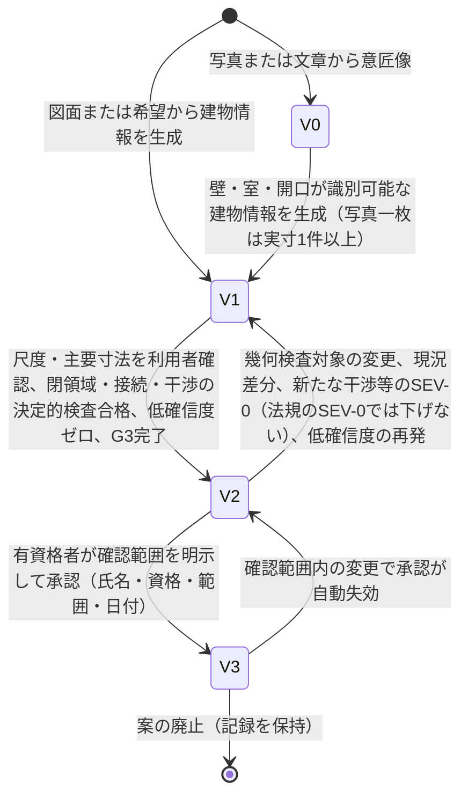
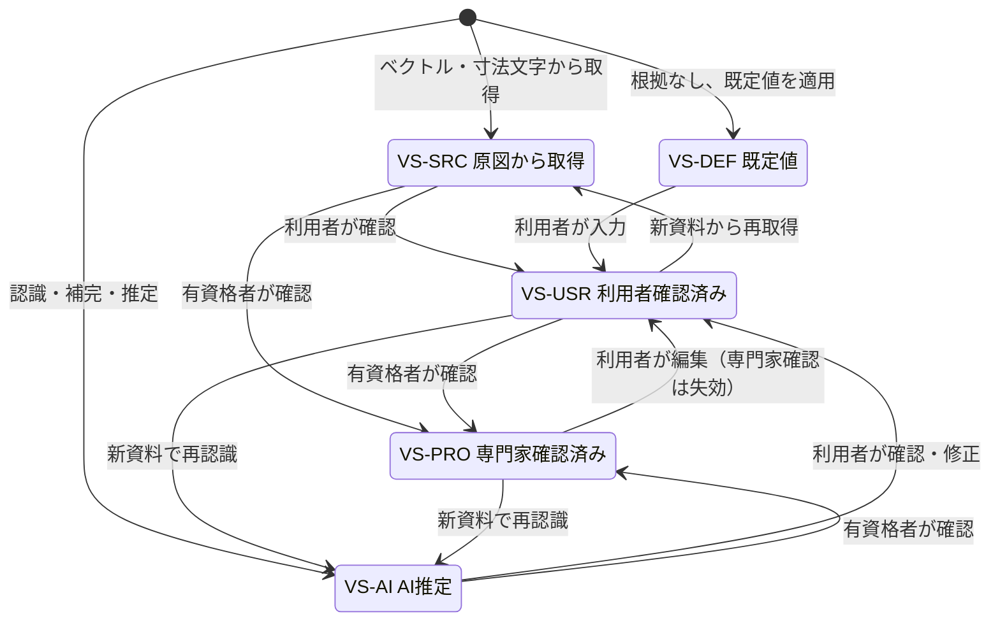
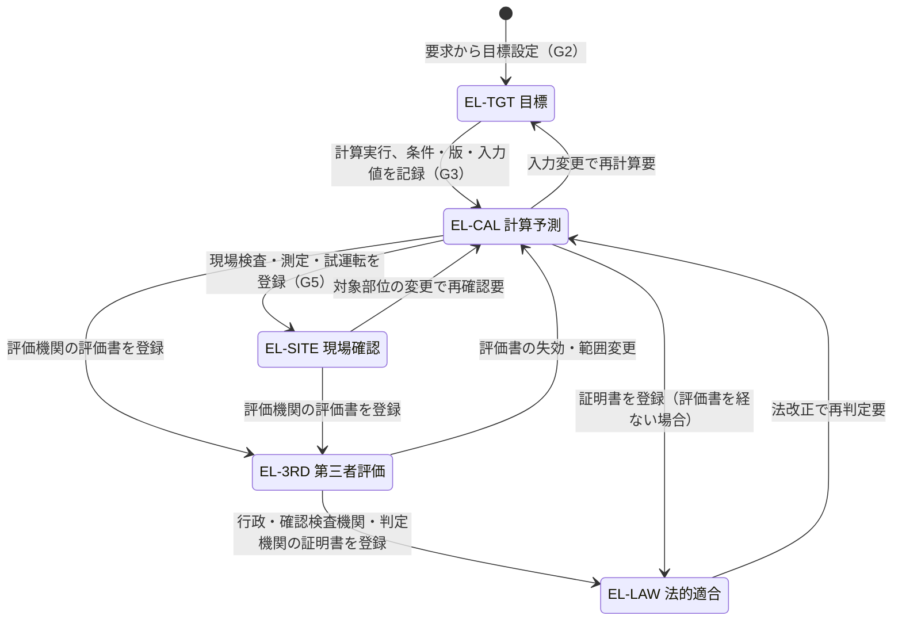
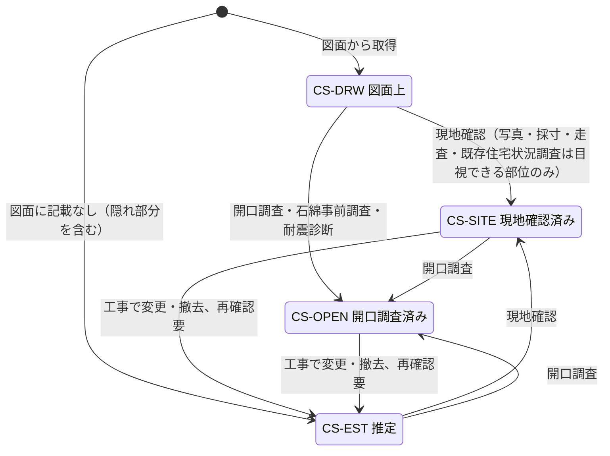
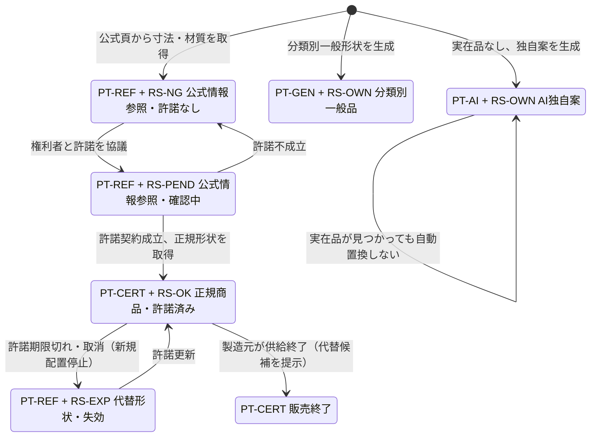
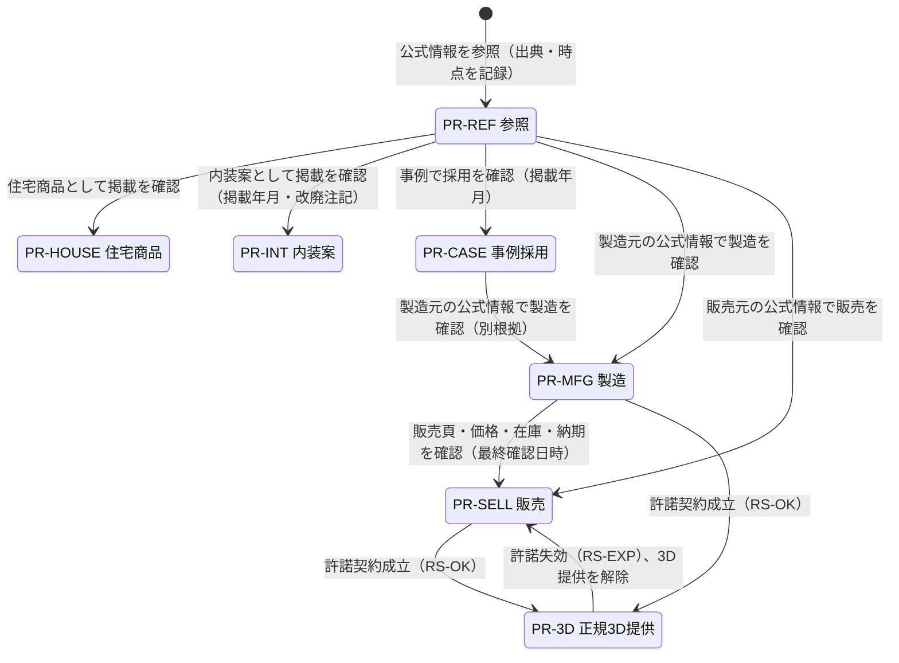
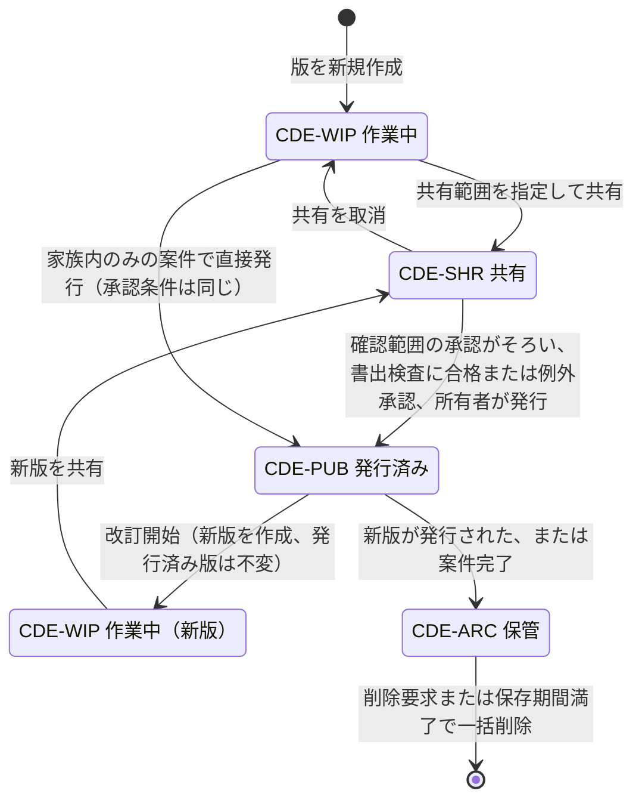

# 信頼状態と証拠段階（段階2 基盤定義 B1）

作成日: 2026-09-15　版: v1.4　担当: 基盤定義B1（v1.1 は 2026-09-15 の整合検査B5による修正。内容は `整合検査報告.md`。v1.2 は 2026-09-15 の初稿審査の再修正。内容は `05_審査/再修正記録_基盤定義.md`。v1.3 は 2026-10-07 の段階6 二回目の修正（段階7 再審査の後）で、承認の状態の遷移（JR-126）、法規の SEV-0 で信頼状態を下げない規則（JR-011）、照合済みの資格と「法的適合」の到達条件（JR-012。修正計画 第0.3節）を反映した。内容は `05_審査/再修正記録_2回目_基盤定義.md`。同日の二回目の修正の仕上げで、第4.2節 CS-DRW、CS-EST → CS-SITE に既存住宅状況調査の記録で上げてよい範囲（目視できる部位に限り、隠れ部分は上げない）を注記した〔`01_調査/08_外部確認_段階7後.md` 第6.6節の依頼。遷移と符号は変えない〕。内容は `05_審査/再修正記録_2回目_仕上げ_群R1.md`。v1.4 は段階8前の持ち越し仕上げ（2026-10-08。共通の決定 D6、既定値の識別子の併記 0 行）で、第3.1節 EL-LAW の定義、第3.2節 任意 → EL-LAW、第3.3節 遷移図の EL-LAW の証明書の発行者を「行政、確認検査機関、判定機関」にそろえた〔判定機関は第12章 v1.5 の E-ORG-002.kind。持ち越し 12〕。遷移と符号は変えない。内容は `05_審査/再修正記録_段階8前_仕上げ_群F1.md`）
根拠: 指示文 B（中心原則）、9.1（V0〜V3の許される表示と禁止する表示）、C2（現況状態）、C3（要素の属性）、C10（確認範囲ごとの承認と自動失効）、C12（性能の証拠段階）、C15（共通情報環境の状態）、4.1（商品四層）、4.3とC6（企業と品物の関係区分）、9.6（商品情報の失効）、10.6（専門家確認済みの条件）。

## 0. 総則

| 規則 | 内容 | 区分 |
|---|---|---|
| 状態は独立 | 信頼状態（案）、要素値状態（属性値）、証拠段階（性能項目）、現況状態（要素）、商品層と権利状態（商品）、関係区分（企業と商品）、共通情報環境状態（情報容器）は互いに独立した属性であり、一つを他で代用しない | 【推定】 |
| 常時表示 | 信頼状態は全画面と全書出に表示し、書出には透かしを付ける。商品には層と権利状態を、性能には証拠段階を常に添える | 【推定】 |
| 昇格は条件付き | 昇格は決定的検査の合格と人の確認の記録がそろった時だけ行う。言語模型の出力だけで昇格しない | 【推定】 |
| 降格は自動 | 後の変更や新資料で昇格条件が失われた場合、影響範囲だけを自動で降格し、理由を記録する。降格は承認の自動失効と連動する | 【推定】 |
| 禁止表示の検査 | 各状態に対する禁止表示語（第1節、第3節）を画面と書出の文言検査の対象にする | 【仮定】 |
| 符号 | 符号は `識別子規則.md` 第2.8節に従う | 【推定】 |

## 1. 信頼状態 V0〜V3（案、建物情報）

### 1.1 定義と表示

| 状態 | 定義 | 許される表示 | 禁止する表示 | 区分 |
|---|---|---|---|---|
| V0 視覚案 | 写真または文章から作った意匠像。壁、室、開口の識別と実寸、建物関係は未確認 | 着想、雰囲気、比較用。「寸法未確認」「実在商品ではない」の注記 | 正確な間取り、実在商品、施工可能、寸法値の表示 | 【推定】 |
| V1 編集案 | 壁、室、開口、家具が識別可能で編集できる建物情報。寸法を持つが、尺度と主要寸法は未確認または一部確認 | 寸法付き草案、修正可能、確信度の色表示、未確認の要素数 | 原図完全一致、法規適合、施工可能、検証済み | 【推定】 |
| V2 幾何検証案 | 尺度、主要寸法、閉領域、階接続、干渉を決定的検査で確認し、利用者が尺度と重要寸法を確認した案 | 幾何確認済み、未確認項目数、検証済み設計案（幾何の範囲で） | 構造安全、確認申請可能、法規適合、施工可能、性能評価済み | 【推定】 |
| V3 専門家確認案 | 対象地域の有資格者が明示した確認範囲を、氏名、資格、範囲、日付を付けて確認した案 | 誰が何をいつ確認したか、確認範囲の一覧、範囲外は V2 表示 | 確認範囲外の保証、確認申請図、構造安全証明、見積確定額、施工図、性能評価書としての扱い | 【推定】 |

案の表示信頼状態は、案が持つ全ての確認範囲のうち最も低い状態とする。確認範囲ごとの状態は詳細で表示する【仮定】。

### 1.2 昇格条件

| 遷移 | 条件（すべて満たす） | 区分 |
|---|---|---|
| 開始 → V0 | 写真または文章から意匠像を生成した | 【推定】 |
| 開始 → V1 / V0 → V1 | 壁、室、開口、階段、家具が識別可能な建物情報が生成され、要素が固有ID、幾何、寸法、親子関係、接続関係を持つ。写真一枚からの場合は少なくとも一つの実寸が利用者から与えられている（指示文9.3） | 【推定】 |
| V1 → V2 | (1) 尺度と重要寸法1件以上が利用者確認済み（VS-USR 以上）。(2) 外周、室、開口、階段、主要寸法が VS-USR 以上。(3) 閉領域、隣接、扉接続、上下階接続の決定的検査に合格。(4) 干渉検査で SEV-0 がない。(5) 低確信度要素がゼロ。(6) 主要寸法に VS-DEF が残らない。(7) G3 の完了条件を満たす（G3 未完了の案は V2 と表示しない）。改装案件の付帯条件: 工事範囲（撤去、補修、補強、移設）の要素が CS-DRW または CS-EST のままの案は、(1)〜(7) を満たしても V2 に「現況未確認（n 要素）」を信頼状態帯（S-30-01）で併記し、G3 の門で問題（I-06-008 現況未確認の改装要素。主担当 A10、SEV-1。P1。第6章 第8.2節）を登録する。資格ありの RL-CHK（P1 は照合済みの資格。第6章 第5.2節）の例外承認で持ち越せる（v1.2、JM-155。v1.3 で I-06-008 と照合済みの条件を併記。JR-021、JR-012） | 【推定】 |
| V2 → V3 | 有資格者（RL-CHK かつ照合済みの資格あり）が確認範囲を明示し、氏名、資格、範囲、日付を付けて承認した（AS-VALID）。確認範囲外の部分は V2 のまま。本人申告で未照合の資格による承認は P0、P1 とも V3 を与えない（第6章 第5.2節「資格の照合状態」が正本。v1.3、JR-012） | 【推定】 |

### 1.3 降格条件（後の変更で失効する条件）

| 遷移 | 条件 | 区分 |
|---|---|---|
| V3 → V2 | 確認範囲内の要素または値が変更された（承認の自動失効）。有資格者の資格や確認範囲の記録が欠けた | 【推定】 |
| V2 → V1 | 幾何検査の対象（尺度、外周、開口、室、階段、主要寸法）が変更された。新しい現況資料や図面で現況差分が生じた。干渉検査で SEV-0 が新たに検出された。低確信度要素が新たに生じた（新資料の再認識）。降格の対象はこの行の事象に限る。法規の SEV-0（I-06-006。法規判定の余裕量が負で未解決）では信頼状態を下げず、発行（CDE-PUB）と引継ぎ一式の生成を止める（当該案の現段階と再確認中の段階の Gate.blockingIssueRefs が空のときだけ発行と生成を行う。共有URL は止めない。第6章 第8.1節、修正計画 第0.3節「発行と引継ぎの前提」。v1.3、JR-011） | 【推定】 |
| V1 → V1 | V1 から V0 へは降格しない。建物情報が破棄された場合は案を廃止として記録する | 【仮定】 |
| V0 → V0 | 降格なし | 【仮定】 |

### 1.4 遷移図

## 2. 要素値の五状態 VS-（各要素の各属性値）

### 2.1 定義

| 符号 | 状態 | 定義（観察可能な条件） | 表示 | 区分 |
|---|---|---|---|---|
| VS-SRC | 原図から取得 | 入力資料のベクトル、寸法文字、属性から直接得た値。元頁、元座標、認識方法を持つ | 出典（頁、座標）へ戻れる表示 | 【推定】 |
| VS-AI | AI推定 | 認識または補完で得た値。推定理由と確信度を持つ | 確信度の色表示、推定理由 | 【推定】 |
| VS-DEF | 既定値 | 資料にも推定にも根拠がなく、製品の標準値を仮に入れた値。既定値表の識別子を持つ | 「既定値」の明示、確認依頼 | 【推定】 |
| VS-USR | 利用者確認済み | 利用者が画面で値を確認または入力した。日時と利用者を持つ | 確認者と日時 | 【推定】 |
| VS-PRO | 専門家確認済み | 有資格者が氏名、資格、確認範囲、日付を付けて確認した。資格は照合済みに限り、本人申告で未照合の資格による確認は VS-PRO と「専門家確認済み」の表示を与えない（第6章 第5.2節。v1.3、JR-012） | 確認者、資格、日時 | 【推定】 |

### 2.2 遷移

| 遷移 | 契機 | 区分 |
|---|---|---|
| 開始 → VS-SRC | ベクトル資料または寸法文字から直接取得 | 【推定】 |
| 開始 → VS-AI | 画像認識、補完、推定で取得 | 【推定】 |
| 開始 → VS-DEF | 根拠がなく既定値を適用（例: 階高、壁厚、建具高さ） | 【推定】 |
| VS-SRC、VS-AI、VS-DEF → VS-USR | 利用者が確認または入力 | 【推定】 |
| VS-SRC、VS-AI、VS-DEF、VS-USR → VS-PRO | 有資格者が確認範囲内で確認 | 【推定】 |
| VS-USR、VS-PRO → VS-USR | 利用者が値を編集（専門家確認は失効し、承認の自動失効を記録） | 【仮定】 |
| 任意 → VS-SRC または VS-AI | 新しい正本資料の取り込みで値が再取得または再認識された（確認は失効） | 【推定】 |
| VS-PRO → VS-PRO | 確認範囲外の変更は影響しない | 【仮定】 |

主要寸法（尺度、外周、開口、室、階段、階高）に VS-DEF が残る場合、V2 へ昇格できない（第1.2節）【推定】。

### 2.3 遷移図

## 3. 性能の五証拠段階 EL-（住宅性能十領域の各項目）

### 3.1 定義と表示

| 符号 | 段階 | 定義（観察可能な条件） | 許される表示 | 禁止する表示 | 区分 |
|---|---|---|---|---|---|
| EL-TGT | 目標 | 利用者または設計者が掲げた性能値。根拠は要求（R-） | 「目標」、目標値、根拠の要求 | 達成、適合、評価済み | 【推定】 |
| EL-CAL | 計算予測 | 計算条件、使用基準、版、入力値を持つ予測値。製品または専門家の計算 | 「計算予測」、条件と版、余裕量 | 評価書、法的適合、現場で確認済み | 【推定】 |
| EL-SITE | 現場確認 | 現場の検査、測定、試運転で得た値。検査記録と日付を持つ | 「現場確認」、測定値、検査者 | 第三者評価、法的適合 | 【推定】 |
| EL-3RD | 第三者評価 | 評価機関等が発行した評価。評価書の識別子、発行日、版、有効期限を持つ | 「第三者評価」、評価書の識別子 | 法的適合、評価範囲外の性能 | 【推定】 |
| EL-LAW | 法的適合 | 行政、確認検査機関、判定機関が法令への適合を認めた証明。証明書の識別子、日付、法令の版を持つ（判定機関は適合判定通知書を交付する登録建築物エネルギー消費性能判定機関。第12章 E-ORG-002.kind。v1.4） | 「法的適合」、証明書の識別子と法令の版。「法的適合」は証明書（E-REQ-008 kind=証明書）の登録と、照合済みの資格を持つ RL-CHK の scopeKind=法規 の承認の AS-VALID がそろった性能項目だけに表示し、それまでは「法的適合（確認待ち）」と表示する（修正計画 第0.3節。v1.3、JR-012） | 法改正後の自動適合、証明範囲外の適合、証明書の登録だけでの「法的適合」 | 【推定】 |

性能項目は五段階の証拠を同時に別々の記録として持つ（例: 目標と計算予測を並べて表示）。要約表示では有効な証拠のうち最も高い段階を示し、失効した証拠は「再判定要」と表示する【仮定】。

### 3.2 遷移（証拠の追加と失効）

| 遷移 | 契機 | 区分 |
|---|---|---|
| 開始 → EL-TGT | 要求から性能目標を設定（G2） | 【推定】 |
| EL-TGT → EL-CAL | 計算を実行し、条件、版、入力値を記録（G3 以降） | 【推定】 |
| EL-CAL → EL-SITE | 現場検査、測定、試運転の記録を登録（G5） | 【推定】 |
| EL-SITE または EL-CAL → EL-3RD | 評価機関の評価書を登録（G5、G6） | 【推定】 |
| 任意 → EL-LAW | 行政、確認検査機関、判定機関の証明書を登録（製品外の手続の結果）。表示は照合済みの資格を持つ RL-CHK の scopeKind=法規 の承認が AS-VALID になった後（それまでは「法的適合（確認待ち）」。第12章 第6.4節。v1.3、JR-012） | 【推定】 |
| EL-CAL → EL-TGT（再計算要） | 計算の入力（形状、層構成、機器、条件）が変更された | 【推定】 |
| EL-SITE → EL-CAL（再確認要） | 現場確認後に対象部位が変更された | 【推定】 |
| EL-3RD → 失効 | 評価書の有効期限切れ、または評価範囲の変更 | 【推定】 |
| EL-LAW → 再判定要 | 法改正または法令の版更新（指示文9.7） | 【推定】 |

### 3.3 遷移図

## 4. 現況状態 CS-（既存住宅の各要素）

### 4.1 定義

| 符号 | 状態 | 定義（観察可能な条件） | 表示 | 区分 |
|---|---|---|---|---|
| CS-DRW | 図面上 | 設計時図面または竣工図に記載があるが、現地で未確認 | 「図面上」、出典の図面と改訂日 | 【推定】 |
| CS-SITE | 現地確認済み | 現地の目視、採寸、写真、三次元走査で存在と寸法を確認。確認者と日付を持つ | 「現地確認済み」、確認方法と日付 | 【推定】 |
| CS-OPEN | 開口調査済み | 仕上や下地を開けて内部（下地、配管、配線、劣化、石綿等）を確認。調査者、資格（該当時）、日付を持つ | 「開口調査済み」、調査記録 | 【推定】 |
| CS-EST | 推定 | 図面にも現地確認にもなく、AIまたは人が推定。隠れ部分を含む | 「推定」、推定理由、必要な調査 | 【推定】 |

隠れ部分（下地、基礎、配管、配線、劣化、漏水、腐朽、蟻害、石綿等）は、CS-OPEN または該当する専門調査の記録がない限り「無い」と表示しない【推定】。

### 4.2 遷移

| 遷移 | 契機 | 区分 |
|---|---|---|
| 開始 → CS-DRW | 図面から要素を取得 | 【推定】 |
| 開始 → CS-EST | 図面に記載がない要素を推定（隠れ部分を含む） | 【推定】 |
| CS-DRW、CS-EST → CS-SITE | 現地確認の記録（写真、採寸、走査、既存住宅状況調査）を登録。既存住宅状況調査（既存住宅状況調査方法基準。平成29年国土交通省告示第82号。非破壊で劣化事象等を調べ、調べられない部位は「調査できない」とする。SRC-319、確認日 2026-10-07【事実】）の記録で上げてよいのは、目視できる調査対象部位で結果が「劣化事象等あり」または「劣化事象等なし」の要素に限る。「調査できない」部位の要素と隠れ部分（要素共通属性 concealedParts の項目）は CS-SITE にも CS-OPEN にもしない。部位ごとの結果は隠れ部分の推定の根拠として記録する（第12章、第21章 第2.3節と第2.4節の規則と同じ。v1.3 追記、`01_調査/08_外部確認_段階7後.md` 第6節） | 【推定】 |
| CS-DRW、CS-EST、CS-SITE → CS-OPEN | 開口調査、石綿事前調査、耐震診断の記録を登録 | 【推定】 |
| CS-SITE、CS-OPEN → CS-EST | 工事で対象部位が変更または撤去され、再確認が必要になった。竣工反映で再び CS-SITE へ | 【仮定】 |
| CS-DRW → CS-DRW | 新しい図面（正本の変更）で出典を更新 | 【推定】 |

### 4.3 遷移図

## 5. 商品四層 PT- と権利状態 RS-（商品）

### 5.1 商品四層の定義

| 符号 | 層 | 定義（観察可能な条件） | 3Dでの扱い | 必須表示 | 区分 |
|---|---|---|---|---|---|
| PT-CERT | 正規商品 | 製造元または正規基盤から品番、寸法、価格、供給、CAD、BIM を取得し、権利状態が RS-OK | 正規形状を配置 | 出典、許諾、最終確認日時 | 【推定】 |
| PT-REF | 公式情報参照 | 公式頁に寸法や材質はあるが、3D利用権がない（RS-NG または RS-PEND） | 外形だけの代替形状を配置し、公式頁へ接続。固有意匠は複製しない | 「公式情報参照」「形状は代替」、公式URL | 【推定】 |
| PT-GEN | 分類別一般品 | 特定品番ではない標準的な机、収納、設備等の一般形状 | 一般形状を配置 | 「実商品ではない」 | 【推定】 |
| PT-AI | AI独自案 | 実在品で条件を満たせない場合に生成した独自3D | 独自形状を配置 | 「製作可否は未確認」、生成履歴、権利条件 | 【推定】 |

### 5.2 権利状態の定義

| 符号 | 状態 | 定義（観察可能な条件） | 新規配置 | 既存案件 | 区分 |
|---|---|---|---|---|---|
| RS-OK | 許諾済み有効 | 権利者の利用許諾（対象、地域、期限、帰属表示、複製可否、許諾版）が有効期限内 | 可 | 可 | 【仮定】 |
| RS-PEND | 確認中 | 許諾の有無または条件を確認中 | 不可（代替形状のみ） | 既存配置は表示継続、警告 | 【仮定】 |
| RS-EXP | 失効 | 許諾の有効期限切れ、または権利者による取消 | 不可 | 権利条件に従う（表示継続または代替形状へ置換）。最後の確認日を表示 | 【仮定】 |
| RS-NG | 許諾なし | 公式情報はあるが3D利用の許諾がない | 不可（代替形状のみ） | 代替形状のみ | 【仮定】 |
| RS-OWN | 利用者所有または自社生成 | 利用者が権利を持つ資料（自宅の図面、所有家具の写真）、または製品が生成した一般形状と独自案 | 可（利用者の入力時に利用権を確認） | 可 | 【仮定】 |

### 5.3 遷移

| 遷移 | 契機 | 区分 |
|---|---|---|
| 開始 → PT-REF + RS-NG | 公式頁から寸法と材質を取得（3D利用権なし） | 【推定】 |
| PT-REF + RS-NG → RS-PEND | 権利者と許諾を協議中 | 【仮定】 |
| RS-PEND → RS-OK、PT-REF → PT-CERT | 許諾契約が成立し、正規形状を取得 | 【推定】 |
| RS-OK → RS-EXP、PT-CERT → PT-REF | 許諾の有効期限切れまたは取消。新規配置を止め、既存案件は権利条件に従う（指示文9.6） | 【推定】 |
| RS-EXP → RS-OK | 許諾更新 | 【仮定】 |
| 開始 → PT-GEN + RS-OWN | 分類別一般形状を生成 | 【推定】 |
| 開始 → PT-AI + RS-OWN | 実在品の候補がなく独自案を生成 | 【推定】 |
| PT-AI → 置換 | 後に実在品が見つかった場合、独自案を残したまま実在品を別項目として提示し、利用者が置換を選ぶ（自動置換しない） | 【推定】 |
| PT-CERT → 販売終了 | 製造元の供給終了。層は変えず「販売終了」の供給状態を付け、代替候補を提示 | 【推定】 |

### 5.4 遷移図

## 6. 企業と品物の関係区分 PR-（企業と商品の関係）

### 6.1 定義

| 符号 | 区分 | 定義（観察可能な条件） | 含意しないこと | 区分 |
|---|---|---|---|---|
| PR-HOUSE | 住宅商品 | 企業が住宅商品（構法、商品名、生活提案）として提供している関係。掲載頁と時点を持つ | 掲載家具の製造、3D提供 | 【推定】 |
| PR-INT | 内装案 | 企業が内装の組合せ案（床、建具、壁、天井、差し色、家具素材、照明、印象語）として提示している関係。掲載年月と改廃注記を持つ | 家具の製造、販売、現行品であること | 【推定】 |
| PR-CASE | 事例採用 | 企業の事例や内装案で紹介された品物の関係。掲載年月を持つ | 製造、販売、正規3D提供、現行販売 | 【推定】 |
| PR-MFG | 製造 | 企業がその品物を製造している関係。製造元の公式情報で確認 | 販売、3D提供 | 【推定】 |
| PR-SELL | 販売 | 企業がその品物を販売している関係。販売頁、価格、在庫、納期の最終確認日時を持つ | 製造、3D提供 | 【推定】 |
| PR-3D | 正規3D提供 | 権利者が3D形状の配置利用を許諾している関係。RS-OK を要する | 現行販売、在庫 | 【推定】 |
| PR-REF | 参照 | 上記に該当しない、公式情報を参照しただけの関係 | 一切の提携、監修 | 【推定】 |

一つの企業と品物の組は複数の関係区分を同時に持てる（例: 製造かつ販売かつ正規3D提供）。PR-CASE や PR-INT から PR-MFG や PR-3D を推定してはならず、それぞれ別の根拠で登録する（指示文C6、4.3）【推定】。

### 6.2 関係の確定の流れ（遷移図）

## 7. 共通情報環境の状態 CDE-（情報容器: 案の版、図面、書出、台帳）

### 7.1 定義

| 符号 | 状態 | 定義（観察可能な条件） | 見える範囲 | 編集 | 区分 |
|---|---|---|---|---|---|
| CDE-WIP | 作業中 | 作成者または所属組織内で編集中。承認前 | 所有者、編集者（同一組織） | 可 | 【推定】 |
| CDE-SHR | 共有 | 検討用に他の役割へ公開。承認前。注記と問題を付けられる | 共有先の確認者、閲覧者、提携事業者（共有範囲内） | 所有者と編集者のみ可。共有先は注記と問題 | 【推定】 |
| CDE-PUB | 発行済み | 確認範囲ごとの承認がそろい、版を固定。引継ぎや契約の根拠に使える。同時に発行済みの版は一つ | 責任表の全役割、受取側 | 不可。改訂は新版を CDE-WIP で作る | 【推定】 |
| CDE-ARC | 保管 | 参照用に凍結した過去版または完了案件 | 所有者、監査 | 不可 | 【推定】 |

### 7.2 遷移

| 遷移 | 契機 | 区分 |
|---|---|---|
| 開始 → CDE-WIP | 版を新規作成 | 【推定】 |
| CDE-WIP → CDE-SHR | 所有者または編集者が共有範囲（階、室、問題、非共有項目）を指定して共有 | 【推定】 |
| CDE-SHR → CDE-WIP | 共有の取消 | 【仮定】 |
| CDE-SHR → CDE-PUB | 必要な確認範囲の承認がそろい、書出検査に合格または例外承認済み。所有者が発行 | 【推定】 |
| CDE-WIP → CDE-PUB | 共有を経ずに発行する場合（家族内のみの案件）。承認条件は同じ | 【仮定】 |
| CDE-PUB → CDE-ARC | 新版が発行された（旧版を保管）、または案件が完了した | 【推定】 |
| CDE-PUB → CDE-WIP（新版） | 改訂の開始。発行済み版は変更せず、新版を作る | 【推定】 |
| CDE-ARC → 削除 | 利用者の削除要求または保存期間満了。原本、派生画像、3D、索引、予備複製を一括削除（指示文9.8） | 【推定】 |

### 7.3 遷移図

## 8. 補助状態（本章で追加定義）

後続章が必要とする最小限の状態を定める。追加は各章の用語追加提案を経る【仮定】。

| 接頭辞 | 符号 | 意味 | 遷移の要点 |
|---|---|---|---|
| IS-（問題の状態） | IS-OPEN 未対応、IS-WIP 対応中、IS-RESOLVED 解決、IS-REJECTED 却下（誤警告）、IS-EXC 例外承認 | 問題の処理状態 | IS-OPEN → IS-WIP → IS-RESOLVED（解決証拠が必要）。IS-REJECTED は確認者が理由を付けて却下（誤警告率の分子）。IS-EXC は SEV-1 以下のみ可。SEV-0 は IS-RESOLVED 以外で閉じない。ただし SEV-0 の IS-REJECTED（誤警告の却下）は資格を登録した RL-CHK（P0 は本人申告〔未照合〕を含み、却下に「資格未照合（本人申告）」を表示する。P1 は照合済みの資格に限る。第6章 第5.2節。v1.3、JR-012）だけが理由を付けて行え、解決ではなく Gate.blockingIssueRefs から除き、M-G-09 の分子に数えて監査記録に残す（v1.2、JM-033）。利用者判断による未実施（調査不要の選択等）は IS-EXC の一種として E-REQ-007（scopeKind=例外、exceptionKind=利用者判断、決定者 RL-OWN、理由必須）で表し、新しい符号は作らない（v1.2、JM-072） |
| AS-（承認の状態） | AS-PENDING 承認待ち、AS-VALID 有効、AS-VOID 失効 | 確認範囲ごとの承認の状態 | AS-PENDING → AS-VALID（承認者、範囲、日付）。差戻しは AS-PENDING のまま理由と回数を残す（新しい符号を作らない）。AS-VALID → AS-VOID（範囲内の変更で自動失効）。承認者は自分の承認を理由付きで取り消せる（AS-VALID → AS-VOID、voidReason.kind=承認者取消）。外部の状態の変化（商品更新、単価改定、法改正）による失効は検出時に行う（製品が状態の変化を検出して変更命令〔status=提案〕を生成した時点で失効させ、確定を待たない。voidReason.changeRef はその命令を指す。「規則版更新」は失効の理由に使わない。第6章 第5.3節 規則1、規則9 と同文）。AS-VOID → AS-PENDING（再承認依頼）。P1 では未照合の資格による AS-VALID を門の必要承認の判定で AS-PENDING と同じに扱う（符号は AS-VALID のまま。第6章 第5.2節）（v1.3、JR-126、JR-019、JR-012） |
| SUP-（供給状態） | SUP-AVAIL 供給中、SUP-LEAD 納期超過、SUP-DISC 販売終了、SUP-UNKNOWN 不明（公式接続停止） | 商品の供給状態 | 最終確認日時と共に持ち、SUP-UNKNOWN では在庫ありと推定しない |

## 9. どの実体がどの状態を持つか

| 実体（群） | V | VS | EL | CS | PT | RS | PR | CDE | IS | AS | SEV | RP | SUP |
|---|---|---|---|---|---|---|---|---|---|---|---|---|---|
| 案（Option、建物情報の版） | 有 | — | — | — | — | — | — | 有 | — | — | — | — | — |
| 建築要素（ELM、SPC、BLD、MAT、SYS） | —（案の V を継承） | 有（各属性値） | — | 有（既存住宅のみ） | — | —（入力資料の RS を参照） | — | — | — | — | — | — | — |
| 性能項目（十領域の各項目、Calculation、Evidence） | — | — | 有 | — | — | — | — | — | — | — | — | — | — |
| 商品（Product） | — | —（寸法値は VS を持つ） | — | — | 有 | 有 | — | — | — | — | — | — | 有 |
| 企業と商品の関係（Brand、Supplier と Product の組） | — | — | — | — | — | —（PR-3D は RS-OK を要する） | 有 | — | — | — | — | — | — |
| 入力資料（Source: 図面、写真、CAD、BIM） | — | — | — | — | — | 有（利用権） | — | 有 | — | — | — | — | — |
| 書出（Delivery） | 有（案の V を転記） | — | — | — | — | 有（含まれる商品の権利条件を継承） | — | 有 | — | — | — | — | — |
| 問題（Issue） | — | — | — | — | — | — | — | — | 有 | — | 有 | — | — |
| 承認（Approval） | — | — | — | — | — | — | — | — | — | 有 | — | — | — |
| 要求（Requirement） | — | 有（確認状態として VS-USR、VS-PRO を用いる） | — | — | — | — | — | — | — | — | — | 有 | — |
| 判断（Decision） | — | — | — | — | — | — | — | 有（判断記録の版。E-REQ-004.cdeState で表し、判断記録の台帳単位の版は E-REQ-006 Revision（kind=判断記録）が持つ。v1.2、JM-084） | — | 有（決定者の承認） | — | — | — |
| 法規判定（Calculation の一種） | — | — | 有（EL-CAL 相当、法的適合は EL-LAW） | — | — | — | — | — | — | — | — | — | — |
| 公的地理情報（Survey、Observation） | — | — | — | — | — | 有（出典の利用条件） | — | — | — | — | — | — | — |
| 竣工時建物情報（案の竣工反映版） | 有（V3） | 有 | — | 有（CS-SITE 以上） | — | — | — | 有 | — | — | — | — | — |
| 機器台帳（Asset） | — | 有 | — | — | 有 | 有 | 有 | — | — | — | — | — | 有 |

「—」はその状態を持たないことを示す。継承や参照の関係は括弧に記した【仮定】。

## 10. 表示規則

| 規則 | 内容 | 区分 |
|---|---|---|
| 信頼状態の常時表示 | 全画面の建物情報表示部と全書出（GLB、PDF、SVG、DXF、IFC）に V0〜V3 と未確認項目数を表示し、書出には透かしを付ける | 【推定】 |
| 要素値状態の表示 | 属性欄に VS- を記号と文字で表示し、色だけに依存しない。VS-DEF と VS-AI は確認依頼へ直接遷移できる | 【推定】 |
| 証拠段階の表示 | 性能比較画面（S-11）で目標、計算予測、現場確認、第三者評価、法的適合を別の列に表示し、合成した一つの「達成」表示を作らない | 【推定】 |
| 現況状態の表示 | 図面検証画面（S-05）と建築調整画面（S-10）で、設計時図面、竣工図、現況の差を重ねて表示し、CS-EST の隠れ部分を「無い」と描かない | 【推定】 |
| 商品層と権利状態の表示 | 商品検索画面（S-06）と設計作業面（S-04）で、PT- と RS- を常に表示し、PT-REF の代替形状と PT-AI の独自案を正規商品と同じ見え方にしない | 【推定】 |
| 関係区分の表示 | 住宅会社の事例で紹介された家具（PR-CASE）を、その住宅会社の製造品（PR-MFG）や正規3D提供（PR-3D）と誤認させる表示をしない | 【推定】 |
| 共通情報環境状態の表示 | 共有と書出画面（S-08）で版ごとに CDE- を表示し、発行済み版と最新の作業中版を区別する | 【推定】 |
| 禁止表示語の検査 | 「施工可能」「法規適合」「完全正確」「原図完全一致」「構造安全」「確認申請可能」「評価済み」「製作可能」（PT-AI）「網羅」（範囲定義なし）を、状態が許さない場面で使っていないか文言検査する | 【仮定】 |

## 章要約

本章は信頼状態 V0〜V3、要素値の五状態 VS-、性能の五証拠段階 EL-、現況状態 CS-、商品四層 PT- と権利状態 RS-、関係区分 PR-、共通情報環境の状態 CDE- を、定義、許される表示と禁止する表示、昇格と降格の条件、遷移図で定め、補助状態 IS-、AS-、SUP- を加え、第9節で実体ごとの状態を一覧化した。V2 は尺度と主要寸法の利用者確認、決定的検査の合格、低確信度ゼロ、G3 完了を要し、V3 は照合済みの資格を持つ有資格者の確認範囲付き承認を要する。降格は影響範囲だけを自動で行い承認の自動失効と連動し、法規の SEV-0 では信頼状態を下げず発行と引継ぎ一式の生成を止める。v1.2 で改装の付帯条件、誤警告の却下、利用者判断を、v1.3（二回目の修正）で承認の差戻しと取消と外部起因の失効の時点、照合済みの資格と「法的適合」の到達条件、法規の SEV-0 の扱いを加えた。

## 他章への依頼または前提

| 章 | 内容 | 種別（依頼/前提） |
|---|---|---|
| 02_基盤定義 情報実体骨格 | 第9節の対応表に従い、各実体に状態属性（V、VS、EL、CS、PT、RS、PR、CDE、IS、AS、SEV、RP、SUP）を持たせること | 依頼 |
| 02_基盤定義 画面・指標・試験骨格 | 第10節の表示規則を画面の部品に反映し、禁止表示語の検査を試験 T-S- または T-R- に含めること | 依頼 |
| 03_仕様書 第11章（図面読解・現況差分・3D構築） | V1→V2 の昇格条件（第1.2節）と CS- の遷移（第4節）を処理手順に組み込むこと | 前提 |
| 03_仕様書 第12章（正規建物情報の状態遷移） | 本章の遷移図を実体関係図と状態遷移に転記すること | 前提 |
| 03_仕様書 第16章（商品推薦） | PT-、RS-、PR-、SUP- の遷移を商品情報の更新と失効の仕様に組み込むこと | 依頼 |
| 03_仕様書 第19章（住宅性能） | EL- の五段階を十領域の各項目に別々の記録として持たせ、要約表示の規則（最高の有効段階、失効は再判定要）を採ること | 前提 |
| 03_仕様書 第22章（情報・権利・責任） | RS- の五区分と CDE- の遷移、承認の自動失効（AS-VOID）を機能化すること | 依頼 |
| 01_調査 | 共通情報環境の状態区分（作業中、共有、発行済み、保管）が ISO 19650 系の区分と対応するかを公式情報で確認すること | 依頼 |
| 03_仕様書 第12章 | E-REQ-004 に cdeState、E-REQ-006 に kind（建物情報、要求台帳、判断記録、責任表、関係者表）、E-REQ-007 に exceptionKind と acknowledgedWarnings、E-REQ-003 に rejectedByRef を持たせること（v1.2） | 依頼 |
| 03_仕様書 第21章（改装） | 第1.2節 V1→V2 の改装案件の付帯条件を第2.1節の規則に置き、AC-C14-001-05 と結ぶこと（v1.2） | 依頼 |
| 03_仕様書 第6章、第12章、第14章、第22章（二回目の修正。2026-10-07） | v1.3 の第1.3節（法規の SEV-0 では信頼状態を下げず発行と引継ぎ一式の生成を止める）、第8節 AS-（差戻し、承認者取消、外部起因の失効は検出時）、照合済みの資格と「法的適合」の到達条件は、修正計画 第0.3節と第6章 第5.2節、第5.3節、第8.1節を正本とする写しである。章の文が改まった場合は章を正とし、段階8 の再々確認で突合する（新しい依頼は出さない） | 前提 |
| 01_調査 08_外部確認_段階7後（2026-10-07 の依頼への対応） | 同ファイルの依頼「現況状態の遷移 CS-DRW、CS-EST → CS-SITE の根拠に挙げる既存住宅状況調査は、目視できる部位に限り、隠れ部分を CS-SITE にしない旨を注記すること（第6.5節、第6.6節）」に第4.2節で対応した（2026-10-07、二回目の修正の仕上げ 群R1）。文は第12章と第21章 第2.3節、第2.4節の規則（同日に各群が反映）と同じにした。第11章 F-C02-026 にも同じ規則が置かれる（外部確認ファイルの第11章あての依頼） | 前提（対応済み） |

## 未決事項

| 識別子 | 内容 | 区分（事実/推定/仮定/未確認） | 影響 | 確認者候補 |
|---|---|---|---|---|
| U-00-020 | 案の表示信頼状態を「全確認範囲の最低状態」とする規則が、部分的な V3 の価値を利用者に伝えられるか | 仮定 | 全画面の信頼状態表示 | 画面設計担当、建築士 |
| U-00-021 | 権利状態 RS-EXP 時の既存案件の扱い（表示継続か代替形状への置換か）を契約ごとに定める方式 | 仮定 | 商品仕様、権利仕様 | 法務、知財担当 |
| U-00-022 | 共通情報環境の状態区分と ISO 19650 の区分の対応 | 未確認 | 第22章の情報交換仕様 | 01_調査担当、情報管理者 |
| U-00-023 | EL-LAW の登録を製品内で行う権限（誰が証明書を登録し、誰が確認するか） | 仮定 | 性能仕様、責任表 | 建築士、情報管理者 |
| U-00-024 | 写真一枚からの V1 昇格に必要な「実寸1件以上」で足りるか（複数写真や走査の条件） | 仮定 | 図面読解仕様、V1 の定義 | 図面認識担当、建築士 |
| U-00-025 | 補助状態 IS-、AS-、SUP- の符号を後続章が採用するか、別体系を提案するか。解決 v1.1: 情報実体骨格 v1.0 が採用し、識別子規則 v1.1 第2.8節へ登録した | 仮定 | 問題一覧、承認、商品の仕様 | 情報実体骨格担当 |

## 用語追加提案

| 用語 | 定義 | 理由 |
|---|---|---|
| 問題の状態 | 問題の処理状態（未対応、対応中、解決、却下、例外承認）。符号 IS- | 問題一覧と誤警告率の計測に必要 |
| 承認の状態 | 確認範囲ごとの承認の状態（承認待ち、有効、失効）。符号 AS- | 自動失効を実体の状態として持つため |
| 供給状態 | 商品の供給の状態（供給中、納期超過、販売終了、不明）。符号 SUP- | 商品層と権利状態から独立した状態が必要 |
| 再判定要 | 法改正や入力変更により、既存の証拠段階が失効し再計算または再判定が必要な状態 | 証拠段階の降格を表す語が必要 |
| 竣工反映版 | 竣工時建物情報として版を進めた V3 の案 | 七段階門と共通の語（重複提案） |
| 利用者判断 | 例外承認（IS-EXC）の一種。E-REQ-007.exceptionKind=利用者判断（用語集 495） | 新しい状態符号を作らずに未実施の記録を表すため（v1.2） |

## 本章で定義した識別子一覧

| 種別（機能/情報実体/画面/指標/試験/API/非機能/受入条件） | 識別子 | 名称 |
|---|---|---|
| 信頼状態（体系） | V0、V1、V2、V3 | 視覚案、編集案、幾何検証案、専門家確認案 |
| 状態符号（体系） | VS-SRC、VS-AI、VS-DEF、VS-USR、VS-PRO | 要素値の五状態 |
| 状態符号（体系） | EL-TGT、EL-CAL、EL-SITE、EL-3RD、EL-LAW | 性能の五証拠段階 |
| 状態符号（体系） | CS-DRW、CS-SITE、CS-OPEN、CS-EST | 現況状態 |
| 状態符号（体系） | PT-CERT、PT-REF、PT-GEN、PT-AI | 商品四層 |
| 状態符号（体系） | RS-OK、RS-PEND、RS-EXP、RS-NG、RS-OWN | 権利状態 |
| 状態符号（体系） | PR-HOUSE、PR-INT、PR-CASE、PR-MFG、PR-SELL、PR-3D、PR-REF | 企業と品物の関係区分 |
| 状態符号（体系） | CDE-WIP、CDE-SHR、CDE-PUB、CDE-ARC | 共通情報環境の状態 |
| 状態符号（体系、補助） | IS-OPEN、IS-WIP、IS-RESOLVED、IS-REJECTED、IS-EXC | 問題の状態 |
| 状態符号（体系、補助） | AS-PENDING、AS-VALID、AS-VOID | 承認の状態 |
| 状態符号（体系、補助） | SUP-AVAIL、SUP-LEAD、SUP-DISC、SUP-UNKNOWN | 供給状態 |
