# 情報実体骨格（段階2 基盤定義 B3）

作成日: 2026-09-15　版: v1.5　担当: 基盤定義B3（v1.5 は段階8 の最終仕上げ（2026-10-08。再々確認 K4-22。統括の決定 D32 と、第12章 v1.6 に合わせた同期 D33、D41）〔群G4〕で、E-ORG-009.spamReported を E-EXC-009.spamReported の写し（予約の画面の表示用。M-B-04 の分子には数えない）と明記して M-B-04 の分子を E-EXC-009.spamReported に一本化し、第0.4節 renovationAction に P1 の改装案件の現況要素の既定 null（未指定）を、E-REQ-003.resolutionEvidenceRef の型を第12章 v1.6 の ref[E-REQ-004 または E-REQ-007 または E-REQ-008 または E-REQ-011] に改めた（第12章の追加属性の一括転記は従来どおり次版）。内容は `05_審査/再修正記録_最終仕上げ_群G4.md`。v1.4 は段階8前の持ち越し仕上げ（2026-10-08。共通の決定 D6、D7、D9、既定値の識別子の併記 0 行）で、第12章 v1.5 が加えた E-ORG-002.kind の値「判定機関」と E-ELM-001 の属性 bearsVerticalLoad、isCompartmentPartition を第1節の主要属性に転記した（第12章の追加属性の一括転記は従来どおり次版。本仕上げの属性だけを転記）。同日、統括の決定 D28、D29 により、第12章 v1.5 の E-ORG-009.completedAt、E-EXC-006.reservationRef と expiresAt の既定の書き分けを主要属性に、E-EXC-006 の関係に →Reservation を転記した。内容は `05_審査/再修正記録_段階8前_仕上げ_群F1.md`、属性の変更は `整合検査報告.md` 第5.1節。v1.3 は 2026-10-07 の段階6 二回目の修正（段階7 再審査の後）で、送信記録 E-EXC-009 Transmission と障害調査用複製 E-EXC-010 DebugCopy を採番し（JR-054。実体数 94）、E-EXC-008.deliveryState に「未配信（同意なし）」を加えた（JR-072）。内容は `05_審査/再修正記録_2回目_基盤定義.md`、識別子の変更は `整合検査報告.md` 第5.1節。v1.1 は 2026-09-15 の整合検査B5による修正。内容は `整合検査報告.md`。v1.2 は 2026-10-06 の段階6 初稿審査の再修正で、属性の正本の分担を第0.1節に注記した。内容は `05_審査/再修正記録_基盤定義.md`。v1.2 追補は 2026-10-06 の相互依頼で、予約記録 E-ORG-009 を採番し（U-17-005）、用語 40〜42 の成功条件の対応を第12章に合わせた。内容は `05_審査/再修正記録_相互依頼_群A.md`。2026-10-07 の相互依頼 基盤仕上げで通知 E-EXC-008 を採番した（U-15-018）。内容は `05_審査/再修正記録_相互依頼_基盤仕上げ.md`）。未決事項の識別子は重複解消のため U-00-036〜U-00-046 へ再採番した（v1.2 で範囲の誤記を訂正）
根拠: 指示文 C3（建物情報と編集。実体一覧、要素属性、変更命令、双方向追跡）、C5（商品項目）、C15（段階門、必要情報要求、共通情報環境、書出検査）、9.1〜9.3（信頼状態、情報の流れ、入力別の約束）、9.6（商品情報の更新と消失）、C9（敷地、法規、公的地理情報）、C10（共同作業、注記、承認）、C14（改装、引渡し、維持、将来変更）。補助として C1、C2、C6〜C8、C11〜C13、E、9.8、10.4。基盤定義の `用語集.md`、`識別子規則.md`（第2.2節の E- 書式と11群）、`十二判断領域.md`（第2.2節の影響伝播、第3節の主担当一意）、`七段階門.md`、`信頼状態と証拠段階.md`（第9節の実体×状態対応）。調査 `01_調査/06_研究と標準.md`（IFC 4.3.2.0、IDS 1.0、BCF 3.0、bSDD の構造）。

## 0. 総則

### 0.1 目的と読み方

| 項目 | 内容 | 区分 |
|---|---|---|
| 目的 | 正規建物情報を構成する全実体を、識別子、定義、主要属性、親子、関係、状態属性、共通属性、IFC対応、主担当領域、詳細章の12項目で固定し、第12章（実体関係図、項目辞書、状態遷移）と全章の情報入出力の正本にする | 【推定】 |
| 正本の分担（v1.2） | 実体の識別子、名称、群と採番の正本は本章とする。属性名、型、enum の正本は第12章 項目辞書（v1.2 追補を含む）とし、本章の主要属性と第0.3〜0.5節の属性は v1.1 時点の写しとして扱う。第12章と食い違う場合は第12章に従い、第12章 v1.2 で追加された属性と enum は本章の次版で転記する（v1.2 では本章の属性を変更しない。審査 JM-073） | 【推定】 |
| 実体の範囲 | 指示文C3に列挙された70実体に、指示文の他節が要求する20実体（Stakeholder、LifeScene、Gate、ChangeCommand、Impact、Overlay、Confidence、SiteRegulation、HazardInfo、PerformanceTarget、CostItem、Schedule、LeadTimeRisk、AsBuiltDelta、PostOccupancyRecord、Share、AuditLog、Connection の18と、C3 の Route と Penetration を含む系統群の再整理）を加えた計90実体を定義する。v1.2 追補（2026-10-06）で第17章の予約記録を Reservation（E-ORG-009）として加え計91実体とした（U-17-005）。2026-10-07 の相互依頼 基盤仕上げで第14章 AP-029 の通知を Notification（E-EXC-008）として加え計92実体とした（第15章 U-15-018）。v1.3（2026-10-07 の二回目の修正）で送信記録 Transmission（E-EXC-009）と障害調査用複製 DebugCopy（E-EXC-010）を加え計94実体とした（JR-054）。追加実体の根拠は各行の定義に記す | 【推定】 |
| 群分け | 章の構成は担当指示の8群（建物幾何、関係と系統、要求と判断、商品と権利、人と組織、調査と計算、情報要求と交換、施工と維持）。識別子の群3字は `識別子規則.md` 第2.2節の11群（BLD、SPC、ELM、MAT、SYS、REQ、PRD、ORG、SRV、EXC、OPS）に従い、追加実体も既存11群へ割り当てる（新しい群接頭辞は作らない）。8群と11群の対応は第0.2節 | 【仮定】 |
| 採番 | 群内で指示文C3の列挙順に 001 から採番し、追加実体は群の末尾に続番を付ける。この規則により `識別子規則.md` の例（E-BLD-004 Level、E-ELM-001 Wall、E-REQ-003 Issue、E-PRD-005 License、E-EXC-001 InformationRequirement）と一致する | 【推定】 |
| 属性名 | 英字、先頭小文字、単語の区切りは大文字（例: `thickness`、`primaryDomain`）。参照属性は末尾 `Ref`（単数）または `Refs`（複数）。参照は `E-ELM-001.thickness` の形で章をまたいで書ける | 【仮定】 |
| 型の表記 | `id`（UUID 版4）、`str`、`int`、`num(単位)`、`range(単位)`（下限と上限の組）、`bool`、`date`、`datetime`、`enum{...}`、`ref[E-...]`（参照）、`list[...]`、`map[...]`、`json`（構造化された値。項目は詳細章で定義）、`geom`（2D多角形、折れ線、または3D形状。座標系は案件の原点と mm 単位） | 【仮定】 |
| 主要属性の数 | 各実体の主要属性は10以内に絞り、残りは「詳細を書く章」で定義する。共通属性（第0.3節）と要素共通属性（第0.4節）は主要属性に数えない | 【仮定】 |
| 根拠区分 | 各行の定義文末に【事実】【推定】【仮定】【未確認】を付ける。IFC対応は IFC4 系の一般名称であり、IFC 4.3.2.0 の正式名称との照合は未決 U-00-001（`用語集.md`）に従い 01_調査へ依頼中。IFC の属性集合（Pset_）による近似は「属性集合、近似」と明記する | 【推定】 |
| 個体識別子 | 全実体の個体は `uuid`（UUID 版4）を持ち、IFC書出の対象実体は `ifcGuid`（IfcGloballyUniqueId 22文字）へ往復変換する。対応表は案件（E-BLD-001）ごとに保持する（`識別子規則.md` 第2.2節、未決 U-00-010） | 【推定】 |

### 0.2 8群と識別子群の対応

| 章の群 | 識別子群 | 実体数 | 含む実体 |
|---|---|---:|---|
| 群1 建物幾何 | BLD、SPC、ELM、MAT（Junction を除く） | 27 | Project、Site、Building、Level、Grid、Space、Zone、Wall、Slab、Roof、Ceiling、Column、Beam、Door、Window、Stair、Railing、Fixture、Equipment、Furniture、Light、Landscape、ExternalWork、Material、Finish、Assembly、Layer |
| 群2 関係と系統 | MAT（Junction）、SYS | 6 | Junction、StructuralSystem、ServiceSystem、Route、Penetration、Connection（追加） |
| 群3 要求と判断 | REQ | 12 | Requirement、Constraint、Issue、Decision、Option、Revision、Approval、Evidence、LifeScene（追加）、Gate（追加）、ChangeCommand（追加）、Impact（追加） |
| 群4 商品と権利 | PRD | 7 | Product、Brand、Supplier、Asset、License、Source、Availability |
| 群5 人と組織 | ORG | 9 | Person、Organization、Portfolio、ServiceArea、Fee、Consent、Responsibility、Stakeholder（追加）、Reservation（追加。v1.2 追補、U-17-005） |
| 群6 調査と計算 | SRV | 16 | Survey、Observation、Test、Calculation、Estimate、Quantity、Risk、Assumption、Overlay（追加）、Confidence（追加）、SiteRegulation（追加）、HazardInfo（追加）、PerformanceTarget（追加）、CostItem（追加）、Schedule（追加）、LeadTimeRisk（追加） |
| 群7 情報要求と交換 | EXC | 10 | InformationRequirement、Delivery、Classification、Dictionary、ValidationRule、Share（追加）、AuditLog（追加）、Notification（追加。2026-10-07、U-15-018）、Transmission（追加。v1.3、JR-054）、DebugCopy（追加。v1.3、JR-054） |
| 群8 施工と維持 | OPS | 7 | Commissioning、Manual、Warranty、MaintenanceTask、ReplacementCycle、AsBuiltDelta（追加）、PostOccupancyRecord（追加） |
| 合計 | 11群 | 94 | 指示文C3の70実体＋追加24実体（v1.2 追補で Reservation を、2026-10-07 の基盤仕上げで Notification を、v1.3 で Transmission と DebugCopy を追加） |

Junction は指示文C11の「層構成が出会う部位」であり、識別子規則が MAT 群に置いているため識別子は E-MAT-005 のままとし、章の群では関係の実体として群2に載せる【仮定】。

### 0.3 全実体が必ず持つ共通属性

指示文C3の「固有ID、出典、確信度、責任者、必要段階、改訂」と識別子規則の「版」を全実体の共通属性とする【推定】。第1節の「共通属性」列には、7項目すべてを持つ場合「全7」、持たない項目がある場合はその項目と理由を書く。

| 属性 | 型 | 内容 | 区分 |
|---|---|---|---|
| uuid | id | 固有ID。付与後不変、再利用しない。IFC書出対象は ifcGuid（22文字）との対応を案件ごとに保持 | 【推定】 |
| version | str | 版。`v主.副`。実体の改訂ごとに進む。最新版と承認された版（Approval が参照する版）を区別できる | 【推定】 |
| sourceRef | ref[E-PRD-006] | 出典。値の由来となる資料、頁、座標、取得日、提供元、許諾を持つ Source への参照。複数の場合は主出典を置き、残りは Overlay（E-SRV-009）で持つ | 【推定】 |
| confidence | num(0..1) | 確信度。AIが出した正しさの推定確率。画面では%と色で表示し、校正記録は Confidence（E-SRV-010）に持つ | 【推定】 |
| responsibleRef | ref[E-ORG-001 または E-ORG-002] | 責任者。作成または最終確認の責任を持つ人または組織。責任表（E-ORG-007）の該当行と整合する | 【推定】 |
| requiredStage | enum{G0,G1,G2,G3,G4,G5,G6} | 必要段階。この個体が必須成果として要る最初の段階。段階門（E-REQ-010）の必要成果検査に使う | 【推定】 |
| revisionRef | ref[E-REQ-006] | 改訂。この版を生んだ改訂（Revision）への参照。Revision から ChangeCommand へたどれる | 【推定】 |
| projectRef | ref[E-BLD-001] | 案件。案件横断台帳（Product、Brand、Supplier、Organization、Dictionary、Classification、ValidationRule 等）以外の全個体が持つ。補助属性であり共通7項目には数えない | 【仮定】 |
| createdAt、createdByRef、updatedAt | datetime、ref[E-ORG-001]、datetime | 作成と更新の記録。補助属性 | 【仮定】 |

### 0.4 建築要素（ELM 群、SPC 群）が持つ要素共通属性

指示文C3「各建築要素は固有ID、幾何、寸法、親子関係、接続関係、材質、分類、費用範囲、出典、確信度、現況状態、責任者、必要段階、改訂を持つ」に基づき、共通属性（第0.3節）に加えて次を要素共通属性とする【推定】。第1節の ELM、SPC の行では「要素共通＋固有属性」だけを書く。

| 属性 | 型 | 内容 | 区分 |
|---|---|---|---|
| geometry | geom | 幾何。2D（平面の多角形または中心線）と3D（形状）を同じ値から描画する（同期2Dと3D） | 【推定】 |
| dimensions | json | 寸法。幅、奥行、高さ、厚さ等。項目は実体ごとに詳細章で定義 | 【推定】 |
| parentRef | ref | 親子関係。空間構造上の親（Level、Space 等） | 【推定】 |
| connectionRefs | list[ref[E-SYS-005]] | 接続関係。Connection（E-SYS-005）への参照 | 【推定】 |
| materialRef / assemblyRef | ref[E-MAT-001] / ref[E-MAT-003] | 材質。単一材料または層構成 | 【推定】 |
| classificationRef | ref[E-EXC-003] | 分類。辞書で統一した分類コード | 【推定】 |
| costRange | range(JPY) | 費用範囲。数量（E-SRV-006）と単価から求めた幅。単一額を持たない | 【推定】 |
| conditionState | enum{CS-DRW,CS-SITE,CS-OPEN,CS-EST} | 現況状態。既存住宅の要素のみ。新築の新設要素は null | 【推定】 |
| valueStates | map[属性名, enum{VS-SRC,VS-AI,VS-DEF,VS-USR,VS-PRO}] | 要素値の五状態。属性値ごとに持つ。確認者と日時は Overlay または Approval に持つ | 【推定】 |
| renovationAction | enum{残す,撤去,補修,補強,移設,新設} | 改装区分。改装案件のみ。現況、解体後判明、設計、施工後の状態は Revision と AsBuiltDelta（E-OPS-006）で重ねる（指示文C14）。P1 の改装案件の現況要素の既定は null（未指定）で、G2 完了条件(10)の「未指定」は null を数える（新築案件と新設要素の既定は変えない。第12章 v1.6 の写し。v1.5、統括の決定 D33） | 【推定】 |
| lowConfidence | bool | 低確信度要素か（閾値は未決 U-00-003）。残る場合は検証済み書出を禁止する（指示文C2） | 【推定】 |

### 0.5 状態属性の凡例（第1節「持つ状態属性」列）

| 符号 | 意味 | 定義元 |
|---|---|---|
| V | 信頼状態 V0〜V3（案、建物情報の版） | `信頼状態と証拠段階.md` 第1節 |
| VS | 要素値の五状態（属性値ごと） | 同 第2節 |
| EL | 性能の五証拠段階（性能項目、計算、証拠） | 同 第3節 |
| CS | 現況状態（既存住宅の要素） | 同 第4節 |
| PT、RS、SUP | 商品四層、権利状態、供給状態 | 同 第5節、第8節 |
| PR | 企業と品物の関係区分 | 同 第6節 |
| CDE | 共通情報環境の状態（情報容器） | 同 第7節 |
| IS、SEV | 問題の状態、重大度 | 同 第8節、`識別子規則.md` 第2.8節 |
| AS | 承認の状態 | 同 第8節 |
| RP | 要求優先度 | `識別子規則.md` 第2.8節 |
| RL | 役割 | 同 |
| 独自 | 本章が実体固有に置く状態（第1節に enum で明記。符号化は用語追加提案） | 本章 |

## 1. 実体一覧

列の意味: 実体ID | 実体名（英） | 日本語名 | 定義 | 主要属性（10以内、型付き。共通属性と要素共通属性は除く） | 親実体 | 関係（対象実体と多重度。「→X 0..*」は本実体1件から見た X の数） | 持つ状態属性 | 必ず持つ共通属性 | IFC対応 | 主担当領域 | 詳細を書く章（`03_仕様書/` の章番号）

主担当領域の列で「個体ごと」と書いた実体は、個体の属性 `primaryDomain` に A01〜A12 のうち一つを必ず持ち、実体としての既定値を括弧に記す。それ以外の実体は実体定義の主担当領域（その実体の辞書と検証規則を維持する領域）を示す【仮定】。

### 1.1 群1 建物幾何（BLD、SPC、ELM、MAT）

| 実体ID | 実体名（英） | 日本語名 | 定義 | 主要属性（型付き） | 親実体 | 関係（対象実体と多重度） | 持つ状態属性 | 必ず持つ共通属性 | IFC対応 | 主担当領域 | 詳細を書く章 |
|---|---|---|---|---|---|---|---|---|---|---|---|
| E-BLD-001 | Project | 案件 | 一つの住宅計画の単位。正規建物情報、要求台帳、問題一覧、判断記録、承認、書出、同意の根であり、実行時識別子 PJ- を持つ。将来の変更、資産、保証、維持、実績へ拡張できる固有IDを初期から保持する（指示文10.4）【推定】 | projectId:str（PJ-書式）; purpose:str（目的文）; entryType:enum{希望から作る,図面を3D化,写真から改装}; useType:enum{新築,改装,家具配置,図面3D化,売却賃貸資料}; region:str（都道府県以上）; budgetRange:range(JPY)（「未定」を許す）; landStatus:enum{所有,候補あり,探索中,建替え,売却移転}; currentGateRef:ref[E-REQ-010]; ownerRef:ref[E-ORG-001]; nonScope:list[str]（非対象） | なし（根） | →Site 0..1、→Building 1..*、→Requirement 0..*、→Option 1..*、→Issue 0..*、→Decision 0..*、→Gate 7（G0〜G6）、→Stakeholder 1..*、→Consent 0..*、→Delivery 0..*、→Revision 0..*、→LifeScene 0..* | CDE（案件全体の版）、独自 status:enum{進行中,完了,保管,削除待ち} | 全7（sourceRef は入口の入力資料、confidence は目的文の理解確信度） | IfcProject | A01 | 第5章、第12章 |
| E-BLD-002 | Site | 敷地 | 建物が建つ土地。住所、地番、座標系、境界、測量、接道、高低差、供給条件を持ち、建物情報と分離せず保持する。住所は機密として個人連絡先と同様に論理分離して保存する（指示文E）【推定】 | address:str（機密、分離保存）; lotNumbers:list[str]（地番候補）; crs:str（座標系。既定は未決）; boundary:geom; boundarySourceRef:ref[E-PRD-006]（境界資料）; surveyDate:date; area:num(m2); roadAccess:json（幅員、種別、接道長）; terrain:json（標高、傾斜、高低差）; utilities:json（給排水、電気、通信、雨水放流、工事車両進入） | Project | →Building 1..*、→SiteRegulation 0..*、→HazardInfo 0..*、→Survey 0..*、→Observation 0..*、→Landscape 0..*、→ExternalWork 0..*、→Constraint 0..*（敷地制約） | VS（各値。boundary が VS-AI や VS-DEF の場合は法的境界と表示しない） | 全7 | IfcSite | A02 | 第18章、第12章 |
| E-BLD-003 | Building | 建物 | 敷地上の一棟。階の集合を持ち、構造形式仮定、階数、面積、高さ、防火区分を持つ。案（Option）ごとに版が分岐する【推定】 | name:str; structureType:enum{在来木造,大断面木造,鉄骨,RC,その他,未定}（仮定として VS を持つ）; storeys:int; basementStoreys:int; grossFloorArea:num(m2); buildingArea:num(m2); maxHeight:num(mm); fireCategory:str（防火地域等の区分参照）; footprint:geom; orientation:num(deg) | Site | →Level 1..*、→StructuralSystem 0..1、→ServiceSystem 0..*、→Zone 0..*、→Roof 1..*、→Assembly 0..*、←Option（案ごとの版）1..* | VS | 全7 | IfcBuilding | A03 | 第12章、第13章 |
| E-BLD-004 | Level | 階 | 建物の水平な区切り。階高、天井高、基準高さを持ち、室、壁、床、階段の親となる。図面入力時は元頁と対応する【推定】 | name:str; index:int（地階は負）; elevation:num(mm)（基準からの高さ）; floorToFloor:num(mm)（階高。既定値の場合 VS-DEF）; ceilingHeight:num(mm); sourcePageRef:ref[E-PRD-006]; isMezzanine:bool; area:num(m2) | Building | →Space 1..*、→Wall 0..*、→Slab 0..*、→Ceiling 0..*、→Column 0..*、→Beam 0..*、→Door 0..*、→Window 0..*、→Furniture 0..*、→Equipment 0..*、↔Stair（上下階接続）0..*、→Grid 0..1 | VS | 全7 | IfcBuildingStorey | A03 | 第12章、第11章 |
| E-BLD-005 | Grid | 通り芯 | 柱、壁の基準線の集合。基準寸法（910 mm、1,000 mm 等）と軸記号を持ち、複数図面間で同じ記号を照合する（指示文C2）【推定】 | name:str; axes:list[json{label:str,line:geom}]; module:num(mm); origin:geom; rotation:num(deg); matchedSourceRefs:list[ref[E-PRD-006]]（照合した図面）; mismatchIssueRefs:list[ref[E-REQ-003]] | Building | →Column 0..*（軸上）、→Wall 0..*（軸上）、→StructuralSystem 0..1 | VS | 全7 | IfcGrid、IfcGridAxis | A04 | 第12章、第13章 |
| E-SPC-001 | Space | 室 | 壁で閉じた平面領域（閉領域）と用途を持つ空間。隣接、扉接続、上下階接続は Connection で持ち、閉じていない場合は問題として示す【推定】 | name:str; usage:enum{居間,食堂,台所,寝室,子供室,和室,浴室,洗面,便所,玄関,廊下,階段室,収納,書斎,その他}; polygon:geom; area:num(m2); ceilingHeight:num(mm); isClosed:bool（決定的検査の結果）; boundaryWallRefs:list[ref[E-ELM-001]]; minClearWidth:num(mm)（要求照合用）; daylightOpeningRefs:list[ref[E-ELM-008]]; requirementRefs:list[ref[E-REQ-001]] | Level | →Connection 0..*、→Door 0..*（面する）、→Window 0..*、→Furniture 0..*、→Fixture 0..*、→Finish 0..*（床、壁、天井）、←Zone 0..*、→Route 0..*（動線、避難） | VS、CS | 全7 | IfcSpace | A03 | 第12章、第11章 |
| E-SPC-002 | Zone | 領域 | 複数の室や要素を目的別にまとめた群。用途群、防火区画、空調系統、換気系統、共有範囲、避難区画、将来分割の単位に使う【推定】 | name:str; kind:enum{用途,防火区画,空調,換気,共有範囲,避難区画,将来分割,二世帯}; spaceRefs:list[ref[E-SPC-001]]; elementRefs:list[ref]; rule:json（区画条件、共有範囲の非共有項目）; lifeSceneRef:ref[E-REQ-009]（将来場面と結ぶ場合） | Building | →Space 1..*、→ServiceSystem 0..1、→Share 0..*（共有範囲として） | VS | 全7 | IfcZone | A03 | 第12章、第22章 |
| E-ELM-001 | Wall | 壁 | 空間を区切る垂直要素。外壁、内壁、塀を区分し、中心線、厚さ、高さ、耐力の別、開口を持つ。耐力壁の別は構造資料がなければ確定せず null と注意を持つ（指示文C11）【推定】 | 要素共通＋ kind:enum{外壁,内壁,間仕切,塀,基礎立上り}; centerline:geom; thickness:num(mm); height:num(mm); isLoadBearing:bool（null 可）; bearsVerticalLoad:bool（null 可。鉛直荷重の負担。isLoadBearing〔耐力壁〕とは別の概念で、外壁以外の壁が主要構造部に当たるかの判定に使う。第12章 v1.5 の属性を v1.4 で転記）; isCompartmentPartition:bool（null 可。防火上または避難上の区画をする間仕切壁。同じ判定に使う。第12章 v1.5 の属性を v1.4 で転記）; gridAxisRef:ref[E-BLD-005]; openingRefs:list[ref[E-ELM-007 または E-ELM-008]]; fireRating:str; airtightLine:bool（気密線上か） | Level | →Door 0..*、→Window 0..*、→Junction 0..*、→Penetration 0..*、→Assembly 0..1、→Finish 0..2（両面）、→Connection 0..*、→StructuralSystem 0..1（耐力要素として） | VS、CS | 全7 | IfcWall | A03（耐力の判断は A04 が影響先） | 第12章、第11章、第13章 |
| E-ELM-002 | Slab | 床・基礎 | 水平な構造面。床、基礎、土間、バルコニーを区分し、厚さ、床段差、層構成を持つ【推定】 | 要素共通＋ kind:enum{床,基礎,土間,バルコニー,屋上}; outline:geom; thickness:num(mm); levelDelta:num(mm)（床段差。利用円滑性の照合）; foundationType:enum{布基礎,べた基礎,杭,未定}（基礎の場合。地盤資料なしは VS-DEF）; insulationPosition:enum{床断熱,基礎断熱,なし,未定} | Level | →Assembly 0..1、→Finish 0..1、→Junction 0..*、→Penetration 0..*、→StructuralSystem 0..1 | VS、CS | 全7 | IfcSlab（基礎は IfcFooting） | A03（基礎形式は A04） | 第12章、第13章 |
| E-ELM-003 | Roof | 屋根 | 建物最上部の外皮要素。形状、勾配、軒の出、排水、層構成を持つ。形状は空間の判断、層構成は外皮の判断【推定】 | 要素共通＋ shape:enum{切妻,寄棟,片流れ,陸屋根,入母屋,その他}; pitch:num(deg); eavesDepth:num(mm); outline:geom; ridgeHeight:num(mm); drainage:json（樋、放流先）; solarReady:bool（太陽光の載荷仮定） | Building | →Assembly 0..1、→Junction 0..*（屋根と壁）、→Penetration 0..*、→StructuralSystem 0..1（重い設備、屋根形状の影響） | VS、CS | 全7 | IfcRoof | A03（層構成は A05） | 第12章、第13章 |
| E-ELM-004 | Ceiling | 天井 | 室の上面を構成する要素。高さ、形状、天井内の経路空間（懐）を持つ。設備経路帯と梁下の干渉検査に使う【推定】 | 要素共通＋ kind:enum{平,勾配,下がり天井,吹抜け}; height:num(mm); outline:geom; plenumDepth:num(mm)（天井懐）; accessPanelRefs:list[ref[E-ELM-011]]（点検口） | Level | →Space 1、→Finish 0..1、→Route 0..*（天井内経路）、→Beam 0..*（梁下との関係） | VS、CS | 全7 | IfcCovering（PredefinedType=CEILING） | A03 | 第12章、第13章 |
| E-ELM-005 | Column | 柱 | 鉛直荷重を伝える線状要素。断面、高さ、通り芯上の位置、構造上の役割を持つ。意匠図だけから創作しない（指示文C2）【推定】 | 要素共通＋ section:json（幅、せい、形状）; height:num(mm); gridPositionRef:ref[E-BLD-005]; isStructural:bool（null 可）; isIndependent:bool（独立柱）; loadFromRefs:list[ref[E-ELM-006]] | Level | →StructuralSystem 0..1、→Beam 0..*（支持）、→Junction 0..* | VS、CS | 全7 | IfcColumn | A04 | 第12章、第13章 |
| E-ELM-006 | Beam | 梁 | 水平荷重経路を構成する線状要素。跨度、断面、梁下高さ、支持要素を持ち、標準跨度超過、吹抜け、片持ちを問題として示す【推定】 | 要素共通＋ span:num(mm); section:json（幅、せい）; bottomHeight:num(mm)（梁下）; supportRefs:list[ref[E-ELM-005 または E-ELM-001]]; isCantilever:bool; isStructural:bool（null 可）; standardSpanLimit:num(mm)（構法の標準跨度。既定値表参照） | Level | →StructuralSystem 0..1、→Route 0..*（干渉検査）、→Penetration 0..*（梁貫通）、→Junction 0..* | VS、CS | 全7 | IfcBeam | A04 | 第12章、第13章 |
| E-ELM-007 | Door | 扉 | 壁の開口に設ける建具のうち通行用のもの。種別、幅、高さ、開閉方向、開閉域、接続する二室を持ち、扉接続（Connection）の経由要素になる【推定】 | 要素共通＋ kind:enum{開き,引き,引違い,折れ,親子,両開き,玄関,勝手口,シャッター}; width:num(mm); height:num(mm); swing:enum{内開き,外開き,左,右,引込}; swingArea:geom（開閉域）; hostWallRef:ref[E-ELM-001]; connectsSpaceRefs:list[ref[E-SPC-001]]（2件）; isEvacuationRoute:bool; fireRating:str; productRef:ref[E-PRD-001] | Wall | →Connection 1（扉接続）、→Product 0..1、→Furniture 0..*（開閉域の干渉）、→Route 0..*（動線、避難） | VS、CS | 全7 | IfcDoor | A03（品番は A08） | 第12章、第11章 |
| E-ELM-008 | Window | 窓 | 採光、通風、眺望のための開口建具。寸法、腰高、開閉方式、ガラス仕様、性能区分、方位を持つ。位置と大きさは空間、層と性能仕様は外皮、品番は商品の判断【推定】 | 要素共通＋ width:num(mm); height:num(mm); sillHeight:num(mm); operation:enum{引違い,縦すべり,横すべり,FIX,上げ下げ,その他}; glazing:json（層数、Low-E、ガス）; performanceClass:str（断熱、遮音、防火の区分）; hostWallRef:ref[E-ELM-001]; orientation:num(deg); productRef:ref[E-PRD-001]; daylightRole:enum{主採光,補助,換気のみ} | Wall | →Junction 1（窓周囲）、→Product 0..1、→PerformanceTarget 0..*（採光、温熱）、→Observation 0..*（隣家の窓との関係） | VS、CS | 全7 | IfcWindow | A03（層構成と性能仕様は A05、品番は A08） | 第12章、第13章、第19章 |
| E-ELM-009 | Stair | 階段 | 階を結ぶ通行要素。形式、幅、蹴上、踏面、段数、階段開口、手摺を持ち、上下階接続（Connection）の経由要素になる。搬入経路の検査対象【推定】 | 要素共通＋ kind:enum{直階段,折返し,回り,螺旋,その他}; width:num(mm); riser:num(mm); tread:num(mm); stepCount:int; fromLevelRef:ref[E-BLD-004]; toLevelRef:ref[E-BLD-004]; opening:geom（階段開口）; headroom:num(mm); railingRefs:list[ref[E-ELM-010]] | Level（下階） | →Connection 1（上下階接続）、→Railing 0..*、→Route 0..*（搬入、避難）、→StructuralSystem 0..1（階段開口の影響） | VS、CS | 全7 | IfcStair、IfcStairFlight | A03 | 第12章、第11章 |
| E-ELM-010 | Railing | 手摺 | 階段、バルコニー、廊下等の安全用要素。高さ、長さ、取付先、格子間隔、商品を持つ。高齢者等への配慮の照合対象【推定】 | 要素共通＋ height:num(mm); length:num(mm); hostRef:ref[E-ELM-009 または E-ELM-002 または E-ELM-001]; balusterGap:num(mm); side:enum{左,右,両側}; productRef:ref[E-PRD-001] | Stair または Slab または Wall | →Product 0..1、→PerformanceTarget 0..*（高齢者等への配慮） | VS、CS | 全7 | IfcRailing | A03（品番は A08、安全目標は A07） | 第12章、第19章 |
| E-ELM-011 | Fixture | 器具・造付 | 衛生器具（便器、洗面、浴槽、流し）と造付収納、点検口等の固定された設備品。設置位置、必要余白、給排水接続、商品を持つ【推定】 | 要素共通＋ kind:enum{便器,洗面,浴槽,流し,造付収納,造作台所,点検口,その他}; footprint:geom; mountHeight:num(mm); clearance:json（前方、側方の必要余白）; supplyRouteRefs:list[ref[E-SYS-003]]（給水、排水）; spaceRef:ref[E-SPC-001]; productRef:ref[E-PRD-001]; assetRef:ref[E-PRD-004] | Space | →Route 0..*、→Product 0..1、→Asset 0..1、→ServiceSystem 0..* | VS、CS | 全7 | IfcSanitaryTerminal、IfcFurnishingElement（造付）近似 | A06（造付収納は A08） | 第12章、第16章 |
| E-ELM-012 | Equipment | 設備機器 | 給湯、空調、換気、電気、通信、防災、太陽光、蓄電、EV充電等の機器。置場、維持空間、交換搬出経路、重量、騒音、発熱、系統、商品、機器台帳を持つ（指示文C12）【推定】 | 要素共通＋ kind:enum{給湯機,空調室内機,空調室外機,換気機,分電盤,通信機器,警報器,太陽光,蓄電池,EV充電,給水ポンプ,その他}; footprint:geom; serviceSpace:geom（維持空間）; replacementRouteRef:ref[E-SYS-003]; weight:num(kg); noiseLevel:num(dB); heatOutput:num(W); systemRef:ref[E-SYS-002]; productRef:ref[E-PRD-001]; assetRef:ref[E-PRD-004] | Level または Space | →ServiceSystem 1、→Route 0..*、→Product 0..1、→Asset 0..1、→Beam 0..*（重い設備の荷重）、→Observation 0..*（隣地境界との距離） | VS、CS | 全7 | IfcDistributionElement（IfcEnergyConversionDevice、IfcFlowTerminal 等）近似 | A06 | 第12章、第13章、第21章 |
| E-ELM-013 | Furniture | 家具 | 可動または半固定の家具。寸法、必要余白、当たり判定形状、配置、所有の別、商品を持つ。利用者所有家具は写真だけで実寸を断定せず寸法入力または基準物による確認を要する（指示文C5）【推定】 | 要素共通＋ kind:enum{机,椅子,収納,寝台,食卓,ソファ,棚,その他}; placement:geom（位置と向き）; clearance:json（椅子を引く余白、通路、扉開閉）; collisionShape:geom; isOwned:bool（利用者所有）; ownedDimensionSource:enum{寸法入力,基準物確認,未確認}; productRef:ref[E-PRD-001]; deliveryRouteRef:ref[E-SYS-003]（搬入経路）; spaceRef:ref[E-SPC-001] | Space | →Product 0..1（tier と rightsState は Product 側）、→Route 0..1（搬入）、→Door 0..*（開閉域の干渉）、→Window 0..*、→Equipment 0..*（電源、給排水、発熱） | VS（isOwned の寸法は VS-USR まで）、CS | 全7 | IfcFurniture | A08（余白の空間側確保は A03） | 第12章、第16章 |
| E-ELM-014 | Light | 照明器具 | 照明の器具要素。光束、色温度、取付方式、回路、商品を持つ。照明系統（ServiceSystem kind=照明）に属する【推定】 | 要素共通＋ kind:enum{天井直付,埋込,ペンダント,ブラケット,スタンド,屋外,その他}; lumen:num(lm); colorTemperature:num(K); mountType:str; circuitRef:ref[E-SYS-002]; controlType:enum{壁スイッチ,調光,センサ,その他}; productRef:ref[E-PRD-001] | Space または Level | →ServiceSystem 1、→Product 0..1、→PerformanceTarget 0..*（光と視環境） | VS、CS | 全7 | IfcLightFixture | A06（意匠と品番は A08） | 第12章、第16章、第19章 |
| E-ELM-015 | Landscape | 庭・植栽 | 敷地内の庭、植栽、樹木、芝、地形の要素。庭との連続、日影、眺望、維持の検討対象【推定】 | 要素共通＋ kind:enum{庭,植栽,樹木,芝,菜園,地形,水景}; outline:geom; height:num(mm); species:str; maintenanceNote:str; shadeEffect:json（日影への影響）; isExisting:bool | Site | →Space 0..*（連続する室）、→MaintenanceTask 0..*、→Observation 0..*（既存樹木） | VS、CS | 全7 | IfcGeographicElement | A03 | 第12章、第18章 |
| E-ELM-016 | ExternalWork | 外構 | 駐車、アプローチ、門、塀、擁壁、舗装、雨水設備等の敷地内工作物。擁壁は傾斜地の主要危険として確認要否を持つ【推定】 | 要素共通＋ kind:enum{駐車,アプローチ,門,塀,擁壁,舗装,雨水設備,物置,その他}; outline:geom; height:num(mm); vehicleCount:int（駐車の場合）; retainingWall:json（高さ、既存か新設か、確認要否、資料の有無）; drainageRef:ref[E-SYS-002]（雨水放流）; isExisting:bool | Site | →Route 0..*（車両進入、搬入）、→Survey 0..*（擁壁、境界）、→Risk 0..*、→Constraint 0..*（駐車台数等の要求照合） | VS、CS | 全7 | IfcCivilElement、IfcPavement（IFC 4.3）近似 | A03（擁壁の安全は A04、費用は A09） | 第12章、第18章 |
| E-MAT-001 | Material | 材料 | 建材、構造材、断熱材、仕上材、家具素材の材料定義。樹種、色、質感、熱伝導率、防火区分、環境情報、耐久を持つ。案件横断で辞書化し、案件内では参照する【推定】 | name:str; category:enum{木材,金属,石,タイル,樹脂,断熱材,防水材,ガラス,塗料,布,その他}; species:str（樹種。ASH、OAK 等は公式表記）; color:str; texture:str; thermalConductivity:num(W/mK); fireClass:str; emissions:json（VOC、材料由来排出）; durabilityYears:num(年); density:num(kg/m3) | なし（案件横断台帳。案件内で参照） | ←Layer 0..*、←Finish 0..*、←Product 0..*（素材）、→Source 1..*（出典）、→Classification 0..1 | VS（各値） | 全7（requiredStage は参照時に案件側で持つ） | IfcMaterial | A08（断熱材、防水材の選定は A05） | 第12章、第16章 |
| E-MAT-002 | Finish | 仕上 | 床、壁、天井、外壁、屋根の仕上面。材料、厚さ、色、清掃方法、交換周期、対応室を持ち、仕上表の元になる【推定】 | target:enum{床,壁,天井,外壁,屋根,建具,造作}; materialRef:ref[E-MAT-001]; thickness:num(mm); color:str; cleaningMethod:str; replacementCycleRef:ref[E-OPS-005]; spaceRefs:list[ref[E-SPC-001]]; elementRefs:list[ref]; productRef:ref[E-PRD-001]; interiorStyleRef:str（内装案の参照。掲載年月付き） | Space または要素 | →Material 1、→Product 0..1、→ReplacementCycle 0..1、→PerformanceTarget 0..*（空気環境、防火） | VS、CS | 全7 | IfcCovering（FLOORING、CLADDING 等） | A08（防火や空気環境の目標は A07） | 第12章、第16章 |
| E-MAT-003 | Assembly | 層構成 | 壁、屋根、床、基礎、窓を単一面でなく層の集合として持つ定義。各層の役割（構造、防水、雨仕舞、気密、断熱、防湿、耐火、仕上、通気）と総厚、熱貫流率の計算予測を持つ（指示文C11）【推定】 | name:str; target:enum{外壁,内壁,屋根,床,基礎,窓,天井}; layerRefs:list[ref[E-MAT-004]]（外から内への順序）; totalThickness:num(mm); uValue:num(W/m2K)（EL-CAL の Calculation を参照）; airtightLayerIndex:int; vaporBarrierIndex:int; fireRating:str; ventilationLayer:bool; sourceStandard:str（仕様の出典） | Building（案の版に属す） | →Layer 1..*、←Wall 0..*、←Roof 0..*、←Slab 0..*、←Window 0..*、→Junction 0..*、→Calculation 0..*（温熱） | VS | 全7 | IfcMaterialLayerSet | A05 | 第12章、第13章 |
| E-MAT-004 | Layer | 層 | 層構成の一層。順序、材料、厚さ、役割、連続性を持つ。接合部で層の連続が途切れる箇所を検査する【推定】 | order:int; materialRef:ref[E-MAT-001]; thickness:num(mm); roles:list[enum{構造,防水,雨仕舞,気密,断熱,防湿,耐火,仕上,通気}]; isContinuous:bool（接合部での連続）; note:str | Assembly | →Material 1、←Junction 0..*（連続性検査の対象） | VS | 全7 | IfcMaterialLayer | A05 | 第12章、第13章 |

### 1.2 群2 関係と系統（MAT の Junction、SYS）

| 実体ID | 実体名（英） | 日本語名 | 定義 | 主要属性（型付き） | 親実体 | 関係（対象実体と多重度） | 持つ状態属性 | 必ず持つ共通属性 | IFC対応 | 主担当領域 | 詳細を書く章 |
|---|---|---|---|---|---|---|---|---|---|---|---|
| E-MAT-005 | Junction | 接合部 | 屋根と壁、壁と基礎、窓周囲、出隅、貫通部等、層構成が出会う部位。防水、気密、断熱の連続性と、熱橋、結露、雨水侵入、排水、保守交換の危険を検査する（指示文C11）【推定】 | kind:enum{屋根壁,壁基礎,窓周囲,出隅,入隅,貫通部,床壁,バルコニー,その他}; elementRefs:list[ref]（2件以上）; assemblyRefs:list[ref[E-MAT-003]]; continuity:json（防水、気密、断熱、防湿の各層の連続の有無）; risks:list[enum{熱橋,結露,雨水侵入,排水不良,通気出口なし,保守交換困難}]; detailSourceRef:ref[E-PRD-006]（納まり図）; position:geom; checkResult:enum{合格,指摘あり,未検査} | Building（案の版） | →Wall/Roof/Slab/Window 2..*、→Assembly 1..*、→Penetration 0..*、→Issue 0..*（指摘）、→Calculation 0..*（熱橋、結露） | VS、独自 checkResult | 全7 | なし（IfcRelConnectsPathElements で近似） | A05 | 第13章、第12章 |
| E-SYS-001 | StructuralSystem | 構造系統 | 荷重を屋根から基礎、地盤へ伝える骨組の系統。構造形式、通り芯、耐力要素、荷重の流れ、基礎仮定、地盤仮定、構造注意、必要資料を持つ。部材寸法や安全性は確定しない（指示文C11）【推定】 | structureType:enum{在来木造,大断面木造,鉄骨,RC,その他,未定}; gridRef:ref[E-BLD-005]; loadPath:json（屋根→梁→柱→壁→基礎→地盤の経路）; bearingElementRefs:list[ref]（耐力要素）; foundationAssumptionRef:ref[E-SRV-008]; groundAssumptionRef:ref[E-SRV-008]; structuralNoteRefs:list[ref[E-REQ-003]]（跨度、大開口、吹抜け、片持ち、ずれ、屋根、重い設備、階段開口）; requiredDocuments:list[str]; calculationRefs:list[ref[E-SRV-004]]（人の計算書の登録）; seismicDiagnosisRef:ref[E-SRV-001] | Building | →Grid 0..1、→Wall/Column/Beam/Slab 1..*、→Assumption 0..*、→Issue 0..*、→Approval 0..*（確認範囲=構造）、→Survey 0..1（耐震診断） | VS | 全7 | IfcSystem（IFC 4.3 では IfcBuildingSystem）、IfcStructuralAnalysisModel 近似 | A04 | 第13章、第12章 |
| E-SYS-002 | ServiceSystem | 設備系統 | 給水、給湯、排水、換気、冷暖房、電気、照明、通信、防災、防犯、太陽光、蓄電、EV充電の各系統。機器、経路、引込点、容量と負荷の初期推定を持つ【推定】 | kind:enum{給水,給湯,排水,雨水,換気,冷暖房,電気,照明,通信,防災,防犯,太陽光,蓄電,EV充電}; equipmentRefs:list[ref[E-ELM-012]]; routeRefs:list[ref[E-SYS-003]]; supplyPoint:geom（引込、放流点）; supplyConditionRef:ref[E-SRV-001]（供給事業者確認）; capacityEstimate:json（初期推定。VS-AI）; loadEstimate:json; zoneRef:ref[E-SPC-002]; existingCapacityNote:str（改装時の既存余力） | Building | →Equipment 0..*、→Route 0..*、→Fixture 0..*、→Light 0..*、→Penetration 0..*、→Survey 0..1、→Calculation 0..*、→Approval 0..*（確認範囲=設備） | VS、CS（既存設備） | 全7 | IfcDistributionSystem | A06 | 第13章、第12章 |
| E-SYS-003 | Route | 経路 | 配管、配線、ダクトの経路帯、排水勾配、交換搬出経路、搬入経路、動線、避難経路を表す線状の空間。梁、開口、家具、天井高との干渉を検査する【推定】 | kind:enum{配管,配線,ダクト,排水,交換搬出,搬入,動線,避難,点検}; path:geom（3D折れ線）; zone:geom（必要断面の帯）; slope:num(%)（排水の場合）; minClearance:json（幅、高さ）; systemRef:ref[E-SYS-002]; penetrationRefs:list[ref[E-SYS-004]]; clashIssueRefs:list[ref[E-REQ-003]]; endpoints:json（起点と終点の参照）; lifeSceneRef:ref[E-REQ-009]（動線、避難の場合） | ServiceSystem または Building | →Penetration 0..*、→Beam/Wall/Door/Furniture 0..*（干渉対象）、→Issue 0..*、→LifeScene 0..1、→Equipment 0..1（交換搬出の対象） | VS | 全7 | なし（IfcFlowSegment の集合と IfcDistributionPort で近似） | 個体ごと（既定 A06。動線は A03、避難は A07） | 第13章、第12章、第19章 |
| E-SYS-004 | Penetration | 貫通 | 配管等が壁、床、屋根、外皮を通る箇所。位置、大きさ、防火、防水、気密の処理状態と接合部を持つ。経路の決定は設備、処理は外皮の判断【推定】 | hostElementRef:ref[E-ELM-001 または E-ELM-002 または E-ELM-003 または E-ELM-006]; routeRef:ref[E-SYS-003]; position:geom; size:json（幅、高さまたは径）; fireStop:enum{要,処理済み,不要,未定}; waterproof:enum{要,処理済み,不要,未定}; airtight:enum{要,処理済み,不要,未定}; junctionRef:ref[E-MAT-005]; isStructuralConcern:bool（梁貫通等） | 貫通される要素 | →Route 1、→Junction 0..1、→Issue 0..*、→StructuralSystem 0..1（梁貫通の場合） | VS | 全7 | IfcOpeningElement（IfcRelVoidsElement） | A06（処理は A05、梁貫通は A04 が影響先） | 第13章、第12章 |
| E-SYS-005 | Connection | 接続関係 | 建物関係図を構成する関係。室の隣接、扉による接続、上下階接続、外部との接続、要素同士の接合を持ち、決定的検査で検証する。V2 昇格の検査対象（指示文C2の手順5）【推定】 | kind:enum{隣接,扉接続,上下階接続,外部接続,要素接合}; fromRef:ref; toRef:ref; viaRef:ref[E-ELM-007 または E-ELM-009]（扉、階段）; isVerified:bool（決定的検査の合格）; checkResult:json（不整合の内容）; verifiedAt:datetime; sourceRefs:list[ref[E-PRD-006]] | Building（案の版） | →Space 0..2、→Door 0..1、→Stair 0..1、→Wall 0..2、→Issue 0..*（閉領域や接続の不整合） | VS、独自 isVerified | 全7 | IfcRelSpaceBoundary、IfcRelConnectsElements | A03 | 第11章、第12章 |

### 1.3 群3 要求と判断（REQ）

| 実体ID | 実体名（英） | 日本語名 | 定義 | 主要属性（型付き） | 親実体 | 関係（対象実体と多重度） | 持つ状態属性 | 必ず持つ共通属性 | IFC対応 | 主担当領域 | 詳細を書く章 |
|---|---|---|---|---|---|---|---|---|---|---|---|
| E-REQ-001 | Requirement | 要求 | 利用者または関係者の希望、条件、禁止事項を構造化した項目。優先度、数値範囲、出典、決定者、確認者、期限、確認状態を持ち、案、要素、計算、商品、問題、判断、承認、書出へ双方向に追跡できる（指示文C1、C3）。実行時識別子 R-【推定】 | text:str; priority:enum{RP-MUST,RP-WANT,RP-NICE,RP-FORBID}; valueRange:range（単位付き。例: 廊下幅 900 mm 以上）; primaryDomain:enum{A01..A12}; affectedDomains:list[enum]; stakeholderRef:ref[E-ORG-008]（誰の要求か）; deciderRef:ref[E-ORG-008]; verifierRef:ref[E-ORG-001]; deadline:date; confirmState:enum{VS-USR,VS-PRO,未確認} | Project | →LifeScene 0..*、→Constraint 0..*、→Option 0..*（適合判定）、→要素 0..*（実現する要素）、→PerformanceTarget 0..*、→Product 0..*（絶対条件）、→Issue 0..*（不適合）、→Decision 0..*、↔Requirement 0..*（要求衝突。解決候補と代償を Decision に持つ） | RP、VS（確認状態） | 全7 | IfcConstraint（IfcObjective）近似 | 個体ごと（既定 A01） | 第5章、第10章、第12章 |
| E-REQ-002 | Constraint | 制約 | 設計の自由度を制限する条件。変更できない条件（予算上限、居住開始時期）、敷地制約、法規制約、寸法拘束（平行、直角、同一直線、壁厚、開口位置、階高）を kind で区分し、拘束解決の入力にする【推定】 | kind:enum{変更できない条件,敷地制約,法規制約,寸法拘束,幾何拘束,商品絶対条件}; expression:json（拘束式。対象、演算、値、公差）; targetRefs:list[ref]; value:num または str; tolerance:num(mm); originRef:ref[E-REQ-001 または E-SRV-011 または E-SRV-001]; isHard:bool; solverStatus:enum{充足,矛盾,未解決}; marginRef:ref[E-SRV-004]（余裕量の計算） | Project | →Requirement 0..1、→SiteRegulation 0..1、→要素 0..*、→Calculation 0..*（拘束解決、法規判定）、→Issue 0..*（矛盾） | VS、独自 solverStatus | 全7 | IfcConstraint（IfcMetric） | 個体ごと（既定 A01。敷地制約は A02、寸法拘束は A03） | 第11章、第12章、第18章 |
| E-REQ-003 | Issue | 問題 | 建物情報、要求、法規、施工等に関する未解決の指摘。3D要素、2D位置、図面頁のいずれかに固定し、主担当領域（一つ）、影響先、重大度、状態、担当、期限、解決証拠、発見した段階を持つ。同じ事象を複数領域に複製せず、変更元の変更命令と派生元の問題を参照する（指示文C10、十二判断領域第3節）。実行時識別子 I-。BCF Topic へ交換する【推定】 | title:str; primaryDomain:enum{A01..A12}（必須、一つ）; affectedDomains:list[enum]; severity:enum{SEV-0,SEV-1,SEV-2,SEV-3}（SEV-0 は進行禁止）; status:enum{IS-OPEN,IS-WIP,IS-RESOLVED,IS-REJECTED,IS-EXC}; assigneeRef:ref[E-ORG-001 または E-ORG-002]; deadline:date; anchor:json{kind:enum{3D要素,2D位置,図面頁},ref:ref,position:geom,viewpoint:json}; detectedGate:enum{G0..G6}; resolutionEvidenceRef:ref[E-REQ-004 または E-REQ-007 または E-REQ-008 または E-REQ-011]（構造の確認記録による解決は AS-VALID の E-REQ-007、発見の問題の解除成果 (c) は E-REQ-004。第12章 v1.6 の型の写し。v1.5、統括の決定 D41） | Project | →ChangeCommand 0..1（originChangeRef。変更元）、→Issue 0..1（parentIssueRef。派生元）、←Impact 0..1（問題化した影響）、→Decision 0..*（解決する判断）、→Approval 0..*（例外承認）、→Person 1（確認者 verifierRef）、→Survey 0..1（調査依頼へ変換）、→Organization 0..*（相談予約へ変換） | IS、SEV | 全7（confidence は誤警告の推定確率） | なし（BCF 3.0 Topic: Guid、TopicType、TopicStatus、AssignedTo、Stage、DueDate、Labels、Components に対応） | 個体ごと（必須） | 第12章、第13章、第22章 |
| E-REQ-004 | Decision | 判断 | 重要判断の記録単位。要求、比較した選択肢、選定理由、影響先、決定者、確認者、版、段階を持つ。要求、選択肢、選定理由、影響、決定者、確認者、版がそろった判断が北極星指標の分子になる。実行時識別子 D-【推定】 | title:str; primaryDomain:enum{A01..A12}（必須、一つ）; affectedDomains:list[enum]; optionRefs:list[ref[E-REQ-005]]（比較した選択肢）; selectedOptionRef:ref[E-REQ-005]; rationale:str（選定理由、代償、捨てた条件）; deciderRef:ref[E-ORG-008]; verifierRef:ref[E-ORG-001]; gate:enum{G0..G6}; isKeyDecision:bool（重要判断＝分母。追加削除に理由と承認を要する） | Project | →Requirement 1..*（requirementRefs）、→Option 1..*、→Issue 0..*（resolvesIssueRefs）、→Approval 0..1（決定者の承認）、→Evidence 0..*、→Impact 0..*（判断が生む変更の影響）、→Revision 1（判断記録の版） | CDE（判断記録の版）、AS（決定者の承認） | 全7 | なし | 個体ごと（必須） | 第6章、第10章、第12章 |
| E-REQ-005 | Option | 案 | 比較や判断の対象となる案。三案（生活動線重視、費用重視、意匠重視）、分岐案、判断内の選択肢を kind で区分し、建物情報の版、採用理由、捨てた条件、未解決点、概算範囲、確信度、信頼状態を持つ【推定】 | kind:enum{三案_生活動線重視,三案_費用重視,三案_意匠重視,分岐案,判断内選択肢,竣工反映版}; name:str; verificationState:enum{V0,V1,V2,V3}; cdeState:enum{CDE-WIP,CDE-SHR,CDE-PUB,CDE-ARC}; buildingRevisionRef:ref[E-REQ-006]（案の建物情報の版）; adoptionReason:str; droppedRequirementRefs:list[ref[E-REQ-001]]（捨てた条件）; openItemCount:int（未解決点、未確認項目数）; costRange:range(JPY); branchFromRef:ref[E-REQ-005]（分岐元） | Project | →Building 1（版）、→Requirement 0..*（適合表）、→Estimate 0..1、→Schedule 0..1、→PerformanceTarget 0..*、→Issue 0..*、→Approval 0..*（確認範囲ごと）、→Delivery 0..*、→ChangeCommand 0..*（履歴）、→Decision 0..*（比較された判断） | V、CDE | 全7（confidence は案全体の確信度） | なし（IFC では案ごとに別ファイル。IfcProject 単位） | A03（選定判断は A03 主担当、未決 U-00-012） | 第12章、第9章、第8章 |
| E-REQ-006 | Revision | 改訂 | 実体の版を進める単位。対象、前版、変更命令の集合、作成者、理由、差分、共通情報環境状態、承認された版かの別を持ち、差分確認、取消、やり直しの元になる【推定】 | targetRef:ref（版を持つ実体）; versionLabel:str（v主.副）; previousRef:ref[E-REQ-006]; changeCommandRefs:list[ref[E-REQ-011]]; authorRef:ref[E-ORG-001]; reason:str; diff:json（属性ごとの前後値）; cdeState:enum{CDE-WIP,CDE-SHR,CDE-PUB,CDE-ARC}; isApprovedVersion:bool; branchRef:ref[E-REQ-005]（分岐案の場合） | Project | →ChangeCommand 0..*、→Approval 0..*（この版を承認）、→Delivery 0..*（この版を書出）、→Revision 0..1（前版）、→AuditLog 1..* | CDE | 全7（revisionRef は自身の前版） | IfcOwnerHistory（部分） | A12 | 第12章、第22章 |
| E-REQ-007 | Approval | 承認 | 人が確認範囲を明示して情報を認める行為。尺度、間取り、商品、法規、構造、外皮、設備、性能、費用等の確認範囲ごとに行い、氏名、資格、範囲、日付、使用基準、計算書、版を持つ。範囲内の変更で自動失効する（指示文C10、C11）【推定】 | scopeKind:enum{尺度,間取り,商品,法規,構造,外皮,設備,性能,費用,要求,目的文,選定,書出,例外}; scope:json（要素、階、室、性能項目、法規条項の参照一覧）; approverRef:ref[E-ORG-001]; qualification:json（資格名、番号、地域。有資格者の場合）; approvedAt:datetime; status:enum{AS-PENDING,AS-VALID,AS-VOID}; baseRevisionRef:ref[E-REQ-006]（承認した版）; standardsUsed:list[str]（使用基準と版）; calculationRefs:list[ref[E-SRV-004]]（計算書）; voidReason:json（失効させた変更命令と日時） | Project | →Person 1、→Revision 1、→Option 0..1、→Impact 0..*（失効の原因）、→Issue 0..1（例外承認の場合）、→Responsibility 1（責任表の該当行）、→Evidence 0..* | AS | 全7 | IfcApproval | A12 | 第22章、第13章 |
| E-REQ-008 | Evidence | 証拠 | 判断、承認、性能値、問題解決の根拠となる資料の記録。計算、観察、試験、出典、写真、評価書、証明書を kind で区分し、性能の場合は証拠段階を持つ【推定】 | kind:enum{計算,観察,試験,出典,写真,評価書,証明書,確認記録}; targetRef:ref（判断、承認、性能項目、問題）; documentRef:ref[E-PRD-006]; evidenceLevel:enum{EL-TGT,EL-CAL,EL-SITE,EL-3RD,EL-LAW}（性能の場合）; issuedByRef:ref[E-ORG-002]; issuedAt:date; validUntil:date; identifier:str（評価書番号、証明書番号）; summary:str; isExpired:bool | Project | →Source 1、→Calculation 0..1、→Test 0..1、→Observation 0..1、→PerformanceTarget 0..1、→Decision 0..1、→Approval 0..1、→Issue 0..1 | EL（性能の場合） | 全7 | IfcDocumentReference 近似 | A12 | 第19章、第22章 |
| E-REQ-009 | LifeScene | 生活場面 | 時系列で確認する生活の場面。日常、家族変化、非常時、維持の四群に分け、関係者、行動の順序、動線、要求を持つ。将来場面は変更費と壊す範囲の試行結果を持つ（指示文C1、C14）。追加根拠: C1 の生活場面と C14 の将来場面に対応する実体が C3 にない【推定】 | group:enum{日常,家族変化,非常時,維持}; name:str（朝の混雑、在宅介護、停電、家具搬入 等）; actorRefs:list[ref[E-ORG-008]]; sequence:json（時刻、行動、使う室、持ち物）; routeRefs:list[ref[E-SYS-003]]（動線、避難）; requirementRefs:list[ref[E-REQ-001]]; isFuture:bool; changeCostRange:range(JPY)（将来場面の変更費）; demolitionScopeRefs:list[ref]（壊す範囲の要素）; trialResult:json（案ごとの試行結果） | Project | →Stakeholder 1..*、→Route 0..*、→Requirement 0..*、→Option 0..*（試行結果）、→PostOccupancyRecord 0..*（実感との対応） | 独自 trialStatus:enum{未試行,試行済み,不成立} | 全7 | なし | A01（将来場面の可変性比較は A11 が影響先） | 第8章、第21章 |
| E-REQ-010 | Gate | 段階門 | 案件ごとの七段階 G0〜G6 の各個体。開始条件の判定結果、必要成果の充足、完了条件の判定、進行禁止に該当する問題、確認者、通過日時、表示できる最大の信頼状態を持つ。門を通過しない限り次段階の信頼状態へ昇格しない（`七段階門.md`）。追加根拠: C15 の段階門を実行時の実体として持つ必要がある【推定】 | stage:enum{G0,G1,G2,G3,G4,G5,G6}; status:enum{未開始,進行中,通過,再確認中}; startConditionResults:json; requiredDeliverables:list[json{name:str,ref:ref,done:bool}]（必要成果）; completionChecks:json（完了条件ごとの合否）; blockingIssueRefs:list[ref[E-REQ-003]]（SEV-0）; verifierRefs:list[ref[E-ORG-001]]; passedAt:datetime; maxVerificationState:enum{V0,V1,V2,V3}; exceptionApprovalRefs:list[ref[E-REQ-007]] | Project | →Issue 0..*、→Approval 0..*、→Decision 0..*（段階の主要判断）、→Option 0..*、→InformationRequirement 0..1（G4）、→Delivery 0..*（G4） | 独自 status（用語追加提案 GS-） | 全7（confidence は持たない。門の判定は決定的検査のみ） | なし | A12 | 第6章、第10章 |
| E-REQ-011 | ChangeCommand | 変更命令 | 履歴付きで保持される変更の単位。自然文、直接操作、現場変更、新資料取込、商品更新、法改正を origin で区分し、対象、操作、量、方向、固定条件、目的、座標系の確認、影響予測、仮表示、承認、確定を持つ。取消、やり直し、分岐案の比較に使う。一つの変更命令に一つの変更識別子（uuid）を付け、影響（Impact）の参照元になる（指示文C3、十二判断領域第2.2節）。追加根拠: C3 の「履歴付きの命令」を実体化【推定】 | origin:enum{自然文,直接操作,現場変更,新資料取込,商品更新,法改正,承認失効}; intent:json{target:list[ref],operation:str,amount:num,direction:str,fixed:list[ref],purpose:str}（C3手順1）; coordinateFrame:enum{平面座標,視点座標,未確認}（C3手順2）; targetRefs:list[ref]; status:enum{提案,仮表示,確定,取消,やり直し}; primaryDomain:enum{A01..A12}（変更元の主担当、一つ）; previewDelta:json（2D、3D、費用、問題、承認への差分。C3手順5）; approvedByRef:ref[E-ORG-001]（C3手順6）; appliedRevisionRef:ref[E-REQ-006]; siteChangeInfo:json{proposer:ref,costDelta:range,timeDelta:num(日),designIntent:str}（G5 の変更記録） | Project | →Impact 0..*（影響先領域ごとに1件）、→Revision 0..1（確定時に生成）、→Issue 0..*（この変更を元に生じた問題。Issue.originChangeRef）、→Approval 0..*（失効させた承認）、→ChangeCommand 0..1（取消またはやり直しの対象）、→Option 1（対象の案）、→AuditLog 1..* | 独自 status（用語追加提案 CC-） | 全7 | なし | A12（変更元の主担当は属性 primaryDomain で個体ごとに持つ） | 第12章、第13章、第21章 |
| E-REQ-012 | Impact | 影響 | 一つの変更命令が影響先領域に与える波及の記録。影響の種類（影響関係表の語）、再計算対象、結果、問題化の有無、失効させた承認を持つ。同じ変更、同じ影響先、同じ再計算対象の影響は一件だけ登録する。追加根拠: 十二判断領域第2.2節の影響伝播を実体化し、「一つの変更識別子から各影響へ」を保証する【推定】 | changeRef:ref[E-REQ-011]; affectedDomain:enum{A01..A12}（一つ）; impactKind:str（影響関係表の語。荷重、貫通、費用 等）; recalcTargetRefs:list[ref]（Quantity、Estimate、Calculation、PerformanceTarget、Route、Connection、Approval 等）; status:enum{未再計算,再計算済み,問題化,承認失効,影響なし}; delta:json（再計算の前後値）; issueRef:ref[E-REQ-003]（問題化した場合、0..1）; voidedApprovalRefs:list[ref[E-REQ-007]]; computedAt:datetime; isDeterministic:bool（決定的検査で算出したか） | ChangeCommand | →ChangeCommand 1、→Issue 0..1、→Approval 0..*、→Quantity/Estimate/Calculation/PerformanceTarget/Route/Connection 0..* | 独自 status | 全7（responsibleRef は影響先領域の確認者） | なし | A12（影響先領域は属性 affectedDomain） | 第13章、第12章 |

### 1.4 群4 商品と権利（PRD）

| 実体ID | 実体名（英） | 日本語名 | 定義 | 主要属性（型付き） | 親実体 | 関係（対象実体と多重度） | 持つ状態属性 | 必ず持つ共通属性 | IFC対応 | 主担当領域 | 詳細を書く章 |
|---|---|---|---|---|---|---|---|---|---|---|---|
| E-PRD-001 | Product | 商品 | 連合商品台帳の各商品。企業、銘柄、系列、品番、分類、寸法、可動範囲、必要余白、重量、素材、価格範囲、在庫、納期、最終確認日時、保証、点検周期、交換周期、対応室、2D記号、3D情報、当たり判定形状、公式URL、利用許諾、帰属表示、使用期限を持つ（指示文C5）。商品四層、権利状態、供給状態を常に表示する【推定】 | brandRef:ref[E-PRD-002]; series:str; modelNumber:str; classificationRef:ref[E-EXC-003]; dimensions:json（幅、奥行、高さ、可動範囲、必要余白、重量）; priceRange:range(通貨、税、地域付き); tier:enum{PT-CERT,PT-REF,PT-GEN,PT-AI}; rightsState:enum{RS-OK,RS-PEND,RS-EXP,RS-NG,RS-OWN}; supplyState:enum{SUP-AVAIL,SUP-LEAD,SUP-DISC,SUP-UNKNOWN}; fingerprint:str（寸法と3Dの指紋値。改訂ごと） | なし（案件横断台帳） | →Brand 1、→Supplier 0..*（関係区分 PR は Supplier 側）、→Availability 0..*、→License 0..1、→Source 1..*（公式URL、3D情報 GLB/IFC、2D記号）、→Material 0..*、→Warranty 0..1、→ReplacementCycle 0..1、→MaintenanceTask 0..*、←Furniture/Equipment/Fixture/Door/Window/Light/Finish 0..*（配置）、→Product 0..*（代替品）、→Classification 1 | PT、RS、SUP、VS（寸法値） | 全7（requiredStage は配置時に案件側で持つ。version は改訂ごと） | IfcTypeProduct（IfcFurnitureType 等）近似 | A08 | 第16章 |
| E-PRD-002 | Brand | 銘柄 | 商品の銘柄。企業（Organization）との対応、公式URL、商標表示の注意を持つ。商標を一般様式名として扱わない（指示文C6）【推定】 | name:str（公式表記）; organizationRef:ref[E-ORG-002]; officialUrl:str; trademarkNotice:str; seriesList:list[str]; registeredAt:datetime; lastVerifiedAt:datetime | なし（案件横断台帳） | →Organization 1、→Product 0..*、→Source 1..*、→Supplier 0..*（PR-MFG、PR-SELL 等の関係区分は Supplier に持つ） | PR（品物ごとの関係区分は Supplier と Product の組に持つ。Brand 自体は PR-MFG の元） | 全7（requiredStage は持たない。案件横断） | IfcOrganization 近似 | A08 | 第16章 |
| E-PRD-003 | Supplier | 供給元 | 商品を製造、販売、正規3D提供、参照する企業と品物の関係の主体。企業、対応地域、関係区分、接続方式、最終同期、接続状態、審査履歴を持つ。製造元自身が登録、検証、更新できる（指示文9.6）【推定】 | organizationRef:ref[E-ORG-002]; serviceAreaRef:ref[E-ORG-004]; relations:list[json{productRef:ref[E-PRD-001],relation:enum{PR-HOUSE,PR-INT,PR-CASE,PR-MFG,PR-SELL,PR-3D,PR-REF},sourceRef:ref,publishedAt:date,revisionNote:str}]; connectorType:enum{公式接続,一括提供,手動登録,公開頁参照}; lastSyncAt:datetime; connectionStatus:enum{稼働,停止,未接続}; reviewHistory:list[json]（登録内容の審査履歴）; selfManaged:bool（製造元自身の管理） | なし（案件横断台帳） | →Organization 1、→Product 0..*（relations）、→ServiceArea 0..1、→Availability 0..*、→License 0..*、→Source 1..* | PR（Product ごと）、独自 connectionStatus | 全7（requiredStage は持たない） | IfcOrganization＋IfcActorRole（SUPPLIER）近似 | A08 | 第16章、第22章 |
| E-PRD-004 | Asset | 機器台帳項目 | 引渡し後に管理する機器や部位の台帳項目。対象要素、商品、製造番号、設置日、保証、取扱説明、試運転結果、維持作業、交換周期、交換経路、連絡先を持つ（指示文C14）。P0 から情報構造を保持する【推定】 | elementRef:ref[E-ELM-012 または E-ELM-011 または E-ELM-013 または E-MAT-002]; productRef:ref[E-PRD-001]; serialNumber:str; installedAt:date; locationRef:ref[E-SPC-001]; warrantyRef:ref[E-OPS-003]; manualRef:ref[E-OPS-002]; commissioningRef:ref[E-OPS-001]; replacementCycleRef:ref[E-OPS-005]; contact:json（連絡先。分離保存） | Project | →Equipment/Fixture/Furniture/Finish 1、→Product 0..1、→Warranty 0..1、→Manual 0..1、→Commissioning 0..1、→MaintenanceTask 0..*、→ReplacementCycle 0..1、→Route 0..1（交換経路）、→AsBuiltDelta 0..* | VS、PT、RS、PR、SUP（商品経由） | 全7（requiredStage は G5） | IfcAsset | A11 | 第21章 |
| E-PRD-005 | License | 利用許諾 | 権利者が定めた利用条件。対象（商品3D、図面、写真、辞書、地理情報）、地域、期限、帰属表示、複製可否、許諾版、権利状態を持つ。失効した3Dは新規配置を止め、既存案件は権利条件に従う（指示文9.6）【推定】 | licensorRef:ref[E-ORG-002]; targetKind:enum{商品3D,図面,写真,CAD,BIM,辞書,地理情報,内装案}; targetRef:ref; scope:json（対象情報、地域、複製可否、表示条件）; licenseVersion:str; validFrom:date; validUntil:date; rightsState:enum{RS-OK,RS-PEND,RS-EXP,RS-NG,RS-OWN}; attributionText:str（帰属表示）; revokedAt:datetime | なし（案件横断。利用者所有資料の許諾は案件に属す） | →Organization 1（権利者）、→Product 0..*、→Source 0..*、→Dictionary 0..1、→HazardInfo 0..*（公的地理情報の利用条件）、→Delivery 0..*（書出に継承） | RS | 全7（confidence は持たない。許諾は事実のみ） | なし | A12 | 第22章、第16章 |
| E-PRD-006 | Source | 出典 | 情報の由来となる資料。図面、写真、CAD、BIM、走査、公式頁、公的地理情報、製造元接続、調査報告、計算書、評価書、証明書、利用者入力を kind で区分し、頁、図種、縮尺、改訂日、取得日、対象時点、権利状態、正本候補の別を持つ。全要素から元頁と元座標へ戻れる（指示文C2）【推定】 | kind:enum{図面,写真,CAD,BIM,走査,公式頁,公的地理情報,製造元接続,調査報告,計算書,評価書,証明書,利用者入力,内装案}; fileRef:str（保存先。暗号化）; page:int; drawingType:enum{表紙,図面一覧,特記,配置図,平面,屋根伏,天井伏,立面,断面,矩計,詳細,建具表,仕上表,構造図,電気図,給排水図,換気空調図,その他}; scale:str（縮尺または実寸換算係数）; revisionDate:date; acquiredAt:datetime; asOfDate:date（対象時点）; rightsState:enum{RS-OK,RS-PEND,RS-EXP,RS-NG,RS-OWN}; isMasterCandidate:bool（正本候補。資料優先順を含む） | Project（入力資料）または なし（公式頁、地理情報、製造元接続） | →License 0..1、→Overlay 0..*（要素との対応）、→Person/Organization 1（作成者、提供元）、→Source 0..*（図面一式の他頁）、→Issue 0..*（図面間矛盾、改訂不一致）、←全実体（sourceRef） | RS、CDE（入力資料の版）、独自 isMasterCandidate | 全7（confidence は図種判定と正本候補判定の確信度） | IfcDocumentInformation、IfcDocumentReference | A12 | 第11章、第22章 |
| E-PRD-007 | Availability | 供給状況 | 商品の地域ごとの在庫、納期、価格時点、供給状態、最終確認日時、最終成功時刻、有効期限。表示直前に公式情報を再確認し、公式接続停止時は最後の確認日を目立たせ在庫ありと推定しない（指示文9.6）【推定】 | productRef:ref[E-PRD-001]; supplierRef:ref[E-PRD-003]; region:str; stockState:enum{在庫あり,取寄せ,欠品,不明}; leadTimeDays:range(日); priceAtTime:num(JPY); priceDate:datetime; supplyState:enum{SUP-AVAIL,SUP-LEAD,SUP-DISC,SUP-UNKNOWN}; lastVerifiedAt:datetime; lastSuccessAt:datetime（有効期限は詳細章で定義） | Product | →Product 1、→Supplier 1、→LeadTimeRisk 0..*、→Source 1（確認した公式情報） | SUP | 全7（requiredStage は持たない。version は確認ごと） | なし | A09 | 第16章、第20章 |

### 1.5 群5 人と組織（ORG）

| 実体ID | 実体名（英） | 日本語名 | 定義 | 主要属性（型付き） | 親実体 | 関係（対象実体と多重度） | 持つ状態属性 | 必ず持つ共通属性 | IFC対応 | 主担当領域 | 詳細を書く章 |
|---|---|---|---|---|---|---|---|---|---|---|---|
| E-ORG-001 | Person | 人 | 製品を利用する、または案件に関わる個人。表示名、連絡先（分離保存）、案件ごとの役割、資格、所属、当事者参画の要否、削除日を持つ。電子連絡先は最初の価値を見せる前に要求しない（指示文B）【推定】 | displayName:str; contact:json（電子連絡先、電話。設計情報と論理分離し暗号化）; roles:list[json{projectRef:ref,role:enum{RL-OWN,RL-EDT,RL-CHK,RL-VIEW,RL-PART}}]; qualifications:list[json{name:str,number:str,region:str,validUntil:date,sourceRef:ref}]（有資格者）; organizationRef:ref[E-ORG-002]; needsParticipationSupport:bool（子供、高齢者、障害のある人等）; locale:str; accessibilityNeeds:json; deletedAt:datetime（削除要求）; retentionUntil:date | なし（利用者台帳。案件との関係は roles） | →Organization 0..1、→Stakeholder 0..*（案件ごと）、→Consent 0..*、→Approval 0..*（承認者として）、→Responsibility 0..*、→AuditLog 0..*、→Share 0..*（受け手） | RL（案件ごと）、独自 accountStatus:enum{有効,停止,削除待ち,削除済み} | 全7（confidence は持たない。sourceRef は本人入力または招待） | IfcPerson | A12 | 第5章、第22章 |
| E-ORG-002 | Organization | 組織 | 住宅会社、設計事務所、施工会社、製造元、販売店、評価機関、行政等の組織。提携先の場合は資格、対応地域、得意分野、予算帯、構法、性能、担当余力、返答時間、料金、紹介料、検証日、広告の別を持つ（指示文C8）【推定】 | name:str（公式表記）; kind:enum{住宅会社,設計事務所,施工会社,造作,外構,土地,資金相談,製造元,販売店,評価機関,行政,確認検査機関,判定機関,その他}（判定機関は適合判定通知書を交付する登録建築物エネルギー消費性能判定機関。所管行政庁が交付する場合は kind=行政。第12章 v1.5 の値を v1.4 で転記）; officialUrl:str; serviceAreaRef:ref[E-ORG-004]; specialties:list[str]（得意分野、構法、性能）; budgetRange:range(JPY); capacity:json（担当余力）; responseTimeHours:num(時間); verifiedAt:date（検証日）; isSponsored:bool（掲載料あり。広告と表示） | なし（案件横断台帳） | →Person 0..*、→ServiceArea 0..1、→Portfolio 0..1、→Fee 0..*、→Brand 0..*、→Supplier 0..1、→Responsibility 0..*、→Consent 0..*（送信先として）、→Share 0..*（提携事業者として）、→Delivery 0..*（受取側） | RL（提携事業者 RL-PART の場合）、独自 partnerStatus:enum{候補,提携中,停止} | 全7（confidence は適合理由の点数とは別に持たない） | IfcOrganization | A12 | 第17章、第22章 |
| E-ORG-003 | Portfolio | 作品事例 | 提携先の作品や実例の集合。各作品に題名、年、概略地域、構法、性能、写真の出典と権利、検証日を持つ。事例で紹介された品物は事例採用（PR-CASE）として保持し製造品と誤表示しない（指示文C6）【推定】 | organizationRef:ref[E-ORG-002]; works:list[json{title:str,year:int,region:str,structureType:str,performance:json,imageSourceRefs:list[ref],rightsState:enum}]; sourceRef:ref[E-PRD-006]; verifiedAt:date; featuredProductRefs:list[json{productRef:ref,relation:enum{PR-CASE},publishedAt:date,revisionNote:str}]; matchReasonTemplate:json（適合理由の点数内訳の元） | Organization | →Organization 1、→Source 1..*、→Product 0..*（PR-CASE）、→License 0..*（写真の権利） | RS（写真）、PR（PR-CASE） | 全7（requiredStage は持たない） | なし | A12 | 第17章 |
| E-ORG-004 | ServiceArea | 対応地域 | 組織が対応する地域。都道府県、市区町村、移動上限、遠隔対応の可否、有効期限を持つ。商品の供給地域にも使う【推定】 | organizationRef:ref[E-ORG-002]; regions:list[str]（都道府県、市区町村）; travelLimitKm:num(km); remoteOk:bool; validUntil:date; note:str | Organization | →Organization 1、←Supplier 0..*、←Project 0..*（案件地域との照合） | なし | 全7（confidence、requiredStage は持たない） | なし（IfcPostalAddress 近似） | A12 | 第17章、第16章 |
| E-ORG-005 | Fee | 料金 | 組織の料金。設計料、相談料、紹介料、掲載料、工事費目安を種別で区分し、金額幅、算定基準、含む範囲、除外、税、開示の別、検証日を持つ。紹介料は推奨点に含めず別表示する（指示文C5、C8）【推定】 | organizationRef:ref[E-ORG-002]; feeType:enum{設計料,相談料,紹介料,掲載料,工事費目安,その他}; amountRange:range(JPY); basis:enum{固定,率,時間,面積}; includes:list[str]; excludes:list[str]; taxTreatment:enum{税込,税別}; isDisclosed:bool（利用者への開示）; verifiedAt:date; sourceRef:ref[E-PRD-006] | Organization | →Organization 1、→Source 1、→CostItem 0..*（案件費用への反映） | なし | 全7（requiredStage は持たない） | なし（IfcCostItem 近似） | A09 | 第17章、第24章 |
| E-ORG-006 | Consent | 同意 | 利用者が目的、送信先、送信内容を示されて与える同意。外部送信、学習利用、入居後確認、共有、商品情報照会、運用閲覧を目的で区分し、送信先ごとに個別に取得し、撤回できる。一括同意は登録できない（指示文B、E、C14）【推定】 | personRef:ref[E-ORG-001]; purpose:enum{外部送信,学習利用,入居後確認,共有,商品情報照会,運用閲覧,利用条件}; recipientRef:ref[E-ORG-002]（送信先。外部送信では必須、一件）; contentScope:json（送信する階、室、問題、資料。非共有項目の一覧）; grantedAt:datetime; status:enum{有効,撤回,期限切れ}; revokedAt:datetime; consentTextVersion:str（同意文の版）; processingRegion:str（処理地域）; evidenceRef:ref[E-PRD-006]（画面記録） | Project（利用条件の同意は Person に属す） | →Person 1、→Organization 0..1（送信先）、→Delivery 0..*（この同意に基づく書出）、→Share 0..*、→PostOccupancyRecord 0..*（学習同意）、→AuditLog 1..* | 独自 status（用語追加提案 CN-） | 全7（confidence は持たない。version は同意文の版） | なし | A12 | 第17章、第22章 |
| E-ORG-007 | Responsibility | 責任 | 責任表の一行。対象（要素、確認範囲、成果物）、役割を担う人または組織、役割、作成・確認・承認・通知の別、段階、領域、法的義務の別、受諾を持つ。要素別責任表と段階別責任表を構成する（指示文C15）【推定】 | targetRef:ref（要素、Approval の scope、Delivery、Gate の必要成果）; actorRef:ref[E-ORG-001 または E-ORG-002]; role:enum{RL-OWN,RL-EDT,RL-CHK,RL-VIEW,RL-PART}; duty:enum{作成,確認,承認,通知}; gate:enum{G0..G6}; domain:enum{A01..A12}; isLegalDuty:bool（建築士法等に基づく義務。AIは代替しない）; accepted:bool; acceptedAt:datetime; note:str | Project | →Person/Organization 1、→Approval 0..*、→Gate 1、→Delivery 0..*、→要素 0..* | RL | 全7 | IfcActorRole 近似 | A12 | 第13章、第17章、第22章 |
| E-ORG-008 | Stakeholder | 関係者 | 案件に関わる関係者の役割個体。家族、設計者、施工者、維持管理者、介護者、来訪者、近隣、将来の居住者等を区分し、利益、不利益、発言機会、決定権、確認対象、当事者参画の方法、代理入力の別を持つ（指示文C1）。追加根拠: C1 の関係者表に対応する実体が C3 にない（Person は個人、Stakeholder は案件内の役割）【推定】 | personRef:ref[E-ORG-001]（本人が登録されていない場合は null）; label:str（「高齢の親」「隣家」等の匿名役割）; category:enum{家族,設計者,施工者,維持管理者,介護者,来訪者,近隣,将来の居住者,その他}; interests:json（利益と不利益）; voiceOpportunity:json（発言機会。画面、時期）; decisionAuthority:list[json{domain:enum,decisionKind:str}]（決定権）; verificationTargets:list[ref]（確認対象）; participationMethod:str（当事者参画の方法）; isProxyInput:bool＋ confirmedBySelf:bool（本人の確認機会） | Project | →Person 0..1、→Requirement 0..*（要求元、決定者）、→Decision 0..*（決定者）、→LifeScene 0..*、→PostOccupancyRecord 0..*（回答者） | なし | 全7（confidence は持たない） | IfcActor | A01 | 第5章、第8章 |
| E-ORG-009 | Reservation | 予約記録 | 利用者が提携先（組織）へ相談を予約した一件の記録。根拠の同意（送信先ごとに一件）、予約先、相談の主題の問題、方式、枠、要求と候補と確定と実施の日時、状態、送信記録、紹介後満足、迷惑連絡の報告を持つ（指示文C8、9.9。第17章 第6.2.1節、F-C08-007）。追加根拠: 相談予約の記録に対応する実体が C3 になく、人と組織の間の記録であるため群 ORG に置く（U-17-005。2026-10-06 の相互依頼で採番）【推定】 | consentRef:ref[E-ORG-006]（必須、一件）; organizationRef:ref[E-ORG-002]（予約先）; issueRefs:list[ref[E-REQ-003]]（相談の主題）; method:enum{Web面談,対面,電話}; slotMinutes:int（30、60、90）; requestedAt:datetime; candidates:list[datetime]; confirmedAt:datetime; scheduledAt:datetime; completedAt:datetime（条件付き〔status=完了〕。status を完了にした時刻で、reservationRef でこの予約に結ばれた部分共有〔E-EXC-006 recipientRole=RL-PART〕の期限の起点。第12章 v1.5 の属性を v1.4 で転記）; transmissionRef:ref[E-EXC-009]（送信記録。AP-027 が登録する。v1.3 で str から改めた、JR-054）; satisfaction:int（1〜5。M-B-02）; spamReported:bool（E-EXC-009.spamReported の写し〔予約の画面の表示用。M-B-04 の分子には数えない〕。M-B-04 の分子は transmissionRef の E-EXC-009.spamReported に一本化する。v1.5、統括の決定 D32、K4-22） | Project | →Consent 1、→Organization 1、→Issue 0..*、→AuditLog 1..*（送信と状態の変更） | 独自 status:enum{要求,受付待ち,確定,変更,取消,完了,不成立} | 全7（confidence と requiredStage は持たない） | なし | A09（F-C08-007 の主担当。十二判断領域 第3.4節） | 第17章（属性名と型の正本は第12章 項目辞書へ転記後は第12章） |

### 1.6 群6 調査と計算（SRV）

| 実体ID | 実体名（英） | 日本語名 | 定義 | 主要属性（型付き） | 親実体 | 関係（対象実体と多重度） | 持つ状態属性 | 必ず持つ共通属性 | IFC対応 | 主担当領域 | 詳細を書く章 |
|---|---|---|---|---|---|---|---|---|---|---|---|
| E-SRV-001 | Survey | 調査 | 設計に必要な調査の依頼と結果。測量、地盤調査、行政照会、供給事業者確認、既存住宅状況調査、耐震診断、石綿事前調査、現況採寸、三次元走査、設備点検、修繕履歴を kind で区分し、必要、依頼済み、実施済み、受入済みの状態を持つ。不足調査一覧の元（指示文C9、C2）【推定】 | kind:enum{測量,地盤調査,行政照会,供給事業者確認,既存住宅状況調査,耐震診断,石綿事前調査,現況採寸,三次元走査,設備点検,修繕履歴,近隣確認}; status:enum{必要,依頼済み,実施済み,受入済み,不要}; targetRef:ref（Site、Building、要素）; requestedGate:enum{G0..G6}; surveyorRef:ref[E-ORG-001 または E-ORG-002]; qualificationRequired:str（既存住宅状況調査技術者、石綿の有資格者等）; performedAt:date; reportRef:ref[E-PRD-006]; findings:json（結果の要約と構造化値）; costRange:range(JPY) | Project | →Site/Building/要素 1、→Source 0..1（報告書）、→Observation 0..*、→Issue 0..1（調査依頼へ変換した問題）、→Constraint 0..*（結果から生じる制約）、→Assumption 0..*（置換する仮定）、→Risk 0..* | 独自 status | 全7 | なし（IfcDocumentInformation 近似） | 個体ごと（既定 A02。既存住宅状況調査は A11、石綿事前調査は A10、耐震診断は A04） | 第18章、第21章 |
| E-SRV-002 | Observation | 観察 | 現地や資料から得た個別の観察値。現地目視、採寸、写真、走査点群、周辺観察（隣家の窓、日影、眺望、騒音源、卓越風、樹木）、公的地理情報の一点を kind で区分し、値、位置、観察者、方法、日時、出典、結果として与える現況状態を持つ【推定】 | kind:enum{現地目視,採寸,写真,走査点群,周辺観察,地理情報,設備点検値}; targetRef:ref（要素、Site、Space）; value:json（値と単位）; position:geom; observedAt:datetime; observerRef:ref[E-ORG-001]; method:str; sourceRef:ref[E-PRD-006]; resultingConditionState:enum{CS-SITE,CS-OPEN,CS-EST}; surveyRef:ref[E-SRV-001] | Survey または Project | →Survey 0..1、→Source 1、→要素 1、→Evidence 0..1、→HazardInfo 0..1（地理情報の場合） | CS（対象要素へ与える）、RS（出典の利用条件） | 全7 | なし | 個体ごと（既定 A02。既存要素の観察は対象要素の領域） | 第18章、第11章、第21章 |
| E-SRV-003 | Test | 試験・検査 | 現場検査、性能測定、試運転、3D物品の自動検査、現物見本、試作品、質疑を kind で区分した検査の計画と結果。対象、基準、結果、測定値、実施者、報告、証拠を持ち、建物要素へ結ぶ（指示文C13、C7）【推定】 | kind:enum{現場検査,性能測定,試運転,3D物品自動検査,現物見本,試作品,質疑,行政検査}; targetRef:ref; plan:json（項目、時期、担当）; criteria:json（合格条件）; result:enum{合格,不合格,条件付き,未実施}; measured:json; performedAt:datetime; testerRef:ref[E-ORG-001 または E-ORG-002]; reportRef:ref[E-PRD-006]; evidenceRef:ref[E-REQ-008] | Project | →要素/Product/Equipment 1、→Evidence 0..1（EL-SITE）、→Commissioning 0..1、→Issue 0..*（不合格）、→AsBuiltDelta 0..*、→Gate 0..1（G5 の検査記録） | EL（EL-SITE を与える）、独自 result | 全7 | なし（IfcTask 近似） | A10（3D物品検査は A08、性能測定は A07 が影響先） | 第21章、第23章、第16章 |
| E-SRV-004 | Calculation | 計算 | 決定的に実行した計算の入力、方法、基準、版、出力、余裕量、有効性の記録。性能計算、法規判定、構造の初期注意、日照、動線、数量、費用、拘束解決を kind で区分する。言語模型の出力を計算結果として登録しない（指示文C3、C9、C12）【推定】 | kind:enum{性能計算,法規判定,構造初期注意,日照,通風,動線,数量,費用,拘束解決,干渉検査,熱橋結露}; inputs:json（入力値と参照要素）; standard:json{name:str,version:str,effectiveDate:date,region:str,conditions:json}（使用基準、法令名、自治体、版、施行日、計算条件）; outputs:json; margin:json（余裕量）; evidenceLevel:enum{EL-CAL}; computedAt:datetime; engine:str（決定的処理の名称と版）; validity:enum{有効,再計算要,失効}; invalidatedByRef:ref[E-REQ-011]（再計算要にした変更） | Project | →要素/Assembly/ServiceSystem 1..*（入力）、→PerformanceTarget 0..1、→Constraint 0..*（法規判定、拘束解決）、→Evidence 0..1、→Approval 0..*（計算書として参照）、→Impact 0..*（再計算対象）、→SiteRegulation 0..*（法規判定の根拠） | EL（EL-CAL）、独自 validity | 全7（confidence は決定的計算では 1.0、入力の確信度は入力側） | なし（結果は IfcPropertySet で運ぶ） | 個体ごと（既定 A07。法規判定は A02、構造初期注意は A04、拘束解決と干渉は A03） | 第19章、第18章、第13章、第11章 |
| E-SRV-005 | Estimate | 概算 | 案ごとの費用の見込み。工種別費用項目の集合、総額の幅、確信幅、単価時点、地域、物価変動、除外事項、予備費、調達方式、変更差を持つ。単一額で断定せず、見積確定額ではない（指示文C13）【推定】 | optionRef:ref[E-REQ-005]; costItemRefs:list[ref[E-SRV-014]]; totalRange:range(JPY); confidenceRange:json（確信幅の根拠）; unitPriceDate:date; region:str; priceIndexNote:str（物価変動）; exclusions:list[str]; procurementRoute:enum{設計施工分離,一括発注,工務店,住宅会社,未定}; changeDeltaRefs:list[ref[E-REQ-012]]（変更影響） | Option | →CostItem 1..*、→Quantity 0..*、→Impact 0..*、→Schedule 0..1、→Fee 0..*、→Approval 0..1（確認範囲=費用）、→Source 0..*（単価の出典） | 独自 basis:enum{概算,見積比較,契約,精算} | 全7 | IfcCostSchedule | A09 | 第20章 |
| E-SRV-006 | Quantity | 数量 | 要素から決定的に算出した数量。長さ、面積、体積、個数、重量を種別で持ち、算出方法（数量根拠）、元の版、対応する費用項目、変更元を持つ【推定】 | elementRef:ref; quantityKind:enum{長さ,面積,体積,個数,重量}; value:num; unit:str; method:str（数量根拠）; derivedFromRevisionRef:ref[E-REQ-006]; costItemRef:ref[E-SRV-014]; changedByRef:ref[E-REQ-012]（数量を変えた影響）; isDeterministic:bool | 要素 | →要素 1、→CostItem 0..1、→Impact 0..*、→Calculation 0..1 | なし（値の由来は VS を元要素から継承） | 全7（confidence は元要素の確信度を継承） | IfcElementQuantity（IfcQuantityLength、IfcQuantityArea 等） | A09 | 第20章 |
| E-SRV-007 | Risk | 危険 | 案件に影響し得る危険の記録。主要危険（G0）、施工、調達、災害、法規、権利、情報を kind で区分し、主担当領域、可能性、影響度、対策、担当、段階、状態、関連問題を持つ【推定】 | kind:enum{主要危険,敷地,施工,調達,災害,法規,権利,情報,費用,期間}; description:str; primaryDomain:enum{A01..A12}; likelihood:enum{高,中,低,不明}; impactLevel:enum{高,中,低}; mitigation:str; ownerRef:ref[E-ORG-001 または E-ORG-002]; gate:enum{G0..G6}; status:enum{監視中,顕在化,解消,受容}; relatedIssueRef:ref[E-REQ-003] | Project | →Issue 0..1、→Survey 0..*（対策としての調査）、→HazardInfo 0..1、→LeadTimeRisk 0..1（調達の場合）、→Option 0..*（案ごとの危険） | 独自 status | 全7 | Pset_Risk（属性集合、近似） | 個体ごと（既定 A09） | 第6章、第20章、第24章 |
| E-SRV-008 | Assumption | 仮定 | 資料や確認の代わりに置いた前提。既定値、地盤、構造、外皮、設備、単価、法規、現況を kind で区分し、対象、値、既定値表の識別子、要素値状態、確認期限の段階、置換した調査を持つ。法規、権利、外部送信、施工安全に関わる仮定は確定扱いにしない（共通指示第4節）【推定】 | text:str; kind:enum{既定値,地盤,構造,外皮,設備,単価,法規,現況,寸法,権利}; targetRef:ref; value:json; defaultTableId:str（既定値表の識別子と版）; valueState:enum{VS-DEF,VS-AI}; mustConfirmByGate:enum{G0..G6}; confirmedByRef:ref[E-SRV-001 または E-REQ-007]（置換した調査または承認）; replacedAt:datetime; isSafetyRelated:bool（確定扱い禁止） | Project | →要素/StructuralSystem/Site 1、→Survey 0..1、→Approval 0..1、→Issue 0..1（未確認のまま段階を越えようとした場合）、→Gate 1（確認期限） | VS、独自 status:enum{有効,置換済み,失効} | 全7 | なし | 個体ごと（既定 A12。地盤は A02、構造は A04） | 第12章、第11章、第13章 |
| E-SRV-009 | Overlay | 原図重ね | 要素の属性値と入力資料の対応記録。元頁、元座標、抽出した幾何、認識方法、確信度、推定理由を持ち、原図と抽出線を重ねて確信度を色で示す表示の元になる。全要素から元頁と元座標へ戻れることを保証する（指示文C2）。追加根拠: C2 の「元頁、元座標、認識方法、確信度、推定理由」を要素と出典の間の関係実体として持つ必要がある【推定】 | elementRef:ref; attribute:str（対応する属性名）; sourceRef:ref[E-PRD-006]; page:int; sourceCoordinates:geom（元座標。頁座標系）; extractedGeometry:geom（抽出線）; recognitionMethod:enum{ベクトル取得,画像認識,文字認識,寸法線解析,記号認識,言語模型補完,利用者指定}; confidenceRef:ref[E-SRV-010]; reason:str（推定理由）; matchScore:num(0..1)（原図との一致度） | 要素 | →要素 1、→Source 1、→Confidence 0..1、→Issue 0..1（低確信度、図面間不一致） | VS（属性値の状態を決める根拠） | 全7（confidence は confidenceRef で持つ） | なし | A12 | 第11章、第12章 |
| E-SRV-010 | Confidence | 確信度記録 | AIが出した確信度の値と、後に判明した正否の記録。対象、属性、値、算出方法、特徴、閾値の版、低確信度の別、判定結果、判定者を持ち、確信度校正誤差（M-G-04）の計測に使う。追加根拠: 指示文1章の確信度校正を計測するには値と正否の対を保持する実体が要る【推定】 | targetRef:ref; attribute:str; value:num(0..1); method:str（模型名と版）; features:json; thresholdVersion:str（低確信度閾値の版。未決 U-00-003）; isLow:bool; outcome:enum{正,誤,未判定}（利用者または専門家の確認で判定）; judgedByRef:ref[E-ORG-001]; judgedAt:datetime | 対象実体 | →要素/Option/Product 1、→Overlay 0..1、→Approval 0..1（正否を判定した承認）、→ChangeCommand 0..1（値を修正した変更） | なし | 固有ID、版、出典、責任者、必要段階、改訂（確信度は自身の value） | なし | A12 | 第11章、第23章 |
| E-SRV-011 | SiteRegulation | 法規条件 | 敷地に適用される法規と自治体条件の項目。用途地域、建蔽率、容積率、高さ、斜線、日影、防火、景観、地区計画、条例、接道を項目で区分し、法令名、自治体、条項、版、施行日、取得日、値、出典、行政確認の別を持つ。AI判定は助言であり適合を保証しない（指示文C9）。追加根拠: C9 の「版付きで収集」する法規条件を Site の属性でなく版を持つ実体にする【推定】 | siteRef:ref[E-BLD-002]; item:enum{用途地域,建蔽率,容積率,高さ,斜線,日影,防火,景観,地区計画,条例,接道,その他}; lawName:str; municipality:str; article:str（該当根拠）; version:str; effectiveDate:date; acquiredAt:date; value:json（値と単位）; isConfirmedByAuthority:bool（行政照会で確認済みか） | Site | →Site 1、→Source 1..*、→Constraint 0..*（法規制約）、→Calculation 0..*（法規判定）、→Survey 0..1（行政照会）、→Issue 0..*（法改正時の再判定） | VS（値の由来）、独自 validity:enum{有効,改正あり再判定要} | 全7 | なし（Pset_SiteCommon の BuildableArea、SiteCoverageRatio、FloorAreaRatio で一部近似） | A02 | 第18章 |
| E-SRV-012 | HazardInfo | 災害情報 | 敷地に重ねる公的地理情報の災害項目。洪水、内水、高潮、津波、土砂、液状化、地震動を区分し、出典、取得日、対象時点、解像度、座標系、適用範囲、訂正履歴を持つ。個別敷地の安全保証に使わない（指示文C9）。追加根拠: C9 の公的地理情報の必須属性を持つ実体が C3 にない【推定】 | siteRef:ref[E-BLD-002]; hazardKind:enum{洪水,内水,高潮,津波,土砂,液状化,地震動,その他}; level:json（想定深さ、区域区分等）; sourceRef:ref[E-PRD-006]（公的地理情報）; acquiredAt:date; asOfDate:date（対象時点）; resolution:str; crs:str; applicability:str（適用範囲）; correctionHistory:list[json] | Site | →Site 1、→Source 1、→License 0..1（利用条件）、→Risk 0..*、→Requirement 0..*（床高等の要求へ反映）、→Observation 0..* | RS（出典の利用条件） | 全7（confidence は持たない。公的情報の値をそのまま持つ） | なし | A02 | 第18章 |
| E-SRV-013 | PerformanceTarget | 性能項目 | 住宅性能十領域の各項目。要求、目標値、単位、基準の名称と版と地域と計算条件、証拠段階ごとの記録（目標、計算予測、現場確認、第三者評価、法的適合を別々に）、有効な最高段階、再判定要の別、当事者確認の別を持つ。計算結果を評価書や法的適合と表示しない（指示文C12）。追加根拠: C12 の「各領域に要求、目標、計算予測、現場確認、第三者評価、法的適合を別々に記録」に対応する実体が C3 にない【推定】 | area:enum{構造安定,火災時安全,劣化軽減,維持管理と更新,温熱と省エネ,空気環境,光と視環境,音,高齢者等への配慮,防犯}; item:str（項目名。例: 外皮平均熱貫流率）; requirementRef:ref[E-REQ-001]; targetValue:json（値、単位、比較演算）; standard:json{name:str,version:str,region:str,conditions:json}（省エネ基準、ZEH 等の定義と版）; evidenceRecords:map[enum{EL-TGT,EL-CAL,EL-SITE,EL-3RD,EL-LAW}, ref[E-REQ-008 または E-SRV-004 または E-SRV-003]]; highestValidLevel:enum{EL-TGT,EL-CAL,EL-SITE,EL-3RD,EL-LAW}; needsRejudge:bool（再判定要）; requiresStakeholderCheck:bool（利用円滑性の当事者確認）; optionRef:ref[E-REQ-005] | Option | →Requirement 0..1、→Calculation 0..*、→Test 0..*、→Evidence 0..*、→Approval 0..*（確認範囲=性能）、→PostOccupancyRecord 0..*（実績との差）、→Impact 0..*（再計算対象）、→Stakeholder 0..1（当事者確認） | EL、独自 needsRejudge | 全7 | なし（各 Pset_ の計算値で一部近似） | A07 | 第19章 |
| E-SRV-014 | CostItem | 費用項目 | 工種別の費用項目。土地、調査、設計、申請、仮設、基礎、躯体、外皮、内装、設備、外構、家具、税、予備費を区分し、金額幅、数量根拠、単価、単価時点、地域、除外、確信幅、暫定金額の別、支給品の別を持つ（指示文C13）。追加根拠: C13 の工種別の内訳を Estimate の属性でなく数量へ結ぶ実体にする【推定】 | estimateRef:ref[E-SRV-005]; workCategory:enum{土地,調査,設計,申請,仮設,基礎,躯体,外皮,内装,設備,外構,家具,税,予備費,その他}; amountRange:range(JPY); quantityRefs:list[ref[E-SRV-006]]; unitPrice:num(JPY/単位); unitPriceDate:date; region:str; exclusions:list[str]; isProvisional:bool（暫定金額）; isOwnerSupplied:bool（支給品） | Estimate | →Estimate 1、→Quantity 0..*、→Product 0..*（商品費用）、→Fee 0..*、→Impact 0..*、→Source 0..*（単価の出典と時点） | 独自 confidenceRange:json | 全7 | IfcCostItem | A09 | 第20章 |
| E-SRV-015 | Schedule | 期間 | 案ごとの期間の見込み。調査、設計判断、専門家確認、行政協議、申請、調達、製作、施工、試運転、引渡しの工程、依存、総期間の幅、季節、職人、乾燥養生、現場制約、長納期危険、時点を持つ（指示文C13）。追加根拠: C13 の期間に対応する実体が C3 にない【推定】 | optionRef:ref[E-REQ-005]; phases:list[json{kind:enum{調査,設計判断,専門家確認,行政協議,申請,調達,製作,施工,試運転,引渡し},startRange:range(date),endRange:range(date),dependsOn:list[str]}]; totalDurationRange:range(日); seasonNote:str; constraints:json（職人、養生、現場制約）; leadTimeRiskRefs:list[ref[E-SRV-016]]; milestones:list[json]; asOfDate:date; changeDeltaRefs:list[ref[E-REQ-012]] | Option | →LeadTimeRisk 0..*、→Estimate 0..1、→Impact 0..*、→Gate 0..*（段階の予定）、→Survey 0..*（調査の期間） | 独自 basis:enum{概算,契約,実績} | 全7 | IfcWorkSchedule、IfcTask | A09 | 第20章 |
| E-SRV-016 | LeadTimeRisk | 長納期危険 | 商品や部材の納期が工程上の危険となる記録。対象、納期、必要期日、余裕日数、代替可能性、重大度、状態、最終確認日時を持ち、商品推薦時に価格だけでなく納期と代替可能性を比較する（指示文C13、C5）。追加根拠: C13 の長納期品を Risk の一般属性でなく商品と工程へ結ぶ実体にする【推定】 | targetRef:ref[E-PRD-001 または要素]; leadTimeDays:range(日); requiredByDate:date; scheduleRef:ref[E-SRV-015]; slackDays:num(日); substituteRefs:list[ref[E-PRD-001]]（代替品）; severity:enum{SEV-1,SEV-2,SEV-3}; status:enum{監視中,顕在化,解消}; lastVerifiedAt:datetime; availabilityRef:ref[E-PRD-007] | Schedule | →Product 0..1、→Availability 0..1、→Schedule 1、→Risk 0..1、→Issue 0..1（納期超過） | SUP（Availability 経由）、独自 status | 全7 | なし | A09 | 第20章、第16章 |

### 1.7 群7 情報要求と交換（EXC）

| 実体ID | 実体名（英） | 日本語名 | 定義 | 主要属性（型付き） | 親実体 | 関係（対象実体と多重度） | 持つ状態属性 | 必ず持つ共通属性 | IFC対応 | 主担当領域 | 詳細を書く章 |
|---|---|---|---|---|---|---|---|---|---|---|---|
| E-EXC-001 | InformationRequirement | 必要情報要求 | 受取側（建築士、構造設計者、設備設計者、施工者等）が必要とする属性、分類、単位、状態の定義。P0 は本製品の標準の必要情報要求、P1 は IDS 1.0 の .ids で機械検査する。段階ごとの必要情報も同じ構造で持つ（指示文C15）【推定】 | name:str; recipientRoleOrOrgRef:ref[E-ORG-002] または str（受取側の役割）; gate:enum{G0..G6}; format:enum{標準の必要情報要求,IDS}; idsFileRef:ref[E-PRD-006]; specifications:list[json{applicability:json,requirements:list[json{facet:enum{Entity,Attribute,Classification,Property,Material,PartOf},cardinality:enum{required,optional,prohibited},value:json}]}]; requiredValueState:enum{VS-USR,VS-PRO}（五状態を Property として要求）; ifcVersion:str; version:str; status:enum{Preview,Active,Inactive} | なし（案件横断。案件用の派生は Project に属す） | →Delivery 0..*（検査対象）、→ValidationRule 1..*、→Classification 0..*、→Dictionary 0..1、→Gate 0..*（必要情報として） | 独自 status | 全7（confidence は持たない） | なし（IDS 1.0 の specification に対応） | A12 | 第22章、第17章 |
| E-EXC-002 | Delivery | 書出・交換資料 | 正規建物情報の版から生成した交換資料。形式（IFC、GLB、PDF、SVG、DXF、BCF、情報要求適合表、要求台帳、問題一覧、判断記録、責任表）、IFC版、単位、座標、信頼状態の転記、透かし、検査結果、例外承認、共通情報環境状態、受取側、同意、送信日時を持つ。検査に合格または例外承認がなければ送信しない（指示文C15）【推定】 | optionRef:ref[E-REQ-005]; revisionRef:ref[E-REQ-006]（発行済み版）; formats:list[enum{IFC,GLB,PDF,SVG,DXF,BCF,情報要求適合表,要求台帳,問題一覧,判断記録,責任表,機器台帳}]; exportSettings:json（IFC版: IFC4 ADD2 TC1 既定、IFC 4.3 選択。単位、座標原点、方位）; verificationState:enum{V0,V1,V2,V3}（案の状態を転記し透かしに使う）; validationResult:json（欠落属性、分類不一致、単位、座標、参照切れ、権利条件の合否）; exceptionApprovalRefs:list[ref[E-REQ-007]]; cdeState:enum{CDE-WIP,CDE-SHR,CDE-PUB,CDE-ARC}; recipientRef:ref[E-ORG-002 または E-ORG-001]; consentRef:ref[E-ORG-006] | Project | →Option 1、→Revision 1、→InformationRequirement 0..1、→ValidationRule 1..*（実行した規則）、→Approval 0..*（例外承認、発行の承認）、→Consent 1（外部送信の場合）、→Organization 0..1、→License 0..*（含まれる商品の権利条件）、→Issue 0..*（BCF として交換）、→AuditLog 1 | V（転記）、RS（継承）、CDE | 全7 | なし（IFC ファイル自体。IfcDocumentInformation 近似） | A12 | 第22章、第14章 |
| E-EXC-003 | Classification | 分類 | 要素、商品、材料を体系へ割り当てる分類コード。辞書、コード、名称、親コード、対応する IFC 実体、領域、版、状態を持つ。書出検査の分類不一致の基準になる【推定】 | dictionaryRef:ref[E-EXC-004]; code:str; name:str; parentCode:str; relatedIfcEntities:list[str]; domain:enum{A01..A12}（分類が属す領域）; classType:enum{要素,材料,商品,空間,属性群}; version:str; status:enum{Preview,Active,Inactive}; externalUri:str（bSDD の URI。登録後は不変） | Dictionary | →Dictionary 1、←要素/Product/Material 0..*、→InformationRequirement 0..*、→ValidationRule 0..* | 独自 status | 全7（confidence、requiredStage は持たない） | IfcClassification、IfcClassificationReference | A12 | 第22章、第12章 |
| E-EXC-004 | Dictionary | 辞書 | 用語と分類と属性を統一する語彙。組織コード、辞書コード、版、言語、状態、利用許諾（SPDX）、公開日、分類の集合、属性定義、外部参照（bSDD）、基礎とした標準（国土交通省 標準属性項目リスト Ver2.0 等）を持つ。`用語集.md` と十二判断領域の判定例辞書の運用構造になる【推定】 | organizationCode:str; dictionaryCode:str; version:str（三段階）; language:str; status:enum{Preview,Active,Inactive}; license:str（SPDX 識別子）; releaseDate:date; propertyDefinitions:list[json{code:str,name:str,dataType:str,unit:str,allowedValues:list,min:num,max:num}]; externalRef:str（bSDD URI）; baseStandard:str（依拠した標準と版） | なし（案件横断台帳） | →Classification 0..*、→License 0..1、→InformationRequirement 0..*、→ValidationRule 0..* | 独自 status | 全7（confidence、requiredStage は持たない） | なし（bSDD Dictionary に対応） | A12 | 第22章 |
| E-EXC-005 | ValidationRule | 検証規則 | 入力、編集、昇格、書出に対して自動で実行する決定的検査の規則。欠落属性、分類不一致、単位、座標、参照切れ、権利条件、禁止表示語、幾何（閉領域、接続、干渉）、進行禁止、3D物品を kind で区分し、式、重大度、適用対象、決定的か、通知文、修正の手掛かり、版、対応する試験を持つ（指示文C15、C7）【推定】 | kind:enum{欠落属性,分類不一致,単位,座標,参照切れ,権利条件,禁止表示語,閉領域,接続,干渉,寸法拘束,進行禁止,3D物品,商品絶対条件,同意}; expression:json; severity:enum{SEV-0,SEV-1,SEV-2,SEV-3}; appliesTo:json（実体、段階、書出形式、画面）; isDeterministic:bool（true 以外を昇格判定に使わない）; message:str; fixHint:str; version:str; informationRequirementRef:ref[E-EXC-001]; testRef:str（T- 識別子） | なし（案件横断。案件用の追加規則は Project に属す） | →InformationRequirement 0..1、→Issue 0..*（検出した問題）、→Gate 0..*（進行禁止条件）、→Delivery 0..*、→Classification 0..*、→Dictionary 0..1 | SEV（検出時に与える）、独自 status:enum{有効,無効} | 全7（confidence は持たない） | なし（IDS 1.0 の specification に一部対応） | A12 | 第22章、第23章 |
| E-EXC-006 | Share | 共有 | 期限、閲覧回数、透かし、取得可否を設定した共有。対象（案の版、書出、問題）、受け手、共有範囲（階、室、問題。非共有項目の一覧）、URL、有効期限、閲覧上限と回数、伏せ字、状態を持つ。初期値は非公開（指示文9.8、C10）。追加根拠: E と 9.8 の期限付き共有に対応する実体が C3 にない【推定】 | targetRef:ref[E-REQ-006 または E-EXC-002 または E-REQ-003]; recipientRef:ref[E-ORG-001 または E-ORG-002]; recipientRole:enum{RL-CHK,RL-VIEW,RL-PART}; scope:json（階、室、問題の参照。非共有項目: 住所、費用、連絡先等）; url:str（非公開既定。推測不能な識別子）; expiresAt:datetime（既定は、共有URL が作成 ＋ DV-CO-05〔14 日〕、提携先への部分共有〔recipientRole=RL-PART〕が reservationRef の予約の scheduledAt ＋ 30 日の仮置きで、completedAt の記録の時点で completedAt ＋ 30 日に更新〔初期仮説。第17章 第7.6節〕。第12章 v1.5 の書き分けを v1.4 で転記）; reservationRef:ref[E-ORG-009]（条件付き〔recipientRole=RL-PART〕。部分共有の対象の相談予約で expiresAt の起点。第12章 v1.5 の属性を v1.4 で転記）; viewQuota:json（閲覧上限と閲覧回数）; protection:json（信頼状態の透かし、取得可否）; redactions:list[json]（住所、氏名、図面番号、位置情報の伏せ字）; status:enum{有効,期限切れ,取消} | Project | →Revision/Delivery/Issue 1、→Person/Organization 1、→Consent 0..1、→Reservation 0..1（部分共有の期限の起点。reservationRef。v1.4）、→Zone 0..1（共有範囲）、→AuditLog 1..* | RL（受け手の役割）、独自 status | 全7（confidence は持たない） | なし | A12 | 第22章、第15章 |
| E-EXC-007 | AuditLog | 監査記録 | 閲覧、変更、送信、削除、共有、同意、承認、書出、運用閲覧の記録。行為者、行為、対象、日時、運用担当者の申請、処理地域、結果、内容の要約値、保存期限を持つ。追記のみで改訂しない（指示文E、9.8）。追加根拠: E の監査記録に対応する実体が C3 にない【推定】 | actorRef:ref[E-ORG-001]（運用担当者を含む）; action:enum{閲覧,変更,送信,削除,共有,同意,同意撤回,承認,承認失効,書出,運用閲覧,学習利用,複製}; targetRef:ref; at:datetime; requestRef:str（運用担当者の申請識別子。運用閲覧では必須）; processingRegion:str; result:enum{成功,失敗,拒否}; detailsHash:str（内容の要約値。本文は保持しない）; retentionUntil:date; relatedConsentRef:ref[E-ORG-006] | Project | →Person 1、→任意の実体 1、→Consent 0..1、→ChangeCommand 0..1、→Delivery 0..1、→Share 0..1 | なし | 固有ID、出典（行為の発生元）、責任者（行為者）。版、確信度、必要段階、改訂は持たない（追記のみで改訂しない） | なし | A12 | 第22章 |
| E-EXC-008 | Notification | 通知 | 案件の利用者と発行済み版の受取側へ、承認依頼、承認失効、差戻し、進行禁止、問題の期限超過、権利失効、販売終了、版更新、共有期限、同意撤回、一時保持の期限、削除完了、長い処理の完了と失敗を知らせる一件の記録。種別、対象、宛先、要約、宛先ごとの配信状態と既読を持ち、通知画面（S-17）で一覧する（第14章 AP-029、第15章 S-17）。追加根拠: 通知に対応する実体が C3 になく、AuditLog（E-EXC-007）は追記のみで本文を保持せず、宛先ごとの配信状態と既読の更新を持てないため、AuditLog の派生ではなく別の実体とする（第15章 U-15-018。2026-10-07 の相互依頼 基盤仕上げで採番）【推定】 | kind:enum{承認依頼,承認失効,差戻し,進行禁止,問題期限超過,権利失効,販売終了,版更新,共有期限,同意撤回,一時保持期限,削除完了,ジョブ完了,ジョブ失敗}（第14章 AP-029 の 14 種）; targetRef:ref（kind ごとの対象。承認、問題、商品、交換資料、共有、同意、ジョブ等）; recipientRefs:list[ref[E-ORG-001 または E-ORG-002]]（案件の利用者。kind=版更新 と 販売終了 は発行済み版の受取側を含む）; summary:str（非共有項目と禁止表示語を含めない）; deliveryState:list[json{recipientRef,state:enum{未配信,配信済み,配信失敗,未配信（同意なし）},attempts:int,readAt:datetime}]（配信は非同期、自動再試行 3 回。案件の利用者以外の宛先へは有効な同意〔E-ORG-006〕または有効な共有〔E-EXC-006〕がある場合だけ配信し、同意の撤回後、共有の取消後、期限切れの宛先は「未配信（同意なし）」と記録する。v1.3、JR-072）; registeredAt:datetime; retentionUntil:date（既読でも消さない。保持期間は第15章 U-15-017） | Project | →Person/Organization 1..*（宛先）、→任意の実体 1（対象）、→AuditLog 0..*（版更新と販売終了の受取側への配信失敗の記録。第6章 第5.3節 規則9） | 独自 deliveryState（宛先ごと） | 固有ID、出典（通知を生んだ処理または変更）、版（配信状態と既読の更新で進む）。確信度、責任者、必要段階、改訂は持たない（製品が自動で登録し、建物情報の改訂ではない） | なし | A12 | 第14章、第15章、第12章（第4.10節。項目辞書は第12章 v1.4 の追補で転記済み） |
| E-EXC-009 | Transmission | 送信記録 | 外部の組織や人（提携先、受取側）への送信一件の記録。送信先、送信日時、目的、内容の要約値（本文は保持しない）、同意と同意文の版、受領状態、連絡停止の要求と送信先の応答、迷惑連絡の報告、BCF の除外と伏せ字の件数、保存期限を持つ（第14章 AP-027、第17章 第5.4節、第22章 第1.1節）。追加根拠: 送信記録に対応する実体が C3 になく、AuditLog（E-EXC-007）は追記のみで本文を保持せず、受領状態、連絡停止の応答、迷惑連絡の報告を更新できないため別の実体とする。AP-027 は登録と更新の API で、送信と状態の変更は AuditLog（action=送信）にも残す（v1.3、JR-054）【推定】 | recipientRef:ref[E-ORG-002 または E-ORG-001]; sentAt:datetime; purpose:enum{相談,相談予約,購入導線,連絡停止要求}; contentSummaryHash:str（本文は保持しない）; consentRef:ref[E-ORG-006]（送信先一件の同意。連絡停止要求は撤回済みの同意を指す）; consentTextVersion:str; receiptState:enum{受領確認済み,受領未確認,失敗}; contactStop:json{requestedAt:datetime,recipientResponse:enum{未応答,受領確認,削除完了の申告},respondedAt:datetime}（同意の撤回後）; spamReported:bool（true は M-B-04 の分子。M-B-04 の分子はこの属性だけで数え、E-ORG-009.spamReported はこの属性の写し。v1.5、統括の決定 D32）; bcfFiltering:json{excludedTopicCount:int,excludedCommentCount:int,redactedCount:int}（BCF を含む送信）; retentionUntil:date | Project | →Person/Organization 1（送信先）、→Consent 1、→AuditLog 1..*（送信と状態の変更）、←Reservation 0..1（E-ORG-009.transmissionRef は ref[E-EXC-009]）、→Issue 0..*（BCF で送った問題） | 独自 receiptState、contactStop.recipientResponse | 固有ID、出典（送信を行った処理）、版（受領状態、連絡停止の応答、迷惑連絡の報告の更新で進む）。確信度、責任者、必要段階、改訂は持たない（製品が送信時に自動で登録し、建物情報の改訂ではない） | なし | A12 | 第17章、第14章、第22章、第12章（第4.10節。属性名と型の正本） |
| E-EXC-010 | DebugCopy | 障害調査用複製 | 障害調査のための案件情報の複製一件の記録。運用担当者の申請、目的、対象、承認者、期限、延長回数（上限 1）、削除日時、削除の証跡を持ち、期限超過で自動削除する（第22章 第5節、F-C10-019。P0）。追加根拠: F-C10-019 の申請、承認、期限、延長、削除と第14章 AP-030 の debugCopies を保持する実体が C3 になく、追記のみの AuditLog では期限、延長、削除の状態を更新できないため別の実体とする。申請、複製、削除は AuditLog（action=複製、削除）にも残す（v1.3、JR-054）【推定】 | requestRef:str（運用担当者の申請識別子。E-EXC-007.requestRef と同じ）; purpose:str（調査する障害の内容）; targetRefs:list[ref]（申請範囲の個体と資料）; approvedByRef:ref[E-ORG-001]（所有者 RL-OWN。例外は第22章 第5節）; expiresAt:datetime（超過で自動削除）; extensionCount:int（0 または 1。上限 1）; deletedAt:datetime; deletionEvidenceRef:ref[E-EXC-007]（action=削除 の AuditLog） | Project | →Person 1（承認者）、→任意の実体 1..*（複製の対象）、→AuditLog 1..*（申請、複製、削除） | RL（承認者）、独自（期限と削除） | 固有ID、出典（申請）、版（延長と削除で進む）。確信度、責任者、必要段階、改訂は持たない（運用の記録であり建物情報の改訂ではない） | なし | A12 | 第22章、第14章、第12章（第4.10節。属性名と型の正本） |

### 1.8 群8 施工と維持（OPS）

| 実体ID | 実体名（英） | 日本語名 | 定義 | 主要属性（型付き） | 親実体 | 関係（対象実体と多重度） | 持つ状態属性 | 必ず持つ共通属性 | IFC対応 | 主担当領域 | 詳細を書く章 |
|---|---|---|---|---|---|---|---|---|---|---|---|
| E-OPS-001 | Commissioning | 試運転 | 設備機器の試運転の記録。対象、実施日、実施者、測定項目と結果、合否、証拠、証拠段階（現場確認）、見つかった問題を持ち、機器台帳へ結ぶ（指示文C14）。P2 だが情報構造は P0 から保持する【推定】 | assetRef:ref[E-PRD-004]; performedAt:date; performerRef:ref[E-ORG-001 または E-ORG-002]; items:list[json{name:str,measured:json,criteria:json,pass:bool}]; result:enum{合格,不合格,条件付き}; evidenceRef:ref[E-REQ-008]; evidenceLevel:enum{EL-SITE}; issueRefs:list[ref[E-REQ-003]]; testRef:ref[E-SRV-003] | Asset | →Asset 1、→Test 0..1、→Evidence 0..1、→PerformanceTarget 0..*（EL-SITE の記録）、→Issue 0..* | EL（EL-SITE）、独自 result | 全7（requiredStage は G5） | なし | A10 | 第21章 |
| E-OPS-002 | Manual | 取扱説明 | 機器や部位の取扱説明と清掃方法の資料。対象、資料、清掃方法、運用上の注意、言語、版、公式URL、権利状態を持つ【推定】 | assetRef:ref[E-PRD-004] または elementRef:ref; documentRef:ref[E-PRD-006]; cleaningMethod:str; operatingNotes:str; language:str; documentVersion:str; officialUrl:str; rightsState:enum{RS-OK,RS-PEND,RS-EXP,RS-NG,RS-OWN}; productRef:ref[E-PRD-001] | Asset | →Asset 0..1、→Source 1、→Product 0..1、→License 0..1 | RS | 全7（requiredStage は G5。confidence は持たない） | IfcDocumentInformation 近似 | A11 | 第21章 |
| E-OPS-003 | Warranty | 保証 | 機器や部位の保証。保証者、開始日、終了日、範囲、条件、連絡先、資料、請求履歴を持つ【推定】 | assetRef:ref[E-PRD-004] または elementRef:ref; warrantorRef:ref[E-ORG-002]; startDate:date; endDate:date; scope:str; conditions:str; contact:json（分離保存）; documentRef:ref[E-PRD-006]; claims:list[json{date:date,content:str,result:str}]; status:enum{有効,期限切れ,無効} | Asset | →Asset 0..1、→Organization 1、→Source 0..1、→Issue 0..*（保証対応） | 独自 status | 全7（requiredStage は G5） | Pset_Warranty（属性集合、近似） | A11 | 第21章 |
| E-OPS-004 | MaintenanceTask | 維持作業 | 点検、清掃、交換、修繕の作業定義と履歴。対象、種別、周期、次回期日、担当、方法、点検や交換の経路、見込み費用、履歴、状態を持ち、維持計画を構成する（指示文C14）【推定】 | assetRef:ref[E-PRD-004] または elementRef:ref; kind:enum{点検,清掃,交換,修繕,更新}; intervalMonths:int; nextDueDate:date; responsibleRef:ref[E-ORG-001 または E-ORG-002]; method:str; accessRouteRef:ref[E-SYS-003]（点検、交換の経路）; estimatedCostRange:range(JPY); history:list[json{date:date,performerRef:ref,result:str,costActual:num}]; status:enum{予定,期限超過,完了,不要} | Asset または Project | →Asset 0..1、→Route 0..1、→ReplacementCycle 0..1、→Estimate 0..1（維持費）、→PostOccupancyRecord 0..*（保守の実感）、→Issue 0..* | 独自 status | 全7（requiredStage は G6） | IfcTask（IfcWorkSchedule） | A11 | 第21章 |
| E-OPS-005 | ReplacementCycle | 交換周期 | 機器、仕上、部品の想定交換間隔。根拠（製造元、統計、仮定）、交換経路、交換費用、交換部品の入手性、廃棄または再利用方法、出典を持つ。商品項目の交換周期と修理可否の元になる（指示文C5、C14）【推定】 | targetRef:ref[E-PRD-004 または E-MAT-002 または E-PRD-001]; expectedLifeYears:range(年); basis:enum{製造元,統計,仮定}; replacementRouteRef:ref[E-SYS-003]; replacementCostRange:range(JPY); partsAvailability:enum{入手可,限定,終了,不明}; isRepairable:bool; disposalMethod:str（廃棄または再利用）; sourceRef:ref[E-PRD-006]; lastVerifiedAt:datetime | Asset または Product | →Asset 0..1、→Product 0..1、→Finish 0..1、→Route 0..1、→MaintenanceTask 0..*、→LifeScene 0..*（維持の場面） | VS（basis=仮定は VS-DEF） | 全7 | Pset_ServiceLife（属性集合、近似） | A11 | 第21章、第16章 |
| E-OPS-006 | AsBuiltDelta | 竣工差分 | 設計案の版と竣工時建物情報の版の要素ごとの差。差の種別、設計値、竣工値、対応する変更記録、承認の有無、証拠、反映日時を持ち、未反映の現場変更を見つける（指示文C14）。追加根拠: C14 の「設計案と竣工状態の差を残し、未反映の現場変更を見つける」に対応する実体が C3 にない【推定】 | designRevisionRef:ref[E-REQ-006]; asBuiltRevisionRef:ref[E-REQ-006]; elementRef:ref; deltaKind:enum{寸法,位置,品番,仕上,追加,撤去,経路,層構成,その他}; designValue:json; asBuiltValue:json; changeRecordRef:ref[E-REQ-011]（承認済み変更記録。null なら未承認の現場変更）; isApproved:bool; evidenceRef:ref[E-REQ-008]（写真、検査記録）; reflectedAt:datetime | Project | →Revision 2、→要素 1、→ChangeCommand 0..1、→Evidence 0..1、→Test 0..1、→Issue 0..1（未承認変更、危険な相違）、→Asset 0..1 | 独自 status:enum{未反映,反映済み,未承認} | 全7（requiredStage は G5） | なし | A10（竣工時建物情報の正本化は A12 が影響先） | 第21章 |
| E-OPS-007 | PostOccupancyRecord | 入居後記録 | 入居後の温熱、光、音、空気、動線、収納、費用、保守の実測または実感の記録。対象の性能項目または要求、値、記録日、回答者、目標と実績の差、原因、学び、匿名化の別、学習同意を持つ。学習利用には別同意を要する（指示文C14）。追加根拠: C14 の入居後確認と学び一覧に対応する実体が C3 にない【推定】 | area:enum{温熱,光,音,空気,動線,収納,費用,保守,その他}; targetRef:ref[E-SRV-013 または E-REQ-001]; observation:json（実測値と単位、実感の尺度と自由記述）; recordedAt:date; respondentRef:ref[E-ORG-008]; gap:json（目標と実績の差）; cause:str; lesson:str（次案件への学び）; isAnonymized:bool; trainingConsentRef:ref[E-ORG-006] | Project | →PerformanceTarget 0..1、→Requirement 0..1、→Decision 0..1（元の判断へ結ぶ）、→Stakeholder 1、→Consent 0..1（学習同意）、→LifeScene 0..1、→MaintenanceTask 0..* | EL（EL-SITE の実測を性能項目へ与える）、独自 status:enum{取得済み,匿名化済み,学習利用可} | 全7（requiredStage は G6） | なし | A11 | 第21章 |

## 2. 実体関係図（群ごと）

各図は実体15以内。実体名は英大文字と下線で書き、関係の線に日本語の意味を付ける。多重度は `||` 1、`|o` 0..1、`}|` 1..*、`}o` 0..* の crow's foot 記法。図中の `ELEMENT` は ELM 群の建築要素の代表を指す。図に載せない関係は第1節の「関係」列が正本である【仮定】。

### 2.1 群1 建物幾何（空間構成）

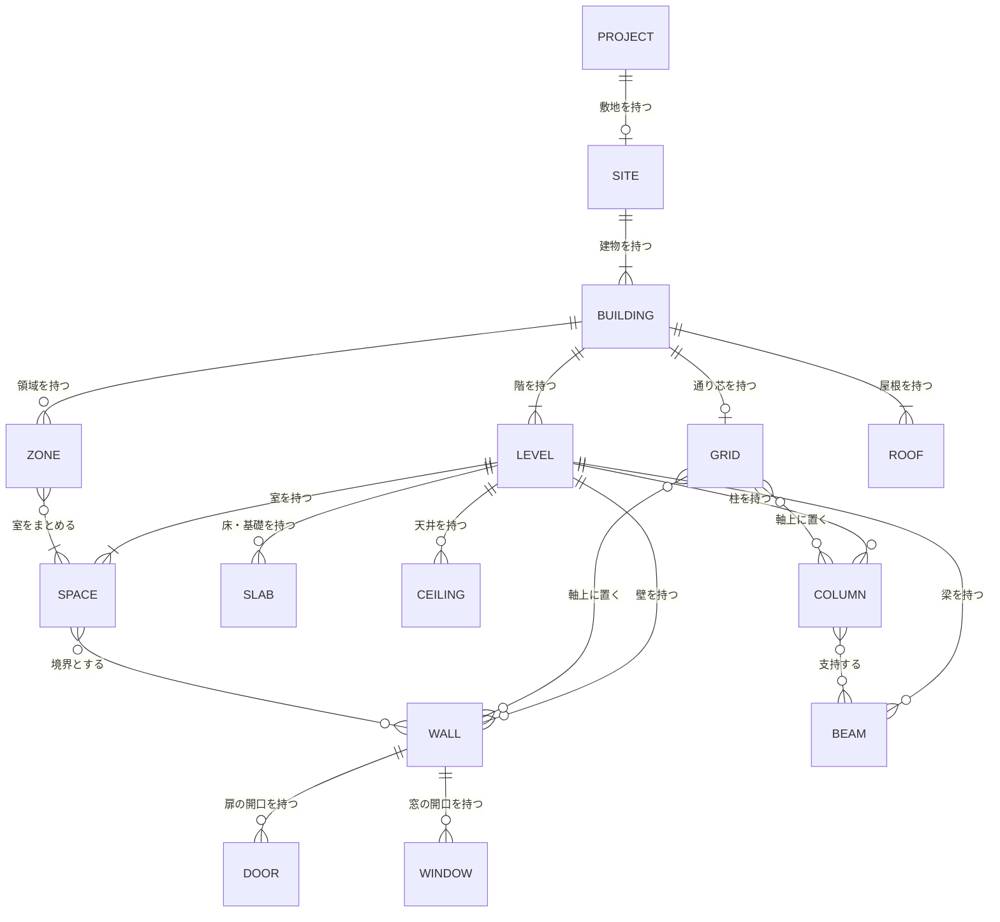

### 2.2 群1 建物幾何（要素と材料）

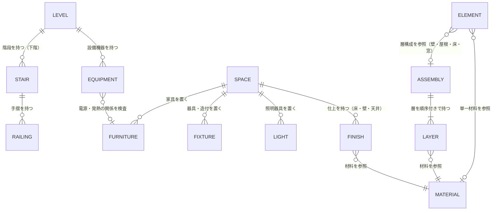

### 2.3 群2 関係と系統

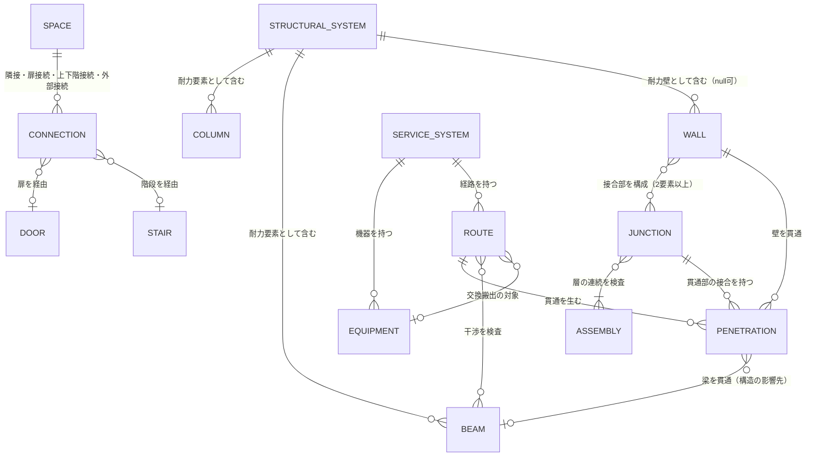

### 2.4 群3 要求と判断

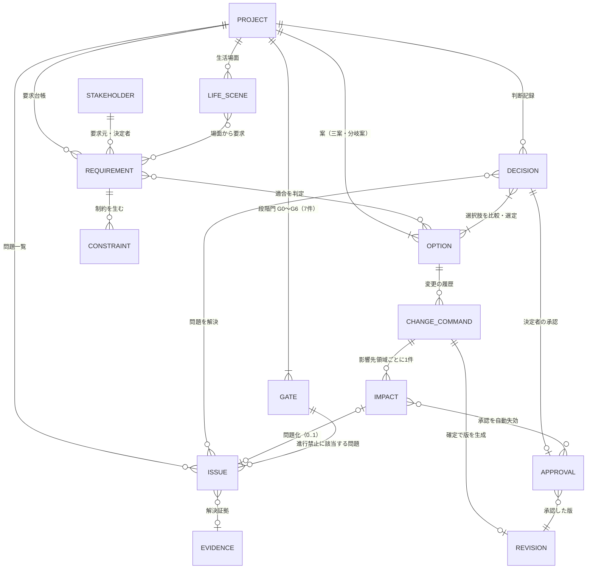

### 2.5 群4 商品と権利

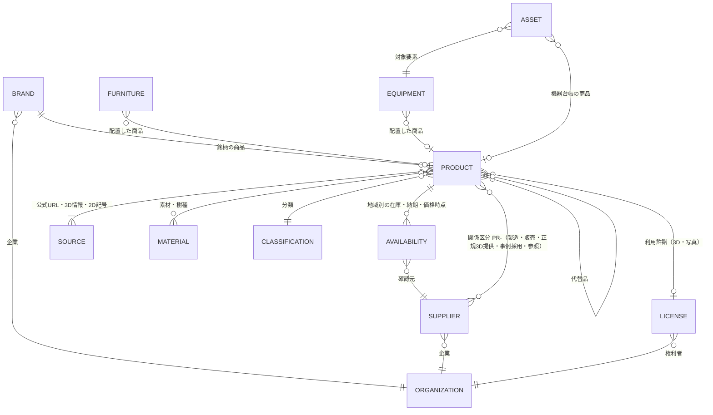

### 2.6 群5 人と組織

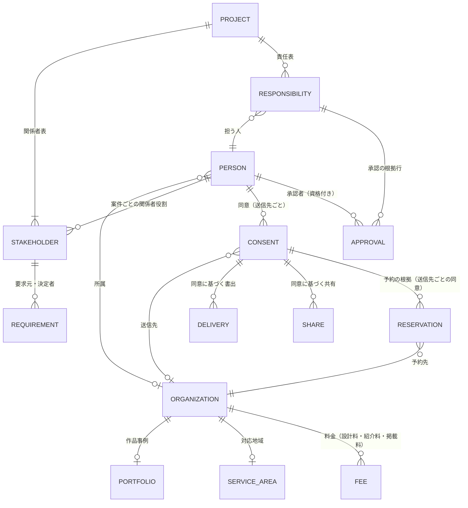

### 2.7 群6 調査と計算（敷地と調査）

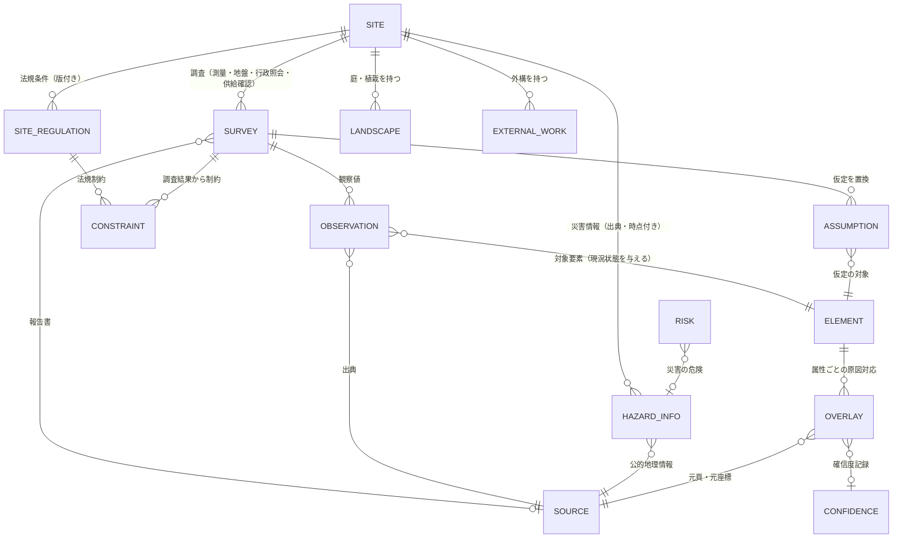

### 2.8 群6 調査と計算（計算と費用）

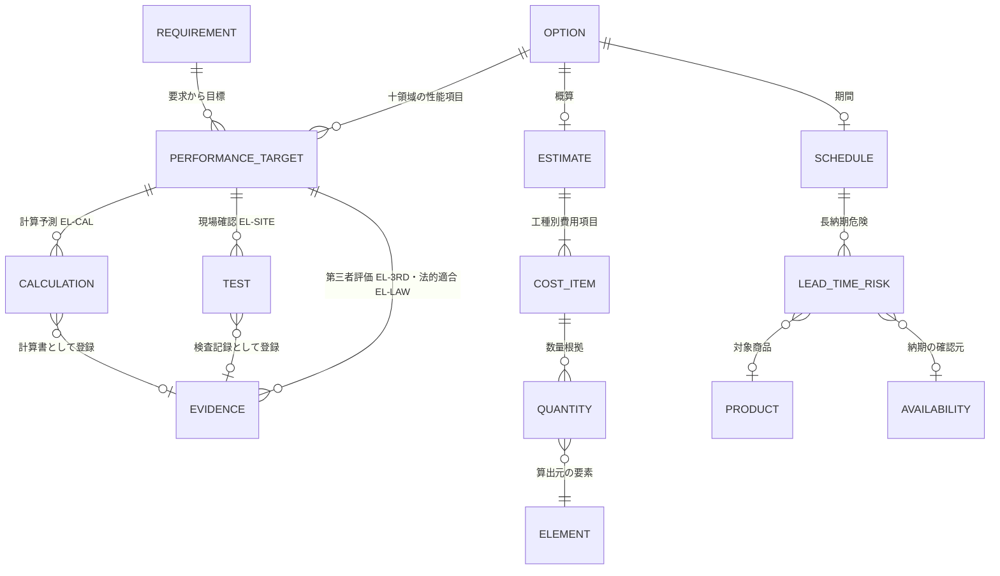

### 2.9 群7 情報要求と交換

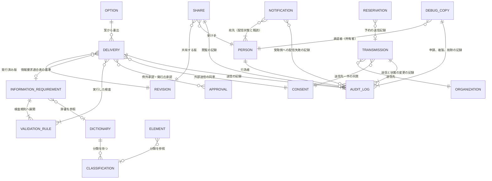

### 2.10 群8 施工と維持

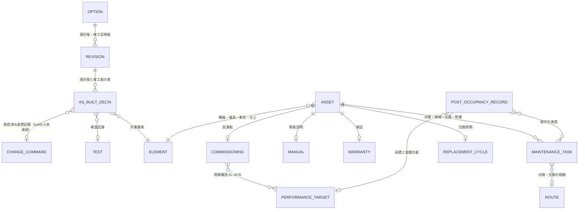

## 3. 問題、変更命令、影響の構造（主担当一つ、変更識別子から各影響へ）

### 3.1 規則

| 番号 | 規則 | 支える属性と関係 | 区分 |
|---:|---|---|---|
| 1 | 全ての変更は ChangeCommand（E-REQ-011）として記録し、その uuid を変更識別子とする。origin（自然文、直接操作、現場変更、新資料取込、商品更新、法改正、承認失効）を問わず同じ構造を使う | ChangeCommand.uuid、origin、intent、targetRefs | 【推定】 |
| 2 | ChangeCommand は変更元の主担当領域を一つだけ持つ（primaryDomain）。判定に迷う場合は `十二判断領域.md` 第3.2節の手順に従い、判定理由を関連する Decision に記録する | ChangeCommand.primaryDomain（enum、必須、一つ） | 【推定】 |
| 3 | 影響関係表（`十二判断領域.md` 第2節）の変更元の行から、影響先領域ごとに Impact（E-REQ-012）を一件ずつ生成する。同じ変更、同じ影響先、同じ再計算対象の Impact は一件だけ。影響がない領域は status=影響なし で一件置き、空欄を作らない | Impact.changeRef、affectedDomain、impactKind、recalcTargetRefs の組で一意 | 【推定】 |
| 4 | Impact の再計算結果が問題に該当する場合、同じ固定先と主担当領域の未解決 Issue があれば更新し、なければ Issue（E-REQ-003）を一件だけ新規登録する。Issue.primaryDomain は Impact.affectedDomain、Issue.originChangeRef は変更識別子。派生問題は parentIssueRef で元問題を参照し、複製しない | Issue.primaryDomain、affectedDomains、originChangeRef、parentIssueRef、Impact.issueRef（0..1） | 【推定】 |
| 5 | Impact の再計算対象に承認済み（AS-VALID）の確認範囲が含まれる場合、その Approval だけを AS-VOID にし、Impact.voidedApprovalRefs と Approval.voidReason に変更識別子を記録する。案件全体を前段階へ戻さず、該当する Gate を「再確認中」にする | Approval.status、voidReason、Impact.voidedApprovalRefs、Gate.status | 【推定】 |
| 6 | 確定前（ChangeCommand.status=仮表示）は previewDelta に2D、3D、費用、問題、承認への差分を持ち、利用者承認（approvedByRef）後に status=確定 とし Revision を生成する。取消とやり直しは新しい ChangeCommand（origin は元と同じ、対象は元の ChangeCommand）として記録し、履歴を消さない | ChangeCommand.status、previewDelta、appliedRevisionRef、→ChangeCommand 0..1 | 【推定】 |
| 7 | Issue の主担当領域は一つだけであり、「全領域」「未定」「複数」は登録できない（検証規則 E-EXC-005 kind=欠落属性、SEV-0）。影響先は零個以上。主担当の変更は改訂として記録し、識別子は変えない | Issue.primaryDomain の必須制約、Revision | 【推定】 |
| 8 | 一つの Issue から、影響先領域、確認者、解決する判断、解決証拠、変更元、派生元、固定先（3D要素、2D位置、図面頁）、BCF 視点へたどれる。問題一覧は Issue を複製せず、領域別の表示は affectedDomains の索引で行う | Issue.affectedDomains、verifierRef、→Decision、resolutionEvidenceRef、anchor | 【推定】 |

### 3.2 構造図

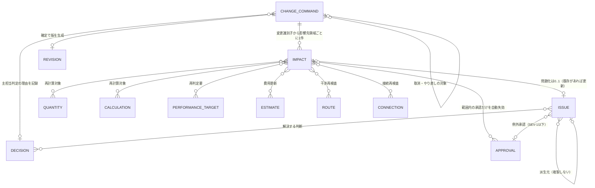

### 3.3 指示文C3の自然文変更の順序と実体の対応

| 手順 | 内容 | 使う実体と属性 | 区分 |
|---:|---|---|---|
| 1 | 対象、操作、量、方向、固定条件、目的を抽出 | ChangeCommand.intent（言語模型が抽出。正本へは書かない） | 【推定】 |
| 2 | 相対表現を平面座標と視点座標のどちらか確認 | ChangeCommand.coordinateFrame（未確認のまま手順3へ進めない） | 【推定】 |
| 3 | 寸法、干渉、避難、採光、構造、外皮、設備、費用、工程、維持管理への影響を予測 | Impact を影響先領域ごとに生成し、recalcTargetRefs を決定的検査で列挙 | 【推定】 |
| 4 | 影響する要素を一覧表示 | Impact.recalcTargetRefs と delta を集約して表示 | 【推定】 |
| 5 | 3Dと2Dの差分を仮表示 | ChangeCommand.previewDelta（status=仮表示） | 【推定】 |
| 6 | 利用者承認後に確定 | ChangeCommand.approvedByRef、status=確定、Revision 生成、要素の valueStates を VS-USR へ | 【推定】 |
| 7 | 要求台帳と問題一覧を再計算 | Requirement との適合再判定（Option ↔ Requirement）、Issue の更新または新規（規則4）、Approval の自動失効（規則5）、Gate の再確認中 | 【推定】 |

### 3.4 一意化と非複製の検査条件（04_必須表と第23章が使う）

| 検査 | 合格条件 | 区分 |
|---|---|---|
| 主担当の一意性 | 全 Issue、Decision、Requirement、ChangeCommand、Risk、Constraint の primaryDomain が A01〜A12 のうち一つで、null と複数がない | 【推定】 |
| 影響の一意性 | (changeRef, affectedDomain, recalcTarget) の組が重複しない | 【推定】 |
| 問題の非複製 | 同じ projectRef、同じ anchor.ref、同じ primaryDomain で status が IS-OPEN または IS-WIP の Issue が二件以上ない | 【仮定】 |
| 変更元の追跡 | Impact から生じた Issue は originChangeRef を持ち、参照先の ChangeCommand が存在する | 【推定】 |
| 承認失効の整合 | AS-VOID の Approval は voidReason に変更識別子を持ち、対応する Impact.voidedApprovalRefs に含まれる | 【推定】 |
| 進行禁止の整合 | severity=SEV-0 の Issue は Gate.blockingIssueRefs に含まれ、IS-EXC（例外承認）にできない | 【推定】 |

### 3.5 例示

十二判断領域第3.3節の判定例「窓の位置を東へ600 mm動かす」を本構造で表すと次のとおり【推定】。変更命令の例示識別子は識別子規則に接頭辞がないため、本表では「変更命令 例1」と書く（未決 U-00-037）。

| 項目 | 値 |
|---|---|
| ChangeCommand 例1 | origin=自然文、intent={target:[E-ELM-008 の個体], operation:移動, amount:600, direction:東, fixed:[壁の外周], purpose:朝の光}、coordinateFrame=平面座標（利用者確認）、primaryDomain=A03、status=仮表示 |
| Impact（A04） | impactKind=荷重、recalcTargetRefs=[StructuralSystem の耐力壁判定]、結果: 窓が耐力壁線上へ移動 → 問題化 |
| Issue（派生） | 既存の例示 I-00-008「居間の大開口が耐力壁線上にある」と同じ固定先、同じ主担当 A04 の未解決問題があれば更新、なければ新規。primaryDomain=A04、affectedDomains=[A03]、originChangeRef=変更命令 例1 |
| Impact（A05） | impactKind=開口、recalcTargetRefs=[Junction（窓周囲）]、結果: 接合部の再検査 |
| Impact（A06） | impactKind=経路、recalcTargetRefs=[Route（配線）]、結果: 影響なし |
| Impact（A07） | impactKind=性能、recalcTargetRefs=[PerformanceTarget（光と視環境、温熱）]、結果: needsRejudge=true |
| Impact（A08） | impactKind=配置、recalcTargetRefs=[Furniture（窓下の収納）]、結果: 余白不足なら問題化 |
| Impact（A09） | impactKind=数量、recalcTargetRefs=[Quantity（外壁面積）、CostItem（外皮）]、結果: 費用幅を更新 |
| Impact（A10） | impactKind=施工、recalcTargetRefs=[施工検討]、結果: 影響なし（P1） |
| Impact（A11） | impactKind=可変、recalcTargetRefs=[LifeScene（寝室分割）]、結果: 再試行 |
| Impact（A12） | impactKind=改訂、recalcTargetRefs=[Approval（確認範囲=間取り）]、結果: AS-VALID → AS-VOID、Gate G3 を再確認中 |
| 確定 | 利用者承認で status=確定、Revision 生成、要求台帳の適合再判定、問題一覧の再計算 |

## 4. 双方向追跡の経路

指示文C3「要求から案、建築要素、計算、商品、問題、判断、承認、書出まで双方向に追跡できる」を支える経路。順方向の参照属性を正本とし、逆方向は製品が索引（逆参照）として保持し、両方向の到達を要求追跡率（M-G-01）で計測する【推定】。

| 起点 → 終点 | 順方向の参照 | 逆方向（索引） | 区分 |
|---|---|---|---|
| 要求 → 案 | Option ↔ Requirement（適合表。Option.droppedRequirementRefs、Decision.requirementRefs） | Requirement から適合する Option の一覧 | 【推定】 |
| 要求 → 建築要素 | Requirement →要素（実現する要素。Space.requirementRefs、要素の共通属性 sourceRef ではなく関係索引） | 要素から Requirement の一覧 | 【推定】 |
| 建築要素 → 計算 | Calculation.inputs（参照要素） | 要素から Calculation の一覧 | 【推定】 |
| 計算 → 性能項目 → 要求 | PerformanceTarget.evidenceRecords、PerformanceTarget.requirementRef | Requirement から PerformanceTarget | 【推定】 |
| 建築要素 → 商品 | Furniture/Equipment/Fixture/Door/Window/Light/Finish.productRef | Product から配置した要素（案件ごと） | 【推定】 |
| 商品 → 問題 | Issue.anchor.ref（商品を配置した要素）、LeadTimeRisk → Issue | Product から Issue | 【推定】 |
| 問題 → 判断 | Decision.resolvesIssueRefs | Issue から Decision | 【推定】 |
| 判断 → 承認 | Decision → Approval（決定者の承認）、Approval.scope | Approval から Decision | 【推定】 |
| 承認 → 書出 | Delivery.revisionRef = Approval.baseRevisionRef、Delivery.exceptionApprovalRefs | Approval から Delivery | 【推定】 |
| 書出 → 建築要素 → 出典 | Delivery.revisionRef → Revision.targetRef → 要素 → Overlay → Source（元頁、元座標） | Source から要素、Delivery | 【推定】 |
| 変更 → 影響 → 問題 → 承認失効 | ChangeCommand → Impact → Issue、Impact.voidedApprovalRefs | Issue.originChangeRef、Approval.voidReason | 【推定】 |
| 実績 → 判断 → 要求 | PostOccupancyRecord → Decision、→ Requirement、→ PerformanceTarget | Requirement から PostOccupancyRecord | 【推定】 |

## 5. 実体と状態属性の対応（`信頼状態と証拠段階.md` 第9節への回答）

第1節の「持つ状態属性」列を群ごとに集約した表。信頼状態第9節の依頼どおり、案は V と CDE、要素は VS と CS、性能項目は EL、商品は PT と RS と SUP、関係は PR、問題は IS と SEV、承認は AS、要求は RP を持つ。補助状態 IS-、AS-、SUP- は本章で採用した（未決 U-00-025 の回答）【推定】。

| 実体群 | V | VS | EL | CS | PT | RS | SUP | PR | CDE | IS | SEV | AS | RP | RL | 独自状態 |
|---|---|---|---|---|---|---|---|---|---|---|---|---|---|---|---|
| Option（案） | 有 | — | — | — | — | — | — | — | 有 | — | — | — | — | — | — |
| Project | — | — | — | — | — | — | — | — | 有 | — | — | — | — | — | status |
| 建築要素（BLD、SPC、ELM、MAT、SYS） | 案の V を継承 | 有 | — | 有（既存住宅） | — | 入力資料の RS を参照 | — | — | — | — | — | — | — | — | Junction.checkResult、Connection.isVerified |
| PerformanceTarget、Calculation、Evidence、Test、Commissioning | — | — | 有 | — | — | — | — | — | — | — | — | — | — | — | validity、needsRejudge、result |
| Product、Availability | — | 寸法値 | — | — | 有 | 有 | 有 | — | — | — | — | — | — | — | — |
| Brand、Supplier（Product との組） | — | — | — | — | — | PR-3D は RS-OK を要する | — | 有 | — | — | — | — | — | — | connectionStatus |
| Source | — | — | — | — | — | 有 | — | — | 有 | — | — | — | — | — | isMasterCandidate |
| Delivery | 転記 | — | — | — | — | 継承 | — | — | 有 | — | — | — | — | — | — |
| Issue | — | — | — | — | — | — | — | — | — | 有 | 有 | — | — | — | — |
| Approval | — | — | — | — | — | — | — | — | — | — | — | 有 | — | — | — |
| Requirement | — | 確認状態 | — | — | — | — | — | — | — | — | — | — | 有 | — | — |
| Decision | — | — | — | — | — | — | — | — | 有 | — | — | 有 | — | — | — |
| Revision | — | — | — | — | — | — | — | — | 有 | — | — | — | — | — | — |
| Gate、ChangeCommand、Impact、Consent、Share | — | — | — | — | — | — | — | — | — | — | — | — | — | Share は受け手の RL | status（GS-、CC-、CN- を用語追加提案） |
| Person、Organization、Responsibility | — | — | — | — | — | — | — | — | — | — | — | — | — | 有 | accountStatus、partnerStatus |
| Reservation（予約記録） | — | — | — | — | — | — | — | — | — | — | — | — | — | — | status（要求、受付待ち、確定、変更、取消、完了、不成立） |
| Survey、Observation、HazardInfo | — | — | — | Observation が要素へ与える | — | 出典の利用条件 | — | — | — | — | — | — | — | — | Survey.status |
| Asset | — | 有 | — | — | 商品経由 | 商品経由 | 商品経由 | 商品経由 | — | — | — | — | — | — | — |
| AuditLog | — | — | — | — | — | — | — | — | — | — | — | — | — | — | なし（追記のみ） |
| Notification（通知） | — | — | — | — | — | — | — | — | — | — | — | — | — | — | deliveryState（宛先ごとの未配信、配信済み、配信失敗、未配信〔同意なし〕と既読。2026-10-07。未配信〔同意なし〕は v1.3、JR-072） |
| Transmission（送信記録）、DebugCopy（障害調査用複製） | — | — | — | — | — | — | — | — | — | — | — | — | — | DebugCopy は承認者の RL | Transmission は receiptState と contactStop.recipientResponse。DebugCopy は expiresAt、extensionCount、deletedAt（v1.3、JR-054） |

## 6. 用語集との対応

`用語集.md` の依頼（実体用語 32〜71、111〜133、178〜202 を E- へ対応付ける）への回答。表示や概念だけの用語（派生表示、正本、確認範囲等）は実体ではなく属性または規則として扱う【推定】。

| 用語番号 | 用語 | 対応する実体または属性 |
|---:|---|---|
| 32 | 正規建物情報 | E-BLD-001 Project を根とする群1、群2 の実体の集合 |
| 33 | 建築要素 | ELM 群、SPC 群、BLD 群（Site、Building、Level、Grid） |
| 35 | 派生表示 | 実体ではない。Option の版から生成する表示。GLB は E-EXC-002 Delivery の形式 |
| 36、37 | 要求、要求台帳 | E-REQ-001 Requirement とその集合 |
| 39 | 要求衝突 | Requirement ↔ Requirement の関係と、解決候補と代償を持つ E-REQ-004 Decision |
| 40〜42 | 目的文、成功条件、変更できない条件 | Project.purpose、Project.successCriteria（属性の正本は第12章 E-BLD-001。2026-10-06 の相互依頼で Requirement から改めた。第6章 第5.1節、第5章 F-C01-021 と同じ）、E-REQ-002 Constraint（kind=変更できない条件） |
| 43、44、45 | 関係者、決定権、当事者参画 | E-ORG-008 Stakeholder（decisionAuthority、participationMethod） |
| 46、47 | 生活場面、将来場面 | E-REQ-009 LifeScene（isFuture） |
| 48〜51 | 問題、問題一覧、重大度、解決証拠 | E-REQ-003 Issue（severity、resolutionEvidenceRef） |
| 52〜55 | 判断、判断記録、選択肢、選定記録 | E-REQ-004 Decision、E-REQ-005 Option |
| 56、57 | 改訂、版 | E-REQ-006 Revision、共通属性 version |
| 58、59 | 正本、正本候補 | E-PRD-006 Source（isMasterCandidate、priority）と Revision（isApprovedVersion） |
| 60〜63 | 承認、承認記録、確認範囲、自動失効 | E-REQ-007 Approval（scope、status=AS-VOID） |
| 64、65 | 証拠、出典 | E-REQ-008 Evidence、E-PRD-006 Source |
| 66〜68 | 変更差分、変更命令、分岐案 | E-REQ-011 ChangeCommand（previewDelta）、E-REQ-005 Option（kind=分岐案） |
| 69〜71 | 影響先、主担当領域、変更影響 | E-REQ-012 Impact、属性 primaryDomain と affectedDomains |
| 104 | 原図重ね | E-SRV-009 Overlay |
| 107 | 低確信度要素 | 要素共通属性 lowConfidence、E-SRV-010 Confidence |
| 111、130 | 連合商品台帳、商品項目 | E-PRD-001 Product の集合 |
| 117、118 | 権利状態、利用許諾 | E-PRD-005 License、属性 rightsState |
| 119〜122 | 関係区分、正規3D提供、事例採用、掲載実績 | E-PRD-003 Supplier.relations、E-ORG-003 Portfolio.featuredProductRefs |
| 123〜125 | 代替品、代替形状、販売終了 | Product →Product（代替品）、Product.tier=PT-REF の形状、Product.supplyState=SUP-DISC |
| 131、132、133 | 最終確認日時、指紋値、当たり判定形状 | E-PRD-007 Availability.lastVerifiedAt、Product.fingerprint、Furniture.collisionShape |
| 134 | 通り芯 | E-BLD-005 Grid |
| 140、141、145、147、148 | 層構成、接合部、経路帯、貫通、干渉 | E-MAT-003 Assembly、E-MAT-005 Junction、E-SYS-003 Route、E-SYS-004 Penetration、Route.clashIssueRefs |
| 153〜158 | 工種、確信幅、概算、単価時点、予備費、調達方式 | E-SRV-014 CostItem、E-SRV-005 Estimate |
| 159 | 住宅性能十領域 | E-SRV-013 PerformanceTarget.area |
| 163〜166 | 法規判定、法規根拠、敷地制約、不足調査 | E-SRV-004 Calculation（kind=法規判定）、E-SRV-011 SiteRegulation、E-REQ-002 Constraint（kind=敷地制約）、E-SRV-001 Survey（status=必要） |
| 167 | 公的地理情報 | E-SRV-012 HazardInfo、E-PRD-006 Source（kind=公的地理情報） |
| 176〜186 | 改装区分、解体後判明、竣工時建物情報、変更記録、機器台帳、入居後確認、維持計画、学び一覧、交換周期、交換経路、可変性 | 要素共通属性 renovationAction、E-OPS-006 AsBuiltDelta、Option（kind=竣工反映版）、ChangeCommand.siteChangeInfo、E-PRD-004 Asset、E-OPS-007 PostOccupancyRecord、E-OPS-004 MaintenanceTask、PostOccupancyRecord.lesson、E-OPS-005 ReplacementCycle、Route（kind=交換搬出）、LifeScene（isFuture） |
| 187〜191 | 共通情報環境と四状態 | Revision.cdeState、Option.cdeState、Delivery.cdeState |
| 192〜202 | 必要情報要求、情報要求適合表、責任表、交換資料、引継ぎ一式、書出、例外承認、参照切れ、分類、辞書、検証規則 | E-EXC-001 InformationRequirement、Delivery.validationResult、E-ORG-007 Responsibility、E-EXC-002 Delivery、Approval（scopeKind=例外）、ValidationRule（kind=参照切れ）、E-EXC-003 Classification、E-EXC-004 Dictionary、E-EXC-005 ValidationRule |
| 219〜233 | 役割権限、個別同意、学習同意、監査記録、期限付き共有、透かし | Person.roles、E-ORG-006 Consent（purpose）、E-EXC-007 AuditLog、E-EXC-006 Share（watermark） |
| 473、565、561 | 送信記録、障害調査用複製、評価利用 | E-EXC-009 Transmission、E-EXC-010 DebugCopy、E-ORG-006 Consent（purpose=評価利用）（v1.3、JR-054、JR-103） |

## 7. 属性名辞書と既定値表の扱い

| 項目 | 内容 | 区分 |
|---|---|---|
| 属性名辞書 | 本章の属性名（英字）を E-EXC-004 Dictionary の propertyDefinitions として登録し、国土交通省 標準属性項目リスト Ver2.0 を候補の基礎辞書にする（`01_調査/06_研究と標準.md`）。対応付けは第12章が行う | 【推定】 |
| 既定値表 | VS-DEF の値（階高、壁厚、建具高さ、天井高、基礎形式等）は既定値表に集約し、E-SRV-008 Assumption.defaultTableId で参照する。値は初期仮説として第12章が定め、本章では値を定めない | 【仮定】 |
| IFC 独自属性集合 | 五状態（VS-）、確信度、現況状態（CS-）、信頼状態（V）、主担当領域は IFC の標準属性にないため、独自の属性集合として書き出し、IDS の Property facet で要求できる形にする。属性集合の名称は未決 U-00-040 | 【推定】 |
| 個体識別子の対応表 | uuid と ifcGuid の対応は Project ごとに保持し、IFC の取込と書出で往復する。BCF Topic の Components は ifcGuid で要素を参照する | 【推定】 |
| 機密属性 | Site.address、Person.contact、Asset.contact、Warranty.contact は設計情報と論理分離して保存し、共有と書出の既定で非共有項目にする（指示文E、9.8） | 【推定】 |

## 章要約

本章は指示文C3の70実体に他節が要求する20実体（Stakeholder、LifeScene、Gate、Impact 等）を加えた90実体（追補と v1.3 で E-ORG-009、E-EXC-008〜010 を加え94実体）を、識別子規則の11群接頭辞で採番し、8群（建物幾何、関係と系統、要求と判断、商品と権利、人と組織、調査と計算、情報要求と交換、施工と維持）で定義した。各実体に定義、主要属性（型付き）、親実体、関係と多重度、状態属性、共通属性、IFC対応、主担当領域、詳細章を付け、群ごとの実体関係図10図と、変更命令から影響、問題（主担当一つ、複製なし）、承認の自動失効へ至る構造を示した。双方向追跡経路、実体と状態の対応、用語集との対応も定めた。実体の識別子と群の正本は本章、属性と enum の正本は第12章 項目辞書（JM-073）。v1.3（二回目の修正）で送信記録 E-EXC-009 と障害調査用複製 E-EXC-010 を採番し（JR-054）、通知の配信状態に「未配信（同意なし）」を加えた（JR-072）。

## 他章への依頼または前提

| 章 | 内容 | 種別（依頼/前提） |
|---|---|---|
| 02_基盤定義 機能骨格 | 各機能 F- の情報入出力を本章の E- 識別子と属性名で書くこと。変更を扱う機能は ChangeCommand と Impact を経由すること | 依頼 |
| 02_基盤定義 画面・指標・試験骨格 | 画面部品の表示対象を E- と属性で参照し、試験の入力に本章の実体の例示個体を使うこと。要求追跡率の計測に第4節の経路を使うこと | 依頼 |
| 02_基盤定義 識別子規則（B1） | 未決 U-00-008 は「11群で足り、追加実体も既存群へ割り当てた」として解決提案する。変更命令の人が読む接頭辞（CC- 等）の追加可否を判断すること（U-00-037） | 依頼 |
| 03_仕様書 第11章（図面読解・現況差分・3D構築） | Source、Overlay、Confidence、Connection、Assumption の処理手順を本章の属性で書くこと | 依頼 |
| 03_仕様書 第12章（正規建物情報の実体関係図、項目辞書、状態遷移） | 本章の94実体（v1.2 追補の E-ORG-009 予約記録、2026-10-07 の E-EXC-008 通知、v1.3 の E-EXC-009 送信記録と E-EXC-010 障害調査用複製を含む）の識別子と群を正本として、全属性の項目辞書、既定値表、状態遷移を展開すること。属性と enum の正本は第12章 項目辞書（v1.2 追補を含む）とし、追加した属性は本章の次版で転記する（v1.2 で改めた。JM-073） | 前提 |
| 03_仕様書 第13章（空間・構造・外皮・設備の調整） | 第3節の規則と手順を変更差分の処理に組み込み、Junction、Route、Penetration、StructuralSystem、ServiceSystem の検査を定義すること | 依頼 |
| 03_仕様書 第14章（API） | API の入出力を本章の実体と属性で表すこと | 依頼 |
| 03_仕様書 第16章（商品推薦） | Product、Brand、Supplier、Availability、License、LeadTimeRisk の更新と失効を仕様化すること | 依頼 |
| 03_仕様書 第17章（人への引継ぎ・同意） | Organization、Portfolio、ServiceArea、Fee、Consent、Delivery、Responsibility を仕様化すること | 依頼 |
| 03_仕様書 第18章（敷地・法規） | Site、SiteRegulation、HazardInfo、Survey、Observation、Constraint（敷地制約）を仕様化すること | 依頼 |
| 03_仕様書 第19章（住宅性能） | PerformanceTarget、Calculation、Test、Evidence の証拠段階ごとの記録を仕様化すること | 依頼 |
| 03_仕様書 第20章（費用・期間） | Estimate、CostItem、Quantity、Schedule、LeadTimeRisk を仕様化すること | 依頼 |
| 03_仕様書 第21章（改装・竣工・維持） | OPS 群、Asset、AsBuiltDelta、PostOccupancyRecord、renovationAction を P0 から情報構造として保持する設計にすること | 依頼 |
| 03_仕様書 第22章（情報・権利・責任・交換） | EXC 群、Approval、Revision、License、Consent、Share、AuditLog を機能化し、IFC 独自属性集合と IDS 要求を定めること | 依頼 |
| 04_必須表 | 識別子台帳に本章の94実体（v1.2 追補の E-ORG-009、2026-10-07 の E-EXC-008、v1.3 の E-EXC-009、E-EXC-010 を含む）を登録し、第3.4節の検査を整合検査に加えること。要素別責任表の対象実体を本章から取ること | 依頼 |
| 03_仕様書 第12章、第14章、第17章、第22章、第10章（二回目の修正。2026-10-07） | v1.3 の E-EXC-009 Transmission と E-EXC-010 DebugCopy の採番、E-ORG-009.transmissionRef の ref[E-EXC-009]、E-EXC-008.deliveryState の「未配信（同意なし）」は、修正計画 第0.4節と第1.12節（JR-053、JR-054）、第1.14節、第1.17節、第1.22節、第1.10節（K-04 の F-C10-019）の文で各担当が対応する。属性名と型の正本は第12章 第4.10節（同時に追補済み）。第12章の追加属性 98 箇所の本章への転記は修正計画 第6節 持ち越し 3 のとおり段階8 の後の次版で行う（新しい依頼は出さない） | 前提 |
| 03_仕様書 第12章、第17章（相互依頼の対応。2026-10-06） | 第17章 (a) と第12章（v1.3）の依頼により、予約記録を群 ORG の E-ORG-009 Reservation として採番した（第1.5節。属性は第17章 第6.2.1節の仮定義を写した）。第12章は項目辞書へ転記し、第17章は U-17-005 を解決として E-ORG-009 を参照すること。第12章の「本章追加」属性 98 箇所と表11.2-A〜C（v1.1、v1.2、v1.3 の行）の骨格への転記は、修正計画 第2節「本計画では骨格の属性は変更しない」に従い次版で行う（属性の正本は第12章 項目辞書。第0.1節） | 前提（対応済み）、依頼 |
| 03_仕様書 第15章、第14章、第12章（相互依頼 基盤仕上げの対応。2026-10-07） | 第15章 U-15-018 の依頼（第14章 AP-029 の登録内容を保持する実体）に対し、AuditLog（E-EXC-007）の派生ではなく群 EXC の新しい実体 E-EXC-008 Notification（通知）として採番した（第1.7節。AuditLog は追記のみで本文を保持せず、宛先ごとの配信状態と既読を更新できないため）。主要属性は AP-029 の登録内容（kind 14 種、targetRef、recipientRefs、summary、deliveryState）と S-17 の既読、保持期限を写した。第12章は項目辞書へ転記し（修正計画 第2節により次版。転記までは本章の主要属性を仮の定義とする）、第15章は U-15-018 を解決として S-17 の情報実体に E-EXC-008 を、第14章は AP-029 の対象実体に E-EXC-008 を参照すること | 前提（対応済み）、依頼 |
| 01_調査 | IFC 4.3.2.0 における本章の IFC対応名（IfcBuildingSystem、IfcPavement、IfcFurniture、Pset_Warranty、Pset_ServiceLife、Pset_Risk、Pset_SiteCommon 等）の正式名称と存在を確認すること（U-00-001 の続き） | 依頼 |
| 05_審査（情報審査、MECE審査） | 第4節の双方向追跡と第3節の主担当一意を審査対象にすること | 依頼 |

## 未決事項

| 識別子 | 内容 | 区分（事実/推定/仮定/未確認） | 影響 | 確認者候補 |
|---|---|---|---|---|
| U-00-036 | 追加20実体のうち Connection、Impact、Confidence、Overlay を独立実体とするか要素の属性とするか（実装の複雑さと追跡性の均衡） | 仮定 | 第12章の項目辞書、API、性能 | 実装責任者、情報管理者 |
| U-00-037 | 変更命令（ChangeCommand）の人が読む識別子の接頭辞（CC- 等）を識別子規則へ追加するか、uuid の末尾表示で足りるか | 仮定 | 識別子規則、画面の履歴表示、例示識別子 | 識別子規則担当、画面設計担当 |
| U-00-038 | 案件横断台帳（Product、Brand、Supplier、Organization、Dictionary、Classification、ValidationRule、Material）が共通属性のうち requiredStage と projectRef を持たない例外の扱い | 仮定 | 整合検査（共通属性の存在）、識別子台帳 | 04_必須表担当、実装責任者 |
| U-00-039 | Site.address、Person.contact 等の機密属性の論理分離の方式（別保存領域、暗号鍵の分離、共有時の既定非共有） | 仮定 | 第22章、非機能 N-DP、N-SC | 情報保護責任者、実装責任者 |
| U-00-040 | IFC 書出時の独自属性集合（五状態、確信度、現況状態、信頼状態、主担当領域）の名称と、IDS Property facet での要求方法 | 未確認 | 第22章の書出仕様、情報要求適合表 | 01_調査担当、情報管理者、受取側建築士 |
| U-00-041 | 複数領域にまたがる要素（Window、Roof、Wall、Door、Slab）の実体定義の主担当を A03（位置と形）に置く既定が、責任表の実務と整合するか | 仮定 | 責任表、確認範囲の割当 | 建築士、構造設計者、外皮専門家 |
| U-00-042 | Site.crs（座標系）の既定値と案件原点、方位の規則 | 未確認 | 書出の座標検査、公的地理情報の重ね | 01_調査担当、実装責任者 |
| U-00-043 | 要素共通属性 costRange を要素自身に持たせるか、Quantity と CostItem からの導出値のみとするか（二重管理の回避） | 仮定 | 第20章、第12章の項目辞書 | 積算担当、実装責任者 |
| U-00-044 | 案件内に配置した商品の価格時点、指紋値、権利状態を配置時点で案件側へ複製するか、台帳を常に参照するか（販売終了と許諾失効時の表示規則に影響） | 仮定 | 第16章、第22章、既存案件の権利条件 | 法務、知財担当、商品担当 |
| U-00-045 | Route の kind に動線、避難、搬入、交換搬出を含める設計（主担当が個体ごとに A03、A07、A06 へ分かれる）が主担当一意の検査と両立するか | 仮定 | 第13章、第19章、責任表 | 建築士、設備設計者 |
| U-00-046 | Gate、ChangeCommand、Consent の独自状態を状態符号（GS-、CC-、CN-）として識別子規則第2.8節へ追加するか。解決（2026-10-06、相互依頼）: 符号を設けず日本語の enum 値を正とする。正本の第12章（U-12-005。Gate.status、ChangeCommand.status、Consent.status、Decision.status）と第6章（U-06-001、U-06-011）がこの判断を採り、各章で実際の符号（GS-PASS 等）の使用は 0 件。状態符号の新設は識別子規則 第4節により主番号の変更と全章の追従を要し、P0 では利点が費用を上回らない。将来符号を採る場合は第12章 第6.1節に日本語値との対応表を置く | 仮定 | 識別子規則、画面の状態表示、試験 | 識別子規則担当、画面設計担当 |

## 用語追加提案

| 用語 | 定義 | 理由 |
|---|---|---|
| 影響 | 一つの変更命令が影響先領域に与える波及の記録単位。E-REQ-012 Impact | 用語集69「影響先」と71「変更影響」の記録単位を実体として指す語が必要 |
| 接続関係 | 建物関係図を構成する関係の実体。隣接、扉接続、上下階接続、外部接続、要素接合。E-SYS-005 Connection | 用語集212「建物関係図」の構成単位を指す語が必要 |
| 性能項目 | 住宅性能十領域の各項目。要求、目標、計算予測、現場確認、第三者評価、法的適合を別々に持つ。E-SRV-013 PerformanceTarget | 十領域の記録単位を指す語が必要 |
| 原図重ね記録 | 要素の属性値と入力資料の元頁、元座標、認識方法、推定理由の対応記録。E-SRV-009 Overlay | 用語集104「原図重ね」は表示を指すため、記録の実体を区別する語が必要 |
| 確信度記録 | 確信度の値と後に判明した正否の対。E-SRV-010 Confidence | 確信度校正誤差の計測単位を指す語が必要 |
| 要素共通属性 | 建築要素が共通に持つ属性群（幾何、寸法、親子、接続、材質、分類、費用範囲、現況状態、要素値状態、改装区分、低確信度） | 第0.4節を一語で参照するため |
| 案件横断台帳 | 案件に属さず製品全体で共有する実体の集合（商品、銘柄、供給元、組織、辞書、分類、検証規則、材料） | 共通属性の例外と権限の境界を指す語が必要 |
| 段階門の状態 | 案件の各段階門の状態（未開始、進行中、通過、再確認中）。符号 GS- を提案 | 七段階門の「再確認中」を含む状態集合が必要 |
| 変更命令の状態 | 変更命令の処理状態（提案、仮表示、確定、取消、やり直し）。符号 CC- を提案 | 指示文C3の手順5と6を状態として表すため |
| 同意の状態 | 同意の状態（有効、撤回、期限切れ）。符号 CN- を提案 | 同意撤回と同意事故の計測に必要 |

## 本章で定義した識別子一覧

| 種別（機能/情報実体/画面/指標/試験/API/非機能/受入条件） | 識別子 | 名称 |
|---|---|---|
| 情報実体 | E-BLD-001 | Project 案件 |
| 情報実体 | E-BLD-002 | Site 敷地 |
| 情報実体 | E-BLD-003 | Building 建物 |
| 情報実体 | E-BLD-004 | Level 階 |
| 情報実体 | E-BLD-005 | Grid 通り芯 |
| 情報実体 | E-SPC-001 | Space 室 |
| 情報実体 | E-SPC-002 | Zone 領域 |
| 情報実体 | E-ELM-001 | Wall 壁 |
| 情報実体 | E-ELM-002 | Slab 床・基礎 |
| 情報実体 | E-ELM-003 | Roof 屋根 |
| 情報実体 | E-ELM-004 | Ceiling 天井 |
| 情報実体 | E-ELM-005 | Column 柱 |
| 情報実体 | E-ELM-006 | Beam 梁 |
| 情報実体 | E-ELM-007 | Door 扉 |
| 情報実体 | E-ELM-008 | Window 窓 |
| 情報実体 | E-ELM-009 | Stair 階段 |
| 情報実体 | E-ELM-010 | Railing 手摺 |
| 情報実体 | E-ELM-011 | Fixture 器具・造付 |
| 情報実体 | E-ELM-012 | Equipment 設備機器 |
| 情報実体 | E-ELM-013 | Furniture 家具 |
| 情報実体 | E-ELM-014 | Light 照明器具 |
| 情報実体 | E-ELM-015 | Landscape 庭・植栽 |
| 情報実体 | E-ELM-016 | ExternalWork 外構 |
| 情報実体 | E-MAT-001 | Material 材料 |
| 情報実体 | E-MAT-002 | Finish 仕上 |
| 情報実体 | E-MAT-003 | Assembly 層構成 |
| 情報実体 | E-MAT-004 | Layer 層 |
| 情報実体 | E-MAT-005 | Junction 接合部 |
| 情報実体 | E-SYS-001 | StructuralSystem 構造系統 |
| 情報実体 | E-SYS-002 | ServiceSystem 設備系統 |
| 情報実体 | E-SYS-003 | Route 経路 |
| 情報実体 | E-SYS-004 | Penetration 貫通 |
| 情報実体 | E-SYS-005 | Connection 接続関係 |
| 情報実体 | E-REQ-001 | Requirement 要求 |
| 情報実体 | E-REQ-002 | Constraint 制約 |
| 情報実体 | E-REQ-003 | Issue 問題 |
| 情報実体 | E-REQ-004 | Decision 判断 |
| 情報実体 | E-REQ-005 | Option 案 |
| 情報実体 | E-REQ-006 | Revision 改訂 |
| 情報実体 | E-REQ-007 | Approval 承認 |
| 情報実体 | E-REQ-008 | Evidence 証拠 |
| 情報実体 | E-REQ-009 | LifeScene 生活場面 |
| 情報実体 | E-REQ-010 | Gate 段階門 |
| 情報実体 | E-REQ-011 | ChangeCommand 変更命令 |
| 情報実体 | E-REQ-012 | Impact 影響 |
| 情報実体 | E-PRD-001 | Product 商品 |
| 情報実体 | E-PRD-002 | Brand 銘柄 |
| 情報実体 | E-PRD-003 | Supplier 供給元 |
| 情報実体 | E-PRD-004 | Asset 機器台帳項目 |
| 情報実体 | E-PRD-005 | License 利用許諾 |
| 情報実体 | E-PRD-006 | Source 出典 |
| 情報実体 | E-PRD-007 | Availability 供給状況 |
| 情報実体 | E-ORG-001 | Person 人 |
| 情報実体 | E-ORG-002 | Organization 組織 |
| 情報実体 | E-ORG-003 | Portfolio 作品事例 |
| 情報実体 | E-ORG-004 | ServiceArea 対応地域 |
| 情報実体 | E-ORG-005 | Fee 料金 |
| 情報実体 | E-ORG-006 | Consent 同意 |
| 情報実体 | E-ORG-007 | Responsibility 責任 |
| 情報実体 | E-ORG-008 | Stakeholder 関係者 |
| 情報実体 | E-ORG-009 | Reservation 予約記録（v1.2 追補。第17章 第6.2.1節、U-17-005） |
| 情報実体 | E-SRV-001 | Survey 調査 |
| 情報実体 | E-SRV-002 | Observation 観察 |
| 情報実体 | E-SRV-003 | Test 試験・検査 |
| 情報実体 | E-SRV-004 | Calculation 計算 |
| 情報実体 | E-SRV-005 | Estimate 概算 |
| 情報実体 | E-SRV-006 | Quantity 数量 |
| 情報実体 | E-SRV-007 | Risk 危険 |
| 情報実体 | E-SRV-008 | Assumption 仮定 |
| 情報実体 | E-SRV-009 | Overlay 原図重ね |
| 情報実体 | E-SRV-010 | Confidence 確信度記録 |
| 情報実体 | E-SRV-011 | SiteRegulation 法規条件 |
| 情報実体 | E-SRV-012 | HazardInfo 災害情報 |
| 情報実体 | E-SRV-013 | PerformanceTarget 性能項目 |
| 情報実体 | E-SRV-014 | CostItem 費用項目 |
| 情報実体 | E-SRV-015 | Schedule 期間 |
| 情報実体 | E-SRV-016 | LeadTimeRisk 長納期危険 |
| 情報実体 | E-EXC-001 | InformationRequirement 必要情報要求 |
| 情報実体 | E-EXC-002 | Delivery 書出・交換資料 |
| 情報実体 | E-EXC-003 | Classification 分類 |
| 情報実体 | E-EXC-004 | Dictionary 辞書 |
| 情報実体 | E-EXC-005 | ValidationRule 検証規則 |
| 情報実体 | E-EXC-006 | Share 共有 |
| 情報実体 | E-EXC-007 | AuditLog 監査記録 |
| 情報実体 | E-EXC-008 | Notification 通知（2026-10-07 の相互依頼 基盤仕上げ。第14章 AP-029、第15章 S-17、U-15-018） |
| 情報実体 | E-EXC-009 | Transmission 送信記録（v1.3、JR-054。第14章 AP-027、第17章 第5.4節） |
| 情報実体 | E-EXC-010 | DebugCopy 障害調査用複製（v1.3、JR-054。第22章 F-C10-019、第14章 AP-030） |
| 情報実体 | E-OPS-001 | Commissioning 試運転 |
| 情報実体 | E-OPS-002 | Manual 取扱説明 |
| 情報実体 | E-OPS-003 | Warranty 保証 |
| 情報実体 | E-OPS-004 | MaintenanceTask 維持作業 |
| 情報実体 | E-OPS-005 | ReplacementCycle 交換周期 |
| 情報実体 | E-OPS-006 | AsBuiltDelta 竣工差分 |
| 情報実体 | E-OPS-007 | PostOccupancyRecord 入居後記録 |

注: 本章は情報実体（E-）94件（v1.2 追補の E-ORG-009、2026-10-07 の E-EXC-008、v1.3 の E-EXC-009 と E-EXC-010 を含む）のみを定義した。機能、画面、指標、試験、API、非機能、受入条件の識別子は定義しない。
