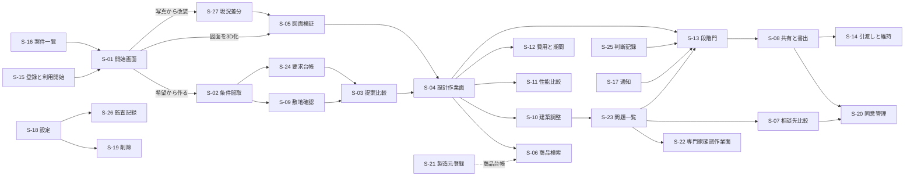
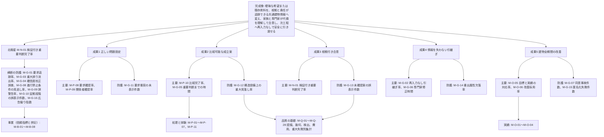

# 画面指標試験骨格（段階2 基盤定義 B4）

作成日: 2026-09-15　版: v1.5　担当: 基盤定義B4（v1.5 は段階8 の最終仕上げ（2026-10-08。再々確認の番号 突合 K1-06、K3-18、K3-19、K4-03、K4-15、K4-27、K6-10、主2-04、主2-08、主2-17、主4-03、主4-05、主4-14、主4-18、主4-22、主4-23、主4-24。統括の決定 D30、D30b、D34、D36〜D38、D45）で、第23章 第4.1節、第5節、第5.1節（正本）に合わせて、T-A-013 に利用目的 5 種の試験情報と合否 (5)(6)（敷地と G2 の適用除外）を、T-A-007 に基準寸法に使った要素の試験情報と (5) を、T-S-001 に AC-C10-009-05 の試験情報と (4) と P0／P1 の扱いを同文で転記し、T-R-005 (4) を第11章の規則（不受理と再指定。DV-CF-11）に、(6) の括弧を「AC-N-OP-01-20 と同じ条件」に、T-R-006 の P0 版（RL-CHK なし、外周壁の削除、候補線上の新設開口、上下階連続壁の短縮と移動、図面読解の修正の除外、派生による I-00-116 は 0 件）、T-R-007 (1′)（S-24-04 の注記と候補の並び）、T-R-009 (6)（日次同期の模擬の同期結果 discontinued）、T-R-010 (5)（共有URL、信頼状態の据え置き、誤警告の却下の前）を同文にし、第3.5節 T-R-006、T-R-010、T-R-011 の行を第6章 第8.3節に同期した。新しい識別子はない。内容は `05_審査/再修正記録_最終仕上げ_群G5.md`。v1.4 は段階8前の持ち越し仕上げ（2026-10-08。共通の決定 D10、D11、既定値の識別子の併記 0 行）で、第23章 第4.1節、第5節、第5.1節（正本）に合わせて、T-A-002、T-A-007、T-R-005 に層「未建築」と照合方法「実測不能（未建築）」の試験情報と合否条件を、T-A-012 に P1 版の試験情報と (4)〜(6) を、T-R-008 に P1 版の境界値の試験情報と (5) を、T-R-009 に AC- の判定先の文を同文で転記し、T-R-006、T-R-011、T-R-012 の字句を同文にそろえ、T-S-003 と他章への依頼または前提の行の提携誤認語の参照を第22章 第6.3節 (g) に改めた。同日、統括の判断（D10 の補足）により、T-A-012 の例 (i) を E-ELM-001.bearsVerticalLoad と isCompartmentPartition の語で書き、T-R-002、T-R-003、T-R-010、T-R-012 の前提と合否条件、T-R-007 の前提を第23章 第5.1節と同文にした（前提は骨格の基本の文に第23章の試験情報を同文で加える形）。内容は `05_審査/再修正記録_段階8前_仕上げ_群F1.md`、条件の変更は `整合検査報告.md` 第5.1節。v1.3 は 2026-10-07 の段階6 二回目の修正（段階7 再審査の後）で、反証試験 T-R-001〜T-R-012 の試験情報と合否条件を第23章 第5節、第5.1節（正本）の改訂文に同期し（T-R-010 を P0 版と P1 版に分けた）、T-S-003 の対象語を第22章 第6.3節の版の参照に、T-S-010 と T-P-007 の合格条件、第3.5節の対応表を改めた。内容は `05_審査/再修正記録_2回目_基盤定義.md`、識別子の変更は `整合検査報告.md` 第5.1節。v1.1 は 2026-09-15 の整合検査B5による修正。内容は `整合検査報告.md`。v1.2 は 2026-10-06 の段階6 初稿審査の再修正。内容は `05_審査/再修正記録_基盤定義.md`、識別子の変更は `整合検査報告.md` 第5節。v1.2 追補は 2026-10-06 の相互依頼で、T-A-012 の P0 版、T-S-003 の対象語、T-S-005 と T-S-008 の合格条件、補助画面 S-28 と S-29 の登録、第23章採番の範囲の注記を加えた。内容は `05_審査/再修正記録_相互依頼_群A.md`。2026-10-07 の相互依頼 基盤仕上げで、T-S-003 の対象語と T-A-005 の合格条件に提携誤認語、M-G-16 の定義と U-00-051 に同点数帯の仮判断を加えた。内容は `05_審査/再修正記録_相互依頼_基盤仕上げ.md`。同日の二回目の修正の仕上げで、T-R-010 P0 版に AC-C09-012-01-03〜05 の判定の文を第23章 第5.1節と同文で加え、T-R-006 の I-06-004 の記録の名称を第6章 第2.6節に合わせた。版は v1.3 のまま。内容は `05_審査/再修正記録_2回目_仕上げ_群R1.md`）。未決事項の識別子は重複解消のため U-00-047〜U-00-056 へ再採番し、試験の関連機能列を機能一覧骨格の F- へ置換した
根拠: 指示文 D（主要画面）、F（品質指標と受入条件）、J（反証審査の失敗条件）、H（事業指標）、E と 9.8（個人情報、削除、同意）、9.4（図面認識の評価設計、重大失敗の別集計）、9.11（重大な失敗と防止策）、10.2（指標の木）、10.7（合格値の初期仮説）、1章（結論の指標表）。識別子は `識別子規則.md`、段階は `七段階門.md`、領域は `十二判断領域.md`、状態は `信頼状態と証拠段階.md`、用語は `用語集.md` に従う。

## 0. 総則

| 規則 | 内容 | 区分 |
|---|---|---|
| 画面の採番 | 主要画面は `識別子規則.md` 第2.3節の S-01〜S-14 を固定し、補助画面は S-15 以降を本章が採番する。共通部品（画面ではない部品群）は S-30 の下に S-30-xx で採番する | 【仮定】 |
| 部品の採番 | 本章は S-04、S-05、S-13 と共通部品 S-30 の部品だけを採番し、残りの画面の部品は第15章担当が採番する。例外として v1.2 で S-10-08（経路帯と立管の編集）を本章で採番した（修正計画 第0.4節と識別子台帳 第5節。S-10-01〜S-10-07 は第15章の採番のまま。JM-115） | 【仮定】 |
| 状態接尾辞 | 空状態 -E、待機状態 -W、失敗状態 -X は各画面または部品の末尾に付ける（`識別子規則.md` 第2.3節） | 【推定】 |
| 指標の採番 | M-N-01 と M-G-01〜M-G-07 は固定済み。本章は M-G-08 以降、M-Q-、M-P-、M-B-、M-O- を採番する。種別（北極星/防護/成果/品質/性能/事業）は属性であり識別子の区分とは別に持つ。他章が仮採番した指標は本章へ登録して採番を確定し、定義と閾値の正本は定義した章に置く（v1.2 で M-G-24、M-B-12〜M-B-15 を登録。JM-005、JM-179、JM-183） | 【仮定】 |
| 試験の採番 | T-A- 受入、T-R- 反証、T-P- 精度と性能、T-S- 安全と情報保護を本章が採番する。T-U- 単体と T-I- 統合は各章が採番する | 【仮定】 |
| 初期仮説 | 数値目標は全て試行前の初期仮説であり、公開判定会議で入力種別ごとに固定し公開する（指示文10.7）。根拠のある参照値には出典を付ける | 【推定】 |
| 関連機能 | 試験の「関連機能」列は機能一覧骨格の F- 識別子と機能名で書く（v1.0 の仮置きは整合検査B5で置換済み。v1.2 で機能一覧骨格 v1.2 の副番を使う）。機能の追加や廃止は識別子台帳で追従する | 【推定】 |

## 1. 画面骨格

### 1.1 主要画面（指示文D節の14画面）

主な利用者は役割符号（RL-OWN 所有者、RL-EDT 編集者、RL-CHK 確認者、RL-VIEW 閲覧者、RL-PART 提携事業者）で書く。「表示する信頼状態表示」は、その画面の建物情報表示部に出る信頼状態の範囲と、併せて常時表示する状態符号を示す。「空/待/失」は空状態、待機状態、失敗状態の有無【推定】。

| 画面ID | 画面名 | 目的 | 主な利用者 | 対応段階門 | 主担当領域 | 表示する信頼状態表示 | 空/待/失 | 詳細を書く章 |
|---|---|---|---|---|---|---|---|---|
| S-01 | 開始画面 | 三入口（希望から作る、図面を3D化、写真から改装）と利用目的の選択。非対象と責任境界の表示。電子連絡先を求めない | RL-OWN（未登録者を含む） | G0 | A01 | なし（建物情報未生成）。「AIは建築士ではない」の責任境界表示 | 空:無 待:無 失:有（読込失敗） | 第8章、第15章 |
| S-02 | 条件聞取画面 | 一問式と一括入力の切替、回答済み条件、残り項目、関係者と生活場面の取得、要求台帳への変換と衝突表示 | RL-OWN、RL-EDT | G0、G1 | A01 | なし。要求の確認状態（VS-USR）と優先度（RP-）を表示 | 空:有（未回答） 待:有（要求変換中） 失:有 | 第5章、第8章、第15章 |
| S-03 | 提案比較画面 | 三案（生活動線重視、費用重視、意匠重視）の2D、3D、費用幅、動線、採光、未解決点を同一評価軸で比較し、選定記録を残す | RL-OWN、RL-EDT、RL-CHK | G2 | A03 | V1（案別に表示）。確信度、概算の確信幅、性能目標（EL-TGT） | 空:有（案未生成） 待:有（三案生成中） 失:有（必須要求を満たす案なし） | 第12章（三案の生成と比較、F-C03-019〜021）、第8章（F-C04-016）、第13章、第15章（v1.2 追補で第9章を外した。第9章 変更提案4） |
| S-04 | 設計作業面 | 左に階と要素、中央に同期2Dと3D、右に属性と商品、下に対話と履歴。自然文変更の差分仮表示と確定 | RL-OWN、RL-EDT、RL-CHK | G1〜G4 | A03 | V0〜V3（案の最低状態）。要素値状態（VS-）、商品層（PT-）と権利状態（RS-）、未確認項目数 | 空:有（要素なし） 待:有（3D構築中、差分計算中） 失:有（拘束解決失敗） | 第11章、第12章、第13章、第15章 |
| S-05 | 図面検証画面 | 原図重ね合わせ、確信度の色表示、尺度確認、問題一覧、図面一式の正本候補、現況差分 | RL-OWN、RL-EDT、RL-CHK | G1 | A12 | V1、V2。要素値状態（VS-SRC、VS-AI、VS-DEF、VS-USR）、現況状態（CS-、改装時）、低確信度要素数 | 空:有（図面未入力） 待:有（読込、尺度判定、壁抽出、開口抽出、関係検査、3D構築の実際の状態） 失:有（尺度判定不能、認識失敗） | 第11章、第15章 |
| S-06 | 商品検索画面 | 実在品と独自案の切替、絞込、比較、適合理由と不適合理由、点数内訳、代替品 | RL-OWN、RL-EDT | G2、G3 | A08 | 商品層（PT-CERT、PT-REF、PT-GEN、PT-AI）、権利状態（RS-）、供給状態（SUP-）、最終確認日時、広告表示 | 空:有（候補なし。独自案への導線） 待:有（検索中、生成中） 失:有（公式接続停止） | 第16章、第15章 |
| S-07 | 相談先比較画面 | 三社以上の作品、対応地域、予算帯、適合理由と点数内訳、料金、紹介料の開示、相談予約 | RL-OWN | G3、G4 | A12 | なし（建物情報の表示は共有範囲の要約のみ）。広告と紹介料の表示 | 空:有（対応地域に該当なし） 待:有 失:有 | 第17章、第15章 |
| S-08 | 共有と書出画面 | 権限、期限、透かし、注記、改訂、書出形式（GLB、PDF、SVG、DXF、IFC）、承認状態、書出検査の合否と例外承認 | RL-OWN、RL-EDT | G2〜G4 | A12 | V0〜V3（書出に転記し透かし）。共通情報環境状態（CDE-WIP、CDE-SHR、CDE-PUB、CDE-ARC）、承認状態（AS-） | 空:有（共有先なし） 待:有（書出生成中、検査中） 失:有（検査不合格、属性欠落） | 第22章、第14章、第15章 |
| S-09 | 敷地確認画面 | 地図、境界資料、法規（版付き）、災害、供給条件、出典時点、解像度、法的境界ではない旨、不足調査 | RL-OWN、RL-EDT、RL-CHK | G0、G1 | A02 | なし（敷地は建物情報の信頼状態と別）。公的地理情報の出典と時点、法規判定の版、不足調査の状態 | 空:有（住所未入力） 待:有（公的情報取得中） 失:有（取得失敗、座標系不明） | 第18章、第15章 |
| S-10 | 建築調整画面 | 空間、構造、外皮、設備の重ね合わせ、主要断面、問題一覧（干渉、構造注意、施工成立性の注意）、責任者、変更影響、経路帯と立管の編集（v1.2、JM-115） | RL-EDT、RL-CHK | G3 | A03 | V1、V2。要素値状態（VS-）、問題の重大度（SEV-）と状態（IS-）、確認範囲別の承認状態（AS-） | 空:有（構造仮定未設定） 待:有（干渉検査中） 失:有（検査失敗） | 第13章、第15章 |
| S-11 | 性能比較画面 | 住宅性能十領域の目標、計算予測、現場確認、第三者評価、法的適合を別列で表示。未確認の一覧。災害耐性と利用円滑性の比較 | RL-OWN、RL-EDT、RL-CHK | G2、G3 | A07 | 証拠段階（EL-TGT、EL-CAL、EL-SITE、EL-3RD、EL-LAW）を列ごとに表示。合成した「達成」表示を作らない | 空:有（目標未設定） 待:有（計算中） 失:有（計算条件不足、基準の版未指定） | 第19章、第15章 |
| S-12 | 費用と期間画面 | 工種別範囲、数量根拠、単価時点、確信幅、変更差、長納期品、期間 | RL-OWN、RL-EDT | G2、G3 | A09 | 概算の確信幅と単価時点。単一額の表示を禁止 | 空:有（数量未算出） 待:有（再計算中） 失:有（単価情報の失効） | 第20章、第15章 |
| S-13 | 段階門画面 | 段階ごとの必要成果、未解決問題、承認者、進行禁止理由、解除に必要な成果、再確認中の表示 | RL-OWN、RL-EDT、RL-CHK | G0〜G6 | A12 | 現段階で許される最大の信頼状態と、案の現在の信頼状態。問題の重大度（SEV-0 は進行禁止） | 空:有（必要成果なし＝段階未開始） 待:有（門の判定中） 失:有（判定不能） | 第6章、第10章、第15章 |
| S-14 | 引渡しと維持画面 | 竣工差分、機器台帳、保証、点検、交換、入居後確認、学び一覧 | RL-OWN、RL-CHK、施工者（RL-PART） | G5、G6 | A11 | V3（竣工反映版）。現況状態（CS-SITE 以上）、証拠段階（EL-SITE、EL-3RD）、供給状態（SUP-）、学習同意の状態 | 空:有（竣工情報なし。P0 では情報構造のみ） 待:有 失:有 | 第21章、第15章 |

### 1.2 補助画面（本章で追加）

| 画面ID | 画面名 | 目的 | 主な利用者 | 対応段階門 | 主担当領域 | 表示する信頼状態表示 | 空/待/失 | 詳細を書く章 |
|---|---|---|---|---|---|---|---|---|
| S-15 | 登録と利用開始画面 | 匿名での利用開始、初回価値の後に電子連絡先を任意登録。利用規約、個人情報方針、処理地域、学習利用が既定で無効であることの表示 | RL-OWN | G0 | A12 | なし | 空:無 待:有（登録処理） 失:有 | 第22章、第15章 |
| S-16 | 案件一覧画面 | 所有と共有された案件の一覧、段階、信頼状態、未解決問題数、承認待ち数、最終更新 | RL-OWN、RL-EDT、RL-CHK、RL-VIEW | 全段階 | A12 | 案件ごとの V0〜V3 と段階（G）。共通情報環境状態（CDE-） | 空:有（案件なし。開始画面へ） 待:有 失:有 | 第15章 |
| S-17 | 通知画面 | 承認依頼、承認の自動失効、進行禁止の発生、商品の権利失効と販売終了、法規や単価の版更新、共有期限、同意撤回の通知 | 全役割 | 全段階 | A12 | 通知対象の信頼状態変化（例: V2→V1 の降格理由） | 空:有（通知なし） 待:無 失:有 | 第15章、第22章 |
| S-18 | 設定画面 | 役割と権限、共有の既定（非公開）、保存期間、処理地域、学習同意（既定無効）、通知、表示（動きを減らす、対比、文字寸法）、鍵盤操作 | RL-OWN | 全段階 | A12 | なし | 空:無 待:無 失:有（保存失敗） | 第22章、第23章、第15章 |
| S-19 | 削除画面 | 案件または利用者情報の一括削除（原本、派生画像、3D、索引、予備複製）。削除範囲、複製先、完了予定、削除証跡の表示 | RL-OWN | 全段階 | A12 | 削除対象の版と共通情報環境状態（CDE-ARC を含む） | 空:有（削除対象なし） 待:有（削除実行中） 失:有（一部削除失敗の明示） | 第22章、第15章 |
| S-20 | 同意管理画面 | 送信先ごとの送信内容、目的、同意または除外、撤回、履歴。学習同意の別管理。外部AI処理先の表示 | RL-OWN | G3、G4（外部送信時）、全段階（学習同意） | A12 | 送信対象の案の信頼状態（V）を送信内容に転記。同意の状態（有効、撤回） | 空:有（送信先なし） 待:有（送信中） 失:有（送信失敗、同意なし送信の遮断） | 第17章、第22章、第15章 |
| S-21 | 製造元登録画面 | 法人が正規商品（品番、寸法、価格、供給、CAD、BIM、許諾条件、帰属表示、使用期限）を登録し、権利状態と供給状態を更新する | 製造元と販売元（RL-PART の一種、法人） | 段階外（商品台帳） | A12 | 商品層（PT-CERT）、権利状態（RS-）、供給状態（SUP-）、最終確認日時 | 空:有（商品なし） 待:有（3D物品の自動検査中） 失:有（検査不合格: 単位、軸、原点、閉じた形状等） | 第16章、第22章、第15章 |
| S-22 | 専門家確認作業面 | 有資格者が確認範囲を指定し、氏名、資格、範囲、日付を付けて承認または差戻し。問題への回答、修正依頼、元図と要求への遡り。確認予約容量の表示 | RL-CHK（有資格者） | G1（敷地根拠、要求実現性）、G3、G4 | A12 | V2→V3 の昇格対象範囲と範囲外（V2 のまま）。要素値状態（VS-PRO への遷移）、承認状態（AS-） | 空:有（確認依頼なし） 待:有（差分再計算中） 失:有（資格未登録で承認不可） | 第17章、第22章、第15章 |
| S-23 | 問題一覧画面 | 案件横断の問題一覧。主担当領域、影響先、重大度、状態、担当、期限、固定先（3D要素、2D位置、図面頁）、解決証拠。問題からの建築士確認、図面修正、相談予約の開始 | RL-OWN、RL-EDT、RL-CHK、RL-PART（共有範囲内） | 全段階 | A12 | 問題の重大度（SEV-0〜3）と状態（IS-）。関連する案の信頼状態 | 空:有（問題なし。「検査済み、指摘なし」と「未検査」を区別） 待:有（再計算中） 失:有 | 第10章、第13章、第15章 |
| S-24 | 要求台帳画面 | 要求の一覧と編集。優先度、数値範囲、出典、決定者、確認者、期限、確認状態。案、要素、判断、承認への双方向追跡。衝突と解決候補と代償 | RL-OWN、RL-EDT、RL-CHK | G1〜G4 | A01 | 要求の確認状態（VS-USR、VS-PRO）。追跡先の案の信頼状態 | 空:有（要求なし） 待:有（追跡再計算） 失:有 | 第5章、第10章、第15章 |
| S-25 | 判断記録画面 | 重要判断の一覧。要求、選択肢、選定理由、影響先、決定者、確認者、版。分母（重要判断一覧）の追加と削除の理由と承認。検証付き重要判断完了率の案件内表示 | RL-OWN、RL-EDT、RL-CHK | G0〜G6 | A12 | 判断の承認状態（AS-）と版（CDE-）。判断が依拠する案の信頼状態 | 空:有（判断なし） 待:無 失:有 | 第10章、第15章 |
| S-26 | 監査記録画面 | 閲覧、変更、送信、削除、運用担当者の閲覧申請と承認の記録。障害調査用複製の期限 | RL-OWN、情報管理者、監査 | 全段階 | A12 | なし | 空:有（記録なし） 待:有（抽出中） 失:有 | 第22章、第15章 |
| S-27 | 現況差分画面 | 改装案件で設計時図面、竣工図、現況の差を重ね、要素ごとに残す、撤去、補修、補強、移設、新設を指定。隠れ部分（CS-EST）と必要調査（石綿事前調査等）の一覧 | RL-OWN、RL-EDT、RL-CHK | G1、G3 | A10 | V1、V2。現況状態（CS-DRW、CS-SITE、CS-OPEN、CS-EST） | 空:有（現況資料なし） 待:有（差分計算中） 失:有 | 第21章、第11章、第15章 |
| S-28 | 運用指標画面 | 指標の月次値を初期仮説の目標値と層別と併せて表示し、公開判定会議と収益操作の事前承認を記録する（F-C15-015） | 製品責任者、運用担当者 | 全段階（案件横断） | A12 | なし（案件の信頼状態は表示しない） | 第15章 第7.26.1節 | 第15章（採番と内容の正本。v1.1。本表は一覧の完全性のための登録。2026-10-06） |
| S-29 | 提携先管理画面 | 提携先台帳（F-C08-001）の登録、申告の更新、検証、提携状態の変更と、提携契約に基づく報酬と広告の別の登録（F-C08-004、F-C08-009）。部品 S-29-01〜05 | 提携先の法人利用者（RL-PART の一種。自社の行だけ）、運用担当者（検証は二人確認）。案件の利用者には表示しない | 段階外（案件横断の提携先台帳） | A09（F-C08-001 の主担当。十二判断領域 第3.4節） | なし（提携状態、検証日と「未検証」、提携契約の版を文字で表示） | 第17章 第2.5節 | 第17章（採番と内容の正本。v1.1、U-15-020）、第15章（画面一覧と遷移）。本表への登録は 2026-10-06 の相互依頼 |

S-27 は指示文D節の図面検証画面（S-05）と建築調整画面（S-10）の現況表示規則（`信頼状態と証拠段階.md` 第10節）を改装案件で独立させた画面であり、P1 で追加する【仮定】。S-21 は P2（法人用商品登録）、S-22 と S-20 の外部送信部は P1、その他の補助画面は P0 とする【推定】。S-28（第15章 v1.1）と S-29（第17章 v1.1）は各章が採番した補助画面で P1 とし、採番と内容の正本は各章である。以後の補助画面は S-31 以降とする（S-30 は共通部品群。2026-10-06 相互依頼）【推定】。

### 1.3 本章で採番する部品

| 部品ID | 部品名 | 内容 | 状態接尾辞の例 |
|---|---|---|---|
| S-04-01 | 階と要素の木 | 左欄。階（Level）、室（Space）、要素の親子関係。要素値状態（VS-）の記号を各行に表示 | S-04-01-E 要素なし |
| S-04-02 | 同期2D | 中央左。平面、断面、立面。寸法、扉開閉域、通路幅、家具余白の表示 | S-04-02-W 再描画中 |
| S-04-03 | 同期3D | 中央右。軌道回転、俯瞰、walkthrough、階別、屋根非表示、断面、透過、計測、注記、日照比較 | S-04-03-W 3D構築中、S-04-03-X 構築失敗 |
| S-04-04 | 属性欄 | 右上。選択要素の属性、要素値状態（VS-）、出典（元頁、元座標）、確信度、責任者、改訂 | S-04-04-E 未選択 |
| S-04-05 | 商品欄 | 右下。配置候補の商品層（PT-）、権利状態（RS-）、供給状態（SUP-）、適合理由 | S-04-05-E 候補なし |
| S-04-06 | 対話欄 | 下左。自然文の変更命令。対象、操作、量、方向、固定条件、目的の抽出結果の確認。相対表現（右等）の座標系確認 | S-04-06-W 意図解析中 |
| S-04-07 | 変更差分の仮表示 | 差分の一覧（影響要素、費用差、問題の増減）と2D、3Dの仮表示。確定と取消 | S-04-07-W 影響計算中、S-04-07-X 拘束解決失敗 |
| S-04-08 | 履歴欄 | 下右。変更命令の履歴、取消、やり直し、分岐案の比較 | S-04-08-E 履歴なし |
| S-04-09 | 当事者確認の記録 | 実物尺度の歩行で本人が経路を見た記録。対象の関係者行の選択、視点高さ（第12章 既定値表 DV-FN-03 の当事者別値を既定）、見た経路（E-SYS-003）、立会者、日時、結果（確認済み、懸念あり）を E-ORG-008.selfConfirmation（method=実物尺度の歩行）と E-SRV-013.stakeholderCheck（当事者ごとの一覧。第12章 v1.3）の当該当事者の行へ書き込む。操作主体は本人（RL-VIEW）、または RL-OWN と RL-EDT による代理記録（代理の別を残す）（v1.2、JM-114） | S-04-09-E 当事者未登録、S-04-09-W 記録の保存中、S-04-09-X 保存失敗 |
| S-05-01 | 原図重ね | 原図と抽出線の重ね表示。透過率、頁と階の切替 | S-05-01-W 壁抽出中 |
| S-05-02 | 確信度表示 | 要素ごとの確信度を色と記号で表示。低確信度要素の一覧と修正依頼 | S-05-02-E 低確信度なし |
| S-05-03 | 尺度確認 | 基準寸法の指定、複数寸法の整合検査結果、尺度の要素値状態（VS-USR への遷移） | S-05-03-X 尺度判定不能 |
| S-05-04 | 問題一覧（図面） | 図面由来の問題（図面間矛盾、改訂不一致、閉領域不成立、上下階不整合）と固定先 | S-05-04-E 指摘なし |
| S-05-05 | 処理状態 | 読込、尺度判定、壁抽出、開口抽出、関係検査、3D構築の実際の状態、待ち時間の見込、部分結果、失敗箇所、再試行。架空の進捗率を出さない | S-05-05-W、S-05-05-X |
| S-05-06 | 正本候補判定 | 図面一式の図面一覧、改訂日、正本候補、差替え漏れ、優先した資料の記録（P1） | S-05-06-E 単一図面 |
| S-10-08 | 経路帯と立管の編集 | 立管候補の選択、経路帯の移動と迂回候補の採用、配管空間の位置、下がり天井の範囲指定。操作は変更命令（primaryDomain=A06）として登録し、S-04-07 の仮表示へ送る。進行禁止条件 I-00-117（排水勾配の不成立）を解く操作の導線（v1.2 で本章が採番。操作と三状態の文言は第15章 第7.8節が書く。JM-115） | S-10-08-E 経路帯なし（設備仮定未設定）、S-10-08-W 影響計算中、S-10-08-X 拘束解決失敗 |
| S-13-01 | 必要成果一覧 | 段階ごとの必須成果と充足状態（完了、未完了、再確認中） | S-13-01-E 段階未開始、S-13-01-X 判定不能 |
| S-13-02 | 未解決問題 | 段階の完了を妨げる問題（SEV-0、SEV-1）と例外承認の状態 | S-13-02-E 未解決なし |
| S-13-03 | 承認者 | 確認範囲ごとの承認者、承認状態（AS-）、依頼と催促 | S-13-03-E 承認者未設定 |
| S-13-04 | 進行禁止理由 | 該当する進行禁止条件（I-00-101〜I-00-133 相当）、解除に必要な成果、担当。例外承認では解除できない旨 | S-13-04-E 該当なし |
| S-13-05 | 信頼状態の対応 | 現段階で許される最大の信頼状態と案の現在の状態、昇格に不足する条件の一覧 | S-13-05-W 判定中 |
| S-30-01 | 信頼状態帯 | 全画面の建物情報表示部に常時出す V0〜V3、未確認項目数、確認範囲別の内訳への導線 | 常時表示（状態接尾辞なし） |
| S-30-02 | 処理状態表示 | 長い処理の共通部品。実際の状態名、待ち時間の見込、部分結果、失敗箇所、再試行 | S-30-02-W、S-30-02-X |
| S-30-03 | 問題固定注記 | 3D要素、2D位置、図面頁に固定する注記と問題の共通部品 | S-30-03-E |
| S-30-04 | 商品状態表示 | 商品層（PT-）、権利状態（RS-）、供給状態（SUP-）、関係区分（PR-）、最終確認日時、広告表示の共通部品 | 常時表示 |
| S-30-05 | 証拠段階表示 | 性能項目の EL- 五段階を別々に表示する共通部品。失効は「再判定要」 | 常時表示 |
| S-30-06 | 責任境界表示 | AI が行えることと人が担うことの区分、AI 人格が建築士でない旨の表示 | 常時表示 |

注（v1.2）: S-10 の部品のうち S-10-01〜S-10-07 は第15章の採番である。S-10-03 は第15章が名称を「干渉一覧」から「問題一覧（干渉、構造注意、施工成立性の注意）」に改め、種別列で干渉種別、構造注意9項目、施工成立性の注意を区別し、必要資料一覧は問題から辿る。外皮方針と層構成は S-10-06 に含める（審査 JM-115 の (a) 案。構造注意と必要資料を S-10-08 にする (b) 案は採らない）。S-04-09 と S-10-08 は本章が採番し、操作、空状態、待機状態、失敗状態の文言は第15章が書く（JM-114、JM-115）【推定】。

### 1.4 画面遷移の概略

段階門画面 S-13 は全画面の信頼状態帯（S-30-01）から常に開ける。上図は主経路のみを示し、全遷移は第15章が定める【仮定】。

### 1.5 全画面に共通する表示規則

| 規則 | 内容 | 検査する試験 | 区分 |
|---|---|---|---|
| 信頼状態の常時表示 | 建物情報を表示する全画面と全書出に S-30-01 を置き、V0〜V3 と未確認項目数を表示する。書出には透かしを付ける | T-S-003 | 【推定】 |
| 禁止表示語の検査 | 「施工可能」「法規適合」「完全正確」「原図完全一致」「構造安全」「確認申請可能」「評価済み」「製作可能」（PT-AI）を、状態が許さない場面で表示しない | T-S-003、T-A-007 | 【推定】 |
| 実際の処理状態 | 架空の進捗率を出さず、実際の状態名、待ち時間の見込、部分結果、失敗箇所、再試行を示す（S-30-02） | T-P-008 | 【推定】 |
| 色だけに依存しない | 確信度、重大度、状態は色に加えて文字、形、図案を併用する。通常文字の対比 4.5 対 1 以上、鍵盤操作、焦点表示、動きを減らす設定、375、768、1024、1440 px で確認する | T-S-009 | 【推定】 |
| 空状態の区別 | 「未検査」と「検査済みで指摘なし」を同じ空状態で表示しない（S-23、S-05-04、S-13-02） | T-S-011、T-A-013 | 【仮定】 |
| 責任境界の表示 | AI 人格を建築士と誤認させない。専門家確認済みは氏名、資格、範囲、日付がある場合だけ表示する（S-30-06） | T-S-010 | 【推定】 |
| 視覚方針 | 背景 #F8FAFC、主色 #0F172A、副色 #334155、主要操作 #0369A1、境界 #E2E8F0、危険 #DC2626 を初期値とする。英数字見出し Outfit、本文 Work Sans、日本語 Noto Sans JP を候補とし実機で可読性を検証する | T-S-009 | 【推定】 |

## 2. 指標骨格

### 2.0 共通規則

| 規則 | 内容 | 区分 |
|---|---|---|
| 層別 | 認識と幾何の指標は、入力種別（ベクトル、画像）、入力品質（明瞭、低解像度、傾き、汚れ、手描き）、構法（在来木造、大断面木造、鉄骨、RC）、階数（平屋、二階、三階以上）、壁形状（直交、斜め、曲面）、図種（意匠図のみ、図面一式）、記号言語（日本語、英語、混在）、規模（延床面積帯）で分けて報告する。平均値だけで公開判断をしない（指示文F、9.4） | 【推定】 |
| 試験情報の分離 | 学習、調整、試験の物件を建物単位で分離し、同じ設計雛形の別頁が試験側へ漏れないようにする | 【推定】 |
| 分母の管理 | 北極星指標の分母（重要判断一覧）は案件ごとに変わる。分母の追加と削除には理由と承認を要し、判断記録画面（S-25）で管理する | 【推定】 |
| 計測時点 | 「試験時」は公開前の技術試験、「案件」は運用時の案件単位、「月次」は運用の集計、段階符号（G）は段階門の通過時点を示す | 【仮定】 |
| 初期仮説 | 目標値は全て初期仮説。指示文10.7 の三値以外は公開判定会議で固定するまで「未設定」とし、参照値がある場合は出典を付ける | 【推定】 |

### 2.1 北極星指標と防護指標

| 指標ID | 指標名 | 定義 | 分子 | 分母 | 単位 | 計測時点 | 集計の切り口 | 初期仮説の目標値 | 種別 |
|---|---|---|---|---|---|---|---|---|---|
| M-N-01 | 検証付き重要判断完了率 | 必要な重要判断のうち、要求、選択肢、選定理由、他分野への影響、決定者、確認者、版がそろった判断の割合【推定】 | 七項目がそろった判断数 | 案件で必要と判定した重要判断数（追加削除に理由と承認） | % | G2、G3、G4 の門通過時、月次 | 段階、入口（希望、図面、写真）、主担当領域 | 未設定（P0 公開判定会議で固定）。仮説: G4 通過案件で 90% 以上【仮定】 | 北極星 |
| M-G-01 | 要求追跡率 | 重要要求（RP-MUST、RP-FORBID）のうち、出典と確認者があり、案、要素、判断へ双方向にたどれる割合【推定】 | 追跡可能な重要要求数 | 重要要求数 | % | G1 以降の各門、G4 | 段階、入口、優先度 | 95% 以上（指示文10.7、初期仮説）【推定】 | 防護 |
| M-G-02 | 再入力なし引継ぎ率 | 専門家が作り直さず利用できた要求、建物、商品、問題の情報項目の割合【推定】 | 受取側が再入力せず利用した項目数 | 引継ぎ一式の情報項目数 | % | G4 引継ぎ後の受取側確認時 | 情報種別（要求、建物、商品、問題）、書出形式（GLB、PDF、IFC）、受取側の役割 | 未設定。仮説: P0 の標準の必要情報要求で 80% 以上【仮定】 | 防護 |
| M-G-03 | 重大誤り流出率 | 尺度、外壁、階段、避難、構造、設備等の重大誤り（SEV-0 相当）が確認工程（V2 判定、専門家確認）を通過した割合【推定】 | 確認工程通過後に発見された重大誤り数 | 発見された重大誤り総数 | % | 試験時、案件（G4 以降の発見） | 誤りの種類（尺度、外壁、階段、扉向き、避難、構造、設備）、入力種別、入力品質 | 試験時 0%（未解決の重大問題がある案件の V2 移行を全件阻止。指示文10.7）【推定】 | 防護 |
| M-G-04 | 確信度校正誤差 | 表示した確信度と実際の正答率の差。確信度帯ごとに正答率を測り、差の絶対値の最大を取る【推定】 | 確信度帯の表示確信度と実測正答率の差の絶対値 | （比の差のため分母なし。帯ごとの要素数を併記） | ポイント | 試験時、月次 | 確信度帯（0.5〜0.6、…、0.9〜1.0）、要素種別、入力種別 | 未設定。仮説: 確信度 90% 帯で正答率 85〜95%（±5 ポイント以内）【仮定】 | 防護 |
| M-G-05 | 重要判断までの時間 | 入力開始から、比較可能で根拠付きの判断案（三案と評価軸、または不足情報一覧）が得られるまでの時間【推定】 | 判断案提示時刻 − 入力開始時刻 | （時間差のため分母なし。案件数を併記） | 分 | G2 | 入口、入力種別、規模、利用者の回答方式（一問式、一括） | 未設定【未確認】 | 防護 |
| M-G-06 | 専門家修正時間 | 専門家が初回案を実務利用可能な状態へ直すために要した時間【推定】 | 受取側の修正作業時間の合計 | （時間のため分母なし。案件数を併記） | 時間 | G4 引継ぎ後 | 受取側の役割（建築士、構造、設備）、書出形式、入力種別 | 未設定【未確認】 | 防護 |
| M-G-07 | 同意事故件数 | 同意を得ていない送信先、内容、目的で利用者情報が外部へ送られた事象の件数。五成果の「同意違反」と同一指標【推定】 | 同意事故の件数 | （件数。送信件数を併記して率も出す） | 件 | 月次、事象発生時 | 送信先種別（提携先、外部AI処理先）、原因（一括同意、選択誤り） | 0 件【推定】 | 防護 |
| M-G-08 | 進行禁止条件の見逃し率 | 進行禁止条件（SEV-0）に該当する案件のうち、次段階の信頼表示へ進んでしまった割合【推定】 | 該当しながら進んだ案件数 | 進行禁止条件に該当した案件数 | % | 試験時、案件（各門） | 段階、進行禁止条件の識別子（I-00-101〜133）、入力種別 | 0%（指示文10.7）【推定】 | 防護 |
| M-G-09 | 誤警告率 | 問題として提示したもののうち、確認者が理由を付けて却下（IS-REJECTED）した割合【推定】 | 却下された問題数 | 提示した問題数 | % | 案件、月次 | 重大度、主担当領域、検出方式（決定的検査、AI推定） | 未設定。仮説: SEV-0 の誤警告 5% 以下【仮定】 | 防護 |
| M-G-10 | 証拠段階の誤表示件数 | 目標、計算予測、現場確認、第三者評価、法的適合を混同して表示した件数（禁止表示語の検出を含む）【推定】 | 誤表示の件数 | （件数。性能項目の表示回数を併記） | 件 | 試験時、月次 | 証拠段階の組合せ、画面、書出形式 | 0 件【推定】 | 防護 |
| M-G-11 | 要求衝突の未表示件数 | 検出可能な要求衝突のうち、決定者へ表示されなかった件数【推定】 | 未表示の衝突数 | （件数。検出した衝突数を併記） | 件 | G1、試験時 | 衝突の種類（家族間、敷地面積、予算と性能） | 0 件【推定】 | 防護 |
| M-G-12 | 構造設備上の重大見落し率 | 三案または調整模型に存在する構造と設備の重大問題（跨度超過、耐力壁と大開口、梁と排水経路、避難経路なし等）のうち、G2 または G3 で問題として提示されなかった割合【推定】 | 提示されなかった重大問題数 | 試験情報に埋め込んだ重大問題数 | % | 試験時、G3 | 問題の種類、構法、階数 | 未設定。仮説: 試験情報で 0%【仮定】 | 防護 |
| M-G-13 | 未確認案の誤表示件数 | V0 または V1 の案を V2 以上として表示または書出した件数【推定】 | 誤表示の件数 | （件数。表示回数と書出回数を併記） | 件 | 試験時、月次 | 画面、書出形式、原因（昇格条件の欠落、降格の未反映） | 0 件（指示文10.7）【推定】 | 防護 |
| M-G-14 | 書出属性欠落率 | 書出時に必要情報要求の必須属性が欠けた要素の割合【推定】 | 必須属性が欠けた要素数 | 書出対象の要素数 | % | G4 書出時 | 書出形式、必要情報要求の種別（標準、IDS）、要素種別 | 未設定。例外承認のない欠落は 0%【仮定】 | 防護 |
| M-G-15 | 匿名化失敗件数 | 学び一覧や改善記録に、個人や住所を特定できる情報が残った件数【推定】 | 特定可能な情報が残った記録数 | （件数。匿名化した記録数を併記） | 件 | G6、月次 | 情報種別（住所、氏名、図面番号、位置情報） | 0 件【推定】 | 防護 |
| M-G-16 | 広告偏り指数 | 掲載料や紹介料を払う企業の商品と相談先が、点数上位に占める割合と、無償企業の同点数帯での露出との差【推定】。同点数帯は推奨点（相談先は点数内訳の合計）の 10 点幅の帯とし、帯ごとに有償と無償の露出の差を求めて月次で集計する（仮判断。U-00-051、第16章 第3.6節 U-16-003。提携先版は第17章 第3.5節）【仮定】 | 有償企業の上位露出回数 − 同点数帯の無償企業の露出回数 | 同点数帯の露出回数 | ポイント | 月次 | 商品分類、地域、相談先種別 | 未設定。仮説: 差 ±5 ポイント以内【仮定】 | 防護 |
| M-G-24 | RP-MUST からの優先度降格件数（承認者付き） | 要求の優先度が RP-MUST から RP-WANT 以下へ変更された件数。変更者、承認者、理由と、降格で M-G-01 の分母から外れた要求数を併記する。重要要求を分母から外して M-G-01 を見かけ上上げる操作を検出する【推定】 | 降格された要求の件数 | （件数。承認者のない降格の件数と、M-G-01 の分母から外れた要求数を併記） | 件 | 案件（優先度の変更時）、月次 | 案件、段階、変更者の役割 | 承認者のない降格 0 件。発生時は理由付きで公開判定会議へ報告（初期仮説）【仮定】 | 防護 |

注（v1.2）: M-G-17〜M-G-23 は第23章 第2.5節が採番した（M-G-17 の定義の正本は第2章 第5.1節）。M-G-25 形式的な判断記録の割合（防護指標。二段構え、M-G-17 と同じ型）は二回目の修正で第23章 第2.5節が採番し、定義と閾値の正本は第2章 第5.1節である（本章は行を持たない。受入条件 AC-C15-014-08。v1.3、JR-003、整合検査報告 第5.1節）。M-G-24 は第2章の依頼（審査 JM-005）で第23章 第2.5節が定義し、本章が採番を登録した。定義と閾値の正本は第23章 第2.5節であり、試験は第23章の T-U-002（優先度変更の承認記録）と T-I-019（案件単位の集計）で行う【推定】。

### 2.2 五成果と指標の対応

指示文10.2 の五成果に対する主要指標と防護指標を、本章の識別子で固定する【推定】。

| 成果 | 利用者が得る状態 | 主要指標 | 防護指標 |
|---|---|---|---|
| 正しい問題設定 | 誰の何を解くか、必須条件と非対象が合意済み | M-P-08 要求確認率、M-P-09 関係者確認率 | M-G-11 要求衝突の未表示件数 |
| 比較可能な成立案 | 三案の生活、空間、技術、費用、性能の差が分かる | M-P-10 比較完了率、M-G-05 重要判断までの時間 | M-G-12 構造設備上の重大見落し率 |
| 根拠付き合意 | 選定理由、捨てた条件、未解決点、確認者が残る | M-N-01 検証付き重要判断完了率 | M-G-13 未確認案の誤表示件数 |
| 情報を失わない引継ぎ | 専門家が元図と要求へ戻れ、作り直しが減る | M-G-02 再入力なし引継ぎ率、M-G-06 専門家修正時間 | M-G-14 書出属性欠落率 |
| 建物全期間の改善 | 竣工差と入居後実績が次の判断へ戻る | M-O-05 目標と実績の対応率、M-O-06 改善採用率 | M-G-07 同意事故件数（同意違反）、M-G-15 匿名化失敗件数 |

### 2.3 品質と精度の指標（指示文F節の認識、幾何、検出、費用の指標）

適合率、再現率、F1 は、要素ごとの照合を正解情報（許諾を得た日本の戸建図面に人が付けた正解）に対して行う。照合の一致条件（位置の許容差、IoU の閾値）は試験前に固定する（未決 U-00-049）【推定】。

| 指標ID | 指標名 | 定義 | 分子 | 分母 | 単位 | 計測時点 | 集計の切り口 | 初期仮説の目標値 | 種別 |
|---|---|---|---|---|---|---|---|---|---|
| M-Q-01 | 壁認識品質 | 壁の適合率、再現率、F1【推定】 | 適合率: 正しく認識した壁数。再現率: 同左 | 適合率: 認識した壁数。再現率: 正解の壁数。F1 は両者の調和平均 | % | 試験時、月次（同意済み案件の再評価） | 2.0 節の層別全部（特に入力品質、壁形状、手書きか否か） | 未設定。参照値: FloorplanVLM の外壁 IoU 92.52%（https://arxiv.org/abs/2602.06507 、確認日 2026-09-15）【事実】は日本の戸建図面の値ではない【推定】 | 品質 |
| M-Q-02 | 扉認識品質 | 扉の適合率、再現率、F1。扉の向き（開き勝手）は M-Q-28 で別集計【推定】 | 正しく認識した扉数 | 認識した扉数（適合率）、正解の扉数（再現率） | % | 試験時、月次 | 層別全部、建具記号の種類 | 未設定【未確認】 | 品質 |
| M-Q-03 | 窓認識品質 | 窓の適合率、再現率、F1【推定】 | 正しく認識した窓数 | 認識した窓数、正解の窓数 | % | 試験時、月次 | 層別全部 | 未設定【未確認】 | 品質 |
| M-Q-04 | 室認識品質 | 室（閉領域と室名）の適合率、再現率、F1【推定】 | 正しく認識した室数 | 認識した室数、正解の室数 | % | 試験時、月次 | 層別全部、室名の言語 | 未設定【未確認】 | 品質 |
| M-Q-05 | 階段認識品質 | 階段の適合率、再現率、F1。階段の上下階接続は M-Q-14 と M-Q-27 で別集計【推定】 | 正しく認識した階段数 | 認識した階段数、正解の階段数 | % | 試験時、月次 | 層別全部、階数 | 未設定【未確認】 | 品質 |
| M-Q-06 | 寸法文字認識品質 | 寸法文字（数値と単位）の適合率、再現率、F1【推定】 | 正しく読み取った寸法文字数 | 読み取った寸法文字数、正解の寸法文字数 | % | 試験時、月次 | 層別全部、文字の向き、手書きか否か | 未設定【未確認】 | 品質 |
| M-Q-07 | 外周IoU | 認識した外周多角形と正解外周の IoU【推定】 | 交差面積 | 合併面積 | % | 試験時、月次 | 層別全部 | 未設定。参照値は M-Q-01 と同じ【推定】 | 品質 |
| M-Q-08 | 室領域IoU | 室ごとの認識領域と正解領域の IoU の平均と最小【推定】 | 交差面積 | 合併面積 | % | 試験時、月次 | 層別全部、室の用途 | 未設定【未確認】 | 品質 |
| M-Q-09 | 開口位置IoU | 開口（扉、窓）の認識矩形と正解矩形の IoU の平均【推定】 | 交差面積 | 合併面積 | % | 試験時、月次 | 層別全部、開口種別 | 未設定【未確認】 | 品質 |
| M-Q-10 | 外周実寸誤差 | 尺度確認後の外周各辺の実寸と正解の差の絶対値（中央値と 95 百分位）【推定】 | 認識辺長 − 正解辺長 の絶対値 | （長さの差のため分母なし。辺数を併記） | mm | 試験時 | 層別全部 | 未設定。仮説: 中央値 20 mm 以内、95 百分位 50 mm 以内【仮定】 | 品質 |
| M-Q-11 | 室領域実寸誤差 | 尺度確認後の室の内法寸法と正解の差の絶対値【推定】 | 認識内法 − 正解内法 の絶対値 | （分母なし。室数を併記） | mm | 試験時 | 層別全部 | 未設定。仮説: 中央値 20 mm 以内【仮定】 | 品質 |
| M-Q-12 | 開口位置実寸誤差 | 尺度確認後の開口中心位置と幅の正解との差の絶対値【推定】 | 認識位置 − 正解位置 の絶対値 | （分母なし。開口数を併記） | mm | 試験時 | 層別全部、開口種別 | 未設定。仮説: 中央値 30 mm 以内【仮定】 | 品質 |
| M-Q-13 | 室接続関係正解率 | 扉による室間接続の組が正解と一致した割合【推定】 | 正しい接続組数 | 正解の接続組数 | % | 試験時 | 層別全部 | 未設定【未確認】 | 品質 |
| M-Q-14 | 上下階接続正解率 | 階段と吹抜けによる上下階接続が正解と一致した割合【推定】 | 正しい上下接続数 | 正解の上下接続数 | % | 試験時 | 階数、図種（各階平面の有無） | 未設定【未確認】 | 品質 |
| M-Q-15 | 閉領域正解率 | 室の閉領域が過不足なく閉じた割合（欠落壁による漏れ、余分な分割を誤りとする）【推定】 | 正しく閉じた室数 | 正解の室数 | % | 試験時 | 層別全部 | 未設定【未確認】 | 品質 |
| M-Q-16 | 尺度確認後の主要寸法誤差 | 利用者が尺度を確認した後の主要寸法（階高、壁厚、外周、開口幅）の正解との差【推定】 | 表示寸法 − 正解寸法 の絶対値 | （分母なし。寸法数を併記） | mm | 試験時、案件（専門家確認時） | 寸法種別、要素値状態（VS-SRC、VS-AI、VS-DEF） | 未設定。仮説: VS-SRC で 10 mm 以内、VS-AI で 50 mm 以内【仮定】 | 品質 |
| M-Q-17 | 低確信度要素の検出率 | 実際に誤っている要素のうち、低確信度（閾値は U-00-003）として表示された割合【推定】 | 誤りかつ低確信度表示の要素数 | 誤っている要素数 | % | 試験時 | 要素種別、入力品質 | 未設定。仮説: 90% 以上【仮定】 | 品質 |
| M-Q-18 | 高確信度誤り率 | 高確信度として表示した要素のうち、実際に誤っていた割合【推定】 | 高確信度かつ誤りの要素数 | 高確信度表示の要素数 | % | 試験時 | 要素種別、入力品質 | 未設定。仮説: 5% 以下【仮定】 | 品質 |
| M-Q-19 | 2D変更と3D反映の整合率 | 2D または 3D で行った変更が、同じ建物情報から描画した他方へ寸法どおり反映された割合【推定】 | 整合した変更数 | 変更数 | % | 試験時、月次 | 変更種別（移動、寸法、追加、削除）、操作面（2D、3D、自然文） | 100%（同じ建物情報から描画するため）【推定】 | 品質 |
| M-Q-20 | 家具衝突検出率 | 家具と壁、家具同士の衝突（当たり判定形状）を検出した割合と誤検出率【推定】 | 検出した衝突数 | 試験情報の衝突数 | % | 試験時 | 商品層、家具種別 | 未設定。仮説: 検出 100%、誤検出 5% 以下【仮定】 | 品質 |
| M-Q-21 | 扉開閉域検出率 | 扉開閉域と家具、壁、他の扉の干渉を検出した割合【推定】 | 検出した干渉数 | 試験情報の干渉数 | % | 試験時 | 扉種別 | 未設定。仮説: 100%【仮定】 | 品質 |
| M-Q-22 | 通路余白検出率 | 通路幅と椅子を引く余白等の要求値未満を検出した割合【推定】 | 検出した不足数 | 試験情報の不足数 | % | 試験時 | 要求種別、室 | 未設定。仮説: 100%【仮定】 | 品質 |
| M-Q-23 | 不適合理由の正確性 | 商品候補に表示した「何が合わないか」が、人の照合で正しかった割合【推定】 | 正しい不適合理由数 | 表示した不適合理由数 | % | 試験時、月次 | 理由の種別（寸法、余白、扉、搬入、電源、予算、供給）、商品層 | 未設定。仮説: 95% 以上【仮定】 | 品質 |
| M-Q-24 | 概算と後工程見積の差 | 工種別概算幅と後工程（専門家、施工者）の見積の差を、設計段階、工種、確信幅ごとに集計した値【推定】 | 見積額 − 概算幅の中央値 | 概算幅の中央値 | % | G4 以降（見積入手時） | 設計段階（G2、G3）、工種、確信幅、地域、単価時点 | 未設定。合格条件は「見積が概算幅の内側に入った割合」で別途集計【仮定】 | 品質 |
| M-Q-25 | 尺度誤認率（重大失敗） | 尺度を誤ったまま建物情報を作った案の割合。重大失敗として別集計【推定】 | 尺度誤認の案数 | 図面入力の案数 | % | 試験時、案件（尺度確認時の修正） | 入力種別、印刷倍率の有無、寸法線の有無 | 試験時 0%（V2 前に基準寸法確認と複数寸法の整合検査で停止）【推定】 | 品質 |
| M-Q-26 | 外壁欠落率（重大失敗） | 外周を構成する壁の一部が欠落した案の割合【推定】 | 外壁欠落のある案数 | 図面入力の案数 | % | 試験時 | 入力品質（薄い線）、図種（頁間分離） | 試験時 0%（閉領域検査で停止）【推定】 | 品質 |
| M-Q-27 | 階段接続誤り率（重大失敗） | 階段の上下階接続が誤った案の割合【推定】 | 接続誤りのある案数 | 二階建以上の図面入力の案数 | % | 試験時 | 階数、図種 | 試験時 0%（上下階接続検査で停止）【推定】 | 品質 |
| M-Q-28 | 扉向き誤り率（重大失敗） | 扉の開き勝手（吊元、開き方向）が誤った扉の割合【推定】 | 向きが誤った扉数 | 認識した扉数 | % | 試験時 | 建具記号の種類、手書きか否か | 未設定。仮説: 2% 以下、かつ低確信度として表示【仮定】 | 品質 |

注（2026-10-06 相互依頼）: M-Q-29〜M-Q-47 は第23章 第2.5節が採番と定義の正本である（M-Q-45〜M-Q-47 は第11章の依頼で第23章 v1.2 が採番した記号分類の適合率と再現率、図面間不一致の検出率、承認失効の記録率。JM-173）。同じく M-O-07 家族間衝突の見逃し率（P2。計測元は第21章 第7節 規則(9)）と M-O-08 外皮の危険指摘と入居後不具合の対応率（P2。第13章 F-C11-009）は第23章 v1.2 第2.5節が採番と定義の正本である（第2.6節の実績の指標の続き。G6 で計測し P0 では「未計測」）。本章は採番を登録し、行は持たない（整合検査報告 第5節）【推定】。

### 2.4 処理と体験の指標

| 指標ID | 指標名 | 定義 | 分子 | 分母 | 単位 | 計測時点 | 集計の切り口 | 初期仮説の目標値 | 種別 |
|---|---|---|---|---|---|---|---|---|---|
| M-P-01 | 初回3D案までの時間 | 図面または条件の入力完了から、初回の V1 建物情報（同期2Dと3D）が表示されるまでの時間（中央値と 95 百分位）【推定】 | 表示時刻 − 入力完了時刻 | （分母なし。案件数を併記） | 秒 | 案件、月次 | 入口、入力種別、頁数、規模 | 未設定。仮説: 明瞭な単一縮尺の一階平面図で中央値 180 秒以内【仮定】 | 性能 |
| M-P-02 | 変更反映時間 | 変更命令の確定から 2D と 3D の再描画と差分再計算が完了するまでの時間【推定】 | 反映完了時刻 − 確定時刻 | （分母なし） | 秒 | 案件、月次 | 変更種別、要素数 | 未設定。仮説: 中央値 3 秒以内【仮定】 | 性能 |
| M-P-03 | 共有読込時間 | 共有URL（GLB）を開いてから 3D が操作可能になるまでの時間【推定】 | 操作可能時刻 − 開始時刻 | （分母なし） | 秒 | 案件、月次 | 端末区分、GLB 容量、回線 | 未設定。仮説: 中央値 10 秒以内【仮定】 | 性能 |
| M-P-04 | 初回価値到達率 | 電子連絡先を入力せずに最初の成果（初回案または不足情報一覧）へ到達した利用者の割合【推定】 | 電子連絡先なしで初回成果に到達した利用者数 | 開始画面から先へ進んだ利用者数 | % | 月次 | 入口、端末区分 | 仮説: 95% 以上（設計上、電子連絡先を要求しない）【仮定】 | 性能 |
| M-P-05 | 提案比較率 | 三案が提示された案件のうち、利用者が二案以上を同一評価軸で開き、選定記録を残した割合【推定】 | 選定記録を残した案件数 | 三案を提示した案件数 | % | G2 | 入口、家族構成 | 未設定【未確認】 | 性能 |
| M-P-06 | 修正回数 | V1 から V2 昇格までに利用者が行った手修正（要素の追加、削除、寸法変更）の回数【推定】 | 手修正回数の合計 | 案件数（案件当たり平均と分布） | 回 | G3 | 入力種別、入力品質、規模 | 未設定【未確認】 | 性能 |
| M-P-07 | 専門家引継ぎ率 | G3 を完了した案件のうち、G4 の引継ぎ一式を発行（CDE-PUB）した割合【推定】 | 引継ぎ一式を発行した案件数 | G3 完了案件数 | % | G4 | 入口、受取側の種別 | 未設定【未確認】 | 性能 |
| M-P-08 | 要求確認率 | 要求台帳の要求のうち、決定者と確認者が確認状態（VS-USR 以上）にした割合【推定】 | 確認済み要求数 | 要求数 | % | G1 | 優先度、要求の出典（本人、代理入力） | 未設定。仮説: RP-MUST は 100%【仮定】 | 成果 |
| M-P-09 | 関係者確認率 | 関係者表の関係者のうち、利益、不利益、発言機会、決定権、確認対象がそろい、決定権を持つ者が確認した割合【推定】 | 五項目がそろい確認済みの関係者数 | 関係者数 | % | G0、G1 | 関係者種別（家族、専門家、当事者参画の対象） | 未設定。仮説: 決定権を持つ者は 100%【仮定】 | 成果 |
| M-P-10 | 比較完了率 | 三案について、生活、空間、技術、費用、性能の五軸の比較値と、案別の採用理由、捨てた条件、未解決点、概算範囲、確信度が全てそろった案件の割合【推定】 | 五軸と五項目がそろった案件数 | 三案を提示した案件数 | % | G2 | 入口、規模 | 未設定。仮説: 90% 以上【仮定】 | 成果 |
| M-P-11 | 専門家確認の滞留時間 | 確認依頼の発行から有資格者の承認または差戻しまでの時間。重大度別に集計【推定】 | 応答時刻 − 依頼時刻 | （分母なし。依頼数を併記） | 時間 | G3、G4 | 重大度、確認範囲、地域 | 未設定。予約容量表示（S-22）で滞留を可視化【仮定】 | 性能 |

### 2.5 事業の指標（指示文H節、9.9、9.11）

| 指標ID | 指標名 | 定義 | 分子 | 分母 | 単位 | 計測時点 | 集計の切り口 | 初期仮説の目標値 | 種別 |
|---|---|---|---|---|---|---|---|---|---|
| M-B-01 | 推奨品採用率 | 推薦した商品のうち、利用者が案に配置または購入導線へ進んだ割合。単独で評価せず M-Q-23 と M-G-16 を併記する【推定】 | 採用された推薦数 | 推薦数 | % | 月次 | 商品層、点数帯、有償掲載の有無 | 未設定【未確認】 | 事業 |
| M-B-02 | 紹介後満足 | 相談先へ引き継いだ利用者の、引継ぎ後の評価（五段階）の分布と平均【推定】 | 評価の合計 | 回答数 | 点 | G4 以降（引継ぎ後 30 日） | 相談先種別、地域 | 未設定【未確認】 | 事業 |
| M-B-03 | 同意撤回率 | 外部送信の同意のうち、撤回された割合【推定】 | 撤回件数 | 同意件数 | % | 月次 | 送信先種別、撤回理由 | 未設定。上昇時は順位規則と送信内容を見直す【推定】 | 事業 |
| M-B-04 | 迷惑連絡報告件数 | 引継ぎ後に利用者が報告した望まない連絡の件数【推定】 | 報告件数 | （件数。引継ぎ件数を併記） | 件 | 月次 | 相談先、連絡手段 | 未設定。仮説: 引継ぎ 100 件当たり 1 件以下【仮定】 | 事業 |
| M-B-05 | 有料転換率 | 無料枠で初回価値に到達した利用者のうち、個人有料へ転換した割合【推定】 | 転換した利用者数 | 初回価値到達者数 | % | 月次 | 入口、初回成果の種別 | 未設定【未確認】 | 事業 |
| M-B-06 | 相談先送信率 | G3 以降の案件のうち、同意付きで相談先へ送信した割合。単独で目標化しない（指示文H）【推定】 | 送信した案件数 | G3 以降の案件数 | % | 月次 | 相談先種別 | 目標値を置かない（信頼指標と併記）【推定】 | 事業 |
| M-B-07 | 三次元生成回数 | 案件当たりの 3D 構築と再生成の回数。単独で目標化せず処理費の管理に使う【推定】 | 生成回数 | 案件数 | 回 | 月次 | 詳細段階、変更部分だけの再生成か否か | 目標値を置かない【推定】 | 事業 |
| M-B-08 | 案件当たり3D処理費 | 案件当たりの計算費（3D 構築、写実生成、言語模型）の合計【推定】 | 処理費の合計 | 案件数 | 円 | 月次 | 入口、詳細段階、有料区分 | 未設定。有料単価を超えない【仮定】 | 事業 |
| M-B-12 | 写実生成一件当たりの処理費 | 写実生成（F-C03-015。P1）1 枚に要した外部処理費と内部計算費の合計。計測の開始は P1【推定】 | 処理費の合計 | 生成枚数 | 円 | 月次 | 処理先、解像度 | 未設定。1 処理枠の単価（第24章 U-24-001）を超えない【仮定】 | 事業 |
| M-B-13 | 部分再生成率 | 確定した変更命令のうち、変更した要素と接合する要素だけを再生成（第11章 第9.2節）した割合【推定】 | 部分再生成の件数 | 再生成を伴う確定済み変更命令数 | % | 月次 | 変更種別、要素数 | 90% 以上（初期仮説）【仮定】 | 事業 |
| M-B-14 | GLB 容量超過率 | 共有用 GLB のうち、容量上限 20 MB（第11章の初期仮説）を超えて段階詳細を下げた割合。M-P-03 と併記する【推定】 | 容量上限の超過で段階詳細を下げた書出数 | 共有用 GLB の書出数 | % | 月次 | 端末区分、規模 | 5% 以下（初期仮説）【仮定】 | 事業 |
| M-B-15 | 案件当たり外部AI処理費 | 言語模型、外部認識処理（図面認識模型を外部で行う場合）、画像生成処理先（V0 構想案の意匠像）の費用の合計を案件数で割った値。無料枠の案件を分母に含め、「無料枠」「案件定額」で別掲する。M-B-08 とは言語模型の費用が重なるため合算せず、外部AI処理先への支払いの別掲として併記する【推定】 | 外部AI処理費の合計 | 案件数 | 円 | 月次 | 事業区分（無料枠、案件定額）、入口、退避の有無 | 未設定。第24章 第3.4節の初期仮説は案件定額の 15% 以下で、確定は第24章 第5.2節と第23章 U-23-017【仮定】 | 事業 |

注（v1.2）: M-B-09 正規3D保有率と M-B-10 許諾確認済み率は第23章 第2.5節が採番と定義の正本である。M-B-12〜M-B-14 は第24章 第3.4節の初稿の M-B-09〜M-B-11 が第23章と衝突したため再採番したもの（審査 JM-179）、M-B-15 は審査 JM-183 で追加したもので、本章が採番を登録して確定した（M-B-15 の「仮」を外した）。M-B-11 は再採番の結果の欠番であり再利用しない。定義の正本は第24章 第3.4節と第23章 第2.5節で、試験は M-B-12 が T-I-011、M-B-13 が T-I-008、M-B-14 が T-P-013、M-B-15 が T-I-019（いずれも第23章）【推定】。

### 2.6 実績の指標（入居後、G6）

| 指標ID | 指標名 | 定義 | 分子 | 分母 | 単位 | 計測時点 | 集計の切り口 | 初期仮説の目標値 | 種別 |
|---|---|---|---|---|---|---|---|---|---|
| M-O-01 | 入居後の性能差 | 十領域の各項目で、目標（EL-TGT）または計算予測（EL-CAL）と入居後の実測または実感の差【推定】 | 実測値 − 予測値 | 予測値 | % | G6（入居後 1 年） | 性能領域、証拠段階、構法、地域 | 未設定【未確認】 | 成果 |
| M-O-02 | 生活満足 | 入居後確認（温熱、光、音、空気、動線、収納、費用、保守）の五段階評価の分布【推定】 | 評価の合計 | 回答数 | 点 | G6 | 項目、家族構成、入口 | 未設定【未確認】 | 成果 |
| M-O-03 | 維持上の不具合件数 | 入居後に記録された不具合（漏水、結露、設備故障、交換不可等）の件数【推定】 | 不具合件数 | 案件数 | 件 | G6 | 不具合種別、主担当領域、施工者 | 未設定【未確認】 | 成果 |
| M-O-04 | 設計学習への同意率 | 入居後確認を提供した利用者のうち、学習利用に別同意した割合。既定は無効【推定】 | 学習同意者数 | 入居後確認の提供者数 | % | G6、月次 | 同意の範囲（匿名化統計のみ、図面を含む） | 目標値を置かない（同意は任意）【推定】 | 事業 |
| M-O-05 | 目標と実績の対応率 | 設計目標（EL-TGT）のうち、入居後の実測または実感と結び付けて差と原因が記録された割合【推定】 | 対応記録のある目標数 | 目標数 | % | G6 | 性能領域 | 未設定。仮説: 80% 以上【仮定】 | 成果 |
| M-O-06 | 改善採用率 | 学び一覧の項目のうち、次案件の要求台帳、初期注意、既定値へ採用された割合【推定】 | 採用された学び数 | 学び数 | % | 月次（G6 以降） | 学びの種別（要求、注意、既定値） | 未設定【未確認】 | 成果 |

注（2026-10-06 相互依頼）: M-O-07 と M-O-08 は第23章 v1.2 第2.5節が採番した（第2.3節末尾の注）。本表は行を持たない【推定】。

## 3. 試験骨格

### 3.0 共通規則

| 規則 | 内容 | 区分 |
|---|---|---|
| 種別 | 受入（T-A-、指示文F節の必須受入例）、反証（T-R-、J節の失敗条件）、性能（T-P-、9.4 の層別評価と重大失敗別集計、D節の処理状態）、安全（T-S-、E節、9.8、9.11、B節の同意と表示） | 【推定】 |
| 試験情報 | 許諾を得た日本の戸建図面と、例示識別子（I-00-001〜036、I-00-101〜133、R-、D-）を入力に使う。学習、調整、試験の物件は建物単位で分離する | 【推定】 |
| 合否 | 合否条件は観察可能な条件で書く。「進行停止」は SEV-0 の問題登録と段階門画面（S-13-04）への表示、「警告」は SEV-1 以下の問題登録、「表示」は画面または書出の文言と状態符号を指す | 【仮定】 |
| 関連機能 | 機能一覧骨格（v1.2。副番を含む）の F- 識別子と機能名。一つの試験が複数の機能を検査する場合は主となる機能を先頭に書く | 【推定】 |
| 層別 | T-A- と T-P- は 2.0 節の層別ごとに結果を出す。層別ごとの合格値は試験前に固定する | 【推定】 |
| 第23章が採番した試験 | T-A-016〜T-A-018、T-I-001〜T-I-024、T-U-001〜T-U-016、T-S-014〜T-S-017、T-P-011〜T-P-015 は第23章 第4節が採番と定義の正本であり、本章は採番を登録するだけで行を持たない（T-A-018 と T-I-020〜T-I-023 は第23章 v1.2 の採番。JM-173。2026-10-06 相互依頼、整合検査報告 第5節。T-I-024 図面派生三案の決定性と目録外の変更の不在〔対象 AC-C03-019-03-01〜03〕は二回目の修正の採番。v1.3、JR-095、整合検査報告 第5.1節）。骨格の 50 件の P0 版の合格条件は第23章 第5.1節と本章 第3.1〜3.4節の各行に同じ内容で置く | 【推定】 |

### 3.1 受入試験（指示文F節の必須受入例）

| 試験ID | 試験名 | 種別 | 前提 | 入力 | 期待する挙動（進行停止、警告、表示） | 合否条件（観察可能） | 関連指標 | 関連機能 | 関連段階門 |
|---|---|---|---|---|---|---|---|---|---|
| T-A-001 | 既知縮尺の明瞭な一階平面図の抽出と原図重ね | 受入 | 許諾済みの明瞭な単一縮尺 PDF または PNG の一階平面図。正解情報あり | 平面図 1 頁、利用者が確認する尺度（基準寸法 1 件） | 壁、開口、室名を抽出し、原図と抽出線を重ね（S-05-01）、確信度を色と記号で表示（S-05-02）。差分（欠落、余分、位置ずれ）を一覧化 | (1) 抽出結果が V1 と表示される。(2) 原図重ねで全要素が元頁と元座標へ戻れる。(3) 層別の M-Q-01〜M-Q-15 が固定した合格値以上。(4) 差分一覧が原図上の位置へ導く | M-Q-01〜M-Q-15、M-P-01 | F-C02-005 入力種別、頁、図種、方位、単位、縮尺、改訂番号の判定、F-C02-007 線分、円弧、文字、寸法線、記号の抽出、F-C02-008 建築要素の分類、F-C02-013 原図重ねと確信度の色表示、F-C02-014 尺度確認と基準寸法の指定 | G1 |
| T-A-002 | 尺度不明画像で寸法を断定しない | 受入 | 縮尺表記と寸法線のない画像（写真撮影した図面、印刷倍率不明の PDF）。層「未建築」: 試験情報に、未建築の建物の図面で重要寸法と主要寸法の照合方法に「実測不能（未建築）」を選ぶ操作を加える（寸法文字が 0 件の頁を含める。第23章 第4.1節と同文。v1.4、JR-050） | 尺度不明の画像 1 頁 | 寸法値を表示せず、基準寸法の指定を求める（S-05-03）。指定前は V1 のまま寸法欄を「未確認」と表示。指定なしで V2 判定を試みると進行停止 | (1) 基準寸法指定前に mm 値が画面と書出に出ない。(2) I-00-108 相当の SEV-0 が登録され S-13-04 に表示される。(3) 基準寸法 1 件の指定後に複数寸法の整合検査が実行され、矛盾があれば警告。(4) 層「未建築」: 照合方法「実測不能（未建築）」の確認は照合値（checkValue）が null のまま受け付けられるが、重要寸法と主要寸法の確認（V2 の条件）に数えられず、当該の案は V2 と表示されず「V2 の対象外（寸法の根拠なし）」と表示され、S-05-03-X に寸法の記載された図面の取得の案内と、手描きと同じ扱い（寸法は範囲付き、V1 まで）への切替が出る。寸法文字が 0 件の頁の「照合方法は実測に限る」規則の例外にはならず、その頁の案は V1 にとどまる（第11章 F-C02-014 例外(e)と AC-C02-014-02、第12章 valueStateMeta.checkMethod、第14章 AP-004 の checkMethod。第23章 第4.1節と AC-N-OP-01-02 と同文。v1.4、JR-050） | M-Q-25、M-G-08、M-G-13 | F-C02-014 尺度確認と基準寸法の指定、F-C02-011 拘束解決と矛盾検出、F-C15-002 進行禁止条件の判定 | G1 |
| T-A-003 | 居間拡張と廊下幅保持の変更差分 | 受入 | V1 以上の建物情報。要求台帳に R-05-011 相当「廊下幅 900 mm 以上」（RP-MUST） | 自然文「居間を 600 mm 広げ、廊下幅は 900 mm 以上を保持」 | 対象、操作、量、方向、固定条件を抽出し、相対表現の座標系を確認（S-04-06）。影響する壁、扉、隣室、費用差を一覧と 2D、3D の仮表示（S-04-07）で示し、利用者承認後に確定。廊下幅が 900 mm 未満になる案は警告 | (1) 確定前に影響要素一覧、費用差、問題の増減が表示される。(2) 承認まで正本が変わらない（履歴に未確定として残る）。(3) 廊下幅 900 mm 未満の場合に要求違反の問題が登録される。(4) 確定後に要求台帳と問題一覧が再計算される | M-Q-19、M-P-02、M-G-01 | F-C03-009 自然文変更の抽出、F-C03-010 相対表現の座標系確認、F-C03-011 変更前の影響予測、F-C03-012 影響要素の一覧表示、F-C03-013 変更差分の仮表示、F-C03-014 承認後の確定と再計算、F-C13-003 変更の数量と費用波及の追跡 | G2、G3 |
| T-A-004 | 実在する机の配置検査 | 受入 | 正規商品（PT-CERT、RS-OK）の机 1 点と椅子の必要余白情報。V1 以上の室 | 机の配置命令（室と位置） | 製品寸法、椅子を引く余白、扉開閉域、搬入経路（玄関から室まで）を検査し、不足を警告。配置前に寸法と周囲余白を表示 | (1) 四項目の検査結果が合否と理由付きで表示される。(2) 不足時に商品層と代替品が提示される。(3) 要求寸法と境界寸法が合わない物品は自動配置されない | M-Q-20〜M-Q-22、M-Q-23 | F-C05-009 基本配置検査、F-C04-010 実寸保持と空間側検査、F-C05-004 絞込検索、F-C07-010 寸法不一致物品の自動配置禁止 | G2、G3 |
| T-A-005 | 住友林業に関する指示での表示区別 | 受入 | 住友林業の商品台帳（PR-HOUSE、PR-INT、PR-CASE の関係区分付き）。正規 3D の許諾状態は試験用に RS-NG と RS-OK の両方を用意 | 自然文「住友林業の GRAND LIFE のような平屋にして、Interior Style の家具を置きたい」 | 正規商品（PT-CERT）と着想案（PT-AI、「住友林業の商品そのものではない」「公開特徴から着想を得た概念案」の注記）を表示上区別。事例採用（PR-CASE）の家具を製造品（PR-MFG）と表示しない | (1) 各候補に PT- と RS- と PR- が表示される。(2) 着想案に注記が付く。(3) PR-CASE の家具に「製造」「正規 3D 提供」の表示がない。(4) 掲載年月と改廃注記が表示される。(5) 候補、着想案、説明文（S-04-06 の応答を含む）に、T-S-003 の対象語（第22章 第6.3節の語集合の版。v1.3、JR-101）のうち提携誤認語（第16章 第7.5節）の検出が 0 件（AC-C06-009-02。v1.2 追補、2026-10-07） | M-Q-23、M-G-16 | F-C06-005 掲載実績、販売状態、正規3D利用権の分離判定、F-C06-006 企業と品物の関係区分の管理、F-C06-007 正規商品と概念案の表示区別、F-C05-015 商品層と権利状態の常時表示、F-C06-009 商標と提携誤認の回避 | G2、G3 |
| T-A-006 | 外部三社への相談前の個別同意 | 受入 | 相談先 3 社の候補。案件に住所、費用、図面がある | 相談依頼（3 社を選択） | 各社へ送る情報（階、室、問題、非共有項目）を送信先ごとに表示し、個別に同意または除外（S-20）。一括同意の操作を提供しない。同意なしの送信先へは送信を遮断 | (1) 3 社それぞれに送信内容の確認画面が出る。(2) 1 社を除外した場合、その社へ送信されない。(3) 送信記録に送信先、内容、目的、同意日時が残る。(4) 撤回操作が有効 | M-G-07、M-B-03 | F-C08-005 送信先ごとの送信内容確認と個別同意、F-C10-007 外部事業者への部分共有 | G3、G4 |
| T-A-007 | 未確認要素がある案を検証済みまたは施工可能と表示しない | 受入 | 低確信度要素または VS-DEF の主要寸法が残る V1 の案。層「未建築」: 試験情報に、未建築の建物の図面で重要寸法と主要寸法の照合方法に「実測不能（未建築）」を選ぶ操作を加え（寸法文字が 0 件の頁を含める）、V2 判定の入力に、この照合方法だけで確認した主要寸法が残る案を置く（第23章 第4.1節と同文。v1.4、JR-050）。基準寸法の要素: 試験情報に、正しい基準寸法（玄関扉の幅）で尺度を確認した V1 の案（尺度の承認が AS-VALID）で、基準寸法に使った扉の幅が主要寸法（開口）の一覧に残る案を置く（同じ要素の同じ属性の照合は受け付けられない。AC-C02-014-06。第23章 第4.1節と同文。v1.5、JR-047） | V2 判定と書出の要求 | 「検証済み」「施工可能」を表示せず、未確認項目数と修正依頼を表示。検証済み書出を禁止。信頼状態帯（S-30-01）は V1 のまま | (1) 画面と書出に禁止表示語が出ない。(2) V2 昇格が拒否され、不足条件が S-13-05 に一覧化される。(3) 書出の透かしが V1。(4) 層「未建築」: 照合方法「実測不能（未建築）」の確認は照合値（checkValue）が null のまま受け付けられるが、重要寸法と主要寸法の確認（V2 の条件）に数えられず、当該の案は V2 と表示されず「V2 の対象外（寸法の根拠なし）」と表示され、S-05-03-X に寸法の記載された図面の取得の案内と、手描きと同じ扱い（寸法は範囲付き、V1 まで）への切替が出る。寸法文字が 0 件の頁の「照合方法は実測に限る」規則の例外にはならず、その頁の案は V1 にとどまる（第11章 F-C02-014 例外(e)と AC-C02-014-02、第12章 valueStateMeta.checkMethod、第14章 AP-004 の checkMethod。第23章 第4.1節と AC-N-OP-01-07 と同文。v1.4、JR-050）。(5) 基準寸法に使った要素の同じ属性は、尺度の承認（AS-VALID）で確認済みに数えられ（独立の照合には数えない）、照合値（checkValue）がないことを理由に V2 の条件（第11章 第6.5節 条件2）の不足として S-13-05 に出ない。尺度の承認が AS-VALID でない間は確認済みに数えられない（第11章 第6.4節「主要寸法」、第12章 valueStateMeta、第14章 AP-004、第15章 S-05-03。第23章 第4.1節と同文。v1.5、JR-047） | M-G-13、M-G-10 | F-C15-004 信頼状態の判定と昇格降格、F-C15-005 禁止表示語の文言検査、F-C02-018 低確信度残存時の検証済み書出禁止、F-C15-002 進行禁止条件の判定 | G1〜G3 |
| T-A-008 | 敷地の公的地理情報の表示 | 受入 | 住所入力済み。公的地理情報（洪水、土砂、標高等）の取得が可能 | 敷地確認の開始 | 地図上に公的情報を重ね、出典、取得日、対象時点、解像度、座標系、「法的境界ではない」の表示、必要な現地調査（測量、地盤調査、行政照会、供給事業者確認）の一覧（S-09） | (1) 各情報に出典と時点と解像度がある。(2) 境界線に「法的境界ではない」の注記がある。(3) 不足調査一覧に少なくとも測量が登録される。(4) 災害情報を個別敷地の安全保証と表示しない | M-G-10（表示の混同）、M-P-08 | F-C09-003 公的地理情報の重ね、F-C09-004 公的地理情報の属性、F-C09-009 法的境界断定の禁止と現地調査の明示、F-C09-010 災害情報の安全保証禁止表示、F-C09-007 不足調査、制約、余裕量の一覧化 | G0、G1 |
| T-A-009 | 居間の開口拡大の影響予測 | 受入 | V1 以上の案。構造形式仮定、外皮方針、設備経路帯、概算、承認記録がある | 自然文「居間の開口を広げる」（例: 幅 1,800 mm から 3,600 mm） | 確定前に構造（耐力壁、跨度）、外皮（層構成、熱）、設備（経路帯）、費用、期間（長納期品）、承認（自動失効の対象）への影響を一覧表示（S-04-07、S-10） | (1) 六種の影響が確定前に表示される。(2) 影響先の問題が主担当領域付きで一つずつ登録され複製がない。(3) 影響範囲の承認だけが失効対象として表示される | M-G-12、M-Q-19、M-P-02 | F-C03-011 変更前の影響予測、F-C03-012 影響要素の一覧表示、F-C11-002 構造への影響の問題化、F-C10-005 承認の自動失効 | G3 |
| T-A-010 | 設備経路と梁、開口、家具の干渉検出 | 受入 | 排水経路、天井内経路、点検空間、梁、開口、家具を持つ V1 以上の案（I-00-016 相当の干渉を含む） | 干渉検査の実行 | 干渉を検出し、主担当領域（A06）と影響先（A04、A03）付きで問題を登録（S-10、S-23）。問題から根拠図（平面、断面、原図頁）へ戻れる | (1) 試験情報の全干渉が検出される。(2) 問題が 3D 要素または 2D 位置に固定される。(3) 問題から根拠図が開く。(4) 排水勾配不成立は SEV-0 として G3 の進行を止める | M-G-12、M-Q-20、M-G-09 | F-C12-005 設備干渉検出、F-C12-002 排水勾配と立管の初期注意、F-C10-002 注記と問題の固定、F-C02-017 要素の出典属性の保持 | G3 |
| T-A-011 | 住宅性能十領域の証拠段階の表示 | 受入 | 十領域の目標（EL-TGT）、一部に計算予測（EL-CAL）、試験用に第三者評価（EL-3RD）の記録 | 性能比較画面（S-11）の表示と PDF 書出 | 目標、計算予測、現場確認、第三者評価、法的適合を別列に表示し、合成した「達成」を作らない。失効した証拠は「再判定要」 | (1) 五段階が別列にある。(2) 計算予測に「評価済み」「法規適合」の語がない。(3) 基準名（ZEH 等）に定義、版、地域、計算条件が付く。(4) 書出でも同じ区別が保たれる | M-G-10 | F-C12-008 十領域の証拠段階別記録と表示、F-C12-013 省エネ、ZEH 等の基準定義の管理 | G2、G3 |
| T-A-012 | 改装案件の現況差と事前調査要否 | 受入 | 設計時図面、竣工図、現況写真がある改装案件。P1 は解体を伴う工事範囲の指定と、既存の主要構造部を過半撤去する指定を加え、撤去 3 件、新設 2 件、移設 1 件の改装案（JR-079）と、既存の契約容量 3 kVA（CS-DRW）、分電盤の空き回路 0（CS-EST）の住宅で IH を追加する案（JR-069）を加える。AC-C14-001-04 の判定式（第21章 第2.4節 (b)。2026-10-07 の外部確認 01_調査 08 第2.6節）の入力として、2 階建て在来木造の次の例を加える: (i) 外壁以外の間仕切壁（E-ELM-001.bearsVerticalLoad と isCompartmentPartition がともに null）だけを壁の総面積の 6 割撤去する案、(ii) 柱 10 本のうち 6 本を交換する案、(iii) 屋根のカバー工法（既存の屋根を残し renovationAction=補修 で指定）の案、(iv) 主要構造部の壁を撤去 2 割、移設 2 割とする案（移設元と移設先をそれぞれ数える。JR-099、第21章の依頼）、(v) 外壁の撤去が総面積のちょうど 1/2 の案と 1/2 を超える案（境界値）（第23章 第5.1節と同文。v1.4 で転記） | 図面と現況資料、工事範囲の指定 | 図面と現況の差を重ね（S-27）、隠れ部分を CS-EST として「無い」と描かず、石綿事前調査等の要否を問題として登録（I-00-029 相当） | (1) 要素ごとに CS- が表示される。(2) 隠れ部分に必要調査の表示がある。(3) 石綿事前調査の問題が主担当 A10 で登録され、G5 の進行禁止条件（I-00-130）に結ばれる。P0 版（第23章 第5.1節。JM-152）: (1) 要素ごとに CS-DRW または CS-EST が記号と文字で表示される（F-C02-024-01）。(2) 3D で CS-EST の隠れ部分を空洞に描かない。(3) S-05-07 に石綿事前調査の固定注記が表示され、工事前調査の問題は登録されない。P1 版: 上の (1)〜(3)（現況資料による CS- の遷移、必要調査、石綿事前調査の問題 A10）と AC-C14-001-04（大規模の修繕または模様替の候補と行政照会の不足調査）、AC-C14-005-03（工種別の変更費の幅と壊す範囲の面積）。(4) 撤去 3 件、新設 2 件、移設 1 件の改装案で、2D、3D、PDF に区分ごとの表示と凡例が出る（JR-079）。(5) IH の追加で契約容量の超過が SEV-1 で登録され、分電盤に「余力未確認」が表示され、設備点検の不足調査が登録される（JR-069）。(6) AC-C14-001-04 の例で、(i) は候補にならず「主要構造部の判定不能」の行政照会の不足調査が登録され、(ii) は候補になり、(iii) は候補にならず、(iv) は 6 割と数えて候補になり、(v) はちょうど 1/2 で候補にならず 1/2 を超えると候補になる。いずれの例でも「申請不要」の表示 0 件（(4)〜(6) は v1.4 で第23章 第5.1節と同文で転記）。G5 の進行禁止（I-00-130）は P2 で、P1 では警告の表示で判定する（v1.2 追補。JM-171 の P0 版と P1 版の書き分けと同じ形） | M-G-12、M-G-09 | F-C02-024-01 現況状態の初期付与と表示（P0）、F-C02-024-02 現況資料による遷移と差異の重ね表示（P1）、F-C02-025 現況資料の結合、F-C02-026 隠れ部分と工事前専門調査の問題化、F-C14-002 現況、解体後判明、設計、施工後の状態重ね管理 | G1、G3、G5 |
| T-A-013 | 段階門での進行停止 | 受入 | G2 の完了条件のうち選定記録の決定者が欠ける案件（I-00-115 相当）と、承認者未設定の案件。I-00-101〜104 の欠落属性と I-06-002（責任表の空欄または未受諾で G4 停止）を加える。試験情報に利用目的 5 種（新築、改装、家具配置、図面3D化、売却または賃貸資料）の案件を一つずつ置き、源1 の雛形の生成数の期待値を第2章 第4.3節の生成表（利用目的別の生成）の版で固定する。図面3D化と売却または賃貸資料の案件には、途中で RP-MUST を 1 件追加する操作を加える（期待値 16 件。第2章 第4.3節）。P1 の試験情報として、法規、構造、外皮、設備、性能と間取りの承認が未照合の資格の RL-CHK の AS-VALID だけの案件を置く（AC-C15-001-07、AC-C15-003-07。JR-012）（第23章 第4.1節と同文。v1.5、JR-001） | G3 への進行と V2 判定の要求 | 必要成果と承認者の欠落を S-13-01 と S-13-03 に表示し、次の信頼状態への進行を止める。解除に必要な成果を S-13-04 に表示。例外承認では解除できない | (1) V2 表示へ進めない。(2) 欠ける成果と承認者が名指しで表示される。(3) 成果を補うと門が通過する。(4) 「未検査」と「指摘なし」が区別して表示される。(5) 生成された雛形の数が期待値と一致し、生成しない雛形が「非該当」として M-G-17 の分子と分母に数えられない。(6) 家具配置、図面3D化、売却または賃貸資料の案件で、敷地の項目（境界、接道、用途地域）が非該当として扱われ、I-00-105〜107 が登録されず、敷地の仮定と不足調査を登録しないまま G1 の門が通過する（雛形 G1(b) が「非」。第6章 第2.2節 G1 完了条件(3)）。G2 完了条件(4)（概算）、(5)（十領域の目標）、(7)（家族変化）が雛形の記号に従う（家具配置は (4)(5) が非該当で、(7) は該当する将来場面がある案件だけ該当。図面3D化と売却または賃貸資料は (7) が非該当で、(4)(5) は RP-MUST が 1 件以上になった時点から該当。第6章 第2.3節「利用目的による適用除外」）（(5)(6) は第23章 第4.1節と同文。v1.5、JR-001） | M-G-08、M-N-01 | F-C15-002 進行禁止条件の判定、F-C15-003 完了条件の判定と必要成果の表示、F-C15-004 信頼状態の判定と昇格降格 | G0〜G4 |
| T-A-014 | IFC 書出の必要属性検査 | 受入 | V2 の案。必要情報要求（P0 は標準、P1 は IDS）。試験用に必須属性の欠落を含める | IFC 書出の要求 | 必要属性規則を検査し、欠落、不一致（分類、単位、座標、参照切れ、権利条件）、例外承認を一覧（S-08）にする。例外承認のない欠落があれば発行（CDE-PUB）を止める | (1) 欠落と不一致が要素単位で一覧化される。(2) 例外承認に理由、承認者、期限がある。(3) 未承認の欠落がある版は CDE-PUB にならない。(4) 書出に単位、座標、改訂、確信度、権利情報が添付される | M-G-14、M-G-02 | F-C04-013 IFC書出、F-C15-007 情報要求適合表、F-C15-008 IDS検査、F-C15-011 書出時の自動検査、F-C15-012 例外承認 | G4 |
| T-A-015 | 入居後実績の還流と学習同意 | 受入 | 竣工時建物情報、目標（EL-TGT）、入居後確認の利用同意あり、学習同意なし（既定） | 入居後確認の入力（温熱、動線等） | 実績を元案件の要求と判断へ結び、差と原因を記録（S-14）。学習同意がない場合は学び一覧への登録を止め（I-00-133）、同意がある場合は匿名化して登録 | (1) 実績が要求と判断の識別子へ結ばれる。(2) 学習同意なしで学び一覧に登録されない。(3) 同意後の学びに住所、氏名、図面番号、位置情報が含まれない | M-O-05、M-O-04、M-G-15 | F-C14-011 入居後確認の取得、F-C14-012 目標と実績の差と学びの記録、F-C10-011 学習同意の管理 | G6 |

### 3.2 反証試験（指示文J節の失敗条件）

各試験は「進行停止と復旧が働くか」を確かめる。復旧とは、問題の解決証拠を登録した後に門が通過し、信頼状態が昇格できることを指す【推定】。

P1 機能に依存する試験（T-R-002、T-R-003、T-R-006〜T-R-011）は合否条件に「P0 版」と「P1 版」を書き分ける。P0 の公開判定は P0 版の合格条件で行い、P1 版は対象を拡張する時に適用する。書き分けのない合否条件は P0 と P1 で共通である（v1.2、JM-023、JM-117、JM-171）。T-R-010 は v1.3 で P0 版（確認期限、手動再取得、固定注記、G3 の門の二経路と発行と引継ぎ一式の停止、判定不能）と P1 版（自動検出、差分表示、承認の自動失効）に分け、EL-LAW の自動維持の否定は P2 版とした（JR-116）。各試験の試験情報と P0 版、P1 版の合格条件は第23章 第5節と第5.1節（正本）と同じ番号と文にする（修正計画 第0.3節「章と基盤定義の同期」。v1.3、JR-128）【推定】。

| 試験ID | 試験名 | 種別 | 前提 | 入力 | 期待する挙動（進行停止、警告、表示） | 合否条件（観察可能） | 関連指標 | 関連機能 | 関連段階門 |
|---|---|---|---|---|---|---|---|---|---|
| T-R-001 | 狭小または傾斜敷地 | 反証 | 間口 4 m 未満の狭小地、または高低差 2 m 超の傾斜地の敷地資料。要求に「駐車 2 台」「庭」（I-00-003 相当）。狭小地の試験情報は、接道側の敷地幅が「駐車台数 × 駐車 1 台の幅＋建物の最小間口」（いずれも第12章 既定値表。最小間口は初期仮説 3,640 mm）に満たない条件にする（v1.2、JM-049）。v1.3 で、間口 4 m 未満でも奥行が足り縦列配置で X2 にならない例（DV-GE-24。JR-040）、延床と容積率の衝突 1 件（JR-041）、平坦地で擁壁の値が「あり（詳細不明）」の案件（JR-088）、資格を登録した RL-CHK がいない P0 の傾斜地案件（JR-014）を試験情報に加えた（第23章 AC-N-OP-01-16 と同じ） | 敷地資料と要求台帳 | 接道と擁壁を表示し、斜線は P0 では「未判定（P1）。建築士の確認が必要」と表示して「指摘なし」と表示しない（v1.2、JM-128）。両立しない要求の衝突（間口による駐車台数の不成立を含む）と解決候補と代償を提示。傾斜地の擁壁と地盤の不足調査を登録。三案生成で必須要求を満たす案がなければ進行停止（I-00-111）、重大危険（擁壁未検討）の未表示があれば I-00-112 | (1) 要求衝突（間口による駐車台数の不成立を含む）が決定者へ表示される。(2) 擁壁と地盤調査が不足調査一覧にある。(3) 必須要求を満たす案がない場合に G2 の門が閉じ、要求の見直しへ導く。(4) 決定者が要求を変更すると案が再生成され門が通過する。(5) 斜線が P0 で「未判定（P1）」と表示され「指摘なし」と表示されない。縦列配置で足りる例で X2 が出ず（JR-040）、延床と容積率の衝突が 1 件検出されて決定者に出る（JR-041）。平坦地で擁壁の値が「あり（詳細不明）」の案件で、案の未解決点に擁壁の危険がない場合に I-00-112 が登録され、表示の後に解除される（AC-C09-007-04。JR-088）。(6) P0 の傾斜地案件で地盤仮定と擁壁の SEV-1 が担当（RL-OWN）と期限（G4 の門）付きで持ち越され、S-13-04 に定型文と「建築士を招待する」が出て G3 が通過し、G4 の情報要求適合表に欠落の自動記録 (i) が現れ、受取側の RL-CHK の例外承認で問題が IS-EXC になる（AC-C15-003-08。v1.3、JR-014） | M-G-11、M-G-08、M-G-12 | F-C09-007 不足調査、制約、余裕量の一覧化、F-C01-020 要求衝突の検出と解決候補・代償の提示、F-C03-019 三案の生成（P0 は F-C03-019-01 雛形三案）、F-C09-008 法規判定、F-C09-013 敷地条件の提案への反映、F-C13-010 施工成立性の初期注意、F-C15-002 進行禁止条件の判定、F-C15-003 完了条件の判定と必要成果の表示、F-C15-007 情報要求適合表 | G1、G2（(6) は G3、G4） |
| T-R-002 | 大開口と耐力要素の衝突 | 反証 | 在来木造。居間の大開口が耐力壁候補線上（I-00-008、I-00-010 相当）。I-13-001〜012 を含める。開口を 3,600 mm 以上へ広げる変更を二例用意する。例1: 開口上の梁候補に受け要素（柱候補または直交壁候補）がない（SEV-0、I-00-116）。例2: 受け要素がある（SEV-1。開口率超過と連続開口幅超過は SEV-1）。例2 は資格を登録した RL-CHK がいない試験案件と、本人申告の資格を登録した RL-CHK を加えた試験案件の二通りで行う（JR-106）。誤警告の例（受け要素があるのに SEV-0 が登録された例）を加える（JR-012）（第23章 第5.1節と同文。骨格の経緯: v1.2、JM-100。v1.3、JR-106、JR-012。v1.4 で同文にした） | 開口幅を 3,600 mm 以上へ広げる変更 | 受け要素がない例（例1）は構造注意を主担当 A04 の問題（SEV-0）として登録し、空間側（A03）を影響先とし、荷重経路の重大問題として G3 の進行を停止（I-00-116）。受け要素がある例は SEV-1 で登録し、進行禁止（SEV-0）にしない。部材寸法や安全性を確定せず、必要資料（構造図、構造設計者の確認）を表示 | P0 版（第23章 第5.1節と同文）: (1) 例1 で問題が一つだけ登録され、影響先から同じ問題へたどれる。(2) V2 判定が拒否される。(3)「構造安全」の語 0 件。(4) 開口を戻す、壁位置を候補線へ寄せる等の元に戻す変更（A03 の変更命令）で問題が解決し門が通過する。S-13-04 に「建築士へ相談する」の操作と、有資格者の確認による解除が P0 ではできない旨の定型文が出る。(5) 例2 で SEV-1 が登録され、SEV-0 は登録されない（進行禁止にならない）。資格を登録した RL-CHK がいない試験案件では G3 の完了条件(2)を満たさず、S-13-04 に第6章 第2.0節 項目8 の導線（建築士へ相談する）が出る。本人申告の資格を登録した RL-CHK を加えた試験案件では、理由と期限付きの例外承認（IS-EXC）で G3 を通過する。(6) 誤警告の例で、招待した本人申告の RL-CHK の却下（S-23-06。理由と確認範囲が必須）により門が通過し、却下に「資格未照合（本人申告）」が表示される（JR-012）。P1 版: (4') 耐力要素の移動（F-C11-004）、または照合済みの資格を持つ RL-CHK の確認記録（scopeKind=構造。S-22）でも問題が解決し門が通過する（未照合の資格の確認記録では解決しない。JR-012）（v1.2、JM-023。v1.3 で同期。v1.4 で第23章 第5.1節と同文にした） | M-G-12、M-G-08、M-G-09 | F-C11-002 構造への影響の問題化、F-C11-003 構造図なし時の非確定と必要資料、F-C15-002 進行禁止条件の判定 | G2、G3 |
| T-R-003 | 梁と排水経路の衝突 | 反証 | 二階浴室からの横引き排水管が一階居間の天井懐で梁と干渉（I-00-016 相当）。I-13-001〜012 を含める。誤警告の例（勾配が成立するのに不成立と判定された例）を加える（JR-012）（第23章 第5.1節と同文。用語は横引き排水管に統一〔v1.2、JM-106〕。v1.4 で同文にした） | 干渉検査の実行 | 主担当 A06 の問題を登録し、経路変更を第一の解決候補、梁変更を構造の影響先として提示。排水勾配が成立しない経路が残れば SEV-0（I-00-117）で進行停止。経路帯と立管の編集の導線は S-10-08 | P0 版（第23章 第5.1節と同文）: (1) 問題が固定先（3D 要素）を持つ。(2) 排水勾配不成立時に G3 の門が閉じる。(3) 経路変更、立管の追加と移動、階高と天井高の変更で干渉が消え門が通過する。S-13-04 に「建築士へ相談する」の操作と定型文が出る。誤警告の例では、招待した本人申告の RL-CHK の却下（S-23-06）により門が通過する（JR-012）。P1 版: (3') 梁の変更（F-C11-004）と設備設計者の確認記録（scopeKind=設備）でも通過する。(4) 梁変更を選んだ場合に A04 の影響先問題が元の変更識別子を参照する（v1.2、JM-023。v1.3 で同期。v1.4 で第23章 第5.1節と同文にした） | M-G-12、M-Q-20、M-G-09 | F-C12-005 設備干渉検出、F-C12-002 排水勾配と立管の初期注意、F-C03-011 変更前の影響予測 | G3 |
| T-R-004 | 改訂の異なる図面 | 反証 | 図面一式で平面図と建具表の改訂日が一致しない（I-00-034 相当）。P1 | 図面一式（表紙、図面一覧、各階平面、建具表） | 図面一覧と改訂日から正本候補を判定（S-05-06）、差替え漏れと同一記号の不一致を問題として登録。正本候補が未確定のまま三案生成（G2）へ進もうとすると G1 で進行停止（I-06-003）し、G4 の門で再検査する（I-06-003）。発行済み版の一意性は I-00-122 で扱う（v1.2、JM-024） | (1) 正本候補と優先した資料の記録が表示される。(2) 不一致が図面頁に固定された問題になる。(3) 人が全図面番号の正本を確定するまで G2 へ進めず（G1 で停止）、G4 の再検査でも門が閉じる。(4) 確定後に影響する要素、数量、費用、承認が差分更新される | M-G-03、M-G-13 | F-C02-019 図面一式の正本候補判定と差替え漏れ検出、F-C02-020 図面間照合、F-C02-027 新しい現況資料による差分更新、F-C15-002 進行禁止条件の判定 | G1（停止）、G4（再検査） |
| T-R-005 | 尺度不明画像 | 反証 | T-A-002 と同じ入力に加え、利用者が誤った基準寸法（実寸の 2 倍）を指定する。層として「寸法文字なし」の頁（写真撮影した図面、手描き）と「1.5 倍」の誤指定を加える（v1.2、JM-071）。層「1.5 倍」には基準寸法と同じ扉を照合寸法に選ぶ操作を含める（v1.3、JR-047）。層「未建築」で照合方法「実測不能（未建築）」を選ぶ操作を含める（未建築の建物の図面の重要寸法と主要寸法。寸法文字が 0 件の頁を含める。第23章 第4.1節と AC-N-OP-01-20 と同文。v1.4、JR-050） | 尺度不明の画像と誤った基準寸法、照合寸法の選択 | 複数寸法の整合検査で矛盾（扉幅 1,600 mm 等の異常値）を警告し、確認を求める。確認せずに V2 判定へ進むと進行停止（I-00-108）。寸法文字が 0 件の頁では残差検査を「検査不能（寸法文字なし）」と表示して合格とみなさず、重要寸法の確認で実測値の入力を求める | (1) 異常値の警告が表示される。(2) 警告を無視した V2 判定（理由を付けた承知の記録がないもの。JM-064）が拒否される。(3) 正しい基準寸法で再指定すると整合検査に合格する。(4) 層「寸法文字なし」で残差検査が「検査不能」と表示され合格とみなされず、実測値の照合値と基準寸法から算出した値の差が DV-CF-11 の許容を超える確認は受け付けられず修正へ導かれ、DV-CF-11 に併記した再指定の閾値を超える照合では尺度の承認が AS-VOID になり基準寸法の再指定へ導かれる（AC-C02-014-02。第11章 第6.4節。第23章 AC-N-OP-01-20 と同文。v1.5、JR-047）。(5) 層「1.5 倍」の誤指定が異常値の警告または実測値との照合で検出される。層「1.5 倍」で基準寸法と同じ扉（同じ要素の同じ属性）を照合寸法に選ぶ操作が受け付けられない（AC-C02-014-06。第23章 AC-N-OP-01-20 と同文。v1.3、JR-047）。(6) 層「未建築」: 照合方法「実測不能（未建築）」の確認は照合値（checkValue）が null のまま受け付けられるが、重要寸法と主要寸法の確認（V2 の条件）に数えられず、当該の案は V2 と表示されず「V2 の対象外（寸法の根拠なし）」と表示され、S-05-03-X に寸法の記載された図面の取得の案内と、手描きと同じ扱い（寸法は範囲付き、V1 まで）への切替が出る。寸法文字が 0 件の頁の「照合方法は実測に限る」規則の例外にはならず、その頁の案は V1 にとどまる（T-R-005 は合格条件(6)。第11章 F-C02-014 例外(e)と AC-C02-014-02、第12章 valueStateMeta.checkMethod、第14章 AP-004 の checkMethod。第23章 第4.1節と同文で、AC-N-OP-01-20 と同じ条件。v1.4、JR-050） | M-Q-25、M-G-08 | F-C02-014 尺度確認と基準寸法の指定、F-C02-011 拘束解決と矛盾検出 | G1 |
| T-R-006 | 改装時の隠れた劣化 | 反証 | 改装案件（在来木造 2 階建）。既存壁内の配管有無が不明（判定例「既存壁の内部に配管があるか不明」）、腐朽が疑われる構造。P0 は資格を登録した RL-CHK がいない案件とし、既存の上下階連続壁（2 階の壁の直下にある 1 階の内壁）を削除する利用者の変更命令、既存の外周壁を削除する利用者の変更命令、耐力壁候補線上の既存壁に新設開口を設ける利用者の変更命令、既存の上下階連続壁を短縮する利用者の変更命令（寸法変更）、既存の上下階連続壁を移動する利用者の変更命令、図面読解の修正（現況の訂正。第11章 工程9）で 2 階の壁の直下に誤って認識された 1 階の壁を消す操作（第21章 第2.1節 規則(7)、第13章 第5.5節 式(5)。第6章 第8.3節 T-R-006 の行）と、同じ案件の図面派生三案（F-C03-019-03。T-I-024 と同じ入力）を加える（v1.3、JR-095。v1.5 で RL-CHK なし、外周壁の削除、新設開口、上下階連続壁の短縮と移動、図面読解の修正を第23章 第5.1節と同文で加えた）。P1 は既存の外周壁を撤去する指定（AC-C14-001-03。JM-094）、工事範囲の要素が CS-DRW のままの案（AC-C14-001-05）、石綿含有の分析結果（含有あり。v1.2、JM-065、JM-148）、解体後判明時の 4 項目が未定義の案件を加え、AC-C11-002-07 の (a)〜(g) の要素（(a) 既存の上下階連続壁の撤去、(b) 耐力壁候補線上の既存壁への新設開口、(c) 既存外周壁の撤去、(d) 候補線上の上下階に連続しない既存内壁の撤去、isLoadBearing が null の既存壁）と変種E1（撤去指定の前の耐震診断の記録〔E-SRV-001 kind=耐震診断〕がある案件）を加える（v1.3、JR-066）。試験情報は第23章 第5.1節と同じ | 現況写真と設計時図面、既存壁の削除、寸法変更、移動と新設開口の変更命令、図面読解の修正（P0）。工事範囲の指定と調査結果の登録（P1） | 隠れ部分を CS-EST とし「無い」と表示しない。P0 は改装案件の現況要素の削除、移動、寸法変更（案の変更命令）に撤去、移設、撤去と新設の組を自動で付け（F-C14-001 の P0 範囲。図面読解の修正〔現況の訂正〕は対象外）、利用者の変更命令による既存の外周壁と上下階連続壁の削除、寸法変更、移動（変更前の要素と移設元を撤去として数える）と耐力壁候補線上の新設開口を SEV-0 の構造注意（I-00-116）とし、解除は元に戻す変更だけとする。図面派生三案の目録は耐力壁候補線、外周壁、上下階連続壁の上の要素（外壁開口を含む）を対象にしない（第12章 DV-GE-22。v1.3、JR-095。v1.5 で第6章 第8.3節 T-R-006 の行にそろえた）。P1 は開口調査と耐震診断の要否を問題として登録し、既存外周壁または上下階連続壁の撤去と耐力壁候補線上の新設開口を SEV-0（I-00-116。候補線上のその他の壁の撤去、移設、補強は SEV-1。JM-094 (1)）とし、撤去後の計画の版を対象とする構造の確認記録なしに解決しない（耐震診断の記録は確認記録の入力に限る。v1.3、JR-066）。調査結果の腐朽と石綿含有を発見の問題として登録し、I-06-007 で重大度を付け（石綿含有と構造部材の腐朽、蟻害は SEV-0）、第6章の解除表の条件で解決する（v1.3、JR-013）。作業結果の報告書面（大気汚染防止法 第18条の23第1項）が未登録のまま竣工反映版の発行（G5 の門）へ進もうとすると I-06-004 が働く（v1.3、JR-031。記録の名称は 2026-10-07 に第6章 第2.6節に同期）。解体を伴う場合に石綿事前調査の問題を登録し、未了なら G5 の開始後の施工中変更と検査記録の登録を止める（I-00-130）。解体後判明時の 4 項目が未定義なら G4 で I-06-005 | P0 版（第23章 第5.1節と同文）: (1) 改装案件で図面由来の壁、床、天井、屋根、基礎の要素に CS-DRW が、図面にない要素に CS-EST が記号と文字で表示され、これらの部位の内部が 2D と 3D で「未確認」の表現（斜線塗り等。第15章 S-27-01 と同じ図案）で描かれ、S-05-07 に必要な調査の固定注記（第21章 第1.2節の文）が出る（JR-107）。(2) 部位の内部が空洞として描かれない（「未確認」の表現が欠ける部位 0 件）。(3) 工事前調査の要否の問題は登録されない（要否の判定は P1）。(4) 利用者の変更命令による既存の上下階連続壁の削除、既存の外周壁の削除、耐力壁候補線上の既存壁への新設開口、既存の上下階連続壁の短縮（寸法変更）、既存の上下階連続壁の移動で、それぞれ SEV-0（I-00-116）が 1 件ずつ登録され（派生前の変更は案ごとに 1 件）、派生による I-00-116 は 0 件（T-I-024 (2)）。いずれも元に戻す変更で解決し、S-13-04 に建築士へ相談する導線と「P0 では有資格者の確認による解除はできません」が出る。削除した要素は消えずに renovationAction=撤去（isRemoved=true）が、短縮した要素は変更前の要素に撤去（isRemoved=true）、変更後の形の要素に新設が（撤去と新設の組）、移動した要素には移設が自動で付き、短縮の変更前の要素と移設元は撤去として式(5)に数えられる（第21章 第2.1節 規則(7)、第13章 第5.5節 式(5)。自動付与の漏れ 0 件。JR-095）。図面読解の修正（現況の訂正）で消した壁には撤去が付かず（訂正への自動付与 0 件）、I-00-116 は登録されない。P1 版: (1) 調査記録の登録で CS-OPEN へ遷移し、要否の問題が解決する。(2) AC-C11-002-07: (a)(b)(c) がそれぞれ SEV-0（I-00-116）で 1 件ずつ登録され、(d) は SEV-1 で進行禁止にならず、(e) (a) の撤去を「残す」に戻す変更で IS-RESOLVED になり、(f) (c) の撤去を維持したまま撤去後の計画の版を対象とする構造の確認記録（scopeKind=構造。照合済みの資格）を登録すると IS-RESOLVED になり、(g) isLoadBearing が null の既存壁に「既存壁（耐力の別は未確認）」が表示される。変種E1 で SEV-0 が登録され、耐震診断の記録の登録だけでは解決しない（耐震診断の記録は確認記録の入力に限る。JR-066）。(3) 工事範囲の要素が CS-DRW のままの案で「現況未確認」が表示され SEV-1 の問題（I-06-008）が登録される。(4) 腐朽と石綿含有が問題として登録され、G4 の引継ぎ一式の問題一覧に載る（JM-065）。(5) 解体後判明時の 4 項目が未定義の案件で G4 が通過しない（I-06-005。F-C14-003）。(6) 発見の問題に I-06-007 で SEV-0 が付き、第6章の解除表の条件で解決する（AC-C02-026-05。JR-013）。G5 の I-00-130 と I-06-004 は警告（G5 の進行停止は P2）（v1.2、JM-094、JM-148、JM-152。v1.3 で同期） | M-G-12、M-G-09、M-G-08 | F-C02-024-01 現況状態の初期付与と表示、F-C14-001 改装区分の要素別管理（P0 は撤去と移設の自動付与）、F-C03-019-03 図面派生三案、F-C02-024-02 現況資料による遷移と差異の重ね表示、F-C02-025 現況資料の結合、F-C02-026 隠れ部分と工事前専門調査の問題化、F-C11-002 構造への影響の問題化、F-C14-002 現況、解体後判明、設計、施工後の状態重ね管理、F-C14-003 解体後判明時の手順 | G1、G3、G4、G5 |
| T-R-007 | 予算削減と性能目標の衝突 | 反証 | 予算上限の引下げ（判定例「予算上限を下げる」）。性能目標に温熱等級（EL-TGT）が RP-MUST。建築費上限 3,000 万円（上限厳守。RP-MUST）、G3 概算の建築費下限 2,850 万円と中央値 3,450 万円（JR-117）、削減後の上限 2,700 万円、温熱等級 6（EL-TGT、RP-MUST）、単価表の版を記録する。三案の G2 概算（下限と中央値）: 生活動線重視（選定案）2,850 万円と 3,450 万円、費用重視 2,600 万円と 3,100 万円、意匠重視 3,100 万円と 3,800 万円（JR-026）。予算の言い換え 3 文（「300 万円安くしたい」「費用を抑えたい」「総額を 2,700 万円にしたい」）と商品の変更文（「1 万円の照明に替えて」）を含める（JR-065）（第23章 第5.1節と同文。v1.3、JR-117、JR-026、JR-065。v1.4 で要約と参照を同文に改めた） | 自然文「予算を 300 万円下げたい」と予算の言い換え 3 文、商品の変更文 | A01 の要求変更として登録し、影響先（A09、A03、A07、A08）を再計算。費用低減案（外壁仕上の変更等）を、守るべき要求と性能、維持費への影響付きで提示し（低減案の影響表示は P1）、単価だけで自動採用しない。性能目標を満たさない案は要求違反の問題 | P0 版（第23章 第5.1節と同文）: (1') X4 が SEV-1 で決定者へ表示され、候補は予算の変更と目標の引下げ（または延床の引下げ）の 2 件以上。各候補に失う条件があり、費用差は第8章 第5.3節の型ごとの定めどおり（性能目標の引下げは「未算出」と表示され、空欄や推測値でない。延床の引下げの費用差と減らす面積の決め方は第8章 第5.3節「代償の算出規則」の参照。JR-037）。S-24-04 で性能目標の引下げの候補に「P0 の概算は性能目標で変わりません。目標を下げても予算上限との衝突は解けません（仕様と費用の対応は P1）」が表示され、候補の並びで性能目標の引下げが先頭に置かれない（予算の変更と延床の引下げの後。第8章 第5.3節 X4、第15章 S-24-04。v1.5、JR-037）。(2') 製品が要求台帳の値と案の仕様を予算差だけで書き換えない（自動採用 0 件）。(3) 目標を下げる判断が決定者と代償付きで判断記録に残る（AC-C12-007-04）。目標を下げる判断の後に X4 が再判定され、概算が変わらない場合は SEV-1 が残り「解決」と表示されない（JR-037）。(4) 予算の変更（上限の引上げ）の判断の後に X4 が再判定されて SEV-1 が解消し、目的文の再承認で G1 の「再確認中」が解ける。X4 を未解決のまま進める場合は、費用の承認に衝突注記があり（G3 完了条件(10)）、G4 の交換資料の未確認事項に X4 が載る（G4 完了条件(8)。JR-112）。観察点: 予算減の前は X4 が出ず、SEV-2「予算超過の可能性（中央値 3,450 万円、上限 3,000 万円）」が S-24 と S-12-01 に出て「衝突なし」が表示されない。予算減の後も費用重視の案の G2 概算の下限（2,600 万円）が上限以下のため I-00-111 は出ず、X4 だけが登録される（同じ事実の二重登録 0 件。JR-117、JR-026）。言い換え 3 文は S-24 への導線になり、商品の変更文は変更命令の解析になる（JR-065）。P1 版: (1) 低減案ごとに性能と維持費への影響が表示される（F-C13-013）。(2) 自動採用が起きない。(3) 同上（v1.2、JM-171。v1.3 で同期） | M-N-01、M-G-11、M-Q-24 | F-C13-013 費用低減案の影響表示（P1）、F-C01-020 要求衝突の検出と解決候補・代償の提示、F-C15-014 判断記録 | G2、G3 |
| T-R-008 | 将来の車椅子利用 | 反証 | 生活場面に「車椅子利用」（将来場面）。要求は廊下有効幅 850 mm 以上（R-08-008）、玄関段差 20 mm 以下（R-08-015）、便所と浴室の扉有効幅 800 mm 以上（R-08-016）（いずれも RP-WANT。JR-089）と R-05-011（廊下幅 900 mm 以上、RP-MUST）。三案の廊下有効幅は 780、900、950 mm、案の玄関段差は 200 mm、案の扉有効幅は便所の開き戸 650 mm（I-00-021 相当）。R-05-001〜011 を含め、R-05-003 の本人確認機会の記録を置く（v1.3、JR-115。第23章 第5.1節と同じ）。P1 版は第19章 第2.3節 項目3 の曲がり角の判定（2026-10-07 の外部確認 01_調査 08 第5.6節。閾値の正本は第12章 DV-FN-01）の境界値として、廊下と廊下が直角に接する箇所の有効幅の組 800 mm と 849 mm、800 mm と 850 mm、直角の経路の出入口の組（通路 800 mm と出入口 800 mm、通路 780 mm と出入口 780 mm で出入口の前に直径 1,500 mm の転回スペースがある場合とない場合）を加える（v1.4 で第23章 第5.1節と同文で転記） | 将来場面の試行 | 玄関から主要室までの経路、段差、幅、回転、移乗を検査し（P1）、目標未定義を問題として登録。数値基準への適合だけで「利用しやすい」と断定せず、当事者確認を残す。変更費と壊す範囲を比較（P1） | P0 版（第23章 第5.1節と同文）: (a) 7 場面の該当有無と時期が記録される。(b) 三項目（玄関段差、廊下有効幅、扉有効幅）が案別に適合または不適合と理由付きで表示され、廊下は 850 mm（RP-WANT）と 900 mm（R-05-011、RP-MUST）の両方の要求に対して判定される。900 mm 以上の案が 1 件以上あり I-00-111 が出ない（JR-115）。(c)「対応済み」「利用しやすい」の表示 0 件。(d) 当事者確認の項目が関係者表に残る。(e)「試行未実施」が案別に表示される。(f) G2(e) の判断（今の設計に反映、将来変更で対応、対応しない）が決定者と代償付きで記録され、代償は P0 では「現在の要求との衝突（不適合の三項目と差）」と「変更費: 未算出（試行は P1）」で示される（JR-114）。P1 版: (1) 段差と幅の不足が問題になり（AC-C12-011-04）、廊下幅の判定では R-05-011（900 mm、RP-MUST）が採られ、850 mm の要求が併記される（JR-089）。扉は R-08-016 の 800 mm で判定され、780 mm の廊下と 650 mm の扉が「不足」と判定される。(2) 利用円滑性の目標が未定義のまま「対応済み」と表示されない。(3) 当事者確認の項目が関係者表に残る。(4) 将来変更の費用比較が表示され、将来場面の要求ごとの適合が案別要求適合表に出る（AC-C14-006-03）。(5) 直角路の組 800 mm と 849 mm が「不足」、800 mm と 850 mm が通過可と判定され、直角の経路の出入口は通路 800 mm と出入口 800 mm が通過可、通路 780 mm と出入口 780 mm は転回スペースがある場合だけ通過可と判定される。扉の把手側の側方の空き（DV-FN-01 で閾値未定義）は計測値と「未検査（住宅の公的な値なし）」が表示され、「通過可」と表示されない（第19章 第2.3節 項目3。JR-091）（v1.2、JM-171。v1.3 で同期。v1.4 で P1 版 (5) を第23章 第5.1節と同文で転記） | M-P-09、M-G-10 | F-C12-011 利用円滑性の検討（P1）、F-C14-006 将来場面の試行（P1）、F-C01-014 当事者参画の提案、F-C01-023 案別の要求適合表、F-C15-014 判断記録 | G1、G2 |
| T-R-009 | 販売終了商品 | 反証 | 配置済みの PT-CERT または PT-REF の商品（供給状態を持つ商品。v1.3、JR-113）が供給終了（SUP-DISC）になる。P0 は validUntil（第12章 既定値表 DV-CO-03。PT-REF の掲載確認は DV-CO-20）を超過した商品、RL-OWN の「販売終了（利用者申告）」の登録、試験環境の台帳操作（AP-036 operation=台帳操作）で SUP-DISC にした商品と、試験環境の日次同期（AP-036 operation=同期。対象は限定した正規商品）の模擬の同期結果 discontinued で SUP-DISC にした商品を試験情報にする（v1.2、JM-117。v1.3、JR-083、JR-084。日次同期の模擬は v1.5 で第23章 第5.1節と同文で加えた）。P1 は試験環境の製造元接続の模擬応答による SUP-DISC を加える | 商品情報の更新と購入確定前の再確認（P1）。有効期限の経過、販売終了の申告、台帳操作、日次同期の模擬の同期結果（P0） | 販売終了を通知（S-17）し、設計意図と絶対条件（寸法、余白、素材）を保った代替品を提示。外観だけが似た不適合品へ自動置換しない。最終確認日時を表示。P0 では販売終了の検知を日次同期の対象の正規商品と運用者の台帳操作に限り（v1.3、JR-083）、有効期限を超えた商品を SUP-UNKNOWN と表示して「供給中」と表示しない（既定の検索結果に「供給状態 不明」の札付きで残す。v1.3、JR-084）。RL-OWN が S-06-05 で登録した販売終了（利用者申告、日時）で当該商品の推薦を止め、置換は変更命令の提案とし、代替品は PT-GEN の仮置きと「代替未定」とする | P0 版（第23章 第5.1節と同文）: (1) validUntil 超過の商品が SUP-UNKNOWN と表示され「供給中」と表示されない。有効期限を超えた商品が既定の検索結果に「供給状態 不明」の札付きで残る（JR-084）。利用者申告の商品にも「購入可能」「在庫あり」「供給中」が 0 件（JR-101）。(2) 利用者申告の販売終了の登録で当該商品の推薦が止まり、置換が変更命令の提案として出る（確定は利用者）。(3) 自動置換 0 件。代替は P1 まで PT-GEN の仮置きと「代替未定」。(4) 申告の登録で配置要素に「販売終了（利用者申告、日時）」の札が出て、scopeKind=商品 の承認が AS-VOID、G3 の門が「再確認中」になる。(5)「販売終了のまま維持」（理由必須）または申告の取消の後に再承認を依頼でき、再承認で門が通過する。維持では G4 の商品一覧に「販売終了（維持。理由）」が載る（(4)(5) は JR-112）。(6) 試験環境の台帳操作（AP-036 operation=台帳操作）で SUP-DISC にした商品と、日次同期の模擬の同期結果 discontinued で SUP-DISC にした商品のそれぞれで、配置済みの案件に変更命令（提案）と承認の失効が起き、自動置換 0 件（JR-083。第14章 AP-036、第16章 第6.4節「P0 の扱い」）。(1) は第16章 AC-C05-016-02 の P0 部分（F-C05-015 で判定）と AC-C05-015-03 の利用者申告の部分、(2)〜(6) は AC-C05-015-03 で判定する（(6) は第16章 v1.3 が AC-C05-015-03 に含めた。JR-083。付表 4.3-A。第16章の依頼。v1.4 で第23章 第5.1節と同文で転記）。台帳に PT-CERT と PT-REF の商品が 0 件の場合（「PT-GEN のみ」の条件付き公開）は試験不能として公開判定の記録（S-28-03）に残し、合格と数えない（JR-113）。P1 版: (1) 通知に商品と最終確認日時がある。(2) 代替品に絶対条件の適合判定が付く。(3) 元の配置が自動で置き換わらない。(4) 利用者の選択で置換され判断記録に残る。製造元接続の模擬応答による SUP-DISC でも P0 版の (4)〜(6) が成り立つ（v1.2、JM-117。v1.3 で同期） | M-Q-23、M-B-01 | F-C05-015 商品層と権利状態の常時表示（P0）、F-C05-012 代替品の提示（P1）、F-C05-016 価格、在庫、納期の更新（P1）、F-C05-011 購入確定前の製造元再確認（P1）、F-C10-005 承認の自動失効、F-C15-005 禁止表示語の文言検査 | G3、G4 |
| T-R-010 | 法改正 | 反証 | 用途地域または斜線の法規判定に版がある案。試験用に法規の版を更新（判定例「用途地域の版が更新され斜線が変わった」）。試験情報に法規判定の余裕量が負になる案を含む（v1.2、JM-019）。P0 の例示: I-23-001 高さ条項の版更新（絶対高さの上限 10 m→9 m）で、最高高さ 9.5 m の案の高さの余裕量が −500 mm になる（I-18-002 の型）。I-23-002 用途地域の建蔽率の変更（60%→50%）で、建築面積が敷地面積の 55% の案の建蔽率の余裕量が負になる（I-18-002 の型）。法令版台帳に旧版と新版を登録し、着工予定日が施行日より前の案件と未入力（null）の案件を置く。checkedAt を 91 日前にした項目を含める（DV-CO-15。P0 は 90 日）。接道に 43条2項許可等の判定不能の条項を 1 件含める。G3 の門は二経路で試す（JR-011）: 経路A は資格を登録した RL-CHK がいない案件（I-18-002 の SEV-1 で止まる）、経路B は本人申告の RL-CHK が G3 で I-18-002 を例外承認する案件（G3 の通過操作で I-06-006 が SEV-0 で登録される）。経路B の後に同じ RL-CHK が I-06-006 を誤警告として却下した記録を置き、手動再取得で別の条項の新版を取り込む操作を加える（AC-C15-002-09。JR-023）（第23章 第5.1節と同文。v1.3、JR-011、JR-116、JR-023。v1.4 で要約と参照を同文に改めた） | 法規情報の版更新（P0 は手動再取得、P1 は自動検出） | A02 の変更として法規判定を再実行し、影響する案の要素と承認を差分更新。旧版で「法的適合」と表示していた項目は「再判定要」。古い法規を断定しない。余裕量が負のまま未解決なら G3 の門で進行停止（I-06-006。G4 で再検査）し、発行と引継ぎ一式の生成を止める（信頼状態は下げない。v1.3、JR-011） | P0 版（第23章 第5.1節と同文。JR-116）: (1) 法規判定に法令名、自治体、版、施行日、取得日がある。(2') checkedAt を 91 日前にした条件で「版の確認期限切れ」と判定の「再計算要」「期限切れ」が表示され、引継ぎの判定で I-18-005 が登録され引継ぎ一式に載る。(3') 手動再取得（F-C09-012-01）で I-23-001、I-23-002 の新版が取り込まれ再判定され I-18-002 が登録される。着工予定日が施行日より前なら「施行予定」と両版、null なら「新版で判定」と表示される。(4') S-09-04 と引継ぎ一式に期限内の改正を検出しない旨の固定注記がある。(5) 誤警告の却下の前は、負の余裕量が未解決のまま G3 を通過しない（経路A、経路B）、かつ発行と引継ぎ一式の生成が 0 件。共有URL の発行は止まらず、共有の閲覧画面に未解決の進行禁止条件の一覧が出る。I-06-006 だけが残る案（経路B）では信頼状態が据え置かれる（第6章 第8.1節「発行と引継ぎ」。AC-C15-013-04、AC-C15-017-03。JR-011）。(6) 判定不能の条項が「指摘なし」と表示されず必要入力付きで引継ぎに載る（I-18-004）。却下後の新版の取込みで I-06-006 が再登録される（AC-C15-002-09）。手動再取得の後の適用版、他案件への伝播、受取側への通知は AC-C09-012-01-03〜05 で判定する（付表 4.3-A）。P0 の判定範囲は 4 項目（建蔽率、容積率、高さ、接道）に限り、斜線と日影は「未判定（P1）」と表示する。P1 版: P0 版の (1)、(5)、(6) に加え、(2) 法改正の自動検出（F-C09-012-02）による版更新の後に、影響する判定に「再判定要」と新旧版の差分が表示される。(3) 影響範囲の承認（scopeKind=法規）だけが自動で失効する。斜線と日影の判定を試験情報に加える。(4) EL-LAW が自動で維持されないことは P2 版（F-C12-016）で判定する（v1.2、JM-019。v1.3 で P0 版、P1 版、P2 版に分けた。v1.4 で第23章 第5.1節と同文にし、EL-LAW の自動維持の否定は第23章と同じく P1 版の列の (4) で「P2 版で判定する」と書いた。JR-023、JR-086） | M-G-10、M-G-13、M-G-08 | F-C09-008 法規判定、F-C09-012-01 法規条件の期限管理と手動再取得（P0）、F-C09-012-02 法改正の検出と再判定（P1）、F-C10-005 承認の自動失効、F-C15-002 進行禁止条件の判定、F-C15-013 引継ぎ一式の生成、F-C15-017 承認された版の識別と交換時点 | G1〜G4（I-06-006 は G3 と G4） |
| T-R-011 | 停電断水 | 反証 | 生活場面に「停電」「断水」（非常時）。設備系統に太陽光発電なし、貯水なし。非常時の要求（RP-MUST）を 1 件以上含める。P1 版は「寒波」「猛暑」の要求と在宅避難の要求（備蓄空間、換気）を加え、第19章 第5.1節の複合行（寒波×停電、猛暑×停電）と在宅避難の行の判定に要る入力（断熱等級の目標、窓の開閉方式と shadingDevices、燃焼式暖房機の有無、収納の床面積）を、有、無、未確認の各値が一つ以上出るように用意する（第19章の依頼。JM-138）。P1 版は三値規則の境界値（蓄電容量 × 実効率〔DV-EQ-15〕が同時負荷にちょうど等しい値とその前後、便所の備蓄の要求の有無、断熱の証拠段階が EL-TGT だけの場合と EL-CAL がある場合）を含める（JR-090）。室温で書かれた要求（例: 停電時も室温 15℃ 以上）を 1 件含める（JR-039）（v1.3。v1.4 で試験情報を第23章 第5.1節と同文にした） | 非常時場面の試行 | 停電時と断水時に最低限の安全と居住性を保つ方策（照明、通信、給水、トイレ、暖房）、避難方法、復旧しやすさを案ごとに比較し（比較は P1）、未対応を問題または未確認として表示。「災害耐性あり」と断定しない | P0 版（第23章 第5.1節と同文）: (1) 停電と断水の要求が記録され、S-03 と S-11-04 に「非常時の対応は未確認（比較は P1）」が案別に表示される。(2)「災害耐性あり」の断定 0 件。(3) 非常時の RP-MUST が未確認事項として引継ぎ一式に含まれる。(4) 未確認の必須要求（非常時の RP-MUST）に決定者の承知の記録がない間は G2 の門が通過せず、承知の記録（承知者と日時）の後に通過する（G2 完了条件(9)。AC-C01-023-06。JR-024）。P1 版: (1) 停電と断水の各場面で案別の対応状況が表示される。(2) 対応なしが「未確認」または問題として残る。(3) 追加の方策（蓄電等）が費用と併せて提示される（F-C12-014）。(4) 複合行と在宅避難の行の方策が第19章 第5.1節の判定規則どおりの三値で表示され、入力が欠ける方策が「無」でなく「未確認」になる。境界値で三値が規則どおりに分かれる（JR-090）。(5) 室温の推定と「在宅避難できる」「避難できる」の語が 0 件（JM-138）。室温で書かれた要求の適合が「製品で判定しない（記録のみ）」と理由（室温を推定しないため。設備設計者の確認対象）付きで表示され、引継ぎ一式に一覧で載る（AC-C01-023-05。JR-039）（v1.2、JM-171。v1.3 で P0 版 (4) と P1 版 (4)(5) を第23章から転記、JR-128） | M-P-10、M-G-10 | F-C12-014 災害耐性の比較（P1）、F-C01-017 生活場面の確認（非常時）、F-C01-023 案別の要求適合表 | G2 |
| T-R-012 | 家族間の要求対立 | 反証 | 「開放的な居間」と「個室の静けさ」が衝突し、決定者未定（I-00-001）。高齢の親の要求を子が代理入力（I-00-002）。試験情報の要求に価値属性（valueAttribute。例: 開放性と静音）、極性（polarity）、対象室を、生活場面に時間帯（timeBand）と行動（activities）を持たせ、両立しない行動の対応表（第12章 既定値表）で衝突が検出される値にする（v1.2、JM-043）。R-05-001（居間が台所と食堂と連続。成人A、RP-WANT。価値属性=開放性、極性=高める、timeBand=夕方と夜間、activities=会話と視聴）と R-05-002（自室で居間の会話が聞こえない。子供、RP-MUST。価値属性=静音、極性=高める、timeBand=夜間、activities=学習と就寝）。居間と子供室は隣接。値は VS-USR。試験は二段で行い、両立しない行動の対応表で検出する衝突の期待件数を段階ごとに固定する（JR-038）。G1 の段: 成人B の要求「在宅勤務の通話を夜間に居間で行う」（試験用。価値属性=静音、timeBand=夜間、activities=通話、対象室=居間）と R-05-001 の夜間の居間の会話の組（同一室）。G2 の段: 居間と子供室の隣接から検出する R-05-001 と R-05-002 の組（希望入力は案の生成後の G2、図面入力は V1 案に隣接がある G1 で検出）。期待件数は希望入力で G1 1 件と G2 1 件、図面入力で G1 2 件。決定者の指定後に、子供の要求（R-05-002）を代理入力した者と、代理入力者と同一世帯の決定者が、本人確認機会が未記録の RP-MUST の SEV-1 について例外の自己承認（scopeKind=例外、isSelfApproval=true）を試みる操作を含める（第5章、第17章の依頼）。成人A 単独の mode の切替（合議から優先順位）、関係者表に行を持つ RL-CHK を規則6 (d) の例外承認者にする操作、合議の案件で決定者の一人だけによる保留の延長の操作を含める（付表 4.3-A の新設予定）（第23章 第5.1節と同文。v1.3、JR-038。v1.4 で要約と参照を同文に改めた） | 要求台帳 | 衝突を平均化せず、誰のどの価値が衝突しているかと解決候補と代償を提示。決定者未定のまま G1 を通過しようとすると進行停止（I-00-109、I-00-110）。G2 で新たに検出された衝突が決定者へ未表示なら G2 で進行停止（I-00-110。v1.3、JR-038）。代理入力の要求に当事者参画の方法を提案 | P0 版（第23章 第5.1節と同文）: (1) 規則で検出した衝突の件数が段階ごとの期待件数と一致し（AC-C01-020-01）、R-05-001 と R-05-002 の組が対応表（音の軸）で検出される。希望入力の G1 では隣接の組が「判定待ち（案の生成後、または確認待ち n 件）」と件数表示され、「衝突なし」が表示されない（JR-038）。(2) 決定者なしで G1 の門が閉じる。(3) 代理入力に本人確認の機会が関係者表に残る。(4) 決定後に判断記録が残り門が通過する。G2 で新たに検出された衝突は決定者へ表示され、判断（保留を含む）が記録されるまで G2 の門が通過しない（G2 完了条件(8)。I-00-110 の段階は G1、G2。JR-038）。(5) 代理入力者と同一世帯の決定者による例外の自己承認が全件拒否されて理由が表示され、自己承認で G1 を越えて持ち越された件数が 0（AC-C01-014-06、AC-C10-004-05）。(6) 成人A 単独の mode の切替、関係者表に行を持つ RL-CHK による規則6 (d) の例外承認、合議の案件での一人の決定者による保留の延長が拒否される（AC-C01-013-06、AC-C01-014-07、AC-C01-020-06）。P1 版: P0 版と同じ（P1 機能に依存しない）（v1.2、JM-043。v1.3 で (1) 対応表での検出と (5) 自己承認の拒否を転記して番号を揃えた、JR-128。v1.4 で第23章 第5.1節と同文にした） | M-G-11、M-P-09、M-N-01 | F-C01-020 要求衝突の検出と解決候補・代償の提示、F-C01-014 当事者参画の提案、F-C01-013 関係者表の作成、F-C15-002 進行禁止条件の判定、F-C10-004 確認範囲ごとの承認 | G1、G2 |

### 3.3 精度と性能の試験（重大失敗別集計、層別評価、処理時間、処理状態）

| 試験ID | 試験名 | 種別 | 前提 | 入力 | 期待する挙動（進行停止、警告、表示） | 合否条件（観察可能） | 関連指標 | 関連機能 | 関連段階門 |
|---|---|---|---|---|---|---|---|---|---|
| T-P-001 | 尺度誤認の重大失敗別集計 | 性能 | 印刷倍率の異なる図面、寸法線の誤読を誘う図面を含む試験情報 | 試験情報一式 | 尺度誤認を検出し V2 前に停止。結果を重大失敗として別集計 | (1) 尺度誤認のまま V2 になった案が 0 件。(2) 層別の M-Q-25 が報告される | M-Q-25、M-G-03 | F-C02-014 尺度確認と基準寸法の指定 | G1 |
| T-P-002 | 外壁欠落の重大失敗別集計 | 性能 | 薄い線、頁間分離の図面を含む試験情報 | 試験情報一式 | 外壁欠落を閉領域検査で検出し、重大問題として停止 | (1) 外壁欠落のまま V2 になった案が 0 件。(2) 層別の M-Q-26 が報告される | M-Q-26、M-Q-15、M-G-03 | F-C02-010 建物関係図の構成、F-C02-011 拘束解決と矛盾検出 | G1、G3 |
| T-P-003 | 階段接続誤りの重大失敗別集計 | 性能 | 二階建以上の各階平面を含む試験情報 | 試験情報一式 | 上下階接続の不整合（I-00-009 相当）を検出し停止 | (1) 階段接続誤りのまま V2 になった案が 0 件。(2) 層別の M-Q-27 が報告される | M-Q-27、M-Q-14 | F-C02-010 建物関係図の構成、F-C02-011 拘束解決と矛盾検出 | G1、G3 |
| T-P-004 | 扉向き誤りの重大失敗別集計 | 性能 | 建具記号の種類と手書きを含む試験情報 | 試験情報一式 | 扉向きの誤りを低確信度として表示し、扉開閉域の検査に反映 | (1) 層別の M-Q-28 が固定した合格値以下。(2) 誤りの扉が高確信度で表示されていない | M-Q-28、M-Q-18 | F-C02-007 線分、円弧、文字、寸法線、記号の抽出、F-C02-008 建築要素の分類、F-C02-022 薄い線と手書き注記の対応 | G1 |
| T-P-005 | 層別認識精度評価 | 性能 | 2.0 節の層別を全て含む試験情報（学習と分離） | 試験情報一式 | 層別ごとに M-Q-01〜M-Q-16 を報告し、高い総合値だけで公開判断をしない | (1) 全層別で結果が出る。(2) 固定した合格値を下回る層別は入力種別ごとの公開対象から外す | M-Q-01〜M-Q-16 | F-C02-007 線分、円弧、文字、寸法線、記号の抽出、F-C02-008 建築要素の分類、F-C02-022 薄い線と手書き注記の対応 | G1 |
| T-P-006 | 確信度校正 | 性能 | 確信度付きの認識結果と正解情報 | 試験情報一式 | 確信度帯ごとの正答率を報告し、校正誤差を表示 | (1) 確信度 90% 帯の正答率が固定した範囲内。(2) M-Q-17 と M-Q-18 が報告される | M-G-04、M-Q-17、M-Q-18 | F-C02-008 建築要素の分類、F-C02-013 原図重ねと確信度の色表示、F-C15-015 指標の計測 | G1 |
| T-P-007 | 処理時間 | 性能 | 明瞭な単一縮尺の一階平面図、標準的な変更、GLB 共有。希望入口の案件（G0 必須 10 問の回答。意匠像の有無の二層）を加える（v1.3、JR-108） | 処理の実行 | 初回 3D 案、変更反映、共有読込の時間を計測。希望入口の初回成果の時間（G0 必須 10 問の回答完了から構想案または不足情報一覧の表示まで）を計測し、図面入口の M-P-01〜M-P-03 と分けて報告する（v1.3、JR-108） | (1) M-P-01〜M-P-03 の中央値と 95 百分位が固定した値以内。(2) 希望入口の初回成果の時間の中央値と 95 百分位が 120 秒以内（AC-C01-025-04。意匠像の有無で層別。第23章 第4.1節と同文。v1.3、JR-108） | M-P-01〜M-P-03 | F-C02-016 承認済み2Dからの3D組立、F-C03-014 承認後の確定と再計算、F-C04-012 GLB書出、F-C01-025 電子連絡先なしの初回価値提示 | G0〜G3 |
| T-P-008 | 長い処理の状態表示 | 性能 | 30 秒以上かかる図面読込 | 図面読込 | 読込、尺度判定、壁抽出、開口抽出、関係検査、3D 構築の実際の状態、待ち時間の見込、部分結果、失敗箇所、再試行を表示（S-05-05、S-30-02）。架空の進捗率を出さない | (1) 状態名が実際の処理段階と一致する。(2) 百分率の進捗表示がない。(3) 失敗時に失敗箇所と再試行が表示される | M-P-01 | F-C02-028 処理状態の表示 | G1 |
| T-P-009 | 2D と 3D の整合 | 性能 | V1 の案 | 2D、3D、自然文の各操作面での変更 100 件 | 同じ建物情報から他方が再描画される | (1) M-Q-19 が 100%。(2) 不整合が 1 件でもあれば不合格 | M-Q-19 | F-C03-007 2D直接編集、F-C03-008 3D直接編集、F-C02-016 承認済み2Dからの3D組立 | G2、G3 |
| T-P-010 | 配置検査の検出率 | 性能 | 家具衝突、扉開閉域干渉、通路余白不足を埋め込んだ試験情報 | 配置検査の実行 | 三種の検出と誤検出を報告 | (1) M-Q-20〜M-Q-22 が固定した合格値以上。(2) 誤検出率が固定した値以下 | M-Q-20〜M-Q-22 | F-C05-009 基本配置検査、F-C04-010 実寸保持と空間側検査 | G2、G3 |

### 3.4 安全と情報保護の試験

| 試験ID | 試験名 | 種別 | 前提 | 入力 | 期待する挙動（進行停止、警告、表示） | 合否条件（観察可能） | 関連指標 | 関連機能 | 関連段階門 |
|---|---|---|---|---|---|---|---|---|---|
| T-S-001 | 個別同意と一括送信の禁止 | 安全 | 相談先 3 社と外部 AI 処理先。発行済み版（CDE-PUB）を共有URL（F-C10-009）で渡した受取側として、共有を取り消した宛先、期限切れの宛先、共有の同意（E-ORG-006 purpose=共有）を撤回した RL-PART と、有効な共有の宛先を置く（P0 版）。P1 版は交換資料の受取側（E-EXC-002.recipientRef の RL-PART）で外部送信の同意（purpose=外部送信）を撤回した宛先を加える（第23章 第4.1節と同文。v1.5、JR-072） | 送信操作。手動再取得による法令版の更新（AP-029 kind=版更新）と配置済み商品の販売終了（kind=販売終了）の通知（v1.5） | 送信先ごとに送信内容と目的を示し個別同意を取る。一括同意の操作が存在しない。同意なし送信を遮断し、遮断を監査記録に残す。撤回後、取消後、期限切れの受取側へは通知を配信せず、未配信（同意なし）と記録する（第14章 AP-029。v1.5、JR-072） | (1) 一括同意の操作が UI に存在しない。(2) 同意なし送信が 0 件。(3) 撤回後の送信が止まる。(4) 撤回後、取消後、期限切れの宛先への通知の配信が 0 件で、宛先ごとに E-EXC-008.deliveryState.state=未配信（同意なし）が記録され、所有者の S-17 に「受取側へ通知していません（同意撤回済み）」が出る。有効な共有の宛先には配信される（AC-C10-009-05。第14章 AP-029）。(1)〜(3) は外部 AI 処理先の種別ごとの同意（E-ORG-006 purpose=外部処理。第14章 第1.5節、第22章 第1.8節）の部分を P0 で、相談先 3 社への送信先ごとの個別同意（F-C08-005）の部分を P1 で判定し、(4) は P0 で判定する（F-C10-009 と AP-029 は P0）。M-G-07 の分子に送信先ごとの同意事故を加えるのは P1（第23章 第4.1節と同文。v1.5、JR-072） | M-G-07、M-B-03 | F-C08-005 送信先ごとの送信内容確認と個別同意、F-C10-010 監査記録、F-C10-009 期限付き共有URL | G3、G4 |
| T-S-002 | 電子連絡先を初回価値前に求めない | 安全 | 未登録の利用者 | 開始画面からの三入口 | 初回案または不足情報一覧まで電子連絡先の入力欄が必須にならない | (1) 初回成果の表示前に電子連絡先の必須入力がない。(2) M-P-04 が固定した値以上 | M-P-04 | F-C01-001 三入口と利用目的の取得、F-C01-025 電子連絡先なしの初回価値提示 | G0、G1 |
| T-S-003 | 信頼状態の常時表示と禁止表示語 | 安全 | V0〜V3 の各状態の案。全画面と全書出形式。改装案件の要素（CS-DRW、CS-EST）と、石綿事前調査の報告要否の仮判定を含む案件。住友林業と住友林業クレストの商品と着想案（第16章 第7.2節の解釈表の出力を含む）を含む案件 | 画面表示と書出 | 全画面の建物情報表示部に S-30-01 があり、書出に透かしがある。禁止表示語と商品の状態を条件にした規則が、状態の許さない場面に出ない。対象語と規則は第22章 第6.3節の語集合と規則集合の版を参照し、本行に語を重ねて書かない（語の正本の一本化。v1.3、JR-101）。その版は、`信頼状態と証拠段階.md` 第1.1節と第10節の禁止表示、第22章 第6.3節 (f)（第15章 第3.6節の旧 (f) の語）と (g)（提携誤認語の正本。第16章 第7.5節と同じ範囲で、正式連携前の住友林業と住友林業クレストに関する表示。製品自身の推奨点〔S-06-02〕の表示名は対象外。v1.4 で第15章 第3.6節 (g) の参照から改めた）、第18章、第19章（第7.2節「避難の断定」を含む）、第21章（報告要否と行政手続の要否は三値の仮判定で表示）の語に加え、(h) 第2章 第2.2〜2.5節の層A〜層D の語（条件付きの語は条件ごと）と、商品の状態を条件にした規則（tier が PT-CERT 以外の商品の「実在商品」「正規商品」「購入可能」、supplyState が SUP-DISC または SUP-UNKNOWN の商品と、利用者申告の販売終了が有効な商品の「購入可能」「在庫あり」「供給中」）を含む（第23章 第4.1節の T-S-003 と同じ版。AC-C06-009-02 を含む）。注記語の検査として、CS-DRW の要素の「図面上」に注記（現地未確認）が欠けた表示と、「図面上」の要素に「確認済み」「現地確認済み」を併記した表示を検出対象に加える（JM-116、JM-152、JM-159。v1.2 とその追補で加えた語の経緯は `整合検査報告.md` 第5節） | (1) 14 主要画面と補助画面で信頼状態帯が表示される。(2) GLB、PDF、SVG、DXF、IFC の書出に透かしと状態がある。(3) 文言検査で、第22章 第6.3節の版の禁止表示語（(h) 第2章の層A〜層D の語を含む）と商品の状態を条件にした規則の違反の検出が 0 件（v1.3、JR-101）。(4) CS-DRW の要素に「図面上（現地未確認）」の注記があり、「図面上」の要素に「確認済み」「現地確認済み」が併記されない。(5) 石綿事前調査の報告要否が三値の仮判定（報告要の可能性が高い、報告要の可能性あり、概算では報告基準未満。いずれも概算）だけで表示され、「報告不要」「申請不要」の語が 0 件 | M-G-13、M-G-10、M-G-20（誤抑止。第23章） | F-C04-011 信頼状態と未確認項目数の常時表示、F-C15-005 禁止表示語の文言検査、F-C04-012 GLB書出、F-C04-014 PDF平面書出、F-C02-024-01 現況状態の初期付与と表示、F-C06-009 商標と提携誤認の回避 | 全段階 |
| T-S-004 | 非公開既定と期限付き共有 | 安全 | 新規案件 | 共有 URL の発行 | 共有の初期値が非公開。共有 URL に期限、閲覧回数、透かし、取得可否の設定がある | (1) 発行前の案件が外部から閲覧できない。(2) 期限切れ URL が拒否される。(3) 閲覧回数超過で拒否される | M-G-07 | F-C10-009 期限付き共有URL | G2〜G4 |
| T-S-005 | 一括削除 | 安全 | 図面、派生画像、3D、索引、予備複製、障害調査用複製を持つ案件 | 削除要求（S-19） | 原本、派生画像、3D、索引、予備複製を一括削除し、削除範囲、複製先、完了予定、削除証跡を表示。一部失敗を明示 | (1) 削除後に全ての複製先から取得できない。(1) は二つに分けて判定する（v1.2 追補、第23章 第4.1節、N-OP-03。JM-174）: (1a) 本製品の管理下の全複製先（原本、派生画像、3D、索引、予備複製、障害調査用複製、共有URL）から 24 時間以内に取得できない（AC-N-OP-03-01）。(1b) 外部処理先への削除要求の送信と応答が 24 時間以内に記録され、完了が契約の保持期限（最大 30 日）以内に記録される。未応答が 30 日続くと情報管理者へ通知する（AC-N-OP-03-02）。(2) 削除証跡が監査記録に残る。(3) 障害調査用複製の期限が表示される。観察点: S-19 の完了表示で外部処理先の三状態（要求済み、応答済み、未応答）が管理下の完了と別の行に出る | M-G-07 | F-C10-012 保存期間、削除、複製先、処理地域の表示と一括削除、F-C10-019 障害調査用複製の期限管理 | 全段階 |
| T-S-006 | 学習同意の既定無効 | 安全 | 新規利用者 | 設定画面の確認と入居後確認の入力 | 学習利用が既定で無効。別同意なしに学び一覧や模型改善へ利用されない | (1) 初期設定で学習同意が無効。(2) 同意なしで学び一覧への登録が止まる（I-00-133）。(3) 同意の範囲が記録される | M-O-04、M-G-15 | F-C10-011 学習同意の管理、F-C14-012 目標と実績の差と学びの記録 | G0、G6 |
| T-S-007 | 公開時の伏せ字候補 | 安全 | 住所、氏名、図面番号、位置情報を含む図面と書出 | 公開共有の操作 | 自動検出し伏せ字候補を提示。伏せ字前の公開に警告 | (1) 四種の情報が検出される。(2) 伏せ字候補の適用と確認の操作がある。(3) 未処理で公開する場合に警告が出る | M-G-15、M-G-07 | F-C10-017 公開共有時の伏せ字候補の提示、F-C10-009 期限付き共有URL | G2〜G4 |
| T-S-008 | 商品権利と関係区分 | 安全 | RS-NG、RS-EXP、PR-CASE の商品を含む台帳 | 商品の配置と表示 | RS-NG の商品は代替形状のみ。RS-EXP で新規配置停止と最終確認日の表示。PR-CASE を PR-MFG や PR-3D と表示しない。PT-AI に「製作可否は未確認」 | (1) 無許諾 3D が配置されない。(2) 失効後の新規配置が拒否される。(3) 関係区分の誤表示が 0 件。(4) 独自案に注記がある。(5) 推奨点と順位の算定規則が参照する属性に isSponsored と Fee（紹介料、掲載料）が含まれない（算定規則の版ごとの静的検査。第17章 AC-C08-009-02 と同じ形）。広告の露出は広告枠（S-06-03）の中の順序に限る（v1.2 追補、第23章 第4.1節。JM-118） | M-G-16、M-Q-23 | F-C05-015 商品層と権利状態の常時表示、F-C06-006 企業と品物の関係区分の管理、F-C07-007 製作可否未確認の表示 | G2、G3 |
| T-S-009 | 到達性と表示 | 安全 | 主要画面 14 と補助画面 | 鍵盤のみの操作、375、768、1024、1440 px の表示、動きを減らす設定 | 全操作が鍵盤で完了し、焦点表示がある。通常文字の対比 4.5 対 1 以上。色だけに意味を依存しない。横方向の頁全体の巻き取りが起きない | (1) 鍵盤で全主要操作が完了する。(2) 対比検査で 4.5 対 1 未満が 0 件。(3) 四幅で表示崩れがない。(4) 動きを減らす設定で動画的演出が止まる | （非機能 N-AC-、第23章） | F-C04-001 軌道回転、俯瞰、建物模型表示（鍵盤操作）、F-C02-013 原図重ねと確信度の色表示（色以外の併用）。到達性の主体は非機能 N-AC-（第23章） | 全段階 |
| T-S-010 | 責任境界の表示 | 安全 | AI 対話欄（S-04-06）と専門家確認作業面（S-22）。試験情報に本人申告（未照合）の資格を登録した RL-CHK と照合済みの資格の RL-CHK を置く（v1.3、JR-012） | 対話と承認操作 | AI 人格を建築士と誤認させる表示がない。専門家確認済み（V3、VS-PRO）は照合済みの資格を持つ RL-CHK が氏名、資格、確認範囲、日付を付けた場合だけ表示。資格未登録または未照合の確認者は V3 昇格を行えない。未照合の承認には「資格未照合（本人申告）」、EL-LAW は証明書と照合済みの資格の承認がそろうまで「法的適合（確認待ち）」と表示する（第6章 第5.2節「資格の照合状態」が正本。v1.3、JR-012） | (1) AI の応答に「建築士として」等の表示がない。(2) 資格情報のない承認で V3 にならない。(3) 確認範囲外が V2 と表示される。(4) 未照合の資格による承認で V3、VS-PRO、「専門家確認済み」、「法的適合」が表示されない（AC-N-LG-02-01、AC-C09-011-04、AC-C12-016-04。第23章 第4.1節と同文。v1.3、JR-012） | M-G-13、M-G-10 | F-C10-004 確認範囲ごとの承認、F-C08-008 有資格者確認の依頼と記録、F-C01-024 対話の意図解釈と説明 | G3、G4 |
| T-S-011 | 空状態の区別 | 安全 | 検査未実行の案と検査済みで指摘なしの案 | 問題一覧（S-23）、図面の問題一覧（S-05-04）、未解決問題（S-13-02）の表示 | 「未検査」と「検査済み、指摘なし」を異なる文言で表示し、未検査を安全と誤認させない | (1) 二状態の文言が異なる。(2) 未検査の案で門が通過しない | M-G-08 | F-C15-003 完了条件の判定と必要成果の表示 | G1〜G4 |
| T-S-012 | 運用担当者の閲覧申請と最小送信 | 安全 | 運用担当者の閲覧要求。外部 AI 処理先への送信 | 閲覧申請と図面処理 | 運用担当者の閲覧に申請と監査記録を要する。外部 AI へ送る前に必要最小限の頁または切出しへ縮小し、処理先と保存地域を表示 | (1) 申請なしの閲覧が拒否される。(2) 監査記録に閲覧者、対象、時刻が残る。(3) 送信データが必要頁に限定されている | M-G-07 | F-C10-010 監査記録、F-C10-018 外部AI処理先への最小送信と処理地域の表示 | 全段階 |
| T-S-013 | 役割権限と非共有項目 | 安全 | RL-VIEW と RL-PART の共有先。案件に住所と費用 | 共有範囲（階、室、問題）を指定した共有 | 提携事業者に必要な階、室、問題だけが見え、住所や費用等の非共有項目が見えない。閲覧者は編集できない | (1) 非共有項目が API と画面の双方で取得できない。(2) 閲覧者の編集要求が拒否される。(3) 共有範囲外の要素が書出に含まれない | M-G-07 | F-C10-001 役割権限、F-C10-007 外部事業者への部分共有 | G3、G4 |

### 3.5 段階門と反証試験の対応（どの門のどの進行禁止条件が働くか）

| 反証試験 | 働く進行禁止条件（`七段階門.md`） | 段階門 |
|---|---|---|
| T-R-001 狭小または傾斜敷地 | I-00-105、I-00-110、I-00-111、I-00-112。P0 の傾斜地案件で規則6 (b) により持ち越した SEV-1 は G3 を通過し、受取側の RL-CHK の例外承認がない間は I-00-123 で G4 を通過しない（AC-C15-003-08。v1.3、JR-014） | G1、G2（持ち越しは G3、G4） |
| T-R-002 大開口と耐力要素の衝突 | I-00-116（受け要素がない例。受け要素がある例は SEV-1 で進行禁止にならない。JR-106）。解除は P0 版が元に戻す変更（誤警告は本人申告の RL-CHK の却下。JR-012）、P1 版は照合済みの資格を持つ有資格者の確認記録も可（JM-023、JM-100、JR-012） | G3 |
| T-R-003 梁と排水経路の衝突 | I-00-117。解除は P0 版が経路、立管、階高と天井高の変更、P1 版は梁の変更と設備設計者の確認記録も可（JM-023） | G3 |
| T-R-004 改訂の異なる図面 | I-06-003（正本候補が未確定のまま三案生成へ進む。G1 で停止、G4 で再検査）。I-00-122 は発行済み版の一意性で扱う（JM-024） | G1、G4 |
| T-R-005 尺度不明画像 | I-00-108（尺度が未確認、または整合検査の警告が未承知のまま寸法の表示または V2 判定へ進む。JM-064） | G1 |
| T-R-006 改装時の隠れた劣化 | P0 は改装案件の現況要素の削除、移動、寸法変更（案の変更命令に限る）に撤去と移設（寸法変更は撤去と新設の組）を自動付与し、既存の外周壁と上下階連続壁の撤去（移設は移設元を、寸法変更は変更前の要素を撤去として数える）と耐力壁候補線上の新設開口で SEV-0（I-00-116。G3。第13章 第5.5節 式(5)。解除は元に戻す変更だけ。JR-095。v1.5 で第6章 第8.3節に同期）。CS- の表示と固定注記。P1 は I-00-116（撤去後の計画の版を対象とする構造の確認記録で解決し、耐震診断の記録だけでは解決しない。JR-066）、発見の問題に規則（I-06-007）で SEV-0 が付く（G3、G4。JR-013）、I-06-005（解体後判明時の4項目が未定義。G4。JM-025）。G5 の I-00-130 と I-06-004（石綿含有の作業結果の報告書面が未登録。JM-148）は P2 で、P1 までは警告に留める | G3、G4、G5 |
| T-R-007 予算削減と性能目標の衝突 | 進行禁止なし。I-00-111（必須要求を満たす案がない場合）。P0 版は X4 の SEV-1 と代償の表示で判定（JM-171） | G2、G3（v1.3、JR-117） |
| T-R-008 将来の車椅子利用 | 進行禁止なし。目標未定義の問題（SEV-1）。P0 版は案別要求適合表と「試行未実施」の表示で判定（JM-171） | G1、G2 |
| T-R-009 販売終了商品 | 進行禁止なし。商品の承認の失効（AS-VOID）と G3 の門の再確認中（第12章 連動8）で止まる。I-00-121 は層の誤表示がある場合（v1.3、JR-085） | G3 |
| T-R-010 法改正 | 版更新は進行禁止なし（P1 は承認の自動失効と再判定要）。法規判定の余裕量が負で未解決なら I-06-006（G3 で門の通過を止め、G4 で再検査。発行と引継ぎ一式の生成も止める。v1.3、JR-011）。共有URL の発行は止めず、共有の閲覧画面に未解決の進行禁止条件の一覧を出し、I-06-006 だけが残る案の信頼状態は据え置く（第6章 第8.1節「発行と引継ぎ」。v1.5、JR-011）。P0 版と P1 版の書き分けは第3.2節（JR-116） | G1〜G4 |
| T-R-011 停電断水 | 進行禁止なし。ただし非常時の RP-MUST がある場合、P0 は G2 完了条件(9)の決定者の承知の記録がないと G2 を通過せず（JR-024）、「未確認の必須要求」として G4 の未確認事項へ送り（第6章 第2.5節 欠落の自動記録 (iv)）、P1 は F-C12-014 の SEV-1 が G3 完了条件(2)で止める（JM-044）。P0 版は「非常時の対応は未確認（比較は P1）」の案別表示で判定し、在宅避難の居住性の比較は P1 版で判定する（第3.2節。JM-171。v1.5 で第6章 第8.3節に同期） | G2、G3 |
| T-R-012 家族間の要求対立 | I-00-109、I-00-110（G1、G2。G2 は案の生成時に新たに検出された衝突。v1.3、JR-038） | G1、G2 |

## 4. 指標の木

完成像（指示文10.2）を五成果へ分解し、各成果の主要指標と防護指標を本章の識別子で結ぶ。北極星指標 M-N-01 は成果「根拠付き合意」の主要指標であり、同時に木全体の頂点の指標である【推定】。

### 4.1 六段の因果と指標の対応

| 因果（指示文A1） | 主に動く指標 | 主な画面 | 主な試験 |
|---|---|---|---|
| 1 要求と現況を正しく把握する | M-P-08、M-P-09、M-G-11、M-Q-01〜M-Q-18、M-Q-25〜M-Q-28 | S-02、S-05、S-09、S-24、S-27 | T-A-001、T-A-002、T-A-008、T-A-012、T-R-004〜T-R-006、T-R-012、T-P-001〜T-P-006 |
| 2 実行可能な複数案を作る | M-P-10、M-G-12、M-G-05 | S-03、S-10 | T-R-001、T-R-002、T-R-003 |
| 3 生活、空間、技術、費用、環境の差を比較する | M-P-05、M-P-10、M-Q-24、M-G-10 | S-03、S-11、S-12、S-06 | T-A-004、T-A-005、T-A-009、T-A-011、T-R-007、T-R-008、T-R-011 |
| 4 家族と専門家が重要判断を承認する | M-N-01、M-G-08、M-G-09、M-G-13、M-P-11 | S-13、S-22、S-23、S-25 | T-A-007、T-A-013、T-S-003、T-S-010、T-S-011 |
| 5 承認済み情報を次工程へ引き渡す | M-G-02、M-G-06、M-G-14、M-P-07、M-G-07 | S-08、S-20、S-07 | T-A-006、T-A-014、T-S-001、T-S-004、T-S-013 |
| 6 実績との差を取得し、次案件の判断を改善する | M-O-01〜M-O-06、M-G-15 | S-14 | T-A-015、T-S-006 |

### 4.2 画面と指標と試験の対応（追跡表の元）

| 画面 | 計測に使う主な指標 | 検査する主な試験 |
|---|---|---|
| S-01、S-15 | M-P-04 | T-S-002 |
| S-02、S-24 | M-P-08、M-P-09、M-G-11、M-G-01、M-G-24（優先度の降格。v1.2） | T-R-012、T-A-003 |
| S-03 | M-P-05、M-P-10、M-G-05、M-G-12 | T-R-001、T-R-007、T-R-011 |
| S-04 | M-Q-19、M-P-02、M-P-06、M-P-09（S-04-09 の当事者確認の記録。v1.2） | T-A-003、T-A-009、T-P-009、T-R-008 |
| S-05、S-27 | M-Q-01〜M-Q-18、M-Q-25〜M-Q-28、M-G-04、M-P-01 | T-A-001、T-A-002、T-A-012、T-R-004〜T-R-006、T-P-001〜T-P-006、T-P-008 |
| S-06、S-21 | M-Q-20〜M-Q-23、M-B-01、M-G-16 | T-A-004、T-A-005、T-R-009、T-S-008、T-P-010 |
| S-07、S-20 | M-G-07、M-B-02〜M-B-04、M-B-06 | T-A-006、T-S-001 |
| S-08 | M-G-14、M-G-02、M-G-13、M-P-03 | T-A-014、T-S-003、T-S-004、T-S-007 |
| S-09 | M-G-10（表示の混同）、M-P-08 | T-A-008、T-R-010 |
| S-10、S-23 | M-G-12、M-G-09、M-Q-20 | T-A-010、T-R-002、T-R-003、T-S-011 |
| S-11 | M-G-10、M-O-01 | T-A-011、T-R-008、T-R-011 |
| S-12 | M-Q-24 | T-R-007 |
| S-13、S-25 | M-N-01、M-G-08、M-G-13 | T-A-007、T-A-013、T-S-011 |
| S-14 | M-O-01〜M-O-06、M-G-15 | T-A-015、T-S-006 |
| S-16、S-17、S-18、S-19、S-26 | M-G-07、M-B-08、M-B-12〜M-B-15（集計の表示先は第15章 S-28。v1.2） | T-S-005、T-S-006、T-S-012 |
| S-22 | M-P-11、M-G-06 | T-S-010 |
| S-30（共通部品） | M-G-13、M-G-10 | T-S-003、T-S-009、T-S-010、T-P-008 |

## 章要約

本章は画面、指標、試験の骨格を定めた。画面は指示文D節の14画面（S-01〜S-14）に補助画面（S-15〜S-29）と共通部品群（S-30）を加えて部品を採番し、目的、段階門、主担当領域、信頼状態表示、三状態を付けた。指標は北極星 M-N-01、防護 M-G-01〜16、品質、処理と体験、事業、実績の各指標に分子、分母、単位、層別、初期仮説を付け、試験は受入 T-A-001〜015、反証 T-R-001〜012、精度と性能 T-P-001〜010、安全 T-S-001〜013 に前提、入力、期待する挙動、合否条件、関連機能を付けた。v1.2 で S-04-09、S-10-08、M-G-24、M-B-12〜15 を登録し、反証試験を P0 版と P1 版に書き分けた。v1.3（二回目の修正）で反証試験の試験情報と合否条件を第23章 第5節、第5.1節（正本）と同じ番号と文に同期し（T-R-010 は P0、P1、P2 版）、T-S-003 の対象語を第22章 第6.3節の版の参照にし、T-S-010 に未照合の資格、T-P-007 に希望入口の時間を加えた。

## 他章への依頼または前提

| 章 | 内容 | 種別（依頼/前提） |
|---|---|---|
| 02_基盤定義 識別子規則 | 指標区分に成果指標の区分（例: S）を新設するか判断すること。本章は暫定で M-P- と M-O- に置いた（U-00-047）。共通部品群 S-30 の採番を第2.3節へ追記すること | 依頼 |
| 02_基盤定義 機能骨格 | 本章の「関連機能」列（v1.1 で F- へ置換済み）を各 F- の属性（画面 S-、指標 M-、試験 T-）へ転記すること | 依頼 |
| 02_基盤定義 情報実体骨格 | 指標の分子と分母に使う実体（Requirement、Decision、Issue、Approval、Delivery、Consent、Evidence）が、確認状態、決定者、確認者、版、却下理由を属性として持つこと | 依頼 |
| 03_仕様書 第6章（段階門） | S-13 の部品（S-13-01〜05）と T-A-013、3.5 節の対応表を段階門の仕様へ転記すること | 前提 |
| 03_仕様書 第10章（追跡表） | 4.1 節と 4.2 節を追跡表の画面、指標、試験の列の元にすること | 前提 |
| 03_仕様書 第15章（画面） | S-01〜S-27 の全部品の採番、画面遷移の全体、各画面の空状態、待機状態、失敗状態の文言と操作を定めること。S-04、S-05、S-13、S-30 の部品は本章の採番を使うこと | 依頼 |
| 03_仕様書 第16章（商品） | S-06、S-21 と M-Q-23、M-B-01、M-G-16、T-A-004、T-A-005、T-R-009、T-S-008 を仕様に組み込むこと | 依頼 |
| 03_仕様書 第17章（提携先、引継ぎ、同意） | S-07、S-20、S-22 と M-G-07、M-B-02〜04、T-A-006、T-S-001、T-S-010 を仕様に組み込むこと | 依頼 |
| 03_仕様書 第22章（情報、権利、責任） | S-18、S-19、S-26 と T-S-004〜T-S-007、T-S-012、T-S-013 を仕様に組み込むこと | 依頼 |
| 03_仕様書 第23章（非機能、指標、試験） | 本章の全指標と全試験を転記し、非機能 N-（特に N-AC- 到達性、N-PF- 性能）に AC- と T- を対応付けること。T-S-009 の関連指標を N-AC- で定義すること。初期仮説の目標値を公開判定会議で固定し入力種別ごとに公開する手順を書くこと | 依頼 |
| 03_仕様書 第24章（事業） | M-B-01〜08 を信頼指標（M-N-01、M-G-02、M-G-03、M-G-06、M-B-02、M-B-03）と必ず併記し、収益操作が信頼指標を悪化させた場合の見直し手順を書くこと | 依頼 |
| 04_必須表 | 識別子台帳に本章の S-、M-、T- を登録し、関連機能列の F- が機能一覧骨格と一致するかを整合検査すること | 依頼 |
| 05_審査（反証審査） | T-R-001〜012 を反証審査の試験項目として使い、3.5 節の進行禁止条件の対応を審査すること | 依頼 |
| 01_調査 | M-Q-01 の参照値（FloorplanVLM 外壁 IoU 92.52%）の原著と、CubiCasa5K、FloorPlanCAD の評価条件を確認し、日本の戸建図面での合格値設定の参考にすること | 依頼 |
| 03_仕様書 第15章 | v1.2 で本章が採番した S-04-09 と S-10-08 の操作、空状態、待機状態、失敗状態の文言を書き、識別子一覧の当該行を「参照（正本: 基盤定義）」とすること。S-10-03 を「問題一覧（干渉、構造注意、施工成立性の注意）」に改名し、第3.6節の対象語を T-S-003 と同じ集合にすること（JM-114、JM-115、JM-116） | 依頼 |
| 03_仕様書 第23章、第6章、第10章、第24章 | 第3.2節の P0 版と P1 版の合格条件と第3.5節の対応表を、AC-N-OP-01、第6章 第8.3節、第10章 第4.1節、第24章の P0 完了条件へ転記すること（v1.2、JM-023、JM-117、JM-171） | 依頼 |
| 03_仕様書 第23章、第6章、第10章、第22章（二回目の修正。2026-10-07） | v1.3 の第3.2節（T-R-001〜T-R-012 の試験情報と合否条件）、第3.3節 T-P-007、第3.4節 T-S-003、T-S-010、第3.5節の対応表は、第23章 第5節、第5.1節、第4.1節（2026-10-07 の改訂文）と修正計画 第2節の文に同期した写しである（修正計画 第0.3節「章と基盤定義の同期」により第23章が正本）。第23章の文が改まった場合は第23章を正とし、段階8 の再々確認で突合する。T-S-003 の語は第22章 第6.3節の版を正とする（新しい依頼は出さない） | 前提 |
| 03_仕様書 第23章、第24章 | M-G-24 と M-B-12〜M-B-15 の採番は本章 v1.2 で確定した。識別子一覧に採番の参照を併記し、第24章は M-B-15 の「仮」を外し、第5.2節と第7節に残る旧番号（M-B-10、M-B-11、M-B-08〜M-B-11）を M-B-12〜M-B-14 に改めること（JM-005、JM-179、JM-183） | 依頼 |
| 03_仕様書 第15章、第17章、第19章、第22章、第23章（相互依頼の対応。2026-10-06） | 各章の依頼に v1.2 追補で対応した: 第23章（T-A-012 の P0 版〔第3.1節〕、T-S-005 の二分割と T-S-008 の静的検査〔第3.4節〕、M-Q-45〜47、T-A-018、T-I-020〜023 の採番の登録〔第2.3節と第3.0節の注記、整合検査報告 第5節〕）、第19章と第22章（T-S-003 に「避難できる」「避難計画適合」）、第15章（第3.6節 (f) の 5 語を T-S-003 に採用）、第17章（S-29 を第1.2節に登録）。第15章は第3.6節 (c)(f) の「依頼中」「対象外」の記述を、第23章は付表と AC-N-OP-01 の T-A-012 を本追補に合わせること | 前提（対応済み）、依頼 |
| 03_仕様書 第16章、第22章、第23章、第15章、第6章（相互依頼 基盤仕上げの対応。2026-10-07） | 第16章 第7.5節、第22章 第3.3節、第23章 第4.1節の依頼に対応し、提携誤認語（正式連携前の住友林業と住友林業クレストに関する「提携」「公式監修」「公認」「推奨」「認定」）の集合を T-S-003 の対象語に一か所で置き、T-A-005 に合否条件(5)（同じ語の検出 0 件。AC-C06-009-02）を加え、両試験の関連機能に F-C06-009 を加えた。提携誤認語の語の正本は第22章 第6.3節 (g) とする（当時の第15章 第3.6節 (g) は、第15章 v1.3 で同節の語集合の版の参照に改められた。JR-101。v1.4 で本行の記述を改めた）。第23章は第4.1節 T-S-003 の「骨格への登録を統括へ依頼した」を対応済みにし、第5.1節 AC-N-OP-01-05 の合格条件に提携誤認語 0 件を加えること。第16章は第7.5節の「推奨」の対象を、両社の関与を示す表示に限り製品自身の推奨点（S-06-02）の表示名を除くと明記すること。第6章は F-C15-005 の目的の語の列挙に提携誤認語を加えること | 前提（対応済み）、依頼 |
| 03_仕様書 第16章、第17章、第24章（相互依頼 基盤仕上げの対応。2026-10-07） | 第16章の依頼（U-00-051 への仮判断 U-16-003 の反映）に対応し、M-G-16 の定義の行と U-00-051 に同点数帯（推奨点の 10 点幅）と初期仮説 ±5 ポイントを仮判断として記した（U-00-051 は一部解決）。第17章は第3.5節「広告偏り指数の提携先版」の「同じ点数帯（±5 点）」を「同点数帯（点数内訳の合計の 10 点幅の帯。基盤 U-00-051 の仮判断）」に改め、U-17-014 を一部解決とすること。露出の数え方は U-00-051 に残る | 前提（対応済み）、依頼 |
| 03_仕様書 第23章（二回目の記録のみの依頼への対応。2026-10-07 二回目の修正の仕上げ） | 第23章 v1.3 が第5.1節に置いた文のうち、T-R-006 P0 版 (4) の自動付与の漏れ 0 件、T-R-010 P0 版の AC-C15-002-09、T-R-012 合格条件(6)（AC-C01-013-06、014-07、020-06）、T-R-011 P1 版の境界値と「製品で判定しない（記録のみ）」は第3.2節に同文があることを確かめた。T-R-010 P0 版の AC-C09-012-01-03〜05 の判定の文だけが欠けていたため第23章と同文で加えた（修正計画 第0.3節「章と基盤定義の同期」） | 前提（対応済み） |

## 未決事項

| 識別子 | 内容 | 区分（事実/推定/仮定/未確認） | 影響 | 確認者候補 |
|---|---|---|---|---|
| U-00-047 | 五成果の主要指標（要求確認率、関係者確認率、比較完了率）を M-P- 区分に置く暫定措置の妥当性。成果指標の区分新設の要否 | 仮定 | 指標識別子、追跡表 | 識別子規則担当、製品責任者 |
| U-00-048 | 補助画面 S-15〜S-27 の優先（P0、P1、P2）割当と、S-27 現況差分画面を独立画面とするか S-05 の部品とするか | 仮定 | 第15章、第21章 | 画面設計担当、建築士 |
| U-00-049 | 認識品質指標の一致条件（位置の許容差、IoU の閾値、室名の一致判定） | 仮定 | M-Q-01〜M-Q-15 の値 | 図面認識担当、公開判定会議 |
| U-00-050 | 初期仮説の数値（M-Q-10〜12 の mm 値、M-P-01〜03 の秒数、M-Q-18 の 5% 等）の妥当性。全て試行前の仮説 | 仮定 | 公開判定 | 公開判定会議 |
| U-00-051 | M-G-16 広告偏り指数の算式（同点数帯の定義、露出の数え方）。一部解決（2026-10-07、第16章 第3.6節の偏り監査 U-16-003 を仮判断として反映。第24章 第1.4節も同じ閾値を採用）: 同点数帯は推奨点（相談先は点数内訳の合計）の 10 点幅の帯、帯ごとの有償と無償の露出の差、初期仮説 ±5 ポイント以内とし、M-G-16 の定義の行に記した。提携先版（第17章 第3.5節、U-17-014）の「同じ点数帯（±5 点）」の窓も同じ 10 点幅の帯にそろえる。残る判断: 露出の数え方（帯内の有償と無償の候補数で割った露出率の差とするか、回数の差を帯の露出回数で割るか。「上位」を商品は提示する三〜五候補、相談先は比較表の上位 3 位とするか）と帯の境界。公開判定会議で確定する | 仮定 | 第16章、第17章、第24章 | 製品責任者、法務 |
| U-00-052 | T-A-014 の IFC と IDS の検査は P1 であり、P0 の受入では標準の必要情報要求と GLB、PDF の検査で代替してよいか | 推定 | P0 の公開判定 | 製品責任者、受取側建築士 |
| U-00-053 | 重大失敗（M-Q-25〜27）の試験時合格値 0% を、試験情報の件数と多様性で保証できるか | 仮定 | 公開判定 | 図面認識担当、公開判定会議 |
| U-00-054 | 相談予約を S-07 に含めるか独立画面にするか。予約容量の表示（9.11 人確認の滞留）を S-22 と S-07 のどちらに置くか | 仮定 | 第17章 | 画面設計担当 |
| U-00-055 | 待機状態で示す「待ち時間の見込」の算出方法（過去実績の分布か、処理段階ごとの固定値か） | 未確認 | S-30-02、T-P-008 | 実装責任者 |
| U-00-056 | M-G-04 確信度校正誤差の帯の幅（0.1 刻み）と、帯ごとの最小要素数 | 仮定 | T-P-006 | 図面認識担当 |

## 用語追加提案

| 用語 | 定義 | 理由 |
|---|---|---|
| 重大失敗 | 尺度誤認、外壁欠落、階段接続誤り、扉向き誤りの四種。総合値と別に集計する（指示文9.4） | 別集計の対象を一語で参照するため |
| 層別 | 入力種別、入力品質、構法、階数、壁形状、図種、記号言語、規模で分けた集計単位 | 指標と試験の共通の切り口を固定するため |
| 信頼状態帯 | 全画面の建物情報表示部に常時出す信頼状態と未確認項目数の部品（S-30-01） | 表示規則の対象を一語で参照するため |
| 空状態、待機状態、失敗状態 | 画面または部品の三状態。空状態は対象がない、待機状態は処理中、失敗状態は処理が失敗した状態（指示文D、I-15） | 状態接尾辞 -E、-W、-X の意味を固定するため |
| 共通部品 | 複数画面で共通に使う部品群（S-30） | 画面ではない部品の採番先を示すため |
| 初回成果 | 電子連絡先を入力せずに到達できる最初の成果。初回案または不足情報一覧 | M-P-04 の分子を定義するため |
| 未検査 | 決定的検査がまだ実行されていない状態。「検査済みで指摘なし」と区別する | 空状態の誤認を防ぐため |
| P0 版、P1 版（試験の合格条件） | P1 機能に依存する試験の合否条件を、初期公開（P0）の範囲で判定できる版と、対象を拡張した後（P1）の版に分けたもの。P0 の公開判定は P0 版で行う（第3.2節） | 反証試験の公開判定の基準を P0 の範囲に合わせるため（v1.2、JM-171）。用語集 551「P0 版の合格条件」（第23章の提案と同じ語。P1 版も同じ行で定義）へ統合済み（2026-10-07 に確認） |

## 本章で定義した識別子一覧

| 種別（機能/情報実体/画面/指標/試験/API/非機能/受入条件） | 識別子 | 名称 |
|---|---|---|
| 画面 | S-15 | 登録と利用開始画面 |
| 画面 | S-16 | 案件一覧画面 |
| 画面 | S-17 | 通知画面 |
| 画面 | S-18 | 設定画面 |
| 画面 | S-19 | 削除画面 |
| 画面 | S-20 | 同意管理画面 |
| 画面 | S-21 | 製造元登録画面 |
| 画面 | S-22 | 専門家確認作業面 |
| 画面 | S-23 | 問題一覧画面 |
| 画面 | S-24 | 要求台帳画面 |
| 画面 | S-25 | 判断記録画面 |
| 画面 | S-26 | 監査記録画面 |
| 画面 | S-27 | 現況差分画面 |
| 画面（共通部品群） | S-30 | 共通部品 |
| 画面（部品） | S-04-01〜S-04-08 | 設計作業面の部品（階と要素の木、同期2D、同期3D、属性欄、商品欄、対話欄、変更差分の仮表示、履歴欄） |
| 画面（部品） | S-05-01〜S-05-06 | 図面検証画面の部品（原図重ね、確信度表示、尺度確認、問題一覧、処理状態、正本候補判定） |
| 画面（部品） | S-13-01〜S-13-05 | 段階門画面の部品（必要成果一覧、未解決問題、承認者、進行禁止理由、信頼状態の対応） |
| 画面（部品） | S-30-01〜S-30-06 | 共通部品（信頼状態帯、処理状態表示、問題固定注記、商品状態表示、証拠段階表示、責任境界表示） |
| 画面（部品） | S-04-09 | 当事者確認の記録（v1.2） |
| 画面（部品） | S-10-08 | 経路帯と立管の編集（v1.2。S-10 の部品のうち本章が採番する例外） |
| 指標 | M-G-08〜M-G-16 | 進行禁止条件の見逃し率、誤警告率、証拠段階の誤表示件数、要求衝突の未表示件数、構造設備上の重大見落し率、未確認案の誤表示件数、書出属性欠落率、匿名化失敗件数、広告偏り指数 |
| 指標 | M-Q-01〜M-Q-28 | 認識品質（壁、扉、窓、室、階段、寸法文字）、IoU と実寸誤差（外周、室領域、開口位置）、接続と閉領域の正解率、主要寸法誤差、低確信度検出率、高確信度誤り率、2Dと3D整合率、配置検出率（家具衝突、扉開閉域、通路余白）、不適合理由の正確性、概算と見積の差、重大失敗別（尺度誤認、外壁欠落、階段接続誤り、扉向き誤り） |
| 指標 | M-P-01〜M-P-11 | 初回3D案までの時間、変更反映時間、共有読込時間、初回価値到達率、提案比較率、修正回数、専門家引継ぎ率、要求確認率、関係者確認率、比較完了率、専門家確認の滞留時間 |
| 指標 | M-B-01〜M-B-08 | 推奨品採用率、紹介後満足、同意撤回率、迷惑連絡報告件数、有料転換率、相談先送信率、三次元生成回数、案件当たり3D処理費 |
| 指標 | M-G-24 | RP-MUST からの優先度降格件数（承認者付き）（v1.2 で採番を登録。定義と閾値の正本は第23章 第2.5節） |
| 指標 | M-B-12〜M-B-15 | 写実生成一件当たりの処理費、部分再生成率、GLB 容量超過率、案件当たり外部AI処理費（v1.2 で採番を登録。定義の正本は第24章 第3.4節、第23章 第2.5節。M-B-11 は欠番） |
| 指標 | M-O-01〜M-O-06 | 入居後の性能差、生活満足、維持上の不具合件数、設計学習への同意率、目標と実績の対応率、改善採用率 |
| 試験 | T-A-001〜T-A-015 | 受入試験（指示文F節の必須受入例15項目） |
| 試験 | T-R-001〜T-R-012 | 反証試験（指示文J節の失敗条件12項目） |
| 試験 | T-P-001〜T-P-010 | 精度と性能の試験（重大失敗別集計4、層別評価、確信度校正、処理時間、処理状態表示、2Dと3D整合、配置検出率） |
| 試験 | T-S-001〜T-S-013 | 安全と情報保護の試験（個別同意、電子連絡先、信頼状態と禁止表示語、非公開既定、一括削除、学習同意、伏せ字、商品権利、到達性、責任境界、空状態の区別、閲覧申請と最小送信、役割権限） |

注: 機能 F-、情報実体 E-、API AP-、非機能 N-、受入条件 AC- は本章では採番しない。「関連機能」列は機能一覧骨格 v1.1 の F- へ置換済み（v1.1、整合検査B5）。
