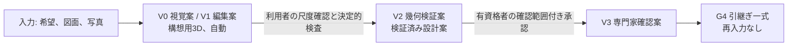

# 第01章 経営向け要約

作成日: 2026-09-15　版: v1.2（v1.2 は 2026-10-08 の段階8 の第1章更新。最終判定、主要な危険、着手前の必須判断、P0 の範囲を `06_最終報告/最終報告.md` と `04_必須表/表6_最終審査表.md`〔確定版〕にそろえ、変更を第14節「更新記録」に列挙した。v1.1 は 2026-09-15 段階6 再修正。統合指摘 JM-009 と整合修正指示 第1章の1 を反映。2026-09-29 の途中停止の後、2026-10-06 に再開して完了し、第3節 M-N-01 の目標値の記載を第2章 v1.2 と第23章に合わせ、他章依頼の対応状況を加えた。記録は `05_審査/再修正記録_第1_3_7章.md`）　担当: 段階3 仕様書 第01章（製品責任者、一級建築士、計算機科学者、個人情報保護と知的財産の審査担当の合議による執筆）
根拠: 指示文 1章（結論、六指標、非対象）、I節（成果物の章立て）、8章（最初の経営判断）、9.9（収益と信頼の衝突）、9.10（初期公開範囲）、9.11（重大な失敗と防止策）、9.12（実装前に経営陣が決める事項）、11.1〜11.5（完成像適合審査、最終判定、着手前の最終必須判断）。基盤定義 `用語集.md` v1.1、`識別子規則.md` v1.1、`信頼状態と証拠段階.md` v1.1、`七段階門.md` v1.1、`機能一覧骨格.md` v1.1、`画面指標試験骨格.md` v1.1、`整合検査報告.md` v1.0。第一波の全章要約集 `03_仕様書/00_章要約集.md`（2026-09-22 生成。第2〜9章、第11〜22章の章要約）。調査 `01_調査/00_出典一覧.md`。

## 0. 冒頭

### 0.1 本章の目的

本章は、経営陣が「何を作り、何を作らず、何を決めてから着手するか」を判断するための要約である。全章の章要約を根拠に、結論、製品分類、完成像、非対象、指標、初期顧客、P0 範囲、差別化、危険、収益順序、経営の決定事項、最終判定を章番号付きで示す【推定】。本章は新しい判断や閾値を作らず、各章が置いた仮判断を経営判断の候補として並べる。確定は公開判定会議（用語集287）と経営陣が行う【仮定】。

### 0.2 本章の範囲と非対象

| 区分 | 内容 |
|---|---|
| 範囲 | 指示文1章、8章、9.9〜9.12、11章の経営向け事項を、第2〜9章と第11〜22章の章要約で裏付けて要約する。各主張に根拠章を付ける【推定】 |
| 扱わないもの | 各機能の必須10項目（各主章）。追跡表（第10章）。非機能、試験、合格値の詳細（第23章）。事業方式、開発順序、工数帯、失敗要因の詳細（第24章）。指標の数式と分母規則（第2章）【推定】 |
| 新しく決めないもの | 用語、識別子、閾値を新設しない。第10、23、24章は執筆中のため章番号の参照にとどめ、内容は指示文と第2章、第9章の要約から書く【仮定】 |

### 0.3 前提とする章

| 章または文書 | 前提とする内容 |
|---|---|
| 第2章 | 完成像の一文、五成果、非対象の四層、北極星 M-N-01 と防護指標 M-G-01〜M-G-16 の定義、相殺禁止の判定規則 |
| 第3章 | 出典 SRC- と確認日 2026-09-15。公開主張の数値を目標値に使わない前提 |
| 第4章 | 競合の空白、連続性の五項目、模倣で終わる機能と防御力がある機能の暫定表 |
| 第5章 | 初期顧客の仮判断（U-05-001）、決定権と確認権の分離 |
| 第6章、第9章 | 段階門 G0〜G6 の完了条件、P0 145、P1 82、P2 15、非対象 7 の分類 |
| 第8章 | 初回価値の透かし付き試作、課金前表示 |
| 第11章、第13章、第17章、第22章 | 自動処理の最大信頼状態、責任境界、有資格者確認、個別同意、処理地域と外部処理先の契約条件 |
| 第16章、第18章、第20章 | 商品四層と権利状態、対象地域区分、費用の確信幅 |
| 基盤 信頼状態と証拠段階、七段階門 | V0〜V3 の禁止表示、段階ごとに表示できる最大の信頼状態 |

## 1. 結論

### 1.1 勝ち筋の五要素

本製品の勝ち筋は、画像をきれいに見せる生成ではなく、次の五要素を一つの編集可能な正規建物情報で結ぶことにある（指示文1章）【推定】。

| 要素 | 内容 | 実装先（機能区分、主章） |
|---|---|---|
| 1 対話設計 | 家族、土地、予算、生活習慣から要求を聞き取り、要求台帳へ変換する | C01、第5章、第8章 |
| 2 図面理解 | 平面図、写真、PDF、CAD、BIM を読み、根拠（原図重ね）と確信度を示す | C02、第11章 |
| 3 寸法付き建築編集 | 2D と 3D が同じ建物情報から描画され常に同期する | C03、C04、第12章、第15章 |
| 4 商品推薦 | 実在商品と AI 独自案を層と権利状態付きで同じ空間に置き比較する | C05〜C07、第16章 |
| 5 相談接続 | 建築士、施工会社、専門業者へ、送信先ごとの明示同意で接続する | C08、C10、第17章、第22章 |

### 1.2 最重要設計判断: 出力の二段階化

出力を「構想用3D」（V0、V1。未確定値を含み、比較と合意形成に使う）と「検証済み設計案」（V2 以上。尺度、寸法、接続、法規条件を確認し人が承認した案）に分け、承認前に施工可能とは表示しない（指示文1章、用語集10、11）【推定】。自動処理は V1 までとし、V2 は利用者の尺度と重要寸法の確認と決定的検査の合格、V3 は有資格者の確認範囲付き承認を要する（基盤 信頼状態と証拠段階 第1.2節、第11章）【推定】。

段階との対応は G0〜G2 が V1 まで、G3 が V2、G4 が V2 から V3 へ昇格（基盤 七段階門 第2節、第6章）【推定】。この二段階化を守る限り、Renovo 型の短い体験、建築家コンシェルジュ型の専門家接続、タウンライフ型の条件取得、住友林業の木質空間と生活提案を統合しても機能の寄せ集めにならない（指示文11.4）【推定】。

## 2. 製品分類、完成像、非対象

### 2.1 製品分類と完成像

製品分類は「3D生成道具」ではなく「日本の戸建住宅における設計意思決定基盤」とする（用語集1）【推定】。完成像は「住宅に関する曖昧な希望または既存資料を、根拠と責任が追跡できる共通建物情報へ変え、家族と専門家が重要な代償を理解して合意し、次工程へ再入力なしで安全に引き渡せること」であり、五成果（正しい問題設定、比較可能な成立案、根拠付き合意、情報を失わない引継ぎ、建物全期間の改善）へ分解する（第2章 第1節）【推定】。到達判定は作成した画像や 3D の件数ではなく、重要判断が根拠付きで完了した割合 M-N-01 で行う（第2章 第1.2節）【推定】。

任意の製図からの完全自動で誤りのない 3D 化は保証しない。2026年公開の FloorplanVLM は外壁 IoU 92.52% を報告しており 100% ではない（SRC-215、第13節）【事実】。したがって確信度表示、原図重ね、尺度確認、問題一覧、手修正、承認記録を P0 の必須とする（指示文1章、第11章）【推定】。

### 2.2 非対象（製品が置き換えないもの）

| 層 | 内容 | 識別子（第2章） | 代わりに製品が行うこと |
|---|---|---|---|
| A 法的責任 | 建築士、構造設計者、設備設計者、施工者、行政と確認検査機関の法的責任。確認申請の代行、工事監理、測量や調査の代替 | NS-02-001〜008 | 責任境界の常時表示（S-01）、確認範囲付き承認の記録（第13章、第17章、第22章） |
| B V3 でも扱わない五文書 | 確認申請図、構造安全証明、見積確定額、施工図と製作図、性能評価書と法的適合の証明書 | NS-02-009〜013 | 幾何検証案、工種別費用幅、証拠段階別の記録（第19章、第20章） |
| C 事業として行わないこと | 無許諾の企業商品を複製する商品収集基盤。利用者情報を一括送信する見込客獲得頁、連絡先の販売、隠れた順位操作 | NS-02-014〜015 | 権利状態 RS- と代替形状、送信先別の個別同意（第16章、第17章） |
| D 非対象機能 | 施工図の完全自動作成、構造安全の自動保証、全世界法規の完全対応、無許諾商品3Dの複製、単写真からの実寸完全復元、確定見積、第三者性能評価の自動発行 | F-C13-015、F-C11-011、F-C09-014、F-C05-020、F-C07-011、F-C13-016、F-C12-017 | 各行の代替機能（基盤 機能一覧骨格 第2節） |

一級建築士は国土交通大臣の免許を受けて設計と工事監理等を行う者であり（SRC-270）【事実】、製品内の AI はこの法的責任を代替しない【推定】。整合検査の未決 U-00-058（非対象7機能の台帳扱い）には、第2章の仮判断（完成像審査の除外条件とし、代替機能の因果ひも付けと禁止表示語の試験の存在を審査する）に従う【仮定】。

## 3. 北極星指標と防護指標

北極星指標は M-N-01 検証付き重要判断完了率であり、必要な重要判断のうち要求、選択肢、選定理由、他分野への影響、決定者、確認者、版がそろった判断の割合で測る（第2章 第4節、基盤 画面指標試験骨格 第2.1節）【推定】。「北極星が上がっても防護指標が下がれば不合格」を相殺禁止の判定規則として固定する（第2章 第5節）【推定】。目標値は指示文10.7の三値以外は初期仮説であり、公開判定会議で入力種別ごとに固定する【推定】。

| 指標ID | 指標名 | 初期仮説の目標 | 経営が見る理由 | 根拠 |
|---|---|---|---|---|
| M-N-01 | 検証付き重要判断完了率 | G4 の通過要求時の初回値で 90% 以上【仮定】。確認者の役割の三層（有資格者確認〔照合済み〕、資格未照合〔本人申告〕、専門家未確認）で層別して別掲し、照合済みの層が 30 件未満の間（照合済みがない P0 を含む）は「専門家未確認の完了率」として公開する（JR-004） | 製品価値そのもの。件数指標の代わり | 指示文1章、第2章 第4.5節、第5.2節、第23章 第6.1節 |
| M-G-01 | 要求追跡率 | 95% 以上 | 要求が案と判断へ戻れるか | 指示文10.7 |
| M-G-02 | 再入力なし引継ぎ率 | 80% 以上【仮定】。P0 は試験時（建築士二重確認 100 件の受取側役）の代替計測で判定し、運用時は P1 まで監視のみ。P0 完了条件に含めるかは意思決定記録 D-24-021（仮の判断は含める） | 専門家が作り直さないか。収益源2の前提 | 第2章 第5.1節、第23章 第6.1節、第24章 第8節 |
| M-G-03 | 重大誤り流出率 | 試験時 0% | 尺度、外壁、階段、避難、構造、設備の誤りの流出 | 指示文10.7、第11章 |
| M-G-04 | 確信度校正誤差 | ±5 ポイント以内【仮定】 | 表示した確信度が実態と合うか | 第11章 |
| M-G-05、M-G-06 | 重要判断までの時間、専門家修正時間 | 未設定【未確認】 | 合否に使わず監視のみ（第2章 U-02-007） | 第2章 |
| M-G-07 | 同意事故件数 | 0 件 | 信頼を失う事故。収益源4の前提 | 第17章、第22章 |
| M-G-08、M-G-13 | 進行禁止の見逃し率、未確認案の誤表示件数 | 0%、0 件 | 誇大表示の防止 | 指示文10.7、第6章 |
| M-G-16 | 広告偏り指数 | ±5 ポイント以内【仮定】 | 推薦の中立性 | 第16章、第17章 |
| M-G-17（参照。採番: 第23章、定義: 第2章 第5.1節） | 重要判断一覧の分母変更率 | 10% 以下【仮定】 | 分母操作による北極星の水増し防止 | 第2章 第5.1節（定義）、第23章（採番）、第2章 U-02-004 |

事業指標は M-B-05 有料転換率、M-B-08 案件当たり3D処理費を見る。M-B-06 相談先送信率と M-B-07 三次元生成回数は単独で目標化しない（基盤 画面指標試験骨格 第2.5節、指示文H）【推定】。

## 4. 初期顧客と最初の有料成果

| 項目 | 内容 | 根拠 |
|---|---|---|
| 初期顧客 | 日本の戸建住宅を検討し、候補地または既存図面があり、設計契約前に家族の要求と比較案を整理したい一般利用者。設計実務者は P1、住宅会社は P2 の顧客とする。第5章の仮判断 U-05-001 であり、公開前に経営判断として確定する【仮定】 | 指示文8章、第5章 |
| 分離の理由 | 一般利用者と設計実務者を同じ画面と販売方法で同時に最適化すると、初回体験と精度投資が分散する【推定】 | 指示文8章 |
| 画面の二系統 | 一般利用者向けの短い対話（S-01、S-02）と、提携建築士が使う専門家確認作業面（S-22）を分ける【推定】 | 第5章、第15章 |
| 最初の有料成果 | 「図面の検証付き3D化」だけでなく「根拠付き比較構想一式」とする。三案、要求への適合、敷地制約、主要な構造と設備の注意、性能目標、費用幅、商品、未解決問題、専門家引継ぎを一体で渡す【推定】 | 指示文8章、第9章 |
| 初回価値 | 電子連絡先の入力前に、透かし付き試作（希望入力は V0 の構想案、図面は V1 の縮小表示、写真は V0）を見せる（F-C01-025、M-P-04 初回価値到達率）【推定】 | 第8章 |

図面変換は強い入口であるが、製品価値は重要判断の完了（M-N-01）と再入力削減（M-G-02）で測る（指示文8章）【推定】。

## 5. P0 の範囲と外すもの

| 区分 | P0 で行う | P0 から外す（提供時期） | 根拠 |
|---|---|---|---|
| 建物 | 日本の戸建住宅、平屋または二階建 | 三階建以上、非住宅（P2 の対象拡張） | 指示文9.10、第9章 |
| 入力 | 明瞭な単一縮尺の PDF、PNG、JPEG。平面図中心、立面と断面は補助入力 | ベクトル PDF、DXF、SVG、IFC、図面一式、複数階一括（P1）。DWG、RVT は正規許諾の接点がある場合のみ（P2） | 第11章 |
| 自動処理 | 自動昇格は V1 編集案まで。壁、扉、窓、室、階段、主要設備、家具を抽出。V2 は利用者の尺度確認と決定的検査で到達し P0 に含む | V3 は照合済みの資格を持つ有資格者の確認（P1） | 基盤 信頼状態 第1.2節、第11章、第24章 第4.1節 |
| 提案 | 三案（希望入力は雛形三案 F-C03-019-01、図面入力は図面派生三案 F-C03-019-03。図面派生の目録は構造上重要な壁と外周壁の上の要素を除く）と限定した正規商品群。住友林業は公式情報参照（PT-REF）に限る | 商品拡大、独自家具生成、構造・外皮・設備の詳細調整、詳細な性能計算（P1） | 第13章、第16章、第19章 |
| 出力 | GLB 共有、PDF 平面、問題一覧、要求台帳、判断記録、標準の必要情報要求による書出検査 | IFC、IDS、BCF（P1） | 第22章 |
| 構造と改装 | 構造の初期注意は在来木造（延床 200 m² 以下）だけ。他構法は「判定不能（P0 対象外の構法）」を表示して持ち越す。改装は現況要素の削除、移動、寸法変更に撤去と移設を自動で付け、既存の外周壁と上下階連続壁の撤去、移設元、寸法変更の変更前の要素と、耐力壁候補線上の新設開口を式(5)で SEV-0 にする（解除は元に戻す変更だけ） | 改装区分の指定（残す、補修、補強）と、耐震診断や構造設計者の確認記録による解除（P1） | 第13章 第5.5節、第21章 第2.1節、第24章 D-24-009 |
| 段階 | G0〜G3 と G4 への最小引継ぎ | G5 施工と竣工反映、G6 入居と改善（P2）。識別子、版、出典、責任、状態は P0 から保持 | 第6章 |
| 外部送信 | 所有者の期限付き共有URL による引継ぎ | 送信先別同意付きの外部送信、提携先比較（P1） | 第17章 |
| 機能数 | P0 145 | P1 82、P2 15、非対象 7（計 249） | 第9章 |

公開前に、許諾済み図面の評価用 1,000 件以上（調整用 200 件は別）による非公開評価と 100 件以上の専門家二重確認を経てから対象を広げる。件数は初期仮説であり、入力多様性と誤りの収束を見て見直す（指示文9.10、第23章 第6.1節、第24章 第5.2節）【仮定】。P0 では、費用低減案の性能と維持費への影響表示、利用円滑性の検査、在宅避難の居住性と災害耐性の比較、公開頁参照の商品の販売終了の自動検知を行わないことを、有料操作の前に文字で示す（課金前表示 P10。第8章 第6.2節、表6-5e）【推定】。

## 6. 主要な差別化（防御力）

第4章は、室内像、専門家向け BIM、敷地計画、商品販売、人の仲介が別々の製品として存在し、一つの建物情報で連結する製品が公開情報では確認できないことを競合の空白とした【推定】。防御力は連続性の五項目（根拠、追従、権利状態、承認範囲、送信先選択）で判定し、五項目を全て満たす競合は公開情報では確認できなかった（第4章）【推定】。

| 区分 | 例 | 経営上の含意 | 根拠 |
|---|---|---|---|
| 模倣で終わる機能 | 写実画像の生成、生成回数、送客率、一括送客、単一企業の商品配置 | 主要目標に置くと完成像から外れる。投資の中心にしない | 指示文8章、11.4、第4章 |
| 防御力がある機能 | 原図へ戻れる建物情報（原図重ね記録）、確信度の校正、要求追跡、確認範囲付きの承認と自動失効、送信先別の同意記録、正規商品の権利状態、既定値表 | 利用が増えるほど価値が上がる積み上がる資産。競合が公開情報では持たない | 第4章、第11章、第12章、第16章、第17章 |
| 判定保留 | 第4章の暫定表 9 行（有料契約後の画面や非公開機能で変わり得る） | 04_必須表で確定し、公開前の設計審査で再確認 | 第4章 U-04-011 |

## 7. 主要な危険と防止策

第24章 第7節（指示文9.11 の更新）の失敗のうち経営判断に関わるものと、初稿審査の極高 3 件の型を挙げる。全件と状態は `04_必須表/表6_最終審査表.md` 表6-5a〜6-5f にある。試験はどれも未実施である【推定】。

| 失敗 | 重大度 | 防止策（仕様上の実装先） | 防護指標 | 試験 | 根拠 |
|---|---|---|---|---|---|
| 尺度を誤ったまま3D化 | 極高 | 基準寸法の確認と照合（同じ要素の照合は受け付けない）、複数寸法の整合検査、確認前の V2 禁止 | M-Q-25、M-G-04 | T-A-002、T-A-007、T-R-005 | 第11章 |
| 外壁や階段接続の欠落 | 極高 | 原図重ね、建物関係図の検査、SEV-0 として進行停止 | M-Q-26、M-Q-27、M-G-08 | T-P-002、T-P-003 | 第11章、第6章 |
| 改装で既存の構造壁を撤去、移動、寸法変更して素通りする（初稿審査 JM-094、再審査 JR-095） | 極高 | 撤去と移設の自動付与と式(5)（I-00-116）による SEV-0、G3 と V2 の停止、解除は元に戻す変更だけ | M-G-12、M-G-08 | T-R-006 P0 版、T-I-024 | 第13章 第5.5節、第21章 第2.1節 |
| 法規の余裕量が負の案が G3、G4 を通過する（JM-019、JR-011） | 極高 | G3 で I-18-002、I-06-006 により止め、発行と引継ぎ一式を止める（共有URL は止めず未解決の一覧を表示） | M-G-08 | T-R-010 | 第6章、第18章 |
| 構想画像を施工案と誤認 | 極高 | V0〜V3 の常時表示、書出の透かし、禁止表示語の文言検査、未照合の資格では「専門家確認済み」「法的適合」を出さない | M-G-13、M-G-10 | T-A-007、T-S-003、T-S-010 | 第6章 第5.2節、第15章、第22章 |
| 図面流出 | 極高 | 非公開既定、期限付き共有、提携先への部分共有の期限、最小送信、監査記録、一括削除 | M-G-07 | T-S-004、T-S-005、T-S-007、T-S-012 | 第17章、第22章 |
| 特定企業の知財侵害 | 高 | 権利状態 RS- の判定、許諾のない商品は代替形状のみ、提携誤認語の禁止 | M-G-23 | T-S-008、T-A-005 | 第16章、第22章 |
| 古い商品や法規を断定 | 高 | 最終確認時刻と有効期限、P0 は日次同期と台帳操作と利用者申告で販売終了を検知、法令版の期限管理と手動再取得 | M-Q-42、M-Q-43 | T-R-009 P0 版、T-R-010 | 第16章 第6.4節、第18章 |
| 広告企業へ推薦が偏る | 高 | 広告料と紹介料を点数から分離、開示、月次の偏り監査 | M-G-16 | T-S-017 | 第16章、第17章 |
| 試験資料の権利不備と調達不足 | 高 | 許諾済み図面だけで試験、段階調達、入力種別と層別ごとの段階公開 | M-G-23 | T-P-005、T-P-006 | 第23章、第24章 第5.2節 |
| 経営判断が未確定のまま画面設計へ進む | 高 | 意思決定記録 D-24-001〜D-24-023 を判断者、確定日、版付きで確定（P0 完了条件(5)） | — | — | 第24章 第8節 |
| 公開判定の不合格（層別の未達） | 高 | 入力種別と層別ごとの条件付き公開、対象範囲の縮小、再判定 | 閾値のある全防護指標 | 第23章 第6.2節 | 第23章、第24章 |
| 3D処理費が収益を超える | 中 | 段階詳細、変更部分だけの再生成、外部AI処理費の三段の上限、課金前表示 | M-B-08、M-B-12〜M-B-15 | T-P-013、T-I-019 | 第8章、第14章 |
| 人確認が滞留する | 中 | 重大度別の振分、確認範囲の限定、確認予約容量の表示（S-22）。P0 は V3 を行わず「専門家未確認」 | M-P-11 | T-I-013（P1） | 第17章 |

重大度は指示文9.11 と初稿審査の区分を転記した【推定】。防護指標が閾値未設定の項目は監視のみとし、前期比で悪化した場合に報告する（第2章 U-02-007）【仮定】。審査の最後に残った中の危険は、図面読解の訂正（S-05）で図面由来の壁を消すと撤去の防護を通らない経路と、構造に不利でない寸法変更も SEV-0 になる止まり過ぎの 2 件で、P0 の公開判定の前に公開判定会議で扱いを決める（表6-5b 行1、2。U-95-635、U-95-636）【推定】。

## 8. 収益設計の順序

| 順序 | 収益源 | 提供時期 | 信頼上の条件 | 見る指標 | 根拠 |
|---|---|---|---|---|---|
| 1 | 個人向けの検証付き3D化と詳細書出 | P0 | 初回価値は無料枠、有料操作の前に課金前表示（利用量、追加費用、失敗時の再実行または返金） | M-B-05 | 指示文9.9、第8章 |
| 2 | 専門職向けの共同作業、IFC、承認、組織標準 | P1〜P2 | 再入力なし引継ぎが成立していること | M-G-02、M-G-06 | 第17章、第22章 |
| 3 | 正規商品情報の提供と配置後の成果測定 | P1 | 権利状態 RS-OK の商品のみ。点数と広告料の分離 | M-B-01、M-G-16 | 第16章 |
| 4 | 利用者が明示選択した相談紹介 | P1 | 送信先別同意、紹介料の開示、順位への不算入 | M-B-06（目標化しない）、M-B-02、M-B-03、M-B-04 | 第17章 |

紹介収益を最初の中心にしないことで推薦の中立性を守る（指示文9.9）【推定】。参照先のうち、タウンライフ型は連絡先入力が成果閲覧より先になる（SRC-014、SRC-016）【事実】ため見込客獲得頁と認識されやすく、建築家コンシェルジュ型は料金、返金、手数料、並行検討不可を開示する人の選定型（SRC-009）【事実】であり対応人数が成長制約になる。本製品は預り金型と並行検討の制限を採らず、人による選定を有料の選択肢とするかは未決とする（第17章 U-17-003）【仮定】。

## 9. 実装前に経営陣が決める事項（八項目と現在の仮判断）

指示文9.12の八項目を未決のまま画面設計や模型選定へ進むと、責任範囲と情報構造が後から崩れる。仕様書は合理的な仮判断を置き、第24章 第8節で意思決定記録 D-24-001〜D-24-008 の様式にした。状態は 2026-10-08 時点で全て「仮」であり、公開前に確定する必要がある（P0 完了条件(5)。表3 表3-21）【推定】。

| 番号 | 決める事項 | 仕様書の現在の仮判断（意思決定記録） | 根拠章と未決 |
|---|---|---|---|
| 1 | 初期顧客を一般利用者、設計実務者、住宅会社のどれに置くか | 一般利用者（設計契約前の家族）。設計実務者は P1、住宅会社は P2（D-24-001）【仮定】 | 第5章 U-05-001、U-01-001、表3 UM-001 |
| 2 | V2 と V3 の確認責任を自社、提携建築士、利用企業のどこが持つか | V2 は決定的検査と利用者の尺度確認（責任は幾何の範囲の表示に限る）。V3 は P1 の照合済みの資格を持つ提携建築士と利用企業の建築士。自社は確認主体にならない（D-24-002、D-24-011）【仮定】 | 第6章 第5.2節、第17章、第22章、U-01-002、表3 UM-002 |
| 3 | 正規商品情報を何社分確保してから公開するか | 直接許諾 3 社以上（初期仮説）を公開条件とし、満たさない場合は「PT-GEN のみ」の条件付き公開（S-06 に「正規商品未収録」を常時表示。D-24-003）【仮定】。正規基盤からの自動取得は規約上できない前提（第3章）。家具の 3D 提供は法人審査付きの少数（飛騨産業 SRC-195）【事実】 | 第16章、第3章、U-01-003、表3 UM-003 |
| 4 | 住友林業との正式連携を目指すか、一般的な木質設計属性だけで開始するか | 正式連携を目指さず、公式情報の文章要約と転記に限る PT-REF で開始（D-24-004）。Interior Style 二十三案は 2023 年 9 月時点の改廃注記付き（SRC-099）【事実】。提携誤認語を禁止（第22章 第6.3節）【仮定】 | 第16章、第22章、U-01-004、表3 UM-004 |
| 5 | 図面を国内だけで処理、保存する要件を採るか | 保存は国内。外部処理先は国名を表示し、契約に学習不利用、保持期間、削除要求、事故の即時通知と監査記録を含める（D-24-005、D-24-016）。外部AI処理先の契約前は構造化質問へ退避し、層別「退避」の M-P-04 95% 以上の場合だけ公開する。契約条件は【未確認】 | 第22章 U-22-005、第14章 U-14-003、U-01-005、表3 UM-005 |
| 6 | 無料枠で見せる成果と有料化する検証や書出の境界 | 初回価値（透かし付き試作、不足情報一覧）は無料、V2 の検証と詳細書出は有料。課金前表示で利用量と失敗時の条件と P0 で行わない比較と検査を示す。金額と処理枠は未定（D-24-006）【仮定】 | 第8章、U-01-006、表3 UM-006 |
| 7 | 紹介料を受け取る場合の開示と順位分離の規則 | 受け取る場合は 3%、成約時、候補ごとに開示し点数に含めない（D-24-007）。広告は文字で広告枠へ分離し M-G-16 で月次監査。掲載料は広告枠の対価に限り、正規商品登録は無償（D-24-023。製品と経営の暫定判断で確認待ち。U-95-903）【仮定】 | 第16章、第17章、第24章、U-01-007、表3 UM-007 |
| 8 | 初期対象地域と法規助言を提供する深さ | 1 都 2 県程度（初期仮説）から、市区町村単位で第18章 第5.1節の条件を満たす自治体で開始。助言は P0 の 4 項目（建蔽率、容積率、高さ、接道）の余裕量まで、斜線と日影は「未判定（P1）」、対象外地域は法規判定を行わず表示で代える（D-24-008）。令和7年4月1日施行の改正法を法令版台帳へ登録（SRC-259）【事実】。部分対象地域の扱いは未定【仮定】 | 第18章 U-18-009、U-01-008、表3 UM-008 |

## 10. 着手前の最終必須判断（十項目）

指示文11.5の十項目を確定し、P0 の反証試験（T-R-001〜T-R-012 の P0 版）に合格した後にのみ一般公開へ進む。十項目は表3 の未決（UM-）と第24章 第8節の意思決定記録に結ばれ、確定期限の段階門が付いている（表3 表3-20、`06_最終報告/最終報告.md` 第7節）【推定】。

| 番号 | 判断 | 現在の暫定の扱い（意思決定記録。状態は全て「仮」） | 確定期限 | 担当章と表 |
|---|---|---|---|---|
| 1 | P0 の対象都道府県、構法、図面品質、建物規模 | 在来木造、平屋または二階建、明瞭な単一縮尺、延床 200 m² 以下。他構法は「判定不能（P0 対象外の構法）」で持ち越し（D-24-009）。対象都道府県は 1 都 2 県程度（D-24-008） | 公開判定会議前 | 第13章、第18章、第24章、表3 UM-009、UM-008 |
| 2 | 検証付き重要判断一覧と、案件別に分母を変更する権限 | 分母は段階門の主要判断と利用目的別の雛形表（第2章 第4.3節）から作り、分母変更は第6章 第5.1節の承認者が承認（D-24-010） | 公開判定会議前 | 第2章、第6章、表3 UM-010 |
| 3 | V2、V3、各性能状態を確認する資格者と契約責任 | V2 は決定的検査と利用者の尺度確認。V3 と「法的適合」は P1 の照合済みの資格が前提（第6章 第5.2節「資格の照合状態」。D-24-011） | 公開判定会議前 | 第6章、第17章、第19章、第22章、表3 UM-002 |
| 4 | 許諾済み図面試験資料、正解作成手順、公開合格値 | 評価用 1,000 件以上、調整用 200 件、建築士二重確認 100 件。正解付与は自社学習 約 58〜114 人月、外部認識 API 約 30〜59 人月（D-24-012） | 試験開始前 | 第23章、第24章 第5.2節、表3 UM-011 |
| 5 | 住友林業を含む商品情報の取得契約、表示、商標、三次元利用権 | 第9節 3、4 のとおり（D-24-013） | 群5 着手前、公開判定会議前 | 第16章、第22章、第3章、表3 UM-003、UM-004 |
| 6 | 敷地、法規、単価、在庫、納期情報の更新責任と失効規則 | 法令版は P0 で期限管理と手動再取得（週次の検出は P1）、価格と在庫 24 時間、単価表は四半期。条例台帳と単価表の初期版は群3、群4 の着手前に整備（D-24-014） | 群3、群4 着手前、公開判定会議前 | 第16章、第18章、第20章、表3 UM-012 |
| 7 | 概算費、性能予測、法規助言の免責だけに頼らない画面上の誤認防止 | 単一額の表示禁止、証拠段階の別列表示、禁止表示語の文言検査、課金前表示 P10 で P0 で行わない比較と検査を開示（D-24-015） | 公開判定会議前 | 第15章、第18章、第19章、第20章、表3 UM-115、UM-118 |
| 8 | 外部AI、保管地域、学習利用、削除、事故対応の契約と監査 | 第9節 5 のとおり。外部認識 API で同意のない利用者の図面は受け付けて手修正中心の V1 を返す暫定判断（D-24-016、D-24-022。U-95-903）。個人情報保護委員会の注意喚起（SRC-296）への対応表は定義済み【事実】 | 群1 着手前 | 第14章、第22章、表3 UM-005 |
| 9 | 初期の提携建築士、構造、設備、施工、個人情報、知財の審査体制 | 各分野 1 名以上、中核人員 8〜12 名。決定権は製品責任者、拒否権は建築士と情報保護責任者（D-24-017） | 試験開始前、公開判定会議前 | 第17章、第22章、第24章、表3 UM-013 |
| 10 | 百件規模の専門家確認試行と、重大誤りが収束しない場合の公開停止条件 | 試行 100 件で M-G-03 が 1 件でも発生した判定の単位（入力種別「画像」の明瞭と低品質の層、希望入力）は公開停止、直近 50 件で 0 件を収束条件（D-24-018） | 試験開始前 | 第23章 第6.2節、第24章、表3 UM-011 |

十項目のほかに、製品と経営の暫定判断 7 件（図面派生三案の案(A)、掲載料、同意のない図面の扱い、S-28 の P0、P0 の販売終了の検知、規則6 (b) の範囲、仕様区分は P1。U-95-903。表6-4b）と、表3 の段階8 への繰延べ 45 件（U-90-310）の確定期限を着手前に付け直す【推定】。

## 11. 最終判定

最終判定は「**P0 の製品仕様として条件付き適合。公開可とは結論しない。施工可能な設計を自動完成する製品としては未適合**」である（`06_最終報告/最終報告.md` 第1節、`04_必須表/表6_最終審査表.md` 第4節）。指示文11.4 の最終判定「P0 の製品仕様を作るための指示文として適合、施工可能な設計を自動完成する製品としては未適合」は維持され、承認前の案を施工可能とは表示しない責任範囲の限定を仕様全体で守っている【推定】。

仕様の側の重大な空欄（必須機能の要件ブロックの欠け、試験のない受入条件、未解消の極高と高の指摘）は 0 件である。公開可と結論しないのは、公開の前提（試験の実施と合格値の固定、意思決定記録 D-24-001〜D-24-023 の確定、公開前必須の外部契約 15 行と前提作業 (a)〜(h)）の成立が 0 のためである（表6 第4.2節）【推定】。

審査の経過: 初稿審査は統合指摘 195 件（極高 3、高 44）で総合は不適合、不適合の軸は 3 だった。再修正（195 件）、再審査（再発 0、新規 128 件。改装だけ不適合）、二回目の修正（128 件）、外部確認、段階8前の仕上げ、再々確認、段階8 の最終仕上げ（100 件）を経て、極高と高はすべて解消し、不適合の軸は 0 になった（最終報告 第2〜4節）【推定】。

指示文11.3 の審査軸の確定版の判定は次のとおり（表6-3b）【推定】。

| 審査軸 | 判定（確定版） | 仕様書での対応 | 残る条件 |
|---|---|---|---|
| 理想の完成像 | 条件付き適合 | 第2章が完成像、五成果、因果、北極星と防護指標を固定し、第10章が全機能を追跡 | 初期顧客と有料成果の経営確定（第9節 1、6）、利用目的別の雛形表の妥当性 |
| MECE | 条件付き適合 | 第7章が主担当一つの規則と判定例辞書を固定 | 実案件で領域分類の迷いを記録し辞書を改善 |
| 建築工程 | 適合 | 第6章が G0〜G6 の完了条件と進行禁止条件、利用目的による適用除外を固定 | P0 は G0〜G3 と G4 引継ぎに限定 |
| 建築成立性 | 条件付き適合 | 第13章が構造、外皮、設備の調整と責任境界、改装の撤去の防護（式(5)）を定義 | 詳細設計、安全確認、施工方法は有資格者等が必要。止まり過ぎと訂正の経路（第7節） |
| 図面三次元化 | 条件付き適合 | 第11章が元頁追跡、確信度、原図重ね、尺度確認、V 状態、現況差を定義 | 多様な日本図面による精度検証と図面認識模型の調達（第10節 4） |
| 商品と住友林業参照 | 条件付き適合 | 第16章が四層、権利状態、関係区分、代替、P0 の販売終了の検知を定義 | 正規商品提供と商標利用の契約（第10節 5） |
| 法規と性能 | 条件付き適合 | 第18章、第19章が版、地域、証拠段階、人承認、判定機関を定義 | 自治体差、改正追従、第三者評価、外部確認の未確認事項 |
| 費用と期間 | 条件付き適合 | 第20章が工種、数量根拠、時点、地域、確信幅、X4 の衝突の扱いを定義 | 信頼できる単価、納期、施工条件の入手。仕様区分は P1 |
| 情報安全 | 条件付き適合 | 第22章が非公開既定、最小共有、同意、監査、削除を定義 | 外部AIと保管先の契約審査（第10節 8） |
| 実装可能性 | 条件付き適合 | 第9章が P0 145 機能を比較構想と引継ぎへ限定し、第24章が P0 完了条件と前提作業を定義 | 試験資料、外部依存、意思決定記録の確定（前提） |

完成像を達成する中核は、(1) 希望と原図の根拠を失わない正規建物情報、(2) 十二判断領域を横断する変更影響と七段階門による進行管理、(3) V0〜V3、性能証拠段階、資格者確認による誇大表示の防止、(4) 正規商品、費用、問題、承認を含む専門家引継ぎ、(5) 竣工差と入居後実績を元の要求へ戻す改善循環の五点に収束する（指示文11.4）。(1)〜(4) は P0 の仕様で担保され（追跡表 第10章、試験 第23章、責任表 表4 の該当箇所は最終報告 第6節）、(5) は情報構造の先行保持だけで機能は P2 である【推定】。逆に、初回の写実像、生成回数、送客率を主要目標に置くと完成像から外れる【推定】。仕様書は 24 章とも末尾5節まで完成し、機械整合検査（2026-10-08 13:20）は参照切れ 0、重複定義 0、P0 要件の不足 0、試験のない受入条件 0 である【事実】（`04_必須表/00_機械整合検査.md`）。

## 12. 機能要件

本章に担当機能なし。機能一覧骨格 v1.1 第4.6節の主章に第1章はなく、整合検査報告 項目4 でも使用章に含まれない【事実】（`02_基盤定義/整合検査報告.md`、確認日 2026-09-15）。

## 13. 本章の【事実】の出典

| 出典ID | 内容 | URL | 確認日 | 使用節 |
|---|---|---|---|---|
| SRC-215 | FloorplanVLM 論文要旨（外壁 IoU 92.52%） | https://arxiv.org/abs/2602.06507 | 2026-09-15 | 第2.1節 |
| SRC-270 | 国土交通省 建築士制度 | https://www.mlit.go.jp/jutakukentiku/build/architect.html | 2026-09-15 | 第2.2節 |
| SRC-009 | 建築家コンシェルジュ 指定頁（料金、相談導線） | https://architect-concierge.com/meta/ | 2026-09-15 | 第8節 |
| SRC-014 | タウンライフ家づくり 質問導線 | https://www.town-life.jp/home/main/chatform.php | 2026-09-15 | 第8節 |
| SRC-016 | タウンライフ家づくり 利用規約 | https://www.town-life.jp/home/terms.html | 2026-09-15 | 第8節 |
| SRC-195 | 飛騨産業 3Dデータダウンロード（法人向け） | https://hidasangyo.com/projects/download-3d/ | 2026-09-15 | 第9節 |
| SRC-099 | 住友林業 Interior Style 総覧 | https://sfc.jp/ie/design/interior/ | 2026-09-15 | 第9節 |
| SRC-259 | 国土交通省 改正法制度説明資料（令和6年9月、PDF） | https://www.mlit.go.jp/common/001627103.pdf | 2026-09-15 | 第9節 |
| SRC-296 | 個人情報保護委員会 生成AIサービスの利用に関する注意喚起 | https://www.ppc.go.jp/news/careful_information/230602_AI_utilize_alert/ | 2026-09-15 | 第10節 |

出典の取得可否と変動性は `01_調査/00_出典一覧.md` の統合表に従う。各社の処理時間、導入数、効果は公開主張として扱い、目標値の根拠にしない（第3章）【推定】。

## 14. 更新記録（段階8。2026-10-08）

`99_作業道具/prompts/t8_第1章更新.md` と共通の補足に従い、最終報告と表6 確定版にそろえた。各主張には根拠の章、表、記録を付けた【推定】。

| 番号 | 節 | 変更内容 | 根拠 |
|---|---|---|---|
| 1 | 冒頭 | 版を v1.2 とし、段階8 の更新を記した | — |
| 2 | 第3節 | M-N-01 の層別を三層（照合済み、本人申告、専門家未確認）にし、照合済みの層が 30 件未満の間の公開規則を書いた。M-G-02 を試験時の代替計測と D-24-021 の位置付けにした | 第2章 第5.2節、第23章 第6.1節、JR-004、JM-004 |
| 3 | 第5節 | 自動昇格は V1 まで、V2 は利用者の尺度確認と決定的検査で P0 に含むと改めた。三案を雛形三案と図面派生三案にし、構造と改装の行（在来木造、撤去の防護と式(5)、解除は元に戻す変更だけ）を加えた。評価資料の件数と課金前表示 P10 を書いた | 第24章 第4.1節、第13章 第5.5節、第21章 第2.1節、第8章 第6.2節 |
| 4 | 第7節 | 主要な危険の表を第24章 第7節と初稿審査の極高 3 件の型（改装の構造壁、負の余裕量）で更新し、試験と防護指標を現行の識別子にした。最後に残った中の危険 2 件を書いた | 第24章 第7節、表6-5a、6-5b |
| 5 | 第9節 | 八項目の仮判断を意思決定記録 D-24-001〜D-24-008（全て仮）と表3 UM-001〜UM-008 に結んだ | 第24章 第8節、表3 表3-21 |
| 6 | 第10節 | 十項目に現在の暫定の扱い、確定期限、担当章と表を付け、製品と経営の暫定判断 7 件と表3 の繰延べを加えた | 表3 表3-20、最終報告 第7節、表6-4b |
| 7 | 第11節 | 最終判定を「P0 の製品仕様として条件付き適合。公開可とは結論しない。施工可能な設計を自動完成する製品としては未適合」に改め、公開可と結論しない理由、審査の経過、指示文11.3 の確定版の判定を書いた | 最終報告 第1節、表6 第4節、表6-3b |
| 8 | 章末 | 第10章と第23章への依頼の状態を対応済みに改め、章要約を最終判定に合わせた | 表6-5a、第23章 第6.1節 |

## 章要約

本章は経営陣が着手前に判断する事項を要約した。製品は勝ち筋の五要素を一つの正規建物情報で結ぶ設計意思決定基盤で、出力を構想用3D（V0、V1）と検証済み設計案（V2 以上）に分け、承認前に施工可能と表示しない。北極星は M-N-01（確認者の三層で層別）、防護指標との相殺は禁止する。初期顧客は設計契約前の一般利用者、最初の有料成果は根拠付き比較構想一式。P0 は在来木造の平屋または二階建、単一縮尺の画像図面、自動昇格は V1 まで、三案、改装の撤去の防護、G0〜G3 と G4 最小引継ぎ、145 機能に限る。主要な危険に防止策、防護指標、試験を対応付けた。経営陣が決める八項目と着手前の十項目を意思決定記録（全て仮）と期限に結んだ。最終判定は「P0 の製品仕様として条件付き適合。公開可とは結論しない。施工可能な設計の自動完成としては未適合」。本章に担当機能はない。

## 他章への依頼または前提

| 章 | 内容 | 種別（依頼/前提） |
|---|---|---|
| 第24章 | 第9節の八項目と第10節の十項目を意思決定記録の様式で確定し、開発順序、依存関係、公開停止条件へ反映すること。未決 U-01-001〜U-01-008 の確定先を第24章の未決事項統合に含めること | 依頼 |
| 第10章 | 第7節の失敗、防護指標、試験の対応を追跡表で照合し、対応する試験のない失敗（広告偏り、人確認の滞留）に試験を割り当てること | 依頼（対応済み。2026-10-08 確認: 広告偏りは T-S-017、人確認の滞留は T-I-013〔P1〕。第24章 第7節、表6-5a） |
| 第23章 | 第3節の初期仮説の目標値を公開判定会議の合格値表へ引き継ぎ、閾値未設定の指標を「監視のみ」として扱う規則を受入条件に含めること | 依頼（対応済み。2026-10-08 確認: 第23章 第6.1節に M-N-01、M-P-08、M-P-09 の合格値〔JM-172〕、閾値未設定の指標は監視のみ〔第2章 第5.2節〕。表6-6） |
| 第5章 | U-05-001（初期顧客）は本章の U-01-001 と同一の経営判断として扱い、確定時に両章の未決を同時に解決すること | 前提 |
| 第2章、第23章 | M-G-17（重要判断一覧の分母変更率）は第23章が採番を確定し、定義と閾値は第2章 第5.1節を正本とする。本章第3節は参照のみで定義しない（統合指摘 JM-009 の反映、2026-09-15） | 前提 |
| 04_必須表 | 第6節の防御力の表は第4章の暫定表（模倣 23 行、防御力 19 行、保留 9 行）を正本とし、本章は要約にとどまる | 前提 |
| 05_審査 | 第11節の最終判定の表現と、承認前の案を施工可能と表示しない規則を責任審査（J-07-）の対象に含めること | 依頼（対応済み。初稿審査と再審査の責任審査〔SK〕が判定し、再々確認で条件付き適合。2026-10-08） |
| 第24章、第10章、第23章（本章の依頼への対応状況。2026-10-06 確認） | 第24章は本章の依頼に第24章 第8節（意思決定記録の様式。例示 D-24-001〜D-24-021）と第9節（U-01-001〜U-01-008 を必須表 表3 UM-001〜UM-008 に含める）で対応した（第24章の他章依頼の対応状況の行）。第10章への依頼（第7節の失敗と試験の照合）は第10章が主担当の統合指摘 JM-060 で扱われ、第10章の修正後に確認する。第23章への依頼（第3節の初期仮説の合格値表への引継ぎ）は第23章 第6.1節の合格値の初期仮説に M-N-01 等が載るが、本章の依頼への対応の記載はなく、依頼を継続する | 前提（対応状況） |

## 未決事項

| 識別子 | 内容 | 区分（事実/推定/仮定/未確認） | 影響 | 確認者候補 |
|---|---|---|---|---|
| U-01-001 | 初期顧客を一般利用者に置く仮判断の経営確定（第5章 U-05-001 と同一） | 仮定 | 第5章、第8章、P0 指標の層別、第24章 | 経営陣、製品責任者 |
| U-01-002 | V2 と V3 の確認責任の帰属先（自社、提携建築士、利用企業）と契約責任 | 仮定 | 第13章、第17章、第22章、責任表 | 経営陣、法務、一級建築士 |
| U-01-003 | 公開時に確保する正規商品の社数と分野。正規基盤からの自動取得ができない前提での確保方法 | 未確認 | 第16章、収益源3 | 事業提携担当、権利担当 |
| U-01-004 | 住友林業との正式連携の是非。P0 は PT-REF の文章要約と転記に限る | 未確認 | 第16章、第22章 | 経営陣、法務 |
| U-01-005 | 図面の国内処理と保存の要件の採否、外部AI処理先の契約条件 | 未確認 | 第22章、第14章、処理費 | 経営陣、個人情報担当、実装責任者 |
| U-01-006 | 無料枠（初回価値）と有料化（V2 検証、詳細書出）の境界と価格帯 | 仮定 | 第8章、M-B-05、M-B-08 | 経営陣、製品責任者 |
| U-01-007 | 紹介料を受け取るか否か。受け取る場合の開示と順位不算入の規則の採用 | 仮定 | 第16章、第17章、M-G-16 | 経営陣、法務 |
| U-01-008 | 初期対象都道府県と法規助言の深さ。部分対象地域の扱い（第18章 U-18-009） | 仮定 | 第18章、第24章 | 経営陣、一級建築士 |
| U-01-009 | 本章の字数が固有指針の目安（5,000〜8,000 字）を超えている。表の圧縮または第9節と第10節の第24章への移管を審査で判断する | 推定 | 本章、第24章 | 05_審査担当 |

## 用語追加提案

| 用語 | 定義 | 理由 |
|---|---|---|
| 勝ち筋の五要素 | 指示文1章の五要素（対話設計、図面理解、寸法付き建築編集、商品推薦、相談接続）を一つの正規建物情報で結ぶこと | 経営向け要約と第24章が同じ語で製品の中心を参照するため |
| 根拠付き比較構想一式 | 最初の有料成果。三案、要求への適合、敷地制約、主要な構造と設備の注意、性能目標、費用幅、商品、未解決問題、専門家引継ぎを一体で渡す成果 | 指示文8章の語を有料成果の単位として固定するため |
| 二段階出力 | 構想用3D（用語集10）と検証済み設計案（用語集11）を分けて扱う最重要設計判断の総称 | 指示文1章の設計判断を一語で参照するため |

## 本章で定義した識別子一覧

| 種別（機能/情報実体/画面/指標/試験/API/非機能/受入条件） | 識別子 | 名称 |
|---|---|---|
| 未決事項 | U-01-001〜U-01-009 | 本章の未決事項 |
| 指標 | M-G-17 | 参照（正本: 第23章）。採番は第23章、定義と閾値は第2章 第5.1節。本章は定義しない |
| 機能、情報実体、画面、指標、試験、API、非機能、受入条件 | なし | 本章は担当機能を持たず、これらの識別子を定義しない。参照した識別子は基盤定義、第2章（NS-02-001〜015）、第23章の定義に従う |
