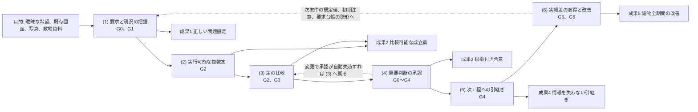
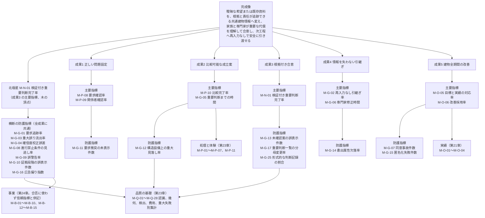

# 第02章 理想の完成像、非対象、目的から成果への因果、指標の木

作成日: 2026-09-15　版: v1.3　担当: 段階3 仕様書 第02章（製品責任者、一級建築士、UX設計者の合議による執筆）。v1.3 は 2026-10-07 の段階6 二回目の修正（段階7 再審査の後）。再審査 修正計画 第1.2節の 10 件（主担当 JR-001〜JR-007、整合 JR-044、JR-114、JR-101。高 JR-001）を同計画 第0.3節、第0.4節の固定文と番号で反映した（源1 の雛形の利用目的別の生成と非該当、G2(d)、G3(f) の源1 対象外と計算例の再計算、図面3D化の計算例、除外の承認者、M-G-17 の報告項目、M-G-25、確認者の三層、因果(6) の中核の P0 機能 0 件、事業指標の範囲、能力の必須機能、禁止表示語の正本の注）。記録は `05_審査/再修正記録_2回目_第2_10章.md`。同日の二回目の修正の仕上げ〔群R1〕で、基盤 用語集の改訂（500、577）の反映と受けた依頼の対応状況を章末に記した〔版は v1.3 のまま。記録は `05_審査/再修正記録_2回目_仕上げ_群R1.md`〕。v1.1 は 2026-09-15 の自己点検による字句修正（第0.1節の問いを箇条書き化、章要約を500字以内へ短縮、用語追加提案に法規判定記録、専門家未確認、初期注意の3語を追加）。v1.2 は初稿審査の反映（段階6 の再修正。2026-09-29 に着手して途中停止し、2026-10-06 に完了。05_審査/初稿審査/00_修正計画.md 第1.2節、記録は 05_審査/再修正記録_第2章.md）。源1 の雛形を第6章 第2.1〜2.7節の主要判断と一対一の記号 G0(a)〜G6(b) で固定し（例示 D-02-019〜024 を追加、D-02-011 を廃止）、M-N-01 の計測時点を門の通過要求時の初回値に改め、確認者の役割による層別を合格条件に組み込み、M-G-03、M-G-07、M-G-12、M-G-17 の P0 の計測と報告項目を定め、成果4 の P0 計測を試験時の代替計測に限定し、六因果の対応表を機能一覧骨格 v1.2 に合わせた（統合指摘 JM-001〜JM-012、JM-020、JM-027、JM-056、JM-058、JM-172、JM-194）。2026-10-06 の段階6 仕上げ（相互依頼 群A）で、整合修正指示 第2章 1、2（禁止表示語の列の注記）、第3.3節への副番7件の転記、M-G-07 の P1 の試験の同文化、U-02-001、U-02-003、U-02-010 の解決を反映した（版は v1.2 のまま。記録は `05_審査/再修正記録_相互依頼_群A.md`）
根拠: 指示文 1章（結論と六指標）、A1（完成像と逆算規則、六段の因果）、B（中心原則）、G（初期公開から外すもの）、H（収益設計と信頼指標）、J（自己審査）、9.9（収益と信頼の衝突）、10.2（理想の完成像と指標の木）、10.5（完成像から機能への逆算）、10.6（人とAIの責任境界）、10.7（初期公開の優先順位）、11.4（最終判定）、11.5（着手前の最終必須判断）。基盤定義 `用語集.md`、`識別子規則.md`、`十二判断領域.md`、`七段階門.md`、`信頼状態と証拠段階.md`、`機能一覧骨格.md`、`画面指標試験骨格.md` の v1.3（本章 v1.3 で二回目の修正後の版へ追従。v1.2 までは各 v1.2）、`整合検査報告.md` v1.2（第5節 識別子変更一覧と第5.1節 二回目の修正）。調査 `01_調査/06_研究と標準.md`、`01_調査/07_法規と個人情報と権利.md`。

## 0. 冒頭

### 0.1 本章の目的

本章は、製品が到達すべき「理想の完成像」を一文で固定し、それを五成果へ分解し、製品が扱わない「非対象」を識別子付きで列挙し、目的から成果へ至る六段の因果と機能群の対応を示し、北極星指標と防護指標の定義を数式と例で確定し、指標の木を描く章である。後続の全章（第6章の段階門、第9章の機能一覧、第10章の追跡表、第23章の指標と試験、第24章の主要指標と失敗要因、05_審査の完成像審査）は、本章の完成像、非対象、因果、指標の定義を正本として参照する【推定】。

本章が答える問いは次の五つである【推定】。

- (1) 製品が「できた」とは何を指すか（第1節）
- (2) 製品が何を置き換えず、何を初期公開から外すか（第2節）
- (3) どの機能がどの因果を通じて成果へ寄与するか（第3節）
- (4) 北極星指標「検証付き重要判断完了率」の分母と分子は何で、案件ごとに変わる分母をどう管理するか（第4節）
- (5) 北極星指標が上がっても不合格になる条件は何か（第5節、第6節）

### 0.2 本章の範囲と非対象

| 区分 | 内容 |
|---|---|
| 範囲 | 完成像の一文と五成果への分解。非対象の識別子付き列挙（置き換えないもの、V3 でも文書として扱わないもの、事業として行わないもの、初期公開から外すもの）。六段の因果と機能群の対応表。北極星指標 M-N-01 の分母、分子、分母変更の承認規則、案件別の重要判断一覧の作り方（源1 の雛形と、その利用目的別の生成と非該当）、計測時点（門の通過要求時の初回値）。防護指標 M-G-01〜M-G-17 と M-G-25 の定義（M-G-17 と M-G-25 は本章が定義し、採番は第23章）と北極星との合否関係。指標の木（mermaid）【推定】 |
| 本章で扱わないもの | 個々の機能要件の必須10項目（各機能の主章が書く。本章には担当機能がない。第7節）。指標の計測を実装する機能 F-C15-015 の仕様（第23章）。判断記録の機能 F-C15-014 の仕様（第6章）。段階門の完了条件と進行禁止条件の詳細（第6章）。指標の初期仮説値の確定（公開判定会議、第23章、第24章）。事業指標 M-B- と実績指標 M-O- の詳細定義（第24章、第21章）。追跡表そのもの（第10章）【推定】 |
| 本章が新しく決めないもの | 用語、識別子体系、領域、段階、状態符号は基盤定義に従い、本章では体系を追加しない。骨格に不足がある識別子（非対象事項、例示判断）だけを識別子規則の書式に従って仮採番し、末尾の識別子一覧と未決事項に記録する。分母変更率の防護指標 M-G-17 と形式的な判断記録の割合の防護指標 M-G-25 は本章が定義し、採番は第23章が確定した（定義と閾値の正本は本章 第5.1節。M-G-25 は v1.3）【仮定】 |

### 0.3 前提とする章

| 章または文書 | 前提とする内容 |
|---|---|
| 基盤 用語集 | 用語 1〜17（製品の位置付けと完成像）、18〜31（指標と計測）、52〜70（判断、選択肢、承認、影響先、主担当領域）、234〜247（開発範囲と審査）、248〜289（統合語） |
| 基盤 識別子規則 | M-N-01、M-G-01〜M-G-07 の固定割当、例示識別子 D-{章}-{連番}、未決 U-{章}-{連番}、版と廃止の規則 |
| 基盤 機能一覧骨格 | 249機能の六因果列、非対象7機能（第2節）、削除候補10件（第3節）、集計（第4節）、10.5 との対応（第6.2節） |
| 基盤 画面指標試験骨格 | 第2.1節（北極星と防護指標の定義と初期仮説）、第2.2節（五成果と指標の対応）、第4節（指標の木）、判断記録画面 S-25、段階門画面 S-13 |
| 第6章、基盤 七段階門 | 各段階の主要判断（項番 (a) から。重要判断一覧の雛形。正本は第6章 第2.1〜2.7節、基盤 七段階門 第1節は同期。雛形の記号は本章 第4.3節）、段階×領域の交差表（第6章 第3節。主担当領域の割当表であり北極星の分母ではない。基盤 七段階門 第3節の「源1 対象（雛形の記号）」列で雛形と対応付ける）、進行禁止条件 I-00-101〜133、門の通過記録（第6章 第6.2節） |
| 基盤 十二判断領域 | 主担当領域を一つだけ置く規則（判断の主担当）、影響の種類（「他分野への影響」の判定） |
| 基盤 信頼状態と証拠段階 | V0〜V3 の禁止表示、AS-（承認の状態）、CDE-（版） |
| 第3章 | 出典一覧の正本。本章の【事実】の出典は第3章の出典一覧と `01_調査/00_出典一覧.md` の SRC- に対応する |
| 第1章 | 経営向け要約。本章の完成像と指標を要約する側であり、本章は第1章に依存しない |

## 1. 理想の完成像

### 1.1 完成像の一文

指示文10.2 が定める完成像の一文を、本製品の到達目標として固定する【推定】。

> 「住宅に関する曖昧な希望または既存資料を、根拠と責任が追跡できる共通建物情報へ変え、家族と専門家が重要な代償を理解して合意し、次工程へ再入力なしで安全に引き渡せること」

この一文には四つの動詞句がある。「変える」（曖昧な入力を正規建物情報にする）、「理解して合意する」（代償付きの重要判断を家族と専門家が承認する）、「引き渡す」（再入力なしで次工程へ渡す）、「安全に」（誇大な確実性を表示しない）。製品の分類は「3D生成道具」ではなく「日本の戸建住宅における設計意思決定基盤」（用語集1）であり、到達の判定は作成した画像や3Dの件数ではなく、重要判断が根拠付きで完了した割合で行う【推定】。

### 1.2 到達判定の原則

| 原則 | 観察可能な条件 | 区分 |
|---|---|---|
| 件数で測らない | 生成した3D件数、画像枚数、送客数を到達判定の指標に使わない。機能一覧骨格の削除候補1（3D件数の表示）を仕様化しない | 【推定】 |
| 判断で測る | 案件で必要と判定した重要判断のうち、七項目（第4.1節）がそろった判断の割合（M-N-01）で測る | 【推定】 |
| 誇大表示を許さない | 未確認の案（V0、V1）を「施工可能」「法規適合」「完全正確」と表示した件数が 0 件でなければ、M-N-01 の値にかかわらず到達と判定しない（第5.2節） | 【推定】 |
| 完全自動を約束しない | 任意の製図からの、人の確認を要しない全自動の3D化（要素の認識漏れと寸法の誤差がゼロ）は保証できない。2026年2月公開の FloorplanVLM は外壁 IoU 92.52%、開口 F1 73.33%、妥当性率 96.10% を報告し、100% ではない（https://arxiv.org/abs/2602.06507 、SRC-215、確認日 2026-09-15）【事実】。したがって確信度表示、原図重ね、尺度確認、問題一覧、手修正、承認記録を必須にする | 【推定】 |
| 責任を代替しない | 一級建築士は国土交通大臣の免許を受け、建築物に関し設計、工事監理その他の業務を行う者である（国土交通省 建築士制度 https://www.mlit.go.jp/jutakukentiku/build/architect.html 、SRC-270、確認日 2026-09-15）【事実】。製品内のAIは建築士等の法的責任を代替せず、第2節の非対象を常時表示する | 【推定】 |

### 1.3 五成果への分解

完成像を、利用者が得る五つの状態（五成果。用語集3）へ分解する。各成果に「観察可能な到達条件」「主に関わる段階門」「主担当領域」「主要指標」「防護指標」を付ける。指標識別子は画面指標試験骨格 第2.2節に従う【推定】。

| 成果 | 名称 | 利用者が得る状態（指示文10.2） | 観察可能な到達条件 | 主な段階 | 主担当領域 | 主要指標 | 防護指標 | 区分 |
|---|---|---|---|---|---|---|---|---|
| 成果1 | 正しい問題設定 | 誰の何を解くか、必須条件と非対象が合意済み | 目的文が利用者確認済み。関係者表に決定権を持つ者が1名以上。必須要求（RP-MUST）全件に出典、決定者、確認者がある。非対象が S-01 と S-13 に表示済み。要求衝突が全件表示され解決候補と代償がある | G0、G1 | A01 | M-P-08 要求確認率、M-P-09 関係者確認率 | M-G-11 要求衝突の未表示件数 | 【推定】 |
| 成果2 | 比較可能な成立案 | 三案の生活、空間、技術、費用、性能の差が分かる | 三案が同一評価軸（生活、空間、技術、費用、性能）で並ぶ。各案に採用理由、捨てた条件、未解決点、概算範囲、確信度がある。構造、避難、排水の初期注意が各案に表示されている | G2、G3 | A03 | M-P-10 比較完了率、M-G-05 重要判断までの時間（M-G-05 は閾値未設定のため合否に用いず監視。到達の合否は M-P-10 で判定する。第5.2節） | M-G-12 構造設備上の重大見落し率 | 【推定】 |
| 成果3 | 根拠付き合意 | 選定理由、捨てた条件、未解決点、確認者が残る | 重要判断一覧の各判断に七項目（要求、選択肢、選定理由、他分野への影響、決定者、確認者、版）がそろう。承認は確認範囲ごとに承認者、日付、版を持つ | G0〜G4 | A12 | M-N-01 検証付き重要判断完了率 | M-G-13 未確認案の誤表示件数 | 【推定】 |
| 成果4 | 情報を失わない引継ぎ | 専門家が元図と要求へ戻れ、作り直しが減る | 引継ぎ一式（P0: GLB、PDF平面、要求台帳、問題一覧、判断記録）から受取側が元図、要求、問題へ戻れる。情報要求適合表が合格または例外承認済み。発行済み版が一つだけ | G4 | A12 | M-G-02 再入力なし引継ぎ率、M-G-06 専門家修正時間 | M-G-14 書出属性欠落率 | 【推定】 |
| 成果5 | 建物全期間の改善 | 竣工差と入居後実績が次の判断へ戻る | 竣工差分が竣工時建物情報に反映。入居後確認が目標（EL-TGT）と並ぶ。学びが元要求と判断へ結ばれ匿名化され、学習利用は別同意 | G5、G6 | A11 | M-O-05 目標と実績の対応率、M-O-06 改善採用率 | M-G-07 同意事故件数、M-G-15 匿名化失敗件数 | 【推定】 |

五成果の主担当領域は、各成果の到達条件を最終的に判定する領域を一つだけ置いたものである。成果2 の主担当を A03 とする判断は十二判断領域の未決 U-00-012（三案の選定判断の主担当）に従う暫定である【仮定】。

### 1.4 五成果と段階門、信頼状態、実装優先の対応

| 成果 | 到達を判定する門 | 門の通過時に許される最大の信頼状態 | 実装優先 | P0 で到達できる範囲 | 区分 |
|---|---|---|---|---|---|
| 成果1 | G1→G2 | V1 | P0 | 全部（家族と専門家の承認は P0 では利用者のみ可。七段階門 U-00-015。目的文は家族（決定権者）が承認し、専門家の承認欄は P0 では「未承認」と表示する。用語集 40） | 【推定】 |
| 成果2 | G2→G3、G3→G4 | V1（G2）、V2（G3） | P0（詳細調整は P1） | 三案、同一評価軸、初期注意まで。構造、外皮、設備の詳細調整と詳細な性能計算は P1 | 【推定】 |
| 成果3 | G0〜G4 の各門 | V2（有資格者確認後 V3） | P0（V3 は P1） | 利用者承認までの合意。有資格者の確認範囲付き承認（V3）は P1 | 【推定】 |
| 成果4 | G4 | V2 | P0（IFC、IDS、BCF は P1） | 標準の必要情報要求による最小引継ぎ。IDS 検査は P1。主要指標 M-G-02、M-G-06 の P0 の計測は試験時の代替計測（第23章 第6.1節の建築士二重確認 100 件で受取側役を建築士が担い、M-G-02 と M-G-06 を実測）のみ。実案件の受取側による運用計測は P1（F-C08-008） | 【推定】 |
| 成果5 | G5、G6 | V3（竣工反映版、実績付き） | P2 | 情報構造（識別子、版、出典、責任、状態）だけを P0 から保持し、機能は P2 | 【推定】 |

P0 で到達できるのは成果1〜成果4 であり、成果5 は情報構造のみ先行保持する。したがって P0 の公開判定では、成果1〜成果4 の主要指標と防護指標だけを合否の対象にし、成果5 の指標は「未計測」と表示する。成果4 の主要指標（M-G-02、M-G-06）は P0 では試験時の代替計測の値で判定し、運用値は P1 まで「監視のみ」と表示する（審査 JM-004）【仮定】。

### 1.5 完成像を満たす中核の五点（指示文11.4）との対応

| 中核の五点（指示文11.4） | 対応する成果 | 対応する因果（第3節） | 主な機能区分 | 区分 |
|---|---|---|---|---|
| 希望と原図の根拠を失わない正規建物情報 | 成果1、成果4 | (1)、(5) | C01、C02、C03 | 【推定】 |
| 十二判断領域を横断する変更影響と、七段階門による進行管理 | 成果2、成果3 | (3)、(4) | C03、C15 | 【推定】 |
| V0からV3、性能証拠段階、資格者確認による誇大表示の防止 | 成果3 | (4) | C15、C12、C10 | 【推定】 |
| 正規商品、費用、問題、承認を含む専門家引継ぎ | 成果4 | (5) | C15、C05、C13、C08 | 【推定】 |
| 竣工差と入居後実績を元の要求へ戻す改善循環 | 成果5 | (6) | C14 | 【推定】 |

## 2. 非対象

### 2.1 非対象の四層と識別子の扱い

非対象（用語集5）を、性質の異なる四層に分けて識別子付きで列挙する。層D の「初期公開から外すもの」は機能一覧骨格 第2節が F- 識別子を付与済みであり、そのまま使う。層A〜層C は機能ではなく「責任」「文書」「事業」の非対象であり、識別子規則（v1.2 時点）に対応する接頭辞がなかった。本章は識別子規則 第1節の書式（章2桁と連番3桁）に倣い `NS-02-{連番3桁}` を採番し、接頭辞 NS-（非対象事項）の識別子規則への登録を未決 U-02-001 として識別子規則担当へ依頼した。識別子規則 v1.3 第1節、第2.9節が NS- を登録し、定義の正本を本章 第2.2〜2.4節とした（2026-10-06。U-02-001 は解決）【仮定】。

| 層 | 内容 | 識別子 | 根拠 |
|---|---|---|---|
| 層A | 置き換えないもの（法的責任と人の行為） | NS-02-001〜NS-02-008 | 指示文 A1、B、10.6 |
| 層B | V3 でも文書として扱わないもの | NS-02-009〜NS-02-013 | 指示文 1章、A1、9.1 |
| 層C | 事業として行わないもの | NS-02-014〜NS-02-015 | 指示文 1章、A1、H |
| 層D | 初期公開から外すもの（非対象機能） | F-C13-015、F-C11-011、F-C09-014、F-C05-020、F-C07-011、F-C13-016、F-C12-017 | 指示文 G、機能一覧骨格 第2節 |

注: 第2.2〜2.5節の表の「禁止表示語」の列と「検査する試験」の列（T-S-003 等）の参照は残すが、語と規則の集合の正本は第22章 第6.3節「語集合と規則集合の版」である。本章の列は層ごとの対応を示す写しであり、同じ版の (h)（条件付きの語は条件ごと）として管理する（v1.3、JR-101）【推定】。

### 2.2 層A 置き換えないもの（法的責任と人の行為）

| 識別子（仮） | 非対象 | 製品が代わりに行うこと（機能ID） | 必ず人が担うこと（指示文10.6） | 禁止表示語 | 検査する試験 | 区分 |
|---|---|---|---|---|---|---|
| NS-02-001 | 建築士の法的責任（設計、工事監理その他の業務。国土交通省 建築士制度 https://www.mlit.go.jp/jutakukentiku/build/architect.html 、SRC-270、確認日 2026-09-15【事実】） | 案の生成、比較、影響予測（F-C03-019〜021、F-C03-011）。有資格者確認の依頼と記録（F-C08-008）。「AIは建築士ではない」の責任境界表示（S-01） | 進める案の選定、設計意図の承認、法規の適用判断、行政協議、確認申請 | 「建築士が確認済み」（氏名、資格、範囲、日付のない場合）、「設計完了」 | T-S-010 責任境界の表示 | 【推定】 |
| NS-02-002 | 構造設計者の法的責任（構造計算、部材設計、安全確認、署名） | 構造形式と通り芯の仮定（F-C11-001）、構造への影響の問題化（F-C11-002）、構造図なし時の非確定と必要資料（F-C11-003） | 計算、部材設計、安全確認、署名 | 「構造安全」「構造安全証明」「耐震性あり」 | T-R-002、T-A-007 | 【推定】 |
| NS-02-003 | 設備設計者の法的責任（容量、系統、施工条件、安全確認） | 主要設備置場と経路帯の仮定（F-C12-001）、排水勾配と立管の初期注意（F-C12-002）、意匠図だけからの設備経路確定禁止（F-C12-006） | 容量、系統、施工条件、安全確認 | 「設備設計済み」「経路確定」（設備図のない案件） | T-R-003、T-A-010 | 【推定】 |
| NS-02-004 | 施工者の法的責任（施工方法、仮設、安全、品質） | 施工成立性の初期注意（F-C13-010）と詳細検討（F-C13-011）、施工資料の要素結合（F-C13-012） | 施工方法、仮設、安全、品質、工事監理 | 「施工可能」「施工図」（いずれも表示禁止） | T-A-007、T-S-003 | 【推定】 |
| NS-02-005 | 行政と確認検査機関の法的責任（法令適合の審査と証明） | 法規判定の助言表示（F-C09-011）、法規条件の版付き収集（F-C09-002）、法令版更新の検出（F-C09-012）。EL-LAW は証明書の登録でのみ到達（F-C12-016） | 法適合の判定、確認済証の交付 | 「法規適合」「確認申請可能」「確認済」（いずれも表示禁止） | T-R-010、T-A-011 | 【推定】 |
| NS-02-006 | 確認申請の代行と行政協議 | 申請に必要な情報の整理（要求台帳、法規判定記録、問題一覧の書出 F-C15-013） | 申請書類の作成と提出、行政協議 | 「確認申請図」「申請可能」 | T-S-003 | 【推定】 |
| NS-02-007 | 工事監理 | 施工中変更の記録と承認（F-C14-013、P2）、検査記録と試運転結果の結合（F-C14-014、P2） | 工事監理（建築士）、検査の実施 | 「検査済み」（検査記録のない部位）、「監理済み」 | T-A-015（G5、G6 の記録が識別子付きであること） | 【推定】 |
| NS-02-008 | 測量、地盤調査、現況調査、開口調査、石綿事前調査、見積、行政確認の代替（指示文B「初期検討の根拠であり代替にしない」） | 公的地理情報の重ね（F-C09-003）と属性表示（F-C09-004）、法的境界断定の禁止（F-C09-009）、不足調査の一覧化（F-C09-007）、隠れ部分の問題化（F-C02-026）、工種別費用幅（F-C13-001） | 測量、地盤調査、現況調査、開口調査、石綿調査、見積、行政確認の実施 | 「法的境界」（地図上の線に対して）、「安全な敷地」、「劣化なし」（CS-OPEN のない隠れ部分） | T-A-008、T-A-012、T-R-006 | 【推定】 |

### 2.3 層B V3 でも文書として扱わないもの

V3 専門家確認案であっても、次の五文書として扱わない（指示文1章、9.1「確認範囲外の保証」の禁止、信頼状態と証拠段階 第1.1節）。製品の書出（GLB、PDF平面、SVG、DXF、IFC）は、これらの文書の「元情報」にはなり得るが、文書そのものではない。書出の透かしと表紙に「本書出は確認申請図、構造安全証明、見積書、施工図、性能評価書ではない」旨を印字する【推定】。

| 識別子（仮） | 扱わない文書 | 対応する非対象機能（層D） | 製品が代わりに提供する情報 | 禁止表示語 | 検査する試験 | 区分 |
|---|---|---|---|---|---|---|
| NS-02-009 | 確認申請図 | F-C09-014（全世界法規の完全対応、間接） | 法規判定記録（法令名、自治体、版、施行日、取得日、該当根拠、入力値、計算、余裕量。F-C09-008）、PDF平面書出（F-C04-014） | 「確認申請図」「申請図」 | T-S-003 | 【推定】 |
| NS-02-010 | 構造安全証明 | F-C11-011（構造安全の自動保証） | 構造への影響の問題一覧、必要資料一覧（F-C11-002、003）、構造と外皮の確認記録（F-C11-010） | 「構造安全証明」「構造安全」 | T-R-002、T-A-007 | 【推定】 |
| NS-02-011 | 見積確定額（見積書） | F-C13-016（確定見積） | 工種別費用幅（数量根拠、単価時点、地域、物価変動、除外事項、確信幅付き。F-C13-001）、見積比較の項目そろえ（F-C13-008） | 「見積確定額」「確定見積」「総額」（幅のない単一額） | T-R-007 | 【推定】 |
| NS-02-012 | 施工図、製作図 | F-C13-015（施工図の完全自動作成） | 施工成立性の検討結果（F-C13-011）、施工資料の要素結合（F-C13-012） | 「施工図」「製作図」「施工可能」（いずれも表示禁止） | T-S-003、T-A-007 | 【推定】 |
| NS-02-013 | 性能評価書、法的適合の証明書 | F-C12-017（第三者性能評価の自動発行） | 十領域の証拠段階別記録（目標、計算予測、現場確認、第三者評価、法的適合を別列で表示。F-C12-008）、評価書の登録（F-C12-016） | 「評価済み」「性能評価書」「ZEH 達成」（版と計算条件のない基準名） | T-A-011、T-R-008 | 【推定】 |

### 2.4 層C 事業として行わないもの

| 識別子（仮） | 行わないこと | 製品が代わりに行うこと（機能ID） | 禁止する操作（削除候補との対応） | 検査する試験 | 防護指標 | 区分 |
|---|---|---|---|---|---|---|
| NS-02-014 | 無許諾の企業商品を複製する商品収集基盤（指示文1章「無許諾の企業商品を複製する商品収集基盤にしない」） | 連合商品台帳（正規商品は権利状態 RS-OK に限る。F-C05-001）、公式情報参照は代替形状のみ配置（F-C05-015）、企業と品物の関係区分の管理（F-C06-006）、商標と提携誤認の回避（F-C06-009） | 削除候補6（外観だけが似た商品への自動置換）を仕様化しない。F-C05-020 を機能として実装しない | T-S-008 商品権利と関係区分、T-A-005 | M-G-16 広告偏り指数（間接） | 【推定】 |
| NS-02-015 | 利用者情報を一括送信する見込客獲得頁、連絡先の販売、無断一括送信、隠れた順位操作（指示文1章、H） | 電子連絡先なしの初回価値提示（F-C01-025）、送信先ごとの送信内容確認と個別同意（F-C08-005）、広告と紹介料の分離表示（F-C05-008、F-C08-004、F-C08-009）、個人連絡先と設計情報の論理分離（F-C10-013） | 削除候補3（成果閲覧前の電子連絡先入力）と削除候補5（一括送信と一括同意）を仕様化しない。一括同意の操作を画面に置かない | T-S-001 個別同意と一括送信の禁止、T-S-002 電子連絡先を初回価値前に求めない | M-G-07 同意事故件数、M-B-03 同意撤回率、M-B-04 迷惑連絡報告件数 | 【推定】 |

### 2.5 層D 初期公開から外すもの（非対象機能）

機能一覧骨格 第2節の非対象7機能を再掲し、本章の層A〜層C との対応を付ける。これらは識別子台帳で「非対象」状態のまま保持し、後続章は機能として仕様化しない（用語集262 非対象機能）【推定】。

| 機能ID | 非対象機能 | 対応する層A〜層C | 代わりに製品が行うこと（機能一覧骨格 第2節） | 禁止表示語 | P1、P2 で解除されるか | 区分 |
|---|---|---|---|---|---|---|
| F-C13-015 | 施工図の完全自動作成 | NS-02-004、NS-02-012 | F-C13-010、F-C13-011、F-C13-012 | 「施工図」「施工可能」 | 解除しない（恒久の非対象） | 【推定】 |
| F-C11-011 | 構造安全の自動保証 | NS-02-002、NS-02-010 | F-C11-002、F-C11-003、F-C11-010 | 「構造安全」「構造安全証明」 | 解除しない | 【推定】 |
| F-C09-014 | 全世界法規の完全対応 | NS-02-005、NS-02-009 | F-C09-008（日本の対象地域の法規判定）。対象外地域は「対象外」と表示 | 「法規適合」「確認申請可能」（いずれも表示禁止） | 対象地域の段階拡張は P2 だが「完全対応」は恒久の非対象 | 【推定】 |
| F-C05-020 | 無許諾商品3Dの複製 | NS-02-014 | F-C05-015（代替形状のみ配置）、RS- の管理 | 「実在商品」（PT-REF、PT-GEN、PT-AI に対して） | 解除しない | 【推定】 |
| F-C07-011 | 単写真からの実寸完全復元 | NS-02-008（現況調査の代替禁止、間接） | F-C07-005、F-C05-014、F-C02-014 | 「実寸で復元」「寸法確定」「完全正確」（利用者が与えた実寸1件以上と VS-USR の確認がない寸法に対して） | 解除しない（写真一枚は実寸1件以上の入力が常に必要） | 【推定】 |
| F-C13-016 | 確定見積 | NS-02-011 | F-C13-001、F-C13-008 | 「見積確定額」「確定見積」 | 解除しない | 【推定】 |
| F-C12-017 | 第三者性能評価の自動発行 | NS-02-013 | F-C12-008、F-C12-016 | 「評価済み」「性能評価書」 | 解除しない | 【推定】 |

「初期公開から外す」と「恒久の非対象」は区別する。層D の7件は指示文G節で「初期公開から外すもの」として列挙されているが、いずれも層A〜層C の責任または文書の非対象に対応するため、P1、P2 でも解除しない【推定】。P1、P2 で追加される機能（IFC 入力、有資格者確認、竣工反映等）は非対象ではなく「後続範囲」であり、機能一覧骨格の優先列で管理する【推定】。

### 2.6 非対象の表示規則と検査

| 規則 | 内容 | 対応する機能 | 検査 | 区分 |
|---|---|---|---|---|
| 開始画面での表示 | 開始画面 S-01 に、層A の要旨（AIは建築士、構造設計者、設備設計者、施工者、確認検査機関の法的責任を代替しない）と層B の五文書を、案件開始前に表示する。電子連絡先の入力欄はこの表示より後にも出さない | F-C01-001、F-C01-025 | T-S-002、T-S-010 | 【推定】 |
| 段階門画面での表示 | G0 の完了条件(3)「非対象が画面に表示済み」を満たすため、段階門画面 S-13 の G0 必要成果に非対象の表示記録（表示日時、利用者）を残す | F-C15-003、F-C01-021 | T-A-013 | 【推定】 |
| 禁止表示語の文言検査 | 層A〜層D の禁止表示語を、第22章 第6.3節「語集合と規則集合の版」（(a) 信頼状態と証拠段階 第10節の語を含む）の (h) として同じ版に入れ、画面と書出の両方で検査する。検出時は表示を抑止し、検出件数を M-G-10 と M-G-13 に計上する | F-C15-005 | T-S-003、T-A-007 | 【推定】 |
| 利用目的の非対象判定 | 利用目的が非対象に該当する場合（例: 確認申請図の自動作成を目的とする）、G0 の進行禁止条件 I-00-104 に該当し、理由と代替（人への引継ぎ）を表示する | F-C15-002 | T-A-013 | 【推定】 |
| 書出の表紙と透かし | 全書出の表紙に層B の五文書ではない旨と信頼状態 V を印字し、透かしに V を含める | F-C04-012、F-C04-014、F-C10-009 | T-S-003、T-S-004 | 【推定】 |

### 2.7 未決 U-00-058 と U-00-060 への仮の判断

| 未決 | 内容 | 本章の仮の判断 | 区分 |
|---|---|---|---|
| U-00-058 | 非対象7機能（六因果「—」）が完成像審査で「因果へ寄与しない機能」と誤判定されないか | 完成像審査（指示文J節 1）の対象は「優先が P0、P1、P2 のいずれかである機能」に限定し、識別子台帳の「非対象」状態の行は審査の除外条件とする。ただし非対象7機能の「代わりに製品が行うこと」に列挙した機能（第2.5節）が全て因果にひも付いていることを審査で確認する。本章は非対象7機能を層A〜層C へ対応付けたので、審査は「非対象の境界が表示と試験で守られているか」（T-S-003、T-S-008、T-S-010）を確認する | 【仮定】 |
| U-00-060 | F-C10-018（外部AI処理先への最小送信）の六因果を (1) に置いた判定が弱い | 因果 (1) のままとする。理由は、外部AI処理は図面認識と自然文の構造化（要求と現況の把握）に使われ、最小送信はその処理を「安全に」行う条件であり、指示文E節と9.8 が「把握」の工程に必須としているためである。削除候補との境界は「同機能を除くと因果 (1) の機能（F-C02-007、F-C01-003）が個人情報保護上実行できなくなる」ことで判定する | 【仮定】 |

## 3. 目的から成果への因果

### 3.1 六段の因果の定義と五成果との対応

指示文A1 の六段の因果（用語集4）を、本製品の「目的（曖昧な希望または既存資料）」から「成果（五成果）」へ至る経路として固定する。全機能は一つ以上の因果にひも付き、ひも付かない機能は削除候補（用語集261）とする【推定】。

| 因果 | 内容（指示文A1） | 入力 | 出力 | 主に到達させる成果 | 主な段階 | 区分 |
|---|---|---|---|---|---|---|
| (1) | 要求と現況を正しく把握する | 曖昧な希望、家族、土地、予算、生活習慣、既存図面、写真、現況資料 | 承認済み要求台帳、関係者表、敷地根拠、不足調査、V1 編集案（原図重ね、確信度、尺度確認記録） | 成果1 | G0、G1 | 【推定】 |
| (2) | 実行可能な複数案を作る | 要求台帳、敷地制約、構造形式仮定、商品候補 | 三案（V1）、分岐案、独自家具案、配置案 | 成果2 | G2 | 【推定】 |
| (3) | 生活、空間、技術、費用、環境の差を比較する | 三案、生活場面、性能目標、費用幅 | 同一評価軸の比較、代償、影響予測、干渉一覧、費用差、性能比較 | 成果2 | G2、G3 | 【推定】 |
| (4) | 家族と専門家が重要判断を承認する | 比較結果、問題一覧、確認範囲 | 判断記録（七項目）、確認範囲ごとの承認、段階門の通過、V2 または V3 | 成果3 | G0〜G4 | 【推定】 |
| (5) | 承認済み情報を次工程へ引き渡す | 発行済み版（CDE-PUB）、必要情報要求、個別同意 | 引継ぎ一式、情報要求適合表、責任表、交換資料 | 成果4 | G4 | 【推定】 |
| (6) | 実績との差を取得し、次案件の判断を改善する | 竣工時建物情報、入居後確認、学習同意 | 竣工差分、学び一覧（匿名化）、既定値表と初期注意の更新 | 成果5 | G5、G6 | 【推定】 |

### 3.2 因果の連鎖図



因果 (4) は G0 から G4 の全段階で働く。段階門ごとの主要判断が重要判断一覧の雛形になる（第4.3節）ためである。因果 (6) から (1) への戻りは、次案件の既定値表（F-C03-016）、初期注意、要求台帳の雛形へ学びを反映する経路であり、同意付きの匿名化情報だけが流れる（F-C14-012、F-C10-011）【推定】。

### 3.3 六因果と機能群の対応表

機能一覧骨格 v1.3 の六因果列を集計した。v1.3 は F-C09-012 と副番 F-C09-012-02 の六因果を「1、6」から「1」へ改めた（法令版の更新の検出は現況〔法規条件〕の把握であり、因果(6) の入力〔竣工時建物情報、入居後確認、学習同意〕に当たらない。JR-006）。v1.2 は審査 JM-056 の付け替え（F-C05-002、F-C05-013、F-C06-004、F-C06-006、F-C07-001、F-C07-009 を「1」から「2」へ、F-C05-001 と F-C06-001 を「1、2」から「2」へ、F-C05-016 を「1」から「3」へ、F-C02-016 を「2」から「1、2」へ）を反映している（基盤 整合検査報告 第5節）。商品台帳と商品属性は「要求と現況の把握」の出力ではなく、因果 (2) の入力「商品候補」に当たるためである。延べ数は複数の因果にひも付く機能を各因果で数え、非対象7機能と副番（親の内訳）は含めない。副番7件（F-C02-024-01、-02、F-C03-019-01、-02、F-C09-012-01、-02、F-C14-003-01）は親の内訳として下表の機能IDの列に転記した（2026-10-06。基盤 機能一覧骨格の依頼）【推定】。

延べは (1) 87、(2) 31、(3) 67、(4) 60、(5) 40、(6) 13 の計 298 である（v1.2 は (6) 14 で計 299、v1.1 は (1) 95、(2) 25、(3) 66 で計 300。正本は機能一覧骨格 v1.3 第4.4節）。主担当領域の分布は骨格 v1.3 第1節の表から本章が集計した値であり、各行の合計は延べ機能数と一致する【推定】。P0 の中核機能は、その因果が P0 で成立するために欠かせない機能を本章が選んだものである【仮定】。

| 因果 | 延べ機能数 | 主な区分 | P0 の中核機能（機能ID） | P1、P2 の拡張機能（機能ID） | 主担当領域の分布 | 区分 |
|---|---:|---|---|---|---|---|
| (1) 要求と現況の把握 | 87（v1.1 は 95） | C01、C02、C09、C03 | F-C01-001〜F-C01-022、F-C01-024、F-C01-025（対話と要求台帳、関係者表、生活場面、衝突）、F-C02-001、F-C02-005〜F-C02-008、F-C02-010〜F-C02-017、F-C02-023、F-C02-028（図面読解、原図重ね、尺度確認、承認済み2Dからの3D組立、出典属性）、F-C03-001〜F-C03-003、F-C03-005、F-C03-006、F-C03-016、F-C03-017（正規建物情報、既定値、要素値状態）、F-C09-001〜F-C09-004、F-C09-007〜F-C09-010、F-C09-015（敷地と法規の初期確認）、F-C05-014（所有家具の実寸確認）、F-C10-003、F-C10-014、F-C10-018、F-C11-002、F-C11-003、F-C12-006、F-C12-007。副番の P0: F-C02-024-01（現況状態の初期付与と表示）、F-C09-012-01（法規条件の期限管理と手動再取得） | F-C02-002〜F-C02-004、F-C02-009、F-C02-019〜F-C02-022、F-C02-024〜F-C02-027（ベクトル、IFC、図面一式、現況差分。F-C02-024 は副番 -01 が P0、-02 現況資料による遷移と差異の重ね表示が P1）、F-C05-019、F-C07-003、F-C07-005、F-C09-005、F-C09-006、F-C09-012（副番 -02 法改正の検出と再判定が P1）、F-C11-005、F-C11-007、F-C12-003、F-C12-004、F-C14-001、F-C14-002 | A12 29、A01 23、A03 13、A02 10、A04 3、A06 3、A08 2、A10 2、A05 1、A07 1（JM-056 の付け替えで A08 −7、A12 −2、A03 +1） | 【推定】 |
| (2) 実行可能な複数案 | 31（v1.1 は 25） | C03、C05、C06、C07、C11、C12 | F-C03-019（三案の生成。P0 は副番 F-C03-019-01 雛形三案）、F-C03-004（分岐案）、F-C02-016（承認済み2Dからの3D組立。因果 1、2）、F-C03-007〜F-C03-010（2D、3D、自然文の編集）、F-C09-013（敷地条件の反映）、F-C11-001（構造形式と通り芯の仮定）、F-C11-006（外皮方針）、F-C12-001（設備置場と経路帯）、F-C05-001、F-C05-002、F-C05-003〜F-C05-005、F-C05-018、F-C06-001、F-C06-006、F-C07-009（商品台帳と商品属性、絞込、関係区分、3D物品の検査。案の入力「商品候補」を作る） | F-C05-012、F-C05-013、F-C06-002、F-C06-003、F-C06-004、F-C06-008、F-C07-001、F-C07-002、F-C07-004、F-C07-006、F-C14-001、F-C03-019-02（自由形状生成。副番、P1） | A08 17、A03 8、A12 3、A04 1、A05 1、A06 1（JM-056 の付け替えで A08 +4、A12 +2。F-C05-001 と F-C06-001 は元から (2) を持つ） | 【推定】 |
| (3) 差の比較 | 67（v1.1 は 66） | C04、C05、C12、C13 | F-C03-020（同一評価軸の比較）、F-C01-023（案別の要求適合表）、F-C01-020（衝突と代償）、F-C03-004（分岐案の比較）、F-C03-011〜F-C03-013（影響予測、影響要素、差分の仮表示）、F-C04-001、F-C04-002、F-C04-004、F-C04-005、F-C04-007、F-C04-009、F-C04-010、F-C04-016（3D表示、主要断面、日照、動線）、F-C05-006〜F-C05-009、F-C05-015、F-C06-005、F-C06-007、F-C07-010（商品の推奨点、適合理由、層と権利の表示）、F-C09-008（法規判定の余裕量）、F-C11-002、F-C12-002、F-C12-007〜F-C12-009（構造、排水、性能目標、証拠段階、避難）、F-C13-001〜F-C13-003、F-C13-010（費用幅、単一額断定の禁止、費用波及、施工成立性） | F-C03-015、F-C04-003、F-C04-006、F-C04-017、F-C05-010、F-C05-012、F-C05-016（価格、在庫、納期の更新）、F-C06-008、F-C07-008、F-C08-002〜F-C08-004、F-C08-009、F-C11-004、F-C11-007〜F-C11-009、F-C12-005、F-C12-010〜F-C12-015、F-C13-004〜F-C13-008、F-C13-011、F-C13-013、F-C14-004〜F-C14-006 | A03 15、A09 12、A08 10、A07 9、A12 8、A05 3、A01 2、A04 2、A06 2、A10 2、A02 1、A11 1（JM-056 の付け替えで A08 +1） | 【推定】 |
| (4) 重要判断の承認 | 60 | C10、C15、C03 | F-C15-001〜F-C15-005（段階管理、進行禁止、完了条件、信頼状態、禁止表示語）、F-C15-014（判断記録）、F-C15-015（指標の計測）、F-C15-009（責任表）、F-C15-012（例外承認）、F-C03-021（選定記録）、F-C03-014（承認後の確定）、F-C10-001〜F-C10-005（役割権限、注記、問題、確認範囲ごとの承認、自動失効）、F-C10-009、F-C10-010、F-C10-012、F-C10-013、F-C10-019、F-C01-013、F-C01-014、F-C01-019、F-C01-021、F-C01-023、F-C02-013、F-C02-014、F-C02-018、F-C03-003、F-C03-005、F-C03-011、F-C03-013、F-C03-017、F-C03-018、F-C04-008、F-C04-011、F-C05-015、F-C06-007、F-C06-009、F-C12-008、F-C13-002 | F-C02-027、F-C05-011、F-C05-017、F-C07-007、F-C08-005、F-C08-006、F-C08-008、F-C09-011、F-C10-006、F-C10-016、F-C11-010、F-C12-011、F-C12-013、F-C13-009、F-C13-013、F-C14-003（解体後判明時の 4 項目の工事前定義。P1）、F-C14-003-01（発見時の処理。副番、P2）、F-C14-013、F-C14-014 | A12 42、A01 5、A07 3、A09 3、A10 3、A03 2、A08 2 | 【推定】 |
| (5) 次工程への引継ぎ | 40 | C15、C04、C08、C10 | F-C15-013（引継ぎ一式の生成）、F-C15-006、F-C15-007（標準の必要情報要求と情報要求適合表）、F-C15-011、F-C15-012、F-C15-017（書出時の自動検査、例外承認、承認された版の識別）、F-C15-009（責任表）、F-C04-012、F-C04-014（GLB、PDF平面）、F-C10-009、F-C10-015、F-C10-017（期限付き共有、出典と許諾の引継ぎ、伏せ字候補）、F-C03-001、F-C03-002、F-C03-005、F-C03-018、F-C02-017、F-C02-018、F-C09-007、F-C11-003 | F-C02-003、F-C04-013、F-C04-015、F-C15-008、F-C15-010、F-C15-016（IFC、SVG、DXF、IDS、辞書、組織別要求）、F-C07-006、F-C08-001〜F-C08-003、F-C08-005〜F-C08-008、F-C10-007、F-C10-008、F-C13-012、F-C14-007〜F-C14-009 | A12 30、A09 4、A11 2、A02 1、A04 1、A08 1、A10 1 | 【推定】 |
| (6) 実績差の取得と改善 | 13（v1.2 は 14） | C14、C12、C13 | なし（中核の P0 機能は 0 件。JR-006）。因果(6) を持つ P0 機能 F-C15-015（指標の計測）と F-C10-011（学習同意の管理。既定は無効）は因果(6) の前提（計測の仕組みと同意の既定値）であり、中核ではない | F-C14-008〜F-C14-012（竣工差分、機器台帳、維持計画、入居後確認、学びの記録）、F-C14-014、F-C12-016、F-C13-009、F-C13-012、F-C13-014、F-C10-016 | A12 4、A11 4、A09 2、A10 2、A07 1（v1.3 で F-C09-012 の分 A12 −1） | 【推定】 |

因果(6) の中核の P0 機能は 0 件であり、因果(6) を持つ P0 機能 2 件（F-C15-015、F-C10-011）は因果(6) の前提（計測の仕組みと同意の既定値）である（v1.3、JR-006。機能一覧骨格 v1.3 第4.4節と第22章 F-C10-011 の目的欄と同じ判断）。成果5 は P2 で到達する。これは指示文G「後で情報構造を作り直さない」に従い、P0 では計測と同意の仕組みだけを先行させる設計であり、欠落ではない【推定】。

### 3.4 完成像に必要な能力（指示文10.5）と因果、機能、合格条件の対応

機能一覧骨格 第6.2節の対応に、因果と観察可能な合格条件を付けて追跡表（第10章）の初期値にする。各能力の「必要情報（指示文10.5 の語 → E-）」と「指標（M-）」の対応は本表に置かず、第10章 第2.2節を正本として参照する（審査 JM-058）。能力2 の F-C02-016 は因果 (1) と (2) の両方にひも付く（第3.3節）【推定】。必須機能の集合の正本は第10章 第2.2節で、機能一覧骨格 v1.3 第6.2節と本表は同じ集合の写しとする。v1.3 で指示文10.5 の必須機能の語に当たる機能を加え、P1、P2 の機能に「（P1）」「（P2）」を付けた（JR-044）【推定】。

| 完成像に必要な能力（指示文10.5） | 因果 | 必須機能（正本は第10章 第2.2節。骨格 第6.2節と同じ集合） | 観察可能な合格条件（指示文10.5） | 検査する試験 | 区分 |
|---|---|---|---|---|---|
| 曖昧な希望を設計条件へ変える | (1) | F-C01-002〜F-C01-020 | 全重要要求（RP-MUST、RP-FORBID）に出典と確認者がある | T-R-012、T-A-003 | 【推定】 |
| 元資料を失わず建物化する | (1) | F-C02-005〜F-C02-017、F-C02-028 | 全要素から元資料へ戻れ、低確信度を隠さない | T-A-001、T-A-002、T-P-005、T-P-006 | 【推定】 |
| 一案への早過ぎる固定を防ぐ | (2)、(3) | F-C03-019〜F-C03-021（P0 の希望入力は副番 F-C03-019-01、図面入力は F-C03-019-03）、F-C01-023、F-C03-004 | 捨てた条件と未解決点を案別に比較できる | T-R-001、T-R-007 | 【推定】 |
| 建築として成立性を高める | (3) | F-C11-001〜F-C11-003、F-C11-006、F-C12-001、F-C12-002、F-C12-009、F-C04-005、F-C13-010、F-C12-005（P1） | 重大な空間技術衝突を G3 で止める | T-R-002、T-R-003、T-A-010 | 【推定】 |
| 家族が実物尺度で選ぶ | (3) | F-C04-002、F-C04-009、F-C04-010、F-C04-016、F-C05-009、F-C05-018、F-C04-017（P1） | 主要生活場面と家具余白を比較できる | T-A-004、T-P-010 | 【推定】 |
| 費用と期間を伴う判断にする | (3) | F-C13-001〜F-C13-003、F-C13-005（P1）、F-C13-006（P1） | 金額ごとの前提と変更原因が追える | T-A-003、T-R-007 | 【推定】 |
| 誇大な確実性を防ぐ | (4) | F-C15-002、F-C15-004、F-C15-005、F-C02-018、F-C12-008、F-C13-002 | 未確認案を法適合や施工可能と表示しない | T-A-007、T-S-003、T-A-011 | 【推定】 |
| 実在商品を安全に使う | (2)、(3) | F-C05-001、F-C05-006、F-C05-007、F-C05-015、F-C06-005〜F-C06-007、F-C05-012（P1） | 正規品、参照案、独自案を混同しない | T-A-005、T-S-008、T-R-009 | 【推定】 |
| 専門家へ再入力なく渡す | (5) | F-C03-001、F-C15-006、F-C15-007、F-C15-011、F-C15-013、F-C04-012、F-C04-014、F-C15-009、F-C04-013（P1）、F-C15-008（P1）、F-C10-008（P1） | 受取側の必要情報検査に合格または例外が明示される。IDS 1.0（2024年6月最終標準。https://github.com/buildingSMART/IDS 、SRC-224、確認日 2026-09-15【事実】）は P1 で機械検査に使い、P0 は標準の必要情報要求で代替する | T-A-014、T-S-013 | 【推定】 |
| 建物を長く使い改善する | (6) | F-C14-007〜F-C14-012（P2） | 元要求と実績差を結び、同意付きで学べる | T-A-015、T-S-006 | 【推定】 |

### 3.5 因果にひも付かない機能の扱い

| 区分 | 扱い | 完成像審査（指示文J節 1）での確認 | 区分 |
|---|---|---|---|
| 削除候補（機能一覧骨格 第3節の10件） | 識別子 F- を付けず仕様化しない。審査では「削除候補1〜10」の仮番号で参照する（U-00-033） | 各削除候補の「代わりに採る機能」が因果にひも付き、かつ仕様化されていること | 【推定】 |
| 非対象機能（層D の7件） | 台帳で「非対象」状態。審査の除外条件（第2.7節） | 「代わりに製品が行うこと」の機能が因果にひも付いていること。禁止表示語の試験が存在すること | 【仮定】 |
| 因果の割当が弱い機能 | 安全措置（F-C10-018 等）は、それを除くと因果の機能が法規または個人情報保護上実行できなくなる場合に限り、その因果へひも付ける（第2.7節 U-00-060 の判定基準） | 割当理由が機能要件の「目的」欄の末尾に「因果(n)への割当理由: 本機能を欠くと因果(n)の機能（例）が法または規約上実行できない」の形で書かれていること（F-C10-011、F-C10-012、F-C10-013、F-C10-014、F-C10-018、F-C10-019 の目的欄は第22章 v1.3 で記載済み。F-C10-011 は「因果(6) の中核の P0 機能は 0 件で、本機能は因果(6) の前提」と書く。審査 JM-010、JR-006） | 【仮定】 |
| 因果の全体を支える基盤機能 | 特定の因果の入力や出力ではなく、全因果に共通する利用者保護を担う機能。F-C02-028 処理状態の表示（架空の進捗率を出さない）と F-C01-025 電子連絡先なしの初回価値提示（連絡先の要求時期）の2件。六因果列の割当は先頭の因果 (1) とし（機能一覧骨格と一致）、目的欄に因果への割当理由を求めない | 削除候補2（架空の進捗率の表示）と削除候補3（成果閲覧前の電子連絡先入力）の代替機能として仕様化され、対応する試験（T-S-002、F-C02-028 の受入条件）が存在すること | 【仮定】 |

## 4. 北極星指標 M-N-01 検証付き重要判断完了率

### 4.1 定義と数式

北極星指標（用語集6、18）は M-N-01 検証付き重要判断完了率であり、画面指標試験骨格 第2.1節の定義に従う。「単なる操作完了率ではなく、設計判断の質と責任を測る」（指示文10.2）【推定】。

案件 c の時点 t における値を次で定める。

```
M-N-01(c, t) = N_complete(c, t) / N_required(c, t) × 100 [%]

N_required(c, t) = 時点 t までに案件 c で必要と判定され、除外されていない重要判断の数
                  = |K(c, t)|
N_complete(c, t) = K(c, t) のうち七項目がそろった判断の数
                  = |{ d ∈ K(c, t) : complete(d) = 真 }|
```

K(c, t) は案件 c の「重要判断一覧」（第4.3節）である。complete(d) は判断 d が第4.2節の七項目を全て満たすときに真とする。N_required が 0 の案件（G0 未完了）は計測対象外とし「未計測」と表示する【仮定】。

七項目は次のとおりである。指示文A1 は「要求、選択肢、選定理由、他分野への影響、確認者、改訂」の六項目、指示文10.2 は「要求、選択肢、根拠、影響、決定者、確認者、版」の七項目を挙げるが、画面指標試験骨格 M-N-01 と用語集52「判断」は七項目（要求、選択肢、選定理由、他分野への影響、決定者、確認者、版）を採用している。本章は骨格に従い七項目とする。「根拠」は「選定理由」に、「改訂」は「版」に対応する【推定】。

### 4.2 分子: 「そろった」と判定する観察可能な条件

| 番号 | 項目 | そろったと判定する条件 | 情報実体（第12章） | 欠ける場合の典型 | 区分 |
|---:|---|---|---|---|---|
| 1 | 要求 | 判断が参照する要求（R-）が1件以上あり、その要求に出典と優先度（RP-）がある | E-REQ-001 Requirement | 「なんとなく決めた」判断。要求台帳にない条件で決めた判断 | 【推定】 |
| 2 | 選択肢 | 比較した案が2件以上あり、各案に採用、不採用、保留の別と理由がある（用語集54）。第6章 第2.3節「利用目的による適用除外」の案件の G2(a) は「読み込んだ案」と「分岐案」の 2 件で満たす（F-C15-014 例外(c)。v1.3、JR-001） | E-REQ-005 Option | 一案だけを承認した判断。不採用案の理由がない判断 | 【推定】 |
| 3 | 選定理由 | 採用した選択肢を選んだ理由が文章で記録され、捨てた条件（用語集16）と代償（用語集15）が1件以上、または「なし」と明示されている | E-REQ-004 Decision | 理由欄が空、または「総合的に判断」だけ | 【推定】 |
| 4 | 他分野への影響 | 主担当領域が一つだけ付き、影響先領域（用語集69）が列挙され、各影響先に再計算または再確認の対象（十二判断領域 第2.1節）がある。影響先なしの場合は「影響先なし」と明示。主担当が製品の仮置き（主担当判定記録 E-REQ-004.domainJudgement の isProvisional=true。第7章 第4.4節）のままの判断は、確認者が主担当を確定するまで未充足とする（審査 JM-011） | E-REQ-004.primaryDomain、E-REQ-004.domainJudgement、E-REQ-012 Impact | 主担当が空欄、複数、または「主担当（推定）」のまま。影響先が未列挙 | 【推定】 |
| 5 | 決定者 | 関係者表で決定権（用語集44）を持つ者が決定者として記録され、日時がある。代理入力の場合は本人の確認機会（F-C01-014）が記録されている | E-ORG-008 Stakeholder | 決定者が未定（I-00-109、I-00-115） | 【推定】 |
| 6 | 確認者 | 確認者（用語集222、RL-CHK）が確認範囲を明示して確認し、承認の状態が AS-VALID である。P0 では利用者自身が確認者を兼ねてよい（七段階門 U-00-015）が、その場合は「専門家未確認」と表示する。「専門家未確認」の表示語は交差単位で付ける。すなわち第6章 第3節（基盤 七段階門 第3節）の確認者（P0）列が「RL-OWN の受領確認のみ。専門家未割当」または「確認者なし」の交差に属する判断と、自己承認または資格のない RL-CHK による承認に付ける。「専門家未割当」は責任表の行の空欄を指す語であり、承認個体の表示語「専門家未確認」と区別する（審査 JM-020）。有資格者の場合は氏名、資格、範囲、日付と資格の照合状態（未照合、照合済み）がある。P0 の資格の登録は本人申告（未照合）で照合は P1 であり、未照合の資格による承認には「資格未照合（本人申告）」を表示し、V3 と「専門家確認済み」には使わない（第6章 第5.2節「資格の照合状態」。v1.3、JR-004） | E-REQ-007 Approval | 承認が AS-PENDING または AS-VOID（変更で自動失効） | 【推定】 |
| 7 | 版 | 判断が依拠する案の版（CDE-）と判断記録自身の版が記録され、判断後に依拠する要素が変更された場合に「再確認要」と表示されている | E-REQ-006 Revision | 版のない判断。変更後も旧版のまま「完了」と表示されている判断 | 【推定】 |

七項目のうち一つでも欠けると分子に数えない。項目6 の承認が AS-VOID になった判断は、完了から未完了へ戻り、M-N-01 は下がる。これは意図した挙動であり、後の変更で承認が失効した判断を「完了」と数え続けることを防ぐ【推定】。

### 4.3 分母: 案件別の重要判断一覧の作り方

重要判断（用語集13）の一覧は案件ごとに変わる。一覧は三つの源から作る【仮定】。

| 源 | 内容 | 追加の契機 | 追加の主体 | 例 | 区分 |
|---|---|---|---|---|---|
| 源1 段階門の主要判断（雛形） | 第6章 第2.1〜2.7節の各段階の主要判断を、下表の雛形（記号は段階と第6章の項番。基盤 七段階門 第3節の「源1 対象（雛形の記号）」列と一対一）として、案件の入口（希望から作る、図面を3D化、写真から改装）と利用目的（新築、改装、家具配置、図面3D化、売却または賃貸資料）に応じて自動で一覧に入れる。生成の可否は下表の「利用目的別の生成」列で固定し、生成しない雛形は「非該当」として一覧に登録しない。非該当は承認を要する「除外」（第4.4節）とは別であり、M-N-01 と M-G-17 の分子と分母に数えない（v1.3、JR-001）。段階が開始した時点で、その段階で生成の対象となる雛形が分母に入る。第6章 第3節の交差表は主担当領域の割当表であって分母ではなく、「有」の交差でも雛形の記号がないものと「有（源1対象外）」の交差（G2×A12、G3×A12。旧 G2(d)、G3(f)。JR-005）は分母に入れない（審査 JM-001） | 段階の開始（F-C15-001） | 製品（自動）。除外には確認者の承認が要る | 下表（源1 の雛形）と第4.6節の計算例 | 【推定】 |
| 源2 進行禁止と重大問題に由来する判断 | SEV-0 または SEV-1 の問題（I-）が登録された時点で、その解決方法の判断を自動で一覧に入れる。問題の主担当領域を判断の主担当領域にする | 問題の登録（F-C10-003） | 製品（自動）。SEV-0 由来の判断は除外できない | 大開口と耐力壁の衝突（I-00-116 相当）の解決方法。避難経路の確保方法（I-00-118 相当） | 【推定】 |
| 源3 案件固有の判断 | 要求衝突（F-C01-020）ごとに1件、影響先が2領域以上に及ぶ変更命令ごとに1件を候補として提示し、所有者または編集者が理由を付けて一覧へ追加する。利用者が自ら追加することもできる | 衝突の検出、変更命令の確定、利用者の操作 | RL-OWN、RL-EDT（追加）。理由が必須 | 「開放的な居間」と「個室の静けさ」の衝突の解決。駐車2台と庭の両立方法 | 【仮定】 |

源1 の雛形を次の表に固定する。記号 `G{段階}({項番})` は第6章 第2.1〜2.7節の主要判断の項番に段階を前置したものであり、基盤 七段階門 第3節の「源1 対象（雛形の記号）」列はこの記号で交差と対応付ける。G1(e)、G1(f)、G2(e)、G3(a)〜G3(f)、G4(c) は第6章の初稿に項番がない判断（JM-007、JM-027 で追加または分割したもの）に本章が付けた項番であり、第6章 v1.1 は第2.2〜2.5節で同じ項番を採った（U-02-010 は解決。2026-10-06 に第6章の本文で確認）。基盤 七段階門 第3節の源1 対象列も 2026-10-06 に同じ記号へ改められた。第6章が今後項番を変えた場合は第6章を正本として本表を追従させる【推定】。v1.3 で G2(d) と G3(f) を源1 から外した（記号は第6章の項番として残し、本表では「源1 対象外」と書く。JR-005）。

「利用目的別の生成」列は、案件の利用目的（E-BLD-001.useType）ごとの生成の可否を、新築／改装／家具配置／図面3D化／売却または賃貸資料の順に次の記号で固定する。第6章、第8章、第23章 T-A-013 が参照する正本である（v1.3、JR-001）【推定】。

| 記号 | 意味 |
|---|---|
| 生 | 段階の開始時に生成し、分母に入れる |
| 条 | 「一覧に入れる条件」列に該当する案件だけ生成する。該当しなければ非該当 |
| 追 | RP-MUST が 0 件の間は非該当とし、RP-MUST が 1 件以上になった時点（第6章 第2.3節「利用目的による適用除外」を外れた時点）で生成する |
| 任 | 任意の G4 を開始した案件だけ生成する（家具配置は G0〜G3 で完結する。第8章 第2.3節） |
| 非 | 非該当。生成せず、M-N-01 と M-G-17 の分子と分母に数えない |

| 記号 | 主要判断（主担当、影響先） | 一覧に入れる条件（記号「条」の判定と読み替え） | 利用目的別の生成（新築／改装／家具配置／図面3D化／売却賃貸） | 計算例（第4.6節） | 区分 |
|---|---|---|---|---|---|
| G0(a) | 誰の何を解くか、誰が決定権を持つか（A01。決定権は A01 の判断であり G0(c) で二重に数えない。JM-027） | — | 生／生／生／生／生 | D-02-001 | 【推定】 |
| G0(b) | 土地、費用、期間の大枠が成立し、案件を進める価値があるか（A01、影響先 A02、A09） | 家具配置は家具費の大枠と読み替える | 生／生／生／非／非 | D-02-002 | 【推定】 |
| G0(c) | 利用条件の同意、非公開既定の共有設定、案件識別子の付与をどう扱うか（A12） | — | 生／生／生／生／生 | D-02-019 | 【推定】 |
| G1(a) | 何を必須（RP-MUST）とし、何が未確認か（A01） | — | 生／生／生／生／生 | D-02-003 | 【推定】 |
| G1(b) | 敷地制約と不足調査（A02） | — | 生／生／非／非／非 | D-02-004 | 【推定】 |
| G1(c) | 既存図面の尺度と正本の判定（A12） | 図面入力のある案件（入口「図面を3D化」の新築、改装、家具配置と、図面を伴う改装） | 条／条／条／生／生 | —（計算例は希望入口のため非該当） | 【推定】 |
| G1(d) | 要素認識の受入（A03） | 図面入力のある案件 | 条／条／条／生／生 | —（同上） | 【推定】 |
| G1(e) | 既存外皮の現況状態（CS-）の受入（A05。JM-027） | — | 非／生／非／非／非 | —（計算例は新築のため非該当） | 【推定】 |
| G1(f) | 工事前調査（石綿事前調査等）の要否（A10。JM-027） | — | 非／生／非／非／非 | —（同上） | 【推定】 |
| G2(a) | どの考え方（空間構成）を進めるか（A03、影響先 A01） | 家具配置は家具配置三案の選定。図面3D化と売却賃貸で RP-MUST が 0 件の間は「読み込んだ案」と「分岐案」の 2 件の選定とし、第4.2節 項目2 を満たす（第6章 第2.3節、F-C15-014 例外(c)） | 生／生／生／生／生 | D-02-007 | 【推定】 |
| G2(b) | 性能目標をどこに置くか（A07） | — | 生／生／非／追／追 | D-02-008 | 【推定】 |
| G2(c) | 概算幅と期間（A09） | — | 生／生／非／追／追 | D-02-009 | 【推定】 |
| G2(d) | 選定の決定者、確認者、版（A12） | 源1 対象外（v1.3。G2(a) の項目5〜7 と同じ事象。選定記録の承認範囲と版の固定は第6章 F-C15-014 正常手順(9)と門の判定 F-C15-003。JR-005） | —（全利用目的で生成しない） | —（旧 D-02-020。廃止 v1.3） | 【推定】 |
| G2(e) | 将来場面への対応の採否（今の設計に反映、将来変更で対応、対応しない）。代償は変更費の幅、または現在の要求との衝突として記録する（A11、影響先 A03、A09。JM-007） | 該当する将来場面（E-REQ-009.isFuture=true。第8章の家族変化群等）がある案件。P0 は場面の該当有無と時期で判断し、代償は「現在の要求との衝突（不適合の三項目と差）」と「変更費: 未算出（試行は P1）」で示す（第23章 T-R-008 P0 版 (f)、第8章 第5.3節。JR-114）。P1 の試行結果（第21章 第6節）は判断の根拠に加える | 条／条／条／非／非 | D-02-021 | 【推定】 |
| G3(a) | 空間側の調整（扉開閉域、通路幅、家具余白、主要断面、階高）が成立するか（A03、影響先 A04、A05、A06、A08。JM-027） | — | 生／生／生／生／生 | D-02-022 | 【推定】 |
| G3(b) | 荷重経路が成立するか（A04） | — | 生／生／非／追／追 | D-02-012 | 【推定】 |
| G3(c) | 層構成と接合部が成立するか（A05） | — | 生／生／非／追／追 | D-02-013 | 【推定】 |
| G3(d) | 機器と経路が干渉なく成立するか（A06） | — | 生／生／非／追／追 | D-02-014 | 【推定】 |
| G3(e) | 商品が実寸で収まるか（A08） | — | 生／生／生／追／追 | D-02-015 | 【推定】 |
| G3(f) | V2 の判定と承認範囲（A12） | 源1 対象外（v1.3。V2 の判定は門の判定 F-C15-004、承認範囲の充足は F-C15-003。JR-005） | —（全利用目的で生成しない） | —（旧 D-02-023。廃止 v1.3） | 【推定】 |
| G4(a) | 誰が確認するか（責任表 E-ORG-007 の確定。A12） | — | 生／生／任／生／生 | D-02-017 | 【推定】 |
| G4(b) | 何を誰へどこまで送るか（同意、正本、交換資料。A12） | — | 生／生／任／生／生 | D-02-018 | 【推定】 |
| G4(c) | 何を再設計対象とするか（再設計範囲。A03、影響先 A04〜A06。JM-027） | — | 生／生／非／追／追 | D-02-024 | 【推定】 |
| G5(a)、G5(b) | 現場差の承認と記録（A10）、竣工時建物情報の正本化（A12） | G5 を開始した案件（P2） | 条／条／非／非／非 | — | 【推定】 |
| G6(a)、G6(b) | 目標と実績の差から何を学ぶか（A11）、学習利用の同意と匿名化（A12） | G6 を開始した案件（P2） | 条／条／非／非／非 | — | 【推定】 |

利用目的別の生成数（P0 の範囲の G0〜G4。源1 対象外の 2 件と G5、G6 を除く 21 雛形）と、第23章 T-A-013 の試験情報に置く期待値を次に固定する。期待値は G4 の通過要求時（家具配置は G3 の通過要求時）に生成済みの源1 の件数である【推定】。

| 利用目的 | 生 | 条、任、追 | 非 | T-A-013 の期待値（試験情報の案件の条件） |
|---|---:|---|---:|---|
| 新築 | 16 | 条 3（G1(c)(d)、G2(e)） | 2 | 16 件（入口「希望から作る」、図面なし、将来場面なし） |
| 改装 | 18 | 条 3（G1(c)(d)、G2(e)） | 0 | 20 件（入口「図面を3D化」、将来場面なし） |
| 家具配置 | 7 | 条 3（G1(c)(d)、G2(e)）、任 2（G4(a)(b)） | 9 | 7 件（入口「希望から作る」、将来場面なし、G4 を開始しない） |
| 図面3D化 | 9 | 追 7（G2(b)(c)、G3(b)〜(e)、G4(c)） | 5 | 9 件（RP-MUST 0 件）。RP-MUST が追加された案件は 16 件 |
| 売却または賃貸資料 | 9 | 追 7（同上） | 5 | 9 件（RP-MUST 0 件）。RP-MUST が追加された案件は 16 件 |

利用目的の変更（第6章 F-C15-001 例外(c)）で増える雛形は、変更前と変更後の「利用目的別の生成」列の差で決まる。主な組合せを次に示す。増えた雛形は段階の開始済みなら直ちに生成し、通過済みの門で増えた雛形の段階は再確認中になる（第6章 第1.2節）【推定】。

| 変更（前 → 後） | 増える雛形 | 扱い |
|---|---|---|
| 図面3D化、売却賃貸 → 新築 | G0(b)、G1(b)、G2(b)(c)、G3(b)〜(e)、G4(c)（「追」で生成済みのものを除く）。G2(e) は条件に該当すれば | G2 は三案を要する（第6章 第2.3節）。図面入口の三案は図面派生三案（F-C03-019-03） |
| 図面3D化、売却賃貸 → 改装 | 上に加えて G1(e)(f) | 同上 |
| 家具配置 → 新築、改装 | G1(b)、G2(b)(c)、G3(b)〜(d)、G4(a)〜(c)（G4 の開始時）。改装では G1(e)(f) | G0(b) は家具費の読み替えを外し「再確認要」にする（判断の対象が建築費へ変わるため）【仮定】 |
| 新築 → 改装 | G1(e)(f) | — |
| 新築、改装 → 家具配置、図面3D化、売却賃貸 | なし | 生成済みの判断は非該当へ戻さない。分母から外す場合は第4.4節の除外（理由と承認）による（自動生成した判断は削除しない。第6章 F-C15-014 例外(h)）。利用目的の選び方による分母の縮小は第4.7節の行で防ぐ【仮定】 |

雛形に入れないものは次のとおりである。「空間、構造、外皮、設備、内装、商品が大枠で共存するか」の総合判断は、G3(a)〜G3(e) と同じ事象を二重に数えるため重要判断とせず、門の完了条件の判定（F-C15-003）で扱う（基盤 七段階門 U-00-016 の解決。JM-027）。同じ理由で第4.6節の旧 D-02-011 を廃止した。v1.3 で同じ基準により、G2(d) 選定の決定者、確認者、版（G2(a) の項目5〜7 と同じ事象）と G3(f) V2 の判定と承認範囲（門の判定 F-C15-004 と同じ事象）を源1 から外し、例示 D-02-020 と D-02-023 を廃止した（JR-005）。交差表で「有」でも雛形の記号がない交差（例: G2×A04 の構造形式仮定、G3×A07 の計算予測）は、主担当の割当と必須成果の確認だけを行い分母に入れない。G5、G6 の雛形は P2 で使い、P0 の公開判定（G4 の通過要求時）の分母には現れない【推定】。

一覧の各判断は例示識別子（仕様書内）または実行時識別子 `D-{案件}-{連番5桁}` を持ち、状態として「未着手」「進行中」「完了（七項目がそろった）」「再確認要（承認の自動失効または版の変更）」「除外（分母から外した。識別子は残す）」を持つ【仮定】。状態の符号化は未決 U-02-003 に置いた（2026-10-06 に「符号を設けず日本語の enum 値を正とする」で解決）。非該当の雛形は判断（E-REQ-004）を生成しないため状態を持たず、案件の利用目的（E-BLD-001.useType）と本表の版から再現する（v1.3、JR-001）【推定】。

### 4.4 分母変更の承認規則

指示文10.2「分母の追加、削除にも理由と承認を必要とする」と画面指標試験骨格 第2.0節「分母の追加と削除には理由と承認を要し、判断記録画面（S-25）で管理する」に従い、次の規則を置く【推定】。

| 操作 | 条件 | 承認者 | 記録する項目 | 反映 | 区分 |
|---|---|---|---|---|---|
| 自動追加（源1、源2） | 段階の開始、SEV-0 または SEV-1 の問題登録 | 不要（自動） | 追加日時、契機（段階または問題の識別子） | 即時に分母へ | 【推定】 |
| 非該当（源1 の雛形のうち生成しないもの） | 第4.3節の「利用目的別の生成」列で決まる。操作ではなく分母変更に当たらない | 不要（承認の対象外） | 判断は生成しない。案件の利用目的と生成表の版から再現する | 分母に入らない。M-N-01 と M-G-17 の分子と分母に数えない（v1.3、JR-001） | 【推定】 |
| 手動追加（源3） | 理由が20文字以上で記録されている | RL-OWN または RL-EDT（追加者自身） | 追加者、日時、理由、主担当領域 | 即時に分母へ | 【仮定】 |
| 除外（源1、源3 の判断） | 理由（要求の取り下げ、案の廃止、他の判断への統合のいずれか）と、統合先がある場合はその判断の識別子 | RL-CHK。所有者以外の編集者または確認者がいない1名の案件に限り所有者が承認し「自己承認」と記録する。編集者（RL-EDT）は除外を承認しない。編集者がいて RL-CHK がいない案件の除外申請は「承認者未設定」で保留し、S-13-04 と S-25 に確認者の招待（S-08 の共有URL）の導線を出す（第6章 第5.1節 分母変更の行、F-C15-014 例外(e)。v1.3、JR-002） | 除外者、承認者、日時、理由、統合先 | 承認後に分母から除外。識別子と履歴は残す | 【仮定】 |
| 除外（源2 の SEV-0 由来） | 不可。問題が IS-RESOLVED になった時点で判断が「完了」または「不要（問題が誤警告 IS-REJECTED）」となる。IS-REJECTED の場合だけ、却下理由を付けて自動で除外する | 問題の却下者（RL-CHK） | 却下理由、却下者、日時 | 却下後に自動で除外 | 【仮定】 |
| 再追加 | 除外した判断を戻す場合は、除外理由が失われた根拠を付ける | 除外の承認者と同じ役割 | 再追加者、日時、根拠 | 即時に分母へ | 【仮定】 |
| 案件間の複製 | 別案件の一覧を雛形として複製することは源1 の自動生成に限り、案件固有の判断（源2、源3）は複製しない | — | — | — | 【仮定】 |

分母変更の全操作は監査記録（F-C10-010）に残し、除外の割合を防護指標 M-G-17（第5.1節。第23章で採番確定。定義と閾値は第5.1節が正本）で監視する。分母から除外することで M-N-01 を上げる操作を防ぐためである【仮定】。除外の承認者は第6章 第5.1節 分母変更の行（表4 C-17 の暫定扱い）と同じ規則であり、分母からの除外は M-N-01 を上げる方向の操作のため、承認者を案件の家族（所有者と編集者）から独立した RL-CHK に置く。第23章 F-C15-015 の権限と第24章 D-24-010 も同じ行を参照する（v1.3、JR-002）【仮定】。「案件別に分母を変更する権限」は指示文11.5 が経営陣の着手前判断に挙げており、上表の承認者は初期仮説である（未決 U-02-002）【仮定】。

### 4.5 計測時点、集計、層別

| 項目 | 規則 | 区分 |
|---|---|---|
| 案件内の計測時点 | G2、G3、G4 の各門の通過要求時（利用者が段階門画面 S-13 で「次の段階へ進む」を押した時点）の値を、その門の値として確定して記録する。初回の要求時の値を固定し、差戻し後の再要求で上書きしない。通過要求の前は「暫定」として判断記録画面 S-25 に表示する。公開判定と月次判定にはこの値を使う（審査 JM-002） | 【推定】 |
| 門通過時の記録 | 門通過時の値は、通過を止める対象（当該段階の源1 と、源2 の SEV-0 由来の判断）が全て完了していることの確認記録として、通過記録（E-REQ-010.completionChecks。第6章 第6.2節）に残す。源3 の判断は未完了でも通過できるが分子に数えない。門は未完了の判断を通過させないため、門通過時の値は定義上 100% に近づき判断の質を測らない。したがって公開判定と月次判定に使わない（JM-002） | 【仮定】 |
| 通過要求時の分母 | 通過要求時の分母は、その段階までに開始した段階の源1（利用目的別の生成で生成した雛形。非該当は数えない。第4.3節）と、その時点までに登録された源2、源3 の判断（除外済みを除く）。次段階の判断は次段階の開始まで分母に入れない | 【仮定】 |
| 月次の集計 | 案件ごとの率の単純平均ではなく、対象案件の分子の合計を分母の合計で割る（案件規模の重み付き）。門（G2、G3、G4）ごとに、その門の通過要求時の初回値を集計する。対象案件は当月に G0 を通過した全案件とし、G2 未到達の案件は分母未確定として件数だけ併記する（生存者偏りの防止。審査 JM-005）。併せて案件別の率の中央値と最小値、案件数、M-G-17 の報告項目（第5.1節）、M-G-24 RP-MUST からの優先度降格件数（第5.1節の表の後）を同じ月次で報告する | 【仮定】 |
| 層別 | 段階（G2、G3、G4）、入口（希望、図面、写真）、主担当領域（A01〜A12）、利用目的、案件の規模（分母の件数帯: 〜10、11〜20、21〜）、確認者の役割の三層（有資格者確認〔照合済み〕、資格未照合〔本人申告〕、専門家未確認）で層別する | 【推定】 |
| 確認者の役割の層 | 判断の層は項目6 の確認者と資格の照合状態（正本は第6章 第5.2節「資格の照合状態」）で決める。照合済みの資格を持つ RL-CHK の承認は「有資格者確認（照合済み）」、本人申告で未照合の資格を登録した RL-CHK の承認は「資格未照合（本人申告）」、自己承認と資格のない RL-CHK の承認は「専門家未確認」とする。確認者が未記録の判断は、第6章 第3節の交差の確認者（P0）列で決める（有資格者が不在の交差は専門家未確認）。公開判定では三層の値と件数を別掲する。30 件の判定は有資格者確認（照合済み）の層だけで行い、その層が 30 件未満なら「件数不足」と表示して、M-N-01 を「専門家未確認の完了率（本人申告の資格による確認 n 件を含む）」として公開する。資格の照合は P1（第17章 第1.2節）のため、照合済みの層がない P0 では常にこの名で公開する（第5.2節。審査 JM-003。v1.3 で三層に改めた。JR-004）。30 件は初期仮説 | 【仮定】 |
| 表示 | 判断記録画面 S-25 に案件内の値、段階門画面 S-13 に門ごとの値、運用の月次集計と公開判定会議の記録は運用指標画面 S-28（S-28-01〜03 は P0。第15章 第7.26.1節）に表示する | 【推定】 |
| 初期仮説の目標値 | 初期仮説 90%（G4 の通過要求時の初回値を分母合計で重み付けした値。画面指標試験骨格 第2.1節の仮説を第23章 第6.1節で固定する。審査 JM-172）。公開判定会議で入力種別ごとに見直す | 【仮定】 |

### 4.6 計算例

案件 `PJ-2026-00042`（例示。新築、二階建、入口「希望から作る」、既存図面なし、家族4人（夫婦、子、同居する高齢の親））を例に、G2 と G4 の通過要求時（初回）の値を示す。判断は本章の例示識別子 D-02-001〜D-02-024 を使い、源1 は第4.3節の雛形の記号と一対一に対応させる。入口が希望で新築のため G1(c)〜G1(f) は非該当（第4.3節の生成表で新築の G1(c)(d) は「条」の条件に当たらず、G1(e)(f) は「非」）で、高齢の親の在宅介護が将来場面に該当するため G2(e) が入る。D-02-011 は v1.2 で廃止し（第4.3節。JM-027）、D-02-020 と D-02-023 は v1.3 で源1 から外して廃止した（JR-005）。v1.2 までの本例の値（源1 19 件、G2 76.9%、G4 86.4%）は両者を含めた値であり、v1.3 で再計算した【仮定】。

| 例示識別子 | 判断 | 源（雛形の記号） | 段階 | 主担当 | G2 通過要求時（初回）の七項目 | G4 通過要求時（初回）の七項目 | 区分 |
|---|---|---|---|---|---|---|---|
| D-02-001 | 誰の何を解くか、誰が決定権を持つか（目的文と決定権を持つ者。v1.2 で決定権を加えた） | 源1 G0(a) | G0 | A01 | そろう | そろう | 【仮定】 |
| D-02-002 | 土地、費用、期間の大枠が成立し案件を進めるか | 源1 G0(b) | G0 | A01 | そろう | そろう | 【仮定】 |
| D-02-019 | 利用条件の同意、非公開既定の共有設定、案件識別子の付与 | 源1 G0(c) | G0 | A12 | そろう | そろう | 【仮定】 |
| D-02-003 | 必須要求の確定（何を必須とし、何が未確認か） | 源1 G1(a) | G1 | A01 | そろう | そろう | 【仮定】 |
| D-02-004 | 敷地制約と不足調査（境界、接道、用途地域） | 源1 G1(b) | G1 | A02 | そろう | そろう | 【仮定】 |
| D-02-005 | 「開放的な居間」と「個室の静けさ」の衝突の解決（I-00-001 相当） | 源3 | G1 | A01 | 解決案は選んだが代償の記録がない（項目3 欠落） | そろう（代償「個室の遮音工事費の増加」を記録。追加から 18 日で完了） | 【仮定】 |
| D-02-006 | 高齢の親の要求に本人の確認機会を設けるか（I-00-002 相当） | 源3 | G1 | A01 | そろう（追加から 3 日で完了） | そろう | 【仮定】 |
| D-02-007 | 三案からどの空間構成を進めるか | 源1 G2(a) | G2 | A03 | そろう | そろう | 【仮定】 |
| D-02-008 | 性能目標（十領域）をどこに置くか | 源1 G2(b) | G2 | A07 | 確認者なし（項目6 欠落） | そろう | 【仮定】 |
| D-02-009 | 概算幅と期間の受容 | 源1 G2(c) | G2 | A09 | そろう | そろう | 【仮定】 |
| D-02-020 | （廃止 v1.3、後継なし。旧「選定の決定者、確認者、版」は D-02-007 の項目5〜7 と同じ事象であり、選定記録の承認範囲と版の固定は F-C15-014 正常手順(9)と門の判定 F-C15-003 とした。JR-005） | — | G2 | — | 分母に入れない | 分母に入れない | 【仮定】 |
| D-02-021 | 高齢の親の在宅介護（将来場面）への対応の採否 | 源1 G2(e) | G2 | A11 | 決定者が未定（項目5 欠落） | そろう（「将来変更で対応」を選び、代償に「将来の改修で対応（廊下 −70 mm、扉 −150 mm の不足を残す。変更費は P1 で算出）」を記録。P0 は変更費を算出しない。JR-114） | 【仮定】 |
| D-02-010 | 駐車2台と庭の両立方法（I-00-003 相当） | 源3 | G2 | A03 | そろう | 除外（要求「駐車2台」が取り下げられ、理由と承認付きで除外） | 【仮定】 |
| D-02-011 | （廃止 v1.2、後継なし。旧「空間、構造、外皮、設備、商品が共存するか（総合）」は門の完了条件の判定 F-C15-003 とした。JM-027） | — | G3 | — | 分母に入れない | 分母に入れない | 【仮定】 |
| D-02-022 | 空間側の調整（扉開閉域、通路幅、家具余白、主要断面、階高）が成立するか | 源1 G3(a) | G3 | A03 | 分母外（G3 未開始） | そろう | 【仮定】 |
| D-02-012 | 荷重経路が成立するか（構造形式と通り芯の仮定） | 源1 G3(b) | G3 | A04 | 分母外 | そろう | 【仮定】 |
| D-02-013 | 層構成と接合部が成立するか（外皮方針: 屋根、断熱、窓、防火） | 源1 G3(c) | G3 | A05 | 分母外 | そろう | 【仮定】 |
| D-02-014 | 機器と経路が干渉なく成立するか（主要設備置場と経路帯） | 源1 G3(d) | G3 | A06 | 分母外 | そろう | 【仮定】 |
| D-02-015 | 商品が実寸で収まるか（商品の層と権利状態、正規商品と一般形状の採否） | 源1 G3(e) | G3 | A08 | 分母外 | そろう | 【仮定】 |
| D-02-023 | （廃止 v1.3、後継なし。旧「V2 の判定と承認範囲」は門の判定 F-C15-004 とした。G3 通過後の開口幅の変更による V1 への降格は門の判定で扱う。JR-005） | — | G3 | — | 分母に入れない | 分母に入れない | 【仮定】 |
| D-02-016 | 居間の大開口と耐力壁の衝突の解決（I-00-116 相当、SEV-0） | 源2 | G3 | A04 | 分母外 | 版が旧版のまま（項目7 欠落。開口幅の変更後に再確認要） | 【仮定】 |
| D-02-017 | 誰が確認するか（責任表の確定。v1.2 で再設計範囲を D-02-024 へ分けた） | 源1 G4(a) | G4 | A12 | 分母外 | そろう | 【仮定】 |
| D-02-018 | 何を誰へどこまで送るか（送信先と同意） | 源1 G4(b) | G4 | A12 | 分母外 | そろう | 【仮定】 |
| D-02-024 | 何を再設計対象とするか（再設計範囲。影響先 A04〜A06） | 源1 G4(c) | G4 | A03 | 分母外 | 確認者なし（項目6 欠落） | 【仮定】 |

```
G2 通過要求時（初回）:
  N_required = 12（源1 9 件: D-02-001〜004、007〜009、019、021。源3 3 件: D-02-005、006、010）
  N_complete = 9（D-02-005、D-02-008、D-02-021 が欠落）
  M-N-01 = 9 / 12 × 100 = 75.0%（G2 の値として固定）
  門の判定 = 当該段階の源1 の D-02-008 と D-02-021 が未完了のため差戻し。
             二件をそろえた再要求で通過（再要求時の 11 / 12 = 91.7% で上書きしない）

G4 通過要求時（初回）:
  N_required = 21 − 1（D-02-010 を除外） = 20
  N_complete = 18（D-02-016、D-02-024 が欠落）
  M-N-01 = 18 / 20 × 100 = 90.0%（G4 の値として固定）
  門の判定 = 当該段階の源1 の D-02-024、源2 の SEV-0 由来の D-02-016、
             V1 への降格（V2 の再判定は門の判定 F-C15-004）で差戻し。
             二件をそろえ V2 を再判定して通過（通過記録の確認は 20 / 20。判定には使わない）

M-G-17（分母変更率、第5.1節） = 除外 1 / 登録延べ 21 × 100 = 4.8%
M-G-17 の報告項目 = 源3 の追加 3 件（D-02-005、006、010）。追加から完了までの中央値 10.5 日
                    （D-02-005 18 日、D-02-006 3 日。除外した D-02-010 は含めない）。1 日未満で完了した源3 は 0 件。
                    源1 の除外 0 件（自己承認 0 件）。SEV-0 由来の自動除外 0 件。除外申請の保留 0 件。
                    本人申告の資格による却下と例外承認 0 件。利用目的 新築（作成後の変更なし）、非該当 4 件（G1(c)〜(f)）
確認者の役割による層別 = 有資格者確認（照合済み）0 件、資格未照合（本人申告）0 件、専門家未確認 20 件
                         （受取側の建築士が未登録の家族内案件）
```

源1 の 17 件は、第4.3節の生成表で新築の案件が生成する件数（「生」16 件と、将来場面に該当する G2(e)。G0 3、G1 2、G2 4、G3 5、G4 3）と一致する（審査 JM-001、JR-001、JR-005）。G2 と G4 の値は通過要求時の初回値（75.0%、90.0%）であり、差戻し後の再要求や門通過時の値で上書きしない。門は当該段階の源1 と源2 の SEV-0 由来の判断がそろうまで通過させないため、門通過時の値は本例の G4 のように 100% になり、判断の質を測らない（審査 JM-002）【推定】。

本例の G4 の値は初期仮説（G4 通過要求時 90% 以上。第4.5節）に届くが、門の判定は差戻しである。M-N-01 は段階門の判定を代替せず、門の判定と併せて読む。初期仮説の判定は月次と公開判定の分母合計の重み付き集計で行い、一案件の値では合否を決めない。D-02-016 は SEV-0 由来の判断であり、再確認要のまま G4 を通過させないことは七段階門 G3 の完了条件(1)「荷重経路に SEV-0 の問題がない」と同じ趣旨である【推定】。

図面3D化の計算例（v1.3、JR-001 (4)）: 案件 `PJ-2026-00043`（例示。利用目的「図面3D化」、入口「図面を3D化」、二階建の竣工図、所有者 1 名、RP-MUST 0 件）では、第4.3節の生成表により源1 は 9 件（G0(a)(c)、G1(a)(c)(d)、G2(a)、G3(a)、G4(a)(b)）で、非該当は 12 件（「非」の G0(b)、G1(b)、G1(e)(f)、G2(e) と、RP-MUST 0 件の間の「追」の G2(b)(c)、G3(b)〜(e)、G4(c)）である。例示識別子は付けず、雛形の記号で示す【仮定】。

| 雛形 | 段階 | 主担当 | G2 通過要求時（初回）の七項目 | G4 通過要求時（初回）の七項目 |
|---|---|---|---|---|
| G0(a)、G0(c) | G0 | A01、A12 | そろう | そろう |
| G1(a) | G1 | A01 | そろう（RP-MUST 0 件と未確認の項目を決定者が確認） | そろう |
| G1(c)、G1(d) | G1 | A12、A03 | そろう（基準寸法で尺度を確認し、要素認識を受入） | そろう |
| G2(a) | G2 | A03 | 分岐案の不採用理由がない（項目2 欠落） | そろう（「読み込んだ案」と「分岐案」の 2 件を比較。第6章 第2.3節） |
| G3(a) | G3 | A03 | 分母外 | そろう |
| G4(a) | G4 | A12 | 分母外 | そろう |
| G4(b) | G4 | A12 | 分母外 | 決定者が未定（項目5 欠落。共有URL の送信先と範囲の決定者が未登録） |

```
G2 通過要求時（初回）: N_required = 6、N_complete = 5、M-N-01 = 83.3%（G2(a) が未完了のため差戻し）
G4 通過要求時（初回）: N_required = 9、N_complete = 8、M-N-01 = 88.9%（G4(b) が未完了のため差戻し）
M-G-17 = 除外 0 / 登録延べ 9 × 100 = 0.0%（非該当 12 件は分子と分母に数えない）
確認者の役割による層別 = 有資格者確認（照合済み）0 件、資格未照合（本人申告）0 件、専門家未確認 9 件
```

同じ案件で所有者が RP-MUST を 1 件追加した場合は、「追」の 7 件（G2(b)(c)、G3(b)〜(e)、G4(c)）が生成されて源1 は 16 件になり、通過済みの G2 は再確認中に戻って三案（図面派生三案 F-C03-019-03）を要する（第6章 第2.3節、第8章 第2.4節 手順9）。v1.2 までは図面3D化の案件にも「全案件」の雛形（G2(b)(c)、G3(b)〜(e) 等）が入り、項目1 と項目2 を関係のない要求や形だけの選択肢で満たすか、除外を重ねて M-G-17 を超えるかの二択になっていた（JR-001）【推定】。

### 4.7 操作完了率との違いと、誤った上げ方の防止

| 誤った上げ方 | 起きる仕組み | 防止する規則または防護指標 | 区分 |
|---|---|---|---|
| 分母を減らす | 手動で判断を除外して率を上げる | 除外には理由と承認者（第4.4節。編集者は承認しない）。SEV-0 由来は手動の除外不可。M-G-17 分母変更率で監視し、源1 の自己承認による除外は全件を公開判定会議へ報告する（第5.1節。JR-002） | 【仮定】 |
| 利用目的で雛形を減らす | 利用目的の選び方（例: 「家具配置」を選んで構造の判断を避ける）で源1 の生成を減らし、分母を小さくする | 生成の可否は第4.3節の「利用目的別の生成」列で固定し、利用目的の変更で増える雛形は生成し、減る側の変更では生成済みの判断を非該当へ戻さない（第4.3節）。M-G-17 の報告項目に利用目的別の案件数と、案件作成後の利用目的の変更の件数と組合せを加えて監視する（第5.1節。JR-001） | 【仮定】 |
| 形式的な確認者 | 利用者自身を確認者にして項目6 を埋める。本人申告で未照合の資格による承認を有資格者の確認に見せる | P0 で利用者が確認者を兼ねた判断は「専門家未確認」を交差単位で表示し（第4.2節 項目6）、確認者の役割の三層で層別して、照合済みの層だけで 30 件の判定と公開名を決める（第4.5節「確認者の役割の層」、第5.2節 (a)。審査 JM-003、JR-004）。本人申告の資格による却下と例外承認の件数を M-G-09 と M-G-17 の報告項目に別掲する。M-G-03 重大誤り流出率が閾値を外れれば不合格、M-G-06 専門家修正時間の 20% 以上の悪化は報告（第5.2節） | 【仮定】 |
| 急いで承認する | 比較を省いて承認し項目2、3 を薄く埋める | 項目2 は選択肢2件以上と不採用理由、項目3 は代償または「なし」の明示を要する。M-P-10 比較完了率と M-G-12 重大見落し率を併記 | 【推定】 |
| 形だけ埋める | 代償を一律「なし」とし、二件目の選択肢を定型の不採用理由（「総合的に判断」等）で置く。項目2、3 の形式は満たすため完了と判定され、M-N-01 が上がる | M-G-25 形式的な判断記録の割合（第5.1節。閾値 10% 以下、初期仮説）で監視し、第5.2節 合格条件(b) の対象にする。項目3 の「なし」と定型句の件数を S-25-01 で段階、源、主担当領域に層別して表示する（第6章 AC-C15-014-08）。月次の抜き取り（第22章 第5節）に完了と判定された源1 の判断 20 件を加え、自動計数を人が照合する（JR-003） | 【仮定】 |
| 変更後も完了のまま | 承認後の変更を反映しない | 承認の自動失効（F-C10-005）で項目6 が AS-VOID になり、項目7 が「再確認要」になる。M-G-13 未確認案の誤表示件数で監視 | 【推定】 |
| 案件を小さく切る | 判断の少ない案件だけを集計する | 月次は分母合計で重み付け、案件規模で層別（第4.5節） | 【仮定】 |
| 軽い判断を足す | 源3 に、すぐ完了できる軽微な判断を大量に追加して率を上げる | M-G-17 の報告項目に源3 の追加件数と、追加から完了までの中央値を併記する。1 日未満で完了した判断が源3 の 50% を超えた場合は公開判定会議へ報告する（初期仮説。第5.1節。審査 JM-005） | 【仮定】 |
| 要求の優先度を下げる | RP-MUST の要求を RP-WANT 以下へ降格し、M-G-01 の分母と項目1 の対象から外す | 降格を M-G-24 RP-MUST からの優先度降格件数（承認者付き。定義は第23章 第2.5節、採番は画面指標試験骨格 v1.2）で監視し、M-P-08 要求確認率を優先度の変更履歴で層別する（第23章 第2.6節。JM-005） | 【推定】 |
| 未到達の案件を除く | 判断の進まない案件（G2 未到達）を月次集計から外し、進んだ案件だけで率を出す | 月次の対象を当月に G0 を通過した全案件とし、G2 未到達の案件は件数を併記する（第4.5節。JM-005） | 【仮定】 |
| 雛形を減らす | 源1 の雛形から主要判断を削る | 源1 は第6章 第2.1〜2.7節の主要判断（第4.3節の雛形。基盤 七段階門 第1節と第3節の源1 対象列は同期）と一対一であり、雛形の変更は第6章と七段階門の版を上げる変更を要する（審査 JM-001） | 【推定】 |
| 門通過時の値で報告する | 門は未完了の判断を通過させないため、通過時の値は定義上 100% に近づく | 計測時点を門の通過要求時の初回値とし、差戻し後の再要求で上書きしない。門通過時の値は通過記録の確認に限る（第4.5節。審査 JM-002） | 【推定】 |

## 5. 防護指標

### 5.1 防護指標の定義

防護指標（用語集7）は、北極星指標を追う際に悪化させてはならない指標群である。指示文A1 が挙げる七指標（M-G-01〜M-G-07）を「横断の防護指標」、画面指標試験骨格が追加した九指標（M-G-08〜M-G-16）を「成果別と段階別の防護指標」とし、北極星の分母操作を防ぐ M-G-17 と、判断記録の形式的な充足を防ぐ M-G-25（v1.3、JR-003）を本章が定義する。M-G-17 と M-G-25 は第23章 第2.5節で採番確定し、定義と閾値は本節が正本である（識別子台帳 第1節の二段構え。審査 JM-009。M-G-25 は再審査 修正計画 第0.4節の割当）。M-G-01〜M-G-16 の定義、分子、分母、計測時点、層別は画面指標試験骨格 第2.1節が正本であり、本章は数式と「防ぐ失敗」を付ける【推定】。閾値は全て初期仮説であり、公開判定会議で入力種別ごとに固定する【仮定】。

| 指標ID | 指標名 | 数式（分子 / 分母） | 単位 | 初期仮説の閾値（合格条件） | 防ぐ失敗（北極星の誤った上げ方、または完成像の毀損） | 主な計測時点 | 対応する成果 | 区分 |
|---|---|---|---|---|---|---|---|---|
| M-G-01 | 要求追跡率 | 出典と確認者があり案、要素、判断へ双方向にたどれる重要要求数 / 重要要求（RP-MUST、RP-FORBID）数 | % | 95% 以上（指示文10.7） | 要求台帳にない条件で判断を「完了」にする。判断の項目1 が形式化する | G1 以降の各門 | 成果1、成果3 | 【推定】 |
| M-G-02 | 再入力なし引継ぎ率 | 受取側が再入力せず利用した情報項目数 / 引継ぎ一式の情報項目数 | % | 80% 以上（P0 の標準の必要情報要求。試験時の建築士二重確認 100 件の受取側による代替計測で判定し、運用時は P1 まで監視のみ。JM-004） | 判断が完了しても引継ぎで情報が失われ、専門家が作り直す | G4 引継ぎ後（P0 は試験時のみ。第1.4節） | 成果4 | 【推定】 |
| M-G-03 | 重大誤り流出率 | 確認工程通過後に発見された重大誤り（SEV-0 相当）数 / 発見された重大誤り総数。P0 の運用時の分子は、共有URL の閲覧者（受取側の建築士）が起票した問題（E-REQ-003）のうち発見段階 G4 以降の SEV-0 とする（第17章 F-C10-003 の P0 範囲、第23章 第2.6節。審査 JM-006） | % | 試験時 0%（指示文10.7） | 形式的な確認者で判断を完了にし、尺度、外壁、階段、避難、構造、設備の誤りが V2 判定を通過する | 試験時、案件（G4 以降の発見） | 成果3、成果4 | 【推定】 |
| M-G-04 | 確信度校正誤差 | 確信度帯ごとの（表示確信度 − 実測正答率）の絶対値の最大 | ポイント | ±5 ポイント以内（確信度 90% 帯で正答率 85〜95%） | 確信度が過大で、利用者が未確認要素を確認済みと誤認して判断する | 試験時、月次 | 成果1、成果3 | 【推定】 |
| M-G-05 | 重要判断までの時間 | 判断案提示時刻 − 入力開始時刻（中央値と 95 百分位） | 分 | 未設定（閾値確定まで監視のみ。U-02-007） | 判断の質を上げるために時間が伸び、家族が判断前に離脱する | G2 | 成果2 | 【推定】 |
| M-G-06 | 専門家修正時間 | 受取側の修正作業時間の合計（案件当たり） | 時間 | 未設定（監視のみ。U-02-007） | 完了と数えた判断が専門家の実務では使えず、修正に時間がかかる | G4 引継ぎ後（P0 は試験時のみ。運用は P1 の F-C08-008） | 成果4 | 【推定】 |
| M-G-07 | 同意事故件数 | P0 の分子: 期限切れまたは閲覧回数超過後の共有URL で拒否されずに内容へ到達した件数（T-S-004）、伏せ字未処理のまま公開共有された件数（T-S-007）、外部AI処理先への最小化されていない送信件数（T-S-012）の合計。P1 で、同意のない送信先、内容、目的で利用者情報が外部へ送られた件数（送信先ごとの同意事故。T-S-001）を加える（第23章 第6.1節と同文）。P0 は製品から外部送信を行わない（U-00-028）ため、送信先ごとの同意事故だけでは分子が構造上 0 件になるためである（審査 JM-012）。送信件数と共有件数を併記 | 件 | 0 件 | 引継ぎを急ぎ一括同意や選択誤りで送信する。五成果の「同意違反」と同一 | 月次、事象発生時 | 成果4、成果5 | 【推定】 |
| M-G-08 | 進行禁止条件の見逃し率 | 進行禁止条件（SEV-0）に該当しながら次段階の信頼表示へ進んだ案件数 / 該当した案件数 | % | 0%（指示文10.7） | 門を緩めて判断を「完了」にする | 試験時、案件（各門） | 成果2、成果3 | 【推定】 |
| M-G-09 | 誤警告率 | 確認者が理由を付けて却下（IS-REJECTED）した問題数 / 提示した問題数。報告項目として、本人申告（未照合）の資格による却下（第6章 第1.1節 規則5）と例外承認（規則6）の件数を別掲する（M-G-17 と同じ。JR-004） | % | SEV-0 の誤警告 5% 以下 | 誤警告が多く、利用者が警告を無視して判断する。源2 の判断が無用に増える | 案件、月次 | 成果2 | 【推定】 |
| M-G-10 | 証拠段階の誤表示件数 | 目標、計算予測、現場確認、第三者評価、法的適合を混同して表示した件数（禁止表示語の検出を含む） | 件 | 0 件 | 性能目標を「達成」と誤認して判断する | 試験時、月次 | 成果2、成果3 | 【推定】 |
| M-G-11 | 要求衝突の未表示件数 | 検出可能な要求衝突のうち決定者へ表示されなかった件数 | 件 | 0 件 | 衝突を隠して判断を「合意済み」にする | G1、試験時 | 成果1 | 【推定】 |
| M-G-12 | 構造設備上の重大見落し率 | G2 または G3 で提示されなかった重大問題数 / 試験情報に埋め込んだ重大問題数。P1 移行後に有資格者確認で発見された SEV-0 は、発見時点で遡って G3 の提示漏れとして分子に計上する（第23章 第2.6節。JM-006） | % | 試験時 0% | 三案の比較が空間だけで進み、構造と設備の衝突が判断後に判明する | 試験時、G3 | 成果2 | 【推定】 |
| M-G-13 | 未確認案の誤表示件数 | V0 または V1 の案を V2 以上として表示または書出した件数 | 件 | 0 件（指示文10.7） | 未確認の案を根拠に判断を「完了」にする | 試験時、月次 | 成果3 | 【推定】 |
| M-G-14 | 書出属性欠落率 | 必要情報要求の必須属性が欠けた要素数 / 書出対象の要素数 | % | 例外承認のない欠落は 0% | 完了した判断が書出に含まれず引き継がれない | G4 書出時 | 成果4 | 【推定】 |
| M-G-15 | 匿名化失敗件数 | 学び一覧や改善記録に個人や住所を特定できる情報が残った件数 | 件 | 0 件 | 改善循環が個人情報の流出を生む | G6、月次 | 成果5 | 【推定】 |
| M-G-16 | 広告偏り指数 | 有償企業の上位露出回数 − 同点数帯の無償企業の露出回数（同点数帯の露出回数で正規化） | ポイント | ±5 ポイント以内 | 商品と相談先の判断が広告で歪む | 月次 | 成果2、成果4 | 【推定】 |
| M-G-17（第23章で採番確定。定義と閾値は本節が正本） | 重要判断一覧の分母変更率 | 分母から除外された判断数 / 一覧に登録された判断の延べ数。非該当の雛形（第4.3節）は一覧に登録されないため分子にも分母にも数えない（JR-001）。併せて本表の後の「M-G-17 の報告項目」を報告する | % | 10% 以下、かつ SEV-0 由来の手動の除外 0 件（誤警告の却下〔IS-REJECTED〕による自動除外は手動の除外に含めず、報告項目で別掲する。JR-002） | 分母を減らして M-N-01 を上げる。利用目的の選び方で雛形を減らす（第4.7節） | G4 通過要求時（M-N-01 と同時）、月次 | 成果3 | 【仮定】 |
| M-G-25（第23章 第2.5節で採番確定。定義と閾値は本節が正本。v1.3、JR-003） | 形式的な判断記録の割合 | 項目3 が「なし」の判断、または不採用理由が 20 字未満か定型句だけの選択肢を持つ判断の数 / 完了した源1 と源2 の判断数。定型句は版付きの一覧（初期仮説: 「総合的に判断」「特になし」「問題なし」等。公開判定会議で固定）。件数は S-25-01 で段階、源、主担当領域に層別して表示し（第6章 AC-C15-014-08）、月次の抜き取り（第22章 第5節。完了と判定された源1 の判断 20 件）で自動計数を照合する | % | 10% 以下（初期仮説） | 代償を一律「なし」、二件目の選択肢を定型の不採用理由で置く形式的な充足で M-N-01 を上げる（第4.7節「形だけ埋める」） | G4 通過要求時（M-N-01 と同時）、月次 | 成果3 | 【仮定】 |

M-G-17 の報告項目（v1.3 で整理。報告の基準は初期仮説で、公開判定会議で固定する）【仮定】:

| 報告項目 | 内容 | 報告の基準（初期仮説） | 根拠 |
|---|---|---|---|
| 源3 の追加 | 源3 の追加件数と、追加から完了までの中央値 | 1 日未満で完了した判断が源3 の 50% を超えた場合は公開判定会議へ報告 | 審査 JM-005 |
| 源1 の除外 | 源1 の除外件数と、そのうち自己承認（所有者以外の編集者も確認者もいない1名の案件）の件数 | 源1 の自己承認による除外は全件を公開判定会議へ報告 | JR-002 |
| 除外申請の保留 | 承認者未設定で保留中の除外申請の件数（編集者がいて RL-CHK がいない案件） | 件数を M-N-01 と並べて層別表示（家族の案件で除外が進まず M-N-01 が低く出る影響を見る） | JR-002 |
| SEV-0 由来の自動除外 | 誤警告の却下（IS-REJECTED）による SEV-0 由来の判断の自動除外件数と、却下者の資格の照合状態（照合済み、未照合〔本人申告〕）の内訳 | 未照合の却下による自動除外は全件を報告 | JR-002、JR-004 |
| 本人申告の資格による却下と例外承認 | 第6章 第1.1節 規則5 の却下と規則6 の例外承認のうち、本人申告（未照合）の資格で行われた件数（M-G-09 と同じ値を別掲） | 全件を報告 | JR-004 |
| 利用目的 | 利用目的別の案件数と、案件作成後の利用目的の変更の件数と組合せ（変更前と変更後）、利用目的別の非該当の件数 | 構造の雛形（G3(b)〜(d)）を持たない利用目的（家具配置、図面3D化、売却賃貸）の案件の割合が前期比 20% 以上増えた場合は報告 | JR-001 |

本表の補助として、RP-MUST の要求を RP-WANT 以下へ降格して M-G-01 の分母から外す操作は、M-G-24 RP-MUST からの優先度降格件数（承認者付き。初期仮説: 承認者のない降格 0 件）で監視する。M-G-24 は本章の依頼で第23章 第2.5節が定義と閾値を定め、画面指標試験骨格 v1.2 第2.1節が採番を確定した。M-G-24 は閾値を持つ防護指標として第5.2節 合格条件(b)の対象に含める（審査 JM-005）【推定】。M-G-25 も閾値（10% 以下）を持つ防護指標として合格条件(b) の対象に含め、試験は第23章 付表 4.3-A のとおり T-I-019（案件単位の集計）と T-U-016（AC-C15-014-08 の層別表示）で結ぶ（JR-003）【推定】。

### 5.2 北極星との合否関係

「北極星が上がっても防護が下がれば不合格」を、観察可能な判定規則として固定する【推定】。

| 規則 | 内容 | 区分 |
|---|---|---|
| 判定の単位 | 公開判定会議（試験時。P0 の公開前と対象拡張のたび）と、運用の月次判定 | 【推定】 |
| 合格条件 | (a) M-N-01（G4 の通過要求時の初回値を分母合計で重み付けした値。第4.5節）が目標値（初期仮説 90%。第23章 第6.1節で固定）以上。M-N-01 は確認者の役割の三層（有資格者確認〔照合済み〕、資格未照合〔本人申告〕、専門家未確認）で層別し、公開判定では三層の値と件数を別掲する。30 件の判定は照合済みの層だけで行い、その層が 30 件未満なら「件数不足」と表示し、その場合（照合済みがない P0 を含む）M-N-01 は「専門家未確認の完了率（本人申告の資格による確認 n 件を含む）」として公開する（審査 JM-002、JM-003、JM-172。v1.3 で三層に改めた。JR-004）。かつ (b) 閾値が設定された全ての防護指標（M-G-17、M-G-24、M-G-25 を含む）が閾値内、かつ (c) 段階門の進行禁止条件の見逃し（M-G-08）が 0%。(a)〜(c) を全て満たすときだけ「合格」。30 件は初期仮説 | 【推定】 |
| 不合格の扱い | 一つでも防護指標が閾値を外れた場合、その期間の判定は「不合格」とし、M-N-01 の値は「参考値（防護不合格）」と表示する。指示文H に従い、公開範囲、順位規則、昇格条件を見直し、見直し内容を第24章の失敗要因と対応の表に記録する | 【推定】 |
| 相殺の禁止 | 北極星と防護指標を加重合成した単一の点数を作らない。M-N-01 の上昇を理由に防護指標の悪化を許容しない。逆に、防護指標が全て合格でも M-N-01 が目標未達なら「未達」であり、防護指標の良さで代替しない | 【推定】 |
| 閾値未設定の防護指標 | M-G-05、M-G-06 のように閾値が「未設定」の指標は、閾値確定まで「監視のみ」とし合否に使わない。ただし前期比で 20% 以上悪化した場合は原因分析を公開判定会議へ報告する（U-02-007） | 【仮定】 |
| 試験時と運用時の区別 | 試験時の閾値（M-G-03、M-G-08、M-G-12 の 0%）は許諾を得た日本の戸建図面による技術試験（指示文10.7）で判定する。運用時は月次の実測で判定し、試験時の 0% 指標が運用で 1 件でも発生した場合は当該入力種別の公開範囲を縮小する。運用での発生は次の手段で検出する。M-G-03 は共有URL の閲覧者（受取側の建築士）が起票した発見段階 G4 以降の SEV-0、M-G-12 は P1 移行後の有資格者確認で発見された SEV-0 の遡及計上による（第5.1節。審査 JM-006）。P0 の運用で M-G-12 を直接計測する手段はない。M-G-03 も受取側が起票しない案件では検出できない | 【推定】 |
| 事業指標との関係 | 事業指標（M-B-01〜M-B-10、M-B-12〜M-B-15。M-B-11 は再採番による欠番。JR-007）は合否に使わず、指示文H に従い信頼指標（M-N-01、M-G-02、M-G-03、M-G-06、M-G-07、M-B-02、M-B-03）と併記する。収益を増やす操作が信頼指標を悪化させた場合は公開範囲と順位規則を見直す | 【推定】 |

### 5.3 判定の例

| 場面 | M-N-01 | 防護指標の状態 | 判定 | 理由 | 区分 |
|---|---|---|---|---|---|
| 例1 | G4 通過要求時 93%（目標 90% 以上。P0 で有資格者確認〔照合済み〕層は 0 件で「件数不足」、資格未照合〔本人申告〕層 12 件と専門家未確認層を別掲） | 全て閾値内 | 合格（M-N-01 は「専門家未確認の完了率（本人申告の資格による確認 12 件を含む）」として公開） | (a)〜(c) を満たす。照合済みの層が 30 件未満のため、三層の値と件数を別掲し、本人申告の資格による確認を有資格者確認に数えず、値を専門家未確認の完了率として表示する（第5.2節 合格条件(a)。JR-004。第24章 第3.2節の判定例1 と同じ） | 【仮定】 |
| 例2 | 96% | M-G-13 未確認案の誤表示 2 件 | 不合格 | V1 の案を V2 として表示した案件があり、完了と数えた判断の根拠が未確認。公開範囲の縮小と昇格条件の点検 | 【仮定】 |
| 例3 | 95% | M-G-17 分母変更率 18% | 不合格 | 除外が多く、分母操作の疑いがある。除外理由の全件監査 | 【仮定】 |
| 例4 | 84% | 全て閾値内 | 未達 | 防護は合格だが北極星が目標未達。要求確認率（M-P-08）と比較完了率（M-P-10）を層別して原因を探す | 【仮定】 |
| 例5 | 91% | M-G-06 専門家修正時間が前期比 30% 悪化（閾値未設定） | 合格（要報告） | 閾値未設定のため合否に使わないが、20% 以上の悪化として公開判定会議へ報告 | 【仮定】 |
| 例6 | 門通過時 100%、G4 通過要求時の初回値 84% | 全て閾値内 | 未達 | 判定には通過要求時の初回値を使う（第4.5節）。門通過時の 100% は門が未完了の判断を止めた結果であり、判断の質を示さない（審査 JM-002） | 【仮定】 |

## 6. 指標の木

### 6.1 指標の木（完成像 → 五成果 → 主要指標 → 防護指標）

指標識別子は画面指標試験骨格に従い、本章が定義した M-G-17 と M-G-25（いずれも第23章で採番確定。M-G-25 は v1.3、JR-003）を成果3 の防護に加える。北極星 M-N-01 は成果3 の主要指標であり、同時に木全体の頂点の指標である（画面指標試験骨格 第4節）【推定】。



### 6.2 五成果と指標の対応表（正本は画面指標試験骨格 第2.2節）

| 成果 | 主要指標 | 防護指標 | 主に動く因果 | 主な画面 | 主な試験 | P0 で計測できるか | 区分 |
|---|---|---|---|---|---|---|---|
| 成果1 正しい問題設定 | M-P-08、M-P-09 | M-G-11 | (1) | S-02、S-24 | T-R-012、T-A-003 | 可 | 【推定】 |
| 成果2 比較可能な成立案 | M-P-10、M-G-05 | M-G-12 | (2)、(3) | S-03、S-10、S-11、S-12 | T-R-001〜T-R-003、T-R-007、T-A-009〜T-A-011 | 可（詳細調整の指標は P1） | 【推定】 |
| 成果3 根拠付き合意 | M-N-01 | M-G-13、M-G-17、M-G-25 | (4) | S-13、S-25、S-30-01 | T-A-007、T-A-013、T-S-003、T-S-011 | 可 | 【推定】 |
| 成果4 情報を失わない引継ぎ | M-G-02、M-G-06 | M-G-14 | (5) | S-08、S-20 | T-A-006、T-A-014、T-S-001、T-S-013 | 主要指標は試験時の代替計測のみ（第23章 第6.1節の建築士二重確認 100 件で受取側役を建築士が担い、M-G-02 と M-G-06 を実測）。実案件の受取側による運用計測は P1（F-C08-008）で、P0 の運用時は監視のみ（審査 JM-004）。防護指標 M-G-14 は P0 から計測（GLB、PDF、標準の必要情報要求で。IFC と IDS は P1） | 【推定】 |
| 成果5 建物全期間の改善 | M-O-05、M-O-06 | M-G-07、M-G-15 | (6) | S-14 | T-A-015、T-S-006 | 不可（P2。「未計測」と表示）。防護指標 M-G-07 は P0 から計測し合否に使う（P0 の分子は共有URL、伏せ字、外部AI処理先の三事象。送信先ごとの同意事故は P1 で加える。第5.1節） | 【推定】 |

### 6.3 指標の木の運用

| 節点 | 誰が見るか（役割） | 計測時点 | 表示する画面 | 区分 |
|---|---|---|---|---|
| 完成像と北極星 | 製品責任者、公開判定会議 | 月次、公開判定 | S-28 運用指標画面（S-28-01〜03 は P0。第15章 第7.26.1節。第23章、第24章） | 【推定】 |
| 五成果の主要指標 | 製品責任者、各領域の責任者 | 門通過時（M-N-01 は門の通過要求時の初回値）、月次 | 同上 | 【推定】 |
| 案件内の M-N-01 | RL-OWN、RL-EDT、RL-CHK | 常時（暫定）、門の通過要求時（初回値で確定。門通過時は確認記録のみ） | S-25 判断記録画面、S-13 段階門画面 | 【推定】 |
| 防護指標 | 製品責任者、情報保護責任者、建築士 | 試験時、月次、事象発生時 | S-28 運用指標画面。M-G-07、M-G-15 は事象発生時に通知 | 【推定】 |
| 品質、処理、事業、実績の指標 | 各担当 | 骨格の計測時点 | 第23章、第24章、第21章 | 【推定】 |

### 6.4 未決 U-00-047 への仮の判断

画面指標試験骨格は、五成果の主要指標（M-P-08 要求確認率、M-P-09 関係者確認率、M-P-10 比較完了率）を M-P- 区分に置き、成果指標の区分新設の要否を未決 U-00-047 としている。本章は識別子の不変性（識別子規則 第0節）を優先し、区分を新設せず M-P- のまま「種別: 成果」の属性で区別する扱いを仮の判断とする。識別子を変えると追跡表と試験の参照を全て更新する必要があり、利点が小さい【仮定】。

## 7. 機能要件

本章に担当機能なし。機能一覧骨格 v1.1 の「詳細を書く章」列に第2章を主章または副章とする機能は存在しない（第0.4節の章割当と第4.6節の集計で確認）【事実。機能一覧骨格 v1.1 の機械検査、確認日 2026-09-15】。

本章の定義を実装する機能とその主章は次のとおりであり、各主章が必須10項目と受入条件 AC- を記述する【推定】。

| 本章の定義 | 実装する機能 | 主章 | 本章が主章へ渡す仕様 |
|---|---|---|---|
| 重要判断一覧（分母）と七項目（分子） | F-C15-014 判断記録 | 第6章 | 第4.2節の七項目の判定条件、第4.3節の三つの源と源1 の雛形（記号）と利用目的別の生成（非該当。v1.3）、第4.4節の分母変更の承認規則、判断の状態 |
| M-N-01 と防護指標の計測 | F-C15-015 指標の計測 | 第23章 | 第4.1節の数式、第4.5節の計測時点（門の通過要求時の初回値）と集計（当月に G0 を通過した全案件）と層別（確認者の役割の三層を含む）、第5.1節の閾値と報告項目、第5.2節の合否規則、M-G-17、M-G-25（v1.3） |
| 非対象の表示 | F-C01-001 三入口と利用目的の取得、F-C15-003 完了条件の判定と必要成果の表示 | 第8章、第6章 | 第2.6節の表示規則 |
| 禁止表示語の検査 | F-C15-005 禁止表示語の文言検査 | 第6章（副章 第22章） | 第2.2節〜第2.5節の禁止表示語 |
| 分母変更の監査 | F-C10-010 監査記録 | 第22章 | 第4.4節の記録項目 |
| 判断記録画面 | S-25 | 第15章 | 第4.3節、第4.4節の操作（追加、除外、再追加）と案件内 M-N-01 の表示 |

## 章要約

本章は完成像の一文（指示文10.2）を五成果へ分解し、非対象を四層（層A NS-02-001〜008、層B NS-02-009〜013、層C NS-02-014〜015、層D 非対象機能 F- 7件）で列挙して代替機能、禁止表示語（語の正本は第22章 第6.3節の版）、試験を結んだ。六段の因果を機能一覧骨格 v1.3 に合わせた（延べ 298 件。因果(6) の中核の P0 機能は 0 件）。北極星 M-N-01 は数式、分子の七項目、三つの源の分母、分母変更の承認規則、計算例で定めた。源1 は第6章の主要判断と一対一の雛形で、v1.3 で G2(d)、G3(f) を外し、利用目的別の生成を固定して生成しない雛形を非該当（分子と分母に数えない）とした。計測時点は門の通過要求時の初回値。防護指標 M-G-01〜M-G-17 と M-G-25（M-G-17 と M-G-25 は本章が定義し第23章が採番）に閾値と報告項目を付け、合格条件(a)は初期仮説 90% で確認者の三層を別掲する。相殺を禁じ指標の木を描いた。担当機能はない。

## 他章への依頼または前提

| 章 | 内容 | 種別（依頼/前提） |
|---|---|---|
| 第3章 | 本章の【事実】3件（FloorplanVLM https://arxiv.org/abs/2602.06507 、国土交通省 建築士制度 https://www.mlit.go.jp/jutakukentiku/build/architect.html 、buildingSMART IDS https://github.com/buildingSMART/IDS 。いずれも確認日 2026-09-15）が出典一覧に含まれること。v1.2: 出典一覧（01_調査/00_出典一覧.md）の SRC-215、SRC-270、SRC-224 に当たることを確認し、本文の URL に併記した（第3章の依頼「URL に SRC-nnn を併記」への対応） | 前提 |
| 第7章、第21章、第23章（本章への依頼の対応状況。v1.2） | 第21章の依頼（源1 の雛形に将来場面への対応の採否）は第4.3節 G2(e) と第4.6節 D-02-021 で対応した。第23章の依頼（M-G-17 の二段構え、門の通過要求時の初回値、初期仮説 90%、M-G-07 の P0 の分子、確認者の役割による層別）は第4.5節、第5.1節、第5.2節で対応した。第7章の回答（主担当が推定のままの判断は項目4 を満たさない）は第4.2節 項目4 で対応した | 前提 |
| 段階6 の相互依頼（2026-10-06）で受けた本章あての依頼の対応状況 | 第23章（M-G-17 の二段構え、通過要求時の初回値、目標値 90%、M-G-07 の P0 の分子、確認者の層別）: 対応済みで、M-G-07 の P1 の試験 T-S-001 を第23章 第6.1節と同文にした。基盤 七段階門（第4.3節 源1 の雛形の改装時と将来対応、第4.6節の D-02-011 の除外）: 対応済み。基盤 機能一覧骨格（六因果の付け替えと副番7件）: 数は対応済みで、副番7件を第3.3節に転記した。基盤 用語集（370、493 等への整合）: 対応済み。第7章、第21章: 確認のみ（第4.2節 項目4、第4.3節 G2(e)、第4.6節 D-02-021）。第6章が項番を採ったため U-02-010 は解決 | 前提（対応状況） |
| 第6章 | F-C15-014 判断記録の必須10項目に、第4.2節の七項目の判定条件、第4.3節の三つの源（段階門の主要判断の雛形）、第4.4節の分母変更の承認規則、判断の状態（未着手、進行中、完了、再確認要、除外）を組み込むこと。G0 の完了条件(3)「非対象が画面に表示済み」の記録方法（第2.6節）を定めること | 依頼（対応済み。第6章 v1.1 の第9.7節 F-C15-014 と第9.3節 正常手順(7)で対応したと第6章の対応記録にあり、2026-10-06 の相互依頼 仕上げで本行に追従） |
| 第6章（v1.2 の追加） | (1) 第9.7節 F-C15-014 正常手順(1)の「（第3節の交差表で『有』の判断）」を「第2.1〜2.7節の主要判断（第2章 第4.3節の雛形の記号）」に改めること（JM-001）。(2) 第4.3節の項番で、第2.2節に (e) 既存外皮の現況状態の受入（A05、改装時）と (f) 工事前調査の要否（A10、改装時）、第2.3節に (e) 将来場面への対応の採否（A11、影響先 A03、A09。該当する将来場面がある案件）を加え、第2.4節の主要判断を (a) 空間側の調整（A03）〜(f) V2 の判定と承認範囲（A12）の項番付きに、第2.5節を (a) 誰が確認するか（責任表）、(b) 何を誰へどこまで送るか、(c) 何を再設計対象とするか（A03）に改めること。別の項番を付ける場合は第6章を正本とし、本章 第4.3節を追従させる（JM-007、JM-027、U-02-010）。(3) 第6.2節 判断記録の行の「通過を止める」対象を当該段階の源1 と源2 の SEV-0 由来に限り、源3 は未完了でも通過できるが分子に数えないと明記し、指標の写しの行を「門の通過要求時（初回）の値。門通過時の値は確認記録」に改めること（JM-002）。(4) 第9.7節 正常手順(4)の primaryDomain に「主担当が製品の仮置き（isProvisional=true）のままの判断は項目4 を満たさない」（第4.2節 項目4）を転記すること（JM-011） | 依頼（対応済み（2026-10-06、相互依頼 群A。確認のみ）: (1) 第9.7節 正常手順(1)は第2.1〜2.7節の主要判断 (a)〜(f)、(2) 第2.2〜2.5節の項番は本章 第4.3節と一致（U-02-010 は解決）、(3) 第6.2節は源1 と源2 の SEV-0 由来に限って通過を止め、指標の写しは通過要求時の初回値、(4) isProvisional の注記は転記済み） |
| 第7章 | 判断の主担当領域一意の規則と「他分野への影響」（第4.2節 項目4）の判定に十二判断領域 第2.1節の影響の種類を使うことを転記すること | 依頼 |
| 第8章 | S-01 開始画面の非対象表示（第2.6節）を F-C01-001 の正常手順に含めること | 依頼 |
| 第9章 | 第3.3節の六因果と機能群の対応、第2.5節の非対象機能、第3.5節の削除候補の扱いを機能一覧に転記すること | 依頼 |
| 第10章 | 第3.4節（能力、因果、機能、合格条件、試験）と第6.2節（成果、指標、画面、試験）を追跡表の初期値にすること。非対象機能7件を「非対象」状態で保持すること。v1.2: 第2.2節に「必要情報（指示文10.5 の語 → E-）」と「指標（M-）」の二列を置き、本章 第3.4節はそれを正本として参照する（JM-058）。K-06 の M-G-06 を「P1 F-C08-008 の計測方法へ」とし、P0 は試験時の代替計測のみとする（第6.2節。JM-004） | 依頼（v1.3 の確認: 第10章 v1.2 第2.2節が必須機能の集合の正本となり、画面と試験の列を置いた〔JR-044〕。本章 第3.4節は同じ集合に揃え、M-G-25 は第10章 第2.1節、第4.2節に転記された） |
| 第12章 | E-REQ-004 Decision に七項目、判断の状態、源（1〜3）、分母変更の履歴（追加、除外、再追加の理由と承認者）を持たせること。状態の符号化は U-02-003 と U-00-046 を併せて判断すること | 依頼（対応済み: 第12章 v1.2 の E-REQ-004 に kind、status、source、denominatorHistory、sevenItemsCheck が置かれた〔第12章 第4.6節〕。符号化は 2026-10-06 に U-02-003、U-00-046 で「符号を設けず日本語値を正とする」と解決〔相互依頼 群A〕。相互依頼 仕上げで本行に追従） |
| 第12章（v1.2 の追加） | E-REQ-004 の isKeyDecision と source（源1）の説明に、源1 の生成元を「第6章 第2.1〜2.7節の主要判断（第2章 第4.3節の雛形）」と節番号で書き、判断に雛形の記号（例 G2(e)）を保持すること（JM-001）。E-REQ-010 Gate に、初回の通過要求の日時とその時点の M-N-01 の分子と分母を追記のみで保持すること（JM-002） | 依頼 |
| 第15章 | S-25 判断記録画面に、分母の追加、除外、再追加の操作と承認、案件内 M-N-01 の表示、状態別の件数を置くこと。S-13 に門ごとの M-N-01 と非対象の表示記録を置くこと。v1.2: S-25、S-28 の M-N-01 の表示に確認者の役割（有資格者確認、専門家未確認）の値と件数を別掲し、有資格者確認層が 30 件未満の場合は「件数不足」と表示し、表示名に「（専門家未確認を含む）」を付すこと。M-N-01 は門の通過要求時の初回値を表示し、門通過時の値と区別すること（JM-002、JM-003） | 依頼（v1.3 の確認: 第15章 v1.3 の S-25-01 と S-28-01 が確認者の役割を三層〔有資格者確認（照合済み）、資格未照合（本人申告）、専門家未確認〕に改め、S-28-01〜03 を P0 とした。JR-004、JR-078。本章 第4.5節と同じ規則） |
| 第17章 | F-C10-003 の P0 範囲に、共有URL の閲覧者（受取側の建築士）が問題（E-REQ-003）を起票できる導線を加え、発見段階（G4 以降）を記録すること。M-G-03 の P0 の分子に使う（第5.1節。JM-006） | 依頼 |
| 第21章、第24章 | 成果5 の指標（M-O-05、M-O-06）を P0 で「未計測」と表示する扱い（U-02-008）を確認すること | 依頼 |
| 第21章 | 第6節に規則(7)「将来場面の試行結果の採否は判断 D- に記録し、P0 でも該当する将来場面がある案件は雛形 G2(e)（第2章 第4.3節）を分母に含める」を追記すること（JM-007） | 依頼 |
| 第22章 | 分母変更の全操作を監査記録（F-C10-010）に残すこと。書出の表紙と透かしに層B の五文書ではない旨を印字すること（F-C04-012、F-C04-014、F-C10-009）。v1.2: 分母の除外と要求の優先度降格の監査記録を月次で抜き取り確認し、理由が形式的な記録を公開判定会議へ報告する手順を置くこと（JM-005）。F-C10-012、F-C10-013、F-C10-014、F-C10-019 の目的欄の末尾に「因果(n)への割当理由: 本機能を欠くと因果(n)の機能（例）が法または規約上実行できない」の一文を加えること（第3.5節。JM-010） | 依頼 |
| 第23章 | M-G-17 の採番の確定（対応済み。第23章 識別子一覧の注記「定義元は第2章」）を保ち、定義は本章 第5.1節を参照すること（JM-009）。第5.1節の閾値と第5.2節の合否規則を F-C15-015 の受入条件 AC- と試験 T- に対応付けること。第4.5節の月次集計の方式を実装仕様にすること。v1.2: 第6.1節に第5.2節 合格条件(a)と同じ行（M-N-01 G4 通過要求時 90% 以上、確認者の役割で層別し両層の値と件数を別掲、有資格者確認層 30 件未満は「件数不足」で専門家未確認の完了率として公開）を置くこと（JM-003、JM-172）。M-G-24（RP-MUST からの優先度降格件数）の定義と M-P-08 の層別への優先度の変更履歴の追加は対応済み（第23章 第2.5節、第2.6節）。採番は画面指標試験骨格 v1.2 第2.1節で確定したため、第23章の識別子一覧に載せる場合は採番の参照を併記すること（JM-005）。M-G-07 の P0 の分子（第5.1節の三事象）を T-S-004、T-S-007、T-S-012 の計測と第6.1節に対応付けること（JM-012）。第6.1節の M-G-02 80% 以上の行に「試験時（建築士二重確認 100 件）。運用時は監視のみ」と限定を付すこと（第2.6節の計測元は対応済み。JM-004） | 依頼（v1.3 の確認: 第23章 v1.3 第6.1節の北極星の行は確認者の三層〔有資格者確認（照合済み）、資格未照合（本人申告）、専門家未確認〕と照合済みの層だけでの 30 件の判定に改まり、第2.5節で M-G-25 を採番した。JR-004、JR-003） |
| 第24章 | 主要指標に第5.2節の合否規則と第5.3節の判定例を転記すること。指示文11.5 の項目2「検証付き重要判断一覧と、案件別に分母を変更する権限」を経営判断事項として第4.4節の仮の承認規則と共に提示すること。v1.2: 第4.1節 P0 完了条件(2)に第5.2節 合格条件(a)と同文（確認者の役割の層別と件数不足の扱い）を置くこと（JM-003、JM-172）。第5.1節に受取側建築士（試験の二重確認 100 件と兼ね、M-G-02、M-G-06 の計測に協力。P0 は試験時、運用は P1）の行を置き、P0 完了条件(2)に M-G-02 を含めるか否かを第8節の経営判断に加えること（JM-004） | 依頼（v1.3 の確認: 第24章 v1.2 の第3.2節の合格条件と判定例1 は確認者の三層に改まり〔JR-004〕、D-24-010 は「第6章 第5.1節（分母変更）を仮採用」に改まった〔JR-002〕。本章 第4.4節の承認者も同じ行に揃えた） |
| 04_必須表 | 識別子台帳に NS-02-001〜015（接頭辞は識別子規則 v1.3 で登録済み）、D-02-001〜024（D-02-011 は廃止 v1.2、後継なし）、U-02-001〜010 を登録すること。M-G-17 は二段構え（採番: 第23章、定義と閾値: 本章 第5.1節）とすること（台帳 第1節の段階6 訂正で対応済み。JM-009）。責任表に分母変更の承認者（RL-CHK）を置くこと。最終審査表の「完成像を満たす能力」列に第3.4節を使うこと | 依頼 |
| 05_審査 | 完成像審査で第2.7節の非対象の除外条件と第3.5節の削除候補の確認条件を採用すること。責任審査で第2.2節〜第2.5節の禁止表示語が試験に含まれているか確認すること | 依頼 |
| 基盤 識別子規則 | 接頭辞 NS-（非対象事項）の追加（U-02-001）と判断の状態符号（U-02-003）の判断。対応済み（2026-10-06）: 識別子規則 v1.3 で NS- を登録し、判断の状態は符号を設けず日本語値を正とした（U-02-001、U-02-003 は解決） | 依頼（対応済み） |
| 基盤 用語集 | 325「分母変更率」の「M-G-17（仮採番）」を「M-G-17（採番: 第23章、定義と閾値: 第2章 第5.1節）」に改めること（JM-009）。本章 v1.2 の新語（通過要求時、雛形の記号、有資格者確認層）の統合を判断すること。対応済み（2026-10-06）: 325 を改訂し、新語 3 語を用語集 498〜500 に統合した | 依頼（対応済み） |
| 基盤 七段階門 | 第3節の「源1 対象（雛形の記号）」列を本章 第4.3節の記号に揃えること。G1×A05 を G1(e)、G1×A10 を G1(f)、G2×A11 を G2(e)、G3 の A03、A04、A05、A06、A08、A12 を G3(a)〜G3(f) とし、例示 D-02- を併記すること（G0(c) D-02-019、G2(d) D-02-020、G2(e) D-02-021、G3(a) D-02-022、G3(f) D-02-023、G4(c) D-02-024）。第1節の主要判断も同じ項番に揃えること（JM-001、JM-027。第6章が別の項番を付けた場合は第6章に従う）。対応済み（2026-10-06）: 七段階門 第3節の源1 対象列と第1節の主要判断を第6章（正本）の項番に合わせた。本章 第4.3節の記号と一致する。v1.3（2026-10-07）: 七段階門 v1.3 は G2×A12、G3×A12 を「有（源1対象外）」とし「旧 G2(d)、D-02-020」「旧 G3(f)、D-02-023」と書いた。本章 v1.3 も G2(d)、G3(f) を源1 対象外とし D-02-020、D-02-023 を廃止した（JR-005） | 依頼（対応済み） |
| 第6章、第8章、第15章、第22章、第23章、第24章、基盤定義（二回目の修正の整合。2026-10-07、記録は `05_審査/再修正記録_2回目_第2_10章.md`） | 本章 v1.3 は再審査 修正計画 第1.2節、第0.3節、第0.4節の文と番号で書き、新しい依頼は出さない。第4.3節の「利用目的別の生成」列は、第6章 v1.2（第2.3節「利用目的による適用除外」、F-C15-014 正常手順(1)と例外(c)、F-C15-001 例外(c)）、第8章 v1.3（第2.0節、第2.3〜2.5節の冒頭）、第23章 v1.3（T-A-013 の期待値）が参照する正本である。資格の照合状態は第6章 第5.2節、除外の承認者は第6章 第5.1節 分母変更の行、M-G-25 の採番は第23章 第2.5節、語集合と規則集合の版は第22章 第6.3節、S-28-01〜03 の P0 は第15章 第7.26.1節、判定例1 は第24章 第3.2節と同じ。家具配置の G1(c)(d)、G2(e) を「条」とした扱いと、利用目的の変更時の G0(b) の再確認要は本章の仮定であり、第6章と第8章の文との突合は段階8 で行う（U-02-011） | 前提 |
| 04_必須表、基盤 用語集（記録のみ。修正計画 第0.3節「主担当と整合」により段階8 で処理） | 表2 の A03-7、A12-3 と集計行が参照する D-02-020、D-02-023（源1 G2(d)、G3(f)）は v1.3 で廃止した（JR-005）。識別子台帳に M-G-25（定義と閾値は本章 第5.1節、採番は第23章。M-G-17 と同じ二段構え）、D-02-020 と D-02-023 の廃止、U-02-011 を登録すること。用語集 500「有資格者確認層」を三層の定義へ改め、「非該当（源1 の雛形）」を登録すること（本章の用語追加提案） | 依頼（記録のみ。用語集の部分は対応済み〔2026-10-07、二回目の修正の仕上げ: 500 を三層へ改訂し、577 非該当（源1 の雛形）を統合〕。識別子台帳の部分は統括の再生成で段階8） |
| 基盤 機能一覧骨格、基盤 用語集、基盤 識別子規則（二回目の依頼への対応状況。2026-10-07、二回目の修正の仕上げ 群R1） | 骨格（第4.4節の六因果の付け替えと副番の転記。v1.3 で延べ 298、副番 8 件）: 第3.3節で延べ 298（(6) 13）に転記済み（確認のみ）。用語集（489 の仮接頭辞の改訂への追従と「未改訂」「申し送った」の注記の更新）: 用語追加提案の「非対象事項」の行は「用語集 489 の字句を改訂済み（2026-10-07）」で、他に「未改訂」「申し送った」の注記はない（確認のみ）。識別子規則（NS- の登録と判断の状態の符号）: U-02-001、U-02-003 は解決と記載済み（確認のみ） | 前提（対応済み） |

## 未決事項

| 識別子 | 内容 | 区分（事実/推定/仮定/未確認） | 影響 | 確認者候補 |
|---|---|---|---|---|
| U-02-001 | 非対象事項に接頭辞 NS-（`NS-{章2桁}-{連番3桁}`）を新設し識別子規則へ登録するか。登録する場合は識別子規則の主番号を上げる。登録しない場合、NS-02-001〜015 は本章の表番号として扱い、台帳には「非対象事項」として名称で登録する。解決（2026-10-06、基盤 識別子規則 v1.3 第1節、第2.9節で NS- を登録。接頭辞の追加は状態符号の追加ではないため副番号で扱い、主番号は上げない） | 仮定 | 識別子規則、識別子台帳、第22章、第23章、05_審査の責任審査 | 識別子規則担当、04_必須表担当 |
| U-02-002 | 案件別に分母（重要判断一覧）を変更する権限。第4.4節の承認者（除外は RL-CHK、1名の案件は所有者の自己承認）は初期仮説。指示文11.5 の項目2 に当たる経営判断。v1.3: 承認者の規則を第6章 第5.1節 分母変更の行（表4 C-17 の暫定扱い）と同じにし、編集者は承認しない、編集者がいて RL-CHK がいない案件の申請は「承認者未設定」で保留とした（JR-002）。経営判断（第24章 D-24-010）は継続 | 仮定 | S-25、F-C15-014、責任表、M-N-01 の信頼性 | 製品責任者、経営陣、建築士 |
| U-02-003 | 判断の状態（未着手、進行中、完了、再確認要、除外）の符号化。U-00-046（GS-、CC-、CN-）と併せて識別子規則担当が判断する。解決（2026-10-06、基盤 情報実体骨格 U-00-046 の解決と第12章 U-12-005）: 符号を設けず日本語の enum 値を正とする | 仮定 | 識別子規則 第2.8節、E-REQ-004、S-25 | 識別子規則担当、第12章担当 |
| U-02-004 | M-G-17 重要判断一覧の分母変更率の閾値（10% 以下、SEV-0 由来 0 件）の妥当性。採番主体との整合は一部解決 v1.2（2026-10-06、審査 JM-009、識別子台帳 第1節の段階6 訂正）: 採番は第23章で確定し、定義と閾値は本章 第5.1節が正本とする二段構えに決めた。画面指標試験骨格 v1.2 は第2.1節の注に採番の経緯と定義の正本（本章 第5.1節）を記した。閾値の妥当性は未決のまま。v1.2 で加えた報告項目の基準（1 日未満で完了した判断が源3 の 50% 超で公開判定会議へ報告。JM-005）も初期仮説。v1.3 で加えた M-G-17 の報告項目の基準（源1 の自己承認による除外と未照合の却下による自動除外は全件報告、構造の雛形を持たない利用目的の案件の割合の前期比 20% 以上の増加で報告。JR-001、JR-002、JR-004）と、M-G-25 の閾値（10% 以下）、不採用理由の 20 字の基準、定型句の一覧（JR-003）も初期仮説 | 仮定 | 画面指標試験骨格、第23章、第24章、公開判定 | 指標骨格担当、公開判定会議 |
| U-02-005 | 分子の七項目（骨格に従う）と指示文A1 の六項目の差。「決定者」と「確認者」を分ける運用が P0 の家族内案件（専門家不在）で成立するか。P0 で利用者が確認者を兼ねた判断を「専門家未確認」として層別する扱い。v1.2 で公開判定の規則（両層の値と件数の別掲、有資格者確認層 30 件未満は「件数不足」。JM-003）を第5.2節に置いたが、30 件は初期仮説であり公開判定会議で確定する。v1.3 で層を三層（有資格者確認〔照合済み〕、資格未照合〔本人申告〕、専門家未確認）にし、30 件の判定を照合済みの層だけで行うとした（JR-004）。P1 の照合手段が成立するまで照合済みの層は 0 件のまま続く | 仮定 | F-C15-014、S-25、M-N-01 の層別 | 製品責任者、UX設計者、建築士 |
| U-02-006 | 月次集計を案件ごとの率の単純平均ではなく分母合計の重み付きとし、中央値と最小値を併記する方式。v1.2 で対象を当月に G0 を通過した全案件とし、G2 未到達の案件の件数を併記する規則（JM-005）を加えた | 仮定 | 第23章、第24章の集計仕様 | 製品責任者、第23章担当 |
| U-02-007 | 閾値未設定の防護指標（M-G-05、M-G-06 等）を合否に使わず「監視のみ」とし、前期比 20% 以上の悪化を報告対象とする扱い。20% は初期仮説 | 仮定 | 公開判定、月次判定 | 公開判定会議 |
| U-02-008 | 成果5 の主要指標（M-O-05、M-O-06）を P0 の公開判定で「未計測」とし合否に使わない扱い。M-G-07 は P0 から合否に使う。v1.2 で P0 の分子を T-S-004、T-S-007、T-S-012 の三事象と定め、送信先ごとの同意事故は P1 で加える二段構えにした（JM-012） | 仮定 | 公開判定、第21章、第24章 | 製品責任者 |
| U-02-009 | 成果2 の主担当領域を A03 とした判断（十二判断領域 U-00-012 の暫定に従う）。A01 とする案もある | 仮定 | 第1.3節、責任表、判断記録 | 建築士、製品責任者 |
| U-02-010 | 源1 の雛形の記号のうち本章が付けた項番（G1(e)、G1(f)、G2(e)、G3(a)〜G3(f)、G4(c)）を、第6章 第2.2〜2.5節が同じ項番で採るか。第6章が別の項番を付けた場合は第6章を正本とし、本章 第4.3節と第4.6節、基盤 七段階門 第3節の源1 対象列を追従させる（v1.2 で追加。JM-001、JM-007、JM-027）。解決（2026-10-06。第6章 v1.1 が第2.2〜2.5節で同じ項番 G1(e)(f)、G2(e)、G3(a)〜(f)、G4(c) を採用。基盤 七段階門 第1節と第3節も同じ項番に改めた） | 仮定 | 第4.3節の雛形、基盤 七段階門 第3節、第12章（雛形の記号の保持）、S-25 | 第6章担当、基盤定義担当 |
| U-02-011 | 第4.3節の「利用目的別の生成」列（v1.3、JR-001）の妥当性。(a) 第8章 第2.3節が列挙しない家具配置の G1(c)(d)、G2(e) を「条」（図面入力、将来場面の条件に従う）とした扱い。(b) 図面3D化と売却賃貸で RP-MUST の追加後も G0(b)、G1(b)、G2(e) を非該当のままとする扱い。(c) 利用目的の変更時に家具配置の G0(b) を「再確認要」にし、減る側の変更で生成済みの判断を非該当へ戻さない扱い。(d) 第23章 T-A-013 の期待値（新築 16、改装 20、家具配置 7、図面3D化と売却賃貸 9） | 推定 | 第4.3節、第4.6節、第6章 F-C15-014、F-C15-001、第8章 第2.3〜2.5節、第23章 T-A-013、M-N-01 と M-G-17 | 製品責任者、第6章担当、第8章担当、公開判定会議 |
| U-00-058（本章の仮の判断） | 非対象7機能を完成像審査の除外条件とし、代替機能の因果ひも付けと禁止表示語の試験の存在を審査で確認する（第2.7節） | 推定 | 04_必須表、05_審査 | 04_必須表担当、05_審査担当 |
| U-00-060（本章の仮の判断） | F-C10-018 の六因果を (1) のままとし、「除くと因果の機能が法規または個人情報保護上実行できなくなる」ことを安全措置のひも付け基準にする（第2.7節、第3.5節） | 仮定 | 完成像審査、追跡表 | 製品責任者、05_審査担当 |
| U-00-047（本章の仮の判断） | 成果指標の区分を新設せず M-P- のまま「種別: 成果」属性で区別する（第6.4節） | 仮定 | 指標識別子、追跡表 | 識別子規則担当、製品責任者 |

## 用語追加提案

| 用語 | 定義 | 理由 |
|---|---|---|
| 重要判断一覧 | 案件で必要と判定した重要判断の集合。M-N-01 の分母。段階門の主要判断（源1）、SEV-0 と SEV-1 の問題に由来する判断（源2）、案件固有の判断（源3）から作り、追加と除外に理由と承認を要する | 用語集13「重要判断」の「一覧」を、分母の管理単位として一語で参照するため。用語集 484 へ統合済み |
| 決定者 | 判断において決定権（用語集44）を行使した関係者。判断の七項目の一つ。代理入力の場合は本人の確認機会の記録を要する | 用語集52「判断」の属性に出るが単独の定義がないため。用語集 435 へ統合済み |
| 判断の状態 | 重要判断の処理状態。未着手、進行中、完了（七項目がそろった）、再確認要（承認の自動失効または版の変更）、除外（理由と承認を付けて分母から外した。識別子は残す）の五区分。符号は設けず日本語の enum 値を正とする（U-02-003 は 2026-10-06 に解決） | 分母と分子の計測条件を状態で観察可能にするため。用語集 331 へ統合済み |
| 非対象事項 | 機能ではない非対象（法的責任と人の行為、V3 でも扱わない文書、事業として行わないこと）。接頭辞 NS-（識別子規則 v1.3 で登録済み。U-02-001 は解決）。非対象機能（用語集262）と区別する | 用語集5「非対象」を、機能行（F-）と識別子付きの事項に分けて参照するため。用語集 489 へ統合済み（489 の字句を「接頭辞 NS-」に改訂済み（2026-10-07、相互依頼 基盤仕上げ）） |
| 分母変更率 | 重要判断一覧に登録された判断の延べ数に対する除外数の割合。M-G-17（第23章で採番確定。定義と閾値は第5.1節）。SEV-0 由来の除外件数を併記する | 北極星の分母操作を防ぐ防護指標を一語で参照するため。用語集 325 へ統合済み（2026-10-06 に 325 を「M-G-17（採番: 第23章、定義と閾値: 第2章 第5.1節）」へ改訂済み。JM-009） |
| 横断の防護指標 | 五成果のいずれか一つに属さず全成果に共通して働く防護指標（M-G-01、M-G-03、M-G-04、M-G-08、M-G-09、M-G-10、M-G-16） | 指標の木で成果別の防護指標と区別するため。用語集 427 へ統合済み |
| 法規判定記録 | 法規判定（F-C09-008）の結果を、法令名、自治体、版、施行日、取得日、該当根拠、入力値、計算、余裕量と共に保持した記録。証拠段階は EL-CAL 相当であり、確認申請図（NS-02-009）の代替ではなく元情報 | 第2.3節で層B の「製品が代わりに提供する情報」を一語で参照するため。用語集 437 へ統合済み |
| 専門家未確認 | 承認個体（E-REQ-007 Approval）と、それに依拠する判断に付ける表示語。確認者（RL-CHK）を利用者自身が兼ねた承認（自己承認）、または資格のない確認者による承認であり、有資格者の確認範囲付き承認がないことを示す。交差単位で付け、M-N-01 の層別（確認者の役割）に使う。責任表の行の空欄には使わず「専門家未割当」（用語集 493）を使う | 第4.2節 項目6 と第4.7節の表示文言を定義するため。U-02-005 と連動。用語集 370 へ統合済み（v1.2 で承認個体の表示語に限定。基盤 整合検査報告 第5節。JM-020） |
| 初期注意 | 段階 G2 で三案の各案に付ける構造、避難、排水、施工成立性の注意（F-C11-002、F-C12-002、F-C12-009、F-C13-010）。詳細調整前の問題候補であり、G3 で問題（I-）として登録または解消される。七段階門 G2 の完了条件(3)の対象 | 七段階門と機能一覧骨格で使われるが用語集に未収録のため。用語集 328 へ統合済み |
| 通過要求時 | 利用者が段階門画面 S-13 で「次の段階へ進む」を初めて要求した時点。M-N-01 の案件内の計測時点であり、その時点の値を門の値として固定し、差戻し後の再要求で上書きしない。門通過時の値は確認記録に限る | 定義上 100% に近づく門通過時の値と区別して計測時点を一語で参照するため（v1.2。JM-002）。用語集 498 へ統合済み（2026-10-06） |
| 雛形の記号 | 源1 の雛形（第6章 第2.1〜2.7節の主要判断）を示す記号。段階と第6章の項番を組み合わせて G2(e) のように書く。交差表の「源1 対象」列、判断記録、計算例で同じ雛形を一意に指す | 交差表と判断記録と計算例で同じ雛形を指すため（v1.2。JM-001）。用語集 499 へ統合済み（2026-10-06） |
| 有資格者確認層 | M-N-01 を確認者の役割で層別したときの三層（有資格者確認〔照合済み〕、資格未照合〔本人申告〕、専門家未確認）の一つ。照合済みの資格を持つ RL-CHK の承認（AS-VALID）による判断の層で、本人申告で未照合の資格による承認は含めない（第6章 第5.2節「資格の照合状態」）。公開判定の 30 件の判定はこの層だけで行い、30 件未満なら「件数不足」と表示する（v1.3、JR-004） | 公開判定の別掲の規則（第5.2節）を一語で参照するため（v1.2。JM-003）。用語集 500 へ統合済み（2026-10-06）。v1.3 で三層に改めたため、用語集 500 の定義（「P0 は本人申告で未照合」を含む二層）の改訂を提案する。用語集 500 を三層の定義に改訂済み（2026-10-07、二回目の修正の仕上げ） |
| 非該当（源1 の雛形） | 第4.3節の「利用目的別の生成」列で、案件の利用目的に対して生成しない源1 の雛形の扱い。判断（E-REQ-004）を生成せず状態を持たない。承認を要する「除外」と区別し、M-N-01 と M-G-17 の分子と分母に数えない（v1.3、JR-001） | 利用目的別の雛形の扱いを除外と区別して一語で参照するため。定義の正本は本章（第8章 v1.3 の同じ語の提案は重複提案）。用語集 577 へ統合済み（2026-10-07、二回目の修正の仕上げ） |

## 本章で定義した識別子一覧

| 種別（機能/情報実体/画面/指標/試験/API/非機能/受入条件） | 識別子 | 名称 |
|---|---|---|
| 指標（第23章で採番確定。定義と閾値は本章 第5.1節が正本。識別子台帳 第1節の二段構え、JM-009） | M-G-17 | 重要判断一覧の分母変更率 |
| 指標（第23章 第2.5節で採番確定。定義と閾値は本章 第5.1節が正本。M-G-17 と同じ二段構え。再審査 修正計画 第0.4節、JR-003、v1.3） | M-G-25 | 形式的な判断記録の割合 |
| 非対象事項（接頭辞 NS- は識別子規則 v1.3 で登録済み。U-02-001 は解決） | NS-02-001 | 建築士の法的責任 |
| 非対象事項 | NS-02-002 | 構造設計者の法的責任 |
| 非対象事項 | NS-02-003 | 設備設計者の法的責任 |
| 非対象事項 | NS-02-004 | 施工者の法的責任 |
| 非対象事項 | NS-02-005 | 行政と確認検査機関の法的責任 |
| 非対象事項 | NS-02-006 | 確認申請の代行と行政協議 |
| 非対象事項 | NS-02-007 | 工事監理 |
| 非対象事項 | NS-02-008 | 測量、地盤調査、現況調査、開口調査、石綿事前調査、見積、行政確認の代替 |
| 非対象事項 | NS-02-009 | 確認申請図 |
| 非対象事項 | NS-02-010 | 構造安全証明 |
| 非対象事項 | NS-02-011 | 見積確定額（見積書） |
| 非対象事項 | NS-02-012 | 施工図、製作図 |
| 非対象事項 | NS-02-013 | 性能評価書、法的適合の証明書 |
| 非対象事項 | NS-02-014 | 無許諾の企業商品を複製する商品収集基盤 |
| 非対象事項 | NS-02-015 | 利用者情報を一括送信する見込客獲得頁、連絡先の販売、無断一括送信、隠れた順位操作 |
| 例示判断（識別子規則 第2.6節） | D-02-001〜D-02-010、D-02-012〜D-02-018 | 第4.6節の計算例の重要判断（目的文と決定権、案件を進めるか、必須要求の確定、敷地制約と不足調査、居間と個室の衝突、当事者の確認機会、空間構成の選定、性能目標、概算幅と期間、駐車と庭の両立、荷重経路、層構成と接合部、機器と経路、商品の実寸適合、大開口と耐力壁の衝突、責任表、送信先と同意）。v1.2 で D-02-001 に決定権を加え、D-02-017 から再設計範囲を D-02-024 へ分けた |
| 例示判断（v1.2 で追加。JM-001、JM-007、JM-027） | D-02-019、D-02-021、D-02-022、D-02-024 | 利用条件の同意と情報の扱い（G0(c)）、将来場面への対応の採否（G2(e)）、空間側の調整（G3(a)）、再設計範囲（G4(c)） |
| 例示判断（廃止） | D-02-011 | 空間、構造、外皮、設備、商品が共存するか（総合）。廃止 v1.2、後継なし（門の完了条件の判定 F-C15-003 とした。JM-027） |
| 例示判断（廃止 v1.3。JR-005） | D-02-020、D-02-023 | 選定の決定者と確認者と版（旧 G2(d)）、V2 の判定と承認範囲（旧 G3(f)）。廃止 v1.3、後継なし（源1 対象外。旧 G2(d) は F-C15-014 正常手順(9)と門の判定 F-C15-003、旧 G3(f) は門の判定 F-C15-004 で扱う） |
| 未決事項 | U-02-001〜U-02-011 | 本章の未決事項（U-02-011 は v1.3 で追加） |
| 機能（参照（正本: 基盤定義、非対象）。JM-194） | F-C09-014 | 全世界法規の完全対応（第2.5節の再掲。定義は機能一覧骨格 第2節） |
| 機能（参照（正本: 基盤定義、非対象）。JM-194） | F-C11-011 | 構造安全の自動保証（第2.5節の再掲。定義は機能一覧骨格 第2節） |
| 機能（参照（正本: 基盤定義、非対象）） | F-C13-015、F-C05-020、F-C07-011、F-C13-016、F-C12-017 | 施工図の完全自動作成、無許諾商品3Dの複製、単写真からの実寸完全復元、確定見積、第三者性能評価の自動発行（第2.5節の再掲。定義は機能一覧骨格 第2節） |
| 情報実体、画面、試験、API、非機能、受入条件 | なし | 本章は担当機能を持たず、これらの識別子を定義しない。上の非対象機能 7 件は機能一覧骨格が定義したものの再掲であり、本章では定義しない |
