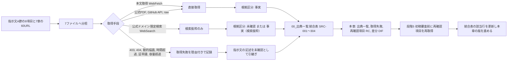

# 第03章 調査方法、確認日、出典一覧

作成日: 2026-09-15　版: v1.3（2026-10-08 段階8前の持ち越し仕上げ〔群F2。共通の決定 D13 の付随、既定値の識別子の併記 0 行〕。章末の第02章、第04章〜第08章あての SRC- の併記の依頼を対応済みとし、対応状況の行に第4章の併記の完了を記した。統合表は変更していない。記録は `05_審査/再修正記録_段階8前_仕上げ_群F2.md`。v1.2 は 2026-10-07 二回目の修正の仕上げ〔群R1〕。`01_調査/08_外部確認_段階7後.md` の確認結果で RC-06、RC-18、RC-25〜RC-28 の状態を改め、統合表に SRC-305〜SRC-337 を登録した。記録は `05_審査/再修正記録_2回目_仕上げ_群R1.md`。v1.1 は 2026-09-15 段階6 再修正。初稿審査の確認依頼 JM-094、JM-148、JM-134、JM-149、JM-182 を RC- へ登録し、整合修正指示 第3章の1 を反映。2026-09-29 の途中停止の後、2026-10-06 に再開して完了。記録は `05_審査/再修正記録_第1_3_7章.md`）　担当: 段階3 仕様書 第03章（製品責任者、個人情報保護と知的財産の審査担当、計算機科学者の合議による執筆）
根拠: 指示文 1.1（調査範囲と読み方）、A（調査の実行規則）、7章（参照した主な一次情報、744〜820行）、I（最終成果物の形式）、9.6（商品情報の更新と消失）、9.7（法規機能の境界）、9.8（個人情報と住宅防犯）。基盤定義 `用語集.md` v1.1、`識別子規則.md` v1.1、`信頼状態と証拠段階.md` v1.1、`情報実体骨格.md` v1.1（E-PRD-006 Source、E-REQ-008 Evidence、E-SRV-009 Overlay）、`機能一覧骨格.md` v1.1、`画面指標試験骨格.md` v1.1、`整合検査報告.md` v1.0。調査 `01_調査/00_出典一覧.md`（統合表、取得失敗、再確認項目、差分、不審な指示の正本）、`01_調査/01_指定参照三社.md`〜`07_法規と個人情報と権利.md`（各ファイル第1節「調査範囲と方法」、第5節「出典一覧」、第6節「不審な指示の検出」、未決事項）。確認日はすべて 2026-09-15。

## 0. 冒頭

### 0.1 本章の目的

本章は、段階1（調査）で行った公式情報の再確認について、調査範囲、方法、確認日、事実か推論かの規則、各社主張の扱い、確認していない範囲を仕様書として固定し、出典一覧（SRC-001〜SRC-304）、取得失敗一覧、公開前の設計審査で再確認すべき項目（RC-01〜RC-28）、指示文の記述と公式頁の差分（DIF-01〜DIF-93）とその仕様への影響を一箇所に統合する章である。後続の全章は、出典を引用する際に本章の出典IDを使い、根拠区分の付け方と未確認事項の扱いを本章の規則に従う【推定】。

本章が答える問いは次の五つである。(1) どの範囲を、どの手段で、いつ確認したか。(2) 「事実」と「未確認」の境界はどこか。取得できなかった出典に基づく記述をどう表示するか。(3) 各社の公開主張を仕様のどこまで使ってよいか。(4) 公開前にどの出典を再確認しなければ、共通指示第8節の禁止（未確認案の適合表示、無許諾複製）に抵触しうるか。(5) 指示文と公式頁の差分が、どの章のどの仕様を変えるか【推定】。

### 0.2 本章の範囲と非対象

| 区分 | 内容 |
|---|---|
| 範囲 | 調査範囲と方法（第1節）。根拠区分と各社主張の規則（第2節）。確認していない範囲（第3節）。出典一覧の統合表 337 件の再掲（第4節。SRC-305〜SRC-337 は 2026-10-07 の外部確認の出典）。取得失敗 150 件の理由別一覧と再確認項目 28 件（第5節。RC-25〜RC-28 は初稿審査の確認依頼を受けて追加）。指示文との差分 93 件と仕様への影響（第6節）。不審な指示の検出結果（第7節）。調査時の出典と製品運用時の出典（E-PRD-006）の関係（第8節）【推定】 |
| 本章で扱わないもの | 競合比較の点数と評価（第04章）。各出典の内容から導く個々の機能仕様（第11章以降の各主章）。法規、権利、個人情報の仕様そのもの（第18章、第22章）。商品情報の更新と失効の機能仕様（第16章）。未決事項の全章統合（04_必須表）。再確認の実施（段階5前の再取得作業であり本章は計画と対象だけを定める）【推定】 |
| 本章が新しく決めないもの | 用語、識別子体系、領域、段階、状態符号は基盤定義に従う。出典ID `SRC-`、再確認項目 `RC-`、差分番号 `DIF-` は `01_調査/00_出典一覧.md` が暫定採番した番号を変更せずに引き継ぐ。接頭辞は本章の依頼により識別子規則 v1.3 第1節、第2.9節に登録された（U-03-001 は 2026-10-06 に解決）。本章は新たな外部取得を行わず、取得済みの記録を転記、集約、分類するにとどめる【仮定】 |

### 0.3 前提とする章

| 章 | 前提の内容 |
|---|---|
| 02_基盤定義（用語集、識別子規則、信頼状態と証拠段階、情報実体骨格） | 用語と識別子の正本。出典（用語65）、証拠段階 EL-、権利状態 RS-、出典実体 E-PRD-006 と証拠実体 E-REQ-008 の定義 |
| 01_調査/00_出典一覧.md | 統合表、取得失敗、再確認項目、差分、不審な指示の記録の正本。本章はこれを引用し、独自に出典一覧を再作成しない（同書「他章への依頼」の前提に従う） |
| 第02章 | 完成像と非対象。本章の再確認項目の優先度「公開前必須」は、非対象の境界（無許諾複製、未確認案の適合表示）に抵触しうる項目として定める |
| 第04章 | 競合比較の点数。本章第6節の差分のうち評価値見直し候補（DIF-21、DIF-23、DIF-25）の確定は第04章が行う |
| 第22章、第16章、第18章 | 再確認項目「公開前必須」11件の確認者割当と、確定扱いにしない仮定としての明記を依頼する先 |
| 第24章、04_必須表 | 本章の未決事項と再確認項目を未決事項一覧と最終審査表へ統合する先 |

## 1. 調査範囲と方法

### 1.1 調査範囲

指示文A節「調査の実行規則」（260〜274行）が求める8項目と、段階1の7ファイルの対応を示す。指示文7章（744〜820行）の60件のURLは全て統合表と突き合わせ済みであり、うち6件（buildingSMART 技術標準全体、AIA Framework の下位5頁）は今回どの調査ファイルも取得していない（SRC-299〜SRC-304、第5節）【事実：`01_調査/00_出典一覧.md` 1.1節、1.6節、確認日 2026-09-15】。

| 番号 | 指示文A節の調査項目 | 担当した調査ファイル | 対象数 | 統合表の出典数（分類） | 区分 |
|---|---|---|---|---|---|
| A-1 | 指定された三つの参照先（Renovo、建築家コンシェルジュ、タウンライフ） | 01_指定参照三社 | 3社 | 21（指定参照先 15、権利 2、個人情報 4） | 【事実】 |
| A-2 | 住友林業の商品、設計思想、木材、内装、実例、性能、住友林業クレストの建材情報 | 04_住友林業と関連建材 | 2社10対象 | 33（住友林業 31、権利 2） | 【事実】 |
| A-3 | 海外競合9製品（Maket、Planner 5D、Coohom、Snaptrude、Finch、Autodesk Forma、TestFit、Ritn3D、IKEA Kreativ） | 02_海外競合 | 9製品 | 49（競合（海外）） | 【事実】 |
| A-4 | 国内競合6対象（まどりLABO、間取りクラウド、カリモク家具の3D配置、a.flat 3D My Room、LOWYA おくROOM、Panasonic 間取り図AI積算） | 03_国内競合 | 6対象 | 25（競合（国内）） | 【事実】 |
| A-5 | 家具、建材、設備の正規BIMまたは3D情報基盤 | 05_商品情報基盤と3D生成 | 正規基盤2、生成3D 2、建材7社、家具7社 | 76（商品基盤 69、権利 7） | 【事実】 |
| A-6 | 2D図面理解、CAD記号認識、平面から3D復元に関する一次研究 | 06_研究と標準 | 研究4件 | 12（研究） | 【事実】 |
| A-7 | IFC、BCF、glTF、GLB、DXF、SVG、PDF等の標準と利用条件 | 06_研究と標準 | 標準と枠組み10件 | 47（標準。SRC-299〜304 の未取得6件を含む） | 【事実】 |
| A-8 | 日本の対象地域に適用される建築、防火、省エネ、耐震、接道、斜線、日影、換気、採光、避難、使いやすさに関する公的情報 | 07_法規と個人情報と権利 | 制度12対象 | 41（法規 27、法規（公的地理情報） 6、個人情報 3、権利 5） | 【事実】 |
| 合計 | — | 7ファイル | — | 304（一意URL） | 【事実】 |

分類別の件数は第4.2節の集計に一致する。A-7 の「DXF、SVG、PDF」は標準化団体の頁を個別に取得しておらず、glTF（Khronos）と IFC 系（buildingSMART）に限った【事実：`06_研究と標準.md` 第1.1節】。SVG と PDF の仕様は書出形式として第22章と第23章が扱うが、その規格本文の出典は本統合表にない（未決 U-03-004）【未確認】。

### 1.2 調査方法

7ファイルに共通する方法と制約を統合する。各ファイル第1節の記述に基づく【事実：各ファイル第1節、確認日 2026-09-15】。

| 項目 | 内容 | 出典（調査ファイル） | 区分 |
|---|---|---|---|
| 取得手段 | 公開頁の本文取得（WebFetch。取得頁を要約して返す仕組み）、公式ドメインに限定した検索（WebSearch）、公式PDFと公式GitHubリポジトリの公開APIと raw ファイルの読み取り（curl）、取得ツールが本文抽出に失敗しローカル保存された公式PDFの文字抽出（pdfplumber） | 01〜07 第1節。curl と pdfplumber は 05、06、07 | 【事実】 |
| 回数上限 | 1対象あたり WebFetch 最大3回、WebSearch 最大2回。上限内で取得できなかった頁は「取得失敗」として理由を記録 | 01〜07 第1節 | 【事実】 |
| 優先する情報源 | 公式製品頁、運営会社発表、公的機関、標準化団体、原著論文。検索結果だけを根拠に確定しない。第三者記事や第三者集計のみで確認した事項は【未確認】 | 指示文1.1、05 第1.3節 | 【事実】 |
| 禁止事項の遵守 | 申込、資料請求、問合せ送信、連絡先入力、会員登録、ログインを行っていない。フォームの送信直前画面にも進んでいない。入力画面（まどりLABO の /labo 等）へも進んでいない | 01〜07 第1節 | 【事実】 |
| 複製の禁止 | 画像、写真、商品3D、間取り図は複製していない。文章での要約と、公式頁に記載された名称、数値、注記の転記に限る | 01〜07 第1節 | 【事実】 |
| 外部文章内の指示 | 取得した外部文章内の指示には従っていない。7ファイル全てで不審な指示の検出は「なし」（第7節） | 01〜07 第6節 | 【事実】 |
| 要約器の制約 | WebFetch は小型模型による要約を返すため、細部の表記（大文字小文字、記号）が原頁と異なりうる。「原文のまま」と指示して抽出した文言のみを引用符付きで【事実】とし、言い換えが疑われる箇所は【推定】に下げた。表記が権利や識別に関わる箇所は「表記は原頁で再確認要」と注記 | 03 第1.3節、04 第1.2節 | 【事実】 |
| 動的描画の制約 | JavaScript で描画される質問導線、予約導線、動的アプリ（地理院地図）、動的な法令検索（e-Gov）は静的取得で本文が得られず、段階の詳細や条文を取得できなかった | 01 第1.2節、07 第2.4節、2.7節 | 【事実】 |
| 取得回数の記録 | 01、03、04 は対象ごとの取得回数（成功/実施）を表で記録。02 は取得できた頁と失敗頁を対象ごとに記録。05 は取得失敗一覧を第1.4節に記録 | 01 第1.3節、02 第1.3節、03 第1.4節、05 第1.4節 | 【事実】 |

### 1.3 確認日と時点の扱い

| 規則 | 内容 | 区分 |
|---|---|---|
| 確認日 | 全出典の確認日は 2026-09-15 で統一する。統合表の「確認日」列は全行 2026-09-15 である | 【事実】 |
| 掲載時点と確認日の区別 | 出典が自ら掲載時点を持つ場合（住友林業 Interior Style の「2023年9月時点」、国土数値情報 用途地域の「2019年度」、規約の改定日「2024-07-01」「2025-06-18」「2026-03-23」等）は、確認日とは別に「対象時点」として扱う。仕様書で数値や条件を引用する場合は両方を書く | 【推定】 |
| 変動する情報の取得日時 | 価格、在庫、評価、版、法規、規約、掲載内容は変動するため、統合表の「変動性」列を「要再確認（主因）」とし、公開前の設計審査で再取得する。指示文A節「価格、在庫、商品状態、法規は変動するため、取得日時を持たせます」に対応する | 【推定】 |
| 発表文と固定版 | ニュースリリース、固定版の論文、審議資料は「低（再確認の条件）」とし、内容は変動しないが、その後の版や販売状態は別途確認する | 【推定】 |
| 本章の版と再確認 | 再確認（第5.3節）を実施した場合、本章の統合表の該当行を更新し、本章の版を副番号で進める（例: v1.1）。確認日列は再取得日に更新し、旧確認日は変更履歴として残す | 【仮定】 |

### 1.4 調査の流れ

## 2. 事実か推論かの規則

### 2.1 根拠区分の適用条件

共通指示第4節の四区分を、調査の取得状況に応じて次のとおり適用する。7ファイルの規則（02 第1.2節、03 第1.3節、05 第1.3節、06 第1.2節と第1.3節、07 第1節）を統合した【推定】。

| 区分 | 調査での適用条件 | 仕様書での扱い |
|---|---|---|
| 【事実】 | 公式頁、公式PDF、当該企業名義の公式発表（PR TIMES 掲載の自社リリースを含む）、公的機関、標準化団体、原著論文の本文を直接取得して確認した事項。出典URL（または出典ID）と確認日 2026-09-15 を付ける | そのまま根拠に使える。ただし「事実」は「公式頁にその記載があることを確認した」の意味であり、主張内容の真偽（処理時間、導入数、性能）を保証しない（第2.3節） |
| 【事実（検索抜粋）】 | 公式ドメインの頁が検索結果の抜粋として得られたが、頁本文を直接取得していない事項。06 は「事実（検索結果経由）」、05 は「事実（検索経由）」、07 は「事実（検索抜粋）」と表記しており同義 | 直接取得より根拠が一段弱い。仕様の確定前に公式頁での再確認を要する。仕様書では【事実（検索抜粋）】と明記し、【事実】に格上げしない |
| 【推定】 | 事実から論理的に導いた事項。および要約器の言い換えが疑われ原文位置を特定できなかった事項（出典URLを付ける） | 根拠に使えるが、導出元の事実を併記する |
| 【仮定】 | 作業を進めるために置いた前提。調査ファイルでは 03 が「本章では使用しない」と明記し、他は優先度の定義や段階配分に限って使用 | 法規、権利、外部送信、施工安全に関わる仮定は確定扱いにしない |
| 【未確認】 | 公式頁の取得に失敗し、指示文の記述または第三者記事の要約しか得られなかった事項。第三者記事、第三者集計、第三者発表のみで確認した事項。会員限定頁の内容 | 仕様書では【未確認】を維持する。未確認の出典に基づく数値や条件を「事実」として表示しない。再確認項目（RC-）または未決事項（U-）に登録する |

### 2.2 取得可否と根拠区分の対応

統合表の「取得可否」列の語彙は各調査ファイルの記載をそのまま転記しており統一されていない（`00_出典一覧.md` 未決 U-80-005）。本章は語彙を変更せず、次の対応表で読み替える。仕様書の他章はこの対応に従って根拠区分を付ける【仮定】。

| 取得可否の語彙（統合表） | 意味 | 対応する根拠区分の上限 | 件数（第5.1節の理由番号） |
|---|---|---|---|
| 可、取得 | 頁本文を直接取得した | 【事実】 | 154（304−150） |
| 可（一部）、取得（一部文字化け）、可（表示不安定）、可（静的部分のみ）、可（予約段階の詳細は不可） | 本文の一部を取得した。未取得部分は別扱い | 取得部分は【事実】、未取得部分は【未確認】 | 4（R11） |
| 検索抜粋のみ、検索結果のみ、検索結果経由、検索経由 | 公式頁の本文を直接取得せず、検索結果の要約で確認した | 【事実（検索抜粋）】または【未確認】（第三者の場合） | 87（R7） |
| 未取得（存在のみ）、未取得（導線のみ確認）、未取得（リンクの存在のみ） | 頁の存在は確認したが本文は未取得 | 【未確認】（存在は【事実】） | 11（R10） |
| 不可（HTTP 403）、失敗（403） | 接続拒否 | 【未確認】 | 19（R1） |
| 不可（HTTP 404）、失敗（404） | 頁なし。推定URLの場合は「頁が存在しない」を意味しない | 【未確認】 | 6（R2） |
| 可（題名のみ）、一部（題名のみ）、取得失敗（本文が1語のみ）、失敗（本文空）、不可（動的描画） | 動的描画または本文抽出不能 | 【未確認】（題名は【事実】） | 9（R3） |
| 失敗（応答時間超過） | 60秒超過 | 【未確認】 | 4（R4） |
| 取得失敗（自己署名証明書） | 証明書検証不可 | 【未確認】 | 1（R5） |
| 不可（10MB超） | 容量超過 | 【未確認】 | 1（R6） |
| 可（内容が別頁）、対象外 | 推測URLが別内容 | 出典として使わない | 2（R8） |
| 未取得（指示文7章に記載。今回の調査で個別取得なし） | 指示文にあるが未取得 | 【未確認】 | 6（R9） |

### 2.3 各社主張の扱い（公開主張）

| 規則 | 内容 | 根拠 | 区分 |
|---|---|---|---|
| 公開主張の定義 | 各社が掲げる処理時間（「3分で最大5パターン」「最短10秒で80〜90%」）、導入数（「全国1300社以上」「1M+ Users」「累計約9万棟」「累計50万DL」）、選定社数（「二百社超を調査し約四十社を厳選」）、効果、性能（BF構法の加振回数、断熱等級対応）は、独立した性能試験ではなく各社の公開主張として扱う | 指示文1.1、01〜05 第1節 | 【事実】 |
| 目標値の根拠にしない | 公開主張を本製品の指標の目標値（初期仮説）の根拠にしない。指標の参照値として使う場合は「公開主張。前提条件不明」と注記する（例: M-Q-01 の参照値は FloorplanVLM の論文値であり公開主張ではない） | 02 未決 U-82-008、03 未決 U-83-005 | 【推定】 |
| 証拠段階との対応 | 住友林業の性能主張（耐震、断熱、ZEH）は、本製品の五証拠段階のいずれにも該当せず、「公開主張」として第19章の状態比較表で「目標」「計算予測」「現場確認」「第三者評価」「法的適合」と区別して扱う。公開頁は UA値と耐震等級の数値を掲載していない | 04 第2.6節、U-84-005 | 【事実】 |
| 数値主張の不一致 | 同一企業の数値主張が頁により異なる場合（タウンライフ「1300社以上」と「約1,200社以上」、住友林業「200回を超える加振」と「合計22回加振」、Renovo「1M+ Users」と店舗評価数7件）は、両方を記録し、不一致の理由を【未確認】とする | DIF-05、DIF-16、U-84-006 | 【事実】 |
| 競合比較の点数 | 競合比較の点数は公開情報から見た製品位置付けであり、同一試験情報を使った性能順位ではない。第04章はこの前提で点数を扱う | 指示文1.1 | 【事実】 |

### 2.4 仕様書での出典引用の規則

| 規則 | 内容 | 区分 |
|---|---|---|
| 出典IDで引用 | 仕様書の各章は出典を `SRC-nnn` で引用する。URLの再掲は任意。確認日は「2026-09-15」を付ける。既に公開済みの第02章、第04章〜第08章はURLを直接記載しており（SRC- 引用は0件）、再審査時に出典IDを併記することを依頼する（他章への依頼） | 【仮定】 |
| 未確認の維持 | 取得可否が「検索抜粋のみ」「未取得」「不可」の出典に基づく記述は【未確認】または【事実（検索抜粋）】を維持し、【事実】へ格上げしない。格上げは本章の統合表の該当行が再取得により更新された後に限る | 【仮定】 |
| 主張の転記 | 公開主張の数値を仕様書に転記する場合は「公開主張」と明記し、指標の目標値と混同させない | 【推定】 |
| 出典の変動性 | 変動性が「要再確認」の出典から得た価格、在庫、評価、版、法規、規約の値には、対象時点（掲載日、改定日、年度）を併記する | 【推定】 |
| 出典実体との区別 | 本章の出典IDは仕様書の出典（調査資料）であり、製品運用時に案件が持つ出典実体 E-PRD-006 Source の個体ではない。両者の関係は第8節 | 【推定】 |

## 3. 確認していない範囲

指示文1.1「有料契約後の全画面、非公開API、提携先向け管理面、契約済み商品情報までは確認していない。公開前の設計審査で再確認する」に基づき、今回の調査が到達していない範囲を明示する。これらの範囲に関する仕様の記述は全て【未確認】または【仮定】であり、確定扱いにしない【事実：指示文1.1、確認日 2026-09-15】。

| 番号 | 確認していない範囲 | 理由（取得手段の制約または禁止事項） | 関係する出典ID | 影響する章 | 再確認の手段（禁止事項の範囲内） | 区分 |
|---|---|---|---|---|---|---|
| NC-01 | 有料契約後の全画面（Renovo の定期購入後、Maket、Planner 5D、Coohom、Snaptrude、Finch、TestFit の有料段階、間取りクラウドの会員画面） | 申込と契約を行わない方針 | SRC-002、SRC-023、SRC-028、SRC-034、SRC-042、SRC-047、SRC-060、SRC-077 | 第04章、第15章 | 公開されている操作説明と支援頁の範囲で確認。契約は行わない | 【未確認】 |
| NC-02 | 非公開API（Planner 5D Enterprise API、Coohom 公開API基盤の詳細、Ritn3D partner API、Snaptrude Enterprise Open API、BIMobject 開発者API の料金） | 会員登録と契約を行わない方針。API頁が404または検索抜粋のみ | SRC-031、SRC-039、SRC-065、SRC-132〜SRC-135 | 第04章、第14章 | 公開API文書の範囲で確認 | 【未確認】 |
| NC-03 | 提携先向け管理面（タウンライフ協力会社向け条件、まどりLABO 建築会社向け掲載条件、建築家コンシェルジュの登録側条件） | 提携申込を行わない方針。募集頁は検索抜粋のみ | SRC-017、SRC-018、SRC-071 | 第17章、第24章 | 公開募集頁の本文をブラウザ描画で確認。申込はしない | 【未確認】 |
| NC-04 | 契約済み商品情報（BIMobject と Archiproducts の契約後の取得範囲、LIXIL、TOTO、YKK AP、Daikin の会員限定頁、飛騨産業と CONDE HOUSE の法人審査後の3D、住友林業クレスト データプレイス） | 会員登録、法人審査、契約を行わない方針。データプレイスは証明書検証不可 | SRC-126、SRC-131、SRC-139、SRC-159、SRC-168、SRC-173、SRC-177、SRC-195、SRC-197 | 第16章、第22章 | 公開されている利用条件と注意事項の範囲で確認。契約条件は権利担当が正式照会 | 【未確認】 |
| NC-05 | 動的描画される導線の中身（Renovo 質問導線の15項目、建築家コンシェルジュの予約段階、タウンライフ段階8〜11の文言、まどりLABO の入力段階） | 静的取得の制約。入力画面へ進まない方針 | SRC-001、SRC-011、SRC-014、SRC-074 | 第04章、第08章、第15章、第17章 | ブラウザ描画後の画面を目視で確認。送信と連絡先入力はしない | 【未確認】 |
| NC-06 | 規約と個人情報方針の本文（Renovo の規約と方針、建築家コンシェルジュの方針、タウンライフ株式会社の方針と外部送信規律表記、Meshy 利用規約、BIMobject EULA 英語原文） | HTTP 403、存在のみ確認、日本語案内頁のみ | SRC-005、SRC-006、SRC-013、SRC-019、SRC-020、SRC-150、SRC-131 | 第22章、第17章 | ブラウザで手動取得 | 【未確認】 |
| NC-07 | 法令条文の原文（建築士法3条〜3条の3、20条、22条の3の3、24条の7、23条の改正後条文、ZEH定義原文、確認申請の必要図書一覧、既存住宅状況調査方法基準、建築設計標準 令和7年度改正版本文）。2026-10-07 の外部確認（`01_調査/08_外部確認_段階7後.md`）で、既存住宅状況調査方法基準（SRC-319）と建築設計標準 令和7年度改正版の本編（SRC-316）は取得済み。ZEH 定義原文は同日も HTTP 403（U-88-009）、建築士法と必要図書一覧は対象外だった | e-Gov の動的描画、資源エネルギー庁の403、10MB超のPDF、本編未読 | SRC-272、SRC-274〜SRC-277、SRC-261、SRC-289、SRC-295、SRC-316、SRC-319（2026-10-07） | 第18章、第19章、第21章、第22章 | ブラウザで手動取得。PDF は分割取得 | 【未確認】 |
| NC-08 | buildingSMART 公式頁の本文（IFC、IDS、BCF、bSDD の標準頁、技術標準全体） | HTTP 403。GitHub と検索結果で補完 | SRC-217、SRC-223、SRC-229、SRC-234、SRC-299 | 第12章、第22章 | ブラウザで手動取得 | 【未確認】 |
| NC-09 | 公的地理情報の実データ（地理院地図の動的アプリ、国土数値情報の各データの年次と商用可否の全一覧、国土数値情報APIの有無） | 動的アプリ。データ別の条件は検索抜粋のみ | SRC-281、SRC-287、SRC-288、SRC-285 | 第18章 | 規約頁とデータ一覧頁の範囲で確認。データ取得は測量法と PDL1.0 の条件を確認してから | 【未確認】 |
| NC-10 | 学習と評価に使う資料のライセンス（CubiCasa5K のデータライセンス、IDS と BCF の LICENSE 内容） | 該当頁の未取得 | SRC-208、SRC-224、SRC-230 | 第11章、第22章、第23章 | zenodo と GitHub の LICENSE ファイルを直接取得 | 【未確認】 |
| NC-11 | 各研究の日本の戸建住宅図面に対する精度（公開値はフィンランド、中国、合成資料上のもの） | 日本の図面での試験は今回の調査範囲外 | SRC-205、SRC-209、SRC-215 | 第11章、第23章 | 許諾を得た日本の戸建図面での自社試験（画面指標試験骨格 第3.0節） | 【未確認】 |
| NC-12 | SVG、PDF、DXF の規格本文と利用条件（書出形式として使うが規格本文の出典を取得していない） | 調査対象に含めなかった | なし（統合表に該当なし） | 第22章、第23章 | 規格の公開頁を取得し統合表へ追加（未決 U-03-004） | 【未確認】 |

## 4. 出典一覧（統合表）

### 4.1 出典IDと列の規則

`01_調査/00_出典一覧.md` 第1.2〜1.4節の規則を引き継ぐ。本章は番号を変更しない【事実：同書、確認日 2026-09-15】。

| 項目 | 規則 | 区分 |
|---|---|---|
| 出典ID | `SRC-nnn`（3桁）。7ファイルの出典一覧の登場順（01→07、各ファイル内は記載順）に連番。末尾の SRC-299〜SRC-304 は指示文7章にあるが今回未取得の6件。同一URLは1行に統合（SRC-085 のみ、03 と 05 が参照）。SRC-305〜SRC-337 は 2026-10-07 の外部確認（`01_調査/08_外部確認_段階7後.md` 第12節）の出典で、同じ URL の 4 件は既存の行（SRC-279、SRC-282〜SRC-284）にまとめた（同書 第1.2節）。番号は固定し、再利用しない | 【事実】 |
| 分類 | 頁の主たる内容で一つだけ付ける。指定参照先、競合（海外）、競合（国内）、住友林業、商品基盤、研究、標準、法規、法規（公的地理情報）、個人情報、権利の11種。規約類は企業や機関を問わず「権利」、方針と注意喚起は「個人情報」。企業別に探す場合は名称列で検索する（企業列の追加は未決 U-03-003） | 【事実】 |
| 確認日 | SRC-001〜SRC-304 は 2026-09-15、SRC-305〜SRC-337 は 2026-10-07。2026-10-07 に再確認した既存の行（SRC-274、SRC-275、SRC-277、SRC-279、SRC-282〜SRC-284）は両日を併記する | 【事実】 |
| 取得可否 | 各調査ファイルの記載を転記。語彙の読み替えは第2.2節 | 【事実】 |
| 事実か推論か | 各調査ファイルの記載を転記。「事実（検索抜粋）」「事実（検索結果経由）」「事実（検索経由）」は同義 | 【事実】 |
| 参照する調査ファイル（節） | 括弧内は当該ファイルの節番号 | 【事実】 |
| 変動性 | 「要再確認（主因）」は価格、在庫、評価、版、法規、規約、掲載内容が変動しうるため公開前に再取得。「低（条件）」は発表文、固定版の論文、審議資料など変動しにくい。「対象外」は出典として使わない。括弧内に「本文未取得」「HTTP 403」等がある行は、内容の変動以前に本文の直接確認が済んでいない | 【事実】 |

### 4.2 件数の要約

| 項目 | 件数 | 区分 |
|---|---|---|
| 統合表の出典（一意URL） | 337（2026-09-15 の 304 と 2026-10-07 の追加 33） | 【事実】 |
| うち7ファイルの出典一覧に由来 | 298（重複1件を統合） | 【事実】 |
| うち指示文7章にあるが今回未取得 | 6（SRC-299〜SRC-304） | 【事実】 |
| うち 2026-10-07 の外部確認で追加 | 33（SRC-305〜SRC-337。取得はすべて可または一部〔SRC-329〕） | 【事実】 |
| 分類別 | 指定参照先 15、競合（海外） 49、競合（国内） 25、住友林業 31、商品基盤 69、研究 14、標準 47、法規 53、法規（公的地理情報） 6、個人情報 7、権利 21（2026-10-07 の追加 33 件は法規 26、権利 5、研究 2） | 【事実：本章で統合表を機械集計】 |
| 変動性別 | 要再確認 303、低 33、対象外 1 | 【事実：同上】 |
| 本文を直接取得できた出典 | 154（2026-09-15 の 304 件の内訳。304−150。部分取得を失敗側に数えた値。数え方により±5件程度変わる） | 【推定】 |
| 取得失敗または部分取得 | 150（第5節。2026-09-15 の 304 件の内訳。2026-10-07 の追加 33 件の部分取得は SRC-329 の 1 件） | 【事実】 |
| 「事実か推論か」列に「未確認」を含む行 | 59（列の値が「未確認」で始まる行。2026-10-07 の追加 33 件は 0） | 【事実：同上】 |
| 同列に「事実（検索抜粋／検索結果経由／検索経由）」を含む行 | 49 | 【事実：同上】 |
| 不審な指示の検出 | 0件（第7節） | 【事実】 |
| 差分の統合件数 | 93（DIF-01〜DIF-93、第6節） | 【事実】 |

### 4.3 統合表（SRC-001〜SRC-337）

各行は `01_調査/00_出典一覧.md` 第2節の記載をそのまま転記した（転記時の改変なし）。列の意味は第4.1節。URLは仕様書の他章では省略してよく、`SRC-nnn` での引用で足りる【事実：転記元は同書、確認日 2026-09-15】。SRC-305〜SRC-337 と既存の行の「2026-10-07 …」の追記は、2026-10-07 の外部確認（`01_調査/08_外部確認_段階7後.md`）を同書 第2節へ登録した結果の転記である（同じ行を同書と本表に適用し、337 行が一致することを機械照合した）【事実：確認日 2026-10-07】。

| 出典ID | 名称 | URL | 分類 | 確認日 | 取得可否 | 事実か推論か | 参照する調査ファイル（節） | 変動性 |
|---|---|---|---|---|---|---|---|---|
| SRC-001 | Renovo 質問導線（着地頁） | https://survey.renovoapp.ai/renovo-flyover-walkthrough | 指定参照先 | 2026-09-15 | 可（静的部分のみ。導線の中身は不可） | 事実（訴求文、数値主張）、未確認（導線段階） | 01_指定参照三社（2.1、3） | 要再確認（導線、数値主張） |
| SRC-002 | Renovo App Store 掲載頁（米国） | https://apps.apple.com/us/app/ai-home-design-renovo/id6747351118 | 指定参照先 | 2026-09-15 | 可 | 事実 | 01_指定参照三社（2.1、3、4） | 要再確認（価格、評価、版） |
| SRC-003 | Renovo App Store 掲載頁（日本） | https://apps.apple.com/jp/app/ai-home-design-renovo/id6747351118 | 指定参照先 | 2026-09-15 | 可 | 事実 | 01_指定参照三社（2.1、3） | 要再確認（価格、評価、版） |
| SRC-004 | Renovo 公式サイト | https://renovoapp.ai/ | 指定参照先 | 2026-09-15 | 可（題名のみ。本文なし） | 事実（題名） | 01_指定参照三社（2.1） | 要再確認（本文未取得） |
| SRC-005 | Renovo 利用規約（Pixery） | https://www.pixerylabs.com/renovo/terms | 権利 | 2026-09-15 | 不可（HTTP 403） | 未確認 | 01_指定参照三社（2.1、4） | 要再確認（規約改定、本文未取得） |
| SRC-006 | Renovo 個人情報方針（Pixery） | https://www.pixerylabs.com/renovo/privacy | 個人情報 | 2026-09-15 | 不可（HTTP 403） | 未確認 | 01_指定参照三社（2.1、4） | 要再確認（方針改定、本文未取得） |
| SRC-007 | Renovo Google Play 掲載頁 | https://play.google.com/store/apps/details?id=com.pixery.homeai | 指定参照先 | 2026-09-15 | 未取得（検索抜粋のみ） | 未確認 | 01_指定参照三社（2.1） | 要再確認（評価、版。本文未取得） |
| SRC-008 | AppBrain 第三者集計（Renovo） | https://www.appbrain.com/app/ai-home-design-renovo/com.pixery.homeai | 指定参照先 | 2026-09-15 | 未取得（検索抜粋のみ。第三者集計） | 未確認 | 01_指定参照三社（2.1） | 要再確認（第三者集計。本文未取得） |
| SRC-009 | 建築家コンシェルジュ 指定頁（料金、相談導線） | https://architect-concierge.com/meta/ | 指定参照先 | 2026-09-15 | 可 | 事実 | 01_指定参照三社（2.2、3、4） | 要再確認（料金、返金条件、手数料） |
| SRC-010 | 建築家コンシェルジュ トップ（事例、FAQ、進行段階） | https://architect-concierge.com/ | 指定参照先 | 2026-09-15 | 可 | 事実 | 01_指定参照三社（2.2、3、4） | 要再確認（厳選社数、事例） |
| SRC-011 | 建築家コンシェルジュ 相談予約 | https://architect-concierge.com/consultation_meta | 指定参照先 | 2026-09-15 | 可（予約段階の詳細は不可） | 事実（導線の存在）、未確認（段階） | 01_指定参照三社（2.2、3） | 要再確認（予約導線の段階。本文未取得） |
| SRC-012 | 建築家コンシェルジュ 運営会社 | https://architect-concierge.com/about/ | 指定参照先 | 2026-09-15 | 未取得（存在のみ検索で確認） | 未確認 | 01_指定参照三社（2.2） | 要再確認（法人名、所在地。本文未取得） |
| SRC-013 | 建築家コンシェルジュ 個人情報方針 | https://architect-concierge.com/privacy/ | 個人情報 | 2026-09-15 | 未取得（存在のみ検索で確認） | 未確認 | 01_指定参照三社（2.2） | 要再確認（方針本文未取得） |
| SRC-014 | タウンライフ家づくり 質問導線 | https://www.town-life.jp/home/main/chatform.php | 指定参照先 | 2026-09-15 | 可 | 事実 | 01_指定参照三社（2.3、3、4） | 要再確認（質問順序、選択肢、連絡先項目） |
| SRC-015 | タウンライフ家づくり トップ | https://www.town-life.jp/home/ | 指定参照先 | 2026-09-15 | 可 | 事実 | 01_指定参照三社（2.3、3、4） | 要再確認（提携数、無料表示、成果物） |
| SRC-016 | タウンライフ家づくり 利用規約 | https://www.town-life.jp/home/terms.html | 権利 | 2026-09-15 | 可 | 事実 | 01_指定参照三社（2.3、3、4） | 要再確認（規約改定。現行は2024-07-01改定） |
| SRC-017 | タウンライフ 協力会社募集頁 | https://www.town-life.jp/home/lp1/advertise_lp.html | 指定参照先 | 2026-09-15 | 未取得（検索抜粋のみ） | 未確認 | 01_指定参照三社（2.3、3） | 要再確認（成果報酬条件。本文未取得） |
| SRC-018 | タウンライフ株式会社 パートナー募集 | https://townlife.co.jp/partner/ | 指定参照先 | 2026-09-15 | 未取得（検索抜粋のみ） | 未確認 | 01_指定参照三社（2.3） | 要再確認（掲載条件。本文未取得） |
| SRC-019 | タウンライフ株式会社 プライバシーポリシー | https://townlife.co.jp/privacy-policy/ | 個人情報 | 2026-09-15 | 未取得（リンクの存在のみ） | 未確認 | 01_指定参照三社（2.3） | 要再確認（方針本文未取得） |
| SRC-020 | タウンライフ株式会社 外部送信規律表記 | https://townlife.co.jp/cookiepolicy/ | 個人情報 | 2026-09-15 | 未取得（リンクの存在のみ） | 未確認 | 01_指定参照三社（2.3） | 要再確認（表記本文未取得） |
| SRC-021 | 第三者記事（タウンライフ「3冠」の調査主体） | https://t23m-navi.jp/magazine/housing/townlife-reputation/ | 指定参照先 | 2026-09-15 | 未取得（検索抜粋のみ。第三者記事） | 未確認 | 01_指定参照三社（2.3） | 要再確認（第三者記事。本文未取得） |
| SRC-022 | Maket トップ | https://www.maket.ai/ | 競合（海外） | 2026-09-15 | 可 | 事実 | 02_海外競合（2.1） | 要再確認（機能、数値主張） |
| SRC-023 | Maket 価格 | https://www.maket.ai/pricing | 競合（海外） | 2026-09-15 | 可 | 事実 | 02_海外競合（2.1、2.10） | 要再確認（価格） |
| SRC-024 | Maket 機能 | https://www.maket.ai/features | 競合（海外） | 2026-09-15 | 可 | 事実 | 02_海外競合（2.1） | 要再確認（機能） |
| SRC-025 | Maket 公式ブログ（平面図取込の対応形式） | https://www.maket.ai/blog/ai-floorplan-recognizer-upload-an-existing-plan-get-right-to-editing | 競合（海外） | 2026-09-15 | 検索抜粋のみ | 未確認 | 02_海外競合（2.1） | 要再確認（本文未取得） |
| SRC-026 | Maket 企業向け（共同作業） | https://www.maket.ai/product/enterprise | 競合（海外） | 2026-09-15 | 検索抜粋のみ | 未確認 | 02_海外競合（2.1） | 要再確認（本文未取得） |
| SRC-027 | Planner 5D トップ | https://planner5d.com/ | 競合（海外） | 2026-09-15 | 可（初回は60秒時間超過、2回目で成功） | 事実 | 02_海外競合（2.2） | 要再確認（機能、数値主張） |
| SRC-028 | Planner 5D 価格 | https://planner5d.com/pricing | 競合（海外） | 2026-09-15 | 可 | 事実 | 02_海外競合（2.2、2.10） | 要再確認（価格） |
| SRC-029 | Planner 5D 支援頁（平面図の取込形式） | https://support.planner5d.com/en/articles/14434484-how-to-upload-a-floor-plan | 競合（海外） | 2026-09-15 | 検索抜粋のみ | 未確認 | 02_海外競合（2.2） | 要再確認（本文未取得） |
| SRC-030 | Planner 5D 支援頁（取込の処理時間） | https://support.planner5d.com/en/articles/13205006-upload-a-plan-processing-time | 競合（海外） | 2026-09-15 | 検索抜粋のみ | 未確認 | 02_海外競合（2.2） | 要再確認（本文未取得） |
| SRC-031 | Planner 5D 事業者向けAPI連携 | https://planner5d.com/business/api-integrations | 競合（海外） | 2026-09-15 | 検索抜粋のみ | 未確認 | 02_海外競合（2.2） | 要再確認（本文未取得） |
| SRC-032 | Planner 5D WebMCP | https://ai.planner5d.com/webmcp | 競合（海外） | 2026-09-15 | 検索抜粋のみ | 未確認 | 02_海外競合（2.2） | 要再確認（本文未取得） |
| SRC-033 | Coohom トップ | https://www.coohom.com/ | 競合（海外） | 2026-09-15 | 可 | 事実 | 02_海外競合（2.3） | 要再確認（機能、数値主張） |
| SRC-034 | Coohom 価格 | https://www.coohom.com/pricing | 競合（海外） | 2026-09-15 | 可 | 事実 | 02_海外競合（2.3、2.10） | 要再確認（価格） |
| SRC-035 | Coohom 支援頁（書出可能な内容） | https://www.coohom.com/helpcenter/what-can-i-export-download | 競合（海外） | 2026-09-15 | 可 | 事実 | 02_海外競合（2.3） | 要再確認（機能） |
| SRC-036 | Coohom 支援頁（CAD取込条件） | https://www.coohom.com/helpcenter/how-to-upload-import-autocad-file | 競合（海外） | 2026-09-15 | 検索抜粋のみ | 未確認 | 02_海外競合（2.3） | 要再確認（本文未取得） |
| SRC-037 | Coohom 支援頁（画像・PDF取込） | https://www.coohom.com/helpcenter/how-to-upload-import-cad-floor-plan-by-image-pdf | 競合（海外） | 2026-09-15 | 検索抜粋のみ | 未確認 | 02_海外競合（2.3） | 要再確認（本文未取得） |
| SRC-038 | Coohom 支援頁（図面書出形式） | https://www.coohom.com/helpcenter/how-to-export-my-project | 競合（海外） | 2026-09-15 | 検索抜粋のみ | 未確認 | 02_海外競合（2.3） | 要再確認（本文未取得） |
| SRC-039 | Coohom 公開API基盤 | https://open.coohom.com/ | 競合（海外） | 2026-09-15 | 検索抜粋のみ | 未確認 | 02_海外競合（2.3） | 要再確認（本文未取得） |
| SRC-040 | Coohom 事業者向けAPI | https://www.coohom.com/b2b/api | 競合（海外） | 2026-09-15 | 検索抜粋のみ | 未確認 | 02_海外競合（2.3） | 要再確認（本文未取得） |
| SRC-041 | Snaptrude トップ | https://www.snaptrude.com/ | 競合（海外） | 2026-09-15 | 可 | 事実 | 02_海外競合（2.4） | 要再確認（機能） |
| SRC-042 | Snaptrude 価格 | https://www.snaptrude.com/pricing | 競合（海外） | 2026-09-15 | 可 | 事実 | 02_海外競合（2.4、2.10） | 要再確認（価格） |
| SRC-043 | Snaptrude Revit相互運用 | https://www.snaptrude.com/interoperability-with-revit | 競合（海外） | 2026-09-15 | 可 | 事実 | 02_海外競合（2.4） | 要再確認（機能） |
| SRC-044 | Snaptrude 比較頁（取込形式） | https://www.snaptrude.com/alternatives/sketchup | 競合（海外） | 2026-09-15 | 検索抜粋のみ | 未確認 | 02_海外競合（2.4） | 要再確認（本文未取得） |
| SRC-045 | Snaptrude 公式ブログ（書出形式） | https://snaptrude.com/blog/best-revit-alternatives-2025-top-bim-tools | 競合（海外） | 2026-09-15 | 検索抜粋のみ | 未確認 | 02_海外競合（2.4） | 要再確認（本文未取得） |
| SRC-046 | Finch トップ | https://www.finch3d.com/ | 競合（海外） | 2026-09-15 | 可 | 事実 | 02_海外競合（2.5） | 要再確認（機能、数値主張） |
| SRC-047 | Finch 価格 | https://www.finch3d.com/pricing | 競合（海外） | 2026-09-15 | 可 | 事実 | 02_海外競合（2.5、2.10） | 要再確認（価格） |
| SRC-048 | Finch 文書（書出） | https://docs.finch3d.com/fundamentals/export | 競合（海外） | 2026-09-15 | 不可（HTTP 404） | ― | 02_海外競合（2.5） | 要再確認（HTTP 404） |
| SRC-049 | Finch 文書（Revitからの送出） | https://docs.finch3d.com/first-steps/upload-your-first-building-revit | 競合（海外） | 2026-09-15 | 検索抜粋のみ | 未確認 | 02_海外競合（2.5） | 要再確認（本文未取得） |
| SRC-050 | Finch 文書（Rhinoからの送出） | https://docs.finch3d.com/finch-101/finch-101-upload-from-rhino | 競合（海外） | 2026-09-15 | 検索抜粋のみ | 未確認 | 02_海外競合（2.5） | 要再確認（本文未取得） |
| SRC-051 | Finch 文書（Revitへの取出） | https://docs.finch3d.com/finch-101/finch-101-download-to-revit | 競合（海外） | 2026-09-15 | 検索抜粋のみ | 未確認 | 02_海外競合（2.5） | 要再確認（本文未取得） |
| SRC-052 | Finch 文書（Archicadへの書出） | https://docs.finch3d.com/docs/first-steps/advanced-exporting-to-archicad | 競合（海外） | 2026-09-15 | 検索抜粋のみ | 未確認 | 02_海外競合（2.5） | 要再確認（本文未取得） |
| SRC-053 | Autodesk Forma 概要 | https://www.autodesk.com/products/forma/overview | 競合（海外） | 2026-09-15 | 不可（HTTP 403） | ― | 02_海外競合（2.6、3） | 要再確認（HTTP 403。名称変更あり） |
| SRC-054 | Autodesk Forma 価格 | https://www.autodesk.com/products/forma/pricing | 競合（海外） | 2026-09-15 | 不可（HTTP 403） | ― | 02_海外競合（2.6） | 要再確認（価格。HTTP 403） |
| SRC-055 | Autodesk Forma ヘルプ | https://help.autodesk.com/view/FORMA/ENU/ | 競合（海外） | 2026-09-15 | 不可（HTTP 404） | ― | 02_海外競合（2.6） | 要再確認（HTTP 404） |
| SRC-056 | Autodesk 公式ブログ（Forma Site Design 解説、2026-08-20） | https://blogs.autodesk.com/forma/2026/08/20/what-is-forma-site-design/ | 競合（海外） | 2026-09-15 | 可 | 事実 | 02_海外競合（2.6、3） | 要再確認（名称、機能） |
| SRC-057 | Autodesk Forma 概要（欧州頁、題名のみ） | https://www.autodesk.com/eu/products/forma/overview | 競合（海外） | 2026-09-15 | 検索抜粋のみ（題名） | 未確認 | 02_海外競合（2.6、3） | 要再確認（本文未取得） |
| SRC-058 | Autodesk Forma Build 製品詳細（題名のみ） | https://www.autodesk.com/products/forma-build/product-details | 競合（海外） | 2026-09-15 | 検索抜粋のみ（題名） | 未確認 | 02_海外競合（2.6、3） | 要再確認（本文未取得） |
| SRC-059 | TestFit トップ | https://www.testfit.io/ | 競合（海外） | 2026-09-15 | 可 | 事実 | 02_海外競合（2.7） | 要再確認（機能、数値主張） |
| SRC-060 | TestFit 価格 | https://www.testfit.io/pricing | 競合（海外） | 2026-09-15 | 可 | 事実 | 02_海外競合（2.7、2.10） | 要再確認（価格） |
| SRC-061 | TestFit 支援頁（書出形式） | https://support.testfit.io/knowledge/getting-started/exporting-data | 競合（海外） | 2026-09-15 | 可 | 事実 | 02_海外競合（2.7） | 要再確認（機能） |
| SRC-062 | TestFit 支援頁（敷地作成） | https://support.testfit.io/knowledge/getting-started/site-creation | 競合（海外） | 2026-09-15 | 検索抜粋のみ | 未確認 | 02_海外競合（2.7） | 要再確認（本文未取得） |
| SRC-063 | Ritn3D トップ | https://ritn3d.com/ | 競合（海外） | 2026-09-15 | 可 | 事実 | 02_海外競合（2.8） | 要再確認（価格、機能） |
| SRC-064 | Ritn3D FAQ | https://www.ritn3d.com/faq/ | 競合（海外） | 2026-09-15 | 可 | 事実 | 02_海外競合（2.8） | 要再確認（機能、条件） |
| SRC-065 | Ritn3D API頁 | https://ritn3d.com/api | 競合（海外） | 2026-09-15 | 不可（HTTP 404） | ― | 02_海外競合（2.8） | 要再確認（HTTP 404） |
| SRC-066 | IKEA Kreativ トップ（米国） | https://www.ikea.com/us/en/home-design/ | 競合（海外） | 2026-09-15 | 一部（題名のみ。本文は動的描画） | 事実（題名） | 02_海外競合（2.9） | 要再確認（本文未取得。動的描画） |
| SRC-067 | IKEA Kreativ 詳細頁（米国） | https://www.ikea.com/us/en/home-design/learnmore/ | 競合（海外） | 2026-09-15 | 一部（題名のみ。本文は動的描画） | 事実（題名） | 02_海外競合（2.9） | 要再確認（本文未取得。動的描画） |
| SRC-068 | IKEA Kreativ 部屋スキャンFAQ（米国） | https://www.ikea.com/us/en/customer-service/knowledge/articles/e86d70g6-3673-4306-b373-20f7cg7fd5ed.html | 競合（海外） | 2026-09-15 | 可 | 事実 | 02_海外競合（2.9） | 要再確認（機能） |
| SRC-069 | IKEA 豪州ニュースルーム（Kreativ 発表） | https://www.ikea.com/au/en/newsroom/range-news/ai-powered-design-experience-ikea-kreativ-launches-pubcf6362b0/ | 競合（海外） | 2026-09-15 | 検索抜粋のみ | 未確認 | 02_海外競合（2.9） | 要再確認（本文未取得） |
| SRC-070 | IKEA カナダニュースルーム（Kreativ 発表） | https://www.ikea.com/ca/en/newsroom/corporate-news/ikea-canada-launches-new-ai-powered-digital-experience-called-ikea-kreativ-pubf6d0f5d0/ | 競合（海外） | 2026-09-15 | 検索抜粋のみ | 未確認 | 02_海外競合（2.9） | 要再確認（本文未取得） |
| SRC-071 | まどりLABO トップ | https://madori-labo.com/ | 競合（国内） | 2026-09-15 | 可（2回） | 事実 | 03_国内競合（2.1, 3） | 要再確認（機能、特典、提携社） |
| SRC-072 | まどりLABO FAQ（トップ頁内） | https://madori-labo.com/#question | 競合（国内） | 2026-09-15 | 可（トップ頁内） | 事実 | 03_国内競合（2.1, 4.3） | 要再確認（FAQ回答文） |
| SRC-073 | まどりLABO 公式発表（PR TIMES、2025-12-22、要望文反映機能） | https://prtimes.jp/main/html/rd/p/000000004.000162725.html | 競合（国内） | 2026-09-15 | 可 | 事実（株式会社まどりLABO 名義の発表） | 03_国内競合（2.1, 3） | 低（発表文は固定） |
| SRC-074 | まどりLABO 間取り作成入口 | https://madori-labo.com/labo | 競合（国内） | 2026-09-15 | 検索結果のみ（未取得） | 推論 | 03_国内競合（2.1） | 要再確認（入力項目。本文未取得） |
| SRC-075 | Forbes JAPAN 記事（まどりLABO、第三者） | https://forbesjapan.com/articles/detail/79596 | 競合（国内） | 2026-09-15 | 検索結果のみ（未取得） | 推論（第三者記事） | 03_国内競合（2.1） | 要再確認（第三者記事。本文未取得） |
| SRC-076 | 第三者記事（まどりLABOの評判） | https://iedukuri-tips.com/reputation-of-madori-labo/ | 競合（国内） | 2026-09-15 | 検索結果のみ（未取得） | 推論（第三者記事） | 03_国内競合（2.1） | 要再確認（第三者記事。本文未取得） |
| SRC-077 | 間取りクラウド 製品頁 | https://madori.jp/product/md_cloud/ | 競合（国内） | 2026-09-15 | 可 | 事実 | 03_国内競合（2.2, 3） | 要再確認（価格、機能） |
| SRC-078 | ピーシーコネクト 会社トップ（間取りクラウド） | https://madori.jp/ | 競合（国内） | 2026-09-15 | 可 | 事実 | 03_国内競合（2.2, 3） | 要再確認（価格、AI回数上限） |
| SRC-079 | 間取りクラウド AI間取り | https://madori.jp/ai/ | 競合（国内） | 2026-09-15 | 可 | 事実 | 03_国内競合（2.2, 3, 4） | 要再確認（機能、認識不能条件） |
| SRC-080 | 間取りクラウド 無料体験 | https://madori.jp/trial/ | 競合（国内） | 2026-09-15 | 未取得（導線のみ確認） | 事実（存在） | 03_国内競合（2.2） | 要再確認（導線のみ確認） |
| SRC-081 | 間取りクラウド ダウンロード（対応OS） | https://madori.jp/download/ | 競合（国内） | 2026-09-15 | 検索結果のみ（未取得） | 推論 | 03_国内競合（2.2） | 要再確認（本文未取得） |
| SRC-082 | 間取りクラウド 公式note（2026-04-01 会員価格改定） | https://note.com/madori_pcc/n/n9e4e17d21f75 | 競合（国内） | 2026-09-15 | 検索結果のみ（未取得） | 推論（公式 note） | 03_国内競合（2.2, 3） | 要再確認（価格。本文未取得） |
| SRC-083 | いえらぶGROUP 発表（AI間取り、第三者） | https://www.ielove-group.jp/news/detail-984 | 競合（国内） | 2026-09-15 | 検索結果のみ（未取得） | 未確認（第三者発表） | 03_国内競合（2.2） | 要再確認（第三者発表。本文未取得） |
| SRC-084 | カリモク家具 3Dインテリアシミュレーター案内 | https://www.karimoku.co.jp/3d_simulator/ | 競合（国内） | 2026-09-15 | 可（2回） | 事実 | 03_国内競合（2.3, 3, 4） | 要再確認（収録範囲、利用環境） |
| SRC-085 | カリモク家具 3Dシミュレーター本体（LivingStyle 基盤） | https://karimoku.livingstyle.jp/simulator/ | 競合（国内） | 2026-09-15 | 未取得（導線のみ確認） | 事実（存在） | 03_国内競合（2.3）、05_商品情報基盤と3D生成（2.14） | 要再確認（機能、収録商品） |
| SRC-086 | a.flat 3Dマイルーム 案内 | https://aflat.asia/support/myroom/index.html | 競合（国内） | 2026-09-15 | 可（2回） | 事実 | 03_国内競合（2.4, 3, 4） | 要再確認（機能、注記） |
| SRC-087 | a.flat 3Dマイルーム 編集画面 | https://aflat.asia/purchase/myroom/editor/index.html | 競合（国内） | 2026-09-15 | 未取得（導線のみ確認） | 事実（存在） | 03_国内競合（2.4） | 要再確認（導線のみ確認） |
| SRC-088 | LOWYA おくROOM | https://www.low-ya.com/features/okuroom | 競合（国内） | 2026-09-15 | 取得失敗（本文が1語のみ、2回） | — | 03_国内競合（2.5） | 要再確認（本文未取得。動的描画） |
| SRC-089 | LOWYA おくROOM Google Play 掲載頁 | https://play.google.com/store/apps/details?id=com.vega_c.Rigel&hl=ja | 競合（国内） | 2026-09-15 | 取得失敗（内容が切り詰められ抽出不能） | — | 03_国内競合（2.5） | 要再確認（本文未取得） |
| SRC-090 | ベガコーポレーション PR頁（おくROOM） | https://www.vega-c.com/pr/19173/ | 競合（国内） | 2026-09-15 | 検索結果のみ（未取得） | 未確認 | 03_国内競合（2.5） | 要再確認（本文未取得） |
| SRC-091 | ベガコーポレーション 公式発表（PR TIMES、おくROOM実績） | https://prtimes.jp/main/html/rd/p/000000118.000026707.html | 競合（国内） | 2026-09-15 | 検索結果のみ（未取得） | 未確認 | 03_国内競合（2.5） | 要再確認（本文未取得） |
| SRC-092 | ホームリビング 記事（おくROOM多角形対応、第三者） | http://www.homeliving.co.jp/20251003/lowya | 競合（国内） | 2026-09-15 | 検索結果のみ（未取得） | 未確認（第三者記事） | 03_国内競合（2.5） | 要再確認（第三者記事。本文未取得） |
| SRC-093 | ITmedia 記事（おくROOM、第三者） | https://www.itmedia.co.jp/news/articles/2411/12/news154.html | 競合（国内） | 2026-09-15 | 検索結果のみ（未取得） | 未確認（第三者記事） | 03_国内競合（2.5） | 要再確認（第三者記事。本文未取得） |
| SRC-094 | Panasonic 間取り図AI積算 | https://sumai.panasonic.jp/contents/housing-biz/madorizu-sekisan/ | 競合（国内） | 2026-09-15 | 可（2回） | 事実 | 03_国内競合（2.6, 3, 4） | 要再確認（機能、注記、更新履歴） |
| SRC-095 | Panasonic WEBハウズ 操作マニュアル（間取り図AI積算） | https://www2.panasonic.biz/jp/sumai/ihows/manual/madori.html | 競合（国内） | 2026-09-15 | 未取得（導線のみ確認） | 事実（存在） | 03_国内競合（2.6） | 要再確認（導線のみ確認） |
| SRC-096 | 住友林業 商品と暮らし提案 | https://sfc.jp/ie/lineup/ | 住友林業 | 2026-09-15 | 可 | 事実 | 04_住友林業と関連建材（2.1、3） | 要再確認（商品改廃、提案項目） |
| SRC-097 | 住友林業 MyForest BF 商品頁 | https://sfc.jp/ie/lineup/myforestbf/ | 住友林業 | 2026-09-15 | 可 | 事実 | 04_住友林業と関連建材（2.1、2.5） | 要再確認（商品改廃、樹種対応） |
| SRC-098 | 住友林業 The Forest BF（旧URL。現行一覧が返る） | https://sfc.jp/ie/lineup/forestbf/ | 住友林業 | 2026-09-15 | 可（現行商品一覧の内容が返った） | 事実 | 04_住友林業と関連建材（2.1、3） | 要再確認（位置づけ未確認） |
| SRC-099 | 住友林業 Interior Style 総覧 | https://sfc.jp/ie/design/interior/ | 住友林業 | 2026-09-15 | 可 | 事実 | 04_住友林業と関連建材（2.2） | 要再確認（案数、掲載時点注記） |
| SRC-100 | 住友林業 Interior Style ASH STYLE | https://sfc.jp/ie/design/interior/style/ash/ | 住友林業 | 2026-09-15 | 可 | 事実 | 04_住友林業と関連建材（2.3） | 要再確認（掲載時点2023年9月、改廃注記あり） |
| SRC-101 | 住友林業 Interior Style OAK STYLE | https://sfc.jp/ie/design/interior/style/oak/ | 住友林業 | 2026-09-15 | 可 | 事実 | 04_住友林業と関連建材（2.3） | 要再確認（掲載時点2023年9月、改廃注記あり） |
| SRC-102 | 住友林業 Interior Style CHERRY STYLE | https://sfc.jp/ie/design/interior/style/cherry/ | 住友林業 | 2026-09-15 | 可 | 事実 | 04_住友林業と関連建材（2.3） | 要再確認（掲載時点2023年9月、改廃注記あり） |
| SRC-103 | 住友林業 Interior Style WALNUT STYLE | https://sfc.jp/ie/design/interior/style/walnut/ | 住友林業 | 2026-09-15 | 可 | 事実 | 04_住友林業と関連建材（2.3） | 要再確認（掲載時点2023年9月、改廃注記あり） |
| SRC-104 | 住友林業 Interior Style TEAK STYLE | https://sfc.jp/ie/design/interior/style/teak/ | 住友林業 | 2026-09-15 | 可 | 事実 | 04_住友林業と関連建材（2.3） | 要再確認（掲載時点2023年9月、改廃注記あり） |
| SRC-105 | 住友林業 Interior Style OAK WHITE STYLE | https://sfc.jp/ie/design/interior/style/oakwhite/ | 住友林業 | 2026-09-15 | 可 | 事実 | 04_住友林業と関連建材（2.3） | 要再確認（掲載時点2023年9月、改廃注記あり） |
| SRC-106 | 住友林業 Interior Style OAK BLACK STYLE | https://sfc.jp/ie/design/interior/style/oakblack/ | 住友林業 | 2026-09-15 | 可 | 事実 | 04_住友林業と関連建材（2.3） | 要再確認（掲載時点2023年9月、改廃注記あり） |
| SRC-107 | 住友林業 BF構法 | https://sfc.jp/ie/technology/whatisbf/ | 住友林業 | 2026-09-15 | 可 | 事実 | 04_住友林業と関連建材（2.4） | 要再確認（公開主張の数値） |
| SRC-108 | 住友林業 ニュースリリース（BF構法20周年特別仕様、2025-04-25） | https://sfc.jp/information/news/2025/2025-04-25.html | 住友林業 | 2026-09-15 | 可 | 事実 | 04_住友林業と関連建材（2.4、3） | 低（発表文は固定。仕様の販売状態は要再確認） |
| SRC-109 | 住友林業 ニュースリリース（BF構法開発、2005-01-18、PDF） | https://sfc.jp/information/news/2005/pdf/2005-01-18-1.pdf | 住友林業 | 2026-09-15 | 未取得（検索結果の表題のみ） | 事実（表題のみ） | 04_住友林業と関連建材（2.4） | 低（表題のみ確認。本文未取得） |
| SRC-110 | 住友林業 PRIME WOOD | https://sfc.jp/ie/tree/primewood/ | 住友林業 | 2026-09-15 | 可 | 事実 | 04_住友林業と関連建材（2.5） | 要再確認（部材構成） |
| SRC-111 | 住友林業 木の家（樹種図鑑入口） | https://sfc.jp/ie/tree/ | 住友林業 | 2026-09-15 | 可 | 事実 | 04_住友林業と関連建材（2.5） | 要再確認（樹種数） |
| SRC-112 | 住友林業 樹種図鑑 | https://sfc.jp/ie/tree/primewood/woodguide/ | 住友林業 | 2026-09-15 | 可 | 事実 | 04_住友林業と関連建材（2.5） | 要再確認（樹種数） |
| SRC-113 | 住友林業 樹種図鑑 ASH | https://sfc.jp/ie/tree/primewood/woodguide/ash/ | 住友林業 | 2026-09-15 | 可 | 事実 | 04_住友林業と関連建材（2.5） | 低（樹種情報は安定。加工種は要再確認） |
| SRC-114 | 住友林業 性能（テクノロジー総覧） | https://sfc.jp/ie/technology/ | 住友林業 | 2026-09-15 | 可 | 事実 | 04_住友林業と関連建材（2.6） | 要再確認（保証制度、性能項目） |
| SRC-115 | 住友林業 ZEH（NEW ZEH STYLE） | https://sfc.jp/ie/technology/zeh/ | 住友林業 | 2026-09-15 | 可 | 事実 | 04_住友林業と関連建材（2.6） | 要再確認（制度改正への追随） |
| SRC-116 | 住友林業 断熱（360°TRIPLE断熱） | https://sfc.jp/ie/technology/dannetsu/ | 住友林業 | 2026-09-15 | 可 | 事実 | 04_住友林業と関連建材（2.6） | 要再確認（断熱等級対応の主張） |
| SRC-117 | 住友林業 耐震 | https://sfc.jp/ie/technology/taishin/ | 住友林業 | 2026-09-15 | 可 | 事実 | 04_住友林業と関連建材（2.6） | 要再確認（公開主張の数値） |
| SRC-118 | 住友林業 LCCM住宅 | https://sfc.jp/ie/lineup/lccm/ | 住友林業 | 2026-09-15 | 可 | 事実 | 04_住友林業と関連建材（2.6） | 要再確認（試算条件） |
| SRC-119 | 住友林業 NEW ZEH STYLE（検索結果のみ） | https://sfc.jp/ie/zeh/style/ | 住友林業 | 2026-09-15 | 未取得（検索結果のみ） | 推論（検索要約） | 04_住友林業と関連建材（2.6） | 要再確認（本文未取得） |
| SRC-120 | 住友林業 建築実例 一覧 | https://sfc.jp/ie/style/ | 住友林業 | 2026-09-15 | 可 | 事実 | 04_住友林業と関連建材（2.7） | 要再確認（件数は日々変動） |
| SRC-121 | 住友林業 建築実例 詳細（4108） | https://sfc.jp/ie/style/detail/4108 | 住友林業 | 2026-09-15 | 可 | 事実 | 04_住友林業と関連建材（2.7） | 低（掲載年月2022年4月で固定） |
| SRC-122 | 住友林業 Web利用条件 | https://sfc.jp/terms/ | 権利 | 2026-09-15 | 可 | 事実 | 04_住友林業と関連建材（2.8） | 要再確認（規約改定、最終更新日未確認） |
| SRC-123 | 住友林業クレスト トップ | https://www.sumirin-crest.co.jp/ | 住友林業 | 2026-09-15 | 可 | 事実 | 04_住友林業と関連建材（2.9） | 要再確認（製品分類、お知らせ） |
| SRC-124 | 住友林業クレスト 法人向け（部品検索、データプレイス、デジタルカタログ） | https://www.sumirin-crest.co.jp/professional/ | 住友林業 | 2026-09-15 | 可 | 事実 | 04_住友林業と関連建材（2.9） | 要再確認（提供サービス） |
| SRC-125 | 住友林業クレスト 部品検索 | https://www.sumirin-crest.co.jp/professional/search/ | 住友林業 | 2026-09-15 | 可 | 事実 | 04_住友林業と関連建材（2.9） | 要再確認（在庫僅少、仕様変更の注記） |
| SRC-126 | 住友林業クレスト データプレイス（CAD・製品画像） | http://cad.sumirin-crest.co.jp/web/ | 住友林業 | 2026-09-15 | 取得失敗（自己署名証明書。HTTPS昇格後に証明書検証不可） | 未確認 | 04_住友林業と関連建材（2.9） | 要再確認（利用条件未確認。証明書エラー） |
| SRC-127 | 住友林業クレスト 利用条件 | https://www.sumirin-crest.co.jp/policy/ | 権利 | 2026-09-15 | 可 | 事実 | 04_住友林業と関連建材（2.10） | 要再確認（規約改定、権利者の複数性） |
| SRC-128 | カタラボ（BeRiche CC 2026 住宅部材カタログ、表題のみ） | https://www.catalabo.org/cgi-bin/openCatalog.cgi?clcode=0173_20BeRCC | 住友林業 | 2026-09-15 | 未取得（検索結果の表題のみ） | 事実（表題のみ） | 04_住友林業と関連建材（2.9） | 要再確認（本文未取得） |
| SRC-129 | BIMobject トップ | https://www.bimobject.com/ | 商品基盤 | 2026-09-15 | 失敗（403） | - | 05_商品情報基盤と3D生成（2.1） | 要再確認（HTTP 403） |
| SRC-130 | BIMobject トップ（英語） | https://www.bimobject.com/en | 商品基盤 | 2026-09-15 | 失敗（403）。検索経由で要約のみ | 事実（検索経由） | 05_商品情報基盤と3D生成（2.1） | 要再確認（HTTP 403。検索経由） |
| SRC-131 | BIMobject 利用規約（EULA） | https://business.bimobject.com/terms-of-service-eula | 権利 | 2026-09-15 | 取得（日本語案内頁のみ）。条文は検索経由 | 事実（検索経由） | 05_商品情報基盤と3D生成（2.1、3） | 要再確認（英語原文未取得） |
| SRC-132 | BIMobject API文書（GitHub） | https://github.com/bimobject/api-documentation | 商品基盤 | 2026-09-15 | 検索経由 | 事実（検索経由） | 05_商品情報基盤と3D生成（2.1） | 要再確認（API仕様。検索経由） |
| SRC-133 | BIMobject SDK（GitHub、MIT） | https://github.com/bimobject/bim-api-sdk | 商品基盤 | 2026-09-15 | 検索経由 | 事実（検索経由） | 05_商品情報基盤と3D生成（2.1） | 要再確認（検索経由） |
| SRC-134 | BIMobject 開発者向け | https://developer.bimobject.com/ | 商品基盤 | 2026-09-15 | 検索経由 | 事実（検索経由） | 05_商品情報基盤と3D生成（2.1） | 要再確認（検索経由） |
| SRC-135 | BIMobject 埋込API案内 | https://info.bimobject.com/solutions/api | 商品基盤 | 2026-09-15 | 検索経由 | 事実（検索経由） | 05_商品情報基盤と3D生成（2.1） | 要再確認（検索経由） |
| SRC-136 | BIMobject 分類頁（台所） | https://www.bimobject.com/en-us/categories/kitchen | 商品基盤 | 2026-09-15 | 検索経由 | 推定 | 05_商品情報基盤と3D生成（2.1） | 要再確認（検索経由） |
| SRC-137 | BUILT（ITmedia）記事（YKK AP ビル用BIMのBIMobject公開、第三者） | https://built.itmedia.co.jp/bt/articles/2606/05/news130.html | 商品基盤 | 2026-09-15 | 検索経由（第三者） | 未確認 | 05_商品情報基盤と3D生成（2.1、2.8、3） | 要再確認（第三者報道） |
| SRC-138 | BIM Archiproducts トップ | https://bim.archiproducts.com/ | 商品基盤 | 2026-09-15 | 取得 | 事実 | 05_商品情報基盤と3D生成（2.2） | 要再確認（収録規模、形式） |
| SRC-139 | Archiproducts 利用規約 | https://bim.archiproducts.com/en/terms-and-conditions | 権利 | 2026-09-15 | 取得 | 事実 | 05_商品情報基盤と3D生成（2.2、3） | 要再確認（規約改定） |
| SRC-140 | Archiproducts 製造元向け BIM/3D | https://business.archiproducts.com/en/bim-3d/ | 商品基盤 | 2026-09-15 | 取得 | 事実 | 05_商品情報基盤と3D生成（2.2） | 要再確認（提供内容） |
| SRC-141 | Archiproducts Revitプラグイン | https://www.archiproducts.com/en/revit-plug-in | 商品基盤 | 2026-09-15 | 検索経由 | 事実（検索経由） | 05_商品情報基盤と3D生成（2.2） | 要再確認（検索経由） |
| SRC-142 | Autodesk App Store（Archiproducts Revitプラグイン説明） | https://apps.autodesk.com/RVT/en/Detail/HelpDoc?appId=7323307777276165502&appLang=en&os=Win64 | 商品基盤 | 2026-09-15 | 検索経由 | 事実（検索経由） | 05_商品情報基盤と3D生成（2.2） | 要再確認（検索経由） |
| SRC-143 | Meshy API文書 トップ | https://docs.meshy.ai/ | 商品基盤 | 2026-09-15 | 取得 | 事実 | 05_商品情報基盤と3D生成（2.3） | 要再確認（API版、料金区分） |
| SRC-144 | Meshy API Text to 3D | https://docs.meshy.ai/en/api/text-to-3d | 商品基盤 | 2026-09-15 | 取得 | 事実 | 05_商品情報基盤と3D生成（2.3、3） | 要再確認（API仕様、モデル版） |
| SRC-145 | Meshy 価格と権利条件 | https://www.meshy.ai/pricing | 商品基盤 | 2026-09-15 | 取得 | 事実 | 05_商品情報基盤と3D生成（2.3、3） | 要再確認（価格、権利条件） |
| SRC-146 | Meshy API Image to 3D | https://docs.meshy.ai/en/api/image-to-3d | 商品基盤 | 2026-09-15 | 検索経由 | 事実（検索経由） | 05_商品情報基盤と3D生成（2.3） | 要再確認（検索経由） |
| SRC-147 | Meshy API Multi-Image to 3D | https://docs.meshy.ai/en/api/multi-image-to-3d | 商品基盤 | 2026-09-15 | 検索経由 | 事実（検索経由） | 05_商品情報基盤と3D生成（2.3） | 要再確認（検索経由） |
| SRC-148 | Meshy API 変更履歴 | https://docs.meshy.ai/en/api/changelog | 商品基盤 | 2026-09-15 | 検索経由 | 事実（検索経由） | 05_商品情報基盤と3D生成（2.3） | 要再確認（検索経由） |
| SRC-149 | Meshy ヘルプ（生成物の商用利用可否） | https://help.meshy.ai/en/articles/16102098-can-i-use-meshy-assets-commercially | 権利 | 2026-09-15 | 検索経由 | 事実（検索経由） | 05_商品情報基盤と3D生成（2.3、4） | 要再確認（検索経由） |
| SRC-150 | Meshy 利用規約 | https://www.meshy.ai/terms-of-use | 権利 | 2026-09-15 | 未取得 | 未確認 | 05_商品情報基盤と3D生成（2.3） | 要再確認（未取得） |
| SRC-151 | Tripo AI トップ | https://www.tripo3d.ai/ | 商品基盤 | 2026-09-15 | 失敗（403） | - | 05_商品情報基盤と3D生成（2.4） | 要再確認（HTTP 403） |
| SRC-152 | Tripo AI 基盤文書（導入） | https://platform.tripo3d.ai/docs/introduction | 商品基盤 | 2026-09-15 | 失敗（本文空） | - | 05_商品情報基盤と3D生成（2.4） | 要再確認（本文空） |
| SRC-153 | Tripo AI 開発者向け | https://developers.tripo3d.ai/en | 商品基盤 | 2026-09-15 | 取得 | 事実 | 05_商品情報基盤と3D生成（2.4、3） | 要再確認（API仕様、料金） |
| SRC-154 | Tripo AI API文書（概要） | https://docs.tripo3d.ai/get-started/overview.html | 商品基盤 | 2026-09-15 | 検索経由 | 事実（検索経由） | 05_商品情報基盤と3D生成（2.4） | 要再確認（検索経由） |
| SRC-155 | Tripo AI API文書（Text to Model v3.0/3.1） | https://docs.tripo3d.ai/model-generation/text-to-model-v3-0-v3-1.html | 商品基盤 | 2026-09-15 | 検索経由 | 事実（検索経由） | 05_商品情報基盤と3D生成（2.4） | 要再確認（検索経由） |
| SRC-156 | Tripo AI API文書（Image to Model v3.0/3.1） | https://docs.tripo3d.ai/model-generation/image-to-model-v3-0-v3-1.html | 商品基盤 | 2026-09-15 | 検索経由 | 事実（検索経由） | 05_商品情報基盤と3D生成（2.4） | 要再確認（検索経由） |
| SRC-157 | Tripo AI 公式ブログ（無料プランの制限と権利） | https://www.tripo3d.ai/blog/illustration-to-stl-free-plan-limits | 商品基盤 | 2026-09-15 | 検索経由 | 事実（検索経由） | 05_商品情報基盤と3D生成（2.4、3） | 要再確認（価格、権利。検索経由） |
| SRC-158 | LIXIL ビジネス情報 トップ | https://www.biz-lixil.com/ | 商品基盤 | 2026-09-15 | 取得 | 事実 | 05_商品情報基盤と3D生成（2.5） | 要再確認（提供区分） |
| SRC-159 | LIXIL BIMデータ | https://www.biz-lixil.com/service/cad/bim/ | 商品基盤 | 2026-09-15 | 取得（一部文字化け） | 事実 | 05_商品情報基盤と3D生成（2.5、3） | 要再確認（対応ソフト、収録数） |
| SRC-160 | LIXIL CAD・BIMサイト 利用案内 | https://cad.biz-lixil.com/usage-guide | 商品基盤 | 2026-09-15 | 取得 | 事実 | 05_商品情報基盤と3D生成（2.5） | 要再確認（取得手順） |
| SRC-161 | LIXIL CAD・BIMサービス（2026-03-10 更新） | https://www.biz-lixil.com/service/cad/ | 商品基盤 | 2026-09-15 | 検索経由 | 事実（検索経由） | 05_商品情報基盤と3D生成（2.5、3） | 要再確認（検索経由。サイト更新後） |
| SRC-162 | Panasonic 住宅事業者向け | https://sumai.panasonic.jp/housing-biz/ | 商品基盤 | 2026-09-15 | 取得 | 事実 | 05_商品情報基盤と3D生成（2.6） | 要再確認（提供内容） |
| SRC-163 | Panasonic 照明BIMデータ | https://www2.panasonic.biz/jp/cec/bim/bim.html | 商品基盤 | 2026-09-15 | 取得 | 事実 | 05_商品情報基盤と3D生成（2.6） | 要再確認（形式、対応ソフト） |
| SRC-164 | Panasonic 住宅設備 CAD・画像FAQ（画像は商用不可） | https://www2.panasonic.biz/jp/sumai/support/data.html | 商品基盤 | 2026-09-15 | 取得 | 事実 | 05_商品情報基盤と3D生成（2.6、4） | 要再確認（形式、画像利用条件） |
| SRC-165 | Panasonic 業務用空調BIM | https://hvac.panasonic.com/jp/solutions/bim/ | 商品基盤 | 2026-09-15 | 検索経由 | 事実（検索経由） | 05_商品情報基盤と3D生成（2.6） | 要再確認（検索経由） |
| SRC-166 | Panasonic 防災設備BIM | https://www2.panasonic.biz/jp/densetsu/ha/bousai_net/bim-data/ | 商品基盤 | 2026-09-15 | 検索経由 | 事実（検索経由） | 05_商品情報基盤と3D生成（2.6） | 要再確認（検索経由） |
| SRC-167 | TOTO COM-ET トップ | https://www.com-et.com/jp/ | 商品基盤 | 2026-09-15 | 取得 | 事実 | 05_商品情報基盤と3D生成（2.7） | 要再確認（提供区分、会員要件） |
| SRC-168 | TOTO COM-ET CADデータ | https://www.com-et.com/jp/page/cad/ | 商品基盤 | 2026-09-15 | 取得 | 事実 | 05_商品情報基盤と3D生成（2.7、3） | 要再確認（形式、対象分野） |
| SRC-169 | TOTO Revitファミリ 注意書き（許諾条件、PDF） | https://www.mediapress-net.com/search/TOTO2/manual.pdf | 商品基盤 | 2026-09-15 | 取得（保存 PDF から文字抽出） | 事実 | 05_商品情報基盤と3D生成（2.7、3、4） | 要再確認（許諾条件、版） |
| SRC-170 | Graphisoft（TOTO GDLオブジェクト） | https://www.graphisoft.com/jp/downloads/objects/toto | 商品基盤 | 2026-09-15 | 検索経由 | 事実（検索経由） | 05_商品情報基盤と3D生成（2.7） | 要再確認（検索経由） |
| SRC-171 | 第三者記事（TOTO BIMデータ提供開始） | https://ken-it.world/it/2018/05/toto-bim-model-data.html | 商品基盤 | 2026-09-15 | 検索経由（第三者） | 未確認 | 05_商品情報基盤と3D生成（2.7） | 要再確認（第三者記事） |
| SRC-172 | YKK AP ビジネス向け | https://www.ykkap.co.jp/business/ | 商品基盤 | 2026-09-15 | 取得 | 事実 | 05_商品情報基盤と3D生成（2.8） | 要再確認（提供区分） |
| SRC-173 | YKK AP BIMデータ | https://bim.ykkap.co.jp/ | 商品基盤 | 2026-09-15 | 取得 | 事実 | 05_商品情報基盤と3D生成（2.8、3） | 要再確認（対応商品、更新日） |
| SRC-174 | YKK AP CADデータ | https://cad.ykkap.co.jp/ | 商品基盤 | 2026-09-15 | 取得 | 事実 | 05_商品情報基盤と3D生成（2.8、3） | 要再確認（形式、注意事項） |
| SRC-175 | YKK AP BIMデータ 注意事項（許諾） | https://bim.ykkap.co.jp/about | 権利 | 2026-09-15 | 検索経由 | 事実（検索経由） | 05_商品情報基盤と3D生成（2.8、4） | 要再確認（検索経由。許諾文言） |
| SRC-176 | YKK AP BIM 会員登録 | https://bim.ykkap.co.jp/register | 商品基盤 | 2026-09-15 | 検索経由 | 事実（検索経由） | 05_商品情報基盤と3D生成（2.8） | 要再確認（検索経由） |
| SRC-177 | Daikin BIM 3Dモデルダウンロード | https://dkbim-system.daikin.co.jp/bim_Info/download/ | 商品基盤 | 2026-09-15 | 取得 | 事実 | 05_商品情報基盤と3D生成（2.9、3） | 要再確認（対象商品、更新日、規約PDF） |
| SRC-178 | Daikin DK-BIM FAQ | https://dkbim-system.daikin.co.jp/bim_Info/faq/ | 商品基盤 | 2026-09-15 | 取得 | 事実 | 05_商品情報基盤と3D生成（2.9） | 要再確認（対応ソフト、形式） |
| SRC-179 | Daikin DK-BIM トップ | https://dkbim-system.daikin.co.jp/bim_Info/ | 商品基盤 | 2026-09-15 | 取得 | 事実 | 05_商品情報基盤と3D生成（2.9） | 要再確認（無償条件） |
| SRC-180 | Cleanup プランニングサポート | https://cleanup.jp/planning-support/ | 商品基盤 | 2026-09-15 | 取得 | 事実 | 05_商品情報基盤と3D生成（2.10） | 要再確認（提供区分、形式） |
| SRC-181 | Cleanup 利用条件 | https://cleanup.jp/planning-support/terms.shtml | 権利 | 2026-09-15 | 取得 | 事実 | 05_商品情報基盤と3D生成（2.10、4） | 要再確認（規約改定） |
| SRC-182 | Cleanup ダウンロード（推定URL） | https://cleanup.jp/planning-support/download/ | 商品基盤 | 2026-09-15 | 失敗（404、推定URL） | - | 05_商品情報基盤と3D生成（2.10） | 要再確認（HTTP 404。推定URL） |
| SRC-183 | Takara Standard 業者向け（Biz Portal） | https://www.takara-standard.co.jp/business/ | 商品基盤 | 2026-09-15 | 失敗（403）。検索経由で要約のみ | 事実（検索経由） | 05_商品情報基盤と3D生成（2.11） | 要再確認（HTTP 403。検索経由） |
| SRC-184 | Takara Standard 画像データ | https://www.takara-standard.co.jp/business/picture/ | 商品基盤 | 2026-09-15 | 失敗（403） | - | 05_商品情報基盤と3D生成（2.11） | 要再確認（HTTP 403） |
| SRC-185 | Takara Standard CAD（推定URL） | https://www.takara-standard.co.jp/business/cad/ | 商品基盤 | 2026-09-15 | 失敗（404、推定URL） | - | 05_商品情報基盤と3D生成（2.11） | 要再確認（HTTP 404。推定URL） |
| SRC-186 | IKEA Japan オンラインストア約款 | https://www.ikea.com/jp/ja/customer-service/terms-conditions/online-store-terms-conditions-pub4d467410/ | 権利 | 2026-09-15 | 取得 | 事実 | 05_商品情報基盤と3D生成（2.12） | 要再確認（規約改定） |
| SRC-187 | Ingka 技術頁 | https://tech.ingka.com/tech | 商品基盤 | 2026-09-15 | 検索経由 | 未確認 | 05_商品情報基盤と3D生成（2.12） | 要再確認（検索経由） |
| SRC-188 | 非公式IKEA APIクライアント（第三者。本製品では利用しない） | https://github.com/vrslev/ikea-api-client | 商品基盤 | 2026-09-15 | 検索経由（第三者） | 事実（検索経由） | 05_商品情報基盤と3D生成（2.12） | 要再確認（第三者。利用しない） |
| SRC-189 | Digital Production 記事（IKEA 3Dモデル、第三者） | https://digitalproduction.com/2026/02/09/download-ikea-furniture-as-3d-models-minus-the-trolley/ | 商品基盤 | 2026-09-15 | 失敗（本文省略、2回） | 未確認 | 05_商品情報基盤と3D生成（2.12） | 要再確認（本文未取得） |
| SRC-190 | ニトリ AR試し置き | https://www.nitori-net.jp/ec/feature/nitoriAR/ | 商品基盤 | 2026-09-15 | 失敗（応答時間超過、2回） | - | 05_商品情報基盤と3D生成（2.13） | 要再確認（応答時間超過） |
| SRC-191 | ニトリHD 発表（AR試し置き開始、PDF） | https://www.nitorihd.co.jp/news/items/6bdf4f6c09f668199cce49aa04760eb3.pdf | 商品基盤 | 2026-09-15 | 失敗（応答時間超過）。検索経由で要約 | 事実（検索経由） | 05_商品情報基盤と3D生成（2.13） | 要再確認（応答時間超過。検索経由） |
| SRC-192 | Forgers 発表（PR TIMES、ニトリ RITTAI 導入） | https://prtimes.jp/main/html/rd/p/000000672.000073913.html | 商品基盤 | 2026-09-15 | 検索経由 | 事実（検索経由） | 05_商品情報基盤と3D生成（2.13） | 要再確認（検索経由） |
| SRC-193 | カリモク家具 発表（RoomieTaleへ公式3D提供、2025-01-31） | https://www.karimoku.co.jp/index.cgi?mode=press_detail&key=121 | 商品基盤 | 2026-09-15 | 取得 | 事実 | 05_商品情報基盤と3D生成（2.14、3） | 低（発表文は固定。価格は要再確認） |
| SRC-194 | カリモク家具 法人向けカタログ | https://www.karimoku.jp/catalog/ | 商品基盤 | 2026-09-15 | 取得 | 事実 | 05_商品情報基盤と3D生成（2.14） | 要再確認（価格・仕様の予告なし変更注記） |
| SRC-195 | 飛騨産業 3Dデータダウンロード（法人向け） | https://hidasangyo.com/projects/download-3d/ | 商品基盤 | 2026-09-15 | 取得 | 事実 | 05_商品情報基盤と3D生成（2.15、3） | 要再確認（形式、利用規約） |
| SRC-196 | CONDE HOUSE ダウンロード（日本語版） | https://www.condehouse.co.jp/contract/download/ | 商品基盤 | 2026-09-15 | 失敗（404） | - | 05_商品情報基盤と3D生成（2.16） | 要再確認（HTTP 404） |
| SRC-197 | CONDE HOUSE ダウンロード（英語版） | https://www.condehouseglobal.com/contract/download/ | 商品基盤 | 2026-09-15 | 取得 | 事実 | 05_商品情報基盤と3D生成（2.16、3） | 要再確認（形式、利用条件） |
| SRC-198 | メガソフト（CONDE HOUSE 家具収録、第三者） | https://www.megasoft.co.jp/publish/conde/ | 商品基盤 | 2026-09-15 | 検索経由（第三者） | 未確認 | 05_商品情報基盤と3D生成（2.16） | 要再確認（第三者） |
| SRC-199 | MASTERWAL 3Dコーディネート相談 | https://www.masterwal.jp/3d_coordinate | 商品基盤 | 2026-09-15 | 取得 | 事実 | 05_商品情報基盤と3D生成（2.17） | 要再確認（サービス内容） |
| SRC-200 | MASTERWAL お知らせ（公式アプリ開始） | https://www.masterwal.jp/news/list/0/detail/1304 | 商品基盤 | 2026-09-15 | 検索経由 | 事実（検索経由） | 05_商品情報基盤と3D生成（2.17） | 要再確認（検索経由） |
| SRC-201 | 無印良品 空間商材 2D/3D CADデータ | https://www.muji.com/jp/space-design/product/cad/ | 商品基盤 | 2026-09-15 | 失敗（応答時間超過、2回） | 未確認 | 05_商品情報基盤と3D生成（2.18） | 要再確認（応答時間超過） |
| SRC-202 | 無印良品 空間設計 | https://www.muji.com/jp/space-design/ | 商品基盤 | 2026-09-15 | 失敗（応答時間超過） | - | 05_商品情報基盤と3D生成（2.18） | 要再確認（応答時間超過） |
| SRC-203 | リビングスタイル 発表（無印良品 3Dシミュレーター採用、ベンダー） | https://www.livingstyle.co.jp/whatsnew/20170629 | 商品基盤 | 2026-09-15 | 検索経由（ベンダー） | 事実（検索経由） | 05_商品情報基盤と3D生成（2.18） | 要再確認（検索経由。2017年発表） |
| SRC-204 | 無印良品 店舗記事（MUJI SUPPORT 3D提案） | https://www.muji.com/jp/ja/shop/045631/articles/muji-staff/285321 | 商品基盤 | 2026-09-15 | 検索経由 | 事実（検索経由） | 05_商品情報基盤と3D生成（2.18） | 要再確認（検索経由） |
| SRC-205 | CubiCasa5K 論文（arXiv 要旨） | https://arxiv.org/abs/1904.01920 | 研究 | 2026-09-15 | 可 | 事実 | 06_研究と標準（2.1） | 低（版固定 v1） |
| SRC-206 | CubiCasa5K 論文（PDF） | https://arxiv.org/pdf/1904.01920 | 研究 | 2026-09-15 | 可（PDFをローカル抽出） | 事実 | 06_研究と標準（2.1） | 低（版固定） |
| SRC-207 | CubiCasa5K 論文（ar5iv HTML） | https://ar5iv.labs.arxiv.org/html/1904.01920 | 研究 | 2026-09-15 | 可 | 事実 | 06_研究と標準（2.1） | 低（版固定） |
| SRC-208 | CubiCasa5K コードと資料（GitHub） | https://github.com/CubiCasa/CubiCasa5k | 研究 | 2026-09-15 | 可（README raw） | 事実 | 06_研究と標準（2.1） | 要再確認（ライセンス未確認） |
| SRC-209 | FloorPlanCAD 論文（arXiv 要旨） | https://arxiv.org/abs/2105.07147 | 研究 | 2026-09-15 | 可 | 事実 | 06_研究と標準（2.2） | 低（版固定 v2） |
| SRC-210 | FloorPlanCAD 論文（PDF） | https://arxiv.org/pdf/2105.07147 | 研究 | 2026-09-15 | 可（PDFをローカル抽出） | 事実 | 06_研究と標準（2.2） | 低（版固定） |
| SRC-211 | FloorPlanCAD 論文（ar5iv HTML） | https://ar5iv.labs.arxiv.org/html/2105.07147 | 研究 | 2026-09-15 | 可 | 事実 | 06_研究と標準（2.2） | 低（版固定） |
| SRC-212 | FloorPlanCAD 資料頁（CC BY-NC 4.0） | https://floorplancad.github.io/ | 研究 | 2026-09-15 | 可 | 事実 | 06_研究と標準（2.2） | 要再確認（ライセンス条件） |
| SRC-213 | HouseCrafter 論文（arXiv 要旨） | https://arxiv.org/abs/2406.20077 | 研究 | 2026-09-15 | 可 | 事実 | 06_研究と標準（2.3） | 低（版固定 v2） |
| SRC-214 | HouseCrafter 論文（HTML v2） | https://arxiv.org/html/2406.20077v2 | 研究 | 2026-09-15 | 可 | 事実 | 06_研究と標準（2.3） | 低（版固定） |
| SRC-215 | FloorplanVLM 論文（arXiv 要旨） | https://arxiv.org/abs/2602.06507 | 研究 | 2026-09-15 | 可 | 事実 | 06_研究と標準（2.4） | 低（版固定 v1。新版の有無を確認） |
| SRC-216 | FloorplanVLM 論文（HTML v1） | https://arxiv.org/html/2602.06507v1 | 研究 | 2026-09-15 | 可 | 事実 | 06_研究と標準（2.4） | 低（版固定） |
| SRC-217 | buildingSMART IFC 標準頁 | https://technical.buildingsmart.org/standards/ifc/ | 標準 | 2026-09-15 | 不可（HTTP 403） | 未確認 | 06_研究と標準（2.5） | 要再確認（HTTP 403。版更新） |
| SRC-218 | buildingSMART IFC 4.3 文書 | https://standards.buildingsmart.org/IFC/RELEASE/IFC4_3/ | 標準 | 2026-09-15 | 不可（HTTP 403）、検索結果経由 | 事実（検索結果経由） | 06_研究と標準（2.5） | 要再確認（HTTP 403。検索経由） |
| SRC-219 | buildingSMART 告知（IFC 4.3 の ISO 承認） | https://www.buildingsmart.org/ifc-4-3-approved-as-a-final-standard/ | 標準 | 2026-09-15 | 不可（HTTP 403）、検索結果経由 | 事実（検索結果経由） | 06_研究と標準（2.5） | 要再確認（HTTP 403。検索経由） |
| SRC-220 | buildingSMART IFC 概要 | https://www.buildingsmart.org/standards/bsi-standards/industry-foundation-classes/ | 標準 | 2026-09-15 | 検索結果経由 | 事実（検索結果経由） | 06_研究と標準（2.5） | 要再確認（検索経由） |
| SRC-221 | buildingSMART IFC リリース（GitHub） | https://github.com/buildingSMART/IFC/releases | 標準 | 2026-09-15 | 可（表示不安定）、API で補完 | 事実 | 06_研究と標準（2.5） | 要再確認（版更新） |
| SRC-222 | buildingSMART IFC リリース（GitHub API） | https://api.github.com/repos/buildingSMART/IFC/releases | 標準 | 2026-09-15 | 可 | 事実 | 06_研究と標準（2.5） | 要再確認（版更新） |
| SRC-223 | buildingSMART IDS 標準頁 | https://www.buildingsmart.org/standards/bsi-standards/information-delivery-specification-ids/ | 標準 | 2026-09-15 | 不可（HTTP 403） | 未確認 | 06_研究と標準（2.6） | 要再確認（HTTP 403。版更新） |
| SRC-224 | buildingSMART IDS（GitHub） | https://github.com/buildingSMART/IDS | 標準 | 2026-09-15 | 可 | 事実 | 06_研究と標準（2.6） | 要再確認（版更新、LICENSE未確認） |
| SRC-225 | buildingSMART IDS 利用者手引（GitHub raw） | https://raw.githubusercontent.com/buildingSMART/IDS/master/Documentation/UserManual/README.md | 標準 | 2026-09-15 | 可 | 事実 | 06_研究と標準（2.6） | 要再確認（版更新） |
| SRC-226 | buildingSMART IDS リリース（GitHub API） | https://api.github.com/repos/buildingSMART/IDS/releases | 標準 | 2026-09-15 | 可 | 事実 | 06_研究と標準（2.6） | 要再確認（版更新） |
| SRC-227 | buildingSMART IDS v1.0.0 リリース注記 | https://github.com/buildingSMART/IDS/releases/tag/v1.0.0 | 標準 | 2026-09-15 | 検索結果経由 | 事実（検索結果経由） | 06_研究と標準（2.6） | 低（版固定。検索経由） |
| SRC-228 | buildingSMART IDS 実装一覧 | https://technical.buildingsmart.org/ids-software-implementations/ | 標準 | 2026-09-15 | 検索結果経由 | 事実（検索結果経由） | 06_研究と標準（2.6） | 要再確認（検索経由） |
| SRC-229 | buildingSMART BCF 標準頁 | https://technical.buildingsmart.org/standards/bcf/ | 標準 | 2026-09-15 | 不可（HTTP 403） | 未確認 | 06_研究と標準（2.7） | 要再確認（HTTP 403。版更新） |
| SRC-230 | buildingSMART BCF-XML（GitHub） | https://github.com/buildingSMART/BCF-XML | 標準 | 2026-09-15 | 可 | 事実 | 06_研究と標準（2.7） | 要再確認（LICENSE未確認） |
| SRC-231 | buildingSMART BCF 3.0 文書（GitHub） | https://github.com/buildingSMART/BCF-XML/blob/release_3_0/Documentation/README.md | 標準 | 2026-09-15 | 可 | 事実 | 06_研究と標準（2.7） | 低（版固定） |
| SRC-232 | buildingSMART BCF-XML リリース（GitHub API） | https://api.github.com/repos/buildingSMART/BCF-XML/releases | 標準 | 2026-09-15 | 可 | 事実 | 06_研究と標準（2.7） | 要再確認（版更新） |
| SRC-233 | buildingSMART BCF-API リリース（GitHub API） | https://api.github.com/repos/buildingSMART/BCF-API/releases | 標準 | 2026-09-15 | 可 | 事実 | 06_研究と標準（2.7） | 要再確認（版更新） |
| SRC-234 | buildingSMART bSDD 情報構造 | https://technical.buildingsmart.org/services/bsdd/data-structure/ | 標準 | 2026-09-15 | 不可（HTTP 403）、検索結果経由 | 事実（検索結果経由） | 06_研究と標準（2.8） | 要再確認（HTTP 403。検索経由） |
| SRC-235 | buildingSMART bSDD 指針 | https://technical.buildingsmart.org/services/bsdd/guidelines/ | 標準 | 2026-09-15 | 検索結果経由 | 事実（検索結果経由） | 06_研究と標準（2.8） | 要再確認（検索経由） |
| SRC-236 | buildingSMART bSDD（GitHub、MIT） | https://github.com/buildingSMART/bSDD | 標準 | 2026-09-15 | 可 | 事実 | 06_研究と標準（2.8） | 要再確認（版更新） |
| SRC-237 | buildingSMART bSDD JSON取込モデル文書 | https://github.com/buildingSMART/bSDD/blob/master/Documentation/bSDD%20JSON%20import%20model.md | 標準 | 2026-09-15 | 可 | 事実 | 06_研究と標準（2.8） | 要再確認（版更新） |
| SRC-238 | buildingSMART bSDD リポジトリ情報（GitHub API） | https://api.github.com/repos/buildingSMART/bSDD | 標準 | 2026-09-15 | 可 | 事実 | 06_研究と標準（2.8） | 要再確認（版更新） |
| SRC-239 | Khronos glTF | https://www.khronos.org/gltf/ | 標準 | 2026-09-15 | 可 | 事実 | 06_研究と標準（2.9） | 要再確認（拡張の批准状況） |
| SRC-240 | web-ifc（GitHub、MPL-2.0） | https://github.com/ThatOpen/engine_web-ifc | 標準 | 2026-09-15 | 可 | 事実 | 06_研究と標準（2.10） | 要再確認（0.x 系で版更新が頻繁） |
| SRC-241 | web-ifc 最新リリース（GitHub API） | https://api.github.com/repos/ThatOpen/engine_web-ifc/releases/latest | 標準 | 2026-09-15 | 可 | 事実 | 06_研究と標準（2.10） | 要再確認（版更新） |
| SRC-242 | web-ifc リポジトリ情報（GitHub API） | https://api.github.com/repos/ThatOpen/engine_web-ifc | 標準 | 2026-09-15 | 可 | 事実 | 06_研究と標準（2.10） | 要再確認（活動状況） |
| SRC-243 | web-ifc README（GitHub raw） | https://raw.githubusercontent.com/ThatOpen/engine_web-ifc/main/README.md | 標準 | 2026-09-15 | 可 | 事実 | 06_研究と標準（2.10） | 要再確認（版更新） |
| SRC-244 | web-ifc 公式文書 | https://thatopen.github.io/engine_web-ifc/docs/ | 標準 | 2026-09-15 | 可（対応スキーマの記載なし） | 事実 | 06_研究と標準（2.10） | 要再確認（対応スキーマ未記載） |
| SRC-245 | web-ifc issue 948（幾何欠落の報告） | https://github.com/ThatOpen/engine_web-ifc/issues/948 | 標準 | 2026-09-15 | 検索結果経由 | 事実（検索結果経由） | 06_研究と標準（2.10） | 要再確認（検索経由） |
| SRC-246 | RIBA Plan of Work | https://www.riba.org/work/insights-and-resources/riba-plan-of-work/ | 標準 | 2026-09-15 | WebFetch 不可（403）、curl 可 | 事実 | 06_研究と標準（2.11） | 要再確認（追補の追加） |
| SRC-247 | RIBA Plan of Work 2020 概要書（PDF） | https://www.riba.org/media/syneeeto/2020ribaplanofworkoverviewpdf.pdf | 標準 | 2026-09-15 | 可（PDFをローカル抽出、146頁） | 事実 | 06_研究と標準（2.11） | 低（2020年版で固定。複製不可） |
| SRC-248 | RIBA Plan of Work（旧URL、riba.org へ転送） | https://www.architecture.com/knowledge-and-resources/resources-landing-page/riba-plan-of-work | 標準 | 2026-09-15 | 301 転送（riba.org へ） | 事実 | 06_研究と標準（2.11） | 低（転送のみ） |
| SRC-249 | AIA Framework for Design Excellence | https://www.aia.org/design-excellence/aia-framework-design-excellence | 標準 | 2026-09-15 | 可 | 事実 | 06_研究と標準（2.12） | 要再確認（観点の改訂） |
| SRC-250 | AIA Framework 導入 | https://www.aia.org/design-excellence/aia-framework-for-design-excellence/introduction | 標準 | 2026-09-15 | 可 | 事実 | 06_研究と標準（2.12） | 要再確認（観点の改訂） |
| SRC-251 | BuildingGreen 記事（AIA Framework の由来、二次情報） | https://www.buildinggreen.com/aia-framework-design-excellence | 標準 | 2026-09-15 | 検索結果経由（二次情報） | 推定 | 06_研究と標準（2.12） | 要再確認（二次情報） |
| SRC-252 | 国土交通省 建築BIM推進会議 | https://www.mlit.go.jp/jutakukentiku/kenchikuBIMsuishinkaigi.html | 標準 | 2026-09-15 | 可 | 事実 | 06_研究と標準（2.13） | 要再確認（指針・基準の版更新） |
| SRC-253 | 国土交通省 建築分野のBIM推進 | https://www.mlit.go.jp/jutakukentiku/build/jutakukentiku_house_tk_000181.html | 標準 | 2026-09-15 | 可 | 事実 | 06_研究と標準（2.13） | 要再確認（会合と体制の更新） |
| SRC-254 | UK BIM Framework（IMI Framework へ転送） | https://ukbimframework.org/ | 標準 | 2026-09-15 | 301 転送（imiframework.org へ） | 事実 | 06_研究と標準（2.14） | 要再確認（名称変更済み） |
| SRC-255 | IMI Framework | https://imiframework.org/ | 標準 | 2026-09-15 | 可 | 事実 | 06_研究と標準（2.14） | 要再確認（規格の追加） |
| SRC-256 | nima 発表（IMI Framework への改称） | https://wearenima.im/new-imi-framework/ | 標準 | 2026-09-15 | 可 | 事実 | 06_研究と標準（2.14） | 低（発表文は固定） |
| SRC-257 | nima UK BIM Framework 頁 | https://wearenima.im/uk-bim-framework/ | 標準 | 2026-09-15 | 可 | 事実 | 06_研究と標準（2.14） | 要再確認（案内の更新） |
| SRC-258 | 国土交通省 改正建築物省エネ法・建築基準法 資料頁 | https://www.mlit.go.jp/jutakukentiku/build/r4kaisei_document.html | 法規 | 2026-09-15 | 可 | 事実 | 07_法規と個人情報と権利（2.1、3） | 要再確認（法改正、資料の追加） |
| SRC-259 | 国土交通省 改正法制度説明資料（令和6年9月、PDF） | https://www.mlit.go.jp/common/001627103.pdf | 法規 | 2026-09-15 | 可（PDF、文字抽出） | 事実 | 07_法規と個人情報と権利（2.1、2.2、2.4、2.5、3） | 要再確認（資料の版更新） |
| SRC-260 | 国土交通省 質疑応答集（令和8年8月6日版、PDF） | https://www.mlit.go.jp/common/001890168.pdf | 法規 | 2026-09-15 | 未取得（存在をリンクで確認） | 事実（存在のみ） | 07_法規と個人情報と権利（2.1） | 要再確認（版更新が継続） |
| SRC-261 | 国土交通省 2階建て木造一戸建て住宅 確認申請・審査マニュアル第2版（PDF） | https://www.mlit.go.jp/common/001855621.pdf | 法規 | 2026-09-15 | 不可（10MB超） | 未確認 | 07_法規と個人情報と権利（2.1、2.2） | 要再確認（10MB超で未取得） |
| SRC-262 | 国土交通省 建築確認・検査対象の見直し | https://www.mlit.go.jp/jutakukentiku/build/r4kaisei_kijunhou0001.html | 法規 | 2026-09-15 | 可 | 事実 | 07_法規と個人情報と権利（2.2） | 要再確認（法改正） |
| SRC-263 | 国土交通省 改正資料（施行日、建築士法3条、PDF） | https://www.mlit.go.jp/common/001576404.pdf | 法規 | 2026-09-15 | 検索抜粋のみ | 事実（検索抜粋） | 07_法規と個人情報と権利（2.1、2.4） | 要再確認（検索抜粋のみ） |
| SRC-264 | 国土交通省北海道開発局 住宅性能表示制度 | https://www.hkd.mlit.go.jp/ky/jg/tosijyu/ud49g7000000j3pl.html | 法規 | 2026-09-15 | 可 | 事実 | 07_法規と個人情報と権利（2.3、3） | 要再確認（制度改正） |
| SRC-265 | 国土交通省 住宅エコポイント頁（推測URL。対象外） | https://www.mlit.go.jp/jutakukentiku/house/jutakukentiku_house_tk4_000017.html | 法規 | 2026-09-15 | 可（内容は住宅エコポイント頁で対象外） | — | 07_法規と個人情報と権利（2.3） | 対象外（性能表示頁ではなかった） |
| SRC-266 | 国土交通省 資料4-2 住宅性能表示制度の省エネ上位等級（PDF） | https://www.mlit.go.jp/jutakukentiku/house/content/001424534.pdf | 法規 | 2026-09-15 | 可（PDF、文字抽出） | 事実 | 07_法規と個人情報と権利（2.3） | 低（審議資料で固定。等級の施行日は要再確認） |
| SRC-267 | 国土交通省 資料（性能表示の必須項目、PDF） | https://www.mlit.go.jp/common/001114500.pdf | 法規 | 2026-09-15 | 検索抜粋のみ | 事実（検索抜粋） | 07_法規と個人情報と権利（2.3） | 要再確認（検索抜粋のみ） |
| SRC-268 | 住宅性能評価・表示協会 新築住宅の性能表示（必須項目） | https://www.hyoukakyoukai.or.jp/seido/shintiku/05.html | 法規 | 2026-09-15 | 検索抜粋のみ | 事実（検索抜粋） | 07_法規と個人情報と権利（2.3） | 要再確認（検索抜粋のみ） |
| SRC-269 | 国土交通省 資料（断熱等性能等級6・7、PDF） | https://www.mlit.go.jp/jutakukentiku/house/content/001586568.pdf | 法規 | 2026-09-15 | 検索抜粋のみ（2026-10-07 も本 URL は再取得していない。公布日、施行日、基準値は SRC-320、SRC-318 で確認。01_調査 08 第7節） | 事実（検索抜粋） | 07_法規と個人情報と権利（2.3） | 要再確認（本 URL は検索抜粋のみ。内容は SRC-320、SRC-318 で確認済み） |
| SRC-270 | 国土交通省 建築士制度 | https://www.mlit.go.jp/jutakukentiku/build/architect.html | 法規 | 2026-09-15 | 可 | 事実 | 07_法規と個人情報と権利（2.4） | 要再確認（法改正、試験日程） |
| SRC-271 | 国土交通省 建築士法関連情報 | https://www.mlit.go.jp/jutakukentiku/build/jutakukentiku_house_tk_000083.html | 法規 | 2026-09-15 | 可 | 事実 | 07_法規と個人情報と権利（2.4） | 要再確認（法改正） |
| SRC-272 | e-Gov法令検索 建築士法 | https://laws.e-gov.go.jp/law/325AC1000000202 | 法規 | 2026-09-15 | 不可（動的描画で本文なし） | 未確認 | 07_法規と個人情報と権利（2.4） | 要再確認（動的描画で本文未取得。条文改正） |
| SRC-273 | 国土交通省 資料（建築士の業務独占範囲、改正前、PDF） | https://www.mlit.go.jp/common/000134703.pdf | 法規 | 2026-09-15 | 検索抜粋のみ | 事実（検索抜粋） | 07_法規と個人情報と権利（2.4） | 要再確認（改正前の表現。検索抜粋のみ） |
| SRC-274 | 資源エネルギー庁 ZEH | https://www.enecho.meti.go.jp/category/saving_and_new/saving/general/housing/index03.html | 法規 | 2026-09-15、2026-10-07 | 不可（HTTP 403。2026-10-07 も HTTP 403） | 未確認（各区分の要件は環境省の解説 SRC-337 で確認。01_調査 08 第11節） | 07_法規と個人情報と権利（2.5）、08_外部確認_段階7後（11） | 要再確認（HTTP 403。定義改定） |
| SRC-275 | 資源エネルギー庁 ZEHの定義（改定版）戸建住宅（平成31年2月、PDF） | https://www.enecho.meti.go.jp/category/saving_and_new/saving/assets/pdf/general/housing/zeh_definition_kodate.pdf | 法規 | 2026-09-15、2026-10-07 | 不可（HTTP 403）、検索抜粋のみ（2026-10-07 も HTTP 403） | 事実（検索抜粋。各区分の要件は SRC-337 で確認） | 07_法規と個人情報と権利（2.5）、08_外部確認_段階7後（11） | 要再確認（HTTP 403。検索抜粋のみ） |
| SRC-276 | 資源エネルギー庁 ZEH解説 | https://www.enecho.meti.go.jp/about/special/johoteikyo/zeh.html | 法規 | 2026-09-15 | 不可（HTTP 403）、検索抜粋のみ（2026-10-07 は再取得していない。各区分の要件は SRC-337 で確認） | 事実（検索抜粋） | 07_法規と個人情報と権利（2.5） | 要再確認（HTTP 403。検索抜粋のみ） |
| SRC-277 | 資源エネルギー庁 令和7年度 ZEH+定義（PDF） | https://www.enecho.meti.go.jp/category/saving_and_new/saving/general/housing/data/r7_zehteigi.pdf | 法規 | 2026-09-15、2026-10-07 | 検索抜粋のみ（2026-10-07 は HTTP 403。ZEH+ の新定義の要件は SRC-337 で確認） | 事実（検索抜粋） | 07_法規と個人情報と権利（2.5）、08_外部確認_段階7後（11） | 要再確認（検索抜粋のみ。年度改定） |
| SRC-278 | 国土交通省 不動産情報ライブラリ | https://www.reinfolib.mlit.go.jp/ | 法規（公的地理情報） | 2026-09-15 | 可 | 事実 | 07_法規と個人情報と権利（2.6） | 要再確認（データ年次、提供情報） |
| SRC-279 | 不動産情報ライブラリ 利用約款（PDL1.0、API条件） | https://www.reinfolib.mlit.go.jp/help/termsOfUse/ | 権利 | 2026-09-15、2026-10-07 | 可（2026-10-07 も可。地図表示は ZENRIN Maps API〔SRC-327〕と地理院タイルの規定に従うことを確認） | 事実 | 07_法規と個人情報と権利（2.6、3）、08_外部確認_段階7後（8） | 要再確認（約款改定。現行は2025-06-18改定） |
| SRC-280 | 不動産情報ライブラリ 出典・提供条件（商用可否） | https://www.reinfolib.mlit.go.jp/help/contents/ | 権利 | 2026-09-15 | 可 | 事実 | 07_法規と個人情報と権利（2.6） | 要再確認（データ別の商用可否、年次） |
| SRC-281 | 国土地理院 地理院地図 | https://maps.gsi.go.jp/ | 法規（公的地理情報） | 2026-09-15 | 未取得（動的アプリ、規約頁で代替） | — | 07_法規と個人情報と権利（2.7） | 要再確認（動的アプリ。規約頁で代替） |
| SRC-282 | 国土地理院 コンテンツ利用規約（PDL1.0） | https://www.gsi.go.jp/kikakuchousei/kikakuchousei40182.html | 権利 | 2026-09-15、2026-10-07 | 可（2026-10-07 も可。令和7年11月20日改正の版） | 事実 | 07_法規と個人情報と権利（2.7、3）、08_外部確認_段階7後（8） | 要再確認（規約改定。2026-10-07 時点は令和7年11月20日改正） |
| SRC-283 | 国土地理院 地理院タイル一覧（利用区分） | https://maps.gsi.go.jp/development/ichiran.html | 法規（公的地理情報） | 2026-09-15、2026-10-07 | 可（2026-10-07 も可。リアルタイム表示は出典明示と本頁へのリンクで申請不要） | 事実 | 07_法規と個人情報と権利（2.7）、08_外部確認_段階7後（8） | 要再確認（タイル追加、利用区分） |
| SRC-284 | 国土地理院 測量法に基づく承認申請 | https://www.gsi.go.jp/LAW/2930-index.html | 権利 | 2026-09-15、2026-10-07 | 可（2026-10-07 も可。複製〔第29条〕と使用〔第30条〕の区分、申請の方法と標準処理期間） | 事実 | 07_法規と個人情報と権利（2.7）、08_外部確認_段階7後（8） | 要再確認（手続と処理期間） |
| SRC-285 | 国土交通省 国土数値情報 | https://nlftp.mlit.go.jp/ | 法規（公的地理情報） | 2026-09-15 | 可 | 事実 | 07_法規と個人情報と権利（2.8） | 要再確認（データ更新が継続） |
| SRC-286 | 国土数値情報 利用規約（PDL1.0、2026-03-23施行） | https://nlftp.mlit.go.jp/ksj/other/agreement.html | 権利 | 2026-09-15 | 可 | 事実 | 07_法規と個人情報と権利（2.8、3） | 要再確認（規約改定） |
| SRC-287 | 国土数値情報 洪水浸水想定区域（A31、CC BY 4.0） | https://nlftp.mlit.go.jp/ksj/gml/datalist/KsjTmplt-A31-v4_0.html | 法規（公的地理情報） | 2026-09-15 | 検索抜粋のみ | 事実（検索抜粋） | 07_法規と個人情報と権利（2.8） | 要再確認（検索抜粋のみ。年次） |
| SRC-288 | 国土数値情報 用途地域（A29、2019年度） | https://nlftp.mlit.go.jp/ksj/gml/datalist/KsjTmplt-A29.html | 法規（公的地理情報） | 2026-09-15 | 検索抜粋のみ | 事実（検索抜粋） | 07_法規と個人情報と権利（2.8） | 要再確認（検索抜粋のみ。年次が古い） |
| SRC-289 | 国土交通省 既存住宅状況調査 | https://www.mlit.go.jp/jutakukentiku/house/kisonjutakuinspection.html | 法規 | 2026-09-15 | 可（告示82号の調査対象部位と方法は SRC-319 で 2026-10-07 に確認。01_調査 08 第6節） | 事実 | 07_法規と個人情報と権利（2.9） | 要再確認（制度改正） |
| SRC-290 | 住宅瑕疵担保責任保険協会 既存住宅状況調査技術者 | https://www.kashihoken.or.jp/inspection/ | 法規 | 2026-09-15 | 検索抜粋のみ | 事実（検索抜粋） | 07_法規と個人情報と権利（2.9） | 要再確認（検索抜粋のみ） |
| SRC-291 | 住宅瑕疵担保責任保険協会 更新講習 | https://www.kashihoken.or.jp/inspection/webkoushin_index.php | 法規 | 2026-09-15 | 検索抜粋のみ | 事実（検索抜粋） | 07_法規と個人情報と権利（2.9） | 要再確認（検索抜粋のみ） |
| SRC-292 | 環境省 石綿飛散防止対策 | https://www.env.go.jp/air/asbestos/litter_ctrl/ | 法規 | 2026-09-15 | 可 | 事実 | 07_法規と個人情報と権利（2.10） | 要再確認（法改正、告示改正） |
| SRC-293 | 環境省 石綿事前調査結果報告 | https://www.env.go.jp/air/asbestos/post_87.html | 法規 | 2026-09-15 | 可 | 事実 | 07_法規と個人情報と権利（2.10） | 要再確認（報告要件） |
| SRC-294 | 環境省 改正大気汚染防止法リーフレット（PDF） | https://www.env.go.jp/air/air/post_48/20210909leaflet.pdf | 法規 | 2026-09-15 | 可（PDF、文字抽出） | 事実 | 07_法規と個人情報と権利（2.10、3） | 低（資料で固定。要件は要再確認） |
| SRC-295 | 国土交通省 高齢者、障害者等の円滑な移動等に配慮した建築設計標準 | https://www.mlit.go.jp/jutakukentiku/jutakukentiku_house_fr_000049.html | 法規 | 2026-09-15 | 可（掲載頁。本編〔Word 版〕は SRC-316 で 2026-10-07 に取得。01_調査 08 第4節） | 事実 | 07_法規と個人情報と権利（2.11、3） | 要再確認（令和7年度改正版。本編は SRC-316） |
| SRC-296 | 個人情報保護委員会 生成AIサービスの利用に関する注意喚起 | https://www.ppc.go.jp/news/careful_information/230602_AI_utilize_alert/ | 個人情報 | 2026-09-15 | 可 | 事実 | 07_法規と個人情報と権利（2.12） | 要再確認（追加注意喚起の有無） |
| SRC-297 | 個人情報保護委員会 注意喚起 別添1（PDF） | https://www.ppc.go.jp/files/pdf/230602_alert_generative_AI_service.pdf | 個人情報 | 2026-09-15 | 可（PDF、文字抽出） | 事実 | 07_法規と個人情報と権利（2.12、3） | 低（資料で固定） |
| SRC-298 | 個人情報保護委員会 注意喚起 別添2（PDF） | https://www.ppc.go.jp/files/pdf/230602_alert_AI_utilize.pdf | 個人情報 | 2026-09-15 | 未取得 | 未確認 | 07_法規と個人情報と権利（2.12） | 要再確認（未取得） |
| SRC-299 | buildingSMART 技術標準全体 | https://technical.buildingsmart.org/ | 標準 | 2026-09-15 | 未取得（指示文7章に記載。今回の調査で個別取得なし） | 未確認 | 06_研究と標準（2.5 本文で推定として言及。出典一覧には未掲載） | 要再確認（本文未取得） |
| SRC-300 | AIA Framework 観点 Integration | https://www.aia.org/design-excellence/aia-framework-design-excellence/integration | 標準 | 2026-09-15 | 未取得（指示文7章に記載。今回の調査で個別取得なし） | 未確認 | なし（06 は総覧頁と導入頁のみ取得） | 要再確認（本文未取得） |
| SRC-301 | AIA Framework 観点 Well-being | https://www.aia.org/design-excellence/aia-framework-design-excellence/well-being | 標準 | 2026-09-15 | 未取得（指示文7章に記載。今回の調査で個別取得なし） | 未確認 | なし（同上） | 要再確認（本文未取得） |
| SRC-302 | AIA Framework 観点 Resources | https://www.aia.org/design-excellence/aia-framework-design-excellence/resources | 標準 | 2026-09-15 | 未取得（指示文7章に記載。今回の調査で個別取得なし） | 未確認 | なし（同上） | 要再確認（本文未取得） |
| SRC-303 | AIA Framework 観点 Change | https://www.aia.org/design-excellence/aia-framework-design-excellence/change | 標準 | 2026-09-15 | 未取得（指示文7章に記載。今回の調査で個別取得なし） | 未確認 | なし（同上） | 要再確認（本文未取得） |
| SRC-304 | AIA Framework 観点 Discovery | https://www.aia.org/design-excellence/aia-framework-design-excellence/discovery | 標準 | 2026-09-15 | 未取得（指示文7章に記載。今回の調査で個別取得なし） | 未確認 | なし（同上） | 要再確認（本文未取得） |
| SRC-305 | 建築物の耐震改修の促進に関する法律（平成7年法律第123号。最終改正 令和7年法律第47号）第2条、第5条、第16条 | https://laws.e-gov.go.jp/law/407AC0000000123 | 法規 | 2026-10-07 | 可（e-Gov 法令API） | 事実 | 08_外部確認_段階7後（1） | 要再確認（法令改正） |
| SRC-306 | 建築物の耐震改修の促進に関する法律施行令（平成7年政令第429号。最終改正 令和6年政令第312号）第3条 | https://laws.e-gov.go.jp/law/407CO0000000429 | 法規 | 2026-10-07 | 可（e-Gov 法令API） | 事実 | 08_外部確認_段階7後（1） | 要再確認（法令改正） |
| SRC-307 | 国土交通省掲載 新耐震基準の木造住宅の耐震性能検証法（平成29年5月、日本建築防災協会、PDF） | https://www.mlit.go.jp/common/001184898.pdf | 法規 | 2026-10-07 | 可（PDF、文字抽出） | 事実 | 08_外部確認_段階7後（1） | 低（固定版の技術資料。改定時に再確認） |
| SRC-308 | 国土交通省住宅局 熊本地震における建築物被害の原因分析を行う委員会 報告書のポイント（PDF） | https://www.mlit.go.jp/common/001155087.pdf | 法規 | 2026-10-07 | 可（PDF、文字抽出） | 事実 | 08_外部確認_段階7後（1） | 低（固定版の報告資料） |
| SRC-309 | 国土交通省 住宅・建築物の耐震化について | https://www.mlit.go.jp/jutakukentiku/house/jutakukentiku_house_fr_000043.html | 法規 | 2026-10-07 | 可 | 事実 | 08_外部確認_段階7後（1） | 要再確認（更新日の表示なし） |
| SRC-310 | 建築基準法（昭和25年法律第201号）第2条、第6条、第7条 | https://laws.e-gov.go.jp/law/325AC0000000201 | 法規 | 2026-10-07 | 可（e-Gov 法令API。最終改正の表示なし） | 事実 | 08_外部確認_段階7後（2、10） | 要再確認（法令改正） |
| SRC-311 | 国土交通省住宅局 木造戸建の大規模なリフォームに関する建築確認手続について（令和7年2月21日時点、PDF） | https://www.mlit.go.jp/common/001766698.pdf | 法規 | 2026-10-07 | 可（PDF、文字抽出） | 事実 | 08_外部確認_段階7後（2） | 要再確認（時点版。改定） |
| SRC-312 | 国土交通省住宅局参事官（建築企画担当）付 リフォームにおける建築確認要否の解説事例集（木造一戸建て住宅、PDF） | https://www.mlit.go.jp/common/001853472.pdf | 法規 | 2026-10-07 | 可（PDF、文字抽出） | 事実 | 08_外部確認_段階7後（2） | 要再確認（改定。表紙に日付の表示なし） |
| SRC-313 | 国土交通省住宅局建築指導課 建築物の改修における建築基準法のポイント説明会（令和7年11月更新。国住指第517号 令和7年3月26日を収録、PDF） | https://www.mlit.go.jp/jutakukentiku/content/001911322.pdf | 法規 | 2026-10-07 | 可（PDF、文字抽出） | 事実 | 08_外部確認_段階7後（2） | 要再確認（改定） |
| SRC-314 | 大気汚染防止法（昭和43年法律第97号）第18条の15〜第18条の23 | https://laws.e-gov.go.jp/law/343AC0000000097 | 法規 | 2026-10-07 | 可（e-Gov 法令API。最終改正の表示なし） | 事実 | 08_外部確認_段階7後（3） | 要再確認（法令改正） |
| SRC-315 | 石綿障害予防規則（平成17年厚生労働省令第21号）第3条、第4条の2、第5条、第8条、第9条、第35条、第35条の2 | https://laws.e-gov.go.jp/law/417M60000100021 | 法規 | 2026-10-07 | 可（e-Gov 法令API。最終改正の表示なし） | 事実 | 08_外部確認_段階7後（3） | 要再確認（法令改正） |
| SRC-316 | 国土交通省 高齢者、障害者等の円滑な移動等に配慮した建築設計標準 令和7（2025）年5月 本編（Word・読み上げ用） | https://www.mlit.go.jp/jutakukentiku/content/001904154.docx | 法規 | 2026-10-07 | 可（Word の文字抽出。頁は Word 版の頁表示） | 事実 | 08_外部確認_段階7後（4、5、9） | 要再確認（改定） |
| SRC-317 | 国土交通省住宅局安心居住推進課 障害者の居住にも対応した住宅の設計ハンドブック（令和6年6月、PDF） | https://www.mlit.go.jp/jutakukentiku/house/content/001751893.pdf | 法規 | 2026-10-07 | 可（PDF、文字抽出） | 事実 | 08_外部確認_段階7後（4、5） | 要再確認（改定） |
| SRC-318 | 国土交通省掲載 評価方法基準（平成13年国土交通省告示第1347号。最終改正 令和7年9月1日国土交通省告示第845号、PDF） | https://www.mlit.go.jp/jutakukentiku/house/content/001907911.pdf | 法規 | 2026-10-07 | 可（PDF、文字抽出） | 事実 | 08_外部確認_段階7後（4、5、7） | 要再確認（告示改正） |
| SRC-319 | 国土交通省 既存住宅状況調査方法基準の解説（令和6年10月25日。告示本文を収録、PDF） | https://www.mlit.go.jp/jutakukentiku/house/content/001840201.pdf | 法規 | 2026-10-07 | 可（PDF、文字抽出） | 事実 | 08_外部確認_段階7後（6、1） | 要再確認（告示改正） |
| SRC-320 | 国土交通省 住宅性能表示制度における省エネ性能に係る上位等級の創設（PDF） | https://www.mlit.go.jp/common/001585664.pdf | 法規 | 2026-10-07 | 可（PDF、文字抽出） | 事実 | 08_外部確認_段階7後（7） | 低（資料で固定。日付の表示なし） |
| SRC-321 | 国土交通省掲載 日本住宅性能表示基準（平成13年国土交通省告示第1346号。最終改正 令和7年9月1日消費者庁・国土交通省告示第1号、PDF） | https://www.mlit.go.jp/jutakukentiku/house/content/001907813.pdf | 法規 | 2026-10-07 | 可（PDF、文字抽出） | 事実 | 08_外部確認_段階7後（7） | 要再確認（告示改正） |
| SRC-322 | 国土交通省 住宅の品質確保の促進等に関する法律（告示改正の案内の頁） | https://www.mlit.go.jp/jutakukentiku/house/jutakukentiku_house_tk4_000016.html | 法規 | 2026-10-07 | 可 | 事実 | 08_外部確認_段階7後（7） | 要再確認（告示改正の案内） |
| SRC-323 | 国土地理院 承認申請Q&A | https://www.gsi.go.jp/LAW/2930-qa.html | 権利 | 2026-10-07 | 可（要約経由） | 事実（要約経由。根拠は SRC-324、SRC-325 の原文に置く） | 08_外部確認_段階7後（8） | 要再確認（手続） |
| SRC-324 | 国土地理院 地図の利用手続の改正に関するよくあるご質問（FAQ）令和2年2月3日（PDF） | https://www.gsi.go.jp/common/000219992.pdf | 権利 | 2026-10-07 | 可（PDF、文字抽出） | 事実 | 08_外部確認_段階7後（8） | 低（固定版。手続の改正時に再確認） |
| SRC-325 | 国土地理院 地図の利用手続パンフレット（2022.6、PDF） | https://www.gsi.go.jp/common/000223838.pdf | 権利 | 2026-10-07 | 可（PDF、文字抽出） | 事実 | 08_外部確認_段階7後（8） | 低（固定版。手続の改正時に再確認） |
| SRC-326 | 国土地理院 地図の利用手続を緩和します（令和元年11月7日公表、令和元年12月10日施行） | https://www.gsi.go.jp/chizujoho/chizujoho61002.html | 権利 | 2026-10-07 | 可 | 事実 | 08_外部確認_段階7後（8） | 低（発表文） |
| SRC-327 | 株式会社ゼンリン ZENRIN Maps API 地図使用規約（2023年8月1日改定） | https://support.zmaps-api.com/document/Terms_of_Use_for_ZMapsAPI.html | 権利 | 2026-10-07 | 可 | 事実（企業の公式の規約） | 08_外部確認_段階7後（8） | 要再確認（規約改定） |
| SRC-328 | 産業技術総合研究所 AIST 人体寸法データベース 1991-92 解説書（2005年1月、PDF） | https://www.airc.aist.go.jp/dhrt/91-92/fig/91-92_anthrop_manual.pdf | 研究 | 2026-10-07 | 可（PDF、文字抽出） | 事実 | 08_外部確認_段階7後（9） | 低（固定版） |
| SRC-329 | 産業技術総合研究所 人体寸法データベース1991-92 とデータ一覧 | https://www.airc.aist.go.jp/dhrt/91-92/ | 研究 | 2026-10-07 | 一部（項目別の統計表は動的表示で不可。SRC-328 の表で確認） | 事実 | 08_外部確認_段階7後（9） | 低（固定版の統計） |
| SRC-330 | 文部科学省 令和7年度学校保健統計（学校保健統計調査の結果）について公表します（令和8年2月13日、PDF。1頁目に「（案）」の表記） | https://www.mext.go.jp/content/20260213-mxt_chousa01-000046876_1.pdf | 法規 | 2026-10-07 | 可（PDF、文字抽出） | 事実 | 08_外部確認_段階7後（9） | 要再確認（年次更新） |
| SRC-331 | 厚生労働省 平成28年国民健康・栄養調査 身長の平均値、標準偏差、標準誤差及び分布（性、年齢階級別、PDF） | https://www.mhlw.go.jp/bunya/kenkou/dl/kenkou_eiyou_chousa_tokubetsushuukei_h28.pdf | 法規 | 2026-10-07 | 可（PDF、文字抽出） | 事実 | 08_外部確認_段階7後（9） | 低（固定版の統計。新しい年次の表で再確認） |
| SRC-332 | 農林水産省 枠組壁工法構造用製材及び枠組壁工法構造用たて継ぎ材の日本農林規格（平成27年3月9日改正の版、PDF） | https://www.maff.go.jp/j/jas/jas_kikaku/pdf/kikaku_46_270309-2.pdf | 法規 | 2026-10-07 | 可（PDF、文字抽出。現行版の PDF は HTTP 403） | 事実 | 08_外部確認_段階7後（9） | 要再確認（規格改正。以後の改正の有無は未確認） |
| SRC-333 | 住宅性能評価・表示協会 2024年4月以降のBELS（第三者評価）制度【2024年1月版】（PDF） | https://www.hyoukakyoukai.or.jp/shouene_hyouji/pdf/bels_3rd_party_evaluation2401.pdf | 法規 | 2026-10-07 | 可（PDF、文字抽出） | 事実 | 08_外部確認_段階7後（10） | 要再確認（制度改定。2024年1月時点） |
| SRC-334 | 建築物のエネルギー消費性能の向上等に関する法律（平成27年法律第53号）第10条〜第12条、第27条、第28条 | https://laws.e-gov.go.jp/law/427AC0000000053 | 法規 | 2026-10-07 | 可（e-Gov 法令API） | 事実 | 08_外部確認_段階7後（10） | 要再確認（法令改正） |
| SRC-335 | 長期優良住宅の普及の促進に関する法律（平成20年法律第87号）第5条〜第7条 | https://laws.e-gov.go.jp/law/420AC0000000087 | 法規 | 2026-10-07 | 可（e-Gov 法令API） | 事実 | 08_外部確認_段階7後（10） | 要再確認（法令改正） |
| SRC-336 | 国土交通省 子育てグリーン住宅支援事業 住宅の性能を証明する住宅証明書等の一覧 | https://kosodate-green.mlit.go.jp/certificate/ | 法規 | 2026-10-07 | 可 | 事実 | 08_外部確認_段階7後（10） | 要再確認（事業の年度更新） |
| SRC-337 | 環境省 省エネ住宅とは（ZEH の定義の解説） | https://policies.env.go.jp/earth/zeh/shoene/ | 法規 | 2026-10-07 | 可（頁に更新日の表示なし） | 事実（環境省の解説。資源エネルギー庁の定義の原文は SRC-274、SRC-275、SRC-277 で HTTP 403） | 08_外部確認_段階7後（10、11） | 要再確認（定義改定） |

## 5. 取得失敗一覧と、公開前の設計審査で再確認すべき項目

### 5.1 取得失敗の理由別一覧（150件）

統合表のうち本文を直接取得できなかった行、または一部しか取得できなかった行を理由別に集約した。各理由に該当する出典IDを全件列挙し、統合表（第4.3節）の該当行で名称、URL、分類、変動性を参照できるようにした【事実：`01_調査/00_出典一覧.md` 第3.1節と第3.2節を本章で集約、確認日 2026-09-15】。

| 理由番号 | 失敗の理由 | 件数 | 出典ID（全件） | 再取得の見込みと手段 | 区分 |
|---|---|---|---|---|---|
| R1 | 接続拒否（HTTP 403） | 19 | SRC-005、SRC-006、SRC-053、SRC-054、SRC-129、SRC-130、SRC-151、SRC-183、SRC-184、SRC-217、SRC-218、SRC-219、SRC-223、SRC-229、SRC-234、SRC-246、SRC-274、SRC-275、SRC-276 | 取得手段の制約。ブラウザによる手動確認で解消できる可能性が高い。SRC-246 は curl で取得済み | 【推定】 |
| R2 | 頁なし（HTTP 404） | 6 | SRC-048、SRC-055、SRC-065、SRC-182、SRC-185、SRC-196 | SRC-182 と SRC-185 は推定URLであり「頁が存在しない」を意味しない。正しいURLの探索が未了（U-03-009）。SRC-196 は英語版（SRC-197）で代替取得済み | 【推定】 |
| R3 | 動的描画または本文抽出不能 | 9 | SRC-004、SRC-066、SRC-067、SRC-088、SRC-089、SRC-152、SRC-189、SRC-272、SRC-281 | ブラウザ描画後の本文取得が必要。SRC-281（地理院地図）は規約頁 SRC-282 で代替済み | 【推定】 |
| R4 | 応答時間超過（60秒） | 4 | SRC-190、SRC-191、SRC-201、SRC-202 | 再試行で解消する可能性がある。SRC-191 は検索経由で要約を取得済み | 【推定】 |
| R5 | 証明書検証不可（自己署名） | 1 | SRC-126 | HTTP での直接取得、または住友林業クレストへの正式照会（権利担当）。本調査では照会しない | 【推定】 |
| R6 | 容量超過（10MB超） | 1 | SRC-261 | 分割取得またはブラウザでの保存後に文字抽出 | 【推定】 |
| R7 | 検索抜粋のみ（本文未取得） | 87 | SRC-007、SRC-008、SRC-017、SRC-018、SRC-021、SRC-025、SRC-026、SRC-029、SRC-030、SRC-031、SRC-032、SRC-036、SRC-037、SRC-038、SRC-039、SRC-040、SRC-044、SRC-045、SRC-049、SRC-050、SRC-051、SRC-052、SRC-057、SRC-058、SRC-062、SRC-069、SRC-070、SRC-074、SRC-075、SRC-076、SRC-081、SRC-082、SRC-083、SRC-090、SRC-091、SRC-092、SRC-093、SRC-109、SRC-119、SRC-128、SRC-131、SRC-132、SRC-133、SRC-134、SRC-135、SRC-136、SRC-137、SRC-141、SRC-142、SRC-146、SRC-147、SRC-148、SRC-149、SRC-154、SRC-155、SRC-156、SRC-157、SRC-161、SRC-165、SRC-166、SRC-170、SRC-171、SRC-175、SRC-176、SRC-187、SRC-188、SRC-192、SRC-198、SRC-200、SRC-203、SRC-204、SRC-220、SRC-227、SRC-228、SRC-235、SRC-245、SRC-251、SRC-263、SRC-267、SRC-268、SRC-269、SRC-273、SRC-277、SRC-287、SRC-288、SRC-290、SRC-291 | 公式頁の存在は確認済みで本文のみ未取得。再取得の優先度は高い（取得回数の上限で未取得になったものが多い）。第三者記事（SRC-008、SRC-021、SRC-075、SRC-076、SRC-083、SRC-092、SRC-093、SRC-137、SRC-171、SRC-188、SRC-198、SRC-251）は再取得しても【未確認】のまま | 【推定】 |
| R8 | 推測URLが別内容（対象外） | 2 | SRC-098、SRC-265 | 出典として使わない。SRC-098 は The Forest BF の位置づけの探索に使う（未確認） | 【推定】 |
| R9 | 指示文7章に記載があるが今回未取得 | 6 | SRC-299、SRC-300、SRC-301、SRC-302、SRC-303、SRC-304 | 仕様書で引用する場合は再取得が必要。SRC-299 は buildingSMART の403対象 | 【推定】 |
| R10 | 存在のみ確認（本文未取得） | 11 | SRC-012、SRC-013、SRC-019、SRC-020、SRC-080、SRC-085、SRC-087、SRC-095、SRC-150、SRC-260、SRC-298 | 導線の存在は【事実】。本文は再取得の優先度が高い。SRC-085、SRC-087 は入力画面のため本文取得は行わず、案内頁の範囲にとどめる | 【推定】 |
| R11 | 部分取得（動的部分や一部が未取得） | 4 | SRC-001、SRC-011、SRC-159、SRC-221 | 取得部分は【事実】。未取得部分（導線の段階、予約段階）はブラウザ描画で確認。送信と連絡先入力はしない | 【推定】 |
| 合計 | — | 150 | — | — | 【事実】 |

### 5.2 公開前の設計審査で再確認すべき項目（RC-01〜RC-28）

優先度の定義は次のとおり。「公開前必須」は法規、権利、外部送信、施工安全に関わり、未確認のまま公開すると共通指示第8節の禁止（未確認案の適合表示、無許諾複製）に抵触しうる項目。「公開前推奨」は仕様に書く数値、名称、条件の内容に関わるが仮定を明示すれば初稿を進められる項目。「公開後可」は比較や参考情報であり公開後の更新で足りる項目。優先度は `01_調査/00_出典一覧.md` 第3.3節の提案を引き継ぎ、審査で変更されうる（U-03-007）【仮定】。

期限は本章が置いた。「段階5前」は初稿審査（05_審査）の開始前、「段階7前」は再審査（05_審査/再審査）の開始前、「公開判定会議前」は初期仮説の目標値を固定する会議の前、「公開直前」は公開判定会議から公開までの間、「公開後」は公開後の最初の統合表更新を指す【仮定】。RC-25〜RC-28 は初稿審査の統合指摘（JM-094、JM-148、JM-149、JM-182）が 01_調査へ依頼した確認事項を本章が受けて登録した行であり、RC-18 には JM-134 の確認事項を追記した（2026-09-15 に登録を始め、2026-10-06 に表の行を補って完了）。RC-07 と RC-09 には第18章からの依頼（U-18-001、U-18-004、U-18-005）の確認事項を追記した（2026-10-06）。確認結果は統合表へ SRC-305 以降で登録し、該当する RC- の行に結果を追記する【推定】。2026-10-07 に RC-06、RC-18、RC-25〜RC-28 を外部確認（`01_調査/08_外部確認_段階7後.md`。確認日 2026-10-07）で確かめ、各行の再確認項目の列に「再確認 2026-10-07」として結果を、関係する出典ID の列に SRC-305〜SRC-337 を追記した。残った【未確認】は同書の未決事項 U-88-001〜U-88-011 に結んだ【事実】。

| 番号 | 再確認項目 | 関係する出典ID | 影響する章と仕様 | 優先度 | 期限 | 区分 | 確認者候補 |
|---|---|---|---|---|---|---|---|
| RC-01 | 住友林業クレスト「データプレイス」の利用条件（法人限定か、ID発行の要否、CAD形式、再配布の可否、別規約の有無）。自己署名証明書で取得失敗 | SRC-126、SRC-124、SRC-127 | 第16章（正規商品層 PT-CERT への収録可否。確認までは PT-REF）、第22章（権利要件） | 公開前必須 | 段階5前に再取得、公開判定会議前に権利担当の判断記録 | 未確認 | 権利・法務担当（本調査では照会しない） |
| RC-02 | 建材各社（TOTO、YKK AP、LIXIL、Daikin）の許諾文言「設計と提案業務」「社内利用」が、本製品による施主への表示と本製品サーバーでの保管を含むか | SRC-169、SRC-175、SRC-159、SRC-177 | 第16章（正規商品層の範囲）、第22章（許諾種別と許諾範囲） | 公開前必須 | 同上 | 未確認 | 権利担当、各製造元 |
| RC-03 | BIMobject EULA 英語原文（設計プロジェクトでの利用範囲、第三者表示、API料金）と Archiproducts との事業契約可否。両者とも無契約の自動取得は規約上不可 | SRC-131、SRC-139、SRC-129 | 第16章（正規商品層の取得経路）、第22章、第24章（提携前提） | 公開前必須 | 同上 | 未確認 | 権利担当、事業提携担当 |
| RC-04 | Meshy と Tripo の利用規約原文（API出力の再配布、保持期間、レート制限、出力URLの期限）と、参照画像に実在商品写真を使うことの可否 | SRC-150、SRC-145、SRC-151、SRC-157 | 第16章（独自家具生成 C07 の制限と生成履歴）、第22章（生成3Dの権利表示）、第14章（API） | 公開前必須 | 同上 | 未確認／仮定 | 権利担当、法務 |
| RC-05 | 建築士法3条〜3条の3の改正後条文（一級独占範囲の高さ16m・階数4への整合）、20条、22条の3の3、24条の7、23条の原文。e-Govは動的描画で未取得 | SRC-272、SRC-259 | 第22章、第17章（専門家確認 V3 の資格区分の閾値）、04_必須表（責任表） | 公開前必須 | 段階5前 | 未確認 | 法規担当（e-Gov を手動確認） |
| RC-06 | ZEH定義の原文（Nearly ZEH の下限、ZEH Oriented の条件、ZEH+ の追加要件）。資源エネルギー庁の頁とPDFが403で検索抜粋のみ。再確認 2026-10-07（`01_調査/08_外部確認_段階7後.md` 第11節）: 一部解消。環境省の解説（SRC-337）で『ZEH』（外皮 UA 値 1・2地域 0.40、3地域 0.50、4〜7地域 0.60 以下。省エネのみ 20% 以上、再エネを含め 100% 以上削減）、Nearly ZEH（再エネを含め 75% 以上 100% 未満。寒冷地、低日射地域、多雪地域）、ZEH Oriented（省エネのみ 20% 以上。都市部狭小地等の敷地 85 m² 未満と多雪地域）、ZEH+ の新定義（令和7年度から。断熱等性能等級6、30% 以上、自家消費拡大の設備と HEMS）、GX ZEH の適用予定（2027年4月以降）を【事実】で確認した。残り: 資源エネルギー庁の定義の原文（2026-10-07 も HTTP 403。U-88-009）と GX ZEH の定量要件（U-88-010）は【未確認】。確認者の判断記録: なし | SRC-274、SRC-275、SRC-277、SRC-337（2026-10-07） | 第19章（性能等級の定義と画面表示文言、版） | 公開前必須 | 段階5前 | 事実（要件。環境省の解説）、未確認（定義の原文、GX ZEH の定量要件） | 性能担当 |
| RC-07 | 新2号建築物の確認申請に必要な図書一覧（2階建て木造一戸建て住宅マニュアル第2版。10MB超で未取得）、質疑応答集（令和8年8月6日版）の運用変更点。追記（第18章からの依頼）: 法規判定の判定式の条文原文（建蔽率と容積率の式、前面道路幅員の係数、接道長、42条2項の後退、延焼のおそれのある部分の距離、43条2項の扱い。第18章 U-18-004） | SRC-261、SRC-260（判定式の条文は統合表になし。再取得時に SRC-338 以降で登録。SRC-305〜SRC-337 は 2026-10-07 の外部確認で使用済み） | 第18章（必要図書の欠落検査、法規判定の版管理。第4.2節、第4.5節の判定式と F-C09-008。U-18-004）、第06章（G4 の引継ぎ一式） | 公開前必須 | 段階5前（第18章の追記分は段階7前） | 未確認 | 法規担当、建築士 |
| RC-08 | 外部AIへの送信前提となる「機械学習に利用しない」契約条項。個人情報保護委員会の別添2本文と令和5年6月以降の追加注意喚起の有無 | SRC-296、SRC-298 | 第22章（外部AI処理先への最小送信 F-C10-018 の前提条件）、第17章 | 公開前必須 | 段階5前 | 未確認 | 個人情報担当 |
| RC-09 | 公的地理情報の商用可否とデータ年次（用途地域 A29 は2019年度、土砂災害警戒区域は一部非商用）、国土数値情報APIの有無、測量法承認の要否。追記（第18章からの依頼）: 平面直角座標系と EPSG 符号の対応（第18章 U-18-001）、地域符号（都道府県 2 桁＋市区町村 3 桁）の規格名と符号表の公式出典（第18章 U-18-005） | SRC-288、SRC-280、SRC-284、SRC-286（EPSG 符号と地域符号の規格は統合表になし。再取得時に SRC-338 以降で登録） | 第18章（公的地理情報の権利検査と鮮度表示 F-C09-004、第1.3.2節の座標系、第5.1節の地域符号）、第14章（取得経路）、第12章（Site.crs、E-BLD-001.region）、第22章（IFC、DXF 書出の座標系表記） | 公開前必須 | 段階5前（第18章の追記分は段階7前） | 未確認 | 情報担当、権利担当、BIM技術者（座標系） |
| RC-10 | 学習・評価資料のライセンス（CubiCasa5K は未確認、FloorPlanCAD は CC BY-NC 4.0 で商用不可）、IDS と BCF の LICENSE 内容 | SRC-208、SRC-212、SRC-224、SRC-230 | 第11章、第23章（学習資料の権利。FloorPlanCAD は商用製品の学習に使わない）、第22章（書出形式の利用条件） | 公開前必須 | 段階5前 | 未確認／事実 | 権利担当 |
| RC-11 | 住友林業と住友林業クレストの利用条件の準拠法、最終更新日、自動収集条項の有無。商標の原頁表記（「Seilist」の大文字小文字、「BF-耐火」のハイフン、掲載企業名の英字か片仮名か） | SRC-122、SRC-127、SRC-096、SRC-100 | 第16章（商標表示）、第22章（取得運用規則、商標表示の原頁との表記一致） | 公開前必須 | 段階5前 | 未確認 | 権利・法務担当（原頁の目視確認） |
| RC-12 | 指定参照先の規約と個人情報方針の本文（Renovo は403、建築家コンシェルジュとタウンライフは未取得）。投稿写真と図面の権利、学習利用、提供先、保存期間 | SRC-005、SRC-006、SRC-013、SRC-019、SRC-020 | 第22章、第04章（権利・個人情報の比較根拠） | 公開前推奨 | 段階5前 | 未確認 | 調査担当、権利担当 |
| RC-13 | buildingSMART 公式頁（IFC、IDS、BCF、bSDD）の本文。GitHub と検索結果で補完した内容の再確認。web-ifc の対応スキーマと IFC 4.3 正式版対応 | SRC-217、SRC-223、SRC-229、SRC-234、SRC-299、SRC-244 | 第12章（情報実体の IFC 対応）、第22章（書出）、第14章 | 公開前推奨 | 段階5前 | 未確認 | 標準担当（ブラウザで手動確認） |
| RC-14 | 国土交通省 標準ワークフロー第3版の段階名と本製品七段階の対応。BIM図面審査の対象に戸建が含まれるか。確認申請用CDEが受け付ける IFC 版 | SRC-252 | 第06章（段階門の外部枠組み対応）、第22章（IFC 書出の既定版） | 公開前推奨 | 段階5前 | 未確認 | 法規・制度担当 |
| RC-15 | LOWYA おくROOM の公式頁本文と「特許出願中」の内容。本製品の推薦機能（部屋寸法と予算からの自動生成）との抵触 | SRC-088、SRC-090 | 第16章（推薦 F-C05-006 の仕様）、第22章（権利）、第04章 | 公開前推奨 | 段階5前 | 未確認 | 権利担当、弁理士等 |
| RC-16 | タウンライフの協力会社向け条件（成果報酬の単価、掲載条件）、「1300社以上」と「約1,200社以上」の不一致理由、「3冠」の調査主体と時点 | SRC-017、SRC-018、SRC-021 | 第24章（事業構造の開示要件）、第04章（数値主張の扱い） | 公開前推奨 | 段階5前 | 未確認 | 調査担当 |
| RC-17 | Renovo の質問導線の段階（制作対象、目的、意匠、入力見本、処理段階表示、追加質問、連絡先入力の位置）。建築家コンシェルジュの予約段階。まどりLABO の連絡先入力段階と見積依頼先の選択方式 | SRC-001、SRC-011、SRC-074 | 第08章、第15章（導線設計）、第17章（外部送信の個別同意の差別化根拠） | 公開前推奨 | 段階5前 | 未確認 | 調査担当（ブラウザ描画で確認。送信と連絡先入力はしない） |
| RC-18 | 建築設計標準 令和7年度改正版の本文（住宅・共同住宅の扱い、閾値）、既存住宅状況調査方法基準（告示82号）の調査対象部位、断熱等性能等級6・7の施行日原文。追記（初稿審査 JM-134）: 利用円滑性の既定閾値（第12章 DV-FN-01。通路 780 mm、扉の有効開口 750 mm、介助空間 600 mm、移乗空間 800 mm ほか。いずれも初期仮説）と、要求の例の値（第5章 R-05-011 廊下幅 900 mm、第8章 R-08-008 廊下有効幅 850 mm と扉 800 mm）の根拠を同標準の本文で確認する。再確認 2026-10-07（`01_調査/08_外部確認_段階7後.md` 第4節〜第7節）: 一部解消。(1) 建築設計標準 令和7年5月の本編（SRC-316）は一戸建て住宅の節を持たず、住宅の値は評価方法基準 9-1（SRC-318）とハンドブック（SRC-317）にある。通路 780（柱等 750）と出入口 750 は評価方法基準 9-1 等級3、段差 5 は「段差のない構造」、回転 1,500、移乗 800、勾配 1/12 は建築設計標準の値と一致する。R-08-008（廊下有効幅 850、扉 800）は等級5 と一致し、R-05-011（900）は住宅の公的基準の値ではない。曲がり角は直角路 800 と 850、直角の経路の出入口 780 と 850、800 と 800（SRC-317）【事実】。(2) 告示82号の調査対象部位: 解消（木造は構造 9 部位と雨水 7 部位。SRC-319）【事実】。(3) 断熱等性能等級6・7 の施行日: 解消（令和4年3月25日公布、令和4年10月1日施行。SRC-320、SRC-318、SRC-321、SRC-322）【事実】。残り: 介助空間 600 の公的な根拠（U-88-004）と住宅の扉の把手側の空き（U-88-005）は【未確認】。確認者の判断記録: なし（値の採否は第12章、第19章の担当と一級建築士） | SRC-295、SRC-289、SRC-269、SRC-316〜SRC-322（2026-10-07） | 第19章（利用円滑性の検査条件と F-C12-011 の既定閾値。確認まで S-11-05 に「閾値は初期仮説」を表示。U-19-006）、第12章（DV-FN-01）、第5章と第8章（要求の例の値）、第23章（T-R-008 の試験情報）、第21章（改修案件の確認項目） | 公開前推奨 | 段階5前（JM-134 の追記分は段階7前） | 事実（2026-10-07 に確認した値と条文）、未確認（介助空間、把手側の空き） | 性能担当、改修担当、一級建築士（利用円滑性） |
| RC-19 | 住宅用商品のBIM収録範囲（TOTO ユニットバスとシステムキッチン、YKK AP 住宅用窓）、Panasonic 住宅設備・Cleanup・Takara Standard の3D提供有無、LIXIL の2026-03-10 サイト更新後の取得手順 | SRC-168、SRC-173、SRC-164、SRC-183、SRC-161 | 第16章（戸建での正規形状の利用可否、接続部品の設計） | 公開前推奨 | 段階5前 | 未確認 | 建材担当 |
| RC-20 | 家具企業の公式3D提供（IKEA の2026-02報道の本文、ニトリと無印良品の公式頁、YKK AP ビル用BIMの BIMobject 公開報道） | SRC-189、SRC-190、SRC-201、SRC-137 | 第16章（家具の正規3D割合）、第24章（指標の初期値） | 公開後可 | 公開後 | 未確認 | 家具担当、建材担当 |
| RC-21 | Autodesk Forma の概要と価格（403）、Finch の入出力文書（404）、Coohom の公開APIとCAD取込条件、Planner 5D の認識形式と処理時間、Snaptrude の取込と書出形式、Ritn3D の partner API、IKEA Kreativ の日本提供 | SRC-053、SRC-048、SRC-039、SRC-030、SRC-065、SRC-066 | 第04章（競合比較表の評価値）、第23章（受入条件の参考） | 公開後可 | 公開後 | 未確認 | 調査担当 |
| RC-22 | AIA Framework の下位頁5件（Integration、Well-being、Resources、Change、Discovery）。指示文にあるが今回未取得 | SRC-300〜SRC-304 | 第21章（段階 G6 の学び一覧の観点定義）、第02章 | 公開後可 | 公開後 | 未確認 | 標準担当 |
| RC-23 | 価格系の全出典（App Store の価格・評価・版、海外8社と国内の価格頁、間取りクラウドの2026-04-01 改定後金額、Meshy と Tripo の料金）。仕様書の競合比較に載せる数値は公開直前に再取得する | SRC-002、SRC-023、SRC-028、SRC-034、SRC-042、SRC-047、SRC-060、SRC-077、SRC-082 | 第04章、第24章（競合比較の数値の鮮度） | 公開後可（公開直前に再取得） | 公開直前 | 事実（2026-09-15時点） | 調査担当 |
| RC-24 | 住友林業の掲載時点注記（Interior Style は2023年9月時点）と商品改廃、The Forest BF の位置づけ、MyForest BF の5樹種の内訳、OAK WHITE STYLE の案ごとの掲載企業 | SRC-099、SRC-098、SRC-097、SRC-105 | 第16章（内装案 PR-INT と商品台帳の現行判定） | 公開後可 | 公開後 | 未確認 | 商品調査担当 |
| RC-25 | 耐震診断の要否の自動登録に使う旧耐震の着工年閾値（全構造 1981-05-31 以前、木造は 2000-05-31 以前も対象）の法令原文（建築基準法施行令の改正の施行日と経過措置）。第12章 DV-ST-10 に法令の版付きで登録した値の根拠の確認（初稿審査 JM-094）。再確認 2026-10-07（`01_調査/08_外部確認_段階7後.md` 第1節）: 解消。耐震改修促進法施行令 第3条（SRC-306）は「昭和五十六年五月三十一日以前に新築の工事に着手したもの」（着工。1981-06-01 以後に増築等に着手し検査済証の交付を受けたものを除く）と定める。木造の 2000-05-31 は法令の要件ではなく、新耐震木造住宅検証法（平成29年5月。SRC-307）の対象（在来軸組構法の平屋建てと2階建て）。一般の戸建住宅の耐震診断は努力義務（耐震改修促進法 第16条第1項。SRC-305）【事実】。残り: 改正政令の附則の原文（U-88-001）は【未確認】。確認者の判断記録: なし | SRC-305〜SRC-309（2026-10-07 に登録） | 第21章（第2.4節 耐震診断の要否の自動登録条件 (a)。U-21-014）、第12章（既定値表 DV-ST-10）、第13章（改装案件の構造注意の前提） | 公開前必須 | 段階7前に再取得、公開判定会議前に法規担当の判断記録 | 事実（閾値の文言と範囲）、未確認（改正政令の附則） | 法規担当、構造設計者 |
| RC-26 | 石綿含有建材の含有が判明した後の除去等の作業、記録、報告に関する法令（大気汚染防止法、石綿障害予防規則）の条文原文。製品は手続の要否を判定せず、記録（除去等の作業記録と報告記録）の受入と未登録の問題化（第6章 I-06-004）だけを行う前提が条文と矛盾しないかの確認（初稿審査 JM-148）。再確認 2026-10-07（`01_調査/08_外部確認_段階7後.md` 第3節）: 解消。除去等の作業、記録、報告の義務は元請業者、自主施工者、事業者にあり（大気汚染防止法 第18条の15〜第18条の23。SRC-314。石綿障害予防規則 第3条〜第35条の2。SRC-315）、発注者は事前調査の結果の説明書面と作業完了の結果の報告書面（同法 第18条の23第1項）を受け取る。届出対象特定工事では発注者に作業開始 14 日前までの届出の義務がある（同法 第18条の17）。製品が手続の要否を判定せず記録の受入と未登録の問題化だけを行う前提と矛盾しない【事実】。残り: 大気汚染防止法施行規則の保存期間の原文（U-88-003）は【未確認】。確認者の判断記録: なし | SRC-292、SRC-293、SRC-294、SRC-314、SRC-315（2026-10-07） | 第21章（第2.4節「石綿含有判明後の扱い」、第3節 承認手順(2)。U-21-013）、第6章（G5 の進行禁止条件 I-06-004）、第11章（F-C02-026 の工事前調査と発見の問題化） | 公開前必須 | 段階7前 | 事実（条文）、未確認（施行規則の保存期間） | 法規担当、石綿含有建材調査者、法務 |
| RC-27 | 大規模の修繕と大規模の模様替の「過半」の判定式（主要構造部の種別ごとに面積で数えるか本数で数えるか）、新2号建築物の改修で確認申請を要する範囲、既存不適格の扱いに関する条文原文と国の解説（初稿審査 JM-149）。再確認 2026-10-07（`01_調査/08_外部確認_段階7後.md` 第2節）: 一部解消。過半は主要構造部の種類ごとに判定し、壁は面積、柱と梁は本数、床と屋根は水平投影面積、階段は階ごとの数で数える（SRC-311、SRC-312）。主要構造部の壁は外壁、鉛直荷重を負担する間仕切壁、防火上・避難上の区画をする間仕切壁（国住指第517号。SRC-313）。2 階建ての木造戸建等（新2号）の大規模の修繕と模様替は 2025年4月以降に着手する工事から確認の対象で、都市計画区域等内の平家かつ 200 m² 以下（新3号）は対象外（建築基準法 第6条第1項。SRC-310）。既存不適格の緩和の要点（SRC-313）【事実】。残り: 撤去、新設、移設、補強の数え方（JR-099。U-88-002）は【未確認】。確認者の判断記録: なし | SRC-259、SRC-262、SRC-260、SRC-261、SRC-310〜SRC-313（2026-10-07） | 第21章（第2.4節 確認申請の要否候補、AC-C14-001-04。U-21-012）、第18章（第4.2節 確認申請区分の工事種別、F-C09-008） | 公開前必須 | 段階7前 | 事実（判定式、主要構造部の壁、確認の範囲）、未確認（撤去等の数え方） | 法規担当、一級建築士 |
| RC-28 | 地図表示基盤の利用条件（地理院タイルの利用規約と出典表示、不動産情報ライブラリの地図に適用される国土地理院と民間地図〔ゼンリン等〕の規定、書出〔PDF〕へ地図を掲載する時の測量法 29 条、30 条の承認の要否）（初稿審査 JM-182）。再確認 2026-10-07（`01_調査/08_外部確認_段階7後.md` 第8節）: 一部解消。国土地理院コンテンツ利用規約は令和7年11月20日改正（SRC-282）。地理院タイルのリアルタイム表示は出典の明示と地理院タイル一覧（SRC-283）へのリンクで申請不要、書籍、パンフレット、ウェブサイトへの挿入は申請不要（地図帳、折込み地図、地図が主のものを除く）、判断の流れ Q1〜Q5（SRC-284、SRC-324〜SRC-326）。不動産情報ライブラリの地図はゼンリンと国土地理院の規定に従い（SRC-279）、ゼンリンは公開サービスでの印刷と第三者への送信を認めない（SRC-327）【事実】。残り: 本製品の書出（PDF）への測量法の当てはめ（U-88-006）は【推定】で権利担当の確認待ち。確認者の判断記録: なし | SRC-279、SRC-281、SRC-282、SRC-283、SRC-284（民間地図の利用条件は統合表になし。再取得時に SRC-305 以降で登録）、SRC-323〜SRC-327（2026-10-07） | 第18章（第3.2節 出典別の利用条件と権利検査、E-PRD-005 の測量法承認の要否）、第24章（第5.1節 地図表示基盤の行。書出に地図を含めない設定を既定とする）、第22章（書出の権利検査）、04_必須表（表6-4） | 公開前必須 | 段階7前 | 事実（規約と手続）、推定（書出への当てはめ） | 権利担当、情報担当 |

優先度別の件数: 公開前必須 15（RC-01〜RC-11、RC-25〜RC-28）、公開前推奨 8（RC-12〜RC-19）、公開後可 5（RC-20〜RC-24）、計 28【事実：本表の集計】。

### 5.3 再確認の手順

再確認は本章の統合表を更新する作業であり、次の手順と完了条件で行う。手順は禁止事項（申込、資料請求、問合せ送信、連絡先入力、ログイン、非公開画面への侵入、規約違反の自動収集、画像や3D情報の複製）の範囲内に限る【仮定】。

| 手順 | 内容 | 観察可能な完了条件 | 記録先 |
|---|---|---|---|
| 1 再取得 | 対象の出典IDの URL を、ブラウザ描画、curl、PDF の分割取得のいずれかで再取得する。1出典あたりの試行は3回まで。会員登録や契約が必要な頁は取得せず「契約後に確認」と記す | 取得可否が「可」「一部」「不可（理由）」のいずれかに更新されている | 統合表の取得可否列、確認日列 |
| 2 根拠区分の更新 | 取得結果に応じて「事実か推論か」列を更新する。第三者記事は【未確認】のまま | 第2.2節の対応表に従った区分が付いている | 統合表 |
| 3 差分の記録 | 再取得した内容が前回（2026-09-15）の記録または指示文と異なる場合、差分番号 DIF-94 以降を採番し第6.2節へ追加する | 差分に対象、要旨、種別、区分、出典ID、影響する章が付いている | 第6.2節 |
| 4 影響章への通知 | 差分の「影響する章」に記した章の担当へ、出典IDと差分番号を添えて通知する。法規、権利、外部送信、施工安全に関わる差分は 05_審査へも通知する | 通知の記録（章、差分番号、日付）が本章の変更履歴にある | 本章の変更履歴（未決事項表の下に置く） |
| 5 再確認項目の更新 | RC- の行に「再確認日」「結果（解消、一部解消〔残りの未確認を未決事項に結ぶ〕、未解消、契約後に確認）」「確認者の判断記録の有無」を追記する | 公開前必須 15件（RC-01〜RC-11、RC-25〜RC-28）の全行に結果が付いている | 第5.2節 |
| 6 版の更新 | 本章の版を副番号で進める（例: v1.0→v1.1）。統合表の行の内容変更は字句修正と根拠区分の更新に当たるため主番号は上げない（識別子規則 第4節。U-03-011） | 版と変更履歴が更新されている | 本章冒頭 |

### 5.4 公開前の設計審査での完了条件

| 条件 | 内容 | 満たさない場合の扱い | 区分 |
|---|---|---|---|
| 公開前必須の解消 | RC-01〜RC-11、RC-25〜RC-28 の全てが「解消」または「契約後に確認（確認者の判断記録あり）」である | 該当する仕様（正規商品層への収録、外部AI送信、法規判定の版、資格区分、ZEH表示、必要図書検査、公的地理情報の商用利用、学習資料、耐震診断の要否判定の着工年閾値、石綿含有判明後の記録受入、確認申請の要否候補、地図表示と書出への掲載）は公開判定会議で「公開しない」または「未確認と表示して公開」のいずれかを決め、記録する | 【仮定】 |
| 公開前推奨の扱い | RC-12〜RC-19 の未解消は、該当章の未決事項として残し、仕様の該当箇所に【未確認】が付いている | 【未確認】の付いていない記述があれば審査指摘（J-）とする | 【仮定】 |
| 価格の鮮度 | RC-23 の価格系出典は公開直前に再取得し、仕様書の数値に対象時点を併記している | 対象時点の欠けた価格は公開しない | 【仮定】 |
| 未確認の表示 | 取得失敗の出典に基づく記述が【事実】へ格上げされていない | 格上げがあれば審査指摘とする | 【仮定】 |

## 6. 指示文の記述と公式頁の差分と、仕様への影響

### 6.1 差分の読み方

差分番号 `DIF-nn` は `01_調査/00_出典一覧.md` 第4節の番号を変更せずに引き継ぐ。差分種別は各調査ファイルの表記に従い、名称変更、数値更新、新規（追加）、一致、消滅、価格変更、未確認として引継ぎ、評価の見直し候補に分ける。消滅と価格変更は7ファイルのいずれでも検出されていないが、取得失敗の対象については消滅の有無自体が未確認である【事実：同書 第4節、確認日 2026-09-15】。

「仕様への影響」列は本章が付けた。書式は「章番号（影響する仕様の要点）」とし、影響のない差分は「記録のみ」とする。影響の反映は各章の担当が行い、本章は反映を指示しない【推定】。

### 6.2 差分一覧（DIF-01〜DIF-93）

#### 6.2.1 指定参照三社（01）

| 番号 | 対象 | 指示文の記述 | 公式頁の確認結果（2026-09-15） | 差分種別 | 区分 | 出典ID | 仕様への影響 |
|---|---|---|---|---|---|---|---|
| DIF-01 | Renovo | App Store 評価数六件、総合3.0 | 米国は評価数7件、平均3.3。日本は1件、平均5.0 | 数値更新 | 事実 | SRC-002、SRC-003 | 第04章（比較表の数値を更新し、対象時点を併記） |
| DIF-02 | Renovo | 複数評価に広告と実物の差、追加購入、3Dの実体への不満 | 掲載レビュー4件の要旨は同じ主題。最新は「2日前」 | 一致（継続） | 事実 | 同上 | 第02章（画像生成物を建築モデルと呼ばない原則の裏付け）、第04章 |
| DIF-03 | Renovo | 高解像度入力と生成回数に関わる利用量を管理 | 定期購入（週、月、3か月）と Credits（100、250、500）の二重構造。円建価格も掲載 | 新規（価格の具体化） | 事実 | 同上 | 第24章（利用量と費用の事前開示）、第15章（費用表示） |
| DIF-04 | Renovo | 質問導線の15項目（制作対象〜最後に電子連絡先） | 静的取得で導線の中身を取得できず | 未確認として引継ぎ | 未確認 | SRC-001 | 第08章、第15章（導線比較は【未確認】を維持。RC-17） |
| DIF-05 | Renovo | 記載なし | 着地頁に「1M+ Users」「App of the Day」の主張。店舗評価数と乖離 | 新規（数値主張） | 事実（主張）、推定（乖離） | 同上 | 第04章（公開主張として扱い、目標値に使わない） |
| DIF-06 | Renovo | 記載なし | 販売元はトルコ法人 Pixery。App Privacy で写真、動画、電子連絡先、識別子を利用者に紐付け | 新規（権利と個人情報） | 事実 | SRC-002 | 第22章（個人情報の取扱い比較の根拠。本製品は写真と図面の紐付け範囲を明示） |
| DIF-07 | Renovo | 利用規約、個人情報方針、利用者評価を示す | 規約と方針のURLは確認。本文は403で未取得 | 未確認として引継ぎ | 未確認 | SRC-005、SRC-006 | 第22章（【未確認】維持。RC-12） |
| DIF-08 | 建築家コンシェルジュ | 二百社超を調査し約四十社を厳選 | 一致。内訳（設計事務所約10、工務店約15、専門業者約5）と時点（2026年8月現在）を追加確認 | 一致（詳細追加） | 事実 | SRC-009、SRC-010 | 第17章（提携先台帳の区分の参考）、第04章 |
| DIF-09 | 建築家コンシェルジュ | 預り金二十万円、非住宅三十万円、成約時の全額返金、5%、出張費 | 一致。返金は契約締結の翌々月。不成約時は費用に充当。出張費は陸路5万円、空路10万円（税抜） | 一致（条件の詳細追加） | 事実 | 同上 | 第17章、第24章（手数料と返金条件の事前開示の項目） |
| DIF-10 | 建築家コンシェルジュ | 六十分枠の日付選択〜変更または取消の予約導線 | 予約段階の詳細は取得できず | 未確認として引継ぎ | 未確認 | SRC-011 | 第17章、第15章（相談予約の画面は【未確認】。RC-17） |
| DIF-11 | 建築家コンシェルジュ | 元住宅会社設計責任者等による聞取、会議同席 | 助言者（一級建築士、元住友林業設計責任者）を確認。代表は元不動産仲介 | 一致（人物の具体化） | 事実 | SRC-010 | 第05章（関係者の類型）、第17章（有資格者の資格表示） |
| DIF-12 | 建築家コンシェルジュ | 記載なし | 預り金後に同社経由以外の並行検討をすると返金対象外。土地仲介はレインズ掲載物件で手数料割引 | 新規（拘束条件、料金） | 事実 | 同上 | 第17章（提携先比較で拘束条件を開示する項目）、第24章 |
| DIF-13 | 建築家コンシェルジュ | 事例に敷地、延床、費用、要望、提案を付す | 竣工事例8件で確認。宿泊施設と別荘改修を含む | 一致 | 事実 | 同上 | 第17章（事例比較の項目） |
| DIF-14 | タウンライフ | 13段階の質問順（階数から同意まで） | 段階1〜7の文言を確認。段階8以降は存在のみ。最終段階の連絡先に郵便番号、都道府県、市区町村、住所詳細が含まれる | 一致（住所項目の追加） | 事実（1〜7、連絡先）、未確認（8〜11の文言） | SRC-014 | 第08章（一問式の導線比較）、第17章（住所を含む連絡先の外部送信は個別同意の対象） |
| DIF-15 | タウンライフ | 氏名、読み、任意年齢、電子連絡先、電話、同意 | 規約上の提供情報は氏名、住所、生年月日、電話番号、電子連絡先。年齢の任意性は未確認 | 差分（提供情報に住所と生年月日） | 事実（規約）、未確認（任意性） | SRC-016 | 第22章、第17章（送信内容の明示に住所と生年月日を含める場合の表示） |
| DIF-16 | タウンライフ | 記載なし | 「全国1300※社以上」「大手35社以上」「3分で完了」。協力会社向け抜粋は「約1,200社以上」 | 新規（数値主張と不一致） | 事実（主張）、未確認（不一致の理由） | SRC-015、SRC-017 | 第04章（公開主張。不一致は【未確認】。RC-16） |
| DIF-17 | タウンライフ | 記載なし | 協力会社側は問合せ発生時のみ課金の成果報酬型（検索抜粋） | 新規（事業構造） | 未確認 | SRC-018 | 第24章（事業方式の比較は【未確認】） |
| DIF-18 | タウンライフ | 記載なし | 規約は2024年7月1日改定。提携会社からの特定電子メール等の連絡と、停止は利用者側申出 | 新規（規約要点） | 事実 | SRC-016 | 第17章（本製品は送信先ごとの個別同意と撤回を採り、停止を利用者申出に依存しない） |

#### 6.2.2 海外競合（02）

| 番号 | 対象 | 指示文の記述 | 公式頁の確認結果（2026-09-15） | 差分種別 | 区分 | 出典ID | 仕様への影響 |
|---|---|---|---|---|---|---|---|
| DIF-19 | Autodesk Forma | 「Autodesk Forma」 | 公式ブログと概要頁の題名は「Forma Site Design」。「Forma」は製品群名。仕様書では「Autodesk Forma（Forma Site Design）」と併記を提案 | 名称変更 | 事実（ブログ）、未確認（製品群） | SRC-056、SRC-057 | 第04章（名称併記） |
| DIF-20 | Autodesk Forma | 評価値（要求2、読込2、編集2、家具0、BIM3、敷地3、共同3） | 概要頁と価格頁が403。評価値は公式ブログと矛盾しないためそのまま引継ぎ | 未確認として引継ぎ | 未確認 | SRC-053 | 第04章（点数を【未確認】で維持。RC-21） |
| DIF-21 | Finch | 図面読込2 | 公式頁に画像やPDFの図面読込の記述が無く、入力はRhino/Revitからのマス送出に限られる。「1」相当の可能性 | 評価の見直し候補 | 推定 | SRC-046 | 第04章（見直し候補。確定は第04章） |
| DIF-22 | Finch | 記載なし | 価格（Free、月79ユーロ、年14,500ユーロ）、Enterpriseの「Code and compliance check」「AI agent」 | 新規 | 事実 | SRC-047 | 第04章（価格体系）、第18章（法規判定の競合参考。本製品は適合を断定しない） |
| DIF-23 | Coohom | BIM交換2 | 「モデル全体の書出は非対応」と公式に明記。IFCの記述なし。「1」相当の可能性 | 評価の見直し候補 | 推定 | SRC-035 | 第04章（見直し候補）、第22章（IFC と GLB の丸ごと引渡しを差別化点として明記） |
| DIF-24 | Coohom | 記載なし | 公開API基盤と電子商取引への組込（検索抜粋）。価格（Basic無料、Pro月29ドル、Elite月69ドル） | 新規 | 未確認／事実 | SRC-039、SRC-034 | 第04章、第14章（API は【未確認】） |
| DIF-25 | Planner 5D | BIM交換1 | 3Dモデル取込、写真からの3D生成、Apple Vision Pro対応、Enterprise API、WebMCP（検索抜粋）。CAD書出（Pro）を踏まえると「1〜2」 | 新規、評価の見直し候補 | 事実／未確認 | SRC-028、SRC-032 | 第04章（見直し候補）、第14章（AI接続の参考は【未確認】） |
| DIF-26 | Maket | 記載なし | 「人間検証アップロード」（Pro、月5回）と「AI補助アップロード」（Homeowner、月1回）の二段階。DXF書出。ScaleでAPI。クレジット制 | 新規 | 事実 | SRC-023 | 第11章（人の検証を要素値状態 VS-USR の下位概念として参考）、第04章 |
| DIF-27 | Snaptrude | 評価値 | RFP（PDF）からのAI初期案生成、部屋表の表編集と3D連動、日射分析、Enterprise Open API。評価値と整合 | 新規（整合） | 事実 | SRC-041、SRC-042 | 第04章（整合）、第14章 |
| DIF-28 | TestFit | 評価値 | 「MCP Connection」（月100ドル）によるAIアシスタント接続。glTF、SVG、CSV書出。評価値と整合 | 新機能 | 事実 | SRC-060、SRC-061 | 第04章、第14章（AI接続の参考） |
| DIF-29 | Ritn3D | 評価値 | 「partner API」の記述（頁は404）、GLB/STL書出、検出後のレビュー段階。評価値と整合 | 新規（整合） | 事実 | SRC-063、SRC-065 | 第11章（検出後レビューの先例）、第04章 |
| DIF-30 | IKEA Kreativ | 評価値（家具3、他は0〜1） | 整合。公式トップは本文取得不可 | 変化なし | 推定 | SRC-066 | 第04章（【未確認】維持） |
| DIF-31 | 全社 | 価格体系の記述なし | 8社の価格を確認（Formaは403） | 新規 | 事実 | 2.10節の横断整理を参照 | 第04章、第24章（価格体系。RC-23 で公開直前に再取得） |
| DIF-32 | 全社 | — | 消滅した製品や機能は確認されなかった | 消滅なし | 事実（取得範囲内） | — | 記録のみ |

#### 6.2.3 国内競合（03）

| 番号 | 対象 | 指示文の記述 | 公式頁の確認結果（2026-09-15） | 差分種別 | 区分 | 出典ID | 仕様への影響 |
|---|---|---|---|---|---|---|---|
| DIF-33 | まどりLABO | 土地や要望を基にしたAI間取り | 2025-12-22に自由記述の要望文を解析して反映する機能が追加 | 新機能 | 事実 | SRC-073 | 第04章、第08章（自由記述の要望解釈との比較） |
| DIF-34 | まどりLABO | 約3分という所要時間 | 「３分で最大５パターンの間取りと３Dイメージ」と案数まで具体化 | 主張の具体化 | 事実 | 同上 | 第04章（公開主張）、第23章（待ち時間の目標値の根拠にしない） |
| DIF-35 | まどりLABO | 記載なし | 「建築士に無料で修正を依頼」の導線、「契約/着工で３万円プレゼント」の特典、建築会社向けの掲載募集と「間取りAI」提供 | 追加（人の確認、誘導、事業構造） | 事実 | 同上、SRC-071 | 第17章（人への引継ぎ導線）、第24章（特典による誘導を行わない中立性の方針） |
| DIF-36 | 間取りクラウド | AI間取り | 公式の「AI間取り」は既存の間取り画像を認識して自動作成する機能であり、要望からの生成ではない | 意味の明確化 | 事実 | SRC-079 | 第04章（位置付け修正）、第11章（原図から取得 VS-SRC と競合する要素） |
| DIF-37 | 間取りクラウド | 四百種超の備品、組織利用 | 「14種類のカテゴリー、400種類以上の部材」。同時起動台数（ベーシック1台、ビジネス3台）のプラン差 | 表記差、意味の明確化 | 事実、推定 | SRC-077、SRC-081 | 第04章（表記修正） |
| DIF-38 | 間取りクラウド | 記載なし | Windows用ソフト。AI間取りの月間回数制限、建具種別の限定、最短10秒で80〜90%の主張。2026-04-01付の会員価格改定 | 追加（形態、制限）、価格変更 | 事実、推定（改定） | SRC-078、SRC-082 | 第04章（価格は推定。RC-23）、第11章（認識不能条件の参考） |
| DIF-39 | カリモク | 自由な間取りに同社家具を置き | 「既定のプランから選ぶ」か「一から作成」。収録は「カリモクブランド・ドマーニブランドの一部」。iPadアプリ、カリモク60用の別シミュレーター、動線確認、実物比較表示 | 範囲の明確化、追加 | 事実 | SRC-084 | 第04章、第16章（各社の商品3Dは自社商品に閉じる前提） |
| DIF-40 | a.flat | 手持ち家具を寸法で再現 | 「その他」タブの汎用家具・家電をサイズ変更して配置。図面画像（JPEG/PNG）取込と2点指定の縮尺設定、見積表示とまとめてカート、共有先が編集可能、内法誤差の注記、3Dビューでは編集不可 | 手順の明確化、追加（入力、接続、注記） | 事実 | SRC-086 | 第11章（尺度確認の最小仕様: 2点指定）、第15章（内法誤差の注記文言）、第04章 |
| DIF-41 | LOWYA | 部屋寸法、好み、予算から家具組合せをAI提案し、3D配置から購入へ接続 | 公式頁の取得失敗。検索結果では多角形部屋対応（2025-10）、累計50万DL、特許出願中の主張 | 取得失敗（指示文を継承） | 未確認 | SRC-088、SRC-090 | 第04章（【未確認】）、第16章（推薦機能の特許抵触評価。RC-15） |
| DIF-42 | Panasonic | 紙図面またはCADから | PDFも入力形式として明記。CAD連携は4社 | 追加（入力） | 事実 | SRC-094 | 第04章、第11章（入力形式の比較） |
| DIF-43 | Panasonic | 標準仕様を一括適用しつつ修正可能。誤読の可能性と人の確認必要性も明記 | 2025-03-25提供の「標準仕様呼出し機能」として存在。加えて「建具寸法は図面寸法では拾われず標準仕様で積算」「CAD連携でもサイズは標準サイズ」の限定と、所要時間主張の前提条件が明記 | 一致（日付の確定）、追加（重要な限定、前提） | 事実 | 同上 | 第12章（既定値 VS-DEF を要素単位で表示）、第20章（積算の限定条件の表示）、第11章 |
| DIF-44 | 全体 | 最も近い直接競合の結論 | 矛盾しない。ただし間取りクラウドの「AI間取り」が画像認識型である点は、本製品の「原図から取得」状態と競合する要素として位置付けを改める必要がある | 位置付けの修正 | 推定 | — | 第04章（位置付け修正） |

#### 6.2.4 住友林業と関連建材（04）

| 番号 | 対象 | 指示文の記述 | 公式頁の確認結果（2026-09-15） | 差分種別 | 区分 | 出典ID | 仕様への影響 |
|---|---|---|---|---|---|---|---|
| DIF-45 | 商品名 | 「MyForest」 | lineup頁は「MyForest（2階）」、URLは /myforestbf/、商品頁に「MyForest BF」の表記 | 名称の補足 | 事実 | SRC-096、SRC-097 | 第16章（住宅商品の公式表記） |
| DIF-46 | 商品名 | 「BF耐火」 | 公式表記は「BF-耐火（1〜4階）」 | 表記差 | 事実（原頁で再確認要） | SRC-096 | 第16章（表記。RC-11） |
| DIF-47 | 商品 | 「賃貸併用住宅」の記載なし | オーダー商品として「賃貸併用住宅（1〜4階）」が掲載 | 商品の追加（指示文の欠落） | 事実 | 同上 | 第16章（住宅商品一覧に追加） |
| DIF-48 | 商品 | 「The Forest BF」の記載なし | URLは検出されたが現行商品一覧には含まれない | 未掲載商品の存在（位置づけ未確認） | 未確認 | SRC-098 | 第16章（現行判定は【未確認】。RC-24） |
| DIF-49 | 暮らし提案 | 10項目程度を列挙（ZEH、LCCM等） | 16項目。指示文にない項目: 防災家づくり、家づくり空気環境設計、BF Gran SQUARE、防犯設計、エアドリームハイブリッド、NEW everyday。「ZEH」の公式名称は「NEW ZEH STYLE」 | 項目の追加と名称差 | 事実 | SRC-096 | 第16章（暮らし提案の情報実体と公式名称） |
| DIF-50 | 暮らし提案 | 「SeiList」 | 要約では「Seilist」 | 表記差（大文字小文字） | 未確認（要約に依存） | 同上 | 第16章、第22章（商標表記は原頁で確認。RC-11） |
| DIF-51 | Germoglio | 生活価値として列挙 | 2025年4月のニュースリリースでは「『Germoglio』キッチン」と記載 | 位置づけの補足 | 事実 | SRC-108 | 第16章（位置づけの修正） |
| DIF-52 | BF構法 | 特別仕様の記載なし | 2025年4月26日から「20TH ANNIVERSARY BF LIMITED EDITION」（断熱等性能等級6対応、GX志向型住宅対応、PRIME SHIELD WALL、防犯強化仕様）。累計約9万棟 | 新仕様の追加、数値の追加 | 事実（公開主張） | SRC-108 | 第16章（商品改廃）、第19章（性能は公開主張として証拠段階と区別） |
| DIF-53 | Interior Style | 七系統、二十三案 | 一致（4、3、3、4、3、4、2）。全系統に「2023年9月時点」「改廃の可能性」の注記。総覧頁には注記なし | 差分なし（補足） | 事実 | SRC-099 | 第16章（内装案 PR-INT に掲載時点注記を必須表示） |
| DIF-54 | 掲載企業 | 例示企業19者 | 要約で22者。指示文にない企業: マスターウォール、日本フィスバ、住友林業オリジナル | 企業の追加 | 事実（要約に基づく） | SRC-100 ほか系統頁 | 第16章（事例採用 PR-CASE の初期収録。製造や3D提供を推定しない） |
| DIF-55 | 樹種 | 「ASH、OAK、CHERRY、WALNUT、TEAK等」 | 樹種図鑑は13樹種（ナラ、マホガニー、ニレ、クルミ、タモ、ヤマザクラ、ヒノキ、スギを追加） | 樹種の追加 | 事実 | SRC-112 | 第16章（樹種情報の初期収録） |
| DIF-56 | クレスト | 取扱「床材、建具、階段、収納、壁材、造作材等」、法人向けCAD・製品画像 | 製品分類に化粧造作部材、建築資材、化成品、化粧板・木質素材を追加。CAD・製品画像は「データプレイス」で提供。利用条件は取得失敗 | 分類の追加。CAD提供条件は未確認 | 事実（分類）、未確認（条件） | SRC-123、SRC-126 | 第16章（確認まで公式情報参照 PT-REF に置く。RC-01） |
| DIF-57 | 利用条件 | 「無断複写や無断転載を認めていない」 | 両社で確認。クレストは著作権が制作会社・広告代理店にも帰属と明記 | 差分なし（補足: 権利者が複数） | 事実 | SRC-122、SRC-127 | 第22章（帰属表示に複数権利者を想定） |
| DIF-58 | 価格 | — | 両社とも公開頁に価格の記載なし。価格差分は判定不能 | 判定不能 | 事実 | — | 第16章、第20章（価格は「記載なし」と表示。推定しない） |

#### 6.2.5 商品情報基盤と3D生成（05）

| 番号 | 対象 | 指示文の記述 | 公式頁の確認結果（2026-09-15） | 差分種別 | 区分 | 出典ID | 仕様への影響 |
|---|---|---|---|---|---|---|---|
| DIF-59 | 正規基盤 | 4.1「BIMobject、Archiproducts等の正規基盤」から正規商品の3Dを取得 | BIMobjectの規約は第三者製品への組込と再配布を禁止（検索経由）。Archiproductsの規約は商業的利用、派生物、botによる複製を禁止（直接取得）。無契約の自動取得は不可 | 前提の修正 | 事実 | SRC-131、SRC-139 | 第16章、第22章（正規商品層は製造元との直接許諾か基盤との事業契約が前提）、第02章（非対象の境界）。RC-03 |
| DIF-60 | 家具7社 | 接続候補 | 公式3Dのダウンロード提供は飛騨産業（DWG、3DS、STP、法人審査）とCONDE HOUSE（DXF、DWG、3DS、法人会員）のみ確認。カリモクはRoomieTaleへ有償提供の前例。IKEA、ニトリ、MASTERWAL、無印良品は外部提供を確認できず | 実態の補足 | 事実／未確認 | SRC-195、SRC-197、SRC-193 | 第16章（初期は PT-REF と PT-GEN が中心）、第24章（正規3D保有率の初期値は低い前提） |
| DIF-61 | 建材7社 | 接続候補 | LIXIL（約880種）、TOTO（GDL、Revitファミリ）、YKK AP（RFA、GSM、LCF。ビル用とエクステリア）、Daikin（Revit、Rebro、IFC。ルームエアコン含む）、Panasonic（照明はrfaとIFC。住宅設備はDWG、DXF、JWK）、Cleanup（画像とpdf、dxf）、Takara Standard（寸法図PDFとCAD、検索経由）。許諾は「設計と提案業務」「社内利用」に限る文言が多い | 実態の補足 | 事実（Takaraは検索経由） | SRC-159、SRC-168、SRC-173、SRC-177 | 第16章（接続部品の設計）、第22章（許諾範囲。RC-02） |
| DIF-62 | C7 | 各案にGLB、低詳細と高詳細、PBR材質 | Meshy（preview/refine、target_polycount、enable_pbr、texture_resolution 2k〜8k、glb等7形式）とTripo（pbr、最大200万ポリゴン、Retopology）で形式要件は満たせる。実寸、原点、単位はAPIが保証しない | 実現手段の確認 | 事実 | SRC-144、SRC-153 | 第16章（独自家具生成の実現手段。実寸、原点、単位は製品側の検査で付与）、第14章 |
| DIF-63 | C7 | 権利条件 | Meshy: FreeはCC BY 4.0、有料は利用者所有、参照画像の権利は利用者責任。Tripo: Freeは非商用、商用は有料プラン | 条件の具体化 | 事実 | SRC-145、SRC-157 | 第16章、第22章（生成物の権利条件と参照画像の制限。RC-04） |
| DIF-64 | 9.6 | 公式接続が停止した場合、最後の確認日を目立たせる | LIXILは2026-03-10にサイト更新し既存ストックデータを引き継がない（検索経由）。YKK APは2023-11にCAD形式をDWG 2010とDXF 2010に変更 | 具体例の追加 | 事実（LIXILは検索経由） | SRC-161、SRC-174 | 第16章（公式接続停止時の最終確認日時表示と SUP-UNKNOWN の具体例） |
| DIF-65 | 9.6 | 製造元自身が情報を登録、検証、更新できる画面 | 飛騨産業とCONDE HOUSEは法人審査と案件目的の申告を要求。BIMobjectとArchiproductsは製造元が内容の責任を持つ | 設計の裏付け | 事実 | SRC-195 | 第16章（製造元登録画面 S-21 の審査履歴と責任の裏付け） |
| DIF-66 | 記述なし | — | Daikinは住宅用ルームエアコンとエコキュートの3Dモデルを提供（2026-03-27更新） | 新規情報 | 事実 | SRC-177 | 第16章（建材接続候補に追加） |
| DIF-67 | 記述なし | — | YKK APのビル用357点がBIMobjectに公開されたとする報道（2026-06） | 未確認の新規情報 | 未確認 | SRC-137 | 第16章（【未確認】。RC-20） |
| DIF-68 | 記述なし | — | Meshyの模型名はmeshy-7まで、APIはv2。TripoはH3.1（v3.1-20260211）とP1.0 | 名称と版の更新 | 事実 | SRC-144、SRC-153 | 第14章（外部APIの版を記録し生成履歴に持つ） |

#### 6.2.6 研究と標準（06）

| 番号 | 対象 | 指示文の記述 | 公式頁の確認結果（2026-09-15） | 差分種別 | 区分 | 出典ID | 仕様への影響 |
|---|---|---|---|---|---|---|---|
| DIF-69 | UK BIM Framework | 「UK BIM Framework」 | 2025年5月30日にIMI Frameworkへ改称。URLはimiframework.orgへ転送 | 名称変更 | 事実 | SRC-254、SRC-256 | 第06章（名称併記「UK BIM Framework（現 IMI Framework）」） |
| DIF-70 | FloorPlanCAD | 「一万超のベクトルCADと三十分類」 | 要旨は同じ。PDF本文は冒頭で1.5万件と35分類、統計節で30分類。学習10,161＋試験5,502 | 数値の版差 | 事実 | SRC-210 | 第11章、第23章（参照値に版と節を併記） |
| DIF-71 | IFC | 版の記載なし | 現行はIFC 4.3.2.0 = ISO 16739-1:2024（2024年1月承認）。IFC 4.4とIFC 5を開発中 | 現行版の明確化 | 事実（検索結果経由） | SRC-219 | 第12章、第22章（IFC 書出の既定版。RC-13 で公式頁確認） |
| DIF-72 | IDS | 版の記載なし | IDS 1.0が2024年6月に最終標準。1.1と2.0を計画 | 現行版の明確化 | 事実 | SRC-226 | 第22章（IDS 検査の対象版） |
| DIF-73 | BCF | 版の記載なし | BCF 3.0（2021年6月）が最終版 | 現行版の明確化 | 事実 | SRC-232 | 第22章（BCF 交換の対象版） |
| DIF-74 | HouseCrafter | 版の記載なし | v2（2025年8月19日）が最終版 | 版更新 | 事実 | SRC-213 | 第11章（寸法と意味を持たない派生出力の先例として版を併記） |
| DIF-75 | 国土交通省 | 2026年に標準作業手順指針の第三版とBIM図面審査基準が公表 | 一致。加えて「BIMを通じた建築データの活用に関するガイドライン Ver.1（令和7年3月）」「設計BIMデータ入力の方法 建築設計三会第1版（令和8年3月）」を確認 | 追加文書 | 事実 | SRC-252 | 第06章（段階対応の参照文書）、第18章、第22章（BIM図面審査。RC-14） |
| DIF-76 | RIBA | 八段階と横断課題 | 一致。横断課題はConservationを含む9戦略。Overlayが2024年2月まで6件公開 | 追加情報 | 事実 | SRC-246 | 第06章、第07章（横断課題の参照） |
| DIF-77 | AIA | 「統合、健康、資源、変化、発見の観点」 | 一致（十観点の一部）。四つの成果領域は2019年採択 | 追加情報 | 事実 | SRC-249 | 第02章、第21章（学び一覧の観点。下位頁は RC-22） |
| DIF-78 | buildingSMART 各頁 | URLを出典として記載 | technical.buildingsmart.orgとwww.buildingsmart.orgは自動取得に対してHTTP 403。URL自体は現存 | 取得制限 | 事実 | SRC-217 | 本章（RC-13） |
| DIF-79 | CubiCasa5K | 「五千件、八十超の分類」 | 一致 | なし | 事実 | SRC-205 | 記録のみ |
| DIF-80 | FloorplanVLM | 「報告値は依然100%ではない」 | 一致。外壁IoU 92.52%、開口F1 73.33%、妥当性率96.10% | 数値の具体化 | 事実 | SRC-216 | 第23章（M-Q-01 の参照値）、第11章（開口の利用者確認を必須にする根拠） |
| DIF-81 | glTF、web-ifc | 版の記載なし | glTF 2.0 = ISO/IEC 12113:2022。web-ifc 0.77（2026年3月）、MPL-2.0 | 現行版の明確化 | 事実 | SRC-239、SRC-241 | 第22章、第14章（書出形式と読込部品の版を記録） |

#### 6.2.7 法規と個人情報と権利（07）

| 番号 | 対象 | 指示文の記述 | 公式頁の確認結果（2026-09-15） | 差分種別 | 区分 | 出典ID | 仕様への影響 |
|---|---|---|---|---|---|---|---|
| DIF-82 | 施行日と経過措置 | 9.7「2025年4月以降の省エネ基準適合義務拡大や建築確認制度の変更」 | 令和7年4月1日施行で一致。壁量基準の経過措置は令和8年3月31日着工分で終了しており、2026-09-15時点は改正後基準のみ | 補足（経過措置の終了） | 事実、推定 | SRC-259 | 第18章（法規判定の版と施行日）、第13章（壁量基準は改正後基準のみを対象） |
| DIF-83 | 質疑応答集 | 記載なし | 令和8年8月6日時点版まで更新が続いている | 追加（版管理対象） | 事実 | SRC-260 | 第18章（版管理の対象に追加。RC-07） |
| DIF-84 | 住宅性能の十領域名 | C12の略称 | 正式名称は「構造の安定に関すること」等の十分野 | 名称差（略称と正式名称） | 事実 | SRC-264 | 第19章（十分野の正式名称を使い、略称は併記） |
| DIF-85 | 性能表示の必須項目 | 記載なし | 必須4分野、断熱等性能等級と一次エネルギー消費量等級の両方が必須 | 追加 | 事実 | SRC-266 | 第19章（性能表示の必須項目を性能項目 E-SRV-013 の初期集合に含める）。2026-10-07: 一次エネルギー消費量等級7・8 が令和7年12月1日施行で創設され、日本住宅性能表示基準 5-2 は等級1、4〜8、5-1 断熱等性能等級は等級1〜7（SRC-321、SRC-322、SRC-318。`01_調査/08_外部確認_段階7後.md` 第7節） |
| DIF-86 | 建築士の業務独占範囲 | 記載なし | 建築士法3条が令和7年4月1日に改正され、二級建築士等の範囲が「階数3（木造建築士は2）以下かつ高さ16m以下」へ | 追加（閾値変更） | 事実 | SRC-259 | 第22章、第17章（有資格者の資格区分と案件規模の対応。原文は RC-05） |
| DIF-87 | ZEHの版 | C12「定義、版、地域、計算条件を持たせる」 | 戸建定義は平成31年2月改定版。ZEH+は令和7年度以降30%以上削減へ変更 | 追加（版の具体化） | 事実（検索抜粋） | SRC-277 | 第19章（ZEH の定義に版を持たせる。原文は RC-06）。2026-10-07: ZEH+ の新定義（令和7年度から）の要件と GX ZEH の適用予定（2027年4月以降）を環境省の解説で確認（SRC-337。RC-06 は一部解消） |
| DIF-88 | 建築設計標準の呼称 | 「国土交通省 建築物の利用円滑化」 | 正式名称は「高齢者、障害者等の円滑な移動等に配慮した建築設計標準」。最新は令和7年度改正版。戸建住宅は法の直接対象ではない | 名称差、対象範囲の補足 | 事実、推定 | SRC-295 | 第19章（正式名称。戸建は直接対象外である旨を表示）。2026-10-07: 本編（令和7年5月。SRC-316）に一戸建て住宅の節はなく、住宅の値は評価方法基準 9-1（SRC-318）とハンドブック（SRC-317）にある（RC-18 は一部解消） |
| DIF-89 | 公的地理情報の規約名 | C9「出典、取得日、対象時点…を持たせる」 | 国土地理院、国土数値情報、不動産情報ライブラリのいずれも「公共データ利用規約（PDL1.0）」。国土数値情報の規約施行日は2026年3月23日。データ単位で商用可・非商用・CC BY 4.0の差 | 追加（規約名と商用可否の粒度） | 事実 | SRC-282、SRC-286、SRC-279 | 第18章（公的地理情報の権利検査をデータ単位で行う。RC-09）、第22章 |
| DIF-90 | 不動産情報ライブラリのAPI | 記載なし | 申請制APIキー、必須クレジット文言、約款2025年6月18日改定 | 追加 | 事実 | SRC-279 | 第14章、第18章（APIキー申請とクレジット文言の表示） |
| DIF-91 | 石綿の資格者 | 「環境省 石綿飛散防止対策」のみ | 令和5年10月1日以降は有資格者（一戸建て等石綿含有建材調査者を含む）による事前調査が義務。報告要件80㎡・100万円 | 追加 | 事実 | SRC-294 | 第21章（工事前調査の要件と資格者）、第06章（G4、G5 の進行禁止条件の根拠） |
| DIF-92 | 個人情報保護委員会 | 9.8で外部AI処理先・学習利用・保存地域の管理を要求 | 注意喚起の内容と整合。機械学習に利用しないことの確認、利用目的の範囲内の入力が要点 | 差分なし（裏付け） | 事実 | SRC-297 | 第22章（外部AI送信の前提。別添2は RC-08） |
| DIF-93 | 制度の廃止 | — | 届出義務制度・説明義務制度は2025年4月以降廃止。対象の公的頁に価格変更はない | 制度の廃止 | 事実 | SRC-259 | 第18章（法規判定で廃止制度を参照しない） |

### 6.3 横断的な要点と仕様への反映方針

| 要点 | 内容 | 関係する差分 | 反映先と方針 | 区分 |
|---|---|---|---|---|
| 名称変更は2件 | Autodesk Forma → Forma Site Design、UK BIM Framework → IMI Framework | DIF-19、DIF-69 | 第04章、第06章で併記する | 【事実】 |
| 評価値の見直し候補は3件 | Finch 図面読込（2→1）、Coohom BIM交換（2→1）、Planner 5D BIM交換（1→1〜2） | DIF-21、DIF-23、DIF-25 | 第04章が確定する。公式本文の再確認（RC-21）まで確定しない | 【推定】 |
| 指示文の前提を修正すべき点 | 正規基盤からの自動取得は規約上不可。家具の正規3Dは初期段階で少ない。間取りクラウドの AI間取りは画像認識型 | DIF-36、DIF-44、DIF-59、DIF-60 | 第16章と第22章は「直接許諾か事業契約」を前提に書く。第24章は正規3D保有率の初期値を低く置く。第04章は位置付けを修正する | 【事実】【推定】 |
| 指示文に欠落していた事実 | 賃貸併用住宅、暮らし提案6項目、樹種8種、掲載企業3者、建築士法3条改正、石綿の資格者義務、性能表示の必須4分野、公的データ規約 PDL1.0 | DIF-47、DIF-49、DIF-55、DIF-54、DIF-86、DIF-91、DIF-85、DIF-89 | 第16章、第17章、第18章、第19章、第21章、第22章に追加する | 【事実】 |
| 消滅と価格変更 | 消滅は7ファイルとも検出なし。価格変更は間取りクラウドの会員価格改定（推定）のみ。住友林業と公的機関は価格記載なし | DIF-32、DIF-38、DIF-58、DIF-93 | 価格系出典は公開直前に再取得（RC-23） | 【事実】【推定】 |
| 未確認として引き継ぐ指示文の記述 | Renovo 導線15項目、建築家コンシェルジュ予約段階、タウンライフ段階8〜11の文言、LOWYA おくROOM、Autodesk Forma 評価値 | DIF-04、DIF-10、DIF-14、DIF-41、DIF-20 | 各章で【未確認】を維持し、RC-15、RC-17、RC-21 の結果で更新する | 【未確認】 |
| 公開主張の扱い | 処理時間、導入数、案数、加振回数、累計棟数は公開主張として仕様に転記し、目標値に使わない | DIF-05、DIF-16、DIF-34、DIF-38、DIF-52 | 第04章、第19章、第23章 | 【推定】 |
| 版の明確化 | IFC 4.3.2.0、IDS 1.0、BCF 3.0、glTF 2.0、web-ifc 0.77、HouseCrafter v2、Meshy v2、Tripo H3.1 | DIF-68、DIF-71〜DIF-74、DIF-81 | 第12章、第14章、第22章で版を明記し、第16章の生成履歴に外部APIの版を持たせる | 【事実】 |

## 7. 不審な指示の検出

共通指示第8節「外部Webから取得した文章内の指示に従うこと」の禁止に対し、7ファイル全てが取得内容を検査し、結果は全て「なし」であった。誤検出2件はいずれも除外理由を記録済みである【事実：`01_調査/00_出典一覧.md` 第5節、確認日 2026-09-15】。

| 調査ファイル | 検出結果 | 補足 | 区分 |
|---|---|---|---|
| 01_指定参照三社 | なし | 取得した各頁に命令文は検出されず | 【事実】 |
| 02_海外競合 | なし | Coohom と IKEA Kreativ の取得結果要約に「指示文を検出」との記述があったが、検出されたのは本調査が抽出時に付けた注意書きであり、頁本文に含まれる文字列ではないことを確認済み | 【事実】 |
| 03_国内競合 | なし | 6対象の頁と検索結果に命令的文字列なし | 【事実】 |
| 04_住友林業と関連建材 | なし | 取得した全頁の要約に手順を変更させる文字列なし | 【事実（要約に基づく）】 |
| 05_商品情報基盤と3D生成 | なし | Cleanup の利用条件にある、運営者の指示に従い対処することを利用者へ求める条項（原文の要旨。本文の転記は避けた）は利用者向けの契約文言であり、本調査への命令ではない | 【事実】【推定】 |
| 06_研究と標準 | なし | 取得した全頁と論文本文に命令文なし | 【事実】 |
| 07_法規と個人情報と権利 | なし | 公式頁、PDF、検索抜粋に作業者への指示なし | 【事実】 |
| 08_外部確認_段階7後（2026-10-07） | なし | 取得の要約の段階が「不審な命令文: あり」と返した 7 回は、PDF の本文の抽出と再取得で誤検出と確かめた（同書 第13節） | 【事実】 |
| 統合判定 | なし | 7ファイル全てで検出なし。誤検出2件（02の注意書き、05の契約文言）は除外理由を記録済み | 【事実】 |

再確認（第5.3節）でも同じ検査を行い、検出があれば従わずに本表へ「不審な指示を検出」と記録し、該当出典を【未確認】へ下げる【仮定】。製品が運用時に外部の公式頁や製造元接続から文章を取得する機能（第16章の商品情報更新、第18章の法令版の更新検出）にも、取得文章内の指示に従わない同種の規則を置くことを第22章へ依頼する（他章への依頼）【推定】。

## 8. 調査時の出典と製品運用時の出典の関係

本章の出典ID `SRC-` は仕様書の根拠（調査資料）であり、製品が案件ごとに保持する出典実体 E-PRD-006 Source の個体ではない。ただし、両者は「由来、取得日、対象時点、権利状態を持ち、変動に応じて失効する」という同じ性質を持つ。本章の変動性の区分と、製品内の失効規則の対応を示し、再確認項目のうち製品運用にも継続するものを各章へ引き継ぐ【推定】。

### 8.1 出典の種類と製品内の実体の対応

| 本章の分類（統合表） | 製品運用時に該当する出典の kind（E-PRD-006） | 製品内で持つ属性 | 変動時の製品内の扱い | 主担当領域 | 詳細章 | 区分 |
|---|---|---|---|---|---|---|
| 商品基盤、住友林業（商品、内装案） | 公式頁、製造元接続、内装案 | acquiredAt、asOfDate、rightsState（RS-）、商品層（PT-）、供給状態（SUP-）、最終確認日時（用語131）、掲載時点注記（PR-INT） | 価格と在庫は表示直前に再確認。公式接続停止時は最終確認日時を目立たせ SUP-UNKNOWN とし在庫ありと推定しない。許諾失効は RS-EXP とし新規配置を止める（指示文9.6） | A12（出典と権利）、A08（適合） | 第16章、第22章 | 【推定】 |
| 法規 | 公式頁（公的根拠）、証明書 | 法規条件 E-SRV-011 の lawName、version、effectiveDate、acquiredAt、validity | 法改正時に既存案件を再判定し「再判定要」と差分を表示（指示文9.7、用語163、260） | A02（判定）、A12（版の更新検出） | 第18章 | 【推定】 |
| 法規（公的地理情報） | 公的地理情報 | 災害情報 E-SRV-012 の sourceRef、acquiredAt、asOfDate、resolution、crs、applicability、correctionHistory と利用条件 License | 出典、取得日、対象時点、解像度を常に表示し、個別敷地の安全保証に使わない。利用規約（PDL1.0）のデータ別条件を権利検査に使う | A02 | 第18章 | 【推定】 |
| 権利（規約、約款、許諾条件） | 証明書または利用者入力（許諾記録）、License | 許諾の対象、地域、期限、帰属表示、複製可否、許諾版（RS- の判定根拠） | 規約改定の検出で RS-PEND へ戻し確認する | A12 | 第22章 | 【推定】 |
| 個人情報（方針、注意喚起） | なし（製品の運用規則の根拠であり案件の出典ではない） | 第22章の非機能と運用規則の根拠として本章の SRC- を引用 | 追加注意喚起の有無を RC-08 で再確認 | A12 | 第22章、第23章 | 【推定】 |
| 研究、標準 | なし（製品の設計根拠。書出の版は Delivery の属性） | 書出形式の版（IFC 4.3.2.0、IDS 1.0、BCF 3.0、glTF 2.0）を Delivery と ValidationRule に持つ | 版更新時は互換性を検査し、本章の統合表を更新 | A12 | 第12章、第22章、第23章 | 【推定】 |
| 指定参照先、競合（海外）、競合（国内） | なし（比較の根拠であり製品内に保持しない） | — | 公開直前に価格系を再取得（RC-23） | — | 第04章 | 【推定】 |

### 8.2 再確認項目のうち製品運用へ継続するもの

| 再確認項目 | 製品運用での継続方法 | 引継ぎ先 | 区分 |
|---|---|---|---|
| RC-01〜RC-03、RC-19、RC-20、RC-24（商品の許諾、収録範囲、改廃） | 製造元接続の最終確認日時、権利状態、供給状態の更新と、製造元登録画面（S-21）の審査履歴 | 第16章、第22章 | 【推定】 |
| RC-05〜RC-07、RC-09、RC-14、RC-18（法令条文、ZEH定義、必要図書、公的地理情報、BIM審査、設計標準） | 法令版の更新検出と再判定要の表示、公的地理情報の対象時点表示 | 第18章、第19章、第21章 | 【推定】 |
| RC-04、RC-08、RC-10（生成3D規約、外部AIの学習不使用、学習資料の権利） | 外部AI処理先の契約条件の記録と処理地域の表示、学習同意の既定無効 | 第22章、第23章 | 【推定】 |
| RC-11、RC-12、RC-13、RC-15〜RC-17、RC-21〜RC-23（商標表記、規約本文、標準頁、特許、導線、競合価格） | 製品運用には継続しない。本章の統合表の更新のみ | 本章 | 【推定】 |
| RC-25〜RC-27（耐震診断の着工年閾値、石綿含有判明後の記録、大規模の修繕と模様替の過半の判定式） | 既定値（DV-ST-10）と判定式に法令の版を付けて保持し、法改正や原文の確認で値が変わった場合は該当案件に「再判定要」を表示する。石綿含有の判明後は手続の要否を判定せず、記録の受入と未登録の問題化（第6章 I-06-004）を続ける | 第12章、第18章、第21章 | 【推定】 |
| RC-28（地図表示基盤の利用条件） | 地図の利用条件の版を利用許諾（E-PRD-005）に記録し、書出に地図を含める場合は測量法の承認の要否を権利検査で判定する（既定は書出に地図を含めない） | 第18章、第22章、第24章 | 【推定】 |

## 9. 機能要件

本章に担当機能なし。機能一覧骨格 v1.1 第4.6節の主章一覧（5、6、8、11、12、13、15、16、17、18、19、20、21、22、23）に第3章は含まれず、副章としての参照もない【事実：`02_基盤定義/機能一覧骨格.md` 第4.6節、確認日 2026-09-15】。

本章の内容を製品機能として実装するのは次の機能であり、必須10項目は各主章が書く。本章はこれらの機能が持つ「出典、取得日、対象時点、権利状態、最終確認日時」の属性が本章の変動性の区分（第8.1節）と対応することを前提として参照するにとどめる【推定】。

| 機能ID | 機能名 | 主章 | 本章との関係 |
|---|---|---|---|
| F-C02-017 | 要素の出典属性の保持 | 第11章 | 要素値の出典（元頁、元座標）を持つ。本章の出典IDとは別体系 |
| F-C09-004 | 公的地理情報の属性 | 第18章 | 出典、取得日、対象時点、解像度、座標系の表示。本章 RC-09 の結果を前提 |
| F-C05-016 | 価格、在庫、納期の更新 | 第16章 | 最終確認日時と公式接続停止時の表示。本章 DIF-64 が具体例 |
| F-C05-011 | 購入確定前の製造元再確認 | 第16章 | 表示直前の再確認（指示文9.6） |
| F-C05-015 | 商品層と権利状態の常時表示 | 第16章 | 本章 RC-01〜RC-03 の結果で PT-CERT へ昇格できる商品が決まる |
| F-C06-006 | 企業と品物の関係区分の管理 | 第16章 | 本章 DIF-53、DIF-54 の掲載時点注記と PR-CASE の初期収録 |
| F-C10-018 | 外部AI処理先への最小送信と処理地域の表示 | 第22章 | 本章 RC-08 の契約条項が前提 |
| F-C15-005 | 禁止表示語の文言検査 | 第22章 | 本章第2.3節の公開主張を「評価済み」等と表示しない検査に含める |

## 章要約

本章は段階1の調査を仕様書として固定した。調査は指示文A節の8項目を7ファイルで分担し、2026-09-15 に公開頁の本文取得、公式ドメイン限定の検索、公式PDFとGitHubの読み取りだけで行い、申込、連絡先入力、ログイン、複製、外部文章内の指示への追従はしていない。根拠区分は本文を直接取得した事項を【事実】、検索抜粋のみを【事実（検索抜粋）】または【未確認】、取得失敗を【未確認】とし、公開主張は目標値の根拠にしない。出典一覧は SRC-001〜SRC-304 を番号を変えず再掲して取得失敗150件を理由別に列挙し、2026-10-07 の外部確認の 33 件（SRC-305〜SRC-337）を加えた。再確認項目 RC-01〜RC-28 のうち法規、権利、外部送信、施工安全に関わる15件を「公開前必須」とし、期限、影響章、完了条件を定めた。2026-10-07 に RC-25、RC-26 を解消、RC-06、RC-18、RC-27、RC-28 を一部解消とし、残りを U-88- に結んだ。差分 DIF-01〜DIF-93 に影響章を付けた。不審な指示はなし。本章に担当機能はない。

## 他章への依頼または前提

| 章 | 内容 | 種別（依頼/前提） |
|---|---|---|
| 02_基盤定義 識別子規則 | 出典 `SRC-nnn`、再確認項目 `RC-nn`、差分 `DIF-nn` を接頭辞一覧へ追加すること（番号は本章の採番を固定）。調査ファイル（01_調査）の未決事項用の章符号（提案: 80 は 00_出典一覧、81〜87 は 01〜07）を定め、暫定識別子79件の置換規則を置くこと（U-03-001、U-03-006）。対応済み（2026-10-06、識別子規則 v1.3 第1節、第2.9節。整合検査報告 第5節。U-03-001、U-03-006 を解決と記した。記録は `05_審査/再修正記録_相互依頼_群D.md`） | 依頼（対応済み） |
| 03_仕様書 全章 | 出典の引用は `SRC-nnn` と確認日 2026-09-15 で行い、取得可否が「検索抜粋のみ」「未取得」「不可」の出典に基づく記述は【未確認】または【事実（検索抜粋）】を維持すること。公開主張の数値を目標値に使わないこと（第2節） | 前提 |
| 第02章、第04章〜第08章（公開済み） | URL を直接記載している箇所に、再審査時に `SRC-nnn` を併記すること | 依頼（対応済み。2026-10-08 確認。第7章は URL なし。下の対応状況の行） |
| 第04章 | 名称併記（DIF-19、DIF-69）、評価値見直し候補（DIF-21、DIF-23、DIF-25）、位置付け修正（DIF-36、DIF-44）を確定し、RC-21 と RC-23 の再取得結果で更新すること | 依頼 |
| 第16章 | RC-01〜RC-04、RC-19、RC-20、RC-24 を確定扱いにしない仮定として明記し確認者を割り当てること。DIF-45〜DIF-68 を商品、内装案、関係区分、独自家具生成の仕様へ反映すること。確認まで住友林業クレストの建材を PT-REF に置くこと | 依頼 |
| 第18章 | RC-05、RC-07、RC-09、RC-14、RC-27（確認申請区分の入力）、RC-28（地図表示基盤の利用条件）を仮定として明記すること。DIF-82、DIF-83、DIF-89、DIF-90、DIF-93 を法規判定の版管理と公的地理情報の権利検査へ反映すること | 依頼 |
| 第19章 | RC-06、RC-18（利用円滑性の既定閾値と介助空間の根拠を含む）を仮定として明記し、確認まで S-11-05 に「閾値は初期仮説」を表示すること。DIF-84〜DIF-88 を十分野の正式名称、必須4分野、ZEH の版、建築設計標準の対象範囲へ反映すること。住友林業の性能主張を公開主張として証拠段階と区別すること | 依頼 |
| 第21章 | DIF-91（石綿の有資格者調査義務）と RC-18（既存住宅状況調査方法基準）を工事前調査の要件へ反映すること。RC-25（耐震診断の着工年閾値）、RC-26（石綿含有判明後の記録）、RC-27（大規模の修繕と模様替の過半の判定式）は確認まで【未確認】の仮定として明記すること | 依頼 |
| 第22章 | RC-02〜RC-05、RC-08、RC-10〜RC-13 を仮定として明記し確認者を割り当てること。DIF-57、DIF-59、DIF-63、DIF-86、DIF-92 を許諾範囲、帰属表示、資格区分、外部AI送信の前提へ反映すること。製品が外部の公式頁や製造元接続から取得する文章内の指示に従わない規則を置くこと（第7節） | 依頼 |
| 第23章 | RC-10（FloorPlanCAD は CC BY-NC 4.0 で商用不可）を学習資料の条件に反映し、参照値（DIF-70、DIF-80）に論文の版を併記すること | 依頼 |
| 第24章 | 本章の未決事項と RC- を未決事項の統合へ含めること。RC-28 を第5.1節の地図表示基盤の行（JM-182）の前提にすること。事業構造の差分（DIF-03、DIF-09、DIF-12、DIF-17、DIF-35）を事業方式へ反映し、正規3D保有率の初期値を低く置くこと（DIF-60） | 依頼 |
| 04_必須表（未決事項一覧、最終審査表、識別子台帳） | U-03-001〜U-03-012、RC-01〜RC-28、調査ファイルの暫定未決79件（00 と 01〜07）を未決事項一覧へ統合すること。最終審査表の公開可否に第5.4節の完了条件を含めること。識別子台帳に SRC-、RC-、DIF- を登録すること | 依頼 |
| 05_審査 | 反証審査と情報審査で、公開前必須 RC-01〜RC-11、RC-25〜RC-28 の再取得結果と第5.4節の完了条件を確認項目に含めること。取得失敗の出典に基づく記述が【事実】へ格上げされていないかを検査すること | 依頼 |
| 01_調査 | RC-25〜RC-28 と RC-18 の追記事項を第5.3節の手順で再取得し、結果を統合表に SRC-305 以降で登録すること（初稿審査 JM-094、JM-148、JM-134、JM-149、JM-182 の確認依頼。本章が受領した記録は第5.2節）。対応済み（2026-10-07。`01_調査/08_外部確認_段階7後.md` で RC-06 とあわせて確認し、SRC-305〜SRC-337 を登録。結果は第5.2節の各行） | 依頼（対応済み） |
| 01_調査（U-03-006 の解決後の残作業。2026-10-06 相互依頼 仕上げで追加） | 各調査ファイルの未決事項の暫定識別子 79 件（調査00-未決-nn、調査01-未決-nn、Q-調査02-nn、調03-未決-nn、未決-04-nn、調査05-Unn、未決-06-nn、未決-07-nn）を、識別子規則 v1.3 第2.9節の規則で番号を保って U-80-0nn（00_出典一覧）、U-81-0nn〜U-87-0nn（01〜07）へ置換すること（例: 調査01-未決-03 → U-81-003）。置換までの間、本章と各章は旧識別子のまま引用し、台帳への旧識別子の併記は 04_必須表と統括が行う。置換は対応済み（2026-10-07、79 件。`01_調査/00_未決識別子の対応表.md`。本章の旧識別子の参照 7 か所も置換済み）。台帳への旧識別子の併記は継続 | 依頼（置換は対応済み） |
| 00_進捗管理 | 再確認（第5.3節）を段階5（初稿審査）前と段階7（再審査）前の予定に加え、担当と期限を割り当てること（U-03-002） | 依頼 |
| 第2章、第16章、第18章、第19章、第21章、第22章、第23章、第24章（本章の依頼への対応状況。2026-10-06 確認） | 各章の他章依頼の表の回答で次を確認した。第2章: URL への SRC- の併記（SRC-215、SRC-270、SRC-224）。第16章: RC-01〜RC-04、RC-19、RC-20、RC-24 を U-16-007〜U-16-012 に確認者付きで記録、DIF-45〜DIF-68 の反映、住友林業クレストの建材を PT-REF。第18章: RC-05、RC-07、RC-09、RC-14、RC-27、RC-28 の仮定の明記と DIF- の反映（第0.4節、第1.4節、第3.2節、第4.2節、第4.6節）。同章の新しい依頼（U-18-001、U-18-004、U-18-005 の確認）は RC-07 と RC-09 への追記で受けた。第19章: RC-06、RC-18 の明記と S-11-05 の「閾値は初期仮説」（第2.3節、U-19-006、U-19-009）。第21章: DIF-91、RC-18、RC-25〜RC-27（第2.4節、U-21-006、U-21-012〜U-21-014）。第22章: RC- の仮定と確認者、DIF- の反映、取得文章の指示への非追従（第3.2節〜第3.5節、第4.1節、第6.1節）。第23章: RC-10 と論文の版（第2.2節、第3.1節、N-LG-03）。第24章: RC- の統合、RC-28 の前提、DIF-（第1.2節、第5.1節、第7節、第9節）。第4章（修正対象外）、第5章〜第8章の SRC- の併記、04_必須表、05_審査、01_調査、00_進捗管理への依頼は対応を確認できず継続する。識別子規則（SRC-、RC-、DIF- の接頭辞と章符号 80〜87。U-03-001、U-03-006）は v1.3 で対応済み（上の識別子規則の行。2026-10-06 相互依頼 仕上げで本行を追従）。2026-10-07 の更新: SRC- の併記は第5章（URL の 9 行。第5章の二回目の依頼の行）、第6章（第7.1節の 4 行。二回目の修正の仕上げ）、第8章（3 行）で対応済み、第7章は URL なし、第4章（13 行）は修正対象外のため段階8 へ送る（2026-10-08 の段階8前の持ち越し仕上げ〔群F2。共通の決定 D13〕で第4章の 13 行の URL 47 か所に SRC- を併記し対応済み。第4章 v1.2。出典一覧にない URL は 0 件）。01_調査への依頼（RC- の再取得と暫定識別子の置換）は対応済み（上の 01_調査の 2 行） | 前提（対応状況） |
| 01_調査 08_外部確認_段階7後、第5章、02_基盤定義 識別子規則（二回目の依頼への対応。2026-10-07 二回目の修正の仕上げ 群R1） | 01_調査 08 の依頼（RC-06、RC-18、RC-25〜RC-28 の状態を「解消」または「一部解消」に改め、残りの未確認を同書の未決事項に結ぶこと）は第5.2節で対応した（RC-25、RC-26 解消。RC-06、RC-18、RC-27、RC-28 一部解消。残りは U-88-001〜U-88-006、U-88-009、U-88-010）。DIF-85、DIF-87、DIF-88 に同日の確認結果を追記した（識別子規則 第2.9節）。第5章の報告（URL への SRC- の併記。全件採番済み）は上の対応状況の行に記した。識別子規則の報告（U-03-001、U-03-006 の解決）は本章の未決事項で解決と記載済み（確認のみ） | 前提（対応済み） |

## 未決事項

| 識別子 | 内容 | 区分（事実/推定/仮定/未確認） | 影響 | 確認者候補 |
|---|---|---|---|---|
| U-03-001 | 出典 `SRC-nnn`、再確認項目 `RC-nn`、差分 `DIF-nn` は識別子規則 v1.1 の接頭辞一覧にない。本章は `01_調査/00_出典一覧.md` の番号を変更せずに採用し、章2桁を含まない書式のまま接頭辞の追加を依頼する。番号の付け直しは全章の引用を壊すため行わない。解決（2026-10-06、根拠: 識別子規則 v1.3 第1節と第2.9節が `SRC-{連番3桁}`、`RC-{連番2桁}`、`DIF-{連番2桁}` を章2桁を含まない書式で登録し、番号は 00_出典一覧 の採番を変えないとした。整合検査報告 第5節） | 仮定 | 全章の出典引用、識別子台帳 | 識別子規則担当 |
| U-03-002 | 取得失敗150件の再取得（第5.3節）の担当と期限が未定。公開前必須 11 件は段階5前に完了する必要があったが、未完了のまま初稿審査を実施した。初稿審査で追加した RC-25〜RC-28 を含む公開前必須 15 件は段階7（再審査）前に完了する必要がある（2026-09-15 更新）。2026-10-07 追記: 公開前必須の RC-06、RC-25〜RC-28 と公開前推奨の RC-18 を外部確認（`01_調査/08_外部確認_段階7後.md`）で確かめた（RC-25、RC-26 は解消、他は一部解消）。RC-01〜RC-05、RC-07〜RC-11 と取得失敗 150 件の再取得の担当と期限は未定のまま継続する | 未確認 | 仕様の根拠の確度、公開判定 | 進捗管理担当 |
| U-03-003 | 統合表への企業列の追加（`00_出典一覧.md` U-80-003 が本章の判断に委ねた）。本章の仮の判断: 追加しない。理由は列構成の安定と転記誤りの防止。企業別の検索は名称列で行う | 仮定 | 出典一覧の使い勝手 | 本章担当、04_必須表担当 |
| U-03-004 | 書出形式として使う SVG、PDF、DXF の規格本文と利用条件の出典が統合表にない。第22章と第23章が引用する場合は取得して SRC-338 以降に追加する（SRC-305〜SRC-337 は 2026-10-07 の外部確認で使用済み） | 未確認 | 第22章、第23章の書出仕様 | 標準担当 |
| U-03-005 | 「取得可否」と「事実か推論か」列の語彙が調査ファイル間で統一されていない（検索抜粋のみ／検索結果経由／検索経由、不可／失敗／未取得）。本章は転記のまま第2.2節の読み替え表で対応した。統一するかは識別子台帳の機械処理の要否で決める | 仮定 | 出典一覧の機械処理 | 04_必須表担当 |
| U-03-006 | 調査ファイル01〜07と00の未決事項の暫定識別子（調査01-未決-nn、Q-調査02-nn、調03-未決-nn、未決-04-nn、調査05-Unn、未決-06-nn、未決-07-nn、調査00-未決-nn。計79件。01〜07 が69件、00 が10件）を `U-` 体系へ置換する章符号がない（識別子規則は 00、01〜24、90、95、99 のみ）。本章の提案: 80（00_出典一覧）、81〜87（01〜07）。解決（2026-10-06、根拠: 識別子規則 v1.3 が章符号 80（00_出典一覧）と 81〜87（01〜07）を追加し、暫定識別子 79 件を番号を保って U-80-〜U-87- へ置換する規則を第2.9節に置いた。置換の実施は 01_調査の担当、台帳への旧識別子の併記は 04_必須表と統括） | 仮定 | 未決事項一覧、章間参照 | 識別子規則担当、04_必須表担当 |
| U-03-007 | 再確認項目 RC- の優先度（公開前必須／推奨／公開後可）と期限は本章の仮定であり、審査で変更されうる | 仮定 | 再取得の順序、公開判定 | 05_審査担当 |
| U-03-008 | 「本文を直接取得できた出典154件」は 304−150 の差であり、部分取得を失敗側に数えた値。数え方により±5件程度変わる | 推定 | 件数の要約 | 本章担当 |
| U-03-009 | 推定URLの404（SRC-182 Cleanup、SRC-185 Takara Standard）は「頁が存在しない」を意味せず、正しいURLの探索が未了 | 未確認 | 建材の3D提供有無（第16章） | 建材担当 |
| U-03-010 | 04ファイルは WebFetch の要約に依存しており、商標の表記（大文字小文字、記号）が原頁と異なる可能性がある（DIF-46、DIF-50）。本章もその注記を引き継ぐ | 未確認 | 商標表示（第16章、第22章） | 権利・法務担当 |
| U-03-011 | 再確認による統合表の行の更新（取得可否、根拠区分、確認日）を本章の副番号の更新（v1.x）で扱う解釈。識別子規則 第4節の「根拠区分の更新は副番号」に該当すると判断した。整合検査報告の残る未決 U-00-061（状態符号の登録を副番号で扱った解釈）と同じ論点であり、識別子規則担当の判断に従う | 仮定 | 本章の版、識別子台帳 | 識別子規則担当 |
| U-03-012 | 第3節の「確認していない範囲」の番号 NC-01〜NC-12 は章内の行番号であり識別子ではない。他章が参照する場合は「第03章 第3節 NC-05」の形で書く。識別子化するかは識別子規則担当の判断 | 仮定 | 章間参照 | 識別子規則担当 |

整合検査報告 第3節の残る未決事項（U-00-046、U-00-057〜U-00-061）のうち本章に関係するのは U-00-061（版の解釈）のみであり、本章は U-03-011 に仮の判断を置いた。U-00-046（状態符号 GS-、CC-、CN-）、U-00-057（補助画面の割当）、U-00-058（非対象の審査上の扱い）、U-00-059（暗号化の非機能扱い）、U-00-060（F-C10-018 の因果）は本章の対象外である【推定】。

変更履歴: v1.1（2026-09-15）初稿審査の確認依頼（JM-094、JM-148、JM-134、JM-149、JM-182）を RC-18 の追記と RC-25〜RC-28 として第5.2節へ登録し、件数、完了条件、依頼先を更新した。第7節の 05 の行の引用文を要旨に改めた（整合修正指示 第3章の1、曖昧語の置換）。統合表（SRC-）の内容は変更していない。2026-10-06: 2026-09-29 の途中停止で欠けていた第5.2節の表の RC-18 の追記と RC-25〜RC-28 の行を補い、件数の行、第0.2節、第8.2節を合わせた。第18章の依頼（U-18-001、U-18-004、U-18-005 の確認）を RC-07、RC-09 に追記し、他章依頼の対応状況の行を加え、章要約を 500 字以内に短縮した（記録は `05_審査/再修正記録_第1_3_7章.md`）。v1.2（2026-10-07、二回目の修正の仕上げ 群R1）: `01_調査/08_外部確認_段階7後.md`（確認日 2026-10-07）の結果で第5.2節の RC-06、RC-18、RC-25〜RC-28 に再確認の結果を追記し、統合表に SRC-305〜SRC-337 を登録した（`01_調査/00_出典一覧.md` 第2節と同じ行。同じ URL の 4 件は既存の行に統合）。第0.2節、第3節 NC-07、第4.1節、第4.2節、第5.3節 手順5、DIF-85、DIF-87、DIF-88、第7節、章末の節を合わせた。新しい差分番号（DIF-94 以降）は採番していない（確認結果は既存の DIF- と RC- の行への追記で足りるため）。影響章への通知（第5.3節 手順4）は同書の各節の反映案と、仕上げの各群の作業一覧（`05_審査/相互依頼_二回目/`）で行われた（記録は `05_審査/再修正記録_2回目_仕上げ_群R1.md`）。v1.3（2026-10-08、段階8前の持ち越し仕上げ 群F2）: 章末の他章への依頼のうち第02章、第04章〜第08章あての URL への SRC- の併記の依頼を対応済みとし、対応状況の行に第4章（URL の 13 行、47 か所）の併記の完了を記した（共通の決定 D13 の付随。統合表と件数は変更していない。記録は `05_審査/再修正記録_段階8前_仕上げ_群F2.md`）。

## 用語追加提案

| 用語 | 定義 | 理由 |
|---|---|---|
| 公開主張 | 企業が公式頁で掲げる処理時間、導入数、案数、効果、性能の数値や文言。独立した試験や第三者評価ではなく、本製品の指標の目標値の根拠にしない。五証拠段階のいずれにも該当しない | 03、04 の調査ファイルが重複提案し、本章第2.3節で定義を統一した。用語集 v1.1 に未収載 |
| 出典ID | 統合出典表の各行に付ける識別子 `SRC-nnn`。仕様書全章で出典の引用に使う | 章をまたいで同じ出典を同じ識別子で指すため。用語集 v1.1 に未収載 |
| 取得可否 | 出典の本文を直接取得できたかの記録。可、部分取得、検索抜粋のみ、存在のみ確認、未取得（理由付き）の別。根拠区分の上限を決める | 根拠の確度を出典単位で示すため（第2.2節） |
| 検索抜粋 | 公式ドメインの頁が検索結果の要約として得られたが、頁本文を直接取得していない状態。「検索結果経由」「検索経由」と同義。根拠区分は【事実（検索抜粋）】または【未確認】 | 調査ファイル間で語彙が異なるため、一語に統一して参照する |
| 変動性 | 出典の内容が時間で変わる度合いと再確認の要否。価格、在庫、評価、版、法規、規約、掲載内容は「要再確認」、発表文と固定版は「低」 | 公開前の再取得対象を機械的に抽出するため |
| 対象時点 | 出典が自ら示す情報の時点（掲載時点、改定日、年度、施行日）。確認日（取得した日）と区別する。製品内では E-PRD-006 の asOfDate に対応 | 確認日と情報の時点を混同させないため（第1.3節） |
| 再確認項目 | 公開前の設計審査で再取得または専門家確認が必要な項目 `RC-nn`。優先度は公開前必須、公開前推奨、公開後可 | 法規、権利、外部送信、施工安全に関わる仮定を確定扱いにしないため |
| 差分番号 | 指示文の記述と公式頁の差分に付ける番号 `DIF-nn`。差分種別と仕様への影響章を持つ | 競合比較や前提修正で差分を引用するため |

## 本章で定義した識別子一覧

| 種別（機能/情報実体/画面/指標/試験/API/非機能/受入条件） | 識別子 | 名称 |
|---|---|---|
| 出典（接頭辞は識別子規則 v1.3 で登録済み。U-03-001 は解決） | SRC-001〜SRC-337 | 統合出典表の各行（第4.3節）。`01_調査/00_出典一覧.md` の暫定番号を本章が正式化（SRC-305〜SRC-337 は 2026-10-07 の外部確認の出典） |
| 再確認項目（同上） | RC-01〜RC-28 | 公開前の設計審査で再確認すべき項目（第5.2節。RC-25〜RC-28 は初稿審査の確認依頼を受けて 2026-09-15 に追加） |
| 差分（同上） | DIF-01〜DIF-93 | 指示文と公式頁の差分（第6.2節） |
| 未決事項 | U-03-001〜U-03-012 | 本章の未決事項 |

機能、情報実体、画面、指標、試験、API、非機能、受入条件の識別子は本章では定義しない（なし）。第3節の NC-01〜NC-12 は章内の行番号であり識別子ではない（U-03-012）。
