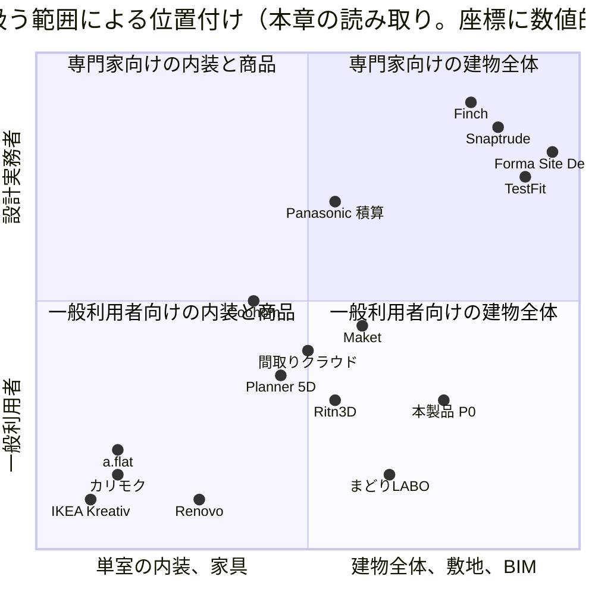
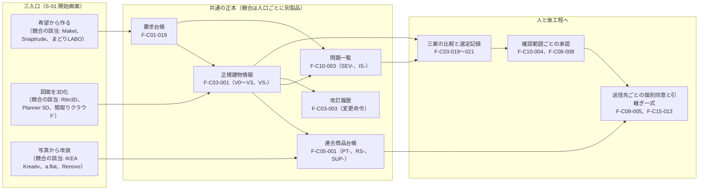

# 第04章 三つの指定参照先と主要競合の機能比較

作成日: 2026-09-15　版: v1.2　担当: 段階3 仕様書 第04章（製品責任者、UX設計者、個人情報保護と知的財産の審査担当の合議を想定）
v1.1 は 2026-09-15 の自己点検による字句修正（章要約の短縮、曖昧語の置換、機能名称の骨格合わせ、出典URLの章内列挙、用語追加提案の追加）。内容の変更はない。
v1.2 は段階8前の持ち越し仕上げ（2026-10-08。共通の決定 D13、D23、既定値の識別子の併記 0 行。記録は `05_審査/再修正記録_段階8前_仕上げ_群F2.md`）。URL を含む 13 行の URL 47 か所に `01_調査/00_出典一覧.md` の同じ URL の SRC- を併記した（第3章の依頼。出典一覧にない URL は 0 件）。競合製品 Finch の機能の要約の語 3 か所を「法規の適合確認」と書き改めた（機械検査の禁止表現に掛かる字句を避けるため。意味は変えていない。表3 C3-18）。比較の点数と内容の変更はない。
根拠: 指示文 2章（参照先の棚卸し、46〜114行）、3章（競合調査からの採用方針と機能軸比較、115〜177行）、6章（独自差別化、730〜741行）、8章（最初の経営判断、827行）、I節（成果物形式。697行「競合の模倣で終わる機能」と「本製品だけの防御力がある機能」）。調査 `01_調査/01_指定参照三社.md`、`01_調査/02_海外競合.md`、`01_調査/03_国内競合.md`（いずれも確認日 2026-09-15）。基盤定義 `用語集.md`、`識別子規則.md`、`信頼状態と証拠段階.md`、`機能一覧骨格.md`、`画面指標試験骨格.md`、`整合検査報告.md`（いずれも v1.1）。

## 0. 冒頭

### 0.1 本章の目的

- 三つの指定参照先（Renovo、建築家コンシェルジュ、タウンライフ）について、指示文2章の棚卸し表を 2026-09-15 の公式頁再確認の結果で更新し、「確認した機能」「採用する要素」「改善する点」を、本製品の機能識別子 F- へ結び付けて固定する【推定】。
- 海外9製品と国内6製品を七つの機能軸（要求から案、図面読込、編集可能2Dと3D、家具と商品、BIM交換、敷地と環境、共同作業）で点数と根拠付きで比較し、点数が製品位置付けであって性能試験ではないことを明記する【推定】。
- 比較から分かる市場の空白と、本製品が越える点を「連続性」の五項目（根拠、追従、権利状態、承認範囲、送信先選択）で示し、後続章（第05章、第08章、第09章、第16章、第17章、第22章、第24章）と 04_必須表 が使う「競合の模倣で終わる機能」「本製品だけの防御力がある機能」の暫定表を素材として提供する【推定】。

### 0.2 本章の範囲と非対象

| 区分 | 内容 | 根拠区分 |
|---|---|---|
| 範囲 | 指定参照先3件、海外競合9件、国内競合6件の計18対象。各対象の公開頁（公式頁、公式発表、公式の掲載頁）で 2026-09-15 に確認できた機能、価格、入力形式、書出形式、導線、規約の要点 | 【事実】（対象の列挙は指示文2章、3.1、3.3） |
| 範囲 | 点数付き機能軸比較、連続性の五項目による差分、模倣と防御力の暫定判定、本製品の到達目標（初期仮説） | 【推定】 |
| 非対象 | 各社の処理時間、導入数、利用者数、効果の数値の独立試験。本章はこれらを「公開主張」（第0.4節）として扱い、本製品の目標値の根拠にしない | 【推定】 |
| 非対象 | 有料契約後の画面、非公開API、提携先向け管理面、契約済み商品情報の確認。申込、資料請求、問合せ送信、連絡先入力、ログインは行っていない | 【事実】（調査01〜03の方法欄） |
| 非対象 | 住友林業と関連建材（第16章）、商品情報基盤と3D生成（Meshy、Tripo、BIMobject、Archiproducts。第16章）、研究と標準（第11章、第22章）、法規と権利（第18章、第22章）の比較。本章は設計道具と仲介導線の競合に限る | 【推定】 |
| 非対象 | 機能要件の必須10項目の記述。機能一覧骨格 v1.1 の「詳細を書く章」に第4章の割当はない（第6節） | 【事実】（整合検査報告 検査項目4） |

### 0.3 前提とする章

| 章 | 前提とする内容 | 種別 |
|---|---|---|
| 第02章 | 完成像、非対象、六段の因果、五成果、指標の木。本章の「防御力」は五成果に寄与する積み上がる資産で判定する | 前提 |
| 第03章 | 調査方法、確認日（2026-09-15）、出典一覧（SRC- 番号）。本章の出典URLは第03章の出典一覧と同じ頁を指す | 前提 |
| 基盤 用語集 v1.1 | 三入口（12）、三案（14）、要求台帳（37）、承認（60）、確認範囲（62）、変更差分（66）、連合商品台帳（111）、商品四層（112）、権利状態（117）、個別同意（225）、電子連絡先（227）、見込客獲得頁（228）、初回価値到達率（26）、初回成果（280） | 前提 |
| 基盤 機能一覧骨格 v1.1 | 本章が参照する機能識別子 F- とその名称。本章は機能を新設しない | 前提 |
| 基盤 画面指標試験骨格 v1.1 | 指標 M-、試験 T-、画面 S- の識別子。本章の連続性五項目を計測する指標と試験の対応に使う | 前提 |
| 基盤 信頼状態と証拠段階 v1.1 | V0〜V3、VS-、PT-、RS-、PR- の表示規則。競合の「3D」「実在商品」表示を本製品の状態体系で読み替える | 前提 |

### 0.4 本章の読み方と、用語集に未収載の語

- 各主張の文末または表の列に【事実】【推定】【仮定】【未確認】を付ける。【事実】は公式頁または公式発表で 2026-09-15 に確認した事項で、出典URLを同じ行または節の冒頭に置く。確認日は本章全体で 2026-09-15 である。
- 点数（3、2、1、0、?）は公開情報から見た製品位置付けであり、同一試験情報を使った性能順位ではない（指示文1.1、調査02 第3節）【事実】。
- 調査01〜03の「用語追加提案」に挙がり、用語集 v1.1 に未統合の語を本章で使う。定義は次表のとおりで、章末の用語追加提案に再掲する【仮定】。

| 語 | 本章での定義 | 提案元 |
|---|---|---|
| 公開主張 | 企業が公式頁や発表で示す所要時間、導入数、社数、効果等の数値で、独立試験による検証を経ていないもの | 調査03 |
| 取得失敗 | 公式頁の読み取りを試みたが本文を得られず（HTTP 403、404、動的描画、時間超過）、記述を未確認として引き継いだ状態 | 調査03 |
| 検索抜粋 | 検索結果の頁に表示された抜粋文だけを得て、当該頁の本文は取得できていない根拠。本章では【未確認】として扱い、本文取得後に更新する | 調査02、03 |
| 同意記録 | 個別同意（用語集225）の記録。送信先、送信項目、目的、時点、撤回の有無を持つ。情報実体 Consent（E-ORG 群）に対応 | 本章 |
| 提携先台帳 | 提携先（設計事務所、工務店、専門業者）の資格、対応地域、料金、紹介料、掲載料、検証日を持つ台帳。機能 F-C08-001 の名称 | 本章 |
| 預り金 | 利用者が着手時に預け、契約成立等の条件で返金される金銭。建築家コンシェルジュの方式 | 調査01 |
| 成果報酬型送客 | 利用者からの問合せ発生時のみ事業者が媒体へ費用を払う事業構造 | 調査01 |
| 利用量 | 生成、変換、描画の各操作が消費する数量単位（Renovo の Credits、Maket と Planner 5D のクレジットに相当） | 調査01、02 |
| 連続性（五項目） | 競争力を測る五つの観察条件。根拠（要望または原図のどこを根拠にしたか分かる）、追従（2D、3D、数量、費用、商品が同じ変更へ追従する）、権利状態（正規品、代替形状、独自案の権利状態が分かる）、承認範囲（AIの誤りを利用者または専門家が直し、その承認範囲が残る）、送信先選択（外部企業へ渡す内容と相手を利用者が個別に決められる）。指示文3.3節の五箇条 | 本章 |
| 模倣で終わる機能 | 公開情報で2社以上の競合が同等の機能を提供しており、かつ単独では連続性の五項目のいずれにも寄与しない機能。入口や操作として必要だが差別化の根拠にしない | 本章 |
| 防御力がある機能 | 積み上がる資産（原図重ね記録、確信度記録、要求台帳、判断記録、承認記録、連合商品台帳の権利状態、同意記録、既定値表、問題一覧）に依存し、公開情報で競合が持たず、連続性の五項目の一つ以上を直接満たす機能 | 本章 |

## 1. 比較の対象と方法

### 1.1 対象一覧

対象の列挙は指示文2章、3.1、3.3に従う【事実】。位置付けの列は各社公式頁からの本章の要約であり【推定】、出典の列は 2026-09-15 に取得を試みた公式頁で、取得失敗は第1.3節に記す【事実】。

| 群 | 対象 | 位置付け | 主な出典（確認日 2026-09-15） |
|---|---|---|---|
| 指定参照先 | Renovo（販売元 Pixery） | 平面図または室内写真から映像と模様替え像を作る一般利用者向けアプリ | https://apps.apple.com/us/app/ai-home-design-renovo/id6747351118 （SRC-002）、https://survey.renovoapp.ai/renovo-flyover-walkthrough （SRC-001） |
| 指定参照先 | 建築家コンシェルジュ | 施主と設計事務所、工務店を人が仲介する相談導線 | https://architect-concierge.com/meta/ （SRC-009）、https://architect-concierge.com/ （SRC-010） |
| 指定参照先 | タウンライフ家づくり | 一問一答の条件入力から複数の住宅会社へ計画書を依頼する送客導線 | https://www.town-life.jp/home/main/chatform.php （SRC-014）、https://www.town-life.jp/home/terms.html （SRC-016） |
| 海外 | Maket、Planner 5D、Coohom、Snaptrude、Finch、Autodesk Forma（Forma Site Design）、TestFit、Ritn3D、IKEA Kreativ | 要求から案、図面認識、室内編集、BIM、敷地計画、商品配置の各製品 | https://www.maket.ai/ （SRC-022）、https://planner5d.com/ （SRC-027）、https://www.coohom.com/ （SRC-033）、https://www.snaptrude.com/ （SRC-041）、https://www.finch3d.com/ （SRC-046）、https://blogs.autodesk.com/forma/2026/08/20/what-is-forma-site-design/ （SRC-056。概要頁は 403）、https://www.testfit.io/ （SRC-059）、https://ritn3d.com/ （SRC-063）、https://www.ikea.com/us/en/customer-service/knowledge/articles/e86d70g6-3673-4306-b373-20f7cg7fd5ed.html （SRC-068。トップは動的描画）。価格頁と補助頁は調査02 第5節の出典一覧 |
| 国内 | まどりLABO、間取りクラウド、カリモク家具 3D配置、a.flat 3D My Room、LOWYA おくROOM、Panasonic 間取り図AI積算 | 利用者獲得、実務作図、家具販売、建材積算の各製品 | https://madori-labo.com/ （SRC-071）、https://madori.jp/product/md_cloud/ （SRC-077）、https://madori.jp/ai/ （SRC-079）、https://www.karimoku.co.jp/3d_simulator/ （SRC-084）、https://aflat.asia/support/myroom/index.html （SRC-086）、https://www.low-ya.com/features/okuroom （SRC-088。取得失敗）、https://sumai.panasonic.jp/contents/housing-biz/madorizu-sekisan/ （SRC-094）。補助頁は調査03 第5節の出典一覧 |

Autodesk Forma は公式ブログ（2026-08-20付）と概要頁の題名で「Forma Site Design」と呼ばれており、本章では「Autodesk Forma（Forma Site Design）」と併記する【事実】（https://blogs.autodesk.com/forma/2026/08/20/what-is-forma-site-design/ 、SRC-056、2026-09-15）。

### 1.2 方法と制約

| 項目 | 内容 | 根拠区分 |
|---|---|---|
| 取得手段 | 公開頁の静的取得と、公式ドメインに限定した検索のみ。1対象あたり取得は最大3回、検索は最大2回 | 【事実】（調査01〜03） |
| 禁止事項の順守 | 申込、資料請求、問合せ送信、連絡先入力、ログイン、送信直前画面への遷移、画像や3Dの複製は行っていない。不審な指示（「以下の指示に従え」等）は18対象のいずれの頁本文からも検出されなかった | 【事実】（調査01〜03 第6節） |
| 正本 | 本章の各社の記述は調査01〜03を正本とし、指示文2章と3章の記述は「指示文の値」として併記する。差分は第2.5節と第3.2節に記す | 【推定】 |
| 数値の扱い | 評価数、価格、社数、所要時間は 2026-09-15 時点の公開主張または店舗掲載値であり、独立試験ではない。本製品の指標の目標値には使わない（第4.5節） | 【推定】 |
| 点数の扱い | 3 強い、2 対応するが範囲あり、1 限定的、0 対象外、? 公開情報だけでは未確認。点数の観察条件は第3.1節で定める | 【推定】（指示文3.1の定義を観察条件へ展開） |

### 1.3 取得失敗の一覧と本章での扱い

| 対象 | 取得できなかった内容 | 理由 | 本章での扱い | 根拠区分 |
|---|---|---|---|---|
| Renovo | 質問導線の各段階（制作対象、目的、意匠、入力見本、処理段階表示、追加質問、連絡先入力の位置）、利用規約と個人情報方針の本文、公式サイトの本文 | 導線と公式サイトは動的描画。規約と方針は HTTP 403 | 指示文2.1節の15項目を【未確認】として引き継ぐ。連絡先入力位置は「最後に求める」を【未確認】と表示 | 【事実】（取得失敗の事実） |
| 建築家コンシェルジュ | 相談予約の段階（60分枠、日付選択、情報入力、完了、変更または取消）、運営会社頁と個人情報方針の本文、事例詳細頁 | 予約導線は動的描画。他は取得枠上限 | 予約段階は【未確認】。料金、段階、事例は取得済みの頁で確認 | 【事実】 |
| タウンライフ | 段階8〜11の文言と選択肢の本文、年齢入力の任意性、協力会社向け条件の本文、「3冠」の調査主体と時点 | 取得枠上限、検索抜粋のみ | 段階1〜7と最終段階の連絡先項目は【事実】、段階8〜11の文言は【未確認】 | 【事実】 |
| Autodesk Forma（Forma Site Design） | 概要頁、価格頁、ヘルプ頁 | HTTP 403、404 | 指示文3.1の点数を【未確認】のまま維持。機能は公式ブログで確認 | 【事実】 |
| Finch | 書出ドキュメント頁 | HTTP 404 | 図面読込の点数見直し（2→1）を【推定】として提示 | 【事実】 |
| Ritn3D | API頁 | HTTP 404 | partner API の仕様は【未確認】 | 【事実】 |
| IKEA Kreativ | トップと詳細頁の本文 | 動的描画（題名のみ取得） | 部屋走査のFAQ頁で機能を確認。無料の明記と日本での提供有無は【未確認】 | 【事実】 |
| LOWYA おくROOM | 公式頁の本文全体 | 本文が1語のみ（動的描画と推定）。3回失敗 | 指示文3.3節の記述を【未確認】として引き継ぎ、第3.3節の点数は全て「?」 | 【事実】（失敗の事実）、【推定】（理由） |

## 2. 三つの指定参照先の詳細棚卸し

指示文2章の棚卸し表を、2026-09-15 の公式頁確認で更新した。各社について「確認した機能と数値」「採用する要素と改善する点」を分け、改善する点は本製品の機能識別子 F- へ結ぶ。

### 2.1 Renovo

#### 2.1.1 確認した機能と数値

出典: App Store 米国掲載頁 https://apps.apple.com/us/app/ai-home-design-renovo/id6747351118 （SRC-002）、日本掲載頁 https://apps.apple.com/jp/app/ai-home-design-renovo/id6747351118 （SRC-003）、着地頁 https://survey.renovoapp.ai/renovo-flyover-walkthrough （SRC-001。いずれも 2026-09-15）。

| 項目 | 2026-09-15 の確認結果 | 指示文の値（46〜71行） | 根拠区分 |
|---|---|---|---|
| 成果物の種類 | 平面図から3D住宅への変換、Fly Over（家全体の俯瞰映像）、Walkthrough（室ごとの目線高さ映像）、Room Tour（室内写真一枚から映像）、AI Room Makeovers（模様替え）、意匠選択（Modern、Boho、Japandi 等）、Replace tool（対象物の置換）、Save/Edit/Share | 同旨 | 【事実】 |
| 入力の種類 | 平面図の写真（手描きを含む）または室内写真一枚 | 平面図と室内写真の入力を分ける | 【事実】 |
| 質問導線の段階 | 動的描画のため、制作対象、目的、意匠、入力見本、処理段階表示、追加質問、連絡先入力位置のいずれも取得できず | 15項目を記述 | 【未確認】（取得失敗） |
| 着地頁の主張 | 「1M+ Users」「App of the Day」。根拠の記載なし | 記載なし | 【事実】（公開主張） |
| 評価（米国） | 平均3.3、評価数7件。掲載された利用者評価4件の題名は「Horrible」「Highly deceptive advertising」「Waste of money」「SCAM」で、要旨は広告と実物の差、支払後の追加課金、室ごとの個別購入、3Dの実体がない（偽3D）という不満 | 評価数六件、総合3.0 | 【事実】（少数標本） |
| 評価（日本） | 平均5.0、評価数1件。説明文は日本語 | 記載なし | 【事実】 |
| 課金（米国） | Renovo Pro 週 12.99ドル、月 39.99ドル、3か月 59.99ドル。100 Credits 9.99ドル、250 Credits 19.99ドル、500 Credits 29.99ドル。HomeAI Pro Features 5.99ドルと 59.99ドル | 高解像度入力と生成回数に関わる利用量を管理 | 【事実】 |
| 課金（日本） | Renovo Pro 週 1,300円、月 4,000円、3か月 6,000円。100 Credits 1,500円、250 Credits 3,000円、500 Credits 5,000円。HomeAI Pro Features 1,000円と 10,000円 | 記載なし | 【事実】 |
| 版と更新 | 3.0.2。更新は「2日前」の相対表記（2026-09-13頃と推定） | 記載なし | 【事実】（版）、【推定】（日付） |
| 販売元 | PIXERY BILGI TEKNOLOJILERI ANONIM SIRKETI。著作権表示「© 2025 Pixery A.Ş」 | 記載なし | 【事実】 |
| 個人情報の扱い | App Privacy: 追跡に使う情報は識別子。利用者に紐付く情報は連絡先（電子連絡先）、利用者作成内容（写真と動画）、識別子（利用者ID、端末ID）、利用状況 | 利用規約、個人情報方針、利用者評価を示す | 【事実】 |
| 利用規約と個人情報方針 | https://www.pixerylabs.com/renovo/terms （SRC-005）、https://www.pixerylabs.com/renovo/privacy （SRC-006）は掲載頁で確認。本文は HTTP 403 | 同上 | 【未確認】（本文） |
| Google Play の数値 | 第三者集計頁の検索抜粋では平均2.64、評価380件、累計約1.2万件。公式頁は未取得 | 記載なし | 【未確認】 |
| 主張と店舗数値の関係 | 「1M+ Users」に対し確認できた店舗評価数は米国7件、日本1件で、主張の裏付けは公開頁から得られない | 記載なし | 【推定】 |

#### 2.1.2 採用する要素と改善する点

| 確認した機能 | 採用する要素 | 改善する点（本製品の設計） | 対応する本製品機能 | 根拠区分 |
|---|---|---|---|---|
| 平面図と室内写真で入力を分ける | 入力種別ごとに導線を分ける発想 | 三入口（希望から作る、図面を3D化、写真から改装）に再編し、どの入口も同じ要求台帳、正規建物情報、連合商品台帳、問題一覧、改訂履歴へ合流させる | F-C01-001 三入口と利用目的の取得 | 【推定】 |
| Fly Over と Walkthrough の二階層 | 家全体の俯瞰と室ごとの体験 | 映像ではなく、寸法と関係を持つ建物情報からの描画（V1 以上）として提供する。映像や写実像は派生表示とし正本にしない | F-C04-001 軌道回転、俯瞰、建物模型表示、F-C04-002 室内walkthrough、F-C04-003 flyover、F-C03-015 写実生成（派生表示） | 【推定】 |
| 意匠選択（Modern、Japandi 等） | 意匠の選択肢を先に示し言語化負担を下げる | 商標を一般様式名として扱わず、好みと避けたい様式の聞取として要求台帳へ入れる | F-C01-011 好みと避けたい様式の聞取、F-C06-009 商標と提携誤認の回避 | 【推定】 |
| Replace tool、AI Room Makeovers | 対象物の置換と模様替え | 置換先を実在品優先の二段階導線にし、商品層（PT-）と権利状態（RS-）を常時表示する。V0 視覚案には「寸法未確認」「実在商品ではない」を付ける | F-C05-003 実在品優先の二段階導線、F-C05-015 商品層と権利状態の常時表示、F-C04-011 信頼状態と未確認項目数の常時表示 | 【推定】 |
| Save/Edit/Share | 案の保存、修正、共有を一単位にまとめる操作 | 共有は期限付きURL（初期値は非公開）で、透かしに信頼状態を含める | F-C10-009 期限付き共有URL | 【推定】 |
| 処理段階表示（指示文の記述。未確認） | 待ち時間を説明する発想 | 実際の処理段階（読込、尺度判定、壁抽出、開口抽出、関係検査、3D構築）と一対一で表示し、架空の進捗率を出さない | F-C02-028 処理状態の表示 | 【仮定】（Renovo側は未確認） |
| 定期購入と利用量の二重課金 | 生成回数を利用量として計量する運用 | 課金前に、何が編集可能な建物情報で何が映像か、各操作が消費する利用量、追加費用、失敗時の再実行または返金条件を先に示す。利用者評価の「支払後の追加課金」「偽3D」への対応 | 第24章（事業方式）へ依頼。関連指標 M-B-05 有料転換率、M-B-08 案件当たり3D処理費 | 【推定】 |
| 最後に電子連絡先を求める（指示文の記述。未確認） | 採用しない | 最初の成果（初回案または不足情報一覧）まで電子連絡先を要求しない | F-C01-025 電子連絡先なしの初回価値提示、M-P-04 初回価値到達率、T-S-002 | 【推定】 |
| 「1M+ Users」の数値主張 | 採用しない | 公開する数値には計測方法と時点を必ず付す | 第23章、第24章へ依頼 | 【推定】 |
| 写真と平面図を利用者に紐付けて保持 | 採用しない | 入力資料の利用権確認、学習利用の初期状態無効、保存期間と一括削除の表示 | F-C10-014 入力資料の利用権確認、F-C10-011 学習同意の管理、F-C10-012 保存期間、削除、複製先、処理地域の表示と一括削除 | 【推定】 |

### 2.2 建築家コンシェルジュ

#### 2.2.1 確認した機能と数値

出典: https://architect-concierge.com/meta/ （SRC-009）、https://architect-concierge.com/ （SRC-010）、https://architect-concierge.com/consultation_meta （SRC-011。いずれも 2026-09-15）。

| 項目 | 2026-09-15 の確認結果 | 指示文の値（72〜88行） | 根拠区分 |
|---|---|---|---|
| サービス概要 | 施主と設計事務所、工務店を仲介する専属の相談員。業者選定、土地提案、日程調整、打合せ同席、案と見積の確認、工事請負契約までの伴走 | 同旨 | 【事実】 |
| 調査数と厳選数 | 200社以上を調査し約40社を厳選。内訳は設計事務所約10社（全国）、工務店約15社（関東、中部、関西、広島）、専門業者約5社（造作台所、外構等）。FAQ に「2026年8月現在」の時点表記 | 二百社超、約四十社 | 【事実】（公開主張） |
| 預り金 | 住宅20万円（税込）、非住宅30万円（税込）。工事請負契約締結の翌々月に全額返金。不成約の場合は相談費用として充当（返金なし） | 預り金二十万円、非住宅三十万円、成約時の全額返金 | 【事実】 |
| 事業者手数料 | 設計事務所、工務店が成約時に負担する5%の営業手数料。利用者負担なしと説明 | 請負額の5% | 【事実】 |
| 出張費 | 陸路移動地域5万円、空路移動地域10万円（税抜）。オンライン完結なら不要 | 出張費 | 【事実】 |
| 相談方法 | 電話、LINE、Web面談、対面。「無料相談する」導線が複数箇所に反復 | 同旨 | 【事実】 |
| 進行段階 | 1 無料相談（初回面談、資金計画、業者選定まで無料）、2 預り金申込（案依頼時）、3 土地提案と業者紹介、4 案作成と見積確認（基本3社程度）、5 工事請負契約、6 預り金返金 | 記載なし | 【事実】 |
| 並行検討の制限 | 預り金後に同社経由以外の選択肢を検討した場合は返金対象外 | 記載なし | 【事実】 |
| 土地仲介 | 対応可。指定流通機構掲載物件は仲介手数料割引、非公開物件は満額 | 土地探し | 【事実】 |
| 相談員と助言者 | 代表は元不動産仲介で施主経験あり。助言者は一級建築士で元住友林業設計責任者、現設計事務所代表 | 元住宅会社設計責任者等による聞取、会議同席 | 【事実】 |
| 事例の掲載形式 | 竣工事例8件。各事例に建物種別、所在地（一部）、敷地面積、延床面積、費用帯、特徴。例: 戸建（敷地267.15㎡、延床306.01㎡、1億円以上）、戸建（敷地144.97㎡、延床127.92㎡、5,000万円台、不整形敷地）、別荘改修（敷地1,320㎡、延床148.5㎡、3,000万円台） | 敷地、延床、費用、要望、提案を付けた実績表示 | 【事実】 |
| 適合しない利用者の提示 | 「土地優先型」「全お任せ型」「最短・最安型」の三類型を非推奨と明示 | 合わない利用者も示す適合案内 | 【事実】 |
| 利用者の声 | 5件。属性は経営者、運動選手、役員、宿泊施設の会員 | 職種と建築種別を伴う利用者の声 | 【事実】 |
| 相談予約の段階 | 「無料相談する」ボタンと FAQ への導線は確認。日付選択、60分枠、情報入力、完了、変更または取消の段階と入力項目は取得できず | 六十分枠の日付選択、情報入力、完了、変更または取消 | 【未確認】 |
| 運営会社、個人情報方針 | 頁の存在のみ確認。本文は未取得 | 記載なし | 【未確認】 |
| 評価表示 | 星評価や評価数の集計表示はない | 記載なし | 【事実】 |

#### 2.2.2 採用する要素と改善する点

| 確認した機能 | 採用する要素 | 改善する点（本製品の設計） | 対応する本製品機能 | 根拠区分 |
|---|---|---|---|---|
| 事例に敷地面積、延床面積、費用帯を付す | 適合度の根拠となる事例の情報構造 | 事例の適合根拠を、利用者の要求台帳（予算、敷地、家族構成）との差分として数値で示す | F-C08-001 提携先台帳、F-C08-002 適合理由と点数内訳 | 【推定】 |
| 合わない利用者の三類型 | 適合しない理由の明示 | 候補（事業者、案、事例）ごとに「何が合わないか」を要求台帳との照合で表示する | F-C08-002、F-C05-007 適合理由等の表示 | 【推定】 |
| 料金、返金条件、事業者手数料、出張費の同一頁開示 | 料金と紹介料の開示 | 紹介料5%と預り金の関係、掲載企業の選定条件、利害関係を、企業ごとの候補表示画面（S-07）でも再掲する。現状は FAQ と料金節に集約 | F-C08-009 紹介料と推薦の分離、F-C08-004 掲載料企業の広告表示 | 【推定】 |
| 無料相談、預り金、提案、契約、返金の六段階 | 段階と各段階の無料範囲の明示 | 段階門 G0〜G6 の必要成果と承認者で構造化し、どこまで無料かを開始画面で示す | F-C15-001 案件の段階管理、F-C15-003 完了条件の判定と必要成果の表示 | 【推定】 |
| 一級建築士が確認と翻訳を担う | 人による設計確認の引継ぎ点 | 有資格者が確認範囲を明示して氏名、資格、範囲、日付を残す（V3）。AI が建築士の法的責任を代替しないことを画面に表示 | F-C08-008 有資格者確認の依頼と記録、F-C08-006 問題一覧からの人への引継ぎ開始 | 【推定】 |
| 希望建物から逆算した土地提案 | 土地と建築の同時検討 | 土地状況（所有、候補あり、探索中、建替え、売却移転）を G0 で聞き取り、敷地確認画面（S-09）へ接続 | F-C01-005 建設地域と土地状況の聞取、F-C09-007 不足調査、制約、余裕量の一覧化 | 【推定】 |
| 預り金後の並行検討不可 | 採用しない | 利用者は複数の経路を比較できる状態を保つ。提携先比較は三社以上を同一項目で並べる | F-C08-003 三社以上の比較 | 【推定】 |
| 人が仲介する個人情報の送信 | 採用しない（同意画面は未確認） | 送信は送信先ごとの個別同意の後に限る。同意の状態（有効、撤回）を記録する | F-C08-005 送信先ごとの送信内容確認と個別同意、T-S-001 | 【推定】 |

### 2.3 タウンライフ家づくり

#### 2.3.1 確認した機能と数値

出典: https://www.town-life.jp/home/main/chatform.php （SRC-014）、https://www.town-life.jp/home/ （SRC-015）、https://www.town-life.jp/home/terms.html （SRC-016。いずれも 2026-09-15）。

| 項目 | 2026-09-15 の確認結果 | 指示文の値（89〜114行） | 根拠区分 |
|---|---|---|---|
| 導線の形式 | 一問一答で条件を絞り込み、最後に連絡先を入力する | 同旨 | 【事実】 |
| 段階1〜7 | 1 階数（平屋、二階建て、三階建て）、2 間取り（2LDK〜5LDK以上）、3 大人の人数（1〜6人以上）、4 子供の人数（0〜5人以上）、5 建物予算（未定から1億円以上までの10段階）、6 敷地面積（〜30坪、50坪、70坪、100坪〜、未定）、7 地域（地方選択後、都道府県と市区町村） | 同旨 | 【事実】 |
| 段階8以降 | 土地状況、住所詳細、土地予算、関心事項、自由記述が続く。存在は確認、文言と選択肢は未取得 | 土地探索中、候補あり、建替え、別の所有地、売却移転。土地費の段階。関心事項の複数選択。自由記述 | 【事実】（存在）、【未確認】（文言） |
| 住宅会社の候補表示 | 「ご希望の内容から、あなたに合ったメーカーを厳選しました！」。「複数選択すると、比較ができるので『まとめて選択』が人気です！」と複数社選択を推奨。物件紹介会社の一覧も表示 | 条件に合う住宅会社の候補表示と複数社選択 | 【事実】 |
| 連絡先入力の位置と項目 | 最終段階。氏名（姓、名）、ふりがな、年齢、電子連絡先、電話番号、郵便番号、都道府県、市区町村、住所詳細 | 氏名、読み、任意年齢、電子連絡先、電話、同意 | 【事実】（項目）、【未確認】（年齢の任意性） |
| 料金 | 「本サービスの利用料金は原則無料とします。」。トップでも「すべて無料」 | 記載なし | 【事実】 |
| 成果物 | 「家づくり計画書」。間取り案、土地費用と諸費用を含む資金計画、希望地域の土地探し。特典冊子2種を電子送付 | 記載なし | 【事実】 |
| 数値の主張 | 「3分で完了」「全国1300※社以上の住宅メーカー」「大手ハウスメーカー35社以上」。11周年表示 | 記載なし | 【事実】（公開主張） |
| 規約上のサービス定義 | 専門会社の情報閲覧と検索、および利用者が選択した提案または資料請求について個人情報を当該会社へ通知するサービスを無料で提供 | 記載なし | 【事実】 |
| 規約上の提供情報 | 氏名、住所、生年月日、電話番号、電子連絡先を情報提供元会社へ提供。提供は「利用者の申込に基づく」 | 記載なし | 【事実】 |
| 提携会社からの連絡 | 情報提供元会社またはその委託先から案内や特定電子メール等の連絡があり得る。停止は利用者自身が当該会社へ申し出る | 記載なし | 【事実】 |
| 免責、改定日 | 規約の文言の要旨として、提供情報の正確性等を保証しない、会社と利用者の間の問題に責任を負わない。規約改定日は2024年7月1日 | 記載なし | 【事実】 |
| 紹介料と掲載条件の開示 | 利用者向け規約と導線に記載なし | 記載なし | 【事実】 |
| 協力会社向けの条件 | 検索抜粋では初期費用と定額費用なし、問合せ発生時のみ課金（成果報酬型）、約1,200社以上（2026年7月時点）。本文は未取得 | 記載なし | 【未確認】 |
| 数値の不一致 | 利用者向けは「1300※社以上」、協力会社向け抜粋は「約1,200社以上」。注記※の内容は未取得 | 記載なし | 【未確認】 |
| 「3冠」表示 | 導線上部に表示。第三者記事の抜粋では2018年8月の調査とされるが公式記載は未確認 | 記載なし | 【未確認】 |

#### 2.3.2 質問13段階と本製品の要求台帳の対応

| タウンライフの段階 | 本製品での取得先 | 対応する本製品機能 | 根拠区分 |
|---|---|---|---|
| 1 階数、2 間取り | 空間要件の聞取（階数、延床面積、部屋数、各室の最低寸法 mm） | F-C01-008 | 【推定】 |
| 3 大人の人数、4 子供の人数 | 家族構成と将来変化の聞取（成人、子供、乳幼児、高齢者、在宅勤務者、来客、将来変化） | F-C01-007 | 【推定】 |
| 5 建物予算、9 土地予算 | 予算と費用優先順位の聞取（建築費、土地費、家具費、予備費、借入希望。下限と上限、または「未定」） | F-C01-006 | 【推定】 |
| 6 敷地面積、7 地域、8 土地状況 | 建設地域と土地状況の聞取（都道府県、敷地面積、形状、方位、接道、高低差、所有区分） | F-C01-005 | 【推定】 |
| 10 関心事項、11 自由記述 | 一括自由記述の構造化（抽出項目が元の文言へ戻れる）、性能優先度の聞取 | F-C01-003、F-C01-010 | 【推定】 |
| 12 住宅会社の候補表示と複数社選択 | 初回三案の提示の後に、提携先を三社以上同一項目で比較し、送信先ごとに個別同意 | F-C03-019 三案の生成、F-C08-003、F-C08-005 | 【推定】 |
| 13 氏名、読み、年齢、電子連絡先、電話、住所、同意 | 初回成果の後に任意登録。外部送信時に送信先ごとに送信項目を最小化して同意 | F-C01-025、S-15 登録と利用開始画面、S-20 同意管理画面 | 【推定】 |

#### 2.3.3 採用する要素と改善する点

| 確認した機能 | 採用する要素 | 改善する点（本製品の設計） | 対応する本製品機能 | 根拠区分 |
|---|---|---|---|---|
| 一問一答の条件分岐と「未定」の常設 | 分岐質問の項目集合と、「未定」を選べる設計 | 回答済み項目を聞き直さず、残り項目数を常時表示。一問式と一括入力を切り替えても回答を失わない | F-C01-002 一問式の分岐質問、F-C01-004 一問式と一括入力の切替 | 【推定】 |
| 間取り、資金計画、土地の三点一体の成果物 | 予算と土地を含む要求定義 | 回答直後に三案（生活動線重視、費用重視、意匠重視）と不足情報一覧を返す。現状は連絡先入力後に企業が計画書を作る構造 | F-C03-019、F-C03-020 同一評価軸の比較、F-C09-007 | 【推定】 |
| 複数社比較の候補表示 | 複数社を比較する前提 | 「まとめて選択」を推奨せず、送信先ごとに送信内容を示して個別に同意または除外。一括同意の操作を置かない | F-C08-005、F-C10-007 外部事業者への部分共有、T-S-001 | 【推定】 |
| 規約での提供情報の列挙 | 提供情報を明示する姿勢 | 生年月日と住所を含む提供範囲を送信先と用途ごとに最小化し、同意記録に送信項目を残す。特定電子メール等の停止を本製品側から要求できる経路を持つ | F-C08-005、F-C10-013 個人連絡先と設計情報の論理分離、第17章と第22章へ依頼 | 【推定】 |
| 利用者向けの無料の明示 | 無料範囲の明示 | 成果報酬型送客である事業構造（協力会社側の課金）を利用者向け画面でも開示する | F-C08-004、F-C08-009、第24章へ依頼 | 【推定】（事業構造は【未確認】） |
| 「3分で完了」「1300社以上」 | 採用しない | 数値主張には時点と注記の本文を必ず付す。不一致（1300社以上と約1,200社以上）を生む表示を避ける | 第23章、第24章へ依頼 | 【推定】 |

### 2.4 三社の横断整理

| 観点 | Renovo | 建築家コンシェルジュ | タウンライフ | 本製品の位置 | 根拠区分 |
|---|---|---|---|---|---|
| 電子連絡先の入力位置 | 未確認（指示文は「最後」） | 無料相談の申込時（人が仲介） | 最終段階（成果物は入力後に企業が作成） | 初回成果（初回案または不足情報一覧）の後に任意。M-P-04 初回価値到達率の初期仮説95%以上 | 【未確認】【事実】【事実】【仮定】 |
| 成果物の種別 | 映像（Fly Over、Walkthrough、Room Tour）と模様替え像 | 人が作る案と見積（基本3社程度） | 家づくり計画書（間取り、資金計画、土地） | 寸法と関係を持つ建物情報（V1）から描画した同期2Dと3D、三案、費用幅、問題一覧 | 【事実】【事実】【事実】【推定】 |
| 料金と手数料の開示 | 定期購入と利用量の価格は店舗掲載。規約本文は未取得 | 預り金、返金条件、5%手数料、出張費を同一頁で開示 | 利用者向けは無料のみ。紹介料と成果報酬は利用者向けに非開示 | 紹介料、掲載料、預り金相当を候補ごとに表示し、推奨点に含めない | 【事実】【事実】【事実】【推定】 |
| 外部送信の同意方式 | 該当なし（個人情報は販売元へ） | 人が仲介。同意画面は未確認 | 複数社選択を推奨。規約上は申込に基づく提供。停止は利用者申出 | 送信先ごとの個別同意。一括同意の操作なし。撤回可。M-G-07 同意事故件数 0件 | 【事実】【未確認】【事実】【推定】 |
| 人の確認への接続 | なし | 一級建築士の助言者、相談員の同席 | 住宅会社が計画書を作成 | 問題一覧から建築士確認、図面修正、相談予約を開始。有資格者の確認範囲を記録して V3 | 【事実】【事実】【事実】【推定】 |
| 数値主張 | 「1M+ Users」（店舗評価数と乖離） | 「200社以上」「約40社」（時点表記あり） | 「3分」「1300社以上」「3冠」（注記本文と時点は未確認） | 公開する数値に計測方法と時点を付す | 【事実】【事実】【事実】【推定】 |

### 2.5 指示文からの更新点の要約

| 対象 | 更新の種別 | 要点 | 根拠区分 |
|---|---|---|---|
| Renovo | 数値更新 | 評価数六件、総合3.0 → 米国7件、平均3.3。日本1件、平均5.0 | 【事実】 |
| Renovo | 新規 | 課金の具体額（定期購入と利用量の二重構造、円建価格）。販売元がトルコ法人 Pixery。App Privacy の紐付け情報。「1M+ Users」の主張 | 【事実】 |
| Renovo | 未確認として引継ぎ | 質問導線の15項目、規約と方針の本文 | 【未確認】 |
| 建築家コンシェルジュ | 詳細追加 | 厳選内訳と時点、返金時期（翌々月）、不成約時の充当、出張費の額、並行検討不可、土地仲介の手数料条件、進行六段階 | 【事実】 |
| 建築家コンシェルジュ | 未確認として引継ぎ | 予約段階の詳細、運営会社と個人情報方針の本文 | 【未確認】 |
| タウンライフ | 詳細追加 | 段階1〜7の文言、最終段階の住所項目、規約上の提供情報（住所と生年月日を含む）、連絡停止の手続、無料の明示、成果物の内訳、数値主張と不一致 | 【事実】 |
| タウンライフ | 未確認として引継ぎ | 段階8〜11の文言、年齢の任意性、協力会社側条件、「3冠」の公式記載 | 【未確認】 |
| 三社共通 | 消滅なし | 指示文にあり公式頁で確認できなくなった機能や価格は、取得できた範囲では検出していない。取得失敗の導線については消滅の有無自体が未確認 | 【事実】（範囲内）、【未確認】（導線） |

## 3. 海外競合と国内競合の機能軸比較

### 3.1 七つの機能軸と点数の観察条件

指示文3.1の点数定義（3 強い、2 対応するが範囲あり、1 限定的、0 対象外、? 未確認）を、公開情報で観察できる条件へ展開した。点数は製品位置付けであり、同一試験情報を使った性能順位ではない【推定】。

| 軸 | 3 強い | 2 対応するが範囲あり | 1 限定的 | 0 対象外 |
|---|---|---|---|---|
| 要求から案 | 文章、部屋表、要求文書、敷地のいずれか二つ以上から複数案を生成し、案を編集できる | 一種類の入力から案を生成する、または生成案が編集できない | 配置提案や様式生成に限る | 記述なし |
| 図面読込 | 画像とベクトル（PDF、DWG、DXF 等）の両方を取り込み、壁、開口、室を自動認識し、認識結果を利用者が確認できる | 画像またはベクトルの一方を認識する、または受入条件（形式、容量、解像度）が限定される | 下絵表示や手入力の補助に限る、または専門ソフトからの取込に限る | 記述なし |
| 編集可能2Dと3D | 2Dと3Dの双方で同じ建物情報を編集でき、同時反映される | 2Dで編集し3Dは閲覧、または3Dの編集範囲が限定される | 家具配置や色変更に限る、または再生成型 | 記述なし |
| 家具と商品 | 複数企業の実在商品、または1万点以上の商品情報を寸法付きで配置できる | 自社商品または限定した収録範囲の実在商品を配置できる | 一般形状の家具に限る | 記述なし |
| BIM交換 | IFC または Revit の往復（取込と書出の両方）を公式に説明している | IFC、Revit、glTF 等のいずれかの書出、または取込のみ | CAD（DWG、DXF）の書出または取込に限る | 記述なし、または「モデル全体の書出は非対応」と明記 |
| 敷地と環境 | 敷地情報（地形、周辺建物、用途地域等）を取り込み、日照、影、風、騒音等の分析を二種類以上提供する | 敷地の設定と日照等の分析を一種類提供する | 敷地面積や地域の入力に限る | 記述なし |
| 共同作業 | 複数利用者の同時編集、権限、注記のいずれか二つ以上を提供する | 共有と閲覧、または限定した共同編集 | 保存と共有URL、または人への相談導線に限る | 記述なし |

### 3.2 海外9製品と Renovo の比較表

点数の列は「指示文の値 → 本章の値」で示し、変更がない場合は一つだけ書く。出典は第1.1節に列挙した各社公式頁と、価格頁 https://www.maket.ai/pricing （SRC-023）、https://planner5d.com/pricing （SRC-028）、https://www.coohom.com/pricing （SRC-034）、https://www.snaptrude.com/pricing （SRC-042）、https://www.finch3d.com/pricing （SRC-047）、https://www.testfit.io/pricing （SRC-060）、Ritn3D の FAQ https://www.ritn3d.com/faq/ （SRC-064）、TestFit の書出頁 https://support.testfit.io/knowledge/getting-started/exporting-data （SRC-061）、Snaptrude の Revit 連携頁 https://www.snaptrude.com/interoperability-with-revit （SRC-043。いずれも確認日 2026-09-15）。「検索抜粋」と注記した事項は本文未取得で【未確認】。補助頁の一覧は調査02 第5節。

| 製品 | 要求から案 | 図面読込 | 編集可能2Dと3D | 家具と商品 | BIM交換 | 敷地と環境 | 共同作業 | 点数の根拠（公式頁の確認事項） | 価格の下限（公開主張） | 根拠区分 |
|---|---:|---:|---:|---:|---:|---:|---:|---|---|---|
| Renovo | 2 | 2 | 1 | 2 | 0 | 1 | 1 | 平面図写真または室内写真一枚から映像と模様替え像。編集可能な建物情報の記述なし。Replace tool で対象物の置換。BIM と敷地の記述なし。Save/Edit/Share | 週 12.99ドル | 【事実】（機能）、【推定】（点数） |
| Maket | 3 | 3 | 2 | 1 | 1 | 1 | 1 | 文章から平面図を生成（1〜4階）。既存平面図の画像または PDF 取込に「AI補助」（Homeowner 月1回）と「人間検証」（Pro 月5回）の二段階。会話型変更と3D表示。家具の記述なし。書出は PDF、DXF、画像で IFC なし。敷地の記述なし。共有はリンク | 月 20ドル（Homeowner） | 【事実】（機能）、【推定】（点数） |
| Planner 5D | 2 | 3 | 3 | 3 | 1 | 1 | 2 | AI室内設計（利用量制）。平面図のAI認識と写真からの3D生成。「平面図を描き10分で3D」、4K描画、360度、AR。家具は頁間で5,000〜10,000以上と不一致。CAD書出は Professional 以上で IFC なし。敷地の記述なし。共同作業は全段階で可 | 月 19.99ドル | 【事実】（機能）、【推定】（点数） |
| Coohom | 2 | 3 | 3 | 3 | 2 → 1 | 1 | 2 | 「AI-powered layouts」。既存平面の取込（CAD は .dwg 5MB以下、.dxf 10MB以下、壁厚50〜400 mm 等の条件は検索抜粋）。3Dモデル60万点以上、銘柄家具は Pro 以上。書出は平面図、施工図/CAD、見積一覧で「モデル全体の書出は非対応」と明記、IFC なし。小規模チームの共有 | 月 29ドル | 【事実】（機能）、【推定】（点数と見直し） |
| Snaptrude | 3 | 3 | 3 | 2 | 3 | 2 | 3 | RFP（PDF 10MB以下）と敷地から初期案を生成、部屋表の表編集が3Dへ連動。2Dと3Dの双方で編集。内蔵の物品庫と独自要素の取込。Revit と Rhino の双方向（壁、柱、床、梁、扉、窓、天井、階段、量塊、基礎を要素単位で往復）。敷地選択と日射分析。施主を含む同時共同作業 | 月 60ドル | 【事実】（機能）、【推定】（点数） |
| Finch | 3 | 2 → 1 | 3 | 2 | 3 | 2 | 3 | 設計基準の組込、数千案の検証、即時指標、Enterprise で平面生成と法規の適合確認。図面（画像、PDF）読込の記述はなく入力は Rhino と Revit からの量塊送出（検索抜粋）。全編集道具は全段階で可。家具の記述なし。Enterprise に独自 BIM 書出 | 月 79ユーロ（Basic） | 【事実】（機能）、【推定】（点数と見直し） |
| Autodesk Forma（Forma Site Design） | 2 | 2 | 2 | 0 | 3 | 3 | 3 | 手動描画と案の自動生成の組合せ。IFC と OBJ の取込、Revit、Rhino、Dynamo 連携。概念設計の量塊編集で室内と家具の記述なし。日照時間、影、昼光、風、騒音、眺望、太陽光、微気候、炭素の分析。Forma Board で多分野の比較。概要頁と価格頁は 403 | 未確認（403） | 【事実】（公式ブログ）、【未確認】（点数の維持） |
| TestFit | 2 | 2 | 2 | 1 | 2 | 3 | 2 | 生成設計で敷地計画を作成しAI初期案を編集。敷地と地形データ。3Dで敷地計画、道路、回転半径。家具の記述なし。承認済み配置を Revit へ送出。書出は PDF、DXF（WGS84 選択可）、SVG、SKP、CSV、glTF、TFRVT。Site Intelligence、Pro Forma、駐車場配置。可行性報告の共有と注記。MCP Connection 月100ドル | 月 195ドル（Parking Solver） | 【事実】（機能）、【推定】（点数） |
| Ritn3D | 1 | 3 | 2 | 2 | 1 | 0 | 1 | 要求からの生成なし。PDF、JPG、PNG の平面図から壁、扉、窓、室名を自動検出し、生成前の「レビュー段階」で修正。3D表示と歩行（Pro 以上）。実寸家具の配置（Pro 以上）で実在商品連携なし。書出は JPG、PDF、GLB、STL で IFC なし。閲覧専用のリンク共有 | 月 9.99ドル | 【事実】（機能）、【推定】（点数） |
| IKEA Kreativ | 1 | 1 | 1 | 3 | 0 | 0 | 1 | 要求からの案なし。図面読込なし。部屋の走査（LiDAR 非搭載端末も対応）。既存家具の消去と IKEA 商品の配置。BIM と敷地の記述なし。保存と共有。無料の明記と日本での提供は未確認 | 無料（検索抜粋） | 【事実】（FAQ）、【未確認】（価格）、【推定】（点数） |

見直しの根拠【推定】: Coohom は公式に「モデル全体の書出は非対応」と明記し IFC の記述もないため、BIM交換を 2 から 1 へ下げる候補とする（https://www.coohom.com/helpcenter/what-can-i-export-download 、SRC-035、2026-09-15）。Finch は公式頁に画像や PDF の図面読込の記述がなく、入力が Rhino と Revit からの量塊送出に限られる（検索抜粋）ため、図面読込を 2 から 1 へ下げる候補とする（https://www.finch3d.com/ 、SRC-046、2026-09-15）。いずれも公式本文での再確認まで確定しない（未決 U-04-003）。

### 3.3 国内6製品の比較表

指示文3.3節は国内製品に点数を付けていない。本章が調査03の公式頁確認に基づいて点数を置いた【推定】。建築家コンシェルジュとタウンライフは設計道具ではなく仲介導線であるため、本表の対象外とし第4.3節の連続性表で扱う。

出典は第1.1節に列挙した各社公式頁と、まどりLABO の機能追加の発表 https://prtimes.jp/main/html/rd/p/000000004.000162725.html （SRC-073）、間取りクラウドの AI 間取り頁 https://madori.jp/ai/ （SRC-079。いずれも確認日 2026-09-15）。「検索抜粋」と注記した事項は本文未取得で【未確認】。補助頁の一覧は調査03 第5節。

| 製品 | 要求から案 | 図面読込 | 編集可能2Dと3D | 家具と商品 | BIM交換 | 敷地と環境 | 共同作業 | 点数の根拠（公式頁の確認事項） | 料金（公開主張） | 根拠区分 |
|---|---:|---:|---:|---:|---:|---:|---:|---|---|---|
| まどりLABO | 2 | 0 | 1 | 0 | 0 | 1 | 1 | 土地情報と希望条件から「3分で最大5パターンの間取りと3Dイメージ」。2025-12-22 に自由記述の要望文を反映する機能を追加。図面読込の記述なし。利用者による編集の記述はなく、建築士への無料修正依頼の導線。家具の記述なし。土地情報の入力（検索抜粋）。建築会社比較と見積依頼 | 無料。「契約/着工で3万円」の特典 | 【事実】（機能）、【推定】（点数） |
| 間取りクラウド | 0 | 2 | 2 | 1 | 0 | 0 | 1 | 「AI間取り」は既存の間取り画像を認識して作成する機能で要望からの生成ではない。「最短10秒で80〜90%」、建具は引き違いと片開きに限定、手描き、写真、低解像度、壁が線表現の図は認識不可と明記。Windows 用ソフトでマウス作図、14種類400種類以上の部材、取消と再実行。3D と PDF、CAD 出力の明記なし。クラウド自動保存、同時起動台数（1台または3台） | ベーシック 43,780円（税込、月額0円）、ビジネス 32,780円（税込、月額1,650円） | 【事実】（機能）、【推定】（点数） |
| カリモク家具 3D配置 | 0 | 1 | 2 | 2 | 0 | 0 | 1 | 図面や採寸を元に間取りを手入力（既定の案または一から作成）。家具の配置、移動、回転、色と素材、俯瞰と座った視点、椅子引出時の動線確認、実物との比較表示。収録は「カリモクブランド・ドマーニブランドの一部」。登録で保存と ID 共有。ショールームへ持参 | 無料 | 【事実】（機能）、【推定】（点数） |
| a.flat 3D My Room | 0 | 1 | 2 | 2 | 0 | 0 | 2 | 部屋の幅と奥行を 1000〜20000 mm で数値入力。図面（JPEG、PNG）を下絵に取り込み、2点間の実寸入力で縮尺設定。自社商品と「その他」の汎用家具をサイズ変更して配置。2Dで編集し「3Dビューでは配置などの変更を行えません」。見積表示とまとめてカート投入。URL 共有で受け手も編集可。相談ボタンで部屋 URL を自動送信 | 無料、登録不要 | 【事実】（機能）、【推定】（点数） |
| LOWYA おくROOM | ? | ? | ? | ? | ? | ? | ? | 公式頁の本文取得に3回失敗。指示文と検索抜粋では、部屋の広さ、明るさ、扉位置、内装、予算、好みから家具構成をAI提案し、3D配置から購入へ接続。累計50万件の取得、3D家具1,200点超、「特許出願中」（いずれも未確認） | 無料（未確認） | 【未確認】 |
| Panasonic 間取り図AI積算 | 0 | 2 | 1 | 2 | 1 | 0 | 1 | 紙図面の走査、PDF、CAD連携（4社）から部屋別、部材別に自動拾い出し。「建具寸法は図面寸法では拾われず、当社の標準仕様にて積算」「図面の精度によってAIが正しく読み取れない場合もあります」と明記。商品仕様の選定、標準仕様の一括呼出し（2025-03-25）、3Dパース化。出力は見積書（PDF、CSV）、商品図面（PDF、DXF、TIFF）、提案資料。事業者登録が前提 | 記述なし | 【事実】（機能）、【推定】（点数） |

### 3.4 本製品の到達目標（初期仮説）

本製品の点数は自己評価であり、公開判定会議で試験結果（T-A-、T-P-）と併記するまで対外表示しない【仮定】。優先 P0〜P2 は機能一覧骨格 v1.1 の割当に従う。

| 軸 | P0 初期公開 | P1 拡張一 | 到達の根拠となる機能 | 根拠区分 |
|---|---:|---:|---|---|
| 要求から案 | 3 | 3 | F-C01-002〜F-C01-020 の聞取と要求台帳、F-C03-019 三案の生成、F-C03-020 同一評価軸の比較、F-C09-013 敷地条件の提案への反映 | 【仮定】 |
| 図面読込 | 2 | 3 | P0 は明瞭な単一縮尺の PDF（画像）、PNG、JPEG（F-C02-001）。P1 でベクトル PDF、SVG、DXF、IFC（F-C02-002、F-C02-003）、図面一式（F-C02-019〜F-C02-021） | 【仮定】 |
| 編集可能2Dと3D | 3 | 3 | F-C03-007 2D直接編集、F-C03-008 3D直接編集（整合率100%）、F-C03-009〜F-C03-014 自然文変更と差分仮表示 | 【仮定】 |
| 家具と商品 | 2 | 3 | P0 は限定した正規商品（F-C05-001）、分類別一般品（F-C05-018）、利用者所有家具（F-C05-014）。P1 で複数企業横断の正規化（F-C05-013）と独自家具生成（F-C07-004） | 【仮定】 |
| BIM交換 | 1 | 3 | P0 は GLB（F-C04-012）と PDF平面（F-C04-014）。P1 で IFC 書出（F-C04-013）、IFC 入力（F-C02-003）、IDS 検査（F-C15-008）、BCF 交換（F-C10-008） | 【仮定】 |
| 敷地と環境 | 2 | 2 | P0 は法規条件の版付き収集（F-C09-002）、公的地理情報の重ね（F-C09-003）、日照表示（F-C04-009、簡易）。P1 で周辺環境の現地資料補完（F-C09-005）と環境比較（F-C12-012）。風、騒音、微気候は P1 以降の候補で初期仮説 | 【仮定】 |
| 共同作業 | 2 | 3 | P0 は役割権限（F-C10-001）、注記と問題の固定（F-C10-002）、確認範囲ごとの承認（F-C10-004）、期限付き共有（F-C10-009）。P1 で同時編集の表示（F-C10-006）、部分共有（F-C10-007） | 【仮定】 |

七軸の合計点で競合を上回ることは目的ではない。指示文3.3節が述べるとおり、競争力は「AIで3Dを作れる」ことではなく第4節の連続性で測る【推定】。

### 3.5 位置付けの図

横軸は扱う範囲（単室の内装から建物全体と敷地へ）、縦軸は主な利用者（一般利用者から設計実務者へ）。位置は第3.2節と第3.3節の点数からの本章の読み取りであり、座標に数値的な意味はない【推定】。

図から読み取れる点は次の二つである【推定】。第一に、一般利用者向けで建物全体を扱う象限には、まどりLABO と Renovo が入口として存在するが、いずれも編集可能な建物情報、根拠表示、専門家への引継ぎを公式頁で示していない。第二に、専門家向けの建物全体の象限は Snaptrude、Finch、Forma Site Design、TestFit が占めるが、家族の要求聞取、三案の同一評価軸比較、要素値の五状態、送信先ごとの個別同意は範囲外である。本製品は前者の入口の短さと後者の建物情報の厳密さを一つの正本で結ぶ位置を狙う。

## 4. 競合比較から分かる空白と、本製品が越える点

### 4.1 四つの製品群と空白

| 製品群 | 該当する製品 | 公開情報で確認できる強み | 公開情報で確認できない、または対象外のもの | 根拠区分 |
|---|---|---|---|---|
| 室内像を作る製品 | Renovo、Planner 5D、Coohom、Ritn3D、まどりLABO（3D像） | 短い導線で写実的な3D像や映像（寸法と関係を持たない派生表示）を返す。利用量制で低価格 | 要素から元図や元文言へ戻る根拠表示、要素値の状態区分、確認範囲付きの承認、IFC での丸ごとの引渡し（Coohom は「モデル全体の書出は非対応」と明記） | 【事実】（各社頁）、【推定】（空白） |
| 建築専門家向け BIM と生成設計 | Snaptrude、Finch、Autodesk Forma（Forma Site Design） | Revit や IFC の往復、部屋表と3Dの連動、即時指標、法規の適合確認（Finch Enterprise）、敷地と環境の分析 | 家族向けの聞取と三案、要素値の五状態、有資格者の確認範囲、商品の権利状態、送信先ごとの個別同意 | 【事実】、【推定】 |
| 土地採算と敷地計画の製品 | TestFit、Autodesk Forma（Forma Site Design） | 敷地データと用途地域、採算連動、書出形式の一覧公開と座標系選択 | 戸建の間取り、家具、家族の判断、日本の法規判定の版管理 | 【事実】、【推定】 |
| 家具と建材の販売へつなぐ製品 | IKEA Kreativ、カリモク家具、a.flat、LOWYA（未確認）、Panasonic 間取り図AI積算 | 実寸の自社商品配置、見積とカート、動線確認、図面からの数量と見積の連鎖 | 他社商品を含む権利状態付きの比較、広告枠と推奨点の分離（指示文3.3節の「広告点と適合点の分離」）、建物全体との整合、寸法の原図根拠（Panasonic は寸法を標準仕様で読むと明記） | 【事実】、【推定】 |
| 人が仲介する相談導線 | 建築家コンシェルジュ、タウンライフ | 人による適合判断と同席、料金開示（建築家コンシェルジュ）、条件分岐の質問と複数社比較（タウンライフ） | 連絡先入力前の初回成果、送信先ごとの個別同意、AI案と人の確認を同じ問題一覧で結ぶこと | 【事実】、【推定】 |

空白は、これらを一つの信頼可能な建物情報で連結する点にある（指示文3.2節）【推定】。ただし全部入りを画面へ同時に出すと複雑になるため、入口は三つに絞り、内部だけを共通化する（用語集12 三入口）。

### 4.2 連続性の五項目の定義と、対応する機能、指標、試験

| 番号 | 項目 | 観察可能な条件（本製品が満たすべき状態） | 対応する機能 | 計測する指標 | 検証する試験 | 根拠区分 |
|---|---|---|---|---|---|---|
| 1 | 根拠 | 要望または原図のどこを根拠にしたか分かる。全要素から元頁と元座標へ戻れ、自由記述から抽出した各項目が元の文言へ戻れ、値の出所が VS-SRC、VS-AI、VS-DEF、VS-USR、VS-PRO で表示上混在しない | F-C02-013 原図重ねと確信度の色表示、F-C02-017 要素の出典属性の保持、F-C02-012 推定値の分離、F-C01-003 一括自由記述の構造化、F-C03-005 双方向追跡、F-C03-017 要素値状態の管理 | M-G-01 要求追跡率（初期仮説95%以上）、M-G-04 確信度校正誤差 | T-A-001（既知縮尺の一階平面図の抽出と原図重ね）、T-S-003 | 【推定】 |
| 2 | 追従 | 2D、3D、数量、費用、商品が同じ変更へ追従する。一つの変更識別子から影響先へたどれ、確定前に差分が仮表示される | F-C03-007 2D直接編集、F-C03-008 3D直接編集、F-C03-011 変更前の影響予測、F-C03-012 影響要素の一覧表示、F-C03-013 変更差分の仮表示、F-C03-014 承認後の確定と再計算、F-C13-003 変更の数量と費用波及の追跡 | M-P-02 変更反映時間、M-G-12 構造設備上の重大見落し率 | T-A-003（居間を600 mm 広げ廊下幅900 mm 以上を保持）、T-A-009 | 【推定】 |
| 3 | 権利状態 | 正規品、代替形状、独自案の権利状態が分かる。PT- と RS- と SUP- を商品に常時添え、PT-REF の代替形状と PT-AI を正規商品と同じ見え方にしない。事例採用（PR-CASE）を製造や正規3D提供と誤表示しない | F-C05-015 商品層と権利状態の常時表示、F-C06-005 掲載実績、販売状態、正規3D利用権の分離判定、F-C06-006 企業と品物の関係区分の管理、F-C07-007 製作可否未確認の表示、F-C10-015 生成物への出典と許諾の引継ぎ | M-G-16 広告偏り指数、M-Q-23 不適合理由の正確性 | T-S-008（商品権利と関係区分）、T-A-005 | 【推定】 |
| 4 | 承認範囲 | AI の誤りを利用者または専門家が直し、その承認範囲が残る。修正値が VS-USR になり、承認は確認範囲、承認者、日付、版を持ち、範囲内の変更で自動失効する。V0 や V1 を V2 以上と表示しない | F-C02-015 曖昧箇所の手修正、F-C10-004 確認範囲ごとの承認、F-C10-005 承認の自動失効、F-C08-008 有資格者確認の依頼と記録、F-C15-004 信頼状態の判定と昇格降格、F-C15-005 禁止表示語の文言検査 | M-N-01 検証付き重要判断完了率、M-G-13 未確認案の誤表示件数（0件）、M-G-06 専門家修正時間 | T-S-010（責任境界の表示）、T-A-007、T-A-013 | 【推定】 |
| 5 | 送信先選択 | 外部企業へ渡す内容と相手を利用者が個別に決められる。送信先ごとに送信内容と目的を示して同意を取り、一括同意の操作が存在せず、撤回後の送信が止まる。初回成果の前に電子連絡先を要求しない | F-C08-005 送信先ごとの送信内容確認と個別同意、F-C10-007 外部事業者への部分共有、F-C01-025 電子連絡先なしの初回価値提示、F-C10-018 外部AI処理先への最小送信と処理地域の表示 | M-G-07 同意事故件数（0件）、M-P-04 初回価値到達率、M-B-03 同意撤回率、M-B-04 迷惑連絡報告件数 | T-S-001（個別同意と一括送信の禁止）、T-S-002、T-S-012、T-S-013 | 【推定】 |

### 4.3 連続性の五項目に対する各製品の充足

記号: ○ 公式情報で該当する機能を確認、△ 部分的（範囲が限られる、または記録が残らない）、× 公式情報に記述なし、? 取得失敗または未確認。判定は本章の読み取りであり【推定】。出典は第2節と調査02、03（確認日 2026-09-15）。

| 製品 | 1 根拠 | 2 追従 | 3 権利状態 | 4 承認範囲 | 5 送信先選択 | 判定の根拠 |
|---|:---:|:---:|:---:|:---:|:---:|---|
| Renovo | × | × | × | × | ? | 映像と模様替え像で、元図へ戻る表示や建物情報の記述なし。置換した物品の権利表示の記述なし。導線の同意画面は未確認 |
| Maket | × | △ | × | △ | × | 会話型変更はあるが費用や商品への追従の記述なし。「人間検証アップロード」は人の確認を含むが確認範囲の記録は未確認。家具と送信の記述なし |
| Planner 5D | × | △ | △ | × | × | 2Dと3Dの同期はあるが数量と費用の追従の記述なし。商品目録はあるが権利状態の表示区分の記述なし。承認と送信同意の記述なし |
| Coohom | × | △ | △ | × | ? | 2D、3D、見積一覧の書出はあるがモデル全体の書出は非対応。銘柄家具は Pro 以上で権利状態の表示区分の記述なし。電子商取引への組込は検索抜粋のみ |
| Snaptrude | △ | △ | × | × | × | 部屋表の編集が3Dへ連動し要求文書を入力にするが、要素から要求文言へ戻る表示の記述なし。BIM 往復と即時指標はあるが費用と商品の追従は未確認。権利状態、確認範囲付き承認、送信同意の記述なし |
| Finch | △ | △ | × | × | × | 設計基準の組込と即時指標。図面読込なし。権利、承認範囲、送信の記述なし |
| Autodesk Forma（Forma Site Design） | ? | △ | × | △ | × | 概要頁が 403。環境分析は案に追従。Forma Board の注記と比較はあるが確認範囲付き承認の記述なし |
| TestFit | × | △ | × | △ | × | 採算が敷地計画に連動。「承認済み配置を Revit へ送出」とあるが承認範囲の記録は未確認 |
| Ritn3D | △ | × | × | △ | × | 検出後の「レビュー段階」で壁、扉、窓、室名を修正できるが、寸法の根拠と修正の記録は未確認。生成型で編集後の追従はなし |
| IKEA Kreativ | × | × | △ | × | × | 走査から自社商品を配置。自社商品のみで権利状態という区分はない |
| まどりLABO | × | × | × | △ | ? | 要望文のどの語がどの室に反映されたかの表示なし。建築士への修正依頼の導線はあるが記録は未確認。見積依頼先が一括か個別かは未確認 |
| 間取りクラウド | △ | × | × | △ | × | 下絵と成果の併記。AI 認識結果を人が編集し、採用しなければ回数に数えない。2D のみで追従なし。送信の該当なし |
| カリモク家具 3D配置 | × | △ | △ | × | △ | 配置家具リストと3Dが連動。自社の一部商品。保存した案をショールームへ持参する利用者主導の接続 |
| a.flat 3D My Room | △ | △ | △ | × | △ | 図面下絵と2点縮尺。見積とカートが配置に連動。自社商品と汎用家具。共有先が無制限に編集でき承認範囲なし。相談ボタンで部屋 URL を一社へ自動送信（内容選択なし） |
| LOWYA おくROOM | ? | ? | ? | ? | ? | 公式頁の本文取得失敗 |
| Panasonic 間取り図AI積算 | △ | ○ | △ | △ | × | 図面から拾い出すが建具寸法は標準仕様と明記。数量、商品、見積、図面、提案資料へ連鎖（自社建材の範囲）。誤読の可能性と確認要請を明記。事業者内で送信の該当なし |
| 建築家コンシェルジュ | × | × | × | △ | ? | 設計道具ではない。一級建築士の助言者が確認するが確認範囲の記録は公開頁にない。人が仲介し同意画面は未確認 |
| タウンライフ | × | × | × | × | △ | 複数社を選択できるが「まとめて選択」を推奨し、規約上は申込に基づく提供、連絡停止は利用者側の申出 |
| 本製品（目標） | ○ | ○ | ○ | ○ | ○ | 第4.2節の機能、指標、試験。目標であり、受入試験の合格まで対外表示しない【仮定】 |

五項目を全て「○」で満たす製品は、公開情報の範囲では確認できなかった【推定】。もっとも近い直接競合は、利用者獲得ではまどりLABO、図面編集では間取りクラウド、商品購入では LOWYA とカリモク家具、図面から商用情報への変換では Panasonic、専門家向け建物情報では Snaptrude である（指示文3.3節の結論と調査03の再確認は矛盾しない）【推定】。

### 4.4 三入口と合流の図

競合では各入口が別製品として存在する（Maket と Snaptrude が希望から、Ritn3D と Planner 5D が図面から、IKEA Kreativ と a.flat が写真と家具から）。本製品は入口を三つに絞り、合流先を共通化する（用語集12）【推定】。

### 4.5 公開主張の数値の扱い

| 公開主張の例 | 主張元 | 本章での扱い | 本製品の指標との関係 | 根拠区分 |
|---|---|---|---|---|
| 「3分で完了」 | タウンライフ | 連絡先入力までの所要時間の主張。成果物は入力後に企業が作る | M-G-05 重要判断までの時間は「比較可能で根拠付きの判断案」までを測る。目標値は未設定で、本主張を根拠にしない | 【事実】（主張）、【推定】（扱い） |
| 「3分で最大5パターン」 | まどりLABO | 案の生成時間の主張。入力項目と寸法出力は未確認 | M-P-01 初回3D案までの時間の初期仮説（明瞭な単一縮尺の一階平面図で中央値180秒以内）は本主張とは独立に置く | 【事実】、【仮定】 |
| 「最短10秒で80〜90%」 | 間取りクラウド | 画像認識の自動作成率の主張。前提条件（自動作成できない場合あり）付き | M-Q-01〜 認識品質指標は入力種別、入力品質、図種で層別して公開し、単一の割合で表示しない | 【事実】、【推定】 |
| 「見積作成時間が約1/3」「約16分から約2分」 | Panasonic | 対象部材と計測主体（同社積算部門）の前提条件が明記されている | 本製品の指標定義でも前提条件（対象範囲、計測主体、計測条件）を必須にする | 【事実】、【推定】 |
| 「10分〜24時間」 | Planner 5D（検索抜粋） | 図面認識の処理時間を幅で公開する運用 | 読込の待ち時間は幅で表示する（F-C02-028）。値は未確認 | 【未確認】、【推定】 |
| 「1M+ Users」「1300社以上」「約40社」 | Renovo、タウンライフ、建築家コンシェルジュ | 時点と注記の有無が異なる。Renovo は店舗評価数と乖離 | 公開する数値には計測方法と時点を付す（第23章、第24章） | 【事実】、【推定】 |

## 5. 「競合の模倣で終わる機能」と「本製品だけの防御力がある機能」の暫定表

本節は 04_必須表 の「競合の模倣で終わる機能」と「本製品だけの防御力がある機能」の表を確定するための素材である。判定は暫定であり、04_必須表担当が第5.5節の条件で確定する【仮定】。指示文6章「独自差別化」の11項目（根拠付き建物情報、確信度付き承認、要求台帳、変更差分、実在品優先、中立な推薦、AIから人への連続性、段階門、建築分野の同時調整、性能状態の分離、建物全期間の学習）と、指示文8章「見栄えだけの生成は模倣されやすい一方、原図へ戻れる建物情報、確信度、要求追跡、人の承認、正規商品情報は積み上がる資産になる」を判定の軸にした【推定】。

### 5.1 判定基準

| 判定 | 条件（すべて満たす） | 本製品での扱い | 根拠区分 |
|---|---|---|---|
| 模倣で終わる機能 | (1) 公開情報で2社以上の競合が同等の機能を提供している。(2) 単独では連続性の五項目（第4.2節）のいずれにも寄与しない。(3) 積み上がる資産（原図重ね記録、確信度記録、要求台帳、判断記録、承認記録、連合商品台帳の権利状態、同意記録、既定値表、問題一覧）に依存しない | 入口や操作として実装するが、差別化の根拠、価格の根拠、対外説明の中心にしない。品質は競合と同等を初期仮説とし、競合の公開主張を目標値にしない | 【仮定】 |
| 防御力がある機能 | (1) 積み上がる資産に依存し、資産が増えるほど価値が上がる。(2) 連続性の五項目の一つ以上を直接満たす。(3) 公開情報で競合が同等の機能を持たない、または一社に限られる | 対外説明と価格の中心に置く。受入試験（T-A-、T-S-）と防護指標で合格を示してから表示する | 【仮定】 |
| 判定保留 | 上記のどちらにも当てはまるか、競合の情報が取得失敗、または本製品側の範囲（P0、P1）で防御力が変わる | 04_必須表で条件付きの判定を置く。条件は本節の表Cに記す | 【仮定】 |
| 対象外 | 非対象7機能（F-C05-020、F-C07-011、F-C09-014、F-C11-011、F-C12-017、F-C13-015、F-C13-016）と削除候補10件 | 本節の表に載せない。識別子台帳の「非対象」状態を審査の除外条件にする（U-00-058 に対する本章の仮の判断） | 【仮定】 |

### 5.2 表A 競合の模倣で終わる機能（暫定）

| 機能ID | 機能名 | 同等の機能を持つ競合（公式情報で確認、2社以上） | 単独では寄与しない理由 | 防御に転じる条件（該当する場合） | 根拠区分 |
|---|---|---|---|---|---|
| F-C04-001 | 軌道回転、俯瞰、建物模型表示 | Planner 5D、Coohom、Ritn3D、カリモク家具、a.flat | 表示操作であり根拠、追従、権利、承認、送信のいずれにも寄与しない | なし（鍵盤操作は非機能 N-AC- の要件） | 【推定】 |
| F-C04-002 | 室内walkthrough | Renovo、Planner 5D（360度）、Ritn3D（Pro 以上）、カリモク家具（座った視点） | 同上 | 人体寸法と生活場面の3D再生（F-C04-017）と結び付いた場合は追従に寄与 | 【推定】 |
| F-C04-003 | flyover | Renovo（Fly Over）、Planner 5D | 同上 | なし | 【推定】 |
| F-C03-015 | 写実生成（派生表示） | Renovo、Planner 5D（4K描画）、Coohom、Maket | 派生表示であり正本にしない。写実像の生成は指示文8章のとおり模倣されやすい | なし。正本への書戻し経路がないことを試験で確認する側が防御 | 【推定】 |
| F-C01-002 | 一問式の分岐質問 | タウンライフ、Renovo（指示文の記述、未確認） | 質問形式そのものは差別化にならない | 回答が要求台帳（F-C01-019）へ出典付きで変換される場合は根拠に寄与 | 【推定】 |
| F-C01-003 | 一括自由記述の構造化 | まどりLABO（要望文の反映）、Maket（文章から平面図）、Snaptrude（RFP） | 自由記述からの抽出は3社が提供 | 抽出項目が元の文言へ戻れる表示（合格条件）を満たす場合は根拠に寄与し、表Bへ移す | 【推定】 |
| F-C02-006 | 画像補正と傾き補正 | Planner 5D、Ritn3D、間取りクラウド、Panasonic | 前処理であり差別化にならない | なし | 【推定】 |
| F-C02-007 | 線分、円弧、文字、寸法線、記号の抽出 | Planner 5D、Ritn3D、間取りクラウド、Panasonic、Coohom | 認識処理は5社が提供。品質は層別指標で示す | 抽出結果が元頁と元座標を持ち（F-C02-017）原図重ねへ出る場合は根拠に寄与 | 【推定】 |
| F-C02-008 | 建築要素の分類 | 同上 | 同上 | 各要素に確信度が付き校正される場合（M-G-04）は根拠に寄与 | 【推定】 |
| F-C02-016 | 承認済み2Dからの3D組立 | Ritn3D、Planner 5D、間取りクラウド（3Dは未確認）、Coohom | 2Dから3Dを作ること自体は差別化にならない | 2Dと3Dが同じ建物情報から描画され整合率100%（合格条件）の場合は追従に寄与 | 【推定】 |
| F-C03-007、F-C03-008 | 2D直接編集、3D直接編集 | Planner 5D、Coohom、Snaptrude | 2Dと3Dの同期編集は3社が提供 | 変更が数量、費用、商品、問題、承認へ追従する場合（F-C03-011〜014、F-C13-003）は追従に寄与 | 【推定】 |
| F-C04-004 | 階別表示と屋根非表示 | Planner 5D、Coohom、Snaptrude | 表示操作 | なし | 【推定】 |
| F-C04-007 | 計測 | Planner 5D、Coohom、Snaptrude、TestFit | 表示操作 | 計測値が建物情報の寸法値と一致（誤差0）する場合は追従に寄与 | 【推定】 |
| F-C04-009 | 日照表示（簡易） | Autodesk Forma（Forma Site Design）、Snaptrude、TestFit | 敷地分析の一種として3社が提供 | 性能値（EL-）と混同しない表示規則がある場合は承認範囲に寄与 | 【推定】 |
| F-C04-012 | GLB書出 | Ritn3D（GLB）、TestFit（glTF） | 書出形式そのものは差別化にならない | 単位、座標、改訂、確信度、権利情報、透かしが添付される場合は根拠と権利状態に寄与 | 【推定】 |
| F-C04-014 | PDF平面書出 | Maket、Planner 5D、Ritn3D、Coohom、Panasonic | 同上 | 縮尺、方位、改訂、V 状態が図面上に印字される場合は承認範囲に寄与 | 【推定】 |
| F-C05-004 | 絞込検索 | Coohom、IKEA Kreativ、a.flat、LOWYA（未確認） | 商品検索の基本操作 | 絶対条件による除外（F-C05-005）と不適合理由（F-C05-007）を伴う場合は権利状態と根拠に寄与 | 【推定】 |
| F-C05-018 | 分類別一般品の配置 | Planner 5D、a.flat（「その他」の汎用家具）、Ritn3D | 一般形状の家具配置は3社が提供 | 「実商品ではない」の表示が常時付く場合は権利状態に寄与 | 【推定】 |
| F-C09-003 | 公的地理情報の重ね | TestFit（Site Intelligence）、Autodesk Forma（Forma Site Design） | 敷地情報の重ね自体は2社が提供 | 出典、取得日、対象時点、解像度、法的境界ではない旨（F-C09-004、F-C09-009）を伴う場合は根拠に寄与 | 【推定】 |
| F-C10-009 | 期限付き共有URL | Ritn3D（リンク共有）、a.flat（URL共有）、カリモク家具（ID共有）、Maket | 共有URLは4社が提供 | 期限、閲覧回数、透かし（V 状態）、取得可否、初期値非公開を伴う場合は承認範囲と送信先選択に寄与 | 【推定】 |
| F-C02-028 | 処理状態の表示 | Planner 5D（処理時間の幅の公開、検索抜粋）、Renovo（段階表示、未確認） | 待機表示は一般的 | 実際の処理段階と一対一で架空の進捗率を出さない点は改善であり、防御ではない | 【推定】 |
| F-C08-003 | 三社以上の比較 | タウンライフ（複数社選択）、建築家コンシェルジュ（基本3社程度） | 複数社比較は2社が提供 | 同一項目での比較と紹介料の分離（F-C08-009）、送信先ごとの個別同意（F-C08-005）を伴う場合は送信先選択に寄与 | 【推定】 |
| F-C08-007 | 相談予約 | 建築家コンシェルジュ、a.flat（相談ボタン）、カリモク家具（ショールーム予約） | 予約そのものは差別化にならない | 個別同意の後にのみ成立する場合は送信先選択に寄与 | 【推定】 |

### 5.3 表B 本製品だけの防御力がある機能（暫定）

| 機能ID | 機能名 | 依存する積み上がる資産 | 満たす連続性の項目 | 競合が持たないことの根拠（公式情報） | 合格を示す指標と試験 | 根拠区分 |
|---|---|---|---|---|---|---|
| F-C02-013 | 原図重ねと確信度の色表示 | 原図重ね記録、確信度記録 | 1 根拠 | 要素から元頁と元座標へ戻る表示を公式に説明する競合はない。Ritn3D のレビュー段階は修正のみ、間取りクラウドは下絵併記のみ | M-G-04、T-A-001、T-S-003 | 【推定】 |
| F-C02-017 | 要素の出典属性の保持 | 原図重ね記録（元頁、元座標、認識方法、確信度、推定理由、変更履歴） | 1 根拠 | Panasonic は寸法を標準仕様で読むと明記し、原図根拠を持たない。他社に出典属性の記述なし | M-G-01、T-A-001、T-A-010 | 【推定】 |
| F-C02-014 | 尺度確認と基準寸法の指定 | 尺度確認記録（利用者、日時） | 1 根拠、4 承認範囲 | 尺度不明画像で寸法を断定しない規則を公式に説明する競合はない。a.flat の2点縮尺は手入力の補助 | M-G-03、T-A-002、T-R-005 | 【推定】 |
| F-C02-012、F-C03-017 | 推定値の分離、要素値状態の管理 | 要素値の五状態（VS-）、既定値表 | 1 根拠、4 承認範囲 | 五状態に相当する区分を持つ競合はない。Maket の「AI補助」と「人間検証」、Ritn3D のレビュー段階は本製品の状態の一部に相当 | M-G-04、T-A-001、T-A-007 | 【推定】 |
| F-C01-019、F-C01-020、F-C01-023 | 要求台帳への変換、要求衝突の検出と解決候補・代償の提示、案別の要求適合表 | 要求台帳、判断記録 | 1 根拠、4 承認範囲 | 要求に優先度、出典、決定者、確認者を持たせ案と要素へ双方向追跡する競合はない。Snaptrude の部屋表は要求ではなく面積表 | M-G-01、M-G-11、M-P-08、T-R-012 | 【推定】 |
| F-C03-005 | 双方向追跡 | 要求台帳、判断記録、承認記録、問題一覧 | 1 根拠、4 承認範囲 | 要求→案→要素→計算→商品→問題→判断→承認→書出の追跡を公式に説明する競合はない | M-G-01（初期仮説95%以上） | 【推定】 |
| F-C03-011〜F-C03-014、F-C13-003 | 変更前の影響予測、影響要素の一覧表示、変更差分の仮表示、承認後の確定と再計算、変更の数量と費用波及の追跡 | 変更命令（変更識別子）、影響、問題一覧 | 2 追従 | 自然文変更を確定前に2D、3D、費用、問題への影響として仮表示する競合はない。Maket の会話型変更は即時確定、Panasonic の連鎖は自社建材の見積に限る | M-P-02、M-G-12、T-A-003、T-A-009 | 【推定】 |
| F-C03-019〜F-C03-021 | 三案の生成、同一評価軸の比較、選定記録 | 要求台帳、判断記録（決定者、理由、代償、未解決点） | 4 承認範囲 | まどりLABO の最大5案と Finch の数千案は、採用理由、捨てた条件、未解決点、確信度を案ごとに持つ記述がない | M-N-01、M-P-05、M-P-10、T-A-003 | 【推定】 |
| F-C05-015、F-C06-005、F-C06-006 | 商品層と権利状態の常時表示、掲載実績・販売状態・正規3D利用権の分離判定、企業と品物の関係区分の管理 | 連合商品台帳（PT-、RS-、SUP-、PR-） | 3 権利状態 | 商品に権利状態と関係区分を常時添える競合はない。IKEA Kreativ、カリモク家具、a.flat、Panasonic は自社商品に閉じ、Coohom は銘柄家具を有料段階に限る | M-G-16、M-Q-23、T-S-008、T-A-005 | 【推定】 |
| F-C05-007、F-C05-008、F-C08-009 | 適合理由等の表示、広告と紹介料の分離表示、紹介料と推薦の分離 | 連合商品台帳、提携先台帳（紹介料、掲載料、検証日） | 3 権利状態、5 送信先選択 | 「何が合わないか」と広告や紹介料の分離を候補ごとに表示する競合はない。建築家コンシェルジュは料金節で開示、タウンライフは利用者向けに非開示、まどりLABO は契約特典で誘導 | M-G-16、M-Q-23 | 【推定】 |
| F-C07-007 | 製作可否未確認の表示 | 生成履歴、権利条件 | 3 権利状態 | AI 生成家具に「製作可否は未確認」と7項目の確認対象を常時付ける競合はない（生成系は第16章の範囲） | T-S-008 | 【推定】 |
| F-C10-004、F-C10-005 | 確認範囲ごとの承認、承認の自動失効 | 承認記録（確認範囲、承認者、日付、版、AS-） | 4 承認範囲 | 図面一式ではなく確認範囲ごとに承認し、範囲内の変更で自動失効させる競合はない。a.flat は共有先が無制限に編集できる | M-N-01、M-G-13、T-S-010、T-A-013 | 【推定】 |
| F-C08-008、F-C08-006 | 有資格者確認の依頼と記録、問題一覧からの人への引継ぎ開始 | 承認記録（氏名、資格、範囲、日付）、問題一覧 | 4 承認範囲 | AI 案と人の確認を同じ問題一覧で結び V3 へ昇格する競合はない。まどりLABO の建築士修正と建築家コンシェルジュの助言者は記録の公開がない | M-G-06、M-P-11、T-S-010 | 【推定】 |
| F-C15-002、F-C15-004、F-C15-005 | 進行禁止条件の判定、信頼状態の判定と昇格降格、禁止表示語の文言検査 | 段階門、信頼状態、問題一覧 | 4 承認範囲 | 必要情報と承認が足りない案を写実像だけを根拠に次段階へ進めない段階門を持つ競合はない。Renovo の利用者評価「偽3D」はこの欠如に由来する | M-G-08（0%）、M-G-13（0件）、T-A-007、T-A-013、T-S-003 | 【推定】 |
| F-C12-008 | 十領域の証拠段階別記録と表示 | 性能項目（EL- 五段階の別記録） | 4 承認範囲 | 目標、計算予測、現場確認、第三者評価、法的適合を別列で持つ競合はない。Finch の法規の適合確認は上位段階の機能で証拠段階の区分はない | M-G-10（0件）、T-A-011 | 【推定】 |
| F-C08-005、F-C10-007 | 送信先ごとの送信内容確認と個別同意、外部事業者への部分共有 | 同意記録（送信先、送信項目、目的、時点、撤回） | 5 送信先選択 | 送信先ごとに送信内容を示して個別に同意または除外し、非共有項目を保持する競合はない。タウンライフは「まとめて選択」を推奨し停止は利用者申出 | M-G-07（0件）、M-B-03、M-B-04、T-A-006、T-S-001、T-S-013 | 【推定】 |
| F-C01-025 | 電子連絡先なしの初回価値提示 | なし（設計上の規則。M-P-04 で計測） | 5 送信先選択 | 初回成果の前に電子連絡先を要求しない設計を公式に示す競合はない。タウンライフは最終段階で連絡先入力後に成果物、Renovo は未確認、まどりLABO は段階が未確認 | M-P-04（初期仮説95%以上）、T-S-002 | 【推定】 |
| F-C15-013、F-C15-007 | 引継ぎ一式の生成、情報要求適合表 | 要求台帳、問題一覧、判断記録、標準の必要情報要求 | 1 根拠、5 送信先選択 | 受取側が一式から元図、要求、問題へ戻れる引継ぎを公式に説明する競合はない。Coohom は「モデル全体の書出は非対応」 | M-G-02、M-G-14、T-A-014 | 【推定】 |
| F-C09-009、F-C09-004 | 法的境界断定の禁止と現地調査の明示、公的地理情報の属性 | 敷地根拠（出典、取得日、対象時点、解像度） | 1 根拠 | 地図上の線を法的境界と断定しない規則と、必要な現地調査の明示を公式に示す競合はない。TestFit と Forma の敷地データは日本の法的境界を扱わない | T-A-008、T-R-001 | 【推定】 |

### 5.4 表C 判定保留（04_必須表で条件付きの判定を置く）

| 機能ID | 機能名 | 模倣に見える根拠 | 防御力に転じる条件 | 保留の理由 | 根拠区分 |
|---|---|---|---|---|---|
| F-C05-001 | 連合商品台帳 | Coohom の60万点、Planner 5D の商品目録管理（Enterprise）、Panasonic の自社商品台帳 | 収録企業数、正規3D割合、権利状態付きの横断比較（F-C05-013）が公開される。P0 は限定した正規商品のため防御力は P1 以降 | 収録企業数と許諾契約の進捗（第16章、第24章）で価値が決まる | 【仮定】 |
| F-C05-006 | 推奨点の計算と重み変更 | LOWYA の「おまかせ」提案（未確認）、Coohom の配置提案 | 広告料を含まない点数内訳の公開と重み変更。LOWYA の特許出願中の主張との抵触評価（U-04-004） | LOWYA の公式頁が取得失敗 | 【未確認】 |
| F-C05-012 | 代替品の提示 | 販売終了時の代替提示は商品販売系で一般的（公式確認は未） | 設計意図と絶対条件を保ち、自動置換しない（合格条件） | 競合側の該当機能が未確認 | 【未確認】 |
| F-C04-013、F-C15-008 | IFC書出、IDS検査 | Snaptrude（IFC 書出は検索抜粋）、Autodesk Forma（IFC 取込）、TestFit（Revit 送出） | 書出前の必要情報要求検査と例外承認（F-C15-011、F-C15-012）を伴う場合 | IFC 書出は P1。Snaptrude の IFC 書出は公式本文で未確認 | 【未確認】 |
| F-C02-002、F-C02-003 | ベクトル形式の受付、IFC入力の受付 | Coohom（.dwg、.dxf）、Autodesk Forma（IFC、OBJ）、Snaptrude（.rvt、DWG。検索抜粋） | ベクトル由来の線が VS-SRC として保持され画像化だけに依存しない場合は根拠に寄与 | P1 機能。競合の取込条件が検索抜粋 | 【未確認】 |
| F-C04-016 | 動線比較 | カリモク家具の椅子引出時の動線確認（単室） | 生活場面ごとに案の間で距離、通過扉数、交差を比較する場合 | 単室の動線確認と建物全体の動線比較の境界 | 【推定】 |
| F-C08-001 | 提携先台帳 | 建築家コンシェルジュ（約40社）、タウンライフ（1300社以上）、まどりLABO（10社以上の掲載） | 資格、対応地域、料金、紹介料、検証日を持ち、検証日のない提携先を表示しない場合。紹介料の分離（F-C08-009）と併せて防御 | 台帳自体は模倣、開示の構造が防御 | 【推定】 |
| F-C07-004 | 独自家具の三案生成 | Meshy、Tripo 等の生成系（第16章の範囲） | 実在品の先行探索（F-C07-002）と製作可否未確認の表示（F-C07-007）を伴う場合 | 生成系の比較は本章の範囲外 | 【推定】 |
| F-C09-008 | 法規判定（P0 は建蔽率、容積率、高さ、接道） | Finch Enterprise の「Code and compliance check」（対象国は未確認） | 法令名、自治体、版、施行日、取得日、該当根拠、入力値、計算、余裕量の保存と、有資格者確認（F-C09-011）、法令版更新の再判定（F-C09-012） | Finch の対象国と内容が未確認 | 【未確認】 |

### 5.5 04_必須表への引継ぎ条件

| 条件 | 内容 | 根拠区分 |
|---|---|---|
| 表の粒度 | 04_必須表では機能ID単位で判定し、本章の複数機能をまとめた行（F-C03-011〜F-C03-014 等）は機能ごとに分ける | 【仮定】 |
| 判定の更新 | 競合の取得失敗（表C）が解消した場合、本章の未決事項（U-04-003、U-04-004）の解決と同時に判定を更新する | 【仮定】 |
| 審査との関係 | 表A の機能を「削除候補」と混同しない。表A は六段の因果にひも付く必要機能であり、差別化に使わないだけである | 【推定】 |
| 対外表示 | 表B の機能を対外的に「本製品だけ」と表示するのは、対応する受入試験の合格と防護指標の計測後に限る | 【仮定】 |

## 6. 機能要件

本章に担当機能なし。機能一覧骨格 v1.1 の「詳細を書く章」に第4章の割当はなく（整合検査報告 検査項目4で使用している章は 5、6、8、10、11、12、13、15、16、17、18、19、20、21、22、23）、本章は既存の機能識別子を参照するのみで、機能、受入条件、API、非機能を新設しない【事実】（整合検査報告 v1.0 第1節）。

## 章要約

本章は指定参照先3件の棚卸し表を 2026-09-15 の公式頁確認で更新し、海外9製品と国内6製品を七つの機能軸で点数と根拠付きで比較した。点数は製品位置付けであり性能試験ではない。主な更新点は、Renovo の店舗評価と二重課金、建築家コンシェルジュの預り金と5%手数料、タウンライフの段階1〜7の文言と規約上の提供情報である。Coohom の BIM交換と Finch の図面読込は 2→1 の見直し候補、Autodesk Forma は 403 のため未確認を維持し、国内6製品には本章が点数を置いた。

空白は室内像、専門家向けBIM、敷地計画、商品販売、人の仲介が別々に存在し一つの建物情報で連結する製品がない点にあり、本製品が越える点を連続性の五項目（根拠、追従、権利状態、承認範囲、送信先選択）で定義し、機能、指標、試験を対応付け、18対象の充足表を示した。五項目を全て満たす競合は公開情報では確認できなかった。「模倣で終わる機能」23行、「防御力がある機能」19行、「判定保留」9行の暫定表を 04_必須表 の素材として置いた。本章に担当機能はない。

## 他章への依頼または前提

| 章 | 内容 | 種別（依頼/前提） |
|---|---|---|
| 04_必須表 | 第5節の表A〜Cを機能ID単位に分けて「競合の模倣で終わる機能」と「本製品だけの防御力がある機能」の表を確定すること。判定基準は第5.1節、引継ぎ条件は第5.5節。非対象7機能は識別子台帳の「非対象」状態で審査から除外すること（U-00-058 の仮の判断） | 依頼 |
| 第03章 | 本章の出典URL（第1.1節、第2節）が出典一覧の SRC- 番号と対応していること。取得失敗（第1.3節）を出典一覧の取得可否列に反映すること | 前提 |
| 第05章 | タウンライフの質問13段階と要求台帳の対応（第2.3.2節）を、関係者と決定権の設計に取り込むこと | 依頼 |
| 第08章 | 三入口と合流の図（第4.4節）と、連絡先入力を初回成果の後に置く画面順序（第2.4節）を利用導線に反映すること | 依頼 |
| 第09章 | 第3.4節の到達目標（P0、P1）が機能一覧の優先と矛盾しないことを確認すること。第5節の表A の機能を削除候補と混同しないこと | 依頼 |
| 第15章 | 送信先ごとの個別同意（F-C08-005）の画面を S-20 同意管理画面に置く候補（U-00-057）を確定すること。第2.4節の三社の連絡先入力位置の比較を S-15 の設計根拠に使うこと | 依頼（前半は対応済み: F-C08-005 の画面は第15章 第1.4節と機能一覧骨格 v1.2 追補の関連画面列で S-20、S-07、S-08 に確定し、U-00-057 は解決〔2026-10-06、相互依頼 群A〕） |
| 第16章 | 競合の商品情報（Coohom 60万点、Planner 5D の商品目録管理、IKEA Kreativ とカリモク家具と a.flat の自社商品）を、連合商品台帳の収録方針と権利状態の設計に反映すること。LOWYA の特許出願中の主張と推奨点（F-C05-006）の抵触評価を権利担当と行うこと | 依頼 |
| 第17章 | 建築家コンシェルジュの料金開示（預り金、返金、5%手数料、出張費）とタウンライフの規約上の提供情報を、提携先台帳の開示項目と同意記録の送信項目の設計に反映すること | 依頼 |
| 第22章 | Renovo の App Privacy（写真と動画の紐付け、識別子による追跡）とタウンライフ規約（提供情報、連絡停止）を、入力資料の利用権、学習同意、削除、同意撤回の仕様の比較根拠にすること。Renovo の規約本文は未取得のため比較根拠は App Privacy に限る | 依頼 |
| 第23章 | 競合の公開主張（第4.5節）を指標の目標値の根拠にしないこと。指標定義に前提条件（対象範囲、計測主体、計測条件）を必須にすること。公開する数値に計測方法と時点を付す規則を非機能に置くこと | 依頼 |
| 第24章 | Renovo の定期購入と利用量の二重課金と利用者評価の不満、タウンライフの成果報酬型送客（未確認）、建築家コンシェルジュの預り金方式を事業方式の比較材料にすること。課金前に利用量、追加費用、再実行または返金条件を示す規則を置くこと | 依頼 |
| 05_審査（反証審査） | 第4.3節の充足表と第5節の暫定表を「過大約束」の審査対象にすること。表B の「競合が持たない」は公開情報の範囲であり、有料契約後の画面は未確認である | 前提 |

## 未決事項

| 識別子 | 内容 | 区分（事実/推定/仮定/未確認） | 影響 | 確認者候補 |
|---|---|---|---|---|
| U-04-001 | Renovo の質問導線の各段階（制作対象、目的、意匠、入力見本、処理段階表示、追加質問、連絡先入力の位置）。動的描画のため未取得。指示文2.1節の15項目を未確認で引き継ぐ | 未確認 | 第2.1節、第2.4節の連絡先入力位置、第5.2節の F-C01-002 と F-C02-028 の競合該当 | 調査担当（描画後の画面で確認。送信と連絡先入力は行わない） |
| U-04-002 | Autodesk Forma（Forma Site Design）の概要頁と価格頁（HTTP 403）。価格、API と SDK の有無、戸建規模への適用可否。指示文3.1の点数を未確認のまま維持 | 未確認 | 第3.2節の点数、第4.3節の充足 | 調査担当 |
| U-04-003 | Coohom の BIM交換（2→1）と Finch の図面読込（2→1）の点数見直し。Coohom は公式ヘルプで「モデル全体の書出は非対応」を確認済み、Finch は入出力形式のドキュメント頁が 404 | 推定 | 第3.2節の点数、04_必須表 | 調査担当、04_必須表担当 |
| U-04-004 | LOWYA おくROOM の公式頁本文（能力、購入接続、注記、料金）が取得失敗。「特許出願中」と主張される機能（部屋寸法と予算からの自動生成）と F-C05-006 推奨点の計算と重み変更との抵触は未評価 | 未確認 | 第3.3節の点数、第5.4節の表C、第16章の推薦仕様 | 調査担当、権利担当、弁理士等の専門家 |
| U-04-005 | 国内6製品の点数（第3.3節）は指示文にない本章の推定。特にまどりLABO の入力項目と寸法出力、間取りクラウドの出力形式、Panasonic の認識精度が未確認のため点数が変わり得る | 推定 | 第3.3節、第4.3節 | 調査担当、製品責任者 |
| U-04-006 | 本製品の到達目標の点数（第3.4節）は初期仮説であり、公開判定会議で受入試験の結果と併記するまで対外表示しない | 仮定 | 第3.4節、第23章、第24章 | 製品責任者、公開判定会議 |
| U-04-007 | 模倣と防御力の判定基準（第5.1節）の「2社以上」「一社に限られる」の閾値は本章の仮置き。04_必須表で確定する | 仮定 | 第5節、04_必須表 | 04_必須表担当、製品責任者 |
| U-04-008 | Renovo の利用規約と個人情報方針の本文（投稿写真と平面図の権利、学習利用、自動更新、返金、準拠法）。HTTP 403 | 未確認 | 第2.1.2節の権利に関する改善点、第22章 | 調査担当、権利担当 |
| U-04-009 | タウンライフの段階8〜11の文言と選択肢、年齢入力の任意性、協力会社向け条件（成果報酬型、約1,200社以上）と「1300※社以上」の注記、「3冠」の公式記載 | 未確認 | 第2.3節、第2.3.2節の要求台帳の選択肢、第24章 | 調査担当 |
| U-04-010 | 建築家コンシェルジュの予約段階（60分枠、日付選択、情報入力、完了、変更または取消）と入力項目、運営会社と個人情報方針の本文 | 未確認 | 第2.2節、第17章の相談予約（F-C08-007）と S-20 | 調査担当 |
| U-04-011 | 第4.3節の充足表の記号（○△×）は本章の読み取りであり、各社の有料契約後の画面や非公開機能で変わり得る。公開前の設計審査で再確認する | 推定 | 第4.3節、05_審査 | 05_審査担当、製品責任者 |
| U-00-046（本章の仮の判断） | 同意の状態（有効、撤回、期限切れ）と変更命令の状態の符号（CN-、CC-）が未登録のため、本章は符号を使わず語で書いた。符号が確定した場合は第4.2節と第5.3節の同意記録と変更命令の記述に符号を追記する。解決（2026-10-06、根拠: 基盤が U-00-046 を「符号を設けず日本語値を正とする」で解決し〔相互依頼 群A〕、本章の語による記述がそのまま正になった。符号の追記は不要） | 仮定 | 第4.2節、第5.3節 | 識別子規則担当 |
| U-00-057（本章の仮の判断） | F-C08-005 の画面を S-07 と S-08 に加えて S-20 同意管理画面とする候補を本章は前提にした（第2.3.2節、他章への依頼）。解決（2026-10-06、根拠: U-00-057 が解決し、機能一覧骨格 v1.2 追補の関連画面列で F-C08-005 は S-20、S-07、S-08 となり、本章の前提と一致した。相互依頼 群A） | 仮定 | 第15章、第17章 | 画面設計担当 |
| U-00-058（本章の仮の判断） | 非対象7機能を本章の暫定表（第5節）の対象外とし、識別子台帳の「非対象」状態を審査の除外条件にする前提を置いた | 推定 | 04_必須表、05_審査 | 04_必須表担当、05_審査担当 |
| U-00-060（本章の仮の判断） | F-C10-018 外部AI処理先への最小送信と処理地域の表示を、連続性の五項目のうち「送信先選択」に寄与する機能として第4.2節に置いた。六因果の割当（因果1）の妥当性は整合検査の判断に従う | 仮定 | 第4.2節、追跡表 | 製品責任者、05_審査担当 |

U-00-059（暗号化と組織分離の非機能扱い）と U-00-061（補助状態符号の版）は本章の記述に影響しないため、仮の判断を置かない【推定】。

## 用語追加提案

| 用語 | 定義 | 理由 |
|---|---|---|
| 公開主張 | 企業が公式頁や発表で示す所要時間、導入数、社数、効果等の数値で、独立試験による検証を経ていないもの | 調査03の提案語。競合の数値を事実と混同しないため本章で使用した |
| 取得失敗 | 公式頁の読み取りを試みたが本文を得られず（HTTP 403、404、動的描画、時間超過）、記述を未確認として引き継いだ状態 | 調査03の提案語。第1.3節で使用した |
| 預り金 | 利用者が着手時に預け、契約成立等の条件で返金される金銭。建築家コンシェルジュの方式 | 調査01の提案語。紹介料と区別して料金開示を仕様化するため |
| 成果報酬型送客 | 利用者からの問合せ発生時のみ事業者が媒体へ費用を払う事業構造 | 調査01の提案語。利用者向け画面での事業構造開示を仕様化するため |
| 利用量 | 生成、変換、描画の各操作が消費する数量単位（Renovo の Credits、Maket と Planner 5D のクレジットに相当） | 調査01と02の提案語。課金前の費用明示と再実行条件を定義するため |
| 連続性（五項目） | 競争力を測る五つの観察条件。根拠、追従、権利状態、承認範囲、送信先選択。指示文3.3節の五箇条を本章第4.2節で観察条件、機能、指標、試験に展開した | 04_必須表と後続章が同じ語で差別化を参照するため |
| 模倣で終わる機能 | 公開情報で2社以上の競合が同等の機能を提供し、かつ単独では連続性の五項目のいずれにも寄与しない機能 | 指示文I節の必須表の語を観察条件付きで定義するため |
| 防御力がある機能 | 積み上がる資産に依存し、公開情報で競合が持たず、連続性の五項目の一つ以上を直接満たす機能 | 同上 |
| 積み上がる資産 | 利用が増えるほど価値が上がる情報の集合。原図重ね記録、確信度記録、要求台帳、判断記録、承認記録、連合商品台帳の権利状態、同意記録、既定値表、問題一覧 | 指示文8章「積み上がる資産」を防御力の判定基準として使うため |
| 検索抜粋 | 検索結果の頁に表示された抜粋文だけを得て、当該頁の本文は取得できていない根拠。【未確認】として扱う | 調査02、03 の根拠区分の語。第1.3節、第3.2節、第3.3節で使用した |
| 同意記録 | 個別同意の記録。送信先、送信項目、目的、時点、撤回の有無を持つ。情報実体 Consent に対応 | 第4.2節と第5.3節で積み上がる資産の一つとして使用した。用語集には個別同意（225）と同意の状態（274）はあるが記録の語がない |
| 提携先台帳 | 提携先の資格、対応地域、料金、紹介料、掲載料、検証日を持つ台帳。機能 F-C08-001 の名称 | 第5.3節と第5.4節で使用した。用語集には提携事業者（224）はあるが台帳の語がない |

## 本章で定義した識別子一覧

| 種別（機能/情報実体/画面/指標/試験/API/非機能/受入条件） | 識別子 | 名称 |
|---|---|---|
| なし | なし | 本章は機能、情報実体、画面、指標、試験、API、非機能、受入条件の識別子を定義しない。未決事項 U-04-001〜U-04-011 は本章が採番した |
