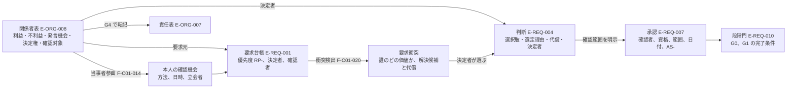
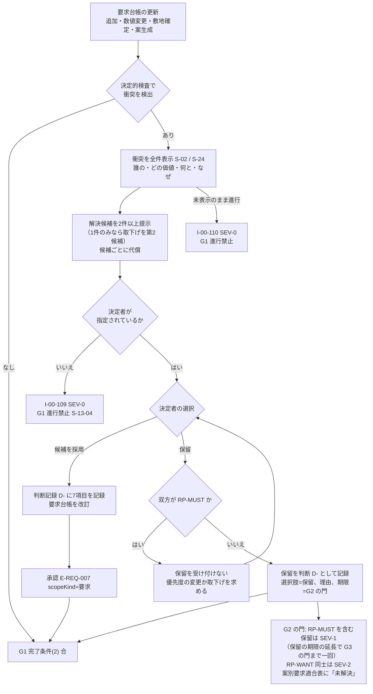

# 第05章 狙う利用者、関係者、課題、価値提案、決定権

作成日: 2026-09-15　版: v1.4（v1.4 は 2026-10-08 の段階8前の持ち越し仕上げ（共通の決定 D6、統括の決定 D27、既定値の識別子の併記 0 行）。第2.3節「製品外権限」の行に判定機関を加え、EL-LAW の証明書の発行者を行政、確認検査機関、判定機関とした（第12章 v1.5 の E-ORG-002.kind と isProductExternalAuthority に合わせた。持ち越し 12）。D27 により第2.2節の関係者表に判定機関の行を加え、第0.2節の非対象、第2.1節の「その他」の細分、F-C01-013 の目的、例外(c)、AC-C01-013-03 の製品外権限の関係者の列挙に判定機関を加えた（受入条件の識別子と試験の割当は変えていない。用語追加提案「製品外権限」は用語集 455 と同文の例示のため変えていない）。記録は `05_審査/再修正記録_段階8前_仕上げ_群F2.md`。v1.3 は 2026-10-07 の段階6 二回目の修正（段階7 再審査の後）。修正計画 第1.5節の 9 件（主担当 JR-008〜JR-010、整合 JR-016、JR-038、JR-089、JR-056、JR-032、JR-105）と横断方針 第0.3節「資格の照合状態」（JR-012）を、第0.3節、第0.4節の固定文と番号（AC-C01-013-06、AC-C01-014-07）で反映した。記録は `05_審査/再修正記録_2回目_第5_7_9章.md`。v1.1 は 2026-10-06 の段階6 初稿審査の再修正。統合指摘 JM-013〜JM-018 と整合指摘 JM-043、047、048、114、137、143、161、163、195 の 15 件、整合修正指示 第5章 18 件、識別子変更一覧（S-04-09、用語集 40、370、493）、修正済みの章の依頼を反映。記録は `05_審査/再修正記録_第5章.md`。v1.2 は 2026-10-06 の段階6 の仕上げ（相互依頼と残課題の処理。群C）。第6章、第8章、第15章、第19章、第22章の依頼 5 件を確認し、F-C01-014 例外(b)を第6章 規則6 (d) と同文に改め、章末の対応状況を更新した。群Bの申し送り（第12章 v1.3 への追従）を含み、responseDeclined、authorityStakeholderRef、coApprovalRefs、stakeholderCheckItems と当事者ごとの stakeholderCheck に合わせて U-05-013 を解決した。記録は `05_審査/再修正記録_相互依頼_群C.md`。2026-10-07 の二回目の修正の仕上げ（群R4）で、外部確認（`01_調査/08_外部確認_段階7後.md`）による R-05-011 の注記と章末の対応状況を加えた（版は据え置き。内容は `05_審査/再修正記録_2回目_仕上げ_群R4.md`））　担当: 段階3 仕様書 第05章（製品責任者、UX設計者、一級建築士、個人情報保護と知的財産の審査担当の合議を想定した仮想設計陣）
根拠: 指示文 8章（最初の経営判断）、9.9（収益と信頼の衝突）、9.12（実装前に経営陣が決める事項）、10.1（関係者と当事者参画）、10.6（人とAIの責任境界）、C1（対話設計の関係者、生活場面、要求衝突、目的文の承認）、A1（A01 目的、関係者、要求）。基盤定義 用語集 v1.2、識別子規則 v1.2、十二判断領域 v1.2（A01、A12）、七段階門 v1.2（G0、G1、G2）、信頼状態と証拠段階 v1.2、機能一覧骨格 v1.2（F-C01-013、F-C01-014、F-C01-021）、情報実体骨格 v1.2（E-ORG-008 Stakeholder、E-REQ-001 Requirement、E-REQ-004 Decision、E-REQ-007 Approval、E-ORG-006 Consent、E-ORG-007 Responsibility）、画面指標試験骨格 v1.2（S-02、S-04-09、S-22、S-24、M-P-08、M-P-09、M-G-11、T-R-012、T-R-008、T-A-013）、整合検査報告 v1.1 第5節（識別子変更一覧）。属性名の正本は第12章 項目辞書 v1.2。調査 `01_調査/01_指定参照三社.md`、`01_調査/03_国内競合.md`、`01_調査/06_研究と標準.md`、`01_調査/07_法規と個人情報と権利.md`（確認日はいずれも 2026-09-15）。

## 0. 冒頭

### 0.1 本章の目的

- 初期公開（P0）で狙う利用者を一つに定め、その根拠と代替案（設計実務者、住宅会社）との比較を記録する。指示文8章と9.12の「初期顧客の判断」を仕様上の仮判断として置き、経営判断での確定を未決事項に残す【推定】。
- 案件の関係者を洗い出し、各関係者に利益、不利益、発言機会、決定権、確認対象を持たせる関係者表の仕様を定める（E-ORG-008 Stakeholder の内容規則）【推定】。
- 子供、高齢者、障害のある人、介護者の声を代理決定だけで終えない当事者参画の方法を定める【推定】。
- 利用者区分ごとの課題、価値提案、決定権を表にし、家族間の要求対立を平均化せずに扱う規則を定める【推定】。
- 一般利用者の短い対話と専門家の確認作業面という二つの画面系統の役割を定め、機能 F-C01-013、F-C01-014、F-C01-021 の必須10項目と受入条件を記述する【推定】。

### 0.2 本章の範囲と非対象

| 区分 | 内容 |
|---|---|
| 範囲 | 初期顧客の推奨と比較。関係者の分類、関係者表の必須属性と作成規則。決定権と確認権の割当規則。当事者参画の方法と記録。課題、価値提案、決定権の対応表。要求衝突の扱い（検出、可視化、解決候補と代償、決定の記録、保留の効果）。決定権を持つ家族の承認、合議の未合意と代理記録の導線。利用者区分ごとの画面の役割分担。機能 F-C01-013、F-C01-014、F-C01-021 の仕様【推定】 |
| 非対象（他章） | 対話の質問項目と分岐、当事者向け質問の質問文（正本は第08章 第7.0.1節）、要求衝突の検出規則（正本は第08章 第5.3節）、生活場面の四群の聞取手順（第08章）。要求台帳の実体定義と項目辞書（第12章）。画面の部品、遷移、空状態と待機状態と失敗状態（第15章）。提携先推薦、有資格者確認、同意管理（第17章、第22章）。役割権限 RL- の実装、監査、削除（第22章）。事業方式と有料化の境界（第24章）。段階門の完了条件そのもの（第06章）【推定】 |
| 非対象（製品） | 家族間の紛争の調停や助言。行政、確認検査機関、判定機関、第三者評価機関の判断の代替。建築士等の法的責任の代替（指示文 A1、10.6）【推定】 |

### 0.3 前提とする章

| 章 | 前提として使う内容 |
|---|---|
| 第02章 | 完成像、五成果、北極星指標 M-N-01、非対象 |
| 第03章、第04章 | 調査方法、確認日、指定参照三社と国内競合の機能比較（本章は `01_調査` の確認結果を直接引用する） |
| 第06章 | G0、G1 の完了条件と進行禁止条件（I-00-101〜I-00-110）、責任表。第1.1節 規則6（例外承認の制限。(d) 本人未確認の RP-MUST）、第2.2節 G1 完了条件(2)（保留の効果）と(5)（P1 の建築士の承認）、第5.1節（自己承認の可否）、第8.2節（I-05-001 の検査規則） |
| 第07章 | A01 と A12 の境界、主担当一意の規則 |
| 第08章 | 三入口、対話設計、生活場面、要求台帳への変換（F-C01-002〜F-C01-020）。第5.3節 要求衝突 X1〜X7 の検出規則、第7.0.1節 当事者向け質問（D8-a〜l、X8）の正本 |
| 第12章 | E-ORG-008、E-REQ-001、E-REQ-004、E-REQ-007、E-SRV-013 の項目辞書（v1.2。selfConfirmation、cannotExpressApprovalRef、coDeciderRefs、deciderSelections、recordedByRef、deciderConfirmation、stakeholderCheck、valueAttribute、timeBand、activities）と既定値表 DV-CF-10、DV-FN-03 |
| 第15章 | S-02、S-22、S-24 の部品と状態（v1.1。S-02-05、S-03-07、S-04-09、S-24-06、S-25-02） |
| 第17章、第22章 | 提携先、同意、役割権限、個人情報の分離。第22章 第1.3節（決定権を持つ RL-EDT の承認、記録の二経路）、第17章 第7.4節 規則7、規則8（例外承認の自己承認の禁止、決定権者の承認と合議） |
| 第19章、第23章 | 第19章 第2.2節（要配慮者の避難経路）、第2.3節（利用円滑性の 12 項目と当事者確認）、第3.3節（R-05-002 の遮音）。第23章 第4.3節 T-U-004（本章の受入条件の単体試験） |

## 1. 初期顧客の推奨、根拠、代替案との比較

### 1.1 三候補の比較

指示文9.12は初期顧客の候補を「一般利用者」「設計実務者」「住宅会社」の三つとしている【推定】。P0 の範囲（用語集 234。G0〜G3 と G4 への最小引継ぎ、平屋または二階建、単一縮尺の PDF、PNG、JPEG、三案、限定した正規商品）と北極星指標への寄与で比較した。

| 比較軸 | 一般利用者（推奨） | 設計実務者 | 住宅会社 | 区分 |
|---|---|---|---|---|
| 対象の定義 | 日本の戸建住宅を検討し、候補地または既存図面があり、設計契約前に家族の要求と比較案を整理したい人 | 図面を多く処理する建築士事務所、設計者、積算担当 | 商品住宅を販売する会社の営業設計、展示場 | 【推定】指示文8章、9.12 |
| 最初の有料成果 | 根拠付き比較構想一式（三案、要求適合、敷地制約、構造と設備の初期注意、性能目標、費用幅、商品、未解決問題、専門家引継ぎ） | 図面の検証付き3D化、IFC、IDS 検査、組織標準 | 商談用の3D、正規商品登録、配置後の成果測定 | 【推定】指示文8章、H節 |
| 北極星指標 M-N-01 への寄与 | 家族の重要判断（G0〜G3）が製品内で発生し、分母と分子を製品内で計測できる | 判断の多くが事務所内で行われ、分子の記録が製品外に残る | 決定権が会社側の商品体系へ偏り、三案比較が商品比較へ置き換わる | 【推定】 |
| 初回体験と精度投資 | 短い対話と三案の提示。精度投資は単一縮尺の平面図に集中 | 図面一式、ベクトル、複数階、IFC の精度投資が先に要る（P1） | 商品台帳と法人登録（P2）が先に要る | 【推定】機能一覧骨格 第0.3節 |
| 収益と信頼の衝突 | 電子連絡先を要求しない設計で見込客獲得頁との混同を避ける。有料転換率 M-B-05 は未確認 | 衝突は小さいが、重大誤り流出の責任が実務者側へ移る | 広告偏り M-G-16 と同意事故 M-G-07 の危険が最大 | 【推定】指示文9.9 |
| P0 との整合 | 一致（G0〜G3、単一縮尺、三案） | 不一致（中心機能が P1） | 不一致（中心機能が P2） | 【推定】 |
| 取込時期 | P0 | P1（S-22 専門家確認作業面、IFC、IDS） | P2（S-21 製造元登録画面、組織標準 F-C10-016） | 【仮定】 |

### 1.2 推奨と根拠

推奨する初期顧客は「日本の戸建住宅を検討し、候補地または既存図面があり、設計契約前に家族の要求と比較案を整理したい人」である。一般利用者向けの短い対話を入口にし、提携する建築士が検証と引継ぎ品質を担い、専門家は別の確認作業面（S-22）を使う【推定】指示文8章。根拠は次のとおり。

| 番号 | 根拠 | 区分と出典 |
|---|---|---|
| 1 | 北極星指標の分子は「要求、選択肢、選定理由、影響、決定者、確認者、版」がそろった判断であり、決定者は家族側にいる。家族が製品内で判断しない限り分子は増えない | 【推定】用語集 18、指示文 A1 |
| 2 | タウンライフの導線は一問一答の後に最終段階で氏名、住所、電子連絡先、電話を取得し、住宅会社の「まとめて選択」を推奨し、提携会社からの連絡停止は利用者側の申出に委ねる。まどりLABO の公式FAQには「営業電話がたくさんかかってこないか不安です」「個人情報が外部に漏れることはありませんか？」という質問文がある。利用者の懸念そのものが要求であり、最初の価値を見せる前に電子連絡先を要求しない入口で応えられるのは一般利用者向けの設計だけである | 【事実】https://www.town-life.jp/home/main/chatform.php （SRC-014、確認日 2026-09-15）、https://www.town-life.jp/home/terms.html （SRC-016、確認日 2026-09-15）、https://madori-labo.com/#question （SRC-072、確認日 2026-09-15）。含意は【推定】 |
| 3 | 建築家コンシェルジュは人が仲介する方式で預り金20万円（住宅、税込）と事業者側5%の手数料を開示し、預り金後の並行検討を返金対象外としている。人による選定は単価と信頼を高めるが対応人数が制約になる。本製品は製品内で三案と要求適合を先に作り、人の確認を段階門で受ける | 【事実】https://architect-concierge.com/ （SRC-010、確認日 2026-09-15）、https://architect-concierge.com/meta/ （SRC-009、確認日 2026-09-15）。含意は【推定】指示文9.9 |
| 4 | Renovo の App Store 掲載レビュー（米国4件）は広告と実物の差、支払後の追加課金、3Dの実体がないという不満で一致する。一般利用者向けでは映像ではなく寸法と関係を持つ建物情報を渡す点が差別化になる | 【事実】https://apps.apple.com/us/app/ai-home-design-renovo/id6747351118 （SRC-002、確認日 2026-09-15。少数標本）。含意は【推定】 |
| 5 | P0 の段階は G0〜G3 と G4 への最小引継ぎである。設計実務者の中心機能（図面一式、IFC、IDS）は P1、住宅会社の中心機能（正規商品登録、組織標準）は P2 であり、同時に最適化すると初回体験と精度投資が分散する | 【推定】指示文8章、機能一覧骨格 第0.3節 |

### 1.3 初期顧客の適合条件（観察可能）

| 条件 | 観察可能な判定 | 区分 |
|---|---|---|
| 所在 | 建設地域の都道府県が入力されている（G0 の進行禁止条件 I-00-101 を満たす） | 【推定】七段階門 G0 |
| 建物 | 日本の戸建住宅、平屋または二階建。三階建以上は P0 の対象外と表示する | 【推定】指示文9.10 |
| 入力 | 候補地（住所、地番、または概略地域）があるか、単一縮尺の明瞭な平面図（PDF、PNG、JPEG）がある | 【推定】指示文9.10 |
| 時期 | 設計契約前（設計者との契約が未締結）。契約後の利用は禁止しないが、初期公開の指標は契約前案件で層別する | 【仮定】 |
| 決定権 | 関係者表に決定権を持つ家族が1名以上登録できる（G0 完了条件(2)） | 【推定】七段階門 G0 |
| 連絡先 | 電子連絡先を入力せずに初回成果（三案または不足情報一覧）まで到達できる（M-P-04） | 【推定】指示文B |

### 1.4 合わない利用者の明示

建築家コンシェルジュが「土地優先型」「全お任せ型」「最短・最安型」の三類型を非推奨と明示している【事実】https://architect-concierge.com/ （SRC-010、確認日 2026-09-15）。本製品も開始画面（S-01）の責任境界表示（S-30-06）で次の利用者に「本製品では得られないもの」を表示する【推定】。

| 合わない利用目的 | 表示する理由 | 代わりに製品が行うこと | 区分 |
|---|---|---|---|
| 確認申請図、構造安全証明、施工図、見積確定額、性能評価書を得たい | 非対象（用語集 5）。利用目的が該当する場合は I-00-104（SEV-0） | 引継ぎ一式（F-C15-013）で建築士等へ渡す | 【推定】 |
| 判断を全て任せたい | 決定権を持つ関係者がいない案件は G0 を通過しない（完了条件(2)） | 判断に必要な比較と代償を示し、決定者の指定を求める | 【推定】 |
| 最短最安の一案だけ欲しい | 三案と代償の提示が中心原則（指示文B） | 費用重視案を三案の一つとして提示する | 【推定】 |
| 戸建住宅以外、海外、三階建以上 | P0 の対象外（指示文9.10） | 対象拡張は P2 | 【推定】 |

### 1.5 経営判断としての確定

初期顧客の選定は指示文9.12の第1項、11.5の最終必須判断に当たる。本章の推奨は仕様上の仮判断であり、公開前に意思決定記録として確定する必要がある。未決 U-05-001 に記録する【仮定】。

## 2. 関係者表

### 2.1 関係者の分類と情報実体

関係者は案件内の役割個体 E-ORG-008 Stakeholder として持ち、個人 E-ORG-001 Person とは分ける（本人が製品に登録されていない関係者は personRef が null のまま匿名の役割名 label で持つ）【推定】情報実体骨格 E-ORG-008。分類 category は家族、設計者、施工者、維持管理者、介護者、来訪者、近隣、将来の居住者、その他の九区分であり、本章では「その他」を提携事業者、行政、確認検査機関、判定機関、第三者評価機関に細分して扱う【仮定】。家族は成人、子供（学齢期）、乳幼児、高齢者、在宅勤務者の細区分を label と生活場面（E-REQ-009）の actorRefs で表す。障害のある人（第8章 D9 に該当する家族。年齢帯を問わない）は細区分に重ねる区分とし、第2.2節の行の既定を該当者の行に重ねる（JR-009）【推定】指示文C1。

役割権限 RL-（所有者、編集者、確認者、閲覧者、提携事業者）は製品の操作権限であり、関係者表の決定権とは別の属性である。決定権は「何を決められるか」、役割権限は「画面で何を操作できるか」を表し、一方から他方を導かない【推定】十二判断領域 A01（決定権）と A12（権限）の境界。ただし、決定権を持つ RL-EDT には、その判断種に対応する確認範囲（scopeKind）に限って承認と判断の記録を許す（第2.3節、第22章 第1.3節、第17章 第7.4節 規則8。JM-161）。これは役割権限を決定権から導く規則ではなく、承認の可否の判定で決定権を参照する規則である【推定】。

### 2.2 関係者表（本体）

各行の五属性（利益、不利益、発言機会、決定権、確認対象）に空欄を許さない。該当がない場合は「なし（理由）」と書く。発言機会は「画面、段階」で、決定権は「領域、判断種」で、確認対象は影響を受ける成果や要素で書く【推定】機能一覧骨格 F-C01-013 の合格条件。本表は P0 の既定の雛形であり、案件ごとに利用者が編集する【仮定】。

| 関係者 | 利益 | 不利益 | 発言機会（画面、段階） | 決定権（領域、判断種） | 確認対象 | 役割権限の既定 | 区分 |
|---|---|---|---|---|---|---|---|
| 家族: 成人（所有者となる人） | 要求が根拠付きで実現する。費用と代償を知った上で選べる | 決定の責任を負う。他の家族の要求と衝突する | S-02（G0、G1）、S-03（G2）、S-04（G3）、S-13（全段階） | A01 目的文、要求優先度、衝突の解決。G2 の選定（A03 主担当の判断の決定者、未決 U-00-012）。A09 予算上限。A12 共有と同意 | 目的文、要求台帳、選定記録、費用幅、同意記録 | RL-OWN | 【推定】 |
| 家族: 成人（共同で決める人。配偶者等） | 同上 | 同上 | 同上 | 成人（所有者）と同じ判断種に「合議」または優先順位付きで持つ（第2.3節） | 同上 | RL-EDT（決定権を持つ判断種に対応する scopeKind の承認ができる。第2.3節。JM-161） | 【推定】 |
| 家族: 子供（学齢期） | 自室、遊び、学習、友人来訪の要求が本人の言葉で残る | 本人の声が親の代理入力で置き換わる。将来の独立時の可変性が考慮されない | S-02 当事者向け質問（G1）、S-04 実物尺度の歩行（G2、G3） | なし（理由: 未成年。決定は養育者）。ただし本人の要求は要求台帳に本人を要求元として残す | 自室の要求、生活場面（学齢期、独立） | RL-VIEW（養育者の同席で本人操作）または なし（代理記録。RL-OWN、RL-EDT が method と立会者を付けて記録。第22章 第1.3節。JM-163） | 【仮定】 |
| 家族: 乳幼児 | 安全（段差、転落、指詰め）と養育者の動線が要求になる | 本人が意思表示できない | なし（理由: 意思表示不可）。養育者が生活場面（乳幼児期）で代理 | なし | 生活場面（乳幼児期）、将来場面（学齢期） | なし | 【仮定】 |
| 家族: 高齢者 | 寝室と便所の階、段差、手掛かり、温熱の要求が残る | 子が代理入力し本人の確認機会がない（I-00-002） | S-02 当事者向け質問（G1）、S-04 実物尺度の歩行（G2、G3）、同席確認 | 本人が所有者または共同決定者の場合は成人と同じ。そうでない場合はなし（理由: 決定は所有者）。ただし自室と利用円滑性に関する要求は本人確認（当事者確認）を要する | 利用円滑性（用語集 160）、将来場面（在宅介護、車椅子利用） | RL-VIEW（本人が操作する場合） | 【仮定】 |
| 家族: 障害のある人（第8章 D9 に該当する家族。年齢帯を問わない。JR-009） | 移動、設備、知らせ方の要求が本人の言葉で残る | 数値基準への適合で「対応済み」とされる | S-02 当事者向け質問 D8-g〜i（G1）、S-04 実物尺度の歩行と S-04-09（G2、G3） | 成人で所有者または共同決定者なら成人と同じ。それ以外は「なし（理由: 決定は所有者）」 | 利用円滑性の 12 項目（第19章 第2.3節）、要配慮者の避難経路 | RL-VIEW（本人が操作する場合）。決定権を持つ成人は成人と同じ | 【仮定】 |
| 家族: 在宅勤務者 | 作業室の遮音、通信、通話音の漏れ、来客との分離が要求になる | 勤務時間帯の生活場面が他の家族と衝突する | S-02（G1）、S-03（G2） | なし（成人としての決定権に含む） | 生活場面（在宅勤務）、動線 | 成人と同じ | 【推定】 |
| 設計者（建築士） | 要求と根拠がそろった状態で受け取れ、作り直しが減る（M-G-02、M-G-06） | 未確認の案を「確認済み」と誤解されて責任を問われる | S-22（G1 敷地根拠と要求実現性、G3、G4）、S-23、S-10 | なし（決定者ではない）。確認権: 確認範囲を明示した承認と差戻し（E-REQ-007） | 敷地根拠、案の成立性、V2→V3 の確認範囲 | RL-CHK（有資格者） | 【推定】指示文10.6 |
| 施工者 | 施工成立性の注意と数量根拠が早く分かる | 案が施工可能と誤表示されると見積と工程の前提が崩れる | S-23、S-14（G4、G5。P2） | なし。確認権: 施工成立性と現場変更の確認（A10） | 搬入経路、公差、順序、変更記録 | RL-PART または RL-CHK | 【推定】 |
| 維持管理者（居住者自身または管理委託先） | 点検、交換、清掃の経路と機器台帳が残る | 交換できない設備が固定される（I-00-031） | S-02 生活場面（維持、G1）、S-14（G5、G6。P2） | なし（理由: 居住者自身の場合は成人の決定権に含む） | 機器台帳、交換経路、点検空間、保証（通知を受け確認する） | RL-VIEW | 【推定】 |
| 介護者（家族または訪問介護） | 介助空間、夜間動線、移乗の要求が残る | 介護される本人の要求と介護者の作業要求が衝突する | S-02 当事者向け質問（G1）、S-04 実物尺度の歩行（G2、G3） | なし。本人の代理入力者になる場合は当事者参画の記録（第3節） | 利用円滑性、介助空間、動線 | RL-VIEW | 【仮定】 |
| 来訪者（親族、友人、配達、訪問診療） | 玄関、客間、便所、駐車の要求が残る | なし（理由: 案件の費用を負担しない） | なし（理由: 案件外）。家族が生活場面（来客）で代理 | なし | 生活場面（来客）、駐車 | なし | 【仮定】 |
| 近隣 | 窓の正対、外部機器の騒音、日影、越境が事前に検討される（I-00-017） | 製品内で意見を述べる機会がない | なし（理由: 製品外。近隣説明は行政手続と設計者の業務） | なし | 隣地側の窓、外部機器の位置、擁壁、越境（F-C09-015） | なし | 【仮定】 |
| 将来の居住者（独立後の子の家族、二世帯化、売却先、賃借人） | 可変性と売却または賃貸資料が残る | 現在の家族の要求で可変性が失われる | なし（理由: 未確定）。家族が生活場面（家族変化、維持）で代理 | なし | 将来場面の試行結果（F-C14-006。P1）、可変性比較 | なし | 【仮定】 |
| 提携事業者（設計事務所、施工会社、造作、外構、土地、資金相談） | 適合理由付きで相談を受ける | 同意のない送信で信頼を失う（M-G-07） | S-07 経由の相談（G3、G4。P1） | なし。確認権: 共有された範囲の確認 | 共有範囲（階、室、問題）。非共有項目は見えない | RL-PART | 【推定】 |
| 行政 | なし（理由: 製品の利用者ではない） | なし | なし（理由: 製品外） | 製品外権限（法規判定の適合、確認申請、証明書の発行。EL-LAW） | 法規判定の版、証明書 | なし | 【推定】信頼状態 第3節 |
| 確認検査機関 | なし | なし | なし（理由: 製品外） | 製品外権限（確認と検査、EL-LAW） | 同上 | なし | 【推定】 |
| 判定機関（登録建築物エネルギー消費性能判定機関。建築物省エネ法 第12条。所管行政庁が交付する場合は行政の行） | なし（理由: 製品の利用者ではない） | なし | なし（理由: 製品外） | 製品外権限（適合判定通知書の交付、EL-LAW） | 証明書（適合判定通知書。E-REQ-008 kind=証明書）の識別子、日付、法令の版 | なし | 【推定】第12章 v1.5 E-ORG-002.kind=判定機関、isProductExternalAuthority=true（持ち越し 12。v1.4 で追加） |
| 第三者評価機関 | なし | なし | なし（理由: 製品外） | 製品外権限（評価書の発行、EL-3RD） | 評価書の識別子、有効期限 | なし | 【推定】 |
| 立会者（製品に未登録の立会者。category=その他、label=「立会者（役割名）」。代理記録の立会で追加。JR-056） | なし（理由: 立会者） | なし（理由: 立会者） | なし（理由: 立会者） | なし（理由: 立会者） | なし（理由: 立会者） | なし | 【推定】第12章 v1.4 E-ORG-008.category |

### 2.3 決定権と確認権の規則

| 規則 | 内容 | 区分 |
|---|---|---|
| 割当の単位 | 決定権は「領域 A01〜A12 × 判断種」の単位で関係者へ割り当てる（E-ORG-008.decisionAuthority）。判断種は目的文、要求優先度、衝突の解決、選定、予算上限、商品の採用、共有と同意、変更の確定を P0 の既定とする | 【仮定】 |
| 一名以上 | 関係者表に決定権を持つ関係者が1名以上ない案件は G0 を通過しない（七段階門 G0 完了条件(2)）。必須要求に決定者がいない場合は I-00-109（SEV-0） | 【推定】 |
| 二重割当 | 同一判断種に二名以上が決定権を持つ場合、「優先順位」または「合議（全員の承認が必要）」のいずれかを必ず記録する。どちらもない二重割当は I-05-001（SEV-1）として登録し、当該判断種の決定権を持つ全員の承認で mode を記録して解消する（E-ORG-008.decisionAuthority.mode。次行。検査規則は第6章 第8.2節、登録の契機は F-C01-013 例外(b)） | 【仮定】 |
| mode の記録と変更（JR-008） | mode の記録と変更（合議から優先順位、決定者の削除を含む）は、変更前に当該判断種の決定権を持つ全員の承認（scopeKind=関係者表、coApprovalRefs）を要する。合意できない場合の導線は分岐案と建築士への相談（P1）に限り、所有者の単独の切替は受け付けない。I-05-001 の解消で mode を初めて記録する場合も同じとし、全員の承認がそろうまで関係者表を改訂しない（承認者は第6章 第5.1節 関係者表の行と同じ。AC-C01-013-06） | 【推定】 |
| 決定権者の承認（JM-161） | 決定権を持つ RL-EDT は、当該判断種に対応する scopeKind（目的文←目的文、要求←要求優先度と衝突の解決、選定←選定、費用←予算上限と変更の確定、関係者表←いずれかの判断種）の承認と判断の記録ができる。商品の採用、共有と同意は承認権を与えない。承認者 approverRef は本人の Person（E-ORG-001）とし、personRef で結ばれた関係者行（E-ORG-008）の decisionAuthority で可否を判定して、承認個体に関係者行への参照（E-REQ-007.authorityStakeholderRef。RL-EDT の承認では必須。第12章 v1.3。判断種と scopeKind の対応と mode が合わない承認は登録せず AS-PENDING も生成しない）を残す。isSelfApproval の扱いは RL-OWN と同じ（true、「専門家未確認」を併記）。監査記録（E-EXC-007）に決定権の根拠（判断種と mode）を残す（第22章 第1.3節、第17章 第7.4節 規則8 と同じ） | 【推定】 |
| 合議の承認（JM-161） | mode=合議 の判断は承認個体を承認者ごとに作り（E-REQ-004.coApprovalRefs。決定者ごとに1件で、各承認個体の authorityStakeholderRef は当該決定者の関係者行。第12章 v1.3）、全員が AS-VALID のときだけ判断（E-REQ-004）の承認を有効とする。一人でも AS-PENDING または AS-VOID なら判断は完了にならない。目的文と要求は G1 完了前、選定は G2 完了前を期限とし、期限までにそろわない場合は分岐案と建築士への相談（P1）の導線を S-13-03 と S-25 に出す（優先順位への切替を求める操作は「mode の記録と変更」の全員の承認を要する。JR-008）。決定者が1名の判断種は mode=単独 とし合議の手順を持たない | 【推定】 |
| 合議の未合意（JM-015） | 合議の判断（E-REQ-004.coDeciderRefs が deciderRef を含めて2名以上）は決定者ごとの選択（deciderSelections）を記録する。選択が割れた場合は「未合意（案A: 成人A、案B: 成人B）」として S-03-07 と S-25-02 に表示し、選定を確定させない。期限（G2 完了前）までに、分岐案の作成（F-C03-004）、優先順位への切替を求める操作（変更前の決定権者全員の承認の後に関係者表の改訂と I-05-002 の再承認。S-13-03。JR-008）、建築士への相談（S-07。P1）のいずれかを決定者が選ぶ。分岐案は決定者が作り、製品は二人の選択の折衷案を自動で作らない（第4.2.1節 平均化の禁止） | 【仮定】 |
| 代理記録（JM-015） | RL-VIEW の決定者（本人が画面を操作できない高齢者等）は、同席の RL-OWN または RL-EDT を介して判断を記録できる。操作した者を記録者（E-REQ-004.recordedByRef）とし、決定者本人が操作しない判断には決定者の確認の記録（deciderConfirmation: 方法、日時、立会者）を必須とする（立会者は関係者行 ref[E-ORG-008]。未登録の立会者は役割名の行を関係者表へ追加する。JR-056）。立会者のない代理記録は保存しない。記録者と決定者が異なる判断は S-25-02 に「代理記録」と記録者の役割名を表示する。決定権を持つ家族が製品に未登録の場合は、所有者の代理承認と本人確認の記録（第3節、E-ORG-008.selfConfirmation）で代替する（第8章 F-C01-020 権限、第22章 第1.3節） | 【仮定】 |
| 決定と確認の分離 | 家族は決定者、専門家は確認者である。確認者は確認範囲を明示して承認または差戻しを行い、決定を代替しない。差戻しは理由付きで問題（I-）として登録し、決定者が再判断する | 【推定】指示文10.6、用語集 60 |
| 製品外権限 | 行政、確認検査機関、判定機関、第三者評価機関の権限は製品内に持たず、結果（証明書、評価書）を証拠 E-REQ-008 として登録する（EL-LAW の証明書の発行者は行政、確認検査機関、判定機関。判定機関は適合判定通知書を交付する登録建築物エネルギー消費性能判定機関で、第12章 E-ORG-002.kind と isProductExternalAuthority に含まれる）。製品はこれらの判断を推定表示しない | 【推定】信頼状態 第3節 |
| 決定権を持たない関係者 | 発言機会（要求元として要求台帳へ登録）と確認対象（自分に影響する判断の通知と確認）を持つ。要求元は E-REQ-001.stakeholderRef、決定者は deciderRef で区別する | 【推定】情報実体骨格 E-REQ-001 |
| 変更の記録 | 関係者表の変更は改訂 E-REQ-006 として記録する。判断記録の決定者を変更した場合、その判断の承認は AS-VOID となり再承認を要する（I-05-002 を検出） | 【仮定】 |
| 責任表への転記 | G4 の責任表 E-ORG-007 は関係者表の設計者、施工者、提携事業者の行から役割を写す。関係者表は「誰が何を決め、何を確認するか」、責任表は「誰が何を作成、確認、承認、通知するか」であり、実体を統合しない。転記元の関係者行は E-ORG-007.stakeholderRef に保持する（第12章 v1.2。未決 U-05-004） | 【仮定】 |

### 2.4 関係者、要求、判断、承認の流れ

## 3. 当事者参画の方法

### 3.1 原則

- 代理入力（isProxyInput）は許すが、代理決定で終えない。代理入力された要求には本人の確認機会（方法、日時、立会者）を記録し、記録がない限り確認状態を「未確認」のままにする【推定】機能一覧骨格 F-C01-014。
- 当事者参画は数値基準への適合とは別の記録である。利用円滑性の検査（F-C12-011）で段差や幅が基準内でも、「利用しやすい」「対応済み」と断定せず、当事者確認の項目を関係者表に残す（T-R-008）【推定】用語集 160。
- 国土交通省の「高齢者、障害者等の円滑な移動等に配慮した建築設計標準」の頁には別冊として「建築プロジェクトの当事者参画ガイドライン」が掲載されている【事実】https://www.mlit.go.jp/jutakukentiku/jutakukentiku_house_fr_000049.html （SRC-295、確認日 2026-09-15。別冊の本文は未読、未決 U-05-006）。RIBA Plan of Work には Engagement Overlay（2024年1月）が公開されている【事実】https://www.riba.org/work/insights-and-resources/riba-plan-of-work/ （SRC-246、確認日 2026-09-15）。いずれも建築物または英国の実務向けの指針であり、本製品は住宅の生活場面に結び付けた参画方法として参照する【推定】。
- 本人が意思表示できない場合（乳幼児、重度の認知症等）は、代理者が「本人が意思表示できない（理由）」を決定者の承認付きで記録し、本人確認の代わりに生活場面（乳幼児期、在宅介護）の確認をもって参画とみなす【仮定】未決 U-05-003。

### 3.2 対象別の参画方法（P0 の既定）

当事者向け質問は対象者ごとに 3 問以内とし、本節は項目名と参画方法だけを持つ。質問文、表示条件、取得する値、書込先の正本は第8章 第7.0.1節（D8-a〜l）とする（JM-048 の統合判断。第8章 U-08-017 の照合先も第8章）。要配慮者の避難の共通の 1 問（D8-l）は対象者ごとの 3 問とは別に数え、一人に表示する質問は計 4 問以内とする（第8章 第7.0.1節。3 問以内の規則の改訂の要否は第8章 U-08-019）。障害や配慮が必要な家族の有無と内容は質問群D の D9 で取得する【仮定】。

| 対象 | 声が抜けやすい理由 | 参画方法（製品内で実施できるもの） | 記録する項目 | 区分 |
|---|---|---|---|---|
| 子供（学齢期） | 親が代理で回答する。将来の独立や個室の要求が親の希望に置き換わる | (1) S-02 の当事者向け質問（項目名: 自室、遊びと学習、友人来訪。質問文は第8章 D8-a〜c）を本人が回答する。(2) S-04 の実物尺度の歩行（視点高さを本人の身長に合わせる。初期値は第12章 既定値表 DV-FN-03 の当事者別の値。初期仮説）で自室と居間を本人が見る。(3) 親の代理回答と本人回答の差分を S-24 に表示する | 本人回答の日時、代理回答との差分、本人確認の方法 | 【仮定】 |
| 乳幼児 | 意思表示できない | (1) 生活場面（乳幼児期）で養育者が安全（段差、転落、指詰め、浴室）と養育動線を回答する。(2) 将来場面（学齢期）を試行し、可変性を確認する | 「意思表示不可（乳幼児）」、養育者の確認日時 | 【仮定】 |
| 高齢者 | 子が代理入力する（I-00-002）。画面操作が困難な場合がある | (1) S-02 の当事者向け質問（項目名: 寝室と便所の階、段差と手掛かり、温熱。質問文は第8章 D8-d〜f）を本人または同席の代理者が読み上げて回答する。(2) S-04 の実物尺度の歩行で、寝室から便所までの経路と、寝室から屋外までの避難経路（E-SYS-003 kind=避難。2 階以上の寝室は垂直避難の手段を含む）を本人が見て S-04-09 に記録する（JM-137）。(3) 同席確認の立会者と日時を記録する。(4) 本人が決定者の場合は、同席の代理者を介して判断を記録する（S-25 に「代理記録」と表示。立会者必須。第2.3節。JM-015） | 本人確認の方法（本人操作、同席、読み上げ）、立会者、日時。代理記録では記録者と決定者の確認 | 【仮定】 |
| 障害のある人（車椅子、視覚、聴覚、認知） | 数値基準への適合で「対応済み」とされやすい | (1) S-02 の当事者向け質問（項目名: 移動しにくい場所と使いにくい設備、呼出と警報の知らせ方、一人で過ごす場所と手伝いの要否。質問文は第8章 D8-g〜i）で、利用円滑性の要求（経路、段差、幅、回転、移乗、手掛かり、視認、聴覚情報、介助空間）を本人の言葉で要求台帳に登録する。(2) S-04 の実物尺度の歩行で、日常の経路と、寝室から屋外までの避難経路（E-SYS-003 kind=避難）を本人が確認し S-04-09 に記録する（JM-137）。(3) 検査結果（F-C12-011）と本人確認を別の記録として持ち、本人確認がない項目は「当事者確認待ち」と表示する。避難経路の幅、段差、扉、垂直避難の手段の判定は第19章 第2.2節（F-C12-009。P0 は初期注意の表示のみ、判定は P1）が行い、本章の記録は判定に代えない。「避難できる」と読める語は表示しない | 当事者確認の項目一覧と状態、確認日時、避難経路の歩行の記録 | 【仮定】 |
| 介護者（家族、訪問介護） | 介護される本人の要求だけが登録され、介護者の作業要求が抜ける | (1) S-02 の当事者向け質問（項目名: 夜間の介助の経路と回数、介助で足りない空間。質問文は第8章 D8-j〜k）と生活場面（在宅介護）で、介護者の夜間動線、介助空間、入浴と排泄の介助手順を回答する。(2) 本人の要求と介護者の要求の衝突（例: 本人の「一人で入浴したい」と介護者の「介助空間」）を要求衝突として表示する | 介護者の要求元、本人要求との衝突と決定 | 【仮定】 |
| 将来の居住者 | 未確定であり本人がいない | 生活場面（家族変化、維持）で家族が代理し、将来場面の試行結果（P1）を可変性比較として残す。将来場面で当事者が特定できない場合（将来の同居者、未定の被介護者）は「当事者未定（将来）」とし、割当の期限を場面の時期（E-REQ-009 の時期）に置き、G4 の未確認事項に残す。現在の家族が将来の当事者になる場合は本人を割り当て、代理は「代理」を明示する（第19章 第2.3節と同文。JM-143） | 「未確定」または「当事者未定（将来）」、割当の期限、代理した家族 | 【仮定】 |
| 言語が異なる家族 | 質問の言語で回答が変わる | 当事者向け質問を本人の言語で表示する（対応言語は未決 U-05-007）。翻訳の有無を記録する | 回答言語、翻訳の有無 | 【仮定】 |

### 3.3 個人情報への配慮

- 子供の年齢、障害、介護の情報は要配慮の度合いが高い。要求台帳と関係者表のこれらの属性は外部送信の非共有項目を既定とし、学習利用は初期無効（F-C10-011）とする【推定】指示文E、9.8。
- 個人情報保護委員会は生成AIサービスの利用について、本人の同意なく個人データを含むプロンプトを入力し、応答結果の出力以外の目的で取り扱われる場合に法違反の可能性があると注意喚起している【事実】https://www.ppc.go.jp/news/careful_information/230602_AI_utilize_alert/ （SRC-296、公表日 令和5年6月2日、確認日 2026-09-15）。当事者向け質問の回答を外部の言語模型へ送る場合は F-C10-018（最小送信と処理地域の表示）に従う【推定】。
- 子供の個人情報の取得に保護者の同意を要する年齢の閾値と、本人確認の記録に本人の氏名を含めるかは第22章の判断に委ね、本章は「本人確認の記録は関係者の役割名（label）と日時で持ち、氏名は Person に分離する」を既定とする【仮定】未決 U-05-005。

## 4. 課題、価値提案、決定権

### 4.1 利用者区分ごとの課題、価値提案、決定権

| 利用者区分 | 課題（観察できる現状） | 本製品の価値提案（観察可能な条件） | 根拠 | 決定権（製品内） | 計測する指標 | 区分 |
|---|---|---|---|---|---|---|
| 家族（一般利用者） | 希望が言語化されず、住宅会社ごとに同じ条件を再入力する。連絡先入力の後でないと案が見られない（タウンライフの導線）。映像だけの3Dで実体がない（Renovo のレビュー） | 電子連絡先なしで三案と要求適合表に到達する。要求が出典、決定者、確認者付きで残り、案、要素、判断へ双方向にたどれる。衝突が平均化されず代償付きで示される | 【事実】https://www.town-life.jp/home/main/chatform.php （SRC-014、確認日 2026-09-15）、https://apps.apple.com/us/app/ai-home-design-renovo/id6747351118 （SRC-002、確認日 2026-09-15）。価値提案は【推定】 | 目的文、要求優先度、衝突の解決、選定、予算上限、同意 | M-P-04、M-P-08、M-P-09、M-G-11、M-G-05 | 【推定】 |
| 声が抜けやすい当事者（子供、高齢者、障害のある人、介護者） | 代理入力で本人の要求が置き換わる。数値基準への適合で「対応済み」とされる | 本人の確認機会が記録され、当事者確認待ちの項目が消えない。実物尺度で経路を本人が見る | 【推定】指示文C1、10.1。【事実】建築設計標準の別冊に当事者参画ガイドライン（URL は第3.1節、2026-09-15） | なし（発言機会と確認対象。本人が所有者の場合は家族と同じ） | M-P-09（層別: 当事者参画の対象）、M-P-08（層別: 代理入力） | 【推定】 |
| 設計者（建築士） | 利用者から渡される資料が要求の根拠を持たず作り直す。AIの案が「確認済み」と誤解される | 引継ぎ一式に要求台帳、問題一覧、判断記録が含まれ、元図と要求へ戻れる。確認範囲を明示した承認だけが V3 に反映される | 【推定】指示文8章、10.6。【事実】建築士制度 https://www.mlit.go.jp/jutakukentiku/build/architect.html （SRC-270、確認日 2026-09-15） | なし（確認権のみ） | M-G-02、M-G-06、M-P-11 | 【推定】 |
| 施工者 | 案が施工可能と誤表示され、数量根拠と搬入経路がない | 施工成立性の初期注意と数量根拠付きの費用幅を受け取る。「施工可能」の語は表示されない | 【推定】指示文C13、B | なし（確認権のみ。P2） | M-G-03、M-G-13 | 【推定】 |
| 提携事業者 | 一括送信された見込客に営業し、利用者の信頼を失う | 個別同意の後にだけ、適合理由付きで共有範囲内の情報を受け取る | 【事実】タウンライフ規約の連絡停止は利用者側申出 https://www.town-life.jp/home/terms.html （SRC-016、確認日 2026-09-15）。価値提案は【推定】 | なし | M-G-07、M-B-02、M-B-03、M-B-04 | 【推定】 |
| 維持管理者、将来の居住者 | 交換できない設備、可変性のない間取りが固定される | 生活場面（維持、家族変化）の要求が案の比較軸に残る。機器台帳と将来場面の試行（P1、P2）へ情報構造を引き継ぐ | 【推定】指示文C14、10.1 | なし | M-O-03、M-O-05（P2） | 【推定】 |

### 4.2 家族間の要求対立の扱い

#### 4.2.1 規則

| 規則 | 内容 | 区分 |
|---|---|---|
| 平均化の禁止 | 衝突する二つの数値範囲の中間値や、二人の希望の折衷案を製品が自動で要求台帳に書かない。要求は要求元ごとに別の個体として残す | 【推定】指示文C1、用語集 39 |
| 衝突の可視化 | 衝突ごとに「誰の（要求元）」「どの価値が（要求の文言と優先度）」「何と（相手の要求）」「なぜ両立しないか（検出方法）」を表示する。規則で検出した衝突と利用者が登録した衝突は決定者へ全件表示する（M-G-11 の目標 0 件。母集団は第4.2.2節）。言語模型の衝突候補（未検証）は別欄に表示し、衝突に数えない（JM-043） | 【推定】 |
| 解決候補と代償 | 各衝突に解決候補を 2 件以上示す（件数と候補の型は第8章 第5.3節「解決候補の生成規則」を正本とする）。候補が 1 件しか作れない場合は「取下げ」を第 2 候補として必ず提示する（JM-016）。候補ごとに代償（失う条件、費用差の幅、面積、採光、期間）を添える。費用差の幅は G2 で概算（A09）が付くまで「G2 で算出」と表示し、単一額を出さない | 【推定】用語集 15 |
| 決定者の指定 | 衝突の解決は決定権を持つ関係者が行い、判断記録（E-REQ-004）に要求、選択肢、選定理由、代償、決定者、確認者、版を残す。決定者未定のまま G1 を通過しようとすると I-00-109、衝突が未表示なら I-00-110（段階は G1、G2。JR-038。いずれも SEV-0）で進行が止まる | 【推定】七段階門 G1、T-R-012 |
| 保留 | 決定者は衝突を「保留」にできる。保留は決定者の判断（E-REQ-004、選択肢=保留、理由必須、期限=G2 の門）として記録し、I-00-110 の解除条件と G1 完了条件(2)を満たす。ただし双方が RP-MUST の衝突（X1、X2 で双方 RP-MUST）は保留できず、G1 で優先度の変更か取下げを要する（G2 で I-00-111 に該当するため）。RP-MUST と RP-WANT 以下の衝突の保留は G2 の門で SEV-1 の問題とし（決定者の「保留の期限の延長」の判断〔E-REQ-004、判断種=衝突の解決、scopeKind=要求、mode に従い合議は全員の coApprovalRefs。G3 の門までの一回、理由必須〕で G3 へ持ち越せる。JR-016）、RP-WANT 同士の保留は SEV-2 とする（第6章 第2.2節 G1 完了条件(2)、第8章 F-C01-020 手順(6)と同文。JM-047）。保留の期限の延長は例外承認と利用者判断に含めない（用語集 562）。保留の衝突は G2 の案別要求適合表（F-C01-023）に「未解決」として案ごとに表示し、G2 の完了条件(1)「満たさない要求を案ごとに明示」で扱う | 【仮定】 |
| 再検出 | 要求の追加、数値範囲の変更、敷地制約の確定、案の生成の各時点で衝突を再検出し、新しい衝突は決定者へ通知する（S-17）。案の生成時に新たに検出した衝突は、決定者への表示と判断（保留を含む）の記録が G2 の門の条件になる（第6章 第2.3節 G2 完了条件(8)。JR-038） | 【推定】 |
| 助言の禁止 | 製品は「どちらの家族が正しいか」を示さない。言語模型は衝突の言い換え、質問、解決候補の提示に限り、決定を行わない | 【推定】指示文10.6 |

#### 4.2.2 衝突の種類と検出方法（P0）

種類の右の括弧は第8章 第5.3節と第7.0.2節の番号（X1〜X8）であり、検出規則の正本は第8章の当該行である。規則の判定には利用者確認済み（VS-USR）の値だけを使う（JM-043）【推定】。

| 種類 | 検出方法（決定的検査） | 例 | 区分 |
|---|---|---|---|
| 排他的な必須要求（X1、X5） | 同一の室または属性に対する RP-MUST 同士で数値範囲が重ならない（X1）、または RP-FORBID の要求と同じ対象を求める RP-WANT 以上の要求がある（X5） | 「居間に階段を置く」と「階段は居間に置かない」 | 【推定】 |
| 価値の衝突（X3） | 同一室または隣接室（E-SYS-005 kind=隣接）について時間帯（E-REQ-009.timeBand）が重なり、(a) 同じ価値属性（E-REQ-001.valueAttribute）で極性（polarity）が逆の要求、または (b) 両立しない行動の対応表（第12章 既定値表 DV-CF-10。要約は第8章 第5.3節）で両立不可の行動（E-REQ-009.activities）を含む生活場面の要求が、異なる関係者から RP-MUST または RP-WANT で出されている。判定に使う値は VS-USR に限る。隣接室の判定は案（V1 以上）に E-SYS-005 kind=隣接 がある時点から行う。希望入力の G1 では同一室の組と、targetSpaceRefs に二室を持つ要求（隣接の希望）の組だけを判定し、隣接が未確定の組と入力が VS-USR 未満の組は「判定待ち（案の生成後、または確認待ち n 件）」として S-24 に件数表示し「衝突なし」と表示しない。案の生成時に隣接室を再検出し、E-REQ-001.conflictRecords に optionRefs を記録する（G2 で新たに検出された衝突は第6章 第2.3節 G2 完了条件(8)。JR-038）。対応表にない組合せは衝突候補（未検証）として検出した衝突と別に表示し、決定者または編集者が「衝突として登録」を選んだものだけを衝突（利用者登録）に数える（第8章 第5.3節 X3 と同文。JM-043） | R-05-001 開放的な居間と R-05-002 個室の静けさ（I-00-001）。夜間の居間の会話と視聴（成人A）と、隣接する子供室の学習と就寝（子供）が音の軸で両立しない（(b)） | 【推定】 |
| 資源の衝突（X2、X4） | 面積、予算、敷地の合計制約を超える（駐車 2 台と庭 30 m²、I-00-003）。判定式は第8章 第5.3節 X2（敷地面積と間口）、X4（予算と性能または規模） | R-05-006、R-05-007、R-05-008 | 【推定】十二判断領域 A01 |
| 本人と代理者の衝突（X8） | 同一対象に対する本人回答の要求と代理入力（isProxyInput=true）の要求の valueRange または選択値が異なる（第8章 第7.0.1節 X8 と同一） | R-05-003（子が代理入力）と本人の回答の差 | 【仮定】 |
| 現在と将来の衝突（X7） | 生活場面（家族変化）の要求が現在の要求と X1 の規則で両立しない | 個室の固定壁と将来の寝室分割（I-00-032 は A03 の問題として別に持つ） | 【推定】 |

価値の衝突の判定値の例（T-R-012 と T-U-004 の試験情報。JM-043）: R-05-001 は valueAttribute=開放性、polarity=高める、targetSpaceRefs=居間で、生活場面（日常、timeBand=夜間、activities=会話、視聴、actorRefs=成人A）に結ぶ。R-05-002 は valueAttribute=静音、polarity=高める、targetSpaceRefs=子供室（居間に隣接）で、生活場面（日常、timeBand=夜間、activities=学習、就寝、actorRefs=子供）に結ぶ。価値属性が異なるため (a) では検出されず、DV-CF-10 の音の軸（{就寝、学習} と {会話、視聴}）で (b) として検出される。値はいずれも VS-USR とする。居間と子供室は別の室のため、希望入力の G1 では隣接が未確定で「判定待ち」と表示し、案の生成時（G2）に案の隣接で検出する。図面入力では V1 案に隣接がある G1 で検出する（T-R-012 の二段。JR-038）【仮定】。

M-G-11（要求衝突の未表示件数）の母集団は「規則で検出した衝突 ＋ 利用者が登録した衝突」とし（第8章 第5.3節、第23章 第2.5節）、衝突候補（未検証）は数えない【推定】。予算と性能の衝突（T-R-007）は A01 の要求変更として登録し、費用低減案の影響表示（F-C13-013）は第20章が担う【推定】。

#### 4.2.3 例示（例示識別子）

| 識別子 | 要求の文言 | 要求元（出典: S-02 の回答、G1） | 優先度 | 数値範囲 | 決定者 | 確認者 | 期限 | 確認状態 | 主担当 | 影響先 | 区分 |
|---|---|---|---|---|---|---|---|---|---|---|---|
| R-05-001 | 居間は家族が集まる一室で、台所と食堂と連続する | 成人A（所有者） | RP-WANT | なし | 成人A | 建築士（P0 では利用者のみ可） | G1 完了前 | VS-USR | A01 | A03 | 【仮定】 |
| R-05-002 | 自室の扉を閉めた状態で居間の会話が聞き取れない | 子供（学齢期。本人回答） | RP-MUST | 隣接室間の音圧レベル差 Dr-40 以上（初期仮説。根拠は【未確認】で建築士の確認で改める。第19章 第3.3節）。観察条件「会話が聞き取れない」は本人の当事者確認（E-SRV-013.stakeholderCheck、method=本人回答）として数値と別に記録する | 成人A | 建築士 | G1 完了前 | VS-USR | A01 | A03、A07 | 【仮定】 |
| R-05-003 | 高齢の親の寝室と便所を同一階に置く | 高齢者（子Bが代理入力） | RP-MUST | 同一階 | 成人A | 建築士 | 本人確認は G1 完了前 | 未確認（本人確認機会なし） | A01 | A03、A07 | 【仮定】 |
| R-05-004 | 玄関から親の寝室まで段差 0 mm | 高齢者、介護者 | RP-WANT | 0 mm | 成人A | 建築士 | G2 選定前 | VS-USR | A01 | A03、A07 | 【仮定】 |
| R-05-005 | 在宅勤務の作業室は扉付きで、通話音が居間に漏れない | 在宅勤務者（成人B） | RP-WANT | なし | 成人B | 建築士 | G2 選定前 | VS-USR | A01 | A03、A07 | 【仮定】 |
| R-05-006 | 建築費の上限 3,500 万円（変更できない条件） | 成人A、成人B | RP-MUST | 上限 3,500 万円 | 成人A、成人B（合議） | なし | G0 完了前 | VS-USR | A01 | A09 | 【仮定】 |
| R-05-007 | 駐車 2 台 | 成人B | RP-MUST | 2 台以上 | 成人B | 建築士 | G1 完了前 | VS-USR | A01 | A02、A03 | 【仮定】 |
| R-05-008 | 庭 30 m² 以上 | 成人A | RP-WANT | 30 m² 以上 | 成人A | 建築士 | G1 完了前 | VS-USR | A01 | A02、A03 | 【仮定】 |
| R-05-009 | 介護者の寝室から親の寝室まで扉 2 枚以内 | 介護者（子B） | RP-WANT | 2 枚以内 | 成人A | 建築士 | G2 選定前 | VS-USR | A01 | A03 | 【仮定】 |
| R-05-010 | 隣地側の 2 階の窓は隣家の窓と正対しない | 成人A（近隣の確認対象） | RP-NICE | なし | 成人A | 建築士 | G2 選定前 | VS-USR | A01 | A02、A03 | 【仮定】 |
| R-05-011 | 廊下幅 900 mm 以上 | 介護者、将来の車椅子利用 | RP-MUST | 有効幅 900 mm 以上（measureBasis=有効。E-REQ-001.checkTarget。心々寸法ではない。JR-089）。要求の例であり利用円滑性の検査の既定閾値ではない。900 mm は住宅の公的基準（評価方法基準 9-1 高齢者等配慮対策等級は通路 850 mm〔等級5〕と 780 mm〔等級4、3〕、障害者の居住にも対応した住宅の設計ハンドブックは 780 mm）の値ではない（2026-10-07 の外部確認。評価方法基準 https://www.mlit.go.jp/jutakukentiku/house/content/001907911.pdf （SRC-318）、ハンドブック https://www.mlit.go.jp/jutakukentiku/house/content/001751893.pdf （SRC-317）、確認日 2026-10-07。01_調査 08 第4節【事実】）。検査は同一対象の要求値を優先するため、本要求がある案件では 900 mm で判定し（同一対象に複数の要求がある場合の採り方は第19章 第2.3節「閾値の出所」）、要求のない案件は DV-FN-01 による（第19章 第2.3節。JM-134） | 成人A | 建築士 | G1 完了前 | VS-USR | A01 | A03、A07 | 【仮定】識別子規則 第2.6節の例、T-A-003 の入力 |

| 識別子 | 問題 | 主担当 | 影響先 | 重大度 | 状態 | 担当 | 期限 | 固定先 | 発見段階 | 進行禁止該当 | 解決証拠 | 区分 |
|---|---|---|---|---|---|---|---|---|---|---|---|---|
| I-05-001 | 同一判断種（選定）に成人A と成人B が決定権を持ち、優先順位も合議の指定もない | A01 | A12 | SEV-1 | IS-OPEN | 成人A（所有者） | G1 完了前 | 関係者表（台帳行。固定先の種別は未決 U-05-008） | G0 | 非該当 | 優先順位または合議の記録 | 【仮定】 |
| I-05-002 | 判断記録 D-05-001 の決定者が関係者表から削除され、判断の承認が失効（AS-VOID）したまま G2 へ進もうとしている | A01 | A12 | SEV-1 | IS-OPEN | 成人A（所有者） | G2 開始前 | 判断記録（台帳行） | G1 | 非該当（決定者不在が RP-MUST に及ぶ場合は I-00-109 として別に検出） | 決定者の再指定と再承認（AS-VALID） | 【仮定】 |
| I-05-003 | 目的文の承認版が要求台帳の最新版より古く、変更できない条件（R-05-006）の変更後に再承認がない | A01 | A12 | SEV-1 | IS-OPEN | 成人A、成人B（合議） | G1 完了前 | 目的文（台帳行） | G1 | 非該当 | 再承認の記録（承認者、日時、版） | 【仮定】 |
| I-05-004 | 関係者表の「将来の居住者」行が空欄で「なし（理由）」の記載もない | A01 | A11 | SEV-2 | IS-OPEN | 成人A（所有者） | G1 完了前 | 関係者表（台帳行） | G0 | 非該当 | 五属性の記入または「なし（理由）」 | 【仮定】 |

| 識別子 | 判断 | 主担当 | 影響先 | 対象要求 | 選択肢 | 選定と理由 | 代償 | 決定者 | 確認者 | 版 | 段階 | 区分 |
|---|---|---|---|---|---|---|---|---|---|---|---|---|
| D-05-001 | 居間の開放性と個室の静けさの衝突（I-00-001）の解決 | A01 | A03、A07、A09、A11 | R-05-001、R-05-002 | (a) 個室を 2 階の居間直上を避けた位置に置き、扉と壁を遮音仕様にする。(b) 居間に可動間仕切を置き時間帯で分ける。(c) 個室を 1 階の居間から離れた位置に置く | (a) を採用。理由: R-05-002 が RP-MUST であり、R-05-001 の連続性を保てる | 遮音仕様の費用差（G2 で算出）、2 階の面積配分、子供の独立後の可変性（将来場面で試行） | 成人A | 建築士（P0 では利用者のみ可） | v1.0 | G1 | 【仮定】 |
| D-05-002 | R-05-003（代理入力）の本人確認方法の判断 | A01 | A07 | R-05-003 | (a) 本人が S-02 の当事者向け質問に回答。(b) 子B が同席して読み上げ、S-04 の実物尺度の歩行で経路を本人が見る。(c) 意思表示不可として記録 | (b) を採用。理由: 本人は画面操作が困難だが意思表示はできる | 同席の日程調整（確認機会の期限を G1 完了前に設定） | 成人A | なし | v1.0 | G1 | 【仮定】 |

#### 4.2.4 衝突解決の流れ

## 5. 利用者区分ごとの画面

### 5.1 二つの画面系統

| 系統 | 利用者 | 主な画面 | 役割権限 | 表示の原則（観察可能な条件） | 区分 |
|---|---|---|---|---|---|
| 一般利用者の短い対話 | 家族、当事者参画の対象 | S-01 開始画面、S-02 条件聞取画面、S-03 提案比較画面、S-24 要求台帳画面、S-13 段階門画面 | RL-OWN、RL-EDT、RL-VIEW | (1) 一問式では一画面に一問、残り項目数を常時表示（F-C01-002）。(2) 初回成果まで電子連絡先の入力欄を出さない（F-C01-025、M-P-04）。(3) 状態符号（V、VS-、RP-、SEV-）は記号と文字を併記し色だけに依存しない。(4) 専門用語は用語集の語を使い、初出時に一文の説明を付す。(5) 375 px 幅で全操作が完了する（N-AC、第23章） | 【推定】画面指標試験骨格 第1.5節 |
| 専門家の確認作業面 | 設計者（建築士）、P1 で構造設計者と設備設計者、施工者 | S-22 専門家確認作業面、S-23 問題一覧画面、S-25 判断記録画面、S-10 建築調整画面、S-13 段階門画面 | RL-CHK（有資格者）、RL-PART | (1) 確認範囲を指定し、氏名、資格、範囲、日付を付けて承認または差戻し（F-C08-008）。(2) 問題から元図、要求、判断へ一操作で遡れる。(3) 確認範囲外は V2 のまま表示し、範囲外の保証をしない。(4) 確認予約の容量と滞留（M-P-11）を表示する。(5) 差戻しは理由付きで問題として登録され、決定者へ通知される | 【推定】画面指標試験骨格 S-22 |

S-22 は P1 である（画面指標試験骨格 第1.2節）。P0 で専門家（建築士）が案を確認する経路は、所有者が S-08 の期限付き共有URL（F-C10-009）で共有し、建築士が RL-CHK として S-13 と S-23 で確認する経路に限る。G1 完了条件(5)は、P0 では決定権者の承認で合とし専門家の承認欄を「未承認」と表示し、P1 で照合済みの資格を持つ建築士の確認範囲を明示した承認を必須にする（第6章 第2.2節 G1 完了条件(5)、第5.2節「資格の照合状態」、用語集 40。U-00-015 は解決。JM-195、JR-012）。P0 の確認者欄の表示語は、資格を登録した RL-CHK の承認に「資格未照合（本人申告）」、自己承認と資格を登録していない確認者の承認に「専門家未確認」（用語集 370。承認個体の表示語）、承認の行に担当者がいない場合に「専門家未割当」（用語集 493。行の空欄）を使い分け、混用しない（第15章 第7.20節、第6章 第1.1節 規則13）【仮定】未決 U-05-002。

### 5.2 二系統の接点

| 接点 | 画面 | 内容 | 区分 |
|---|---|---|---|
| 共有 | S-08 共有と書出画面 | 所有者が確認者へ共有範囲（階、室、問題、非共有項目）を指定して共有する（CDE-SHR） | 【推定】 |
| 承認と差戻し | S-13 段階門画面、S-22 | 確認者の承認状態（AS-）が段階門の完了条件に反映される。差戻しは決定者の画面に問題として現れる | 【推定】 |
| 同意 | S-20 同意管理画面 | 提携事業者への送信は送信先ごとの個別同意の後に限る（F-C08-005。P1） | 【推定】 |
| 責任境界 | S-30-06 責任境界表示 | 両系統の全画面に、AIが行えることと人が担うことの区分と、AI人格が建築士でない旨を表示する | 【推定】指示文10.6 |

### 5.3 S-02、S-04、S-24 等に必要な表示内容（第15章への依頼と対応）

本章は部品を採番しない（画面指標試験骨格 第0節の規則により S-02、S-24 の部品は第15章が採番し、S-04-09 は画面指標試験骨格 v1.2 が採番した）。第15章へ次の表示内容を依頼し、第15章 v1.1 で対応した部品を右列に記す（v1.2 で第15章 v1.2 の対応を右列に追記した。2026-10-06）【仮定】。

| 画面 | 表示内容 | 対応する機能 | 第15章 v1.1 の部品（v1.2 の対応を含む） |
|---|---|---|---|
| S-02 | 関係者表の作成と編集（五属性、決定権の判断種、役割名 label、代理入力の別）。空欄の警告 | F-C01-013 | S-02-05 |
| S-02 | 当事者向け質問（第8章 第7.0.1節 D8-a〜l）と本人確認の記録（方法、日時、立会者）。「意思表示不可（理由）」と「本人が回答を辞退（日時、立会者）」の記録（決定者の承認付き）。いずれもない当事者の行に「本人未確認」。当事者確認の項目一覧（第19章 第2.3節の 12 項目。項目名、割り当てた当事者、状態、数値検査列「未検査（P1）」。JM-014） | F-C01-014 | S-02-05（v1.1 の記載は D8-a〜f。第15章 v1.2 で D8-a〜l と当事者確認の項目一覧を反映し、辞退の格納先を E-ORG-008.responseDeclined とした）。数値検査列と当事者確認列は S-11-05 |
| S-04 | 実物尺度の歩行（S-04-03 の walkthrough。視点高さを当事者の値に切り替える）の途中で記録する当事者確認: 対象の関係者行、視点高さ、見た経路（E-SYS-003）、立会者、日時、結果（確認済み、懸念あり）を E-ORG-008.selfConfirmation（method=実物尺度の歩行）と E-SRV-013.stakeholderCheck（当事者ごとの一覧の当該当事者の1件。第12章 v1.3）へ書き込む。操作主体は本人（RL-VIEW）、または RL-OWN と RL-EDT の代理記録（立会者必須）。walkthrough の操作に「当事者確認の記録」を置く（JM-114） | F-C01-014、F-C04-002（第11章） | S-04-09（画面指標試験骨格 v1.2 の採番）、第15章 第5.3節の操作「当事者確認の記録」 |
| S-02、S-24 | 衝突一覧（誰の、どの価値、何と、なぜ）、解決候補と代償、決定者の指定、保留 | F-C01-020（第08章） | S-02-06、S-24-03、S-24-04 |
| S-02、S-13 | 目的文、成功条件、非対象、変更できない条件の4項目と承認状態（AS-）、版 | F-C01-021 | S-13-01、S-13-03（承認状態）。S-02 の4項目の入力欄と承認状態は第15章 v1.2 が S-02-09「目的文と成功条件の承認」として新設した（合議の「承認待ち（n/m 名）」、P0 の専門家欄「未承認」、変更時の AS-VOID を含む） |
| S-24 | 要求元と決定者の区別、代理入力の要求の確認状態「未確認」の表示、本人回答と代理回答の差分 | F-C01-014、F-C01-019（第08章） | S-24-01、S-24-06 |
| S-03、S-13、S-25 | 合議の「未合意（案A: 成人A、案B: 成人B）」の表示と期限、三つの導線（分岐案、優先順位への切替を求める操作〔変更前の決定権者全員の承認を要する。JR-008〕、建築士への相談）。代理記録の表示（記録者の役割名、決定者の確認の方法、日時、立会者）（第2.3節。JM-015） | F-C01-020（第08章）、F-C15-014（第06章） | S-03-07、S-13-03、S-25-02 |

## 6. 機能要件

機能一覧骨格 v1.2 で本章を主章とする機能は F-C01-013、F-C01-014、F-C01-021 の3件である（第08章が副章）。単体試験は第23章 付表 4.3-A の T-U-004 が3機能の受入条件を対象にする。いずれも区分 C01、優先 P0、主担当領域 A01、六因果 (1) と (4)【推定】機能一覧骨格 第1.1節。

### 6.1 F-C01-013 関係者表の作成 v2.0

| 項目 | 内容 |
|---|---|
| 識別子 | F-C01-013 関係者表の作成 v2.0（v1.1 で例外(b)の登録契機と前提の家族の概略の出所を追記。JM-018。v2.0 は二回目の修正で mode の記録と変更の全員承認〔権限、例外(f)、AC-C01-013-06〕と、障害のある家族の行の既定の重ね合わせ〔正常手順(1)〕を加えた。JR-008、JR-009）。主担当 A01、影響先 A12。段階 G0、G1。画面 S-02（S-24 で参照）。指標 M-P-09、M-P-04。試験 T-R-012、T-A-013、T-U-004（第23章 付表 4.3-A） |
| 目的 | 家族、設計者、施工者、維持管理者、介護者、来訪者、近隣、将来の居住者、提携事業者、行政、確認検査機関、判定機関、第三者評価機関を洗い出し、各関係者に利益、不利益、発言機会、決定権、確認対象を持たせ、決定権を持つ関係者が1名以上いる状態を G0 の完了前に作る【推定】 |
| 利用者 | 所有者（RL-OWN）が作成、編集者（RL-EDT）が編集。確認者（RL-CHK）は閲覧と差戻し。当事者参画の対象は本人確認の記録を通じて参加する【推定】 |
| 前提 | 案件（PJ-）が発行され、利用目的と家族の概略（F-C01-001、F-C01-007）が入力されている。家族の概略は第8章 質問群D（D1〜D9）で取得し、第4章 第2.3.2節のタウンライフの段階3、4（大人と子供の人数）に相当する。関係者表の行は役割名（label）で持ち、同 段階13 の氏名、年齢、連絡先を要しない。電子連絡先は不要。第2.2節の既定の雛形が利用目的（新築、改装、家具配置、図面3D化、売却または賃貸資料）ごとに用意されている【仮定】 |
| 正常手順 | (1) 利用目的と家族構成から既定の雛形を生成し、家族の細区分（成人、子供、乳幼児、高齢者、在宅勤務者）の行を人数分作る。D9 の該当者の行には第2.2節「家族: 障害のある人」の行の既定を重ねる（JR-009）。(2) 利用者が各行の役割名（label）、利益、不利益、発言機会、確認対象を確認または編集する。(3) 決定権の判断種（目的文、要求優先度、衝突の解決、選定、予算上限、商品の採用、共有と同意、変更の確定）ごとに決定者を指定し、二名以上の場合は優先順位または合議を選ぶ。(4) 当事者参画の要否（E-ORG-008.needsParticipationSupport。personRef があれば E-ORG-001 Person の値を既定とし、本人が未登録で personRef が null の関係者は所有者が関係者表で指定する。第12章 v1.2。未決 U-05-012 は解決）と代理入力の別（E-ORG-008.isProxyInput）を関係者ごとに記録する。(5) 空欄の行に「なし（理由）」を入れる。(6) 決定権を持つ関係者が自分の行を確認し（VS-USR 相当の確認日時）、関係者表を版付きで保存する。(7) G0 の完了条件(2)の判定へ渡す【推定】 |
| 例外 | (a) 決定権を持つ関係者が0名: 保存はできるが G0 の完了条件(2)が未達となり S-13-01 に表示。(b) 同一判断種に decisionAuthority を持つ関係者が二名以上で、mode（優先順位または合議）が未記録: I-05-001（SEV-1。進行禁止ではない）を登録する。登録の契機は関係者表の保存時と G0、G1 の門の判定時で、検査規則は第6章 第8.2節に E-EXC-005（kind=欠落属性、appliesTo=G0、G1、testRef=T-R-012）として登録されている（JM-018）。(c) 行政、確認検査機関、判定機関、第三者評価機関の行に製品内の決定権を入力: 拒否し「製品外権限」と表示（判定機関は v1.4 で追加。第12章 E-ORG-008.externalAuthority）。(d) 関係者の削除で判断記録の決定者が空になる: I-05-002（SEV-1）を登録し、該当する判断の承認を AS-VOID にする。(e) 五属性に空欄: 保存時に警告し、空欄のまま G1 へ進めない（M-P-09 の分子から除外）。(f) mode の記録と変更（合議から優先順位、決定者の削除を含む）に変更前の決定権者全員の承認（scopeKind=関係者表、coApprovalRefs）がない: 関係者表の改訂を登録せず理由を表示し、S-13-03 に全員の承認を求める操作と、分岐案と建築士への相談（P1）の導線を出す（第2.3節。JR-008）【仮定】 |
| 情報入出力 | 入力: 利用目的、家族構成（F-C01-007）、利用者の編集。出力: E-ORG-008 Stakeholder の個体（personRef、label、category、interests、voiceOpportunity、decisionAuthority、verificationTargets、participationMethod、isProxyInput、confirmedBySelf）、E-REQ-006 Revision（関係者表の版）。参照: E-ORG-001 Person（本人が登録されている場合）、E-REQ-001.deciderRef、E-REQ-004.deciderRef【推定】 |
| 権限 | 作成と編集: RL-OWN、RL-EDT。閲覧: RL-CHK、RL-VIEW（共有範囲内）。提携事業者（RL-PART）には関係者表を共有しない（非共有項目）。決定権の変更の操作は RL-OWN のみ。mode の記録と変更（合議から優先順位、決定者の削除を含む）は、変更前に当該判断種の決定権を持つ全員の承認（scopeKind=関係者表、coApprovalRefs）を要する。合意できない場合の導線は分岐案と建築士への相談（P1）に限り、所有者の単独の切替は受け付けない（第2.3節、第6章 第5.1節。JR-008）【仮定】 |
| 計測方法 | M-P-09 関係者確認率（五項目がそろい確認済みの関係者数 ÷ 関係者数。G0、G1。層別: 関係者種別、当事者参画の対象）。M-P-04 初回価値到達率（関係者表の作成が電子連絡先なしで完了すること）。I-05-001、I-05-002 の発生件数（月次）【仮定】（初期仮説を含む） |
| 受入条件 | AC-C01-013-01: 保存された関係者表の各行に利益、不利益、発言機会、決定権、確認対象の5属性があり、空欄が0件である（空欄は「なし（理由）」で埋まる）。AC-C01-013-02: 決定権を持つ関係者が1名以上あり、同一判断種の二重割当は全件が優先順位または合議を持つ（持たない件数 0）。AC-C01-013-03: 行政、確認検査機関、判定機関、第三者評価機関の行に製品内の決定権が0件で、「製品外権限」と表示される。AC-C01-013-04: 関係者表の変更が改訂として記録され、判断記録の決定者を変更または削除した場合に該当判断の承認が AS-VOID になり理由が記録される（T-A-013 の変形で検査）。AC-C01-013-05: 開始画面から関係者表の保存までに電子連絡先の入力欄が表示されない（T-S-002）。AC-C01-013-06: 判断種に mode=合議 で決定権を持つ関係者が二名以上ある案件で、成人A（RL-OWN）単独の mode の優先順位への切替と決定者の削除の操作は、変更前の決定権者全員の承認（coApprovalRefs が全員 AS-VALID）がそろうまで関係者表の改訂として登録されず、理由が表示され、判断の承認条件（合議）が変わらない（T-R-012。JR-008）【推定】 |

### 6.2 F-C01-014 当事者参画の提案 v3.0

| 項目 | 内容 |
|---|---|
| 識別子 | F-C01-014 当事者参画の提案 v3.0（v2.0 で例外(a)(b)(e)、正常手順(3)(5)(7)、権限、受入条件の変更と AC-C01-014-06 の新設。JM-013、014、017、048、114、163。v2.1 で第12章 v1.3 の属性名 stakeholderCheckItems、当事者ごとの stakeholderCheck、responseDeclined へ追従。群Bの申し送り。v3.0 は二回目の修正で立会者と記録者の型〔情報入出力〕と AC-C01-014-02 を改め、例外(b)を第6章 規則6 (d) の改訂と同文にして AC-C01-014-07 を新設した。JR-056、JR-032）。主担当 A01、影響先 A07。段階 G1。画面 S-02、S-04（S-04-09 当事者確認の記録）、S-24（JM-114）。指標 M-P-09（層別: 当事者参画の対象）、M-P-08（層別: 代理入力）。試験 T-R-012、T-R-008、T-U-004（第23章 付表 4.3-A） |
| 目的 | 子供、高齢者、障害のある人、介護者等の本人の声が設計判断から抜けやすい場合に、代理決定だけで終えない参画方法を提案し、代理入力された要求に本人の確認機会（方法、日時、立会者）を記録する【推定】 |
| 利用者 | 所有者と編集者（代理入力者）、当事者参画の対象本人（本人操作または同席）、確認者（本人未確認の要求の確認）【推定】 |
| 前提 | 関係者表（F-C01-013）に当事者参画の要否（E-ORG-008.needsParticipationSupport。第12章 v1.2）か E-ORG-008.isProxyInput が真の関係者が1名以上いる。第3.2節の対象別の参画方法が P0 の既定として登録されている。S-04 の実物尺度の歩行（F-C04-002）が利用できる（P0）【推定】 |
| 正常手順 | (1) 関係者表から対象（子供、乳幼児、高齢者、障害のある人、介護者、将来の居住者、言語が異なる家族）を抽出する。(2) 対象ごとに第3.2節の参画方法を1件以上提案し、代理入力者が方法を選ぶ（複数可）。(3) 当事者向け質問（対象者ごとに 3 問以内と避難の共通の 1 問。質問文の正本は第8章 第7.0.1節。JM-048）を本人の言語で表示し、本人または同席の代理者が回答する。回答は要求元を本人として要求台帳へ登録する。(4) 代理回答と本人回答の差分を S-24 に表示し、差分は要求衝突（本人と代理者の衝突）として F-C01-020 へ渡す。(5) 実物尺度の歩行で本人が経路を見た記録（日時、立会者、見た経路、結果）を S-04-09 で残す（E-ORG-008.selfConfirmation の method=実物尺度の歩行と、経路に関わる項目の E-SRV-013.stakeholderCheck。結果が「懸念あり」の場合は内容を必須とし、S-24 の該当要求に「当事者の懸念あり」を表示する。JM-114）。(6) 本人の確認機会が記録された要求の確認状態を VS-USR に更新する。(7) 当事者確認の項目を既定生成する（P0。JM-014）。第19章 第2.3節の利用円滑性の 12 項目（経路、段差、幅、回転、移乗、手掛かり、視認、聴覚情報、介助空間、玄関段差、屋外経路、昇降）の名称を当事者確認の項目とし、G1 で項目一覧と当事者の割当を E-BLD-001.stakeholderCheckItems（itemKey、area、item、assigneeRefs、status=当事者未割当／割当済み／対象外。関係者表の版に含める。第12章 v1.3）に生成する。当事者参画の対象の関係者行ごとに一覧（項目名、割り当てた当事者、状態、数値検査列=「未検査（P1）」）を関係者表（S-02-05）に表示する。項目の状態は、割り当てた当事者全員の結果が確認済みなら「確認済み」、一人でも未確認または懸念ありなら「当事者確認待ち」（懸念ありの当事者は当事者ごとの行に「懸念あり」と内容を表示）、割当前は「当事者未割当」とする。案が生成された時点（図面入力の V1 編集案、または G2 の三案）で、案ごとの E-SRV-013（area=高齢者等への配慮、item=項目名、requiresStakeholderCheck=true）へ写し、assigneeRefs の当事者ごとに stakeholderCheck を1件ずつ result=未確認 で作る（E-SRV-013.stakeholderCheck は当事者ごとの一覧。第12章 v1.3 で単数から改められ U-05-013 (a)(b) は解決）。当事者の割当と確認の記録は P0 で行い、数値検査は P1 の F-C12-011 が加える（第19章 第1.3節、第2.3節）。当事者確認は利用円滑性の検査結果とは別の記録として残す【推定】 |
| 例外 | (a) 本人が意思表示できない: 代理者が「意思表示不可（理由）」（E-ORG-008.cannotExpressReason）を入力し、決定者の承認付きで記録する。承認は E-REQ-007（scopeKind=関係者表、approverRef=決定者、AS-VALID）で記録し、E-ORG-008.cannotExpressApprovalRef から参照する（第12章 v1.2。JM-017）。生活場面（乳幼児期、在宅介護）の確認をもって参画とみなす（未決 U-05-003）。(b) 本人確認機会が未記録の RP-MUST 要求が G1 完了時に残る: I-00-002 相当の問題（SEV-1、主担当 A01）を登録する。SEV-0 にはしない。持ち越しは RL-CHK の例外承認（E-REQ-007 scopeKind=例外。理由、承認者、期限。第6章 第1.1節 規則6）に限る。本人確認機会が未記録の RP-MUST の SEV-1 は、代理入力者、または代理入力者と同一世帯の決定者による例外承認（isSelfApproval=true）では持ち越せない。例外承認者は関係者表（E-ORG-008）に行を持たない RL-CHK に限る（関係者表に行を持つ RL-CHK の例外承認は登録しない。S-13-02 に承認者の役割、資格の照合状態、関係者表との関係の有無を表示する。AC-C01-014-07。JR-032）。P0 で RL-CHK が不在の案件は持ち越せず、本人確認機会の記録、または「辞退」「意思表示不可」の記録（決定者の承認付き）で解決する（第6章 第1.1節 規則6 (d) と同文。JM-013）。自己承認の操作は拒否して理由を表示し（第17章 第7.4節 規則7）、exceptionKind=利用者判断 の対象にもならない。本人確認機会の記録は正常手順(5)(6)、「辞退」は (e)、「意思表示不可」は (a) の手順で記録する（v1.2 で規則6 (d) と同文に改めた。2026-10-06）。(c) 当事者向け質問への回答を外部の言語模型で解釈する: F-C10-018 に従い最小送信と処理地域の表示を行い、要配慮の属性は送らない。(d) 対応言語がない: 翻訳なしで日本語表示とし「翻訳なし」を記録する（未決 U-05-007）。(e) 本人が回答を拒否: 「本人が回答を辞退」を日時と立会者（必須。役割名で可）を付け、決定者の承認（E-REQ-007 scopeKind=関係者表）付きで記録する（格納先は E-ORG-008.responseDeclined（at、recordedByRef、witnessRef、approvalRef、note。第12章 v1.3。承認が AS-VALID でない辞退は「本人未確認」の解除と (b) の解決に使わない）。第15章 S-02-05 の入力(3)）。立会者のない辞退は保存しない。代理入力の要求の確認状態は「未確認」のまま残し、(b) の問題は辞退の記録を解決証拠として閉じる（JM-013）【仮定】 |
| 情報入出力 | 入力: 関係者表（E-ORG-008）、代理入力の要求（E-REQ-001.stakeholderRef、isProxyInput）、本人回答、実物尺度の歩行の記録。出力: E-ORG-008.participationMethod、confirmedBySelf、selfConfirmation（method、at、witnessRef）、cannotExpressReason、cannotExpressApprovalRef（第12章 v1.2）、辞退の記録 E-ORG-008.responseDeclined（日時、記録者、立会者、決定者の承認 approvalRef。第12章 v1.3）、E-REQ-007（scopeKind=関係者表。意思表示不可と辞退の承認）、E-REQ-001.confirmState の更新、要求衝突（本人と代理者）、E-REQ-003 Issue（本人未確認の RP-MUST）、当事者確認の項目（G1 の項目一覧と割当 E-BLD-001.stakeholderCheckItems、案ごとの E-SRV-013 の area=高齢者等への配慮、item、requiresStakeholderCheck、当事者ごとの stakeholderCheck。第12章 v1.3。JM-014）。立会者（selfConfirmation、E-SRV-013.stakeholderCheck、E-REQ-004.deciderConfirmation、responseDeclined の witnessRef）はいずれも ref[E-ORG-008]（関係者行。未登録の立会者は personRef=null、category=その他、label=「立会者（役割名）」の行を関係者表へ追加して参照する）、記録者（recordedByRef）は操作した利用者 ref[E-ORG-001]（監査記録 E-EXC-007 の操作者と同じ）とする（第12章 v1.4。JR-056）。参照: E-REQ-009 LifeScene、F-C12-011 の検査結果（P1）【推定】 |
| 権限 | 参画方法の選択: RL-OWN、RL-EDT。本人確認の記録（E-ORG-008.selfConfirmation）と当事者確認の記録（E-SRV-013.stakeholderCheck）は二経路とする。本人（stakeholderRef の本人、または介護者行の本人）が RL-VIEW 以上で登録されていれば本人が操作する（子供は養育者の同席で本人操作）。本人が未登録の場合は RL-OWN または RL-EDT が代理記録し、method と立会者（witnessRef）を必須として「代理」と記録者の役割名を表示する（第22章 第1.3節、第12章 E-SRV-013.stakeholderCheck。JM-163）。当事者確認の記録は割り当てた当事者ごとに1件であり、ある当事者の記録で他の当事者の確認を代えない（第12章 v1.3）。承認（E-REQ-007）とは別の記録である。本人回答: 本人（RL-VIEW でも回答可）または同席の代理者。本人確認の記録の削除は RL-OWN のみで、削除は改訂として残る。本人確認の記録は提携事業者へ共有しない【仮定】 |
| 計測方法 | M-P-09 関係者確認率の層別「当事者参画の対象」（本人確認機会が記録された対象者数 ÷ 対象者数。初期仮説: 意思表示できる対象で 100%【仮定】）。M-P-08 要求確認率の層別「代理入力」（本人確認済みの代理入力要求数 ÷ 代理入力要求数）。I-00-002 相当の問題の発生件数、RL-CHK の例外承認による持ち越し件数、自己承認として拒否した件数、関係者表に行を持つ RL-CHK の例外承認として拒否した件数（JR-032）、辞退と意思表示不可による解決件数（月次。JM-013）【仮定】（初期仮説を含む） |
| 受入条件 | AC-C01-014-01: 当事者参画の要否（E-ORG-008.needsParticipationSupport）か E-ORG-008.isProxyInput が真の関係者の全員に E-ORG-008.participationMethod が1件以上記録される。AC-C01-014-02: 代理入力の要求の全件に本人の確認機会（方法、日時、立会者）が記録されるか、「意思表示不可（理由）」または「本人が回答を辞退（日時、立会者）」が決定者の承認付きで記録される。立会者は関係者行（E-ORG-008）として参照でき、製品に未登録の立会者も役割名の行で記録される（JR-056）。AC-C01-014-03: 本人確認機会が未記録の RP-MUST 要求は確認状態「未確認」のまま残り、G1 の完了条件判定で SEV-1 の問題として S-13-02 に表示される（T-R-012 の合否(3)）。AC-C01-014-04: 提案された参画方法が対象区分ごとに1件以上あり、いずれも製品内の画面（S-02、S-04（S-04-09）、S-24）で実施できる。AC-C01-014-05: P0 で第19章 第2.3節の 12 項目が当事者確認の項目として関係者表に生成され（数値検査列は「未検査（P1）」）、当事者の割当まで「当事者未割当」と表示される。利用円滑性の検査が基準内でも「利用しやすい」「対応済み」の語が表示されず、当事者確認待ちの項目が関係者表に残る（T-R-008 の合否(2)(3)。JM-014）。AC-C01-014-06: 本人確認機会が未記録の RP-MUST の SEV-1 について、代理入力者、または代理入力者と同一世帯の決定者による自己承認（scopeKind=例外、isSelfApproval=true）の操作が全件拒否されて理由が表示され、自己承認で G1 の門を越えて持ち越された件数が 0 である。P0 で RL-CHK が不在の案件では、本人確認機会の記録、辞退（立会者付き）、意思表示不可のいずれかが決定者の承認付きで記録されるまで当該 SEV-1 が解決にならない（T-R-012、T-U-004。第17章 AC-C10-004-05 と対。JM-013）。AC-C01-014-07: 当該 SEV-1 について、関係者表（E-ORG-008）に行を持つ RL-CHK（personRef が当該 RL-CHK の Person を指す行がある者）の例外承認は登録されず理由が表示され、S-13-02 に承認者の役割、資格の照合状態、関係者表との関係の有無が表示される。持ち越しに使われる例外承認は関係者表に行を持たない RL-CHK のものだけである（T-R-012。第6章 第1.1節 規則6 (d)。JR-032）【推定】 |

### 6.3 F-C01-021 目的文、成功条件、非対象、変更できない条件の承認 v3.0

| 項目 | 内容 |
|---|---|
| 識別子 | F-C01-021 目的文、成功条件、非対象、変更できない条件の承認 v3.0（v2.0 で P1 の建築士の承認の必須化、決定権を持つ RL-EDT の承認と合議、受入条件の変更。JM-161、JM-195。v3.0 は二回目の修正で例外(e)の導線を第2.3節「mode の記録と変更」に揃え〔JR-008〕、P1 の専門家の承認を照合済みの資格に限った〔権限、AC-C01-021-02。第6章 第5.2節。JR-012〕）。主担当 A01、影響先 A12。段階 G0、G1。画面 S-02、S-13。指標 M-N-01、M-P-08。試験 T-A-013、T-U-004（第23章 付表 4.3-A） |
| 目的 | 最初に目的文（誰の何を解決するか）、成功条件（観察可能な条件）、非対象（製品と案件が扱わないこと）、変更できない条件（予算上限、敷地、居住開始時期等）を家族（決定権者）が承認し、専門家（建築士）は P1 で確認範囲を明示して承認する工程を設け（用語集 40）、承認者、日時、版を記録して G0 の完了条件(1)と G1 の完了条件(5)に反映する【推定】 |
| 利用者 | 決定権を持つ家族（承認者）、所有者と編集者（4項目の作成と編集）、確認者（建築士。P0 では任意で承認欄は「未承認」、P1 で承認を必須にする）【推定】 |
| 前提 | 関係者表に決定権を持つ関係者が1名以上いる（F-C01-013）。利用目的、建設地域、予算帯、土地状況、家族の概略、納期希望（G0 の必要情報）が入力されている。製品の非対象（用語集 5）の文言が版付きで登録されている【推定】 |
| 正常手順 | (1) 対話の回答から目的文の草案、成功条件の候補、変更できない条件の候補を言語模型が生成し、製品の非対象を自動で添える（言語模型は草案の生成に限り、承認しない）。(2) 所有者が4項目を確認または編集する。成功条件の各項目は数値範囲または画面で確認できる状態で書き、曖昧語（品質、操作性、程度を数値範囲や観察可能な条件なしに形容する語。語集合は版付きで登録し、第22章 第1.3節の語集合と同じ版管理に置く）と用語集 110 の禁止表示語を検出した場合は警告する。(3) 決定権を持つ家族（RL-OWN、または判断種「目的文」の決定権を持つ RL-EDT）が承認者として承認する（E-REQ-007 scopeKind=目的文、approverRef、approvedAt、baseRevisionRef。決定権に基づく承認は決定権の根拠の関係者行 authorityStakeholderRef を持ち、RL-EDT の承認では必須（第12章 v1.3）。mode=合議 は承認者ごとに承認個体を作る。第2.3節。JM-161）。専門家の承認欄は P0 では「未承認」と表示し、P1 で建築士（RL-CHK）の確認範囲を明示した承認を必須にする（七段階門 v1.2 G1 完了条件(5)、用語集 40。JM-195）。(4) 承認済みの版を G0 の完了条件(1)、G1 の完了条件(5)の判定へ渡す。(5) 4項目のいずれかが変更された場合、承認を AS-VOID にし、再承認まで完了条件を未達と表示する。(6) 目的文の版と要求台帳の版の対応を記録する【推定】 |
| 例外 | (a) 目的文が非対象（確認申請図の自動作成、構造安全の保証等）を成果として含む: I-00-104（SEV-0）を登録し G0 の進行を止める。(b) 承認者が決定権を持たない: 承認を拒否し、決定権を持つ関係者の指定を求める。(c) 変更できない条件（例: R-05-006）が要求台帳で変更されたのに目的文の再承認がない: I-05-003（SEV-1）を登録。(d) 成功条件に曖昧語が残ったまま承認: 警告のうえ承認は可能だが、曖昧語の件数を記録し M-P-08 の層別に含める。(e) 家族の合議で意見が割れる: 判断種「目的文」の決定者が2名以上の場合は合議（mode=合議）を既定とし、承認者ごとの承認個体が全員 AS-VALID になるまで目的文の承認を有効にしない（決定者が1名の案件は mode=単独 で合議の手順を持たない）。G1 完了前に全員の承認がそろわない場合は、分岐案と建築士への相談（P1）の導線を S-13-03 と S-25 に出す（優先順位への切替は第2.3節「mode の記録と変更」の全員の承認を要する。JR-008）。意見の対立は要求衝突として F-C01-020 へ渡す（JM-161）【仮定】 |
| 情報入出力 | 入力: 対話の回答（F-C01-002〜F-C01-012）、関係者表、製品の非対象の文言（版付き）。出力: 目的文（E-BLD-001.purpose）、成功条件（E-BLD-001.successCriteria）、非対象（E-BLD-001.nonScope）、変更できない条件（E-REQ-002 Constraint、kind=変更できない条件）（第12章 v1.2）、E-REQ-007 Approval（scopeKind=目的文。authorityStakeholderRef は第12章 v1.3）、E-REQ-006 Revision。参照: E-REQ-010 Gate（G0、G1 の completionChecks）【推定】 |
| 権限 | 作成と編集: RL-OWN、RL-EDT。承認: 決定権（判断種「目的文」）を持つ関係者のみ（RL-OWN、または当該決定権を持つ RL-EDT。決定権を持つ家族が RL-VIEW または未登録の場合は、所有者の代理承認と本人確認の記録（第2.3節の代理記録）で代替する。第22章 第1.3節。JM-161）。専門家の承認: RL-CHK（P1 で必須。照合済みの資格を持つ建築士。未照合の資格の AS-VALID は必要承認の判定で AS-PENDING と同じに扱う。第6章 第5.2節「資格の照合状態」。JR-012）。承認の取消は承認者本人または RL-OWN で、取消は改訂として残る【仮定】 |
| 計測方法 | 承認済みの4項目がそろった案件の割合（G0 通過案件のうち。初期仮説 100%【仮定】）。承認から G1 通過までの再承認回数（月次）。I-00-104、I-05-003 の発生件数。M-N-01 の分母には「目的文の承認」を別の重要判断として数えず、源1 の G0(a)「誰の何を解くか、誰が決定権を持つか」に含める（第6章 U-06-004 の仮判断。未決 U-05-009 は解決）【仮定】（初期仮説を含む） |
| 受入条件 | AC-C01-021-01: 目的文、成功条件、非対象、変更できない条件の4項目がそれぞれ版付きで記録され、承認記録に承認者、日時、版がある。AC-C01-021-02: 承認者に決定権を持つ関係者が1名以上含まれ、決定権のない者の承認操作は拒否される。決定権を持つ RL-EDT の承認は判断種「目的文」に対応する scopeKind=目的文 に限って受け付けられ、mode=合議 では承認者ごとの承認個体が全員 AS-VALID になるまで目的文の承認が有効にならない（第17章 AC-C10-004-06 と対。JM-161）。P0 では専門家の承認欄が「未承認」と表示され、決定権者の承認で G1 の完了条件(5)が合となる。P1 では照合済みの資格を持つ建築士の確認範囲を明示した承認がない限り合とならず、未照合の資格の AS-VALID だけでは合とならない（第6章 第2.2節 G1 完了条件(5)、第5.2節。U-00-015 は解決。JM-195、JR-012）。AC-C01-021-03: 4項目のいずれかの変更後に承認が AS-VOID となり、再承認まで S-13-01 で G0 の完了条件(1)または G1 の完了条件(5)が未達と表示される（T-A-013 の変形で検査）。AC-C01-021-04: 非対象に該当する成果を目的とする目的文で I-00-104 相当の SEV-0 が登録され、S-13-04 に理由と解除に必要な成果が表示される。AC-C01-021-05: 成功条件の各項目に数値範囲または画面で確認できる状態があり、曖昧語の検出時に警告が表示される【推定】 |

## 7. 自動化してよい判断と必ず人が承認すべき判断（本章の範囲）

指示文 I節の必須表の元として、本章の範囲を示す。全体表は `04_必須表/` が作る【推定】。

| 判断 | AIが行えること | 必ず人が担うこと | 区分 |
|---|---|---|---|
| 関係者の洗い出し | 利用目的と家族構成からの雛形生成、空欄の検出 | 各行の内容の確認、決定権の割当 | 【推定】指示文10.6 |
| 要求衝突 | 決定的検査による検出、言い換え、解決候補と代償の提示 | 衝突の解決、保留、決定者の指定 | 【推定】 |
| 当事者参画 | 対象の抽出、参画方法の提案、差分の表示、当事者確認の項目（12 項目）の既定生成 | 本人の回答、本人確認の記録、意思表示不可と辞退の判断（決定者の承認、立会者） | 【推定】 |
| 本人未確認の必須要求の持ち越し | SEV-1 の問題の登録と表示、自己承認（代理入力者、同一世帯の決定者）と関係者表に行を持つ RL-CHK の例外承認の拒否（JR-032） | 関係者表に行を持たない RL-CHK の例外承認。P0 で RL-CHK が不在なら本人確認、辞退、意思表示不可の記録（第6.2節 例外(b)。JM-013） | 【推定】 |
| 合議の判断と代理記録 | 決定者ごとの選択の集計、「未合意」の表示と期限と導線の提示、立会者のない代理記録の拒否 | 決定者ごとの選択と承認、分岐案の作成、優先順位への切替（変更前の決定権者全員の承認。JR-008）、代理記録の立会（第2.3節。JM-015、JM-161） | 【推定】 |
| 目的文等の承認 | 草案の生成、曖昧語と非対象の検出 | 4項目の承認、変更後の再承認 | 【推定】 |
| 初期顧客の選定 | 比較表の作成 | 経営判断としての確定（U-05-001） | 【推定】指示文9.12 |

## 章要約

本章は初期公開の狙う利用者を、設計契約前に家族の要求と比較案を整理したい一般利用者と仮判断し（U-05-001。第1章 U-01-001 と同一の経営判断）、設計実務者（P1）、住宅会社（P2）と比較した。関係者表（E-ORG-008）は各関係者（障害のある家族と立会者の行を含む）に利益、不利益、発言機会、決定権、確認対象を持たせ、決定権、確認権、製品外権限を分けた。決定権を持つ RL-EDT は判断種に対応する確認範囲だけ承認し、合議は承認者ごとに承認する。mode の変更は変更前の決定権者全員の承認を要し、未合意の導線は分岐案と建築士への相談とする。代理記録は関係者行の立会者を必須とし、本人未確認の必須要求の SEV-1 は関係者表に行を持たない RL-CHK の例外承認でだけ持ち越せる。保留の持ち越しは保留の期限の延長とし、衝突の検出規則の正本は第8章とした。F-C01-013、014、021 の必須10項目と受入条件 18 件を定め、v1.3 で再審査の 9 件と照合済みの資格の規則を反映した。

## 他章への依頼または前提

| 章 | 内容 | 種別（依頼/前提） |
|---|---|---|
| 第01章 | U-05-001（初期顧客）と第1章 U-01-001 を同一の経営判断として扱い、確定時に両章の未決を同時に解決する（第1章の前提を受けた） | 前提 |
| 第03章（二回目の修正。JR-010） | 第3章の依頼（URL を直接記載している箇所に SRC-nnn を併記）に対応した。本章の URL 14 件（9 行）は `01_調査/00_出典一覧.md` で全件採番済み（SRC-002、009、010、014、016、072、246、270、295、296）で、各 URL の直後に「SRC-nnn、確認日 2026-09-15」を併記した。「SRC 未採番」の URL はなく、第3章への採番の依頼はない | 前提（依頼への対応。2026-10-07） |
| 第04章 | 第2.3.2節（タウンライフの質問13段階と要求台帳の対応）を関係者と決定権の設計に取り込むこと（初稿の依頼） | 前提（対応済み: 第6.1節 F-C01-013 の前提。段階3、4 は第8章 質問群D、段階13 の氏名と連絡先は関係者表に要しない） |
| 第06章 | G0 完了条件(2)と G1 完了条件(5)の判定に本章の決定権規則（第2.3節）と AC-C01-021-02、AC-C01-021-03 を使うこと。目的文の承認を M-N-01 の分母に含めるかを判断すること（U-05-009） | 依頼（対応済み: 第6章 第2.1節、第2.2節、U-06-004） |
| 第06章（v1.1 の依頼への対応） | F-C01-014 例外(b)を第1.1節 規則6 (d) と同文にし（JM-013）、保留の統合判断を第2.2節 完了条件(2)と同文で書き（JM-047）、F-C01-013 に I-05-001 の登録契機を明記すること（JM-018）。G0 完了条件(2)と G1 完了条件(5)の判定に本章 第2.3節の決定権規則と AC-C01-021-02、AC-C01-021-03 を使う（第6章の前提） | 前提（依頼への対応。対応済み: 第6.2節 例外(b)（v1.2 で規則6 (d) の文と同文に改めた）、第4.2.1節「保留」（第6章 第2.2節 完了条件(2)と同文）、第6.1節 例外(b)（登録の契機と第6章 第8.2節の E-EXC-005）。2026-10-06 の相互依頼の処理で再確認） |
| 第06章（v1.1 の追加依頼） | 第5.1節の確認範囲「目的文」の scope と entityKind で成功条件を E-REQ-001 としているが、第12章 v1.2 の格納先は E-BLD-001.successCriteria である。本章 F-C01-021 は第12章に合わせたため、第5.1節を合わせること | 依頼（対応済み（2026-10-06、相互依頼 群A）: 第6章 第5.1節 目的文の行と第3.1節 G0×A01 を E-BLD-001.successCriteria に改めた） |
| 第07章 | A01（要求の優先度と決定権の決定）と A12（決定権を実現する権限と同意の仕組み）の境界は第7章 第1.3節に従う | 前提（第2.1節で使用） |
| 第08章 | F-C01-020（要求衝突）で第4.2節の規則を採ること。当事者向け質問の文言と分岐を対話設計に含めること | 依頼（対応済み: 第8章 第5.3節、第7.0.1節、第7.0.2節、F-C01-020） |
| 第08章（v1.1 の依頼への対応） | (1) 第3.2節を項目名と第8章 第7.0.1節への参照に改め、避難の D8-l を別に数える（JM-048、JM-137、U-08-019）。(2) 第4.2.2節の価値の衝突を X3 と同文にする（JM-043）。(3) 保留の統合判断を書く（JM-047）。(4) 本人と代理者の衝突を X8 と同一にする。(5) 合議と代理記録の導線は第5章が主章（JM-015） | 前提（依頼への対応。対応済み: 第3.2節（質問文は第8章 第7.0.1節を参照し、D8-l を別に数えて計 4 問以内）、第4.2.1節（「保留は SEV-0 の解除にならない」は削除済み）、第4.2.2節（X3 は第8章 第5.3節、X8 は第8章 第7.0.1節と同文）、第2.3節と第5.3節（合議と代理記録の導線）。2026-10-06 の相互依頼の処理で再確認） |
| 第09章 | 第3節の F-C01-013、F-C01-014、F-C01-021 の要約を本章 v1.1 に追従させること（第9章の依頼「食い違う場合は主章を正本として追従を依頼」への対応）。F-C01-014: 本人未確認の必須要求の SEV-1 は RL-CHK の例外承認でだけ持ち越せ、自己承認は拒否する。画面に S-04（S-04-09）。F-C01-021: 承認者に決定権を持つ RL-EDT を含め合議は承認者ごと、P1 で建築士の承認を必須とする（「P0 では利用者のみ可」「専門家（任意）」の記述を改める）。3 機能の試験に T-U-004（「専用の T- なし」の記述を改める） | 依頼（対応済み: 第9章 v1.1 で要約版を廃止し、第3.1節の索引に主章 第5章 第6.1〜6.3節と T-U-004 を載せた〔第9章 章末の対応記録〕。2026-10-07 の二回目の修正で索引の受入条件を AC-C01-013-01〜06、AC-C01-014-01〜07 に改めた〔第9章、同じ担当〕） |
| 第10章 | 追跡表に F-C01-013、F-C01-014、F-C01-021 と受入条件 16 件（AC-C01-014-06 を含む）、T-U-004、T-R-012、T-R-008、T-A-013、M-P-08、M-P-09、M-G-11 の対応と、F-C01-014 の画面 S-04（S-04-09）を載せること | 依頼（第10章の再生成で反映） |
| 第11章 | F-C04-002 の AC-C04-002-04（歩行の記録が selfConfirmation として保存され S-24-06 に表示される）を、F-C01-014 正常手順(5) の記録の受入条件として使う | 前提 |
| 第12章 | 本人確認の記録、意思表示不可、当事者参画の要否、目的文と成功条件の格納先と、決定権の判断種の enum を定めること（U-05-012） | 依頼（対応済み: 第12章 v1.2 の E-ORG-008.selfConfirmation、cannotExpressReason、cannotExpressApprovalRef、needsParticipationSupport、decisionAuthority、E-BLD-001.purpose、successCriteria、nonScope） |
| 第12章（v1.1 の追加依頼） | (a) E-ORG-008 に本人の回答辞退の記録（日時、立会者、決定者の承認への参照）を持つ属性を加えること（第15章の依頼と同じ。JM-013、JM-114）。(b) E-REQ-007 に決定権の根拠となる関係者行（E-ORG-008）への参照を持たせること（第17章、第22章の依頼と同じ。JM-161）。(c) 当事者参画の対象が2名以上の案件で E-SRV-013.stakeholderCheck が単数のため項目ごとに複数の当事者の確認を持てない点と、案の生成前（G1）の当事者確認の項目一覧と割当の格納先を決めること（U-05-013） | 依頼（第12章 v1.3 で対応済みと 2026-10-06 に確認: (a) E-ORG-008.responseDeclined、(b) E-REQ-007.authorityStakeholderRef（合議の承認個体は E-REQ-004.coApprovalRefs）、(c) E-SRV-013.stakeholderCheck の当事者ごとの一覧と E-BLD-001.stakeholderCheckItems） |
| 第12章（群Bの申し送り。第12章 v1.3 の属性への追従） | 第12章 v1.3 が追加した属性（E-ORG-008.responseDeclined、E-REQ-007.authorityStakeholderRef、E-REQ-004.coApprovalRefs、E-BLD-001.stakeholderCheckItems）と、E-SRV-013.stakeholderCheck の当事者ごとの一覧（単数から一覧への変更）に合わせ、第2.3節「決定権者の承認」「合議の承認」、F-C01-014 の正常手順(7)、例外(e)、情報入出力、権限、F-C01-021 の正常手順(3)と情報入出力の「属性は第12章へ依頼」の注記を属性名に置き換えた。当事者が2名以上の項目は当事者ごとに記録し、一人でも未確認または懸念ありなら「当事者確認待ち」と表示する。U-05-013 は解決（2026-10-06。記録は `05_審査/再修正記録_相互依頼_群C.md`） | 前提（依頼への対応） |
| 第15章 | S-02 と S-24 の部品を第5.3節の表示内容に従って採番すること。P0 で専門家が S-22 なしに確認する経路の状態表示を定めること（U-05-002） | 依頼（対応済み: 第15章 v1.1 の S-02-05、S-02-06、S-24-01〜06、第7.20節の三つの表示語） |
| 第15章（v1.1 の追加依頼） | (a) S-02-05 の当事者向け質問を D8-a〜l（第8章 第7.0.1節。障害のある人、介護者、避難を含む）に改め、当事者参画の対象の行ごとに当事者確認の項目一覧（12 項目、当事者、状態、「未検査（P1）」）を置くこと（F-C01-014 正常手順(7)。JM-014）。(b) F-C01-021 の4項目（目的文、成功条件、非対象、変更できない条件）の入力欄と承認状態を S-02 の部品に明示すること（第5.3節） | 依頼（対応済み: 第15章 v1.2 の S-02-05〔D8-a〜l と当事者確認の項目一覧〕と S-02-09〔目的文と成功条件の承認〕。第5.3節の右列。2026-10-07 確認） |
| 第15章（前提） | S-04-09 当事者確認の記録、walkthrough の操作「当事者確認の記録」、S-03-07 の未合意、S-25-02 の代理記録、S-24-06 の代理入力の差分は第15章 v1.1 の記載を正とする（第15章の依頼 JM-114 (3)（F-C01-014 の画面を S-02、S-04（S-04-09）、S-24 に改め、第5.3節の表に S-04 の行を置く）は第5.3節の S-04 の行、第6.2節の識別子行、AC-C01-014-04 で対応済み。第15章 章末の「2026-10-06 時点で第5章は未修正」は本章 v1.1 で解消している） | 前提（依頼への対応。2026-10-06 の相互依頼の処理で再確認） |
| 第17章 | 差戻しを問題として決定者へ通知する仕様と、確認予約の容量表示を S-22 の仕様に含めること | 依頼（対応済み: 第17章 第6.2.2節、第6.3節、第6.4節） |
| 第17章、第22章（前提） | 例外承認の自己承認の禁止（第17章 第7.4節 規則7、AC-C10-004-05）、決定権者の承認と合議（同 規則8、AC-C10-004-06、第22章 第1.3節）、記録の二経路（第22章 第1.3節）を本章 第2.3節、F-C01-014、F-C01-021 の前提とする（第22章の依頼 JM-161、JM-163 は第2.2節、第2.3節、第6.2節、第6.3節で対応済み） | 前提（依頼への対応。第22章の依頼（決定権を持つ RL-EDT の判断種に限った承認、合議の承認が G1 完了前にそろわない場合の優先順位への切替と I-05-002 の再承認、子供行の役割権限「RL-VIEW（養育者の同席で本人操作）またはなし（代理記録）」）は第2.2節の子供行、第2.3節「決定権者の承認」「合議の承認」、第6.3節 例外(e)と権限で対応済み。2026-10-06 の相互依頼の処理で再確認。2026-10-07 の二回目の修正で、優先順位への切替を含む mode の変更は変更前の決定権者全員の承認を要し、導線は分岐案と建築士への相談〔P1〕とした。第22章 第1.3節と同文。JR-008） |
| 第19章 | R-05-002 の遮音の数値範囲と、利用円滑性の検査と当事者確認を別記録にする表示規則を定めること。第19章の依頼（R-05-002 の valueRange に Dr-40 以上（初期仮説）を転記し、本人の観察条件を当事者確認として持つ。第19章 第3.3節）には第4.2.3節の R-05-002 で対応した | 依頼（対応済み: 第19章 第3.3節、第2.3節。R-05-002 に Dr-40 以上（初期仮説）を転記し、観察条件「会話が聞き取れない」を当事者確認（E-SRV-013.stakeholderCheck、method=本人回答）として数値と別に記録した。2026-10-06 の相互依頼の処理で再確認） |
| 第19章（前提） | 利用円滑性の 12 項目と当事者の割当、「当事者未定（将来）」（第2.3節）、要配慮者の避難経路の判定（第2.2節。P1）を F-C01-014 と第3.2節の前提とする | 前提 |
| 第22章 | 子供の個人情報の取得に保護者の同意を要する年齢の閾値、当事者参画の記録の非共有項目の既定、学習利用の初期無効を仕様化すること（U-05-005） | 依頼（対応済み: 第22章 第1.1節、第1.4節、U-22-001） |
| 第23章 | 本章の受入条件に対応する試験の採番と、M-P-09 の層別「当事者参画の対象」と M-P-08 の層別「代理入力」の計測手順を定めること | 依頼（対応済み: 第23章 第4.3節 T-U-004、第2.6節） |
| 第23章（v1.1 の追加依頼） | 新設の AC-C01-014-06 を T-U-004 の対象に加え（付表 4.3-A に新設予定として記載済み）、T-R-012 の試験情報で代理入力者または同一世帯の決定者の自己承認が拒否されることを確かめること | 依頼（対応済み: 第23章 付表 4.3-A の T-U-004、T-R-012 の対象に AC-C01-014-06 があり、二回目の修正で AC-C01-013-06、AC-C01-014-07 が T-R-012 と T-U-004 の新設予定の列に載った。2026-10-07 確認） |
| 第06章、第08章、第12章、第15章、第22章、第23章（二回目の修正。前提） | 本章 v1.3 は修正計画 第0.3節、第0.4節の文と番号を使い、第6章 v1.2（規則6 (d) の例外承認者、第5.1節 関係者表の行の承認者、G1 完了条件(2)の保留の期限の延長と(5)の照合済みの資格、G2 完了条件(8)、第5.2節「資格の照合状態」）、第8章 v1.3（第5.3節 X3、AC-C01-020-06）、第12章 v1.4（E-REQ-001.checkTarget、witnessRef と recordedByRef の型、E-ORG-008.category の立会者の行）、第15章（S-13-02、S-13-03、S-25-02）、第22章 第1.3節（mode の変更）、第23章（T-R-012 の二段）を前提とした。新しい依頼は出さない（設計者行の扱いは未決 U-05-014 として段階8 で確認） | 前提 |
| 第24章 | 初期顧客の推奨（第1節）を事業方式の前提とし、U-05-001 を公開前の意思決定記録として確定する手順を含めること | 依頼（対応済み: 第24章 第8節 D-24-001（9.12-1）、U-24-002） |
| 01_調査（`01_調査/08_外部確認_段階7後.md` の依頼への対応状況。2026-10-07） | 第5章と第8章あての依頼（R-08-008 の値が評価方法基準 9-1 等級5 と同じであること、R-05-011 の 900 mm が公的基準の値ではないことの注記。同ファイル 第4.7節）のうち本章の部分は、第4.2.3節 R-05-011 の行に出典 URL と確認日を付けて注記した。要求の例としての扱いは変えない（R-08-008 は第8章 第4.2節の注。記録は `05_審査/再修正記録_2回目_仕上げ_群R4.md`） | 前提（対応済み） |
| 04_必須表 | 表2 に第7節（v1.1 で 2 行を追加）を写すこと。表4 に関係者表（決定権）と責任表（役割）の関係（第2.3節）と、決定権を持つ RL-EDT の承認（JM-161。C-07 の暫定扱いの更新）を反映すること。識別子台帳へ AC-C01-014-06 と U-05-013 を登録し、S- の重複定義（整合修正指示 第5章 1〜16）が本章の未決事項の範囲表記の誤検出であったことを再生成で確認すること。二回目の修正の AC-C01-013-06、AC-C01-014-07、U-05-014 も再生成で登録すること（統括。修正計画 第4節） | 依頼 |
| 02_基盤定義 | 用語集 310「保留（衝突）」と 379「当事者向け質問」の定義の改訂（本章の用語追加提案）を次版で反映すること | 依頼（対応済み（2026-10-06、相互依頼 群A）: 310 と 379 を改訂し、381 に当事者ごとの扱いを追記した。413 の方法の 8 値への改訂も対応済み（2026-10-07、相互依頼 基盤仕上げ）） |
| 02_基盤定義（前提） | 用語集 v1.2（40、370、493）、識別子規則 v1.2、七段階門 v1.2（G1 完了条件(5)）、機能一覧骨格 v1.2（F-C01-013、014、021 の主章を第5章とする割当）、情報実体骨格 v1.2、画面指標試験骨格 v1.2（S-04-09。S-22 が P1）、整合検査報告 v1.1 第5節 | 前提 |

## 未決事項

| 識別子 | 内容 | 区分（事実/推定/仮定/未確認） | 影響 | 確認者候補 |
|---|---|---|---|---|
| U-05-001 | 初期顧客を一般利用者（設計契約前の家族）に置く本章の推奨は仕様上の仮判断であり、指示文9.12 第1項と 11.5 に従い公開前に経営判断として確定する必要がある。第1章 U-01-001 と同一の経営判断であり、確定時に両章を同時に解決する。第24章 第8節 D-24-001（9.12-1。状態は仮）と U-24-002 が本章の推奨を採用した（2026-10-06 確認）。公開前の確定は継続 | 仮定 | 第24章、公開判定、P0 の指標の層別 | 製品責任者、経営陣 |
| U-05-002 | S-22 専門家確認作業面が P1 のため、P0 で建築士が案を確認する経路を S-08 共有と S-13、S-23 に限る扱いでよいか。P0 の専門家承認欄「未承認」の表示が利用者に誤解されないか。一部解決（2026-10-06、JM-195、用語集 v1.2 の 40、370、493）: G1 完了条件(5)は P0 で決定権者の承認と専門家の承認欄「未承認」、P1 で建築士の承認を必須とした。P0 の確認者欄は「資格未照合（本人申告）」「専門家未確認」「専門家未割当」を使い分ける（第5.1節、第15章 第7.20節）。三語が利用者に区別して理解されるかは第15章 U-15-016、第17章 U-17-008 で継続 | 仮定 | 第15章、第17章、U-00-015 | 画面設計担当、建築士、製品責任者 |
| U-05-003 | 本人が意思表示できない場合（乳幼児、重度の認知症等）に、代理者の「意思表示不可（理由）」と生活場面の確認をもって当事者参画とみなす扱いでよいか。当事者参画ガイドラインの本文と照合する。v1.1 で障害のある人（認知を含む）の当事者向け質問（第8章 D8-g〜i）と本人の回答辞退（立会者必須）の記録を加えたため、認知症の本人の回答と意思表示不可、辞退の境界も併せて照合する（JM-048、JM-013） | 仮定 | F-C01-014、AC-C01-014-02 | 建築士、介護と福祉の専門家、製品責任者 |
| U-05-004 | 関係者表（E-ORG-008、決定権）と責任表（E-ORG-007、役割と作成・確認・承認・通知）を別実体のまま G4 で転記する設計が、実装と整合検査（一対象一識別子）で二重管理にならないか。一部解決（2026-10-06、第12章 v1.2）: E-ORG-007.stakeholderRef に転記元の関係者行を保持し、二重管理を避ける仮判断を採った。実装上の整合検査の確認は継続 | 仮定 | 第12章、第22章、04_必須表 責任表 | 情報実体骨格担当、実装責任者 |
| U-05-005 | 子供の個人情報の取得に保護者の同意を要する年齢の閾値と、本人確認の記録に氏名を含めるか（本章は役割名と日時のみを既定とした）。個人情報保護法上の要配慮個人情報（障害、介護）の扱い。一部解決（2026-10-06、第22章 第1.1節、第1.4節）: 年齢の閾値は 15 歳未満を仮置きし U-22-001 に継承した。要配慮個人情報の扱いの法務確認は継続 | 未確認 | 第22章、非機能 N-DP | 情報保護責任者、法務 |
| U-05-006 | 国土交通省の建築設計標準の別冊「建築プロジェクトの当事者参画ガイドライン」と RIBA Engagement Overlay の本文が未読。第3.2節の参画方法との対応を確認する | 未確認 | 第3.2節、F-C01-014 | 01_調査担当、建築士 |
| U-05-007 | 当事者向け質問の対応言語（日本語以外）を P0 に含めるか。翻訳の有無を記録する扱いで足りるか | 仮定 | 第08章、第15章、第23章 N-AC | 製品責任者、画面設計担当 |
| U-05-008 | 関係者表と判断記録に固定する問題（I-05-001〜004）の固定先の種別。問題の固定先は3D要素、2D位置、図面頁の三種（用語集 289）だが、台帳行を固定先とする種別がない。解決（2026-10-06、第12章 v1.2 で E-REQ-003.anchor.kind に「台帳行」を追加。第17章 U-17-015 も解決） | 仮定 | 第12章 E-REQ-003.anchor、第22章、S-23 | 情報実体骨格担当、画面設計担当 |
| U-05-009 | 目的文等の承認（F-C01-021）を M-N-01 の分母（重要判断）に含めるか。含める場合、案件ごとの分母の初期値に「目的文の承認」「衝突の解決」「選定」を置くか。解決（2026-10-06、第6章 U-06-004 へ移管）: 第6章の仮判断は、目的文の承認を源1 の G0(a)「誰の何を解くか、誰が決定権を持つか」に統合し、別の重要判断として数えない | 仮定 | 第06章、第10章、第23章、M-N-01 | 製品責任者、建築士 |
| U-05-010 | 家族の合議で目的文の承認が割れた場合に「全員の承認がそろうまで AS-PENDING」とする既定が、単身者や一人が決める家族で不要な手順にならないか。合議の既定を家族構成で切り替えるか。解決（2026-10-06、JM-161。根拠: 第12章 v1.2 E-ORG-008.decisionAuthority.mode、第22章 第1.3節、第17章 第7.4節 規則8）: 決定者が1名の判断種は mode=単独 とし合議の手順を持たない。合議は承認者ごとに承認し、G1 完了前にそろわない場合は優先順位への切替の導線を出す（第2.3節、F-C01-021 例外(e)）。2026-10-07 追記（JR-008）: 導線は分岐案と建築士への相談（P1）とし、優先順位への切替は変更前の決定権者全員の承認を要する（所有者の単独の切替は受け付けない） | 仮定 | F-C01-021、G0 の所要時間（M-G-05） | UX設計者、製品責任者 |
| U-05-011 | 整合検査報告 U-00-057（機能一覧骨格の関連画面列が指示文D節の主要14画面だけで、補助画面への割当が未反映）に対し、本章は F-C01-013 と F-C01-014 の参照画面に S-24 要求台帳画面を、F-C01-021 に S-02 と S-13 を仮に置いた（第5.3節、第6節）。一部解決（2026-10-06）: 第15章 第1.4節が機能と補助画面の対応を確定し（U-00-057）、第15章 第7.2節で S-02 の対応機能に F-C01-013、014、021 を置いた。F-C01-014 の画面に S-04（S-04-09）を加えた（JM-114）。機能一覧骨格の関連画面列の更新は第15章 U-15-001 の依頼で継続し、第10章の追跡表の再生成で確認する | 仮定 | 第6節の識別子行、第15章、第10章、識別子台帳 | 画面設計担当、機能骨格担当 |
| U-05-012 | 当事者参画の要否 needsParticipationSupport は E-ORG-001 Person の属性であり、本人が製品に未登録（personRef が null）の関係者では参照できない。本章は所有者が関係者表で要否を直接指定する扱いを仮に置いた。E-ORG-008 への属性追加か participationMethod の有無で代替するかは第12章の判断。解決（2026-10-06、第12章 v1.2 で E-ORG-008.needsParticipationSupport を追加。personRef があれば Person の値、なければ所有者が指定する） | 仮定 | F-C01-013 正常手順(4)、F-C01-014 前提、AC-C01-014-01、第12章 E-ORG-008 | 情報実体骨格担当、第12章担当 |
| U-05-013 | 当事者確認の記録の格納（v1.1 で追加）: (a) 当事者参画の対象が2名以上の案件で、E-SRV-013.stakeholderCheck が単数（stakeholderRef が一つ）のため、同じ項目について複数の当事者の確認を持てない。(b) 案の生成前（G1）の当事者確認の項目一覧と当事者の割当の格納先（本章は関係者行ごとの表示とし、案の生成時に E-SRV-013 へ写す仮判断。第6.2節 正常手順(7)）。(c) 本人の回答辞退の記録（日時、立会者、決定者の承認）の格納先。いずれも第12章の項目辞書で決める（JM-013、JM-014、JM-114）。解決（2026-10-06、第12章 v1.3 の項目辞書）: (a) E-SRV-013.stakeholderCheck を当事者ごとの一覧に改め、一人でも未確認または懸念ありなら項目を「当事者確認待ち」と表示する。(b) G1 の項目一覧と割当は E-BLD-001.stakeholderCheckItems（assigneeRefs、status）に置き、案の生成時に当事者ごとの stakeholderCheck（result=未確認）を作る。(c) 辞退の記録は E-ORG-008.responseDeclined（at、recordedByRef、witnessRef、approvalRef、note）。F-C01-014 正常手順(7)、例外(e)、情報入出力を v1.2 で属性名に改めた（群Bの申し送り） | 仮定 | F-C01-014 正常手順(7)、例外(e)、AC-C01-014-02、AC-C01-014-05、第15章 S-02-05、S-11-05 | 第12章担当、情報実体骨格担当 |
| U-05-014 | 第6章 規則6 (d) と AC-C01-014-07 の「関係者表に行を持たない RL-CHK」（v1.3 で追加。JR-032）は、文のとおりでは関係者表の設計者（建築士）の行に personRef で結ばれた建築士も除く。審査の趣旨は家族と親族の排除であり、設計者行の建築士を除くか（category=家族、介護者等の行だけを対象にするか）を決める。本章は第6章の文のとおり全ての行を対象とし、設計者行の建築士は例外承認を行えない扱いを仮に置く（段階8 で第6章と確認する） | 仮定 | F-C01-014 例外(b)、AC-C01-014-07、第6章 規則6 (d)、T-R-012 | 第6章担当、製品責任者、一級建築士 |

## 用語追加提案

| 用語 | 定義 | 理由 |
|---|---|---|
| 製品外権限 | 行政、確認検査機関、第三者評価機関のように、製品内に決定権を持たず、判断の結果（証明書、評価書）だけを証拠として登録する関係者の権限区分 | 関係者表の決定権の列で「なし」と「製品外」を区別し、製品がこれらの判断を推定表示しないことを示すため。用語集 455 へ統合済み |
| 確認権 | 確認者（RL-CHK）が確認範囲を明示して承認または差戻しを行う権限。決定権と分け、決定を代替しない | 家族の決定権と専門家の承認を混同しないため（指示文10.6）。用語集 444 へ統合済み |
| 判断種 | 決定権を割り当てる単位。領域 A01〜A12 と判断の種類（目的文、要求優先度、衝突の解決、選定、予算上限、商品の採用、共有と同意、変更の確定）の組 | E-ORG-008.decisionAuthority の decisionKind を全章で同じ語で参照するため。用語集 332 へ統合済み |
| 本人確認の記録 | 代理入力された要求に対し、本人が確認した方法（第12章 E-ORG-008.selfConfirmation.method の8値: 本人回答、同席、読み上げ、実物尺度の歩行、生活場面の確認、画面での確認、代理、その他）、日時、立会者を記した記録 | 当事者参画の観察可能な証拠として、F-C01-014 の受入条件と試験が参照するため。用語集 413 へ統合済み。v1.1 で方法の列挙を第12章 v1.2 の8値に合わせる改訂を提案する（JM-163）。用語集 413 は 8 値へ改訂済み（2026-10-07、相互依頼 基盤仕上げ） |
| 当事者確認待ち | 利用円滑性等の検査が基準内でも、本人の確認機会が記録されていない項目の状態。当事者が2名以上の項目では、割り当てた当事者のうち一人でも未確認または懸念ありの項目の状態（v1.2。第12章 v1.3 の stakeholderCheck の一覧化に合わせた） | 数値適合だけで「対応済み」と表示しないための状態語（T-R-008）。用語集 381 へ統合済み（当事者ごとの扱いは 2026-10-06 に用語集 381 へ追記済み。相互依頼 群A） |
| 保留（衝突） | 決定者が要求衝突の解決を先送りする判断（E-REQ-004、選択肢=保留、理由必須、期限=G2 の門）。G2 の案別要求適合表で案ごとに「未解決」として扱う。双方が RP-MUST の衝突は保留できず、RP-MUST を含む保留は G2 の門で SEV-1、RP-WANT 同士は SEV-2 の問題になる | 用語集 310 へ統合済み。v1.1 で定義の改訂を提案する（初稿の「SEV-0 の解除にはならない」を削る。JM-047）。用語集 310 を保留の統合判断と同文に改訂済み（2026-10-06、相互依頼 群A）。G3 への持ち越しは用語集 562「保留の期限の延長」に改訂済み（2026-10-07。JR-016） |
| 保留の期限の延長 | 要求衝突の保留を G3 の門まで一回だけ延ばす決定者の判断（E-REQ-004、判断種=衝突の解決、scopeKind=要求、理由必須。合議は全員の coApprovalRefs）。例外承認と利用者判断に含めない | 第4.2.1節の保留の持ち越しを例外承認と区別するため（JR-016）。用語集 562 へ統合済み（2026-10-07、基盤定義の二回目の修正） |
| 当事者向け質問 | 当事者参画の対象（子供、高齢者、障害のある人、介護者）の本人に向けて S-02 で表示する対象者ごと3問以内の質問。質問文の正本は第8章 第7.0.1節（D8-a〜l）。要配慮者の避難の共通の 1 問（D8-l）は別に数える。本人または同席の代理者が回答し、要求元を本人として要求台帳へ登録する | 用語集 379 へ統合済み。v1.1 で質問文の正本と避難の 1 問の数え方を定義に加える改訂を提案する（JM-048、第8章 U-08-019）。用語集 379 を改訂済み（2026-10-06、相互依頼 群A。正本は第8章 第7.0.1節、避難の 1 問は別に数え計 4 問以内） |
| 実物尺度の歩行 | S-04 の室内walkthrough（F-C04-002）を、本人の身長に合わせた視点高さで本人が経路を見る当事者確認の方法として使うこと | 本人確認の記録の「方法」の一つとして全章で同じ語を使うため（機能一覧骨格の「実物尺度」に対応）。用語集 365 へ統合済み |
| 当事者未定（将来） | 将来場面で当事者が現時点で特定できない場合（将来の同居者、未定の被介護者）の当事者確認の項目の表示語。割当の期限を場面の時期（E-REQ-009 の時期）に置き、G4 の未確認事項に残す | 第3.2節と第19章 第2.3節で同じ語を使い、「当事者未割当」（割当の漏れ）と区別するため（v1.1、JM-143）。用語集 502 へ統合済み（2026-10-06） |
| 回答辞退（本人） | 当事者参画の対象の本人が当事者向け質問や確認を辞退したことの記録。日時と立会者を必須とし、決定者の承認付きで記録する。代理入力の要求の確認状態は「未確認」のまま残る | 意思表示不可（本人が意思表示できない）と区別し、本人未確認の必須要求の SEV-1 の解決証拠として扱うため（v1.1、JM-013）。用語集 501 へ統合済み（2026-10-06） |

## 本章で定義した識別子一覧

| 種別（機能/情報実体/画面/指標/試験/API/非機能/受入条件） | 識別子 | 名称 |
|---|---|---|
| 受入条件 | AC-C01-013-01〜AC-C01-013-05 | 関係者表の作成の受入条件（五属性の空欄0、決定権1名以上と二重割当の解消、製品外権限、改訂と承認失効、電子連絡先なし）【推定】 |
| 受入条件 | AC-C01-013-06 | mode の変更（合議から優先順位、決定者の削除）の単独の切替の拒否（T-R-012。2026-10-07 の二回目の修正で新設。修正計画 第0.4節の割当。JR-008）【推定】 |
| 受入条件 | AC-C01-014-01〜AC-C01-014-06 | 当事者参画の提案の受入条件（参画方法の記録、本人確認機会の記録、未確認の必須要求の SEV-1 表示、対象別の方法、12 項目の生成と断定語の禁止、自己承認による持ち越しの拒否。-06 は v1.1 で新設。JM-013）【推定】 |
| 受入条件 | AC-C01-014-07 | 規則6 (d) の例外承認者が関係者表に行を持つ RL-CHK の場合の拒否（T-R-012。2026-10-07 の二回目の修正で新設。修正計画 第0.4節の割当。JR-032）【推定】 |
| 受入条件 | AC-C01-021-01〜AC-C01-021-05 | 目的文等の承認の受入条件（4項目の版と承認記録、決定権を持つ承認者と合議と P1 の建築士の承認、変更後の失効、非対象の SEV-0、成功条件の観察可能性）【推定】 |
| 例示識別子（要求） | R-05-001〜R-05-011 | 居間の連続性、個室の静けさ、親の寝室と便所の同一階、段差 0 mm、在宅勤務の作業室、建築費上限、駐車 2 台、庭 30 m²、介護者の動線、隣家の窓との正対回避、廊下幅 900 mm 以上（有効幅。JR-089） |
| 例示識別子（問題） | I-05-001〜I-05-004 | 決定権の二重割当、決定者削除による承認失効、目的文の再承認なし、将来の居住者の行の空欄 |
| 例示識別子（判断） | D-05-001〜D-05-002 | 居間と個室の衝突の解決、代理入力要求の本人確認方法 |
| 未決事項 | U-05-001〜U-05-014 | 本章の未決事項（U-05-013 は v1.1 で追加。U-05-008、U-05-009、U-05-010、U-05-012 は v1.1 で解決。U-05-013 は v1.2 で解決（第12章 v1.3）。U-05-014 は v1.3 で追加（JR-032）） |
| 画面（参照） | S-02、S-03、S-04（部品 S-04-09）、S-13、S-22、S-24、S-25 | 参照（正本: 基盤定義。画面指標試験骨格 v1.2）。本章は画面と部品を定義せず、表示内容の依頼と対応を第5.3節に記す |

注: 機能 F-C01-013、F-C01-014、F-C01-021 は機能一覧骨格 v1.2 が定義し、本章は必須10項目と受入条件（計 18 件。v1.1 で AC-C01-014-06、v1.3 で AC-C01-013-06、AC-C01-014-07 を新設）を記述した。画面、指標、試験、API、非機能の識別子は本章では定義しない（画面は参照の行のとおり。単体試験は第23章 第4.3節の付表 4.3-A の採番を参照する）。
