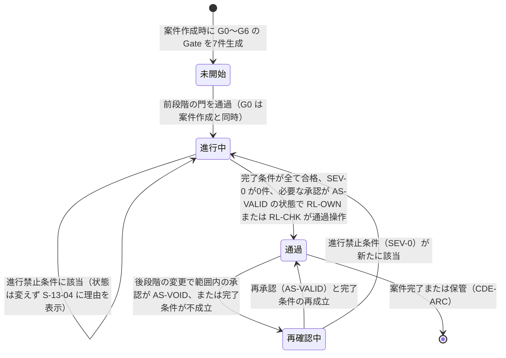
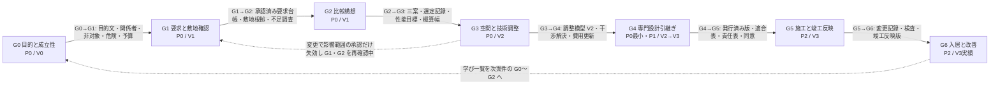
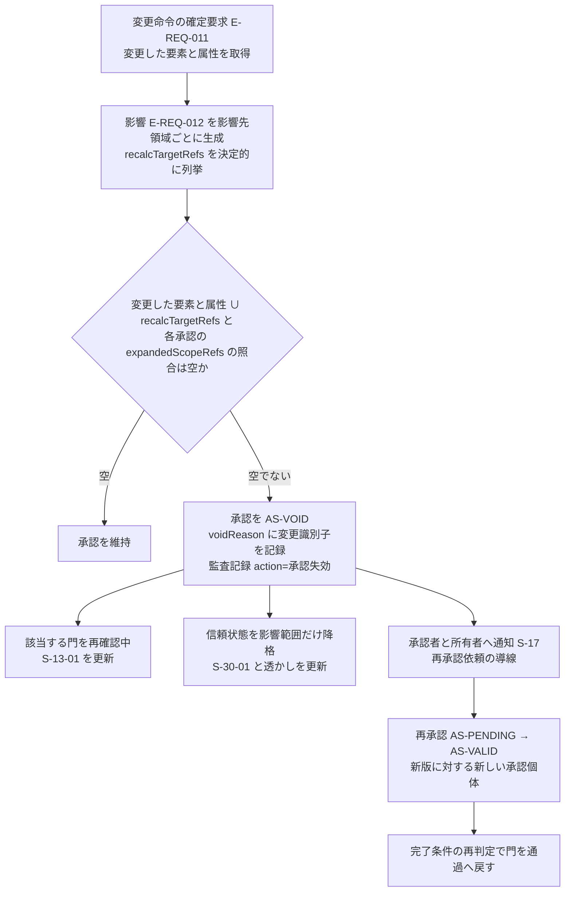

# 第06章 七つの設計段階門と、開始条件、成果、承認者、進行禁止条件

作成日: 2026-09-15　版: v1.4（2026-10-08 段階8 の最終仕上げ。再々確認の K1-05、K1-06、K6-11、K6-13、K6-14、K6-16、主2-01〜主2-03、主2-05、主2-07〜主2-12、主2-14、主2-16、主4-01、主4-04、主4-07、主4-08、主4-11、主4-21 と統括の決定 D30、D30b、D31、D34〜D36、D38、D41〜D44、D49 を反映。G1 完了条件(3)と第8.2節 I-00-105〜107 に利用目的による適用除外（G1(b) が非の家具配置、図面3D化、売却賃貸）、G2 の「利用目的による適用除外」に完了条件(4)(5)(7)の雛形の記号による当てはめ、F-C15-001 例外(c)に適用除外が外れた場合の再確認中を加え、G4 完了条件(7)と I-06-005 を P1 とし P0 は欠落の自動記録 (vii) に記録するとした。(vii) と I-00-116 の写し〔第2.4節、第8.2節、第8.3節〕を寸法変更の撤去、移設元の数え方、式(5)の参照の形にそろえて第8.2節 I-00-116 の version を第13章 第5.5節の v3.1 に同期し〔D49〕、解決証拠の型と「AS-VALID の」、却下の記録の属性〔rejectionScopeKind、rejectionQualificationSnapshot〕、発見の問題の解除成果と再登録しない句、X4 の「未解決」の第20章 第8.2節の参照、表示語の空白、T-R-010 の共有URL と信頼状態の据え置き、規則6 (d) の U-05-014 の参照、「追」の生成時点の字句を改めた。新しい識別子は作っていない。記録は `05_審査/再修正記録_最終仕上げ_群G2.md`）。v1.3（2026-10-08 段階8前の持ち越し仕上げ。共通の決定 D5、D6、既定値の識別子の併記 0 行。第8.3節 T-R-009 の販売終了の検知を P0 版 (6)〔同期結果 discontinued と台帳操作による SUP-DISC〕と P1 版〔表示直前の再確認、納期超過、価格の更新〕に書き分け〔正本は第16章 第6.4節。JR-083〕、第4節の注の EL-LAW の証明書の発行者を行政、確認検査機関、判定機関とした〔第12章 E-ORG-002.kind〕。D22〔G2 完了条件(9)の承知の規則の例示識別子〕は本文を確かめ不要と判断した〔U-06-020 のとおり〕。記録は `05_審査/再修正記録_段階8前_仕上げ_群F2.md`）。v1.2（2026-10-07 段階6 二回目の修正。再審査の統合指摘 42 件〔主担当 22 件、整合 20 件〕と 01_調査の番号置換への追従を反映。記録は `05_審査/再修正記録_2回目_第6章.md`。同日の二回目の修正の仕上げ〔群R1〕で、外部確認〔`01_調査/08_外部確認_段階7後.md`〕による I-06-004 の解除の記録、第8.2節 I-00-116 の version〔v3.0〕、法改正時の承認の失効の範囲〔第12章、第18章と同じ〕、U-06-020 の判断、第7.1節の出典ID を反映した。版は v1.2 のまま。記録は `05_審査/再修正記録_2回目_仕上げ_群R1.md`）。v1.1（2026-09-15 段階6 再修正。初稿審査の統合指摘 50 件（主担当 JM-019〜JM-040 の 22 件、整合 28 件）と整合修正指示 第6章 2 件を反映。記録は `05_審査/再修正記録_第6章.md`。2026-10-06 の段階6 仕上げ（相互依頼 群A）で、第8.2節への I-18-004、I-18-005 の登録と第13章、第18章、第19章の式と testRef の同期、I-00-116 の改装の範囲の訂正、第5.1節の entityKind と成功条件の格納先、資格の失効、AP-039 と AP-032 の参照、整合修正指示 第6章 1〜8 を反映した。版は v1.1 のまま。記録は `05_審査/再修正記録_相互依頼_群A.md`。同日の相互依頼 仕上げで、識別子一覧の AP-032、AP-039 を「参照（正本: 第14章）」の行に改めた（整合修正指示 第6章 1、2。記録は `05_審査/再修正記録_相互依頼_仕上げ.md`））　担当: 段階3 仕様書 第06章（一級建築士、製品責任者、BIM技術者、UX設計者の視点で作成）
根拠: 指示文 C15（段階門と情報引継ぎ）、10.4（七つの段階門）、10（建築家視点による再監査）、B（中心原則）、C10（共同作業と承認）、G（段階的な開発範囲）、9.1（V0〜V3）、10.6（人とAIの責任境界）、10.7（初期公開の優先順位）。基盤定義 `七段階門.md` v1.2、`信頼状態と証拠段階.md` v1.2、`識別子規則.md` v1.2、`十二判断領域.md` v1.2、`機能一覧骨格.md` v1.2、`情報実体骨格.md` v1.2、`画面指標試験骨格.md` v1.2、`用語集.md` v1.2、`整合検査報告.md` v1.1（第5節 識別子変更一覧）。修正計画 `05_審査/初稿審査/00_修正計画.md` 第1.6節、第0.4節、第5節、`05_審査/再審査/00_修正計画.md` 第1.6節、第0.3節、第0.4節。調査 `01_調査/06_研究と標準.md`。
確認日: 2026-09-15（外部確認の結果に基づく追記は 2026-10-07）。

## 0. 本章の目的、範囲と非対象、前提とする章

### 0.1 本章の目的

- 基盤 七段階門 G0〜G6 の定義を製品仕様へ展開する。各段階に開始条件、必要情報、主要判断（主担当領域付き）、必須成果（情報実体ID付き）、確認者（役割 RL- と資格）、完了条件、進行禁止条件（例示識別子付き、各3件以上）、進行禁止時に利用者へ示す表示内容、P0/P1/P2 の実装範囲を定める【推定】。
- 段階×領域（7×12）の交差表を確定し、第10章（追跡表）の「必要成果」列の元にする【推定】。
- 承認を確認範囲ごとに管理し、後の変更で影響範囲の承認だけを自動失効させる規則を定める【推定】。
- 段階門画面（S-13）との対応と、門を通過するときの記録項目（判断記録、承認記録、版）を定める【推定】。
- 担当機能 F-C15-001、F-C15-002、F-C15-003、F-C15-004、F-C15-005、F-C15-009、F-C15-014 の必須10項目と受入条件 AC- を定める【推定】。

### 0.2 本章の範囲と非対象

| 区分 | 内容 |
|---|---|
| 範囲 | G0〜G6 の段階門の仕様、交差表、承認の範囲別管理と自動失効の規則、S-13 との対応、通過時の記録、RIBA と国土交通省の段階との参照対応、担当7機能の機能要件 |
| 非対象（他章） | 確認範囲ごとの承認と自動失効の機能要件（F-C10-004、F-C10-005。第17章が主章、第22章が副章）。情報要求適合表、IDS検査、書出時の自動検査、例外承認、引継ぎ一式、組織別情報要求、承認された版の識別（F-C15-006〜008、F-C15-010〜013、F-C15-016、F-C15-017。第22章）。指標の計測（F-C15-015。第23章）。S-13 の部品の画面設計と空状態、待機状態、失敗状態の設計（第15章）。G5、G6 の機能の詳細（第21章。本章は段階門の定義と情報構造の保持のみ） |
| 非対象（製品外） | 建築士法等に基づく法的判断と署名、確認申請、行政協議。本章の段階門は行政手続を代替せず、EL-LAW の「法的適合」は証明書の登録と照合済みの資格を持つ RL-CHK の法規の承認がそろった時だけ表示する（第4節の注。指示文10.6、基盤 信頼状態 第3節）【推定】 |

### 0.3 前提とする章

| 章 | 前提として使う内容 |
|---|---|
| 第02章 | 完成像、六段の因果、指標の木（本章の段階が因果(4)承認と(5)引継ぎを担う） |
| 第05章 | 関係者表（E-ORG-008）、決定権、当事者参画（G0、G1 の確認者の元） |
| 第07章 | 十二判断領域 A01〜A12 と影響関係表（交差表の主担当、自動失効の影響範囲） |
| 第10章 | 追跡表（本章の交差表の必須成果を「必要成果」列へ転記する） |
| 第12章 | 正規建物情報、E-REQ-010 Gate、E-REQ-007 Approval、E-REQ-004 Decision、E-REQ-006 Revision の項目辞書と状態遷移 |
| 第15章 | S-13 段階門画面と補助画面 S-16、S-17、S-25 の部品設計 |
| 第17章 | 人への引継ぎ、個別同意、確認範囲ごとの承認の機能要件 |
| 第22章 | 情報要求適合表、書出検査、例外承認、監査記録、役割権限 |
| 第23章 | 非機能要件、受入条件と試験の対応、指標の計測 |

## 1. 段階門の総則

### 1.1 規則

| 番号 | 規則 | 内容 | 区分 |
|---:|---|---|---|
| 1 | 段階と門 | 案件（E-BLD-001）は G0〜G6 の七段階を持ち、各段階の個体は E-REQ-010 Gate（7件、案件作成時に生成）で表す。段階の完了条件を満たした時点が門であり `G2→G3` と書く。門を通過しない限り、次段階の必須成果を「完了」と表示せず、次段階に対応する信頼状態を表示しない（基盤 七段階門 第0節） | 【推定】 |
| 2 | 門の状態 | E-REQ-010.status は「未開始」「進行中」「通過」「再確認中」の四つ。状態符号は設けず日本語の enum 値を正とする（第12章 U-12-005、基盤 情報実体骨格 U-00-046 の解決。未決事項 U-06-001 は解決） | 【仮定】 |
| 3 | 判定の主体 | 開始条件、完了条件、進行禁止条件の判定は決定的検査（E-EXC-005 ValidationRule、kind=進行禁止、欠落属性、閉領域、接続、干渉 等）だけで行う。言語模型の出力は判定に使わず、説明文の生成にだけ使う。E-REQ-010 は confidence を持たない | 【推定】 |
| 4 | 判定の契機 | (a) 利用者の「次の段階へ進む」操作、(b) 信頼状態の昇格要求（V1→V2、V2→V3）、(c) 書出または共有の発行要求（CDE-PUB）。仮表示中（E-REQ-011.status=仮表示。その影響は E-REQ-012.isPreview=true。JR-028）の変更命令が1件以上ある案は書出と共有の発行を行えず、S-08 に「仮表示中の変更があります。確定または取消してください」を表示する（第22章 F-C15-011 の書出検査に含める。JM-166）、(d) 変更命令（E-REQ-011）の確定（origin=商品更新、単価改定、法改正 は製品による提案の生成。第5.3節 規則1）、(e) 承認の失効（AS-VOID）、(f) 新資料の取込。(d)〜(f) は通過済みの門の再判定（再確認中への遷移）に使う | 【仮定】 |
| 5 | 進行禁止条件 | 該当する問題は重大度 SEV-0 で登録し、E-REQ-010.blockingIssueRefs に含める。SEV-0 は検証規則（E-EXC-005）が付け、人の報告（構造、避難、防火、漏水、石綿含有、その他）も種別を入力に規則が付ける。人が直接選べる重大度は SEV-1〜3 に限る（第21章 第3節 承認手順(2)）。解除は解決（IS-RESOLVED、解決証拠付き）だけ。例外承認（IS-EXC）では解除できない。誤警告の却下（資格を登録した RL-CHK が理由を付けて IS-REJECTED にする。資格は P0 は本人申告〔未照合〕、P1 は照合済み。第5.2節「資格の照合状態」。JR-012）は解除の例外とし、解決ではなく blockingIssueRefs から除いて M-G-09 の分子に計上し、監査記録に残す。P0 で資格を登録した RL-CHK がいない案件では却下できず、元に戻す変更だけが復旧経路になる（第2.4節。JM-033） | 【仮定】 |
| 6 | 完了条件の例外 | SEV-1 の未解決問題は、確認者（RL-CHK）の例外承認（E-REQ-007、scopeKind=例外。理由、承認者、期限）で持ち越せる。SEV-2、SEV-3 は担当と期限を付けて持ち越せる。次の制限と例外を置く。(a) 資格制限: 主担当が A04（構造の荷重経路と第13章 第2.3節の構造注意 9 項目。JR-106）、A07 のうち避難、A06 のうち排水勾配、A05 のうち防火、A10 のうち石綿と工事前調査（JM-148）、A02 のうち法規判定（負の余裕量 I-18-002。JM-028）に関わる問題の例外承認は、資格を登録した RL-CHK だけが行える。P0 の「資格を登録した RL-CHK」は本人申告（未照合）の資格を持つ RL-CHK を指し、例外承認に「資格未照合（本人申告）」を表示する（JM-122）。P1 は照合済みの資格を持つ RL-CHK に限る（第5.2節。JR-012）。P0 で該当する RL-CHK が不在の案件は持ち越せず G3 で止まる（導線は第2.0節 項目8。未決 U-00-018 への判断。未決事項 U-06-002）。I-18-002 の例外承認は G2→G3 の持ち越しにだけ効き、G3 の門では I-06-006 が SEV-0 で該当する（JR-011）。(b) P0 の持ち越しの例外: 地盤仮定（第13章 第2.3節 項目9）、擁壁と地盤調査（第18章 第2.1節 項目9、10）、重い設備の載荷（第13章 第2.3節 項目7）、P0 対象外の構法による構造注意の判定不能（既存構造が未定の改装を含む。既存壁の撤去と移動を含む改装案は除き、I-00-116 と第21章の規則に従う）、不足調査に伴う A02 の SEV-1（第18章 第2.1節 項目1 測量、項目2 道路種別の行政照会）の五つの SEV-1 は、P0 では担当（RL-OWN）と期限（G4 の門）を付けて G3 を通過でき、G4 の情報要求適合表に欠落の自動記録 (i)（第2.5節）として記録する。期限（G4 の門）の意味: 受取側の RL-CHK が欠落 (i) を例外承認（scopeKind=例外、理由、期限）した時点で、持ち越した問題を IS-EXC（approverRef=受取側の RL-CHK）にし、期限を受取側の再設計範囲の期日にする。例外承認がない間は I-00-123 で G4 を通過させず、発行もしない。S-13-04 に対象ごとの定型文（例:「地盤調査未実施のまま次の段階へ進みます。受取側の構造設計者の再設計範囲になります」）と「建築士を招待する」（S-08、S-15、S-18）を表示する（JM-022、JR-014）。(c) 差替え漏れ（A12）の例外承認は、旧版を正本として採用する判断記録（第11章 第7.1節 手順4 (ii)）がある場合に限る（JM-063）。(d) 本人確認機会が未記録の RP-MUST の SEV-1（第5章 F-C01-014）は、代理入力者、または代理入力者と同一世帯の決定者による例外承認（isSelfApproval=true）では持ち越せない。例外承認者は関係者表（E-ORG-008）に行を持たない RL-CHK に限る（関係者表に行を持つ RL-CHK の例外承認は登録しない。S-13-02 に承認者の役割、資格の照合状態、関係者表との関係の有無を表示する。第5章 AC-C01-014-07。JR-032）。設計者行（建築士）に personRef で結ばれた RL-CHK を対象から外すか（家族、介護者等の行だけを対象にするか）は未決 U-05-014（表3 UM-054）とし、判断までは全ての行を対象とする（第5章の仮の扱いと同じであることを 2026-10-08 に確認）。P0 で RL-CHK が不在の案件は持ち越せず、本人確認機会の記録、または「辞退」「意思表示不可」の記録（決定者の承認付き）で解決する（第5章と同文。JM-013）。(e) 例外承認のうち exceptionKind=利用者判断（既存住宅状況調査など任意の工事前調査を実施しない選択等）だけは、(a) の例外として RL-OWN が理由を付けて行える。利用者判断の範囲に要求衝突の保留の延長を含めない（保留の延長は第2.2節 完了条件(2)の判断で扱う。JR-016）。法令で義務の調査（石綿事前調査等）の未了は SEV-0（I-00-130）であり利用者判断の対象にならない。施工安全に関わる仮定は確定扱いにしない旨を表示する（第5.1節 自己承認列。JM-072）。(f) P0 で資格を要しない範囲の例外承認は、共有URL（S-08）で招いた RL-CHK が行う（第5.1節 注記。JM-035） | 【仮定】 |
| 7 | 戻り | 後の段階の変更が前の段階の成果に影響した場合、影響範囲の承認だけを AS-VOID にし、案件全体を前段階へ戻さない。影響を受けた段階の門は「再確認中」とし、完了条件を再び満たすまで通過済みとして表示しない（第5節） | 【仮定】 |
| 8 | 飛越しの扱い | 門を通過していない段階の作業（例: G2 の途中で G3 の干渉検査を試す）は禁止しない。禁止するのは、その段階の成果を「完了」と表示すること、その段階に対応する信頼状態へ昇格すること、その段階の成果を発行（CDE-PUB）することの三つ。例外として I-00-130（石綿事前調査の未了）は、G5 の開始後、解体を含む施工中変更と検査記録の登録という段階内の操作を止める（第2.6節。P2。JR-031） | 【仮定】 |
| 9 | 案と段階 | 段階は案件単位で一つ。三案（E-REQ-005 Option ×3）は同じ段階を共有し、案ごとの信頼状態（V）は別に持つ。G2 の門は三案のうち選定された案で判定し、G3 以降は選定案とその分岐案で判定する | 【仮定】 |
| 10 | 初期公開 | P0 は G0〜G3 と G4 への最小引継ぎ（GLB、PDF平面、要求台帳、問題一覧、判断記録、標準の必要情報要求）を完成させる。G5、G6 は P2。ただし E-REQ-010 の7件、通過記録、版、責任、状態は P0 から保持する（指示文10.4、G） | 【推定】 |
| 11 | 信頼状態との対応 | 各段階で表示できる最大の信頼状態は第4節の表に従う。門を通過していない案は、その段階に対応する信頼状態へ昇格できない（基盤 信頼状態 第1.2節、V1→V2 条件(7)） | 【推定】 |
| 12 | 表示 | 段階と門の状態は S-13 段階門画面、S-16 案件一覧画面、S-30-01 信頼状態帯（導線）に表示する。表示語は「未開始」「進行中」「通過」「再確認中」の四語に固定し、「承認済み」「完了」を門の状態語として使わない | 【仮定】 |
| 13 | 交差単位の表示語 | P0 で有資格者が不在の交差（第3節の確認者（P0）列が「RL-OWN の受領確認のみ。専門家未割当」の交差）の必須成果には、承認個体の表示語「専門家未確認」を交差単位で付け、S-13-01 と書出の注記に表示する。「専門家未割当」は責任表の行の空欄（P0）を、「専門家未確認」は承認個体の表示語を指し、両者を混用しない（JM-104）。G3×A10、G3×A11 は P0 で「初期注意の表示のみ。確認者なし」とし、G4 の交換資料に「未確認の初期注意」として含める（JM-020） | 【仮定】 |

### 1.2 門の状態遷移

遷移「通過 → 再確認中」は決定的検査の結果だけで起こす。「再確認中 → 通過」は人の再承認を要し、自動では起こさない【仮定】。

### 1.3 各段階の定義項目（第2節の読み方）

| 項目 | 内容 | 対応する実体と属性 |
|---|---|---|
| 開始条件 | この段階を「進行中」にする条件 | E-REQ-010.startConditionResults |
| 必要情報 | 判断に使う入力。情報実体IDで示す | 各実体 |
| 主要判断 | 段階で下す判断と主担当領域。項番 (a)〜(f) を付け、源1（北極星指標 M-N-01 の分母の雛形。第2章 第4.3節）の正本とする（項番に「源1 対象外」と記した G2(d)、G3(f) は除く。JR-005）。第3節の交差表は主担当領域の割当表であり分母ではなく、「源1 対象」列で本項の項番と一対一に対応付ける（JM-001）。判断は E-REQ-004 Decision（gate=当該段階、isKeyDecision=true）として記録する | E-REQ-004 |
| 必須成果 | 門の通過に要る成果。情報実体IDと充足条件で示す | E-REQ-010.requiredDeliverables |
| 確認者 | 必須成果を確認する役割（RL-）と資格の要否。P0 と P1 で異なる場合は併記 | E-REQ-010.verifierRefs、E-ORG-007 Responsibility |
| 完了条件 | 観察可能な条件。全て合格で門を通過 | E-REQ-010.completionChecks |
| 進行禁止条件 | 該当時に SEV-0 として登録する条件。例示識別子 I-00-101〜I-00-133（基盤）と I-06-001〜（本章追加） | E-REQ-010.blockingIssueRefs |
| 進行禁止時の表示 | S-13-04 に表示する内容。第2.0節の共通構造に段階固有の「解除に必要な成果」と「導線」を加える | S-13-04 |
| 実装優先 | P0/P1/P2 の範囲 | — |
| 許される信頼状態 | 段階で表示できる最大の V | E-REQ-010.maxVerificationState |

## 2. 各段階の定義

### 2.0 進行禁止時に利用者へ示す表示内容（全段階共通の構造）

S-13-04 進行禁止理由は次の9項目を固定の順で表示する。項目5〜7は定型文とし、言語模型で生成しない【仮定】。

| 番号 | 表示項目 | 内容 | 出典となる実体と属性 |
|---:|---|---|---|
| 1 | 見出し | 「段階 G{n}→G{n+1} へ進めません」。門の識別と現段階名 | E-REQ-010.stage、status |
| 2 | 該当する条件 | 進行禁止条件の例示識別子（I-00-xxx、I-06-xxx）と一文。複数該当は全件を列挙し、件数を先頭に表示 | E-EXC-005.message |
| 3 | 該当する問題 | 問題番号（画面表示は「問題 #00017」、詳細で実行時識別子）、重大度 SEV-0、主担当領域、固定先（3D要素、2D位置、図面頁）へ開く操作 | E-REQ-003.severity、primaryDomain、anchor |
| 4 | 解除に必要な成果 | 成果名、対応する情報実体、到達すべき状態（例: 「用途地域を出典と版付きで登録」「尺度を VS-USR にする」） | E-EXC-005.fixHint、E-REQ-010.requiredDeliverables |
| 5 | 担当と期限 | 担当の役割（RL-）と氏名（表示名）、期限。未設定なら「担当未設定」と表示し設定操作を置く | E-REQ-003.assigneeRef、deadline |
| 6 | 解除方法の定型文 | 「この条件は例外承認では解除できません。解決証拠を登録すると自動で再判定されます」 | 固定文 |
| 7 | 信頼状態の据え置き | 「現在の案の信頼状態は V{x} のままです。次の段階で許される最大は V{y} です」 | E-REQ-005.verificationState、E-REQ-010.maxVerificationState |
| 8 | 導線 | 解除作業を行う画面への操作（S-02、S-05、S-09、S-24、S-10、S-08、S-20 等）。各条件に一つ以上。承認者または有資格者が不足する場合は S-13-03（承認者の設定）と S-22（専門家確認作業面。P1）への導線を明記する（JM-157）。P0 で資格を要する持ち越しや却下ができない案件では「建築士へ相談する」（S-08 の共有URL で招待 → 建築士が S-15 で資格を登録（本人申告）→ S-23-06 で誤警告の却下）を置き、「P0 では有資格者の確認による解除はできません」の定型文を添える（第2.4節。JM-023、JM-028） | 第2.1〜2.7節の表 |
| 9 | 検査状態 | 「検査日時」「検査規則の版」を表示し、「未検査」と「検査済み、該当なし」を別の文言で表示する（S-13-04-E は「検査済み、該当なし」のみに使う） | E-EXC-005.version、検査実行時刻 |

### 2.1 G0 目的と成立性

| 項目 | 内容 |
|---|---|
| 開始条件 | 三入口（希望から作る、図面を3D化、写真から改装）のいずれかと利用目的（新築、改装、家具配置、図面3D化、売却または賃貸資料）が S-01 で選択され、案件（E-BLD-001）が生成された。電子連絡先は不要。利用条件の同意（E-ORG-006 purpose=利用条件）が記録されている【推定】 |
| 必要情報 | E-BLD-001 の purpose、entryType、useType、region（都道府県以上）、budgetRange（「未定」可）、landStatus。家族の概略（E-ORG-008 の初期件数）、納期希望（E-SRV-015 Schedule の希望値）【推定】 |
| 主要判断 | (a) 誰の何を解くか、誰が決定権を持つか（主担当 A01）。(b) 土地、費用、期間の大枠が成立し、案件を進める価値があるか（主担当 A01、影響先 A02、A09）。(c) 利用条件の同意、非公開既定の共有設定、案件識別子の付与（主担当 A12。決定権は (a) の A01 の判断であり A12 で二重に所有しない。JM-027）【推定】 |
| 必須成果 | 目的文（E-BLD-001.purpose、VS-USR）。関係者表（E-ORG-008 ×1件以上、decisionAuthority を持つ者1名以上）。非対象（E-BLD-001.nonScope、S-01 の表示記録）。主要危険（E-SRV-007 Risk または E-SRV-012 HazardInfo の概略、0件の場合は「未取得」と明示）。初期予算（E-BLD-001.budgetRange、幅または「未定」）。案件識別子 PJ-（E-BLD-001.projectId）【推定】 |
| 確認者 | RL-OWN（所有者）。RL-CHK（建築士）は任意。P0 で有資格者の関与は要しない【推定】 |
| 完了条件 | (1) 目的文が VS-USR。(2) 関係者表に決定権を持つ者が1名以上。(3) 非対象が S-01 または S-02 で表示され、表示記録（E-EXC-007 action=閲覧）がある。(4) 主要危険が1件以上一覧化、または「概略地域の災害情報を未取得」と明示。(5) 初期予算が下限と上限の幅で記録、または「未定」を明示。(6) 利用条件の同意が記録されている【仮定】 |
| 進行禁止条件 | I-00-101 建設地域が都道府県も含めて不明。I-00-102 予算帯が未入力で「未定」の選択もない。I-00-103 土地の権利関係が全く不明（所有、候補あり、探索中、建替え、売却移転のいずれも未選択）。I-00-104 利用目的が非対象に該当する（例: 確認申請図の自動作成）。I-06-001 利用条件の同意が未記録のまま要求の入力を始めようとしている（本章追加、SEV-0）【仮定】 |
| 進行禁止時の表示 | 第2.0節の構造で、解除に必要な成果と導線は次表 |
| 実装優先 | P0【推定】 |
| 許される信頼状態 | V0（写真から改装の入口で意匠像を返す場合、および「希望から作る」入口で文章から作る構想案（F-C01-025 の初回成果）の場合）。文章からの構想案は、室構成の概略を雛形から決定的に合成し（寸法値を持たない）、意匠像は AP-039 V0 構想案生成（第14章。長期非同期。画像生成処理先が未契約、または種別「画像生成」の同意がない場合は意匠像なしで室構成の概略だけを返す）で作る（U-08-004 への判断。U-06-018、JM-030、JM-178。2026-10-06 に処理名を第14章の識別子へ置き換えた）。建物情報は未生成。S-30-01 は「建物情報なし」と表示【推定】 |

| 条件 | 解除に必要な成果（到達状態） | 導線画面 |
|---|---|---|
| I-00-101 | E-BLD-001.region に都道府県以上を入力 | S-02 |
| I-00-102 | E-BLD-001.budgetRange に幅を入力、または「未定」を選択 | S-02 |
| I-00-103 | E-BLD-001.landStatus を選択 | S-02 |
| I-00-104 | 利用目的の変更、または案件の終了。非対象の理由（指示文G節末尾の7項目のどれか）を表示 | S-01 |
| I-06-001 | E-ORG-006（purpose=利用条件）の status=有効 | S-15 |

### 2.2 G1 要求と敷地確認

| 項目 | 内容 |
|---|---|
| 開始条件 | G0 の門を通過している。家族情報と、土地資料（E-PRD-006 Source）または仮定（E-SRV-008 Assumption）が入力可能【推定】 |
| 必要情報 | 家族構成と生活行動（E-ORG-008、E-REQ-009 LifeScene 四群）、要求（E-REQ-001、分岐質問または自由記述）、敷地資料（E-BLD-002 Site、E-SRV-011 SiteRegulation、E-SRV-012 HazardInfo、E-SRV-001 Survey）または仮定、既存図面（図面3D化、改装の場合。E-PRD-006、利用権 RS-OWN の確認済み）、写真、所有家具（E-ELM-013 Furniture、実寸）【推定】 |
| 主要判断 | (a) 何を必須（RP-MUST）とし、何が未確認か（主担当 A01）。(b) 敷地制約と不足調査（主担当 A02）。(c) 既存図面の尺度と正本の判定（主担当 A12、図面入力時）。(d) 要素認識の受入（主担当 A03、図面入力時）。(e) 既存外皮の現況状態の受入（主担当 A05、改装時）。(f) 工事前調査（石綿事前調査等）の要否（主担当 A10、改装時）。(c)(d) は図面入力の案件、(e)(f) は改装の案件だけで源1 に入る（JM-027）【推定】 |
| 必須成果 | 承認済み要求台帳（E-REQ-001。priority、valueRange、sourceRef、deciderRef、verifierRef、confirmState=VS-USR 以上）。敷地根拠（E-BLD-002、E-SRV-011、出典と時点付き）。不足調査一覧（E-SRV-001、status=依頼）。図面入力時は V1 編集案（E-REQ-005、verificationState=V1）、原図重ね記録（E-SRV-009 Overlay）、確信度記録（E-SRV-010）、尺度確認記録（E-REQ-007 scopeKind=尺度、AS-VALID）。目的文、成功条件、非対象、変更できない条件（E-REQ-002 kind=変更できない条件）の承認記録（E-REQ-007 scopeKind=目的文、要求）【推定】 |
| 確認者 | 決定権者（目的文、要求。第5.1節の行の書式。JR-015）と RL-OWN（尺度）。RL-CHK 建築士（敷地根拠、要求の実現性）は P1 で必須、P0 では任意（U-00-015 は基盤 七段階門 v1.2 で解決。未決事項 U-06-003）。交差ごとの確認者（P0、P1）は第3.2節（JM-020）【仮定】 |
| 完了条件 | (1) RP-MUST の全件に sourceRef、deciderRef、verifierRef がある。(2) 検出した要求衝突の全件が S-24 で決定者へ表示され、解決候補と代償があるか、決定者の判断（E-REQ-004）が記録されている。保留は決定者の判断（E-REQ-004、選択肢=保留、理由必須、期限=G2 の門）として記録し、I-00-110 の解除条件と本条件を満たす。ただし双方が RP-MUST の衝突（X1、X2 で双方 RP-MUST）は保留できず、G1 で優先度の変更か取下げを要する（G2 で I-00-111 に該当するため）。RP-MUST と RP-WANT 以下の衝突の保留は G2 の門で SEV-1 の問題とし（決定者の「保留の期限の延長」の判断〔E-REQ-004、判断種=衝突の解決、scopeKind=要求、mode に従い合議は全員の coApprovalRefs。G3 の門までの一回、理由必須〕で G3 へ持ち越せる。JR-016）、RP-WANT 同士の保留は SEV-2 とする（第5章 第4.2.1節、第8章 F-C01-020 と同文。JM-047）。(3) 境界、接道、用途地域の重大不明が解消しているか、不足調査（E-SRV-001）に登録されている。対象外地域（第18章 第5節）では法規判定を「対象外」と表示し、不足調査「行政照会」の登録で本条件を満たす（U-06-019、JM-029）。利用目的別の生成で G1(b) が非の利用目的（家具配置、図面3D化、売却賃貸）では、敷地の項目（境界、接道、用途地域）を非該当とし、I-00-105〜107 を登録しない（第2章 第4.3節。第2.3節「利用目的による適用除外」と同じ型。統括の決定 D30）。(4) 図面入力時は尺度と重要寸法1件以上が VS-USR。(5) 目的文、成功条件、非対象、変更できない条件が承認されている。P0 は RL-OWN と決定権者が承認し、専門家の承認欄を「未承認」と表示する。P1 では照合済みの資格を持つ建築士（RL-CHK。第5.2節）の確認範囲を明示した承認を必須にする（JM-195、JR-012）。(6) 入力資料の全件に利用権の確認記録（RS-OWN または RS-OK）がある。(7) 同一図面番号の頁が複数ある、または差替え漏れ、欠落、混入が検出された場合、正本の確定（E-REQ-004、D-11-001 相当。決定者、理由、版）が全図面番号について記録されている（図面一式は P1。JM-024）【仮定】 |
| 進行禁止条件 | I-00-105 境界資料も仮定もなく配置検討へ進もうとしている。I-00-106 接道の有無が不明。I-00-107 用途地域が不明で法規判定ができない。I-00-108 図面入力で尺度が未確認、または尺度の整合検査の警告が未承知のまま、寸法の表示または V2 判定へ進もうとしている（JM-064）。I-00-109 必須要求に決定者がいない。I-00-110 要求衝突が検出されているのに未表示。I-06-003 図面一式の正本候補が未確定（同一図面番号の候補頁が2以上、差替え漏れ、欠落、混入のいずれかに確定判断がない）のまま、G1→G2 の門の通過（三案生成の有無を問わない）または V2 判定へ進もうとしている（本章追加、SEV-0。G4 で再検査。図面一式は P1。JM-024、JR-048）【仮定】 |
| 進行禁止時の表示 | 第2.0節の構造で、解除に必要な成果と導線は次表 |
| 実装優先 | P0（単一縮尺の明瞭な PDF、PNG、JPEG。希望入力）。図面一式、ベクトル PDF、DXF、SVG、IFC の入力と正本候補判定は P1【推定】 |
| 許される信頼状態 | V1（図面入力時の編集案）。希望入力のみの場合は建物情報を生成しない【推定】 |

| 条件 | 解除に必要な成果（到達状態） | 導線画面 |
|---|---|---|
| I-00-105 | 境界資料（E-PRD-006）の登録、または仮定（E-SRV-008）の登録と不足調査「測量」（E-SRV-001）の登録。境界線に「法的境界ではない」の注記 | S-09 |
| I-00-106 | 道路種別と接道長さの入力（E-BLD-002）、または不足調査「行政照会」の登録 | S-09 |
| I-00-107 | 用途地域の入力（E-SRV-011、出典、版、取得日）、または不足調査「行政照会」の登録 | S-09 |
| I-00-108 | 基準寸法1件以上の指定、整合検査の実行、警告がある場合は各警告について利用者が理由（自由記述 20 字以上。例: 「玄関の親子扉を現地で実測し幅 1,600 mm を確認した」。JR-049）を付けて承知した記録（E-REQ-007.acknowledgedWarnings）、尺度の承認（E-REQ-007 scopeKind=尺度、AS-VALID）。理由のない承知は受け付けない（JM-064。AC-C15-002-02 と同文） | S-05-03 |
| I-00-109 | 該当要求の deciderRef に E-ORG-008 を設定 | S-24 |
| I-00-110 | 衝突の表示（S-24）と、決定者の判断（E-REQ-004、gate=G1）の記録 | S-24 |
| I-06-003 | 正本の確定（全図面番号について決定者、理由、版を E-REQ-004 に記録）。差替え漏れの図面番号は、新版頁の追加取込、旧版を正本として採用する判断、引継ぎ資料からの除外のいずれかを選ぶ（第11章 第7.1節 手順4）。混入の頁は案件からの除外の確定判断、欠落の図面番号は頁の追加取込、または欠落のまま進める判断（理由必須）と情報要求適合表への欠落の記録で確定する（JR-048） | S-05-06 |

### 2.3 G2 比較構想

| 項目 | 内容 |
|---|---|
| 開始条件 | G1 の門を通過している（承認済み要求台帳、敷地根拠、不足調査）【推定】 |
| 必要情報 | 要求台帳（E-REQ-001）、敷地制約（E-REQ-002 kind=敷地制約、法規制約）、生活場面（E-REQ-009）、家具の概略寸法（E-ELM-013）、好み（E-REQ-001 の A08 要求）、性能の優先度（E-REQ-001 の A07 要求）、予算内訳（E-SRV-014 CostItem）【推定】 |
| 主要判断 | (a) どの考え方（空間構成）を進めるか（主担当 A03、影響先 A01）。(b) 性能目標をどこに置くか（主担当 A07）。(c) 概算幅と期間（主担当 A09）。(d) 選定の決定者、確認者、版（主担当 A12。源1 対象外。選定の承認範囲と版の固定は F-C15-014 正常手順(9)と門の判定 F-C15-003 で扱う。JR-005）。(e) 将来場面（家族変化群の該当場面）への対応の採否（今の設計に反映、将来変更で対応、対応しないのいずれか。主担当 A11、影響先 A03、A09。該当場面がある案件だけ源1 に入る。第2章 第4.3節、JM-007）【推定】 |
| 必須成果 | 三案（E-REQ-005 kind=三案_生活動線重視、三案_費用重視、三案_意匠重視、各 V1、同期2Dと3D）。同一評価軸の比較（S-03。生活、空間、技術、費用、性能の5軸）。各案の adoptionReason、droppedRequirementRefs、openItemCount、costRange、confidence。要求適合表（Option↔Requirement）。性能目標（E-SRV-013 PerformanceTarget、十領域、EL-TGT）。概算（E-SRV-005 Estimate、工種別の幅、単価時点、地域）。選定記録（E-REQ-004 gate=G2、isKeyDecision=true、selectedOptionRef、rationale に代償と未解決点）と選定の承認（E-REQ-007 scopeKind=選定）【推定】 |
| 確認者 | 決定権者（選定の決定者。第5.1節 選定の行。JR-015）。RL-CHK 建築士（案の成立性）は P1 で必須、P0 では任意。交差ごとの確認者（P0、P1）は第3.3節（JM-020）【仮定】 |
| 完了条件 | (1) （I-00-111 に該当しない範囲で）三案すべてが RP-MUST を満たすか、満たさない要求を案ごとに droppedRequirementRefs で明示している（JM-036）。(2) 選定記録に deciderRef、rationale（理由、代償、未解決点）がある。(3) 構造（E-SYS-001.structuralNoteRefs）、避難（E-SYS-003 kind=避難）、排水（E-SYS-003 kind=排水）の初期注意が各案に表示されている。(4) 概算が工種別の幅で表示され、単価時点と地域がある。(5) 十領域の全項目に EL-TGT の目標値、または「未設定」の明示がある。「未設定」の項目は S-11-02 と G4 の未確認事項に残す。非常時の RP-MUST に結ぶ目標（温熱、耐震）は「未設定」を許さない（JM-031）。(6) 選定の承認（scopeKind=選定）が AS-VALID。(7) 家族変化群の 7 場面に該当有無と時期があり、試行結果または「試行未実施」が案別に表示されている（P0 は該当有無、時期、「試行未実施」の表示まで。試行 E-REQ-009.trialResult は P1。JM-037）。(8) G2 で新たに検出された衝突（X1〜X8）が決定者へ表示され、決定者の判断（保留を含む）が記録されている（JR-038。案の生成時の隣接室の再検出を含み、E-REQ-001.conflictRecords に optionRefs を持つ。I-00-110 を G2 でも判定する）。(9) 未確認の必須要求（非常時の RP-MUST）の各件に決定者の承知の記録がある（JR-024。承知の記録は理由 20 字以上、P1 または受取側の設備設計者が判定すること、日時。E-REQ-007 scopeKind=要求 の acknowledgedWarnings）。欠ける場合は SEV-1 とし、例外承認ではなく承知の記録で解決する（第8.2節。JR-024）。(10) 改装案件（P1）では全現況要素に renovationAction が付き、未指定 0 件（S-27-03）。規則は I-06-009（第8.2節。F-C15-003 の完了条件の規則）とし、P0 は S-13-01 に「改装区分の指定は P1」と表示する（JR-022）【仮定】 |
| 利用目的による適用除外 | 利用目的が図面3D化または売却賃貸資料で RP-MUST が0件の案件は、分岐案一つで G2 を通過できる。その場合 I-00-113 は適用除外とし、S-03 に「三案比較なし（利用目的による）」を表示する。RP-MUST が 1 件以上になった時点（第2章 第4.3節の記号「追」の生成時点）で三案を要する（U-08-005 への判断。U-06-018、JM-030）。この場合 G2(a) の選択肢は「読み込んだ案」と「分岐案」の 2 件とし、第2章 第4.2節の項目2 を満たす（F-C15-014 例外(c) の除外。JR-001）。完了条件(4)（概算。G2(c)）、(5)（十領域の目標。G2(b)）、(7)（家族変化。G2(e)）は第2章 第4.3節の雛形の記号に従い、「非」の利用目的では非該当、「追」は RP-MUST の追加で該当、「条」は条件（該当する将来場面〔E-REQ-009.isFuture=true〕がある案件）に該当すれば該当とする。家具配置: (4)(5) は非該当、(7) は条件。図面3D化と売却賃貸資料: (4)(5) は RP-MUST が 1 件以上になった時点から該当、(7) は非該当（統括の決定 D30b）【仮定】 |
| I-00-111 の判定式 | RP-MUST（変更できない条件 E-REQ-002 isHard=true を含む）の各要求について、適合する案が0件の要求が1件以上ある（三案の droppedRequirementRefs の積集合に RP-MUST が含まれる）とき SEV-0 を登録する。完了条件(1)より優先して判定する。判定区分が「未確認（P1で判定）」の RP-MUST（P0 の非常時要求等）は不適合に数えない（JM-044）。判定区分が「未判定（P1）」の要求（将来場面の試行で判定する要求と主担当 A11 の要求。第8章 F-C01-023 正常手順(8)）も droppedRequirementRefs に入れず不適合に数えない（JM-156。2026-10-06 に第8章の依頼で明記）。予算上限（E-REQ-002 isHard=true）の案別判定は X4 と同じ値で行う（建築費の下限が上限を超える案を不適合、中央値だけが超える案は適合〔注記「予算超過の可能性」〕）。全案が不適合のときは I-00-111（SEV-0）だけを登録し、X4 は I-00-111 の解除のための解決候補と代償の表示に使う。一案でも適合するときは X4 の規則だけで扱う（第8章 F-C01-023 例外(a)と同文。JR-026）。解除は、決定者の要求変更（priority を RP-WANT 以下へ、または valueRange の変更）の判断記録（E-REQ-004 gate=G2）と三案の再生成とする。第8章 第7.20節 F-C01-023 例外(a)へ同じ式を転記する（JM-036）【推定】 |
| 進行禁止条件 | I-00-111 必須要求を満たす案が一つもない。I-00-112 重大危険（避難経路なし、傾斜地の擁壁未検討等）が案に未表示。I-00-113 三案が同一評価軸で比較されていない。I-00-114 概算が単一額で表示されている。I-00-115 選定記録に決定者がない。I-00-110 G2 で新たに検出された要求衝突が決定者へ未表示（G1 と同じ規則。完了条件(8)。JR-038）【仮定】 |
| 進行禁止時の表示 | 第2.0節の構造で、解除に必要な成果と導線は次表 |
| 実装優先 | P0【推定】 |
| 許される信頼状態 | V1【推定】 |

| 条件 | 解除に必要な成果（到達状態） | 導線画面 |
|---|---|---|
| I-00-111 | 決定者の要求変更（priority を RP-WANT 以下へ、または valueRange の変更）の判断記録（E-REQ-004 gate=G2）と三案の再生成（JM-036） | S-24、S-03 |
| I-00-112 | 危険（E-SRV-007 Risk または E-REQ-003）の表示。製品側の検査失敗の場合は再試行 | S-03、S-09 |
| I-00-113 | 評価軸の再計算（製品側。S-03-W の後に再判定）。利用者の操作は不要と表示 | S-03 |
| I-00-114 | 概算の幅への再計算（製品側）。単価情報の失効時は単価時点の更新 | S-12 |
| I-00-115 | E-REQ-004（gate=G2）.deciderRef の設定と選定の承認 | S-03、S-25 |
| I-00-110 | G1 と同じ（衝突の表示 S-24 と、決定者の判断 E-REQ-004 gate=G2 の記録。保留は第2.2節 完了条件(2)の規則。JR-038） | S-24 |

### 2.4 G3 空間と技術調整

| 項目 | 内容 |
|---|---|
| 開始条件 | G2 の門を通過している（選定案と選定記録）【推定】 |
| 必要情報 | 選定案（E-REQ-005）、構造形式仮定（E-SYS-001.structureType、E-SRV-008）、外皮方針（E-MAT-003 Assembly の方針）、設備系統の仮定（E-SYS-002 ServiceSystem、E-SYS-003 Route）、商品候補（E-PRD-001）、費用（E-SRV-005）、性能目標（E-SRV-013）【推定】 |
| 主要判断 | (a) 空間側の調整（扉開閉域、通路幅、家具余白、主要断面、階高）が成立するか（主担当 A03）。(b) 荷重経路が成立するか（主担当 A04）。(c) 層構成と接合部が成立するか（主担当 A05）。(d) 機器と経路が干渉なく成立するか（主担当 A06）。(e) 商品が実寸で収まるか（主担当 A08）。(f) V2 の判定と承認範囲（主担当 A12。源1 対象外。V2 の判定は F-C15-004、承認範囲は門の判定 F-C15-003 で扱う。JR-005）。(b)〜(e) は各自の判断を持ち、A03 の影響先として調整する。「空間、構造、外皮、設備、内装、商品が大枠で共存するか」の総合判断は源1 の重要判断として数えず、門の完了条件の判定（F-C15-003）で扱う（U-00-016 の解決。JM-027）【仮定】 |
| 必須成果 | 調整模型（E-REQ-005、V2 の昇格条件を満たす版）。主要断面（Option の版から生成する派生表示、1面以上）。干渉一覧（E-REQ-003 SEV-0 が0件、SEV-1 が IS-RESOLVED または IS-EXC）。商品一覧（E-PRD-001 の全件に PT- と RS- の表示）。費用更新（E-SRV-005、変更影響 E-REQ-012 付き）。性能予測（E-SRV-004 Calculation、E-SRV-013 EL-CAL。P0 は簡易な日照と動線）。V2 判定記録（E-REQ-010.completionChecks）と確認範囲別の承認（E-REQ-007 scopeKind=尺度、間取り、商品、費用。P1 で構造、外皮、設備を追加）【推定】 |
| 確認者 | RL-OWN（商品、費用、主要寸法の利用者確認 VS-USR）。RL-CHK 建築士は P0 で任意（推奨）、P1 で必須。P1 では構造設計者、設備設計者が各確認範囲を担当（未決事項 U-06-003）。交差ごとの確認者（P0、P1）は第3.4節で、G3×A10、G3×A11 は P0 で確認者なし（第1.1節 規則13。JM-020）【仮定】 |
| 完了条件 | (1) 荷重経路（I-00-116）、排水（I-00-117）、避難に SEV-0 の問題がない。避難は第19章 第2.2節の I-19-001 相当の SEV-0 が IS-RESOLVED であることで判定する（JM-031）。(2) 当該案の未解決の SEV-1（S-10-03 問題一覧の干渉、構造注意、施工成立性の注意と、不足調査の requestedGate 超過、法規判定 I-18-002 を含む全主担当の SEV-1）が IS-RESOLVED または IS-EXC。ただし第1.1節 規則6 (b) の対象の SEV-1 は、P0 では担当（RL-OWN）と期限（G4 の門）を付けて通過でき、第2.5節 欠落の自動記録 (i) に記録する（JM-022、JR-014、JR-106）。(3) 尺度、外周、開口、室、階段、主要寸法が VS-USR 以上。(4) 低確信度要素（lowConfidence=true）が0件。(5) 主要断面が1面以上存在する。(6) 商品の層と権利状態が全件表示されている。(7) 費用が変更影響付きで更新されている。(8) V1→V2 の昇格条件（基盤 信頼状態 第1.2節の(1)〜(7)）を全て満たす。改装案件の付帯条件（撤去、補修、補強、移設の要素が CS-DRW または CS-EST のまま）は I-06-008（P1、SEV-1、主担当 A10。第8.2節）で登録して完了条件(2)で判定し、V2 に「現況未確認（n 要素）」を併記する（P0 は併記の表示だけ。JR-021）。(9) scopeKind=尺度、間取りの承認が AS-VALID（P1 の間取りは照合済みの資格を持つ建築士の承認を要する。第5.2節。JR-012）。(10) 要求衝突 X4（予算上限と概算下限）が未解決（最新の再判定で X4 の SEV-1 が IS-RESOLVED でない、または判断が未完了。定義は第20章 第8.2節）の場合、費用の承認（scopeKind=費用）に衝突注記「予算上限との衝突 未解決（差 n〜m 万円）」がある（JM-026、統括の決定 D44）【仮定】 |
| 進行禁止条件 | I-00-116 荷重経路に未解決の重大問題（吹抜け上の梁跨度超過等。改装案件の既存外周壁または上下階連続壁の撤去と、耐力壁候補線上の新設開口を含む。P0 は案の変更命令で現況要素を削除、移動、寸法変更したときに自動で付いた撤去と移設を含み、第13章 第5.5節 式(5)で判定する〔移設は移設元を、寸法変更は変更前の要素を撤去として数える。JR-095、統括の決定 D34、D36〕。候補線上のその他の壁の撤去、移設、補強は SEV-1（第13章 第5.5節、U-13-014 の解決）。基盤 七段階門 v1.2、JM-094 (1)。2026-10-06 相互依頼で範囲を訂正）。I-00-117 排水勾配が成立しない経路が残る。I-00-118 避難経路が未解決。I-00-119 低確信度の壁または開口が残存している。I-00-120 主要寸法に未確認の既定値（VS-DEF）が残る。I-00-121 正規商品以外を実商品として表示している。I-06-006 法規判定の余裕量が負で未解決（G3 と G4 で判定。定義は第2.5節。JR-011）。I-06-007 発見の問題（石綿含有、構造部材の腐朽と蟻害）が未解決（P1。重大度の付与は第8.2節。JR-013）【仮定】 |
| 進行禁止時の表示 | 第2.0節の構造で、解除に必要な成果と導線は次表 |
| 実装優先 | P0（基本の構造形式と通り芯の仮定、主要設備置場と経路帯、外皮方針、基本家具、簡易な日照と動線、干渉検査）。構造、外皮、設備の詳細調整と詳細な性能計算、構造設計者と設備設計者の確認範囲は P1【推定】 |
| 許される信頼状態 | V2（完了条件を満たした時点で昇格）【推定】 |

| 条件 | 解除に必要な成果（到達状態） | 導線画面 |
|---|---|---|
| I-00-116 | P0: 開口幅を戻す、壁位置を耐力壁候補線へ寄せる（A03 の変更命令）、階高と天井高の変更で IS-RESOLVED。P1: 耐力要素の移動（F-C11-004）、梁の変更、照合済みの資格を持つ RL-CHK（構造設計者、建築士。第5.2節）の AS-VALID の確認記録（E-REQ-007 scopeKind=構造。S-22）。改装案件の撤去（P0 は現況要素の削除、移動、寸法変更に自動で付いた撤去と移設〔移設は移設元を、寸法変更は変更前の要素を撤去として数える。統括の決定 D34、D36〕、P1 は S-27-03 の指定）は「残す」に戻す変更命令（元に戻す変更）で IS-RESOLVED とし（P0 の解除はこれだけ。JR-095）、撤去を維持する場合（P1）の解決証拠は、撤去後の計画の版（baseRevisionRef）を対象とし撤去する壁を scope に含む AS-VALID の構造の確認記録（E-REQ-007 scopeKind=構造。照合済みの資格。第5.2節。統括の決定 D41）に限る。耐震診断（E-SRV-001 kind=耐震診断）の記録は確認記録の入力に限り、単独では解除しない（第13章 第5.5節 式(5)、第10.2節 例外(e)。JM-094、JR-066）。部材寸法と安全性は製品が確定しない旨を表示（JM-023） | S-10、S-04、S-22（P1） |
| I-00-117 | P0: 経路変更、立管の追加と移動、階高と天井高の変更で E-SYS-003.slope が成立し IS-RESOLVED。P1: 梁の変更（F-C11-004）、設備設計者の確認記録（scopeKind=設備。S-22）（JM-023） | S-10-08（経路帯と立管の編集。JM-115）、S-22（P1） |
| I-00-118 | 避難経路（E-SYS-003 kind=避難）の確保と検査合格 | S-10、S-04 |
| I-00-119 | 該当要素の修正または確認（valueStates を VS-USR 以上へ） | S-05-02 |
| I-00-120 | 該当寸法の値の確認（VS-DEF → VS-USR） | S-04-04 |
| I-00-121 | 商品層と権利状態の表示修正（製品側）、または代替形状のみ配置への置換 | S-06、S-04-05 |
| I-06-006 | 第2.5節の解除表と同じ（JR-011） | S-09-04、S-10 |
| I-06-007 発見の問題（石綿含有、構造。P1） | 石綿含有（含有とみなす判断を含む）: (a) 該当要素の renovationAction と処分区分（第12章 DV-CO-07 の「含有あり」）で解体撤去の費用幅と期間が更新され（工程の規則は足さない）、(c) 判断（E-REQ-004。resolvesIssueRefs に当該の発見の問題を持ち、判断者は照合済みの資格の RL-CHK〔確認者 verifierRef。第5.2節〕）が記録されて当該問題の resolutionEvidenceRef に置かれた時に IS-RESOLVED とし、G3 の門は (a)(c) で判定する。(b)「除去等の作業と報告は元請業者等が行い製品外」と I-06-004 の予告（届出対象特定工事では発注者または自主施工者に作業開始の 14 日前までの届出の義務がある旨〔大気汚染防止法 第18条の17。SRC-314、確認日 2026-10-07〕を含む）は、製品が引継ぎ一式の未確認事項に自動で記載する（第21章 第2.3節 (4)、第22章 F-C15-013 正常手順(4)と同じ。統括の決定 D41、D43）。構造部材の腐朽と蟻害: 補強または交換の設計変更（renovationAction=補強、または撤去と新設）と AS-VALID の構造の確認記録（scopeKind=構造。P1 は照合済みの資格。第5.2節）で IS-RESOLVED。例外承認では解除しない（JR-013） | S-27-04、S-25、S-12 |

P0 で資格を登録した RL-CHK がいない案件の復旧導線（JM-023）: P0 では有資格者の確認記録による解除はできず、復旧経路は上表の P0 の成果（元に戻す変更）だけである。S-13-04 の項目8 に「建築士へ相談する」の操作を置き、共有URL（S-08）で案件を建築士へ共有し、建築士が S-15 で RL-CHK として資格を登録（本人申告、未照合。JM-122）した後に、誤警告であれば S-23-06 で理由付きの却下（IS-REJECTED。第1.1節 規則5）を行える。確認記録（scopeKind=構造、設備）による解除は P1（S-22）とする。S-13-04 の定型文は「P0 では有資格者の確認による解除はできません。開口（経路）を戻すか、建築士に相談してください」とする（第15章へ依頼）【仮定】。

### 2.5 G4 専門設計引継ぎ

| 項目 | 内容 |
|---|---|
| 開始条件 | G3 の門を通過している（V2 の案）。受取側の必要情報要求（E-EXC-001。P0 は本製品の標準の必要情報要求、P1 は IDS または組織別要求）が指定されている【推定】 |
| 必要情報 | V2 案（E-REQ-005）、要求台帳（E-REQ-001）、問題一覧（E-REQ-003）、判断記録（E-REQ-004）、承認記録（E-REQ-007）、商品一覧（E-PRD-001）、費用（E-SRV-005）、必要情報要求（E-EXC-001）、送信先ごとの同意（E-ORG-006 purpose=外部送信）【推定】 |
| 主要判断 | (a) 誰が確認するか（責任表 E-ORG-007。主担当 A12）。(b) 何を誰へどこまで送るか（主担当 A12）。(c) 何を再設計対象とするか（再設計範囲。主担当 A03、影響先 A04〜A06）。再設計範囲は (c) の A03 に一本化し、A12 では所有しない（JM-027）【推定】 |
| 必須成果 | 情報要求適合表（E-EXC-002.validationResult。合否、欠落、不一致、例外承認）。要求台帳（E-REQ-001。承認済み、追跡付き。未解決または保留の要求衝突の一覧を含む。JM-026）。問題一覧（E-REQ-003、担当と期限付き）。責任表（E-ORG-007、役割×作成、確認、承認、通知、空欄0）。交換資料（E-EXC-002 Delivery。P0: GLB、PDF平面、要求台帳、問題一覧、判断記録。P1: IFC、SVG、DXF、BCF）。個別同意記録（E-ORG-006、送信先ごと）。正本（E-REQ-006 cdeState=CDE-PUB が一つ）。承認された版の識別子と交換時点【推定】 |
| 確認者 | 受取側の RL-CHK 建築士。P0: 資格は本人申告（未照合）であり、S-13-03、責任表の書出、引継ぎ一式に「資格未照合（本人申告）」を表示し、V3 と VS-PRO には使わない。P1: 資格は照合済みとし、構造設計者、設備設計者を確認範囲ごとに追加する（JM-122）。組織案件では案件側の情報管理担当（RL-EDT）。RL-OWN（同意、発行）。運営側の情報管理者は案件の確認者にならない（第22章 第1.3節。JM-034）。交差ごとの確認者は第3.5節【推定】 |
| 完了条件 | (1) 情報要求検査が合格、または不合格項目の全件に例外承認（E-REQ-007 scopeKind=例外。理由、承認者、期限）がある。(2) 正本が明示され、CDE-PUB の版が一つだけある。(3) 承認範囲が確認範囲（scopeKind）ごとに明示され、AS-VALID または「未承認」と明示されている。(4) 責任表（E-ORG-007）に空欄がなく、受諾（accepted=true）が全行にある。(5) 送信先ごとの同意が記録されている。(6) 受取側が交換資料から元図（E-PRD-006）、要求、問題へ戻れることを確認した記録（E-EXC-007 action=閲覧、受取側）がある。(7) 改装案件（P1。E-BLD-001.useType=改装、かつ要素の renovationAction に撤去、補修、補強、移設がある）では、解体後判明時の 4 項目（判断者、費用予備、代替案の型、承認手順）が、kind=解体後判明の工事前定義 の E-REQ-004 の unforeseenPlan に空なく記録されている（既定値で埋まる費用予備の幅は定義済みに数えない。第21章 第3節。JM-025、JR-058）。規則は I-06-005（第8.2節）とし、P0 は判定せず、欠落の自動記録 (vii) に「解体後判明時の 4 項目 未定義（P1）」として記録する（4 項目を記録する F-C14-003 は P1。G2 完了条件(10)の I-06-009 と同じ型。統括の決定 D35）。(8) 未解決または保留の要求衝突（X1〜X8。X4 の「未解決」は第20章 第8.2節の定義〔最新の再判定で X4 の SEV-1 が IS-RESOLVED でない、または判断が未完了〕による）が要求台帳と問題一覧に「未解決」として含まれ、交換資料の未確認事項に転記されている（JM-026、統括の決定 D44）【仮定】 |
| 欠落の自動記録（P0） | 情報要求適合表（E-EXC-002.validationResult）に次を欠落または未確認事項として自動記録し、交換資料に含め、責任表の受取側の行（再設計範囲または確認対象）に結ぶ。(i) 規則6 (b) の持ち越し（地盤: 調査未実施、構造: 重量物の載荷の確認未了〔太陽光 n m²、浴槽、蓄電池等〕、構造: P0 対象外の構法、境界: 測量未実施〔仮定の境界〕、道路種別: 未確認〔行政照会未了〕。いずれも受取側の再設計範囲または確認対象。受取側の例外承認による IS-EXC と期限は第1.1節 規則6 (b)。JM-022、JR-014）。(ii) 設備干渉: 未検査（P1）（P0 で未検査の干渉種別4、5、7 と、種別3、6 のうち P0 範囲外の部分。P0 範囲は種別3 が経路帯の下端と要求天井高の寸法比較、種別6 が点検口と機器の間の梁の交差検査に限る〔第13章 第5.2節〕。受取側の設備設計者の再設計範囲。JM-105）。(iii) 未確認の初期注意（G3×A10、G3×A11。第1.1節 規則13、JM-020）。(iv) 未確認の必須要求（非常時の RP-MUST で判定区分が「未確認（P1で判定）」のもの。G2 完了条件(9)の承知者と日時を併記。JM-044、JR-024）。(v) 尺度: 警告承知あり（n 件）、残差検査不能（寸法文字なし）、実測照合 n 件（JM-064、JR-047）。(vi) 未解決または保留の要求衝突（完了条件(8)、JM-026）。(vii) 改装（P0）: 工事前調査の要否 未判定（P1）、解体後判明時の 4 項目 未定義（P1）、現況未確認 n 要素、隠れ部分 未確認、解体撤去の処分区分 石綿含有未確認（幅の上側。撤去 n 要素。n は現況要素の削除と寸法変更〔短縮、延長、既存開口の拡大と縮小、回転。変更前の要素〕に自動で付いた撤去を含み、図面読解の修正で消した要素を含まない。第21章 第2.1節 規則(7)。統括の決定 D34、D38）（JR-095）。(viii) 性能: 計算予測なし（P0）の目標 n 件（RP-MUST を含む）。(ix) 将来場面: 試行未実施（場面名、時期）。(x) 利用円滑性: 数値検査 未検査（P1）（当事者確認の状態を併記）（(viii)〜(x) は JR-025。情報要求適合表への記載の受入条件は第22章 F-C15-007 の AC-C15-007-04）【推定】 |
| 進行禁止条件 | I-00-122 発行済み（CDE-PUB）扱いの版が複数あり正本が一意でない（入力資料の正本未確定は I-06-003 で扱う。JM-024）。I-00-123 必須属性の欠落に例外承認がない。I-00-124 承認範囲が不明。I-00-125 同意のない送信先が含まれる。I-00-126 V1 の案を引継ぎ対象にしている。I-06-003 図面一式の正本候補が未確定（G1 の条件の再検査。SEV-0。JM-024）。I-06-005 改装案件で解体後判明時の 4 項目（判断者、費用予備、代替案の型、承認手順）のいずれかが未定義（本章追加、SEV-0。P1。P0 は判定せず、欠落の自動記録 (vii) に記録する。JM-025、統括の決定 D35）。I-06-002 責任表（E-ORG-007）に空欄または未受諾の行がある（本章追加、SEV-0。機能一覧骨格 F-C15-009 の合格条件「責任表の空欄が0でなければ G4 を通過しない」を進行禁止条件として登録）。I-06-006 法規判定の余裕量が負で未解決（I-18-002 が IS-RESOLVED でない。G3 と G4 で判定。本章追加、SEV-0。G3 では G3 の門の通過を止め、G4 では再検査する〔I-06-003 と同じ型〕。負の余裕量の条項ごとの問題は I-18-002（SEV-1。G2、G3）として登録し、I-18-002 の例外承認〔第1.1節 規則6 (a)〕は G2→G3 の持ち越しにだけ効く。第18章 第4.4節、JM-019、JR-011）。I-06-007 発見の問題（石綿含有、構造部材の腐朽と蟻害）が未解決（P1。G3 と G4 で判定。第2.4節、第8.2節。JR-013）【仮定】 |
| 進行禁止時の表示 | 第2.0節の構造で、解除に必要な成果と導線は次表 |
| 実装優先 | P0（最小引継ぎ: GLB、PDF平面、要求台帳、問題一覧、判断記録、責任表、標準の必要情報要求、個別同意）。IFC、IDS、BCF、組織別情報要求、有資格者確認による V3 昇格は P1【推定】 |
| 許される信頼状態 | V2。有資格者が確認範囲を明示して承認した範囲だけ V3（P1）。案の表示状態は全確認範囲の最低状態【推定】 |

| 条件 | 解除に必要な成果（到達状態） | 導線画面 |
|---|---|---|
| I-00-122 | 発行済み版を一つに確定（他の版を CDE-ARC へ） | S-08 |
| I-06-003 | G1 と同じ（正本の確定。図面一式は P1） | S-05-06 |
| I-00-123 | 欠落属性の補完（該当要素の valueStates を更新）、または例外承認（scopeKind=例外、理由、承認者、期限） | S-08、S-04-04 |
| I-00-124 | 確認範囲ごとの承認の登録（scopeKind と scope を明示） | S-13-03、S-08 |
| I-00-125 | 送信先ごとの個別同意（E-ORG-006 status=有効）、または送信先の除外 | S-20 |
| I-00-126 | 対象案の V2 昇格（G3 の門の通過）、または引継ぎ対象を V2 の案へ変更 | S-13-05 |
| I-06-002 | 責任表の空欄の充填と受諾の記録（E-ORG-007.accepted=true） | S-13-03 |
| I-06-005（P1） | 4 項目（判断者、費用予備、代替案の型、承認手順）の記録（kind=解体後判明の工事前定義 の E-REQ-004.unforeseenPlan。工事前定義は第21章 F-C14-003。JR-058）。P0 では判定しない（欠落の自動記録 (vii)） | S-25、S-12 |
| I-06-006 | 形状または配置の変更（A03 の変更命令）の後に法規判定（E-SRV-004 kind=法規判定）を再実行し、全条項の余裕量が 0 以上になって I-18-002 が IS-RESOLVED になる。例外承認では解除しない（誤警告の却下は第1.1節 規則5 の例外）。判定は助言であり法的な判断を代替しない旨を表示する | S-09-04、S-10 |
| I-06-007 発見の問題（石綿含有、構造。P1） | 第2.4節の解除表と同じ（JR-013） | S-27-04、S-25、S-12 |

### 2.6 G5 施工と竣工反映（P2）

| 項目 | 内容 |
|---|---|
| 開始条件 | 承認済み設計（V3 の案。P0、P1 では V2 と有資格者確認記録の組で代替しない。V3 が無い案件は G5 を開始しない）、契約（E-REQ-002 kind=変更できない条件として工事範囲、金額、変更手順）、施工情報（施工者 E-ORG-002 kind=施工会社、工程 E-SRV-015、施工図または製作図の予定）がある【推定】 |
| 必要情報 | V3 案、契約、施工図と製作図（E-PRD-006）、検査計画（E-SRV-003 Test）、工事前調査の結果（E-SRV-001。改装では石綿事前調査等）【推定】 |
| 主要判断 | (a) 承認案と現場差をどう承認し記録するか（主担当 A10）。(b) 竣工時建物情報の正本化（主担当 A12）【推定】 |
| 必須成果 | 変更記録（E-REQ-011 origin=現場変更、siteChangeInfo に理由、提案者、金額、期間、設計意図、承認）。検査記録（E-SRV-003、EL-SITE の証拠）。竣工時建物情報（E-REQ-005 kind=竣工反映版、E-OPS-006 AsBuiltDelta）。機器台帳の元情報（E-PRD-004 Asset）【推定】 |
| 確認者 | 施工者（RL-PART）、監理者と建築士（RL-CHK、照合済みの資格。第5.2節）【推定】 |
| 完了条件 | (1) 未承認の現場変更が0件。(2) 計画した検査（E-SRV-003）が全件完了し記録がある。(3) 竣工差分（E-OPS-006）のうち竣工反映版に未反映の差が0件、changeRecordRef（承認済み変更記録。第12章 E-OPS-006 の属性名。2026-10-06 に修正計画 JM-032 の仮の語 changeCommandRef から改めた）が null の差が0件。竣工反映版の発行は scopeKind=書出（必要な段階 G5）と影響先範囲の承認の組で扱う（U-21-001 への判断。U-06-017、JM-032）。(4) 機器台帳の元情報（品番、保証、取扱説明、試運転結果）がそろっている【仮定】 |
| 進行禁止条件 | I-00-127 未承認の現場変更がある。I-00-128 検査未了の部位がある。I-00-129 構造、避難、防火に関わる危険な相違がある。I-00-130 解体を伴う工事で石綿事前調査が未了（G5 の開始後、解体を含む施工中変更と検査記録の登録を受け付けない。段階内の操作の停止であり第1.1節 規則8 の例外。JR-031）。I-06-004 石綿含有建材の発見（分析結果で含有あり、または含有とみなす判断）に対し、特定粉じん排出等作業の結果の報告書面（大気汚染防止法 第18条の23第1項。元請業者から発注者へ。自主施工の場合は自主施工者の記録〔同条第2項〕。製品外の手続の結果。E-PRD-006 kind=証明書または調査報告）が未登録（本章追加、SEV-0。G5→G6 の門〔竣工反映版の発行〕を止める。JR-031。G5 は P2 のため P0、P1 では警告に留める。製品は手続の要否と報告の内容〔除去の適否〕を判定せず、記録の受入と未登録の問題化だけを行う。作業の写真記録〔石綿障害予防規則 第35条の2。事業者が保存する記録〕は任意の添付で、解除の条件にしない。条文は SRC-314、SRC-315、確認日 2026-10-07【事実】。第21章 第2.4節、JM-148、`01_調査/08_外部確認_段階7後.md` 第3節）。I-06-004 は同じ発見を参照する別の条件（記録の未登録）であり、発見の問題（設計段階 G3、G4 では I-06-007 で重大度を付け、第2.4節の解除表で解決する）を G5 で再登録しない（JR-013）【仮定】 |
| 進行禁止時の表示 | 第2.0節の構造。導線は S-14（引渡しと維持）、S-23（問題一覧）。I-06-004 の解除に必要な成果は作業結果の報告書面（大気汚染防止法 第18条の23第1項。自主施工は自主施工者の記録）の登録（E-PRD-006。作業の写真記録は任意の添付）で、導線は S-14、S-23。P0、P1 では S-14 は情報構造のみで、G5 の門は「未開始」と表示する |
| 実装優先 | P2。ただし E-REQ-010（G5）、E-REQ-011 の origin=現場変更、E-OPS-006、E-SRV-003 の識別子と属性は P0 から保持する【推定】 |
| 許される信頼状態 | V3（竣工反映版として版を進める）【推定】 |

### 2.7 G6 入居と改善（P2）

| 項目 | 内容 |
|---|---|
| 開始条件 | 引渡し情報（竣工時建物情報、機器台帳 E-PRD-004、保証 E-OPS-003、取扱説明 E-OPS-002）がある。入居後確認の利用同意（E-ORG-006 purpose=入居後確認）がある。学習同意（purpose=学習利用）は別に持ち、既定は無効【推定】 |
| 必要情報 | 竣工時建物情報、機器台帳、保証、目標（EL-TGT）と計算予測（EL-CAL）、現場確認（EL-SITE）、実測または実感の入力（E-OPS-007 PostOccupancyRecord）【推定】 |
| 主要判断 | (a) 目標と実績の差をどう直し、何を学ぶか（主担当 A11）。(b) 学習利用の同意と匿名化（主担当 A12）【推定】 |
| 必須成果 | 入居後確認（E-OPS-007。温熱、光、音、空気、動線、収納、費用、保守の8項目）。維持計画（E-OPS-004 MaintenanceTask、E-OPS-005 ReplacementCycle、機器台帳と結合）。学び一覧（E-OPS-007 の匿名化記録。元要求と判断へ結合）【推定】 |
| 確認者 | RL-OWN（所有者）、維持担当（RL-PART または RL-EDT）、RL-CHK 建築士【推定】 |
| 完了条件 | (1) 入居後確認が8項目で取得されている。(2) 維持計画が機器台帳と結合している。(3) 学びが元の要求（E-REQ-001）と判断（E-REQ-004）へ結ばれ、匿名化されている（M-G-15 が0件）。(4) 学習利用の同意状態が記録されている【仮定】 |
| 進行禁止条件 | I-00-131 緊急不具合（漏水、構造、防火）が未対応。I-00-132 個人情報の同意が不足したまま入居後確認を取得しようとしている。I-00-133 学習利用に別同意がないのに学び一覧へ登録しようとしている【仮定】 |
| 進行禁止時の表示 | 第2.0節の構造。導線は S-14、S-20（同意管理）、S-23 |
| 実装優先 | P2。E-REQ-010（G6）、E-OPS-007、E-ORG-006 の purpose 値は P0 から保持する【推定】 |
| 許される信頼状態 | V3（実績付き）。保管後は CDE-ARC【推定】 |

### 2.8 段階の流れと門の位置（概略）

## 3. 段階×領域の交差表（7×12）

基盤 七段階門 第3節（v1.2）と同じ内容を持ち、必須成果に情報実体IDを付けた。有無が「有」の交差の「主要判断」はその段階でその領域が主担当として下す判断であり、E-REQ-004 Decision（gate=当該段階、primaryDomain=当該領域）として記録する（「影響先」の交差は下の定義）。「該当なし」は理由を付け、空欄を作らない。第10章はこの表の必須成果を追跡表の「必要成果」列へ転記する【推定】。表の区分はすべて【仮定】（基盤の判断を維持）。

v1.1 で次の三列を加えた（JM-001、JM-020）。本節が三列の正本であり、基盤 七段階門 第3節と表4（責任表）の表4-1 は本節に追従する【推定】。

- 源1 対象（雛形の記号）: 本表は主担当領域の割当表であり、北極星指標 M-N-01 の分母（源1）ではない。源1 の正本は第2.1〜2.7節の主要判断 (a)〜(f) であり、本列で一対一に対応付ける（例: `G1(c)` は第2.2節 主要判断(c)）。第2章 第4.6節の例示 D-02- を併記する。対応しない「有」の交差は「（源1対象外）」と記し、分母に入れない。
- 有無の値（JR-017）: 「有」は当該領域が主担当として判断を持つ交差、「無」は該当なし（理由付き）、「影響先（記号）」（例: `影響先（G0(b)）`）は記号の源1 の判断の影響先として成果を受ける交差である。この値の交差は E-REQ-004 を作らず、記号の判断の Impact（E-REQ-012）として記録する。主要判断列には受ける成果を書き（「確認、再設計する範囲」の語は使わない）、確認者（P0、P1）列は成果の受領確認者を示す（承認者ではない。表4 では受領確認 R と承認 A の記号で区別する）。G0×A02、G0×A09、G2×A01、G4×A04〜A06 の 6 交差がこの値である。
- 確認者（P0）と確認者（P1）: 交差ごとに必須成果を確認する役割（RL-）。P0 で有資格者が不在の交差は「RL-OWN の受領確認のみ。専門家未割当」とし、その交差の必須成果には承認個体の表示語「専門家未確認」を交差単位で付ける（第1.1節 規則13）。G3×A10、G3×A11 は P0 で「初期注意の表示のみ。確認者なし」とし、G4 の交換資料に「未確認の初期注意」として含める。RL-CHK 建築士の資格は P0 では本人申告（未照合）である（JM-122）。G5、G6 は P2 のため両列は「—（P2）」とし、確認者は第2.6節、第2.7節に従う。

### 3.1 G0 目的と成立性 × 領域

| 領域 | 有無 | 主要判断 | 必須成果（情報実体） | 源1 対象（雛形の記号） | 確認者（P0） | 確認者（P1） |
|---|---|---|---|---|---|---|
| A01 | 有 | 誰の何を解くか、何をしないか、誰が決定権を持つか（JM-027） | 目的文（E-BLD-001.purpose）、関係者表（E-ORG-008。決定権を持つ者を含む）、決定権（E-ORG-008.decisionAuthority）、非対象（E-BLD-001.nonScope）、成功条件（E-BLD-001.successCriteria。承認は scopeKind=目的文。第12章 v1.2） | G0(a) 誰の何を解くか、誰が決定権を持つか（D-02-001）。G0(b) 案件を進める価値（D-02-002） | RL-OWN（決定権者を含む） | 同左。RL-CHK 建築士は任意 |
| A02 | 影響先（G0(b)） | 建設可否の大枠の根拠（概略地域、土地状況区分、主要危険）の提示 | 概略地域（E-BLD-001.region）、土地状況区分（landStatus）、主要危険の概略（E-SRV-012 HazardInfo） | （源1対象外。G0(b) の影響先） | RL-OWN の受領確認のみ。専門家未割当 | RL-CHK 建築士（任意） |
| A03 | 無 | 該当なし。理由: 要求と敷地が未確定で空間案を作らない | 該当なし | — | — | — |
| A04 | 無 | 該当なし。理由: 形が未定で構造形式を仮定できない | 該当なし | — | — | — |
| A05 | 無 | 該当なし。理由: 形が未定 | 該当なし | — | — | — |
| A06 | 無 | 該当なし。理由: 形が未定 | 該当なし | — | — | — |
| A07 | 無 | 該当なし。理由: 性能の優先度は A01 の要求として取得し、目標は G2 で置く | 該当なし | — | — | — |
| A08 | 無 | 該当なし。理由: 好みの写真や様式は A01 の要求として取得する | 該当なし | — | — | — |
| A09 | 影響先（G0(b)） | 初期予算の幅と納期希望の提示 | 初期予算（E-BLD-001.budgetRange）、納期希望（E-SRV-015 Schedule） | （源1対象外。G0(b) の影響先） | RL-OWN | RL-OWN。RL-CHK 建築士は任意 |
| A10 | 無 | 該当なし。理由: 案が未定 | 該当なし | — | — | — |
| A11 | 無 | 該当なし。理由: 将来の家族変化は A01 の生活場面（E-REQ-009）として取得する | 該当なし | — | — | — |
| A12 | 有 | 利用条件の同意、非公開既定の共有設定、案件識別子の付与をどう扱うか（決定権は A01。JM-027） | 利用条件の同意（E-ORG-006）、非公開既定の共有設定（E-EXC-006 の初期値）、案件識別子（E-BLD-001.projectId） | G0(c) 利用条件の同意と情報の扱い（D-02-019） | RL-OWN | RL-OWN |

### 3.2 G1 要求と敷地確認 × 領域

| 領域 | 有無 | 主要判断 | 必須成果（情報実体） | 源1 対象（雛形の記号） | 確認者（P0） | 確認者（P1） |
|---|---|---|---|---|---|---|
| A01 | 有 | 何を必須とし、何が未確認か | 承認済み要求台帳（E-REQ-001）、生活場面一覧（E-REQ-009）、要求衝突と解決候補と代償（E-REQ-001↔E-REQ-001、E-REQ-004。保留も判断記録） | G1(a) 必須要求の確定（D-02-003） | RL-OWN と決定権者 | RL-OWN と決定権者。RL-CHK 建築士（要求の実現性） |
| A02 | 有 | 敷地制約は何か、何を調査へ回すか | 敷地根拠（E-BLD-002、E-SRV-011、出典と時点）、法規判定（E-SRV-004、版付き）、不足調査一覧（E-SRV-001 status=依頼） | G1(b) 敷地制約と不足調査（D-02-004） | RL-OWN の受領確認のみ。専門家未割当（敷地根拠は出典と時点の表示で代替し、scopeKind=敷地 の承認は G1 通過操作で代替） | RL-CHK 建築士（敷地根拠。scopeKind=敷地） |
| A03 | 有（図面入力時） | 既存図面の室、壁、開口の認識結果を受け入れるか。希望入力のみの場合は該当なし（理由: 空間案は G2 で生成） | 図面入力時: V1 編集案（E-REQ-005）、原図重ね記録（E-SRV-009）、閉領域と接続の確認（E-SYS-005、E-SPC-001.isClosed）。希望入力時: 該当なし | G1(d) 要素認識の受入（図面入力時） | RL-OWN（認識結果の受入） | RL-OWN。RL-CHK 建築士は任意 |
| A04 | 有 | 構造に関する既存資料と地盤資料の有無をどう扱うか | 構造資料の有無、地盤資料の有無（E-SRV-001 へ登録） | （源1対象外） | RL-OWN の受領確認のみ。専門家未割当 | RL-CHK 建築士（構造設計者は G3 以降） |
| A05 | 有（改装時） | 既存外皮の現況状態の受入（改装時）。新築では該当なし（理由: 外皮方針は G2 以降。JM-027） | 改装時: 外皮要素の現況状態（E-ELM-001.conditionState 等の CS-）。新築: 該当なし | G1(e) 既存外皮の現況状態の受入（改装時） | 改装時: RL-OWN の受領確認のみ。専門家未割当 | 改装時: RL-CHK 建築士 |
| A06 | 有 | 供給条件と既存設備の余力をどう扱うか | 供給条件（E-BLD-002。給排水、電気、通信、雨水放流）、既存設備の現況状態（E-ELM-012.conditionState） | （源1対象外） | RL-OWN の受領確認のみ。専門家未割当 | RL-CHK 建築士（設備設計者は G3 以降） |
| A07 | 有 | 性能目標候補の技術的な妥当性の初期確認（性能の優先度は A01 の要求として G1(a) で扱う。JR-027） | 性能目標候補と、その根拠になる A07 の要求（E-REQ-001。災害耐性、利用円滑性を含む）の技術的な妥当性の初期確認の記録 | （源1対象外。目標は G2(b)） | RL-OWN | RL-OWN。RL-CHK 建築士（目標候補の妥当性） |
| A08 | 有 | 所有家具と好みをどう整理するか | 所有家具一覧（E-ELM-013、実寸 VS-USR）、好み（E-REQ-001。写真、素材、避けたい様式） | （源1対象外） | RL-OWN（所有家具の実寸確認 VS-USR） | 同左 |
| A09 | 有 | 予算内訳と土地費の希望 | 予算内訳（E-SRV-014 CostItem。建築費、土地費、家具費、予備費、借入希望） | （源1対象外） | RL-OWN | RL-OWN |
| A10 | 有（改装時） | 工事前調査（石綿事前調査等）の要否（改装時）。新築では該当なし（理由: 案が未定。JM-027） | 改装時: 不足調査（E-SRV-001）に工事前調査の要否。新築: 該当なし | G1(f) 工事前調査の要否（改装時） | 改装時: RL-OWN の受領確認のみ。専門家未割当（P0 は固定注記で義務を伝える） | 改装時: RL-CHK 建築士（工事前調査の要否） |
| A11 | 有 | 将来場面と保守の優先度 | 将来場面一覧（E-REQ-009 isFuture=true）、保守優先度（E-REQ-001） | （源1対象外） | RL-OWN | RL-OWN |
| A12 | 有 | 図面一式の正本、尺度、出典、入力資料の権利をどう確定するか | 正本候補の判定記録と正本の確定（E-PRD-006.isMasterCandidate、E-REQ-004）、尺度確認記録（E-REQ-007 scopeKind=尺度。警告承知の記録 acknowledgedWarnings を含む）、入力資料の利用権確認（E-PRD-005、RS-）、目的文と要求の承認記録（E-REQ-007 scopeKind=目的文、要求） | G1(c) 尺度と正本の判定（図面入力時） | RL-OWN（尺度、正本、目的文の承認。自己承認） | RL-OWN。RL-CHK 建築士（正本判定の確認は任意） |

### 3.3 G2 比較構想 × 領域

| 領域 | 有無 | 主要判断 | 必須成果（情報実体） | 源1 対象（雛形の記号） | 確認者（P0） | 確認者（P1） |
|---|---|---|---|---|---|---|
| A01 | 影響先（G2(a)） | 案別の要求適合表と捨てた条件の提示（F-C01-023） | 案別の要求適合表（E-REQ-005↔E-REQ-001）、捨てた条件（E-REQ-005.droppedRequirementRefs） | （源1対象外。G2(a) の影響先） | RL-OWN と決定権者 | 同左。RL-CHK 建築士 |
| A02 | 有 | 各案が敷地制約と法規に収まるか | 案別の法規判定（E-SRV-004、余裕量）、配置の敷地適合 | （源1対象外） | RL-OWN の受領確認のみ。専門家未割当 | RL-CHK 建築士（法規判定） |
| A03 | 有 | どの空間構成を進めるか | 三案の配置、平面、断面、三次元案（E-REQ-005 ×3、V1）、動線比較（E-SYS-003 kind=動線）、選定記録（E-REQ-004 gate=G2） | G2(a) 空間構成の選定（D-02-007） | RL-OWN（選定の決定者） | RL-OWN。RL-CHK 建築士（案の成立性） |
| A04 | 有 | 各案の構造形式仮定と初期注意 | 構造形式仮定（E-SYS-001.structureType）、通り芯仮定（E-BLD-005）、構造注意（E-SYS-001.structuralNoteRefs。跨度、大開口、吹抜け、上下階のずれ） | （源1対象外） | RL-OWN の受領確認のみ。専門家未割当（構造注意は初期注意の表示） | RL-CHK 建築士（構造設計者を追加可） |
| A05 | 有 | 各案の外皮方針 | 外皮方針（屋根形状、断熱区分、窓の方針、防火。E-MAT-003 の方針値） | （源1対象外） | RL-OWN の受領確認のみ。専門家未割当 | RL-CHK 建築士 |
| A06 | 有 | 各案の主要設備置場と経路帯の仮定 | 主要設備置場（E-ELM-012）、経路帯の仮定（E-SYS-003）、外部機器の位置 | （源1対象外） | RL-OWN の受領確認のみ。専門家未割当 | RL-CHK 建築士（設備設計者を追加可） |
| A07 | 有 | 性能目標をどこに置くか | 性能目標（E-SRV-013、十領域、EL-TGT または「未設定」の明示）、簡易な日照と通風の比較（E-SRV-004） | G2(b) 性能目標（D-02-008） | RL-OWN（目標の決定者）。専門家未割当 | RL-OWN。RL-CHK 建築士 |
| A08 | 有 | 各案の基本家具と内装方針 | 基本家具配置（E-ELM-013）、内装方針、商品層（PT-）の表示 | （源1対象外） | RL-OWN | RL-OWN |
| A09 | 有 | 案別の概算幅と期間 | 工種別概算幅（E-SRV-005）、案別の費用差、長納期品の候補（E-SRV-016） | G2(c) 概算幅と期間（D-02-009） | RL-OWN（概算の受容） | RL-OWN。RL-CHK 建築士（概算の前提） |
| A10 | 有 | 各案の施工上の主要危険 | 施工成立性の初期注意（E-REQ-003 primaryDomain=A10。搬入、傾斜地、仮設） | （源1対象外） | 初期注意の表示のみ。確認者なし（専門家未割当） | RL-CHK 建築士（施工者 RL-PART は提携先推薦 C08 が P1） |
| A11 | 有 | 各案の可変性と維持の差、将来場面への対応の採否 | 可変性比較（P0: 将来場面の該当有無、時期、案別の「試行未実施」の表示。P1: 将来場面の試行結果 E-REQ-009.trialResult。JM-037） | G2(e) 将来対応の採否（該当場面がある案件のみ。D-02-021） | RL-OWN（該当有無と時期の記録） | RL-OWN。維持担当は未割当 |
| A12 | 有（源1対象外） | 選定の決定者、確認者、版 | 選定の承認（E-REQ-007 scopeKind=選定）、案の版（E-REQ-006）、V1 表示、確信度（E-REQ-005.confidence） | （源1対象外。G2(d)。選定記録の承認範囲と版の固定は F-C15-014 正常手順(9)と門の判定 F-C15-003。JR-005） | RL-OWN（選定の承認。自己承認） | RL-OWN |

### 3.4 G3 空間と技術調整 × 領域

| 領域 | 有無 | 主要判断 | 必須成果（情報実体） | 源1 対象（雛形の記号） | 確認者（P0） | 確認者（P1） |
|---|---|---|---|---|---|---|
| A01 | 有 | 調整後も要求を満たすか | 要求適合の再判定、未解決点の更新（E-REQ-005.openItemCount） | （源1対象外） | RL-OWN と決定権者 | 同左 |
| A02 | 有 | 調整後も法規に収まるか | 法規判定の更新（E-SRV-004。高さ、斜線、防火、日影。P0 で判定しない斜線、日影、防火は「未判定（P1）」と表示し「指摘なし」と表示しない。第18章 第4.3節、JM-128） | （源1対象外） | RL-OWN の受領確認のみ。専門家未割当 | RL-CHK 建築士 |
| A03 | 有 | 空間側の調整（扉開閉域、通路幅、家具余白、主要断面、階高）が成立するか。共存の総合判断は門の完了条件の判定（F-C15-003）で行い、源1 の重要判断としない（JM-027） | 調整模型（E-REQ-005、V2）、主要断面（派生表示）、扉開閉域、通路幅、家具余白の検査結果 | G3(a) 空間側の調整（D-02-022） | RL-OWN（主要寸法の利用者確認 VS-USR） | RL-OWN。RL-CHK 建築士 |
| A04 | 有 | 荷重経路が成立するか | 通り芯と柱梁配置（E-BLD-005、E-ELM-005、E-ELM-006）、荷重経路の注意（E-SYS-001.loadPath）、必要資料一覧（requiredDocuments）、構造問題の解決状態（E-REQ-003） | G3(b) 荷重経路（D-02-012） | RL-OWN の受領確認のみ。専門家未割当（SEV-0 の解除経路は元に戻す変更のみ。第2.4節） | RL-CHK 建築士、構造設計者（scopeKind=構造） |
| A05 | 有 | 層構成と接合部が成立するか | 層構成（E-MAT-003）、接合部検査（E-MAT-005 Junction）、熱橋、結露、雨水侵入の指摘（E-REQ-003 A05） | G3(c) 層構成と接合部（D-02-013） | RL-OWN の受領確認のみ。専門家未割当 | RL-CHK 建築士（scopeKind=外皮） |
| A06 | 有 | 機器と経路が干渉なく成立するか | 系統（E-SYS-002）、機器置場、経路帯（E-SYS-003）、干渉一覧（E-REQ-003）、点検口と交換搬出（E-SYS-003 kind=点検、交換搬出） | G3(d) 機器と経路（D-02-014） | RL-OWN の受領確認のみ。専門家未割当（SEV-0 の解除経路は経路変更等の元に戻す変更のみ。第2.4節） | RL-CHK 建築士、設備設計者（scopeKind=設備） |
| A07 | 有 | 計算予測が目標を満たすか | 性能予測（E-SRV-004、E-SRV-013 EL-CAL。P0 は簡易）、十領域の目標、予測、未確認の一覧 | （源1対象外） | RL-OWN の受領確認のみ。専門家未割当（P0 は簡易な予測） | RL-CHK 建築士（scopeKind=性能） |
| A08 | 有 | 商品が実寸で収まるか | 商品一覧（E-PRD-001。PT-、RS-）、配置検査結果、代替品 | G3(e) 商品の実寸適合（D-02-015） | RL-OWN（商品） | RL-OWN |
| A09 | 有 | 調整の費用と期間への影響 | 費用更新（E-SRV-005、E-REQ-012 付き）、長納期品（E-SRV-016）、期間（E-SRV-015） | （源1対象外） | RL-OWN（費用） | RL-OWN。RL-CHK 建築士（費用の前提） |
| A10 | 有 | 施工が成立するか | 施工検討（搬入、揚重、順序、公差）、施工問題（E-REQ-003 A10） | （源1対象外） | 初期注意の表示のみ。確認者なし（G4 の交換資料に「未確認の初期注意」として含める） | RL-CHK 建築士。施工者 RL-PART（提案） |
| A11 | 有 | 交換と点検が成立するか | 交換経路（E-SYS-003 kind=交換搬出）、点検空間、維持上の指摘 | （源1対象外） | 初期注意の表示のみ。確認者なし（同上） | RL-CHK 建築士。維持担当（RL-PART または RL-EDT） |
| A12 | 有（源1対象外） | V2 の判定と承認範囲 | V2 判定記録（E-REQ-010.completionChecks）、確認範囲別の承認（E-REQ-007）、変更差分記録（E-REQ-011）、未確認項目数 | （源1対象外。G3(f)。V2 の判定は F-C15-004。JR-005） | RL-OWN（V2 判定の受領。自己承認） | RL-OWN。RL-CHK 建築士（確認範囲ごと） |

### 3.5 G4 専門設計引継ぎ × 領域

| 領域 | 有無 | 主要判断 | 必須成果（情報実体） | 源1 対象（雛形の記号） | 確認者（P0） | 確認者（P1） |
|---|---|---|---|---|---|---|
| A01 | 有 | 引継ぎ内容が要求を反映しているか | 要求台帳（E-REQ-001。承認済み、追跡付き、未解決または保留の要求衝突の一覧を含む。JM-026） | （源1対象外） | RL-OWN | RL-OWN。受取側 RL-CHK |
| A02 | 有 | 不足調査の依頼と敷地根拠の引継ぎ | 敷地根拠、不足調査の依頼状態（E-SRV-001.status） | （源1対象外） | 受取側 RL-CHK 建築士（受領確認）。未登録なら専門家未割当 | 受取側 RL-CHK 建築士 |
| A03 | 有 | 何を再設計対象とするか（再設計範囲。影響先 A04〜A06。JM-027） | 再設計範囲（E-REQ-004 gate=G4、primaryDomain=A03）、交換資料（E-EXC-002。平面、断面、3D） | G4(c) 再設計範囲（D-02-024） | 受取側 RL-CHK 建築士（受領確認）。未登録なら専門家未割当 | 受取側 RL-CHK 建築士 |
| A04 | 影響先（G4(c)） | 構造の必要資料と、責任表（G4(a)）の該当行の提示 | 構造の必要資料、責任表の該当行（E-ORG-007 domain=A04） | （源1対象外。G4(c) の影響先） | 同上（構造の確認は P1） | 受取側 構造設計者（RL-CHK、scopeKind=構造） |
| A05 | 影響先（G4(c)） | 外皮の必要資料と、責任表（G4(a)）の該当行の提示 | 層構成と接合部の引継ぎ、性能仮定の明示（E-SRV-008）、責任表の該当行（E-ORG-007 domain=A05） | （源1対象外。G4(c) の影響先） | 同上 | 受取側 RL-CHK 建築士（scopeKind=外皮） |
| A06 | 影響先（G4(c)） | 設備の必要資料と、責任表（G4(a)）の該当行の提示 | 系統と経路帯の引継ぎ、干渉一覧、責任表の該当行（E-ORG-007 domain=A06） | （源1対象外。G4(c) の影響先） | 同上（設備の確認は P1） | 受取側 設備設計者（RL-CHK、scopeKind=設備） |
| A07 | 有 | 性能の確認者と証拠段階の引継ぎ | 十領域の状態一覧（E-SRV-013、EL-）、未確認事項 | （源1対象外） | 同上 | 受取側 RL-CHK 建築士（scopeKind=性能） |
| A08 | 有 | 商品の権利と供給の引継ぎ | 商品一覧（E-PRD-001。RS-、SUP-、最終確認日時） | （源1対象外） | RL-OWN | RL-OWN。受取側 RL-CHK |
| A09 | 有 | 概算の前提と除外の引継ぎ | 費用幅と前提（E-SRV-005）、期間、調達方式候補 | （源1対象外） | RL-OWN | RL-OWN。受取側 RL-CHK（費用の前提） |
| A10 | 有 | 施工者への質疑事項 | 施工上の問題一覧、質疑候補（E-REQ-003 A10）、未確認の初期注意（G3×A10） | （源1対象外） | 受取側 RL-CHK 建築士（受領確認）。未登録なら専門家未割当 | 受取側 RL-CHK 建築士。施工者 RL-PART（質疑） |
| A11 | 有 | 維持要求の引継ぎ | 維持要求、交換と点検の要求（E-REQ-001 A11）、未確認の初期注意（G3×A11） | （源1対象外） | RL-OWN | RL-OWN。維持担当 |
| A12 | 有 | 誰が確認し（責任表）、何を誰へどこまで送るか（再設計範囲は A03。JM-027） | 情報要求適合表（E-EXC-002.validationResult）、責任表（E-ORG-007）、交換資料（E-EXC-002）、個別同意（E-ORG-006）、正本（E-REQ-006 CDE-PUB）、V3 判定（有資格者確認後、E-REQ-007 qualification 付き） | G4(a) 誰が確認するか（責任表。D-02-017）。G4(b) 何を誰へどこまで送るか（D-02-018） | RL-OWN（同意、発行）。情報管理担当（案件側 RL-EDT。組織案件）。受取側 RL-CHK（責任表の受諾。資格は本人申告、未照合） | 同左（資格は照合済み）。V3 判定は照合済みの資格を持つ RL-CHK |

### 3.6 G5 施工と竣工反映 × 領域（P2）

| 領域 | 有無 | 主要判断 | 必須成果（情報実体） | 源1 対象（雛形の記号） | 確認者（P0） | 確認者（P1） |
|---|---|---|---|---|---|---|
| A01 | 有 | 現場変更が要求を損なわないか | 変更時の要求適合確認（E-REQ-011↔E-REQ-001） | （源1対象外） | —（P2） | —（P2） |
| A02 | 有 | 近隣と行政条件の現場適用 | 近隣対応記録、行政検査の記録（E-SRV-003） | （源1対象外） | —（P2） | —（P2） |
| A03 | 有 | 現場変更の空間影響 | 変更後の平面と断面、竣工時建物情報の空間（E-REQ-005 kind=竣工反映版） | （源1対象外） | —（P2） | —（P2） |
| A04 | 有 | 構造の検査と変更承認 | 構造検査記録（E-SRV-003）、変更承認（E-REQ-007 scopeKind=構造） | （源1対象外） | —（P2） | —（P2） |
| A05 | 有 | 外皮の施工検査 | 防水、気密、断熱の検査記録（EL-SITE） | （源1対象外） | —（P2） | —（P2） |
| A06 | 有 | 設備の施工検査と試運転 | 試運転結果（E-OPS-001 Commissioning）、検査記録、竣工時の経路 | （源1対象外） | —（P2） | —（P2） |
| A07 | 有 | 現場確認と第三者評価の値 | 現場確認（EL-SITE）、第三者評価（EL-3RD）の記録（E-REQ-008） | （源1対象外） | —（P2） | —（P2） |
| A08 | 有 | 商品の発注、納入、現物確認 | 納入記録、現物見本の承認、代替の記録 | （源1対象外） | —（P2） | —（P2） |
| A09 | 有 | 契約後変更の金額と期間 | 変更記録（E-REQ-011.siteChangeInfo）、精算 | （源1対象外） | —（P2） | —（P2） |
| A10 | 有 | 現場差をどう承認し記録するか | 施工図、製作図、質疑、検査記録、変更記録 | G5(a) 現場差の承認と記録 | —（P2。施工者 RL-PART、監理者 RL-CHK） | —（P2） |
| A11 | 有 | 機器台帳の元情報の整備 | 機器台帳（E-PRD-004。品番、保証、取扱説明） | （源1対象外） | —（P2） | —（P2） |
| A12 | 有 | 竣工時建物情報の正本化 | 竣工時建物情報（版、差分 E-OPS-006）、検査記録の版、承認 | G5(b) 竣工時建物情報の正本化 | —（P2。RL-OWN、RL-CHK 建築士） | —（P2） |

### 3.7 G6 入居と改善 × 領域（P2）

| 領域 | 有無 | 主要判断 | 必須成果（情報実体） | 源1 対象（雛形の記号） | 確認者（P0） | 確認者（P1） |
|---|---|---|---|---|---|---|
| A01 | 有 | 目標と実感の差 | 入居後確認（E-OPS-007、要求との対応） | （源1対象外） | —（P2） | —（P2） |
| A02 | 有 | 周辺環境の実績 | 騒音、日影、災害の実績記録 | （源1対象外） | —（P2） | —（P2） |
| A03 | 有 | 動線と収納の実感 | 動線と収納の入居後確認 | （源1対象外） | —（P2） | —（P2） |
| A04 | 有 | 構造の点検 | 点検記録（構造。E-OPS-004） | （源1対象外） | —（P2） | —（P2） |
| A05 | 有 | 外皮の劣化と点検 | 点検記録（外皮）、漏水と結露の実績 | （源1対象外） | —（P2） | —（P2） |
| A06 | 有 | 設備の運用と更新 | 運用記録、更新計画（E-OPS-005） | （源1対象外） | —（P2） | —（P2） |
| A07 | 有 | 性能の実績値の証拠段階（EL-SITE、EL-3RD）の記録（目標との差は G6(a)〔A11〕に一本化。JR-027） | 実測の記録と証拠段階（E-SRV-013 の EL-SITE、EL-3RD。E-REQ-008） | （源1対象外） | —（P2） | —（P2） |
| A08 | 有 | 家具と仕上の実感と交換 | 交換記録、満足の記録 | （源1対象外） | —（P2） | —（P2） |
| A09 | 有 | 維持費の実績と概算との差の集計（原因と学びは A11 の G6(a)。JR-027） | 維持費記録、概算との差の集計 | （源1対象外） | —（P2） | —（P2） |
| A10 | 有 | 施工品質の不具合 | 不具合記録、保証対応（E-OPS-003） | （源1対象外） | —（P2） | —（P2） |
| A11 | 有 | 目標と実績の差から何を学ぶか | 入居後確認、維持計画（E-OPS-004）、学び一覧（E-OPS-007 匿名化） | G6(a) 目標と実績の差から何を学ぶか | —（P2。RL-OWN、維持担当） | —（P2） |
| A12 | 有 | 学習利用の同意と匿名化 | 学習同意記録（E-ORG-006 purpose=学習利用）、匿名化、改善記録、保管（CDE-ARC） | G6(b) 学習利用の同意と匿名化 | —（P2。RL-OWN） | —（P2） |

## 4. 段階と信頼状態、証拠段階、共通情報環境状態の対応

| 段階 | 表示できる最大の信頼状態 | 性能の証拠段階（到達できる最大） | 共通情報環境の状態 | 実装優先 | 門未通過で拒否する操作（観察可能） |
|---|---|---|---|---|---|
| G0 | V0 | なし（要求としての優先度のみ） | CDE-WIP | P0 | 建物情報の生成要求（希望入力）は G0 通過前でも受け付けるが、G1 の必須成果を「完了」と表示しない |
| G1 | V1 | EL-TGT（目標候補） | CDE-WIP、CDE-SHR（家族内） | P0 | 三案の生成要求。G1 未通過では S-03 に「G1 の門が未通過」と表示し生成しない |
| G2 | V1 | EL-TGT | CDE-SHR | P0 | V2 判定の要求。G2 未通過では S-13-05 に不足条件を表示 |
| G3 | V2 | EL-CAL | CDE-SHR | P0（詳細は P1） | 引継ぎ一式の発行（CDE-PUB）。G3 未通過の案は I-00-126 で停止 |
| G4 | V2 → V3（有資格者確認後、確認範囲内のみ） | EL-CAL（EL-LAW は行政手続後、製品外） | CDE-PUB（発行済み版一つ） | P0（IFC、IDS、V3 は P1） | G5 の開始。P0、P1 では G5 は「未開始」のまま |
| G5 | V3（竣工反映版） | EL-SITE、EL-3RD | CDE-PUB（竣工版） | P2 | G6 の開始 |
| G6 | V3（実績付き） | EL-SITE、EL-3RD、EL-LAW（証明書の登録と照合済みの資格による法規の承認。本表の注） | CDE-ARC（完了後） | P2 | 学び一覧への登録（学習同意なしは I-00-133） |

注: EL-LAW の「法的適合」は、行政、確認検査機関、判定機関の証明書（E-REQ-008 kind=証明書。発行者の区分は第12章 E-ORG-002.kind）の登録と、照合済みの資格を持つ RL-CHK の scopeKind=法規 の承認の AS-VALID がそろった性能項目だけに表示し、それまでは「法的適合（確認待ち）」と表示する（第5.2節「資格の照合状態」。JR-012）。製品の計算では到達できない。段階門はいかなる場合も「法規適合」「施工可能」「構造安全」の表示を許可しない（F-C15-005 の検査対象）【推定】。

## 5. 承認の範囲別管理と、後の変更で影響範囲の承認だけを自動失効させる規則

承認は図面一式ではなく確認範囲ごとに行う（指示文C10）。実体は E-REQ-007 Approval、状態は AS-PENDING、AS-VALID、AS-VOID（基盤 信頼状態 第8節）。本節は規則を定め、機能要件は第17章（F-C10-004 確認範囲ごとの承認、F-C10-005 承認の自動失効）が書く【推定】。

### 5.1 確認範囲の種別と、段階ごとに必要な承認

確認範囲の種別は、第12章 E-REQ-007.scopeKind の 16 種に「敷地」（JM-029）を加えた 17 種とする。v1.1 で「Approval.scope.refs の entityKind」列（JM-075）と「自己承認」列（JM-035）を加え、失効の契機の列を説明用と明記した（JM-039）。entityKind 列の取り得る値の正本は第12章 表11.2-D（JM-075 の主担当）であり、本表は同表と一対一とする（2026-10-06 の相互依頼で、要求、尺度、選定、間取り、商品、構造、設備、性能、関係者表、分母変更、敷地の行を同表に合わせた）【推定】。

| 確認範囲（scopeKind） | scope に含める参照 | Approval.scope.refs の entityKind | 必要な段階（門） | 承認者（役割、資格） | 自己承認 | 優先 | 失効の契機（説明用。判定は第5.3節 規則1） |
|---|---|---|---|---|---|---|---|
| 目的文 | E-BLD-001 の purpose、successCriteria（成功条件）、nonScope（非対象）、変更できない条件（E-REQ-002） | E-BLD-001（属性: purpose、successCriteria、nonScope）、E-REQ-002（kind=変更できない条件）（第12章 表11.2-D と一対一。成功条件の格納先は第12章 v1.2 の E-BLD-001.successCriteria。2026-10-06 に E-REQ-001 から改めた。第5章 F-C01-021 と同じ） | G0→G1 | 決定権者（RL-OWN、または decisionAuthority〔目的文〕を持つ RL-EDT。mode=合議は全員、優先順位は最上位者。第22章 第1.3節。JR-015）。P1 で資格を登録し照合済みの建築士（RL-CHK。第5.2節） | 可 | P0 | 目的文、変更できない条件の変更（要求、決定権） |
| 要求 | RP-MUST、RP-FORBID の E-REQ-001 | E-REQ-001（priority=RP-MUST、RP-FORBID）のみ | G1→G2 | 決定権者（RL-OWN、または decisionAuthority〔要求優先度、衝突の解決〕を持つ RL-EDT。同）と各要求の決定者（deciderRef）。P1 で資格を登録し照合済みの建築士（RL-CHK。実現性。第5.2節） | 可 | P0 | 対象要求の priority、valueRange の変更、新規 RP-MUST の追加（要求） |
| 尺度 | 尺度、基準寸法、重要寸法（E-SRV-009、外周要素）と警告承知の記録（acknowledgedWarnings。JM-064） | E-PRD-006（attributes: scale）、E-SRV-009、E-ELM-001（kind=外壁。外周の開口は子として expandedScopeRefs に展開） | G1→G2（図面入力時） | RL-OWN | 可 | P0 | 尺度の再指定、新資料取込、外周の変更（改訂、出典） |
| 選定 | 選定案（E-REQ-005）と選定記録（E-REQ-004 gate=G2） | E-REQ-005、E-REQ-004（kind=選定記録） | G2→G3 | 決定権者（RL-OWN、または decisionAuthority〔選定〕を持つ RL-EDT。同。表4-1 行8） | 可 | P0 | 選定案の廃止、三案の再生成、必須要求の変更、変更できない条件（E-REQ-002）の改訂（要求、適合。JR-026） |
| 間取り | 階、室、外周、開口、階段、主要寸法（階または室単位の参照集合） | E-BLD-004、E-SPC-001、E-ELM-001、E-ELM-002、E-ELM-007、E-ELM-008、E-ELM-009 | G3→G4 | RL-OWN。P1 で資格を登録し照合済みの建築士（RL-CHK。第5.2節） | 可（P0。P1 は建築士の承認を要する） | P0 | scope 内要素の geometry、dimensions、parentRef、connectionRefs の変更（開口、配置、荷重） |
| 商品 | 配置した E-PRD-001（要素単位） | E-PRD-001 と、それを配置した要素（E-ELM-007、E-ELM-008、E-ELM-010、E-ELM-011、E-ELM-012、E-ELM-013、E-ELM-014、E-MAT-002） | G3→G4 | RL-OWN | 可 | P0 | 商品の置換、RS-、SUP- の変化（origin=商品更新）、余白の変化（権利、代替、余白） |
| 費用 | 概算（E-SRV-005、工種単位） | E-SRV-005、E-SRV-014 | G3→G4 | 決定権者（RL-OWN、または decisionAuthority〔予算上限、変更の確定〕を持つ RL-EDT。同。表4-1 行17） | 可 | P0 | 数量の変更、単価時点の失効（origin=単価改定。JM-081）（数量、時点） |
| 法規 | 法規判定（E-SRV-004、条項単位）、証明書（E-REQ-008 kind=証明書。JM-136） | E-SRV-004（kind=法規判定）、E-SRV-011、E-REQ-008（kind=証明書） | G3→G4、G4 | RL-CHK 建築士（照合済みの資格。第5.2節） | 不可 | P1 | 法令版の更新、高さ、配置、用途の変更（版、適合）。EL-LAW の表示に使った承認も法令版の更新で失効する |
| 構造 | 荷重経路、耐力要素、構造形式（E-SYS-001、要素） | E-SYS-001、E-ELM-001、E-ELM-002、E-ELM-003、E-ELM-005、E-ELM-006 | G3→G4、G4 | RL-CHK 構造設計者または建築士（照合済みの資格。第5.2節） | 不可 | P1 | 開口、壁、柱、梁、階高、屋根の変更（荷重、開口） |
| 外皮 | 層構成、接合部（E-MAT-003、E-MAT-005） | E-MAT-003、E-MAT-005、外皮の要素（E-ELM-001、E-ELM-003、E-ELM-008） | G3→G4、G4 | RL-CHK 建築士（照合済みの資格。第5.2節） | 不可 | P1 | 層構成、開口、屋根の変更（貫通、熱） |
| 設備 | 系統、経路帯、機器（E-SYS-002、E-SYS-003、E-ELM-012） | E-SYS-002、E-SYS-003、E-SYS-004、E-ELM-012 | G3→G4、G4 | RL-CHK 設備設計者または建築士（照合済みの資格。第5.2節） | 不可 | P1 | 経路、機器、梁、天井高の変更（干渉、経路） |
| 性能 | 性能項目（E-SRV-013、項目単位） | E-SRV-013（性能の計算 E-SRV-004 の inputs.elementRefs は expandedScopeRefs へ展開する。計算と証拠を refs に直接含めない） | G3→G4、G4 | RL-CHK 建築士（照合済みの資格。第5.2節） | 不可 | P1 | 計算入力（形状、層構成、機器、条件）の変更（性能、仕様） |
| 書出 | 発行する版（E-REQ-006）と交換資料（E-EXC-002） | E-REQ-006、E-EXC-002 | G4、G5（竣工反映版。P2。JM-032） | RL-OWN（発行）、受取側 RL-CHK（受領確認） | 可（発行） | P0 | なし（発行済み版は不変。改訂は新版と新たな承認）。竣工反映版も不変（規則8）。未反映の差（E-OPS-006、origin=現場変更）の追加は G5 完了条件(3)の不合格として扱い、差を反映した新しい竣工反映版と新しい承認で解消する（JM-032、JR-030） |
| 例外 | 書出検査の不合格項目、SEV-1 の持ち越し対象（E-REQ-003） | E-REQ-003、E-EXC-002.validationResult.findings の findingId | G3、G4 | RL-CHK（第1.1節 規則6 の制限） | 不可。ただし exceptionKind=利用者判断（任意の工事前調査を実施しない選択等。法令で義務の調査は対象外）だけは RL-OWN が理由を付けて行える。施工安全に関わる仮定は確定扱いにしない旨を表示する（第1.1節 規則6 (e)。JM-072） | P0 | 対象問題の再発、対象要素の変更（改訂） |
| 関係者表 | 関係者行（E-ORG-008。決定権と当事者参画の属性） | E-ORG-008、E-REQ-006（kind=関係者表） | G0→G1（決定権者の確定）。以後は関係者表の変更時 | RL-OWN と、変更の対象の判断種の決定権を持つ全員（mode の変更は変更前の決定権者全員。合議から優先順位への単独の切替は登録しない。第5章 F-C01-013。JR-008） | 可 | P0 | 関係者の追加と削除、決定権の変更（決定権） |
| 分母変更 | 除外または再追加の対象の判断（E-REQ-004） | E-REQ-004（isKeyDecision を変える判断） | 除外と再追加の申請時（第2章 第4.4節） | RL-CHK。所有者以外の編集者または確認者がいない1名の案件は所有者 | 可（1名の案件のみ。「自己承認」と記録） | P0 | 除外理由が失われた根拠の登録（再追加） |
| 敷地 | E-BLD-002 の boundary、roadAccess、terrain、confirmationItems、E-SRV-011（条項単位） | E-BLD-002（attributes: boundary、roadAccess、terrain、confirmationItems）、E-SRV-011（条項単位） | G1→G2、G4 | RL-OWN。P1 で資格を登録し照合済みの建築士（RL-CHK。第5.2節） | 可（P0 は G1 通過操作で代替） | P1（P0 は RL-OWN の G1 通過操作で代替。必須表 責任表 U-90-407、U-06-016） | 境界資料、道路種別、地形の変更、新資料取込、法令版の更新（版、出典。JM-029） |

区分: 表全体【仮定】（基盤 信頼状態 第9節と第12章 E-REQ-007 の scopeKind から導出）。

| 注記 | 内容 | 区分 |
|---|---|---|
| 自己承認（JM-035） | 「可」の範囲は RL-OWN（または当該判断種の決定権を持つ関係者）が自分の案件を承認でき、承認は isSelfApproval=true と「専門家未確認」の表示を伴う。「不可」の範囲は RL-CHK の承認を要する。第22章 第1.3節の RL-OWN の行は本列と同じ集合とする | 【仮定】 |
| P0 の SEV-1 例外承認（JM-035） | 資格を要しない範囲の例外承認は、共有URL（S-08）で招いた RL-CHK が行う。資格を要する範囲（第1.1節 規則6 (a)）は、P0 では本人申告（未照合）の資格を持つ RL-CHK が例外承認を行え、承認に「資格未照合（本人申告）」を表示する。該当する RL-CHK が不在の案件は持ち越せず G3 で止まる。規則6 (b) の対象は同条の持ち越しに従う（第5.2節「資格の照合状態」。JR-012） | 【仮定】 |
| entityKind（JM-075） | Approval.scope.refs に含めてよい実体の種別。列にない実体を refs に含む承認は登録できない（第5.2節）。scope を要素へ展開した expandedScopeRefs の展開規則は第12章 第11.2節が entityKind ごとに定める | 【推定】 |
| 敷地（JM-029） | scopeKind=敷地 は P1 で運用し、P0 は RL-OWN の G1 通過操作（第2.2節 完了条件(3)）で代替する。第12章 E-REQ-007.scopeKind と E-REQ-005.verificationByScope の取り得る値に「敷地」を同期する（第5.3節 規則5） | 【仮定】 |

### 5.2 承認の必須属性と登録できない承認

| 規則 | 内容 | 区分 |
|---|---|---|
| 必須属性 | scopeKind、scope（参照集合。空は不可）、approverRef、approvedAt、status、baseRevisionRef（承認した版）。V3 昇格に使う承認は qualification（資格名、番号、地域、有効期限）を必須とする。計算を伴う承認は standardsUsed、calculationRefs を必須とする。scopeKind=尺度 の承認は、整合検査の警告ごとの承知記録（acknowledgedWarnings: anomalyRef、reason（20 字以上）、acknowledgedAt）を持ち、理由のない承知を受け付けない（JM-064） | 【推定】 |
| 属性集合 | scope は参照集合に加え、任意で属性集合（例: 間取りの承認は geometry、dimensions、parentRef、connectionRefs に限る）を持てる。属性集合がある場合、その属性の変更だけが失効を起こす | 【仮定】 |
| 登録できない承認 | scope が「案全体」「図面一式」「全階」のように参照集合を持たないもの。scopeKind が空のもの。承認者が RL-VIEW または RL-PART のもの。資格が未登録、または失効（有効期限切れを含む）の承認者による scopeKind=法規、構造、外皮、設備、性能の承認（P1）。この場合は AS-PENDING も生成せず、確認は責任表 duty=確認 の記録（E-ORG-007）に留める（第17章 第6.3.2節 (a)、第13章 F-C11-010 例外(a)、第22章 F-C10-001 例外と同じ。JM-121） | 【仮定】 |
| 案の表示状態 | 案の信頼状態は全確認範囲の最低状態（基盤 信頼状態 第1.1節）。確認範囲ごとの状態は S-30-01 の内訳と S-13-03 で表示する | 【推定】 |
| 責任表との整合 | 各承認は E-ORG-007 Responsibility（duty=承認）の一行と対応する。責任表に承認者の行がない確認範囲の承認は登録できない | 【仮定】 |
| 資格の照合状態 | 本行は資格の照合状態の正本の一文であり、他章と必須表はこの行を参照する（JR-012）。E-ORG-001.qualifications は照合状態（未照合、照合済み、失効）を P0 から持つ。登録（本人申告）は P0、公開名簿との照合は P1（第17章 第1.2節）。P0 の「資格を登録した RL-CHK」は本人申告（未照合）を含み、資格を要する範囲の例外承認と SEV-0 の誤警告の却下を行え、承認と却下に「資格未照合（本人申告）」を表示する。V3、VS-PRO、「専門家確認済み」、EL-LAW の「法的適合」の表示に使える承認は照合済みの資格を持つ RL-CHK の AS-VALID に限る。未照合の AS-VALID は、法規判定では「助言」のまま「資格未照合（本人申告）の確認あり（氏名、資格名、日付）」を併記し、EL-LAW は「法的適合（確認待ち）」のままとする。P1 では、SEV-0 の誤警告の却下、資格を要する SEV-1 の例外承認、isLegalDuty=true の受諾、建築士の承認を要する確認範囲（第5.1節の目的文、要求、間取り、敷地）の承認、門の必要承認として数える承認（同 法規、構造、外皮、設備、性能）は照合済みに限り、未照合の AS-VALID は必要承認の判定（F-C15-001、F-C15-003）で AS-PENDING と同じに扱う。資格のない、または未照合の RL-CHK の承認は、G1 完了条件(5)と G3 完了条件(9)の建築士の承認に数えない。未照合の資格は照合の申請から 30 日（初期仮説）の間だけ受諾と承認の登録に使え、却下と例外承認には使えない。照合の結果、失効とした資格で行った却下、例外承認、受諾の扱いは第17章 第6.3.4節（U-17-020）に従う。照合状態が失効の資格は、資格を要する scopeKind の承認に使えない（上の「登録できない承認」の行。JM-121） | 【仮定】 |

### 5.3 自動失効の規則

| 番号 | 規則 | 区分 |
|---:|---|---|
| 1 | 失効の判定は変更命令（E-REQ-011）の確定時に行う。判定の入力は「変更した要素と属性（resolvedGeometry.entries の targetRef と attribute）∪ Impact.recalcTargetRefs（影響先の再計算対象）」の和集合とし、承認側は expandedScopeRefs（scope を要素へ展開したもの。第12章 表11.2-D）と scope.attributes（属性集合）で照合する。積集合が空でない AS-VALID の承認だけを AS-VOID にし、空の承認は変更しない（第12章 第6.10節 連動1 と同文。2026-10-06 に字句を連動1 に合わせた。JM-021）。ただし origin=商品更新、単価改定、法改正 の失効は、製品が状態の変化を検出して変更命令（status=提案）を生成した時点で行う（確定を待たない。承認の前提が実在の状態で崩れたため。JR-019） | 【推定】 |
| 2 | 承認に属性集合がある場合、変更した属性（Revision.diff の属性名）が属性集合に含まれるときだけ失効させる | 【仮定】 |
| 3 | 失効時、Approval.voidReason に失効の種類（kind: 変更、承認者取消、商品更新、単価改定、法改正のいずれか）と日時、kind=変更、商品更新、単価改定、法改正の場合は失効を起こした変更命令の識別子（voidReason.changeRef。status=提案 でもよい）と、生成済みなら影響の識別子を記録し、Impact.voidedApprovalRefs に承認を追加し、E-EXC-007（action=承認失効）を追記する（voidReason.kind の取り得る値は第12章 v1.2 E-REQ-007.voidReason で定義済み。JM-083）。「規則版更新」は失効の理由に使わない（規則集合の版の更新は F-C15-001 例外(a) の門の再判定と通知で扱い、承認を失効させない。JR-019） | 【推定】 |
| 4 | 失効した承認が必要承認となっている段階の門（E-REQ-010）を「再確認中」にする。案件全体を前段階へ戻さず、現段階の作業は続けられる | 【仮定】 |
| 5 | 失効に連動して信頼状態を降格する。確認範囲内の変更は V3→V2、幾何検査対象（尺度、外周、開口、室、階段、主要寸法）の変更は V2→V1。降格は影響範囲だけとし、理由を記録する（基盤 信頼状態 第1.3節）。信頼状態に連動する scopeKind は E-REQ-005.verificationByScope の 9 種（尺度、間取り、商品、法規、構造、外皮、設備、性能、費用）と敷地の計 10 種に限る。他の scopeKind（目的文、要求、選定、書出、例外、関係者表、分母変更）の失効は Gate.status=再確認中 と Decision.status=再確認要 にだけ連動し、V は変えない（第12章 第6.2節と同文。JM-082） | 【推定】 |
| 6 | 失効を承認者と所有者へ通知する（S-17）。通知には失効した確認範囲、変更識別子、変更の要約、再承認依頼の導線（S-22 または S-13-03）を含める | 【推定】 |
| 7 | 再承認は AS-VOID → AS-PENDING（再承認依頼）→ AS-VALID の順で行い、新しい版（baseRevisionRef）に対する新しい承認個体として登録する。失効した承認は識別子を変えず履歴として残す | 【推定】 |
| 8 | 失効させない場合: 影響範囲外の変更、注記の追加、表示設定と共有設定の変更、問題の担当と期限の変更、既に AS-VOID の承認、発行済み版（CDE-PUB）に対する承認（版は不変。新版に新たな承認を要する） | 【仮定】 |
| 9 | 法令版の更新、単価時点の失効、商品の権利失効と販売終了（origin=法改正、単価改定、商品更新）による失効は、製品が状態の変化を検出して変更命令（status=提案）を生成した時点で行い（確定を待たない。規則1 のただし書き。JR-019）、照合と記録は規則1〜7で扱い、影響の種類を「版」「時点」「権利」とする。法改正（origin=法改正）の影響範囲は、新しい法令版で適用版が変わる条項の判定（E-SRV-004 kind=法規判定 の条項）をその命令の Impact.recalcTargetRefs とし、規則1 と同じ照合（expandedScopeRefs と scope.attributes との積集合が空でない AS-VALID）で決める。施行日が着工予定日（E-BLD-001.plannedStartDate）より後の新版は適用版が変わらないため影響範囲に入れず承認を維持し、着工予定日の変更で再判定する（影響の種類「時点」）。影響範囲の条項に対応する証明書（E-REQ-008 kind=証明書。EL-LAW）を scope に含む承認も失効させる（第12章 第6.10節 連動7、第18章 第4.7節と同じ範囲。2026-10-07 の二回目の修正の仕上げで三章の範囲を揃えた）。証拠段階の失効（再判定要）は承認の失効と別の記録として並記する。法令版の更新は CDE-PUB の版の承認を失効させない（規則8）が、発行済み版の交換資料（E-EXC-002）の受取側へ AP-029（kind=版更新）で通知し（受取側〔案件の利用者以外〕への通知は、当該宛先への同意または有効な共有がある場合だけ行う。撤回後、取消後、期限切れの宛先には送らない。第14章 AP-029。JR-072）、S-08 の発行済み版に「法令版更新あり（vX→vY）。新版での再判定は作業中版を参照」を表示する。配信失敗は監査記録（E-EXC-007）に残す（JM-038） | 【推定】 |
| 10 | 一度の変更で失効する承認が10件を超える場合（初期仮説）、確定前の仮表示（S-04-07）に失効件数と一覧を表示し、利用者の確定操作を求める。件数は公開判定会議で見直す | 【仮定】 |
| 11 | 失効の判定は決定的検査だけで行い、言語模型の判断を使わない。判定に使った規則（E-EXC-005）の版を voidReason に記録する | 【推定】 |
| 12 | 承認者の取消: 承認者は自分の承認を理由付きで取り消せる（AS-VALID → AS-VOID、voidReason.kind=承認者取消、変更識別子なし）。取消は規則3〜7と同じ記録、門の再確認中、信頼状態の再計算、通知を伴い、F-C15-009 例外(c)の受諾の取消と同じ扱いとする。API は AP-032 operation=承認者の取消（理由は voidDetail に必須で voidReason.detail に記録。第14章）（JM-083） | 【仮定】 |

### 5.4 影響範囲の判定手順

1. 変更命令の確定要求を受け、E-REQ-011 の resolvedGeometry.entries（変更した要素 targetRef と属性 attribute）と Revision.diff（属性名と前後値）を得る。
2. 第7章の影響関係表から、変更元の主担当領域の行を読み、影響先領域ごとに E-REQ-012 を生成し、recalcTargetRefs（影響先の再計算対象）を決定的に列挙する（情報実体骨格 第3.1節 規則3）。
3. 判定の入力を「手順1 の変更した要素と属性 ∪ 手順2 の recalcTargetRefs」の和集合とし、AS-VALID の全承認について expandedScopeRefs（scope を要素へ展開したもの。第12章 表11.2-D）と scope.attributes（属性集合）で照合する（第5.3節 規則1、第12章 第6.10節 連動1 と同文。JM-021）。
4. 照合の結果が空でない承認を AS-VOID にし、規則3〜6の記録と通知を行う。
5. 失効した承認の scopeKind が第5.1節の「必要な段階」に該当する門を「再確認中」にし、S-13-01 の充足状態を「再確認中」へ更新する。
6. 案の信頼状態を再計算し、降格があれば S-30-01 と書出の透かしを更新する。

origin=商品更新、単価改定、法改正 の変更命令では、手順1 の「確定要求」を「製品による提案（status=提案）の生成」と読み替える（第5.3節 規則1 のただし書き。JR-019）。origin=法改正 の手順2 の recalcTargetRefs は、新しい法令版で適用版が変わる条項の判定とし、施行日が着工予定日より後の新版の条項を含めない（第5.3節 規則9）【推定】。

## 6. 段階門画面（S-13）との対応と、門を通過するときの記録

### 6.1 画面部品と本章の項目、機能の対応

| 画面と部品 | 表示する内容 | 本章の節 | 機能 | 空状態、待機状態、失敗状態（第15章が詳細化） |
|---|---|---|---|---|
| S-13-01 必要成果一覧 | 段階ごとの必須成果（E-REQ-010.requiredDeliverables）と充足状態（完了、未完了、再確認中）。成果ごとに対応画面への導線 | 第2節 必須成果、第3節 | F-C15-003 | S-13-01-E 段階未開始、S-13-01-W 判定中、S-13-01-X 判定不能（検査規則の読込失敗） |
| S-13-02 未解決問題 | 完了を妨げる SEV-0、SEV-1 の問題と例外承認の状態（IS-EXC）。「未検査」と「検査済み、指摘なし」を別文言で表示 | 第1.1節 規則5、6 | F-C15-003、F-C10-003（第17章） | S-13-02-E 未解決なし（検査済みの場合のみ） |
| S-13-03 承認者 | 確認範囲ごとの承認者、承認状態（AS-）、資格の有無、依頼と催促、責任表（E-ORG-007）の該当行 | 第5.1節、第2節 確認者 | F-C15-009、F-C10-004（第17章） | S-13-03-E 承認者未設定 |
| S-13-04 進行禁止理由 | 第2.0節の9項目 | 第2.0節、第2.1〜2.7節 | F-C15-002 | S-13-04-E 検査済み、該当なし |
| S-13-05 信頼状態の対応 | 現段階で許される最大の信頼状態、案の現在の状態、昇格に不足する条件の一覧（基盤 信頼状態 第1.2節の条件番号付き） | 第4節 | F-C15-004 | S-13-05-W 判定中 |
| S-13-06 門の通過操作と記録 | 「門を通過する」の主要操作（完了条件が全て合格の場合だけ有効）、通過日時と通過者、段階の横断表示（G0〜G6 の帯）、門ごとの M-N-01（通過要求時の値と通過時の確認記録。第6.2節）、G0 の非対象の表示記録（S-01-03 の表示日時と版）。通過操作の API は AP-032 operation=通過（第14章）（採番と表示内容の正本は本節。配置、操作、三状態の文言は第15章 第7.11節。JM-040。2026-10-06 に識別子台帳 第1節の判定へ合わせた） | 第1.2節、第6.2節 | F-C15-001、F-C15-014 | 第15章 |
| S-03-03 案別の要求適合表（将来場面の行） | G2 完了条件(7)の家族変化群の該当場面ごとの場面名、時期、案別の試行の状態（P0 は「試行未実施」の表示まで） | 第2.3節 完了条件(7) | F-C15-003、F-C14-006（第21章。試行は P1） | 第15章（JR-080） |
| S-30-01 信頼状態帯 | V0〜V3、未確認項目数、確認範囲別の内訳、S-13 への導線 | 第4節 | F-C15-004、F-C15-005 | 常時表示 |
| S-16 案件一覧画面（S-16-01 案件行） | 案件ごとの段階（G）、門の状態、信頼状態、未解決問題数（SEV-0 は「進行禁止 n 件」と別表示）、承認待ち数 | 第1.1節 規則12 | F-C15-001 | 第15章 |
| S-17 通知画面（S-17-01 通知一覧、S-17-02 通知詳細と遷移） | 承認の自動失効、進行禁止の発生、門の再確認中への遷移、法令版更新（第5.3節 規則9） | 第5.3節 規則6 | F-C15-002、F-C10-005（第17章） | 第15章 |
| S-25 判断記録画面（S-25-01 判断一覧、S-25-02 判断詳細、S-25-03 分母の操作、S-25-05 門ごとの値） | 段階の主要判断（E-REQ-004 gate=当該段階）、7項目の充足、M-N-01 の案件内表示（通過要求時の値） | 第6.2節 | F-C15-014 | 第15章 |
| S-22 専門家確認作業面 | 有資格者の確認範囲指定、承認と差戻し（P1） | 第5.1節 | F-C10-004（第17章） | 第15章 |

S-13 は全画面の S-30-01 から開ける（基盤 画面指標試験骨格 第1.4節）。画面遷移の詳細は第15章が定める【推定】。

### 6.2 門を通過するときの記録項目

門の通過は一つの操作で、次の記録を同時に固定する。通過可能の判定は製品が自動で行い、通過は RL-OWN または RL-CHK（verifierRefs に含まれる者）の操作（AP-032 operation=通過。操作者を監査記録に残す）で行う（JR-020）。記録は追記のみで、通過後の変更は新版として扱う【仮定】。

| 記録 | 実体と属性 | 必須 | 内容 |
|---|---|---|---|
| 通過記録 | E-REQ-010.status=通過、passedAt、verifierRefs、completionChecks（完了条件ごとの合否と検査規則 E-EXC-005 の版）、requiredDeliverables（各成果の参照と done=true）、blockingIssueRefs（空であること）、exceptionApprovalRefs（持ち越した SEV-1 の例外承認）、maxVerificationState | 必須 | 門の判定結果の固定 |
| 判断記録 | E-REQ-004（gate=当該段階、isKeyDecision=true）の全件が requirementRefs、optionRefs、rationale、affectedDomains、deciderRef、verifierRef、baseRevisionRef の7項目を持つ（項目7 は依拠する案の版 baseRevisionRef で判定し、全実体の共通属性 revisionRef では判定しない。JR-029）。持たない判断は S-25 に「未完了」と表示する。G2、G3、G4 で通過を止める対象は、源1 のうち当該段階の判断と、源2 のうち SEV-0 由来の判断に限る。源3（案件固有）の判断は未完了でも通過できるが、M-N-01 の分子に数えない（JM-002） | G2〜G4 で必須、G0、G1 は分母に含める判断があれば必須 | 段階の主要判断の固定 |
| 承認記録 | 第5.1節で当該門に必要な scopeKind の E-REQ-007 が AS-VALID。approverRef、approvedAt、baseRevisionRef、qualification（V3 昇格時）、standardsUsed と calculationRefs（計算を伴う場合） | 必須 | 確認範囲ごとの承認の固定 |
| 版 | E-REQ-006 Revision を kind 別に固定する。kind=建物情報: 通過時点の案の版（E-REQ-005.buildingRevisionRef → E-REQ-006 isApprovedVersion=true）。kind=要求台帳、判断記録、責任表、関係者表: 台帳単位の版（targetRef=案件。門の通過操作、承認操作、台帳行の確定時に生成）。cdeState（G1〜G3 は CDE-SHR まで、G4 は CDE-PUB）。判断記録の共通情報環境の状態は E-REQ-004.cdeState で表す（JM-084） | 必須 | 「承認された版」の識別（F-C15-017、第22章と整合） |
| 責任表 | E-ORG-007 の当該段階の行（gate=当該段階）に空欄がなく accepted=true | G4 で必須（I-06-002）、他段階は確認者行のみ必須 | 誰が作成、確認、承認、通知したかの固定 |
| 監査記録 | E-EXC-007（action=承認、targetRef=E-REQ-010、actorRef、at、processingRegion） | 必須 | 門の通過操作の記録 |
| 指標の写し | M-N-01 は門の通過要求時（利用者が「次の段階へ進む」を最初に押した時点）の値を固定し上書きしない（公開判定と月次判定に使う値。第2章 第4.5節）。門通過時の M-N-01 は 100% であることの確認記録として completionChecks に置く。M-G-01、M-G-08 は通過時の値を写す（F-C15-015、第23章。JM-002） | 必須（G2〜G4） | 指標の計測時点（通過要求時と門通過時）の元 |
| 進行禁止の検査記録 | 当該段階の全進行禁止条件について、検査日時、検査規則の版、結果（該当なし）を記録 | 必須 | 「未検査」で通過しないことの証拠 |

### 6.3 判断記録と通過記録の例示

| 例示識別子 | 内容 |
|---|---|
| D-06-001 | G2 の選定判断。requirementRefs=[R-05-011 廊下幅 900 mm 以上、他]、optionRefs=[三案_生活動線重視、三案_費用重視、三案_意匠重視]、selectedOptionRef=三案_生活動線重視、rationale=「朝の動線を優先。代償: 外観の凹凸が減る。未解決点: 二階浴室の排水経路」、affectedDomains=[A01、A04、A06、A09]、deciderRef=所有者、verifierRef=（P0 では所有者、P1 では建築士）、gate=G2、isKeyDecision=true |
| D-06-002 | G1 の要求衝突の決定。「開放的な居間」と「個室の静けさ」の衝突（I-00-001 相当）について、決定者が「居間を優先し、個室に防音建具を要求として追加」と決定。requirementRefs=[両要求]、optionRefs=[判断内選択肢 3件]、rationale に代償、deciderRef、verifierRef、gate=G1 |
| D-06-003 | G4 の再設計範囲の判断（主要判断 G4(c)）。「構造の荷重経路と設備の経路帯は受取側の構造設計者と設備設計者が再設計し、間取りと商品は本製品の V2 を引き継ぐ」。primaryDomain=A03、affectedDomains=[A04、A06]、gate=G4（JM-027 で主担当を A12 から A03 へ改め、責任表の確定を D-06-004 へ分けた） |
| D-06-004 | G4 の責任表の確定（主要判断 G4(a)）。「構造の確認範囲は受取側の構造設計者（RL-CHK、scopeKind=構造）、設備は設備設計者、間取りと書出は受取側の建築士が受諾する」。primaryDomain=A12、affectedDomains=[A04、A06]、gate=G4（JM-027） |
| 通過記録の例（G2） | status=通過、passedAt=2026-09-15T10:00、verifierRefs=[所有者]、completionChecks={(1)合、(2)合、(3)合、(4)合、(5)合、(6)合、(7)合}、requiredDeliverables=[三案 ×3 done、要求適合表 done、性能目標 done、概算 done、選定記録 D-06-001 done]、blockingIssueRefs=[]、exceptionApprovalRefs=[]、maxVerificationState=V1、承認記録=[scopeKind=選定 AS-VALID]、版=案 v1.3、要求台帳 v1.5 |

## 7. RIBA Plan of Work と国土交通省 建築BIM推進会議の段階との対応（参照）

本節の対応は検討漏れを防ぐための参照であり、日本の法令、資格、契約、評価制度を置き換える基準ではない。段階名称と成果は日本の戸建実務へ合わせ、法的判断は国、自治体、確認検査機関、有資格者の現行情報を優先する（指示文10）【推定】。

### 7.1 参照した外部枠組みの現行状態

| 枠組み | 確認できた事項 | 区分 | 出典URL と出典ID（確認日 2026-09-15。出典ID は第3章 第4.3節） |
|---|---|---|---|
| RIBA Plan of Work 2020 | 八段階（0 Strategic Definition、1 Preparation and Briefing、2 Concept Design、3 Spatial Coordination、4 Technical Design、5 Manufacturing and Construction、6 Handover、7 Use）。各段階は段階成果、中核作業、法定手続、情報交換で構成。横断課題は Conservation、Cost、Fire Safety、Health and Safety、Inclusive Design、Planning、Plan for Use、Procurement、Sustainability の9戦略。Toolbox に Design Responsibility Matrix を含む。概要書は著作権者の許諾なく複製不可 | 【事実】 | https://www.riba.org/work/insights-and-resources/riba-plan-of-work/ （SRC-246）、https://www.riba.org/media/syneeeto/2020ribaplanofworkoverviewpdf.pdf （SRC-247） |
| 国土交通省 建築BIM推進会議 | 「建築分野におけるBIMの標準ワークフローとその活用方策に関するガイドライン」第3版（令和8年3月）。建築確認におけるBIM図面審査ガイドライン初版（令和8年3月24日版）。標準属性項目リスト統合 Ver2.0（令和8年3月）。確認申請用CDE 仕様書 Ver 1.00 Rev 1.00a（令和6年3月）。戸建住宅に特化した記載なし | 【事実】 | https://www.mlit.go.jp/jutakukentiku/kenchikuBIMsuishinkaigi.html （SRC-252）、https://www.mlit.go.jp/jutakukentiku/build/jutakukentiku_house_tk_000181.html （SRC-253） |
| 国土交通省 標準ワークフローの段階名 | 段階区分の正式名称は頁本文で確認できていない（調査 06 U-86-005） | 【未確認】 | 同上 |
| ISO 19650 / IMI Framework | UK BIM Framework は 2025年5月30日に IMI Framework へ改称。基盤規格は BS EN ISO 19650-1:2018、-2:2018、-3:2020、-4:2022、-5:2020。役割概念は Appointing Party、Lead Appointed Party、Appointed Party 等 | 【事実】 | https://imiframework.org/ （SRC-255）、https://wearenima.im/new-imi-framework/ （SRC-256） |
| AIA Framework for Design Excellence | 十の観点（Integration、Equitable Communities、Ecosystems、Water、Economy、Energy、Well-being、Resources、Change、Discovery）。評価観点であり段階門を持たない | 【事実】 | https://www.aia.org/design-excellence/aia-framework-design-excellence （SRC-249） |

### 7.2 段階の対応表

| 本製品の段階 | RIBA Plan of Work 2020 | 国土交通省 標準ワークフロー（推定。段階名は未確認） | ISO 19650 / IMI | 区分 |
|---|---|---|---|---|
| G0 目的と成立性 | Stage 0 Strategic Definition（顧客要求を満たす最良の手段の確認） | 企画 | 発注側の情報要求の起点 | 【推定】（国交省の列は【未確認】） |
| G1 要求と敷地確認 | Stage 1 Preparation and Briefing（案件要綱の承認、敷地での成立確認） | 企画〜基本設計前 | 情報要求（発注者情報要求に相当）の確定 | 同上 |
| G2 比較構想 | Stage 2 Concept Design（建築構想の承認） | 基本設計 | 情報交換 | 同上 |
| G3 空間と技術調整 | Stage 3 Spatial Coordination（建築と設備の空間調整） | 基本設計〜実施設計 | 情報交換 | 同上 |
| G4 専門設計引継ぎ | Stage 4 Technical Design への引継ぎ（本製品は Stage 4 を実施しない） | 実施設計、確認申請（BIM図面審査は対象範囲を未確認） | 情報要求適合の検査（IDS） | 同上 |
| G5 施工と竣工反映 | Stage 5 Manufacturing and Construction、Stage 6 Handover | 施工、竣工 | 引渡し情報 | 同上 |
| G6 入居と改善 | Stage 7 Use（Stage 0 へ還流） | 維持管理 | 運用段階（ISO 19650-3） | 同上 |

### 7.3 本製品が採る要素と、越える点

| 観点 | 採る要素 | 本製品が越える点または異なる点 | 区分 |
|---|---|---|---|
| 段階の定義枠 | RIBA の「段階成果、中核作業、法定手続、情報交換」を、本章の「必須成果、主要判断、（法定手続は製品外と明記）、交換資料と必要情報要求」に対応付ける | 本製品は「開始条件」「進行禁止条件」「確認者」を各段階に持ち、門を通過しない案の信頼表示を止める。RIBA は段階の順次進行を前提とするが進行禁止の機構を持たない | 【推定】 |
| 責任表 | RIBA Design Responsibility Matrix の考え方を E-ORG-007 Responsibility（役割×作成、確認、承認、通知、要素別）に対応付ける | 本製品は責任表の空欄を G4 の進行禁止条件（I-06-002）にする | 【推定】 |
| 空間調整 | RIBA Stage 3 の空間調整を G3 に対応付ける | RIBA Stage 3 は設計側の調整が主眼。本製品の G3 は家族と専門家の判断合意（確認範囲ごとの承認）を含む | 【推定】 |
| 当事者参画 | RIBA Engagement Overlay（2024年1月）の指針を、G0、G1 の関係者表と当事者参画に対応付ける | 本製品は当事者参画を関係者表の属性（participationMethod、confirmedBySelf）として記録し、T-R-012 で検査する | 【推定】 |
| 共通情報環境 | 国土交通省 確認申請用CDE 仕様の状態区分と指示文C15の「作業中、共有、発行済み、保管」を CDE-WIP、CDE-SHR、CDE-PUB、CDE-ARC に対応付ける。ISO 19650 系との対応は未決 U-00-022 | 本製品は非専門家の施主が状態を理解できる語（作業中、共有、発行済み、保管）で表示する | 【推定】 |
| 属性辞書 | 国土交通省 標準属性項目リスト Ver2.0 を G4 の標準の必要情報要求（E-EXC-001）の候補辞書にする（第22章） | 戸建向け項目の充足度は未確認（調査 06 U-86-005、U-86-006） | 【未確認】 |
| 入居後評価 | AIA の Discovery（入居後評価の還流）と Change（適応）を G6 の学び一覧の項目に対応付ける | AIA は評価観点であり判断の責任と確信度を持たない。本製品は観点を「未検討」「検討済み」「根拠付き」で状態管理する（第21章） | 【推定】 |

## 8. 進行禁止条件の運用と計測

### 8.1 運用規則

| 規則 | 内容 | 区分 |
|---|---|---|
| 検出 | 進行禁止条件は E-EXC-005 ValidationRule（kind=進行禁止、および欠落属性、閉領域、接続、干渉、権利条件、同意）の決定的検査で検出し、該当時は E-REQ-003 を severity=SEV-0 で登録して E-REQ-010.blockingIssueRefs に加える。人の報告に由来する問題は報告の種別を入力に検証規則が SEV-0 を付け、報告者は SEV-0 を選べない（第8.2節「報告種別による SEV-0 付与」。JM-033）。言語模型の判断だけで登録も解除もしない | 【仮定】 |
| 契機 | 第1.1節 規則4の(a)〜(f)。加えて、検査規則の版が更新されたとき（法令版更新を含む）は該当段階の全案件で再検査する | 【仮定】 |
| 表示 | S-13-04 に第2.0節の9項目を表示し、信頼状態は据え置く。S-17 に発生を通知する。S-16 の案件行に「進行禁止 n 件」を表示する | 【推定】 |
| 発行と引継ぎ | 発行（CDE-PUB。第14章 第6.4節、AP-032 operation=発行、第22章 F-C15-017）と引継ぎ一式の生成（第22章 F-C15-013）は、当該案の現段階と再確認中の段階の Gate.blockingIssueRefs が空のときだけ行い（AC-C15-017-03、AC-C15-013-04）、該当時は S-08 と S-13-04 に条件の識別子と導線を出す。共有URL（AP-022、F-C10-009）は止めない（P0 の復旧導線で建築士を招くため）。共有の閲覧画面には未解決の進行禁止条件の一覧を表示する。法規の SEV-0 では信頼状態を下げない（第2.0節 項目7。降格は基盤 信頼状態 第1.3節の対象に限る。JR-011） | 【推定】 |
| 解除 | 該当する問題が IS-RESOLVED（解決証拠付き。E-REQ-003.resolutionEvidenceRef の型は E-REQ-004 判断、E-REQ-007 承認、E-REQ-008 証拠、E-REQ-011 変更命令のいずれか。構造の確認記録は E-REQ-007〔scopeKind=構造〕の AS-VALID とし、計算書等は E-REQ-008 として添付する。第12章 E-REQ-003。統括の決定 D41）になった時だけ解除する。IS-EXC（例外承認）と IS-REJECTED（却下）では解除しない。ただし誤警告の場合は、資格を登録した RL-CHK（P0 は本人申告、未照合。P1 は照合済み。第5.2節）だけが理由を付けて IS-REJECTED にでき、その件数を M-G-09 の分子として計測し監査記録に残す（第1.1節 規則5。JM-033）。IS-REJECTED は SEV-0 の解除ではなく「該当しなかった」の記録である。却下の再登録を抑止する単位は、規則の識別子と版、anchor（I-06-006 は E-SRV-004 の条項単位）、入力の指紋（E-REQ-003.rejectionFingerprint。E-SRV-004 の識別子、standard.version、margin の値、案の版）とし、同じ単位で再検査しても再登録しない。再判定では指紋と比べ、(a) 余裕量が却下時より小さくなった、(b) 別の条項が負になった、(c) 法令版が更新された、のいずれかに該当すれば再登録する（JR-023） | 【仮定】 |
| 記録 | 検出、解除、却下は E-EXC-007 に追記し、検査規則の版と検査日時を持つ。「未検査」と「検査済み、該当なし」を区別して表示する | 【推定】 |
| 計測 | M-G-08 進行禁止条件の見逃し率（初期仮説 0%）、M-G-09 誤警告率（初期仮説 SEV-0 の誤警告 5% 以下）、M-G-13 未確認案の誤表示件数（0件）を段階、条件の識別子、入力種別で層別して計測する。計測は F-C15-015（第23章） | 【推定】 |

### 8.2 進行禁止条件の一覧（検査規則 E-EXC-005 と対応する試験）

本表は、進行禁止条件と、門の判定に関わる SEV-1 の検査（I-05-001、I-18-002、I-18-004、I-18-005、I-06-008、I-06-009、G2 完了条件(9)の承知の規則）を E-EXC-005 ValidationRule として登録する一覧の正本である（修正計画 第0.3節「進行禁止条件の式」）。各行は規則名（式の全文を書く主章の節）、kind、expression の要旨、version、appliesTo（段階）、testRef を持つ。式の全文は規則名に示す主章が書き、本表は要旨と版を同期して持つ。主章の式の版が上がった場合は本表の version を追従させ、F-C15-001 例外(a)により全案件の該当段階を再判定する。全規則は isDeterministic=true とし、severity は SEV-0（I-05-001、I-18-002、I-18-004、I-18-005、I-06-008、I-06-009、G2 完了条件(9)の承知の規則は SEV-1。I-06-007 は所見の種別により SEV-0 または SEV-1。SEV-1 の行は第1.1節 規則6 に従い、解決または例外承認で門を通過できる）、message と fixHint は第2.1〜2.7節の条件文と解除表から作る。規則名と対象の例示識別子（I-）は第12章 v1.3 の E-EXC-005.ruleName と exampleIssueIds（表11.2-A）に持たせ、本表の「規則名（式の正本）」列と「条件」列に一対一で同期する（JM-068。2026-10-06 に依頼を対応済みとした）【推定】。

| 段階（appliesTo） | 条件 | 規則名（式の正本） | kind | expression の要旨 | version | testRef |
|---|---|---|---|---|---|---|
| G0 | I-00-101〜I-00-104 | G0 必須属性（本章 第2.1節） | 欠落属性 | E-BLD-001 の region、budgetRange（「未定」は値として扱う）、landStatus のいずれかが空、または purpose が非対象（指示文G節末尾の7項目）に該当 | v1.0 | T-A-013（第23章 第4.1節で前提を拡張済み） |
| G0 | I-06-001 | 利用条件の同意（本章 第2.1節） | 同意 | E-ORG-006（purpose=利用条件、status=有効）が0件のまま要求（E-REQ-001）の作成を始めようとしている | v1.0 | T-S-014 |
| G1 | I-00-105〜I-00-107 | 敷地の重大不明（第18章 第1.8.2節） | 欠落属性、進行禁止 | 境界、接道、用途地域のそれぞれについて、値、仮定（E-SRV-008）、不足調査（E-SRV-001 の測量、行政照会）の三つとも無い。対象外地域では I-00-107 を登録しない。利用目的別の生成で G1(b) が非の利用目的（家具配置、図面3D化、売却賃貸）では、敷地の項目（境界、接道、用途地域）を非該当とし、I-00-105〜107 を登録しない（第2章 第4.3節。第2.2節 完了条件(3)と同文。統括の決定 D30） | v1.1（2026-10-08 に利用目的による適用除外を加えた。第18章 第1.8.2節と同文） | T-R-001、T-A-008 |
| G1 | I-00-108 | 第11章 第6.5節 条件1 | 寸法拘束 | 頁の尺度が VS-USR 未満、scopeKind=尺度 の承認が AS-VALID でない、または acknowledgedWarnings に理由のない警告が残るまま、寸法の表示または V2 判定へ進もうとしている | v1.0 | T-A-002、T-R-005 |
| G1 | I-00-109 | 決定者と衝突の表示（本章 第2.2節。判定対象は第8章 F-C01-019、F-C01-020） | 欠落属性、進行禁止 | RP-MUST の E-REQ-001 で deciderRef が空のものが1件以上 | v1.0 | T-R-012 |
| G1、G2 | I-00-110 | 決定者と衝突の表示（本章 第2.2節、第2.3節 完了条件(8)。判定対象は第8章 F-C01-019、F-C01-020） | 進行禁止 | 検出した要求衝突（G2 は案の生成時に新たに検出した衝突。conflictRecords に optionRefs を持つ）のうち S-24 での決定者への表示記録がないものが1件以上（2026-10-07 に appliesTo を G1、G2 に広げた。JR-038） | v2.0 | T-R-012 |
| G0、G1 | I-05-001（SEV-1。進行禁止ではない） | 決定権の二重割当（第5章 F-C01-013 例外(b)） | 欠落属性 | 同一判断種に decisionAuthority を持つ関係者が2名以上あり、優先順位も合議（mode）も記録がない（JM-018） | v1.0 | T-R-012 |
| G1、G4 | I-06-003 | 正本未確定（第11章 第7.1節） | 欠落属性 | count(図面番号 where 候補頁数 ≥ 2 or 差替え漏れ or 欠落 or 混入, 確定判断なし) > 0。確定判断は E-PRD-006.isMasterCandidate と E-REQ-004 の結合で判定する。契機は G1→G2 の門の通過要求（三案生成の有無を問わない）と V2 判定の要求で、G4 は再検査する（図面一式は P1。2026-10-07 に混入と契機を改めた。JR-048） | v2.0 | T-R-004 |
| G2 | I-00-111 | 必須要求の全案不適合（本章 第2.3節） | 進行禁止 | RP-MUST（E-REQ-002 isHard=true を含む）の各要求で適合する案が0件のものが1件以上（三案の droppedRequirementRefs の積集合に RP-MUST が含まれる）。判定区分「未確認（P1で判定）」の RP-MUST と「未判定（P1）」の要求（将来場面の試行で判定する要求と主担当 A11 の要求。第8章 F-C01-023 正常手順(8)）は不適合に数えない。完了条件(1)より優先（式の全文は第2.3節） | v1.0（2026-10-06 に「未判定（P1）」の扱いを明記。式の結果は変わらない） | T-R-001、T-R-007 |
| G2 | I-00-112 | 重大危険の未表示（擁壁と地盤: 第18章 第1.8.2節。避難: 第19章 第2.2節の I-19-001 の式） | 進行禁止 | 擁壁と地盤: E-BLD-002.terrain.heightDiffToRoad > 2,000 mm、terrain.slopePercent > 15（初期仮説）、または confirmationItems の item=擁壁 の value が「あり」「あり（詳細不明）」「未確認」のいずれかで state ≠ 確認済み のとき、案（E-REQ-005）の openItems（未解決点）または S-03-06 の初期注意に E-SRV-007（kind=敷地、主要危険「擁壁と地盤」）か E-REQ-003（対象=擁壁、主担当 A04。A02 は影響先）の参照が0件の案がある（第18章 第1.8.2節の改訂文と同文。JR-088、JR-034 (3)）。避難: 避難経路の重大危険に該当する案で当該危険（E-REQ-003）の参照が0件 | v1.1（2026-10-07 に第18章 第1.8.2節の改訂文へ同期。第18章が版を上げた場合は追従） | T-R-001 |
| G2 | I-00-113 | 同一評価軸（本章 第2.3節） | 進行禁止 | 比較対象の案のいずれかで、生活、空間、技術、費用、性能の5軸のうち評価値も「比較不能」の明示もない軸が1件以上 | v1.0 | T-A-013、T-I-005 |
| G2 | I-00-114 | 単一額の禁止（第20章 第1.4節） | 進行禁止 | 概算（Estimate.basis=概算）の totalRange の下限と上限が等しい、または S-03 の費用軸が単一額 | v1.0 | T-R-007、T-I-016 |
| G2（SEV-1。完了条件(9)の規則。進行禁止ではない） | —（例示識別子は置かない。問題は SEV-1 で登録。E-EXC-005.exampleIssueIds は空。U-06-020 の判断） | 非常時の必須要求の承知（本章 第2.3節 完了条件(9)。判定区分は第8章 F-C01-023） | 欠落属性 | priority=RP-MUST で判定区分が「未確認（P1で判定）」の非常時の要求（E-REQ-001）のうち、E-REQ-007（scopeKind=要求）.acknowledgedWarnings に決定者の承知の記録（理由 20 字以上、日時）がないものが 1 件以上。解決は承知の記録の登録だけで、例外承認では解決しない（JR-024） | v1.0 | T-R-011 |
| G2（SEV-1。完了条件(10)の規則。P1） | I-06-009 | 改装区分の未指定（本章 第2.3節 完了条件(10)。区分の正本は第21章 F-C14-001） | 欠落属性 | E-BLD-001.useType=改装 かつ現況要素（conditionState が null でない要素）のうち renovationAction が未指定のものが 1 件以上。P0 は判定せず S-13-01 に「改装区分の指定は P1」を表示する（JR-022） | v1.0 | T-A-012、T-R-006 |
| G2 | I-00-115 | 選定記録の決定者（本章 第2.3節） | 欠落属性 | E-REQ-004（gate=G2、isKeyDecision=true、selectedOptionRef あり）の deciderRef が空 | v1.0 | T-A-013 |
| G2、G3 | I-18-002（SEV-1。進行禁止の前段） | 負の余裕量（第18章 第4.4節） | 進行禁止 | E-SRV-004（kind=法規判定）の margin.items[].margin が負の条項ごとに1件登録（主担当 A02、影響先 A03、A12）。解除は形状または配置の変更後の再判定による IS-RESOLVED、または資格を登録した RL-CHK の例外承認（第1.1節 規則6 (a)。P0 で該当する RL-CHK が不在なら G3 で止まる）。例外承認は G2→G3 の持ち越しにだけ効き、G3 と G4 では I-06-006 が該当する（JR-011） | v1.0（第18章 v1.1 第4.4節と 2026-10-06 に同期。式の変更なし） | T-R-001、T-R-010、T-I-023 |
| G3 | I-00-116 | 構造注意の荷重経路（第13章 第2.3節、第10.2節 例外(e)。式の全文は第13章 第5.5節） | 進行禁止、干渉 | 次のいずれかの問題（主担当 A04）が IS-RESOLVED でなく1件以上ある: 吹抜けに面する梁の跨度超過（DV-ST-03）、受け要素のない耐力壁候補線上の開口（開口率と連続開口幅の超過だけなら SEV-1。JM-100）、1,365 mm 超の張出し（DV-ST-07）、直下に壁も梁もない2階外周壁、改装案件の既存外周壁または上下階連続壁の撤去と候補線上の新設開口（範囲は基盤 七段階門 v1.2。JM-094 (1)。P0 は案の変更命令で現況要素を削除、移動、寸法変更したときに自動で付いた撤去と移設にも適用する〔移設は移設元を、寸法変更は変更前の要素を撤去として数える。統括の決定 D34、D36、D38〕。第13章 式(5)、JR-095）。改装の撤去を維持する場合の除外は、撤去後の計画の版を対象とし撤去する壁を scope に含む AS-VALID の構造の確認記録（scopeKind=構造。P1、照合済みの資格。統括の決定 D41）がある場合に限り、耐震診断の記録は入力に限る（JR-066） | v3.1（2026-10-08 の段階8 の最終仕上げで第13章 第5.5節の式の版 v3.1 に同期した。式(5)に寸法変更の撤去〔変更前の要素〕、既存外周壁と上下階連続壁の移設元を撤去として数える扱い、自動付与の契機を案の変更命令に限ること〔図面読解の修正は除く〕を加えたため。統括の決定 D34、D36、D38、D49。要旨には D41 の「AS-VALID の」も加えた。v3.0 は第13章 v1.3 第5.5節の式の版〔式(5)の除外条件〔撤去後の計画の版を対象とする構造の確認記録、耐震診断の記録は入力。JR-066〕と P0 適用〔JR-095〕〕で 2026-10-07 の二回目の修正の仕上げで同期。v2.0 は 2026-10-06 の同期） | T-R-002、T-R-006、T-I-006 |
| G3 | I-00-117 | 排水勾配と迂回候補（第13章 第4.3節、第5.1節 種別2。式の全文は第13章 第5.5節） | 干渉 | 排水経路（E-SYS-003 kind=排水）の水平区間のいずれかで、利用可能な落差 < 水平長 × 最小勾配（DV-EQ-05）。梁と交差する区間は迂回候補1、候補2 のいずれでも不成立。天井懐が「整合待ち」の階の区間は判定せず未検査とする（JM-097） | v2.0（第13章の版。2026-10-06 に同期） | T-R-003、T-I-007 |
| G3 | I-00-118 | 避難経路（第19章 第2.2節の I-19-001 の式） | 進行禁止 | 2階以上の寝室（E-SPC-001 usage=寝室）から屋外に達する避難経路（E-SYS-003 kind=避難）が1本以下、または最短経路長が 20,000 mm を超える（初期仮説 U-19-005）室が1件以上あり、I-19-001 相当の問題が IS-RESOLVED でない | v1.0（第19章の版） | T-I-001（第23章 付表 4.3-B の避難の進行禁止。第19章 第2.2節の式の testRef と同じ。2026-10-06 に設備干渉の受入試験 T-A-010 から改めた） |
| G3 | I-00-119、I-00-120 | 第11章 第6.5節 条件5、条件6 | 欠落属性 | 壁、開口、階段で lowConfidence=true が1件以上（I-00-119）。主要寸法で valueState=VS-DEF が1件以上（I-00-120） | v1.0 | T-A-007 |
| G3 | I-00-121 | 正規商品以外の実商品表示（第16章。禁止表示語は本章 F-C15-005） | 権利条件、禁止表示語 | PT-CERT 以外の商品に実在商品と誤認させる表示がある、または PT- と RS- の表示がない配置が1件以上 | v1.0 | T-A-005、T-R-009 |
| G3、G4（I-06-003 と同じ型） | I-06-006 | 負の余裕量の持ち越し禁止（本章 第2.5節。I-18-002 の登録は第18章 第4.4節） | 進行禁止 | E-SRV-004（kind=法規判定）.margin.items[].margin が負の条項が1件以上あり、対応する I-18-002 が IS-RESOLVED でない（例外承認で IS-EXC にしたものを含む）。appliesTo: gates=[G3, G4]。G3 では SEV-0 として G3 の門の通過を止め、G4 では再検査する。I-06-006 は I-18-002 と別の問題として登録し、I-18-002 の重大度は変えない（JR-011）。却下の再登録の単位と条件は第8.1節 解除（E-REQ-003.rejectionFingerprint。JR-023） | v2.0（2026-10-07 に appliesTo を G3、G4 に改めた） | T-R-010 |
| G3、G4（P1） | I-06-007 | 所見の種別による重大度付与（発見の問題。第11章 F-C02-026 (6)。報告種別への対応表は第12章 DV-CF-13） | 進行禁止 | findingKind=石綿 かつ detected=true、または findingKind が腐朽か蟻害 かつ対象が構造部材（土台、柱、梁、耐力壁候補線上の壁、基礎）なら SEV-0。他の detected=true は SEV-1。解除は第2.4節の解除表（JR-013）。設計段階で IS-RESOLVED になった同じ発見の問題は、所見（detected=true）が残っても再登録しない（G4 の再検査を含む。統括の決定 D43） | v1.1（2026-10-08 に再登録しない句を加えた） | T-R-006 |
| G3（SEV-1。進行禁止ではない。P1） | I-06-008 | 現況未確認の改装要素（第21章 第2.1節 規則(5)。基盤 信頼状態 第1.2節 V1→V2 の改装案件の付帯条件） | 欠落属性 | E-BLD-001.useType=改装 かつ renovationAction が撤去、補修、補強、移設のいずれかの要素で conditionState が CS-DRW または CS-EST のものが 1 件以上。主担当 A10。V2 に「現況未確認（n 要素）」を併記する（JR-021） | v1.0 | T-R-006 |
| G4（G4 で判定。引継ぎの前提。SEV-1。進行禁止ではない） | I-18-004 | 判定不能の条項（第18章 第4.7節。v1.1、JM-131） | 欠落属性 | E-SRV-004（kind=法規判定）.validity=判定不能 の条項（必要入力の一覧 outputs.values.requiredInputs 付き）が1件以上ある。主担当 A02、影響先 A12。引継ぎ一式の問題一覧（第22章 F-C15-013）に必要入力を付けて含める | v1.0（新設。第18章 v1.1） | T-U-012（AC-C09-008-04） |
| G4（G4 で判定。引継ぎの前提。SEV-1。進行禁止ではない） | I-18-005 | 法規条件の確認期限切れ（第18章 第1.4.2節、F-C09-012-01。v1.1、JM-127） | 欠落属性 | E-SRV-011.validity=確認期限切れ の項目を入力とする E-SRV-004（kind=法規判定）が案に1件以上ある。主担当 A12、影響先 A02。版は変わらないため承認（scopeKind=法規）は失効させない | v1.0（新設。第18章 v1.1） | T-U-012（AC-C09-002-04） |
| G4 | I-00-122〜I-00-124 | 発行済み版の一意（第22章 F-C15-017）、欠落の例外承認（第22章 F-C15-007、F-C15-012）、承認範囲（第17章 F-C10-004） | 欠落属性、進行禁止 | 同じ案で cdeState=CDE-PUB の版が2件以上（I-00-122）。情報要求検査の不合格項目で scopeKind=例外 の AS-VALID がないものが1件以上（I-00-123）。scope が参照集合を持たない承認が1件以上（I-00-124） | v1.0 | T-A-014（P0 は T-A-017 で代替）、T-I-005 |
| G4 | I-00-125 | 送信先ごとの同意（第17章、第22章） | 同意 | 交換資料の送信先（P0 は共有URL の発行先）のうち、有効な同意（E-ORG-006 purpose=外部送信）または発行先ごとの確認記録がないものが1件以上 | v1.0 | T-S-001 |
| G4 | I-00-126 | V1 の引継ぎ禁止（本章 F-C15-004） | 進行禁止 | 引継ぎ対象の E-REQ-005.verificationState が V0 または V1 | v1.0 | T-A-007、T-A-014 |
| G4 | I-06-002 | 責任表の空欄と未受諾（本章 F-C15-009） | 欠落属性 | gate が G4 以前の E-ORG-007 で actorRef が空、または accepted=false の行が1件以上 | v1.0 | T-A-013（第23章 第4.1節で前提を拡張済み）、T-I-002 |
| G4（P1） | I-06-005 | 解体後判明時の 4 項目（本章 第2.5節 完了条件(7)。4 項目の定義は第21章 第3節） | 欠落属性 | E-BLD-001.useType=改装 かつ renovationAction が撤去、補修、補強、移設の要素が1件以上あり、kind=解体後判明の工事前定義 の E-REQ-004 が無い、または unforeseenPlan（判断者、費用予備、代替案の型、承認手順）のいずれかが空（2026-10-07 に参照する属性を改めた。JR-058）。P1。P0 は判定せず、欠落の自動記録 (vii) に記録する（I-06-009 と同じ型。統括の決定 D35） | v1.2（2026-10-08 に P0 で判定しない扱いを明記） | T-R-006 |
| G5 | I-00-127〜I-00-130 | 施工中の変更と検査（第21章） | 進行禁止（P2） | 未承認の現場変更、検査未了の部位、構造、避難、防火に関わる危険な相違、石綿事前調査の未了（式の全文は第21章）。I-00-130 は段階内の操作（解体を含む施工中変更と検査記録の登録）を止める（JR-031） | v1.0 | T-R-006、T-A-012、T-I-017 |
| G5 | I-06-004 | 石綿含有判明後の記録（本章 第2.6節。記録の受入は第21章 第2.4節） | 欠落属性 | 石綿含有の発見（分析結果で含有あり、または含有とみなす判断）が1件以上あり、対応する E-PRD-006（kind=証明書または調査報告）の作業結果の報告書面（大気汚染防止法 第18条の23第1項。自主施工は自主施工者の記録〔同条第2項〕。作業の写真記録は任意の添付で条件に含めない）が未登録。G5→G6 の門（竣工反映版の発行）を止める（JR-031）。P0、P1 では警告に留める | v1.1（2026-10-07。解除の記録を作業結果の報告書面に特定した。SRC-314、`01_調査/08_外部確認_段階7後.md` 第3節） | T-R-006 |
| G5、G6 | I-00-129、I-00-131、I-21-004 | 報告種別による SEV-0 付与（第21章 第3節 承認手順(2)） | 進行禁止 | 報告種別（E-REQ-003.reportKind、または第12章 DV-CF-13 で所見の種別と要素種別から導いた種別。JR-013）が構造、避難、防火、石綿含有のいずれかなら SEV-0 を付ける（G6 の緊急不具合では漏水も SEV-0）。人が直接選べる重大度は SEV-1〜3 に限る。承認前に施工された変更（I-21-004）は SEV-0。設計段階（G3、G4）で IS-RESOLVED になった同じ発見の問題（I-06-007）は再登録しない（統括の決定 D43） | v1.1（2026-10-08 に再登録しない句を加えた） | T-R-006 |
| G6 | I-00-131〜I-00-133 | 入居後の緊急不具合と同意（第21章、第22章） | 進行禁止、同意（P2） | 緊急不具合の未対応、同意不足のままの入居後確認の取得、別同意のない学び一覧への登録（式の全文は第21章、第22章） | v1.0 | T-A-015 |

### 8.3 反証試験との対応（基盤 画面指標試験骨格 第3.5節の転記）

| 反証試験 | 働く進行禁止条件 | 段階門 | 本章の該当節 |
|---|---|---|---|
| T-R-001 狭小または傾斜敷地 | I-00-105、I-00-110、I-00-111、I-00-112。負の余裕量は I-18-002（SEV-1。例外承認は資格を登録した RL-CHK だけ。第1.1節 規則6 (a)）。斜線は P0 では「未判定（P1）」と表示する（第3.4節 A02。JM-128）。P0 の地盤仮定と擁壁の SEV-1 は規則6 (b) で G3 を通過し、G4 の欠落の自動記録 (i) に載る（AC-C15-003-08。JR-014） | G1〜G4 | 第1.1節 規則6、第2.2節、第2.3節、第2.5節 |
| T-R-002 大開口と耐力要素の衝突 | I-00-116（受け要素がない例。受け要素がある例は SEV-1 で進行禁止なし。JM-100）。P0 版の合格条件（第23章 第5.1節、基盤 画面指標試験骨格 v1.2 第3.2節）で判定し、元に戻す変更で門が通過する。耐力要素の移動と有資格者の確認記録による通過は P1 版で判定する（P1 部分は P1。JM-023、JM-171） | G3 | 第2.4節 |
| T-R-003 梁と排水経路の衝突 | I-00-117（迂回候補1、2 のいずれでも勾配が不成立。第13章 第5.5節 v2.0）。P0 版の合格条件（第23章 第5.1節、骨格 v1.2 第3.2節）で判定し、経路、立管、階高と天井高の変更で門が通過する。梁の変更と設備設計者の確認記録による通過は P1 版で判定する（P1 部分は P1。JM-023、JM-171） | G3 | 第2.4節 |
| T-R-004 改訂の異なる図面 | I-06-003（G1 で停止、G4 で再検査）。I-00-122 は CDE-PUB の一意性に限定し本試験の対象外 | G1、G4 | 第2.2節、第2.5節 |
| T-R-005 尺度不明画像 | I-00-108 | G1 | 第2.2節 |
| T-R-006 改装時の隠れた劣化 | P0 版の合格条件（第23章 第5.1節、骨格 第3.2節）で判定する。P0 は改装案件の現況要素の削除、移動、寸法変更（案の変更命令に限る）に撤去と移設（寸法変更は撤去と新設の組）を自動付与し、既存の外周壁と上下階連続壁の撤去（移設は移設元を、寸法変更は変更前の要素を撤去として数える）と耐力壁候補線上の新設開口で SEV-0（I-00-116。第13章 第5.5節 式(5)。解除は元に戻す変更だけ。統括の決定 D34、D36）。CS- の表示と固定注記（JR-095）。P1 版は S-27-03 で指定した改装区分による I-00-116（G3。JM-094 (1)。解除表は第2.4節）と I-06-005（G4。解体後判明時の 4 項目の未定義。JM-025）で判定する。P1 は設計段階（G3、G4）の発見の問題に規則（I-06-007）で SEV-0 が付き、第2.4節の解除表の条件で解決する。G5 の I-00-130、I-06-004（石綿含有判明後の記録の未登録。JM-148）と報告種別による SEV-0 付与（第21章 第3節）は P2 で、P0、P1 では警告に留める（P1 部分は P1。JR-013） | G3、G4、G5 | 第2.4節、第2.5節、第2.6節 |
| T-R-007 予算削減と性能目標の衝突 | 進行禁止なし。I-00-111（必須要求を満たす案がない場合）。P0 版の合格条件（第23章 第5.1節、骨格 v1.2 第3.2節。X4 の SEV-1 と代償の表示）で判定し、費用低減案の性能影響の表示（F-C13-013）は P1 版で判定する（P1 部分は P1。JM-171）。予算上限の案別判定は X4 と同じ値で行う（第2.3節 I-00-111 の判定式。G3 概算の中央値による「予算超過の可能性」の表示を含む。JR-026、JR-117） | G2、G3 | 第2.3節、第2.4節 |
| T-R-008 将来の車椅子利用 | 進行禁止なし。目標未定義の問題（SEV-1）。P0 版の合格条件（第23章 第5.1節、骨格 v1.2 第3.2節。案別要求適合表と「試行未実施」の表示）で判定し、利用円滑性の検査と将来場面の試行（F-C12-011、F-C14-006）は P1 版で判定する（P1 部分は P1。JM-171） | G1、G2 | 第1.1節 規則6、第2.3節 |
| T-R-009 販売終了商品 | 進行禁止なし。商品の承認の失効（AS-VOID。第5.3節 規則1 のただし書き）と G3 の門の再確認中（第12章 連動8）で止まる。I-00-121 は層の誤表示がある場合（JR-085）。P0 版の合格条件（第23章 第5.1節、骨格 第3.2節。有効期限超過の SUP-UNKNOWN 表示と利用者申告）で判定し、販売終了の検知（AP-036 の同期結果 discontinued と運用者の台帳操作による SUP-DISC）も P0 版 (6) で判定する。表示直前の再確認（AP-017）と納期超過、価格の更新は P1 版で判定する（P1 部分は P1。正本は第16章 第6.4節「P0 の扱い」。JM-117、JM-171、JR-083） | G3 | 第2.4節、第5.3節 |
| T-R-010 法改正 | G1、G2: 進行禁止なし（負の余裕量は I-18-002、SEV-1）。G3、G4: I-06-006。P0 版（判定範囲は建蔽率、容積率、高さ、接道の4項目）は、確認期限切れ（checkedAt が 91 日前）での「再計算要」「期限切れ」の表示と I-18-005 の引継ぎ、手動再取得による新版の取込と再判定と I-18-002 の登録、期限内の改正を検出しない旨の固定注記、合格条件(5)の二経路（経路A: RL-CHK 不在で I-18-002 により G3 で止まる。経路B: 本人申告の RL-CHK が G3 で I-18-002 を例外承認しても、G3 の通過操作で I-06-006 が SEV-0 で登録され通過しない。どちらも発行と引継ぎ一式の生成 0 件で、共有URL の発行は止まらず共有の閲覧画面に未解決の進行禁止条件の一覧が出る。I-06-006 だけが残る案の信頼状態は据え置かれる。第8.1節「発行と引継ぎ」、AC-C15-013-04、AC-C15-017-03）、判定不能の条項（I-18-004）の必要入力付きの引継ぎで判定する。P1 版は自動検出、差分表示、承認の自動失効と再判定要（第5.3節 規則9）を加え、EL-LAW の扱いは P2 版とする（合否条件の正本は第23章 第5.1節。JM-019、JR-011、JR-116） | G1〜G4 | 第5.3節 規則9、第2.4節、第2.5節 |
| T-R-011 停電断水 | 進行禁止なし。ただし非常時の RP-MUST がある場合、P0 は G2 完了条件(9)の決定者の承知の記録がないと G2 を通過せず（JR-024）、「未確認の必須要求」として G4 の未確認事項へ送り（第2.5節 欠落の自動記録 (iv)）、P1 は F-C12-014 の SEV-1 が G3 完了条件(2)で止める（JM-044）。P0 版の合格条件（第23章 第5.1節、骨格 v1.2 第3.2節。「非常時の対応は未確認（比較は P1）」の案別表示）で判定し、在宅避難の居住性の比較は P1 版で判定する（P1 部分は P1。JM-171） | G2、G3 | 第2.3節、第2.4節、第2.5節 |
| T-R-012 家族間の要求対立 | I-00-109、I-00-110（I-00-110 は二段。図面入力は G1、希望入力は案の生成後の G2 で隣接室の衝突を検出する。JR-038） | G1、G2 | 第2.2節、第2.3節 |

P0 の公開判定は、各反証試験の P0 版の合格条件（第23章 第5節）で行い、P1 機能に依存する部分は P1 で判定する。T-R-002、T-R-003、T-R-007、T-R-008、T-R-009、T-R-011 の P0 版と P1 版の書き分けは基盤 画面指標試験骨格と第23章が正本である（修正計画 第0.3節。JM-171）【推定】。

## 9. 機能要件（本章が主章の7機能）

### 9.0 共通事項

| 項目 | 内容 | 区分 |
|---|---|---|
| 対象機能 | 機能一覧骨格 v1.1 が本章を主章とする F-C15-001、F-C15-002、F-C15-003、F-C15-004（副章 第12章）、F-C15-005（副章 第22章）、F-C15-009（副章 第22章）、F-C15-014（副章 第12章）。7機能とも優先 P0、主担当領域 A12、六因果(4)（F-C15-009 は(4)と(5)）。F-C15-014 の影響先は A01 | 【推定】 |
| 記述形式 | 各機能に識別子、目的、利用者、前提、正常手順、例外、情報入出力、権限、計測方法、受入条件の10項目を表で書く。受入条件は `AC-C15-{連番3桁}-{連番2桁}` で採番し、対応する試験（T-）を付ける。既存の T- で検査できない受入条件は第23章へ試験（T-I-）の採番を依頼する | 【推定】 |
| 判定の主体 | 7機能とも判定は決定的検査（E-EXC-005、isDeterministic=true）だけで行う。言語模型は説明文と下書きの生成に限り、判定、昇格、失効、分母の変更に使わない（第1.1節 規則3） | 【推定】 |
| 利用者の表記 | 役割符号 RL-OWN、RL-EDT、RL-CHK、RL-VIEW、RL-PART（識別子規則 第2.8節）。「製品」は自動処理を指す | 【推定】 |
| 権限の原則 | 段階門、信頼状態、判断の状態を人が直接書き換える操作はどの役割にも提供しない。人が行えるのは、判定の実行要求、成果の登録、承認、自分の承認の取消（理由付き。第5.3節 規則12。JM-083）、例外承認、却下、通過操作、除外の承認に限る | 【仮定】 |
| 版 | 各機能の初版は v1.0。第2節の段階定義（開始条件、完了条件、進行禁止条件）の変更は識別子規則 第4節により機能の主番号を上げる。本章 v1.1（段階6 の再修正）で段階定義、受入条件、権限を変えたため、F-C15-001、002、003、004、009、014 を v2.0 とし、字句と計測方法の追記だけの F-C15-005 を v1.1 とした。本章 v1.2（2026-10-07 の二回目の修正）で段階定義（G2 完了条件(8)〜(10)、I-06-006 の G3 判定、I-06-007〜009）、受入条件、入出力、権限を変えたため、F-C15-001、002、003、004、009、014 を v3.0、F-C15-005 を v2.0 とした | 【推定】 |

### 9.1 F-C15-001 案件の段階管理

| 項目 | 内容 |
|---|---|
| 識別子 | F-C15-001 v3.0 案件の段階管理（P0、A12、G0〜G6、S-13、S-13-06、S-16、S-30-01。版は第9.0節）【推定】 |
| 目的 | 案件（E-BLD-001）ごとに段階門の個体（E-REQ-010 Gate）を G0〜G6 の7件生成し、第2節の開始条件、必要情報、主要判断、必須成果、確認者、完了条件、進行禁止条件を案件の入口と利用目的に応じて適用し、門の状態（未開始、進行中、通過、再確認中）を管理して表示する。門を通過しない限り次段階の成果を「完了」と表示せず、次段階の信頼状態へ昇格させない（第1.1節 規則1）【推定】 |
| 利用者 | RL-OWN と RL-CHK（通過操作、表示）。RL-EDT（判定の実行要求、表示）。RL-VIEW（S-16 の段階と門の状態の表示のみ）。RL-PART（共有範囲内の段階表示のみ）。製品（生成、判定契機の検出、状態遷移）【推定】 |
| 前提 | 案件が F-C01-001（三入口と利用目的の取得）で生成されている。E-REQ-010 の項目辞書（第12章）と、段階定義の規則集合（E-EXC-005 kind=進行禁止、欠落属性、同意 等。本章第2節の条件ごとに1件以上、版付き）が案件横断台帳に登録されている。F-C15-002、F-C15-003、F-C15-004、F-C10-005 が判定結果を返す【推定】 |
| 正常手順 | (1) 案件生成と同時に Gate を7件生成し、全件 status=未開始、G0 だけ進行中にする。(2) 案件の entryType と useType に応じて、第2節の必須成果の雛形を requiredDeliverables（name、ref=null、done=false）へ、完了条件を completionChecks（条件番号、規則識別子、結果=未検査）へ、許される信頼状態を maxVerificationState へ写す。(3) 第1.1節 規則4の判定契機(a)〜(f)を検出し、F-C15-002（進行禁止）、F-C15-003（完了条件と必須成果）、F-C15-004（信頼状態）を呼び、結果を Gate に反映する。(4) 完了条件が全合格、blockingIssueRefs が空、第5.1節の必要承認が AS-VALID（P1 では未照合の資格による AS-VALID を AS-PENDING と同じに扱う。第5.2節。JR-012）、verifierRefs が1件以上の状態で、RL-OWN または RL-CHK の「門を通過させる」操作を受け、第6.2節の8記録を同時に固定し、status=通過、次段階を進行中にする。(5) F-C10-005 から承認失効（AS-VOID）の通知を受け、失効した承認が必要承認に含まれる Gate を再確認中にする（第5.3節 規則4）。(6) 段階の開始時に、第2節の主要判断を F-C15-014 の重要判断一覧（源1）へ渡す。(7) S-13（現段階、門の状態、部品 S-13-01〜05）、S-16（案件行の段階、門の状態、進行禁止件数、承認待ち数）、S-30-01（S-13 への導線）に表示する。表示語は「未開始」「進行中」「通過」「再確認中」の4語に固定する【推定】 |
| 例外 | (a) 規則集合の版が更新された場合（法令版更新を含む）は、全案件の該当段階を再判定し、結果が変わった案件へ S-17 で通知する。(b) 規則の読込に失敗した場合は S-13-01-X「判定不能」を表示し、門の状態を変えず、通過操作を無効にする。(c) 利用目的または入口が変更された場合は雛形を再適用し、通過済みの門で必須成果が増えた段階を再確認中にする。増える源1 の雛形は第2章 第4.3節の雛形表の利用目的別の生成列で示す（JR-001）。利用目的の変更で適用除外（第2.2節 完了条件(3)の敷地の項目、第2.3節「利用目的による適用除外」の三案と完了条件(4)(5)(7)、図面3D化と売却賃貸の G0(b) ほか。家具配置の G0(b) の家具費の読み替えの解除を含む）が外れた場合も、その項目を持つ通過済みの門を再確認中にする（第2章 第4.3節の変更の表と同じ。統括の決定 D31）。(d) 二つ以上の門を同時に通過させる操作、順序を飛ばして後段の門を通過させる操作は拒否し、理由を表示する。(e) P0 と P1 では G5、G6 の Gate を生成するが status=未開始のまま通過操作を受け付けず、S-13 に「後続範囲（P2）」と表示する。(f) 案件が CDE-ARC になった場合は門の状態を凍結し、判定契機を無視する。(g) 通過操作の実行者が verifierRefs に含まれない場合は拒否する【仮定】 |
| 情報入出力 | 入力: E-BLD-001（projectId、purpose、entryType、useType、region、budgetRange、landStatus）、本章第2節の段階定義（雛形）、E-EXC-005（version）、F-C15-002 と F-C15-003 と F-C15-004 の判定結果、E-REQ-007（status、scopeKind）、E-REQ-003（severity、status）、E-REQ-004（gate、isKeyDecision）、E-REQ-011（origin、status=確定。origin=商品更新、単価改定、法改正 は status=提案。第5.3節 規則1）。出力: E-REQ-010 ×7（stage、status、startConditionResults、requiredDeliverables、completionChecks、blockingIssueRefs、verifierRefs、passedAt、maxVerificationState、exceptionApprovalRefs）、E-EXC-007（action=承認、targetRef=E-REQ-010、actorRef、at、processingRegion）、S-13、S-16、S-17（再確認中への遷移、再判定結果）、F-C15-014 への源1 の判断一覧、F-C15-015 への指標の写し【推定】 |
| 権限 | 通過操作: RL-OWN と RL-CHK（verifierRefs に含まれる者）。判定の実行要求: RL-OWN、RL-EDT、RL-CHK。表示: 全役割（RL-PART は共有範囲内）。Gate の属性の直接編集: 全役割に対して提供しない。規則集合の編集: 案件横断台帳の運用担当（案件内の役割では不可）。全操作は E-EXC-007 に記録する【仮定】 |
| 計測方法 | M-G-08 進行禁止条件の見逃し率（該当しながら進んだ案件数 / 該当した案件数。初期仮説 0%。段階、条件識別子、入力種別で層別）。M-P-07 専門家引継ぎ率（G3 完了案件のうち CDE-PUB を発行した割合）。通過要求時の M-N-01 と通過時の M-G-01、M-G-08 の値を写す（第6.2節）。M-P-12 段階滞在時間（段階が進行中になってから通過までの日数。案件、段階、入口で層別。第23章 第2.5節。JM-040）。計測は F-C15-015（第23章）【推定】 |
| 受入条件 | 下表【推定】 |

| 受入条件 | 観察可能な合格条件 | 対応する試験 |
|---|---|---|
| AC-C15-001-01 | 案件生成時に Gate が7件生成され、G0 が進行中、G1〜G6 が未開始で、S-16 の案件行と S-13 に現段階と門の状態が4語のいずれかで表示される | T-A-013、T-S-002 |
| AC-C15-001-02 | 完了条件に不合格が1件以上ある案件、blockingIssueRefs が空でない案件、必要承認が AS-VALID でない案件のいずれでも、通過操作を行っても status が通過にならず、不足がS-13-01、S-13-02、S-13-03 に名指しで表示される | T-A-013 |
| AC-C15-001-03 | 通過操作の直後に、第6.2節の8記録（通過記録、判断記録の版、承認記録、版、責任表、監査記録、指標の写し、進行禁止の検査記録）が同時に存在し、E-EXC-007 に action=承認、targetRef=当該 Gate の記録が1件ある | T-A-013、T-I-001 |
| AC-C15-001-04 | 通過済みの門の必要承認が AS-VOID になったとき、その Gate だけが再確認中になり、後段階の Gate の状態と作業は変わらない | T-A-009 |
| AC-C15-001-05 | P0 の案件で G5、G6 の Gate が存在し、識別子と属性を保持したまま未開始で「後続範囲（P2）」と表示され、通過操作が拒否される | T-I-001 |
| AC-C15-001-06 | 規則集合の版が更新されたとき、全案件の該当段階が再判定され、結果が変わった案件に S-17 の通知が1件以上あり、変わらなかった案件には通知がない | T-R-010 |
| AC-C15-001-07 | P1 で法規、構造、外皮、設備、性能の必要承認が未照合の資格の AS-VALID だけの場合、通過操作を行っても G3 の門が通過にならず、S-13-03 に「資格未照合」と表示される（第5.2節。JR-012） | T-A-013 |

### 9.2 F-C15-002 進行禁止条件の判定

| 項目 | 内容 |
|---|---|
| 識別子 | F-C15-002 v3.0 進行禁止条件の判定（P0、A12、G0〜G6、S-13-04、S-17、S-16）【推定】 |
| 目的 | 第2.1〜2.7節の進行禁止条件（I-00-101〜I-00-133、I-06-001〜I-06-007）への該当を決定的検査で検出し、問題（E-REQ-003）を SEV-0 で登録して E-REQ-010.blockingIssueRefs に加え、S-13-04 に第2.0節の9項目を表示する。解除は解決（IS-RESOLVED、解決証拠付き）だけで行い、例外承認（IS-EXC）では解除しない（第1.1節 規則5、第8.1節）【推定】 |
| 利用者 | 製品（自動判定）。RL-OWN、RL-EDT、RL-CHK（判定の実行要求、表示、解除作業への導線）。資格を登録した RL-CHK（誤警告の却下）。RL-VIEW（表示のみ）【推定】 |
| 前提 | 進行禁止条件ごとに E-EXC-005（kind=進行禁止、欠落属性、閉領域、接続、干渉、寸法拘束、権利条件、禁止表示語、同意のいずれか。severity=SEV-0、isDeterministic=true、message、fixHint、version、testRef）が1件以上登録されている（第8.2節の対応）。F-C10-003（問題の属性と状態）が問題の登録と状態遷移を提供する。F-C15-001 が Gate を保持している【推定】 |
| 正常手順 | (1) 第1.1節 規則4の判定契機で、現段階と再確認中の段階に appliesTo が一致する全規則を実行する。(2) 該当した規則ごとに、同じ固定先（anchor）と同じ主担当領域の未解決問題（IS-OPEN、IS-WIP）があれば更新し、なければ E-REQ-003 を1件だけ登録する（severity=SEV-0、primaryDomain=規則の対象領域、anchor=規則が指す要素、2D位置、または図面頁、detectedGate=現段階、originChangeRef=契機の変更命令）。(3) 登録した問題を blockingIssueRefs に追加する。Gate.status は変えない（進行中または再確認中のまま）。(4) S-13-04 に第2.0節の9項目を固定の順で表示し、S-17 に発生を通知し、S-16 の案件行に「進行禁止 n 件」を表示する。(5) 問題が解決証拠（resolutionEvidenceRef。E-REQ-004、E-REQ-007、E-REQ-008、E-REQ-011 のいずれか。構造の確認記録は scopeKind=構造 の AS-VALID の E-REQ-007。第8.1節 解除。統括の決定 D41）付きで IS-RESOLVED になったとき、該当規則だけを自動で再判定し、該当なしなら blockingIssueRefs から除外する。(6) 実行した全規則について検査日時、規則の版、結果（該当、該当なし）を Gate.completionChecks の検査記録と E-EXC-007 に残し、S-13-04 に「検査済み、該当なし」または「未検査」を別の文言で表示する（S-13-04-E は「検査済み、該当なし」だけに使う）【推定】 |
| 例外 | (a) 誤警告: 資格を登録した RL-CHK（P0 は本人申告、未照合。P1 の却下は照合済みに限る。第5.2節。JR-012）だけが理由と確認範囲（scopeKind）を付けて IS-REJECTED にできる（第1.1節 規則5。JM-033）。確認範囲は E-REQ-003.rejectionScopeKind に、却下時点の資格と照合状態は rejectionQualificationSnapshot に残し、表示はこの写しを使う（統括の決定 D42）。却下は解決ではなく blockingIssueRefs から除き、M-G-09 の分子に数え、監査記録に残し、同じ抑止の単位（第8.1節 解除。規則の識別子と版、anchor、E-REQ-003.rejectionFingerprint）で再判定しても再登録しない。余裕量が却下時より小さくなった、別の条項が負になった、法令版が更新された場合は再登録する（JR-023）。P0 で資格を登録した RL-CHK がいない案件は却下できず、第2.4節の復旧導線を示す。規則の版が上がった場合は再判定する。(b) 規則の実行に失敗した場合は「未検査」と表示し、未検査の規則が1件でもある段階の門は通過させない。(c) isDeterministic=false の規則は判定に使わず、参考の警告（SEV-2 以下）としてだけ表示する。(d) SEV-0 の問題を IS-EXC にする操作は画面と API のどちらにも提供しない。(e) 同じ段階で複数の条件に該当した場合は件数を先頭に置き全件を列挙する。(f) 該当した問題の担当が未設定の場合は「担当未設定」と表示し、設定操作を S-13-04 の項目5に置く。(g) 前段階の通過後に前段階の条件へ該当した場合（新資料取込、法令版更新）は、前段階の Gate を再確認中にし、現段階の作業は続けられる（第1.1節 規則7）【仮定】 |
| 情報入出力 | 入力: E-REQ-010（stage、status）、E-EXC-005（kind、expression、severity、appliesTo、isDeterministic、message、fixHint、version、testRef）、検査対象の実体（E-BLD-001.region、budgetRange、landStatus、useType。E-BLD-002。E-SRV-011。E-PRD-006。E-SRV-009 と外周要素の valueStates。E-REQ-001.deciderRef。E-REQ-004.deciderRef。E-REQ-005.verificationState、droppedRequirementRefs。E-SRV-005。E-SYS-001.loadPath。E-SYS-003.slope、kind=避難。要素の lowConfidence、valueStates=VS-DEF。E-PRD-001 の PT-、RS-。E-REQ-006.cdeState。E-REQ-007.scope、status。E-ORG-006.status。E-ORG-007.accepted。I-06-003〜I-06-006 の判定に使う E-PRD-006.isMasterCandidate、E-REQ-004（kind=解体後判明の工事前定義 の unforeseenPlan）、要素の renovationAction、石綿含有の発見の記録と E-PRD-006（kind=証明書、調査報告）、E-SRV-004（kind=法規判定）.margin と I-18-002 の status。E-REQ-007.acknowledgedWarnings（I-00-108）。報告種別（E-REQ-003.reportKind、または第12章 DV-CF-13 で導いた種別）と発見の所見（E-SRV-001.findings、E-SRV-002.value の findingKind、detected、対象要素。I-06-007））。出力: E-REQ-003（severity=SEV-0 の登録と更新、status、assigneeRef、deadline、anchor、detectedGate、originChangeRef、resolutionEvidenceRef。却下時は rejectedByRef、rejectReason、rejectionFingerprint、rejectionScopeKind〔却下の確認範囲。E-REQ-007.scopeKind と同じ値〕、rejectionQualificationSnapshot〔却下時点の資格。qualificationRef、verificationStatus、checkedAt。後の照合や失効で書き換えない〕。JR-023、統括の決定 D42）、E-REQ-010.blockingIssueRefs、検査記録（検査日時、規則版、結果）、E-EXC-007、S-13-04（9項目）、S-17、S-16【推定】 |
| 権限 | 判定の実行: 製品（自動）と RL-OWN、RL-EDT、RL-CHK の実行要求。却下（IS-REJECTED）: 資格を登録した RL-CHK のみ（P0 は本人申告、P1 は照合済み。第5.2節）、理由と確認範囲必須。却下の操作（S-23-06）は RL-OWN、RL-EDT、資格未登録の RL-CHK には表示しない。重大度の SEV-0 の付与: 検証規則のみ（人の報告は種別を入力にする）。担当と期限の設定: RL-OWN、RL-EDT、RL-CHK。SEV-0 の例外承認: 全役割に対して提供しない。規則集合の編集: 案件横断台帳の運用担当。全操作を E-EXC-007 に記録する【仮定】 |
| 計測方法 | M-G-08 進行禁止条件の見逃し率（初期仮説 0%）。M-G-09 誤警告率（却下された問題数 / 提示した問題数。初期仮説 SEV-0 で 5% 以下）。M-G-13 未確認案の誤表示件数（0件）。M-G-03 重大誤り流出率（試験時 0%）。層別: 段階、進行禁止条件の識別子、入力種別、検出方式。計測は F-C15-015（第23章）【推定】 |
| 受入条件 | 下表【推定】 |

| 受入条件 | 観察可能な合格条件 | 対応する試験 |
|---|---|---|
| AC-C15-002-01 | 必要成果と承認者が欠ける案件で、次の信頼状態への進行が止まり、S-13-04 に該当条件の識別子、該当する問題、解除に必要な成果、担当と期限、定型文、信頼状態の据え置き、導線、検査状態の9項目が固定の順で表示される（識別子規則 第2.9節の例と同じ） | T-A-013 |
| AC-C15-002-02 | 図面入力で尺度が未確認、または尺度の整合検査の警告が未承知のまま、寸法の表示または V2 判定へ進もうとすると I-00-108 が SEV-0 で登録され、基準寸法1件以上の指定、整合検査の実行、警告がある場合は各警告への理由（20 字以上）付きの承知の記録、尺度の承認（AS-VALID）がそろった時点で自動的に解除される。理由のない承知では解除されない（第2.2節の解除表と同文。JM-064） | T-A-002、T-R-005 |
| AC-C15-002-03 | SEV-0 の問題を IS-EXC にする操作が画面と API のどちらにも存在せず、IS-RESOLVED 以外の状態遷移で blockingIssueRefs から消えない | T-A-013、T-S-011 |
| AC-C15-002-04 | 反証試験 T-R-001〜T-R-012 の各条件で、第8.3節の対応どおりの進行禁止条件が働き、対応なしの条件（T-R-007、008、009、011）では SEV-0 が登録されない。T-R-010 では G1、G2 で SEV-0 が登録されず、負の余裕量が未解決の案件で、経路A（RL-CHK 不在）では I-18-002 により G3 が通過せず、経路B（本人申告の RL-CHK が G3 で I-18-002 を例外承認）でも G3 の通過操作で I-06-006 が SEV-0 で登録され G3 が通過しない。どちらの経路でも発行（CDE-PUB）と引継ぎ一式の生成が 0 件である（JR-011） | T-R-001〜T-R-012 |
| AC-C15-002-05 | 該当なしの表示が「検査済み、該当なし」と「未検査」で異なる文言で出て、検査日時と規則の版が付き、未検査の規則が残る段階の門が通過しない | T-S-011 |
| AC-C15-002-06 | SEV-0 の却下は資格を登録した RL-CHK だけが理由付きで行え、RL-OWN、RL-EDT、資格未登録の RL-CHK の却下操作は拒否され、却下した問題が blockingIssueRefs から除かれ、却下件数が M-G-09 の分子に計上される。P0 では S-23-06 から本人申告の RL-CHK が SEV-0 を却下でき（「資格未照合（本人申告）」が表示される）、RL-OWN と RL-EDT には却下の操作が表示されない（JR-012） | T-A-010、T-I-001 |
| AC-C15-002-07 | 判定に使った規則が全て isDeterministic=true であり、言語模型の出力を入力とする規則が判定に使われていないことを、規則集合の一覧と検査記録で確認できる | T-A-013 |
| AC-C15-002-08 | P1 で未照合の資格を持つ RL-CHK による SEV-0 の却下が拒否され、照合済みの資格を持つ RL-CHK の却下だけが登録される（第5.2節。JR-012） | T-A-010 |
| AC-C15-002-09 | I-06-006 を却下した後に、余裕量が却下時より小さくなる変更、別の条項が負になる変更、法令版の更新のそれぞれで I-06-006 が再登録され、却下時と同じ指紋（E-REQ-003.rejectionFingerprint）の再検査では再登録されない（第8.1節 解除。JR-023） | T-R-010 |

### 9.3 F-C15-003 完了条件の判定と必要成果の表示

| 項目 | 内容 |
|---|---|
| 識別子 | F-C15-003 v3.0 完了条件の判定と必要成果の表示（P0、A12、G0〜G6、S-13-01、S-13-02、S-13-03）【推定】 |
| 目的 | 各段階の完了条件（第2.1〜2.7節）を決定的検査で判定して条件ごとの合否を記録し、必須成果の充足状態（完了、未完了、再確認中）、完了を妨げる問題（SEV-0、SEV-1）と例外承認の状態、確認範囲ごとの承認者と承認状態を S-13-01〜03 に表示する。「未検査」と「検査済み、指摘なし」を区別し、G0 の完了条件(3)「非対象が画面に表示済み」の記録（第02章 第2.6節）を残す【推定】 |
| 利用者 | RL-OWN、RL-EDT、RL-CHK（判定の実行要求、表示、成果登録への導線、例外承認）。RL-VIEW（表示のみ）。製品（自動判定）【推定】 |
| 前提 | F-C15-001 が Gate と雛形を保持している。要求台帳（F-C01-013、F-C01-021、第05章）、承認（F-C10-004、第17章）、問題（F-C10-003、第17章）、判断（F-C15-014）、責任表（F-C15-009）、敷地根拠（F-C09-015、第18章）、概算（第20章）、性能目標（第19章）が各実体を登録している。完了条件ごとに E-EXC-005（kind=欠落属性、進行禁止、同意、接続、干渉 等、severity=SEV-1 以下、version）が1件以上ある【推定】 |
| 正常手順 | (1) 判定契機で現段階の完了条件ごとに規則を実行し、completionChecks に条件番号、規則の版、合否、検査日時を記録する。(2) requiredDeliverables の各成果について、参照先の存在と到達状態（例: 目的文は E-BLD-001.purpose の valueState=VS-USR、選定記録は E-REQ-004(gate=G2).deciderRef が非空、間取りの承認は E-REQ-007(scopeKind=間取り).status=AS-VALID）で done を更新し、失効した承認に依存する成果は「再確認中」にする。(3) S-13-01 に成果ごとの充足状態と対応画面への導線（第2.1〜2.7節の導線画面）を表示する。(4) S-13-02 に SEV-0 と SEV-1 の未解決問題と IS-EXC の問題を、重大度、主担当領域、担当、期限付きで表示する。(5) S-13-03 に第5.1節の当該門に必要な確認範囲ごとの承認者、承認状態（AS-）、資格の有無と照合状態、責任表の該当行を表示し、未設定の範囲に設定操作、AS-PENDING の範囲に依頼と催促の操作を置く。(6) 全条件が合格し、SEV-0 が0件、必要承認が AS-VALID（P1 では未照合の資格による AS-VALID を AS-PENDING と同じに扱う。第5.2節。JR-012）のとき「通過可能」を表示し、F-C15-001 の通過操作を有効にする。(7) G0 では S-01 または S-02 での非対象の表示を E-EXC-007（action=閲覧、targetRef=非対象表示、actorRef、at）に残し、requiredDeliverables「非対象」の done をこの記録の有無で判定する。(8) G2 の完了条件(5)は、十領域の全項目に EL-TGT の目標値または「未設定」の明示があることで判定し（E-EXC-005 kind=欠落属性）、非常時の RP-MUST に結ぶ目標（温熱、耐震）の「未設定」は不合格にする。G3 の完了条件(1)の避難は、第19章 第2.2節の I-19-001 相当の SEV-0 が IS-RESOLVED であることで判定する（JM-031）。G2 の完了条件(10)は I-06-009（P1）で判定し、P0 は S-13-01 に「改装区分の指定は P1」を表示する（JR-022）。G4 の完了条件(7)は I-06-005（P1）で判定し、P0 は判定せず欠落の自動記録 (vii) に記録する（統括の決定 D35）【推定】 |
| 例外 | (a) 規則の読込または実行に失敗した場合は S-13-01-X を表示し、通過操作を無効にする。(b) SEV-1 の未解決問題は、RL-CHK の例外承認（E-REQ-007 scopeKind=例外、scope=当該問題、理由、approverRef、期限）があれば持ち越しを許し、exceptionApprovalRefs に加える。主担当が A04 の荷重経路、A06 の排水勾配、A05 の防火、避難、A02 のうち法規判定（負の余裕量 I-18-002）、A10 のうち石綿と工事前調査に関わる問題の例外承認は資格を登録した RL-CHK だけが行える（第1.1節 規則6 (a)。JM-028、JM-148）。規則6 (b) の対象の SEV-1 は P0 で担当と期限を付けて持ち越せる（JR-014）。規則6 (c)〜(f) の制限と例外も同じ判定で適用する。(c) SEV-2、SEV-3 は担当と期限があれば合格扱いにし、なければ「担当未設定」の警告を出す。(d) 承認者が未設定の確認範囲は S-13-03-E と設定操作を表示し、当該条件を不合格にする。(e) P0 で RL-CHK 建築士の確認が任意の項目（G1 完了条件(5)、G2、G3 の確認者）は、利用者の確認だけで合格とし「専門家未確認」と表示する（未決 U-06-003）。(f) 例外承認の期限が過ぎた場合は当該条件を不合格へ戻し、S-17 に通知する。(g) 判定中（S-13-01-W）に成果が更新された場合は判定を最初からやり直す【仮定】 |
| 情報入出力 | 入力: E-REQ-010、E-EXC-005、E-BLD-001（purpose、nonScope、budgetRange、region）、E-ORG-008（decisionAuthority）、E-ORG-006（purpose=利用条件、外部送信。status）、E-REQ-001（priority、sourceRef、deciderRef、verifierRef、confirmState）、E-REQ-002（kind=変更できない条件）、E-REQ-003（severity、status）、E-REQ-004（gate、deciderRef、rationale）、E-REQ-005（verificationState、droppedRequirementRefs、openItemCount）、E-REQ-006（cdeState、isApprovedVersion）、E-REQ-007（scopeKind、scope、status、approverRef、qualification）、E-ORG-007（accepted）、E-SRV-001（status）、E-SRV-005（単価時点、地域、幅）、E-SRV-011（出典、版）、E-SRV-013（EL-TGT）、E-SYS-001.structuralNoteRefs、E-SYS-003（kind=避難、排水）、E-PRD-001（PT-、RS-）、E-EXC-002.validationResult、E-EXC-007（閲覧記録）。出力: E-REQ-010.completionChecks、requiredDeliverables、exceptionApprovalRefs、verifierRefs、E-EXC-007（非対象の閲覧記録、判定の記録）、S-13-01、S-13-02、S-13-03、S-17（期限超過）【推定】 |
| 権限 | 判定の実行: 製品と RL-OWN、RL-EDT、RL-CHK。例外承認: RL-CHK（規則6の制限付き）。承認者の設定: RL-OWN（組織案件では RL-EDT の情報管理担当）。依頼と催促: RL-OWN、RL-EDT。表示: 全役割（RL-PART は共有範囲内）。合否を手で書き換える操作は提供しない【仮定】 |
| 計測方法 | M-G-08（0%）。M-N-01（G2、G3、G4 の通過要求時の値を写す）。M-P-08 要求確認率と M-P-09 関係者確認率（G0、G1 の完了条件(1)(2)(5) の判定結果から算出）。M-P-10 比較完了率（G2 の完了条件(1)〜(5) から算出）。判定の待機時間は N-PF-06 段階門判定の待機時間（判定 30 秒以内、承認登録 3 秒以内。第23章。JM-040）で計測する。計測は F-C15-015（第23章）【推定】 |
| 受入条件 | 下表【推定】 |

| 受入条件 | 観察可能な合格条件 | 対応する試験 |
|---|---|---|
| AC-C15-003-01 | 各段階の完了条件の全項目に合否が付き、未達の項目が S-13-01 に一覧化され、各項目に第2.1〜2.7節の導線画面への操作が1つ以上ある。成果を補うと再判定で門が通過可能になる | T-A-013 |
| AC-C15-003-02 | 「未検査」と「検査済み、指摘なし」が S-13-02 で異なる文言で表示され、未検査の条件が残る案件で門が通過しない | T-S-011 |
| AC-C15-003-03 | SEV-1 の持ち越しに理由、承認者、期限のいずれかが欠ける例外承認が登録できず、SEV-0 の持ち越しの操作が存在しない。荷重経路、排水勾配、防火、避難、法規判定（負の余裕量）、石綿と工事前調査の例外承認を資格未登録の RL-CHK が行えない | T-A-013、T-S-010 |
| AC-C15-003-04 | G0 の非対象の表示記録（表示日時、利用者）が E-EXC-007 に残り S-13-01 の G0 必要成果に表示され、記録のない案件で G0 が通過しない | T-A-013、T-S-002 |
| AC-C15-003-05 | 承認者未設定の確認範囲が S-13-03 に確認範囲名で表示され、設定後の再判定で当該条件が合格になる | T-A-013 |
| AC-C15-003-06 | G4 で受取側の閲覧確認（完了条件(6)）が E-EXC-007（action=閲覧、受取側）に残らない限り門が通過せず、残った後に通過する | T-A-014、T-I-001 |
| AC-C15-003-07 | P1 で間取りの承認が RL-OWN の承認と未照合の資格の RL-CHK の AS-VALID だけの案件は、照合済みの資格を持つ建築士の承認が登録されるまで G3 完了条件(9)が不合格のままで G3 が通過しない（第5.2節。JR-012） | T-A-013 |
| AC-C15-003-08 | P0 の傾斜地案件で、地盤仮定と擁壁の SEV-1 が RL-OWN の担当と期限（G4 の門）付きで持ち越され、S-13-04 に定型文と「建築士を招待する」が出て G3 が通過し、G4 の情報要求適合表に欠落の自動記録 (i) が現れ、受取側の RL-CHK の例外承認で当該問題が IS-EXC（approverRef=受取側の RL-CHK）になる。例外承認がない間は G4 が通過せず発行されない（規則6 (b)。JR-014） | T-R-001 |

### 9.4 F-C15-004 信頼状態の判定と昇格降格

| 項目 | 内容 |
|---|---|
| 識別子 | F-C15-004 v3.0 信頼状態の判定と昇格降格（P0、A12、G0〜G6、S-13-05、S-30-01。副章 第12章）【推定】 |
| 目的 | 案（E-REQ-005）の信頼状態 V0〜V3 を、基盤 信頼状態 第1.2節の昇格条件、第1.3節の降格条件、本章第4節の段階対応で判定する。昇格は決定的検査の合格と人の確認記録がそろった時だけ行い、降格は影響範囲だけを自動で行い理由を記録する。昇格に不足する条件を条件番号付きで S-13-05 に表示し、V0 または V1 の案を V2 以上と表示または書出する件数を0にする【推定】 |
| 利用者 | 製品（判定、降格）。RL-OWN、RL-EDT（昇格の要求、尺度と主要寸法の確認）。RL-CHK（資格登録あり。V3 の承認）。RL-VIEW、RL-PART（S-30-01 の表示のみ）【推定】 |
| 前提 | 幾何の決定的検査（閉領域、隣接、扉接続、上下階接続、干渉。第11章、第13章）が結果を返す。要素の valueStates（VS-）と lowConfidence が保持されている（第12章）。F-C10-004（確認範囲ごとの承認）と F-C10-005（承認の自動失効）が承認の状態を返す。F-C15-001 が Gate.maxVerificationState と門の状態を保持している【推定】 |
| 正常手順 | (1) 昇格要求（判定契機(b)）または判定契機(d)〜(f)で、対象案の現在の verificationState と対象遷移を決める。(2) V1→V2 は基盤 信頼状態 第1.2節の(1)〜(7)を、V2→V3 は有資格者の確認範囲付き承認（E-REQ-007 qualification、scope、approvedAt、status=AS-VALID）を、V0→V1 は建物情報の生成と写真一枚の場合の実寸1件以上を検査する。(3) 全条件合格で verificationState を更新し、確認範囲ごとの状態を記録し、案の表示状態を全確認範囲の最低状態にする。確認範囲「尺度」の内訳には「警告承知 n 件」を持たせ、S-30-01 の詳細、S-13-03、書出の透かしと GLB、PDF の注記に「尺度: 警告承知あり（n 件）」を表示する（JM-064）。(4) 不合格なら verificationState を据え置き、S-13-05 に不足条件を条件番号と対応画面への導線付きで一覧化する。(5) 降格: F-C10-005 の失効通知、新資料取込、新たな SEV-0、低確信度要素の再発を受け、基盤 信頼状態 第1.3節に従い影響範囲だけ V3→V2 または V2→V1 にし、理由（変更識別子、検査結果）を記録し、S-30-01、書出の透かし、S-17 を更新する。(6) Gate.maxVerificationState を超える昇格要求は拒否し、S-13-05 に「段階 G{n} の門が未通過」と表示する。(7) 全操作と状態変化を E-EXC-007 に記録する【推定】 |
| 例外 | (a) G3 の門が未通過の案の V2 要求は条件(7)不成立で拒否する。(b) 資格未登録の RL-CHK による V3 の承認は登録できず、未照合（本人申告）の資格による承認でも V3 にならない（JM-122）。(c) 確認範囲外の部分は V3 にならず V2 のまま表示する。(d) V1 から V0 への降格は行わず、建物情報が破棄された場合は案の廃止として記録する。(e) 検査の実行に失敗した場合は S-13-05-W を続け、状態を変えず、昇格要求を保留する。(f) 言語模型の出力を昇格の根拠にする要求は受け付けない。(g) 一度の変更で降格する案が複数ある場合（分岐案）は案ごとに個別に判定し、理由を案ごとに記録する。(h) 書出（E-EXC-002）の verificationState は案の表示状態を転記し、書出後に案が降格しても発行済みの書出は変えず、S-17 で受取側と所有者に通知する【仮定】 |
| 情報入出力 | 入力: E-REQ-005（verificationState、kind、buildingRevisionRef、openItemCount）、E-REQ-010（stage、status、maxVerificationState）、E-REQ-007（scopeKind、scope、status、approverRef、qualification、approvedAt、baseRevisionRef）、要素の valueStates と lowConfidence（E-BLD-004、E-SPC-001、E-ELM-001、E-ELM-007、E-ELM-008、E-ELM-009 等の主要寸法）、E-SPC-001.isClosed、E-SYS-005.isVerified、E-REQ-003（severity=SEV-0、status）、E-REQ-011（origin、status=確定。origin=商品更新、単価改定、法改正 は status=提案。第5.3節 規則1）、E-REQ-012（recalcTargetRefs、voidedApprovalRefs）、E-SRV-009（尺度）。出力: E-REQ-005.verificationState、確認範囲別の状態（第12章が属性名を定める）、昇格または降格の理由の記録、E-EXC-002.verificationState（転記）、E-EXC-007、S-13-05（不足条件の一覧）、S-30-01（V と未確認項目数と内訳。改装案件では「現況未確認 n 要素」を含む。JR-021）、S-17（降格の通知）【推定】 |
| 権限 | 判定と降格: 製品（自動）。昇格の要求: RL-OWN、RL-EDT。V3 に使う承認: RL-CHK（qualifications が照合済みの者。P1）のみ。未照合（本人申告）の資格は V3 に使わない（JM-122）。verificationState を手で設定する操作: 全役割に対して提供しない。表示: 全役割【仮定】 |
| 計測方法 | M-G-13 未確認案の誤表示件数（0件。画面、書出形式、原因で層別）。M-G-03 重大誤り流出率（試験時 0%）。M-G-08。M-P-06 修正回数（V1 から V2 昇格までの手修正回数）。M-P-11 専門家確認の滞留時間（V3 の承認依頼から応答まで。P1）。計測は F-C15-015（第23章）【推定】 |
| 受入条件 | 下表【推定】 |

| 受入条件 | 観察可能な合格条件 | 対応する試験 |
|---|---|---|
| AC-C15-004-01 | 低確信度要素または VS-DEF の主要寸法が残る案の V2 昇格が拒否され、不足条件が基盤 信頼状態 第1.2節の条件番号付きで S-13-05 に一覧化され、S-30-01 が V1 のまま、書出の透かしが V1 である | T-A-007 |
| AC-C15-004-02 | G3 の門が未通過の案が V2 と表示されず、S-13-05 に「段階 G3 の門が未通過」が表示される | T-A-013 |
| AC-C15-004-03 | 資格情報のない承認では V3 にならず、確認範囲外の部分が V2 と表示され、V3 の表示に氏名、資格、範囲、日付が伴う | T-S-010 |
| AC-C15-004-04 | 幾何検査対象（尺度、外周、開口、室、階段、主要寸法）の変更で V2→V1、確認範囲内の変更で V3→V2 の降格が影響範囲だけに起き、理由に変更識別子が記録され、S-17 に通知が1件ある | T-A-009 |
| AC-C15-004-05 | 案の表示状態が全確認範囲の最低状態であり、確認範囲ごとの内訳が S-30-01 の詳細と S-13-03 で表示され、確認範囲「尺度」の内訳に「警告承知 n 件」が出る。警告承知がある案では書出の注記にも「尺度: 警告承知あり（n 件）」が出る（JM-064） | T-S-003 |
| AC-C15-004-06 | V0 または V1 の案を V2 以上として表示または書出した件数が試験時に0件（全画面と GLB、PDF、SVG、DXF、IFC の全書出形式） | T-S-003、T-A-007 |

### 9.5 F-C15-005 禁止表示語の文言検査

| 項目 | 内容 |
|---|---|
| 識別子 | F-C15-005 v2.0 禁止表示語の文言検査（P0、A12、G0〜G6、全画面、S-08。副章 第22章）【推定】 |
| 目的 | 信頼状態、証拠段階、商品層、現況状態、商品の状態が許さない場面で、禁止表示語（語と規則の正本は第22章 第6.3節「語集合と規則集合の版」。T-S-003、第15章 第3.6節、本機能、第22章 F-C15-011 は同じ版を参照し、本章では語を重ねて書かない。JR-101）が画面と書出に出ないことを検査し、検出時に表示を抑止して件数を M-G-10 と M-G-13 に計上する【推定】 |
| 利用者 | 製品（自動検査）。RL-OWN、RL-EDT、RL-CHK（検出結果の表示、書出停止の理由の表示）。運用担当（語集合の版管理。案件内の役割ではない）【推定】 |
| 前提 | 禁止表示語の集合と、状態ごとに許される場面の対応表が E-EXC-005（kind=禁止表示語、appliesTo に状態と画面と書出形式、version）として案件横断台帳に登録されている（語と規則の正本は第22章 第6.3節の語集合と規則集合の版。元は基盤 信頼状態 第1.1節、第3.1節、第10節、第02章 第2.6節）。表示対象の状態（E-REQ-005.verificationState、E-SRV-013 の EL-、E-PRD-001 の PT-、要素の CS-）が参照できる【推定】 |
| 正常手順 | (1) 画面の描画前に、表示する文字列（固定文、言語模型の生成文、商品説明、注記）を、表示対象の状態と照合して検査する。(2) 検出した語を含む文字列の表示を抑止し、状態が許す代替語（例: V2 では「幾何確認済み」、EL-CAL では「計算予測」、PT-AI では「製作可否は未確認」）または注記へ置換し、検出（画面、語、状態、日時）を記録する。(3) 書出（GLB の付随情報、PDF、SVG、DXF、IFC の属性と表紙、透かし）の生成時に同じ検査を行い、検出があれば発行（CDE-PUB）を止め、S-08 の失敗状態に理由を表示する。(4) 検出件数を M-G-10（証拠段階の混同）と M-G-13（未確認案の誤表示）に計上する。(5) 語集合の版が更新されたとき、全画面の固定文と定型文を再検査し、結果を運用担当へ報告する【推定】 |
| 例外 | (a) 利用者が入力した注記や要求文に禁止表示語が含まれる場合は抑止せず、「利用者の記述」と明示した枠に限って表示し、信頼状態帯（S-30-01）と段階門画面（S-13）の近傍には置かない。(b) 言語模型の生成文に検出した場合は定型文へ置換し、再生成を1回まで試み、それでも検出すれば定型文だけを表示する。(c) 検査の実行に失敗した場合は対象の文字列を表示せず失敗状態を出し、書出は止める。(d) 状態が許す場面（例: 証明書〔E-REQ-008 kind=証明書〕の登録と照合済みの資格を持つ RL-CHK の scopeKind=法規 の承認の AS-VALID がそろった性能項目に「法的適合」〔それまでは「法的適合（確認待ち）」〕、照合済みの資格による V3 の確認範囲内に「専門家確認済み」）では抑止しない（第5.2節。JR-012）。(e) 英語表記の禁止語（例: 「code-compliant」）は P0 では検査対象外とし、未決 U-06-013 に置く。(f) 商品説明（E-PRD-001）の製造元の文言に禁止語がある場合は、製品の判定と誤認しないよう「製造元の記載」と明示して表示する【仮定】 |
| 情報入出力 | 入力: 表示文字列（固定文、生成文、商品説明、注記）、E-EXC-005（kind=禁止表示語）、E-REQ-005.verificationState、確認範囲別の状態、E-SRV-013 と E-REQ-008 の evidenceLevel、E-PRD-001 の PT- と RS-、要素の conditionState（CS-）、書出設定（E-EXC-002.formats）。出力: 抑止と置換後の表示文字列、検出記録（画面または書出形式、語、状態、日時。F-C15-015 の計測元）、E-EXC-002 の発行停止（validationResult に検出を記録）、E-EXC-007（action=書出、result=拒否）、S-08 の失敗状態、M-G-10、M-G-13【推定】 |
| 権限 | 検査: 製品（自動）。検査の無効化: 全役割に対して提供しない。語集合の編集: 案件横断台帳の運用担当。検出結果の表示: RL-OWN、RL-EDT、RL-CHK【仮定】 |
| 計測方法 | M-G-10 証拠段階の誤表示件数（0件）。M-G-13 未確認案の誤表示件数（0件）。層別: 画面、書出形式、語、状態。M-G-20 禁止表示語の誤抑止件数（状態が許す場面で抑止した件数。抑止総数を併記。初期仮説 月 5 件以下。画面、書出形式、語で層別。第23章。JM-040）。計測は F-C15-015（第23章）【推定】 |
| 受入条件 | 下表【推定】 |

| 受入条件 | 観察可能な合格条件 | 対応する試験 |
|---|---|---|
| AC-C15-005-01 | V0、V1、V2 の案の画面と全書出形式（GLB、PDF、SVG、DXF、IFC）に禁止表示語が出ない（文言検査の検出0件） | T-S-003 |
| AC-C15-005-02 | 検出時に表示が抑止され、代替語または注記に置換され、検出記録（画面、語、状態、日時）が残る | T-A-007 |
| AC-C15-005-03 | 書出の検査で検出があれば発行が止まり、S-08 の失敗状態に検出した語と対象が表示される | T-S-003、T-A-014 |
| AC-C15-005-04 | EL-CAL の性能項目には「評価済み」「法規適合」を表示しない（文言検査の検出 0 件）。「法的適合」は証明書の登録と照合済みの資格を持つ RL-CHK の法規の承認（AS-VALID）がそろった項目にだけ表示し、それまでは「法的適合（確認待ち）」と表示する（JR-012） | T-A-011 |
| AC-C15-005-05 | PT-AI の商品に「製作可能」が出ず「製作可否は未確認」が出る。PT-REF の代替形状に「実在商品」の表示が出ない | T-S-008 |
| AC-C15-005-06 | 言語模型の生成文も検査対象であり、AI の応答に「建築士として」「施工可能」等を表示しない（文言検査の検出 0 件）。利用者の記述内の語は「利用者の記述」の枠だけに表示される | T-S-010 |

### 9.6 F-C15-009 責任表

| 項目 | 内容 |
|---|---|
| 識別子 | F-C15-009 v3.0 責任表（P0、A12、G0〜G6、S-13-03。副章 第22章）【推定】 |
| 目的 | 役割（RL-）ごとに作成、確認、承認、通知を段階ごと、確認範囲ごと、要素ごとに割り当てた責任表（E-ORG-007 Responsibility の集合）を案件ごとに作り、割り当てられた人の受諾を記録し、空欄または未受諾の行を G4 の進行禁止条件（I-06-002）として検出する。AI と製品を法的義務（isLegalDuty=true）の行に置かない【推定】 |
| 利用者 | RL-OWN（行の作成と割当。組織案件では案件側の情報管理担当 RL-EDT）。RL-CHK、RL-EDT、RL-PART（自分の行の受諾と取消）。受取側の RL-CHK（G4 での責任表の受領と受諾）。RL-VIEW（自分の行の閲覧）。運営側の情報管理者は案件の行を持たない（JM-034）【推定】 |
| 前提 | 関係者表（E-ORG-008、決定権付き。第05章 F-C01-013）と役割権限（F-C10-001、第22章）がある。人（E-ORG-001）に roles と qualifications が登録されている。第5.1節の確認範囲の種別と承認者、第2節の各段階の確認者が雛形として参照できる【推定】 |
| 正常手順 | (1) 案件生成時に段階別責任表の雛形を生成する。行は targetRef（Gate の必要成果または確認範囲）、duty（作成、確認、承認、通知）、gate、domain、isLegalDuty を持ち、actorRef は空。(2) RL-OWN が各行に人または組織を割り当てる。関係者表で決定権を持つ者を duty=承認の行の既定候補にする。(3) 割り当てられた本人が受諾（accepted=true、acceptedAt）し、E-EXC-007 に記録する。(4) G3 以降、確認範囲ごとの承認（E-REQ-007）と要素（Approval.scope）に対する要素別責任表の行を生成し、承認の登録時に duty=承認の行との対応を検査する（第5.2節「責任表との整合」）。(5) G4 の判定契機で、gate=G4 までの全行について空欄（actorRef が空）と未受諾（accepted=false）を検査し、該当すれば I-06-002 を SEV-0 で登録する（F-C15-002 経由）。(6) 責任表を交換資料（E-EXC-002 formats=責任表）に含め、受取側の RL-CHK が自分の行を受諾する。(7) S-13-03 に当該門の行（役割、担当者の表示名、duty、受諾状態、資格の有無）を表示する【推定】 |
| 例外 | (a) 資格が必要な確認範囲（scopeKind=法規、構造、外皮、設備、性能）の duty=承認の行に、qualifications が未登録、または失効（有効期限切れを含む）の人を割り当てる操作は拒否する（第5.2節。JM-121）。(b) isLegalDuty=true の行に AI、製品、組織の一般名称を割り当てる操作は拒否し、「AI は建築士等の法的責任を代替しない」を表示する。(c) 受諾の取消は許すが、取消した行に対応する承認（E-REQ-007）を AS-VOID にし、該当する Gate を再確認中にし、S-17 で所有者へ通知する。(d) 人が案件から削除された場合はその人の行を空欄に戻し、通知する。(e) 関係者表の決定権者が duty=承認の行にいない場合は警告を出す（進行禁止にはしない）。(f) P0 で建築士がいない案件では G1〜G3 の RL-CHK の行を「専門家未割当」と表示して空欄を許し、G4 では受取側の RL-CHK の行が埋まるまで I-06-002 に該当する（未決 U-06-003）。isLegalDuty=true の行の受諾は、P0 は本人申告（未照合）の資格で許し、P1 は照合済みの資格に限る。ただし P1 でも照合の申請から 30 日（初期仮説）の間に限り未照合の資格で受諾を登録できる（第5.2節。JR-012）。未照合の受諾には S-13-03、責任表の書出、引継ぎ一式に「資格未照合（本人申告）」を表示し、その受諾を V3 と VS-PRO の根拠に使わない。公開名簿との照合は P1（第17章 第1.2節。JM-122）。(g) 同じ人が二つ以上の役割を兼ねる場合（所有者が確認者を兼ねる P0 の案件）は、行ごとに役割を明示し「自己承認」と記録する（第02章 第4.4節）【仮定】 |
| 情報入出力 | 入力: E-ORG-008（decisionAuthority、category）、E-ORG-001（displayName、roles、qualifications）、E-ORG-002（kind）、本章第2節の確認者と第5.1節の承認者（雛形）、E-REQ-007（scopeKind、scope、approverRef）、E-REQ-010（stage、requiredDeliverables）。出力: E-ORG-007（targetRef、actorRef、role、duty、gate、domain、isLegalDuty、accepted、acceptedAt、note）、E-REQ-003（I-06-002 相当、SEV-0）、E-EXC-002（formats=責任表）、E-EXC-007、S-13-03、04_必須表「役割と作成、確認、承認、通知の責任表」の案件別の実体【推定】 |
| 権限 | 行の作成、割当、空欄化: RL-OWN（組織案件では RL-EDT の情報管理担当）。受諾と取消: 割り当てられた本人のみ。isLegalDuty=true の行の受諾: RL-CHK（qualifications 登録済み。P0 は本人申告、P1 は照合の申請から 30 日の間に限り未照合でも登録でき、未照合の受諾には「資格未照合」を表示。第5.2節）のみ。閲覧: 全役割は自分の行、RL-OWN と RL-CHK は全行。RL-PART は共有範囲内の自分の行【仮定】 |
| 計測方法 | M-G-18 責任表の空欄率（空欄の行数 / 行数。G4 通過時 0%）と M-G-19 責任表の受諾率（受諾済みの行数 / 割当済みの行数。G4 通過時 100%）。案件、段階、役割で層別（第23章。JM-040）。M-G-02 再入力なし引継ぎ率（責任表を含む交換資料）。M-N-01 の項目6（確認者）の元情報。計測は F-C15-015（第23章）【推定】 |
| 受入条件 | 下表【推定】 |

| 受入条件 | 観察可能な合格条件 | 対応する試験 |
|---|---|---|
| AC-C15-009-01 | G4 で責任表に空欄または未受諾の行が1件以上あると I-06-002 が SEV-0 で登録され門が通過せず、全行が埋まり受諾されると再判定で解除される | T-A-013（第23章 第4.1節で拡張）、T-I-002 |
| AC-C15-009-02 | isLegalDuty=true の行に AI、製品、組織の一般名称を割り当てる操作が拒否され、拒否理由が表示される | T-S-010 |
| AC-C15-009-03 | scopeKind=法規、構造、外皮、設備、性能の承認の行に qualifications 未登録の人を割り当てる操作が拒否される | T-S-010 |
| AC-C15-009-04 | 各承認（E-REQ-007）が責任表の duty=承認の行と一対一で対応し、対応する行のない承認が登録できない | T-A-013 |
| AC-C15-009-05 | 責任表が交換資料（E-EXC-002）に含まれ、受取側が役割と作成、確認、承認、通知の別、受諾状態を読め、受取側の受諾が記録できる | T-A-014 |
| AC-C15-009-06 | 受諾の取消で対応する承認が AS-VOID になり、該当する Gate が再確認中になり、S-17 に通知が1件ある | T-A-009 |

### 9.7 F-C15-014 判断記録

| 項目 | 内容 |
|---|---|
| 識別子 | F-C15-014 v3.0 判断記録（P0、A12、影響先 A01、G0〜G6、S-25。副章 第12章）【推定】 |
| 目的 | 重要判断を E-REQ-004 Decision として、要求、選択肢、選定理由、他分野への影響、決定者、確認者、版の7項目で記録し、第02章 第4.2節の判定条件で「そろった」を判定する。第02章 第4.3節の三つの源（段階門の主要判断の雛形、進行禁止と重大問題に由来する判断、案件固有の判断）で案件別の重要判断一覧（M-N-01 の分母）を作り、第4.4節の承認規則で分母の変更を管理する。判断の状態は「未着手」「進行中」「完了」「再確認要」「除外」の5つとする。あわせて主担当判定記録（E-REQ-004 kind=主担当判定）を登録し、判定例辞書の改善候補を月次で集約する（第7章 第4.4節、第4.5節。新機能を採番しない。JR-018）【推定】 |
| 利用者 | RL-OWN、RL-EDT（判断の記録、源3 の追加、除外の申請）。RL-CHK（確認、除外の承認、主担当の確定）。決定権を持つ関係者（E-ORG-008、決定者として）。RL-VIEW（S-25 の閲覧）。製品（源1、源2 の自動生成、判定、主担当の仮置き、月次の集約）。運営側の情報管理者と建築士（判定例辞書の版の承認。案件の確認者ではない。表4-2b）【推定】 |
| 前提 | 関係者表（E-ORG-008.decisionAuthority、第05章）、要求台帳（E-REQ-001）、案（E-REQ-005）、承認（F-C10-004）、影響（E-REQ-012、第07章と第13章）、問題（F-C10-003）、監査記録（F-C10-010）が登録されている。F-C15-001 が段階の開始を通知する【推定】 |
| 正常手順 | (1) 段階の開始時に、第2.1〜2.7節の主要判断 (a)〜(f)（第2章 第4.3節の雛形の記号 G{段階}({項番}) と第3節の「源1 対象」列が示す雛形。交差表の「有」の全件ではない。源1 対象外と記した G2(d)、G3(f) を除く。JM-001、JR-005）を源1 として isKeyDecision=true、状態=未着手で自動生成する。案件の入口と利用目的に応じて該当しない判断は生成しない（例: 希望入力のみの案件で G1(c)(d)、新築案件で G1(e)(f)、将来場面に該当がない案件で G2(e)）。生成の可否は第2章 第4.3節の雛形表の利用目的別の生成列に従い、生成しない雛形は「非該当」として M-N-01 と M-G-17 の分母に数えない（JR-001）。(2) SEV-0 または SEV-1 の問題の登録時に、その解決方法の判断を源2 として自動生成し、問題の主担当領域を判断の主担当領域にする。(3) 要求衝突の検出と影響先が2領域以上の変更命令の確定時に、源3 の候補を S-25 に提示し、RL-OWN または RL-EDT が理由（20文字以上）を付けて一覧へ追加する。(4) 判断の記録: requirementRefs（1件以上、出典と優先度付き）、optionRefs（2件以上、各案に採用、不採用、保留の別と理由）、selectedOptionRef、rationale（理由、捨てた条件と代償、または「なし」の明示）、primaryDomain（一つ。製品の仮置き（主担当判定記録 isProvisional=true）のままの判断は未充足。JM-011）と affectedDomains（各影響先に再計算または再確認の対象、または「影響先なし」の明示）、deciderRef（決定権を持つ関係者と日時。代理入力は本人の確認機会の記録）、verifierRef と承認（E-REQ-007 AS-VALID。P0 で利用者が兼ねる場合は「専門家未確認」と表示）、baseRevisionRef（依拠する案の版。判断記録自身の版は共通属性 revisionRef。JR-029）。(5) 7項目がそろった時点で状態=完了にし、一つでも欠ける間は進行中とする。(6) 承認の失効または依拠する版の変更で状態=再確認要にし、再承認と版の更新で完了へ戻す。(7) 除外は理由（要求の取り下げ、案の廃止、他の判断への統合）と承認者を付け、識別子と履歴を残す。(8) S-25 に一覧（源、状態、7項目の充足、主担当領域、段階）と案件内の M-N-01 を表示する。(9) 門の通過時に判断記録の版を固定する（第6.2節）。(10) 変更命令と判断の主担当判定記録（E-REQ-004 kind=主担当判定。domainJudgement の項目は第7章 第4.4節）を登録し、月次で dictionaryProposal=true の記録を対象と候補の組で集約して判定例の追加候補を出す。追加の閾値、版、承認者は第7章 第4.5節に従う（JR-018）【推定】 |
| 例外 | (a) primaryDomain が空または複数の判断は登録を拒否する。(b) 関係者表で決定権を持たない者を deciderRef に設定する操作は拒否し、関係者表の更新（第05章）へ導く。(c) optionRefs が1件の判断は「選択肢不足」として進行中に留める。ただし第2.3節「利用目的による適用除外」の案件の G2(a) は「読み込んだ案」と「分岐案」の 2 件を選択肢とし、項目2 を満たす（JR-001）。(d) 源2 のうち SEV-0 由来の判断は除外操作を提供しない。問題が IS-REJECTED（資格を登録した RL-CHK による誤警告の却下。第1.1節 規則5、JM-033）になった場合だけ却下理由付きで自動除外する。(e) 案件に所有者以外の編集者または確認者がいない場合、除外の承認は所有者が行い「自己承認」と記録する（第02章 第4.4節）。編集者がいて RL-CHK がいない案件の除外申請は「承認者未設定」で保留し、源1 の判断が除外待ちのまま門を止める場合は S-13-04 と S-25 に「確認者を招待して除外の承認を受ける（S-08 の共有URL）」の導線を出す（JR-002）。(f) 言語模型が rationale の下書きを生成した場合は「下書き」として保持し、決定者が確認して確定するまで項目3を「そろった」と判定しない。(g) 別案件の一覧の複製は源1 の自動生成に限り、源2 と源3 は複製しない。(h) 自動生成した判断の削除は提供せず、除外だけを許す【仮定】 |
| 情報入出力 | 入力: E-REQ-010（stage、status）、本章第2.1〜2.7節の主要判断 (a)〜(f)（雛形）と第3節の源1 対象列、E-REQ-003（severity、primaryDomain、status）、E-REQ-001（priority、sourceRef、deciderRef）、E-REQ-005（kind、verificationState、buildingRevisionRef）、E-ORG-008（decisionAuthority、isProxyInput、confirmedBySelf）、E-REQ-007（scopeKind、status、approverRef、qualification）、E-REQ-012（affectedDomain、recalcTargetRefs）、E-REQ-011（primaryDomain、影響先の数）、E-REQ-006（versionLabel、cdeState）、E-REQ-004（kind=主担当判定。domainJudgement の targetRef、candidates、dictionaryProposal。JR-018）。出力: E-REQ-004（title、requirementRefs、primaryDomain、affectedDomains、optionRefs、selectedOptionRef、rationale、deciderRef、verifierRef、baseRevisionRef、gate、isKeyDecision、status、source、denominatorHistory。属性名の正本は第12章。JR-029）、E-EXC-007（追加、除外、再追加、確定）、E-EXC-002（formats=判断記録）、S-25、判定例の追加候補（月次。JR-018）、M-N-01、M-G-17、M-P-13、M-Q-29 の計測元【推定】 |
| 権限 | 記録と編集: RL-OWN、RL-EDT。決定者の設定: 決定権を持つ関係者本人、またはその代理入力（本人の確認機会の記録が必須）。確認: RL-CHK（P0 では所有者が兼ねられる）。源3 の追加: RL-OWN、RL-EDT（理由必須）。除外の承認: RL-CHK（所有者以外の編集者または確認者がいない1名の案件に限り所有者の自己承認。第5.1節 分母変更の行。JR-002）。SEV-0 由来の除外: 全役割に対して提供しない。判定例辞書の版の承認: 運営側の情報管理者と建築士（案件内の役割では不可。第7章 第4.5節。JR-018）。閲覧: 全役割（RL-PART は共有範囲内）【仮定】 |
| 計測方法 | M-N-01 検証付き重要判断完了率（七項目がそろった判断数 / 重要判断数。G2、G3、G4 の門の通過要求時（初回の要求時の値を固定）と月次。門通過時の値は 100% の確認記録とし公開判定に使わない（第6.2節、第2章 第4.5節。JM-002）。段階、入口、主担当領域、確認者の役割で層別。初期仮説 G4 の通過要求時で 90% 以上）。M-G-17 重要判断一覧の分母変更率（採番は第23章、定義と閾値は第02章 第5.1節。10% 以下、SEV-0 由来の除外 0件）。M-G-05 重要判断までの時間。M-P-13 迷い記録の発生率と M-Q-29 主担当判定の辞書一致率（月次。初期仮説は第7章 第4.5節。JR-018）。M-G-25 形式的な判断記録の割合（採番は第23章、定義と閾値は第2章 第5.1節。JR-003）。計測は F-C15-015（第23章）【推定】 |
| 受入条件 | 下表【推定】 |

| 受入条件 | 観察可能な合格条件 | 対応する試験 |
|---|---|---|
| AC-C15-014-01 | 7項目のいずれかが欠ける判断が S-25 で「完了」と表示されず M-N-01 の分子に数えられず、欠けている項目名が判断ごとに表示される | T-A-013 |
| AC-C15-014-02 | 段階の開始時に第2節の主要判断が源1 として自動で分母に入り、SEV-0 または SEV-1 の問題の登録時に源2 の判断が自動で入り、追加の契機（段階または問題の識別子）が記録される | T-A-013、T-A-010 |
| AC-C15-014-03 | 判断の承認が AS-VOID になったとき、その判断が完了から再確認要へ戻り、M-N-01 の案件内表示が下がり、再承認で完了へ戻る | T-A-009 |
| AC-C15-014-04 | 理由と承認者のない除外が登録できず、SEV-0 由来の判断の除外操作が画面と API に存在せず、除外した判断の識別子と履歴が残る | T-I-002 |
| AC-C15-014-05 | primaryDomain が空または複数の判断、決定権を持たない決定者の判断、選択肢が1件の判断が「完了」にならず、拒否または「選択肢不足」の理由が表示される | T-R-012 |
| AC-C15-014-06 | 判断から要求、案、問題、承認、版へ双方向にたどれ、G4 の交換資料の判断記録に7項目が含まれ、受取側が元の要求へ戻れる | T-A-014 |
| AC-C15-014-07 | 主担当判定記録（kind=主担当判定）のうち dictionaryProposal=true の記録が月次で対象と候補の組で集約され、第7章 第4.5節の追加の閾値を満たす組の判定例が、副番号を上げた判定例辞書の版で追加される（承認者は運営側の情報管理者と建築士。JR-018） | T-I-018 |
| AC-C15-014-08 | 項目3（選定理由と代償）が「なし」の判断と、不採用理由が 20 字未満または定型句だけの選択肢を持つ判断の件数が、S-25-01 で段階、源、主担当領域に層別して表示され、M-G-25 形式的な判断記録の割合の計測元として記録される（JR-003） | T-A-013 |

### 9.8 機能と画面、指標、試験、他章の対応（第10章 追跡表への転記元）

| 機能 | 主な画面と部品 | 主な指標 | 主な試験 | 受入条件 | 副章と関連機能 |
|---|---|---|---|---|---|
| F-C15-001 案件の段階管理 | S-13、S-13-06、S-16、S-17、S-30-01 | M-G-08、M-P-07、M-P-12、M-N-01（写し） | T-A-013、T-A-009、T-R-010、T-S-002、T-I-001 | AC-C15-001-01〜07 | F-C01-001（第8章）、F-C10-005（第17章）、F-C15-015（第23章） |
| F-C15-002 進行禁止条件の判定 | S-13-04、S-17、S-16、S-23 | M-G-08、M-G-09、M-G-13、M-G-03 | T-A-013、T-A-002、T-R-001〜012、T-S-011、T-S-014、T-A-010、T-I-001 | AC-C15-002-01〜09 | F-C10-003（第17章）、E-EXC-005（第22章） |
| F-C15-003 完了条件の判定と必要成果の表示 | S-13-01、S-13-02、S-13-03 | M-G-08、M-P-08、M-P-09、M-P-10、N-PF-06（非機能） | T-A-013、T-S-011、T-S-010、T-S-002、T-A-014、T-I-001、T-R-001 | AC-C15-003-01〜08 | F-C01-021（第5章）、F-C10-004（第17章）、F-C15-012（第22章） |
| F-C15-004 信頼状態の判定と昇格降格 | S-13-05、S-30-01、S-17、S-08 | M-G-13、M-G-03、M-P-06、M-P-11 | T-A-007、T-A-013、T-S-010、T-A-009、T-S-003 | AC-C15-004-01〜06 | 第12章（状態遷移）、F-C02-018（第11章）、F-C10-004、F-C10-005（第17章） |
| F-C15-005 禁止表示語の文言検査 | 全画面、S-30-01、S-30-05、S-30-06、S-08 | M-G-10、M-G-13、M-G-20 | T-S-003、T-A-007、T-A-011、T-S-008、T-S-010、T-A-014 | AC-C15-005-01〜06 | 第22章（語集合の管理）、F-C04-011（第11章）、F-C12-008（第19章） |
| F-C15-009 責任表 | S-13-03、S-08、S-22（P1） | M-G-18、M-G-19、M-G-02 | T-A-013、T-S-010、T-A-014、T-A-009、T-I-002 | AC-C15-009-01〜06 | 第22章（役割権限）、F-C01-013（第5章）、F-C10-001（第22章） |
| F-C15-014 判断記録 | S-25、S-13、S-24 | M-N-01、M-G-17、M-G-05、M-G-25、M-P-13、M-Q-29 | T-A-013、T-A-010、T-A-009、T-R-012、T-A-014、T-I-002、T-I-018 | AC-C15-014-01〜08 | 第12章（E-REQ-004 の項目辞書）、第02章（第4.2〜4.4節）、F-C01-020（第8章）、第7章（第4.4節、第4.5節。判定例辞書の改善。JR-018） |

表全体の区分は【推定】（機能一覧骨格 v1.1 と画面指標試験骨格 v1.1 の対応から導出。試験 T-I-001、T-I-002、T-S-014 と指標 M-P-12、M-G-18〜M-G-20、非機能 N-PF-06 は第23章が採番した識別子を転記した。JM-040）。

## 章要約

本章は基盤 七段階門の G0〜G6 を製品仕様へ展開した。各段階に開始条件、必要情報、項番付きの主要判断（源1 の正本。G2(d)、G3(f) は対象外）、必須成果、確認者、完了条件、進行禁止条件（I-06-001〜009 を追加）、S-13-04 の9項目、解除成果と導線、P0/P1/P2、許される信頼状態を定めた。交差表は主担当の割当表で、有無に「影響先」を持つ。判定は決定的検査だけで行い、SEV-0 は解決以外で解除せず、進行禁止の問題が残る案の発行と引継ぎ一式を止める。規則6 に資格制限と P0 の持ち越し（五つの対象）を置き、第5.2節の一文で資格の効力を P0 は本人申告、P1 と V3、「法的適合」は照合済みとした。承認は17種の確認範囲ごとに管理し、外部起因の失効は提案の生成時に行う。第8.2節は E-EXC-005 の一覧の正本。担当7機能に必須10項目と受入条件 AC-C15- 50件を定めた（v1.2 で再審査の統合指摘 42 件を反映。仕上げで I-06-004 の解除の記録を作業結果の報告書面に改めた）。

## 他章への依頼または前提

| 章 | 内容 | 種別（依頼/前提） |
|---|---|---|
| 第02章 | 第4.2節の七項目、第4.3節の三つの源、第4.4節の分母変更、第2.6節の非対象の表示記録を F-C15-014 と F-C15-003 に組み込んだ。第2章 第4.3節（v1.2）が付けた雛形の記号 G1(e)、G1(f)、G2(e)、G3(a)〜G3(f)、G4(c) を本章 第2.2〜2.5節で同じ項番として採り、第3節の源1 対象列に例示 D-02-019〜D-02-024 を併記した（U-02-010 は本章の採否で解決できる。JM-001、JM-007、JM-027）。M-N-01 の計測時点（通過要求時の初回値を固定し、門通過時は確認記録）は第6.2節と第9.7節に反映した（JM-002） | 前提 |
| 第05章 | G0 完了条件(2)と G1 完了条件(5)の判定に第05章 第2.3節の決定権規則と AC-C01-021-02、AC-C01-021-03 を使う。F-C01-014 例外(b)を本章 第1.1節 規則6 (d) と同文にし（JM-013）、保留の統合判断を第4.2.1節に本章 第2.2節 完了条件(2)と同文で書き（JM-047）、F-C01-013 に I-05-001 の登録契機を明記すること（JM-018） | 依頼 |
| 第07章 | 第5.4節の影響範囲の判定に第07章の影響関係表を使う。第1.2節と第6.1節の「主な確認者」を本章 第3節の確認者（P0、P1）列の参照に改め、A12 の確認者から運営側の情報管理者を外すこと（JM-020、JM-034） | 依頼 |
| 第08章 | 導線側で新たな完了条件を定義しないこと。第2.4〜2.5節を本章 第2.1節（文章からの V0）と第2.3節（利用目的による三案の適用除外）の参照に改め（JM-030）、第7.20節 F-C01-023 例外(a)へ I-00-111 の式（本章 第2.3節）を転記し（JM-036）、F-C01-020 に保留の統合判断を同文で書いて例外(d)「保留は SEV-0 の解除にならない」を削ること（JM-047） | 依頼 |
| 第10章 | 第3節の交差表の必須成果と三列を追跡表へ、第9.8節を機能、画面、指標、試験の列へ転記し、AC-C14-003-01 と I-06-005 の対応を載せること（JM-025） | 依頼 |
| 第11章 | I-06-003 の式（第7.1節）と I-00-108、I-00-119、I-00-120 の式（第6.5節 条件1、5、6）を本章 第8.2節に規則名付きで登録した。式の版を変えた場合は本章 第8.2節の version を追従させるため通知すること | 前提 |
| 第12章 | 項目辞書に次を定めること。E-REQ-007: scope の汎用構造（refs と entityKind。本章 第5.1節の列と一対一。JM-075）、scopeKind と E-REQ-005.verificationByScope への「敷地」（JM-029）、acknowledgedWarnings（JM-064）、exceptionKind（JM-072）、voidReason.kind と差戻しの属性（JM-083）。E-REQ-003.rejectedByRef と第6.9節の SEV-0 の却下の主体（JM-033）。E-REQ-006.kind と E-REQ-004.cdeState（JM-084）。E-EXC-005 に規則名と対象の例示識別子（I-）を持たせる属性（JM-068）。第6.10節 連動1 に本章 第5.3節 規則1、第6.2節に規則5 と同じ文を置くこと（JM-021、JM-082）。Gate.status と判断の状態の符号（U-06-001、U-06-011）を判断すること。対応済み（2026-10-06 確認）: 第12章 v1.2、v1.3 で全て定義された（E-EXC-005.ruleName と exampleIssueIds は v1.3、Gate.status と判断の状態は符号を設けず日本語値を正とする判断 U-12-005。本章 U-06-001、U-06-011 は解決） | 依頼（対応済み） |
| 第13章 | 第2.3節 項目9 に地盤仮定の P0 の持ち越し（本章 規則6 (b)）を同文で書き（JM-022）、I-00-116、I-00-117 の解決候補を P0（元に戻す変更）と P1（耐力要素の移動、梁の変更、確認記録）に書き分け、U-13-011 の確認者に製品責任者を加えること（JM-023）。干渉検査の規則名と版を本章 第8.2節の I-00-116、I-00-117 の行と同期すること（JM-068）。対応済み（2026-10-06 確認）: 第13章 第2.3節と第5.5節で対応され、本章 第8.2節の I-00-116、I-00-117 は第13章 第5.5節の規則名と v2.0 に同期した。2026-10-07 の仕上げで I-00-116 を第13章 v1.3 の v3.0 に同期した（I-00-117 は v2.0 のまま）。2026-10-08 の段階8 の最終仕上げで I-00-116 を第13章 第5.5節の v3.1 に同期した（統括の決定 D34、D36、D38、D49） | 依頼（対応済み） |
| 第14章 | V0 構想案生成の API（識別子台帳 第5節の予定識別子。JM-178）と三案生成の API を採番すること。採番後に本章 第2.1節の処理名を識別子へ置き換える。AP-032 の出力に差戻しを加えること（JM-083）。対応済み（2026-10-06 確認）: 第14章が AP-039、AP-038 を採番し、差戻しは AP-032 の returnedApprovalRef。本章 第2.1節の処理名を AP-039 に、S-13-06 の通過操作を AP-032 operation=通過、規則12 の承認者の取消を operation=承認者の取消 に置き換えた | 依頼（対応済み） |
| 第15章 | S-13-04 に定型文（「P0 では有資格者の確認による解除はできません。開口（経路）を戻すか、建築士に相談してください」、規則6 (b) の対象ごとの定型文と「建築士を招待する」。2026-10-07 に対象を五つへ広げた。JR-014）と項目8 の導線（S-13-03、S-22、「建築士へ相談する」）を置くこと（JM-022、JM-023、JM-028、JM-157）。S-03「三案比較なし（利用目的による）」（JM-030）、S-08「仮表示中の変更があります。確定または取消してください」と「法令版更新あり（vX→vY）」（JM-166、JM-038）、S-30-01 と S-13-03 の「尺度: 警告承知あり（n 件）」「資格未照合（本人申告）」（JM-064、JM-122）を部品の文言に加えること。S-13-06 と S-16、S-17、S-25 の部品は本章 第6.1節で参照した | 依頼 |
| 第17章 | F-C10-004、F-C10-005 で第5.1節（17種、entityKind、自己承認）、第5.2節、第5.3節の規則1〜12、第5.4節を採ること。isSelfApproval=true の例外承認の拒否（規則6 (d)）、承認者の取消（規則12）、E-ORG-001.qualifications の照合状態（P0 は本人申告、P1 で照合）を機能化すること（JM-013、JM-083、JM-122） | 依頼 |
| 第18章 | 第4.4節の負の余裕量の行の識別子を I-06-006 に揃え、例外承認の有無を問わず IS-RESOLVED 以外は先へ進めないと書くこと（JM-019。2026-10-07 に I-06-006 を G3 と G4 で判定に改めた。JR-011）。第1.8.2節に I-00-112（擁壁と地盤）の式を置き（JM-126）、第2.3節と第7.9節の scopeKind=敷地 は本章 第5.1節に従うこと。U-18-003、U-18-007 は本章 U-06-002、U-06-019 で判断した。対応済み（2026-10-06 確認）: 第18章 v1.1 で対応され、第18章の新しい依頼（I-18-004、I-18-005 の登録、I-00-112、I-18-002 の同期）は本章 第8.2節に反映した | 依頼（対応済み） |
| 第19章 | G3 完了条件(1)の避難は I-19-001 相当の SEV-0 の IS-RESOLVED で、G2 完了条件(5)は目標値または「未設定」の明示で判定する（第2.3節、第2.4節、第9.3節に反映済み）。I-19-001 の式の版を変えた場合は本章 第8.2節へ通知すること | 前提 |
| 第20章 | G2 の概算と I-00-114 の検査規則（第1.4節）を本章 第8.2節に登録した。第8.2節に、X4 が未解決の案件で scopeKind=費用 の承認操作に衝突注記を表示する規定を置くこと（JM-026） | 依頼 |
| 第21章 | G5、G6 の段階定義を P2 で機能化し、情報構造を P0 から保持すること。I-06-004、I-06-005 と報告種別による SEV-0 付与の規則を本章 第2.5節、第2.6節、第8.2節に登録した（JM-025、JM-033、JM-148）。U-21-001 は本章 U-06-017 で判断した | 依頼 |
| 第22章 | G4 完了条件(1)〜(3)と I-00-122〜I-00-124 の対応、仮表示中の変更命令がある案の書出と共有の停止（規則4 (c)。JM-166）、G4 の欠落の自動記録 (i)〜(x)（第2.5節。JM-022、JM-105、JR-014、JR-025、JR-047、JR-095）を書出検査と情報要求適合表に含めること。F-C15-012 の受入条件に例外承認の資格制限の範囲（規則6 (a)）を列挙すること（JM-028）。第1.3節の RL-OWN の自己承認の集合が本章 第5.1節と同じであることは確認済み | 依頼 |
| 第23章 | T-R-010 に合格条件(5)を加えること（JM-019。2026-10-07 に経路A、経路B と発行と引継ぎ一式の生成 0 件の形と P0 版、P1 版の書き分けに改めた。JR-011、JR-116）。T-R-002、003、007、008、009、011 の P0 版と P1 版の合格条件を本章 第8.3節の注記と一致させること（JM-023、JM-171）。M-N-01 の計測時点を通過要求時にすること（JM-002）。T-S-014、T-I-001、T-I-002、M-P-12、M-G-18〜M-G-20、N-PF-06 は本章へ転記済み。対応済み（2026-10-06 確認）: 第23章 第5.1節に T-R-010 合格条件(5)と各反証試験の P0 版がある。本章 第8.3節に P0 版の注記と T-R-010 の合格条件(5)を反映した | 依頼（対応済み） |
| 第24章 | 開発順序に「P0 は G0〜G3 と G4 への最小引継ぎ、G5 と G6 は P2 だが情報構造は P0」を依存関係として反映すること | 依頼 |
| 二回目の修正の各担当（第2、5、7、8、11〜15、17〜23章、基盤定義、表2〜表5） | 本章 v1.2（2026-10-07）は `05_審査/再審査/00_修正計画.md` 第0.3節と第0.4節の固定文と番号で直した。各章は同計画の「整合」の行で、G2 完了条件(8)〜(10)、G3 完了条件(2)の統一文、欠落の自動記録 (i)〜(x)、資格の照合状態（第5.2節の一文）、発行と引継ぎの前提（第8.1節）、I-06-006〜009 の段階、却下の再登録の単位、外部起因の失効の時点（第5.3節 規則1）、規則6 (b) の五つの対象に揃えることを前提とする。本章が参照する他章の新設識別子は AC-C15-007-04、AC-C15-013-04、AC-C15-013-05、AC-C15-017-03（第22章）、AC-C01-014-07（第5章）、M-G-25（第2章、第23章）、DV-CF-13、E-REQ-003.rejectionFingerprint、E-REQ-004.unforeseenPlan（第12章）。新しい依頼は出さない | 前提 |
| 04_必須表 | 識別子台帳の第5節で「予定」の I-06-003〜I-06-006 と U-06-016〜U-06-019 を本章の定義で有効とし、D-06-004 を登録すること。表4-1 に本章 第3節の確認者（P0、P1）列を転記し（JM-020）、表2-4 A04-7 に「地盤仮定と擁壁は例外（P0 は担当と期限付きで持ち越し）」を書くこと（JM-022。2026-10-07 に規則6 (b) の対象を五つへ広げた。JR-014）。「自動化してよい判断」「必ず人が承認すべき判断」の表に第1.1節 規則3、規則5、規則6、第9.0節を写すこと | 依頼 |
| 05_審査 | 再審査で、第8.2節の E-EXC-005 の一覧に第11、13、18、19、21章の停止条件（I-06-003〜006、I-18-002、I-19-001、I-00-111、I-00-112）の式と版があるか（修正計画 第5節）、T-R-010 で I-06-006 が G3（経路A、経路B）と G4 で発火し発行と引継ぎ一式の生成が 0 件か（JR-011）、石綿含有の入力で設計段階は I-06-007、G5 は I-06-004 が発火するか（JR-013）を確認すること。段階8 と再々確認では極高 JR-095 と高 JR-011〜013 を同じ入力で試験し直すこと（修正計画 第7節） | 依頼 |
| 02_基盤定義 | 七段階門 v1.2 と本章 v1.1 を突合し、I-06-003〜006 の名称と段階、交差表の三列が一致することを確認した。七段階門 第3節の源1 対象列の G3 の記号を本章の項番 G3(a)〜(f) に、G1 改装時を G1(e)(f) に、G2 将来対応を G2(e) に追従させ、例示 D-02-019〜D-02-024 を併記し、第3.4節 G3×A02 の未判定項目に「防火」を加えること（JM-128）。用語集 454「自己承認」の定義の拡張を検討すること（本章 用語追加提案）。対応済み（2026-10-06 相互依頼）: 七段階門 第1節の主要判断に本章の項番を付けて G1(e)(f)、G2(d)、G5(b)、G6(b) を補い、第3節の源1 対象 16 交差（例示 D-02-019〜024 を併記）と確認者列、G3×A02 の防火を本章と同文にした。用語集 454「自己承認」は本章の提案どおり拡張された | 依頼（対応済み） |

章要約集 A1 の第6章宛て依頼（16件）への対応状況（修正計画 第0.3節「他章依頼の対応記録」）:

| 依頼元 | 依頼の要旨 | 対応状況（本章の節） |
|---|---|---|
| 第2章 | F-C15-014 に七項目、三つの源、分母変更、判断の状態を組み込み、G0 完了条件(3)の記録方法を定める | 対応済み（第9.7節、第9.3節 正常手順(7)） |
| 第5章 | 決定権規則の使用と U-05-009 の判断 | 対応済み（第2.1節、第2.2節、U-06-004） |
| 第7章 | 自動失効は第5.3節、第5.4節を正本とする | 前提を維持（第5.3節 規則1〜12 に改訂） |
| 第8章 | U-08-004（文章からの V0）と U-08-005（分岐案一つで通過）の判断 | 対応済み（第2.1節、第2.3節。U-06-018） |
| 第11章 | F-C15-004 の入力に第6.5節の条件1〜6 を使い、I-00-108、119、120、122 の検出を結ぶ | 対応済み（第8.2節、第9.4節。I-00-122 は CDE-PUB の一意性に限定し、正本未確定は I-06-003） |
| 第12章 | 段階門と判断の状態は符号化まで日本語値を正とする | 前提を維持（第1.1節 規則2、U-06-001、U-06-011） |
| 第13章 | G3 完了条件(1)に F-C11-002、F-C12-002 の問題を使い、規則6 を前提とする | 対応済み（第2.4節 完了条件(1)、第1.1節 規則6 (a)） |
| 第14章 | AP-032 の門判定は第6章の定義に従う | 前提を維持 |
| 第15章 | S-13-06 への追記と S-16、S-17、S-25 の部品の参照 | 対応済み（第6.1節。JM-040） |
| 第17章 | 第5.1〜5.4節を F-C10-004、F-C10-005 の正本とする | 前提を維持（第5節を改訂し、第17章へ追従を依頼） |
| 第18章 | 規則6 に A02 の法規判定、U-18-007、scopeKind=敷地 の可否 | 対応済み（規則6 (a)、第2.2節 完了条件(3)、第5.1節。U-06-002、U-06-016、U-06-019） |
| 第19章 | G3 完了条件(1)の避難と G2 完了条件(5)の判定 | 対応済み（第2.3節、第2.4節、第8.2節、第9.3節） |
| 第20章 | I-00-114 の検査規則などの回答 | 対応済み（第8.2節に登録） |
| 第21章 | U-21-001 の確認と G5 完了条件(3) | 対応済み（第2.6節、第5.1節。U-06-017） |
| 第22章 | G4 完了条件と I-00-122〜124 の対応、版更新時の再判定 | 前提を維持（第8.1節 契機、第8.2節） |
| 第23章 | T-S-014 ほかの転記 | 対応済み（第8.2節、第9.1〜9.8節。JM-040） |

段階6 の相互依頼（2026-10-06。記録は `05_審査/再修正記録_相互依頼_群A.md`）で受けた第6章あての依頼への対応状況（修正計画 第0.3節「他章依頼の対応記録」）:

| 依頼元 | 依頼の要旨 | 対応状況（本章の節） |
|---|---|---|
| 第2章 | F-C15-014 正常手順(1)の源1、第2.2〜2.5節の項番、第6.2節の通過を止める対象と指標の写し、primaryDomain の仮置き（JM-001、002、007、011、027） | 対応済み（第2.2〜2.5節、第6.2節、第9.7節。第2章 U-02-010 は解決） |
| 第5章 | 第5.1節 目的文の確認範囲の成功条件を第12章 v1.2 の E-BLD-001.successCriteria に合わせる | 反映（第5.1節の目的文の行、第3.1節 G0×A01） |
| 第8章 | U-08-004、U-08-005 の判断 | 対応済み（第2.1節、第2.3節、U-06-018） |
| 第12章 | 規則1 と手順3 の同文、entityKind 列と敷地の行、規則5 の10種、承認者の取消、版の行、E-EXC-005 の形（JM-021、029、075、082、083、084、019） | 反映（第5.1節 entityKind を表11.2-D と一対一に、規則1、規則5、手順3 を同文に）。他は対応済み |
| 第13章 | 第8.2節 I-00-116、I-00-117 の規則名、式の要旨、v2.0、T-R-006（P1 版）。第2.5節 欠落の自動記録 (ii) の種別3、6（JM-068、097、100、105） | 反映（第8.2節、第2.5節）。群Bからの申し送り (4) も同じ |
| 第14章 | AP-039、AP-032 operation=通過、承認者の取消 | 反映（第2.1節、第6.1節、第5.3節 規則12） |
| 第17章 | 第5.2節「登録できない承認」に資格の失効（JM-121） | 反映（第5.2節、第9.6節 例外(a)） |
| 第18章 | I-18-004、I-18-005 の登録、I-00-112、I-18-002 の同期 | 反映（第8.2節） |
| 第19章 | G3 完了条件(1)の避難、G2 完了条件(5)、I-00-118 の testRef | 対応済み（第2.3節、第2.4節）。testRef を T-I-001 に改めた（第8.2節） |
| 第21章 | G4 完了条件(7)、I-06-005、I-06-004、報告種別の SEV-0、規則5、6 (a)、項目8、U-06-017。changeCommandRef の属性名（統括の残課題 R4） | 対応済み。属性名は第12章 E-OPS-006 の changeRecordRef に改めた（第2.6節、U-06-017） |
| 第23章 | T-S-014 等の転記、第8.3節の P0 版の注記、T-R-010 と合格条件(5) | 反映（第8.3節）。転記は対応済み |
| 基盤 七段階門 | 第3節の三列と第1節の主要判断の突合、G2 完了条件(6)と G4 の確認者 | 七段階門側を本章に合わせた（基盤 七段階門 v1.2 追補）。本章 第2.3節 完了条件(7)と第2.5節 確認者は対応済み |
| 基盤 用語集、基盤 画面指標試験骨格 | 用語の整合、第3.2節と第3.5節の転記 | 対応済み（用語追加提案）。第8.3節を骨格 第3.5節と第3.2節に合わせた |
| 群B（第12章 v1.3） | 第8.2節の JM-068 の依頼を対応済みに、U-06-001、U-06-011 に日本語値を正とする判断（U-12-005） | 反映（第1.1節 規則2、第8.2節 前文、U-06-001、U-06-011） |
| 整合修正指示 第6章 1〜8 | M-G-18〜20、M-P-12、T-I-001、T-I-002、T-S-014、N-PF-06 を参照（正本: 第23章）に | 反映（本章で定義した識別子一覧。S-13-06 は本章の定義と明記） |

二回目の修正の仕上げ（2026-10-07、群R1。記録は `05_審査/再修正記録_2回目_仕上げ_群R1.md`）で受けた第6章あての依頼と外部確認への対応状況:

| 依頼元 | 依頼の要旨 | 対応状況（本章の節） |
|---|---|---|
| 01_調査 08_外部確認_段階7後 | I-06-004 の解除成果を作業結果の報告書面（大気汚染防止法 第18条の23第1項）の登録とし、作業の写真記録は任意の添付にする（同書 第3.6節） | 反映（第2.6節の進行禁止条件と表示、第8.2節 I-06-004 の行〔v1.1〕、識別子一覧、第2.4節 I-06-007 の (b) に届出義務〔第18条の17〕。第21章 第2.3節、第2.4節と同じ内容） |
| 第13章 | 第8.2節の I-00-116 の version 列（v2.0）を第13章 v1.3 の v3.0 に同期する（段階8 の突合として申し送り） | 反映（第8.2節。2026-10-08 の段階8 の最終仕上げで第13章 第5.5節の v3.1 に再同期した。統括の決定 D49） |
| 第18章（申し送り）、第12章 | 法改正時の承認の失効の範囲を三章で一致させる | 反映（第5.3節 規則9、第5.4節。適用版が変わる条項の判定を影響範囲とし、施行日が着工予定日より後の新版は承認を維持。第12章 第6.10節 連動7、第18章 第4.7節と同じ） |
| 第12章 | E-EXC-005.ruleName と exampleIssueIds を第8.2節の列と一対一で使い、Gate.status と Decision.status は日本語値を正とし、U-06-001、U-06-011 に記す | 対応済み（確認のみ。第8.2節 前文、第1.1節 規則2、U-06-001、U-06-011 は 2026-10-06 に解決） |
| 基盤 七段階門 | G2 完了条件(6)(7)と G4 の確認者を本章と同じ内容に置く | 対応済み（確認のみ。第2.3節 (6) 選定の承認、(7) 家族変化群、第2.5節 確認者。七段階門 v1.3 が本章の番号に揃えた） |
| 基盤 画面指標試験骨格 | F-C15-005 の目的の語の列挙に提携誤認語を加える | 対応済み（参照で充足）。F-C15-005 の目的は第22章 第6.3節の語集合の版を参照し、同節 (g) が提携誤認語を含む。語の列挙は修正計画 JR-101「語を重ねて書かない」に従い行わない |
| 第9章 | F-C15-014 の正常手順(10)と AC-C15-014-07 を前提に転記した | 対応済み（確認のみ。第9.7節） |
| 第3章 | URL を直接記載している箇所に SRC-nnn を併記する | 反映（第7.1節の 4 行に SRC-246、SRC-247、SRC-249、SRC-252、SRC-253、SRC-255、SRC-256） |
| 統括（作業一覧 C2） | U-06-020（G2 完了条件(9)の規則の例示識別子）を判断する | 反映（U-06-020 を解決。例示識別子は置かない。第8.2節の「条件」列） |

## 未決事項

| 識別子 | 内容 | 区分（事実/推定/仮定/未確認） | 影響 | 確認者候補 |
|---|---|---|---|---|
| U-06-001 | Gate.status の符号 GS-（U-00-046 への仮の判断）。本章は「未開始」「進行中」「通過」「再確認中」の日本語4語で扱い、符号化は識別子規則担当の判断待ち。追加する場合は識別子規則 第4節により主番号を上げる。解決（2026-10-06、第12章 U-12-005 と基盤 情報実体骨格 U-00-046 の解決）: 符号を設けず日本語の4語を正とする | 仮定 | 識別子規則、第12章、第15章の状態表示 | 識別子規則担当、画面設計担当 |
| U-06-002 | SEV-1 の例外承認の制限（U-00-018 への判断）。解決（2026-09-15 段階6、JM-028、JM-148、JM-022）: 資格制限の対象を A04 の荷重経路、A06 の排水勾配、A05 の防火、避難、A02 のうち法規判定（負の余裕量）、A10 のうち石綿と工事前調査とし、P0 で資格を登録した RL-CHK が不在の案件は持ち越せず G3 で止まる（導線は S-13-04 項目8）。地盤仮定と擁壁は P0 で担当と期限付きで持ち越せる例外とした（第1.1節 規則6）。更新（2026-10-07、JR-012、JR-014）: 資格は P0 は本人申告（未照合）、P1 は照合済みに限る（第5.2節）。P0 の持ち越しの例外を規則6 (b) の五つの対象に広げ、期限を受取側の例外承認で定義した | 仮定 | 第1.1節 規則6、F-C15-003、M-G-03 | 建築士、製品責任者 |
| U-06-003 | P0 での建築士の確認の扱い（U-00-015 への仮の判断）。G1〜G3 は RL-CHK の確認を任意とし「専門家未確認」と表示する。G4 は受取側の RL-CHK の責任表の行が埋まるまで I-06-002 に該当する。一部解決（2026-09-15 段階6、JM-020、JM-122、JM-195）: P0 の確認者を第3節の確認者（P0）列で交差ごとに固定し、P0 の資格は本人申告（未照合）として V3 と VS-PRO に使わず、G1 完了条件(5)は P1 で建築士の承認を必須にした。更新（2026-10-07、JR-012）: P1 の建築士の承認（G1 完了条件(5)、G3 完了条件(9)）と門の必要承認は照合済みの資格に限り、未照合の AS-VALID は AS-PENDING と同じに扱う（第5.2節）。受取側の建築士が見つからない P0 案件の滞留は残る | 仮定 | G1〜G4 の完了条件、F-C15-009、U-05-002 | 製品責任者、建築士 |
| U-06-004 | 目的文の承認を M-N-01 の分母に含めるか（U-05-009 への仮の判断）。本章は源1 の G0(a)「誰の何を解くか、誰が決定権を持つか（A01）」に統合し、別の重要判断として数えない | 仮定 | F-C15-014、M-N-01 の分母、第10章 | 製品責任者、建築士 |
| U-06-005 | 補助画面の割当（U-00-057 への仮の判断）。F-C15-001→S-16、F-C15-014→S-25 を採用した。解決（2026-10-06、第15章 第1.4節の確定と機能一覧骨格 v1.2 追補の関連画面列。F-C15-001 は S-16、S-13、S-30-07、F-C15-014 は S-25、S-13、S-03 で仮の判断と一致） | 仮定 | 第15章、追跡表 | 画面設計担当 |
| U-06-006 | G4 完了条件(5)「送信先ごとの同意」の P0 代替（U-00-028 への仮の判断）。P0 では所有者自身の期限付き共有URL（F-C10-009）の発行操作を同意の代替とし、RL-PART への送信と個別同意（F-C08-005）は P1。I-00-125 は P0 では共有URL の発行先ごとに判定する | 仮定 | G4 の門、第17章、第22章、M-G-07 | 製品責任者、法務 |
| U-06-007 | G2 の A11「可変性比較、将来場面の試行結果」の P0 の扱い（U-00-027 への仮の判断）。解決（2026-09-15 段階6、JM-037）: P0 は将来場面の該当有無、時期と案別の「試行未実施」の表示で G2 完了条件(7)を満たし、試行（E-REQ-009.trialResult、F-C14-006）は P1 とした（第2.3節、第3.3節） | 仮定 | 第3.3節、第21章、第08章 | 製品責任者、建築士 |
| U-06-008 | 第5.3節 規則10 の「一度の変更で失効する承認が10件を超える場合に確定前の確認を求める」の閾値は初期仮説。公開判定会議で見直す | 仮定 | F-C10-005、S-04-07 | 公開判定会議、UX設計者 |
| U-06-009 | 後段階の変更で前段階の門を「再確認中」と表示する方式が利用者に理解されるか（U-00-019 の継続）。利用者試験で確認する | 仮定 | S-13、S-16 | 画面設計担当、利用者試験 |
| U-06-010 | 例外承認で持ち越した SEV-1 の期限の上限（次段階の門の通過前までとするか、日数で定めるか）。本章は「次段階の門の通過前まで」を初期仮説とする（保留した衝突の SEV-1 も期限は G3 の門）。一部解決（2026-10-07、JR-014、JR-016）: 規則6 (b) の持ち越しの期限は受取側の RL-CHK の例外承認の時点（第1.1節 規則6 (b)）、保留した衝突は「保留の期限の延長」の判断で G3 の門までの一回（第2.2節 完了条件(2)）。RL-CHK の例外承認の期限の上限は未決のまま | 仮定 | F-C15-003、第1.1節 規則6 | 建築士、製品責任者 |
| U-06-011 | 判断の状態（未着手、進行中、完了、再確認要、除外）の符号化（U-02-003 と併せて）。第12章が E-REQ-004 の属性名と enum を定める。解決（2026-10-06、第12章 U-12-005）: Decision.status に符号を設けず日本語の enum 値を正とする | 仮定 | F-C15-014、第12章 | 情報実体骨格担当、第12章担当 |
| U-06-012 | 段階滞在時間、責任表の空欄率と受諾率、禁止表示語の誤抑止件数の指標の採番。解決（2026-09-15 段階6、JM-040）: 第23章が M-P-12、M-G-18、M-G-19、M-G-20 を採番し、本章の計測方法へ転記した | 仮定 | F-C15-001、F-C15-005、F-C15-009 の計測方法 | 第23章担当、指標骨格担当 |
| U-06-013 | 禁止表示語の英語表記（「code-compliant」等）と、利用者の記述内の禁止語の扱い（P0 は「利用者の記述」の枠に限り表示）。対応言語の範囲は U-05-007 と併せて判断する | 仮定 | F-C15-005、第22章、第23章 N-AC | 第22章担当、UX設計者 |
| U-06-014 | 国土交通省 標準ワークフロー第3版の段階名と本製品の七段階の対応（調査 06 U-86-005 の継続）。第7.2節の国交省の列は未確認 | 未確認 | 第7.2節 | 法規・制度担当、01_調査担当 |
| U-06-015 | G4 の開始条件「受取側の必要情報要求」が P0 で標準の必要情報要求（U-00-017）だけの場合に、受取側の建築士が引継ぎを受け入れるか。M-G-02 の初期仮説 80% 以上の検証と併せて確認する | 未確認 | G4 の門、第22章、M-G-02 | 受取側建築士、製品責任者 |
| U-06-016 | scopeKind=敷地 の追加の判断（第18章 第2.3節、第7.9節の依頼。JM-029）。判断: 追加する（P1）。P0 は RL-OWN の G1 通過操作で代替する（必須表 責任表 U-90-407）。第12章の enum と verificationByScope への同期が要る | 仮定 | 第5.1節、第5.3節 規則5、第12章、第18章、表4 C-14 | 第12章担当、第18章担当、建築士 |
| U-06-017 | U-21-001（竣工反映版の発行承認）への判断（JM-032）。判断: 竣工反映版の発行は scopeKind=書出（必要な段階 G5、P2）と影響先範囲の承認の組で扱い、G5 完了条件(3)に未反映の差0件と changeRecordRef（第12章 E-OPS-006）が null の差0件を含めた | 仮定 | 第2.6節、第5.1節、第21章、表4 C-12 | 第21章担当、建築士 |
| U-06-018 | U-08-004（文章からの V0）と U-08-005（要求なし案件の三案）への判断（JM-030、JM-178）。判断: G0 の許される信頼状態に文章からの V0 を含め、図面3D化と売却賃貸資料で RP-MUST が0件の案件は分岐案一つで G2 を通過できる（I-00-113 は適用除外）。RP-MUST が 1 件以上になった時点で三案を要する（2026-10-08 に第2章 第4.3節の記号「追」の生成時点へ字句をそろえた。再々確認 主4-21）。共通指示 第7節「少なくとも三案」の例外であり、利用目的の変更時の再生成規則は第8章に置く | 仮定 | 第2.1節、第2.3節、第8章 | 製品責任者、第8章担当 |
| U-06-019 | U-18-007（対象外地域の G1 完了条件）への判断（JM-029）。判断: 対象外地域では法規判定を「対象外」と表示し、不足調査「行政照会」の登録で G1 完了条件(3)を満たす | 仮定 | 第2.2節、第18章 | 第18章担当、建築士 |
| U-06-020 | G2 完了条件(9)（非常時の RP-MUST の承知）の規則に例示識別子を置くか。修正計画 第0.4節に割当がないため、本章 第8.2節は識別子を置かずに規則名、式、版、testRef で登録した（JR-024）。置く場合は第8章 AC-C01-023-06、第23章 T-R-011 と同時に採番する。解決（2026-10-07、二回目の修正の仕上げ。判断: 例示識別子を置かない。根拠: (1) 規則は規則名、式、版、testRef〔T-R-011〕で一意に識別でき、第12章 E-EXC-005.exampleIssueIds は既定が空で、空と本表の「条件」列の「—」で一対一の同期は保たれる。(2) 新しい識別子は原則として作らず〔修正計画 第0.4節に割当なし〕、採番すると第8章、第12章、第23章の同時改訂が要り二回目の修正の後に新しい不一致を生む。試験情報は AC-C01-023-06 と T-R-011 P0 版 (4) で結ばれている。段階8 で例示識別子が要ると判断された場合は同節の体系で I-06- の次番号を採番し、整合検査報告 第5.1節に記す） | 仮定 | 第8.2節、第8章、第23章、第12章 E-EXC-005.exampleIssueIds | 統括、第8章担当、第23章担当 |

基盤 整合検査報告の残る未決事項のうち、U-00-046 は U-06-001、U-00-057 は U-06-005 で仮の判断を置いた。U-00-016 は第2.4節で解決し（総合判断は源1 に数えず門の判定で扱う。JM-027）、U-00-018 は U-06-002 で解決した。U-00-058（非対象7機能の審査上の扱い）、U-00-059（暗号化と組織分離の非機能扱い）、U-00-060（F-C10-018 の六因果）、U-00-061（識別子規則の版の解釈）は本章の範囲に関係しないため判断を置かない【推定】。

## 用語追加提案

| 用語 | 定義 | 理由 |
|---|---|---|
| 通過記録 | 用語集 475 へ統合済み | 初稿の提案（統合を確認） |
| 判定契機 | 用語集 330 へ統合済み | 同上 |
| 属性集合（承認の） | 用語集 371 へ統合済み | 同上 |
| 再承認依頼 | 用語集 317 へ統合済み | 同上 |
| 段階定義 | 用語集 433 へ統合済み | 同上 |
| 門の検査記録 | 用語集 486 へ統合済み | 同上 |
| 後続範囲 | 用語集 385 へ統合済み | 同上 |
| 専門家未確認 | 用語集 370 へ統合済み（v1.2 で承認個体の表示語に限定。責任表の行の空欄は用語集 493「専門家未割当」） | 本章 第1.1節 規則13 は用語集 370 と 493 の区別に従う |
| 自己承認 | 用語集 454 へ統合済み（2026-10-06 に本章の提案どおり定義を拡張済み: 所有者または当該判断種の決定権を持つ関係者が自分の案件の確認範囲を承認した記録。可否は第5.1節の自己承認列に従い、「専門家未確認」を伴う） | 第5.1節の自己承認列（JM-035）が除外や持ち越し以外の承認にも使うため |
| 情報管理担当、専門家未割当、利用者判断 | 用語集 494、493、495 へ統合済み（基盤定義 v1.2） | 本章 第2.5節、第3節、第5.1節で使用 |
| 源1 対象 | 交差表（第3節）の列。M-N-01 の分母の雛形（第2.1〜2.7節の主要判断の項番）と交差の対応を示し、対応しない交差は「（源1対象外）」と記す | 交差表が分母ではないことを示す語が必要（JM-001）。用語集 503 へ統合済み（2026-10-06） |
| 警告承知 | 尺度の整合検査の警告に対し、利用者が理由（20 字以上）を付けて承知した記録（E-REQ-007.acknowledgedWarnings）。表示語は「尺度: 警告承知あり（n 件）」 | I-00-108 の解除条件と書出の注記に使うため（JM-064）。用語集 504 へ統合済み（2026-10-06） |
| 未確認の初期注意 | P0 で確認者のいない交差（G3×A10、G3×A11）の初期注意を G4 の交換資料に含めるときの表示語 | 受取側が確認済みと誤認しないため（JM-020）。用語集 505 へ統合済み（2026-10-06） |
| 資格未照合（本人申告） | P0 で公開名簿と照合していない資格を持つ RL-CHK の承認と受諾に付ける表示語。V3 と VS-PRO の根拠に使わない | P0 と P1 の資格の扱いを区別するため（JM-122）。用語集 506 へ統合済み（2026-10-06。第15章、第22章の同じ提案と一語にまとめた） |
| 影響先（交差表の値） | 交差表（第3節）の有無の三つ目の値「影響先（記号）」。記号の源1 の判断の影響先として成果を受ける交差で、E-REQ-004 を作らず Impact（E-REQ-012）として記録し、確認者列は成果の受領確認者を示す | 用語集 69「影響先」を交差表の値にも使うため、定義に交差表での用法を加える（JR-017）。用語集 69 を改訂済み（2026-10-07、二回目の修正の仕上げ） |
| 保留の期限の延長 | 要求衝突の保留を G3 の門まで一回だけ延ばす決定者の判断（E-REQ-004、判断種=衝突の解決、scopeKind=要求、理由必須。合議は全員の coApprovalRefs）。例外承認と利用者判断には含めない | 例外承認と区別するため（JR-016。第5章、第8章、第17章、第22章と同じ語）。用語集 562 へ統合済み（2026-10-07） |
| 欠落の自動記録 | P0 で製品が確かめていない事項を、G4 の情報要求適合表に欠落または未確認事項として自動で記録する行（第2.5節 (i)〜(x)）。交換資料に含め、責任表の受取側の行に結ぶ | 受取側が P0 で判定していない事項を一覧で知るため（JR-025、JR-095）。用語集 574 へ統合済み（2026-10-07、二回目の修正の仕上げ） |
| 法的適合（確認待ち） | EL-LAW の証明書の登録と、照合済みの資格を持つ RL-CHK の法規の承認の AS-VALID のどちらかが欠ける性能項目に付ける表示語。「法的適合」とは表示しない | 「法的適合」の到達条件を一つにするため（JR-012。第19章の「確認待ち」と同じ語）。用語集 575 へ統合済み（2026-10-07、二回目の修正の仕上げ） |

## 本章で定義した識別子一覧

| 種別（機能/情報実体/画面/指標/試験/API/非機能/受入条件） | 識別子 | 名称 |
|---|---|---|
| 受入条件 | AC-C15-001-01〜AC-C15-001-07 | 案件の段階管理の受入条件（Gate 7件の生成と4語の表示、不足時の通過拒否、通過時の8記録、再確認中の局所性、G5 と G6 の後続範囲、規則集合の版の更新時の再判定、P1 の未照合の資格の必要承認。-07 は 2026-10-07 に新設。JR-012） |
| 受入条件 | AC-C15-002-01〜AC-C15-002-09 | 進行禁止条件の判定の受入条件（9項目の表示、尺度未確認と警告未承知の停止と解除、例外承認の不在、反証試験の対応と I-06-006 の二経路、未検査と該当なしの区別、却下の権限、決定的検査のみ、P1 の未照合の資格による却下の拒否、却下後の再登録。-08、-09 は 2026-10-07 に新設。JR-012、JR-023） |
| 受入条件 | AC-C15-003-01〜AC-C15-003-08 | 完了条件の判定と必要成果の表示の受入条件（合否と導線、未検査の区別、例外承認の制限、非対象の表示記録、承認者未設定の表示、受取側の閲覧確認、P1 の照合済みの建築士の承認、P0 の持ち越しと受取側の例外承認。-07、-08 は 2026-10-07 に新設。JR-012、JR-014） |
| 受入条件 | AC-C15-004-01〜AC-C15-004-06 | 信頼状態の判定と昇格降格の受入条件（V2 昇格の拒否と不足条件、G3 未通過、資格なし承認、影響範囲だけの降格、最低状態と尺度の警告承知の表示、誤表示0件） |
| 受入条件 | AC-C15-005-01〜AC-C15-005-06 | 禁止表示語の文言検査の受入条件（画面と書出で検出0件、抑止と置換と記録、書出の停止、証拠段階の語、商品層の語、生成文と利用者の記述） |
| 受入条件 | AC-C15-009-01〜AC-C15-009-06 | 責任表の受入条件（空欄と未受諾の進行禁止、法的義務の行の制限、資格の制限、承認との一対一、交換資料への包含、受諾取消の失効） |
| 受入条件 | AC-C15-014-01〜AC-C15-014-08 | 判断記録の受入条件（七項目の判定、源1 と源2 の自動追加、失効時の再確認要、除外の制限、主担当と決定者の制約、双方向追跡、判定例辞書の改善、形式的な判断記録の層別表示。-07、-08 は 2026-10-07 に新設。JR-018、JR-003） |
| 問題（例示） | I-06-001 | 利用条件の同意が未記録のまま要求の入力を始めようとしている（G0、SEV-0） |
| 問題（例示） | I-06-002 | 責任表（E-ORG-007）に空欄または未受諾の行がある（G4、SEV-0） |
| 問題（例示） | I-06-003 | 図面一式の正本候補が未確定のまま G1→G2 の門の通過または V2 判定へ進もうとしている（SEV-0。G1 で停止、G4 で再検査。2026-10-07 に混入と契機を改めた。JR-048） |
| 問題（例示） | I-06-004 | 石綿含有建材の発見に対し作業結果の報告書面（大気汚染防止法 第18条の23第1項）が未登録（SEV-0。G5。2026-10-07 に「除去等の作業記録と報告記録」から改めた） |
| 問題（例示） | I-06-005 | 改装案件で解体後判明時の 4 項目のいずれかが未定義（SEV-0。G4。P1。P0 は判定せず欠落の自動記録 (vii) に記録） |
| 問題（例示） | I-06-006 | 法規判定の余裕量が負で未解決（SEV-0。G3、G4。2026-10-07 に G3 を追加。JR-011） |
| 問題（例示） | I-06-007 | 発見の問題の所見の種別による重大度付与（石綿含有と構造部材の腐朽、蟻害は SEV-0、他は SEV-1。G3、G4。P1。JR-013） |
| 問題（例示） | I-06-008 | 現況未確認の改装要素（G3、SEV-1。進行禁止ではない。P1。JR-021） |
| 問題（例示） | I-06-009 | 改装区分の未指定（G2、欠落属性、SEV-1。完了条件(10)の規則。P1。JR-022） |
| 判断（例示） | D-06-001〜D-06-004 | G2 の選定判断、G1 の要求衝突の決定、G4 の再設計範囲の判断（A03）、G4 の責任表の確定（A12）（第6.3節） |
| 未決事項 | U-06-001〜U-06-020 | 本章の未決事項 |
| 画面（部品） | S-13-06 | 門の通過操作と記録（第6.1節）。識別子台帳 第1節の判定と第15章 v1.1（第15章の識別子一覧は本章 第6.1節を正本として参照する）に従い、採番と表示内容の正本は本章（機械台帳が本行を定義として数えるよう、本行には参照の定型句を書かない）。第15章は配置、操作、三状態の文言を第7.11節に書く（2026-10-06 相互依頼で明記。初稿の「第15章の定義の参照」の記述を改めた） |
| 参照（正本: 基盤定義 機能一覧骨格 v1.2） | F-C15-001、F-C15-002、F-C15-003、F-C15-004、F-C15-005、F-C15-009、F-C15-014 | 本章が主章の7機能。必須10項目と受入条件を第9節に記述する（v1.1 で F-C15-005 を除く6機能を v2.0、F-C15-005 を v1.1 とし、v1.2 で6機能を v3.0、F-C15-005 を v2.0 とした。第9.0節） |
| 参照（正本: 第23章） | M-G-18、M-G-19、M-G-20、M-P-12、M-P-13、M-Q-29、M-G-25 | 責任表の空欄率、責任表の受諾率、禁止表示語の誤抑止件数、段階滞在時間、迷い記録の発生率、主担当判定の辞書一致率、形式的な判断記録の割合（第23章 第2節。M-G-25 の定義と閾値は第2章 第5.1節。本章は第9.8節と各機能の計測方法へ転記した。整合修正指示 第6章 1〜4、JR-018、JR-003） |
| 参照（正本: 第23章） | T-I-001、T-I-002、T-S-014、T-I-018 | 段階門の通過、再確認中、進行禁止の解除。責任表と判断記録の門連動。利用条件の同意の記録と G0 の進行禁止。主担当判定の推定表示と辞書改善（第23章 第4節。整合修正指示 第6章 5〜7、JR-018） |
| 参照（正本: 第22章、第5章） | AC-C15-007-04、AC-C15-013-04、AC-C15-013-05、AC-C15-017-03、AC-C01-014-07 | 欠落の自動記録 (i)、(vii)〜(x) の情報要求適合表への記載、進行禁止の問題が残る案の引継ぎ一式の生成の拒否、却下済みの SEV-0 の引継ぎ、進行禁止の問題が残る案の発行の拒否（第22章）、規則6 (d) の例外承認者の制限（第5章）。本章は第2.5節、第8.1節、第1.1節 規則6 (d) で参照するだけで定義しない（修正計画 第0.4節） |
| 参照（正本: 第23章） | N-PF-06 | 段階門判定の待機時間（第23章 第1節。整合修正指示 第6章 8） |
| 参照（正本: 第14章） | AP-032、AP-039 | 段階門の操作（operation=通過、承認者の取消。差戻しは出力の returnedApprovalRef）、V0 構想案生成。本章は第2.1節、第5.3節 規則12、第6.1節 S-13-06 で参照するだけで、API の識別子は定義しない（整合修正指示 第6章 1、2。2026-10-06 相互依頼 仕上げ） |
| 情報実体 | なし | 本章は情報実体の識別子を定義しない（E-REQ-、E-EXC-、E-ORG- の各実体は基盤 情報実体骨格の定義を参照する） |
