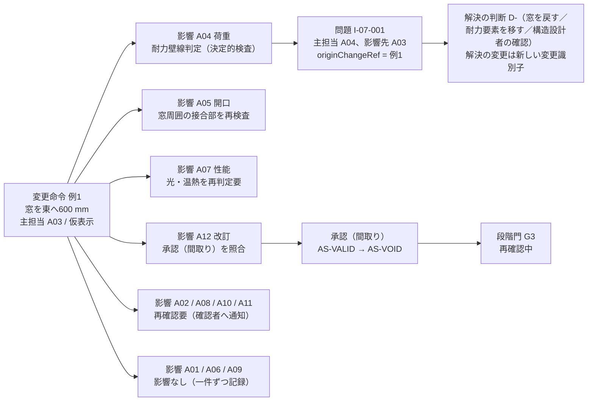
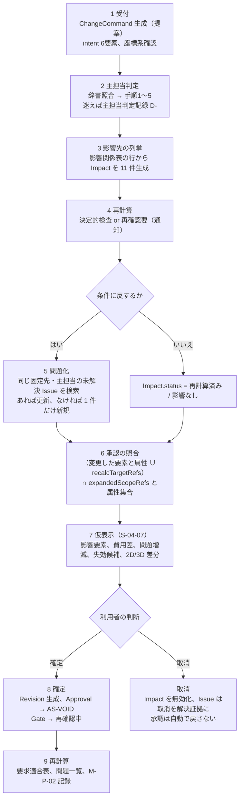

# 第07章 十二判断領域のMECE表と、領域間の影響関係

作成日: 2026-09-15　版: v1.4（v1.4 は 2026-10-08 の段階8 の最終仕上げ（再々確認 K3-12）。第4.3節 表4.3-B の判定理由の「段階n」7 か所と列名を、基盤 十二判断領域 第3.3節と同じ「手順n」「判定理由（決まった手順）」に改めた（門の段階 G0〜G6 と区別するため）。記録は `05_審査/再修正記録_最終仕上げ_群G2.md`。v1.3 は 2026-10-08 の段階8前の持ち越し仕上げ（統括の決定 D26、既定値の識別子の併記 0 行。項目B の食い違い 2 行は D26 で既定値表に合わせて改めた）。第3.3節 例2 の洗面台を E-ELM-011 Fixture（kind=洗面）とし、器具の必要余白 前方 600 mm（DV-EQ-03）の判定を A06 の行（F-C12-005。P1）へ移して I-07-002 の主担当を A06、影響先を A08、A03 とした。A08 の行は居間の食卓の椅子を引く余白 600 mm（DV-FN-01、F-C05-009）の再判定として残した。第3.1節の例2 の問題の領域、識別子一覧の I-07-002、第4.3節の判定例辞書の家具余白の行の出所の注記を合わせた。例2 の筋は変えていない。記録は `05_審査/再修正記録_段階8前_仕上げ_群F2.md`。v1.2 は 2026-10-07 の段階6 二回目の修正（段階7 再審査の後）。修正計画 第1.7節の 8 件（主担当 JR-033〜JR-036、整合 JR-018、JR-051、JR-027、持ち越し 15）と、第6章の正本と基盤 十二判断領域 v1.4 の写しへの同期（JR-011 の I-06-006 の判定段階）を反映した。境界表、影響の種類、判定手順、判定例辞書は本章が主担当で、基盤 v1.4 は同じ文の写し（修正計画 第0.3節）。記録は `05_審査/再修正記録_2回目_第5_7_9章.md`。同日の二回目の修正の仕上げ〔群R1〕で、基盤 十二判断領域への依頼（「配置」と版の欄）の対応済みの記載、第0.3節の基盤の行の件数（v1.4）、受けた依頼の対応状況の行を加えた〔版は v1.2 のまま。記録は `05_審査/再修正記録_2回目_仕上げ_群R1.md`〕。v1.1 は 2026-09-15 段階6 再修正。統合指摘 JM-041、JM-042、JM-020、JM-021、JM-034、JM-054、JM-067、JM-073、JM-119 を反映。2026-09-29 の途中停止の後、2026-10-06 に再開して完了し、基盤 十二判断領域 v1.2、用語集 v1.2、第6章、第12章 v1.2、第15章、第18章、第23章の修正への追従を含む。記録は `05_審査/再修正記録_第1_3_7章.md`）　担当: 段階3 仕様書 第07章
根拠: 指示文 A1（十二領域の表、主担当を一つだけ置く規則）、B（一つの判断へ主担当分野を一つだけ割り当て、他分野は影響先として重複登録しない）、C3（自然文変更の七手順）、C10（確認範囲ごとの承認と自動失効）、10.3（MECEによる十二判断領域、窓位置変更の波及例）、11.3（実案件で領域分類の迷いを記録し辞書を改善）。基盤定義 `十二判断領域.md` v1.4（2026-10-07。本章 v1.2 の境界表、影響の種類、判定手順、判定例 6 件の写し。v1.3 は本章 表4.3-B の判定例 7 件と影響関係表 A09→A02 の「時点」を反映した副番号の改訂）、`情報実体骨格.md` v1.1（第3節）、`信頼状態と証拠段階.md` v1.1、`七段階門.md` v1.1、`機能一覧骨格.md` v1.1、`画面指標試験骨格.md` v1.1、`識別子規則.md` v1.1、`用語集.md` v1.1 に従う。確認日はすべて 2026-09-15。

## 0. 本章の目的、範囲と非対象、前提とする章

### 0.1 本章の目的

- 十二判断領域 A01〜A12 を、主要判断、必要な入力、中心成果、主な確認者、含むもの、含まないもの（境界）で一覧化し、全章が同じ区分で機能、要求、問題、判断を分類できるようにする【推定】。
- 12×12 の影響関係表と、代表的な六つの変更（窓位置変更、居間を600 mm広げる、大開口追加、屋根形状変更、設備機器変更、商品変更）の影響連鎖を仕様として固定し、第13章の変更差分処理と第23章の試験情報の元にする【推定】。
- 主担当領域を一つだけ置く規則、判定手順、迷った場合の記録と判定例辞書の改善手順を、実行時に運用できる形で定める【推定】。
- 同じ変更識別子から各影響を再計算し、無関係な問題を複製しない仕組みを、変更命令（E-REQ-011）、影響（E-REQ-012）、問題（E-REQ-003）の関係として定める【推定】。
- 領域ごとに詳細を書く章の対応表を示し、責任表（04_必須表）と追跡表（第10章）の入力にする【推定】。

### 0.2 本章の範囲と非対象

| 区分 | 内容 |
|---|---|
| 範囲 | 領域の定義と境界、影響関係表、影響連鎖の例示、主担当の判定と迷い記録、変更識別子による影響の再計算と非複製の規則、領域と章の対応 |
| 非対象 | 各領域の判断内容そのもの（構造の成立、性能計算、費用算出等は第13章、第18〜21章）。変更差分の幾何処理と拘束解決の手順（第11章、第13章）。実体の項目辞書と状態遷移の全体（第12章）。承認、同意、監査の機能仕様（第22章）。段階門の開始条件と完了条件（第6章）。画面の部品仕様（第15章）。機能要件の必須10項目（本章は主章となる機能を持たない。第7節） |

### 0.3 前提とする章

| 章 | 前提とする内容 |
|---|---|
| 基盤定義 十二判断領域 v1.4 | A01〜A12 の定義、影響関係表（v1.3 で A09→A02 に「時点」）、影響の種類の意味（v1.4 で「仕上」「近隣」、2026-10-07 の仕上げで「配置」）、判定手順（手順1〜6 と手順4.5）、判定例辞書（第3.3節 40件、第3.4節 21件。v1.4 で本章 表4.3-C の 6 件、v1.3 で表4.3-B の 7 件を追加。v1.2 は 27件と 21件、v1.1 は 26件と 19件）、例示問題 I-00-001〜I-00-036 |
| 基盤定義 情報実体骨格 v1.1 | E-REQ-003 Issue、E-REQ-004 Decision、E-REQ-007 Approval、E-REQ-010 Gate、E-REQ-011 ChangeCommand、E-REQ-012 Impact の属性と、第3節の規則1〜8、第3.4節の検査条件 |
| 基盤定義 信頼状態と証拠段階 v1.1 | 降格の自動化、承認の自動失効（AS-VOID）、再判定要、問題の状態 IS-、重大度 SEV- |
| 基盤定義 七段階門 v1.1 | 段階×領域の交差表（G0〜G6）、再確認中、進行禁止条件の運用 |
| 基盤定義 機能一覧骨格 v1.1 | 各機能の主担当領域と影響領域、第0.4節の章割当、第5節の判定で迷った事例 |
| 第6章 | 段階門の完了条件と「再確認中」の表示（本章は連動規則だけを書く） |
| 第12章 | 変更命令、影響、問題の項目辞書と状態遷移の正本 |
| 第13章 | 変更差分の処理手順（本章の影響伝播規則を組み込む先） |
| 第22章 | 確認範囲ごとの承認と自動失効の機能（F-C10-004、F-C10-005） |

## 1. 十二判断領域のMECE表

### 1.1 MECEの意味

MECE は建築を独立した箱へ分けるという意味ではない。主たる決定対象（直接の操作対象）を重複なく十二領域へ分け、領域間の影響を第2節の影響関係表で明示する方法として使う（指示文10.3）【推定】。本章では次の三条件を MECE の観察可能な条件とする【仮定】。

| 条件 | 観察可能な条件 | 検査する場所 |
|---|---|---|
| 重複なし | 全ての機能（F-）、要求（R-）、問題（I-）、判断（D-）、変更命令の主担当領域が A01〜A12 のうち一つだけで、null と複数がない | 識別子台帳の整合検査（識別子規則 第7節）、実行時の検証規則 E-EXC-005（欠落属性、SEV-0） |
| 漏れなし | 案件で登録された直接の操作対象が、いずれかの領域の「中心となる対象」に該当する。該当しない場合は第4.4節の迷い記録に残り、辞書改善の対象になる | 迷い記録の件数（第4.5節）、MECE審査（05_審査 J-02） |
| 境界の整合 | ある領域の「含まないもの」に書かれた対象が、指名された隣接領域の「含むもの」に存在する。片方にしかない対象がゼロ | 本章 第1.3節の表（相互参照）、MECE審査 |

### 1.2 主要判断、必要な入力、中心成果、主な確認者

指示文10.3の表を基盤 十二判断領域 第1節で補ったもの。「主な確認者」は領域の判断を確認する役割であり、個別の問題の確認者は問題の属性（E-REQ-003.verifierRef）として別に持つ【推定】。役割符号 RL- との対応は責任表（04_必須表）の入力として本章が仮置きした【仮定】。段階×領域の交差ごとの確認者（P0 と P1 の別）は第6章 第3節の交差表の確認者列を正本とし、本表の「主な確認者」は領域単位の要約である。P0 で有資格者が不在の交差は本章で列挙せず、該当する交差は第6章 第3節の確認者（P0）列を参照する（JR-035）。同列が「専門家未割当」（責任表の承認行の担当者が空欄であることを示す表示語。用語集 493。RL-OWN の受領確認のみ）または「確認者なし」とする交差では、本表の確認者は P1 以降の割当を示す。承認個体の表示語「専門家未確認」（用語集 370）とは使い分ける（JM-020 の整合、2026-09-15。用語集 v1.2 への追従 2026-10-06）【推定】。

| 領域 | 主要判断 | 必要な入力 | 中心成果 | 主な確認者（要約。正本は第6章 第3節の交差表） | 確認者の役割（RL-） | 区分 |
|---|---|---|---|---|---|---|
| A01 目的、関係者、要求 | 誰の何を優先し、何をしないか。衝突する要求のどちらを採るか | 家族構成、生活行動、予算希望、将来変化、価値観、好み、避けたい様式、納期希望 | 目的文、要求台帳、関係者表と決定権、生活場面一覧 | 利用者（所有者）、建築士 | RL-OWN、RL-CHK | 【推定】 |
| A02 敷地、法規、周辺 | どこに何が建てられる可能性があるか。何を現地調査、行政照会、供給事業者確認へ回すか | 測量、道路、地形、災害、条例、供給、公的地理情報の出典と時点 | 敷地制約、不足調査、法規根拠（敷地根拠） | 建築士、測量者、行政（照会先） | RL-CHK、RL-PART | 【推定】 |
| A03 空間、形、体験 | 室、動線、光景、外部との関係をどう構成するか。三案のうちどの空間構成を進めるか | 要求台帳、敷地制約、家具寸法、生活場面、人体寸法 | 配置、平面、断面、立面、三次元案、動線比較 | 建築士、利用者 | RL-CHK、RL-OWN | 【推定】 |
| A04 構造 | 荷重をどう安全に地盤へ伝えるか。どの構造形式を採るか | 地盤、構法、形、開口、荷重、重い設備、屋根形状 | 構造方針、通り芯、構造注意（問題）、計算（人が担う） | 構造設計者 | RL-CHK（有資格者） | 【推定】 |
| A05 外皮 | 雨、熱、空気、火をどう制御するか。どの層構成と接合部を採るか | 気候、構造、材料、窓、接合部、防火地域 | 層構成、接合部検査、性能仮定 | 建築士、外皮専門家 | RL-CHK | 【推定】 |
| A06 設備 | 水、空気、熱、電気、情報をどう供給するか。機器と経路をどこに置くか | 使用量、機器、経路、構造、天井、外部条件 | 系統、機器置場、経路帯、干渉一覧 | 設備設計者、施工者 | RL-CHK、RL-PART | 【推定】 |
| A07 環境、健康、性能 | どの性能をどの証拠段階で満たすか。目標と予測の差をどう扱うか | 気候、使用条件、材料、計算条件、要求 | 性能目標、予測、確認、評価の一覧（十領域×証拠段階） | 各専門家、評価機関 | RL-CHK、RL-PART | 【推定】 |
| A08 内装、家具、商品 | 何を実寸で選び、どう維持するか。実在品か独自案か | 好み、人体寸法、予算、供給、権利、室寸法 | 仕上、配置、商品一覧、代替、根拠 | 建築士、内装担当、利用者 | RL-CHK、RL-EDT、RL-OWN | 【推定】 |
| A09 費用、期間、調達 | 何にいくら掛かり、いつ入るか。どの調達方式を採るか | 数量、単価、地域、納期、契約、変更 | 工種別費用幅、期間、調達危険 | 積算担当、施工者、利用者 | RL-CHK、RL-PART、RL-OWN | 【推定】 |
| A10 施工、品質 | どう作り、どう確認するか。現場差をどう承認し記録するか | 設計、工法、公差、現場条件、契約 | 施工検討、検査、質疑、変更記録 | 施工者、監理者 | RL-PART、RL-CHK | 【推定】 |
| A11 維持、運用、将来変更 | どう使い、直し、変えられるか。目標と実績の差から何を学ぶか | 機器、保証、点検、将来場面、実測 | 維持計画、交換、可変性、実績 | 所有者、維持担当、建築士 | RL-OWN、RL-PART、RL-CHK | 【推定】 |
| A12 情報、権利、責任 | 何が正本で、誰が何を確認したか。何を誰へどこまで渡すか | 全領域の情報、契約、許諾、資格 | 出典、版、承認、交換、監査 | 案件の所有者（案件側の情報管理。組織案件では情報管理担当）、受取側の確認者、各責任者。運営側の情報管理者は案件の確認者にならない | RL-OWN（案件側の情報管理。組織案件では情報管理担当の RL-EDT。用語集 494）、RL-CHK（受取側の確認）。運営側の情報管理者は製品外権限（表4-2b）で案件の確認者にならない | 【推定】 |

### 1.3 含むもの、含まないもの（境界）

「含まないもの」は隣接領域との境界であり、括弧内の領域の「含むもの」に同じ対象が存在することを本章で相互参照した。全文は基盤 十二判断領域 第1節にあり、本表は要旨である。二回目の修正からは境界の改訂は本章を主担当とし、基盤 十二判断領域 第1節は同じ文へ同期する（修正計画 第0.3節。v1.2 の追記は JR-034、JR-027）【推定】。境界の割当は【仮定】が多く、迷った事例は第4.4節の記録で見直す。

| 領域 | 含むもの（要旨） | 含まないもの（境界） |
|---|---|---|
| A01 | 目的文、成功条件、非対象、変更できない条件。関係者表（利益、不利益、発言機会、決定権、確認対象）。生活場面の四群。要求台帳（優先度 RP-、数値範囲、出典、決定者、確認者、期限、確認状態）。要求衝突と解決候補と代償。当事者参画。利用者が希望する予算帯、納期、共有相手、書出形式 | 予算の妥当性と工種別費用（A09）。室の寸法や配置（A03）。性能目標の技術的妥当性と証拠段階（A07）。敷地条件（A02）。決定権を実現する権限や同意の仕組み（A12） |
| A02 | 住所、地番、座標系、境界資料、測量日。用途地域、建蔽率、容積率、高さ、斜線、日影、防火、景観、地区計画、条例、接道（版付き）。災害の公的地理情報。隣家の窓、日影、眺望、騒音源、卓越風、樹木。供給条件。法規判定（条項候補、入力値、計算、余裕量、版）。不足調査。敷地制約。建物単体の法令基準（採光、換気、階段寸法、手すり、居室の天井高、内装制限）の条項と版の収集と、適合の判定（余裕量）（JR-034） | 敷地条件を受けた建物配置と外構の設計（A03）。地盤に対する基礎の設計（A04）。擁壁と地盤の安全の判断（A04。I-00-112 の主担当。A02 は影響先。JR-034）。防火地域に応じた外皮仕様の選定（A05）。省エネ基準等の性能計算（A07）。法規根拠の版と出典の管理（A12）。既存建物の現況調査（対象に応じて A04、A05、A06、A10、A11。調査結果の取込と現況状態 CS- の表示は A12）。建物単体の法令基準を満たす寸法や仕様の決定（階段寸法と天井高は A03、採光と換気と内装制限は A07、手すりの品番は A08。JR-034） |
| A03 | 配置図、平面、断面（階高、天井高）、立面、三次元案。室の閉領域、隣接、扉接続、上下階接続。開口の位置と大きさ。階段位置。扉開閉域、通路幅、家具余白（空間側の確保）。交換経路と点検空間の空間確保（A06 の要求を受ける）。庭、駐車、外構の配置。三案の空間的差と選定。生活場面の空間上の再生。可変間仕切の空間計画。建物単体の法令基準を満たす寸法の決定（階段寸法、居室の天井高。条項と適合の判定は A02。JR-034） | 開口が耐力に与える影響（A04）。開口の層構成、熱、防水（A05）。設備機器の置場と経路（A06）。日照、採光の性能値と証拠段階（A07）。家具や建具の商品選定（A08）。面積が費用へ与える影響（A09）。施工寸法と割付（A10） |
| A04 | 構造形式。通り芯、柱梁配置、耐力要素、荷重の流れ、基礎仮定、地盤仮定。最大跨度、大開口、吹抜け、片持ち、上下階のずれ、屋根形状、重い設備、階段開口が構造へ与える影響の指摘。構造成立性の初期注意と必要資料。擁壁と地盤の安全の初期注意（I-00-112 の主担当。JR-034）。計算書と部材設計（人が担う）。耐震診断結果の受入 | 地盤調査の要否判定と手配（A02）。耐震等級の目標と証拠段階（A07）。構造材の費用（A09）。加工、公差、施工順序（A10）。構造計算書の版と承認記録の管理（A12） |
| A05 | 層構成（構造、防水、雨仕舞、気密、断熱、防湿、耐火、仕上、通気の役割）。接合部（屋根と壁、壁と基礎、窓周囲、出隅、貫通部）。熱橋、結露、雨水侵入、排水、通気の検査。窓の仕様（ガラス、枠の性能区分。防火地域の防火設備の可否を含む。JR-034）。外皮の性能仮定。保守交換の危険。既存の外皮の現況調査の結果の受入（改装時。G1(e)。JR-027） | 窓の位置と大きさ（A03）。窓や外装材の品番選定（A08）。断熱や気密の数値目標と証拠段階（A07）。外壁下地や屋根架構の耐力（A04）。防火地域の指定と条項（A02）。設備の貫通経路の決定（A06。貫通部の処理は A05） |
| A06 | 13系統（給水、給湯、排水、換気、冷暖房、電気、照明、通信、防災警報、防犯設備、太陽光発電、蓄電、電気自動車充電）。機器置場、維持空間、配管立管、排水勾配、天井内経路、外部機器、貫通の位置、点検口、交換搬出、騒音、振動、機器由来の結露。経路帯。構造、建具、家具、天井高との干渉検出。使用量と負荷の初期推定。既存の設備の現況調査の結果の受入（改装時。JR-027） | 火災時安全や空気環境の性能目標（A07）。機器の品番と価格（A08、A09）。貫通部の防水と気密の処理（A05）。梁の変更（A04）。施工順序（A10）。機器台帳と点検周期（A11）。容量、系統、施工条件の最終確認（人が担う） |
| A07 | 住宅性能十領域ごとの要求、目標、計算予測、現場確認、第三者評価、法的適合の記録（EL-）。日照、昼光、眺望、熱、空気質、通風、音、水使用、運用時排出、材料由来排出、生物環境の比較。省エネ基準や ZEH 等の名称、定義、版、地域、計算条件。災害耐性。利用円滑性（当事者確認付き）。火災時安全。建物単体の法令基準を満たす性能側の仕様の決定（採光、換気、内装制限。条項と適合の判定は A02。JR-034） | 性能を実現する層構成（A05）、機器（A06）、構造（A04）の選定。法規条項の収集（A02）。第三者評価の申請手続き（人）。評価書や計算書の版と出典の管理（A12）。性能向上に伴う費用（A09） |
| A08 | 仕上表、造作。家具の配置（商品側の当たり判定、余白、搬入経路の検査）。実在商品の選定（商品四層 PT-、権利状態 RS- の表示）。商品項目、推奨点、絶対条件、代替品、販売終了への対応。内装案の適用、樹種と色の組合せ。AI独自案の生成と製作可否未確認の表示。利用者所有家具の実寸確認。建物単体の法令基準を満たす手すりの品番の選定（条項と適合の判定は A02。JR-034） | 室の寸法と家具余白の空間側確保（A03）。家具や設備品の荷重（A04）。内装仕上の防火や空気環境の性能目標（A07）。費用と納期（A09）。施工の割付（A10）。清掃と交換周期の計画（A11）。利用許諾の契約管理と商標表示の規則（A12） |
| A09 | 工種別費用幅、数量根拠、単価時点、地域、物価変動、除外事項、確信幅。変更の費用波及。期間（調査から引渡しまでの十工程）。長納期品、季節、職人、乾燥養生、現場制約の危険。調達方式の比較。見積比較の項目そろえ。契約後変更の金額と期間。費用低減案の影響表示。維持費の見積。維持費の実績の集計（概算との差。JR-027） | 数量の元となる形状（A03）。材料や商品の仕様選定（A05、A06、A08）。施工順序そのもの（A10）。維持費の実績の原因と学び（A11。実績の集計は A09。JR-027）。契約の権利条件や個人情報（A12）。利用者の予算希望（A01） |
| A10 | 施工成立性（標準寸法、割付、加工、公差、作業空間、搬入、揚重、施工順序、仮設、雨仕舞の施工、検査可能性、交換可能性）。試作品、現物見本、施工図、製作図、質疑、検査記録。現場変更の記録と承認手順。工事前調査（石綿事前調査等）の要否と実施。解体後判明時の手順。工事監理（人が担う） | 設計寸法の決定（A03）。構造安全の確認と部材設計（A04）。費用の変更額（A09）。竣工時建物情報の正本化と版管理（A12）。維持計画（A11） |
| A11 | 機器台帳、保証、取扱説明、点検周期、交換周期、交換経路、清掃方法、維持計画。将来場面の試行（変更費と壊す範囲の比較）。入居後確認。目標と実績の差、原因、学び一覧。既存住宅の劣化と修繕履歴、既存住宅状況調査の結果受入 | 交換経路や点検空間の空間確保そのもの（A03、A06 が主担当。A11 は要求として影響先）。性能実績の証拠段階（A07）。維持費の見積と実績の集計（A09。原因と学びは A11。JR-027）。学習同意と匿名化の仕組み（A12）。施工中の検査（A10） |
| A12 | 正本と版、出典、確信度と校正。信頼状態 V0〜V3 の判定と表示、要素値状態 VS-、証拠段階 EL- の表示規則。現況状態 CS- の付与と表示規則（現況調査の結果の取込。F-C02-024、F-C02-025）。承認と確認範囲、自動失効、承認記録。責任表、役割権限 RL-。個別同意、外部送信、学習同意、匿名化、監査記録、期限付き共有、削除、保存期間、処理地域。利用許諾と権利状態 RS-、関係区分 PR-、商標表示。必要情報要求、IDS 検査、IFC、BCF 交換、辞書と分類、書出検査と例外承認。正本候補判定。法規、単価、在庫、納期情報の版と失効規則 | 各領域の判断内容そのもの（各領域）。性能値の内容判断（A07）。商品の適合判断（A08）。要求の優先度の決定（A01） |

### 1.4 領域と段階の関係

各領域は G0〜G6 の全段階で主要判断を持つとは限らない。段階×領域の 84 交差は基盤 七段階門 第3節が空欄なしで定めており、「該当なし」は G0 で 8 件、G1 で 2 件（A05、A10）である【事実】（出典: `02_基盤定義/整合検査報告.md` v1.0 第1節 項目5、確認日 2026-09-15）。七段階門 v1.2 で G1×A05 と G1×A10 は「有（改装時）」に改められ、該当なしは新築の場合に限る（JM-027）【事実】（出典: `02_基盤定義/七段階門.md` v1.2 第3節、確認日 2026-09-15）。本章の影響連鎖（第3節）は主に G2 と G3 で起きる変更を扱い、G5 の現場変更と G6 の実績反映は第21章が扱う【推定】。

## 2. 領域間の影響関係表（12×12）

### 2.1 影響関係表

行が変更元、列が影響先。各交差の一語は影響の種類（E-REQ-012 Impact の impactKind に入る語）を示す。対角線は「—」。基盤 十二判断領域 第2節（v1.3）から転記した（v1.4 の表と 12 行が一致することを 2026-10-07 に機械照合した）。A09→A02 の「時点」（注2。JM-073）は本章が加えて基盤へ反映を依頼し、基盤 v1.3 の影響関係表（「調査費、時点」）と第2.1節の語の意味に反映された（2026-10-06）【推定】。表全体は指示文10.3の窓位置変更の例から導いたものであり、実案件の迷い記録（第4.4節）と反証試験（T-R-）で語を見直す【仮定】。

| 変更元＼影響先 | A01 | A02 | A03 | A04 | A05 | A06 | A07 | A08 | A09 | A10 | A11 | A12 |
|---|---|---|---|---|---|---|---|---|---|---|---|---|
| A01 目的・要求 | — | 条件 | 要求 | 要求 | 要求 | 要求 | 目標 | 好み | 予算 | 工期 | 将来 | 決定権 |
| A02 敷地・法規 | 制約 | — | 制約 | 地盤 | 防火 | 供給 | 気候 | 制約 | 費用 | 進入 | 災害 | 出典 |
| A03 空間・形 | 適合 | 適合 | — | 荷重 | 開口 | 経路 | 性能 | 配置 | 数量 | 施工 | 可変 | 改訂 |
| A04 構造 | 制約 | 適合 | 制約 | — | 接合 | 干渉 | 安定 | 制約 | 費用 | 施工 | 補強 | 責任 |
| A05 外皮 | 適合 | 適合 | 開口 | 荷重 | — | 貫通 | 熱 | 仕上 | 費用 | 納まり | 交換 | 仮定 |
| A06 設備 | 適合 | 供給 | 置場 | 荷重 | 貫通 | — | 空気 | 干渉 | 費用 | 順序 | 点検 | 責任 |
| A07 性能 | 適合 | 適合 | 形状 | 仕様 | 仕様 | 容量 | — | 材料 | 費用 | 検査 | 実績 | 証拠 |
| A08 内装・商品 | 適合 | 適合 | 余白 | 荷重 | 建具 | 電源 | 材料 | — | 納期 | 搬入 | 交換 | 権利 |
| A09 費用・期間 | 予算 | 調査費、時点 | 面積 | 構法 | 仕様 | 機器 | 目標 | 代替 | — | 工程 | 維持費 | 契約 |
| A10 施工・品質 | 適合 | 近隣 | 寸法 | 公差 | 納まり | 経路 | 検査 | 割付 | 変更 | — | 記録 | 正本 |
| A11 維持・将来 | 将来 | 適合 | 可変 | 補強 | 交換 | 更新 | 実績 | 交換 | 維持費 | 検査 | — | 学び |
| A12 情報・権利 | 承認 | 版 | 版 | 責任 | 責任 | 責任 | 証拠 | 権利 | 時点 | 正本 | 同意 | — |

注1（A04〜A06 列。JM-021 の整合）: 影響先が構造、外皮、設備の交差（荷重、接合、干渉、貫通、開口、置場、経路、補強、納まり、仕様、容量、更新）では、影響先系統の実体 E-SYS-001 StructuralSystem、E-SYS-002 ServiceSystem、E-MAT-003 Assembly、E-MAT-005 Junction が Impact.recalcTargetRefs の再計算対象になる。承認の失効判定の入力は「変更した要素と属性（resolvedGeometry.entries の targetRef と attribute）∪ Impact.recalcTargetRefs（影響先の再計算対象）」の和集合であり、承認側は expandedScopeRefs（scope を要素へ展開したもの）と属性集合で照合する（第6章 第5.3節 規則1、第12章 第6.10節 連動1 と同文。第5.5節）。recalcTargetRefs に承認（E-REQ-007 Approval）は含めない（入力と結果の混同を避ける）【仮定】。

注2（A09→A02 の「時点」。JM-073 の整合）: 着工予定日（E-BLD-001.plannedStartDate）の変更は影響の種類「時点」として A02 の法規判定（E-SRV-004 Calculation、E-SRV-011 SiteRegulation）を着工予定日に適用される法令版で再判定させる（第18章 F-C09-012 例外(a)）。plannedStartDate が null の案件は新版で判定し、「着工予定日未入力のため新版で判定」を S-09-04 に表示する【仮定】。

### 2.2 影響の種類、再計算対象、対応する情報実体

基盤 十二判断領域 第2.1節の「影響の種類の意味」を、情報実体骨格の実体（Impact.recalcTargetRefs の参照先）と、再計算を決定的検査で行えるかに対応付けた。未決 U-00-013（各交差の語が実装の再計算対象と一対一に対応するか）への本章の仮判断であり、語は「再計算対象の群」を指し、一語が複数実体を指すことを許す。影響関係表の 76 語のうち本表に無かった「仕上」（A05→A08）と「近隣」（A10→A02）を v1.2 で加えた（JR-036。基盤 十二判断領域 v1.4 第2.1節は同じ内容の写し）。同じ照合で見つかった「配置」（A03→A08）は幾何の行に加えた（基盤 第2.1節への同期は章末の依頼）。76 語の全てが本表のいずれかの行にあることを機械照合で確かめた（2026-10-07）【仮定】。

| 影響の種類（語） | 再計算または再確認の対象 | recalcTargetRefs の実体候補 | 決定的検査で算出できるか | 主に担う機能 | 区分 |
|---|---|---|---|---|---|
| 要求、目標、好み、予算、工期、将来、決定権 | 要求適合の再判定、性能目標、推薦条件、費用上限、期間、将来場面、承認者 | E-REQ-001 Requirement、E-SRV-013 PerformanceTarget、E-SRV-014 CostItem、E-SRV-015 Schedule、E-REQ-009 LifeScene、E-ORG-008 Stakeholder | 要求適合は可（数値範囲の比較）。好みは不可（利用者確認） | F-C01-020、F-C03-014、F-C12-007 | 【仮定】 |
| 制約、条件 | 配置、開口、構造形式、可能な商品の範囲 | E-REQ-002 Constraint、E-SRV-011 SiteRegulation、E-SPC-001 Space | 可（拘束解決） | F-C09-008、F-C09-013 | 【仮定】 |
| 適合 | 要求適合率、法規判定、利用円滑性 | E-REQ-001 Requirement、E-SRV-004 Calculation（法規判定）、E-SRV-013 PerformanceTarget（利用円滑性） | 法規判定は可（版付き）。利用円滑性は当事者確認を要する | F-C09-008、F-C12-011 | 【仮定】 |
| 地盤、防火、供給、気候、災害、進入 | 基礎仮定、外皮防火仕様、設備引込、計算条件、災害耐性、搬入計画 | E-SRV-008 Assumption、E-MAT-003 Assembly、E-SYS-002 ServiceSystem、E-SRV-012 HazardInfo、E-SYS-003 Route | 条件の転記は可。仕様の再選定は人 | F-C09-006、F-C11-006、F-C12-014 | 【仮定】 |
| 荷重、接合、干渉、貫通、開口、置場、経路、余白、建具、電源、容量、仕様、形状、配置（A03→A08。JR-036 の照合で追加） | 構造注意、接合部検査、干渉検出、経路帯、家具余白、家具の配置検査、機器容量 | E-SYS-001 StructuralSystem、E-SYS-002 ServiceSystem、E-MAT-003 Assembly、E-MAT-005 Junction、E-SYS-005 Connection、E-SYS-003 Route、E-SYS-004 Penetration、E-ELM-013 Furniture、E-ELM-012 Equipment（影響先系統は第2.1節 注1） | 可（幾何検査）。容量と仕様の再選定は人 | F-C11-002、F-C11-008、F-C12-005、F-C05-009、F-C05-010 | 【仮定】 |
| 熱、空気、安定、性能、材料 | 十領域の計算予測の再実行、証拠段階の降格（再判定要） | E-SRV-013 PerformanceTarget、E-SRV-004 Calculation、E-REQ-008 Evidence | 再判定要の判定は可。再計算は P0 簡易、P1 詳細 | F-C12-008、F-C12-015 | 【仮定】 |
| 仕上（A05→A08。JR-036） | 外皮の仕上（A05）の変更が仕上表と商品の選定（A08）の前提を変える。仕上表と商品の適合 | E-MAT-002 Finish、E-PRD-001 Product | 可（仕上表と商品の属性の照合） | F-C05-005、F-C13-003、F-C11-007（P1） | 【推定】 |
| 近隣（A10→A02。JR-036） | 施工（A10）の条件が近隣と周辺の制約（A02）に影響する。近隣対応記録、工事の騒音と搬入の制約 | E-SRV-007 Risk | 不可（記録と人の確認）。搬入経路の幾何だけは可 | F-C13-010、F-C09-005（P1） | 【推定】 |
| 費用、数量、面積、構法、機器、納期、代替、調査費、維持費 | 工種別費用幅、長納期品、代替可能性 | E-SRV-006 Quantity、E-SRV-005 Estimate、E-SRV-014 CostItem、E-SRV-016 LeadTimeRisk、E-PRD-007 Availability | 数量は可。単価は時点付きの参照値 | F-C13-003、F-C13-005、F-C05-012 | 【仮定】 |
| 施工、公差、納まり、順序、割付、搬入、寸法、変更、工程、検査 | 施工検討、質疑、変更記録、検査記録 | E-SRV-007 Risk、E-SYS-003 Route（搬入）、E-SRV-003 Test、E-SRV-015 Schedule | 搬入経路の幾何は可。順序と公差は人 | F-C13-010、F-C13-011、F-C14-013 | 【仮定】 |
| 可変、補強、交換、更新、点検、実績、記録、学び | 維持計画、交換経路、将来場面、入居後確認 | E-REQ-009 LifeScene、E-OPS-005 ReplacementCycle、E-SYS-003 Route（交換搬出）、E-OPS-007 PostOccupancyRecord | 交換経路の幾何は可。実績は取得値 | F-C14-006、F-C14-009、F-C14-011 | 【仮定】 |
| 出典、版、改訂、責任、仮定、証拠、権利、時点、正本、承認、同意、契約 | 承認の自動失効、版の更新、権利再判定、同意の再取得、正本の再判定、法令版の再判定（時点: 着工予定日の変更。第2.1節 注2） | E-REQ-006 Revision、E-PRD-005 License、E-ORG-006 Consent、E-PRD-006 Source、E-REQ-010 Gate、E-SRV-011 SiteRegulation（時点）。承認 E-REQ-007 は失効判定の結果であり recalcTargetRefs に含めない（第2.1節 注1） | 可（参照集合の照合。法令版は版の比較） | F-C10-005、F-C03-018、F-C10-015、F-C09-012 | 【仮定】 |

### 2.3 影響伝播の規則

基盤 十二判断領域 第2.2節の五規則を、本章では次の八規則へ展開した（規則6〜8 が本章の追加）【仮定】。実体の属性は情報実体骨格 第3.1節の規則1〜8 と一致させた。

| 番号 | 規則 | 観察可能な条件 |
|---:|---|---|
| 1 | 変更命令（E-REQ-011）に一つの変更識別子（uuid）を付け、変更元の主担当領域（primaryDomain）を一つだけ記録する | primaryDomain が null または複数の変更命令は登録できない |
| 2 | 第2.1節の変更元の行に従い、影響先の 11 領域それぞれに影響（E-REQ-012）を一件ずつ生成する。影響がない領域も status=影響なし で一件置き、空欄を作らない | 一つの変更命令に紐づく影響は 11 件（変更元を除く）。影響先の欠落がゼロ |
| 3 | 影響先ごとに第2.2節の再計算対象を列挙し、決定的検査で算出できるものは自動で再計算し、人の判断を要するものは「再確認要」として担当者へ通知する | 各影響に recalcTargetRefs と isDeterministic がある |
| 4 | 再計算結果が問題に該当する場合、同じ固定先と主担当領域の未解決問題（IS-OPEN または IS-WIP）があれば更新し、なければ問題を一件だけ新規登録する。問題の originChangeRef に変更識別子を記録する | 同じ固定先、同じ主担当、未解決の問題が二件以上ない |
| 5 | 「変更した要素と属性 ∪ 影響の recalcTargetRefs」（第2.1節 注1）と、有効な承認（AS-VALID）の確認範囲（expandedScopeRefs と属性集合）が交わる場合、その承認だけを AS-VOID にし、変更識別子を voidReason に記録する。案件全体を前段階へ戻さず、該当する段階門を「再確認中」にする | 確認範囲外の承認は失効しない。失効した承認は全て変更識別子を持つ |
| 6 | 影響の再計算結果は、変更命令が「確定」になる前に変更差分（S-04-07）として仮表示する。仮表示の間、正本は変わらない | 承認前に正本が変わった件数がゼロ（T-A-003 合格条件(2)） |
| 7 | 影響先の問題を解決するために行う変更は、新しい変更命令（新しい変更識別子）として登録し、元の問題を parentIssueRef で参照する。製品は二次変更を自動で確定せず、利用者または確認者の承認を要する | 自動で確定した二次変更がゼロ。派生問題から元の変更識別子へたどれる |
| 8 | 変更命令の取消とやり直しは、影響と承認失効を含めて元へ戻す。ただし失効した承認は自動で有効へ戻さず、再承認を求める | 取消後に AS-VOID から AS-VALID へ自動で戻った承認がゼロ |

規則8の「失効した承認を自動で戻さない」は、取消が完全に元の状態へ戻す保証を製品が持たないため置いた安全側の規則である【仮定】。運用上の負荷は未決 U-07-003 に記す。

## 3. 代表的な変更の影響連鎖

### 3.1 六つの例の一覧

指示文10.3の窓位置変更の例と、第13章、第16章、第20章の主題に対応する六つの変更を、第2節の規則に従って展開した。各例の変更命令は情報実体骨格 第3.5節の慣例に従い「変更命令 例n」と書く（変更命令の例示接頭辞は未決 U-00-037）。派生する問題は例示識別子 I-07-001〜I-07-010、判断は D-07-001〜D-07-003 を本章で定義した【仮定】。数量、寸法、重量の値は影響連鎖を示すための例であり、初期仮説である。

| 例 | 変更 | 変更元の主担当 | origin | 段階 | 影響あり（再計算） | 再確認要（人） | 影響なし | 問題化 | 失効する承認の確認範囲 | 対応する試験 |
|---|---|---|---|---|---|---:|---:|---|---|---|
| 例1 | 居間の東側窓を東へ 600 mm 移動 | A03 | 自然文 | G3 | A04、A05、A07、A12 | A02、A08、A10、A11 | A01、A06、A09 | I-07-001（A04） | 間取り | T-A-009（類似）、T-R-002 |
| 例2 | 居間を 600 mm 広げ、廊下幅 900 mm 以上を保持 | A03 | 自然文 | G2、G3 | A01、A04、A07、A08、A09、A12 | A06、A11 | A02、A05、A10 | I-07-009（A03）、I-07-002（A06）、I-07-010（A04） | 間取り | T-A-003 |
| 例3 | 居間南面に幅 3,600 mm の開口を新設 | A03 | 直接操作 | G2、G3 | A02、A04、A05、A07、A08、A09、A12 | A06、A10、A11 | A01 | I-07-003（A04、SEV-0）、I-07-004（A10） | 間取り、構造 | T-A-009、T-R-002 |
| 例4 | 屋根形状を切妻から片流れへ変更 | A03（D-07-001） | 直接操作 | G2 | A02、A05、A07、A09、A12 | A01、A04、A06、A08、A10、A11 | なし | I-07-005（A02） | 外皮、法規 | T-R-010（類似）、T-R-001（狭小傾斜地） |
| 例5 | 給湯機を従来型からヒートポンプ式給湯機へ変更 | A06（D-07-002） | 自然文 | G3 | A03、A04、A05、A07、A09、A12 | A01、A02、A08、A10、A11 | なし | I-07-006（A06）、I-07-007（A04） | 設備、性能 | T-A-010（類似）、T-R-011（停電断水） |
| 例6 | 選定した食卓が販売終了となり代替品へ変更 | A08 | 商品更新 | G3、G4 | A01、A03、A09、A12 | A10、A11 | A02、A04、A05、A06、A07 | I-07-008（A08） | 商品 | T-R-009（販売終了） |

「影響なし」も影響（E-REQ-012）として一件登録し、status=影響なし とする（第2.3節 規則2）。「再確認要」は決定的検査で算出できず、影響先領域の確認者へ通知する影響である【仮定】。各例の A12 行の承認（E-REQ-007）は再計算対象ではなく、失効判定（第5.5節。入力は「変更した要素と属性 ∪ recalcTargetRefs」）の結果であり、想定結果の列に示す（JM-021 の整合）【推定】。

### 3.2 例1 窓位置変更（居間の東側窓を東へ 600 mm 移動）

| 項目 | 値 |
|---|---|
| 変更命令 例1 | origin=自然文「居間の東の窓を 600 mm 東へずらして、朝の光を食卓に当てたい」。intent={target:[E-ELM-008 窓の個体], operation:移動, amount:600 mm, direction:東, fixed:[外壁の外周線、窓の幅と高さ], purpose:朝の光}。coordinateFrame=平面座標（利用者確認済み）。primaryDomain=A03（判定例「窓の位置を東へ600 mm動かす」）。status=仮表示 |
| 対象の案 | 三案のうち生活動線重視案。G3 進行中、信頼状態 V1（G3 完了前） |
| 有効な承認 | 確認範囲=間取り（AS-VALID、承認者=所有者、G2 の選定時）、確認範囲=尺度（AS-VALID） |

| 影響先 | 影響の種類 | 再計算対象（実体） | 想定結果 | 問題化または承認失効 | 対応する機能 | 区分 |
|---|---|---|---|---|---|---|
| A01 | 適合 | E-REQ-001「朝の光が食卓に入る」（RP-WANT） | 適合（日照表示で確認） | なし | F-C03-014、F-C04-009 | 【推定】 |
| A02 | 適合 | E-BLD-002 Site の隣家の窓の位置 | 移動後の窓が隣家の窓と正対するか。製品は距離だけを示し、判断は建築士へ | 再確認要 | F-C09-006 | 【仮定】 |
| A04 | 荷重 | E-SYS-001 の耐力壁線判定 | 移動後の窓が耐力壁線上にある | I-07-001 を登録（同じ固定先と主担当の I-00-008 型の未解決問題があれば更新） | F-C11-002 | 【推定】 |
| A05 | 開口 | E-MAT-005 Junction（窓周囲） | 防水層と気密線の連続を再検査（P1） | なし（検査結果次第で I-00-013 型） | F-C11-008 | 【推定】 |
| A06 | 経路 | E-SYS-003 Route（配線、換気） | 窓下に経路なし | 影響なし | F-C12-005 | 【推定】 |
| A07 | 性能 | E-SRV-013 PerformanceTarget（光と視環境、温熱と省エネ） | 窓面積は不変だが位置が変わるため再判定要（EL-CAL → EL-TGT） | 証拠段階の降格を記録 | F-C12-008 | 【推定】 |
| A08 | 配置 | E-ELM-013 Furniture（窓下の収納） | 収納と窓の重なりを当たり判定で検査 | 重なりがあれば主担当 A08 で問題化。本例では再確認要（収納の高さが VS-DEF） | F-C05-009 | 【推定】 |
| A09 | 数量 | E-SRV-006 Quantity（外壁面積、窓面積） | 差ゼロ。費用幅は不変と表示 | 影響なし | F-C13-003 | 【推定】 |
| A10 | 施工 | 外装材の割付 | P0 は注意のみ。P1 で割付を再検討 | 再確認要 | F-C13-010 | 【推定】 |
| A11 | 可変 | E-REQ-009 LifeScene（将来の寝室分割） | 分割後の採光を再試行（P1） | 再確認要 | F-C14-006 | 【推定】 |
| A12 | 改訂 | —（承認 E-REQ-007 は再計算対象に含めない。失効判定の結果を想定結果に示す。第2.1節 注1） | 失効判定（第5.5節）で E-REQ-007 Approval（確認範囲=間取り）が AS-VALID → AS-VOID。確認範囲=尺度は失効しない。E-REQ-010 Gate G3 を再確認中 | 承認失効1件 | F-C10-005、F-C15-002 | 【推定】 |

### 3.3 例2 居間を 600 mm 広げる（廊下幅 900 mm 以上を保持）

| 項目 | 値 |
|---|---|
| 変更命令 例2 | origin=自然文「居間を 600 mm 広げて。廊下は 900 mm 以上残して」。intent={target:[E-ELM-001 居間と廊下の間の壁], operation:移動, amount:600 mm, direction:廊下側, fixed:[廊下幅 ≥ 900 mm（R-05-011 相当、RP-MUST）、外壁], purpose:食卓と収納の余白}。coordinateFrame=平面座標。primaryDomain=A03。status=仮表示 |
| 対象の案 | 生活動線重視案。G2 選定後、G3 進行中、V1 |
| 有効な承認 | 確認範囲=間取り（AS-VALID） |

| 影響先 | 影響の種類 | 再計算対象（実体） | 想定結果 | 問題化または承認失効 | 対応する機能 | 区分 |
|---|---|---|---|---|---|---|
| A01 | 適合 | E-REQ-001 廊下幅 ≥ 900 mm（RP-MUST） | 移動後の廊下幅 850 mm で不適合 | I-07-009 を登録（主担当 A03、影響先 A01。第4.2節の手順で「直接の操作対象=廊下幅」は空間の属性）。警告を仮表示に出し、確定を止めない（利用者が要求か寸法を選ぶ） | F-C01-020、F-C03-014 | 【推定】 |
| A02 | 適合 | 建蔽率、容積率 | 内壁のみで外形不変 | 影響なし | F-C09-008 | 【推定】 |
| A04 | 荷重 | E-SYS-001 の耐力壁判定、上下階の壁位置 | 移動壁が 2 階耐力壁の直下から外れる | I-07-010 を登録（主担当 A04、影響先 A03。I-00-011 型） | F-C11-002 | 【推定】 |
| A05 | 開口 | — | 外皮不変 | 影響なし | — | 【推定】 |
| A06 | 経路 | E-SYS-003 Route（隣接する洗面の給排水）、E-ELM-011 Fixture（kind=洗面。洗面台の必要余白 clearance） | 壁内の給排水経路帯が移動壁に掛かる。洗面台前の余白が器具の必要余白 前方 600 mm（DV-EQ-03）未満 | 経路は再確認要（経路変更は新しい変更命令）。余白の不足は I-07-002 を登録（主担当 A06、影響先 A08、A03。器具の必要余白の判定は F-C12-005 で P1。P0 は再確認要） | F-C12-001、F-C12-005 | 【推定】 |
| A07 | 性能 | E-SRV-013（光と視環境: 居間の床面積に対する窓面積比） | 再判定要 | 証拠段階の降格 | F-C12-008 | 【推定】 |
| A08 | 配置 | E-ELM-013 Furniture（居間の食卓） | 食卓の周囲の椅子を引く余白 600 mm（DV-FN-01）を再判定し、居間が広がるため不足なし | 問題なし（再判定で合格）。A06 の行の I-07-002 の影響先 | F-C05-009 | 【推定】 |
| A09 | 数量 | E-SRV-006 Quantity（壁長さ、仕上面積）、E-SRV-014 CostItem | 床面積は不変、壁と仕上の数量差を費用差として表示 | 費用差を仮表示（T-A-003 合格条件(1)） | F-C13-003 | 【推定】 |
| A10 | 施工 | — | P0 では対象外 | 影響なし | — | 【推定】 |
| A11 | 可変 | E-REQ-009 LifeScene（可変間仕切） | 将来場面を再試行（P1） | 再確認要 | F-C14-006 | 【推定】 |
| A12 | 改訂 | —（承認 E-REQ-007 は再計算対象に含めない。失効判定の結果を想定結果に示す。第2.1節 注1） | 失効判定で E-REQ-007 Approval（確認範囲=間取り）が AS-VOID。Gate G3 再確認中 | 承認失効1件 | F-C10-005 | 【推定】 |

確定後（status=確定）に要求台帳の適合再判定と問題一覧の再計算を行い、I-07-009 が残る限り G3 の完了条件「調整後も要求を満たすか（A01）」は満たさない【推定】。

### 3.4 例3 大開口追加（居間南面に幅 3,600 mm の開口を新設）

| 項目 | 値 |
|---|---|
| 変更命令 例3 | origin=直接操作（設計作業面 S-04 で開口を配置）。intent={target:[E-ELM-001 南面外壁], operation:開口新設, amount:幅 3,600 × 高さ 2,200 mm, direction:南, fixed:[外周、階高], purpose:庭とつながる居間}。primaryDomain=A03（開口の位置と大きさ）。status=仮表示 |
| 対象の案 | 意匠重視案。G3 進行中、V1。構造形式仮定=在来木造（VS-AI） |
| 有効な承認 | 確認範囲=間取り、確認範囲=構造（構造形式仮定について建築士が承認） |

| 影響先 | 影響の種類 | 再計算対象（実体） | 想定結果 | 問題化または承認失効 | 対応する機能 | 区分 |
|---|---|---|---|---|---|---|
| A01 | 適合 | E-REQ-001「庭とつながる居間」 | 適合 | 影響なし | F-C03-014 | 【推定】 |
| A02 | 適合 | E-SRV-011 SiteRegulation（延焼のおそれのある部分、防火設備の要否） | 法規判定を再実行し、該当なら防火設備要と表示（版付き） | 判定結果を A05 の影響へ連鎖（同じ変更識別子） | F-C09-008 | 【推定】 |
| A04 | 荷重 | E-SYS-001（耐力壁線、跨度） | 耐力壁線が分断され、開口上の梁跨度が構法の標準跨度を超える | I-07-003 を登録（主担当 A04、影響先 A03、A05。SEV-0、G3 進行禁止。I-00-008 と I-00-010 型） | F-C11-002、F-C15-002 | 【推定】 |
| A05 | 開口 | E-MAT-003 Assembly（窓仕様: ガラスと枠の性能区分、防火設備）、E-MAT-005 Junction | 仕様の再選定（人）と接合部の再検査 | 再確認要 | F-C11-006、F-C11-008 | 【推定】 |
| A06 | 経路 | E-SYS-002 ServiceSystem（冷暖房の負荷） | 開口比の増加で負荷再推定（容量） | 再確認要 | F-C12-001 | 【推定】 |
| A07 | 性能 | E-SRV-013（温熱と省エネ、光と視環境、火災時安全の避難出口） | 温熱は再判定要、光は再判定要、避難出口は再確認 | 証拠段階の降格 | F-C12-008、F-C12-009 | 【推定】 |
| A08 | 配置 | E-PRD-001 Product（サッシ候補、PT- と RS-）、E-ELM-013（壁面を使う家具） | サッシ候補を再検索、壁面減少で家具余白を再検査 | 再検索結果を仮表示 | F-C05-004、F-C05-009 | 【推定】 |
| A09 | 数量 | E-SRV-006（外壁面積減、サッシ面積増）、E-SRV-016 LeadTimeRisk（大型サッシ） | 費用差と長納期品を表示 | 長納期危険を登録 | F-C13-003、F-C13-005 | 【推定】 |
| A10 | 施工 | E-SYS-003 Route（搬入） | 大型サッシの搬入経路が階段幅と門扉幅で成立しない | I-07-004 を登録（主担当 A10、影響先 A03、A08。I-00-028 型） | F-C13-010 | 【推定】 |
| A11 | 可変 | 清掃と交換の経路 | 高所ガラスの清掃方法を再確認 | 再確認要 | F-C14-006 | 【推定】 |
| A12 | 改訂 | —（承認 E-REQ-007 は再計算対象に含めない。失効判定の結果を想定結果に示す。第2.1節 注1） | 失効判定で E-REQ-007（確認範囲=間取り、構造）の両方が AS-VOID。Gate G3 再確認中。SEV-0 が残る限り V2 表示不可 | 承認失効2件 | F-C10-005、F-C15-002 | 【推定】 |

I-07-003 は例外承認（IS-EXC）で閉じられない。解決は「開口幅を戻す」「耐力要素を移す」の新しい変更命令、または構造設計者の確認記録（解決証拠）だけである（T-R-002 合格条件(4)）【推定】。

### 3.5 例4 屋根形状変更（切妻から片流れへ）

| 項目 | 値 |
|---|---|
| 変更命令 例4 | origin=直接操作（三次元表示で屋根形状の候補を切替）。intent={target:[E-ELM-003 Roof], operation:形状変更, amount:切妻 → 片流れ（勾配 2寸、初期仮説）, direction:南下がり, fixed:[外周、最高高さ ≤ 現状], purpose:太陽光発電と外観}。primaryDomain=A03（D-07-001 で判定）。status=仮表示 |
| 主担当判定の記録 D-07-001 | 候補 A03（形状は空間と外観の属性）と A05（屋根は外皮の中心対象）で迷った。第4.2節の手順3「その判断で最初に確定する属性」は形状であり A03。層構成と雨仕舞は影響先 A05。情報実体骨格が Roof の実体定義の主担当を A03 に置く既定（未決 U-00-041）と一致。判定者=建築士、記録日 2026-09-15（例示） |
| 対象の案 | 費用重視案。G2 進行中、V1 |
| 有効な承認 | 確認範囲=外皮（外皮方針の初期確認）、確認範囲=法規（高さと斜線の判定） |

| 影響先 | 影響の種類 | 再計算対象（実体） | 想定結果 | 問題化または承認失効 | 対応する機能 | 区分 |
|---|---|---|---|---|---|---|
| A01 | 適合 | E-REQ-001「小屋裏収納が欲しい」（RP-WANT） | 片流れで小屋裏容積が変わる | 再確認要（利用者） | F-C03-014 | 【推定】 |
| A02 | 適合 | E-SRV-004 Calculation（法規判定: 高さ、北側斜線、日影） | 北側の軒高が上がり、北側斜線の余裕量が −150 mm | I-07-005 を登録（主担当 A02、影響先 A03、A12。G2 のため SEV-1。第18章 I-18-002 と同じ条件で、G3 と G4 では第6章 I-06-006（SEV-0。G3 の門の通過を止め、G4 で再検査。I-18-002 の例外承認は G2→G3 の持ち越しにだけ効く。JR-011）が該当し G4 へ進めない。U-07-004 は解決） | F-C09-008 | 【推定】 |
| A04 | 荷重 | E-SYS-001（屋根架構、風荷重の受け方） | 構造注意「屋根形状」に該当 | 再確認要（構造設計者） | F-C11-002 | 【推定】 |
| A05 | 開口（群語。実体は接合部と層構成） | E-MAT-005 Junction（屋根と壁の取合い、通気層の出口）、E-MAT-003 Assembly（屋根層構成） | 通気出口の位置が変わり接合部を再検査。層構成の再選定は人 | 再検査（I-00-014 型の候補） | F-C11-007、F-C11-008 | 【推定】 |
| A06 | 経路（群語。実体は置場と経路） | E-ELM-012 Equipment（太陽光発電の設置面）、E-SYS-003 Route（雨水排水、換気の外部出口） | 設置面が南一面に集約、樋の経路が変わる | 再確認要 | F-C12-001 | 【推定】 |
| A07 | 性能 | E-SRV-013（温熱と省エネ: 屋根面積と小屋裏、日射取得、太陽光発電量、通風） | 再判定要 | 証拠段階の降格 | F-C12-008、F-C12-012 | 【推定】 |
| A08 | 配置（群語。実体は仕上） | E-MAT-002 Finish（屋根材） | 勾配 2寸で使える屋根材の範囲が変わる | 再確認要 | F-C05-004 | 【推定】 |
| A09 | 数量 | E-SRV-006（屋根面積、樋長さ）、E-SRV-014 CostItem | 費用差を表示 | 費用差の仮表示 | F-C13-003 | 【推定】 |
| A10 | 施工 | 雨仕舞の施工、足場 | P1 で注意 | 再確認要 | F-C13-011 | 【推定】 |
| A11 | 可変 | E-OPS-005 ReplacementCycle（屋根材）、点検経路 | 交換周期と点検経路を再確認 | 再確認要 | F-C14-010 | 【推定】 |
| A12 | 改訂 | —（承認 E-REQ-007 は再計算対象に含めない。失効判定の結果を想定結果に示す。第2.1節 注1） | 失効判定で E-REQ-007（確認範囲=外皮、法規）の両方が AS-VOID。Gate G2 再確認中 | 承認失効2件 | F-C10-005 | 【推定】 |

本例は影響関係表の一語（開口、経路、配置）が実際の再計算対象（接合部、置場、仕上）と字面で一致しない例である。第2.2節の仮判断どおり、語は再計算対象の群を指す。第13章と第23章の試験では impactKind ではなく recalcTargetRefs で合否を判定する【仮定】（未決 U-07-008）。

### 3.6 例5 設備機器変更（給湯機を従来型からヒートポンプ式給湯機へ）

| 項目 | 値 |
|---|---|
| 変更命令 例5 | origin=自然文「給湯をヒートポンプ式にしたい」。intent={target:[E-ELM-012 給湯機、E-SYS-002 給湯系統], operation:機器種別の変更, amount:—, direction:—, fixed:[浴室と台所の位置], purpose:光熱費}。primaryDomain=A06（D-07-002 で判定）。status=仮表示 |
| 主担当判定の記録 D-07-002 | 候補 A06（系統と機器種別は設備の属性）と A08（設備品の商品選定）で迷った。手順3「最初に確定する属性」は系統と機器種別であり A06。品番の選定は後続の別判断（A08）。判定例「台所の製品を選ぶ → A08」との違いは、本例が品番ではなく系統の方式を変える点にある |
| 対象の案 | 生活動線重視案。G3 進行中、V1 |
| 有効な承認 | 確認範囲=設備（主要設備置場と経路帯の仮定）、確認範囲=性能（性能目標の設定） |

| 影響先 | 影響の種類 | 再計算対象（実体） | 想定結果 | 問題化または承認失効 | 対応する機能 | 区分 |
|---|---|---|---|---|---|---|
| A01 | 適合 | E-REQ-001「光熱費を抑える」 | 適合の判定は A07 の再計算と A09 の費用差を待つ | 再確認要 | F-C03-014 | 【推定】 |
| A02 | 供給 | E-BLD-002 Site の供給条件（電気契約容量、引込） | 容量増を供給事業者へ確認 | 再確認要（不足調査へ登録） | F-C09-006 | 【推定】 |
| A03 | 置場 | E-SPC-001（外部の機器置場）、E-ELM-012（貯湯タンクと室外機の外形。寸法は製造元の公式情報【未確認】） | 置場の余白検査。置場が隣地境界から 500 mm（初期仮説）で搬入と騒音が未確認 | I-07-006 を登録（主担当 A06、影響先 A03、A07、A10。I-00-017 型。第4.2節の手順で「直接の操作対象=機器の置場」は設備の属性） | F-C12-001 | 【推定】 |
| A04 | 荷重 | E-SYS-001（貯湯タンクの満水重量に対する床と基礎の支持。重量は機種の公式情報【未確認】） | 構造注意「重い設備」に該当 | I-07-007 を登録（主担当 A04、影響先 A06） | F-C11-002 | 【推定】 |
| A05 | 貫通 | E-SYS-004 Penetration（配管貫通部） | 貫通位置の変更で防水と気密の処理を再検査 | 再検査 | F-C11-008 | 【推定】 |
| A07 | 空気（群語。実体は性能項目） | E-SRV-013（温熱と省エネ: 一次エネルギー消費量、音: 隣地への機器騒音） | 再判定要 | 証拠段階の降格 | F-C12-008、F-C12-015 | 【推定】 |
| A08 | 干渉（群語。実体は商品候補） | E-PRD-001 Product（機器の品番候補、PT-、RS-、SUP-） | 候補を再検索。絶対条件（貯湯容量）を要求から取得 | 再確認要 | F-C05-004、F-C05-010 | 【推定】 |
| A09 | 費用 | E-SRV-014 CostItem（機器費、電気工事費、ガス配管の撤去）、E-SRV-016 LeadTimeRisk | 費用差と納期を表示 | 費用差の仮表示 | F-C13-003、F-C13-006 | 【推定】 |
| A10 | 順序 | 基礎の先行施工、搬入 | P1 で施工検討 | 再確認要 | F-C13-011 | 【推定】 |
| A11 | 点検 | E-SYS-003 Route（交換搬出）、E-PRD-004 Asset（P2） | 交換搬出経路と点検空間を再検査 | 再確認要 | F-C05-010、F-C14-009 | 【推定】 |
| A12 | 責任 | —（承認 E-REQ-007 は再計算対象に含めない。失効判定の結果を想定結果に示す。第2.1節 注1） | 失効判定で E-REQ-007（確認範囲=設備、性能）の両方が AS-VOID。Gate G3 再確認中 | 承認失効2件 | F-C10-005 | 【推定】 |

### 3.7 例6 商品変更（選定した食卓が販売終了となり代替品へ変更）

| 項目 | 値 |
|---|---|
| 変更命令 例6 | origin=商品更新（連合商品台帳の供給状態が SUP-AVAIL → SUP-DISC に変わったことを製品が検出）。intent={target:[E-ELM-013 食卓（productRef=PT-CERT の品番）], operation:商品の置換, fixed:[設計意図: 6人掛け、絶対条件: 幅 1,800 mm 以上、樹種は無垢材], purpose:販売終了への対応}。primaryDomain=A08（品番は商品の属性）。status=提案（自動置換しない。利用者が代替候補を選ぶまで仮表示へ進まない） |
| 判断の記録 D-07-003 | 代替候補 3 件のうち絶対条件「幅 1,800 mm 以上」を満たす候補が 1 件、樹種条件を満たす候補が別の 1 件。決定者=所有者。選定理由と代償（幅 1,800 → 1,600 mm を許容するか、樹種を変えるか）を記録。主担当 A08、影響先 A01、A09 |
| 対象の案 | 生活動線重視案。G3 完了、G4 引継ぎ準備中、V2 |
| 有効な承認 | 確認範囲=商品（AS-VALID） |

| 影響先 | 影響の種類 | 再計算対象（実体） | 想定結果 | 問題化または承認失効 | 対応する機能 | 区分 |
|---|---|---|---|---|---|---|
| A01 | 適合 | E-REQ-001（絶対条件: 幅 ≥ 1,800 mm、樹種）、好み | 代替候補 3 件のうち両条件を満たす候補がゼロ | I-07-008 を登録（主担当 A08、影響先 A01、A09）。D-07-003 で解決 | F-C05-012、F-C01-020 | 【推定】 |
| A02 | 適合 | — | — | 影響なし | — | 【推定】 |
| A03 | 余白 | E-ELM-013（代替品の外形）、E-SPC-001（椅子を引く余白、通路、扉開閉域） | 候補ごとに配置検査 | 検査結果を候補一覧に表示 | F-C05-009 | 【推定】 |
| A04 | 荷重 | — | 家具の荷重は影響なし | 影響なし | — | 【推定】 |
| A05 | 建具 | — | — | 影響なし | — | 【推定】 |
| A06 | 電源 | — | 食卓は電源不要 | 影響なし（電気製品の場合は E-SYS-003 電源位置を再検査） | F-C05-010 | 【推定】 |
| A07 | 材料 | E-SRV-013（空気環境: 材料由来排出） | 樹種と塗装が変わる場合のみ再判定要 | 影響なし（本例） | F-C12-008 | 【推定】 |
| A09 | 納期 | E-PRD-007 Availability（価格、在庫、納期の最終確認日時）、E-SRV-016 LeadTimeRisk | 候補ごとに価格差、納期、代替可能性を表示 | 費用差の仮表示 | F-C13-006、F-C13-003 | 【推定】 |
| A10 | 搬入 | E-SYS-003 Route（搬入） | 候補の梱包寸法で搬入経路を再検査 | 再確認要 | F-C05-009 | 【推定】 |
| A11 | 交換 | E-OPS-003 Warranty、清掃方法 | 保証と清掃方法を再確認 | 再確認要 | F-C14-009 | 【推定】 |
| A12 | 権利 | E-PRD-001（PT-、RS-、PR-、SUP- の再判定）、E-PRD-006 Source（出典と許諾の引継ぎ） | 代替品の層と権利状態を表示。失効判定で E-REQ-007（確認範囲=商品）が AS-VOID（承認は再計算対象に含めない。第2.1節 注1） | 承認失効1件 | F-C05-015、F-C10-015、F-C10-005 | 【推定】 |

本例の変更命令は「提案」で始まり、利用者が代替品を選んで初めて「仮表示」へ進む。販売終了した商品は案件から自動で消さず、SUP-DISC と最終確認日時を表示したまま残す（信頼状態と証拠段階 第5.3節）【推定】。

分岐「販売終了のまま維持」（JM-119 の整合）: RL-OWN は理由（購入済み、在庫確保、直接入手のいずれか。必須）を付けて「販売終了のまま維持」を選べる。この場合は判断 D-（主担当 A08、影響先 A09、A10）を記録し、変更命令 例6 を status=取消 で閉じる（Impact は全件 status=取消。第5.6節）。配置要素 E-ELM-013 は SUP-DISC と最終確認日時（lastVerifiedAt）の表示を保ち、G4 の商品一覧に「販売終了（維持。理由）」を転記する。失効した確認範囲=商品の承認は再依頼し、G3 の「再確認中」を解く。維持を選んだ後に在庫がなくなる危険は G5 の納入記録で再確認する（第16章 第9.3節）【仮定】。

### 3.8 六例から導いた共通の観察

| 観察 | 内容 | 区分 |
|---|---|---|
| 影響先の数 | 六例とも変更元を除く 11 領域全てに影響（影響なしを含む）が生成され、そのうち決定的検査で再計算できる影響は 4〜7 領域、人の再確認を要する影響は 2〜6 領域であった | 【推定】 |
| 問題の主担当 | 影響から問題化した 10 件のうち、Impact.affectedDomain と問題の主担当が一致したのは 7 件（I-07-001、003、004、005、007、010、002）、判定手順で別領域になったのは 3 件（I-07-009: A01 の影響から A03、I-07-006: A03 の影響から A06、I-07-008: A01 の影響から A08）。既定を affectedDomain としつつ判定手順で上書きする規則が要る（第5.4節、未決 U-07-001） | 【推定】 |
| 承認の失効 | 失効した確認範囲は変更元の領域に対応する範囲（間取り、外皮、設備、商品）と、再計算結果が変わる範囲（構造、法規、性能）に限られ、尺度と目的文の承認は一度も失効しなかった | 【推定】 |
| 段階門 | SEV-0 の問題（I-07-003）が生じた例3 だけが V2 表示不可となり、それ以外は「再確認中」で作業を継続できた。例4 の I-07-005 は G2 では SEV-1 で比較材料に残り、G3 で未解決なら第6章 I-06-006（SEV-0）が G3 の門の通過を止める（JR-011） | 【推定】 |
| 二次変更 | 六例のうち四例（例1、2、3、5）で影響先の問題の解決に新しい変更命令が要り、いずれも元の問題を parentIssueRef で参照した | 【推定】 |

## 4. 主担当領域を一つだけ置く規則、判定手順、迷った場合の記録と辞書改善

### 4.1 規則

基盤 十二判断領域 第3.1節の六規則に、本章で三規則（7〜9）を加えた【仮定】。

| 番号 | 規則 | 観察可能な条件 | 区分 |
|---:|---|---|---|
| 1 | 一意性: 機能（F-）、要求（R-）、問題（I-）、判断（D-）、変更命令の主担当領域は A01〜A12 のうち一つだけ。「全領域」「未定」「複数」は登録できない | primaryDomain が null または 2 個以上の個体がゼロ（検証規則 E-EXC-005、SEV-0） | 【推定】 |
| 2 | 影響先: 主担当以外の関係領域は影響先として列挙する。影響先は零個以上 | affectedDomains に主担当と同じ領域が含まれない | 【推定】 |
| 3 | 非複製: 同じ事象を複数領域に別問題として登録しない。影響先で生じた派生問題は元の変更識別子または元問題を参照する | 同じ固定先、同じ主担当、未解決の問題が二件以上ない | 【推定】 |
| 4 | 確認者の分離: 主担当領域と確認者は別属性。主担当が A03 でも確認者に構造設計者を追加できる | verifierRef が primaryDomain の「主な確認者」に限定されない | 【仮定】 |
| 5 | 変更可能: 主担当は誤りが判明した場合に変更できる。変更は改訂として記録し、識別子は変えない | 主担当の変更履歴が Revision に残る | 【仮定】 |
| 6 | 記録: 判定に迷った事例は判定理由と共に記録し、判定例辞書の改善に使う（指示文11.3） | 迷い記録（第4.4節）が判断 D- として残る | 【推定】 |
| 7 | 仕様の主担当と個体の主担当の区別: 機能（F-）と実体定義（E-）の主担当は「その仕様の辞書と検証規則を維持する領域」であり、実行時の個体（要求、問題、判断、変更命令）の主担当は「その個体の直接の操作対象の領域」である。両者は一致しなくてよい（例: F-C03-011 変更前の影響予測の主担当は A12 だが、個々の変更命令の主担当は A03 や A06） | 機能の主担当を個体へ自動転記しない | 【仮定】 |
| 8 | A12 の適用条件: A12 を主担当にできるのは、直接の操作対象が正本、版、出典、確信度、承認、同意、権利、交換、辞書のいずれかである場合だけ。技術判断の迷いを A12 へ逃がさない | A12 主担当の問題の固定先が要素の幾何や性能値ではない | 【仮定】 |
| 9 | 主担当の既定値: 実体定義が「個体ごと（既定 Axx）」を持つ場合、製品は既定値を仮置きし、VS-AI 相当の「推定」として表示する。利用者または確認者が確認すると確定する | 主担当が推定のままの問題が問題一覧で区別できる | 【仮定】 |

### 4.2 判定手順（迷った場合）

基盤 十二判断領域 第3.2節（v1.2）の手順1〜6 と手順4.5 を転記し、各段階で記録する値を加えた。手順4.5 の複数一致の規則（v1.2 で追加。JR-034）は本章が主担当で、基盤 v1.4 は同じ文の写しである【仮定】。適用対象を分ける（基盤 v1.2 第3.2節の適用対象と同じ）: 変更命令と判断（D-）は「直接の操作対象」（手順1〜3）で主担当を決める。問題（I-）は「成立性が問われる影響先の領域」で決める（第5.4節。例: 大開口が耐力壁線と重なる問題は、操作対象は開口（A03）だが成立性が問われるのは構造なので A04。横引き排水管（排水経路）が梁と干渉する問題は、成立性が問われるのは経路の勾配なので A06。いずれも基盤 第3.3節の判定例と同じ）。同じ事象で変更命令の主担当と問題の主担当が異なるのは矛盾ではなく、対象の種別の違いである（JM-041 の反映）【仮定】。

| 段階 | 手順 | 記録する値 | 例 |
|---:|---|---|---|
| 1 | 判断または問題の「直接の操作対象」を一文で書く（何の値を変えるか、何を決めるか） | directObject（文） | 「給湯系統の機器種別を変える」 |
| 2 | その対象が一つの領域の「中心となる対象」（第1.2節）に該当すれば、その領域を主担当とする | decidedAtStep=2、primaryDomain | 「機器種別」は A06 の中心対象 |
| 3 | 対象が複数領域にまたがる物（窓、階段、台所、屋根、給湯機）の場合、「その判断で最初に確定する属性」の領域を主担当とする。窓なら位置と大きさは A03、層構成と性能仕様は A05、品番は A08、費用は A09、搬入と取付は A10、清掃と交換は A11 | decidedAtStep=3、firstAttribute | 屋根形状変更: 最初に確定する属性は形状 → A03（D-07-001） |
| 4 | 属性でも分かれない場合、「その判断を一人の確認者で完結できる領域」を主担当とする | decidedAtStep=4、soleVerifierRole | 「既存壁の内部に配管があるか不明」→ 設備設計者で完結 → A06 |
| 4.5 | 判定例辞書（基盤 十二判断領域 第3.3節、第3.4節、本章 第4.3節）に同型の対象と判断があれば、辞書の主担当を採る。手順2〜4 の結果と辞書が食い違う場合も辞書を優先し、食い違いを主担当判定記録（第4.4節）に残して辞書改善（第4.5節）の入力にする。同型の辞書行が二つ以上あり主担当が異なる場合、問題は成立性が問われる属性（寸法、性能値、法令の余裕量）の行、変更命令と判断は直接の操作対象の行を採り、判定理由に両方の行を記す（例: 階段の蹴上げの法定上限超過は「法規判定の余裕量が負」〔A02〕と「寸法要求が不適合」〔A03〕の両方に同型になる。この型は表4.3-C の判定例「階段の蹴上げが法定上限を超える」〔A03。寸法の変更が第一の解決で、条項と版は A02 の影響先〕で一つに決める。基盤 十二判断領域 第3.2節と同文。JR-034） | decidedAtStep=4.5、dictionaryMatchRef（複数一致は両方の行を rationale に記す） | 避難経路の幅と経路（候補 A07 と A03）→ 辞書に同型（基盤 第3.3節「避難経路が未解決」、第3.4節 F-C12-009 避難経路の初期注意 → A07）→ A07。基盤 U-00-014（避難経路の主担当）は基盤 v1.2 で A07 に確定した（JM-041） |
| 5 | 辞書に同型がなく、それでも迷う場合に限り、A12 へ逃げず、より上流の領域（影響関係表で行が先に来る領域）を主担当とし、判定理由を判断（D-）に記録する | decidedAtStep=5、candidates | 仮設足場の費用幅と期間（候補 A09 と A10。辞書に同型なし）→ 上流の A09。辞書に同型がある避難経路は手順4.5 で A07 に決まり、本手順の対象にならない |
| 6 | 判定結果を判定例辞書へ追加提案する | dictionaryProposal=true | D-07-001、D-07-002 |

辞書は手順1〜5 で決めた結果の蓄積であり、手順4.5 で辞書に同型の例が見つかれば手順5 へ進まない。手順1（直接の操作対象の一文）は辞書との照合の鍵になるため省略しない。問題（I-）の主担当は第5.4節の順（辞書、手順1〜2、手順3以降は「推定」表示）で決め、変更命令と判断の手順とは適用対象が異なる。辞書と手順の乖離が判定例の蓄積で広がる危険は未決 U-07-011 に記す【仮定】。

### 4.3 判定例辞書への本章の追加提案と、基盤 v1.2 の追加判定例の転記

基盤 十二判断領域 v1.4 の判定例は第3.3節 40 件と第3.4節 21 件の計 61 件である【事実】（出典: `02_基盤定義/十二判断領域.md` v1.4、2026-10-07 に照合。v1.3 は 34 件と 21 件の計 55 件、v1.2 は 27 件と 21 件の計 48 件、v1.1 は 26 件と 19 件の計 45 件）。二回目の修正で本章が加えた 6 件は表4.3-C に置き、基盤 v1.4 第3.3節は同じ文の写しである（修正計画 第0.3節。JR-033、JR-034、JR-051、JR-088）。v1.2 で追加された 3 件と判定理由を改めた 1 件を表4.3-A に同文で転記する（正本は基盤。基盤の他章依頼「第3.2節の適用対象と手順4.5、追加判定例を第4.2節、第4.3節へ転記」への対応）。本章の六例から提案した 7 件は表4.3-B に置き、基盤 v1.3 が第3.3節に追加した（2026-10-06 の相互依頼。判定理由の字句は基盤の行を正とする）。第4.5節のとおり本章 第4.3節も辞書の正本に含める【仮定】。

表4.3-A 基盤 v1.2 で追加または改めた判定例（同文の転記）

| 対象と判断 | 主担当 | 影響先 | 判定理由 | 基盤の節 |
|---|---|---|---|---|
| 避難経路が未解決（避難経路の初期注意） | A07 | A03 | 成立性が問われるのは火災時安全の性能（A07）。空間側は影響先として経路変更の候補を受ける（U-00-014 の解決。v1.2、JM-041） | 第3.3節（追加） |
| 横引き排水管（排水経路）が梁と干渉 | A06 | A04、A03、A10 | 成立性が問われるのは経路の勾配（A06）。経路の変更が第一の解決候補で、梁の変更は構造の影響先（v1.2、JM-041） | 第3.3節（判定理由の改訂） |
| 分岐案の作成と比較（F-C03-004） | A12 | A03 | 履歴の分岐は版（Revision）の操作であり、案の内容は編集機能（A03）が担う。主担当 A12 は維持（v1.2、JM-057） | 第3.4節（追加） |
| 家具余白の不足（F-C04-010 空間側の検査、F-C05-009 商品側の当たり判定） | A08 | A03 | 室側の寸法変更で解く場合は A03、商品の変更で解く場合は A08。問題の登録は商品側（A08）に一本化し A03 は影響先とする（第7章 第4.3節と同文。v1.2、JM-067） | 第3.4節（追加。本章 I-07-002 と JM-067 の提案。I-07-002 は v1.3 で器具の必要余白〔E-ELM-011、主担当 A06、DV-EQ-03〕に改めたため、本章の家具余白の例は例2 の A08 の行〔居間の食卓〕） |

家具余白の検査規則（E-EXC-005 kind=干渉、余白）は、空間側の F-C04-010（第11章）と商品側の F-C05-009（第16章）が同じ規則を参照する（JM-067）。分岐案（F-C03-004）の主担当 A12 は、直接の操作対象が版であるため第4.1節 規則8（A12 の適用条件）に当たる（JM-057）【推定】。

表4.3-B 本章の六例からの追加提案（基盤 v1.3 第3.3節に追加済み。2026-10-06）

| 対象と判断 | 主担当 | 影響先 | 判定理由（決まった手順） | 元になった例 |
|---|---|---|---|---|
| 屋根形状を切妻から片流れへ変更 | A03 | A02、A04、A05、A06、A07、A08、A09、A10、A11、A12 | 最初に確定する属性は形状（手順3）。層構成と雨仕舞は A05 の影響先 | D-07-001 |
| 給湯機の方式（従来型からヒートポンプ式）を変更 | A06 | A02、A03、A04、A05、A07、A08、A09、A10、A11、A12 | 系統と機器種別は設備の中心対象（手順2）。品番は後続の A08 判断 | D-07-002 |
| 販売終了した商品の代替品を選ぶ | A08 | A01、A03、A09、A10、A11、A12 | 品番は商品の属性（手順2）。絶対条件の緩和は A01 の決定者が影響先として判断 | D-07-003 |
| 要求適合の再判定で寸法要求（廊下幅等）が不適合 | A03 | A01 | 不適合を解消する操作対象は寸法（手順1〜2）。要求の優先度変更は A01 の解決候補 | I-07-009 |
| 機器の置場が隣地境界に近く騒音と搬入が未確認 | A06 | A03、A07、A10 | 置場は設備の属性（手順2）。既存判定例 I-00-017 と同型 | I-07-006 |
| 代替品が絶対条件を満たさない | A08 | A01、A09 | 商品の適合判断は A08（手順2）。既存判定例 I-00-024 と同型 | I-07-008 |
| 法規判定の余裕量が負になった | A02 | A03、A12 | 法規判定は敷地の属性（手順2）。形状の変更は A03 の解決候補。重大度は G2、G3 で SEV-1（I-18-002）、G3 と G4 で I-06-006（SEV-0。G3 の門の通過を止め、G4 で再検査。基盤 v1.4 の行と同文。JR-011） | I-07-005 |

表4.3-C 二回目の修正で本章が加える判定例（2026-10-07。基盤 十二判断領域 v1.4 第3.3節は同じ文の写し）

| 対象と判断 | 主担当 | 影響先 | 判定理由 | 元になった指摘 |
|---|---|---|---|---|
| 将来場面（家族変化群の該当場面）への対応の採否（G2(e)） | A11 | A03、A09 | P0 で A11 が主担当となる判断はこの 1 件（該当場面がある案件のみ。根拠は場面の該当有無と時期で、試行結果は P1）。要求の主担当としての A11 は記録と「未判定（P1）」の表示に留める（第6.4節） | JR-033 |
| 階段の蹴上げが法定上限を超える | A03 | A02、A07 | 寸法の変更が第一の解決。条項と版は A02 の影響先（建物単体の法令基準の所在は第1.3節 A02） | JR-034 |
| 居室の採光が法定比に不足 | A07 | A03、A02 | 採光は性能側の仕様。開口の変更は A03 の解決候補、条項と版は A02 の影響先 | JR-034 |
| 防火地域で窓の防火設備が未確認 | A05 | A07、A02、A08 | 窓の仕様は外皮の属性。火災時安全の性能は A07 の影響先、防火地域の指定と条項は A02、品番は A08 | JR-034 |
| 擁壁と地盤の安全の注意が案に未表示（I-00-112） | A04 | A02、A03 | 擁壁と地盤の安全の成立が対象。I-00-112 の式の主担当は A04 に一つにし、A02 は敷地条件として影響先（第6章 第8.2節、第18章 第1.8.2節） | JR-034 (3)、JR-088 |
| 経路の有効幅の不足（動線と避難の経路の最小有効幅） | A03（P1 で車椅子利用の要求または利用円滑性の項目に当たる場合は同じ問題を A07 へ更新） | A07、A01 | P0 は F-C04-010 の問題（主担当 A03、SEV-2）。P1 で車椅子利用の要求または利用円滑性の項目に当たる場合は F-C12-011 が同じ問題を更新して主担当 A07、SEV-1 にする（新規登録しない。判断記録の主担当は影響先として扱う。第4.6節の主担当の変更） | JR-051 |

### 4.4 迷った場合の記録（主担当判定記録）

判定手順の段階3以降で決めた場合、または候補が二つ以上あった場合を「迷った」と定義し、判断（E-REQ-004 Decision）に kind=主担当判定 の個体として記録する。登録は F-C15-014 正常手順(10)（第6章）が行う（JR-018）【仮定】。記録は変更命令、問題、要求のいずれからも参照でき、辞書改善の入力になる。

| 記録項目 | 型（第12章 v1.2 の E-REQ-004.domainJudgement。kind=主担当判定） | 内容 | 必須 |
|---|---|---|---|
| targetRef | ref（変更命令、問題、要求、機能のいずれか） | 判定した対象 | 必須 |
| directObject | str | 段階1で書いた直接の操作対象の一文 | 必須 |
| candidates | list[enum{A01..A12}] | 迷った候補（2 個以上） | 必須 |
| primaryDomain | enum{A01..A12} | 決めた主担当（一つ） | 必須 |
| decidedAtStep | enum{1, 2, 3, 4, 4.5, 5}（手順4.5 を含む。第12章 v1.3 の E-REQ-004.domainJudgement.decidedAtStep で同じ値域に改められ対応済み。2026-10-06） | 判定手順のどの段階で決まったか | 必須 |
| rationale | str | 判定理由。既存の判定例を参照した場合はその行 | 必須 |
| dictionaryMatchRef | str | 一致した判定例辞書の行（あれば） | 任意 |
| deciderRef | ref[E-ORG-001] | 判定者（製品が仮置きした場合は「製品」、確認者が確定した場合はその人） | 必須 |
| isProvisional | bool | 製品の仮置きか、人の確定か | 必須 |
| dictionaryProposal | bool | 辞書へ追加提案するか | 必須 |
| projectRef、createdAt | 共通属性 | 案件と日時 | 必須 |

記録の入口は三つとする【仮定】。(1) 対話欄（S-04-06）で自然文変更を受けた時に製品が主担当を仮置きし、候補が二つ以上なら「主担当: A06（推定）。候補: A08」と表示して確認を求める。(2) 問題一覧画面（S-23）で確認者が主担当を変更した時に理由の入力を必須にする。(3) 判断記録画面（S-25）で kind=主担当判定 の一覧を表示する。画面の部品は第15章の S-04-06、S-23-05、S-25-04 が定める（第15章 第5.2節、第7.21節、第7.23節）。

### 4.5 辞書改善の運用

| 項目 | 規則 | 区分 |
|---|---|---|
| 辞書の正本 | 判定例辞書の正本は基盤 十二判断領域 第3.3節と第3.4節、および本章 第4.3節。実行時には案件横断台帳の一つとして製品が保持し、版を付ける（第12章 v1.2 の E-EXC-004 Dictionary kind=判定例辞書。U-07-007 は解決） | 【仮定】 |
| 集約の周期 | 主担当判定記録を月次で集約し、dictionaryProposal=true の記録を対象と候補の組で分類する | 【仮定】 |
| 追加の閾値 | 同じ対象と候補の組で迷い記録が 2 件以上ある場合、または 1 件でも SEV-0 か SEV-1 の問題に関わる場合、判定例を追加する（初期仮説） | 【仮定】 |
| 版の規則 | 判定例の追加は副番号（例: v1.1 → v1.2）。既存判定例の主担当を変える場合は主番号を上げ、その判定例を参照していた個体を識別子台帳で洗い出して確認者へ通知する | 【仮定】 |
| 管理者 | 運営側の情報管理者（製品外権限、表4-2b。辞書の版と配布。案件の確認者ではない）と建築士（判定内容の確認）の二役割で承認する | 【仮定】 |
| 個人情報 | 辞書へ追加する判定例は案件識別子、住所、氏名を含めず、対象と判断の一般形だけを書く（匿名化失敗件数 M-G-15 の対象） | 【推定】 |
| 計測 | 迷い記録の発生率（迷い記録件数 ÷ 主担当を持つ個体の登録件数。初期仮説: 案件あたり 5% 以下）と、辞書一致率（dictionaryMatchRef を持つ判定の割合。初期仮説: 80% 以上）を月次で計測する。指標は第23章の M-P-13 迷い記録の発生率と M-Q-29 主担当判定の辞書一致率、試験は T-I-018。集約と版の追加を担う機能は F-C15-014（正常手順(10)、AC-C15-014-07。第6章。JR-018） | 【仮定】 |

### 4.6 主担当の変更

主担当の変更は改訂（E-REQ-006）として記録し、識別子は変えない（規則5）。変更時に影響先の再計算は不要だが、次を行う【仮定】。(1) 確認者を新しい主担当領域の「主な確認者」から再割当し、元の確認者には通知する。(2) 責任表（04_必須表）の該当行を更新する。(3) 影響先の一覧から新しい主担当を除き、旧主担当を影響先へ加える。(4) 変更理由を主担当判定記録として残す。

## 5. 同じ変更識別子から各影響を再計算し、無関係な問題を複製しない仕組み

### 5.1 実体と関係

| 実体 | 役割 | 鍵となる属性 | 区分 |
|---|---|---|---|
| E-REQ-011 ChangeCommand（変更命令） | 全ての変更の起点。uuid が変更識別子。origin（自然文、直接操作、現場変更、新資料取込、商品更新、法改正、承認失効）を問わず同じ構造 | uuid、origin、intent、primaryDomain（一つ）、status（提案、仮表示、確定、取消、却下。やり直しは状態ではなく intent.operation=やり直し の新しい命令で表す。第12章 第6.8節）、previewDelta、appliedRevisionRef | 【推定】 |
| E-REQ-012 Impact（影響） | 変更命令が影響先領域に与える波及の記録。影響先領域ごとに一件 | changeRef、affectedDomain（一つ）、impactKind（第2.1節の語）、recalcTargetRefs、status（未再計算、再計算済み、問題化、承認失効、影響なし、取消）、delta、issueRef（0..1）、voidedApprovalRefs、isDeterministic | 【推定】 |
| E-REQ-003 Issue（問題） | 再計算結果が要求、法規、幾何、施工の条件に反した時の記録。一事象一件 | primaryDomain（一つ）、affectedDomains、severity、status、anchor（固定先）、originChangeRef、parentIssueRef、resolutionEvidenceRef | 【推定】 |
| E-REQ-007 Approval（承認） | 確認範囲ごとの承認。「変更した要素と属性 ∪ 各影響の再計算対象（recalcTargetRefs）」が確認範囲（expandedScopeRefs と属性集合）と交われば失効（第5.5節。承認は再計算対象に含めない） | scopeKind、scope（refs、attributes）、expandedScopeRefs（scope を要素へ展開した導出値）、status（AS-）、voidReason | 【推定】 |
| E-REQ-010 Gate（段階門） | 失効した承認を持つ段階を「再確認中」にする | status、blockingIssueRefs | 【推定】 |
| E-REQ-006 Revision（改訂） | 変更命令の確定で生成される版 | changeCommandRefs、diff、cdeState | 【推定】 |
| E-REQ-004 Decision（判断） | 主担当判定の理由、問題の解決判断、代替品の選定を記録 | kind（主担当判定を含む）、resolvesIssueRefs、rationale | 【推定】 |

### 5.2 処理の流れ

指示文C3の七手順を、変更命令、影響、問題、承認、段階門の状態遷移として次の九段階に展開した【推定】。段階3〜6は変更命令の status=仮表示 の間に行い、正本は段階8まで変わらない。

| 段階 | 処理 | 状態の変化 | 決定的か | 対応する機能 |
|---:|---|---|---|---|
| 1 | 変更の受付。自然文なら intent の6要素（対象、操作、量、方向、固定条件、目的）を抽出し、相対表現の座標系を確認する。origin が商品更新、法改正、新資料取込、承認失効の場合は製品が変更命令を生成し status=提案 で止める | ChangeCommand 生成（status=提案） | 抽出は言語模型、座標系確認は利用者 | F-C03-009、F-C03-010 |
| 2 | 主担当の判定。判定例辞書に一致すれば転記、なければ第4.2節の手順で仮置きし、候補が複数なら主担当判定記録を作る | primaryDomain 確定または仮置き | 辞書照合は決定的 | F-C03-011（前処理） |
| 3 | 影響先の列挙。第2.1節の変更元の行から 11 領域それぞれに Impact を生成する（影響なしを含む） | Impact 11 件（status=未再計算） | 決定的 | F-C03-011 |
| 4 | 再計算。第2.2節の再計算対象を決定的検査で再計算し、できないものは「再確認要」として影響先の確認者へ通知する | Impact.status=再計算済み または 影響なし、delta 記録 | 幾何、数量、要求適合、法規判定は決定的。仕様選定、施工順序、当事者確認は人 | F-C11-002、F-C12-005、F-C05-009、F-C13-003、F-C09-008 |
| 5 | 問題化。再計算結果が条件に反する場合、同じ固定先と主担当の未解決問題を検索し、あれば更新（履歴に変更識別子を追加）、なければ一件だけ新規登録する。主担当は第5.4節で決める | Impact.status=問題化、Issue 生成または更新 | 決定的（検索鍵は固定先と主担当） | F-C10-003 |
| 6 | 承認の照合。「変更した要素と属性（resolvedGeometry.entries の targetRef と attribute）∪ 各 Impact の recalcTargetRefs」と、有効な承認の expandedScopeRefs と属性集合の交差を取り、交わる承認を失効候補として列挙する（この段階では失効させない。第5.5節） | Impact.voidedApprovalRefs（候補） | 決定的 | F-C10-005 |
| 7 | 仮表示。影響要素の一覧、費用差、問題の増減、失効候補の承認、2D と 3D の差分を変更差分（S-04-07）に表示する | ChangeCommand.status=仮表示、previewDelta | — | F-C03-012、F-C03-013 |
| 8 | 確定。利用者承認で status=確定、Revision を生成し、要素の値状態を VS-USR へ。候補の承認を AS-VOID にし、Gate を再確認中にする。取消なら Impact と Issue を第5.6節に従って戻す | Revision 生成、Approval AS-VOID、Gate 再確認中 | 決定的 | F-C03-014、F-C10-005 |
| 9 | 再計算。要求台帳の適合再判定と問題一覧の再計算を行い、変更反映時間（M-P-02）を記録する | Option ↔ Requirement 適合表更新、Issue 一覧更新 | 決定的 | F-C03-014 |

### 5.3 一意化と非複製の検査条件

情報実体骨格 第3.4節の六条件に、本章で三条件（7〜9）を加えた。04_必須表の整合検査と第23章の試験が使う【仮定】。

| 番号 | 検査 | 合格条件 | 区分 |
|---:|---|---|---|
| 1 | 主担当の一意性 | 全 Issue、Decision、Requirement、ChangeCommand、Risk、Constraint の primaryDomain が A01〜A12 のうち一つで、null と複数がない | 【推定】 |
| 2 | 影響の一意性 | (changeRef, affectedDomain, recalcTarget) の組が重複しない | 【推定】 |
| 3 | 問題の非複製 | 同じ projectRef、同じ anchor.ref、同じ primaryDomain で status が IS-OPEN または IS-WIP の Issue が二件以上ない | 【仮定】 |
| 4 | 変更元の追跡 | Impact から生じた Issue は originChangeRef を持ち、参照先の ChangeCommand が存在する | 【推定】 |
| 5 | 承認失効の整合 | AS-VOID の Approval は voidReason に変更識別子を持ち、対応する Impact.voidedApprovalRefs に含まれる | 【推定】 |
| 6 | 進行禁止の整合 | severity=SEV-0 の Issue は Gate.blockingIssueRefs に含まれ、IS-EXC にできない | 【推定】 |
| 7 | 影響先の網羅 | status が仮表示以降の ChangeCommand は、変更元を除く 11 領域それぞれに Impact を一件ずつ持つ（影響なしを含む） | 【仮定】 |
| 8 | 二次変更の参照 | parentIssueRef を持つ Issue の originChangeRef は、元問題の originChangeRef と異なる変更識別子である（同じ変更識別子で問題が連鎖しない） | 【仮定】 |
| 9 | 自動確定の禁止 | origin が商品更新、法改正、承認失効の ChangeCommand で approvedByRef を持たずに status=確定 のものがゼロ | 【仮定】 |

### 5.4 問題化した時の主担当の決め方

問題（I-）の主担当は「成立性が問われる影響先の領域」で決める（第4.2節冒頭の適用対象の区別）。情報実体骨格 規則4「Issue.primaryDomain は Impact.affectedDomain」を既定とし、次の順で上書きする【仮定】（未決 U-07-001）。第3.8節のとおり六例の 10 件中 3 件がこの上書きに該当した。

1. 判定例辞書に同型の問題（例: I-00-007 廊下幅、I-00-017 機器置場、I-00-024 代替品）があれば、辞書の主担当を採る。
2. なければ第4.2節の手順1〜2（直接の操作対象が一つの領域の中心対象に該当）で決める。
3. 手順3以降で決めた場合は主担当判定記録を作り、isProvisional=true で登録する。確認者が確定するまで問題一覧に「主担当（推定）」と表示する。
4. いずれの場合も Impact.affectedDomain は問題の affectedDomains に含める（影響元の領域から問題へたどれる）。

### 5.5 承認の自動失効との連動

| 規則 | 内容 | 区分 |
|---|---|---|
| 照合 | 判定の入力は「変更した要素と属性（resolvedGeometry.entries の targetRef と attribute）∪ 各 Impact の recalcTargetRefs（影響先の再計算対象。要素、系統、計算、性能項目、商品）」の和集合とする。承認側は expandedScopeRefs（scope の要素、階、室、性能項目、法規条項を要素へ展開したもの）と属性集合で照合し、交差が空でない場合、その承認を失効候補にする。第6章 第5.3節 規則1、第12章 第6.10節 連動1 と同じ定義（JM-021 の整合） | 【仮定】 |
| 失効の時点 | 失効は変更命令の確定（段階8）で行い、仮表示の間は「失効候補」として表示するだけである | 【仮定】 |
| 範囲の限定 | 交差しない承認（例: 尺度、目的文）は失効しない。案件全体を前段階へ戻さない | 【推定】 |
| 段階門 | 失効した承認が完了条件に含まれる段階の Gate.status を「再確認中」にする。SEV-0 の問題が生じた場合は blockingIssueRefs へ追加し、次段階の信頼状態へ昇格させない | 【推定】 |
| 再承認 | 失効した承認は AS-PENDING で再承認依頼を承認者へ通知し、承認者、範囲、版を引き継ぐ。再承認時に版は新しい Revision を指す | 【推定】 |
| V3 の扱い | 有資格者の確認範囲（V3）内の要素が変更された場合、その範囲だけ V2 へ降格し、範囲外は V3 のまま（信頼状態と証拠段階 第1.3節） | 【推定】 |

### 5.6 変更の取消とやり直し

| 場面 | 扱い | 区分 |
|---|---|---|
| 仮表示中の取消 | ChangeCommand.status=取消。Impact は全件 status=取消（削除しない）。Issue は生成していないため対象なし。承認は照合のみで失効していないため対象なし | 【仮定】 |
| 確定後の取消 | 新しい ChangeCommand（origin は元と同じ、対象は元の変更命令）として記録し、逆の変更を適用する。元の Impact から生じた Issue は、取消の変更命令を解決証拠として IS-RESOLVED にする（IS-REJECTED にしない。誤警告ではないため誤警告率の分子に入れない）。失効した承認は AS-VOID のまま再承認を求める（第2.3節 規則8） | 【仮定】 |
| やり直し | 取消命令を対象とする新しい ChangeCommand（intent.operation=やり直し、redoOfRef=取消命令）を作り、確定時に元の命令の status を「確定」へ戻し、取消命令の status を「取消」にする（第12章 第6.8節）。履歴は消さない | 【推定】 |
| 分岐案 | 同じ建物情報から派生した分岐案は変更命令の履歴を共有し、分岐点以降の Impact と Issue は分岐案ごとに持つ | 【推定】 |

### 5.7 表示、計測、試験

| 区分 | 内容 | 識別子 |
|---|---|---|
| 画面 | 変更差分の仮表示（影響要素、費用差、問題の増減、失効候補の承認）。建築調整画面の変更影響。問題一覧画面の主担当領域と影響先と変更元。判断記録画面の主担当判定記録。履歴欄の変更命令、取消、やり直し | S-04-07、S-10、S-23、S-25、S-04-08 |
| 指標 | 変更反映時間（確定から再描画と差分再計算の完了まで。初期仮説: 中央値 3 秒以内）。誤警告率（初期仮説: SEV-0 の誤警告 5% 以下）。構造設備上の重大見落し率（初期仮説: 試験情報で 0%）。要求追跡率（変更→影響→問題→承認失効の経路を含む） | M-P-02、M-G-09、M-G-12、M-G-01 |
| 試験 | 居間拡張と廊下幅保持の変更差分。居間の開口拡大の影響予測。大開口と耐力要素の衝突。梁と排水経路の衝突。予算削減と性能目標の衝突。法改正。販売終了 | T-A-003、T-A-009、T-R-002、T-R-003、T-R-007、T-R-010、T-R-009 |
| 整合検査 | 第5.3節の九条件を識別子台帳と実行時の検証規則（E-EXC-005）で検査する。本章の六例は第23章の試験情報として使う | 04_必須表、第23章 |

## 6. 領域ごとの担当章の対応表

### 6.1 対応表

各領域の「判断内容そのもの」を書く章（主）と、領域の一部を補助的に書く章を対応付けた。主担当機能数は基盤 機能一覧骨格 v1.1 第4.3節の値、主章別の内訳は本章が同 第1節の 249 機能行を主担当領域と「詳細を書く章」の先頭（主章）で集計した値である【事実】（出典: `02_基盤定義/機能一覧骨格.md` v1.1 第1節、第4.3節、第4.6節、確認日 2026-09-15）。章の対応は同 第0.4節の章割当指針と指示文I節の章立てから導いた【推定】。役割 RL- は第1.2節の仮置きを転記した（交差ごとの確認者の正本は第6章 第3節の交差表）【仮定】。

| 領域 | 判断内容を書く章（主） | 補助的に書く章 | 主担当機能数（P0/P1/P2/非対象） | 主章別の内訳（本章の集計） | 主な確認者の役割（RL-） |
|---|---|---|---|---|---|
| A01 目的、関係者、要求 | 第8章（対話設計、生活場面、要求台帳）、第5章（関係者表、決定権、当事者参画） | 第2章（目的文と成功条件、成果1）、第6章（G0、G1 の主要判断） | 24（24/0/0/0） | 第8章 21、第5章 3 | RL-OWN、RL-CHK |
| A02 敷地、法規、周辺 | 第18章 | 第6章（G1）、第22章（法規根拠の版と失効） | 11（8/2/0/1） | 第18章 11（非対象 F-C09-014 を含む） | RL-CHK、RL-PART |
| A03 空間、形、体験 | 第13章（空間の調整と責任境界）、第11章（図面読解と3D構築）、第12章（建物情報の編集、三案） | 第8章（生活場面の空間上の再生、動線比較）、第21章（改装区分）、第18章（敷地条件の配置への反映） | 35（26/9/0/0） | 第11章 22、第12章 8、第8章 2、第21章 2、第18章 1 | RL-CHK、RL-OWN |
| A04 構造 | 第13章 | 第19章（構造安定の証拠段階）、第21章（既存構造の劣化） | 6（3/2/0/1） | 第13章 6（非対象 F-C11-011 を含む） | RL-CHK（有資格者） |
| A05 外皮 | 第13章 | 第19章（温熱と省エネの証拠段階） | 4（1/3/0/0） | 第13章 4 | RL-CHK |
| A06 設備 | 第13章 | 第19章（空気環境、災害耐性）、第21章（機器台帳） | 6（3/3/0/0） | 第13章 6 | RL-CHK、RL-PART |
| A07 環境、健康、性能 | 第19章 | 第13章（性能を実現する層構成と機器の選定側） | 11（3/6/1/1） | 第19章 11（非対象 F-C12-017 を含む） | RL-CHK、RL-PART |
| A08 内装、家具、商品 | 第16章 | 第22章（利用許諾、商標表示の規則） | 30（14/15/0/1） | 第16章 30（非対象 F-C07-011 を含む） | RL-CHK、RL-EDT、RL-OWN |
| A09 費用、期間、調達 | 第20章 | 第17章（提携先の比較。「誰に頼むか」の調達判断）、第21章（維持費） | 17（3/11/2/1） | 第20章 12（非対象 F-C13-016 を含む）、第17章 4、第21章 1 | RL-CHK、RL-PART、RL-OWN |
| A10 施工、品質 | 第20章（施工成立性）、第21章（現場変更、竣工反映、工事前調査） | 第11章（隠れ部分と工事前専門調査の問題化 F-C02-026） | 9（1/4/3/1） | 第20章 4（非対象 F-C13-015 を含む）、第21章 4、第11章 1 | RL-PART、RL-CHK |
| A11 維持、運用、将来変更 | 第21章 | 第19章（性能実績の証拠段階）、第8章（将来場面の一覧） | 6（0/1/5/0）。判断は P0 で G2(e) の 1 件（第6.4節。JR-033） | 第21章 6 | RL-OWN、RL-PART、RL-CHK |
| A12 情報、権利、責任 | 第22章 | 第6章（段階門、判断記録）、第11章（出典、正本、確信度）、第12章（版、変更命令、影響）、第15章（状態表示）、第16章（商品の層と権利状態の表示）、第17章（同意、引継ぎ）、第18章（法令版の更新検出）、第23章（指標計測） | 90（59/26/4/1） | 第22章 24、第11章 17、第12章 12、第17章 11、第16章 10（非対象 F-C05-020 を含む）、第6章 7、第18章 3、第15章 2、第8章 1、第13章 1、第21章 1、第23章 1 | RL-OWN（案件側の情報管理。組織案件では情報管理担当の RL-EDT。用語集 494）、RL-CHK（受取側の確認）。運営側の情報管理者は製品外権限（表4-2b）で案件の確認者にならない |

内訳の合計は 249 で、基盤 機能一覧骨格 第4.6節の章別機能数（第5章 3、第6章 7、第8章 24、第11章 40、第12章 20、第13章 17、第15章 2、第16章 40、第17章 15、第18章 15、第19章 11、第20章 16、第21章 14、第22章 24、第23章 1）と一致した【事実】（同上、確認日 2026-09-15）。識別子台帳（04_必須表）で再検査する。機能一覧骨格 v1.2 は副番 7 件（F-C02-024-01、F-C02-024-02、F-C03-019-01、F-C03-019-02、F-C09-012-01、F-C09-012-02、F-C14-003-01）を親の機能の内訳として機能数に含めず、主担当領域の変更もないため、本表の機能数は v1.2 でも変わらない【事実】（出典: `02_基盤定義/機能一覧骨格.md` v1.2 第4.1節の注、確認日 2026-09-15）。

### 6.2 章の側からの逆引き

| 章 | 扱う主担当領域（機能数） | 領域の判断内容として書く範囲 | 区分 |
|---|---|---|---|
| 第5章 | A01（3） | 関係者表、決定権、当事者参画 | 【事実】（集計。出典は第6.1節と同じ、確認日 2026-09-15）【推定】（範囲） |
| 第6章 | A12（7）。交差表として全領域 | 段階門の完了条件、進行禁止、承認の範囲別管理、判断記録の分母 | 同上 |
| 第8章 | A01（21）、A03（2）、A12（1） | 対話設計、生活場面、要求台帳、動線比較の導線、初回価値提示 | 同上 |
| 第11章 | A03（22）、A12（17）、A10（1） | 図面の認識処理（A03）、入力形式と出典と正本の管理（A12）、隠れ部分の問題化（A10） | 同上 |
| 第12章 | A12（12）、A03（8） | 正規建物情報の保持、変更命令、影響、状態管理（A12）、直接編集と自然文変更の幾何解釈と三案（A03） | 同上 |
| 第13章 | A04（6）、A06（6）、A05（4）、A12（1） | 構造、設備、外皮の調整と責任境界。本章の影響伝播規則を組み込む先 | 同上 |
| 第15章 | A12（2） | 入力切替、表示操作、状態表示 | 同上 |
| 第16章 | A08（30）、A12（10） | 商品の検索、推薦、配置検査、代替（A08）、層と権利と関係区分と商標の表示（A12） | 同上 |
| 第17章 | A12（11）、A09（4） | 共有、注記、問題、承認、同意、引継ぎ（A12）、提携先の台帳と比較と予約（A09） | 同上 |
| 第18章 | A02（11）、A12（3）、A03（1） | 敷地資料、法規判定、公的地理情報（A02）、法令版の更新検出と有資格者確認（A12）、敷地条件の配置反映（A03） | 同上 |
| 第19章 | A07（11） | 住宅性能十領域、証拠段階、災害耐性 | 同上 |
| 第20章 | A09（12）、A10（4） | 費用幅、期間、調達（A09）、施工成立性（A10） | 同上 |
| 第21章 | A11（6）、A10（4）、A03（2）、A09（1）、A12（1） | 維持、将来場面、入居後（A11）、現場変更と竣工反映と工事前調査（A10）、改装区分（A03）、維持費（A09）、竣工時建物情報の正本化（A12） | 同上 |
| 第22章 | A12（24） | 個人情報、権利、責任、監査、情報交換。A12 の判断内容の正本 | 同上 |
| 第23章 | A12（1） | 指標計測 | 同上 |

### 6.3 対応表の使い方

| 使う先 | 使い方 | 区分 |
|---|---|---|
| 責任表（04_必須表） | 行を領域 A01〜A12、列を作成、確認、承認、通知とし、第6章 第3節の交差表の確認者列（P0、P1）を入力にし、第1.2節の「主な確認者」と役割 RL- は領域単位の要約として使う。各領域の承認者は第6章 第5.1節の確認範囲（scopeKind）と対応させる | 【仮定】 |
| 追跡表（第10章） | 領域 → 主章 → 機能 F- → 画面 S- → 指標 M- → 試験 T- の経路を本表の主章別内訳から引く。本章の六例と試験の対応（第3.1節、第5.7節）も追跡表の行にする | 【仮定】 |
| MECE審査（05_審査 J-02） | 章の節見出しの主題が二領域にまたがる場合、その節に「主担当 Axx」を明記しているかを審査する。明記がない節は責任不明として指摘する | 【仮定】 |
| 各章の書き方 | 領域の判断内容を書く節には主担当領域を一つ明記し、他領域の内容は「影響先」として第2.1節の語で書く。A12 の規則（正本、版、承認、同意、権利）は第22章を正本とし、他章は識別子で参照して重複定義しない | 【仮定】 |

### 6.4 対応表から見えた偏りと本章の仮判断

| 観察 | 内容 | 本章の仮判断 | 区分 |
|---|---|---|---|
| A12 の集中 | A12 が 90 機能（36.1%）で 12 の章に散る | A12 の判断内容の正本は第22章とし、他章は情報の扱いを第22章の規則の識別子で参照する。A12 を主担当とする機能でも、直接の操作対象が幾何や性能値である個体は第4.1節 規則7〜8 により A12 を個体の主担当にしない | 【仮定】 |
| A03 の分散 | A03 の判断内容が第8、11、12、13、18、21章に散る | 「図面から空間を認識する処理」は第11章、「建物情報の編集と三案の生成」は第12章、「空間の形を構造、外皮、設備と調整して決める判断」は第13章、「生活場面の空間上の再生」は第8章と役割を分け、同じ判断を二章で定義しない | 【仮定】 |
| A11 の P0 機能が 0 件 | 維持、運用、将来変更の機能は P1、P2 に置かれる（基盤 機能一覧骨格 U-00-027） | A11 が主担当となる機能は P0 にない。A11 が主担当となる判断は、P0 では源1 の G2(e)（将来場面への対応の採否。該当場面がある案件のみ）に限り、根拠は場面の該当有無と時期とし、試行結果は P1 で加える。要求の主担当としての A11 は記録と「未判定（P1）」の表示に留める（第8章 第4.0節と同文。JM-054、JR-033）。要求（R-）の主担当としての A11 は第8章 第4.2節 家族変化、第4.4節 維持の改装と売却（F-C01-016、F-C01-018 は P0）で生じる。影響（第2.1節の A11 列）は Impact として生成して「再確認要」を通知するに留め、維持計画の再計算は P1 以降 | 【仮定】 |
| A04〜A06 の機能数の少なさ | 構造 6、外皮 4、設備 6 で、計算と部材設計を人が担うため機能が少ない。一方で影響関係表では A04〜A06 は影響先として最も多く現れる（六例の全てで影響あり） | 機能数と影響の頻度は一致しない。第13章は機能数ではなく本章の影響連鎖（第3節）を基準に調整手順を書く | 【推定】 |
| 提携先の主担当 | 提携先の比較（F-C08-001〜003、007）は A09 だが、主章は第17章で A12 の機能と並ぶ | 第17章は提携先の比較節に「主担当 A09」、同意と送信の節に「主担当 A12」を明記する | 【仮定】 |

## 7. 機能要件

本章に担当機能なし【事実】（出典: `02_基盤定義/機能一覧骨格.md` v1.1 第4.6節「第7章（十二判断領域）、第9章（機能一覧）、第10章（追跡表）は本章と基盤定義を転記する章であり、機能の主章にしない」、確認日 2026-09-15）。したがって必須10項目と受入条件 AC- は本章では書かず、本章の規則を組み込む機能の主章へ次の表で受入条件の候補を渡す。採番（AC-）と必須10項目の記述は主章が行う【推定】。

| 本章の規則 | 組み込む機能（基盤 機能一覧骨格 v1.1） | 主章 | 受入条件の候補（観察可能な条件） | 対応する試験 |
|---|---|---|---|---|
| 第2.3節 規則1〜2（変更識別子、影響先 11 領域） | F-C03-011 変更前の影響予測 | 第12章、第13章 | status が仮表示以降の変更命令が、変更元を除く 11 領域の Impact を一件ずつ持つ（影響なしを含む。欠落 0 件） | T-A-009 |
| 第2.3節 規則3（決定的検査と再確認要） | F-C03-011、F-C03-012 影響要素の一覧表示 | 第12章、第13章 | 各 Impact に isDeterministic と recalcTargetRefs があり、isDeterministic=false の影響が影響先領域の確認者へ通知される（未通知 0 件） | T-A-009 |
| 第2.3節 規則4、第5.3節 条件3、第5.4節（非複製、問題の主担当） | F-C10-003 問題の属性と状態 | 第17章、第12章 | 同じ固定先、同じ主担当、未解決の問題が二件以上ない。Impact から生じた問題が originChangeRef を持つ（欠落 0 件）。判定手順の段階3以降で決めた主担当が「推定」と表示される | T-A-009 合格条件(2)、T-R-002 合格条件(1) |
| 第2.3節 規則5、第5.5節（承認の照合と失効） | F-C10-005 承認の自動失効 | 第17章、第22章 | 失効した承認が全て voidReason に変更識別子を持つ。「変更した要素と属性 ∪ recalcTargetRefs」と交わらない承認（尺度、目的文等）が失効しない（第5.5節） | T-A-009 合格条件(3)、T-R-010 合格条件(3) |
| 第2.3節 規則6、第5.2節 段階7（仮表示） | F-C03-013 変更差分の仮表示 | 第12章 | 確定前に正本が変わった件数 0。仮表示に影響要素、費用差、問題の増減、失効候補の件数と一覧がある | T-A-003 合格条件(1)(2) |
| 第2.3節 規則7〜8、第5.6節（二次変更、取消） | F-C03-014 承認後の確定と再計算 | 第12章 | 自動で確定した二次変更 0 件。取消後に AS-VOID から AS-VALID へ自動で戻った承認 0 件。取消で解決した問題が IS-REJECTED ではなく IS-RESOLVED になる | T-A-003 合格条件(4) |
| 第4.2節、第4.4節（主担当の仮置きと主担当判定記録） | F-C15-014 判断記録、F-C10-003 | 第6章、第17章 | 候補が二つ以上の変更命令で主担当が「推定」と候補付きで表示され、確認者の確定で表示が消える。問題一覧で主担当を変更した記録に理由がある（理由なし 0 件） | T-I-018（第23章） |
| 第4.4節（主担当判定記録の登録）、第4.5節（判定例辞書の改善） | F-C15-014 の範囲（新機能を採番しない。正常手順(10)。U-07-010 は解決。JR-018） | 第6章、第22章 | 受入条件 AC-C15-014-07（第6章が採番）: 主担当判定記録（kind=主担当判定）のうち dictionaryProposal=true の記録が月次で対象と候補の組で集約され、閾値（同型 2 件以上、または SEV-0 か SEV-1 に関わる 1 件）を満たす組の判定例が副番号を上げた判定例辞書の版で追加される（承認者は運営側の情報管理者と建築士）。計測方法は M-P-13、M-Q-29 | T-I-018（第23章） |
| 第5.3節 条件9（自動確定の禁止） | F-C05-012 代替品の提示、F-C09-012 法令版更新の検出と再判定 | 第16章、第18章 | origin が商品更新、法改正、承認失効の変更命令で approvedByRef を持たない確定 0 件 | T-R-009 合格条件(3)、T-R-010 |
| 第5.3節 条件1〜9（整合検査） | 検証規則 E-EXC-005（kind=欠落属性、進行禁止） | 第22章、第23章 | 九条件の違反が実行時に SEV-0 または SEV-1 の問題として登録される。識別子台帳の整合検査で違反 0 件 | T-I-018（第23章）、04_必須表 |

## 章要約

本章は十二判断領域 A01〜A12 を主要判断、入力、中心成果、主な確認者（交差ごとの正本は第6章 第3節）、含むもの、含まないもので一覧化し、MECE を重複なし、漏れなし、境界の整合で定めた。境界表には建物単体の法令基準の所在（条項と適合の判定は A02、寸法は A03、性能側の仕様は A07）と維持費の分担を置いた。影響関係表の 76 語を再計算対象の実体群と決定的検査の可否に対応付け、影響伝播を八規則にした。六例を変更命令、影響、問題 I-07-001〜I-07-010、判断 D-07-001〜D-07-003、承認失効として展開した。主担当の九規則、判定手順（変更命令と判断は直接の操作対象、問題は成立性が問われる影響先、辞書を優先し、複数一致の規則を置く）、判定例（表4.3-A〜C。v1.2 で 6 件追加）と辞書改善（F-C15-014、AC-C15-014-07）を定めた。P0 で A11 が主担当の判断は G2(e) の 1 件とした。処理の九段階と非複製の九検査条件、承認の失効判定の入力を第6章と同文で定めた。本章に担当機能はない。

## 他章への依頼または前提

| 章 | 内容 | 種別（依頼/前提） |
|---|---|---|
| 基盤 十二判断領域 | v1.2 で対応済み（2026-10-06 確認）: U-00-014 の A07 確定、横引き排水管と梁の干渉の判定理由、第3.2節の適用対象と手順4.5、家具余白の判定例（JM-041、JM-067）、第1節の A02、A03、A12 の境界（JM-042）。継続していた依頼: (1) 第4.3節 表4.3-B の追加提案 7 件を判定例辞書へ追加し、副番号を上げること。(2) 第2節の影響関係表の A09→A02 に「時点」を加え、第2.1節の語の意味に着工予定日の変更による法令版の再判定を含めること（JM-073。本章 第2.1節 注2）。(1)(2) とも基盤 v1.3 で対応済み（2026-10-06 の相互依頼。第3.3節 34 件、影響関係表「調査費、時点」）。本章は第2.1節前文、第4.3節前文と表4.3-B の注記を v1.3 に追従させた | 依頼（対応済み） |
| 基盤 十二判断領域（二回目の修正。修正計画にない依頼で、記録だけを残し段階8 で処理する） | 第2.1節「影響の種類の意味」に影響関係表の語「配置」（A03→A08）が無い。本章 第2.2節は幾何の行（荷重、接合、干渉…形状）に「配置」を加え、再計算対象に家具の配置検査を書いた（JR-036 の機械照合で検出。元指摘 J-ME-020 は「仕上」「近隣」の 2 語だけを挙げていた）。基盤 第2.1節の同じ行に「配置」を加えて同期すること。境界表、判定手順、判定例、影響の種類のそれ以外の v1.2 の改訂は基盤 v1.4 と同文であることを 2026-10-07 に照合した。あわせて、基盤 十二判断領域の冒頭の「版:」の欄が v1.3 のまま（同じ行の説明は v1.4）であるため、欄を v1.4 に改めること。対応済み（2026-10-07、二回目の修正の仕上げ: 基盤 v1.4 第2.1節の幾何の行に「配置」を本章 第2.2節と同じ意味で加え、版の欄を v1.4 に改めた） | 依頼（対応済み） |
| 基盤 用語集 | 本章の用語追加提案 10 語は用語集に収載済み（291、298、304、307、318、357、362、382、383、452）。362「失効候補」の定義（確認範囲が再計算対象と交わる承認）を、第5.5節の失効判定（「変更した要素と属性 ∪ recalcTargetRefs」と expandedScopeRefs、属性集合の照合）に合わせて改めること（JM-021） | 依頼（対応済み（2026-10-06、相互依頼 群A）: 用語集 362 を第6章 第5.3節 規則1、第12章 第6.10節 連動1 と同じ照合に改訂した） |
| 第2章 | 北極星指標の分子 項目4「他分野への影響」の判定に、本章 第2.1節の影響の種類と第2.2節の再計算対象を使うこと。主担当が「推定」のままの判断は項目4 を満たさないとすること。第2章 v1.2 第4.2節 項目4 で対応済み（JM-011。2026-10-06 確認） | 前提（第2章 第4.2節の依頼への回答。対応済み） |
| 第5章 | A01（要求の優先度と決定権の決定）と A12（決定権を実現する権限と同意の仕組み）の境界は第1.3節に従うこと | 前提 |
| 第6章 | 段階×領域の交差ごとの確認者（P0、P1）は第6章 第3節の交差表の確認者列を正本とし、本章 第1.2節と第6.1節はその要約とする（JM-020）。承認の自動失効は第6章 第5.3節の規則1〜12 と第5.4節の手順を正本とし、本章 第5.5節はそれに従う（失効判定の入力は「変更した要素と属性 ∪ recalcTargetRefs」の和集合。JM-021）。再承認は新しい版に対する新しい承認個体として登録すること（第6章 規則7）。失効した承認が完了条件に含まれる段階の Gate.status を「再確認中」にし、S-13 で表示すること。二回目の修正（2026-10-07）で、主担当判定記録の登録と辞書改善は F-C15-014 正常手順(10)、AC-C15-014-07（JR-018）、I-06-006 の判定段階は G3、G4（JR-011）、I-00-112 の主担当は A04（JR-088）とする第6章 v1.2 を前提とした | 前提 |
| 第8章 | 要求の例示（R-）と生活場面は主担当領域を一つだけ持つこと。A11 が主担当となる機能は P0 にない。A11 が主担当となる判断は、P0 では源1 の G2(e)（将来場面への対応の採否。該当場面がある案件のみ）に限り、根拠は場面の該当有無と時期とし、試行結果は P1 で加える。要求の主担当としての A11 は記録と「未判定（P1）」の表示に留める（第6.4節、第8章 第4.0節と同文。JM-054、JR-033） | 前提（第8章 v1.3 第4.0節で同文。2026-10-07 確認） |
| 第10章 | 追跡表に第6.1節の領域×主章の対応、第6.2節の逆引き、第3.1節の六例と試験の対応を行として入れること | 依頼（対応済み（第10章 v1.1 の第2.4節、第4.4節、第1.2節。第6.1節と第6.2節は第10章 第1.2節が本章を正本として参照し、六例と試験の対応は第10章 第4.4節。修正計画 第6節 持ち越し 15。2026-10-07 確認）） |
| 第12章 | (1) 主担当判定記録の項目、(2) Impact.status の「取消」、(3) 判定例辞書、(4) ChangeCommand.status の日本語の値、(5) 承認範囲の展開（第5.5節）は第12章 v1.2 で対応済み（第11.1節。E-REQ-004.kind=主担当判定と domainJudgement、E-EXC-004.kind=判定例辞書、第6.8節、E-REQ-007.expandedScopeRefs と表11.2-D。2026-10-06 確認）。新しい依頼: (6) domainJudgement.decidedAtStep の型を int（1〜5）から手順4.5 を含む値域（enum{1, 2, 3, 4, 4.5, 5}）に改めること（第4.4節。JM-041）。(7) 第2.2節の recalcTargetRefs の実体候補と項目辞書 E-REQ-012.recalcTargetRefs の取り得る値の差を照合し、取り得る値を広げるか本章の候補を絞るかを決めること（U-07-012。JM-021）。(6)(7) は第12章 v1.3 で対応済み（2026-10-06。decidedAtStep を enum{1, 2, 3, 4, 4.5, 5} に、recalcTargetRefs の取り得る値を本章 第2.2節の実体候補まで広げた。U-07-012 は解決。群B の申し送り） | 依頼（対応済み） |
| 第13章 | 第2.3節の八規則、第5.2節の九段階、第3節の六例を変更差分の処理手順に組み込むこと。試験の合否は impactKind ではなく recalcTargetRefs で判定すること（U-07-008）。P0 の F-C03-011 は影響先の列挙と注意まで、P1 で再計算とすること | 依頼 |
| 第15章 | S-04-06 の主担当仮置き表示（「主担当: A06（推定）。候補: A08」の形式）、S-23 の主担当変更時の理由入力の必須化、S-25 の主担当判定記録の一覧、S-04-07 の失効候補の件数と一覧、S-04-08 の取消とやり直しの部品仕様を書くこと。「影響なし」の影響を P0 で折り畳んで表示するか決めること（U-07-002）。対応済み（第15章 第5.2節、第7.21節 S-23-05、第7.23節 S-25-04。S-04-07 は P0 で「影響なし」を折り畳む。2026-10-06 確認） | 前提（対応済み） |
| 第16章 | 販売終了を origin=商品更新 の変更命令として status=提案 で登録し、利用者が代替品を選ぶまで仮表示へ進めず自動置換しないこと。利用者が「販売終了のまま維持」を選ぶ分岐（理由必須、D- の記録、変更命令の取消、商品の承認の再依頼）を第9.3節に置くこと（第3.7節。JM-119） | 依頼 |
| 第17章 | F-C10-003 の必須10項目に originChangeRef、parentIssueRef、主担当の「推定」表示を含めること。F-C10-005 に第5.5節の照合規則を含めること。提携先の比較節に「主担当 A09」を明記すること | 依頼 |
| 第18章 | 法規判定の余裕量が負になった問題（I-07-005）は I-18-002 と同じ条件（G2、G3 は SEV-1、G3 と G4 は第6章 I-06-006。2026-10-07、JR-011 で第6章の判定段階に合わせた）で扱うこと。着工予定日の変更を影響の種類「時点」で受け、法令版を再判定すること（第2.1節 注2、F-C09-012 例外(a)）。延焼のおそれのある部分の判定結果を同じ変更識別子で A05 の影響へ連鎖させること（第3.4節）。対応済み（第18章 第4.4節、第4.5節、第4.7節。2026-10-06 確認）。I-00-112 の参照の条件の主担当を A04 に一つにし A02 を影響先とする改訂（JR-034 (3)、JR-088）は第18章 第1.8.2節と第6章 第8.2節が主担当で、本章は表4.3-C と第1.3節の境界でこれを前提とする | 前提（対応済み） |
| 第19章 | Impact による証拠段階の降格（EL-CAL → EL-TGT）を「再判定要」として記録し、承認の失効と別の記録として並記すること | 依頼 |
| 第20章 | F-C13-003 の費用差表示を変更識別子ごとに行うこと。大開口の大型サッシ等の長納期危険（E-SRV-016）を Impact から登録すること | 依頼 |
| 第21章 | 既存建物の現況調査の主担当を対象に応じて分ける規則（基盤 十二判断領域 U-00-011）を採ること。G5 の現場変更は origin=現場変更 の変更命令として本章 第5節の構造で扱うこと | 前提 |
| 第22章 | F-C10-004、F-C10-005 の必須10項目に第5.5節を反映すること。承認失効を監査記録（action=承認失効）に残すこと。判定例辞書へ追加する判定例から案件識別子、住所、氏名を除くこと（第4.5節） | 依頼 |
| 第23章 | (1) 六例を試験情報として T-A-003、T-A-009、T-R-002、T-R-003、T-R-007、T-R-009、T-R-010 に組み込むこと。(2) 第5.3節の九条件を検査する試験を追加すること。(3) 迷い記録の発生率と辞書一致率を指標 M- として採番すること（U-07-005）。(4) 主担当の「推定」表示と辞書改善の試験を追加すること（第7節）。対応済み（第23章 第3.5節、T-I-018、M-P-13、M-Q-29。2026-10-06 確認） | 前提（対応済み） |
| 04_必須表 | 責任表に第1.2節と第6.1節の領域×確認者×役割を写すこと。識別子台帳に I-07-001〜I-07-010、D-07-001〜D-07-003、U-07-001〜U-07-012 を登録すること（U-07-011 は 2026-09-15、U-07-012 は 2026-10-06 に追加）。「自動化してよい判断」と「必ず人が承認すべき判断」の表に、第2.2節の「決定的検査で算出できるか」列を入力にすること | 依頼 |
| 05_審査（MECE審査 J-02） | 第1.3節の境界の相互参照、第2.1節の影響関係表、第4.3節の判定例、第6.2節の逆引きを審査対象にし、二重所有と責任不明を検出すること | 依頼 |
| 第9章、第11章、第12章、基盤 十二判断領域（二回目の依頼への対応状況。2026-10-07、二回目の修正の仕上げ 群R1） | 第9章（F-C15-014 の正常手順(10)と AC-C15-014-07 の転記の前提）: 第4.4節、第4.5節、第7節と一致（確認のみ）。第11章（判定例辞書に家具余白の不足〔JM-067〕と経路の有効幅の不足〔JR-051〕）: 表4.3-A と表4.3-C に記載済み（確認のみ）。第12章（decidedAtStep の値域 enum{1, 2, 3, 4, 4.5, 5}、recalcTargetRefs の取り得る値と U-07-012 の解決）: 第4.4節と U-07-012（2026-10-06 解決）で対応済み（確認のみ）。基盤 十二判断領域（第4.3節 前文の件数、表4.3-B の注記、第2.1節 前文の追従）: 第4.3節 前文は v1.4 の 40 件と 21 件、表4.3-B は「基盤 v1.3 第3.3節に追加済み」、第2.1節 前文は「反映された」で追従済み。第0.3節の前提の行だけが v1.3 の件数だったため v1.4 に改めた | 前提（対応済み） |
| 第2章、第13章、第16章、第17章、第19章、第20章、第21章、第22章（本章の依頼への対応状況。2026-10-06 確認） | 各章の他章依頼の表と本文で次を確認した。第2章: 項目4 の判定（第4.2節。JM-011）。第13章: 八規則、九段階、六例、問題化時の主担当、recalcTargetRefs による合否（U-07-008）を前提に採り、調整手順の非複製の規則に組み込んだ。第16章: 販売終了の変更命令（status=提案）と「販売終了のまま維持」の分岐（第6.4節、第9.3節。JM-119）。第17章: F-C10-003 の originChangeRef、parentIssueRef、主担当の「推定」表示と、F-C10-005 の照合と取消の規則を本章 第5.4節〜第5.6節から採り、提携先の比較を主担当 A09 と明記した。第19章: Impact による証拠段階の降格を「再判定要」として承認失効と別記録で並記（第1.4節）。第20章: 変更識別子ごとの費用差（第2.2節）、長納期危険の登録（第3.4節）。第21章: 現況調査の主担当の規則と判定例を前提に採った。第22章: 承認失効の監査記録と判定例辞書の匿名化は対応し、F-C10-004、F-C10-005 は主章の第17章で対応（一部対応と記録）。第10章（追跡表。JM-060 で第10章が主担当）は 2026-10-07 に対応済みを確認した（第10章の行。持ち越し 15）。04_必須表、05_審査への依頼は対応を確認できず継続する | 前提（対応状況） |
| 第6章、第11章、基盤 十二判断領域、基盤 用語集（段階6 の相互依頼の対応状況。2026-10-06、記録は `05_審査/再修正記録_相互依頼_群D.md`） | 第6章（第1.2節と第6.1節の確認者を第6章 第3節の確認者列の参照に改め、A12 の確認者から運営側の情報管理者を外す。JM-020、JM-034）: 第1.2節の前文と表、第6.1節の表で対応済み。第6章が第5.4節の影響範囲の判定に本章の影響関係表を使う点は第6章側の前提として受ける。第11章（家具余白の判定例。JM-067）: 第4.3節 表4.3-A で対応済み。基盤 十二判断領域（第3.2節の適用対象と手順4.5、第3.3節と第3.4節の追加判定例の転記）: 第4.2節（適用対象、手順4.5）と第4.3節 表4.3-A（避難経路、横引き排水管、分岐案、家具余白）で対応済み。基盤 用語集（370、493、494、422、453、495 への追従）: 本文で使う語は「専門家未割当」（第1.2節。用語集 493 を明記し、承認個体の表示語「専門家未確認」（用語集 370）との使い分けを同じ文に追記）と「情報管理担当」（第1.2節、第6.1節。用語集 494 で対応済み）だけで、「構造仮定」「耐力壁候補線」「利用者判断」は本文と用語追加提案に現れない | 前提（対応状況） |

## 未決事項

| 識別子 | 内容 | 区分（事実/推定/仮定/未確認） | 影響 | 確認者候補 |
|---|---|---|---|---|
| U-07-001 | 問題化した時の主担当を Impact.affectedDomain の既定から判定例辞書と判定手順で上書きする規則（第5.4節）。六例では 10 件中 3 件が上書きに該当した。一部解決（2026-09-15、JM-041）: 変更命令と判断は「直接の操作対象」、問題は「成立性が問われる影響先の領域」と適用対象を分け、辞書優先の手順4.5 を置いた。上書き規則自体の妥当性は再審査で確認する | 仮定 | 第12章、第17章、問題一覧 S-23 | 情報実体骨格担当、建築士 |
| U-07-002 | 「影響なし」を含めて変更命令ごとに 11 件の Impact を必ず生成する規則（第2.3節 規則2、第5.3節 条件7）の記録量と、P0 での表示（折り畳むか）。一部解決（2026-10-06、第15章 第5.2節 S-04-07）: P0 は「影響なし」の領域を折り畳んで表示する。記録量は未決のまま | 仮定 | 第13章、第15章、第23章 | 実装責任者、画面設計担当 |
| U-07-003 | 取消時に失効した承認を自動で戻さない規則（第2.3節 規則8、第5.6節）による再承認件数の増加と運用負荷 | 仮定 | 第6章、第17章、第22章 | 建築士、製品責任者 |
| U-07-004 | 法規判定の余裕量が負になった問題（I-07-005）の重大度。SEV-0（進行禁止）か SEV-1 か。法規に関わるため本章の仮置き SEV-0 を確定扱いにしない。解決（2026-10-06 改訂。修正計画 第0.4節 JM-019、第6章 第2.5節、第18章 第4.4節）: I-07-005 は第18章 I-18-002 と同じ条件で扱い、G2、G3 では SEV-1（形状または配置の変更の後の再判定で IS-RESOLVED、または資格を登録した RL-CHK の例外承認）、G3 と G4 では第6章 I-06-006（SEV-0。G3 の門の通過を止め、G4 で再検査）により G4 へ進めない（G2→G3 で例外承認により持ち越したものを含む。2026-10-07、JR-011 で第6章 第8.2節の判定段階に合わせた）。条件式は第6章 第8.2節の E-EXC-005 を正本とする。2026-09-15 の解決の記載（I-07-005 を SEV-0 とする）は正本と食い違っていたため改めた | 仮定 | 第18章、第6章、段階門画面 S-13 | 建築士 |
| U-07-005 | 迷い記録の発生率 5% 以下、辞書一致率 80% 以上の初期仮説値と、指標 M- の採番（第4.5節）。一部解決（2026-10-06、第23章）: M-P-13 迷い記録の発生率、M-Q-29 主担当判定の辞書一致率として採番され、試験 T-I-018 に結ばれた。初期仮説値の確定は公開判定会議 | 仮定 | 第23章、公開判定会議 | 第23章担当、製品責任者 |
| U-07-006 | 主担当判定記録を E-REQ-004 Decision の kind として持つか、別実体にするか。情報実体骨格 v1.1 の Decision の主要属性に kind がない（第4.4節）。解決（2026-10-06、第12章 v1.2 第11.1節と項目辞書）: E-REQ-004.kind=主担当判定 と属性 domainJudgement で持つ。decidedAtStep の値域（手順4.5）も第12章 v1.3 で enum{1, 2, 3, 4, 4.5, 5} に改められた（2026-10-06） | 仮定 | 第12章、情報実体骨格 | 情報実体骨格担当、第12章担当 |
| U-07-007 | 判定例辞書を E-EXC-004 Dictionary の一種として案件横断台帳に持ち版を付けるか（第4.5節）。解決（2026-10-06、第12章 v1.2）: E-EXC-004.kind=判定例辞書 として持ち、版は第12章の辞書と同じ運用（新版は Preview から始め、有効化の後は内容を変えない）に従う | 仮定 | 第12章、第22章 | 第12章担当、情報管理者 |
| U-07-008 | 影響の種類の語（群語）と recalcTargetRefs の関係。試験の合否は recalcTargetRefs で判定し、impactKind は表示と集計に使う（第2.2節、第3.5節）。基盤 十二判断領域 U-00-013 への本章の仮判断 | 仮定 | 第13章、第23章 | 実装責任者 |
| U-07-009 | 整合検査報告 U-00-046（GS-、CC-、CN- の符号化）への本章の仮判断。本章は ChangeCommand.status と Impact.status を日本語の値（提案、仮表示、確定、取消、却下。未再計算、再計算済み、問題化、承認失効、影響なし、取消）で書き、符号化が決まれば副番号で追従する。一部解決（2026-10-06、第12章 v1.2 第6.8節と項目辞書）: 第12章が日本語の値を採用し、ChangeCommand.status から「やり直し」を除いて「却下」を加え（やり直しは intent.operation の値。JM-080）、Impact.status に「取消」を加えたため、本章の値を合わせた。符号化（U-00-046）は未決のまま。解決（2026-10-06、根拠: 基盤が U-00-046 を「符号を設けず日本語の enum 値を正とする」で解決し〔相互依頼 群A。識別子規則 v1.3 の他章への依頼、情報実体骨格 U-00-046〕、本章の日本語の値がそのまま正になった） | 仮定 | 第12章、識別子規則、信頼状態と証拠段階 | 識別子規則担当、第12章担当 |
| U-07-010 | 主担当判定記録の登録と判定例辞書の改善を新機能として採番せず、F-C15-014 判断記録の範囲で扱う判断（第7節）。指示文11.3の「辞書を改善」は運用手順とみなした。解決（2026-10-07、統合 JR-018。修正計画 第0.3節「未決事項の扱い」）: 案A（新機能を採番せず F-C15-014 を拡張する）を採り、第6章 F-C15-014 の正常手順(10)、受入条件 AC-C15-014-07、計測方法 M-P-13、M-Q-29、試験 T-I-018 に置いた。辞書の版の承認（運営側の情報管理者と建築士）は表4-2b の行（04_必須表）が持つ | 仮定 | 第6章、第9章、第10章 | 機能骨格担当、製品責任者 |
| U-07-011 | 変更命令と判断の判定手順（第4.2節。辞書優先は手順4.5）と問題の順序（第5.4節。辞書が最初）が、判定例の蓄積で乖離を広げないか。辞書追加の閾値（第4.5節）と月次集約で乖離を検出できるかは初期仮説（JM-041 の残る危険。2026-09-15 追加） | 仮定 | 第4.2節、第4.5節、第5.4節、第12章、第17章 | 建築士、製品責任者 |
| U-07-012 | 第2.2節の recalcTargetRefs の実体候補（Requirement、Constraint、SiteRegulation、Space、LifeScene、Stakeholder、CostItem、Schedule、Revision、License、Consent、Source、Gate 等）が、第12章 v1.2 の E-REQ-012.recalcTargetRefs の取り得る値（Quantity、Estimate、Calculation、PerformanceTarget、Route、Connection、Junction と影響先系統 E-SYS-001、E-SYS-002、E-MAT-003）より広い。取り得る値を広げるか、群語ごとの再確認の対象を別の参照で持つか（JM-021 の整合の確認で検出。2026-10-06 追加）。解決（2026-10-06、根拠: 第12章 v1.3 の項目辞書と表11.2-C が E-REQ-012.recalcTargetRefs の取り得る値を本章 第2.2節の実体候補（要求、制約、生活場面、関係者、費用項目、期間、版、許諾、同意、出典、段階門 等）まで広げ、Approval、Impact、ChangeCommand、AuditLog を除くと明記した。群語と実体の対応の正本は本章 第2.2節。群B の申し送り） | 推定 | 第2.2節、第12章、第13章、第23章（試験の合否を recalcTargetRefs で判定する U-07-008） | 第12章担当、実装責任者 |

## 用語追加提案

| 用語 | 定義 | 理由 |
|---|---|---|
| MECE | 主たる決定対象を重複なく十二領域へ分け、領域間の影響を影響関係表で明示する方法（指示文10.3）。独立した箱への分割ではない。観察可能な条件は重複なし、漏れなし、境界の整合（第1.1節） | 指示文の語であり、提案時は用語集に定義がなかった。用語集 291 へ統合済み |
| 影響関係表 | 変更元の領域を行、影響先の領域を列とする 12×12 の表。各交差に影響の種類の語を持つ。基盤 十二判断領域 第2節 | 段階×領域交差表（用語集247）と同様に一語で参照する必要がある。用語集 383 へ統合済み |
| 群語 | 影響関係表の各交差の語が一つの実体ではなく再計算対象の群を指すことを示す呼び方（第2.2節） | 語と実体が字面で一致しない例（第3.5節）を説明するため。用語集 452 へ統合済み |
| 変更元 | 変更命令の主担当領域。影響関係表の行に対応する | 影響先（用語集69）の対になる語が必要。用語集 357 へ統合済み |
| 再確認要 | 影響の再計算が決定的検査で算出できず、影響先領域の確認者の判断を要する状態。影響の結果の一種で、通知を伴う | 再判定要（用語集260）は証拠段階の語であり、人の再確認を指す語が別に必要。用語集 318 へ統合済み |
| 影響なし | 変更命令の影響先領域に再計算対象がないことを記録した影響の状態（Impact.status=影響なし）。空欄と区別する | 影響先の欠落（未検査）と影響なしを区別するため。用語集 382 へ統合済み |
| 失効候補 | 変更命令の仮表示の間、「変更した要素と属性 ∪ 各影響の再計算対象（recalcTargetRefs）」が確認範囲（expandedScopeRefs と属性集合）と交わるため、確定時に失効する見込みの承認（第5.5節。JM-021 で定義を改めた） | 仮表示で正本を変えない規則を表示に反映するため。用語集 362 へ統合済み（同番の定義の改訂を基盤 用語集へ依頼。2026-10-06 の相互依頼 群A で本定義と同じ照合に改訂済み） |
| 二次変更 | 影響先の問題を解決するために行う変更。新しい変更識別子を持ち、元問題を parentIssueRef で参照する | 同じ変更識別子で問題が連鎖しないことを説明するため。用語集 304 へ統合済み |
| 主担当判定記録（迷い記録） | 主担当の判定で候補が二つ以上あった場合、または判定手順の段階3以降で決めた場合に残す判断（D-）の記録。判定例辞書の改善の入力 | 指示文11.3の「迷いを記録」を実体として固定するため。用語集 298 へ統合済み |
| 仕様の主担当、個体の主担当 | 機能や実体定義の主担当（その仕様の辞書と検証規則を維持する領域）と、実行時の個体の主担当（直接の操作対象の領域）の区別。両者は一致しなくてよい | F-C03-011 が A12 で個々の変更命令が A03 等になる関係を説明するため。用語集 307 へ統合済み |

## 本章で定義した識別子一覧

| 種別（機能/情報実体/画面/指標/試験/API/非機能/受入条件） | 識別子 | 名称 |
|---|---|---|
| 問題（例示） | I-07-001 | 移動後の窓が耐力壁線上にある（例1。主担当 A04、影響先 A03） |
| 問題（例示） | I-07-002 | 洗面台前の余白が器具の必要余白 前方 600 mm（DV-EQ-03）未満（例2。E-ELM-011 Fixture kind=洗面。判定は F-C12-005〔P1〕。主担当 A06、影響先 A08、A03） |
| 問題（例示） | I-07-003 | 耐力壁線が分断され開口上の梁跨度が標準跨度を超える（例3。主担当 A04、影響先 A03、A05。SEV-0） |
| 問題（例示） | I-07-004 | 大型サッシの搬入経路が階段幅と門扉幅で成立しない（例3。主担当 A10、影響先 A03、A08） |
| 問題（例示） | I-07-005 | 北側斜線の余裕量が −150 mm（例4。主担当 A02、影響先 A03、A12。G2、G3 は SEV-1（第18章 I-18-002 と同じ条件）、G3 と G4 は第6章 I-06-006（SEV-0。JR-011）。U-07-004 解決） |
| 問題（例示） | I-07-006 | 給湯機の置場が隣地境界に近く騒音と搬入が未確認（例5。主担当 A06、影響先 A03、A07、A10） |
| 問題（例示） | I-07-007 | 貯湯タンクの満水重量に対する床と基礎の支持が未確認（例5。主担当 A04、影響先 A06） |
| 問題（例示） | I-07-008 | 代替候補 3 件のうち絶対条件を全て満たす候補がゼロ（例6。主担当 A08、影響先 A01、A09） |
| 問題（例示） | I-07-009 | 居間拡張後の廊下幅 850 mm が要求 900 mm 以上に不適合（例2。主担当 A03、影響先 A01） |
| 問題（例示） | I-07-010 | 移動壁が 2 階耐力壁の直下から外れる（例2。主担当 A04、影響先 A03） |
| 判断（例示） | D-07-001 | 屋根形状変更の主担当判定（候補 A03、A05 → A03） |
| 判断（例示） | D-07-002 | 給湯機の方式変更の主担当判定（候補 A06、A08 → A06） |
| 判断（例示） | D-07-003 | 販売終了した食卓の代替品の選定（主担当 A08、影響先 A01、A09） |
| 未決 | U-07-001〜U-07-012 | 本章の未決事項（U-07-011 は 2026-09-15、U-07-012 は 2026-10-06 追加。U-07-010 は 2026-10-07 に解決。JR-018） |
| なし | なし | 機能、情報実体、画面、指標、試験、API、非機能、受入条件の識別子は本章では定義しない。指標（迷い記録の発生率、辞書一致率）と試験の採番は第23章へ、主担当判定記録の項目辞書は第12章へ依頼した |
