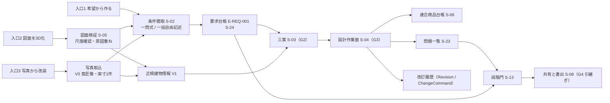
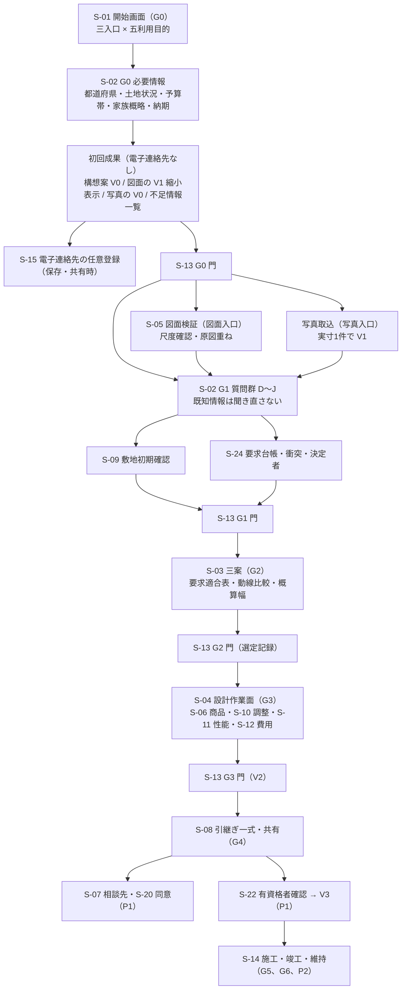

# 第08章 利用場面、生活場面、最初から最後までの利用導線（段階3 仕様書）

作成日: 2026-09-15　版: v1.5（v1.5 は 2026-10-08 の段階8 の最終仕上げ（再々確認 K1-05、K3-35、K6-09、K6-13、K6-14、主2-01、主2-03〜主2-05、主2-07、主2-08、主4-01、主4-02、主4-21〜主4-23。統括の決定 D30、D30b、D34、D36〜D38）。第2.3節（家具配置）の冒頭の源1 の雛形を第2章 第4.3節の雛形表どおりにし（条件付きの G1(c)(d)、G2(e) と非該当の G1(e)(f)）、手順6 を第6章 第2.2節の完了条件の参照の形（敷地の項目は利用目的による適用除外で非該当）に、手順7 に G2 の通過条件の参照を加えた。記号「追」の生成時点を「RP-MUST が 1 件以上になった時点」にそろえ（第2.4節）、改装と図面3D化の手順9 の自動付与の範囲（寸法変更、移設元）と図面派生の目録の範囲（外周壁の上の要素を対象外）を第12章、第21章に合わせ、表示語「未確認（P1で判定）」「G3で判定」の空白を除き、課金前表示 P10 の (1) に性能と費用の釣り合いの開示、(4) に F-C05-011 と F-C05-012 の書き分けを入れた。記録は `05_審査/再修正記録_最終仕上げ_群G2.md`。v1.4 は 2026-10-08 の段階8前の持ち越し仕上げ（共通の決定 D2、D14、既定値の識別子の併記 1 行）。第4.2節 乳幼児期の行の S-11-05 の表示語を判定区分の「製品で判定しない（記録のみ）」に改め（JR-055）、章末の用語追加提案 17 語に用語集の番号と登録日を記し（12 語を追記。全語が登録済み）、食事の場面の椅子を引く余白 600 mm に DV-FN-01 を併記した。記録は `05_審査/再修正記録_段階8前_仕上げ_群F2.md`。v1.3 は 2026-10-07 の段階6 二回目の修正（段階7 再審査の後）。修正計画 第1.8節の 26 件（主担当 JR-037〜JR-043 の 7 件、整合 19 件。極高 JR-095、高 JR-001、JR-037）を第0.3節、第0.4節の固定文と番号で反映した。記録は `05_審査/再修正記録_2回目_第8章.md`。v1.1 は 2026-09-15 段階6 初稿審査の再修正。2026-10-06 に完了。統合指摘 29 件（主担当 JM-043〜JM-054 の 12 件、整合 17 件）、整合修正指示 第8章 2 件、試験の採番の置換（JM-173）、修正済みの章からの依頼を反映。記録は `05_審査/再修正記録_第8章.md`。v1.2 は 2026-10-06 の段階6 の仕上げ（相互依頼と残課題の処理。群C）。第6章、第12章、第18章、第19章、第24章の依頼 5 件を確認し、導線 2.4、2.5 から第6章の完了条件にない「要求なし」の明示と条件の言い換えを除き、F-C01-023 例外(a)の I-00-111 の式を第6章と同文にし、章末の対応状況を更新した。群Bの申し送り（第12章 v1.3 への追従）を含み、D9 の格納先を E-ORG-008.careNeeds、衝突の記録と衝突候補の採否を E-REQ-001.conflictRecords、conflictCandidates に改めた。記録は `05_審査/再修正記録_相互依頼_群C.md`。2026-10-07 の二回目の修正の仕上げ（群R4）で、外部確認（`01_調査/08_外部確認_段階7後.md`）による第4.2節の注（R-08-008、R-08-016、R-05-011 と公的基準の関係、既定閾値の出典名の表示）、F-C04-017 の前提の根拠区分、章末の対応状況を改めた（版は据え置き。内容は `05_審査/再修正記録_2回目_仕上げ_群R4.md`））　担当: 第08章（UX設計者、一級建築士、製品責任者の合議）
根拠: 指示文 2.1〜2.3（指定参照三社の棚卸し）、3.2（三入口と内部共通化）、B（中心原則）、C1（対話設計）、C4（動線比較）、D（主要画面）、G（P0〜P2）、H（収益設計）、9.3（入力別に約束できる範囲）、9.9（収益と信頼の衝突）、10.6（責任境界）、10.7（初期公開の優先順位）。基盤定義 `用語集.md`、`識別子規則.md`、`十二判断領域.md`、`七段階門.md`、`信頼状態と証拠段階.md`、`機能一覧骨格.md`、`情報実体骨格.md`、`画面指標試験骨格.md` の v1.3 以降（本章 v1.3 で二回目の修正後の版へ追従。v1.2 までは各 v1.2）、`整合検査報告.md` v1.1（第5節 識別子変更一覧）。識別子の正本の判定は `04_必須表/識別子台帳.md`（段階6 訂正）、属性名と既定値の正本は第12章 項目辞書と既定値表（v1.2 追補）。調査 `01_調査/01_指定参照三社.md`、`01_調査/03_国内競合.md`。

## 0. 冒頭

### 0.1 本章の目的

- 三入口（希望から作る、図面を3D化、写真から改装）から入った利用者が、同じ要求台帳、正規建物情報、連合商品台帳、問題一覧、改訂履歴へ合流する構造を定める【推定】。
- 五つの利用場面（新築、改装、家具配置、図面3D化、売却または賃貸資料）について、最初の画面から引継ぎまたは資料作成までの利用導線を、段階門 G0〜G6 と画面 S- を付けて時系列で固定する【推定】。
- 対話設計（C01）の質問項目の全一覧、分岐規則、一問式と一括自由記述の切替、既知情報を聞き直さない規則を定める【推定】。
- 生活場面の四群（日常、家族変化、非常時、維持）と、各場面が要求台帳のどの項目を生むかを固定する【推定】。
- 要求台帳への変換規則（優先度、数値範囲、出典、決定者、確認者、期限、確認状態）と要求衝突の表示を定める【推定】。
- 初回価値到達（電子連絡先の要求前に透かし付き試作を見せる）と、課金前に示す事項を定める【推定】。
- 機能一覧骨格 v1.2 で本章が主章とされた24機能（F-C01-001〜012、F-C01-015〜020、F-C01-022〜025、F-C04-016、F-C04-017）の必須10項目と受入条件 AC- を記述する【推定】。

### 0.2 本章の範囲と非対象

| 区分 | 内容 | 区分 |
|---|---|---|
| 範囲 | 利用導線の順序、各手順の段階門、画面、必要な入力、生成される実体、進行禁止の位置。質問項目と分岐。生活場面と要求の対応。要求台帳への変換規則。初回成果と課金前に示す事項の一覧と表示時点。本章担当24機能の10項目 | 【推定】 |
| 非対象（他章が主章） | 関係者表と当事者参画と目的文承認の必須10項目（F-C01-013、014、021 は第5章）。三案の生成、比較、選定記録（F-C03-019〜021 は第12章。生成規則の正本は第12章 第7.8節「三案生成の生成規則」と第14章 AP-038「三案生成（雛形）」（定義は第14章）であり、本章の導線は G2 でそれを呼ぶだけで生成手順を定めない。P0 は希望入力の雛形三案 F-C03-019-01（用語集 496）と図面入力の図面派生三案 F-C03-019-03（第12章 第7.8節 (f)。JR-095）、雛形にない自由形状の生成 F-C03-019-02 は P1。JM-077）。図面読解の処理手順（第11章）。画面の部品、空状態、待機状態、失敗状態の設計（第15章）。商品検索と所有家具の実寸確認（第16章）。提携先、同意管理、相談予約（第17章）。敷地と法規（第18章）。性能（第19章）。費用と期間（第20章）。改装、竣工、維持の詳細（第21章）。個人情報と権利の詳細（第22章）。指標の計測方法と試験（第23章）。課金の額と利用量の単位の値（第24章） | 【推定】 |
| 非対象（製品として） | 確認申請図、構造安全証明、見積確定額、施工図、性能評価書の作成。単写真からの実寸完全復元。連絡先の一括送信。利用導線の途中で「施工可能」「法規適合」「完全正確」の語を表示する仕様（いずれの信頼状態でも表示しない。F-C15-005 の文言検査と T-S-003 の対象） | 【推定】 |

### 0.3 前提とする章

| 章 | 本章が前提とする内容 | 種別 |
|---|---|---|
| 第5章 | 関係者表（F-C01-013）、当事者参画（F-C01-014）、目的文と成功条件と非対象と変更できない条件の承認（F-C01-021）の10項目。決定権の割当 | 前提 |
| 第6章 | 段階門 G0〜G6 の開始条件、完了条件、進行禁止条件（F-C15-001〜003）。本章の導線は `七段階門.md` v1.2 と第6章 第2節の定義を転記せず参照する（例外は第6章が転記を求めた I-00-111 の式と保留の統合判断。JM-036、JM-047） | 前提 |
| 第7章 | 十二判断領域と主担当の一意性。本章の要求例示は主担当を一つだけ持つ | 前提 |
| 第9章 | 機能一覧（P0、P1、P2）。本章の導線で P1 と表記した手順は第9章の優先に従う | 前提 |
| 第11章 | 図面読解と3D構築の手順（F-C02-001〜028）。導線 2.4 の手順は第11章の処理を呼ぶ | 前提 |
| 第12章 | 正規建物情報の実体と状態遷移。三案の生成（F-C03-019〜021。生成規則は第12章 第7.8節「三案生成の生成規則」。P0 は希望入力の雛形三案 F-C03-019-01 と図面入力の図面派生三案 F-C03-019-03、自由形状生成 F-C03-019-02 は P1）。要求台帳の実体 E-REQ-001 の属性（v1.2 追補の valueAttribute、polarity、targetSpaceRefs を含む）と E-REQ-009 の timeBand、activities、trialScene、trialResult.requirementResults。E-REQ-004 の recordedByRef、deciderConfirmation、coDeciderRefs。E-BLD-001.plannedStartDate。既定値表 DV-CF-10（両立しない行動の対応表）、DV-GE-18（駐車 1 台の寸法）、DV-GE-19（建物の最小間口）、DV-FN-01（家具余白、通路と利用円滑性の既定閾値）、DV-FN-03（視点高さ）。v1.4 で追加の DV-GE-22（図面派生の目録の量）、DV-GE-24（縦列配置の判定に使う建物の最小面積）、DV-CF-12（要求と予算の変更の検出語）、DV-CO-21（性能目標と仕様区分の対応。P1）と、E-REQ-001.checkTarget、complianceByOption（七区分）、conflictRecords.optionRefs（二回目の修正）。属性名と値の正本は第12章 | 前提 |
| 第15章 | 画面 S-01、S-02、S-24 の部品、空状態、待機状態、失敗状態。本章は部品を採番しない | 前提 |
| 第22章 | 入力資料の利用権確認（F-C10-014）、期限付き共有URL（F-C10-009）、削除（F-C10-012）、監査記録（F-C10-010） | 前提 |
| 第24章 | 無料枠と個人有料の境界、利用量の単位、追加費用、返金条件の値 | 前提 |

## 1. 三入口と内部合流の構造

### 1.1 入口と利用目的の組合せ

開始画面（S-01）は三入口と利用目的を取得し、案件（E-BLD-001 Project）を作る（F-C01-001）。入口は `E-BLD-001.entryType`、利用目的は `E-BLD-001.useType` に記録する【推定】。入口と目的の組合せは次のとおり許容し、許容しない組合せは選択肢に出さない【仮定】。

| 入口 \ 利用目的 | 新築 | 改装 | 家具配置 | 図面3D化 | 売却または賃貸資料 |
|---|---|---|---|---|---|
| 希望から作る | 主導線（2.1） | 可（既存図面なしの改装。2.2 の分岐 b） | 可（室の寸法を手入力。2.3 の分岐 b） | 不可（図面がない） | 不可（既存資料がない） |
| 図面を3D化 | 可（建替えで既存図面を参考にする場合。2.1 の手順 6 へ図面入力を挿入） | 主導線の一つ（2.2 の分岐 a） | 可（2.3 の分岐 a） | 主導線（2.4） | 主導線（2.5） |
| 写真から改装 | 不可 | 主導線の一つ（2.2 の分岐 c） | 可（写真の室に家具を置く。2.3 の分岐 c） | 不可 | 可（P1。室内写真から V0 の意匠像だけ。2.5 の注記） |

入口は案件作成後も変更できる。変更は判断（D-08-003 参照）として記録し、既に取得した回答と資料は失わない【仮定】。

### 1.2 内部で合流する五つの台帳

どの入口から入っても、内部は同じ五つの台帳へ合流する（用語集 12「三入口」）。入口ごとに初期状態が異なるだけであり、台帳の構造は同一である【推定】。

| 台帳 | 実体（情報実体骨格） | 希望から作る の初期状態 | 図面を3D化 の初期状態 | 写真から改装 の初期状態 |
|---|---|---|---|---|
| 要求台帳 | E-REQ-001 Requirement、E-REQ-009 LifeScene、E-ORG-008 Stakeholder | 質問の回答と自由記述から生成（本章 第3節、第5節） | 図面から取得した階数、室数、面積を「確認待ちの既知情報」として保持し、要求は質問で補う | 写真から推定した室の用途と家具を既知情報として保持し、要求は質問で補う |
| 正規建物情報 | E-BLD-001〜E-MAT-004 等 | G2 で三案を生成するまで未生成（七段階門 G1「希望入力時は建物情報を生成しない」） | G1 で V1 編集案を生成（F-C02-016） | 実寸1件以上の入力後に室単位の V1。入力前は V0 の意匠像のみ（指示文 9.3） |
| 連合商品台帳 | E-PRD-001 Product 等（案件横断） | G2 以降で参照 | G2 以降で参照 | 写真内の物品は PT-GEN の一般形状として仮置きし、正規商品と表示しない |
| 問題一覧 | E-REQ-003 Issue | 要求衝突、進行禁止条件の問題 | 上記に加え、尺度、低確信度、閉領域の問題 | 上記に加え、実寸未入力、隠れ部分（CS-EST）の問題 |
| 改訂履歴 | E-REQ-006 Revision、E-REQ-011 ChangeCommand | 案件作成時の初版 | 図面読込を新資料取込の変更命令として記録 | 写真取込を新資料取込の変更命令として記録 |

### 1.3 入口別に約束できる範囲（信頼状態）

| 入口と入力 | 初回成果で示す信頼状態 | 自動で到達できる最大 | 利用者確認後に到達できる最大（P0） | 根拠 |
|---|---|---|---|---|
| 希望から作る（自然文、段階式質問） | V0 の構想案（文章から作った意匠像と室構成の概略。寸法値は表示しない）または不足情報一覧。建物情報（V1）は G2 の三案で初めて生成する（七段階門 第2節: G0 の最大は V0。文章からの V0 は第6章 第2.1節の許される信頼状態に含める。U-08-004 は解決、第6章 U-06-018） | V1（G2 の三案） | V2（G3 完了条件を満たした案） | 指示文 G「自動はV1まで」、七段階門 G0、G1【推定】 |
| 図面を3D化（明瞭な単一縮尺の PDF、PNG、JPEG） | V1 編集案（尺度確認前は寸法値を表示しない） | V1 | V2 | 指示文 9.3、七段階門 G1【推定】 |
| 写真から改装（一枚写真） | V0 視覚案。「寸法未確認」「実在商品ではない」の注記 | V0 | 実寸1件以上の入力で V1。V2 は現況確認（P1）後 | 指示文 9.3「なければV0限定」【推定】 |
| 写真から改装（複数写真または走査、P1） | V0 | V1 | V2 | 指示文 9.3【推定】 |

いずれの入口でも、V0 または V1 の案を V2 以上と表示した件数（M-G-13）は 0 件でなければならない【推定】。

## 2. 利用場面ごとの最初から最後までの利用導線

### 2.0 表の読み方と共通規則

| 規則 | 内容 | 区分 |
|---|---|---|
| 手順番号 | 各導線の手順は通し番号で書く。番号は本章内の参照用であり識別子ではない | 【仮定】 |
| 段階門 | 各手順が属する段階 G0〜G6。門の通過は `七段階門.md` の完了条件による。本章は完了条件を再定義しない | 【推定】 |
| 画面 | 主に使う画面 S-（画面指標試験骨格 v1.2）。補助画面 S-15〜S-27 は P0 と P1 の別を画面骨格 第1.2節に従う | 【推定】 |
| 優先 | P0 で提供する手順を無印、P1 と P2 の手順は「P1」「P2」と明記する。P1 の手順は P0 では省略され、導線は次の P0 手順へ進む | 【推定】 |
| 生成される実体 | 手順の結果として作られる、または更新される実体（E-）と、要素値状態または信頼状態 | 【推定】 |
| 電子連絡先 | 全導線で、初回成果（用語集 280）の表示より前に電子連絡先の入力欄を出さない（F-C01-025）。連絡先の任意登録は S-15 で、初回成果の後に行う | 【推定】 |
| 進行禁止 | 各導線で働く進行禁止条件は `七段階門.md` の I-00-101〜I-00-126 を参照し、本章は導線上の位置だけを示す | 【推定】 |
| 重要判断の雛形（源1） | 各導線で M-N-01 の分母に入る源1 の雛形は第2章 第4.3節の雛形表の「利用目的別の生成」列（正本。G2(d)、G3(f) は源1 対象外）に従う。生成しない雛形は「非該当」とし、承認を要する「除外」と区別して M-N-01 と M-G-17 の分子と分母に数えない。家具配置、図面3D化、売却または賃貸資料の生成と非該当は各導線の冒頭に示す（JR-001） | 【推定】 |
| 待機状態 | 短期非同期の時間（第23章 N-PF-05）を超える処理（三案生成、図面読込、3D構築）は S-30-02 で実際の状態名と待ち時間の見込を出し、架空の進捗率を出さない（F-C02-028、画面骨格 第1.5節） | 【推定】 |

### 2.1 新築（入口: 希望から作る）

利用者像: 土地を所有、候補あり、または探索中で、家族の希望から住宅案を作り、建築士へ渡したい家族。P0 の主導線である【推定】。

| 手順 | 段階 | 画面 | 利用者の操作と製品の応答 | 生成される実体と状態 | 機能 | 進行禁止の位置 |
|---:|---|---|---|---|---|---|
| 1 | G0 | S-01 | 入口「希望から作る」と利用目的「新築」を選ぶ。非対象と責任境界（S-30-06）が表示される。電子連絡先は求めない | E-BLD-001（PJ- 発行、entryType、useType）。E-REQ-010 Gate の G0 が「進行中」 | F-C01-001、F-C01-025 | I-00-104（利用目的が非対象） |
| 2 | G0 | S-02 | 質問群A〜Cの G0 必要情報（第3.1節: 都道府県、土地状況、建築費の帯、家族の概略、納期希望）に一問式または一括自由記述で答える。残り項目数が常時表示される | E-REQ-001（G0 分の要求候補）、E-BLD-001.region、budgetRange、landStatus | F-C01-002、F-C01-003、F-C01-004、F-C01-005、F-C01-006、F-C01-012 | I-00-101、I-00-102、I-00-103 |
| 3 | G0 | S-02 | 主要危険の初期一覧（土地、費用、期間、災害）と初期予算の幅が表示される。目的文の候補が提示され、利用者が確認する | E-SRV-007 Risk（kind=主要危険）、E-BLD-001.purpose（VS-USR） | F-C01-022、F-C01-021（第5章） | — |
| 4 | G0 | S-02 | 初回成果の提示。G0 の必要情報から「一件の構想案」（無料枠、V0 視覚案、透かし付き。寸法値は表示せず「寸法未確認」「実在商品ではない」を注記）または不足情報一覧を表示する。建物情報は生成しない（七段階門 第2節: G0 の最大信頼状態は V0。文章からの V0 は第6章 第2.1節に含める。U-08-004 は解決）。室構成の概略は第12章の雛形からの決定的な合成、意匠像は画像生成処理先の生成物であり、第14章 AP-039 が返す（未契約時は意匠像なし。第6.1節）。ここで初めて「保存」「三案比較へ進む」の選択肢が出る。保存を選ぶと S-15 で電子連絡先の任意登録 | 初回成果（M-P-04 の分子）。E-REQ-005 Option（kind=分岐案、V0、透かし） | F-C01-025、F-C01-024（意匠像の説明文。第12章 F-C03-019 は G2 で呼ぶ） | — |
| 5 | G0→G1 | S-13 | G0 の完了条件（目的文確認、決定権を持つ関係者1名以上、非対象表示、主要危険、初期予算）の充足が表示され、門を通過する | E-REQ-010 Gate G0 = 通過 | F-C15-003（第6章） | S-13-04 に該当条件を表示 |
| 6 | G1 | S-02 | 質問群D〜J（家族と関係者、空間要件、生活行動と動線、性能優先度、好み、共有と書出、生活場面の四群）に答える。既知情報は聞き直さない。代理入力があれば当事者参画の方法を提案する。空間要件の E9 で構造形式の希望を聞き、「P0 で構造の初期注意を判定できるのは在来木造だけ」を注記する（JR-014） | E-ORG-008 Stakeholder、E-REQ-009 LifeScene（33 場面）、E-REQ-001（要求候補） | F-C01-007〜011、F-C01-013、014（第5章）、F-C01-015〜018 | — |
| 7 | G1 | S-09 | 敷地の初期確認。住所または概略地域から公的地理情報を重ね、法規条件を版付きで収集し、不足調査を登録する。境界線は法的境界ではないと表示する | E-BLD-002 Site、E-SRV-011 SiteRegulation、E-SRV-012 HazardInfo、E-SRV-001 Survey（status=必要） | F-C09-001〜004、007〜010、015（第18章） | I-00-105、I-00-106、I-00-107 |
| 8 | G1 | S-24 | 要求台帳への変換結果を確認する。各要求の優先度、数値範囲、出典、決定者、確認者、期限、確認状態が表示され、利用者が確認（VS-USR）する。要求衝突が全件表示され、解決候補と代償を見て決定者が判断する | E-REQ-001（confirmState=VS-USR）、E-REQ-004 Decision（衝突の解決）、E-REQ-002 Constraint（変更できない条件） | F-C01-019、F-C01-020 | I-00-109、I-00-110 |
| 9 | G1 | S-02、S-13 | 目的文、成功条件、非対象、変更できない条件を家族（P0 では利用者のみ可）が承認する | E-REQ-007 Approval（scopeKind=目的文、AS-VALID） | F-C01-021（第5章） | 完了条件(5) |
| 10 | G1→G2 | S-13 | G1 の完了条件（必須要求の出典、決定者、確認者。衝突の表示。境界、接道、用途地域の解消または不足調査登録。承認）を判定し、門を通過する | Gate G1 = 通過 | F-C15-003 | S-13-04 |
| 11 | G2 | S-03 | 三案（生活動線重視、費用重視、意匠重視。P0 は雛形三案 F-C03-019-01。生成規則は第12章 第7.8節「三案生成の生成規則」と第14章 AP-038 であり、本章は G2 でそれを呼ぶ）が V1 で生成され、同一評価軸（生活、空間、技術、費用、性能）で並ぶ。案別の要求適合表と捨てた条件、生活場面ごとの動線比較、簡易な日照比較、工種別概算幅、性能目標（EL-TGT）、家族変化群の場面ごとの「試行未実施」（P0。七段階門 G2 完了条件(7)、F-C01-023 手順(8)）が表示される | E-REQ-005 Option ×3（V1）、E-SRV-005 Estimate、E-SRV-013 PerformanceTarget（EL-TGT）、E-SRV-004 Calculation（kind=動線、日照） | F-C03-019、020（第12章）、F-C01-023、F-C04-016、F-C04-009（第11章）、F-C13-001（第20章）、F-C12-007（第19章） | I-00-111〜I-00-114 |
| 12 | G2 | S-03 | 要求衝突の再表示（案ごとの捨てた条件に基づく）。決定者が進める案を選び、理由、代償、未解決点を選定記録に残す | E-REQ-004 Decision（isKeyDecision=true）、選定記録 | F-C03-021（第12章）、F-C01-020 | I-00-115 |
| 13 | G2→G3 | S-13 | G2 の完了条件を判定し、門を通過する | Gate G2 = 通過 | F-C15-003 | S-13-04 |
| 14 | G3 | S-04 | 選定案を設計作業面で編集する。自然文の変更命令は対象、操作、量、方向、固定条件、目的を抽出し、影響予測と差分の仮表示の後に確定する。商品は S-06 で実在品優先で選ぶ | E-REQ-011 ChangeCommand、E-REQ-012 Impact、E-REQ-006 Revision、E-ELM-013 Furniture（productRef） | F-C03-009〜014（第12章）、F-C01-024、F-C05-003〜009（第16章） | — |
| 15 | G3 | S-10、S-11、S-12 | 主要断面、構造形式と通り芯の仮定、主要設備置場と経路帯、外皮方針、干渉、性能目標、費用更新を確認する。P1 では構造、外皮、設備の詳細調整 | 調整模型（V2 の条件を満たす建物情報）、E-SRV-004（EL-CAL、P0 は簡易な日照と動線） | F-C04-005（第11章）、F-C11-001〜003（第13章）、F-C12-001、002、009（第13章、第19章）、F-C13-003（第20章） | I-00-116〜I-00-121 |
| 16 | G3 | S-04、S-13 | 尺度、外周、開口、室、階段、主要寸法を利用者が確認（VS-USR）し、低確信度要素と VS-DEF の主要寸法を解消する。V2 の昇格条件を満たすと V2 と表示される | 案の信頼状態 V2、E-REQ-007 Approval（scopeKind=間取り 等） | F-C15-004（第6章）、F-C10-004（第17章） | I-00-119、I-00-120 |
| 17 | G3→G4 | S-13 | G3 の完了条件を判定し、門を通過する | Gate G3 = 通過 | F-C15-003 | S-13-04 |
| 18 | G4 | S-08 | 引継ぎ一式（GLB、PDF平面、要求台帳、問題一覧、判断記録。P1 で IFC、SVG、DXF、BCF）を生成し、標準の必要情報要求で検査し、例外承認を付けて発行（CDE-PUB）する。透かしに V2 が入る | E-EXC-002 Delivery、E-REQ-007 Approval（scopeKind=書出）、E-REQ-006（cdeState=CDE-PUB） | F-C15-006、007、011〜013、017（第22章）、F-C04-012、014（第11章） | I-00-122〜I-00-124、I-00-126 |
| 19 | G4 | S-07、S-20（P1） | 相談先を三社以上で比較し、送信先ごとに送信内容を確認して個別に同意する。P0 では所有者自身が期限付き共有URL（S-08）で建築士へ渡す | E-ORG-006 Consent（送信先ごと）、E-EXC-006 Share | F-C08-001〜005、007（第17章）、F-C10-009（第22章） | I-00-125 |
| 20 | G4 | S-22（P1）、S-13 | 有資格者が確認範囲を明示して承認し、範囲内が V3 になる。受取側が元図、要求、問題へ戻れることを確認する | E-REQ-007（qualification 付き、AS-VALID）、案の信頼状態 V3（範囲内） | F-C08-008（第17章）、F-C15-009（第6章） | 完了条件(6) |
| 21 | G5、G6（P2） | S-14 | 施工中の変更記録、検査、竣工時建物情報、機器台帳、入居後確認、学び一覧。P0 では情報構造だけを保持する | E-OPS-006 AsBuiltDelta、E-PRD-004 Asset、E-OPS-007 PostOccupancyRecord | F-C14-007〜012（第21章） | I-00-127〜I-00-133 |

### 2.2 改装（入口: 図面を3D化、写真から改装、希望から作る）

利用者像: 既存住宅の所有者または賃借人が、室単位または全体の改装を検討し、現況差と必要調査を把握したうえで建築士または施工者へ渡したい【推定】。改装は入口により三つに分岐し、手順 8 以降で合流する【仮定】。

| 手順 | 段階 | 画面 | 分岐 | 利用者の操作と製品の応答 | 生成される実体と状態 | 機能 | 進行禁止の位置 |
|---:|---|---|---|---|---|---|---|
| 1 | G0 | S-01 | 共通 | 入口を選び、利用目的「改装」を選ぶ。改装の範囲（室単位、階、全体）と解体を伴うかを質問群K で聞く | E-BLD-001（useType=改装） | F-C01-001 | I-00-104 |
| 2 | G0 | S-02 | 共通 | G0 必要情報（都道府県、土地状況=所有または賃借の別、改装費の帯、家族の概略、希望時期）に答える。賃借の場合は「所有」ではなく「その他」を選び、貸主の同意を関係者表へ登録する | E-REQ-001、E-ORG-008（貸主） | F-C01-002〜006、012、013（第5章） | I-00-101〜I-00-103 |
| 3a | G1 | S-05 | a 図面を3D化 | 既存図面（設計時図面または竣工図）を読み込む。図種、縮尺、改訂日を判定し、尺度と重要寸法1件以上を利用者が確認する。原図重ねと確信度が表示される | E-PRD-006 Source（kind=図面、isMasterCandidate）、V1 編集案、E-SRV-009 Overlay | F-C02-001、005〜016、028（第11章） | I-00-108 |
| 3b | G1 | S-02 | b 希望から作る（図面なし） | 既存の室の寸法を手入力する（各室の内法、開口位置、階高）。入力値は VS-USR。未入力の値は VS-DEF と表示され確認依頼が付く | E-SPC-001 Space（VS-USR）、既定値の適用箇所一覧 | F-C01-008、F-C03-016（第12章） | I-00-120（G3 で） |
| 3c | G0→G1 | S-02 | c 写真から改装 | 室内写真を取り込み、利用権を確認する。V0 視覚案（意匠像）を初回成果として表示し、「寸法未確認」「実在商品ではない」を注記する。実寸1件以上（扉幅等の基準寸法）を入力すると室単位の V1 になる | E-PRD-006（kind=写真、RS-OWN）、V0 → V1（実寸入力後）、写真内の物品は PT-GEN | F-C10-014（第22章）、F-C02-014（第11章）、F-C05-014（第16章） | I-00-108 |
| 4 | G1 | S-02 | 共通 | 初回成果（a: V1 の縮小表示、b: 不足情報一覧、c: V0 意匠像）の後に、質問群D〜J に答える。改装では生活場面「維持」群の「改装」場面を必ず確認し、E9 で既存建物の構造を申告させて「P0 で構造の初期注意を判定できるのは在来木造だけ」を注記する（JR-014） | E-ORG-008、E-REQ-009、E-REQ-001 | F-C01-007〜018 | — |
| 5 | G1 | S-27（P1）、S-05（P0） | 共通 | 要素ごとに現況状態 CS- を付ける。P0 は F-C02-024-01: 図面由来の要素を CS-DRW、図面にない隠れ部分を CS-EST として初期付与し、S-05 に記号と文字で表示する（3D で CS-EST を空洞に描かず「無い」と描かない）。P1 は F-C02-024-02: 現況資料（写真、採寸、既存住宅状況調査、耐震診断、修繕履歴）を結んで CS-SITE、CS-OPEN へ遷移させ、差異（存在差、寸法差、位置差）を重ね表示する。解体を伴う場合の石綿事前調査の要否判定（F-C02-026）は P1 であり、P0 では S-05-07 に固定注記（石綿事前調査の義務と、既存の壁の撤去と移動での耐震診断、大規模の修繕または模様替での確認申請の可能性。文は第21章 第1.2節）を表示し、問題は登録しない | 要素.conditionState（P0 は CS-DRW、CS-EST）。P1: E-SRV-002 Observation、E-SRV-001 Survey（kind=石綿事前調査、status=必要） | F-C02-024-01（P0）、F-C02-024-02、025、026（P1。第11章、第21章） | 固定注記（P0）。警告（P1）。I-00-130（G5、P2） |
| 6 | G1 | S-09 | 共通 | 敷地と法規の初期確認。改装では用途地域、防火、接道を版付きで確認し、行政照会を不足調査へ登録する | E-SRV-011、E-SRV-001 | F-C09-002、007、008（第18章） | I-00-107 |
| 7 | G1 | S-24 | 共通 | 要求台帳の確認と衝突の解決。改装では「残す」要素の要求（RP-MUST または RP-FORBID として「撤去しない」）を要求台帳に持つ | E-REQ-001、E-REQ-004 | F-C01-019、020 | I-00-109、I-00-110 |
| 8 | G1→G2 | S-13 | 合流 | G1 の完了条件を判定し、門を通過する | Gate G1 = 通過 | F-C15-003 | S-13-04 |
| 9 | G2 | S-03 | 合流 | 三案を生成し、改装前後比較（P1）と動線比較で並べる。要素ごとの改装区分の指定（残す、撤去、補修、補強、移設、新設。S-27-03）は P1。P0 では三案の差を要素の追加と削除で示し、改装案件で現況要素を削除、移動または寸法変更した場合（案の変更命令に限り、図面読解の修正は除く）は撤去、移設、または撤去と新設の組（寸法変更）が自動で付く（第21章 第2.1節 規則(7)。要素は消さずに保持）。耐力壁候補線、外周壁、上下階連続壁とその上の要素（外壁開口を含む）は三案の派生の対象にしない（第12章 第7.8節 P0 の範囲 (a)、(f)。統括の決定 D37）。目録の外の利用者の編集で既存の外周壁または上下階連続壁を撤去、移設または寸法変更した場合（移設は移設元を、寸法変更は変更前の要素を撤去として数える）と、耐力壁候補線上に開口を新設した場合は、第13章 第5.5節 式(5)が P0 から働き G3 で SEV-0（I-00-116。P0 の解除は元に戻す変更だけ。統括の決定 D34、D36）になる | E-REQ-005 ×3、要素.renovationAction（P0 は撤去と移設の自動付与だけ。指定は P1） | F-C03-019〜021（第12章。P0 は図面入力が F-C03-019-03、希望入力が F-C03-019-01）、F-C14-001（P0 は自動付与だけ）、F-C14-005（P1。第21章）、F-C04-016 | I-00-111〜I-00-115 |
| 10 | G3 | S-04、S-10、S-12 | 合流 | 選定案の調整。改装では予備費を隠れた不具合の判断と結び（P1）、解体後判明時の判断者、費用予備、代替案、承認手順を定義する（P1）。P0 では予備費を工種別費用幅の一項目として持つ | E-SRV-014 CostItem（予備費）、E-REQ-004（解体後判明の手順、P1） | F-C14-003、004（第21章）、F-C13-001（第20章） | I-00-116〜I-00-121 |
| 11 | G3→G4 | S-13、S-08 | 合流 | V2 判定と引継ぎ一式の発行。改装では現況状態 CS- と必要調査一覧を引継ぎ一式に含める。P0 の改装の未確認事項は第6章 第2.5節 欠落の自動記録 (vii) として載る | E-EXC-002（CS- を含む） | F-C15-013（第22章） | I-00-122〜I-00-126 |
| 12 | G4〜G6 | S-07、S-22、S-14 | 合流 | 2.1 の手順 19〜21 と同じ。改装では G5 で石綿事前調査の未了が進行禁止（P2） | 同上 | 同上 | I-00-130 |

### 2.3 家具配置（入口: 図面を3D化、希望から作る、写真から改装）

利用者像: 新築または既存の室に、所有家具と購入候補の家具を実寸で置き、通路、扉開閉、搬入経路を確かめたい利用者。段階は G0〜G3 で完結し、G4 の引継ぎは任意である【推定】。

源1 の雛形（第2.0節）: G0(a)(c)、G1(a)、G2(a)（家具配置三案の選定）、G3(a)(e) を生成し、G0(b) は家具費の大枠と読み替えて生成する。G1(c)(d) は図面入力のある案件、G2(e) は該当する将来場面（E-REQ-009.isFuture=true）がある案件だけで生成する（条件付き）。G1(b)(e)(f)、G2(b)(c)、G3(b)〜(d)、G4(c) は「非該当」とする。G4(a)(b) は任意の G4 を開始した案件だけで生成する（第2章 第4.3節の雛形表。生 7、条 3、任 2、非 9）【推定】。

| 手順 | 段階 | 画面 | 分岐 | 利用者の操作と製品の応答 | 生成される実体と状態 | 機能 | 進行禁止の位置 |
|---:|---|---|---|---|---|---|---|
| 1 | G0 | S-01 | 共通 | 入口を選び、利用目的「家具配置」を選ぶ。対象が室単位か家全体かを質問群K で聞く | E-BLD-001（useType=家具配置） | F-C01-001 | I-00-104 |
| 2 | G0 | S-02 | 共通 | G0 必要情報のうち、都道府県（商品の供給地域の判定に使う）、家具費の帯、家族の概略に答える。土地状況は「所有」を既定とし、建築費と納期の質問は出さない（分岐規則 第3.2節） | E-REQ-001、E-BLD-001.budgetRange（家具費） | F-C01-002、005、006 | I-00-101、I-00-102 |
| 3a | G1 | S-05 | a 図面を3D化 | 平面図を読み込み、尺度を確認し、V1 の室を得る | V1、E-SPC-001 | F-C02-001〜016（第11章） | I-00-108 |
| 3b | G1 | S-02 | b 希望から作る | 室の内法寸法、開口の位置と幅、天井高を手入力する（VS-USR） | E-SPC-001、E-ELM-007 Door、E-ELM-008 Window | F-C01-008 | — |
| 3c | G0→G1 | S-02 | c 写真から改装 | 写真から V0 を表示し、実寸1件以上の入力で室単位の V1 にする | V0 → V1 | F-C02-014（第11章）、F-C05-014（第16章） | I-00-108 |
| 4 | G1 | S-02 | 共通 | 初回成果（V1 の室、または V0）の後に、所有家具の一覧（種類、幅、奥行、高さ。写真だけで実寸を断定せず寸法入力または基準物による確認）と、生活行動のうち家具に関わる項目（食事の人数、在宅勤務の場所、来客の滞在場所）、生活場面「維持」群の「家具搬入」を確認する | E-ELM-013 Furniture（isOwned=true、ownedDimensionSource）、E-REQ-001 | F-C05-014（第16章）、F-C01-009、F-C01-018 | — |
| 5 | G1 | S-24 | 共通 | 要求台帳の確認。家具配置では通路幅、椅子を引く余白、搬入経路の要求を数値範囲で持つ | E-REQ-001（valueRange 付き） | F-C01-019、020 | I-00-109 |
| 6 | G1→G2 | S-13 | 共通 | G1 の完了条件を判定する。判定は第6章 第2.2節の完了条件だけで行い、導線側で完了条件を定義しない。敷地の項目（境界、接道、用途地域）は同節 完了条件(3)の利用目的による適用除外で非該当となり、I-00-105〜107 は登録されない（第2章 第4.3節の G1(b) が非。統括の決定 D30。JM-030） | Gate G1 = 通過 | F-C15-003（第6章） | — |
| 7 | G2 | S-03 | 共通 | 家具配置の三案（生活動線重視、費用重視、意匠重視）を生成し、動線比較（距離、通過扉数、交差）と費用幅で比較する。G2 の通過条件は第6章 第2.3節の完了条件と「利用目的による適用除外」（家具配置は完了条件(4)(5) が非該当、(7) が条件）に従い、導線側で条件を定義しない（統括の決定 D30b。JM-030） | E-REQ-005 ×3 | F-C03-019〜021（第12章）、F-C04-016 | I-00-111、I-00-113 |
| 8 | G3 | S-04、S-06 | 共通 | 商品を実在品優先で検索し、配置検査（衝突、扉開閉、椅子を引く余白、通路、搬入経路）を通して置く。生活場面の3D再生（P1）で家具余白の不足を見る | E-ELM-013（productRef、PT-、RS-）、E-REQ-003（余白不足） | F-C05-003〜009、015、018（第16章）、F-C04-010（第11章）、F-C04-017 | I-00-121 |
| 9 | G3 | S-04、S-13 | 共通 | 室の寸法、開口、家具の実寸が利用者確認済み（VS-USR）で、干渉に SEV-0 がなければ V2。「施工可能」は表示しない | V2 | F-C15-004（第6章） | I-00-119、I-00-120 |
| 10 | G3→G4（任意） | S-08 | 共通 | GLB 共有と PDF 平面の書出、購入導線（P1、個別同意付き）、人への相談（P1） | E-EXC-002、E-EXC-006、E-ORG-006 | F-C04-012、014（第11章）、F-C05-017（第16章） | I-00-125 |

### 2.4 図面3D化（入口: 図面を3D化）

利用者像: 既存図面（新築計画中の図面、竣工図、販売図面）を持ち、寸法と関係を持つ 3D にして確認、共有、または専門家へ渡したい利用者。利用目的「図面3D化」は建物情報の生成と検証を主眼とし、要求聞取は最小にする【推定】。

源1 の雛形（第2.0節）: RP-MUST が 0 件の間は G0(a)(c)、G1(a)(c)(d)、G2(a)（「読み込んだ案」と「分岐案」の選定。手順9）、G3(a)、G4(a)(b) を生成し、他の雛形は「非該当」とする。G2(b)(c)、G3(b)〜(e)、G4(c) は RP-MUST が 1 件以上になった時点（第2章 第4.3節の記号「追」）で生成する【推定】。

| 手順 | 段階 | 画面 | 利用者の操作と製品の応答 | 生成される実体と状態 | 機能 | 進行禁止の位置 |
|---:|---|---|---|---|---|---|
| 1 | G0 | S-01 | 入口「図面を3D化」と利用目的「図面3D化」を選ぶ。入力見本（明瞭な単一縮尺の平面図）と対象外（手描き、写真撮影、低解像度、三階建以上は P0 対象外）を表示する | E-BLD-001 | F-C01-001、F-C02-001（第11章） | I-00-104 |
| 2 | G0 | S-02 | G0 必要情報のうち都道府県（法規と災害の初期確認に使う）と建物の階数の概略に答える。予算と納期は「未定」を既定にして質問を出さない | E-BLD-001.region | F-C01-002、005 | I-00-101 |
| 3 | G1 | S-05 | 図面を読み込む。利用権を確認する。処理状態（読込、尺度判定、壁抽出、開口抽出、関係検査、3D構築）が実際の状態名で表示される。図面一式（P1）では正本候補を判定する | E-PRD-006（RS-OWN）、E-SRV-009 | F-C10-014（第22章）、F-C02-005〜013、019、028（第11章） | — |
| 4 | G1 | S-05 | 初回成果として V1 編集案の縮小表示（同期2Dと3D、透かし付き、寸法値は非表示）と認識結果の要約（要素数、低確信度要素数、問題数）を表示する。ここで「保存」「尺度を確認して続ける」を選ぶ | 初回成果、V1 | F-C01-025、F-C02-016（第11章） | — |
| 5 | G1 | S-05 | 尺度と重要寸法1件以上を確認する（基準寸法の指定）。複数寸法の整合検査で矛盾があれば警告する。確認前は寸法値を表示しない | 尺度.valueState=VS-USR、E-REQ-007（scopeKind=尺度） | F-C02-014、011（第11章） | I-00-108 |
| 6 | G1 | S-05 | 原図重ねで低確信度要素を修正し、閉領域、隣接、扉接続、上下階接続の検査結果を確認する。階高、屋根形状、開口高さは立面と断面の補助入力または既定値（VS-DEF と表示） | 要素.valueStates、E-REQ-003（閉領域不成立等） | F-C02-010〜013、015、023（第11章）、F-C03-016（第12章） | — |
| 7 | G1 | S-02 | 要求聞取は「共有相手」「必要な書出形式」「相談希望」（質問群I）だけを必須とし、他の質問群は「後で答える」を既定にする。図面から取得した階数、室数、面積は既知情報として表示し聞き直さない | E-REQ-001（最小）、既知情報の確認記録 | F-C01-002、F-C01-012 | — |
| 8 | G1→G2 | S-13 | G1 の完了条件を判定する。必須要求（RP-MUST）が 0 件の案件を含め、判定は第6章 第2.2節の完了条件だけで行い、導線側で完了条件を定義しない（U-08-005 は解決。v1.2 で初稿の仮判断「『要求なし』を決定者が明示する」を除いた。第6章の完了条件にない条件であるため。JM-030） | Gate G1 = 通過 | F-C15-003（第6章） | I-00-109 |
| 9 | G2 | S-03 | G2 の通過条件は第6章 第2.3節の完了条件と「利用目的による適用除外」（U-06-018）に従い、導線側で条件を定義しない。適用除外に当たる案件では、G2(a) の選択肢を「読み込んだ案」と「分岐案」の 2 件とし（第2章 第4.2節の項目2 を満たす。F-C15-014 例外(c) の除外。第6章 第2.3節と同文）、2 件の比較を選定記録に残し、S-03 に「三案比較なし（利用目的による）」を表示する。適用除外の条件を外れた時点（同節の「RP-MUST が 1 件以上になった時点」と、利用目的を新築または改装へ変更した時点（住み替えの検討への移行等）。利用目的の変更時の再生成規則は U-06-018 により本章が持つ）で三案を要し、図面入口では読み込んだ V1 案（尺度が VS-USR 済み）から目録（DV-GE-22）の変更命令の組合せで三案を決定的に派生する（第12章 第7.8節 (f)。図面派生三案 F-C03-019-03。目録は耐力壁候補線、外周壁、上下階連続壁とその上の要素〔外壁開口を含む〕を移動、撤去、拡大の対象にしない。改装案件の既存の壁と開口も同じ。統括の決定 D37）。通過済みの G2 は完了条件の不成立により「再確認中」に戻る（第6章 第1.2節。JM-030） | E-REQ-005（kind=分岐案。派生した三案は generationBasis.method=図面派生）、選定記録 | F-C03-019-03、F-C03-021（第12章）、F-C15-003（第6章） | I-00-115 |
| 10 | G3 | S-04、S-10 | 主要寸法（尺度、外周、開口、室、階段、階高）を確認し、主要断面を保存し、V2 の昇格条件を満たす | V2 | F-C04-005（第11章）、F-C15-004（第6章） | I-00-119、I-00-120 |
| 11 | G4 | S-08 | GLB、PDF平面、要求台帳（最小）、問題一覧、判断記録を引継ぎ一式として発行する。P1 で IFC、SVG、DXF | E-EXC-002（CDE-PUB） | F-C15-013（第22章）、F-C04-012〜015（第11章、第22章） | I-00-122〜I-00-124、I-00-126 |
| 12 | G4 | S-08、S-22（P1） | 期限付き共有URL で建築士へ渡す。P1 で有資格者確認により範囲内が V3 | E-EXC-006、E-REQ-007 | F-C10-009（第22章）、F-C08-008（第17章） | I-00-125 |

### 2.5 売却または賃貸資料（入口: 図面を3D化。写真から改装は P1）

利用者像: 所有する住宅を売却または賃貸するために、図面から 3D と平面の資料を作り、住所や図面番号を伏せて掲載または内見に使いたい所有者、または仲介業者（RL-PART）。案件の信頼状態は V1 または V2 に留まり、資料には「寸法未確認」または「幾何確認済み（登記面積や実測ではない）」を表示する【推定】。源1 の雛形の生成と「非該当」は 2.4 と同じとする（第2.0節。JR-001）【推定】。

| 手順 | 段階 | 画面 | 利用者の操作と製品の応答 | 生成される実体と状態 | 機能 | 進行禁止の位置 |
|---:|---|---|---|---|---|---|
| 1 | G0 | S-01 | 入口「図面を3D化」と利用目的「売却または賃貸資料」を選ぶ。資料の用途（掲載、内見、契約前説明）と掲載先の有無を質問群K で聞く。「登記面積」「実測」「法規適合」を資料に表示しない旨を非対象として表示する | E-BLD-001（useType=売却賃貸資料） | F-C01-001 | I-00-104 |
| 2 | G0 | S-02 | 都道府県、土地状況「売却移転」、家族の概略（居住中か空き家か）に答える。予算と納期は「未定」既定 | E-BLD-001.landStatus=売却移転 | F-C01-002、005 | I-00-101、I-00-103 |
| 3 | G1 | S-05 | 図面（販売図面、竣工図）を読み込み、利用権を確認する。図面に含まれる住所、氏名、図面番号、位置情報を自動検出し、伏せ字候補を提示する | E-PRD-006（RS-OWN）、伏せ字候補 | F-C10-014、F-C10-017（第22章）、F-C02-005〜013（第11章） | — |
| 4 | G1 | S-05 | 初回成果（V1 の縮小表示、透かし付き）の後、尺度と重要寸法1件以上を確認する | V1、尺度 VS-USR | F-C01-025、F-C02-014（第11章） | I-00-108 |
| 5 | G1 | S-02 | 要求聞取は「共有相手（仲介業者、購入検討者）」「書出形式」「伏せ字の範囲」「資料に含めない項目（RP-FORBID）」だけを必須とする。例示 R-08-012 | E-REQ-001（RP-FORBID） | F-C01-012、F-C01-019 | — |
| 6 | G1 | S-27（P1）、S-05（P0） | P0 は図面由来の要素を CS-DRW、図面にない隠れ部分を CS-EST として初期付与し、S-05 に表示する（F-C02-024-01）。現況写真があれば CS-SITE へ遷移させる（P1。F-C02-024-02）。図面と現況の差は「図面上（CS-DRW）」として資料に明記し、「図面上」を確認済みと読める語で表示しない（T-S-003） | 要素.conditionState | F-C02-024-01（P0）、F-C02-024-02（P1。第11章、第21章） | — |
| 7 | G1→G3 | S-13、S-04 | G1 の完了条件と G2 の通過条件は第6章 第2.2節、第2.3節の完了条件と「利用目的による適用除外」（U-06-018）に従い、導線側で条件を定義しない（扱いは 2.4 の手順 8〜9 と同じ。JM-030）。G3 で主要寸法を確認して V2 に昇格する。V2 でも「幾何確認済み」以外の語（実測、登記、法規適合）を表示しない | V2 | F-C15-004、005（第6章、第22章） | I-00-119、I-00-120 |
| 8 | G4 | S-08 | 資料一式（GLB、PDF平面）を透かし付き、伏せ字適用済みで書き出す。共有は期限、閲覧回数、取得可否を設定した期限付き共有URL とし、初期値は非公開 | E-EXC-002（V2 転記）、E-EXC-006（redactions） | F-C04-012、014（第11章）、F-C10-009、017（第22章） | I-00-122、I-00-124 |
| 9 | G4 | S-20（P1） | 仲介業者へ送る場合は送信先ごとに送信内容（伏せ字後）を確認し個別同意する。連絡先は設計情報と論理分離され資料に含まれない | E-ORG-006 Consent | F-C08-005（第17章）、F-C10-013（第22章） | I-00-125 |
| 10 | 完了 | S-16、S-19 | 案件を「完了」または「保管」にし、不要になれば一括削除する。削除は原本、派生画像、3D、索引、予備複製を含む | E-BLD-001.status=保管、E-EXC-007 AuditLog（削除） | F-C10-012（第22章） | — |

注: 写真から改装の入口で室内写真だけから V0 の意匠像を資料に使う場合、「寸法未確認」「実在商品ではない」の注記付きでのみ許容し、P1 とする（仮判断。未決 U-08-011）。V0 を表示できる範囲は第6章 第2.1節の許される信頼状態（写真から改装の入口の意匠像と、文章からの構想案）に従い、本章で範囲を広げない（JM-030）【仮定】。

### 2.6 五つの利用導線の合流図

### 2.7 導線上で働く進行禁止条件の位置（要約）

| 段階 | 進行禁止条件（`七段階門.md`） | 本章の導線で該当する手順 | 検出する機能 |
|---|---|---|---|
| G0 | I-00-101 都道府県不明、I-00-102 予算帯未入力、I-00-103 土地状況未選択、I-00-104 目的が非対象 | 2.1 手順 1〜2、2.2 手順 1〜2、2.3 手順 2、2.4 手順 2、2.5 手順 2 | F-C01-001、005、006 が入力欄の必須判定で検出し、F-C15-002 が SEV-0 として登録 |
| G1 | I-00-105〜107 境界、接道、用途地域の不明 | 2.1 手順 7、2.2 手順 6 | F-C09-007（第18章） |
| G1 | I-00-108 尺度未確認のまま寸法表示 | 2.2 手順 3a、3c、2.3 手順 3a、3c、2.4 手順 5、2.5 手順 4 | F-C02-014（第11章） |
| G1 | I-00-109 必須要求に決定者なし、I-00-110 要求衝突が未表示 | 2.1 手順 8、2.2 手順 7、2.3 手順 5 | F-C01-019、F-C01-020 |
| G2 | I-00-110 要求衝突が未表示（案の生成時に新たに検出された衝突。第6章 G2 完了条件(8)。JR-038） | 2.1 手順 11〜12、2.2 手順 9、2.3 手順 7 | F-C01-020 |
| G2 | I-00-111〜115 必須要求を満たす案なし、重大危険未表示、同一評価軸でない、概算が単一額、選定記録に決定者なし | 2.1 手順 11〜12、2.2 手順 9、2.3 手順 7 | F-C01-023、F-C03-019〜021（第12章）、F-C13-002（第20章） |
| G3 | I-00-116〜121 | 2.1 手順 15〜16 | 第13章、第6章 |
| G4 | I-00-122〜126 | 2.1 手順 18〜19 | 第22章、第17章 |

## 3. 対話設計（C01）の質問項目と分岐規則

### 3.0 共通規則

| 規則 | 内容 | 区分 |
|---|---|---|
| 質問の番号 | 質問群 A〜K と番号（例: B1）は本章内の参照用であり識別子ではない。第15章が S-02 の部品を採番する際に対応付ける | 【仮定】 |
| 必須区分 | 「G0必須」は G0 の門を通過するために回答または「未定」の明示が要る項目。「G1必須」は G1 の門を通過するために要る項目。「任意」は未回答でも門を通過でき、残り項目として表示し続ける | 【推定】 |
| 「未定」と「対象外」 | 数値と選択肢の質問は常に「未定」を選べる。生活場面の質問は「対象外」を選べる。「未定」「対象外」は回答済みとして数え、聞き直さない | 【推定】 |
| 書込先 | 回答は要求台帳（E-REQ-001）または案件と関係者の実体属性へ書く。要求へ書く場合の変換規則は第5節 | 【推定】 |
| 回答の出典 | 各回答に回答者（E-ORG-001）、日時、画面、回答方式（一問式、一括自由記述、既知情報の確認）を持たせ、要求の出典（sourceRef、kind=利用者入力）にする | 【推定】 |
| 言語模型の役割 | 質問文の言い換え、自由記述からの抽出、矛盾候補の提示、生活場面の提示は言語模型が行う。数値、選択肢、要求の優先度、決定者は利用者の確認（VS-USR）なしに確定しない（F-C01-024、指示文 10.6） | 【推定】 |
| 到達性 | 全質問は鍵盤だけで回答でき、選択肢は色だけに意味を依存しない（第23章 N-AC-） | 【推定】 |

### 3.1 質問項目の全一覧

#### 質問群A 入口と目的（S-01、G0）

| 番号 | 質問項目 | 取得する値（型と選択肢） | 必須区分 | 機能 | 書込先 | 既知情報の出所（該当時は聞き直さない） |
|---|---|---|---|---|---|---|
| A1 | 入口 | enum{希望から作る, 図面を3D化, 写真から改装} | G0必須 | F-C01-001 | E-BLD-001.entryType | なし（常に選ぶ） |
| A2 | 利用目的 | enum{新築, 改装, 家具配置, 図面3D化, 売却または賃貸資料}。第1.1節の許容組合せだけを表示 | G0必須 | F-C01-001 | E-BLD-001.useType | 案件一覧（S-16）から複製した案件では前案件の値を既知とする |
| A3 | 対象建物の階数の概略 | enum{平屋, 二階建, 三階建以上, 不明}。三階建以上は P0 対象外と表示し案件は作れる | G0必須 | F-C01-001、F-C01-008 | E-BLD-003.storeys（VS-USR、概略） | 図面入口では図面から取得（VS-SRC または VS-AI）した階数を「確認」として出す |

#### 質問群B 建設地域と土地（S-02、G0→G1。F-C01-005）

| 番号 | 質問項目 | 取得する値 | 必須区分 | 機能 | 書込先 | 既知情報の出所 |
|---|---|---|---|---|---|---|
| B1 | 都道府県 | enum{47都道府県} | G0必須（I-00-101） | F-C01-005 | E-BLD-001.region | 図面の表題欄、写真の位置情報（利用者が許可した場合のみ）、案件一覧の前案件 |
| B2 | 市区町村 | str | G1必須（敷地確認に使う）。家具配置では任意 | F-C01-005 | E-BLD-001.region（詳細） | 同上 |
| B3 | 土地状況 | enum{所有, 候補あり, 探索中, 建替え, 売却移転, その他（賃借等）} | G0必須（I-00-103） | F-C01-005 | E-BLD-001.landStatus | 利用目的が「売却または賃貸資料」なら「売却移転」を既定表示し確認だけ求める |
| B4 | 敷地住所または地番 | str（機密。分離保存） | 任意（所有、候補あり、建替えで表示） | F-C01-005 | E-BLD-002.address、lotNumbers | 図面の配置図から取得した地番（VS-AI）は確認として出す |
| B5 | 敷地面積 | num(m2) または 坪入力（換算は第5.2節）、または未定 | G1必須（新築、改装。家具配置と図面3D化では任意） | F-C01-005 | E-BLD-002.area（VS-USR） | 図面の面積表（VS-SRC）、境界資料 |
| B6 | 敷地形状 | enum{整形, 不整形, 旗竿, 不明} | 任意 | F-C01-005 | E-BLD-002.boundary（概略） | 境界資料、配置図 |
| B7 | 方位（接道の向き） | enum{北, 東, 南, 西, 複数, 不明} | G1必須（新築） | F-C01-005 | E-BLD-002.roadAccess | 配置図の方位記号 |
| B8 | 接道（幅員、接道長、種別） | json{幅員:num(m), 接道長:num(m), 種別:str} または不明 | G1必須（新築。不明は不足調査へ。I-00-106） | F-C01-005 | E-BLD-002.roadAccess | 配置図、公的地理情報 |
| B9 | 高低差 | enum{なし, あり（概略 mm）, 不明} | 任意（あり、不明は主要危険候補） | F-C01-005 | E-BLD-002.terrain | 公的地理情報（標高） |
| B10 | 境界資料の有無 | enum{測量図あり, 公図のみ, なし, 不明} | G1必須（新築。なし、不明は不足調査へ。I-00-105） | F-C01-005 | E-BLD-002.boundarySourceRef | 図面一式に測量図が含まれる場合 |

#### 質問群C 予算と費用の優先順位（S-02、G0→G1。F-C01-006）

| 番号 | 質問項目 | 取得する値 | 必須区分 | 機能 | 書込先 | 既知情報の出所 |
|---|---|---|---|---|---|---|
| C1 | 建築費の帯（改装では改装費） | range(JPY)（下限と上限）または未定 | G0必須（I-00-102）。家具配置、図面3D化、売却賃貸では「未定」を既定にして質問を出さない | F-C01-006 | E-BLD-001.budgetRange、E-REQ-002 Constraint（変更できない条件、利用者が「上限厳守」を選んだ場合） | 案件一覧の前案件 |
| C2 | 土地費の帯 | range(JPY) または未定 | 任意（B3 が候補あり、探索中で表示） | F-C01-006 | E-REQ-001（A09 影響先） | — |
| C3 | 家具費の帯 | range(JPY) または未定 | 任意（家具配置では G0必須） | F-C01-006 | E-REQ-001 | — |
| C4 | 予備費 | num(JPY) または率(%) または未定 | 任意（改装では G1必須。既定は第20章が置く） | F-C01-006 | E-SRV-014 CostItem（予備費） | — |
| C5 | 借入希望 | enum{あり, なし, 未定}。あり→range(JPY) | 任意 | F-C01-006 | E-REQ-001 | — |
| C6 | 費用の優先順位 | 順位付け{建築費上限厳守, 性能, 意匠, 期間, 維持費} | G1必須（新築、改装） | F-C01-006 | E-REQ-001（priority の初期割当に使う） | — |

#### 質問群D 家族構成と関係者（S-02、G1。F-C01-007。関係者表と当事者参画は第5章）

| 番号 | 質問項目 | 取得する値 | 必須区分 | 機能 | 書込先 | 既知情報の出所 |
|---|---|---|---|---|---|---|
| D1 | 成人の人数 | int | G0必須（家族の概略として G0 で聞く） | F-C01-007 | E-ORG-008 Stakeholder（category=家族） | 案件一覧の前案件 |
| D2 | 子供の人数と年齢帯 | list[enum{乳幼児, 学齢, 中高, 大学以上}] | G0必須（0 人を含む） | F-C01-007 | E-ORG-008 | — |
| D3 | 高齢者の人数と支援の要否 | int、enum{支援不要, 一部支援, 介護} | G1必須 | F-C01-007 | E-ORG-008（needsParticipationSupport） | — |
| D4 | 在宅勤務者の人数と頻度 | int、enum{毎日, 週2〜4日, 週1日以下} | G1必須 | F-C01-007 | E-ORG-008、E-REQ-009（在宅勤務） | — |
| D5 | 来客の頻度と宿泊の有無 | enum{月1回以上, 年数回, ほぼなし}、bool | G1必須 | F-C01-007 | E-REQ-009（来客） | — |
| D6 | 将来の家族変化 | list[enum{増える, 減る（独立）, 二世帯化, 在宅介護, 車椅子利用, 在宅勤務増加, なし}]、時期（年） | G1必須（「なし」を含め1件以上） | F-C01-007、F-C01-016 | E-REQ-009（family 群、isFuture=true） | — |
| D7 | 家族以外の関係者 | list[enum{設計者, 施工者, 維持管理者, 介護者, 来訪者, 近隣, 将来の居住者, 貸主, その他}] | G0必須（決定権を持つ者1名以上。第5章 F-C01-013） | F-C01-013（第5章） | E-ORG-008 | — |
| D8 | 本人の声が抜けやすい人 | list[人] と参画方法 | G1必須（D2 に乳幼児または学齢、D3 が一部支援または介護、D9 あり、D7 に介護者、のいずれかで表示。第5章 F-C01-014） | F-C01-014（第5章） | E-ORG-008.participationMethod、isProxyInput | — |
| D9 | 障害や配慮が必要な家族の有無と内容（車椅子、視覚、聴覚、認知、その他）と本人の年齢帯 | list[json{kind:enum{車椅子, 視覚, 聴覚, 認知, その他}, ageBand:enum{乳幼児, 学齢, 中高, 大学以上, 成人, 高齢}, note:str}] または「なし」 | G1必須（「なし」を含め 1 件以上） | F-C01-007 | 該当者の E-ORG-008.needsParticipationSupport=true。車椅子は E-ORG-008.bodyMetrics.usesWheelchair=true。本人が操作する場合の表示の配慮は E-ORG-001.accessibilityNeeds（本人の Person がある場合）。種別（車椅子、視覚、聴覚、認知、その他）、本人の年齢帯と内容は E-ORG-008.careNeeds（list[json{kind, ageBand, note}]。第12章 v1.3。「なし」の場合は空）に保持する。要配慮属性として機密に分離保存し非共有（第12章 第1.7節、第22章） | — |

#### 質問群E 空間要件（S-02、G1。F-C01-008）

| 番号 | 質問項目 | 取得する値 | 必須区分 | 機能 | 書込先 | 既知情報の出所 |
|---|---|---|---|---|---|---|
| E1 | 希望階数 | enum{平屋, 二階建, 三階建以上, 案に任せる} | G1必須（新築） | F-C01-008 | E-REQ-001（A03） | A3 の回答 |
| E2 | 延床面積の帯 | range(m2)（坪入力可）または未定 | G1必須（新築） | F-C01-008 | E-REQ-001（valueRange） | 図面の面積表 |
| E3 | 部屋数 | LDK 表記（enum{2LDK, 3LDK, 4LDK, 5LDK以上}）または室の一覧 | G1必須（新築、改装） | F-C01-008 | E-REQ-001、室ごとの E-REQ-001 | 図面から取得した室名一覧 |
| E4 | 各室の最低寸法 | 室ごとに range(mm)（畳数入力可。換算は第5.2節）または未定 | 任意（入力した室だけ RP-MUST 候補） | F-C01-008 | E-REQ-001（valueRange、A03）、E-SPC-001.minClearWidth | 図面から取得した室の内法 |
| E5 | 収納 | enum{面積帯(m2), 延床に対する率(%), 未定} | 任意 | F-C01-008 | E-REQ-001 | — |
| E6 | 駐車と自転車 | int（台数）、enum{屋根あり, なし, 未定} | G1必須（新築） | F-C01-008 | E-REQ-001（A03、影響 A02、A09）、E-ELM-016.vehicleCount | 配置図 |
| E7 | 庭 | enum{必須, 希望, 不要}、用途 str | 任意 | F-C01-008 | E-REQ-001 | — |
| E8 | 外構 | list[enum{門, 塀, アプローチ, 物置, 擁壁}] | 任意 | F-C01-008 | E-REQ-001、E-ELM-016 | 配置図 |
| E9 | 構造形式（新築は希望、改装は既存建物の構造の申告） | enum{在来木造, 大断面木造, 枠組壁工法, プレハブ, 鉄骨, RC, その他, 分からない} | 任意（新築、改装。回答の直後に P0 の判定範囲を注記する。JR-014） | F-C01-008 | E-BLD-003.structureType（新築は希望の VS-USR。改装は CS-EST、VS-USR の申告。「分からない」は未定） | 図面の特記（P1） |

#### 質問群F 生活行動と動線（S-02、G1。F-C01-009）

| 番号 | 質問項目 | 取得する値 | 必須区分 | 機能 | 書込先 | 既知情報の出所 |
|---|---|---|---|---|---|---|
| F1 | 起床から就寝までの行動 | list[json{時間帯, 行動, 使う室, 人}]。言語模型が典型の一日を提示し利用者が修正する | G1必須（新築、改装） | F-C01-009 | E-REQ-009（日常群の sequence） | — |
| F2 | 洗濯の動線 | json{洗う, 干す, 畳む, しまう の場所と階} | G1必須（新築） | F-C01-009 | E-REQ-009（洗濯）、E-REQ-001（同一階完結等） | — |
| F3 | 調理と買物収納の動線 | json{玄関から台所までの経路の希望, 食品庫の要否} | G1必須（新築） | F-C01-009 | E-REQ-009（買物収納、調理） | — |
| F4 | 育児の動線 | json{見守りの場所, 授乳や着替えの場所, 沐浴} | D2 に乳幼児または学齢がある場合に G1必須 | F-C01-009 | E-REQ-009（育児） | D2 |
| F5 | 介護の動線 | json{被介護者の寝室, 便所と浴室までの経路, 介助者の動線} | D3 に介護がある場合に G1必須 | F-C01-009 | E-REQ-009（在宅介護）、E-REQ-001（A07 利用円滑性） | D3 |
| F6 | 仕事の場所と時間 | json{場所, 時間帯, 通話の有無} | D4 に在宅勤務者がいる場合に G1必須 | F-C01-009 | E-REQ-009（在宅勤務） | D4 |
| F7 | 趣味の場所と必要な空間 | list[json{趣味, 場所, 必要な寸法や設備}] | 任意 | F-C01-009 | E-REQ-001 | — |
| F8 | 来客の動線と滞在場所 | json{玄関から滞在場所までの経路, 家族の私的空間との分離, 宿泊室} | D5 が「ほぼなし」以外で G1必須 | F-C01-009 | E-REQ-009（来客） | D5 |

#### 質問群G 性能優先度（S-02、G1。F-C01-010。性能目標の値は第19章）

| 番号 | 質問項目 | 取得する値 | 必須区分 | 機能 | 書込先 | 既知情報の出所 |
|---|---|---|---|---|---|---|
| G1 | 採光、通風、眺望、音、温熱、耐震、防災、防犯、省エネ、保守の優先度 | 10 項目それぞれに順位（1〜10）または重み（合計 100）。方式は未決 U-08-013 | G1必須（新築、改装。10 項目すべてに値） | F-C01-010 | E-REQ-001（A07。性能目標 E-SRV-013 の requirementRef になる） | — |

#### 質問群H 好みと避けたい様式（S-02、G1。F-C01-011。写真の利用権確認は第22章）

| 番号 | 質問項目 | 取得する値 | 必須区分 | 機能 | 書込先 | 既知情報の出所 |
|---|---|---|---|---|---|---|
| H1 | 好きな写真 | list[画像]。各画像に利用権確認（RS-OWN または出典と許諾）を付ける | 任意 | F-C01-011、F-C10-014（第22章） | E-PRD-006 Source（kind=写真）、E-REQ-001（A08） | 写真入口で取り込んだ写真 |
| H2 | 住宅事例 | list[str または URL]。住宅会社の商品名は公式表記で保持し、正規商品と着想案を区別する（第16章） | 任意 | F-C01-011 | E-REQ-001、E-ORG-003 Portfolio 参照 | — |
| H3 | 樹種、色、素材、触感 | list[str]。樹種は公式表記 | 任意 | F-C01-011 | E-REQ-001（A08） | — |
| H4 | 避けたい様式 | list[str] | 任意（回答は RP-FORBID） | F-C01-011 | E-REQ-001（priority=RP-FORBID） | — |

#### 質問群I 納期、相談希望、共有相手、書出形式（S-02、G0→G1。F-C01-012）

| 番号 | 質問項目 | 取得する値 | 必須区分 | 機能 | 書込先 | 既知情報の出所 |
|---|---|---|---|---|---|---|
| I1 | 納期（居住開始の希望） | date または 未定 | G0必須（新築、改装。他は「未定」既定） | F-C01-012 | E-REQ-002 Constraint（変更できない条件、利用者が「変更不可」を選んだ場合）、E-SRV-015 Schedule | — |
| I2 | 相談希望 | enum{建築士の確認を希望, 相談先の紹介を希望, いまは不要} | G1必須 | F-C01-012 | E-REQ-001（A09 影響 A12）。「希望」は G4 の導線を有効にするだけで送信ではない | — |
| I3 | 共有相手 | list[enum{家族, 建築士, 施工者, 仲介業者, なし}] | G1必須 | F-C01-012 | E-ORG-008、E-EXC-006 Share（候補） | — |
| I4 | 必要な書出形式 | list[enum{GLB, PDF平面, 要求台帳, 問題一覧, 判断記録, IFC（P1）, SVG（P1）, DXF（P1）}] | G1必須（1 件以上） | F-C01-012 | E-EXC-002 Delivery.formats（予定） | — |
| I5 | 着工予定（年月） | 年月 または 未定 | 任意（新築、改装。法規条件の適用版の判定に使う。第18章 F-C09-012） | F-C01-012 | E-BLD-001.plannedStartDate（既定 null。null の場合は第18章が法規条件を新版で判定し「着工予定日未入力のため新版で判定」を S-09-04 に表示） | — |

#### 質問群J 生活場面（S-02、G1。F-C01-015〜018。場面の内容は第4節）

| 番号 | 質問項目 | 取得する値 | 必須区分 | 機能 | 書込先 | 既知情報の出所 |
|---|---|---|---|---|---|---|
| J1 | 日常の 10 場面 | 各場面に enum{該当あり, 対象外} と要求の自由記述 | G1必須（10 場面すべて） | F-C01-015 | E-REQ-009（group=日常） | F1〜F8 の回答で該当する場面は「該当あり」を既定表示 |
| J2 | 家族変化の 7 場面 | 各場面に enum{該当あり, 対象外} と時期 | G1必須（7 場面すべて） | F-C01-016 | E-REQ-009（group=家族変化、isFuture=true） | D6 の回答 |
| J3 | 非常時の 10 場面 | 各場面に要求の自由記述 または 対象外 | G1必須（10 場面すべて） | F-C01-017 | E-REQ-009（group=非常時） | 公的地理情報の災害区分（浸水、土砂）が該当する場面は「該当あり」を既定表示 |
| J4 | 維持の 6 場面 | 各場面に要求の自由記述 または 対象外 | G1必須（6 場面すべて） | F-C01-018 | E-REQ-009（group=維持） | 利用目的が改装なら「改装」場面、売却賃貸なら「売却または賃貸」場面を「該当あり」を既定表示 |

#### 質問群K 入口別の追加質問（S-01、S-02、S-05）

| 番号 | 質問項目 | 取得する値 | 表示条件 | 機能 | 書込先 |
|---|---|---|---|---|---|
| K1 | 図面の種類と枚数 | enum{平面図1枚, 図面一式（P1）}、階ごとの頁 | 入口が図面を3D化 | F-C02-001、005（第11章） | E-PRD-006 |
| K2 | 写真の枚数と撮影した室 | int、室名 | 入口が写真から改装 | F-C10-014（第22章） | E-PRD-006 |
| K3 | 所有家具 | list[json{種類, 幅, 奥行, 高さ, 寸法の確認方法}] | 利用目的が家具配置、改装 | F-C05-014（第16章） | E-ELM-013（isOwned） |
| K4 | 改装の範囲と解体の有無 | enum{室単位, 階, 全体}、bool（解体を伴う） | 利用目的が改装 | F-C01-001、F-C02-026（第11章） | E-BLD-001.nonScope（範囲外の室）、E-SRV-001（石綿事前調査の要否） |
| K5 | 資料の用途、掲載先、伏せ字の範囲 | enum{掲載, 内見, 契約前説明}、str、list[enum{住所, 氏名, 図面番号, 位置情報}] | 利用目的が売却または賃貸資料 | F-C10-017（第22章） | E-EXC-006.redactions、E-REQ-001（RP-FORBID） |

質問数の合計: A 3、B 10、C 6、D 9、E 9、F 8、G 1（10 項目）、H 4、I 5、J 4（33 場面）、K 5 の 64 問（v1.1 で D9 と I5、v1.3 で E9 を追加）【推定】。G0必須は A1〜A3、B1、B3、C1、D1、D2、D7、I1 の 10 問であり、この 10 問への回答または「未定」の明示だけで初回成果に到達できる【仮定】。

### 3.2 分岐規則

分岐は決定的規則で行い、言語模型は分岐を決めない【推定】。規則は「条件」が真のときに「出す質問」を表示し、「出さない質問」を表示せず「未定」または「該当なし」を既定値として記録する【仮定】。

| 番号 | 条件 | 出す質問 | 出さない質問（既定値） | 区分 |
|---|---|---|---|---|
| R1 | A2 = 新築 | 全質問群 | K2、K4、K5 | 【推定】 |
| R2 | A2 = 改装 | B、C（C1 は改装費）、D、E3、E4、F、G、H、I、J、K3、K4 | E1、E2、E6、E7、E8（既存を既定）、K5 | 【推定】 |
| R3 | A2 = 家具配置 | B1（供給地域）、C3、D1、D2、D4、D5、F1、F6、F8、H、I2〜I4、J1、J4（家具搬入）、K3 | B2〜B10（B3 は「所有」既定）、C1、C2、C4〜C6（未定）、E、G、J2、J3、K4、K5 | 【推定】 |
| R4 | A2 = 図面3D化 | A3、B1、I2〜I4、K1 | 他の全質問（「後で答える」を既定にし残り項目に表示） | 【推定】 |
| R5 | A2 = 売却または賃貸資料 | B1、B3（売却移転を既定）、D1（居住中か空き家か）、I3、I4、K1、K5 | 他の全質問（未定） | 【推定】 |
| R6 | B3 ∈ {候補あり, 探索中} | C2（土地費） | B4（住所。探索中は出さない） | 【推定】 |
| R7 | B3 = 建替え | B4、B10、K1（既存図面があれば） | — | 【推定】 |
| R8 | B3 = その他（賃借） | D7 に「貸主」を既定追加 | — | 【仮定】 |
| R9 | B8 = 不明 または B10 ∈ {なし, 不明} | 不足調査（測量、行政照会）を S-09 に登録する旨を表示 | — | 【推定】 |
| R10 | B9 = あり または 公的地理情報で傾斜 | 主要危険「擁壁と地盤」を F-C01-022 の一覧へ追加 | — | 【推定】 |
| R11 | D2 に乳幼児または学齢 | F4、D8、J1「育児」場面を該当ありに既定 | — | 【推定】 |
| R12 | D3 ∈ {一部支援, 介護} または D6 に在宅介護、車椅子利用 または D9 あり または D7 に介護者 | F5、D8（高齢者は D8-d〜f、D9 ありは D8-g〜i、介護者は D8-j〜k。いずれも避難の D8-l を加える。第7.0.1節）、J2「在宅介護」「車椅子利用」を該当ありに既定（D9 に車椅子がある場合は時期=現在）、G1 の「保守」と利用円滑性の要求を RP-WANT 以上で提案 | — | 【推定】 |
| R13 | D4 ≥ 1 | F6、J1「在宅勤務」を該当ありに既定 | — | 【推定】 |
| R14 | D5 ≠ ほぼなし | F8、J1「来客」を該当ありに既定 | — | 【推定】 |
| R15 | D6 に「なし」以外 | J2 の該当場面を既定表示し時期を聞く | — | 【推定】 |
| R16 | 公的地理情報（S-09）で浸水、土砂、津波の区域に該当 | J3「豪雨」「浸水」「避難」「在宅避難」を該当ありに既定し、要求の自由記述を求める | — | 【推定】 |
| R17 | K4 = 解体を伴う | P0: 石綿事前調査の義務の固定注記（S-05-07。第21章 第1.2節）を表示する。P1: 要否の判定と問題一覧への登録（F-C02-026、第11章） | — | 【推定】 |
| R18 | 既知情報がある質問（第3.4節） | 質問の代わりに「確認」を出す | 質問 | 【推定】 |
| R19 | 入口 = 図面を3D化 かつ A2 ∈ {新築, 改装, 家具配置} | 図面から取得した階数、室名、面積を既知情報として質問群E に反映 | E1、E3（確認のみ） | 【推定】 |
| R20 | 一括自由記述で必須項目が抽出できない | 該当項目だけを一問式で出す | 抽出済みの項目 | 【推定】 |

### 3.3 一問式と一括自由記述の切替（F-C01-004）

| 規則 | 内容 | 区分 |
|---|---|---|
| 切替の位置 | 質問群ごとの先頭と、任意の質問の途中で切り替えられる。切替は S-02 の常設操作で、鍵盤操作でも行える | 【推定】 |
| 一問式 | 一度に一つの質問を出す。回答済み項目と残り項目数を常時表示する（F-C01-002）。戻る操作で前の回答を修正できる | 【推定】 |
| 一括自由記述 | 自由記述（文字数の上限は初期仮説 4,000 字。未決 U-08-006）を受け付け、F-C01-003 が条件項目を抽出し、各質問項目へ写す。抽出した項目は元の文言（出典）へ戻れる。未抽出の必須項目は残り項目に表示し、規則 R20 で一問式へ落ちる | 【推定】 |
| 抽出結果の確認 | 抽出値は VS-AI として表示し、利用者が確認して VS-USR にする。確認前の抽出値で門を通過しない | 【推定】 |
| 回答の保持 | 切替前後で回答済み項目数が減らない（機能一覧骨格の合格条件）。自由記述から抽出した値と一問式の回答が同じ項目で異なる場合、後に確認した方を採り、前の値を改訂履歴に残す | 【推定】 |
| 混在 | 一部の質問群を一括、他を一問式で答えてもよい。方式は回答ごとに記録し、M-G-05（重要判断までの時間）の層別「回答方式」に使う | 【推定】 |
| 見本 | 一括自由記述の入力欄には見本文（家族構成、予算、土地、希望を含む 200 字程度）を表示する。見本は送信されない | 【仮定】 |

### 3.4 既知情報を聞き直さない規則（F-C01-002）

| 規則 | 内容 | 区分 |
|---|---|---|
| 既知情報の定義 | 同じ書込先（実体の属性または要求台帳の項目）に値が存在し、その値の要素値状態が VS-SRC、VS-AI、VS-USR、VS-PRO のいずれかである状態。VS-DEF（既定値）は既知情報ではない | 【推定】 |
| 出所 | (1) 同一案件の先行回答（一問式、一括自由記述）。(2) 入口の入力資料から取得した値（図面の階数、室名、面積、写真の室用途）。(3) 公的地理情報（S-09）から得た値（標高、災害区分）。(4) 案件一覧（S-16）で複製元にした案件の値（利用者が複製時に「引き継ぐ」を選んだ項目のみ）。(5) 利用者台帳（E-ORG-001）の表示名。連絡先は既知情報として扱わず、質問にも使わない | 【推定】 |
| VS-USR 以上の既知情報 | 質問を出さない。回答済み項目に値と出所を表示し、「変更」操作だけを出す | 【推定】 |
| VS-SRC、VS-AI の既知情報 | 質問の代わりに「確認」を出す。確認は値と出所（頁、座標、または抽出元の文言）と確信度を示し、「そのとおり」「修正」の二択にする。確認で VS-USR になる | 【推定】 |
| 再質問の禁止 | 一つの案件で同一書込先への質問が二回以上出た件数（M-P-08 の補助計測。再質問数）は 0 件でなければならない。「変更」操作による利用者主導の再入力は再質問に数えない | 【推定】 |
| 上書きの禁止 | 既知情報の値を新しい回答で上書きする場合は改訂（E-REQ-006）として前の値を残す。利用者確認済み（VS-USR）の値を AI 抽出値で上書きしない | 【推定】 |
| 残り項目 | 残り項目数は「必須区分ごとの未回答数」で表示し、既知情報の「確認待ち」は別に数える | 【推定】 |

### 3.5 対話の意図解釈と説明の境界（F-C01-024）

| 場面 | 言語模型が行うこと | 決定的処理または人が行うこと | 区分 |
|---|---|---|---|
| 質問の提示 | 質問文の言い換え、利用者の語彙に合わせた補足、見本の提示 | 質問の順序と分岐（第3.2節の規則） | 【推定】 |
| 自由記述の抽出 | 条件項目の候補と元の文言の対応の抽出、確信度の付与 | 数値の単位正規化（第5.2節）、書込先への登録は利用者確認後 | 【推定】 |
| 矛盾候補 | 要求衝突の候補の提示、解決候補の文章化 | 衝突の検出は決定的規則（第5.3節）。決定は決定者 | 【推定】 |
| 生活場面 | 場面の提示、行動の順序の候補 | 該当有無と要求の確定は利用者 | 【推定】 |
| 設計作業面の対話（S-04-06） | 自然文の変更命令から対象、操作、量、方向、固定条件、目的を抽出（F-C03-009、第12章） | 幾何の確定は拘束解決と決定的検査（F-C03-006、第12章） | 【推定】 |
| 説明 | 案の採用理由、捨てた条件、影響の説明文の生成 | 説明文に「施工可能」「法規適合」「完全正確」等の禁止表示語を含めない文言検査（F-C15-005） | 【推定】 |
| 責任境界の表示 | — | 対話欄に「AI は建築士ではない」旨（S-30-06）を常時表示し、応答に「建築士として」等の表現を含めない（T-S-010） | 【推定】 |
| 設計と無関係な雑談 | 応答しない（削除候補 8） | 対話を設計対話に限定する旨を表示 | 【推定】 |

## 4. 生活場面の一覧と要求台帳の項目

### 4.0 共通規則

| 規則 | 内容 | 区分 |
|---|---|---|
| 実体 | 各場面は E-REQ-009 LifeScene の一件。group（日常、家族変化、非常時、維持）と name を持ち、関係者（actorRefs）、行動の順序（sequence）、動線（routeRefs）、生む要求（requirementRefs）を持つ | 【推定】 |
| 件数 | 四群 33 場面（日常 10、家族変化 7、非常時 10、維持 6）を全案件に既定で作り、該当有無を利用者が確認する。案件固有の場面は利用者が追加できる（name は自由。group は四群のいずれか） | 【推定】 |
| 生む要求 | 場面の回答から生成する要求候補は「要求の例」列の形式を初期値とし、数値範囲は利用者が確認して VS-USR にする。例の数値は初期仮説であり、値の根拠は第19章と第12章の既定値表による | 【仮定】 |
| 主担当 | 各場面の主担当は A01（生活場面は要求の判断）。場面が生む要求の主担当は要求ごとに一つ（表の「要求の主担当」列）。影響先は設計判断の受け手 | 【推定】 |
| 比較と検査 | G2 で動線比較（F-C04-016）が対象にする場面は日常群の 10 場面と家族変化群の在宅介護、車椅子利用。在宅介護では被介護者の経路（寝室→便所、寝室→浴室）に加え、介護者の夜間経路「介護者寝室→被介護者寝室→便所（夜間）」を比較区間に含める。非常時群は災害耐性の比較（F-C12-014、P1）と避難経路の初期注意（F-C12-009）。維持群は搬入経路と交換経路の検査（F-C05-009、F-C05-010） | 【推定】 |
| 将来場面 | 家族変化群、維持群の「改装」「売却または賃貸」「交換」、非常時群の「浸水」「停電」「断水」は将来場面（用語集 47。E-REQ-009.isFuture=true）である。第21章 第6節の 8 試行場面との対応（可変間仕切←学齢期、独立、改装、寝室分割←学齢期、二世帯化←二世帯化、介護←在宅介護と車椅子利用、在宅勤務←在宅勤務増加、設備更新←交換、災害復旧←浸水と停電と断水、売却←売却または賃貸。乳幼児期と設備点検は試行対象外で trialScene=なし。JR-097）は第21章 第6節の表を正本とし、E-REQ-009.trialScene に持つ。変更費と壊す範囲の試行（F-C14-006）は P1。P0 では該当有無と時期の記録と案別の「試行未実施」の表示までを行い、試行で判定する将来場面の要求（可変性、増設や分割の可能性等）は案別要求適合表（F-C01-023）で「未判定（P1）」とし、売却または賃貸の汎用性の要求は P0、P1 とも「未判定（P2）」とする（JR-097）。案の現在の要素値と比べられる数値要求（車椅子利用の三項目。第4.2節）は P0 でも G2 で判定する（JM-051）。P1 では試行結果（trialResult.requirementResults）の適合、不適合、未判定を要求ごとに適合表へ反映する（F-C01-023 正常手順(8)。JM-156。未決 U-08-008） | 【仮定】 |
| A11 の要求 | A11 が主担当となる機能は P0 にない。A11 が主担当となる判断は、P0 では源1 の G2(e)（将来場面への対応の採否。該当場面がある案件のみ）に限り、根拠は場面の該当有無と時期とし、試行結果は P1 で加える。要求の主担当としての A11 は記録と「未判定（P1）」の表示に留める（第7章 第6.4節と同文。JR-033）。A11 が主担当の要求は独立、改装、売却または賃貸の場面が生む要求で、売却または賃貸の汎用性の要求は「未判定（P2）」とする（JR-097） | 【推定】 |

### 4.1 日常（時系列。F-C01-015。動線比較 F-C04-016 の対象）

| 場面 | 確認する内容 | 生む要求の例（例示識別子） | 要求の主担当 | 影響先 | 対応する比較や検査 |
|---|---|---|---|---|---|
| 朝の混雑 | 起床時刻の重なり、洗面と便所の同時利用人数、朝食と身支度の順序 | 洗面台の同時利用 2 人以上（R-08-013、RP-WANT）。便所 2 か所（RP-WANT） | A03 | A06、A09 | 動線比較（寝室→洗面→玄関の距離と交差） |
| 帰宅 | 帰宅時刻の分散、手洗いまでの経路、荷物と上着の置場、子供の帰宅時の見守り | 玄関から洗面までの通過扉数 1 以下（RP-WANT） | A03 | A08 | 動線比較（玄関→洗面→居間） |
| 買物収納 | 買物の頻度と量、車から台所までの経路、食品庫と冷蔵庫の位置 | 駐車から台所までの経路に段差なし（RP-WANT）。食品庫 1.5 m2 以上（RP-NICE） | A03 | A08、A09 | 動線比較（駐車→玄関→台所）、搬入経路検査 |
| 調理 | 調理する人数、同時作業、配膳の経路、換気と音 | 台所の通路幅 900 mm 以上（R-08-006、RP-MUST） | A03 | A06、A08 | 通路余白検出（M-Q-22）、動線比較 |
| 食事 | 食事の人数と時間帯、食卓の寸法、来客時の増席 | 食卓周囲の椅子を引く余白 600 mm 以上（RP-MUST。初期仮説。DV-FN-01）。食卓の席数 N 以上（N は D1＋D2 の人数。来客時は N＋2。RP-WANT） | A08 | A03 | 家具余白検査（F-C05-009。席数は食卓の寸法と椅子を引く余白から判定） |
| 入浴 | 入浴の順序と時間帯、脱衣と洗濯の同居、高齢者の入浴介助 | 脱衣室の介助空間（DV-FN-01 の介助空間の値以上。D3 該当時、RP-WANT） | A03 | A07、A06 | 利用円滑性（F-C12-011、P1。介助空間の対象に脱衣室を含める） |
| 洗濯 | 洗う、干す、畳む、しまう の場所、天候時の室内干し | 洗濯動線を同一階で完結（R-08-014、RP-WANT）。室内干し空間 2 m 以上 | A03 | A06、A11 | 動線比較（洗濯機→物干し→収納） |
| 在宅勤務 | 勤務者数、時間帯、通話の有無、居間との音の分離 | 執務室を寝室と居間から扉 2 枚以上で分離（RP-WANT）。通信の配線位置 | A03 | A07（音）、A06 | 動線比較、音の目標（第19章） |
| 来客 | 頻度、滞在場所、宿泊、家族の私的空間との分離 | 玄関から客間までの経路が寝室前を通らない（RP-WANT） | A03 | A08 | 動線比較（玄関→客間） |
| 就寝 | 就寝時刻の差、寝室の分離、夜間の便所への経路、子供の夜泣き対応 | 寝室から便所までの経路に段差なし、照明の足元灯（RP-WANT） | A03 | A06、A07 | 動線比較（寝室→便所）、利用円滑性 |

### 4.2 家族変化（時系列。F-C01-016。将来場面の試行 F-C14-006 は P1）

| 場面 | 確認する内容 | 生む要求の例 | 要求の主担当 | 影響先 | 対応する比較や検査 |
|---|---|---|---|---|---|
| 乳幼児期 | 時期、見守りの場所、沐浴、昼寝、ベビーカーの置場、安全（段差、階段からの転落、指詰め、浴室、窓からの転落）、養育動線（寝室→台所→浴室） | 台所から見える遊び場（RP-WANT）。玄関にベビーカー置場 0.8 m2（RP-NICE）。階段の上下に柵を設置できる幅（RP-WANT）。浴室扉を施錠可能（RP-WANT）。2 階の窓台高さ 1,100 mm 以上または転落防止（RP-WANT。初期仮説） | A03 | A08、A07（安全） | 動線比較（養育動線）。安全の要求は利用円滑性の検査の対象外で P1 でも記録のみ（第19章 第2.3節「乳幼児安全（記録のみ）」の行。S-11-05 に「製品で判定しない（記録のみ）」と表示。判定区分の七区分の語）。要求は案別要求適合表（F-C01-023）に載り、2 階の窓台高さの要求は E-ELM-008.sillHeight と比べて G2 で判定し、案の値と比べられない要求（柵、施錠等）は「製品で判定しない（記録のみ）」と表示して G4 の引継ぎ一式で受取側の建築士へ一覧として渡す（JR-055） |
| 学齢期 | 時期、学習の場所、荷物の置場、個室の要否と時期 | 子供室を将来 2 室に分割可能（可変間仕切、RP-WANT） | A03 | A11、A05（窓） | 将来場面の試行（P1）。I-00-032 参照 |
| 独立 | 時期、空く室の転用（趣味、客間、賃貸） | 子供室を寝室または貸室に転用できる（RP-NICE） | A11 | A03、A06 | 将来場面の試行（P1） |
| 在宅介護 | 時期、被介護者、介助者、寝室と便所と浴室の位置、介助空間、介護者の寝室位置と夜間動線、入浴と排泄の介助手順 | 被介護者の寝室を 1 階に確保（RP-WANT）。寝室から便所まで 5 m 以内（RP-WANT）。介護者の寝室から被介護者の寝室まで扉 2 枚以内（RP-WANT。要求元=介護者）。便所と浴室の介助空間 DV-FN-01 の値以上（RP-WANT。要求元=介護者） | A03 | A07、A06、A11 | 動線比較（被介護者の経路と介護者の夜間経路）、利用円滑性（P1）、当事者参画（第5章）。介護者の要求と本人の要求の衝突は X3 で検出 |
| 車椅子利用 | 時期、玄関段差、廊下幅、扉幅、回転空間、昇降 | 玄関段差 20 mm 以下（R-08-015）、廊下有効幅 850 mm 以上（R-08-008）、便所と浴室の扉有効幅 800 mm 以上（R-08-016）。いずれも RP-WANT、初期仮説で、条件ごとに一要求とする（第5.1節。JR-089）。照合先は E-REQ-001.checkTarget に持つ（幅は measureBasis=有効）: 玄関段差 → E-ELM-002.levelDelta、廊下有効幅 → E-SYS-003.metrics.minWidthMm（kind=動線。第11章 F-C04-010 が書き込む。JR-051）、扉有効幅 → E-ELM-007 の有効開口（width から枠と戸の厚みを引いた値。算出は第11章 F-C04-010）。この三項目は G2 で判定する（第7.20節 (1)） | A07 | A03、A09、A11 | 三項目の案別判定（F-C01-023、G2、P0）。回転と移乗は利用円滑性（F-C12-011、P1）。昇降は第19章 第2.3節の昇降項目（2 階以上に主要室がある場合の昇降手段の有無と空間。三値。P1）。性能目標の候補生成（第19章 第1.5節「高齢者等への配慮」）。T-R-008（P0 版と P1 版） |
| 二世帯化 | 時期、分離の程度（玄関、台所、浴室の共用と分離）、音とプライバシー | 台所を 2 か所に増設可能な給排水経路（RP-WANT）。玄関の分離は RP-NICE | A03 | A06、A04、A09 | 将来場面の試行（P1）、E-SPC-002 Zone（kind=二世帯） |
| 在宅勤務増加 | 時期、勤務者数の増加、執務室の増設、通信 | 執務室 2 室目を可変間仕切で確保（RP-NICE） | A03 | A06、A07 | 将来場面の試行（P1） |

注: R-08-008（廊下有効幅 850 mm 以上）、R-08-016（扉有効幅 800 mm 以上）と第5章 R-05-011（廊下幅 900 mm 以上。有効幅）の値は要求の例であり、検査の既定閾値ではない。R-08-008 の 850 mm と R-08-016 の 800 mm は、評価方法基準 9-1 高齢者等配慮対策等級5 の通路の有効な幅員 850 mm（柱等の箇所は 800 mm）と出入口の幅員 800 mm と同じ値である（評価方法基準〔平成13年国土交通省告示第1347号、令和7年国土交通省告示第845号改正〕 https://www.mlit.go.jp/jutakukentiku/house/content/001907911.pdf （SRC-318）、確認日 2026-10-07。01_調査 08 第4節）【事実】。R-05-011 の 900 mm は住宅の公的基準（評価方法基準 9-1、障害者の居住にも対応した住宅の設計ハンドブック）の値ではない（建築設計標準の小規模建築物の屋内の通路 90 cm は公共的な建築物の値）【事実】。利用円滑性の検査閾値は、要求台帳に同一対象（室、経路）の RP-MUST または RP-WANT の valueRange があればその値、なければ既定値表 DV-FN-01（通路 780 mm、扉 750 mm は評価方法基準 9-1 等級3 の値で、介助用車いすの基本的な水準。第12章）を使い、使った閾値の出所（R- または DV-）を表示する（第19章 F-C12-011 正常手順(1)）。同一対象に複数の要求がある場合の採り方（RP-MUST を優先し、同じ優先度では最も厳しい値）は第19章「閾値の出所」に従う（JR-089）。要求値が既定閾値より厳しい案件では要求値で不合格が判定され、要求のない案件では使った既定閾値の出典名（例: 評価方法基準 9-1 等級3）を表示する（2026-10-07 の外部確認で、等級3 の値を「車椅子利用の閾値ではない」と表示するのは不正確と確認された。01_調査 08 第4.6節）【推定】。

### 4.3 非常時（F-C01-017。災害耐性の比較 F-C12-014 は P1。P0 では要求の記録と「未確認」の表示。主担当 A07 の非常時要求は P0 の案別要求適合表で判定区分「未確認（P1で判定）」とし適合とも不適合とも数えない。RP-MUST は「未確認の必須要求」として案別に件数表示し G4 の未確認事項に含める。室温や継続時間のまま残る要求は表の後の注。第7.20節 (3)）

| 場面 | 確認する内容 | 生む要求の例 | 要求の主担当 | 影響先 | 対応する比較や検査 |
|---|---|---|---|---|---|
| 停電 | 停電時に必要な機能（照明、通信、冷蔵、医療機器）、継続時間の目標、太陽光と蓄電の希望 | 停電時に照明と通信を 24 時間確保（R-08-007、RP-WANT）。医療機器がある場合は RP-MUST | A07 | A06、A09 | 災害耐性の比較（F-C12-014、P1。停電行と「寒波×停電」「猛暑×停電」の複合行）。P0 は「未確認（P1で判定）」、医療機器の RP-MUST は「未確認の必須要求」として G4 の未確認事項へ。継続時間のまま残る要求（医療機器の電源を除く）は「製品で判定しない（記録のみ）」（下の注）。T-R-011（P0 版と P1 版） |
| 断水 | 断水時の飲用水と生活用水、便所の使用、貯水の希望 | 飲用水 3 日分の備蓄空間 0.5 m2（RP-WANT） | A07 | A06、A08 | 災害耐性の比較（P1）、T-R-011 |
| 猛暑 | 冷房の停止時の暑さへの備え（通風、日射遮蔽、高齢者の在室）。室温の値で答えた要求には方策型の候補を示す（下の注） | 主寝室と居間に日射遮蔽（RP-WANT）。通風経路 2 方向（RP-WANT） | A07 | A05、A06、A03 | 環境比較（P1）、性能目標（第19章）。室温のまま残る要求は「製品で判定しない（記録のみ）」 |
| 寒波 | 暖房停止時の寒さへの備え（断熱、電源不要の暖房、凍結）。室温の値で答えた要求には方策型の候補を示す（下の注） | 温熱の目標を性能優先度 G1 に反映（EL-TGT） | A07 | A05、A06 | 性能目標（第19章）。室温のまま残る要求は「製品で判定しない（記録のみ）」 |
| 豪雨 | 雨水の排水、浸水の経路、雨戸 | 敷地内の雨水放流先の確認（不足調査） | A02 | A06、A05 | 敷地確認（第18章）、R16 |
| 浸水 | 公的地理情報の想定浸水深、床高、電気設備の高さ、避難 | 想定浸水深がある場合、分電盤を想定深より上（RP-WANT）。床高の要求 | A07 | A02、A06、A04 | 敷地確認（F-C09-003、010）、R16 |
| 地震 | 家具の転倒、避難経路、耐震の優先度、備蓄 | 寝室の背の高い家具を固定または置かない（RP-WANT）。耐震の目標を EL-TGT に | A07 | A04、A08 | 性能目標（第19章）。家具の固定と転倒は P0 記録のみ。P1 F-C05-009 項目8（寝室で高さ 1,200 mm 超かつ固定属性がない家具を寝台からの距離付きで警告） |
| 火災 | 出火源、警報器、2 階からの避難、防火区分 | 2 階の各寝室から避難経路 2 方向（RP-WANT） | A07 | A03、A05 | 避難経路の初期注意（F-C12-009）、I-00-118 |
| 避難 | 避難先、避難経路、要配慮者の移動、持出品の置場 | 玄関付近に持出品の収納 0.3 m2（RP-NICE）。要配慮者の避難は当事者確認 | A07 | A03、A01 | 当事者参画（第5章。避難の当事者向け質問 D8-l）、要配慮者の避難経路（F-C12-009。P0 は初期注意の表示、判定は P1）、災害耐性の比較（P1） |
| 在宅避難 | 在宅避難の可否、備蓄、通信、便所、暑さ寒さ | 在宅避難 3 日分の備蓄空間と換気（RP-WANT） | A07 | A06、A08 | 災害耐性の比較の在宅避難行（F-C12-014、S-11-04。備蓄空間の面積、便所の非常用処理、換気経路 2 方向、暑さ寒さの三値判定。P1）。P0 は「在宅避難の居住性は比較しない」を課金前表示 P10 で示す |

注: 室温や継続時間で書かれた非常時の要求（例: 暖房停止時も主寝室 10 ℃以上）は F-C01-019 正常手順(4)で方策型の候補への置換を選ばせ、元の文言のまま残る要求は「製品で判定しない（記録のみ）」とし「P1で判定」と表示しない（F-C01-023 正常手順(3)。第19章 第5.2節「室温の推定を出さない」）。消費電力と継続時間を持つ医療機器の電源の要求は第19章 第5.1節の規則で P1 に判定する（JR-039）【推定】。

### 4.4 維持（F-C01-018。搬入と交換経路の検査は第16章、改装と売却は第21章）

| 場面 | 確認する内容 | 生む要求の例 | 要求の主担当 | 影響先 | 対応する比較や検査 |
|---|---|---|---|---|---|
| 家具搬入 | 搬入する大型家具と機器（冷蔵庫、洗濯機、ソファ、ピアノ）の寸法、搬入経路、階段の幅 | 冷蔵庫（幅 700 mm、奥行 700 mm、高さ 1,850 mm）の搬入経路を玄関から台所まで確保（R-08-011、RP-MUST） | A03 | A08、A10 | 搬入経路検査（F-C05-009）、階段幅 |
| 設備点検 | 点検口、外部機器の位置、点検の頻度 | 天井点検口 450 mm 角以上（RP-WANT。初期仮説）。外部機器の周囲余白 | A06 | A11、A03 | 設備属性（F-C12-004、P1）、交換経路 |
| 清掃 | 清掃しにくい場所、窓の清掃、床材の手入れ | 高窓の清掃方法を指定（RP-NICE）。床仕上の清掃方法 | A08 | A11 | 仕上の清掃方法（E-MAT-002.cleaningMethod） |
| 交換 | 給湯機、空調、便器等の交換周期と交換経路 | 給湯機の交換搬出経路 700 mm 以上（RP-WANT）。I-00-031 参照 | A06 | A11、A03 | 交換経路検査（F-C05-010、P1） |
| 改装 | 将来の改装範囲、間仕切の可変性、配線配管の更新性 | 間仕切壁を非耐力とし将来撤去可能（RP-NICE）。配管の更新経路 | A11 | A03、A04、A06 | 将来場面の試行（P1。可変間仕切の試行で扱う。JR-097）、改装区分（第21章） |
| 売却または賃貸 | 将来の売却や賃貸の可能性、汎用性、資料の要件 | 資料に住所と図面番号を含めない（R-08-012、RP-FORBID）。個室数の汎用性 | A11 | A12、A03 | 伏せ字候補（F-C10-017、第22章）、導線 2.5。汎用性の要求は「未判定（P2）」（第21章 第6節。JR-097） |

## 5. 要求台帳への変換規則と要求衝突の表示

### 5.1 変換規則（F-C01-019）

質問の回答、自由記述の抽出値、生活場面の回答は、次の規則で要求（E-REQ-001 Requirement）へ変換する。変換は決定的規則で行い、言語模型は文言の整形だけを行う【推定】。

| 属性（E-REQ-001） | 変換規則 | 初期値 | 利用者の確認 | 区分 |
|---|---|---|---|---|
| text | 回答を「対象＋条件」の一文に整形する。例「台所の通路幅を 900 mm 以上にする」 | 言語模型の整形案 | 必須（VS-USR にする） | 【推定】 |
| priority（RP-） | (1) 質問群C6 の順位 1 位に関わる項目、変更できない条件（予算上限、居住開始時期、敷地）、各室の最低寸法（E4）、搬入経路（維持群）、医療機器の停電対応は RP-MUST。(2) 避けたい様式（H4）、売却賃貸の非掲載項目（K5）、「撤去しない」要素は RP-FORBID。(3) 利用者が明示しない希望は RP-WANT。(4) 「あれば良い」と明示した項目は RP-NICE | RP-WANT | 必須。RP-MUST と RP-FORBID は決定者の確認を要する | 【仮定】 |
| valueRange | 数値回答は単位付きの下限と上限。片側だけの場合は他方を null。第5.2節の正規化を通す。一つの回答に複数の数値条件がある場合は条件ごとに要求を分ける（一要求に valueRange 一つ。例: 車椅子利用の回答を R-08-015、R-08-008、R-08-016 の三要求にし、照合先を E-REQ-001.checkTarget に持つ。JR-089） | 回答値 | 必須 | 【推定】 |
| primaryDomain | 質問項目ごとに固定（第3.1節、第4節の「要求の主担当」列）。一つだけ | 表の値 | 変更可（改訂として記録） | 【推定】 |
| affectedDomains | 主担当以外で第4節の影響先。零個以上 | 表の値 | 不要 | 【推定】 |
| stakeholderRef | 回答者に対応する関係者。代理入力の場合は本人の関係者を置き、isProxyInput=true を関係者側に記録 | 回答者 | 代理入力の場合は本人の確認機会（第5章 F-C01-014） | 【推定】 |
| deciderRef | 関係者表（第5章）の決定権に従う。決定権が未設定の領域は所有者（RL-OWN）を初期値 | 所有者 | RP-MUST と RP-FORBID は必須 | 【推定】 |
| verifierRef | P0 は利用者（所有者または編集者）。建築士の確認（VS-PRO）は P1 | 所有者 | 必須 | 【推定】 |
| deadline | 要求が確定していなければならない段階の門。RP-MUST は G1 門、案別の適合判定は G2 門、商品と数値の詳細は G3 門 | G1 門 | 変更可 | 【仮定】 |
| confirmState | 未確認 → VS-USR（利用者確認）→ VS-PRO（有資格者確認、P1） | 未確認 | — | 【推定】 |
| sourceRef | 出典（E-PRD-006、kind=利用者入力）。回答者、日時、画面、回答方式、自由記述の場合は該当文言の位置 | 自動 | 不要 | 【推定】 |
| requiredStage | 要求を使い始める段階。G0 必要情報は G0、他は G1 | 自動 | 不要 | 【推定】 |
| 生活場面との関係 | 場面から生成した要求は E-REQ-009.requirementRefs で場面へ戻れる | 自動 | 不要 | 【推定】 |
| valueAttribute、polarity、targetSpaceRefs | 価値の衝突（X3）の判定対象にする要求に付ける。価値属性（開放性、静音、視線遮蔽、通風、採光、収納量、面積、距離、その他）、極性（高める、抑える）、対象の室。言語模型は回答の文言から候補を示すだけ（VS-AI）で、利用者確認（VS-USR）後の値だけを X3 の検出（第5.3節）に使う。属性名と値の正本は第12章 項目辞書（v1.2 追補） | 言語模型の候補（VS-AI） | 必須（X3 の判定対象にする要求） | 【推定】 |
| 生活場面の時間帯と行動（E-REQ-009.timeBand、activities） | F1 の回答（時間帯、行動、使う室、人）と質問群J の回答から、場面ごとの時間帯（早朝、日中、夕方、夜間、深夜）と行動（会話、調理、在宅勤務、通話、学習、就寝、来客、入浴、視聴、楽器、その他）を候補にする。行動の主体（actorRefs）と使う室を持たせ、X3 の (b) の判定（両立しない行動の対応表）に使う | 場面の雛形の既定値と F1 からの候補（VS-AI） | 必須（X3 の判定に使う場面） | 【推定】 |

要求台帳画面（S-24）は要求ごとに上記の属性を列で表示し、案、要素、判断、承認への双方向追跡（F-C03-005、第12章）を持つ。必須要求（RP-MUST）の全件に出典、決定者、確認者がそろわない限り G1 の門は通過しない（七段階門 G1 完了条件(1)）【推定】。

要求と予算の変更の入口（JM-050）: 一括自由記述（F-C01-003）と設計作業面の対話欄（S-04-06）の自然文に第12章 DV-CF-12（要求と予算の変更の検出語。版付き）の語が含まれる場合（文字列の一致による決定的な検出。言語模型の分類に頼らない。JR-065）、その文を変更命令（F-C03-009、第12章）として解析せず、「要求台帳（S-24）で変更する」の導線を出す。予算の引下げと引上げは C1 と変更できない条件（E-REQ-002）の改訂として F-C01-006 の手順(7)で扱い、改訂後に X4 を再判定する（F-C01-020）。S-04-06 側の振り分けの部品は第15章、費用低減候補との順序は第20章 第8.2節「予算削減の入口」が定める【推定】。

### 5.2 数値範囲の正規化

| 入力 | 正規化 | 区分 |
|---|---|---|
| 長さ | mm に統一。cm、m の入力は換算し、元の入力値と単位を出典に残す | 【推定】 |
| 面積（m2） | m2 に統一。小数第 2 位まで保持 | 【推定】 |
| 面積（坪） | 1 坪 = 400/121 m2（約 3.3058 m2）で換算する。この換算値の法令上の定義（計量法における坪の扱い）は本章で公式情報を再確認していないため、出典確認を 01_調査へ依頼する（未決 U-08-002）。画面には換算前の坪数も併記する | 【未確認】 |
| 畳数 | 地域と畳の種類で寸法が異なるため、畳数入力は「面積帯の目安」として扱い、要求の valueRange には既定の畳寸法（第12章の既定値表）で換算した値を VS-DEF 相当の注記付きで置く。利用者が mm で確認した時点で VS-USR にする（未決 U-08-012） | 【仮定】 |
| 費用 | JPY。税込か税別を回答で選び、既定は税込。帯は下限と上限 | 【推定】 |
| 人数、台数 | 整数 | 【推定】 |
| 日付 | 年月日。「未定」を許す | 【推定】 |
| 順位と重み | 順位は 1〜n の整数。重みは合計 100 の整数。方式は未決 U-08-013 | 【仮定】 |
| LDK 表記 | 「3LDK」は居間、食堂、台所の一体空間 1 と個室 3 として室の一覧へ展開し、利用者が室名を確認する | 【仮定】 |

### 5.3 要求衝突の検出と表示（F-C01-020）

衝突は決定的規則で検出し、検出した衝突は全件を決定者へ表示する。言語模型は衝突の有無を判定しない。規則の判定には利用者確認済み（VS-USR）の値だけを使う。M-G-11（要求衝突の未表示件数）の母集団は「規則で検出した衝突 ＋ 利用者が登録した衝突」とし（第23章 第2.5節と同じ定義。JM-043）、表示されなかった件数は 0 件でなければならない【推定】。

| 番号 | 衝突の種類 | 検出規則 | 例（例示識別子） | 区分 |
|---|---|---|---|---|
| X1 | 同一対象への数値範囲の不交差 | 同じ書込先または同じ室の同じ属性に、交差しない valueRange を持つ要求が二つ以上 | 「居間 20 畳以上」と「延床 90 m2 以下」で各室の最低寸法の合計が延床上限を超える（I-08-007） | 【推定】 |
| X2 | 敷地面積と配置要求の両立不能 | 次のいずれか。(a) 面積: 駐車台数 × 駐車 1 台の寸法（第12章 DV-GE-18。車椅子利用の場面が該当する場合は車椅子対応の寸法）、庭、建物の最小面積の合計が、敷地面積と建蔽率の上限面積（第18章 E-SRV-004.margin の limit。第18章 第7.13節）から求めた配置可能な面積を上回る。(b) 間口: 接道側の敷地幅（E-BLD-002.roadAccess.frontageLength）が駐車幅（DV-GE-18）未満のとき。または、並列配置（frontageLength − 台数 × 駐車幅 − 建物の最小間口 DV-GE-19）が負で、かつ縦列配置（接道からの奥行 − 台数 × 駐車の奥行〔DV-GE-18〕− 前面の後退）× frontageLength が建物の最小面積（DV-GE-24）を下回るとき（第18章 F-C09-013 例外(d)と同じ式。縦列配置で成立する駐車は案の未解決点に「駐車: 縦列配置（間口 n mm）」を残す。ビルトインの車庫は P0 の雛形三案の候補に含めない〔第12章 第7.8節〕。JR-040）。(c) 延べ面積: RP-MUST の延床下限 > 敷地面積（42条2項の後退控除後）× min(指定容積率, 幅員(m) × 係数)（第18章 第4.2節 容積率の式。対象外地域では判定しない。係数と緩和は条文未確認〔第18章 U-18-004〕のため判定は助言に留める。JR-041）。42条2項の後退候補がある場合は (a)〜(c) とも後退の控除後の面積と敷地幅を使い、「後退候補による」を注記する（第18章 第2.2節。JM-049） | 「駐車 2 台」（R-08-001、RP-MUST）と「庭」（R-08-002）が敷地面積上両立しない（I-00-003 と同型）。間口 4 m 未満で奥行も足りない狭小地で「駐車 2 台」が両立しない。間口 4 m 未満でも奥行が足り縦列配置で成立する敷地は X2 にしない（誤検出の確認。T-R-001）。(c) は延床 95 m2 以上（RP-MUST）と後退控除後の敷地 77.24 m2 × 容積率 100%（T-R-001） | 【推定】 |
| X3 | 関係者間の価値の衝突 | 同一室または隣接室（E-SYS-005 kind=隣接）について時間帯（E-REQ-009.timeBand）が重なり、(a) 同じ価値属性（E-REQ-001.valueAttribute）で極性（polarity）が逆の要求、または (b) 両立しない行動の対応表（下表。正本は第12章 既定値表 DV-CF-10）で両立不可の行動（E-REQ-009.activities）を含む生活場面の要求が、異なる関係者から RP-MUST または RP-WANT で出されている。判定に使う値は VS-USR に限る。隣接室の判定は案（V1 以上）に E-SYS-005 kind=隣接 がある時点から行う。希望入力の G1 では同一室の組と、targetSpaceRefs に二室を持つ要求（隣接の希望）の組だけを判定し、隣接が未確定の組と入力が VS-USR 未満の組は「判定待ち（案の生成後、または確認待ち n 件）」として S-24 に件数表示し「衝突なし」と表示しない。案の生成時に隣接室を再検出し、E-REQ-001.conflictRecords に optionRefs を記録する（G2 で新たに検出された衝突は第6章 第2.3節 G2 完了条件(8)。JR-038）。対応表にない組合せは衝突候補（未検証）として別に扱う（下記）。第5章 第4.2.2節の価値の衝突の検出方法は本行と同文にする（JM-043） | 「開放的な居間」（R-08-005。居間で夜間に会話と視聴、成人）と「個室の静けさ」（R-08-004。居間に隣接する子供室で夜間に学習と就寝、子）が音の軸で両立しない（(b)）。決定者が未定（I-00-001 と同型。T-R-012）。(a) の例は「居間を開放的にする（開放性を高める）」と「居間を仕切れるようにする（開放性を抑える）」が別の成人から出される場合 | 【推定】 |
| X4 | 予算と性能または規模の衝突 | 二段階で判定する。(a) SEV-1: 案の概算（第20章）の費用幅の下限が、建築費の上限（変更できない条件）を上回る（P0 は工種別費用幅の下限で判定する。P0 の概算は数量と工種別の単価幅から求め、性能目標では変わらない。性能目標と仕様区分の対応 DV-CO-21 は P1。JR-037）。(b) SEV-2: 下限は上限以下だが、概算幅の中央値が上限を上回る。問題「予算超過の可能性（概算幅 a〜b 万円、中央値 n 万円、上限 m 万円）」を E-REQ-003 に登録し S-24 と S-12-01 に表示する。中央値は幅と併記し単独で示さない。「衝突なし」の語は下限、中央値、上限のすべてが予算上限以下の場合だけ使う（第20章 第1.7節と同文。JM-146） | 「建築費上限 3,000 万円」（R-08-003）と「温熱等級の目標」（RP-MUST）で概算幅の下限が上限を超える（(a)。T-R-007。P0 では目標を下げても概算は変わらず、費用差は「未算出」）。下限 2,800 万円、中央値 3,100 万円で中央値だけが上限を超える（(b)） | 【推定】 |
| X5 | 禁止と希望の抵触 | RP-FORBID の要求と、同じ対象を求める RP-WANT 以上の要求 | 「光沢の強い白色仕上を避ける」（R-08-009、RP-FORBID）と「住宅事例 H2 の白い内装」 | 【推定】 |
| X6 | 期限と工程の衝突 | 居住開始の希望日（R-08-010）と、土地状況（探索中）や調査の期間から算出した最短工程（第20章）が両立しない。P0 では土地状況が「探索中」で納期が 12 か月以内の場合に警告（初期仮説） | 「2027 年 4 月居住開始」と「土地探索中」 | 【仮定】 |
| X7 | 将来場面と現在の要求の衝突 | 家族変化群の要求（車椅子利用の廊下幅）と現在の要求（延床面積の上限）が X1 の規則で不交差 | 廊下有効幅 850 mm（R-08-008）と延床 80 m2 以下 | 【推定】 |

両立しない行動の対応表（X3 の (b)）: 行動の組の正本は第12章 既定値表 DV-CF-10 であり、本表はその要約である。DV-CF-10 の版が上がった場合は DV-CF-10 に従う。各軸とも、同一室または隣接室で時間帯が重なり、異なる関係者の行動である場合に限って両立不可とする【仮定】。

| 軸 | 両立しない行動の組（DV-CF-10） | 追加の条件 | 例 | 区分 |
|---|---|---|---|---|
| 音 | {就寝、学習、在宅勤務、通話} と {楽器、視聴、来客、会話} | なし | 夜間の居間の会話と視聴（成人）と、隣接する子供室の学習と就寝（子）。R-08-004 と R-08-005、第5章 R-05-001 と R-05-002（T-R-012 の試験情報） | 【仮定】 |
| 視線 | {入浴、就寝} と {来客} | なし | 夕方の来客と同じ時間帯の入浴（脱衣室が玄関や客間に隣接） | 【仮定】 |
| 動線 | {入浴} と {来客}、{在宅勤務、通話} と {来客} | 二つの行動が同じ経路（E-SYS-003 kind=動線）を共有する | 日中の在宅勤務の通話と、玄関から客間への来客の経路の共有 | 【仮定】 |

衝突候補（未検証）: 対応表にない行動の組や、価値属性が異なる要求の組を、言語模型が「衝突候補（未検証）」として提示する。衝突候補は S-24-03 で検出した衝突と別の欄に表示し、検出した衝突に数えない。決定者または編集者が「衝突として登録」を選ぶと利用者登録の衝突（種類 X3、登録者、日時、理由を記録。E-REQ-001.conflictRecords の origin=利用者登録。第12章 v1.3）になり、以後は検出した衝突と同じ表示項目と判断を要し、M-G-11 の母集団に入る。「衝突ではない」を選んだ候補は理由と共に記録し、同じ組を再提示しない。候補と採否は E-REQ-001.conflictCandidates（decision=未判断／衝突として登録／衝突ではない、decidedByRef、decidedAt、reason。第12章 v1.3）に残す。候補の採用率（登録された候補数 ÷ 提示した候補数）を衝突の種類と入口で層別して計測し、採用の多い組合せは DV-CF-10 の改訂候補として第12章へ渡す（JM-043）【仮定】。

衝突の表示は次の項目をすべて持つ。項目が欠けた衝突は表示済みと数えない【推定】。

| 表示項目 | 内容 | 区分 |
|---|---|---|
| 衝突している要求 | 二つ以上の要求の識別子、文言、優先度、誰の要求か（関係者） | 【推定】 |
| 衝突している価値 | 「誰のどの価値」を一文で示す。例「親の静けさと子の開放感」。平均化した折衷案を初期表示にしない | 【推定】 |
| 解決候補 | 2 件以上。各候補に、どの要求をどう変えるか（優先度の変更、数値範囲の変更、要求の取下げ、案での両立方法）と、その候補が影響する領域。候補の型は下表「解決候補の生成規則」で衝突の種類ごとに決定的に作り、言語模型は候補の文章化だけを行う | 【推定】 |
| 代償 | 各解決候補で失う条件や価値（用語集 15）。項目と出所は下表「代償の算出規則」に従い、失う条件は全候補に必須とする。費用差が分かる場合は幅で示す | 【推定】 |
| 決定者 | 関係者表の決定権に基づく決定者。未定の場合は「決定者を指定」の操作を出し、指定まで G1 の門は閉じる（I-00-109） | 【推定】 |
| 判断の記録 | 決定者が候補を選ぶと判断（E-REQ-004、isKeyDecision=true）を作り、選んだ候補、理由、代償、影響先、版を記録する。例 D-08-001。保留も判断（選択肢=保留、理由必須、期限=G2 の門）として記録する。双方 RP-MUST の衝突は保留できない（F-C01-020 手順(6)。JM-047） | 【推定】 |
| 再表示 | G2 で三案の要求適合表（F-C01-023）が捨てた条件を示すたびに、関係する衝突を再表示する | 【推定】 |

解決候補の生成規則（JM-046）: 衝突の種類ごとに次の型の候補を決定的に作る。各型から少なくとも 1 件、合計 2 件以上を出す。候補は要求の値と優先度の変更案であり、製品は決定者の選択なしに要求台帳を書き換えない【仮定】。

| 衝突の種類 | 候補の型 | 型ごとの必須項目 | 区分 |
|---|---|---|---|
| X1 数値範囲の不交差 | (1) 数値範囲の変更（一方の valueRange を交差する値へ）。(2) 優先度の変更（一方を RP-WANT 以下へ） | 変更する要求、変更前後の値、失う条件、面積差 | 【仮定】 |
| X2 敷地面積と配置要求 | (1) 台数や面積の変更（駐車台数、庭の面積、建物の最小面積。(c) は延床の変更）。(2) 要求の取下げ（(c) は延床の要求の取下げ）。(3) 配置の変更（縦列。台数の変更と併せて縦列配置が成立する場合。(b) のみ。JR-040） | 変更または取り下げる要求、失う条件、面積差（(a) の計算値。(c) は延床下限と上限延べ面積の差。JR-041）または間口の不足幅（(b) の計算値） | 【仮定】 |
| X3 価値の衝突 | (1) 案での両立方法（室の配置の分離、遮音や視線の遮り、時間帯の分離。DV-CF-10 の軸ごと）。(2) 優先度の変更 | 両立の方法と対象の室、失う条件、費用差（G1 は「G2 で算出」） | 【仮定】 |
| X4 予算と性能または規模 | (1) 予算の変更（上限の引上げ。変更できない条件の改訂は F-C01-006）。(2) 目標の引下げ（延床の引下げ、性能目標 EL-TGT の引下げ）。P0 では性能目標の引下げを候補の並びで費用の解決策として先頭に置かず（予算の変更と延床の引下げの後に置く）、「P0 の概算は性能目標で変わりません。目標を下げても予算上限との衝突は解けません（仕様と費用の対応は P1）」を添える（第15章 S-24-04。JR-037） | 変更する目標または予算、失う条件、費用差（型ごとの定めは下表「代償の算出規則」の費用差の行） | 【仮定】 |
| X5 禁止と希望の抵触 | 取下げ（禁止側の取下げ、希望側の取下げの 2 件） | 取り下げる要求、失う条件 | 【仮定】 |
| X6 期限と工程 | (1) 納期の変更。(2) 土地探索の期限の設定 | 変更後の納期または探索の期限、失う条件、期間（G1 は「未算出」） | 【仮定】 |
| X7 将来と現在 | (1) 現在の要求の変更。(2) 将来対応の先送り（将来の改修で対応する前提として記録し、将来場面の試行（P1）へ渡す） | 変更する要求、失う条件、面積差 | 【仮定】 |
| X8 本人と代理者 | (1) 本人回答の採用。(2) 代理回答の採用 | 採用しない側の回答（失う条件）、本人確認機会の記録の有無 | 【仮定】 |

代償の算出規則（JM-046）: 代償の各項目は次の出所で算出し、算出できない項目は「未算出」または「G2 で算出」と表示して空欄や推測値を出さない【仮定】。

| 項目 | 出所 | G1（案なし）の表示 | G2 以降の表示 | 区分 |
|---|---|---|---|---|
| 失う条件 | 候補が変える要求の文言と値（全候補で必須） | 必須 | 必須 | 【推定】 |
| 面積差 | X1、X2、X7 の判定に使った計算値（valueRange の合計と延床上限、敷地面積と建蔽率の差、延床下限と上限延べ面積の差） | 計算値（m2） | 案ごとの値 | 【推定】 |
| 費用差 | 第20章の概算（E-SRV-005 Estimate）の候補ごとの差。幅で示し単一額にしない。X4 は型ごとに定める: 予算の変更は必要な引上げ幅（建築費の下限−上限 〜 中央値−上限。負の値は 0）、延床の引下げは面積に比例する工種の単価幅 × 減らす面積、性能目標の引下げは P0 では「未算出（P0 の概算は性能目標で変わらない）」、P1 では仕様区分の対応（第12章 DV-CO-21、第20章）で再計算した概算との差（JR-037）。将来対応（X7 の候補(2)と G2(e)）の費用差は P0 では「未算出（試行は P1）」（JR-114） | 「G2 で算出」 | 幅（下限、上限）。X4 と将来対応は左の定めに従う | 【推定】 |
| 採光 | 案の簡易日照（F-C04-009）の比較 | 「未算出」 | 簡易比較（性能値ではない旨を併記） | 【推定】 |
| 期間 | 第20章の工程の算出（最短工程との差） | 「未算出」 | 第20章の算出がある場合はその差、ない場合は「未算出」 | 【推定】 |

### 5.4 目的文、成功条件、非対象、変更できない条件の承認（第5章 F-C01-021 を参照）

本章の導線では、G0 の手順 3 で目的文の候補を確認し、G1 の手順 9 で目的文、成功条件、非対象、変更できない条件を承認する。承認は E-REQ-007 Approval（scopeKind=目的文）として記録し、G1 完了条件(5)に反映する（例 D-08-002）。P0 では家族（利用者）だけの承認で可とし、専門家の承認は P1 とする（七段階門 G1 完了条件(5)）【推定】。変更できない条件は E-REQ-002 Constraint（kind=変更できない条件、isHard=true）としても持ち、要求衝突 X4、X6 の検出に使う【推定】。

## 6. 初回価値到達と課金前に示す事項

### 6.1 初回成果の定義と到達手順（F-C01-025）

| 項目 | 内容 | 区分 |
|---|---|---|
| 初回成果 | 電子連絡先を入力せずに到達できる最初の成果（用語集 280）。入口別に次のいずれか。(a) 希望から作る: G0 必要情報 10 問への回答後の「一件の構想案」（V0 視覚案。室構成の概略と意匠の像。透かし付き。寸法値は表示せず「寸法未確認」「実在商品ではない」を注記。第6章 第2.1節の許される信頼状態 V0 に含まれる。U-06-018 により U-08-004 は解決）または不足情報一覧。室構成の概略は第12章の雛形からの決定的な合成（生成模型を使わない。寸法値を持たない）、意匠像は外部の画像生成処理先の生成物であり、いずれも第14章 AP-039「V0 構想案生成」（長期非同期。定義は第14章）が返す。画像生成処理先が未契約または停止の場合は意匠像なしで室構成の概略だけを返す（第24章 第5.1節、U-24-016）。意匠像には透かし、禁止表示語の検査、PT-AI の表示規則（「実在商品ではない」）を適用し、画像生成処理先への送信は第22章 第1.8節の契約条件と最小送信（F-C10-018）に従う。送る内容は G0 の回答から決定的に組み立てた意匠の指示文だけで、送信の前に種別「画像生成」の個別同意（E-ORG-006）を求める。この同意は外部送信の同意であり電子連絡先を求めない。同意がない場合は画像生成を呼ばず室構成の概略だけを返す（第14章 AP-039。JM-178）。(b) 図面を3D化: 図面 1 頁の読込後の V1 編集案の縮小表示（透かし付き、尺度確認前は寸法値非表示）と認識結果の要約。(c) 写真から改装: V0 視覚案（透かし付き、「寸法未確認」「実在商品ではない」の注記） | 【推定】 |
| 到達までの入力 | (a) は 10 問（第3.1節の G0必須）、(b) は図面 1 頁と利用権確認と都道府県、(c) は写真 1 枚と利用権確認と都道府県。これ以上の入力を初回成果の前に求めない | 【仮定】 |
| 到達時間 | 入力完了から初回成果表示までの時間は M-P-01（初回3D案までの時間）で計測し、閾値と層別の正本は第23章 N-PF-01 とする。図面入口で外部認識の同意がなく手修正中心の V1 を返す場合は M-P-01 の対象外として別掲する（第24章 D-24-022。JR-119）。(a) の構想案の時間の正本は第23章 N-PF-05（V0 構想案生成 AP-039）で、受入条件は AC-C01-025-04 とする（JR-108）。その根拠は AP-039 の雛形合成（決定的処理）と画像生成処理先の処理時間の和であり、写実生成 AP-011（P1）の処理枠ではない（第24章 第1.1節 補足規則(4)。JM-178）。閾値は本章に再掲しない（JR-052）。画像生成処理先が未契約の場合は雛形合成の時間だけになる。値の確認は第24章 U-24-012 で行う（U-08-003 は解決） | 【仮定】 |
| 電子連絡先の位置 | 初回成果の表示後、利用者が「保存」「共有」「三案比較へ進む」「引継ぎ」のいずれかを選んだ時点で、S-15 が電子連絡先の任意登録を出す。登録しない場合も同一端末での続行（案件の一時保持。期間は第22章の保存期間に従う）を許す | 【推定】 |
| 計測 | 初回価値到達率（M-P-04）の分子は初回成果に到達した利用者数、分母は開始画面から先へ進んだ利用者数。閾値は画面指標試験骨格 M-P-04（JR-052）。外部処理の同意の有無で別掲する（第23章 第2.3節。JR-119）。試験 T-S-002。外部AI処理先の契約が未成立の期間（常時退避）は層別「退避（契約未成立）」で計測し、G0必須 10 問と構造化質問だけで初回成果に到達できることを確かめる。退避状態の合格値は通常時と同じ M-P-04 の閾値で、未達の場合は退避状態で公開しない（第23章 N-AV-02、第6.1節。JM-052） | 【推定】 |
| 参照した事実 | タウンライフ家づくりの公開導線は会話式で条件を絞り込み、最終段階で氏名、ふりがな、年齢、電子連絡先、電話番号、住所を入力する構造である（https://www.town-life.jp/home/main/chatform.php 、SRC-014、確認日 2026-09-15）【事実】。まどりLABO の公開 FAQ には「営業電話がたくさんかかってこないか不安です」「個人情報が外部に漏れることはありませんか？」の質問文がある（https://madori-labo.com/#question 、SRC-072、確認日 2026-09-15）【事実】。本製品は連絡先を初回成果の後に置くことでこの懸念に応える【推定】 | — |

### 6.2 課金前に示す事項

有料化の境界は指示文 H 節に従い、無料枠は「一件の構想案、低解像度共有、限定商品」、個人有料は「三案比較、図面検証、詳細3D、要求と問題の追跡、費用と性能の比較、改訂履歴、専門家引継ぎ書出」とする【推定】。値（利用量の単位、金額、返金条件の期限）は第24章が定める。本章は「何を、いつ、どこに示すか」を固定する【推定】。

| 番号 | 示す事項 | 内容（観察可能な条件） | 表示時点 | 表示場所 | 区分 |
|---|---|---|---|---|---|
| P1 | 編集可能な3Dと動画の区別 | 有料操作の説明に、成果物が「V1 以上の建物情報（壁、室、開口、家具を編集できる）」か「派生表示（写実画像、動画、GLB の低解像度共有）」かを一件ごとに明記する。派生表示だけの成果に「3D」の語を単独で使わない | 各有料操作の開始前 | S-02、S-03、S-08 の操作欄。S-15 | 【推定】 |
| P2 | 消費する利用量 | 各操作（三案生成、再生成、図面 1 頁の読込、詳細3D、書出）が消費する利用量の単位と数量を操作前に表示する。数量は第24章 | 各操作の開始前 | 同上 | 【推定】 |
| P3 | 追加費用 | 定額の範囲外で追加費用が発生する操作を、発生前に金額幅付きで表示し、利用者の明示操作なしに課金しない | 発生前 | 同上 | 【推定】 |
| P4 | 失敗時の再実行または返金 | 処理が失敗した場合（S-30-02 の失敗状態）に、利用量を消費しない、または再実行できる条件と、返金の条件を表示する。条件は第24章 | 有料操作の開始前と失敗時 | S-30-02、S-15 | 【推定】 |
| P5 | 無料と有料の境界 | 現在の操作が無料枠か有料かを、操作欄に文字で表示する（色だけに依存しない） | 常時 | 全画面の操作欄 | 【推定】 |
| P6 | 保存期間、削除、複製先、処理地域 | E 節の項目を利用開始時と設定画面で表示する（F-C10-012、第22章） | 利用開始時（S-15）と常時（S-18） | S-15、S-18 | 【推定】 |
| P7 | 学習利用が既定で無効 | 学習同意は初期状態で無効であり、別同意が要ることを表示する（F-C10-011、第22章） | 利用開始時 | S-15、S-18 | 【推定】 |
| P8 | 紹介料、広告料、有料掲載の開示 | 相談先と商品の表示で、紹介料と広告の有無を推薦点と分けて表示する（F-C05-008、F-C08-004、009。第16章、第17章） | 相談先と商品の表示時 | S-06、S-07 | 【推定】 |
| P9 | 数値主張の計測方法 | 利用者数、提携数、所要時間の主張を出す場合は、計測方法と時点を併記する | 主張の表示時 | S-01 | 【推定】 |
| P10 | P0 で行わない比較と検査 | P0 では次の四つを行わないことを、有料操作（三案比較、費用と性能の比較）の説明に文字で示す。(1) 費用低減案の性能と維持費への影響表示（F-C13-013、P1）。P0 の概算は性能目標で変わらないため、P0 の利用者は性能と費用の釣り合いを製品で探れない（修正計画 第5節 JR-037 の開示）。(2) 利用円滑性の検査（段差、幅、回転、移乗等。F-C12-011、P1。車椅子利用の三項目の案別判定は P0 の F-C01-023 で行う）。(3) 在宅避難の居住性と災害耐性の比較（F-C12-014、P1）。(4) 販売終了の自動検知は日次同期の対象の正規商品だけで、公開頁参照の商品は利用者の申告で扱う。代替候補（F-C05-012）と購入確定前の再確認（F-C05-011）は P1（JR-043）。該当する生活場面（予算の引下げ、車椅子利用と在宅介護、非常時群）が「該当あり」の案件では、結果の欄にも「比較は P1。P0 では未確認」を案別に併記し、「対応済み」「災害耐性あり」「利用しやすい」と表示しない。P0 の公開判定を T-R-007、T-R-008、T-R-011 の P0 版で行うことに対応する表示である（JM-171） | 三案比較の開始前と、比較結果の表示時 | S-02（初回成果の後の操作欄）、S-03、S-11、S-12、S-06（S-06-05。(4)） | 【推定】 |

参照した事実: Renovo（AI Home Design - Renovo）の App Store 掲載頁では、課金が定期購入（週、月、3 か月）と利用量（Credits 100、250、500）の二重構造であり、掲載レビュー 4 件の要旨は広告と実物の差、支払後の追加課金、3D の実体がないという不満である（https://apps.apple.com/us/app/ai-home-design-renovo/id6747351118 、SRC-002、確認日 2026-09-15）【事実】。少数標本のため製品全体は断定できないが、成果の定義、利用量、追加費用の不一致が離脱要因になり得ると判断し、P1〜P4 を課金前の必須表示とする【推定】。

### 6.3 透かし付き試作の規則

| 項目 | 内容 | 区分 |
|---|---|---|
| 透かしの内容 | 信頼状態（V0、V1）、「試作」の語、案件識別子の末尾（例「#00042」）、生成日時、「寸法未確認」（尺度未確認時）、「実在商品ではない」（PT-GEN、PT-AI を含む場合） | 【推定】 |
| 適用範囲 | 初回成果の画面表示、無料枠の低解像度共有（GLB、画像）、有料化前の全書出 | 【推定】 |
| 解像度 | 無料枠の共有は低解像度（値は第24章）。画面表示の 3D は操作可能な建物情報であり、映像ではない | 【推定】 |
| 禁止表示 | 透かし付き試作の画面と共有物に「施工可能」「法規適合」「完全正確」「原図完全一致」「検証済み」を表示しない（F-C15-005、T-S-003） | 【推定】 |
| 除去 | 有料化しても V0、V1 の透かし（信頼状態）は残る。「試作」の語だけが有料化で消える。信頼状態の透かしは V2 以上でも書出に付く（信頼状態と証拠段階 第10節） | 【推定】 |

## 7. 機能要件（本章が主章の24機能）

### 7.0 共通事項

| 規則 | 内容 | 区分 |
|---|---|---|
| 対象 | 機能一覧骨格 v1.2 で本章が主章の24機能。F-C01-001〜012、F-C01-015〜020、F-C01-022〜025（C01 対話設計）、F-C04-016、F-C04-017（C04 3D表示のうち動線比較と生活場面の3D再生）。F-C01-013、014、021 は第5章が主章であり本章は参照だけを行う | 【推定】 |
| 10項目 | 各機能に識別子、目的、利用者、前提、正常手順、例外、情報入出力、権限、計測方法、受入条件を表で書く。識別子の行に版、優先、主担当領域、影響先、六因果、段階、画面を併記する（機能一覧骨格の必須属性） | 【推定】 |
| 受入条件 | `AC-C{区分}-{連番}-{2桁}` で本章が採番する。各受入条件に観察可能な合格条件と、対応する試験（画面指標試験骨格 v1.2 の T-）を書く。単体試験は第23章 第4.3節 付表 4.3-A が採番した T-U-001（F-C01-002〜F-C01-018）、T-U-002（F-C01-019、020、022、023）、T-U-003（F-C01-001、024、025、F-C04-016、017）を書く（JM-173。本章は T-U- を採番しない。U-08-018 は解決）。本章 v1.1 で新設した AC-C01-003-04、AC-C01-006-03、AC-C01-020-05、AC-C01-023-04、AC-C01-024-04 も同じ対応で各 T-U- の対象に含める | 【仮定】 |
| 利用者と権限 | 役割符号 RL-OWN、RL-EDT、RL-CHK、RL-VIEW、RL-PART で書く。匿名利用者（S-15 の登録前）は RL-OWN 相当として扱う | 【推定】 |
| 区分 | 各表の末尾行「区分」に、指示文からの導出【推定】と本章の裁量【仮定】を分けて書く。数値は全て初期仮説 | 【推定】 |
| 言語模型の境界 | 全機能で、言語模型の出力は VS-AI または「提案」として扱い、決定的検査または利用者確認（VS-USR）を経ずに正本へ書かない（F-C01-024、指示文 10.6） | 【推定】 |
| 画面の仮判断 | 機能一覧骨格の「関連画面（仮）」に加え、未決 U-00-057 の候補に従い F-C01-019 と F-C01-020 の画面に S-24（要求台帳画面）を含める（仮判断。U-08-014 は 2026-10-06 に解決。機能一覧骨格 v1.2 追補の関連画面列で F-C01-019 は S-24、S-02、S-04、F-C01-020 は S-24、S-02、S-03） | 【仮定】 |
| 段階門の状態表記 | E-REQ-010 Gate の状態は「未開始」「進行中」「通過」「再確認中」の文字で表記し、符号 GS- は使わない（U-00-046 は 2026-10-06 に「符号を設けず日本語値を正とする」で解決。U-08-015 は解決） | 【仮定】 |

#### 7.0.1 当事者向け質問の文言と分岐（第5章からの依頼への対応）

第5章 第3.2節の当事者向け質問（対象者ごとに 3 問以内）を、質問群D の D8 の派生質問として S-02 に置く。番号は本章内の参照用であり識別子ではない。質問文の正本は本節とし、第5章 第3.2節は項目名と本節への参照に改めた（統合判断。第5章 v1.1 で対応済みと 2026-10-06 に確認。JM-048）。本節は質問文、表示条件、書込先を固定する。対象は子供（D8-a〜c）、高齢者（D8-d〜f）、障害のある人（D8-g〜i）、介護者（D8-j〜k）であり、避難の D8-l は要配慮者の安全に関わる共通の 1 問として、対象者ごとの 3 問とは別に数える（JM-137）【仮定】。

| 番号 | 対象 | 質問文（利用者向けの文言） | 取得する値 | 表示条件（第3.2節の分岐規則） | 書込先 | 区分 |
|---|---|---|---|---|---|---|
| D8-a | 子供（学齢期） | 自分の部屋でしたいことは何ですか | list[str]（自由記述。本人回答） | R11（D2 に学齢）かつ D8 で本人回答を選択 | E-REQ-001（stakeholderRef=本人、A01）、E-REQ-009（学齢期） | 【仮定】 |
| D8-b | 子供（学齢期） | 遊ぶ場所と勉強する場所はどこがいいですか | enum{自分の部屋, 居間, 食堂, その他}＋str | 同上 | 同上 | 【仮定】 |
| D8-c | 子供（学齢期） | 友だちが来たときに一緒に過ごす場所はどこがいいですか | enum{自分の部屋, 居間, その他}＋str | 同上 | 同上（来客場面） | 【仮定】 |
| D8-d | 高齢者 | 寝室とトイレは同じ階にしたいですか | enum{はい, いいえ, どちらでも} | R12（D3 が一部支援または介護、または D6 に在宅介護、車椅子利用）かつ D8 で本人回答または同席読み上げを選択 | E-REQ-001（stakeholderRef=本人、RP-MUST 候補、A01） | 【仮定】 |
| D8-e | 高齢者 | 段差や手すりで困っていることはありますか | list[str]（自由記述） | 同上 | E-REQ-001（利用円滑性。A01、影響 A07） | 【仮定】 |
| D8-f | 高齢者 | 暑さ寒さで困っていることはありますか | list[str]（自由記述） | 同上 | E-REQ-001（温熱。A01、影響 A07） | 【仮定】 |
| D8-g | 障害のある人 | 家の中で移動しにくい場所や、使いにくい設備はありますか | list[str]（自由記述。本人回答） | R12 のうち D9 があり、かつ D8 で本人回答または同席読み上げを選択（文字の拡大と読み上げを使える。第23章 N-AC-） | E-REQ-001（stakeholderRef=本人、利用円滑性。A01、影響 A07）、E-REQ-009（D9 の kind=車椅子 の場合は車椅子利用） | 【仮定】 |
| D8-h | 障害のある人 | 呼び出しや来客、警報を知るために必要な方法はありますか（例: 光で知らせる、振動、文字表示） | list[str]（自由記述） | 同上 | E-REQ-001（利用円滑性の視認と聴覚情報。A01、影響 A06、A07） | 【仮定】 |
| D8-i | 障害のある人 | 一人で過ごす場所と、手伝ってほしい場面を教えてください | list[json{場所または場面:str, 手伝いの要否:enum{一人でできる, 手伝いが要る}}] | 同上 | E-REQ-001（A01、影響 A03）、E-REQ-009（在宅介護。手伝いが要る場面がある場合） | 【仮定】 |
| D8-j | 介護者 | 夜に介助で通る道すじと回数を教えてください（例: 自分の寝室→本人の寝室→トイレ） | json{経路:list[室], 回数:int, 時間帯:enum{夜間, 深夜}} | R12 のうち D7 に介護者、D3 が介護、または D6 に在宅介護があり、介護者本人が回答（家族以外の介護者は同席で回答） | E-REQ-009（在宅介護。介護者の夜間経路、timeBand、actorRefs=介護者。F-C04-016 の比較区間）、E-REQ-001（stakeholderRef=介護者、A01、影響 A03） | 【仮定】 |
| D8-k | 介護者 | 入浴、トイレ、着替えの介助で、立つ場所や器具を置く場所が足りないところはありますか | list[str]（自由記述） | 同上 | E-REQ-001（介助空間。stakeholderRef=介護者、A01、影響 A07。値の既定は DV-FN-01） | 【仮定】 |
| D8-l | 高齢者、障害のある人、介護者（共通） | 災害のとき、どこへどうやって避難しますか（一人で避難できるか、手伝う人、通る道すじ） | json{避難先:enum{屋外, 2階以上, 自宅にとどまる, 未定}, 自力:enum{一人でできる, 手伝いが要る, 未定}, 手伝う人:str, 経路:str} | R12 に該当し、D8-d〜k のいずれかを表示する案件。本人、または同席の介護者が回答 | E-REQ-009（避難、在宅避難）、E-REQ-001（要配慮者の避難経路。主担当 A07。F-C12-009 の初期注意の入力。JM-137） | 【仮定】 |

- 回答は要求元を本人（E-ORG-008.personRef または label）として要求台帳へ登録し、回答方法（本人操作、同席、読み上げ）、立会者、日時を記録する（第5章 F-C01-014）【推定】。
- 代理回答（D 群、E 群、F 群の親または子の回答）と本人回答の差分は、要求衝突の種類 X8「本人と代理者の衝突」として F-C01-020 が検出し、S-24 に表示する。X8 は第5.3節の X1〜X7 への補足であり、検出規則は「同一対象に対する本人回答の要求と代理入力（isProxyInput=true）の要求の valueRange または選択値が異なる」とする【仮定】。
- 表示言語は本人の言語（対応言語は第5章 未決 U-05-007）。翻訳の有無を回答記録に残す【仮定】。
- 質問群の合計は第3.1節の 64 問に D8-a〜l の 12 問を加えた 76 問となるが、D8-a〜l は対象者がいる案件でのみ表示される。一人の対象者に表示する質問は対象者ごとの 3 問以内と避難の D8-l の計 4 問以内である【推定】。
- 障害の種別と内容（D9）、介護の有無と内容は要配慮の属性として非共有を既定とし、共有と書出に含めない（第22章）。外部の言語模型へ送る場合は F-C10-018 の最小送信に従い、障害の種別を送らない（第5章 第3.3節）【推定】。

#### 7.0.2 要求衝突の規則の対応（第5章 第4.2節との整合）

| 第5章 第4.2.2節の種類 | 本章 第5.3節の番号 | 検出規則の出所（JM-043） | 備考 | 区分 |
|---|---|---|---|---|
| 排他的な必須要求 | X1、X5 | 本章 第5.3節 X1（同じ書込先の valueRange の不交差）、X5（RP-FORBID と同じ対象の RP-WANT 以上） | 数値範囲の不交差（X1）と禁止と希望の抵触（X5） | 【推定】 |
| 価値の衝突 | X3 | 本章 第5.3節 X3 の (a)(b)。属性は第12章 項目辞書 v1.2（E-REQ-001.valueAttribute、polarity、targetSpaceRefs、E-REQ-009.timeBand、activities）、行動の組は第12章 既定値表 DV-CF-10、隣接は E-SYS-005（kind=隣接）。表にない組合せは衝突候補（未検証）と利用者登録 | 関係者間の価値の衝突。第5章 第4.2.2節の文言は本章 X3 と同文（第5章 v1.1 で対応済みと 2026-10-06 に確認。JM-043） | 【推定】 |
| 資源の衝突 | X2、X4 | X2: 第18章の建蔽率と容積率（E-SRV-011、E-SRV-004.margin の limit。容積率は (c)）と第12章 DV-GE-18、DV-GE-19、DV-GE-24。X4: 第20章 第1.7節の概算幅の下限と中央値 | 敷地面積、間口と奥行、延べ面積（X2。JR-040、JR-041）、予算と性能または規模（X4） | 【推定】 |
| 本人と代理者の衝突 | X8（本節で追加） | 本章 第7.0.1節（isProxyInput=true の要求と本人回答の要求の差） | 第7.0.1節 | 【仮定】 |
| 現在と将来の衝突 | X7 | 本章 第5.3節 X1 の規則を家族変化群の要求に適用 | 家族変化群と現在の要求 | 【推定】 |
| （本章独自） | X6 | 第20章 第3.2節の最短工程。P0 は本章の初期仮説の規則（U-08-010） | 期限と工程の衝突。第5章にはない種類。判定条件は初期仮説（未決 U-08-010） | 【仮定】 |

第5章 第4.2.1節の規則（平均化の禁止、衝突の可視化、解決候補と代償、決定者の指定、保留、再検出、助言の禁止）は F-C01-020 の正常手順と例外にそのまま採る【推定】。ただし保留の効果は第6章 第2.2節 G1 完了条件(2)の統合判断（保留は決定者の判断として記録し G1 完了条件(2)を満たす。双方 RP-MUST の衝突は保留不可〔X4 を含む。JR-026〕。RP-MUST を含む保留は G2 の門で SEV-1 とし、決定者の「保留の期限の延長」の判断で G3 の門まで一回持ち越せる〔JR-016〕。RP-WANT 同士は SEV-2）に従う。第5章 第4.2.1節も v1.1 で同じ統合判断の文に改められ、初稿の「保留は SEV-0 の解除にならない」は削除された（JM-047。2026-10-06 に確認）【推定】。

### 7.1 F-C01-001 三入口と利用目的の取得 v1.0

| 項目 | 内容 |
|---|---|
| 識別子 | F-C01-001 三入口と利用目的の取得 v1.0。優先 P0。主担当 A01。影響先 A12。六因果 (1)。段階 G0。画面 S-01（S-30-06 を含む） |
| 目的 | 開始画面で三入口と利用目的を取得して案件（E-BLD-001、PJ-）を作り、案件開始前に非対象と責任境界を表示し、電子連絡先を求めない状態で導線を開始する |
| 利用者 | RL-OWN（未登録の匿名利用者を含む） |
| 前提 | S-01 が表示できる。第1.1節の入口と利用目的の許容組合せ表。第2章 第2.6節の非対象文言（層A の要旨と層B の五文書）が版付きで用意されている。責任境界表示 S-30-06 が実装されている |
| 正常手順 | (1) S-01 を開くと三入口、S-30-06、非対象の要旨が表示され、表示記録（表示日時、利用者または匿名端末の識別子、文言の版）を E-EXC-007 AuditLog に残す。(2) 利用者が入口（A1）を選ぶ。(3) 第1.1節で許容する利用目的（A2）だけを表示し、利用者が選ぶ。(4) 対象建物の階数の概略（A3）を選ぶ。(5) E-BLD-001 を生成し PJ- を発行する。entryType、useType、nonScope（表示した非対象文言の版）、status=進行中、ownerRef（匿名の場合は端末識別子で仮置き）を記録し、E-REQ-010 Gate を G0〜G6 の 7 個作る（G0 は進行中、他は未開始）。(6) 入口別に遷移する。希望から作るは S-02、図面を3D化は S-05、写真から改装は S-02 の写真取込欄（P0。S-27 は P1）。(7) 案件作成後の入口変更は判断（例 D-08-003）として記録し、取得済みの回答と資料を保持する |
| 例外 | (a) 利用目的が非対象（例: 確認申請図の自動作成を目的とする旨を自由記述で入力）: I-00-104（SEV-0）を登録し、理由と代替（人への引継ぎの案内）を表示して案件を作らない。(b) A3 が三階建以上: 「P0 対象外」を表示したうえで案件は作り、A3 に記録し、G2 の三案生成時に SEV-1 の問題を登録する。(c) 通信または保存の失敗: S-01 の失敗状態を表示し、選択値を端末に保持して再試行を出す。(d) 案件一覧（S-16）からの複製: 前案件の A2 を既知情報として「確認」で出す（R18）。(e) 許容しない組合せを外部から要求（URL 引数等）: 拒否して S-01 の初期状態に戻す |
| 情報入出力 | 入力: A1、A2、A3、（複製元の PJ-）。出力: E-BLD-001（projectId、entryType、useType、nonScope、status）、E-REQ-010×7、E-EXC-007（非対象表示の記録）、E-BLD-003.storeys（概略、VS-USR） |
| 権限 | 案件の作成は匿名利用者を含む RL-OWN。作成者が案件の RL-OWN になる。入口変更は RL-OWN のみ |
| 計測方法 | M-P-04 初回価値到達率の分母（開始画面から先へ進んだ利用者数）を本機能で計数する。案件作成数を入口別、利用目的別に層別する。I-00-104 の発生件数を月次で集計する |
| 受入条件 | AC-C01-001-01: 電子連絡先の入力欄なしで A1〜A3 の選択だけで PJ- が発行され、entryType と useType が記録される（T-S-002）。AC-C01-001-02: S-01 に S-30-06 と非対象の要旨が案件作成前に表示され、表示記録（日時、版）が残る（T-S-010、T-A-013）。AC-C01-001-03: 第1.1節で「不可」とした 5 組の組合せが選択肢に出ず、非対象の目的で I-00-104 が S-13-04 に表示される（T-A-013） |
| 区分 | 目的、手順、非対象表示は指示文 3.2、B、D、第2章 第2.6節からの導出【推定】。三階建以上を案件として作る扱いと組合せの拒否は本章の裁量【仮定】 |

### 7.2 F-C01-002 一問式の分岐質問 v1.1

| 項目 | 内容 |
|---|---|
| 識別子 | F-C01-002 一問式の分岐質問 v1.1（本章 v1.1 の再修正で試験 T-U-001 を明記した。JM-173）。優先 P0。主担当 A01。影響先なし。六因果 (1)。段階 G0、G1。画面 S-02 |
| 目的 | 回答に応じて次の質問を決定的規則で分岐し、既知情報を聞き直さず、回答済み項目と残り項目数を常時表示する |
| 利用者 | RL-OWN、RL-EDT |
| 前提 | 案件（E-BLD-001）がある。第3.1節の質問一覧（64 問と第7.0.1節の 12 問 D8-a〜l）、第3.2節の分岐規則 R1〜R20、第3.4節の既知情報の定義が版付きで実装されている |
| 正常手順 | (1) 利用目的と入口から R1〜R5 で質問集合を決める。(2) 必須区分の順（G0必須、G1必須、任意）に一問ずつ提示する。質問文の言い換えと補足は言語模型が行うが順序と分岐は規則に従う。(3) 回答を書込先へ VS-USR で保存し、回答記録（回答者、日時、画面、方式=一問式）を残す。(4) 回答のたびに R6〜R20 を再評価し、質問集合を更新する。(5) 書込先に既知情報がある質問は、VS-USR 以上なら出さず回答済み欄に値と出所を表示し、VS-SRC または VS-AI なら「確認」（値、出所、確信度、「そのとおり」「修正」）を出す。(6) 残り項目数を必須区分別に表示し、既知情報の確認待ちを別に数える。(7) G0必須の全項目が回答または「未定」になった時点で F-C01-025 の初回成果へ進む。(8) 戻る操作で前の回答を修正でき、修正は改訂（E-REQ-006）として前の値を残す |
| 例外 | (a) 分岐の再評価で回答済みの書込先への質問が候補に戻った: 出さず回答済み表示のままにする。(b) 既知情報が複数の出所で異なる値を持つ: 「確認」で全ての値と出所を表示し利用者が一つを選ぶ。(c) 質問集合の評価に失敗: 直前の集合を保持し S-02 の失敗状態を表示する。(d) 利用者が「後で答える」を選ぶ: 残り項目に残し、門の判定で必須区分に応じて扱う。(e) 回答の保存失敗: 回答を端末に保持し再試行を出す |
| 情報入出力 | 入力: 回答値、既知情報（E-BLD-001、E-BLD-002、E-BLD-003、E-ORG-008、E-PRD-006 由来の値と要素値状態）、分岐規則。出力: 各実体の属性（VS-USR）、E-REQ-001 の候補、回答記録（E-REQ-001.sourceRef の元）、残り項目数 |
| 権限 | RL-OWN と RL-EDT は回答と修正ができる。RL-CHK と RL-VIEW は閲覧のみ |
| 計測方法 | 再質問数（同一案件で同一書込先への質問が 2 回以上出た件数。M-P-08 の補助計測）。質問あたりの回答時間の中央値（M-G-05 の層別「回答方式」）。「未定」の選択率を質問別に集計する |
| 受入条件 | AC-C01-002-01: 既知情報 10 件を持つ試験案件で再質問数が 0 件（T-U-001）。AC-C01-002-02: 残り項目数が必須区分別に常時表示され、回答のたびに減る（T-S-009 の画面検査、T-U-001）。AC-C01-002-03: R1〜R20 の各条件で「出さない質問」が表示されない（試験情報 20 件。T-U-001） |
| 区分 | 分岐と聞き直しの禁止は指示文 C1 からの導出【推定】。必須区分の順序、確認待ちの別計数は本章の裁量【仮定】 |

### 7.3 F-C01-003 一括自由記述の構造化 v2.0

| 項目 | 内容 |
|---|---|
| 識別子 | F-C01-003 一括自由記述の構造化 v2.0（本章 v1.1 の再修正で退避状態の例外と受入条件を加えた。JM-052）。優先 P0。主担当 A01。影響先なし。六因果 (1)。段階 G1（G0 の必要情報も抽出対象）。画面 S-02 |
| 目的 | 自由記述から条件項目を抽出して要求候補と残り項目へ分け、抽出した各項目が元の文言へ戻れる状態を保つ |
| 利用者 | RL-OWN、RL-EDT |
| 前提 | 自由記述の上限（初期仮説 4,000 字。未決 U-08-006）。外部の言語模型へ送る場合は F-C10-018（最小送信、処理地域の表示）に従う。要配慮の属性（年齢、障害、介護）は送らない（第5章 第3.3節） |
| 正常手順 | (1) 見本文（200 字程度。送信されない）を表示し入力を受ける。(2) 言語模型が第3.1節の質問項目ごとに候補値、該当文言の位置（文字範囲）、確信度を返す。(3) 数値を第5.2節で正規化し、抽出値を VS-AI として各質問項目へ写す。確信度は E-SRV-010 に記録する。(4) 利用者が項目ごとに「そのとおり」「修正」で確認し VS-USR にする。(5) 未抽出の必須項目を残り項目に表示し、R20 で一問式へ落とす。(6) 確認済みの値から要求候補（E-REQ-001。sourceRef に文言位置）を作り F-C01-019 へ渡す。(7) 同じ項目に二つ以上の値が抽出された場合は両方を表示し利用者が選ぶ |
| 例外 | (a) 上限超過: 超過分を受け付けず分割入力を案内する。(b) 抽出結果が 0 件: 全項目を残り項目にし一問式へ切り替える。(c) 言語模型の応答失敗または短期非同期の時間（第23章 N-PF-05）の超過: S-30-02 で状態を表示し再試行を出す。入力文は保持する。(d) 記述に住所、氏名、電話番号が含まれる: 該当部分を質問項目の抽出対象から外し、住所は E-BLD-002.address（機密、分離保存）へ、氏名と電話番号は保存せず入力者に削除を案内する。(e) 記述に命令形式の文（製品や AI への指示）が含まれる: 質問項目の抽出だけを行い、命令として実行しない（共通指示 第8節）。(f) 退避状態（外部AI処理先の契約が未成立の常時退避、または接続停止時の一時退避。第23章 N-AV-02）: 自由記述を抽出せず、入力文を保持したまま一問式の構造化質問（第3.1節の選択肢と数値入力）へ切り替え、「自由記述の読み取りは現在使えません」と表示する。G0必須 10 問と構造化質問だけで初回成果に到達できる（JM-052） |
| 情報入出力 | 入力: 自由記述、質問項目の定義。出力: 抽出値（VS-AI から VS-USR へ）、文言位置、E-SRV-010、残り項目、E-REQ-001 の候補、回答記録（方式=一括自由記述。退避状態では退避の種別） |
| 権限 | RL-OWN、RL-EDT |
| 計測方法 | 抽出率（必須項目のうち抽出できた割合）。抽出値の修正率（VS-AI が利用者に修正された割合。M-G-04 確信度校正の入力）。処理時間（M-G-05 の層別「回答方式=一括」）。退避状態での M-P-04（層別「退避（契約未成立）」。第23章 N-AV-02、第6.1節） |
| 受入条件 | AC-C01-003-01: 抽出した各項目から元の文言位置（文字範囲）が開ける（T-U-001）。AC-C01-003-02: 未抽出の必須項目が残り項目に表示され、確認前の VS-AI 値で門を通過しない（T-A-013）。AC-C01-003-03: 命令形式の文を含む試験文で命令が実行されず質問項目の抽出だけが行われる（T-S-012 の派生。T-U-001）。AC-C01-003-04: 退避状態（外部AI処理先なし）の試験案件で、自由記述の入力が保持されたまま一問式の構造化質問へ切り替わり、G0必須 10 問と構造化質問だけで初回成果に到達でき、M-P-04 が層別「退避（契約未成立）」で記録される（T-U-001。外部依存の停止時挙動は T-I-008。JM-052） |
| 区分 | 抽出と出典への遡りは指示文 C1、機能一覧骨格の合格条件からの導出【推定】。上限、見本文、命令文の扱いは本章の裁量【仮定】 |

### 7.4 F-C01-004 一問式と一括入力の切替 v1.1

| 項目 | 内容 |
|---|---|
| 識別子 | F-C01-004 一問式と一括入力の切替 v1.1（本章 v1.1 の再修正で試験 T-U-001 を明記した。JM-173）。優先 P0。主担当 A01。影響先なし。六因果 (1)。段階 G1（G0 でも可）。画面 S-02（部品の採番は第15章） |
| 目的 | 質問の途中で一問式と一括自由記述を切り替えても回答を失わない |
| 利用者 | RL-OWN、RL-EDT |
| 前提 | F-C01-002 と F-C01-003 が動作している。第3.3節の切替規則 |
| 正常手順 | (1) S-02 の常設操作（鍵盤操作可）で切り替える。(2) 切替時に回答済み項目数と残り項目数を保持する。(3) 一括から一問式へ: 確認済み（VS-USR）は回答済みとし、未確認の抽出値（VS-AI）は「確認」として一問式に出す。(4) 一問式から一括へ: 回答済み項目は抽出結果で上書きせず、同一項目で値が異なる場合は後に確認した方を採り前の値を改訂に残す。(5) 方式を回答ごとに記録する |
| 例外 | (a) 切替中の保存失敗: 切替を中止し直前の方式に戻す。(b) 未確認の抽出値が残ったまま一問式へ: 確認待ちとして別計数し門の判定では未回答扱い |
| 情報入出力 | 入力: 切替操作。出力: 回答方式の記録、回答状態の保持（項目数の前後値を監査記録に残す） |
| 権限 | RL-OWN、RL-EDT |
| 計測方法 | 切替前後の回答済み項目数の差（0 でなければ不合格）。切替回数（M-G-05 の層別） |
| 受入条件 | AC-C01-004-01: 各方式で 10 項目回答後に切り替えても回答済み項目数が減らない（T-U-001）。AC-C01-004-02: 鍵盤だけで切替が完了する（T-S-009） |
| 区分 | 指示文 C1、D 節からの導出【推定】。後に確認した方を採る規則は本章の裁量【仮定】 |

### 7.5 F-C01-005 建設地域と土地状況の聞取 v1.0

| 項目 | 内容 |
|---|---|
| 識別子 | F-C01-005 建設地域と土地状況の聞取 v1.0。優先 P0。主担当 A01。影響先 A02。六因果 (1)。段階 G0、G1。画面 S-02（値は S-09 へ渡す） |
| 目的 | 質問群B（都道府県、市区町村、土地状況、住所または地番、敷地面積、形状、方位、接道、高低差、境界資料）を取得し、都道府県と土地状況が未入力のまま G1 へ進めない状態を作る |
| 利用者 | RL-OWN、RL-EDT |
| 前提 | 質問群B と分岐規則 R6〜R10。E-BLD-002 Site の属性。住所は機密として分離保存する（第22章） |
| 正常手順 | (1) B1 と B3 を G0必須で聞く。(2) 新築と改装では B2、B5、B7、B8、B10 を G1必須で聞く。家具配置と図面3D化では任意。(3) B4 住所または地番は E-BLD-002.address、lotNumbers に分離保存し、画面には末尾を伏せて表示する。(4) B8 が不明、または B10 が「なし」「不明」の場合、不足調査（E-SRV-001。kind=測量または行政照会、status=必要）を S-09 に登録する旨を表示する（R9）。(5) B9 が「あり」または公的地理情報で傾斜の場合、主要危険「擁壁と地盤」を F-C01-022 へ渡す（R10）。(6) 図面入口では表題欄と配置図から取得した値（VS-SRC、VS-AI）を「確認」で出す。(7) 取得値を S-09（第18章）へ渡す |
| 例外 | (a) B1 未入力で G0 の門判定: I-00-101（SEV-0）。(b) B3 未選択: I-00-103（SEV-0）。(c) 坪入力: 第5.2節で m2 へ換算し坪数を併記する（未決 U-08-002）。(d) 写真の位置情報: 利用者が許可した場合だけ B1 の既知情報に使い、許可がなければ読み取らず破棄する。(e) 賃借: B3「その他」を選び、D7 に貸主を既定で追加する（R8）。(f) 下限と上限を持つ面積帯の入力: range として保存し単一値にしない |
| 情報入出力 | 入力: B1〜B10。出力: E-BLD-001.region、landStatus、E-BLD-002（address、lotNumbers、area、boundary の概略、roadAccess、terrain、boundarySourceRef）、E-SRV-001（status=必要）、E-SRV-007 の候補 |
| 権限 | 回答は RL-OWN、RL-EDT。住所と地番の閲覧は RL-OWN、RL-EDT に限り、RL-PART への共有と書出では非共有項目とする（第22章 F-C10-007） |
| 計測方法 | I-00-101 と I-00-103 の発生件数。不足調査の登録率（B8 不明または B10 なし・不明の案件のうち E-SRV-001 が登録された割合。目標 100%） |
| 受入条件 | AC-C01-005-01: 都道府県と土地状況が未入力のまま G1 へ進めず、S-13-04 に I-00-101 または I-00-103 が表示される（T-A-013）。AC-C01-005-02: B8 不明または B10 なし・不明の案件で不足調査が S-09 に登録される（T-A-008）。AC-C01-005-03: 住所と地番が RL-PART の共有と書出に含まれない（T-S-013） |
| 区分 | 取得項目と進行禁止は指示文 C1、七段階門 G0 からの導出【推定】。位置情報の扱いと末尾伏せ表示は本章の裁量【仮定】 |

### 7.6 F-C01-006 予算と費用優先順位の聞取 v2.1

| 項目 | 内容 |
|---|---|
| 識別子 | F-C01-006 予算と費用優先順位の聞取 v2.1（本章 v1.1 の再修正で変更できない条件の改訂を入出力と権限に加えた。JM-050。v2.1 で例外(f)の検出語を第12章 DV-CF-12 の参照にした。JR-065）。優先 P0。主担当 A01。影響先 A09。六因果 (1)。段階 G0、G1（予算上限の改訂は G1 以降の各段階）。画面 S-02、S-24 |
| 目的 | 質問群C（建築費または改装費、土地費、家具費、予備費、借入希望、費用の優先順位）を取得し、予算帯を下限と上限または「未定」で記録する。変更できない条件（予算上限）の改訂を、決定者の判断と目的文の再承認を伴う記録として扱う |
| 利用者 | RL-OWN、RL-EDT。予算上限の改訂は決定権「予算上限」の決定者 |
| 前提 | 質問群C と分岐規則 R3〜R6。予備費の既定は第20章。税込と税別の別（既定は税込、第5.2節）。第5.1節「要求と予算の変更の入口」。関係者表の決定権の判断種「予算上限」（第5章 第2.3節、E-ORG-008.decisionAuthority） |
| 正常手順 | (1) C1 を G0必須で聞く（家具配置、図面3D化、売却賃貸では「未定」を既定にして出さない）。(2) 下限と上限の入力、または「未定」を受ける。上限だけの入力は下限を null にする。(3) 「上限厳守」が選ばれた場合 E-REQ-002 Constraint（kind=変更できない条件、isHard=true）を作る。(4) C2 は R6、C3 は家具配置で G0必須、C4 は改装で G1必須、C5 は任意で聞く。(5) C6 の順位付け（建築費上限厳守、性能、意匠、期間、維持費）を新築と改装で G1必須で聞き、F-C01-019 の priority 初期割当に渡す。(6) 税込か税別を選ばせる。(7) 変更できない条件（E-REQ-002。予算上限）の改訂は、S-24 で決定権「予算上限」の決定者が行う。改訂（E-REQ-006）と判断（E-REQ-004。理由、代償、影響先）を記録し、目的文の承認（E-REQ-007 scopeKind=目的文）を AS-VOID にして再承認を求める。改訂後に X4 を再判定し（F-C01-020）、費用低減候補（第20章 第8.2節）へ渡す（JM-050） |
| 例外 | (a) C1 未入力で「未定」の選択もない: I-00-102（SEV-0）。(b) 下限が上限を超える: 保存せず警告する。(c) 単一額の入力: 「上限」か「目安」かを選ばせ、目安の場合は ±10%（初期仮説）の幅として保存する。単一額を概算の表示に使わない（G2 の I-00-114 は第20章）。(d) 借入希望「あり」で金額未定: 金額を null にして記録する。(e) 決定者以外が予算上限を改訂しようとする: 改訂を受け付けず、決定者への確認依頼を出す。(f) 第12章 DV-CF-12（要求と予算の変更の検出語。版付き）の語を含む自然文が対話欄（S-04-06）や自由記述に入力される: 変更命令として解析せず、S-24 で改訂する導線を出す（第5.1節。JR-065） |
| 情報入出力 | 入力: C1〜C6、S-24 での予算上限の改訂操作。出力: E-BLD-001.budgetRange、E-REQ-002、E-REQ-001（土地費、家具費、借入。A01、影響 A09）、E-SRV-014（予備費。isProvisional=true）、priority 初期割当の順位、予算上限の改訂時は E-REQ-006（改訂）、E-REQ-004（判断）、E-REQ-007（目的文の承認の AS-VOID と再承認の依頼） |
| 権限 | RL-OWN、RL-EDT。予算上限の改訂は決定権「予算上限」の決定者のみ。費用は RL-PART への非共有項目の既定（第22章） |
| 計測方法 | I-00-102 の発生件数。「未定」の選択率。X4（予算と性能または規模の衝突）の発生率。予算上限の改訂件数と目的文の再承認までの時間 |
| 受入条件 | AC-C01-006-01: 予算帯が range（下限、上限）または「未定」で記録され、単一額のままでは保存されない（T-U-001）。AC-C01-006-02: C1 未入力で「未定」もない案件が G0 を通過しない（T-A-013）。AC-C01-006-03: 予算上限の改訂で改訂記録と判断（理由、代償）が残り、目的文の承認が AS-VOID になって再承認が求められ、決定者以外の改訂が受け付けられない（T-U-001、T-R-007 の P0 版。JM-050） |
| 区分 | 取得項目と「未定」の許容は指示文 C1、七段階門 G0 からの導出【推定】。目安 ±10% は初期仮説【仮定】 |

### 7.7 F-C01-007 家族構成と将来変化の聞取 v2.0

| 項目 | 内容 |
|---|---|
| 識別子 | F-C01-007 家族構成と将来変化の聞取 v2.0（本章 v1.1 の再修正で D9 を入出力と受入条件に加えた。JM-048）。優先 P0。主担当 A01。影響先 A11。六因果 (1)。段階 G1（D1、D2 は G0）。画面 S-02 |
| 目的 | 質問群D のうち D1〜D6（成人、子供、高齢者、在宅勤務者、来客、将来の家族変化）と D9（障害や配慮が必要な家族）を取得し、関係者表の家族行と家族変化群の生活場面の初期値を作る。D7、D8 は第5章 F-C01-013、014 |
| 利用者 | RL-OWN、RL-EDT |
| 前提 | 質問群D と分岐規則 R11〜R15。E-ORG-008 Stakeholder。要配慮の属性（年齢帯、支援の要否、障害の種別と内容）の非共有既定（第5章 第3.3節、第22章）。D9 の種別、年齢帯と内容の格納先は E-ORG-008.careNeeds（第12章 v1.3。群Bの申し送りで依頼中の注記を改めた） |
| 正常手順 | (1) D1、D2 を G0必須で聞く（家族の概略）。(2) D3〜D6 と D9 を G1必須で聞く（D9 は「なし」を含め 1 件以上）。(3) 回答から E-ORG-008（category=家族、label は「成人A」等の匿名役割、needsParticipationSupport）を人数分作る。氏名は聞かない。D9 に該当する家族は needsParticipationSupport=true とし、車椅子の場合は bodyMetrics.usesWheelchair=true とする。(4) D6 の回答から家族変化群の生活場面（E-REQ-009、isFuture=true）の該当を既定表示し時期を聞く（R15）。D9 に車椅子がある場合は車椅子利用の場面を時期=現在で既定表示する（R12）。(5) D2 に乳幼児または学齢、D3 に支援あり、D6 に在宅介護または車椅子利用、D9 あり、D7 に介護者のいずれかがある場合、F4、F5、D8 と第7.0.1節の当事者向け質問（D8-a〜l）を出す（R11、R12）。(6) 回答を F-C01-019 へ渡す |
| 例外 | (a) D6 で場面の選択も「なし」もない: G1 の残り項目に残し門を通過しない。(b) D1 が 0: 単身として成人 1 を既定にし確認を求める。(c) 要配慮の属性（障害の種別と内容を含む）は RL-PART への共有と書出で非共有項目とし、学習利用の対象外（既定無効）とする。外部の言語模型へ送らない（F-C10-018）。(d) 案件一覧からの複製: 前案件の D1、D2 を「確認」で出す。(e) D9 の本人が意思表示できない（認知等）: 本人回答を求めず、代理回答と立会者を記録し、意思表示不可の扱いは第5章 F-C01-014 例外(a) に従う |
| 情報入出力 | 入力: D1〜D6、D9。出力: E-ORG-008（家族。needsParticipationSupport、bodyMetrics.usesWheelchair、careNeeds（D9 の種別、年齢帯、内容。第12章 v1.3））、E-REQ-009（家族変化群の該当と時期）、E-REQ-001 の候補、当事者向け質問の表示条件 |
| 権限 | RL-OWN、RL-EDT |
| 計測方法 | M-P-09 関係者確認率の分母（関係者数）の元。D6 と D9 の記録率（G1 通過案件の 100%）。当事者向け質問の表示率と本人回答率（対象者の種別で層別） |
| 受入条件 | AC-C01-007-01: 人数と属性が E-ORG-008 に記録され、将来変化と D9 がそれぞれ 1 件以上または「なし」と明示されるまで G1 の残り項目に残る（T-R-012、T-R-008 の前提作成、T-U-004 の試験情報）。AC-C01-007-02: 年齢帯、支援の要否、障害の種別と内容が RL-PART の共有と書出に含まれない（T-S-013） |
| 区分 | 取得項目は指示文 C1 からの導出【推定】。匿名役割の付け方と既定は本章の裁量【仮定】 |

### 7.8 F-C01-008 空間要件の聞取 v2.0

| 項目 | 内容 |
|---|---|
| 識別子 | F-C01-008 空間要件の聞取 v2.0（本章 v1.1 の再修正で試験 T-U-001 を明記した。JM-173。v2.0 で構造形式の質問 E9 と P0 の判定範囲の注記を加えた。JR-014）。優先 P0。主担当 A01。影響先 A03。六因果 (1)。段階 G1。画面 S-02 |
| 目的 | 質問群E（希望階数、延床面積、部屋数、各室の最低寸法、収納、駐車と自転車、庭、外構、構造形式）を取得し、各室の最低寸法を単位 mm の数値範囲で記録する |
| 利用者 | RL-OWN、RL-EDT |
| 前提 | 質問群E と分岐規則 R2、R19。第5.2節の正規化（坪、畳、LDK 表記）。図面入口では図面から取得した階数、室名、内法（VS-SRC、VS-AI） |
| 正常手順 | (1) 新築では E1、E2、E3、E6 を G1必須、改装では E3、E4 を G1必須で聞く。(2) E3 の LDK 表記は室の一覧へ展開し、室名を利用者が確認する。(3) E4 は室ごとに range(mm) を受け、cm、m、畳の入力は換算して元の入力と単位を出典に残す。(4) E5〜E8 を任意で聞く。E6 の台数を E-ELM-016.vehicleCount に、E8 を E-ELM-016 の候補にする。(5) 図面入口では図面の階数、室名、内法を「確認」で出し、確認後 VS-USR にする（R19）。(6) 改装と家具配置の分岐 b では各室の内法、開口の位置と幅、天井高を手入力（VS-USR）で受け、未入力を VS-DEF と表示する。(7) 回答を F-C01-019 へ渡す。(8) E9 で構造形式（新築は希望、改装は既存建物の構造の申告）を聞き、回答の直後に「P0 で構造の初期注意を判定できるのは在来木造だけです。他の構法は『判定不能（P0 対象外の構法）』と表示し、受取側の構造設計者の確認範囲として引継ぎに記録します」を表示する（第13章 第1.3節、第6章 第1.1節 規則6 (b)、第2.5節 欠落の自動記録 (i)。JR-014）。改装の申告は CS-EST、VS-USR で受け（第13章 F-C11-001 例外(e)）、「分からない」は未定とする |
| 例外 | (a) E4 の各室最低寸法の合計が E2 の上限を超える: X1 の衝突として F-C01-020 へ渡す（例 I-08-007）。(b) A3 が三階建以上: 「P0 対象外」を表示し記録は行う。(c) 畳数だけの入力: 既定の畳寸法で換算した値を VS-DEF 相当の注記付きで置く（未決 U-08-012）。(d) 室名が図面と回答で異なる: 両方を表示し利用者が選ぶ |
| 情報入出力 | 入力: E1〜E9。出力: E-REQ-001（A03。valueRange は mm、m2）、E-SPC-001（室一覧、minClearWidth）、E-ELM-016.vehicleCount、E-BLD-003.structureType（E9）、既定値の適用箇所一覧 |
| 権限 | RL-OWN、RL-EDT |
| 計測方法 | E4 の mm 記録率（入力した室の 100%）。X1 の発生率。畳数入力の割合 |
| 受入条件 | AC-C01-008-01: 各室の最低寸法が単位 mm の range で記録され、cm、m、畳の入力が換算されて元の入力と単位が出典に残る（T-U-001）。AC-C01-008-02: 図面入口で図面から取得した室名が質問ではなく「確認」として表示される（T-A-001 の派生。T-U-001） |
| 区分 | 取得項目と mm 記録は指示文 C1、機能一覧骨格の合格条件からの導出【推定】。LDK 展開と畳の扱いは本章の裁量【仮定】 |

### 7.9 F-C01-009 生活行動と動線の聞取 v1.1

| 項目 | 内容 |
|---|---|
| 識別子 | F-C01-009 生活行動と動線の聞取 v1.1（本章 v1.1 の再修正で試験 T-U-001 を明記した。JM-173）。優先 P0。主担当 A01。影響先 A03。六因果 (1)。段階 G1。画面 S-02 |
| 目的 | 質問群F（起床から就寝までの行動、洗濯、調理と買物収納、育児、介護、仕事、趣味、来客の動線）を取得し、各行動を室と時間帯に結び付けて記録する |
| 利用者 | RL-OWN、RL-EDT |
| 前提 | 質問群F と分岐規則 R3、R11〜R14。E-REQ-009 の sequence。動線比較（F-C04-016）が使う起点と終点の定義（室の組） |
| 正常手順 | (1) F1 で言語模型が家族構成（D 群）から典型の一日（時間帯、行動、使う室、人）を提示し、利用者が修正して確認する（提示値は VS-AI、確認後 VS-USR）。(2) F2〜F8 を分岐に従って聞く。(3) 各回答を E-REQ-009（日常群）の sequence と、要求候補（同一階完結、通過扉数等。第4.1節の例）へ写す。(4) 各場面の動線の起点と終点（室の組）を回答から決め、F-C04-016 の入力にする。(5) 家具配置では F1、F6、F8 だけを聞く（R3）。(6) 回答を F-C01-019 へ渡す |
| 例外 | (a) 行動に室が結び付かない: 「未定」で保存し、G2 の動線比較の対象外と表示する。(b) 提示した典型の一日を利用者が全て削除: 空の sequence を許し、日常群の場面は「対象外」を既定にしない（利用者が個別に選ぶ）。(c) 介護と育児の回答に要配慮の内容: 非共有項目の既定に従う |
| 情報入出力 | 入力: F1〜F8。出力: E-REQ-009.sequence（日常群）、E-REQ-001（A03）、動線の起点と終点（E-SYS-003 Route の候補） |
| 権限 | RL-OWN、RL-EDT |
| 計測方法 | 行動と室の結び付き率（sequence の各行が室を持つ割合。目標 100%）。動線比較の対象になった場面数（案件あたり） |
| 受入条件 | AC-C01-009-01: 各行動が室と時間帯を持って E-REQ-009.sequence に記録される（T-U-001）。AC-C01-009-02: F1 の言語模型の提示値が確認前に VS-AI と表示され、確認で VS-USR になる（T-U-001） |
| 区分 | 取得項目は指示文 C1 からの導出【推定】。典型の一日の提示と起点終点の決め方は本章の裁量【仮定】 |

### 7.10 F-C01-010 性能優先度の聞取 v1.0

| 項目 | 内容 |
|---|---|
| 識別子 | F-C01-010 性能優先度の聞取 v1.0。優先 P0。主担当 A01。影響先 A07。六因果 (1)。段階 G1。画面 S-02（値は S-11 へ渡す） |
| 目的 | 採光、通風、眺望、音、温熱、耐震、防災、防犯、省エネ、保守の 10 項目に順位または重みを付け、性能目標（E-SRV-013）の要求元を作る |
| 利用者 | RL-OWN、RL-EDT |
| 前提 | 質問群G。順位方式か重み方式かは未決 U-08-013（P0 は順位方式を既定とする）。性能目標の値と基準は第19章が G2 で EL-TGT として置く |
| 正常手順 | (1) 10 項目を一覧で表示し、順位（1〜10、同順位なし）または重み（合計 100）を付ける。(2) 全項目に値が付くまで G1 の残り項目に表示する。(3) 項目ごとに E-REQ-001（A01、影響 A07。text は「〜を優先する」）を作り、E-SRV-013.requirementRef の元にする。(4) R12 に該当する場合、保守と利用円滑性を RP-WANT 以上にする提案を出し、利用者が確認する。(5) 家具配置、図面3D化、売却賃貸では出さない（R3〜R5） |
| 例外 | (a) 順位方式で同順位: 保存せず再入力を求める。(b) 重み方式で合計が 100 でない: 警告し保存しない。(c) 「全部大事」の自由記述: 順位付けを求め、付けられない場合は「未定」で保存し G1 の残り項目に残す |
| 情報入出力 | 入力: 10 項目の順位または重み。出力: E-REQ-001×10（A01、影響 A07）、優先度の記録（E-SRV-013 の requirementRef の元） |
| 権限 | RL-OWN、RL-EDT |
| 計測方法 | 10 項目の記録率（G1 通過案件の 100%）。順位分布の集計（月次、地域別） |
| 受入条件 | AC-C01-010-01: 10 項目すべてに順位または重みが付くまで G1 の残り項目に残る（T-A-013）。AC-C01-010-02: 優先度の記録と表示に「達成」「適合」「評価済み」の語がない（T-S-003、T-A-011 の前提） |
| 区分 | 10 項目は指示文 C1 からの導出【推定】。順位方式の既定は本章の裁量【仮定】 |

### 7.11 F-C01-011 好みと避けたい様式の聞取 v1.1

| 項目 | 内容 |
|---|---|
| 識別子 | F-C01-011 好みと避けたい様式の聞取 v1.1（本章 v1.1 の再修正で試験 T-U-001 を明記した。JM-173）。優先 P0。主担当 A01。影響先 A08、A12。六因果 (1)。段階 G1。画面 S-02（写真は S-06 の着想に使う） |
| 目的 | 好きな写真、住宅事例、樹種、色、素材、触感、避けたい様式を取得し、登録した写真に利用権確認（RS-）を付ける |
| 利用者 | RL-OWN、RL-EDT |
| 前提 | 質問群H。入力資料の利用権確認 F-C10-014（第22章）。住宅会社の商品名の公式表記と正規商品と着想案の区別（第16章）。写真の位置情報は既定で除去する |
| 正常手順 | (1) H1 の写真を取り込む際に利用権（RS-OWN、または出典と許諾）を確認し E-PRD-006（kind=写真）に RS- を付ける。(2) H2 の住宅事例は公式表記で保持し、正規商品ではなく参照（PR-REF）であることを表示する。(3) H3 を list で保存する。樹種は公式表記。(4) H4 の回答を RP-FORBID の要求候補にする。(5) 回答を F-C01-019 へ渡す。(6) 写真は三案の意匠重視案の着想と S-06 の類似検索にだけ使い、写真内の物品を正規商品と表示しない |
| 例外 | (a) 利用権が不明: RS-PEND として保存し着想生成に使わない。(b) 写真に人物、住所、車両番号が写る: 学習利用の対象外（既定無効）とし、外部送信の非共有項目にする。伏せ字候補（F-C10-017）の適用を案内する。(c) 画像が上限（値は第22章）を超える: 縮小して保存し原寸は保持しない旨を表示する |
| 情報入出力 | 入力: 画像、事例、素材、避けたい様式。出力: E-PRD-006（kind=写真、RS-）、E-REQ-001（A08。H4 は RP-FORBID）、E-ORG-003 への参照（事例） |
| 権限 | RL-OWN、RL-EDT。写真の閲覧は共有範囲に従う |
| 計測方法 | 利用権確認の付与率（登録写真の 100%）。RS-PEND の件数。H4 の登録率 |
| 受入条件 | AC-C01-011-01: 登録した全写真に RS- が付き、RS-OWN 以外は着想生成に使われない（T-S-008 の派生。T-U-001）。AC-C01-011-02: H4 の回答が RP-FORBID として要求台帳に載り、X5 の検出に使われる（T-U-001） |
| 区分 | 取得項目と利用権確認は指示文 C1、E 節からの導出【推定】。位置情報の除去と縮小保存は本章の裁量【仮定】 |

### 7.12 F-C01-012 納期、相談希望、共有相手、書出形式の聞取 v2.0

| 項目 | 内容 |
|---|---|
| 識別子 | F-C01-012 納期、相談希望、共有相手、書出形式の聞取 v2.0（本章 v1.1 の再修正で着工予定 I5 を入出力に加えた。JM-073）。優先 P0。主担当 A01。影響先 A09、A12。六因果 (1)。段階 G0（I1）、G1（I2〜I5）。画面 S-02 |
| 目的 | 納期（居住開始の希望）、着工予定（任意）、相談希望、共有相手、必要な書出形式を取得し、納期が日付または「未定」、書出形式が 1 件以上で記録され、着工予定が年月または未入力（null）で記録された状態を作る |
| 利用者 | RL-OWN、RL-EDT |
| 前提 | 質問群I。I2 の「希望」は G4 の導線を有効にするだけであり送信ではない（I-00-125）。P1 の書出形式（IFC、SVG、DXF）は選べるが P0 の G4 では P0 形式に置換して発行する。I5 の書込先 E-BLD-001.plannedStartDate（date、任意、既定 null）は第12章 項目辞書 v1.2 の属性で、法規条件の適用版の判定（第18章 F-C09-012）に使う |
| 正常手順 | (1) I1 を新築と改装で G0必須として聞く。「変更不可」を選ぶと E-REQ-002（変更できない条件）を作る。(2) I2 を G1必須で聞き、「建築士の確認を希望」「相談先の紹介を希望」は G4 の導線（S-07、S-22）を有効にする記録だけを作る。(3) I3 の共有相手を E-ORG-008 に役割名で追加する。連絡先は聞かない。(4) I4 を 1 件以上選ばせ、E-EXC-002.formats の予定に記録する。P1 形式には「P1」と表示する。(5) I1 と B3 から X6（期限と工程の衝突）の判定を F-C01-020 へ渡す。(6) I5 着工予定（年月）を新築と改装で任意として聞き、E-BLD-001.plannedStartDate に書く。年月の入力はその月の初日の date として保存し、入力の精度（年月）を出典に残す。値の変更は第18章へ影響の種類「時点」の再判定として渡す（JM-073）。(7) 回答を F-C01-019 へ渡す |
| 例外 | (a) I1 が「未定」: 許容し E-SRV-015 に記録しない。(b) I2 で「希望」を選んでも相談先へ自動送信しない。送信は G4 で送信先ごとの個別同意（F-C08-005、P1）または所有者自身の共有（F-C10-009）だけで行う。(c) I4 未選択: G1 の残り項目に残す。(d) I3 に「なし」と他の相手が同時に選ばれる: 保存せず再選択を求める。(e) I5 が未入力または「未定」: plannedStartDate を null のまま許容する。法規条件は新版で判定され、S-09-04 に「着工予定日未入力のため新版で判定」が表示される（第18章 F-C09-012 例外(a)） |
| 情報入出力 | 入力: I1〜I5。出力: E-REQ-002、E-SRV-015（居住開始希望の期日）、E-BLD-001.plannedStartDate（着工予定。任意）、E-REQ-001（A01。影響 A09、A12）、E-ORG-008（共有相手）、E-EXC-002.formats（予定） |
| 権限 | RL-OWN、RL-EDT |
| 計測方法 | I2 の分布（M-B-06 相談先送信率の前提。目標値は置かない）。I4 の選択分布。X6 の発生率 |
| 受入条件 | AC-C01-012-01: 納期が date または「未定」で、書出形式が 1 件以上選択されて記録される（T-U-001）。AC-C01-012-02: I2 で「希望」を選んでも相談先への送信が起きない（T-S-001、T-A-006） |
| 区分 | 取得項目は指示文 C1 からの導出【推定】。I2 を導線の有効化に限る扱いは指示文 B 節と七段階門 G4 からの導出【推定】 |

### 7.13 F-C01-015 生活場面の確認（日常） v1.1

| 項目 | 内容 |
|---|---|
| 識別子 | F-C01-015 生活場面の確認（日常） v1.1（本章 v1.1 の再修正で席数の候補生成と時間帯と行動の候補を手順に加え、試験 T-U-001 を明記した。JM-045、JM-043、JM-173）。優先 P0。主担当 A01。影響先 A03。六因果 (1)。段階 G1。画面 S-02 |
| 目的 | 日常群の 10 場面（朝の混雑、帰宅、買物収納、調理、食事、入浴、洗濯、在宅勤務、来客、就寝）を時系列で確認し、各場面に該当有無と要求を記録して動線比較の対象を確定する |
| 利用者 | RL-OWN、RL-EDT |
| 前提 | 第4.0節の共通規則と第4.1節の場面表。質問群J の J1。F-C01-009 の回答 |
| 正常手順 | (1) 案件作成時に日常群の 10 場面を E-REQ-009（group=日常）として既定生成する。(2) F1〜F8 の回答から該当する場面（例: D4≥1 なら在宅勤務）を「該当あり」で既定表示する。(3) 各場面に「該当あり」「対象外」と要求の自由記述を受ける。言語模型は場面の説明と行動の順序の候補を提示するだけで該当有無は利用者が確定する。(4) 第4.1節の「生む要求の例」を初期値として要求候補を作り F-C01-019 へ渡す。数値は利用者が確認して VS-USR にする。食事の場面では食卓の席数の候補を「N 以上（N は D1 と D2 の人数の和。来客ありの場合は来客時 N＋2）、RP-WANT」として生成し、利用者が確認する（JM-045）。各場面の時間帯（timeBand）と行動（activities）の候補も示し、利用者の確認で VS-USR にする（第5.1節。X3 の判定に使う）。(5) 「該当あり」の場面を動線比較（F-C04-016）の対象にし、家具余白の検査（F-C05-009）へ食事、調理の場面を渡す。席数の要求は食卓の寸法と椅子を引く余白の検査（F-C05-009）の入力にする。(6) 利用者は案件固有の場面を追加できる（group は四群のいずれか） |
| 例外 | (a) 全場面が「対象外」: 許容するが G2 の動線比較が対象なしになる旨を表示する。(b) 場面に要求の自由記述がなく「該当あり」だけ: 要求候補を作らず場面の記録だけを残す。(c) 要求例の数値が既定値表と異なる: 既定値表（第12章）を優先し、本章の例示値は初期仮説として表示しない |
| 情報入出力 | 入力: J1 の回答、F 群の回答。出力: E-REQ-009×10（group=日常、actorRefs、sequence、requirementRefs）、E-REQ-001 の候補、動線比較の対象場面一覧 |
| 権限 | RL-OWN、RL-EDT |
| 計測方法 | 10 場面の記録率（G1 通過案件の 100%）。場面あたりの要求数の分布。「該当あり」率（場面別） |
| 受入条件 | AC-C01-015-01: 10 場面それぞれに該当有無と要求（または対象外）が記録される（T-U-001）。AC-C01-015-02: 場面から要求へ、要求から場面へ双方向にたどれる（M-G-01 の対象。T-U-001） |
| 区分 | 10 場面は指示文 C1 からの導出【推定】。既定表示の規則と要求例は本章の裁量【仮定】 |

### 7.14 F-C01-016 生活場面の確認（家族変化） v1.1

| 項目 | 内容 |
|---|---|
| 識別子 | F-C01-016 生活場面の確認（家族変化） v1.1（本章 v1.1 の再修正で介護者を要求元とする要求と X3 の検出を手順に加え、試験 T-U-001 を明記した。JM-045、JM-173）。優先 P0。主担当 A01。影響先 A11。六因果 (1)。段階 G1。画面 S-02 |
| 目的 | 家族変化群の 7 場面（乳幼児期、学齢期、独立、在宅介護、車椅子利用、二世帯化、在宅勤務増加）に該当有無と時期を記録し、将来場面の要求を要求台帳に持つ |
| 利用者 | RL-OWN、RL-EDT |
| 前提 | 第4.2節の場面表。D6 の回答と R15。将来場面の試行（F-C14-006）は P1 であり、P0 では記録までを行う（未決 U-08-008、U-00-027） |
| 正常手順 | (1) 7 場面を E-REQ-009（group=家族変化、isFuture=true）として既定生成する。(2) D6 の回答で該当する場面を「該当あり」で既定表示し、時期（年）を聞く。(3) 各場面に該当有無、時期、要求の自由記述を受ける。(4) 第4.2節の要求例を初期値に要求候補を作り F-C01-019 へ渡す。車椅子利用の数値（玄関段差、廊下有効幅、扉有効幅）は初期仮説と表示し利用者が確認する。(5) 在宅介護と車椅子利用は動線比較（F-C04-016）の対象にし、当事者参画（第5章 F-C01-014）を出す。在宅介護では介護者（D7 の介護者、または家族の介助者）を要求元とする要求（介護者の寝室から被介護者の寝室まで扉 2 枚以内、便所と浴室の介助空間 DV-FN-01 の値以上）を介護者の関係者行に結び、本人（被介護者）の要求と同じ室または隣接室で両立しない場合は X3 として F-C01-020 で検出する（JM-045）。(6) P0 では「対応済み」を表示せず、将来場面の試行は P1 と表示する |
| 例外 | (a) 時期が未定: 許容し「未定」で記録する。(b) 現在の要求と将来の要求が両立しない: X7 として F-C01-020 へ渡す。(c) D6「なし」だが利用者が場面を「該当あり」にした: D6 を改訂として更新する |
| 情報入出力 | 入力: J2 の回答、D6。出力: E-REQ-009×7（isFuture=true、時期）、E-REQ-001 の候補（A03、A07、A11） |
| 権限 | RL-OWN、RL-EDT |
| 計測方法 | 7 場面の記録率（100%）。将来場面の要求が G2 の要求適合表に載った割合 |
| 受入条件 | AC-C01-016-01: 7 場面それぞれに該当有無と時期（または未定）が記録される（T-U-001）。AC-C01-016-02: P0 で将来場面に「対応済み」「利用しやすい」の表示がなく、数値基準への適合だけで断定しない（T-R-008 の P0 版） |
| 区分 | 7 場面は指示文 C1 からの導出【推定】。P0 を記録までとする扱いは本章の裁量【仮定】 |

### 7.15 F-C01-017 生活場面の確認（非常時） v1.2

| 項目 | 内容 |
|---|---|
| 識別子 | F-C01-017 生活場面の確認（非常時） v1.2（本章 v1.1 の再修正で非常時要求の判定区分と避難、在宅避難の受渡しを手順に加え、試験 T-U-001 を明記した。JM-044、JM-137、JM-138、JM-173。v1.2 で室温や継続時間で書かれた要求の扱いを F-C01-019 の参照で加えた。JR-039）。優先 P0。主担当 A01。影響先 A07。六因果 (1)。段階 G1。画面 S-02（災害区分は S-09 から受ける） |
| 目的 | 非常時群の 10 場面（停電、断水、猛暑、寒波、豪雨、浸水、地震、火災、避難、在宅避難）に要求または「対象外」を記録し、災害耐性の比較（P1）と性能目標の要求元を作る |
| 利用者 | RL-OWN、RL-EDT |
| 前提 | 第4.3節の場面表。S-09 の災害情報（E-SRV-012）と R16。災害耐性の比較（F-C12-014）は P1。P0 では要求の記録と「未確認」の表示 |
| 正常手順 | (1) 10 場面を E-REQ-009（group=非常時）として既定生成する。(2) E-SRV-012 で浸水、土砂、津波の区域に該当する場合、豪雨、浸水、避難、在宅避難を「該当あり」で既定表示する（R16）。(3) 各場面に要求の自由記述または「対象外」を受ける。停電で医療機器がある場合は RP-MUST の候補にする。(4) 第4.3節の要求例を初期値に要求候補を作り F-C01-019 へ渡す。温熱、耐震の要求は F-C01-010 の優先度と結び、性能目標（EL-TGT、第19章）の要求元にする。(5) P0 では S-03 と S-11-04 に「非常時の対応は未確認（比較は P1）」を案別に表示し、「災害耐性あり」等の断定を出さない。非常時要求の案別の判定区分は「未確認（P1で判定）」とし、RP-MUST は「未確認の必須要求」として G4 の未確認事項へ渡す（F-C01-023 正常手順(3)。JM-044）。室温や継続時間で書かれた要求は F-C01-019 正常手順(4)で方策型の候補を示し、元の文言のまま残る要求は「製品で判定しない（記録のみ）」とする（第4.3節 注。JR-039）。(6) 火災の要求は避難経路の初期注意（F-C12-009）へ渡す。避難と在宅避難の要求のうち要配慮者の避難経路は F-C12-009（P0 は初期注意の表示、判定は P1）、在宅避難の居住性は災害耐性の比較の在宅避難行（F-C12-014、P1）へ渡す（第4.3節） |
| 例外 | (a) E-SRV-012 が未取得（住所未入力）: 既定表示なしで全場面を聞き、「敷地確認後に再表示」と記す。(b) 全場面「対象外」: 許容し、性能目標の要求元は F-C01-010 だけになる |
| 情報入出力 | 入力: J3 の回答、E-SRV-012。出力: E-REQ-009×10、E-REQ-001 の候補（A07、A02）、E-SRV-007（災害の主要危険。F-C01-022 と連携） |
| 権限 | RL-OWN、RL-EDT |
| 計測方法 | 10 場面の記録率（100%）。停電と断水の要求が案別比較（P1）に渡った割合。M-G-10 証拠段階の誤表示件数（「災害耐性あり」の断定検出） |
| 受入条件 | AC-C01-017-01: 10 場面それぞれに要求または「対象外」が記録される（T-U-001）。AC-C01-017-02: P0 で「災害耐性あり」「安全」の断定表示がなく、未対応が「未確認」または問題として残る（T-R-011 の P0 版） |
| 区分 | 10 場面は指示文 C1 からの導出【推定】。既定表示と P0 の表示文言は本章の裁量【仮定】 |

### 7.16 F-C01-018 生活場面の確認（維持） v1.1

| 項目 | 内容 |
|---|---|
| 識別子 | F-C01-018 生活場面の確認（維持） v1.1（本章 v1.1 の再修正で試験 T-U-001 を明記した。JM-173）。優先 P0。主担当 A01。影響先 A11。六因果 (1)。段階 G1。画面 S-02 |
| 目的 | 維持群の 6 場面（家具搬入、設備点検、清掃、交換、改装、売却または賃貸）に要求または「対象外」を記録し、搬入経路と交換経路の検査、改装と売却の導線の要求元を作る |
| 利用者 | RL-OWN、RL-EDT |
| 前提 | 第4.4節の場面表。K3 所有家具の回答（第16章 F-C05-014）。搬入経路検査 F-C05-009（P0）、交換経路検査 F-C05-010（P1） |
| 正常手順 | (1) 6 場面を E-REQ-009（group=維持）として既定生成する。(2) 利用目的が改装なら「改装」場面、売却または賃貸資料なら「売却または賃貸」場面を「該当あり」で既定表示する。(3) 家具搬入では K3 の所有家具と大型機器（冷蔵庫、洗濯機、ソファ、ピアノ）の寸法を受け、搬入経路の要求（RP-MUST。例 R-08-011）を作る。(4) 設備点検、清掃、交換の回答を要求候補（A06、A08、A11）にする。(5) 売却または賃貸の回答から資料に含めない項目（RP-FORBID。例 R-08-012）を作る。(6) 回答を F-C01-019 へ渡し、家具搬入の要求を F-C05-009 の入力にする |
| 例外 | (a) 搬入対象の寸法が不明: 分類別の既定寸法（既定値表）を VS-DEF として置き、確認依頼を付ける。(b) 交換周期の回答: P0 では記録だけを行い、交換経路検査は P1 と表示する |
| 情報入出力 | 入力: J4 の回答、K3。出力: E-REQ-009×6、E-REQ-001 の候補（A03、A06、A08、A11。RP-MUST、RP-FORBID を含む） |
| 権限 | RL-OWN、RL-EDT |
| 計測方法 | 6 場面の記録率（100%）。家具搬入の要求が搬入経路検査へ渡った割合（100%） |
| 受入条件 | AC-C01-018-01: 6 場面それぞれに要求または「対象外」が記録される（T-U-001）。AC-C01-018-02: 家具搬入場面の要求（寸法付き）が搬入経路検査 F-C05-009 の入力として渡り、検査結果から要求へ戻れる（T-A-004） |
| 区分 | 6 場面は指示文 C1 からの導出【推定】。既定寸法の扱いは本章の裁量【仮定】 |

### 7.17 F-C01-019 要求台帳への変換 v2.0

| 項目 | 内容 |
|---|---|
| 識別子 | F-C01-019 要求台帳への変換 v2.0（本章 v1.1 の再修正で価値属性と極性の候補付与を手順に加え、試験 T-U-002 を明記した。JM-043、JM-173。v2.0 は二回目の修正で、一つの回答の複数の数値条件の分割と、室温や継続時間で書かれた非常時の要求の方策型への置換の選択を加えた。JR-089、JR-039）。優先 P0。主担当 A01。影響先 A12。六因果 (1)、(4)。段階 G1（G0 の必要情報も対象）。画面 S-02、S-04、S-24（第7.0節の仮判断） |
| 目的 | 質問の回答、自由記述の抽出値、生活場面の回答を要求（E-REQ-001）へ変換し、優先度、数値範囲、出典、決定者、確認者、期限、確認状態を持たせ、必須要求の全件に出典、決定者、確認者がある状態を作る |
| 利用者 | RL-OWN、RL-EDT（作成と確認）、決定者（E-ORG-008 の決定権保持者。RP-MUST と RP-FORBID の確認）、RL-CHK（VS-PRO は P1） |
| 前提 | 第5.1節の変換規則、第5.2節の正規化。関係者表の決定権（第5章 第2.3節）。E-REQ-001 の属性（情報実体骨格 群3） |
| 正常手順 | (1) 回答記録、抽出値、E-REQ-009 の回答を受ける。(2) text を「対象＋条件」の一文に整形する（言語模型の整形案、利用者確認必須）。(3) priority を第5.1節の規則で初期割当する（RP-MUST: C6 の 1 位、変更できない条件、E4、搬入経路、医療機器の停電対応。RP-FORBID: H4、K5、「撤去しない」要素。他は RP-WANT、明示があれば RP-NICE）。(4) valueRange を正規化する。一つの回答に複数の数値条件がある場合は条件ごとに要求を分ける（一要求に valueRange 一つ。第5.1節。JR-089）。室温や継続時間で書かれた非常時の要求には方策型の候補（断熱等級の目標、電源不要の暖房、日射遮蔽、通風 2 方向、蓄電容量）を示し、利用者確認で方策型の要求に置き換えるか元の文言のまま残すかを選ばせ、置換の前後を判断記録（E-REQ-004）に残す。元の文言のまま残る要求の判定区分と G4 への受渡しは F-C01-023 正常手順(3)による（第4.3節 注。JR-039）。(5) primaryDomain を質問項目ごとに一つ固定し、affectedDomains を第4節の影響先から置く。価値の衝突（X3）の判定対象になる要求には valueAttribute、polarity、targetSpaceRefs の候補（VS-AI）を付け、利用者確認で VS-USR にする（第5.1節。JM-043）。(6) stakeholderRef を回答者に、deciderRef を関係者表の決定権に（未設定は所有者）、verifierRef を所有者または編集者に置く。(7) deadline（RP-MUST は G1 門、案別適合は G2 門、詳細は G3 門）と requiredStage を置く。(8) sourceRef（回答記録。回答者、日時、画面、方式、文言位置）を置く。(9) S-24 で利用者が確認し confirmState=VS-USR にする。RP-MUST と RP-FORBID は決定者の確認を要する。(10) 案、要素、判断、承認への双方向追跡（第12章 F-C03-005）に登録し、E-REQ-009.requirementRefs を更新する |
| 例外 | (a) RP-MUST に決定者の確認がない状態で G1 の門判定: I-00-109（SEV-0）。(b) 数値に単位がない: 単位を聞き、確定まで valueRange を null にする。(c) 同一書込先へ二人以上から異なる要求: 一件に統合せず要求元ごとに別個体で残し、F-C01-020 へ渡す（平均化の禁止）。(d) 言語模型の整形文に禁止表示語: F-C15-005 で抑止し再整形する。(e) 出典（回答記録）が欠ける: 保存を拒否する。(f) 利用者確認済み（VS-USR）の要求を AI 抽出値で上書きしようとする: 拒否し改訂として提案だけを残す |
| 情報入出力 | 入力: 回答記録、抽出値、E-REQ-009、E-ORG-008、質問項目ごとの主担当と影響先の定義。出力: E-REQ-001（全属性）、E-REQ-002（変更できない条件）、E-SRV-010（整形と抽出の確信度）、E-REQ-006（改訂）、E-REQ-004（方策型への置換の前後。JR-039） |
| 権限 | 作成は RL-OWN、RL-EDT。確認は RL-OWN と決定者。VS-PRO の付与は資格登録済みの RL-CHK（P1）。RL-VIEW は閲覧のみ。RL-PART は共有範囲内の要求だけを閲覧 |
| 計測方法 | M-G-01 要求追跡率（重要要求のうち出典と確認者があり双方向にたどれる割合。閾値は画面指標試験骨格 M-G-01）。M-P-08 要求確認率（RP-MUST は 100%）。要求あたりの確認までの時間（M-G-05 の内訳） |
| 受入条件 | AC-C01-019-01: RP-MUST の全件に出典、決定者、確認者があり、欠ける場合は G1 の門が閉じて S-13-04 に I-00-109 が表示される（T-R-012、T-A-013）。AC-C01-019-02: 数値要求が mm、m2、JPY に正規化され、元の入力値と単位が出典に残る（T-U-002）。AC-C01-019-03: 各要求から生活場面、案、要素、判断へ双方向にたどれ、M-G-01 が閾値（画面指標試験骨格 M-G-01）以上（T-A-003 の要求参照、T-U-002） |
| 区分 | 属性と必須要求の条件は指示文 C1、七段階門 G1 からの導出【推定】。priority の初期割当規則と deadline の段階は本章の裁量（未決 U-08-009）【仮定】 |

### 7.18 F-C01-020 要求衝突の検出と解決候補・代償の提示 v3.0

| 項目 | 内容 |
|---|---|
| 識別子 | F-C01-020 要求衝突の検出と解決候補・代償の提示 v3.0（本章 v1.1 の再修正で X3 の検出規則、候補の型、保留の効果、代理記録の権限、受入条件を改めた。JM-043、JM-046、JM-047、JM-015。v3.0 は二回目の修正で X2 (b)(c)、X3 の判定時点、X4 の費用差、保留の期限の延長、双方 RP-MUST の X4、AC-C01-020-06 を加えた。JR-037、JR-038、JR-040、JR-041、JR-016、JR-026、JR-117）。優先 P0。主担当 A01。影響先なし（解決候補の影響領域は候補ごとに属性で持つ）。六因果 (1)、(3)。段階 G1、G2、G3（G3 は概算の更新による X4 の再判定。第20章 第8.2節「予算削減の入口」(2)。JR-117）。画面 S-02、S-03、S-24（第7.0節の仮判断） |
| 目的 | 矛盾する要求を平均化せず、誰のどの価値が衝突しているかを示し、解決候補と代償を決定者に提示して判断を記録する |
| 利用者 | RL-OWN、RL-EDT、RL-CHK（表示）。決定者（判断。RL-VIEW の決定者は同席の記録者を介する） |
| 前提 | 第5.3節の衝突の種類 X1〜X7 と第7.0.2節の X8。第5章 第4.2.1節の規則（保留の効果は第6章 第2.2節 G1 完了条件(2)に従う）。E-BLD-002.area と建蔽率の上限面積（E-SRV-011、E-SRV-004.margin の limit。X2 の (a) に使う）、E-BLD-002.roadAccess.frontageLength と DV-GE-18、DV-GE-19、DV-GE-24（X2 の (b) に使う。JM-049、JR-040）。指定容積率と前面道路の幅員（X2 の (c) に使う。第18章 第4.2節。JR-041）。G2 の概算（E-SRV-005。X4 の費用差に使う）。関係者表の決定権。X3 の判定に使う E-REQ-001.valueAttribute、polarity、targetSpaceRefs と E-REQ-009.timeBand、activities（第12章 項目辞書 v1.2）、両立しない行動の対応表（第12章 既定値表 DV-CF-10）、室の隣接関係（E-SYS-005 kind=隣接） |
| 正常手順 | (1) 要求の追加、数値範囲の変更、敷地制約の確定、案の生成の各時点で X1〜X8 を決定的規則で検出する（再検出）。X3 は第5.3節の (a)(b) の規則で、VS-USR の値だけを使って判定する。隣接室の判定は案（V1 以上）に E-SYS-005 kind=隣接 がある時点から行い、希望入力の G1 では同一室の組と隣接の希望（targetSpaceRefs に二室）の組だけを判定する。案の生成時に再検出した衝突は E-REQ-001.conflictRecords に optionRefs を記録し、G2 の門で決定者へ表示して判断（保留を含む）を記録させる（第6章 第2.3節 G2 完了条件(8)。JR-038）。対応表にない組合せは言語模型の衝突候補（未検証）として S-24-03 の別欄に出し、決定者または編集者が「衝突として登録」を選んだものを利用者登録の衝突として以後の手順に載せる（第5.3節。JM-043）。(2) 衝突ごとに「誰の（要求元）」「どの価値が（文言と優先度）」「何と（相手の要求）」「なぜ両立しないか（検出規則）」を表示する。(3) 第5.3節「解決候補の生成規則」で衝突の種類ごとの型から解決候補を 2 件以上作り、「代償の算出規則」で候補ごとの代償（失う条件は必須。面積差、費用差の幅、採光、期間）を付けて提示する。G1 では費用差を「G2 で算出」、採光と期間を「未算出」と表示する。X4 の費用差は型ごとに定める（予算の変更は必要な引上げ幅〔建築費の下限−上限 〜 中央値−上限〕、延床の引下げは面積に比例する工種の単価幅 × 減らす面積、性能目標の引下げは P0 では「未算出（P0 の概算は性能目標で変わらない）」、P1 では仕様区分の対応〔第12章 DV-CO-21、第20章〕で再計算した差）。P0 では性能目標の引下げを候補の並びで費用の解決策として先頭に置かない（第5.3節と同文。JR-037）。言語模型は候補の文章化だけを行う（JM-046）。(4) 検出した衝突を決定者へ全件表示し、新しい衝突は S-17 で通知する。(5) 決定者が候補を採用すると判断（E-REQ-004。要求、選択肢、選定理由、代償、影響先、決定者、確認者、版、isKeyDecision=true。例 D-08-001）を作り、要求台帳を改訂し、E-REQ-007（scopeKind=要求）を記録する。操作した者を記録者（E-REQ-004.recordedByRef）として残し、決定者本人が操作しない場合は決定者の確認の記録（deciderConfirmation。方法、日時、立会者）を付ける（JM-015）。(6) 決定者が「保留」を選ぶと、保留を決定者の判断（E-REQ-004、選択肢=保留、理由必須、期限=G2 の門）として記録し、I-00-110 の解除条件と G1 完了条件(2)を満たす。ただし双方が RP-MUST の衝突（X1、X2 で双方 RP-MUST）は保留できず、G1 で優先度の変更か取下げを要する（G2 で I-00-111 に該当するため）。双方が RP-MUST の X4（予算上限と RP-MUST の性能目標または規模）も同じく保留できず、検出した段階の門で優先度の変更か予算または目標の変更を要する（JR-026）。RP-MUST と RP-WANT 以下の衝突の保留は G2 の門で SEV-1 の問題とし（決定者の「保留の期限の延長」の判断〔E-REQ-004、判断種=衝突の解決、scopeKind=要求、mode に従い合議は全員の coApprovalRefs。G3 の門までの一回、理由必須〕で G3 へ持ち越せる。JR-016）、RP-WANT 同士の保留は SEV-2 とする（第5章 第4.2.1節、第6章 第2.2節 G1 完了条件(2)と同文。JM-047）。保留の期限の延長は例外承認と利用者判断に含めない（第6章 第1.1節 規則6 (e)。JR-016）。保留した衝突は G2 の案別要求適合表（F-C01-023）に「未解決」として案ごとに表示する。(7) G2 で案ごとの捨てた条件を示すたびに関係する衝突を再表示する。(8) 言語模型は衝突の言い換え、質問、解決候補の文章化だけを行い、「どちらの家族が正しいか」を示さない |
| 例外 | (a) 決定者が未指定: 「決定者を指定」の操作を出し、指定まで G1 の門を閉じる（I-00-109）。(b) 検出した衝突が未表示のまま門判定: I-00-110（SEV-0。G1 と G2 で判定し、G2 では案の生成時に新たに検出された衝突を含む。第6章 第8.2節。JR-038）。(c) X8（本人と代理者）: 本人確認機会の記録（第5章 F-C01-014）が残るまで解決済みにしない。(d) 双方が RP-MUST の衝突（X1、X2、X4）で「保留」が選ばれた: 保留を受け付けず、優先度の変更か取下げの候補だけを示し、判断が記録されるまで当該段階の門（X1、X2 は G1）を閉じたままにする（手順(6)。JM-047、JR-026）。(e) 衝突する数値範囲の中間値や折衷案を製品が自動で要求台帳に書かない。(f) 検出規則の入力（建蔽率、容積率と前面道路の幅員、接道側の敷地幅と奥行、概算）が未取得: 「判定待ち（敷地確認後、G2 概算後）」と表示し「衝突なし」と表示しない。X3 で隣接が未確定の組と入力が VS-USR 未満の組は「判定待ち（案の生成後、または確認待ち n 件）」として S-24 に件数表示し「衝突なし」と表示しない（JR-038）。(g) X6 の判定条件（土地状況が探索中かつ納期が 12 か月以内）は初期仮説であり、警告（SEV-1）に留める（未決 U-08-010）。(h) 代理記録で立会者（deciderConfirmation.witnessRef）がない、または確認の方法と日時がない: 判断を保存せず、立会者の指定を求める（JM-015）。(i) 衝突の解決が合議（mode=合議）の案件で、決定者の一人だけが保留の期限の延長を登録しようとする: 全員の coApprovalRefs がそろうまで延長を登録しない。二回目の延長は受け付けない（JR-016） |
| 情報入出力 | 入力: E-REQ-001、E-REQ-002、E-BLD-002、E-SRV-011、E-SRV-005（G2 以降）、E-ORG-008、E-REQ-009。出力: 衝突（E-REQ-001.conflictRecords。相手の要求、種類 X1〜X8、origin=規則検出 は検出規則と版 ruleRef、origin=利用者登録 は登録者、日時、理由を持つ。案の生成時に検出した衝突は optionRefs を持つ。第12章 v1.3、JR-038）、衝突候補（未検証）とその採否の記録（E-REQ-001.conflictCandidates。第12章 v1.3）、E-REQ-004（保留は選択肢=保留、理由、期限=G2 の門。recordedByRef、代理記録では deciderConfirmation）、E-REQ-007、E-REQ-003（I-00-109、I-00-110、X4 の SEV-1 と中央値超過の SEV-2、X6 の警告、G2 の門での保留の SEV-1 と SEV-2）、S-17 の通知、要求適合表の「未解決」 |
| 権限 | 表示は RL-OWN、RL-EDT、RL-CHK。判断は deciderRef の関係者（本人が RL-OWN または RL-EDT として操作）。保留と保留の期限の延長も決定者のみ（衝突の解決の決定権。mode=合議は全員の coApprovalRefs。例外承認ではない。JR-016）。RL-VIEW の決定者（本人が操作できない高齢者等）は、同席の RL-OWN または RL-EDT を介して判断を記録できる。記録者と決定者が異なる判断は S-25 に「代理記録」と表示し、立会者を必須とする（第12章 E-REQ-004.recordedByRef、deciderConfirmation。JM-015） |
| 計測方法 | M-G-11 要求衝突の未表示件数（0 件。母集団は規則で検出した衝突と利用者が登録した衝突の和。第5.3節）。衝突候補（未検証）の採用率（登録された候補数 ÷ 提示した候補数。衝突の種類と入口で層別）。衝突あたりの解決候補数（2 件以上）。保留率（保留の判断件数 ÷ 表示した衝突件数。RP-MUST を含む保留と RP-WANT 同士の保留で層別）と保留の G2 での解消率、双方 RP-MUST の保留を受け付けなかった件数（JM-047）。X2 の誤検出の件数（縦列配置で成立する狭小地の試験情報で X2 が出た件数。0 件。T-R-001。JR-040）。衝突の判断が M-N-01 の分子と分母に含まれる件数 |
| 受入条件 | AC-C01-020-01: 試験情報の全衝突（X1〜X8 各 1 件以上）が決定者へ表示され、規則で検出した衝突の件数が試験情報の期待件数と一致し（X3 は価値属性、極性、timeBand、activities を持つ試験情報で検出し、第5章 R-05-001 と R-05-002 の組が対応表で検出される。X3 の期待件数は入口と段階ごとに固定する: 希望入力の G1 では同一室の組と隣接の希望の組だけが検出され、隣接が未確定の組は「判定待ち」の件数として表示されて「衝突なし」が出ず、G2 の案の生成時に案ごとに検出されて optionRefs が付き、G2 の門で判断が記録される。図面入力では隣接室の組も G1 で検出される。JR-038）、各衝突に解決候補 2 件以上と、衝突の種類ごとの型の必須項目（第5.3節「解決候補の生成規則」と「代償の算出規則」。失う条件は全候補に必須）がある（T-R-001、T-R-007 の P0 版、T-R-012）。AC-C01-020-02: 衝突する数値範囲の中間値や折衷案が要求台帳に自動で書かれず、要求元ごとの個体が残る（T-R-012）。AC-C01-020-03: 決定者未指定または衝突未表示の状態で G1 の門が通過しない（T-A-013、T-R-012）。AC-C01-020-04: 保留した衝突が G2 の要求適合表に案ごとに「未解決」と表示される（T-R-007 の派生。T-U-002）。AC-C01-020-05: RP-MUST を含む保留が G2 の門で SEV-1 の問題として S-13-02 に表示され、双方 RP-MUST の衝突（X4 を含む）では保留が受け付けられない（T-U-002、T-R-012。JM-047、JR-026）。AC-C01-020-06: 衝突の解決が合議の案件で、決定者の一人だけでは保留の延長が登録されず、全員の承認（coApprovalRefs）で登録され、延長は G3 の門までの一回に限られる（T-R-012。JR-016） |
| 区分 | 平均化の禁止、可視化、代償、決定者、保留、再検出、助言の禁止は指示文 C1 と第5章 第4.2.1節からの導出【推定】。保留の効果（判断としての記録、双方 RP-MUST の保留不可、SEV-1 と SEV-2）は第6章 第2.2節の統合判断（JM-047）の転記【推定】。解決候補 2 件以上、候補の型、X6 の判定条件は本章の裁量【仮定】 |

### 7.19 F-C01-022 主要危険の初期一覧 v1.0

| 項目 | 内容 |
|---|---|
| 識別子 | F-C01-022 主要危険の初期一覧 v1.0。優先 P0。主担当 A01。影響先 A02、A09。六因果 (1)。段階 G0。画面 S-02、S-13 |
| 目的 | G0 の必要情報から土地、費用、期間、災害の主要危険を一覧化し、G0 の完了条件(4)「主要危険が一覧化」を満たす |
| 利用者 | RL-OWN |
| 前提 | G0 の回答（質問群B、C、I1、A3）。公的地理情報（E-SRV-012）は S-09 で住所入力後に取得されるため、G0 では都道府県から取得できる範囲、または「敷地確認後に判定」とする |
| 正常手順 | (1) G0 の回答から決定的規則で候補を作る。土地: B3 が探索中または候補あり、B9 が「あり」、B10 が「なし」「不明」（R9、R10）。費用: C1 が「未定」、C2 が未定で B3 が探索中。期間: I1 が入力日から 12 か月以内かつ B3 が探索中または建替え（初期仮説）。災害: E-SRV-012 が取得済みなら該当区分、未取得なら「敷地確認後に判定」。(2) 候補を E-SRV-007 Risk（kind=主要危険、primaryDomain を土地は A02、費用と期間は A09、災害は A07、likelihood は「不明」を許す、gate=G0、status=監視中）として登録する。(3) S-02 の初回成果の前後と S-13 の G0 必要成果に一覧を表示する。(4) 候補がない場合は「なし」と理由（例: 所有地、測量図あり、予算帯入力済み、納期未定）を記録する。(5) G1 で敷地確認（S-09）が進むと災害の危険を E-SRV-012 で更新する |
| 例外 | (a) 公的地理情報が未取得: 災害の危険を「不明（敷地確認後に判定）」で登録し、「安全」「該当なし」と表示しない。(b) 三階建以上（A3）: 「P0 対象外」を主要危険ではなく非対象の表示として扱う。(c) 危険の表示に「安全」「問題なし」の語を使わない（F-C15-005 の検査対象に加える） |
| 情報入出力 | 入力: A3、B3、B9、B10、C1、C2、I1、E-SRV-012（あれば）。出力: E-SRV-007（主要危険）、「なし」の理由の記録、S-13 の G0 必要成果への表示 |
| 権限 | RL-OWN。閲覧は RL-EDT、RL-CHK |
| 計測方法 | 主要危険の登録率（G0 通過案件の 100%。「なし（理由）」を含む）。後の段階で顕在化した危険（E-SRV-007.status=顕在化）のうち G0 で登録されていた割合（初期仮説は未設定。月次） |
| 受入条件 | AC-C01-022-01: G0 通過時に E-SRV-007（主要危険）が 1 件以上、または「なし」と理由が記録されている（T-A-013）。AC-C01-022-02: 災害の危険が「該当なし」と表示されるのは E-SRV-012 の取得後に限り、未取得では「不明（敷地確認後に判定）」と表示される（T-A-008） |
| 区分 | 四種の危険と G0 の完了条件は指示文 C1、七段階門 G0 からの導出【推定】。判定規則（12 か月等）は初期仮説【仮定】 |

### 7.20 F-C01-023 案別の要求適合表 v3.0

| 項目 | 内容 |
|---|---|
| 識別子 | F-C01-023 案別の要求適合表 v3.0（本章 v1.1 の再修正で判定区分「未確認（P1で判定）」「未判定（P1）」、車椅子利用の三項目の G2 判定、将来場面の試行結果、I-00-111 の式、AC-C01-023-04 を加えた。JM-044、JM-051、JM-156、JM-036。v3.0 は二回目の修正で判定区分を七区分〔第12章 complianceByOption と同文〕にし、照合先、予算上限の案別判定、性能目標と室温の要求の扱い、承知の操作、AC-C01-023-05、06 を加えた。JR-055、JR-039、JR-051、JR-026、JR-025、JR-024、JR-097）。優先 P0。主担当 A01。影響先 A03。六因果 (3)、(4)。段階 G2、G3。画面 S-03（S-03-03） |
| 目的 | 三案それぞれが各要求を満たすかを判定し、捨てた条件を案ごとに表示して、必須要求×案の適合が全て判定され未適合に理由がある状態を作る |
| 利用者 | RL-OWN、RL-EDT、RL-CHK（閲覧）。決定者（選定の判断は F-C03-021、第12章） |
| 前提 | 三案（E-REQ-005×3、V1。第12章 F-C03-019。P0 は雛形三案 F-C03-019-01。生成規則は第12章 第7.8節と第14章 AP-038。図面入口は図面派生三案 F-C03-019-03〔V1 案からの目録の変更命令の組合せ〕）。要求台帳の要求が VS-USR。要求の valueRange と案の要素値（室の内法、通路幅、台数等）を比較できる。G3 の変更で再判定する（F-C03-014） |
| 正常手順 | (1) 三案の生成後、各要求（RP-MUST、RP-FORBID、RP-WANT、RP-NICE）について案ごとに判定区分を決定的検査で付ける。判定区分は七つで、意味は第12章 E-REQ-001.complianceByOption と同文とする（JR-055）: 適合と不適合は案の値と要求の決定的な比較の結果（不適合は reason に案の値、対象要素、差）。G3で判定は数値範囲のない要求、商品と詳細寸法に依存する要求、尺度未確認の案の数値要求で、G3 の確定後に再判定する。未確認（P1で判定）は P1 の機能で判定する要求（P0 の非常時要求、回転、移乗、昇降の要求）。未判定（P1）は将来場面の試行で判定する要求と主担当 A11 の要求。未判定（P2）は P2 の機能で判定する要求（売却、賃貸の汎用性等）。製品で判定しない（記録のみ）は案の値と比べられない要求、製品が推定しない量（室温、継続時間）で書かれた要求で、reason に理由を書き G4 の引継ぎ一式で受取側へ一覧として渡す。数値要求は valueRange と案の要素値の比較（照合先は E-REQ-001.checkTarget）、RP-FORBID は対象要素の存在検査、動線の要求は F-C04-016 の結果を使う。車椅子利用の三項目は G2 で判定する（P0）: 玄関段差（R-08-015）→ E-ELM-002.levelDelta、廊下有効幅（R-08-008）→ E-SYS-003.metrics.minWidthMm（kind=動線。第11章 F-C04-010 が書き込んだ値を読むだけで本機能は算出しない。JR-051）、扉有効幅（R-08-016）→ E-ELM-007 の有効開口（算出は第11章 F-C04-010）。2 階の窓台高さの要求は E-ELM-008.sillHeight と比べて G2 で判定する（JR-055）。回転、移乗、昇降の要求は利用円滑性（F-C12-011、P1）で判定し、P0 では「未確認（P1で判定）」と表示する（第4.2節。JM-051）。変更できない条件（予算上限）の案別判定は X4 と同じ値で行う（建築費の下限が上限を超える案を不適合、中央値だけが超える案は適合〔注記「予算超過の可能性」〕。JR-026）。(2) 不適合に理由（案の値、対象要素、差）を付ける。(3) 数値範囲がない要求や商品と詳細寸法に依存する要求は「G3で判定」とし、G3 の確定後に再判定する。主担当 A07 の非常時要求（E-REQ-009 group=非常時 を出典とする要求）と、P0 で計算予測を持たない性能項目（第19章 第1.3節で P0 の計算予測が「なし」の項目）に結ぶ要求は、非常時に限らず P0 では「未確認（P1で判定）」として適合とも不適合とも数えず、RP-MUST は「未確認の必須要求」に数える（JR-025）。未確認の必須要求は案ごとに S-03-03 と S-13-01 に件数を表示し、G4 の引継ぎ一式の未確認事項（第6章 第2.5節 欠落の自動記録 (iv)。性能の目標は (viii)）に含める。P1 では災害耐性の比較（F-C12-014）と性能の計算予測（第19章）の結果で判定する（JM-044）。室温や継続時間で書かれ元の文言のまま残る非常時の要求（F-C01-019 正常手順(4)）は「製品で判定しない（記録のみ）」（reason: 室温を推定しないため。設備設計者の確認対象）とし「P1で判定」と表示せず、RP-MUST は G4 の未確認事項と責任表の確認対象（受取側の設備設計者）へ結ぶ（JR-039）。乳幼児安全の要求のうち数値で比べられないもの（階段上下の柵、浴室扉の施錠等）も「製品で判定しない（記録のみ）」とする（第4.2節。JR-055）。(4) 案ごとの捨てた条件を E-REQ-005.droppedRequirementRefs に置き（result=不適合 の要求だけ。第12章）、S-03 の同一評価軸（生活、空間、技術、費用、性能）の「生活」と「空間」の列に要求適合を表示する。(5) F-C01-020 で保留した衝突を「未解決」として案ごとに表示する。(6) 捨てた条件を表示するたびに関係する衝突を再表示する（F-C01-020 の手順 7）。(7) G3 の変更命令の確定後に影響する要求だけを再判定する。(8) 将来場面（E-REQ-009.isFuture=true）の要求は、将来場面の試行（第21章 F-C14-006、P1）の結果 trialResult.requirementResults の適合、不適合、未判定と理由を案ごとの行として表示し、S-24-05 の追跡に反映する。P0 では家族変化群の場面ごとに「試行未実施」を案別に表示し（七段階門 G2 完了条件(7)）、試行で判定する要求と主担当 A11 の要求（第4.0節）を判定区分「未判定（P1）」として適合とも不適合とも数えない。売却または賃貸の汎用性の要求は P0、P1 とも「未判定（P2）」とする（第21章 第6節。JR-097）。案の現在の要素値と比べられる数値要求は (1) で判定する。試行結果の変更費の幅の下限が予算上限を超える場合は X4 として F-C01-020 へ渡す（第21章 F-C14-006 手順(6)。JM-156、JM-054）。(9) 未確認の必須要求（第6章 第2.3節 G2 完了条件(9)の対象）の各件について、決定者が S-03-03 の「承知する」操作で理由（20 字以上）、判定する者（P1 または受取側の設備設計者）、日時を記録する（E-REQ-007 scopeKind=要求 の acknowledgedWarnings）。承知のない件が残る間は G2 の門を通過しない（SEV-1。例外承認ではなく承知の記録で解決する）。承知者と日時は G4 の未確認事項に併記する（JR-024） |
| 例外 | (a) 必須要求を満たす案が一つもない: I-00-111（SEV-0）を登録し、要求の見直し（S-24）へ導く。I-00-111 の式（第6章 第2.3節と同文）: RP-MUST（変更できない条件 E-REQ-002 isHard=true を含む）の各要求について、適合する案が0件の要求が1件以上ある（三案の droppedRequirementRefs の積集合に RP-MUST が含まれる）とき SEV-0 を登録する。G2 の完了条件(1)より優先して判定する。判定区分が「未確認（P1で判定）」の RP-MUST（P0 の非常時要求等）は不適合に数えない（JM-044）。判定区分が「未判定（P1）」の要求（将来場面の試行で判定する要求と主担当 A11 の要求。正常手順(8)）も droppedRequirementRefs に入れず不適合に数えない（JM-156）。予算上限（E-REQ-002 isHard=true）の案別判定は X4 と同じ値で行う（建築費の下限が上限を超える案を不適合、中央値だけが超える案は適合〔注記「予算超過の可能性」〕）。全案が不適合のときは I-00-111（SEV-0）だけを登録し、X4 は I-00-111 の解除のための解決候補と代償の表示に使う。一案でも適合するときは X4 の規則だけで扱う（JR-026）。解除は、決定者の要求変更（priority を RP-WANT 以下へ、または valueRange の変更）の判断記録（E-REQ-004 gate=G2）と三案の再生成とする（JM-036）。補足（式の外）: droppedRequirementRefs は result=不適合 の要求だけから作るため（第12章 E-REQ-001.complianceByOption）、不適合以外の区分（G3で判定、未判定（P2）、製品で判定しない（記録のみ）を含む）の要求は式の積集合に含まれない（JR-055）。(b) 要求が VS-USR 未満: 判定対象外とし「要求の確認へ」の導線を出す。(c) 言語模型による適合判定は行わない。説明文の生成だけに使う。(d) 尺度未確認の案（図面入口）: 数値要求を「G3で判定」にし、mm 値を表示しない（I-00-108）。(e) 「承知する」の理由が 20 字未満、または判定する者が空: 承知を保存しない（JR-024） |
| 情報入出力 | 入力: E-REQ-001（checkTarget を含む）、E-REQ-002、E-REQ-005×3、案の要素値（E-SPC-001、E-ELM-002、E-ELM-007、E-ELM-008.sillHeight、E-ELM-016、E-SYS-003.metrics.minWidthMm 等）、E-SRV-005（予算上限の判定）、F-C04-016 の結果、保留した衝突、E-REQ-009.trialResult.requirementResults（P1）。出力: 要求適合表（E-REQ-001.complianceByOption。result は七区分、reason、basis。第12章 v1.4）、将来場面ごとの「試行未実施」（P0）または試行結果（P1）の行、案ごとの「未確認の必須要求」の件数と承知の記録（E-REQ-007 scopeKind=要求 の acknowledgedWarnings。S-03-03、S-13-01、S-13-02、G4 の未確認事項へ）、「製品で判定しない（記録のみ）」の要求の一覧（G4 の引継ぎ一式へ）、E-REQ-005.droppedRequirementRefs、E-REQ-003（I-00-111、承知の欠けの SEV-1） |
| 権限 | 閲覧は RL-OWN、RL-EDT、RL-CHK。RL-PART は共有範囲内の要求だけ。「承知する」は当該要求の決定者だけが行う（RL-VIEW の決定者は F-C01-020 と同じ代理記録。JR-024） |
| 計測方法 | M-P-10 比較完了率の構成要素（案別の採用理由と捨てた条件がそろった案件の割合。閾値は画面指標試験骨格 M-P-10）。適合判定と人の照合の一致率（試験時。初期仮説は未設定）。未確認の必須要求の承知率と、受取側が当該要求を再設計範囲に入れた割合（入口と場面で層別。JR-024） |
| 受入条件 | AC-C01-023-01: 必須要求×案の全組合せに七区分（適合、不適合、G3で判定、未確認（P1で判定）、未判定（P1）、未判定（P2）、製品で判定しない（記録のみ））のいずれかと reason があり、不適合に理由がある。試験情報に車椅子利用の三項目（玄関段差 R-08-015、廊下有効幅 R-08-008、扉有効幅 R-08-016）の要求を含め、G2 で適合または不適合と理由が出る（T-U-002、T-R-008 の P0 版 (b)。JM-051、JR-055、JR-089）。AC-C01-023-02: 必須要求を満たす案がない場合に G2 の門が閉じ、要求の見直しへ導く（T-R-001）。AC-C01-023-03: 保留した衝突が案ごとに「未解決」と表示される（T-R-007 の派生。T-U-002）。AC-C01-023-04: 非常時の RP-MUST（例: 医療機器の停電対応）が P0 で判定区分「未確認（P1で判定）」として案別に残り、S-03-03 と S-13-01 に件数が表示され、G4 の引継ぎ一式の未確認事項に含まれ、I-00-111 の判定で不適合に数えられない（T-R-011 の P0 版、T-U-002。JM-044）。AC-C01-023-05: 室温や継続時間で書かれた非常時の要求（例: 暖房停止時も主寝室 10 ℃以上、RP-MUST）を元の文言のまま残した試験情報で、判定区分が「製品で判定しない（記録のみ）」（reason: 室温を推定しないため。設備設計者の確認対象）と表示されて P0、P1 とも「P1で判定」と表示されず、G4 の未確認事項と責任表の確認対象（受取側の設備設計者）に載る。方策型の候補を選んだ場合は置換の前後が判断記録に残る（T-U-002、T-R-011 P1 版。JR-039）。AC-C01-023-06: 未確認の必須要求の承知なしで G2 の門が通過しない。非常時の RP-MUST を含む試験情報で、決定者の承知（理由 20 字以上、判定する者、日時）がない間は G2 の門が閉じて S-13-02 に件数が表示され、承知の後に通過し、承知者と日時が G4 の未確認事項に載る（T-R-011 P0 版 (4)。JR-024） |
| 区分 | 案別の適合と捨てた条件は指示文 B、C1、七段階門 G2 からの導出【推定】。判定区分の七区分と意味は修正計画 第0.3節の統一と第12章 complianceByOption の転記【推定】。I-00-111 の式は第6章 第2.3節の転記【推定】。承知の記録と理由の字数は第6章 G2 完了条件(9)の転記【推定】 |

### 7.21 F-C01-024 対話の意図解釈と説明 v2.0

| 項目 | 内容 |
|---|---|
| 識別子 | F-C01-024 対話の意図解釈と説明 v2.0（本章 v1.1 の再修正で退避状態の例外と受入条件、検査層の五段を加えた。JM-052、第14章の依頼）。優先 P0。主担当 A01。影響先 A12。六因果 (1)。段階 G0〜G4。画面 S-02、S-04（S-04-06 対話欄、S-30-06） |
| 目的 | 言語模型が要求理解、操作意図の抽出、説明を担当し、幾何と数値の確定は決定的処理と人の確認に委ね、言語模型の出力が検査なしで正本へ書かれた件数を 0 にする |
| 利用者 | RL-OWN、RL-EDT（対話）。RL-CHK（閲覧） |
| 前提 | 第3.5節の境界表。禁止表示語の文言検査 F-C15-005（第6章、第22章）。外部の言語模型処理先への最小送信 F-C10-018（第22章）。自然文の変更命令の抽出は第12章 F-C03-009。言語模型の出力は第14章 第4.2節の検査層の五段（構文、参照、値域、禁止内容、決定的処理への引渡し）を通す。外部AI処理先の契約が未成立の期間は常時退避とする（第23章 N-AV-02、第24章 第5.1節） |
| 正常手順 | (1) 言語模型の役割を、質問文の言い換えと補足、自由記述からの抽出、矛盾候補の提示、生活場面の提示、変更命令の意図（対象、操作、量、方向、固定条件、目的）の抽出、案の採用理由と捨てた条件と影響の説明文の生成に限る。(2) 言語模型の出力は常に VS-AI または「提案」として扱い、決定的検査（拘束解決、衝突検出、適合判定）または利用者確認（VS-USR）を経てから正本へ書く。(3) 対話欄に S-30-06（AI は建築士ではない旨）を常時表示し、応答に「建築士として」等の表現を含めない。(4) 説明文を表示前に F-C15-005 の文言検査に通す。(5) 設計と無関係な対話には応答せず、設計対話に限定する旨を返す。(6) 外部処理先へ送る内容は必要最小限（該当室、該当要求）に縮小し、処理地域を表示する。(7) 言語模型の出力の確信度を E-SRV-010 に記録する |
| 例外 | (a) 文言検査で禁止表示語を検出: 表示を抑止して再生成し、検出件数を M-G-10 と M-G-13 に計上する。(b) 言語模型が数値を「確定」として返す: 破棄し VS-AI の候補として再提示する。(c) 応答失敗または短期非同期の時間（第23章 N-PF-05）の超過: S-30-02 で状態を表示し再試行を出す。(d) 利用者が「建築士として判断して」「これで施工できるか」と求める: 責任境界の表示と人への引継ぎ（G4、S-07）の導線を返し、断定しない。(e) 入力に命令形式の文（製品の設定変更や他利用者の情報取得の指示）が含まれる: 実行せず設計対話に限定する旨を返す。(f) 退避状態（外部AI処理先の契約が未成立の常時退避、または接続停止時の一時退避）: 言語模型による言い換え、抽出、説明文の生成を行わず、質問の順序と分岐（第3.2節の決定的規則）、固定の質問文、固定の説明文だけで聞取と初回成果の提示を続け、S-02 に退避中である旨を表示する。退避は正本を変えない（JM-052） |
| 情報入出力 | 入力: 利用者の自然文、対象の建物情報と要求の要約（最小送信）。出力: 提案（VS-AI）、説明文（文言検査済み）、抽出値、E-SRV-010、監査記録（正本への書込は決定的処理または利用者確認の記録を伴う）、退避の種別と期間の記録 |
| 権限 | 対話は RL-OWN、RL-EDT。RL-CHK は閲覧。RL-VIEW と RL-PART は対話欄を使えない |
| 計測方法 | 言語模型の出力が検査なしで正本へ書かれた件数（監査記録で検証。0 件）。禁止表示語の検出件数（M-G-10、M-G-13）。抽出値の修正率（M-G-04 確信度校正誤差の入力）。退避状態での M-P-04 と M-P-05（層別「退避（契約未成立）」。第23章 N-AV-02、第6.1節） |
| 受入条件 | AC-C01-024-01: 言語模型の出力が決定的検査または利用者確認を経ずに正本へ書かれた件数が 0 で、第14章 第4.2節の検査層の五段を通らない出力の書込も 0（監査記録の検証。T-S-010、T-I-004、T-U-003）。AC-C01-024-02: 応答に「建築士として」等の表現がなく、S-30-06 が対話欄に常時表示される（T-S-010）。AC-C01-024-03: 設計と無関係な入力と命令形式の入力に対し、設計対話に限定する旨が返り汎用応答をしない（T-U-003）。AC-C01-024-04: 退避状態（外部AI処理先なし）で、G0必須 10 問と構造化質問だけで聞取が完了して初回成果に到達でき、退避中の表示があり、M-P-04 が層別「退避（契約未成立）」で記録される（T-U-003。外部依存の停止時挙動は T-I-008。JM-052） |
| 区分 | 言語模型と決定的処理の分担は指示文 B、10.6 からの導出【推定】。無関係な対話の扱いは機能一覧骨格の削除候補 8 からの導出【推定】 |

### 7.22 F-C01-025 電子連絡先なしの初回価値提示 v3.0

| 項目 | 内容 |
|---|---|
| 識別子 | F-C01-025 電子連絡先なしの初回価値提示 v3.0（本章 v1.1 の再修正で課金前表示 P10 を受入条件に加え、構想案の生成手段と到達時間の根拠、退避の層別、基盤機能の区分を加えた。JM-171、JM-178、JM-052、JM-010。v3.0 は二回目の修正で AC-C01-025-04、外部認識の同意がない図面の扱い、時間の閾値の参照化を加えた。JR-108、JR-119、JR-052）。優先 P0。主担当 A12。影響先 A01。六因果 (1)。段階 G0、G1。画面 S-01、S-02（S-05 の縮小表示、S-15 の任意登録を含む） |
| 目的 | 最初の成果（初回案または不足情報一覧）まで電子連絡先を要求せず、透かし付き試作を見せたうえで課金前に示す事項を表示する。区分: 因果の全体を支える基盤機能（特定の因果の入力や出力ではなく、全因果に共通する利用者保護（連絡先の要求時期）を担う。六因果列の割当は先頭の因果 (1)。第2章 第3.5節。JM-010） |
| 利用者 | 匿名利用者（RL-OWN 相当）、RL-OWN |
| 前提 | 第6.1〜6.3節。S-15 の任意登録（第22章）。案件の一時保持の期間（第22章の保存期間）。無料枠と個人有料の境界の値（第24章）。希望入力の構想案は第14章 AP-039（V0 構想案生成。定義は第14章）が返し、室構成の概略は第12章の雛形から決定的に合成し、意匠像は画像生成処理先（第24章 第5.1節。未契約時は意匠像なし。U-24-016）が作る。画像生成処理先への送信は第22章 第1.8節の契約条件と最小送信（F-C10-018）に従い、送信前に種別「画像生成」の個別同意（E-ORG-006。電子連絡先は求めない）を要する（第14章 AP-039） |
| 正常手順 | (1) S-15 の登録なしで S-01 から開始し、案件を端末に結び付けて一時保持する。(2) 入口別の初回成果を提示する。希望から作るは G0 必要情報 10 問の後の V0 の構想案（室構成の概略は雛形からの決定的な合成、意匠像は画像生成処理先の生成物。寸法値なし。AP-039。JM-178）または不足情報一覧、図面を3D化は図面 1 頁の読込後の V1 編集案の縮小表示（尺度確認前は寸法値なし）と認識結果の要約、写真から改装は V0 視覚案。(3) 第6.3節の透かし（信頼状態、「試作」、案件識別子の末尾、生成日時、「寸法未確認」、「実在商品ではない」）を付ける。(4) 初回成果の表示後に「保存」「共有」「三案比較へ進む」「引継ぎ」のいずれかが選ばれた時点で S-15 の電子連絡先の任意登録を出す。登録しない場合も同一端末で続行できる。(5) 初回成果の表示を M-P-04 の分子として計上する。(6) 有料操作の開始前に第6.2節の P1〜P10（編集可能な 3D と派生表示の区別、消費する利用量、追加費用、失敗時の再実行または返金、無料と有料の境界、P0 で行わない比較と検査等）を表示する |
| 例外 | (a) 初回成果の生成に失敗: 不足情報一覧（入力で解消できる場合）または失敗理由と再試行を表示する。失敗は M-P-04 の分子に数えない。(b) 一時保持の期限切れ: 登録済みなら S-17 で事前通知、未登録なら端末上の通知だけを出し、期限後は一括削除する（第22章）。(c) 利用者が自発的に連絡先を入力する操作: S-15 へ導くが必須にしない。(d) 有料操作を利用量不足で開始: 開始前に不足を表示し課金しない。(e) 画像生成処理先が未契約、種別「画像生成」の同意がない、停止、または AP-039 の時間（第23章 N-PF-05）を超えても応答しない（自動再試行 1 回の後）: 意匠像なしで室構成の概略だけを初回成果として返し、「意匠像は表示していません（画像生成処理先なし）」と表示する。室構成の概略の表示を M-P-04 の分子に数え、意匠像の有無を層別に記録する（JM-178）。(f) 図面入口で、図面認識を外部認識 API で行い種別「図面認識」の同意がない: 図面は受け付け、認識候補なしの手修正中心の V1（原図重ねの上で利用者が外周、壁、開口をなぞる）を初回成果として返し、M-P-01 の対象外として別掲する（第24章 D-24-022。JR-119） |
| 情報入出力 | 入力: G0 必要情報（10 問）、図面 1 頁と利用権確認と都道府県、写真 1 枚と利用権確認と都道府県。出力: 初回成果（E-REQ-005。kind=分岐案、V0 または V1、透かし。希望入力は AP-039 の室構成の概略と意匠像）、M-P-04 の計測記録、課金前表示の表示記録（E-EXC-007） |
| 権限 | 匿名利用者と RL-OWN。S-15 の登録は本人のみ |
| 計測方法 | M-P-04 初回価値到達率（閾値は画面指標試験骨格 M-P-04。層別「退避（契約未成立）」も同じ閾値。第23章 第6.1節）。M-P-01 初回3D案までの時間（図面入口。閾値は第23章 N-PF-01。外部処理の同意の有無で別掲し、手修正中心の V1 を返す案件は対象外。第24章 D-24-022。JR-119）。構想案の表示時間（希望入口。閾値は第23章 N-PF-05 の AP-039。根拠は AP-039 の雛形合成と画像生成処理先の処理時間の和。第24章 第1.1節 補足規則(4)、U-24-012。受入条件は AC-C01-025-04）と意匠像を返せた割合。閾値は本章に再掲しない（JR-052）。M-B-05 有料転換率（目標値は置かない） |
| 受入条件 | AC-C01-025-01: 初回成果の表示前に電子連絡先の入力欄が出ず、初回成果の後も必須にならない（T-S-002）。AC-C01-025-02: 初回成果の画面と共有物に第6.3節の透かしが付き、禁止表示語がない（T-S-003）。AC-C01-025-03: 有料操作の開始前に P1〜P4（3D と派生表示の区別、利用量、追加費用、失敗時の扱い）と P10（P0 で行わない比較と検査）が表示される（T-U-003。値の検証は第24章。P10 は JM-171）。AC-C01-025-04: 希望入力の G0 必須 10 問の回答完了から構想案または不足情報一覧の表示まで、中央値と 95 百分位が 120 秒以内（値の正本は第23章 N-PF-05。初期仮説。意匠像の有無で層別。T-P-007。JR-108） |
| 区分 | 連絡先の時期と課金前表示は指示文 B、2.1、H 節からの導出【推定】。一時保持と任意登録の位置は本章の裁量【仮定】 |

### 7.23 F-C04-016 動線比較 v2.0

| 項目 | 内容 |
|---|---|
| 識別子 | F-C04-016 動線比較 v2.0（本章 v1.1 の再修正で介護者の夜間経路を前提と手順に加え、試験 T-U-003 を明記した。JM-045、JM-173。v2.0 で家族変化群の経路の受入条件 AC-C04-016-04 を加えた。JR-042）。優先 P0。主担当 A03。影響先 A01。六因果 (3)。段階 G2、G3。画面 S-03（G3 では S-04 の再計算結果を S-03 に反映） |
| 目的 | 生活場面の動線を案の間で距離、通過扉数、交差で比較し、主要生活場面ごとに動線長が案別に表示される状態を作る（簡易） |
| 利用者 | RL-OWN、RL-EDT、RL-CHK（閲覧） |
| 前提 | 三案（V1）。E-REQ-009 の日常群 10 場面と家族変化群の在宅介護、車椅子利用の起点と終点（F-C01-009、015、016）。在宅介護では被介護者の経路（寝室→便所、寝室→浴室）に加え、介護者の夜間経路「介護者寝室→被介護者寝室→便所（夜間）」を比較区間に含める（第4.0節。JM-045）。案の室（E-SPC-001）、扉（E-ELM-007）、扉接続と上下階接続（E-SYS-005）。尺度が確認済みまたは V1 の概略寸法 |
| 正常手順 | (1) 各場面の起点と終点（室の組。複数区間の場合は順序付き。介護者の夜間経路は三点を順に結ぶ）を確定する。(2) 案ごとに、扉接続の関係から扉中心と室の重心を結ぶ経路の最短経路を決定的に算出し、距離（mm）、通過扉数、階段の段数（階段は水平距離に段数×既定の踏面を加える。既定値表）を出す。(3) 同一時間帯の場面同士で経路の共有区間を交差として数える。(4) S-03 に場面×案の表で距離、通過扉数、交差数を表示し、最短の案を強調しない（同一評価軸の一部。第12章 F-C03-020）。値には「簡易算出（V1 の概略寸法に基づく）」と注記する。(5) 結果を E-SRV-004（kind=動線）と E-SYS-003 Route に記録し、E-REQ-009.routeRefs を更新する。(6) G3 の変更命令の確定後に影響する場面だけを再計算する（F-C03-014） |
| 例外 | (a) 起点または終点の室が案にない: 「該当室なし」で比較不能と表示し、要求適合表で「G3で判定」にする。(b) 経路が存在しない（扉接続なし）: 接続不成立の問題（SEV-1、主担当 A03）を登録する。(c) 尺度未確認（図面入口）: 距離を表示せず通過扉数と交差数だけを表示する（I-00-108）。(d) 場面が「対象外」: 比較表に載せない |
| 情報入出力 | 入力: E-REQ-009、E-REQ-005×3、E-SPC-001、E-ELM-007、E-ELM-009 Stair、E-SYS-005。出力: E-SRV-004（kind=動線、engine と版、isDeterministic=true）、E-SYS-003 Route、S-03 の比較表、E-REQ-003（接続不成立） |
| 権限 | 閲覧は RL-OWN、RL-EDT、RL-CHK。再計算の起動は RL-OWN、RL-EDT |
| 計測方法 | M-P-10 比較完了率の「生活」軸の充足。算出時間（案あたり。初期仮説 5 秒以内）。距離の算出値と人の計測値の差（試験時。初期仮説 ±5% 以内。未決 U-08-016） |
| 受入条件 | AC-C04-016-01: 日常群 10 場面のうち「該当あり」の場面それぞれに案別の距離（mm）、通過扉数、交差数が表示される（T-U-003）。AC-C04-016-02: 尺度未確認の案で距離が表示されず、通過扉数と交差数だけが表示される（T-A-002 の派生。T-U-003）。AC-C04-016-03: 同じ建物情報から算出し、2D または 3D の変更後に影響する場面が再計算される（T-P-009）。AC-C04-016-04: 家族変化群の在宅介護または車椅子利用が「該当あり」の案件で、被介護者の経路（寝室→便所、寝室→浴室）と介護者の夜間経路（三点を順に結ぶ）の距離と通過扉数が案別に表示される（T-U-003。試験情報に在宅介護の場面〔介護者の関係者行と D8-j の回答〕を含める。JR-042） |
| 区分 | 距離、通過扉数、交差の比較は指示文 C4、機能一覧骨格の合格条件からの導出【推定】。算出方法（扉中心と重心、階段の換算）は本章の裁量（未決 U-08-016）【仮定】 |

### 7.24 F-C04-017 生活場面の3D再生 v1.1（P1）

| 項目 | 内容 |
|---|---|
| 識別子 | F-C04-017 生活場面の3D再生 v1.1（本章 v1.1 の再修正で視点高さの既定値 DV-FN-03 を前提に加え、試験 T-U-003 を明記した。第12章の依頼、JM-173）。優先 P1。主担当 A03。影響先 A08。六因果 (3)。段階 G2、G3。画面 S-04（S-04-03 同期3D） |
| 目的 | 家具、人体寸法、時間帯を含めて生活場面を 3D で再生し、場面ごとに家具余白の不足を表示する |
| 利用者 | RL-OWN、RL-EDT、RL-CHK。当事者（RL-VIEW。第5章の実物尺度の歩行） |
| 前提 | V1 以上の案。家具（E-ELM-013）の実寸と配置。人体寸法: 視点高さは第12章 既定値表 DV-FN-03（立位、座位、子供、車椅子の既定値と身長からの換算）を使い、当事者別の値は E-ORG-008.bodyMetrics から取る（S-04-09 で当事者を選ぶと当事者別の値を既定にする）。DV-FN-03 の既定値は人体寸法と身長の公的統計からの換算による【推定】で、子供の眼高の換算と車椅子使用者の実測統計は【未確認】（U-88-007。第12章 U-12-019 は 2026-10-07 の外部確認〔01_調査 08 第9節〕で一部解決。基盤 U-00-031 も同じ確認の対象。値の正本は第12章 DV-FN-03 で、本章は参照だけを持つ）。年齢から子供の視点高さを換算する案は第12章 U-12-019 で検討中。E-REQ-009 の sequence。配置検査 F-C05-009 と空間側検査 F-C04-010（第16章、第11章）。P0 では提供せず、S-04 に「P1」と表示する |
| 正常手順 | (1) 場面を選ぶ。(2) sequence の順に視点を室間で移動し（walkthrough、F-C04-002）、時間帯に応じた簡易な日照（F-C04-009）を反映する。(3) 各室で家具周囲余白、通路幅、扉開閉域を検査し、不足を室と数値付きで表示する。(4) 視点高さを当事者ごとに設定できる（子供、車椅子利用者。既定値の場合は「既定値」と表示）。(5) 不足を問題（SEV-2、主担当 A08）として登録できる。(6) 再生の記録（場面、日時、視点設定）を残す |
| 例外 | (a) 家具未配置: 余白検査を「未検査」と表示し、「指摘なし」と区別する。(b) 人体寸法が既定値: 「既定値」と表示し、当事者確認を促す。(c) 「利用しやすい」「対応済み」と断定しない。(d) 写実画像を再生の正本にしない（派生表示） |
| 情報入出力 | 入力: E-REQ-009、E-ELM-013、E-SPC-001、E-ELM-007、人体寸法（既定値表）。出力: 再生記録、E-REQ-003（余白不足）、場面別の検査結果 |
| 権限 | 再生は RL-OWN、RL-EDT、RL-CHK、当事者（RL-VIEW）。問題の登録は RL-OWN、RL-EDT |
| 計測方法 | 場面あたりの検出した余白不足件数。M-Q-22 通路余白検出率（閾値は画面指標試験骨格 M-Q-22）。当事者の視点設定の利用率 |
| 受入条件 | AC-C04-017-01: 場面ごとに家具余白の不足が室と数値付きで表示される（T-P-010）。AC-C04-017-02: 視点高さが当事者ごとに設定でき、既定値の場合に「既定値」と表示される（T-R-008 の派生。T-U-003） |
| 区分 | 家具、人体寸法、時間帯を含む再生は指示文 C4、C1 からの導出【推定】。P1 の位置付けは機能一覧骨格【推定】 |

## 章要約

本章は、三入口が同じ要求台帳、正規建物情報、連合商品台帳、問題一覧、改訂履歴へ合流する構造と、五つの利用場面の利用導線を段階門 G0〜G6 と画面 S- 付きで時系列に固定し、源1 の雛形の利用目的別の生成と非該当、図面入力の図面派生三案と改装の撤去と移設の自動付与を示した（第1、2節）。対話設計は質問群 A〜K の 64 問（構造形式 E9 を含む）、当事者向け質問 D8-a〜l、分岐規則 R1〜R20、既知情報を聞き直さない規則で定め、質問文の正本を本章とした（第3節、第7.0.1節）。生活場面は四群 33 場面とし、生む要求と判定区分を表にした（第4節）。要求衝突 X1〜X8 は決定的規則で検出し、X2 の縦列配置と延べ面積、X3 の判定時点、X4 の型ごとの費用差、保留の期限の延長を定めた（第5節）。要求適合は七区分で判定する。初回価値は電子連絡先の前に透かし付き試作を見せ、課金前表示 P1〜P10 を固定した（第6節）。主章の 24 機能に必須 10 項目と受入条件 AC- 69 件を記述した（第7節）。

## 他章への依頼または前提

| 章 | 内容 | 種別（依頼/前提） |
|---|---|---|
| 第5章 | (1) 当事者向け質問の質問文の正本を本章 第7.0.1節（D8-a〜l）とする統合判断に合わせ、第3.2節を項目名と本章への参照に改めること。対象者ごとの 3 問以内に避難の D8-l（共通の 1 問）を別に数える規則を第3.2節に合わせること（JM-048、JM-137。U-08-019）。(2) 第4.2.2節の価値の衝突の検出方法を本章 第5.3節 X3（同一室または隣接室、timeBand の重なり、valueAttribute の極性の逆、DV-CF-10 の両立しない行動）と同文にすること（JM-043）。(3) 第4.2.1節の「保留は SEV-0 の解除にならない」を削り、保留の統合判断（第6章 第2.2節 G1 完了条件(2)、本章 F-C01-020 手順(6)と同文）を書くこと（JM-047）。(4) 要求衝突の種類 X8「本人と代理者の衝突」を第4.2.2節の「本人と代理者の衝突」と同一とすること。(5) 合議と代理記録（E-REQ-004.coDeciderRefs、recordedByRef、deciderConfirmation）の導線は第5章が主章で、本章 F-C01-020 は権限と記録だけを持つ（JM-015） | 依頼（第5章 v1.1 の第3.2節、第4.2.1節、第4.2.2節、第2.3節、第5.3節で (1)〜(5) とも対応済みと 2026-10-06 に確認。本章 第7.0.1節、第7.0.2節の注記も更新した） |
| 第6章 | 「希望から作る」の初回成果を V0 の構想案とした仮判断（U-08-004）と、図面3D化と売却賃貸資料で RP-MUST が 0 件の案件を分岐案一つで G2 を通過させる仮判断（U-08-005）の判断。対応済み（2026-10-06 確認）: 第6章 第2.1節の許される信頼状態 V0 に文章からの構想案を含め、第2.3節「利用目的による適用除外」で確定した（U-06-018。JM-030、JM-178）。本章の導線 2.4、2.5 は第6章 第2.2節と第2.3節の参照に改め、導線側で完了条件を定義しない（第6章の依頼への対応） | 依頼（対応済み） |
| 第6章（v1.1 の依頼への対応） | 第6章の依頼（導線側で新たな完了条件を定義しない。第2.4〜2.5節を第6章 第2.1節と第2.3節の参照に改める。F-C01-023 例外(a)へ I-00-111 の式を転記する。F-C01-020 に保留の統合判断を同文で書き例外(d)「保留は SEV-0 の解除にならない」を削る。JM-030、JM-036、JM-047）は、導線 2.4 手順 8、9 と 2.5 手順 7（v1.2 で初稿の仮判断「『要求なし』を決定者が明示する」と条件の言い換えを除き、第6章 第2.2節、第2.3節「利用目的による適用除外」、第1.2節の参照だけにした）、2.5 の注（V0 の範囲は第6章 第2.1節）、F-C01-023 例外(a)（式は第6章 第2.3節と同文。「未判定（P1）」の扱いは式の外の補足に分けた）、F-C01-020 手順(6)と例外(d)（v1.1 で同文化済み）で対応した（2026-10-06）。新たな依頼: 第2.3節「I-00-111 の判定式」と第8.2節の要旨に「判定区分『未判定（P1）』の要求（将来場面の試行で判定する要求と主担当 A11 の要求）も不適合に数えない」を明記すること（JM-156。本章 F-C01-023 例外(a)の補足と同じ結果を式に書く）。新たな依頼は対応済み（2026-10-06、相互依頼 群A）: 第6章 第2.3節「I-00-111 の判定式」と第8.2節の I-00-111 の行に「未判定（P1）」の要求を不適合に数えない旨を明記した（式の結果は変わらないため version は v1.0 のまま） | 前提（依頼への対応）、依頼（対応済み） |
| 第9章 | 本章が P0 とした 23 機能と P1 とした F-C04-017 の優先が機能一覧と一致すること。将来場面の試行（F-C14-006）を P1 とした前提（U-08-008、U-00-027）。導線で参照する副番 F-C02-024-01（P0）と F-C02-024-02（P1）、F-C03-019-01（P0）、F-C03-019-03（P0。図面派生三案。JR-095）と F-C03-019-02（P1）の優先（機能一覧骨格 v1.2、v1.3） | 前提 |
| 第11章 | 写真入口の V0 意匠像の生成と実寸 1 件以上での V1 化（F-C02-014）、図面入口の縮小表示（F-C02-016）の処理を本章の導線 2.2〜2.5 の手順どおりに呼べること。F-C04-016 が使う扉接続と上下階接続（E-SYS-005）の生成。F-C02-024-01（P0）の CS-DRW と CS-EST の初期付与と S-05 での表示を導線 2.2 手順 5、2.5 手順 6 から呼べること（JM-152）。扉の有効開口（width から枠と戸の厚みを引いた値）を F-C04-010 が算出し、F-C01-023 の扉有効幅の判定に使えること（JM-051） | 前提 |
| 第12章 | E-REQ-005 Option の kind=分岐案で V0 を持てること（構想案）。E-SYS-003 Route への動線比較結果の記録。既定値表に畳の寸法と階段の踏面を含めること。三案は第12章 第7.8節「三案生成の生成規則」を G2 で呼び、F-C01-023 の適合表と F-C03-020 の同一評価軸に本章の結果を組み込むこと（第12章の依頼への対応。JM-077）。本章は v1.2 追補の属性と既定値（valueAttribute、polarity、targetSpaceRefs、timeBand、activities、trialScene、trialResult.requirementResults、recordedByRef、deciderConfirmation、plannedStartDate、DV-CF-10、DV-GE-18、DV-GE-19、DV-FN-01、DV-FN-03）を前提として使う。新たな依頼: D9 の障害の種別と内容（車椅子、視覚、聴覚、認知、その他）を保持する関係者の属性（要配慮属性。非共有）を項目辞書に追加すること（JM-048）。衝突候補（未検証）の採否と利用者登録の衝突（登録者、理由）を保持する属性を置き、採用の多い組合せを DV-CF-10 の改訂候補として受けること（JM-043）。DV-FN-03 の値は初期仮説として本章 F-C04-017 で参照した（値の確認は U-00-031、U-12-019） | 依頼、前提（新たな依頼の D9 の格納先と衝突の記録は第12章 v1.3 で対応済みと 2026-10-06 に確認: E-ORG-008.careNeeds、E-REQ-001.conflictRecords、conflictCandidates。本章の D9 の行、F-C01-007、第5.3節、F-C01-020 を属性名に改めた。群Bの申し送り） |
| 第12章（v1.2 の依頼への対応） | 第12章の依頼（DV-FN-03 視点高さの値の確認（U-00-031）。質問群I に着工予定（年月）を任意で加え F-C01-012 の書込先を E-BLD-001.plannedStartDate にする（JM-073）。X2 と X3 の判定に DV-GE-18、DV-GE-19、DV-CF-10 と E-REQ-001、E-REQ-009 の v1.2 属性を使う。三案の生成は第12章 第7.8節の規則を G2 で呼ぶ）は、質問群I の I5 と F-C01-012 v2.0、第5.3節 X2、X3 と F-C01-020 の前提、第0.2節、導線 2.1 手順 11（v1.2 で第7.8節を明記）、2.4 手順 9、F-C01-023 の前提で対応した（2026-10-06）。DV-FN-03 の値の確認は人体寸法の公的統計の確認を要し、本章では行えない（01_調査に出典がなく、今回は外部情報を確認しない）。本章は値を F-C04-017 で参照するだけとし、確認は第12章 U-12-019 で継続する。二回目の依頼（U-12-019 の確認者候補に 01_調査担当を加え、01_調査で人体寸法の出典を記録すること）への対応状況（2026-10-07）: 01_調査 08 第9節で出典が記録され、第12章 DV-FN-03 と U-12-019（一部解決）が改訂されたため、F-C04-017 の前提の根拠区分を統計からの換算による【推定】と残る【未確認】（U-88-007）に改めた（値は書かない） | 前提（依頼への対応） |
| 第14章 | AP-038「三案生成（雛形）」と AP-039「V0 構想案生成」の採番（整合修正指示 第8章、JM-077、JM-178）。対応済み（2026-10-06 確認）: 第14章が両 API を採番し、AP-039 の処理時間（雛形合成と画像生成処理先の和で初期仮説 120 秒）、種別「画像生成」の同意、画像生成処理先が未契約、同意なし、失敗、時間超過の場合に室構成の概略だけを返す扱いを定めた。本章の参照（第0.2節、導線 2.1 手順 4 と手順 11、第6.1節、F-C01-023、F-C01-025）は同じ名称と扱いに合わせた。F-C01-024 の受入条件に第4.2節の検査層の五段を含めた（第14章の依頼への対応） | 依頼（対応済み） |
| 第15章 | S-02 の質問部品（質問群 A〜K、D8-a〜l、切替操作、残り項目数、確認待ちの別計数、退避中の表示）、S-24 の列（第5.1節の属性と衝突の表示項目）、S-24-03 の衝突候補（未検証）の別欄と「衝突として登録」「衝突ではない」の操作（JM-043）、S-04-06 で第12章 DV-CF-12 の検出語を含む文を S-24 への導線に振り分けること（JM-050、JR-065）、S-25 の「代理記録」の表示（JM-015）、S-02-07 の課金前表示を P1〜P4 と P10 にすること（JM-171）、S-03-03 と S-13-01 の「未確認の必須要求」の件数表示（JM-044）、S-15 の任意登録の位置（初回成果の後）、S-01 の非対象表示と表示記録を部品として採番すること | 依頼 |
| 第16章 | K3 所有家具の実寸確認（F-C05-014）と、維持群「家具搬入」の要求を搬入経路検査（F-C05-009）の入力として受けること。写真内の物品を PT-GEN として仮置きし正規商品と表示しないこと。食事の席数の要求（N 以上）を食卓の寸法と椅子を引く余白の検査の入力として受けること（JM-045）。寝室の背の高い家具の転倒注意は P0 で記録のみ、P1 で F-C05-009 の項目8 とすること（JM-120） | 前提 |
| 第17章 | I2 相談希望の「希望」が G4 の導線を有効にするだけであり送信ではないこと。送信は個別同意（F-C08-005、P1）に限ること | 前提 |
| 第18章 | 質問群B の値を S-09 が受け、不足調査（測量、行政照会）の登録と E-SRV-012 の取得を行うこと。X2 の判定に建蔽率の上限面積（E-SRV-004.margin の limit）を渡すこと。対応済み（第18章 第1.1節、第7.1節、第7.13節）。I5 着工予定（plannedStartDate）が null の場合の新版判定と S-09-04 の表示（F-C09-012 例外(a)。JM-073）、42条2項の後退候補の控除と間口の式（F-C09-013 例外(d)。JM-049）を本章 X2 と同じ式で持つこと（記載あり。第18章の依頼への対応） | 依頼（対応済み）、前提（依頼への対応。第18章の依頼（X2 に建蔽率の上限面積 E-SRV-004.margin の limit を使う、42条2項の後退候補では控除後の面積と敷地幅を使い「後退候補による」を注記、間口の式を F-C09-013 例外(d)と同一にする。JM-049）は第5.3節 X2 の (a)(b) で対応済み。第18章 F-C09-013 例外(d)の式と一致することを 2026-10-06 に再確認） |
| 第19章 | 質問群G の 10 項目を性能目標（E-SRV-013、EL-TGT）の要求元として G2 で受けること。非常時群の温熱、耐震の要求を目標へ結ぶこと。家族変化群（F-C01-016。在宅介護、車椅子利用）の要求を「高齢者等への配慮」の目標候補（第1.5節 手順6）へ結ぶこと（JM-141。第19章 v1.1 で記載あり）。第4.2節 車椅子利用行の昇降、回転、移乗と乳幼児安全（記録のみ）を第2.3節の項目として持つこと（JM-135、JM-045。記載あり）。第4.3節 避難行の要配慮者の避難経路（F-C12-009。P0 は初期注意、判定は P1。当事者向け質問 D8-l を入力に使う）と、在宅避難行の比較先として S-11-04 と第5.1節に「在宅避難」の行（備蓄空間の面積、便所の非常用処理、換気経路 2 方向、暑さ寒さの三値判定）を置くこと（JM-137、JM-138。第19章 第5節の横断項目の記述と合わせること） | 依頼（第19章 第1.5節 手順6、第2.3節（昇降、回転、移乗と乳幼児安全（記録のみ））、F-C12-009 正常手順(6)（D8-l を入力に P0 は初期注意、判定は P1）、第5.1節と F-C12-014（在宅避難と複合行）で対応済みと 2026-10-06 に確認。第19章 章末の「依頼への対応」の行と一致） |
| 第20章 | X4（予算と性能または規模）と X6（期限と工程）の判定に使う概算幅の下限、中央値と最短工程の算出。予備費の既定値。第6.2節 P2、P3 の利用量と追加費用の表示に使う値。第1.7節に X4 の二段階（下限超過は SEV-1、中央値超過は SEV-2「予算超過の可能性」。「衝突なし」は下限、中央値、上限がすべて予算上限以下の場合だけ）を本章 第5.3節 X4 と同文で置き、第8.1節に候補一覧の集計行と F-C01-020 の解決候補への導線を置くこと（JM-146）。第8.2節「予算削減の入口」に本章 第5.1節「要求と予算の変更の入口」と F-C01-006 手順(7)、X4 の再判定までの順序を参照として加えること（JM-050）。費用低減案の影響表示（F-C13-013）は P1 であることを課金前表示 P10 で示す（JM-171） | 依頼 |
| 第21章 | 家族変化群と維持群の将来場面の試行（F-C14-006、P1）、改装区分、売却または賃貸資料の導線 2.5 の受け。試行結果（trialResult.requirementResults）を F-C01-023 の案別要求適合表へ書き戻すこと（JM-156。記載あり）。依頼: 入居後確認（F-C14-011）に「設計時に気付かなかった家族間の不満」の項目を加え、X3 の見逃しを M-O- で計測すること（JM-043 の残る危険への対応。P2） | 前提、依頼 |
| 第22章 | 案件の一時保持の期間（未登録利用者）、写真の位置情報の既定除去、要配慮の属性（年齢帯、支援の要否、障害の種別と内容（D9）、介護）の非共有既定、住所の分離保存と末尾伏せ表示、伏せ字候補（F-C10-017）、自由記述の外部処理先への最小送信（F-C10-018）を仕様化すること。画像生成処理先（V0 意匠像）への送信に第1.8節の契約条件と最小送信を適用すること（JM-178。記載あり） | 依頼 |
| 第23章 | 対応済み: 第7節の受入条件の単体試験は第4.3節 付表 4.3-A の T-U-001〜T-U-003 に置換した（JM-173。U-08-018 は解決）。M-G-11 の母集団（規則で検出した衝突＋利用者が登録した衝突）は第2.5節と一致させた（JM-043）。依頼: 本章 v1.1 で新設した AC-C01-003-04、AC-C01-006-03（T-U-001）、AC-C01-020-05、AC-C01-023-04（T-U-002）、AC-C01-024-04（T-U-003）を付表 4.3-A の再生成で各 T-U- の対象に含めること。T-U-004 の試験情報に避難の D8-l の回答を含めること（JM-137）。M-P-04、M-G-01、M-P-08 の計測方法の詳細 | 依頼 |
| 第24章 | 第6.2節の P1〜P4 の値（利用量の単位と数量、追加費用の金額幅、失敗時の再実行と返金の条件）、無料枠の低解像度共有の解像度。構想案の到達時間 120 秒は第1.1節 補足規則(4)が初期仮説として採用済み（U-08-003 は解決。値の確認は U-24-012）。画像生成処理先の契約の要否と費用（U-24-016）と、外部AI処理先が未契約の退避状態で公開するかの判断（JM-052）を経営判断に含めること | 依頼 |
| 第24章（依頼への対応） | 第24章の依頼（第6.1節に、希望入力の構想案の室構成は雛形からの決定的な合成であること、120 秒の根拠は AP-039 の雛形合成と画像生成の処理時間であること、画像生成処理先が未成立の場合は意匠像なしで室構成の概略だけを返すことを明記する。JM-178）は、第6.1節「初回成果」(a)（雛形からの決定的な合成、未契約または停止の場合は室構成の概略だけ）と「到達時間」（120 秒の根拠は AP-039 の雛形合成と画像生成処理先の処理時間の和で、写実生成 AP-011 の処理枠ではない）、F-C01-025 例外(e)と計測方法で対応済み（2026-10-06 確認） | 前提（依頼への対応） |
| 01_調査 | 坪と m2 の換算値（1 坪 = 400/121 m2）の公的定義の確認（U-08-002） | 依頼 |
| 01_調査（`01_調査/08_外部確認_段階7後.md` の依頼への対応状況。2026-10-07） | 第5章と第8章あての依頼（R-08-008 の値が評価方法基準 9-1 等級5 と同じであること、R-05-011 の 900 mm が公的基準の値ではないことの注記。同ファイル 第4.7節）は第4.2節の注で対応した（R-08-016 の 800 mm も等級5 の出入口の値と同じであることを併記）。同じ確認で DV-FN-01 の通路 780 mm、扉 750 mm が評価方法基準 9-1 等級3（介助用車いすの基本的な水準）の値と分かったため、要求のない案件の表示を「車椅子利用の閾値ではない」から既定閾値の出典名の表示に改めた（DV-FN-01 の改定は第12章、表示の正本は第19章 第2.3節。記録は `05_審査/再修正記録_2回目_仕上げ_群R4.md`） | 前提（対応済み） |
| 02_基盤定義（用語集） | 用語集 310「保留（衝突）」の「SEV-0 の解除にはならない」を保留の統合判断（決定者の判断として記録し G1 完了条件(2)を満たす。双方 RP-MUST は保留不可。RP-MUST を含む保留は G2 の門で SEV-1、RP-WANT 同士は SEV-2）に改めること（JM-047）。用語集 468「課金前表示」を P1〜P10 に、用語集 421「構想案」を解決後の定義（室構成は雛形からの決定的な合成、意匠像は画像生成処理先。AP-039）に、用語集 379「当事者向け質問」に避難の 1 問を別に数える旨を加えること（本章 用語追加提案） | 依頼（対応済み（2026-10-06、相互依頼 群A）: 310、468、421、379 を本章の提案どおり改訂した） |
| 04_必須表 | 本章の AC- 69 件と例示識別子（R-08-001〜016、I-08-007、D-08-001〜003）を識別子台帳へ登録すること（R-08-014〜016 の定義元は本章。台帳 第5節。R-08-015、016 は修正計画 第0.4節の割当）。未決 U-08-001〜020 を未決事項一覧へ統合し、解決した U-08-003、004、005、017、018 を「解決」とすること。表2 A01-4（X3 を区分 A の決定的検査とする行）の根拠を本章 第5.3節 X3 の規則と DV-CF-10 に改めること（JM-043） | 依頼 |
| 二回目の修正（2026-10-07）の整合の前提 | 修正計画 第0.3節、第0.4節の固定文と番号で書いた。第6章（G2 完了条件(8)(9)、I-00-110 の G1 と G2、I-00-111 と X4 の関係、保留の期限の延長、利用目的による適用除外の 2 件比較）、第12章 v1.4（F-C03-019-03、DV-GE-22、DV-GE-24、DV-CF-12、DV-CO-21、checkTarget、complianceByOption の七区分、conflictRecords.optionRefs）、第18章（F-C09-013 例外(d)の X2 (b) の式、F-C09-007 例外(c)の X2 (c)）、第19章（第1.5節 手順2 の方策型の置換）、第20章（X4 の費用差と仕様区分）、第21章 v1.3（撤去と移設の自動付与、試行場面の対応）、第23章（T-R-001、T-R-007、T-R-011、T-R-012、T-P-007、T-U-002、T-U-003 の試験情報と対象）、第24章（D-24-022）、第7章（第6.4節 A11）、第2章（雛形表の利用目的別の生成）、第5章（第4.2.2節 X3 の同文）が同時に整合する前提とした。作業開始時点で未改訂だった第2章と第7章は修正計画と指摘一覧の文に従い、異なる場合は正本の章を正とする（段階8 で突合）。本章から新しい依頼は出さない | 前提 |
| 章要約集 A1 の本章あて依頼（17 件）への対応状況 | 第2章（F-C01-001 の非対象表示）、第4章（三入口と合流、連絡先の位置）、第5章（衝突の規則、当事者向け質問）、第6章（完了条件を導線で定義しない）、第7章（主担当一つ、A11）、第10章（F-C01-009、F-C01-015 の試験の参照は T-U-001。K-04 の機能の情報入出力の E- は各機能の情報入出力行に記載済みで、追跡表の再生成で確認する）、第11章（図面の初回成果）、第12章（三案の生成手順の相互参照は第12章 第7.8節を正本として解消。DV-FN-03 は参照）、第14章（検査層の五段）、第15〜第21章（前提）は対応済み。第3章（URL への SRC-nnn の併記）は v1.3 で対応した（第6.1節、第6.2節、U-08-007 の URL 4 箇所に SRC-014、SRC-072、SRC-002 と確認日を併記。`01_調査/00_出典一覧.md` の採番と照合し、外部 Web にはアクセスしていない。JR-010）。第20章の X6 の最短工程への置換（U-08-010）は第20章 第3.2節の算出を前提として未決に残す | 前提（対応記録） |

## 未決事項

| 識別子 | 内容 | 区分（事実/推定/仮定/未確認） | 影響 | 確認者候補 |
|---|---|---|---|---|
| U-08-001 | 第1.1節の入口と利用目的の許容組合せ表で「不可」とした 5 組（希望から作る×図面3D化、希望から作る×売却賃貸、写真から改装×新築、写真から改装×図面3D化 等）の妥当性 | 仮定 | S-01、F-C01-001 | 製品責任者、UX設計者 |
| U-08-002 | 坪の換算値（1 坪 = 400/121 m2）の法令上の定義を公式情報で未確認 | 未確認 | 第5.2節、F-C01-005、008 | 01_調査担当 |
| U-08-003 | 「希望から作る」の構想案の到達時間 120 秒以内は初期仮説。解決（2026-10-06、JM-178）: 根拠を AP-039 の雛形合成と画像生成処理先の処理時間の和に置き換え、第24章 第1.1節 補足規則(4)が初期仮説として採用した。値の確認は第24章 U-24-012 へ移した | 仮定 | M-P-01 の層別、第24章 | 実装責任者、公開判定会議 |
| U-08-004 | 「希望から作る」の初回成果を V0 の構想案（文章から作った意匠像。建物情報なし）とした仮判断。七段階門 G0 の許される信頼状態 V0 の括弧書きは写真入口だけを挙げており、文章からの V0 を含めるかの明示が要る。V1 相当（壁と室が編集できる）を G0 で出す場合は七段階門 G0、G1 の変更が要る。解決（2026-10-06、第6章 U-06-018。JM-030、JM-178）: 第6章 第2.1節の許される信頼状態 V0 に文章からの構想案を含めた。室構成は雛形からの決定的な合成、意匠像は画像生成処理先（第14章 AP-039）とした | 仮定 | 第1.3節、2.1 手順 4、第6.1節、F-C01-025、第6章、第12章 | 第6章担当、製品責任者、一級建築士 |
| U-08-005 | 図面3D化と売却賃貸資料で、必須要求がない場合に「要求なし」を決定者が明示して G1 完了条件(1)を満たし、G2 を分岐案一つで通過する仮判断。解決（2026-10-06、第6章 U-06-018。JM-030）: 第6章 第2.3節「利用目的による適用除外」で、RP-MUST が 0 件の案件は分岐案一つで G2 を通過でき、I-00-113 は適用除外、要求が追加された時点で三案を要すると確定した。導線 2.4、2.5 は同節の参照に改めた。初稿の「『要求なし』を決定者が明示する」は第6章の完了条件にないため、v1.2（2026-10-06）で導線から除いた | 仮定 | 導線 2.4、2.5、七段階門 G1、G2 | 第6章担当、製品責任者 |
| U-08-006 | 一括自由記述の上限 4,000 字は初期仮説 | 仮定 | F-C01-003、第15章 | UX設計者、実装責任者 |
| U-08-007 | G0必須 10 問（A1〜A3、B1、B3、C1、D1、D2、D7、I1）だけで初回成果に到達できる設計の妥当性。タウンライフの公開導線は 13 段階の絞り込みの後に連絡先を求める（https://www.town-life.jp/home/main/chatform.php 、SRC-014、確認日 2026-09-15）【事実】が、本製品は 10 問で連絡先なしの初回成果を出す | 仮定 | 第3.1節、F-C01-002、025、M-P-04 | 製品責任者、UX設計者 |
| U-08-008 | 将来場面（家族変化群、維持群の改装と売却）の P0 の範囲を該当有無と時期の記録までとし、試行（F-C14-006）を P1 とした仮判断。U-00-027（G2 の可変性比較）と関連 | 仮定 | F-C01-016、018、第21章、七段階門 G2 | 製品責任者、一級建築士 |
| U-08-009 | 要求優先度 RP- の初期割当規則（C6 の 1 位を RP-MUST、明示なしを RP-WANT 等）と、deadline を段階の門で置く規則 | 仮定 | F-C01-019、第5.1節 | 一級建築士、UX設計者 |
| U-08-010 | 要求衝突 X6（期限と工程）の判定条件「土地状況が探索中かつ納期が 12 か月以内」は初期仮説。第20章の最短工程の算出で置き換える | 仮定 | F-C01-020、F-C01-022、第20章 | 第20章担当、一級建築士 |
| U-08-011 | 写真から改装の入口で室内写真だけの V0 意匠像を売却または賃貸資料に使う扱いを P1 とし、注記付きに限る仮判断 | 仮定 | 導線 2.5、第21章、第22章 | 製品責任者、知的財産審査担当 |
| U-08-012 | 畳数入力を面積帯の目安として扱い、既定の畳寸法で換算した値を VS-DEF 相当の注記付きで置く仮判断 | 仮定 | 第5.2節、F-C01-008、既定値表（第12章） | 一級建築士、第12章担当 |
| U-08-013 | 性能優先度の入力方式（順位 1〜10 か重み合計 100 か）。P0 は順位方式を既定とした | 仮定 | F-C01-010、第19章 | 第19章担当、UX設計者 |
| U-08-014 | 未決 U-00-057 への仮判断。F-C01-019 と F-C01-020 の関連画面に S-24 を含める。解決（2026-10-06、根拠: U-00-057 が解決し、機能一覧骨格 v1.2 追補の関連画面列で F-C01-019 は S-24、S-02、S-04、F-C01-020 は S-24、S-02、S-03 となった〔第15章 第1.4節の確定〕。相互依頼 群A） | 仮定 | 第7.0節、第15章、追跡表 | 画面設計担当、機能骨格担当 |
| U-08-015 | 未決 U-00-046 への仮判断。E-REQ-010 Gate の状態を「未開始」「進行中」「通過」「再確認中」の文字で表記し、符号 GS- を本章では使わない。解決（2026-10-06、根拠: 基盤が U-00-046 を「符号を設けず日本語値を正とする」で解決し、仮判断のとおりになった。相互依頼 群A） | 仮定 | 第2節の導線表、第7.0節 | 識別子規則担当、画面設計担当 |
| U-08-016 | 動線比較（F-C04-016）の算出方法（扉中心と室の重心を結ぶ最短経路、階段の段数×踏面の換算）と、人の計測との差 ±5% 以内の初期仮説 | 仮定 | F-C04-016、第11章、第12章 | 3D幾何処理技術者、一級建築士 |
| U-08-017 | 当事者向け質問（D8-a〜f）の表示文言が第5章 第3.2節の正本と一致すること、および対応言語（第5章 U-05-007）の P0 範囲。解決（2026-10-06、JM-048 の統合判断）: 質問文の正本を本章 第7.0.1節（D8-a〜l）とし、照合先を本章に改めた。第5章 第3.2節は項目名と本章への参照に改められた（第5章 v1.1。2026-10-06 に確認）。対応言語の P0 範囲は第5章 U-05-007 で扱う | 仮定 | 第7.0.1節、第5章、第15章、第23章 N-AC- | 第5章担当、UX設計者 |
| U-08-018 | 本章が単体試験 T-U- を採番せず第23章へ依頼する扱い。識別子規則 第2.5節では各章が採番できるが、章をまたぐ連番の衝突を避けるため一箇所で採番する方が整合検査に適すると判断した。解決（2026-10-06、JM-173）: 第23章 第4.3節 付表 4.3-A が T-U-001〜T-U-003 を採番し、本章の受入条件の「T-U- 採番依頼」を置換した | 仮定 | 第7節の受入条件、第23章、識別子台帳 | 第23章担当、識別子規則担当 |
| U-08-019 | 当事者向け質問を対象者ごとに 3 問以内とし、避難の D8-l を共通の 1 問として別に数える規則（一人に最大 4 問）の妥当性。第5章 第3.2節と用語集 379 は「3 問以内」と定めており、改訂の要否と本人の回答負担の確認が要る（v1.1 で追加。JM-048、JM-137）。一部解決（2026-10-06）: 第5章 第3.2節は v1.1 で同じ規則（D8-l を別に数え、一人に計 4 問以内）に改められた。用語集 379 の改訂（第8章から 02_基盤定義へ依頼済み）と本人の回答負担の確認は継続 | 仮定 | 第7.0.1節、第5章 第3.2節、用語集 379、第15章 S-02-05、第23章 T-U-004 | 第5章担当（介護と福祉の専門家）、UX設計者 |
| U-08-020 | 室温や継続時間で書かれた非常時の要求を置き換える方策型の候補（断熱等級の目標、電源不要の暖房、日射遮蔽、通風 2 方向、蓄電容量）で、本来の意図（高齢者の低体温や熱中症の回避、医療機器以外の停電時の生活維持）を保てるか。置換で要求が薄まる危険と、元の文言のまま残る要求の受取側での扱い（v1.3 で追加。JR-039） | 仮定 | F-C01-019、F-C01-023、第4.3節、第19章 第1.5節 | 第19章担当、設備設計者、介護と福祉の専門家 |

## 用語追加提案

| 用語 | 定義 | 理由 |
|---|---|---|
| 既知情報 | 同じ書込先に値が存在し、その要素値状態が VS-SRC、VS-AI、VS-USR、VS-PRO のいずれかである状態。VS-DEF は含まない。既知情報のある質問は出さず、VS-SRC と VS-AI は「確認」として出す | 用語集 408 へ統合済み（2026-09-24） |
| 残り項目 | 必須区分（G0必須、G1必須、任意）ごとの未回答の質問数。既知情報の確認待ちは別に数える | 用語集 432 へ統合済み（2026-09-24） |
| 一問式、一括自由記述 | 質問の提示方式。一問式は一度に一つの質問を出す方式、一括自由記述は自由記述から条件項目を抽出する方式。回答ごとに方式を記録する | 用語集 293 へ統合済み（2026-09-24） |
| G0必須、G1必須 | 質問の必須区分。当該段階の門を通過するために回答または「未定」の明示が要る質問 | 用語集 290 へ統合済み（2026-09-24） |
| 構想案 | 無料枠で提示する一件の案。「希望から作る」では V0 の意匠像と室構成の概略であり、建物情報を持たない。室構成の概略は雛形からの決定的な合成、意匠像は画像生成処理先の生成物で、第14章 AP-039 が返す。画像生成処理先が未契約の場合は室構成の概略だけを返す（v1.1 で定義を更新。U-08-004 は解決） | 用語集 421 へ統合済み（2026-09-24）。定義の更新を提案（JM-178）。用語集 421 を本定義に改訂済み（2026-10-06、相互依頼 群A） |
| 課金前表示 | 有料操作の開始前に表示する事項（第6.2節 P1〜P10）。編集可能な 3D と派生表示の区別、消費する利用量、追加費用、失敗時の再実行または返金の条件、P0 で行わない比較と検査（P10）を含む | 用語集 468 へ統合済み（2026-09-24）。P1〜P9 を P1〜P10 に改める更新を提案（JM-171）。用語集 468 を P1〜P10 に改訂済み（2026-10-06、相互依頼 群A） |
| 透かし付き試作 | 初回成果と無料枠の共有物に付ける表示。信頼状態、「試作」、案件識別子の末尾、生成日時、「寸法未確認」、「実在商品ではない」を含む | 用語集 474 へ統合済み（2026-09-24） |
| 動線比較 | 生活場面の起点と終点の間の経路を案の間で距離、通過扉数、交差で比較する機能（F-C04-016）。簡易算出であり性能の証拠段階を持たない | 用語集 336 へ統合済み（2026-09-24） |
| 当事者向け質問 | 本人の声が抜けやすい関係者（子供、高齢者、障害のある人、介護者）に本人の言語で表示する、対象者ごとに 3 問以内の質問。要配慮者の避難の 1 問（D8-l）は別に数える。質問文の正本は第8章 第7.0.1節。回答は要求元を本人として要求台帳に載る | 用語集 379 へ統合済み（2026-09-24）。避難の 1 問と正本の章の更新を提案（JM-048、JM-137。U-08-019）。用語集 379 を改訂済み（2026-10-06、相互依頼 群A） |
| 保留（衝突） | 決定者が要求衝突の解決を先送りする判断。E-REQ-004（選択肢=保留、理由必須、期限=G2 の門）として記録し、G1 完了条件(2)を満たす。双方が RP-MUST の衝突（X4 を含む）は保留できない。RP-MUST を含む保留は G2 の門で SEV-1 となり、決定者の「保留の期限の延長」の判断で G3 の門まで一回持ち越せる。RP-WANT 同士は SEV-2 の問題になり、G2 の案別要求適合表で「未解決」と表示される | 用語集 310 へ統合済み（2026-09-24）。用語集 310 の定義（「SEV-0 の解除にはならない」）の更新を提案（JM-047。第6章 第2.2節と同じ統合判断）。用語集 310 を本定義と同じ統合判断に改訂済み（2026-10-06、相互依頼 群A）。持ち越しは用語集 562「保留の期限の延長」へ統合済み（2026-10-07、JR-016） |
| 衝突候補（未検証） | 規則（第5.3節）で検出されない組合せについて言語模型が示す要求衝突の候補。検出した衝突に数えず、決定者または編集者が登録した場合だけ衝突（利用者登録）になり M-G-11 の母集団に入る | 規則による検出と言語模型の提示を区別するため（JM-043）。用語集 510 へ統合済み（2026-10-06） |
| 両立しない行動の対応表 | 音、視線、動線の三軸で、同一室または隣接室で時間帯が重なると両立しない行動の組の表。価値の衝突 X3 の決定的な検出に使う。正本は第12章 既定値表 DV-CF-10 | X3 の検出規則の語を固定するため（JM-043）。用語集 509 へ統合済み（2026-10-06） |
| 未確認の必須要求 | 案別要求適合表で判定区分が「未確認（P1で判定）」の RP-MUST（P0 の非常時要求等）。適合とも不適合とも数えず、案ごとの件数を S-03-03 と S-13-01 に示し、G4 の引継ぎ一式の未確認事項に含める | 第6章 第2.5節と本章で同じ語を使うため（JM-044）。用語集 508 へ統合済み（2026-10-06） |
| 代理記録 | 記録者（E-REQ-004.recordedByRef）と決定者が異なる判断。同席の RL-OWN または RL-EDT が記録し、決定者の確認の方法、日時、立会者（deciderConfirmation）を必須とし、S-25 に「代理記録」と表示する | 本人が操作できない決定者の判断の記録を区別するため（JM-015）。用語集 507 へ統合済み（2026-10-06） |
| 退避状態 | 外部AI処理先（言語模型、画像生成）を使えない状態。契約未成立の期間の常時退避と、接続停止時の一時退避がある。決定的な分岐と固定の文言だけで聞取と初回成果を続け、M-P-04 を層別「退避（契約未成立）」で計測する | 第23章 N-AV-02 と本章で同じ語を使うため（JM-052）。用語集 511 へ統合済み（2026-10-06） |
| 非該当（源1 の雛形） | 利用目的別の生成（第2章 第4.3節）で生成しない源1 の雛形の状態。承認を要する「除外」と区別し、M-N-01 と M-G-17 の分子と分母に数えない | 導線ごとの雛形の扱いを除外と区別して示すため（JR-001。定義の正本は第2章で、同じ語の重複提案）。用語集 577 へ統合済み（2026-10-07） |
| 方策型の要求 | 室温や継続時間のように製品が推定しない量で書かれた非常時の要求を、製品が判定できる方策（断熱等級の目標、電源不要の暖房、日射遮蔽、通風 2 方向、蓄電容量）で書き直した要求。置換は利用者が選び、前後を判断記録に残す（F-C01-019 正常手順(4)） | 置換の選択と「製品で判定しない（記録のみ）」（用語集 563）を区別して参照するため（JR-039）。用語集 572 へ統合済み（2026-10-07） |

## 本章で定義した識別子一覧

| 種別（機能/情報実体/画面/指標/試験/API/非機能/受入条件） | 識別子 | 名称 |
|---|---|---|
| 機能（骨格の採番を継承し、本章が必須 10 項目を記述） | F-C01-001〜F-C01-012、F-C01-015〜F-C01-020、F-C01-022〜F-C01-025、F-C04-016、F-C04-017 | 対話設計 22 機能、動線比較、生活場面の3D再生（名称は第7節の各見出し） |
| 受入条件 | AC-C01-001-01、AC-C01-001-02、AC-C01-001-03 | 連絡先なしの案件作成、非対象と責任境界の表示記録、不可組合せの非表示と I-00-104 |
| 受入条件 | AC-C01-002-01、AC-C01-002-02、AC-C01-002-03 | 再質問数 0、残り項目数の常時表示、分岐規則の非表示質問 |
| 受入条件 | AC-C01-003-01、AC-C01-003-02、AC-C01-003-03、AC-C01-003-04 | 抽出値から文言位置へ、未抽出必須項目の残り項目化、命令文の非実行、退避状態での構造化質問への切替と初回成果（04 は v1.1 で新設。JM-052） |
| 受入条件 | AC-C01-004-01、AC-C01-004-02 | 切替で回答済み項目数が減らない、鍵盤だけで切替 |
| 受入条件 | AC-C01-005-01、AC-C01-005-02、AC-C01-005-03 | 都道府県と土地状況の必須、不足調査の登録、住所の非共有 |
| 受入条件 | AC-C01-006-01、AC-C01-006-02、AC-C01-006-03 | 予算帯の range または未定、C1 未入力での G0 不通過、予算上限の改訂の記録と目的文の再承認（03 は v1.1 で新設。JM-050） |
| 受入条件 | AC-C01-007-01、AC-C01-007-02 | 家族の人数と属性と将来変化と D9 の記録、要配慮属性（障害の種別と内容を含む）の非共有 |
| 受入条件 | AC-C01-008-01、AC-C01-008-02 | 各室最低寸法の mm 記録と換算元の保持、図面由来の室名の確認表示 |
| 受入条件 | AC-C01-009-01、AC-C01-009-02 | 行動と室と時間帯の結び付き、提示値の VS-AI 表示と確認 |
| 受入条件 | AC-C01-010-01、AC-C01-010-02 | 10 項目の順位または重み、達成と適合の語の不使用 |
| 受入条件 | AC-C01-011-01、AC-C01-011-02 | 写真の RS- 付与と RS-OWN 以外の不使用、避けたい様式の RP-FORBID |
| 受入条件 | AC-C01-012-01、AC-C01-012-02 | 納期と書出形式の記録、相談希望での非送信 |
| 受入条件 | AC-C01-015-01、AC-C01-015-02 | 日常 10 場面の記録、場面と要求の双方向追跡 |
| 受入条件 | AC-C01-016-01、AC-C01-016-02 | 家族変化 7 場面の記録と時期、P0 での非断定 |
| 受入条件 | AC-C01-017-01、AC-C01-017-02 | 非常時 10 場面の記録、災害耐性の非断定 |
| 受入条件 | AC-C01-018-01、AC-C01-018-02 | 維持 6 場面の記録、家具搬入要求の検査への受渡し |
| 受入条件 | AC-C01-019-01、AC-C01-019-02、AC-C01-019-03 | 必須要求の出典と決定者と確認者、数値の正規化と出典、双方向追跡 95% |
| 受入条件 | AC-C01-020-01、AC-C01-020-02、AC-C01-020-03、AC-C01-020-04、AC-C01-020-05、AC-C01-020-06 | 全衝突の表示と検出件数の一致（X3 は入口と段階ごとの期待件数）と候補 2 件以上と型の必須項目、平均化の禁止、決定者未指定での G1 不通過、保留の未解決表示、RP-MUST を含む保留の SEV-1 と双方 RP-MUST（X4 を含む）の保留不可、合議の案件で一人の決定者だけでは保留の延長が登録されない（05 は v1.1 で新設。JM-047。06 は v1.3 で新設。JR-016） |
| 受入条件 | AC-C01-022-01、AC-C01-022-02 | 主要危険の登録または「なし（理由）」、災害の非断定 |
| 受入条件 | AC-C01-023-01、AC-C01-023-02、AC-C01-023-03、AC-C01-023-04、AC-C01-023-05、AC-C01-023-06 | 必須要求×案の七区分の判定と理由（車椅子利用の三項目の G2 判定を含む）、満たす案なしでの G2 不通過、保留の未解決表示、非常時の RP-MUST の「未確認」と G4 の未確認事項、室温や時間で書かれた要求の「製品で判定しない（記録のみ）」、未確認の必須要求の承知なしでの G2 不通過（04 は v1.1 で新設。JM-044。05、06 は v1.3 で新設。JR-039、JR-024） |
| 受入条件 | AC-C01-024-01、AC-C01-024-02、AC-C01-024-03、AC-C01-024-04 | 言語模型出力の検査なし書込 0（検査層の五段を含む）、責任境界の表示、無関係な対話の非応答、退避状態での聞取と初回成果（04 は v1.1 で新設。JM-052） |
| 受入条件 | AC-C01-025-01、AC-C01-025-02、AC-C01-025-03、AC-C01-025-04 | 連絡先欄の非表示、透かしと禁止表示語なし、課金前表示 P1〜P4 と P10、希望入力の初回成果の時間（04 は v1.3 で新設。JR-108） |
| 受入条件 | AC-C04-016-01、AC-C04-016-02、AC-C04-016-03、AC-C04-016-04 | 場面別の距離と扉数と交差、尺度未確認での距離非表示、変更後の再計算、家族変化群の経路（被介護者、介護者の夜間経路）の案別表示（04 は v1.3 で新設。JR-042） |
| 受入条件 | AC-C04-017-01、AC-C04-017-02 | 場面別の余白不足の表示、当事者別の視点高さ |
| 例示識別子（要求） | R-08-001〜R-08-016 | 駐車 2 台（001）、庭（002）、建築費上限 3,000 万円（003）、個室の静けさ（004）、開放的な居間（005）、台所の通路幅 900 mm 以上（006）、停電時の照明と通信 24 時間（007）、車椅子利用の廊下有効幅 850 mm 以上（008）、光沢の強い白色仕上を避ける（009）、居住開始の希望日（010）、冷蔵庫の搬入経路（011）、資料に住所と図面番号を含めない（012）、洗面台の同時利用 2 人以上（013）、洗濯動線を同一階で完結（014。v1.1 で採番。JM-053）、車椅子利用の玄関段差 20 mm 以下（015）、車椅子利用の便所と浴室の扉有効幅 800 mm 以上（016。015 と 016 は v1.3 で R-08-008 から分割して採番。R-08-008 は廊下有効幅だけを持つ。JR-089） |
| 例示識別子（問題） | I-08-007 | 各室の最低寸法の合計が延床面積の上限を超える（X1） |
| 例示識別子（判断） | D-08-001〜D-08-003 | 要求衝突の解決候補の選択（001）、目的文と成功条件と非対象と変更できない条件の承認（002）、案件作成後の入口変更（003） |
| 未決事項 | U-08-001〜U-08-020 | 本章の未決事項表（U-08-003、004、005、017、018 は v1.1 で解決。U-08-019 は v1.1、U-08-020 は v1.3 で追加） |

注: 画面 S-、指標 M-、試験 T-、API AP-、非機能 N-、既定値 DV- は本章では採番しない（API は第14章、既定値は第12章、単体試験は第23章 付表 4.3-A の採番を参照する）。受入条件 AC- は 24 機能で計 69 件（v1.3 で 5 件を新設）。質問番号（A1〜K5、D8-a〜l）、分岐規則番号（R1〜R20）、衝突の種類（X1〜X8）、課金前表示の番号（P1〜P10）は本章内の参照用であり識別子ではない。
