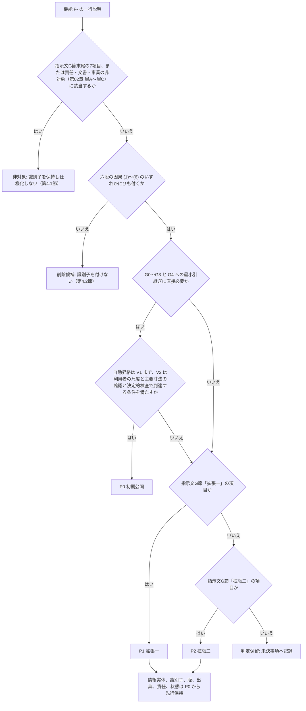
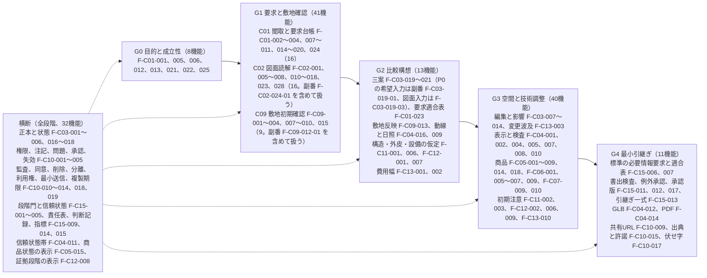

# 第09章 機能一覧をP0、P1、P2で分類

作成日: 2026-09-15　版: v1.4　担当: 段階3 仕様書 第09章（製品責任者、計算機科学者、一級建築士の合議を想定）。v1.4 は 2026-10-08 の段階8 の最終仕上げ（再々確認 主2-01、主2-03〜主2-05、主4-01、主4-02。統括の決定 D34、D36〜D38）。F-C14-001 の P0 範囲（第2.2節の行と第2.14節の行）を式(5)の参照の形「自動付与した撤去と移設は第13章 第5.5節 式(5)で判定する（移設は移設元を、寸法変更は変更前の要素を撤去として数える）」にし、契機を削除、移動、寸法変更（案の変更命令に限る）にそろえた。F-C03-019-03 と第2.14節の目録の範囲を、外周壁の上の要素（外壁開口を含む）を対象外とする第12章 第7.8節 (f) に合わせた（機能一覧骨格 v1.4 と同文）。記録は `05_審査/再修正記録_最終仕上げ_群G2.md`。v1.3 は 2026-10-08 の段階8前の持ち越し仕上げ（既定値の識別子の併記 2 行）。F-C09-012-01、F-C09-012-02 の行の法規条件の確認期限 90 日に DV-CO-15 を併記した。共通の決定 D6（EL-LAW の証明書の発行者）は本章に該当の文がなく変更なし。記録は `05_審査/再修正記録_段階8前_仕上げ_群F2.md`。v1.2 は 2026-10-07 の段階6 二回目の修正（段階7 再審査の後）。修正計画 第1.9節の 3 件（整合 JR-095〔極高〕、JR-078、JR-018）と、機能一覧骨格 v1.3（F-C03-019-03 の採番、F-C14-001 の P0 範囲の注記、F-C09-012 の六因果）への追従、第3節の索引への新設受入条件（修正計画 第0.4節）の反映。記録は `05_審査/再修正記録_2回目_第5_7_9章.md`。同日の二回目の修正の仕上げ〔群R1〕で、第5.7節の S-13、S-23、S-24、S-25、S-28 を骨格の関連画面列から再集計し、骨格への依頼（変更提案7、14、第0.4節、S-28）の対応済みと受けた依頼の対応状況を章末に記した〔版は v1.2 のまま。記録は `05_審査/再修正記録_2回目_仕上げ_群R1.md`〕。v1.1 は 2026-10-06 の段階6 初稿審査の再修正（主担当 JM-055〜JM-057、整合 JM-077、JM-127、JM-128、JM-150、JM-152、JM-173、JM-185、JM-191 と整合修正指示の第9章 2 件。機能一覧骨格 v1.2 の追補への追従を含む）。反映内容は `05_審査/再修正記録_第9_10章.md`
根拠: 指示文 G（段階的な開発範囲）、9.10（初期公開範囲の推奨）、10.7（初期公開の優先順位）、C1〜C15（必須機能区分）、A1（六段の因果と十二領域）、I節（成果物の形式）。基盤定義 `02_基盤定義/機能一覧骨格.md` v1.3（2026-10-07 の二回目の修正を含む。本章の正本）、`識別子規則.md` v1.3、`用語集.md` v1.3（558、559）、`十二判断領域.md` v1.4、`七段階門.md` v1.3、`信頼状態と証拠段階.md` v1.3、`情報実体骨格.md` v1.3、`画面指標試験骨格.md` v1.3、`整合検査報告.md` v1.2（第5節、第5.1節 識別子変更一覧）。修正計画 `05_審査/再審査/00_修正計画.md` 第0.3節、第0.4節、第1.9節。仕様書 第02章（非対象、六因果）、第04章（到達目標、暫定表）、第06章（段階門）、第08章（利用導線）、各主章の要件ブロック、第23章 付表 4.3-A（索引の受入条件と試験）、第24章 第4.2節（P0 内の開発順序）。

## 0. 冒頭

### 0.1 本章の目的

- 機能一覧骨格 v1.3 の249機能と副番8件を P0（初期公開）、P1（拡張一）、P2（拡張二）、非対象に分類した一覧として固定し、各機能に識別子、名称、目的、利用者、主担当領域、影響領域、六因果、段階門、優先、詳細を書く章を付ける【推定】。
- P0 の145機能と副番の P0 4件について、主章の要件ブロックの節番号、受入条件 AC- の範囲、対応する単体試験と統合試験（T-U-、T-I-）、段階群を1機能1行の索引にする（第3節）。必須10項目の本文は各主章だけに置き、本章は要約を持たない（v1.1。審査 JM-055）【推定】。
- 初期公開から外すもの（非対象7機能）と削除候補10件を識別子付き（削除候補は仮番号）で示し、「初期公開から外す」「後続範囲」「恒久の非対象」の境界を観察可能にする【推定】。
- 区分、優先、主担当領域、段階門、六因果、主章ごとの集計表を示し、公開判定（第24章）と追跡表（第10章）の分母にする【推定】。
- 骨格との差分と変更提案を第6節に記録し、骨格 v1.2 で反映済みの事項と依頼中の事項を区別する【推定】。
- 整合検査報告の未決事項のうち本章に関係する U-00-057（解決済み）、U-00-058、U-00-060 と、機能一覧骨格の未決 U-00-027（解決済み）〜U-00-029、U-00-033〜U-00-035 に本章の判断を置く（第6.4節）【仮定】。

本章が答える問いは次の四つである。(1) どの機能が初期公開に含まれ、どの機能が後続範囲か。(2) P0 の各機能の仕様（必須10項目）、受入条件、試験はどの章のどこにあるか。(3) 何を作らないか。(4) 優先の分布はどの領域と段階に偏り、それは設計上の意図か欠落か【推定】。

### 0.2 本章の範囲と非対象

| 区分 | 内容 | 区分 |
|---|---|---|
| 範囲 | 249機能と副番8件の優先分類表（第2節）。P0 145機能と副番の P0 4件の索引（第3節）。非対象7機能と削除候補10件（第4節）。区分、優先、領域、段階門、因果、主章の集計（第5節）。骨格との差分と未決事項への仮の判断（第6節） | 【推定】 |
| 本章で扱わないもの | 各機能の必須10項目と受入条件 AC- の採番（各主章。本章に担当機能はない。第7節）。追跡表そのもの（第10章）。画面の部品と状態（第15章）。API の対応（第14章）。開発順序、工数帯、依存関係（第24章）。指標の初期仮説値の確定（公開判定会議、第23章） | 【推定】 |
| 本章が新しく決めないもの | 機能 F- の追加、廃止、優先の変更、主担当領域の変更、六因果の変更、章割当の変更は行わない。骨格 v1.2 を正本として転記し、変更が必要と判断した事項は「変更提案」として第6節に記録し、骨格担当と識別子台帳担当へ依頼する。用語、識別子体系、領域、段階、状態符号は基盤定義に従う | 【仮定】 |
| 非対象（製品として） | 施工図の完全自動作成、構造安全の自動保証、全世界法規の完全対応、無許諾商品3Dの複製、単写真からの実寸完全復元、確定見積、第三者性能評価の自動発行（第4.1節）。建築士等の法的責任の代替、連絡先の一括送信（第02章 層A〜層C） | 【推定】 |

### 0.3 前提とする章

| 章または文書 | 本章が前提とする内容 | 種別 |
|---|---|---|
| 基盤 機能一覧骨格 v1.3（v1.2 の追補と 2026-10-07 の二回目の修正を含む） | 249機能と副番8件の識別子、名称、一行説明、区分、優先、主担当領域、影響領域、六因果、段階門、詳細を書く章、関連画面、観察可能な合格条件、根拠区分。非対象7機能（第2節）、削除候補10件（第3節）、集計（第4節。副番は数えない）、未決 U-00-026〜035 | 前提 |
| 基盤 識別子規則 v1.3 | F-C{区分}-{連番} と副番の書式、必須属性、廃止時の扱い、版の付け方、未決 U-{章}-{連番}、役割符号 RL-、非対象事項 NS-（v1.3 で登録） | 前提 |
| 基盤 用語集 v1.2 | 用語 4 六段の因果、5 非対象、234〜236 P0〜P2、237 機能要件、261 削除候補、262 非対象機能、263 主章と副章、264 代替形状のみ配置、385 後続範囲、387 情報構造の先行保持、428 横断機能、477 運営側役割、494 情報管理担当 | 前提 |
| 基盤 十二判断領域 v1.3 | 主担当領域を一つだけ置く規則、判定例辞書（第3.3節、第3.4節。F-C03-004 の判定例を含む） | 前提 |
| 基盤 七段階門 v1.2 | G0〜G6 の実装優先（第1節、第2節）、進行禁止条件 I-00-101〜133 と第6章の I-06-003〜006 の転記 | 前提 |
| 基盤 信頼状態と証拠段階 v1.2 | V0〜V3、VS-、EL-、CS-、PT-、RS-、PR-、CDE-、IS-、AS-、SUP- の符号と表示規則 | 前提 |
| 基盤 情報実体骨格 v1.2 | E- の識別子（第4.4節の情報構造の先行保持で参照する） | 前提 |
| 基盤 画面指標試験骨格 v1.2 | 指標 M-、試験 T- と関連機能の対応、補助画面 S-15〜S-29、反証試験の P0 版と P1 版 | 前提 |
| 基盤 整合検査報告 v1.2 | 第5節 識別子変更一覧（副番7件、六因果の付け替え、F-C14-003 の範囲、関連画面列と F-C10-018 の段階門）。第5.1節 二回目の修正の識別子変更一覧（F-C03-019-03 の採番、F-C14-001 の P0 範囲の注記、F-C09-012 の六因果）。未決 U-00-057〜061 | 前提 |
| 各主章（第5、6、8、11〜13、15〜23章）、第23章 付表 4.3-A | 第3節の索引の主章と節番号、受入条件 AC- の範囲、対応する T-U-、T-I-。食い違う場合は主章と付表を正本とする | 前提 |
| 第24章 第4.2節 | P0 内の開発順序（群0〜群6）。本章 第5.8節の段階群を入力とする（U-09-005） | 前提 |
| 第02章 | 非対象の四層（NS-02-001〜015 は第02章 第2.2〜2.4節が定義し、識別子規則 v1.3 が接頭辞 NS- を登録。層D は F- 7件）、六因果と機能群の対応（第3.3節）、削除候補の扱い（第3.5節）、U-00-058 と U-00-060 への仮の判断 | 前提 |
| 第04章 | 到達目標（第3.4節）が骨格の優先に従うこと。暫定表A〜C の機能を削除候補と混同しないこと | 前提 |
| 第06章 | 段階 G0〜G4 の必須成果と機能の対応、G4 の P0 最小引継ぎ（GLB、PDF平面、要求台帳、問題一覧、判断記録）と P1（IFC、SVG、DXF、BCF、V3） | 前提 |
| 第08章 | 利用導線で P1 と表記した手順が本章の優先に従うこと | 前提（第8章側の依頼） |

## 1. 分類の規則

### 1.1 優先の定義と判定基準

優先は「機能の提供時期」であり、情報実体の準備時期ではない。P1、P2 の機能が扱う実体、識別子、版、出典、責任、状態は P0 から情報実体骨格に含める（指示文G「後で情報構造を作り直さない」）【推定】。

| 優先 | 定義（用語集234〜236） | 判定基準（機能一覧骨格 第0.3節） | 対応する段階と信頼状態（七段階門 第2節） | 区分 |
|---|---|---|---|---|
| P0 初期公開 | 段階 G0〜G3 と G4 への引継ぎ最小成果。日本の平屋または二階建戸建住宅、明瞭な単一縮尺の PDF、PNG、JPEG、三案（希望入力は雛形三案 F-C03-019-01、図面入力は図面派生三案 F-C03-019-03。JR-095）、同期2Dと3D、限定した正規商品、GLB 共有。自動昇格は V1 まで。V2 は利用者の尺度確認と決定的検査で到達し P0 に含む（第11章 第4.1節、第24章 第4.1節と同じ。JM-191） | 指示文G節「初期公開 P0」の項目、または G0〜G3 と G4 への最小引継ぎ（GLB、PDF平面、要求台帳、問題一覧、判断記録、標準の必要情報要求）に直接必要な機能。V2 は尺度、外周、開口、室、階段、主要寸法の確認後に限る | G0（V0）、G1（V1）、G2（V1）、G3（V2）、G4（V2。最小引継ぎ） | 【推定】（出典: 指示文 G、9.10、10.7。確認日 2026-09-15） |
| P1 拡張一 | ベクトル PDF、DXF、SVG、IFC、図面一式、複数階、改装前後比較、構造・外皮・設備の調整、詳細な性能計算、IFC 交換、IDS 検査、BCF 交換、商品拡大、独自家具生成、有資格者確認、提携先比較、同意付き外部送信、既存住宅状況調査、工事前調査 | G節「拡張一 P1」の項目 | G1〜G4 の詳細化、G4 の V3（有資格者確認） | 【推定】 |
| P2 拡張二 | 施工中変更、製作図、検査、竣工時建物情報、試運転、引渡し、機器台帳、保証、点検、交換、入居後確認、法人用商品登録、組織標準、監査、費用履歴、供給網、対象拡張 | G節「拡張二 P2」の項目 | G5、G6 | 【推定】 |
| 非対象 | 指示文G節末尾の7項目。識別子 F- を持つが仕様化しない。識別子台帳では「非対象」状態で保持する（用語集262 非対象機能） | G節末尾の列挙に該当する | — | 【推定】 |
| 削除候補 | 六段の因果にひも付かない機能。識別子 F- を付けず仕様化しない（用語集261） | 指示文A1「ひも付かない機能は削除候補」 | — | 【推定】 |

P0 の公開判断の要点は指示文10.7 のとおり「重要判断が根拠付きで比較でき、重大不明を止め、専門家が元資料へ戻れる」ことであり、P0 の集合はこの一続きの仕事（要求を整理し、三案を比較し、検証した建物情報を建築士へ渡す）に直接必要な機能に限る【推定】（出典: 指示文 10.7、確認日 2026-09-15）。

### 1.2 優先の判定手順

骨格の判定を本章が再検証した手順を図に示す。本章 v1.0 は249機能すべてをこの手順で再判定し、骨格 v1.1 の優先と異なる結果になった機能は0件であった【推定】（骨格 v1.1 の優先列と本章第1.1節の基準を一件ずつ突合した本章の判断。確認日 2026-09-15）。v1.1 では骨格 v1.2 の優先列（副番7件を含む）と第2節を機械照合し差 0 件を確認した【事実】（照合 2026-10-06）。v1.2 では骨格 v1.3 の優先列（副番8件を含む）と第2節を機械照合し差 0 件を確認した【事実】（照合 2026-10-07）。副番の P0 4件は、親の機能のうち「G0〜G3 と G4 への最小引継ぎに直接必要」かつ「自動昇格は V1 まで」の条件を満たす範囲を切り出したものである【推定】。判定に迷った機能は第6.4節の未決事項に記す【仮定】。

### 1.3 表の列の定義

| 列 | 内容 | 出典 |
|---|---|---|
| 識別子 | `F-C{区分2桁}-{連番3桁}` と副番 `F-C{区分2桁}-{連番3桁}-{副番2桁}`。骨格 v1.2 と同一。本章は追加、廃止、再採番を行わない | 識別子規則 第2.1節 |
| 名称 | 骨格の機能名と同一 | 機能一覧骨格 第1節 |
| 目的 | 骨格の一行説明。何を取得、判定、表示、禁止するか | 機能一覧骨格 第1節 |
| 利用者 | 機能を起動または直接利用する役割。役割符号 RL-OWN 所有者、RL-EDT 編集者、RL-CHK 確認者、RL-VIEW 閲覧者、RL-PART 提携事業者。製品が自動で実行する機能は「製品（自動）」と書き、結果を見る役割を併記する。本章が付けた属性であり識別子には含めない | 識別子規則 第2.8節（RL-）、本章【仮定】 |
| 主担当領域 | A01〜A12 のうち一つ。骨格と同一 | 十二判断領域 第3節 |
| 影響領域 | 主担当以外の影響先。「—」は影響先なし | 十二判断領域 第2節 |
| 六因果 | (1) 要求と現況の把握、(2) 実行可能な複数案、(3) 差の比較、(4) 家族と専門家の承認、(5) 承認済み情報の引継ぎ、(6) 実績差の取得と改善。複数可 | 指示文 A1、用語集4 |
| 段階門 | 機能を利用する段階 G0〜G6。「G1〜G3」は連続範囲 | 七段階門 |
| 優先 | P0、P1、P2、非対象 | 第1.1節 |
| 詳細章 | 主章（必須10項目と AC- を書く章）と副章（参照する章）。「主 11、副 22」の形で書く | 機能一覧骨格 第0.4節、用語集263 |

### 1.4 利用者の表記規則

| 表記 | 意味 | 区分 |
|---|---|---|
| RL-OWN | 所有者。案件の家族側の代表。決定権者を含む | 【推定】 |
| RL-EDT | 編集者。家族の他の成員、または所有者が委任した設計担当 | 【推定】 |
| RL-CHK | 確認者。建築士等。有資格者確認（V3）は RL-CHK かつ資格あり（P1） | 【推定】 |
| RL-VIEW | 閲覧者。共有URL の受取側を含む | 【推定】 |
| RL-PART | 提携事業者。提携先、施工者、製造元と販売元（法人）を含む | 【推定】 |
| 製品（自動） | 利用者の操作なしに製品が決定的検査、生成、記録を行う機能。結果の閲覧者を併記する | 【仮定】 |
| 運営側役割（情報管理者、運用担当者、監査）と運営の職務（製品責任者、法規担当、積算担当、正解付与者等） | 製品を運営する側の役割と職務。RL- を拡張せず語で書く。運営側役割（用語集 477）は組織の権限で持ち、案件の役割 RL- とは別に判定する。組織案件で案件側に置く担当は「RL-EDT（情報管理担当。用語集 494）」と書き分け、運営側の情報管理者とは別の者とする（U-09-003 の解決。第22章 第1.3節、表4 第3節 C-02。JM-185） | 【推定】 |

### 1.5 索引の読み方（第3節）

本章は P0 機能の要約版を持たない（v1.1。審査 JM-055）。各機能の目的、利用者、前提、正常手順、例外、情報入出力、権限、計測方法、受入条件の本文は主章の要件ブロックだけに置き、本章は第2節の一覧（一行の目的と利用者）と第3節の索引だけを持つ。本章と主章の記述が食い違う場合は主章を正本とする（U-09-006 の解決）【推定】。

| 列 | 内容 | 出典（正本） |
|---|---|---|
| 機能ID、名称 | 機能一覧骨格 v1.3 の P0 機能 145件と、副番の P0 4件（F-C02-024-01、F-C03-019-01、F-C03-019-03、F-C09-012-01）。副番は親の直後に置き、親が P1 の副番（F-C02-024、F-C09-012 の -01）は親の行を載せない | 機能一覧骨格 第1節 |
| 主章と節番号 | 必須10項目を書いた要件ブロックの節。見出しに節番号のない章（第22章、第23章）は直上の番号付きの見出しの節を書く | 機能一覧骨格 第0.4節の「詳細を書く章」の先頭（主章） |
| 受入条件（AC- の範囲） | 主章が採番した AC- の範囲（例: AC-C03-005-01〜03）。末尾 11 は第15章が画面側で採番した受入条件。副番の受入条件は AC-C{区分}-{連番}-{副番}-{2桁}。本章は AC- を採番しない | 第23章 付表 4.3-A（各主章の受入条件行から抽出） |
| 対応する T-U-／T-I- | 各 AC- を判定する単体試験 T-U- と統合試験 T-I-。受入、反証、安全、性能の試験（T-A-、T-R-、T-S-、T-P-）は第10章 第3節と第4.1節で追う。「—」はない | 第23章 付表 4.3-A |
| 段階群（第24章の群） | 第5.8節の P0 段階群（G0〜G4、横断）と、第24章 第4.2節の開発の群（群0〜群6）。P0 内の開発順序の正本は第24章 | 第5.8節、第24章 第4.2節 |

索引の値は 2026-10-06 時点の機械抽出である（本担当の補助スクリプトで主章の見出しと第23章 付表 4.3-A を照合した）。148行すべてで主章に10項目のうち9以上を含む要件ブロックがあり、要件ブロックの AC- と付表の AC- は148行すべてで一致し（第15章の画面側の末尾 11 を除く）、全ての AC- に T-U- がある。付表の T-U-、T-I- と機能の対応 176 組を `04_必須表/受入条件と試験の対応_機械生成.md`（2026-10-06 22:56 生成）と照合し 175 組が一致した。残る1組（F-C03-021 の AC-C03-021-01〜03 と T-U-008）は、機械生成物が同じ行に現れる AC- と T- を対応とみなす規則のため拾えなかったもので、付表を正とした。機械生成物は副番の AC-（AC-C02-024-01-01 等）を親の AC- と区別しないため、副番の行は付表と主章から取った【事実】（出典: `03_仕様書/23_非機能要件_品質指標_試験情報_受入条件.md` 第4.3節 付表 4.3-A、各主章の要件ブロック、確認日 2026-09-15）。主章が要件ブロックの節や AC- を改めた場合は同じ方法で再生成し、食い違いは機械整合検査（`04_必須表/00_機械整合検査.md` 第3節、第7節）で検出する【推定】。2026-10-07 の二回目の修正で、索引に F-C03-019-03 の行を加えて 149 行とし、修正計画 第0.4節で新設された受入条件のうち親が P0 の機能のもの（F-C03-019-03 の新設行を含む 22 行。AC-C01-013-06、AC-C01-014-07、AC-C01-020-06、AC-C01-023-05〜06、AC-C01-025-04、AC-C02-014-06、AC-C03-019-01-03、AC-C03-019-03-01〜03、AC-C04-016-04、AC-C09-007-04、AC-C09-012-01-03〜05、AC-C10-009-05、AC-C10-011-05、AC-C11-002-07、AC-C12-007-04、AC-C15-001-07、AC-C15-002-08〜09、AC-C15-003-07〜08、AC-C15-007-04、AC-C15-013-04〜05、AC-C15-014-07〜08、AC-C15-017-03）を AC- の範囲に加え、試験は付表 4.3-A の新設予定の列に従って T-I-006（F-C15-003）、T-I-018（F-C15-014）、T-I-024（F-C03-019-03）を加えた。並行して修正中の主章（第11章、第13章、第18章、第19章、第22章。2026-10-07 の確認で AC-C12-007-04 は第19章に未記載）の定義は修正計画 第0.4節の割当を前提とし、機械生成物の再生成（統括）の後に段階8 で照合する【推定】。

## 2. 機能一覧（P0、P1、P2、非対象）

本節は機能一覧骨格 v1.3（v1.2 の追補と 2026-10-07 の二回目の修正を含む）第1節の249機能と副番8件を区分順に転記し、優先列を明示し、利用者列（第1.4節）を加えた。副番（F-C02-024-01、-02、F-C03-019-01、-02、-03、F-C09-012-01、-02、F-C14-003-01）は親の直後の行に置き、骨格 第4.1節の注に従って区分の機能数と第5節の集計に含めない（親の内訳）。識別子、名称、目的（一行説明）、主担当領域、影響領域、六因果、段階門、優先、詳細章は骨格と同一である【事実】（出典: `02_基盤定義/機能一覧骨格.md` v1.3 との機械照合で、名称、優先、主担当、影響、六因果、段階は全 257 行で差 0 件、目的の差 4 件。照合 2026-10-07、確認日 2026-09-15）。目的の差の4件は本章が加えた注記と字句の置換であり、F-C09-008 の目的の末尾に P0 の高さの範囲の注記（JM-128）を加え、F-C07-005 の目的の曖昧語を主章（第16章 第8.5節）の語へ置換した（骨格への置換の依頼は第6.3節 変更提案7）。二回目の修正で F-C15-014 に主担当判定記録と辞書改善の範囲（JR-018）、F-C15-015 に関連画面 S-28-01〜03（JR-078。骨格への追記は章末の依頼）を加えた。v1.2 で骨格に合わせて改めた値は、六因果（JM-056 の商品系9機能と F-C02-016）、目的（F-C02-024、F-C03-019、F-C09-012、F-C14-003）、段階門（F-C10-018 を G0〜G4、F-C14-003 を G3、G4）である（第6.3節）。利用者列は本章が付けた属性で【仮定】、各機能の利用者の正本は主章の要件ブロックの「利用者」とし、食い違う場合は主章に従う（未決 U-09-001）。非対象の行は第4.1節で詳述する。

### 2.1 C01 対話設計（25機能: P0 25）

| 識別子 | 名称 | 目的 | 利用者 | 主担当 | 影響領域 | 六因果 | 段階門 | 優先 | 詳細章 | 根拠（骨格） |
|---|---|---|---|---|---|---|---|---|---|---|
| F-C01-001 | 三入口と利用目的の取得 | 開始画面の三入口（希望から作る、図面を3D化、写真から改装）と利用目的（新築、改装、家具配置、図面3D化、売却または賃貸資料）を取得し案件を作る | RL-OWN、RL-EDT | A01 | A12 | 1 | G0 | P0 | 主 8、副 15 | 【推定】 |
| F-C01-002 | 一問式の分岐質問 | 回答に応じて次の質問を分岐し、既知情報を聞き直さない | RL-OWN、RL-EDT | A01 | — | 1 | G0、G1 | P0 | 主 8 | 【推定】 |
| F-C01-003 | 一括自由記述の構造化 | 自由記述から条件項目を抽出し、要求候補と残り項目へ分ける | RL-OWN、RL-EDT | A01 | — | 1 | G1 | P0 | 主 8 | 【推定】 |
| F-C01-004 | 一問式と一括入力の切替 | 途中で切り替えても回答を失わない | RL-OWN、RL-EDT | A01 | — | 1 | G1 | P0 | 主 8、副 15 | 【推定】 |
| F-C01-005 | 建設地域と土地状況の聞取 | 建設地域、敷地住所または概略地域、敷地面積、形状、方位、接道、高低差、土地の所有区分（所有、候補あり、探索中、建替え、売却移転）を取得 | RL-OWN、RL-EDT | A01 | A02 | 1 | G0、G1 | P0 | 主 8 | 【推定】 |
| F-C01-006 | 予算と費用優先順位の聞取 | 建築費、土地費、家具費、予備費、借入希望、費用の優先順位を取得 | RL-OWN、RL-EDT | A01 | A09 | 1 | G0、G1 | P0 | 主 8 | 【推定】 |
| F-C01-007 | 家族構成と将来変化の聞取 | 成人、子供、乳幼児、高齢者、在宅勤務者、来客、将来の家族変化を取得 | RL-OWN、RL-EDT | A01 | A11 | 1 | G1 | P0 | 主 8 | 【推定】 |
| F-C01-008 | 空間要件の聞取 | 階数、延床面積、部屋数、各室の最低寸法、収納、駐車、庭、外構を取得 | RL-OWN、RL-EDT | A01 | A03 | 1 | G1 | P0 | 主 8 | 【推定】 |
| F-C01-009 | 生活行動と動線の聞取 | 起床から就寝までの行動、洗濯、調理、育児、介護、仕事、趣味、来客の動線を取得 | RL-OWN、RL-EDT | A01 | A03 | 1 | G1 | P0 | 主 8 | 【推定】 |
| F-C01-010 | 性能優先度の聞取 | 採光、通風、眺望、音、温熱、耐震、防災、防犯、省エネ、保守の優先度を取得 | RL-OWN、RL-EDT | A01 | A07 | 1 | G1 | P0 | 主 8、副 19 | 【推定】 |
| F-C01-011 | 好みと避けたい様式の聞取 | 好きな写真、住宅事例、樹種、色、素材、触感、避けたい様式を取得 | RL-OWN、RL-EDT | A01 | A08、A12 | 1 | G1 | P0 | 主 8、副 16 | 【推定】 |
| F-C01-012 | 納期、相談希望、共有相手、書出形式の聞取 | 納期、相談希望、共有相手、必要な書出形式を取得 | RL-OWN、RL-EDT | A01 | A09、A12 | 1 | G0、G1 | P0 | 主 8 | 【推定】 |
| F-C01-013 | 関係者表の作成 | 家族、設計者、施工者、維持管理者、介護者、来訪者、近隣、将来の居住者等を洗い出し、利益、不利益、発言機会、決定権、確認対象を持たせる | RL-OWN、RL-EDT、RL-CHK | A01 | A12 | 1、4 | G0、G1 | P0 | 主 5、副 8 | 【推定】 |
| F-C01-014 | 当事者参画の提案 | 子供、高齢者、障害のある人、介護者等の本人の声が抜けやすい場合に、代理決定だけで終えない参画方法を提案 | RL-OWN、RL-EDT、RL-CHK | A01 | A07 | 1、4 | G1 | P0 | 主 5、副 8 | 【推定】 |
| F-C01-015 | 生活場面の確認（日常） | 朝の混雑、帰宅、買物収納、調理、食事、入浴、洗濯、在宅勤務、来客、就寝を時系列で確認 | RL-OWN、RL-EDT | A01 | A03 | 1 | G1 | P0 | 主 8 | 【推定】 |
| F-C01-016 | 生活場面の確認（家族変化） | 乳幼児期、学齢期、独立、在宅介護、車椅子利用、二世帯化、在宅勤務増加を確認 | RL-OWN、RL-EDT | A01 | A11 | 1 | G1 | P0 | 主 8、副 21 | 【推定】 |
| F-C01-017 | 生活場面の確認（非常時） | 停電、断水、猛暑、寒波、豪雨、浸水、地震、火災、避難、在宅避難を確認 | RL-OWN、RL-EDT | A01 | A07 | 1 | G1 | P0 | 主 8、副 19 | 【推定】 |
| F-C01-018 | 生活場面の確認（維持） | 家具搬入、設備点検、清掃、交換、改装、売却または賃貸を確認 | RL-OWN、RL-EDT | A01 | A11 | 1 | G1 | P0 | 主 8、副 21 | 【推定】 |
| F-C01-019 | 要求台帳への変換 | 入力を要求へ変換し、優先度 RP-、数値範囲、出典、決定者、確認者、期限、確認状態を持たせる | RL-OWN、RL-EDT | A01 | A12 | 1、4 | G1 | P0 | 主 8、副 12 | 【推定】 |
| F-C01-020 | 要求衝突の検出と解決候補・代償の提示 | 矛盾する要求を平均化せず、誰のどの価値が衝突しているか、解決候補と代償を示す | 製品（自動）。決定 RL-OWN | A01 | — | 1、3 | G1、G2 | P0 | 主 8 | 【推定】 |
| F-C01-021 | 目的文、成功条件、非対象、変更できない条件の承認 | 最初に目的文、成功条件、非対象、変更できない条件を家族と専門家が承認する工程 | RL-OWN、RL-EDT、RL-CHK | A01 | A12 | 1、4 | G0、G1 | P0 | 主 5、副 8 | 【推定】 |
| F-C01-022 | 主要危険の初期一覧 | 土地、費用、期間、災害の主要危険を G0 で一覧化 | 製品（自動）。決定 RL-OWN | A01 | A02、A09 | 1 | G0 | P0 | 主 8 | 【仮定】 |
| F-C01-023 | 案別の要求適合表 | 三案それぞれが各要求を満たすか、捨てた条件を案ごとに表示 | RL-OWN、RL-EDT、RL-CHK | A01 | A03 | 3、4 | G2、G3 | P0 | 主 8 | 【推定】 |
| F-C01-024 | 対話の意図解釈と説明 | 言語模型が要求理解、操作意図、説明を担当し、幾何は確定しない | 全役割（対話利用者） | A01 | A12 | 1 | G0〜G4 | P0 | 主 8、副 12 | 【推定】 |
| F-C01-025 | 電子連絡先なしの初回価値提示 | 最初の成果（初回案または不足情報一覧）まで電子連絡先を要求しない | RL-OWN（未登録者を含む） | A12 | A01 | 1 | G0、G1 | P0 | 主 8 | 【推定】 |

### 2.2 C02 図面読解と3D変換（28機能: P0 16、P1 11、P2 1。副番 2: P0 1、P1 1）

| 識別子 | 名称 | 目的 | 利用者 | 主担当 | 影響領域 | 六因果 | 段階門 | 優先 | 詳細章 | 根拠（骨格） |
|---|---|---|---|---|---|---|---|---|---|---|
| F-C02-001 | 画像形式の図面受付 | PDF（画像）、PNG、JPEG の明瞭な単一縮尺図面を受け付ける | RL-OWN、RL-EDT | A12 | A03 | 1 | G1 | P0 | 主 11 | 【推定】 |
| F-C02-002 | ベクトル形式の受付とベクトル情報の保持 | ベクトルPDF、SVG、DXF を受け付け、ベクトル情報を保持して画像化だけに依存しない | RL-OWN、RL-EDT | A12 | A03 | 1 | G1 | P1 | 主 11 | 【推定】 |
| F-C02-003 | IFC入力の受付 | IFC を受け付け、要素を固有ID対応表付きで正規建物情報へ取り込む | RL-OWN、RL-EDT | A12 | A03 | 1、5 | G1 | P1 | 主 11、副 22 | 【推定】 |
| F-C02-004 | DWG、RVT の正規許諾変換接点 | 正規許諾を持つ変換接点が利用できる場合だけ DWG、RVT を追加する | RL-OWN、RL-EDT | A12 | — | 1 | G1 | P2 | 主 11 | 【未確認】 |
| F-C02-005 | 入力種別、頁、図種、方位、単位、縮尺、改訂番号の判定 | 頁ごとに7項目を判定し、利用者が修正できる | RL-OWN、RL-EDT | A12 | A03 | 1 | G1 | P0 | 主 11 | 【推定】 |
| F-C02-006 | 画像補正と傾き補正 | 画像を補正し傾きを直す。原図は不変 | 製品（自動）。結果は RL-OWN、RL-EDT、RL-CHK | A03 | — | 1 | G1 | P0 | 主 11 | 【推定】 |
| F-C02-007 | 線分、円弧、文字、寸法線、記号の抽出 | 線分と円弧の抽出、文字認識、寸法線解析、記号認識 | 製品（自動）。結果は RL-OWN、RL-EDT、RL-CHK | A03 | A12 | 1 | G1 | P0 | 主 11 | 【推定】 |
| F-C02-008 | 建築要素の分類 | 外壁、内壁、柱、扉、窓、階段、床、室、主要設備、造付家具、可動家具、通り芯を分類 | 製品（自動）。結果は RL-OWN、RL-EDT、RL-CHK | A03 | A12 | 1 | G1 | P0 | 主 11 | 【推定】 |
| F-C02-009 | 構造、電気、給排水、換気空調記号の図種別分類 | 図種に応じて記号を分類し、意匠図から構造や設備を創作しない | 製品（自動）。結果は RL-OWN、RL-EDT、RL-CHK | A03 | A04、A06 | 1 | G1 | P1 | 主 11 | 【推定】 |
| F-C02-010 | 建物関係図の構成 | 室の閉領域、隣接、扉による接続、上下階接続、外部との接続を構成 | 製品（自動）。結果は RL-OWN、RL-EDT、RL-CHK | A03 | — | 1 | G1、G3 | P0 | 主 11 | 【推定】 |
| F-C02-011 | 拘束解決と矛盾検出 | 寸法拘束、平行、直角、同一直線、壁厚、開口位置、階高を解き、矛盾を検出 | 製品（自動）。結果は RL-OWN、RL-EDT、RL-CHK | A03 | A12 | 1 | G1、G3 | P0 | 主 11 | 【推定】 |
| F-C02-012 | 推定値の分離 | 不明な高さ、厚さ、建具種、屋根、床段差を VS-AI または VS-DEF として分離 | 製品（自動）。結果は RL-OWN、RL-EDT、RL-CHK | A03 | A12 | 1 | G1 | P0 | 主 11、副 12 | 【推定】 |
| F-C02-013 | 原図重ねと確信度の色表示 | 原図と抽出線を重ね、確信度を色と文字と記号で示す | RL-OWN、RL-EDT、RL-CHK | A12 | A03 | 1、4 | G1 | P0 | 主 11、副 15 | 【推定】 |
| F-C02-014 | 尺度確認と基準寸法の指定 | 利用者が尺度と重要寸法を最低一つ確認する。尺度不明画像では寸法を断定せず基準寸法を求める | RL-OWN、RL-EDT | A12 | A03 | 1、4 | G1 | P0 | 主 11 | 【推定】 |
| F-C02-015 | 曖昧箇所の手修正 | 壁、開口、室名、寸法を利用者が修正し、履歴を残す | RL-OWN、RL-EDT | A03 | A12 | 1 | G1 | P0 | 主 11 | 【推定】 |
| F-C02-016 | 承認済み2Dからの3D組立 | 利用者が承認した2D建物情報から3Dを組み立てる | 製品（自動）。結果は RL-OWN、RL-EDT、RL-CHK | A03 | — | 1、2 | G1、G2 | P0 | 主 11 | 【推定】 |
| F-C02-017 | 要素の出典属性の保持 | 各要素に元頁、元座標、認識方法、確信度、推定理由、変更履歴を持たせる | 製品（自動）。RL-CHK、RL-PART が参照 | A12 | — | 1、5 | G1〜G4 | P0 | 主 11、副 12 | 【推定】 |
| F-C02-018 | 低確信度残存時の検証済み書出禁止 | 低確信度の壁や開口が残る場合、検証済み書出を禁止し修正依頼を示す | 製品（自動）。RL-OWN、RL-CHK | A12 | A03 | 4、5 | G3、G4 | P0 | 主 11、副 22 | 【推定】 |
| F-C02-019 | 図面一式の正本候補判定と差替え漏れ検出 | 図面一覧と改訂日から正本候補を判定し、古い頁、差替え漏れ、同一記号の不一致を検出 | 製品（自動）。確定 RL-OWN、RL-EDT | A12 | A03 | 1 | G1 | P1 | 主 11 | 【推定】 |
| F-C02-020 | 図面間照合 | 通り芯、階、室、建具記号、詳細参照、改訂雲、寸法を複数図面間で照合し、矛盾を問題一覧へ出す | 製品（自動）。確定 RL-OWN、RL-EDT | A12 | A03 | 1 | G1 | P1 | 主 11 | 【推定】 |
| F-C02-021 | 複数頁、複数階、異なる縮尺、回転の一括処理 | 図面一式を頁ごとに独立した縮尺と回転で処理し、階へ割り当てる | 製品（自動）。結果は RL-OWN、RL-EDT、RL-CHK | A03 | A12 | 1 | G1 | P1 | 主 11 | 【推定】 |
| F-C02-022 | 薄い線と手書き注記の対応 | 薄い線と手書き注記を認識対象にし、層別に品質を公開 | 製品（自動）。結果は RL-OWN、RL-EDT、RL-CHK | A03 | — | 1 | G1 | P1 | 主 11 | 【推定】 |
| F-C02-023 | 立面図と断面図の補助入力 | 階高、屋根形状、開口高さを立面と断面の補助入力から取得 | RL-OWN、RL-EDT | A03 | A12 | 1 | G1 | P0 | 主 11 | 【推定】 |
| F-C02-024 | 現況状態の付与と差異の重ね表示 | 設計時図面、竣工図、現況の差を要素ごとに CS- で持ち、重ねて表示。v1.2 で副番に分けた（-01 初期付与と表示は P0、-02 遷移と差異の重ね表示は P1。JM-152） | RL-OWN、RL-EDT、RL-CHK | A12 | A04、A05、A06、A10、A11 | 1 | G1、G3 | P1 | 主 11、副 21 | 【推定】 |
| F-C02-024-01 | 現況状態の初期付与と表示 | 図面由来の要素に CS-DRW、図面にない隠れ部分に CS-EST を初期付与し、S-05 で記号と文字で表示する。3D で CS-EST の隠れ部分を空洞に描かない。工事前調査の要否は P0 では判定せず固定注記だけを出し、問題を登録しない（第21章 第1.2節。v1.2、JM-152） | 製品（自動）。結果は RL-OWN、RL-EDT が閲覧 | A12 | A04、A05、A06、A10、A11 | 1 | G1、G3 | P0 | 主 11、副 21 | 【推定】 |
| F-C02-024-02 | 現況資料による遷移と差異の重ね表示 | 現況資料（写真、採寸、三次元走査、既存住宅状況調査、開口調査）の登録で CS-SITE、CS-OPEN へ遷移させ、設計時図面、竣工図、現況の差（存在差、寸法差、位置差）を要素ごとに重ねて表示する（v1.2、JM-152） | RL-OWN、RL-EDT、RL-CHK | A12 | A04、A05、A06、A10、A11 | 1 | G1、G3 | P1 | 主 11、副 21 | 【推定】 |
| F-C02-025 | 現況資料の結合 | 現況写真、採寸、三次元走査、既存住宅状況調査、耐震診断、地盤資料、設備点検、修繕履歴を別資料として要素へ結ぶ | RL-OWN、RL-EDT、RL-CHK | A12 | A04、A11 | 1 | G1 | P1 | 主 11、副 21 | 【推定】 |
| F-C02-026 | 隠れ部分と工事前専門調査の問題化 | 下地、基礎、配管、配線、劣化、漏水、腐朽、蟻害、石綿等を図面だけで「無い」と判定せず、解体等を伴う場合は石綿事前調査等を問題一覧へ出す | 製品（自動）。RL-OWN、RL-CHK | A10 | A04、A06、A11 | 1 | G1 | P1 | 主 11、副 21 | 【推定】 |
| F-C02-027 | 新しい現況資料による差分更新 | 新資料の取込で影響する3D要素、数量、費用、判断、承認を差分更新 | RL-OWN、RL-EDT、RL-CHK | A12 | A09 | 1、4 | G1〜G3 | P1 | 主 11、副 13 | 【推定】 |
| F-C02-028 | 処理状態の表示 | 読込、尺度判定、壁抽出、開口抽出、関係検査、3D構築の実際の状態、待ち時間見込、部分結果、失敗箇所、再試行を示す | RL-OWN、RL-EDT、RL-VIEW | A12 | — | 1 | G1 | P0 | 主 11、副 15 | 【推定】 |

### 2.3 C03 建物情報と編集（21機能: P0 20、P1 1。副番 3: P0 2、P1 1）

| 識別子 | 名称 | 目的 | 利用者 | 主担当 | 影響領域 | 六因果 | 段階門 | 優先 | 詳細章 | 根拠（骨格） |
|---|---|---|---|---|---|---|---|---|---|---|
| F-C03-001 | 正規建物情報の保持 | 指示文C3に列挙された全実体（11群）を一つの正本として保持 | 製品（正本管理）。全役割が参照 | A12 | — | 1、5 | G1〜G6 | P0 | 主 12 | 【推定】 |
| F-C03-002 | 建築要素の必須属性 | 固有ID、幾何、寸法、親子関係、接続関係、材質、分類、費用範囲、出典、確信度、現況状態、責任者、必要段階、改訂を持たせる | 製品（正本管理）。全役割が参照 | A12 | — | 1、5 | G1〜G6 | P0 | 主 12 | 【推定】 |
| F-C03-003 | 履歴付き変更命令 | 変更を履歴付き命令として扱い、差分確認、取消、やり直しを可能にする | RL-OWN、RL-EDT | A12 | — | 1、4 | G1〜G5 | P0 | 主 12 | 【推定】 |
| F-C03-004 | 分岐案の作成と比較 | 同じ建物情報から派生した案を履歴共有で作り、差分を比較 | RL-OWN、RL-EDT | A12 | A03 | 2、3 | G2、G3 | P0 | 主 12 | 【推定】 |
| F-C03-005 | 双方向追跡 | 要求→案→建築要素→計算→商品→問題→判断→承認→書出を双方向にたどれる | 製品（正本管理）。全役割が参照 | A12 | — | 1、4、5 | G1〜G6 | P0 | 主 12、副 10 | 【推定】 |
| F-C03-006 | 言語模型出力の未検査書込禁止 | 座標や3D頂点をパラメトリック規則、拘束解決、決定的検査を通さずに正本へ書かない | 製品（正本管理）。全役割が参照 | A12 | A03 | 1 | G1〜G4 | P0 | 主 12 | 【推定】 |
| F-C03-007 | 2D直接編集 | 壁、開口、室の移動、追加、削除を2Dで行い3Dへ同時反映 | RL-OWN、RL-EDT | A03 | A12 | 2 | G1〜G3 | P0 | 主 12、副 15 | 【推定】 |
| F-C03-008 | 3D直接編集 | 要素の移動、追加、削除を3Dで行い2Dへ同時反映 | RL-OWN、RL-EDT | A03 | A12 | 2 | G1〜G3 | P0 | 主 12、副 15 | 【推定】 |
| F-C03-009 | 自然文変更の抽出 | 対象、操作、量、方向、固定条件、目的を抽出 | RL-OWN、RL-EDT | A03 | A01 | 2 | G2、G3 | P0 | 主 12 | 【推定】 |
| F-C03-010 | 相対表現の座標系確認 | 「右」等の相対表現を平面座標か視点座標か確認 | RL-OWN、RL-EDT | A03 | — | 2 | G2、G3 | P0 | 主 12 | 【推定】 |
| F-C03-011 | 変更前の影響予測 | 寸法、干渉、避難、採光、構造、外皮、設備、費用、工程、維持管理への影響を予測（P0は影響先の列挙と注意、P1は再計算） | 製品（自動）。RL-OWN、RL-EDT、RL-CHK | A12 | A03〜A11 | 3、4 | G2、G3 | P0 | 主 12、副 13 | 【推定】 |
| F-C03-012 | 影響要素の一覧表示 | 変更が影響する要素を識別子付きで一覧化 | 製品（自動）。RL-OWN、RL-EDT、RL-CHK | A12 | — | 3 | G2、G3 | P0 | 主 12、副 13 | 【推定】 |
| F-C03-013 | 変更差分の仮表示 | 2Dと3Dの差分を確定前に仮表示 | RL-OWN、RL-EDT | A03 | A12 | 3、4 | G2、G3 | P0 | 主 12 | 【推定】 |
| F-C03-014 | 承認後の確定と再計算 | 利用者承認後に確定し、要求台帳と問題一覧を再計算 | RL-OWN（承認）、RL-EDT | A12 | A01 | 4 | G2、G3 | P0 | 主 12 | 【推定】 |
| F-C03-015 | 写実生成（派生表示） | 正規建物情報から写実画像を派生し、正本にしない | RL-OWN、RL-EDT、RL-VIEW | A03 | A12 | 3 | G2、G3 | P1 | 主 11、副 15 | 【推定】 |
| F-C03-016 | 既定値表の管理 | 階高、壁厚、建具高さ等の既定値を識別子付きで公開し VS-DEF で表示 | 製品（正本管理）。全役割が参照 | A12 | A03 | 1 | G1〜G3 | P0 | 主 12 | 【推定】 |
| F-C03-017 | 要素値状態の管理 | 五状態 VS- の遷移と表示 | 製品（正本管理）。全役割が参照 | A12 | — | 1、4 | G1〜G5 | P0 | 主 12 | 【推定】 |
| F-C03-018 | 案の版と共通情報環境状態の管理 | CDE-WIP、CDE-SHR、CDE-PUB、CDE-ARC と発行済み版の一意性を管理 | 製品（正本管理）。全役割が参照 | A12 | — | 4、5 | G1〜G6 | P0 | 主 12、副 22 | 【推定】 |
| F-C03-019 | 三案の生成 | 生活動線重視、費用重視、意匠重視の三案を要求台帳と敷地制約から生成（V1）。P0 の範囲は、図面入力では V1 案に対する決定的な変更命令の組合せで三案を派生し（図面派生三案 -03）、希望入力では雛形三案（-01）とする。雛形にない自由形状の生成は P1（-02）。生成規則の正本は第12章（v1.2、JM-077。v1.3 で -03 を採番、JR-095） | 製品（生成）。RL-OWN、RL-EDT、RL-CHK が比較 | A03 | A01、A02、A09 | 2 | G2 | P0 | 主 12、副 8 | 【推定】 |
| F-C03-019-01 | 雛形三案 | 希望入力の案件で、要求台帳の必須要求、延床、階数、敷地の形状と方位、接道、既定値表を入力に、室数と階数ごとの配置型（雛形。既定値表と同じ版管理）から選択規則で選び、三案の差の付け方（生活動線重視は動線距離と交差の最小化、費用重視は外周長と水回り集約、意匠重視は開口と吹抜けの配置）で決定的に生成する。外部の生成模型を使わない。閉領域、接続、法規4項目の決定的検査を通し、案が作れない場合は I-00-111 と不足情報一覧へ退避する（v1.2、JM-077） | 製品（生成）。RL-OWN、RL-EDT が実行を要求し、RL-CHK が比較 | A03 | A01、A02、A09 | 2 | G2 | P0 | 主 12、副 8 | 【推定】 |
| F-C03-019-02 | 自由形状生成 | 雛形にない平面形状の三案を生成する。生成した案も雛形三案と同じ決定的検査を通す（v1.2、JM-077） | 製品（生成）。RL-OWN、RL-EDT が実行を要求し、RL-CHK が比較 | A03 | A01、A02、A09 | 2 | G2 | P1 | 主 12、副 8 | 【推定】 |
| F-C03-019-03 | 図面派生三案 | 図面入力の案件で、読み込んだ V1 案（尺度が VS-USR 済み）と承認済み要求台帳を入力に、目録の変更命令（室の用途の入替え、構造上重要な壁を除く間仕切の移動、耐力壁候補線、外周壁、上下階連続壁の上の開口を除く内壁の開口の拡大。刻みと上限は DV-GE-22）を組み合わせ、三観点の目的関数で決定的に三案を派生する。耐力壁候補線、外周壁、上下階連続壁とその上の要素（外壁開口を含む）は目録の対象外とする（改装案件の既存の壁と開口も同じ。安全側。統括の決定 D37）。検査は雛形三案と同じ。生成規則と目録の正本は第12章 第7.8節 (f)、必須10項目は第12章 第12.18節（v1.3、JR-095） | 製品（生成）。RL-OWN、RL-EDT が実行を要求し、RL-CHK が比較 | A03 | A01、A02、A04、A09 | 2 | G2 | P0 | 主 12、副 8 | 【推定】 |
| F-C03-020 | 同一評価軸の比較 | 各案に採用理由、捨てた条件、未解決点、概算範囲、確信度を、生活、空間、技術、費用、性能の同一軸で表示 | 製品（生成）。RL-OWN、RL-EDT、RL-CHK が比較 | A03 | A07、A09 | 3 | G2 | P0 | 主 12、副 8 | 【推定】 |
| F-C03-021 | 選定記録 | 決定者、理由、代償、未解決点を持つ選定記録を作る | RL-OWN（決定者）、RL-CHK | A03 | A12 | 4 | G2 | P0 | 主 12、副 8 | 【推定】 |

### 2.4 C04 3D表示（17機能: P0 12、P1 5）

| 識別子 | 名称 | 目的 | 利用者 | 主担当 | 影響領域 | 六因果 | 段階門 | 優先 | 詳細章 | 根拠（骨格） |
|---|---|---|---|---|---|---|---|---|---|---|
| F-C04-001 | 軌道回転、俯瞰、建物模型表示 | 3Dの軌道回転、俯瞰、建物模型表示 | RL-OWN、RL-EDT、RL-CHK、RL-VIEW | A03 | — | 3 | G2、G3 | P0 | 主 11、副 15 | 【推定】 |
| F-C04-002 | 室内walkthrough | 実寸の視点高さで室内を移動 | RL-OWN、RL-EDT、RL-CHK、RL-VIEW | A03 | — | 3 | G2、G3 | P0 | 主 11、副 15 | 【仮定】 |
| F-C04-003 | flyover | 建物外周と上空の経路を飛行して表示 | RL-OWN、RL-EDT、RL-CHK、RL-VIEW | A03 | — | 3 | G2、G3 | P1 | 主 11、副 15 | 【推定】 |
| F-C04-004 | 階別表示と屋根非表示 | 階ごとの表示切替と屋根の非表示 | RL-OWN、RL-EDT、RL-CHK、RL-VIEW | A03 | — | 3 | G2、G3 | P0 | 主 11、副 15 | 【推定】 |
| F-C04-005 | 断面表示と主要断面 | 任意位置の断面と、階高、天井高、梁下、屋根勾配、設備経路を示す主要断面 | RL-OWN、RL-EDT、RL-CHK、RL-VIEW | A03 | A04、A06 | 3 | G3 | P0 | 主 11、副 13 | 【推定】 |
| F-C04-006 | 透過表示 | 壁や床を透過して内部を表示 | RL-OWN、RL-EDT、RL-CHK、RL-VIEW | A03 | — | 3 | G3 | P1 | 主 11、副 15 | 【推定】 |
| F-C04-007 | 計測 | 3D上で距離、面積、高さを実寸で計測 | RL-OWN、RL-EDT、RL-CHK、RL-VIEW | A03 | — | 3 | G1〜G3 | P0 | 主 11、副 15 | 【推定】 |
| F-C04-008 | 注記の3D固定表示 | C10 の注記と問題を3D要素上に表示し、対象要素へ遷移 | RL-OWN、RL-EDT、RL-CHK、RL-PART | A12 | A03 | 4 | G1〜G4 | P0 | 主 15、副 17 | 【推定】 |
| F-C04-009 | 日照表示 | 日時を指定した日照を3Dで表示し、案の間で並べて比較（簡易） | RL-OWN、RL-EDT、RL-CHK、RL-VIEW | A03 | A07 | 3 | G2、G3 | P0 | 主 11、副 19 | 【推定】 |
| F-C04-010 | 実寸保持と空間側検査 | 実寸、衝突判定、扉の開閉域、家具周囲余白、通路幅を保持し検査 | 製品（自動）。RL-OWN、RL-EDT | A03 | A08 | 3 | G2、G3 | P0 | 主 11、副 13 | 【推定】 |
| F-C04-011 | 信頼状態と未確認項目数の常時表示 | V0〜V3 と未確認項目数を建物情報を表示する全画面と全書出に表示 | 全役割（常時表示） | A12 | — | 4 | G0〜G6 | P0 | 主 15 | 【推定】 |
| F-C04-012 | GLB書出 | 共有用の軽量 GLB を書き出す | 書出 RL-OWN、RL-EDT。受取 RL-CHK、RL-PART | A12 | A03 | 5 | G2〜G4 | P0 | 主 11、副 22 | 【推定】 |
| F-C04-013 | IFC書出 | 設計交換用の IFC を書き出す | 書出 RL-OWN、RL-EDT。受取 RL-CHK、RL-PART | A12 | — | 5 | G4 | P1 | 主 22 | 【推定】 |
| F-C04-014 | PDF平面書出 | 平面図を PDF で書き出す | 書出 RL-OWN、RL-EDT。受取 RL-CHK、RL-PART | A12 | A03 | 5 | G2〜G4 | P0 | 主 11、副 22 | 【推定】 |
| F-C04-015 | SVG と DXF 書出 | 平面を SVG、CAD交換を DXF で書き出す | 書出 RL-OWN、RL-EDT。受取 RL-CHK、RL-PART | A12 | — | 5 | G4 | P1 | 主 22 | 【推定】 |
| F-C04-016 | 動線比較 | 生活場面の動線を案の間で距離、通過扉数、交差で比較（簡易） | RL-OWN、RL-EDT、RL-CHK、RL-VIEW | A03 | A01 | 3 | G2、G3 | P0 | 主 8、副 11 | 【推定】 |
| F-C04-017 | 生活場面の3D再生 | 家具、人体寸法、時間帯を含めて生活場面を3Dで再生 | RL-OWN、RL-EDT、RL-CHK、RL-VIEW | A03 | A08 | 3 | G2、G3 | P1 | 主 8、副 11 | 【推定】 |

### 2.5 C05 家具、設備、建材の検索と推薦（20機能: P0 12、P1 6、P2 1、非対象 1）

| 識別子 | 名称 | 目的 | 利用者 | 主担当 | 影響領域 | 六因果 | 段階門 | 優先 | 詳細章 | 根拠（骨格） |
|---|---|---|---|---|---|---|---|---|---|---|
| F-C05-001 | 連合商品台帳 | 製造元ごとの接続部品で取得した商品を四層と権利状態付きで統合し、収録企業数、収録品数、最終更新日、正規3D割合、未収録分野を公開（P0は限定した正規商品） | 製品（台帳）。検索 RL-OWN、RL-EDT。供給 RL-PART（製造元） | A08 | A12 | 2 | G2〜G4 | P0 | 主 16 | 【推定】 |
| F-C05-002 | 商品項目の属性 | 企業、銘柄、系列、品番、分類、寸法、可動範囲、必要余白、重量、素材、価格範囲、在庫、納期、最終確認日時、保証、点検周期、交換周期、対応室、2D記号、3D情報、当たり判定形状、公式URL、利用許諾、帰属表示、使用期限を持たせる | 製品（台帳）。検索 RL-OWN、RL-EDT。供給 RL-PART（製造元） | A08 | A12 | 2 | G2〜G4 | P0 | 主 16 | 【推定】 |
| F-C05-003 | 実在品優先の二段階導線 | 実在品を優先し、見つからない場合だけAI生成へ移る。「実在品のみ」「実在品優先」「独自案のみ」を選べる | RL-OWN、RL-EDT | A08 | — | 2 | G2、G3 | P0 | 主 16 | 【推定】 |
| F-C05-004 | 絞込検索 | 分類、寸法、価格、素材、樹種、色、地域、供給状態で絞り込む | RL-OWN、RL-EDT | A08 | — | 2 | G2、G3 | P0 | 主 16 | 【推定】 |
| F-C05-005 | 絶対条件による除外 | 寸法、扉開閉、通路、地域、費用上限、供給状態、権利を満たさない品を除外 | RL-OWN、RL-EDT | A08 | A03 | 2 | G2、G3 | P0 | 主 16 | 【推定】 |
| F-C05-006 | 推奨点の計算と重み変更 | 機能適合30、寸法と余白20、予算15、意匠10、素材と樹種10、地域と供給10、環境性5の初期値で計算し、重みを利用者が変更 | RL-OWN、RL-EDT | A08 | — | 3 | G2、G3 | P0 | 主 16 | 【推定】 |
| F-C05-007 | 適合理由等の表示 | 「なぜ合うか」「何が合わないか」「代替案」「価格と在庫の確認日時」を候補ごとに表示 | RL-OWN、RL-EDT | A08 | — | 3 | G2、G3 | P0 | 主 16 | 【推定】 |
| F-C05-008 | 広告と紹介料の分離表示 | 広告料や紹介料を点数に含めず、広告枠として別表示 | 製品（自動）。RL-OWN | A08 | A12 | 3 | G2、G3 | P0 | 主 16 | 【推定】 |
| F-C05-009 | 基本配置検査 | 壁や家具との衝突、扉の開閉、椅子を引く余白、通路、視線、窓、搬入経路を検査 | RL-OWN、RL-EDT | A08 | A03 | 3 | G2、G3 | P0 | 主 16 | 【推定】 |
| F-C05-010 | 設備系配置検査 | 電源、給排水、換気、発熱、点検空間、交換経路を検査 | RL-OWN、RL-EDT、RL-CHK | A08 | A06 | 3 | G3 | P1 | 主 16 | 【推定】 |
| F-C05-011 | 購入確定前の製造元再確認 | 購入確定前に製造元情報を再確認 | RL-OWN | A08 | — | 4 | G3、G4 | P1 | 主 16 | 【推定】 |
| F-C05-012 | 代替品の提示 | 販売終了、納期超過、価格超過時に設計意図と絶対条件を保った代替品を提示し、自動置換しない | RL-OWN、RL-EDT | A08 | A09 | 2、3 | G3、G4 | P1 | 主 16 | 【推定】 |
| F-C05-013 | 複数企業横断の正規化 | 分類、寸法、価格時点、供給地域、許諾状態を同一基準へ正規化 | 製品（台帳）。RL-PART（製造元） | A08 | A12 | 2 | G2〜G4 | P1 | 主 16 | 【推定】 |
| F-C05-014 | 利用者所有家具の実寸確認 | 写真だけで実寸を断定せず、寸法入力または基準物による確認を求める | RL-OWN | A08 | — | 1 | G1 | P0 | 主 16 | 【推定】 |
| F-C05-015 | 商品層と権利状態の常時表示 | PT-、RS-、SUP- を商品に常に添えて表示 | 全役割（常時表示） | A12 | A08 | 3、4 | G2〜G4 | P0 | 主 16 | 【推定】 |
| F-C05-016 | 価格、在庫、納期の更新 | 表示直前に再確認し、公式接続停止時は SUP-UNKNOWN とする | 製品（自動）。RL-OWN | A08 | — | 3 | G2〜G4 | P1 | 主 16 | 【推定】 |
| F-C05-017 | 保存、購入導線、人への相談 | 配置案の保存、購入導線、人への相談の導線 | RL-OWN | A08 | A12 | 4 | G3、G4 | P1 | 主 16 | 【推定】 |
| F-C05-018 | 分類別一般品の配置 | 特定品番ではない一般形状（PT-GEN）を配置 | RL-OWN、RL-EDT | A08 | — | 2 | G2、G3 | P0 | 主 16 | 【推定】 |
| F-C05-019 | 法人用商品登録 | 法人が自社商品を登録し、権利状態と検証日を持たせる | RL-PART（製造元、販売元の法人） | A12 | A08 | 1 | G2〜G4 | P2 | 主 16、副 22 | 【推定】 |
| F-C05-020 | 無許諾商品3Dの複製 | 許諾のない商品3Dを複製して配置する（非対象、第2節） | 非対象 | A12 | A08 | — | — | 非対象 | 主 16、副 22 | 【推定】 |

### 2.6 C06 住友林業参照機能（9機能: P0 5、P1 4）

| 識別子 | 名称 | 目的 | 利用者 | 主担当 | 影響領域 | 六因果 | 段階門 | 優先 | 詳細章 | 根拠（骨格） |
|---|---|---|---|---|---|---|---|---|---|---|
| F-C06-001 | 公式情報の検索対象化 | 住友林業公式の現行商品、生活提案、BF構法、PRIME WOOD、樹種図鑑、Interior Style、実例、住友林業クレストの床、建具、階段、収納、壁、造作を権利順守で検索対象にする（P0は限定） | 製品（台帳）。RL-OWN、RL-EDT | A08 | A12 | 2 | G2、G3 | P0 | 主 16 | 【推定】 |
| F-C06-002 | 住宅商品と生活提案の解釈 | MyForest、GRAND LIFE、PLUSKY、PROUDIO、BF耐火、Forest Selection、Premal 等の特徴を設計条件へ解釈 | RL-OWN、RL-EDT | A08 | A03 | 2 | G2 | P1 | 主 16 | 【推定】 |
| F-C06-003 | Interior Style の正規化 | 七木質系統と二十三案を床、建具、壁、天井、差し色、家具素材、照明、印象語の組として正規化 | RL-OWN、RL-EDT | A08 | A12 | 2 | G2、G3 | P1 | 主 16 | 【推定】 |
| F-C06-004 | 掲載家具と照明の事例関係保持 | 各案に掲載された家具と照明を事例関係（PR-CASE）として保持し、掲載年月と改廃注記を付ける | 製品（台帳）。情報管理者 | A12 | A08 | 2 | G2、G3 | P1 | 主 16 | 【推定】 |
| F-C06-005 | 掲載実績、販売状態、正規3D利用権の分離判定 | 推薦時に3者を別々に判定し、古い掲載実績だけで購入可能と表示しない | 製品（自動）。全役割に表示 | A12 | A08 | 3 | G2〜G4 | P0 | 主 16 | 【推定】 |
| F-C06-006 | 企業と品物の関係区分の管理 | 住宅商品、内装案、事例採用、製造、販売、正規3D提供、参照（PR-）を別根拠で登録 | 製品（台帳）。情報管理者 | A12 | A08 | 2 | G2〜G4 | P0 | 主 16 | 【推定】 |
| F-C06-007 | 正規商品と概念案の表示区別 | 正式な商品情報がない案に「住友林業の商品そのものではない」「公開特徴から着想を得た概念案」と表示 | 製品（自動）。全役割に表示 | A12 | A08 | 3、4 | G2〜G4 | P0 | 主 16 | 【推定】 |
| F-C06-008 | 樹種と色調の組合せ提示 | ASH、OAK、CHERRY、WALNUT、TEAK 等の樹種と色調の組合せを提示 | RL-OWN、RL-EDT | A08 | — | 2、3 | G2、G3 | P1 | 主 16 | 【推定】 |
| F-C06-009 | 商標と提携誤認の回避 | 商標を一般様式名として扱わず、比較広告や提携誤認を避ける表示 | 製品（自動）。全役割に表示 | A12 | A08 | 4 | G2〜G4 | P0 | 主 16、副 22 | 【推定】 |

### 2.7 C07 独自家具の3D生成（11機能: P0 2、P1 8、非対象 1）

| 識別子 | 名称 | 目的 | 利用者 | 主担当 | 影響領域 | 六因果 | 段階門 | 優先 | 詳細章 | 根拠（骨格） |
|---|---|---|---|---|---|---|---|---|---|---|
| F-C07-001 | 独自家具の入力受付 | 文章、参考写真、一方向または複数方向の写真、手描き、寸法表を受け付ける | RL-OWN、RL-EDT | A08 | A12 | 2 | G2、G3 | P1 | 主 16 | 【推定】 |
| F-C07-002 | 実在品の先行探索 | 画像類似検索と条件検索で実在品を先に探す | RL-OWN、RL-EDT | A08 | — | 2 | G2、G3 | P1 | 主 16 | 【推定】 |
| F-C07-003 | 必要条件の確認 | 必要寸法、用途、人体寸法、素材、樹種、色、費用、製作方法を確認 | RL-OWN、RL-EDT | A08 | A01 | 1 | G2、G3 | P1 | 主 16 | 【推定】 |
| F-C07-004 | 独自家具の三案生成 | 条件を満たす独自案を三案生成 | RL-OWN、RL-EDT | A08 | — | 2 | G2、G3 | P1 | 主 16 | 【推定】 |
| F-C07-005 | 見えない部分の推定表示 | 一枚写真で見えない背面や内部を推定状態にし、利用者の実寸入力 1 件以上と確認（VS-USR）がない寸法を「実寸で復元」「寸法確定」「完全正確」と表示しない（第16章 第8.5節の語に合わせた。第6.3節 変更提案7） | 製品（自動）。RL-OWN、家具設計者または製造者（RL-PART） | A12 | A08 | 1 | G2、G3 | P1 | 主 16 | 【推定】 |
| F-C07-006 | 生成物の属性 | GLB、低詳細と高詳細、PBR材質、正しい原点、境界寸法、当たり判定形状、部品構成、生成履歴、権利条件を持たせる | 製品（自動）。RL-PART（製造元）、RL-OWN | A08 | A12 | 2、5 | G2〜G4 | P1 | 主 16 | 【推定】 |
| F-C07-007 | 製作可否未確認の表示 | 「製作可能」と自動表示せず、強度、接合、転倒、難燃、乳幼児安全、製造費、加工公差を家具設計者または製造者の確認対象として列挙 | 製品（自動）。RL-OWN、家具設計者または製造者（RL-PART） | A12 | A08 | 4 | G2〜G4 | P1 | 主 16 | 【推定】 |
| F-C07-008 | 挿入前の寸法と余白提示 | 3D挿入前に寸法と周囲余白を利用者へ見せる | RL-OWN、RL-EDT | A08 | A03 | 3 | G2、G3 | P1 | 主 16 | 【推定】 |
| F-C07-009 | 3D物品の自動検査 | 単位、軸方向、尺度、原点、表裏、法線、閉じた形状、UV、材質、画像解像度、三角形数、詳細段階、境界寸法、当たり判定、可動部範囲を検査（P0は正規商品の受入にも使う） | 製品（自動）。RL-PART（製造元）、RL-OWN | A08 | A12 | 2 | G2〜G4 | P0 | 主 16 | 【仮定】 |
| F-C07-010 | 寸法不一致物品の自動配置禁止 | 要求寸法と境界寸法が合わない物品を自動配置しない | 製品（自動）。RL-OWN | A08 | — | 3 | G2、G3 | P0 | 主 16 | 【推定】 |
| F-C07-011 | 単写真からの実寸完全復元 | 一枚の写真から実寸を完全に復元する（非対象、第2節） | 非対象 | A08 | A12 | — | — | 非対象 | 主 16 | 【推定】 |

### 2.8 C08 提携先推薦と人への引継ぎ（9機能: P1 9）

| 識別子 | 名称 | 目的 | 利用者 | 主担当 | 影響領域 | 六因果 | 段階門 | 優先 | 詳細章 | 根拠（骨格） |
|---|---|---|---|---|---|---|---|---|---|---|
| F-C08-001 | 提携先台帳 | 建築家、施工会社、造作、外構、土地、資金相談の提携先に資格、対応地域、得意分野、予算帯、構法、性能、作品事例、担当余力、返答時間、料金、紹介料、検証日を持たせる | 製品（台帳）。RL-PART（提携先）、RL-OWN | A09 | A12 | 5 | G4 | P1 | 主 17 | 【推定】 |
| F-C08-002 | 適合理由と点数内訳 | 適合理由を文章と点数内訳で示す | RL-OWN、RL-EDT | A09 | — | 3、5 | G4 | P1 | 主 17 | 【推定】 |
| F-C08-003 | 三社以上の比較 | 三社以上を同一項目で比較 | RL-OWN、RL-EDT | A09 | — | 3、5 | G4 | P1 | 主 17 | 【推定】 |
| F-C08-004 | 掲載料企業の広告表示 | 掲載料を払った企業を「広告」と表示 | 製品（自動）。RL-OWN | A12 | A09 | 3 | G4 | P1 | 主 17 | 【推定】 |
| F-C08-005 | 送信先ごとの送信内容確認と個別同意 | 図面、予算、連絡先を外部へ送る前に、送信先ごとに送信内容を示して選択と同意を得る | RL-OWN（同意者） | A12 | A01 | 4、5 | G4 | P1 | 主 17、副 22 | 【推定】 |
| F-C08-006 | 問題一覧からの人への引継ぎ開始 | AIで解決できない箇所に対し、建築士確認、図面修正、相談予約を同じ問題一覧から開始 | RL-OWN、RL-EDT、RL-CHK | A12 | A09 | 4、5 | G3、G4 | P1 | 主 17 | 【推定】 |
| F-C08-007 | 相談予約 | 提携先との相談を予約 | RL-OWN、RL-PART | A09 | A12 | 5 | G4 | P1 | 主 17 | 【推定】 |
| F-C08-008 | 有資格者確認の依頼と記録 | 有資格者へ確認範囲を明示して依頼し、氏名、資格、範囲、日付を記録して V3 へ昇格 | RL-OWN（依頼）、RL-CHK（有資格者） | A12 | A04、A05、A06、A07 | 4、5 | G4 | P1 | 主 17 | 【推定】 |
| F-C08-009 | 紹介料と推薦の分離 | 紹介料を推薦の点数に含めず別表示 | 製品（自動）。RL-OWN | A12 | A09 | 3 | G4 | P1 | 主 17 | 【推定】 |

### 2.9 C09 敷地、法規、周辺環境（15機能: P0 10、P1 4、非対象 1。副番 2: P0 1、P1 1）

| 識別子 | 名称 | 目的 | 利用者 | 主担当 | 影響領域 | 六因果 | 段階門 | 優先 | 詳細章 | 根拠（骨格） |
|---|---|---|---|---|---|---|---|---|---|---|
| F-C09-001 | 敷地の基礎資料確認 | 住所、地番候補、座標系、境界資料、測量日、資料作成者を確認 | RL-OWN、RL-EDT、RL-CHK | A02 | A12 | 1 | G1 | P0 | 主 18 | 【推定】 |
| F-C09-002 | 法規条件の版付き収集 | 用途地域、建蔽率、容積率、高さ、斜線、日影、防火、景観、地区計画、条例、接道を版付きで収集 | RL-OWN、RL-EDT、RL-CHK | A02 | A12 | 1 | G1 | P0 | 主 18 | 【推定】 |
| F-C09-003 | 公的地理情報の重ね | 標高、傾斜、土地利用、洪水、内水、高潮、津波、土砂、液状化を重ねる | RL-OWN、RL-EDT、RL-CHK | A02 | — | 1 | G1 | P0 | 主 18 | 【推定】 |
| F-C09-004 | 公的地理情報の属性 | 出典、取得日、対象時点、解像度、座標系、適用範囲、訂正履歴を持たせる | 製品（自動）。情報管理者 | A12 | A02 | 1 | G1 | P0 | 主 18、副 22 | 【推定】 |
| F-C09-005 | 周辺環境の現地資料補完 | 隣家の窓、日影、眺望、騒音源、卓越風、樹木、公共空間との関係を現地資料で補う | RL-OWN、RL-EDT、RL-CHK | A02 | A03、A07 | 1 | G1、G2 | P1 | 主 18 | 【推定】 |
| F-C09-006 | 供給条件の確認 | 給排水、電気、通信、雨水放流、工事車両進入を確認 | RL-OWN、RL-EDT、RL-CHK | A02 | A06、A10 | 1 | G1 | P1 | 主 18 | 【推定】 |
| F-C09-007 | 不足調査、制約、余裕量の一覧化 | 不足資料、必要な調査（測量、地盤調査、行政照会、供給事業者確認）、設計への制約、余裕量を一覧化 | 製品（自動）。RL-OWN、RL-CHK | A02 | — | 1、5 | G1 | P0 | 主 18 | 【推定】 |
| F-C09-008 | 法規判定 | 法令名、自治体、版、施行日、取得日、該当根拠、入力値、計算、余裕量を保存（P0は建蔽率、容積率、高さ、接道の初期判定）。注: P0 の高さは絶対高さ制限と高度地区の高さに限り、斜線制限と日影は P1（P0 では「未判定（P1）」と表示。第18章 第4.3節、第7.8節。JM-128） | 製品（自動）。RL-OWN、RL-CHK | A02 | A03、A12 | 1、3 | G1〜G3 | P0 | 主 18 | 【推定】 |
| F-C09-009 | 法的境界断定の禁止と現地調査の明示 | 地図上の線を法的境界と断定せず、測量等の必要な現地調査を明示 | 製品（表示）。全役割 | A02 | A12 | 1 | G1 | P0 | 主 18 | 【推定】 |
| F-C09-010 | 災害情報の安全保証禁止表示 | 災害情報を個別敷地の安全保証に使わないことを表示 | 製品（表示）。全役割 | A02 | A07 | 1 | G1 | P0 | 主 18 | 【推定】 |
| F-C09-011 | 法規判定の助言表示と有資格者確認 | AI判定を助言と表示し、対象地域の有資格者が明示範囲を確認した状態だけを専門家確認済みにする | RL-CHK（有資格者）、RL-OWN | A12 | A02 | 4 | G3、G4 | P1 | 主 18 | 【推定】 |
| F-C09-012 | 法令版更新の検出と再判定 | 法改正または版更新を検出し、再判定して差分を表示。v1.2 で副番に分けた（-01 期限管理と手動再取得は P0、-02 法改正の検出と再判定は P1。JM-127）。v1.3 で六因果を「1」に改めた（法令版の更新の検出は現況〔法規条件〕の把握であり、因果(6) の入力〔竣工時建物情報、入居後確認、学習同意〕に当たらない。JR-006） | 製品（自動）。情報管理者、RL-CHK | A12 | A02 | 1 | G1〜G5 | P1 | 主 18、副 22 | 【推定】 |
| F-C09-012-01 | 法規条件の期限管理と手動再取得 | 法規条件（E-SRV-011）と法令版台帳に確認期限（確認日＋確認周期。P0 は 90 日、初期仮説。DV-CO-15）を持たせ、超過時は法規条件を「確認期限切れ」、法規判定（E-SRV-004）を「再計算要」とし、S-09 に「版の確認期限切れ（年月日）。再取得または行政照会が必要」を表示する。利用者操作で版を再取得できる。期限内に施行された改正は検出できないため、建築士の確認に依存する旨を表示する（v1.2、JM-127） | 製品（自動）。RL-OWN、RL-EDT（版の再取得） | A12 | A02 | 1 | G1〜G4 | P0 | 主 18、副 22 | 【推定】 |
| F-C09-012-02 | 法改正の検出と再判定 | 法改正または版更新を検出し、影響する法規判定を再判定して差分を表示する（親の当初の範囲。v1.2、JM-127。v1.3 で六因果を「1」に改めた、JR-006） | 製品（自動）。運営側の情報管理者（法令版台帳）、RL-OWN（確定）、RL-CHK（条項単位の承認） | A12 | A02 | 1 | G1〜G5 | P1 | 主 18、副 22 | 【推定】 |
| F-C09-013 | 敷地条件の提案への反映 | 日照、方位、接道、高低差、排水、災害、庭、駐車、周辺視線、騒音、風を配置と外構へ反映 | 製品（生成）。RL-OWN、RL-EDT | A03 | A02 | 2 | G2 | P0 | 主 18、副 8 | 【推定】 |
| F-C09-014 | 全世界法規の完全対応 | 日本以外を含む全法規への完全対応（非対象、第2節） | 非対象 | A02 | A12 | — | — | 非対象 | 主 18 | 【推定】 |
| F-C09-015 | 敷地確認項目の登録 | 土地境界、道路種別、権利、地役、越境、上下水、電力、通信、擁壁、地盤、既存埋設物の11項目を、確認済み、仮定、不足調査のいずれかで登録する（指示文C9「確認項目」） | RL-OWN、RL-EDT、RL-CHK | A02 | A04、A06、A10 | 1 | G1 | P0 | 主 18 | 【推定】 |

### 2.10 C10 共同作業と承認（19機能: P0 15、P1 3、P2 1）

| 識別子 | 名称 | 目的 | 利用者 | 主担当 | 影響領域 | 六因果 | 段階門 | 優先 | 詳細章 | 根拠（骨格） |
|---|---|---|---|---|---|---|---|---|---|---|
| F-C10-001 | 役割権限 | 所有者、編集者、確認者、閲覧者、提携事業者（RL-）の五役割で権限を分ける | RL-OWN（設定）。全役割が対象 | A12 | — | 4 | G0〜G6 | P0 | 主 22 | 【推定】 |
| F-C10-002 | 注記と問題の固定 | 注記と問題を3D要素、2D位置、図面頁のいずれにも固定できる | RL-OWN、RL-EDT、RL-CHK、RL-PART | A12 | — | 4 | G1〜G5 | P0 | 主 17 | 【推定】 |
| F-C10-003 | 問題の属性と状態 | 担当、期限、重大度 SEV-、状態 IS-、解決証拠、主担当領域、影響先、固定先、発見段階、進行禁止該当を持たせる | RL-OWN、RL-EDT、RL-CHK、RL-PART | A12 | — | 1、4 | G0〜G6 | P0 | 主 17、副 12 | 【推定】 |
| F-C10-004 | 確認範囲ごとの承認 | 図面一式ではなく、尺度、間取り、商品、法規、構造等の確認範囲ごとに承認 | RL-OWN、RL-CHK（承認者） | A12 | — | 4 | G1〜G5 | P0 | 主 17、副 22 | 【推定】 |
| F-C10-005 | 承認の自動失効 | 後の変更で影響範囲の承認だけを自動失効（AS-VOID）させる | 製品（自動）。承認者へ通知 | A12 | — | 4 | G1〜G5 | P0 | 主 17、副 22 | 【推定】 |
| F-C10-006 | 同時編集の表示 | 他者の選択位置、未確定変更、衝突を表示 | RL-OWN、RL-EDT、RL-CHK | A12 | — | 4 | G1〜G4 | P1 | 主 17 | 【推定】 |
| F-C10-007 | 外部事業者への部分共有 | 必要な階、室、問題だけを共有し、住所や費用等の非共有項目を保持 | RL-OWN（共有元）、RL-PART | A12 | — | 5 | G3、G4 | P1 | 主 17、副 22 | 【推定】 |
| F-C10-008 | BCF交換 | 問題の視点、対象要素、状態、担当を失わず BCF で交換 | RL-EDT、RL-CHK、RL-PART | A12 | — | 5 | G4 | P1 | 主 22 | 【推定】 |
| F-C10-009 | 期限付き共有URL | 期限、閲覧回数、透かし、取得可否を設定できる共有URL。初期値は非公開 | RL-OWN | A12 | — | 4、5 | G1〜G4 | P0 | 主 22 | 【推定】 |
| F-C10-010 | 監査記録 | 閲覧、変更、送信、削除を記録し、運用担当者の閲覧は申請と記録を必要とする | 製品（記録）。RL-OWN、情報管理者、監査 | A12 | — | 4 | G0〜G6 | P0 | 主 22 | 【推定】 |
| F-C10-011 | 学習同意の管理 | 学習利用を初期状態で無効とし、別同意と撤回を管理 | RL-OWN | A12 | — | 6 | G0〜G6 | P0 | 主 22 | 【推定】 |
| F-C10-012 | 保存期間、削除、複製先、処理地域の表示と一括削除 | 保存期間、即時削除、複製先、処理地域を利用者が確認でき、削除要求で原本、派生画像、3D、索引、予備複製を一括削除 | RL-OWN | A12 | — | 4 | G0〜G6 | P0 | 主 22 | 【推定】 |
| F-C10-013 | 個人連絡先と設計情報の論理分離 | 個人連絡先と設計情報を別の保管領域で管理し、結合には権限を要する | 製品（保管設計）。情報管理者 | A12 | — | 4 | G0〜G6 | P0 | 主 22 | 【推定】 |
| F-C10-014 | 入力資料の利用権確認 | 入力時に利用権を確認し、第三者の図面、写真、商品3Dの権利侵害を防ぐ | RL-OWN | A12 | — | 1 | G0、G1 | P0 | 主 22 | 【推定】 |
| F-C10-015 | 生成物への出典と許諾の引継ぎ | 生成物に入力、模型、商品、材質ごとの出典と許諾を引き継ぐ | 製品（自動）。受取側が参照 | A12 | — | 5 | G2〜G4 | P0 | 主 22 | 【推定】 |
| F-C10-016 | 組織標準と法人監査 | 組織ごとの標準、監査、費用履歴、供給網情報を管理 | RL-PART（法人管理者）、監査 | A12 | — | 4、6 | G0〜G6 | P2 | 主 22 | 【推定】 |
| F-C10-017 | 公開共有時の伏せ字候補の提示 | 公開共有の前に住所、氏名、図面番号、位置情報を自動検出し、伏せ字候補を提示する。未処理の公開には警告を出す（指示文9.8） | RL-OWN | A12 | — | 5 | G2〜G4 | P0 | 主 22 | 【推定】 |
| F-C10-018 | 外部AI処理先への最小送信と処理地域の表示 | 外部の言語模型や認識処理へ送る前に必要最小限の頁または切出しへ縮小し、処理先と保存地域を表示する（指示文9.8、E節） | 製品（自動）。RL-OWN に表示 | A12 | — | 1 | G0〜G4 | P0 | 主 22 | 【推定】 |
| F-C10-019 | 障害調査用複製の期限管理 | 障害調査用の複製に期限を設け、期限超過の複製を削除証跡付きで消す（指示文9.8） | 運用担当者、情報管理者 | A12 | — | 4 | G0〜G6 | P0 | 主 22 | 【推定】 |

### 2.11 C11 構造と外皮（11機能: P0 4、P1 6、非対象 1）

| 識別子 | 名称 | 目的 | 利用者 | 主担当 | 影響領域 | 六因果 | 段階門 | 優先 | 詳細章 | 根拠（骨格） |
|---|---|---|---|---|---|---|---|---|---|---|
| F-C11-001 | 構造形式と通り芯の仮定 | 構想段階で構造形式と通り芯を空間案と同時に仮定 | 製品（生成）。RL-CHK（建築士）、RL-OWN | A04 | A03 | 2 | G2、G3 | P0 | 主 13 | 【推定】 |
| F-C11-002 | 構造への影響の問題化 | 最大跨度、大開口、吹抜け、片持ち、上下階のずれ、屋根形状、重い設備、階段開口、地盤仮定が構造へ与える影響を問題として示す | 製品（自動）。RL-CHK（建築士、構造設計者）、RL-OWN | A04 | A03、A06 | 1、3 | G2、G3 | P0 | 主 13 | 【推定】 |
| F-C11-003 | 構造図なし時の非確定と必要資料 | 構造図がない場合は部材寸法や安全性を確定せず、初期注意と必要資料だけを出す | 製品（自動）。RL-CHK（建築士、構造設計者）、RL-OWN | A04 | A12 | 1、5 | G2〜G4 | P0 | 主 13 | 【推定】 |
| F-C11-004 | 柱梁配置、耐力要素、荷重の流れ、基礎仮定の調整 | 柱梁配置、耐力要素、荷重の流れ、基礎仮定を空間、外皮、設備と調整 | RL-CHK（構造設計者、建築士） | A04 | A03、A05、A06 | 3 | G3 | P1 | 主 13 | 【推定】 |
| F-C11-005 | 構造資料の受入 | 構造図、計算書、耐震診断、地盤資料を受け入れ要素へ結ぶ | RL-EDT、RL-CHK | A04 | A12 | 1 | G1、G3、G4 | P1 | 主 13、副 11 | 【推定】 |
| F-C11-006 | 外皮方針の初期確認 | 屋根形状、断熱区分、窓の方針、防火を案ごとに初期確認 | 製品（生成）。RL-CHK（建築士）、RL-OWN | A05 | A02、A07 | 2 | G2 | P0 | 主 13 | 【推定】 |
| F-C11-007 | 外皮の層構成 | 壁、屋根、床、基礎、窓を層構成として持ち、各層に構造、防水、雨仕舞、気密、断熱、防湿、耐火、仕上、通気の役割を割り当てる | RL-CHK（建築士）、RL-EDT | A05 | A07 | 1、3 | G3 | P1 | 主 13 | 【推定】 |
| F-C11-008 | 接合部検査 | 屋根と壁、壁と基礎、窓周囲、出隅、貫通部の接合部を検査 | RL-CHK（建築士）、RL-EDT | A05 | A06 | 3 | G3 | P1 | 主 13 | 【推定】 |
| F-C11-009 | 熱橋、結露、雨水侵入、排水、保守交換の危険指摘 | 危険を平面、断面、3Dで指摘 | RL-CHK（建築士）、RL-EDT | A05 | A07、A11 | 3 | G3 | P1 | 主 13 | 【推定】 |
| F-C11-010 | 構造と外皮の確認記録 | 確認者、確認範囲、使用基準、計算書、版を承認記録へ結ぶ | RL-CHK（有資格者） | A12 | A04、A05 | 4 | G3、G4 | P1 | 主 13、副 22 | 【推定】 |
| F-C11-011 | 構造安全の自動保証 | 製品が構造安全を自動で保証する（非対象、第2節） | 非対象 | A04 | A12 | — | — | 非対象 | 主 13 | 【推定】 |

### 2.12 C12 設備、環境、住宅性能（17機能: P0 6、P1 9、P2 1、非対象 1）

| 識別子 | 名称 | 目的 | 利用者 | 主担当 | 影響領域 | 六因果 | 段階門 | 優先 | 詳細章 | 根拠（骨格） |
|---|---|---|---|---|---|---|---|---|---|---|
| F-C12-001 | 主要設備置場と経路帯の仮定 | 主要設備の置場と経路帯を空間案と同時に仮定 | 製品（自動）。RL-CHK、RL-OWN | A06 | A03 | 2 | G2、G3 | P0 | 主 13 | 【推定】 |
| F-C12-002 | 排水勾配と立管の初期注意 | 排水勾配と立管位置の成立性を初期注意として示す | 製品（自動）。RL-CHK、RL-OWN | A06 | A04 | 3 | G2、G3 | P0 | 主 13 | 【推定】 |
| F-C12-003 | 設備系統の保持 | 給水、給湯、排水、換気、冷暖房、電気、照明、通信、防災、防犯、太陽光発電、蓄電、電気自動車充電の系統を持つ | RL-EDT、RL-CHK（設備設計者） | A06 | — | 1 | G3 | P1 | 主 13 | 【推定】 |
| F-C12-004 | 設備属性 | 機器置場、維持空間、配管立管、排水勾配、天井内経路、外部機器、貫通、点検口、交換搬出、騒音、振動、結露を持たせる | RL-EDT、RL-CHK（設備設計者） | A06 | A05、A11 | 1 | G3 | P1 | 主 13 | 【推定】 |
| F-C12-005 | 設備干渉検出 | 構造、建具、家具、天井高との干渉を検出し、根拠図へ戻れる | 製品（自動）。RL-CHK | A06 | A04、A03、A08 | 3 | G3 | P1 | 主 13 | 【推定】 |
| F-C12-006 | 意匠図だけからの設備経路確定禁止 | 意匠図だけから設備経路を確定しない | 製品（自動）。RL-CHK | A06 | A12 | 1 | G1〜G3 | P0 | 主 13 | 【推定】 |
| F-C12-007 | 住宅性能十領域の目標設定 | 構造安定、火災時安全、劣化軽減、維持管理と更新、温熱と省エネ、空気環境、光と視環境、音、高齢者等への配慮、防犯の目標（EL-TGT）を設定 | RL-OWN、RL-EDT、RL-CHK | A07 | A01 | 1、3 | G2 | P0 | 主 19 | 【推定】 |
| F-C12-008 | 十領域の証拠段階別記録と表示 | 各領域に要求、目標、計算予測、現場確認、第三者評価、法的適合を別々に記録し表示 | 全役割（表示）。登録 RL-CHK | A07 | A12 | 3、4 | G2〜G6 | P0 | 主 19 | 【推定】 |
| F-C12-009 | 避難経路の初期注意 | 2階からの避難経路と出口の初期注意を示す | 製品（自動）。RL-CHK、RL-OWN | A07 | A03 | 3 | G2、G3 | P0 | 主 19 | 【推定】 |
| F-C12-010 | 火災時安全の詳細検討 | 出火危険、警報、避難経路、出口、階段、区画、延焼、消防活動条件を対象建物に応じて扱う | RL-CHK（建築士等）、RL-OWN | A07 | A03、A05 | 3 | G3 | P1 | 主 19 | 【推定】 |
| F-C12-011 | 利用円滑性の検討 | 玄関から各主要室までの経路、段差、幅、回転、移乗、手掛かり、視認、聴覚情報、介助空間を生活場面と結び、当事者確認を残す | RL-CHK（建築士等）、RL-OWN | A07 | A03、A01 | 3、4 | G2、G3 | P1 | 主 19 | 【推定】 |
| F-C12-012 | 環境比較 | 日照、昼光、眺望、熱、空気質、通風、音、水使用、運用時排出、材料由来排出、生物環境を案の間で比較 | RL-CHK（建築士等）、RL-OWN | A07 | A03、A05 | 3 | G2、G3 | P1 | 主 19 | 【推定】 |
| F-C12-013 | 省エネ、ZEH 等の基準定義の管理 | 基準に定義、版、地域、計算条件を持たせ、名称だけで達成と表示しない | RL-CHK（建築士等）、RL-OWN | A07 | A12 | 3、4 | G2〜G4 | P1 | 主 19 | 【推定】 |
| F-C12-014 | 災害耐性の比較 | 停電、断水、猛暑、寒波、豪雨、浸水、地震後の最低限の安全と居住性、避難方法、復旧しやすさを比較 | RL-CHK（建築士等）、RL-OWN | A07 | A06、A02 | 3 | G2、G3 | P1 | 主 19 | 【推定】 |
| F-C12-015 | 性能計算 | 温熱、通風、音、日照の詳細計算（EL-CAL）を計算条件、版、入力値付きで実行 | RL-CHK（建築士等）、RL-OWN | A07 | — | 3 | G3 | P1 | 主 19 | 【推定】 |
| F-C12-016 | 現場確認、第三者評価、法的適合の証拠登録 | EL-SITE、EL-3RD、EL-LAW の証拠を識別子、日付、版付きで登録 | RL-CHK（有資格者）、情報管理者 | A07 | A12 | 6 | G5、G6 | P2 | 主 19 | 【推定】 |
| F-C12-017 | 第三者性能評価の自動発行 | 製品が第三者性能評価を自動で発行する（非対象、第2節） | 非対象 | A07 | A12 | — | — | 非対象 | 主 19 | 【推定】 |

### 2.13 C13 費用、期間、調達、施工成立性（16機能: P0 4、P1 7、P2 3、非対象 2）

| 識別子 | 名称 | 目的 | 利用者 | 主担当 | 影響領域 | 六因果 | 段階門 | 優先 | 詳細章 | 根拠（骨格） |
|---|---|---|---|---|---|---|---|---|---|---|
| F-C13-001 | 工種別費用幅 | 土地、調査、設計、申請、仮設、基礎、躯体、外皮、内装、設備、外構、家具、税、予備費等に分け、数量根拠、単価時点、地域、物価変動、除外事項、確信幅を付ける | 製品（自動）。RL-OWN、RL-EDT、RL-CHK | A09 | — | 3 | G2〜G4 | P0 | 主 20 | 【推定】 |
| F-C13-002 | 単一額断定の禁止 | 費用を単一額で断定せず、概念段階では幅を狭く見せない | 製品（自動）。RL-OWN、RL-EDT、RL-CHK | A09 | A12 | 3、4 | G0〜G4 | P0 | 主 20 | 【推定】 |
| F-C13-003 | 変更の数量と費用波及の追跡 | 面積、形状、開口、仕上、設備、商品変更が数量と費用へどう波及したかを追跡 | 製品（自動）。RL-OWN、RL-EDT、RL-CHK | A09 | A03、A08 | 3 | G2、G3 | P0 | 主 20 | 【推定】 |
| F-C13-004 | 期間の保持 | 調査、設計判断、専門家確認、行政協議、申請、調達、製作、施工、試運転、引渡しの期間を持つ | RL-OWN、RL-CHK（建築士、施工者） | A09 | — | 3 | G2〜G5 | P1 | 主 20 | 【推定】 |
| F-C13-005 | 期間の危険 | 長納期品、季節、職人、乾燥養生、現場制約を危険として持つ | RL-OWN、RL-CHK（建築士、施工者） | A09 | A10 | 3 | G2〜G4 | P1 | 主 20 | 【推定】 |
| F-C13-006 | 納期と代替可能性の比較 | 商品推薦時に価格だけでなく納期と代替可能性を比較 | RL-OWN、RL-CHK（建築士、施工者） | A09 | A08 | 3 | G2、G3 | P1 | 主 20、副 16 | 【推定】 |
| F-C13-007 | 調達方式の比較 | 設計施工分離、一括発注、工務店、住宅会社について費用確定時期、設計自由度、責任、変更方法、比較可能性を示す | RL-OWN、RL-CHK（建築士、施工者） | A09 | A12 | 3 | G2、G4 | P1 | 主 20 | 【推定】 |
| F-C13-008 | 見積比較の項目そろえ | 工事範囲、数量、仮定、除外、支給品、暫定金額、予備費、税、保証を同じ項目へそろえる | RL-OWN、RL-CHK（建築士、施工者） | A09 | — | 3 | G4 | P1 | 主 20 | 【推定】 |
| F-C13-009 | 契約後変更の記録 | 理由、提案者、金額、期間、設計意図、承認を記録 | RL-PART（施工者）、RL-OWN | A09 | A10 | 4、6 | G5 | P2 | 主 20、副 21 | 【推定】 |
| F-C13-010 | 施工成立性の初期注意 | 搬入、傾斜地、仮設の初期注意を案ごとに示す | 製品（自動）。RL-OWN、RL-EDT、RL-CHK | A10 | A03 | 3 | G2、G3 | P0 | 主 20 | 【推定】 |
| F-C13-011 | 施工成立性の詳細検討 | 標準寸法、割付、加工、公差、作業空間、搬入、揚重、施工順序、仮設、雨仕舞、検査可能性、交換可能性を検討 | RL-CHK、RL-PART（施工者） | A10 | A03、A05 | 3 | G3、G4 | P1 | 主 20 | 【推定】 |
| F-C13-012 | 施工資料の要素結合 | 試作品、現物見本、施工図、製作図、質疑、承認、検査記録を建物要素へ結ぶ | RL-CHK、RL-PART（施工者） | A10 | A12 | 5、6 | G5 | P2 | 主 20、副 21 | 【推定】 |
| F-C13-013 | 費用低減案の影響表示 | 守るべき要求と設計意図、性能、維持費への影響を示し、単価だけで自動採用しない | RL-OWN（決定者）、RL-CHK | A09 | A01、A07、A11 | 3、4 | G3、G4 | P1 | 主 20 | 【推定】 |
| F-C13-014 | 概算と後工程見積の差の集計 | 設計段階、工種、確信幅ごとに差を集計 | 製品（集計）。製品責任者、RL-CHK | A09 | — | 6 | G4〜G6 | P2 | 主 20 | 【推定】 |
| F-C13-015 | 施工図の完全自動作成 | 製品が施工図を完全に自動作成する（非対象、第2節） | 非対象 | A10 | A12 | — | — | 非対象 | 主 20 | 【推定】 |
| F-C13-016 | 確定見積 | 製品が見積確定額を提示する（非対象、第2節） | 非対象 | A09 | A12 | — | — | 非対象 | 主 20 | 【推定】 |

### 2.14 C14 改装、引渡し、維持、将来変更（14機能: P1 6、P2 8。副番 1: P2 1）

| 識別子 | 名称 | 目的 | 利用者 | 主担当 | 影響領域 | 六因果 | 段階門 | 優先 | 詳細章 | 根拠（骨格） |
|---|---|---|---|---|---|---|---|---|---|---|
| F-C14-001 | 改装区分の要素別管理 | 残す、撤去、補修、補強、移設、新設を要素ごとに分ける。P0 範囲: 改装案件の現況要素の削除、移動、寸法変更（案の変更命令に限り、図面読解の修正は除く）への撤去と移設の自動付与（寸法変更は撤去と新設の組。自動付与した撤去と移設は第13章 第5.5節 式(5)で判定し〔移設は移設元を、寸法変更は変更前の要素を撤去として数える〕、解除は元に戻す変更だけ）。指定画面（S-27-03）と、残す、補修、補強の指定は P1（v1.3、JR-095。骨格 v1.4、統括の決定 D34、D36、D38） | RL-OWN、RL-EDT、RL-CHK | A03 | A10、A09 | 1、2 | G2、G3 | P1 | 主 21 | 【推定】 |
| F-C14-002 | 現況、解体後判明、設計、施工後の状態重ね管理 | 4状態を重ねて管理し差を表示 | RL-CHK、RL-PART（施工者）、RL-OWN | A10 | A12 | 1 | G3〜G5 | P1 | 主 21 | 【推定】 |
| F-C14-003 | 解体後判明時の手順 | 隠れた不具合が見つかった場合の判断者、費用予備、代替案の型、承認手順の4項目を工事前（G3 の完了まで）に定義し、未定義の改装案件を G4 で止める（進行禁止条件 I-06-005）。v1.2 で範囲を工事前の定義に限り、発見時の処理を副番 -01（P2）へ分けた（JM-150） | RL-CHK、RL-PART（施工者）、RL-OWN | A10 | A09、A12 | 4 | G3、G4 | P1 | 主 21 | 【推定】 |
| F-C14-003-01 | 解体後判明時の発見時の処理 | 工事中に隠れた不具合が見つかった場合に、発見の登録から、工事前に定義した判断者による判断記録、変更命令、承認、予備費の消費までを一つの変更識別子で結ぶ（v1.2、JM-150） | RL-PART（施工者。発見の報告）、RL-OWN（決定）、RL-CHK（確認） | A10 | A09、A12 | 4 | G5 | P2 | 主 21 | 【推定】 |
| F-C14-004 | 改装時の予備費管理 | 改装案件の予備費を隠れた不具合の判断と結び付けて管理 | RL-CHK、RL-PART（施工者）、RL-OWN | A09 | A10 | 3 | G2〜G5 | P1 | 主 21、副 20 | 【推定】 |
| F-C14-005 | 改装前後比較 | 改装前と改装後の建物情報を並べて比較 | RL-OWN、RL-EDT、RL-CHK | A03 | A09 | 3 | G2、G3 | P1 | 主 21 | 【推定】 |
| F-C14-006 | 将来場面の試行 | 可変間仕切、寝室分割、二世帯化、介護、在宅勤務、設備更新、災害復旧、売却を試し、変更費と壊す範囲を比較 | RL-OWN、RL-EDT、RL-CHK | A11 | A03、A09 | 3 | G2、G3 | P1 | 主 21 | 【推定】 |
| F-C14-007 | 引渡し一式 | 竣工時建物情報、機器台帳、品番、保証、取扱説明、試運転結果、検査記録、清掃方法、点検周期、交換周期、交換経路、連絡先をまとめる | RL-OWN、RL-PART（施工者、維持管理者） | A11 | A12 | 5 | G5 | P2 | 主 21 | 【推定】 |
| F-C14-008 | 設計案と竣工状態の差分 | 設計案と竣工状態の差を残し、未反映の現場変更を見つける | 製品（自動）。RL-CHK、RL-PART | A12 | A10 | 5、6 | G5 | P2 | 主 21 | 【推定】 |
| F-C14-009 | 機器台帳 | 設備機器と品番、保証、取扱説明、試運転結果、検査記録、点検周期、交換周期、交換経路、連絡先の台帳 | RL-OWN、RL-PART（施工者、維持管理者） | A11 | A06 | 5、6 | G5、G6 | P2 | 主 21 | 【推定】 |
| F-C14-010 | 維持計画 | 点検、交換、修繕の周期と担当を定める | RL-OWN、RL-PART（施工者、維持管理者） | A11 | — | 6 | G6 | P2 | 主 21 | 【推定】 |
| F-C14-011 | 入居後確認の取得 | 温熱、光、音、空気、動線、収納、費用、保守の実感を取得 | RL-OWN（居住者） | A11 | A07 | 6 | G6 | P2 | 主 21 | 【推定】 |
| F-C14-012 | 目標と実績の差と学びの記録 | 設計目標と実績の差、原因、次案件への学びを匿名化して記録し、学習利用には別同意を要する | RL-OWN（居住者） | A11 | A12 | 6 | G6 | P2 | 主 21 | 【推定】 |
| F-C14-013 | 施工中変更の記録と承認 | 施工中の変更を理由、提案者、金額、期間、設計意図、承認付きで記録 | RL-PART（施工者）、RL-CHK | A10 | A09、A12 | 4 | G5 | P2 | 主 21 | 【推定】 |
| F-C14-014 | 検査記録と試運転結果 | 検査記録と試運転結果を要素と機器へ結ぶ | RL-PART（施工者）、RL-CHK | A10 | A06 | 4、6 | G5 | P2 | 主 21 | 【推定】 |

### 2.15 C15 段階門と情報引継ぎ（17機能: P0 14、P1 3）

| 識別子 | 名称 | 目的 | 利用者 | 主担当 | 影響領域 | 六因果 | 段階門 | 優先 | 詳細章 | 根拠（骨格） |
|---|---|---|---|---|---|---|---|---|---|---|
| F-C15-001 | 案件の段階管理 | G0〜G6 の開始条件、必要情報、主要判断、成果、確認者、完了条件、進行禁止条件を案件ごとに管理 | 製品（自動）。全役割が参照 | A12 | — | 4 | G0〜G6 | P0 | 主 6 | 【推定】 |
| F-C15-002 | 進行禁止条件の判定 | 決定的検査で SEV-0 を検出し、例外承認では解除しない | 製品（自動）。全役割が参照 | A12 | — | 4 | G0〜G6 | P0 | 主 6 | 【推定】 |
| F-C15-003 | 完了条件の判定と必要成果の表示 | 段階の完了条件を判定し、必要成果、未解決問題、承認者を表示 | 製品（自動）。全役割が参照 | A12 | — | 4 | G0〜G6 | P0 | 主 6 | 【推定】 |
| F-C15-004 | 信頼状態の判定と昇格降格 | V0〜V3 の昇格条件と降格条件を判定 | 製品（自動）。全役割が参照 | A12 | — | 4 | G0〜G6 | P0 | 主 6、副 12 | 【推定】 |
| F-C15-005 | 禁止表示語の文言検査 | 「施工可能」「法規適合」「完全正確」「原図完全一致」「構造安全」「確認申請可能」「評価済み」「製作可能」等を状態が許さない場面で使っていないか検査 | 製品（自動）。全役割が参照 | A12 | — | 4 | G0〜G6 | P0 | 主 6、副 22 | 【推定】 |
| F-C15-006 | 標準の必要情報要求 | P0 で本製品が定める受取側向けの必須属性一覧を保持 | 製品（公開）。受取側 RL-CHK | A12 | — | 5 | G4 | P0 | 主 22、副 6 | 【推定】 |
| F-C15-007 | 情報要求適合表 | 書出が必要情報要求を満たすかを合否、欠落、不一致、例外承認で示す | 製品（自動）。RL-OWN、受取側 | A12 | — | 5 | G4 | P0 | 主 22 | 【推定】 |
| F-C15-008 | IDS検査 | IDS で必要属性を機械検査 | 製品（自動）。受取側 | A12 | — | 5 | G4 | P1 | 主 22 | 【推定】 |
| F-C15-009 | 責任表 | 役割ごとに作成、確認、承認、通知を割り当て、要素別責任表を含む | RL-OWN、RL-CHK | A12 | — | 4、5 | G0〜G6 | P0 | 主 6、副 22 | 【推定】 |
| F-C15-010 | 命名、分類、辞書 | 命名規則、分類、辞書（bSDD 等）で用語を統一 | 情報管理者、RL-EDT | A12 | — | 5 | G3、G4 | P1 | 主 22 | 【推定】 |
| F-C15-011 | 書出時の自動検査 | 欠落属性、分類不一致、単位、座標、参照切れ、権利条件を自動検査し合否を報告 | 製品（自動）。RL-OWN、受取側 | A12 | — | 5 | G2〜G4 | P0 | 主 22 | 【推定】 |
| F-C15-012 | 例外承認 | 書出検査の不合格項目を理由と承認者付きで許容 | RL-CHK（承認者）、RL-OWN | A12 | — | 4、5 | G4 | P0 | 主 22 | 【推定】 |
| F-C15-013 | 引継ぎ一式の生成 | GLB、PDF平面、要求台帳、問題一覧、判断記録（P0）、IFC、SVG、DXF、BCF（P1）を一式として生成 | RL-OWN（発行）、受取側 RL-CHK、RL-PART | A12 | — | 5 | G4 | P0 | 主 22、副 17 | 【推定】 |
| F-C15-014 | 判断記録 | 要求、選択肢、選定理由、影響先、決定者、確認者、版を持つ判断を記録。主担当判定記録の登録と判定例辞書の改善の候補の集約（第7章 第4.4節、第4.5節。正常手順(10)、AC-C15-014-07。JR-018） | RL-OWN（決定者）、RL-CHK | A12 | A01 | 4 | G0〜G6 | P0 | 主 6、副 12 | 【推定】 |
| F-C15-015 | 指標の計測 | 北極星指標と防護指標を案件ごとに計測。関連画面は S-13 と S-28-01〜03（P0。S-28-04 は P2。第15章 第7.26.1節。JR-078） | 製品（自動）。製品責任者、RL-OWN | A12 | — | 4、6 | G0〜G6 | P0 | 主 23 | 【推定】 |
| F-C15-016 | 組織別情報要求 | 受取側の組織ごとの必要情報要求を登録し検査に使う | RL-PART（受取側組織） | A12 | — | 5 | G4 | P1 | 主 22 | 【推定】 |
| F-C15-017 | 承認された版の識別と交換時点 | 最新版と承認された版を区別し、交換時点を記録 | 製品（自動）。RL-OWN、受取側 | A12 | — | 5 | G4 | P0 | 主 22 | 【推定】 |
## 3. P0 機能の索引（145機能と副番の P0 4件）

本節は P0 機能の必須10項目の要約を持たず、主章の要件ブロックへの索引だけを置く（v1.1。審査 JM-055。v1.0 の「P0 機能の要約版要件」は廃止した）。1 機能 1 行で、列の意味、出典、照合の結果は第1.5節に記す。区分ごとの機能数は第5.1節、副番は親の直後の行に置き件数に含めない【推定】。

### 3.1 C01 対話設計（P0 25機能）

| 機能ID | 名称 | 主章と節番号 | 受入条件（AC- の範囲） | 対応する T-U-／T-I- | 段階群（第24章の群） |
|---|---|---|---|---|---|
| F-C01-001 | 三入口と利用目的の取得 | 第8章 第7.1節 | AC-C01-001-01〜03 | T-U-003 | G0（群1） |
| F-C01-002 | 一問式の分岐質問 | 第8章 第7.2節 | AC-C01-002-01〜03 | T-U-001 | G1（群1） |
| F-C01-003 | 一括自由記述の構造化 | 第8章 第7.3節 | AC-C01-003-01〜04 | T-U-001 | G1（群1） |
| F-C01-004 | 一問式と一括入力の切替 | 第8章 第7.4節 | AC-C01-004-01〜02、AC-C01-004-11（第15章。画面側） | T-U-001 | G1（群1） |
| F-C01-005 | 建設地域と土地状況の聞取 | 第8章 第7.5節 | AC-C01-005-01〜03 | T-U-001 | G0（群1） |
| F-C01-006 | 予算と費用優先順位の聞取 | 第8章 第7.6節 | AC-C01-006-01〜03 | T-U-001 | G0（群1） |
| F-C01-007 | 家族構成と将来変化の聞取 | 第8章 第7.7節 | AC-C01-007-01〜02 | T-U-001 | G1（群1） |
| F-C01-008 | 空間要件の聞取 | 第8章 第7.8節 | AC-C01-008-01〜02 | T-U-001 | G1（群1） |
| F-C01-009 | 生活行動と動線の聞取 | 第8章 第7.9節 | AC-C01-009-01〜02 | T-U-001 | G1（群1） |
| F-C01-010 | 性能優先度の聞取 | 第8章 第7.10節 | AC-C01-010-01〜02 | T-U-001 | G1（群1） |
| F-C01-011 | 好みと避けたい様式の聞取 | 第8章 第7.11節 | AC-C01-011-01〜02 | T-U-001 | G1（群1） |
| F-C01-012 | 納期、相談希望、共有相手、書出形式の聞取 | 第8章 第7.12節 | AC-C01-012-01〜02 | T-U-001 | G0（群1） |
| F-C01-013 | 関係者表の作成 | 第5章 第6.1節 | AC-C01-013-01〜06 | T-U-004 | G0（群1） |
| F-C01-014 | 当事者参画の提案 | 第5章 第6.2節 | AC-C01-014-01〜07 | T-U-004 | G1（群1） |
| F-C01-015 | 生活場面の確認（日常） | 第8章 第7.13節 | AC-C01-015-01〜02 | T-U-001 | G1（群1） |
| F-C01-016 | 生活場面の確認（家族変化） | 第8章 第7.14節 | AC-C01-016-01〜02 | T-U-001 | G1（群1） |
| F-C01-017 | 生活場面の確認（非常時） | 第8章 第7.15節 | AC-C01-017-01〜02 | T-U-001 | G1（群1） |
| F-C01-018 | 生活場面の確認（維持） | 第8章 第7.16節 | AC-C01-018-01〜02 | T-U-001 | G1（群1） |
| F-C01-019 | 要求台帳への変換 | 第8章 第7.17節 | AC-C01-019-01〜03 | T-U-002 | G1（群1） |
| F-C01-020 | 要求衝突の検出と解決候補・代償の提示 | 第8章 第7.18節 | AC-C01-020-01〜06 | T-U-002 | G1（群1） |
| F-C01-021 | 目的文、成功条件、非対象、変更できない条件の承認 | 第5章 第6.3節 | AC-C01-021-01〜05 | T-U-004 | G0（群1） |
| F-C01-022 | 主要危険の初期一覧 | 第8章 第7.19節 | AC-C01-022-01〜02 | T-U-002 | G0（群1） |
| F-C01-023 | 案別の要求適合表 | 第8章 第7.20節 | AC-C01-023-01〜06 | T-U-002 | G2（群4） |
| F-C01-024 | 対話の意図解釈と説明 | 第8章 第7.21節 | AC-C01-024-01〜04 | T-U-003 | G1（群1） |
| F-C01-025 | 電子連絡先なしの初回価値提示 | 第8章 第7.22節 | AC-C01-025-01〜04 | T-U-003 | G0（群1） |

### 3.2 C02 図面読解と3D変換（P0 16機能。副番 1）

| 機能ID | 名称 | 主章と節番号 | 受入条件（AC- の範囲） | 対応する T-U-／T-I- | 段階群（第24章の群） |
|---|---|---|---|---|---|
| F-C02-001 | 画像形式の図面受付 | 第11章 第12.1節 | AC-C02-001-01〜04 | T-U-005 | G1（群2） |
| F-C02-005 | 入力種別、頁、図種、方位、単位、縮尺、改訂番号の判定 | 第11章 第12.5節 | AC-C02-005-01〜05 | T-U-005 | G1（群2） |
| F-C02-006 | 画像補正と傾き補正 | 第11章 第12.6節 | AC-C02-006-01〜03 | T-U-005 | G1（群2） |
| F-C02-007 | 線分、円弧、文字、寸法線、記号の抽出 | 第11章 第12.7節 | AC-C02-007-01〜04 | T-U-005 | G1（群2） |
| F-C02-008 | 建築要素の分類 | 第11章 第12.8節 | AC-C02-008-01〜04 | T-U-005 | G1（群2） |
| F-C02-010 | 建物関係図の構成 | 第11章 第12.10節 | AC-C02-010-01〜05 | T-U-005 | G1（群2） |
| F-C02-011 | 拘束解決と矛盾検出 | 第11章 第12.11節 | AC-C02-011-01〜05 | T-U-005 | G1（群2） |
| F-C02-012 | 推定値の分離 | 第11章 第12.12節 | AC-C02-012-01〜03 | T-U-005 | G1（群2） |
| F-C02-013 | 原図重ねと確信度の色表示 | 第11章 第12.13節 | AC-C02-013-01〜04、AC-C02-013-11（第15章。画面側） | T-U-006 | G1（群2） |
| F-C02-014 | 尺度確認と基準寸法の指定 | 第11章 第12.14節 | AC-C02-014-01〜06 | T-U-006 | G1（群2） |
| F-C02-015 | 曖昧箇所の手修正 | 第11章 第12.15節 | AC-C02-015-01〜04 | T-U-006 | G1（群2） |
| F-C02-016 | 承認済み2Dからの3D組立 | 第11章 第12.16節 | AC-C02-016-01〜05 | T-U-006 | G1（群2） |
| F-C02-017 | 要素の出典属性の保持 | 第11章 第12.17節 | AC-C02-017-01〜03 | T-U-006 | G1（群2） |
| F-C02-018 | 低確信度残存時の検証済み書出禁止 | 第11章 第12.18節 | AC-C02-018-01〜03 | T-U-006 | G1（群2） |
| F-C02-023 | 立面図と断面図の補助入力 | 第11章 第12.23節 | AC-C02-023-01〜03 | T-U-006 | G1（群2） |
| F-C02-024-01 | 現況状態の初期付与と表示 | 第11章 第12.24.1節 | AC-C02-024-01-01〜02、AC-C02-024-02（親の受入条件を本副番の範囲で判定） | T-U-006 | G1（群2） |
| F-C02-028 | 処理状態の表示 | 第11章 第12.28節 | AC-C02-028-01〜03、AC-C02-028-11（第15章。画面側） | T-U-006 | G1（群2） |

### 3.3 C03 建物情報と編集（P0 20機能。副番 2）

P0 の三案の生成は、希望入力は副番 F-C03-019-01、図面入力は F-C03-019-03 が担う（骨格 v1.3。JR-095）。

| 機能ID | 名称 | 主章と節番号 | 受入条件（AC- の範囲） | 対応する T-U-／T-I- | 段階群（第24章の群） |
|---|---|---|---|---|---|
| F-C03-001 | 正規建物情報の保持 | 第12章 第12.1節 | AC-C03-001-01〜03 | T-U-008 | 横断（群0） |
| F-C03-002 | 建築要素の必須属性 | 第12章 第12.2節 | AC-C03-002-01〜03 | T-U-008 | 横断（群0） |
| F-C03-003 | 履歴付き変更命令 | 第12章 第12.3節 | AC-C03-003-01〜03 | T-I-003、T-U-008 | 横断（群0） |
| F-C03-004 | 分岐案の作成と比較 | 第12章 第12.4節 | AC-C03-004-01〜03 | T-I-003、T-U-008 | 横断（群0） |
| F-C03-005 | 双方向追跡 | 第12章 第12.5節 | AC-C03-005-01〜03 | T-U-008 | 横断（群0） |
| F-C03-006 | 言語模型出力の未検査書込禁止 | 第12章 第12.6節 | AC-C03-006-01〜03 | T-I-004、T-U-008 | 横断（群0） |
| F-C03-007 | 2D直接編集 | 第12章 第12.7節 | AC-C03-007-01〜02、AC-C03-007-11（第15章。画面側） | T-U-008 | G3（群5） |
| F-C03-008 | 3D直接編集 | 第12章 第12.8節 | AC-C03-008-01〜02、AC-C03-008-11（第15章。画面側） | T-U-008 | G3（群5） |
| F-C03-009 | 自然文変更の抽出 | 第12章 第12.9節 | AC-C03-009-01〜02 | T-U-008 | G3（群5） |
| F-C03-010 | 相対表現の座標系確認 | 第12章 第12.10節 | AC-C03-010-01〜02 | T-U-008 | G3（群5） |
| F-C03-011 | 変更前の影響予測 | 第12章 第12.11節 | AC-C03-011-01〜03 | T-U-008 | G3（群5） |
| F-C03-012 | 影響要素の一覧表示 | 第12章 第12.12節 | AC-C03-012-01〜03 | T-U-008 | G3（群5） |
| F-C03-013 | 変更差分の仮表示 | 第12章 第12.13節 | AC-C03-013-01〜02 | T-U-008 | G3（群5） |
| F-C03-014 | 承認後の確定と再計算 | 第12章 第12.14節 | AC-C03-014-01〜03 | T-U-008 | G3（群5） |
| F-C03-016 | 既定値表の管理 | 第12章 第12.15節 | AC-C03-016-01〜03 | T-U-008 | 横断（群0） |
| F-C03-017 | 要素値状態の管理 | 第12章 第12.16節 | AC-C03-017-01〜03 | T-I-003、T-U-008 | 横断（群0） |
| F-C03-018 | 案の版と共通情報環境状態の管理 | 第12章 第12.17節 | AC-C03-018-01〜03 | T-I-005、T-U-008 | 横断（群0） |
| F-C03-019 | 三案の生成 | 第12章 第12.18節 | AC-C03-019-01〜03 | T-U-008 | G2（群4） |
| F-C03-019-01 | 雛形三案 | 第12章 第12.18.1節 | AC-C03-019-01-01〜03 | T-U-008 | G2（群4） |
| F-C03-019-03 | 図面派生三案（P0 の図面入力。JR-095） | 第12章 第12.18.3節 | AC-C03-019-03-01〜03 | T-I-024、T-U-008 | G2（群4） |
| F-C03-020 | 同一評価軸の比較 | 第12章 第12.19節 | AC-C03-020-01〜03 | T-I-005、T-U-008 | G2（群4） |
| F-C03-021 | 選定記録 | 第12章 第12.20節 | AC-C03-021-01〜03 | T-U-008 | G2（群4） |

### 3.4 C04 3D表示（P0 12機能）

| 機能ID | 名称 | 主章と節番号 | 受入条件（AC- の範囲） | 対応する T-U-／T-I- | 段階群（第24章の群） |
|---|---|---|---|---|---|
| F-C04-001 | 軌道回転、俯瞰、建物模型表示 | 第11章 第12.29節 | AC-C04-001-01〜03、AC-C04-001-11（第15章。画面側） | T-U-007 | G3（群5） |
| F-C04-002 | 室内walkthrough | 第11章 第12.30節 | AC-C04-002-01〜04、AC-C04-002-11（第15章。画面側） | T-U-007 | G3（群5） |
| F-C04-004 | 階別表示と屋根非表示 | 第11章 第12.32節 | AC-C04-004-01〜02、AC-C04-004-11（第15章。画面側） | T-U-007 | G3（群5） |
| F-C04-005 | 断面表示と主要断面 | 第11章 第12.33節 | AC-C04-005-01〜03、AC-C04-005-11（第15章。画面側） | T-U-007 | G3（群5） |
| F-C04-007 | 計測 | 第11章 第12.35節 | AC-C04-007-01〜03、AC-C04-007-11（第15章。画面側） | T-U-007 | G3（群5） |
| F-C04-008 | 注記の3D固定表示 | 第15章 第8.1節 | AC-C04-008-01〜05 | T-U-016 | G3（群5） |
| F-C04-009 | 日照表示 | 第11章 第12.36節 | AC-C04-009-01〜04 | T-U-007 | G2（群4） |
| F-C04-010 | 実寸保持と空間側検査 | 第11章 第12.37節 | AC-C04-010-01〜03 | T-U-007 | G3（群5） |
| F-C04-011 | 信頼状態と未確認項目数の常時表示 | 第15章 第8.2節 | AC-C04-011-01〜05 | T-U-016 | 横断（群0） |
| F-C04-012 | GLB書出 | 第11章 第12.38節 | AC-C04-012-01〜03 | T-U-007 | G4（群6） |
| F-C04-014 | PDF平面書出 | 第11章 第12.39節 | AC-C04-014-01〜03 | T-U-007 | G4（群6） |
| F-C04-016 | 動線比較 | 第8章 第7.23節 | AC-C04-016-01〜04 | T-U-003 | G2（群4） |

### 3.5 C05 家具、設備、建材の検索と推薦（P0 12機能）

| 機能ID | 名称 | 主章と節番号 | 受入条件（AC- の範囲） | 対応する T-U-／T-I- | 段階群（第24章の群） |
|---|---|---|---|---|---|
| F-C05-001 | 連合商品台帳 | 第16章 第10.1.1節 | AC-C05-001-01〜03 | T-U-010 | G3（群5） |
| F-C05-002 | 商品項目の属性 | 第16章 第10.1.2節 | AC-C05-002-01〜02 | T-U-010 | G3（群5） |
| F-C05-003 | 実在品優先の二段階導線 | 第16章 第10.1.3節 | AC-C05-003-01〜02 | T-U-010 | G3（群5） |
| F-C05-004 | 絞込検索 | 第16章 第10.1.4節 | AC-C05-004-01〜02 | T-U-010 | G3（群5） |
| F-C05-005 | 絶対条件による除外 | 第16章 第10.1.5節 | AC-C05-005-01〜02 | T-U-010 | G3（群5） |
| F-C05-006 | 推奨点の計算と重み変更 | 第16章 第10.1.6節 | AC-C05-006-01〜03 | T-U-010 | G3（群5） |
| F-C05-007 | 適合理由等の表示 | 第16章 第10.1.7節 | AC-C05-007-01〜02 | T-U-010 | G3（群5） |
| F-C05-008 | 広告と紹介料の分離表示 | 第16章 第10.1.8節 | AC-C05-008-01〜02 | T-U-010 | G3（群5） |
| F-C05-009 | 基本配置検査 | 第16章 第10.1.9節 | AC-C05-009-01〜04 | T-U-010 | G3（群5） |
| F-C05-014 | 利用者所有家具の実寸確認 | 第16章 第10.1.14節 | AC-C05-014-01〜02 | T-U-010 | G3（群5） |
| F-C05-015 | 商品層と権利状態の常時表示 | 第16章 第10.1.15節 | AC-C05-015-01〜03 | T-U-010 | 横断（群0） |
| F-C05-018 | 分類別一般品の配置 | 第16章 第10.1.18節 | AC-C05-018-01〜02 | T-U-010 | G3（群5） |

### 3.6 C06 住友林業参照機能（P0 5機能）

| 機能ID | 名称 | 主章と節番号 | 受入条件（AC- の範囲） | 対応する T-U-／T-I- | 段階群（第24章の群） |
|---|---|---|---|---|---|
| F-C06-001 | 公式情報の検索対象化 | 第16章 第10.2.1節 | AC-C06-001-01〜02 | T-U-010 | G3（群5） |
| F-C06-005 | 掲載実績、販売状態、正規3D利用権の分離判定 | 第16章 第10.2.5節 | AC-C06-005-01〜02 | T-U-010 | G3（群5） |
| F-C06-006 | 企業と品物の関係区分の管理 | 第16章 第10.2.6節 | AC-C06-006-01〜02 | T-U-010 | G3（群5） |
| F-C06-007 | 正規商品と概念案の表示区別 | 第16章 第10.2.7節 | AC-C06-007-01〜02 | T-U-010 | G3（群5） |
| F-C06-009 | 商標と提携誤認の回避 | 第16章 第10.2.9節 | AC-C06-009-01〜02 | T-U-010 | G3（群5） |

### 3.7 C07 独自家具の3D生成（P0 2機能）

| 機能ID | 名称 | 主章と節番号 | 受入条件（AC- の範囲） | 対応する T-U-／T-I- | 段階群（第24章の群） |
|---|---|---|---|---|---|
| F-C07-009 | 3D物品の自動検査 | 第16章 第10.3.9節 | AC-C07-009-01〜02 | T-U-010 | G3（群5） |
| F-C07-010 | 寸法不一致物品の自動配置禁止 | 第16章 第10.3.10節 | AC-C07-010-01〜02 | T-U-010 | G3（群5） |

### 3.8 C09 敷地、法規、周辺環境（P0 10機能。副番 1）

| 機能ID | 名称 | 主章と節番号 | 受入条件（AC- の範囲） | 対応する T-U-／T-I- | 段階群（第24章の群） |
|---|---|---|---|---|---|
| F-C09-001 | 敷地の基礎資料確認 | 第18章 第7.1節 | AC-C09-001-01〜03 | T-U-012 | G1（群3） |
| F-C09-002 | 法規条件の版付き収集 | 第18章 第7.2節 | AC-C09-002-01〜04 | T-I-014、T-U-012 | G1（群3） |
| F-C09-003 | 公的地理情報の重ね | 第18章 第7.3節 | AC-C09-003-01〜03 | T-U-012 | G1（群3） |
| F-C09-004 | 公的地理情報の属性 | 第18章 第7.4節 | AC-C09-004-01〜03 | T-U-012 | G1（群3） |
| F-C09-007 | 不足調査、制約、余裕量の一覧化 | 第18章 第7.7節 | AC-C09-007-01〜04 | T-U-012 | G1（群3） |
| F-C09-008 | 法規判定 | 第18章 第7.8節 | AC-C09-008-01〜04 | T-I-023、T-U-012 | G1（群3） |
| F-C09-009 | 法的境界断定の禁止と現地調査の明示 | 第18章 第7.9節 | AC-C09-009-01〜03 | T-U-012 | G1（群3） |
| F-C09-010 | 災害情報の安全保証禁止表示 | 第18章 第7.10節 | AC-C09-010-01〜03 | T-U-012 | G1（群3） |
| F-C09-012-01 | 法規条件の期限管理と手動再取得 | 第18章 第7.12.1節 | AC-C09-012-01-01〜05 | T-U-012 | G1（群3） |
| F-C09-013 | 敷地条件の提案への反映 | 第18章 第7.13節 | AC-C09-013-01〜03 | T-I-023、T-U-012 | G2（群4） |
| F-C09-015 | 敷地確認項目の登録 | 第18章 第7.14節 | AC-C09-015-01〜03 | T-U-012 | G1（群3） |

### 3.9 C10 共同作業と承認（P0 15機能）

| 機能ID | 名称 | 主章と節番号 | 受入条件（AC- の範囲） | 対応する T-U-／T-I- | 段階群（第24章の群） |
|---|---|---|---|---|---|
| F-C10-001 | 役割権限 | 第22章 第8.1節 | AC-C10-001-01〜04 | T-U-015 | 横断（群0） |
| F-C10-002 | 注記と問題の固定 | 第17章 第9.11節 | AC-C10-002-01〜03 | T-U-011 | 横断（群0） |
| F-C10-003 | 問題の属性と状態 | 第17章 第9.12節 | AC-C10-003-01〜05 | T-U-011 | 横断（群0） |
| F-C10-004 | 確認範囲ごとの承認 | 第17章 第9.13節 | AC-C10-004-01〜06 | T-U-011 | 横断（群0） |
| F-C10-005 | 承認の自動失効 | 第17章 第9.14節 | AC-C10-005-01〜04 | T-U-011 | 横断（群0） |
| F-C10-009 | 期限付き共有URL | 第22章 第8.1節 | AC-C10-009-01〜05 | T-U-015 | G4（群6） |
| F-C10-010 | 監査記録 | 第22章 第8.1節 | AC-C10-010-01〜04 | T-U-015 | 横断（群0） |
| F-C10-011 | 学習同意の管理 | 第22章 第8.1節 | AC-C10-011-01〜05 | T-U-015 | 横断（群0） |
| F-C10-012 | 保存期間、削除、複製先、処理地域の表示と一括削除 | 第22章 第8.1節 | AC-C10-012-01〜04 | T-I-017、T-U-015 | 横断（群0） |
| F-C10-013 | 個人連絡先と設計情報の論理分離 | 第22章 第8.1節 | AC-C10-013-01〜02 | T-U-015 | 横断（群0） |
| F-C10-014 | 入力資料の利用権確認 | 第22章 第8.1節 | AC-C10-014-01〜02 | T-U-015 | 横断（群0） |
| F-C10-015 | 生成物への出典と許諾の引継ぎ | 第22章 第8.1節 | AC-C10-015-01〜02 | T-U-015 | G4（群6） |
| F-C10-017 | 公開共有時の伏せ字候補の提示 | 第22章 第8.1節 | AC-C10-017-01〜02 | T-U-015 | G4（群6） |
| F-C10-018 | 外部AI処理先への最小送信と処理地域の表示 | 第22章 第8.1節 | AC-C10-018-01〜03 | T-U-015 | 横断（群0） |
| F-C10-019 | 障害調査用複製の期限管理 | 第22章 第8.1節 | AC-C10-019-01〜02 | T-U-015 | 横断（群0） |

### 3.10 C11 構造と外皮（P0 4機能）

| 機能ID | 名称 | 主章と節番号 | 受入条件（AC- の範囲） | 対応する T-U-／T-I- | 段階群（第24章の群） |
|---|---|---|---|---|---|
| F-C11-001 | 構造形式と通り芯の仮定 | 第13章 第10.1節 | AC-C11-001-01〜04 | T-I-006、T-U-009 | G2（群4） |
| F-C11-002 | 構造への影響の問題化 | 第13章 第10.2節 | AC-C11-002-01〜07（-07 は P1） | T-I-006、T-U-009 | G3（群5） |
| F-C11-003 | 構造図なし時の非確定と必要資料 | 第13章 第10.3節 | AC-C11-003-01〜04 | T-I-006、T-U-009 | G3（群5） |
| F-C11-006 | 外皮方針の初期確認 | 第13章 第10.6節 | AC-C11-006-01〜03 | T-I-020、T-U-009 | G2（群4） |

### 3.11 C12 設備、環境、住宅性能（P0 6機能）

| 機能ID | 名称 | 主章と節番号 | 受入条件（AC- の範囲） | 対応する T-U-／T-I- | 段階群（第24章の群） |
|---|---|---|---|---|---|
| F-C12-001 | 主要設備置場と経路帯の仮定 | 第13章 第10.12節 | AC-C12-001-01〜04 | T-I-021、T-U-009 | G2（群4） |
| F-C12-002 | 排水勾配と立管の初期注意 | 第13章 第10.13節 | AC-C12-002-01〜04 | T-I-007、T-U-009 | G3（群5） |
| F-C12-006 | 意匠図だけからの設備経路確定禁止 | 第13章 第10.17節 | AC-C12-006-01〜04 | T-I-021、T-U-009 | G3（群5） |
| F-C12-007 | 住宅性能十領域の目標設定 | 第19章 第8.1節 | AC-C12-007-01〜04 | T-I-015、T-U-013 | G2（群4） |
| F-C12-008 | 十領域の証拠段階別記録と表示 | 第19章 第8.2節 | AC-C12-008-01〜03 | T-I-015、T-U-013 | 横断（群0） |
| F-C12-009 | 避難経路の初期注意 | 第19章 第8.3節 | AC-C12-009-01〜04 | T-I-001、T-U-013 | G3（群5） |

### 3.12 C13 費用、期間、調達、施工成立性（P0 4機能）

| 機能ID | 名称 | 主章と節番号 | 受入条件（AC- の範囲） | 対応する T-U-／T-I- | 段階群（第24章の群） |
|---|---|---|---|---|---|
| F-C13-001 | 工種別費用幅 | 第20章 第12.1節 | AC-C13-001-01〜03 | T-U-014 | G2（群4） |
| F-C13-002 | 単一額断定の禁止 | 第20章 第12.2節 | AC-C13-002-01〜03 | T-U-014 | G2（群4） |
| F-C13-003 | 変更の数量と費用波及の追跡 | 第20章 第12.3節 | AC-C13-003-01〜03 | T-U-014 | G3（群5） |
| F-C13-010 | 施工成立性の初期注意 | 第20章 第12.10節 | AC-C13-010-01〜03 | T-I-016、T-U-014 | G3（群5） |

### 3.13 C15 段階門と情報引継ぎ（P0 14機能）

| 機能ID | 名称 | 主章と節番号 | 受入条件（AC- の範囲） | 対応する T-U-／T-I- | 段階群（第24章の群） |
|---|---|---|---|---|---|
| F-C15-001 | 案件の段階管理 | 第6章 第9.1節 | AC-C15-001-01〜07（-07 は P1） | T-I-001、T-U-016 | 横断（群0） |
| F-C15-002 | 進行禁止条件の判定 | 第6章 第9.2節 | AC-C15-002-01〜09（-08 は P1） | T-I-001、T-U-016 | 横断（群0） |
| F-C15-003 | 完了条件の判定と必要成果の表示 | 第6章 第9.3節 | AC-C15-003-01〜08（-07 は P1） | T-I-001、T-I-006、T-U-016 | 横断（群0） |
| F-C15-004 | 信頼状態の判定と昇格降格 | 第6章 第9.4節 | AC-C15-004-01〜06 | T-U-016 | 横断（群0） |
| F-C15-005 | 禁止表示語の文言検査 | 第6章 第9.5節 | AC-C15-005-01〜06 | T-U-016 | 横断（群0） |
| F-C15-006 | 標準の必要情報要求 | 第22章 第8.2節 | AC-C15-006-01〜03 | T-U-015 | G4（群6） |
| F-C15-007 | 情報要求適合表 | 第22章 第8.2節 | AC-C15-007-01〜04 | T-U-015 | G4（群6） |
| F-C15-009 | 責任表 | 第6章 第9.6節 | AC-C15-009-01〜06 | T-I-002、T-U-016 | 横断（群0） |
| F-C15-011 | 書出時の自動検査 | 第22章 第8.2節 | AC-C15-011-01〜04 | T-U-015 | G4（群6） |
| F-C15-012 | 例外承認 | 第22章 第8.2節 | AC-C15-012-01〜04 | T-U-015 | G4（群6） |
| F-C15-013 | 引継ぎ一式の生成 | 第22章 第8.2節 | AC-C15-013-01〜05 | T-U-015 | G4（群6） |
| F-C15-014 | 判断記録 | 第6章 第9.7節 | AC-C15-014-01〜08 | T-I-002、T-I-018、T-U-016 | 横断（群0） |
| F-C15-015 | 指標の計測 | 第23章 第7節 | AC-C15-015-01〜08 | T-I-019、T-U-016 | 横断（群0） |
| F-C15-017 | 承認された版の識別と交換時点 | 第22章 第8.2節 | AC-C15-017-01〜03 | T-I-005、T-U-015 | G4（群6） |

## 4. 初期公開から外すもの（非対象）と削除候補

### 4.1 非対象7機能（識別子付き。仕様化しない）

指示文G節末尾の7項目に骨格が付けた識別子を保持する。識別子台帳では「非対象」状態で保持し、後続章は機能として仕様化しない（用語集262）。第02章 第2.5節の層A〜層C との対応（非対象事項 NS-02-001〜015 は第02章 第2.2〜2.4節が定義し、識別子規則 v1.3 が接頭辞 NS- を登録した）と、P1、P2 でも解除しない判断を転記する。禁止表示語の列は第02章 第2.5節と同じ語にした（v1.1。F-C07-011 は主章 第16章 第8.5節の語）【推定】。

| 機能ID | 非対象の内容 | 区分 | 主担当 | 対応する層（第02章） | 代わりに製品が行うこと（優先） | 禁止表示語（文言検査 F-C15-005 の対象） | P1、P2 で解除されるか | 根拠 |
|---|---|---|---|---|---|---|---|---|
| F-C13-015 | 施工図の完全自動作成 | C13 | A10 | NS-02-004、NS-02-012 | 施工成立性の初期注意 F-C13-010（P0）、詳細検討 F-C13-011（P1）、施工資料の要素結合 F-C13-012（P2）。施工図は人が作成し要素へ結ぶ | 「施工図」「施工可能」 | 解除しない（恒久の非対象） | 【推定】（指示文 G、9.1） |
| F-C11-011 | 構造安全の自動保証 | C11 | A04 | NS-02-002、NS-02-010 | 構造への影響の問題化 F-C11-002（P0）、必要資料の提示 F-C11-003（P0）、確認記録 F-C11-010（P1） | 「構造安全」「構造安全証明」 | 解除しない | 【推定】（指示文 G、C11） |
| F-C09-014 | 全世界法規の完全対応 | C09 | A02 | NS-02-005、NS-02-009 | 日本の対象地域の法規判定 F-C09-008（P0）。対象外地域は「対象外」と表示 | 「法規適合」「確認申請可能」（いずれも表示禁止） | 対象地域の段階拡張は P2 だが「完全対応」は恒久の非対象 | 【推定】（指示文 G、9.10） |
| F-C05-020 | 無許諾商品3Dの複製 | C05 | A12 | NS-02-014 | 商品層と権利状態の常時表示 F-C05-015（P0）。RS-NG は代替形状のみ配置（用語集264） | 「実在商品」（PT-REF、PT-GEN、PT-AI に対して） | 解除しない | 【推定】（指示文 G、C6） |
| F-C07-011 | 単写真からの実寸完全復元 | C07 | A08 | NS-02-008（間接） | 見えない部分の推定表示 F-C07-005（P1）、所有家具の実寸確認 F-C05-014（P0）、基準寸法の指定 F-C02-014（P0） | 「実寸で復元」「寸法確定」「完全正確」（利用者が与えた実寸1件以上と VS-USR の確認がない寸法に対して） | 解除しない（写真一枚は実寸1件以上の入力が常に必要） | 【推定】（指示文 G、9.3） |
| F-C13-016 | 確定見積 | C13 | A09 | NS-02-011 | 工種別費用幅 F-C13-001（P0）、単一額断定の禁止 F-C13-002（P0）、見積比較の項目そろえ F-C13-008（P1） | 「見積確定額」「確定見積」 | 解除しない | 【推定】（指示文 G、9.1） |
| F-C12-017 | 第三者性能評価の自動発行 | C12 | A07 | NS-02-013 | 証拠段階別の記録 F-C12-008（P0）、評価書の登録 F-C12-016（P2） | 「評価済み」「性能評価書」 | 解除しない | 【推定】（指示文 G、B） |

非対象に準じて製品が代替しないもの（識別子 F- は付けない。第02章 層A〜層C の NS-02-001〜015 が正本）: 建築士、構造設計者、設備設計者、施工者、確認検査機関の法的責任、確認申請の代行、工事監理、連絡先の一括販売【推定】（指示文 A1、10.6）。

### 4.2 削除候補10件（識別子を付けない）

指示文A1「ひも付かない機能は削除候補とする」に従い、骨格 第3節の10件を転記する。本章の仮の判断（U-00-033）: 識別子 F- を付けず、識別子台帳には「削除候補」区分の注記として仮番号を登録する（識別子ではない）。審査での参照は「機能一覧骨格 第3節 削除候補n」と書く【仮定】。

| 仮番号 | 候補機能 | 由来 | 六段の因果との照合 | 判定 | 代わりに採る機能（優先） | 根拠 |
|---|---|---|---|---|---|---|
| 削除候補1 | 生成した3D件数や画像枚数の表示 | 一般的な生成系製品の成果表示 | (1)〜(6)のいずれにも寄与しない。指示文1章「三次元生成数が目的化」を招く | 削除 | 北極星指標の表示 F-C15-015（P0） | 【推定】 |
| 削除候補2 | 架空の進捗率（%）の表示 | 一般的な待機画面 | 因果なし。指示文D節で禁止 | 削除 | 実際の処理状態の表示 F-C02-028（P0） | 【推定】 |
| 削除候補3 | 成果閲覧前の電子連絡先入力（見込客獲得頁） | 指示文2.3 タウンライフの棚卸し | 因果なし。指示文B節で禁止 | 削除 | 電子連絡先なしの初回価値提示 F-C01-025（P0） | 【推定】 |
| 削除候補4 | 写実画像を正本とした直接編集 | 画像生成系製品 | (2)に見えるが建物情報を持たず、(4)(5)へ接続しない。指示文C3、C4で禁止 | 削除 | 派生表示としての写実生成 F-C03-015（P1）、2D・3D直接編集 F-C03-007、F-C03-008（P0） | 【推定】 |
| 削除候補5 | 提携先への連絡先一括送信と一括同意 | 指示文2.3 一括資料請求 | (5)に見えるが同意事故（M-G-07）を生む。指示文B、C8、E で禁止 | 削除 | 送信先ごとの個別同意 F-C08-005（P1）。P0 は期限付き共有URL F-C10-009 | 【推定】 |
| 削除候補6 | 外観だけが似た商品への自動置換 | 商品配置系製品 | (2)に見えるが絶対条件と設計意図を失う。指示文C5で禁止 | 削除 | 代替品の提示 F-C05-012（P1） | 【推定】 |
| 削除候補7 | 案件情報と切り離した画像の外部投稿導線 | 一般的な共有機能 | 因果なし。信頼状態の透かしと権利情報が失われる | 削除 | 期限付き共有URL F-C10-009（P0）、GLB書出 F-C04-012（P0） | 【仮定】 |
| 削除候補8 | 設計と無関係な汎用雑談応答 | 対話系製品 | 因果なし。AI人格を建築士と誤認させる危険（J節 7） | 削除 | 意図解釈と説明を設計対話に限定 F-C01-024（P0） | 【仮定】 |
| 削除候補9 | 操作を促す達成表示（記章、連続利用日数等） | 一般的な利用促進 | 因果なし。重要判断の完了と無関係 | 削除 | 段階門の必要成果と未達項目の表示 F-C15-003（P0） | 【仮定】 |
| 削除候補10 | 商品の人気順、閲覧数順の並び替え | 商品検索系製品 | (3)にひも付かない。広告偏り（M-G-16）の温床 | 削除 | 推奨点と重み変更 F-C05-006（P0）、広告の分離表示 F-C05-008（P0） | 【仮定】 |

第04章 第5.2節の表A「競合の模倣で終わる機能」は六段の因果にひも付く必要機能であり、削除候補と混同しない（第04章 第5.5節）【推定】。

### 4.3 「初期公開から外す」「後続範囲」「恒久の非対象」の区別

| 区分 | 定義 | 例 | 識別子台帳の状態 | 画面での扱い | 区分 |
|---|---|---|---|---|---|
| 恒久の非対象 | 責任、文書、事業として製品が行わないもの。P1、P2 でも解除しない | 第4.1節の7機能、第02章 層A〜層C | 「非対象」 | 開始画面 S-01 と段階門画面 S-13 に表示。禁止表示語を文言検査 | 【推定】 |
| 後続範囲（P1、P2） | 提供時期が初期公開より後の機能。非対象ではない（用語集 385。G5、G6 の段階の表示語に加え、P1、P2 の機能を P0 の画面で示す表示語としての用法を 2026-10-07 に用語集へ加えた） | IFC 入力（F-C02-003、P1）、有資格者確認（F-C08-008、P1）、竣工反映（F-C14-008、P2） | 「P1」「P2」 | P0 の画面では「後続範囲」と表示し、対応する情報実体は保持する（第4.4節） | 【推定】 |
| P0 で対象外の入力 | P0 の入力範囲（明瞭な単一縮尺 PDF、PNG、JPEG、平屋または二階建）に含まれない入力 | 図面一式、三階建以上、手書き注記、写真撮影した図面 | （入力範囲の属性。機能の優先とは別） | 「対象外または要確認」と理由を表示し、案件は作れる（第8章 第2.4節） | 【推定】 |
| 削除候補 | 六段の因果にひも付かない機能 | 第4.2節の10件 | 識別子なし（注記のみ） | 提供しない | 【推定】 |

### 4.4 P0 で情報構造だけを先行保持する後続機能（代表例）

指示文G「後続範囲の項目でも、初期から固有ID、版、出典、責任、状態を保持し、後で情報構造を作り直さない」に従い、後続機能が扱う実体と属性を P0 から情報実体骨格に含める。代表例を示す。網羅は第12章と情報実体骨格が担う【推定】。

| 後続機能 | 優先 | P0 から保持する実体と属性 | P0 で行う最小の扱い（対応する P0 機能） | 区分 |
|---|---|---|---|---|
| F-C02-003 IFC入力、F-C04-013 IFC書出 | P1 | 個体 UUID と ifcGuid の対応表（E-BLD-001 ごと） | 全個体に UUID を付与し対応表の枠を持つ（F-C03-001） | 【推定】 |
| F-C02-024-02 現況資料による遷移と差異の重ね表示（親 F-C02-024） | P1 | 要素共通属性の現況状態 CS- | CS-DRW と CS-EST の初期付与と S-05 での記号と文字の表示は副番 F-C02-024-01（P0）が行い、3D で隠れ部分を空洞に描かない。工事前調査の要否は P0 では S-05-07 の固定注記だけで問題を登録しない（第21章 第1.2節、第8章 手順5。JM-152） | 【推定】 |
| F-C14-001 改装区分の要素別管理 | P1 | 要素共通属性の改装区分（残す、撤去、補修、補強、移設、新設） | 属性を保持し、P0 は改装案件の現況要素を削除、移動または寸法変更する案の変更命令に撤去と移設（寸法変更は撤去と新設の組）を自動付与する（図面読解の修正は除く。F-C14-001 の P0 範囲。指定画面 S-27-03 と、残す、補修、補強の指定は P1）。自動付与した撤去と移設は第13章 第5.5節 式(5)で P0 から判定し（移設は移設元を、寸法変更は変更前の要素を撤去として数える。統括の決定 D34、D36、D38）、解除は元に戻す変更だけとする。図面派生三案（F-C03-019-03）の目録は耐力壁候補線、外周壁、上下階連続壁とその上の要素（外壁開口を含む）を移動、撤去、拡大の対象にしない（改装案件の既存の壁と開口も同じ。第21章 第2.1節、第12章 第7.8節。JR-095、統括の決定 D37） | 【推定】 |
| F-C08-005 送信先ごとの個別同意 | P1 | E-ORG-006 Consent（送信先、送信項目、目的、時点、撤回） | 学習同意（F-C10-011）と外部AI処理先の表示（F-C10-018）で同じ実体を使う | 【推定】 |
| F-C12-015 性能計算、F-C12-016 証拠登録 | P1、P2 | E-SRV-013 PerformanceTarget の五段階記録（EL-TGT〜EL-LAW） | 目標（EL-TGT）と簡易な日照、動線だけを記録し、他は「未確認」と表示（F-C12-007、F-C12-008） | 【推定】 |
| F-C13-004 期間の保持、F-C13-005 期間の危険 | P1 | E-SRV-015 Schedule、E-SRV-016 LeadTimeRisk | 納期希望を Schedule に保持（F-C01-012） | 【推定】 |
| F-C05-016 価格、在庫、納期の更新 | P1 | E-PRD-007 Availability の最終確認日時、SUP- | 限定した正規商品に最終確認日時を持たせ表示（F-C05-002、F-C05-007）。有効期限（DV-CO-03）を超えた商品は SUP-UNKNOWN と表示して「供給中」と表示せず、RL-OWN が S-06-05 で申告した販売終了で推薦を止める（F-C05-015。JM-117 の P0 範囲） | 【推定】 |
| F-C09-012-02 法改正の検出と再判定（親 F-C09-012） | P1 | E-SRV-011 SiteRegulation の版、施行日、取得日、確認期限 | 版付きで収集し保存（F-C09-002、F-C09-008）。確認期限（P0 は 90 日、初期仮説。DV-CO-15）を超えた法規条件の「確認期限切れ」表示と利用者操作の再取得は副番 F-C09-012-01（P0）が行う（第18章 第7.12.1節。JM-127） | 【推定】 |
| F-C03-019-02 自由形状生成（親 F-C03-019） | P1 | E-REQ-005 Option と生成根拠（generationBasis） | 希望入力の三案は雛形三案 F-C03-019-01、図面入力の三案は図面派生三案 F-C03-019-03（いずれも P0。第12章 第7.8節、AP-038）が同じ Option と生成根拠で作る（JM-077、JR-095） | 【推定】 |
| F-C14-003-01 解体後判明時の発見時の処理（親 F-C14-003） | P2 | 判断記録（E-REQ-004）、変更命令（E-REQ-011）、予備費の消費を結ぶ変更識別子 | P0 では扱わない。4 項目の工事前定義と G4 での停止は F-C14-003（P1。進行禁止条件 I-06-005）（JM-150） | 【推定】 |
| F-C10-008 BCF交換 | P1 | E-REQ-003 Issue の視点、対象要素、状態、担当 | 問題の10属性を保持（F-C10-003） | 【推定】 |
| F-C14-007〜F-C14-012 引渡し、機器台帳、維持計画、入居後確認 | P2 | E-PRD-004 Asset、E-OPS-001〜007、E-REQ-005 の竣工反映版 | 実体の定義と識別子だけを保持し、画面 S-14 は「後続範囲」と表示 | 【推定】 |
| F-C05-019 法人用商品登録、F-C10-016 組織標準と法人監査 | P2 | 案件横断台帳（用語集271）、E-ORG-002 Organization | 限定した正規商品の受入に 3D 物品の自動検査（F-C07-009）を使う | 【推定】 |

## 5. 集計

集計の数値は骨格 v1.2 第4節と一致することを機械検査で確認した【事実】（出典: `02_基盤定義/機能一覧骨格.md` v1.2（追補を含む）の第1節の全行を解析し第4節と突合。照合 2026-10-06、確認日 2026-09-15）。骨格 v1.3 で変わった集計は第5.4節の因果(6)（14 から 13）だけで、他の表の値は変わらない（照合 2026-10-07）。骨格 第4.1節の注に従い、副番8件（P0 4: F-C02-024-01、F-C03-019-01、F-C03-019-03、F-C09-012-01。P1 3: F-C02-024-02、F-C03-019-02、F-C09-012-02。P2 1: F-C14-003-01）は親の内訳として各表の機能数に含めない。親の優先は変えない（F-C02-024 と F-C09-012 は P1 のまま、P0 の範囲は副番で示す）。

### 5.1 区分ごとの機能数（優先別）

| 区分 | 区分名 | P0 | P1 | P2 | 非対象 | 計 | P0 の割合 |
|---|---|---:|---:|---:|---:|---:|---:|
| C01 | 対話設計 | 25 | 0 | 0 | 0 | 25 | 100% |
| C02 | 図面読解と3D変換 | 16 | 11 | 1 | 0 | 28 | 57% |
| C03 | 建物情報と編集 | 20 | 1 | 0 | 0 | 21 | 95% |
| C04 | 3D表示 | 12 | 5 | 0 | 0 | 17 | 71% |
| C05 | 家具、設備、建材の検索と推薦 | 12 | 6 | 1 | 1 | 20 | 60% |
| C06 | 住友林業参照機能 | 5 | 4 | 0 | 0 | 9 | 56% |
| C07 | 独自家具の3D生成 | 2 | 8 | 0 | 1 | 11 | 18% |
| C08 | 提携先推薦と人への引継ぎ | 0 | 9 | 0 | 0 | 9 | 0% |
| C09 | 敷地、法規、周辺環境 | 10 | 4 | 0 | 1 | 15 | 67% |
| C10 | 共同作業と承認 | 15 | 3 | 1 | 0 | 19 | 79% |
| C11 | 構造と外皮 | 4 | 6 | 0 | 1 | 11 | 36% |
| C12 | 設備、環境、住宅性能 | 6 | 9 | 1 | 1 | 17 | 35% |
| C13 | 費用、期間、調達、施工成立性 | 4 | 7 | 3 | 2 | 16 | 25% |
| C14 | 改装、引渡し、維持、将来変更 | 0 | 6 | 8 | 0 | 14 | 0% |
| C15 | 段階門と情報引継ぎ | 14 | 3 | 0 | 0 | 17 | 82% |
| 計 | | 145 | 82 | 15 | 7 | 249 | 58.2% |

観察: P0 は要求の把握（C01）、建物情報（C03）、段階門と承認（C10、C15）に集中し、技術検討（C07、C11、C12、C13）は初期注意と目標設定に限る。C08 と C14 に P0 がない点は U-00-035 と U-00-027 の仮の判断（第6.4節）で扱う【推定】。

### 5.2 優先ごとの機能数と対応する段階、信頼状態

| 優先 | 機能数 | 割合 | 対応する段階（七段階門 第2節） | 表示できる最大の信頼状態 | 公開判断の要点（指示文10.7） | 区分 |
|---|---:|---:|---|---|---|---|
| P0 | 145 | 58.2% | G0〜G3、G4 への最小引継ぎ | V2（G3 完了後）。自動昇格は V1 まで。V2 は利用者の尺度確認と決定的検査で到達し P0 に含む（第11章 第4.1節、第24章 第4.1節と同じ。JM-191） | 重要判断が根拠付きで比較でき、重大不明を止め、専門家が元資料へ戻れる | 【推定】 |
| P1 | 82 | 32.9% | G1〜G4 の詳細化 | V3（有資格者確認、範囲内） | 建築士、構造、設備が同じ情報で協働し、書出検査ができる | 【推定】 |
| P2 | 15 | 6.0% | G5、G6 | V3（竣工反映版、実績付き） | 設計目標と建物実績が結ばれ、次案件へ学びが戻る | 【推定】 |
| 非対象 | 7 | 2.8% | — | — | — | 【推定】 |
| 計 | 249 | 100% | | | | |

### 5.3 主担当領域ごとの機能数（優先別）

| 領域 | 領域名 | P0 | P1 | P2 | 非対象 | 計 | P0 の割合 |
|---|---|---:|---:|---:|---:|---:|---:|
| A01 | 目的、関係者、要求 | 24 | 0 | 0 | 0 | 24 | 100% |
| A02 | 敷地、法規、周辺 | 8 | 2 | 0 | 1 | 11 | 73% |
| A03 | 空間、形、体験 | 26 | 9 | 0 | 0 | 35 | 74% |
| A04 | 構造 | 3 | 2 | 0 | 1 | 6 | 50% |
| A05 | 外皮 | 1 | 3 | 0 | 0 | 4 | 25% |
| A06 | 設備 | 3 | 3 | 0 | 0 | 6 | 50% |
| A07 | 環境、健康、性能 | 3 | 6 | 1 | 1 | 11 | 27% |
| A08 | 内装、家具、商品 | 14 | 15 | 0 | 1 | 30 | 47% |
| A09 | 費用、期間、調達 | 3 | 11 | 2 | 1 | 17 | 18% |
| A10 | 施工、品質 | 1 | 4 | 3 | 1 | 9 | 11% |
| A11 | 維持、運用、将来変更 | 0 | 1 | 5 | 0 | 6 | 0% |
| A12 | 情報、権利、責任 | 59 | 26 | 4 | 1 | 90 | 66% |
| 計 | | 145 | 82 | 15 | 7 | 249 | 58.2% |

観察: (1) A12 が90機能（36.1%）、P0 でも59機能（40.7%）で最多。出典、版、確信度、承認、同意、交換を扱う機能が情報領域に集中する構造は指示文10.2 の五成果のうち「根拠付き合意」「情報を失わない引継ぎ」を反映し、欠落ではない。責任表での情報管理者の負荷は U-00-026 の判断に委ねる。(2) A11 の P0 が0件である点は、将来場面の試行（F-C14-006）を P1 とした結果であり、P0 では家族変化の記録（F-C01-016）と維持場面の記録（F-C01-018）で要求として保持する（U-00-027 の仮の判断）。(3) A05 の P0 は外皮方針の初期確認（F-C11-006）の1件であり、層構成と接合部検査は P1 である。G3 の P0 完了条件は「外皮方針の初期確認」までで足りるとする七段階門 第1節の実装優先と一致する【推定】。

### 5.4 六段の因果ごとの機能数（延べ。非対象7件を除く242機能。複数ひも付けを含む）

| 因果 | 内容 | P0 | P1 | P2 | 計（延べ） | 主な区分 | 区分 |
|---|---|---:|---:|---:|---:|---|---|
| (1) | 要求と現況を正しく把握する | 63 | 22 | 2 | 87 | C01、C02、C09、C03 | 【事実】（同上） |
| (2) | 実行可能な複数案を作る | 20 | 11 | 0 | 31 | C03、C05、C06、C07、C11、C12 | 【事実】 |
| (3) | 生活、空間、技術、費用、環境の差を比較する | 33 | 34 | 0 | 67 | C04、C05、C12、C13 | 【事実】 |
| (4) | 家族と専門家が重要判断を承認する | 42 | 14 | 4 | 60 | C10、C15、C03 | 【事実】 |
| (5) | 承認済み情報を次工程へ引き渡す | 20 | 16 | 4 | 40 | C15、C04、C08、C10 | 【事実】 |
| (6) | 実績との差を取得し、次案件の判断を改善する | 2 | 0 | 11 | 13 | C14、C12、C13 | 【事実】 |

延べの合計は 298（本章 v1.1 は 299、v1.0 は 300。v1.0 の (1) 95、(2) 25、(3) 66）。本章 v1.2 で骨格 v1.3 に従い F-C09-012 の六因果を「1、6」から「1」に改め、(6) の P1 を 1 から 0 にした（法令版の更新の検出は因果(6) の入力に当たらない。JR-006。第2節の表から機械で再計算し、骨格 v1.3 の全 257 行〔主機能 249、副番 8〕と名称、優先、主担当、影響、六因果、段階の差 0 件を確認。照合 2026-10-07）。v1.2 で骨格は審査 JM-056 に従い、商品台帳と商品属性を因果(2)の入力「商品候補」に当たるとして F-C05-002、F-C05-013、F-C06-004、F-C06-006、F-C07-001、F-C07-009 を「1」から「2」へ、F-C05-001 と F-C06-001 を「1、2」から「2」へ、F-C05-016 を「1」から「3」へ改め、F-C02-016 を「2」から「1、2」へ改めた（図面3D化の入口では 3D 組立が現況把握の出力（V1 編集案）であり、希望入力では案の生成に当たる）。本表はその転記である（第6.3節 変更提案8）【事実】（同上）。

観察: (1) 非対象以外の242機能すべてが一つ以上の因果にひも付く（未ひも付け0件）。(2) 因果(6) の P0 は F-C15-015 指標の計測と F-C10-011 学習同意の管理の2件に留まり、いずれも因果(6) の前提（計測の仕組みと同意の既定値）であって、実績差を取得して改善する中核の P0 機能は 0 件である（第02章 第3.3節、骨格 v1.3 第4.4節と同じ判断。JR-006）。成果5「建物全期間の改善」は P2 で到達する。第02章 第3.3節はこれを「計測と同意の仕組みだけを先行させる設計であり欠落ではない」と判断しており、本章もそれに従う。(3) 因果(3) は P0 33件、P1 34件で、P0 の比較は簡易な日照と動線、工種別費用幅、要求適合表、同一評価軸に限られ、詳細な性能計算と環境比較は P1 である。P0 の比較が指示文10.7「重要判断が根拠付きで比較できる」を満たすかは公開判定会議で試験結果（T-A-003、T-A-009、T-A-011、T-R-007）と併せて確認する（未決 U-09-004）【推定】。

### 5.5 段階ごとの機能数（延べ。範囲表記を展開。非対象を除く）

| 段階 | G0 | G1 | G2 | G3 | G4 | G5 | G6 | 区分 |
|---|---:|---:|---:|---:|---:|---:|---:|---|
| P0 | 29 | 83 | 93 | 89 | 54 | 26 | 21 | 【事実】（同上） |
| P1 | 0 | 16 | 33 | 55 | 38 | 4 | 0 | 【事実】 |
| P2 | 1 | 2 | 2 | 2 | 3 | 10 | 7 | 【事実】 |
| 計 | 30 | 101 | 128 | 146 | 95 | 40 | 28 | 【事実】 |

v1.2 で F-C10-018 の段階門が G0〜G4 になり（G0 の V0 構想案の画像生成 AP-039 と種別ごとの同意。骨格 v1.2 追補）P0 の G0 が 29 に、F-C14-003 の段階門が G3、G4 になり（発見時の処理は副番 F-C14-003-01 の G5。JM-150）P1 の G5 が 4 になった。副番は数えない【事実】（同上）。

観察: (1) P0 の G5、G6 の件数（26、21）は G0〜G6 の全段階で働く横断機能（役割権限 F-C10-001、監査記録 F-C10-010、段階管理 F-C15-001〜005、判断記録 F-C15-014、指標の計測 F-C15-015、信頼状態帯 F-C04-011 等）であり、G5、G6 固有の機能（施工中変更、竣工反映、入居後確認）は全て P2 である。(2) P1 は G3（55）に最も多く、構造、外皮、設備の詳細調整と性能計算が G3 の詳細化であることと一致する。(3) P2 の G0〜G4 の件数（1〜3）は F-C10-016 組織標準と法人監査、F-C05-019 法人用商品登録、F-C02-004 DWG と RVT の変換接点、F-C13-014 概算と見積の差の集計であり、いずれも案件横断または G4 以降の集計である【推定】。

### 5.6 詳細を書く章（主章）ごとの機能数（優先別）

| 主章 | 章名（要旨） | P0 | P1 | P2 | 非対象 | 計 | 区分 |
|---|---|---:|---:|---:|---:|---:|---|
| 5 | 狙う利用者、関係者、決定権 | 3 | 0 | 0 | 0 | 3 | 【事実】（同上） |
| 6 | 七つの設計段階門 | 7 | 0 | 0 | 0 | 7 | 【事実】 |
| 8 | 利用場面、生活場面、利用導線 | 23 | 1 | 0 | 0 | 24 | 【事実】 |
| 11 | 図面読解、現況差分、3D構築 | 25 | 14 | 1 | 0 | 40 | 【事実】 |
| 12 | 正規建物情報 | 20 | 0 | 0 | 0 | 20 | 【事実】 |
| 13 | 空間、構造、外皮、設備の調整 | 7 | 9 | 0 | 1 | 17 | 【事実】 |
| 15 | 画面 | 2 | 0 | 0 | 0 | 2 | 【事実】 |
| 16 | 商品推薦、住友林業参照、独自家具 | 19 | 18 | 1 | 2 | 40 | 【事実】 |
| 17 | 提携先推薦、人への引継ぎ、同意管理 | 4 | 11 | 0 | 0 | 15 | 【事実】 |
| 18 | 敷地、法規、公的地理情報 | 10 | 4 | 0 | 1 | 15 | 【事実】 |
| 19 | 住宅性能、環境、災害耐性 | 3 | 6 | 1 | 1 | 11 | 【事実】 |
| 20 | 費用、期間、調達、施工成立性 | 4 | 7 | 3 | 2 | 16 | 【事実】 |
| 21 | 改装、竣工反映、引渡し、維持 | 0 | 6 | 8 | 0 | 14 | 【事実】 |
| 22 | 個人情報、権利、責任、情報交換 | 17 | 6 | 1 | 0 | 24 | 【事実】 |
| 23 | 非機能、品質指標、試験 | 1 | 0 | 0 | 0 | 1 | 【事実】 |
| 計 | | 145 | 82 | 15 | 7 | 249 | |

第2章、第7章、第9章（本章）、第10章、第14章は主章にも副章にも現れない転記章または横断章であり、機能の10項目を書かない（骨格 第0.4節、第4.6節）【事実】（同上）。第11章と第16章の P0 がそれぞれ25、19件で最多であり、P0 の詳細仕様の負荷がこの2章に集中する【推定】。

### 5.7 関連画面ごとの機能数（骨格の関連画面列。複数画面は各画面で数え、部品は親画面に含める）

| 画面 | 機能数（延べ） | うち P0 | うち P1 | うち P2 | うち非対象 |
|---|---:|---:|---:|---:|---:|
| S-01 | 2 | 2 | 0 | 0 | 0 |
| S-02 | 25 | 25 | 0 | 0 | 0 |
| S-03 | 15 | 11 | 4 | 0 | 0 |
| S-04 | 47 | 36 | 11 | 0 | 0 |
| S-05 | 32 | 20 | 11 | 1 | 0 |
| S-06 | 38 | 18 | 17 | 1 | 2 |
| S-07 | 9 | 0 | 9 | 0 | 0 |
| S-08 | 31 | 21 | 8 | 1 | 1 |
| S-09 | 15 | 10 | 4 | 0 | 1 |
| S-10 | 25 | 11 | 13 | 0 | 1 |
| S-11 | 11 | 3 | 6 | 1 | 1 |
| S-12 | 14 | 3 | 8 | 2 | 1 |
| S-13 | 21 | 16 | 5 | 0 | 0 |
| S-14 | 11 | 1 | 1 | 9 | 0 |
| S-15 | 4 | 4 | 0 | 0 | 0 |
| S-16 | 4 | 4 | 0 | 0 | 0 |
| S-17 | 6 | 5 | 1 | 0 | 0 |
| S-18 | 3 | 3 | 0 | 0 | 0 |
| S-19 | 2 | 2 | 0 | 0 | 0 |
| S-20 | 3 | 2 | 1 | 0 | 0 |
| S-21 | 2 | 1 | 0 | 1 | 0 |
| S-22 | 5 | 2 | 3 | 0 | 0 |
| S-23 | 10 | 5 | 5 | 0 | 0 |
| S-24 | 5 | 5 | 0 | 0 | 0 |
| S-25 | 4 | 3 | 1 | 0 | 0 |
| S-26 | 2 | 2 | 0 | 0 | 0 |
| S-27 | 6 | 0 | 6 | 0 | 0 |
| S-28 | 1 | 1 | 0 | 0 | 0 |
| S-29 | 3 | 0 | 3 | 0 | 0 |
| S-30 | 12 | 12 | 0 | 0 | 0 |
| 全画面 | 3 | 3 | 0 | 0 | 0 |

骨格 v1.2 追補（2026-10-06）は関連画面列を第15章 第1.4節の確定（補助画面 S-15〜S-29 と共通部品群 S-30 への割当）に合わせて 46 行を改め、列名から「（仮）」を外した（U-00-057 の解決。本章 第6.3節 変更提案1 の反映）。本表はその列の再集計であり、v1.1 の値（S-04 44、S-05 30、S-08 30、補助画面は S-19、S-20、S-26 の3画面だけ）から改めた。二回目の修正で P0 の F-C15-015 の出力先 S-28-01〜03 が P0 になった（第15章 v1.3 第7.26.1節。JR-078）。2026-10-07 の二回目の修正の仕上げで骨格 v1.3 の F-C15-015 の関連画面列に S-28 が加わり（本章の依頼）、相互依頼 基盤仕上げ（2026-10-07）で F-C03-005、F-C03-014、F-C03-021 の関連画面列が第15章 第1.4節と第12章 U-12-017 に合わせて改められたため（F-C03-005 は S-24、S-23、S-25、S-04、F-C03-014 は S-04、S-24、S-23、S-13、F-C03-021 は S-03、S-13、S-25）、S-13、S-23、S-24、S-25、S-28 の値を骨格の列から再集計した。同日の仕上げで骨格の F-C01-014 の関連画面列が主章 第5章 第6.2節の画面（S-02、S-04〔S-04-09〕、S-24）に合わせて改められたため、S-04 と S-24 にも 1 件ずつ加えた（第10章 K-11 の解消）。副番を除く 249 機能で骨格の関連画面列との差 0 件を機械で照合した【事実】（出典: `02_基盤定義/機能一覧骨格.md` v1.3 の関連画面列、照合 2026-10-07、確認日 2026-09-15）。設計作業面 S-04（47）、商品検索画面 S-06（38）、図面検証画面 S-05（32）、共有と書出画面 S-08（31）に機能が集中し、第15章の部品設計の負荷がこの4画面に偏ることを第15章への前提として記す【推定】。

### 5.8 P0 の段階順の機能群と依存（概略）

P0 145機能を、案件が進む段階順の機能群と、全段階で働く横断機能群に分けて示す。各機能は最初に必要となる群へ一度だけ数えた（骨格の段階門列の延べ数とは異なる）。矢印は「前の群の成果を前提とする」関係であり、機能間の詳細な依存と開発順序は第24章が定める【仮定】。

段階群の機能数: G0 8、G1 41、G2 13、G3 40、G4 11、横断 32、計 145【事実】（本章の割当表を機械的に集計。確認日 2026-09-15）。副番の P0 4件は親の内訳として図に括弧で示し、件数に含めない（F-C02-024-01 と F-C09-012-01 は G1、F-C03-019-01 と F-C03-019-03 は G2。F-C03-019-03 は骨格 v1.3 の採番で群4。JR-095。本章の割当【仮定】）。第24章 第4.2節は本節を入力として開発の群0〜群6 を定めた（群0 = 横断 32、群1 = G0 の 8 と G1 の C01 16、群2 = G1 の C02 16、群3 = G1 の C09 9、群4 = G2 13、群5 = G3 40、群6 = G4 11）。両者の割当は群ごとの機能と件数で一致する（群5 は第24章が分類名で記すため件数 40 で照合。照合 2026-10-06）【事実】（出典: 第24章 第4.2節、確認日 2026-09-15）。P0 内の開発順序の正本は第24章 第4.2節とし、第3節の索引の「段階群」列に第24章の群番号を併記した（U-09-005 の解決）【推定】。

## 6. 骨格との差分（追加、削除、変更）

### 6.1 追加

| 種別 | 内容 | 骨格への反映 | 区分 |
|---|---|---|---|
| 機能 F- | 本章が追加した機能はない。骨格 v1.2 が副番7件（F-C02-024-01、-02、F-C03-019-01、-02、F-C09-012-01、-02、F-C14-003-01）を、骨格 v1.3 が副番 F-C03-019-03 図面派生三案（P0）を採番し、本章は第2節の親の直後の行へ転記した（機能数に含めない。骨格 第4.1節の注） | 骨格 v1.2 で採番済み（JM-077、JM-127、JM-150、JM-152）。F-C03-019-03 は骨格 v1.3 で採番済み（JR-095） | 【事実】（第2節の機械照合、照合 2026-10-07） |
| 属性「利用者」 | 各機能に利用者（役割符号 RL- または「製品（自動）」）を付けた（第2節） | 骨格 v1.2 追補は利用者を骨格の列にしないと判断した（骨格の他章への依頼の表）。各機能の利用者の正本は主章の要件ブロックであり、本章の列はその要約とする（U-09-001） | 【仮定】 |
| 属性「P0 の段階群」 | P0 145機能を最初に必要となる段階群へ一度だけ割り当てた（第5.8節、第3節の索引の「段階群」列） | 第24章 第4.2節が開発の群0〜群6 の入力に採った（U-09-005 の解決）。骨格へは反映しない | 【仮定】 |

### 6.2 削除

削除、廃止、再採番はない【事実】（同上）。削除候補10件は骨格 v1.2 と同じく識別子を持たない（第4.2節）。骨格 v1.2 は F-C14-003 の範囲を工事前の定義と G4 での停止に限り、発見時の処理を副番 F-C14-003-01（P2）へ分けたが、F-C14-003 は親として残り廃止ではない（JM-150）【事実】（同上）。

### 6.3 変更

v1.0 の時点で本章が骨格 v1.1 から変えた値はなかった。v1.1（2026-10-06）では、骨格 v1.2（追補を含む）が初稿審査の再修正と相互依頼で改めた値を第2節と第5節へ転記した（変更提案8〜13 の記録）。v1.0 の変更提案1〜6 は骨格 v1.2 とその追補、画面指標試験骨格 v1.2 追補、第22章で反映済みである。v1.1 で加えた変更提案7 と 14 は骨格へ依頼中である【事実】（出典: 骨格 v1.2 の「他章への依頼または前提」の表、`02_基盤定義/整合検査報告.md` 第5節、確認日 2026-09-15）。

| 番号 | 対象 | 現状（提案時） | 提案 | 理由 | 反映先と状態 |
|---|---|---|---|---|---|
| 変更提案1 | 関連画面（仮）列 | S-01〜S-14 と S-19、S-20、S-26 のみ | U-00-057 の候補を採用し、補助画面への割当を追加（既存の画面は残す） | 第04章、第06章、第08章が補助画面を前提に参照していた | 反映済み: 骨格 v1.2 追補が第15章 第1.4節の確定を 46 行に反映し列名から「（仮）」を外した（U-00-057 解決）。第5.7節を再集計 |
| 変更提案2 | 未決 U-00-026 の本文 | 「主担当 A12 が87機能（35.5%）」 | 「90機能（36.1%）。P0 では59機能（40.7%）」へ更新 | v1.1 の追加（F-C10-017〜019）で数値が変わった | 反映済み（骨格 v1.2 の U-00-026） |
| 変更提案3 | F-C10-018 の六因果 (1) | 因果 (1) のみで割当が弱いと指摘（U-00-060） | 因果 (1) を維持し、根拠列に第02章 第2.7節の判定基準を注記 | 第02章の仮の判断に従う | 反映済み（骨格 v1.2 追補の F-C10-018 の根拠列） |
| 変更提案4 | 画面指標試験骨格 S-03 の詳細を書く章 | 第9章、第13章、第15章 | 第9章を外し、第12章、第8章、第13章、第15章とする | 本章は機能の主章ではない | 反映済み（画面指標試験骨格 v1.2 追補） |
| 変更提案5 | F-C15-013 の一行説明 | P0 と P1 の形式が同居 | 一行説明は変えず、P0 の受入条件を5形式に限ることを第22章の AC- で明示 | AC- の範囲を明示する | 反映済み（第22章 第8.1節。第22章の他章への依頼の表で対応済み） |
| 変更提案6 | 骨格 第0.4節 章割当の指針 | 第9章と第10章の記載なし | 「いずれも主章にしない」を追記 | 転記章の位置付けを一箇所で示す | 反映済み（骨格 v1.2 追補）。同節は第9章を「P0 機能の要約」と書くが、本版で第3節を索引に改めた（JM-055）ため「P0 機能の索引」への字句修正を依頼した。反映済み（骨格 v1.3 第0.4節。2026-10-07 の二回目の修正の仕上げ） |
| 変更提案7（v1.1） | F-C07-005 の一行説明と合格条件、F-C07-011 の禁止表示語 | 復元の精度を形容する曖昧語（共通指示 第4節。整合修正指示の第9章 2 の対象）を含む | 主章 第16章 第8.5節と第2章 第2.5節の語「実寸で復元」「寸法確定」「完全正確」と条件「利用者の実寸入力 1 件以上と確認（VS-USR）がない寸法に対して」へ置換する | 主章と第2章は v1.1 で語を整理済みで、骨格と本章だけが旧い語を持っていた | 反映済み（骨格 v1.3。2026-10-07 の二回目の修正の仕上げ）。本章は第2節 F-C07-005 と第4.1節 F-C07-011 を先に置換していた |
| 変更提案8（v1.1） | 商品系9機能と F-C02-016 の六因果 | 商品台帳と商品属性が因果(1)、F-C02-016 が因果 2 のみ | F-C05-001、002、013、F-C06-001、004、006、F-C07-001、009 を (2) へ、F-C05-016 を (3) へ付け替え、因果(1)の定義は広げない。F-C02-016 を「1、2」に改める | 商品候補は因果(2)の入力。3D 組立は図面3D化の入口では現況把握の出力（V1 編集案）、希望入口では案の生成に当たる（JM-056。統合判断は (a) 付け替え） | 採用済み（骨格 v1.2 第4.4節）。第2.2節、第2.5〜2.7節、第5.4節へ転記 |
| 変更提案9（v1.1） | F-C03-019 の P0 範囲 | 三案の生成の生成規則がどの章にもなかった | 副番 F-C03-019-01 雛形三案（P0）と F-C03-019-02 自由形状生成（P1）に分ける。生成規則の正本は第12章 第7.8節、API は AP-038 | 希望入力の自由形状生成を P0 に置いたままでは三案の決定的生成が成立しない（JM-077） | 採用済み（骨格 v1.2）。第2.3節へ転記 |
| 変更提案10（v1.1） | F-C09-012 の P0 範囲 | 法規条件に期限も再取得もない | 副番 F-C09-012-01 法規条件の期限管理と手動再取得（P0）と F-C09-012-02 法改正の検出と再判定（P1）に分ける | 古い法規の断定を P0 で防ぐ（JM-127） | 採用済み（骨格 v1.2）。第2.9節へ転記 |
| 変更提案11（v1.1） | F-C14-003 の範囲 | 工事前定義と発見時の処理が一つの機能（P1、G3〜G5） | F-C14-003（P1、G3、G4）は 4 項目の工事前定義と G4 での停止（I-06-005）に限り、副番 F-C14-003-01（P2、G5）を発見時の処理とする | 発見時の処理は P1 では試験できない（JM-150） | 採用済み（骨格 v1.2）。第2.14節、第5.5節へ転記 |
| 変更提案12（v1.1） | F-C02-024 の P0 範囲 | CS- の付与と表示を担う機能が P1 だけ | 副番 F-C02-024-01（P0。CS-DRW と CS-EST の初期付与と S-05 での表示、3D で隠れ部分を空洞に描かない）と F-C02-024-02（P1。現況資料による遷移と差異の重ね表示）に分ける。工事前調査の要否は P0 では固定注記だけ | 改装案件の P0 の記述（第21章 第1.2節、第8章 手順5）と機能の優先が食い違っていた（JM-152） | 採用済み（骨格 v1.2）。第2.2節、第4.4節へ転記 |
| 変更提案13（v1.1） | F-C03-004 の主担当 | 主担当 A12 の理由が判定例にない | A12 を維持し、十二判断領域 第3.4節に判定例「分岐案の作成と比較 → A12。履歴の分岐は版（Revision）の操作であり、案の内容は編集機能（A03）が担う」を加える | 第7章 規則8（A12 は操作対象が正本、版、出典等の場合だけ）との整合を判定例で示す（JM-057） | 反映済み（十二判断領域 v1.2 第3.4節、骨格 v1.2 第5節）。本章の主担当は A12 のまま（第2.3節） |
| 変更提案14（v1.1） | F-C09-008 の一行説明 | P0 の「高さ」の範囲が一行説明から読めない | 一行説明の P0 の範囲に「高さは絶対高さ制限と高度地区の高さ。斜線と日影は P1」を加える | 斜線を含む適合と誤読される危険（JM-128）。主章 第18章 第4.3節、第7.8節は明記済み | 反映済み（骨格 v1.3。2026-10-07 の二回目の修正の仕上げ）。本章は第2.9節の目的に注記していた |

### 6.4 未決事項への本章の仮の判断

| 未決 | 内容 | 本章の仮の判断 | 区分 |
|---|---|---|---|
| U-00-027 | G2 の交差表で A11 の必須成果「可変性比較、将来場面の試行結果」があるが F-C14-006 は P1 | 骨格 v1.2 で解決（2026-10-06、JM-037）: P0 は将来場面の該当有無と時期の記録と案別の「試行未実施」の表示で G2×A11 の必須成果を満たす（七段階門 v1.2 第3.3節、第6章 第2.3節 完了条件(6)）。本章 v1.0 の仮の判断（F-C01-016、F-C01-018 の記録まで、F-C14-006 は P1）と一致する | 【推定】 |
| U-00-028 | G4 完了条件(5)「送信先ごとの同意」に対し P0 は期限付き共有URL で代替し F-C08-005 を P1 | P0 では所有者自身が共有URL（F-C10-009）で建築士へ渡す運用とし、製品からの外部送信を行わないため同意事故（M-G-07）の発生源がない。F-C08-005 は P1 のまま。第6章 第3.5節（G4 の行19）と一致する | 【仮定】 |
| U-00-029 | F-C07-009 を P0 へ前倒しし限定した正規商品の受入検査に使う | 妥当とする。P0 の連合商品台帳（F-C05-001）に登録する正規商品は運営側が受け入れるため、15項目の自動検査は台帳品質の前提になる。法人用登録画面 S-21 は P2 のまま | 【仮定】 |
| U-00-033 | 削除候補10件を識別子なしで台帳外に置く扱い | 識別子を付けず、識別子台帳に「削除候補」区分の注記として仮番号を登録する（第4.2節） | 【仮定】 |
| U-00-034 | P0 の「簡易な日照」の計算をどの機能が担うか | F-C04-009（表示側）が太陽位置と影の幾何計算だけを行い、性能値（EL-）を付けない。日照時間や採光の性能計算は F-C12-015（P1）。S-11 では日照の証拠段階を「目標のみ、計算予測なし」と表示する | 【仮定】 |
| U-00-035 | C08 に P0 機能が0件で、指示文10.7「専門家が元資料へ戻れる」を P0 で満たせるか | P0 は F-C15-013 引継ぎ一式（元図、要求、問題へ戻れる）と F-C10-009 共有URL で満たす。提携先の比較と相談予約（C08）は P1。公開判定では T-A-014 の P0 代替（T-A-017。U-00-052）と、試験時の代替計測（建築士二重確認 100 件で受取側の役を建築士が担い M-G-02、M-G-06 を実測。第23章 第6.1節、JM-004）で確認する。運用での M-G-02 の計測は P1 | 【仮定】 |
| U-00-057 | 関連画面列への補助画面 S-15〜S-27 の割当 | 解決（2026-10-06、骨格 v1.2 追補が第15章 第1.4節の確定を 46 行に反映。S-28、S-29 を含む）。本章は第5.7節を再集計した | 【事実】 |
| U-00-058 | 非対象7機能の台帳上の扱いと完成像審査での除外条件 | 第02章 第2.7節の仮の判断に従う。審査対象は優先が P0、P1、P2 の242機能（副番は親に含める）に限り、非対象7機能は「代わりに製品が行うこと」の機能が因果にひも付いていることを確認する（第4.1節） | 【推定】 |
| U-00-060 | F-C10-018 の六因果の割当 | 第02章の仮の判断に従い因果 (1) を維持する。骨格 v1.2 追補は根拠列に判定基準を注記した（第6.3節 変更提案3）。未決としては骨格に残る | 【仮定】 |
| U-00-046、U-00-059、U-00-061 | 状態符号 GS-、CC-、CN- の追加。暗号化と組織分離の非機能扱い。補助状態符号の版 | U-00-046 は解決（2026-10-06。符号を設けず日本語の enum 値を正とする。情報実体骨格、第12章 U-12-005）。U-00-059、U-00-061 は本章の分類と集計に影響しないため仮の判断を置かない | 【推定】 |

## 7. 機能要件

本章に担当機能なし。機能一覧骨格 v1.3 の「詳細を書く章」列に第9章を主章または副章とする機能は存在しない（副番8件を含む。骨格 第0.4節は第9章を主章にしないと明記する）【事実】（出典: `02_基盤定義/機能一覧骨格.md` v1.2 の詳細を書く章列の機械検査で該当0件。照合 2026-10-06。v1.3 で加わった F-C03-019-03 の詳細を書く章は第12章と第8章。確認日 2026-09-15）。本章は第3節に P0 機能の索引を置くだけで必須10項目の要約を持たず、各機能の必須10項目と受入条件 AC- の採番と正本は各主章が担う（JM-055）【推定】。

## 章要約

本章は機能一覧骨格 v1.3 の249機能を P0 145、P1 82、P2 15、非対象 7 に分類した一覧として固定し、副番8件（P0 4、P1 3、P2 1）を親の直後に置いた（機能数に含めない）。各機能に識別子、名称、目的、利用者（本章の属性。正本は主章）、主担当、影響領域、六因果、段階門、優先、詳細章を付けた。P0 の三案は希望入力が F-C03-019-01、図面入力が F-C03-019-03（v1.2 で追加）で、F-C14-001（P1）の P0 範囲は撤去と移設の自動付与とした。P0 の索引（149行）は主章の節番号、AC- の範囲、T-U-／T-I-、段階群と第24章の群を示し、v1.2 で二回目の修正の新設受入条件を反映した。非対象7機能は第02章の層A〜層C に対応する恒久の非対象とし、削除候補10件は識別子なしの注記とした。集計では A12 が P0 の40.7%を占め、因果(6) の P0 は前提の2件、A11、C08、C14 の P0 は0件で、いずれも設計上の意図として扱う。本章に担当機能はない。

## 他章への依頼または前提

| 章 | 内容 | 種別（依頼/前提） |
|---|---|---|
| 02_基盤定義 機能一覧骨格 | v1.0 の変更提案1、2、3、6 は v1.2 とその追補で反映済み（第6.3節）。v1.1 の変更提案7（F-C07-005 の一行説明と合格条件、F-C07-011 の禁止表示語を主章 第16章 第8.5節と第02章 第2.5節の語へ置換）と変更提案14（F-C09-008 の一行説明に P0 の高さの範囲を注記。JM-128）を反映すること。第0.4節の第9章の説明「P0 機能の要約」を「P0 機能の索引」に改めること（JM-055） | 依頼（対応済み。2026-10-07 の二回目の修正の仕上げで骨格 v1.3 に変更提案7、14 と第0.4節の「P0 機能の索引」を反映した） |
| 02_基盤定義 用語集 | 用語 385 後続範囲の定義に「P1、P2 の機能を P0 の画面で示す表示語にも使う」を加えること（本章 第4.3節の用法。用語追加提案） | 依頼（対応済み。2026-10-07 の二回目の修正の仕上げで用語集 385 を改訂した） |
| 02_基盤定義 画面指標試験骨格 | 変更提案4（S-03 の詳細を書く章から第9章を外す）は v1.2 追補で反映済み | 前提（対応済み） |
| 第5、6、8、11〜13、15〜23章（主章） | 各 P0 機能の必須10項目と AC- の正本は主章であり、本章は要約を持たない（JM-055）。要件ブロックの節番号または AC- を改めた場合は、本章 第3節の索引を第1.5節の方法で再生成するよう依頼すること | 前提 |
| 第10章 | 第2節の優先列と第5.4節の因果別集計、第5.6節の主章別集計を追跡表の分母に使うこと。非対象7機能は「非対象」状態のまま持ち、副番の P0 4件（F-C02-024-01、F-C03-019-01、F-C03-019-03、F-C09-012-01。F-C03-019-03 は骨格 v1.3 の採番。JR-095）を追跡表の行に含めること | 前提 |
| 第14章 | P0 の「製品（自動）」を利用者とする機能の AP- を優先して採番すること。外部送信を伴う機能（F-C08-005、F-C08-007、F-C05-017）は P1 であり、P0 の API に外部送信を含めないこと | 前提 |
| 第15章 | 変更提案1 の補助画面の割当は第15章 第1.4節の確定と骨格 v1.2 追補で反映済み。S-04、S-06、S-05、S-08 に機能が集中する点（第5.7節）を部品設計の前提にすること | 前提 |
| 第22章 | F-C15-013 の P0 受入条件を5形式に限ること（変更提案5）と F-C10-017〜019 の10項目は第22章 第8.1節、第8.2節で対応済み | 前提（対応済み） |
| 第23章 | 「専用の T- なし」の計測方法欄の依頼（JM-055、JM-173）には、要約版の廃止と第3節の索引の T-U-／T-I- 列（出典は付表 4.3-A）で対応した。第5.4節の観察(3)（P0 の比較の十分性）を公開判定の確認項目に含めること | 前提（対応済み）、依頼 |
| 第24章 | P0 内の開発順序は第24章 第4.2節を正本とする（U-09-005 の解決。第5.8節、第3節の段階群の列に群を併記）。JM-191 は第1.1節と第5.2節、JM-185（U-09-003 の確定）は第1.4節と未決事項で対応した。第24章 第5.2節の運用人員の役割は、運営側役割（用語集 477）と職務名を語で書けばよい | 前提（対応済み） |
| 04_必須表 | 識別子台帳と表3 に本章の未決 U-09-001〜006 の状態（U-09-003、U-09-005、U-09-006 は解決、U-09-001 は一部解決）を反映すること。削除候補10件を「削除候補」区分の注記として登録すること（識別子ではない）。表2 の「第9章 第3節の利用者欄」の参照を「第9章 第2節の利用者列（正本は主章の要件ブロック）」に改めること（第3節を索引に改めたため）。機械整合検査（integrity_report.py）の AC- の抽出で、副番の AC-（AC-C02-024-01-01 等）を親の AC- と区別すること（第1.5節） | 依頼 |
| 05_審査（完成像審査、MECE審査） | 審査対象を優先 P0、P1、P2 の242機能（副番は親に含める）とし、非対象7機能を除外条件にすること（U-00-058）。第6.4節の判断を審査対象に含めること | 依頼 |
| 第2章、第4章、第5章、第8章、第18章、第21章（本章への依頼の対応状況。2026-10-06） | 第2章（六因果と機能群、非対象機能、削除候補の転記）: 第2節、第4.1節、第4.2節、第5.4節で対応し、非対象の禁止表示語を第02章 第2.5節と同じ語にした。第4章（到達目標と優先、表A と削除候補の区別）: 第4章 第3.4節が挙げる57機能の優先が本章と一致することを機械照合し、表A は第4.2節の注記で区別した。第5章（F-C01-013、014、021 の要約の追従）: 要約版の廃止（JM-055）で食い違いの元を除き、索引に主章 第5章 第6.1〜6.3節と T-U-004 を載せた。第8章（P0 23機能と F-C04-017 の P1、副番の優先）: 第2節、第5.6節で一致を確認。第18章（F-C09-012-01、-02）: 第2.9節。第21章（F-C14-003 と F-C14-003-01）: 第2.14節。P1、P2 の機能数は骨格 第4.1節の注に従い副番を数えず、区分の見出しに副番の内訳を付けた | 前提（対応記録） |
| 02_基盤定義 機能一覧骨格（本章への依頼の対応状況。2026-10-06） | 六因果の付け替えと副番7件の転記（第2節、第5.4節）、第1節と第4節の転記（第2節、第4節、第5節）、v1.2 追補（関連画面列 46 行、F-C10-018 の G0〜G4）への追従（第2.10節、第5.5節、第5.7節）。利用者を骨格の列にしない判断に従い、本章の列は主章の要約とした（U-09-001） | 前提（対応記録） |
| 02_基盤定義 機能一覧骨格、第5章、第6章、第7章、第12章、第15章、第21章、第23章（二回目の修正。前提。2026-10-07） | 修正計画 第0.3節、第0.4節と骨格 v1.3 を前提に、F-C03-019-03 図面派生三案（第12章 第12.18.3節、AC-C03-019-03-01〜03、T-I-024）、F-C14-001 の P0 範囲（第21章 第2.1節）、F-C09-012 の六因果「1」（延べ 298）、S-28-01〜03 の P0（第15章 第7.26.1節）、F-C15-014 の正常手順(10)と AC-C15-014-07（第6章、第7章 第4.4節、第4.5節）、索引の新設受入条件（第23章 付表 4.3-A の新設予定）を転記した。骨格の依頼「第4.4節の六因果と副番の転記（v1.3 で延べ 298、副番 8 件）」は第2節、第5.4節で対応済み | 前提（依頼への対応） |
| 02_基盤定義 機能一覧骨格（二回目の修正。修正計画にない依頼で、記録だけを残し段階8 で処理する） | F-C15-015 の関連画面列（S-13）に S-28（S-28-01〜03 は P0、S-28-04 は P2。第15章 v1.3 第7.26.1節）を加えること。本章は JR-078 で第2.15節と第5.7節に追記した | 依頼（対応済み。2026-10-07 の二回目の修正の仕上げで骨格の関連画面列に S-28 を加えた。第5.7節の S-28 の行は骨格の列の再集計になった） |
| 第5章、02_基盤定義 機能一覧骨格（二回目の依頼への対応状況。2026-10-07、二回目の修正の仕上げ 群R1） | 第5章（第3節の F-C01-013、014、021 の要約を第5章 v1.1 に追従し、試験を T-U-004 にする）: 対応済み（確認のみ）。第3節は索引で要約を持たず（JM-055）、索引は AC-C01-013-01〜06、AC-C01-014-01〜07、AC-C01-021-01〜05 と T-U-004 を載せ、「P0 では利用者のみ可」「専門家（任意）」「専用の T- なし」の記述は本章にない。骨格（第4.4節の六因果と副番の転記）: 対応済み（確認のみ。第5.4節 延べ 298、副番 8 件）。骨格（U-12-017 による F-C03-005、014、021 の関連画面の転記）: 反映（第5.7節の S-13、S-23、S-24、S-25 を骨格の列から再集計し、副番を除く 249 機能で差 0 件を機械照合した） | 前提（対応済み） |

## 未決事項

| 識別子 | 内容 | 区分（事実/推定/仮定/未確認） | 影響 | 確認者候補 |
|---|---|---|---|---|
| U-09-001 | 第2節の利用者列（役割符号 RL- と「製品（自動）」の割当）は本章の仮定であり、各主章が確定する。特に RL-EDT を家族の他の成員と委任した設計担当の両方に用いてよいか。一部解決（2026-10-06）: RL-EDT は両方に用いる（第22章 第1.3節、表3 UM-083）。骨格 v1.2 追補は利用者を骨格の列にせず、各機能の利用者の正本は主章の要件ブロックとし、本章の列はその要約とする。主章と本章の列の機械照合は未実施 | 仮定 | 第15章の役割別表示、第22章の権限、責任表 | 各主章担当、製品責任者 |
| U-09-002 | P0 145機能の集合が指示文10.7 の三条件（根拠付き比較、重大不明の停止、元資料への遡り）を満たすかは公開判定会議で試験結果と併せて確定する。本章の分類は試行前の判断である | 推定 | 公開判定、第24章 | 製品責任者、建築士、公開判定会議 |
| U-09-003 | 運営側の役割（情報管理者、運用担当者、監査、製品責任者）に役割符号を追加するか（RL- の拡張は識別子規則の主番号変更）。解決（2026-10-06、JM-185）: RL- を拡張しない。運営側役割（情報管理者、運用担当者、監査。用語集 477）は組織の権限で持ち、案件の役割 RL- とは別に判定する（第22章 第1.3節、表4 第3節 C-02 の裁定、U-22-008 の解決）。製品責任者、法規担当、積算担当、正解付与者等は運営の職務名として語で書く。組織案件で案件側に置く担当は RL-EDT（情報管理担当、用語集 494）と書き分ける（第1.4節） | 推定 | 識別子規則、第22章、第23章、第24章 第5.2節、責任表 | 識別子規則担当、情報保護責任者 |
| U-09-004 | 因果(3)「差の比較」の P0 が33件（P1 34件）で、P0 の比較が簡易な日照と動線、費用幅、要求適合表に限られる。これが「重要判断が根拠付きで比較できる」に足りるか | 仮定 | 公開判定、第19章、第20章 | 製品責任者、建築士 |
| U-09-005 | 第5.8節の P0 段階群の割当と第24章の開発順序の関係。解決（2026-10-06）: 第24章 第4.2節が本節を入力として群0〜群6 を定め、群ごとの機能と件数が一致する（第5.8節）。P0 内の開発順序の正本は第24章とし、第3節の索引に群を併記した | 推定 | 第24章 | 第24章担当 |
| U-09-006 | 第3節の要約版と各主章の必須10項目が食い違った場合の追従手順。解決（2026-10-06、JM-055）: 本章は要約版を持たず索引だけを置くため、食い違いが生じない。索引の値（節番号、AC- の範囲、T-U-／T-I-）は第1.5節の方法で再生成し、機械整合検査で検出する | 推定 | 本章の版管理、識別子台帳 | 仕様統合担当、04_必須表担当 |

## 用語追加提案

| 用語 | 定義 | 理由 |
|---|---|---|
| 後続範囲 | 用語集 385 へ統合済み。385 は G5、G6 の段階の表示語として定義するため、「P1、P2 の機能を P0 の画面で示す表示語にも使う」の追記を提案した。用語集 385 を改訂済み（2026-10-07、二回目の修正の仕上げ） | 本章 第4.3節は P1、P2 の機能に同じ表示語を使い、非対象（用語集5）との区別に用いるため |
| 情報構造の先行保持 | 用語集 387 へ統合済み | 第4.4節で使う |
| 横断機能 | 用語集 428 へ統合済み | 第5.5節、第5.8節、第3節の段階群で使う |
| 図面派生三案 | 用語集 558 へ統合済み（2026-10-07、基盤定義の二回目の修正） | 第1.1節、第2.3節、第3.3節、第5.8節で F-C03-019-03 を指して使う（JR-095） |
| 撤去と移設の自動付与 | 用語集 559 へ統合済み（2026-10-07、基盤定義の二回目の修正） | 第2.14節、第4.4節で F-C14-001 の P0 範囲を指して使う（JR-095） |

## 本章で定義した識別子一覧

| 種別（機能/情報実体/画面/指標/試験/API/非機能/受入条件） | 識別子 | 名称 |
|---|---|---|
| なし | なし | 本章は機能、情報実体、画面、指標、試験、API、非機能、受入条件の識別子を定義しない。249機能と副番8件の識別子は機能一覧骨格 v1.3 が定義し（F-C03-019-03 は v1.3 で採番）、本章は転記した。未決事項 U-09-001〜U-09-006 は本章が採番した |
