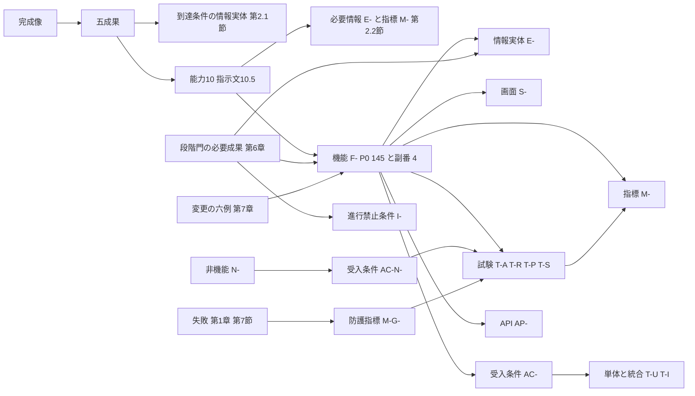

# 第10章 完成像、必要成果、機能、情報、画面、指標、試験の追跡表

作成日: 2026-09-15　版: v1.3　担当: 段階3 第10章（追跡表）。v1.3 は 2026-10-08 の段階8前の持ち越し仕上げ（共通の決定 D18、統括の決定 D26、既定値の識別子の併記 0 行）。第2.4節「3D処理費が収益を超える」の行の「抜け」列を K-06 (b) の解消（M-B-13 は F-C03-014 と F-C02-016 の計測方法。JR-122）に合わせた。統括の決定 D26 により第4.4節 例2 の I-07-002 の領域を第7章 v1.3 に合わせて A06 とした。転記値と件数は変えていない（段階8 の再生成で再更新）。記録は `05_審査/再修正記録_段階8前_仕上げ_群F2.md`。v1.2 は 2026-10-07 の段階6 二回目の修正（段階7 再審査の後）。再審査 修正計画 第1.10節の 13 件（主担当 JR-044〜JR-046、整合 JR-017、JR-018、JR-035、JR-053、JR-054、JR-077、JR-078、JR-104、JR-116、JR-122）を同計画 第0.3節、第0.4節の固定文と番号で反映し、二回目の修正で各章が新設、変更した識別子（副番 F-C03-019-03、T-I-024、M-G-25、I-06-006〜009 の段階、受入条件 36件ほか）を各章の識別子一覧と第23章 付表 4.3-A から追跡表へ転記した（転記の時点〔2026-10-07 09:45〕で二回目の修正が未完了の章はない）。記録は `05_審査/再修正記録_2回目_第2_10章.md`。同日の二回目の修正の仕上げ〔群R1。群内の最後に実施〕で、第1.3節 規則2 と K-12 の転記値を機械整合検査（2026-10-07 09:54）の値に更新し、骨格の関連画面列の改訂（F-C03-005、014、021、F-C01-014、F-C15-015）に合わせて第3.1節と第4.3節を再計算し（K-11 は解消）、第2.3節の I-06-003 と I-06-004 の行を第11章 v1.3 と第6章に合わせた〔版は v1.2 のまま。記録は `05_審査/再修正記録_2回目_仕上げ_群R1.md`〕。v1.1 は 2026-10-06 の段階6 初稿審査の再修正（主担当 JM-058〜JM-062、整合 JM-004、JM-025、JM-077、JM-091、JM-110、JM-117、JM-133、JM-171、JM-173）と、各章の修正後の機械抽出による再生成（修正計画 第0.2節 順5）。反映内容は `05_審査/再修正記録_第9_10章.md`
根拠: 指示文 I節（成果物10）、10.2（完成像、五成果、指標の木）、10.5（完成像から機能への逆算）、A1（六段の因果）。基盤定義（機能一覧骨格 v1.3、画面指標試験骨格 v1.3、情報実体骨格 v1.3、識別子規則 v1.3、七段階門 v1.3、整合検査報告 v1.2 第5節と第5.1節。v1.1 は各 v1.2 と追補、整合検査報告 v1.1 を前提とした）。機械生成物（`04_必須表/00_機械整合検査.md`、`04_必須表/識別子台帳_機械生成.md`、`04_必須表/受入条件と試験の対応_機械生成.md`、`03_仕様書/00_章要約集.md`。転記の起点は 2026-10-06 22:56 の生成物。段階6 の最終値は 2026-10-07 01:27 の再生成。二回目の修正の後の再生成は 2026-10-07 09:54 で、第1.3節 規則2 と K-12 の転記値はこの値）。各章の要件ブロック、識別子一覧と対応表。確認日はすべて 2026-09-15。

## 0. 本章の目的、範囲と非対象、前提とする章

### 0.1 本章の目的

- 完成像 → 五成果 → 完成像に必要な能力 → 機能 → 情報実体 → 画面 → 指標 → 試験 → API → 受入条件 の対応を一つの表に固定し、P0 の 145機能と副番の P0 4件を全件網羅する（副番 F-C03-019-03 は v1.2 で追加）。
- 試験、指標、画面から機能へ戻る逆引き表と、非機能（N-）→ 受入条件（AC-N-）→ 試験の対応を置き、追跡が切れている箇所を「抜け」として一覧化して担当章へ依頼し、完成像審査（指示文J節1）、第23章、04_必須表の起点にする。
- 第1章 第7節の失敗と第7章 第3.1節の影響連鎖の六例を、防護指標、機能、問題、試験へ照合する（v1.1。JM-060）。

### 0.2 本章の範囲と非対象

| 項目 | 内容 |
|---|---|
| 範囲 | 仕様識別子（F-、E-、S-、M-、T-、AP-、N-、AC-）の間の対応。P0 は全機能（副番を含む）、P1 と P2 は逆引きの注記と集計、非対象7機能は識別子台帳の「非対象」状態で保持 |
| 非対象 | 実行時個体（要求、案、要素、問題、判断、承認、書出）の間の追跡（第12章 第8節が正本）。機能、指標、試験、画面の定義や採番の変更（各主章、第23章、基盤定義が行う）。新しい仕様識別子の採番（本章は未決 U-10- だけを採番する）。領域と主章の対応表そのもの（第7章 第6.1節が正本で、本章は参照だけを置く） |
| 転記の原則 | 各対応は出典の記述を機械的に転記する。判断を要する箇所は「本章の仮の判断」として【仮定】を付け、第5節と未決事項に記す |

### 0.3 前提とする章

- 基盤定義: 機能一覧骨格 v1.3（249機能と副番8件の優先、主担当、六因果、段階、主章、関連画面、第6.2節）、画面指標試験骨格 v1.3（S-01〜S-30、指標、試験 50件の関連指標と関連機能の列、反証試験の P0 版と P1 版〔T-R-010 は P0、P1、P2 版〕、第4.1節、第4.2節）、情報実体骨格 v1.3（E- 94件。E-EXC-008〜010 を含む）、七段階門 v1.3（交差表。影響先の値と源1 対象外）、整合検査報告 v1.2 第5節と第5.1節（識別子変更一覧。二回目の修正）。v1.1 は各 v1.2 と追補を前提とした。
- 仕様書: 第1章（第7節）、第2章（第1.3節、第1.4節、第3.4節、第6.2節）、第6章（第3節、第8.2節、第9.8節）、第7章（第3.1節、第5.7節、第6.1節、第6.2節）、第9章（優先、集計、第3節の索引）、第12章（第8.2節、表11.2-A）、第14章（第2.1節）、第15章（第1.4節）、第23章（第1節の非機能、第4節の試験と付表 4.3-A）、主章（第5、6、8、11〜13、15〜23章）の要件ブロック。表6-1a（`04_必須表/表6_最終審査表_暫定.md`。能力から必要情報と指標への暫定の対応。v1.1 で正本を本章 第2.2節へ移した）。
- 機械生成物（第1.3節 規則2）と章要約集（本章あての依頼 18件と基盤定義からの依頼）。

## 1. 追跡の構造と規則

### 1.1 追跡の階層

### 1.2 列の意味と出典

| 対応 | 出典（正本） | 補助の出典 | 区分 |
|---|---|---|---|
| 完成像 → 五成果 → 指標、画面、試験 | 指示文10.2、第2章 第6.2節、画面指標試験骨格 第2.2節、第4.1節 | — | 【推定】 |
| 五成果 → 到達条件を判定する情報実体 | 第2章 第1.3節（観察可能な到達条件）、第12章 項目辞書（属性名） | 情報実体骨格 | 【推定】 |
| 能力 → 機能 | 本章 第2.2節（v1.2 で必須機能の集合の正本。JR-044） | 機能一覧骨格 第6.2節、第2章 第3.4節（同じ集合の写し） | 【推定】 |
| 能力 → 画面、試験 | 画面は必須機能の骨格の関連画面列（機械転記）、試験は第2章 第3.4節（v1.2、JR-044） | — | 【推定】 |
| 能力 → 必要情報（E-）、指標（M-） | 本章 第2.2節（v1.1 で表6-1a から移した正本。第2章 第3.4節はここを参照する。JM-058） | 表6-1a、第12章 表11.2-A | 【推定】 |
| 機能 → 情報実体 | 主章の要件ブロック「情報入出力」の出力側の先頭の E-（属性名を含む） | 第6章 第3節、第12章 第8.2節 | 【推定】 |
| 機能 → 画面 | 機能一覧骨格 v1.2 追補の関連画面列（第15章 第1.4節の確定を反映済み）の先頭 | 第15章 第1.4節、主章の要件ブロック | 【推定】 |
| 機能 → 指標 | 主章の要件ブロック「計測方法」の先頭の M-（第6章の機能は第9.8節も見る） | 画面指標試験骨格の関連指標（試験経由。第4.2節） | 【推定】 |
| 機能 → 試験（受入、反証、性能、安全） | 画面指標試験骨格 第3節の関連機能列（第6章の機能は第9.8節を併せる） | 主章の要件ブロックの T- | 【推定】 |
| 機能 → 単体試験と統合試験、受入条件 | 第23章 付表 4.3-A（T-U-、T-I- ごとの対象 AC-） | `受入条件と試験の対応_機械生成.md`（照合に使う） | 【推定】 |
| 機能 → API | 第14章 第2.1節の対応機能列（先頭が主となる機能） | — | 【推定】 |
| 非機能 → 受入条件 → 試験 | 第23章 第1節 | 機械生成物 | 【推定】 |
| 段階 → 必要成果、進行禁止条件 → 機能 | 第6章 第3節（必須成果、源1 対象、確認者）、第8.2節（進行禁止条件と testRef） | 七段階門 第3節、機能一覧骨格の段階列 | 【推定】 |
| 領域 × 主章 | 第7章 第6.1節を正本とし、本章は転記しない（第7章 第6.2節の章の側からの逆引きも同じ。JM-060） | — | 【推定】 |

### 1.3 規則

1. 一機能に主章は一つ（機能一覧骨格 第0.4節）。情報実体、指標、受入条件は主章の要件ブロックから取る【推定】。
2. 転記は機械抽出で行い、2026-10-06 時点の各章ファイルを対象にした。抽出の起点にした機械整合検査（`99_作業道具/integrity_report.py`）の生成日時は 2026-10-06 22:56 である。二回目の修正の後の再生成（2026-10-07 09:54。作業道具の修正 JR-125 の後）の値は、参照切れ 0 件、重複定義 0 件（承認済みの二段構え 2 件〔M-G-17、M-G-25〕を除く）、P0 要件 あり 145／不足 0／なし 0（P0 145 件）、T- のない AC- 0 件、「第23章へ採番依頼」の残存 0 行である（JM-062）【事実】（出典: `04_必須表/00_機械整合検査.md` の「第10章 転記用」の行〔生成日時 2026-10-07 09:54〕、`識別子台帳_機械生成.md`、`受入条件と試験の対応_機械生成.md`、確認日 2026-09-15）。段階6 の最終値（2026-10-07 01:27）の参照切れ 2 件（U-81-003、AC-C14-003-01-01）は、01_調査の番号置換と作業道具の定義元の拡張、第21章の AC-C14-003-01-01 の定義（JR-100）で解消した。単体と統合試験の対象は付表 4.3-A を正とする（機械生成物は同じ行の AC- と T- を対応とみなすため対象が多い）（第5.1節 K-12。v1.2、JR-045）。本規則と K-12 の転記値は 2026-10-07 の二回目の修正の仕上げで 09:54 の再生成の値に更新した（持ち越し 17、JR-045）。09:54 の再生成は仕上げ（群R1〜R4。SRC-305〜SRC-337、U-88-001〜U-88-012 ほか）より前の状態であり、仕上げの後の再生成（段階8）で再び更新する。段階8 の最終の再生成（2026-10-08 13:20。段階8前の持ち越し仕上げと段階8 の最終仕上げの後）の値も、参照切れ 0 件、重複定義 0 件（承認済みの二段構え 2 件を除く）、P0 要件 あり 145／不足 0／なし 0（P0 145 件）、T- のない AC- 0 件、「第23章へ採番依頼」の残存 0 行で、09:54 の値と同じである（再々確認 01_突合.md K5-26。統括が 2026-10-08 に転記）。v1.2 で二回目の修正（2026-10-07）の新設識別子と受入条件は、機械生成物に入っていないため、各章の「本章で定義した識別子一覧」と第23章 付表 4.3-A（新設予定の列を含む）を正として転記した【推定】。
3. P0 145機能と副番の P0 4件（F-C02-024-01、F-C03-019-01、F-C03-019-03、F-C09-012-01。F-C03-019-03 図面派生三案は v1.2 で追加。JR-095）を全件載せる。副番は親の内訳であり、機能数は 145 のまま数える（機能一覧骨格 第4.1節の注）。P1 82機能と P2 15機能（副番の P1 3件、P2 1件を併せて追う）は逆引き表の注記と第5.2節で追い、非対象7機能は「非対象」状態のまま追跡の分母に含めない（U-00-058 への本章の仮の判断）【仮定】。
4. 機能一覧骨格 第6.2節の能力に割り当てられていない P0 機能は、六因果の先頭値で五成果へ対応付けて「横断機能」（用語集 428）と呼ぶ。対応は (1)→成果1、(2)(3)→成果2、(4)→成果3、(5)→成果4、(6)→成果5（第2章 第6.2節）。副番は親の能力に従う。v1.1 で骨格 v1.2 の六因果の付け替え（JM-056）を反映し、F-C05-002、F-C06-001、F-C07-009 は横1 から横2 へ移った。v1.2 で第2.2節の必須機能の追加（JR-044）により F-C03-001、F-C04-009、F-C05-006、F-C05-007、F-C11-006、F-C15-002 の 6件が横断から能力へ移った【仮定】。
5. 対応が一つもない欄は「—」とし、第5節で抜けとして種類、対象、仮の扱い、依頼先を記す。判定は「P0 機能に直接の試験、指標、情報実体、要件ブロックがない」「試験、指標、画面、API にどの P0 機能も結ばれない」の観察可能な条件で行う【推定】。
6. 追跡表は識別子だけを載せ、名称は識別子台帳と第9章で引く。情報実体列の「†」は情報入出力の行に E- がなく要件ブロックの他の行から取った値、「（入力）」は出力側に E- がなく入力側の先頭を取った値を示す【推定】。
7. 主章の要件ブロック、第14章 第2.1節、第23章 付表 4.3-A、骨格の関連機能列が改まった場合は、本節の規則で第3節と第4節を再生成する（第7章、第12章、各主章の前提）【推定】。

## 2. 完成像から五成果、能力、段階門の必要成果への対応

### 2.1 完成像 → 五成果 → 到達条件の情報実体 → 指標 → 画面 → 試験

完成像の一文は指示文10.2。表は第2章 第1.3節、第6.2節と画面指標試験骨格 第2.2節、第4.1節の転記である。「到達条件を判定する情報実体」の列は、第2章 第1.3節の観察可能な到達条件が参照する実体を第12章 項目辞書の属性名で書いた（v1.1。JM-058）【推定】。

| 成果 | 到達条件を判定する情報実体（第2章 第1.3節） | 主要指標 | 防護指標 | 因果 | 主な画面 | 主な試験 | P0 で計測 |
|---|---|---|---|---|---|---|---|
| 成果1 正しい問題設定 | E-BLD-001.purpose（目的文）、E-BLD-001.nonScope（非対象の表示）、E-ORG-008.decisionAuthority（決定権）、E-REQ-001（priority=RP-MUST、sourceRef、deciderRef、確認者）、E-REQ-001.conflictRecords と E-REQ-003（要求衝突、解決候補と代償） | M-P-08、M-P-09 | M-G-11 | (1) | S-02、S-24、S-05、S-09 | T-R-012、T-A-003、T-A-001、T-A-008 | 可 |
| 成果2 比較可能な成立案 | E-REQ-005（三案。generationBasis、droppedRequirementRefs）、E-SRV-005（概算範囲）、E-SRV-010（確信度）、E-REQ-003（構造 A04、避難 A07、排水 A06 の初期注意） | M-P-10、M-G-05 | M-G-12 | (2)(3) | S-03、S-10、S-11、S-12 | T-R-001〜T-R-003、T-R-007、T-A-009〜T-A-011 | 可（詳細調整は P1。T-R-002、003、007 は P0 版で判定） |
| 成果3 根拠付き合意 | E-REQ-004（七項目。isKeyDecision、deciderRef）、E-REQ-007（確認範囲ごとの承認。scopeKind、baseRevisionRef）、E-REQ-006（版） | M-N-01 | M-G-13、M-G-17、M-G-25（M-G-17 と M-G-25 は採番が第23章、定義が第2章 第5.1節の二段構え。M-G-25 は v1.2 で転記。JR-003） | (4) | S-13、S-25、S-23、S-30-01 | T-A-007、T-A-013、T-S-003、T-S-011 | 可 |
| 成果4 情報を失わない引継ぎ | E-EXC-002（引継ぎ一式。validationResult）、E-EXC-001（標準の必要情報要求）、E-REQ-006.cdeState（発行済み CDE-PUB が一つ） | M-G-02、M-G-06 | M-G-14 | (5) | S-08、S-20 | T-A-006（P1）、T-A-014（P0 は T-A-017）、T-S-001、T-S-013 | 主要指標は試験時の代替計測のみ（第23章 第6.1節の建築士二重確認 100 件で受取側役を建築士が担い、M-G-02 と M-G-06 を T-A-017 で実測）。運用計測は P1（F-C08-008）で、P0 の運用時は監視のみ。防護指標 M-G-14 は P0 から計測（JM-004） |
| 成果5 建物全期間の改善 | E-OPS-006（竣工差分）、E-OPS-007（入居後確認）、E-SRV-013（目標 EL-TGT）、E-ORG-006（学習利用の別同意） | M-O-05、M-O-06 | M-G-07、M-G-15 | (6) | S-14 | T-A-015、T-S-006 | 不可（P2。「未計測」と表示）。M-G-07 は P0 から計測し合否に使う |

注（JM-061）: 成果1 の画面 S-05、S-09 と試験 T-A-001、T-A-008 は、能力2（元資料を失わず建物化する）と横断機能（F-C09-）由来の追加であり、正本は画面指標試験骨格 第2.2節と第2章 第6.2節である（表6 矛盾候補7 は矛盾ではない）【推定】。横断の防護指標は M-G-01、M-G-03、M-G-04、M-G-08〜M-G-10、M-G-16、M-G-18〜M-G-24（画面指標試験骨格 第2.1節、第23章 第2.5節）【推定】。

### 2.2 能力（指示文10.5）→ 成果 → 機能 → 必要情報 → 指標

機能は機能一覧骨格 第6.2節の転記、成果は第1.3節 規則4 による。「必要情報（指示文10.5 の語 → E-）」と「指標（M-）」の二列は表6-1a（暫定）の対応を転記して本表を正本とした（v1.1。JM-058。第2章 第3.4節はここを参照する）。能力5 の「人体」は第12章が新しい実体を作らず E-ORG-008.bodyMetrics に置いた（第12章 表11.2-A。K-14）。各能力の観察可能な合格条件と検査する試験は第2章 第3.4節を正本とする【推定】。

v1.2（二回目の修正。JR-044）で、指示文10.5 の必須機能の語に当たる機能を能力の行へ加えた（P1、P2 の機能は「（P1）」「（P2）」を付け、範囲表記の内訳は除く）。必須機能の集合の正本は本表であり、機能一覧骨格 v1.3 第6.2節と第2章 第3.4節は同じ集合の写しである。「画面（S-）」列は必須機能の骨格 v1.3 の関連画面列から親画面を機械転記し（P0 機能の画面を先に、P1、P2 の機能だけの画面に「（P1）」「（P2）」）、「試験」列は第2章 第3.4節の「検査する試験」の転記である【推定】。

| 番号 | 能力 | 成果 | 因果 | 必須機能 | 画面（S-） | 必要情報（指示文10.5 の語 → E-） | 指標（M-。閾値は初期仮説） | 試験（第2章 第3.4節） |
|---|---|---|---|---|---|---|---|---|
| 1 | 曖昧な希望を設計条件へ変える | 1 | (1) | F-C01-002〜F-C01-020 | S-02、S-03、S-04、S-24 | 要求、関係者、優先度、決定権 → E-REQ-001（優先度は属性 priority）、E-REQ-002、E-REQ-009、E-ORG-008（decisionAuthority）、E-ORG-001 | 主要 M-P-08、M-P-09。防護 M-G-11、横断 M-G-01、M-G-24 | T-R-012、T-A-003 |
| 2 | 元資料を失わず建物化する | 1 | (1) | F-C02-005〜F-C02-017、F-C02-028 | S-04、S-05、S-30 | 元頁、座標、尺度、確信度、改訂 → E-PRD-006、E-SRV-009、E-SRV-010、E-REQ-006、E-BLD-004、E-ELM-001〜E-ELM-009 | M-Q-01〜M-Q-18、M-Q-30、M-Q-32。重大失敗 M-Q-25〜M-Q-28。防護 M-G-04 | T-A-001、T-A-002、T-P-005、T-P-006 |
| 3 | 一案への早過ぎる固定を防ぐ | 2 | (2)(3) | F-C03-019〜F-C03-021（P0 の希望入力は副番 F-C03-019-01、図面入力は F-C03-019-03）、F-C01-023、F-C03-004 | S-03、S-04、S-13、S-25 | 目的、制約、費用、性能 → E-REQ-005、E-REQ-002、E-SRV-005、E-SRV-013、E-REQ-004 | 主要 M-P-10、M-P-05。M-G-05（閾値未設定、監視のみ） | T-R-001、T-R-007 |
| 4 | 建築として成立性を高める | 2 | (3) | F-C11-001〜F-C11-003、F-C11-006、F-C12-001、F-C12-002、F-C12-009、F-C04-005、F-C13-010、F-C12-005（P1） | S-04、S-10、S-11、S-13、S-23 | 系統、層、経路、接合、責任 → E-SYS-001、E-SYS-002、E-SYS-003、E-MAT-003、E-MAT-004、E-MAT-005、E-ORG-007、E-REQ-003 | 防護 M-G-12、M-G-08、M-G-21。品質 M-Q-35〜M-Q-38 | T-R-002、T-R-003、T-A-010 |
| 5 | 家族が実物尺度で選ぶ | 2 | (3) | F-C04-002、F-C04-009、F-C04-010、F-C04-016、F-C05-009、F-C05-018、F-C04-017（P1） | S-03、S-04、S-06 | 人体、商品、室、時間帯 → E-ORG-008.bodyMetrics（人体寸法。視点高さ DV-FN-03）、E-ELM-013、E-PRD-001、E-SPC-001、E-REQ-009（時間帯） | M-Q-20〜M-Q-22、M-P-01（N-PF-01）、N-PF-07 | T-A-004、T-P-010 |
| 6 | 費用と期間を伴う判断にする | 2 | (3) | F-C13-001〜F-C13-003、F-C13-005（P1）、F-C13-006（P1） | S-12、S-06（P1） | 数量、単価時点、地域、確信幅 → E-SRV-006、E-SRV-014、E-SRV-005、E-SRV-015、E-SRV-016 | M-Q-24、M-Q-44、M-Q-39 | T-A-003、T-R-007 |
| 7 | 誇大な確実性を防ぐ | 3 | (4) | F-C15-002、F-C15-004、F-C15-005、F-C02-018、F-C12-008、F-C13-002 | S-03、S-05、S-08、S-11〜S-14、S-16、S-17、S-30 | 根拠、確認、版、資格 → E-REQ-008、E-REQ-007、E-REQ-006、E-REQ-010、E-ORG-001（資格） | 防護 M-G-13、M-G-10、M-G-08、M-G-20 | T-A-007、T-S-003、T-A-011 |
| 8 | 実在商品を安全に使う | 2 | (2)(3) | F-C05-001、F-C05-006、F-C05-007、F-C05-015、F-C06-005〜F-C06-007、F-C05-012（P1） | S-04、S-06、S-21、S-30 | 寸法、供給、許諾、保証、維持 → E-PRD-001、E-PRD-005、E-PRD-007、E-PRD-002、E-PRD-003、E-OPS-003、E-OPS-005 | M-B-09、M-B-10、M-G-22、M-G-23、M-G-16、M-Q-23、M-Q-39 | T-A-005、T-S-008、T-R-009 |
| 9 | 専門家へ再入力なく渡す | 4 | (5) | F-C03-001、F-C15-006、F-C15-007、F-C15-011、F-C15-013、F-C04-012、F-C04-014、F-C15-009、F-C04-013（P1）、F-C15-008（P1）、F-C10-008（P1） | S-04、S-08、S-13 | 属性、分類、問題、承認 → E-EXC-001、E-EXC-002、E-EXC-003、E-EXC-005、E-REQ-003、E-REQ-007、E-ORG-007 | 主要 M-G-02、M-G-06（いずれも P0 は試験時の代替計測。JM-004）。防護 M-G-14、M-G-18、M-G-19、M-P-07 | T-A-014、T-S-013 |
| 10 | 建物を長く使い改善する | 5 | (6) | F-C14-007〜F-C14-012（P2） | S-14（P2） | 施工後状態、保証、点検、実測 → E-OPS-001〜E-OPS-007、E-PRD-004、E-SRV-003、E-SRV-002 | 主要 M-O-05、M-O-06（P0 は「未計測」）。防護 M-G-07、M-G-15 | T-A-015、T-S-006 |

能力に割り当てられた P0 機能は 75件、横断機能は 70件（第5.2節。v1.1 の 69件、76件から、JR-044 で F-C03-001、F-C04-009、F-C05-006、F-C05-007、F-C11-006、F-C15-002 の 6件を横断から能力へ移した）【推定】（第3節の能力列の計数）。

### 2.3 段階門 → 必要成果（情報実体）→ 進行禁止条件 → 主な P0 機能

第6章 第3節の交差表の必須成果（情報実体ID）と三列（源1 対象、確認者（P0）、確認者（P1））を段階ごとに集約し、第8.2節の進行禁止条件（E-EXC-005 の testRef）と機能一覧骨格の段階列で主な P0 機能を対応付けた。交差ごとの主要判断、必須成果、確認者（P1 を含む）は第6章 第3節を正本とし、本表は段階ごとの集約に留める（二重記述の一元化。修正計画 第0.3節）【推定】。v1.2 で第6章 v1.2 第3節の有無の値「影響先（記号）」（G0×A02、G0×A09、G2×A01、G4×A04〜A06 の 6 交差。判断記録 E-REQ-004 を作らず、記号の源1 の判断の Impact〔E-REQ-012〕として記録し、確認者列は成果の受領確認者。JR-017）、G2(d) と G3(f) の源1 対象外（JR-005）、G4 の専門家未割当の交差数（JR-035）、第8.2節の I-06-006〜I-06-009 と I-00-110 の段階に同期した【推定】。

| 段階 | 必要成果（情報実体） | 源1 対象（第6章 第2節の主要判断） | 確認者（P0）の要点 | 進行禁止条件（I-）と試験 | 主な P0 機能 |
|---|---|---|---|---|---|
| G0 | E-BLD-001、E-ORG-008、E-SRV-012、E-SRV-015、E-ORG-006、E-EXC-006 | G0(a)〜(c) | RL-OWN。専門家未割当の交差 1（G0×A02）。影響先の交差 2（G0×A02、G0×A09。G0(b) の影響先で受領確認） | I-00-101〜I-00-104（T-A-013）、I-06-001（T-S-014） | F-C01-001、F-C01-005、F-C01-006、F-C01-012、F-C01-013、F-C01-021、F-C01-022、F-C01-025、F-C10-014、F-C15-001〜F-C15-003 |
| G1 | E-REQ-001、E-REQ-009、E-REQ-004、E-BLD-002、E-SRV-011、E-SRV-004、E-SRV-001、E-REQ-005（V1）、E-SRV-009、E-SYS-005、E-SPC-001、E-ELM-001、E-ELM-012、E-ELM-013、E-SRV-014、E-PRD-006、E-REQ-007、E-PRD-005 | G1(a)〜(f)（G2(b) を参照する交差を含む） | 専門家未割当の交差 5。RL-CHK 建築士の資格は本人申告（未照合） | I-00-105〜I-00-107（T-R-001、T-A-008）、I-00-108（T-A-002、T-R-005）、I-00-109、I-00-110（T-R-012）、I-06-003（G1 で停止、G4 で再検査。T-R-004。図面一式は P1）、I-05-001（SEV-1。T-R-012） | F-C01-002〜F-C01-020、F-C02-001、F-C02-005〜F-C02-008、F-C02-010〜F-C02-018、F-C02-023、F-C02-028、F-C02-024-01（副番）、F-C09-001〜F-C09-004、F-C09-007〜F-C09-010、F-C09-015、F-C09-012-01（副番）、F-C05-014 |
| G2 | E-REQ-005（三案）、E-REQ-001、E-SRV-004、E-SYS-003、E-REQ-004、E-SYS-001、E-BLD-005、E-MAT-003、E-ELM-012、E-SRV-013、E-ELM-013、E-SRV-005、E-SRV-016、E-REQ-003、E-REQ-009、E-REQ-007、E-REQ-006 | G2(a)〜(c)、G2(e)（G2(d) は源1 対象外。選定記録の承認範囲と版の固定は F-C15-014 と門の判定 F-C15-003。JR-005） | 専門家未割当の交差 6。影響先の交差 1（G2×A01。G2(a) の影響先で受領確認） | I-00-110（G2 は案の生成時に新たに検出した衝突。T-R-012）、I-00-111（T-R-001、T-R-007）、I-00-112（T-R-001）、I-00-113（T-A-013、T-I-005）、I-00-114（T-R-007、T-I-016）、I-00-115（T-A-013）、I-18-002（SEV-1。G2、G3。T-R-001、T-R-010、T-I-023）、I-06-009（SEV-1。改装区分の未指定。P1。T-A-012、T-R-006） | F-C03-019〜F-C03-021、F-C03-019-01（副番。雛形三案）、F-C03-019-03（副番。図面派生三案）、F-C01-023、F-C09-013、F-C11-001、F-C11-006、F-C12-001、F-C12-007、F-C13-001、F-C13-002、F-C04-009、F-C04-016 |
| G3 | E-REQ-005（V2）、E-SRV-004、E-BLD-005、E-ELM-005、E-ELM-006、E-SYS-001、E-REQ-003、E-MAT-003、E-MAT-005、E-SYS-002、E-SYS-003、E-SRV-013、E-PRD-001、E-SRV-005、E-REQ-012、E-SRV-016、E-SRV-015、E-REQ-010、E-REQ-007、E-REQ-011 | G3(a)〜(e)（G3(f) は源1 対象外。V2 の判定は F-C15-004。JR-005） | 専門家未割当の交差 5。G3×A10、G3×A11 は「初期注意の表示のみ。確認者なし」 | I-00-116（T-R-002、T-R-006 の P1 版、T-I-006）、I-00-117（T-R-003、T-I-007）、I-00-118（T-I-001）、I-00-119、I-00-120（T-A-007）、I-00-121（T-A-005、T-R-009）、I-06-006（SEV-0。負の余裕量が未解決なら G3 の門を止める。T-R-010）、I-06-007（P1。所見の種別による重大度付与。T-R-006）、I-06-008（SEV-1。現況未確認の改装要素。P1。T-R-006） | F-C03-009〜F-C03-014、F-C04-005、F-C04-010、F-C11-002、F-C11-003、F-C12-002、F-C12-006、F-C12-009、F-C13-003、F-C13-010、F-C10-003〜F-C10-005、F-C15-004 |
| G4 | E-REQ-001、E-SRV-001、E-REQ-004、E-EXC-002、E-ORG-007、E-SRV-008、E-SRV-013、E-PRD-001、E-SRV-005、E-REQ-003、E-ORG-006、E-REQ-006（CDE-PUB）、E-REQ-007 | G4(a)〜(c) | 受取側 RL-CHK 建築士の受領確認（資格は本人申告、未照合）。未登録なら専門家未割当（7 交差: G4×A02〜A07、G4×A10。JR-035）。影響先の交差 3（G4×A04〜A06。G4(c) の影響先で受領確認）。組織案件は情報管理担当（案件側 RL-EDT） | I-06-006（G4 で再検査。発行と引継ぎ一式の生成も止める。T-R-010）、I-06-007（P1。T-R-006）、I-18-004、I-18-005（SEV-1。T-U-012）、I-00-122〜I-00-124（T-A-014。P0 は T-A-017、T-I-005）、I-00-125（T-S-001）、I-00-126（T-A-007、T-A-014）、I-06-002（T-A-013、T-I-002）、I-06-003（再検査。T-R-004）、I-06-005（T-R-006） | F-C15-006、F-C15-007、F-C15-009、F-C15-011〜F-C15-013、F-C15-017、F-C04-012、F-C04-014、F-C10-009、F-C10-015、F-C10-017、F-C02-018、F-C09-012-01（確認期限切れのまま G3→G4 で SEV-1） |
| G5、G6（P2） | G5: E-REQ-011、E-REQ-001、E-SRV-003、E-REQ-005、E-REQ-007、E-OPS-001、E-REQ-008、E-PRD-004、E-OPS-006。G6: E-OPS-007、E-OPS-004、E-OPS-005、E-SRV-013、E-OPS-003、E-ORG-006 | G5(a)(b)、G6(a)(b) | —（P2。確認者は第6章 第2.6節、第2.7節） | I-00-127〜I-00-130（T-R-006、T-A-012、T-I-017）、I-06-004（T-R-006）、I-00-129、I-00-131、I-21-004（T-R-006）、I-00-131〜I-00-133（T-A-015） | P0 の固有機能は F-C10-011、F-C15-015 だけ（横断の F-C10-001、F-C10-010、F-C15-001〜F-C15-005 が働く） |

修正計画 第0.4節で新設した進行禁止条件の追跡を次に示す（JM-025 ほか）。I-06-005 は改装案件の工事前定義（F-C14-003、P1）の受入条件 AC-C14-003-01 と結ぶ【推定】。v1.2 で再審査の修正計画 第0.4節の I-06-007〜I-06-009（JR-013、JR-021、JR-022）を加え、I-06-006 の段階を第6章 v1.2 第8.2節（appliesTo を G3、G4。JR-011）に合わせた【推定】。

| 進行禁止条件 | 段階 | 検査規則（第6章 第8.2節） | 機能（* は P1） | 受入条件（主章） | 試験 |
|---|---|---|---|---|---|
| I-06-003 正本未確定（図面一式） | G1（停止）、G4（再検査） | 正本未確定（第11章 第7.1節） | F-C02-019*、F-C15-002 | AC-C02-019-01〜05（第11章。-05 は混入頁の除外と欠落の確定判断。v1.3、JR-048）、AC-C15-002-01〜07（第6章） | T-R-004（P1） |
| I-06-004 石綿含有判明後の記録（作業結果の報告書面の未登録。2026-10-07 に第6章で特定） | G5（P0、P1 は警告） | 石綿含有判明後の記録（第21章 第2.4節） | F-C15-002、第21章の記録の受入（P2） | AC-C15-002-01〜07（第6章） | T-R-006（P1 版で警告の表示） |
| I-06-005 解体後判明時の 4 項目の未定義 | G4 | 解体後判明時の 4 項目（第21章 第3節） | F-C14-003*（工事前定義と G4 での停止）、F-C15-002 | AC-C14-003-01（第21章。4 項目のいずれかが欠ける改装案件で G4 の門が通過せず、欠ける項目が S-13-01 に名指しで表示される） | T-R-006（P1 版）、T-U-014 |
| I-06-006 負の余裕量の持ち越し | G3（SEV-0 で G3 の門の通過を止める）、G4（再検査。発行と引継ぎ一式の生成も止める） | 負の余裕量の持ち越し禁止（第6章 第2.5節、第18章 第4.4節） | F-C09-008、F-C15-002、F-C15-013、F-C15-017 | AC-C09-008-01〜04（第18章）、AC-C15-002-01〜07、AC-C15-002-09（却下後の再登録。第6章）、AC-C15-013-04、AC-C15-017-03（引継ぎ一式の生成と発行の拒否。第22章） | T-R-010（P0 版） |
| I-06-007 所見の種別による重大度付与（発見の問題。P1） | G3、G4（P1） | 所見の種別による重大度付与（第11章 F-C02-026 (6)。報告種別への対応表は第12章 DV-CF-13） | F-C02-026*、F-C15-002 | AC-C02-026-05（第11章） | T-R-006（P1 版） |
| I-06-008 現況未確認の改装要素（SEV-1。進行禁止ではない。P1） | G3（P1） | 現況未確認の改装要素（第21章 第2.1節 規則(5)） | F-C14-001*、F-C15-002 | AC-C14-001-05（第21章） | T-R-006（P1 版） |
| I-06-009 改装区分の未指定（SEV-1。欠落属性。P1） | G2（P1。完了条件(10)） | 改装区分の未指定（第6章 第2.3節 完了条件(10)。区分の正本は第21章 F-C14-001） | F-C14-001*、F-C15-003 | AC-C14-001-01（第21章） | T-A-012、T-R-006 |

### 2.4 第1章 第7節の失敗 → 防護指標 → 試験（v1.1 新設。JM-060）

第1章 第7節の主要な危険10件を防護指標と試験へ照合した。第1章の表で試験欄が空の2件（広告偏り、人確認の滞留）に試験を割り当て、防護指標が空の1件（知財侵害）に指標を対応付けた。割当は画面指標試験骨格 v1.2 と第23章の試験の合否条件に基づき、試験の定義は変えない。割当のない失敗は K-15 とした【推定】。

| 失敗（第1章 第7節） | 重大度 | 防護指標（第1章） | 試験（第1章） | 本章の照合（v1.1） | 抜け |
|---|---|---|---|---|---|
| 尺度を誤ったまま3D化 | 極高 | M-G-03 | T-A-002、T-R-005 | 重大失敗の指標 M-Q-25 尺度誤認率と T-P-001 を加える | なし |
| 外壁や階段接続の欠落 | 極高 | M-G-03、M-G-08 | T-P-002、T-P-003 | 重大失敗の指標 M-Q-26、M-Q-27 と T-A-001 を加える | なし |
| 構想画像を施工案と誤認 | 極高 | M-G-13 | T-A-007、T-S-003 | 誤抑止の指標 M-G-20 を併記する | なし |
| 図面流出 | 極高 | M-G-07 | T-S-004、T-S-005、T-S-012 | T-S-007（伏せ字）と T-S-015（暗号化と分離。N-SC-01〜N-SC-03）を加える | なし |
| 特定企業の知財侵害 | 高 | — | T-S-008、T-A-005 | 防護指標に M-G-23 商用不可データの混入件数（P0）、M-B-10 許諾確認済み率、M-G-22 参照画像の権利確認実施率（P1）を対応付ける | なし（第1章の防護指標欄の追記を依頼） |
| 古い商品や法規を断定 | 高 | M-G-10 | T-R-009、T-R-010 | T-R-009 は P0 版（有効期限超過の SUP-UNKNOWN 表示、利用者申告の販売終了。JM-117）、T-R-010 は P0 版と P1 版に分けて判定する（JR-116）。P0 版: 確認期限切れ（checkedAt 91 日前。F-C09-012-01）の表示と I-18-005、手動再取得による再判定と I-18-002、期限内の改正を検出しない固定注記、負の余裕量が未解決のまま G3 を通過しない、または発行と引継ぎ一式の生成が 0 件（JR-011）、判定不能の条項の必要入力付きの引継ぎ。P1 版: 自動検出、差分表示、承認の自動失効。EL-LAW の自動維持の否定は P2 版。M-Q-39、M-Q-42、M-P-16（P1）を併記する | なし |
| 広告企業へ推薦が偏る | 高 | M-G-16 | — | T-S-008 の合否(5)（推奨点と順位の算定規則が isSponsored と Fee を参照しない静的検査。骨格 v1.2 追補）と T-S-017（P1。提携先の広告表示）を割り当てる。M-G-16 の月次の値は F-C15-015 が計測する | なし（第1章の試験欄の追記を依頼） |
| 無断で複数社へ送信 | 高 | M-G-07、M-B-03 | T-S-001、T-A-006 | T-A-006 は P1。P0 は製品から外部送信しないため（U-00-028）、共有と外部 AI 処理先の安全を T-S-004、T-S-012 で判定する | なし |
| 3D処理費が収益を超える | 中 | M-B-08 | T-P-007 | M-B-12〜M-B-15（写実生成の処理費、部分再生成率、GLB 容量超過率、外部 AI 処理費）を併記し、T-P-013（GLB 容量。M-B-14）を加える | M-B-08 は機能の計測方法に現れない（K-06 (b)）。M-B-13 は F-C03-014 と F-C02-016 の計測方法に加わり解消した（第12章 v1.4、第11章。K-06 (b) の解消。JR-122） |
| 人確認が滞留する | 中 | M-G-06 | — | P0 は T-I-002（責任表の空欄または未受諾で G4 が止まり、M-G-18、M-G-19 が目標内で通過する）を割り当てる。P1 の専門家確認の滞留時間 M-P-11（S-22）の試験は採番されていない | K-15 |

## 3. 機能追跡表（P0 145機能と副番の P0 4件）

列の意味と出典は第1.2節。各列は先頭の識別子だけ（試験と API は2件まで）を載せ、残りは第4節と各主章で追う。「能n」は第2.2節の能力番号、「横k」は横断機能の五成果k（第1.3節 規則4【仮定】）。「—」は対応なし（第5節）。「単体、統合」と「受入条件」の列は第23章 付表 4.3-A と第9章 第3節の索引と同じ値で、149行すべてに T-U- と AC- がある。末尾 11 の受入条件は第15章が画面側で採番したもの。画面列は骨格の関連画面列の先頭で、F-C01-014 だけは主章（第5章）が定める S-04-09 を、F-C15-015 は運用指標画面 S-28（S-28-01〜03 は P0。JR-078）を併記した（K-11）。情報実体列の E-EXC-008 は AP-029 の通知の保持先として F-C02-028、F-C10-005、F-C15-002 に併記した（JR-053）。表全体は【推定】（機械転記。抽出 2026-10-06、確認日 2026-09-15）。v1.2 で二回目の修正（2026-10-07）の新設と変更（副番 F-C03-019-03 の行、受入条件の追加、能力列、試験列、画面列）を各章の識別子一覧と第23章 付表 4.3-A から転記した【推定】。

### 3.1 C01 対話設計（P0 25機能）

|機能ID|能力|主章|情報実体|画面|指標|試験（受入、反証、性能、安全）|単体、統合（T-U-、T-I-）|API|受入条件（AC-）|
|---|---|---|---|---|---|---|---|---|---|
|F-C01-001|横1|8|E-BLD-001|S-01|M-P-04|T-S-002|T-U-003|—|AC-C01-001-01〜03|
|F-C01-002|能1|8|E-REQ-001|S-02|M-P-08|T-S-009|T-U-001|—|AC-C01-002-01〜03|
|F-C01-003|能1|8|E-SRV-010|S-02|M-G-04|T-A-013、T-S-012|T-U-001|AP-034|AC-C01-003-01〜04|
|F-C01-004|能1|8|—|S-02|M-G-05|T-S-009|T-U-001|—|AC-C01-004-01〜02、AC-C01-004-11（第15章）|
|F-C01-005|能1|8|E-BLD-001.region|S-02|—|T-A-013、T-A-008|T-U-001|—|AC-C01-005-01〜03|
|F-C01-006|能1|8|E-BLD-001.budgetRange|S-02|—|T-A-013、T-R-007|T-U-001|—|AC-C01-006-01〜03|
|F-C01-007|能1|8|E-ORG-008|S-02|M-P-09|T-R-012、T-R-008|T-U-001|—|AC-C01-007-01〜02|
|F-C01-008|能1|8|E-REQ-001|S-02|—|T-A-001|T-U-001|—|AC-C01-008-01〜02|
|F-C01-009|能1|8|E-REQ-009.sequence|S-02|—|—|T-U-001|—|AC-C01-009-01〜02|
|F-C01-010|能1|8|E-REQ-001|S-02|—|T-A-013、T-S-003|T-U-001|—|AC-C01-010-01〜02|
|F-C01-011|能1|8|E-PRD-006|S-02|—|T-S-008|T-U-001|—|AC-C01-011-01〜02|
|F-C01-012|能1|8|E-REQ-002|S-02|M-B-06|T-S-001、T-A-006|T-U-001|—|AC-C01-012-01〜02|
|F-C01-013|能1|5|E-ORG-008|S-02|M-P-09|T-R-012|T-U-004|—|AC-C01-013-01〜06|
|F-C01-014|能1|5|E-ORG-008.participationMethod|S-02、S-04-09、S-24|M-P-09|T-R-008、T-R-012|T-U-004|—|AC-C01-014-01〜07|
|F-C01-015|能1|8|E-REQ-009|S-02|—|—|T-U-001|—|AC-C01-015-01〜02|
|F-C01-016|能1|8|E-REQ-009|S-02|—|T-R-008|T-U-001|—|AC-C01-016-01〜02|
|F-C01-017|能1|8|E-REQ-009|S-02|M-G-10|T-R-011|T-U-001|—|AC-C01-017-01〜02|
|F-C01-018|能1|8|E-REQ-009|S-02|—|T-A-004|T-U-001|—|AC-C01-018-01〜02|
|F-C01-019|能1|8|E-REQ-001|S-24|M-G-01|T-R-012、T-A-013|T-U-002|—|AC-C01-019-01〜03|
|F-C01-020|能1|8|E-REQ-001.conflictRecords|S-24|M-G-11|T-R-001、T-R-007|T-U-002|—|AC-C01-020-01〜06|
|F-C01-021|横1|5|E-BLD-001.purpose|S-02|M-N-01|T-A-013|T-U-004|—|AC-C01-021-01〜05|
|F-C01-022|横1|8|E-SRV-007|S-02|—|T-A-013、T-A-008|T-U-002|—|AC-C01-022-01〜02|
|F-C01-023|能3|8|E-REQ-005.droppedRequirementRefs|S-03|M-P-10|T-R-008、T-R-011|T-U-002|—|AC-C01-023-01〜06|
|F-C01-024|横1|8|E-SRV-010|S-02|M-G-10|T-S-010|T-U-003|AP-034、AP-007|AC-C01-024-01〜04|
|F-C01-025|横1|8|E-REQ-005|S-01|M-P-04|T-S-002、T-P-007|T-U-003|AP-039|AC-C01-025-01〜04|

### 3.2 C02〜C04 図面読解と3D変換、建物情報と編集、3D表示（P0 48機能。副番 3）

|機能ID|能力|主章|情報実体|画面|指標|試験（受入、反証、性能、安全）|単体、統合（T-U-、T-I-）|API|受入条件（AC-）|
|---|---|---|---|---|---|---|---|---|---|
|F-C02-001|横1|11|E-PRD-006|S-05|M-P-04|T-A-001、T-S-002|T-U-005|AP-001|AC-C02-001-01〜04|
|F-C02-005|能2|11|E-PRD-006|S-05|M-Q-30|T-A-001|T-U-005|AP-002|AC-C02-005-01〜05|
|F-C02-006|能2|11|—|S-05|M-Q-01|T-P-005|T-U-005|AP-003|AC-C02-006-01〜03|
|F-C02-007|能2|11|E-SRV-010|S-05|M-Q-01|T-A-001、T-P-004|T-U-005|AP-003|AC-C02-007-01〜04|
|F-C02-008|能2|11|E-SPC-001|S-05|M-Q-01|T-A-001、T-P-004|T-U-005|AP-003|AC-C02-008-01〜04|
|F-C02-010|能2|11|E-SPC-001|S-05|M-Q-13|T-P-002、T-P-003|T-U-005|AP-003|AC-C02-010-01〜05|
|F-C02-011|能2|11|E-REQ-002|S-05|M-Q-10|T-A-002、T-R-005|T-U-005|AP-003|AC-C02-011-01〜05|
|F-C02-012|能2|11|E-SRV-008|S-05|M-Q-16|T-A-007|T-U-005|AP-003|AC-C02-012-01〜03|
|F-C02-013|能2|11|E-PRD-006|S-05|M-G-04|T-A-001、T-P-006|T-U-006|AP-003|AC-C02-013-01〜04、AC-C02-013-11（第15章）|
|F-C02-014|能2|11|E-PRD-006.scale|S-05|M-Q-25|T-A-001、T-A-002|T-U-006|AP-004|AC-C02-014-01〜06|
|F-C02-015|能2|11|E-REQ-011|S-05|M-P-06|T-A-001、T-P-009|T-U-006|AP-004|AC-C02-015-01〜04|
|F-C02-016|能2|11|E-ELM-*.geometry|S-04|M-Q-19|T-P-007、T-P-009|T-U-006|AP-010|AC-C02-016-01〜05|
|F-C02-017|能2|11|E-SRV-009|S-04|M-Q-32|T-A-010|T-U-006|AP-003、AP-005|AC-C02-017-01〜03|
|F-C02-018|能7|11|E-EXC-002|S-05|M-G-13|T-A-007|T-U-006|AP-023|AC-C02-018-01〜03|
|F-C02-023|横1|11|E-SRV-009|S-05|M-Q-16|T-A-001|T-U-006|AP-003|AC-C02-023-01〜03|
|F-C02-024-01|横1|11|—|S-05-07|M-G-12|T-A-012、T-R-006|T-U-006|—|AC-C02-024-01-01〜02、AC-C02-024-02（親。本副番で判定）|
|F-C02-028|能2|11|E-EXC-007、E-EXC-008（AP-029 の通知）|S-05-05|M-P-01|T-P-008|T-U-006|AP-031、AP-003|AC-C02-028-01〜03、AC-C02-028-11（第15章）|
|F-C03-001|能9|12|E-REQ-006|S-04|M-G-14|T-A-014、T-A-003|T-U-008|AP-005|AC-C03-001-01〜03|
|F-C03-002|横1|12|E-SRV-008|S-04|M-G-14|T-A-014、T-S-011|T-U-008|AP-005|AC-C03-002-01〜03|
|F-C03-003|横1|12|E-REQ-011|S-04|M-P-02|—|T-I-003、T-U-008|AP-006、AP-009|AC-C03-003-01〜03|
|F-C03-004|能3|12|E-REQ-005|S-03|—|—|T-I-003、T-U-008|AP-009|AC-C03-004-01〜03|
|F-C03-005|横1|12|E-REQ-001|S-24、S-23、S-25、S-04|M-G-01|T-A-003|T-U-008|AP-005|AC-C03-005-01〜03|
|F-C03-006|横1|12|E-SRV-004|S-04|—|T-A-003|T-I-004、T-U-008|AP-007、AP-034|AC-C03-006-01〜03|
|F-C03-007|横2|12|E-REQ-011|S-04|M-Q-19|T-P-009|T-U-008|AP-006|AC-C03-007-01〜02、AC-C03-007-11（第15章）|
|F-C03-008|横2|12|E-REQ-011|S-04|M-Q-19|T-P-009|T-U-008|AP-006|AC-C03-008-01〜02、AC-C03-008-11（第15章）|
|F-C03-009|横2|12|E-REQ-011|S-04|M-P-06|T-A-003|T-U-008|AP-007、AP-034|AC-C03-009-01〜02|
|F-C03-010|横2|12|E-REQ-011.coordinateFrame|S-04|—|T-A-003|T-U-008|AP-007|AC-C03-010-01〜02|
|F-C03-011|横2|12|E-REQ-012|S-04|M-G-12|T-A-003、T-A-009|T-U-008|AP-008|AC-C03-011-01〜03|
|F-C03-012|横2|12|E-REQ-011.previewDelta|S-04|—|T-A-003、T-A-009|T-U-008|AP-008|AC-C03-012-01〜03|
|F-C03-013|横2|12|E-REQ-011.status|S-04|—|T-A-003|T-U-008|AP-008|AC-C03-013-01〜02|
|F-C03-014|横3|12|E-REQ-006|S-04、S-24、S-23、S-13|M-P-02|T-A-003、T-P-007|T-U-008|AP-009|AC-C03-014-01〜03|
|F-C03-016|横1|12|E-SRV-008|S-04|—|T-A-007|T-U-008|AP-006|AC-C03-016-01〜03|
|F-C03-017|横1|12|要素共通属性 valueStates|S-04|—|T-S-010|T-I-003、T-U-008|AP-005|AC-C03-017-01〜03|
|F-C03-018|横3|12|E-REQ-006.cdeState|S-08|—|T-A-014|T-I-005、T-U-008|AP-022、AP-032|AC-C03-018-01〜03|
|F-C03-019|能3|12|E-REQ-005|S-03|M-G-05|T-R-001|T-U-008|AP-038|AC-C03-019-01〜03|
|F-C03-019-01|能3|12|E-REQ-005|S-03|M-P-10|T-R-001|T-U-008|AP-038|AC-C03-019-01-01〜03|
|F-C03-019-03|能3|12|E-REQ-005|S-03|M-P-10|T-R-006|T-I-024、T-U-008|AP-038|AC-C03-019-03-01〜03|
|F-C03-020|能3|12|E-REQ-005（入力）|S-03|M-P-10|—|T-I-005、T-U-008|AP-005、AP-009|AC-C03-020-01〜03|
|F-C03-021|能3|12|E-REQ-004|S-03、S-13、S-25|M-N-01|T-A-013|T-U-008|AP-032|AC-C03-021-01〜03|
|F-C04-001|横2|11|—|S-04|—|T-S-009|T-U-007|—|AC-C04-001-01〜03、AC-C04-001-11（第15章）|
|F-C04-002|能5|11|E-ORG-008.selfConfirmation|S-04|M-P-09|T-R-008|T-U-007|—|AC-C04-002-01〜04、AC-C04-002-11（第15章）|
|F-C04-004|横2|11|E-BLD-004†|S-04|—|T-P-003|T-U-007|—|AC-C04-004-01〜02、AC-C04-004-11（第15章）|
|F-C04-005|能4|11|E-REQ-010|S-04|—|T-A-013|T-U-007|—|AC-C04-005-01〜03、AC-C04-005-11（第15章）|
|F-C04-007|横2|11|—|S-04|—|T-P-009|T-U-007|—|AC-C04-007-01〜03、AC-C04-007-11（第15章）|
|F-C04-008|横3|15|E-EXC-007|S-04-03|M-G-09|T-A-010、T-S-009|T-U-016|—|AC-C04-008-01〜05|
|F-C04-009|能5|11|E-SRV-004|S-03|M-G-10|T-A-011|T-U-007|AP-020|AC-C04-009-01〜04|
|F-C04-010|能5|11|E-REQ-003|S-04|M-Q-21|T-A-004、T-P-010|T-U-007|AP-010、AP-014|AC-C04-010-01〜03|
|F-C04-011|横3|15|E-EXC-002|S-30-01|M-G-13|T-S-003|T-U-016|AP-005|AC-C04-011-01〜05|
|F-C04-012|能9|11|E-EXC-002|S-08|M-P-03|T-P-007、T-S-003|T-U-007|AP-010、AP-023|AC-C04-012-01〜03|
|F-C04-014|能9|11|E-EXC-002|S-08|M-G-13|T-S-003|T-U-007|AP-023|AC-C04-014-01〜03|
|F-C04-016|能5|8|E-SRV-004|S-03|M-P-10|T-A-002、T-P-009|T-U-003|—|AC-C04-016-01〜04|

第3.2節の情報実体と API の詳細（JM-091、JM-110 の対象。主章 第12章の情報入出力の出力側の転記）【推定】:

| 機能 | 情報入出力（出力側）の要点 | API |
|---|---|---|
| F-C03-005 | 追跡索引（正本外。第12章 第11.3節）と E-REQ-001 を起点とする到達結果。経路1〜16 は第12章 第8.2節。入力に E-REQ-006（diff、memberRefs） | AP-005（includeTrace） |
| F-C03-010 | E-REQ-011.coordinateFrame、E-REQ-011.intent.direction（入力は E-REQ-011.viewpointAtCommand） | AP-007 |
| F-C03-012 | E-REQ-011.previewDelta の各項目と一覧（入力は E-REQ-012、E-REQ-007） | AP-008 |
| F-C03-013 | 仮表示の派生表示（正本外）と E-REQ-011.status（入力は E-REQ-011.previewDelta、resolvedGeometry） | AP-008 |
| F-C03-017 | 要素共通属性 valueStates、valueStateMeta（第12章 第3.3節。入力は E-SRV-009、E-SRV-008、E-REQ-007、E-REQ-011） | AP-005 |
| F-C03-018 | E-REQ-006.cdeState、E-REQ-005.cdeState、E-EXC-002.cdeState、E-EXC-006（共有）、E-SPC-002（kind=共有範囲） | AP-022（共有）、AP-032（発行） |
| F-C03-019〜F-C03-021 | 三案は E-REQ-005 ×3 と generationBasis（雛形三案は副番 F-C03-019-01）、比較は evaluationAxes、選定記録は E-REQ-004 | AP-038、AP-005、AP-032（JM-077） |

### 3.3 C05〜C07 商品の検索と推薦、住友林業参照、独自家具（P0 19機能）

|機能ID|能力|主章|情報実体|画面|指標|試験（受入、反証、性能、安全）|単体、統合（T-U-、T-I-）|API|受入条件（AC-）|
|---|---|---|---|---|---|---|---|---|---|
|F-C05-001|能8|16|E-PRD-001|S-06|M-B-09|T-A-005|T-U-010|AP-036|AC-C05-001-01〜03|
|F-C05-002|横2|16|E-PRD-001†|S-06|—|T-A-004|T-U-010|AP-036|AC-C05-002-01〜02|
|F-C05-003|横2|16|E-PRD-001|S-06|—|—|T-U-010|AP-012|AC-C05-003-01〜02|
|F-C05-004|横2|16|E-PRD-001|S-06|—|T-A-004|T-U-010|AP-012|AC-C05-004-01〜02|
|F-C05-005|横2|16|E-PRD-001（入力）|S-06|M-Q-23|T-A-004|T-U-010|AP-012|AC-C05-005-01〜02|
|F-C05-006|能8|16|E-REQ-004|S-06|M-B-01|T-A-004|T-U-010|AP-013|AC-C05-006-01〜03|
|F-C05-007|能8|16|E-PRD-001（入力）|S-06|M-Q-23|T-A-004、T-R-009|T-U-010|AP-013|AC-C05-007-01〜02|
|F-C05-008|横2|16|E-EXC-007|S-06|M-G-16|T-A-005、T-S-008|T-U-010|AP-013|AC-C05-008-01〜02|
|F-C05-009|能5|16|E-SRV-004|S-04|M-Q-20|T-A-004、T-P-010|T-U-010|AP-014|AC-C05-009-01〜04|
|F-C05-014|横1|16|E-ELM-013|S-02|—|T-A-004、T-R-005|T-U-010|—|AC-C05-014-01〜02|
|F-C05-015|能8|16|E-REQ-011|S-30-04|—|T-A-005、T-R-009|T-U-010|AP-017|AC-C05-015-01〜03|
|F-C05-018|能5|16|E-PRD-001|S-04|—|T-A-005|T-U-010|—|AC-C05-018-01〜02|
|F-C06-001|横2|16|E-PRD-006|S-06|—|T-A-005|T-U-010|AP-012|AC-C06-001-01〜02|
|F-C06-005|能8|16|E-PRD-003.relations（入力）|S-06|—|T-A-005|T-U-010|AP-013、AP-017|AC-C06-005-01〜02|
|F-C06-006|能8|16|E-PRD-003.relations|S-06|—|T-A-005、T-S-008|T-U-010|—|AC-C06-006-01〜02|
|F-C06-007|能8|16|E-PRD-001（入力）|S-04|—|T-A-005|T-U-010|—|AC-C06-007-01〜02|
|F-C06-009|横3|16|E-EXC-005（入力）|S-06|—|T-A-005、T-S-008、T-S-003|T-U-010|—|AC-C06-009-01〜02|
|F-C07-009|横2|16|E-SRV-003†|S-06|—|T-S-008|T-U-010|AP-016|AC-C07-009-01〜02|
|F-C07-010|横2|16|E-SRV-004|S-04|—|T-A-004|T-U-010|AP-014|AC-C07-010-01〜02|

### 3.4 C09、C10 敷地と法規、共同作業と承認（P0 25機能。副番 1）

|機能ID|能力|主章|情報実体|画面|指標|試験（受入、反証、性能、安全）|単体、統合（T-U-、T-I-）|API|受入条件（AC-）|
|---|---|---|---|---|---|---|---|---|---|
|F-C09-001|横1|18|E-BLD-002|S-09|—|T-A-013、T-A-008|T-U-012|AP-018|AC-C09-001-01〜03|
|F-C09-002|横1|18|E-SRV-011|S-09|M-Q-42|T-R-010|T-I-014、T-U-012|AP-018、AP-037|AC-C09-002-01〜04|
|F-C09-003|横1|18|E-SRV-012|S-09|M-G-10|T-A-008|T-U-012|AP-037、AP-018|AC-C09-003-01〜03|
|F-C09-004|横1|18|E-SRV-012|S-09|M-G-23|T-A-008|T-U-012|AP-018、AP-037|AC-C09-004-01〜03|
|F-C09-007|横1|18|E-SRV-001|S-09|M-G-08|T-A-008、T-R-001|T-U-012|—|AC-C09-007-01〜04|
|F-C09-008|横1|18|E-SRV-004|S-09|M-G-10|T-R-001、T-R-010|T-I-023、T-U-012|AP-019|AC-C09-008-01〜04|
|F-C09-009|横1|18|E-BLD-002.boundary（入力）|S-09|—|T-A-008|T-U-012|AP-018|AC-C09-009-01〜03|
|F-C09-010|横1|18|E-SRV-007|S-09|—|T-A-008|T-U-012|AP-018|AC-C09-010-01〜03|
|F-C09-012-01|横1|18|E-REQ-003|S-09-04|—|T-R-010|T-U-012|AP-018、AP-037|AC-C09-012-01-01〜05|
|F-C09-013|横2|18|E-REQ-005|S-03|—|T-R-001|T-I-023、T-U-012|AP-038|AC-C09-013-01〜03|
|F-C09-015|横1|18|E-BLD-002.confirmationItems|S-09|—|T-A-008、T-R-001|T-U-012|AP-018|AC-C09-015-01〜03|
|F-C10-001|横3|22|E-EXC-007|S-08|—|T-S-013|T-U-015|—|AC-C10-001-01〜04|
|F-C10-002|横3|17|E-REQ-003.anchor|S-30-03|—|T-A-010|T-U-011|—|AC-C10-002-01〜03|
|F-C10-003|横1|17|E-REQ-003|S-23|M-G-09|T-A-009、T-A-010|T-U-011|—|AC-C10-003-01〜05|
|F-C10-004|横3|17|E-REQ-007|S-22|M-G-13|T-S-010、T-R-012|T-U-011|AP-032|AC-C10-004-01〜06|
|F-C10-005|横3|17|E-REQ-007、E-EXC-008（AP-029 の通知）|S-22|M-P-02|T-A-009、T-R-010|T-U-011|AP-029、AP-009|AC-C10-005-01〜04|
|F-C10-009|横3|22|E-EXC-006|S-08|M-G-07|T-S-004、T-S-007|T-U-015|AP-022|AC-C10-009-01〜05|
|F-C10-010|横3|22|E-EXC-007|S-26|—|T-S-001、T-S-012|T-U-015|AP-030|AC-C10-010-01〜04|
|F-C10-011|横5|22|E-ORG-006|S-18|M-G-15|T-A-015、T-S-006|T-U-015|AP-026|AC-C10-011-01〜05|
|F-C10-012|横3|22|E-EXC-007|S-19|—|T-S-005|T-I-017、T-U-015|AP-033|AC-C10-012-01〜04|
|F-C10-013|横3|22|E-EXC-007|S-18|—|T-S-015、T-S-013|T-U-015|—|AC-C10-013-01〜02|
|F-C10-014|横1|22|E-PRD-006|S-02|—|T-S-016|T-U-015|AP-001|AC-C10-014-01〜02|
|F-C10-015|横4|22|E-EXC-002|S-08|—|T-S-003、T-S-008|T-U-015|AP-023|AC-C10-015-01〜02|
|F-C10-017|横4|22|E-EXC-006.redactions|S-08|—|T-S-007|T-U-015|AP-022|AC-C10-017-01〜02|
|F-C10-018|横1|22|E-EXC-007|S-20|M-G-07|T-S-012|T-U-015|AP-026、AP-034|AC-C10-018-01〜03|
|F-C10-019|横3|22|E-EXC-010|S-19|—|T-S-005|T-U-015|AP-030、AP-033|AC-C10-019-01〜02|

第3.4節の情報実体の詳細（JM-133 の対象。主章 第18章の情報入出力の出力側の転記）【推定】:

| 機能 | 情報入出力（出力側）の要点 |
|---|---|
| F-C09-007 | E-SRV-001（不足調査。作成は本機能に一本化）、E-REQ-002（制約）、E-SRV-007（kind=敷地）、余裕量の一覧、E-REQ-003（I-00-105〜I-00-107、I-00-112）、E-REQ-010（G1）の必要成果 |
| F-C09-015 | E-BLD-002.confirmationItems（state、sourceRef、valueState、assumptionRef）と E-SRV-008（仮定）。E-SRV-001 は作らない（F-C09-007） |
| F-C09-012-01 | 法規条件（E-SRV-011）の確認期限切れの表示と SEV-1 の問題（E-REQ-003）。版の再取得は AP-018、AP-037（JM-127） |

### 3.5 C11〜C15 構造と外皮、設備と性能、費用と施工、段階門と引継ぎ（P0 28機能）

|機能ID|能力|主章|情報実体|画面|指標|試験（受入、反証、性能、安全）|単体、統合（T-U-、T-I-）|API|受入条件（AC-）|
|---|---|---|---|---|---|---|---|---|---|
|F-C11-001|能4|13|E-SYS-001|S-10|M-P-01|T-A-009、T-R-002|T-I-006、T-U-009|—|AC-C11-001-01〜04|
|F-C11-002|能4|13|E-REQ-003|S-10|M-G-12|T-A-009、T-R-002|T-I-006、T-U-009|AP-008|AC-C11-002-01〜07|
|F-C11-003|能4|13|E-SYS-001.requiredDocuments|S-10|M-G-13|T-R-002|T-I-006、T-U-009|—|AC-C11-003-01〜04|
|F-C11-006|能4|13|E-REQ-004|S-10|M-G-09|T-A-011|T-I-020、T-U-009|—|AC-C11-006-01〜03|
|F-C12-001|能4|13|E-SYS-002|S-10|M-P-01|T-A-010、T-A-008|T-I-021、T-U-009|—|AC-C12-001-01〜04|
|F-C12-002|能4|13|E-REQ-003|S-10|M-G-12|T-A-010、T-R-003|T-I-007、T-U-009|—|AC-C12-002-01〜04|
|F-C12-006|横1|13|E-SYS-002|S-10|M-G-13|T-S-003、T-R-004|T-I-021、T-U-009|—|AC-C12-006-01〜04|
|F-C12-007|横1|19|E-SRV-013|S-11|M-G-10|T-A-011|T-I-015、T-U-013|—|AC-C12-007-01〜04|
|F-C12-008|能7|19|E-SRV-013|S-11|M-G-10|T-A-011|T-I-015、T-U-013|AP-020|AC-C12-008-01〜03|
|F-C12-009|能4|19|E-SYS-003|S-10|M-G-12|T-S-003|T-I-001、T-U-013|—|AC-C12-009-01〜04|
|F-C13-001|能6|20|E-SRV-005|S-12|M-Q-24|—|T-U-014|AP-021|AC-C13-001-01〜03|
|F-C13-002|能6,7|20|E-REQ-003|S-12|M-G-03|—|T-U-014|AP-021|AC-C13-002-01〜03|
|F-C13-003|能6|20|E-SRV-006|S-12|M-Q-19|T-A-003|T-U-014|AP-008、AP-021|AC-C13-003-01〜03|
|F-C13-010|能4|20|E-REQ-003|S-10|M-G-12|T-R-001|T-I-016、T-U-014|—|AC-C13-010-01〜03|
|F-C15-001|横3|6|E-REQ-010|S-16|M-G-08|T-A-013、T-A-009|T-I-001、T-U-016|AP-032|AC-C15-001-01〜07|
|F-C15-002|能7|6|E-REQ-003、E-EXC-008（AP-029 の通知）|S-13|M-G-08|T-A-002、T-A-007|T-I-001、T-U-016|AP-029、AP-032|AC-C15-002-01〜09|
|F-C15-003|横3|6|E-REQ-010.completionChecks|S-13|M-G-08|T-A-013、T-S-011|T-I-001、T-I-006、T-U-016|AP-032|AC-C15-003-01〜08|
|F-C15-004|能7|6|E-REQ-005.verificationState|S-13|M-G-13|T-A-007、T-A-013|T-U-016|AP-032|AC-C15-004-01〜06|
|F-C15-005|能7|6|E-EXC-002|全画面|M-G-10|T-A-007、T-S-003|T-U-016|AP-039|AC-C15-005-01〜06|
|F-C15-006|能9|22|E-EXC-001|S-08|M-G-14|T-A-017、T-A-014|T-U-015|AP-024|AC-C15-006-01〜03|
|F-C15-007|能9|22|E-EXC-001（入力）|S-08|M-G-14|T-A-014、T-R-001|T-U-015|AP-023|AC-C15-007-01〜04|
|F-C15-009|能9|6|E-ORG-007|S-13|M-G-18|T-A-013、T-S-010|T-I-002、T-U-016|—|AC-C15-009-01〜06|
|F-C15-011|能9|22|E-EXC-002.validationResult|S-08|M-G-13|T-A-014|T-U-015|AP-023|AC-C15-011-01〜04|
|F-C15-012|横3|22|E-REQ-007|S-08|—|T-A-014|T-U-015|—|AC-C15-012-01〜04|
|F-C15-013|能9|22|E-EXC-002|S-08|M-G-02|T-A-014、T-A-017|T-U-015|AP-023|AC-C15-013-01〜05|
|F-C15-014|横3|6|E-REQ-004|S-25|M-N-01|T-R-007、T-A-013|T-I-002、T-I-018、T-U-016|—|AC-C15-014-01〜08|
|F-C15-015|横3|23|E-REQ-001（入力）|S-13、S-28|全指標（計測の実施）|T-P-006|T-I-019、T-U-016|—|AC-C15-015-01〜08|
|F-C15-017|横4|22|E-EXC-002|S-08|—|T-A-017、T-A-014|T-I-005、T-U-015|AP-023、AP-032|AC-C15-017-01〜03|

## 4. 逆引き表

### 4.1 試験ID → 機能ID、非機能 → 受入条件 → 試験

骨格の試験 50件の関連機能は画面指標試験骨格 v1.3 第3節の関連機能列（正本。v1.2 で T-A-005、T-R-001、T-R-006、T-R-008〜T-R-012、T-P-007、T-S-003 の関連機能を v1.3 の列に合わせた）、第23章が採番した T-A-016〜T-A-018、T-S-014〜T-S-017、T-P-011〜T-P-015 は第23章 第4.2節の「関連」列からの転記である。「対象 AC- の数（機械生成）」は `受入条件と試験の対応_機械生成.md` の値で、同じ行に現れる AC- を数えるため参考値とする。「P0 と P1 の別」は画面指標試験骨格 v1.2 第3.2節と第24章 第4.1節の P0 完了条件に従い、P0 の公開判定は P0 版の合格条件で行う（JM-023、JM-117、JM-171）【推定】。

|試験ID|関連機能（P0 は無印、P1 は *、P2 は **）|対象 AC- の数（機械生成）|P0 と P1 の別|
|---|---|---:|---|
|T-A-001|F-C02-005、F-C02-007、F-C02-008、F-C02-013、F-C02-014|46|P0|
|T-A-002|F-C02-014、F-C02-011、F-C15-002|32|P0|
|T-A-003|F-C03-009、F-C03-010、F-C03-011、F-C03-012、F-C03-013、F-C03-014 ほか 1件|38|P0|
|T-A-004|F-C05-009、F-C04-010、F-C05-004、F-C07-010|29|P0|
|T-A-005|F-C06-005、F-C06-006、F-C06-007、F-C05-015、F-C06-009|36|P0|
|T-A-006|F-C08-005*、F-C10-007*|26|P1（送信先ごとの同意）|
|T-A-007|F-C15-004、F-C15-005、F-C02-018、F-C15-002|38|P0|
|T-A-008|F-C09-003、F-C09-004、F-C09-009、F-C09-010、F-C09-007|37|P0|
|T-A-009|F-C03-011、F-C03-012、F-C11-002、F-C10-005|65|P0|
|T-A-010|F-C12-005*、F-C12-002、F-C10-002、F-C02-017|50|P0|
|T-A-011|F-C12-008、F-C12-013*|30|P0|
|T-A-012|F-C02-024-01、F-C02-024-02*、F-C02-025*、F-C02-026*、F-C14-002*|28|P0 版と P1 版（P0 は CS- の表示と固定注記。骨格 v1.2 追補）|
|T-A-013|F-C15-002、F-C15-003、F-C15-004|120|P0|
|T-A-014|F-C04-013*、F-C15-007、F-C15-008*、F-C15-011、F-C15-012|64|P0 は T-A-017 で代替（IFC、IDS は P1。U-00-052）|
|T-A-015|F-C14-011**、F-C14-012**、F-C10-011|9|P0 は F-C10-011 の学習同意の部分。入居後確認は P2|
|T-A-016|F-C14-007**、F-C14-009**、F-C14-010**|15|P2|
|T-A-017|F-C15-006、F-C15-007、F-C15-011、F-C15-012|37|P0|
|T-A-018|F-C14-013**、F-C14-014**|11|P2|
|T-R-001|F-C09-007、F-C01-020、F-C03-019、F-C03-019-01、F-C09-008、F-C09-013 ほか 4件|65|P0|
|T-R-002|F-C11-002、F-C11-003、F-C15-002|30|P0 版と P1 版（JM-023）|
|T-R-003|F-C12-005*、F-C12-002、F-C03-011|19|P0 版と P1 版（JM-023）|
|T-R-004|F-C02-019*、F-C02-020*、F-C02-027*、F-C15-002|28|P1（図面一式）。G1 の停止と G4 の再検査は I-06-003|
|T-R-005|F-C02-014、F-C02-011|32|P0|
|T-R-006|F-C02-024-01、F-C14-001*、F-C03-019-03、F-C02-024-02*、F-C02-025*、F-C02-026* ほか 3件|49|P0 版と P1 版（P0 は CS- の表示と固定注記、改装の上下階連続壁の削除の SEV-0 と元に戻す変更での解決〔JR-095〕。P1 版は AC-C11-002-07、I-06-007、I-06-008。G5 の I-00-130、I-06-004 は P2）|
|T-R-007|F-C13-013*、F-C01-020、F-C15-014|27|P0 版と P1 版（JM-171）|
|T-R-008|F-C12-011*、F-C14-006*、F-C01-014、F-C01-023、F-C15-014|65|P0 版と P1 版（JM-171）|
|T-R-009|F-C05-015、F-C05-012*、F-C05-016*、F-C05-011*、F-C10-005、F-C15-005|37|P0 版と P1 版（JM-117）|
|T-R-010|F-C09-008、F-C09-012-01、F-C09-012-02*、F-C10-005、F-C15-002、F-C15-013 ほか 1件|50|P0 版、P1 版、P2 版に分割（JR-116）。P0 版は確認期限、手動再取得、固定注記、G3 の門の二経路と発行と引継ぎ一式の停止（I-06-006。JR-011）、判定不能。P1 版は自動検出、差分表示、承認の自動失効。P2 版は EL-LAW の自動維持の否定|
|T-R-011|F-C12-014*、F-C01-017、F-C01-023|52|P0 版と P1 版（JM-171）|
|T-R-012|F-C01-020、F-C01-014、F-C01-013、F-C15-002、F-C10-004|61|P0|
|T-P-001|F-C02-014|7|P0|
|T-P-002|F-C02-010、F-C02-011|12|P0|
|T-P-003|F-C02-010、F-C02-011|18|P0|
|T-P-004|F-C02-007、F-C02-008、F-C02-022*|13|P0|
|T-P-005|F-C02-007、F-C02-008、F-C02-022*|20|P0|
|T-P-006|F-C02-008、F-C02-013、F-C15-015|18|P0|
|T-P-007|F-C02-016、F-C03-014、F-C04-012、F-C01-025|16|P0|
|T-P-008|F-C02-028|9|P0|
|T-P-009|F-C03-007、F-C03-008、F-C02-016|30|P0|
|T-P-010|F-C05-009、F-C04-010|10|P0|
|T-P-011|非機能 N-OP-05（決定性。AC-C03-019-01-01 の再現を含む。第23章 付表 4.3-B）|41|P0（非機能）|
|T-P-012|非機能 N-PF-04〜N-PF-06、N-PF-08、N-OP-06（第14章の全 API）|7|P0（非機能）|
|T-P-013|非機能 N-PF-07、N-CP-02。F-C04-012 の共有用 GLB の容量（M-B-14）|5|P0（非機能）|
|T-P-014|非機能 N-PF-05。F-C02-028 の待ち時間の見込（M-P-15）|3|P0（非機能）|
|T-P-015|非機能 N-AV-01、N-AV-03|5|P0（非機能）|
|T-S-001|F-C08-005*、F-C10-010|11|P0|
|T-S-002|F-C01-001、F-C01-025|56|P0|
|T-S-003|F-C04-011、F-C15-005、F-C04-012、F-C04-014、F-C02-024-01、F-C06-009|117|P0|
|T-S-004|F-C10-009|10|P0|
|T-S-005|F-C10-012、F-C10-019|13|P0|
|T-S-006|F-C10-011、F-C14-012**|13|P0|
|T-S-007|F-C10-017、F-C10-009|12|P0|
|T-S-008|F-C05-015、F-C06-006、F-C07-007*|38|P0|
|T-S-009|F-C04-001、F-C02-013|37|P0|
|T-S-010|F-C10-004、F-C08-008*、F-C01-024|58|P0|
|T-S-011|F-C15-003|31|P0|
|T-S-012|F-C10-010、F-C10-018|33|P0|
|T-S-013|F-C10-001、F-C10-007*|45|P0|
|T-S-014|F-C15-002（I-06-001。G0 の利用条件の同意）|8|P0|
|T-S-015|非機能 N-SC-01〜N-SC-03（F-C10-013 の論理分離を含む）|14|P0（非機能）|
|T-S-016|非機能 N-DP-02、N-DP-03、N-LG-03。F-C10-012、F-C10-014、F-C10-018、F-C09-004（M-G-23）|30|P0（非機能）|
|T-S-017|F-C08-004*、F-C08-009*、F-C08-002*（M-Q-41）|15|P1|

単体試験 T-U- と統合試験 T-I- の対象機能は、第23章 付表 4.3-A の各試験の対象 AC- から機能を引いた（JM-059、JM-173）。T-U- と T-I- の合否は付表の AC- 全件の合格であり、P0 の公開判定は P0 機能の AC- で行う（第23章 第4.3節、N-OP-01）【推定】。v1.2 で付表の「新設予定」列（二回目の修正で主章が定義した AC- 36件。主章の定義を確認済み）を対象機能に加え、付表の件数の後に「（新設 n）」と併記した。付表の件数の列は各主章の定義の後の再生成で新設分を含む値へ移る（第23章 U-23-018）。T-I-024 は第23章 v1.3 の採番で、機械生成物（2026-10-07 01:27）の後のため機械生成の件数はない【推定】。

|試験ID|対象機能（第23章 付表 4.3-A の対象 AC- から）|付表の対象 AC- の数|対象 AC- の数（機械生成）|
|---|---|---:|---:|
|T-I-001|F-C12-009、F-C15-001、F-C15-002、F-C15-003|5|32|
|T-I-002|F-C15-009、F-C15-014|2|13|
|T-I-003|F-C03-003、F-C03-004、F-C03-017、F-C10-006*|7|29|
|T-I-004|F-C03-006|2|25|
|T-I-005|F-C03-018、F-C03-020、F-C15-017|5|23|
|T-I-006|F-C11-001、F-C11-002、F-C11-003、F-C11-004*、F-C11-005*、F-C15-003|6（新設 1: AC-C15-003-08）|14|
|T-I-007|F-C11-008*、F-C11-009*、F-C12-002、F-C12-004*、F-C12-005*|13|19|
|T-I-008|— 機能をまたぐ観察条件のみ（非同期ジョブの状態遷移、部分結果、再試行、取消、返金条件、外部依存の停止時挙動、。主章 第14章）|0|12|
|T-I-009|— 機能をまたぐ観察条件のみ（BCF 往復と書出の九項目検査と合否報告の構造。主章 第14章、第22章）|0|1|
|T-I-010|— 機能をまたぐ観察条件のみ（画面遷移と三状態、処理状態の段階表示（第15章の AC-、S-04、S-05、S。主章 第15章）|0|1|
|T-I-011|— 機能をまたぐ観察条件のみ（商品情報の更新、失効、販売終了、接続停止、生成3Dの外部処理先呼出と自動検査、写。主章 第16章）|0|5|
|T-I-012|F-C08-006*|3|9|
|T-I-013|F-C11-010*|2|5|
|T-I-014|F-C09-002、F-C12-013*|2|26|
|T-I-015|F-C12-007、F-C12-008、F-C12-015*|3|17|
|T-I-016|F-C13-010|1|4|
|T-I-017|F-C10-012|3|39|
|T-I-018|F-C15-014（AC-C15-014-07。判定例辞書の改善の候補の集約と版の追加。JR-018）。ほかは機能をまたぐ観察条件（主担当判定の推定表示、九条件の検査、迷い記録。主章 第7章）|0（新設 1）|1|
|T-I-019|F-C15-015|8|17|
|T-I-020|F-C11-006、F-C11-007*、F-C11-009*|6|9|
|T-I-021|F-C12-001、F-C12-003*、F-C12-004*、F-C12-006|7|10|
|T-I-022|F-C14-004*、F-C14-005*、F-C14-006*|5|15|
|T-I-023|F-C09-005*、F-C09-006*、F-C09-008、F-C09-013|4|20|
|T-I-024|F-C03-019-03（図面派生三案の決定性と目録外の変更の不在。JR-095）|3|—（機械生成物の後に採番）|
|T-U-001|F-C01-002、F-C01-003、F-C01-004、F-C01-005、F-C01-006、F-C01-007、F-C01-008、F-C01-009 ほか 7件|36|55|
|T-U-002|F-C01-019、F-C01-020、F-C01-022、F-C01-023|14（新設 3）|28|
|T-U-003|F-C01-001、F-C01-024、F-C01-025、F-C04-016、F-C04-017*|15（新設 2）|31|
|T-U-004|F-C01-013、F-C01-014、F-C01-021|16（新設 2）|33|
|T-U-005|F-C02-001、F-C02-002*、F-C02-003*、F-C02-004**、F-C02-005、F-C02-006、F-C02-007、F-C02-008 ほか 4件|47|52|
|T-U-006|F-C02-013、F-C02-014、F-C02-015、F-C02-016、F-C02-017、F-C02-018、F-C02-019*、F-C02-020* ほか 10件|62（新設 3）|61|
|T-U-007|F-C04-001、F-C04-002、F-C04-003*、F-C04-004、F-C04-005、F-C04-006*、F-C04-007、F-C04-009 ほか 3件|39|50|
|T-U-008|F-C03-001、F-C03-002、F-C03-003、F-C03-004、F-C03-005、F-C03-006、F-C03-007、F-C03-008 ほか 16件（F-C03-019-03 を含む）|66（新設 4）|78|
|T-U-009|F-C11-001、F-C11-002、F-C11-003、F-C11-004*、F-C11-005*、F-C11-006、F-C11-007*、F-C11-008* ほか 8件|60（新設 1）|62|
|T-U-010|F-C05-001、F-C05-002、F-C05-003、F-C05-004、F-C05-005、F-C05-006、F-C05-007、F-C05-008 ほか 30件|83|92|
|T-U-011|F-C08-001*、F-C08-002*、F-C08-003*、F-C08-004*、F-C08-005*、F-C08-006*、F-C08-007*、F-C08-008* ほか 7件|55|66|
|T-U-012|F-C09-001、F-C09-002、F-C09-003、F-C09-004、F-C09-005*、F-C09-006*、F-C09-007、F-C09-008 ほか 7件|46（新設 5）|45|
|T-U-013|F-C12-007、F-C12-008、F-C12-009、F-C12-010*、F-C12-011*、F-C12-012*、F-C12-013*、F-C12-014* ほか 2件|33（新設 2）|43|
|T-U-014|F-C13-001、F-C13-002、F-C13-003、F-C13-004*、F-C13-005*、F-C13-006*、F-C13-007*、F-C13-008* ほか 20件|76（新設 1。廃止の AC-C14-003-02 の後継 AC-C14-003-01-01 で件数は変わらない）|77|
|T-U-015|F-C04-013*、F-C04-015*、F-C10-001、F-C10-008*、F-C10-009、F-C10-010、F-C10-011、F-C10-012 ほか 16件|66（新設 6）|75|
|T-U-016|F-C04-008、F-C04-011、F-C15-001、F-C15-002、F-C15-003、F-C15-004、F-C15-005、F-C15-009 ほか 2件|61（新設 7）|65|

非機能（N-）→ 受入条件（AC-N-）→ 試験の対応を第23章 第1節から転記した（v1.1 新設。JM-059）。非機能 36件の受入条件は 69件で、全件に試験がある【推定】（出典: 第23章 第1.2〜1.9節、確認日 2026-09-15）。

|非機能|受入条件（AC-N-）|試験|
|---|---|---|
|N-PF-01|AC-N-PF-01-01|T-P-007|
|N-PF-02|AC-N-PF-02-01|T-P-007|
|N-PF-03|AC-N-PF-03-01|T-P-007|
|N-PF-04|AC-N-PF-04-01|T-P-012|
|N-PF-05|AC-N-PF-05-01〜02|T-P-008、T-P-012、T-P-014|
|N-PF-06|AC-N-PF-06-01|T-P-012、T-A-013|
|N-PF-07|AC-N-PF-07-01〜02|T-P-013|
|N-PF-08|AC-N-PF-08-01|T-P-012|
|N-AV-01|AC-N-AV-01-01〜02|T-P-015|
|N-AV-02|AC-N-AV-02-01〜02|T-I-008、T-R-009、T-U-003|
|N-AV-03|AC-N-AV-03-01〜02|T-P-015|
|N-SC-01|AC-N-SC-01-01|T-S-015|
|N-SC-02|AC-N-SC-02-01|T-S-015|
|N-SC-03|AC-N-SC-03-01|T-S-013、T-S-015|
|N-SC-04|AC-N-SC-04-01|T-S-004、T-S-013|
|N-SC-05|AC-N-SC-05-01|T-S-012|
|N-AC-01|AC-N-AC-01-01|T-S-009|
|N-AC-02|AC-N-AC-02-01|T-S-009|
|N-AC-03|AC-N-AC-03-01|T-S-009|
|N-AC-04|AC-N-AC-04-01|T-S-009|
|N-AC-05|AC-N-AC-05-01|T-S-009|
|N-OP-01|AC-N-OP-01-01〜27|T-A-001〜T-A-018、T-R-001〜T-R-012（AC-N-OP-01-02 以降は試験ごと。P0 の判定は P0 版）|
|N-OP-02|AC-N-OP-02-01|T-S-012|
|N-OP-03|AC-N-OP-03-01〜02|T-S-005、T-I-017|
|N-OP-04|AC-N-OP-04-01〜02|T-U-016|
|N-OP-05|AC-N-OP-05-01|T-P-011|
|N-OP-06|AC-N-OP-06-01|T-P-012|
|N-CP-01|AC-N-CP-01-01|T-A-014、T-A-017|
|N-CP-02|AC-N-CP-02-01|T-P-013|
|N-DP-01|AC-N-DP-01-01|T-S-006|
|N-DP-02|AC-N-DP-02-01|T-S-012、T-S-016|
|N-DP-03|AC-N-DP-03-01|T-S-012、T-S-016|
|N-DP-04|AC-N-DP-04-01|T-S-007|
|N-LG-01|AC-N-LG-01-01|T-S-008|
|N-LG-02|AC-N-LG-02-01|T-S-010|
|N-LG-03|AC-N-LG-03-01|T-S-016|

### 4.2 指標ID → 機能ID

主章の計測方法に指標を書いた P0 機能（直接）を先に、関連試験の関連指標で結ばれる P0 機能（試験経由。画面指標試験骨格 第3節と第23章 第4.2〜4.4節の試験）を後に並べ、先頭2件と残数（+n）を示す。試験の関連指標の範囲表記（M-Q-01〜M-Q-15 等）は展開して結び、本表では同じ対応が続く指標を範囲でまとめた。名称は識別子台帳で引く（第1.3節 規則6）。P0 機能のない指標は第5節（K-06）【推定】。

|指標ID|P0 機能（直接、試験経由の順。先頭2件と残数）|
|---|---|
|M-B-01|F-C05-006、F-C05-015|
|M-B-02|F-C15-015|
|M-B-03|F-C10-010、F-C15-015|
|M-B-04|—|
|M-B-05|F-C01-025|
|M-B-06|F-C01-012|
|M-B-07〜M-B-08|—|
|M-B-09|F-C05-001|
|M-B-10〜M-B-12|—|
|M-B-13|F-C02-016、F-C03-014（v1.2。JR-122）|
|M-B-14|F-C04-012|
|M-B-15|F-C15-015|
|M-G-01|F-C01-019、F-C03-005+9|
|M-G-02|F-C15-009、F-C15-013+5|
|M-G-03|F-C02-018、F-C10-003+8|
|M-G-04|F-C01-003、F-C01-024+4|
|M-G-05|F-C01-002、F-C01-003+4|
|M-G-06|F-C15-013、F-C15-006+4|
|M-G-07|F-C10-009、F-C10-018+5|
|M-G-08|F-C02-014、F-C09-007+17|
|M-G-09|F-C02-011、F-C04-008+12|
|M-G-10|F-C01-017、F-C01-024+26|
|M-G-11|F-C01-020、F-C09-007+9|
|M-G-12|F-C02-024-01、F-C03-011+18|
|M-G-13|F-C01-024、F-C02-014+16|
|M-G-14|F-C03-001、F-C03-002+5|
|M-G-15|F-C10-011、F-C10-017+1|
|M-G-16|F-C05-006、F-C05-008+4|
|M-G-17|F-C15-014|
|M-G-18〜M-G-19|F-C15-009、F-C15-014|
|M-G-20|F-C15-005、F-C04-011+3|
|M-G-21〜M-G-22|—|
|M-G-23|F-C09-004|
|M-G-24|F-C01-019、F-C01-020+3|
|M-G-25|F-C15-014、F-C15-015（v1.2。採番は第23章、定義と閾値は第2章 第5.1節。JR-003）|
|M-N-01|F-C01-020、F-C01-021+11|
|M-O-01〜M-O-03|—|
|M-O-04〜M-O-05|F-C10-011|
|M-O-06〜M-O-08|—|
|M-P-01|F-C01-025、F-C02-001+12|
|M-P-02|F-C02-016、F-C03-003+13|
|M-P-03|F-C04-012、F-C02-016+1|
|M-P-04|F-C01-001、F-C01-003+4|
|M-P-05|F-C01-024、F-C03-020|
|M-P-06|F-C02-015、F-C03-009+1|
|M-P-07|F-C15-001|
|M-P-08|F-C01-002、F-C01-014+7|
|M-P-09|F-C01-007、F-C01-013+6|
|M-P-10|F-C01-023、F-C03-019-01+4|
|M-P-11|F-C15-004|
|M-P-12|F-C15-001|
|M-P-13|F-C15-014（v1.2。JR-018）|
|M-P-14|F-C11-002、F-C12-002|
|M-P-15|F-C02-028（第14章 第3.5節の指定。計測は AP-031 のジョブ記録。v1.2、JR-077）|
|M-P-16|—|
|M-Q-01〜M-Q-06|F-C02-006、F-C02-007+4|
|M-Q-07〜M-Q-09|F-C02-005、F-C02-007+3|
|M-Q-10〜M-Q-12|F-C02-011、F-C02-005+4|
|M-Q-13|F-C02-010、F-C02-005+4|
|M-Q-14〜M-Q-15|F-C02-010、F-C02-005+5|
|M-Q-16|F-C02-011、F-C02-012+3|
|M-Q-17|F-C02-008、F-C02-013+1|
|M-Q-18|F-C02-008、F-C02-013+2|
|M-Q-19|F-C02-015、F-C02-016+11|
|M-Q-20|F-C05-009、F-C04-010+6|
|M-Q-21〜M-Q-22|F-C04-010、F-C05-009+2|
|M-Q-23|F-C05-005、F-C05-006+9|
|M-Q-24|F-C13-001、F-C01-020+2|
|M-Q-25|F-C02-011、F-C02-014+1|
|M-Q-26〜M-Q-27|F-C02-010、F-C02-011|
|M-Q-28|F-C02-007、F-C02-008|
|M-Q-29|F-C15-014（v1.2。JR-018）|
|M-Q-30|F-C02-005|
|M-Q-31|—|
|M-Q-32|F-C02-017|
|M-Q-33〜M-Q-34|—|
|M-Q-35〜M-Q-38|F-C12-002|
|M-Q-39〜M-Q-41|—|
|M-Q-42〜M-Q-43|F-C09-002|
|M-Q-44|F-C13-001、F-C13-010|
|M-Q-45〜M-Q-47|—|

### 4.3 画面ID → 機能ID

骨格 v1.3 の関連画面列（第15章 第1.4節の確定を反映済み。2026-10-07 の相互依頼 基盤仕上げで F-C03-005、014、021 を、二回目の修正の仕上げで F-C01-014〔主章 第5章の S-02、S-04、S-24〕と F-C15-015〔S-28〕を改めた）から P0 機能（副番を含む）を引き、部品は親画面に含めた。S-04、S-13、S-23、S-24、S-25 の行は 2026-10-07 に骨格から再計算した（K-11 は解消）。「計測に使う主な指標」と「検査する主な試験」は画面指標試験骨格 第4.2節（追跡表の元）の転記である【推定】。

|画面ID|P0 機能（先頭3件と残数。部品は親画面に含める）|計測に使う主な指標（骨格 第4.2節）|検査する主な試験（骨格 第4.2節）|
|---|---|---|---|
|S-01|F-C01-001、F-C01-025|M-P-04|T-S-002|
|S-02|F-C01-002、F-C01-003、F-C01-004+22|M-P-08、M-P-09、M-G-11、M-G-01、M-G-24（優先度の降格。v1.2）|T-R-012、T-A-003|
|S-03|F-C01-020、F-C01-023、F-C03-004+10（F-C03-019-03 を含む）|M-P-05、M-P-10、M-G-05、M-G-12|T-R-001、T-R-007、T-R-011|
|S-04|F-C01-014、F-C01-019、F-C01-024+34|M-Q-19、M-P-02、M-P-06、M-P-09（S-04-09 の当事者確認の記録。v1.2）|T-A-003、T-A-009、T-P-009、T-R-008|
|S-05|F-C02-001、F-C02-005、F-C02-006+18|M-Q-01〜M-Q-18、M-Q-25〜M-Q-28、M-G-04、M-P-01|T-A-001、T-A-002、T-A-012、T-R-004〜T-R-006、T-P-001〜T-P-006、T-P-008|
|S-06|F-C05-001、F-C05-002、F-C05-003+15|M-Q-20〜M-Q-23、M-B-01、M-G-16|T-A-004、T-A-005、T-R-009、T-S-008、T-P-010|
|S-07|—|M-G-07、M-B-02〜M-B-04、M-B-06|T-A-006、T-S-001|
|S-08|F-C02-018、F-C03-018、F-C04-011+18|M-G-14、M-G-02、M-G-13、M-P-03|T-A-014、T-S-003、T-S-004、T-S-007|
|S-09|F-C09-001、F-C09-002、F-C09-003+8|M-G-10（表示の混同）、M-P-08|T-A-008、T-R-010|
|S-10|F-C04-005、F-C10-003、F-C11-001+8|M-G-12、M-G-09、M-Q-20|T-A-010、T-R-002、T-R-003、T-S-011|
|S-11|F-C12-007、F-C12-008、F-C12-009|M-G-10、M-O-01|T-A-011、T-R-008、T-R-011|
|S-12|F-C13-001、F-C13-002、F-C13-003|M-Q-24|T-R-007|
|S-13|F-C01-021、F-C01-022、F-C03-014+13|M-N-01、M-G-08、M-G-13|T-A-007、T-A-013、T-S-011|
|S-14|F-C12-008|M-O-01〜M-O-06、M-G-15|T-A-015、T-S-006|
|S-15|F-C01-025、F-C10-011、F-C10-012+1|M-P-04|T-S-002|
|S-16|F-C15-001、F-C15-002、F-C15-003+1|M-G-07、M-B-08、M-B-12〜M-B-15（集計の表示先は第15章 S-28。v1.2）|T-S-005、T-S-006、T-S-012|
|S-17|F-C09-012-01、F-C10-004、F-C10-005+3|M-G-07、M-B-08、M-B-12〜M-B-15（集計の表示先は第15章 S-28。v1.2）|T-S-005、T-S-006、T-S-012|
|S-18|F-C10-011、F-C10-012、F-C10-013|M-G-07、M-B-08、M-B-12〜M-B-15（集計の表示先は第15章 S-28。v1.2）|T-S-005、T-S-006、T-S-012|
|S-19|F-C10-012、F-C10-019|M-G-07、M-B-08、M-B-12〜M-B-15（集計の表示先は第15章 S-28。v1.2）|T-S-005、T-S-006、T-S-012|
|S-20|F-C10-011、F-C10-018|M-G-07、M-B-02〜M-B-04、M-B-06|T-A-006、T-S-001|
|S-21|F-C05-015|M-Q-20〜M-Q-23、M-B-01、M-G-16|T-A-004、T-A-005、T-R-009、T-S-008、T-P-010|
|S-22|F-C10-004、F-C10-005|M-P-11、M-G-06|T-S-010|
|S-23|F-C03-005、F-C03-014、F-C04-008+2|M-G-12、M-G-09、M-Q-20|T-A-010、T-R-002、T-R-003、T-S-011|
|S-24|F-C01-014、F-C01-019、F-C01-020+2|M-P-08、M-P-09、M-G-11、M-G-01、M-G-24（優先度の降格。v1.2）|T-R-012、T-A-003|
|S-25|F-C03-005、F-C03-021、F-C15-014|M-N-01、M-G-08、M-G-13|T-A-007、T-A-013、T-S-011|
|S-26|F-C10-010、F-C10-019|M-G-07、M-B-08、M-B-12〜M-B-15（集計の表示先は第15章 S-28。v1.2）|T-S-005、T-S-006、T-S-012|
|S-27|—|M-Q-01〜M-Q-18、M-Q-25〜M-Q-28、M-G-04、M-P-01|T-A-001、T-A-002、T-A-012、T-R-004〜T-R-006、T-P-001〜T-P-006、T-P-008|
|S-28|F-C15-015（P0 の出力先。S-28-01〜03 は P0、S-28-04 は P2。第15章 第7.26.1節。JR-078）|—（骨格 第4.2節に行なし。表示する指標は第15章 S-28-01: M-N-01、M-G-01〜M-G-25、M-Q-01〜M-Q-47、M-P-01〜M-P-16、M-B-、M-O-）|—（骨格 第4.2節に行なし。S-28-03 への判定の記録は T-I-019〔AC-C15-015-07〕で観察）|
|S-29|—|—|—|
|S-30|F-C02-024-01、F-C02-028、F-C04-008+10|M-G-13、M-G-10|T-S-003、T-S-009、T-S-010、T-P-008|
|全画面|F-C02-028、F-C04-011、F-C15-005|—|—|

### 4.4 第7章 第3.1節の六例 → 変更元の機能 → 影響先の機能 → 問題 → 試験（v1.1 新設。JM-060）

変更元の機能は origin（自然文、直接操作、商品更新）に対応する変更命令の機能、影響先の機能は第7章 第3.2〜3.7節の影響連鎖が参照する機能（P0 を先に並べ、* は P1、** は P2）、問題は第7章で例示した I-07- と関連する問題、試験は第7章 第3.1節の「対応する試験」に単体試験を加えた。影響の再計算と非複製の仕組み、領域と主章の対応は第7章 第5節と第6.1節が正本である【推定】。

| 例 | 変更（第7章 第3.1節） | 変更元の機能 | 影響先の機能 | 問題 | 試験 |
|---|---|---|---|---|---|
| 例1 | 居間の東側窓を東へ 600 mm 移動（自然文、G3） | F-C03-009、F-C03-010 → F-C03-011〜F-C03-014 | F-C04-009、F-C05-009、F-C10-005、F-C11-002、F-C12-008、F-C13-003、F-C13-010、F-C15-002、F-C09-006*、F-C11-008*、F-C12-005*、F-C14-006* | I-07-001（A04）。関連 I-00-008、I-00-013 | T-A-009（類似）、T-R-002、T-U-008 |
| 例2 | 居間を 600 mm 広げ、廊下幅 900 mm 以上を保持（自然文、G2、G3） | F-C03-009、F-C03-010 → F-C03-011〜F-C03-014 | F-C01-020、F-C05-009、F-C09-008、F-C10-005、F-C11-002、F-C12-001、F-C12-008、F-C13-003、F-C12-005*、F-C14-006* | I-07-009（A03）、I-07-002（A06。判定は F-C12-005〔P1〕）、I-07-010（A04）。関連 I-00-011 | T-A-003、T-U-008 |
| 例3 | 居間南面に幅 3,600 mm の開口を新設（直接操作、G2、G3） | F-C03-007、F-C03-008 → F-C03-011〜F-C03-014 | F-C05-004、F-C05-009、F-C09-008、F-C10-005、F-C11-002、F-C11-006、F-C12-001、F-C12-008、F-C12-009、F-C13-003、F-C13-010、F-C15-002、F-C11-008*、F-C13-005*、F-C14-006* | I-07-003（A04、SEV-0）、I-07-004（A10）。関連 I-00-008、I-00-010、I-00-028 | T-A-009、T-R-002、T-U-008 |
| 例4 | 屋根形状を切妻から片流れへ変更（直接操作、G2） | F-C03-007、F-C03-008 → F-C03-011〜F-C03-014 | F-C05-004、F-C09-008、F-C10-005、F-C11-002、F-C12-001、F-C12-008、F-C13-003、F-C11-007*、F-C11-008*、F-C12-012*、F-C13-011*、F-C14-010** | I-07-005（A02）。関連 I-00-014、I-18-002、I-06-006 | T-R-010（類似）、T-R-001、T-U-008 |
| 例5 | 給湯機を従来型からヒートポンプ式給湯機へ変更（自然文、G3） | F-C03-009、F-C03-010 → F-C03-011〜F-C03-014 | F-C05-004、F-C10-005、F-C11-002、F-C12-001、F-C12-008、F-C13-003、F-C05-010*、F-C09-006*、F-C11-008*、F-C12-015*、F-C13-006*、F-C13-011*、F-C14-009** | I-07-006（A06）、I-07-007（A04）。関連 I-00-017 | T-A-010（類似）、T-R-011、T-U-008 |
| 例6 | 選定した食卓が販売終了となり代替品へ変更（商品更新、G3、G4） | P0: F-C05-015（有効期限超過の SUP-UNKNOWN、利用者申告の販売終了）→ F-C03-011〜F-C03-014（置換は変更命令の提案）。P1: F-C05-016*、F-C05-012* | F-C01-020、F-C05-009、F-C10-005、F-C10-015、F-C12-008、F-C13-003、F-C05-010*、F-C13-006*、F-C14-009** | I-07-008（A08） | T-R-009（P0 版と P1 版）、T-U-010、T-U-008 |
| 共通（影響伝播の仕組み） | 同じ変更識別子から各影響を再計算し、無関係な問題を複製しない（第7章 第5節） | F-C03-011、F-C03-012、F-C10-005（承認の自動失効） | 第7章 第5.4節の主担当判定（F-C10-003） | — | T-A-003、T-A-009、T-R-002、T-R-003、T-R-007、T-R-010、T-R-009（第7章 第5.7節）、T-I-018（主担当判定の推定表示と迷い記録） |

## 5. 抜けの一覧と集計

### 5.1 抜け（追跡が切れている箇所）

判定は第1.3節 規則5。対象は 2026-10-06 時点の機械抽出【事実】（出典: 規則2 と同じ、確認日 2026-09-15）。「本章の仮の扱い」は【仮定】。「状態」は v1.1 の判定であり、v1.2（2026-10-07 の二回目の修正の転記）で K-01〜K-04、K-06、K-08、K-12 を更新した（K-11 の S-04-09 は骨格 v1.3 の関連画面列でも未登録のまま）。

| 番号 | 種類 | 対象 | 本章の仮の扱い | 依頼先 | 状態 |
|---|---|---|---|---|---|
| K-01 | 主章に要件ブロックがない P0 機能 | 0件。初稿の F-C15-015 は第23章 第7節に要件ブロック（AC-C15-015-01〜08。T-I-019、T-U-016）を持つ。機械整合検査 第3節は P0 要件 あり 145／不足 0／なし 0。副番の P0 4件も主章に要件ブロックがある（第11章 第12.24.1節、第12章 第12.18.1節と第12.18.3節〔F-C03-019-03。v1.2 で追加〕、第18章 第7.12.1節） | — | — | 解消 v1.1（JM-062 で「F-C15-015 の受入条件」を K-12 から本行へ移し、解消を確認した） |
| K-02 | 直接の試験がない P0 機能 | 0件。149行すべてに第23章 付表 4.3-A の T-U- がある（v1.2 の F-C03-019-03 は T-U-008 と T-I-024）。初稿の12件は F-C01-009、F-C01-015 が T-U-001、F-C03-003、F-C03-004、F-C03-020 が T-U-008 と T-I-003、T-I-005、F-C05-003 が T-U-010、F-C10-014、F-C15-006、F-C15-013、F-C15-017 が T-U-015、F-C13-001、F-C13-002 が T-U-014 で判定される。骨格の受入、反証、性能、安全の試験を持たない P0 機能は8件（F-C01-009、F-C01-015、F-C03-003、F-C03-004、F-C03-020、F-C05-003、F-C13-001、F-C13-002）で、T-U- と T-I- で判定する | T-U- の合否は付表の AC- 全件の合格とする（第23章 第4.3節）。T-U-008 は合否に AC-C03-003-01、AC-C03-004-02、AC-C03-004-03、AC-C03-020-02 の個別条件を持ち、束ねた単体試験が個別の合格条件を持たない危険（JM-059 の残る危険）を抑える | 第23章（T-U- の手順の維持） | 解消 v1.1（JM-059、JM-173） |
| K-03 | 指標がない P0 機能（要件ブロックの「計測方法」の行に M- がない） | 52件（第3節の指標列「—」）。第8章 10件（F-C01-005、F-C01-006、F-C01-008、F-C01-009、F-C01-010、F-C01-011、F-C01-015、F-C01-016、F-C01-018、F-C01-022）、第11章 4件（F-C04-001、F-C04-004、F-C04-005、F-C04-007）、第12章 8件（F-C03-004、F-C03-006、F-C03-010、F-C03-012、F-C03-013、F-C03-016、F-C03-017、F-C03-018）、第16章 13件（F-C05-002、F-C05-003、F-C05-004、F-C05-014、F-C05-015、F-C05-018、F-C06-001、F-C06-005、F-C06-006、F-C06-007、F-C06-009、F-C07-009、F-C07-010）、第17章 1件（F-C10-002）、第18章 6件（F-C09-001、F-C09-009、F-C09-010、F-C09-012-01、F-C09-013、F-C09-015）、第22章 10件（F-C10-001、F-C10-010、F-C10-012、F-C10-013、F-C10-014、F-C10-015、F-C10-017、F-C10-019、F-C15-012、F-C15-017）。うち21件は試験経由の指標がある（第4.2節） | 主章の計数（記録率、欠落件数等）を計測とみなす。初稿の29件から増えたのは、主章の修正で計測方法が試験と計数の記述に改まった機能があるためである（例: F-C10-001 は初稿の M-G-07 から T-S-013、T-U-015 と計数へ）。計数（記録率、欠落件数）は M- を持たない計測として扱い、F-C15-015 は集計しない（v1.2、JR-046。指標を増やすと月次報告の負荷が増え、値に比べて負担が大きいため、機能群ごとの指標を採番しない） | — | 解決 v1.2（U-10-003 を「採番しない」で解決。JR-046） |
| K-04 | 情報入出力の行に E- がない P0 機能 | 8件: F-C01-004（第8章）、F-C02-006、F-C02-024-01、F-C04-001、F-C04-004、F-C04-007（第11章）、F-C05-002、F-C07-009（第16章）。うち F-C04-001、F-C04-004、F-C04-007 は正本を変えない表示（派生表示）であり、F-C04-004、F-C05-002、F-C07-009 は要件ブロックの他の行に E- がある（第3節の「†」）。v1.1 の F-C10-017 は情報入出力に E-EXC-006.redactions が記載され（第22章 v1.3。JR-104）、F-C10-019 は E-EXC-010（障害調査用複製）の新設で解消した（情報入出力は「出: E-EXC-010、E-EXC-007（action=複製、削除）」。JR-054） | 情報実体列は「†」の値または「—」。候補: F-C02-024-01 は要素共通属性 conditionState（第12章）、F-C05-002 は E-PRD-001、F-C07-009 は E-SRV-003。初稿の24件のうち20件（第12章の F-C03-005、010、013、017、第16章の 13 機能、F-C02-016、F-C04-002、F-C15-015）は主章の追記で解消し、v1.1 で6件（副番 F-C02-024-01 と、他の行にだけ E- がある5件）を新たに数えた | 第8章、第11章、第16章 | 継続（24件から10件、v1.2 で 8件へ。JM-091、JR-054、JR-104） |
| K-05 | 骨格の関連機能に P0 機能がない試験 | 骨格の試験は T-A-006（F-C08-005、F-C10-007 は P1）の1件。初稿の T-A-012、T-R-006、T-R-009 は骨格 v1.2 で P0 の機能（F-C02-024-01、F-C05-015）と P0 版の合格条件を持ち解消した。第23章の試験では T-A-016、T-A-018（P2）、T-S-017（P1）、T-I-012、T-I-013、T-I-022（P1）が P1、P2 の機能だけを持つ | T-A-006 は P0 では製品から外部送信しないため対象外（U-00-028）。共有の安全は T-S-004、T-S-013 で判定する | — | 一部解消 v1.1（JM-117、JM-171、骨格 v1.2） |
| K-06 | P0 機能に結ばれない指標 | 23件（指標 112件から欠番 M-B-11 を除いた111件のうち。v1.2 で M-G-25 を加えた）。(a) P1、P2 の機能にだけ結ばれる19件: M-B-04、M-B-12、M-G-21、M-G-22、M-O-01〜M-O-03、M-O-06〜M-O-08、M-P-16、M-Q-33、M-Q-34、M-Q-39〜M-Q-41、M-Q-45〜M-Q-47。(b) どの機能の計測方法にも現れない4件: M-B-07、M-B-08（骨格。処理費）、M-B-10（第16章）、M-Q-31（第11章）。v1.1 の (b) 8件のうち M-P-13、M-Q-29 は F-C15-014 の計測方法（第6章 v1.2。JR-018）、M-B-13 は F-C03-014 と F-C02-016 の計測方法（第12章 v1.4、第11章。JR-122）、M-P-15 は F-C02-028 の計測方法（第14章 第3.5節の指定。計測は AP-031 のジョブ記録。JR-077）で解消した。別に M-G-06 は P0 では試験時の代替計測（T-A-017 の受取側役。F-C15-006 ほか）だけで結ばれる | (a) は抜けではない。(b) は F-C15-015（指標の計測）が値を出すが、計測の対象とする機能が計測方法に書かれていない。M-G-06 の運用計測は P1 の F-C08-008 の計測方法に置く（JM-004。初稿の「F-C15-013 へ追加する案」は取り下げる） | (b): 第11章（M-B-07、M-B-08 を F-C02-016、F-C04-012 へ、M-Q-31 を F-C02-010 または F-C02-011 へ）、第16章（M-B-10 を F-C05-001 へ）。M-G-06: 第17章（F-C08-008） | 一部解消 v1.2（(b) 8件から4件。JR-018、JR-077、JR-122）。M-G-06 は JM-004 で位置付けを確定 |
| K-07 | 計測方法に直接現れず試験経由だけの指標 | 12件: M-B-02、M-B-03、M-B-15、M-G-24、M-O-05、M-Q-07〜M-Q-09、M-Q-35〜M-Q-37、M-Q-43 | M-G-24 は T-U-002 の合否（優先度の降格の承認記録）で、M-B-02、M-B-15 は F-C15-015 で計測される。初稿の依頼（M-Q-07〜M-Q-09 を F-C02-008、F-C02-010 の計測方法へ）は未反映 | 第11章（M-Q-07〜M-Q-09） | 継続 |
| K-08 | P0 機能に結ばれない画面と API | 画面: S-07、S-27、S-29（P1）。API: AP-011、AP-015、AP-025、AP-027、AP-028、AP-035（いずれも P1）。v1.1 の S-28（運用指標画面）は P0 機能 F-C15-015 の出力先とした（S-28-01〜03 は P0、S-28-04 は P2。第15章 v1.3 第7.26.1節、第23章 F-C15-015 正常手順(4)(6)。JR-078） | いずれも P1 であり抜けではない | — | 継続（抜けではない）。S-28 は v1.2 で除いた（JR-078） |
| K-09 | どの章の要件ブロックにも現れない情報実体 | 2件: E-OPS-003 Warranty、E-PRD-002 Brand。初稿の E-SPC-002 Zone は F-C03-018（kind=共有範囲）に現れ解消した（JM-091）。P0 の要件ブロックに現れない実体は19件で、P1、P2 の先行保持（第9章 第4.4節） | E-OPS-003 は引渡し一式と機器台帳（F-C14-007、F-C14-009。P2）、E-PRD-002 は商品項目の属性の企業と銘柄（F-C05-002）で使う候補 | 第16章、第21章 | 一部解消 v1.1（JM-091） |
| K-10 | 要件10項目のうち「識別子」を欠く機能 | 0件。第21章の機能要件 15件すべてに識別子行がある（第21章 第9節） | — | — | 解消 v1.1（第21章の対応） |
| K-11 | 骨格の関連画面列と主章、第15章の確定の差 | 0件（v1.2 までの 1件 F-C01-014 の S-04-09 は、2026-10-07 の二回目の修正の仕上げで骨格の関連画面列が主章 第5章 第6.2節の画面〔S-02、S-04（S-04-09）、S-24〕に改められて解消した）。初稿の7件（第15章 第1.4節との差）は骨格 v1.2 追補が関連画面列へ46行を反映して解消した（U-00-057 の解決） | 第3.1節と第4.3節は骨格の列（主章と同じ）に従う | — | 解消（2026-10-07 の仕上げ） |
| K-12 | 重複定義と参照切れ（機械整合検査） | 機械整合検査（2026-10-07 09:54。二回目の修正の後の再生成）: 参照切れ 0件。重複定義 0件（承認済みの二段構え M-G-17、M-G-25〔いずれも採番は第23章、定義は第2章〕の 2件は重複に数えない）。段階6 の最終値（2026-10-07 01:27）の参照切れ 2件（U-81-003、AC-C14-003-01-01）は、01_調査の番号置換と作業道具の定義元の拡張、第21章の AC-C14-003-01-01 の定義（JR-100）で解消した。2026-10-06 22:56 時点の AP-032、AP-039 の重複は、第6章の行を「参照（正本: 第14章）」に改めて解消した（相互依頼 仕上げ）。P0 要件 あり 145／不足 0／なし 0。T- のない AC- 0件。「第23章へ採番依頼」の残存 0行。初稿の値（重複定義 27件、未定義参照 2件）と審査時の最終値（重複定義 30件、参照切れ 2件はいずれも AP-038）は、AP-038 の採番（第14章。JM-077）と各章の参照化で解消した。F-C15-015 の受入条件は K-01 へ移した（JM-062） | 重複定義は解消した。副番の AC-（AC-C02-024-01-01 等）を親と区別する検査の修正は 2026-10-07 に行った（統括。U-23-018 の対応）。単体と統合試験の対象は付表 4.3-A を正とする（第1.3節 規則2）。転記値は 2026-10-07 の仕上げで 09:54 の値に更新した。段階8 の最終の再生成（2026-10-08 13:20）の値も同じ（参照切れ 0件、重複定義 0件〔二段構え 2件を除く〕。統括が 2026-10-08 に転記。再々確認 K5-26）（JR-045、持ち越し 17） | 統括（仕上げの後の再生成） | 更新 v1.1（JM-062）。v1.2 で段階8 の更新を注記（JR-045）。2026-10-07 の仕上げで 09:54 の値に更新 |
| K-13 | 非対象7機能 | F-C05-020、F-C07-011、F-C09-014、F-C11-011、F-C12-017、F-C13-015、F-C13-016 | 「非対象」状態で保持し、追跡の分母に含めない。完成像審査で「因果へ寄与しない機能」と扱わない（U-00-058） | 04_必須表、05_審査 | 継続 |
| K-14 | 能力5 の必要情報「人体」に対応する情報実体 | 第12章が新しい実体を作らず E-ORG-008.bodyMetrics（人体寸法。視点高さ DV-FN-03）に置いた（第12章 表11.2-A、第11.1節の第10章あての行） | 第2.2節の必要情報に E-ORG-008.bodyMetrics を書いた | — | v1.1 で登録し同時に解消（JM-058） |
| K-15 | 第1章 第7節の失敗のうち試験の割当がないもの | 1件: 人確認の滞留の P1 部分（専門家確認の滞留時間 M-P-11、S-22 専門家確認作業面） | P0 は責任表の未受諾で G4 が止まることを T-I-002 で判定する（第2.4節）。滞留時間の試験は P1 の範囲とする | 第23章（T-I-002 の拡張または P1 の試験の採番） | 新規 v1.1（JM-060） |

### 5.2 集計

| 集計 | 値 |
|---|---|
| P0 145 のうち能力に割当 / 横断 | 75 / 70（横断の成果別: 成果1 28、成果2 19、成果3 19、成果4 3、成果5 1）。v1.1 の 69 / 76 から、JR-044 で F-C03-001（能9）、F-C04-009（能5）、F-C05-006、F-C05-007（能8）、F-C11-006（能4）、F-C15-002（能7）を能力へ移した。副番の P0 は親に従う（F-C03-019-01、F-C03-019-03 は能3、F-C02-024-01 と F-C09-012-01 は横1） |
| P0 149行（副番を含む）のうち 試験（受入、反証、性能、安全）/ 単体と統合 / 指標 / 情報実体 / 画面 / API / 受入条件 あり | 141 / 149 / 97 / 141（「†」を含めると 144） / 149 / 96 / 149（v1.1 は 148行で 140 / 148 / 96 / 138〔143〕/ 148 / 95 / 148。F-C03-019-03 の行の追加と F-C10-017、F-C10-019 の情報実体の解消による） |
| P1 85（副番 3を含む）と P2 16（副番 1を含む）の受入条件と単体試験あり / 骨格の試験あり | P1: 85（F-C09-012-02 は親の AC-C09-012-01〜03 で判定） / 26（v1.2 で骨格 v1.3 の T-R-006 に F-C14-001 が加わった）。P2: 16（F-C14-003-01 は AC-C14-003-01-01。廃止の AC-C14-003-02 の後継。JR-100） / 2 |
| 試験 102（骨格 50、第23章 52）の内訳 | P0 機能を持つもの 84（骨格 49、T-A-017、T-S-014、T-U- 16、T-I- 17。v1.2 で T-I-024 を加え、T-I-018 が F-C15-014 の AC-C15-014-07 を持った）。P1、P2 の機能だけのもの 7（T-A-006、T-A-016、T-A-018、T-S-017、T-I-012、T-I-013、T-I-022）。非機能を対象とするもの 7（T-P-011〜T-P-015、T-S-015、T-S-016）。機能をまたぐ観察条件だけのもの 4（T-I-008〜T-I-011） |
| 指標 111（欠番 M-B-11 を除く。v1.2 で M-G-25 を加えた）のうち P0 機能を持つもの | 88（残り 23 は K-06。v1.1 は 110 のうち 83） |
| 画面 30（S-01〜S-30）、API 39 のうち P0 機能を持つもの | 画面 27（残り 3 は K-08。S-28 は v1.2 で P0 機能 F-C15-015 の出力先。JR-078）、API 33（残り 6 は K-08） |
| 非機能 / 受入条件（AC-N-）/ 試験のある受入条件 | 36 / 69 / 69（第23章 v1.3 で AC-N- の追加なし。条件の文の改訂だけ） |
| 抜けの状態 | 解消 K-01、K-02、K-03（v1.2。採番しない。JR-046）、K-10、K-11（2026-10-07 の仕上げ）、K-14。ほぼ解消または一部解消 K-05、K-06（v1.2 で 27件から 23件）、K-09。更新 K-12（2026-10-07 09:54 の値）。継続 K-04（v1.2 で 10件から 8件）、K-07、K-08（v1.2 で S-28 を除いた）、K-13。新規 K-15 |

【推定】（v1.2 の値は第3節と第4節の転記を本章の規則で数え直した値。v1.1 の値の出典は規則2 と同じ、確認日 2026-09-15）。

## 6. 機能要件

本章に担当機能なし（機能一覧骨格 第0.4節と第4.6節。第10章は転記章で、副番8件を含めて主章に現れない）【推定】。

## 章要約

本章は完成像 → 五成果（到達条件の情報実体）→ 能力（指示文10.5。必須機能の集合の正本、画面、必要情報、指標、試験）→ 機能 → 情報実体 → 画面 → 指標 → 試験 → 単体と統合試験 → API → 受入条件の追跡表を、基盤定義 v1.3、第14章 第2.1節、第23章 付表 4.3-A、各主章の要件ブロックから転記した。P0 145機能と副番の P0 4件を全件載せ、全行に T-U- と AC- がある（能力 75、横断 70）。段階門ごとの必要成果と影響先の交差、進行禁止条件（I-06-003〜009）、第1章 第7節の失敗と防護指標と試験の照合、第7章の六例、逆引き、非機能から受入条件と試験への対応を置いた。v1.2 で二回目の修正の識別子（F-C03-019-03、T-I-024、M-G-25、受入条件 36件）を転記した。抜けは K-01〜K-15 で、K-01〜K-03、K-10、K-11、K-14 は解消した。K-12 は機械整合検査（2026-10-07 09:54）の値に更新し、仕上げの後の再生成（段階8）で再び更新する。担当機能はない。

## 他章への依頼または前提

| 章 | 内容 | 種別（依頼/前提） |
|---|---|---|
| 第23章 | K-03 の52機能の指標採番の要否（U-10-003）。K-15（人確認の滞留の P1 部分。T-I-002 の拡張または新規の採番）。T-U- の合否を付表 4.3-A の AC- 全件で判定する方式の維持（K-02） | 依頼（K-03 は v1.2 で解決: 採番しない。JR-046。K-15 と K-02 は依頼のまま） |
| 第11章 | M-B-07、M-B-08 を F-C02-016、F-C04-012 の計測方法へ、M-Q-07〜M-Q-09 を F-C02-008、F-C02-010 へ、M-Q-31 を F-C02-010 または F-C02-011 へ書くこと（K-06、K-07。M-P-15 は第14章 第3.5節が F-C02-028 を対象機能と定めたため v1.2 で依頼から外した。JR-077）。F-C02-006、F-C02-024-01（conditionState の格納先）、F-C04-001、F-C04-004、F-C04-007 の情報入出力に E- を書くこと（K-04。表示だけの機能は「派生表示（正本外）」と書けば足りる） | 依頼 |
| 第8章 | F-C01-004 の情報入出力に E- を書くこと（K-04） | 依頼 |
| 第16章 | F-C05-002（E-PRD-001）と F-C07-009（E-SRV-003）の情報入出力の行に E- を書くこと（K-04）。M-B-10 を F-C05-001 の計測方法へ書くこと（K-06）。E-PRD-002 Brand を使う機能を明示すること（K-09） | 依頼 |
| 第22章 | F-C10-017（E-EXC-006.redactions）と F-C10-019（E-EXC-007）の情報入出力の行に E- を書くこと（K-04） | 対応済み（第22章 v1.3: F-C10-017 は E-EXC-006.redactions〔JR-104〕、F-C10-019 は E-EXC-010 と E-EXC-007〔JR-054〕。第3.4節の情報実体列を改めた） |
| 第21章 | E-OPS-003 Warranty を使う機能（F-C14-007、F-C14-009）の情報入出力に明示すること（K-09） | 依頼 |
| 第7章、第14章、第24章 | M-P-13、M-Q-29（第7章）、M-P-15（第14章）、M-B-13（第24章）の計測の対象とする機能を示すこと（K-06） | 対応済み（v1.2 で確認: M-P-13、M-Q-29 は第6章 F-C15-014 の計測方法〔JR-018〕、M-P-15 は第14章 第3.5節の F-C02-028〔AP-031 のジョブ記録。JR-077〕、M-B-13 は第11章 F-C02-016 と第12章 F-C03-014 の計測方法〔JR-122〕） |
| 第6章 | 「本章で定義した識別子一覧」の AP-032、AP-039 を「参照（正本: 第14章）」に改めること（K-12。整合修正指示 第6章） | 対応済み（第6章 識別子一覧、2026-10-07 00:32 の検査の修正。JR-045） |
| 第17章 | M-G-06 の運用計測を P1 の F-C08-008 の計測方法に置くこと（JM-004。K-06） | 依頼 |
| 第1章 | 第7節の表に本章 第2.4節の照合結果（知財侵害の防護指標 M-G-23 ほか、広告偏りの試験 T-S-008、人確認の滞留の試験 T-I-002）を反映すること | 依頼 |
| 02_基盤定義 機能一覧骨格 | F-C01-014 の関連画面列に S-04-09 を加えること（K-11） | 依頼（対応済み。2026-10-07 の二回目の修正の仕上げで骨格の F-C01-014 の関連画面列を主章 第5章 第6.2節の S-02、S-04、S-24 に改めた） |
| 04_必須表、統括 | integrity_report.py の AC- の抽出で副番の AC- を親の AC- と区別し、単体と統合試験の対象を第23章 付表 4.3-A と同じ規則で数えること（K-12、U-10-006、U-23-018）。第3節と第4節を識別子台帳と突合すること。非対象7機能の「非対象」状態を保つこと（K-13） | 副番の区別は対応済み（第6章 識別子一覧、2026-10-07 00:32 の検査の修正。JR-045）。同じ行の規則の統一（U-23-018）、台帳との突合、二回目の修正の後の再生成（段階8。規則2 と K-12 の転記値の更新）は依頼のまま |
| 05_審査 | 完成像審査で第2.1〜2.4節と第3節を使い、K-03〜K-09、K-13、K-15 を審査対象にすること。反証審査で第4.1節の P0 版と P1 版の別と「*」「**」付きの機能を P0 の範囲外とすること | 依頼 |
| 各章、基盤定義、04_必須表、統括（二回目の修正の転記。2026-10-07、記録は `05_審査/再修正記録_2回目_第2_10章.md`） | 本章 v1.2 は再審査 修正計画 第1.10節、第0.3節、第0.4節の文と番号で書き、新しい依頼は出さない。二回目の修正の新設識別子と受入条件は機械生成物（2026-10-07 01:27）に入っていないため、各章の「本章で定義した識別子一覧」と第23章 付表 4.3-A（新設予定の列）を正として転記した。転記の時点（2026-10-07 09:45）で `05_審査/` の再修正記録_2回目 の第18章、第20章、第5_7_9章、第16_17_19章はそろっており、転記時点で二回目の修正が未完了の章はない。統括は二回目の修正の後の再生成（段階8）で、第1.3節 規則2、K-12、第4.1節の機械生成の件数と付表 4.3-A の件数（新設の併記）を更新し、本章の転記と識別子台帳を突合すること | 前提（段階8 の再生成で更新） |
| 第7章、第12章、各主章 | 第7章 第6.1節の領域と主章の対応と第12章の属性名は正本を参照する。要件ブロックの情報入出力、計測方法、受入条件、第14章 第2.1節、第23章 付表 4.3-A を改めた場合、第3節と第4節を第1.3節 規則7 の方法で再生成する | 前提 |
| 第1、2、5、6、7、8、11、12、14、15、16、18、21、22、23章と基盤定義（本章への依頼の対応状況。2026-10-06） | 第1章（第7節の失敗と試験の照合）: 第2.4節。第2章（初期値、非対象7、第2.2節の二列、K-06 の M-G-06）: 第2.1節、第2.2節、K-06、K-13。第5章（F-C01-013、014、021、受入条件16件、T-U-004 ほか、S-04-09）: 第3.1節、第4.1節、第4.3節。第6章（交差表の必須成果と三列、第9.8節、AC-C14-003-01 と I-06-005）: 第2.3節と新設の進行禁止条件の表、第3.5節（第6章の機能は第9.8節の指標と試験を併せた）。第7章（第6.1節、第6.2節、六例）: 第1.2節（正本の参照）、第4.4節。第8章（F-C01-009、015 の T-U-001、K-04）: 第3.1節、K-04。第11章（40機能、AC-、指標と試験）: 第3.2節（P0 と副番 F-C02-024-01）、第4.1節（P1 は「*」）、第4.2節。I-11-、D-11- の例示個体の追跡は第12章 第8節の範囲（第0.2節）。第12章（E- と属性名、経路1〜16、第3.2節の再生成）: 第3.2節と注記の表。第14章（F- と AP-、AP-038、AP-039、v1.1 の対応機能）: 第3節の API 列。第15章（部品、受入条件、第1.4節）: 画面列（骨格 v1.2 追補が第1.4節を反映）、受入条件列の末尾 11。第16章（K-04 の13機能）: 第3.3節で全件に E- を確認。第18章（JM-133、F-C09-012-01、-02）: 第3.4節と注記の表、第4.1節（T-R-010）。第21章（K-10）: K-10 解消。第22章（F-C15-013 の M-G-06、三機能の T-A-014、T-S-013）: K-06（JM-004 の位置付け）、第3.5節。第23章（N-、T-U-、T-I-、AC-N-、付表 4.3-A）: 第3節、第4.1節。基盤 機能一覧骨格（第6節を初期値、六因果と副番、追補）: 第2.2節、第1.3節 規則3、4。基盤 画面指標試験骨格（第4.1節、第4.2節、第3.2節の P0 版と P1 版）: 第4.1節、第4.3節。基盤 七段階門（交差表の必須成果）: 第2.3節 | 前提（対応記録） |
| 第2章、第7章、第11章、基盤 機能一覧骨格（二回目の依頼への対応状況。2026-10-07、二回目の修正の仕上げ 群R1） | 第2章（第3.4節と第6.2節を追跡表の初期値に、非対象7機能、第2.2節の二列、K-06 の M-G-06）: 第2.2節の二列と正本の扱い、規則3 の非対象、K-06 で対応済み（確認のみ）。第7章（第6.1節、第6.2節、六例と試験）: 第1.2節（正本の参照）と第4.4節で対応済み（確認のみ）。第11章（40機能、AC- 146件、v1.3 の AC-C02-014-06、019-05、026-05 ほか）: 第3.2節（AC-C02-014-01〜06）、第2.3節（I-06-007 の AC-C02-026-05）で対応済み。I-06-003 の行の AC-C02-019-01〜04 を 01〜05 に改めた（反映）。骨格（第4.4節の六因果と副番。延べ 298、副番 8 件）: 規則4 の横断の対応は六因果の先頭値で、F-C09-012 の付け替えの影響はない（確認のみ）。骨格（U-12-017 による F-C03-005、014、021 の関連画面）: 第3.2節は対応済み。第4.3節の S-13、S-23、S-24、S-25 を骨格から再計算した（反映）。あわせて骨格の F-C01-014（S-02、S-04、S-24）と F-C15-015（S-28）の改訂を第3.1節、第4.3節に合わせた。統括（作業一覧 C6）: 第1.3節 規則2 と K-12 を 2026-10-07 09:54 の値に更新した（持ち越し 17）。新しい依頼は出さない | 前提（対応済み） |

## 未決事項

| 識別子 | 内容 | 区分（事実/推定/仮定/未確認） | 影響 | 確認者候補 |
|---|---|---|---|---|
| U-10-001 | 横断機能70件（v1.1 は 76件。v1.2 で JR-044 により 6件が能力へ移った）を六因果の先頭値で五成果へ対応付けた規則4の妥当性。複数因果の機能を複数成果に数えるか | 仮定 | 第3節、完成像審査 | 製品責任者、05_審査担当 |
| U-10-002 | 骨格の関連機能に P0 がない試験（K-05）の P0 での代替を公開判定会議で確定するか。解決（2026-10-06）: 骨格 v1.2 が T-A-012、T-R-006、T-R-009 に P0 版の合格条件と P0 の機能を置いた（JM-117、JM-152、JM-171）。T-A-006 は P0 では製品から外部送信しないため対象外（U-00-028） | 推定 | P0 の受入、公開判定 | 製品責任者、第23章担当 |
| U-10-003 | 指標がない P0 機能（K-03。v1.1 で52件）の計数を指標 M- として採番するか、主章の計測方法のままにするか。解決（2026-10-07、統合 JR-046）: 採番しない。計数（記録率、欠落件数）は M- を持たない計測として扱い、F-C15-015 は集計しない（K-03 に明記。修正計画 第5節で機能群ごとの指標の採番は受け入れない部分とした） | 仮定 | 第23章、指標骨格 | 第23章担当、識別子規則担当 |
| U-10-004 | M-G-06 専門家修正時間の計測元と P0 で計測できる範囲。解決（2026-10-06、JM-004）: P0 は試験時の代替計測（第23章 第6.1節の建築士二重確認 100件。T-A-017）、運用計測は P1 の F-C08-008 | 仮定 | 成果4 の主要指標、第17章、第22章、第23章 | 製品責任者、受取側建築士 |
| U-10-005 | U-00-047、U-00-057、U-00-058、U-00-060 への本章の仮の判断: 成果指標の区分は M-P- のまま、画面は骨格の関連画面列（第15章の確定を反映済み。U-00-057 は 2026-10-06 に解決）、非対象は分母から除外、F-C10-018 は因果 (1) の横断機能 | 仮定 | 第2章、第15章、04_必須表、05_審査 | 識別子規則担当、製品責任者 |
| U-10-006 | 機械生成の対応表（integrity_report.py。同じ行の規則）と第23章 付表 4.3-A（主章の機能範囲で数える）の抽出規則の差。本章は付表を正とし、機械生成物で照合した（176組中175組が一致）。規則の統一は U-23-018 と同じ。副番の AC- を親として数える点は解決（2026-10-07、統合 JR-045。2026-10-07 00:32 の検査の修正で副番の AC- を親と区別して読むようになった）。同じ行の規則による対象の多さは継続（付表を正とする。第1.3節 規則2） | 仮定 | 第3節、第4.1節、識別子台帳 | 04_必須表担当、第23章担当 |

## 用語追加提案

| 用語 | 定義 | 理由 |
|---|---|---|
| 横断機能 | 用語集 428 へ統合済み | 追跡表の能力列で使う |
| 抜け | 用語集 394 へ統合済み | 第5節の対象を一語で参照する |
| 要件ブロック | 用語集 457 へ統合済み | 機械抽出の単位を一語で参照する |

## 本章で定義した識別子一覧

| 種別（機能/情報実体/画面/指標/試験/API/非機能/受入条件） | 識別子 | 名称 |
|---|---|---|
| なし | なし | 本章は機能、情報実体、画面、指標、試験、API、非機能、受入条件の識別子を定義しない。未決事項 U-10-001〜U-10-006 は本章が採番した |
