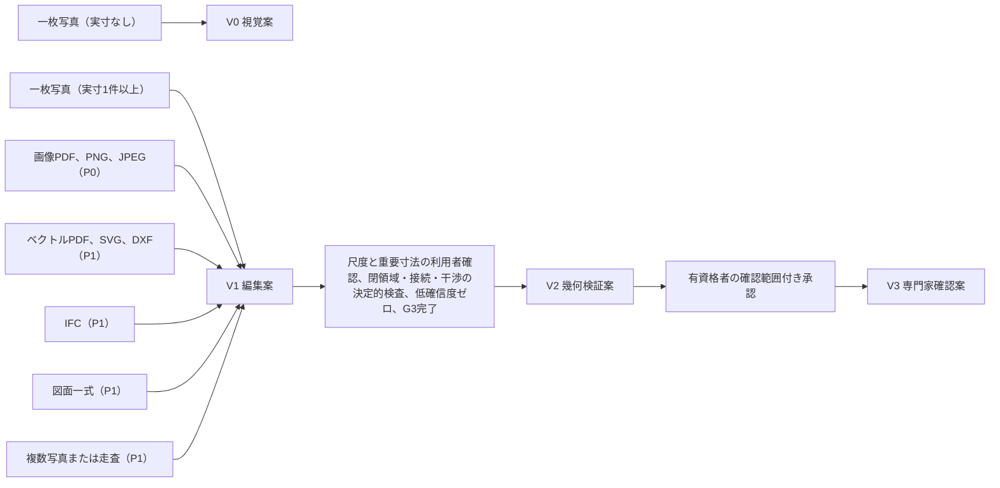
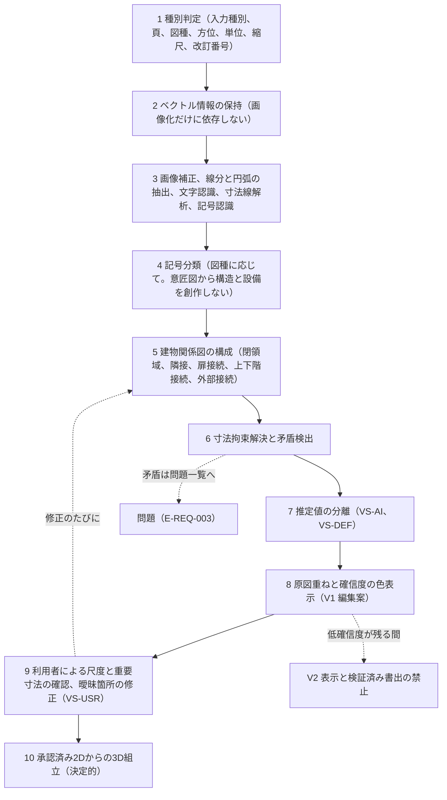
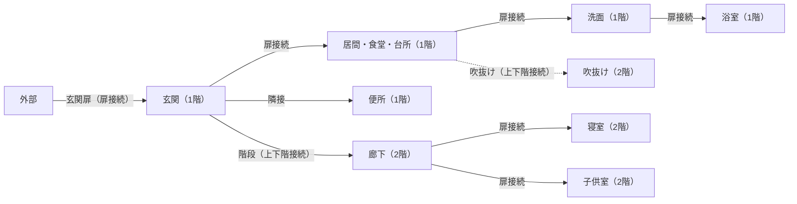
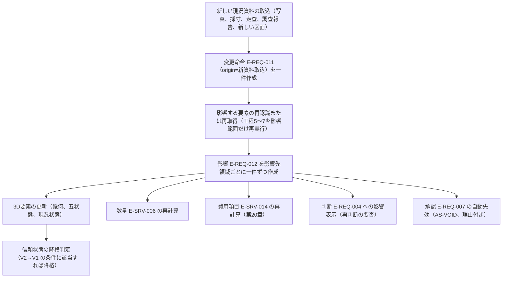

# 第11章 図面読解、現況差分、3D構築の論理構成

作成日: 2026-09-15　版: v1.5　担当: 段階3 仕様書 第11章（画像認識研究者、3D幾何処理技術者、BIM技術者、一級建築士、計算機科学者の視点で作成）。v1.5 は段階8 の最終仕上げ（2026-10-08。再々確認 K3-45、主2-05、主2-17、主4-20。統括の決定 D38、D45）。F-C04-010 正常手順(5)の経路の有効幅の不足の影響先を第7章 判定例辞書と同じ A07、A01 にし、工程9 と F-C02-015 例外(d)（機能の版 v1.1）に図面読解の修正（現況の訂正）を撤去と移設の自動付与の対象外とする規則を置き、第6.4節、第6.5節 条件2（規則の版 v2.1）、F-C02-014（機能の版 v3.1）に基準寸法に使った要素の同じ属性を尺度の承認で確認済みに数える扱いを加え、AC-C02-014-06 の試験の割当を第23章 付表 4.3-A の T-R-005 にそろえた。記録は `05_審査/再修正記録_最終仕上げ_群G3.md`。v1.4 は段階8前の持ち越し仕上げ（2026-10-08。共通の決定 D19、既定値の識別子の併記 6 行）。F-C02-028 の計測方法に M-P-15 を加え（機能の版 v1.3。JR-077）、尺度整合の許容差（DV-CF-03）、寸法連鎖と拘束解決の許容差（DV-CF-07。U-11-003 の行は DV-CF-06、DV-CF-08 も）、上下階接続の公差（DV-CF-04）の直書きに識別子を併記した。既定値表に行のない本章の閾値（図面間照合、現況差分、残差検査の割合、有効開口幅の要確認）は値を変えず段階8 へ送った。同日の統括の追加（共通の決定 D7 の補完）で、第2.1節 図種一覧の構造図の行に E-ELM-001.bearsVerticalLoad と isCompartmentPartition を isLoadBearing と同じ扱いとして並べた。記録は `05_審査/再修正記録_段階8前_仕上げ_群F3.md`。v1.3 は 2026-10-07 の段階6 二回目の修正（段階7 再審査の後。修正計画 第1.11節の 14 件〔主担当 JR-047〜JR-052、整合 JR-013、JR-067、JR-107、JR-079、JR-074、JR-103、JR-109、JR-122〕と 01_調査の番号置換への追従。内容は `05_審査/再修正記録_2回目_第11_13章.md`）。同日の二回目の仕上げ（v1.3 の追補。群R2。内容は `05_審査/再修正記録_2回目_仕上げ_群R2.md`）で、第10章の二回目の依頼（指標の計測方法と情報入出力の E- 表記）と外部確認（`01_調査/08_外部確認_段階7後.md`、確認日 2026-10-07）の既存住宅状況調査と隠れ部分の規則（第8.1節、F-C02-026 v3.1）を反映した。v1.1 は 2026-10-06 の段階6 初稿審査の再修正（内容は `05_審査/再修正記録_第11章.md`）。v1.2 は 2026-10-06 の段階6 仕上げ（相互依頼 群B。第12章、第13章、第14章、第15章、第21章、第23章、第24章、基盤 機能一覧骨格からの依頼 9 件への対応。内容は `05_審査/再修正記録_相互依頼_群B.md`）
根拠: 指示文 C2（図面読解と3D変換）、C3（建物情報と編集。言語模型と決定的検査の責務分離）、C4（3D表示）、9.2（中核となる情報の流れ）、9.3（入力別に約束できる範囲）、9.4（図面認識の評価設計）、9.11（重大な失敗と防止策）、F（品質指標と受入条件）、G（段階的な開発範囲）、10.7（初期公開の優先順位）。基盤定義 `識別子規則.md` v1.2、`信頼状態と証拠段階.md` v1.2、`用語集.md` v1.2、`機能一覧骨格.md` v1.2、`情報実体骨格.md` v1.2、`十二判断領域.md` v1.2、`七段階門.md` v1.2、`画面指標試験骨格.md` v1.2、`整合検査報告.md`（第5節「識別子変更一覧」に追従。v1.3 は第5.1節〔二回目〕と修正計画 第0.3節、第0.4節に追従）。調査 `01_調査/06_研究と標準.md`、`01_調査/03_国内競合.md`。
確認日: 2026-09-15。

## 0. 本章の目的、範囲と非対象、前提とする章

### 0.1 本章の目的

- 入力資料（IFC、ベクトル、画像、手描き、図面一式、写真、走査）ごとに製品が約束できる範囲と必須確認を固定し、入力種別と信頼状態（V0〜V3）の対応を定める【推定】。
- 図種ごとに抽出する要素、画像系とベクトル系を分けた前処理、解析10工程（種別判定〜3D組立）の入力、処理、出力、確信度の付与方法、失敗時の扱い、利用者確認の要否を定める【推定】。
- 記号分類、建物関係図、寸法拘束解決、矛盾検出、原図重ね、尺度確認、V1→V2 の昇格条件、低確信度残存時の書出禁止を、決定的検査として観察可能な条件で定める【推定】。
- 図面一式の照合（正本候補、改訂、差替え漏れ、同一記号の不一致）と、既存住宅の現況差分（CS- の付与、資料の結合、新資料による差分更新）の論理を定める【推定】。
- 承認済み2Dから3Dを組み立てる論理（決定的な拘束解決、言語模型は座標を書かない、写実生成は派生出力）と、3D表示および書出の描画部分を定める【推定】。
- 指示文9.4の評価設計（層別、重大失敗の別集計、確信度校正、建物単位の分離）と、重大失敗の防止策を定める【推定】。
- 担当機能（C02 の28機能、C04 のうち第11章が主章の11機能、C03 の F-C03-015）の必須10項目と受入条件 AC- を定める【推定】。

### 0.2 本章の範囲と非対象

| 区分 | 内容 |
|---|---|
| 範囲 | 入力別の約束範囲、図種と抽出要素、前処理、解析10工程、記号分類、建物関係図、拘束解決と矛盾検出、図面検証画面（S-05）での確認と昇格、図面一式の照合、現況差分、3D構築、3D表示と書出の描画、評価設計、重大失敗の防止、担当40機能の機能要件 |
| 非対象（他章） | 正規建物情報の実体関係図、項目辞書、既定値表の値、状態遷移の転記（第12章）。変更命令の抽出、影響予測、三案の生成（第12章、第13章）。構造、外皮、設備の調整と干渉検査の責任境界（第13章）。API の入出力と非同期処理（第14章）。S-04、S-05、S-27 の部品設計と空状態、待機状態、失敗状態の画面仕様（第15章。本章は表示する内容と条件だけを定める）。商品の3D配置と権利（第16章）。敷地、公的地理情報、座標系の既定（第18章）。改装区分の管理、工事前調査、竣工反映（第21章。本章は現況状態の付与と差分更新の論理まで）。IFC、SVG、DXF の書出検査、必要情報要求、権利情報の添付規則（第22章。本章は GLB と PDF 平面の描画部分まで）。指標の計測手順と試験情報の作成（第23章） |
| 非対象（製品外） | 単写真からの実寸完全復元、施工図の完全自動作成、構造安全の自動保証（指示文G節末尾の非対象）。DWG、RVT の自社変換（正規許諾を持つ変換接点が利用できる場合だけ F-C02-004 で追加）。図面の著作権や利用権の判断そのもの（利用権の確認は第22章。本章は利用権が RS-OK または RS-OWN でない資料を処理しないことだけを定める）【推定】 |

### 0.3 前提とする章

| 章 | 前提として使う内容 |
|---|---|
| 第02章 | 完成像、六段の因果（本章の機能は主に因果(1)要求と現況の把握、(2)実行可能な複数案、(4)承認、(5)引継ぎ）、指標の木 |
| 第06章 | G1 の完了条件(4)（尺度と重要寸法1件以上の利用者確認）と完了条件(7)（正本の確定。修正計画 JM-024 で第6章が追加）、G3 の完了条件(3)(4)(8)、進行禁止条件 I-00-108、I-00-119、I-00-120、I-06-003（正本未確定。G1 で停止、G4 で再検査。v2.0 で混入と契機を改めた。JR-048）。I-00-122 は CDE-PUB の一意性に限定され、本章では使わない。二回目（2026-10-07）: I-06-007（発見の問題の所見の種別による重大度付与。G3、G4、P1）と第2.4節 解除表の I-06-007 の行、第2.5節 欠落の自動記録 (v)（尺度: 残差検査不能、実測照合 n 件）を F-C02-026 と第6.3節で使う（JR-013、JR-047） |
| 第07章 | 主担当領域の判定（図面の認識処理は A03、入力形式、頁、図種、尺度、出典、確信度、正本、版の管理は A12。基盤 十二判断領域 第3.4節） |
| 第08章 | 入口「図面を3D化」「写真から改装」の導線と、初回成果（尺度確認前は寸法値非表示の V1 縮小表示） |
| 第12章 | E-BLD-004 Level、E-BLD-005 Grid、E-SPC-001 Space、E-ELM-001〜016、E-SYS-005 Connection、E-REQ-002 Constraint、E-PRD-006 Source、E-SRV-008 Assumption、E-SRV-009 Overlay、E-SRV-010 Confidence、E-SRV-002 Observation の項目辞書と既定値表。v1.2 の属性（E-PRD-006.drawingStage、valueStateMeta.checkMethod と checkValue、concealedParts、findingKind と detected、E-REQ-007.acknowledgedWarnings と exceptionKind、E-REQ-011.origin=正本確定、E-EXC-002 Delivery formats=写実画像）と既定値（DV-CF-05、DV-CF-11、DV-MT-05、DV-FN-01、DV-FN-03、DV-ST-06）。v1.4 の DV-CF-11 の再指定の閾値（JR-047）、DV-CF-13 所見の種別から報告種別への対応表（JR-013）、DV-GE-21 開口上端の取合い寸法（JR-067）、DV-ST-06 の跨度の区分（JR-068）、E-SYS-003.metrics.minWidthMm の出典（JR-051）、E-ORG-006.purpose=評価利用（JR-103） |
| 第15章 | S-05 図面検証画面（S-05-01〜07）、S-04 設計作業面（S-04-02、S-04-03、S-04-09 当事者確認の記録）、S-24-06 代理入力の差分、S-27 現況差分画面、S-30-01 信頼状態帯、S-30-02 処理状態表示の部品設計。二回目: S-05-03 の重要寸法と主要寸法の一覧と S-05-03-X の未建築の案内（JR-047、JR-050）、改装区分の表示規則（JR-079） |
| 第21章 | 改装区分（renovationAction）、工事前調査、竣工差分（E-OPS-006）の仕様。P0 の固定注記（第1.2節）、改装案件の付帯条件（第2.1節 規則(5)）、隠れ部分と発見の問題化（第2.3節）、工事前調査の自動登録条件（第2.4節） |
| 第22章 | 入力資料の利用権確認、外部AI処理先への最小送信（F-C10-018）、書出検査と透かし、IFC GUID 対応表。評価利用の同意のない案件の図面を評価資料に含めない受入条件 AC-C10-011-05（JR-103） |
| 第13章 | 干渉検査の出力（第5.2節。V1→V2 条件(4)）、主要断面の切断位置 7 種と表示項目 15（第6.1節、第6.2節。v1.3 で「開口上端と梁下、天井」を追加。JR-067）、跨度別の梁せい仮定（JR-068）、候補と抽出物の区別（第1.1節 規則11） |
| 第19章 | F-C12-011（P1）は F-C04-010 が書き込んだ E-SYS-003.metrics.minWidthMm を読み、同じ不足の問題を更新して主担当 A07、SEV-1 にする（新規登録しない。JR-051） |
| 第18章 | 座標系の規則と E-BLD-002.geoPoint（第1.3.2節） |
| 第23章 | 認識品質指標 M-Q-01〜M-Q-28、M-Q-30〜M-Q-34、M-Q-45〜M-Q-47、M-G-21、処理指標 M-P-01〜03（目標は N-PF-01〜N-PF-03）、層別の単位（第2.3節。P0 の層は JR-109）と評価資料の件数（第3.1節）、合格値（第3.4節、第6.1節。JR-052）、N-LG-03（評価資料の条件。JR-103）、試験 T-A-001、002、007、012、T-R-004〜006（T-R-005 の層「1.5 倍」の合格条件(5)、T-R-006 P0 版(1)(2)。JR-047、JR-107）、T-P-001〜009、T-P-011、T-U-005〜T-U-008（付表 4.3-A）の実施手順 |
| 第24章 | 図面認識模型の調達方式と未成立時の代替（第5.1節、U-24-017）、M-B-12〜M-B-14（第3.4節。M-B-13 の計測の対象に F-C02-016 を含む。JR-122） |

## 1. 入力別に約束できる範囲

### 1.1 入力種別と約束の表

指示文9.3の表を、信頼状態、必須確認、五状態の初期値、優先、対応機能で展開した。全入力から3Dは返せるが、信頼状態は入力種別と確認の記録で決まり、一枚写真からの V0 と図面照合後の V2 を同じ見え方にしない（指示文9.3）【推定】。

| 入力 | 強み | 自動では確定できない事項 | 必須確認（利用者または専門家） | 自動処理で到達できる最大の信頼状態 | 要素値の初期状態 | 優先 | 対応機能 | 区分 |
|---|---|---|---|---|---|---|---|---|
| IFC | 要素、階、属性、幾何を保持しやすい | 元模型の誤り、欠落、独自属性、単位と座標の解釈 | 単位、座標原点と方位、IFC版、読めなかった要素と幾何欠落の報告の受入 | V1（幾何検査に合格しても尺度と主要寸法の利用者確認があるまで V2 にしない） | VS-SRC（IFC 属性から取得した値）。独自属性は VS-AI 扱い（未決 U-00-040） | P1 | F-C02-003 | 【推定】 |
| DXF、SVG、ベクトルPDF | 線、円弧、文字、層を保持 | 線の意味（壁か家具か）、重複線、印刷表現（ハッチ、破線） | 縮尺、層と要素種別の対応、壁厚、図種 | V1 | 幾何は VS-SRC、要素種別は VS-AI | P1 | F-C02-002、F-C02-005、F-C02-007 | 【推定】 |
| 画像PDF、PNG、JPEG | 広い資料へ対応 | 細線、文字、記号、尺度の誤認 | 基準寸法（尺度）、重要壁と開口 | V1 | 幾何と種別は VS-AI。寸法文字から読めた値は VS-SRC | P0（明瞭な単一縮尺、平屋または二階建） | F-C02-001、F-C02-005〜F-C02-016 | 【推定】 |
| 手描き平面 | 初期構想を早く入力 | 厳密寸法、壁厚、構造、開口仕様 | 敷地、面積、寸法範囲（各室の幅と奥行の範囲）。手描きは寸法の断定に使わない | V1（寸法は範囲付き。主要寸法は VS-DEF または VS-USR） | 幾何は VS-AI、寸法は VS-DEF | P1（F-C02-022） | F-C02-022、F-C02-015 | 【推定】 |
| 図面一式 | 平面、立面、断面、表を照合できる | 図面間矛盾、最新改訂、詳細不足 | 図面一覧、改訂、優先図（正本の確定は人が行う） | V1。照合合格と正本確定の後に V2 の条件へ進める | 図種と正本候補は VS-AI、人が確定した正本は VS-USR | P1 | F-C02-019、F-C02-020、F-C02-021、F-C02-023 | 【推定】 |
| 一枚写真 | 意匠、素材、見える物品を把握 | 実寸、隠れ面、背面、室の形状 | 少なくとも一つの実寸（基準物の寸法入力）。なければ V0 限定 | V0。実寸1件以上で V1（未決 U-00-024） | VS-AI。実寸は VS-USR | P0（V0 の生成）、V1 化は P1 | F-C02-014（実寸の指定）。V0 の意匠像生成は入口「写真から改装」の機能（第8章） | 【推定】 |
| 複数写真または走査 | 室形状と物品の推定を改善 | 反射面、死角、尺度ずれ | 撮影範囲、尺度、欠落面の一覧 | V1（現況状態 CS-SITE を要素へ与える） | 幾何は VS-AI、走査点群由来の寸法は VS-SRC（走査の尺度が確認済みの場合） | P1 | F-C02-025、F-C02-024-02 | 【推定】 |

### 1.2 入力種別に共通する規則

| 規則 | 内容 | 区分 |
|---|---|---|
| 利用権の確認 | 入力資料（E-PRD-006 Source）の rightsState が RS-OK または RS-OWN でない資料は解析を開始しない。利用者は取込時に「自分の図面または所有する資料である」ことを確認する（第22章）。確認記録は Source と監査記録（E-EXC-007）に残す | 【推定】 |
| 原図の不変性 | 原図（画像、ベクトル、IFC）は変更しない。補正、抽出、修正は全て派生記録（E-SRV-009 Overlay、要素の属性）に持ち、原図へ戻れる | 【推定】 |
| 尺度未確認時の寸法非表示 | 尺度（縮尺または実寸換算係数）が VS-USR になるまで、画面と書出に mm 値を表示しない。相対寸法（頁座標）だけを内部で持つ（I-00-108、T-A-002） | 【推定】 |
| 五状態の初期割当 | 認識方法（E-SRV-009.recognitionMethod）と五状態の対応は次のとおり。ベクトル取得、寸法線解析で得た数値、文字認識で読めた寸法文字、IFC属性 → VS-SRC。画像認識、記号認識、言語模型補完 → VS-AI。根拠なし → VS-DEF（既定値表の識別子付き）。利用者指定 → VS-USR | 【推定】 |
| 外部AI処理先への送信 | 画像認識や文字認識を外部の処理先で行う場合、F-C10-018（第22章）に従い必要最小限の頁または切出しへ縮小し、住所、氏名、図面番号、位置情報を伏せた上で送る。処理地域を表示する | 【推定】 |
| 処理状態の表示 | 30秒を超える処理は S-05-05（処理状態）と S-30-02 に、読込、尺度判定、壁抽出、開口抽出、関係検査、3D構築の実際の状態名、待ち時間の見込、部分結果、失敗箇所、再試行を表示し、架空の進捗率を出さない（F-C02-028、T-P-008） | 【推定】 |
| 単一縮尺と複数縮尺 | P0 は頁内が単一縮尺の資料に限る。頁内に縮尺の異なる図（平面と詳細）が混在する場合、P0 では「対象外または要確認」と表示し、P1（F-C02-021）で頁内の図枠を分割して図ごとに尺度を判定する | 【推定】 |

### 1.3 入力種別と段階、信頼状態の対応（概略）

## 2. 図種の一覧と図種ごとに抽出する要素

### 2.1 図種一覧

図種は E-PRD-006 Source.drawingType の enum（表紙〜換気空調図、その他）に従う。図種判定は工程1（第4節）で頁ごとに行い、確信度と共に表示して利用者が修正できる（F-C02-005）。意匠図（配置図、各階平面、屋根伏、天井伏、立面、断面、矩計、詳細、建具表、仕上表）だけから構造要素と設備経路を創作しない（指示文C2、F-C02-009）【推定】。

| 番号 | 図種 | 抽出する要素（正規建物情報の実体） | 抽出しない、または補助にとどめるもの | 主な用途 | 優先 | 区分 |
|---:|---|---|---|---|---|---|
| 1 | 表紙 | 案件名、設計者名、作成日、図面番号体系、改訂番号（E-PRD-006.revisionDate、Project の参照情報） | 幾何 | 正本候補判定の入力（F-C02-019）。氏名と住所は伏せ字候補（第22章） | P1 | 【推定】 |
| 2 | 図面一覧 | 図面番号、図面名、縮尺、改訂記号と改訂日の一覧（各 Source への対応表） | 幾何 | 正本候補判定、差替え漏れ検出（F-C02-019） | P1 | 【推定】 |
| 3 | 特記 | 仕様の文（構造形式、基礎形式、断熱仕様、使用基準）の候補語（E-SRV-008 Assumption の元、VS-AI） | 数値の断定 | 構造形式仮定（E-BLD-003.structureType）、外皮方針の初期値（第13章）。構造や設備の要素は作らない | P1 | 【推定】 |
| 4 | 配置図 | 敷地境界候補（E-BLD-002.boundary。法的境界ではない）、建物外周の位置、方位、道路位置、外構（E-ELM-016）、庭と植栽（E-ELM-015） | 境界の確定、隣地条件の断定 | 敷地確認（第18章）との照合。方位（E-BLD-003.orientation） | P1（P0 は方位記号の読取だけ） | 【推定】 |
| 5 | 各階平面 | 外壁、内壁（E-ELM-001）、柱（E-ELM-005。柱記号がある場合のみ）、扉（E-ELM-007）、窓（E-ELM-008）、階段（E-ELM-009）、室名と閉領域（E-SPC-001）、床段差記号（E-ELM-002.levelDelta）、器具と造付家具（E-ELM-011）、可動家具（E-ELM-013）、通り芯（E-BLD-005）、寸法線と寸法文字、方位記号、縮尺表記、断面記号と詳細参照、改訂雲 | 梁、耐力の別（構造図がない限り null）、設備経路 | 建物情報の主体。P0 の入力の中心 | P0 | 【推定】 |
| 6 | 屋根伏 | 屋根形状、勾配、棟と谷の位置、軒の出（E-ELM-003.shape、pitch、eavesDepth、outline）、樋と放流位置（drainage） | 小屋組（構造） | 3D組立の屋根。なければ既定値表の屋根形状（VS-DEF） | P1 | 【推定】 |
| 7 | 天井伏 | 天井高、勾配天井、下がり天井、吹抜け（E-ELM-004）、点検口（E-ELM-011 kind=点検口）、照明位置（E-ELM-014。電気図がない場合は位置だけ） | 天井懐の内部 | 主要断面（第13章）、設備経路帯の高さ検査 | P1 | 【推定】 |
| 8 | 立面 | 階高と最高高さ（E-BLD-004.elevation、E-BLD-003.maxHeight）、開口の高さと腰高（E-ELM-008.height、sillHeight）、屋根勾配、外壁仕上の区分 | 平面位置の再構成（平面が正本） | 補助入力（F-C02-023）。P0 では階高、屋根形状、開口高さの三項目に限る | P0（補助入力） | 【推定】 |
| 9 | 断面 | 階高、天井高（E-BLD-004.floorToFloor、ceilingHeight）、床段差、梁下（E-ELM-006.bottomHeight。断面に梁が描かれている場合のみ）、屋根勾配、基礎形式の候補 | 梁の断面寸法の断定 | 補助入力（F-C02-023）。主要断面の元 | P0（補助入力） | 【推定】 |
| 10 | 矩計 | 層構成（E-MAT-003 Assembly、E-MAT-004 Layer）の候補、断熱位置、気密線、軒の納まり | 熱性能値（計算は第19章） | 外皮方針（第13章）。P1 | P1 | 【推定】 |
| 11 | 詳細 | 詳細番号と参照元（Source 間の参照関係）、部分の寸法 | 建物全体の再構成 | 図面間照合（F-C02-020）の参照切れ検出 | P1 | 【推定】 |
| 12 | 建具表 | 建具記号、種別、幅、高さ、開閉方式、ガラス仕様、性能区分（E-ELM-007、E-ELM-008 の属性。VS-SRC） | 品番の商品照合（第16章） | 平面図の建具記号との照合（同一記号の不一致検出） | P1 | 【推定】 |
| 13 | 仕上表 | 室ごとの床、壁、天井の仕上（E-MAT-002 Finish。VS-SRC） | 材料の性能値 | 室名との照合。商品照合は第16章 | P1 | 【推定】 |
| 14 | 構造図（伏図、軸組図を含む。第13章の依頼） | 通り芯、柱、梁、耐力要素の位置と記号（E-ELM-005、E-ELM-006、E-SYS-001 の bearingElementRefs）、基礎形式 | 部材寸法の安全性の判定（非対象） | 構造の初期注意（第13章）。構造図がある場合だけ isLoadBearing を true または false にできる。主要構造部の判定に使う E-ELM-001.bearsVerticalLoad と isCompartmentPartition（第12章 第4.3節 v1.5、第21章 第2.4節 (b)）も isLoadBearing と同じ扱いで、構造資料（伏図、軸組図）や区画の資料から建築士等が確認して入力し、AI は true を推定しない（null は「未確定」と表示） | P1 | 【推定】 |
| 15 | 電気図 | 分電盤、コンセント、スイッチ、照明、通信機器の位置と回路記号（E-ELM-012、E-ELM-014、E-SYS-002 kind=電気、照明、通信） | 容量計算 | 設備系統の初期値（第13章） | P1 | 【推定】 |
| 16 | 給排水図 | 給水、給湯、排水の立管、器具接続、勾配矢印、放流点（E-SYS-003 Route kind=配管、排水。E-SYS-002.supplyPoint） | 勾配の成立判定（第13章の干渉検査へ渡す） | 排水経路の初期注意 | P1 | 【推定】 |
| 17 | 換気空調図 | 換気機、ダクト経路、室内機と室外機の位置（E-ELM-012、E-SYS-003 kind=ダクト） | 風量計算 | 設備経路帯 | P1 | 【推定】 |
| 18 | その他 | 図種判定の確信度が閾値未満の頁。利用者が図種を指定するまで抽出しない | 全て | 図種の手動指定を求める | P0 | 【推定】 |

### 2.2 図種の判定方法と確信度

| 項目 | 内容 | 区分 |
|---|---|---|
| 判定の手掛かり | (1) 図面枠の表題欄の文字（「平面図」「1階」「立面」等。文字認識）。(2) 図面一覧の対応。(3) 頁の内容特徴（閉領域の有無、階段記号、通り芯記号、表形式）。(4) ベクトル資料の層名（「WALL」「壁」等）。四つの手掛かりの一致度から確信度（0〜1）を出す | 【推定】 |
| 確信度の閾値 | 図種の確信度が 0.80 未満の頁は「要確認」として S-05 の頁一覧に表示し、利用者の指定（VS-USR）を求める。0.80 以上でも利用者は変更できる。閾値は初期仮説（未決 U-11-001） | 【仮定】 |
| 階の割当 | 各階平面は表題欄の階名と、図面一覧、頁順から E-BLD-004 Level へ割り当てる。同じ階に二頁以上が割り当たった場合は改訂または差替えの候補として F-C02-019 へ渡す（P1）。P0 は一頁一階を前提とし、二頁以上の同一階は利用者が採用する頁を一つ選ぶ（判断として記録し VS-USR）。他の頁は Source に「未使用」として残し、選ぶまで工程3 以降へ進めず、S-05-05 に「採用する頁の選択待ち（入力起因）」を表示する（F-C02-005 例外(d)、AC-C02-005-05。v1.2 で「要確認」の記述を改めた。JM-070） | 【推定】 |
| 記号言語 | 日本語記号、英語記号、混在を頁ごとに判定し、層別の属性として Source に持つ（評価の層別に使う。第10節） | 【推定】 |

## 3. 画像系とベクトル系を分離する理由と、それぞれの前処理

### 3.1 分離する理由

| 理由 | 内容 | 根拠 | 区分 |
|---|---|---|---|
| 情報量の差 | ベクトル資料は線分、円弧、文字、層を座標付きで持ち、幾何は VS-SRC として取得できる。画像は画素しかなく、線の抽出と文字認識を経るため幾何も VS-AI になる。同じ前処理へ潰すと、ベクトルの座標精度を捨てるか、画像に存在しない層情報を仮定することになる | 指示文9.4「画像とベクトルを同じ前処理へ潰すべきでない」 | 【推定】 |
| 研究資料の性質の差 | CubiCasa5K は5,000件の画像に対する画素単位の注釈で、室の平均 IoU 57.5%、多角形化後 49.3%、扉 IoU 69.2%、窓 IoU 53.6% を報告する（https://arxiv.org/abs/1904.01920 、確認日 2026-09-15）【事実】。FloorPlanCAD はベクトル図面の線分単位の注釈で、片開き扉 PQ 0.869、窓 0.577、開口記号 0.481 を報告する（https://arxiv.org/abs/2105.07147 、確認日 2026-09-15）【事実】。画像系は多角形化で精度が明確に落ち、ベクトル系は開口記号の意味付けが弱い。弱点が異なるため検査と確信度の付け方も分ける | 調査06 第2.1節、第2.2節 | 【推定】 |
| 評価の層別 | 指示文9.4と画面指標試験骨格 第2.0節は「ベクトルか画像か」を層別の第一項目とする。前処理を分けることで層別の境界が処理経路と一致し、公開判定を入力種別ごとに行える | 指示文9.4 | 【推定】 |
| 五状態の割当 | ベクトル取得は VS-SRC、画像認識は VS-AI という初期状態の差を、経路の分離で機械的に保証する（第1.2節） | 基盤 信頼状態 第2.2節 | 【推定】 |

両経路は工程4（記号分類）以降で同じ中間表現（線分と円弧の集合＋文字＋記号候補、頁座標系、確信度付き）へ合流する。合流後の処理は経路に依存しないが、確信度と五状態は経路の由来を保持する【推定】。

### 3.2 画像系の前処理（画像PDF、PNG、JPEG、手描き、写真撮影した図面）

| 順 | 処理 | 入力 | 出力 | 失敗時の扱い | 区分 |
|---:|---|---|---|---|---|
| 1 | 画像化と解像度確認 | PDF の各頁、PNG、JPEG | 頁ごとの画像（原図として不変保存）、画素密度（dpi 相当）、画像の長辺画素数 | 長辺が 1,500 画素未満は「低解像度」の層別属性を付け、S-05 に「認識品質が下がる」と表示する。500 画素未満は対象外（初期仮説。未決 U-11-002） | 【仮定】 |
| 2 | 傾き補正と歪み補正 | 頁画像 | 補正角度（度）、補正後画像、補正前後の対応変換（頁座標系→補正座標系）。原図は不変 | 補正角度の推定が 5 度を超える、または長辺の直線群が二方向にまとまらない場合は「傾き大」として利用者に回転の指定を求める（F-C02-006） | 【仮定】 |
| 3 | 二値化とノイズ除去 | 補正後画像 | 線画像、除去したノイズ量 | 汚れ、透過した裏面の線が多い場合は「汚れ」の層別属性 | 【推定】 |
| 4 | 線分と円弧の抽出 | 線画像 | 線分集合（端点、太さ、連続性）、円弧集合（中心、半径、角度）。壁候補は太線、建具の開閉軌跡は円弧 | 抽出線が 0 本、または閉じた領域が 0 個の場合は「認識失敗」（S-05-05-X）として頁の再指定を求める | 【推定】 |
| 5 | 文字認識 | 補正後画像 | 文字列（位置、向き、確信度）。室名、寸法文字、記号文字（建具記号、通り芯記号、階名） | 寸法文字の向きが縦横混在する場合は向きごとに再認識する。認識できない文字は「?」として残し値にしない | 【推定】 |
| 6 | 寸法線解析 | 線分集合、文字列 | 寸法線（端末記号、寸法補助線、寸法文字の対応）。寸法連鎖（隣り合う寸法の並び）と全体寸法 | 寸法文字に対応する寸法線が見つからない場合、その文字を寸法値として使わない | 【推定】 |
| 7 | 縮尺表記の読取 | 文字列 | 縮尺の候補（例「1:100」）と印刷倍率不明の別 | 縮尺表記があっても印刷倍率が不明な画像（写真撮影、拡大縮小した PDF）では尺度を断定せず、基準寸法の指定（F-C02-014）へ渡す | 【推定】 |
| 8 | 原図位置合わせ（下絵） | 補正後画像 | 頁座標系と案件座標系の対応（原点、回転、係数） | 係数は尺度確認（第6.3節）で確定するまで仮値。参照: a.flat 3D My Room は図面画像を下絵とし、2点間を結んで実寸を入力して縮尺を決める手順を公開している（https://aflat.asia/support/myroom/index.html 、確認日 2026-09-15）【事実】。本製品は同じ2点指定を尺度確認の最小操作として採る【推定】 | — |

手描き平面（P1、F-C02-022）は上記に加え、線の揺れの許容（直線とみなす最大偏差 2% の長さ、初期仮説）を広げ、寸法文字は範囲値（例「約 3,600」）として VS-DEF 相当の扱いにし、層別属性「手描き」を付ける【仮定】。

### 3.3 ベクトル系の前処理（ベクトルPDF、SVG、DXF）

| 順 | 処理 | 入力 | 出力 | 失敗時の扱い | 区分 |
|---:|---|---|---|---|---|
| 1 | 構文解析 | ベクトルPDF の描画命令、SVG の要素、DXF のエンティティ | 線分、円弧、折れ線、文字、ブロック参照、層名、線種、線幅の集合（VS-SRC） | 解析できない要素（曲面、外部参照、埋込画像）は「読めなかった要素」として件数と種別を報告する。埋込画像だけの PDF は画像系へ振り分ける | 【推定】 |
| 2 | 単位と座標の判定 | DXF の $INSUNITS、SVG の viewBox と単位、PDF の頁寸法 | 単位（mm、m、inch、不明）、座標原点、上向き | 単位が不明、または図面枠の寸法と寸法文字の比が縮尺候補と一致しない場合は尺度を断定せず、基準寸法の指定へ渡す | 【推定】 |
| 3 | 層と要素種別の対応 | 層名、線種、線幅 | 層ごとの要素種別候補（壁、建具、家具、寸法、文字、通り芯、設備）と確信度。辞書（E-EXC-004）に層名の対応表を持つ | 層名が辞書にない場合は幾何特徴（太さ、閉領域の構成）から推定し VS-AI とする。層対応は S-05 で利用者が確認できる（必須確認「層対応」） | 【推定】 |
| 4 | 重複線と印刷表現の整理 | 線分集合 | 重複線の統合、ハッチ（塗り表現）の壁面化、破線の意味付け（隠れ線、上階の輪郭） | 統合で失われた線は Overlay に記録し原図へ戻れる | 【推定】 |
| 5 | 文字と寸法線の対応 | 文字、線分 | 寸法線（端末、補助線、文字の対応）。ベクトルの寸法文字と実測長の比から縮尺候補 | 文字が図形化（アウトライン化）されている場合は画像系の文字認識を文字部分だけに適用する | 【推定】 |
| 6 | 頁内の図枠分割 | 図面枠、表題欄 | 頁内の図（平面と詳細等）の分割と図ごとの縮尺（P1、F-C02-021） | P0 では分割せず、頁内複数縮尺は「対象外または要確認」 | 【推定】 |

IFC（F-C02-003、P1）はベクトル系の特例として扱う。要素は IfcWall、IfcDoor、IfcWindow、IfcSpace、IfcStair、IfcBuildingStorey、IfcSite 等から正規建物情報の実体へ直接対応付け（第12章の IFC対応列）、IfcGloballyUniqueId と個体 uuid の対応表を案件ごとに保持する（未決 U-00-010）。読めなかった要素と幾何欠落は必ず件数と識別子で報告する（調査06 第4.2節「IFC 取込時に読めなかった要素と幾何欠落を必ず報告する」）【推定】。

## 4. 解析10工程

### 4.1 工程の全体

指示文C2の10工程を、入力、処理、出力、確信度の付与方法、失敗時の扱い、利用者確認の要否で定める。工程1〜8は自動、工程9は利用者、工程10は承認済み2Dからの決定的な組立である。自動処理で到達できる最大の信頼状態は V1 であり、V2 は工程9の確認と第6.5節の昇格条件を満たした時だけ表示する（指示文G「自動はV1までとし、V2は尺度、外周、開口、室、階段、主要寸法の確認後に限る」）【推定】。

処理状態の表示名と工程の対応（第14章 第3.3節 AP-003 図面解析ジョブの段階と同じ。F-C02-028、S-05-05、S-30-02 はこの表示名だけを使い、百分率を出さない。v1.2、第14章の依頼）【推定】:

| 表示名（AP-003 の段階、順） | 対応する工程 | 段階の完了で表示するもの |
|---|---|---|
| 読込 | 工程1〜2（種別判定、ベクトル保持） | 頁一覧と七項目（S-05-05、S-05-06） |
| 尺度判定 | 工程1 の縮尺候補と工程6 の尺度拘束（候補の提示まで。確定は工程9 の利用者確認で、API は第14章 AP-004） | 尺度候補（S-05-03）。尺度の確定まで mm 値を出さない（第1.2節） |
| 壁抽出 | 工程3〜4 のうち壁、柱、通り芯、室名 | 部分結果（閲覧のみ。正本に入れない） |
| 開口抽出 | 工程3〜4 のうち扉、窓、階段 | 部分結果（閲覧のみ。正本に入れない） |
| 関係検査 | 工程5〜7（建物関係図、拘束解決、推定値の分離） | 閉じていない室と矛盾の一覧（S-05-04）。部分結果の採用はこの段階の完了後に限る（第14章 第3.6節） |
| 3D構築 | 工程8 と、縮尺候補による仮の工程10（原図重ね記録の生成と V1 の3D組立。尺度の確定まで mm 値を出さない） | 原図重ねと確信度（S-05-01、S-05-02）、V1 の3D（S-04-03） |

工程9（利用者確認と修正）はジョブの段階に含めず利用者の操作（AP-004）とし、尺度の確認と修正の後の工程10 は第14章 AP-010（3D構築）のジョブで再実行する。第14章が前提とする本章の値と性質は、低確信度の閾値（既定値表 DV-CF-01。U-11-005）と、工程5、6、10 が同じ入力と同じ既定値表の版で同じ出力を返す決定的処理であること（第5.2節、第5.3節、第9.2節）である。この値または性質、工程と表示名の対応を変える場合は第14章 第3.3節の段階名と時間上限を同時に改める【推定】。

### 4.2 各工程の定義

| 工程 | 入力 | 処理 | 出力 | 確信度の付与方法 | 失敗時の扱い | 利用者確認の要否 | 対応機能 | 区分 |
|---:|---|---|---|---|---|---|---|---|
| 1 種別判定 | 入力ファイル群、利用権確認記録 | 入力種別（IFC、ベクトル、画像、写真、走査）、頁数、頁ごとの図種（第2.2節）、方位（方位記号の文字認識と矢印の角度）、単位（第3.3節）、縮尺候補（第3.2節の7、第3.3節の2）、改訂番号（表題欄と改訂雲の文字）を判定する | E-PRD-006 Source（頁ごと。kind、page、drawingType、scale、revisionDate）、層別属性（入力品質、記号言語、手書きか否か） | 図種は四つの手掛かりの一致数（第2.2節）。方位は記号の検出確信度。縮尺は表記の有無と寸法文字の整合で 0〜1。単位は判定根拠の有無で 1.0（明示）、0.5（推定）、0（不明） | 頁が読めない（破損、暗号化、利用権なし）場合は頁単位で失敗状態を表示し、他の頁は続行する。図種の確信度 0.80 未満は「要確認」 | 要（七項目を頁ごとに表示し、利用者が修正できる。修正値は VS-USR。尺度は工程9で必ず確認） | F-C02-001、F-C02-002、F-C02-003、F-C02-004、F-C02-005、F-C02-021 | 【推定】 |
| 2 ベクトル保持 | 工程1の入力種別 | ベクトル情報があれば保持し（第3.3節）、画像系へは振り分けない。画像系は第3.2節の1〜3 | 中間表現（線分、円弧、文字、層、確信度）。ベクトル由来は VS-SRC | ベクトル取得は 1.0。層対応は辞書一致で 1.0、幾何推定で 0.5〜0.9 | 構文解析不能な要素は件数報告。全要素が解析不能なら画像系へ振り分け、その旨を表示 | 不要（層対応の確認は工程9で任意） | F-C02-002、F-C02-003 | 【推定】 |
| 3 抽出 | 中間表現または補正後画像。前提: 認識模型の出所（自社学習または外部認識 API。第24章 第5.1節、U-24-017）と模型、校正写像（第10.3節）の版が処理の版（第4.3節）として記録されている | 画像補正と傾き補正（第3.2節の2）、線分と円弧の抽出、文字認識、寸法線解析、記号認識（記号候補の検出。分類は工程4） | 線分集合、円弧集合、文字列（位置、向き）、寸法線、記号候補。全てに頁座標系の元座標 | 各要素に認識模型の確率を付ける。文字は文字ごとの確率の最小値。寸法線は端末と文字の対応が取れた場合 0.9 以上、片方だけなら 0.6 以下（初期仮説） | 抽出線 0 本または閉領域 0 個は認識失敗（S-05-05-X）。傾き補正角が 5 度超は回転指定を求める | 不要（結果は工程8で表示） | F-C02-006、F-C02-007、F-C02-022 | 【推定】 |
| 4 記号分類 | 工程3の出力、図種。前提: 分類に使う認識模型の出所（自社学習または外部認識 API。第24章 第5.1節、U-24-017）と版、記号辞書の版、校正写像（第10.3節）の版が処理の版（第4.3節）として記録されている | 図種に応じた記号辞書（第5.1節）で、外壁、内壁、柱、梁、扉、窓、階段、床、天井、室、設備、造付家具、可動家具、通り芯、電気、給水、排水、換気空調へ分類する。意匠図の頁からは構造要素（梁、耐力の別）と設備経路を生成しない | 要素候補（種別、幾何、属性候補、確信度）。E-ELM-、E-SPC-、E-BLD-005 の個体の元 | 種別ごとの分類確率。扉は「存在」「種別」「向き（吊元と開き方向）」の三つの確信度を別に持つ（扉向きは重大失敗の別集計） | 分類確率が全種別で 0.50 未満の候補は「未分類要素」として表示し、利用者が種別を指定するまで建物情報に入れない | 不要（低確信度は工程9で確認） | F-C02-008、F-C02-009 | 【推定】 |
| 5 建物関係図 | 要素候補、階の割当 | 壁の中心線から閉領域を作り室（E-SPC-001）を確定する。隣接（壁を共有）、扉接続（扉が二室を結ぶ）、上下階接続（階段と吹抜けの平面位置の重なり）、外部接続（外壁上の開口と玄関）を E-SYS-005 Connection として構成する（第5.2節） | Space の polygon と isClosed、Connection の集合、閉じていない領域の一覧 | 閉領域の確信度は境界壁の確信度の最小値。接続の確信度は経由要素（扉、階段）の確信度 | 閉じていない領域は問題（I-11-002 相当、SEV-1）として S-05-04 に表示し、外周が閉じない場合は V2 昇格条件(3)の不合格として V2 を阻止する。上下階の位置が一致しない階段は I-11-004 | 要（V2 前に閉領域と接続を確認。P0 は S-05-04 の問題一覧で確認） | F-C02-010 | 【推定】 |
| 6 拘束解決 | 要素候補、寸法線、通り芯、階高候補 | 尺度、通り芯への吸着、平行、直角、同一直線、壁厚、開口位置、階高の拘束を第5.3節の順で決定的に解き、寸法文字との残差と寸法連鎖の不一致を矛盾として検出する | 拘束解決後の幾何（案件座標系、mm。尺度未確認時は係数未定の相対座標）、E-REQ-002 Constraint（kind=寸法拘束、幾何拘束。solverStatus）、矛盾の一覧 | 決定的処理のため計算自体の確信度は 1.0。要素の確信度は「認識確率 × 拘束整合係数」で更新する。拘束整合係数は残差が許容差内で 1.0、許容差の2倍まで 0.7、それ以上 0.4（初期仮説） | 矛盾は E-REQ-003 Issue（SEV-1 または SEV-2、第5.4節）として登録。解が収束しない場合は拘束を弱い順に外し、外した拘束を表示する（S-04-07-X に準ずる失敗状態） | 要（矛盾の解決は利用者または専門家。工程9） | F-C02-011 | 【推定】 |
| 7 推定値の分離 | 拘束解決後の幾何、立面と断面の補助入力（F-C02-023）、既定値表 | 不明な高さ（階高、天井高、開口高さ、腰高）、厚さ（壁厚、床厚）、建具種、屋根形状、床段差を、補助入力があれば VS-SRC、認識できれば VS-AI（推定理由付き）、根拠がなければ VS-DEF（既定値表の識別子と版付き。E-SRV-008 Assumption）として値と別に持つ | 各要素の valueStates（属性ごと）、Assumption の個体、推定理由（E-SRV-009.reason） | VS-AI は推定模型の確率。VS-DEF は確信度を持たず「既定値」と表示する（確信度の色に混ぜない） | 補助入力の値と平面の値が矛盾する場合（例: 立面の開口高さが階高を超える）は矛盾として登録 | 要（主要寸法に VS-DEF が残る限り V2 にしない。I-00-120） | F-C02-012、F-C02-023 | 【推定】 |
| 8 原図重ねと確信度表示 | 原図、抽出線、要素、確信度 | 原図と抽出線を重ね（S-05-01）、要素ごとの確信度を色と文字と記号で表示する（S-05-02）。低確信度要素の一覧と修正依頼を出す。信頼状態帯に V1 と未確認項目数を表示する | E-SRV-009 Overlay（要素、属性、元頁、元座標、抽出幾何、認識方法、確信度、推定理由）、V1 編集案 | 第6.2節の帯（高、中、低）。低確信度の閾値は既定値表 DV-CF-01（初期仮説。未決 U-00-003 への本章の仮判断。JR-052） | 表示に必要な Overlay が欠ける要素は「出典欠落」の問題（SEV-1）とし、書出を止める（F-C02-017） | 要（次の工程9へ） | F-C02-013、F-C02-017、F-C02-018、F-C02-028 | 【推定】 |
| 9 利用者確認と修正 | V1 編集案、S-05 | 利用者が尺度（基準寸法）と重要寸法を最低一つ確認し（第6.3節、第6.4節）、低確信度要素、閉じていない室、矛盾を修正する。修正は履歴付き（E-REQ-011 ChangeCommand origin=直接操作）で、修正値は VS-USR。改装案件でも本工程の修正は図面読解の修正（現況の訂正）で案の変更命令ではないため、撤去と移設の自動付与（第21章 第2.1節 規則(7)）の対象外とし、訂正で消した要素は撤去にしない（統括の決定 D38。改装案件の手修正は S-05 で行う。F-C02-015 例外(d)） | 尺度確認記録（E-REQ-007 Approval scopeKind=尺度）、修正済み要素、未確認項目数の更新。修正のたびに工程5と6を再実行する | 利用者確認済みの値は確信度表示の対象外（VS-USR の記号を表示） | 誤った基準寸法（実寸の2倍等）は複数寸法の整合検査で異常値を警告し、確認しない限り V2 判定を拒否する（T-R-005） | 要（本工程が確認そのもの） | F-C02-014、F-C02-015 | 【推定】 |
| 10 3D組立 | 承認済み2D建物情報（尺度確認済み、閉領域と接続の検査合格）、階高、屋根、開口高さ | 第9節の規則で、壁の押出し、床と天井の生成、開口の切欠き、階段の生成、屋根の生成を決定的に行う。2Dと3Dは同じ建物情報から描画する | 3D形状（E-ELM-*.geometry の3D部分）、同期2Dと3D（S-04-02、S-04-03）。信頼状態は工程9の結果に従い V1 または V2 | 3D組立は決定的で確信度を変えない。要素の確信度と五状態を3D表示へ引き継ぐ | 組立不能（壁の高さが 0、階段の階が存在しない等）は要素単位で失敗を表示し、他の要素は組み立てる（S-04-03-X） | 不要（承認済み2Dが入力） | F-C02-016 | 【推定】 |

工程3、4 の認識模型（線分、文字、寸法線、記号の抽出、要素分類、図種判定）は、出所が自社学習か外部認識 API かを第24章 第5.1節が定め、本章はどちらの場合も同じ出力形式（頁座標系の元座標、認識方法、確信度、模型の版）を前提とする。外部の場合は F-C10-018 の最小送信と伏せ字（第1.2節）に従う。模型の出所と、模型、記号辞書、校正写像の版は E-SRV-010 Confidence に記録する（AC-C02-007-03。JM-177）。調達方式の選択と未成立時の代替（手修正中心の V1、または図面入力を入力種別ごとに非公開とする条件付き公開）は第24章 第5.1節と U-24-017 が定め、本章はどちらの場合も工程5〜10 を変えない【推定】。

### 4.3 工程の再実行と差分

| 規則 | 内容 | 区分 |
|---|---|---|
| 再実行の単位 | 工程9の修正は影響する要素だけについて工程5〜8を再実行する。頁全体の再認識は利用者が明示した場合だけ行う | 【推定】 |
| 決定性 | 工程5、6、10 は同じ入力（要素、拘束、既定値表の版、処理の版）に対して同じ出力を返す。乱数や実行順序依存を持たない。同一入力での再実行結果の一致を T-P-011（決定性。N-OP-05）で確認する | 【推定】 |
| 言語模型の位置 | 言語模型は工程4の室名の正規化（例「LDK」→ 居間、食堂、台所）と、工程8の推定理由の文章化、工程9の修正意図の解釈に限って使う。座標、寸法、接続を言語模型の出力から直接書き込まない（第9.3節） | 【推定】 |
| 処理の版 | 認識模型、記号辞書、拘束解決、既定値表の版を Overlay と Confidence に記録し、版の更新時は同意済み案件の再評価（M-Q- の月次）に使う | 【推定】 |

## 5. 記号分類、建物関係図、寸法拘束解決、矛盾検出

### 5.1 記号分類の一覧

記号辞書は E-EXC-004 Dictionary の分類（E-EXC-003 Classification classType=要素、属性群）として版付きで持ち、日本語記号と英語記号の両方を登録する。図種ごとに「生成してよい要素」を制限し、意匠図から構造と設備を創作しない（F-C02-009）【推定】。

| 分類群 | 記号（例） | 生成する実体と属性 | 生成を許す図種 | 確信度の別集計 | 区分 |
|---|---|---|---|---|---|
| 壁 | 二重線（太線）、塗り、ハッチ。外壁は外周を構成する壁、内壁は外周内 | E-ELM-001 Wall（kind、centerline、thickness）。耐力の別（isLoadBearing）は構造図がない限り null | 各階平面（意匠図）、構造図 | 外壁欠落は M-Q-26 で別集計 | 【推定】 |
| 柱 | 塗りつぶし矩形、×印付き矩形、通り芯交点の記号 | E-ELM-005 Column（section、gridPositionRef）。isStructural は構造図がある場合のみ true/false | 各階平面（独立柱の記号がある場合）、構造図 | — | 【推定】 |
| 梁 | 破線の矩形（上階梁）、梁記号（G、B 等） | E-ELM-006 Beam。意匠図の破線からは生成しない | 構造図、断面（描かれている場合の梁下高さのみ） | — | 【推定】 |
| 扉 | 開き（円弧＋扉線）、引き、引違い、折れ、親子、両開き、玄関、勝手口、シャッター。建具記号（WD1、AW2 等） | E-ELM-007 Door（kind、width、swing、swingArea、hostWallRef）。建具記号は建具表と照合 | 各階平面、建具表 | 扉向き誤りは M-Q-28 で別集計 | 【推定】 |
| 窓 | 壁上の細線区間（三本線、二本線）、FIX、引違い、縦すべり、出窓 | E-ELM-008 Window（width、operation、sillHeight は立面か建具表から） | 各階平面、立面、建具表 | — | 【推定】 |
| 階段 | 段の平行線、昇り矢印（UP、DN）、踊り場 | E-ELM-009 Stair（kind、width、stepCount、fromLevelRef、toLevelRef、opening） | 各階平面、断面 | 階段接続誤りは M-Q-27 で別集計 | 【推定】 |
| 床と床段差 | 畳の目地、段差記号（▽、数値）、土間 | E-ELM-002 Slab（kind、levelDelta） | 各階平面、断面 | — | 【推定】 |
| 天井 | 勾配記号、吹抜け表記、点検口記号 | E-ELM-004 Ceiling、E-ELM-011（kind=点検口） | 天井伏、断面 | — | 【推定】 |
| 室名 | 文字（居間、LDK、洋室、和室、玄関、廊下、階段室、収納、WIC、浴室、UB、洗面、トイレ、WC 等）と畳数 | E-SPC-001 Space（name、usage、area の照合） | 各階平面 | 室認識は M-Q-04 | 【推定】 |
| 設備器具 | 便器、洗面、浴槽、流し、給湯機、換気扇、室内機、室外機、分電盤 | E-ELM-011 Fixture（意匠図の器具記号は位置と種別のみ）、E-ELM-012 Equipment | 各階平面（器具の位置と種別）、電気図、給排水図、換気空調図（系統と経路） | — | 【推定】 |
| 造付家具、可動家具 | 造付収納、造作台所の矩形、机、寝台、ソファ、食卓の記号 | E-ELM-011（kind=造付収納、造作台所）、E-ELM-013 Furniture（配置の初期値。商品ではない。PT-GEN） | 各階平面 | — | 【推定】 |
| 通り芯 | 一点鎖線、端部の円と記号（X1、Y1、A、1 等） | E-BLD-005 Grid（axes、module、matchedSourceRefs） | 各階平面、構造図、配置図 | — | 【推定】 |
| 寸法 | 寸法線、端末記号（斜線、矢印、丸）、寸法補助線、寸法文字、寸法連鎖 | 拘束（E-REQ-002 kind=寸法拘束）と VS-SRC の寸法値 | 全図種 | 寸法文字は M-Q-06 | 【推定】 |
| 図面情報 | 方位記号、縮尺表記、表題欄、改訂雲、改訂記号（△1 等）、断面記号（A-A）、詳細参照番号 | E-PRD-006 Source の属性、図面間参照 | 全図種 | — | 【推定】 |
| 電気 | コンセント、スイッチ、照明、分電盤、通信端子 | E-ELM-014 Light、E-ELM-012、E-SYS-002（kind=電気、照明、通信） | 電気図（意匠図の照明記号は位置のみ） | — | 【推定】 |
| 給水、給湯、排水 | 立管記号、勾配矢印、器具接続、放流点、雨水桝 | E-SYS-003 Route（kind=配管、排水、slope）、E-SYS-002.supplyPoint | 給排水図、配置図（桝と放流点） | — | 【推定】 |
| 換気空調 | ダクト、換気扇、給気口、室内機、室外機 | E-SYS-003（kind=ダクト）、E-ELM-012 | 換気空調図 | — | 【推定】 |

意匠図しかない案件で構造要素（梁、耐力の別）と設備経路の自動生成が 0 件であることを受入条件 AC-C02-009-01 とする（F-C02-009 の観察可能な合格条件）【推定】。

### 5.2 建物関係図の構成

建物関係図（用語集 212）は、節（室、階、外部）と辺（E-SYS-005 Connection の kind）から成る。室の閉領域（用語集 213）は壁の中心線で囲まれた領域として作る【推定】。

| 関係 | 定義（観察可能な条件） | 構成方法 | 検査（決定的） | 不合格時の問題 | 区分 |
|---|---|---|---|---|---|
| 閉領域 | 壁の中心線を辺とする平面グラフで、面（閉路）として囲まれた領域。外周は最外の閉路 | 中心線の端点を許容距離（壁厚の 1/2 または 60 mm の小さい方、初期仮説）で結合し、面を列挙する。室名文字を含む面を Space とする | (1) 外周が一つの閉路である。(2) 各室名文字が一つの面に含まれる。(3) 面の面積が 1.0 m2 以上（初期仮説。収納は 0.3 m2） | 外周が閉じない: I-11-002（SEV-1。V2 阻止）。室名のない面: SEV-2。面のない室名: SEV-2 | 【仮定】 |
| 隣接 | 二つの室が同じ壁（区間）を共有する | 面の共有辺から生成 | 隣接は対称（A→B があれば B→A） | 非対称は内部矛盾として自動修正し記録 | 【推定】 |
| 扉接続 | 扉（E-ELM-007）の hostWallRef が隣接壁上にあり、connectsSpaceRefs が壁の両側の室（または室と外部）を指す | 扉の位置を壁区間へ投影し、両側の面を取る | (1) 扉の両側に面または外部がある。(2) 開き勝手の側の室に開閉域が収まる（家具との干渉は第13章の検査） | 片側に面がない扉: SEV-2（「扉が壁上にない」） | 【推定】 |
| 上下階接続 | 階段（E-ELM-009）の fromLevelRef と toLevelRef の階が存在し、下階の階段開口と上階の階段開口が平面上で重なる | 下階と上階の階段多角形の重なり率（IoU）を計算する | IoU が 0.5 以上（初期仮説）、かつ昇り矢印の向きが一致 | I-11-004 階段接続の不整合（SEV-1。二階建以上で V2 阻止条件。M-Q-27） | 【仮定】 |
| 吹抜け | 上階に床のない領域が下階の室の上にある | 天井伏または上階平面の吹抜け表記から | 上階の吹抜け多角形が下階の面に含まれる | 含まれない: SEV-2 | 【推定】 |
| 外部接続 | 玄関、勝手口、掃出し窓が外周壁上にあり、片側が外部である | 外周閉路上の開口から | 玄関扉が 1 以上ある（住宅の場合） | 玄関扉 0: SEV-2（「玄関が認識できない」） | 【推定】 |

### 5.3 寸法拘束解決

拘束解決（用語集 214）は決定的検査であり、同一入力に同一結果を返す。P0 の拘束は次の順で解く。順序を固定するのは、後段の拘束が前段の結果に依存するためである【推定】。

| 順 | 拘束 | 内容 | 許容差（初期仮説） | 入力の五状態 | 区分 |
|---:|---|---|---|---|---|
| 1 | 尺度 | 頁座標から案件座標（mm）への係数。縮尺表記、寸法文字と寸法線長の比、基準寸法（利用者指定）の三つの候補を持ち、利用者が確認した値を採用する（第6.3節）。確認前は係数未定 | 候補間の差が 2%（DV-CF-03）以内なら整合。超えれば矛盾（I-11-001） | VS-USR（確認後）。それまで表示しない | 【仮定】 |
| 2 | 通り芯への吸着 | 壁の中心線と柱を最寄りの通り芯へ吸着する。通り芯がない場合は壁の中心線の位置を格子（module の候補 910 mm、1,000 mm、955 mm、その他。DV-CF-08）で推定し、格子は VS-AI | 中心線と通り芯の距離が壁厚の 1/2 以内なら吸着。超えれば吸着せず「通り芯外」の属性 | 通り芯は VS-SRC（ベクトル）または VS-AI | 【仮定】 |
| 3 | 平行と直角 | 壁の方向をクラスタ化し、主方向（二方向）から 1 度以内の壁を平行または直角へ補正する。斜め壁は主方向から 5 度以上離れたものとし補正しない | 1 度（補正）、1〜5 度（矛盾候補、SEV-2） | 幾何は元の五状態を維持 | 【仮定】 |
| 4 | 同一直線 | 同じ方向で中心線の距離が許容差内の壁区間を一つの直線上へ揃える | 実寸 15 mm または壁厚の 1/4 の小さい方 | 同上 | 【仮定】 |
| 5 | 壁厚 | 壁の二重線の間隔をクラスタ化し、代表値へ丸める。クラスタの代表値は既定値表の壁厚候補 DV-GE-16（在来木造の 105、120、150、180 mm。他構法は未確認〔U-88-008〕で、枠組壁工法の壁厚の候補を加えるかは本章担当と一級建築士が決める。値の正本は第12章）に近いものへ寄せ、寄せた場合は VS-AI、寄せられない場合は元の測定値を VS-AI（推定理由「クラスタ外」） | クラスタ幅 ±10 mm | VS-AI（画像）、VS-SRC（ベクトルで層に壁厚がある場合） | 【仮定】 |
| 6 | 開口位置 | 扉と窓の中心と幅を、ホスト壁の中心線上へ投影する。建具表の幅（VS-SRC）があれば幅を建具表に合わせ、平面図の幅との差を矛盾候補にする | 平面図の幅と建具表の幅の差が 50 mm 超で SEV-2 | 幅は建具表 > 寸法文字 > 認識の優先で五状態を決める | 【仮定】 |
| 7 | 階高 | 立面または断面の補助入力（VS-SRC）、なければ既定値表 DV-GE-01（VS-DEF）。階ごとに一つ | 補助入力の階高と最高高さの和の整合 ±50 mm | VS-SRC または VS-DEF | 【仮定】 |
| 8 | 寸法文字との整合 | 寸法線の両端が指す要素間の距離と寸法文字の値の残差を求め、残差が許容差内なら寸法文字を拘束（強い重み）として幾何を最小二乗で補正する。寸法連鎖の和と全体寸法の差も検査する | 残差 20 mm 以内で整合。20〜100 mm は補正しつつ SEV-2。100 mm 超は補正せず矛盾（SEV-1）。連鎖の和の差は 10 mm 以内（DV-CF-07） | 寸法文字は VS-SRC | 【仮定】 |

解法は、順1〜7 で得た初期解に対し、順8 の寸法文字を強い重み（1.0）、認識した幾何を弱い重み（0.1）とした線形最小二乗を一回だけ実行する。反復はしない（決定性と応答時間のため。M-P-01 の目標は第23章 N-PF-01）。重み（DV-CF-06）、許容差（DV-CF-07）、格子候補（DV-CF-08）は既定値表（第12章）の行として版管理し、公開判定会議で固定する（未決 U-11-003）。本節の値は 2026-10-06 に既定値表の値と一致することを確認した【仮定】。

### 5.4 矛盾検出と問題への登録

| 矛盾の種類 | 検出条件 | 重大度 | 固定先 | 例示 | 区分 |
|---|---|---|---|---|---|
| 尺度候補の不一致 | 縮尺表記、寸法文字比、基準寸法の候補間の差が 2%（DV-CF-03）超 | SEV-1（確認まで V2 阻止。未確認のまま寸法表示や V2 判定へ進む場合は I-00-108 の SEV-0） | 図面頁（寸法線） | I-11-001 基準寸法（扉幅 800 mm）から求めた係数と縮尺表記 1:100 から求めた係数が 1.9 倍異なる | 【仮定】 |
| 外周不閉合 | 外周閉路が一つに閉じない | SEV-1（V2 阻止） | 2D位置（隙間） | I-11-002 一階平面の北側外壁に 300 mm の隙間があり閉領域が外部と連続する | 【仮定】 |
| 寸法文字と幾何の残差 | 残差 100 mm 超 | SEV-1 | 図面頁（寸法線） | — | 【仮定】 |
| 寸法連鎖の不一致 | 連鎖の和と全体寸法の差が 10 mm（DV-CF-07）超 | SEV-2 | 図面頁 | — | 【仮定】 |
| 建具表との不一致 | 平面図の建具記号の種別または幅が建具表と異なる | SEV-2（P1） | 図面頁（両頁） | I-11-003 平面図の建具記号 WD3 が建具表では引違いだが平面図では開き扉として描かれている（図面間矛盾。F-C02-020） | 【仮定】 |
| 階段の上下階不整合 | 階段開口の IoU が 0.5 未満、または昇降方向が不一致 | SEV-1（V2 阻止） | 3D要素（階段） | I-11-004 二階平面の階段開口が一階の階段位置から 1,200 mm ずれている | 【仮定】 |
| 階高の不整合 | 立面の階高の和と最高高さの差が 50 mm 超、または開口高さが階高を超える | SEV-2 | 図面頁（立面） | — | 【仮定】 |
| 通り芯記号の不一致 | 同じ記号の通り芯が図面間で位置または間隔が異なる（P1） | SEV-2 | 図面頁 | — | 【仮定】 |
| 要素の重なり | 二つの壁が同じ区間を占める、扉が二つの壁にまたがる | SEV-2 | 2D位置 | — | 【仮定】 |

矛盾は E-REQ-003 Issue として一件ずつ登録し、主担当領域は A03（幾何の矛盾）または A12（図面間、改訂、正本の矛盾）を一つだけ付ける。同じ矛盾を複数の要素に複製しない。解決は利用者の修正（VS-USR）、資料の差替え、または確認者の却下（IS-REJECTED、M-G-09 の分子）で行う。V2 を阻止する矛盾（外周不閉合、階段の上下階不整合）は第6.5節 条件3 の検査規則（E-EXC-005 kind=閉領域、接続）で、尺度候補の不一致は条件1 と I-00-108 の規則で判定し、規則の版を検査結果に記録する（JM-068）【推定】。

## 6. 図面検証画面（S-05）での確認と V1→V2 の昇格

### 6.1 原図重ね

| 項目 | 内容 | 区分 |
|---|---|---|
| 表示 | S-05-01 に原図（補正後画像またはベクトル描画）と抽出線（壁中心線、壁面線、開口、階段、室の閉領域）を重ねる。透過率（0〜100%）、頁と階の切替、抽出線の種別ごとの表示切替を持つ | 【推定】 |
| 戻れること | 全要素と全属性値から E-SRV-009 Overlay を通じて元頁と元座標へ戻れる。要素を選ぶと原図上の元座標が強調表示される。Overlay のない要素は「出典欠落」（例示 I-11-005）として問題（SEV-1）になり書出を止める（F-C02-017） | 【推定】 |
| 差分一覧 | 原図と抽出線の差（欠落: 原図に線があるが要素がない。余分: 要素があるが原図に線がない。位置ずれ: 一致度 matchScore が 0.8 未満）を一覧化し、各行から原図上の位置へ導く（T-A-001 合否(4)） | 【推定】 |
| 一致度 | E-SRV-009.matchScore は、抽出線の周囲（壁厚の 1/2 の帯）に原図の画素または線分が存在する割合（0〜1） | 【仮定】 |

### 6.2 確信度の色表示

| 帯 | 確信度の範囲 | 表示（色に加えて文字と記号） | 扱い | 区分 |
|---|---|---|---|---|
| 高 | 0.90 以上（帯の境界は本節が正本。初期仮説） | 「高」＋実線＋確信度の%表示 | 確認は任意。確信度校正（M-G-04。合格値は第23章 第3.4節）で 0.9 帯を試験する | 【仮定】 |
| 中 | DV-CF-01 の閾値以上 0.90 未満 | 「中」＋破線＋% | 確認を推奨。V2 昇格の妨げにはならない | 【仮定】 |
| 低 | DV-CF-01 の閾値未満 | 「低」＋点線＋%＋警告記号 | 低確信度要素（用語集 107）。壁と開口と階段は S-05-02 の一覧に載り、修正または確認（VS-USR）するまで V2 表示と検証済み書出を禁止する（F-C02-018、I-00-119）。閾値は既定値表 DV-CF-01（初期仮説。未決 U-00-003 への本章の仮判断。JR-052） | 【仮定】 |
| 既定値 | 確信度なし | 「既定値」＋既定値表の識別子 | 主要寸法（尺度、外周、開口、室、階段、階高）に残る限り V2 にしない（I-00-120） | 【推定】 |
| 確認済み | 確信度表示なし | 「確認済み」＋確認者と日時（VS-USR）、「専門家確認」＋氏名、資格（VS-PRO） | 確信度の色に混ぜない | 【推定】 |

色は画面指標試験骨格 第1.5節の視覚方針に従い、色だけに依存せず文字と線種を併用する。対比 4.5 対 1 以上（第23章 N-AC）【推定】。

### 6.3 尺度確認（F-C02-014）

| 項目 | 内容 | 区分 |
|---|---|---|
| 対象 | 頁ごとの尺度（頁座標から mm への係数）。P0 は頁内単一尺度 | 【推定】 |
| 操作 | S-05-03 で次のいずれかを行う。(a) 原図上の二点を結び実寸を入力する（基準寸法。例: 扉幅 800 mm、畳の長辺 1,820 mm）。(b) 縮尺表記の候補（例 1:100）と印刷倍率の確認（「この PDF は原寸で印刷されたか」の確認ではなく、寸法文字と一致するかの検査結果を見て採用する）。(c) 寸法文字の候補（寸法線が指す二点の実寸として採用） | 【推定】 |
| 整合検査 | 採用した係数で、頁内の全寸法文字（M-Q-06 で読めた文字）について寸法線長との残差を計算し、残差 2% 超の寸法文字の件数と一覧を表示する。件数が寸法文字数の 20% を超える場合は「尺度が誤っている可能性」の警告を出し、確認を求める（T-R-005）。基準寸法から計算した扉幅が 500 mm 未満または 1,500 mm 超、階段幅が 600 mm 未満等の異常値も警告する（値は既定値表 DV-CF-05 の異常値範囲、初期仮説）。異常値範囲には室の面積 60 m2 超、廊下幅 1,500 mm 超、階段幅 1,500 mm 超を加える（第12章 v1.2 の DV-CF-05 に追加済み。U-11-017）。寸法文字が 0 件の頁（写真撮影した図面、手描き）では残差検査を「検査不能（寸法文字なし）」と表示して合格とみなさず、第6.4節の重要寸法の確認で利用者の実測値（mm）の入力を必須とし、基準寸法から算出した値との差が DV-CF-11 の許容を超えると警告する（T-R-005 の層「寸法文字なし」「1.5 倍」。JM-071） | 【仮定】 |
| 記録 | 確認は E-REQ-007 Approval（scopeKind=尺度、approverRef=利用者、approvedAt）として記録し、尺度の五状態を VS-USR にする。整合検査に警告がある場合は、各警告について利用者が理由（自由記述 20 字以上。尺度の正しさを何で確かめたかを書く。例: 玄関の親子扉を現地で実測し幅 1,600 mm を確認した）を付けて承知した記録を E-REQ-007.acknowledgedWarnings（anomalyRef、reason、acknowledgedAt。第12章 v1.2 で定義済み）に持ち、理由のない承知は受け付けない。S-05-03 の理由の入力欄の既定文には例示を入れず「何で確かめたか（実測、図面の記載、既知の寸法）を書いてください」と表示する（第6章 第2.2節、第12章、第15章と同文。JR-049）。I-00-108 の解除に必要な成果は「基準寸法 1 件以上の指定、整合検査の実行、警告がある場合は各警告への理由付きの承知の記録、尺度の承認（AS-VALID）」の四つで、第6章 第2.2節、第14章 AP-004 と同じ文言にする（JM-064）。承知の件数は確認範囲「尺度」の内訳「警告承知 n 件」として S-30-01 の詳細、S-13-03、書出の透かしと GLB・PDF の注記、G4 の情報要求適合表へ渡し、警告承知ありの V2 案を警告なしの V2 案と同じ見え方にしない。寸法文字が 0 件の頁で承認した尺度の案は、同じ経路（S-30-01 の「尺度」行、透かし、第6章 第2.5節 欠落の自動記録 (v)）に「尺度: 残差検査不能（寸法文字なし）、実測照合 n 件」を出す（JR-047）。確認前は寸法値を画面と書出に出さない（AC-C02-014-01） | 【推定】 |
| 失効 | 頁の再認識、原図の差替え、基準寸法の変更、照合差が再指定の閾値（DV-CF-11 に併記。第6.4節）を超えた照合で尺度の承認は AS-VOID になり、依存する主要寸法の VS-USR は VS-AI へ戻る（基盤 信頼状態 第2.2節。JR-047） | 【推定】 |

### 6.4 重要寸法の確認

| 項目 | 内容 | 区分 |
|---|---|---|
| 重要寸法 | 利用者が尺度と共に最低一つ確認する代表寸法。候補は外周の一辺、居間の内法幅、廊下幅、階段幅、玄関扉幅から製品が提示し、利用者が選んで実測または図面の寸法文字と照合する。確認記録は照合方法（実測、寸法文字、既知寸法）と照合値（mm）を必須属性として持ち（S-05-03 の入力欄は第15章が定める。属性は第12章の valueStateMeta.checkMethod と checkValue）、画面の値を見て確認操作を押すだけでは VS-USR にしない。尺度の基準寸法に使った要素と区間は照合の対象から除き、同じ要素の同じ属性を選ぶ操作は受け付けない（AC-C02-014-06）。寸法文字が 0 件の頁では照合方法を実測に限り（第6.3節。JM-071）、照合する寸法に外周の一辺を少なくとも一つ含める。照合値と製品の算出値の差が DV-CF-11 の許容（初期仮説。U-11-017）を超える確認は受け付けず修正（F-C02-015）へ導き、DV-CF-11 に併記した再指定の閾値（初期仮説）を超える照合は手修正ではなく基準寸法の再指定（S-05-03 の二点の再指定）へ導いて尺度の承認を AS-VOID にする（JR-047）。対象の建物が未建築で実測できない場合は照合方法に「実測不能（未建築）」を選べ、選んだ案は照合値を持たないため V2 の条件に数えず「V2 の対象外（寸法の根拠なし）」と表示する（案内の画面は第15章 S-05-03-X。F-C02-014 例外(e)。JR-050） | 【推定】 |
| 主要寸法 | V2 昇格までに VS-USR 以上が必要な六種（尺度、外周、開口、室、階段、階高）。基盤 信頼状態 第2.2節の主要寸法と同じ集合。六種の確認にも重要寸法と同じ照合方法と照合値を必須とする（尺度は第6.3節の基準寸法の実寸が照合値に当たる。JR-047）。基準寸法に使った要素の同じ属性（例: 基準寸法に使った扉の幅）は、尺度の承認（E-REQ-007 scopeKind=尺度。AS-VALID）で確認済みに数える（独立の照合には数えず、条件1 の重要寸法にも数えない。第6.5節 条件2。統括の決定 D45） | 【推定】 |
| 確認の粒度 | P0 では外周の各辺、各室の代表内法、各開口の幅、各階段の幅、各階の階高を一覧（S-05-03 の「重要寸法と主要寸法の一覧」。第15章）で示し、利用者は「一括確認」ではなく項目ごとに確認する。一括確認の操作は提供しない（確認の形骸化を防ぐ）。各行に照合方法と照合値の入力欄を置き、valueStateMeta.checkMethod と checkValue のない VS-USR は第6.5節 条件1、条件2 で数えない（JR-047。基準寸法に使った要素の同じ属性は尺度の承認〔AS-VALID〕で条件2 の確認済みに数える。D45） | 【仮定】 |
| 修正 | 値の修正は F-C02-015 の手修正として履歴を残し、工程5と6を再実行する | 【推定】 |

### 6.5 V1→V2 の昇格条件（基盤 信頼状態 第1.2節の展開）

| 番号 | 条件 | 本章で検査する方法 | 検査の種類 | 検査規則（E-EXC-005: kind、expression の要旨、version、testRef） | 不足時の表示 | 区分 |
|---:|---|---|---|---|---|---|
| 1 | 尺度と重要寸法1件以上が VS-USR 以上 | 尺度の Approval（scopeKind=尺度）が AS-VALID、重要寸法の valueStates が VS-USR 以上で照合方法と照合値を持つ | 決定的 | kind=寸法拘束。count(頁 where scale.valueState < VS-USR or Approval(scopeKind=尺度).status ≠ AS-VALID) > 0 or count(重要寸法 where valueState ≥ VS-USR and valueStateMeta.checkMethod ≠ null and checkValue ≠ null) = 0 → 不合格。checkMethod と checkValue のない VS-USR、照合方法「実測不能（未建築）」の確認、基準寸法に使った要素の同じ属性の確認は数えない（JR-047、JR-050）。I-00-108 は同じ kind で「尺度未確認、または acknowledgedWarnings に理由のない警告が残るまま寸法表示または V2 判定へ進む」を式にする（I-00-108 の式は変えない）。version v2.0、testRef T-A-002、T-R-005 | S-13-05「尺度未確認」「重要寸法未確認」 | 【推定】 |
| 2 | 外周、室、開口、階段、主要寸法が VS-USR 以上 | 第6.4節の一覧の全項目が VS-USR 以上で照合方法と照合値を持つ。既定値（VS-DEF）が主要寸法に残らない。基準寸法に使った要素の同じ属性は、尺度の承認（AS-VALID）で確認済みに数える（独立の照合には数えない。統括の決定 D45） | 決定的 | kind=欠落属性。count(主要寸法 where not (基準寸法に使った要素の同じ属性 and Approval(scopeKind=尺度).status = AS-VALID) and (valueState < VS-USR or (valueState = VS-USR and (valueStateMeta.checkMethod = null or checkValue = null)))) > 0 → 不合格。checkMethod と checkValue のない VS-USR は数えない（JR-047）。基準寸法に使った要素の同じ属性は尺度の承認が AS-VALID なら確認済みとする（D45）。version v2.1（v2.1 で D45 の除外を式に加えた）、testRef T-A-007 | 未確認項目数と一覧 | 【推定】 |
| 3 | 閉領域、隣接、扉接続、上下階接続の決定的検査に合格 | 第5.2節の検査で SEV-1 以上の問題が IS-RESOLVED | 決定的 | kind=閉領域、接続。count(Space where isClosed=false) + count(Issue where 種類∈{外周不閉合, 階段の上下階不整合} and status ∉ {IS-RESOLVED, IS-REJECTED}) > 0 → 不合格。version v1.0、testRef T-A-001、T-P-002、T-P-003 | 該当問題の一覧（S-05-04） | 【推定】 |
| 4 | 干渉検査で SEV-0 がない | 第13章の干渉検査（F-C12-005、F-C04-010）の結果を参照 | 決定的 | kind=干渉。第13章 第5.2節、第5.5節の検査記録 E-SRV-004（kind=干渉検査）.outputs.values（conditionNo=4、pass、sev0IssueRefs、checkedAt、ruleVersion。項目の正本は第12章）の最新の記録を参照し、pass=false または count(sev0IssueRefs) > 0 → 不合格。version は第13章の ruleVersion、testRef は第13章 第5.2節の規則（T-A-010。反証は T-R-002、T-R-003） | 該当問題（S-10） | 【推定】 |
| 5 | 低確信度要素がゼロ | lowConfidence=true の壁、開口、階段が 0 件（修正または VS-USR で解消） | 決定的 | kind=欠落属性。I-00-119 = count(要素 where kind∈{壁,開口,階段} and lowConfidence=true) > 0。version v1.0、testRef T-A-007 | 低確信度要素数（S-05-02） | 【推定】 |
| 6 | 主要寸法に VS-DEF が残らない | 条件2に含む | 決定的 | kind=欠落属性。I-00-120 = count(主要寸法 where valueState=VS-DEF) > 0。version v1.0、testRef T-A-007 | 既定値の一覧 | 【推定】 |
| 7 | G3 の完了条件を満たす | 第6章 G3 の完了条件(1)〜(8)。本章の条件1〜6は G3 の(3)(4)(8)に対応 | 段階門の判定 | 第6章 第8.2節の一覧が正本。本章の規則は行 G1 I-00-108（第11章 第6.5節 条件1）、G3 I-00-119、I-00-120（同 条件5、条件6）として規則名と版 v1.0 付きで登録済み（第6章 v1.2）。式の版を変える場合は第6章へ通知する | S-13-01 | 【推定】 |

昇格の判定は F-C15-004（第6章）が行い、本章の機能は条件1〜6 の検査結果（条件番号、pass、version、対象識別子）と未確認項目数を E-REQ-010.completionChecks の形で渡す。言語模型の出力だけで昇格しない（基盤 信頼状態 第0節。JM-068）【推定】。

改装案件の付帯条件: 工事範囲（撤去、補修、補強、移設）の要素が CS-DRW または CS-EST のままの案は、条件1〜7 を満たしても信頼状態帯（S-30-01）に「現況未確認（n 要素）」を併記し、G3 の門で問題 I-06-008（現況未確認の改装要素。主担当 A10、影響先 A04、A06、SEV-1。P1。第6章 第8.2節）を登録する（第21章 第2.1節 規則(5)、基盤 信頼状態 v1.3 第1.2節。JM-155、JR-021）。資格を登録した RL-CHK（P1 は照合済みの資格。第6章 第5.2節）の例外承認で持ち越せる（JR-012）。P0 は問題を登録せず、「現況未確認（n 要素）」の表示と G4 の欠落の自動記録 (vii)（第6章 第2.5節）だけを行い、n は第21章 第2.1節 規則(7)で自動付与した撤去と移設の要素のうち CS-DRW または CS-EST の要素数とする。表示は書出の透かしと GLB、PDF の注記にも含める（JR-095）。P1 の問題の登録は F-C02-024-02 と第21章 F-C14-001 で行い、受入条件は第21章 AC-C14-001-05（T-R-006 P1 版）とする【推定】。

### 6.6 低確信度が残る場合の書出禁止（F-C02-018）

| 項目 | 内容 | 区分 |
|---|---|---|
| 禁止の対象 | 低確信度の壁、開口、階段が 1 件でも残る案について、V2 表示、「検証済み」「幾何確認済み」の語、透かしが V2 以上の書出（GLB、PDF、SVG、DXF、IFC）を禁止する | 【推定】 |
| 許す書出 | V1 の透かし付き書出（GLB、PDF 平面）は許す。書出には未確認項目数と低確信度要素数を添付する | 【推定】 |
| 修正依頼 | S-05-02 に低確信度要素の一覧と「修正または確認」の操作を出す。S-08 の書出画面では禁止理由として該当要素数と一覧への導線を表示する（T-A-007） | 【推定】 |
| 降格 | 新資料の再認識や修正で低確信度要素が新たに生じた場合、V2 の案は V1 へ降格し、理由を記録する（基盤 信頼状態 第1.3節） | 【推定】 |

## 7. 図面一式の照合（P1）

### 7.1 正本候補の判定（F-C02-019）

| 手順 | 内容 | 区分 |
|---:|---|---|
| 1 | 図面一覧（図種2）を読み、図面番号、図面名、縮尺、改訂記号、改訂日の対応表を作る。図面一覧がない場合は各頁の表題欄から同じ表を作り、確信度を下げる（0.6 以下） | 【推定】 |
| 2 | 各頁の表題欄の図面番号と改訂記号を対応表と照合し、(a) 一覧にあるが頁がない（欠落）、(b) 頁があるが一覧にない（追加または別一式の混入）、(c) 同じ図面番号の頁が二つ以上（改訂版の重複）、(d) 一覧の改訂記号より古い改訂の頁（差替え漏れ）を検出する | 【推定】 |
| 3 | 同じ図面番号の頁が複数ある場合、改訂日が最新で改訂雲の記載が一覧と一致する頁を正本候補（E-PRD-006.isMasterCandidate=true）とし、他を「旧版候補」とする。判定理由（改訂日、改訂記号、改訂雲の一致）を記録する | 【推定】 |
| 4 | 正本候補、旧版候補、欠落、混入を S-05-06 に表示し、人（RL-OWN、RL-EDT または RL-CHK）が正本を確定する。確定は判断（E-REQ-004。例 D-11-001）として決定者、理由、版を記録する。差替え漏れの図面番号（新版頁が一式に存在しないもの）は、(i) 新版頁の追加取込（F-C02-021 の頁追加）、(ii) 旧版を正本として採用する判断（E-REQ-004、理由必須、RL-OWN または RL-CHK）、(iii) 当該図面を引継ぎ資料（E-EXC-002）から除外し情報要求適合表の欠落として出す、のいずれかを要し、未選択の図面番号は正本未確定として手順5 の I-06-003 に含める。差替え漏れの頁に由来する要素値は VS-AI に戻し S-05-02 の低確信度一覧に載せる（JM-063）。混入の頁（手順2 (b) で一覧にない頁）は案件からの除外か採用の確定判断（E-REQ-004。除外は理由必須）を要し、確定まで工程3 以降の抽出の対象から外す。欠落の図面番号は、頁の追加取込、または欠落のまま進める判断（E-REQ-004、理由必須）と情報要求適合表（E-EXC-002）への欠落の記録のいずれかで確定する（JR-048） | 【推定】 |
| 5 | 正本、混入、欠落の確定判断のない図面番号が残るまま、G1→G2 の門の通過要求（三案生成の有無を問わない。第6章 第2.3節の利用目的による適用除外で分岐案一つの案件を含む）または V2 判定の要求が行われた場合は I-06-003（SEV-0。第6章 第2.2節）で止め、G4 の引継ぎでは I-06-003 を再検査する（T-R-004。段階門 G1 停止、G4 再検査。JR-048）。I-00-122 は CDE-PUB の一意性に限定し本章では使わない（JM-024） | 【推定】 |

I-06-003 の検査規則は E-EXC-005（kind=欠落属性、isDeterministic=true、version v2.0、testRef T-R-004、appliesTo.gates={G1, G4}）とし、式は count(図面番号 where 候補頁数 ≥ 2 or 差替え漏れ or 欠落 or 混入, 確定判断なし) > 0（確定判断は E-PRD-006.isMasterCandidate と E-REQ-004 の結合で判定する。混入は除外か採用、欠落は追加取込か欠落のまま進める判断を確定判断とする）。契機は G1→G2 の門の通過要求と V2 判定の要求（JR-048）。判定結果は F-C02-019 の出力として返す。第6章 第8.2節の一覧に行 G1、G4 I-06-003（規則名「正本未確定（第11章 第7.1節）」、v2.0、T-R-004）として登録済みである（JM-024、JM-068。v2.0 は 2026-10-07 に混入と契機を改めた版で第6章と同じ）。正本の確定時は E-REQ-011 ChangeCommand（origin=正本確定、targetRefs=旧版由来の要素）を一件作り、第8.4節の差分更新を呼ぶ（JM-069。origin の追加は第12章、確定操作は第14章 AP-032 operation=正本確定 へ依頼）【推定】。

### 7.2 図面間照合（F-C02-020）

| 照合対象 | 照合方法 | 不一致の問題 | 区分 |
|---|---|---|---|
| 通り芯 | 各図面の通り芯記号と位置（間隔）を照合する | 同じ記号で間隔が 10 mm 超異なる: SEV-2（構造図と平面図の不一致は SEV-1） | 【仮定】 |
| 階 | 各階平面、立面、断面、構造図の階名と階高を照合する | 階数または階高が異なる: SEV-1 | 【仮定】 |
| 室 | 平面図の室名と仕上表、天井伏の室名を照合する | 一方にしかない室: SEV-2 | 【仮定】 |
| 建具記号 | 平面図の建具記号と建具表の種別、幅、高さを照合する | 種別または幅の不一致: SEV-2（I-11-003） | 【仮定】 |
| 詳細参照 | 平面図と断面図の断面記号、詳細番号が詳細図に存在するか | 参照先がない: SEV-3（参照切れ） | 【仮定】 |
| 改訂雲 | 改訂雲で囲まれた範囲の内容が、一覧の改訂記号と改訂日に対応するか | 改訂雲があるのに一覧の改訂記号が古い: 差替え漏れ SEV-1 | 【仮定】 |
| 寸法 | 平面図の外周寸法と配置図、立面図の寸法を照合する | 50 mm 超の差: SEV-2 | 【仮定】 |

不一致は E-REQ-003 Issue として図面頁に固定し（固定先=図面頁、両頁の参照）、主担当領域 A12、影響先 A03 または A08 を付ける。優先した資料と理由（E-PRD-006 の資料優先順）を残し、後から新しい資料が入った場合は第8.4節の差分更新へ渡す【推定】。

## 8. 現況差分（既存住宅、改装。P1）

### 8.1 現況状態の付与規則（F-C02-024-01、F-C02-024-02）

P0 は F-C02-024-01（CS-DRW と CS-EST の初期付与と S-05 での記号と文字の表示。改装の部位〔壁、床、天井、屋根、基礎〕の内部を 2D と 3D で「未確認」の表現で描き空洞に描かない。JR-107）、P1 は F-C02-024-02（現況資料による CS-SITE、CS-OPEN への遷移と第8.2節の差異の重ね表示）が担う（JM-152。機能一覧骨格 v1.2 の副番）。P0 の改装案件では工事前調査の要否を問題として登録せず、S-05-07 の固定注記（第21章 第1.2節）で義務を伝える【推定】。

| 契機 | 付与する現況状態 | 条件 | 区分 |
|---|---|---|---|
| 設計時図面または竣工図から要素を取得（F-C02-024-01、P0） | CS-DRW | 図面（E-PRD-006 kind=図面）が出典。図面の時点（設計時図面、施工図、竣工図、不明）は E-PRD-006.drawingStage（第12章 v1.2。取込時に F-C02-005 が判定）で区別し、改装案件では竣工図を設計時図面より優先する | 【推定】 |
| 現況写真、採寸、三次元走査、既存住宅状況調査の記録を要素へ結合（F-C02-024-02、P1） | CS-SITE | E-SRV-002 Observation（kind=現地目視、採寸、写真、走査点群）が要素を参照し、observedAt と observerRef がある。既存住宅状況調査（既存住宅状況調査方法基準。非破壊で劣化事象等を調べ、調べられない部位は「調査できない」とする。SRC-319、確認日 2026-10-07【事実】）の記録で CS-SITE にするのは目視できる部位の要素だけとし、concealedParts（隠れ部分）は CS-SITE にも CS-OPEN にもしない。部位ごとの結果（劣化事象等あり、なし、調査できない）は E-SRV-001（kind=既存住宅状況調査）.findings.values[] の value に記録して隠れ部分の推定の根拠とし、「調査できない」部位の要素の CS- は上げない（01_調査 08 第6節。第12章 第6.5節と同じ規則。v1.3 の追補） | 【推定】 |
| 開口調査、石綿事前調査、耐震診断の記録を結合（F-C02-024-02、P1） | CS-OPEN | E-SRV-001 Survey（kind=石綿事前調査、耐震診断）または Observation（開口調査）が要素を参照し、調査者と資格（該当時）がある | 【推定】 |
| 図面にも現地確認にもない要素、隠れ部分（F-C02-024-01、P0） | CS-EST | 下地、基礎、配管、配線、劣化、漏水、腐朽、蟻害、石綿の有無は、CS-OPEN または該当する専門調査の記録がない限り「無い」と表示しない。2D と 3D では部位の内部を空洞として描かず、「未確認」の表現（斜線塗り等。第15章 S-27-01 と同じ図案）で描く | 【推定】 |
| 工事で対象部位が変更または撤去（F-C02-024-02、P1） | CS-EST へ戻す | 竣工反映（第21章）で再び CS-SITE | 【推定】 |

改装案件で工事範囲（renovationAction が撤去、補修、補強、移設）に入る壁、床、天井、屋根、基礎の要素には、隠れ部分を表す要素共通属性 concealedParts（kind: 下地、配管、配線、劣化、漏水、腐朽、蟻害、石綿。conditionState: CS-EST または CS-OPEN。surveyRef、note。第12章 v1.2 で定義済み）を要素種別ごとの既定集合 DV-MT-05（第12章）で CS-EST として生成し、「残す」要素には生成しない（U-21-017 の仮判断）。改装区分の指定（S-27-03）を持たない P0（撤去と移設の自動付与だけ。第21章 第2.1節 規則(7)）では concealedParts を生成せず、壁、床、天井、屋根、基礎の内部を「未確認」の表現で描く（F-C02-024-01）。開口調査と石綿事前調査の記録は該当する kind だけを CS-OPEN にし、要素本体の CS- は変えない。S-27-04 の一覧と T-R-006 の「無い」と描かない判定は concealedParts を単位とする（第21章 第2.3節。JM-153）【推定】。

### 8.2 差異の種類と重ね表示

| 差異の種類 | 検出条件 | 表示（S-05、S-10、S-27） | 区分 |
|---|---|---|---|
| 存在差 | 図面にある要素が現況資料にない、または現況資料にある要素が図面にない | 「図面のみ」「現況のみ」の記号で重ね表示 | 【推定】 |
| 寸法差 | 同じ要素の寸法が図面と現況で 30 mm 超異なる（初期仮説） | 差の値と両方の出典 | 【仮定】 |
| 位置差 | 同じ要素の位置が 50 mm 超異なる | 同上 | 【仮定】 |
| 仕上と設備の差 | 仕上表と現況写真、設備点検記録の不一致 | 該当要素に「差異あり」 | 【推定】 |
| 設計時図面と竣工図の差 | 二種の図面の間の差 | 設計時、竣工、現況の三層を切り替えて重ねる | 【推定】 |

重ね表示の優先は「現況（CS-SITE、CS-OPEN） > 竣工図 > 設計時図面」とし、正規建物情報の値は優先の高い出典から取り、他は Overlay に保持する。CS-EST の隠れ部分は「無い」と描かない（基盤 信頼状態 第10節）【推定】。

### 8.3 現況資料の結合（F-C02-025）と隠れ部分の問題化（F-C02-026）

| 項目 | 内容 | 区分 |
|---|---|---|
| 資料の種類 | 現況写真、採寸、三次元走査、既存住宅状況調査、耐震診断、地盤資料、設備点検、修繕履歴。E-PRD-006（kind=写真、走査、調査報告）と E-SRV-001 Survey、E-SRV-002 Observation として別資料のまま保持し、要素から資料へ戻れる | 【推定】 |
| 結合の方法 | 写真は撮影位置と向き（利用者指定または画像の情報）で室へ結ぶ。走査点群は尺度確認済みの場合に壁面へ最近傍で結ぶ（許容 50 mm、初期仮説）。調査報告は対象要素または室を利用者が指定する | 【仮定】 |
| 問題化 | 解体、改造、補修を伴う改装案件（renovationAction に撤去、補修、補強、移設がある）では、石綿事前調査等の工事前調査の要否を E-REQ-003 Issue（主担当 A10。I-00-029 相当、例示 I-11-006）として自動登録し、不足調査一覧（E-SRV-001 status=必要）へ入れる。隠れ部分（CS-EST）の要素には必要な調査（開口調査、耐震診断等）を表示する。既存住宅状況調査、耐震診断、開口調査の要否は第21章 第2.4節の自動登録条件に従って登録する（JM-151）。(a) 既存住宅状況調査: 現況資料（E-SRV-002）が 0 件、または構造耐力上主要な部分と雨水の浸入を防止する部分に CS-SITE 以上の要素が一つもない場合（主担当 A11、SEV-2。利用目的が売却または賃貸資料なら SEV-1）。(b) 耐震診断: 着工年（E-BLD-003.constructionStartYear）が旧耐震の閾値 DV-ST-10 に当たる、外周壁または耐力壁候補線上の壁の撤去または移設がある、増築を伴う、のいずれか（主担当 A04、SEV-1）。(c) 開口調査: 工事範囲の壁、床、天井、屋根、基礎の concealedParts に CS-EST の項目が残る場合（主担当は項目の領域、SEV-1）。調査記録の findings または Observation.value が劣化（腐朽、蟻害、漏水）、石綿含有、想定外の配管・配線を示す場合は、要否の問題の解決と同じ変更識別子で「発見の問題」を要素ごとに一件だけ登録する（F-C02-026 手順(6)。JM-065）。発見の問題の重大度は第6章 第8.2節 I-06-007（報告種別は第12章 DV-CF-13 で導く。G3、G4。P1）が付ける（JR-013）。P0 では要否の問題を登録せず S-05-07 の固定注記にとどめる（JM-152） | 【推定】 |
| 現況の写真からの3D | 一枚写真からの V0、実寸1件以上での V1（第1.1節）。写真から隠れ面と背面を推定した要素は VS-AI かつ CS-EST | 【推定】 |

### 8.4 新しい現況資料が入った場合の差分更新（F-C02-027）

| 規則 | 内容 | 区分 |
|---|---|---|
| 一つの変更識別子 | 新資料の取込は一つの変更命令（E-REQ-011 origin=新資料取込）として扱い、全ての影響（E-REQ-012）と派生問題がこれを参照する。同じ事象を複製しない | 【推定】 |
| 影響範囲 | 資料が結ばれた要素と、その要素を参照する接続、数量、費用項目、判断、承認だけを更新する。案件全体を再認識しない | 【推定】 |
| 承認の失効 | 影響範囲内の承認（尺度、間取り、構造、設備等の確認範囲）だけを AS-VOID にし、失効理由（変更命令の識別子と日時）を記録する（第6章 第5.3節、T-R-004 合否(4)） | 【推定】 |
| 資料の優先 | 新資料が既存の出典より優先の高い現況状態（CS-SITE > CS-DRW）を与える場合は値を置き換え、旧値を Overlay に残す。同じ現況状態の資料が矛盾する場合は問題（SEV-2）とし、利用者または確認者が優先を決める（例示 D-11-002） | 【推定】 |
| 記録 | 差分更新の前後値は E-REQ-006 Revision.diff に残し、S-04-07 と同じ形式で仮表示してから確定する（第12章の変更命令の手順） | 【推定】 |

## 9. 3D構築の論理

### 9.1 承認済み2Dからの組立（F-C02-016）

3D は承認済み2D建物情報（尺度確認済み、閉領域と接続の検査合格、または V1 でも工程9の途中で利用者が組立を要求した場合は透かし付き）から決定的に組み立てる。2D と 3D は同じ建物情報から描画し、どちらで変更しても他方へ反映される（同期2Dと3D、M-Q-19 = 100%）【推定】。

| 順 | 要素 | 組立規則 | 使う値と五状態 | 区分 |
|---:|---|---|---|---|
| 1 | 階（E-BLD-004） | elevation を基準高さとし、floorToFloor で上階の elevation を決める | 階高: VS-SRC（断面、立面）または VS-DEF | 【推定】 |
| 2 | 床（E-ELM-002） | 階の外周閉路を outline とし、thickness で押し出す。levelDelta の室は床面を段差分ずらす | 床厚: VS-DEF（既定値表）または VS-SRC | 【推定】 |
| 3 | 壁（E-ELM-001） | centerline を thickness で両側へ広げ、height（既定は階高から床厚を引いた値）で押し出す。外壁と内壁の接合は中心線の交点で結合する | 壁厚、高さ | 【推定】 |
| 4 | 開口（E-ELM-007、E-ELM-008） | ホスト壁に、幅 × 高さ（扉は床から height、窓は sillHeight から height）の切欠きを作り、建具の形状（PT-GEN の一般形状。商品は第16章）を置く。扉の swingArea を平面に描く | 幅: VS-SRC/VS-AI/VS-USR。高さと腰高: VS-SRC（立面、建具表）または VS-DEF | 【推定】 |
| 5 | 階段（E-ELM-009） | fromLevel と toLevel の高さ差を riser で割った段数と tread で段を生成し、opening を上階の床から切り欠く | 蹴上と踏面: VS-SRC（断面）または VS-DEF。段数は整合検査（高さ差 = 蹴上 × 段数 ±20 mm。DV-CF-04） | 【推定】 |
| 6 | 天井（E-ELM-004） | 室の polygon を ceilingHeight に置く。吹抜けは天井を作らない | 天井高: VS-SRC または VS-DEF | 【推定】 |
| 7 | 屋根（E-ELM-003） | shape（切妻、寄棟、片流れ、陸屋根）と pitch、eavesDepth から最上階の外周に生成する。屋根伏または立面がない場合は既定値表の形状（DV-GE-17。切妻）と勾配（DV-GE-13）で VS-DEF とし、「屋根形状は既定値」と表示する | 形状と勾配 | 【推定】 |
| 8 | 器具と家具（E-ELM-011、E-ELM-013） | footprint と既定の高さで一般形状（PT-GEN）を置く。実商品は第16章 | 高さ: VS-DEF | 【推定】 |
| 9 | 通り芯（E-BLD-005） | 3D では表示切替可能な補助線として描く | — | 【推定】 |

### 9.2 決定的な拘束解決と組立の性質

| 性質 | 内容 | 検査 | 区分 |
|---|---|---|---|
| 決定性 | 同じ建物情報の版と同じ処理の版に対し、同じ頂点列と同じ面を生成する（頂点の順序、分割方法を固定する） | T-P-011（決定性。同一入力の 3 回の再実行で checksum が一致。N-OP-05。第23章 第4.2節） | 【推定】 |
| 整合 | 3D の計測値（F-C04-007）は建物情報の寸法値と誤差 0 で一致する | AC-C04-007-01 | 【推定】 |
| 変更の反映 | 2D、3D、自然文のいずれで変更しても、変更命令の確定後に他方が再描画される。反映時間は M-P-02（目標は第23章 N-PF-02） | T-P-009、T-P-007 | 【推定】 |
| 部分再生成 | 変更した要素と接合する要素だけを再生成する（3D処理費の抑制。指示文9.11「変更部分だけ再生成」） | 再生成した要素数の記録 | 【推定】 |
| 段階詳細 | 共有用 GLB は表示に必要な詳細（面の分割数、質感）に落とし、正本の幾何は保持する | GLB の容量と M-P-03 | 【推定】 |

### 9.3 言語模型は座標を書かない

| 規則 | 内容 | 区分 |
|---|---|---|
| 責務 | 言語模型は要求理解、操作意図（対象、操作、量、方向、固定条件、目的）、説明、室名の正規化、推定理由の文章化を担当する（用語集 216） | 【推定】 |
| 禁止 | 言語模型の出力から得た座標、寸法、頂点、接続を未検査で正本へ書き込まない。言語模型が数値を含む出力をした場合でも、その数値は変更命令の intent.amount として扱い、幾何は拘束解決（第5.3節）と決定的検査（第5.2節、第13章の干渉検査）を通してから確定する | 【推定】 |
| 記録 | 言語模型補完（E-SRV-009.recognitionMethod=言語模型補完）で得た値は VS-AI とし、推定理由と模型の版を Confidence に記録する | 【推定】 |
| 参照した事実 | FloorplanVLM は画像から壁、開口、室の構造化 JSON 列を生成するが、座標を [0,1024] の整数格子へ量子化し、壁接続の隙間や構造幻覚を限界として報告している（https://arxiv.org/abs/2602.06507 、確認日 2026-09-15）【事実】。本製品は言語模型系の出力を候補として受け取り、mm 単位の幾何は拘束解決で与える【推定】 | — |

### 9.4 写実生成は派生出力（F-C03-015）

| 規則 | 内容 | 区分 |
|---|---|---|
| 一方向 | 写実画像は正規建物情報（案の版）から生成する派生表示（用語集 35）であり、写実画像から正本へ書き戻す経路を持たない。保存は書出と同じ E-EXC-002 Delivery（formats=写実画像、revisionRef=派生元の版、viewpoint、generatorRef。第12章 v1.2、U-12-003）とし、書出検査の対象に含める | 【推定】 |
| 表示 | 写実画像には信頼状態の透かし、生成日時、案の版、「派生表示（編集は建物情報で行う）」の注記を付ける。V0 の意匠像も同じ扱い | 【推定】 |
| 商品 | 写実画像に含まれる商品は PT- と RS- の状態に従う。PT-REF の代替形状と PT-AI の独自案を正規商品と同じ見え方にしない（第16章） | 【推定】 |
| 参照した事実 | HouseCrafter は間取りを条件として多視点画像を生成しメッシュを再構成するが、出力は壁厚や開口幅の寸法や要素の意味を持たない（https://arxiv.org/abs/2406.20077 、確認日 2026-09-15）【事実】。この種の生成物を建築モデルと呼ばず V0 の派生表示に限定する（共通指示 第7節）【推定】 | — |

### 9.5 3D表示と書出の描画部分（C04 のうち本章が主章の機能）

| 機能 | 描画の規則（本章） | 画面設計（第15章）と書出検査（第22章）へ渡す事項 | 区分 |
|---|---|---|---|
| F-C04-001 軌道回転、俯瞰、建物模型表示 | 案件座標系の原点を建物外周の重心とし、俯瞰は真上、建物模型表示は屋根を含む全体。鍵盤操作でも同じ視点へ到達できる | 操作の割当、焦点表示 | 【推定】 |
| F-C04-002 室内walkthrough | 視点高さの初期値と当事者別の値（立位、座位、子供、車椅子）は既定値表 DV-FN-03（立位 1,500 mm 等。初期仮説。未決 U-00-031）、衝突判定は壁と閉じた扉に対して行い、開いた扉と開口は通過できる。段差は levelDelta に従う | 視点高さの変更操作、当事者確認の記録（S-04-09。第5章の実物尺度の歩行。記録は S-24-06 に表示） | 【推定】 |
| F-C04-003 flyover（P1） | 建物外周から 5 m 外側、屋根最高点＋5 m の経路を既定とし、経路を保存して再生できる | 経路の編集 | 【仮定】 |
| F-C04-004 階別表示と屋根非表示 | 階の切替で上下階接続（階段、吹抜け）の情報を失わず、非表示の階の接続を輪郭で示す | 切替部品 | 【推定】 |
| F-C04-005 断面表示と主要断面 | 任意位置の切断面と、階高、天井高、梁下、屋根勾配、設備経路を示す主要断面（用語集 149）を建物情報から描く。切断位置は第13章 第6.1節の 7 種を自動選定し（P0 は 3〜6 本）、表示項目は第13章 第6.2節の表示項目（第13章 v1.3 で 15 項目。開口上端と梁下、天井の照合を含む。JR-067）に従う。構造図がない案件の梁下は跨度別の梁せい仮定（DV-ST-06）から算出した値を「仮定（既定値）」の記号と「既定値による判定（跨度 n mm の区分）」の文字付きで描き、確定値として描かない（JM-066、JR-068）。主要断面は G3 の必須成果として版付きで保存する | S-10 の表示 | 【推定】 |
| F-C04-006 透過表示（P1） | 透過率を変えても選択要素の輪郭と識別を保つ | 透過部品 | 【推定】 |
| F-C04-007 計測 | 距離、面積、高さを建物情報の値から計算し、描画上の近似値を使わない（誤差 0） | 計測部品 | 【推定】 |
| F-C04-009 日照表示（簡易） | 日時、緯度経度（E-BLD-002.geoPoint。第18章 第1.3.2節）、方位（northAngle）から太陽位置を決定的に計算し、影を描く。計算条件を表示し、性能値（EL-）と混同しない。計算の担い手は未決 U-00-034（本章は表示側で簡易計算する案を仮採用） | S-03 の並列比較 | 【仮定】 |
| F-C04-010 実寸保持と空間側検査 | 空間側の寸法保持と検査（実寸、通路幅と扉の有効開口幅の要求値との照合、扉の開閉域 swingArea の空間確保、室寸法）を建物情報上で決定的に検査し、不足を問題として登録する（検出率 M-Q-21、M-Q-22）。経路の最小有効幅（E-SYS-003.metrics.minWidthMm）の算出は本機能だけが行う（JR-051）。商品側の当たり判定（商品の必要余白、可動範囲、搬入経路）は第16章 F-C05-009 が担い（M-Q-20）、検査規則 E-EXC-005（kind=干渉、余白）を両機能で共用する（JM-067） | S-04 の問題表示 | 【推定】 |
| F-C04-012 GLB書出 | 共有用の軽量 GLB。単位（mm）、座標原点、改訂（版）、要素ごとの確信度と五状態、権利情報、信頼状態の透かしを添付する。書出検査は第22章 | 書出検査、透かしの描画 | 【推定】 |
| F-C04-014 PDF平面書出 | 平面図を PDF で描き、縮尺、方位、改訂、V 状態、未確認項目数を図面上に印字する。低確信度要素は図面上でも点線と「低」で示す | 書出検査 | 【推定】 |

改装案件の改装区分（renovationAction）の表示は、2D、3D、主要断面（F-C04-005）、PDF 書出（F-C04-014）のいずれも第15章の表示規則（撤去、新設、補強、補修、移設、残すの線種、記号、凡例）に従い、本章では線種と記号を別に定めない（第21章 第2.1節。JR-079）【推定】。

## 10. 評価設計（指示文9.4）

### 10.1 評価の区分（層別）

| 区分 | 値 | 判定方法 | 区分 |
|---|---|---|---|
| ベクトルか画像か | ベクトル（DXF、SVG、ベクトルPDF、IFC）、画像（画像PDF、PNG、JPEG） | 工程1の入力種別 | 【推定】 |
| 入力品質 | 明瞭、低解像度（長辺 1,500 画素未満）、傾き（補正角 2 度超）、汚れ（ノイズ除去量が画素の 3% 超）、手描き（P1。F-C02-022。P0 の公開判定には算入しない。JM-175） | 第3.2節の前処理で付ける層別属性（閾値は初期仮説） | 【仮定】 |
| 構法 | 在来木造、大断面木造（BF 等）、枠組壁工法、プレハブ、鉄骨、RC。P0 の層は在来木造。大断面木造、枠組壁工法、プレハブ、鉄骨、RC は各 10 件を「P0 対象外の構法の検出」の試験情報として持ち、認識精度の合格値は置かない（第23章 第2.3節。JR-109） | 特記または利用者入力（E-BLD-003.structureType） | 【推定】 |
| 階数 | 平屋、二階、三階以上 | 階の割当 | 【推定】 |
| 壁形状 | 直交壁のみ、斜め壁あり、曲面あり | 第5.3節の順3で主方向から 5 度以上離れた壁の有無、円弧壁の有無 | 【推定】 |
| 図種 | 意匠図のみ、図面一式 | 図種判定 | 【推定】 |
| 記号言語 | 日本語、英語、混在 | 文字認識の言語判定 | 【推定】 |
| 規模 | 延床面積帯（80 m2 未満、80〜120、120〜160、160 以上。初期仮説） | 閉領域の面積合計 | 【仮定】 |

高い総合値だけで公開判断をしない。層別ごとの合格値は試験前に固定し、下回る層別は入力種別ごとの公開対象から外す（T-P-005、公開判定会議）【推定】。

層別の集計単位は第23章 第2.3節の定義に従う。一軸ごとの周辺集計を基本とし（各層 50 件以上を調達目標、30 件未満は件数不足。調達目標は第23章 第2.3節「P0 の層」だけに掛け、P1 の層は対象拡張時に同じ規則で調達する。JR-109）、公開判定で合格値を固定する組合せ層別は第23章 第2.3節が列挙した入力品質 × 階数 × 規模の 6 組（初期仮説。U-23-016）に限る。組合せ層別の必要件数 6 組 × 30 件 = 180 件以上は、第23章 第3.1節の評価側 1,000 件以上（学習と調整は評価の外で別に確保）の内数として併記する。本章の 8 区分を全て掛け合わせた組合せに合格値を置かない（JM-170）【推定】。

### 10.2 指標と重大失敗の別集計

| 指標群 | 指標（画面指標試験骨格 第2.3節） | 本章での計測単位 | 区分 |
|---|---|---|---|
| 要素認識 | M-Q-01〜M-Q-06（壁、扉、窓、室、階段、寸法文字の適合率、再現率、F1） | 生の分割（画素または線分）と多角形化後（要素として成立した後）を分けて報告する。CubiCasa5K が室の平均 IoU 57.5% に対し多角形化後 49.3% と報告している（https://arxiv.org/abs/1904.01920 、確認日 2026-09-15）【事実】ため、要素としての値を公開判断に使う【推定】 | — |
| 幾何 | M-Q-07〜M-Q-12（外周、室領域、開口位置の IoU と実寸誤差）、M-Q-16（尺度確認後の主要寸法誤差） | 尺度確認後の案件座標で計測。一致条件（IoU 閾値、位置許容差）は未決 U-00-049 | 【推定】 |
| 関係 | M-Q-13〜M-Q-15（室接続、上下階接続、閉領域の正解率） | 建物関係図の辺と面の単位 | 【推定】 |
| 妥当性 | M-Q-31 妥当性率（外周閉合、室と壁の参照整合、扉が二面を結ぶ、の三条件を満たす案数 / 生成した案数。第23章 第2.2節） | 幾何精度と分けて「V2 の検査へ進める前提条件」として報告する。FloorplanVLM の妥当性率 96.10%（https://arxiv.org/abs/2602.06507 、確認日 2026-09-15）【事実】は日本図面の値ではなく、参照値としてだけ示す | 【推定】 |
| 重大失敗（別集計） | M-Q-25 尺度誤認率、M-Q-26 外壁欠落率、M-Q-27 階段接続誤り率、M-Q-28 扉向き誤り率 | 案単位（M-Q-25〜27）と扉単位（M-Q-28）。試験時の合格値は第23章 第6.1節「重大失敗と校正」（M-Q-25〜27 は V2 前に停止する前提）。M-Q-28 は加えて誤りの扉が高確信度で表示されていないこと。0% の保証可能性は未決 U-00-053 | 【推定】 |
| 確信度 | M-G-04 確信度校正誤差、M-Q-17 低確信度要素の検出率、M-Q-18 高確信度誤り率 | 第10.3節 | 【推定】 |
| 処理 | M-P-01 初回3D案までの時間、M-P-02 変更反映時間、M-P-03 共有読込時間、M-P-06 修正回数 | 案件単位 | 【推定】 |

参照値（CubiCasa5K の IoU、FloorplanVLM の妥当性率）は日本の戸建図面の値ではなく利用条件も未確認のため、目標値（合格値）の根拠にしない。合格値は第23章 第3.4節と第6.1節が根拠区分付きで定め、本章は値を転記しない。公開判定会議で固定する（JM-175、JR-052）【推定】。

### 10.3 確信度の校正

| 項目 | 内容 | 区分 |
|---|---|---|
| 記録 | 全ての AI 推定値に E-SRV-010 Confidence（value、method、features、thresholdVersion、isLow）を持ち、利用者確認または専門家確認で outcome（正、誤）を判定する | 【推定】 |
| 帯 | 確信度を 0.1 刻みの帯（0.5〜0.6、…、0.9〜1.0）に分け、帯ごとの実測正答率と表示確信度の差の絶対値の最大を M-G-04 とする。帯ごとの最小要素数は第23章 第2.6節 M-G-04 の行（未決 U-00-056 への仮判断。JR-052） | 【仮定】 |
| 合格 | M-G-04 の合格値（0.9 帯の実測正答率の範囲）は第23章 第3.4節と第6.1節「重大失敗と校正」。層別（要素種別、入力種別）ごとに報告する（JR-052） | 【仮定】 |
| 校正の方法 | 認識模型の確率をそのまま表示せず、試験情報上で帯ごとの実測正答率に合わせて写像した値を表示確信度とする。写像は処理の版として管理し、写像後の値を Confidence.value とし、写像前の値を features に残す | 【仮定】 |
| 低確信度の閾値 | 既定値表 DV-CF-01（初期仮説、未決 U-00-003）。M-Q-17（実際に誤っている要素のうち低確信度と表示された割合）と M-Q-18（高確信度と表示した要素のうち誤っていた割合）で閾値の妥当性を検証し（合格値は第23章 第3.4節）、公開判定会議で固定する（JR-052） | 【仮定】 |

### 10.4 試験情報の建物単位の分離

| 規則 | 内容 | 区分 |
|---|---|---|
| 出所 | 評価情報は、RS-OK（E-PRD-005.grantKinds の評価への利用、または学習への利用が可）の日本の戸建住宅図面、または purpose=評価利用 の同意（第12章 E-ORG-006。学習は purpose=学習利用 かつ learningScope=図面を含む）が有効な利用者の図面に限って別途作り、RS-OWN の申告だけでは使わない（第23章 N-LG-03。JR-103）。FloorPlanCAD は CC BY-NC 4.0（非商用）であり商用製品の学習と評価に使わない（https://floorplancad.github.io/ 、確認日 2026-09-15）【事実】。CubiCasa5K の利用条件は未確認（調査06 U-86-002） | 【推定】 |
| 分離の単位 | 学習、調整、試験の物件を建物単位（案件または物件識別子）で分離する。同じ建物の別頁（各階平面、立面）や同じ設計雛形の別物件が試験側へ漏れないよう、(a) 物件識別子、(b) 設計者または提供元、(c) 外周多角形を正規化した形状の要約値と室数の組、の三つが一致する物件を同じ群として同じ側に置く | 【仮定】 |
| 正解情報 | 人が付けた正解（壁、扉、窓、室、階段、寸法文字、接続）。付与者と付与日、確認者を持つ。付与規則は第23章 | 【推定】 |
| 個人情報 | 評価情報の図面から住所、氏名、図面番号、位置情報を伏せる（第22章の伏せ字候補と同じ規則） | 【推定】 |
| 再評価 | 認識模型や辞書の版を更新した場合、purpose=評価利用 の同意（第12章 E-ORG-006。学習利用とは別の同意で既定は無効、撤回は即時で撤回後 30 日以内に評価資料から除く）が有効な案件だけで月次に再評価し、層別の M-Q- を公開する。評価利用の同意のない案件の図面は評価資料と再評価の対象に含めない（第22章 AC-C10-011-05。JR-103） | 【推定】 |

## 11. 重大失敗の防止策

| 失敗 | 重大度 | 発生要因 | 本章の防止策（検査、表示、停止） | 検査する試験 | 区分 |
|---|---|---|---|---|---|
| 尺度誤認のまま3D化 | 極高 | 寸法線の誤読、印刷倍率、誤った基準寸法 | (1) 尺度確認前は mm 値を表示しない。(2) 尺度候補三種の整合検査（差 2% 超で警告。DV-CF-03）。(3) 基準寸法指定後の全寸法文字との残差検査（残差 2% 超が 20% 超で警告）と異常値検査（扉幅、階段幅）。(4) 警告に理由付きの承知記録（acknowledgedWarnings）がないまま V2 判定を拒否（I-00-108。第6.3節）。寸法文字 0 件の頁では実測値の入力を必須にする。(5) M-Q-25 を別集計し試験時 0% | T-A-002、T-R-005、T-P-001 | 【推定】 |
| 外壁欠落 | 極高 | 線の薄さ、頁間分離、ハッチの誤認 | (1) 外周閉路の検査（閉じない場合 I-11-002、V2 阻止）。(2) 薄い線の層別属性と低解像度の警告。(3) 原図重ねの差分一覧で「欠落」を原図位置へ導く。(4) M-Q-26 を別集計し試験時 0% | T-A-001、T-P-002 | 【推定】 |
| 階段接続誤り | 極高 | 頁間分離、階の割当誤り、昇降方向の誤読 | (1) 上下階接続の検査（開口の IoU 0.5 以上、昇降方向一致。I-11-004、V2 阻止）。(2) 階の割当を頁ごとに表示し修正可能にする。(3) 階別表示で接続情報を失わない（F-C04-004）。(4) M-Q-27 を別集計し試験時 0% | T-P-003 | 【推定】 |
| 扉向き誤り | 高 | 建具記号の種類、手書き、円弧の欠け | (1) 扉の向きの確信度を存在と別に持ち、低確信度は一覧に載せる。(2) 扉開閉域の検査（F-C04-010）と家具との干渉の検査（第16章 F-C05-009。同じ検査規則）に反映し、干渉の表示で気付ける。(3) 建具表との照合（P1）。(4) M-Q-28 を別集計し（合格値は第23章 第6.1節）、誤りの扉が高確信度でないこと | T-P-004 | 【推定】 |
| 構想画像を施工案と誤認 | 極高 | 状態表示不足 | (1) 全画面と全書出に信頼状態帯（S-30-01）と透かし。(2) 写実生成は派生出力で書戻し経路なし。(3) 禁止表示語の文言検査（F-C15-005） | T-A-007、T-S-003 | 【推定】 |
| 意匠図からの構造と設備の創作 | 高 | 破線や記号の過剰解釈 | 図種ごとの生成許可（第5.1節）。意匠図のみの案件で図面読解工程を出典とする梁、耐力の別、設備経路の自動生成 0 件（M-G-21。第13章が生成する構造仮定の候補は Overlay を持たず計数から除く） | T-U-005（AC-C02-009-01） | 【推定】 |
| 改訂の異なる図面の混用 | 高 | 差替え漏れ、旧版の混入 | 正本候補判定と人による確定、差替え漏れの三択（追加取込、旧版採用の判断、引継ぎからの除外）、混入と欠落の確定判断、未確定のまま G1→G2 の門と V2 判定へ進めない（I-06-003。G1 停止、G4 再検査。JR-048） | T-R-004 | 【推定】 |
| 隠れ部分を「無い」と描く | 高 | 図面だけからの推定 | CS-EST の要素を空洞として描かず、必要調査を表示。工事前調査の問題化 | T-A-012、T-R-006 | 【推定】 |
| 図面流出 | 極高 | 公開共有、外部AI | 外部処理先への最小送信と伏せ字（第1.2節、第22章）。本章の範囲では原図の保存先を暗号化し（E-PRD-006.fileRef）、共有は第22章の規則 | T-S-005、T-S-007、T-S-012 | 【推定】 |
| 3D処理費が収益を超える | 中 | 高詳細生成の乱用 | 部分再生成、段階詳細、写実生成は明示操作時のみ（第9.2節、第9.4節） | 第24章の費用指標 | 【推定】 |

## 12. 機能要件

機能一覧骨格（v1.1。v1.2 で F-C02-024 を副番 F-C02-024-01、F-C02-024-02 に分割）で本章を主章とする機能は、C02 の28機能（F-C02-001〜F-C02-028）、C04 のうち F-C04-001〜007、F-C04-009、F-C04-010、F-C04-012、F-C04-014 の11機能、C03 の F-C03-015 の計40機能である【推定】機能一覧骨格 第1.2節、第1.4節、第1.3節、第4.6節。F-C04-008、F-C04-011、F-C04-013、F-C04-015 は第15章または第22章が主章、F-C04-016、F-C04-017 は第8章が主章であり本章は副章として参照する。各機能の識別子行には主担当領域、影響先、段階、画面、指標、試験を機能一覧骨格と画面指標試験骨格から転記した。受入条件 AC- は本章が採番した。試験は第23章 第4.3節が T-U-005（F-C02-001〜012）、T-U-006（F-C02-013〜028）、T-U-007（F-C04-001〜014 のうち本章の11機能）、T-U-008（F-C03-015 を含む）として採番済みで、対象の AC- は付表 4.3-A が固定する。各機能の識別子行に試験を記した（JM-173）。

利用者の役割は RL-OWN 所有者、RL-EDT 編集者、RL-CHK 確認者、RL-VIEW 閲覧者、RL-PART 提携事業者で書く。

### 12.1 F-C02-001 画像形式の図面受付 v1.0

| 項目 | 内容 |
|---|---|
| 識別子 | F-C02-001 画像形式の図面受付。主担当 A12、影響先 A03。段階 G1。画面 S-05（S-01 の入口「図面を3D化」から遷移）。指標 M-P-01、M-P-04。試験 T-A-001 |
| 目的 | PDF（画像）、PNG、JPEG の明瞭な単一縮尺の平面図を受け付け、P0 の対象外（複数縮尺、不明瞭、三階以上）を受付時点で「対象外または要確認」と表示し、対象内の資料だけを解析へ渡す【推定】 |
| 利用者 | RL-OWN、RL-EDT（取込）。RL-CHK は取込結果の閲覧【推定】 |
| 前提 | 案件（PJ-）が発行されている。利用者が資料の利用権（自分の図面または所有する資料）を確認している（第22章）。電子連絡先は不要（第8章 初回成果）【推定】 |
| 正常手順 | (1) 利用者がファイルを選ぶ（PDF は頁単位に分割）。(2) 形式、頁数、頁ごとの長辺画素数を判定する。(3) 利用権の確認記録を E-PRD-006 Source（kind=図面、rightsState=RS-OWN）に残す。(4) 各頁について長辺 1,500 画素未満は「低解像度」を、500 画素未満は「対象外」を表示する。(5) 対象内の頁を工程1（F-C02-005）へ渡し、S-05-05 に処理状態を表示する【推定】 |
| 例外 | (a) PDF が暗号化または破損: 頁単位で失敗状態（S-05-05-X）を表示し、他の頁は続行。(b) 利用権の確認がない: 解析を開始せず確認を求める。(c) 頁内に複数縮尺の図が混在（P0）: 「対象外または要確認」と表示し、P1 の F-C02-021 で対応する旨を示す。(d) 三階以上または非住宅と判定: 「P0 対象外」と表示し V0 相当の表示にとどめる（未決 U-11-004）【仮定】 |
| 情報入出力 | 入力: ファイル（PDF、PNG、JPEG）、利用権確認。出力: E-PRD-006 Source（頁ごと）、層別属性（入力品質）、監査記録 E-EXC-007（action=変更）。参照: E-BLD-001 Project.entryType【推定】 |
| 権限 | 取込: RL-OWN、RL-EDT。閲覧: RL-CHK、RL-VIEW（共有範囲内）。RL-PART は原図を閲覧できない（非共有項目の既定）【仮定】 |
| 計測方法 | 受付した頁のうち「対象外または要確認」となった頁の割合（層別: 形式、入力品質。月次）。M-P-04 初回価値到達率（連絡先なしで V1 縮小表示まで到達）。M-P-01 の起点（入力完了時刻）を本機能が記録する【仮定】（初期仮説を含む） |
| 受入条件 | AC-C02-001-01: PDF（画像）、PNG、JPEG の3形式が受け付けられ、それ以外の形式は形式名を示して拒否される。AC-C02-001-02: 単一縮尺でない、または長辺 500 画素未満の頁に「対象外または要確認」が表示され、解析へ渡らない。AC-C02-001-03: 利用権の確認記録がない資料の解析が開始されず、確認記録が Source と監査記録に残る。AC-C02-001-04: 開始画面から取込完了までに電子連絡先の入力欄が表示されない（T-S-002）【推定】 |

### 12.2 F-C02-002 ベクトル形式の受付とベクトル情報の保持 v1.0

| 項目 | 内容 |
|---|---|
| 識別子 | F-C02-002 ベクトル形式の受付とベクトル情報の保持。主担当 A12、影響先 A03。段階 G1。画面 S-05。指標 M-Q-01〜M-Q-06（層別: ベクトル）、M-Q-16。試験 T-P-005（層別: ベクトル）。優先 P1 |
| 目的 | ベクトルPDF、SVG、DXF を受け付け、線分、円弧、文字、層を座標付きで保持し、画像化だけに依存せず幾何を VS-SRC として取得する【推定】 |
| 利用者 | RL-OWN、RL-EDT（取込）。RL-CHK（層対応の確認）【推定】 |
| 前提 | F-C02-001 と同じ利用権確認。辞書（E-EXC-004）に層名の対応表がある【推定】 |
| 正常手順 | (1) 構文解析で線分、円弧、折れ線、文字、ブロック参照、層名、線種、線幅を取得する。(2) 単位と座標を判定する（第3.3節の2）。(3) 層名を辞書と照合し要素種別候補と確信度を付ける。(4) 重複線と印刷表現を整理し、統合前の線を Overlay に残す。(5) 文字と寸法線を対応付け、縮尺候補を出す。(6) 読めなかった要素の件数と種別を報告する。(7) 中間表現を工程4へ渡す【推定】 |
| 例外 | (a) 埋込画像だけの PDF: 画像系（F-C02-001）へ振り分け、その旨を表示。(b) 単位不明: 尺度を断定せず F-C02-014 へ。(c) 層名が辞書にない: 幾何特徴から推定し VS-AI とし、S-05 で層対応の確認を求める。(d) 文字がアウトライン化: 文字部分に画像系の文字認識を適用し、その文字は VS-AI【仮定】 |
| 情報入出力 | 入力: ベクトルファイル、辞書の層対応表。出力: 中間表現（線分等。VS-SRC）、E-PRD-006 Source（単位、縮尺候補）、読めなかった要素の報告、E-SRV-009 Overlay（統合前の線）【推定】 |
| 権限 | F-C02-001 と同じ【仮定】 |
| 計測方法 | ベクトル由来の要素のうち幾何が VS-SRC として保持された割合（初期仮説 100%）。読めなかった要素の割合（層別: 形式）。層別「ベクトル」の M-Q-01〜M-Q-06、M-Q-16（初期仮説: VS-SRC で 10 mm 以内）【仮定】 |
| 受入条件 | AC-C02-002-01: ベクトル由来の線分と円弧が要素の幾何として VS-SRC で保持され、画像化した結果だけから幾何を作った要素が 0 件。AC-C02-002-02: 読めなかった要素の件数と種別が取込結果に表示される。AC-C02-002-03: 層名と要素種別の対応が S-05 で表示され、利用者が変更でき、変更値が VS-USR になる。AC-C02-002-04: 単位が判定できない資料で mm 値が表示されず、基準寸法の指定が求められる【推定】 |

### 12.3 F-C02-003 IFC入力の受付 v1.1

| 項目 | 内容 |
|---|---|
| 識別子 | F-C02-003 IFC入力の受付。主担当 A12、影響先 A03。段階 G1。画面 S-05。指標 M-G-02（受取側からの取込として）、M-Q-16。試験 T-U-005（第23章 付表 4.3-A）。IFC 取込を T-A-014（IFC 書出、P1）の逆方向として試す独立の試験は採番されていない。優先 P1。副章 第22章 |
| 目的 | IFC を受け付け、要素を固有ID対応表（IfcGloballyUniqueId と個体 uuid）付きで正規建物情報へ取り込み、読めなかった要素と幾何欠落を必ず報告する【推定】 |
| 利用者 | RL-OWN、RL-EDT、RL-PART（建築士等が自身の IFC を持ち込む場合。共有範囲と同意は第22章）【推定】 |
| 前提 | IFC の版（IFC4 ADD2 TC1 を既定、IFC 4.3 を選択。調査06）が判定できる。単位と座標系の解釈規則（第18章、未決 U-00-042）がある【推定】 |
| 正常手順 | (1) IFC の版、単位（IfcUnitAssignment）、座標原点と方位（IfcSite、IfcBuilding の配置）を読み、S-05 に表示する。(2) IfcBuildingStorey → E-BLD-004、IfcSpace → E-SPC-001、IfcWall → E-ELM-001、IfcDoor → E-ELM-007、IfcWindow → E-ELM-008、IfcStair → E-ELM-009 等（第12章の IFC対応列）へ対応付ける。(3) IfcGloballyUniqueId と uuid の対応表を案件ごとに保存する。(4) 属性から得た値を VS-SRC、独自属性から推定した値を VS-AI とする。(5) 読めなかった要素（対応先のない実体、幾何のない要素）を件数と識別子で報告する。(6) 工程5、6 の検査を実行し、V1 とする【推定】 |
| 例外 | (a) 単位が不明または mm 以外: 換算を表示し、利用者が確認するまで寸法を VS-AI とする。(b) IfcBuildingStorey がない: 階を一つ仮定し VS-DEF。(c) 幾何のない要素が壁、開口、階段に含まれる: 該当要素を低確信度として一覧に載せる。(d) 同じ GUID が重複: 問題（SEV-2）として登録【仮定】 |
| 情報入出力 | 入力: IFC ファイル。出力: 正規建物情報の要素（VS-SRC）、GUID 対応表（E-BLD-001 に紐付く）、読めなかった要素の報告、E-PRD-006 Source（kind=BIM、IFC 版）【推定】 |
| 権限 | 取込: RL-OWN、RL-EDT、RL-PART（同意付き）。GUID 対応表の閲覧: RL-EDT 以上【仮定】 |
| 計測方法 | 取り込めた要素の割合（層別: IFC 版、作成元の名称）。幾何欠落の件数。M-Q-16（VS-SRC で 10 mm 以内）。往復（取込→書出）で GUID が保たれた割合（初期仮説 100%。第22章）。試験: 取込は T-U-005、往復は T-A-014（P1 の実施時。第23章 第4.1節。U-11-018 の判断）【仮定】 |
| 受入条件 | AC-C02-003-01: 取込後に IfcGloballyUniqueId と uuid の対応表が案件ごとに保存され、書出時に同じ GUID が使われる。AC-C02-003-02: 読めなかった要素と幾何欠落が件数と識別子付きで表示される（0 件でも「0 件」と表示）。AC-C02-003-03: 単位、座標原点、方位、IFC 版が取込結果に表示され、利用者が確認できる。AC-C02-003-04: 取込直後の信頼状態が V1 であり、尺度と主要寸法の利用者確認なしに V2 と表示されない【推定】 |

### 12.4 F-C02-004 DWG、RVT の正規許諾変換接点 v1.1

| 項目 | 内容 |
|---|---|
| 識別子 | F-C02-004 DWG、RVT の正規許諾変換接点。主担当 A12、影響先なし。段階 G1。画面 S-05。指標 なし（許諾の有無の表示のみ）。試験 T-U-005（第23章 付表 4.3-A）。T-S- 区分の独立の試験は採番されていない（P2）。優先 P2。根拠区分【未確認】（未決 U-00-030） |
| 目的 | 正規許諾を持つ変換接点が利用できる場合だけ DWG、RVT を受け付け、許諾のない接点を使わず、許諾の有無を画面に表示する【推定】 |
| 利用者 | RL-OWN、RL-EDT【推定】 |
| 前提 | 変換接点の許諾（E-PRD-005 License targetKind=CAD または BIM、rightsState=RS-OK）が製品の台帳に登録されている。接点の利用条件（外部送信の有無、処理地域）が第22章の規則を満たす【未確認】 |
| 正常手順 | (1) 利用者が DWG または RVT を選ぶ。(2) 許諾台帳を照会し、RS-OK の接点がある場合だけ変換を実行する。(3) 変換結果（DXF または IFC）を F-C02-002 または F-C02-003 へ渡す。(4) 変換接点の名称、許諾の版、処理地域を S-05 に表示する【推定】 |
| 例外 | (a) 許諾のある接点がない: 「対応していません（許諾のある変換接点がありません）」と表示し、DXF または IFC での再入力を案内する。(b) 許諾が RS-EXP: 変換を止め、最終確認日を表示。(c) 変換失敗: 失敗状態と再試行【仮定】 |
| 情報入出力 | 入力: DWG、RVT。出力: 変換後の DXF または IFC（E-PRD-006 に元形式と接点を記録）、監査記録（外部送信の場合は同意 E-ORG-006）【推定】 |
| 権限 | 取込: RL-OWN、RL-EDT。許諾台帳の管理: 製品の情報管理者（第22章）【仮定】 |
| 計測方法 | 許諾のない接点の使用件数（0 件）。変換成功率（層別: 元形式、接点）。試験: 単体は T-U-005、許諾と処理地域は T-S-012（第23章 第4.1節。U-11-018 の判断）【仮定】 |
| 受入条件 | AC-C02-004-01: 許諾台帳に RS-OK の接点がない場合、DWG と RVT の変換が実行されず理由が表示される。AC-C02-004-02: 変換を実行した場合、接点の名称、許諾の版、処理地域が画面に表示され監査記録に残る。AC-C02-004-03: 変換結果が F-C02-002 または F-C02-003 と同じ検査を通り、元形式が Source に記録される【推定】 |

### 12.5 F-C02-005 入力種別、頁、図種、方位、単位、縮尺、改訂番号の判定 v1.1

| 項目 | 内容 |
|---|---|
| 識別子 | F-C02-005 入力種別、頁、図種、方位、単位、縮尺、改訂番号の判定。主担当 A12、影響先 A03。段階 G1。画面 S-05（S-05-05、S-05-06）。指標 M-P-01、M-Q-30 図種判定の正解率。試験 T-A-001、T-U-005。v1.1 で P0 の採用頁の選択（例外(d)、AC-C02-005-05）と図面の時点の判定を加えた（JM-070、JM-173） |
| 目的 | 頁ごとに七項目を判定して表示し、利用者が修正でき、修正値が VS-USR になる状態を作る（工程1）【推定】 |
| 利用者 | RL-OWN、RL-EDT（確認と修正）。RL-CHK（閲覧）【推定】 |
| 前提 | F-C02-001〜003 のいずれかで資料が受け付けられている【推定】 |
| 正常手順 | (1) 入力種別を判定する。(2) 頁を分割し頁番号を付ける。(3) 図種を第2.2節の手掛かりで判定し確信度を付ける。判定の対象は第2.1節の18種で、構造図（伏図、軸組図）と設備図（電気図、給排水図、換気空調図）を含む（構造図と設備図の要素の分類は工程4 の F-C02-008 と F-C02-009。第13章の依頼）。(4) 方位記号を検出し北の角度（northAngle。VS-AI）を求める。方位記号が磁北を指す場合は真北への補正を利用者に求める（第18章 第1.3.2節）。(5) 単位を判定する（第3.3節の2。画像は縮尺確認まで不明）。(6) 縮尺候補（表記、寸法文字比）を出す。(7) 表題欄と改訂雲から改訂番号と改訂日を読み、図面の時点（E-PRD-006.drawingStage: 設計時図面、施工図、竣工図、不明。第12章 v1.2）を判定する。(8) 七項目を頁一覧に表示し、確信度 0.80 未満の項目に「要確認」を付ける。(9) 利用者が修正した値を VS-USR とし、以後の工程に使う【推定】 |
| 例外 | (a) 図種の確信度が全候補で 0.50 未満: 「その他」とし、利用者が指定するまで抽出しない。(b) 方位記号なし: 方位を「未確認」とし、日照表示（F-C04-009）を無効にする。(c) 縮尺表記と寸法文字比が 2%（DV-CF-03）超で不一致: I-11-001 相当の警告を出し、F-C02-014 へ。(d) 同一階に二頁以上: P0 では利用者が採用する頁を一つ選び（採用の記録は E-REQ-004 相当、値は VS-USR）、他の頁は E-PRD-006.isMasterCandidate=false の「未使用」として Source に残す（削除しない）。選ぶまで工程3 以降へ進めず、S-05-05 に「採用する頁の選択待ち（入力起因）」を表示する。P1 は F-C02-019 へ【仮定】 |
| 情報入出力 | 入力: 受付済み資料。出力: E-PRD-006 Source（kind、page、drawingType、drawingStage、scale、revisionDate、confidence、isMasterCandidate）、E-BLD-003.orientation（VS-AI または VS-USR）、階の割当（E-BLD-004.sourcePageRef）、採用頁の判断（E-REQ-004 相当。P0 で同一階に二頁以上の場合）【推定】 |
| 権限 | 修正: RL-OWN、RL-EDT。閲覧: RL-CHK、RL-VIEW【仮定】 |
| 計測方法 | M-Q-30 図種判定の正解率（層別: 記号言語、図面一式か否か。初期仮説 95% 以上。第23章 第2.5節）。方位の検出率。七項目のうち利用者が修正した項目の割合（月次）【仮定】 |
| 受入条件 | AC-C02-005-01: 全頁について七項目が頁一覧に表示され、各項目に確信度または「未確認」がある。AC-C02-005-02: 利用者が七項目を修正でき、修正値の要素値状態が VS-USR になり以後の工程が修正値を使う。AC-C02-005-03: 確信度 0.80 未満の項目に「要確認」が表示される。AC-C02-005-04: 方位が未確認の案で日照表示が無効になり理由が表示される。AC-C02-005-05: 同一階に二頁以上ある P0 の資料で、採用頁の選択前に抽出（工程3）が始まらず、S-05-05 に「採用する頁の選択待ち（入力起因）」が表示され、選ばれなかった頁は「未使用」として Source に残る【推定】 |

### 12.6 F-C02-006 画像補正と傾き補正 v1.0

| 項目 | 内容 |
|---|---|
| 識別子 | F-C02-006 画像補正と傾き補正。主担当 A03、影響先なし。段階 G1。画面 S-05。指標 M-Q-01〜M-Q-06（層別: 傾き）。試験 T-P-005 |
| 目的 | 画像を補正し傾きを直して抽出精度を上げる。原図は変更せず、補正前後と補正角度を表示する【推定】 |
| 利用者 | RL-OWN、RL-EDT（補正角度の確認、回転の指定）【推定】 |
| 前提 | 画像系の資料が受け付けられ、頁画像が原図として保存されている【推定】 |
| 正常手順 | (1) 頁画像の主要な直線群から傾き角を推定する。(2) 補正後画像と頁座標系の変換を作る。(3) 二値化とノイズ除去を行う。(4) 補正角度、補正前後の画像、ノイズ除去量を S-05 に表示する。(5) 層別属性（傾き、汚れ、低解像度）を Source に付ける【推定】 |
| 例外 | (a) 補正角が 5 度超または直線群が二方向にまとまらない: 利用者に回転（90 度単位と微調整）の指定を求める。(b) 補正後も直線が検出できない: 認識失敗として頁の再入力を求める【仮定】 |
| 情報入出力 | 入力: 頁画像（E-PRD-006 Source。kind=図面、page）。出力: 補正後画像（派生表示〔正本外〕）、変換（頁座標系→補正座標系。E-SRV-009 Overlay.sourceCoordinates の換算に使う派生値〔正本外〕）、補正角度、層別属性（派生値〔正本外〕。評価の層別に使う）。原図（E-PRD-006.fileRef、fileHash）は不変【推定】 |
| 権限 | 回転の指定: RL-OWN、RL-EDT【仮定】 |
| 計測方法 | 補正後の M-Q-01〜M-Q-06（層別「傾き」）と補正なしの差。補正角の分布（月次）【仮定】 |
| 受入条件 | AC-C02-006-01: 補正後も原図の画素が変更されず、原図の要約値（内容の要約値）が取込時と一致する。AC-C02-006-02: 補正角度と補正前後の画像が S-05 に表示される。AC-C02-006-03: 補正角 5 度超の頁で利用者の回転指定が求められ、指定値が記録される【推定】 |

### 12.7 F-C02-007 線分、円弧、文字、寸法線、記号の抽出 v1.1

| 項目 | 内容 |
|---|---|
| 識別子 | F-C02-007 線分、円弧、文字、寸法線、記号の抽出。主担当 A03、影響先 A12。段階 G1。画面 S-05。指標 M-Q-01〜M-Q-06、M-Q-28。試験 T-A-001、T-P-004、T-P-005 |
| 目的 | 線分と円弧の抽出、文字認識、寸法線解析、記号候補の検出を行い、壁、扉、窓、室、階段、寸法文字の適合率、再現率、F1 を層別に計測できる形で出力する（工程3）【推定】 |
| 利用者 | 自動処理（利用者の直接操作なし）。結果は RL-OWN、RL-EDT が S-05 で見る【推定】 |
| 前提 | 補正後画像（画像系）または中間表現（ベクトル系）がある。認識模型の出所（自社学習または外部認識 API。第24章 第5.1節、U-24-017）と版、記号辞書の版が記録される（v1.1、JM-177）【推定】 |
| 正常手順 | (1) 線分と円弧を抽出し、端点、太さ、連続性を持たせる。(2) 文字を認識し、位置、向き、確信度を付ける。(3) 寸法線（端末、補助線、文字の対応）と寸法連鎖を解析する。(4) 記号候補（建具、階段、器具、通り芯、方位、改訂雲、断面記号）を検出する。(5) 全出力に頁座標系の元座標と認識方法を付け、Overlay の元にする。(6) 認識模型と辞書の版を Confidence に記録する【推定】 |
| 例外 | (a) 抽出線 0 本または閉領域 0 個: 認識失敗（S-05-05-X）。(b) 文字の向きが混在: 向きごとに再認識。(c) 寸法文字に対応する寸法線がない: 寸法値として使わない。(d) 外部処理先を使う場合: F-C10-018 の最小送信と伏せ字を適用【仮定】 |
| 情報入出力 | 入力: 補正後画像または中間表現。出力: 線分集合、円弧集合、文字列、寸法線、記号候補（全て確信度と元座標付き）、E-SRV-010 Confidence（方法と版）【推定】 |
| 権限 | 自動処理。外部処理先の利用は第22章の同意規則【仮定】 |
| 計測方法 | M-Q-01〜M-Q-06（適合率、再現率、F1。層別全部）、M-Q-28（扉向き）。生の分割と多角形化後を分けて報告【推定】 |
| 受入条件 | AC-C02-007-01: 壁、扉、窓、室、階段、寸法文字の適合率、再現率、F1 が第10.1節の層別ごとに計測でき、T-P-005 で全層別の結果が出る。AC-C02-007-02: 全ての抽出結果が頁座標系の元座標と認識方法を持ち、欠落が 0 件。AC-C02-007-03: 認識模型と記号辞書の版が Confidence に記録され、版ごとに結果を分けて集計できる。AC-C02-007-04: 抽出線 0 本の頁で失敗状態と再試行が表示され、架空の進捗率が出ない【推定】 |

### 12.8 F-C02-008 建築要素の分類 v1.2

| 項目 | 内容 |
|---|---|
| 識別子 | F-C02-008 建築要素の分類。主担当 A03、影響先 A12。段階 G1。画面 S-05。指標 M-Q-01〜M-Q-05、M-Q-17、M-Q-18、M-G-04。試験 T-A-001、T-P-004、T-P-006。v1.2 で閾値と合格値の直書きを DV-CF-01 と第23章の参照に改めた（字句。判定は変えない。JR-052） |
| 目的 | 外壁、内壁、柱、扉、窓、階段、床、室、主要設備、造付家具、可動家具、通り芯を分類し、各要素に種別と確信度（0〜1）を付ける（工程4）。構造図（伏図、軸組図）と設備図（電気図、給排水図、換気空調図）の頁も同じ工程4 の対象とし、その頁の記号は F-C02-009 の図種別の規則（第5.1節の生成を許す図種）で柱、梁、耐力要素、設備機器、照明、経路へ分類する（第13章の依頼）【推定】 |
| 利用者 | 自動処理。RL-OWN、RL-EDT が S-05-02 で低確信度要素を確認【推定】 |
| 前提 | F-C02-007 の出力と図種がある。分類に使う認識模型の出所と版（第4.2節 工程4）、記号辞書（第5.1節）の版がある。確信度の校正写像（第10.3節）の版がある（v1.1、JM-177）【推定】 |
| 正常手順 | (1) 記号辞書で要素候補を種別へ分類し、種別ごとの確率を出す。構造図と設備図の頁は F-C02-009 の正常手順(2)〜(5) の図種別の分類を同じ工程で行う。(2) 扉は存在、種別、向きの三つの確信度を別に持つ。(3) 外周を構成する壁を外壁、それ以外を内壁とする。(4) 校正写像を適用して表示確信度を決め、Confidence に写像前後を記録する。(5) 既定値表 DV-CF-01 の閾値未満を低確信度（lowConfidence=true）とする。(6) 要素候補を工程5へ渡す【推定】 |
| 例外 | (a) 全種別で 0.50 未満: 未分類要素として表示し、利用者が指定するまで建物情報に入れない。(b) 一つの候補が二種別で同程度（差 0.1 未満）: 上位の種別で登録し、推定理由に候補を併記して低確信度にする。(c) 図種が意匠図で構造や設備の記号を検出: 位置の注記だけを残し要素を生成しない（F-C02-009）【仮定】 |
| 情報入出力 | 入力: 要素候補、図種、記号辞書。出力: 要素個体（E-ELM-*、E-SPC-001、E-BLD-005。種別、確信度、lowConfidence、valueStates=VS-AI）、E-SRV-010 Confidence【推定】 |
| 権限 | 自動処理【仮定】 |
| 計測方法 | M-Q-01〜M-Q-05、M-Q-17、M-Q-18、M-G-04（合格値は第23章 第3.4節、第6.1節。JR-052）。M-Q-09 開口位置IoU（開口の分類と位置。合格値は未設定で第23章）。層別全部（M-Q-09 は 2026-10-07 に第10章 K-07 の依頼で追記）【仮定】 |
| 受入条件 | AC-C02-008-01: 全要素に種別と 0〜1 の確信度が付き、欠落が 0 件。AC-C02-008-02: 扉の向きの確信度が存在の確信度と別に保持され、向きの低確信度が一覧に載る。AC-C02-008-03: 確信度が DV-CF-01 の閾値未満の壁、開口、階段が lowConfidence=true になり S-05-02 の一覧に表示される。AC-C02-008-04: T-P-006 で 0.9 帯の実測正答率が M-G-04 の合格値（第23章 第3.4節）に入る（層別: 要素種別、入力種別）【推定】 |

### 12.9 F-C02-009 構造、電気、給排水、換気空調記号の図種別分類 v2.0

| 項目 | 内容 |
|---|---|
| 識別子 | F-C02-009 構造、電気、給排水、換気空調記号の図種別分類。主担当 A03、影響先 A04、A06。段階 G1。画面 S-05。指標 M-G-21 意匠図のみでの構造設備自動生成件数、M-Q-45 記号分類の適合率と再現率。試験 T-U-005（AC-C02-009-01 を含む。第23章 付表 4.3-A）。優先 P1。v2.0 で AC-C02-009-01 の計数対象を図面読解工程を出典とするものに限った（JM-066、JM-173） |
| 目的 | 図種に応じて構造記号（通り芯、柱、梁、耐力要素）、電気記号、給排水記号、換気空調記号を分類し、意匠図から構造要素や設備経路を創作しない【推定】 |
| 利用者 | 自動処理。RL-CHK（構造設計者、設備設計者。P1）が分類結果を確認【推定】 |
| 前提 | 図種判定で構造図、電気図、給排水図、換気空調図が識別されている。記号辞書に各図種の記号がある【推定】 |
| 正常手順 | (1) 頁の図種を確認し、第5.1節の「生成を許す図種」に従って生成可能な実体を限定する。(2) 構造図から柱（E-ELM-005）、梁（E-ELM-006）、耐力要素（E-SYS-001.bearingElementRefs）、基礎形式を分類する。(3) 電気図から E-ELM-012、E-ELM-014、E-SYS-002（電気、照明、通信）を分類する。(4) 給排水図から E-SYS-003（配管、排水。勾配矢印）、E-SYS-002.supplyPoint を分類する。(5) 換気空調図から E-SYS-003（ダクト）、E-ELM-012 を分類する。(6) 平面図の通り芯と構造図の通り芯を照合し、記号の不一致を F-C02-020 へ渡す【推定】 |
| 例外 | (a) 意匠図しかない: 構造要素と設備経路を生成せず、「構造図なし」「設備図なし」を建物情報の注記と不足調査（必要資料）に残す（第13章 F-C11-003）。(b) 構造図に耐力要素の記号がない: isLoadBearing を null のまま残す。(c) 設備図の系統記号が辞書にない: 経路を生成せず位置の注記だけ残す【仮定】 |
| 情報入出力 | 入力: 図種付きの記号候補。出力: E-ELM-005、E-ELM-006、E-SYS-001〜003、E-ELM-012、E-ELM-014 の個体（VS-SRC または VS-AI）、「構造図なし」等の注記【推定】 |
| 権限 | 自動処理。分類結果の修正: RL-EDT、RL-CHK（P1）【仮定】 |
| 計測方法 | M-G-21: 意匠図のみの案件で、図面読解工程を出典とする構造要素（梁、耐力の別）と設備経路が自動生成された件数（0 件）。第13章が生成する候補（Overlay を持たない VS-AI の「候補」）は数えない。M-Q-45: 構造図、設備図がある案件での記号分類の適合率と再現率（第23章 第2.5節）【仮定】 |
| 受入条件 | AC-C02-009-01: 意匠図しかない案件で、図面読解工程を出典とする（E-SRV-009 Overlay の recognitionMethod が画像認識、記号認識、ベクトル取得の）梁、耐力の別（isLoadBearing≠null）、設備経路（E-SYS-003）の自動生成が 0 件であり、「構造図なし」「設備図なし」の注記が表示される。第13章が生成する候補（Overlay を持たず VS-AI、「候補」の表示。第13章 第1.1節 規則11）は計数から除く。AC-C02-009-02: 構造図がある案件で、柱、梁、耐力要素が構造図の頁を出典（Overlay）として生成される。AC-C02-009-03: 各設備図種から生成した系統と経路が、その図種の頁だけを出典とし、意匠図の記号から経路が作られない【推定】 |

### 12.10 F-C02-010 建物関係図の構成 v1.1

| 項目 | 内容 |
|---|---|
| 識別子 | F-C02-010 建物関係図の構成。主担当 A03、影響先なし。段階 G1、G3。画面 S-05（S-05-04）。指標 M-Q-13〜M-Q-15、M-Q-26、M-Q-27。試験 T-A-001、T-P-002、T-P-003 |
| 目的 | 室の閉領域、隣接、扉による接続、上下階接続、外部との接続を E-SYS-005 Connection として構成し、閉じていない室を問題として表示し、接続関係の正解率を計測できるようにする（工程5）【推定】 |
| 利用者 | 自動処理。RL-OWN、RL-EDT（閉じていない室と接続の確認、修正）。RL-CHK（V2 前の確認）【推定】 |
| 前提 | 要素個体（壁、扉、階段、室名）と階の割当がある【推定】 |
| 正常手順 | (1) 壁中心線の端点を許容距離で結合し平面グラフを作る。(2) 面を列挙し、室名文字を含む面を Space とし polygon と isClosed を付ける。(3) 外周閉路を判定する。(4) 隣接、扉接続、上下階接続、吹抜け、外部接続の Connection を作る（第5.2節）。(5) 各検査を実行し、不合格を E-REQ-003 Issue として S-05-04 に登録する。(6) 検査結果を Connection.isVerified と checkResult に記録する。(7) 修正のたびに影響範囲を再構成する【推定】 |
| 例外 | (a) 外周が閉じない: I-11-002（SEV-1、V2 阻止）。(b) 室名のない面、面のない室名: SEV-2。(c) 階段開口の IoU 0.5 未満または昇降方向不一致: I-11-004（SEV-1、V2 阻止）。(d) 玄関扉 0: SEV-2。(e) 面の列挙が処理時間上限（30 秒、初期仮説）を超える: 部分結果を表示し続行【仮定】 |
| 情報入出力 | 入力: 要素個体、階。出力: E-SPC-001（polygon、isClosed、boundaryWallRefs）、E-SYS-005 Connection（kind、fromRef、toRef、viaRef、isVerified、checkResult）、E-REQ-003 Issue（固定先: 2D位置または3D要素）【推定】 |
| 権限 | 自動処理。問題の解決（修正）: RL-OWN、RL-EDT。却下: RL-CHK【仮定】 |
| 計測方法 | M-Q-13 室接続関係正解率、M-Q-14 上下階接続正解率、M-Q-15 閉領域正解率（層別全部）。M-Q-07 外周IoU、M-Q-08 室領域IoU（外周と室の閉領域の位置。合格値は未設定で第23章）。M-Q-31 妥当性率（外周閉合、室と壁の参照整合、扉が二面を結ぶの三条件を満たす案の割合。第23章 第2.5節）。M-Q-26、M-Q-27（重大失敗、試験時 0%）。決定性: 同一入力の再実行で同一の Connection 集合（T-P-011）。M-Q-07、M-Q-08、M-Q-31 は 2026-10-07 に第10章 K-06、K-07 の依頼で追記【推定】 |
| 受入条件 | AC-C02-010-01: 閉じていない室（外周不閉合を含む）が問題として S-05-04 に表示され、外周不閉合と階段接続不整合は V2 昇格を阻止する。AC-C02-010-02: 隣接、扉接続、上下階接続、外部接続が Connection として保持され、扉は必ず二つの面（または面と外部）を結ぶ。AC-C02-010-03: M-Q-13〜M-Q-15 が層別に計測できる。AC-C02-010-04: 同一入力の再実行で Connection の集合と検査結果が一致する（差異 0 件）。AC-C02-010-05: 外壁欠落と階段接続誤りのまま V2 になった案が試験時 0 件（T-P-002、T-P-003）【推定】 |

### 12.11 F-C02-011 拘束解決と矛盾検出 v1.0

| 項目 | 内容 |
|---|---|
| 識別子 | F-C02-011 拘束解決と矛盾検出。主担当 A03、影響先 A12。段階 G1、G3。画面 S-05（S-05-03、S-05-04）、S-04（S-04-07-X）。指標 M-Q-10〜M-Q-12、M-Q-16、M-Q-25、M-G-09。試験 T-A-002、T-R-005、T-P-002、T-P-003 |
| 目的 | 寸法拘束、平行、直角、同一直線、壁厚、開口位置、階高を第5.3節の順で決定的に解き、同一入力で同一結果を返し、矛盾を問題一覧へ登録する（工程6）【推定】 |
| 利用者 | 自動処理。RL-OWN、RL-EDT（矛盾の解決）。RL-CHK（誤警告の却下）【推定】 |
| 前提 | 要素個体、寸法線、通り芯（あれば）、階高候補、既定値表（重み、許容差、格子候補）の版がある【推定】 |
| 正常手順 | (1) 尺度候補を集め、確認済みなら係数を確定する（未確認なら相対座標のまま）。(2) 通り芯へ吸着する。(3) 平行と直角へ補正する。(4) 同一直線へ揃える。(5) 壁厚をクラスタ化する。(6) 開口を壁中心線上へ投影し建具表と照合する。(7) 階高を補助入力または既定値から決める。(8) 寸法文字を強い重みとした線形最小二乗を一回実行する。(9) 残差、寸法連鎖、階高、建具表、要素の重なりの矛盾を検出し E-REQ-003 に登録する。(10) 拘束を E-REQ-002 Constraint（kind=寸法拘束、幾何拘束、solverStatus）として保存し、要素の確信度を拘束整合係数で更新する【推定】 |
| 例外 | (a) 解が収束しない（残差が発散）: 弱い拘束から順に外し、外した拘束と理由を表示する（S-04-07-X に準ずる失敗状態）。(b) 尺度未確認: 係数を確定せず相対座標で拘束を解き、mm 値を表示しない。(c) 寸法文字同士が矛盾（連鎖の和≠全体）: 両方を SEV-2 として登録し、どちらも強い重みにしない。(d) 誤警告: RL-CHK が理由を付けて IS-REJECTED にでき、M-G-09 の分子になる【仮定】 |
| 情報入出力 | 入力: 要素個体、寸法線、通り芯、階高候補、既定値表。出力: 拘束解決後の幾何、E-REQ-002 Constraint、E-REQ-003 Issue（第5.4節の種類、重大度、固定先）、E-SRV-004 Calculation（kind=拘束解決。inputs、engine、computedAt）、確信度の更新【推定】 |
| 権限 | 自動処理。矛盾の解決: RL-OWN、RL-EDT。却下: RL-CHK。既定値表の変更: 製品の情報管理者（版を進める）【仮定】 |
| 計測方法 | 同一入力の再実行での出力一致率（100%）。M-Q-10〜M-Q-12、M-Q-16（初期仮説: VS-SRC で 10 mm 以内、VS-AI で 50 mm 以内）。M-Q-25 尺度誤認率（試験時 0%）。M-G-09 誤警告率（初期仮説 SEV-0 の誤警告 5% 以下）。処理時間（M-P-01 の内訳）【仮定】 |
| 受入条件 | AC-C02-011-01: 同一入力（要素、拘束、既定値表の版、処理の版）の再実行で幾何と矛盾一覧が完全に一致する。AC-C02-011-02: 第5.4節の全種類の矛盾が E-REQ-003 として重大度と固定先付きで登録され、S-05-04 から原図上の位置へ導かれる。AC-C02-011-03: 尺度未確認の間は mm 値が画面と書出に出ない。AC-C02-011-04: 誤った基準寸法（実寸の2倍）を与えた場合に残差検査と異常値検査の警告が出て、確認なしの V2 判定が拒否される（T-R-005）。AC-C02-011-05: 収束しない場合に外した拘束が表示され、正本の幾何が黙って変わらない【推定】 |

### 12.12 F-C02-012 推定値の分離 v1.0

| 項目 | 内容 |
|---|---|
| 識別子 | F-C02-012 推定値の分離。主担当 A03、影響先 A12。段階 G1。画面 S-05、S-04（S-04-04 属性欄）。指標 M-Q-16（層別: VS-SRC、VS-AI、VS-DEF）、M-G-13。試験 T-A-007。副章 第12章 |
| 目的 | 不明な高さ、厚さ、建具種、屋根、床段差を VS-AI（推定理由付き）または VS-DEF（既定値表の識別子付き）として分離し、VS-SRC と推定値が表示上混在しない状態にする（工程7）【推定】 |
| 利用者 | 自動処理。RL-OWN、RL-EDT（推定値と既定値の確認、入力）【推定】 |
| 前提 | 拘束解決後の幾何、補助入力（F-C02-023）、既定値表（第12章）の版がある【推定】 |
| 正常手順 | (1) 属性ごとに値の由来（ベクトル取得、寸法文字、補助入力、認識、既定値）を判定する。(2) 由来に応じて valueStates を VS-SRC、VS-AI、VS-DEF に設定する。(3) VS-AI には推定理由（E-SRV-009.reason）と確信度を、VS-DEF には E-SRV-008 Assumption（defaultTableId、valueState=VS-DEF、mustConfirmByGate=G3）を付ける。(4) S-04-04 と S-05 で状態記号と文字を表示し、VS-DEF と VS-AI は確認依頼へ直接遷移できる。(5) 主要寸法に VS-DEF が残る件数を未確認項目数に加える【推定】 |
| 例外 | (a) 既定値表に該当項目がない: 値を null とし「未設定」と表示し、3D組立では要素単位の失敗として扱う。(b) 補助入力と認識が矛盾: 矛盾として登録し、補助入力（VS-SRC）を優先【仮定】 |
| 情報入出力 | 入力: 拘束解決後の幾何、補助入力、既定値表。出力: 要素の valueStates（属性ごと）、E-SRV-008 Assumption、E-SRV-009.reason、未確認項目数【推定】 |
| 権限 | 自動処理。値の入力: RL-OWN、RL-EDT（VS-USR）【仮定】 |
| 計測方法 | 属性のうち VS-DEF の割合（層別: 属性、入力種別。月次）。M-Q-16（層別: 五状態）。VS-SRC と推定値の表示混在件数（0 件。T-A-007 の変形）【仮定】 |
| 受入条件 | AC-C02-012-01: 全ての要素属性に五状態のいずれかが付き、VS-SRC の値と VS-AI または VS-DEF の値が同じ表示（同じ記号、同じ線種）で並ばない。AC-C02-012-02: VS-DEF の値に既定値表の識別子と版が付き、主要寸法に VS-DEF が残る間は V2 と表示されない。AC-C02-012-03: VS-AI の値に推定理由と確信度があり、確認依頼へ一操作で遷移できる【推定】 |

### 12.13 F-C02-013 原図重ねと確信度の色表示 v1.0

| 項目 | 内容 |
|---|---|
| 識別子 | F-C02-013 原図重ねと確信度の色表示。主担当 A12、影響先 A03。段階 G1。画面 S-05（S-05-01、S-05-02）。指標 M-G-04、M-Q-17、M-Q-18。試験 T-A-001、T-P-006、T-S-009。副章 第15章 |
| 目的 | 原図と抽出線を重ね、確信度を色と文字と記号で示し、全要素から元頁と元座標へ戻れる状態を作る（工程8）【推定】 |
| 利用者 | RL-OWN、RL-EDT（確認と修正）。RL-CHK（確認）。RL-VIEW（共有範囲内の閲覧）【推定】 |
| 前提 | E-SRV-009 Overlay が全要素にある。確信度の校正写像がある【推定】 |
| 正常手順 | (1) S-05-01 に原図と抽出線を重ね、透過率、頁と階の切替、種別ごとの表示切替を提供する。(2) 要素を選ぶと原図上の元座標を強調し、Overlay の内容（元頁、元座標、認識方法、確信度、推定理由）を表示する。(3) S-05-02 に第6.2節の帯で確信度を色、文字、線種で表示する。(4) 低確信度要素の一覧と修正依頼を表示する。(5) 差分一覧（欠落、余分、位置ずれ）を表示し、各行から原図位置へ導く。(6) 信頼状態帯（S-30-01）に V1 と未確認項目数を表示する【推定】 |
| 例外 | (a) Overlay のない要素: 「出典欠落」（SEV-1）として一覧に載せ、書出を止める（F-C02-017）。(b) 原図が削除済み（保存期間満了）: 抽出線だけを表示し「原図なし」を明示する。(c) 色覚多様性の設定: 色を使わず文字と線種だけで区別できる（第23章 N-AC）【仮定】 |
| 情報入出力 | 入力: 原図、要素、Overlay、Confidence。出力: 画面表示（S-05-01、S-05-02）、差分一覧。参照: E-PRD-006 Source【推定】 |
| 権限 | 閲覧: RL-OWN、RL-EDT、RL-CHK、RL-VIEW（共有範囲内）。RL-PART は原図を閲覧できない（非共有項目）【仮定】 |
| 計測方法 | 全要素のうち元頁と元座標へ戻れる割合（100%）。M-G-04、M-Q-17、M-Q-18。差分一覧から原図位置へ遷移した回数（月次）【仮定】 |
| 受入条件 | AC-C02-013-01: 全要素と全属性値から元頁と元座標へ戻れ、戻れない要素が 0 件（出典欠落は問題として表示される）。AC-C02-013-02: 確信度が色に加えて文字（高、中、低、既定値、確認済み）と線種で表示され、色なし設定でも区別できる（T-S-009）。AC-C02-013-03: 低確信度要素の一覧と修正依頼が S-05-02 に表示され、件数が信頼状態帯の未確認項目数に含まれる。AC-C02-013-04: 差分一覧（欠落、余分、位置ずれ）の各行から原図上の位置へ導かれる（T-A-001 合否(4)）【推定】 |

### 12.14 F-C02-014 尺度確認と基準寸法の指定 v3.1

| 項目 | 内容 |
|---|---|
| 識別子 | F-C02-014 尺度確認と基準寸法の指定。主担当 A12、影響先 A03。段階 G1。画面 S-05（S-05-03）。指標 M-Q-25、M-G-08、M-G-13、M-Q-16。試験 T-A-001、T-A-002、T-R-005、T-P-001、T-U-006。v2.0 で警告の理由付き承知と I-00-108 の解除条件、寸法文字なしの頁の扱い、重要寸法の照合方法と照合値を加えた（JM-064、JM-071）。v3.0 で主要寸法の照合の必須化、基準寸法に使った要素の照合からの除外、再指定の閾値、未建築の例外(e)、AC-C02-014-06 を加えた（JR-047、JR-050）。v3.1 で基準寸法に使った要素の同じ属性を尺度の承認で確認済みに数える扱い（正常手順(5)、AC-C02-014-02。統括の決定 D45）と、AC-C02-014-06 の試験の割当（第23章 付表 4.3-A の T-R-005。再々確認 主4-20）を改めた |
| 目的 | 利用者が尺度と重要寸法を最低一つ確認し、尺度不明の画像では寸法を断定せず基準寸法の指定を求め、確認記録（利用者、日時、照合方法と照合値、警告の承知）を残す（工程9）【推定】 |
| 利用者 | RL-OWN、RL-EDT（確認）。RL-CHK（P1 で建築士が再確認する場合）【推定】 |
| 前提 | 頁の縮尺候補（F-C02-005）と寸法文字（F-C02-007）がある。案件座標系の規則（第18章 第1.3.2節。U-00-042 への仮判断）がある【推定】 |
| 正常手順 | (1) S-05-03 に尺度候補（縮尺表記、寸法文字比、基準寸法）と、候補間の整合結果を表示する。(2) 利用者が (a) 原図上の二点と実寸の入力、(b) 縮尺表記の採用、(c) 寸法文字の採用、のいずれかを行う。(3) 採用した係数で全寸法文字との残差検査と異常値検査（DV-CF-05）を実行し、結果を表示する。寸法文字が 0 件の頁では残差検査を「検査不能（寸法文字なし）」と表示し合格とみなさない（第6.3節）。(4) 警告がない場合、または各警告に利用者が理由（20 字以上）を付けて承知した記録（E-REQ-007.acknowledgedWarnings）がある場合に、E-REQ-007 Approval（scopeKind=尺度）を記録し尺度を VS-USR にする。理由のない承知は受け付けない。I-00-108 の解除に必要な成果「基準寸法 1 件以上の指定、整合検査の実行、警告がある場合は各警告への理由付きの承知の記録、尺度の承認（AS-VALID）」の四つがそろって I-00-108 が解除される（第6.3節、第6章 第2.2節、第14章 AP-004 の scaleGate と同じ文言。API は AP-004）。(5) 重要寸法の候補（外周の一辺、居間の内法幅、廊下幅、階段幅、玄関扉幅）から利用者が一つ以上を選び、照合方法（実測、寸法文字、既知寸法）と照合値（mm）を入力して確認する（VS-USR）。主要寸法（六種）の各項目の確認にも照合方法と照合値を必須とする。尺度の基準寸法に使った要素と区間は照合の対象から除き、同じ要素の同じ属性の選択は受け付けない（その属性は尺度の承認〔AS-VALID〕で確認済みに数え、独立の照合には数えない。第6.4節。統括の決定 D45）。照合値と算出値の差が DV-CF-11 の許容を超える確認は受け付けず修正（F-C02-015）へ導き、DV-CF-11 に併記した再指定の閾値を超える照合は基準寸法の再指定（S-05-03 の二点の再指定）へ導いて尺度の承認を AS-VOID にする。寸法文字が 0 件の頁では照合方法を実測に限り、照合する寸法に外周の一辺を少なくとも一つ含める（第6.4節。JR-047）。(6) 以後、mm 値の表示を有効にし、拘束解決を再実行する【推定】 |
| 例外 | (a) 尺度候補がない（縮尺表記も寸法文字もない）: 基準寸法の指定だけを提示し、指定前は寸法欄を「未確認」と表示する（T-A-002）。残差検査は「検査不能（寸法文字なし）」とし、(5) で実測値の入力を必須にする（T-R-005 の層「寸法文字なし」）。(b) 残差検査で 20% 超の寸法文字が不整合、または異常値: 警告を表示し、各警告に理由付きの承知の記録がない限り寸法の表示と V2 判定を拒否する（I-00-108、T-R-005）。(c) 頁ごとに尺度が異なる（P1）: 頁ごとに確認する。(d) 尺度の承認後に原図が差し替えられた: 承認を AS-VOID にし再確認を求める。(e) 対象の建物が未建築で実測できない: 照合方法に「実測不能（未建築）」を選べ、選んだ案は「V2 の対象外（寸法の根拠なし）」と表示し、S-05-03-X に寸法の記載された図面（寸法文字あり、または縮尺付きの原図）の取得の案内と、手描きと同じ扱い（寸法は範囲付き、V1 まで。第1.1節）への切替を示す（JR-050）。(f) 照合寸法に基準寸法と同じ要素の同じ属性を選んだ場合は選択を受け付けず別の要素を選ぶよう表示し、照合差が再指定の閾値を超えた場合は尺度の承認を AS-VOID にして基準寸法の再指定へ導く（JR-047）【仮定】 |
| 情報入出力 | 入力: 尺度候補、寸法文字、利用者の指定、警告ごとの承知の理由、重要寸法と主要寸法の照合方法（「実測不能（未建築）」を含む）と照合値。出力: E-PRD-006.scale（VS-USR）、E-REQ-007 Approval（scopeKind=尺度、approverRef、approvedAt、acknowledgedWarnings）、重要寸法の確認記録（対象属性の valueStates=VS-USR、valueStateMeta の確認日時、checkMethod、checkValue）、整合検査の結果（E-SRV-004 kind=拘束解決。寸法文字なしの頁は「検査不能」）、確認範囲「尺度」の内訳「警告承知 n 件」（S-30-01 の詳細、S-13-03、書出の注記、G4 の情報要求適合表へ渡す）【推定】 |
| 権限 | 確認: RL-OWN、RL-EDT。P1 の再確認: RL-CHK。RL-VIEW は確認できない【仮定】 |
| 計測方法 | M-Q-25 尺度誤認率（試験時 0%。層別: 入力種別、印刷倍率の有無、寸法線の有無、寸法文字なし、警告承知あり）。尺度確認までの時間と確認回数（月次）。警告後に基準寸法を修正した割合。照合差が再指定の閾値を超えて基準寸法の再指定へ導いた件数と、照合方法「実測不能（未建築）」の件数（月次。JR-047、JR-050）。M-G-08（I-00-108 の見逃し 0%）、M-G-13【推定】 |
| 受入条件 | AC-C02-014-01: 尺度不明画像では基準寸法の指定前に mm 値が画面と書出に出ず、寸法欄が「未確認」と表示される。AC-C02-014-02: 尺度と重要寸法1件以上の確認記録（利用者、日時、照合方法と照合値）が Approval と要素の valueStates、valueStateMeta に残り、記録がない案は V2 と表示されない。主要寸法（六種）の確認も照合方法と照合値を持ち、持たない VS-USR は V2 の条件に数えられない（基準寸法に使った要素の同じ属性は尺度の承認〔AS-VALID〕で確認済みに数えられる。D45）。照合値と算出値の差が DV-CF-11 の許容を超える確認は受け付けられず、再指定の閾値を超える照合では尺度の承認が AS-VOID になり基準寸法の再指定へ導かれる。照合方法「実測不能（未建築）」を選んだ案は「V2 の対象外（寸法の根拠なし）」と表示される（JR-047、JR-050）。AC-C02-014-03: 基準寸法の指定後に全寸法文字との残差検査と異常値検査が実行され、警告があれば表示される。寸法文字が 0 件の頁では「検査不能（寸法文字なし）」と表示され合格とみなされない。AC-C02-014-04: 警告に理由付きの承知の記録がないまま寸法の表示または V2 判定を試みると I-00-108（SEV-0）が登録され S-13-04 に表示される。理由のない承知では V2 判定が拒否され、承知のある案は「尺度: 警告承知あり（n 件）」と表示される（T-A-002、T-R-005）。AC-C02-014-05: 尺度確認後の主要寸法誤差 M-Q-16 が層別に計測できる。AC-C02-014-06: 照合寸法に尺度の基準寸法と同じ要素の同じ属性を選ぶ操作が受け付けられず、確認記録が作られない（T-R-005 の層「1.5 倍」の合格条件(5)。試験の割当は第23章 付表 4.3-A の T-R-005。JR-047）【推定】 |

### 12.15 F-C02-015 曖昧箇所の手修正 v1.1

| 項目 | 内容 |
|---|---|
| 識別子 | F-C02-015 曖昧箇所の手修正。主担当 A03、影響先 A12。段階 G1。画面 S-05、S-04（S-04-02、S-04-08）。指標 M-P-06 修正回数、M-Q-19。試験 T-A-001、T-P-009。v1.1 で例外(d)（改装案件の手修正は図面読解の修正として撤去と移設の自動付与の対象外。統括の決定 D38）を加えた |
| 目的 | 壁、開口、室名、寸法を利用者が修正し、修正値を VS-USR とし、履歴を残し、修正回数を計測できるようにする（工程9）【推定】 |
| 利用者 | RL-OWN、RL-EDT【推定】 |
| 前提 | V1 編集案がある。変更命令（E-REQ-011 origin=直接操作）の規則（第12章）がある【推定】 |
| 正常手順 | (1) 利用者が S-05 または S-04-02 で要素を選び、追加、削除、移動、寸法変更、種別変更、室名変更、扉の向き変更を行う。(2) 各操作を E-REQ-011 として記録し、修正値を VS-USR にする。(3) 影響範囲について工程5と6を再実行し、閉領域、接続、矛盾を更新する。(4) 低確信度の一覧と未確認項目数を更新する。(5) S-04-08 の履歴で取消とやり直しができる【推定】 |
| 例外 | (a) 修正が閉領域を壊す（壁の削除で外周が開く）: 即時に I-11-002 相当の問題を表示し、修正は許す（V2 阻止で担保）。(b) 修正が拘束解決を収束させない: 修正値を優先し、外した拘束を表示。(c) 専門家確認済み（VS-PRO）の値を修正: VS-USR へ戻し、該当承認を AS-VOID にして理由を記録。(d) 改装案件: 手修正は S-05 で行い、図面読解の修正（現況の訂正）として撤去と移設の自動付与（第21章 第2.1節 規則(7)）の対象外とする（訂正で消した要素は撤去にしない）。S-04-02 での削除、移動、寸法変更は案の変更命令として自動付与の対象とする（第15章 S-04-02。統括の決定 D38）【仮定】 |
| 情報入出力 | 入力: 利用者操作。出力: 要素の更新（valueStates=VS-USR）、E-REQ-011 ChangeCommand、E-REQ-006 Revision、E-REQ-007 の失効（該当時）【推定】 |
| 権限 | 修正: RL-OWN、RL-EDT。RL-CHK は修正せず問題と注記で差し戻す。RL-VIEW は不可【仮定】 |
| 計測方法 | M-P-06 修正回数（V1 から V2 までの手修正回数。層別: 入力種別、入力品質、規模）。修正の種類別の件数（月次）。M-Q-19（2D修正の3D反映 100%）【推定】 |
| 受入条件 | AC-C02-015-01: 壁、開口、室名、寸法の修正が可能で、修正値の要素値状態が VS-USR になり確認者と日時が残る。AC-C02-015-02: 全ての修正が変更命令として履歴に残り、取消とやり直しができる。AC-C02-015-03: 修正後に閉領域、接続、矛盾、低確信度一覧、未確認項目数が再計算される。AC-C02-015-04: 修正回数が案件ごとに計測できる（M-P-06）【推定】 |

### 12.16 F-C02-016 承認済み2Dからの3D組立 v1.1

| 項目 | 内容 |
|---|---|
| 識別子 | F-C02-016 承認済み2Dからの3D組立。主担当 A03、影響先なし。段階 G1、G2。画面 S-04（S-04-02、S-04-03）、S-05。指標 M-Q-19、M-P-01、M-P-02、M-B-13。試験 T-P-007、T-P-009。v1.1 で計測方法に M-B-13 を加え、時間の目標を第23章 N-PF-01、N-PF-02 の参照にした（JR-122、JR-052） |
| 目的 | 利用者が承認した2D建物情報から3Dを決定的に組み立て、2Dと3Dが同じ建物情報から描画され、2D変更と3D反映の整合率が 100% である状態を作る（工程10）【推定】 |
| 利用者 | 自動処理。RL-OWN、RL-EDT、RL-CHK が S-04-03 で見る【推定】 |
| 前提 | 尺度確認済み（または V1 の透かし付き表示）、閉領域と接続の検査結果、階高、屋根、開口高さ（VS-SRC、VS-AI、VS-DEF のいずれか）がある【推定】 |
| 正常手順 | (1) 第9.1節の順で階、床、壁、開口、階段、天井、屋根、器具と家具を生成する。(2) 頂点の順序と面の分割を固定して決定的に生成する。(3) 要素の確信度、五状態、現況状態を3D表示へ引き継ぐ。(4) 変更命令の確定後、変更要素と接合要素だけを再生成する。(5) S-04-03 に表示し、信頼状態帯を更新する。(6) 処理状態を S-04-03-W と S-30-02 に表示する【推定】 |
| 例外 | (a) 要素単位で組立不能（壁高 0、階段の階が存在しない、屋根形状 null）: 該当要素を失敗として表示し、他は組み立てる（S-04-03-X の部分失敗）。(b) 尺度未確認: 相対座標で組み立て、透かし「寸法未確認」を付け、計測を無効にする。(c) 生成時間が 60 秒（初期仮説）を超える: 部分結果を先に表示し残りを続行【仮定】 |
| 情報入出力 | 入力: 承認済み2D建物情報（案の版）。出力: 要素の3D幾何（E-ELM-*.geometry の3D部分）、生成記録（処理の版、生成日時）【推定】 |
| 権限 | 自動処理【仮定】 |
| 計測方法 | M-Q-19 2D変更と3D反映の整合率（100%）。M-P-01 初回3D案までの時間（目標は第23章 N-PF-01）。M-P-02 変更反映時間（目標は第23章 N-PF-02）。同一入力の再生成での頂点列一致率（100%）。M-B-13（部分再生成の記録。集計は F-C15-015。JR-122）。M-B-07 三次元生成回数と M-B-08 案件当たり3D処理費（目標値を置かず処理費の管理に使う。3D 構築と再生成の記録から月次で集計。2026-10-07 に第10章 K-06 の依頼で追記）【仮定】 |
| 受入条件 | AC-C02-016-01: 2Dと3Dが同じ建物情報から描画され、2D、3D、自然文のいずれの変更も他方へ寸法どおり反映され、T-P-009 の 100 件で不整合 0 件。AC-C02-016-02: 同じ建物情報の版と処理の版から同じ頂点列と面が生成される。AC-C02-016-03: 要素単位の組立失敗が要素名と理由付きで表示され、他の要素は表示される。AC-C02-016-04: 3D表示に要素の確信度、五状態、現況状態、信頼状態帯が引き継がれる。AC-C02-016-05: M-P-01 と M-P-02 が計測できる（T-P-007）【推定】 |

### 12.17 F-C02-017 要素の出典属性の保持 v1.1

| 項目 | 内容 |
|---|---|
| 識別子 | F-C02-017 要素の出典属性の保持。主担当 A12、影響先なし。段階 G1〜G4。画面 S-04（S-04-04）、S-05。指標 M-Q-32 出典属性の欠落率（目標 0%）。試験 T-A-010（根拠図へ戻れる）。副章 第12章 |
| 目的 | 各要素に元頁、元座標、認識方法、確信度、推定理由、変更履歴の6属性を持たせ、欠落 0 で保持する【推定】 |
| 利用者 | 自動処理。RL-OWN、RL-EDT、RL-CHK が S-04-04 で見る。RL-PART（引継ぎ先）が根拠図へ戻る【推定】 |
| 前提 | E-SRV-009 Overlay、E-SRV-010 Confidence、E-REQ-011 ChangeCommand、E-REQ-006 Revision の構造（第12章）がある【推定】 |
| 正常手順 | (1) 要素の生成時に Overlay（elementRef、attribute、sourceRef、page、sourceCoordinates、recognitionMethod、reason）と Confidence を作る。(2) 修正や差分更新のたびに Revision と ChangeCommand を追加し、変更履歴を保つ。(3) 書出前に6属性の欠落検査を実行する。(4) S-04-04 の属性欄に出典（元頁、元座標）、確信度、責任者、改訂を表示し、元頁へ遷移できる【推定】 |
| 例外 | (a) 欠落がある要素: 「出典欠落」（SEV-1）として登録し、検証済み書出を止める。(b) 原図の削除後: 元頁と元座標の値は残し「原図なし」を表示。(c) 利用者が新規に描いた要素: sourceRef を利用者入力（kind=利用者入力）とし、recognitionMethod=利用者指定【仮定】 |
| 情報入出力 | 入力: 要素の生成と変更。出力: E-SRV-009、E-SRV-010、E-REQ-011、E-REQ-006 の個体。参照: E-PRD-006【推定】 |
| 権限 | 閲覧: RL-EDT 以上と共有範囲内の RL-VIEW、RL-PART（元頁の閲覧は共有範囲の非共有項目の設定に従う）。出典属性の削除は不可（改訂として残る）【仮定】 |
| 計測方法 | M-Q-32 出典属性の欠落率（0%。全要素のうち6属性がそろう割合の裏返し。書出前検査で計測）。根拠図への遷移の成功率（T-A-010 合否(3)）【推定】 |
| 受入条件 | AC-C02-017-01: 全要素に元頁、元座標、認識方法、確信度、推定理由、変更履歴の6属性があり、書出前検査で欠落 0 件。AC-C02-017-02: 問題（干渉等）から根拠図（平面、断面、原図頁）へ戻れる（T-A-010）。AC-C02-017-03: 利用者が新規に描いた要素も出典（利用者入力）と履歴を持つ【推定】 |

### 12.18 F-C02-018 低確信度残存時の検証済み書出禁止 v1.2

| 項目 | 内容 |
|---|---|
| 識別子 | F-C02-018 低確信度残存時の検証済み書出禁止。主担当 A12、影響先 A03。段階 G3、G4。画面 S-05（S-05-02）、S-08。指標 M-G-13、M-G-03。試験 T-A-007。副章 第22章。v1.2 で前提の閾値を DV-CF-01 の参照に改めた（字句。JR-052） |
| 目的 | 低確信度の壁、開口、階段が残る場合、V2 表示と検証済み書出を禁止し、修正依頼を示す【推定】 |
| 利用者 | RL-OWN、RL-EDT（書出の要求と修正）。RL-CHK（確認）【推定】 |
| 前提 | lowConfidence の判定（F-C02-008、閾値は既定値表 DV-CF-01）と信頼状態の判定（F-C15-004）がある【推定】 |
| 正常手順 | (1) V2 判定または書出の要求時に、lowConfidence=true の壁、開口、階段の件数を数える。(2) 1 件以上なら V2 表示を拒否し、書出は V1 の透かし付きに限定する。(3) S-08 に禁止理由（件数と S-05-02 への導線）を表示する。(4) 修正または確認（VS-USR）で 0 件になれば禁止を解く。(5) 新資料や修正で低確信度が再発した場合は V2 から V1 へ降格し理由を記録する【推定】 |
| 例外 | (a) 低確信度が壁、開口、階段以外（家具、器具）だけ: 禁止しないが未確認項目数に含める。(b) 利用者が「このまま共有」を選ぶ: V1 の透かしと未確認項目数、低確信度要素数を添付した書出だけを許す【仮定】 |
| 情報入出力 | 入力: 要素の lowConfidence、書出要求。出力: 書出の可否と理由、E-EXC-002 Delivery.verificationState（V1）、信頼状態の降格記録【推定】 |
| 権限 | 書出の要求: RL-OWN、RL-EDT。禁止の解除は修正または確認のみで、例外承認では解除しない【仮定】 |
| 計測方法 | M-G-13 未確認案の誤表示件数（0 件）。M-G-03 重大誤り流出率。低確信度 1 件以上で書出を拒否した件数と、修正後に書出できた件数（月次）【推定】 |
| 受入条件 | AC-C02-018-01: 低確信度の壁、開口、階段が 1 件でもあれば V2 表示と、透かしが V2 以上の書出（GLB、PDF、SVG、DXF、IFC）が不可であり、理由と件数が S-08 に表示される。AC-C02-018-02: 低確信度要素が残る案の画面と書出に、禁止表示語「検証済み」「幾何確認済み」「施工可能」（基盤 信頼状態 第10節）が表示されない（T-A-007、T-S-003）。AC-C02-018-03: 修正または確認で 0 件になった後に V2 判定が可能になり、再発時に V1 へ降格し理由が記録される【推定】 |

### 12.19 F-C02-019 図面一式の正本候補判定と差替え漏れ検出 v3.0

| 項目 | 内容 |
|---|---|
| 識別子 | F-C02-019 図面一式の正本候補判定と差替え漏れ検出。主担当 A12、影響先 A03。段階 G1。画面 S-05（S-05-06）。指標 M-G-03、M-G-13、M-Q-33 正本候補判定の正解率。試験 T-R-004、T-U-006。優先 P1。v2.0 で正本未確定の進行禁止を I-06-003 に改め、差替え漏れの三択と正本確定の変更命令を加えた（JM-063、JM-024、JM-069）。v3.0 で混入と欠落の確定判断、I-06-003 の契機（G1→G2 の門の通過要求と V2 判定の要求）、masterDecision の入力、AC-C02-019-05 を加えた（JR-048、JR-074） |
| 目的 | 図面一覧と改訂日から正本候補を判定し、古い頁、差替え漏れ、欠落、混入、同一記号の不一致を検出し、判定理由と優先した資料を記録して人が確定する。正本、混入、欠落が未確定のまま G1→G2 の門と V2 判定へ進ませない【推定】 |
| 利用者 | RL-OWN、RL-EDT（確定）。RL-CHK（建築士が確定する場合）【推定】 |
| 前提 | 図面一式が受け付けられ、頁ごとの図面番号、改訂記号、改訂日（F-C02-005）がある【推定】 |
| 正常手順 | 第7.1節の手順1〜5。(1) 図面一覧から対応表を作る。(2) 頁と照合し欠落、混入、重複、差替え漏れを検出する。(3) 正本候補を判定し理由を記録する。(4) S-05-06 に表示し人が確定する（D-11-001）。差替え漏れの図面番号は (i) 新版頁の追加取込（F-C02-021 の頁追加）、(ii) 旧版を正本とする判断（E-REQ-004、理由必須）、(iii) 引継ぎ資料（E-EXC-002）からの除外と情報要求適合表への欠落記録、のいずれかを選ぶ（第7.1節 手順4）。未選択の図面番号は正本未確定として扱い、差替え漏れの頁に由来する要素値は VS-AI に戻して S-05-02 の低確信度一覧に載せる。混入の頁は案件からの除外か採用、欠落の図面番号は頁の追加取込か欠落のまま進める判断（理由必須。情報要求適合表へ欠落を記録）で確定する（第7.1節 手順4。JR-048）。(5) 確定は第14章 AP-032（operation=正本確定）で図面番号ごとに行い、その出力 changeCommandRef の E-REQ-011（origin=正本確定、targetRefs=旧版由来の要素）を一件作り、第8.4節の差分更新を呼ぶ。(6) 正本、混入、欠落の確定判断のない図面番号が残るまま G1→G2 の門の通過要求（三案生成の有無を問わない）または V2 判定の要求が行われた場合は I-06-003（SEV-0）で G1 に止め、G4 の引継ぎで I-06-003 を再検査する（第7.1節 手順5。JR-048）【推定】 |
| 例外 | (a) 図面一覧がない: 表題欄から対応表を作り確信度を 0.6 以下にし、確定を必須にする。差替え漏れは検出できないため S-05-06 に「差替え漏れ未検査（図面一覧なし）」と表示する。(b) 改訂日が読めない: 頁順と改訂記号だけで候補を出し「改訂日不明」を表示。(c) 二つの一式が混在（別案件の頁）: 混入として一覧に出し、案件から除外する操作を提供する。混入の頁は除外か採用の確定まで工程3 以降の抽出の対象から外す（JR-048）。(d) 差替え漏れの新版頁が入手できない: (ii) または (iii) を選ぶまで I-06-003 の対象に数える。差替え漏れ（A12）の問題の例外承認は (ii) の判断記録がある場合に限る（第6章 第1.1節 規則6(c)）【仮定】 |
| 情報入出力 | 入力: Source（頁ごと）、図面一覧。出力: E-PRD-006.isMasterCandidate と資料優先順、E-REQ-003 Issue（差替え漏れ、欠落、混入。固定先=図面頁）、E-REQ-004 Decision（正本の確定と差替え漏れの選択 (i)〜(iii)、混入と欠落の確定判断）、E-REQ-011 ChangeCommand（origin=正本確定）、E-EXC-002 の情報要求適合表への欠落の記録（引継ぎから除外、欠落のまま進める）、E-EXC-005（kind=欠落属性、I-06-003、isDeterministic=true、version v2.0）の判定結果（第7.1節の式）。確定操作の API は第14章 AP-032（operation=正本確定。入力 masterDecision:{drawingNumber, choice: enum{正本の確定, 新版の追加, 旧版採用, 引継ぎから除外, 案件から除外（混入）, 欠落のまま進める}, sourceRefs, reason（旧版採用、除外、欠落のまま進めるで必須）, deciderRef}、出力 changeCommandRef。JR-074）。正本候補の判定結果は AP-002 の masterCandidates で受ける【推定】 |
| 権限 | 確定: RL-OWN、RL-EDT、RL-CHK。旧版を正本とする判断 (ii) は RL-OWN または RL-CHK に限り理由を必須とする。権限外の確定は AP-032 が失敗区分 2 で拒否する（JR-074）。確定の取消は改訂として残る【仮定】 |
| 計測方法 | M-Q-33 正本候補判定の正解率（試験情報の正解との一致。初期仮説 95% 以上。第23章 第2.5節）。差替え漏れの検出率（試験情報に埋め込んだ漏れの検出割合。初期仮説 100%。M-Q-33 の層「差替え漏れ」（第23章 第2.5節）で報告し、T-R-004 の合否(2)(3)で判定。U-11-018 の判断）。M-G-03、M-G-13【仮定】 |
| 受入条件 | AC-C02-019-01: 正本候補と旧版候補、欠落、混入、差替え漏れが S-05-06 に判定理由付きで表示され、差替え漏れの頁に由来する要素値は VS-AI として S-05-02 に載る。AC-C02-019-02: 正本の確定が判断（決定者、理由、版）として記録され、優先した資料が Source に残る。AC-C02-019-03: 正本、混入、欠落が未確定（差替え漏れの (i)〜(iii) が未選択の図面番号を含む）のまま G1→G2 の門の通過要求（三案生成の有無を問わない）または V2 判定の要求をすると I-06-003（SEV-0）が登録されて G1 で止まり S-13-04 に表示され、G4 の引継ぎでは I-06-003 が再検査される（T-R-004。JR-048 で契機を改めた）。AC-C02-019-04: 確定時に E-REQ-011（origin=正本確定）が一件作られ、影響する要素、数量、費用、承認が差分更新される（F-C02-027）。AC-C02-019-05: 混入と判定した頁は除外か採用の確定まで工程3 以降の抽出の対象にならず（その頁に由来する要素 0 件）、案件からの除外の確定判断（理由付き）で一式から外れる。欠落の図面番号は頁の追加取込、または欠落のまま進める判断（理由必須）と情報要求適合表への欠落の記録で確定し、確定判断がないまま G1→G2 の門の通過を要求すると I-06-003 が登録される（T-R-004、T-U-006。JR-048）【推定】 |

### 12.20 F-C02-020 図面間照合 v1.1

| 項目 | 内容 |
|---|---|
| 識別子 | F-C02-020 図面間照合。主担当 A12、影響先 A03。段階 G1。画面 S-05（S-05-04）。指標 M-Q-46 図面間不一致の検出率、M-G-09。試験 T-R-004。優先 P1 |
| 目的 | 通り芯、階、室、建具記号、詳細参照、改訂雲、寸法の7種を複数図面間で照合し、不一致を問題一覧へ出す【推定】 |
| 利用者 | 自動処理。RL-OWN、RL-EDT、RL-CHK（不一致の解決と却下）【推定】 |
| 前提 | 図面一式の頁が図種付きで受け付けられ、正本候補（F-C02-019）がある【推定】 |
| 正常手順 | (1) 第7.2節の7種について正本候補の頁間で照合する。(2) 不一致を E-REQ-003 Issue（固定先=図面頁。両頁の参照。主担当 A12、影響先 A03 または A08）として登録する。(3) 建具記号の不一致は該当する扉や窓を低確信度にする。(4) S-05-04 に一覧表示し、各行から両頁の該当位置へ導く。(5) 解決（資料の差替え、値の確定）または却下を記録する【推定】 |
| 例外 | (a) 照合対象の図種がない（建具表なし等）: 照合をせず「照合不能（建具表なし）」を注記に残す。(b) 同じ記号が三頁以上で異なる: 一件の問題に全頁の参照を持たせ、複製しない【仮定】 |
| 情報入出力 | 入力: 正本候補の頁、要素、通り芯、建具記号。出力: E-REQ-003 Issue（7種）、要素の lowConfidence 更新、E-BLD-005.mismatchIssueRefs【推定】 |
| 権限 | 自動処理。解決: RL-OWN、RL-EDT。却下: RL-CHK【仮定】 |
| 計測方法 | M-Q-46 図面間不一致の検出率（7種。試験情報に埋め込んだ不一致の検出割合。初期仮説 100%。第23章 第2.5節）と誤警告率（M-G-09）。案件当たりの不一致件数（月次）【仮定】 |
| 受入条件 | AC-C02-020-01: 7種の照合対象の不一致が問題として登録され、固定先が両頁を参照する（T-R-004 合否(2)）。AC-C02-020-02: 建具記号の不一致で該当する扉または窓が低確信度になる。AC-C02-020-03: 同じ不一致が複数の問題に複製されない（一事象一問題）【推定】 |

### 12.21 F-C02-021 複数頁、複数階、異なる縮尺、回転の一括処理 v1.0

| 項目 | 内容 |
|---|---|
| 識別子 | F-C02-021 複数頁、複数階、異なる縮尺、回転の一括処理。主担当 A03、影響先 A12。段階 G1。画面 S-05。指標 M-P-01（層別: 頁数）、M-Q-14。試験 T-P-003、T-P-005。優先 P1 |
| 目的 | 図面一式を頁ごとに独立した縮尺と回転で処理し、階へ割り当て、頁ごとの縮尺と回転と階割当を表示する【推定】 |
| 利用者 | RL-OWN、RL-EDT（階割当と縮尺の確認）【推定】 |
| 前提 | 図面一式が受け付けられ、頁ごとに F-C02-005 の判定がある【推定】 |
| 正常手順 | (1) 頁ごとに縮尺候補と回転（傾き補正角と 90 度単位の向き）を独立に判定する。(2) 頁内の図枠を分割し、図ごとに縮尺を持たせる（第3.3節の6）。(3) 各階平面を階名と図面一覧から E-BLD-004 へ割り当てる。(4) 階ごとの外周を重ね、上下階の外周の一致度（IoU）から回転と位置の整合を確認する。(5) 頁ごとの縮尺、回転、階割当を S-05 の頁一覧に表示し、利用者が修正できる。(6) 尺度の確認（F-C02-014）は頁ごとに行う【推定】 |
| 例外 | (a) 同一階に二頁: 正本候補判定（F-C02-019）へ。(b) 上下階の外周 IoU が 0.5 未満: 回転または階割当の誤りとして警告し、修正を求める。(c) 頁内に三つ以上の縮尺: 図枠ごとに分割できない場合は「要確認」【仮定】 |
| 情報入出力 | 入力: 図面一式の頁。出力: 頁ごとの scale、回転、E-BLD-004.sourcePageRef、外周整合の結果【推定】 |
| 権限 | 修正: RL-OWN、RL-EDT【仮定】 |
| 計測方法 | 階割当の正解率（初期仮説 98% 以上）。頁ごとの縮尺判定の正解率。M-P-01（層別: 頁数）。M-Q-14【仮定】 |
| 受入条件 | AC-C02-021-01: 頁ごとの縮尺と回転が独立に判定され頁一覧に表示される。AC-C02-021-02: 各階平面の階割当が表示され、利用者が修正でき修正値が VS-USR になる。AC-C02-021-03: 上下階の外周の一致度が 0.5 未満の場合に警告が表示される【推定】 |

### 12.22 F-C02-022 薄い線と手書き注記の対応 v1.0

| 項目 | 内容 |
|---|---|
| 識別子 | F-C02-022 薄い線と手書き注記の対応。主担当 A03、影響先なし。段階 G1。画面 S-05。指標 M-Q-01〜M-Q-06、M-Q-28（層別: 手書きか否か、薄い線）。試験 T-P-004、T-P-005。優先 P1 |
| 目的 | 薄い線と手書き注記を認識対象にし、手書きか否かで層別した認識品質を公開する【推定】 |
| 利用者 | 自動処理。RL-OWN、RL-EDT（手描き図面の寸法範囲の入力）【推定】 |
| 前提 | 画像系の前処理（F-C02-006）に薄い線の強調と手書き判定がある。層別「手書き」の試験情報がある【推定】 |
| 正常手順 | (1) 線の太さの分布から薄い線を検出し、強調して抽出する（層別属性「薄い線」）。(2) 手書きを判定し層別属性「手書き」を付ける。(3) 手書きの寸法文字は範囲値として VS-DEF 相当で扱い、断定しない（第3.2節）。(4) 手書き注記（文字）は注記として要素に固定し、値には使わない。(5) 層別ごとの M-Q- を公開判定会議へ報告し、合格値を下回る層別は公開対象から外す【推定】 |
| 例外 | (a) 手描き平面で壁厚が判別できない: 既定値表の壁厚（VS-DEF）。(b) 手書き注記が寸法の修正を意味する（例「→3,800」）: 注記として表示し、利用者が採用するまで値にしない【仮定】 |
| 情報入出力 | 入力: 画像。出力: 層別属性、要素（VS-AI）、寸法の範囲値（VS-DEF）、注記（S-30-03 の固定注記）【推定】 |
| 権限 | 自動処理【仮定】 |
| 計測方法 | M-Q-01〜M-Q-06、M-Q-28 を層別「手書きか否か」「薄い線」で報告。手書き層別の公開可否の判定記録【推定】 |
| 受入条件 | AC-C02-022-01: 手書きか否かで層別した認識品質指標（M-Q-01〜M-Q-06、M-Q-28）が公開される。AC-C02-022-02: 手書きの寸法文字が断定値として表示されず範囲値または既定値として扱われる。AC-C02-022-03: 手書き注記が要素に固定された注記として表示され、値へ自動反映されない【推定】 |

### 12.23 F-C02-023 立面図と断面図の補助入力 v1.1

| 項目 | 内容 |
|---|---|
| 識別子 | F-C02-023 立面図と断面図の補助入力。主担当 A03、影響先 A12。段階 G1。画面 S-05。指標 M-Q-16（層別: 階高、開口高さ）。試験 T-A-001（第23章 第4.1節で補助入力の案件と M-Q-16 の層別を追加済み）、T-U-006 |
| 目的 | 階高、屋根形状、開口高さを立面と断面の補助入力から取得し、VS-SRC として階高等に反映する【推定】 |
| 利用者 | RL-OWN、RL-EDT（補助入力の頁指定と確認）【推定】 |
| 前提 | 平面図が受け付けられている。立面または断面の頁が図種判定されている（P0 は補助入力の三項目に限る）【推定】 |
| 正常手順 | (1) 立面と断面の頁から、階高（階の基準線間の寸法文字）、最高高さ、屋根形状と勾配、開口の高さと腰高を読む。(2) 読めた値を対応する要素の属性（E-BLD-004.floorToFloor、E-ELM-003.shape、pitch、E-ELM-008.height、sillHeight）へ VS-SRC で反映し、Overlay に元頁と元座標を残す。(3) 平面の値との整合（階高の和と最高高さ、開口高さ<階高）を検査する。(4) 立面と断面がない場合は既定値表（VS-DEF）を使い、その旨を表示する【推定】 |
| 例外 | (a) 立面の縮尺が平面と異なる: 頁ごとの尺度確認（P1）。P0 では立面の寸法文字の数値だけを使い、幾何からの計測はしない。(b) 階高の和と最高高さの差が 50 mm 超: 矛盾（SEV-2）。(c) 開口の高さが建具表と異なる: 建具表を優先し SEV-2【仮定】 |
| 情報入出力 | 入力: 立面と断面の頁。出力: 階高、屋根形状と勾配、開口高さと腰高（VS-SRC）、E-SRV-009 Overlay、矛盾の Issue【推定】 |
| 権限 | 頁指定と確認: RL-OWN、RL-EDT【仮定】 |
| 計測方法 | 補助入力から得た値の割合（VS-SRC の階高、開口高さの割合。層別: 図面一式か否か）。M-Q-16（階高、開口高さ）【推定】 |
| 受入条件 | AC-C02-023-01: 立面または断面から得た階高、屋根形状、開口高さが VS-SRC として要素に反映され、元頁と元座標へ戻れる。AC-C02-023-02: 立面と断面がない場合、階高と屋根形状が VS-DEF として表示され既定値表の識別子が付く。AC-C02-023-03: 階高の和と最高高さ、開口高さと階高の整合検査が実行され、不整合が問題として登録される【推定】 |

### 12.24 F-C02-024 現況状態の付与と差異の重ね表示 v3.0（親。P1）

機能一覧骨格 v1.2 で F-C02-024 を副番に分けた（JM-152）。親 F-C02-024 は P1 のまま分割の親とし（v3.0 は 2026-10-07 に AC-C02-024-02 の文を第23章 T-R-006 P0 版(1)(2)と同文に改めた版。JR-107）、範囲は F-C02-024-01（現況状態の初期付与と表示。P0）と F-C02-024-02（現況資料による遷移と差異の重ね表示。P1）の和とする。主担当 A12、影響先 A04、A05、A06、A10、A11、段階 G1、G3、副章 第21章は副番に共通で、必須10項目は第12.24.1節と第12.24.2節に書く。v1.0 の受入条件は副番ごとに振り分ける。AC-C02-024-01（P0 の表示と P1 の重ね表示を併せ持つ）は廃止 v2.0 とし、後継を AC-C02-024-01-01 と AC-C02-024-02-02 とする。AC-C02-024-02 は F-C02-024-01、AC-C02-024-03 は F-C02-024-02 の範囲で識別子を維持して判定する（試験 T-U-006、T-A-012、T-R-006）【推定】。

#### 12.24.1 F-C02-024-01 現況状態の初期付与と表示（P0） v2.0

| 項目 | 内容 |
|---|---|
| 識別子 | F-C02-024-01 v2.0（骨格 v1.2 の副番。P0。試験 T-A-012、T-R-006 の P0 版、T-U-006。v2.0 で部位の内部の「未確認」の描画と AC-C02-024-02 の文を第23章 T-R-006 P0 版(1)(2)と同文にした。JR-107） |
| 目的 | 改装案件の要素に現況状態を初期付与し隠れ部分を「無い」と描かない（第8.1節）【推定】 |
| 利用者 | 自動。RL-OWN、RL-EDT が閲覧【推定】 |
| 前提 | 改装案件で図面がある【推定】 |
| 正常手順 | (1) 図面由来の要素に CS-DRW、図面にない要素に CS-EST を付ける。(2) S-05、S-04 で記号と文字で示す。(3) 改装の部位（壁、床、天井、屋根、基礎）の内部を 2D と 3D で「未確認」の表現（斜線塗り等。第15章 S-27-01 と同じ図案）で描き、空洞に描かない。(4) S-05-07 に件数と必要な調査の固定注記（第21章 第1.2節の文）を出す（JR-107）【推定】 |
| 例外 | P0 は改装区分の指定を持たない（撤去と移設の自動付与だけ。第21章 第2.1節 規則(7)）ため concealedParts を作らず、部位の内部を「未確認」と描く。工事前調査の問題を登録しない【仮定】 |
| 情報入出力 | 入: 図面（E-PRD-006 Source。kind=図面、drawingStage）。出: 要素共通属性 conditionState（第12章 第3.3節。建築要素 E-ELM-001〜016 ほか要素系の群の各要素に CS-DRW または CS-EST を保持）、S-05-07 の表示（派生表示〔正本外〕）【推定】 |
| 権限 | 自動付与（CS-SITE 以上は -02）【仮定】 |
| 計測方法 | CS- のない要素 0 件。M-G-12【推定】 |
| 受入条件 | AC-C02-024-01-01: 全要素に CS-DRW か CS-EST が付き記号と文字で示される（T-A-012 (1)、T-S-003）。AC-C02-024-02（親）: 改装案件で図面由来の壁、床、天井、屋根、基礎の要素に CS-DRW が、図面にない要素に CS-EST が記号と文字で表示され、これらの部位の内部が 2D と 3D で「未確認」の表現（斜線塗り等。第15章 S-27-01 と同じ図案）で描かれ、S-05-07 に必要な調査の固定注記（第21章 第1.2節の文）が出る。部位の内部が空洞として描かれない（「未確認」の表現が欠ける部位 0 件）（T-R-006 P0 版(1)(2)、AC-N-OP-01-21 の P0 版と同文。JR-107）。AC-C02-024-01-02: S-05-07 に固定注記が出て問題が登録されない（T-A-012 (3)）【推定】 |

#### 12.24.2 F-C02-024-02 現況資料による遷移と差異の重ね表示（P1） v1.0

| 項目 | 内容 |
|---|---|
| 識別子 | F-C02-024-02 v1.0（骨格 v1.2 の副番。P1。試験 T-A-012、T-R-006 の P1 版、T-U-006） |
| 目的 | 現況資料で現況状態を遷移させ、図面と現況の差を重ねて示す（第8.1節、第8.2節）【推定】 |
| 利用者 | RL-OWN、RL-EDT、RL-CHK【推定】 |
| 前提 | F-C02-024-01 の付与と F-C02-025 の結合がある【推定】 |
| 正常手順 | (1) 観察記録の資料が結ばれた要素を CS-SITE、調査記録が結ばれた項目を CS-OPEN にする。(2) 第8.2節の差異を検出する。(3) 三層を重ね差異を両方の出典で示す。(4) 必要なら問題にする【推定】 |
| 例外 | 資料の矛盾は問題（SEV-2）とし人が優先を決める（D-11-002）【仮定】 |
| 情報入出力 | 入: 現況資料。出: conditionState、差異の一覧、E-REQ-003【推定】 |
| 権限 | 資料の指定は RL-OWN、RL-EDT【仮定】 |
| 計測方法 | M-Q-34 現況差異の検出率（95% 以上）。M-G-12、M-G-09【仮定】 |
| 受入条件 | AC-C02-024-02-01: 資料の登録で CS-SITE または CS-OPEN へ遷移し旧値が Overlay に残る。AC-C02-024-02-02: 三層が重なり存在差、寸法差、位置差が要素ごとに示される（T-A-012 P1 版）。AC-C02-024-03（親）: CS-OPEN は調査記録なしに付かない【推定】 |

### 12.25 F-C02-025 現況資料の結合 v1.1

| 項目 | 内容 |
|---|---|
| 識別子 | F-C02-025 現況資料の結合。主担当 A12、影響先 A04、A11。段階 G1。画面 S-05、S-27。指標 M-Q-32 出典属性の欠落率（資料種別「現況資料」の層で、資料から要素へ戻れる割合を計測）。試験 T-A-012、T-R-006、T-U-006。優先 P1。副章 第21章。v1.1 で所見の構造化を第12章 v1.2 の findingKind と detected に合わせた（JM-065、JM-173） |
| 目的 | 現況写真、採寸、三次元走査、既存住宅状況調査、耐震診断、地盤資料、設備点検、修繕履歴を別資料として要素へ結び、各資料に出典、日付、作成者があり、要素から資料へ戻れる状態を作る【推定】 |
| 利用者 | RL-OWN、RL-EDT（資料の取込と対象の指定）。RL-PART（調査者が報告書を登録する場合。同意付き）【推定】 |
| 前提 | 資料の利用権（RS-OWN または RS-OK）と、資料の種類ごとの構造（E-PRD-006、E-SRV-001、E-SRV-002）がある【推定】 |
| 正常手順 | (1) 資料を取り込み、種類（kind）と出典、日付、作成者を記録する。(2) 写真は撮影位置と向きで室へ、走査点群は尺度確認済みの場合に壁面へ最近傍（許容 50 mm）で、調査報告は利用者が指定した要素または室へ結ぶ。(3) 結合した要素の conditionState を第8.1節の規則で更新する（F-C02-024-02）。(4) 要素の属性欄から資料へ、資料から要素へ双方向に遷移できる。(5) 資料の所見（劣化、配管の有無等）を E-SRV-001.findings と E-SRV-002.value の findingKind（concealedParts.kind と同じ 8 値）と detected として構造化し、F-C02-026 の要否の問題の解決と発見の問題化（正常手順(6)）へ渡す【推定】 |
| 例外 | (a) 出典、日付、作成者のいずれかがない資料: 取込は許すが「記録不備」を表示し、conditionState の更新（CS-SITE 以上）に使わない。(b) 走査の尺度が未確認: 点群を表示だけに使い、寸法に使わない。(c) 個人情報（顔、表札）を含む写真: 伏せ字候補を出す（第22章）【仮定】 |
| 情報入出力 | 入力: 現況資料。出力: E-PRD-006 Source（kind=写真、走査、調査報告）、E-SRV-001 Survey、E-SRV-002 Observation（targetRef、resultingConditionState）、要素との双方向参照【推定】 |
| 権限 | 取込: RL-OWN、RL-EDT。調査者の登録: RL-PART（同意と共有範囲内）。閲覧: 共有範囲内【仮定】 |
| 計測方法 | 資料のうち出典、日付、作成者がそろう割合（100%）。要素から資料へ戻れる割合（100%。M-Q-32 を資料種別「現況資料」で層別して計測。第23章 付表 4.3-B）。結合に要した利用者操作数（月次）【仮定】 |
| 受入条件 | AC-C02-025-01: 全ての現況資料に出典、日付、作成者があり、欠ける資料は「記録不備」と表示され現況状態の更新に使われない。AC-C02-025-02: 要素から結合した資料へ、資料から要素へ双方向に遷移できる。AC-C02-025-03: 走査の尺度が未確認の場合に点群由来の寸法が要素に入らない【推定】 |

### 12.26 F-C02-026 隠れ部分と工事前専門調査の問題化 v3.1

| 項目 | 内容 |
|---|---|
| 識別子 | F-C02-026 隠れ部分と工事前専門調査の問題化。主担当 A10、影響先 A04、A06、A11。段階 G1。画面 S-05、S-23（問題一覧）。指標 M-G-12、M-G-09。試験 T-A-012、T-R-006、T-U-006。優先 P1。副章 第21章。v2.0 で発見の問題化（正常手順(6)、AC-C02-026-04）と利用者判断の例外承認を加えた（JM-065、JM-072）。v3.0 で発見の問題の重大度を第6章 I-06-007 の規則に、設計段階の解決を第6章の解除表に結び、AC-C02-026-05 を加えた（JR-013）。v3.1（2026-10-07、外部確認の反映）で、既存住宅状況調査の記録では隠れ部分（concealedParts）を CS-SITE にも CS-OPEN にもしない規則を正常手順(4)と AC-C02-026-03 に明記した（01_調査 08 第6.6節） |
| 目的 | 下地、基礎、配管、配線、劣化、漏水、腐朽、蟻害、石綿等を図面だけで「無い」と判定せず、解体等を伴う場合の工事前調査の要否を問題一覧へ出し（要否の問題化）、調査で判明した劣化、石綿含有、想定外の配管と配線を要素ごとの問題として登録する（発見の問題化）【推定】 |
| 利用者 | 自動処理。RL-OWN、RL-EDT（工事範囲の指定）。RL-CHK（建築士、調査者）【推定】 |
| 前提 | 改装案件で改装区分（renovationAction。第21章）または工事範囲が指定されている。隠れ部分が要素共通属性 concealedParts（既定集合 DV-MT-05、CS-EST。第8.1節）で保持されている。調査所見は E-SRV-001.findings と E-SRV-002.value の findingKind と detected（第12章 v1.2）で構造化されている【推定】 |
| 正常手順 | (1) 隠れ部分（concealedParts の各項目）を CS-EST として列挙し、「無い」と表示しない。(2) 改装区分に撤去、補修、補強、移設が含まれる要素を工事範囲とする。(3) 工事範囲に対し、石綿事前調査（I-11-006。主担当 A10）、開口調査、耐震診断、既存住宅状況調査、設備点検の要否を E-REQ-003 Issue として登録し、E-SRV-001 Survey（status=必要、qualificationRequired）を不足調査一覧へ入れる。登録条件、主担当、重大度は第8.3節と第21章 第2.4節の自動登録条件に従う。(4) 隠れ部分を確かめる調査（開口調査、石綿事前調査、耐震診断等）の記録の登録で該当する concealedParts の項目を CS-OPEN へ遷移させ、要否の問題を解決する。既存住宅状況調査（非破壊の劣化事象等の調査）の記録では concealedParts を CS-SITE にも CS-OPEN にもせず、部位ごとの結果（劣化事象等あり、なし、調査できない）を E-SRV-001.findings.values[] の value に隠れ部分の推定の根拠として記録する（目視できる部位の要素は CS-SITE まで。第8.1節。01_調査 08 第6節、SRC-319、確認日 2026-10-07）。(5) G5 の進行禁止（I-00-130）は P2 で働き、P0 と P1 では警告に留める（画面指標試験骨格 第3.5節）。(6) 所見（E-SRV-001.findings.values[] と E-SRV-002.value の findingKind。第12章 v1.2）が detected=true で劣化（腐朽、蟻害、漏水）、石綿含有、想定外の配管や配線を示す場合、要素ごとに発見の問題を一件だけ登録する（第21章 第2.3節「隠れ部分の単位と発見の問題化」(3)）。主担当は対象の領域（例: 腐朽と蟻害は A04、石綿は A10、配管と配線は A06）。重大度は第6章 第8.2節 I-06-007 の規則（所見の種別と要素種別から第12章 DV-CF-13 で報告種別を導く。G3、G4。P1）が付ける。設計段階の解決は第6章 第2.4節 解除表の I-06-007（発見の問題）の行（石綿含有は (a)〜(c)、構造部材の腐朽と蟻害は補強または交換の設計変更と構造の確認記録）に従い、G5 の I-06-004 は同じ発見を参照する別の条件（記録の未登録）として、発見の問題を G5 で再登録しない（JR-013）。第21章 第3節の代替案の型を提示し、要否の問題の解決と発見の問題の登録を同じ変更識別子（E-REQ-011）で結ぶ【推定】 |
| 例外 | (a) 工事範囲が未指定: 全ての隠れ部分に「工事範囲の指定で調査要否を判定」の注記を出す。(b) 調査記録が有資格者の記録を要する種類（石綿事前調査等）で資格の記録がない: CS-OPEN にせず「資格記録なし」を表示。(c) 利用者が任意の調査（既存住宅状況調査等）を「調査不要」とする: IS-EXC（E-REQ-007 scopeKind=例外、exceptionKind=利用者判断、approverRef=決定者 RL-OWN、理由必須）として記録し、施工安全に関わる仮定を確定扱いにしない旨を表示する。法令で義務の調査（石綿事前調査等）の未了は利用者判断の対象にしない（第6章 第1.1節 規則6(e)）。(d) P0: 本機能は P1 のため要否の問題を登録せず、S-05-07 の固定注記（F-C02-024-01、第21章 第1.2節）にとどめる。(e) 同じ要素の同じ findingKind が複数の調査記録にある: 発見の問題は一件のまま所見の参照を加える【仮定】 |
| 情報入出力 | 入力: concealedParts、改装区分、工事範囲、調査記録（findingKind、detected）、所見の種別から報告種別への対応表（第12章 DV-CF-13）。出力: E-REQ-003 Issue（要否の問題、発見の問題。発見の問題は reportKind に DV-CF-13 で導いた種別を写す）、E-SRV-001 Survey、concealedParts の conditionState、E-REQ-011（要否の解決と発見の登録を結ぶ変更識別子）、E-REQ-007（exceptionKind=利用者判断）【推定】 |
| 権限 | 自動登録。調査記録の登録: RL-OWN、RL-EDT、RL-PART（調査者、同意付き）。「調査不要」の判断（利用者判断の例外承認）: 決定者（RL-OWN）、理由必須【仮定】 |
| 計測方法 | 解体を伴う改装案件で石綿事前調査の問題が自動登録された割合（100%）。隠れ部分を「無い」と表示した件数（0 件）。detected=true の所見のうち発見の問題が要素ごとに一件だけ登録された割合（100%）。M-G-12、M-G-09【推定】 |
| 受入条件 | AC-C02-026-01: 解体を伴う改装案件で石綿事前調査の問題が主担当 A10 で自動登録され、G5 の進行禁止条件（I-00-130）に結ばれる（T-A-012 合否(3)）。AC-C02-026-02: 隠れ部分の要素が CS-OPEN または専門調査の記録なしに「無い」と表示されず、3D で空洞として描かれない。AC-C02-026-03: 隠れ部分を確かめる調査の記録の登録で該当する concealedParts の項目が CS-OPEN へ遷移し、要否の問題が解決する。既存住宅状況調査の記録だけでは concealedParts が CS-SITE、CS-OPEN にならない（T-R-006 合否(3)）。AC-C02-026-04: 調査結果に劣化（腐朽、蟻害、漏水）または石綿含有がある場合（detected=true）に発見の問題が要素ごとに一件だけ登録され、G4 の引継ぎ一式の問題一覧に載る（T-R-006 合否(4)）。AC-C02-026-05: 石綿含有の発見（findingKind=石綿、detected=true）に第6章 I-06-007 で SEV-0 が付き（報告種別は DV-CF-13 で導く）、第6章 第2.4節 解除表の (a)〜(c)（費用幅と工程の更新、製品外である旨と I-06-004 の予告の引継ぎ、決定者の判断と資格を登録した RL-CHK〔P1 は照合済み〕の確認）がそろうと IS-RESOLVED になる。同じ発見の問題は G5 で再登録されない（T-R-006 P1 版の合格条件(6)、T-U-006。JR-013）【推定】 |

### 12.27 F-C02-027 新しい現況資料による差分更新 v1.1

| 項目 | 内容 |
|---|---|
| 識別子 | F-C02-027 新しい現況資料による差分更新。主担当 A12、影響先 A09。段階 G1〜G3。画面 S-05、S-04（S-04-07）。指標 M-G-13、M-Q-47 承認失効の記録率。試験 T-R-004、T-R-006。優先 P1。副章 第13章 |
| 目的 | 新資料の取込で影響する3D要素、数量、費用、判断、承認を差分更新し、影響した承認が AS-VOID になり理由が記録される状態を作る【推定】 |
| 利用者 | RL-OWN、RL-EDT（取込と確定）。RL-CHK（影響の確認）【推定】 |
| 前提 | 変更命令と影響の構造（E-REQ-011、E-REQ-012。第12章）、承認の自動失効の規則（第6章 第5.3節）がある【推定】 |
| 正常手順 | 第8.4節。(1) 新資料の取込で E-REQ-011（origin=新資料取込）を一件作る。(2) 影響範囲の要素だけ工程5〜7を再実行する。(3) 影響先領域ごとに E-REQ-012 を作り、3D要素、数量、費用項目、判断、承認を再計算または失効させる。(4) 前後値を仮表示し、利用者が確定する。(5) 影響範囲の承認を AS-VOID にし理由（変更命令の識別子と日時）を記録する。(6) 信頼状態の降格判定を行う【推定】 |
| 例外 | (a) 新資料が既存より優先の低い出典（CS-DRW が CS-SITE の要素に入る）: 値を置き換えず Overlay に追加する。(b) 影響範囲が案件の要素の 50% 超（初期仮説）: 「大規模な差分」として確定前に一覧の確認を必須にする。(c) 確定前に取消: 変更命令を取消状態にし正本を変えない【仮定】 |
| 情報入出力 | 入力: 新資料。出力: E-REQ-011、E-REQ-012、更新された要素、E-SRV-006 Quantity、E-SRV-014 CostItem の再計算要求（第20章）、E-REQ-004 への影響表示、E-REQ-007.status=AS-VOID と voidReason、E-REQ-006 Revision.diff【推定】 |
| 権限 | 取込と確定: RL-OWN、RL-EDT。承認の失効は自動で、人が止められない【仮定】 |
| 計測方法 | M-Q-47 承認失効の記録率（差分更新で影響した承認のうち AS-VOID と理由が記録された割合。100%。第23章 第2.5節）。差分更新の所要時間（M-P-02 に準ずる）。M-G-13【推定】 |
| 受入条件 | AC-C02-027-01: 新資料の取込が一つの変更命令として記録され、全ての影響と派生問題がそれを参照する。AC-C02-027-02: 影響した承認が AS-VOID になり理由（変更命令の識別子と日時）が記録される（T-R-004 合否(4)）。AC-C02-027-03: 影響範囲外の要素、数量、費用、承認が変更されない。AC-C02-027-04: 差分の前後値が確定前に仮表示され、取消で正本が変わらない【推定】 |

### 12.28 F-C02-028 処理状態の表示 v1.3

| 項目 | 内容 |
|---|---|
| 識別子 | F-C02-028 処理状態の表示。主担当 A12、影響先なし。段階 G1。画面 S-05（S-05-05）、S-30-02。指標 M-P-01。試験 T-P-008。副章 第15章。v1.2 で表示名と工程の対応（第4.1節）と待ち時間の見込、見込超過の扱いを第14章 第3.3節〜第3.5節に合わせた（第14章の依頼）。v1.3 で計測方法に M-P-15 を加えた（段階8前の持ち越し仕上げ。JR-077） |
| 目的 | 読込、尺度判定、壁抽出、開口抽出、関係検査、3D構築の実際の状態、待ち時間の見込、部分結果、失敗箇所、再試行を示し、架空の進捗率を出さない。区分: 因果の全体を支える基盤機能（第2章 第3.5節。全因果に共通する利用者保護を担い、六因果列の割当は先頭の因果(1)。v1.1、JM-010）【推定】 |
| 利用者 | RL-OWN、RL-EDT、RL-CHK（待機中の利用者）【推定】 |
| 前提 | 各工程が第4.1節の表示名と工程の対応（読込、尺度判定、壁抽出、開口抽出、関係検査、3D構築。第14章 第3.3節 AP-003 の段階と同じ）で状態名を報告する。待ち時間の見込は第14章 第3.5節の算出（直近 90 日の同じ層別の所要時間の 50 百分位を min、95 百分位を max。実績 30 件未満の段階は固定値。U-00-055 への第14章の仮判断）に従う（v1.2、第14章の依頼）【推定】 |
| 正常手順 | (1) 処理の開始時に状態名を「読込」とし、工程の進行に合わせて実際の状態名へ更新する（第4.1節の対応表。AP-031 の stages[].status が「実行中」の段階だけを実行中と表示する）。(2) 各状態で待ち時間の見込を幅（「見込 a〜b 分」と根拠の別〔実績、固定値〕）で表示し、段階の完了ごとに更新する（第14章 第3.4節、第3.5節）。(3) 部分結果（抽出済みの階、要素数、完了した段階名）を表示する。(4) 失敗時に失敗箇所（頁、工程、段階名）と、失敗した段階からの再試行と最初からの再試行の操作を表示する。(5) 百分率の進捗表示を使わない【推定】 |
| 例外 | (a) 同じ層別の実績が 30 件未満: 第14章 第3.5節の固定値で見込を出し、根拠を「固定値」と表示する。(b) 段階の見込の上限（max）を超えた: 「見込を超えています。処理は続いています」を表示し、取消と継続を選べる操作を出す。残り時間を断定しない。段階の時間上限（第14章 第3.3節）を超えた場合はジョブの失敗（失敗区分5）を受けて失敗状態へ移し、画面側の別の閾値で失敗にしない。(c) 外部処理先の応答待ち: 処理地域と共に「外部処理待ち」を表示【仮定】 |
| 情報入出力 | 入力: 各工程の状態報告。出力: S-05-05、S-30-02 の表示、失敗記録（E-EXC-007 result=失敗）【推定】 |
| 権限 | 閲覧: 全役割（自分の案件）。再試行: RL-OWN、RL-EDT【仮定】 |
| 計測方法 | 状態名と実際の処理段階の一致率（T-P-008。100%）。百分率表示の検出件数（0 件）。M-P-01。M-P-15（待ち時間の見込と実績の差。定義と目標は第23章、試験は T-P-014。本機能を対象機能とする指定は第14章 第3.5節で、計測は AP-031 のジョブ記録〔stages と waitRecord〕。v1.3、JR-077）【推定】 |
| 受入条件 | AC-C02-028-01: 表示される状態名が実際の処理段階と一致する（T-P-008 合否(1)）。AC-C02-028-02: 百分率の進捗表示が画面に存在しない。AC-C02-028-03: 失敗時に失敗箇所（頁、工程）と再試行の操作が表示され、部分結果が失われない【推定】 |

### 12.29 F-C04-001 軌道回転、俯瞰、建物模型表示 v1.0

| 項目 | 内容 |
|---|---|
| 識別子 | F-C04-001 軌道回転、俯瞰、建物模型表示。主担当 A03、影響先なし。段階 G2、G3。画面 S-04（S-04-03）。指標 M-P-03（共有時の操作可能まで）。試験 T-S-009（鍵盤操作）。副章 第15章 |
| 目的 | 3D の軌道回転、俯瞰、建物模型表示を提供し、3操作が鍵盤操作でも実行できる状態にする【推定】 |
| 利用者 | RL-OWN、RL-EDT、RL-CHK、RL-VIEW（共有範囲内）、RL-PART（共有 GLB）【推定】 |
| 前提 | 3D幾何（F-C02-016）がある。案件座標系の原点と方位がある【推定】 |
| 正常手順 | (1) 軌道回転の中心を建物外周の重心とし、指示装置と鍵盤（矢印、＋−）で回転、拡大縮小、平行移動を行う。(2) 俯瞰は真上からの正射影とし、方位を表示する。(3) 建物模型表示は屋根を含む全体を、敷地（あれば）と共に表示する。(4) 視点の切替は一操作で行え、現在の視点名を表示する。(5) 信頼状態帯（S-30-01）を常時表示する【推定】 |
| 例外 | (a) 3D幾何がない（尺度未確認で相対座標）: 相対座標で表示し「寸法未確認」の透かしを付ける。(b) 端末性能が不足（描画が 10 fps 未満、初期仮説）: 段階詳細を下げ、その旨を表示【仮定】 |
| 情報入出力 | 入力: 3D幾何（要素共通属性 geometry。E-ELM-001〜016、E-SPC-001、E-BLD-004）、視点操作。出力: 画面描画（派生表示〔正本外〕。正本を変えない）【推定】 |
| 権限 | 閲覧の全役割。表示操作は正本を変えない【仮定】 |
| 計測方法 | 3操作の鍵盤操作での到達率（100%。T-S-009）。描画の応答（初期仮説: 操作から 100 ms 以内に再描画開始）【仮定】 |
| 受入条件 | AC-C04-001-01: 軌道回転、俯瞰、建物模型表示の3操作が指示装置と鍵盤の両方で実行でき、焦点表示がある。AC-C04-001-02: 全ての視点で信頼状態帯が表示される。AC-C04-001-03: 表示操作が正本の建物情報を変更しない（変更命令が生成されない）【推定】 |

### 12.30 F-C04-002 室内walkthrough v1.1

| 項目 | 内容 |
|---|---|
| 識別子 | F-C04-002 室内walkthrough。主担当 A03、影響先なし。段階 G2、G3。画面 S-04（S-04-03、S-04-09）、S-24（S-24-06）。指標 M-P-09（当事者確認の方法として。第5章）。試験 T-R-008（実物尺度の歩行）、T-U-007。副章 第15章。根拠区分【仮定】（視点高さの値は第12章 既定値表 DV-FN-03。未決 U-00-031）。v1.1 で当事者確認の記録（S-04-09、AC-C04-002-04）を加え、視点高さの例示値を DV-FN-03 の参照に改めた（JM-114、JM-093） |
| 目的 | 実寸の視点高さで室内を移動し、視点高さを人体寸法に合わせて変更でき、本人が経路を見たことを当事者確認として記録できる状態にする【推定】 |
| 利用者 | RL-OWN、RL-EDT、RL-CHK、当事者参画の対象本人（RL-VIEW。第5章 実物尺度の歩行）【推定】 |
| 前提 | 3D幾何、扉の接続、床段差（levelDelta）、視点高さの既定値（DV-FN-03）、関係者表（E-ORG-008）がある【推定】 |
| 正常手順 | (1) 視点高さの初期値と当事者別の値（立位、座位、子供、車椅子）は DV-FN-03 の値（初期仮説）とし、利用者が 900〜1,900 mm の範囲（初期仮説）で変更できる。身長または座位眼高（E-ORG-008.bodyMetrics）があれば DV-FN-03 の換算値を使う。(2) 移動は壁と閉じた扉で止まり、開口と開いた扉は通過できる。(3) 段差は levelDelta に従って視点高さを変え、段差の値を表示する。(4) 通路幅と扉の有効開口幅（F-C04-010）を視点位置で表示できる。(5) S-04-09 で対象の関係者行を選ぶと視点高さをその当事者の値に切り替え、歩行の記録（見た経路 E-SYS-003、立会者、日時、結果）を E-ORG-008.selfConfirmation（method=実物尺度の歩行）と E-SRV-013.stakeholderCheck（当事者ごとの一覧。第12章 v1.3）の当該当事者の行へ保存する（第5章 F-C01-014）【推定】 |
| 例外 | (a) 扉の向きが低確信度: 開閉域を点線で示し「向き未確認」を表示。(b) 3D の一部が組立失敗: 該当要素を透過して表示し「未生成」を表示。(c) 本人が未登録で代理記録する: method と立会者を必須とし、代理の別を残す（第12章 stakeholderCheck）【仮定】 |
| 情報入出力 | 入力: 3D幾何、視点高さ（DV-FN-03、bodyMetrics）、移動操作、関係者行。出力: 画面描画、歩行の記録（E-ORG-008.selfConfirmation、E-SRV-013.stakeholderCheck）【推定】 |
| 権限 | 閲覧の全役割。歩行の記録の保存: 本人（RL-VIEW）、または RL-OWN と RL-EDT の代理記録【仮定】 |
| 計測方法 | 視点高さの変更操作の利用率（月次）。衝突判定の正しさ（壁を通過した回数 0）。代理入力の要求のうち歩行の記録がある割合（M-P-09 の内訳）【仮定】 |
| 受入条件 | AC-C04-002-01: 視点高さが DV-FN-03 の立位の値（初期仮説 1,500 mm）で表示され、利用者が範囲内で変更でき、変更値が表示される。AC-C04-002-02: 壁と閉じた扉を通過できず、開口と開いた扉を通過できる。AC-C04-002-03: 段差の位置で視点高さが変わり段差の値が表示される。AC-C04-002-04: 歩行の記録が selfConfirmation（method=実物尺度の歩行、日時、立会者）として保存され、S-24-06 に表示される（試験は第23章 付表 4.3-A の T-U-007 の新設予定の対象。実物尺度の歩行の場面は T-R-008）【推定】 |

### 12.31 F-C04-003 flyover v1.1

| 項目 | 内容 |
|---|---|
| 識別子 | F-C04-003 flyover。主担当 A03、影響先なし。段階 G2、G3。画面 S-04（S-04-03）。指標 なし（利用率のみ）。試験 T-U-007（第23章 付表 4.3-A）。優先 P1。副章 第15章 |
| 目的 | 建物外周と上空の経路を飛行して表示し、経路を保存して再生できる【推定】 |
| 利用者 | RL-OWN、RL-EDT、RL-VIEW【推定】 |
| 前提 | 3D幾何、屋根（VS-DEF でも可）がある【推定】 |
| 正常手順 | (1) 既定経路（外周から 5 m 外側、屋根最高点＋5 m。初期仮説）を生成する。(2) 利用者が経路の点を編集できる。(3) 経路を案の版に紐付けて保存し、再生できる。(4) 再生中も信頼状態帯を表示する【推定】 |
| 例外 | (a) 屋根が VS-DEF: 再生画面に「屋根形状は既定値」を表示。(b) 敷地情報がない: 建物だけを表示【仮定】 |
| 情報入出力 | 入力: 3D幾何、経路の編集。出力: 経路（案の版に紐付く派生情報）、画面描画【推定】 |
| 権限 | 経路の保存: RL-OWN、RL-EDT。再生: 閲覧の全役割【仮定】 |
| 計測方法 | 経路の保存と再生の成功率（100%）【仮定】 |
| 受入条件 | AC-C04-003-01: 経路が保存され、同じ案の版で再生できる。AC-C04-003-02: 再生中に信頼状態帯と、屋根が既定値の場合の注記が表示される【推定】 |

### 12.32 F-C04-004 階別表示と屋根非表示 v1.0

| 項目 | 内容 |
|---|---|
| 識別子 | F-C04-004 階別表示と屋根非表示。主担当 A03、影響先なし。段階 G2、G3。画面 S-04（S-04-01、S-04-03）。指標 M-Q-14。試験 T-P-003。副章 第15章 |
| 目的 | 階ごとの表示切替と屋根の非表示を提供し、階の切替で上下階接続の情報を失わない【推定】 |
| 利用者 | RL-OWN、RL-EDT、RL-CHK、RL-VIEW【推定】 |
| 前提 | 階（E-BLD-004）、上下階接続（E-SYS-005 kind=上下階接続）がある【推定】 |
| 正常手順 | (1) S-04-01 の階の木から表示する階を選ぶ。(2) 非表示の階の階段と吹抜けの接続を、表示中の階に輪郭と記号で示す。(3) 屋根の非表示を切り替える。(4) 切替は正本を変えない【推定】 |
| 例外 | (a) 上下階接続に不整合（I-11-004）: 接続記号に警告を付ける【仮定】 |
| 情報入出力 | 入力: 階の選択（E-BLD-004 Level）、屋根の表示切替（E-ELM-003 Roof）。出力: 画面描画（派生表示〔正本外〕。正本を変えない）【推定】 |
| 権限 | 閲覧の全役割【仮定】 |
| 計測方法 | 階切替後に上下階接続の輪郭が表示される割合（100%）【推定】 |
| 受入条件 | AC-C04-004-01: 階を切り替えても上下階接続（階段、吹抜け）の情報が輪郭と記号で表示され失われない。AC-C04-004-02: 屋根の非表示が切り替えられ、正本が変わらない【推定】 |

### 12.33 F-C04-005 断面表示と主要断面 v3.0

| 項目 | 内容 |
|---|---|
| 識別子 | F-C04-005 断面表示と主要断面。主担当 A03、影響先 A04、A06。段階 G3。画面 S-04（S-04-02、S-04-03）、S-10。指標 M-N-01（G3 の必須成果として）。試験 T-A-013（G3 の必須成果の欠落）、T-I-006（開口上端と梁下の照合の試験情報）、T-U-007。副章 第13章。v2.0 で切断位置と表示項目を第13章 第6.1節、第6.2節に合わせ、構造図がない案件の梁下を仮定値で描く規則に改めた（JM-066）。v3.0 で表示項目を 15 項目（開口上端と梁下、天井の照合を追加）とし、梁下を跨度別の梁せい仮定で描く規則に改めた（JR-067、JR-068） |
| 目的 | 任意位置の断面と、階高、天井高、梁下、屋根勾配、設備経路、開口上端を示す主要断面を建物情報から描き、主要断面を G3 の必須成果として保存する【推定】 |
| 利用者 | RL-EDT、RL-CHK（建築士、構造設計者、設備設計者）。RL-OWN（閲覧）【推定】 |
| 前提 | 3D幾何、階高、天井高（VS-SRC または VS-DEF）、梁候補（第13章 F-C11-001。構造図がある場合は VS-SRC の梁）、開口の腰高と高さ（E-ELM-007、E-ELM-008）と取合い寸法（第12章 DV-GE-21）、設備経路帯（第13章）がある【推定】 |
| 正常手順 | (1) 利用者が平面上で切断線を引き、断面を描く。(2) 主要断面の切断位置を第13章 第6.1節の 7 種の規則で自動選定し（P0 は 3〜6 本）、利用者と建築士が追加、移動できる。自動選定した断面は削除せず非表示にとどめる。(3) 主要断面に第13章 第6.2節の表示項目（15 項目。開口上端と梁下、天井の照合を含む。JR-067）を寸法付きで描き、各値の五状態を表示する。構造図がない案件の梁下は跨度別の梁せい仮定（DV-ST-06）から算出した値を「仮定（既定値）」の記号と「既定値による判定（跨度 n mm の区分）」の文字付きで描き、確定値として描かない（JR-068）。(4) 主要断面を案の版に紐付けて保存し、G3 の必要成果として E-REQ-010.requiredDeliverables に登録する。(5) 変更で影響を受けた場合は再生成し版を進める【推定】 |
| 例外 | (a) 構造図がない（意匠図のみ）: 梁下は (3) の仮定値で描き、「構造図なし」と「仮定（既定値）」を表示する。梁候補もない場合は梁下を描かず「梁候補なし」を表示する。(b) 階高が VS-DEF: 断面に「既定値」を表示し、G3 完了前の確認を求める【仮定】 |
| 情報入出力 | 入力: 3D幾何、切断線、梁候補と梁せい（構造図、または跨度別の梁せい仮定 DV-ST-06）、開口の腰高と高さ、取合い寸法（DV-GE-21）。出力: 断面図（派生表示）、主要断面（E-REQ-010 の必要成果、E-EXC-002 に含められる PDF）【推定】 |
| 権限 | 主要断面の確定と保存: RL-EDT、RL-CHK。閲覧: 全役割【仮定】 |
| 計測方法 | G3 通過案件で主要断面が保存されている割合（100%）。主要断面の値のうち VS-USR 以上の割合【推定】 |
| 受入条件 | AC-C04-005-01: 任意位置の断面が描け、主要断面に第13章 第6.2節の表示項目（15 項目。階高、天井高、梁下、屋根勾配、設備経路、開口上端と梁下、天井を含む）が五状態付きで表示される（JR-067）。AC-C04-005-02: 主要断面が案の版に紐付いて保存され、G3 の必要成果として S-13-01 に表示される。AC-C04-005-03: 構造図がない案件では梁下を跨度別の梁せい仮定（DV-ST-06）から算出した値として「仮定（既定値）」の記号と「既定値による判定（跨度 n mm の区分）」の文字付きで描き、確定値として描かない（JR-068）。構造図がある案件は VS-SRC の梁せいで描き出典頁へ戻れる【推定】 |

### 12.34 F-C04-006 透過表示 v1.0

| 項目 | 内容 |
|---|---|
| 識別子 | F-C04-006 透過表示。主担当 A03、影響先なし。段階 G3。画面 S-04（S-04-03）。指標 なし。試験 T-S-009。優先 P1。副章 第15章 |
| 目的 | 壁や床を透過して内部を表示し、透過率の変更で選択要素の識別が保たれる【推定】 |
| 利用者 | RL-EDT、RL-CHK【推定】 |
| 前提 | 3D幾何、設備経路（P1）がある【推定】 |
| 正常手順 | (1) 要素種別ごとに透過率（0〜90%）を設定する。(2) 選択要素は透過率にかかわらず輪郭を強調する。(3) CS-EST の隠れ部分は透過しても空洞として描かず「未確認」の表現を保つ【推定】 |
| 例外 | (a) 透過率 100% は不可（要素の存在を隠さない）【仮定】 |
| 情報入出力 | 入力: 透過率。出力: 画面描画【推定】 |
| 権限 | 閲覧の全役割【仮定】 |
| 計測方法 | 透過状態での要素選択の成功率（100%）【仮定】 |
| 受入条件 | AC-C04-006-01: 透過率を変えても選択要素の輪郭と識別が保たれる。AC-C04-006-02: 透過表示でも CS-EST の隠れ部分が空洞として描かれない【推定】 |

### 12.35 F-C04-007 計測 v1.0

| 項目 | 内容 |
|---|---|
| 識別子 | F-C04-007 計測。主担当 A03、影響先なし。段階 G1〜G3。画面 S-04（S-04-03）。指標 M-Q-19、計測誤差（0）。試験 T-P-009。副章 第15章 |
| 目的 | 3D 上で距離、面積、高さを実寸で計測し、計測値が建物情報の寸法値と一致する（誤差 0）【推定】 |
| 利用者 | RL-OWN、RL-EDT、RL-CHK、RL-VIEW【推定】 |
| 前提 | 尺度が確認済み（VS-USR）。未確認の場合は計測を無効にする【推定】 |
| 正常手順 | (1) 二点間の距離、面の面積、床からの高さを、建物情報の頂点座標から計算する（描画上の近似を使わない）。(2) 計測値に単位（mm、m2）と、計測に使った要素の五状態の最低状態を表示する（例: 既定値の階高を含む高さは「既定値を含む」）。(3) 計測結果を注記として要素に固定できる【推定】 |
| 例外 | (a) 尺度未確認: 計測を無効にし「尺度未確認」を表示。(b) 計測点が要素上にない: 最寄りの要素へ吸着し、吸着したことを表示【仮定】 |
| 情報入出力 | 入力: 計測点（要素共通属性 geometry の頂点。E-ELM-001〜016、E-SPC-001）と各値の valueStates。出力: 計測値と五状態の最低状態（派生表示〔正本外〕）、注記（任意。表示用に要素へ固定する注記で正本の属性を変えない。派生表示〔正本外〕）【推定】 |
| 権限 | 閲覧の全役割。注記の保存: RL-OWN、RL-EDT、RL-CHK【仮定】 |
| 計測方法 | 計測値と建物情報の寸法値の差（0）。尺度未確認での計測表示件数（0 件）【推定】 |
| 受入条件 | AC-C04-007-01: 計測値が建物情報の寸法値と誤差 0 で一致する。AC-C04-007-02: 尺度未確認の案で計測が無効になり理由が表示される。AC-C04-007-03: 計測値に使用した値の五状態の最低状態が表示される【推定】 |

### 12.36 F-C04-009 日照表示 v1.1

| 項目 | 内容 |
|---|---|
| 識別子 | F-C04-009 日照表示。主担当 A03、影響先 A07。段階 G2、G3。画面 S-03、S-04。指標 M-G-10（証拠段階の誤表示 0 件）。試験 T-A-011（混同の検査）。副章 第19章。根拠区分【仮定】（計算の担い手は未決 U-00-034） |
| 目的 | 日時を指定した日照を3Dで表示し、案の間で並べて比較し、日時と計算条件を表示して性能値（EL-）と混同しない【推定】 |
| 利用者 | RL-OWN、RL-EDT、RL-CHK【推定】 |
| 前提 | 方位（northAngle。VS-USR または VS-AI。配置図の方位記号から VS-AI で置き、磁北は真北へ補正）、敷地の緯度経度（E-BLD-002.geoPoint。JGD2011。なければ都道府県の代表値で VS-DEF）、3D幾何がある。座標系の規則は第18章 第1.3.2節に従う（v1.1）【推定】 |
| 正常手順 | (1) 日時（既定: 冬至、春秋分、夏至の 9、12、15 時）を選ぶ。(2) 太陽位置を決定的に計算し影を描く。(3) 計算条件（日時、緯度経度の出所、方位の五状態、隣地建物の考慮なし）を表示する。(4) S-03 で三案を同じ日時で並べる。(5) 「日照表示（簡易）」と明記し、採光や日影の性能値、法規判定と混同する語（「日影規制適合」等）を使わない【推定】 |
| 例外 | (a) 方位未確認: 日照表示を無効にし理由を表示（F-C02-005）。(b) 隣地建物の情報がない: 「隣地の影は未考慮」を常時表示【仮定】 |
| 情報入出力 | 入力: 日時、方位、緯度経度、3D幾何。出力: 画面描画、計算条件の表示（E-SRV-004 kind=日照。evidenceLevel は付けない。表示用の派生計算）【推定】 |
| 権限 | 閲覧の全役割【仮定】 |
| 計測方法 | M-G-10（日照表示と性能値の混同 0 件）。日照表示の利用率（月次）【推定】 |
| 受入条件 | AC-C04-009-01: 日時と計算条件が表示され、性能項目（EL-）の表示と同じ部品に置かれない。AC-C04-009-02: 三案が同じ日時で並べて比較できる。AC-C04-009-03: 方位未確認の案で日照表示が無効になる。AC-C04-009-04: 「日影規制適合」「採光確保」等の断定語が表示されない【推定】 |

### 12.37 F-C04-010 実寸保持と空間側検査 v3.0

| 項目 | 内容 |
|---|---|
| 識別子 | F-C04-010 実寸保持と空間側検査。主担当 A03、影響先 A08（機能の分類で機能一覧骨格と同じ。登録する問題の影響先は正常手順(5)）。段階 G2、G3。画面 S-04。指標 M-Q-21、M-Q-22（家具衝突の M-Q-20 は第16章 F-C05-009）。試験 T-A-004、T-P-010（扉開閉域と通路の部分）、T-U-007。副章 第13章。v2.0 で目的と受入条件を空間側の検査に限り、検査規則を第16章 F-C05-009 と共用し、扉の有効開口幅の算出を加えた（JM-067、JM-051）。v3.0 で経路の最小有効幅（E-SYS-003.metrics.minWidthMm）の算出を本機能に一本化し、P1 の F-C12-011 による同じ問題の更新を加えた（JR-051） |
| 目的 | 空間側の寸法保持と検査（実寸、通路幅と扉の有効開口幅、扉の開閉域の空間確保、室寸法）を建物情報上で決定的に行い、不足を問題として登録する。商品側の当たり判定（商品の必要余白、可動範囲、搬入経路、視線、窓）は第16章 F-C05-009 が担う【推定】 |
| 利用者 | 自動処理。RL-OWN、RL-EDT（配置の修正）【推定】 |
| 前提 | 尺度確認済みの建物情報、扉（E-ELM-007）の幅、枠、戸の厚みと swingArea、要求台帳の通路幅と有効幅（例 R-05-011 廊下幅 900 mm 以上）、検査規則 E-EXC-005（kind=干渉、余白。第16章 F-C05-009 と共用。既定閾値は DV-FN-01）がある【推定】 |
| 正常手順 | (1) 室寸法（内法）と実寸を保持し、要素の寸法変更で再計算する。(2) 扉の有効開口幅を、開口幅から枠の見込みと戸の厚み（開き戸は開いた戸の厚み）を除いて算出する。(3) 扉の開閉域（swingArea）を確保すべき空間として保持し、壁、他の扉、造付家具（E-ELM-011）との干渉を検査する。可動家具と開閉域の干渉は第16章 F-C05-009 が同じ規則で検査する。(4) 動線と避難の経路（E-SYS-003）が通る室と開口ごとの有効幅の最小値（扉は有効開口、廊下は対向する壁の内法の最小値）を E-SYS-003.metrics.minWidthMm に書き込む（経路の最小有効幅の算出は本機能に一本化し、第8章 F-C01-023 と第19章 F-C12-011 はこの値を読むだけ。JR-051）。通路幅（室の最小有効幅、廊下の有効幅）と扉の有効開口幅を要求値（車椅子利用等。第8章 F-C01-023）と照合する。(5) 不足を E-REQ-003 Issue（主担当 A03。固定先=3D要素。SEV-2）として登録し、S-04 に表示する。影響先は、経路の有効幅（通路幅と扉の有効開口幅）の不足では A07、A01（第7章 第4.3節 判定例辞書と基盤 十二判断領域 第3.4節の「経路の有効幅の不足」と同じ。再々確認 K3-45）、扉の開閉域の不足では A08 とする。家具余白の不足の問題は商品側（第16章、主担当 A08）に一本化し、本機能は影響先として参照する（第7章 判定例辞書）。(6) 配置や変更のたびに影響範囲を再検査する【推定】 |
| 例外 | (a) 扉の向きが低確信度: 開閉域の検査結果に「向き未確認」を付け、SEV-3 に留める。(b) 家具の寸法が未確認（所有家具で ownedDimensionSource=未確認）: 空間側の検査でもその家具を対象にせず「寸法未確認」を表示する（商品側の扱いは第16章）。(c) 枠の見込みまたは戸の厚みが VS-DEF: 有効開口幅を「既定値から算出」と表示し、要求値との差が 50 mm（初期仮説）以内なら「要確認」とする。(d) P1 で車椅子利用の要求または利用円滑性の項目に当たる不足は、第19章 F-C12-011 が本機能の登録した同じ問題を更新して主担当を A07、重大度を SEV-1 にする（新規登録しない。基盤 十二判断領域 第2.2節「既存の問題があれば更新」、第7章 判定例辞書。JR-051）【仮定】 |
| 情報入出力 | 入力: 建物情報（室、扉、開口、廊下）、動線と避難の経路（E-SYS-003）、要求（通路幅、有効幅）、検査規則 E-EXC-005。出力: E-REQ-003 Issue、検査結果（E-SRV-004 kind=干渉検査。扉の有効開口幅の算出値を含む）、E-SYS-003.metrics.minWidthMm（経路ごとの最小有効幅。第8章 F-C01-023、第19章 F-C12-011 が読む。JR-051）、開閉域（swingArea。第16章 F-C05-009 の検査対象）【推定】 |
| 権限 | 自動処理。修正: RL-OWN、RL-EDT【仮定】 |
| 計測方法 | M-Q-21 扉開閉域検出率（初期仮説 100%）、M-Q-22 通路余白検出率（100%）。扉の有効開口幅の算出値と人の実測値の差（試験情報。初期仮説 10 mm 以内）【仮定】 |
| 受入条件 | AC-C04-010-01: 通路幅、扉の有効開口幅（枠と戸の厚みを除く）、扉開閉域の空間確保の不足が問題として登録され、3D要素に固定される（T-A-004 合否(1)）。経路ごとの最小有効幅が E-SYS-003.metrics.minWidthMm に書き込まれ、F-C12-011 の判定後も同じ不足の問題が 1 件である（JR-051）。家具余白の不足は本機能では登録されず、第16章 F-C05-009 の問題の影響先として表示される。AC-C04-010-02: T-P-010 で扉開閉域と通路の検出率が固定した合格値以上で誤検出率が固定値以下。AC-C04-010-03: 検査が決定的で、同じ配置の再検査で同じ結果を返し、第16章 F-C05-009 と同じ版の検査規則（E-EXC-005）を使う【推定】 |

### 12.38 F-C04-012 GLB書出 v1.2

| 項目 | 内容 |
|---|---|
| 識別子 | F-C04-012 GLB書出。主担当 A12、影響先 A03。段階 G2〜G4。画面 S-08。指標 M-P-03、M-G-13、M-B-14。試験 T-P-007、T-S-003、T-U-007。副章 第22章。v1.1 で尺度の警告承知の注記と M-B-14 を加えた（JM-064）。v1.2 で M-P-03 の目標を第23章 N-PF-03 の参照に改めた（字句。JR-052） |
| 目的 | 共有用の軽量 GLB を書き出し、単位、座標、改訂、確信度、権利情報、透かしを添付する【推定】 |
| 利用者 | RL-OWN、RL-EDT（書出）。RL-VIEW、RL-PART（閲覧）【推定】 |
| 前提 | 3D幾何、案の版、信頼状態、含まれる商品の権利状態、書出検査の規則（第22章）がある【推定】 |
| 正常手順 | (1) 案の版から3D幾何を段階詳細（表示用の分割数と質感）で GLB に変換する。(2) 単位（mm）、座標原点と方位、改訂（版）、要素ごとの確信度と五状態、現況状態（改装時）、信頼状態、未確認項目数、尺度の警告承知（「尺度: 警告承知あり（n 件）」。第6.3節）を GLB の拡張属性に添付する。(3) 含まれる商品の権利情報（PT-、RS-、帰属表示）を添付し、RS-OK でない商品は代替形状で書き出す（第16章）。(4) 信頼状態の透かしを幾何と属性の両方に付ける。(5) 書出検査（第22章）を通し、合格または例外承認で E-EXC-002 Delivery を発行する【推定】 |
| 例外 | (a) 低確信度残存: V2 以上の透かしを付けず V1 として書き出す（F-C02-018）。(b) 権利条件で書出不可の商品: 代替形状へ置換し理由を添付。(c) 容量が上限（第24章。初期仮説 20 MB）を超える: 段階詳細を下げ、その旨を添付【仮定】 |
| 情報入出力 | 入力: 案の版。出力: GLB（派生出力）、E-EXC-002 Delivery（formats=GLB、verificationState、validationResult）【推定】 |
| 権限 | 書出: RL-OWN、RL-EDT。共有の規則は第22章【仮定】 |
| 計測方法 | M-P-03 共有読込時間（目標は第23章 N-PF-03）。添付属性の欠落件数（0 件）。M-B-14 GLB 容量超過率（第24章 第3.4節。初期仮説 5% 以下）。M-G-13。M-B-07 三次元生成回数と M-B-08 案件当たり3D処理費（GLB 書出に伴う生成の回数と処理費。目標値を置かない。2026-10-07 に第10章 K-06 の依頼で追記）【推定】 |
| 受入条件 | AC-C04-012-01: GLB に単位、座標、改訂、確信度、権利情報、透かしが添付され、欠落が 0 件。AC-C04-012-02: 信頼状態が案の状態を転記し、V1 の案が V2 以上として書き出されない。AC-C04-012-03: RS-OK でない商品が代替形状で書き出され理由が添付される【推定】 |

### 12.39 F-C04-014 PDF平面書出 v1.1

| 項目 | 内容 |
|---|---|
| 識別子 | F-C04-014 PDF平面書出。主担当 A12、影響先 A03。段階 G2〜G4。画面 S-08。指標 M-G-13、M-G-10。試験 T-S-003、T-A-007、T-U-007。副章 第22章。v1.1 で尺度の警告承知の印字を加えた（JM-064） |
| 目的 | 平面図を PDF で書き出し、縮尺、方位、改訂、V 状態を図面上に印字する【推定】 |
| 利用者 | RL-OWN、RL-EDT（書出）。RL-PART（受取）【推定】 |
| 前提 | 尺度確認済み（未確認の場合は縮尺なしの「寸法未確認」図として書き出す）、案の版がある【推定】 |
| 正常手順 | (1) 階ごとの平面を、壁、開口、階段、室名、寸法（VS-USR 以上は実線、VS-AI は括弧付き、VS-DEF は「既定値」表記）で描く。(2) 図面枠に縮尺、方位、改訂（版）、信頼状態、未確認項目数、尺度の警告承知（「尺度: 警告承知あり（n 件）」。第6.3節）、生成日時、案件識別子の末尾を印字する。(3) 低確信度要素を点線と「低」で描く。(4) 透かし（信頼状態）を全頁に入れる。(5) 書出検査を通し Delivery を発行する【推定】 |
| 例外 | (a) 尺度未確認: 縮尺を印字せず「寸法未確認」とし、寸法値を描かない。(b) 用紙と縮尺の組合せで図が収まらない: 分割または縮尺の選択を求める【仮定】 |
| 情報入出力 | 入力: 案の版。出力: PDF（派生出力）、E-EXC-002 Delivery（formats=PDF）【推定】 |
| 権限 | 書出: RL-OWN、RL-EDT【仮定】 |
| 計測方法 | 印字項目の欠落件数（0 件）。M-G-13、M-G-10（禁止表示語の検出 0 件）【推定】 |
| 受入条件 | AC-C04-014-01: 縮尺、方位、改訂、V 状態、未確認項目数が図面上に印字される。AC-C04-014-02: 五状態が表記で区別され、低確信度要素が点線と「低」で描かれる。AC-C04-014-03: 尺度未確認の案で寸法値と縮尺が印字されず「寸法未確認」が印字される【推定】 |

### 12.40 F-C03-015 写実生成（派生表示） v1.1

| 項目 | 内容 |
|---|---|
| 識別子 | F-C03-015 写実生成（派生表示）。主担当 A03、影響先 A12。段階 G2、G3。画面 S-03、S-04。指標 M-G-13、M-B-12 写実生成一件当たりの処理費（第24章 第3.4節）。試験 T-S-003、T-A-005（商品の表示区別）、T-U-008（第23章 付表 4.3-A）。優先 P1。副章 第15章。v1.1 で写実画像を E-EXC-002 Delivery として保持し、処理費を M-B-12 とした（第12章の依頼、JM-173） |
| 目的 | 正規建物情報から写実画像を派生し、正本にせず、写実画像から正本への書戻し経路を持たない【推定】 |
| 利用者 | RL-OWN、RL-EDT（生成の要求）。RL-VIEW（閲覧）【推定】 |
| 前提 | 案の版（V0 の意匠像を除き V1 以上）、視点、商品の PT- と RS- がある。生成に外部処理先を使う場合は第22章の最小送信と処理地域の規則がある【推定】 |
| 正常手順 | (1) 利用者が視点と時間帯を選び生成を要求する（自動では生成しない）。(2) 建物情報の幾何、材質、商品の形状（RS-OK は正規形状、それ以外は代替形状または一般形状）を条件として写実画像を生成する。(3) 画像に信頼状態の透かし、生成日時、案の版、「派生表示（編集は建物情報で行う）」の注記、含まれる商品の PT- を付ける。(4) 画像を E-EXC-002 Delivery として案の版に紐付けて保存し、書出検査（第22章）の対象にする。(5) 画像上の操作（編集、寸法の読取）を提供しない【推定】 |
| 例外 | (a) V0 の案: 「寸法未確認」「実在商品ではない」を注記。(b) 生成失敗: 失敗状態と再試行。(c) 生成結果に建物情報と異なる要素（幻覚）が含まれる: 生成物は派生表示であり正本に影響しないが、利用者が報告でき、報告件数を記録【仮定】 |
| 情報入出力 | 入力: 案の版、視点、時間帯。出力: 写実画像（派生出力）を E-EXC-002 Delivery（formats=写実画像、revisionRef、viewpoint、generatorRef。第12章 v1.2、U-12-003）として登録する。API は第14章 AP-011（出力に deliveryRef。第14章へ依頼）【推定】 |
| 権限 | 生成: RL-OWN、RL-EDT。閲覧: 共有範囲内【仮定】 |
| 計測方法 | 写実画像から正本への書戻し経路の存在（0 件）。M-B-12 写実生成一件当たりの処理費（第24章 第3.4節）。M-G-13【推定】 |
| 受入条件 | AC-C03-015-01: 写実画像から正本（建物情報）へ書き戻す操作や経路が存在しない。AC-C03-015-02: 全ての写実画像に信頼状態の透かし、生成日時、案の版、派生表示の注記が付く。AC-C03-015-03: PT-REF の代替形状と PT-AI の独自案が正規商品と同じ見え方で描かれず、商品層の表示が付く（T-A-005）。AC-C03-015-04: 生成は利用者の明示操作でのみ実行される【推定】 |

## 13. 自動化してよい判断と必ず人が承認すべき判断（本章の範囲。04_必須表への入力）

| 判断 | 自動化の可否 | 理由（観察可能な条件） | 対応機能 | 区分 |
|---|---|---|---|---|
| 図種、方位、単位、縮尺候補、改訂番号の判定 | 自動（人が修正可） | 決定的検査と辞書照合で確信度を出せる。誤りは工程9で修正できる | F-C02-005 | 【推定】 |
| 線分、文字、寸法線、記号の抽出と要素の分類 | 自動 | 確信度と Overlay を持ち、低確信度は人の確認へ回る | F-C02-007、F-C02-008 | 【推定】 |
| 建物関係図の構成と閉領域、接続の検査 | 自動 | 決定的検査。不合格は問題として人へ | F-C02-010 | 【推定】 |
| 拘束解決と矛盾検出 | 自動 | 決定的。矛盾は問題として人へ | F-C02-011 | 【推定】 |
| 推定値と既定値の分離 | 自動 | 五状態の割当規則で機械的に決まる | F-C02-012 | 【推定】 |
| 3D組立、2Dと3Dの同期、書出の生成 | 自動 | 承認済み2Dからの決定的な変換 | F-C02-016、F-C04-012、F-C04-014 | 【推定】 |
| 正本候補の判定、差替え漏れの検出、図面間の不一致検出 | 自動（候補まで） | 判定理由を出せるが、正本の確定は責任を伴う | F-C02-019、F-C02-020 | 【推定】 |
| 現況状態の付与と差異の検出、新資料による差分更新の計算 | 自動 | 資料の種類と記録の有無で機械的に決まる。承認の失効は自動。P0 は初期付与と表示だけ（F-C02-024-01） | F-C02-024-01、F-C02-024-02、F-C02-027 | 【推定】 |
| 尺度の確認と重要寸法の確認 | 必ず人（利用者） | 尺度誤認は極高の重大失敗であり、製品は候補と整合検査までを担う | F-C02-014 | 【推定】 |
| 低確信度の壁、開口、階段の確認または修正 | 必ず人（利用者） | V2 昇格条件(5)。自動で高確信度に書き換えない | F-C02-013、F-C02-015、F-C02-018 | 【推定】 |
| 正本の確定 | 必ず人（利用者または建築士） | 引継ぎと契約の根拠になる。正本、混入、欠落が未確定のまま G1→G2 の門の通過または V2 判定を求めると I-06-003（G1 停止、G4 再検査。JR-048）。差替え漏れの旧版採用は RL-OWN または RL-CHK が、混入の除外と欠落のまま進める判断は確定者が理由を付けて行う | F-C02-019 | 【推定】 |
| 現況資料が矛盾する場合の優先 | 必ず人 | 現況の事実認定 | F-C02-024-02、F-C02-027 | 【推定】 |
| 工事前調査を「不要」とする判断 | 必ず人（決定者 RL-OWN、理由付き） | 施工安全に関わる仮定は確定扱いにしない（共通指示 第4節）。任意の調査に限り IS-EXC の一種（exceptionKind=利用者判断）として記録し、法令で義務の調査には使わない（第6章 第1.1節 規則6(e)） | F-C02-026 | 【推定】 |
| V1→V2 の昇格 | 段階門の決定的判定＋人の確認記録 | 言語模型の出力だけで昇格しない | F-C15-004（第6章） | 【推定】 |
| 写実生成の実行 | 人の明示操作 | 3D処理費と派生表示の誤認を防ぐ | F-C03-015 | 【推定】 |

## 章要約

本章は図面読解、現況差分、3D構築の論理を定めた。入力7種の約束範囲と五状態の初期割当、図種18種の抽出要素、画像系とベクトル系の前処理、解析10工程、記号分類、建物関係図、拘束解決、矛盾検出、確信度三帯、尺度確認、V1→V2 昇格条件7項目と E-EXC-005 の式、書出禁止、正本候補判定、現況状態 CS- の付与と差分更新を置いた。3D は承認済み2Dから決定的に組み立て、写実生成は書戻し経路のない派生出力とする。評価は層別、重大失敗4種の別集計、確信度校正、建物単位の分離とした。v1.1〜v1.2 で尺度警告の理由付き承知、重要寸法の照合、I-06-003、発見の問題化、F-C02-024 の副番分割、処理状態の表示名を加えた。v1.3 で主要寸法の照合と基準寸法の除外と再指定、未建築の例外、混入と欠落の確定、発見の問題の重大度（I-06-007）、経路の最小有効幅の一本化、閾値の参照化を加えた。担当40機能、AC- 146件（廃止1件）、I-11-001〜006、D-11-001〜002、U-11-001〜020。

## 他章への依頼または前提

| 章 | 内容 | 種別（依頼/前提） |
|---|---|---|
| 第06章 | 対応済みを確認（2026-10-06）: F-C15-004 は第6.5節の条件1〜6 の検査結果（E-REQ-010.completionChecks）と未確認項目数を入力に使い、I-00-108、I-00-119、I-00-120、I-06-003 の式は第6章 第8.2節に規則名と版付きで登録済み（I-00-122 は CDE-PUB の一意性に限定し本章では使わない）。第6章の前提への回答として、本章の式（第6.5節 条件1、5、6、第7.1節）の版を変える場合は第6章へ通知する。差替え漏れの例外承認の制限（第1.1節 規則6(c)）と利用者判断（規則6(e)）を F-C02-019、F-C02-026 で使う | 前提 |
| 第07章 | 第4.3節の判定例辞書に「家具余白の不足: 室側の寸法変更で解く場合は A03、商品の変更で解く場合は A08。問題の登録は商品側（A08）に一本化し A03 は影響先」を加えること（JM-067）。二回目（2026-10-07）: 経路の有効幅の不足の判定例（P0 は F-C04-010 の問題〔A03、SEV-2〕、P1 で車椅子利用の要求または利用円滑性の項目に当たる場合は F-C12-011 が同じ問題を更新し A07、SEV-1）は修正計画 第1.7節で第7章が加える（JR-051。新しい依頼ではない） | 依頼、前提 |
| 第08章 | 入口「図面を3D化」の初回成果を、尺度確認前は寸法値非表示の V1 縮小表示とする本章の規則（第1.2節）と整合させること。P0 の改装案件で S-05 に CS-DRW と CS-EST を表示する根拠機能は F-C02-024-01（P0）である（JM-152） | 前提 |
| 第10章 | 追跡表に本章の40機能（副番 F-C02-024-01、F-C02-024-02 を含む）、AC- 146件（廃止 AC-C02-024-01 を除く。v1.3 で AC-C02-014-06、AC-C02-019-05、AC-C02-026-05 を新設）、I-11-、D-11-、関連する M-Q-01〜28、M-Q-30〜34、M-Q-45〜47、M-P-01〜03、M-P-06、M-G-03、04、08、09、13、21、T-A-001、002、007、012、T-R-004〜006、T-P-001〜009、T-P-011、T-U-005〜T-U-008 の対応を載せること | 依頼 |
| 第12章 | 対応済みを確認（2026-10-06。第12章 v1.2 第11.1節と項目辞書）: 既定値表（DV-GE-16、17、DV-CF-05〜08、DV-CF-11、DV-MT-05、DV-FN-01、DV-FN-03）、recognitionMethod の enum、写実画像の格納先（E-EXC-002 Delivery formats=写実画像）、E-PRD-006.drawingStage、E-REQ-007.acknowledgedWarnings と exceptionKind、valueStateMeta.checkMethod と checkValue、concealedParts、findingKind と detected、E-REQ-011.origin=正本確定。第12章から本章への依頼（値の確認、drawingStage の判定、写実画像の Delivery 登録、照合記録、DV-MT-05 での concealedParts の生成、視点高さの DV-FN-03）は v1.1 で対応した（DV-CF-05〜08、DV-GE-16、17 の値は本章の値と一致）。第12章からの依頼への対応（2026-10-06、v1.2）: 値を再確認して一致を確かめ、第5.3節と第9.1節の使用箇所に DV-CF-03、DV-CF-06〜08、DV-GE-01、DV-GE-13、DV-GE-16、DV-GE-17 を併記し、第9.4節の Delivery に revisionRef、viewpoint、generatorRef を併記した。第6.5節 条件4 は E-SRV-004（kind=干渉検査）.outputs.values の項目（第12章 v1.3）を、F-C04-010 は E-EXC-005.kind=余白（第12章 v1.3）を前提とする。新たな依頼: E-PRD-006.isMasterCandidate の必須条件に「P0 で同一階に二頁以上ある場合」を加え、採用した頁を true、選ばれなかった頁を false（表示は「未使用」）とすること（F-C02-005 例外(d)、AC-C02-005-05） | 前提、依頼 |
| 第13章 | 対応状況（2026-10-06 確認。第13章は修正中）: 干渉検査の出力（第5.2節 E-SRV-004.outputs の conditionNo=4、pass、sev0IssueRefs、checkedAt、ruleVersion）、主要断面の切断位置 7 種と表示項目 15（第6.1節、第6.2節。第13章の依頼により 12 項目から 14 項目へ改め、v1.3 で「開口上端と梁下、天井」を加え 15 項目。JR-067）、候補と抽出物の区別（第1.1節 規則11）を本章の第6.5節 条件4、F-C04-005、AC-C02-009-01 で使い、構造図（伏図、軸組図）と設備図の図種判定と要素抽出を F-C02-005、F-C02-008、F-C02-009 の対象とする（第2.1節）。第13章からの依頼への対応（2026-10-06、v1.2）: F-C04-005 の表示項目は 15（第13章 v1.3 第6.2節の表が 15 行であることを 2026-10-07 に確認）。構造図と設備図を F-C02-005 正常手順(3) の判定対象と、F-C02-008 の目的と正常手順(1)（同じ工程4 で F-C02-009 の図種別の規則により分類）に明記した。第6.5節 条件4 を第13章 第5.5節の検査記録（outputs.values、pass=false または sev0IssueRefs が 1 件以上で不合格）に合わせた。引き続き「構造図なし」「設備図なし」の注記を構造と設備の初期注意（F-C11-003）の入力に使うこと | 依頼（一部対応済み） |
| 第14章 | 対応済みを確認（2026-10-06。第14章 v1.1）: 本章の依頼（図面読込、差分更新、3D組立、書出の非同期処理と部分失敗は AP-003、AP-010、AP-023 と第3.6節、第3.7節。正本確定は AP-032 operation=正本確定〔masterDecision、出力 changeCommandRef〕。I-00-108 の解除成果は AP-004 の scaleGate。写実画像は AP-011 の deliveryRef。JM-069、JM-064、JM-112）。第14章からの依頼への対応（2026-10-06、v1.2）: AP-003 の段階と工程1〜10 の対応を第4.1節の表と F-C02-028 に反映し、待ち時間の見込と見込超過、時間上限超過の扱いを第14章 第3.3節〜第3.5節に合わせた。第14章の前提（低確信度の閾値〔DV-CF-01〕、工程5、6、10 の決定性）を第4.1節に明記した。F-C02-014 (4) の I-00-108 の解除成果を AP-004 の scaleGate と同じ四成果の文言にし、F-C02-019 の確定を AP-032 operation=正本確定 で行うと明記した。第4.1節の対応表を変える場合は第14章 第3.3節を同時に改める | 前提 |
| 第15章 | S-05 の頁一覧（七項目、要確認）、重要寸法と主要寸法の一覧部品、差分一覧（欠落、余分、位置ずれ）、確信度の三帯の文字と線種、CS-EST の「未確認」の描画表現、S-27 現況差分画面（U-00-057 の候補に従い F-C02-024、025 を仮置き。U-00-057 は 2026-10-06 に解決し、F-C02-024-02 は S-27、S-05、S-10、F-C02-025 は S-27、S-05、S-23 に確定）、S-04-03 の部分失敗の表示を設計すること。S-05-03 に重要寸法の照合方法と照合値、警告ごとの承知の理由（20 字以上）の入力欄を置き、S-30-01 の詳細に「尺度: 警告承知あり（n 件）」を出すこと（JM-071、JM-064）。S-05-06 の P0 の採用頁の選択と「未使用」の表示、S-05-07 の F-C02-024-01 の表示、S-04-09 と S-24-06 の当事者確認の記録は第15章 v1.1 の記述と一致することを確認した。第15章からの依頼への対応（2026-10-06、v1.2）: AC-C04-002-04 は v1.1 で新設済みで、試験を第23章 付表 4.3-A の T-U-007 の新設予定と併記した（JM-114 (4)）。F-C02-005 例外(d) と AC-C02-005-05 は v1.1 で反映済みで、残っていた第2.2節「階の割当」の「要確認」を同じ規則に改めた（JM-070） | 依頼 |
| 第16章 | GLB 書出と写実生成で RS-OK でない商品を代替形状または一般形状に置換する規則（第9.4節、第12.38節）を商品仕様に含めること。F-C05-009 の目的と受入条件を商品側の当たり判定（商品の必要余白、可動範囲、搬入経路、視線、窓）に限り、検査規則 E-EXC-005（kind=干渉、余白）を F-C04-010 と共用し、家具余白の不足の問題を商品側（A08）に一本化すること（JM-067） | 依頼 |
| 第18章 | 対応済みを確認（2026-10-06）: 案件座標系と Site.crs、E-BLD-002.geoPoint、northAngle の既定と磁北の補正は第18章 第1.3.2節（U-00-042 への仮判断）。第18章の前提（座標系の規則と geoPoint を日照表示と配置図の照合に使う）に対し、本章は F-C02-005 (4)、F-C02-014 の前提、F-C04-009 の前提、第9.5節で使う | 前提 |
| 第19章 | 日照表示（簡易）と採光や日影の性能値（EL-）を同じ部品に置かない表示規則を採ること。簡易日照の計算の担い手（U-00-034）を確定すること | 依頼 |
| 第20章 | 差分更新（F-C02-027）で数量（E-SRV-006）と費用項目（E-SRV-014）を再計算する接点を定めること | 依頼 |
| 第21章 | 対応済みを確認（2026-10-06。第21章 v1.1）: 改装区分と工事範囲の指定（第2.1節）、CS-OPEN を与える調査記録の要件（第2.3節、第2.4節）、P0 の固定注記（第1.2節）、改装案件の付帯条件（第2.1節 規則(5)）、工事前調査の自動登録条件（第2.4節）。第21章の依頼（F-C02-026 正常手順(6) と AC-C02-026-04、F-C02-024-01、concealedParts の既定集合、第6.5節の付帯条件、第8.3節の自動登録条件の参照）は v1.1 で対応し、v1.2（2026-10-06）で F-C02-026 正常手順(6) に第21章 第2.3節「隠れ部分の単位と発見の問題化」(3) の参照と所見の属性（findings.values[] と Observation.value の findingKind、detected）を加えた。第21章の前提（現況状態の付与と差異の閾値。U-11-015）は変更していない。引き続き I-00-130 の P2 での運用と竣工差分（E-OPS-006）への現況状態の引継ぎを定めること | 前提、依頼 |
| 第22章 | 入力資料の利用権確認の操作と記録、外部処理先への最小送信と伏せ字（F-C10-018）、GLB と PDF の書出検査と透かしの規則、IFC GUID 対応表（U-00-010）、原図の暗号化保存と保存期間、RL-PART が原図を閲覧できない既定を定めること。F-C02-019 の除外 (iii) を情報要求適合表の欠落として出す運用と、写実画像の Delivery（formats=写実画像）を書出検査の対象に含めること | 依頼 |
| 第23章 | 対応済みを確認（2026-10-06）: T-U-005〜T-U-008 と付表 4.3-A、4.3-B、T-P-011、指標 M-Q-30〜M-Q-34、M-Q-45〜M-Q-47、M-G-21、層別の単位（第2.3節）と評価資料の件数（第3.1節）。第23章の依頼（採番依頼の置換。JM-173）は v1.1 で対応し、2026-10-06 に「第23章へ（採番）依頼」の語が 0 件で付表 4.3-B の置換先がすべて本文で使われていることを再確認した。新設の AC-C02-005-05、AC-C02-026-04、AC-C04-002-04、AC-C02-024-01-01〜02、AC-C02-024-02-01〜02 と廃止の AC-C02-024-01 を付表 4.3-A に反映し、採番されていない試験（F-C02-003 の IFC 取込、F-C02-004 の T-S- 区分）と差替え漏れの検出率の要否を判断すること（U-11-018） | 依頼 |
| 第24章 | 対応済みを確認（2026-10-06）: GLB の容量上限 20 MB と M-B-12〜M-B-14（第3.4節）、図面認識模型の調達方式と未成立時の代替（第5.1節、U-24-017）。第24章の依頼（第4.2節 工程3、4 の前提に出所と模型、記号辞書、校正写像の版）は v1.1 で対応し、v1.2（2026-10-06）で工程4 の出所の表記を工程3 と同じ「自社学習または外部認識 API」に揃えた | 前提 |
| 04_必須表 | 第13節を「自動化してよい判断」「必ず人が承認すべき判断」の表に写すこと。識別子台帳へ本章の AC-、I-11-、D-11-、U-11- を登録し、AC-C02-024-01 の廃止 v2.0（後継 AC-C02-024-01-01、AC-C02-024-02-02）と新設の AC- を記録すること。F-C03-015 は台帳 第1節の判定どおり本章の識別子一覧を「参照（正本: 基盤定義）」に改めた | 依頼 |
| 02_基盤定義 | 用語集 v1.2、識別子規則 v1.2、機能一覧骨格 v1.2（本章を主章とする40機能と副番 F-C02-024-01、F-C02-024-02）、情報実体骨格 v1.2、七段階門 v1.2（I-00-108 の文言、I-06-003）、画面指標試験骨格 v1.2（S-04-09、T-R-004〜006、T-S-003）、信頼状態と証拠段階 v1.2（第1.2節の昇格条件と改装案件の付帯条件、第2.2節の五状態遷移、第4節の CS- 遷移）、整合検査報告 第5節の識別子変更一覧。機能一覧骨格からの依頼（副番 F-C02-024-01〜02 の必須10項目と受入条件の副番ごとの振り分け。v1.2）は第12.24.1節、第12.24.2節で対応済み（2026-10-06 確認） | 前提 |
| 第6章、第12章、第14章、第15章、第19章、第22章、第23章、第24章、02_基盤定義（段階6 二回目の修正の対応状況。2026-10-07） | 修正計画 第0.3節と第0.4節で固定された番号と文を前提に、担当どうしで依頼を出さずに並行して書いた。前提とした各章の文は第0.3節の各行（二回目の追記）のとおり。第14章 AP-032 の masterDecision（JR-074）と AP-004 の keyDimensionChecks（JR-047）、第19章 F-C12-011（JR-051）、第22章 AC-C10-011-05（JR-103）は各章が並行して改める。並行修正の章と語が揃っているかは段階8 の突合で確かめる | 前提 |
| 01_調査 | CubiCasa5K の利用条件（U-86-002）、日本の戸建図面に対する各研究の精度（U-86-010）を確認できた場合に本章の参照値を更新すること（識別子は 2026-10-07 に 01_調査の正式番号へ置換。文意は変えない） | 依頼 |
| 第15章（整合修正指示 第15章 1 への対応。群C の申し送り、2026-10-06） | S-05-07 の正本は第15章 第6.2節とし、本章の「本章で定義した識別子一覧」の AC-C02-024-01-01〜02 の名称から S-05-07 の言及を外した（「図面検証画面の現況差分への入口」と記し、部品の正本は第15章と注記）。本文の S-05-07 は参照として残す | 前提（依頼への対応） |
| 第10章、第13章、第14章、01_調査（二回目の仕上げ。2026-10-07、群R2。記録は `05_審査/再修正記録_2回目_仕上げ_群R2.md`） | 第10章の二回目の依頼（K-06、K-07、K-04）に対応した: M-Q-09 を F-C02-008、M-Q-07、M-Q-08、M-Q-31 を F-C02-010、M-B-07、M-B-08 を F-C02-016、F-C04-012 の計測方法に書き、F-C02-006、F-C02-024-01、F-C04-001、F-C04-004、F-C04-007 の情報入出力を E- と「派生表示〔正本外〕」で書いた。第13章と第14章の二回目の行は対応済みを確認した（F-C04-005 の 15 項目、masterDecision、AC-C02-014-06）。外部確認（`01_調査/08_外部確認_段階7後.md`）の反映: 既存住宅状況調査の記録では隠れ部分を CS-SITE にも CS-OPEN にもしない規則を第8.1節と F-C02-026（v3.1）に置いた（第12章 第6.5節と同じ）。DV-GE-16 の他構法の候補は一級建築士との決定待ちで未確認のまま（U-88-008） | 前提（依頼への対応） |

## 未決事項

| 識別子 | 内容 | 区分（事実/推定/仮定/未確認） | 影響 | 確認者候補 |
|---|---|---|---|---|
| U-11-001 | 図種判定の確信度閾値 0.80（未満を「要確認」）の妥当性 | 仮定 | F-C02-005、S-05 の頁一覧 | 図面認識担当、公開判定会議 |
| U-11-002 | 画像の長辺画素数の閾値（1,500 画素未満を低解像度、500 画素未満を対象外）の妥当性 | 仮定 | F-C02-001、層別「低解像度」 | 図面認識担当 |
| U-11-003 | 拘束解決の順序、重み（寸法文字 1.0、幾何 0.1。DV-CF-06）、許容差（残差 20 mm、連鎖 10 mm。DV-CF-07。同一直線 15 mm、平行 1 度は第5.3節）、格子候補（910、1,000、955 mm。DV-CF-08）、一回だけの最小二乗という設計の妥当性 | 仮定 | F-C02-011、M-Q-10〜12、M-Q-16 | 3D幾何処理担当、建築士 |
| U-11-004 | 三階以上または非住宅と判定した資料を P0 で「対象外」とし V0 相当の表示にとどめる扱い | 仮定 | F-C02-001、P0 の公開範囲 | 製品責任者 |
| U-11-005 | 低確信度要素の閾値（既定値表 DV-CF-01。U-00-003 への本章の仮判断）の妥当性。M-Q-17 と M-Q-18（合格値は第23章 第3.4節）で検証して固定する（2026-10-07 に値の直書きを参照に改めた。JR-052） | 仮定 | V2 昇格条件、書出禁止、S-05-02 | 図面認識担当、公開判定会議 |
| U-11-006 | 確信度の帯（0.1 刻み）と帯ごとの最小要素数（第23章 第2.6節。U-00-056 への本章の仮判断）、校正写像を表示確信度に使う方式。高の帯の境界 0.90 は既定値表に行がなく第6.2節が正本（2026-10-07 の閾値の参照化で残した。JR-052） | 仮定 | M-G-04、T-P-006 | 図面認識担当 |
| U-11-007 | 試験情報の建物単位の分離で「同じ設計雛形」を物件識別子、提供元、外周形状の要約値と室数の組で判定する方法の妥当性 | 仮定 | 第10.4節、T-P-005 | 図面認識担当、公開判定会議 |
| U-11-008 | U-00-057 への本章の仮判断: F-C02-024 と F-C02-025 の画面を S-05 と S-27 の両方に置き、S-27 を独立画面として扱う。S-27 を S-05 の部品にする案（U-00-048）との整合は第15章が確定する。v1.1: P0 の F-C02-024-01 は S-05（S-05-07）と S-04、P1 の F-C02-024-02 と F-C02-025 は S-05、S-10、S-27 とした（第15章 v1.1 の記述と一致）。解決（2026-10-06、根拠: U-00-057 が解決し、機能一覧骨格 v1.2 追補の関連画面列が第15章 第1.4節の確定を反映した〔F-C02-024-01 は S-05-07、S-04、S-30-01、F-C02-024-02 は S-27、S-05、S-10、F-C02-025 は S-27、S-05、S-23〕。S-27 は独立の補助画面。画面の割当の正本は第15章 第1.4節。相互依頼 群A） | 仮定 | 第15章、第10章の追跡表 | 画面設計担当 |
| U-11-009 | U-00-046 への本章の仮判断: 変更命令の状態（提案、仮表示、確定、取消、やり直し）を本章では語で参照し、CC- 等の符号を使わない。符号化が決まれば第8.4節と第12.27節を字句修正する（副番号）。解決（2026-10-06、根拠: 基盤が U-00-046 を「符号を設けず日本語値を正とする」で解決した〔相互依頼 群A〕。状態の値の正本は第12章 第6.8節の「提案、仮表示、確定、取消、却下」で、やり直しは状態ではなく操作〔JM-080〕） | 仮定 | 識別子規則、第12章 | 識別子規則担当 |
| U-11-010 | U-00-034 への本章の仮判断: 簡易な日照は表示側（F-C04-009）で太陽位置を決定的に計算し、性能値としては扱わない。第19章の性能計算（F-C12-015）との切り分け | 仮定 | F-C04-009、第19章 | 実装責任者、建築士 |
| U-11-011 | U-00-024 への本章の仮判断: 一枚写真は実寸1件以上で V1 とし、複数写真または走査は撮影範囲、尺度、欠落面の一覧の確認を V1 の条件に加える。走査の尺度確認の方法（基準物か走査機器の校正記録か） | 仮定 | 第1.1節、F-C02-025 | 図面認識担当、3D幾何処理担当 |
| U-11-012 | 妥当性率（建物関係図が構造として成立した割合）と多角形化後精度の指標識別子の採番。M-Q- の既存指標との重複の有無。解決（2026-10-06、第23章 第2.5節が妥当性率を M-Q-31 として採番。多角形化後精度は新しい識別子を採らず、M-Q-01〜M-Q-06 を生の分割と多角形化後に分けて記録する（第23章 第3.3節(5)、本章 第10.2節）。既存指標との重複はない） | 仮定 | 第10.2節、M-Q-15 | 指標骨格担当、第23章担当 |
| U-11-013 | IFC 入力の既定版（IFC4 ADD2 TC1）と IFC 4.3 の選択、実体名の対応（U-00-001）。IFC 4.3.2.0 = ISO 16739-1:2024 が現行であること（調査06 D-03）は検索結果経由の確認である | 未確認 | F-C02-003、第12章の IFC対応列 | 01_調査担当、BIM技術者 |
| U-11-014 | 建物関係図の閾値: 端点結合の許容距離（壁厚の 1/2 または 60 mm）、閉領域の面積下限（1.0 m2、収納 0.3 m2）、上下階接続の IoU 0.5 | 仮定 | F-C02-010、M-Q-13〜15、M-Q-27 | 3D幾何処理担当、建築士 |
| U-11-015 | 現況差分の閾値: 走査点群の結合許容 50 mm、寸法差 30 mm、位置差 50 mm、大規模な差分の判定（要素の 50% 超） | 仮定 | F-C02-024、025、027 | 建築士、既存住宅状況調査技術者 |
| U-11-016 | 第3.2節と第10.1節の入力品質の層別閾値（傾き 2 度超、汚れ 3% 超、手描き判定の方法）の妥当性 | 仮定 | 層別評価、T-P-005 | 図面認識担当 |
| U-11-017 | 尺度確認の残差検査の閾値（残差 2% 超の寸法文字が 20% 超で警告）と異常値範囲（扉幅 500〜1,500 mm 等。v1.1 で室の面積 60 m2 超、廊下幅 1,500 mm 超、階段幅 1,500 mm 超を追加し DV-CF-05 に登録済み）の妥当性。寸法文字が 0 件の頁の実測値と算出値の差、重要寸法の照合値と算出値の差の閾値 5%（DV-CF-11）の妥当性（JM-071）。2026-10-07 追記: 基準寸法の再指定へ導く照合差 20%（DV-CF-11 に併記。初期仮説）の妥当性と、主要寸法の照合の必須化で確認の項目が増える影響（M-P-04。U-95-784）（JR-047） | 仮定 | F-C02-014、T-R-005、M-Q-25 | 建築士、図面認識担当 |
| U-11-018 | 第23章で採番されていない試験の要否: F-C02-003 の IFC 取込（T-A-014 の逆方向）、F-C02-004 の T-S- 区分の独立の試験、F-C02-019 の差替え漏れの検出率。現在は T-U-005 と T-R-004 の合否(2)(3)で判定する（v1.1、JM-173）。解決（2026-10-06、第23章 v1.2 の判断）: 独立の試験と指標は採番しない。F-C02-003 は T-U-005（取込）と T-A-014（往復。P1）、F-C02-004 は T-U-005 と T-S-012、F-C02-019 は M-Q-33 の層「差替え漏れ」と T-R-004 の合否(2)(3)。各機能の計測方法に併記した | 仮定 | F-C02-003、F-C02-004、F-C02-019、公開判定の試験範囲 | 第23章担当、公開判定会議 |
| U-11-019 | 扉の有効開口幅の算出（開口幅から枠の見込みと戸の厚みを除く）で、枠や戸の厚みが既定値の場合に要求値との差 50 mm 以内を「要確認」とする閾値と、算出値と実測値の差 10 mm 以内という初期仮説の妥当性（v1.1、JM-051） | 仮定 | F-C04-010、第8章の車椅子利用の照合 | 建築士、第8章担当 |
| U-11-020 | 工事範囲を持たない P0 の改装案件で、「現況未確認（n 要素）」の n を現況要素のうち CS-DRW または CS-EST の要素数とする扱い（件数が多く見える）の妥当性。P1 は工事範囲の要素数に限る（v1.1、JM-155）。解決（2026-10-07、根拠: 統合 JR-095 の撤去と移設の自動付与〔第21章 v1.3 第2.1節 規則(7)〕で P0 も自動付与の要素を工事範囲として持ち、第21章 規則(5)が P0 の n を自動付与した撤去と移設の要素に限った。第6.5節を同じ定義に改めた） | 仮定 | 第6.5節、S-30-01、S-05-07 | 製品責任者、画面設計担当、建築士 |

整合検査報告の残る未決事項のうち U-00-046 と U-00-057 は上記 U-11-009、U-11-008 で仮判断を置いた（両者は 2026-10-06 の相互依頼 群A で基盤が解決し、U-11-009、U-11-008 も解決とした）。U-00-058〜U-00-061（非対象機能の審査上の扱い、暗号化の非機能扱い、F-C10-018 の因果、補助状態符号の版）は本章の範囲に直接関係しないため仮判断を置かない【推定】。

## 用語追加提案

| 用語 | 定義 | 理由 |
|---|---|---|
| 意匠図 | 配置図、各階平面、屋根伏、天井伏、立面、断面、矩計、詳細、建具表、仕上表の図種の総称。構造図、電気図、給排水図、換気空調図を含まない | 「意匠図だけから構造や設備を創作しない」の対象を図種で固定するため（用語集 v1.2 の 388 へ統合済み） |
| 主要寸法 | V2 昇格までに VS-USR 以上が必要な六種の寸法（尺度、外周、開口、室、階段、階高）。基盤 信頼状態 第2.2節の集合 | 昇格条件と既定値の禁止条件を同じ語で参照するため（用語集 v1.2 の 300 へ統合済み） |
| 重要寸法 | 利用者が尺度と共に最低一つ確認する代表寸法（外周の一辺、居間の内法幅、廊下幅、階段幅、玄関扉幅から選ぶ） | 指示文C2「尺度と重要寸法を最低一つ確認」の対象を観察可能にするため（用語集 v1.2 の 485 へ統合済み） |
| 三次元走査 | 現地を走査して点群を得る計測。尺度確認済みの場合に寸法（VS-SRC）と現況状態（CS-SITE）の根拠になる | 指示文C2の現況資料の一つで用語集に未定義（用語集 v1.2 の 296 へ統合済み） |
| 妥当性率 | 図面認識の出力が構造として成立している割合（外周閉合、室と壁の参照整合、扉が二面を結ぶ）。幾何精度と分けて計測する | 調査06 の提案と同じ。V2 の検査へ進める前提条件の指標（用語集 v1.2 の 364 へ統合済み） |
| 多角形化後精度 | 画素または線分の認識結果を、寸法と関係を持つ要素へ変換した後の精度。生の分割精度と分けて報告する | 調査06 の提案と同じ。公開判断に使う値を要素単位にするため（用語集 v1.2 の 360 へ統合済み） |
| 寸法連鎖 | 隣り合う寸法線の並びと、その和に対応する全体寸法の組。和と全体の差が矛盾検出の対象 | 拘束解決の順8と矛盾の種類を参照するため（用語集 v1.2 の 366 へ統合済み） |
| 記号辞書 | 図種ごとに記号と生成する実体を対応付けた辞書（E-EXC-004 の分類）。版を持つ | 記号分類の一覧と生成の制限を一語で参照するため（用語集 v1.2 の 462 へ統合済み） |
| 頁座標系、案件座標系 | 頁座標系は原図の頁内の座標（画素または資料の単位）。案件座標系は案件の原点と方位を持つ mm 単位の座標。尺度確認で対応が確定する | 尺度未確認時の「相対座標」と確認後の「mm 値」を区別するため（用語集 v1.2 の 490 へ統合済み） |
| 差替え漏れ | 図面一式で、図面一覧の改訂記号より古い改訂の頁が残っている状態。正本候補判定で検出する | 指示文C2の語を観察可能な条件で固定するため（用語集 v1.2 の 376 へ統合済み） |
| 耐力要素 | 構造系統（E-SYS-001）の bearingElementRefs に登録された、荷重経路を構成する壁、柱、梁。構造図がない限り確定しない | 「耐力壁」を含む語として基盤の実体名に合わせるため（用語集 139 と同語。本章の定義は登録条件の補足であり、統合の要否は用語集担当が判断する） |
| 原図位置合わせ | 原図画像を下絵として取り込み、二点間の実寸入力等で頁座標系と案件座標系の対応を決める操作 | 調査03 の提案と同じ。尺度確認の最小操作（用語集 v1.2 の 341 へ統合済み） |
| 派生出力 | 派生表示（用語集 35）のうち、ファイルとして書き出すもの（GLB、PDF、SVG、DXF、写実画像）。正本へ書き戻さない | 書出物を指す場合の語を派生表示と区別するため（用語集 v1.2 の 438 へ統合済み） |
| 要否の問題 | 改装案件の工事範囲に対し、石綿事前調査、開口調査、耐震診断、既存住宅状況調査、設備点検の実施の要否を示す問題（E-REQ-003）。調査記録の登録で解決する | 発見の問題と区別して参照するため（v1.1、JM-065）。用語集 514 へ統合済み（2026-10-06） |
| 発見の問題 | 調査記録の所見（findingKind、detected=true）が劣化（腐朽、蟻害、漏水）、石綿含有、想定外の配管と配線を示す場合に、要素ごとに一件だけ登録する問題。要否の問題の解決と同じ変更識別子で結ぶ | 要否の問題の解決で発見が埋もれないようにするため（v1.1、JM-065）。用語集 513 へ統合済み（2026-10-06） |
| 有効開口幅 | 扉の開口幅から枠の見込みと戸の厚み（開き戸は開いた戸の厚み）を除いた、通行できる幅。F-C04-010 が算出し、車椅子利用等の要求値と照合する | 扉の幅と通行できる幅を区別するため（v1.1、JM-051）。用語集 512 へ統合済み（2026-10-06） |

## 本章で定義した識別子一覧

| 種別（機能/情報実体/画面/指標/試験/API/非機能/受入条件） | 識別子 | 名称 |
|---|---|---|
| 受入条件 | AC-C02-001-01〜04 | 画像形式の図面受付（3形式、対象外表示、利用権確認、連絡先なし） |
| 受入条件 | AC-C02-002-01〜04 | ベクトル形式の受付（VS-SRC 保持、読めなかった要素、層対応、単位不明） |
| 受入条件 | AC-C02-003-01〜04 | IFC入力（GUID 対応表、欠落報告、単位と版の表示、V1 のまま） |
| 受入条件 | AC-C02-004-01〜03 | DWG、RVT 変換接点（許諾なしで不実行、接点と処理地域の表示、同じ検査） |
| 受入条件 | AC-C02-005-01〜05 | 七項目の判定（頁ごと表示、VS-USR、要確認、方位未確認時の日照無効、P0 の採用頁の選択前に抽出しない。AC-C02-005-05 は v1.1 で新設。修正計画 第0.4節、JM-070） |
| 受入条件 | AC-C02-006-01〜03 | 画像補正（原図不変、補正前後の表示、回転指定） |
| 受入条件 | AC-C02-007-01〜04 | 抽出（層別計測、元座標、模型の版、失敗表示） |
| 受入条件 | AC-C02-008-01〜04 | 分類（種別と確信度、扉向きの別保持、低確信度一覧、校正） |
| 受入条件 | AC-C02-009-01〜03 | 図種別分類（意匠図のみで図面読解工程を出典とする自動生成 0。第13章の候補は除く。構造図の出典、設備図の出典） |
| 受入条件 | AC-C02-010-01〜05 | 建物関係図（閉じない室の表示と V2 阻止、Connection、M-Q-13〜15、決定性、重大失敗 0） |
| 受入条件 | AC-C02-011-01〜05 | 拘束解決（決定性、矛盾登録、尺度未確認時の非表示、誤基準寸法の警告、非収束時の表示） |
| 受入条件 | AC-C02-012-01〜03 | 推定値の分離（五状態の表示区別、既定値の識別子、推定理由） |
| 受入条件 | AC-C02-013-01〜04 | 原図重ねと確信度（元座標へ戻れる、色以外の表示、低確信度一覧、差分一覧） |
| 受入条件 | AC-C02-014-01〜06 | 尺度確認（指定前の非表示、照合方法と照合値を含む確認記録〔主要寸法を含む、再指定、実測不能（未建築）〕、寸法文字なしの検査不能を含む整合検査、理由のない承知の拒否と I-00-108、M-Q-16、照合寸法に基準寸法と同じ要素を選ぶ操作の不受理。v2.0 で改訂。JM-064、JM-071。AC-C02-014-06 は v3.0 で新設。修正計画 第0.4節、JR-047） |
| 受入条件 | AC-C02-015-01〜04 | 手修正（VS-USR、履歴、再計算、修正回数） |
| 受入条件 | AC-C02-016-01〜05 | 3D組立（整合 100%、決定性、部分失敗、状態の引継ぎ、時間計測） |
| 受入条件 | AC-C02-017-01〜03 | 出典属性（6属性欠落 0、根拠図へ戻れる、利用者入力の出典） |
| 受入条件 | AC-C02-018-01〜03 | 書出禁止（V2 と検証済み書出の不可、禁止表示語なし、解除と降格） |
| 受入条件 | AC-C02-019-01〜05 | 正本候補判定（表示と VS-AI への戻し、確定の記録、I-06-003 による G1 停止と G4 再検査〔契機は G1→G2 の門と V2 判定〕、正本確定の変更命令と差分更新、混入頁の除外と欠落の確定判断。v2.0 で改訂。JM-063、JM-024、JM-069。AC-C02-019-05 は v3.0 で新設。修正計画 第0.4節、JR-048） |
| 受入条件 | AC-C02-020-01〜03 | 図面間照合（7種の登録、建具の低確信度化、非複製） |
| 受入条件 | AC-C02-021-01〜03 | 一括処理（頁ごとの縮尺と回転、階割当の修正、外周整合の警告） |
| 受入条件 | AC-C02-022-01〜03 | 薄い線と手書き（層別公開、範囲値、注記の非反映） |
| 受入条件 | AC-C02-023-01〜03 | 補助入力（VS-SRC 反映、既定値表示、整合検査） |
| 受入条件 | AC-C02-024-02〜03 | 現況状態（部位の内部を「未確認」の表現で描き空洞にしない（F-C02-024-01 の範囲で判定。2026-10-07 に第23章 T-R-006 P0 版(1)(2)と同文に改めた。JR-107）、CS-OPEN の条件（F-C02-024-02 の範囲で判定）） |
| 受入条件 | AC-C02-024-01-01〜02 | 現況状態の初期付与と表示（P0。CS-DRW と CS-EST の表示、図面検証画面の現況差分への入口（部品の正本は第15章 第6.2節）の固定注記と問題を登録しないこと。v2.0 で新設。JM-152） |
| 受入条件 | AC-C02-024-02-01〜02 | 現況資料による遷移と差異の重ね表示（P1。CS-SITE と CS-OPEN への遷移、三層の重ね表示。v2.0 で新設。JM-152） |
| 受入条件（廃止） | AC-C02-024-01 | 廃止 v2.0（P0 の表示と P1 の重ね表示を併せ持つため副番ごとに分割。後継 AC-C02-024-01-01、AC-C02-024-02-02。JM-152） |
| 受入条件 | AC-C02-025-01〜03 | 現況資料の結合（記録不備、双方向遷移、走査尺度未確認） |
| 受入条件 | AC-C02-026-01〜05 | 隠れ部分の問題化（石綿事前調査の自動登録、「無い」と表示しない、CS-OPEN への遷移、発見の問題化、発見の問題の重大度付与〔I-06-007〕と設計段階の解決。AC-C02-026-04 は v2.0 で新設。修正計画 第0.4節、JM-065。AC-C02-026-05 は v3.0 で新設。JR-013） |
| 受入条件 | AC-C02-027-01〜04 | 差分更新（一つの変更識別子、AS-VOID と理由、範囲外の不変、仮表示と取消） |
| 受入条件 | AC-C02-028-01〜03 | 処理状態（状態名の一致、百分率なし、失敗箇所と再試行） |
| 受入条件 | AC-C04-001-01〜03 | 軌道回転等（鍵盤操作、信頼状態帯、正本不変） |
| 受入条件 | AC-C04-002-01〜04 | walkthrough（視点高さ、衝突、段差、当事者確認の記録。AC-C04-002-04 は v1.1 で新設。修正計画 第0.4節、JM-114） |
| 受入条件 | AC-C04-003-01〜02 | flyover（保存と再生、注記） |
| 受入条件 | AC-C04-004-01〜02 | 階別表示（接続情報の保持、屋根非表示） |
| 受入条件 | AC-C04-005-01〜03 | 断面と主要断面（15 項目の五状態付き表示、必要成果の保存、構造図なしの梁下を跨度別の梁せい仮定の値で描く。AC-C04-005-03 は v2.0 で置換。JM-066。v3.0 で 15 項目と跨度別に改めた。JR-067、JR-068） |
| 受入条件 | AC-C04-006-01〜02 | 透過表示（識別の保持、CS-EST） |
| 受入条件 | AC-C04-007-01〜03 | 計測（誤差 0、尺度未確認時の無効、五状態） |
| 受入条件 | AC-C04-009-01〜04 | 日照表示（条件の表示、三案比較、方位未確認、断定語なし） |
| 受入条件 | AC-C04-010-01〜03 | 空間側検査（通路幅、扉の有効開口幅、開閉域の問題登録、経路の最小有効幅の書込みと F-C12-011 の判定後も問題 1 件、検出率、決定性と規則の共用。v2.0 で空間側に限定。JM-067、JM-051。v3.0 で最小有効幅を加えた。JR-051） |
| 受入条件 | AC-C04-012-01〜03 | GLB書出（添付属性、信頼状態の転記、代替形状） |
| 受入条件 | AC-C04-014-01〜03 | PDF平面書出（印字項目、五状態の表記、尺度未確認） |
| 受入条件 | AC-C03-015-01〜04 | 写実生成（書戻し経路なし、透かしと注記、商品層の区別、明示操作） |
| 例示識別子（問題） | I-11-001〜I-11-006 | 尺度候補の不一致、外周不閉合、図面間矛盾（建具記号）、階段の上下階不整合、出典欠落、石綿事前調査の要否 |
| 例示識別子（判断） | D-11-001〜D-11-002 | 正本の確定、現況資料の優先 |
| 未決事項 | U-11-001〜U-11-020 | 本章の未決事項（U-11-008、009、012、018 は 2026-10-06、U-11-020 は 2026-10-07 に解決。U-11-018〜020 は v1.1 で追加） |
| 参照（正本: 基盤定義 機能一覧骨格 v1.2） | F-C02-024-01、F-C02-024-02 | 現況状態の初期付与と表示（P0）、現況資料による遷移と差異の重ね表示（P1）。本章 第12.24.1節、第12.24.2節が必須10項目と受入条件を記述する（JM-152） |
| 参照（正本: 基盤定義） | F-C03-015 | 写実生成（派生表示）。機能一覧骨格が定義する（識別子台帳 第1節の判定）。本章 第12.40節が必須10項目と受入条件（上の受入条件の行）を記述する（整合修正指示 第11章 1） |

注: 機能 F-C02-001〜028、F-C04-001〜007、009、010、012、014 は機能一覧骨格（v1.2）が定義し（副番は上の参照の行）、本章は必須10項目と受入条件を記述した。F-C03-015 は上の参照の行のとおり。受入条件は有効 146 件（v1.1 で AC-C02-005-05、AC-C02-026-04、AC-C04-002-04、AC-C02-024-01-01〜02、AC-C02-024-02-01〜02 の 7 件を新設し、AC-C02-024-01 を廃止。v1.3 で AC-C02-014-06、AC-C02-019-05、AC-C02-026-05 の 3 件を新設。修正計画 第0.4節）。画面、指標、試験、API、非機能の識別子は本章では定義せず、採番は第14章、第15章、第23章、第24章が行った（試験と指標は第23章 付表 4.3-A、4.3-B と第2.5節の識別子を各機能に記した）。
