# 第12章 正規建物情報の実体関係図、項目辞書、状態遷移

作成日: 2026-09-15　版: v1.6（v1.6 は段階8 の最終仕上げ（2026-10-08。再々確認の番号 K1-01、K1-02、K1-04、K2-01、K2-04、K3-29、K4-22、K6-03、主2-01、主2-03、主2-04、主2-05、主2-09、主2-12、主2-15、主2-17、主4-01、主4-02、主4-07、主4-13、主4-19。統括の決定 D32、D33、D34、D36、D37、D38、D41、D42、D43、D45、同日の追加の決定 D46、D47、共通の決定 D1、D28）。E-REQ-007.acknowledgedWarnings に scopeKind=要求 の承知（未確認の必須要求ごと。judgedBy を加えた）を加えて書出の表示語を書き分け、要素共通属性 renovationAction の既定を P1 の改装案件の現況要素で null（未指定）とし、P0 の自動付与に寸法変更の撤去と新設の組を加え、契機を案の変更命令に限り（図面読解の修正は対象外）、式(5)の文を参照の形にした。第7.8節 (f) と F-C03-019-03 の目録から外周壁の上の要素（外壁開口を含む）を外した。valueStateMeta.checkMethod に「実測不能（未建築）」を統合し、基準寸法に使った要素の同じ属性を尺度の承認で確認済みに数えると書いた。E-REQ-003 に rejectionScopeKind と rejectionQualificationSnapshot を加え、resolutionEvidenceRef の型を ref[E-REQ-004 または E-REQ-007 または E-REQ-008 または E-REQ-011] に改め、発見の問題の解除成果 (a)(b)(c) を E-REQ-004.resolvesIssueRefs に、根拠の区別 basis を E-SRV-001.findings に書いた。M-B-04 の分子を E-EXC-009.spamReported に一本化し（E-ORG-009.spamReported は写し）、E-ORG-006.expiresAt に外部送信の既定（completedAt ＋ 90 日）を書き、E-EXC-005.appliesTo の実行の契機を第6章 規則4 にそろえ、構造形式の表示名と DV-FN-01 の語をそろえた。同日の統括の追加の決定（群G1 の残る危険への決定）で、外部送信の同意の期限の既定を、登録 ＋ 90 日を仮置きし相談予約の completedAt の記録で completedAt ＋ 90 日に更新する形に改め（D46。第17章 第5.1節と同文）、E-REQ-007 に evidenceRefs（根拠資料。計算書等を E-REQ-008 として添付する。D41）を第4.6節の表に直接加えた（D47。第2.4節の実体関係図に関係線を加えた）。表11.2-C と第11.2.1節に記録した。既定値表の値、行数、版（v1.5）は変えていない。記録は `05_審査/再修正記録_最終仕上げ_群G1.md`。v1.5 は段階8前の持ち越し仕上げ（2026-10-08。共通の決定 D4、D6、D7、D9、D14、D25、D28、D29、既定値の識別子の併記 4 行）。E-ORG-002.kind に値「判定機関」を加えて E-REQ-008.issuedByRef と isProductExternalAuthority に反映し（持ち越し 12）、E-ELM-001 Wall に bearsVerticalLoad と isCompartmentPartition を加え（持ち越し 18。第21章 第2.4節 (b) が参照）、表11.2-B、表11.2-C、第11.2.1節に記録した。E-SRV-004.outputs.checks の扉の把手側の側方の空きの表示語を「未検査（住宅の公的な値なし）」にそろえ（JR-091）、用語追加提案に用語集 569、576 への統合を記し、決定的検査の公差（DV-CF-02、DV-CF-03、DV-CF-04）と U-12-015 の折りたたみ件数（DV-CO-18）に識別子を併記した。統括の決定 D25 により E-EXC-006.expiresAt の既定を受け手の役割で書き分け（提携先への部分共有は第17章 第7.6節の相談の完了 ＋ 30 日）、既定値表の DV-CO-05（期限を共有URL に限る）と DV-CO-13（第20章 第7.2節 作業空間でも使う）の適用条件を書き足した。同日の統括の決定 D28 で E-ORG-009 に completedAt（完了日時）を加え、部分共有の期限を作成時は scheduledAt ＋ 30 日の仮置き、completedAt の記録で completedAt ＋ 30 日に更新とし、統括の判断で DV-EQ-04 の適用条件と E-ELM-012.weight の境界を安全側の「以上」に改めた（第13章 第2.3節 項目7 にそろえた）。統括の決定 D29 で E-EXC-006 に reservationRef（相談予約）を加え、部分共有の期限の起点をその予約の scheduledAt と completedAt にした（第2.6節の実体関係図にも関係線を加えた）。既定値表の値、行数、版（v1.5）は変えていない。記録は `05_審査/再修正記録_段階8前_仕上げ_群F3.md`。v1.4 は 2026-10-07 の段階6 二回目の修正。再審査の統合指摘 JR-053〜JR-065 と `05_審査/再審査/00_修正計画.md` 第1.12節の整合の指示 27 件、持ち越し 2〔E-EXC-008 の転記〕を反映し、E-EXC-008〜010 の項目辞書、図面派生三案 F-C03-019-03、既定値 9 行を加えた。記録は `05_審査/再修正記録_2回目_第12章.md`。同日の二回目の仕上げ（v1.4 の追補。群R2。記録は `05_審査/再修正記録_2回目_仕上げ_群R2.md`）で、外部確認（`01_調査/08_外部確認_段階7後.md`、確認日 2026-10-07）の結果を DV-ST-10、DV-FN-01、DV-FN-03、DV-GE-16（既定値表 v1.5）、E-BLD-003.confirmationCertificateDate、U-12-019 に反映し、第6.10節 連動7 の承認の失効の範囲を第18章 v1.2 と突合した。v1.2 は 2026-09-15 段階6 再修正。統合指摘 JM-073〜JM-093 と第1.12節の整合指示、項目辞書と既定値表への追加一覧、整合修正指示を反映。記録は `05_審査/再修正記録_第12章.md`。v1.3 は 2026-10-06 の段階6 仕上げ（相互依頼 群B。他章の段階6 の依頼 29 行と残課題 R9c、R12、R16、R17、R23〜R25。記録は `05_審査/再修正記録_相互依頼_群B.md`）。同日の相互依頼 仕上げ（v1.3 の追補。記録は `05_審査/再修正記録_相互依頼_仕上げ.md`）で、基盤 情報実体骨格 v1.2 追補が採番した E-ORG-009 Reservation 予約記録を転記し（第0節、第1.2節、第2.6節、第3.2節、第4.8節、第6.1節、第10.2節、第10.4節、表11.2-A、表11.2-C）、群Aあての依頼行に対応状況を記した）　担当: 段階3 仕様書 第12章（計算機科学者、BIM技術者、3D幾何処理技術者、一級建築士の合議）
根拠: 指示文 C3（建物情報と編集。実体一覧、要素属性、変更命令、双方向追跡、自然文変更の7手順）、B（中心原則）、9.1（V0〜V3）、9.6（商品情報の更新と消失）、I節（成果物の章立て）。基盤定義 `情報実体骨格.md` v1.1（90実体の正本。v1.2 追補で E-ORG-009、2026-10-07 の追補で E-EXC-008 を加え92実体。二回目の修正で E-EXC-009、E-EXC-010 を加え94実体〔修正計画 第0.4節〕）、`識別子規則.md` v1.1、`信頼状態と証拠段階.md` v1.1、`十二判断領域.md` v1.1、`七段階門.md` v1.1、`機能一覧骨格.md` v1.1（C03 の20機能）、`画面指標試験骨格.md` v1.1、`用語集.md` v1.1、`整合検査報告.md` v1.0。調査 `01_調査/06_研究と標準.md`（IFC 4.3.2.0、IDS 1.0、BCF 3.0、bSDD、glTF 2.0、web-ifc、国土交通省 標準属性項目リスト Ver2.0）。確認日は全て 2026-09-15。

## 0. 本章の位置付け

### 0.1 本章の目的

本章は、基盤 情報実体骨格 が定めた94実体（v1.2 追補の E-ORG-009 予約記録、2026-10-07 の追補の E-EXC-008 通知、段階6 二回目の修正の E-EXC-009 送信記録と E-EXC-010 障害調査用複製を含む。本章は v1.3 と v1.4 の追補で転記）を正本として、次の四つを実装可能な水準まで展開する【推定】。

1. 実体関係図: 群ごとの実体と関係（多重度付き）を mermaid の erDiagram で固定する。
2. 項目辞書: 全実体の全属性について、名称、型、必須、既定値、単位、取り得る値、状態、出典を定める。他章（第02章、第05章、第06章、第07章）から依頼された属性の追加を含む。
3. 状態遷移: 信頼状態、五状態、証拠段階、現況状態、権利状態、共通情報環境状態と、本章が正本となる変更命令の状態を mermaid の stateDiagram で固定し、状態間の連動規則を定める。
4. 変更、追跡、交換の構造: 履歴付き変更命令（差分確認、取消、やり直し、分岐案の比較）、要求から書出までの双方向追跡、自然文変更の7手順の情報処理、IFC、IDS、BCF、bSDD への対応表。

本章の到達点は「他章の情報入出力が本章の識別子と属性名だけで書けること」「書出検査（第22章）と整合検査（04_必須表）が本章の必須、型、取り得る値をそのまま検査条件にできること」である【推定】。

### 0.2 本章の範囲と非対象

| 区分 | 内容 | 区分 |
|---|---|---|
| 範囲 | 94実体（E-BLD、E-SPC、E-ELM、E-MAT、E-SYS、E-REQ、E-PRD、E-ORG、E-SRV、E-EXC、E-OPS。E-ORG-009 は v1.3、E-EXC-008〜010 は v1.4 の追補で転記）の関係図、項目辞書、既定値表、状態遷移、変更命令の構造、双方向追跡、自然文変更の情報処理、IFC・IDS・BCF・bSDD 対応表。三案生成の生成規則（第7.8節。v1.2）。機能 F-C03-001〜014、F-C03-016〜021（20機能）と副番 F-C03-019-01、F-C03-019-02（v1.2）、F-C03-019-03（v1.4）の必須10項目と受入条件 | 【推定】 |
| 非対象（他章が主章） | 図面の認識処理と3D構築の手順（第11章）。空間、構造、外皮、設備の調整手順と責任境界、Junction、Route、Penetration の検査定義（第13章）。API の入出力（第14章）。画面の部品、遷移、空状態、待機状態、失敗状態（第15章）。商品台帳の更新と失効の運用（第16章）。同意、共有、承認の機能仕様（第17章、第22章）。敷地と法規の値（第18章）。性能計算（第19章）。費用と期間の算出（第20章）。竣工反映と維持の運用（第21章）。IFC 書出の実行手順と情報要求適合表の運用（第22章）。非機能要件と試験手順（第23章）。写実生成 F-C03-015（第11章が主章） | 【推定】 |
| 非対象（製品として） | 用語集5の非対象（確認申請図、構造安全証明、見積確定額、施工図、性能評価書の作成、無許諾商品複製、連絡先一括送信）。本章の実体はこれらの「結果を証拠として登録する」ためにあり、製品が生成することを意味しない | 【推定】 |

### 0.3 前提とする章

| 章 | 前提とする内容 |
|---|---|
| 第02章 | 判断の七項目（第4.2節）、重要判断の分母の三つの源と変更履歴（第4.3節、第4.4節）。本章の E-REQ-004 Decision の属性追加はこの依頼への回答 |
| 第05章 | 関係者表の五属性、決定権の判断種、当事者参画の記録。本章の E-ORG-008 Stakeholder の属性追加はこの依頼への回答 |
| 第06章 | 段階門 E-REQ-010 の状態と判定属性、承認の自動失効と「再確認中」の規則 |
| 第07章 | 領域間の影響関係表と伝播規則、主担当判定記録の項目（第4.4節）。本章の E-REQ-004 kind=主担当判定 の属性はこの依頼への回答 |
| 第08章 | 利用導線の各手順が参照する実体と機能。三案の生成（F-C03-019〜021）の入出力。三案の生成規則の正本は本章 第7.8節で、第08章の導線は G2 でこれを呼ぶ（v1.2） |
| 基盤定義 8ファイル | 用語、識別子、領域、段階、状態、機能、実体、画面・指標・試験の全て（v1.1 を正本とする） |
| 01_調査 06 | IFC、IDS、BCF、bSDD、glTF、国土交通省 標準属性項目の確認結果と未確認事項 |

## 1. 正規建物情報の構造の総則

### 1.1 正本と派生表示

| 規則 | 内容 | 区分 |
|---|---|---|
| 正本の定義 | 案件（E-BLD-001 Project）を根とし、案（E-REQ-005 Option）ごとの改訂（E-REQ-006 Revision）が指す実体の版の集合を正本とする。正本は本章の項目辞書に定めた属性だけで構成され、画像、動画、写実画像、GLB を含まない（指示文B、用語集32、35） | 【推定】 |
| 派生表示 | 2D図（平面、断面、立面）、3D、写実画像、GLB、PDF、SVG、DXF は正本の版から一方向に生成する。派生表示から正本への書戻し経路を持たない（F-C03-015 の合格条件、第11章） | 【推定】 |
| 同期2Dと3D | 要素共通属性 geometry の同じ値から2Dと3Dを描画する。2D、3D、自然文のどの操作面で変更しても、変更命令（E-REQ-011）を経て同じ geometry を更新するため、他方は再描画で追随する（M-Q-19 の整合率 100% の根拠） | 【推定】 |
| 言語模型の境界 | 言語模型は E-REQ-011.intent（意図）と説明文だけを生成する。geometry、dimensions、座標、3D頂点は、拘束解決（E-SRV-004 Calculation kind=拘束解決）と決定的検査（E-EXC-005 ValidationRule isDeterministic=true）を通した値だけを正本へ書く（指示文C3、F-C03-006） | 【推定】 |

### 1.2 実体の群と識別子

基盤 情報実体骨格 第0.2節のとおり、識別子群は11群（BLD、SPC、ELM、MAT、SYS、REQ、PRD、ORG、SRV、EXC、OPS）、章の群は8群である。本章は識別子群を単位に項目辞書を書き、関係図は8群を単位に描く【推定】。実体の追加は行わない。属性の追加は第4節の各表で「本章追加」と出典列に明記し、末尾で基盤 情報実体骨格 への追記提案として一覧化する【仮定】。実体の識別子、名称、群と採番の正本は基盤 情報実体骨格、属性名、型、enum の正本は本章の項目辞書（v1.2 追補を含む）であり、骨格の属性は v1.1 時点の写しとして次版で転記される（情報実体骨格 v1.2 第0.1節、整合検査報告 第5節。v1.2）【推定】。

| 識別子群 | 実体数 | 実体 |
|---|---:|---|
| BLD | 5 | Project、Site、Building、Level、Grid |
| SPC | 2 | Space、Zone |
| ELM | 16 | Wall、Slab、Roof、Ceiling、Column、Beam、Door、Window、Stair、Railing、Fixture、Equipment、Furniture、Light、Landscape、ExternalWork |
| MAT | 5 | Material、Finish、Assembly、Layer、Junction |
| SYS | 5 | StructuralSystem、ServiceSystem、Route、Penetration、Connection |
| REQ | 12 | Requirement、Constraint、Issue、Decision、Option、Revision、Approval、Evidence、LifeScene、Gate、ChangeCommand、Impact |
| PRD | 7 | Product、Brand、Supplier、Asset、License、Source、Availability |
| ORG | 9 | Person、Organization、Portfolio、ServiceArea、Fee、Consent、Responsibility、Stakeholder、Reservation（E-ORG-009。骨格 v1.2 追補、本章 v1.3 の追補で転記） |
| SRV | 16 | Survey、Observation、Test、Calculation、Estimate、Quantity、Risk、Assumption、Overlay、Confidence、SiteRegulation、HazardInfo、PerformanceTarget、CostItem、Schedule、LeadTimeRisk |
| EXC | 10 | InformationRequirement、Delivery、Classification、Dictionary、ValidationRule、Share、AuditLog、Notification（E-EXC-008）、Transmission（E-EXC-009）、DebugCopy（E-EXC-010）（三つは v1.4 の追補で転記） |
| OPS | 7 | Commissioning、Manual、Warranty、MaintenanceTask、ReplacementCycle、AsBuiltDelta、PostOccupancyRecord |
| 合計 | 94 | 【事実】（基盤 情報実体骨格 v1.1 第0.2節の 90、確認日 2026-09-15。v1.2 追補で ORG に Reservation を加えた 91、2026-10-06 に骨格 第0.2節で照合。2026-10-07 の追補で EXC に Notification を加えた 92 を骨格 第0.2節で照合）。Transmission と DebugCopy を加えた 94 は修正計画 第0.4節の割当で、骨格への採番は基盤定義の担当が同時に行う【推定】 |

### 1.3 個体識別子

| 規則 | 内容 | 区分 |
|---|---|---|
| uuid | 全実体の個体は共通属性 uuid（UUID 版4、36文字の16進とハイフン表記）を持つ。付与後不変、削除後も再利用しない | 【推定】（基盤 識別子規則 第2.2節） |
| ifcGuid | IFC 書出対象の実体（第10.2節で IFC クラスを持つもの）は、uuid を IfcGloballyUniqueId（22文字）へ変換した ifcGuid を持ち、案件ごとの対応表（Project.guidMap）で往復する。変換方式の確定は未決 U-00-010 | 【未確認】 |
| 実行時識別子 | Project は PJ-{年4桁}-{連番5桁}、Requirement は R-{案件}-{連番5桁}、Issue は I-{案件}-{連番5桁}、Decision は D-{案件}-{連番5桁} を人が読む識別子として uuid と併せて持つ（属性 humanId）。連番は案件内で一意、削除しても再利用しない | 【推定】（基盤 識別子規則 第2.6節、第2.9節） |
| 変更命令の表示 | ChangeCommand は人が読む接頭辞を持たない（U-00-037）。本章の仮判断: 画面では「変更 #」に uuid の末尾8文字を付けて表示し、詳細で uuid 全体を見せる。接頭辞 CC- の要否は識別子規則担当の判断に委ね、本章は uuid だけを正本とする | 【仮定】 |
| 画面表示 | 実行時識別子は画面で末尾連番と種別だけを表示し（例「問題 #00017」）、詳細で全体を見せる | 【推定】（基盤 識別子規則 第3節） |

### 1.4 案件と案件横断台帳

| 区分 | 実体 | projectRef | requiredStage | 権限の境界 | 区分 |
|---|---|---|---|---|---|
| 案件に属する実体 | 上記以外の全実体 | 必須 | 必須 | 案件の役割権限（RL-）に従う | 【推定】 |
| 案件横断台帳 | Product、Brand、Supplier、Availability、License（商品の）、Organization、Portfolio、ServiceArea、Fee、Material、Dictionary、Classification、ValidationRule（標準規則）、InformationRequirement（標準）、Source（公式頁、公的地理情報、製造元接続）、Person（利用者台帳） | null（案件内では参照側が projectRef を持つ） | null | 製品の台帳管理者と製造元自身（Supplier.selfManaged）が管理。案件の役割権限では編集不可 | 【仮定】 |
| 案件へ複製する配置記録 | 案件内に商品を配置した時点の価格時点、指紋値、権利状態、供給状態は、配置した要素側（Furniture 等）の placementSnapshot に複製し、台帳の現在値と併せて表示する（U-00-044 の仮判断。第4.1節 Furniture、Equipment、Fixture、Door、Window、Light、Finish に本章追加） | — | — | 配置記録は案件側、現在値は台帳側 | 【仮定】 |

案件横断台帳の実体が共通属性 requiredStage と projectRef を持たない例外は、整合検査（04_必須表）で「案件横断台帳の例外表」として本表を参照する（U-00-038 の仮判断）【仮定】。

### 1.5 版と改訂の単位

| 規則 | 内容 | 区分 |
|---|---|---|
| 版の単位 | 版は実体の個体ごと（共通属性 version）と、案の建物情報全体（E-REQ-006 Revision）の二層で持つ。個体の version は属性が変わるたびに副番号が進み、互換性のない変更（型、参照先の実体種の変更）で主番号が進む | 【仮定】 |
| 改訂の単位 | 一つの ChangeCommand が確定（status=確定）した時点で一つの Revision を生成する。Revision.diff は変更した個体の属性ごとの前後値を持つ | 【推定】（基盤 情報実体骨格 第3.1節 規則6） |
| 承認された版 | Approval.baseRevisionRef が指す Revision を承認された版とし、最新の Revision と区別する。案の表示信頼状態は最新版の状態であり、承認された版が古い場合は「承認後に変更あり（再確認要）」を表示する | 【推定】 |
| 発行済み版の一意性 | 同じ案（Option）について cdeState=CDE-PUB の Revision は同時に一つだけ。新しい版を発行すると旧版は CDE-ARC へ移る | 【推定】（基盤 信頼状態 第7節） |
| 台帳単位の版 | 要求台帳、判断記録、責任表、関係者表の版は Revision（targetRef=Project、kind=台帳の種別）として、門の通過操作、承認操作、台帳行の追加と変更の確定の各時点で生成する。diff は台帳行の個体の version の前後を持ち、ChangeCommand を要しない（ChangeCommand.optionRef は建物情報の変更に限る）。第6章 第6.2節が門の通過時に固定する「要求台帳の版、判断記録の版、責任表の版」はこの Revision を指す（v1.2、JM-084） | 【推定】 |
| 案と要素の所属（copy-on-write） | 分岐案（三案を含む）の作成時は要素の個体を複製しない。分岐点以降に分岐案で変更した要素だけ新しい個体（新しい uuid、optionRef=分岐案、variantOfRef=分岐元の個体）を作り、未変更の要素は分岐元の個体を共有参照する。案ごとに異なる属性値（例: 壁の thickness）は分岐案の新しい個体だけが持ち、分岐元の個体は変えない。ある版が指す要素の集合は Revision.memberRefs（索引、正本外）で持つため、同じ壁の値が案の間で混ざらない。分岐案の削除または CDE-ARC で、その案だけが参照する個体も保管扱いにする（v1.2、JM-074） | 【仮定】 |

### 1.6 型、単位、座標系

| 項目 | 規則 | 区分 |
|---|---|---|
| 型の表記 | 基盤 情報実体骨格 第0.1節の表記（id、str、int、num(単位)、range(単位)、bool、date、datetime、enum{...}、ref[E-...]、list[...]、map[...]、json、geom）を使う。本章は json 型の内部項目を第4節で展開する | 【推定】 |
| 長さの単位 | mm。整数を基本とし、小数は拘束解決の内部でのみ使い、正本へは 1 mm 単位へ丸めて書く。面積は m2（小数2桁）、角度は deg（小数1桁）、費用は JPY（整数） | 【仮定】 |
| 座標系 | 案件原点は敷地内の一点（利用者が確認、VS-USR）。X 軸は東、Y 軸は北、Z 軸は上、右手系。方位は真北からの時計回り deg。公的地理情報との重ねは Site.crs（平面直角座標系の系番号と測地系）で変換する。既定値は未決 U-00-042 のため、本章は「案件原点＋真北」を既定とし、Site.crs は null を許す | 【仮定】 |
| geom の内部 | `{kind: enum{point,polyline,polygon,solid}, coords: list[list[num]], z: num, height: num, transform: json}`。2D は polygon または polyline、3D は solid（押出し、または三角形網）を持つ。同じ geom から2Dと3Dを描画する | 【仮定】 |
| range の内部 | `{min: num, max: num, unit: str, basis: str}`。min = max を許す。単一額で断定しない項目（費用、期間）は min < max を書出検査で要求する | 【仮定】 |
| 日時 | datetime は UTC の ISO 8601、date は暦日。画面では利用者の時間帯で表示する | 【仮定】 |
| 空値 | null は「値がない」、既定値の適用は VS-DEF として値を持つ。「未定」は enum に明示的に置く | 【推定】 |

### 1.7 機密属性の分離

Site.address、Site.lotNumbers、Site.geoPoint（v1.2）、Person.contact、Stakeholder.bodyMetrics（v1.2）、Stakeholder.careNeeds（v1.3）、Asset.contact、Warranty.contact、Consent.evidenceRef が指す画面記録は、正本の本体から論理分離した保存領域に置き、本体は参照（secretRef）だけを持つ。共有（Share）と書出（Delivery）の既定で非共有項目にし、伏せ字候補（F-C10-017）の対象にする（指示文E、9.8）。分離の方式（保存領域、暗号鍵、権限）は第22章と非機能 N-DP、N-SC に委ねる（U-00-039）【仮定】。

## 2. 実体関係図（群ごと）

各図は基盤 情報実体骨格 第2節を正本として転記し、本章で追加した属性が関係を生む場合は図に加えた【推定】。実体名は英大文字と下線、多重度は crow's foot 記法（`||` 1、`|o` 0..1、`}|` 1..*、`}o` 0..*）。`ELEMENT` は ELM 群の建築要素の代表を指す。図に載せない関係は第4節の各実体の参照属性が正本である。

### 2.0 全体俯瞰（群間の主要関係）

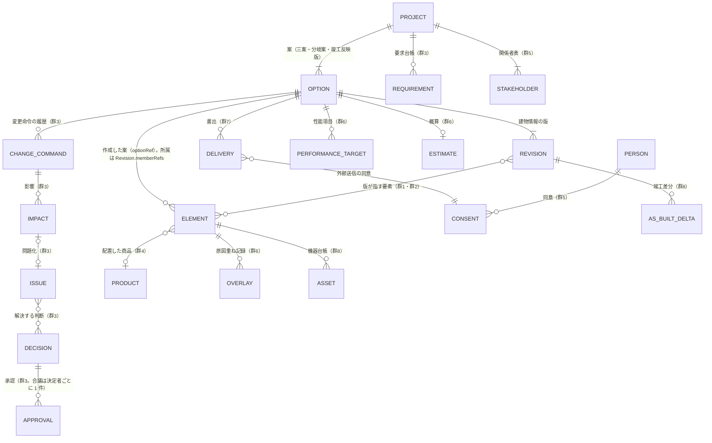
```mermaid
erDiagram
    PROJECT ||--|{ OPTION : "案（三案・分岐案・竣工反映版）"
    OPTION ||--|{ REVISION : "建物情報の版"
    REVISION }o--o{ ELEMENT : "版が指す要素（群1・群2）"
    PROJECT ||--o{ REQUIREMENT : "要求台帳（群3）"
    OPTION ||--o{ CHANGE_COMMAND : "変更命令の履歴（群3）"
    CHANGE_COMMAND ||--o{ IMPACT : "影響（群3）"
    IMPACT |o--o| ISSUE : "問題化（群3）"
    ISSUE }o--o{ DECISION : "解決する判断（群3）"
    DECISION ||--o{ APPROVAL : "承認（群3。合議は決定者ごとに 1 件）"
    OPTION ||--o{ ELEMENT : "作成した案（optionRef）。所属は Revision.memberRefs"
    ELEMENT }o--o| PRODUCT : "配置した商品（群4）"
    PROJECT ||--|{ STAKEHOLDER : "関係者表（群5）"
    PERSON ||--o{ CONSENT : "同意（群5）"
    ELEMENT ||--o{ OVERLAY : "原図重ね記録（群6）"
    OPTION ||--o{ PERFORMANCE_TARGET : "性能項目（群6）"
    OPTION ||--o| ESTIMATE : "概算（群6）"
    OPTION ||--o{ DELIVERY : "書出（群7）"
    DELIVERY }o--|| CONSENT : "外部送信の同意"
    REVISION ||--o{ AS_BUILT_DELTA : "竣工差分（群8）"
    ELEMENT ||--o{ ASSET : "機器台帳（群8）"
```

### 2.1 群1 建物幾何（空間構成）

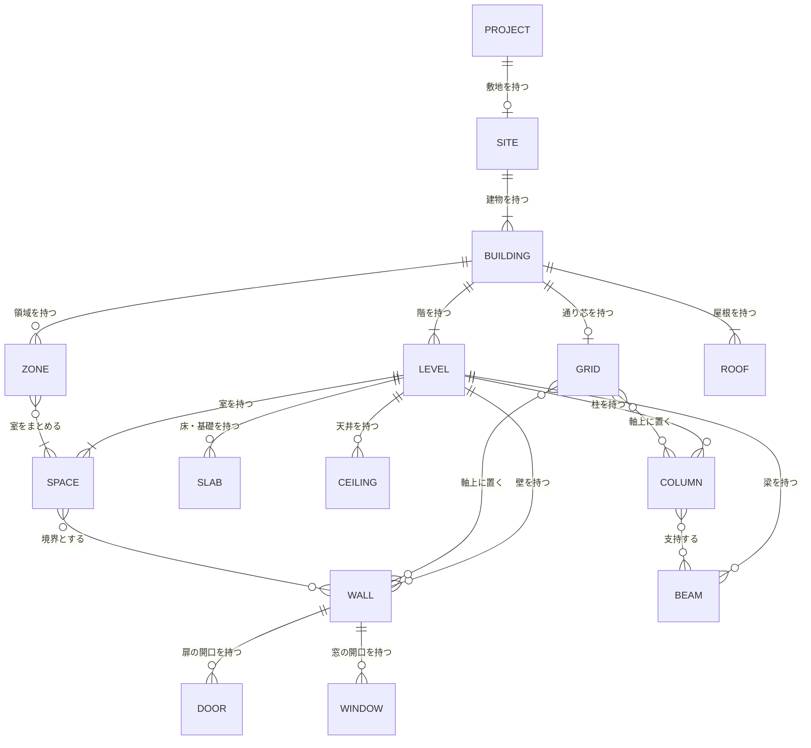
```mermaid
erDiagram
    PROJECT ||--o| SITE : "敷地を持つ"
    SITE ||--|{ BUILDING : "建物を持つ"
    BUILDING ||--|{ LEVEL : "階を持つ"
    BUILDING ||--o| GRID : "通り芯を持つ"
    BUILDING ||--o{ ZONE : "領域を持つ"
    BUILDING ||--|{ ROOF : "屋根を持つ"
    LEVEL ||--|{ SPACE : "室を持つ"
    LEVEL ||--o{ WALL : "壁を持つ"
    LEVEL ||--o{ SLAB : "床・基礎を持つ"
    LEVEL ||--o{ CEILING : "天井を持つ"
    LEVEL ||--o{ COLUMN : "柱を持つ"
    LEVEL ||--o{ BEAM : "梁を持つ"
    ZONE }o--|{ SPACE : "室をまとめる"
    WALL ||--o{ DOOR : "扉の開口を持つ"
    WALL ||--o{ WINDOW : "窓の開口を持つ"
    GRID }o--o{ COLUMN : "軸上に置く"
    GRID }o--o{ WALL : "軸上に置く"
    SPACE }o--o{ WALL : "境界とする"
    COLUMN }o--o{ BEAM : "支持する"
```

### 2.2 群1 建物幾何（要素と材料）

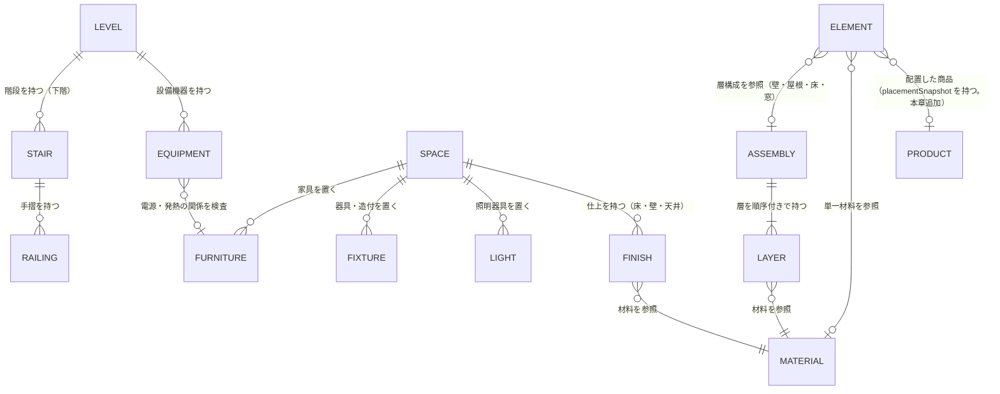
```mermaid
erDiagram
    LEVEL ||--o{ STAIR : "階段を持つ（下階）"
    LEVEL ||--o{ EQUIPMENT : "設備機器を持つ"
    SPACE ||--o{ FURNITURE : "家具を置く"
    SPACE ||--o{ FIXTURE : "器具・造付を置く"
    SPACE ||--o{ LIGHT : "照明器具を置く"
    SPACE ||--o{ FINISH : "仕上を持つ（床・壁・天井）"
    STAIR ||--o{ RAILING : "手摺を持つ"
    ASSEMBLY ||--|{ LAYER : "層を順序付きで持つ"
    LAYER }o--|| MATERIAL : "材料を参照"
    FINISH }o--|| MATERIAL : "材料を参照"
    ELEMENT }o--o| ASSEMBLY : "層構成を参照（壁・屋根・床・窓）"
    ELEMENT }o--o| MATERIAL : "単一材料を参照"
    EQUIPMENT }o--o| FURNITURE : "電源・発熱の関係を検査"
    ELEMENT }o--o| PRODUCT : "配置した商品（placementSnapshot を持つ。本章追加）"
```

### 2.3 群2 関係と系統

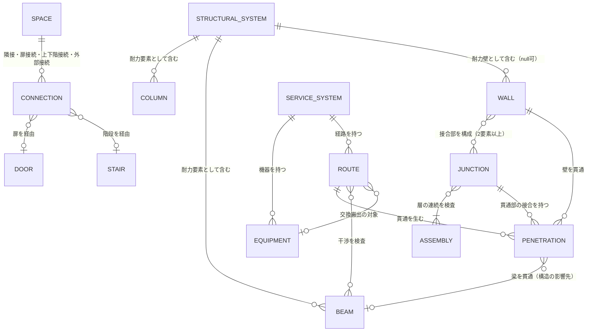
```mermaid
erDiagram
    SPACE ||--o{ CONNECTION : "隣接・扉接続・上下階接続・外部接続"
    CONNECTION }o--o| DOOR : "扉を経由"
    CONNECTION }o--o| STAIR : "階段を経由"
    WALL }o--o{ JUNCTION : "接合部を構成（2要素以上）"
    JUNCTION }o--|{ ASSEMBLY : "層の連続を検査"
    JUNCTION ||--o{ PENETRATION : "貫通部の接合を持つ"
    STRUCTURAL_SYSTEM ||--o{ COLUMN : "耐力要素として含む"
    STRUCTURAL_SYSTEM ||--o{ BEAM : "耐力要素として含む"
    STRUCTURAL_SYSTEM ||--o{ WALL : "耐力壁として含む（null可）"
    SERVICE_SYSTEM ||--o{ EQUIPMENT : "機器を持つ"
    SERVICE_SYSTEM ||--o{ ROUTE : "経路を持つ"
    ROUTE ||--o{ PENETRATION : "貫通を生む"
    PENETRATION }o--|| WALL : "壁を貫通"
    PENETRATION }o--o| BEAM : "梁を貫通（構造の影響先）"
    ROUTE }o--o{ BEAM : "干渉を検査"
    ROUTE }o--o| EQUIPMENT : "交換搬出の対象"
```

### 2.4 群3 要求と判断

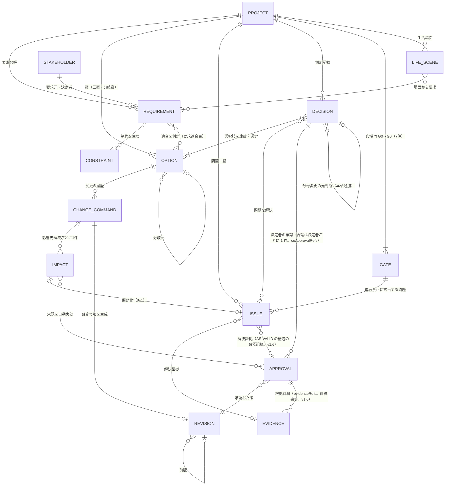
```mermaid
erDiagram
    PROJECT ||--o{ REQUIREMENT : "要求台帳"
    PROJECT ||--|{ OPTION : "案（三案・分岐案）"
    PROJECT ||--o{ ISSUE : "問題一覧"
    PROJECT ||--o{ DECISION : "判断記録"
    PROJECT ||--|{ GATE : "段階門 G0〜G6（7件）"
    PROJECT ||--o{ LIFE_SCENE : "生活場面"
    STAKEHOLDER ||--o{ REQUIREMENT : "要求元・決定者"
    REQUIREMENT ||--o{ CONSTRAINT : "制約を生む"
    REQUIREMENT }o--o{ OPTION : "適合を判定（要求適合表）"
    LIFE_SCENE }o--o{ REQUIREMENT : "場面から要求"
    DECISION }|--|{ OPTION : "選択肢を比較・選定"
    DECISION }o--o{ ISSUE : "問題を解決"
    DECISION ||--o{ APPROVAL : "決定者の承認（合議は決定者ごとに 1 件。coApprovalRefs）"
    DECISION }o--o| DECISION : "分母変更の元判断（本章追加）"
    OPTION ||--o{ CHANGE_COMMAND : "変更の履歴"
    OPTION }o--o| OPTION : "分岐元"
    CHANGE_COMMAND ||--o{ IMPACT : "影響先領域ごとに1件"
    IMPACT |o--o| ISSUE : "問題化（0..1）"
    IMPACT }o--o{ APPROVAL : "承認を自動失効"
    CHANGE_COMMAND ||--o| REVISION : "確定で版を生成"
    REVISION }o--o| REVISION : "前版"
    APPROVAL }o--|| REVISION : "承認した版"
    ISSUE }o--o| EVIDENCE : "解決証拠"
    ISSUE }o--o| APPROVAL : "解決証拠（AS-VALID の構造の確認記録。v1.6）"
    APPROVAL ||--o{ EVIDENCE : "根拠資料（evidenceRefs。計算書等。v1.6）"
    GATE ||--o{ ISSUE : "進行禁止に該当する問題"
```

### 2.5 群4 商品と権利

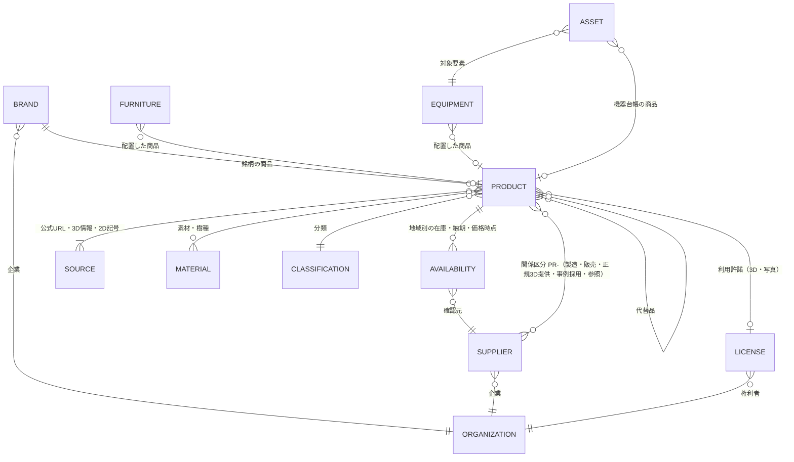
```mermaid
erDiagram
    BRAND ||--o{ PRODUCT : "銘柄の商品"
    BRAND }o--|| ORGANIZATION : "企業"
    SUPPLIER }o--|| ORGANIZATION : "企業"
    SUPPLIER }o--o{ PRODUCT : "関係区分 PR-（製造・販売・正規3D提供・事例採用・参照）"
    PRODUCT ||--o{ AVAILABILITY : "地域別の在庫・納期・価格時点"
    AVAILABILITY }o--|| SUPPLIER : "確認元"
    PRODUCT }o--o| LICENSE : "利用許諾（3D・写真）"
    LICENSE }o--|| ORGANIZATION : "権利者"
    PRODUCT }o--|{ SOURCE : "公式URL・3D情報・2D記号"
    PRODUCT }o--o{ MATERIAL : "素材・樹種"
    PRODUCT }o--|| CLASSIFICATION : "分類"
    PRODUCT }o--o{ PRODUCT : "代替品"
    FURNITURE }o--o| PRODUCT : "配置した商品"
    EQUIPMENT }o--o| PRODUCT : "配置した商品"
    ASSET }o--o| PRODUCT : "機器台帳の商品"
    ASSET }o--|| EQUIPMENT : "対象要素"
```

### 2.6 群5 人と組織

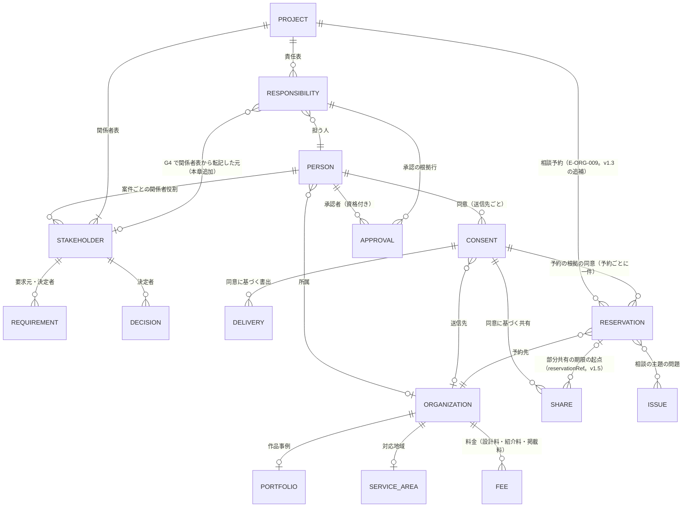
```mermaid
erDiagram
    PERSON }o--o| ORGANIZATION : "所属"
    PERSON ||--o{ STAKEHOLDER : "案件ごとの関係者役割"
    PROJECT ||--|{ STAKEHOLDER : "関係者表"
    STAKEHOLDER ||--o{ REQUIREMENT : "要求元・決定者"
    STAKEHOLDER ||--o{ DECISION : "決定者"
    ORGANIZATION ||--o| PORTFOLIO : "作品事例"
    ORGANIZATION ||--o| SERVICE_AREA : "対応地域"
    ORGANIZATION ||--o{ FEE : "料金（設計料・紹介料・掲載料）"
    PERSON ||--o{ CONSENT : "同意（送信先ごと）"
    CONSENT }o--o| ORGANIZATION : "送信先"
    CONSENT ||--o{ DELIVERY : "同意に基づく書出"
    CONSENT ||--o{ SHARE : "同意に基づく共有"
    PERSON ||--o{ APPROVAL : "承認者（資格付き）"
    PROJECT ||--o{ RESPONSIBILITY : "責任表"
    RESPONSIBILITY }o--|| PERSON : "担う人"
    RESPONSIBILITY ||--o{ APPROVAL : "承認の根拠行"
    RESPONSIBILITY }o--o| STAKEHOLDER : "G4 で関係者表から転記した元（本章追加）"
    PROJECT ||--o{ RESERVATION : "相談予約（E-ORG-009。v1.3 の追補）"
    CONSENT ||--o{ RESERVATION : "予約の根拠の同意（予約ごとに一件）"
    RESERVATION }o--|| ORGANIZATION : "予約先"
    RESERVATION }o--o{ ISSUE : "相談の主題の問題"
    RESERVATION |o--o{ SHARE : "部分共有の期限の起点（reservationRef。v1.5）"
```

### 2.7 群6 調査と計算（敷地と調査）

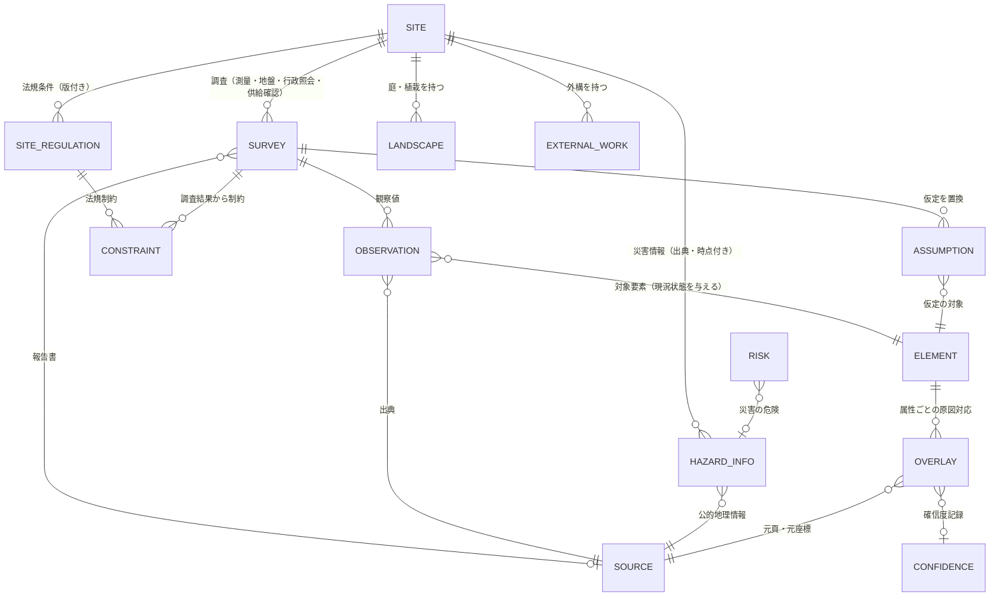
```mermaid
erDiagram
    SITE ||--o{ SITE_REGULATION : "法規条件（版付き）"
    SITE ||--o{ HAZARD_INFO : "災害情報（出典・時点付き）"
    SITE ||--o{ SURVEY : "調査（測量・地盤・行政照会・供給確認）"
    SITE ||--o{ LANDSCAPE : "庭・植栽を持つ"
    SITE ||--o{ EXTERNAL_WORK : "外構を持つ"
    SURVEY ||--o{ OBSERVATION : "観察値"
    SURVEY }o--o| SOURCE : "報告書"
    OBSERVATION }o--|| SOURCE : "出典"
    OBSERVATION }o--|| ELEMENT : "対象要素（現況状態を与える）"
    HAZARD_INFO }o--|| SOURCE : "公的地理情報"
    SITE_REGULATION ||--o{ CONSTRAINT : "法規制約"
    SURVEY ||--o{ CONSTRAINT : "調査結果から制約"
    SURVEY ||--o{ ASSUMPTION : "仮定を置換"
    ASSUMPTION }o--|| ELEMENT : "仮定の対象"
    ELEMENT ||--o{ OVERLAY : "属性ごとの原図対応"
    OVERLAY }o--|| SOURCE : "元頁・元座標"
    OVERLAY }o--o| CONFIDENCE : "確信度記録"
    RISK }o--o| HAZARD_INFO : "災害の危険"
```

### 2.8 群6 調査と計算（計算と費用）

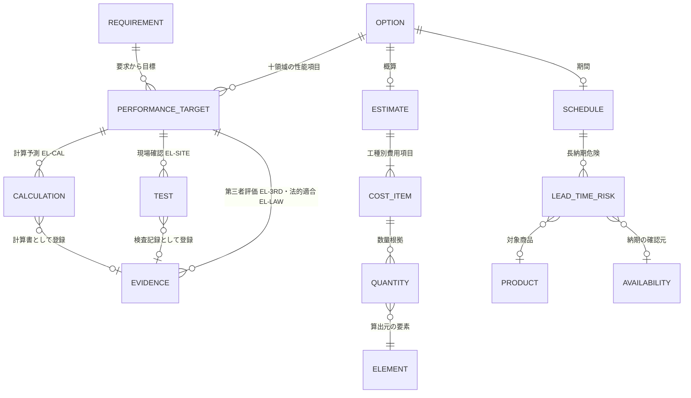
```mermaid
erDiagram
    OPTION ||--o{ PERFORMANCE_TARGET : "十領域の性能項目"
    REQUIREMENT ||--o{ PERFORMANCE_TARGET : "要求から目標"
    PERFORMANCE_TARGET ||--o{ CALCULATION : "計算予測 EL-CAL"
    PERFORMANCE_TARGET ||--o{ TEST : "現場確認 EL-SITE"
    PERFORMANCE_TARGET ||--o{ EVIDENCE : "第三者評価 EL-3RD・法的適合 EL-LAW"
    CALCULATION }o--o| EVIDENCE : "計算書として登録"
    TEST }o--o| EVIDENCE : "検査記録として登録"
    OPTION ||--o| ESTIMATE : "概算"
    ESTIMATE ||--|{ COST_ITEM : "工種別費用項目"
    COST_ITEM ||--o{ QUANTITY : "数量根拠"
    QUANTITY }o--|| ELEMENT : "算出元の要素"
    OPTION ||--o| SCHEDULE : "期間"
    SCHEDULE ||--o{ LEAD_TIME_RISK : "長納期危険"
    LEAD_TIME_RISK }o--o| PRODUCT : "対象商品"
    LEAD_TIME_RISK }o--o| AVAILABILITY : "納期の確認元"
```

### 2.9 群7 情報要求と交換

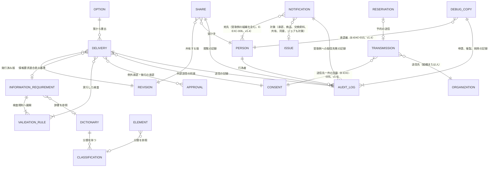
```mermaid
erDiagram
    INFORMATION_REQUIREMENT ||--|{ VALIDATION_RULE : "検査規則へ展開"
    INFORMATION_REQUIREMENT }o--o| DICTIONARY : "辞書を参照"
    DICTIONARY ||--o{ CLASSIFICATION : "分類を持つ"
    OPTION ||--o{ DELIVERY : "案から書出"
    DELIVERY }o--|| REVISION : "発行済み版"
    DELIVERY }o--o| INFORMATION_REQUIREMENT : "情報要求適合表の基準"
    DELIVERY }o--|{ VALIDATION_RULE : "実行した検査"
    DELIVERY }o--o{ APPROVAL : "例外承認・発行の承認"
    DELIVERY }o--|| CONSENT : "外部送信の同意"
    DELIVERY ||--|| AUDIT_LOG : "送信の記録"
    SHARE }o--|| REVISION : "共有する版"
    SHARE }o--|| PERSON : "受け手"
    SHARE ||--|{ AUDIT_LOG : "閲覧の記録"
    PERSON ||--o{ AUDIT_LOG : "行為者"
    ELEMENT }o--o| CLASSIFICATION : "分類を参照"
    NOTIFICATION }o--|{ PERSON : "宛先（受取側の組織を含む。E-EXC-008。v1.4）"
    NOTIFICATION }o--o| ISSUE : "対象（承認、商品、交換資料、共有、同意、ジョブも対象）"
    NOTIFICATION ||--o{ AUDIT_LOG : "受取側への配信失敗の記録"
    TRANSMISSION }o--|| CONSENT : "送信先一件の同意（E-EXC-009。v1.4）"
    TRANSMISSION }o--|| ORGANIZATION : "送信先（組織または人）"
    RESERVATION |o--o| TRANSMISSION : "予約の送信"
    DEBUG_COPY }o--|| PERSON : "承認者（E-EXC-010。v1.4）"
    DEBUG_COPY ||--|{ AUDIT_LOG : "申請、複製、削除の記録"
```

### 2.10 群8 施工と維持

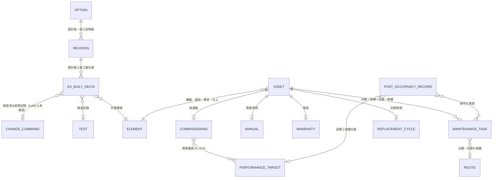
```mermaid
erDiagram
    OPTION ||--o{ REVISION : "設計版・竣工反映版"
    REVISION ||--o{ AS_BUILT_DELTA : "設計版と竣工版の差"
    AS_BUILT_DELTA }o--o| CHANGE_COMMAND : "承認済み変更記録（nullなら未承認）"
    AS_BUILT_DELTA }o--o| TEST : "検査記録"
    AS_BUILT_DELTA }o--|| ELEMENT : "対象要素"
    ASSET }o--|| ELEMENT : "機器・器具・家具・仕上"
    ASSET ||--o| COMMISSIONING : "試運転"
    ASSET ||--o| MANUAL : "取扱説明"
    ASSET ||--o| WARRANTY : "保証"
    ASSET ||--o{ MAINTENANCE_TASK : "点検・清掃・交換・修繕"
    ASSET ||--o| REPLACEMENT_CYCLE : "交換周期"
    MAINTENANCE_TASK }o--o| ROUTE : "点検・交換の経路"
    COMMISSIONING }o--o{ PERFORMANCE_TARGET : "現場確認 EL-SITE"
    POST_OCCUPANCY_RECORD }o--o| PERFORMANCE_TARGET : "目標と実績の差"
    POST_OCCUPANCY_RECORD }o--o{ MAINTENANCE_TASK : "保守の実感"
```

### 2.11 変更命令、影響、問題、承認の構造

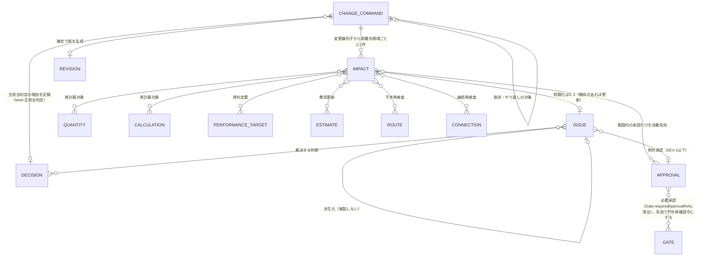
```mermaid
erDiagram
    CHANGE_COMMAND ||--o{ IMPACT : "変更識別子から影響先領域ごとに1件"
    CHANGE_COMMAND ||--o| REVISION : "確定で版を生成"
    CHANGE_COMMAND }o--o| CHANGE_COMMAND : "取消・やり直しの対象"
    CHANGE_COMMAND }o--o| DECISION : "主担当判定の理由を記録（kind=主担当判定）"
    IMPACT |o--o| ISSUE : "問題化は0..1（既存があれば更新）"
    IMPACT }o--o{ APPROVAL : "範囲内の承認だけを自動失効"
    IMPACT }o--o{ QUANTITY : "再計算対象"
    IMPACT }o--o{ CALCULATION : "再計算対象"
    IMPACT }o--o{ PERFORMANCE_TARGET : "再判定要"
    IMPACT }o--o{ ESTIMATE : "費用更新"
    IMPACT }o--o{ ROUTE : "干渉再検査"
    IMPACT }o--o{ CONNECTION : "接続再検査"
    ISSUE }o--o| ISSUE : "派生元（複製しない）"
    ISSUE }o--o{ DECISION : "解決する判断"
    ISSUE }o--o| APPROVAL : "例外承認（SEV-1以下）"
    APPROVAL }o--o{ GATE : "必要承認（Gate.requiredApprovalRefs。導出）。失効で門を再確認中にする"
```

## 3. 建築要素の共通属性（指示文C3の14属性の実装）

### 3.1 指示文C3の14属性と本章の属性の対応

指示文C3「各建築要素は固有ID、幾何、寸法、親子関係、接続関係、材質、分類、費用範囲、出典、確信度、現況状態、責任者、必要段階、改訂を持つ」を、全実体が持つ共通属性（第3.2節）と、建築要素（BLD、SPC、ELM、MAT、SYS 群）が持つ要素共通属性（第3.3節）へ次のとおり割り当てる【推定】。書出検査（E-EXC-005 kind=欠落属性）は本表の「必須」列を検査条件にする。

| 番号 | C3の属性 | 本章の属性 | 種別 | 必須 | 区分 |
|---:|---|---|---|---|---|
| 1 | 固有ID | uuid（＋ ifcGuid、humanId） | 共通 | 必須 | 【推定】 |
| 2 | 幾何 | geometry | 要素共通 | 必須（Material、Assembly、Layer、StructuralSystem、ServiceSystem は任意） | 【推定】 |
| 3 | 寸法 | dimensions | 要素共通 | 必須（実体ごとの項目は第4節） | 【推定】 |
| 4 | 親子関係 | parentRef（子は索引 childRefs） | 要素共通 | 必須（Project、案件横断台帳は null） | 【推定】 |
| 5 | 接続関係 | connectionRefs | 要素共通 | 任意（Space、Door、Stair、Wall は V2 判定時に1件以上） | 【推定】 |
| 6 | 材質 | materialRef または assemblyRef | 要素共通 | 条件付き（Wall、Slab、Roof、Window、Ceiling、Finish、Layer は V2 判定時に必須。VS-DEF 可） | 【推定】 |
| 7 | 分類 | classificationRef | 要素共通 | 必須（書出時。Dictionary の Active な分類） | 【推定】 |
| 8 | 費用範囲 | costRange | 要素共通 | 任意（導出値。第3.4節） | 【仮定】 |
| 9 | 出典 | sourceRef（複数は Overlay） | 共通 | 必須 | 【推定】 |
| 10 | 確信度 | confidence（校正記録は Confidence） | 共通 | 必須（決定的計算の結果は 1.0。持たない実体は第3.2節に列挙） | 【推定】 |
| 11 | 現況状態 | conditionState | 要素共通 | 条件付き（改装案件の既存要素は必須。新設要素は null） | 【推定】 |
| 12 | 責任者 | responsibleRef | 共通 | 必須 | 【推定】 |
| 13 | 必要段階 | requiredStage | 共通 | 必須（案件横断台帳は null） | 【推定】 |
| 14 | 改訂 | revisionRef（＋ version） | 共通 | 必須 | 【推定】 |

### 3.2 共通属性辞書（全実体）

| 属性名 | 日本語名 | 型 | 必須 | 既定値 | 単位 | 取り得る値 | 状態 | 出典 |
|---|---|---|---|---|---|---|---|---|
| uuid | 固有ID | id | 必須 | 生成時に付与 | — | UUID 版4 | なし（不変） | C3、識別子規則 第2.2節 |
| ifcGuid | IFC識別子 | str | 条件付き（IFC 書出対象実体） | uuid から変換 | — | 22文字の IfcGloballyUniqueId | なし | 識別子規則 第2.2節、U-00-010 |
| humanId | 人が読む識別子 | str | 条件付き（Project、Requirement、Issue、Decision） | 案件内連番で付与 | — | PJ-、R-、I-、D- の書式 | なし | 識別子規則 第2.6節、第2.9節 |
| version | 版 | str | 必須 | v1.0 | — | `v主.副` | なし | 識別子規則 第4節 |
| sourceRef | 出典 | ref[E-PRD-006] | 必須（AuditLog、Notification、Transmission、DebugCopy は発生元の行為、処理、送信、申請） | — | — | 存在する Source | RS（出典側） | C3、基盤 情報実体骨格 第0.3節 |
| confidence | 確信度 | num | 必須（例外: Gate、License、Consent、Person、Stakeholder、ServiceArea、Fee、Availability、HazardInfo、InformationRequirement、Dictionary、Classification、ValidationRule、Share、AuditLog、Manual、Reservation、Notification、Transmission、DebugCopy は持たない。Reservation は v1.3、後三つは v1.4 の追補で骨格の共通属性の欄に合わせて加えた） | 決定的処理の結果は 1.0 | 0..1 | 0.00〜1.00（小数2桁） | Confidence 記録で校正 | C3、指示文1章 |
| responsibleRef | 責任者 | ref[E-ORG-001 または E-ORG-002] | 必須（Notification、Transmission、DebugCopy は持たない。v1.4） | 作成者 | — | 責任表（E-ORG-007）の該当行と整合 | RL（人側） | C3、C15 |
| requiredStage | 必要段階 | enum | 必須（案件横断台帳は null。Reservation は持たない〔骨格 E-ORG-009。v1.3 の追補〕。Notification、Transmission、DebugCopy も持たない〔v1.4〕） | 生成した段階 | — | G0、G1、G2、G3、G4、G5、G6 | なし | C3、七段階門 |
| revisionRef | 改訂 | ref[E-REQ-006] | 必須（AuditLog、Notification、Transmission、DebugCopy は持たない。後三つは v1.4） | 生成時の Revision | — | 存在する Revision | CDE（Revision 側） | C3 |
| projectRef | 案件 | ref[E-BLD-001] | 必須（案件横断台帳は null） | — | — | 存在する Project | なし | 基盤 情報実体骨格 第0.3節 |
| createdAt | 作成日時 | datetime | 必須 | 生成時刻 | UTC | ISO 8601 | なし | 同上 |
| createdByRef | 作成者 | ref[E-ORG-001] | 必須（製品の自動生成は「製品」を表す Person 個体） | — | — | 存在する Person | なし | 同上 |
| updatedAt | 更新日時 | datetime | 必須 | 生成時刻 | UTC | ISO 8601 | なし | 同上 |
| deletedAt | 削除日時 | datetime | 任意 | null | UTC | ISO 8601。削除要求後に設定し、一括削除（第6.7節）まで保持 | なし | 指示文9.8。本章追加 |

「本章追加」の属性は基盤 情報実体骨格 に未記載の属性であり、末尾の他章への依頼で基盤への追記を提案する【仮定】。

### 3.3 要素共通属性辞書（BLD、SPC、ELM、MAT、SYS 群）

| 属性名 | 日本語名 | 型 | 必須 | 既定値 | 単位 | 取り得る値 | 状態 | 出典 |
|---|---|---|---|---|---|---|---|---|
| geometry | 幾何 | geom | 必須（第3.1節の例外を除く） | — | mm、案件原点 | 第1.6節の geom 内部。2D と 3D を同じ値から描画 | VS（valueStates.geometry） | C3、指示文B |
| dimensions | 寸法 | json | 必須 | 実体ごとの既定値表（第5節） | mm | 実体ごとの項目（第4節の各表に展開） | VS（項目ごと） | C3 |
| parentRef | 親 | ref | 必須（根と案件横断台帳は null） | — | — | 第2節の親実体 | なし | C3 |
| optionRef | 作成した案 | ref[E-REQ-005] | 必須（案件横断台帳は null） | 個体を作った命令の optionRef | — | 存在する Option。共有参照される個体は作成した案を指し、所属する案の集合は Revision.memberRefs（索引）で引く（第1.5節 copy-on-write） | なし | 本章追加（v1.2、JM-074） |
| variantOfRef | 分岐元の個体 | ref | 条件付き（分岐案で copy-on-write により作った個体） | null | — | 同じ実体種の分岐元の個体。分岐案の差分を要素単位で「変更」と分類する根拠（第7.3節） | なし | 本章追加（v1.2、JM-074） |
| childRefs | 子（索引） | list[ref] | 導出（正本外） | 空 | — | parentRef の逆参照 | なし | 本章追加（第8.1節の索引） |
| connectionRefs | 接続関係 | list[ref[E-SYS-005]] | 任意（V2 判定時は Space、Door、Stair、Wall に1件以上） | 空 | — | 存在する Connection | Connection.isVerified | C3、C2 |
| materialRef | 材料 | ref[E-MAT-001] | 条件付き（assemblyRef と排他ではない。単一材料の要素） | 既定値表 | — | 存在する Material | VS | C3 |
| assemblyRef | 層構成 | ref[E-MAT-003] | 条件付き（Wall、Slab、Roof、Window、Ceiling） | 既定値表（構法別の標準層構成） | — | 存在する Assembly | VS | C3、C11 |
| classificationRef | 分類 | ref[E-EXC-003] | 必須（書出時） | 実体種の既定分類 | — | Dictionary の Active な Classification | なし | C3、C15 |
| costRange | 費用範囲 | range(JPY) | 導出（正本外。第3.4節） | null | JPY | min ≤ max。単一額は概算では不可 | なし（導出元の Quantity と CostItem の状態） | C3、C13 |
| conditionState | 現況状態 | enum | 条件付き（改装案件の既存要素は必須） | CS-DRW（図面から取得時）、CS-EST（記載なし） | — | CS-DRW、CS-SITE、CS-OPEN、CS-EST | CS | C2、信頼状態 第4節 |
| valueStates | 要素値状態 | map[str, enum] | 必須（値を持つ属性ごと） | 取得経路で決まる（第6.3節） | — | VS-SRC、VS-AI、VS-DEF、VS-USR、VS-PRO | VS | 指示文B、信頼状態 第2節 |
| valueStateMeta | 要素値状態の記録 | map[str, json{byRef:ref, at:datetime, approvalRef:ref, overlayRef:ref, checkMethod:enum{実測, 寸法文字, 既知寸法, 実測不能（未建築）}, checkValue:num}] | 条件付き（VS-USR、VS-PRO の属性） | — | mm（checkValue） | 確認者、日時、承認、原図重ね記録への参照。重要寸法（第11章 第6.4節）の確認は照合方法 checkMethod と照合値 checkValue を必須とし、照合値と製品の算出値の差が DV-CF-11 を超える場合は確認を受け付けない。寸法文字が 0 件の頁では checkMethod=実測 に限る（v1.2、JM-071）。checkMethod=実測不能（未建築）は対象の建物が未建築で実測できない場合に選び、checkValue は null とし、その確認は重要寸法と主要寸法の確認に数えない（V2 の条件に数えない。第11章 F-C02-014 例外(e)。実測不能（未建築）は v1.6 で本行に直接加えた〔再々確認 K3-29、主4-19〕。値の説明は表11.2-B。他の追加の値は表11.2-B）。checkMethod と checkValue のない VS-USR は重要寸法と主要寸法（六種）の確認に数えない（次の基準寸法の属性を除く）。尺度の基準寸法に使った要素の同じ属性は照合寸法に選べない（不受理。v1.4、JR-047）。基準寸法に使った要素の同じ属性は、尺度の承認（AS-VALID）で確認済みに数える（独立の照合には数えない）。尺度の承認が AS-VOID になればこの扱いも外れる（第11章 第6.4節「主要寸法」、第6.5節 条件2 と同文。v1.6、再々確認 主2-17、統括の決定 D45） | なし | 信頼状態 第2.1節。本章追加（「確認者と日時は Overlay または Approval に持つ」を属性化） |
| renovationAction | 改装区分 | enum | 条件付き（改装案件） | 残す（P1 の改装案件の現況要素〔conditionState が null でない要素〕は null〔未指定〕。v1.6） | — | 残す、撤去、補修、補強、移設、新設。null は未指定を表す。P1 の改装案件の現況要素の既定を null とし、利用者が指定していない要素と「残す」を指定した要素を区別する。G2 完了条件(10)と I-06-009（第6章 第8.2節。P1）の「未指定」は renovationAction が null の現況要素を数える（v1.6、再々確認 K1-02、統括の決定 D33。新築案件と新設要素の既定は変えない）。P0 の改装案件では、現況要素（conditionState が null でない要素）を削除、移動または寸法変更する案の変更命令（origin=自然文、直接操作の変更命令。三案の派生を含む）は要素を消さずに、削除には撤去（isRemoved=true）、移動には移設を自動で付ける。寸法変更（短縮、延長、既存開口の拡大と縮小、回転）は、変更前の要素に撤去（isRemoved=true）、変更後の形の要素に新設を自動で付ける（撤去と新設の組。v1.6、再々確認 主2-01、統括の決定 D34）。寸法変更の撤去の側は削除と同じく、第13章 第5.5節 式(5)、解体撤去の費用への算入（第20章 第2.3節）、欠落の自動記録 (vii) の件数（第6章 第2.5節）、過半の判定の分子（第21章 第2.4節。P1）に数える。図面読解の修正（現況の訂正。第11章 工程9、F-C02-015 の手修正）は自動付与の対象外とする（v1.6、再々確認 主2-05、統括の決定 D38）。自動付与した撤去（寸法変更の撤去の側を含む）と移設は第13章 第5.5節 式(5)で判定する（移設は移設元を撤去として数える。v1.6、再々確認 主2-03、主4-01、統括の決定 D36）。P0 の解除は元に戻す変更（残すに戻す。変更命令の取消と連続取消。第7.4節）だけ。指定画面 S-27-03 と、残す、補修、補強の指定は P1（正本は第21章 第2.1節 規則(7)。v1.4、JR-095） | なし | C14 |
| isRemoved | 撤去の別 | bool | 条件付き（改装案件） | false | — | renovationAction=撤去 の要素は設計版で true にし、要素を消さずに保持する。数量は工種「解体撤去」へ渡す（第20章、第21章 第2.1節） | なし | 第21章 依頼、JM-073。本章追加（v1.2） |
| concealedParts | 隠れ部分 | list[json{kind:enum{下地, 配管, 配線, 劣化, 漏水, 腐朽, 蟻害, 石綿}, conditionState:enum{CS-EST, CS-OPEN}, surveyRef:ref[E-SRV-001 または E-SRV-002], note:str}] | 条件付き（改装案件で工事範囲に入る壁、床、天井、屋根、基礎） | 要素種別ごとの既定集合（DV-MT-05）を CS-EST で生成 | — | kind は隠れ部分と調査所見の共通語彙であり、E-SRV-001.findings と E-SRV-002.value の findingKind も同じ値を使う。開口調査と石綿事前調査の記録は該当 kind の conditionState だけを CS-OPEN にし、要素本体の conditionState は変えない。CS-EST の項目を「無い」と表示しない | CS | 第21章 依頼、JM-153、JM-065。本章追加（v1.2） |
| lowConfidence | 低確信度 | bool | 必須（AI 認識した要素） | confidence < 閾値（U-00-003） | — | true、false。版の作成時に E-SRV-010.isLow（thresholdVersion 付き）を写す値で、diff と checksum に含める（第11.3節。v1.4、JR-064） | なし | C2 |
| placementSnapshot | 配置時点の商品記録 | json{productVersion:str, fingerprint:str, priceAtTime:num, priceDate:datetime, tier:enum{PT-CERT,PT-REF,PT-GEN,PT-AI}, rightsState:enum, supplyState:enum, placedAt:datetime} | 条件付き（productRef を持つ Furniture、Equipment、Fixture、Door、Window、Light、Railing、Finish） | 配置時に台帳から複製 | JPY、UTC | 台帳の現在値と併せて表示。相違があれば警告。複製する 8 項目は第16章 第6.1節「配置時点の記録」と同じで、配置した形状の層は配置時点の tier で示す（正規形状か代替形状かを要素ごとに示すため）。配置と置換（代替品の確定、形状の差替え）の確定のたびに更新し、移動では更新しない（第6.6節「配置記録」と同じ。v1.3 で tier を型に加えた。U-12-009 の解決） | PT、RS、SUP（複製値） | 指示文9.6、U-00-044。本章追加 |

### 3.4 費用範囲の扱い（U-00-043 の仮判断）

costRange は要素自身の正本値ではなく、Quantity（E-SRV-006）と CostItem（E-SRV-014）の単価から導出した値を要素側へ写した表示用の値（導出値）とする【仮定】。導出値は Impact（費用）の再計算のたびに更新し、導出元の Revision（Quantity.derivedFromRevisionRef）より要素の revisionRef が新しい場合は「再計算要」と表示する。二重管理を避けるため、costRange を直接編集する機能は置かない。第20章がこの扱いを採るか確認する。

### 3.5 幾何の内部構造と決定的検査の対象

| 検査 | 対象属性 | 決定的検査の内容 | 不合格時 | 区分 |
|---|---|---|---|---|
| 閉領域 | Space.polygon、Wall.centerline、Wall.thickness | 室の境界壁が閉じているか（公差 5 mm、初期仮説。DV-CF-02） | Space.isClosed=false、Issue（SEV-1。V2 昇格を阻止） | 【仮定】 |
| 隣接と扉接続 | Connection（kind=隣接、扉接続）、Door.connectsSpaceRefs | 扉の両側の室が存在し、hostWallRef が両室の境界壁か | Connection.isVerified=false、Issue（SEV-1） | 【推定】 |
| 上下階接続 | Connection（kind=上下階接続）、Stair.fromLevelRef、toLevelRef、Stair.opening | 階段の開口が上階の Slab に存在し、階高と段数と蹴上の積が整合するか（公差 20 mm、初期仮説。DV-CF-04） | Issue（SEV-0。重大失敗「階段接続誤り」） | 【仮定】 |
| 干渉 | Route.path と Beam、Furniture.collisionShape と Door.swingArea 等 | 当たり判定形状の重なり | Issue（重大度は影響先の規則。梁と排水は SEV-0） | 【推定】 |
| 寸法拘束 | Constraint（kind=寸法拘束、幾何拘束） | 平行、直角、同一直線、壁厚、開口位置、階高の拘束式の充足 | Constraint.solverStatus=矛盾、Issue（SEV-1） | 【推定】 |
| 尺度整合 | Source.scale、Overlay.sourceCoordinates、利用者指定の基準寸法 | 複数寸法の換算係数の相違が 2% 以内（初期仮説。DV-CF-03） | Issue（SEV-0。重大失敗「尺度誤認」） | 【仮定】 |

公差の値は初期仮説であり、第11章と公開判定会議で固定する【仮定】。

## 4. 項目辞書

### 4.0 列の定義と読み方

| 列 | 内容 |
|---|---|
| 属性名 | 英字、先頭小文字。参照は末尾 Ref または Refs。`E-XXX-nnn.属性名` で章をまたいで参照できる |
| 日本語名 | 画面と書出の表示名の既定 |
| 型 | 第1.6節の表記。json は内部項目を `{}` で展開 |
| 必須 | 必須、任意、条件付き（条件を括弧に書く）。「必須（書出時）」は書出検査でのみ必須 |
| 既定値 | 生成時の値。「既定値表」は第5節の DV- 識別子を参照。「—」は既定値なし（入力が要る） |
| 単位 | mm、m2、deg、JPY、日、年、%、UTC、または — |
| 取り得る値 | enum の値、範囲、参照先の実体 |
| 状態 | この属性値に付く状態の種類（VS、CS、EL、PT、RS、SUP、PR、CDE、IS、AS、SEV、RP、RL、独自、なし）。「独自」は enum で値を明記した実体固有の状態 |
| 出典 | 指示文の節、基盤定義（骨格）、他章の依頼、本章追加 |
| IFC 書出（v1.2） | 各実体の表には列を設けず、第10.3節の対応表と包括規則（DDI_{群名}.{属性名}、除外の三種）で決める。主要実体の Pset 名、DDI_ 名、除外は表11.2-E に置く（JM-085） |
| v1.2 と v1.3 の追補 | 他章の依頼で加えた属性と enum の値は第11.2.2節以降の表（表11.2-A、表11.2-B）にあり、本節の各表には加えていない（例外は第11.2.1節の規則による）。既存属性の型や必須を改めた行は出典列または取り得る値の列に「v1.2」「v1.3」を付し、一覧を表11.2-C に置く。v1.3 は 2026-10-06 の相互依頼による |

各表は実体固有の属性だけを載せる。共通属性（第3.2節）と要素共通属性（第3.3節）は全実体または全建築要素が持つものとして省略する。主要属性の名称と型は基盤 情報実体骨格 v1.1 第1節を正本とし、本章は既定値、単位、取り得る値、状態、json の内部項目を補い、他章の依頼に基づく属性を「本章追加」として加えた【推定】。

### 4.1 群 BLD（建物構成）

#### E-BLD-001 Project 案件

| 属性名 | 日本語名 | 型 | 必須 | 既定値 | 単位 | 取り得る値 | 状態 | 出典 |
|---|---|---|---|---|---|---|---|---|
| projectId | 案件識別子 | str | 必須 | 生成時に採番 | — | PJ-{年4桁}-{連番5桁} | なし | 識別子規則 第2.9節 |
| purpose | 目的文 | str | 必須（G0 完了時） | null | — | 200字以内。「誰の何を解決するか」の一文 | VS（VS-USR 以上で承認可） | C1、第05章依頼 |
| successCriteria | 成功条件 | list[json{text:str, measure:str, targetValue:json}] | 必須（G0 完了時） | 空 | — | 観察可能な条件。1件以上 | VS | C1、第05章依頼。本章追加 |
| entryType | 入口 | enum | 必須 | — | — | 希望から作る、図面を3D化、写真から改装 | なし | 指示文3.2、用語集12 |
| useType | 利用目的 | enum | 必須 | — | — | 新築、改装、家具配置、図面3D化、売却賃貸資料 | VS | C1 |
| region | 地域 | str | 必須 | — | — | 都道府県以上の粒度（機密ではない） | VS | C1 |
| budgetRange | 予算幅 | range(JPY) | 必須（「未定」可） | 未定（null） | JPY | min ≤ max、または null（未定） | VS | C1、C13 |
| landStatus | 土地の状態 | enum | 必須 | — | — | 所有、候補あり、探索中、建替え、売却移転 | VS | C1 |
| currentGateRef | 現段階 | ref[E-REQ-010] | 必須 | G0 の Gate | — | 存在する Gate（status=進行中） | 独自（Gate 側） | C15 |
| ownerRef | 所有者 | ref[E-ORG-001] | 必須 | 作成者 | — | roles に RL-OWN を持つ Person | RL | C10 |
| nonScope | 非対象 | list[str] | 必須（G0 完了時） | 製品の非対象の既定一覧（版付き） | — | 用語集5 の項目と案件固有の追加 | なし | C1、G |
| nonScopeAcknowledged | 非対象の表示記録 | json{version:str, displayedAt:datetime, acknowledgedByRef:ref[E-ORG-001]} | 必須（G0 完了条件(3)） | null | UTC | 表示した非対象文の版と確認者 | なし | 第02章 第2.6節、第06章。本章追加 |
| status | 案件状態 | enum | 必須 | 進行中 | — | 進行中、完了、保管、削除待ち | 独自 | 基盤 情報実体骨格 |
| cdeState | 共通情報環境状態（案件全体） | enum | 必須 | CDE-WIP | — | CDE-WIP、CDE-SHR、CDE-PUB、CDE-ARC | CDE | C15 |
| guidMap | uuid と ifcGuid の対応表 | map[id, str] | 条件付き（IFC 入出力後） | 空 | — | uuid → 22文字 | なし | 識別子規則 第2.2節。本章追加 |
| originPoint | 案件原点 | geom（point） | 必須（V2 判定時） | 敷地境界の基準点（VS-DEF） | mm | Site.boundary 上または内部の一点 | VS | U-00-042。本章追加 |
| keyDecisionDenominator | 重要判断の分母 | list[ref[E-REQ-004]] | 必須（G1 以降） | 段階門の主要判断の雛形から生成。雛形は第6章 第2.1〜2.7節の各段階の主要判断（第2章 第4.3節の雛形と同じ。各判断は雛形の記号 E-REQ-004.templateSymbol を持つ。v1.3）であり、第6章 第3節の交差表の「有」は主担当領域の割当であって分母の生成元ではない（v1.2、JM-001） | — | isKeyDecision=true の Decision。源2、源3 の追加と除外は E-REQ-004.denominatorHistory に記録 | なし | 第02章 第4.3節、第6章 第2.1〜2.7節。本章追加 |
| retentionUntil | 保存期限 | date | 必須 | 完了から製品既定の期間（第22章） | — | 暦日 | なし | 指示文9.8。本章追加 |

#### E-BLD-002 Site 敷地

| 属性名 | 日本語名 | 型 | 必須 | 既定値 | 単位 | 取り得る値 | 状態 | 出典 |
|---|---|---|---|---|---|---|---|---|
| address | 住所 | str（機密、分離保存） | 条件付き（landStatus=所有、候補あり、建替え） | null | — | 分離保存領域の参照 secretRef を本体に持つ | VS | C9、指示文E |
| lotNumbers | 地番候補 | list[str]（機密） | 任意 | 空 | — | 地番の文字列 | VS | C9 |
| crs | 座標系 | str | 任意 | null（案件原点のみ） | — | 平面直角座標系の系番号と測地系（例「JGD2011 / 9系」）。値の規則は第18章 | なし | U-00-042 |
| boundary | 敷地境界 | geom（polygon） | 必須（G1 完了時） | — | mm | 閉じた多角形。VS-AI または VS-DEF の場合は「法的境界ではない」を表示 | VS | C9 |
| boundarySourceRef | 境界資料 | ref[E-PRD-006] | 必須（boundary を持つ場合） | — | — | kind=図面、公的地理情報、調査報告 | RS | C9 |
| surveyDate | 測量日 | date | 任意 | null | — | 暦日 | VS | C9 |
| area | 敷地面積 | num | 必須（G1 完了時） | boundary から算出 | m2 | > 0 | VS | C9 |
| roadAccess | 接道 | json{width:num(mm), kind:str, frontageLength:num(mm), sideOfRoad:str} | 必須（G1 完了時） | — | mm | 幅員、道路種別（第18章の enum）、接道長 | VS | C9 |
| terrain | 地形 | json{elevationRange:range(mm), slopePercent:num, heightDiffToRoad:num(mm), designGroundLevel:num(mm), groundLevelNote:str} | 任意 | null | mm、% | 標高幅、勾配、道路との高低差。designGroundLevel は設計地盤面の高さ（案件座標系の Z）で、初期値は接道面の平均（VS-AI）、建築士の確認で VS-PRO。高さの判定の入力は「棟の高さ − designGroundLevel」とし、高低差 2 m 超では判定出力に「地盤面は仮定」を付す（第18章 第4.2節）。groundLevelNote の既定は「平均地盤面の算定は建築士。条文未確認（U-18-004）」（v1.2、JM-129） | VS | C9 |
| utilities | 供給条件 | json{water:str, sewer:str, electricity:str, telecom:str, rainDischarge:str, vehicleAccess:str} | 任意 | 未確認 | — | 各項目「確認済み」「未確認」「なし」と出典 | VS | C9 |
| northAngle | 真北角 | num | 必須（V2 判定時） | 0（VS-DEF） | deg | 0〜359.9。案件Y軸から真北への角 | VS | 本章追加（U-00-042） |

#### E-BLD-003 Building 建物

| 属性名 | 日本語名 | 型 | 必須 | 既定値 | 単位 | 取り得る値 | 状態 | 出典 |
|---|---|---|---|---|---|---|---|---|
| name | 名称 | str | 必須 | 「主屋」 | — | 50字以内 | なし | C3 |
| structureType | 構造形式（仮定） | enum | 必須 | 未定（VS-DEF） | — | 在来木造、大断面木造、鉄骨、RC、その他、未定 | VS | C11 |
| storeys | 地上階数 | int | 必須 | 1 | 階 | 1〜3（三階建以上は層別「三階以上」） | VS | C3 |
| basementStoreys | 地階数 | int | 必須 | 0 | 階 | 0〜1 | VS | C3 |
| grossFloorArea | 延床面積 | num | 必須（G2 以降） | Level.area の合計 | m2 | > 0 | VS | C13 |
| buildingArea | 建築面積 | num | 必須（G2 以降） | footprint から算出 | m2 | > 0 | VS | C9 |
| maxHeight | 最高高さ | num | 必須（G2 以降） | 既定値表 DV-GE-01 階高 × 階数 ＋ 屋根 | mm | > 0 | VS | C9 |
| fireCategory | 防火区分 | str | 任意 | null | — | SiteRegulation（item=防火）の値の参照 | VS | C9 |
| footprint | 建物外形 | geom（polygon） | 必須 | 1階の外壁中心線から生成 | mm | 閉じた多角形 | VS | C3 |
| orientation | 向き | num | 必須 | 0 | deg | 建物の基準辺の案件X軸からの角 | VS | C3 |

#### E-BLD-004 Level 階

| 属性名 | 日本語名 | 型 | 必須 | 既定値 | 単位 | 取り得る値 | 状態 | 出典 |
|---|---|---|---|---|---|---|---|---|
| name | 階名 | str | 必須 | 「1階」等 index から生成 | — | 20字以内 | なし | C3 |
| index | 階番号 | int | 必須 | — | — | 地階は負。1階は 1 | なし | C3 |
| elevation | 基準高さ | num | 必須 | 下階の elevation ＋ floorToFloor | mm | 案件原点 Z からの高さ。1階は 0 を既定（VS-DEF） | VS | C3 |
| floorToFloor | 階高 | num | 必須 | 既定値表 DV-GE-01 | mm | 2,100〜4,000（範囲外は警告） | VS（VS-DEF は V2 昇格を阻止） | C2、C3 |
| ceilingHeight | 天井高 | num | 必須 | 既定値表 DV-GE-02 | mm | 2,100〜3,500 | VS | C3 |
| sourcePageRef | 元頁 | ref[E-PRD-006] | 条件付き（図面入力） | — | — | kind=図面の Source（page 付き） | RS | C2 |
| isMezzanine | 中間階 | bool | 必須 | false | — | true、false | なし | C3 |
| area | 床面積 | num | 必須（G2 以降） | Space.area の合計 | m2 | ≥ 0 | VS | C13 |

#### E-BLD-005 Grid 通り芯

| 属性名 | 日本語名 | 型 | 必須 | 既定値 | 単位 | 取り得る値 | 状態 | 出典 |
|---|---|---|---|---|---|---|---|---|
| name | 名称 | str | 必須 | 「通り芯」 | — | 50字以内 | なし | C3 |
| axes | 軸 | list[json{label:str, line:geom(polyline), direction:enum{X,Y,斜め}}] | 必須 | 外壁中心線から生成 | mm | 軸記号（X1、Y1、A、B…）と直線 | VS（軸ごと） | C2 |
| module | 基準寸法 | num | 必須 | 既定値表 DV-GE-05 | mm | 910、1,000、その他（正の整数） | VS | C2 |
| origin | 原点 | geom（point） | 必須 | 案件原点 | mm | 点 | VS | C2 |
| rotation | 回転 | num | 必須 | 0 | deg | 0〜359.9 | VS | C2 |
| matchedSourceRefs | 照合した図面 | list[ref[E-PRD-006]] | 条件付き（図面一式） | 空 | — | kind=図面 | RS | C2 |
| mismatchIssueRefs | 不一致の問題 | list[ref[E-REQ-003]] | 任意 | 空 | — | 図面間で軸記号が一致しない問題 | IS（問題側） | C2 |

### 4.2 群 SPC（空間）

#### E-SPC-001 Space 室

| 属性名 | 日本語名 | 型 | 必須 | 既定値 | 単位 | 取り得る値 | 状態 | 出典 |
|---|---|---|---|---|---|---|---|---|
| name | 室名 | str | 必須 | usage の日本語名 | — | 30字以内 | VS | C3 |
| usage | 用途 | enum | 必須 | その他（VS-AI で推定） | — | 居間、食堂、台所、寝室、子供室、和室、浴室、洗面、便所、玄関、廊下、階段室、収納、書斎、その他 | VS | C3 |
| polygon | 室の平面 | geom（polygon） | 必須 | 境界壁の内法から生成 | mm | 閉じた多角形（isClosed=true の場合） | VS | C2 |
| area | 面積 | num | 必須 | polygon から算出 | m2 | > 0 | VS（polygon に従う） | C3 |
| ceilingHeight | 天井高 | num | 必須 | Level.ceilingHeight | mm | 2,100〜3,500 | VS | C3 |
| isClosed | 閉領域 | bool | 必須 | 決定的検査の結果 | — | true、false。false の場合は Issue | 独自（検査結果） | C2 |
| boundaryWallRefs | 境界壁 | list[ref[E-ELM-001]] | 必須 | 決定的検査で列挙 | — | 存在する Wall | なし | C2 |
| minClearWidth | 最小有効幅 | num | 任意 | polygon から算出 | mm | > 0。要求（廊下幅等）との照合に使う | VS（導出） | C1、F節 |
| daylightOpeningRefs | 採光開口 | list[ref[E-ELM-008]] | 任意 | 面する Window を列挙 | — | 存在する Window | なし | C12 |
| requirementRefs | 実現する要求 | list[ref[E-REQ-001]] | 任意 | 空 | — | 存在する Requirement | RP（要求側） | C3（双方向追跡） |
| floorFinishRef | 床仕上 | ref[E-MAT-002] | 任意 | 既定値表 DV-MT-01 | — | target=床 の Finish | VS | C5。本章追加（仕上表の元） |
| tatamiEquivalent | 畳数目安 | num | 導出（正本外） | area ÷ 既定値表 DV-GE-08 の畳面積 | 畳 | 小数1桁。表示用の目安であり要求の valueRange は mm で持つ | なし（導出） | 第08章 U-08-012。本章追加 |

#### E-SPC-002 Zone 領域

| 属性名 | 日本語名 | 型 | 必須 | 既定値 | 単位 | 取り得る値 | 状態 | 出典 |
|---|---|---|---|---|---|---|---|---|
| name | 名称 | str | 必須 | kind の日本語名 | — | 50字以内 | なし | C3 |
| kind | 種別 | enum | 必須 | 用途 | — | 用途、防火区画、空調、換気、共有範囲、避難区画、将来分割、二世帯 | なし | C3、C10、C14 |
| spaceRefs | 含む室 | list[ref[E-SPC-001]] | 必須（1件以上） | 空 | — | 存在する Space | なし | C3 |
| elementRefs | 含む要素 | list[ref] | 任意 | 空 | — | ELM 群の要素 | なし | C3 |
| rule | 区画条件 | json{condition:str, nonSharedItems:list[str], regulationRef:ref[E-SRV-011]} | 条件付き（防火区画、共有範囲） | null | — | 区画条件、共有範囲の非共有項目（住所、費用、連絡先等） | なし | C10、C9 |
| lifeSceneRef | 将来場面 | ref[E-REQ-009] | 条件付き（将来分割、二世帯） | null | — | isFuture=true の LifeScene | 独自（LifeScene 側） | C14 |

### 4.3 群 ELM（建築要素）

ELM 群の全実体は要素共通属性（第3.3節）を持つ。表は固有属性のみ。dimensions の項目は各表の「dimensions の内部」行に展開する【推定】。

#### E-ELM-001 Wall 壁

| 属性名 | 日本語名 | 型 | 必須 | 既定値 | 単位 | 取り得る値 | 状態 | 出典 |
|---|---|---|---|---|---|---|---|---|
| kind | 種別 | enum | 必須 | 内壁（VS-AI） | — | 外壁、内壁、間仕切、塀、基礎立上り | VS | C3 |
| centerline | 中心線 | geom（polyline） | 必須 | — | mm | 2点以上の折れ線 | VS | C2 |
| thickness | 厚さ | num | 必須 | 既定値表 DV-GE-03（外壁）、DV-GE-04（内壁） | mm | 30〜600 | VS | C2 |
| height | 高さ | num | 必須 | Level.floorToFloor | mm | 300〜6,000 | VS | C2 |
| isLoadBearing | 耐力壁 | bool | 任意（null 可） | null（構造資料なし） | — | true、false、null。null は「未確定」と表示し、AI が true を推定しない | VS | C11 |
| bearsVerticalLoad | 鉛直荷重の負担 | bool | 任意（null 可） | null（構造資料なし） | — | true、false、null。null は「未確定」と表示し、AI が true を推定しない。外壁以外の壁が主要構造部（建築基準法 第2条第5号）に当たるかの判定に使う（第21章 第2.4節 (b)）。isLoadBearing（耐力壁）とは別の概念 | VS | 持ち越し 18、第21章 第2.4節。本章追加（v1.5）。【推定】（主要構造部の定義は 01_調査 08 第2節で【事実】） |
| isCompartmentPartition | 区画の間仕切壁 | bool | 任意（null 可） | null | — | true、false、null。防火上または避難上の区画をする間仕切壁なら true。null は「未確定」と表示し、AI が true を推定しない。bearsVerticalLoad と同じく外壁以外の壁が主要構造部に当たるかの判定に使う（第21章 第2.4節 (b)） | VS | 持ち越し 18、第21章 第2.4節。本章追加（v1.5）。【推定】（主要構造部の定義は 01_調査 08 第2節で【事実】） |
| gridAxisRef | 通り芯 | ref[E-BLD-005] | 任意 | 最寄りの軸（VS-AI） | — | Grid.axes の label | VS | C2 |
| openingRefs | 開口 | list[ref[E-ELM-007 または E-ELM-008]] | 任意 | 空 | — | この壁を hostWallRef とする Door、Window | なし | C3 |
| fireRating | 防火性能 | str | 任意 | null | — | 第19章の区分 | VS | C12 |
| airtightLine | 気密線上 | bool | 必須 | kind=外壁 なら true | — | true、false | VS | C11 |
| dimensions の内部 | — | json{length:num, thickness:num, height:num} | 必須 | centerline と thickness、height から生成 | mm | length は centerline の長さ | VS | C3 |

#### E-ELM-002 Slab 床・基礎

| 属性名 | 日本語名 | 型 | 必須 | 既定値 | 単位 | 取り得る値 | 状態 | 出典 |
|---|---|---|---|---|---|---|---|---|
| kind | 種別 | enum | 必須 | 床 | — | 床、基礎、土間、バルコニー、屋上 | VS | C3 |
| outline | 外形 | geom（polygon） | 必須 | Level の外壁中心線から生成 | mm | 閉じた多角形 | VS | C2 |
| thickness | 厚さ | num | 必須 | 既定値表 DV-GE-12 | mm | 50〜1,000 | VS | C3 |
| levelDelta | 床段差 | num | 必須 | 0（DV-GE-10） | mm | −500〜500。利用円滑性の照合対象 | VS | C12 |
| foundationType | 基礎形式 | enum | 条件付き（kind=基礎） | 既定値表 DV-ST-01（VS-DEF、確定扱い禁止） | — | 布基礎、べた基礎、杭、未定 | VS | C11 |
| insulationPosition | 断熱位置 | enum | 条件付き（kind=床、基礎） | 既定値表 DV-ST-04 | — | 床断熱、基礎断熱、なし、未定 | VS | C11 |
| dimensions の内部 | — | json{area:num(m2), thickness:num, levelDelta:num} | 必須 | outline から生成 | m2、mm | — | VS | C3 |

#### E-ELM-003 Roof 屋根

| 属性名 | 日本語名 | 型 | 必須 | 既定値 | 単位 | 取り得る値 | 状態 | 出典 |
|---|---|---|---|---|---|---|---|---|
| shape | 形状 | enum | 必須 | 切妻（VS-DEF） | — | 切妻、寄棟、片流れ、陸屋根、入母屋、その他 | VS | C2 |
| pitch | 勾配 | num | 必須 | 既定値表 DV-GE-13 | deg | 0〜60 | VS | C2 |
| eavesDepth | 軒の出 | num | 必須 | 既定値表 DV-GE-14 | mm | 0〜2,000 | VS | C2 |
| outline | 外形 | geom（polygon） | 必須 | Building.footprint ＋ eavesDepth | mm | 閉じた多角形 | VS | C2 |
| ridgeHeight | 棟高 | num | 必須 | 最上階 elevation ＋ 階高 ＋ 勾配から算出 | mm | > 0 | VS | C9 |
| drainage | 排水 | json{gutter:bool, downspoutRefs:list[ref[E-SYS-003]], dischargeTo:str} | 任意 | null | — | 樋の有無、竪樋経路、放流先 | VS | C11 |
| solarReady | 太陽光載荷仮定 | bool | 必須 | false | — | true の場合 StructuralSystem の荷重仮定へ反映 | VS | C12 |
| dimensions の内部 | — | json{area:num(m2), pitch:num, eavesDepth:num, ridgeHeight:num} | 必須 | — | m2、deg、mm | — | VS | C3 |

#### E-ELM-004 Ceiling 天井

| 属性名 | 日本語名 | 型 | 必須 | 既定値 | 単位 | 取り得る値 | 状態 | 出典 |
|---|---|---|---|---|---|---|---|---|
| kind | 種別 | enum | 必須 | 平 | — | 平、勾配、下がり天井、吹抜け | VS | C3 |
| height | 高さ | num | 必須 | Space.ceilingHeight | mm | 2,100〜6,000 | VS | C3 |
| outline | 外形 | geom（polygon） | 必須 | Space.polygon | mm | 閉じた多角形 | VS | C3 |
| plenumDepth | 天井懐 | num | 必須 | 既定値表 DV-GE-11 | mm | 0〜1,500。梁下と経路帯の干渉検査に使う | VS | C12 |
| accessPanelRefs | 点検口 | list[ref[E-ELM-011]] | 任意 | 空 | — | kind=点検口 の Fixture | なし | C14 |
| dimensions の内部 | — | json{area:num(m2), height:num, plenumDepth:num} | 必須 | — | m2、mm | — | VS | C3 |

#### E-ELM-005 Column 柱

| 属性名 | 日本語名 | 型 | 必須 | 既定値 | 単位 | 取り得る値 | 状態 | 出典 |
|---|---|---|---|---|---|---|---|---|
| section | 断面 | json{width:num, depth:num, shape:enum{矩形,円形,H形,その他}} | 必須 | 既定値表 DV-ST-05 | mm | width、depth > 0 | VS | C11 |
| height | 高さ | num | 必須 | Level.floorToFloor | mm | > 0 | VS | C3 |
| gridPositionRef | 通り芯交点 | ref[E-BLD-005] | 任意 | 最寄りの交点（VS-AI） | — | Grid.axes の交点 | VS | C2 |
| isStructural | 構造柱 | bool | 任意（null 可） | null | — | true、false、null。意匠図だけから true にしない | VS | C2、C11 |
| isIndependent | 独立柱 | bool | 必須 | false | — | true、false | VS | C3 |
| loadFromRefs | 受ける梁 | list[ref[E-ELM-006]] | 任意 | 空 | — | 存在する Beam | なし | C11 |
| dimensions の内部 | — | json{width:num, depth:num, height:num} | 必須 | section から生成 | mm | — | VS | C3 |

#### E-ELM-006 Beam 梁

| 属性名 | 日本語名 | 型 | 必須 | 既定値 | 単位 | 取り得る値 | 状態 | 出典 |
|---|---|---|---|---|---|---|---|---|
| span | 跨度 | num | 必須 | supportRefs 間の距離 | mm | > 0。standardSpanLimit 超過は Issue（構造注意） | VS | C11 |
| section | 断面 | json{width:num, depth:num} | 必須 | 既定値表 DV-ST-06 | mm | width、depth > 0 | VS | C11 |
| bottomHeight | 梁下高さ | num | 必須 | Level.floorToFloor − depth − 床厚 | mm | > 0。Route と Ceiling の干渉検査に使う | VS | C12 |
| supportRefs | 支持要素 | list[ref[E-ELM-005 または E-ELM-001]] | 必須（2件。片持ちは1件） | 両端の柱または壁（VS-AI） | — | 存在する Column、Wall | なし | C11 |
| isCantilever | 片持ち | bool | 必須 | false | — | true の場合 Issue（構造注意） | VS | C11 |
| isStructural | 構造梁 | bool | 任意（null 可） | null | — | true、false、null | VS | C11 |
| standardSpanLimit | 標準跨度上限 | num | 必須 | 既定値表 DV-ST-03（構法別） | mm | > 0 | VS（VS-DEF） | C11 |
| dimensions の内部 | — | json{span:num, width:num, depth:num} | 必須 | — | mm | — | VS | C3 |

#### E-ELM-007 Door 扉

| 属性名 | 日本語名 | 型 | 必須 | 既定値 | 単位 | 取り得る値 | 状態 | 出典 |
|---|---|---|---|---|---|---|---|---|
| kind | 種別 | enum | 必須 | 開き（VS-AI） | — | 開き、引き、引違い、折れ、親子、両開き、玄関、勝手口、シャッター | VS | C3 |
| width | 幅 | num | 必須 | 既定値表 DV-GE-06 | mm | 500〜3,000 | VS | C2 |
| height | 高さ | num | 必須 | 既定値表 DV-GE-06 | mm | 1,500〜2,700 | VS | C2 |
| swing | 開き勝手 | enum | 必須（kind=開き、親子、両開き、玄関、勝手口） | VS-AI（重大失敗「扉向き誤り」の対象。低確信度表示） | — | 内開き、外開き、左、右、引込 | VS | C2、9.4 |
| swingArea | 開閉域 | geom（polygon） | 必須 | width と swing から生成 | mm | 扇形または矩形 | VS（導出） | C5 |
| hostWallRef | 取付壁 | ref[E-ELM-001] | 必須 | — | — | 存在する Wall | なし | C3 |
| connectsSpaceRefs | 接続する室 | list[ref[E-SPC-001]] | 必須（2件。外部は1件＋外部） | 決定的検査で列挙 | — | 存在する Space | なし | C2 |
| isEvacuationRoute | 避難経路上 | bool | 必須 | false | — | true、false | VS | C12 |
| fireRating | 防火性能 | str | 任意 | null | — | 第19章の区分 | VS | C12 |
| productRef | 商品 | ref[E-PRD-001] | 任意 | null | — | 存在する Product（PT- と RS- は Product 側） | PT、RS（商品側）、placementSnapshot | C5 |
| dimensions の内部 | — | json{width:num, height:num, sillHeight:num} | 必須 | sillHeight は 0 | mm | — | VS | C3 |

#### E-ELM-008 Window 窓

| 属性名 | 日本語名 | 型 | 必須 | 既定値 | 単位 | 取り得る値 | 状態 | 出典 |
|---|---|---|---|---|---|---|---|---|
| width | 幅 | num | 必須 | 既定値表 DV-GE-07 | mm | 300〜5,000 | VS | C2 |
| height | 高さ | num | 必須 | 既定値表 DV-GE-07 | mm | 300〜3,000 | VS | C2 |
| sillHeight | 腰高 | num | 必須 | 既定値表 DV-GE-07 | mm | 0〜2,000 | VS | C2 |
| operation | 開閉方式 | enum | 必須 | 引違い（VS-AI） | — | 引違い、縦すべり、横すべり、FIX、上げ下げ、その他 | VS | C3 |
| glazing | ガラス仕様 | json{layers:int, lowE:bool, gas:enum{なし,アルゴン,クリプトン,不明}} | 任意 | 既定値表 DV-MT-04 | — | layers 1〜3 | VS | C11 |
| performanceClass | 性能区分 | str | 任意 | null | — | 断熱、遮音、防火の区分（第19章の enum） | VS | C12 |
| hostWallRef | 取付壁 | ref[E-ELM-001] | 必須 | — | — | 存在する Wall | なし | C3 |
| orientation | 方位 | num | 必須 | hostWallRef の法線から算出 | deg | 0〜359.9（真北基準） | VS（導出） | C12 |
| productRef | 商品 | ref[E-PRD-001] | 任意 | null | — | 存在する Product | PT、RS（商品側）、placementSnapshot | C5 |
| daylightRole | 採光の役割 | enum | 必須 | 主採光（VS-AI） | — | 主採光、補助、換気のみ | VS | C12 |
| dimensions の内部 | — | json{width:num, height:num, sillHeight:num} | 必須 | — | mm | — | VS | C3 |

#### E-ELM-009 Stair 階段

| 属性名 | 日本語名 | 型 | 必須 | 既定値 | 単位 | 取り得る値 | 状態 | 出典 |
|---|---|---|---|---|---|---|---|---|
| kind | 形式 | enum | 必須 | 直階段（VS-AI） | — | 直階段、折返し、回り、螺旋、その他 | VS | C3 |
| width | 幅 | num | 必須 | 既定値表 DV-GE-09 | mm | 500〜2,000 | VS | C2 |
| riser | 蹴上 | num | 必須 | 既定値表 DV-GE-09 | mm | 100〜300 | VS | C2 |
| tread | 踏面 | num | 必須 | 既定値表 DV-GE-09 | mm | 150〜400 | VS | C2 |
| stepCount | 段数 | int | 必須 | 階高 ÷ 蹴上（整数） | 段 | 1〜30。riser × stepCount と階高の差が公差内でなければ Issue | VS | C2 |
| fromLevelRef | 下階 | ref[E-BLD-004] | 必須 | — | — | 存在する Level | なし | C2 |
| toLevelRef | 上階 | ref[E-BLD-004] | 必須 | fromLevelRef の index ＋ 1 | — | 存在する Level | なし | C2 |
| opening | 階段開口 | geom（polygon） | 必須 | 平面形状から生成 | mm | 上階の Slab に対応する開口 | VS | C2、C11 |
| headroom | 頭上高さ | num | 必須 | 計算値 | mm | > 0。既定値表 DV-GE-09 の下限未満は Issue | VS（導出） | C12 |
| railingRefs | 手摺 | list[ref[E-ELM-010]] | 任意 | 空 | — | 存在する Railing | なし | C3 |
| dimensions の内部 | — | json{width:num, riser:num, tread:num, stepCount:int, totalRise:num, totalRun:num} | 必須 | — | mm | — | VS | C3 |

#### E-ELM-010 Railing 手摺

| 属性名 | 日本語名 | 型 | 必須 | 既定値 | 単位 | 取り得る値 | 状態 | 出典 |
|---|---|---|---|---|---|---|---|---|
| height | 高さ | num | 必須 | 既定値表 DV-GE-15 | mm | 600〜1,500 | VS | C3 |
| length | 長さ | num | 必須 | hostRef から算出 | mm | > 0 | VS | C3 |
| hostRef | 取付先 | ref[E-ELM-009 または E-ELM-002 または E-ELM-001] | 必須 | — | — | 存在する Stair、Slab、Wall | なし | C3 |
| balusterGap | 格子間隔 | num | 任意 | 既定値表 DV-GE-15 | mm | 0〜300。高齢者等と乳幼児の配慮の照合対象 | VS | C12 |
| side | 側 | enum | 必須 | 左 | — | 左、右、両側 | VS | C3 |
| productRef | 商品 | ref[E-PRD-001] | 任意 | null | — | 存在する Product | PT、RS、placementSnapshot | C5 |
| dimensions の内部 | — | json{height:num, length:num} | 必須 | — | mm | — | VS | C3 |

#### E-ELM-011 Fixture 器具・造付

| 属性名 | 日本語名 | 型 | 必須 | 既定値 | 単位 | 取り得る値 | 状態 | 出典 |
|---|---|---|---|---|---|---|---|---|
| kind | 種別 | enum | 必須 | その他 | — | 便器、洗面、浴槽、流し、造付収納、造作台所、点検口、その他 | VS | C3 |
| footprint | 設置面 | geom（polygon） | 必須 | 商品または既定値表 DV-EQ-02 の外形 | mm | 閉じた多角形 | VS | C5 |
| mountHeight | 取付高さ | num | 必須 | 0 | mm | ≥ 0 | VS | C3 |
| clearance | 必要余白 | json{front:num, side:num, top:num} | 必須 | 商品または既定値表 DV-EQ-03 | mm | ≥ 0。配置検査の入力 | VS | C5 |
| supplyRouteRefs | 給排水経路 | list[ref[E-SYS-003]] | 条件付き（便器、洗面、浴槽、流し） | 空 | — | kind=配管、排水 の Route | なし | C12 |
| spaceRef | 設置室 | ref[E-SPC-001] | 必須 | 親 | — | 存在する Space | なし | C3 |
| productRef | 商品 | ref[E-PRD-001] | 任意 | null | — | 存在する Product | PT、RS、SUP、placementSnapshot | C5 |
| assetRef | 機器台帳項目 | ref[E-PRD-004] | 条件付き（G5 以降） | null | — | 存在する Asset | なし | C14 |
| dimensions の内部 | — | json{width:num, depth:num, height:num} | 必須 | — | mm | — | VS | C3 |

#### E-ELM-012 Equipment 設備機器

| 属性名 | 日本語名 | 型 | 必須 | 既定値 | 単位 | 取り得る値 | 状態 | 出典 |
|---|---|---|---|---|---|---|---|---|
| kind | 種別 | enum | 必須 | その他 | — | 給湯機、空調室内機、空調室外機、換気機、分電盤、通信機器、警報器、太陽光、蓄電池、EV充電、給水ポンプ、その他 | VS | C12 |
| footprint | 設置面 | geom（polygon） | 必須 | 商品または既定値表 DV-EQ-01 | mm | 閉じた多角形 | VS | C12 |
| serviceSpace | 維持空間 | geom（polygon） | 必須 | 既定値表 DV-EQ-03 | mm | 点検と交換に要る空間 | VS | C12、C14 |
| replacementRouteRef | 交換搬出経路 | ref[E-SYS-003] | 条件付き（G3 完了時。給湯機、室外機、蓄電池） | null | — | kind=交換搬出 の Route | なし | C12、C14 |
| weight | 重量 | num | 任意 | 商品の値 | kg | ≥ 0。既定値表 DV-EQ-04 以上は Beam の荷重仮定へ影響（v1.5 で「超」から「以上」に改めた。第13章 第2.3節 項目7） | VS | C11 |
| noiseLevel | 騒音 | num | 任意 | 商品の値 | dB | ≥ 0。隣地境界との距離の照合 | VS | C12 |
| heatOutput | 発熱 | num | 任意 | 商品の値 | W | ≥ 0 | VS | C12 |
| systemRef | 系統 | ref[E-SYS-002] | 必須 | kind から推定 | — | 存在する ServiceSystem | なし | C12 |
| productRef | 商品 | ref[E-PRD-001] | 任意 | null | — | 存在する Product | PT、RS、SUP、placementSnapshot | C5 |
| assetRef | 機器台帳項目 | ref[E-PRD-004] | 条件付き（G5 以降） | null | — | 存在する Asset | なし | C14 |
| dimensions の内部 | — | json{width:num, depth:num, height:num} | 必須 | — | mm | — | VS | C3 |

#### E-ELM-013 Furniture 家具

| 属性名 | 日本語名 | 型 | 必須 | 既定値 | 単位 | 取り得る値 | 状態 | 出典 |
|---|---|---|---|---|---|---|---|---|
| kind | 種別 | enum | 必須 | その他 | — | 机、椅子、収納、寝台、食卓、ソファ、棚、その他 | VS | C3 |
| placement | 配置 | geom（point ＋ transform） | 必須 | — | mm、deg | 位置と向き | VS | C5 |
| clearance | 必要余白 | json{chairPull:num, passage:num, doorSwing:bool} | 必須 | 商品または既定値表 DV-FN-01 | mm | 椅子を引く余白、通路、扉開閉域の考慮 | VS | C5 |
| collisionShape | 当たり判定形状 | geom（solid） | 必須 | dimensions の直方体 | mm | 商品の当たり判定形状または直方体 | VS | C5、用語集133 |
| isOwned | 利用者所有 | bool | 必須 | false | — | true、false | なし | C5 |
| ownedDimensionSource | 所有家具の寸法根拠 | enum | 条件付き（isOwned=true） | 未確認 | — | 寸法入力、基準物確認、未確認。未確認のまま配置検査を「合格」と表示しない | VS（未確認は VS-AI 止まり） | C5、9.3 |
| productRef | 商品 | ref[E-PRD-001] | 任意 | null | — | 存在する Product | PT、RS、SUP、placementSnapshot | C5 |
| deliveryRouteRef | 搬入経路 | ref[E-SYS-003] | 任意 | null | — | kind=搬入 の Route | なし | C5 |
| spaceRef | 設置室 | ref[E-SPC-001] | 必須 | 親 | — | 存在する Space | なし | C3 |
| dimensions の内部 | — | json{width:num, depth:num, height:num, movableRange:json} | 必須 | 商品の値または既定値表 DV-FN-02 | mm | 可動範囲を含む | VS | C5 |

#### E-ELM-014 Light 照明器具

| 属性名 | 日本語名 | 型 | 必須 | 既定値 | 単位 | 取り得る値 | 状態 | 出典 |
|---|---|---|---|---|---|---|---|---|
| kind | 種別 | enum | 必須 | 天井直付 | — | 天井直付、埋込、ペンダント、ブラケット、スタンド、屋外、その他 | VS | C3 |
| lumen | 光束 | num | 任意 | 商品の値 | lm | ≥ 0 | VS | C12 |
| colorTemperature | 色温度 | num | 任意 | 商品の値 | K | 2,000〜7,000 | VS | C12 |
| mountType | 取付方式 | str | 任意 | null | — | 引掛シーリング等（第16章の enum） | VS | C3 |
| circuitRef | 回路 | ref[E-SYS-002] | 必須 | kind=照明 の ServiceSystem | — | 存在する ServiceSystem | なし | C12 |
| controlType | 制御 | enum | 必須 | 壁スイッチ | — | 壁スイッチ、調光、センサ、その他 | VS | C12 |
| productRef | 商品 | ref[E-PRD-001] | 任意 | null | — | 存在する Product | PT、RS、SUP、placementSnapshot | C5 |
| dimensions の内部 | — | json{width:num, depth:num, height:num, mountHeight:num} | 必須 | — | mm | — | VS | C3 |

#### E-ELM-015 Landscape 庭・植栽

| 属性名 | 日本語名 | 型 | 必須 | 既定値 | 単位 | 取り得る値 | 状態 | 出典 |
|---|---|---|---|---|---|---|---|---|
| kind | 種別 | enum | 必須 | 庭 | — | 庭、植栽、樹木、芝、菜園、地形、水景 | VS | C3 |
| outline | 外形 | geom（polygon） | 必須 | — | mm | 閉じた多角形 | VS | C3 |
| height | 高さ | num | 任意 | 0 | mm | ≥ 0 | VS | C3 |
| species | 樹種 | str | 任意 | null | — | 公式表記 | VS | C3 |
| maintenanceNote | 維持の注意 | str | 任意 | null | — | 200字以内 | なし | C14 |
| shadeEffect | 日影への影響 | json{shadowPolygonByHour:list[geom]} | 導出（正本外） | null | mm | 日照計算（Calculation kind=日照）の出力 | なし（導出） | C12 |
| isExisting | 既存 | bool | 必須 | false | — | true の場合 conditionState を持つ | CS | C2 |
| dimensions の内部 | — | json{area:num(m2), height:num} | 必須 | — | m2、mm | — | VS | C3 |

#### E-ELM-016 ExternalWork 外構

| 属性名 | 日本語名 | 型 | 必須 | 既定値 | 単位 | 取り得る値 | 状態 | 出典 |
|---|---|---|---|---|---|---|---|---|
| kind | 種別 | enum | 必須 | その他 | — | 駐車、アプローチ、門、塀、擁壁、舗装、雨水設備、物置、その他 | VS | C3 |
| outline | 外形 | geom（polygon） | 必須 | — | mm | 閉じた多角形 | VS | C3 |
| height | 高さ | num | 任意 | 0 | mm | ≥ 0 | VS | C3 |
| vehicleCount | 駐車台数 | int | 条件付き（kind=駐車） | 0 | 台 | 0〜5。要求（駐車台数）との照合 | VS | C1、J節 |
| retainingWall | 擁壁 | json{height:num(mm), isExisting:bool, needsCheck:bool, documentRef:ref[E-PRD-006]} | 条件付き（kind=擁壁） | needsCheck=true | mm | 高さ、既存か新設か、確認要否、資料。needsCheck=true で資料なしは主要危険（Risk） | VS | C9、J節 |
| drainageRef | 雨水放流 | ref[E-SYS-002] | 任意 | null | — | kind=雨水 の ServiceSystem | なし | C9 |
| isExisting | 既存 | bool | 必須 | false | — | true の場合 conditionState を持つ | CS | C2 |
| dimensions の内部 | — | json{area:num(m2), height:num, length:num} | 必須 | — | m2、mm | — | VS | C3 |

### 4.4 群 MAT（材料と構成）

#### E-MAT-001 Material 材料（案件横断台帳）

| 属性名 | 日本語名 | 型 | 必須 | 既定値 | 単位 | 取り得る値 | 状態 | 出典 |
|---|---|---|---|---|---|---|---|---|
| name | 名称 | str | 必須 | — | — | 100字以内 | なし | C3 |
| category | 分類 | enum | 必須 | その他 | — | 木材、金属、石、タイル、樹脂、断熱材、防水材、ガラス、塗料、布、その他 | なし | C3 |
| species | 樹種 | str | 任意 | null | — | 公式表記（ASH、OAK 等） | VS | C5 |
| color | 色 | str | 任意 | null | — | 色名または色番号 | VS | C5 |
| texture | 質感 | str | 任意 | null | — | 50字以内 | VS | C5 |
| thermalConductivity | 熱伝導率 | num | 条件付き（断熱材、構造材） | 出典の値 | W/mK | > 0 | VS（VS-SRC は出典あり） | C12 |
| fireClass | 防火区分 | str | 任意 | null | — | 第19章の区分 | VS | C12 |
| emissions | 環境情報 | json{voc:str, embodied:num, unit:str, sourceRef:ref} | 任意 | null | — | VOC 区分、材料由来排出と単位 | VS | C12 |
| durabilityYears | 耐久年数 | num | 任意 | null | 年 | > 0 | VS | C14 |
| density | 密度 | num | 任意 | null | kg/m3 | > 0 | VS | C11 |

#### E-MAT-002 Finish 仕上

| 属性名 | 日本語名 | 型 | 必須 | 既定値 | 単位 | 取り得る値 | 状態 | 出典 |
|---|---|---|---|---|---|---|---|---|
| target | 部位 | enum | 必須 | — | — | 床、壁、天井、外壁、屋根、建具、造作 | なし | C3 |
| materialRef | 材料 | ref[E-MAT-001] | 必須 | 既定値表 DV-MT-01（部位別） | — | 存在する Material | VS | C3 |
| thickness | 厚さ | num | 必須 | 既定値表 DV-MT-01 | mm | 0〜100 | VS | C3 |
| color | 色 | str | 任意 | materialRef の色 | — | — | VS | C5 |
| cleaningMethod | 清掃方法 | str | 任意 | null | — | 200字以内 | なし | C14 |
| replacementCycleRef | 交換周期 | ref[E-OPS-005] | 任意 | null | — | 存在する ReplacementCycle | VS（周期側） | C14 |
| spaceRefs | 対応室 | list[ref[E-SPC-001]] | 条件付き（床、壁、天井） | 空 | — | 存在する Space | なし | C3 |
| elementRefs | 対応要素 | list[ref] | 条件付き（外壁、屋根、建具、造作） | 空 | — | Wall、Roof、Door、Window、Fixture | なし | C3 |
| productRef | 商品 | ref[E-PRD-001] | 任意 | null | — | 存在する Product | PT、RS、SUP、placementSnapshot | C5 |
| interiorStyleRef | 内装案の参照 | json{organizationRef:ref[E-ORG-002], styleName:str, publishedAt:date, revisionNote:str, sourceRef:ref[E-PRD-006]} | 任意 | null | — | 掲載年月と改廃注記を必ず持つ。製造や現行販売を含意しない | PR（PR-INT） | C6 |

#### E-MAT-003 Assembly 層構成

| 属性名 | 日本語名 | 型 | 必須 | 既定値 | 単位 | 取り得る値 | 状態 | 出典 |
|---|---|---|---|---|---|---|---|---|
| name | 名称 | str | 必須 | target ＋ 構法名 | — | 100字以内 | なし | C11 |
| target | 部位 | enum | 必須 | — | — | 外壁、内壁、屋根、床、基礎、窓、天井 | なし | C11 |
| layerRefs | 層 | list[ref[E-MAT-004]] | 必須（1件以上） | 既定値表 DV-MT-02（外壁）、DV-MT-03（屋根） | — | 外から内への順序 | VS | C11 |
| totalThickness | 総厚 | num | 必須 | layerRefs の厚さの合計 | mm | > 0 | VS（導出） | C11 |
| uValue | 熱貫流率（計算予測） | num | 任意 | null | W/m2K | > 0。Calculation（kind=性能計算、EL-CAL）の出力を写す。目標や評価と混同表示しない | EL（EL-CAL） | C12 |
| airtightLayerIndex | 気密層の位置 | int | 任意 | null | — | layerRefs の添字 | VS | C11 |
| vaporBarrierIndex | 防湿層の位置 | int | 任意 | null | — | layerRefs の添字 | VS | C11 |
| fireRating | 防火性能 | str | 任意 | null | — | 第19章の区分 | VS | C12 |
| ventilationLayer | 通気層の有無 | bool | 必須 | 既定値表 DV-MT-02 | — | true、false | VS | C11 |
| sourceStandard | 仕様の出典 | str | 任意 | null | — | 仕様書名と版 | VS | C11 |

#### E-MAT-004 Layer 層

| 属性名 | 日本語名 | 型 | 必須 | 既定値 | 単位 | 取り得る値 | 状態 | 出典 |
|---|---|---|---|---|---|---|---|---|
| order | 順序 | int | 必須 | — | — | 1 から（外側が 1） | なし | C11 |
| materialRef | 材料 | ref[E-MAT-001] | 必須 | 既定値表の材料 | — | 存在する Material | VS | C11 |
| thickness | 厚さ | num | 必須 | 既定値表 | mm | > 0 | VS | C11 |
| roles | 役割 | list[enum] | 必須（1件以上） | 既定値表 | — | 構造、防水、雨仕舞、気密、断熱、防湿、耐火、仕上、通気 | VS | C11 |
| isContinuous | 連続性 | bool | 必須 | true | — | 接合部（Junction）の検査で false に更新 | 独自（検査結果） | C11 |
| note | 注記 | str | 任意 | null | — | 200字以内 | なし | C11 |

#### E-MAT-005 Junction 接合部

| 属性名 | 日本語名 | 型 | 必須 | 既定値 | 単位 | 取り得る値 | 状態 | 出典 |
|---|---|---|---|---|---|---|---|---|
| kind | 種別 | enum | 必須 | — | — | 屋根壁、壁基礎、窓周囲、出隅、入隅、貫通部、床壁、バルコニー、その他 | なし | C11 |
| elementRefs | 構成要素 | list[ref] | 必須（2件以上） | 決定的検査で列挙 | — | Wall、Roof、Slab、Window、Door | なし | C11 |
| assemblyRefs | 層構成 | list[ref[E-MAT-003]] | 必須（1件以上） | elementRefs の assemblyRef | — | 存在する Assembly | VS | C11 |
| continuity | 層の連続 | json{waterproof:bool, airtight:bool, insulation:bool, vaporBarrier:bool} | 必須 | 未検査（null） | — | 各層の連続の有無。検査前は「未検査」と表示 | 独自 | C11 |
| risks | 危険 | list[enum] | 任意 | 空 | — | 熱橋、結露、雨水侵入、排水不良、通気出口なし、保守交換困難 | なし | C11 |
| detailSourceRef | 納まり図 | ref[E-PRD-006] | 任意 | null | — | kind=図面（drawingType=詳細、矩計） | RS | C11 |
| position | 位置 | geom（point または polyline） | 必須 | elementRefs の交線 | mm | — | VS | C11 |
| checkResult | 検査結果 | enum | 必須 | 未検査 | — | 合格、指摘あり、未検査。「未検査」は「指摘なし」と別の文言で表示 | 独自 | C11、用語集281 |

### 4.5 群 SYS（系統と経路）

#### E-SYS-001 StructuralSystem 構造系統

| 属性名 | 日本語名 | 型 | 必須 | 既定値 | 単位 | 取り得る値 | 状態 | 出典 |
|---|---|---|---|---|---|---|---|---|
| structureType | 構造形式 | enum | 必須 | Building.structureType（既定値表 DV-ST-02） | — | 在来木造、大断面木造、鉄骨、RC、その他、未定 | VS | C11 |
| gridRef | 通り芯 | ref[E-BLD-005] | 任意 | Building の Grid | — | 存在する Grid | なし | C11 |
| loadPath | 荷重の流れ | json{chain:list[json{fromRef:ref, toRef:ref, kind:enum{鉛直,水平}}], unresolvedRefs:list[ref]} | 必須（G3 完了時） | 屋根→梁→柱→壁→基礎→地盤の経路を自動生成（VS-AI） | — | unresolvedRefs が空でない場合は SEV-0（I-00-116） | VS | C11 |
| bearingElementRefs | 耐力要素 | list[ref] | 必須（G3 完了時） | isLoadBearing=true または isStructural=true の要素 | — | Wall、Column、Beam、Slab | なし | C11 |
| foundationAssumptionRef | 基礎仮定 | ref[E-SRV-008] | 必須 | kind=構造、isSafetyRelated=true の Assumption | — | 存在する Assumption | VS（VS-DEF） | C11 |
| groundAssumptionRef | 地盤仮定 | ref[E-SRV-008] | 必須 | kind=地盤、isSafetyRelated=true | — | 存在する Assumption | VS（VS-DEF） | C9、C11 |
| structuralNoteRefs | 構造注意 | list[ref[E-REQ-003]] | 任意 | 決定的検査で生成 | — | 跨度、大開口、吹抜け、片持ち、ずれ、屋根、重い設備、階段開口の Issue | IS、SEV（問題側） | C11 |
| requiredDocuments | 必要資料 | list[str] | 必須 | 構法別の既定一覧 | — | 構造図、地盤調査報告、耐震診断等 | なし | C11 |
| calculationRefs | 計算書 | list[ref[E-SRV-004]] | 任意 | 空 | — | 人（有資格者）が登録した Calculation。製品は構造計算を行わない | EL | C11 |
| seismicDiagnosisRef | 耐震診断 | ref[E-SRV-001] | 条件付き（既存住宅） | null | — | kind=耐震診断 の Survey | 独自（Survey.status） | C14 |

#### E-SYS-002 ServiceSystem 設備系統

| 属性名 | 日本語名 | 型 | 必須 | 既定値 | 単位 | 取り得る値 | 状態 | 出典 |
|---|---|---|---|---|---|---|---|---|
| kind | 系統種別 | enum | 必須 | — | — | 給水、給湯、排水、雨水、換気、冷暖房、電気、照明、通信、防災、防犯、太陽光、蓄電、EV充電 | なし | C12 |
| equipmentRefs | 機器 | list[ref[E-ELM-012]] | 任意 | 空 | — | 存在する Equipment | なし | C12 |
| routeRefs | 経路 | list[ref[E-SYS-003]] | 任意 | 空 | — | 存在する Route | なし | C12 |
| supplyPoint | 引込点・放流点 | geom（point） | 必須（G3 完了時） | Site.utilities から推定（VS-AI） | mm | 敷地境界上または内部 | VS | C9、C12 |
| supplyConditionRef | 供給事業者確認 | ref[E-SRV-001] | 任意 | null | — | kind=供給事業者確認 の Survey | 独自（Survey.status） | C9 |
| capacityEstimate | 容量の初期推定 | json{value:num, unit:str, basis:str} | 任意 | null | 系統別 | VS-AI。確定値と表示しない | VS | C12 |
| loadEstimate | 負荷の初期推定 | json{value:num, unit:str, basis:str} | 任意 | null | 系統別 | VS-AI | VS | C12 |
| zoneRef | 対象領域 | ref[E-SPC-002] | 任意 | null | — | kind=空調、換気 の Zone | なし | C12 |
| existingCapacityNote | 既存余力の注記 | str | 任意 | null | — | 200字以内。補足の注記だけを書き、検査に使う値は existingCapacity（表11.2-A）に持つ（v1.2、JM-095） | VS | C14 |

#### E-SYS-003 Route 経路

| 属性名 | 日本語名 | 型 | 必須 | 既定値 | 単位 | 取り得る値 | 状態 | 出典 |
|---|---|---|---|---|---|---|---|---|
| kind | 種別 | enum | 必須 | — | — | 配管、配線、ダクト、排水、交換搬出、搬入、動線、避難、点検 | なし | C12、C5、C14 |
| primaryDomain | 主担当領域（個体） | enum | 必須 | kind から既定（配管、配線、ダクト、排水、交換搬出、点検は A06。動線、搬入は A03。避難は A07） | — | A01〜A12 のうち一つ | なし | 基盤 情報実体骨格（U-00-045）。本章追加 |
| path | 経路 | geom（polyline、3D） | 必須 | — | mm | 2点以上 | VS | C12 |
| zone | 経路帯 | geom（solid） | 必須 | path と minClearance から生成 | mm | 必要断面の帯 | VS（導出） | C12 |
| slope | 勾配 | num | 条件付き（kind=排水） | 既定値表 DV-EQ-05 | % | > 0。成立しない場合 SEV-0（I-00-117） | VS | C12 |
| minClearance | 必要幅と高さ | json{width:num, height:num} | 必須 | kind 別の既定値表 DV-FN-01（動線）、DV-EQ-03（交換搬出） | mm | > 0 | VS | C5、C12 |
| systemRef | 系統 | ref[E-SYS-002] | 条件付き（配管、配線、ダクト、排水） | null | — | 存在する ServiceSystem | なし | C12 |
| penetrationRefs | 貫通 | list[ref[E-SYS-004]] | 任意 | 決定的検査で生成 | — | 存在する Penetration | なし | C11 |
| clashIssueRefs | 干渉の問題 | list[ref[E-REQ-003]] | 任意 | 決定的検査で生成 | — | 存在する Issue | IS、SEV | C12 |
| endpoints | 起点と終点 | json{fromRef:ref, toRef:ref} | 必須 | — | — | 要素、Space、supplyPoint | なし | C12 |
| lifeSceneRef | 生活場面 | ref[E-REQ-009] | 条件付き（動線、避難） | null | — | 存在する LifeScene | 独自 | C1 |
| metrics | 動線の計測値 | json{lengthMm:num, doorCount:int, crossings:int, minWidthMm:num} | 導出（正本外。動線、避難） | 決定的計算で生成 | mm、個 | 三案比較の動線比較に使う。minWidthMm（廊下の有効幅）は F-C04-010（第11章）が算出して書き込み、車椅子利用の要求の照合（F-C01-023。checkTarget）に使う（v1.4、JR-051） | なし（導出） | C4。本章追加 |

#### E-SYS-004 Penetration 貫通

| 属性名 | 日本語名 | 型 | 必須 | 既定値 | 単位 | 取り得る値 | 状態 | 出典 |
|---|---|---|---|---|---|---|---|---|
| hostElementRef | 貫通される要素 | ref[E-ELM-001 または E-ELM-002 または E-ELM-003 または E-ELM-006] | 必須 | 決定的検査で特定 | — | Wall、Slab、Roof、Beam | なし | C11 |
| routeRef | 経路 | ref[E-SYS-003] | 必須 | — | — | 存在する Route | なし | C11 |
| position | 位置 | geom（point） | 必須 | path と要素の交点 | mm | — | VS（導出） | C11 |
| size | 大きさ | json{width:num, height:num, diameter:num} | 必須 | Route.minClearance | mm | > 0 | VS | C11 |
| fireStop | 防火処理 | enum | 必須 | 未定 | — | 要、処理済み、不要、未定 | 独自 | C11 |
| waterproof | 防水処理 | enum | 必須 | 未定（外皮は「要」） | — | 要、処理済み、不要、未定 | 独自 | C11 |
| airtight | 気密処理 | enum | 必須 | 未定（気密線上は「要」） | — | 要、処理済み、不要、未定 | 独自 | C11 |
| junctionRef | 接合部 | ref[E-MAT-005] | 任意 | kind=貫通部 の Junction を生成 | — | 存在する Junction | 独自（checkResult） | C11 |
| isStructuralConcern | 構造上の懸念 | bool | 必須 | hostElementRef が Beam なら true | — | true の場合 A04 の影響先 Issue | なし | C11 |

#### E-SYS-005 Connection 接続関係

| 属性名 | 日本語名 | 型 | 必須 | 既定値 | 単位 | 取り得る値 | 状態 | 出典 |
|---|---|---|---|---|---|---|---|---|
| kind | 種別 | enum | 必須 | — | — | 隣接、扉接続、上下階接続、外部接続、要素接合 | なし | C2 |
| fromRef | 起点 | ref | 必須 | — | — | Space、Wall、Level | なし | C2 |
| toRef | 終点 | ref | 必須 | — | — | Space、Wall、Level、外部（null で外部接続） | なし | C2 |
| viaRef | 経由要素 | ref[E-ELM-007 または E-ELM-009] | 条件付き（扉接続、上下階接続） | — | — | 存在する Door、Stair | なし | C2 |
| isVerified | 検証済み | bool | 必須 | false | — | 決定的検査の合格で true。V2 昇格条件 | 独自 | C2、信頼状態 第1.2節 |
| checkResult | 検査結果 | json{rule:str, passed:bool, detail:str, checkedAt:datetime} | 必須 | 未検査 | — | 不整合の内容 | 独自 | C2 |
| verifiedAt | 検証日時 | datetime | 条件付き（isVerified=true） | null | UTC | — | なし | C2 |
| sourceRefs | 根拠資料 | list[ref[E-PRD-006]] | 任意 | 空 | — | kind=図面 | RS | C2 |

### 4.6 群 REQ（要求と判断）

#### E-REQ-001 Requirement 要求

| 属性名 | 日本語名 | 型 | 必須 | 既定値 | 単位 | 取り得る値 | 状態 | 出典 |
|---|---|---|---|---|---|---|---|---|
| text | 要求文 | str | 必須 | — | — | 300字以内 | VS | C1 |
| kind | 種別 | enum | 必須 | その他 | — | 空間、寸法、性能、費用、期間、商品、生活場面、禁止、その他 | なし | C1。本章追加 |
| priority | 優先度 | enum | 必須 | RP-WANT | — | RP-MUST、RP-WANT、RP-NICE、RP-FORBID | RP | 指示文B |
| valueRange | 数値範囲 | json{min:num, max:num, unit:str, operator:enum{以上,以下,範囲,等しい}} | 条件付き（寸法、性能、費用、期間） | null | 項目の単位（mm、m2、JPY、日、dB 等） | 例: 廊下幅 {min:900, unit:mm, operator:以上} | VS | C1 |
| primaryDomain | 主担当領域 | enum | 必須 | A01 | — | A01〜A12 のうち一つ | なし | 指示文B、十二判断領域 |
| affectedDomains | 影響先領域 | list[enum] | 必須（空可） | 空 | — | A01〜A12（primaryDomain を除く） | なし | 十二判断領域 |
| stakeholderRef | 要求元 | ref[E-ORG-008] | 必須 | 入力者の関係者行 | — | 存在する Stakeholder | なし | C1 |
| deciderRef | 決定者 | ref[E-ORG-008] | 必須（RP-MUST、RP-FORBID は G1 完了時） | decisionAuthority を持つ関係者 | — | 存在する Stakeholder | なし | A1 |
| verifierRef | 確認者 | ref[E-ORG-001] | 必須（RP-MUST、RP-FORBID は G1 完了時） | null | — | roles に RL-CHK を持つ Person | RL | A1 |
| deadline | 期限 | date | 任意 | null | — | 暦日 | なし | C1 |
| confirmState | 確認状態 | enum | 必須 | 未確認 | — | VS-USR、VS-PRO、未確認 | VS | C1 |
| isProxyInput | 代理入力 | bool | 必須 | false | — | true の場合 Stakeholder.selfConfirmation が必要 | なし | C1、第05章 |
| lifeSceneRefs | 生活場面 | list[ref[E-REQ-009]] | 任意 | 空 | — | 存在する LifeScene | 独自 | C1 |
| conflictRefs | 衝突する要求 | list[ref[E-REQ-001]] | 導出（正本外） | conflictRecords の counterpartRef の一覧 | — | 存在する Requirement。規則で検出した衝突と利用者登録の衝突の相手（v1.3 で conflictRecords からの導出に改めた）。衝突の種類、検出規則、登録者と理由は conflictRecords（表11.2-A）。解決候補と代償は Decision（kind=要求衝突解決） | なし | C1 |
| realizedByRefs | 実現する要素（索引） | list[ref] | 導出（正本外） | 空 | — | Space、要素、PerformanceTarget、Product | なし | C3（双方向追跡）。本章追加 |
| complianceByOption | 案別の適合（導出） | map[ref[E-REQ-005], json{result:enum{適合, 不適合, G3で判定, 未確認（P1で判定）, 未判定（P1）, 未判定（P2）, 製品で判定しない（記録のみ）}, reason:str, basis:str}] | 導出（正本外） | 三案の生成時に決定的検査で算出 | — | 要求適合表の元。区分の意味（F-C01-023 と同文）: 適合と不適合は案の値と要求の決定的な比較の結果（不適合は reason に案の値、対象要素、差）。G3で判定は数値範囲のない要求、商品と詳細寸法に依存する要求、尺度未確認の案の数値要求で、G3 の確定後に再判定する。未確認（P1で判定）は P1 の機能で判定する要求（P0 の非常時要求、回転、移乗、昇降の要求）。未判定（P1）は将来場面の試行で判定する要求と主担当 A11 の要求。未判定（P2）は P2 の機能で判定する要求（売却、賃貸の汎用性等）。製品で判定しない（記録のみ）は案の値と比べられない要求、製品が推定しない量（室温、継続時間）で書かれた要求で、reason に理由を書き G4 の引継ぎ一式で受取側へ一覧として渡す。Option.droppedRequirementRefs は result=不適合 の要求だけから、G4 の未確認事項（第6章 第2.5節 欠落の自動記録 (iv)）は result=未確認（P1で判定）かつ priority=RP-MUST の要求から導出する。basis は照合した要素と属性（checkTarget）と規則の版 | なし | C15、用語集286。本章追加（v1.4 で型と区分を改めた。JR-055） |

#### E-REQ-002 Constraint 制約

| 属性名 | 日本語名 | 型 | 必須 | 既定値 | 単位 | 取り得る値 | 状態 | 出典 |
|---|---|---|---|---|---|---|---|---|
| kind | 種別 | enum | 必須 | — | — | 変更できない条件、敷地制約、法規制約、寸法拘束、幾何拘束、商品絶対条件 | なし | C1、C3、C9 |
| expression | 拘束式 | json{targets:list[ref], operator:enum{等しい,以上,以下,平行,直角,同一直線,距離,含む,含まない}, value:num または str, tolerance:num} | 必須 | — | mm | 拘束解決の入力 | なし | C3 |
| targetRefs | 対象 | list[ref] | 必須 | — | — | 要素、Space、Product | なし | C3 |
| value | 値 | num または str | 条件付き | null | 項目の単位 | — | VS | C3 |
| tolerance | 公差 | num | 条件付き（寸法拘束、幾何拘束） | 既定値表 DV-CF-02 | mm | ≥ 0 | VS | C3 |
| originRef | 由来 | ref[E-REQ-001 または E-SRV-011 または E-SRV-001] | 必須 | — | — | Requirement、SiteRegulation、Survey | なし | C3 |
| primaryDomain | 主担当領域 | enum | 必須 | kind 別（変更できない条件は A01、敷地制約と法規制約は A02、寸法拘束と幾何拘束は A03、商品絶対条件は A08） | — | A01〜A12 のうち一つ | なし | 十二判断領域。本章追加 |
| isHard | 厳格 | bool | 必須 | true | — | false の場合は警告のみ | なし | C3 |
| solverStatus | 解決状態 | enum | 必須 | 未解決 | — | 充足、矛盾、未解決 | 独自 | C3 |
| marginRef | 余裕量 | ref[E-SRV-004] | 条件付き（法規制約） | null | — | kind=法規判定 の Calculation | EL | C9 |

#### E-REQ-003 Issue 問題

| 属性名 | 日本語名 | 型 | 必須 | 既定値 | 単位 | 取り得る値 | 状態 | 出典 |
|---|---|---|---|---|---|---|---|---|
| title | 題名 | str | 必須 | 検証規則の message | — | 100字以内 | なし | C10 |
| description | 内容 | str | 任意 | null | — | 1,000字以内 | なし | C10。本章追加 |
| primaryDomain | 主担当領域 | enum | 必須（一つ。null と複数は登録不可、SEV-0） | Impact.affectedDomain または検証規則の既定 | — | A01〜A12 | なし | 指示文B、十二判断領域 第3.1節 |
| affectedDomains | 影響先領域 | list[enum] | 必須（空可） | 空 | — | A01〜A12 | なし | 同上 |
| severity | 重大度 | enum | 必須 | 検証規則の severity | — | SEV-0、SEV-1、SEV-2、SEV-3。人の報告は reportKind（表11.2-A）と対象要素と写真を入力に、検証規則（E-EXC-005 kind=進行禁止、isDeterministic=true）が種別から重大度を付け、構造、避難、防火、石綿含有は SEV-0。人が直接選べる重大度は SEV-1〜3 に限る（v1.2、JM-033） | SEV | C10 |
| status | 状態 | enum | 必須 | IS-OPEN | — | IS-OPEN、IS-WIP、IS-RESOLVED、IS-REJECTED、IS-EXC（SEV-0 は IS-EXC 不可） | IS | 信頼状態 第8節 |
| assigneeRef | 担当 | ref[E-ORG-001 または E-ORG-002] | 必須（SEV-0、SEV-1）、任意（SEV-2、SEV-3） | 責任表の該当領域の確認者 | — | 存在する Person、Organization | RL | C10 |
| verifierRef | 確認者 | ref[E-ORG-001] | 必須 | 責任表 | — | roles に RL-CHK | RL | C10 |
| deadline | 期限 | date | 必須（SEV-1、SEV-2） | 段階の完了予定 | — | 暦日 | なし | C10 |
| anchor | 固定先 | json{kind:enum{3D要素,2D位置,図面頁,台帳行}, ref:ref, position:geom, page:int, viewpoint:json{camera:json, components:list[str], clipping:json}} | 必須 | 検出元の要素 | mm | 台帳行は関係者表、判断記録等の行を指す（U-05-008 の仮判断で追加）。viewpoint は BCF Viewpoint に対応 | なし | C10、用語集289、第05章 |
| detectedGate | 発見した段階 | enum | 必須 | 現段階 | — | G0〜G6 | なし | C15 |
| isBlocking | 進行禁止該当 | bool | 必須 | severity=SEV-0 なら true | — | true の場合 Gate.blockingIssueRefs に含める | なし | C15。本章追加（識別子規則の必須属性） |
| resolutionEvidenceRef | 解決証拠 | ref[E-REQ-004 または E-REQ-007 または E-REQ-008 または E-REQ-011] | 必須（IS-RESOLVED 時） | null | — | 存在する Evidence（E-REQ-008）、Approval（E-REQ-007）、Decision（E-REQ-004）、ChangeCommand（E-REQ-011）。構造の確認記録による解決は AS-VALID の E-REQ-007（scopeKind=構造）を指し、計算書等は E-REQ-008（targetRef=その承認）として承認の evidenceRefs に添付する（第6章 第8.1節、F-C15-002 正常手順(5)、第13章 F-C11-002 正常手順(6)。evidenceRefs は統括の決定 D47）。発見の問題の解除成果 (c) は E-REQ-004（resolvesIssueRefs に当該の発見の問題を持ち、判断者は照合済みの資格の RL-CHK）を指す（v1.6、再々確認 主2-12、主4-07、統括の決定 D41、D43）。変更命令の取消で該当が消えた問題は、取消の変更命令（E-REQ-011、intent.operation=取消、status=確定）を解決証拠にできる（F-C03-014 例外(e)。v1.2、JM-086） | EL（証拠側） | C10 |
| rejectReason | 却下理由 | str | 必須（IS-REJECTED 時） | null | — | 200字以内。誤警告率（M-G-09）の分子 | なし | 信頼状態 第8節。本章追加 |
| originChangeRef | 変更元 | ref[E-REQ-011] | 条件付き（Impact から生じた問題） | null | — | 存在する ChangeCommand | 独自 | 十二判断領域 第2.2節 |
| parentIssueRef | 派生元 | ref[E-REQ-003] | 任意 | null | — | 存在する Issue | IS | 同上 |
| validationRuleRef | 検出した規則 | ref[E-EXC-005] | 条件付き（自動検出） | — | — | 存在する ValidationRule | なし | C15。本章追加 |
| resolvedByDecisionRefs | 解決する判断（索引） | list[ref[E-REQ-004]] | 導出（正本外） | 空 | — | Decision.resolvesIssueRefs の逆参照 | なし | C10 |
| bcfTopicGuid | BCF Topic 識別子 | str | 条件付き（BCF 書出後） | uuid から生成 | — | BCF 3.0 Topic.Guid | なし | 調査06 2.7。本章追加 |

#### E-REQ-004 Decision 判断

| 属性名 | 日本語名 | 型 | 必須 | 既定値 | 単位 | 取り得る値 | 状態 | 出典 |
|---|---|---|---|---|---|---|---|---|
| title | 題名 | str | 必須 | — | — | 100字以内 | なし | A1 |
| kind | 種別 | enum | 必須 | 重要判断 | — | 重要判断、選定記録、要求衝突解決、主担当判定、分母変更、解体後判明の工事前定義（v1.4、JR-058。unforeseenPlan を持つ）、その他 | なし | 第02章、第07章 第4.4節。本章追加 |
| status | 判断の状態 | enum | 必須 | 未着手 | — | 未着手、進行中、完了、再確認要、除外（符号は設けず日本語名を正とする。U-02-003、U-00-046 は 2026-10-06 に同じ判断で解決） | 独自 | 第02章 依頼。本章追加 |
| source | 源 | enum | 必須（kind=重要判断） | 段階門の主要判断 | — | 段階門の主要判断（源1。第6章 第2.1〜2.7節の主要判断と一対一で、第2章 第4.3節の雛形の記号を templateSymbol（表11.2-A）に持つ。v1.3）、問題または要求衝突から生じた判断（源2）、利用者または確認者が追加した判断（源3） | なし | 第02章 第4.3節。本章追加（源1 の生成元は v1.2、JM-001） |
| primaryDomain | 主担当領域 | enum | 必須（一つ） | — | — | A01〜A12 | なし | 指示文B |
| affectedDomains | 影響先領域 | list[enum] | 必須（空可。空は「影響先なし」と明示） | 空 | — | A01〜A12 | なし | 十二判断領域 |
| requirementRefs | 対象要求 | list[ref[E-REQ-001]] | 必須（1件以上。七項目1） | — | — | 存在する Requirement | RP | A1、第02章 4.2 |
| optionRefs | 比較した選択肢 | list[ref[E-REQ-005]] | 必須（2件以上。七項目2） | — | — | 存在する Option（kind=判断内選択肢 または 三案） | V | A1 |
| selectedOptionRef | 採用した選択肢 | ref[E-REQ-005] | 必須（status=完了） | null | — | optionRefs のいずれか | なし | A1 |
| optionVerdicts | 選択肢ごとの判定 | list[json{optionRef:ref, verdict:enum{採用,不採用,保留}, reason:str}] | 必須（status=完了） | 空 | — | 各選択肢に理由 | なし | 用語集54。本章追加 |
| rationale | 選定理由 | str | 必須（status=完了。七項目3） | null | — | 1,000字以内。「総合的に判断」だけは不可（文言検査） | なし | A1、B |
| tradeOffs | 代償 | list[str] | 必須（1件以上、または「なし」） | 空 | — | 用語集15 | なし | B、第02章 4.2 |
| droppedRequirementRefs | 捨てた条件 | list[ref[E-REQ-001]] | 必須（空可、「なし」を明示） | 空 | — | 存在する Requirement | なし | B |
| deciderRef | 決定者 | ref[E-ORG-008] | 必須（七項目5） | decisionAuthority を持つ関係者 | — | 存在する Stakeholder | なし | A1 |
| decidedAt | 決定日時 | datetime | 必須（status=完了） | null | UTC | — | なし | 第02章 4.2。本章追加 |
| verifierRef | 確認者 | ref[E-ORG-001] | 必須（七項目6） | — | — | roles に RL-CHK。P0 で利用者が兼ねる場合は expertUnverified=true | RL | A1 |
| approvalRef | 決定者の承認 | ref[E-REQ-007] | 必須（status=完了） | null | — | scopeKind=選定 等の Approval。AS-VOID になると status=再確認要。decisionAuthority の mode=合議 の判断では deciderRef 本人の承認個体を置き、coApprovalRefs（表11.2-A）の全件が AS-VALID のときだけ有効とする（一件でも AS-PENDING または AS-VOID なら status=完了 にしない。v1.3、JM-161） | AS | A1 |
| expertUnverified | 専門家未確認 | bool | 必須 | true | — | 有資格者の VS-PRO 承認があれば false。true は「専門家未確認」と表示 | なし | 第02章 U-02-005。本章追加 |
| baseRevisionRef | 依拠する案の版 | ref[E-REQ-006] | 必須（七項目7） | 判断時の最新 Revision | — | 存在する Revision | CDE | A1 |
| gate | 段階 | enum | 必須 | 現段階 | — | G0〜G6 | なし | A1 |
| isKeyDecision | 重要判断（分母） | bool | 必須 | source=段階門の主要判断 なら true | — | 追加と除外は denominatorHistory に理由と承認者を要する | なし | 用語集13 |
| denominatorHistory | 分母変更の履歴 | list[json{action:enum{追加,除外,再追加}, reason:str, requestedByRef:ref[E-ORG-001], approverRef:ref[E-ORG-001], approvalRef:ref[E-REQ-007], at:datetime}] | 必須（isKeyDecision の変更時） | 空 | UTC | 除外の承認者は RL-CHK（1名の案件は所有者。U-02-002） | AS | 第02章 第4.4節。本章追加 |
| sevenItemsCheck | 七項目の充足（導出） | json{requirement:bool, options:bool, rationale:bool, impact:bool, decider:bool, verifier:bool, version:bool, allMet:bool} | 導出（正本外） | 全て false | — | M-N-01 の分子判定。判定元の属性（v1.4、JR-029）: requirement は requirementRefs（1件以上）、options は optionRefs（2件以上）、rationale は rationale（文言検査に合格）、impact は affectedDomains（空は「影響先なし」の明示で充足）、decider は deciderRef、verifier は verifierRef、version（項目7）は baseRevisionRef。allMet は七つが全て true | なし | 第02章 第4.2節。本章追加 |
| resolvesIssueRefs | 解決する問題 | list[ref[E-REQ-003]] | 任意 | 空 | — | 存在する Issue。用法に発見の問題（I-06-007 で重大度が付いた石綿含有、構造の腐朽等）の設計段階の解決を含む（P1。v1.4、JR-013）。石綿含有の発見の問題（含有とみなす判断を含む）は、第6章 第2.4節、第2.5節の解除表「発見の問題」の行の (a) 該当要素の renovationAction と処分区分（DV-CO-07 の「含有あり」）による解体撤去の費用幅と期間の更新（工程の規則は足さない）と、(c) 本実体の判断（resolvesIssueRefs に当該の発見の問題を持ち、判断者は照合済みの資格の RL-CHK〔確認者 verifierRef〕）がそろって IS-RESOLVED にし、当該問題の resolutionEvidenceRef に本判断を置く。(b)「除去等の作業と報告は元請業者等が行い製品外」、I-06-004 の予告、届出対象特定工事の作業開始の 14 日前までの届出の義務（大気汚染防止法 第18条の17）は、製品が引継ぎ一式の未確認事項に自動で記載し、G3 の門は (a)(c) で判定する（v1.6、再々確認 主2-12、統括の決定 D41、D43）。構造部材の腐朽と蟻害は、補強または交換の設計変更と AS-VALID の構造の確認記録（E-REQ-007 scopeKind=構造）で解決する（第6章 解除表） | IS | C10 |
| evidenceRefs | 証拠 | list[ref[E-REQ-008]] | 任意 | 空 | — | 存在する Evidence | EL | C3 |
| impactRefs | 判断が生む影響 | list[ref[E-REQ-012]] | 任意 | 空 | — | 存在する Impact | 独自 | 十二判断領域 |
| conflictResolution | 要求衝突の解決 | json{conflictRequirementRefs:list[ref], candidates:list[json{text:str, tradeOff:str}], chosenIndex:int, whoseValue:str} | 必須（kind=要求衝突解決） | null | — | 誰のどの価値が衝突しているかを示し、平均化しない | なし | C1、第05章 第4.2節。本章追加 |
| domainJudgement | 主担当判定記録 | json{targetRef:ref, directObject:str, candidates:list[enum], decidedAtStep:enum{1, 2, 3, 4, 4.5, 5}, dictionaryMatchRef:str, isProvisional:bool, dictionaryProposal:bool} | 必須（kind=主担当判定） | null | — | 第07章 第4.4節の項目。decidedAtStep は判定手順の段階で、手順4.5（判定例辞書との照合。基盤 十二判断領域 第3.2節）を含む（v1.3 で int の 1〜5 から改めた。JM-041） | なし | 第07章 依頼。本章追加 |
| humanId | 判断識別子 | str | 必須 | 採番 | — | D-{案件}-{連番5桁} | なし | 識別子規則 |

#### E-REQ-005 Option 案

| 属性名 | 日本語名 | 型 | 必須 | 既定値 | 単位 | 取り得る値 | 状態 | 出典 |
|---|---|---|---|---|---|---|---|---|
| kind | 種別 | enum | 必須 | 分岐案 | — | 三案_生活動線重視、三案_費用重視、三案_意匠重視、分岐案、判断内選択肢、竣工反映版 | なし | B、C14 |
| name | 名称 | str | 必須 | kind の日本語名 | — | 50字以内 | なし | B |
| verificationState | 信頼状態 | enum | 必須 | V1（図面または希望から生成）、V0（写真または文章から意匠像のみ） | — | V0、V1、V2、V3。確認範囲ごとの状態のうち最低 | V | 指示文B、9.1 |
| verificationByScope | 確認範囲ごとの信頼状態 | map[enum{尺度,間取り,商品,法規,構造,外皮,設備,性能,費用}, enum{V0,V1,V2,V3}] | 必須 | 全て verificationState と同じ | — | V3 は Approval（VS-PRO）がある範囲のみ | V | 信頼状態 第1.1節。本章追加 |
| unverifiedItemCount | 未確認項目数 | int | 導出（正本外） | 決定的検査で算出 | 件 | VS-AI、VS-DEF の主要属性数 ＋ 未解決 Issue 数 | なし（導出） | 9.1、用語集109 |
| cdeState | 共通情報環境状態 | enum | 必須 | CDE-WIP | — | CDE-WIP、CDE-SHR、CDE-PUB、CDE-ARC | CDE | C15 |
| buildingRevisionRef | 建物情報の版 | ref[E-REQ-006] | 必須 | 生成時の Revision | — | 存在する Revision | CDE | C3 |
| branchFromRef | 分岐元 | ref[E-REQ-005] | 条件付き（分岐案） | null | — | 存在する Option | なし | C3 |
| branchPointRevisionRef | 分岐点の版 | ref[E-REQ-006] | 条件付き（分岐案） | 分岐時の buildingRevisionRef | — | 分岐元との差分計算の基点 | CDE | C3。本章追加 |
| adoptionReason | 採用理由 | str | 必須（三案） | — | — | 500字以内 | なし | B |
| droppedRequirementRefs | 捨てた条件 | list[ref[E-REQ-001]] | 必須（三案。空は「なし」） | 決定的判定 | — | complianceByOption.result=不適合 の要求だけ（他の六区分は入れない。v1.4、JR-055） | RP | B |
| openItems | 未解決点 | list[json{text:str, issueRef:ref}] | 必須（三案） | 未解決 Issue から生成 | — | 件数を openItemCount に写す | IS | B |
| openItemCount | 未解決点の件数 | int | 導出（正本外） | openItems の数 | 件 | ≥ 0 | なし（導出） | B |
| costRange | 概算範囲 | range(JPY) | 導出（正本外。G2 以降） | Estimate.totalRange | JPY | min < max（単一額は不可） | なし（導出） | B、C13 |
| evaluationAxes | 同一評価軸の値 | json{life:json, space:json, technical:json, cost:json, performance:json} | 導出（正本外。三案） | 決定的計算で生成 | 軸ごと | 生活（動線距離、通過扉数）、空間（面積、天井高）、技術（構造注意数、干渉数）、費用（costRange）、性能（EL-TGT の達成見込） | なし（導出） | B、F-C03-020。本章追加 |
| watermarkText | 透かし文言 | str | 導出（正本外。派生表示と書出） | 「V{n} {状態名} 未確認 {n} 件」 | — | 信頼状態帯（S-30-01）と同じ | なし（導出） | 指示文B、用語集233。本章追加 |
| selectionDecisionRef | 選定記録 | ref[E-REQ-004] | 条件付き（G2 通過時） | null | — | kind=選定記録 の Decision | AS | C15。本章追加 |

#### E-REQ-006 Revision 改訂

| 属性名 | 日本語名 | 型 | 必須 | 既定値 | 単位 | 取り得る値 | 状態 | 出典 |
|---|---|---|---|---|---|---|---|---|
| targetRef | 対象 | ref | 必須 | — | — | Option（kind=建物情報の版）、Project（kind=要求台帳、判断記録、責任表、関係者表の台帳単位の版。第1.5節） | なし | C3（台帳単位の版は v1.2、JM-084） |
| sequence | 連番 | int | 必須 | 前版 ＋ 1 | — | 案ごとに 1 から独立に採番する（分岐案も 1 から。分岐点は Option.branchPointRevisionRef で結ぶ。v1.2、JM-089） | なし | 本章追加 |
| versionLabel | 版名 | str | 必須 | `v主.副` | — | 識別子規則 第4節。表示名は「案名 v主.副」とし、案名を含めて一意にする（第7.2節。v1.2、JM-089） | なし | C3 |
| previousRef | 前版 | ref[E-REQ-006] | 条件付き（初版以外） | null | — | 存在する Revision | CDE | C3 |
| changeCommandRefs | 変更命令 | list[ref[E-REQ-011]] | 条件付き（kind=建物情報 は1件以上。初版は生成命令。台帳単位の版は空） | — | — | status=確定 の ChangeCommand | 独自 | C3（条件は v1.2、JM-084） |
| authorRef | 作成者 | ref[E-ORG-001] | 必須 | 命令の approvedByRef | — | 存在する Person | RL | C3 |
| reason | 理由 | str | 必須 | ChangeCommand.intent.purpose | — | 200字以内 | なし | C3 |
| diff | 差分 | json{entries:list[json{targetRef:ref, attribute:str, before:json, after:json, valueStateBefore:enum, valueStateAfter:enum}], addedRefs:list[ref], removedRefs:list[ref]} | 必須 | 命令の適用結果から生成 | — | 属性単位の前後値。要素の追加と削除を含む | VS | C3 |
| cdeState | 共通情報環境状態 | enum | 必須 | CDE-WIP | — | CDE-WIP、CDE-SHR、CDE-PUB、CDE-ARC | CDE | C15 |
| isApprovedVersion | 承認された版（導出） | list[enum] | 導出（正本外） | 空 | — | その版を baseRevisionRef に持つ AS-VALID の Approval の scopeKind の一覧。確認範囲ごとに区別し、範囲ごとに異なる版が同時に承認済みになることを表せる（v1.4 で bool から改めた。JR-060） | AS（承認側） | C10 |
| branchRef | 分岐案 | ref[E-REQ-005] | 条件付き（分岐案の版） | null | — | 存在する Option | なし | C3 |
| snapshotRef | 版の完全複製 | str | 任意 | 一定間隔（DV-CO-02）で保持 | — | 保存先の参照。差分の連鎖再生を短縮する | なし | 本章追加 |
| checksum | 要約値 | str | 必須 | 版の内容から算出 | — | 改ざん検出と分岐比較に使う | なし | 本章追加 |

#### E-REQ-007 Approval 承認

| 属性名 | 日本語名 | 型 | 必須 | 既定値 | 単位 | 取り得る値 | 状態 | 出典 |
|---|---|---|---|---|---|---|---|---|
| scopeKind | 確認範囲の種別 | enum | 必須 | — | — | 尺度、間取り、商品、法規、構造、外皮、設備、性能、費用、要求、目的文、選定、書出、例外、関係者表、分母変更 | なし | C10、第02章、第05章（関係者表と分母変更は本章追加） |
| scope | 確認範囲 | json{refs:list[json{ref:ref, entityKind:str}], attributes:list[str]} | 必須（refs 1件以上） | scopeKind から候補生成 | — | refs に許す entityKind（E- 識別子。例外の findings は「E-EXC-002.findings」で ref に findingId）は scopeKind ごとに表11.2-D で定める（例: 要求は E-REQ-001 のみ）。attributes は任意の属性集合で、ある場合はその属性の変更だけが失効を起こす。refs が空、または「案全体」のように参照集合を持たない承認は登録できない（第6章 第5.2節）。範囲外の保証をしない | なし | C10、用語集62（型は v1.2、JM-075） |
| approverRef | 承認者 | ref[E-ORG-001] | 必須 | — | — | roles に RL-CHK、RL-OWN の自己承認、または decisionAuthority を持つ RL-EDT。RL-EDT は personRef で結ばれた関係者行（E-ORG-008）の decisionAuthority の判断種に対応する scopeKind に限る（目的文←目的文、要求←要求優先度と衝突の解決、選定←選定、費用←予算上限と変更の確定、関係者表←いずれかの判断種。商品の採用、共有と同意は承認権を与えない）。この場合 authorityStakeholderRef を必須とし、isSelfApproval=true（第5章、第17章 第7.4節 規則8、第22章 第1.3節。v1.3、JM-161） | RL | C10 |
| qualification | 資格 | json{name:str, number:str, region:str, validUntil:date, sourceRef:ref, verificationStatus:enum{未照合, 照合済み, 失効}} | 条件付き（VS-PRO、V3 の承認） | Person.qualifications から承認時点の値を複製 | — | verificationStatus=照合済み の資格による承認だけが V3 と VS-PRO を与える（P1）。未照合の資格の承認は「資格未照合（本人申告）」を併記し（第06章、第15章、第17章と同じ表示語。自己承認と資格情報のない承認に併記する「専門家未確認」と区別する。v1.3）、V2 以下のまま扱う（v1.2、JM-122）。資格を要する scopeKind（法規、構造、外皮、設備、性能）で、承認者の資格が未登録、または validUntil を過ぎた（verificationStatus=失効を含む）承認は登録しない（AS-PENDING も生成しない。第17章 第6.3.2節 (a)、第14章 AP-032。v1.3、JM-121） | なし | 10.6 |
| approvedAt | 承認日時 | datetime | 必須（AS-VALID） | null | UTC | — | なし | C10 |
| status | 承認の状態 | enum | 必須 | AS-PENDING | — | AS-PENDING、AS-VALID、AS-VOID | AS | 信頼状態 第8節 |
| baseRevisionRef | 承認した版 | ref[E-REQ-006] | 必須 | 承認時の最新 Revision（版の種類は表11.2-D の「baseRevisionRef の版の種類」の列による） | — | 存在する Revision。scopeKind ごとに指す版の種類（E-REQ-006.kind）が決まる（v1.4、JR-060） | CDE | C10 |
| standardsUsed | 使用基準 | list[json{name:str, version:str}] | 条件付き（法規、構造、外皮、設備、性能） | 空 | — | 基準名と版 | なし | C10、C11 |
| calculationRefs | 計算書 | list[ref[E-SRV-004]] | 任意 | 空 | — | 存在する Calculation | EL | C11 |
| evidenceRefs | 根拠資料 | list[ref[E-REQ-008]] | 任意 | 空 | — | 存在する Evidence（E-REQ-008.targetRef はこの承認を指す）。構造の確認記録（scopeKind=構造）などに計算書等を添付する（統括の決定 D41）。耐震診断の記録（E-SRV-001 kind=耐震診断）は報告書を E-REQ-008 として本属性に添付して確認記録の入力にし、単独では I-00-116 の該当を妨げず解決にもしない（E-SRV-001.evaluatedRevisionRef の行、第13章 第5.5節 式(5)。v1.6、統括の決定 D47） | EL | C11、D41。本章追加（v1.6） |
| voidReason | 失効理由 | json{kind:enum{変更, 承認者取消, 商品更新, 単価改定, 法改正}, changeRef:ref[E-REQ-011], impactRef:ref[E-REQ-012], ruleRef:ref[E-EXC-005], ruleVersion:str, at:datetime, detail:str} | 必須（AS-VOID） | null | UTC | changeRef は kind=変更、商品更新、単価改定、法改正 の場合に必須で、失効を起こした命令を指す（外部起因の三つは製品が状態の変化を検出して生成した status=提案 の命令でよく、確定を待たずに失効させる）。「規則版更新」は失効の理由に使わない（v1.4、JR-019）。承認者自身の取消は changeRef=null で detail に理由を必須とする。ruleRef と ruleVersion は失効の判定に使った規則とその版（第6章 第5.3節 規則11）（v1.2、JM-083、JM-090） | 独自 | C10、基盤 情報実体骨格 第3.1節 |
| isSelfApproval | 自己承認 | bool | 必須 | approverRef = 所有者 なら true | — | true は「専門家未確認」を伴う | なし | 第02章 U-02-005。本章追加 |
| responsibilityRef | 責任表の行 | ref[E-ORG-007] | 必須 | scopeKind と approverRef から特定 | — | 存在する Responsibility | RL | C15 |
| comment | 注記 | str | 任意 | null | — | 500字以内 | なし | C10 |

#### E-REQ-008 Evidence 証拠

| 属性名 | 日本語名 | 型 | 必須 | 既定値 | 単位 | 取り得る値 | 状態 | 出典 |
|---|---|---|---|---|---|---|---|---|
| kind | 種別 | enum | 必須 | — | — | 計算、観察、試験、出典、写真、評価書、証明書、確認記録 | なし | C3 |
| targetRef | 対象 | ref | 必須 | — | — | Decision、Approval、PerformanceTarget、Issue | なし | C3 |
| documentRef | 資料 | ref[E-PRD-006] | 必須 | — | — | 存在する Source | RS | C3 |
| evidenceLevel | 証拠段階 | enum | 条件付き（性能の証拠） | kind 別（計算は EL-CAL、試験は EL-SITE、評価書は EL-3RD、証明書は EL-LAW。観察、出典、写真、確認記録は証拠段階を進めず evidenceLevel=null とし、性能項目は直前の段階のまま、確認記録だけの項目は EL-TGT のまま。v1.4、JR-063） | — | EL-TGT、EL-CAL、EL-SITE、EL-3RD、EL-LAW、null | EL | C12 |
| issuedByRef | 発行者 | ref[E-ORG-002] | 条件付き（評価書、証明書） | null | — | kind=評価機関、行政、確認検査機関、判定機関 の Organization（判定機関は適合判定通知書の交付者。v1.5、持ち越し 12） | なし | C12 |
| issuedAt | 発行日 | date | 条件付き（評価書、証明書） | null | — | 暦日 | なし | C12 |
| validUntil | 有効期限 | date | 任意 | null | — | 暦日。超過で isExpired=true | なし | 9.7 |
| identifier | 番号 | str | 条件付き（評価書、証明書） | null | — | 評価書番号、証明書番号 | なし | C12 |
| lawVersion | 法令の版 | str | 条件付き（EL-LAW） | null | — | 法令名と版、施行日 | なし | C12、9.7。本章追加 |
| documentVersion | 資料の版 | str | 条件付き（kind=評価書、証明書で版の表記がある場合） | null | — | 評価書または証明書自体の版（基盤 信頼状態 第3.1節「EL-3RD は評価書の版を持つ」） | なし | 本章追加（v1.2、JM-092） |
| summary | 要約 | str | 任意 | null | — | 500字以内 | なし | C3 |
| isExpired | 失効 | bool | 必須 | false | — | validUntil 超過または法改正で true。「再判定要」表示 | EL（失効） | 9.7 |

#### E-REQ-009 LifeScene 生活場面

| 属性名 | 日本語名 | 型 | 必須 | 既定値 | 単位 | 取り得る値 | 状態 | 出典 |
|---|---|---|---|---|---|---|---|---|
| group | 群 | enum | 必須 | — | — | 日常、家族変化、非常時、維持 | なし | C1、用語集46 |
| name | 場面名 | str | 必須 | 第08章の既定場面名 | — | 50字以内 | なし | C1 |
| actorRefs | 登場する関係者 | list[ref[E-ORG-008]] | 必須（1件以上） | — | — | 存在する Stakeholder | なし | C1 |
| sequence | 行動の順序 | list[json{time:str, action:str, spaceRef:ref, items:list[str]}] | 必須 | 第08章の雛形 | — | 時刻、行動、使う室、持ち物 | なし | C1 |
| routeRefs | 動線 | list[ref[E-SYS-003]] | 任意 | 案ごとに決定的計算で生成 | — | kind=動線、避難 の Route | なし | C4 |
| requirementRefs | 生む要求 | list[ref[E-REQ-001]] | 任意 | 空 | — | 存在する Requirement | RP | C1 |
| isFuture | 将来場面 | bool | 必須 | group=家族変化、または維持群の改装、売却、交換と、非常時群の浸水、停電、断水の場面なら true（v1.2、JM-156）。維持群の設備点検は false（試行しない。trialScene=なし。v1.4、JR-097） | — | true、false | なし | C14 |
| changeCostRange | 変更費 | range(JPY) | 条件付き（isFuture） | null | JPY | 案ごとの試行結果 | なし | C14 |
| demolitionScopeRefs | 壊す範囲 | list[ref] | 条件付き（isFuture） | 空 | — | 要素 | なし | C14 |
| trialResult | 試行結果 | map[ref[E-REQ-005], json{status:enum{未試行,試行済み,不成立}, metrics:json, issueRefs:list[ref], requirementResults:list[json{requirementRef:ref[E-REQ-001], result:enum{適合,不適合,未判定}, reason:str}]}] | 任意 | 未試行 | — | 案ごと。requirementResults は将来場面の requirementRefs の各要求への試行結果で、F-C01-023 の案別要求適合表（S-03-03）と S-24-05 の追跡に写す（v1.2、JM-156）。P1 の試行後に result=適合、不適合 は Requirement.complianceByOption の「未判定（P1）」をその値へ置き換え、result=未判定 は「未判定（P1）」のまま reason に試行の理由を写す（v1.4、JR-055） | 独自 trialStatus | C14 |

#### E-REQ-010 Gate 段階門

| 属性名 | 日本語名 | 型 | 必須 | 既定値 | 単位 | 取り得る値 | 状態 | 出典 |
|---|---|---|---|---|---|---|---|---|
| stage | 段階 | enum | 必須 | — | — | G0〜G6（案件作成時に7件生成） | なし | C15 |
| status | 段階門の状態 | enum | 必須 | 未開始（G0 は 進行中） | — | 未開始、進行中、通過、再確認中（符号は設けず日本語名を正とする。U-00-046 は 2026-10-06 に解決） | 独自 | 七段階門 第0節、第06章 |
| startConditionResults | 開始条件の判定 | list[json{condition:str, passed:bool, checkedAt:datetime, ruleRef:ref[E-EXC-005]}] | 必須 | 空 | UTC | 決定的検査のみ | なし | C15 |
| requiredDeliverables | 必要成果 | list[json{name:str, entityRef:ref, requiredState:str, done:bool}] | 必須 | 第06章の段階別一覧 | — | 情報実体と到達すべき状態 | なし | C15 |
| completionChecks | 完了条件の判定 | list[json{condition:str, passed:bool, checkedAt:datetime, ruleRef:ref[E-EXC-005], evidenceRef:ref}] | 必須 | 空 | UTC | 全て passed で通過 | なし | C15 |
| blockingIssueRefs | 進行禁止の問題 | list[ref[E-REQ-003]] | 必須（空可） | 空 | — | severity=SEV-0 かつ status が IS-RESOLVED でも IS-REJECTED（資格を登録した RL-CHK による誤警告の却下）でもない問題（v1.2、JM-033） | IS、SEV | C15 |
| verifierRefs | 確認者 | list[ref[E-ORG-001]] | 必須 | 責任表 | — | roles に RL-CHK | RL | C15 |
| passedAt | 通過日時 | datetime | 条件付き（通過） | null | UTC | — | なし | C15 |
| maxVerificationState | 表示できる最大の信頼状態 | enum | 必須 | 七段階門 第2節の値 | — | V0〜V3 | V | 七段階門 第2節 |
| exceptionApprovalRefs | 例外承認 | list[ref[E-REQ-007]] | 任意 | 空 | — | scopeKind=例外（SEV-1 以下のみ） | AS | C15 |
| reVerificationReason | 再確認中の理由 | json{voidedApprovalRefs:list[ref], changeRef:ref[E-REQ-011], since:datetime} | 必須（status=再確認中） | null | UTC | 失効した承認と変更元 | AS | 第06章。本章追加 |
| keyDecisionRefs | 段階の主要判断 | list[ref[E-REQ-004]] | 必須 | 段階門の主要判断の雛形（第6章 第2.1〜2.7節の当該段階の主要判断。第2章 第4.3節の雛形の記号 G{段階}({項番}) で対応付ける）から生成（v1.2、JM-001。記号は v1.3） | — | kind=重要判断 | 独自（Decision.status） | 第02章 第4.3節。本章追加 |
| keyDecisionCompletionRate | 門の検証付き重要判断完了率（導出） | num | 導出（正本外） | 0 | % | sevenItemsCheck.allMet の割合 | なし | M-N-01。本章追加 |

#### E-REQ-011 ChangeCommand 変更命令（本章が正本）

| 属性名 | 日本語名 | 型 | 必須 | 既定値 | 単位 | 取り得る値 | 状態 | 出典 |
|---|---|---|---|---|---|---|---|---|
| origin | 由来 | enum | 必須 | — | — | 自然文、直接操作、現場変更、新資料取込、商品更新、法改正、承認失効、生成（案の初回生成） | なし | C3（「生成」は本章追加） |
| optionRef | 対象の案 | ref[E-REQ-005] | 必須 | 現在の案 | — | 存在する Option | V | C3 |
| sequence | 連番 | int | 必須 | 案内で 1 から | — | 履歴の順序 | なし | 本章追加 |
| intent | 意図 | json{targetRefs:list[ref], operation:enum{移動,寸法変更,追加,削除,置換,回転,属性変更,分岐,取消,やり直し}, amount:num, unit:str, direction:str, fixedRefs:list[ref], fixedConstraints:list[str], purpose:str, missing:list[enum{対象,操作,量,方向,固定条件,目的}], rawText:str} | 必須 | 言語模型が抽出（origin=自然文）、操作面が生成（直接操作） | mm、deg | missing が空でない場合は質問で補う。rawText は利用者の原文 | なし（正本の値ではない） | C3 手順1 |
| coordinateFrame | 座標系 | enum | 必須（direction を含む場合） | 未確認 | — | 平面座標、視点座標、未確認。未確認のまま手順3へ進めない | なし | C3 手順2 |
| viewpointAtCommand | 命令時の視点 | json{camera:json, activeLevelRef:ref, mode:enum{2D,3D}} | 条件付き（視点座標） | 操作時の画面状態 | — | 相対表現の解釈に使う | なし | C3 手順2。本章追加 |
| targetRefs | 対象要素 | list[ref] | 必須（1件以上） | intent.targetRefs | — | 要素、Space、Product 等 | なし | C3 |
| primaryDomain | 変更元の主担当領域 | enum | 必須（一つ） | 判定例辞書から仮置き | — | A01〜A12 | なし | 十二判断領域 第2.2節 |
| domainCandidates | 主担当の候補 | list[enum] | 任意 | 空 | — | 2件以上なら kind=主担当判定 の Decision を生成 | なし | 第07章 第4.4節。本章追加 |
| status | 変更命令の状態 | enum | 必須 | 提案 | — | 提案、仮表示、確定、取消、却下（符号は設けず日本語名を正とする。U-00-046 は 2026-10-06 に解決）。「やり直し」は状態ではなく intent.operation の値で表す。status は現在状態として書き換えを許し、checksum に含めない（第7.2節。v1.2、JM-080） | 独自 | C3 手順5、6（「却下」は本章追加） |
| resolvedGeometry | 解決後の幾何 | json{entries:list[json{targetRef:ref, attribute:str, value:json}], solverRef:ref[E-SRV-004], passedRuleRefs:list[ref[E-EXC-005]]} | 必須（仮表示以降） | 拘束解決の出力 | mm | 決定的検査に合格した値だけを持つ。言語模型の値を直接入れない | なし | C3、F-C03-006。本章追加 |
| previewDelta | 仮表示の差分 | json{geometry2d:list[json], geometry3d:list[json], affectedElementRefs:list[ref], costDelta:range(JPY), issueDelta:json{added:list[ref], resolved:list[ref], worsened:list[ref]}, approvalDelta:list[ref[E-REQ-007]], performanceDelta:list[json], scheduleDeltaDays:range} | 必須（仮表示） | Impact の集約 | mm、JPY、日 | 確定前に表示する全差分 | なし | C3 手順4、5 |
| impactRefs | 影響 | list[ref[E-REQ-012]] | 必須（仮表示以降。影響先領域ごとに1件） | 影響関係表から生成 | — | 存在する Impact | 独自 | 十二判断領域 |
| approvedByRef | 承認者 | ref[E-ORG-001] | 必須（確定） | null | — | roles に RL-OWN または RL-EDT（変更の確定の決定権） | RL | C3 手順6 |
| approvedAt | 承認日時 | datetime | 必須（確定） | null | UTC | — | なし | C3 手順6 |
| appliedRevisionRef | 生成した版 | ref[E-REQ-006] | 必須（確定） | null | — | 存在する Revision | CDE | C3 |
| inverse | 逆操作 | json{entries:list[json{targetRef:ref, attribute:str, restoreValue:json, restoreValueState:enum}], restoreRefs:list[ref], removeRefs:list[ref]} | 必須（確定） | 適用時に生成 | — | 取消命令の元 | なし | C3。本章追加 |
| undoOfRef | 取消の対象 | ref[E-REQ-011] | 必須（intent.operation=取消 の命令） | null | — | 取消を指示した時点で status=確定 の ChangeCommand（v1.2、JM-080） | 独自 | C3 |
| redoOfRef | やり直しの対象 | ref[E-REQ-011] | 必須（intent.operation=やり直し の命令） | null | — | intent.operation=取消 で status=確定 の ChangeCommand（取消命令）。やり直しが確定すると、その取消命令の status を「取消」にし、元の命令の status を「確定」へ戻す（v1.2、JM-080） | 独自 | C3 |
| siteChangeInfo | 現場変更の記録 | json{proposerRef:ref, costDelta:range(JPY), timeDeltaDays:num, designIntentCheck:str, structuralCheckRef:ref[E-REQ-007]} | 必須（origin=現場変更） | null | JPY、日 | G5 の変更記録 | AS | C14 |
| rejectReason | 却下理由 | str | 必須（status=却下） | null | — | 200字以内 | なし | 本章追加 |
| processingLog | 処理記録 | list[json{step:int, at:datetime, engine:str, engineVersion:str, durationMs:int, result:str}] | 必須 | 空 | UTC、ms | 7手順のどこまで進んだか。M-P-02 の計測元。engineVersion は処理の版（第23章の層別と再現に使う。v1.2）。ジョブの参照 jobRef は第11.2節（v1.1 追補）の行で定める | なし | 本章追加 |

#### E-REQ-012 Impact 影響

| 属性名 | 日本語名 | 型 | 必須 | 既定値 | 単位 | 取り得る値 | 状態 | 出典 |
|---|---|---|---|---|---|---|---|---|
| changeRef | 変更命令 | ref[E-REQ-011] | 必須 | — | — | 存在する ChangeCommand | 独自 | 十二判断領域 |
| affectedDomain | 影響先領域 | enum | 必須（一つ） | — | — | A01〜A12（changeRef.primaryDomain を除く） | なし | 十二判断領域 第2節 |
| impactKind | 影響の種類 | str | 必須 | 影響関係表の該当語 | — | 荷重、開口、経路、性能、配置、数量、施工、可変、改訂 等（十二判断領域 第2.1節） | なし | 十二判断領域 第2.1節 |
| recalcTargetRefs | 再計算対象 | list[ref] | 必須（空可） | 影響の種類から列挙 | — | 第07章 第2.2節の群語ごとの実体候補（群語と実体の対応の正本は第07章）。E-REQ-001 Requirement、E-REQ-002 Constraint、E-REQ-006 Revision、E-REQ-008 Evidence、E-REQ-009 LifeScene、E-REQ-010 Gate、E-SPC-001 Space、E-ELM-012 Equipment、E-ELM-013 Furniture、E-MAT-003 Assembly、E-MAT-005 Junction、E-SYS-001〜E-SYS-005（影響先系統を含む）、E-PRD-005 License、E-PRD-006 Source、E-PRD-007 Availability、E-ORG-006 Consent、E-ORG-008 Stakeholder、E-SRV-003 Test、E-SRV-004 Calculation、E-SRV-005 Estimate、E-SRV-006 Quantity、E-SRV-007 Risk、E-SRV-008 Assumption、E-SRV-011 SiteRegulation、E-SRV-012 HazardInfo、E-SRV-013 PerformanceTarget、E-SRV-014 CostItem、E-SRV-015 Schedule、E-SRV-016 LeadTimeRisk、E-OPS-005 ReplacementCycle、E-OPS-007 PostOccupancyRecord。承認の失効判定（第6.10節 連動1）で要求、関係者表、費用等の確認範囲（表11.2-D の entityKind）と照合できるよう v1.3 で広げた（U-07-012）。Approval は含めない（承認は判定の結果であり入力ではない。失効した承認は voidedApprovalRefs に持つ）。Impact、ChangeCommand、AuditLog も含めない | なし | 十二判断領域 第2.1節（v1.2、JM-021）。取り得る値の拡大は第07章 U-07-012 の依頼（v1.3） |
| status | 状態 | enum | 必須 | 未再計算 | — | 未再計算、再計算済み、影響なし（処理の段階に限る。問題化と承認失効は issueRef と voidedApprovalRefs の有無で表し、同時に起きてもよい。v1.4、JR-061） | 独自 | 基盤 情報実体骨格 |
| delta | 再計算の差分 | json{entries:list[json{targetRef:ref, before:json, after:json}]} | 必須（再計算済み以降） | null | 対象の単位 | — | なし | C3 手順3 |
| issueRef | 問題化 | ref[E-REQ-003] | 条件付き（問題を生成または更新した場合。v1.4、JR-061） | null | — | 既存の未解決 Issue の更新、または新規1件 | IS | 基盤 情報実体骨格 第3.1節 規則4 |
| voidedApprovalRefs | 失効させた承認 | list[ref[E-REQ-007]] | 条件付き（承認を失効させた場合。v1.4、JR-061） | 空 | — | 第6.10節 連動1 の和集合（変更した要素と属性 ∪ recalcTargetRefs）が expandedScopeRefs と scope.attributes に交差した AS-VALID の Approval（v1.2、JM-021） | AS | 同 規則5 |
| computedAt | 計算日時 | datetime | 必須（再計算済み以降） | null | UTC | — | なし | C3 |
| isDeterministic | 決定的 | bool | 必須 | true | — | false の影響は仮表示に「推定」と表示し、昇格判定に使わない | なし | C3 |
| isPreview | 仮表示段階 | bool | 必須 | true | — | 確定後 false。P0 は影響先の列挙と注意（F-C03-011）、P1 は再計算 | なし | F-C03-011。本章追加 |

### 4.7 群 PRD（商品と権利）

#### E-PRD-001 Product 商品（案件横断台帳）

| 属性名 | 日本語名 | 型 | 必須 | 既定値 | 単位 | 取り得る値 | 状態 | 出典 |
|---|---|---|---|---|---|---|---|---|
| brandRef | 銘柄 | ref[E-PRD-002] | 必須（PT-CERT、PT-REF） | null（PT-GEN、PT-AI） | — | 存在する Brand | PR | C5 |
| series | 系列 | str | 任意 | null | — | 公式表記 | なし | C5 |
| modelNumber | 品番 | str | 必須（PT-CERT、PT-REF） | null | — | 公式表記 | なし | C5 |
| name | 商品名 | str | 必須 | — | — | 公式表記（PT-GEN は分類名、PT-AI は生成名＋「AI独自案」） | なし | C5。本章追加 |
| classificationRef | 分類 | ref[E-EXC-003] | 必須 | — | — | classType=商品 の Classification | なし | C5 |
| dimensions | 寸法 | json{width:num, depth:num, height:num, movableRange:json, clearance:json{front:num, sideLeft:num, sideRight:num, back:num, top:num}, weight:num(kg)} | 必須 | — | mm、kg | PT-CERT と PT-REF は公式値（VS-SRC）、PT-GEN は既定値表 DV-FN-02（VS-DEF）、PT-AI は生成値（VS-AI）。clearance は側方の左右と後方を分ける（v1.2、第16章 第2.1節） | VS | C5 |
| priceRange | 価格範囲 | json{min:num, max:num, currency:str, taxIncluded:bool, region:str, asOf:datetime} | 条件付き（PT-CERT、PT-REF） | null | JPY | 表示直前に Availability で再確認 | SUP | C5、9.6 |
| tier | 商品層 | enum | 必須 | PT-REF（公式頁から取得）、PT-GEN、PT-AI | — | PT-CERT、PT-REF、PT-GEN、PT-AI | PT | 4.1 |
| rightsState | 権利状態 | enum | 必須 | RS-NG（PT-REF）、RS-OWN（PT-GEN、PT-AI） | — | RS-OK、RS-PEND、RS-EXP、RS-NG、RS-OWN | RS | 信頼状態 第5.2節 |
| supplyState | 供給状態 | enum | 必須 | SUP-UNKNOWN | — | SUP-AVAIL、SUP-LEAD、SUP-DISC、SUP-UNKNOWN | SUP | 信頼状態 第8節 |
| fingerprint | 指紋値 | str | 必須（3D 情報を持つ場合） | 寸法と3Dから算出 | — | 改訂ごとに再計算。相違で形状変更を検出 | なし | 9.6 |
| geometryRefs | 3D と 2D 記号 | json{model3dSourceRef:ref[E-PRD-006], symbol2dSourceRef:ref[E-PRD-006], collisionShape:geom, placeholderShape:geom} | 必須 | PT-REF は placeholderShape のみ | mm | RS-OK でない場合 model3dSourceRef を配置に使わない | RS | 4.1、C5 |
| materialRefs | 素材 | list[ref[E-MAT-001]] | 任意 | 空 | — | 存在する Material | なし | C5 |
| applicableSpaces | 対応室 | list[enum] | 任意 | 空 | — | Space.usage の値 | なし | C5 |
| warrantyRef | 保証 | ref[E-OPS-003] | 任意 | null | — | 存在する Warranty | 独自 | C5 |
| replacementCycleRef | 交換周期 | ref[E-OPS-005] | 任意 | null | — | 存在する ReplacementCycle | VS | C5 |
| maintenanceTaskRefs | 点検周期 | list[ref[E-OPS-004]] | 任意 | 空 | — | 存在する MaintenanceTask | 独自 | C5 |
| substituteRefs | 代替品 | list[ref[E-PRD-001]] | 任意 | 空 | — | 設計意図と絶対条件を保つ代替。自動置換しない | PT、RS | C5、9.6 |
| officialUrl | 公式URL | str | 必須（PT-CERT、PT-REF） | null | — | Source（kind=公式頁）と同じ | RS | C5 |
| attributionText | 帰属表示 | str | 条件付き（RS-OK） | License.attributionText | — | 表示と書出に添える | RS | C5 |
| usageExpiry | 使用期限 | date | 任意 | License.validUntil | — | 暦日 | RS | C5 |
| aiGenerationInfo | 生成履歴 | json{generatedAt:datetime, inputRequirementRefs:list[ref], inputRefs:list[ref[E-PRD-006]], engine:str, generatorApi:str, modelVersion:str, plan:str, consumedCredits:num, externalTaskId:str, rightsCondition:str, referenceImageRightsCheck:json{result:enum{確認済み,確認不能,権利なし}, checkedAt:datetime}, inspectionRef:ref[E-SRV-003], estimatedParts:list[json{partName:str, reason:str}], manufacturabilityChecked:bool, rightsNote:str} | 必須（PT-AI） | null | UTC | 「製作可否は未確認」を manufacturabilityChecked=false で表す。estimatedParts は写真に写らない部品（背面、底面、内部）で、3D 表示で網掛け、寸法に「推定」を付ける（第16章 第8.6節。v1.2） | なし | 4.1、C7、第16章 |
| lastVerifiedAt | 最終確認日時 | datetime | 必須（PT-CERT、PT-REF） | null | UTC | 公式接続停止時は目立たせる | SUP | 9.6 |

#### E-PRD-002 Brand 銘柄（案件横断台帳）

| 属性名 | 日本語名 | 型 | 必須 | 既定値 | 単位 | 取り得る値 | 状態 | 出典 |
|---|---|---|---|---|---|---|---|---|
| name | 名称 | str | 必須 | — | — | 公式表記 | なし | C6 |
| organizationRef | 企業 | ref[E-ORG-002] | 必須 | — | — | 存在する Organization | なし | C6 |
| officialUrl | 公式URL | str | 必須 | — | — | — | RS | C6 |
| trademarkNotice | 商標表示の注意 | str | 必須 | 「商標を一般様式名として扱わない」の既定文 | — | 200字以内 | なし | C6 |
| seriesList | 系列一覧 | list[str] | 任意 | 空 | — | 公式表記 | なし | C6 |
| registeredAt | 登録日時 | datetime | 必須 | 登録時刻 | UTC | — | なし | 9.6 |
| lastVerifiedAt | 最終確認日時 | datetime | 必須 | 登録時刻 | UTC | — | なし | 9.6 |

#### E-PRD-003 Supplier 供給元（案件横断台帳）

| 属性名 | 日本語名 | 型 | 必須 | 既定値 | 単位 | 取り得る値 | 状態 | 出典 |
|---|---|---|---|---|---|---|---|---|
| organizationRef | 企業 | ref[E-ORG-002] | 必須 | — | — | 存在する Organization | なし | 9.6 |
| serviceAreaRef | 対応地域 | ref[E-ORG-004] | 任意 | null | — | 存在する ServiceArea | なし | C5 |
| relations | 関係区分 | list[json{productRef:ref[E-PRD-001], relation:enum{PR-HOUSE,PR-INT,PR-CASE,PR-MFG,PR-SELL,PR-3D,PR-REF}, featuredName:str, sourceRef:ref[E-PRD-006], publishedAt:date, revisionNote:str, verifiedAt:datetime}] | 必須（1件以上） | PR-REF | — | featuredName は掲載頁での企業名の表記（v1.2、第16章）。 一組は複数区分を持てる。PR-CASE や PR-INT から PR-MFG や PR-3D を推定しない。PR-3D は Product.rightsState=RS-OK を要する | PR | C6、4.3 |
| connectorType | 接続方式 | enum | 必須 | 公開頁参照 | — | 公式接続、一括提供、手動登録、公開頁参照 | なし | 4.1 |
| lastSyncAt | 最終同期 | datetime | 条件付き（公式接続、一括提供） | null | UTC | — | なし | 9.6 |
| connectionStatus | 接続状態 | enum | 必須 | 未接続 | — | 稼働、停止、未接続。停止中は在庫ありと推定しない | 独自 | 9.6 |
| reviewHistory | 審査履歴 | list[json{at:datetime, reviewerRef:ref, result:enum{承認,差戻し,却下}, note:str}] | 必須（selfManaged） | 空 | UTC | 製造元登録の審査 | なし | 9.6 |
| selfManaged | 製造元自身の管理 | bool | 必須 | false | — | true、false | なし | 9.6 |

#### E-PRD-004 Asset 機器台帳項目

| 属性名 | 日本語名 | 型 | 必須 | 既定値 | 単位 | 取り得る値 | 状態 | 出典 |
|---|---|---|---|---|---|---|---|---|
| elementRef | 対象要素 | ref[E-ELM-012 または E-ELM-011 または E-ELM-013 または E-MAT-002] | 必須 | — | — | Equipment、Fixture、Furniture、Finish | CS | C14 |
| productRef | 商品 | ref[E-PRD-001] | 任意 | 要素の productRef | — | 存在する Product | PT、RS、SUP | C14 |
| serialNumber | 製造番号 | str | 任意 | null | — | — | VS | C14 |
| installedAt | 設置日 | date | 必須（G5） | null | — | 暦日 | VS | C14 |
| locationRef | 設置室 | ref[E-SPC-001] | 必須 | 要素の spaceRef | — | 存在する Space | なし | C14 |
| warrantyRef | 保証 | ref[E-OPS-003] | 任意 | null | — | 存在する Warranty | 独自 | C14 |
| manualRef | 取扱説明 | ref[E-OPS-002] | 任意 | null | — | 存在する Manual | RS | C14 |
| commissioningRef | 試運転 | ref[E-OPS-001] | 任意 | null | — | 存在する Commissioning | EL | C14 |
| replacementCycleRef | 交換周期 | ref[E-OPS-005] | 任意 | Product.replacementCycleRef | — | 存在する ReplacementCycle | VS | C14 |
| replacementRouteRef | 交換経路 | ref[E-SYS-003] | 任意 | 要素の replacementRouteRef | — | kind=交換搬出 | なし | C14 |
| contact | 連絡先 | json（機密、分離保存） | 任意 | null | — | 保守窓口。secretRef を本体に持つ | なし | C14、指示文E |

#### E-PRD-005 License 利用許諾

| 属性名 | 日本語名 | 型 | 必須 | 既定値 | 単位 | 取り得る値 | 状態 | 出典 |
|---|---|---|---|---|---|---|---|---|
| licensorRefs | 権利者 | list[ref[E-ORG-002]] | 必須（1件以上） | — | — | 存在する Organization。権利者が複数の資料（制作会社と広告代理店にも帰属する等）を表す（利用者所有資料は所有者の Person を Organization 経由で表す。第22章 第3.2節）。v1.2 で licensorRef から複数化 | なし | C5、第16章、第22章 |
| targetKind | 対象の種別 | enum | 必須 | — | — | 商品3D、図面、写真、CAD、BIM、辞書、地理情報、内装案 | なし | 9.6、C9 |
| targetRef | 対象 | ref | 必須 | — | — | Product、Source、Dictionary、HazardInfo | なし | 9.6 |
| scope | 許諾範囲 | json{uses:list[enum{配置,表示,書出,複製,派生}], regions:list[str], copyAllowed:bool, displayConditions:str, derivativeAllowed:bool} | 必須 | — | — | 対象情報、地域、複製可否、表示条件 | なし | C5、用語集118 |
| licenseVersion | 許諾版 | str | 必須 | — | — | 権利者の版表記 | なし | 9.6 |
| validFrom | 有効開始 | date | 必須 | — | — | 暦日 | なし | 9.6 |
| validUntil | 有効期限 | date | 任意 | null（無期限） | — | 暦日 | RS | 9.6 |
| rightsState | 権利状態 | enum | 必須 | RS-PEND | — | RS-OK、RS-PEND、RS-EXP、RS-NG、RS-OWN | RS | 信頼状態 第5.2節 |
| attributionText | 帰属表示 | str | 条件付き（scope.displayConditions） | null | — | 表示と書出に添える文言 | なし | C5 |
| revokedAt | 取消日時 | datetime | 条件付き（RS-EXP） | null | UTC | 取消時に既存案件の扱い（existingProjectPolicy）を適用 | RS | 9.6 |
| existingProjectPolicy | 既存案件の扱い | enum | 必須 | 表示継続 | — | 表示継続、代替形状へ置換、削除（U-00-021 の判断まで契約ごとに設定） | なし | 9.6、U-00-021。本章追加 |

#### E-PRD-006 Source 出典

| 属性名 | 日本語名 | 型 | 必須 | 既定値 | 単位 | 取り得る値 | 状態 | 出典 |
|---|---|---|---|---|---|---|---|---|
| kind | 種別 | enum | 必須 | — | — | 図面、写真、CAD、BIM、走査、公式頁、公的地理情報、製造元接続、調査報告、計算書、評価書、証明書、利用者入力、内装案 | なし | C2、C9、C12 |
| fileRef | 保存先 | str | 必須（資料を持つ場合） | — | — | 暗号化した保存領域の参照 | なし | 指示文E |
| fileHash | 資料の要約値 | str | 必須（資料を持つ場合） | 取込時に算出 | — | 改ざん検出と重複取込の検出 | なし | 本章追加 |
| page | 頁 | int | 条件付き（図面、PDF） | 1 | 頁 | ≥ 1 | なし | C2 |
| drawingType | 図種 | enum | 条件付き（図面） | その他（VS-AI） | — | 表紙、図面一覧、特記、配置図、平面、屋根伏、天井伏、立面、断面、矩計、詳細、建具表、仕上表、構造図、電気図、給排水図、換気空調図、その他 | VS | C2、用語集209 |
| levelRef | 対応する階 | ref[E-BLD-004] | 条件付き（平面、天井伏） | VS-AI | — | 存在する Level | VS | C2。本章追加 |
| scale | 尺度 | json{kind:enum{縮尺,実寸換算係数,不明}, value:num, referenceDimensionRef:ref, confirmedByRef:ref} | 必須（図面、写真） | 不明 | — | 不明のまま mm 値を表示しない（F-C02-014）。基準寸法で確定した場合 VS-USR | VS | C2、9.3 |
| revisionDate | 改訂日 | date | 条件付き（図面） | null | — | 図面枠の改訂日。改訂雲の有無を revisionCloud に持つ | VS | C2 |
| revisionCloud | 改訂雲 | json{detected:bool, regions:list[geom]} | 任意 | null | — | 差替え漏れの検出に使う | VS | C2、用語集211。本章追加 |
| acquiredAt | 取得日時 | datetime | 必須 | 取込時刻 | UTC | — | なし | C9 |
| asOfDate | 対象時点 | date | 条件付き（公的地理情報、公式頁、製造元接続） | acquiredAt の日付 | — | 情報が有効な時点 | なし | C9 |
| rightsState | 権利状態 | enum | 必須 | RS-OWN（利用者入力）、RS-PEND（その他） | — | RS-OK、RS-PEND、RS-EXP、RS-NG、RS-OWN | RS | 9.8 |
| isMasterCandidate | 正本候補 | bool | 条件付き（図面一式。または P0 で同じ階に二頁以上の図面がある場合） | false | — | 図面一覧と改訂日から判定。人の確認で正本。P0 で同じ階に二頁以上ある場合は、利用者が採用した頁を true、選ばれなかった頁を false とし、S-05-05、S-05-06 に「未使用」と表示する。頁は削除しない（採用の記録は判断として残し値は VS-USR。第11章 F-C02-005 例外(d)、AC-C02-005-05。v1.3、JM-070） | 独自 | C2、用語集59 |
| masterPriority | 資料の優先順 | int | 条件付き（図面一式） | 図種と改訂日から算出 | — | 1 が最優先 | なし | C2 |
| providerRef | 提供元 | ref[E-ORG-001 または E-ORG-002] | 必須 | 取込者 | — | 存在する Person、Organization | なし | C2 |
| relatedSourceRefs | 図面一式の他頁 | list[ref[E-PRD-006]] | 任意 | 同一取込の他頁 | — | 存在する Source | なし | C2 |
| processingRegion | 処理地域 | str | 必須（外部 AI 処理に送った場合） | null | — | 送信先の処理地域（F-C10-018） | なし | 9.8、指示文E。本章追加 |
| cdeState | 版の状態 | enum | 必須 | CDE-WIP | — | CDE-WIP、CDE-SHR、CDE-PUB、CDE-ARC | CDE | C15 |

#### E-PRD-007 Availability 供給状況

| 属性名 | 日本語名 | 型 | 必須 | 既定値 | 単位 | 取り得る値 | 状態 | 出典 |
|---|---|---|---|---|---|---|---|---|
| productRef | 商品 | ref[E-PRD-001] | 必須 | — | — | 存在する Product | なし | 9.6 |
| supplierRef | 確認元 | ref[E-PRD-003] | 必須 | — | — | 存在する Supplier | PR | 9.6 |
| region | 地域 | str | 必須 | 全国 | — | 都道府県または「全国」 | なし | C5 |
| stockState | 在庫状態 | enum | 必須 | 不明 | — | 在庫あり、取寄せ、欠品、不明 | SUP | C5 |
| leadTimeDays | 納期 | range(日) | 任意 | null | 日 | min ≤ max | SUP | C13 |
| priceAtTime | 価格時点の価格 | num | 任意 | null | JPY | ≥ 0 | SUP | 9.6 |
| priceDate | 価格時点 | datetime | 条件付き（priceAtTime） | null | UTC | — | なし | 9.6 |
| supplyState | 供給状態 | enum | 必須 | SUP-UNKNOWN | — | SUP-AVAIL、SUP-LEAD、SUP-DISC、SUP-UNKNOWN | SUP | 信頼状態 第8節 |
| lastVerifiedAt | 最終確認日時 | datetime | 必須 | 登録時刻 | UTC | 表示直前に再確認 | SUP | 9.6 |
| lastSuccessAt | 最終成功時刻 | datetime | 必須 | 登録時刻 | UTC | 公式接続が成功した最後の時刻 | SUP | 9.6 |
| validUntil | 有効期限 | datetime | 必須 | lastVerifiedAt ＋ 既定値表 DV-CO-03 | UTC | 超過で supplyState=SUP-UNKNOWN に戻す | SUP | 9.6 |

### 4.8 群 ORG（人と組織）

#### E-ORG-001 Person 人（利用者台帳）

| 属性名 | 日本語名 | 型 | 必須 | 既定値 | 単位 | 取り得る値 | 状態 | 出典 |
|---|---|---|---|---|---|---|---|---|
| displayName | 表示名 | str | 必須 | 「利用者」 | — | 50字以内。氏名でなくてよい | なし | 指示文B |
| contact | 連絡先 | json（機密、分離保存） | 任意 | null | — | 電子連絡先、電話。最初の価値を見せる前に要求しない（M-P-04） | なし | 指示文B、E |
| roles | 案件ごとの役割 | list[json{projectRef:ref[E-BLD-001], role:enum{RL-OWN,RL-EDT,RL-CHK,RL-VIEW,RL-PART}, grantedAt:datetime, grantedByRef:ref}] | 必須（案件に関わる場合） | 作成した案件の RL-OWN | UTC | 一案件に複数役割は不可（最上位を持つ） | RL | C10 |
| qualifications | 資格 | list[json{name:str, number:str, region:str, validUntil:date, sourceRef:ref[E-PRD-006], verificationStatus:enum{未照合, 照合済み, 失効}, verifiedAt:datetime}] | 条件付き（RL-CHK が承認または責任表の受諾を行う場合） | 空 | — | 建築士等。照合状態の三値（未照合、照合済み、失効）は P0 から持つ。登録（本人申告、verificationStatus=未照合）は P0 で、有効期限（validUntil）の経過による失効は P0 から製品が日ごとに判定する（未照合の本人申告の資格を含む）。公開名簿との照合（照合済み、名簿で確認できない場合の失効）は P1（第17章 第1.2節、第6.3.4節、第06章 第5.2節、第22章 F-C10-001 例外の「失効なら拒否」と同じ。v1.3、JM-122）。未照合の資格は「資格未照合（本人申告）」と表示する。未照合と照合済みの効力は第6章 第5.2節「資格の照合状態」の一文に従う（P0 は未照合でも資格を要する範囲の例外承認、SEV-0 の誤警告の却下、isLegalDuty=true の受諾を行える。V3、VS-PRO、「専門家確認済み」、EL-LAW の「法的適合」の表示に使える承認は照合済みの資格を持つ RL-CHK の AS-VALID に限る。P1 は却下、資格を要する SEV-1 の例外承認、受諾、建築士の承認を要する確認範囲、門の必要承認を照合済みに限り、未照合の AS-VALID は必要承認の判定で AS-PENDING と同じに扱い、未照合の資格は照合の申請から 30 日〔初期仮説〕の間だけ受諾と承認の登録に使える。v1.4、JR-012）。資格のない確認者は V3 昇格を行えない（v1.2、JM-122） | なし | 10.6 |
| organizationRef | 所属 | ref[E-ORG-002] | 任意 | null | — | 存在する Organization | なし | C8 |
| needsParticipationSupport | 当事者参画の要否 | bool | 必須 | false | — | true、false | なし | C1 |
| locale | 言語 | str | 必須 | ja-JP | — | BCP 47 | なし | 指示文E |
| accessibilityNeeds | 利用上の配慮 | json{largeText:bool, screenReader:bool, colorVision:str, other:str} | 任意 | null | — | — | なし | N-AC |
| isSystemActor | 製品の自動処理 | bool | 必須 | false | — | true は「製品」を表す唯一の個体 | なし | 本章追加（createdByRef の既定） |
| accountStatus | 利用者状態 | enum | 必須 | 有効 | — | 有効、停止、削除待ち、削除済み | 独自 | 9.8 |
| deletedAt | 削除要求日時 | datetime | 条件付き（削除待ち） | null | UTC | 一括削除の起点 | 独自 | 9.8 |
| retentionUntil | 保存期限 | date | 必須 | 製品既定（第22章） | — | 暦日 | なし | 9.8 |

#### E-ORG-002 Organization 組織（案件横断台帳）

| 属性名 | 日本語名 | 型 | 必須 | 既定値 | 単位 | 取り得る値 | 状態 | 出典 |
|---|---|---|---|---|---|---|---|---|
| name | 名称 | str | 必須 | — | — | 公式表記 | なし | C8 |
| kind | 種別 | enum | 必須 | — | — | 住宅会社、設計事務所、施工会社、造作、外構、土地、資金相談、製造元、販売店、評価機関、行政、確認検査機関、判定機関、その他。判定機関は登録建築物エネルギー消費性能判定機関（建築物省エネ法 第12条）で、適合判定通知書の交付者。所管行政庁が交付する場合は kind=行政（判定機関は v1.5 で本行に直接加えた。他の追加の値は表11.2-B） | なし | C8。判定機関は持ち越し 12（v1.5） |
| officialUrl | 公式URL | str | 必須（製品外の組織は任意） | null | — | — | なし | C8 |
| serviceAreaRef | 対応地域 | ref[E-ORG-004] | 条件付き（提携先） | null | — | 存在する ServiceArea | なし | C8 |
| specialties | 得意分野 | list[str] | 条件付き（提携先） | 空 | — | 構法、性能、用途等（第17章の語彙） | なし | C8 |
| budgetRange | 対応予算帯 | range(JPY) | 条件付き（提携先） | null | JPY | — | なし | C8 |
| capacity | 担当余力 | json{acceptingNew:bool, slotsPerMonth:int, asOf:date} | 条件付き（提携先） | null | — | — | なし | C8 |
| responseTimeHours | 返答時間 | num | 条件付き（提携先） | null | 時間 | > 0 | なし | C8 |
| verifiedAt | 検証日 | date | 条件付き（提携先） | null | — | 資格、所在、実績の検証日 | なし | C8 |
| isSponsored | 有償掲載 | bool | 必須 | false | — | true は「広告」と表示し推奨点に含めない | なし | 9.5、用語集128 |
| qualificationsHeld | 保有資格 | list[json{name:str, number:str, region:str, sourceRef:ref}] | 条件付き（設計事務所、施工会社） | 空 | — | 建築士事務所登録等 | なし | C8。本章追加 |
| partnerStatus | 提携状態 | enum | 必須 | 候補 | — | 候補、提携中、停止 | 独自 | C8 |
| isProductExternalAuthority | 製品外権限 | bool | 必須 | kind=行政、確認検査機関、評価機関、判定機関 なら true | — | true の組織は製品内の決定権を持たない | なし | 第05章 用語追加提案。本章追加。判定機関は v1.5（持ち越し 12） |

#### E-ORG-003 Portfolio 作品事例

| 属性名 | 日本語名 | 型 | 必須 | 既定値 | 単位 | 取り得る値 | 状態 | 出典 |
|---|---|---|---|---|---|---|---|---|
| organizationRef | 組織 | ref[E-ORG-002] | 必須 | — | — | 存在する Organization | なし | C8 |
| works | 作品 | list[json{title:str, year:int, region:str, structureType:str, performance:json, siteArea:num(m2), floorArea:num(m2), costBand:range(JPY), requirementsSummary:str, proposalSummary:str, imageSourceRefs:list[ref[E-PRD-006]], rightsState:enum{RS-OK,RS-PEND,RS-EXP,RS-NG,RS-OWN}}] | 必須（1件以上） | 空 | — | 概略地域（市区町村以上）。写真の権利状態を持つ。siteArea、floorArea、costBand は作品事例の近さ（第17章 第3.2節 項目5）に使い、要望と提案の要約は各 200 字以内（v1.2、第17章 第2.2節 項目7） | RS | C8、C6、第17章 |
| sourceRef | 出典 | ref[E-PRD-006] | 必須 | — | — | kind=公式頁 | RS | C6 |
| verifiedAt | 検証日 | date | 必須 | — | — | 暦日 | なし | C8 |
| featuredProductRefs | 紹介された品物 | list[json{productRef:ref[E-PRD-001], relation:enum{PR-CASE}, publishedAt:date, revisionNote:str}] | 任意 | 空 | — | 製造品と誤表示しない | PR | C6 |
| matchReasonTemplate | 適合理由の雛形 | json{criteria:list[json{name:str, weight:num}]} | 任意 | 第17章の既定 | — | 点数内訳の元 | なし | C8 |

#### E-ORG-004 ServiceArea 対応地域

| 属性名 | 日本語名 | 型 | 必須 | 既定値 | 単位 | 取り得る値 | 状態 | 出典 |
|---|---|---|---|---|---|---|---|---|
| organizationRef | 組織 | ref[E-ORG-002] | 必須 | — | — | 存在する Organization | なし | C8 |
| regions | 地域 | list[str] | 必須（1件以上） | — | — | 都道府県、市区町村（第18章の地域符号） | なし | C8 |
| travelLimitKm | 移動上限 | num | 任意 | null | km | > 0 | なし | C8 |
| remoteOk | 遠隔対応 | bool | 必須 | false | — | true、false | なし | C8 |
| validUntil | 有効期限 | date | 任意 | null | — | 暦日 | なし | C8 |
| note | 注記 | str | 任意 | null | — | 200字以内 | なし | C8 |

#### E-ORG-005 Fee 料金

| 属性名 | 日本語名 | 型 | 必須 | 既定値 | 単位 | 取り得る値 | 状態 | 出典 |
|---|---|---|---|---|---|---|---|---|
| organizationRef | 組織 | ref[E-ORG-002] | 必須 | — | — | 存在する Organization | なし | C8 |
| feeType | 種別 | enum | 必須 | — | — | 設計料、相談料、紹介料、掲載料、工事費目安、その他 | なし | C8、C5 |
| amountRange | 金額幅 | range(JPY) | 必須 | — | JPY | min ≤ max | なし | C8 |
| basis | 算定基準 | enum | 必須 | 固定 | — | 固定、率、時間、面積 | なし | C8 |
| includes | 含む範囲 | list[str] | 任意 | 空 | — | — | なし | C8 |
| excludes | 除外 | list[str] | 任意 | 空 | — | — | なし | C8 |
| taxTreatment | 税 | enum | 必須 | 税込 | — | 税込、税別 | なし | C8 |
| isDisclosed | 利用者への開示 | bool | 必須 | true（紹介料と掲載料は必ず true。推奨点に含めず別表示） | — | true、false | なし | C5、C8 |
| verifiedAt | 検証日 | date | 必須 | — | — | 暦日 | なし | C8 |
| sourceRef | 出典 | ref[E-PRD-006] | 必須 | — | — | 存在する Source | RS | C8 |

#### E-ORG-006 Consent 同意

| 属性名 | 日本語名 | 型 | 必須 | 既定値 | 単位 | 取り得る値 | 状態 | 出典 |
|---|---|---|---|---|---|---|---|---|
| personRef | 同意者 | ref[E-ORG-001] | 必須 | — | — | RL-OWN の Person | RL | 指示文B、E |
| purpose | 目的 | enum | 必須 | — | — | 外部送信、学習利用、入居後確認、共有、商品情報照会、運用閲覧、利用条件（追加値は表11.2-B: 外部処理〔v1.3〕、評価利用〔v1.4、JR-103〕） | なし | C14、E |
| recipientRef | 送信先 | ref[E-ORG-002] | 必須（外部送信、外部処理。一件のみ） | null | — | 存在する Organization。外部処理では処理先の組織。複数送信先の一括同意は登録不可（検証規則 kind=同意、SEV-0） | なし | 指示文B。外部処理は v1.3（JM-164） |
| contentScope | 送信内容 | json{levelRefs:list[ref], spaceRefs:list[ref], issueRefs:list[ref], sourceRefs:list[ref], nonSharedItems:list[str], formats:list[str], learningScope:enum{匿名化統計のみ, 図面を含む}} | 必須（外部送信、共有、学習利用。学習利用は learningScope だけを使う） | 非共有項目は住所、費用、連絡先を既定 | — | 送信する階、室、問題、資料と非共有項目。learningScope は purpose=学習利用 の学習範囲で、既定は「匿名化統計のみ」。P0 は「匿名化統計のみ」だけを選択肢に出し、「図面を含む」は第22章 U-22-009 の判断後に提供する（第21章、第22章 F-C10-011。v1.3） | なし | C10、E |
| grantedAt | 同意日時 | datetime | 必須 | — | UTC | — | なし | E |
| status | 同意の状態 | enum | 必須 | 有効 | — | 有効、撤回、期限切れ（符号は設けず日本語名を正とする。U-00-046 は 2026-10-06 に解決） | 独自 | E |
| revokedAt | 撤回日時 | datetime | 条件付き（撤回） | null | UTC | 撤回後の送信は同意事故（M-G-07） | 独自 | E |
| expiresAt | 期限 | datetime | 任意 | null（purpose=外部送信 は登録 ＋ 90 日を仮置きし、相談の完了〔E-ORG-009.completedAt〕の記録で completedAt ＋ 90 日に更新。初期仮説。v1.6） | UTC | 超過で status=期限切れ。purpose=外部送信 の既定は、同意の登録時は登録 ＋ 90 日を仮置きし、その同意を consentRef に持つ相談予約（E-ORG-009）の completedAt が記録された時点で completedAt ＋ 90 日に更新する（複数の予約がある場合は最後に記録された completedAt。初期仮説。第17章 第5.1節、U-17-018）。相談が完了していない同意にも期限を置く（統括の決定 D28、D46。v1.6、再々確認 K2-04）。期限切れ後の再送信は新しい同意を要する（第17章 第5.1節） | 独自 | E。本章追加 |
| consentTextVersion | 同意文の版 | str | 必須 | 表示した同意文の版 | — | 第22章の版管理 | なし | E |
| processingRegion | 処理地域 | str | 必須（外部送信、外部処理、学習利用） | null | — | 送信先または処理先の処理地域（国名）。送信前に表示する | なし | E、9.8。外部処理は v1.3（JM-164） |
| evidenceRef | 画面記録 | ref[E-PRD-006] | 必須 | 同意画面の記録 | — | kind=利用者入力 | なし | E |
| trainingDefaultOff | 学習利用の初期無効 | bool | 必須（purpose=学習利用） | true | — | 初期状態は無効（N-DP-01） | なし | 用語集229 |

#### E-ORG-007 Responsibility 責任

| 属性名 | 日本語名 | 型 | 必須 | 既定値 | 単位 | 取り得る値 | 状態 | 出典 |
|---|---|---|---|---|---|---|---|---|
| targetRef | 対象 | ref | 必須 | — | — | 要素、Approval の scope、Delivery、Gate の必要成果 | なし | C15 |
| actorRef | 担う人または組織 | ref[E-ORG-001 または E-ORG-002] | 必須 | — | — | 存在する Person、Organization | RL | C15 |
| role | 役割 | enum | 必須 | — | — | RL-OWN、RL-EDT、RL-CHK、RL-VIEW、RL-PART | RL | C10 |
| duty | 責務 | enum | 必須 | — | — | 作成、確認、承認、通知 | なし | C15 |
| gate | 段階 | enum | 必須 | 現段階 | — | G0〜G6 | なし | C15 |
| domain | 領域 | enum | 必須 | — | — | A01〜A12 | なし | C15 |
| isLegalDuty | 法的義務 | bool | 必須 | false | — | true は建築士法等の義務。AI は代替しない | なし | 10.6 |
| accepted | 受諾 | bool | 必須 | false | — | true、false | なし | C15 |
| acceptedAt | 受諾日時 | datetime | 条件付き（accepted） | null | UTC | — | なし | C15 |
| stakeholderRef | 転記元の関係者行 | ref[E-ORG-008] | 条件付き（G4 で関係者表から転記） | null | — | 存在する Stakeholder。二重管理を避けるため転記元を保持（U-05-004 の仮判断） | なし | 第05章。本章追加 |
| note | 注記 | str | 任意 | null | — | 200字以内 | なし | C15 |

#### E-ORG-008 Stakeholder 関係者

| 属性名 | 日本語名 | 型 | 必須 | 既定値 | 単位 | 取り得る値 | 状態 | 出典 |
|---|---|---|---|---|---|---|---|---|
| personRef | 本人 | ref[E-ORG-001] | 任意（本人未登録は null） | null | — | 存在する Person | なし | C1 |
| label | 役割名 | str | 必須 | category の日本語名 | — | 「高齢の親」「隣家」等の匿名役割。氏名を要しない | なし | C1、第05章 |
| category | 区分 | enum | 必須 | — | — | 家族、設計者、施工者、維持管理者、介護者、来訪者、近隣、将来の居住者、その他。立会者の行（v1.4、JR-056）: 立会者は selfConfirmation、E-SRV-013.stakeholderCheck、E-REQ-004.deciderConfirmation、responseDeclined の witnessRef でいずれも ref[E-ORG-008] として参照し、未登録の立会者は personRef=null、category=その他、label=「立会者（役割名）」の行を追加する。この行の五属性（利益、不利益、発言機会、決定権、確認対象）は既定で「なし（理由: 立会者）」とする。四属性の記録者（recordedByRef）は操作した利用者 ref[E-ORG-001]（AuditLog の操作者と同じ） | なし | C1 |
| subCategory | 細区分 | enum | 条件付き（家族） | null | — | 成人、子供、乳幼児、高齢者、在宅勤務者、その他 | なし | 第05章。本章追加 |
| interests | 利益と不利益 | json{benefits:list[str], harms:list[str]} | 必須（空は「なし（理由）」） | — | — | 各1件以上、または「なし（理由）」 | なし | C1、第05章 |
| voiceOpportunity | 発言機会 | json{screens:list[str], gates:list[enum]} | 必須 | — | — | 画面（S-）と段階（G） | なし | C1 |
| decisionAuthority | 決定権 | list[json{domain:enum{A01..A12}, decisionKind:enum{目的文,要求優先度,衝突の解決,選定,予算上限,商品の採用,共有と同意,変更の確定}, mode:enum{単独,優先順位,合議}, priority:int}] | 必須（空は「なし（理由）」または「製品外」） | 第05章の雛形 | — | 同一判断種に二名以上は mode を必ず記録（I-05-001） | なし | 第05章 第2.3節（判断種の enum を本章で確定） |
| externalAuthority | 製品外権限 | bool | 必須 | category=その他 で Organization.isProductExternalAuthority | — | true の場合 decisionAuthority を空にする | なし | 第05章。本章追加 |
| verificationTargets | 確認対象 | list[ref] | 必須（空は「なし（理由）」） | 空 | — | 影響を受ける成果や要素 | なし | C1 |
| participationMethod | 当事者参画の方法 | str | 条件付き（needsParticipationSupport） | null | — | 200字以内 | なし | C1 |
| needsParticipationSupport | 当事者参画の要否 | bool | 必須 | personRef があれば Person の値、なければ所有者が指定 | — | true、false（U-05-012 の仮判断で本章追加） | なし | 第05章。本章追加 |
| isProxyInput | 代理入力 | bool | 必須 | false | — | true の場合 selfConfirmation が必要 | なし | C1 |
| selfConfirmation | 本人確認の記録 | json{method:enum{本人回答,同席,読み上げ,実物尺度の歩行,生活場面の確認,画面での確認,代理,その他}, at:datetime, witnessRef:ref[E-ORG-008], note:str} | 条件付き（isProxyInput=true かつ本人が意思表示可能） | null | UTC | 方法、日時、立会者（関係者行。未登録は category の行の規則で追加。v1.4 で ref[E-ORG-001] から改めた。JR-056） | なし | 第05章 依頼。本章追加 |
| cannotExpressReason | 意思表示不可の理由 | str | 条件付き（本人が意思表示できない場合） | null | — | 200字以内。この場合 selfConfirmation は代理者の生活場面の確認で代替（U-05-003） | なし | 第05章 依頼。本章追加 |
| confirmedBySelf | 本人の確認済み | bool | 必須 | false | — | selfConfirmation がある、cannotExpressReason がある（cannotExpressApprovalRef が AS-VALID）、または responseDeclined がある（responseDeclined.approvalRef が AS-VALID）場合 true。三つのいずれもない当事者の行は「本人未確認」と表示する（第15章 S-02-05。辞退は v1.3） | なし | C1 |

#### E-ORG-009 Reservation 予約記録（v1.3 の追補）

基盤 情報実体骨格 v1.2 追補（2026-10-06）が第17章の依頼（U-17-005）で採番した実体である。親は Project、Consent 1 件と Organization 1 件に結び、主担当は A09（F-C08-007 と同じ）。共通属性のうち confidence と requiredStage は持たない（第3.2節）。属性は全て v1.3 で加えたため、第11.2.1節の規則により表11.2-A の「E-ORG-009 Reservation」の行に置き、本節には再掲しない。状態の遷移（要求、受付待ち、確定、変更、取消、完了、不成立）の正本は第17章 第6.2節、属性名と型の正本は本章（表11.2-A）とする【推定】。

### 4.9 群 SRV（調査と計算）

#### E-SRV-001 Survey 調査

| 属性名 | 日本語名 | 型 | 必須 | 既定値 | 単位 | 取り得る値 | 状態 | 出典 |
|---|---|---|---|---|---|---|---|---|
| kind | 種別 | enum | 必須 | — | — | 測量、地盤調査、行政照会、供給事業者確認、既存住宅状況調査、耐震診断、石綿事前調査、現況採寸、三次元走査、設備点検、修繕履歴、近隣確認 | なし | C9、C2、C14 |
| primaryDomain | 主担当領域（個体） | enum | 必須 | kind 別（既定 A02。既存住宅状況調査は A11、石綿事前調査は A10、耐震診断は A04） | — | A01〜A12 | なし | 基盤 情報実体骨格。本章追加 |
| status | 状態 | enum | 必須 | 必要 | — | 必要、依頼済み、実施済み、受入済み、不要 | 独自 | C15 |
| targetRef | 対象 | ref | 必須 | Site | — | Site、Building、要素 | なし | C9 |
| requestedGate | 必要な段階 | enum | 必須 | G1 | — | G0〜G6。未実施のままその段階を越える場合 Issue | なし | C15 |
| surveyorRef | 調査者 | ref[E-ORG-001 または E-ORG-002] | 条件付き（依頼済み以降） | null | — | 存在する Person、Organization | なし | C9 |
| qualificationRequired | 必要資格 | str | 条件付き（既存住宅状況調査、石綿事前調査、耐震診断） | kind 別の既定文 | — | 資格名 | なし | C14 |
| performedAt | 実施日 | date | 条件付き（実施済み以降） | null | — | 暦日 | なし | C9 |
| reportRef | 報告書 | ref[E-PRD-006] | 条件付き（受入済み） | null | — | kind=調査報告 | RS | C9 |
| findings | 結果 | json{summary:str, values:list[json{name:str, value:json, unit:str, targetRef:ref, findingKind:enum{下地, 配管, 配線, 劣化, 漏水, 腐朽, 蟻害, 石綿}, detected:bool, basis:enum{分析, みなし}}]} | 条件付き（受入済み） | null | 項目別 | 構造化値は Observation へ展開。basis は findingKind=石綿 で detected=true の項目の根拠の区別（分析: 試料の分析で含有を確認、みなし: 分析を行わず含有とみなす判断）で、その項目では必須、他の項目は null とする。みなしも分析と同じく発見の問題（I-06-007）の対象で、第6章 解除表の「含有とみなす判断を含む」に当たる（v1.6、再々確認 主2-15、統括の決定 D43）。findingKind は要素共通属性 concealedParts.kind と同じ語彙で、detected=true の腐朽、蟻害、漏水、劣化、石綿、想定外の配管と配線は要素ごとに問題を1件だけ登録する（報告種別は DV-CF-13 で findingKind と要素種別から導き、重大度は第6章 第8.2節 I-06-007〔G3、G4。P1〕と報告種別による SEV-0 付与〔G5、G6〕の規則が付ける。第11章 F-C02-026、第21章 第2.3節）（v1.2、JM-065。v1.4、JR-013） | VS（VS-SRC） | C9 |
| costRange | 費用 | range(JPY) | 任意 | null | JPY | — | なし | C13 |
| requestedByIssueRef | 依頼元の問題 | ref[E-REQ-003] | 任意 | null | — | 調査依頼へ変換した Issue | IS | C10。本章追加 |

#### E-SRV-002 Observation 観察

| 属性名 | 日本語名 | 型 | 必須 | 既定値 | 単位 | 取り得る値 | 状態 | 出典 |
|---|---|---|---|---|---|---|---|---|
| kind | 種別 | enum | 必須 | — | — | 現地目視、採寸、写真、走査点群、周辺観察、地理情報、設備点検値 | なし | C2、C9 |
| targetRef | 対象 | ref | 必須 | — | — | 要素、Site、Space | なし | C2 |
| value | 値 | json{value:num または str, unit:str, attribute:str, findingKind:enum{下地, 配管, 配線, 劣化, 漏水, 腐朽, 蟻害, 石綿}, detected:bool} | 必須 | — | 項目別 | 対象属性名を attribute に持つ。findingKind と detected は所見を表す場合だけ持ち、語彙と問題の登録規則（報告種別は DV-CF-13）は E-SRV-001.findings と同じ（v1.2、JM-065。v1.4、JR-013） | VS（VS-SRC） | C2 |
| position | 位置 | geom（point） | 任意 | targetRef の位置 | mm | — | なし | C2 |
| observedAt | 観察日時 | datetime | 必須 | — | UTC | — | なし | C2 |
| observerRef | 観察者 | ref[E-ORG-001] | 必須 | — | — | 存在する Person | なし | C2 |
| method | 方法 | str | 必須 | kind の日本語名 | — | 100字以内 | なし | C2 |
| resultingConditionState | 与える現況状態 | enum | 必須 | kind 別（採寸、写真、走査は CS-SITE。設備点検値は CS-OPEN 相当は調査者の記録による） | — | CS-SITE、CS-OPEN、CS-EST | CS | C2 |
| surveyRef | 調査 | ref[E-SRV-001] | 任意 | null | — | 存在する Survey | 独自 | C2 |
| hazardInfoRef | 災害情報 | ref[E-SRV-012] | 条件付き（地理情報） | null | — | 存在する HazardInfo | RS | C9 |

#### E-SRV-003 Test 試験・検査

| 属性名 | 日本語名 | 型 | 必須 | 既定値 | 単位 | 取り得る値 | 状態 | 出典 |
|---|---|---|---|---|---|---|---|---|
| kind | 種別 | enum | 必須 | — | — | 現場検査、性能測定、試運転、3D物品自動検査、現物見本、試作品、質疑、行政検査 | なし | C13、C7 |
| targetRef | 対象 | ref | 必須 | — | — | 要素、Product、Equipment | なし | C13 |
| plan | 計画 | json{items:list[str], scheduledAt:date, assigneeRef:ref} | 必須 | — | — | 項目、時期、担当 | なし | C13 |
| criteria | 合格条件 | json{items:list[json{name:str, operator:str, value:json, unit:str}]} | 必須 | — | 項目別 | 観察可能な条件 | なし | C13 |
| result | 結果 | enum | 必須 | 未実施 | — | 合格、不合格、条件付き、未実施 | 独自 | C13 |
| measured | 測定値 | json{items:list[json{name:str, value:json, unit:str}]} | 条件付き（実施後） | null | 項目別 | — | EL（EL-SITE） | C13 |
| performedAt | 実施日時 | datetime | 条件付き（実施後） | null | UTC | — | なし | C13 |
| testerRef | 実施者 | ref[E-ORG-001 または E-ORG-002] | 条件付き（実施後） | null | — | — | なし | C13 |
| reportRef | 報告 | ref[E-PRD-006] | 任意 | null | — | kind=調査報告 | RS | C13 |
| evidenceRef | 証拠 | ref[E-REQ-008] | 条件付き（結果を性能項目へ与える） | null | — | kind=試験、evidenceLevel=EL-SITE | EL | C12 |
| gateRef | 検査記録の段階 | ref[E-REQ-010] | 任意 | G5 | — | 存在する Gate | 独自 | C15 |

#### E-SRV-004 Calculation 計算

| 属性名 | 日本語名 | 型 | 必須 | 既定値 | 単位 | 取り得る値 | 状態 | 出典 |
|---|---|---|---|---|---|---|---|---|
| kind | 種別 | enum | 必須 | — | — | 性能計算、法規判定、構造初期注意、日照、通風、動線、数量、費用、拘束解決、干渉検査、熱橋結露 | なし | C3、C9、C12 |
| primaryDomain | 主担当領域（個体） | enum | 必須 | kind 別（既定 A07。法規判定は A02、構造初期注意は A04、拘束解決、干渉検査、動線は A03、数量と費用は A09） | — | A01〜A12 | なし | 基盤 情報実体骨格。本章追加 |
| inputs | 入力 | json{elementRefs:list[ref], values:map[str, json], assumptionRefs:list[ref[E-SRV-008]], revisionRef:ref[E-REQ-006]} | 必須 | — | 項目別 | 入力の版を持つ。入力の VS-DEF は出力に「既定値を含む」を付ける | VS（入力側） | C12 |
| standard | 使用基準 | json{name:str, version:str, effectiveDate:date, region:str, conditions:json} | 必須（性能計算、法規判定） | null | — | 法令名、自治体、版、施行日、計算条件 | なし | C9、C12 |
| outputs | 出力 | json{values:map[str, json], geometry:geom, issueRefs:list[ref]} | 必須（実行後） | null | 項目別 | — | EL（EL-CAL） | C12 |
| margin | 余裕量 | json{items:list[json{name:str, limit:num, value:num, margin:num, unit:str}]} | 条件付き（法規判定、性能計算） | null | 項目別 | 負の余裕は Issue | なし | C9、用語集162 |
| evidenceLevel | 証拠段階 | enum | 必須 | EL-CAL | — | EL-CAL のみ（評価書や法的適合と表示しない） | EL | C12 |
| computedAt | 計算日時 | datetime | 必須（実行後） | null | UTC | — | なし | C12 |
| engine | 計算処理 | str | 必須 | 決定的処理の名称と版 | — | 言語模型を engine にできない（検証規則） | なし | C3 |
| validity | 有効性 | enum | 必須 | 有効 | — | 有効、再計算要、失効 | 独自 | 9.7 |
| invalidatedByRef | 再計算要にした変更 | ref[E-REQ-011] | 条件付き（再計算要） | null | — | 存在する ChangeCommand | 独自 | C3 |
| durationMs | 処理時間 | int | 必須（実行後） | 計測値 | ms | M-P-01〜03 の計測元 | なし | 9.4。本章追加 |

#### E-SRV-005 Estimate 概算

| 属性名 | 日本語名 | 型 | 必須 | 既定値 | 単位 | 取り得る値 | 状態 | 出典 |
|---|---|---|---|---|---|---|---|---|
| optionRef | 案 | ref[E-REQ-005] | 必須 | — | — | 存在する Option | V | C13 |
| costItemRefs | 費用項目 | list[ref[E-SRV-014]] | 必須（1件以上） | 工種の既定一覧 | — | 存在する CostItem | なし | C13 |
| totalRange | 総額の幅 | range(JPY) | 導出（正本外） | costItemRefs の合計 | JPY | min < max。単一額は検証規則で不可 | なし（導出） | C13 |
| confidenceRange | 確信幅 | json{level:enum{広い,中,狭い}, basis:str, percent:num} | 必須 | 段階別の既定（G2 は広い） | % | 概念段階では狭く見せない | なし | C13、用語集154 |
| unitPriceDate | 単価時点 | date | 必須 | 単価表の時点 | — | 暦日 | なし | C13 |
| region | 地域 | str | 必須 | Project.region | — | 都道府県 | なし | C13 |
| priceIndexNote | 物価変動の注記 | str | 任意 | null | — | 200字以内 | なし | C13 |
| exclusions | 除外事項 | list[str] | 必須 | 既定の除外一覧（土地、外構等。第20章） | — | — | なし | C13 |
| contingency | 予備費 | json{range:range(JPY), unforeseenPlanRef:ref[E-REQ-004]} | 必須（改装） | 既定値表 DV-CO-04 | JPY | 判断者、代替案の型、承認手順は E-REQ-004（kind=解体後判明の工事前定義）の unforeseenPlan を参照し、重ねて持たない（v1.4 で decisionMakerRef と procedure を参照に置き換えた。JR-058）。既定値で埋まる range は工事前定義の充足に数えない | なし | A1、用語集157 |
| procurementRoute | 調達方式 | enum | 必須 | 未定 | — | 設計施工分離、一括発注、工務店、住宅会社、未定 | なし | C13 |
| changeDeltaRefs | 変更影響 | list[ref[E-REQ-012]] | 任意 | 空 | — | 存在する Impact | 独自 | C13 |
| basis | 根拠の段階 | enum | 必須 | 概算 | — | 概算、見積比較、契約、精算。「概算」は見積確定額と表示しない | 独自 | C13 |

#### E-SRV-006 Quantity 数量

| 属性名 | 日本語名 | 型 | 必須 | 既定値 | 単位 | 取り得る値 | 状態 | 出典 |
|---|---|---|---|---|---|---|---|---|
| elementRef | 算出元の要素 | ref | 必須 | — | — | 要素、Assembly、Finish | VS（元要素を継承） | C13 |
| quantityKind | 数量の種別 | enum | 必須 | — | — | 長さ、面積、体積、個数、重量 | なし | C13 |
| value | 値 | num | 導出（正本外） | 決定的計算 | unit | ≥ 0 | なし（導出） | C13 |
| unit | 単位 | str | 必須 | 種別の既定（mm、m2、m3、個、kg） | — | — | なし | C13 |
| method | 数量根拠 | str | 必須 | 計算式の名称 | — | 100字以内 | なし | C13 |
| derivedFromRevisionRef | 元の版 | ref[E-REQ-006] | 必須 | 計算時の Revision | — | 存在する Revision | CDE | C13 |
| costItemRef | 費用項目 | ref[E-SRV-014] | 任意 | null | — | 存在する CostItem | なし | C13 |
| changedByRef | 数量を変えた影響 | ref[E-REQ-012] | 任意 | null | — | 存在する Impact | 独自 | C13 |
| isDeterministic | 決定的 | bool | 必須 | true | — | true のみ正本に書く | なし | C3 |

#### E-SRV-007 Risk 危険

| 属性名 | 日本語名 | 型 | 必須 | 既定値 | 単位 | 取り得る値 | 状態 | 出典 |
|---|---|---|---|---|---|---|---|---|
| kind | 種別 | enum | 必須 | — | — | 主要危険、敷地、施工、調達、災害、法規、権利、情報、費用、期間 | なし | C15、C13 |
| description | 内容 | str | 必須 | — | — | 500字以内 | なし | C15 |
| primaryDomain | 主担当領域 | enum | 必須 | kind 別（既定 A09。敷地と災害は A02、施工は A10、権利と情報は A12） | — | A01〜A12 | なし | 十二判断領域 |
| likelihood | 可能性 | enum | 必須 | 不明 | — | 高、中、低、不明 | なし | C15 |
| impactLevel | 影響度 | enum | 必須 | 中 | — | 高、中、低 | なし | C15 |
| mitigation | 対策 | str | 必須（G0 完了時の主要危険） | null | — | 500字以内 | なし | C15 |
| ownerRef | 担当 | ref[E-ORG-001 または E-ORG-002] | 必須 | 所有者 | — | — | RL | C15 |
| gate | 段階 | enum | 必須 | 現段階 | — | G0〜G6 | なし | C15 |
| status | 状態 | enum | 必須 | 監視中 | — | 監視中、顕在化、解消、受容 | 独自 | C15 |
| relatedIssueRef | 関連問題 | ref[E-REQ-003] | 任意 | null | — | 顕在化した場合に登録 | IS | C10 |
| surveyRefs | 対策としての調査 | list[ref[E-SRV-001]] | 任意 | 空 | — | 存在する Survey | 独自 | C9 |

#### E-SRV-008 Assumption 仮定

| 属性名 | 日本語名 | 型 | 必須 | 既定値 | 単位 | 取り得る値 | 状態 | 出典 |
|---|---|---|---|---|---|---|---|---|
| text | 仮定文 | str | 必須 | 既定値表の説明文 | — | 300字以内 | なし | 共通指示 第4節 |
| kind | 種別 | enum | 必須 | — | — | 既定値、地盤、構造、外皮、設備、単価、法規、現況、寸法、権利 | なし | C11、C9 |
| primaryDomain | 主担当領域（個体） | enum | 必須 | kind 別（既定 A12。地盤は A02、構造は A04、外皮は A05、設備は A06、単価は A09、法規は A02、現況は A10） | — | A01〜A12 | なし | 基盤 情報実体骨格。本章追加 |
| targetRef | 対象 | ref | 必須 | — | — | 要素、StructuralSystem、Site | なし | C3 |
| attribute | 対象属性 | str | 必須 | — | — | 対象実体の属性名 | なし | 本章追加 |
| value | 値 | json | 必須 | 既定値表の値 | 属性の単位 | — | VS | C3 |
| defaultTableId | 既定値表の識別子 | str | 条件付き（kind=既定値） | — | — | DV-（第5節）と版 | なし | F-C03-016 |
| valueState | 要素値状態 | enum | 必須 | VS-DEF | — | VS-DEF、VS-AI | VS | 指示文B |
| mustConfirmByGate | 確認期限の段階 | enum | 必須 | 既定値表の値（主要寸法は G3） | — | G0〜G6。超過で Issue（I-00-120 相当） | なし | 七段階門 |
| confirmedByRef | 置換した調査または承認 | ref[E-SRV-001 または E-REQ-007] | 条件付き（置換済み） | null | — | — | 独自 | C9 |
| replacedAt | 置換日時 | datetime | 条件付き（置換済み） | null | UTC | — | 独自 | C9 |
| isSafetyRelated | 安全関連 | bool | 必須 | kind=地盤、構造、法規、権利 は true | — | true は確定扱いにできない（書出の注記） | なし | 共通指示 第4節 |
| status | 状態 | enum | 必須 | 有効 | — | 有効、置換済み、失効 | 独自 | 基盤 情報実体骨格 |

#### E-SRV-009 Overlay 原図重ね記録

| 属性名 | 日本語名 | 型 | 必須 | 既定値 | 単位 | 取り得る値 | 状態 | 出典 |
|---|---|---|---|---|---|---|---|---|
| elementRef | 要素 | ref | 必須 | — | — | 要素、Space、Level | なし | C2 |
| attribute | 属性名 | str | 必須 | geometry | — | 対象実体の属性名 | なし | C2 |
| sourceRef | 出典 | ref[E-PRD-006] | 必須 | — | — | kind=図面、写真、CAD、BIM、走査 | RS | C2 |
| page | 頁 | int | 必須 | Source.page | 頁 | ≥ 1 | なし | C2 |
| sourceCoordinates | 元座標 | geom（頁座標系） | 必須 | — | 画素または頁 mm | 元頁上の位置 | なし | C2 |
| extractedGeometry | 抽出した幾何 | geom | 必須 | — | mm | 案件座標系 | なし | C2 |
| recognitionMethod | 認識方法 | enum | 必須 | — | — | ベクトル取得、画像認識、文字認識、寸法線解析、記号認識、言語模型補完、利用者指定 | なし | C2 |
| resultingValueState | 与える要素値状態 | enum | 必須 | ベクトル取得と寸法線解析は VS-SRC、認識と補完は VS-AI、利用者指定は VS-USR | — | VS-SRC、VS-AI、VS-USR | VS | 信頼状態 第2.2節。本章追加 |
| confidenceRef | 確信度記録 | ref[E-SRV-010] | 条件付き（VS-AI） | — | — | 存在する Confidence | なし | C2 |
| reason | 推定理由 | str | 条件付き（VS-AI） | null | — | 300字以内 | なし | C2 |
| matchScore | 原図との一致度 | num | 必須 | 決定的計算 | 0..1 | 抽出線と原図線の重なり | なし | C2 |

#### E-SRV-010 Confidence 確信度記録

| 属性名 | 日本語名 | 型 | 必須 | 既定値 | 単位 | 取り得る値 | 状態 | 出典 |
|---|---|---|---|---|---|---|---|---|
| targetRef | 対象 | ref | 必須 | — | — | 要素、Option、Product | なし | 指示文1章 |
| attribute | 属性名 | str | 必須 | — | — | — | なし | 同上 |
| value | 確信度 | num | 必須 | — | 0..1 | 小数2桁 | なし | 同上 |
| method | 算出方法 | str | 必須 | 模型名と版 | — | — | なし | 同上 |
| features | 特徴 | json | 任意 | null | — | 算出に使った特徴量の要約 | なし | 同上 |
| thresholdVersion | 閾値の版 | str | 必須 | 既定値表 DV-CF-01 の版 | — | U-00-003 | なし | C2 |
| isLow | 低確信度 | bool | 必須 | value < 閾値 | — | true、false | なし | C2 |
| band | 確信度帯 | enum | 導出（正本外） | value から算出 | — | 0.5未満、0.5〜0.6、0.6〜0.7、0.7〜0.8、0.8〜0.9、0.9〜1.0 | なし（導出） | M-G-04。本章追加 |
| outcome | 正否 | enum | 必須 | 未判定 | — | 正、誤、未判定 | なし | M-G-04 |
| judgedByRef | 判定者 | ref[E-ORG-001] | 条件付き（正、誤） | null | — | 利用者または専門家 | なし | M-G-04 |
| judgedAt | 判定日時 | datetime | 条件付き（正、誤） | null | UTC | — | なし | M-G-04 |

#### E-SRV-011 SiteRegulation 法規条件

| 属性名 | 日本語名 | 型 | 必須 | 既定値 | 単位 | 取り得る値 | 状態 | 出典 |
|---|---|---|---|---|---|---|---|---|
| siteRef | 敷地 | ref[E-BLD-002] | 必須 | — | — | 存在する Site | なし | C9 |
| item | 項目 | enum | 必須 | — | — | 用途地域、建蔽率、容積率、高さ、斜線、日影、防火、景観、地区計画、条例、接道、その他 | なし | C9 |
| lawName | 法令名 | str | 必須 | — | — | 公式名称 | なし | C9 |
| municipality | 自治体 | str | 必須 | Project.region | — | 都道府県、市区町村 | なし | C9 |
| article | 該当根拠 | str | 必須 | — | — | 条項 | なし | C9、用語集164 |
| version | 法令の版 | str | 必須 | — | — | 版または改正日 | なし | C9 |
| effectiveDate | 施行日 | date | 必須 | — | — | 暦日 | なし | C9 |
| acquiredAt | 取得日 | date | 必須 | — | — | 暦日 | なし | C9 |
| value | 値 | json{value:num または str, unit:str} | 必須 | — | 項目別（%、m 等） | — | VS | C9 |
| isConfirmedByAuthority | 行政確認済み | bool | 必須 | false | — | true は Survey（行政照会）の受入済みを要する | VS（VS-PRO 相当） | C9 |
| validity | 有効性 | enum | 必須 | 有効 | — | 有効、改正あり再判定要 | 独自 | 9.7 |

#### E-SRV-012 HazardInfo 災害情報

| 属性名 | 日本語名 | 型 | 必須 | 既定値 | 単位 | 取り得る値 | 状態 | 出典 |
|---|---|---|---|---|---|---|---|---|
| siteRef | 敷地 | ref[E-BLD-002] | 必須 | — | — | 存在する Site | なし | C9 |
| hazardKind | 災害種別 | enum | 必須 | — | — | 洪水、内水、高潮、津波、土砂、液状化、地震動、その他 | なし | C9 |
| level | 想定 | json{depth:num(mm), zone:str, category:str} | 必須 | — | mm | 想定深さ、区域区分 | なし | C9 |
| sourceRef | 出典 | ref[E-PRD-006] | 必須 | — | — | kind=公的地理情報 | RS | C9 |
| acquiredAt | 取得日 | date | 必須 | — | — | 暦日 | なし | C9 |
| asOfDate | 対象時点 | date | 必須 | — | — | 暦日 | なし | C9 |
| resolution | 解像度 | str | 必須 | — | — | 格子間隔等 | なし | C9 |
| crs | 座標系 | str | 必須 | — | — | 測地系と投影 | なし | C9 |
| applicability | 適用範囲 | str | 必須 | 「個別敷地の安全保証には使わない」の既定文 | — | 200字以内 | なし | C9 |
| correctionHistory | 訂正履歴 | list[json{at:date, note:str}] | 任意 | 空 | — | — | なし | C9 |

#### E-SRV-013 PerformanceTarget 性能項目

| 属性名 | 日本語名 | 型 | 必須 | 既定値 | 単位 | 取り得る値 | 状態 | 出典 |
|---|---|---|---|---|---|---|---|---|
| area | 性能領域 | enum | 必須 | — | — | 構造安定、火災時安全、劣化軽減、維持管理と更新、温熱と省エネ、空気環境、光と視環境、音、高齢者等への配慮、防犯 | なし | C12、用語集159 |
| item | 項目名 | str | 必須 | 第19章 第1.3節の初期項目集合から案ごとに既定生成（v1.2） | — | 例: 外皮平均熱貫流率 | なし | C12、第19章 |
| requirementRef | 要求 | ref[E-REQ-001] | 任意 | null | — | 存在する Requirement | RP | C12 |
| optionRef | 案 | ref[E-REQ-005] | 必須 | — | — | 存在する Option | V | C12 |
| targetState | 目標の設定状態 | enum | 必須 | 未設定 | — | 未設定、設定済み、対象外。G2 完了条件の「未設定の明示」に使い、未設定を「目標なし」や空欄で表さない（v1.2、JM-092） | なし | 第19章、表5 C-04。本章追加 |
| targetValue | 目標値 | json{value:num, unit:str, operator:enum{以上,以下,範囲}, max:num} | 条件付き（targetState=設定済み） | null | 項目別 | — | EL（EL-TGT） | C12（必須の条件は v1.2、JM-092） |
| standard | 基準 | json{name:str, version:str, region:str, conditions:json, definitionSourceRef:ref} | 必須（基準名を表示する場合） | null | — | 省エネ基準、ZEH 等の定義、版、地域、計算条件 | なし | C12 |
| evidenceRecords | 証拠段階ごとの記録 | map[enum{EL-TGT,EL-CAL,EL-SITE,EL-3RD,EL-LAW}, list[ref[E-REQ-008 または E-SRV-004 または E-SRV-003]]] | 必須 | EL-TGT のみ | — | 五段階を別々の記録として持つ。合成した「達成」を作らない | EL | C12、信頼状態 第3.1節 |
| highestValidLevel | 有効な最高段階 | enum | 必須 | EL-TGT | — | EL-TGT〜EL-LAW。失効した証拠は含めない | EL（導出） | 信頼状態 第3.1節 |
| needsRejudge | 再判定要 | bool | 必須 | false | — | 入力変更、法改正、証拠失効で true | EL | 9.7 |
| requiresStakeholderCheck | 当事者確認の要否 | bool | 必須 | area=高齢者等への配慮 なら true | — | 数値適合だけで断定しない | なし | C12、用語集160 |
| stakeholderCheck | 当事者確認の記録 | list[json{stakeholderRef:ref[E-ORG-008], at:datetime, result:enum{確認済み,懸念あり,未確認}, note:str, recordedByRef:ref[E-ORG-001], method:enum{本人回答,同席,読み上げ,実物尺度の歩行,生活場面の確認,画面での確認,代理,その他}, witnessRef:ref[E-ORG-008]}]（v1.4 で記録者と立会者の型を改めた。JR-056） | 条件付き（requiresStakeholderCheck。割り当てた当事者ごとに1件） | 当事者ごとに result=未確認 | UTC | 当事者が2名以上の項目は当事者ごとに1件を持ち、一人でも未確認または懸念ありなら項目を「当事者確認待ち」と表示する（v1.3 で単数から一覧に改めた。U-05-013 (a)。割当の元は E-BLD-001.stakeholderCheckItems。表11.2-A）。数値の検査結果と別記録で、承認（E-REQ-007）ではない。本人（RL-VIEW 以上）は本人操作、未登録の本人は RL-OWN または RL-EDT の代理記録とし、代理は method と witnessRef を必須にし「代理」と記録者の役割名を表示する。method の値は E-ORG-008.selfConfirmation.method と同じ（v1.2、JM-163） | なし | 第05章、第19章、第22章。本章追加 |

#### E-SRV-014 CostItem 費用項目

| 属性名 | 日本語名 | 型 | 必須 | 既定値 | 単位 | 取り得る値 | 状態 | 出典 |
|---|---|---|---|---|---|---|---|---|
| estimateRef | 概算 | ref[E-SRV-005] | 必須 | — | — | 存在する Estimate | なし | C13 |
| workCategory | 工種 | enum | 必須 | — | — | 土地、調査、設計、申請、仮設、基礎、躯体、外皮、内装、設備、外構、家具、税、予備費、その他 | なし | C13、用語集153 |
| amountRange | 金額幅 | range(JPY) | 導出（正本外） | 数量 × 単価の幅 | JPY | min ≤ max | なし（導出） | C13 |
| quantityRefs | 数量根拠 | list[ref[E-SRV-006]] | 条件付き（数量に基づく工種） | 空 | — | 存在する Quantity | なし | C13 |
| unitPrice | 単価 | json{value:num, unit:str, sourceRef:ref[E-PRD-006]} | 条件付き | null | JPY/単位 | 単価の出典を持つ | なし | C13 |
| unitPriceDate | 単価時点 | date | 必須 | Estimate.unitPriceDate | — | 暦日 | なし | C13 |
| region | 地域 | str | 必須 | Estimate.region | — | — | なし | C13 |
| exclusions | 除外 | list[str] | 任意 | 空 | — | — | なし | C13 |
| confidenceRange | 確信幅 | json{percent:num, basis:str} | 必須 | Estimate.confidenceRange | % | — | 独自 | C13 |
| isProvisional | 暫定金額 | bool | 必須 | false | — | true は「暫定」と表示 | なし | C13 |
| isOwnerSupplied | 支給品 | bool | 必須 | false | — | true、false | なし | C13 |
| productRefs | 商品費用 | list[ref[E-PRD-001]] | 任意 | 空 | — | 存在する Product | PT、SUP | C5 |

#### E-SRV-015 Schedule 期間

| 属性名 | 日本語名 | 型 | 必須 | 既定値 | 単位 | 取り得る値 | 状態 | 出典 |
|---|---|---|---|---|---|---|---|---|
| optionRef | 案 | ref[E-REQ-005] | 必須 | — | — | 存在する Option | V | C13 |
| phases | 工程 | list[json{kind:enum{調査,設計判断,専門家確認,行政協議,申請,調達,製作,施工,試運転,引渡し}, startRange:range(date), endRange:range(date), dependsOn:list[str], note:str}] | 必須 | 既定の工程雛形（第20章） | — | 依存を持つ | なし | C13 |
| totalDurationRange | 総期間 | range(日) | 導出（正本外） | phases から算出 | 日 | min < max | なし（導出） | C13 |
| seasonNote | 季節の注記 | str | 任意 | null | — | 200字以内 | なし | C13 |
| constraints | 制約 | json{craftsman:str, curing:str, siteAccess:str} | 任意 | null | — | 職人、養生、現場制約 | なし | C13 |
| leadTimeRiskRefs | 長納期危険 | list[ref[E-SRV-016]] | 任意 | 空 | — | 存在する LeadTimeRisk | SUP | C13 |
| milestones | 節目 | list[json{name:str, dateRange:range(date), gate:enum}] | 任意 | 段階門の予定 | — | — | なし | C15 |
| asOfDate | 時点 | date | 必須 | 作成日 | — | 暦日 | なし | C13 |
| changeDeltaRefs | 変更影響 | list[ref[E-REQ-012]] | 任意 | 空 | — | 存在する Impact | 独自 | C13 |
| basis | 根拠の段階 | enum | 必須 | 概算 | — | 概算、契約、実績 | 独自 | C13 |

#### E-SRV-016 LeadTimeRisk 長納期危険

| 属性名 | 日本語名 | 型 | 必須 | 既定値 | 単位 | 取り得る値 | 状態 | 出典 |
|---|---|---|---|---|---|---|---|---|
| targetRef | 対象 | ref[E-PRD-001 または要素] | 必須 | — | — | Product または要素 | PT、SUP | C13 |
| leadTimeDays | 納期 | range(日) | 必須 | Availability.leadTimeDays | 日 | — | SUP | C13 |
| requiredByDate | 必要期日 | date | 必須 | Schedule の該当工程の開始 | — | 暦日 | なし | C13 |
| scheduleRef | 期間 | ref[E-SRV-015] | 必須 | — | — | 存在する Schedule | なし | C13 |
| slackDays | 余裕日数 | num | 導出（正本外） | requiredByDate − 今日 − leadTimeDays.max | 日 | 負なら顕在化 | なし（導出） | C13 |
| substituteRefs | 代替品 | list[ref[E-PRD-001]] | 任意 | Product.substituteRefs | — | 存在する Product | PT、RS | C5 |
| severity | 重大度 | enum | 必須 | slackDays < 0 なら SEV-1 | — | SEV-1、SEV-2、SEV-3 | SEV | C13 |
| status | 状態 | enum | 必須 | 監視中 | — | 監視中、顕在化、解消 | 独自 | C13 |
| lastVerifiedAt | 最終確認日時 | datetime | 必須 | Availability.lastVerifiedAt | UTC | — | SUP | 9.6 |
| availabilityRef | 納期の確認元 | ref[E-PRD-007] | 任意 | null | — | 存在する Availability | SUP | C13 |

### 4.10 群 EXC（情報要求と交換）

#### E-EXC-001 InformationRequirement 必要情報要求

| 属性名 | 日本語名 | 型 | 必須 | 既定値 | 単位 | 取り得る値 | 状態 | 出典 |
|---|---|---|---|---|---|---|---|---|
| name | 名称 | str | 必須 | — | — | 100字以内 | なし | C15 |
| recipientRole | 受取側の役割 | str | 必須 | — | — | 建築士、構造設計者、設備設計者、施工者、施主 等 | なし | C15 |
| recipientOrgRef | 受取側の組織 | ref[E-ORG-002] | 任意（組織固有の要求） | null | — | 存在する Organization | なし | C15 |
| gate | 段階 | enum | 必須 | G4 | — | G0〜G6 | なし | C15 |
| format | 形式 | enum | 必須 | 標準の必要情報要求 | — | 標準の必要情報要求（P0）、IDS（P1） | なし | C15、用語集255 |
| idsFileRef | .ids 資料 | ref[E-PRD-006] | 条件付き（IDS） | null | — | IDS 1.0 の XML | RS | 調査06 2.6 |
| ifcVersion | IFC 版 | str | 必須 | IFC4 ADD2 TC1 | — | IFC4 ADD2 TC1、IFC4X3_ADD2（IFC 4.3.2.0）。名称の正式表記は U-00-001 | なし | 調査06 2.5 |
| specifications | 仕様 | list[json{name:str, applicability:json{entity:str, predefinedType:str, classification:str}, requirements:list[json{facet:enum{Entity,Attribute,Classification,Property,Material,PartOf}, cardinality:enum{required,optional,prohibited}, name:str, value:json, propertySet:str}]}] | 必須（1件以上） | 第22章の標準一覧 | — | IDS 1.0 の specification に対応 | なし | 調査06 2.6 |
| requiredValueState | 要求する要素値状態 | enum | 任意 | VS-USR | — | VS-USR、VS-PRO。五状態を Property として要求（独自属性集合 第10.3節） | VS | 調査06 2.6 |
| version | 版 | str | 必須 | v1.0 | — | — | なし | C15 |
| status | 状態 | enum | 必須 | Preview | — | Preview、Active、Inactive（bSDD に準じる） | 独自 | 調査06 2.8 |

#### E-EXC-002 Delivery 書出・交換資料

| 属性名 | 日本語名 | 型 | 必須 | 既定値 | 単位 | 取り得る値 | 状態 | 出典 |
|---|---|---|---|---|---|---|---|---|
| optionRef | 案 | ref[E-REQ-005] | 必須 | — | — | 存在する Option | V | C15 |
| revisionRef | 書き出す版 | ref[E-REQ-006] | 必須 | 最新の CDE-PUB、なければ最新 | — | 存在する Revision | CDE | C15 |
| formats | 形式 | list[enum] | 必須（1件以上） | — | — | IFC、GLB、PDF、SVG、DXF、BCF、JSON、写実画像（形式だけ。文書の種類は documentKinds〔表11.2-A〕に分けた。v1.4、JR-102） | なし | C15、G |
| exportSettings | 書出設定 | json{ifcVersion:str, unit:str, originPoint:geom, northAngle:num, includeDerivedGeometry:bool, includeProvenancePset:bool, watermark:bool} | 必須 | IFC4 ADD2 TC1、mm、案件原点、真北、true、true、true | mm、deg | — | なし | 9.3、C15 |
| verificationState | 信頼状態の転記 | enum | 必須 | Option.verificationState | — | V0〜V3。透かしに使う | V | 指示文B |
| unverifiedItemCount | 未確認項目数の転記 | int | 必須 | Option.unverifiedItemCount | 件 | ≥ 0 | なし | 9.1 |
| validationResult | 検査結果（合否報告） | json{deliveryRef:ref[E-EXC-002], revisionRef:ref[E-REQ-006], ranAt:datetime, engineVersion:str, ruleSetVersion:str, executedRules:list[json{ruleRef:ref[E-EXC-005], kind:enum, version:str}], findings:list[json{findingId:id, ruleRef:ref[E-EXC-005], kind:enum, targetRef:ref, targetHumanId:str, format:enum, severity:enum{SEV-0,SEV-1,SEV-2,SEV-3}, message:str, fixHint:str, exceptionAllowed:bool, exceptionApprovalRef:ref[E-REQ-007], status:enum{未対応,例外承認済み,修正済み}}], summary:json{pass:bool, sev0:int, sev1:int, sev2:int, sev3:int, exceptionApproved:int, byFormat:map[enum, json{pass:bool, counts:json}]}, publishAllowed:bool, notChecked:list[json{kind:enum, reason:str}], informationRequirementRef:ref[E-EXC-001], idsResultRef:ref} | 必須（書出前） | null | — | 第14章 第6.3節（AP-023 の応答）と同一の構造で、正本は本属性。executedRules.kind と findings.kind は E-EXC-005.kind の値（欠落属性、分類不一致、単位、座標、参照切れ、権利条件、禁止表示語、信頼状態、発行済み版の九項目を含む）。publishAllowed は sev0=0 かつ SEV-1 の全件が例外承認済みのときだけ true。未実行の規則は notChecked に理由付きで残し「検査済み、指摘なし」と区別する（T-S-011、第22章 F-C15-007） | なし | C15、9.3、第14章 第6.3節（構造は v1.2、JM-076） |
| exceptionApprovalRefs | 例外承認 | list[ref[E-REQ-007]] | 条件付き（validationResult.findings に exceptionAllowed=true の SEV-1 がある） | 空 | — | scopeKind=例外。理由、承認者、期限を持つ。findings.exceptionApprovalRef と一致させる | AS | C15 |
| cdeState | 共通情報環境状態 | enum | 必須 | CDE-WIP | — | CDE-WIP、CDE-SHR、CDE-PUB、CDE-ARC。validationResult.publishAllowed=false の版は CDE-PUB にしない | CDE | C15 |
| recipientRef | 受取側 | ref[E-ORG-002 または E-ORG-001] | 必須（外部送信） | null | — | 存在する Organization、Person | なし | C15 |
| consentRef | 同意 | ref[E-ORG-006] | 必須（外部送信） | null | — | purpose=外部送信、recipientRef が一致、status=有効 | 独自 | 指示文B |
| sentAt | 送信日時 | datetime | 条件付き（送信後） | null | UTC | — | なし | C15 |
| fileRefs | 生成した資料 | list[json{format:enum, fileRef:str, hash:str, sizeBytes:int}] | 必須（生成後） | 空 | — | 形式ごとの保存先と要約値 | なし | 本章追加 |
| licenseRefs | 含まれる権利条件 | list[ref[E-PRD-005]] | 必須（商品3Dを含む場合） | 配置商品の License | — | RS-OK 以外の3Dは代替形状で書き出す | RS | 9.6 |
| notScopeStatement | 非対象の明示 | str | 必須 | 「確認申請図、構造安全証明、見積確定額、施工図、性能評価書ではない」の既定文 | — | 表紙と透かしに印字 | なし | 第02章 依頼。本章追加 |

#### E-EXC-003 Classification 分類（案件横断台帳）

| 属性名 | 日本語名 | 型 | 必須 | 既定値 | 単位 | 取り得る値 | 状態 | 出典 |
|---|---|---|---|---|---|---|---|---|
| dictionaryRef | 辞書 | ref[E-EXC-004] | 必須 | — | — | 存在する Dictionary | なし | C15 |
| code | コード | str | 必須 | — | — | 辞書内で一意 | なし | C15 |
| name | 名称 | str | 必須 | — | — | 日本語名 | なし | C15 |
| parentCode | 親コード | str | 任意 | null | — | 同じ辞書のコード | なし | C15 |
| relatedIfcEntities | 対応 IFC 実体 | list[str] | 任意 | 第10.2節の対応 | — | IfcWall 等 | なし | 調査06 2.8 |
| domain | 領域 | enum | 必須 | — | — | A01〜A12 | なし | C15 |
| classType | 分類の種類 | enum | 必須 | 要素 | — | 要素、材料、商品、空間、属性群 | なし | C15 |
| version | 版 | str | 必須 | 辞書の版 | — | — | なし | C15 |
| status | 状態 | enum | 必須 | Preview | — | Preview、Active、Inactive | 独自 | 調査06 2.8 |
| externalUri | 外部 URI | str | 任意 | null | — | bSDD の URI。Active 化後は不変 | なし | 調査06 2.8 |

#### E-EXC-004 Dictionary 辞書（案件横断台帳）

| 属性名 | 日本語名 | 型 | 必須 | 既定値 | 単位 | 取り得る値 | 状態 | 出典 |
|---|---|---|---|---|---|---|---|---|
| organizationCode | 組織コード | str | 必須 | 製品の組織コード | — | bSDD の OrganizationCode に対応 | なし | 調査06 2.8 |
| dictionaryCode | 辞書コード | str | 必須 | — | — | — | なし | 同上 |
| kind | 辞書の種類 | enum | 必須 | 要素分類 | — | 要素分類、属性名辞書、用語集、判定例辞書、既定値表、禁止表示語 | なし | 第07章 第4.5節（判定例辞書）。本章追加 |
| version | 版 | str | 必須 | 1.0.0 | — | 三段階（主.副.修正） | なし | 同上 |
| language | 言語 | str | 必須 | ja | — | ISO 639-1 | なし | 同上 |
| status | 状態 | enum | 必須 | Preview | — | Preview、Active、Inactive | 独自 | 同上 |
| license | 利用許諾 | str | 必須 | — | — | SPDX 識別子 | RS | 同上 |
| releaseDate | 公開日 | date | 条件付き（Active） | null | — | 暦日 | なし | 同上 |
| propertyDefinitions | 属性定義 | list[json{code:str, name:str, dataType:str, unit:str, allowedValues:list, min:num, max:num, sourceStandard:str}] | 必須（属性名辞書） | 本章第4節の属性から生成 | — | 国土交通省 標準属性項目リスト Ver2.0 を候補の基礎辞書にする | なし | 基盤 情報実体骨格 第7節、調査06 2.13 |
| entries | 項目 | list[json] | 必須（用語集、判定例辞書、既定値表、禁止表示語） | 各正本から生成 | — | 種類ごとの構造（第5節の既定値表は entries の一種） | なし | 本章追加 |
| externalRef | 外部参照 | str | 任意 | null | — | bSDD URI | なし | 調査06 2.8 |
| baseStandard | 依拠した標準 | str | 任意 | null | — | 標準名と版 | なし | 同上 |

#### E-EXC-005 ValidationRule 検証規則（案件横断台帳。案件用の追加規則は案件に属す）

| 属性名 | 日本語名 | 型 | 必須 | 既定値 | 単位 | 取り得る値 | 状態 | 出典 |
|---|---|---|---|---|---|---|---|---|
| kind | 種別 | enum | 必須 | — | — | 欠落属性、分類不一致、単位、座標、参照切れ、権利条件、禁止表示語、閉領域、接続、干渉、寸法拘束、進行禁止、3D物品、商品絶対条件、同意、主担当一意、影響一意、問題非複製 | なし | C15、C7、基盤 情報実体骨格 第3.4節（後三つは本章追加） |
| expression | 式 | json{target:str, condition:str, parameters:json} | 必須 | — | — | 決定的に評価できる式。kind=禁止表示語 は語の集合に加え、状態を条件にした規則を持つ: (1) 商品の tier（E-PRD-001.tier、要素の placementSnapshot.tier）が PT-CERT 以外なら「実在商品」「正規商品」「購入可能」を禁止。(2) supplyState が SUP-DISC か SUP-UNKNOWN、または案件の E-BLD-001.userSupplyReports に status=有効 の行があれば「購入可能」「在庫あり」「供給中」を禁止。語と規則の集合と版の正本は第22章 第6.3節（v1.4、JR-101） | なし | C15 |
| severity | 重大度 | enum | 必須 | SEV-2 | — | SEV-0〜SEV-3 | SEV | C10 |
| appliesTo | 適用対象 | json{entities:list[str], gates:list[enum], formats:list[enum], screens:list[str], events:list[enum{入力,編集,昇格,書出,共有,同意}]} | 必須 | — | — | 実体、段階、書出形式、画面、契機。gates は規則を実行する段階の列挙で、第6章 第1.1節 規則4 の判定契機（(a) 次の段階へ進む操作、(b) 信頼状態の昇格要求、(c) 書出または共有の発行要求、(d)〜(f) 変更命令の確定、承認の失効、新資料の取込による通過済みの門の再判定）で、現段階と再確認中の段階に gates が一致する規則を実行する（第6章 F-C15-002 正常手順(1)と同じ。G4 での発行要求時の再検査を含む。v1.6、再々確認 主4-13）。「G{n}→G{n+1} の門で判定」の語は使わず段階を列挙する（例: I-06-006 は [G3, G4]。第6.10節。v1.4、JR-011） | なし | C15 |
| isDeterministic | 決定的 | bool | 必須 | true | — | false の規則は昇格判定と進行禁止に使わない | なし | C3 |
| message | 通知文 | str | 必須 | — | — | 200字以内。禁止表示語を含まない | なし | C15 |
| fixHint | 修正の手掛かり | str | 必須 | — | — | 200字以内。解除に必要な成果 | なし | C15 |
| version | 版 | str | 必須 | v1.0 | — | — | なし | C15 |
| informationRequirementRef | 必要情報要求 | ref[E-EXC-001] | 任意 | null | — | 存在する InformationRequirement | なし | C15 |
| testRef | 対応する試験 | str | 任意 | null | — | T- 識別子 | なし | 画面指標試験骨格 |
| status | 状態 | enum | 必須 | 有効 | — | 有効、無効 | 独自 | 基盤 情報実体骨格 |

#### E-EXC-006 Share 共有

| 属性名 | 日本語名 | 型 | 必須 | 既定値 | 単位 | 取り得る値 | 状態 | 出典 |
|---|---|---|---|---|---|---|---|---|
| targetRef | 対象 | ref[E-REQ-006 または E-EXC-002 または E-REQ-003] | 必須 | — | — | Revision、Delivery、Issue | CDE | 9.8 |
| recipientRef | 受け手 | ref[E-ORG-001 または E-ORG-002] | 必須 | — | — | 存在する Person、Organization | なし | C10 |
| recipientRole | 受け手の役割 | enum | 必須 | RL-VIEW | — | RL-CHK、RL-VIEW、RL-PART | RL | C10 |
| scope | 共有範囲 | json{levelRefs:list[ref], spaceRefs:list[ref], issueRefs:list[ref], sourceRefs:list[ref[E-PRD-006]], zoneRef:ref[E-SPC-002], nonSharedItems:list[str]} | 必須 | 非共有項目は住所、費用、連絡先 | — | 階、室、問題、資料（sourceRefs。図面、写真等の共有する資料。E-ORG-006.contentScope.sourceRefs と同じ型。v1.3、第17章 第7.6節、第7.7節 規則5） | なし | C10 |
| url | 共有URL | str | 必須 | 推測不能な識別子で生成 | — | 初期値は非公開 | なし | 9.8 |
| expiresAt | 有効期限 | datetime | 必須 | recipientRole=RL-PART（提携先への部分共有）は、reservationRef の予約の scheduledAt ＋ 30 日（scheduledAt が null の間は作成 ＋ 30 日）を仮置きし、その予約の completedAt が記録された時点で completedAt ＋ 30 日に更新する（初期仮説。第17章 第7.6節、U-17-018）。それ以外（共有URL）は作成 ＋ 既定値表 DV-CO-05（14 日） | UTC | — | 独自 | E。受け手の役割による既定の書き分けは v1.5（第17章 第7.6節。統括の決定 D25、D28） |
| viewQuota | 閲覧上限と回数 | json{limit:int, count:int} | 必須 | limit は既定値表 DV-CO-05 | 回 | count ≥ limit で status=期限切れ | 独自 | E |
| protection | 保護 | json{watermark:bool, downloadAllowed:bool, watermarkText:str} | 必須 | watermark=true、downloadAllowed=false | — | 信頼状態の透かし | V（透かし） | E、用語集233 |
| redactions | 伏せ字 | list[json{kind:enum{住所,氏名,図面番号,位置情報,その他}, location:str, applied:bool}] | 必須（公開共有） | 自動検出した候補 | — | F-C10-017 の候補 | なし | 9.8 |
| consentRef | 同意 | ref[E-ORG-006] | 条件付き（RL-PART への共有） | null | — | purpose=共有 | 独自 | 指示文B |
| reservationRef | 相談予約 | ref[E-ORG-009] | 条件付き（recipientRole=RL-PART） | null | — | 部分共有の対象の相談予約で、expiresAt の起点。参照する予約は consentRef と同じ同意（E-ORG-009.consentRef）、recipientRef と同じ予約先（E-ORG-009.organizationRef）を持つものに限る | なし | 第17章 第7.6節。統括の決定 D29（v1.5。第11.2.1節の例外として本表に直接加えた） |
| status | 状態 | enum | 必須 | 有効 | — | 有効、期限切れ、取消 | 独自 | E |

#### E-EXC-007 AuditLog 監査記録（追記のみ）

| 属性名 | 日本語名 | 型 | 必須 | 既定値 | 単位 | 取り得る値 | 状態 | 出典 |
|---|---|---|---|---|---|---|---|---|
| actorRef | 行為者 | ref[E-ORG-001] | 必須 | — | — | 運用担当者と「製品」を含む | RL | E |
| action | 行為 | enum | 必須 | — | — | 閲覧、変更、送信、削除、共有、同意、同意撤回、承認、承認失効、書出、運用閲覧、学習利用、複製、分母変更、取消、やり直し | なし | E、9.8（分母変更、取消、やり直しは本章追加） |
| targetRef | 対象 | ref | 必須 | — | — | 任意の実体 | なし | E |
| at | 日時 | datetime | 必須 | 発生時刻 | UTC | — | なし | E |
| requestRef | 申請識別子 | str | 必須（運用閲覧） | null | — | 運用担当者の申請 | なし | 9.8 |
| processingRegion | 処理地域 | str | 必須（送信、学習利用、複製） | null | — | — | なし | E |
| result | 結果 | enum | 必須 | — | — | 成功、失敗、拒否 | なし | E |
| detailsHash | 内容の要約値 | str | 必須 | — | — | 本文は保持しない | なし | E |
| retentionUntil | 保存期限 | date | 必須 | 製品既定（第22章） | — | 暦日 | なし | 9.8 |
| relatedConsentRef | 関連同意 | ref[E-ORG-006] | 条件付き（送信、共有、学習利用） | null | — | — | 独自 | E |
| changeCommandRef | 関連変更命令 | ref[E-REQ-011] | 条件付き（変更、取消、やり直し） | null | — | — | 独自 | C3。本章追加 |

#### E-EXC-008 Notification 通知（v1.4 の追補）

基盤 情報実体骨格（2026-10-07 の追補。第15章 U-15-018）が採番した実体で、製品が自動で登録する（第14章 AP-029、第15章 S-17）。親は Project、主担当 A12。共通属性のうち confidence、responsibleRef、requiredStage、revisionRef は持たず、version は配信状態と既読の更新で進む（第3.2節）。属性名と型の正本は本節とする（JR-053）【推定】。

| 属性名 | 日本語名 | 型 | 必須 | 既定値 | 単位 | 取り得る値 | 状態 | 出典 |
|---|---|---|---|---|---|---|---|---|
| kind | 種別 | enum | 必須 | — | — | 承認依頼、承認失効、差戻し、進行禁止、問題期限超過、権利失効、販売終了、版更新、共有期限、同意撤回、一時保持期限、削除完了、ジョブ完了、ジョブ失敗（第14章 AP-029 の 14 種と同じ） | なし | 骨格 E-EXC-008 |
| targetRef | 対象 | ref | 必須 | — | — | kind ごとの対象（Approval、Issue、Product、Delivery、Share、Consent、ジョブ等） | なし | 同上 |
| recipientRefs | 宛先 | list[ref[E-ORG-001 または E-ORG-002]] | 必須（1件以上） | — | — | 案件の利用者。kind=版更新 と 販売終了 は発行済み版の受取側を含む | なし | 同上 |
| summary | 要約 | str | 必須 | — | — | 非共有項目と禁止表示語を含めない | なし | 同上 |
| deliveryState | 配信状態 | list[json{recipientRef:ref, state:enum{未配信, 配信済み, 配信失敗, 未配信（同意なし）}, attempts:int, readAt:datetime}] | 必須（宛先ごとに1件） | state=未配信、attempts=0 | 回、UTC | 配信は非同期で自動再試行 3 回。案件の利用者以外の宛先へは有効な同意（E-ORG-006）または有効な共有（E-EXC-006）がある場合だけ配信し、同意の撤回後、共有の取消後、期限切れの宛先は「未配信（同意なし）」と記録する（JR-072） | 独自（宛先ごと） | 骨格 E-EXC-008、第14章 AP-029 |
| registeredAt | 登録日時 | datetime | 必須 | 登録時刻 | UTC | — | なし | 同上 |
| retentionUntil | 保持期限 | date | 必須 | 製品既定（第15章 U-15-017） | — | 既読でも保持期限までは消さない | なし | 同上 |

#### E-EXC-009 Transmission 送信記録（v1.4 の追補）

外部送信（第14章 AP-027、第17章 第5.4節）の一件ごとの記録で、受領状態、連絡停止の応答、迷惑連絡の報告を更新するため、追記のみの AuditLog とは別の実体とする（修正計画 第0.4節の割当。採番は基盤 情報実体骨格。JR-054）。親は Project、主担当 A12。共通属性のうち confidence、responsibleRef、requiredStage、revisionRef は持たない。AP-027 は登録と更新の API で、送信と状態の変更は AuditLog（action=送信）にも残す【推定】。

| 属性名 | 日本語名 | 型 | 必須 | 既定値 | 単位 | 取り得る値 | 状態 | 出典 |
|---|---|---|---|---|---|---|---|---|
| recipientRef | 送信先 | ref[E-ORG-002 または E-ORG-001] | 必須（一件） | — | — | 存在する Organization、Person | なし | 第17章 第5.4節、AP-027 |
| sentAt | 送信日時 | datetime | 必須 | 送信時刻 | UTC | — | なし | 同上 |
| purpose | 目的 | enum | 必須 | — | — | 相談、相談予約、購入導線、連絡停止要求（AP-027 と同じ） | なし | 同上 |
| contentSummaryHash | 内容の要約値 | str | 必須 | — | — | 本文は保持しない | なし | 同上 |
| consentRef | 同意 | ref[E-ORG-006] | 必須 | — | — | 送信先一件の同意。purpose=連絡停止要求 は撤回済みの同意を指す | 独自 | 同上 |
| consentTextVersion | 同意文の版 | str | 必須 | 同意時の版 | — | — | なし | 同上 |
| receiptState | 受領状態 | enum | 必須 | 受領未確認 | — | 受領確認済み、受領未確認、失敗 | 独自 | 同上 |
| contactStop | 連絡停止 | json{requestedAt:datetime, recipientResponse:enum{未応答, 受領確認, 削除完了の申告}, respondedAt:datetime} | 条件付き（同意の撤回後） | null | UTC | 撤回を契機に製品が要求し、送信先の応答で更新する | 独自 | 同上 |
| spamReported | 迷惑連絡の報告 | bool | 必須 | false | — | true は M-B-04 迷惑連絡報告件数の分子。M-B-04 の分子は本属性に一本化する（AP-027 operation=迷惑連絡の報告で transmissionRef を指定して更新する。E-ORG-009.spamReported は本属性の写しで M-B-04 に数えない。第17章 第5.4節。v1.6、再々確認 K4-22、統括の決定 D32） | なし | 同上 |
| bcfFiltering | BCF の除外と伏せ字 | json{excludedTopicCount:int, excludedCommentCount:int, redactedCount:int} | 条件付き（BCF を含む送信） | null | 件 | 第17章 第7.7節 規則2、規則6 の件数（送信前に表示） | なし | 同上 |
| retentionUntil | 保存期限 | date | 必須 | 製品既定（第22章） | — | 暦日 | なし | 同上 |

#### E-EXC-010 DebugCopy 障害調査用複製（v1.4 の追補）

障害調査のための複製の申請、承認、期限、延長、削除を一件ごとに持つ（第22章 第5節、F-C10-019。P0。修正計画 第0.4節の割当。採番は基盤 情報実体骨格。JR-054）。親は Project、主担当 A12。共通属性のうち confidence、responsibleRef、requiredStage、revisionRef は持たない。申請、複製、削除は AuditLog（第14章 AP-030）にも残す【推定】。

| 属性名 | 日本語名 | 型 | 必須 | 既定値 | 単位 | 取り得る値 | 状態 | 出典 |
|---|---|---|---|---|---|---|---|---|
| requestRef | 申請 | str | 必須 | — | — | 運用担当者の申請識別子（E-EXC-007.requestRef と同じ） | なし | 第22章 第5節、AP-030 |
| purpose | 目的 | str | 必須 | — | — | 調査する障害の内容 | なし | 同上 |
| targetRefs | 複製の対象 | list[ref] | 必須（1件以上） | — | — | 申請範囲の個体と資料（分離領域の結合は不可） | なし | 同上 |
| approvedByRef | 承認者 | ref[E-ORG-001] | 必須 | — | — | 所有者（RL-OWN）。所有者の未応答時の情報管理者の単独承認は第22章 第5節の条件に限る | RL | 同上 |
| expiresAt | 期限 | datetime | 必須 | 承認 ＋ 14 日（第22章 第1.4節） | UTC | 超過で自動削除 | 独自 | 同上 |
| extensionCount | 延長回数 | int | 必須 | 0 | 回 | 0 または 1（上限 1） | なし | 同上 |
| deletedAt | 削除日時 | datetime | 条件付き（削除後） | null | UTC | — | なし | 同上 |
| deletionEvidenceRef | 削除の証跡 | ref[E-EXC-007] | 条件付き（削除後） | null | — | action=削除 の AuditLog | なし | 同上 |

### 4.11 群 OPS（施工と維持）

#### E-OPS-001 Commissioning 試運転

| 属性名 | 日本語名 | 型 | 必須 | 既定値 | 単位 | 取り得る値 | 状態 | 出典 |
|---|---|---|---|---|---|---|---|---|
| assetRef | 機器台帳項目 | ref[E-PRD-004] | 必須 | — | — | 存在する Asset | なし | C14 |
| performedAt | 実施日 | date | 必須 | — | — | 暦日 | なし | C14 |
| performerRef | 実施者 | ref[E-ORG-001 または E-ORG-002] | 必須 | — | — | — | なし | C14 |
| items | 測定項目 | list[json{name:str, measured:json, criteria:json, pass:bool, unit:str}] | 必須（1件以上） | 機器種別の既定項目（既定値表 DV-EQ-10。第21章 第4節） | 項目別 | — | EL（EL-SITE） | C14 |
| result | 合否 | enum | 必須 | — | — | 合格、不合格、条件付き | 独自 | C14 |
| evidenceRef | 証拠 | ref[E-REQ-008] | 必須 | 生成 | — | kind=試験、EL-SITE | EL | C14 |
| evidenceLevel | 証拠段階 | enum | 必須 | EL-SITE | — | EL-SITE のみ | EL | C12 |
| issueRefs | 見つかった問題 | list[ref[E-REQ-003]] | 任意 | 空 | — | — | IS | C14 |
| testRef | 検査記録 | ref[E-SRV-003] | 任意 | null | — | kind=試運転 | 独自 | C14 |

#### E-OPS-002 Manual 取扱説明

| 属性名 | 日本語名 | 型 | 必須 | 既定値 | 単位 | 取り得る値 | 状態 | 出典 |
|---|---|---|---|---|---|---|---|---|
| assetRef | 機器台帳項目 | ref[E-PRD-004] | 条件付き（elementRef と排他） | null | — | — | なし | C14 |
| elementRef | 対象要素 | ref | 条件付き | null | — | 要素、Finish | なし | C14 |
| documentRef | 資料 | ref[E-PRD-006] | 必須 | — | — | 存在する Source | RS | C14 |
| cleaningMethod | 清掃方法 | str | 任意 | null | — | 500字以内 | なし | C14 |
| operatingNotes | 運用上の注意 | str | 任意 | null | — | 500字以内 | なし | C14 |
| language | 言語 | str | 必須 | ja | — | ISO 639-1 | なし | C14 |
| documentVersion | 資料の版 | str | 任意 | null | — | — | なし | C14 |
| officialUrl | 公式URL | str | 任意 | null | — | — | RS | C14 |
| rightsState | 権利状態 | enum | 必須 | RS-PEND | — | RS-OK、RS-PEND、RS-EXP、RS-NG、RS-OWN | RS | 9.6 |
| productRef | 商品 | ref[E-PRD-001] | 任意 | Asset.productRef | — | — | PT | C14 |

#### E-OPS-003 Warranty 保証

| 属性名 | 日本語名 | 型 | 必須 | 既定値 | 単位 | 取り得る値 | 状態 | 出典 |
|---|---|---|---|---|---|---|---|---|
| assetRef | 機器台帳項目 | ref[E-PRD-004] | 条件付き（elementRef と排他） | null | — | — | なし | C14 |
| elementRef | 対象要素 | ref | 条件付き | null | — | 要素、Assembly | なし | C14 |
| warrantorRef | 保証者 | ref[E-ORG-002] | 必須 | — | — | 存在する Organization | なし | C14 |
| startDate | 開始日 | date | 必須 | Asset.installedAt | — | 暦日 | なし | C14 |
| endDate | 終了日 | date | 必須 | — | — | 暦日 | 独自 | C14 |
| scope | 範囲 | str | 必須 | — | — | 500字以内 | なし | C14 |
| conditions | 条件 | str | 任意 | null | — | 500字以内 | なし | C14 |
| contact | 連絡先 | json（機密、分離保存） | 任意 | null | — | secretRef | なし | 指示文E |
| documentRef | 資料 | ref[E-PRD-006] | 任意 | null | — | — | RS | C14 |
| claims | 請求履歴 | list[json{date:date, content:str, result:str}] | 任意 | 空 | — | — | なし | C14 |
| status | 状態 | enum | 必須 | 有効 | — | 有効、期限切れ、無効 | 独自 | C14 |

#### E-OPS-004 MaintenanceTask 維持作業

| 属性名 | 日本語名 | 型 | 必須 | 既定値 | 単位 | 取り得る値 | 状態 | 出典 |
|---|---|---|---|---|---|---|---|---|
| assetRef | 機器台帳項目 | ref[E-PRD-004] | 条件付き（elementRef と排他） | null | — | — | なし | C14 |
| elementRef | 対象要素 | ref | 条件付き | null | — | 要素、Finish、Landscape | なし | C14 |
| kind | 種別 | enum | 必須 | 点検 | — | 点検、清掃、交換、修繕、更新 | なし | C14 |
| intervalMonths | 周期 | int | 必須 | 商品または ReplacementCycle の値 | 月 | > 0 | VS | C14 |
| nextDueDate | 次回期日 | date | 必須 | 前回 ＋ 周期 | — | 暦日 | 独自 | C14 |
| responsibleRef | 担当 | ref[E-ORG-001 または E-ORG-002] | 必須 | 所有者 | — | — | RL | C14 |
| method | 方法 | str | 任意 | null | — | 500字以内 | なし | C14 |
| accessRouteRef | 点検交換の経路 | ref[E-SYS-003] | 条件付き（交換、修繕） | null | — | kind=点検、交換搬出 | なし | C14 |
| estimatedCostRange | 見込み費用 | range(JPY) | 任意 | null | JPY | — | なし | C13 |
| history | 履歴 | list[json{date:date, performerRef:ref, result:str, costActual:num}] | 任意 | 空 | JPY | — | なし | C14 |
| status | 状態 | enum | 必須 | 予定 | — | 予定、期限超過、完了、不要 | 独自 | C14 |

#### E-OPS-005 ReplacementCycle 交換周期

| 属性名 | 日本語名 | 型 | 必須 | 既定値 | 単位 | 取り得る値 | 状態 | 出典 |
|---|---|---|---|---|---|---|---|---|
| targetRef | 対象 | ref[E-PRD-004 または E-MAT-002 または E-PRD-001] | 必須 | — | — | Asset、Finish、Product | なし | C14 |
| expectedLifeYears | 想定寿命 | range(年) | 必須 | 既定値表 DV-CO-06（分類別） | 年 | min ≤ max | VS（basis=仮定 は VS-DEF） | C14 |
| basis | 根拠 | enum | 必須 | 仮定 | — | 製造元、統計、仮定 | VS | C14 |
| replacementRouteRef | 交換経路 | ref[E-SYS-003] | 任意 | null | — | kind=交換搬出 | なし | C14 |
| replacementCostRange | 交換費用 | range(JPY) | 任意 | null | JPY | — | なし | C13 |
| partsAvailability | 部品の入手性 | enum | 必須 | 不明 | — | 入手可、限定、終了、不明 | SUP | C5 |
| isRepairable | 修理可否 | bool | 任意 | null | — | — | なし | C5 |
| disposalMethod | 廃棄と再利用 | str | 任意 | null | — | 200字以内 | なし | C14 |
| sourceRef | 出典 | ref[E-PRD-006] | 条件付き（製造元、統計） | null | — | — | RS | C14 |
| lastVerifiedAt | 最終確認日時 | datetime | 必須 | 登録時刻 | UTC | — | なし | 9.6 |

#### E-OPS-006 AsBuiltDelta 竣工差分

| 属性名 | 日本語名 | 型 | 必須 | 既定値 | 単位 | 取り得る値 | 状態 | 出典 |
|---|---|---|---|---|---|---|---|---|
| designRevisionRef | 設計版 | ref[E-REQ-006] | 必須 | 発行済み設計版 | — | cdeState=CDE-PUB | CDE | C14 |
| asBuiltRevisionRef | 竣工版 | ref[E-REQ-006] | 必須 | 竣工反映版 | — | Option.kind=竣工反映版 の版 | CDE | C14 |
| elementRef | 対象要素 | ref | 必須 | — | — | 要素 | CS | C14 |
| deltaKind | 差の種別 | enum | 必須 | — | — | 寸法、位置、品番、仕上、追加、撤去、経路、層構成、その他 | なし | C14 |
| designValue | 設計値 | json | 必須 | — | 属性の単位 | 対象要素の属性値。現況状態 conditionState（設計版の値）を含める（第21章 v1.2 第4節「現況状態の引継ぎ」。v1.3、2026-10-06 相互依頼） | VS | C14 |
| asBuiltValue | 竣工値 | json | 必須 | — | 属性の単位 | 対象要素の属性値。現況状態 conditionState（竣工時の値）を含める（第21章 v1.2 第4節「現況状態の引継ぎ」。v1.3、2026-10-06 相互依頼） | VS（CS-SITE 以上） | C14 |
| changeRecordRef | 変更記録 | ref[E-REQ-011] | 任意 | null | — | origin=現場変更 の ChangeCommand。null は未承認の現場変更 | 独自 | C14 |
| isApproved | 承認済み | bool | 必須 | changeRecordRef があれば true | — | false は Issue（未承認変更） | AS | C14 |
| evidenceRef | 証拠 | ref[E-REQ-008] | 必須 | — | — | kind=写真、確認記録 | EL | C14 |
| reflectedAt | 反映日時 | datetime | 条件付き（反映済み） | null | UTC | — | 独自 | C14 |
| status | 状態 | enum | 必須 | 未反映 | — | 未反映、反映済み、未承認 | 独自 | 基盤 情報実体骨格 |

#### E-OPS-007 PostOccupancyRecord 入居後記録

| 属性名 | 日本語名 | 型 | 必須 | 既定値 | 単位 | 取り得る値 | 状態 | 出典 |
|---|---|---|---|---|---|---|---|---|
| area | 領域 | enum | 必須 | — | — | 温熱、光、音、空気、動線、収納、費用、保守、その他 | なし | C14 |
| targetRef | 対象 | ref[E-SRV-013 または E-REQ-001] | 必須 | — | — | PerformanceTarget、Requirement | EL、RP | C14 |
| observation | 実測または実感 | json{measured:json{value:num, unit:str}, felt:json{scale:int, text:str}} | 必須 | — | 項目別 | 実測は EL-SITE、実感は尺度 1〜5 と自由記述 | EL | C14 |
| recordedAt | 記録日 | date | 必須 | — | — | 暦日 | なし | C14 |
| respondentRef | 回答者 | ref[E-ORG-008] | 必須 | — | — | 存在する Stakeholder | なし | C14 |
| gap | 目標と実績の差 | json{target:json, actual:json, diff:json} | 導出（正本外。targetRef が PerformanceTarget） | 決定的計算 | 項目別 | — | なし（導出） | C14 |
| cause | 原因 | str | 任意 | null | — | 500字以内 | なし | C14 |
| lesson | 学び | str | 任意 | null | — | 500字以内。学び一覧の元 | なし | C14 |
| decisionRef | 元の判断 | ref[E-REQ-004] | 任意 | null | — | 存在する Decision | なし | C14 |
| isAnonymized | 匿名化済み | bool | 必須 | false | — | 学び一覧への登録は true を要する | 独自 | C14 |
| trainingConsentRef | 学習同意 | ref[E-ORG-006] | 条件付き（学習利用） | null | — | purpose=学習利用、status=有効 | 独自 | C14 |
| status | 状態 | enum | 必須 | 取得済み | — | 取得済み、匿名化済み、学習利用可 | 独自 | 基盤 情報実体骨格 |

## 5. 既定値表（VS-DEF の値。初期仮説）

### 5.1 規則

| 規則 | 内容 | 区分 |
|---|---|---|
| 位置付け | 既定値表は E-EXC-004 Dictionary（kind=既定値表）の entries として製品が保持し、版を付けて仕様で公開する（F-C03-016）。要素の値に既定値を適用した時、要素の valueStates を VS-DEF にし、E-SRV-008 Assumption（kind=既定値、defaultTableId=本表の識別子と版）を一件生成する | 【推定】 |
| 識別子 | 本章は既定値の行を `DV-{分類2字}-{連番2桁}` で識別する。分類は GE 幾何、ST 構造、MT 材料、EQ 設備と器具、FN 家具と余白、CF 検査の閾値と公差、CO 運用。接頭辞 DV- は本章の依頼（U-12-001）により識別子規則 v1.3 第1節、第2.9節に登録された（2026-10-06。U-12-001 は解決。分類の追加は本章が行い識別子規則へ追記する） | 【仮定】 |
| 値の性質 | 値は初期仮説である。ただし既定値表 v1.5（2026-10-07）で外部確認（`01_調査/08_外部確認_段階7後.md`）により公的な出典を確かめた値（DV-ST-10、DV-FN-01 の通路、出入口、段差、玄関、回転、移乗、スロープ、曲がり角、DV-FN-03 の換算と統計値、DV-GE-16 の製材寸法）は、区分の列に出典と【事実】の範囲を記した。出典の値を既定に採る判断は【仮定】のままとする。法令の下限値や上限値（階段の蹴上、踏面、手摺高さ、廊下幅等）は本表の既定値ではなく、第18章と第19章が法規判定（E-SRV-004 kind=法規判定）として扱う。本表の値が法令値と矛盾する場合は法規判定が優先し Issue を登録する | 【仮定】 |
| 確認期限 | 各行の mustConfirmByGate までに利用者確認（VS-USR）へ置換されない場合、Assumption から Issue を生成する。主要寸法（階高、壁厚、開口、階段）は G3 完了時に VS-DEF が残ると SEV-0（I-00-120） | 【推定】 |
| 確定扱いの禁止 | isSafetyRelated=true の行（基礎形式、構造形式、標準跨度、断熱位置、排水勾配）は、利用者確認でも「専門家確認済み」にならず、書出に「仮定に基づく」を注記する | 【推定】（共通指示 第4節） |
| 改定 | 値の変更は既定値表の版を進め、既存案件の VS-DEF の値は変更しない（案件は適用時の版を defaultTableId に持つ） | 【仮定】 |

### 5.2 既定値の一覧

既定値表 v1.5: v1.0 の 42 行に v1.2 で 20 行、v1.3（2026-10-06 の相互依頼）で 14 行、v1.4（2026-10-07 の二回目の修正）で 9 行を加え（区分の列に「v1.2 追加」「v1.3 追加」「v1.4 追加」と記す）、値を改めた行は区分の列に版と理由を記した。v1.5（2026-10-07 の二回目の仕上げ。章の版は v1.4 の追補）は行を加えず、外部確認の結果で DV-ST-10、DV-FN-01、DV-FN-03 の値と区分を改め、DV-GE-16 の区分に出典を付けた（第5.1節「改定」。区分の列では「v1.4 の追補」と記す。出典の URL は本節末尾の表）。v1.3 の 14 行は第13章 第1.5節で「未登録」だった閾値（DV-GE-20、DV-ST-11〜17、DV-MT-06、DV-EQ-11〜14、DV-CO-19）である。v1.4 の 9 行は DV-GE-21〜24、DV-EQ-15、DV-CF-12、13、DV-CO-20、21 で、DV-ST-06 を跨度の区分に改め、DV-GE-19、DV-CF-10、DV-CF-11、DV-FN-01 の説明を改めた（修正計画 第0.4節）。v1.1 の追補 14 行（DV-GE-16、17、DV-ST-07〜09、DV-EQ-06〜08、DV-FN-03、DV-CF-05〜09）は第11.2節にある。全 99 行【仮定】。2026-10-08（章の版 v1.5）に DV-CO-05 と DV-CO-13 の適用条件を書き足し、DV-EQ-04 の適用条件を「超過」から安全側の「以上」に改めた（第13章 第2.3節 項目7 にそろえた統括の判断。値は変えないため既定値表の版は v1.5 のまま）。2026-10-08 の段階8 の最終仕上げ（章の版 v1.6）で DV-FN-01 の「扉の把手側の空き」を第19章 第2.3節 項目3 の語「扉の把手側の側方の空き」にそろえた（字句。値は変えないため既定値表の版は v1.5 のまま。再々確認 K6-03）。

| 識別子 | 項目 | 対象実体.属性 | 既定値 | 単位 | 適用条件 | 確認期限 | 安全関連 | 区分 |
|---|---|---|---|---|---|---|---|---|
| DV-GE-01 | 階高 | E-BLD-004.floorToFloor | 2,900 | mm | 図面に階高がない、または希望から作る | G3 | いいえ | 【仮定】初期仮説 |
| DV-GE-02 | 天井高 | E-BLD-004.ceilingHeight、E-SPC-001.ceilingHeight | 2,400 | mm | 同上 | G3 | いいえ | 【仮定】初期仮説 |
| DV-GE-03 | 外壁厚 | E-ELM-001.thickness（kind=外壁） | 180 | mm | 図面から壁厚を取得できない | G3 | いいえ | 【仮定】初期仮説 |
| DV-GE-04 | 内壁厚 | E-ELM-001.thickness（kind=内壁、間仕切） | 130 | mm | 同上 | G3 | いいえ | 【仮定】初期仮説 |
| DV-GE-05 | 通り芯の基準寸法 | E-BLD-005.module | 在来木造と未定 910。大断面木造 1,000、枠組壁工法 910 または 1,000（図面または利用者の指定で選ぶ。指定がなければ 910）、鉄骨と RC 1,000。プレハブは未定（住宅会社の基準。module を置かず「未定」と表示） | mm | 構法（E-BLD-003.structureType）別。構法が未定の場合は在来木造の値 | G3 | いいえ | 【仮定】初期仮説。他構法の値は v1.3 追加（第13章 第2.1節の構造形式別の表を転記。JM-098、JM-099） |
| DV-GE-06 | 内部扉の幅と高さ | E-ELM-007.width、height | 780、2,000（玄関は 900、2,300） | mm | 建具表がない | G3 | いいえ | 【仮定】初期仮説 |
| DV-GE-07 | 窓の幅、高さ、腰高 | E-ELM-008.width、height、sillHeight | 1,650、1,100、900（引違い） | mm | 建具表と立面がない | G3 | いいえ | 【仮定】初期仮説 |
| DV-GE-08 | 畳一枚の面積 | E-SPC-001.tatamiEquivalent の換算 | 1.6562（1,820 × 910） | m2 | 畳数の目安表示 | — | いいえ | 【仮定】初期仮説。地域差は第08章 U-08-012 |
| DV-GE-09 | 階段の幅、蹴上、踏面、頭上高さ下限 | E-ELM-009.width、riser、tread、headroom | 780、200、240、2,000 | mm | 階段の詳細がない | G3 | いいえ | 【仮定】初期仮説。法令の限度は第18章の法規判定 |
| DV-GE-10 | 床段差 | E-ELM-002.levelDelta | 0 | mm | 段差の記載がない | G3 | いいえ | 【仮定】初期仮説 |
| DV-GE-11 | 天井懐 | E-ELM-004.plenumDepth | 300 | mm | 断面がない | G3 | いいえ | 【仮定】初期仮説 |
| DV-GE-12 | 床厚と基礎スラブ厚 | E-ELM-002.thickness | 床 250、基礎 150 | mm | 断面がない | G3 | 基礎は はい | 【仮定】初期仮説 |
| DV-GE-13 | 屋根勾配 | E-ELM-003.pitch | 21.8（4寸勾配相当） | deg | 立面と屋根伏がない | G3 | いいえ | 【仮定】初期仮説 |
| DV-GE-14 | 軒の出 | E-ELM-003.eavesDepth | 600 | mm | 同上 | G3 | いいえ | 【仮定】初期仮説 |
| DV-GE-15 | 手摺の高さと格子間隔 | E-ELM-010.height、balusterGap | 階段 800、バルコニー 1,100、格子 110 | mm | 記載がない | G3 | いいえ | 【仮定】初期仮説。法令の限度は法規判定 |
| DV-GE-18 | 駐車 1 台の寸法 | E-ELM-016（kind=駐車）、価値の衝突 X2 の判定 | 2,500 × 5,000（車椅子対応は 3,500 × 5,000） | mm | 敷地と配置要求の両立判定（第8章 第5.3節 X2、第18章 F-C09-013） | G1 | いいえ | 【仮定】初期仮説（v1.2 追加、JM-049） |
| DV-GE-19 | 建物の最小間口 | X2 の判定 | 3,640 | mm | 並列配置の判定: 接道側の敷地幅（roadAccess.frontageLength）から駐車台数 × 駐車幅（DV-GE-18）と本値の和を引いた値が負。X2 は frontageLength が駐車幅未満のとき、または並列配置が負で縦列配置の判定（DV-GE-24）も不成立のとき（第8章 第5.3節 X2 (b)。v1.4、JR-040） | G1 | いいえ | 【仮定】初期仮説（v1.2 追加、JM-049） |
| DV-GE-20 | 局所断面の長さ | 主要断面（切断位置「干渉位置ごとの局所断面」）の範囲 | 交差点の前後 1,820 | mm | 干渉の問題の固定先ごとに生成する局所断面（第13章 第6.1節 切断位置7） | — | いいえ | 【仮定】初期仮説（v1.3 追加。第13章の値を転記。JM-098） |
| DV-GE-21 | 開口上端の取合い寸法 | 開口上端（E-ELM-008.sillHeight ＋ height、E-ELM-007.height）と開口上の梁候補の梁下（E-ELM-006.bottomHeight）の照合（第13章 第6.2節） | 105（まぐさ等） | mm | 開口上端 ＋ 本値 ≤ 梁下 で照合し、不合格は問題（主担当 A03、SEV-1） | G3 | いいえ | 【仮定】初期仮説の 1 値（v1.4 追加、JR-067。一級建築士の確認対象。U-12-025） |
| DV-GE-22 | 図面派生の変更命令の目録の量（刻みと上限） | 図面派生の候補列挙（第7.8節 (f)、F-C03-019-03） | 用途の入替え: 面積差 ±20% 以内の室の組。間仕切の移動: DV-GE-05 の 1 単位刻みで最大 2 単位。開口の拡大: 1 単位刻みで幅 1,820 まで。1 案の変更命令 5 件以内 | %、単位、mm、件 | 図面入力の三案。耐力壁候補線、外周壁、上下階連続壁の上の要素は目録の対象外 | — | いいえ | 【仮定】初期仮説（v1.4 追加、JR-095。目録の確定は群4 の着手前。U-12-026） |
| DV-GE-23 | 雛形の寸法の調整の許容 | 三案雛形の伸縮（第7.8節 (b2)）、E-REQ-005.generationBasis.scale | 延床の要求値の ±5%。伸縮は X、Y 各方向 3 単位（DV-GE-05）まで | %、単位 | 希望入力の雛形三案（F-C03-019-01） | — | いいえ | 【仮定】初期仮説（v1.4 追加、JR-057。U-12-026） |
| DV-GE-24 | 縦列配置の判定に使う建物の最小面積 | 価値の衝突 X2 (b) の縦列配置の判定（第8章 第5.3節、第18章 F-C09-013） | 30 | m2 | （接道からの奥行 − 台数 × 駐車の奥行〔DV-GE-18 の 5,000〕− 前面の後退）× frontageLength が本値未満なら縦列配置も不成立。ビルトインの車庫は P0 の雛形三案の候補に含めない（第7.8節） | G1 | いいえ | 【仮定】初期仮説（v1.4 追加、JR-040。U-12-022 と同じ確認者。U-12-026） |
| DV-ST-01 | 基礎形式 | E-ELM-002.foundationType、E-SYS-001.foundationAssumptionRef | べた基礎 | — | 地盤資料がない | G4 | はい | 【仮定】初期仮説。地盤調査で置換 |
| DV-ST-02 | 構造形式 | E-BLD-003.structureType、E-SYS-001.structureType | 在来木造 | — | 利用者が未指定 | G2 | はい | 【仮定】初期仮説 |
| DV-ST-03 | 標準跨度上限 | E-ELM-006.standardSpanLimit | 在来木造 3,640、大断面木造 5,460、枠組壁工法 3,640、鉄骨 6,000、RC 6,000。プレハブは未定（住宅会社の基準） | mm | 構法別 | G3 | はい | 【仮定】初期仮説。構造設計者の確認対象。大断面木造は構造設計者の確認まで 5,460 で第13章と統一（v1.2、JM-098、JM-099） |
| DV-ST-04 | 断熱位置 | E-ELM-002.insulationPosition | 床断熱 | — | 外皮方針が未定 | G3 | はい（外皮） | 【仮定】初期仮説 |
| DV-ST-05 | 柱断面 | E-ELM-005.section | 105 × 105 | mm | 在来木造 | G3 | はい | 【仮定】初期仮説 |
| DV-ST-06 | 梁断面（跨度の区分） | E-ELM-006.section（span による区分） | 跨度 1,820 以下 105 × 180、2,730 以下 105 × 240、3,640 以下 105 × 300、3,640 超 105 × 360。上階の壁を受ける梁と吹抜けに面する梁は一つ上の区分 | mm | 在来木造。梁せいは跨度の 1/12 程度を目安とする。梁下と落差の判定に使う場合は「既定値による判定（跨度 n mm の区分）」と表示する（第13章） | G3 | はい | 【仮定】初期仮説（v1.4 で単一値 105 × 240 から跨度の区分に改めた。識別子は変えない。JR-068。構造設計者の確認対象。U-12-026） |
| DV-ST-10 | 旧耐震の着工年閾値 | E-BLD-003.constructionStartYear、constructionStartDate との比較 | 全構造: 1981-05-31 以前に新築の工事に着手したもの（耐震改修促進法施行令 第3条。平成7年政令第429号、令和6年政令第312号改正時点）。ただし 1981-06-01 以後に増築、改築、大規模の修繕または大規模の模様替の工事に着手し検査済証の交付を受けたもの（独立部分が二以上ある場合はその全部）を除く。木造: 構造形式が在来木造（在来軸組構法、基礎がコンクリート造）で地上階数が 2 以下のものは、1981-06-01〜2000-05-31 に建築されたものも「新耐震基準の木造住宅の耐震性能検証法」（平成29年5月）の対象（法令の要件ではない）。枠組壁工法、プレハブ（木質系工業化住宅を含む）、3 階建て以上の木造には 2000 年の閾値を当てない。いずれも根拠の名称と版を併記して保持する | 年月日 | 改装案件で耐震診断の要否を判定する（第21章 第2.4節、第13章 F-C11-002）。着工年が null の場合は判定不能。ただし書の除外は後の工事の検査済証（E-PRD-006 kind=証明書）の登録で判定する。2000 年の閾値は「建築された」時点で定められているため着工日で代用する【推定】。一般の戸建住宅の耐震診断は努力義務（耐震改修促進法 第16条第1項）で、判定の表示に「義務」「必須」を使わない。確認済証の交付日による既存住宅状況調査方法基準 第11条の判定（1981-06-01 以降の交付）は本行と別の判定とし、E-BLD-003.confirmationCertificateDate を使う（表11.2-A） | G2 | はい | 【事実】1981 年の閾値と判定の語（新築の工事に着手）、ただし書、2000 年の閾値の対象（SRC-305〜SRC-308。01_調査 08 第1節、確認日 2026-10-07。URL は本節末尾の表）。2000 年の閾値が法令の要件でないことと着工日での代用は【推定】。改正政令の附則（施行期日）の原文は【未確認】（U-88-001）。安全関連のため確定扱いにしない（第5.1節）。v1.2 追加（JM-094）。v1.4 の追補（2026-10-07）で外部確認を反映し【未確認】から改めた（U-21-014 の値の部分） |
| DV-ST-11 | 大開口の閾値 | E-SYS-001 の耐力壁候補線上の開口（E-ELM-007、E-ELM-008）の幅の和と連続開口幅 | 開口率（開口幅の和 ÷ 壁長）50% 超、または連続開口幅 2,730 以上 | %、mm | 構造注意 項目2（第13章 第2.3節）。壁長は候補線上で連続する壁要素の長さの和（開口を含み、通り芯の交点で区切る）。超過だけなら SEV-1、開口上の梁候補に受け要素がない場合の SEV-0 は第13章の規則 | G3 | はい | 【仮定】初期仮説（v1.3 追加。第13章の値を転記。JM-098、JM-100） |
| DV-ST-12 | 耐力壁候補線の選定 | E-SYS-001.bearingElementRefs の候補（VS-AI） | 外周壁: 方位ごとに壁長の最も長い壁線。内壁: 上下階で連続する壁と、通り芯上で長さ 1,820 以上の壁。各階で X、Y 方向に各 2 本以上（不足する方向は壁長の長い壁線から順に加える） | mm、本 | 構造仮定の生成（第13章 第2.1節）。在来木造に限る（他構法は第13章 第2.1節の構造形式別の表） | G3 | はい | 【仮定】初期仮説（v1.3 追加。第13章の値を転記。JM-098、JM-100） |
| DV-ST-13 | 屋根の軒高と屋根材の最小勾配 | E-ELM-003（shape、pitch。片流れの高軒側の軒高は ridgeHeight と outline から導出）、屋根材（E-MAT-003 target=屋根 の最外層の材料） | 片流れの高軒側の軒高 6,000 超で注意。屋根材の最小勾配は製造元の指定値（商品項目）を使い、指定値がない場合は粘土瓦 4/10、化粧スレート 3/10、金属板 1/10 | mm、勾配 | 構造注意 項目6（第13章 第2.3節。SEV-2）。製造元の指定値がない勾配の判定には「既定値による判定」を付ける | G3 | いいえ | 【仮定】初期仮説（v1.3 追加。軒高は第13章の値を転記、屋根材の勾配は本章の初期仮説で出典未確認。JM-098） |
| DV-ST-14 | 太陽光発電の載荷 | E-ELM-012（kind=太陽光）の荷重の算出 | 15 | kg/m2 | 構造注意 項目7（第13章 第2.3節。面積 × 本値。商品項目に重量がある場合は商品の値） | G3 | はい | 【仮定】初期仮説（v1.3 追加。第13章の値を転記。JM-098） |
| DV-ST-15 | 通り芯外の壁の割合 | 「通り芯外」の属性を持つ壁の数 ÷ 案の壁の数 | 30 | % | 超過で「通り芯の再設定」を提案し、自動では再設定しない（第13章 F-C11-001 例外(d)） | G3 | いいえ | 【仮定】初期仮説（v1.3 追加。第13章の値を転記。JM-098） |
| DV-ST-16 | 構造図と案の位置の差 | 構造資料（E-PRD-006 drawingType=構造図）の部材位置と案の壁、柱、梁の位置の差 | 150 | mm | 超過で問題（主担当 A12、影響先 A04、A03）。正本の判定は人（第13章 第2.6節、F-C11-005） | G3 | はい | 【仮定】初期仮説（v1.3 追加。第13章の値を転記。JM-098） |
| DV-ST-17 | 梁貫通の径の上限 | E-SYS-004（梁を貫通する Penetration）の径と E-ELM-006 の梁せい | 梁せいの 1/3 以下 | 比 | 設備属性と干渉 種別1（第13章 第4.1節、第5.1節）。超過は SEV-1。梁の補強の要否は構造設計者 | G3 | はい | 【仮定】初期仮説（v1.3 追加。第13章の値を転記。JM-098） |
| DV-MT-01 | 仕上の既定 | E-MAT-002（床、壁、天井） | 床 フローリング 12、壁 石膏ボード 12.5＋クロス、天井 石膏ボード 9.5＋クロス（いずれも PT-GEN） | mm | 仕上表がない | G3 | いいえ | 【仮定】初期仮説 |
| DV-MT-02 | 外壁の標準層構成 | E-MAT-003（target=外壁） | 外装材 15、通気層 18、透湿防水シート、構造用面材 9、柱間断熱材 105、防湿シート、石膏ボード 12.5（外から内へ。通気層あり） | mm | 在来木造、層構成の記載がない | G3 | はい（外皮） | 【仮定】初期仮説 |
| DV-MT-03 | 屋根の標準層構成 | E-MAT-003（target=屋根） | 屋根材、下葺材、野地板 12、通気層 30、断熱材 200、防湿シート、天井仕上 | mm | 同上 | G3 | はい（外皮） | 【仮定】初期仮説 |
| DV-MT-04 | ガラス仕様 | E-ELM-008.glazing | 複層 2層、Low-E なし、ガス なし | — | 建具表がない | G3 | いいえ | 【仮定】初期仮説 |
| DV-MT-05 | 隠れ部分の既定集合（要素種別ごと） | 要素共通属性 concealedParts | 外壁: 下地、配線、劣化、漏水、腐朽、蟻害（蟻害は 1 階のみ）。内壁と間仕切: 下地、配線（水回り室に面する壁は配管を加える）。床: 下地、腐朽、蟻害（1 階のみ）、配管（水回り室のみ）。天井: 下地、配線、漏水（上階に水回り室がある場合）。屋根: 下地、漏水、劣化。基礎: 劣化、蟻害。石綿: E-BLD-003.constructionStartYear が 2006 年以前または null の場合に全要素へ加える | — | 改装案件で工事範囲（renovationAction が撤去、補修、補強、移設）に入る要素だけに CS-EST で生成し、「残す」要素には生成しない（U-21-017 の仮判断） | G2 | はい | 【仮定】初期仮説。石綿の年の閾値は【未確認】（v1.2 追加、JM-153、JM-065） |
| DV-MT-06 | バルコニーの防水と排水 | E-ELM-002（kind=バルコニー）と外壁との E-MAT-005 Junction の検査項目（防水層の立上り高さ、排水勾配、排水口の数） | 防水層の立上り 250 以上、排水勾配 1/100 以上、排水口 2 か所以上 | mm、勾配、か所 | 接合部検査（第13章 第3.3節、F-C11-008。P1）。未満または未定義は SEV-1 | G3 | はい（外皮） | 【仮定】初期仮説（v1.3 追加。第13章の値を転記。JM-098） |
| DV-EQ-01 | 設備機器の外形 | E-ELM-012.footprint | 給湯機 600 × 300、空調室外機 800 × 300、換気機 300 × 300、分電盤 400 × 120 | mm | 商品未選定 | G3 | いいえ | 【仮定】初期仮説 |
| DV-EQ-02 | 衛生器具の外形 | E-ELM-011.footprint | 便器 400 × 700、洗面 750 × 550、浴槽 1,600 × 800、流し 2,550 × 650 | mm | 商品未選定 | G3 | いいえ | 【仮定】初期仮説 |
| DV-EQ-03 | 維持空間と交換搬出経路の必要幅 | E-ELM-012.serviceSpace、E-ELM-011.clearance、E-SYS-003.minClearance（交換搬出） | 前方 600、側方 100。交換搬出: 機器寸法 ＋ 100（ただし下限 幅 700 × 高さ 1,800）。第16章の「梱包寸法 ＋ 50」は梱包寸法基準の商品側検査として併記する | mm | 商品未選定 | G3 | いいえ | 【仮定】初期仮説。v1.2 で第13章の値に統一（JM-098。U-21-003 の解決） |
| DV-EQ-04 | 重い設備の閾値 | E-ELM-012.weight の判定 | 100 | kg | 以上で構造の影響先（第13章 第2.3節 項目7） | G3 | はい | 【仮定】初期仮説。適用条件は 2026-10-08 に「超過」から安全側の「以上」に改めた（第13章 第2.3節 項目7 と第7.4節 例5 にそろえた。値は変えない） |
| DV-EQ-05 | 排水勾配 | E-SYS-003.slope（kind=排水） | 2（1/50。管径 65 mm 以下）、1（1/100。管径 75〜100 mm）。100 mm 超は未設定（設備設計者の確認） | % | 排水経路の生成 | G3 | はい | 【仮定】初期仮説。設備設計者の確認対象。v1.2 で第13章 第4.3節の区分に統一（JM-098。基準名と版は U-13-002） |
| DV-EQ-09 | 室の用途別の電源端点の既定配置 | E-ELM-011（kind=コンセント、スイッチ）の候補（VS-AI） | コンセント: 居室は各壁に 1 か所（2 口）、台所は調理台上 2 か所と冷蔵庫用 1 か所と電子レンジ用 1 か所、洗面と脱衣は 2 か所（洗濯機用を含む）、便所は 1 か所、玄関と廊下は 1 か所、屋外は 1 か所（防水型）。スイッチ: 各室の出入口の脇に 1 か所 | か所 | 電気図がない案件（電気図がある場合は図の値を VS-SRC で使う）。配置検査（第16章 第5.1節 項目7）の電源端点 | G3 | いいえ | 【仮定】初期仮説（v1.2 追加、JM-103） |
| DV-EQ-10 | 試運転の既定項目（機器種別ごと） | E-OPS-001.items | 給湯機: 出湯温度、操作器の動作。空調: 冷房と暖房の運転、排水。換気: 風量。給排水: 漏水、排水の流れ。電気: 絶縁、分電盤の表示 | — | 試運転の記録（第21章 第4節）。合格条件の数値は製造元の指定を使い、ない場合は「条件未設定」と表示する | G5 | いいえ | 【仮定】初期仮説（v1.2 追加、JM-073） |
| DV-EQ-11 | 排水の余裕不足の倍率 | 排水経路（E-SYS-003 kind=排水）の利用可能な落差と必要落差の比 | 1.2 | 倍 | 利用可能な落差が必要落差の本値倍未満で余裕不足（SEV-1）。必要落差未満の不成立（SEV-0）は DV-EQ-05、DV-EQ-06 の判定式（第13章 第4.3節） | G3 | はい | 【仮定】初期仮説（v1.3 追加。第13章の値を転記。JM-098） |
| DV-EQ-12 | 水回りの立管候補への集約距離 | 水回り室（浴室、洗面、便所、台所）と排水立管の候補位置の水平距離 | 1,820 以内 | mm | 主要設備置場と経路帯の仮定（第13章 第4.2節、F-C12-001）。本値以内に収まる案を優先候補として表示し、案の生成条件にはしない | G3 | いいえ | 【仮定】初期仮説（v1.3 追加。第13章の値を転記。JM-098） |
| DV-EQ-13 | 外部機器の境界距離と搬入経路幅 | 屋外の E-ELM-012 と隣地境界（E-BLD-002.boundary）の距離、E-SYS-003（kind=交換搬出）の幅 | 境界から 500 以上。搬入経路幅は機器幅 ＋ 200 以上 | mm | 設備属性の検査（第13章 第4.1節）。未満は SEV-2 | G3 | いいえ | 【仮定】初期仮説（v1.3 追加。第13章の値を転記。JM-098） |
| DV-EQ-14 | 外部機器の騒音の距離 | 室外機、給湯機、EV充電の中心と寝室の窓中心、隣地境界、隣家の窓（E-SRV-002 kind=周辺観察 で判明している場合）の距離 | 寝室の窓中心まで 2,000、隣地境界まで 500、隣家の窓まで 3,000 | mm | 騒音の指摘（第13章 第4.5節）。未満は SEV-2 | G3 | いいえ | 【仮定】初期仮説（v1.3 追加。第13章の値を転記。JM-098） |
| DV-EQ-15 | 蓄電の実効率 | 蓄電池（E-ELM-012、E-PRD-001.homePowerSupply）の容量から停電時に使える電力量の概算 | 0.8 | 比 | 放電深度と変換損失を含む。医療機器と必須負荷の概算（第19章 第5.1節、S-11-04）に使い、太陽光の再充電は算入しない | G3 | いいえ | 【仮定】初期仮説（v1.4 追加、JR-090。U-12-026） |
| DV-FN-01 | 家具余白、通路と利用円滑性の既定閾値 | E-ELM-013.clearance、E-SYS-003.minClearance（動線）、E-SRV-004（kind=利用円滑性）の既定閾値 | 椅子を引く余白 600。通路 780（柱等の箇所 750）、扉の有効開口 750（浴室 600）（介助用車いすの通行を想定した基本的な水準。自走用車椅子の基本レベルは出入口 780、トイレと浴室 700）、扉開閉域は Door.swingArea。利用円滑性: 段差 5 以下（段差のない構造）、回転円の直径 1,500（電動車椅子の要求がある場合は 1,800 を要求値に使う）、移乗空間: 寝台と浴槽の側面の空き 800、便器はアプローチの方向別（正面: 室の短辺 800 かつ便器前 500、直角: 短辺 800 かつ便器前 600、側方: 便器横 600 かつ便器前 800）、介助空間（介助者が並ぶ幅）600、玄関の出入口: くつずりと玄関外側の高低差 20 以下かつくつずりと玄関土間の高低差 5 以下、上がりかまち 110 以下（接地階の玄関 180、奥行 300 以上かつ幅 600 以上の踏み段 1 段を設ける場合 360。自走の車椅子利用の要求がある場合は段差なし〔5 以下〕または昇降の手段）、段差解消のスロープの勾配 1/12 以下（屋外の敷地内の通路は 1/15 以下を推奨として併記）、曲がり角: 直角路は一方の有効幅 800 以上なら他方 850 以上、直角の経路の出入口は通路 780 以上で出入口 850 以上または通路 800 以上で出入口 800 以上（出入口の前に直径 1,500 の転回スペースがある場合は出入口 780 以上、トイレと浴室は 700 以上）、扉の把手側の側方の空き: 閾値未定義（住宅の公的な値なし）。家具の転倒注意: 寝室で高さ 1,200 超かつ E-ELM-013.isAnchored=false（P1）。食卓の一人当たりの幅 600（食卓の席数の判定。第16章 第5.1節 項目3） | mm、勾配 | 商品に余白情報がない。利用円滑性は要求台帳に同一対象の RP-MUST、RP-WANT の値がない場合だけ使う（第19章 第2.3節）。閾値の出所（評価方法基準 9-1 等級3、ハンドブックの基本レベル、建築設計標準）を E-SRV-004.outputs.checks に記録する | G3 | いいえ | 【事実】値の出典: 通路 780/750、出入口 750/600、段差 5、玄関の出入口 20/5、上がりかまち 110/180/360 は評価方法基準 9-1（等級3。上がりかまちは等級5、4。SRC-318）。自走用の出入口 780/700、便器のアプローチ方向別の値、曲がり角の値は障害者の居住にも対応した住宅の設計ハンドブック 基本レベル（SRC-317）。回転円 1,500 と電動車椅子 1,600〜1,800、寝台と浴槽の側面 800、スロープ 1/12（屋外の誘導基準相当 1/15）は建築設計標準 令和7年5月（SRC-316）。01_調査 08 第4節、第5節、確認日 2026-10-07。URL は本節末尾の表。既定として等級3 と基本レベルの値を採ることと、公共的な建築物の値（回転円、寝台、浴槽）を住宅に当てることは【仮定】。介助空間 600 は公的な根拠が見つからず【仮定】のまま（評価方法基準の便所の介助の空間は 500。改めるかは第19章担当と一級建築士が決める。U-88-004）。扉の把手側の側方の空きは住宅の公的な値がなく【未確認】（公共的な建築物の客室は 450 程度以上。U-88-005）。椅子を引く余白、家具の転倒注意、食卓の一人当たりの幅は【仮定】初期仮説。v1.2 で扉、利用円滑性、転倒注意の値を追加（JM-134、JM-135、JM-120）。v1.3 で玄関段差とスロープ勾配（JM-135）と食卓の一人当たりの幅（JM-045、JM-120）を追加。v1.4 の追補（2026-10-07）で外部確認により出典を付け、玄関段差を玄関の出入口と上がりかまちに分け、曲がり角の値を加えた（JR-091 の閾値。RC-18 の確認後。U-19-006 の値の部分） |
| DV-FN-02 | 分類別一般品の寸法 | E-PRD-001.dimensions（PT-GEN） | 机 1,200 × 700 × 720、椅子 450 × 500 × 800、寝台 1,000 × 2,000 × 450、食卓 1,500 × 850 × 720、ソファ 1,800 × 850 × 800、収納 900 × 450 × 1,800、棚 900 × 300 × 1,800 | mm | 実在品未選定 | G3 | いいえ | 【仮定】初期仮説 |
| DV-CF-01 | 低確信度の閾値 | E-SRV-010.isLow、要素.lowConfidence | 0.70 未満 | — | AI 認識した要素 | 公開判定会議で固定 | いいえ | 【仮定】初期仮説（U-00-003） |
| DV-CF-02 | 寸法拘束と閉領域の公差 | E-REQ-002.tolerance、閉領域検査 | 5 | mm | 拘束解決 | 同上 | いいえ | 【仮定】初期仮説 |
| DV-CF-03 | 尺度整合の許容差 | 尺度整合検査 | 2 | % | 複数寸法の換算係数 | 同上 | いいえ | 【仮定】初期仮説 |
| DV-CF-04 | 上下階接続の公差 | 上下階接続検査 | 20 | mm | 階段と階高 | 同上 | いいえ | 【仮定】初期仮説 |
| DV-CF-10 | 両立しない行動の対応表（価値の衝突 X3） | E-REQ-009.activities、timeBand と E-REQ-001.valueAttribute、polarity、targetSpaceRefs | 音: {就寝, 学習, 在宅勤務, 通話} と {楽器, 視聴, 来客, 会話} は両立しない。視線: {入浴, 就寝} と {来客} は両立しない。動線: {入浴} と {来客}、{在宅勤務, 通話} と {来客} は同じ経路を共有すると両立しない。いずれも同一室または隣接室で timeBand が重なり、異なる関係者の行動である場合に限る | — | 要求衝突の決定的検出（第8章 第5.3節 X3）。表にない組合せは「衝突候補（未検証）」として利用者が衝突を登録する経路で扱う。G2 では三案の室配置で再検出し conflictRecords.optionRefs に案を記録する（v1.4、JR-038） | G1、G2 | いいえ | 【仮定】初期仮説（v1.2 追加、JM-043）。衝突候補の採否（E-REQ-001.conflictCandidates）で採用の多い組合せを第8章から改訂候補として受け、既定値表の版を進めて加える（v1.3） |
| DV-CF-11 | 重要寸法の照合差の許容 | valueStateMeta.checkValue と製品の算出値の差 | 5（再指定への誘導は 20） | % | 重要寸法の利用者確認（第11章 第6.4節）。5% 超は確認を受け付けず修正へ導く。20% 超は手修正ではなく基準寸法の再指定（S-05-03）へ導き、尺度の承認を AS-VOID にする（v1.4、JR-047） | 公開判定会議で固定 | いいえ | 【仮定】初期仮説（U-11-017。v1.2 追加、JM-071。20% は v1.4、U-12-026） |
| DV-CF-12 | 要求と予算の変更の検出語（版付き） | 自然文（E-REQ-011.intent.rawText）を要求台帳の変更（S-24）へ回すかの決定的な検出（第8章 第5.1節、F-C01-006 例外(f)、第15章 S-04-06） | 単独で検出する語: 「予算」「上限」「総額」「費用を」「安く」「コスト」。共起で検出する語: 「万円」と「下げ」「減らし」「抑え」のいずれかが同じ文にある場合。「万円」単独は入れない（商品の変更文と区別できないため） | — | 一致した文は S-24 への導線を示し、一致しない文は変更命令の解析に回す（確定前の仮表示で止まる）。語の追加は本表の版を進める | — | いいえ | 【仮定】初期仮説（v1.4 追加、JR-065。U-12-026） |
| DV-CF-13 | 所見の種別と要素種別から報告種別への対応表 | E-SRV-001.findings.values[]、E-SRV-002.value の findingKind と targetRef の要素種別 → E-REQ-003.reportKind | 石綿 → 石綿含有。腐朽、蟻害 × 構造部材（土台〔梁 E-ELM-006 として登録〕、柱、梁、耐力壁候補線上の壁、基礎）→ 構造。漏水 → 漏水。その他（下地、配管、配線、劣化と、構造部材以外の腐朽、蟻害）→ その他 | — | 発見の問題の重大度付与（第6章 第8.2節 I-06-007。G3、G4、P1）と報告種別による SEV-0 付与（G5、G6）の入力 | — | はい | 【仮定】初期仮説（v1.4 追加、JR-013。U-12-026） |
| DV-CO-01 | 座標系 | E-BLD-001.originPoint、E-BLD-002.northAngle、crs | 案件原点（利用者確認）、真北角 0、crs null | mm、deg | 全案件 | G1 | いいえ | 【仮定】初期仮説（U-00-042） |
| DV-CO-02 | 版の完全複製の間隔 | E-REQ-006.snapshotRef | 50 改訂ごと | 改訂 | 履歴の再生時間の短縮 | — | いいえ | 【仮定】初期仮説 |
| DV-CO-03 | 供給状況の有効期限 | E-PRD-007.validUntil、法人登録品（E-PRD-003.selfManaged=true の供給元の商品）の自己申告 | 価格と在庫 24 時間、納期 7 日。法人登録品の自己申告: 製造元の最終更新（lastVerifiedAt）から 24 時間超は「再確認前（製造元申告 ○月○日）」と表示し「在庫あり」を付けない。30 日更新がなければ supplyState を SUP-UNKNOWN へ自動で戻す | 時間、日 | 表示直前の再確認。法人登録品の行は第16章 第6.7節（AC-C05-019-03） | — | いいえ | 【仮定】初期仮説。法人登録品の 30 日は v1.3 追加（第16章の依頼、JM-118） |
| DV-CO-04 | 予備費 | E-SRV-005.contingency、E-SRV-014（workCategory=予備費） | 新築 5（幅 5〜10）、改装 10（幅 10〜20） | % | 概算 | G2 | いいえ | 【仮定】初期仮説。v1.2 で第20章 第1.6節の値に更新（JM-073） |
| DV-CO-05 | 共有の既定期限と閲覧上限 | E-EXC-006.expiresAt、viewQuota | 14 日、閲覧 20 回 | 日、回 | 期限付き共有。期限（14 日）は共有URL に限る。提携先への部分共有（E-EXC-006.recipientRole=RL-PART）の期限は第17章 第7.6節と E-EXC-006.expiresAt（reservationRef の予約の相談の完了〔completedAt〕から 30 日。完了の記録までは実施日時から 30 日を仮置き。初期仮説。U-17-018）。閲覧上限（20 回）は第17章 第7.6節に部分共有の既定がないため両方に使う（適用条件の書き分けは 2026-10-08。値は変えない） | — | いいえ | 【仮定】初期仮説。第22章で確定（共有URLの期限と閲覧回数。第22章 第1.4節） |
| DV-CO-06 | 想定寿命（分類別） | E-OPS-005.expectedLifeYears | 給湯機 10〜15、空調 10〜15、換気機 10〜15、床仕上 15〜30、外壁仕上 10〜20、屋根材 20〜40 | 年 | 製造元と統計の値がない | G6 | いいえ | 【仮定】初期仮説。第21章 第5節が本値を採用した（v1.2、JM-073）。出典の確認は U-21-002 |
| DV-CO-07 | 確信幅の段階別既定と最小幅 | E-SRV-005.confidenceRange、E-SRV-014.confidenceRange | G0 ±30（最小 ±25）、G2 ±25（最小 ±20）、G3 ±15（最小 ±10）、G4 は各社見積の min〜max（見積 1 社のみは最小 ±10）。改装の工種「解体撤去」で石綿含有の調査前（工事前調査の記録がない）の要素を含む場合は、当該工種の幅の下側を処分区分「含有なし」、上側を「含有あり」の単価で算出する（上側への拡大量を固定の率で置かず単価の差で決める）。単価表に「含有あり」の単価がない場合は「石綿含有の処分費: 未算入（要見積）」を除外事項に立てる | % | 概算（第20章 第1.3節）。表示する幅は算出幅と最小幅の広い方 | 公開判定会議で固定 | いいえ | 【仮定】初期仮説（U-20-002。v1.2 追加、JM-073）。改装の解体撤去の扱いは v1.3 追加（第20章 U-20-016 への判断、JM-144）。処分区分ごとの単価の出所は U-20-016 に残る |
| DV-CO-08 | 税率 | E-SRV-014（workCategory=税） | 値と適用範囲は未確認。法令の版を E-SRV-011 と同じ方式で記録する | % | 概算（第20章 第1.5節） | — | いいえ | 【未確認】（U-20-006。v1.2 追加、JM-073） |
| DV-CO-09 | 単価表の更新周期と失効 | E-EXC-004（kind=単価表）、E-SRV-005.unitPriceDate | 更新は四半期ごと。単価時点から 6 か月超で失効を表示 | 月 | 概算（第20章 第1.5節）。失効は第6.10節 連動11 の契機 | — | いいえ | 【仮定】初期仮説（v1.2 追加、JM-073） |
| DV-CO-10 | 工程の雛形 | E-SRV-015.phases | 新築（在来木造、二階建）: 調査 1〜2、設計判断 2〜4、専門家確認 1〜2、行政協議 0.5〜1、申請 1〜2、調達 1〜3、製作 1〜3、施工 4〜6、試運転 0.25〜0.5、引渡し 0.25（依存は第20章 第3.1節。最短 9.5）。改装: 調査（既存住宅状況調査、工事前調査）→ 解体 → 解体後判明の対応（予備）→ 施工 → 試運転 → 引渡し。期間幅は新築の同名工程の値を使い、解体 0.5〜1、解体後判明の対応 0〜1 を加える。居ながら工事の可否: 工事範囲が階または全体なら仮住まい要 | 月 | 期間（第20章 第3.1節、第21章） | G2 | いいえ | 【仮定】初期仮説。改装版は v1.2 追加（JM-144）。在来木造以外は未定（U-20-004） |
| DV-CO-11 | 期間の危険の検出条件と期間差 | E-SRV-007（kind=期間）、E-SRV-016 | 長納期品: slackDays < 0 または余裕 30 日未満。季節: 施工が 12〜2 月、6〜7 月、8 月を含むと ＋0.5 か月。職人: 左官、造作、石、瓦の工種がある、または施工成立性の注意（第20章 第7.2節）の「加工」「施工順序」が 1 件以上ある（P1）と ＋0.5〜1 か月。乾燥養生: 基礎 ＋7〜14 日、塗装 ＋3〜7 日。現場制約: 前面道路 4 m 未満、傾斜地、隣地離れ 600 mm 未満、搬入の注意があると ＋0.5〜1 か月。解体後判明による停止（改装）: 開口調査等の観察（E-SRV-002）を契機に登録された解体後判明の問題（E-REQ-003）が IS-OPEN のまま残ると、発見から判断記録（E-REQ-004）まで 3〜10 営業日の停止（SEV-1。石綿含有が疑われる発見では必ず該当） | 日、営業日、月 | 期間（第20章 第3.3節）。決定的検査だけで登録する | — | いいえ | 【仮定】初期仮説（U-20-007。v1.2 追加、JM-073）。職人の追加条件と解体後判明による停止は v1.3 追加（第20章の依頼、JM-147、JM-154） |
| DV-CO-12 | 長納期部材の既定一覧 | E-SRV-016 の登録契機 | 納期 30 日超の商品。部材: 幅 2,000 mm 超のサッシ、造作台所、特注階段、大断面梁、輸入建材、太陽光と蓄電池、昇降機 | 日 | 調達（第20章 第3.4節） | — | いいえ | 【仮定】初期仮説（v1.2 追加、JM-073） |
| DV-CO-13 | 施工成立性の初期注意の閾値 | E-REQ-003（primaryDomain=A10）の登録 | 前面道路幅員 4 m 未満。部材の最小断面が玄関開口または階段の最小幅 − 50 を超える: サッシ幅 2,000 超、梁長 4,000 超、造作台所幅 2,700 超。傾斜地: 高低差 2 m 超。足場: 隣地離れ 600 未満。揚重: 二階以上に梁せい 450 超または機器 200 kg 超 | mm、m、kg | 施工成立性（第20章 第7.1節）。足場の隣地離れ 600 は外壁と隣地境界の離れとして第20章 第7.2節 作業空間（F-C13-011。P1）でも使う（適用条件の追記は 2026-10-08。値は変えない） | G3 | いいえ | 【仮定】初期仮説（U-20-003。v1.2 追加、JM-073） |
| DV-CO-14 | 予備費の使途承認の閾値 | E-SRV-014（workCategory=予備費）の使途 | 一件の使途が予備費残高の 30% 超または 30 万円超で決定権「予算上限」の決定者の承認。通知は 3 営業日以内、代替案の提示は 5 営業日以内 | %、JPY、営業日 | 契約後変更（第20章 第6.3節、第21章） | G5 | いいえ | 【仮定】初期仮説（U-20-009。v1.2 追加、JM-073） |
| DV-CO-15 | 法規条件の確認周期 | E-SRV-011.validUntil、E-EXC-004（kind=法令版）entries.validUntil | 90 | 日 | 法規条件と法令版の確認期限（checkedAt ＋ 本値）。P0 は利用者操作の再取得で更新 | — | はい | 【仮定】初期仮説（v1.2 追加、JM-127） |
| DV-CO-16 | 施工成立性の注意による数量の補正 | E-SRV-006（Quantity）、E-SRV-014（仮設、躯体、外皮） | 加工係数: 加工、割付の注意がある部位の数量に 1.05〜1.15 を乗じる。足場面積: 外壁の外周長 ×（最高高さ ＋ 1,000）。揚重回数: 揚重の注意の対象部材 1 件につき 1 回。いずれも該当工種の確信幅を上側へ広げる | 係数、m2、回 | 変更の波及（第20章 第2.1節）。注意の件数は第20章 第7.2節 | G3 | いいえ | 【仮定】初期仮説（v1.2 追加、JM-147） |
| DV-CO-17 | 汎用性の範囲（P2） | 売却または賃貸の資料の汎用性の三値判定 | 個室数 2〜4、各個室の面積 7.0 m2 以上、各個室に収納あり。範囲内、範囲外、判定不能の三値で表示し、市場性を断定する語は使わない | 室、m2 | 売却または賃貸の将来場面（第21章 第6節。P2） | G6 | いいえ | 【仮定】初期仮説（v1.2 追加、JM-160） |
| DV-CO-18 | 影響要素の一覧の折りたたみ件数 | S-04-07 の影響要素一覧（F-C03-012） | 200 | 件 | 件数が本値を超えると影響先領域ごとに折りたたむ | — | いいえ | 【仮定】初期仮説（U-12-015。v1.2 追加、JM-087） |
| DV-CO-19 | 干渉の一覧を重大度順に表示する件数 | 一度の干渉検査（E-SRV-004 kind=干渉検査）で登録した問題の件数 | 50 | 件 | 本値を超えると重大度の高い順に表示し、件数を先頭に置く（第13章 F-C12-005 例外(e)） | — | いいえ | 【仮定】初期仮説（v1.3 追加。第13章の値を転記。JM-098） |
| DV-CO-20 | 公開頁参照（PT-REF）の掲載確認の有効期限 | E-PRD-007.validUntil（tier=PT-REF の商品の公式頁の掲載確認） | 30 | 日 | 最終の掲載確認から本値を超えると supplyState=SUP-UNKNOWN とし「供給状態 不明（最終確認 ○）」を表示する（第16章 第3.2節、第6.1節） | — | いいえ | 【仮定】初期仮説（v1.4 追加、JR-084。U-12-026） |
| DV-CO-21 | 性能目標と外皮、設備の既定の仕様区分の対応 | E-SRV-013（断熱等性能等級など EL-TGT の等級）→ E-EXC-004（kind=単価表）entries.specClass | 目標の等級ごとに、断熱の等級帯（同じ等級の帯）、サッシの性能区分（等級が一つ上がるごとに一段上の区分）、設備機器の等級（等級 6 以上は高効率）を既定の grade として対応させる。区分の名称と単価は第20章の単価表の specClass の値による | — | P1（F-C13-013、X4 の候補「目標の引下げ」の費用差の再計算）。P0 では使わない | — | いいえ | 【仮定】初期仮説（v1.4 追加、JR-037。地域区分と形状で変わる。U-12-026） |

外部確認の出典（既定値表 v1.5。DV-ST-10、DV-FN-01、DV-FN-03、DV-GE-16 と表11.2-A の E-BLD-003.confirmationCertificateDate の区分が引く出典）: SRC- の番号は `01_調査/00_出典一覧.md` 第2節（2026-10-07 登録）の番号で、括弧内は `01_調査/08_外部確認_段階7後.md` 第12節の出典候補の番号。確認日はいずれも 2026-10-07【事実】。

| 出典（出典候補） | 名称 | URL | 使う行 |
|---|---|---|---|
| SRC-305（08-01） | 建築物の耐震改修の促進に関する法律（平成7年法律第123号。令和7年法律第47号改正時点）第5条第3項第1号、第16条第1項 | https://laws.e-gov.go.jp/law/407AC0000000123 | DV-ST-10 |
| SRC-306（08-02） | 同 施行令（平成7年政令第429号。令和6年政令第312号改正時点）第3条 | https://laws.e-gov.go.jp/law/407CO0000000429 | DV-ST-10、confirmationCertificateDate |
| SRC-307（08-03） | 新耐震基準の木造住宅の耐震性能検証法（平成29年5月、日本建築防災協会。国土交通省掲載） | https://www.mlit.go.jp/common/001184898.pdf | DV-ST-10 |
| SRC-308（08-04） | 国土交通省住宅局「熊本地震における建築物被害の原因分析を行う委員会」報告書のポイント | https://www.mlit.go.jp/common/001155087.pdf | DV-ST-10 |
| SRC-316（08-12） | 国土交通省「高齢者、障害者等の円滑な移動等に配慮した建築設計標準」令和7（2025）年5月 本編 | https://www.mlit.go.jp/jutakukentiku/content/001904154.docx | DV-FN-01、DV-FN-03 |
| SRC-317（08-13） | 国土交通省住宅局「障害者の居住にも対応した住宅の設計ハンドブック」令和6年6月 | https://www.mlit.go.jp/jutakukentiku/house/content/001751893.pdf | DV-FN-01 |
| SRC-318（08-14） | 評価方法基準（平成13年国土交通省告示第1347号。令和7年国土交通省告示第845号改正時点）9-1 | https://www.mlit.go.jp/jutakukentiku/house/content/001907911.pdf | DV-FN-01 |
| SRC-319（08-15） | 国土交通省「既存住宅状況調査方法基準の解説」令和6年10月25日（第11条） | https://www.mlit.go.jp/jutakukentiku/house/content/001840201.pdf | confirmationCertificateDate |
| SRC-328（08-28） | 産業技術総合研究所「AIST 人体寸法データベース 1991-92 解説書」 | https://www.airc.aist.go.jp/dhrt/91-92/fig/91-92_anthrop_manual.pdf | DV-FN-03 |
| SRC-330（08-30） | 文部科学省「令和７年度学校保健統計」令和8年2月13日 | https://www.mext.go.jp/content/20260213-mxt_chousa01-000046876_1.pdf | DV-FN-03 |
| SRC-331（08-31） | 厚生労働省「平成28年国民健康・栄養調査 身長の平均値」 | https://www.mhlw.go.jp/bunya/kenkou/dl/kenkou_eiyou_chousa_tokubetsushuukei_h28.pdf | DV-FN-03 |
| SRC-332（08-32） | 農林水産省「枠組壁工法構造用製材及び枠組壁工法構造用たて継ぎ材の日本農林規格」（平成27年3月9日改正の版） | https://www.maff.go.jp/j/jas/jas_kikaku/pdf/kikaku_46_270309-2.pdf | DV-GE-16 |

## 6. 状態遷移

### 6.1 状態の一覧と保持する属性

| 状態の種類 | 符号 | 正本の定義 | 保持する実体.属性 | 遷移を起こす機能（主なもの） | 区分 |
|---|---|---|---|---|---|
| 信頼状態 | V0〜V3 | 基盤 信頼状態 第1節 | E-REQ-005.verificationState、verificationByScope。転記: E-EXC-002.verificationState | F-C15-004（昇格降格判定）、F-C03-014（確定と再計算）、F-C10-005（承認の自動失効） | 【推定】 |
| 要素値の五状態 | VS- | 同 第2節 | 要素共通属性 valueStates（属性ごと）、E-REQ-001.confirmState、E-SRV-008.valueState | F-C03-017（管理）、F-C03-016（既定値）、F-C02 系（取得と認識）、F-C10-004（確認範囲ごとの承認） | 【推定】 |
| 性能の証拠段階 | EL- | 同 第3節 | E-SRV-013.evidenceRecords、highestValidLevel、needsRejudge、E-SRV-004.evidenceLevel、E-REQ-008.evidenceLevel | F-C12-008（第19章）、F-C03-014（再計算） | 【推定】 |
| 現況状態 | CS- | 同 第4節 | 要素共通属性 conditionState、E-SRV-002.resultingConditionState | F-C02 系と F-C14 系（第11章、第21章） | 【推定】 |
| 商品層、権利状態、供給状態 | PT-、RS-、SUP- | 同 第5節、第8節 | E-PRD-001.tier、rightsState、supplyState、E-PRD-005.rightsState、E-PRD-007.supplyState、E-PRD-006.rightsState、要素.placementSnapshot | F-C05 系、F-C06 系（第16章）、F-C10 系（第22章） | 【推定】 |
| 企業と品物の関係区分 | PR- | 同 第6節 | E-PRD-003.relations[].relation、E-ORG-003.featuredProductRefs | F-C06-006（第16章） | 【推定】 |
| 共通情報環境の状態 | CDE- | 同 第7節 | E-REQ-006.cdeState、E-REQ-005.cdeState（配下の版から導出）、E-EXC-002.cdeState、E-PRD-006.cdeState、E-BLD-001.cdeState、E-REQ-004.cdeState（v1.2） | F-C03-018（本章）、F-C10 系（第22章） | 【推定】 |
| 問題の状態と重大度 | IS-、SEV- | 同 第8節 | E-REQ-003.status、severity | F-C10 系（第22章）、F-C03-014 | 【推定】 |
| 承認の状態 | AS- | 同 第8節 | E-REQ-007.status | F-C10-004、F-C10-005 | 【推定】 |
| 変更命令の状態 | 独自（提案、仮表示、確定、取消、却下。v1.2 で「やり直し」を除いた） | 本章 第6.8節 | E-REQ-011.status | F-C03-003、F-C03-009〜014 | 【仮定】 |
| 段階門の状態 | 独自（未開始、進行中、通過、再確認中） | 基盤 七段階門、第06章 | E-REQ-010.status | F-C15-001〜003（第06章） | 【仮定】 |
| 同意の状態 | 独自（有効、撤回、期限切れ） | 本章 第6.9節 | E-ORG-006.status | F-C10 系（第17章、第22章） | 【仮定】 |
| 判断の状態 | 独自（未着手、進行中、完了、再確認要、除外） | 第02章、本章 第6.9節 | E-REQ-004.status | F-C15-014（第06章） | 【仮定】 |
| 予約の状態 | 独自（要求、受付待ち、確定、変更、取消、完了、不成立） | 第17章 第6.2節（v1.3 の追補で転記） | E-ORG-009.status | F-C08-007（第17章） | 【仮定】 |
| 通知の配信状態 | 独自（未配信、配信済み、配信失敗、未配信（同意なし）。宛先ごと） | 基盤 情報実体骨格 E-EXC-008、第14章 AP-029（v1.4 の追補で転記） | E-EXC-008.deliveryState | F-C10-005、F-C15-002、F-C02-028（AP-029） | 【推定】 |
| 送信の受領状態 | 独自（受領確認済み、受領未確認、失敗。連絡停止の応答は未応答、受領確認、削除完了の申告） | 第17章 第5.4節（v1.4 の追補で転記） | E-EXC-009.receiptState、contactStop.recipientResponse | F-C08-005、F-C08-007（AP-027） | 【推定】 |

独自状態の符号化（GS-、CC-、CN- と判断の状態）は、U-00-046 と U-02-003 で「符号を設けず日本語の enum 値を正とする」と決まった（2026-10-06 の相互依頼 群A。識別子規則 v1.3 の他章への依頼、情報実体骨格 U-00-046。本章 U-12-005 の判断と一致）。将来、符号で表示する要件が出た場合は識別子規則 第4節により主番号の変更として扱い、本節に日本語値との対応表を置く（属性名は変えない）【仮定】。

### 6.2 信頼状態 V0〜V3（E-REQ-005.verificationState）

基盤 信頼状態 第1節を正本として転記し、遷移を判定する属性を付す。案の表示信頼状態は verificationByScope の全範囲のうち最低の状態とする【推定】。

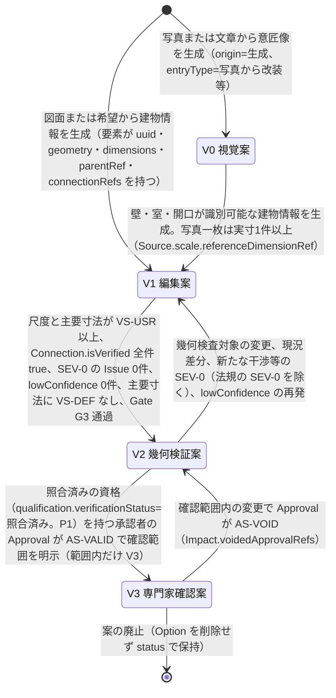
```mermaid
stateDiagram-v2
    [*] --> V0 : 写真または文章から意匠像を生成（origin=生成、entryType=写真から改装 等）
    [*] --> V1 : 図面または希望から建物情報を生成（要素が uuid・geometry・dimensions・parentRef・connectionRefs を持つ）
    V0 --> V1 : 壁・室・開口が識別可能な建物情報を生成。写真一枚は実寸1件以上（Source.scale.referenceDimensionRef）
    V1 --> V2 : 尺度と主要寸法が VS-USR 以上、Connection.isVerified 全件 true、SEV-0 の Issue 0件、lowConfidence 0件、主要寸法に VS-DEF なし、Gate G3 通過
    V2 --> V3 : 照合済みの資格（qualification.verificationStatus=照合済み。P1）を持つ承認者の Approval が AS-VALID で確認範囲を明示（範囲内だけ V3）
    V3 --> V2 : 確認範囲内の変更で Approval が AS-VOID（Impact.voidedApprovalRefs）
    V2 --> V1 : 幾何検査対象の変更、現況差分、新たな干渉等の SEV-0（法規の SEV-0 を除く）、lowConfidence の再発
    V3 --> [*] : 案の廃止（Option を削除せず status で保持）
    state "V0 視覚案" as V0
    state "V1 編集案" as V1
    state "V2 幾何検証案" as V2
    state "V3 専門家確認案" as V3
```

| 遷移 | 判定する属性（決定的検査） | 表示に写す属性 | 区分 |
|---|---|---|---|
| V1 → V2 | E-PRD-006.scale.confirmedByRef ≠ null、Wall（外壁）、Space、Door、Window、Stair、Level.floorToFloor の valueStates が VS-USR 以上、E-SYS-005.isVerified 全件 true、E-REQ-003（severity=SEV-0、status≠IS-RESOLVED）が 0 件、要素.lowConfidence=true が 0 件、E-REQ-010（G3）.status=通過 | Option.verificationState、unverifiedItemCount、watermarkText、S-30-01 信頼状態帯 | 【推定】 |
| V2 → V3 | E-REQ-007（status=AS-VALID、qualification.verificationStatus=照合済み）.scope に含まれる範囲を verificationByScope で V3 にする。未照合（本人申告）の資格による承認では V3 にしない（P0 は V3 なし。v1.2、JM-122） | verificationByScope、「誰が何をいつ確認したか」 | 【推定】 |
| 降格 | E-REQ-012.voidedApprovalRefs が非空、または E-REQ-012.issueRef が基盤 信頼状態 第1.3節の対象（幾何検査の対象の変更、干渉等）の SEV-0 を指す、または新資料取込で Overlay が更新され lowConfidence が再発。法規の SEV-0（I-06-006）では信頼状態を下げない（発行と引継ぎは第6.10節 連動9 と第22章 F-C15-013 で止める。v1.4、JR-011、JR-061） | 降格理由を Revision.reason と AuditLog に記録 | 【推定】 |
| 信頼状態に連動する確認範囲 | 信頼状態（verificationByScope）に連動する scopeKind は verificationByScope の 9 種（尺度、間取り、商品、法規、構造、外皮、設備、性能、費用）と敷地の計 10 種に限る。他の scopeKind（要求、目的文、選定、書出、例外、関係者表、分母変更）の承認の失効は Gate.status=再確認中 と Decision.status=再確認要 にだけ連動し、V は変えない（第6章 第5.3節 規則5 と同文。v1.2、JM-082） | 失効の理由を Gate.reVerificationReason に記録 | 【推定】 |

### 6.3 要素値の五状態 VS-（valueStates の各属性）

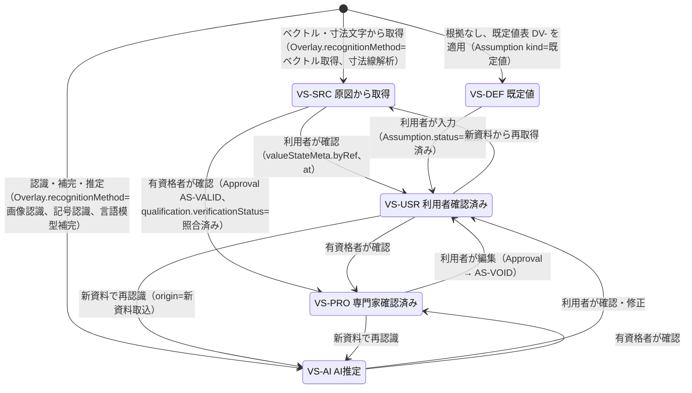
```mermaid
stateDiagram-v2
    [*] --> VS_SRC : ベクトル・寸法文字から取得（Overlay.recognitionMethod=ベクトル取得、寸法線解析）
    [*] --> VS_AI : 認識・補完・推定（Overlay.recognitionMethod=画像認識、記号認識、言語模型補完）
    [*] --> VS_DEF : 根拠なし、既定値表 DV- を適用（Assumption kind=既定値）
    VS_SRC --> VS_USR : 利用者が確認（valueStateMeta.byRef、at）
    VS_AI --> VS_USR : 利用者が確認・修正
    VS_DEF --> VS_USR : 利用者が入力（Assumption.status=置換済み）
    VS_SRC --> VS_PRO : 有資格者が確認（Approval AS-VALID、qualification.verificationStatus=照合済み）
    VS_AI --> VS_PRO : 有資格者が確認
    VS_USR --> VS_PRO : 有資格者が確認
    VS_PRO --> VS_USR : 利用者が編集（Approval → AS-VOID）
    VS_USR --> VS_AI : 新資料で再認識（origin=新資料取込）
    VS_PRO --> VS_AI : 新資料で再認識
    VS_USR --> VS_SRC : 新資料から再取得
    state "VS-SRC 原図から取得" as VS_SRC
    state "VS-AI AI推定" as VS_AI
    state "VS-DEF 既定値" as VS_DEF
    state "VS-USR 利用者確認済み" as VS_USR
    state "VS-PRO 専門家確認済み" as VS_PRO
```

| 規則 | 内容 | 区分 |
|---|---|---|
| 確定時の昇格 | ChangeCommand が確定した時、resolvedGeometry.entries に含まれる属性の valueStates を VS-USR にする（承認者が利用者の場合）。照合済みの資格（qualification.verificationStatus=照合済み。P1）を持つ承認者が承認した確認範囲の属性は VS-PRO。未照合の資格の承認者は VS-USR とする（v1.2、JM-122） | 【推定】 |
| 影響先の扱い | 変更命令の影響で再計算された属性（Quantity、導出値）は元の状態を継承し、VS-USR にはならない | 【仮定】 |
| 言語模型補完 | recognitionMethod=言語模型補完 の値は必ず VS-AI とし、決定的検査に合格した場合でも VS-SRC にはしない | 【推定】 |
| 表示 | VS- は記号と文字で表示し色だけに依存しない。VS-DEF と VS-AI は確認依頼へ直接遷移できる（S-04-04） | 【推定】（基盤 信頼状態 第10節） |

### 6.4 性能の証拠段階 EL-（E-SRV-013.evidenceRecords）

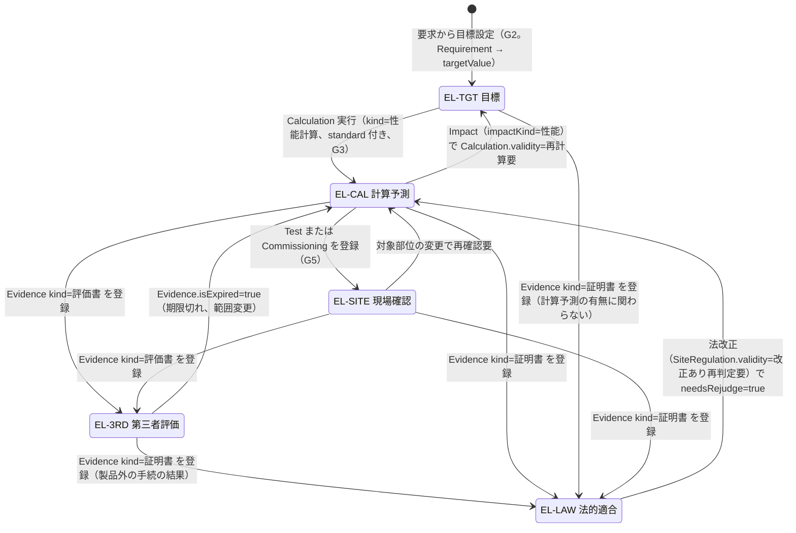
```mermaid
stateDiagram-v2
    [*] --> TGT : 要求から目標設定（G2。Requirement → targetValue）
    TGT --> CAL : Calculation 実行（kind=性能計算、standard 付き、G3）
    CAL --> SITE : Test または Commissioning を登録（G5）
    CAL --> THIRD : Evidence kind=評価書 を登録
    SITE --> THIRD : Evidence kind=評価書 を登録
    THIRD --> LAW : Evidence kind=証明書 を登録（製品外の手続の結果）
    CAL --> LAW : Evidence kind=証明書 を登録
    TGT --> LAW : Evidence kind=証明書 を登録（計算予測の有無に関わらない）
    SITE --> LAW : Evidence kind=証明書 を登録
    CAL --> TGT : Impact（impactKind=性能）で Calculation.validity=再計算要
    SITE --> CAL : 対象部位の変更で再確認要
    THIRD --> CAL : Evidence.isExpired=true（期限切れ、範囲変更）
    LAW --> CAL : 法改正（SiteRegulation.validity=改正あり再判定要）で needsRejudge=true
    state "EL-TGT 目標" as TGT
    state "EL-CAL 計算予測" as CAL
    state "EL-SITE 現場確認" as SITE
    state "EL-3RD 第三者評価" as THIRD
    state "EL-LAW 法的適合" as LAW
```

五段階は evidenceRecords に別々の記録として同時に持ち、highestValidLevel は有効な記録のうち最高の段階を示す。失効した記録は「再判定要」と表示し、合成した一つの「達成」表示を作らない（M-G-10）【推定】。

EL-LAW は計算予測の有無に関わらず、証明書（E-REQ-008 kind=証明書）の登録で任意の段階から追加できる（基盤 信頼状態 第3.2節「任意 → EL-LAW」）。ただし「法的適合」の表示は、証明書の登録と、照合済みの資格を持つ RL-CHK による scopeKind=法規 の承認（scope=証明書と対応する法規判定の条項。第6.10節 連動7）の AS-VALID がそろった性能項目だけに行い、それまでは「法的適合（確認待ち）」と表示する。未照合（本人申告）の資格による承認では表示しない（第6章 第5.2節「資格の照合状態」。U-19-003。v1.2、JM-142。v1.4、JR-012）。EL-3RD は certificateKind で設計住宅性能評価書（G4）と建設住宅性能評価書（G5、G6）を分ける【推定】。

### 6.5 現況状態 CS-（要素共通属性 conditionState）

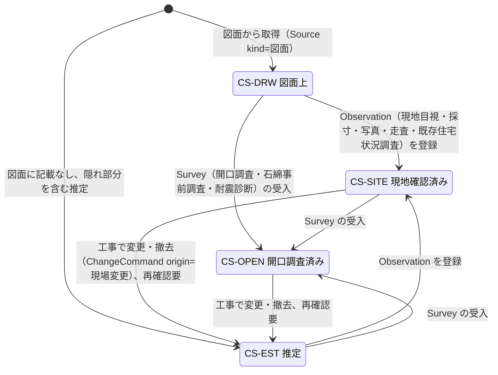
```mermaid
stateDiagram-v2
    [*] --> DRW : 図面から取得（Source kind=図面）
    [*] --> EST : 図面に記載なし、隠れ部分を含む推定
    DRW --> SITE : Observation（現地目視・採寸・写真・走査・既存住宅状況調査）を登録
    EST --> SITE : Observation を登録
    DRW --> OPEN : Survey（開口調査・石綿事前調査・耐震診断）の受入
    EST --> OPEN : Survey の受入
    SITE --> OPEN : Survey の受入
    SITE --> EST : 工事で変更・撤去（ChangeCommand origin=現場変更）、再確認要
    OPEN --> EST : 工事で変更・撤去、再確認要
    state "CS-DRW 図面上" as DRW
    state "CS-SITE 現地確認済み" as SITE
    state "CS-OPEN 開口調査済み" as OPEN
    state "CS-EST 推定" as EST
```

隠れ部分（下地、基礎、配管、配線、劣化、石綿等）は CS-OPEN または該当する専門調査の記録がない限り「無い」と表示しない。派生表示は CS-EST の要素を「推定」の表現（破線等。第15章）で描く【推定】。

既存住宅状況調査（既存住宅状況調査方法基準。非破壊で劣化事象等を調べ、調べられない部位は「調査できない」とする。SRC-319、確認日 2026-10-07【事実】）の記録で CS-SITE に上げてよいのは目視できる部位の要素だけとし、concealedParts（隠れ部分）は CS-SITE にも CS-OPEN にもしない。部位ごとの結果（劣化事象等あり、なし、調査できない）は E-SRV-001（kind=既存住宅状況調査）.findings.values[] の部位ごとの value に記録し（「調査できない」の部位は detected を持たない）、隠れ部分の推定の根拠とする。「調査できない」部位の要素の CS- は上げない（第11章 F-C02-026 と同じ規則。第21章 第2.3節と基盤 信頼状態と証拠段階 第4.2節への同じ規則の反映は 01_調査 08 第6.6節と章末の反映案による。v1.4 の追補）【推定】。

### 6.6 商品層 PT-、権利状態 RS-、供給状態 SUP-（E-PRD-001、E-PRD-005、E-PRD-007）

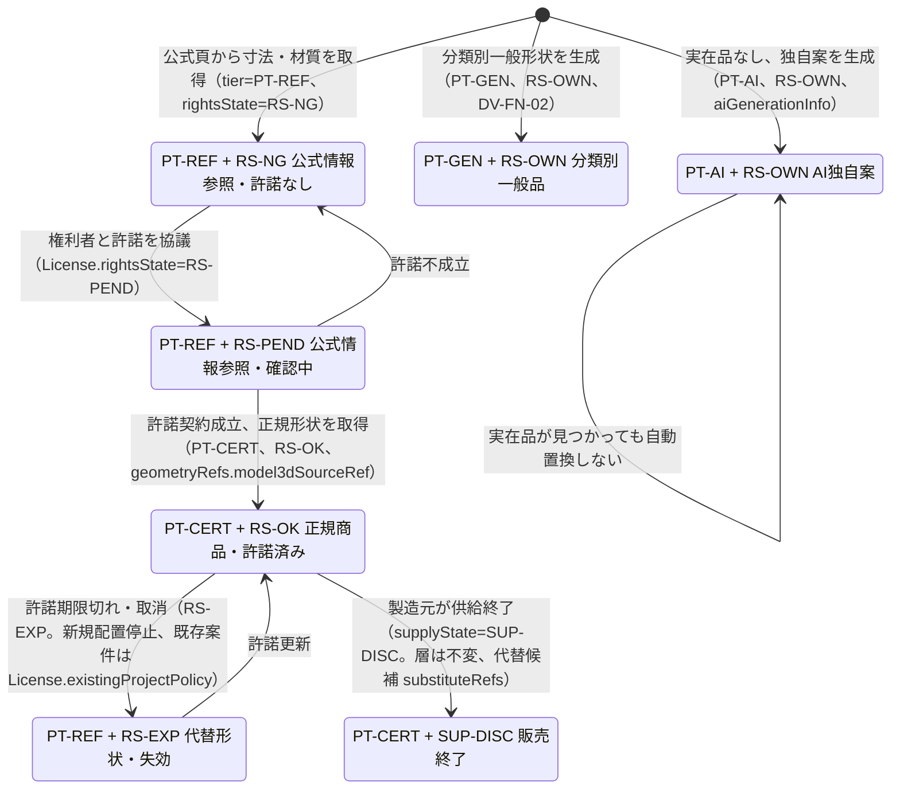
```mermaid
stateDiagram-v2
    [*] --> REF_NG : 公式頁から寸法・材質を取得（tier=PT-REF、rightsState=RS-NG）
    [*] --> GEN_OWN : 分類別一般形状を生成（PT-GEN、RS-OWN、DV-FN-02）
    [*] --> AI_OWN : 実在品なし、独自案を生成（PT-AI、RS-OWN、aiGenerationInfo）
    REF_NG --> REF_PEND : 権利者と許諾を協議（License.rightsState=RS-PEND）
    REF_PEND --> CERT_OK : 許諾契約成立、正規形状を取得（PT-CERT、RS-OK、geometryRefs.model3dSourceRef）
    REF_PEND --> REF_NG : 許諾不成立
    CERT_OK --> REF_EXP : 許諾期限切れ・取消（RS-EXP。新規配置停止、既存案件は License.existingProjectPolicy）
    REF_EXP --> CERT_OK : 許諾更新
    CERT_OK --> CERT_DISC : 製造元が供給終了（supplyState=SUP-DISC。層は不変、代替候補 substituteRefs）
    AI_OWN --> AI_OWN : 実在品が見つかっても自動置換しない
    state "PT-REF + RS-NG 公式情報参照・許諾なし" as REF_NG
    state "PT-REF + RS-PEND 公式情報参照・確認中" as REF_PEND
    state "PT-CERT + RS-OK 正規商品・許諾済み" as CERT_OK
    state "PT-REF + RS-EXP 代替形状・失効" as REF_EXP
    state "PT-CERT + SUP-DISC 販売終了" as CERT_DISC
    state "PT-GEN + RS-OWN 分類別一般品" as GEN_OWN
    state "PT-AI + RS-OWN AI独自案" as AI_OWN
```

| 規則 | 内容 | 区分 |
|---|---|---|
| 供給状態の独立 | SUP- は PT- と RS- から独立に Availability.supplyState で持つ。validUntil 超過で SUP-UNKNOWN へ戻し、在庫ありと推定しない | 【推定】 |
| 配置記録 | 要素の placementSnapshot は配置時点の tier、rightsState、supplyState、fingerprint、価格時点を複製し、台帳の現在値と相違があれば「配置後に変化」を表示する | 【仮定】（U-00-044） |
| 指紋値 | Product.fingerprint が変わった場合、配置済み要素に「形状変更あり」を表示し、自動で形状を差し替えない | 【推定】（9.6） |

### 6.7 共通情報環境の状態 CDE-（E-REQ-006、E-REQ-005、E-EXC-002、E-PRD-006、E-BLD-001）

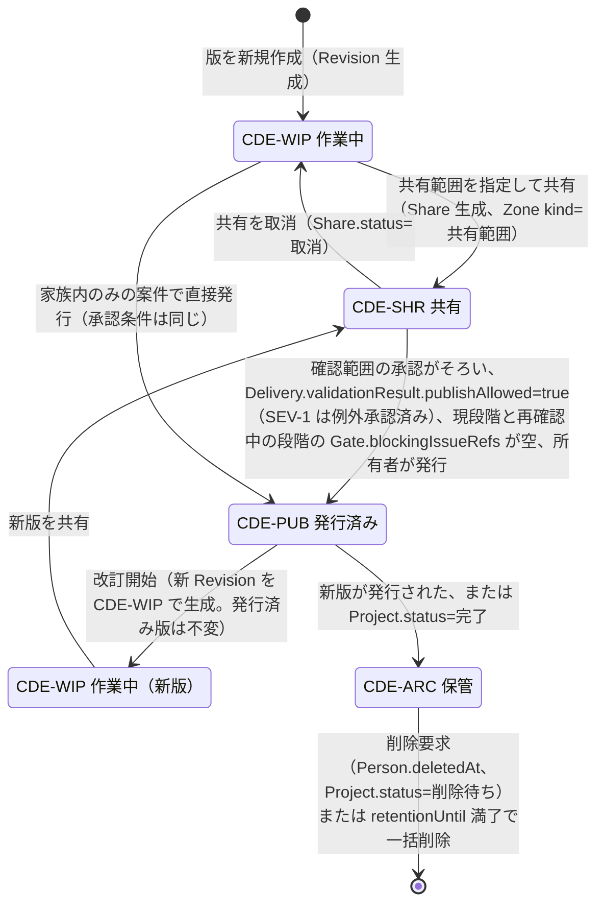
```mermaid
stateDiagram-v2
    [*] --> WIP : 版を新規作成（Revision 生成）
    WIP --> SHR : 共有範囲を指定して共有（Share 生成、Zone kind=共有範囲）
    SHR --> WIP : 共有を取消（Share.status=取消）
    SHR --> PUB : 確認範囲の承認がそろい、Delivery.validationResult.publishAllowed=true（SEV-1 は例外承認済み）、現段階と再確認中の段階の Gate.blockingIssueRefs が空、所有者が発行
    WIP --> PUB : 家族内のみの案件で直接発行（承認条件は同じ）
    PUB --> WIP2 : 改訂開始（新 Revision を CDE-WIP で生成。発行済み版は不変）
    WIP2 --> SHR : 新版を共有
    PUB --> ARC : 新版が発行された、または Project.status=完了
    ARC --> [*] : 削除要求（Person.deletedAt、Project.status=削除待ち）または retentionUntil 満了で一括削除
    state "CDE-WIP 作業中" as WIP
    state "CDE-SHR 共有" as SHR
    state "CDE-PUB 発行済み" as PUB
    state "CDE-WIP 作業中（新版）" as WIP2
    state "CDE-ARC 保管" as ARC
```

| 規則 | 内容 | 区分 |
|---|---|---|
| 発行済み版の不変 | cdeState=CDE-PUB の Revision が指す個体の属性は変更できない。変更は新しい Revision（CDE-WIP）で行う（検証規則） | 【推定】 |
| 一意性 | 同じ Option で CDE-PUB は同時に一つ（F-C03-018 の合格条件） | 【推定】 |
| 案の状態の導出 | Option.cdeState は配下の Revision の最高状態（CDE-PUB ＞ CDE-SHR ＞ CDE-WIP。全版が CDE-ARC なら CDE-ARC）から導出し、直接は書き換えない。Option を CDE-ARC にする操作（不採用案の保管等）は配下の全 Revision を CDE-ARC にし、以後のその案への ChangeCommand を拒否する（v1.2、JM-089） | 【推定】 |
| 一括削除 | 削除は Project 配下の全個体、派生表示、Source.fileRef の資料、索引、予備複製を対象にし、AuditLog（action=削除）だけを retentionUntil まで残す。障害調査用複製（E-EXC-010）の期限と期限超過の自動削除は F-C10-019（第22章）。通知（E-EXC-008）と送信記録（E-EXC-009）は Project 配下の個体として一括削除の対象に含める（v1.4） | 【推定】（9.8） |

### 6.8 変更命令の状態（E-REQ-011.status。本章が正本）

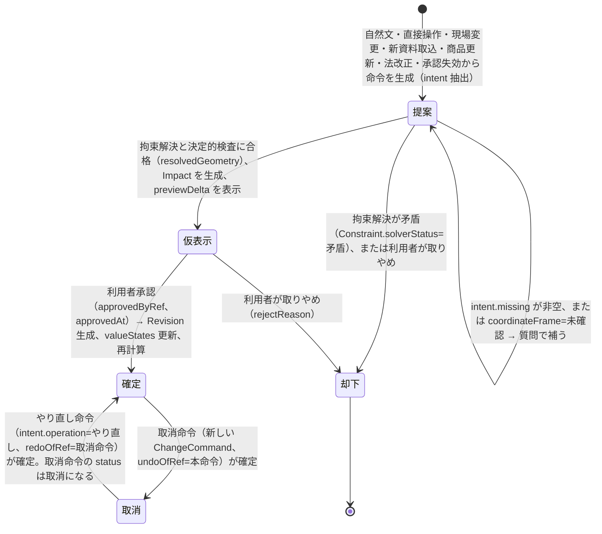
```mermaid
stateDiagram-v2
    [*] --> PROPOSED : 自然文・直接操作・現場変更・新資料取込・商品更新・法改正・承認失効から命令を生成（intent 抽出）
    PROPOSED --> PROPOSED : intent.missing が非空、または coordinateFrame=未確認 → 質問で補う
    PROPOSED --> PREVIEW : 拘束解決と決定的検査に合格（resolvedGeometry）、Impact を生成、previewDelta を表示
    PROPOSED --> REJECTED : 拘束解決が矛盾（Constraint.solverStatus=矛盾）、または利用者が取りやめ
    PREVIEW --> COMMITTED : 利用者承認（approvedByRef、approvedAt）→ Revision 生成、valueStates 更新、再計算
    PREVIEW --> REJECTED : 利用者が取りやめ（rejectReason）
    COMMITTED --> UNDONE : 取消命令（新しい ChangeCommand、undoOfRef=本命令）が確定
    UNDONE --> COMMITTED : やり直し命令（intent.operation=やり直し、redoOfRef=取消命令）が確定。取消命令の status は取消になる
    REJECTED --> [*]
    state "提案" as PROPOSED
    state "仮表示" as PREVIEW
    state "確定" as COMMITTED
    state "取消" as UNDONE
    state "却下" as REJECTED
```

| 規則 | 内容 | 区分 |
|---|---|---|
| 正本の不変 | status が「確定」になるまで正本（Revision が指す個体）は変わらない。仮表示は previewDelta と resolvedGeometry にだけ存在する（T-A-003 合格条件(2)） | 【推定】 |
| 取消の記録 | 取消は元の命令の status を「取消」に変えると同時に、origin が元と同じで intent.operation=取消 の新しい命令を生成し確定する。履歴から命令を消さない | 【推定】（基盤 情報実体骨格 第3.1節 規則6） |
| やり直し | やり直しは取消命令を対象とする新しい命令（intent.operation=やり直し、redoOfRef=取消命令）として記録し、確定時に元命令の status を「確定」へ戻し、対象の取消命令の status を「取消」にする。status の値に「やり直し」は持たない（v1.2、JM-080） | 【推定】 |
| 分岐後の取消 | 分岐案（Option.branchFromRef）が分岐点以降に確定した命令は、分岐元の履歴に影響しない。分岐点以前の命令を取り消すと、両方の案に影響するため、分岐案がある命令の取消は「分岐案にも適用」「分岐元のみ（分岐案は分岐点の版を複製して独立させる）」の選択を利用者に求める | 【仮定】 |
| 承認への影響 | 取消とやり直しも通常の確定と同じく Impact を生成し、範囲内の承認を AS-VOID にする | 【推定】 |

### 6.9 補助状態（段階門、承認、問題、同意、判断）

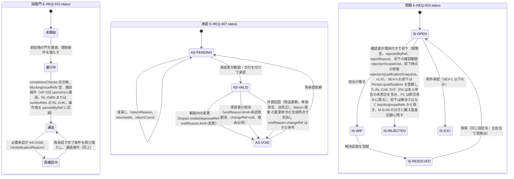
```mermaid
stateDiagram-v2
    state "段階門 E-REQ-010.status" as GATE {
        [*] --> 未開始
        未開始 --> 進行中 : 前段階の門を通過、開始条件を満たす
        進行中 --> 通過 : completionChecks 全合格、blockingIssueRefs 空、通過操作（AP-032 operation=通過。RL-OWN または verifierRefs の RL-CHK。操作者を passedByRef に記録）
        通過 --> 再確認中 : 必要承認が AS-VOID（reVerificationReason）
        再確認中 --> 通過 : 再承認で完了条件を再び満たし、通過操作（同上）
    }
    state "承認 E-REQ-007.status" as APPR {
        [*] --> AS_PENDING
        AS_PENDING --> AS_VALID : 承認者が範囲・日付を付けて承認
        AS_PENDING --> AS_PENDING : 差戻し（returnReason、returnedAt、returnCount）
        AS_VALID --> AS_VOID : 範囲内の変更（Impact.voidedApprovalRefs、voidReason.kind=変更）
        AS_VALID --> AS_VOID : 承認者の取消（voidReason.kind=承認者取消、changeRef=null、理由必須）
        AS_VALID --> AS_VOID : 外部起因（商品更新、単価改定、法改正）。status=提案 の変更命令の生成時点で失効し voidReason.changeRef はその命令
        AS_VOID --> AS_PENDING : 再承認依頼
        state "AS-PENDING" as AS_PENDING
        state "AS-VALID" as AS_VALID
        state "AS-VOID" as AS_VOID
    }
    state "問題 E-REQ-003.status" as ISS {
        [*] --> IS_OPEN
        IS_OPEN --> IS_WIP : 担当が着手
        IS_WIP --> IS_RESOLVED : 解決証拠を登録
        IS_OPEN --> IS_REJECTED : 確認者が理由付きで却下（誤警告。rejectedByRef、rejectReason、却下の確認範囲 rejectionScopeKind、却下時点の資格 rejectionQualificationSnapshot。v1.6）。SEV-0 の却下は Person.qualifications を登録した RL-CHK だけ（P0 は本人申告の未照合を含み、P1 は照合済みに限る）。却下は解決ではなく blockingIssueRefs から除き、M-G-09 の分子に数え監査記録に残す
        IS_OPEN --> IS_EXC : 例外承認（SEV-1 以下のみ）
        IS_RESOLVED --> IS_OPEN : 再発（同じ固定先・主担当で再検出）
        state "IS-OPEN" as IS_OPEN
        state "IS-WIP" as IS_WIP
        state "IS-RESOLVED" as IS_RESOLVED
        state "IS-REJECTED" as IS_REJECTED
        state "IS-EXC" as IS_EXC
    }
```

```mermaid
stateDiagram-v2
    state "同意 E-ORG-006.status" as CONS {
        [*] --> 有効 : 目的・送信先・内容を示して同意（evidenceRef）
        有効 --> 撤回 : 同意者が撤回（revokedAt。以後の送信は同意事故）
        有効 --> 期限切れ : expiresAt 超過
    }
    state "判断 E-REQ-004.status" as DEC {
        [*] --> 未着手 : 段階門の主要判断の雛形から生成（source=段階門の主要判断）
        未着手 --> 進行中 : 選択肢または要求が登録された
        進行中 --> 完了 : 七項目がそろい approvalRef が AS-VALID
        完了 --> 再確認要 : approvalRef が AS-VOID、または baseRevisionRef より新しい版で依拠要素が変更
        再確認要 --> 完了 : 再承認
        未着手 --> 除外 : denominatorHistory に理由と承認者を記録して分母から除外
        進行中 --> 除外 : 同上
        除外 --> 未着手 : 再追加（理由と承認者）
    }
```

### 6.10 状態間の連動規則

| 番号 | 契機 | 連動して変わる状態 | 検証規則 | 区分 |
|---:|---|---|---|---|
| 1 | ChangeCommand 確定 | 対象属性の VS → VS-USR（または VS-PRO）。Impact 生成（Impact.status は処理の段階だけを表し、問題化は Impact.issueRef、承認失効は Impact.voidedApprovalRefs に記録する。v1.4、JR-061）。範囲内 Approval → AS-VOID（失効の判定の入力は「変更した要素と属性（resolvedGeometry.entries の targetRef と attribute）∪ Impact.recalcTargetRefs（影響先の再計算対象）」の和集合とし、承認側は expandedScopeRefs（scope を要素へ展開したもの。表11.2-D）と scope.attributes（属性集合）で照合する。積集合が空でない AS-VALID の承認だけを AS-VOID にする。第6章 第5.3節 規則1 と同文。v1.2、JM-021）。Gate（通過済み）→ 再確認中。Decision（依拠版が古い）→ 再確認要。Calculation → 再計算要。PerformanceTarget.needsRejudge=true。Option.verificationState を再判定（降格） | kind=影響一意、主担当一意 | 【推定】 |
| 2 | Approval → AS-VALID（照合済みの資格を持つ承認者） | 範囲内の VS → VS-PRO。verificationByScope の該当範囲 → V3。Decision（該当）→ 完了 | 資格の存在（T-S-010） | 【推定】 |
| 3 | Approval → AS-VOID | verificationByScope の該当範囲 → V2（または V1）。V の降格は信頼状態に連動する 10 種の scopeKind に限る（第6.2節）。Decision → 再確認要。Gate → 再確認中。Delivery（CDE-PUB の版は不変。新版が必要と表示） | 承認失効の整合（基盤 情報実体骨格 第3.4節） | 【推定】 |
| 4 | Issue（SEV-0）登録 | Gate.blockingIssueRefs に追加。Option の V2 昇格を阻止。V2 から V1 への降格は基盤 信頼状態 第1.3節の対象（干渉等の SEV-0）に限り、法規の SEV-0（I-06-006）では信頼状態を下げない（発行と引継ぎ一式の生成は連動9 と第22章 F-C15-013 で止める。v1.4、JR-011） | 進行禁止の整合 | 【推定】 |
| 5 | Issue → IS-RESOLVED | Gate.blockingIssueRefs から除外。resolutionEvidenceRef 必須 | 解決証拠の存在 | 【推定】 |
| 6 | 新資料取込（origin=新資料取込） | Overlay 更新、VS → VS-SRC または VS-AI（確認は失効）、CS → CS-DRW 更新、Approval → AS-VOID、V 降格 | 参照切れ | 【推定】 |
| 7 | 法改正（origin=法改正） | SiteRegulation.validity → 改正あり再判定要。Calculation（法規判定）→ 再計算要。PerformanceTarget（EL-LAW）→ needsRejudge。製品が origin=法改正、status=提案 の変更命令を生成した時点で、影響範囲の Approval（scopeKind=法規）→ AS-VOID（voidReason.changeRef はその命令。v1.4、JR-019）。影響範囲は、新しい法令版で適用版が変わる条項の判定（E-SRV-004 kind=法規判定 の条項）をその命令の Impact.recalcTargetRefs とし、連動1 と同じ照合（expandedScopeRefs と scope.attributes との積集合が空でない AS-VALID）で決める。施行日が着工予定日（E-BLD-001.plannedStartDate）より後の新版は適用版が変わらないため影響範囲に入れず、承認を維持する（第6章 第5.3節 規則1、規則9、第18章 第4.7節と同じ範囲。v1.4 の追補、2026-10-07）。影響範囲の条項と対応する PerformanceTarget.evidenceRecords[EL-LAW] の証明書（E-REQ-008 kind=証明書）を scope に含む承認も AS-VOID にする。「法的適合」の表示に使う承認は scopeKind=法規（scope=証明書と対応する E-SRV-004 の条項。表11.2-D）に統一し、scopeKind=性能 の承認で「法的適合」を表示しない（v1.2、JM-136） | — | 【推定】 |
| 8 | 商品更新（origin=商品更新）、または販売終了の利用者申告の登録（E-BLD-001.userSupplyReports に status=有効 の行を追加。P0） | placementSnapshot と台帳の相違を表示。SUP-DISC で代替候補提示、RS-EXP で新規配置停止と existingProjectPolicy の適用。配置済み要素の placementSnapshot と台帳の rightsState が RS-EXP へ変わった場合、supplyState が SUP-DISC へ変わった場合、または当該案件で販売終了の利用者申告が登録された場合に限り、製品が origin=商品更新、status=提案 の変更命令を生成し、当該要素を scope に含む scopeKind=商品 の Approval → AS-VOID、G3 の門 → 再確認中（代替品の確定、「販売終了のまま維持」の判断、または申告の取消の後に再承認。v1.2、JM-081）。supplyState の SUP-UNKNOWN（接続停止、有効期限超過）と SUP-LEAD（納期超過）への変化では承認を失効させず、相違の表示だけを行う（毎日の期限切れや接続の障害で承認が失効し続けるのを避ける。第16章 第6.8節。v1.3、JM-081）。利用者申告は当該案件の推薦と表示にだけ効き、案件横断台帳の supplyState は書き換えない（第16章 第6.4節。v1.3、JM-117） | 権利条件 | 【推定】 |
| 9 | Revision → CDE-PUB | Delivery.validationResult.publishAllowed=true（SEV-0 が 0 件、SEV-1 は全件が例外承認済み）、かつ当該案の現段階と再確認中の段階の Gate.blockingIssueRefs が空であること（引継ぎ一式の生成も同じ前提。共有URL〔AP-022〕は止めず、共有の閲覧画面に未解決の進行禁止条件の一覧を表示する。v1.4、JR-011）。同じ Option の他の CDE-PUB → CDE-ARC | 欠落属性、分類不一致、単位、座標、参照切れ、権利条件、禁止表示語、信頼状態、発行済み版の九項目（E-EXC-005.kind。第14章 第6.1節と一対一） | 【推定】（v1.2、JM-076） |
| 10 | Consent → 撤回 | 該当 recipientRef への Delivery、Share を停止（status=取消）。以後の送信は AuditLog（result=拒否） | kind=同意 | 【推定】 |
| 11 | 単価改定（origin=単価改定） | Estimate.unitPriceDate が単価表（E-EXC-004 kind=単価表）の時点より古くなった時、または単価時点が DV-CO-09 の失効期間を超えた時、製品が origin=単価改定 の変更命令を生成し、Calculation（kind=費用）.validity → 再計算要、scopeKind=費用 の Approval → AS-VOID | — | 【推定】（v1.2、JM-081） |
| 12 | 法規条件の確認期限切れ（SiteRegulation.validUntil 超過） | SiteRegulation.validity → 確認期限切れ。これを参照する Calculation（法規判定）→ 再計算要。S-09-04 に期限切れを表示。G4 で判定する SEV-1 の問題（I-18-005。引継ぎの前提。v1.4、JR-011）。承認（scopeKind=法規）は失効させない（版は変わっていない） | 欠落属性（validUntil） | 【推定】（v1.2、JM-127） |

進行禁止条件の登録（v1.2、JM-019）: 第6章 第8.2節の進行禁止条件は、E-EXC-005（kind=進行禁止、expression、severity=SEV-0、appliesTo.gates、version、testRef）として登録する。連動4 の Issue（SEV-0）はこの規則が生成し、Issue.validationRuleRef に規則を持つ。例: I-06-006（法規判定の余裕量が負で未解決）は kind=進行禁止、expression={target: E-SRV-004（kind=法規判定）, condition: margin.items[].margin が負、かつ対応する I-18-002 の status が IS-RESOLVED でない}、appliesTo.gates=[G3, G4]（G3 では SEV-0 として G3 の門の通過を止め、G4 では再検査とする。I-06-003 の G1、G4 と同じ型。v1.4、JR-011）、testRef=T-R-010 とし、識別子は第18章 第4.4節と同じ I-06-006 を使う。式の正本は第6章 第8.2節に置き、本章は登録の形だけを定める【推定】。

## 7. 履歴付き変更命令の構造

### 7.1 命令の構造

| 部分 | 内容 | 属性 | 区分 |
|---|---|---|---|
| 意図 | 何を、どう、どれだけ、どの向きに、何を固定して、何のために変えるか。言語模型または操作面が生成する。正本の値ではない | intent、coordinateFrame、viewpointAtCommand | 【推定】 |
| 解決 | 意図を拘束解決と決定的検査で幾何と属性の値に落としたもの。正本へ書く唯一の経路 | resolvedGeometry（entries、solverRef、passedRuleRefs） | 【推定】 |
| 前方操作 | 確定時に正本へ適用する属性単位の書込み | resolvedGeometry.entries（targetRef、attribute、value） | 【推定】 |
| 逆操作 | 前方操作を打ち消す書込み。確定時に前の値から生成し、取消命令が使う | inverse（entries、restoreRefs、removeRefs） | 【仮定】 |
| 影響 | 影響先領域ごとの再計算対象と結果 | impactRefs → Impact | 【推定】 |
| 差分 | 確定前の仮表示（previewDelta）と確定後の版の差分（Revision.diff）。同じ構造（属性ごとの前後値）を使う | previewDelta、Revision.diff | 【推定】 |
| 承認 | 誰がいつ確定したか | approvedByRef、approvedAt | 【推定】 |
| 処理記録 | 7手順の各段階の時刻と処理名 | processingLog | 【仮定】 |

### 7.2 履歴の構造

```mermaid
erDiagram
    OPTION ||--|{ REVISION : "版の列（sequence 順）"
    REVISION }o--o| REVISION : "前版（previousRef）"
    REVISION ||--o{ CHANGE_COMMAND : "この版を生んだ命令（changeCommandRefs。kind=建物情報は 1 件以上、台帳単位の版は 0 件）"
    CHANGE_COMMAND }o--o| CHANGE_COMMAND : "取消の対象（undoOfRef）"
    CHANGE_COMMAND }o--o| CHANGE_COMMAND : "やり直しの対象（redoOfRef）"
    OPTION }o--o| OPTION : "分岐元（branchFromRef）"
    OPTION }o--o| REVISION : "分岐点の版（branchPointRevisionRef）"
    REVISION }o--o| SNAPSHOT : "完全複製（snapshotRef。DV-CO-02 の間隔）"
```

| 規則 | 内容 | 区分 |
|---|---|---|
| 線形の履歴 | 一つの案の Revision は sequence の順に一本の列をなす。分岐は新しい Option を作り、分岐点の Revision を branchPointRevisionRef に持つ。sequence は案ごとに 1 から独立に採番し（分岐案も 1 から）、分岐元との関係は branchPointRevisionRef だけで結ぶ（v1.2、JM-089） | 【仮定】 |
| 版の表示名 | 版の表示名は「案名 v主.副」とし（例: 「生活動線重視 v1.3」）、分岐案は branchRef の案名を含むため分岐元と同じ v主.副 でも一意になる。台帳単位の版は「台帳の種別 v主.副」とする（v1.2、JM-089） | 【仮定】 |
| 再生 | 任意の版の状態は、最寄りの snapshot から changeCommandRefs の前方操作を順に適用して再生する。snapshot の間隔は DV-CO-02 | 【仮定】 |
| 不変 | 確定した命令の intent、resolvedGeometry、inverse、approvedAt、appliedRevisionRef と版の diff は変更しない。status だけは現在状態として書き換えを許し、履歴は undoOfRef、redoOfRef と AuditLog から復元する。checksum に status を含めない。誤りの訂正も新しい命令として記録する（v1.2、JM-080） | 【推定】 |
| 案件横断台帳 | 台帳の実体（Product 等）の版は案件の Revision に含めない。案件側は placementSnapshot で配置時点を持つ | 【仮定】 |

### 7.3 差分確認

| 差分の種類 | 起点 | 終点 | 算出 | 表示（第15章） | 区分 |
|---|---|---|---|---|---|
| 仮表示の差分 | 現在の版 | resolvedGeometry を適用した仮の状態 | previewDelta | S-04-07（影響要素、費用差、問題の増減、2D と 3D の仮表示） | 【推定】 |
| 版間の差分 | 任意の版 | 任意の後の版 | 両版の間の Revision.diff を属性単位で合成（同じ属性は最後の値） | S-04-08 履歴欄、S-08 共有と書出（版の比較） | 【推定】 |
| 分岐案の差分 | 分岐点の版 | 各分岐案の最新版 | 分岐点からの diff を案ごとに合成し、要素単位で「追加」「削除」「変更」「同一」に分類。copy-on-write で作った個体は variantOfRef で分岐元の個体に対応付けて「変更」とする | S-03 提案比較画面（F-C03-004） | 【推定】 |
| 三方向の差分 | 分岐点の版 | 分岐元の最新版と分岐案の最新版 | 両方で変わった属性を「競合」として表示。合流は P0 では行わない（第9節 未決 U-12-004） | S-03 | 【仮定】 |
| 設計版と竣工版の差分 | 発行済み設計版 | 竣工反映版 | E-OPS-006 AsBuiltDelta（第21章） | S-14 | 【推定】 |

差分の粒度は「要素の追加、削除」と「属性の変更」の二段で、属性の変更は前後値、単位、要素値状態の前後を持つ【推定】。

### 7.4 取消とやり直し

| 手順 | 内容 | 区分 |
|---:|---|---|
| 1 | 利用者が履歴欄（S-04-08）で確定済みの命令を選び「取消」を指示する。P0 では最新の確定命令から遡る連続した範囲だけを取消可とし、途中の命令だけの取消は拒否する。依存判定による途中取消は U-12-014 の確定後に P1 で扱う（v1.2、JM-080） | 【仮定】 |
| 2 | 製品は intent.operation=取消、undoOfRef=元命令 の新しい命令を生成し、元命令の inverse を resolvedGeometry として決定的検査を通す（後続の変更で inverse が適用不能なら却下し理由を表示） | 【推定】 |
| 3 | 通常の命令と同じく Impact を生成し、previewDelta を仮表示し、利用者承認で確定する。元命令の status を「取消」にする | 【推定】 |
| 4 | やり直しは取消命令を対象に同じ流れで行い（intent.operation=やり直し、redoOfRef=取消命令）、確定時に元命令の status を「確定」へ戻し、取消命令の status を「取消」にする（第6.8節。v1.2、JM-080） | 【推定】 |
| 5 | 取消とやり直しは AuditLog（action=取消、やり直し）に記録する | 【推定】 |

受入条件（F-C03-003）: 任意の確定命令を取り消した後の版の checksum が、その命令の直前の版の checksum と一致する【推定】。

### 7.5 分岐案の作成と比較

| 手順 | 内容 | 使う属性 | 区分 |
|---:|---|---|---|
| 1 | 利用者が現在の案から「分岐案を作る」を選ぶ。三案生成（F-C03-019）も同じ仕組みで、要求台帳と敷地制約から三つの分岐案を製品が作る（生成規則は第7.8節） | Option（kind=分岐案 または 三案_*）、branchFromRef、branchPointRevisionRef | 【推定】 |
| 2 | 分岐案は分岐点までの履歴（Revision と ChangeCommand）を分岐元と共有し、分岐点以降の命令だけを自身の列に持つ。要素の個体は複製せず、分岐案で変更した要素だけ新しい個体（optionRef=分岐案、variantOfRef=分岐元の個体）を確定時に作り、未変更の要素は分岐元の個体を共有参照する（第1.5節 copy-on-write）。分岐案の版の memberRefs は分岐点の版の memberRefs から、置き換えた個体と追加、削除した個体だけを差し替えて作る | Revision.branchRef、sequence、memberRefs、要素の optionRef、variantOfRef | 【推定】 |
| 3 | 比較は分岐点からの差分を要素単位で一覧化し（追加、削除、変更、同一）、同一評価軸（evaluationAxes）の値を並べる | Revision.diff の合成、Option.evaluationAxes | 【推定】 |
| 4 | 選定は Decision（kind=選定記録）で行い、採用した分岐案が以後の主案になる。不採用案は削除せず CDE-ARC へ移す | Option.selectionDecisionRef、cdeState | 【推定】 |
| 5 | 分岐案の合流（二案の変更を一つに統合）は P0 の非対象とし、三方向差分の表示までを行う | — | 【仮定】（U-12-004） |

### 7.6 言語模型出力の未検査書込禁止の構造（F-C03-006）

| 経路 | 正本への書込み | 検査 | 区分 |
|---|---|---|---|
| 自然文 → intent | 書かない（intent は正本の値ではない） | — | 【推定】 |
| intent → resolvedGeometry | 拘束解決（Calculation kind=拘束解決、engine は決定的処理）と検証規則（isDeterministic=true）に合格した entries だけ | passedRuleRefs が空でないこと。engine に言語模型名を指定できない | 【推定】 |
| resolvedGeometry → 正本 | 確定時に前方操作として適用 | status=確定、approvedByRef ≠ null | 【推定】 |
| 言語模型補完（認識） | Overlay.recognitionMethod=言語模型補完 の値は VS-AI として正本に入るが、V2 判定では利用者確認（VS-USR）を要する | V1 → V2 の条件 | 【推定】 |
| 写実生成 | 正本へ書かない（派生表示） | 書戻し経路なし（F-C03-015、第11章） | 【推定】 |

試験（T-P- または T-S-、第23章）は「正本の書込み処理が resolvedGeometry.passedRuleRefs の空を拒否する」ことと「engine の値に言語模型名を与えた Calculation が登録を拒否される」ことを検査する【仮定】。

### 7.7 同期2Dと3D

| 規則 | 内容 | 区分 |
|---|---|---|
| 単一の幾何 | 2D の描画（平面、断面、立面）と 3D の描画は同じ geometry と dimensions から生成する。2D 専用の座標や 3D 専用の頂点を正本に持たない | 【推定】 |
| 操作面の違い | 2D 直接編集（F-C03-007）、3D 直接編集（F-C03-008）、自然文（F-C03-009〜014）は intent の生成方法が異なるだけで、resolvedGeometry 以降は同じ経路を通る | 【推定】 |
| 再描画 | 確定後、変更した要素と影響要素（Impact.recalcTargetRefs）だけを再描画する。M-P-02（変更反映時間）は approvedAt から再描画完了までを processingLog で計測する | 【推定】 |
| 整合検査 | T-P-009 は 2D、3D、自然文の各操作面で 100 件の変更を行い、他方の描画が寸法どおりであることを M-Q-19=100% で確認する | 【推定】 |

### 7.8 三案生成の生成規則（F-C03-019-01、F-C03-019-03、AP-038）

本節は三案（生活動線重視、費用重視、意匠重視）を生成する規則の正本である（第8章 第0.2節、第14章 AP-038、第24章 前提(d)はここを参照する）。言語模型は座標を担わない（第1.1節）ため、雛形の集合と規則による決定的生成とし、外部の生成模型は使わない（用語集 496 雛形三案。v1.2、JM-077）【推定】。

| 項目 | 規則 | 区分 |
|---|---|---|
| (a) 入力 | 要求台帳の必須要求（RP-MUST、RP-FORBID。G1 で承認済み）、延床面積、階数、室構成の要求値（E-REQ-001）、敷地の形状と方位（E-BLD-002.boundary、northAngle）、接道（roadAccess）、法規条件（E-SRV-011 の建蔽率、容積率、高さ。接道は roadAccess で判定する。斜線と日影の条件は P1 の判定で使い、P0 の三案生成の判定には使わない。v1.3）、既定値表の版、雛形集合の版。図面入力の案件は読み込んだ V1 案を加える | 【推定】 |
| (b) 雛形の集合と選択規則 | 雛形は E-EXC-004（kind=三案雛形）の entries として既定値表と同じ版管理で持つ。各雛形は階数（1、2）、室構成（例: 2LDK〜5LDK）、外形の型（矩形、L字）、玄関と水回りの位置の型を持つ。選択は (1) 階数と室構成が要求に一致する雛形、(2) 建築可能範囲（敷地境界から後退距離と建蔽率で縮めた多角形）に外形が収まる雛形、(3) 接道と真北に合わせた 4 方向の回転と左右反転（8 通り）の配置、の順に候補を絞る | 【仮定】 |
| (b2) 寸法の調整（v1.4、JR-057） | 候補の雛形を通り芯の単位（DV-GE-05）で X、Y 方向に伸縮し、延床面積を要求値の許容内に合わせる。各室の最小寸法（雛形の entries の室ごとの最小幅と最小面積）と建築可能範囲を下回らない範囲に限り、伸縮が 1 方向の上限を超える候補は外す（許容と上限は DV-GE-23）。伸縮量は延床の要求値との差が最小の組を選び、同点は伸縮の小さい方、次に X 方向を先とする。伸縮量は Option.generationBasis.scale に記録し、同じ入力と版で同じ寸法を再現する | 【仮定】許容は初期仮説 |
| (c) 三案の差の付け方 | 同じ候補集合から観点ごとの目的関数の最良を選ぶ。生活動線重視: 主要な生活場面（E-REQ-009）の動線距離の和と交差数の最小化。費用重視: 外周長と水回りの集約（立管候補数、水回り室の隣接）の最小化。意匠重視: 南面の開口長、吹抜けの有無、眺望側への居間の配置の最大化。三案が同じ雛形と同じ向きになった場合は次点を採り、それでも同一なら「差がない（理由）」を表示する（F-C03-019 例外(c)） | 【仮定】 |
| (d) 決定的検査の順 | 閉領域 → 接続（扉接続、上下階接続）→ 法規 4 項目（建蔽率、容積率、高さ、接道。第18章 第4.2節の P0 の項目。斜線と日影は P1 で、三案の出力には「未判定（P1）」と表示し合否に使わない。T-R-001 と同じ扱い。v1.3）→ 要求適合（complianceByOption）。不合格の候補は次点の候補で置き換え、合格した候補だけを Option（kind=三案_*、verificationState=V1）にする | 【推定】 |
| (e) 案が作れない場合 | 必須要求を満たす候補が一つもない場合は I-00-111（G2 の進行禁止）を登録し、満たせない要求と敷地の不適合の理由（狭小、旗竿、傾斜等で雛形が収まらない）を不足情報一覧として S-03 に示し、要求の変更（S-24）、図面入力、建築士の招待（P0 は S-08 の共有URL、P1 は S-07。v1.4、JR-041）へ導く。必須要求の一部を満たさない案は「必須要求 n 件を満たさない案」として表示してよいが G2 を通過させない | 【推定】 |
| (f) 図面派生の規則（F-C03-019-03。v1.4、JR-095） | 入力は V1 案（尺度が VS-USR 済み）と承認済み要求台帳。変更命令の目録は次の三種に限る: 室の用途の入替え（面積差 ±20% 以内の室の組）、間仕切の移動（耐力壁候補線、外周壁、上下階連続壁を除く内壁を DV-GE-05 の 1 単位ずつ最大 2 単位）、開口の拡大（耐力壁候補線、外周壁、上下階連続壁の上の開口を除く内壁の開口の幅を 1 単位ずつ最大 1,820 mm）。耐力壁候補線、外周壁、上下階連続壁の上の要素（外壁開口を含む）は目録の対象外とする（DV-GE-22 の適用条件と同じ。安全側。v1.6、再々確認 主2-04、主4-02、統括の決定 D37）。改装案件で目録の変更が現況要素に当たる場合は、間仕切の移動に移設を、開口の拡大に撤去と新設の組を自動で付ける（第3.3節 renovationAction、第21章 第2.1節 規則(7)。v1.6、統括の決定 D34）。目録の量は DV-GE-22。1 案当たりの変更命令は 5 件以内とし、候補は目録の順と要素の uuid の辞書順で列挙して同点も同じ順で決める。三観点の目的関数は (c)、検査は (d) と同じ。派生の命令は origin=生成 の E-REQ-011 として分岐の初版の Revision.changeCommandRefs に残し、generationBasis は method=図面派生（templateCode、templateSetVersion、orientation、scale は null）、派生元の版は Option.branchPointRevisionRef とする。目録の変更で差のある合格候補が作れない観点は (c) の「差がない（理由）」を表示する | 【仮定】目録の量は初期仮説 |
| P0 の範囲 | (a) 図面入力: 読み込んだ V1 案から (f) の目録の変更命令の組合せで三案を派生する（F-C03-019-03）。目録は耐力壁候補線、外周壁、上下階連続壁とその上の要素（外壁開口を含む）を移動、撤去、拡大の対象にしない（改装案件〔E-BLD-001.useType=改装〕の既存の壁と開口も同じ。v1.6、統括の決定 D37）。目録の外の利用者の変更命令で現況要素を削除、移動または寸法変更した場合は、撤去と移設の自動付与（寸法変更は撤去と新設の組。第3.3節 renovationAction。正本は第21章 第2.1節 規則(7)）を行い、第13章 第5.5節 式(5)で判定する（移設は移設元を、寸法変更は変更前の要素を撤去として数える。P0 の解除は元に戻す変更だけ。v1.6、再々確認 主2-03、主4-01、統括の決定 D34、D36）。(b) 希望入力: 雛形三案（F-C03-019-01）。雛形にない自由形状の生成は P1（F-C03-019-02）。ビルトインの車庫は P0 の雛形三案の候補に含めない（P1 で判断。JR-040） | 【推定】 |
| API と再現性 | AP-038「三案生成（雛形）」（長期非同期）。失敗時は I-00-111 と不足情報一覧へ退避し、部分結果を正本に書かない。使った雛形、版、向き、目的関数の値は Option.generationBasis（表11.2-A）に記録し、同じ入力と版で同じ三案を再現する | 【推定】 |

## 8. 双方向追跡の実現方法

### 8.1 順方向の参照と逆方向の索引

| 規則 | 内容 | 区分 |
|---|---|---|
| 順方向が正本 | 追跡の順方向は各実体の参照属性（末尾 Ref、Refs）が正本である。順方向の参照は確定した Revision に含まれ、版管理される | 【推定】 |
| 逆方向は索引 | 逆方向は製品が保持する追跡索引（traceIndex）で実現する。索引は `{fromRef, toRef, relation, viaAttribute, revisionRef}` の組の集合で、Revision の確定ごとに差分更新する。索引は正本ではなく、正本から再構築できる | 【仮定】 |
| 到達の定義 | 起点から終点へ「たどれる」とは、順方向の参照または索引を 1 回以上たどって終点の個体に到達し、その経路上の全個体が参照切れでないこと | 【推定】 |
| 案件横断の境界 | 案件から台帳（Product 等）への参照は順方向のみ版管理し、台帳から案件への逆参照は案件を限定した索引でだけ提供する（他案件の情報を露出しない） | 【仮定】 |

### 8.2 追跡経路表

基盤 情報実体骨格 第4節を正本として転記し、本章の属性名で経路を確定した【推定】。

| 番号 | 起点 → 終点 | 順方向の参照（正本） | 逆方向（索引の relation） | 区分 |
|---:|---|---|---|---|
| 1 | 要求 → 案 | Option.droppedRequirementRefs（result=不適合 だけ）、Decision.requirementRefs、Requirement.complianceByOption | 要求から Option の一覧（complianceByOption.result の七区分と reason。v1.4、JR-055） | 【推定】 |
| 2 | 要求 → 建築要素 | Space.requirementRefs、Requirement.realizedByRefs（索引を属性へ写す） | 要素から Requirement | 【推定】 |
| 3 | 建築要素 → 計算（→ 問題） | Calculation.inputs.elementRefs、Calculation.outputs.issueRefs | 要素から Calculation、Issue から Calculation | 【推定】（「計算 → 問題」は v1.2、JM-078） |
| 4 | 計算 → 性能項目 → 要求 | PerformanceTarget.evidenceRecords、PerformanceTarget.requirementRef | Requirement から PerformanceTarget | 【推定】 |
| 5 | 建築要素 → 商品 | 要素.productRef、placementSnapshot | Product から配置した要素（案件内） | 【推定】 |
| 6 | 商品 → 問題 | Issue.anchor.ref（商品を配置した要素）、LeadTimeRisk → Issue | Product から Issue | 【推定】 |
| 7 | 問題 → 判断 | Decision.resolvesIssueRefs、Issue.resolvedByDecisionRefs（索引） | Issue から Decision | 【推定】 |
| 8 | 判断 → 承認 | Decision.approvalRef、Decision.coApprovalRefs（合議。v1.4、JR-059）、Approval.scope | Approval から Decision | 【推定】 |
| 9 | 承認 → 書出 | Delivery.approvalRefs、Delivery.exceptionApprovalRefs（版の一致 Delivery.revisionRef = Approval.baseRevisionRef は検査に使い、経路の正本にしない） | Approval から Delivery | 【推定】（v1.2、JM-079） |
| 10 | 書出 → 建築要素 → 出典 | Delivery.revisionRef → Revision.diff.entries.targetRef → 要素 → Overlay → Source（page、sourceCoordinates） | Source から要素、Delivery | 【推定】 |
| 11 | 変更 → 影響 → 問題 → 承認失効 | ChangeCommand.impactRefs → Impact.issueRef（問題を生成または更新した場合）、Impact.voidedApprovalRefs（承認を失効させた場合） | Issue.originChangeRef、Approval.voidReason.changeRef（商品更新、単価改定、法改正の失効も status=提案 の命令を指す同じ属性に統一。v1.4、JR-019、JR-061） | 【推定】 |
| 12 | 実績 → 判断 → 要求 | PostOccupancyRecord.decisionRef、targetRef | Requirement から PostOccupancyRecord | 【推定】 |
| 13 | 要求 → 生活場面 | Requirement.lifeSceneRefs、LifeScene.requirementRefs | 双方向の属性を持つ（整合検査で一致を要求） | 【推定】 |
| 14 | 判断 → 段階門 | Gate.keyDecisionRefs、Decision.gate | Decision から Gate | 【推定】 |
| 15 | 案 → 建築要素 | Option.buildingRevisionRef → Revision.memberRefs（索引） | 要素から所属する Option の一覧（要素の optionRef と、memberRefs を逆にたどる索引） | 【推定】（v1.2、JM-074） |
| 16 | 建築要素 → 数量 → 費用項目 → 概算（→ 問題） | Quantity.elementRef、CostItem.quantityRefs、Estimate.costItemRefs、Estimate.issueRefs | 概算から費用項目、数量、要素（どの要素の数量から出た額か）、Issue から Estimate | 【推定】（v1.2、JM-078） |

### 8.3 追跡の完全性検査と要求追跡率の計測

| 項目 | 内容 | 区分 |
|---|---|---|
| 完全性検査 | 検証規則（kind=参照切れ）は、全参照属性の参照先が同じ案件または台帳に存在し deletedAt が null であることを、Revision 確定時と書出時に検査する | 【推定】 |
| 双方向一致 | 双方向の属性を持つ組（Requirement.lifeSceneRefs ↔ LifeScene.requirementRefs、Issue.resolvedByDecisionRefs ↔ Decision.resolvesIssueRefs、要素.childRefs ↔ parentRef）は、索引更新時に一致を検査し、不一致は SEV-2 の Issue にする | 【仮定】 |
| M-G-01 の計測 | 起点は Requirement（要求）。分母: priority が RP-MUST または RP-FORBID の Requirement 数。分子: そのうち sourceRef と verifierRef が非 null で、経路1（案）、経路2（要素）、経路1 の Decision.requirementRefs（判断）と経路8（判断 → 承認）を順方向と逆方向の両方でたどれた数。kind=費用 の要求は経路2（要素）の代わりに経路16 の終点（概算。Estimate と要求の照合記録）への到達で判定し、他の kind の要求には費用への到達を課さない。計測時点は G1 以降の各門通過時と G4。層別は段階、入口、優先度。初期仮説 95% 以上 | 【推定】（基盤 画面指標試験骨格 M-G-01。判断の経路と費用の扱いは v1.2、JM-078） |
| 計測の出力 | 案件ごとに `{requirementRef, reachable:{option:bool, element:bool, decision:bool, approval:bool, cost:bool}, missing:list[str]}` を要求台帳画面（S-24）に表示する。cost は kind=費用 の要求だけが持つ | 【仮定】 |

### 8.4 追跡表（第10章）との関係

第10章の追跡表は仕様識別子（完成像、必要成果、機能、情報、画面、指標、試験）の間の対応であり、本節の追跡は実行時個体の間の参照である。第10章は本章の実体識別子 E- と属性名を「情報」列に使い、本節の経路番号を「双方向追跡の根拠」として参照する【推定】。

## 9. 自然文変更の7手順の情報処理

### 9.1 手順ごとの入力、処理主体、出力

指示文C3の順序を、処理主体（言語模型か決定的処理か）と実体の属性で固定する【推定】。言語模型が担当するのは手順1の抽出と各手順の説明文の生成だけであり、手順2以降の判定と値の生成は決定的処理が行う。

| 手順 | 内容 | 入力 | 処理主体 | 出力（実体.属性） | 失敗時の扱い | 画面部品 | 区分 |
|---:|---|---|---|---|---|---|---|
| 1 | 対象、操作、量、方向、固定条件、目的を抽出 | 自然文（intent.rawText）、現在の案の要素一覧、選択中の要素、要求台帳 | 言語模型（抽出）＋ 決定的処理（対象名から uuid への解決、単位の正規化） | ChangeCommand（status=提案）、intent.targetRefs、operation、amount、unit、direction、fixedRefs、fixedConstraints、purpose、missing | missing が非空: 不足要素ごとに一問ずつ質問（例「どの室の壁ですか」）。対象が複数候補: 候補を列挙して選択を求める。対象が存在しない: 却下せず「追加」の意図か確認 | S-04-06 対話欄（抽出結果の確認表示） | 【推定】 |
| 2 | 相対表現を平面座標か視点座標か確認 | intent.direction（右、左、奥、手前、東 等）、viewpointAtCommand | 決定的処理（方位語は平面座標、視点語は未確認とする規則） | coordinateFrame（平面座標 または 視点座標）、direction を案件座標系の方向ベクトルへ変換 | coordinateFrame=未確認 のまま手順3へ進めない（検証規則）。「右」等は必ず確認質問を出す（F-C03-010 の合格条件）。方位語（東、南）は確認なしで平面座標 | S-04-06（座標系の確認） | 【推定】 |
| 3 | 寸法、干渉、避難、採光、構造、外皮、設備、費用、工程、維持管理への影響を予測 | intent、coordinateFrame、現在の版、影響関係表（十二判断領域 第2節）、primaryDomain | 決定的処理（拘束解決 → resolvedGeometry、影響先領域ごとの Impact 生成、再計算対象の列挙。P0 は影響先の列挙と注意、P1 は再計算） | resolvedGeometry、impactRefs（affectedDomain ごとに1件、影響なしも1件）、Impact.recalcTargetRefs、delta、Calculation（kind=拘束解決、干渉検査）、primaryDomain（候補が複数なら Decision kind=主担当判定 を仮置き） | 拘束が矛盾: status=却下、矛盾した Constraint を表示。干渉が SEV-0: 仮表示に SEV-0 を表示し確定を止めない（確定後に進行禁止） | S-04-07（影響計算中の待機状態 -W、拘束解決失敗 -X） | 【推定】 |
| 4 | 影響する要素を一覧表示 | Impact.recalcTargetRefs、delta | 決定的処理（要素単位の集約） | previewDelta.affectedElementRefs、issueDelta、approvalDelta、costDelta、performanceDelta、scheduleDeltaDays | 影響要素が 0 件: 「影響先なし」と明示 | S-04-07（一覧。選択で 2D と 3D の該当要素を強調） | 【推定】 |
| 5 | 3D と 2D の差分を仮表示 | resolvedGeometry、previewDelta | 決定的処理（派生表示の仮生成。正本は不変） | previewDelta.geometry2d、geometry3d、status=仮表示 | 再描画失敗: 一覧のみ表示し「仮表示不可」を出す | S-04-02、S-04-03（仮表示の重ね）、S-30-01（信頼状態帯は現状のまま） | 【推定】 |
| 6 | 利用者承認後に確定 | 承認操作（決定権「変更の確定」を持つ関係者） | 決定的処理（前方操作の適用、Revision 生成、inverse 生成、valueStates 更新） | status=確定、approvedByRef、approvedAt、appliedRevisionRef、Revision.diff、要素.valueStates → VS-USR、AuditLog | 決定権のない利用者: 承認不可、決定者へ通知。承認前の離脱: status=提案 または 仮表示 のまま履歴に残す | S-04-07（確定と取消）、S-04-08 | 【推定】 |
| 7 | 要求台帳と問題一覧を再計算 | Revision、Impact | 決定的処理（要求適合の再判定、Issue の更新または新規、Approval の自動失効、Gate の再確認中、Calculation の再計算要、V の再判定） | Requirement.complianceByOption、Issue（更新または新規1件）、Approval.status、Gate.status、Option.verificationState、unverifiedItemCount、Estimate.totalRange | 再計算が既定時間（M-P-02 の 95 百分位）を超える: 部分結果を表示し「再計算中」を出す | S-24 要求台帳、S-23 問題一覧、S-13 段階門、S-30-01 | 【推定】 |

### 9.2 intent の抽出規則

| 要素 | 抽出の規則 | 正規化 | 区分 |
|---|---|---|---|
| 対象 | 室名、要素種別と位置（「居間の南の窓」）、選択中の要素、直前の対話の対象。複数候補は候補一覧を返す | uuid の一覧（targetRefs） | 【推定】 |
| 操作 | 移動、寸法変更（広げる、狭める、高くする）、追加、削除、置換（別の商品に）、回転、属性変更（色、材料） | operation の enum | 【推定】 |
| 量 | 数値と単位（600 mm、60 cm、2 畳、1 間）。単位なしは mm と仮定せず質問する | amount（mm、deg、個）。畳と間は既定値表 DV-GE-05、DV-GE-08 で換算し「換算値」と表示 | 【推定】 |
| 方向 | 東西南北、上下、右左奥手前、「〜側へ」 | direction（案件座標系のベクトル。手順2で確定） | 【推定】 |
| 固定条件 | 「〜は保持」「〜を変えずに」「〜以上を保つ」 | fixedRefs（要素）、fixedConstraints（Constraint の式へ変換。例: 廊下幅 900 mm 以上 → Requirement R-12-001 との適合を検査） | 【推定】 |
| 目的 | 「明るくしたい」「家具を置きたい」 | purpose（文字列。Requirement の候補として提示） | 【推定】 |

### 9.3 例示: 「居間を 600 mm 広げ、廊下幅は 900 mm 以上を保持」（T-A-003）

| 手順 | 値 | 区分 |
|---:|---|---|
| 前提 | 要求台帳に R-12-001「廊下幅 900 mm 以上」（priority=RP-MUST、valueRange={min:900, unit:mm, operator:以上}、primaryDomain=A03）。V1 の案。居間（Space 例示 uuid A）、廊下（Space B）、両室の境界壁（Wall W1、内壁、厚さ 130 VS-DEF） | 【推定】 |
| 1 | intent={targetRefs:[A], operation:寸法変更, amount:600, unit:mm, direction:未指定, fixedRefs:[B], fixedConstraints:["B.minClearWidth ≥ 900"], purpose:null, missing:[方向], rawText:"居間を600 mm広げ、廊下幅は900 mm以上を保持"}。質問「どちら側へ広げますか（北側の廊下側、南側の庭側）」 | 【推定】 |
| 2 | 利用者「廊下側」→ direction=北（平面座標。方位語に変換）、coordinateFrame=平面座標 | 【推定】 |
| 3 | 拘束解決: W1.centerline を北へ 600 移動。B.polygon を再計算 → B.minClearWidth=850 → fixedConstraints 違反。解決候補: (a) 600 → 550 に減らす（B=900）、(b) 廊下の反対側の壁 W2 を 50 北へ移動（隣室 C が 50 縮む）。Impact: A03（適合。要求 R-12-001 不適合）、A04（荷重。W1.isLoadBearing=null → 構造注意 Issue の候補）、A06（経路。W1 内の配線 Route を再検査）、A09（数量。壁面積、床仕上面積の Quantity 更新 → costDelta）、A12（改訂。scopeKind=間取り の Approval を失効対象に列挙）。他の領域は status=影響なし で1件ずつ | 【推定】 |
| 4 | affectedElementRefs=[W1, A, B, Door D1（W1 上の扉）, Route R1]、issueDelta.added=[I-12-001「廊下幅 850 mm が要求 R-12-001（900 mm 以上）を満たさない」（primaryDomain=A03、severity=SEV-1、anchor=B）]、costDelta={min:+40,000, max:+120,000, unit:JPY}（初期仮説の例示値）、approvalDelta=[間取りの承認] | 【推定】 |
| 5 | 2D と 3D に W1 の新旧位置、A と B の新旧輪郭を重ねて仮表示。信頼状態帯は V1 のまま | 【推定】 |
| 6 | 利用者が候補 (a) を選び承認 → status=確定、Revision v1.4 生成、W1.centerline と A.polygon、B.polygon の valueStates → VS-USR、I-12-001 は生成されない（候補 (a) で解消）。候補なしで 600 のまま確定した場合は I-12-001 を登録 | 【推定】 |
| 7 | R-12-001 の complianceByOption を再判定（適合）。間取りの Approval → AS-VOID（存在した場合）。G2 が通過済みなら 再確認中。Estimate.totalRange 更新。unverifiedItemCount 再計算 | 【推定】 |

合格条件（T-A-003）との対応: (1) 手順4と5が確定前に表示される。(2) 手順6まで正本が変わらない。(3) 900 mm 未満で確定した場合に I-12-001 が登録される。(4) 手順7で要求台帳と問題一覧が再計算される【推定】。

## 10. IFC、IDS、BCF、bSDD への対応表

### 10.1 前提

| 項目 | 内容 | 区分 |
|---|---|---|
| IFC の版 | 書出の既定は IFC4 ADD2 TC1（ISO 16739-1:2018）、選択で IFC 4.3.2.0（ISO 16739-1:2024。2024年1月に ISO 最終標準として承認と buildingSMART が告知） | 【事実】（検索結果経由。https://www.buildingsmart.org/ifc-4-3-approved-as-a-final-standard/ 、https://api.github.com/repos/buildingSMART/IFC/releases 、確認日 2026-09-15。公式頁本文は HTTP 403 のため未確認 U-00-001） |
| IDS の版 | IDS 1.0（2024-06-03 に v1.0.0「Final buildingSMART Standard」）。.ids は metadata と specification（applicability と requirements）から成り、facet は Entity、Attribute、Classification、Property、Material、PartOf の6種、cardinality は required、optional、prohibited | 【事実】（https://api.github.com/repos/buildingSMART/IDS/releases 、https://raw.githubusercontent.com/buildingSMART/IDS/master/Documentation/UserManual/README.md 、確認日 2026-09-15） |
| BCF の版 | BCF-XML 3.0（2021-06-18）。Topic の必須属性は Guid、TopicType、TopicStatus、Title、CreationDate、CreationAuthor。任意は Priority、DueDate、AssignedTo、Labels、Stage、Description 等。Viewpoint は Components、Camera、ClippingPlanes、Lines。IFC 参照は IfcGuid | 【事実】（https://github.com/buildingSMART/BCF-XML/blob/release_3_0/Documentation/README.md 、https://api.github.com/repos/buildingSMART/BCF-XML/releases 、確認日 2026-09-15） |
| bSDD の構造 | Dictionary（OrganizationCode、DictionaryCode、DictionaryVersion、LanguageIsoCode、Status Preview/Active/Inactive、License SPDX、ReleaseDate）、Class（Code、Name、ClassType、Definition、ParentClassCode、RelatedIfcEntityNamesList、ClassProperties）、Property（Code、Name、DataType、Units、AllowedValues、MinInclusive/MaxInclusive）。Active 化後は URI 不変 | 【事実】（https://github.com/buildingSMART/bSDD/blob/master/Documentation/bSDD%20JSON%20import%20model.md 、確認日 2026-09-15。不変性は検索結果経由） |
| glTF | glTF 2.0（ISO/IEC 12113:2022）。表示専用の派生形式とし、保存形式にしない | 【事実】（https://www.khronos.org/gltf/ 、確認日 2026-09-15） |
| IFC クラス名 | 本節の IFC クラス名は IFC4 系の一般名称であり、IFC 4.3.2.0 の正式名称との照合は未確認（U-00-001）。「近似」は意味が完全に一致しない対応 | 【未確認】 |
| 独自属性集合 | 五状態、確信度、現況状態、信頼状態、主担当領域は IFC の標準属性集合にないため独自の属性集合として書き出す。名称は本章の仮案（第10.3節）であり U-00-040 の判断待ち。標準の Pset_ 接頭辞は buildingSMART が定義する属性集合に使われるため、独自集合には別の接頭辞を使う | 【推定】 |

### 10.2 実体 → IFC クラスの対応表（94実体。E-ORG-009 は v1.3、E-EXC-008〜010 は v1.4 の追補）

| 実体 | IFC クラス（IFC4 系） | 対応の種類 | 対応しない場合の運び方 | 区分 |
|---|---|---|---|---|
| E-BLD-001 Project | IfcProject | 直接 | — | 【推定】 |
| E-BLD-002 Site | IfcSite（Pset_SiteCommon で一部属性） | 直接 | address は書出既定で除外（機密） | 【推定】 |
| E-BLD-003 Building | IfcBuilding | 直接 | — | 【推定】 |
| E-BLD-004 Level | IfcBuildingStorey（Elevation） | 直接 | — | 【推定】 |
| E-BLD-005 Grid | IfcGrid、IfcGridAxis | 直接 | — | 【推定】 |
| E-SPC-001 Space | IfcSpace（Qto_SpaceBaseQuantities） | 直接 | — | 【推定】 |
| E-SPC-002 Zone | IfcZone | 直接 | — | 【推定】 |
| E-ELM-001 Wall | IfcWall（Pset_WallCommon） | 直接 | — | 【推定】 |
| E-ELM-002 Slab | IfcSlab（基礎は IfcFooting） | 直接 | — | 【推定】 |
| E-ELM-003 Roof | IfcRoof | 直接 | — | 【推定】 |
| E-ELM-004 Ceiling | IfcCovering（PredefinedType=CEILING） | 直接 | — | 【推定】 |
| E-ELM-005 Column | IfcColumn | 直接 | — | 【推定】 |
| E-ELM-006 Beam | IfcBeam | 直接 | — | 【推定】 |
| E-ELM-007 Door | IfcDoor（Pset_DoorCommon） | 直接 | swing は IfcDoor の OperationType で近似 | 【推定】 |
| E-ELM-008 Window | IfcWindow（Pset_WindowCommon） | 直接 | — | 【推定】 |
| E-ELM-009 Stair | IfcStair、IfcStairFlight | 直接 | — | 【推定】 |
| E-ELM-010 Railing | IfcRailing | 直接 | — | 【推定】 |
| E-ELM-011 Fixture | IfcSanitaryTerminal（衛生器具）、IfcFurnishingElement（造付） | 近似 | 点検口は IfcBuildingElementProxy | 【推定】 |
| E-ELM-012 Equipment | IfcDistributionElement 系（IfcEnergyConversionDevice、IfcFlowTerminal 等） | 近似 | 種別ごとの下位クラスは第13章 | 【推定】 |
| E-ELM-013 Furniture | IfcFurniture | 直接 | placementSnapshot は独自属性集合 | 【推定】 |
| E-ELM-014 Light | IfcLightFixture | 直接 | — | 【推定】 |
| E-ELM-015 Landscape | IfcGeographicElement | 近似 | — | 【推定】 |
| E-ELM-016 ExternalWork | IfcCivilElement、IfcPavement（IFC 4.3） | 近似 | 擁壁は IfcWall（PredefinedType=RETAININGWALL）近似 | 【推定】 |
| E-MAT-001 Material | IfcMaterial | 直接 | — | 【推定】 |
| E-MAT-002 Finish | IfcCovering（FLOORING、CLADDING 等） | 直接 | — | 【推定】 |
| E-MAT-003 Assembly | IfcMaterialLayerSet | 直接 | — | 【推定】 |
| E-MAT-004 Layer | IfcMaterialLayer | 直接 | roles は独自属性集合 | 【推定】 |
| E-MAT-005 Junction | なし（IfcRelConnectsPathElements で近似） | 近似 | 不合格の検査結果は Issue を生成して BCF で運ぶ（第10.6節。v1.4、JR-062） | 【推定】 |
| E-SYS-001 StructuralSystem | IfcSystem（IFC 4.3 では IfcBuildingSystem）、IfcStructuralAnalysisModel 近似 | 近似 | loadPath は独自属性集合 | 【推定】 |
| E-SYS-002 ServiceSystem | IfcDistributionSystem | 直接 | — | 【推定】 |
| E-SYS-003 Route | なし（IfcFlowSegment の集合と IfcDistributionPort で近似） | 近似 | 動線と避難は IFC に書き出さず、要求台帳（JSON）と PDF に運ぶ | 【推定】 |
| E-SYS-004 Penetration | IfcOpeningElement（IfcRelVoidsElement） | 直接 | 処理状態は独自属性集合 | 【推定】 |
| E-SYS-005 Connection | IfcRelSpaceBoundary、IfcRelConnectsElements | 直接 | isVerified は独自属性集合 | 【推定】 |
| E-REQ-001 Requirement | IfcConstraint（IfcObjective）近似 | 近似 | 要求台帳（JSON、PDF）が正本の運び方 | 【推定】 |
| E-REQ-002 Constraint | IfcConstraint（IfcMetric） | 近似 | 同上 | 【推定】 |
| E-REQ-003 Issue | なし | 対応しない | BCF 3.0 Topic（第10.6節） | 【推定】 |
| E-REQ-004 Decision | なし | 対応しない | 判断記録（JSON、PDF） | 【推定】 |
| E-REQ-005 Option | なし（案ごとに別の IFC ファイル。IfcProject 単位） | 対応しない | 案ごとに書出。信頼状態は独自属性集合 | 【推定】 |
| E-REQ-006 Revision | IfcOwnerHistory（部分） | 近似 | 版名と発行状態は IfcOwnerHistory と独自属性集合 | 【推定】 |
| E-REQ-007 Approval | IfcApproval | 直接 | 確認範囲は独自属性集合 | 【推定】 |
| E-REQ-008 Evidence | IfcDocumentReference 近似 | 近似 | 証拠段階は独自属性集合 | 【推定】 |
| E-REQ-009 LifeScene | なし | 対応しない | 要求台帳の付属（JSON） | 【推定】 |
| E-REQ-010 Gate | なし | 対応しない | 情報要求適合表と責任表（JSON、PDF） | 【推定】 |
| E-REQ-011 ChangeCommand | なし | 対応しない | 変更記録（JSON。G5 の変更記録は PDF） | 【推定】 |
| E-REQ-012 Impact | なし | 対応しない | 問題一覧（BCF）と変更記録（JSON） | 【推定】 |
| E-PRD-001 Product | IfcTypeProduct（IfcFurnitureType 等）近似 | 近似 | 層と権利状態は独自属性集合。RS-OK 以外の形状は代替形状で書出 | 【推定】 |
| E-PRD-002 Brand | IfcOrganization 近似 | 近似 | — | 【推定】 |
| E-PRD-003 Supplier | IfcOrganization ＋ IfcActorRole（SUPPLIER）近似 | 近似 | 関係区分は独自属性集合 | 【推定】 |
| E-PRD-004 Asset | IfcAsset | 直接 | 機器台帳（JSON、PDF） | 【推定】 |
| E-PRD-005 License | なし | 対応しない | 書出の権利条件一覧（JSON、PDF） | 【推定】 |
| E-PRD-006 Source | IfcDocumentInformation、IfcDocumentReference | 直接 | 資料本体は書出に含めない（参照のみ） | 【推定】 |
| E-PRD-007 Availability | なし | 対応しない | 商品一覧（JSON、PDF） | 【推定】 |
| E-ORG-001 Person | IfcPerson | 直接 | contact は書出既定で除外 | 【推定】 |
| E-ORG-002 Organization | IfcOrganization | 直接 | — | 【推定】 |
| E-ORG-003 Portfolio | なし | 対応しない | 書出対象外 | 【推定】 |
| E-ORG-004 ServiceArea | なし（IfcPostalAddress 近似） | 対応しない | 書出対象外 | 【推定】 |
| E-ORG-005 Fee | なし（IfcCostItem 近似） | 対応しない | 書出対象外 | 【推定】 |
| E-ORG-006 Consent | なし | 対応しない | 書出対象外（AuditLog に記録） | 【推定】 |
| E-ORG-007 Responsibility | IfcActorRole 近似 | 近似 | 責任表（JSON、PDF） | 【推定】 |
| E-ORG-008 Stakeholder | IfcActor | 近似 | 関係者表（JSON、PDF。label のみ、個人情報は除外） | 【推定】 |
| E-ORG-009 Reservation | なし | 対応しない | 書出対象外（送信と状態の変更は AuditLog に記録。v1.3 の追補） | 【推定】 |
| E-SRV-001 Survey | なし（IfcDocumentInformation 近似） | 近似 | 不足調査一覧（JSON、PDF） | 【推定】 |
| E-SRV-002 Observation | なし | 対応しない | 現況状態を独自属性集合で運ぶ | 【推定】 |
| E-SRV-003 Test | なし（IfcTask 近似） | 近似 | 検査記録（JSON、PDF） | 【推定】 |
| E-SRV-004 Calculation | なし（結果は IfcPropertySet） | 近似 | 計算条件と版は独自属性集合 | 【推定】 |
| E-SRV-005 Estimate | IfcCostSchedule | 直接 | 概算（JSON、PDF） | 【推定】 |
| E-SRV-006 Quantity | IfcElementQuantity（IfcQuantityLength、IfcQuantityArea 等） | 直接 | — | 【推定】 |
| E-SRV-007 Risk | Pset_Risk（属性集合、近似） | 近似 | 主要危険一覧（PDF） | 【推定】 |
| E-SRV-008 Assumption | なし | 対応しない | 独自属性集合（既定値の別）と仮定一覧（PDF） | 【推定】 |
| E-SRV-009 Overlay | なし | 対応しない | 独自属性集合（元頁、元座標） | 【推定】 |
| E-SRV-010 Confidence | なし | 対応しない | 独自属性集合（確信度） | 【推定】 |
| E-SRV-011 SiteRegulation | なし（Pset_SiteCommon の BuildableArea、SiteCoverageRatio、FloorAreaRatio で一部近似） | 近似 | 敷地根拠（PDF） | 【推定】 |
| E-SRV-012 HazardInfo | なし | 対応しない | 敷地根拠（PDF）、出典一覧 | 【推定】 |
| E-SRV-013 PerformanceTarget | なし（各 Pset_ の計算値で一部近似。例: Pset_WallCommon.ThermalTransmittance） | 近似 | 性能比較（PDF）。証拠段階は独自属性集合 | 【推定】 |
| E-SRV-014 CostItem | IfcCostItem | 直接 | — | 【推定】 |
| E-SRV-015 Schedule | IfcWorkSchedule、IfcTask | 直接 | — | 【推定】 |
| E-SRV-016 LeadTimeRisk | なし | 対応しない | 期間（PDF）、商品一覧 | 【推定】 |
| E-EXC-001 InformationRequirement | なし（IDS 1.0 の specification に対応） | IDS | .ids ファイル | 【推定】 |
| E-EXC-002 Delivery | なし（IFC ファイル自体。IfcDocumentInformation 近似） | 対応しない | 交換資料一式の目録（JSON） | 【推定】 |
| E-EXC-003 Classification | IfcClassification、IfcClassificationReference | 直接 | — | 【推定】 |
| E-EXC-004 Dictionary | なし（bSDD Dictionary に対応） | bSDD | 辞書の公開（bSDD JSON） | 【推定】 |
| E-EXC-005 ValidationRule | なし（IDS 1.0 の specification に一部対応） | IDS | 検査結果は情報要求適合表 | 【推定】 |
| E-EXC-006 Share | なし | 対応しない | 書出対象外 | 【推定】 |
| E-EXC-007 AuditLog | なし | 対応しない | 書出対象外 | 【推定】 |
| E-EXC-008 Notification | なし | 対応しない | 書出対象外（v1.4） | 【推定】 |
| E-EXC-009 Transmission | なし | 対応しない | 書出対象外（v1.4） | 【推定】 |
| E-EXC-010 DebugCopy | なし | 対応しない | 書出対象外（v1.4） | 【推定】 |
| E-OPS-001 Commissioning | なし | 対応しない | 機器台帳（JSON、PDF） | 【推定】 |
| E-OPS-002 Manual | IfcDocumentInformation 近似 | 近似 | — | 【推定】 |
| E-OPS-003 Warranty | Pset_Warranty（属性集合、近似） | 近似 | — | 【推定】 |
| E-OPS-004 MaintenanceTask | IfcTask（IfcWorkSchedule） | 直接 | — | 【推定】 |
| E-OPS-005 ReplacementCycle | Pset_ServiceLife（属性集合、近似） | 近似 | — | 【推定】 |
| E-OPS-006 AsBuiltDelta | なし | 対応しない | 竣工差分（BCF Topic と JSON） | 【推定】 |
| E-OPS-007 PostOccupancyRecord | なし | 対応しない | 書出対象外（匿名化した学び一覧は別） | 【推定】 |

### 10.3 属性 → 属性集合（Pset）の対応と独自属性集合

| 本章の属性 | 標準の属性集合と属性（IFC4 系） | 独自属性集合（仮案、U-00-040） | 区分 |
|---|---|---|---|
| uuid、ifcGuid | IfcRoot.GlobalId（ifcGuid） | DDI_Identity.Uuid、HumanId、ProjectId | 【推定】 |
| version、revisionRef | IfcOwnerHistory（ChangeAction、LastModifiedDate） | DDI_Identity.Version、RevisionSequence、CdeState | 【推定】 |
| sourceRef、Overlay.page、sourceCoordinates | IfcDocumentReference（Location、Identification） | DDI_Provenance.SourceId、Page、SourceCoordinates、RecognitionMethod | 【推定】 |
| confidence、lowConfidence | なし | DDI_Provenance.Confidence、IsLowConfidence | 【推定】 |
| valueStates（属性ごと） | なし | DDI_Provenance.ValueState_{属性名}（値は VS-SRC〜VS-PRO）。IDS の Property facet で `DDI_Provenance.ValueState_Thickness = VS-USR` のように要求できる | 【推定】 |
| conditionState、renovationAction | なし | DDI_Condition.ConditionState、RenovationAction | 【推定】 |
| Option.verificationState、verificationByScope、unverifiedItemCount | なし | DDI_Verification.VerificationState、VerificationByScope、UnverifiedItemCount、WatermarkText（IfcProject に付す） | 【推定】 |
| Approval.scopeKind、scope、qualification | IfcApproval（Identifier、Status、Level、Qualifier） | DDI_Verification.ApprovalScope、ApproverQualification | 【推定】 |
| primaryDomain、affectedDomains | なし | DDI_Domain.PrimaryDomain、AffectedDomains | 【推定】 |
| Wall.isLoadBearing | Pset_WallCommon.LoadBearing | — | 【推定】 |
| Wall.fireRating、Door.fireRating | Pset_WallCommon.FireRating、Pset_DoorCommon.FireRating | — | 【推定】 |
| Wall.kind=外壁 | Pset_WallCommon.IsExternal | — | 【推定】 |
| Assembly.uValue | Pset_WallCommon.ThermalTransmittance（該当要素の Pset） | DDI_Evidence.EvidenceLevel（EL-CAL）、CalculationStandard、CalculationVersion | 【推定】 |
| Level.elevation、floorToFloor | IfcBuildingStorey.Elevation、Qto_BuildingStoreyBaseQuantities.GrossHeight | — | 【推定】 |
| Space.area、ceilingHeight | Qto_SpaceBaseQuantities.NetFloorArea、Height | — | 【推定】 |
| Site.area、boundary | Pset_SiteCommon.TotalArea、IfcSite の形状表現 | DDI_Provenance.ValueState_Boundary（VS-AI の場合「法的境界ではない」） | 【推定】 |
| Product.tier、rightsState、supplyState、placementSnapshot | なし | DDI_Product.Tier、RightsState、SupplyState、Fingerprint、PriceDate、Attribution | 【推定】 |
| PerformanceTarget.evidenceRecords | なし | DDI_Evidence.{Target,Calculated,Site,ThirdParty,Legal}Value と各 EvidenceId | 【推定】 |
| Assumption（既定値） | なし | DDI_Provenance.DefaultTableId | 【推定】 |
| Quantity | IfcElementQuantity | — | 【推定】 |
| CostItem、Estimate | IfcCostItem、IfcCostSchedule | DDI_Cost.ConfidenceRange、UnitPriceDate | 【推定】 |

独自属性集合の名称 DDI_（設計意思決定基盤の略）は本章の仮案であり、標準の Pset_ 接頭辞を使わない。国土交通省 標準属性項目リスト Ver2.0 との対応付けは E-EXC-004（kind=属性名辞書）の propertyDefinitions.sourceStandard に記録し、第22章が確定する【仮定】。

包括規則（v1.2、JM-085）: 上表に列挙しない属性は、書出対象実体（第10.2節で IFC クラスを持つ実体）では DDI_{群名}.{属性名}（属性名は先頭を大文字にする。例: DDI_ELM.RenovationAction、DDI_SYS.ExistingCapacity）として書き出す。除外するのは (1) 機密属性（第1.7節）、(2) 導出属性（「導出（正本外）」の属性。第11.3節）、(3) json 型の内部項目のうち画面表示用の値（viewpoint の camera、previewDelta の描画用幾何等）の三種だけである。主要実体の対応は表11.2-E に置く。DDI_Cost は第22章 第6.2節の独自属性集合の一覧への追加を依頼する【仮定】。

### 10.4 対応しない実体の扱い

本表は第10.2節で「対応しない」「近似」とした実体の運び方の完全な一覧であり、第10.2節の「対応しない場合の運び方」の列と一致させる（v1.4、JR-062）【推定】。

| 扱い | 対象実体 | 形式 | 区分 |
|---|---|---|---|
| BCF で運ぶ | Issue（Junction.checkResult の不合格と AsBuiltDelta の未承認変更は、Issue を生成してから Topic 化する。第10.6節） | BCF 3.0（.bcfzip または BCF API） | 【推定】 |
| 構造化文書（JSON）で運ぶ | Requirement、Constraint、LifeScene、Decision、Gate、ChangeCommand、Impact、Responsibility、Stakeholder（label のみ）、Survey、Test、Calculation の条件、Estimate、Schedule、LeadTimeRisk、Asset、License の条件、Availability、Commissioning、AsBuiltDelta（承認済みの差）、Delivery の目録（v1.4 で Availability、Commissioning、AsBuiltDelta を加えた。JR-062） | 本製品の交換形式（版付き JSON。項目名と型は本章の項目辞書、対象実体は本節。交換形式の定義と版は第22章 第6.1節。v1.4、JR-102） | 【推定】 |
| 人が読む文書（PDF）で運ぶ | 要求台帳、問題一覧、判断記録、責任表、関係者表、情報要求適合表、性能比較、概算、期間、敷地根拠（出典一覧を含む）、仮定一覧、主要危険一覧、機器台帳、商品一覧、権利条件一覧、竣工差分、不足調査一覧、検査記録、変更記録（G5）（v1.4 で商品一覧以降を加えた。JR-062。文書の種類の値は E-EXC-002.documentKinds と一致させる） | PDF（透かし付き。信頼状態と非対象の明示を印字） | 【推定】 |
| 書き出さない | Portfolio、ServiceArea、Fee、Consent、Reservation（v1.3 の追補）、Share、AuditLog、Notification、Transmission、DebugCopy（三つは v1.4 の追補）、PostOccupancyRecord（匿名化前）、Person.contact、Site.address | — | 【推定】 |
| 独自属性集合で運ぶ | Overlay、Confidence、Assumption、Observation の現況状態、Option の信頼状態 | IFC の独自属性集合 | 【推定】 |

### 10.5 IDS への対応（標準の必要情報要求）

| 項目 | 内容 | 区分 |
|---|---|---|
| P0 | 標準の必要情報要求（E-EXC-001 format=標準の必要情報要求）を本章の必須列から生成し、書出検査（E-EXC-005 kind=欠落属性 等）で検査する。IDS ファイルは生成しない | 【推定】 |
| P1 | 同じ specifications を IDS 1.0 の XML へ変換する。applicability は Entity facet（例: IfcWall）と Classification facet、requirements は Attribute facet（Name）、Property facet（Pset_WallCommon.LoadBearing、DDI_Provenance.ValueState_Thickness = VS-USR）、Material facet（IfcMaterialLayerSet）、PartOf facet（IfcBuildingStorey に属する） | 【推定】 |
| 段階ごとの .ids | G4 の受取側ごとに一つの .ids を持つ（建築士向け、構造設計者向け、設備設計者向け、施工者向け）。段階 G1〜G3 の必要情報も同じ構造で持つが、P0 では標準の必要情報要求として扱う | 【推定】 |
| 検査結果 | 情報要求適合表は Delivery.validationResult の findings を specification と要素の単位に並べ替えた表で、合否、欠落した要素の ifcGuid、例外承認の参照（findings.exceptionApprovalRef）、未検査（notChecked）を持つ（v1.2、JM-076） | 【推定】 |

### 10.6 BCF への対応（Issue → Topic）

Topic 化の単位は Issue だけとする。Junction.checkResult=指摘あり（不合格）と AsBuiltDelta（changeRecordRef が null の未承認変更）は、書出時に Issue（E-REQ-003。主担当は Junction が A05、AsBuiltDelta が A10。parentIssueRef で重複を防ぐ）を生成してから Topic 化し、直接の Topic 化はしない（v1.2、JM-085。第21章の依頼）【推定】。v1.3 で第17章 初稿第7.7節の対応（2D位置と図面頁の固定先、RelatedTopics、変更と解決の記録、DocumentReference）を加えた（JM-123）。Viewpoint と documents.xml は `01_調査/06_研究と標準.md` で確認した構成だが、Comment、RelatedTopics、DocumentReference の要素名は今回確認していない【未確認】。

| BCF 3.0 Topic の属性 | 本章の属性 | 変換規則 | 区分 |
|---|---|---|---|
| Guid | Issue.bcfTopicGuid（uuid から生成） | 往復で同一 | 【推定】 |
| TopicType | Issue.validationRuleRef.kind または「利用者指摘」 | extensions.xml に語彙を登録 | 【推定】 |
| TopicStatus | Issue.status（IS-OPEN 等） | extensions.xml に IS- の五値を登録 | 【推定】 |
| Title、Description | Issue.title、description | そのまま | 【推定】 |
| Priority | Issue.severity（SEV-0〜3） | extensions.xml に SEV- の四値を登録 | 【推定】 |
| CreationDate、CreationAuthor | createdAt、createdByRef.displayName | 個人情報は displayName のみ | 【推定】 |
| DueDate | Issue.deadline | — | 【推定】 |
| AssignedTo | Issue.assigneeRef.displayName | 主担当領域とは別。一意性の原則は Labels の運用規則で保証 | 【推定】 |
| Labels | primaryDomain（「主担当:A04」を先頭に一つ）、affectedDomains（「影響先:A03」）、detectedGate | 主担当のラベルは必ず一つ | 【推定】 |
| Stage | Issue.detectedGate（G0〜G6） | extensions.xml に登録 | 【推定】 |
| Viewpoint（Components、Camera、ClippingPlanes） | Issue.anchor.viewpoint、anchor.ref の ifcGuid | Components.Selection に固定先の ifcGuid。台帳行の固定先は Viewpoint なし | 【推定】 |
| Comment（固定先が 2D位置、図面頁、台帳行、概算の問題） | Issue.anchor（kind、図面の Source と頁、座標 mm、台帳行） | Viewpoint で表せない固定先は、Comment に定型文「固定先: 図面 {図面番号} 頁 {頁}、座標 ({x}, {y}) mm」（台帳行と概算は「固定先: {台帳の種別} {行の表示名}」）で書き、取込時に定型文から anchor を復元する。復元できない Topic は固定先未設定の問題として確認者が設定する（v1.3、JM-123） | 【推定】 |
| RelatedTopics | Issue.parentIssueRef（親の bcfTopicGuid） | 親の問題の Topic の Guid を書く。同じ書出に親が含まれない場合も Guid を書き、取込時は未解決の参照として保持する（v1.3、JM-123） | 【推定】 |
| Comment（変更と解決の記録） | Issue.originChangeRef、resolutionEvidenceRef | 定型文「発生元の変更: {変更命令の表示用識別子}」「解決証拠: {証拠の表示用識別子}」で書く。正本の uuid と変更の内容（intent）は送らない（v1.3、JM-123） | 【推定】 |
| DocumentReference（documents.xml） | Issue.anchor が指す図面の Source（E-PRD-006）と resolutionEvidenceRef の Evidence が持つ文書 | 共有範囲（E-EXC-006.scope.sourceRefs、E-ORG-006.contentScope.sourceRefs）に含まれる資料だけを参照し、非共有項目（第17章 第5.5節、第22章）は除く。範囲外の資料は参照を書かず Comment に「資料: 共有範囲外」と書く（v1.3、JM-123） | 【推定】 |
| 取込 | 受取側が BCF で返した Topic は、Guid が一致すれば既存 Issue を更新し、一致しなければ新規 Issue（primaryDomain は Labels から、なければ確認者が判定） | 主担当一意の検証規則を通す | 【推定】 |

### 10.7 bSDD への対応（Dictionary、Classification）

| bSDD | 本章 | 区分 |
|---|---|---|
| Dictionary（OrganizationCode、DictionaryCode、DictionaryVersion、LanguageIsoCode、Status、License、ReleaseDate） | E-EXC-004（organizationCode、dictionaryCode、version、language、status、license、releaseDate） | 【推定】 |
| Class（Code、Name、ClassType、ParentClassCode、RelatedIfcEntityNamesList） | E-EXC-003（code、name、classType、parentCode、relatedIfcEntities） | 【推定】 |
| Property（Code、Name、DataType、Units、AllowedValues、Min/Max） | E-EXC-004.propertyDefinitions | 【推定】 |
| 状態の運用 | 新版は Preview から始め、Active 化後は URI と内容を変えない。本章の用語集、判定例辞書、既定値表も同じ運用にする | 【推定】 |
| 日本の戸建語彙 | 畳、和室、引戸、真壁、大壁等の公開辞書の有無は未確認（調査06 U-86-008）。本製品側で辞書を作り、将来 bSDD へ登録できる形にする | 【未確認】 |

### 10.8 uuid と ifcGuid の往復

| 規則 | 内容 | 区分 |
|---|---|---|
| 変換 | uuid（128 bit）を IfcGloballyUniqueId（22文字）へ変換し、Project.guidMap に対応を保持する。変換方式（buildingSMART の GUID 圧縮）の確定は U-00-010 | 【未確認】 |
| 取込 | IFC 取込時は ifcGuid を guidMap で照合し、一致すれば既存個体を更新（新資料取込の変更命令）、一致しなければ新規個体を生成して uuid を付与する | 【推定】 |
| 欠落報告 | 取込で読めなかった要素と幾何を生成できなかった要素は、Issue（kind=参照切れ相当、SEV-2）として必ず報告する（調査06 2.10 の含意） | 【推定】 |

## 11. 他章からの依頼への対応と追補（項目辞書 v1.1 候補、v1.2 追補）

本節は `00_章要約集.md` A1 の第12章宛て依頼（8件）と、第15章〜第18章が本章を前提とした事項への対応を記録する。第4節と第5節の既存表は書き換えず、追加分は本節の表を v1.1 の追加行として扱う【仮定】。v1.2（2026-09-15 の初稿審査の再修正）では、章要約集 A1 の第12章宛て依頼 19 件のうち初稿で対応を記録していなかった第10、16、17、18、19、20、21、22、23 章の依頼を第11.1節に記録し、追補の置き場所を第11.2.1節の規則で定めた。v1.3（2026-10-06 の相互依頼）では、他章が段階6 で追加した第12章あての依頼 29 行と統括の残課題 7 件への対応を第11.1節の「v1.3」の行に記録した（JM-073）【推定】。

### 11.1 依頼への対応状況

| 依頼元 | 依頼の要点 | 対応（本章の箇所） | 区分 |
|---|---|---|---|
| 第02章 | Decision に七項目、判断の状態、源、分母変更の履歴 | 対応済み。E-REQ-004 の kind、status、source、denominatorHistory、sevenItemsCheck（第4.6節）。状態の符号化は日本語値を正とし U-00-046 と併せて未決（第6.1節）。U-00-046 と U-02-003 は 2026-10-06 に「符号を設けず日本語値を正」で解決（相互依頼 群A。第6.1節を改めた） | 【推定】 |
| 第05章 | 本人確認の記録、意思表示不可、当事者参画の要否の格納先、目的文と成功条件、決定権の判断種 | 対応済み。E-ORG-008 の selfConfirmation、cannotExpressReason、needsParticipationSupport（U-05-012 の仮判断）、E-BLD-001 の purpose と successCriteria、E-ORG-008.decisionAuthority の decisionKind の enum（第4.8節、第4.1節） | 【推定】 |
| 第06章 | Gate、Decision、Approval、Responsibility の追加属性、符号 | 対応済み。E-REQ-010 の startConditionResults、completionChecks、blockingIssueRefs、maxVerificationState、reVerificationReason、E-REQ-005.verificationByScope、降格の規則（第6.2節）。符号 GS- は未決（第6.1節） | 【推定】 |
| 第07章 | (1) 主担当判定記録 (2) Impact.status に取消 (3) 判定例辞書 (4) ChangeCommand.status の日本語値 (5) 承認範囲の展開規則 | (1) E-REQ-004 kind=主担当判定、domainJudgement で対応済み。(3) E-EXC-004 kind=判定例辞書 で対応済み。(4) 対応済み（第6.8節）。(2) と (5) は本節 第11.2節で追補 | 【推定】 |
| 第08章 | 構想案（V0 の分岐案）、動線比較結果の記録、畳と踏面と視点高さの既定値、三案の生成と適合表と評価軸 | 構想案は Option.kind=分岐案 かつ verificationState=V0 で表現（新しい enum 値は設けない）。動線比較は E-SYS-003.metrics。畳は DV-GE-08、踏面は DV-GE-09、視点高さは DV-FN-03（第11.2節で追補）。三案は F-C03-019〜021（第12節） | 【推定】 |
| 第11章 | 既定値表の項目、Overlay と Confidence の属性、写実画像の格納先、設計時図面と竣工図の区別 | 階高、天井高、床厚、建具、勾配、蹴上と踏面は第5.2節で対応済み。recognitionMethod は「言語模型補完」「利用者指定」を含む（E-SRV-009）。壁厚候補、屋根形状、異常値範囲、重み、許容差、格子候補は DV-GE-16、17、DV-CF-05〜08 で追補。写実画像は E-EXC-002 Delivery（formats=写実画像）で保持（U-12-003 で確定。v1.2）。E-PRD-006.drawingStage を追補 | 【仮定】 |
| 第13章 | 既定値表の初期仮説の登録、Space.usage の配管空間、人の構造計算の扱い、F-C03-011 と 012 での再計算対象の参照 | module、標準跨度、重い設備、層構成、排水勾配、維持空間、頭上高さは第5.2節で対応済み。片持ち、上下階ずれ、吹抜け、支持余裕、配管空間、点検口、干渉許容差は DV-ST-07〜09、DV-EQ-06〜08、DV-CF-09 で追補。usage に「配管空間」を追加（U-13-012 の仮判断）。E-SRV-004.kind に「構造計算（人）」を追加（U-13-003 の仮判断）。再計算対象は F-C03-011 の情報入出力で第13章 第7.2節を参照 | 【仮定】 |
| 第14章 | ChangeCommand.status の値、Delivery.validationResult の構造、ジョブが正本外にあること | status は第6.8節（v1.2 で「やり直し」を除いた。JM-080）。validationResult は初稿で「対応済み」と記したが構造が第14章 第6.3節と異なっていたため、v1.2 で第14章 第6.3節の構造に置換した（E-EXC-002。正本は本章。JM-076）。ジョブは第11.3節で正本外の保持領域として明記し、processingLog[].jobRef を追補 | 【推定】 |
| 第15章〜第18章（前提） | 実体と属性名、変更命令の状態、E-PRD 群と placementSnapshot、Issue と Approval と ORG 群の属性、Site と SRV 群の属性、crs と roadAccess.kind と regions | 第15章〜第18章が挙げた属性名（interiorStyleRef、originChangeRef、parentIssueRef、isBlocking、bcfTopicGuid、isSelfApproval、responsibilityRef、capacity、qualificationsHeld、partnerStatus、matchReasonTemplate、isDisclosed、contentScope、expiresAt、roadAccess、regions、crs、anchor）は第4節に存在することを確認した。Site.crs の値の規則（系番号と測地系）と roadAccess.kind、ServiceArea.regions の地域符号は第18章の定義を正とする | 【推定】 |
| 第10章 | K-04（F-C03-005、010、013、017 の情報入出力が E- 表記でない）、K-09（F-C03-018 に共有範囲の明示がない）、能力5「人体」の格納先（K-14） | v1.2 で対応。四機能の情報入出力を E- と属性名で書き直し、F-C03-018 に E-SPC-002（kind=共有範囲）と E-EXC-006 を追記（第12節。JM-091）。人体寸法は新しい実体を作らず E-ORG-008.bodyMetrics に置いた（表11.2-A。JM-058）。第10章 第3.2節の再生成は第10章担当 | 【推定】 |
| 第16章 | Product の requiresPower、plumbingConnection、heatOutput、serviceSpace、packagedDimensions、searchKey、clearance の分離、detailLevel。License.licensorRef の複数化。aiGenerationInfo の拡張。Supplier.relations.featuredName。E-SRV-004.kind=配置検査。E-ELM-013.isAnchored | v1.2 で対応。新しい属性は表11.2-A、clearance、aiGenerationInfo、licensorRefs、relations.featuredName は第4.7節の型を改めた（表11.2-C）、kind=配置検査 は表11.2-B | 【推定】 |
| 第17章 | E-ORG-002.notSuitedFor、E-ORG-003.works の siteArea、floorArea、costBand、requirementsSummary、proposalSummary、E-ORG-006.expiresAt、Issue.anchor.kind の台帳行、予約記録の採番（U-17-005） | v1.2 で対応。notSuitedFor は表11.2-A、works の5項目は第4.8節の型を改めた。expiresAt と anchor.kind=台帳行 は初稿で対応済み。予約記録は実体の追加であり、本章は実体を増やさない（第1.2節）ため情報実体骨格の採番を待つ（U-17-005 のまま。第17章 第6.2.1節の仮の属性を使う）。追記（v1.3 の追補、2026-10-06 相互依頼 仕上げ）: 骨格 v1.2 追補が E-ORG-009 Reservation として採番したため、属性を表11.2-A に転記した | 【推定】 |
| 第18章 | E-BLD-002.confirmationItems と geoPoint、E-BLD-001.plannedStartDate、roadAccess.kind の転記、E-SRV-001.kind=権利確認、E-SRV-004.outputs の法規判定の項目、E-EXC-004 kind=法令版、地盤面、確認期限と判定不能 | v1.2 で対応。表11.2-A（confirmationItems、geoPoint、plannedStartDate、法規判定の出力、法令版台帳の項目、checkedAt、validUntil）、表11.2-B（roadAccess.kind、権利確認、法令版、確認期限切れ、判定不能）、第4.1節 terrain の designGroundLevel（JM-129） | 【推定】 |
| 第19章 | E-SRV-013.item の初期項目集合、評価書の区別、E-EXC-004 kind=性能基準、日照の簡易と詳細、利用円滑性の既定閾値、目標の未設定 | v1.2 で対応。E-SRV-013.item の既定と targetState（第4.9節）、certificateKind と measuredStage（表11.2-A）、kind=性能基準 と日照簡易、日照詳細、音、利用円滑性（表11.2-B）、DV-FN-01（第5.2節） | 【推定】 |
| 第20章 | E-PRD-006.kind の単価表と見積書、drawingType の施工図と製作図、E-SRV-004.kind の期間と施工成立性、E-SRV-005.quotedByRef、E-SRV-003（kind=質疑）の4項目、DV-CO-04 の更新と DV-CO-07〜14 の登録 | v1.2 で対応。表11.2-A、表11.2-B、第5.2節（DV-CO-04 の更新、DV-CO-07〜14、DV-CO-16 の登録） | 【推定】 |
| 第21章 | isRemoved、concealedParts と既定集合、着工年、confirmationItems の改装項目、existingCapacity、trialScene と requirementResults と isFuture の既定、measuredStage、E-EXC-002.kind=引渡し一式、試運転の既定項目、DV-CO-06 の採用、汎用性の範囲、AsBuiltDelta の Topic 化 | v1.2 で対応。第3.3節（isRemoved、concealedParts）、第5.2節（DV-MT-05、DV-ST-10、DV-EQ-10、DV-CO-06、DV-CO-17）、表11.2-A（constructionStartYear、existingCapacity、trialScene、measuredStage、E-EXC-002.kind）、第4.6節（isFuture、trialResult）、第10.6節（Issue を経由した Topic 化） | 【推定】 |
| 第22章 | E-PRD-005 の地理情報の権利属性、許諾種別、licensorRef の複数化、existingProjectPolicy、E-PRD-006 の申告文の版 | v1.2 で対応。表11.2-A（geoTerms、grantKinds、licenseCategory、rightsDeclaration）、第4.7節（licensorRefs）。existingProjectPolicy は初稿で対応済み | 【推定】 |
| 第23章 | E-SRV-010 の outcome と写像前の値、processingLog の処理の版、変更命令の checksum | v1.2 で対応。rawValue（表11.2-A）、processingLog.engineVersion（第4.6節）。outcome と Revision.checksum は初稿で対応済み | 【推定】 |
| 第02章（v1.3） | 源1 の生成元の節番号と雛形の記号の保持、Gate の初回の通過要求の日時と M-N-01 の分子と分母（JM-001、JM-002） | v1.3 で対応。E-REQ-004.source と E-REQ-010.keyDecisionRefs、E-BLD-001.keyDecisionDenominator の説明を「第6章 第2.1〜2.7節の主要判断と一対一（第2章 第4.3節の雛形）」に改め、E-REQ-004.templateSymbol と E-REQ-010.passRequestRecords（追記のみ、初回の値を固定）を新設（表11.2-A） | 【推定】 |
| 第05章（v1.3） | U-05-012（確認のみ）、U-05-013（辞退の記録、決定権の根拠の関係者行、当事者確認の複数化と G1 の格納先。JM-013、JM-014、JM-114、JM-161） | U-05-012 は v1.2 で対応済み。U-05-013 は v1.3 で対応: E-ORG-008.responseDeclined、E-REQ-007.authorityStakeholderRef と approverRef の取り得る値、E-REQ-004.coApprovalRefs、E-SRV-013.stakeholderCheck の一覧化、E-BLD-001.stakeholderCheckItems（表11.2-A、表11.2-C） | 【推定】 |
| 第06章（v1.3） | 項目辞書の属性群（JM-075、029、064、072、083、033、084）、E-EXC-005 の規則名と例示識別子（JM-068）、連動1 と規則1、第6.2節と規則5 の同文（JM-021、JM-082）、Gate.status と判断の状態の符号（U-06-001、U-06-011） | 属性群と同文化は v1.2 で対応済みと確認。v1.3 で E-EXC-005.ruleName と exampleIssueIds を新設（表11.2-A）。符号は設けず日本語値を正とする判断を U-12-005 に記録 | 【推定】 |
| 第07章（v1.3） | (6) decidedAtStep の手順4.5、(7) recalcTargetRefs の取り得る値と第07章 第2.2節の実体候補の差（U-07-012。JM-041、JM-021） | v1.3 で対応。decidedAtStep を enum{1, 2, 3, 4, 4.5, 5} に、recalcTargetRefs の取り得る値を第07章 第2.2節の実体候補まで広げた（Approval、Impact、ChangeCommand、AuditLog は除く。表11.2-C）。(1)〜(5) は v1.2 で対応済み | 【推定】 |
| 第08章（v1.3） | D9 の障害の種別と内容の保持（JM-048）、衝突候補（未検証）の採否と利用者登録の衝突（JM-043） | v1.3 で対応。E-ORG-008.careNeeds（要配慮の機密属性。第1.7節）、E-REQ-001.conflictRecords と conflictCandidates を新設し、conflictRefs を導出に改め、DV-CF-10 に改訂候補の受け方を記した | 【推定】 |
| 第11章（v1.3） | DV- の値の確認、drawingStage、写実画像の Delivery、checkMethod と checkValue、concealedParts と DV-MT-05、F-C04-002 の DV-FN-03（第11章が使用）。第11章 v1.2 からの依頼: P0 で同じ階に二頁以上ある場合の採用頁の記録（JM-070） | 前者は本章の既存の定義で、第11章 v1.2 が値と属性名を確認して使用した。後者は v1.3 で E-PRD-006.isMasterCandidate の条件と値に加えた（表11.2-C） | 【推定】 |
| 第13章（v1.3） | (1) 未登録の閾値 14 行と他構法の module、(2) 干渉検査の outputs.values、(3) 基礎立上り高さ、(4) 材料の透湿抵抗の区分、(5) E-ELM-012.kind の受水槽、雨水タンク、燃焼式暖房機、(6) F-C03-011、012 の再計算対象の参照（JM-098、068、101、102、107、138） | v1.3 で対応。DV-GE-05 の改訂と DV-GE-20、DV-ST-11〜17、DV-MT-06、DV-EQ-11〜14、DV-CO-19（第5.2節）、表11.2-A（outputs.values の干渉検査の項目、foundationRiseHeight、vaporResistanceClass）、表11.2-B（E-ELM-012.kind）、F-C03-012 の前提。第13章 v1.2 の使用名と一致 | 【推定】 |
| 第14章（v1.3） | (1) E-ORG-006.purpose=外部処理（JM-164）、(2) 第7.8節 (d) の法規 4 項目、(3) AP-039 の roomLayout の保持先と generationBasis、第14章 v1.2 からの viewerVerification（JM-165） | v1.3 で対応。purpose=外部処理 と processorKind、recipientRef と processingRegion の必須化。第7.8節 (a)(d) を建蔽率、容積率、高さ、接道に改め斜線を P1。roomLayout を Option の属性として正本に持ち（第11.3節）、generationBasis に method=構想案合成。E-EXC-006.viewerVerification | 【推定】 |
| 第15章（v1.3） | E-ORG-008 の本人の回答辞退の記録、S-02-05 の入力(3)の格納先（JM-114 (2)） | v1.3 で対応。E-ORG-008.responseDeclined（第05章の行と同じ） | 【推定】 |
| 第16章（v1.3） | 販売終了の利用者申告の保持先と連動8 の契機、連動8 の失効の範囲、DV-CO-03 の法人登録品、DV-FN-01 の食卓の幅、E-EXC-005.kind の余白（JM-117、081、118、045、120、067） | v1.3 で対応。E-BLD-001.userSupplyReports、連動8（利用者申告の契機、失効を RS-EXP、SUP-DISC、利用者申告に限る）、DV-CO-03、DV-FN-01、E-EXC-005.kind=余白（表11.2-B） | 【推定】 |
| 第17章（v1.3） | (a) 予約記録の採番、(b) partnerContract、(c) 家具設計者、(d) 決定権者の承認と合議、(e) BCF の対応の追加、(f) 資格の表示語と失効の拒否、(g) E-EXC-006.scope.sourceRefs（U-17-005、JM-125、124、161、123、121、122） | (a) は実体の採番で基盤 情報実体骨格の判断（本章は実体を増やさない）のため未対応のまま申し送り。(b)〜(g) は v1.3 で対応（表11.2-A、表11.2-B、第4.6節、第4.10節、第10.6節）。(a) は骨格 v1.2 追補で E-ORG-009 Reservation として採番され、本章は v1.3 の追補で属性を表11.2-A に転記し、第1.2節、第2.6節、第4.8節、第6.1節、第10.2節、第10.4節に加えた（2026-10-06 相互依頼 仕上げ） | 【推定】 |
| 第19章（v1.3） | 玄関段差とスロープ勾配の既定、災害耐性の方策の判定に使う属性、E-ELM-012.kind（JM-135、JM-138）。v1.2 の依頼は確認のみ | v1.3 で対応。DV-FN-01、E-ELM-008.shadingDevices、E-PRD-001.storageCapacityL、emergencyWaterOutlet、homePowerSupply、E-ELM-012.kind | 【推定】 |
| 第20章（v1.3） | confirmationItems の値の欄、DV-CO-07 の石綿、procurementRoute、DV-CO-11 の追加（JM-145、144、154、147）。v1.1 の依頼は確認のみ | v1.3 で対応。confirmationItems.value（擁壁 4 値）、DV-CO-07 に石綿の処分区分による幅の算出、DV-CO-11 に解体後判明による停止と職人の追加条件。procurementRoute は第4.9節 E-SRV-005 に既にある（対応済み） | 【推定】 |
| 第22章（v1.3） | (1) 外部処理、(2) 決定権者の承認と合議、(3) 閲覧時の本人確認、(4) grantKinds の評価と学習、(5) 学習範囲（JM-164、161、165、175） | v1.3 で対応。(1) は第14章の行、(2) は第05章の行と同じ。E-EXC-006.viewerVerification、grantKinds のキーの追加、E-ORG-006.contentScope.learningScope | 【推定】 |
| 第21章、第23章、基盤 信頼状態と証拠段階、基盤 機能一覧骨格（v1.3 の確認） | 段階6 の依頼の対応状況の確認と、副番 F-C03-019-01、02 の受入条件の振り分け | 第21章、第23章、基盤 信頼状態の依頼は v1.2 で対応済みと確認。F-C03-019 の受入条件に副番への振り分けを v1.3 で明記（第12.18節） | 【推定】 |
| 群C の申し送り（v1.3、2026-10-06。第16章、第17章、第22章、第08章の処理で検出） | placementSnapshot の型と第6.6節「配置記録」の不一致（tier）と U-12-009、E-ORG-001.qualifications の P0 と P1 の書き分け（JM-122）、U-12-019 の確認者候補 | v1.3 で対応。第3.3節 placementSnapshot に tier を加え U-12-009 を解決、第4.8節 qualifications の注記を第17章 v1.2 と同文化、U-12-019 に 01_調査担当を追加（表11.2-C） | 【推定】 |
| 再審査の統合指摘（v1.4、2026-10-07。`05_審査/再審査/00_修正計画.md` 第1.12節） | 主担当 JR-053〜JR-065 と整合 27 件（極高 JR-095、高 JR-011、012、013、037、047、066 を含む） | v1.4 で対応。新設は E-EXC-008〜010 の項目辞書（第4.10節）、F-C03-019-03 と AC-C03-019-03-01〜03（第12.18.3節）、AC-C03-019-01-03、第7.8節 (b2)(f)、DV-GE-21〜24、DV-EQ-15、DV-CF-12、13、DV-CO-20、21（第5.2節）、表11.2-A の v1.4 の行（checkTarget、rejectionFingerprint、unforeseenPlan、documentKinds、passedByRef、単価表の entries、耐震診断の 4 属性）。反映の一覧は `05_審査/再修正記録_2回目_第12章.md` | 【推定】 |

### 11.2 項目辞書と既定値表の追補

項目辞書の追加行（列は第4.0節と同じ。先頭に実体を付す）。「enum 追加」は既存の取り得る値に値を加える変更であり、識別子規則 第4節により項目辞書の主番号は上げない（意味の変更ではない）【仮定】。

| 実体 | 属性名 | 日本語名 | 型 | 必須 | 既定値 | 単位 | 取り得る値 | 状態 | 出典 |
|---|---|---|---|---|---|---|---|---|---|
| E-PRD-006 Source | drawingStage | 図面の時点 | enum | 条件付き（kind=図面、CAD、BIM） | 不明 | — | 設計時図面、施工図、竣工図、不明。改装案件では竣工図を現況の正本候補として設計時図面より優先し、両方ある場合は差分を Overlay に記録する | VS | 第11章 依頼。本章追加 |
| E-SPC-001 Space | usage（enum 追加） | 用途 | enum | 必須 | — | — | 既存の値に「配管空間」を追加。既定寸法は DV-EQ-07。閉領域と家具余白の検査対象 | VS | 第13章 U-13-012 の仮判断 |
| E-SRV-004 Calculation | kind（enum 追加） | 種別 | enum | 必須 | — | — | 既存の値に「構造計算（人）」を追加。engine は「人」を許すが、responsibleRef が qualification を持つ有資格者で、E-REQ-008 Evidence（kind=計算書）を1件以上参照する場合だけ登録できる。製品は構造計算を行わず、evidenceLevel は EL-CAL のまま | EL | 第13章 U-13-003 の仮判断 |
| E-REQ-012 Impact | status（enum 追加） | 状態 | enum | 必須 | — | — | 既存の値に「取消」を追加。changeRef.status が取消になった時に当該命令の全 Impact を「取消」にし、再計算は取消命令が生む新しい Impact で行う | 独自 | 第07章 第5.6節 依頼 |
| E-REQ-007 Approval | expandedScopeRefs | 展開した確認範囲（導出） | list[ref] | 導出（正本外） | scope から展開 | — | scope が Level なら parentRef がその階の全要素、Space なら境界壁、床、天井、開口と室内の器具家具、要素ならその要素と子（childRefs）。v1.2 で scope.refs の entityKind ごとの展開規則を表11.2-D に置いた。確定時に第6.10節 連動1 の和集合（変更した要素と属性 ∪ Impact.recalcTargetRefs）と本属性および scope.attributes を照合し、交差した AS-VALID の承認を AS-VOID にする（v1.2、JM-021） | AS | 第07章 第5.5節 依頼。本章追加 |
| E-REQ-011 ChangeCommand | processingLog[].jobRef | ジョブ識別子 | str | 任意 | null | — | 第14章のジョブ識別子。ジョブ本体は正本外（第11.3節） | なし | 第14章 依頼。本章追加 |
| E-EXC-002 Delivery | formats（enum 追加） | 形式 | list[enum] | 必須 | — | — | 既存の値に「写実画像」を追加。写実画像は正本の版から一方向に生成した派生表示であり、fileRefs に保存先、revisionRef に派生元の版、verificationState に透かしの信頼状態を持つ | なし | 第11章 依頼。U-12-003 で確定（v1.2、JM-112） |
| E-EXC-002 Delivery | viewpoint | 視点 | json{camera:json, dateTime:datetime, levelRef:ref[E-BLD-004]} | 条件付き（写実画像、GLB） | 生成時の画面状態 | — | 派生元の版と併せて再生成に必要な条件 | なし | 第11章 依頼。本章追加 |
| E-EXC-002 Delivery | generatorRef | 生成処理 | json{name:str, version:str, isExternal:bool, consentRef:ref[E-ORG-006]} | 条件付き（写実画像、独自家具の3D） | — | — | isExternal=true の場合 consentRef 必須（AP-011、AP-035） | なし | 第11章、第14章。本章追加 |

既定値表の追加行（列は第5.2節と同じ。値は初期仮説。DV-GE-16 と DV-FN-03 の区分の列には v1.4 の追補〔2026-10-07〕で外部確認の出典と【事実】の範囲を記した）。

| 識別子 | 項目 | 対象実体.属性 | 既定値 | 単位 | 適用条件 | 確認期限 | 安全関連 | 区分 |
|---|---|---|---|---|---|---|---|---|
| DV-GE-16 | 壁厚候補（構法別） | E-ELM-001.thickness のクラスタ代表値 | 在来木造 105、120、150、180。他構法は未確認 | mm | 壁厚のクラスタ化（第11章 第5.3節） | G3 | いいえ | 【仮定】初期仮説。他構法は【未確認】（U-88-008）。枠組壁工法の縦枠の製材寸法（204 乾燥材 38 × 89、206 乾燥材 38 × 140）は日本農林規格で【事実】（SRC-332。01_調査 08 第9節、確認日 2026-10-07。URL は第5.2節末尾の表）だが、規格は壁厚を定めない。面材と仕上げを加えた壁厚の候補（204 で約 110〜115、206 で約 160〜165。【推定】）を初期仮説として本行に加えるかは第11章担当と一級建築士が決める（v1.4 の追補） |
| DV-GE-17 | 屋根形状 | E-ELM-003.shape | 切妻 | — | 屋根伏と立面がない | G3 | いいえ | 【仮定】初期仮説 |
| DV-ST-07 | 片持ち限度 | E-ELM-006.isCantilever、上階外周の張出し | 455（SEV-1）、1,365 超（SEV-0） | mm | 構造注意 項目4（第13章 第2.3節） | G3 | はい | 【仮定】第13章の値を転記 |
| DV-ST-08 | 上下階のずれの許容 | E-SYS-001 の耐力壁候補線 | ±150 | mm | 構造注意 項目5 | G3 | はい | 【仮定】第13章の値を転記 |
| DV-ST-09 | 吹抜けの面積比の閾値 | 吹抜けの面積 ÷ 当該階の床面積 | 20 | % | 構造注意 項目3 | G3 | はい | 【仮定】第13章 第2.3節の値に統一（v1.2、JM-098。U-12-002 の解決）。構法別の妥当性は U-13-001 |
| DV-EQ-06 | 支持余裕 | 排水経路の落差計算 | 50 | mm | 排水勾配の判定式（第13章 第4.2節） | G3 | はい | 【仮定】第13章の値を転記 |
| DV-EQ-07 | 配管空間の寸法 | E-SPC-001（usage=配管空間） | 450 × 450 | mm | 立管候補ごとの仮置き | G3 | いいえ | 【仮定】第13章の値を転記 |
| DV-EQ-08 | 点検口の距離と寸法 | E-ELM-011（kind=点検口）、E-ELM-004.accessPanelRefs、E-ELM-002.accessOpenings | 天井点検口: 機器から 1,000 以内、450 × 450 以上。床下点検口: 水回りから 2,000 以内、600 × 600 以上。人通口: 幅 500 × 高さ 600 以上（耐力壁候補線の直下は不可） | mm | 天井埋込機器、床下の配管経路 | G3 | いいえ | 【仮定】第13章の値を転記。床下点検口と人通口は v1.2 追加（JM-101） |
| DV-FN-03 | 視点高さ（人体寸法） | 生活場面の再生と walkthrough の視点（F-C04-017）、E-ORG-008.bodyMetrics | 立位 1,500、座位 1,150、子供 1,050（6 歳相当）、車椅子 1,100。身長が入力された場合の換算: 立位の視点高さ = 身長 − 115。座位は座面の高さが分かる場合は座面の高さ ＋ 800（座面から内眼角まで）、分からない場合は 1,150。車椅子は座位眼高（bodyMetrics.seatedEyeHeightMm）の入力、なければ 1,100 | mm | 当事者別の設定がない。S-04-09 で当事者の関係者行を選ぶと当事者別の値を既定にする | — | いいえ | 【事実】統計値: 身長 − 内眼角高は青年の女 115.0、男 117.6、座位内眼角高は青年男性 800.4（AIST 人体寸法データベース 1991-92。SRC-328）。成人の眼高は身長 − 11〜12 cm、車椅子使用者の眼高は男性 1,150、女性 1,050（建築設計標準の引用。SRC-316）。成人の身長の平均（平成28年国民健康・栄養調査。SRC-331）、6 歳の平均身長 男 116.6 cm、女 115.6 cm（令和7年度学校保健統計。SRC-330）。01_調査 08 第9節、確認日 2026-10-07。URL は第5.2節末尾の表。既定値は統計からの【推定】: 立位 1,500 は成人の平均身長からの換算（約 1,490）、子供 1,050 は 6 歳の平均身長 − 110〜115、車椅子 1,100 は引用値の男女の中間（性別を bodyMetrics に持たないため一つの値にした）。子供の頭頂から眼までの距離、車椅子使用者の実測統計、女性の座位眼高は【未確認】（U-88-007）。換算は v1.2 追加（JM-093）。v1.4 の追補（2026-10-07）で換算を − 110 から − 115 に、車椅子を 1,200 から 1,100 に改め、座位の式を加えた（U-12-019 の一部解決）。第11章と第15章の例示値は本行の値を参照する |
| DV-CF-05 | 異常値範囲 | 尺度整合検査（第11章 第6.3節） | 扉幅 500 未満または 1,500 超、階段幅 600 未満または 1,500 超、廊下幅 1,500 超、室の面積 60 m2 超 | mm、m2 | 基準寸法の採用時 | 公開判定会議で固定 | いいえ | 【仮定】第11章の値を転記。廊下幅、階段幅の上限、室の面積は v1.2 追加（JM-071、U-11-017） |
| DV-CF-06 | 拘束解決の重み | 線形最小二乗（第11章 第5.3節） | 寸法文字 1.0、認識した幾何 0.1 | — | 拘束解決 | 同上 | いいえ | 【仮定】第11章の値を転記（U-11-003） |
| DV-CF-07 | 寸法文字との残差の許容差 | 同上 | 20 以内は整合、20〜100 は補正して SEV-2、100 超は矛盾（SEV-1）。寸法連鎖の和の差は 10 以内 | mm | 同上 | 同上 | いいえ | 【仮定】第11章の値を転記 |
| DV-CF-08 | 格子候補 | 通り芯がない場合の module 推定 | 910、1,000、955 | mm | 通り芯への吸着 | 同上 | いいえ | 【仮定】第11章の値を転記 |
| DV-CF-09 | 干渉の許容差 | 当たり判定形状の交差 | 10 | mm | 干渉検査（第13章 第5.2節） | 同上 | いいえ | 【仮定】第13章の値を転記 |

#### 11.2.1 v1.2 追補の規則

v1.2 は 2026-09-15 の初稿審査の再修正（統合指摘 JM-073〜JM-093、`00_修正計画.md` 第1.12節の整合指示と「項目辞書と既定値表への追加一覧」）である。変更の種類ごとに次の場所へ書き、同じ定義を二か所に置かない【仮定】。

| 変更の種類 | 置き場所 | 版の扱い（識別子規則 第4節） |
|---|---|---|
| 新しい属性 | 表11.2-A（列は第4.0節と同じ）。ただし要素共通属性（optionRef、variantOfRef、isRemoved、concealedParts）と、既存属性の必須の条件を改めるのに伴う属性（E-SRV-013.targetState、E-REQ-008.documentVersion）は該当表に直接置き、表11.2-C に記録する | 副番号（追記） |
| enum の値の追加 | 表11.2-B | 副番号（本節冒頭の規則と同じ） |
| 既存属性の型、必須、取り得る値の変更 | 第3節、第4節の該当行を直接改め、表11.2-C に変更の要点だけを記録する | 主番号（入出力の変更） |
| 既定値の追加と値の変更 | 第5.2節に直接書く（v1.1 追補分は本節 既定値表の既存行を改める）。既定値表の版を v1.2 とする | 既定値表の版 |

v1.3 は 2026-10-06 の段階6 仕上げ（相互依頼 群B。記録は `05_審査/再修正記録_相互依頼_群B.md`）で、他章が段階6 で追加した依頼と統括の残課題（R9c、R12、R16、R17、R23〜R25）を反映した。置き場所は上表と同じ規則に従い、表11.2-A〜C の v1.3 の行は出典の列に「v1.3」と記す。既定値表は v1.3（第5.2節）とした【仮定】。

v1.4 は 2026-10-07 の段階6 二回目の修正（再審査の統合指摘。`05_審査/再審査/00_修正計画.md` 第1.12節。記録は `05_審査/再修正記録_2回目_第12章.md`）である。置き場所は上表と同じ規則に従い、v1.4 の行は出典の列に「v1.4」と統合指摘ID（JR-）を記す。新しい実体 E-EXC-008〜010 の属性は第4.10節に直接置いた（修正計画の指示）。既定値表は v1.4（第5.2節）とした【仮定】。

v1.5 は 2026-10-08 の段階8前の持ち越し仕上げ（`99_作業道具/prompts/t8_01_持ち越し仕上げ.md` の共通の決定。記録は `05_審査/再修正記録_段階8前_仕上げ_群F3.md`）である。共通の決定 D6 により E-ORG-002.kind の値「判定機関」を第4.8節の行に直接加え、表11.2-B と表11.2-C に記録した。共通の決定 D7 により E-ELM-001 Wall の新しい属性 bearsVerticalLoad、isCompartmentPartition を第4.3節の表に直接加え、表11.2-C に記録した（いずれも上表の規則の例外）。統括の決定 D25 により E-EXC-006.expiresAt の既定を受け手の役割で書き分け（表11.2-C）、既定値表の DV-CO-05（期限を共有URL に限る）と DV-CO-13（第20章 第7.2節 作業空間でも使う）の適用条件を書き足した。統括の決定 D28 により E-ORG-009 に completedAt を加え（表11.2-A）、部分共有の期限の起点を書いた（表11.2-C）。統括の決定 D29 により E-EXC-006 の新しい属性 reservationRef を第4.10節の表に直接加え（上表の規則の例外）、表11.2-C に記録した。統括の判断により DV-EQ-04 の適用条件と E-ELM-012.weight の境界を「超過」から安全側の「以上」に改めた（表11.2-C）。既定値表の値は変えないため既定値表の版は v1.5 のままとする（第5.1節「改定」は値の変更で版を進める）【仮定】。

v1.6 は 2026-10-08 の段階8 の最終仕上げ（`99_作業道具/prompts/t8_03_最終仕上げ.md` の統括の決定 D30〜D45。記録は `05_審査/再修正記録_最終仕上げ_群G1.md`）である。統括の決定 D42 の E-REQ-003.rejectionScopeKind、rejectionQualificationSnapshot は上表の規則どおり表11.2-A に置いた。同日の統括の追加の決定 D47 の E-REQ-007.evidenceRefs は、既存の参照（E-SRV-001.evaluatedRevisionRef の行、第13章 第5.5節 式(5)）が属性名で指していたため第4.6節の表に直接加え（上表の規則の例外）、表11.2-C に記録し、第2.4節の実体関係図に関係線を加えた。既存属性の型、必須、既定、取り得る値の変更（E-REQ-007.acknowledgedWarnings〔表11.2-A の行を直接改めた〕、要素共通属性 renovationAction と valueStateMeta、E-REQ-003.resolutionEvidenceRef、E-REQ-004.resolvesIssueRefs、E-SRV-001.findings〔values[] に basis を加えた〕、E-ORG-006.expiresAt、E-ORG-009.completedAt と spamReported、E-EXC-009.spamReported、E-EXC-005.appliesTo）は該当の行を直接改め、表11.2-C に記録した。表11.2-B の checkMethod の値「実測不能（未建築）」は第3.3節の行に統合し、値の説明の正本として表11.2-B の行を残した。既定値表は DV-FN-01 の語だけを改め（字句）、値を変えないため版は v1.5 のままとする【仮定】。

#### 11.2.2 表11.2-A 追加属性（v1.2）

| 実体 | 属性名 | 日本語名 | 型 | 必須 | 既定値 | 単位 | 取り得る値 | 状態 | 出典 |
|---|---|---|---|---|---|---|---|---|---|
| E-BLD-003 Building | constructionStartYear | 着工年（既存建物） | int | 条件付き（useType=改装、または既存建物を含む案件） | null | 年 | 西暦4桁。出典は確認済証、検査済証、建築計画概要書、登記事項、利用者の申告の順に優先する。旧耐震の閾値（DV-ST-10）と比べて耐震診断の要否、石綿事前調査の判定に使う。null は「着工年未入力」と表示し、要否を「判定不能」として不足調査の候補にする（第21章 I-21-001 と同型） | VS | 第21章 依頼、JM-094、JM-073。本章追加 |
| E-BLD-003 Building | constructionStartDate | 着工日（既存建物） | date | 任意 | null | — | 閾値の年（1981 年、2000 年）で月日の比較が要る場合に使う。constructionStartYear が閾値の年と同じで本属性が null の場合は「閾値以前の可能性あり」とし、要否の問題を登録する側に倒す | VS | JM-094。本章追加 |
| E-BLD-003 Building | confirmationCertificateDate | 確認済証の交付日（既存建物） | date | 任意 | null | — | 確認済証に記載された交付の日。既存住宅状況調査方法基準 第11条の耐震性に関する書類の確認（1981-06-01 以降に確認済証の交付を受けた既存住宅か）に使い、着工日で判定する DV-ST-10（耐震改修促進法施行令 第3条）と別の判定として扱う。交付日を着工日（constructionStartYear、constructionStartDate）へ転記しない。着工日と交付日がどちらも null の場合は両方の判定を「判定不能」とする。出典の確認済証は E-PRD-006（kind=証明書）に登録し valueStateMeta に持つ | VS | 01_調査 08 第1節、第6節（SRC-306、SRC-319。確認日 2026-10-07）。v1.4 の追補（2026-10-07、外部確認）。本章追加 |
| E-REQ-001 Requirement | valueAttribute | 価値属性 | enum | 条件付き（価値の衝突 X3 の判定対象にする要求） | null | — | 開放性、静音、視線遮蔽、通風、採光、収納量、面積、距離、その他。言語模型は回答から候補を示すだけ（VS-AI）で、利用者確認（VS-USR）後の値だけを X3 の決定的検出（第8章 第5.3節）に使う | VS | 第8章、JM-043。本章追加 |
| E-REQ-001 Requirement | polarity | 極性 | enum | 条件付き（valueAttribute あり） | null | — | 高める、抑える。同じ valueAttribute で極性が逆の要求が、異なる関係者から同一室または隣接室（E-SYS-005 kind=隣接）について出されると X3 | VS | JM-043。本章追加 |
| E-REQ-001 Requirement | targetSpaceRefs | 対象の室 | list[ref[E-SPC-001]] | 条件付き（valueAttribute あり） | 空 | — | 存在する Space。案ごとに室が異なる場合は Space.requirementRefs の逆参照で引く | VS | JM-043。本章追加 |
| E-REQ-009 LifeScene | timeBand | 時間帯 | list[enum] | 必須（1件以上。第8章の雛形が既定を持つ） | sequence[].time から導出（VS-AI） | — | 早朝（5〜7時）、日中（7〜17時）、夕方（17〜20時）、夜間（20〜23時）、深夜（23〜5時）。境界の時刻は初期仮説 | VS | JM-043。本章追加 |
| E-REQ-009 LifeScene | activities | 行動 | list[enum] | 必須（1件以上） | sequence[].action から候補（VS-AI） | — | 会話、調理、在宅勤務、通話、学習、就寝、来客、入浴、視聴、楽器、その他。両立の可否は DV-CF-10 で引く | VS | JM-043。本章追加 |
| E-REQ-003 Issue | rejectedByRef | 却下した確認者 | ref[E-ORG-001] | 必須（IS-REJECTED 時） | null | — | roles に RL-CHK を持つ Person。SEV-0 の却下は qualifications を登録した者に限り、P0 は本人申告（未照合）の資格を持つ RL-CHK、P1 は照合済みの資格を持つ RL-CHK（第6章 第5.2節「資格の照合状態」。v1.4、JR-012）。却下件数は M-G-09 の分子 | RL | 第6章、JM-033。本章追加 |
| E-REQ-003 Issue | reportKind | 人の報告の種別 | enum | 条件付き（人が報告した問題） | null | — | 構造、避難、防火、漏水、石綿含有、その他。検証規則が種別から重大度を付ける（severity の行）。調査の所見（E-SRV-001.findings、E-SRV-002.value）から登録する発見の問題は、DV-CF-13 で findingKind と要素種別から導いた種別を写す（v1.4、JR-013）。監理者（RL-CHK）による再分類を許し、再分類は E-EXC-007 に記録する | なし | 第6章、第21章、JM-033。本章追加 |
| E-REQ-007 Approval | exceptionKind | 例外の種類 | enum | 条件付き（scopeKind=例外） | 通常 | — | 通常、利用者判断。利用者判断は「利用者の判断で調査等を実施しない」を IS-EXC の一種として記録するもので、approverRef=決定者（RL-OWN）、理由必須、施工安全に関わる仮定を確定扱いにしない旨を表示する。新しい状態符号は作らない（基盤 信頼状態 第8節） | なし | 第11章、JM-072。本章追加 |
| E-REQ-007 Approval | returnReason | 差戻しの理由 | str | 条件付き（差し戻した場合） | null | — | 200字以内。差戻しは status を AS-PENDING のまま保ち、理由と日時と回数を本属性と returnedAt、returnCount に残す（AP-032 operation=差戻し） | AS | 第14章、第17章、JM-083。本章追加 |
| E-REQ-007 Approval | returnedAt | 差戻しの日時 | datetime | 条件付き（差し戻した場合） | null | UTC | 最後に差し戻した日時 | AS | JM-083。本章追加 |
| E-REQ-007 Approval | returnCount | 差戻しの回数 | int | 必須 | 0 | 回 | ≥ 0 | AS | JM-083。本章追加 |
| E-REQ-007 Approval | acknowledgedWarnings | 警告の承知記録 | list[json{anomalyRef:str, reason:str, acknowledgedAt:datetime, judgedBy:enum{P1, 受取側の設備設計者}}] | 条件付き（scopeKind=尺度 で整合検査の警告がある場合、警告ごとに1件。scopeKind=要求 で未確認の必須要求〔非常時の RP-MUST〕がある場合、要求ごとに1件。G2 完了条件(9)、JR-024） | 空 | UTC | anomalyRef は、scopeKind=尺度 では整合検査（第11章 第6.3節）の警告の識別子、scopeKind=要求 では承知する未確認の必須要求（E-REQ-001。priority=RP-MUST で判定区分が「未確認（P1で判定）」の非常時の要求）の識別子。judgedBy は判定する者（P1 または受取側の設備設計者）で、scopeKind=要求 では必須、scopeKind=尺度 では null。scopeKind=要求 の承知は要求の決定者（E-REQ-001.deciderRef）が S-03-03 の「承知する」操作で記録する承知の記録で、承認ではない（第8章 F-C01-023 正常手順(9)）。承知のない未確認の必須要求が 1 件以上ある間は G2 の門で SEV-1 の問題とし（第6章 第8.2節）、例外承認ではなく承知の記録の登録だけで解決する。承知者と日時は G4 の未確認事項（第6章 第2.5節 欠落の自動記録 (iv)）に併記する（第6章 第2.3節 完了条件(9)。v1.6、再々確認 K1-01）。reason は 20 字以上の自由記述（例: 「玄関の親子扉を現地で実測し幅 1,600 mm を確認した」。第11章 第6.3節と同文。入力欄の既定文には例示を入れない。v1.4、JR-049）で、理由のない承知は受け付けない。scopeKind=尺度 では、基準寸法 1 件以上の指定、整合検査の実行、全警告の承知、尺度の承認（AS-VALID）がそろって I-00-108 を解除する。承知の件数は確認範囲「尺度」の内訳「警告承知 n 件」として S-30-01 の詳細と S-13-03 に写し、信頼状態の帯と書出の透かし、GLB、PDF の注記には「尺度: 警告承知あり（n 件）」と表示する（導出。正本外。第6章 F-C15-004 正常手順(3)、第15章 第3.2節の書き分け。v1.6、再々確認 K1-04） | AS | 第11章、第6章、第8章、JM-064、JR-024（v1.6）。本章追加 |
| E-REQ-010 Gate | requiredApprovalRefs | 門の必要承認 | list[ref[E-REQ-007]] | 導出（正本外） | 第6章 第5.1節の「必要な段階」から導出 | — | 当該の門で必要な確認範囲の承認。いずれかが AS-VOID になると status=再確認中（第2.11節の APPROVAL と GATE の関係に対応） | AS | 本章追加（v1.2、JM-090） |
| E-REQ-006 Revision | kind | 版の種類 | enum | 必須 | 建物情報 | — | 建物情報、要求台帳、判断記録、責任表、関係者表。建物情報以外は targetRef=Project の台帳単位の版（第1.5節） | なし | 第6章 第6.2節、JM-084。本章追加 |
| E-REQ-004 Decision | cdeState | 共通情報環境状態（判断記録） | enum | 必須 | CDE-WIP | — | CDE-WIP、CDE-SHR、CDE-PUB、CDE-ARC。判断記録の台帳単位の版は E-REQ-006（kind=判断記録）が持ち、本属性は個々の判断の状態を示す（基盤 信頼状態 第9節） | CDE | 基盤 信頼状態 第9節、JM-084。本章追加 |
| E-REQ-006 Revision | memberRefs | 版を構成する個体（索引） | list[ref] | 導出（正本外。targetRef=Option の版） | 前版の memberRefs ＋ diff の addedRefs − removedRefs、copy-on-write で置き換えた個体の差し替え | — | 版が指す要素の個体の集合。正本外の索引で、履歴から再構築でき、diff と checksum の対象にしない（第11.3節）。経路15（案 → 要素）の順方向 | なし | 本章追加（v1.2、JM-074） |
| E-REQ-005 Option | generationBasis | 生成の記録 | json{method:enum{雛形三案, 図面派生, 自由形状, 構想案合成}, templateCode:str, templateSetVersion:str, orientation:json{rotationDeg:int, mirrored:bool}, scale:json{xUnits:int, yUnits:int, floorArea:num}, objective:enum{生活動線重視, 費用重視, 意匠重視}, score:num, defaultTableVersion:str, jobRef:str}（scale は v1.4、JR-057。第7.8節 (b2) の伸縮量〔通り芯の単位数。縮小は負〕と調整後の延床面積〔m2〕。method=図面派生 は templateCode、templateSetVersion、orientation、scale を null とし、派生元の版は Option.branchPointRevisionRef、派生の命令は分岐の初版の Revision.changeCommandRefs で再現する。v1.4、JR-095） | 条件付き（kind=三案_*、または AP-039 で生成した V0 構想案） | 生成時に記録 | — | 第7.8節の規則で使った雛形、版、向き、目的関数の値。同じ入力と版で同じ三案を再現する根拠。jobRef は AP-038 または AP-039 のジョブ（正本外）。V0 構想案（method=構想案合成）は templateCode、templateSetVersion、jobRef を記録し、orientation、objective、score、defaultTableVersion は null とする（同じ G0 回答と雛形集合の版で同じ室構成を再現する根拠。v1.3） | なし | 本章追加（v1.2、JM-077）。V0 構想案への拡張は第14章の依頼（v1.3、JM-178） |
| E-REQ-005 Option | roomLayout | 室構成の概略 | json{rooms:list[json{name:str, levelNo:int, adjacentRoomNames:list[str], relativeSize:enum{大,中,小}}], templateCode:str, templateSetVersion:str} | 条件付き（AP-039 で生成した V0 構想案。kind=分岐案、verificationState=V0） | 生成時に記録 | — | 雛形からの決定的な合成（第14章 AP-039）。寸法値、座標、面積を持たず、建物情報の要素（Space 等）を生成しない。正本外の保持領域には置かず Option の属性として正本に持つ（初回成果として利用者に示した内容を再現し監査するため。第11.3節）。V1 以上の案の生成（AP-038）の入力にはせず、利用者が確認した要求（E-REQ-001）だけを入力にする。意匠像は E-EXC-002 Delivery（formats=写実画像、verificationState=V0、generatorRef）で持つ | VS（全項目 VS-AI） | 第14章の依頼（v1.3、JM-178）。本章追加 |
| E-SYS-002 ServiceSystem | existingCapacity | 既存余力 | list[json{item:str, value:num, unit:str, sourceRef:ref[E-PRD-006 または E-SRV-001], conditionState:enum{CS-DRW, CS-SITE, CS-OPEN, CS-EST}}] | 条件付き（改装案件の既存系統） | 空（未確認） | 項目別 | item は系統ごとに、電気: 契約容量（kVA）、分電盤の空き回路数、幹線。給水: 引込口径（mm）と水圧（MPa）。排水: 管径（mm）と放流先。換気: 24 時間換気の有無。給湯: 号数。改装案の loadEstimate と決定的に比べ、超過は問題（主担当 A06、影響先 A09、A10、SEV-1、固定先=系統）、CS-EST の項目は「余力未確認」と表示し不足調査（E-SRV-001 kind=設備点検、requestedGate=G2）を登録する（第13章 第4.1節、F-C12-003。P1） | CS、VS | 第13章、第21章 依頼、JM-095。本章追加 |
| E-SRV-004 Calculation | outputs.checks | 項目ごとの判定（kind=利用円滑性） | list[json{item:str, targetRef:ref, thresholdValue:num, unit:str, thresholdSource:enum{要求, 既定値}, thresholdRef:str, result:enum{合格, 不足, 未検査}, shortfall:num}] | 条件付き（kind=利用円滑性） | 空 | mm 等 | 第19章 第2.3節の12項目。要求台帳に同一対象（室、経路）の RP-MUST、RP-WANT の valueRange があればその値（thresholdRef=R- の識別子）、なければ DV-FN-01 を使う。家具と器具が未配置の室は「未検査」とし「合格」と区別する。S-11-05 に出所を表示する。既定値（DV-FN-01）は thresholdRef に DV-FN-01 と項目ごとの出典名（評価方法基準 9-1 等級3、住宅の設計ハンドブック 基本レベル、建築設計標準）を持ち、出典のない値（介助空間ほか）と閾値未定義の項目（扉の把手側の側方の空き）は「閾値は初期仮説」「未検査（住宅の公的な値なし）」と表示する（既定値表 v1.5。2026-10-07 の追補。表示語は v1.5 で第19章 第2.3節と S-11-05 にそろえた。JR-091） | EL（EL-CAL） | 第19章、JM-134、JM-135。本章追加 |
| E-ELM-013 Furniture | isAnchored | 固定の有無 | bool | 任意 | false | — | 壁や床への固定（転倒防止）の有無。P0 は記録のみ、P1 で寝室の高さ 1,200 mm 超（DV-FN-01）の非固定家具を寝台からの距離付きで警告（第16章 F-C05-009 項目8） | VS | 第16章、JM-120。本章追加 |
| E-SRV-011 SiteRegulation | checkedAt | 最終確認日 | date | 必須 | acquiredAt | — | 版の再取得または行政照会で確認した最後の日。validUntil の起点 | なし | JM-127。本章追加 |
| E-SRV-011 SiteRegulation | validUntil | 確認期限 | date | 必須 | checkedAt ＋ DV-CO-15（P0 は 90 日） | — | 超過で validity=確認期限切れ とし、これを参照する E-SRV-004（kind=法規判定）の validity=再計算要。S-09-04 に「版の確認期限切れ（yyyy-mm-dd）。再取得または行政照会が必要」を表示する。利用者操作の再取得（AP-037 asOfPolicy=最新。P0）で checkedAt を更新する | 独自 | 第18章、JM-127。本章追加 |
| E-EXC-004 Dictionary | entries（kind=法令版の項目） | 法令版台帳の項目 | list[json{lawId:str, lawName:str, level:enum{国, 都道府県, 市区町村}, municipality:str, version:str, effectiveDate:date, publishedAt:date, sourceRef:ref[E-PRD-006], changeSummary:str, supersedes:str, status:enum{有効, 改正あり, 施行予定, 廃止}, checkedAt:date, checkPolicy:str, validUntil:date}] | 必須（kind=法令版） | 第18章 第4.6節の初期一覧 | — | 法令名と版の正本（新しい実体は作らない。U-18-008）。validUntil は checkedAt ＋ DV-CO-15。status=廃止 は判定の参照から外す | 独自 | 第18章、JM-073、JM-127。本章追加 |
| E-EXC-004 Dictionary | entries（kind=単価表の項目） | 単価表の行 | list[json{workCategory:enum, specClass:json{class:enum{外壁仕上の種別, 屋根材, サッシの性能区分, 断熱の等級帯, 設備機器の等級, 造作の別}, grade:str}, region:str, unitPriceDate:date, unit:str, priceMin:num, priceMax:num, sourceRef:ref[E-PRD-006], version:str}] | 必須（kind=単価表） | 第20章 第1.5節の初期単価表 | JPY/unit | workCategory は E-SRV-014.workCategory と同じ値。specClass は P1 で使う（F-C13-013 の代替仕様行と、X4 の候補「目標の引下げ」の費用差を DV-CO-21 で再計算する）。P0 の概算は specClass を使わず specClass=null の行（工種 × 地域 × 時点）だけを使い、性能目標の引下げの費用差は「未算出（P0 の概算は性能目標で変わらない）」と表示する（第8章 第5.3節） | 独自 | 第20章、第8章、JR-037。本章追加（v1.4） |
| E-SRV-005 Estimate | issueRefs | 概算から生じた問題 | list[ref[E-REQ-003]] | 任意 | 空 | — | 単一額の断定、予備費超過、単価時点の失効等で登録した Issue（anchor.kind=概算）。経路16 の終点 | IS | 本章追加（v1.2、JM-078） |
| E-BLD-001 Project | plannedStartDate | 着工予定日 | date | 任意 | null | — | 第8章 質問群I「着工予定（年月）」の書込先（F-C01-012）。法規判定で施行日との前後により適用する版を選ぶ。null の場合は新版を適用し「着工予定日未入力のため新版で判定」を S-09-04 に表示する。変更は影響の種類「時点」で再判定する（第18章 F-C09-012 例外(a)） | VS | 第8章、第18章、JM-073。本章追加 |
| E-BLD-002 Site | confirmationItems | 敷地の確認項目 | list[json{item:enum, state:enum{確認済み,仮定,不足調査}, value:str, sourceRef:ref[E-PRD-006], valueState:enum{VS-SRC,VS-AI,VS-DEF,VS-USR,VS-PRO}, surveyRef:ref[E-SRV-001], assumptionRef:ref[E-SRV-008], note:str, updatedAt:datetime}] | 必須（G1 完了時に11項目を登録） | 未登録 | UTC | item は土地境界、道路種別、権利、地役、越境、上下水、電力、通信、擁壁、地盤、既存埋設物の11項目（指示文 C9）。value は項目ごとの確認結果の値で、state（確かさ）と別に持つ。擁壁は「あり」「あり（詳細不明）」「なし」「未確認」の4値とし、第18章 第2.1節 項目9、第20章 第1.5節（擁壁・造成の未算入表示）と第7.1節（傾斜地の注意）が参照する。他の項目の値の語彙は第18章 第2.1節の「確認内容」が正本（v1.3、JM-145）。改装案件は石綿事前調査、既存住宅状況調査、耐震診断、既存建物の確認済証と検査済証を加えて表示する（JM-151）。三状態の意味と遷移は第18章 第2.1節、第2.3節が正本 | VS | 第18章、JM-073、JM-151。本章追加 |
| E-BLD-002 Site | geoPoint | 地理座標 | json{lat:num, lon:num, method:str, valueState:enum{VS-SRC,VS-AI,VS-DEF,VS-USR,VS-PRO}} | 任意 | null | deg | JGD2011 の緯度経度（小数第6位まで）。公的地理情報の照会と日照に使う（第18章 第1.3.2節）。位置情報のため住所と同じく共有と書出の既定で非共有とする（第1.7節） | VS | 第18章、JM-073。本章追加 |
| E-REQ-004 Decision | coDeciderRefs | 合議の決定者 | list[ref[E-ORG-008]] | 条件付き（decisionAuthority の mode=合議） | 空 | — | 合議に加わる決定者。deciderRef を含めて2名以上 | なし | 第5章、JM-015。本章追加 |
| E-REQ-004 Decision | deciderSelections | 決定者ごとの選択 | list[json{deciderRef:ref[E-ORG-008], selectedOptionRef:ref[E-REQ-005], at:datetime}] | 条件付き（coDeciderRefs あり） | 空 | UTC | 選択が割れた場合は「未合意（案A: 成人A、案B: 成人B）」として S-03-07 に表示し、G2 完了前を期限に分岐案の作成、優先順位への切替、建築士への相談（P1）のいずれかへ導く。selectedOptionRef（判断全体の採用）は合意後に設定する | なし | 第5章、JM-015。本章追加 |
| E-REQ-004 Decision | recordedByRef | 記録者 | ref[E-ORG-001] | 必須 | 操作した Person | — | 決定者と記録者が異なる判断は S-25 に「代理記録」と表示する | RL | 第5章、第8章、JM-015。本章追加 |
| E-REQ-004 Decision | deciderConfirmation | 決定者の確認の記録 | json{method:enum, at:datetime, witnessRef:ref[E-ORG-008]}（v1.4 で立会者を関係者行に改めた。JR-056） | 条件付き（recordedByRef が決定者本人でない場合） | null | UTC | method は E-ORG-008.selfConfirmation.method と同じ値。代理記録では立会者（witnessRef）を必須とする | なし | 第5章、JM-015。本章追加 |
| E-ORG-008 Stakeholder | cannotExpressApprovalRef | 意思表示不可の承認 | ref[E-REQ-007] | 条件付き（cannotExpressReason あり） | null | — | scopeKind=関係者表、approverRef=決定者、AS-VALID の承認（第5章 F-C01-014 例外(a)） | AS | 第5章、JM-017。本章追加 |
| E-ELM-002 Slab | floorHeightAboveGL | 1 階の床高（地盤面から） | num | 条件付き（kind=床 で 1 階） | null | mm | 設計地盤面（E-BLD-002.terrain.designGroundLevel）からの床仕上面の高さ（第13章 第6.2節） | VS | 第13章、JM-101。本章追加 |
| E-ELM-002 Slab | crawlSpaceHeight | 床下高さ | num | 条件付き（kind=基礎） | null | mm | 基礎の内側の土間から床下端までの高さ。床下経路の経路帯と点検の可否の判定に使う | VS | 第13章、JM-101。本章追加 |
| E-ELM-002 Slab | accessOpenings | 床下点検口と人通口 | list[json{kind:enum{床下点検口, 人通口}, position:geom, width:num, height:num}] | 条件付き（kind=床、基礎） | 空 | mm | 寸法と位置の既定は DV-EQ-08。人通口は構造注意の対象で、耐力壁候補線の直下に置かない（第13章 第4.2節） | VS | 第13章、JM-101。本章追加 |
| E-MAT-005 Junction | layerSequence | 層の重ね順序 | list[json{layerRef:ref[E-MAT-004], order:int, overlapMm:num}] | 任意（P2） | 空 | mm | 雨水侵入の決定的判定（P2）に使う重ね順序と重ね幅。P1 は存在検査（continuity.waterproof と detailSourceRef の有無）に限る（第13章 第3.4節） | なし | 第13章、JM-102。本章追加 |
| E-EXC-006 Share | recipientLabel | 発行先の表示名 | str | 必須 | — | — | 発行先の役割と表示名または組織名。発行時に目的、送信する情報、送信しない情報、期限と取消の方法と並べて表示する（第22章 F-C10-009） | なし | 第22章、JM-165。本章追加 |
| E-EXC-006 Share | evidenceRef | 発行の確認記録 | ref[E-PRD-006] | 必須 | 確認画面の記録 | — | 発行者が表示内容を確認した操作の記録（kind=利用者入力）。G4 完了条件(5)と I-00-125 の判定に使う | なし | 第22章、JM-165。本章追加 |
| E-ORG-008 Stakeholder | bodyMetrics | 人体寸法 | json{heightMm:num, seatedEyeHeightMm:num, reachHeightMm:num, usesWheelchair:bool, source:enum{本人入力, 代理入力, 既定値}} | 任意 | null（未入力の場合は DV-FN-03 の既定値を使う） | mm | 指示文 10.5 の能力5「人体」の格納先で、新しい実体は作らない。視点高さは DV-FN-03 の換算で求め、S-04-09 で当事者の関係者行を選ぶと当事者別の値を既定にする。身体に関わる情報のため機密として分離保存し（第1.7節）、共有と書出の既定で非共有、学習利用しない | VS | 第10章 K-14、JM-058。本章追加 |
| E-ORG-002 Organization | notSuitedFor | 合わない類型 | list[json{kind:enum{予算上限,工期,構法,用途,地域,設計関与度,規模}, condition:json, reasonText:str}] | 任意（提携先） | 空 | — | 提携先が申告する合わない条件と理由文（80 字以内）。要求台帳、制約、敷地の地域、期間と照合して「合わない理由」を表示する（第17章 第2.3節） | なし | 第17章、JM-073。本章追加 |
| E-PRD-001 Product | requiresPower | 電源の要否 | bool | 必須（設備と家電に当たる分類） | 分類辞書の既定 | — | true の商品は最寄りの電源端点（E-ELM-011 kind=コンセント）までの距離を配置検査で確かめる（第16章 第5.1節 項目7） | VS | 第16章、JM-073。本章追加 |
| E-PRD-001 Product | plumbingConnection | 給排水の接続点 | json{water:bool, hotWater:bool, drain:bool, points:list[geom]} | 条件付き（水回りの商品） | null | mm | 接続点の位置は商品の原点からの相対座標 | VS | 第16章、JM-073。本章追加 |
| E-PRD-001 Product | heatOutput | 発熱量 | num | 任意 | null | W | 正の値の機器は製造元指定の離隔を配置検査で確かめる（第16章 第5.1節 項目10） | VS | 第16章、JM-073。本章追加 |
| E-PRD-001 Product | serviceSpace | 維持空間 | json{front:num, side:num, top:num} | 条件付き（設備機器） | 既定値表 DV-EQ-03 | mm | 製造元指定の維持と交換の空間 | VS | 第16章、JM-073。本章追加 |
| E-PRD-001 Product | packagedDimensions | 梱包寸法 | json{width:num, depth:num, height:num, weight:num(kg)} | 任意 | null | mm、kg | 搬入と交換搬出の商品側検査に使う（梱包寸法 ＋ 50。DV-EQ-03 の注記） | VS | 第16章、JM-073。本章追加 |
| E-PRD-001 Product | searchKey | 品番の検索用正規化キー | str | 条件付き（modelNumber あり） | modelNumber から生成 | — | 半角、大文字へ正規化した品番。modelNumber は公式表記のまま保持する | なし | 第16章、JM-073。本章追加 |
| E-PRD-001 Product | detailLevel | 詳細度 | enum | 必須（3D 情報を持つ場合） | 外形のみ | — | 外形のみ、簡略、詳細、MEP情報付き（第16章 第2.1節） | なし | 第16章、JM-073。本章追加 |
| E-PRD-005 License | licenseCategory | 許諾の区分 | enum | 必須（PT-CERT） | null | — | 設計提案、社内利用、第三者表示可、組込可、再配布可（権利者の許諾文言の区分。第16章 第2.1節） | RS | 第16章、JM-073。本章追加 |
| E-PRD-005 License | grantKinds | 許諾種別ごとの可否 | map[enum{配置表示, 施主への表示, 製品サーバーでの保管, 書出への同梱, 写実画像への利用, 再配布, 評価への利用, 学習への利用}, enum{可, 不可, 確認中}] | 必須（PT-CERT） | 全て確認中 | — | 確認中または不可の種別に当たる利用は行わない。「設計と提案業務」「社内利用」の文言が施主表示と保管を含むかは確認まで確認中（第22章 第3.2節、U-16-009） 評価への利用、学習への利用は試験資料（targetKind=評価資料、図面、写真）の許諾で使い、評価は「評価への利用」が可で RS-OK の資料だけ、学習は「学習への利用」が可の資料だけに使う（第22章 第3.2節、N-LG-03。v1.3、JM-175） | RS | 第22章、JM-073。本章追加。評価と学習のキーは v1.3（JM-175） |
| E-PRD-005 License | geoTerms | 地理情報の利用条件 | json{licenseName:str, termsVersion:str, termsRevisedAt:date, commercialUse:enum{可,不可,条件付き}, attributionText:str, modificationNotice:str, apiRequiredNotice:str, surveyActApproval:enum{要,不要,未確認}, apiMapVersionGap:str, thirdPartyRights:str} | 条件付き（targetKind=地理情報） | null | — | 規約名、規約の版と改定日、商用可否、出典表示と加工表示の文言、API 利用時の必須文言、測量法の承認の要否、API 版と地図版の差、第三者の権利（第22章 第3.1節、第18章 第3.1節） | RS | 第18章、第22章、JM-073。本章追加 |
| E-PRD-006 Source | rightsDeclaration | 権利の申告 | json{textVersion:str, declaredByRef:ref[E-ORG-001], declaredAt:datetime} | 条件付き（利用者が RS-OWN を申告した資料） | null | UTC | 申告文の版（v主.副）、申告者、日時。申告は資料ごとに行い一括の申告操作は置かない（第22章） | RS | 第22章、JM-073。本章追加 |
| E-SRV-003 Test | plan、measured の内部項目（kind=質疑） | 質疑の項目 | plan.items: list[json{question:str, dueDate:date}]。measured.items: list[json{answer:str, answeredByRef:ref[E-ORG-001 または E-ORG-002], answeredAt:datetime}] | 条件付き（kind=質疑） | — | UTC | 質問、期限、回答、回答者の4項目（見積と施工の質疑。第20章） | なし | 第20章、JM-073。本章追加 |
| E-SRV-004 Calculation | outputs.values の項目（kind=法規判定） | 法規判定の追加出力 | json{exemptionReason:str, transitionalMeasure:enum{あり,なし}, category:json, advisoryNotice:bool, exposedElementRefs:list[ref]} | 条件付き（kind=法規判定） | advisoryNotice=true | — | 適用除外理由、経過措置の適用有無、判定区分（確認申請区分と省エネ適判の要否。P1）、助言表示（全判定で true に固定）、延焼のおそれのある部分に含まれる外壁と開口（P1。第18章 第4.5節、第13章 第3.2節） | EL（EL-CAL） | 第18章 第4.1節、JM-073。本章追加 |
| E-SRV-005 Estimate | quotedByRef | 見積の提出者 | ref[E-ORG-002] | 条件付き（basis=見積比較） | null | — | 見積を提出した施工者等。見積書は E-PRD-006（kind=見積書） | なし | 第20章、JM-073。本章追加 |
| E-SRV-010 Confidence | rawValue | 写像前の値 | num | 必須 | 模型の出力 | 0..1 | 校正写像（第11章）を適用する前の確信度。value は写像後の値。写像と処理の版は thresholdVersion と processingLog.engineVersion で追う | なし | 第23章、JM-073。本章追加 |
| E-REQ-009 LifeScene | trialScene | 試行の型 | enum | 条件付き（isFuture=true） | なし | — | 可変間仕切、寝室分割、二世帯化、介護、在宅勤務、設備更新、災害復旧、売却、なし。「なし」以外の場面ごとに F-C14-006 が案別に試行する（乳幼児期は試行対象外。第21章 第6節）。設備更新は維持群の交換の場面に対応させ、設備点検の場面は設備更新に対応させず trialScene=なし（isFuture の既定も false）とする（v1.4、JR-097） | なし | 第21章、JM-156。本章追加 |
| E-REQ-008 Evidence | measuredStage | 実測の段階 | enum | 条件付き（kind=試験 で EL-SITE の証拠） | null | — | G5（竣工時の検査、試運転）、G6（入居後の実測。E-OPS-007 の実測値を targetRef に結ぶ）。M-O-01 の分子は G6 の記録から計測する（第19章 F-C12-016、第21章 F-C14-011） | EL | 第19章、第21章、JM-139。本章追加 |
| E-REQ-008 Evidence | measuredByRef | 検査者 | ref[E-ORG-001 または E-ORG-002] | 条件付き（measuredStage あり） | null | — | 実測または検査を行った人または組織 | なし | JM-139。本章追加 |
| E-REQ-008 Evidence | measurementMethod | 測定方法 | str | 条件付き（measuredStage あり） | null | — | 測定機器、条件、時期（200字以内） | なし | JM-139。本章追加 |
| E-REQ-008 Evidence | certificateKind | 評価書の区分 | enum | 条件付き（kind=評価書） | null | — | 設計住宅性能評価書（G4）、建設住宅性能評価書（G5、G6）、その他の評価書。EL-3RD の取得段階を分ける（第19章 第1.2節） | EL | 第19章、JM-073、JM-142。本章追加 |
| E-EXC-002 Delivery | approvalRefs | 発行の根拠とした承認 | list[ref[E-REQ-007]] | 必須（cdeState=CDE-PUB の発行時） | 発行時点で AS-VALID の必要承認 | — | 発行時に AS-VALID であった承認の一覧（交換資料は AS-VALID の承認一覧を持つ。第22章 第6.2節、AC-C15-017-01）。経路9 の順方向 | AS | 本章追加（v1.2、JM-079） |
| E-EXC-002 Delivery | exchangedAt | 交換時点 | datetime | 必須（cdeState=CDE-PUB 時） | 発行操作の時刻 | UTC | 版を発行し交換資料として確定した時点。送信の時刻 sentAt（受取側ごと）と区別する | なし | 本章追加（v1.2、JM-079） |
| E-EXC-002 Delivery | kind | 書出の種類 | enum | 必須 | 通常 | — | 通常、引渡し一式。引渡し一式は G5 の成果で、竣工時建物情報、機器台帳、品番、保証、取扱説明、試運転結果、検査記録、清掃方法、点検周期、交換周期、交換経路、連絡先の12項目を欠落一覧付きで版付きで発行する（第21章） | なし | 第21章、JM-073。本章追加 |
| E-ORG-006 Consent | processorKind | 処理先の種別 | enum | 条件付き（purpose=外部処理） | null | — | 言語模型、図面認識、生成3D、画像生成。種別ごとに一件の同意とし（recipientRef は処理先の組織）、複数種別の一括同意は登録しない。同意のない種別の処理先は呼ばず、内部処理または構造化質問へ退避する（第22章 第1.8節、第14章 第1.2節 consentRef (b)） | なし | 第14章、第22章、第15章 S-15-04 の依頼（JM-164）。本章追加（v1.3） |
| E-ORG-008 Stakeholder | responseDeclined | 本人の回答辞退の記録 | json{at:datetime, recordedByRef:ref[E-ORG-001], witnessRef:ref[E-ORG-008], approvalRef:ref[E-REQ-007], note:str}（v1.4 で記録者を操作した利用者に改めた。JR-056） | 条件付き（isProxyInput=true で本人が回答を辞退した場合） | null | UTC | 第15章 S-02-05 の入力(3)の格納先。日時、記録者、立会者（必須。関係者行を参照し役割名で表示するため Person 未登録でもよい）、決定者の承認（E-REQ-007 scopeKind=関係者表、approverRef=決定者、AS-VALID）を持つ。承認が AS-VALID でない辞退の記録は「本人未確認」の解除と G1 の SEV-1 の解決に使わない（第5章 F-C01-014 例外(b)(e)）。辞退は本人の判断として尊重し、辞退の理由の入力を求めない（note は任意） | AS | 第5章 U-05-013 (c)、第15章の依頼（JM-013、JM-114）。本章追加（v1.3） |
| E-REQ-007 Approval | authorityStakeholderRef | 決定権の根拠の関係者行 | ref[E-ORG-008] | 条件付き（approverRef が decisionAuthority に基づいて承認する場合。RL-EDT の承認では必須） | null | — | approverRef の personRef で結ばれた関係者行。承認時に decisionAuthority の判断種と scopeKind の対応（approverRef の行）と mode を検査し、合わなければ承認を登録しない（AS-PENDING も生成しない）。監査記録（E-EXC-007）に判断種と mode を残す | なし | 第5章、第17章 第7.4節 規則8、第22章 第1.3節の依頼（JM-161）。本章追加（v1.3） |
| E-REQ-004 Decision | coApprovalRefs | 合議の承認個体 | list[ref[E-REQ-007]] | 条件付き（coDeciderRefs あり。mode=合議） | 空 | — | 合議の決定者（deciderRef と coDeciderRefs）ごとに1件の承認個体（authorityStakeholderRef=当該決定者の関係者行）。全件が AS-VALID のときだけ approvalRef を有効とし判断を完了にする。一件でも AS-PENDING または AS-VOID なら完了にせず、G1 完了前にそろわない場合は優先順位への切替（関係者表の改訂と I-05-002 の再承認）へ導く（S-13-03、S-25） | AS | 第17章 第7.4節 規則8、第22章 第1.3節の依頼（JM-161）。本章追加（v1.3） |
| E-BLD-001 Project | stakeholderCheckItems | 当事者確認の項目一覧と割当 | list[json{itemKey:str, area:enum, item:str, assigneeRefs:list[ref[E-ORG-008]], status:enum{当事者未割当, 割当済み, 対象外}, note:str}] | 条件付き（当事者参画の対象（needsParticipationSupport または isProxyInput が true の関係者）が1名以上） | G1 で第19章 第2.3節の 12 項目を status=当事者未割当 で生成 | — | 案の生成前（G1）の当事者確認の項目の格納先。area は E-SRV-013.area と同じ値（既定は高齢者等への配慮）。関係者表の版（E-REQ-006 kind=関係者表）に含めて版を付ける。案の生成時に各案の E-SRV-013（item、requiresStakeholderCheck=true）へ写し、assigneeRefs の当事者ごとに stakeholderCheck を result=未確認 で1件ずつ作る。割当のない項目は S-02-05 と S-11-05 に「当事者未割当」と表示する | なし | 第5章 U-05-013 (b)（JM-014）。本章追加（v1.3） |
| E-BLD-001 Project | userSupplyReports | 利用者申告の供給状態 | list[json{productRef:ref[E-PRD-001], kind:enum{販売終了}, reportedByRef:ref[E-ORG-001], reportedAt:datetime, reason:str, status:enum{有効, 取消}, revokedAt:datetime, revokedByRef:ref[E-ORG-001], revokeReason:str}] | 任意（P0） | 空 | UTC | 販売終了の利用者申告（第16章 第6.4節、F-C05-015。S-06-05）の案件側の保持先。申告者は RL-OWN。申告は当該案件の推薦と表示にだけ効き、案件横断台帳（E-PRD-001、E-PRD-007）の supplyState は書き換えない。status=有効 の追加は第6.10節 連動8 の契機（変更命令 origin=商品更新、status=提案 と scopeKind=商品 の承認の失効）。取消は行を消さず status=取消 と取消の記録を残し、失効した承認は戻さない（再承認）。申告は商品ごとに集計し、製品運用者が製造元の公式情報で確かめた場合だけ台帳を SUP-DISC に改める（AP-036） | SUP | 第16章の依頼（JM-117）。本章追加（v1.3） |
| E-REQ-004 Decision | templateSymbol | 雛形の記号 | str | 条件付き（source=段階門の主要判断） | 雛形から生成 | — | G{段階}({項番})（例 G2(e)）。第2章 第4.3節の源1 の雛形の記号で、第6章 第2.1〜2.7節の項番と一対一。基盤 七段階門 第3節の「源1 対象（雛形の記号）」列と照合し、記号のない交差の判断は源1 として分母に入れない | なし | 第2章の依頼（JM-001）。本章追加（v1.3） |
| E-REQ-010 Gate | passRequestRecords | 通過要求の記録 | list[json{requestedAt:datetime, requestedByRef:ref[E-ORG-001], isFirst:bool, numerator:int, denominator:int, rate:num}] | 条件付き（通過要求があった門。追記のみ） | 空 | UTC、件、% | 利用者が S-13 で「次の段階へ進む」を押した時点の M-N-01 の分子と分母を、要求ごとに追記のみで保持する（更新と削除をしない）。isFirst=true の行（初回の要求）の値をその門の値として固定し、差戻し後の再要求で上書きしない。公開判定と月次判定は G2、G3、G4 の初回の値を使い、門通過時の値（keyDecisionCompletionRate）は通過記録の確認に限る（第2章 第4.5節） | なし | 第2章の依頼（JM-002）。本章追加（v1.3） |
| E-EXC-005 ValidationRule | ruleName | 規則名 | str | 必須（kind=進行禁止、および門の判定に関わる SEV-1 の検査） | — | — | 規則名と式の正本を書く主章の節（例「G0 必須属性（第6章 第2.1節）」「排水勾配と迂回候補（第13章 第4.3節）」）。第6章 第8.2節の「規則名（式の正本）」列と一対一。100字以内 | なし | 第6章の依頼（JM-068）。本章追加（v1.3） |
| E-EXC-005 ValidationRule | exampleIssueIds | 対象の例示識別子 | list[str] | 条件付き（ruleName あり） | 空 | — | 規則が生成する問題の例示識別子（識別子規則 第3節。I-{章2桁}-{連番3桁}。例 I-00-101〜I-00-104、I-06-003、I-18-004）。第6章 第8.2節の「条件」列と同期し、試験情報（testRef）と規則を結ぶ。実行時の問題は Issue.validationRuleRef で規則を参照する | なし | 第6章の依頼（JM-068）。本章追加（v1.3） |
| E-REQ-001 Requirement | conflictRecords | 衝突の記録 | list[json{counterpartRef:ref[E-REQ-001], conflictKind:enum{X1,X2,X3,X4,X5,X6,X7,X8}, origin:enum{規則検出, 利用者登録}, ruleRef:ref[E-EXC-005], registeredByRef:ref[E-ORG-001], registeredAt:datetime, reason:str, optionRefs:list[ref[E-REQ-005]]}] | 条件付き（衝突がある要求） | 空 | UTC | conflictKind は第8章 第5.3節の衝突の種類。origin=規則検出 は ruleRef（検出規則と版）を必須とし、origin=利用者登録 は登録者（決定者または編集者）、日時、理由を必須とする。両方とも M-G-11 の母集団に入り、同じ表示項目と判断を要する。optionRefs は衝突が生じた案（G2 で三案の室配置から再検出した衝突。空は要求台帳の段階〔G1〕の衝突。v1.4、JR-038）。隣接の意図を表す新しい属性は設けない | なし | 第8章の依頼（JM-043）。本章追加（v1.3） |
| E-REQ-001 Requirement | conflictCandidates | 衝突候補（未検証）の採否 | list[json{counterpartRef:ref[E-REQ-001], conflictKind:enum{X1,X2,X3,X4,X5,X6,X7,X8}, axis:str, proposedAt:datetime, decision:enum{未判断, 衝突として登録, 衝突ではない}, decidedByRef:ref[E-ORG-001], decidedAt:datetime, reason:str}] | 任意 | 空 | UTC | 言語模型が提示した衝突候補（DV-CF-10 の対応表にない行動の組、価値属性が異なる要求の組）。検出した衝突に数えず S-24-03 の別欄に表示する。「衝突として登録」は conflictRecords（origin=利用者登録）を作り、「衝突ではない」は理由を必須とし同じ組を再提示しない。採否は第8章が採用率として層別に計測し、採用の多い組合せは DV-CF-10 の改訂候補として既定値表の版を進めて加える | なし | 第8章の依頼（JM-043）。本章追加（v1.3） |
| E-ORG-008 Stakeholder | careNeeds | 要配慮の内容 | list[json{kind:enum{車椅子, 視覚, 聴覚, 認知, その他}, ageBand:enum{乳幼児, 学齢, 中高, 大学以上, 成人, 高齢}, note:str}] | 任意（第8章 D9 の回答がある関係者） | 空（D9 が「なし」の場合も空） | — | 第8章 質問群D の D9（障害や配慮が必要な家族の有無と内容）の格納先。該当者は needsParticipationSupport=true、車椅子は bodyMetrics.usesWheelchair=true を既定にする。要配慮の情報として機密に分離保存し（第1.7節）、RL-PART への共有と書出で非共有、学習利用しない、外部の言語模型へ送らない（第22章、F-C10-018） | なし | 第8章の依頼（JM-048）。本章追加（v1.3） |
| E-SRV-004 Calculation | outputs.values の項目（kind=干渉検査） | 干渉検査の判定記録 | json{conditionNo:int, pass:bool, sev0IssueRefs:list[ref[E-REQ-003]], checkedAt:datetime, ruleVersion:str} | 条件付き（kind=干渉検査） | 実行時に記録 | UTC | conditionNo は V1→V2 の昇格条件の番号（基盤 信頼状態 第1.2節。干渉検査は (4)）。pass は SEV-0 が 0 件のとき true。sev0IssueRefs は検出した SEV-0 の問題。ruleVersion は検査規則（E-EXC-005。第13章 第5.5節）の版。第11章 第6.5節 条件4 と F-C15-004 が参照する | EL | 第13章の依頼（JM-068）。本章追加（v1.3） |
| E-ELM-002 Slab | foundationRiseHeight | 基礎立上り高さ | num | 条件付き（kind=基礎） | null（「未設定」と表示） | mm | ≥ 0。設計地盤面（E-BLD-002.terrain.designGroundLevel）から基礎天端までの高さ。1 階床高（floorHeightAboveGL）、床下高さ（crawlSpaceHeight）と並べて主要断面に表示し（第13章 第6.2節）、床下経路と点検の可否、想定浸水深との比較（第19章 第5.1節）の入力にする | VS | 第13章の依頼（JM-101）。本章追加（v1.3） |
| E-MAT-001 Material | vaporResistanceClass | 透湿抵抗の区分 | enum | 任意 | 未設定 | — | 低、中、高、未設定。地域区分 5〜7 で防湿層が室内側にあり、外装側の材料が「高」の層構成は夏型結露の確認要（SEV-3）として記録し第19章の結露計算の対象に含める（第13章 第3.4節）。「未設定」の材料を含む層構成は「未判定」と表示する。区分の境界値は U-12-024 | VS | 第13章の依頼（JM-102）。本章追加（v1.3） |
| E-ELM-008 Window | shadingDevices | 庇と外付け遮蔽 | json{canopy:enum{有,無,未確認}, canopyDepth:num, externalShading:enum{有,無,未確認}, note:str} | 任意 | 両方とも未確認 | mm | 窓ごとの庇と外付け遮蔽（外付けブラインド、外付けの日除け等の固定具）の有無。軒の出（E-ELM-003.eavesDepth）とは別に持つ。日射遮蔽の方策の判定（第19章 第5.1節）で、未確認の窓がある場合は方策を「未確認」とする | VS | 第19章の依頼（JM-138）。本章追加（v1.3） |
| E-PRD-001 Product | storageCapacityL | 貯湯容量 | num | 条件付き（分類が給湯機） | null | L | ≥ 0。0 は瞬間式。null は「未確認」。貯湯式の非常時取水の方策（第19章 第5.1節）の判定に使う | VS | 第19章の依頼（JM-138）。本章追加（v1.3） |
| E-PRD-001 Product | emergencyWaterOutlet | 非常時取水口 | enum | 条件付き（分類が給湯機で storageCapacityL > 0） | 未確認 | — | 有、無、未確認。製造元の公式情報で確認した値だけを「有」にする | VS | 第19章の依頼（JM-138）。本章追加（v1.3） |
| E-PRD-001 Product | homePowerSupply | 住宅への給電対応 | enum | 条件付き（分類が EV充電、蓄電池） | 未確認 | — | 対応、非対応、未確認。電気自動車または蓄電池から住宅へ給電できるか（製造元の表記による）。照明と通信の非常用電源の方策（第19章 第5.1節）で「有」を出す条件で、未確認の間は「有」を出さない | VS | 第19章の依頼（JM-138）。本章追加（v1.3） |
| E-ORG-002 Organization | partnerContract | 提携契約の記録 | json{version:str, signedAt:date, validUntil:date, clauses:list[json{topic:enum{営業目的の再利用の禁止, 送信先での保存期間, 撤回時の削除と連絡停止, 紹介料, 掲載料, その他}, clauseNo:str, summary:str}], sourceRef:ref[E-PRD-006]} | 条件付き（提携先。partnerStatus=提携中 にする場合は必須） | null | — | 契約の版（v主.副）、締結日、有効期限、条番号の対応、契約書の出典。未登録または validUntil を過ぎた提携先は partnerStatus=提携中 にできない。送信内容の確認（保存期間等）と紹介料、掲載料、isSponsored の表示はこの記録の版と条番号を参照する（第17章 第2.1節、第5.2節 項目6）。登録は運用担当者、提携先は閲覧のみ | なし | 第17章の依頼（JM-125）。本章追加（v1.3） |
| E-EXC-006 Share | viewerVerification | 閲覧時の本人確認 | json{method:enum{なし, 電子連絡先, 合言葉}, verifierHash:str, secretRef:ref} | 必須 | method=なし | — | 共有URL の転送対策の任意機能（P0。U-22-012）。電子連絡先の照合値は分離領域に置き secretRef だけを持つ（第1.7節）。合言葉は要約値（verifierHash）だけを保持し平文を保持しない。方式の選択は RL-OWN。第14章 AP-022 の入力 viewerVerification と同じ名前と型 | なし | 第22章、第14章の依頼（JM-165）。本章追加（v1.3） |
| E-ORG-009 Reservation | consentRef | 根拠の同意 | ref[E-ORG-006] | 必須 | — | — | 予約先（organizationRef）を recipientRef に持つ有効な同意（送信先ごとに一件）。同意が有効でない、または recipientRef が予約先と一致しない予約要求は登録しない（第17章 AC-C08-007-01） | なし | 骨格 v1.2 追補 E-ORG-009、第17章 第6.2.1節（U-17-005）。v1.3 の追補（相互依頼 仕上げ） |
| E-ORG-009 Reservation | organizationRef | 予約先 | ref[E-ORG-002] | 必須 | — | — | 存在する Organization（提携先）。consentRef の recipientRef と同じ組織 | なし | 同上 |
| E-ORG-009 Reservation | issueRefs | 相談の主題の問題 | list[ref[E-REQ-003]] | 任意 | 空 | — | 問題一覧から選んだ問題（第17章 第6.2節 段階1。自由記述の主題を選んだ場合は空） | なし | 同上 |
| E-ORG-009 Reservation | method | 方式 | enum | 必須 | — | — | Web面談、対面、電話 | なし | 同上 |
| E-ORG-009 Reservation | slotMinutes | 枠 | int | 必須 | 60 | — | 30、60、90（分）。提携先が選ぶ（初期仮説。第17章 U-17-004） | なし | 同上 |
| E-ORG-009 Reservation | requestedAt | 要求日時 | datetime | 必須 | 登録時刻 | UTC | ISO 8601 | なし | 同上 |
| E-ORG-009 Reservation | candidates | 候補日時 | list[datetime] | 必須 | — | UTC | 利用者の希望日時 1〜3 件（第17章 第6.2節 段階1） | なし | 同上 |
| E-ORG-009 Reservation | confirmedAt | 確定日時 | datetime | 条件付き（status=確定、変更、完了） | null | UTC | 提携先の受付と利用者の確認がそろった日時 | なし | 同上 |
| E-ORG-009 Reservation | scheduledAt | 実施日時 | datetime | 条件付き（status=確定、変更、完了） | null | UTC | 確定した相談の開始日時。変更と取消はこの 24 時間前まで（初期仮説。第17章 第6.2節 段階5） | なし | 同上 |
| E-ORG-009 Reservation | completedAt | 完了日時 | datetime | 条件付き（status=完了） | null | UTC | status を完了にした時刻。reservationRef でこの予約に結ばれた部分共有（E-EXC-006 recipientRole=RL-PART）の期限の起点（E-EXC-006.expiresAt。第17章 第7.6節）と、consentRef の同意（purpose=外部送信）の期限の更新の起点（E-ORG-006.expiresAt は登録 ＋ 90 日の仮置きを、この時刻の記録で completedAt ＋ 90 日に更新する。複数の予約がある場合は最後に記録された completedAt。第17章 第5.1節。v1.6、再々確認 K2-04、統括の決定 D46） | なし | 第17章 第7.6節、第5.1節。統括の決定 D28（v1.5）、D46（v1.6） |
| E-ORG-009 Reservation | status | 状態 | enum | 必須 | 要求 | — | 要求、受付待ち、確定、変更、取消、完了、不成立。遷移、実行者、返答期限（提携先の返答時間の申告値の 2 倍。初期仮説）の正本は第17章 第6.2節（段階1〜7） | 独自 | 同上 |
| E-ORG-009 Reservation | transmissionRef | 送信記録 | ref[E-EXC-009] | 条件付き（送信後） | null | — | AP-027（purpose=相談予約）で登録した送信記録 E-EXC-009（v1.4 で str から改めた。JR-054）。送信と状態の変更は E-EXC-007 AuditLog にも記録する | なし | 同上 |
| E-ORG-009 Reservation | satisfaction | 紹介後満足 | int | 任意 | null | — | 1〜5。完了後 30 日で利用者へ 1 回だけ尋ねる（M-B-02） | なし | 同上 |
| E-ORG-009 Reservation | spamReported | 迷惑連絡の報告 | bool | 必須 | false | — | E-EXC-009.spamReported の写し（予約の画面の表示用。M-B-04 の分子には数えない）。M-B-04 の分子は transmissionRef の E-EXC-009.spamReported に一本化する（AP-027 operation=迷惑連絡の報告は transmissionRef の E-EXC-009 を更新し、本属性はその値を写す。第17章 第5.4節、第6.2.1節。v1.6、再々確認 K4-22、統括の決定 D32） | なし | 同上 |
| E-SRV-001 Survey | evaluatedRevisionRef | 評価した案の版 | ref[E-REQ-006] | 条件付き（kind=耐震診断、受入済み） | null | — | 診断が評価した案の建物情報の版。撤去を指定した確定命令（renovationAction=撤去）の appliedRevisionRef より前の版を指す診断は、撤去後の計画を評価していないものとして扱う。耐震診断の記録は構造の確認記録（E-REQ-007 scopeKind=構造。撤去後の計画の版を baseRevisionRef に持ち撤去する壁を scope に含む）の入力（evidenceRefs）に限り、単独では I-00-116 の SEV-0 の登録を妨げず解決にもしない（第13章 第5.5節 式(5)） | なし | 第13章、第21章、JR-066。本章追加（v1.4） |
| E-SRV-001 Survey | diagnosisMethod | 診断法 | str | 条件付き（kind=耐震診断、受入済み） | null | — | 報告書に記載の診断法の名称と版を写す | なし | 同上 |
| E-SRV-001 Survey | score | 評点 | num | 条件付き（kind=耐震診断、受入済み） | null | — | 報告書の評点を写す。評点の閾値による判定は製品が行わない（U-95-783） | なし | 同上 |
| E-SRV-001 Survey | diagnoserQualification | 診断者の資格 | json{name:str, number:str, verificationStatus:enum{未照合, 照合済み, 失効}} | 条件付き（kind=耐震診断、受入済み） | null | — | qualificationRequired の資格の記録。照合状態の効力は第6章 第5.2節 | なし | 同上 |
| E-REQ-001 Requirement | checkTarget | 照合先 | json{itemKey:str, targetRefs:list[ref[E-SPC-001 または E-SYS-003 または E-ELM-007]], measureBasis:enum{有効, 心々, 仕上}} | 条件付き（利用円滑性と車椅子利用の数値要求で必須） | null | — | itemKey は第19章 第2.3節の項目番号、または F-C01-023 の照合先の属性名（例: E-SYS-003.metrics.minWidthMm、E-ELM-008.sillHeight）。targetRefs は照合する室、経路、扉。measureBasis は寸法の測り方（有効寸法、心々、仕上面）。complianceByOption.basis と F-C12-011 の正常手順(1)はこの属性で照合する | なし | 第19章、第8章、JR-089。本章追加（v1.4） |
| E-EXC-002 Delivery | documentKinds | 文書の種類 | list[enum{要求台帳, 問題一覧, 判断記録, 責任表, 関係者表, 情報要求適合表, 性能比較, 概算, 期間, 敷地根拠, 仮定一覧, 主要危険一覧, 機器台帳, 竣工差分, 権利条件一覧, 交換資料目録, 商品一覧, 不足調査一覧, 検査記録, 変更記録}] | 条件付き（formats に PDF または JSON を含む場合） | 空 | — | 書き出す文書の種類（第10.4節の PDF と JSON の対象）。形式（formats）と分けて持ち、第14章 AP-023 の入力と同じ値。商品一覧、不足調査一覧、検査記録、変更記録の 4 値は第10.2節と第10.4節の運び方に合わせて加えた（JR-062） | なし | 第22章、第14章、JR-102。本章追加（v1.4） |
| E-REQ-004 Decision | unforeseenPlan | 解体後判明の工事前定義 | json{deciderRef:ref[E-ORG-007], verifierRef:ref[E-ORG-007], reporterRef:ref[E-ORG-007], contingencyRef:ref[E-SRV-014], alternativeTypes:list[enum{残す→補修, 補修→補強, 補強→撤去と新設, 工事範囲の縮小, 工期延長, 工事停止と追加調査}], approvalProcedureVersion:str} | 条件付き（kind=解体後判明の工事前定義。gate=G3、isKeyDecision=true） | null | — | 4 項目（判断者、費用予備、代替案の型、承認手順）の格納先（第21章 第3節。判断者の三つは責任表の行）。contingencyRef は workCategory=予備費 の CostItem。第6章 I-06-005 の式は「kind=解体後判明の工事前定義 の E-REQ-004 が無い、または unforeseenPlan のいずれかが空」。既定値（DV-CO-04）で埋まる予備費の range は定義済みに数えない | なし | 第6章、第21章、JR-058。本章追加（v1.4） |
| E-REQ-003 Issue | rejectionFingerprint | 却下の指紋 | json{ruleId:ref[E-EXC-005], ruleVersion:str, anchorRef:ref, inputRefs:list[ref], standardVersion:str, marginValue:num, optionRevisionRef:ref[E-REQ-006]} | 条件付き（IS-REJECTED 時） | 却下時の値を複製 | marginValue は対象の単位 | 再登録の抑止の単位。I-06-006 は anchorRef を E-SRV-004 の条項単位、inputRefs を E-SRV-004 とする。却下後に (a) 余裕量が marginValue より小さくなった、(b) 別の条項が負になった（anchorRef が異なる）、(c) 法令版（standardVersion）が更新された、のいずれかで同じ規則の問題を再登録し、それ以外は再登録しない（第6章 第8.1節、F-C15-002 例外(a)、AC-C15-002-09） | なし | 第6章、JR-023。本章追加（v1.4） |
| E-REQ-003 Issue | rejectionScopeKind | 却下の確認範囲 | enum | 条件付き必須（status=IS-REJECTED） | null | — | E-REQ-007.scopeKind と同じ値（第4.6節の行と表11.2-B の追加値）。資格を登録した RL-CHK が S-23-06 の却下の操作で必須として入力した確認範囲を残す。入力のない却下は登録しない（第6章 F-C15-002、第15章 S-23-06。v1.6、再々確認 主2-09、統括の決定 D42） | なし | 第6章、第17章 第7.3節、第22章 F-C15-013。本章追加（v1.6） |
| E-REQ-003 Issue | rejectionQualificationSnapshot | 却下時点の資格 | json{qualificationRef:str, verificationStatus:enum{未照合, 照合済み, 失効}, checkedAt:datetime} | 条件付き必須（status=IS-REJECTED） | 却下時の値を複製 | UTC | 却下者（rejectedByRef）の資格の却下時点の写し。qualificationRef は却下に使った資格（却下者の E-ORG-001.qualifications の項目。name と number の組で特定する）、verificationStatus はその時点の照合状態、checkedAt は照合状態を写した日時（却下の時刻）。後の照合や失効で書き換えない。S-23-01 と引継ぎ一式（第22章 F-C15-013 正常手順(4)）の照合状態はこの写しを表示し、P1 へ移った後も P0 の本人申告による却下は却下時点の「資格未照合（本人申告）」のまま表示する（第6章 第5.2節。v1.6、再々確認 主2-09、統括の決定 D42） | なし | 第6章、第17章 第7.3節、第22章 F-C15-013。本章追加（v1.6） |
| E-REQ-010 Gate | passedByRef | 通過操作者 | ref[E-ORG-001] | 条件付き（status=通過） | null | — | 通過記録の操作者（actorRef）。通過可能の判定は製品が自動で行い、通過は RL-OWN または verifierRefs の RL-CHK の通過操作（AP-032 operation=通過）で行う。操作の監査記録（E-EXC-007 の actorRef）と同じ者で、passedAt と組で残す | RL | 第6章 第6.2節、表2 A12-2、JR-020。本章追加（v1.4） |

#### 11.2.3 表11.2-B enum の値の追加（v1.2）

| 実体.属性 | 追加する値 | 意味と規則 | 出典 |
|---|---|---|---|
| E-REQ-011.origin | 単価改定、正本確定 | 単価改定: 単価表の時点の更新または失効による費用の再計算（第6.10節 連動11）。正本確定: 図面一式の正本候補を確定した操作（第11章 F-C02-019、第14章 AP-032 operation=正本確定）で、targetRefs は旧版由来の要素 | JM-081、JM-069 |
| E-REQ-003.anchor.kind | 概算 | 固定先を概算（E-SRV-005）またはその費用項目（E-SRV-014）にする。3D要素を持たない費用の問題を経路16 で概算へ戻す | JM-078 |
| E-REQ-007.scopeKind | 敷地 | E-BLD-002（boundary、roadAccess、terrain、confirmationItems）と E-SRV-011（条項単位）の確認。必要な段階は G1→G2、G4。承認者は RL-OWN、P1 で RL-CHK 建築士。失効の契機は境界資料、道路種別、地形の変更、新資料取込、法令版の更新。P1 で使い、P0 は RL-OWN の G1 通過操作で代替する（第6章 U-06-016） | JM-029 |
| E-REQ-005.verificationByScope のキー | 敷地 | scopeKind=敷地 と同期する。信頼状態に連動する確認範囲は本キーを含めて 10 種（第6.2節） | JM-029、JM-082 |
| E-EXC-005.kind | 信頼状態、発行済み版 | 信頼状態: V1 以下の案を検証済みとして、または V2 以上の透かしで書き出す、低確信度要素が残る案の検証済み書出、V3 の確認範囲外を V3 と表示する（SEV-0、例外承認不可。I-00-126）。発行済み版: 同じ案の CDE-PUB が二つになる（SEV-0、例外承認不可。I-00-122）。第6.10節 連動9 の九項目がこれで全て規則として登録できる | JM-076 |
| E-SRV-004.kind | 配置検査、期間、施工成立性、音、日照簡易、日照詳細、利用円滑性 | 配置検査: 商品配置の決定的検査（第16章、AP-014）。期間: 工程の最短経路と危険（第20章、AP-021）。施工成立性: 初期注意と詳細検討（第20章）。音、日照簡易、日照詳細: 第19章 AP-020 の kind と一対一（日照簡易は P0 の表示用で evidenceLevel を付けない。既存の「日照」は日照簡易と同じに扱い、新規登録は二つのどちらかを使う。温熱は既存の「性能計算」で表す）。利用円滑性: 第19章 F-C12-011（実装する API は第14章が決める） | JM-073、JM-134 |
| E-SRV-014.workCategory | 解体撤去、既存補強 | 解体撤去: renovationAction=撤去、移設の要素（isRemoved=true）の面積、長さ、個数と処分量を数量根拠にし、石綿含有の有無で処分区分を分けて確信幅を広げる。既存補強: renovationAction=補強 の子要素数を数量根拠にする（第20章 第1.1節、第21章 第2.1節） | JM-144 |
| E-SRV-015.phases.kind | 解体、解体後判明の対応 | 改装の工程雛形（DV-CO-10 の改装版）の工程。解体後判明の対応は予備の工程で、発見がなければ 0 日 | JM-144 |
| E-BLD-003.structureType、E-SYS-001.structureType | 枠組壁工法、プレハブ | 枠組壁工法: module 910 または 1,000。プレハブ: 鉄骨系、木質系、ユニットを note に区別し、標準跨度と module は「未定（住宅会社の基準）」とする。P0 で構造注意の9項目を判定する構造形式は在来木造だけで、他構法は「判定不能（P0 対象外の構法）」と表示する（構法別基準の登録は P1。第13章 第2.1節、第1.3節。v1.6、再々確認 K2-01、共通の決定 D1） | JM-099 |
| E-ELM-011.kind | コンセント、スイッチ | 電源端点。電気図がない案件では室の用途ごとの既定配置（DV-EQ-09）で VS-AI の候補を置き、商品の requiresPower と結ぶ。点検口は既存の値を使う | JM-103 |
| E-BLD-002.roadAccess.kind | 42条1項1号〜5号（5値）、42条2項、43条2項許可等、道路でない、未確認 | 取り得る値の転記。意味と接道判定での扱いは第18章 第2.2節が正本（条文原文は未確認） | JM-073 |
| E-SRV-001.kind | 権利確認 | 越境、地役、通行等の権利関係の確認（第18章 U-18-010 の判断として追加） | JM-073 |
| E-PRD-006.kind | 単価表、見積書 | 単価表: E-EXC-004（kind=単価表）の各単価の出典。見積書: 施工者等の見積（E-SRV-005.quotedByRef） | JM-073 |
| E-PRD-006.drawingType | 施工図、製作図 | 施工資料の要素結合（第20章 第7.3節。P2）に使う。製品はこれらを作成しない | JM-073 |
| E-PRD-005.targetKind | 評価資料 | 試験資料（図面、写真）を評価または学習に使うための許諾（第22章 第3.2節） | JM-073 |
| E-SRV-004.validity | 判定不能 | 必要な入力が欠けて判定できない条項（例: 43条2項許可等の接道、新条項の必要入力の欠落）。outputs.values.requiredInputs（必要入力の一覧）を必ず持ち、G4 で判定する SEV-1 の問題（I-18-004。引継ぎの前提。v1.4、JR-011）とし、引継ぎ一式の問題一覧に必要入力を付けて含める（第18章 第4.7節、第22章 F-C15-013） | JM-131 |
| E-SRV-011.validity | 確認期限切れ | validUntil を超えた。改正の有無は未確認であり「改正あり再判定要」と区別して表示し、G4 で判定する SEV-1（I-18-005。引継ぎの前提。v1.4、JR-011）とする（第18章 F-C09-012-01） | JM-127 |
| E-EXC-004.kind | 法令版、性能基準、単価表 | 法令版: 法令名と版の台帳（項目は表11.2-A）。性能基準: 名称、版、定義文書、地域区分の有無、計算条件、再エネ控除の有無（第19章）。単価表: 工種 × 地域 × 時点の単価の集合（第20章 第1.5節。項目は表11.2-A。P1 は仕様区分 specClass の行を加える。v1.4、JR-037） | JM-073 |
| E-EXC-004.kind | 三案雛形 | 三案生成（第7.8節）の雛形の集合。entries は雛形ごとに階数、室構成、外形の型、玄関と水回りの位置の型、室の多角形と、室ごとの最小幅と最小面積（第7.8節 (b2) の伸縮の下限。v1.4、JR-057）を持ち、既定値表と同じ版管理（改定は版を進め既存案件の案は変えない） | JM-077 |
| E-ORG-006.purpose | 外部処理 | 外部の処理先（言語模型、図面認識、生成3D、画像生成）に資料を送って処理させることへの同意。処理先の種別（processorKind）ごとに一件とし、recipientRef（処理先の組織）、processingRegion、consentTextVersion を必須とする。提携先への外部送信（purpose=外部送信）とは別の値で、同意文の版規則は第22章 第1.6節に従う（処理先の追加と変更は主番号の更新で再同意） | 第14章、第22章、第15章 S-15-04 の依頼（JM-164。v1.3） |
| E-ORG-006.purpose | 評価利用 | 案件の図面と案を製品の精度評価の資料（第11章 第10.4節）に使うことへの同意。既定は無効で、学習利用とは別の同意とする。範囲は案件と期間（contentScope と expiresAt）で持ち、撤回は即時に効き、撤回後 30 日以内に評価資料から除く（除いた記録は AuditLog）。同意のない案件の図面は評価資料に含めない（第22章 AC-C10-011-05） | 第22章、第11章、JR-103（v1.4） |
| E-EXC-005.kind | 余白 | 必要な空き（椅子を引く余白、通路幅、扉開閉域、維持空間）が確保されているかを寸法で検査する規則。物どうしの交差を検査する「干渉」と別の値とし、第11章 F-C04-010（空間側）と第16章 F-C05-009（商品側）が同じ版の規則を共用する（既定閾値 DV-FN-01、DV-EQ-03） | 第16章、第11章の依頼（JM-067。v1.3） |
| E-ELM-012.kind | 受水槽、雨水タンク、燃焼式暖房機 | 受水槽と雨水タンクは貯水機器で、weight は満水時の重量（商品項目にない場合は乾燥重量 ＋ 容量（L）× 1 kg/L）とし、重い設備の判定（第13章 第2.3節 項目7、DV-EQ-04）と断水時の貯水の方策（第19章 第5.1節）に使う。燃焼式暖房機は灯油、ガス等の燃焼式の暖房機で、設置室の防火と換気の判定（第13章 第4.1節。有、無、未確認の三値）と停電時の暖房の方策（第19章 第5.1節）の対象 | 第13章、第19章の依頼（JM-107、JM-138。v1.3） |
| E-ORG-002.kind | 家具設計者 | 独自家具（PT-AI の案を含む）の設計を担う個人または組織。製作する者は既存の「製造元」を使い、設計と製作の別を種別で分ける（第17章 第2.1節） | 第17章の依頼（JM-124。v1.3） |
| E-REQ-001.complianceByOption（変更） | 値を enum{適合,不適合,未判定} から json{result, reason, basis} に改め、result を七区分（適合、不適合、G3で判定、未確認（P1で判定）、未判定（P1）、未判定（P2）、製品で判定しない（記録のみ））にした | 区分の意味と導出（droppedRequirementRefs、G4 の未確認事項 (iv)、trialResult との対応）は第4.6節の行。旧値「未判定」は区分の理由に応じて「G3で判定」「未判定（P1）」へ移す | JR-055（v1.4。修正計画 第0.3節） |
| E-EXC-002.formats（変更） | 値を形式（IFC、GLB、PDF、SVG、DXF、BCF、JSON、写実画像）に限った | 旧値の文書の種類（情報要求適合表、要求台帳、問題一覧、判断記録、責任表、機器台帳）は documentKinds（表11.2-A）へ移した。交換形式の定義は第22章 第6.1節 | JR-102（v1.4） |
| 要素共通属性 valueStateMeta.checkMethod | 実測不能（未建築） | 対象の建物が未建築で実測できない場合に選ぶ（第11章 第6.4節、F-C02-014 例外(e)）。checkValue は null とし、この確認は重要寸法と主要寸法の確認に数えない（V2 の条件に数えない）。案に「V2 の対象外（寸法の根拠なし）」を表示する。寸法文字が 0 件の頁の「実測に限る」規則の例外ではなく、その頁の案は V1 にとどまる | JR-050（第11章 v1.3 の値への追従。v1.4 の追補、2026-10-07 の仕上げ） |
| E-ORG-002.kind | 判定機関 | 登録建築物エネルギー消費性能判定機関（建築物省エネ法 第12条）。適合判定通知書（用語集 586）の交付者で、所管行政庁が交付する場合は kind=行政。E-REQ-008.issuedByRef（kind=証明書。EL-LAW）の発行者に使え、isProductExternalAuthority=true とする（表11.2-C）。EL-LAW の証明書の発行者は行政、確認検査機関、判定機関の三者。第19章 第4.3節の【仮定】（専用の値がないため確認検査機関の区分で登録）を置き換える。本値は第11.2.1節の例外として第4.8節の行にも直接加えた | 持ち越し 12（第19章 群R3 の申し送り。v1.5、段階8前の仕上げ 2026-10-08、共通の決定 D6） |

#### 11.2.4 表11.2-C 既存属性の変更（v1.2。第3節、第4節の該当行を改めた）

| 実体.属性 | 変更の要点 | 出典 |
|---|---|---|
| E-BLD-001.keyDecisionDenominator、E-REQ-010.keyDecisionRefs、E-REQ-004.source | 源1 の生成元を「第6章 第2.1〜2.7節の主要判断(a)〜(d)（第2章 第4.3節の雛形）」と節番号で明記し、第6章 第3節の交差表は分母ではないと書いた | JM-001 |
| E-REQ-012.recalcTargetRefs、voidedApprovalRefs、E-REQ-007.expandedScopeRefs | 取り得る値から Approval を除き、影響先系統（E-SYS-001、E-SYS-002、E-MAT-003）を加えた。承認失効の判定入力を「変更した要素と属性 ∪ recalcTargetRefs」の和集合とし、expandedScopeRefs と scope.attributes で照合する（第6.10節 連動1） | JM-021 |
| E-REQ-007.scope | 型を json{refs:list[json{ref, entityKind}], attributes:list[str]} の汎用構造に置換した（旧: elementRefs、levelRefs、spaceRefs、performanceTargetRefs、regulationRefs の固定5種）。scopeKind ごとの entityKind と展開規則は表11.2-D | JM-075 |
| E-EXC-002.validationResult、exceptionApprovalRefs、cdeState | validationResult を第14章 第6.3節の構造（executedRules、findings、summary、publishAllowed、notChecked 等）に置換し、正本を本章とした（旧: ruleResults、missingAttributes 等と passed）。例外承認の条件と発行の条件を publishAllowed で書き直し、第6.7節と第6.10節 連動9 も publishAllowed=true に改めた | JM-076 |
| E-SYS-002.existingCapacityNote | 必須を「条件付き（改装）」から「任意」に改め、補足の注記に限った。検査に使う値は existingCapacity（表11.2-A）に構造化した | JM-095 |
| E-ORG-001.qualifications、E-REQ-007.qualification | 内部項目に verificationStatus（未照合、照合済み、失効）を加えた。登録（本人申告、未照合）は P0、照合は P1。V3 と VS-PRO は照合済みの資格だけが与え、第6.2節、第6.3節、第6.10節 連動2、F-C03-017 の権限を合わせた | JM-122 |
| E-PRD-001.dimensions、aiGenerationInfo、E-PRD-005.licensorRef → licensorRefs、E-PRD-003.relations、E-ORG-003.works、E-REQ-011.processingLog、E-SRV-013.item、E-OPS-001.items | clearance の側方左右と後方の分離、生成履歴の拡張（第16章 第8.6節の項目と estimatedParts）、権利者の複数化、関係区分に featuredName、作品事例に siteArea、floorArea、costBand、requirementsSummary、proposalSummary、処理記録に engineVersion、性能項目の初期項目集合（第19章 第1.3節）からの既定生成、試運転の既定項目を DV-EQ-10 に置いた | JM-073 |
| E-BLD-002.terrain | 内部項目に designGroundLevel（設計地盤面の高さ）と groundLevelNote を加え、高さの判定の入力を「棟の高さ − designGroundLevel」とした | JM-129 |
| E-SRV-013.targetState、targetValue、E-REQ-008.documentVersion | targetState（未設定、設定済み、対象外。必須）を追加し、targetValue を「条件付き（targetState=設定済み）」に改めた。評価書と証明書自体の版 documentVersion を追加した | JM-092 |
| E-REQ-003.severity、resolutionEvidenceRef、E-REQ-010.blockingIssueRefs | 人の報告の重大度は種別から検証規則が付け人は SEV-1〜3 だけを選べると明記。解決証拠に取消の変更命令（E-REQ-011）を許した。blockingIssueRefs から IS-REJECTED（資格を登録した RL-CHK の却下）を除いた | JM-033、JM-086 |
| E-REQ-006.sequence、versionLabel | sequence を案ごとに 1 から独立に採番すると改め（旧: 分岐点の sequence を引き継ぐ）、表示名を「案名 v主.副」にした | JM-089 |
| E-REQ-006.targetRef、changeCommandRefs | 対象に Project（台帳単位の版）を加え、changeCommandRefs を「kind=建物情報 は1件以上、台帳単位の版は空」の条件付きに改めた | JM-084 |
| E-REQ-007.voidReason | 内部項目に kind（変更、承認者取消、規則版更新、商品更新、単価改定、法改正）、ruleRef、ruleVersion を加え、changeRef の必須条件を kind=変更 に限った | JM-083、JM-090 |
| E-REQ-011.status、undoOfRef、redoOfRef | status から「やり直し」を除き（5 値）、status は現在状態として書換えを許し checksum に含めないと明記した。undoOfRef と redoOfRef の必須条件を intent.operation=取消、やり直し の命令に改め、redoOfRef の対象を取消命令にした | JM-080 |
| 要素共通属性 valueStateMeta | 内部項目に checkMethod（実測、寸法文字、既知寸法）と checkValue（照合値 mm）を加え、重要寸法の確認では必須とした（差の許容は DV-CF-11） | JM-071 |
| E-SRV-013.stakeholderCheck、E-ORG-008.selfConfirmation | stakeholderCheck に recordedByRef、method、witnessRef を加え、両属性の method を同じ8値（本人回答、同席、読み上げ、実物尺度の歩行、生活場面の確認、画面での確認、代理、その他）にそろえた。代理記録は method と witnessRef を必須とした | JM-163 |
| E-REQ-009.isFuture、trialResult | isFuture の既定を維持群（改装、売却、交換）と非常時群（浸水、停電、断水）の場面へ広げ、trialResult に requirementResults（要求ごとの適合、不適合、未判定と理由）を加えた | JM-156 |
| 要素共通属性（第3.3節）、E-SRV-001.findings、E-SRV-002.value | 第3.3節に isRemoved と concealedParts を追加し、findings.values[] と Observation.value に findingKind（concealedParts.kind と同じ 8 値）と detected を加えた。detected=true の所見は要素ごとに問題を1件だけ登録する | JM-065、JM-153、JM-073 |
| E-ORG-006.recipientRef、processingRegion | 必須の条件に purpose=外部処理 を加えた（recipientRef は処理先の組織、processingRegion は処理先の国名を送信前に表示） | JM-164（v1.3） |
| E-ORG-008.confirmedBySelf、E-REQ-007.approverRef、E-REQ-004.approvalRef、E-SRV-013.stakeholderCheck | confirmedBySelf の真の条件に承認済みの辞退（responseDeclined）を加えた。approverRef の取り得る値に「decisionAuthority を持つ RL-EDT（判断種に対応する scopeKind に限る）」を加えた。approvalRef に合議の規則（coApprovalRefs の全件が AS-VALID のときだけ有効）を加えた。stakeholderCheck の型を単数から当事者ごとの一覧に改めた（主番号の変更） | JM-013、JM-014、JM-114、JM-161（v1.3。U-05-013） |
| E-REQ-004.domainJudgement.decidedAtStep、E-REQ-012.recalcTargetRefs | decidedAtStep の型を int（1〜5）から enum{1, 2, 3, 4, 4.5, 5} に改めた（手順4.5 を含む）。recalcTargetRefs の取り得る値を第07章 第2.2節の実体候補（要求、制約、生活場面、関係者、費用項目、期間、版、許諾、同意、出典、段階門 等）まで広げ、Approval、Impact、ChangeCommand、AuditLog を除くと明記した（主番号の変更） | JM-041、JM-021（v1.3。第07章 U-07-012） |
| E-BLD-002.confirmationItems | 内部項目に value（確認結果の値。擁壁は あり、あり（詳細不明）、なし、未確認）を加え、state（確かさ）と分けた | JM-145（v1.3。第20章の依頼） |
| E-REQ-004.source、E-REQ-010.keyDecisionRefs、E-BLD-001.keyDecisionDenominator | 源1 の説明の「主要判断(a)〜(d)」を「第6章 第2.1〜2.7節の主要判断と一対一（第2章 第4.3節の雛形の記号 templateSymbol で対応付ける）」に改めた（G2(e)、G3(f) 等の (e) 以降の項番を含めるため） | JM-001（v1.3。第2章の依頼） |
| E-REQ-001.conflictRefs | 必須を「任意（決定的検査で生成）」から「導出（正本外。conflictRecords の counterpartRef の一覧）」に改め、衝突の種類、検出規則、利用者登録の登録者と理由を conflictRecords に持たせた | JM-043（v1.3。第8章の依頼） |
| E-REQ-007.qualification、E-EXC-006.scope | qualification の表示語を「資格未照合（本人申告）」に改め、資格を要する scopeKind で資格が未登録または失効の承認を登録しないと加えた。E-EXC-006.scope に資料の参照 sourceRefs を加えた | JM-121、JM-122（v1.3。第17章の依頼） |
| E-PRD-005.grantKinds、E-ORG-006.contentScope | grantKinds のキーに「評価への利用」「学習への利用」を加えた。contentScope に学習範囲 learningScope（匿名化統計のみ、図面を含む。既定は匿名化統計のみ）を加え、必須の条件に学習利用を加えた | JM-175（v1.3。第22章、第21章の依頼） |
| E-ORG-001.qualifications | 注記に「照合状態の三値は P0 から持ち、有効期限の経過による失効は P0 から製品が判定する。名簿で確認できない場合の失効は P1」を加え、P0 と P1 の書き分けを第17章 v1.2 にそろえた | JM-122（v1.3。群C の申し送り） |
| 要素共通属性 placementSnapshot | 型に tier（PT-CERT、PT-REF、PT-GEN、PT-AI）を加え、複製項目を第16章 第6.1節の 8 項目（productVersion、fingerprint、priceAtTime、priceDate、tier、rightsState、supplyState、placedAt）にそろえた（第6.6節「配置記録」と一致） | U-12-009、U-00-044（v1.3。群C の申し送り、第16章 v1.2） |
| E-PRD-006.isMasterCandidate | 必須の条件に「P0 で同じ階に二頁以上の図面がある場合」を加え、採用した頁を true、選ばれなかった頁を false（表示は「未使用」、頁は削除しない）とした | JM-070（v1.3。第11章の依頼） |
| 共通属性 confidence、requiredStage（第3.2節） | 必須の例外に Reservation（E-ORG-009）を加えた。基盤 情報実体骨格 v1.2 追補で実体が加わったことに伴う追記で、既存の実体の必須は変えない（識別子規則 第4節の副番号の扱い） | 骨格 v1.2 追補 E-ORG-009 の共通属性の欄（v1.3 の追補、相互依頼 仕上げ） |
| 共通属性 sourceRef、confidence、responsibleRef、requiredStage、revisionRef（第3.2節） | 例外に Notification、Transmission、DebugCopy（E-EXC-008〜010）を加えた。既存の実体の必須は変えない | JR-053、JR-054（v1.4） |
| E-ORG-009.transmissionRef | 型を str から ref[E-EXC-009] に改めた | JR-054（v1.4） |
| 要素共通属性 renovationAction | P0 の改装案件の撤去と移設の自動付与（解除は元に戻す変更だけ。正本は第21章 第2.1節）を注記した | JR-095（v1.4） |
| 要素共通属性 valueStateMeta | checkMethod と checkValue のない VS-USR を重要寸法と主要寸法の確認に数えないこと、基準寸法と同じ要素の同じ属性の照合の不受理を加えた | JR-047（v1.4） |
| E-EXC-005.appliesTo | gates は規則を実行する段階の列挙とし「G{n}→G{n+1} の門で判定」の語を使わないと書いた（I-06-006 は [G3, G4]） | JR-011（v1.4） |
| E-REQ-003.rejectedByRef、E-ORG-001.qualifications | 却下者を P0 は未照合を含む RL-CHK、P1 は照合済みの RL-CHK とし、資格の効力を第6章 第5.2節「資格の照合状態」の参照にした | JR-012（v1.4） |
| E-SRV-001.findings、E-SRV-002.value、E-REQ-003.reportKind、E-REQ-004.resolvesIssueRefs | 報告種別を DV-CF-13 で導くこと、重大度は第6章 I-06-007 と報告種別による SEV-0 付与が付けること、発見の問題の設計段階の解決の用法を加えた | JR-013（v1.4） |
| E-ORG-008.selfConfirmation、E-SRV-013.stakeholderCheck、E-REQ-004.deciderConfirmation、E-ORG-008.responseDeclined、E-ORG-008.category | 立会者（witnessRef）を四属性とも ref[E-ORG-008]、記録者（recordedByRef）を ref[E-ORG-001] に統一し、未登録の立会者は category=その他、label=「立会者（役割名）」の行を追加して五属性を「なし（理由: 立会者）」にすると書いた | JR-056（v1.4） |
| E-REQ-005.generationBasis、E-EXC-004.kind=三案雛形 の entries | generationBasis に scale（伸縮量と調整後の延床）を加え、method=図面派生 の null の項目と再現の根拠を書いた。雛形の entries に室ごとの最小幅と最小面積を加えた | JR-057、JR-095（v1.4） |
| E-REQ-004.kind、E-SRV-005.contingency | kind に「解体後判明の工事前定義」を加え、contingency の decisionMakerRef と procedure を unforeseenPlanRef（その判断への参照）に置き換えた | JR-058（v1.4） |
| E-REQ-007.voidReason | kind から「規則版更新」を除き、changeRef の必須条件を kind=変更、商品更新、単価改定、法改正（status=提案 の命令でよい）に広げた | JR-019（v1.4） |
| E-REQ-012.status、issueRef、voidedApprovalRefs | status を処理の段階（未再計算、再計算済み、影響なし）に限り、問題化と承認失効は参照の有無で表すとした | JR-061（v1.4） |
| E-REQ-006.isApprovedVersion、E-REQ-007.baseRevisionRef | isApprovedVersion を導出（正本外）の list[enum]（承認した確認範囲の種類）に改め、baseRevisionRef の版の種類を表11.2-D の列で定めた | JR-060（v1.4） |
| E-REQ-001.conflictRecords | 要素に optionRefs（G2 で案ごとに再検出した衝突）を加えた | JR-038（v1.4） |
| E-REQ-004.sevenItemsCheck | 七項目の判定元の属性を書いた | JR-029（v1.4） |
| E-REQ-008.evidenceLevel | 観察、出典、写真、確認記録の既定を evidenceLevel=null（段階を進めない）とし、取り得る値に null を加えた | JR-063（v1.4） |
| E-REQ-009.isFuture、trialScene | 設備点検を設備更新に対応させず trialScene=なし、isFuture=false とした | JR-097（v1.4） |
| E-SYS-003.metrics、E-EXC-005.expression | metrics.minWidthMm の出典（F-C04-010 が書き込む）を書いた。kind=禁止表示語 に状態を条件にした規則を加えた | JR-051、JR-101（v1.4） |
| 状態列が「なし（導出）」の 15 属性、E-REQ-003.resolvedByDecisionRefs、要素共通属性 costRange、lowConfidence | 必須列を「導出（正本外）」に統一し、lowConfidence は版の作成時に E-SRV-010.isLow を写す値とした（一覧は第11.3節） | JR-064（v1.4） |
| E-ELM-001.bearsVerticalLoad、isCompartmentPartition | 外壁以外の壁が主要構造部（建築基準法 第2条第5号）に当たるかを判定する2属性（鉛直荷重の負担、区画の間仕切壁。bool、任意〔null 可〕、既定 null、null は「未確定」と表示し AI は true を推定しない）を第4.3節の Wall の表に直接加えた（isLoadBearing の次）。isLoadBearing（耐力壁）とは別の概念で、第21章 第2.4節 (b) の主要構造部の壁の数え方が参照する。IFC 書出は第10.3節の包括規則（DDI_ELM.{属性名}） | 持ち越し 18（v1.5、共通の決定 D7） |
| E-ORG-002.kind、E-REQ-008.issuedByRef、E-ORG-002.isProductExternalAuthority | kind に判定機関を加え（表11.2-B。第4.8節の行にも直接記した）、issuedByRef の取り得る値と isProductExternalAuthority の既定値の条件に判定機関を加えた（EL-LAW の証明書の発行者は行政、確認検査機関、判定機関） | 持ち越し 12（v1.5、共通の決定 D6） |
| E-EXC-006.expiresAt | 既定を受け手の役割で書き分けた。recipientRole=RL-PART（提携先への部分共有）は相談の完了 ＋ 30 日（初期仮説。第17章 第7.6節、F-C10-007、U-17-018）、それ以外（共有URL）は作成 ＋ DV-CO-05（14 日）。DV-CO-05 の適用条件の期限を共有URL に限った（閲覧上限 20 回は第17章に部分共有の既定がないため両方に使う。値は変えない） | 統括の決定 D25（群F4 の申し送り。v1.5） |
| E-ORG-009.completedAt、E-EXC-006.expiresAt | E-ORG-009 に completedAt（完了日時。status を完了にした時刻）を加え（表11.2-A の scheduledAt の次）、部分共有（recipientRole=RL-PART）の expiresAt の既定を、作成時は E-ORG-009.scheduledAt ＋ 30 日（scheduledAt が null の間は作成 ＋ 30 日）の仮置き、completedAt の記録の時点で completedAt ＋ 30 日に更新とした（第17章 第7.6節、U-17-018。閲覧上限 viewQuota は部分共有も DV-CO-05） | 統括の決定 D28（v1.5） |
| E-EXC-006.reservationRef、E-EXC-006.expiresAt、E-ORG-009.completedAt | E-EXC-006 に reservationRef（相談予約。ref[E-ORG-009]。条件付き〔recipientRole=RL-PART〕。null）を第4.10節の表の consentRef の次に直接加えた（参照する予約は consentRef と同じ同意、recipientRef と同じ予約先〔E-ORG-009.organizationRef〕を持つものに限る）。部分共有の expiresAt の既定の起点を reservationRef の予約の scheduledAt と completedAt にし、completedAt の説明を reservationRef で結ばれた共有の期限の起点とした。予約の取消や不成立のときの規則は足さない（仮置きの期限で失効する）。第2.6節の実体関係図に予約と共有の関係線を加えた | 統括の決定 D29（v1.5） |
| E-ELM-012.weight、既定値表 DV-EQ-04 の適用条件 | 重い設備の判定の境界を「超過（超）」から安全側の「以上」に改めた（第13章 第2.3節 項目7 と第7.4節 例5 にそろえた。値 100 kg は変えない） | 統括の判断（群F3 の段階8 へ B42。v1.5） |
| E-REQ-007.acknowledgedWarnings | 必須の条件に scopeKind=要求（未確認の必須要求〔非常時の RP-MUST〕ごとに1件。G2 完了条件(9)）を加え、内部項目に judgedBy（判定する者。P1、受取側の設備設計者。scopeKind=要求 では必須）を加えた。anomalyRef は scopeKind=要求 では承知する要求（E-REQ-001）の識別子とし、承知は承認ではなく承知の記録で、欠けは G2 の門で SEV-1、承知の記録の登録だけで解決すると書いた（第6章 第2.3節 完了条件(9)、第8.2節、第8章 F-C01-023 正常手順(9)を正とした） | 再々確認 K1-01（JR-024。v1.6） |
| 要素共通属性 renovationAction | 既定を書き分け、P1 の改装案件の現況要素は null（未指定）とし、G2 完了条件(10)と I-06-009 の「未指定」は null を数えると書いた（新築案件と新設要素の既定は残すのまま。D33）。P0 の自動付与の契機を案の変更命令（origin=自然文、直接操作。三案の派生を含む）に限り、図面読解の修正（第11章 工程9）を対象外とした（D38）。寸法変更（短縮、延長、既存開口の拡大と縮小、回転）に撤去と新設の組の自動付与を加え、撤去の側を式(5)、解体撤去の費用、欠落の自動記録 (vii) の件数、過半の判定の分子に数えるとした（D34）。式(5)の文を参照の形にし、移設は移設元を撤去として数えるとした（D36）。第7.8節 (f) と「P0 の範囲」、F-C03-019-03 も同じ範囲に改め、目録から外周壁の上の要素（外壁開口を含む）を外した（D37） | 再々確認 K1-02、主2-01、主2-03、主2-04、主2-05、主4-01、主4-02（統括の決定 D33、D34、D36、D37、D38。v1.6） |
| 要素共通属性 valueStateMeta | checkMethod の列挙に表11.2-B の値「実測不能（未建築）」を本行へ統合し、他の追加の値は表11.2-B と注記した。基準寸法に使った要素の同じ属性は尺度の承認（AS-VALID）で確認済みに数え、独立の照合には数えないと書いた（第11章 第6.4節「主要寸法」、第6.5節 条件2 と同文） | 再々確認 K3-29、主4-19、主2-17（統括の決定 D45。v1.6） |
| E-ORG-006.expiresAt、E-ORG-009.completedAt | purpose=外部送信 の同意の期限の既定を、同意の登録時は登録 ＋ 90 日を仮置きし、この同意を consentRef に持つ相談予約の completedAt が記録された時点で completedAt ＋ 90 日に更新する（複数の予約がある場合は最後に記録された completedAt。初期仮説）とし、completedAt の説明にこの更新の起点の用途を加えた（第17章 第5.1節、U-17-018 を正とした。相談が完了しない同意も期限を持つ） | 再々確認 K2-04（統括の決定 D28、D46。v1.6） |
| E-EXC-009.spamReported、E-ORG-009.spamReported | M-B-04 迷惑連絡報告件数の分子を E-EXC-009.spamReported に一本化した。E-ORG-009.spamReported は廃止せず、transmissionRef の E-EXC-009.spamReported の写し（予約の画面の表示用。M-B-04 の分子には数えない）と明記した（第17章 第5.4節、第6.2.1節、第14章 AP-027 を正とした） | 再々確認 K4-22（統括の決定 D32。v1.6） |
| E-REQ-003.resolutionEvidenceRef、E-REQ-004.resolvesIssueRefs | resolutionEvidenceRef の型を ref[E-REQ-004 または E-REQ-007 または E-REQ-008 または E-REQ-011] に改め、構造の確認記録による解決は AS-VALID の E-REQ-007（scopeKind=構造）を指し、計算書等は E-REQ-008（targetRef=その承認）として添付すると書いた（D41）。石綿含有の発見の問題の解除成果を、(a) 解体撤去の費用幅と期間の更新、(b) 製品が引継ぎ一式の未確認事項に自動で記載（門の判定に使わない）、(c) E-REQ-004 の判断（判断者は照合済みの資格の RL-CHK）とし、G3 の門は (a)(c) で判定すると書いた（D43）。第2.4節の実体関係図に問題と承認の解決証拠の関係線を加えた | 再々確認 主2-12、主4-07（統括の決定 D41、D43。v1.6） |
| E-SRV-001.findings | values[] に根拠の区別 basis（enum{分析, みなし}。findingKind=石綿 で detected=true の項目は必須、他は null）を加えた。みなしも I-06-007 の対象（解除表の「含有とみなす判断を含む」）と書いた | 再々確認 主2-15（統括の決定 D43。v1.6） |
| E-REQ-007.evidenceRefs | 新しい属性 evidenceRefs（根拠資料。list[ref[E-REQ-008]]。任意。既定は空）を第4.6節の表の calculationRefs の次に直接加えた（第11.2.1節の規則の例外。E-SRV-001.evaluatedRevisionRef の行と第13章 第5.5節 式(5)が「確認記録の入力（evidenceRefs）」と参照していたため）。構造の確認記録（scopeKind=構造）などに計算書等を E-REQ-008（targetRef=その承認）として添付する（D41） | 統括の決定 D47（v1.6） |
| E-EXC-005.appliesTo | 規則を実行する契機を「その段階の通過操作と再確認中の再検査」から第6章 第1.1節 規則4 の判定契機（(a) 次の段階へ進む操作、(b) 昇格要求、(c) 書出または共有の発行要求、(d)〜(f) 通過済みの門の再判定）に改め、現段階と再確認中の段階に gates が一致する規則を実行すると書いた（第6章 F-C15-002 正常手順(1)を正とした） | 再々確認 主4-13（v1.6） |

#### 11.2.5 表11.2-D 確認範囲の種別ごとの参照の種類と展開規則（E-REQ-007.scope、expandedScopeRefs）

scopeKind ごとに scope.refs に許す entityKind と、失効判定（第6.10節 連動1）で照合する expandedScopeRefs への展開を定める。第6章 第5.1節の「scope に含める参照」列と一対一に対応させ、表にない entityKind の参照は登録を拒否する（v1.2、JM-075、JM-029）。「baseRevisionRef の版の種類」の列は、承認が指す E-REQ-006 の kind を確認範囲ごとに定める（目的文、要求は要求台帳、関係者表は関係者表、分母変更は判断記録、選定は選定した案の建物情報の版、他は建物情報。v1.4、JR-060）【推定】。

| scopeKind | refs に許す entityKind | expandedScopeRefs への展開 | baseRevisionRef の版の種類 | 優先 |
|---|---|---|---|---|
| 目的文 | E-BLD-001（attributes: purpose、successCriteria、nonScope）、E-REQ-002（kind=変更できない条件） | 参照した個体そのもの（要素へは展開しない） | 要求台帳 | P0 |
| 要求 | E-REQ-001（priority=RP-MUST、RP-FORBID） | 参照した要求そのもの。新規 RP-MUST の追加は要求台帳の版（E-REQ-006 kind=要求台帳）の変更として扱う | 要求台帳 | P0 |
| 尺度 | E-PRD-006（attributes: scale）、E-SRV-009、E-ELM-001（kind=外壁） | Source: 自身と、それを sourceRef に持つ Overlay の elementRef。外壁: 自身と子 | 建物情報 | P0 |
| 選定 | E-REQ-005、E-REQ-004（kind=選定記録） | 参照した個体そのもの | 選定した案の建物情報 | P0 |
| 間取り | E-BLD-004、E-SPC-001、E-ELM-001、E-ELM-002、E-ELM-007、E-ELM-008、E-ELM-009 | Level: parentRef がその階の全要素。Space: 境界壁、床、天井、開口と室内の器具と家具。要素: 自身と子（childRefs） | 建物情報 | P0 |
| 商品 | E-PRD-001 と、それを配置した要素（E-ELM-007、E-ELM-008、E-ELM-010、E-ELM-011、E-ELM-012、E-ELM-013、E-ELM-014、E-MAT-002） | 商品: 案件内で productRef にその商品を持つ要素。要素: 自身（placementSnapshot を含む） | 建物情報 | P0 |
| 費用 | E-SRV-005、E-SRV-014 | Estimate: costItemRefs、各 CostItem の quantityRefs、Quantity.elementRef（経路16）。CostItem: 同じ順に展開 | 建物情報 | P0 |
| 法規 | E-SRV-004（kind=法規判定。条項単位）、E-SRV-011、E-REQ-008（kind=証明書） | 法規判定: 自身、inputs.elementRefs、参照した E-SRV-011。証明書: 自身と、それを evidenceRecords[EL-LAW] に持つ E-SRV-013 | 建物情報 | P1 |
| 構造 | E-SYS-001、E-ELM-001、E-ELM-002、E-ELM-003、E-ELM-005、E-ELM-006 | StructuralSystem: bearingElementRefs と loadPath の全要素。要素: 自身と子 | 建物情報 | P1 |
| 外皮 | E-MAT-003、E-MAT-005、E-ELM-001、E-ELM-003、E-ELM-008 | Assembly: assemblyRef にそれを持つ要素と Layer。Junction: elementRefs。要素: 自身と子 | 建物情報 | P1 |
| 設備 | E-SYS-002、E-SYS-003、E-SYS-004、E-ELM-012 | ServiceSystem: equipmentRefs、routeRefs、各 Route の penetrationRefs。Route: 自身と penetrationRefs。要素: 自身 | 建物情報 | P1 |
| 性能 | E-SRV-013 | 自身と、evidenceRecords の Calculation の inputs.elementRefs | 建物情報 | P1 |
| 書出 | E-REQ-006、E-EXC-002 | 参照した個体そのもの。CDE-PUB の版は不変のため失効の対象外（第6章 第5.3節 規則8） | 建物情報 | P0 |
| 例外 | E-REQ-003、E-EXC-002.findings（ref に findingId） | Issue: 自身と anchor.ref。finding: その targetRef | 建物情報 | P0 |
| 関係者表 | E-ORG-008、E-REQ-006（kind=関係者表） | 参照した個体そのもの | 関係者表 | P0 |
| 分母変更 | E-REQ-004（isKeyDecision を変える判断） | 参照した判断そのもの | 判断記録 | P0 |
| 敷地 | E-BLD-002（attributes: boundary、roadAccess、terrain、confirmationItems）、E-SRV-011（条項単位） | Site: 自身（attributes の属性の変更だけが失効を起こす）。SiteRegulation: 自身と、それを参照する E-SRV-004（kind=法規判定） | 建物情報 | P1（P0 は RL-OWN の G1 通過操作で代替） |

#### 11.2.6 表11.2-E 主要実体の IFC 書出（第4.0節の「IFC 書出」列の内容）

第10.3節の対応表と包括規則を主要実体に当てはめた結果である。表にない実体と属性は包括規則に従う（v1.2、JM-085）【推定】。

| 実体 | 標準の属性集合と属性 | DDI_ で運ぶ属性 | 除外（理由） |
|---|---|---|---|
| E-ELM-001 Wall | Pset_WallCommon（LoadBearing←isLoadBearing、FireRating、IsExternal←kind=外壁、ThermalTransmittance）、Qto_WallBaseQuantities | DDI_Provenance（ValueState_*、Confidence、SourceId）、DDI_Condition（ConditionState、RenovationAction）、DDI_ELM.IsRemoved、ConcealedParts（kind と conditionState の一覧） | childRefs（導出）、costRange（導出） |
| E-ELM-002 Slab | Pset_SlabCommon（LoadBearing、IsExternal）、Qto_SlabBaseQuantities | DDI_ELM.FoundationType、InsulationPosition、LevelDelta、DDI_Condition | costRange（導出） |
| E-ELM-007 Door、E-ELM-008 Window | Pset_DoorCommon、Pset_WindowCommon（FireRating、IsExternal、ThermalTransmittance） | DDI_Product（Tier、RightsState、SupplyState、Fingerprint、PriceDate）、DDI_ELM.SwingArea | placementSnapshot の価格（費用は DDI_Cost へ） |
| E-SPC-001 Space | Pset_SpaceCommon、Qto_SpaceBaseQuantities（NetFloorArea、Height） | DDI_SPC.Usage、RequirementRefs（要求の humanId） | tatamiEquivalent（導出） |
| E-BLD-002 Site | Pset_SiteCommon.TotalArea、IfcSite の形状 | DDI_BLD.RoadAccess、Terrain、ConfirmationItems（item と state） | address、lotNumbers、geoPoint（機密） |
| E-SYS-002 ServiceSystem、E-SYS-003 Route | IfcDistributionSystem（PredefinedType）、経路は IfcFlowSegment | DDI_SYS.CapacityEstimate、LoadEstimate、ExistingCapacity、Slope、MinClearance、Metrics | zone（経路帯。導出） |
| E-REQ-005 Option（IfcProject に付す） | なし | DDI_Verification（VerificationState、VerificationByScope、UnverifiedItemCount、WatermarkText）、DDI_REQ.Kind、GenerationBasis | evaluationAxes、costRange（導出） |
| E-SRV-005 Estimate、E-SRV-014 CostItem | IfcCostSchedule、IfcCostItem（金額は幅の上下を IfcCostValue に入れ単一額にしない） | DDI_Cost（ConfidenceRange、UnitPriceDate、Region、WorkCategory、IsProvisional、Exclusions） | なし |
| E-PRD-001 Product（配置した要素の型） | IfcTypeProduct（ModelReference←modelNumber） | DDI_Product（Tier、RightsState、SupplyState、Fingerprint、PriceDate、Attribution、DetailLevel） | aiGenerationInfo の externalTaskId と consumedCredits（運用情報） |
| E-REQ-003 Issue | BCF Topic（第10.6節） | — | IFC には書き出さない |

### 11.3 正本外の保持領域

正本（第1.1節）に含めず、製品が正本と別の保持領域に持つものを固定する。実体関係図（第2節）は書き換えず、本表を第2.11節の補足とする【仮定】。

| 対象 | 内容 | 正本との関係 | 区分 |
|---|---|---|---|
| ジョブ | 第14章の非同期処理の実行記録（受付、進行、完了、失敗） | 正本の版に含めない。ChangeCommand.processingLog[].jobRef と AuditLog から参照する。ジョブの削除や再実行は正本を変えない | 【推定】（第14章 依頼） |
| 追跡索引 | 第8.1節の traceIndex | 正本から再構築できる。版管理しない | 【仮定】 |
| 導出属性 | 項目辞書で必須の列が「導出（正本外）」の属性。一覧（v1.4 の機械抽出、27 件）: 要素共通属性 childRefs、costRange、E-SPC-001.tatamiEquivalent、E-ELM-015.shadeEffect、E-SYS-003.metrics、E-REQ-001.conflictRefs、realizedByRefs、complianceByOption、E-REQ-003.resolvedByDecisionRefs、E-REQ-004.sevenItemsCheck、E-REQ-005.unverifiedItemCount、openItemCount、costRange、evaluationAxes、watermarkText、E-REQ-006.isApprovedVersion、memberRefs、E-REQ-007.expandedScopeRefs、E-REQ-010.keyDecisionCompletionRate、requiredApprovalRefs、E-SRV-005.totalRange、E-SRV-006.value、E-SRV-010.band、E-SRV-014.amountRange、E-SRV-015.totalDurationRange、E-SRV-016.slackDays、E-OPS-007.gap | 正本の値から製品が算出する導出値であり、Revision.diff と checksum の対象にしない。正本が変わるたびに再算出する（v1.2、JM-088）。状態列が「なし（導出）」の属性、isApprovedVersion、costRange、resolvedByDecisionRefs は v1.4 で必須列をこの表記に統一した（JR-064） | 【推定】 |
| 版に写す導出値 | (a) 状態列が「VS（導出）」「EL（導出）」の属性（E-SPC-001.minClearWidth、E-ELM-007.swingArea、E-ELM-008.orientation、E-ELM-009.headroom、E-MAT-003.totalThickness、E-SYS-003.zone、E-SYS-004.position、E-SRV-013.highestValidLevel）。正本の幾何と証拠から決定的に算出し、要素値状態とともに版に写す。(b) 書出時の写し（E-EXC-002.verificationState、unverifiedItemCount）。書出の版に固定する。(c) 要素の lowConfidence は版の作成時に E-SRV-010.isLow（thresholdVersion 付き）を写す値とし、閾値の版（DV-CF-01。U-00-003）の改定は既存の版を変えず次の版の作成時から適用する | (a)(c) は Revision.diff と checksum に含め、(b) は Delivery の要約値に含める。取消後の版の checksum の一致（AC-C03-003-01）は (a)(c) を含めて判定し、導出（正本外）の値は含めない（v1.4、JR-064） | 【推定】 |
| 版の構成索引 | Revision.memberRefs（第1.5節 copy-on-write） | 履歴（diff の追加、削除と copy-on-write の置換）から再構築できる。diff と checksum の対象にしない | 【仮定】（v1.2、JM-074） |
| 派生表示 | 2D 図、3D、写実画像、GLB、PDF、SVG、DXF | Delivery.fileRefs に保存先と要約値、revisionRef に派生元の版。書戻し経路を持たない | 【推定】 |
| 版の完全複製 | Revision.snapshotRef | 再生の短縮用。正本の値と同一であることを checksum で検査し、相違は障害として扱う | 【仮定】 |
| 機密属性 | 第1.7節の分離保存 | 正本は secretRef だけを持つ | 【仮定】 |
| 承認範囲の展開結果 | Approval.expandedScopeRefs | 導出値。scope または要素の親子関係が変わると再展開する | 【仮定】 |
| 言語模型の入出力記録 | AP-034 の context と structuredOutput、inspection 記録 | 正本外。幾何の直接値は破棄し記録だけを残す（第7.6節）。学習利用は既定で無効（第22章、第23章 N-DP） | 【推定】 |
| V0 構想案の意匠像 | AP-039 の designImage | 派生表示として扱い、Delivery（formats=写実画像、verificationState=V0、generatorRef）に保存先と生成処理の記録を持つ。室構成の概略（Option.roomLayout）は正本外に置かず、Option の属性として正本に持つ（寸法と座標を持たず要素を生成しないため正本の幾何を汚さず、初回成果として示した内容の再現と監査に要るため。表11.2-A。v1.3） | 【推定】（第14章 依頼、JM-178） |

## 12. 機能要件（C03 建物情報と編集。20機能と副番3）

機能一覧骨格 v1.1 で本章を主章とする F-C03-001〜014、F-C03-016〜021 の必須10項目を書く。F-C03-015 写実生成は第11章が主章であり、本章は第1.1節と第11.2節で派生表示の構造だけを定める【推定】。主担当領域、影響領域、優先、段階は機能一覧骨格 第1.3節の値を正とし繰り返さない。手順の詳細は本文の節を参照し、ここでは要点だけを書く。受入条件は既存の試験 T- を括弧内に示し、示していない受入条件の試験は第23章へ採番を依頼する【仮定】。数値の目標値は全て初期仮説である。v1.2 では二重記述をなくすため、正常手順、例外、受入条件は本文の節番号と識別子を参照し、閾値は既定値表（第5.2節）、規則は本文の表、指標の初期仮説は第8.3節または第23章の一か所に置いた（JM-087）【推定】。

### 12.1 F-C03-001 正規建物情報の保持

| 項目 | 内容 |
|---|---|
| 識別子 | F-C03-001 v1.0 |
| 目的 | 11群94実体（E-ORG-009 と v1.4 の追補の E-EXC-008〜010 を含む）を一つの正本（第1.1節）として保持し、全個体に uuid、IFC 書出対象に ifcGuid を持たせる |
| 利用者 | 製品。全役割が共有範囲内で参照 |
| 前提 | 案件がある。項目辞書と既定値表の版がある |
| 正常手順 | (1) 案件生成時に Project、初回 Option、生成命令、Revision v1.0 を作る。(2) 個体生成時に共通属性と uuid を付与。(3) IFC 書出対象は ifcGuid を guidMap に登録。(4) 全書込みは命令の確定を経る |
| 例外 | (a) 派生表示からの書戻しは拒否。(b) uuid 重複は生成を拒否し記録。(c) 案件の役割権限による台帳編集は拒否 |
| 情報入出力 | 入: 生成契機（図面読解、三案生成、直接操作、取込）。出: 全群の個体、E-REQ-006。API: AP-005 |
| 権限 | 保持は製品。参照は全役割。編集は F-C03-003 に従う |
| 計測方法 | Revision 確定時と書出時の uuid 欠落と参照切れの件数（M-G-14） |
| 受入条件 | AC-C03-001-01 全個体が uuid を持ち重複 0 件。AC-C03-001-02 IFC 書出対象が ifcGuid を持ち往復できる（T-A-014 の派生）。AC-C03-001-03 派生表示から正本へ書く経路がない（T-A-003 (2)）【推定】 |

### 12.2 F-C03-002 建築要素の必須属性

| 項目 | 内容 |
|---|---|
| 識別子 | F-C03-002 v1.0 |
| 目的 | 指示文C3の14属性（第3.1節）を要素に持たせ、欠落を V2 判定と書出検査で検出する |
| 利用者 | 製品。全役割が S-04-04 で参照 |
| 前提 | 要素がある。第3.1節の必須列と第3.2節、第3.3節の辞書 |
| 正常手順 | (1) 生成時に共通属性と要素共通属性を付与し、根拠のない値は VS-DEF、既定値もなければ null。(2) 必要段階前は「未設定」として欠落と区別。(3) V2 判定時と書出時に必須列を検査し欠落を列挙。(4) costRange は導出して写す（第3.4節） |
| 例外 | (a) 案件横断台帳は projectRef と requiredStage を持たない。(b) costRange の直接編集は拒否。(c) 例外承認のある欠落は書出を止めない |
| 情報入出力 | 入: 生成契機、既定値表、Quantity、CostItem。出: 要素の属性、E-SRV-008、E-EXC-002.validationResult.findings（kind=欠落属性。v1.2 の構造） |
| 権限 | 製品。値の編集は F-C03-003 の権限 |
| 計測方法 | 書出時の欠落属性件数（M-G-14）。V2 判定時の必須欠落件数 |
| 受入条件 | AC-C03-002-01 必須属性が欠落した要素が属性名付きで一覧化される（T-A-014）。AC-C03-002-02 「未設定」と「欠落」が異なる文言で表示される（T-S-011 の派生）。AC-C03-002-03 導出元より版が古い costRange に「再計算要」が出る【推定】 |

### 12.3 F-C03-003 履歴付き変更命令

| 項目 | 内容 |
|---|---|
| 識別子 | F-C03-003 v1.1（v1.2 追補で例外(a)を P0 の連続範囲に限り、試験 T-U-008 を明記した） |
| 目的 | 全ての変更を履歴付きの命令 E-REQ-011 として扱い、差分確認、取消、やり直しを可能にする（第7節） |
| 利用者 | RL-OWN、RL-EDT。RL-CHK は閲覧と却下 |
| 前提 | Revision がある。第6.8節の状態遷移 |
| 正常手順 | (1) 契機から提案状態の命令を生成。(2) 拘束解決で resolvedGeometry を作り仮表示。(3) 承認で確定し Revision、diff、inverse を生成（第7.1節）。(4) 二版の差分を属性単位で表示（第7.3節）。(5) 取消とやり直しは新しい命令として記録（第7.4節） |
| 例外 | (a) P0 では最新の確定命令から遡る連続した範囲だけを取消可とし、途中の命令だけの取消は拒否する（依存判定による途中取消は U-12-014 の確定後に P1。第7.4節 手順1）。(b) inverse が適用不能なら却下。(c) 失効した承認は復活しない。(d) 分岐案がある命令の取消は適用範囲を選ばせる |
| 情報入出力 | 入: intent、承認、取消、やり直しの操作。出: E-REQ-011、E-REQ-006。API: AP-006、AP-009 |
| 権限 | 確定、取消、やり直しは決定権「変更の確定」を持つ RL-OWN または RL-EDT |
| 計測方法 | 取消後の版の checksum 一致率（100%）。M-P-02 |
| 受入条件 | AC-C03-003-01 取消後の版の checksum が直前の版と一致（T-U-008 で個別に判定）。AC-C03-003-02 取消とやり直しが新しい命令として残り既存命令が消えない。AC-C03-003-03 二版の差分が属性単位で前後値と VS の前後を伴う。いずれも T-U-008 の手順に含める【推定】 |

### 12.4 F-C03-004 分岐案の作成と比較

| 項目 | 内容 |
|---|---|
| 識別子 | F-C03-004 v1.1（v1.2 追補で試験 T-U-008 を明記した） |
| 目的 | 履歴を共有する分岐案を作り、分岐点からの差分を要素単位で比較する（第7.5節） |
| 利用者 | RL-OWN、RL-EDT（作成）。他役割は閲覧 |
| 前提 | 案が1件以上あり分岐点の版が確定している |
| 正常手順 | (1) S-04-08 で分岐案を作ると branchFromRef と branchPointRevisionRef を持つ Option を生成。(2) 分岐点以後の命令だけを持つ。(3) 分岐点からの差分を要素単位で追加、削除、変更、同一に分類し S-03 に表示。(4) 三方向の差分で競合を表示 |
| 例外 | (a) 分岐案と分岐元を同時に CDE-PUB にする要求は拒否。(b) 合流は P0 非対象（U-12-004）。(c) 分岐点の版の削除は分岐案も対象 |
| 情報入出力 | 入: 分岐元の Option と Revision。出: E-REQ-005、E-REQ-006（branchRef）、差分一覧。API: AP-009 |
| 権限 | 作成は RL-OWN、RL-EDT。比較は共有範囲内の全役割 |
| 計測方法 | 分岐案を作った案件で差分一覧が表示された割合 |
| 受入条件 | AC-C03-004-01 差分が要素単位で四分類される。AC-C03-004-02 同じ案の系統で CDE-PUB が同時に二つ存在しない（F-C03-018 と共通。T-U-008 で個別に判定）。AC-C03-004-03 競合が表示され自動で合流されない（T-U-008 で個別に判定）【推定】 |

### 12.5 F-C03-005 双方向追跡

| 項目 | 内容 |
|---|---|
| 識別子 | F-C03-005 v2.0（v1.2 追補で経路1〜16 と受入条件を改めた） |
| 目的 | 要求から書出までを順方向の参照と逆方向の索引で双方向にたどる（第8節） |
| 利用者 | 製品（索引）。全役割が S-24、S-23、S-25 から参照 |
| 前提 | 参照属性が第4節どおりに保持されている |
| 正常手順 | (1) Revision 確定ごとに追跡索引を差分更新（第8.1節）。(2) 経路1〜16 を順逆で提供（第8.2節）。(3) 双方向属性の一致を検査（第8.3節）。(4) 門通過時と G4 に M-G-01 を計測し S-24 に表示 |
| 例外 | (a) 参照切れは SEV-2 の Issue にし書出検査で止める。(b) 追跡不能な要求は M-G-01 の分母に残す。(c) 台帳から案件への逆参照は案件を限定した索引だけ |
| 情報入出力 | 入: 全実体の参照属性（第8.2節 経路1〜16 の順方向の属性）、E-REQ-006（diff、memberRefs）。出: 追跡索引（第11.3節。正本外）、E-REQ-001 を起点とする到達結果 {requirementRef, reachable, missing}（第8.3節）。API: AP-005（includeTrace） |
| 権限 | 索引は製品。参照は共有範囲内の全役割 |
| 計測方法 | M-G-01 要求追跡率（分母、分子、計測時点、初期仮説は第8.3節）。参照切れ件数 |
| 受入条件 | AC-C03-005-01 経路1〜16 が順逆でたどれ参照切れがない（v1.2 で経路15 案→要素、経路16 要素→数量→費用項目→概算を追加）。AC-C03-005-02 M-G-01 が案件ごとに計測され S-24 に出る（T-A-003）。AC-C03-005-03 双方向属性の不一致が SEV-2 の Issue になる【推定】 |

### 12.6 F-C03-006 言語模型出力の未検査書込禁止

| 項目 | 内容 |
|---|---|
| 識別子 | F-C03-006 v1.0 |
| 目的 | 言語模型の座標、寸法、3D頂点を拘束解決と決定的検査なしに正本へ書く経路をなくす（第7.6節） |
| 利用者 | 製品（正本管理） |
| 前提 | AP-034 が intent と説明文だけを返す。isDeterministic=true の規則がある |
| 正常手順 | (1) 言語模型の出力を intent（正本外）に格納。(2) 拘束解決で resolvedGeometry.entries を作り合格規則を passedRuleRefs に記録。(3) passedRuleRefs が空の entries の書込みを拒否。(4) 言語模型補完の認識値は VS-AI |
| 例外 | (a) 幾何の直接値は破棄し inspection 記録に残して質問。(b) engine に言語模型名を持つ Calculation の登録を拒否。(c) 拘束が矛盾なら却下 |
| 情報入出力 | 入: AP-034 の structuredOutput、intent。出: resolvedGeometry、E-SRV-004、却下理由。API: AP-007 |
| 権限 | 製品（自動）。規則の版の変更は台帳の運用担当 |
| 計測方法 | 検査を経ずに正本へ書かれた件数（0 件）。破棄した直接値の件数 |
| 受入条件 | AC-C03-006-01 passedRuleRefs が空の書込みが拒否される。AC-C03-006-02 engine に言語模型名を与えた Calculation の登録が拒否される。AC-C03-006-03 検査層を経ずに書かれた件数が 0（T-A-003、第14章 AP-007）【推定】 |

### 12.7 F-C03-007 2D直接編集

| 項目 | 内容 |
|---|---|
| 識別子 | F-C03-007 v1.0 |
| 目的 | 壁、開口、室の移動、追加、削除を同期2D（S-04-02）で行い、同じ geometry から描画する3Dへ確定後に反映する（第7.7節） |
| 利用者 | RL-OWN、RL-EDT |
| 前提 | V1 以上の案。第1.6節の座標系。拘束解決（第3.5節） |
| 正常手順 | (1) 操作面が直接操作の intent を生成。(2) 自然文と同じ経路（拘束解決、仮表示、確定）を通る。(3) 確定後に変更要素と影響要素だけを再描画し3Dが追随。(4) 寸法の直接入力は寸法拘束として解く |
| 例外 | (a) 拘束違反は確定前に警告。(b) 承認済み範囲の変更は確定時に AS-VOID にし事前に表示。(c) 尺度未確認の案は mm 値の入力を受け付けない |
| 情報入出力 | 入: 2D の操作、寸法入力。出: E-REQ-011、geometry と dimensions の更新。API: AP-006 |
| 権限 | RL-OWN、RL-EDT。RL-CHK は閲覧と却下 |
| 計測方法 | M-Q-19 整合率（100%）。M-P-02 |
| 受入条件 | AC-C03-007-01 第7.7節の整合検査（T-P-009）で 2D の変更が3Dへ寸法どおり反映され M-Q-19 が 100%。AC-C03-007-02 拘束違反が確定前に警告される【推定】 |

### 12.8 F-C03-008 3D直接編集

| 項目 | 内容 |
|---|---|
| 識別子 | F-C03-008 v1.0 |
| 目的 | 要素の移動、追加、削除を同期3D（S-04-03）で行い、同じ geometry から描画する2Dへ確定後に反映する |
| 利用者 | RL-OWN、RL-EDT |
| 前提 | V1 以上の案。3D 操作が案件座標系へ決定的に変換できる |
| 正常手順 | (1) 3D 操作から直接操作の intent を生成し viewpointAtCommand を記録。(2) F-C03-007 と同じ経路を通る。(3) 確定後に2Dが追随。(4) 商品の配置は placementSnapshot を複製（第3.3節） |
| 例外 | (a) 写実画像の上では編集を受け付けない。(b) 3D 頂点の直接入力は受け付けず拘束として解く。(c) RS-OK でない商品3Dの新規配置は拒否（第6.6節） |
| 情報入出力 | 入: 3D の操作、視点。出: E-REQ-011、要素の更新、placementSnapshot。API: AP-006 |
| 権限 | RL-OWN、RL-EDT |
| 計測方法 | M-Q-19（3D 操作面の層別）。M-P-02 |
| 受入条件 | AC-C03-008-01 第7.7節の整合検査（T-P-009）で 3D の変更が2Dへ寸法どおり反映され M-Q-19 が 100%。AC-C03-008-02 写実画像上の編集が受け付けられず建物情報の3Dへ導かれる【推定】 |

### 12.9 F-C03-009 自然文変更の抽出

| 項目 | 内容 |
|---|---|
| 識別子 | F-C03-009 v1.0 |
| 目的 | 自然文から対象、操作、量、方向、固定条件、目的を抽出し、不足を質問で補って提案状態の命令にする（第9.1節 手順1、第9.2節） |
| 利用者 | RL-OWN、RL-EDT |
| 前提 | V1 以上の案。F-C01-024。AP-034 の task=意図抽出 |
| 正常手順 | (1) 原文を intent.rawText に保持し言語模型が6要素を抽出。(2) 決定的処理で対象名を uuid へ解決し単位を正規化（畳と間は既定値表で換算）。(3) missing が非空なら一問ずつ質問。(4) 抽出結果を S-04-06 に表で示し訂正できる |
| 例外 | (a) 対象が複数候補なら候補を列挙し選択を求める。(b) 対象が存在しなければ「追加」の意図か確認。(c) 単位のない量は mm と仮定せず質問 |
| 情報入出力 | 入: 自然文、選択中の要素、要求台帳。出: E-REQ-011（提案、intent）。API: AP-007、AP-034 |
| 権限 | RL-OWN、RL-EDT |
| 計測方法 | 6要素が抽出表示された命令の割合。質問で補った要素数。訂正率（M-P-06 の層別） |
| 受入条件 | AC-C03-009-01 T-A-003 の文で対象、操作、量、固定条件が抽出表示され方向が質問で補われる（T-A-003）。AC-C03-009-02 複数候補で候補一覧が出て選択前に手順3へ進まない【推定】 |

### 12.10 F-C03-010 相対表現の座標系確認

| 項目 | 内容 |
|---|---|
| 識別子 | F-C03-010 v1.1（v1.2 追補で情報入出力を E- 表記にした） |
| 目的 | 「右」「奥」等の相対表現を平面座標か視点座標かを確認してから方向ベクトルへ変換する（第9.1節 手順2） |
| 利用者 | RL-OWN、RL-EDT |
| 前提 | intent.direction と viewpointAtCommand がある |
| 正常手順 | (1) direction を方位語（東西南北、上下）と視点語（右左奥手前）に分類。(2) 方位語は確認なしで平面座標。(3) 視点語は S-04-06 で「画面の向き」か「図面の方位」かを必ず確認。(4) 確定した座標系で方向ベクトルへ変換し確認記録を残す |
| 例外 | (a) 未確認のまま手順3へ進む要求は検証規則で拒否。(b) 北が上の2D表示でも確認は省略しない。(c) 「廊下側へ」等は隣接関係から方位語へ変換し結果を表示 |
| 情報入出力 | 入: E-REQ-011.intent.direction、E-REQ-011.viewpointAtCommand。出: E-REQ-011.coordinateFrame、E-REQ-011.intent.direction（変換後の方向ベクトル）、確認記録（E-EXC-007 action=変更、changeCommandRef） |
| 権限 | RL-OWN、RL-EDT |
| 計測方法 | 視点語を含む命令で確認が表示された割合（100%） |
| 受入条件 | AC-C03-010-01 視点語を含む全命令で確認が表示され、未確認のまま影響予測へ進まない（T-A-003）。AC-C03-010-02 方位語だけの命令では確認が出ず平面座標で処理される【推定】 |

### 12.11 F-C03-011 変更前の影響予測

| 項目 | 内容 |
|---|---|
| 識別子 | F-C03-011 v1.0 |
| 目的 | 確定前に寸法から維持管理までの影響を影響先領域ごとの Impact として生成する（第9.1節 手順3） |
| 利用者 | 製品（自動）。RL-OWN、RL-EDT、RL-CHK が参照 |
| 前提 | 座標系確認済みの提案命令。影響関係表と判定例辞書。再計算対象は第13章 第7.2節と第20章 |
| 正常手順 | (1) 拘束解決で resolvedGeometry を作る。(2) primaryDomain を判定例辞書から仮置きし、候補が複数なら主担当判定の Decision を生成。(3) affectedDomain ごとに Impact を1件（影響なしも1件）生成し再計算対象を列挙。(4) P0 は注意の列挙、P1 は delta の再計算 |
| 例外 | (a) 拘束の矛盾は却下。(b) isDeterministic=false の影響は「推定」と表示し昇格判定に使わない。(c) 影響関係表にない組は「未判定」として提示 |
| 情報入出力 | 入: E-REQ-011、影響関係表、E-EXC-005。出: E-REQ-012、E-SRV-004。API: AP-008 |
| 権限 | 製品（自動）。実行要求は RL-OWN、RL-EDT、RL-CHK |
| 計測方法 | M-G-12（試験情報で 0%）。影響先の複製件数（0 件）。M-P-02 |
| 受入条件 | AC-C03-011-01 「居間の開口を広げる」で六種の影響が確定前に表示される（T-A-009 (1)）。AC-C03-011-02 影響先の問題が主担当付きで一つずつ登録され複製がない（T-A-009 (2)）。AC-C03-011-03 影響先領域ごとの Impact が影響なしを含め1件ずつある【推定】 |

### 12.12 F-C03-012 影響要素の一覧表示

| 項目 | 内容 |
|---|---|
| 識別子 | F-C03-012 v1.0 |
| 目的 | Impact を要素単位に集約して識別子付きで一覧化し、選択で 2D と 3D の該当要素を強調する（第9.1節 手順4） |
| 利用者 | 製品（自動）。RL-OWN、RL-EDT、RL-CHK |
| 前提 | F-C03-011 の Impact がある。再計算対象の正本は第13章 第7.2節（A04〜A06）、第20章（A09、A10）と第07章 第2.2節で、F-C03-011 と同じ（v1.3） |
| 正常手順 | (1) recalcTargetRefs を要素単位に集約し affectedElementRefs にする（要求、費用項目等の要素でない対象は実体の種別ごとの行に集約する。v1.3）。(2) 問題、費用（幅）、承認失効等の差分を集約。(3) S-04-07 に一覧を表示し行の選択で 2D と 3D の要素を強調。(4) 影響先領域と再計算の状態を併記 |
| 例外 | (a) 0 件は「検査済み、該当なし」と表示し「未検査」と分ける。(b) 失効対象は第6.10節 連動1 の判定（変更した要素と属性 ∪ recalcTargetRefs を expandedScopeRefs と scope.attributes で照合）による承認だけ。(c) 件数が DV-CO-18 を超える場合は領域別に折りたたむ |
| 情報入出力 | 入: E-REQ-012、E-REQ-007。出: previewDelta の各項目、一覧。API: AP-008 |
| 権限 | 閲覧は共有範囲内の全役割。実行要求は RL-OWN、RL-EDT、RL-CHK |
| 計測方法 | 一覧の要素数と recalcTargetRefs の和集合の一致率（100%） |
| 受入条件 | AC-C03-012-01 影響要素が識別子付きで一覧化され選択で強調される（T-A-003 (1)）。AC-C03-012-02 影響範囲の承認だけが失効対象になる（T-A-009 (3)）。AC-C03-012-03 0 件で「検査済み、該当なし」と「未検査」が異なる文言になる（T-S-011 の派生）【推定】 |

### 12.13 F-C03-013 変更差分の仮表示

| 項目 | 内容 |
|---|---|
| 識別子 | F-C03-013 v1.1（v1.2 追補で情報入出力を E- 表記にした） |
| 目的 | 解決後の幾何を適用した仮の状態を 2D と 3D に重ね、費用差と問題の増減を併記して確定前に示す（第9.1節 手順5） |
| 利用者 | RL-OWN、RL-EDT。RL-CHK は閲覧 |
| 前提 | previewDelta がある。正本は現在の版のまま |
| 正常手順 | (1) 2D と 3D の仮表示を派生表示として生成（正本は不変）。(2) 変更前後を重ねて S-04-02 と S-04-03 に表示し信頼状態帯は現状のまま。(3) 「確定」「取消」「仮表示のまま保持」を提示し、保持は履歴に未確定として残す |
| 例外 | (a) 再描画失敗は一覧のみ表示し「仮表示不可」（S-04-07-X）。(b) 仮表示中に別命令が確定したら仮表示を無効にする。(c) 禁止表示語を出さない（F-C15-005） |
| 情報入出力 | 入: E-REQ-011.previewDelta、E-REQ-011.resolvedGeometry。出: 仮表示の派生表示（正本外）、E-REQ-011.status（仮表示）。API: AP-008 |
| 権限 | RL-OWN、RL-EDT |
| 計測方法 | 仮表示中の正本の checksum が不変である割合（100%） |
| 受入条件 | AC-C03-013-01 影響壁、扉、隣室、費用差が確定前に 2D と 3D で仮表示される（T-A-003 (1)）。AC-C03-013-02 承認まで正本の版と checksum が変わらず、破棄した仮表示が履歴に残る（T-A-003 (2)）【推定】 |

### 12.14 F-C03-014 承認後の確定と再計算

| 項目 | 内容 |
|---|---|
| 識別子 | F-C03-014 v1.1（v1.2 追補で例外(d)(e)を加えた） |
| 目的 | 承認後に命令を確定して Revision を生成し、要求台帳、問題一覧、承認、段階門、信頼状態を再計算する（第9.1節 手順6、7） |
| 利用者 | RL-OWN（承認）、決定権「変更の確定」を持つ RL-EDT |
| 前提 | 仮表示状態の命令。承認者の決定権に「変更の確定」がある |
| 正常手順 | (1) approvedByRef と approvedAt を記録。(2) 前方操作を適用し Revision、diff、inverse、checksum を生成。(3) 対象属性を VS-USR（有資格者は VS-PRO）に。(4) 第6.10節 連動1 の再計算を行う。(5) 変更要素と影響要素だけを再描画 |
| 例外 | (a) 決定権のない承認は拒否し決定者へ通知。(b) 再計算の失敗は Revision を生成せず仮表示へ戻す。(c) 既定時間超は部分結果と「再計算中」。(d) SEV-0 を新規に生じる変更は確定できるが、S-04-07 に「確定すると G3 の門が閉じます（I-00-116／I-00-117）」の定型文を出し、確定の操作を E-EXC-007 に記録する。(e) 取消（status=取消）で SEV-0 の該当が消えた場合は問題を IS-RESOLVED（解決証拠=取消の変更命令）にし、失効した承認は戻さない（第7章 第5.6節）（(d)(e) は v1.2、JM-086） |
| 情報入出力 | 入: 承認操作、E-REQ-011。出: E-REQ-006、要素の valueStates、E-REQ-001、003、005、007、010。API: AP-009 |
| 権限 | 決定権「変更の確定」を持つ RL-OWN または RL-EDT |
| 計測方法 | 承認前の確定件数（0 件）。M-P-02（計測の起点と終点は第7.7節、初期仮説の値は第23章が固定。U-12-015）。M-B-13 部分再生成率（承認後の確定と再計算の再生成の記録。集計は F-C15-015。v1.4、JR-122） |
| 受入条件 | AC-C03-014-01 承認前の確定が 0 件で確定後に要求適合と問題一覧が更新される（T-A-003 (3)(4)）。AC-C03-014-02 影響範囲の承認だけが AS-VOID になる（T-A-009 (3)）。AC-C03-014-03 M-P-02 の中央値と 95 百分位が固定値以内（T-P-007）【推定】 |

### 12.15 F-C03-016 既定値表の管理

| 項目 | 内容 |
|---|---|
| 識別子 | F-C03-016 v1.0 |
| 目的 | 既定値表を識別子と版付きで公開し、適用箇所を VS-DEF で表示して確認依頼へ直接遷移させる（第5節、第11.2節） |
| 利用者 | 製品。全役割が参照。改定は台帳の運用担当 |
| 前提 | E-EXC-004（kind=既定値表）の版。DV- は識別子規則 v1.3 で登録済み（U-12-001 は解決） |
| 正常手順 | 第5.1節の規則（位置付け、確認期限、改定）の順に、(1) 根拠のない値に該当行を適用し VS-DEF に、(2) E-SRV-008（kind=既定値、defaultTableId）を生成、(3) S-04-04 の VS-DEF に確認依頼を付け適用箇所を一覧化、(4) 確認期限の超過を Issue に、(5) 改定は版を進め既存案件の値は変えない |
| 例外 | 第5.1節の「確定扱いの禁止」「値の性質」「確認期限」の各規則に従う: (a) 安全関連の行は利用者確認でも VS-PRO にならない。(b) 法令の限度値は法規判定が優先。(c) 主要寸法の VS-DEF の扱いは I-00-120 |
| 情報入出力 | 入: E-EXC-004、生成契機。出: valueStates=VS-DEF、E-SRV-008、E-REQ-003。API: AP-006 |
| 権限 | 適用は製品。改定は台帳の運用担当のみ |
| 計測方法 | VS-DEF の残存件数を門ごとに集計。識別子を持たない既定値の使用件数（0 件） |
| 受入条件 | AC-C03-016-01 適用箇所が一覧でき各箇所から確認依頼へ直接遷移できる。AC-C03-016-02 全 VS-DEF が defaultTableId 付きの Assumption を伴う。AC-C03-016-03 主要寸法が VS-DEF の案が V2 と表示されない（T-A-007）。他は T- 採番依頼【推定】 |

### 12.16 F-C03-017 要素値状態の管理

| 項目 | 内容 |
|---|---|
| 識別子 | F-C03-017 v2.0（v1.2 追補で VS-PRO の権限を照合済みの資格に改め、情報入出力を E- 表記にした） |
| 目的 | 五状態 VS- の遷移を第6.3節の図に限定して管理し、記号と文字で表示する |
| 利用者 | 製品。全役割が S-04-01、S-04-04 で参照 |
| 前提 | 属性ごとの valueStates と valueStateMeta がある |
| 正常手順 | (1) 取得経路で初期状態を決める。(2) 確定、承認、新資料取込の契機で第6.3節の遷移を適用。(3) 変更ごとに valueStateMeta を更新。(4) 記号と文字で表示し、VS-DEF と VS-AI から確認依頼へ遷移 |
| 例外 | (a) 図にない遷移は拒否。(b) 言語模型補完の値は検査合格でも VS-SRC にしない。(c) 新資料取込で確認済みの状態が戻る場合は理由を記録。(d) 導出値は元の状態を継承 |
| 情報入出力 | 入: E-SRV-009（recognitionMethod、resultingValueState）、E-SRV-008、E-REQ-007、E-REQ-011。出: 要素共通属性 valueStates、valueStateMeta（第3.3節）。API: AP-005 |
| 権限 | 遷移は製品。VS-USR は RL-OWN、RL-EDT の確認。VS-PRO は照合済みの資格を持つ RL-CHK の承認（P1。未照合の資格は VS-USR 止まり） |
| 計測方法 | VS- が付いた属性値の割合（100%）。図外遷移の件数（0 件） |
| 受入条件 | AC-C03-017-01 値を持つ全属性に VS- が付き記号と文字で表示される。AC-C03-017-02 図にない遷移が拒否される。AC-C03-017-03 有資格者の承認のない値が VS-PRO にならない（T-S-010）。他は T- 採番依頼【推定】 |

### 12.17 F-C03-018 案の版と共通情報環境状態の管理

| 項目 | 内容 |
|---|---|
| 識別子 | F-C03-018 v2.0（v1.2 追補で情報入出力に E-SPC-002、E-EXC-006、API を加えた） |
| 目的 | Revision と Option の CDE- 状態を第6.7節の図で管理し、同じ案で発行済み版を同時に一つに保つ（第1.5節） |
| 利用者 | 製品。発行は RL-OWN。共有は RL-OWN、RL-EDT |
| 前提 | Revision がある。書出検査（第22章）が validationResult を返す |
| 正常手順 | (1) 新版は CDE-WIP で生成。(2) 共有範囲の指定で CDE-SHR にし Share を生成。(3) 承認がそろい検査合格または例外承認のある版を所有者が発行し CDE-PUB に。(4) 先行する CDE-PUB を CDE-ARC へ。(5) 改訂は新版を CDE-WIP で作る |
| 例外 | (a) CDE-PUB の版が指す個体の属性変更は拒否。(b) 未承認の欠落がある版の発行は拒否。(c) 承認された版より新しい版があれば「承認後に変更あり」を表示 |
| 情報入出力 | 入: E-REQ-006、E-REQ-007、E-EXC-002.validationResult（publishAllowed）、発行操作。出: E-REQ-006.cdeState、E-REQ-005.cdeState、E-EXC-002.cdeState、E-EXC-006（共有）、E-SPC-002（kind=共有範囲）。API: AP-022（共有）、AP-032（発行） |
| 権限 | 発行は RL-OWN。共有は RL-OWN、RL-EDT。閲覧は共有範囲内 |
| 計測方法 | 同じ Option で CDE-PUB が二つ以上存在した件数（0 件） |
| 受入条件 | AC-C03-018-01 二つ目の発行で先行版が CDE-ARC へ移り CDE-PUB が一つだけになる。AC-C03-018-02 CDE-PUB の版の属性変更が拒否される。AC-C03-018-03 未承認の欠落がある版が CDE-PUB にならない（T-A-014 (3)）。他は T- 採番依頼【推定】 |

### 12.18 F-C03-019 三案の生成

| 項目 | 内容 |
|---|---|
| 識別子 | F-C03-019 v2.0（v1.2 追補で P0 範囲を限定し入出力を改めた。副番 F-C03-019-01 P0、F-C03-019-02 P1 に分割。v1.4 で副番 F-C03-019-03 P0 を加えた。JR-095） |
| 目的 | G2 で要求台帳と敷地制約から三案を V1 の分岐案として生成し、案ごとに必須要求の適合を付ける（第7.5節、生成規則は第7.8節） |
| 利用者 | 製品（生成）。RL-OWN、RL-EDT、RL-CHK が比較 |
| 前提 | G1 の完了（承認済み要求台帳と敷地根拠）。雛形の集合（E-EXC-004 kind=三案雛形。既定値表と同じ版管理）。生成規則は第7.8節に従い、第8章の導線は G2 でこれを呼ぶだけとする。P0 の範囲は図面入力の派生（F-C03-019-03）と雛形三案（F-C03-019-01）に限り、自由形状は P1（F-C03-019-02） |
| 正常手順 | (1) 第7.8節の規則で三つの Option（kind=三案_*）を分岐案として生成。(2) 各案を生成命令で作り決定的検査を通す。(3) 要求適合を判定し droppedRequirementRefs と openItems を埋める（F-C01-023 と同じ判定）。(4) V1 と透かしを設定し F-C03-020 の評価軸を計算 |
| 例外 | (a) 必須要求を満たす案がなければ G2 を停止（I-00-111）し不足情報一覧を示す。(b) 敷地制約が未確認なら「敷地未確認」を表示。(c) 三案が同一に収束したら「差がない」と理由を明示。(d) 禁止表示語を出さない。(e) 雛形が敷地に収まらない場合は「敷地不適合（雛形なし）」を表示し、要求の変更（S-24）、図面入力、建築士の招待（P0 は S-08 の共有URL、P1 は S-07）へ導く |
| 情報入出力 | 入: 要求台帳、敷地、法規条件、制約、既定値表、雛形の集合。出: E-REQ-005 ×3（generationBasis）、E-REQ-011、E-REQ-006。API: AP-038（三案生成。長期非同期）、AP-009（分岐の記録） |
| 権限 | 実行要求は RL-OWN、RL-EDT。閲覧は共有範囲内 |
| 計測方法 | M-G-05。必須要求を満たす案がない案件の割合 |
| 受入条件 | AC-C03-019-01 三案が必須要求を満たすか、満たさない要求を案ごとに明示する（T-R-001 (3)）。AC-C03-019-02 満たす案がない場合に G2 が閉じ要求変更後に再生成される（T-R-001 (4)）。AC-C03-019-03 三案が V1 と表示され禁止表示語を含まない（T-A-007 の派生）。副番への振り分け（v1.3。基盤 機能一覧骨格 v1.2 の依頼）: AC-C03-019-01〜03 は副番に共通の条件とし、P0 の公開判定では希望入力は F-C03-019-01（雛形三案）、図面入力は F-C03-019-03（図面派生三案）の出力で判定し、F-C03-019-02（自由形状生成）は P1 の提供時に同じ条件で判定する。副番に固有の条件は AC-C03-019-01-01〜03、AC-C03-019-02-01、02、AC-C03-019-03-01〜03 に置く【推定】 |

#### 12.18.1 F-C03-019-01 雛形三案（P0）

| 項目 | 内容 |
|---|---|
| 識別子 | F-C03-019-01 v1.0（P0。主担当 A03、段階 G2、画面 S-03） |
| 目的 | 希望入力の案件で、雛形の集合から三案を決定的に生成する（第7.8節） |
| 利用者 | 製品（生成）。RL-OWN、RL-EDT が実行を要求 |
| 前提 | F-C03-019 の前提。雛形集合の版が公開されている |
| 正常手順 | 第7.8節 (a)〜(d) の順（(b2) の寸法の調整を含む）に候補を絞り、観点ごとに最良の候補を Option にして generationBasis（scale を含む）を記録する |
| 例外 | 第7.8節 (e)。雛形が敷地に収まらない場合は「敷地不適合（雛形なし）」 |
| 情報入出力 | 入: 第7.8節 (a)。出: E-REQ-005 ×3、generationBasis。API: AP-038 |
| 権限 | 実行要求は RL-OWN、RL-EDT。雛形集合の改定は台帳の運用担当 |
| 計測方法 | M-P-10。I-00-111 が登録された案件の割合（敷地の型で層別） |
| 受入条件 | AC-C03-019-01-01 同じ入力と雛形集合の版で再実行すると同じ三案と generationBasis になる。AC-C03-019-01-02 雛形が収まらない敷地（T-R-001 の狭小、傾斜）で「敷地不適合（雛形なし）」と不足情報一覧が表示され、G2 が通過しない。AC-C03-019-01-03 延床の要求値 n m2 の試験情報で三案の延床が n ±5%（DV-GE-23）に入り、最小寸法を下回る室がない（T-U-008。v1.4、JR-057）【推定】 |

#### 12.18.2 F-C03-019-02 自由形状生成（P1）

| 項目 | 内容 |
|---|---|
| 識別子 | F-C03-019-02 v1.0（P1。主担当 A03、段階 G2、画面 S-03） |
| 目的 | 雛形にない外形と室配置の三案を、拘束解決と決定的検査を通した生成で作る |
| 利用者 | 製品（生成）。RL-OWN、RL-EDT が実行を要求 |
| 前提 | F-C03-019-01 が運用され、雛形不適合の案件の記録がある。生成方式は未決（U-12-021） |
| 正常手順 | 建築可能範囲と要求から室配置の候補を拘束式で作り、第7.8節 (c)(d) と同じ目的関数と検査を通す。P0 では起動せず「P1 で提供」と表示する |
| 例外 | 検査に合格する候補がない場合は第7.8節 (e)。言語模型の座標を直接使わない（F-C03-006） |
| 情報入出力 | 入: 第7.8節 (a)。出: E-REQ-005 ×3（generationBasis.method=自由形状）。API: AP-038（生成方式の拡張は第14章） |
| 権限 | 実行要求は RL-OWN、RL-EDT |
| 計測方法 | 雛形不適合の案件で三案を生成できた割合。M-P-10 |
| 受入条件 | AC-C03-019-02-01 P0 の公開版では自由形状生成が起動せず「P1 で提供」と表示される。AC-C03-019-02-02 雛形にない平面形状の三案が決定的検査（閉領域、接続、法規4項目）の結果付きで表示され、全幾何が passedRuleRefs を持つ【推定】 |

#### 12.18.3 F-C03-019-03 図面派生三案（P0。v1.4、JR-095）

| 項目 | 内容 |
|---|---|
| 識別子 | F-C03-019-03 v1.0（P0。主担当 A03、G2、S-03） |
| 目的 | 図面入力で V1 案から目録の変更命令を組み合わせ三案を決定的に派生する（第7.8節 (f)） |
| 利用者 | 製品（生成）。実行の要求は RL-OWN、RL-EDT |
| 前提 | F-C03-019 の前提。尺度が VS-USR 済みの V1 案 |
| 正常手順 | (f) の目録の候補で (d) に合格したものから観点ごとに (c) の最良を Option にし generationBasis を記録する。目録は耐力壁候補線、外周壁、上下階連続壁とその上の要素（外壁開口を含む）を対象にしない（v1.6、D37）。改装の現況要素の移動には移設を、開口の拡大（寸法変更）には撤去と新設の組を自動で付ける（第21章 第2.1節 規則(7)。v1.6、D34） |
| 例外 | (a) 差のある合格候補がない観点は「差がない（理由）」。(b) 必須要求を満たす候補がなければ (e)。(c) 尺度が未確認なら起動しない |
| 情報入出力 | 入: V1 案、要求台帳、DV-GE-22。出: E-REQ-005 ×3、E-REQ-011。API: AP-038 |
| 権限 | 要求は RL-OWN、RL-EDT。目録の改定は運用担当 |
| 計測方法 | M-P-10（図面入口の層）。「差がない」の割合 |
| 受入条件 | AC-C03-019-03-01 同じ V1 案と版で同じ三案と generationBasis になる。AC-C03-019-03-02 目録外の変更（耐力壁候補線、外周壁、上下階連続壁とその上の要素〔外壁開口を含む〕の移動、撤去、拡大、上限超、1 案 6 件以上）は候補に入らない（v1.6、D37）。AC-C03-019-03-03 差がなければ「差がない（理由）」を表示する（いずれも T-I-024）【推定】 |

### 12.19 F-C03-020 同一評価軸の比較

| 項目 | 内容 |
|---|---|
| 識別子 | F-C03-020 v1.1（v1.2 追補で試験 T-U-008 を明記した） |
| 目的 | 各案の採用理由、捨てた条件、未解決点、概算範囲、確信度を、生活、空間、技術、費用、性能の同一の五軸で表示する |
| 利用者 | 製品（生成）。RL-OWN、RL-EDT、RL-CHK が比較 |
| 前提 | 三案（または分岐案2件以上）。動線、数量、概算、EL-TGT が案ごとに計算できる |
| 正常手順 | (1) 五軸の値を決定的計算で生成し evaluationAxes に格納（内訳は第4.6節）。(2) 五項目を案ごとに表示。(3) S-03-02 に同じ軸と単位で並べる。(4) 確信度は Confidence 記録の校正対象 |
| 例外 | (a) 比較できない案は「比較不能（理由）」と表示し順位付けしない。(b) 概算は幅で表示。(c) 性能は目標の達成見込であり評価書と表示しない。(d) 広告や商品推薦を評価軸に混ぜない |
| 情報入出力 | 入: E-REQ-005、E-SYS-003.metrics、E-SRV-005、006、013、E-REQ-003。出: evaluationAxes、比較表 |
| 権限 | 閲覧は共有範囲内の全役割。再計算の要求は RL-OWN、RL-EDT、RL-CHK |
| 計測方法 | M-P-10 比較完了率（初期仮説の値は第23章）。M-P-05。M-G-04 |
| 受入条件 | AC-C03-020-01 三案が同一軸で並び五項目が案ごとに表示される。AC-C03-020-02 比較不能な案が「比較不能（理由）」と表示され順位付けされない（T-U-008 で個別に判定）。AC-C03-020-03 概算が幅で表示され単一額が出ない【推定】 |

### 12.20 F-C03-021 選定記録

| 項目 | 内容 |
|---|---|
| 識別子 | F-C03-021 v1.0 |
| 目的 | G2 で進める案の選定を、決定者、理由、代償、未解決点を持つ Decision（kind=選定記録）として記録し、G2 の完了条件へ反映する |
| 利用者 | RL-OWN（決定者）、RL-CHK（確認者） |
| 前提 | F-C03-020 の比較表。決定者が decisionKind=選定 の決定権を持つ |
| 正常手順 | (1) S-03-07 で進める案、決定者、理由、代償、未解決点を入力。(2) Decision（kind=選定記録、gate=G2）を生成。(3) Approval（scopeKind=選定）を記録し Option.selectionDecisionRef を設定。(4) 不採用案を CDE-ARC へ移し段階門を更新 |
| 例外 | (a) 決定者のない記録は保存できるが G2 を通過させない（I-00-115）。(b) 「総合的に判断」だけの理由は差し戻す。(c) 依拠版より新しい版が生じたら再確認要 |
| 情報入出力 | 入: 比較表、決定者の入力。出: E-REQ-004、E-REQ-007、E-REQ-005 と E-REQ-010 の参照属性 |
| 権限 | 決定は decisionKind=選定 の決定権を持つ RL-OWN。確認は RL-CHK |
| 計測方法 | M-N-01。決定者のない選定記録で門が通過した件数（0 件） |
| 受入条件 | AC-C03-021-01 決定者がないと G2 の完了条件を満たさず、補うと門が通過する（T-A-013）。AC-C03-021-02 代償と未解決点を1件以上（または「なし」）持つ。AC-C03-021-03 不採用案が削除されず CDE-ARC で閲覧できる【推定】 |

## 章要約

本章は基盤 情報実体骨格の94実体（v1.4 で通知、送信記録、障害調査用複製 E-EXC-008〜010 を転記）を正本とし、実体関係図（第2節）、項目辞書（第3節、第4節、第11.2節）、既定値表 DV-（第5節。99行、初期仮説。v1.5 で一部に公的な出典）、状態遷移と連動規則（第6節。連動1〜12）を固定した。変更は履歴付き命令で扱う（第7節）。三案は雛形の伸縮と、図面入力では目録の変更命令による派生（構造上重要な壁とその上の開口を除く）で決定的に生成する（第7.8節、F-C03-019-01、-03）。v1.4 で、要求適合の七区分、門の通過操作、外部起因の承認失効、法規の SEV-0 では信頼状態を下げず発行と引継ぎを止める規則、資格の照合状態の効力、改装の撤去の自動付与、立会者の型、解体後判明の工事前定義の格納先を整えた。双方向追跡は経路1〜16（第8節）、IFC 等の対応と対応しない実体の完全な一覧は第10節。C03 の20機能と副番3の必須10項目を書いた（第12節）。ifcGuid の変換方式、自由形状生成の方式、v1.4 の初期仮説の根拠は未決である【推定】。

## 他章への依頼または前提

| 章 | 内容 | 種別（依頼/前提） |
|---|---|---|
| 02_基盤定義 情報実体骨格 | 第3.2節、第3.3節、第4節の「本章追加」属性（98箇所）と第11.2節の追補（v1.1 分と v1.2 の表11.2-A〜C）を次版で骨格へ転記すること。属性の正本は本章の項目辞書とする（修正計画 第2節）。ChangeCommand.status の「却下」（v1.2 で「やり直し」を除いた）、Option.kind の三案_* を含む | 依頼（次版で転記。2026-10-06 の相互依頼 群A は修正計画 第2節「本計画では骨格の属性は変更しない」により今回は骨格の属性を変えず、骨格 第0.1節と他章への依頼の行に属性の正本は本章の項目辞書と明記した） |
| 02_基盤定義 識別子規則 | DV- 接頭辞の登録（U-12-001。v1.3 で90行）。CC-、GS-、CN- と判断の状態の符号化（U-00-046）。AC-C03-001-01〜AC-C03-021-03 と AC-C03-019-01-01、02、AC-C03-019-02-01、02 の識別子台帳への登録 | 依頼（DV- は識別子規則 v1.3 で登録〔U-12-001 は解決〕、符号化は U-00-046 で「符号を設けず日本語値を正」と決定〔U-12-005 と一致〕。2026-10-06、相互依頼 群A。AC-C03- の台帳への登録は 04_必須表と統括の作業として継続） |
| 02_基盤定義 機能一覧骨格 | 副番 F-C03-019-01（雛形三案、P0）と F-C03-019-02（自由形状生成、P1）を v1.2 で採番すること。必須10項目は本章 第12.18.1節、第12.18.2節 | 依頼（対応済み。機能一覧骨格 v1.2 で副番 F-C03-019-01、-02 を採番済みと 2026-10-06 に確認。相互依頼 群A） |
| 02_基盤定義 用語集 | 末尾の用語追加提案（v1.0 の9語と v1.2 の4語）の採否 | 依頼（対応済み。v1.0 の 9 語は段階4 で統合済み〔追跡索引 472 ほか〕、v1.2 の 4 語は用語集 515、516、518、519 に統合された。2026-10-06、相互依頼 群A） |
| 第02章、第06章 | 判断の状態と段階門の状態は符号を設けず日本語値を正とする（第6.1節。U-00-046、U-02-003 は 2026-10-06 に同じ判断で解決） | 前提 |
| 第06章 | (1) 第5.3節 規則1 と第5.4節 手順3 を第6.10節 連動1 と同じ文にすること（JM-021）。(2) 第5.1節に「Approval.scope.refs の entityKind」列（表11.2-D と一対一）と敷地の行を加えること（JM-075、JM-029）。(3) 第5.3節 規則5 に信頼状態へ連動する10種の限定を同文で加えること（JM-082）。(4) 第9.0節に自分の承認の取消（理由付き）、第5.3節に承認者の取消を AS-VOID の契機として加えること（JM-083）。(5) 第6.2節の版の行を E-REQ-006（kind 別）に改めること（JM-084）。(6) 第8.2節の進行禁止条件を E-EXC-005 の形で登録すること（I-06-006 等。JM-019） | 依頼（対応済み（2026-10-06、相互依頼 群A）: (1)(3) は第6章 第5.3節 規則1、規則5、第5.4節 手順3 を本章と同文にした。(2) は第5.1節の entityKind を表11.2-D に合わせた。(4)〜(6) は第9.0節、第5.3節 規則12、第6.2節、第8.2節で対応済みを確認） |
| 第08章 | DV-FN-03 視点高さの値の確認（U-00-031）。質問群I に「着工予定（年月）」を任意で加え F-C01-012 の書込先を E-BLD-001.plannedStartDate にすること（JM-073）。X2 と X3 の判定に DV-GE-18、DV-GE-19、DV-CF-10 と E-REQ-001、E-REQ-009 の v1.2 属性を使うこと。三案の生成は本章 第7.8節の規則を G2 で呼ぶこと | 依頼、前提 |
| 第10章 | 追跡表の「情報」列に本章の E- と属性名、第8.2節の経路番号（1〜16）を使い、第3.2節を再生成すること（JM-091） | 依頼、前提 |
| 第11章 | DV-GE-16、DV-GE-17、DV-CF-05〜08、DV-CF-11 の値の確認。取込時に Source.drawingStage を判定すること。写実画像を Delivery（formats=写実画像、revisionRef、viewpoint、generatorRef）として登録すること。重要寸法の確認記録に valueStateMeta.checkMethod と checkValue を使い、改装案件の concealedParts を DV-MT-05 で生成すること。F-C04-002 の視点高さの例示値を DV-FN-03 にすること（JM-093） | 依頼 |
| 第13章 | DV-ST-07〜10、DV-EQ-06〜09、DV-CF-09 の値の確認。各閾値に DV- 識別子を併記し、大断面木造 5,460、吹抜け 20%、排水勾配の区分、交換搬出（機器寸法 ＋ 100）を本章の値と一致させること（JM-098。U-12-002 は解決）。Space.usage=配管空間 と Calculation.kind=構造計算（人）の採用。F-C03-011 が参照する第7.2節の再計算対象の維持 | 依頼 |
| 第14章 | ジョブを正本外に置き processingLog[].jobRef を返すこと。AP-038「三案生成（雛形）」（入力: 要求台帳、敷地、既定値表と雛形集合の版。出力: 三つの Option、検査結果、generationBasis。長期非同期。失敗時: I-00-111 と不足情報一覧へ退避）を採番し U-14-009 を解決にすること（第7.8節。U-12-016 は解決）。第6.3節に「正本は第12章 E-EXC-002.validationResult」と書き第6.1節に E-EXC-005.kind の列を加えること（JM-076）。AP-009 の changeCommandRef の値域を status の5値にすること（JM-080）。AP-032 の出力に returnedApprovalRef を加え、operation に正本確定と発行を加えること（JM-083、JM-069、JM-110）。AP-005 の trace に費用（経路16）を加えること（JM-078）。AP-011 の出力に deliveryRef を加えること（JM-112）。利用円滑性（E-SRV-004 kind=利用円滑性）の実装先を決めること（JM-135）。AP-005〜AP-009 の入出力は本章の属性名に従う | 依頼、前提 |
| 第15章 | S-04-07 で「検査済み、該当なし」と「未検査」の文言を分け、SEV-0 を新規に生じる確定に定型文を出すこと（JM-086）。S-04-08 と S-03 で三方向差分の「競合」と合議の「未合意」を表示すること。S-04-04 で「未設定」と「欠落」を区別すること。S-30-01 の詳細に「尺度: 警告承知あり（n 件）」を出すこと（JM-064）。S-04-03 の視点高さの例示を DV-FN-03 にすること（JM-093） | 依頼 |
| 第16章 | placementSnapshot（U-00-044 の仮判断）と RS-OK 以外の商品3Dの新規配置停止（第6.6節）。第6.4節、第6.8節、第9.3節に商品更新による承認の AS-VOID と再承認を書くこと（JM-081）。商品の属性は表11.2-A と第4.7節の名前を使うこと | 依頼、前提 |
| 第17章 | 予約記録は骨格 v1.2 追補の E-ORG-009 Reservation とし（U-17-005 は第17章で解決）、属性名と型は本章 表11.2-A（v1.3 の追補）を使うこと。notSuitedFor と works の追加項目は表11.2-A と第4.8節の属性名を使うこと | 前提 |
| 第18章 | Site.crs、roadAccess.kind、ServiceArea.regions の地域符号は第18章の定義を正とする。F-C09-012 例外(a)に plannedStartDate が null の場合の扱いを加え、確認期限（E-SRV-011.validUntil、確認期限切れ）と判定不能（I-18-004）を本章の属性で書くこと（JM-073、JM-127、JM-131） | 依頼、前提 |
| 第19章 | 利用円滑性の閾値の出所を E-SRV-004.outputs.checks に記録し、既定閾値は DV-FN-01 を参照すること（JM-134、JM-135）。EL-LAW の表示の承認を scopeKind=法規 に統一すること（JM-136） | 依頼 |
| 第20章 | costRange を導出値とし直接編集を置かない扱い（第3.4節、U-00-043）の採否。DV-CO-04、DV-CO-07〜17 を参照し、工種「解体撤去」「既存補強」を本章の enum で使うこと | 依頼 |
| 第21章 | v1.2 の concealedParts、isRemoved、constructionStartYear、existingCapacity、trialScene、measuredStage、E-EXC-002.kind の属性名と DV-MT-05、DV-ST-10、DV-EQ-10、DV-CO-06、DV-CO-17 を使うこと（U-21-011 の解決） | 依頼 |
| 第22章 | 機密属性の分離保存の方式（第1.7節。v1.2 で bodyMetrics と geoPoint を追加。U-00-039）。独自属性集合 DDI_ の確定と第6.2節の一覧への DDI_Cost の追加（第10.3節の包括規則。U-00-040、JM-085）。第6.2節の属性名を approvalRefs、exchangedAt にすること（JM-079）。発行（CDE-PUB）時の書出検査と例外承認、削除の一括処理（第6.7節）の運用 | 依頼 |
| 第23章 | 第12節で試験 T- を示していない受入条件と v1.2 の AC-C03-019-01-01、02、AC-C03-019-02-01、02 への試験の採番。M-P-02、M-P-10 の初期仮説の固定 | 依頼 |
| 04_必須表 | 案件横断台帳の例外表（第1.4節）、第3.1節の必須列、第11.2節の追補（v1.1、v1.2）を整合検査の条件に使うこと。台帳に F-C03-019-01、02 と新設の AC-、DV- の v1.2 行を載せること | 依頼、前提 |
| 05_審査 | 第11.2節の enum 追加と v1.2 追補が既存章の記述と矛盾しないこと、追補した属性名を依頼元章が使っていることの再審査 | 依頼 |
| 各章（段階6 の依頼への対応状況。v1.3、2026-10-06 の相互依頼。記録は `05_審査/再修正記録_相互依頼_群B.md`） | 第02、05、06、07、08、11、13、14、15、16、17、19、20、22 章の第12章あての依頼は第11.1節の「v1.3」の行のとおり対応した（第17章 (a) の予約記録は基盤 情報実体骨格 v1.2 追補が E-ORG-009 として採番し、本章は v1.3 の追補で転記した。2026-10-06 相互依頼 仕上げ）。第21、23 章と基盤 信頼状態と証拠段階、基盤 機能一覧骨格の依頼は v1.2 で対応済みと確認した | 前提（依頼への対応） |
| 02_基盤定義 情報実体骨格（v1.3） | 表11.2-A〜C の v1.3 の行（processorKind、responseDeclined、authorityStakeholderRef、coApprovalRefs、stakeholderCheckItems、userSupplyReports、templateSymbol、passRequestRecords、ruleName、exampleIssueIds、conflictRecords、conflictCandidates、careNeeds、partnerContract、viewerVerification、roomLayout ほか）を次版で骨格へ転記すること。第17章の予約記録（第17章 第6.2.1節）の実体を採番すること（群 ORG を推奨。U-17-005） | 依頼（予約記録は骨格 v1.2 追補で E-ORG-009 Reservation〔群 ORG〕として採番され、本章は v1.3 の追補で属性を表11.2-A に転記した〔2026-10-06、相互依頼 群A と仕上げ〕。表11.2-A〜C の v1.3 の行の骨格への転記は修正計画 第2節により次版） |
| 第05章、第15章（v1.3） | U-05-013 と S-02-05 の入力(3)の格納先は E-ORG-008.responseDeclined、決定権者の承認は E-REQ-007.authorityStakeholderRef、合議は E-REQ-004.coApprovalRefs、G1 の当事者確認の項目一覧は E-BLD-001.stakeholderCheckItems とした。E-SRV-013.stakeholderCheck は当事者ごとの一覧になったため、S-11-05 は当事者ごとの行を表示し、一人でも未確認または懸念ありなら「当事者確認待ち」とすること | 依頼、前提 |
| 第07章（v1.3） | decidedAtStep は enum{1, 2, 3, 4, 4.5, 5}、recalcTargetRefs の取り得る値は第07章 第2.2節の実体候補（群語と実体の対応の正本は第07章）。U-07-012 を解決にすること | 依頼、前提 |
| 第08章、第16章、第19章、第20章、第22章（v1.3） | 各章の「第12章へ依頼」「仮称」の注記を v1.3 の属性名と DV- に改めること（第08章: careNeeds、conflictRecords、conflictCandidates。第16章: userSupplyReports、連動8、DV-CO-03、DV-FN-01、E-EXC-005.kind=余白。第19章: DV-FN-01、shadingDevices、storageCapacityL、emergencyWaterOutlet、homePowerSupply、E-ELM-012.kind。第20章: confirmationItems.value、DV-CO-07、DV-CO-11、procurementRoute は既存。第22章: purpose=外部処理、processorKind、viewerVerification、grantKinds、learningScope） | 依頼 |
| 第06章（v1.3） | E-EXC-005.ruleName と exampleIssueIds を第8.2節の列と一対一で使うこと。Gate.status と Decision.status は符号を設けず日本語値を正とする（U-12-005）。U-06-001、U-06-011 にこの判断を記すこと | 依頼（対応済み（2026-10-06、相互依頼 群A）: 第6章 第1.1節 規則2 と第8.2節 前文が ruleName と exampleIssueIds を使い、U-06-001、U-06-011 を解決とした）、前提 |
| 第08章、第16章、第17章、第22章（群C の申し送りへの対応。v1.3、2026-10-06） | 第16章 v1.2 第6.1節の複製 8 項目に合わせ placementSnapshot の型に tier を加え U-12-009 を解決とした（第3.3節）。E-ORG-001.qualifications の注記を第17章 v1.2 第1.2節、第6.3.4節と同じ P0 と P1 の書き分け（照合状態の三値と期限の経過による失効は P0、名簿による失効は P1）に改めた（JM-122）。U-12-019 の確認者候補に 01_調査担当を加え、人体寸法の公的統計の確認が要ると記した。01_調査で人体寸法の出典を記録すること | 前提（依頼への対応）、依頼 |
| 二回目の修正の各担当（第6、8、11、13〜23章、基盤定義。v1.4、2026-10-07） | 本章 v1.4 の属性名、enum、既定値の識別子は修正計画 第0.3節と第0.4節の名称と文のとおりで、他章は依頼を出さずにこの名称で参照する（complianceByOption の七区分と区分の意味、checkTarget、rejectionFingerprint、unforeseenPlan、generationBasis.scale、documentKinds、evaluatedRevisionRef ほか耐震診断の 4 属性、passedByRef、E-EXC-008〜010、DV-GE-21〜24、DV-EQ-15、DV-CF-12、13、DV-CO-20、21、DV-ST-06 の区分）。F-C01-023 の区分の意味は本章 E-REQ-001.complianceByOption の行と同文とする（第8章の整合の行） | 前提 |
| 第14章（AP-023）、第22章（第6.1節） | E-EXC-002.documentKinds の値に、第10.4節と一致させるため修正計画の列挙に 4 値（商品一覧、不足調査一覧、検査記録、変更記録）を加えた（JR-062 と JR-102 の整合）。AP-023 の documentKinds と第22章の交換資料の一覧に同じ 4 値を含めること | 依頼（対応済み。第14章 v1.3 の AP-023 と第22章 第6.1節の本製品の交換形式の行が同じ 20 値を持つことを 2026-10-07 の二回目の仕上げで確認した） |
| 02_基盤定義 情報実体骨格（v1.4） | 表11.2-A〜C の v1.4 の行と第4.10節の E-EXC-008〜010 の属性を、修正計画 第6節 持ち越し 3（段階8 の後の次版）の一括転記に含めること | 依頼（持ち越し） |
| 第23章 | AC-C03-019-01-03 は T-U-008、AC-C03-019-03-01〜03 は T-I-024（付表 4.3-A）で判定する（修正計画 第0.4節。第23章の採番を確認済み） | 前提 |
| 二回目の仕上げ（2026-10-07、群R2。記録は `05_審査/再修正記録_2回目_仕上げ_群R2.md`） | 他章の二回目の依頼 31 行（第05、06、07、08、09、11、13、14、15、16、17、19、20、22 章、基盤 情報実体骨格、基盤 機能一覧骨格）は v1.3、v1.4 で対応済みであることを属性名ごとに確認した（第11.1節の各行）。外部確認（`01_調査/08_外部確認_段階7後.md`）の反映: DV-ST-10、DV-FN-01、DV-FN-03 の値と区分、DV-GE-16 の区分（既定値表 v1.5、第5.2節末尾の出典表）、E-BLD-003.confirmationCertificateDate（表11.2-A）、U-12-019 の一部解決。第18章 v1.2 第4.7節との突合で第6.10節 連動7 の失効の範囲を適用版が変わる条項に限った。第08、11、15 章は DV-FN-03 を参照だけで使い本文の変更は要らない。第19章は DV-FN-01 の分割した玄関段差と曲がり角の値を、第21章は confirmationCertificateDate と DV-ST-10 の構法の条件を使う（外部確認の各章の反映案。新しい依頼ではない） | 前提（依頼への対応） |

## 未決事項

| 識別子 | 内容 | 区分（事実/推定/仮定/未確認） | 影響 | 確認者候補 |
|---|---|---|---|---|
| U-12-001 | 既定値表の行を DV-{分類2字}-{連番2桁} で識別する接頭辞の登録（第5.1節）。解決（2026-10-06、根拠: 識別子規則 v1.3 第1節と第2.9節が DV- を登録した。相互依頼 群A。整合検査報告 第5節） | 仮定 | 既定値表の参照、識別子台帳、第11章と第13章 | 識別子規則担当 |
| U-12-002 | 吹抜けの面積比の閾値（DV-ST-09）。第13章が値を未提示のため暫定 25%。解決（2026-09-15、JM-098）: 第13章 第2.3節の 20% に統一した。構法別の妥当性は U-13-001 に残る | 未確認 | 構造注意 項目3 の判定 | 第13章担当、構造設計者 |
| U-12-003 | 写実画像の格納先を E-EXC-002 Delivery（formats=写実画像）とした仮判断。派生表示の別実体を設ける案との比較。解決（2026-09-15、JM-112）: 書出検査の禁止表示語と信頼状態の対象に含めるため Delivery（formats=写実画像、revisionRef=派生元の版、generatorRef）で確定した。AP-011 の出力 deliveryRef は第14章 | 仮定 | 第11章、第14章 AP-011、第22章の書出検査 | 第11章担当、BIM技術者 |
| U-12-004 | 分岐案の合流を P0 の非対象とし、三方向差分の表示までを行う | 仮定 | F-C03-004、S-03、S-04-08 | 製品責任者 |
| U-12-005 | 変更命令、段階門、同意、判断の状態符号（CC-、GS-、CN- と判断の状態）の登録（U-00-046）。本章は日本語値を正とする。判断（2026-10-06、第6章 U-06-001、U-06-011 への回答）: 本章は Gate.status と Decision.status に符号を設けず日本語の enum 値を正とする（値は章をまたいで同じ語で一意であり、状態符号の新設は識別子規則 第4節により主番号の変更と全章の追従を要するため、P0 では利点が費用を上回らない）。基盤 識別子規則が U-00-046 で符号を採る場合は、本章 第6.1節に日本語値との対応表を追記する。解決（2026-10-06、根拠: 基盤が U-00-046 を「符号を設けず日本語値を正とする」で解決し、本章の判断と一致した。識別子規則 v1.3 の他章への依頼、情報実体骨格 U-00-046。相互依頼 群A） | 仮定 | E-REQ-011.status、E-REQ-010.status、E-ORG-006.status、E-REQ-004.status、画面、試験 | 識別子規則担当、画面設計担当 |
| U-12-006 | uuid と ifcGuid の変換方式（U-00-010） | 未確認 | 第10.8節、IFC 書出と取込 | BIM技術者 |
| U-12-007 | 座標系の既定を案件原点と真北、crs null とした仮判断（U-00-042、DV-CO-01） | 仮定 | 第18章、公的地理情報の重ね | 第18章担当 |
| U-12-008 | costRange を導出値とし直接編集を置かない仮判断（U-00-043） | 仮定 | 第20章、S-04-04 | 第20章担当 |
| U-12-009 | placementSnapshot の複製項目（U-00-044）。解決（2026-10-06、第16章 v1.2 第6.1節「配置時点の記録」が複製 8 項目〔productVersion、fingerprint、priceAtTime、priceDate、tier、rightsState、supplyState、placedAt〕で回答し、本章 v1.3 で第3.3節の型に tier を加えて第6.6節「配置記録」とそろえた） | 仮定 | 第16章、商品更新の連動（第6.10節 連動8） | 第16章担当 |
| U-12-010 | 変更命令の人が読む識別子（接頭辞 CC- の要否。U-00-037）。本章は uuid 末尾8文字の表示 | 仮定 | 画面、監査記録 | 識別子規則担当 |
| U-12-011 | 案件横断台帳が projectRef と requiredStage を持たない例外表（U-00-038） | 仮定 | 04_必須表の整合検査 | 04_必須表担当 |
| U-12-012 | 機密属性の分離保存の方式（U-00-039） | 仮定 | 第22章、N-DP、N-SC | 情報保護責任者 |
| U-12-013 | 独自属性集合 DDI_ の名称と項目、国土交通省 標準属性項目リスト Ver2.0 との対応（U-00-040） | 仮定 | 第22章、IFC 書出、IDS | BIM技術者 |
| U-12-014 | 途中の命令だけの取消を「後続命令に依存がなければ可」とする判定の可否と依存の定義。v1.2 で P0 は最新の確定命令から遡る連続した範囲だけを取消可とし途中取消を拒否すると決めた（JM-080）。依存判定による途中取消を P1 で扱うかは未決のまま | 仮定 | F-C03-003（P1）、拘束解決 | 計算機科学者 |
| U-12-015 | M-P-02 中央値 3 秒、一覧の折りたたみ 200 件（DV-CO-18）、自然文 2,000 字等の数値は初期仮説 | 仮定 | 第23章 N-PF、受入条件 | 第23章担当 |
| U-12-016 | 三案生成の専用 API の要否。解決（2026-09-15、JM-077）: 固有の同期区分と失敗時の扱いを要するため、第14章が AP-038「三案生成（雛形）」（長期非同期）を採番し、生成規則を第7.8節に置いた | 仮定 | 第14章 | 第14章担当 |
| U-12-017 | 補助画面の割当（U-00-057）。本章は F-C03-005 → S-23、S-24、S-25、F-C03-014 → S-13、S-23、S-24、F-C03-021 → S-13、S-25 を使う。2026-10-06 時点: U-00-057 は解決したが、第15章 第1.4節の確定と機能一覧骨格 v1.2 追補の関連画面列は F-C03-005 を S-04、F-C03-014 を S-04、F-C03-021 を S-03、S-13 としており、本章の補助画面の割当は採られていない（第15章 S-24 の部品表は F-C03-005 を機能に挙げる）。割当の正本は第15章 第1.4節のため、第15章と骨格の判断まで継続（相互依頼 仕上げで統括へ申し送った）。解決（2026-10-07、第15章 第1.4節に 3 行を追記し機能一覧骨格の関連画面列を同じにした。相互依頼 基盤仕上げ）: 主の画面は第15章の操作の部品がある画面とし、本章の補助画面は副として採った。F-C03-005 は S-24（S-24-05）→ S-23、S-25、S-04、F-C03-014 は S-04（S-04-07 の確定）→ S-24、S-23、S-13、F-C03-021 は S-03（S-03-07）→ S-13、S-25 | 仮定 | 第15章、追跡表 | 画面設計担当 |
| U-12-018 | 第11.2節の enum 追加を項目辞書の主番号を上げない変更とした解釈（識別子規則 第4節。U-00-061 と同種の判断） | 仮定 | 識別子台帳、版管理 | 識別子規則担当 |
| U-12-019 | DV-FN-03 視点高さの値（U-00-031）と DV-GE-16 の他構法の壁厚候補。v1.2 で身長からの換算（身長 − 110 mm）を加えたが、値の根拠は未確認のまま（JM-093）。値の根拠には人体寸法（立位眼高、座位眼高、子供、車椅子使用者の眼高）の公的統計の出典と確認日が要り、導線の章（第08章は F-C04-017 で値を参照するだけ）では確認できないため、01_調査で確認して記録する（2026-10-06、群C の申し送り。本章は 01_調査のファイルを書き換えない）。一部解決（2026-10-07、根拠: 01_調査 08 第9節の外部確認。立位と座位〔男性〕の眼高、成人と子供の身長、車椅子使用者の眼高〔建築設計標準の引用〕の出典と確認日がそろい、DV-FN-03 を身長 − 115、車椅子 1,100、座位の式に改め区分に出典を付けた。既定値表 v1.5）。未確認のまま残る: 子供の眼高の換算（頭頂から眼までの距離）と車椅子使用者の実測統計、女性の座位眼高（U-88-007）、DV-GE-16 の他構法の壁厚（枠組壁工法の製材寸法だけ【事実】。U-88-008）。年齢から子供の視点高さを換算する案は第08章担当と検討する | 未確認 | 第08章、第11章 | 01_調査担当（子供と車椅子使用者の実測統計）、第08章担当、第11章担当と一級建築士（他構法の壁厚） |
| U-12-020 | E-SRV-004.kind=構造計算（人）の登録条件（有資格者の responsibleRef と計算書の Evidence）の妥当性（U-13-003） | 仮定 | 第13章、第22章の責任表 | 一級建築士 |
| U-12-021 | 雛形集合の初期の網羅範囲（階数、室構成、外形の型）と、自由形状生成（F-C03-019-02、P1）の方式（拘束式による室配置の探索範囲と計算時間の上限） | 仮定 | 第7.8節、第24章 群4 の工数、T-R-001 | 一級建築士、計算機科学者、実装責任者 |
| U-12-022 | v1.2 で追加した既定値の初期仮説（DV-CF-10 両立しない行動の対応表、DV-MT-05 隠れ部分の既定集合と石綿の年、DV-EQ-09 電源端点の既定配置、DV-GE-18、DV-GE-19、DV-CO-16 数量の補正、DV-CO-17 汎用性の範囲、DV-CO-15 確認周期）の根拠。v1.3 で追加した DV-GE-20、DV-ST-11〜17、DV-MT-06、DV-EQ-11〜14、DV-CO-19（第13章の値の転記。屋根材の最小勾配は本章の初期仮説）と、DV-CO-03 の法人登録品、DV-FN-01 の玄関段差、スロープ、食卓の幅、DV-CO-07 の石綿の処分区分、DV-CO-11 の解体後判明の停止も同じく根拠が未確認。2026-10-07 追記: DV-FN-01 の玄関段差（玄関の出入口と上がりかまちに分けた）とスロープの勾配は外部確認で出典を確かめた（01_調査 08 第4節。既定値表 v1.5）。食卓の幅ほかは未確認のまま | 仮定 | 第8章 X2、X3、第13章、第20章、第21章、誤警告率 M-G-09 | 一級建築士、積算担当、既存住宅状況調査技術者、公開判定会議 |
| U-12-023 | E-ORG-008.bodyMetrics（身長、車椅子利用の別等）を要配慮の情報として扱う範囲と、入力時の同意の要否 | 未確認 | 第1.7節、第22章、N-DP | 情報保護責任者、法務 |
| U-12-024 | E-MAT-001.vaporResistanceClass（透湿抵抗の区分 低、中、高）の境界値と出典。区分の値は材料の公式情報から登録するが、境界値は未確認で、未設定の材料が多いと夏型結露が「未判定」のまま残る（v1.3 で追加） | 未確認 | 第13章 第3.4節、第19章 第6.2節 | 外皮の専門家（建築士、断熱材の製造元の技術資料）、01_調査担当 |
| U-12-025 | DV-GE-21 開口上端の取合い寸法（初期仮説の 1 値 105 mm）の妥当性。構法、梁の種類、サッシの納まりで差があり、1 値では過検出と見落しが生じる（v1.4 で追加、JR-067） | 仮定 | 第13章 第6.2節の開口上端と梁下の照合、第11章 F-C04-005 | 一級建築士 |
| U-12-026 | v1.4 で追加、改訂した既定値の初期仮説（DV-GE-22 図面派生の目録の量〔目録の確定は群4 の着手前〕、DV-GE-23 雛形の寸法の調整の許容、DV-GE-24 縦列配置の最小面積、DV-ST-06 の跨度の区分、DV-EQ-15 蓄電の実効率、DV-CF-11 の再指定への誘導 20%、DV-CF-12 の検出語、DV-CF-13 の対応表、DV-CO-20 掲載確認の有効期限、DV-CO-21 仕様区分の対応）の根拠。修正計画 U-95-904 の本章の行（v1.4 で追加） | 仮定 | 第7.8節、第8章 X2、第13章、第16章、第19章、第20章、誤警告率 M-G-09 | 一級建築士、構造設計者、積算担当、設備設計者、公開判定会議（DV-GE-24 は U-12-022 と同じ確認者） |

## 用語追加提案

| 用語 | 定義 | 理由 |
|---|---|---|
| 追跡索引 | 順方向の参照から製品が構築する逆方向の索引。`{fromRef, toRef, relation, viaAttribute, revisionRef}` の組の集合で、正本ではなく再構築できる | 第8.1節で使用。用語集にない。用語集 472 へ統合済み（段階4） |
| 前方操作と逆操作 | 確定時に正本へ適用する属性単位の書込み（resolvedGeometry.entries）と、それを打ち消す書込み（inverse） | 第7.1節と取消の定義に必要。用語集 334 へ統合済み（段階4） |
| 分岐点の版 | 分岐案が分岐元と履歴を共有する最後の版（Option.branchPointRevisionRef） | 第7.5節の差分の基点。用語集 324 へ統合済み（段階4） |
| 三方向の差分 | 分岐点の版、分岐元の最新版、分岐案の最新版の間の差分。両方で変わった属性を「競合」と呼ぶ | 第7.3節。合流を非対象とする境界の説明に必要。用語集 295 へ統合済み（段階4） |
| 配置時点の商品記録 | 商品を配置した時点の価格時点、指紋値、権利状態、供給状態の複製（placementSnapshot） | 第3.3節。指示文9.6 の実装。用語集 483 へ統合済み（段階4） |
| 独自属性集合 | 標準の Pset_ にない本製品の属性を IFC へ運ぶ属性集合（仮称 DDI_） | 第10.3節。第22章と共有。用語集 440 へ統合済み（段階4） |
| 解決後の幾何 | 拘束解決と決定的検査に合格した属性値の集合（resolvedGeometry）。正本へ書く唯一の経路 | 第7.1節、第7.6節。用語集 459 へ統合済み（段階4） |
| 正本外の保持領域 | ジョブ、追跡索引、派生表示、版の完全複製、機密属性など、正本の版に含めない保持領域 | 第11.3節。第14章と第22章で共有。用語集 429 へ統合済み（段階4） |
| 承認範囲の展開 | Approval.scope が指す階や室を要素へ展開し、確定時の承認失効の判定に使う処理（expandedScopeRefs） | 第11.2節。第07章 第5.5節の依頼。用語集 392 へ統合済み（段階4） |
| 変更時複製（copy-on-write） | 分岐案で変更した要素だけ新しい個体を作り、未変更の要素は分岐元の個体を共有参照する版管理の方式（v1.2） | 第1.5節。案の間で値が混ざらない根拠を一語で示すため。用語集 516 へ統合済み（2026-10-06） |
| 台帳単位の版 | 要求台帳、判断記録、責任表、関係者表の版。Revision（targetRef=Project、kind=台帳の種別）で持つ（v1.2） | 第1.5節。第6章 第6.2節と共有。用語集 515 へ統合済み（2026-10-06） |
| 確認期限切れ | 法規条件と法令版の確認期限（validUntil）を超えた状態。改正の有無は未確認であり「改正あり再判定要」と区別する（v1.2） | 第6.10節 連動12。第18章と共有。用語集 518 へ統合済み（2026-10-06） |
| 資格の照合状態 | 登録した資格が本人申告のままか（未照合）、公開名簿と照合したか（照合済み、失効）の別（v1.2） | 第4.8節。P0 と P1 の境界を一語で示すため。用語集 519 へ統合済み（2026-10-06） |
| 却下の指紋 | 誤警告として却下した問題の再登録を抑止する単位（規則と版、固定先、入力、法令版、余裕量、案の版。E-REQ-003.rejectionFingerprint）。余裕量の悪化、別の条項の負、法令版の更新で再登録する（v1.4） | 表11.2-A。第6章 第8.1節と同じ語で再登録の条件を示すため。用語集 569 へ統合済み（2026-10-07） |
| 版に写す導出値 | 正本の幾何や証拠から決定的に算出し、版に写して差分と要約値（checksum）に含める値（VS（導出）と EL（導出）の属性、lowConfidence）。導出（正本外）の値と区別する（v1.4） | 第11.3節。取消後の checksum の一致の判定範囲を一語で示すため。用語集 576 へ統合済み（2026-10-07）。v1.4 の他の語（図面派生三案、撤去と移設の自動付与、仕様区分、評価利用、製品で判定しない（記録のみ）、送信記録、障害調査用複製）は修正計画 第2節により基盤 用語集が登録するため本章からは提案しない |

## 本章で定義した識別子一覧

| 種別（機能/情報実体/画面/指標/試験/API/非機能/受入条件） | 識別子 | 名称 |
|---|---|---|
| 受入条件 | AC-C03-001-01〜03 | 正規建物情報の保持（uuid 一意、ifcGuid 往復、派生表示からの書戻し経路なし） |
| 受入条件 | AC-C03-002-01〜03 | 建築要素の必須属性（欠落の一覧化、未設定と欠落の区別、costRange の再導出） |
| 受入条件 | AC-C03-003-01〜03 | 履歴付き変更命令（取消後の checksum 一致、命令の不削除、版間差分の属性単位表示） |
| 受入条件 | AC-C03-004-01〜03 | 分岐案の作成と比較（要素単位の分類、CDE-PUB の一意、競合の非自動合流） |
| 受入条件 | AC-C03-005-01〜03 | 双方向追跡（経路1〜16 の到達、M-G-01 の計測、双方向属性の不一致検出） |
| 受入条件 | AC-C03-006-01〜03 | 言語模型出力の未検査書込禁止（passedRuleRefs 空の拒否、engine の言語模型名の拒否、直接値の破棄） |
| 受入条件 | AC-C03-007-01〜02 | 2D直接編集（M-Q-19 100%、拘束違反の確定前警告） |
| 受入条件 | AC-C03-008-01〜02 | 3D直接編集（M-Q-19 100%、写実画像上の編集不可） |
| 受入条件 | AC-C03-009-01〜02 | 自然文変更の抽出（6要素の抽出と質問、複数候補の選択） |
| 受入条件 | AC-C03-010-01〜02 | 相対表現の座標系確認（視点語の確認必須、方位語の確認不要） |
| 受入条件 | AC-C03-011-01〜03 | 変更前の影響予測（六種の影響、主担当付き問題の非複製、領域ごとの Impact） |
| 受入条件 | AC-C03-012-01〜03 | 影響要素の一覧表示（識別子付き一覧と強調、失効対象の限定、該当なしと未検査の区別） |
| 受入条件 | AC-C03-013-01〜02 | 変更差分の仮表示（確定前の仮表示、正本の不変） |
| 受入条件 | AC-C03-014-01〜03 | 承認後の確定と再計算（承認前確定 0 件、承認失効の限定、M-P-02） |
| 受入条件 | AC-C03-016-01〜03 | 既定値表の管理（適用箇所と確認依頼、Assumption の識別子と版、主要寸法の V2 禁止） |
| 受入条件 | AC-C03-017-01〜03 | 要素値状態の管理（全属性の VS- 表示、図外遷移の拒否、VS-PRO の資格） |
| 受入条件 | AC-C03-018-01〜03 | 案の版と共通情報環境状態の管理（CDE-PUB の一意、発行済み版の不変、未承認欠落の発行禁止） |
| 受入条件 | AC-C03-019-01〜03 | 三案の生成（必須要求の適合明示、G2 の進行停止と再生成、V1 表示と禁止表示語なし） |
| 受入条件 | AC-C03-019-01-01、AC-C03-019-01-02 | 雛形三案（同じ入力と版での再現、雛形が収まらない敷地での「敷地不適合（雛形なし）」と G2 停止）。v1.2 |
| 受入条件 | AC-C03-019-02-01、AC-C03-019-02-02 | 自由形状生成（P0 の公開版で起動しない、全幾何が passedRuleRefs を持つ）。v1.2 |
| 受入条件 | AC-C03-019-01-03 | 雛形三案の延床が要求値の ±5% に入り最小寸法を下回らない（T-U-008）。v1.4、JR-057 |
| 受入条件 | AC-C03-019-03-01〜03 | 図面派生三案（同じ V1 案と版での三案と generationBasis の再現、目録外の変更の不在、差がない場合の理由。T-I-024）。v1.4、JR-095 |
| 受入条件 | AC-C03-020-01〜03 | 同一評価軸の比較（五軸と五項目、比較不能の表示、概算の幅表示） |
| 受入条件 | AC-C03-021-01〜03 | 選定記録（決定者なしの門不通過、代償と未解決点、不採用案の保持） |
| 参照（正本: 基盤定義） | F-C03-001〜021 | 機能一覧骨格 v1.1 が定義。本章は F-C03-015 以外の詳細要件を書いた（F-C03-015 は参照（正本: 基盤定義）で、詳細要件の主章は第11章） |
| 参照（正本: 基盤定義） | F-C03-019-01、F-C03-019-02 | 機能一覧骨格 v1.2 が採番する副番（修正計画 第0.4節）。本章は必須10項目の詳細要件を書いた（第12.18.1節、第12.18.2節） |
| 参照（正本: 基盤定義） | F-C03-019-03 | 機能一覧骨格が採番する副番（修正計画 第0.4節。v1.4、JR-095）。本章は必須10項目の詳細要件を書いた（第12.18.3節） |
| 参照（正本: 基盤定義） | E-BLD-001〜E-OPS-007 | 基盤 情報実体骨格 v1.1 が定義した90実体（E-OPS-007 PostOccupancyRecord を含む）と v1.2 追補の E-ORG-009 Reservation、2026-10-07 の追補の E-EXC-008 Notification、二回目の修正の E-EXC-009 Transmission と E-EXC-010 DebugCopy の計94実体。本章は属性の追加（「本章追加」と第11.2節）と E-EXC-008〜010 の項目辞書（第4.10節。v1.4）を書いた |
| 参照（正本: 基盤定義） | E-EXC-008〜E-EXC-010 | 通知、送信記録、障害調査用複製。採番と群の正本は情報実体骨格 第1.7節、属性名と型の正本は本章 第4.10節（v1.4、JR-053、JR-054） |
| （注記）既定値表の行（接頭辞 DV- は識別子規則 v1.3 で登録済み。U-12-001 は解決） | DV-GE-01〜24、DV-ST-01〜17、DV-MT-01〜06、DV-EQ-01〜15、DV-FN-01〜03、DV-CF-01〜13、DV-CO-01〜21 | 既定値表 v1.5（第5.2節 85行と第11.2節 14行の計 99行。v1.2 で 20行、v1.3 で 14行（DV-GE-20、DV-ST-11〜17、DV-MT-06、DV-EQ-11〜14、DV-CO-19）、v1.4 で 9行（DV-GE-21〜24、DV-EQ-15、DV-CF-12、13、DV-CO-20、21。修正計画 第0.4節）を追加。DV-ST-06 は v1.4 で跨度の区分に改訂。v1.5 は行を加えず、外部確認で DV-ST-10、DV-FN-01、DV-FN-03 の値と区分、DV-GE-16 の区分を改めた〔2026-10-07〕） |
| （注記）例示識別子 | R-12-001、I-12-001 | 第9.3節の例示（識別子規則 第3節。実行時識別子ではない） |
| （注記）未決事項 | U-12-001〜U-12-026 | 本章の未決事項（U-12-002、003、016 は v1.2 で解決。U-12-024 は v1.3 で追加。U-12-005 は v1.3 で判断を記録。U-12-001 と U-12-005 は 2026-10-06 の相互依頼 群A の基盤の改訂で解決。U-12-025、026 は v1.4 で追加） |
