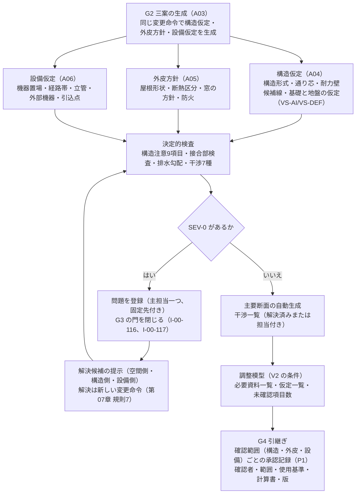
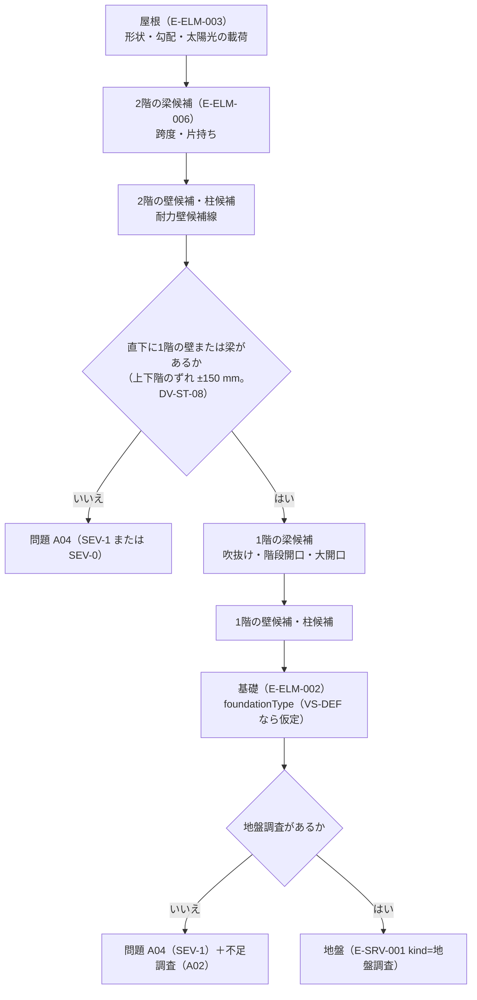
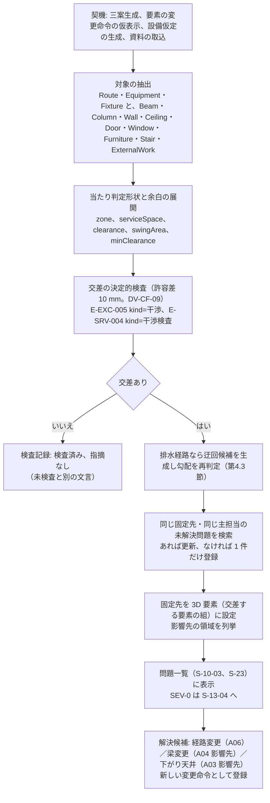
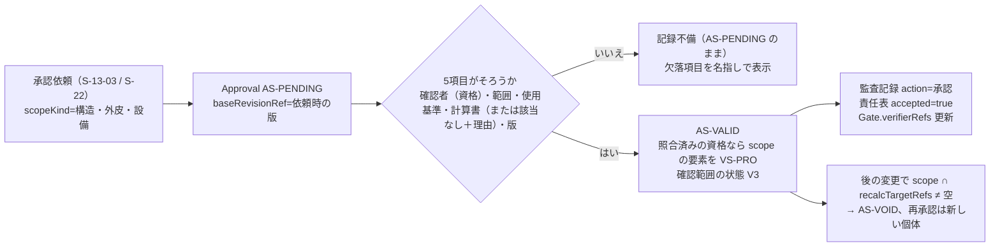

# 第13章 空間、構造、外皮、設備の調整方法と責任境界

作成日: 2026-09-15　版: v1.5（v1.5 は段階8 の最終仕上げ（2026-10-08。再々確認 主2-01、主2-03、主2-06、主4-01、主4-06、主4-07、主4-08、主4-10。統括の決定 D34、D36、D38、D39、D41、D49）。第5.5節 式(5)と F-C11-002（機能の版 v3.1）に寸法変更の撤去と新設の組と、既存外周壁と上下階連続壁の移設元を撤去として数える扱いを加え（U-13-014 は解決）、P0 の句を「撤去後の版を対象とする構造の確認記録による解除は P1」に、解決証拠の型と「AS-VALID の」を書き、第5.5節の version 列の同期の注記を現状に改め、式(5)（I-00-116）の version を v3.1 とし（D34、D36、D38 で規則の中身が変わったため。統括の決定 D49。第6章 第8.2節の version 列は群G2 が同時に v3.1 にする）、第2.1節に上下階連続壁の判定を定義した。記録は `05_審査/再修正記録_最終仕上げ_群G3.md`。v1.4 は段階8前の持ち越し仕上げ（2026-10-08。共通の決定 D1 と D6 は確認のみ〔第1.3節の表示名は正本どおり、EL-LAW の証明書の発行者を列挙する文はない〕、既定値の識別子の併記 10 行）。構造形式別の標準跨度と例示の比較の基準（DV-ST-03）、上下階のずれの許容（DV-ST-08）、構造資料と案の位置の差（DV-ST-16）、維持空間の前方（DV-EQ-03）、人通口の寸法（DV-EQ-08）、重い設備の閾値（DV-EQ-04）、排水勾配と支持余裕（DV-EQ-05、DV-EQ-06）、干渉の許容差（DV-CF-09）の直書きに識別子を併記した。重い設備の閾値の比較（第2.3節 項目7 の「以上」と既定値表の「超過」）の食い違いは、同日の統括の判断で既定値表 DV-EQ-04 を「以上」に改めて解消した（第12章 v1.5。本章の「以上」は変えていない）。同日の統括の追加（共通の決定 D7 の補完）で、第2.5節「非確定の属性」に Wall.bearsVerticalLoad と Wall.isCompartmentPartition を isLoadBearing と同じ扱いとして並べた。記録は `05_審査/再修正記録_段階8前_仕上げ_群F3.md`。v1.3 は 2026-10-07 の段階6 二回目の修正（段階7 再審査の後。修正計画 第1.13節の 11 件〔主担当 JR-066〜JR-071、整合 JR-095（極高）、JR-011、JR-012、JR-106、JR-014〕と 01_調査の番号置換への追従。内容は `05_審査/再修正記録_2回目_第11_13章.md`）。同日の二回目の仕上げ（v1.3 の追補。群R2。内容は `05_審査/再修正記録_2回目_仕上げ_群R2.md`）で、外部確認（`01_調査/08_外部確認_段階7後.md`、確認日 2026-10-07）の DV-ST-10 の値と構法の条件（第1.5節、F-C11-002 例外(e)）と国住指第517号 記2(3) の判断例（第8.2節末尾）を反映した。v1.2 は 2026-10-06 の段階6 仕上げ（相互依頼 群B。内容は `05_審査/再修正記録_相互依頼_群B.md`）。v1.1 は 2026-10-06 段階6 再修正。初稿審査の統合指摘 26 件（主担当 JM-094〜JM-107 の 14 件、整合 11 件、横断 JM-087）と整合修正指示 第13章 2 件、修正済みの章から本章あての依頼を反映。記録は `05_審査/再修正記録_第13章.md`）　担当: 段階3 仕様書 第13章（一級建築士、3D幾何処理技術者、BIM技術者、製品責任者の視点で作成）
根拠: 指示文 C11（構造と外皮）、C12（設備、環境、住宅性能。本章は設備部分）、C3（建物情報と編集。影響予測）、10.3（十二判断領域と窓位置変更の波及）、10.6（人とAIの責任境界）、B（中心原則）、9.1（V0〜V3）、C15（主要断面、調整模型）。基盤定義 `用語集.md` v1.2、`識別子規則.md` v1.2、`十二判断領域.md` v1.2（A03〜A06、影響関係表、判定例）、`七段階門.md` v1.2（G2、G3、G4、交差表）、`信頼状態と証拠段階.md` v1.2、`機能一覧骨格.md` v1.2（C11、C12）、`情報実体骨格.md` v1.2（群1、群2、群3、群6）、`画面指標試験骨格.md` v1.2（S-10、S-10-08、S-23、M-G-12、T-A-009、T-A-010、T-R-002、T-R-003、T-R-006）、`整合検査報告.md` v1.1（第5節 識別子変更一覧）。修正計画 `05_審査/初稿審査/00_修正計画.md` 第1.13節、第0.3節、第0.4節。v1.3 は `05_審査/再審査/00_修正計画.md` 第1.13節、第0.3節、第0.4節と `05_審査/再審査/00_指摘一覧.md`。調査 `01_調査/07_法規と個人情報と権利.md`。仕様書 第06章（確認範囲別承認）、第07章（八規則、九段階、六例）。
確認日: 2026-09-15。

## 0. 本章の目的、範囲と非対象、前提とする章

### 0.1 本章の目的

- 構想段階（G2）から構造、外皮、設備を空間案と同時に検討し、段階 G3 で空間、構造、外皮、設備、内装、商品が大枠で共存する調整模型と主要断面を作る方法を定める（指示文 C11、C12、C15）【推定】。
- 構造へ影響する9項目（最大跨度、大開口、吹抜け、片持ち、上下階のずれ、屋根形状、重い設備、階段開口、地盤仮定）、外皮の接合部5種以上、設備の12属性、干渉7種の検出規則を、決定的検査の条件、重大度、主担当領域、固定先、表示の形で固定する【推定】。
- AIが行えること（候補、注意、矛盾、影響予測）と必ず人が担うこと（計算、部材設計、仕様選定、安全確認、署名）の責任境界表を構造、外皮、設備、法規、施工ごとに定め、確認者、確認範囲、使用基準、計算書、版を承認記録（E-REQ-007）へ結ぶ手順を定める（指示文 10.6）【推定】。
- 第07章の影響伝播八規則と処理の九段階を、構造、外皮、設備の再計算対象（recalcTargetRefs）として本章の調整手順へ組み込む（第07章の依頼）【推定】。
- 担当機能 F-C11-001〜F-C11-010、F-C12-001〜F-C12-006 の必須10項目と受入条件 AC- を定め、F-C11-011（非対象）の扱いを明記する【推定】。

### 0.2 本章の範囲と非対象

| 区分 | 内容 |
|---|---|
| 範囲 | 構造仮定（構造形式、通り芯、柱梁配置、耐力要素、荷重の流れ、基礎仮定、地盤仮定）の空間案への同時反映。構造注意9項目の検出規則と表示。構造図なし時の非確定と必要資料。外皮の層構成（壁、屋根、床、基礎、窓）と九役割、接合部検査、熱橋、結露、雨水侵入、排水、保守交換の危険指摘。設備13系統の機器置場、維持空間、立管、排水勾配、天井内経路、外部機器、貫通、点検口、交換搬出、騒音、振動、結露。干渉検出と根拠図へ戻る方法。主要断面の自動生成と確認項目。責任境界表と承認記録への結び付け。担当17機能の機能要件【推定】 |
| 非対象（他章） | 変更命令、影響、変更差分の実体と機能要件（F-C03-011、F-C03-012。第12章が主章、本章は副章として再計算対象を定める）。断面表示の描画（F-C04-005。第11章が主章、本章は主要断面の切断位置と確認項目を定める）。住宅性能十領域の目標、計算予測、証拠段階（F-C12-007〜F-C12-016。第19章）。法規判定と敷地（第18章）。費用、期間、施工成立性（第20章）。商品の選定と配置検査（第16章）。確認範囲ごとの承認と自動失効の機能要件（F-C10-004、F-C10-005。第17章、第22章）。段階門の開始条件と完了条件（第06章）。画面部品の採番と空状態、待機状態、失敗状態の設計（第15章）。改装案件の現況調査と工事前調査（第21章）【推定】 |
| 非対象（製品外） | 構造計算、部材設計、構造安全の確認と署名。層構成と納まりの最終設計。設備の容量、系統、施工条件の最終確認。確認申請と行政協議。工事監理。本製品は F-C11-011「構造安全の自動保証」を非対象として保持し、仕様化しない（機能一覧骨格 第2節、指示文 G）【推定】 |

### 0.3 前提とする章

| 章 | 前提として使う内容 |
|---|---|
| 第02章 | 完成像、六段の因果（本章の機能は因果(1)(2)(3)(4)(5)）、非対象の一覧 |
| 第05章 | 関係者表と決定権（構造、外皮、設備の判断の決定者と確認者の元） |
| 第06章 | G2、G3、G4 の完了条件と進行禁止条件（I-00-116〜I-00-121）、確認範囲別の承認（第5.1節。構造、外皮、設備は P1 で資格あり RL-CHK）、自動失効の規則。二回目: 第1.1節 規則6 (a)(b)（持ち越しの五つの対象と期限の意味。JR-014）、第5.2節「資格の照合状態」（JR-012）、第2.5節 欠落の自動記録 (i)、第8.2節 I-00-116 の式の要旨（JR-066、JR-095） |
| 第07章 | 影響関係表、八規則（第2.3節）、九段階（第5.2節）、六例（第3節）、問題化時の主担当の決め方（第5.4節）、試験の合否を recalcTargetRefs で判定する仮判断（U-07-008） |
| 第08章 | G3 の利用導線（手順15〜16）と生活場面（動線、避難、非常時）。G1 の質問 E9（構造形式と既存構造の申告。JR-014、JR-095） |
| 第11章 | 図面読解による要素の生成、原図重ね記録（E-SRV-009）、断面表示（F-C04-005。表示項目 15。JR-067） |
| 第12章 | 情報実体の項目辞書、既定値表（VS-DEF の値と版）、変更命令と影響の機能要件（F-C03-011、F-C03-012）。v1.4 の DV-ST-06（跨度の区分。JR-068）、DV-GE-21（JR-067）、E-SRV-001（kind=耐震診断）の evaluatedRevisionRef ほか（JR-066） |
| 第21章 | 改装区分と P0 の撤去と移設の自動付与（第2.1節 規則(7)。JR-095）、耐震診断の要否（第2.4節）、AC-C14-001-03 が本章 AC-C11-002-07 を参照すること（JR-066） |
| 第23章 | T-R-006（P0 版 (4)、P1 版の (a)〜(g) と変種E1）、T-I-006（屋根の太陽光、2 階の浴槽、掃き出し窓と梁下）、T-A-012 P1 版、T-R-002 P0 版 (5) の試験情報（JR-095、JR-066、JR-014、JR-067、JR-069、JR-106） |
| 基盤定義 | 用語集、識別子規則、十二判断領域、七段階門、信頼状態と証拠段階、機能一覧骨格、情報実体骨格、画面指標試験骨格（v1.2。二回目は識別子規則と信頼状態と証拠段階 v1.3）を正本とし、本章はこれらに従う。識別子の変更は整合検査報告 第5節、第5.1節「識別子変更一覧」に追従する |

## 1. 調整の総則

### 1.1 規則

| 番号 | 規則 | 観察可能な条件 | 区分 |
|---:|---|---|---|
| 1 | 同時反映: 構造仮定、外皮方針、設備の置場と経路帯は、空間案（三案）の生成と同じ変更命令の中で生成し、案ごとに分岐する。空間案だけを先に作り、後から構造と設備を「載せる」流れを作らない | 三案の各 E-BLD-003 Building が E-SYS-001、E-SYS-002（1件以上）、E-MAT-003（外皮方針の参照先）を持つ。欠落 0 件 | 【推定】 |
| 2 | 主担当の一意性: 本章が登録する問題（E-REQ-003）と判断（E-REQ-004）の主担当領域は、構造の成立は A04、層構成と接合部は A05、系統と機器と経路は A06、空間としての階高、天井高、開口位置は A03 のうち一つだけとし、他は影響先として列挙する（基盤 十二判断領域 第3節） | primaryDomain が null または複数の登録が 0 件 | 【推定】 |
| 3 | 決定的検査: 構造注意、接合部検査、干渉検出、排水勾配の判定は決定的検査（E-EXC-005、isDeterministic=true）だけで行う。言語模型は説明文、解決候補の文章化、質問の生成に限り、判定、重大度、昇格に使わない（指示文 C3、9.1） | 判定に使った規則の一覧に isDeterministic=false が 0 件 | 【推定】 |
| 4 | 非確定: 構造図、構造計算書、設備図がない案件では、部材寸法（Beam.section、Column.section）、耐力の別（Wall.isLoadBearing）、設備の容量（ServiceSystem.capacityEstimate）を確定値として表示せず、要素値状態 VS-AI または VS-DEF と「未確定」の文言を添える（指示文 C11、C12） | 資料なしの案件で VS-USR 以上の部材寸法と容量が 0 件。確定表示が 0 件 | 【推定】 |
| 5 | 信頼状態: 本章の検査に合格しても案の信頼状態は V2（幾何検証案）までであり、「構造安全」「施工可能」「性能評価済み」を表示しない。V3 は有資格者が確認範囲（構造、外皮、設備）を明示して承認した範囲だけ（基盤 信頼状態 第1節） | 禁止表示語の検出が 0 件（T-S-003） | 【推定】 |
| 6 | 進行禁止: 荷重経路の未解決の重大問題（I-00-116）、排水勾配不成立（I-00-117）、避難経路未解決（I-00-118。第19章）は SEV-0 とし、例外承認では解除しない。SEV-1 の構造、外皮、設備、法規判定（負の余裕量 I-18-002）の問題の例外承認は、資格を登録した RL-CHK（P0 は本人申告で未照合の資格を含み「資格未照合（本人申告）」を表示する。P1 は照合済みの資格。第06章 第5.2節。JR-012）だけが行える。対象の領域集合は第06章 第1.1節 規則6 (a) と第9.3節 F-C15-003 例外(b)を正本とし、本章の問題では A04 の荷重経路と構造注意 9 項目（第2.3節。JR-106）、A05 の防火（第3.2節）、A06 の排水勾配（第4.3節）が該当する（JM-028）。P0 で該当する RL-CHK が不在の案件は持ち越せず G3 で止まり、導線と定型文は第06章 第2.0節 項目8 に従う。例外として、第06章 規則6 (b) の五つの SEV-1 は P0 で担当（RL-OWN）と期限（G4 の門）を付けて持ち越し、G4 の欠落の自動記録 (i) に記録する。本章の対象は地盤仮定（第2.3節 項目9）、重い設備の載荷（同 項目7）、P0 対象外の構法による構造注意の判定不能（既存構造が未定の改装を含む。既存壁の撤去と移動を含む改装案は除き I-00-116 と第21章の規則に従う。第1.3節）で、他の二つは第18章（擁壁と地盤調査、測量と道路種別の不足調査）。期限の意味は第06章 規則6 (b)（JM-022、JR-014） | SEV-0 の IS-EXC が 0 件。資格を登録していない RL-CHK（P1 は照合済みでない RL-CHK）による対象領域の SEV-1 例外承認が 0 件 | 【推定】 |
| 7 | 根拠へ戻る: 本章が登録する問題は固定先（3D要素、2D位置、図面頁のいずれか）を必ず持ち、問題から平面、断面、原図頁（図面入力時）へ 2 操作以内で戻れる | anchor が空の問題 0 件。遷移操作数の計測（第9節） | 【推定】 |
| 8 | 非複製: 同じ固定先と同じ主担当領域の未解決問題は一件だけ。影響先で生じた派生問題は元の変更識別子（originChangeRef）と元問題（parentIssueRef）を参照する（第07章 第2.3節 規則4、7） | 第07章 第5.3節の検査条件3、4、8 に合格 | 【推定】 |
| 9 | 既定値の明示: 構造、外皮、設備の仮定と判定に使う標準値と閾値（標準跨度、片持ち限度、最小排水勾配、点検口寸法、維持空間等）は既定値表（第12章）に識別子（DV-）と版付きで置き、本章は第1.5節の対応表で値と DV- を一覧にして、本文と機能要件は DV- で参照する。値の正本は既定値表であり、食い違いは既定値表の版に合わせて本章を追従させる。既定値を使った判定結果は「既定値による判定」と表示する（JM-098） | 既定値表の識別子を持たない標準値の使用が 0 件。本章の閾値の全件が DV- を持つ（文言検査。本文の数値の閾値が第1.5節に載り、第1.5節の全行に DV- がある。v1.1 時点の未登録 14 行は第12章 v1.3 で登録済み。v1.2） | 【仮定】 |
| 10 | 責任表との整合: 構造、外皮、設備の確認範囲ごとに責任表（E-ORG-007、duty=確認または承認）の行がない案件では、G4 の引継ぎで「確認者未定」を情報要求適合表の欠落として出す | G4 で確認者未定の確認範囲が 0 件、または例外承認あり | 【推定】 |
| 11 | 候補と抽出物の区別: 本章の候補（柱梁候補、耐力壁候補線、経路帯）は図面の抽出物ではなく仮定であり、E-SRV-009 Overlay を持たず原図重ね（S-05-01）に描かない。S-10 と S-04 では「候補」「仮定」の記号と文字で表示し、図面に描かれた構造や設備と誤認させない。第11章の意匠図のみの自動生成件数（AC-C02-009-01、M-G-21）の計数から除かれる（JM-066） | 本章が生成した候補で Overlay を持つものが 0 件。S-05-01 に候補が描かれない | 【推定】 |

### 1.2 調整の対象となる情報実体

| 対象 | 実体（情報実体骨格 v1.2。属性名の正本は第12章 項目辞書） | 本章が使う主要属性 | 主担当 | 区分 |
|---|---|---|---|---|
| 構造系統 | E-SYS-001 StructuralSystem | structureType、gridRef、loadPath、bearingElementRefs、foundationAssumptionRef、groundAssumptionRef、structuralNoteRefs、requiredDocuments、calculationRefs、seismicDiagnosisRef | A04 | 【推定】 |
| 通り芯 | E-BLD-005 Grid | axes、module、origin、rotation、matchedSourceRefs | A04 | 【推定】 |
| 柱、梁 | E-ELM-005 Column、E-ELM-006 Beam | section（null 可）、isStructural（null 可）、span、bottomHeight、supportRefs、isCantilever、standardSpanLimit | A04 | 【推定】 |
| 壁、床と基礎、屋根、天井 | E-ELM-001 Wall、E-ELM-002 Slab、E-ELM-003 Roof、E-ELM-004 Ceiling | isLoadBearing（null 可）、gridAxisRef、airtightLine、foundationType、insulationPosition、levelDelta、floorHeightAboveGL、crawlSpaceHeight、accessOpenings（床下点検口と人通口。第12章 v1.2）、foundationRiseHeight（基礎立上り高さ。第12章 v1.3）、shape、pitch、solarReady、height、plenumDepth、accessPanelRefs | A03（耐力は A04、層は A05） | 【推定】 |
| 層構成と層 | E-MAT-003 Assembly、E-MAT-004 Layer | target、layerRefs、totalThickness、uValue、airtightLayerIndex、vaporBarrierIndex、fireRating、ventilationLayer、roles、isContinuous | A05 | 【推定】 |
| 接合部 | E-MAT-005 Junction | kind、elementRefs、assemblyRefs、continuity、risks、detailSourceRef、position、checkResult | A05 | 【推定】 |
| 設備系統 | E-SYS-002 ServiceSystem | kind、equipmentRefs、routeRefs、supplyPoint、supplyConditionRef、capacityEstimate、loadEstimate、zoneRef、existingCapacity（改装案件。第12章 v1.2） | A06 | 【推定】 |
| 機器 | E-ELM-012 Equipment、E-ELM-011 Fixture | kind、footprint、serviceSpace、replacementRouteRef、weight、noiseLevel、heatOutput、systemRef、clearance、supplyRouteRefs | A06 | 【推定】 |
| 経路 | E-SYS-003 Route | kind、path、zone、slope、minClearance、systemRef、penetrationRefs、clashIssueRefs、endpoints | 個体ごと（既定 A06。動線 A03、避難 A07） | 【推定】 |
| 貫通 | E-SYS-004 Penetration | hostElementRef、routeRef、size、fireStop、waterproof、airtight、junctionRef、isStructuralConcern | A06（処理は A05、梁貫通は A04 が影響先） | 【推定】 |
| 仮定 | E-SRV-008 Assumption | kind（地盤、構造、外皮、設備、既定値）、value、defaultTableId、valueState、mustConfirmByGate、isSafetyRelated | 個体ごと | 【推定】 |
| 計算 | E-SRV-004 Calculation | kind（構造初期注意、干渉検査、熱橋結露）、inputs、standard、outputs（干渉検査は outputs.values の conditionNo、pass、sev0IssueRefs、checkedAt、ruleVersion。第12章 v1.3）、margin、validity | 個体ごと | 【推定】 |
| 法規判定の出力（第18章 第4.5節の出力形式。本章は受け手） | E-SRV-004 Calculation（kind=法規判定、条項=延焼のおそれのある部分）、E-REQ-012 Impact | 要素参照の集合 outputs.values.exposedElementRefs（外壁、窓、外部に面する扉と該当範囲の区分。P1）。判定の版（E-SRV-004 の識別子、inputs.revisionRef、standard.version、validity。validity=有効 の判定だけを必須対象の根拠にする）。未判定の扱い（未実行または validity≠有効 の間は空集合ではなく「未判定」として受ける）。E-REQ-012.targetDomain=A05（JM-103） | A02（判定は第18章） | 【推定】 |
| 問題、判断、承認 | E-REQ-003 Issue、E-REQ-004 Decision、E-REQ-007 Approval | primaryDomain、affectedDomains、severity、status、anchor、originChangeRef、parentIssueRef / scopeKind、scope、qualification、standardsUsed、calculationRefs、baseRevisionRef | 個体ごと / A12 | 【推定】 |
| 責任 | E-ORG-007 Responsibility | targetRef、actorRef、role、duty、gate、domain、isLegalDuty、accepted | A12 | 【推定】 |

### 1.3 段階ごとの調整の深さと実装優先

| 領域 | G2 比較構想（P0） | G3 空間と技術調整（P0） | G3（P1 で追加） | G4 専門設計引継ぎ | 区分 |
|---|---|---|---|---|---|
| A03 空間 | 三案の平面、断面（階高、天井高）、開口位置、階段位置 | 調整模型（V2 の条件）、主要断面、扉開閉域、通路幅、家具余白 | 透過表示、詳細断面 | 再設計範囲の明示 | 【推定】 |
| A04 構造 | 構造形式仮定、通り芯仮定、構造注意（跨度、大開口、吹抜け、上下階のずれ）（F-C11-001、F-C11-002、F-C11-003） | 構造注意9項目の全件、必要資料一覧、荷重経路に SEV-0 なし | 柱梁配置、耐力要素、荷重の流れ、基礎仮定の調整（F-C11-004）、構造資料の受入（F-C11-005） | 構造の必要資料、確認範囲、責任表の該当行（F-C11-010） | 【推定】 |
| A05 外皮 | 外皮方針（屋根形状、断熱区分、窓の方針、防火）（F-C11-006） | 外皮方針の案間差の表示、防火地域との整合 | 層構成（F-C11-007）、接合部検査（F-C11-008）、危険指摘（F-C11-009） | 層構成と接合部の引継ぎ、性能仮定の明示 | 【推定】 |
| A06 設備 | 主要設備置場と経路帯の仮定、外部機器の位置（F-C12-001）、排水勾配と立管の初期注意（F-C12-002）、意匠図だけからの経路確定禁止（F-C12-006） | 排水勾配に SEV-0 なし、点検口と交換搬出の初期注意 | 13系統の保持（F-C12-003）、12属性（F-C12-004）、干渉検出（F-C12-005） | 系統と経路帯の引継ぎ、干渉一覧 | 【推定】 |

P0 の範囲は指示文 G「基本の構造形式と通り芯の仮定、主要設備置場と経路帯、外皮方針」と基盤 七段階門 G3 の実装優先に従う。P1 で追加する機能が扱う実体と属性は P0 から情報実体に含める（機能一覧骨格 第0.3節「情報構造の先行保持」）【推定】。

P0 で構造注意の9項目を判定する構造形式は在来木造だけとする（第24章 U-24-006 の P0 対象構法と規模。延床 200 m2 以下）。大断面木造、枠組壁工法、プレハブ、鉄骨、RC の案（構造形式が未定の案と、既存構造が未定の改装案を含む）は9項目を「判定不能（P0 対象外の構法）」と表示したうえで、第06章 第1.1節 規則6 (b) により担当（RL-OWN）と期限（G4 の門）を付けて持ち越し、G4 の欠落の自動記録 (i)「構造: P0 対象外の構法（受取側の構造設計者の再設計範囲）」に記録する（既存壁の撤去と移動を含む改装案は第21章の規則と第5.5節 式(5)を優先）。S-13-04 には P0 の対象外の構法であることと持ち越しの定型文を表示し、構造形式の質問と「P0 で構造の初期注意を判定できるのは在来木造だけ」の注記は第8章 G1（質問 E9）と第15章 S-01、S-02 が出す。P1 は構法別基準を登録して判定する（U-13-013 を解決。JM-099、JR-014）【仮定】。

### 1.4 調整の流れ

図の各段は本章第2〜8節が定める。G3 の完了条件と門の判定は第06章 F-C15-002、F-C15-003 が行い、本章は判定に使う問題と成果を供給する【推定】。調整模型は建築調整画面 S-10 の 8 部品に分けて表示する。重ね合わせは S-10-01、主要断面は S-10-02、問題一覧（干渉、構造注意、施工成立性の注意）は S-10-03、責任者は S-10-04、変更影響は S-10-05、構造と設備の仮定（外皮方針と層構成を含む）は S-10-06、現況差分への入口は S-10-07、経路帯と立管の編集は S-10-08 である（部品と節の対応は第9.1節。JM-115）【推定】。

### 1.5 本章の閾値と既定値表（DV-）の対応

本章の判定に使う標準値と閾値の正本は既定値表（第12章 第5.2節と第11.2節。E-EXC-004 kind=既定値表）であり、本表はその対応の一覧である。本文と機能要件は数値に DV- を併記し、値を変える場合は既定値表の版を進めてから本表と本文を追従させる（第1.1節 規則9。JM-098）。v1.1 時点で「未登録」とした 14 行と他構法の module は、第12章 v1.3 の既定値表（v1.3。2026-10-06）に DV-GE-05、DV-GE-20、DV-ST-11〜DV-ST-17、DV-MT-06、DV-EQ-11〜DV-EQ-14、DV-CO-19 として登録され、本表の全行が DV- を持つ（v1.2。R9c、JM-098）。値はすべて初期仮説【仮定】。ただし旧耐震の着工年閾値（DV-ST-10）は外部確認で法令と国の資料の文言を確かめた値である（2026-10-07。第12章 既定値表 v1.5）。

| 項目 | 値（初期仮説） | 既定値表の識別子 | 使う節 |
|---|---|---|---|
| 構造形式の既定候補 | 在来木造（木造2階建以下、延床 200 m2 以下） | DV-ST-02 | 第2.1節 |
| 通り芯の基準寸法 | 在来木造と未定 910 mm、大断面木造 1,000 mm、枠組壁工法 910 mm または 1,000 mm、鉄骨と RC 1,000 mm。プレハブは未定（住宅会社の基準） | DV-GE-05（他構法の値は v1.3 で登録） | 第2.1節 |
| 標準跨度上限 | 在来木造 3,640、大断面木造 5,460、枠組壁工法 3,640、鉄骨 6,000、RC 6,000 mm。プレハブは未定 | DV-ST-03 | 第2.3節 項目1、3、8 |
| 跨度別の梁せい仮定 | 在来木造の梁断面を跨度の区分で持つ: 1,820 mm 以下 105 × 180、2,730 mm 以下 105 × 240、3,640 mm 以下 105 × 300、3,640 mm 超 105 × 360。上階の壁を受ける梁と吹抜けに面する梁は一つ上の区分（初期仮説。梁せいは跨度の 1/12 程度を目安。構造設計者の確認対象 U-13-001。v1.3 で単一値 105 × 240 から改めた。JR-068） | DV-ST-06 | 第2.2節、第4.3節、第6.2節 |
| 基礎形式 | べた基礎 | DV-ST-01 | 第2.1節 |
| 旧耐震の着工年閾値 | 1981-05-31 以前に新築の工事に着手したもの（耐震改修促進法施行令 第3条。後の増改築等で検査済証を受けたものを除く）。構造形式が在来木造で地上 2 階以下は 1981-06-01〜2000-05-31 の建築も国の検証法の対象（法令の要件ではない）。枠組壁工法、プレハブ、3 階建て以上の木造には 2000 年の閾値を当てない。値の出典は【事実】（01_調査 08 第1節、確認日 2026-10-07。第12章 既定値表 v1.5） | DV-ST-10 | 第10.2節 例外(e)（耐震診断の要否の判定は第21章 第2.4節） |
| 耐力壁候補線の選定 | 外周壁は方位ごとに壁長の最も長い壁線。内壁は上下階で連続する壁と、通り芯上で長さ 1,820 mm 以上の壁。各階で X、Y 方向に 2 本以上 | DV-ST-12 | 第2.1節 |
| 大開口 | 開口率 50%、連続開口幅 2,730 mm | DV-ST-11 | 第2.3節 項目2 |
| 吹抜けの面積比 | 20% | DV-ST-09 | 第2.3節 項目3 |
| 片持ち限度 | 455 mm（SEV-1）、1,365 mm 超（SEV-0） | DV-ST-07 | 第2.3節 項目4 |
| 上下階のずれの許容 | ±150 mm | DV-ST-08 | 第2.3節 項目5、第2.1節（上下階連続壁の判定。D39） |
| 屋根の高軒側の軒高、屋根材の最小勾配 | 片流れの高軒側の軒高 6,000 mm。屋根材の最小勾配は製造元の指定値、指定値がない場合は粘土瓦 4/10、化粧スレート 3/10、金属板 1/10（「既定値による判定」を付ける） | DV-ST-13 | 第2.3節 項目6 |
| 重い設備の閾値 | 100 kg | DV-EQ-04 | 第2.3節 項目7 |
| 太陽光発電の載荷 | 15 kg/m2 | DV-ST-14 | 第2.3節 項目7 |
| 通り芯外の壁の割合 | 30% | DV-ST-15 | 第10.1節 例外(d) |
| 構造図と案の位置の差 | 150 mm | DV-ST-16 | 第2.6節、第10.5節 |
| 最小排水勾配 | 管径 65 mm 以下 1/50、75〜100 mm 1/100、100 mm 超は未設定 | DV-EQ-05 | 第4.3節 |
| 支持余裕 | 50 mm | DV-EQ-06 | 第4.3節、第6.2節 |
| 余裕不足の倍率 | 必要落差の 1.2 倍未満 | DV-EQ-11 | 第4.3節 |
| 天井懐 | 300 mm | DV-GE-11 | 第4.3節、第6.2節 |
| 床構成厚 | 床 250 mm | DV-GE-12 | 第6.2節 |
| 階段の頭上高さ | 2,000 mm 以上 | DV-GE-09 | 第6.2節 |
| 開口上端の取合い寸法 | 105 mm（まぐさ等。初期仮説の 1 値。一級建築士の確認対象。第12章 U-12-025。v1.3 で追加。JR-067） | DV-GE-21 | 第6.2節 |
| 配管空間の寸法 | 450 × 450 mm | DV-EQ-07 | 第4.2節 |
| 水回りの立管候補への集約距離 | 1,820 mm 以内 | DV-EQ-12 | 第4.2節 |
| 維持空間 | 前面 600 mm、側面 100 mm | DV-EQ-03 | 第4.1節 |
| 交換搬出経路 | 機器寸法 ＋ 100 mm（下限 幅 700 × 高さ 1,800 mm） | DV-EQ-03 | 第4.1節、第5.1節 種別7 |
| 点検口と人通口 | 天井点検口: 機器から 1,000 mm 以内、450 × 450 mm 以上。床下点検口: 水回りから 2,000 mm 以内、600 × 600 mm 以上。人通口: 幅 500 × 高さ 600 mm 以上 | DV-EQ-08 | 第4.1節、第4.2節、第5.1節 種別6 |
| 電源端点の既定配置 | 室の用途ごとのコンセントとスイッチの位置と数（電気図がない案件の候補） | DV-EQ-09 | 第4.1節 電気、第4.2節 AP-014 への値 |
| 外部機器の境界距離と搬入経路幅 | 境界から 500 mm 以上、搬入経路幅 機器幅 ＋ 200 mm 以上 | DV-EQ-13 | 第4.1節 |
| 騒音の距離 | 寝室の窓中心まで 2,000 mm、隣地境界 500 mm、隣家の窓 3,000 mm | DV-EQ-14 | 第4.5節 |
| 梁貫通の径 | 梁せいの 1/3 以下 | DV-ST-17 | 第4.1節、第5.1節 種別1 |
| 干渉の許容差 | 10 mm | DV-CF-09 | 第5.1節、第5.2節 |
| 局所断面の長さ | 交差点の前後 1,820 mm | DV-GE-20 | 第6.1節 |
| バルコニーの防水と排水 | 立上り 250 mm 以上、勾配 1/100 以上、排水口 2 か所以上 | DV-MT-06 | 第3.3節 |
| 干渉の一覧の重大度順表示 | 一度の検査で 50 件超 | DV-CO-19 | 第10.16節 例外(e) |

## 2. 構想段階からの構造検討と空間案への同時反映

### 2.1 構造仮定の項目

構造仮定は E-SYS-001 StructuralSystem と E-SRV-008 Assumption（kind=構造、地盤、既定値）で持つ。G2 では全項目を仮定として置き、確定は人（構造設計者、建築士）が行う。部材寸法と安全性は本章のどの機能でも確定しない（指示文 C11）【推定】。

| 項目 | 実体と属性 | G2 での値の由来 | 既定値表の初期仮説（値は例。確定は U-13-001） | 確定できる者 | 区分 |
|---|---|---|---|---|---|
| 構造形式 | E-SYS-001.structureType、E-BLD-003.structureType | 利用者の希望（VS-USR）または地域と規模からの推定（VS-AI）。未指定は「未定」 | 木造2階建以下、延床 200 m2 以下（第24章 U-24-006 と同じ値）は在来木造を既定候補とする（DV-ST-02）。構法ごとの既定は下の構造形式別の表（JM-099） | 建築士、構造設計者 | 【仮定】 |
| 通り芯 | E-BLD-005 Grid（axes、module、origin） | 図面入力時は図面から取得（VS-SRC）、希望入力時は基準寸法で生成（VS-AI） | module: 構造形式別の表による（在来木造 910 mm は DV-GE-05） | 建築士 | 【仮定】 |
| 柱梁配置 | E-ELM-005 Column、E-ELM-006 Beam（section=null、isStructural=null） | 通り芯の交点と外周、室の境界に候補を生成（VS-AI）。図面に構造図がある場合は取得（VS-SRC） | 柱は通り芯交点のうち外周と主要内壁の交点。梁は通り芯上の壁線と床の境界 | 構造設計者 | 【仮定】 |
| 耐力要素 | E-SYS-001.bearingElementRefs、E-ELM-001.isLoadBearing（null 可） | 耐力壁候補線（本章の用語追加提案）上の壁を候補（VS-AI）。確定は null のまま | 候補線: 外周壁は方位ごとに壁長の最も長い壁線を候補線とし、全外周壁を候補線にしない。内壁は上下階で連続する壁と、通り芯上で長さ 1,820 mm 以上の壁。候補線は各階で X 方向と Y 方向に 2 本以上とし、満たさない方向は壁長の長い壁線から順に加える（DV-ST-12。初期仮説。JM-100） | 構造設計者 | 【仮定】 |
| 荷重の流れ | E-SYS-001.loadPath（屋根→梁→柱または壁→基礎→地盤） | 候補要素の接続関係（E-SYS-005 kind=要素接合）から決定的に構成（VS-AI） | 各階の各スパンで受け要素が一つ以上見つかること | 構造設計者 | 【推定】 |
| 基礎仮定 | E-ELM-002.foundationType、E-SYS-001.foundationAssumptionRef | 地盤資料がなければ VS-DEF | 既定: べた基礎（在来木造）。地盤調査なしの場合は「地盤調査で確定」の注記 | 構造設計者、建築士 | 【仮定】 |
| 地盤仮定 | E-SYS-001.groundAssumptionRef、E-SRV-008（kind=地盤、isSafetyRelated=true） | 公的地理情報（液状化、大規模盛土）は参考として結ぶ（第18章）。地耐力は仮定しない | 地耐力の既定値は置かない（安全に関わる仮定を確定扱いにしない。共通指示 第4節） | 地盤調査、構造設計者 | 【推定】 |

上下階連続壁の判定（統括の決定 D39）: 2 階の壁の中心線（E-ELM-001.centerline）から水平距離 DV-ST-08（上下階のずれの許容）以内に中心線がある 1 階の壁は、重なる長さにかかわらず上下階連続壁とみなす（安全側。重なりの最小長は設けない）。耐力要素の行の候補線の選定、第2.3節 項目2、第5.5節 式(2)(5)、F-C11-002 例外(e)、AC-C11-002-07 の「上下階連続壁」はこの判定による（新しい既定値は置かない）【仮定】。

構造形式別の既定（JM-099。値は初期仮説。enum の正本は第12章 v1.2 の E-BLD-003.structureType、E-SYS-001.structureType）【仮定】:

| 構造形式 | module（DV-GE-05） | 標準跨度（DV-ST-03） | 耐力壁候補線 | P0 での9項目の判定 |
|---|---|---|---|---|
| 在来木造 | 910 mm（DV-GE-05） | 3,640 mm | 耐力要素の行と第2.3節の候補線の規則 | 全9項目を判定 |
| 大断面木造 | 1,000 mm | 5,460 mm（構造設計者の確認まで） | 構法別基準の登録待ち（P1） | 判定不能（P0 対象外の構法）。第06章 規則6 (b) で持ち越し G4 の欠落 (i) に記録（構法別基準の登録は P1。JR-014） |
| 枠組壁工法 | 910 mm または 1,000 mm | 3,640 mm（DV-ST-03） | 外周の壁線と、耐力壁線間距離が 12 m 以下となる内部の壁線 | 同上 |
| プレハブ（鉄骨系、木質系、ユニット） | 未定（住宅会社の基準） | 未定（住宅会社の基準） | 未定（住宅会社の基準） | 同上 |
| 鉄骨、RC | 1,000 mm | 6,000 mm | 構造図による（P1） | 同上 |

構造形式の候補には、木造2階建の戸建住宅が令和7年4月1日施行の改正建築基準法で構造関係規定等の審査対象（新2号建築物）となったことを注記として添える（`01_調査/07_法規と個人情報と権利.md` 第2.1節。出典 https://www.mlit.go.jp/common/001627103.pdf p.10〜11、確認日 2026-09-15）【事実】。壁量基準と柱の小径の算定式も同日に見直されたため、本章の構造注意は壁量計算を代替せず「壁量計算は改正後の基準で構造設計者が行う」と表示する（同 p.27、確認日 2026-09-15）【事実】。壁量基準の経過措置は令和8年3月31日着工分で終了しているため、2026-09-15 時点の新規案件に改正前基準の選択肢を出さない【推定】。

### 2.2 空間案への同時反映の方法

| 方法 | 内容 | 観察可能な条件 | 区分 |
|---|---|---|---|
| 通り芯への吸着 | 三案の生成と直接編集で、壁の中心線を通り芯（module の格子）へ吸着させる。吸着を外す場合は「通り芯外」の属性を壁に付け、構造注意の対象にする | 通り芯外の壁の数が案ごとに表示される | 【仮定】 |
| 耐力壁候補線の表示 | S-10 と S-04-02 に耐力壁候補線を平面へ重ねて表示し、候補線上の開口を強調する。候補線は VS-AI であり「候補」の語を常に付ける。候補線の編集は資格を登録した RL-CHK だけが F-C11-004（P1）で行える（JM-096） | 候補線の表示に「候補（AI推定）」の記号と文字がある。RL-OWN、RL-EDT に候補線の編集操作がない | 【推定】 |
| 柱梁配置の仮生成 | 通り芯の交点と外周から柱候補、通り芯上の壁線から梁候補を生成する。断面は持たず、跨度と梁下高さ（既定値表の跨度別の梁せい仮定 DV-ST-06 から算出し、「既定値による判定（跨度 n mm の区分）」と表示する。上階の壁を受ける梁と吹抜けに面する梁は一つ上の区分。JR-068）だけを持つ | 生成した柱梁の section が全件 null | 【仮定】 |
| 案ごとの分岐 | 三案の各 Building が独立した E-SYS-001 を持ち、構造形式が異なる案（例: 意匠重視案だけ大断面木造）を比較できる。構造形式の変更は判断（D-13-002）として記録する | 案ごとの E-SYS-001 が 1 件ずつ存在する | 【推定】 |
| 変更時の追従 | 壁、開口、階高、屋根、階段の変更命令（主担当 A03）に対し、影響 A04（荷重）を必ず生成し、構造注意を再判定する（第07章 規則2、3） | 変更命令ごとに A04 の Impact が 1 件ある | 【推定】 |
| 空間への逆提案 | 構造注意の解決候補として空間側の変更（開口幅を戻す、壁位置を候補線へ寄せる、吹抜けを縮める）を提示する。提示は候補であり自動確定しない（第07章 規則7） | 自動確定した二次変更が 0 件 | 【推定】 |

### 2.3 構造へ影響する問題の検出規則（9項目）

全項目を決定的検査（E-EXC-005 kind=進行禁止 または 干渉、isDeterministic=true）で判定し、問題（E-REQ-003）を主担当 A04、影響先 A03（必要に応じ A05、A06、A10）で登録する。閾値は既定値表の初期仮説であり、公開判定会議と構造設計者の確認で固定する（未決 U-13-001）【仮定】。

| 番号 | 項目 | 検出条件（既定値表の初期仮説） | 重大度 | 影響先 | 固定先 | 表示（平面、断面、3D） | 解決候補（自動確定しない） | 例示問題 | 対応する試験 | 区分 |
|---:|---|---|---|---|---|---|---|---|---|---|
| 1 | 最大跨度 | Beam.span が standardSpanLimit（DV-ST-03。在来木造 3,640 mm、大断面木造 5,460 mm、枠組壁工法 3,640 mm、鉄骨 6,000 mm、RC 6,000 mm。プレハブは未定）を超える | SEV-1。吹抜け上の梁が超える場合は SEV-0（I-00-116） | A03、A09 | 3D要素（梁） | 平面: 梁線を強調。断面: 跨度と梁下を寸法表示。3D: 梁を強調 | P0: 跨度を縮める空間側の変更（壁の追加、室や吹抜けの縮小。A03）。P1: 柱候補の追加（F-C11-004）、構造形式の変更（D-13-002）、有資格者の確認記録（scopeKind=構造） | I-00-010、I-13-001 | T-R-002、T-A-009 | 【仮定】 |
| 2 | 大開口 | 耐力壁候補線上で開口幅の合計が壁長の 50% を超える、または連続開口幅が 2,730 mm 以上（DV-ST-11）。壁長は当該耐力壁候補線上で連続する壁要素の長さの和（開口を含む。通り芯の交点で区切る） | SEV-0 は、開口上の梁候補に受け要素（柱候補または直交壁候補）がない場合、または上下階連続壁の直下が全面開口で受け梁候補もなく loadPath が構成できない場合に限る（I-00-116）。開口率の超過と連続開口幅の超過だけなら SEV-1（JM-100） | A03、A05、A08 | 3D要素（壁と開口） | 平面: 候補線と開口を重ね表示。断面: 開口上の梁跨度。3D: 開口周辺 | P0: 開口幅を戻す、壁位置を候補線へ寄せる（A03 の変更命令）。P1: 耐力要素の移動（F-C11-004）、有資格者の確認記録（scopeKind=構造。S-22）（JM-023） | I-00-008、I-07-003 | T-R-002 | 【仮定】 |
| 3 | 吹抜け | Ceiling.kind=吹抜け の面積が階床面積の 20%（DV-ST-09）を超える、または吹抜けに面する梁が項目1に該当 | SEV-1（跨度超過は SEV-0） | A03、A07 | 3D要素（吹抜けの天井） | 平面: 吹抜け範囲を網掛け。断面: 上下階の接続。3D: 床の欠損 | P0: 吹抜けを縮める（A03）。P1: 受け梁の追加（F-C11-004） | I-00-010 | T-R-002 | 【仮定】 |
| 4 | 片持ち | Beam.isCantilever=true、または上階の外周が下階の外周から 455 mm（DV-ST-07）を超えて張り出す。張出しが 1,365 mm（DV-ST-07）を超える場合は上位の重大度 | SEV-1。1,365 mm 超は SEV-0 | A03、A05、A09 | 3D要素（梁または床） | 平面: 張出し範囲。断面: 張出し長さを寸法表示。3D: 張出し部 | P0: 張出しを縮める（A03）。P1: 受け柱の追加（F-C11-004） | I-13-002 | T-I-006（項目4） | 【仮定】 |
| 5 | 上下階のずれ | 2階の外周壁または耐力壁候補が、1階の壁または梁候補の直上（許容ずれ ±150 mm。DV-ST-08）にない | SEV-1。直下に壁も梁もない外周壁は SEV-0 | A03 | 3D要素（2階の壁） | 平面: 1階壁線を2階平面へ透過表示。断面: 上下の壁位置。3D: 透過 | P0: 壁位置を直上へ寄せる（A03）。P1: 受け梁の追加（F-C11-004） | I-00-011、I-07-010 | T-A-003（類似） | 【仮定】 |
| 6 | 屋根形状 | Roof.shape の変更、勾配が屋根材の既定最小勾配（DV-ST-13）未満、片流れの高軒側の軒高が 6,000 mm（DV-ST-13）超、屋根の平面が矩形でない | SEV-2（構造設計者へ再確認要） | A05、A02、A07 | 3D要素（屋根） | 断面: 勾配と最高高さ。3D: 屋根形状 | 形状の再選定（判断として記録） | I-13-003 | T-R-010（類似）、T-I-006（項目6） | 【仮定】 |
| 7 | 重い設備 | Equipment.weight が 100 kg（DV-EQ-04）以上で床または屋根に載る、太陽光発電の載荷（面積 × 15 kg/m2。DV-ST-14）、蓄電池、水張り時の浴槽、受水槽、貯湯タンク（満水時）、雨水タンク（E-ELM-012 kind=受水槽、給湯機（貯湯式）、雨水タンク。受水槽と雨水タンクの種別は第12章 v1.3）。水を貯める機器の weight は満水時の重量で判定し、商品項目に満水時の重量がない場合は乾燥重量 ＋ 貯水容量（L）× 1 kg/L で算出する。第19章 F-C12-014 で断水時の貯水を「有」とした案では、その貯水機器を判定の契機に含める（JM-107） | SEV-1。P0 では第06章 第1.1節 規則6 (b) により担当（RL-OWN）と期限（G4 の門）を付けて G3 を通過でき、G4 の欠落の自動記録 (i) に「構造: 重量物の載荷の確認未了（太陽光 n m2、浴槽、蓄電池等。受取側の構造設計者の確認範囲）」を記録する。S-13-04 に定型文「重量物の載荷は受取側の構造設計者が確認します。建築士の登録を推奨します」を表示する（JR-014） | A06、A03 | 3D要素（機器） | 平面: 機器位置。断面: 載る床と受け梁。3D: 機器 | P0: 置場を1階へ移す（A06。床置きの機器に限る）。太陽光は屋根の載荷の仮定（Roof.solarReady、DV-ST-14）を置いたまま第06章 規則6 (b) で持ち越す（JR-014）。P1: 受け梁上へ移す（F-C11-004 の受け梁の追加） | I-13-004 | T-A-010（類似）、T-I-006（項目7） | 【仮定】 |
| 8 | 階段開口 | Stair.opening が耐力壁候補線または梁候補を切る、開口の長辺が項目1の標準跨度を超える | SEV-1 | A03 | 3D要素（階段） | 平面: 開口と梁線。断面: 階段と梁下、headroom | P0: 階段位置の変更（A03）。P1: 受け梁の追加（F-C11-004） | I-13-005 | T-I-006（項目8） | 【仮定】 |
| 9 | 地盤仮定 | E-SRV-001（kind=地盤調査）の status が実施済みまたは受入済みでなく、foundationType が VS-DEF または VS-AI | SEV-1（G3）。P0 では担当（RL-OWN）と期限（G4 の門）を付けて G3 を通過でき、G4 の情報要求適合表に「地盤: 調査未実施（受取側の構造設計者の再設計範囲）」を欠落として自動記録する。S-13-04 に定型文「地盤調査未実施のまま次の段階へ進みます。受取側の構造設計者の再設計範囲になります。建築士の登録（S-15、S-18）を推奨します」を表示する（第06章 第1.1節 規則6 (b)。JM-022） | A02 | 3D要素（基礎） | 平面: 基礎範囲。断面: 基礎形式に「仮定」の表示 | 不足調査（地盤調査）へ登録（第18章 第2.3節、第7.14節の経路） | I-00-012 | T-R-001、T-I-006（項目9） | 【推定】 |

補足規則【仮定】:
- 判定は P0 で全9項目を行うが、P0 の入力（構造図なし）では項目1〜5、8 が候補線と既定値に依存するため、問題の説明文に「既定値による判定」を必ず付け、誤警告の却下（IS-REJECTED）を RL-CHK に許す。却下は M-G-09 の分子に数える。
- SEV-0 の判定が VS-AI の候補線に依存することによる誤警告の危険は未決 U-13-011 に記す。
- P0 で資格を登録した RL-CHK がいない案件で担当（RL-OWN）と期限（G4 の門）を付けて持ち越せる SEV-1 は第06章 第1.1節 規則6 (b) の五つで、本章では項目7（重い設備の載荷）、項目9（地盤仮定）、第1.3節の P0 対象外の構法による判定不能に限る。項目1〜6、8 の SEV-1（A04）は同条 (a) により資格を登録した RL-CHK（P1 は照合済み）の例外承認か解決でしか G3 を越えない（第1.1節 規則6。JR-014、JR-106）。
- 解決候補の列は、P0 で実行できる候補（空間側または設備側の変更命令）と、P1 の機能に依存する候補（F-C11-004 の候補の編集、有資格者の確認記録 S-22）を分けて書く。P0 では P1 の候補を提示だけ行い実行の導線を出さない。P0 で資格を登録した RL-CHK が未登録の案件の復旧導線（S-13-04 の「建築士へ相談する」、S-08 の共有URL、S-15 の資格登録、S-23-06 の却下）と定型文は第06章 第2.4節に従う（JM-023）。
- 同じ要素に複数項目が該当する場合、固定先と主担当が同じなら一つの問題に項目を列挙し、複製しない（第1.1節 規則8）。
- 改装案件で本章の対象外とするのは既存構造の劣化（腐朽、蟻害）の判定だけであり、判定例「既存構造の腐朽が疑われる → A04、影響先 A10、A11」に従い第21章が耐震診断と結ぶ。撤去、移設、補強、新設開口を持つ要素とその要素が属する耐力壁候補線は9項目の対象とし、重大度と解決証拠は第10.2節 例外(e)に従う（I-00-116 の範囲は基盤 七段階門 v1.2。JM-094）。

### 2.4 荷重の流れの構成と検査点

loadPath は各階の各スパン（隣接する通り芯間）について、上階の受け要素から下階の受け要素への参照の連鎖として持つ。連鎖が途切れるスパンは項目5または項目2の問題になる。連鎖は接続関係（E-SYS-005 kind=要素接合）から決定的に構成し、言語模型で補完しない【推定】。

### 2.5 構造図がない場合の非確定と必要資料（F-C11-003）

| 規則 | 内容 | 区分 |
|---|---|---|
| 非確定の属性 | 構造図（E-PRD-006 drawingType=構造図）または構造計算書（kind=計算書）が案件にない場合、Beam.section、Column.section、Wall.isLoadBearing、Wall.bearsVerticalLoad、Wall.isCompartmentPartition（主要構造部の判定に使う2属性。第12章 第4.3節 v1.5、第21章 第2.4節 (b)。isLoadBearing と同じ扱いで、値は構造資料〔伏図、軸組図〕や区画の資料から建築士等が確認して入力し、AI は true を推定しない。null は「未確定」と表示）、Slab.foundationType（地盤資料なし）、E-SYS-001.bearingElementRefs は VS-AI または VS-DEF のままとし、属性欄（S-04-04）に「未確定（構造資料なし）」を表示する | 【推定】 |
| 表示できる語 | 「構造成立性の初期注意」「候補」「仮定」「要確認」。表示できない語: 「構造安全」「構造確認済み」「部材寸法確定」「壁量適合」 | 【推定】 |
| 必要資料一覧 | E-SYS-001.requiredDocuments に次を登録し S-10-03（問題から辿る必要資料一覧）と情報要求適合表（G4）に表示する: 構造図（伏図、軸組図）、構造計算書または壁量計算書（改正後基準）、地盤調査報告、既存建物では耐震診断結果。確認申請に必要な図書の構成の原文は【未確認】（調査 U-87-003）であり、一覧は「本製品が引継ぎに必要とする資料」と表示し「申請に必要な図書」と表示しない | 【推定】【未確認】 |
| 依頼先 | 必要資料は責任表（E-ORG-007 duty=作成、domain=A04）の担当（構造設計者または建築士）へ依頼として結び、相談先比較（S-07、第17章）へ導線を置く | 【推定】 |
| 引継ぎ時 | G4 で構造資料がないまま引き継ぐ場合、情報要求適合表に「構造: 資料なし（初期注意のみ）」を欠落として記録し、受取側の構造設計者が再設計範囲とする（第06章 第3.5節 A04） | 【推定】 |

### 2.6 構造資料の受入と要素への結び付け（F-C11-005、P1）

| 資料 | 受入形式 | 結び先 | 要素値状態の遷移 | 区分 |
|---|---|---|---|---|
| 構造図（伏図、軸組図） | PDF、DXF、IFC（第11章の図面読解） | 柱、梁、耐力壁の要素と E-SYS-001.bearingElementRefs | section、isLoadBearing が VS-SRC。図面間で通り芯記号を照合し不一致は問題（A12、図面一式） | 【推定】 |
| 構造計算書、壁量計算書 | PDF（E-PRD-006 kind=計算書） | E-SRV-004（kind=構造計算（人）。計算書を包む E-REQ-008 kind=計算 を参照）として登録し、E-SYS-001.calculationRefs と Approval.calculationRefs から参照（第8.2節。U-13-003 の解決） | 計算書の版と作成者を必須にする。値の転記は行わず、資料として結ぶ | 【推定】 |
| 地盤調査報告 | PDF | E-SRV-001（kind=地盤調査、status=受入済み）、E-SYS-001.groundAssumptionRef の置換 | Assumption.status=置換済み。foundationType は構造設計者の確認で VS-PRO | 【推定】 |
| 耐震診断 | PDF | E-SYS-001.seismicDiagnosisRef、E-SRV-001（kind=耐震診断） | 既存要素の CS- は第21章 | 【推定】 |

受け入れた資料には版と作成者を必須とし、要素の属性欄から資料の頁へ戻れる（機能一覧骨格の合格条件）。資料の値と現在の案が矛盾する場合（例: 構造図の梁位置と案の壁位置の差 150 mm（DV-ST-16）超）は問題（主担当 A12、影響先 A04、A03）とし、正本の判定は人が行う【推定】。

## 3. 外皮の層構成と接合部

### 3.1 層構成と九役割の割当規則（F-C11-007、P1。実体は P0 から保持）

外皮要素（壁、屋根、床、基礎、窓）は単一面ではなく層構成（E-MAT-003 Assembly）と層（E-MAT-004 Layer）で持ち、各層に構造、防水、雨仕舞、気密、断熱、防湿、耐火、仕上、通気の九役割のいずれかを割り当てる（指示文 C11）。割当の欠落は書出検査（第22章）と本節の検査で検出する【推定】。

| 外皮要素（Assembly.target） | 必須役割（欠落は SEV-1） | 条件付き必須（欠落は SEV-2 で確認要） | 既定の層構成（既定値表。VS-DEF） | 区分 |
|---|---|---|---|---|
| 外壁 | 構造、防水、気密、断熱、仕上 | 通気（通気工法を選んだ場合）、防湿（断熱区分と地域による）、耐火（防火地域、準防火地域、延焼のおそれのある部分） | 外から: 仕上、通気、防水、構造（面材）、断熱、防湿、気密、仕上（内） | 【仮定】 |
| 屋根 | 構造、防水、雨仕舞、気密、断熱、仕上 | 通気（屋根断熱の場合）、防湿、耐火 | 仕上（屋根材）、防水（下葺）、構造（野地）、通気、断熱、防湿、気密、仕上（天井） | 【仮定】 |
| 床（1階） | 構造、仕上 | 断熱と気密（床断熱を選んだ場合。基礎断熱なら不要）、防湿 | 仕上、構造（床板）、断熱、気密 | 【仮定】 |
| 基礎 | 構造、防水（防湿） | 断熱と気密（基礎断熱を選んだ場合）、防蟻の注記 | 構造（RC）、防湿（防湿フィルム）、断熱（基礎断熱時） | 【仮定】 |
| 窓 | 防水、雨仕舞、気密、断熱、仕上 | 耐火（防火設備を要する場合）、遮音 | ガラスと枠の性能区分（E-ELM-008.performanceClass）を層として持つ | 【仮定】 |

規則【推定】:
- 一つの層は複数の役割を持てる（例: 面材が構造と気密）。Layer.roles は 1 件以上を必須とし、空の層は「役割未割当」の問題（主担当 A05、SEV-1）。
- 気密線（Assembly.airtightLayerIndex）と防湿層（vaporBarrierIndex）は建物全体で連続する一本の線として持ち、床断熱と基礎断熱の混在（I-00-015）のように線が途切れる箇所を接合部検査で検出する。
- 層構成の仕様（材料、厚さ）の選定は人（建築士、外皮専門家）が行う。製品は既定値表の層構成を VS-DEF で置き、「既定値」の明示と確認依頼を表示する。
- 熱貫流率（uValue）は計算予測（EL-CAL）の Calculation を参照するだけで、本章は値を評価しない（第19章 F-C12-015）。

### 3.2 外皮方針の初期確認（F-C11-006、P0）

| 方針項目 | 選択肢（案ごとに持つ） | 整合判定（決定的検査） | 区分 |
|---|---|---|---|
| 屋根形状 | E-ELM-003.shape（切妻、寄棟、片流れ、陸屋根、入母屋、その他）、勾配 | 第2.3節 項目6（構造）、高さと斜線の法規判定（第18章）へ影響を生成 | 【推定】 |
| 断熱区分 | 断熱等性能等級の区分（等級4、5、6、7）を目標（EL-TGT）として第19章の性能項目へ結ぶ。等級には定義、版、地域区分、計算条件を添える | 等級5の外皮平均熱貫流率の基準値は地域区分により 0.4〜0.6 W/m2K（8地域は基準なし）（出典 https://www.mlit.go.jp/jutakukentiku/house/content/001424534.pdf p.3、確認日 2026-09-15）【事実】。ZEH の強化外皮基準は 1・2地域 0.4、3地域 0.5、4〜7地域 0.6 以下（資源エネルギー庁の定義文書。検索抜粋のみで原文未確認。調査 U-87-001）【事実（検索抜粋）】【未確認】。本章は等級名だけで「達成」と表示せず、目標として記録する | 【推定】 |
| 窓の方針 | 主採光窓の方位と大きさの方針、窓の性能区分（ガラス層数、枠）の方針 | 大開口は第2.3節 項目2、採光は第19章 | 【推定】 |
| 防火 | 防火地域、準防火地域、法22条区域、指定なし（E-SRV-011 item=防火 の値）に応じた外壁、軒裏、開口部（防火設備）の方針 | E-SRV-011（防火）の値と Assembly.fireRating、Window.performanceClass の整合を判定し、不整合は問題（主担当 A05、影響先 A02、SEV-1）。部位単位の判定: E-SRV-004（kind=法規判定）.outputs.values.exposedElementRefs（延焼のおそれのある部分に含まれる外壁と開口。第18章 第4.5節、P1）に含まれる要素だけを耐火区分と防火設備の必須対象とし（validity=有効 の判定に限る）、判定が未実行または validity≠有効 の間は「延焼のおそれ未判定」として SEV-2 の注意を置く（JM-103）。防火未確認の不足調査（行政照会）の登録は第18章 第2.3節と第7.14節の経路を使う。法規条項の適用判断は建築士（第18章） | 【推定】 |

G2 の必須成果として各案に4項目の方針が表示され、未選択は「未設定」と明示する（機能一覧骨格の合格条件）。方針は判断（E-REQ-004 gate=G2、主担当 A05）として記録し、G3 で層構成へ展開する（P1）【推定】。

### 3.3 接合部検査（F-C11-008、P1）

接合部（E-MAT-005 Junction）は層構成が出会う部位で、防水、気密、断熱、防湿の各層の連続の有無（continuity）と危険（risks）を持つ。検査は決定的検査（E-EXC-005 kind=干渉 の派生。isDeterministic=true）で行い、結果を checkResult（合格、指摘あり、未検査）に記録する。「未検査」と「合格」は異なる文言で表示する（基盤 画面指標試験骨格 第1.5節）【推定】。

| 接合部（Junction.kind） | 生成条件（自動） | 検査する連続性 | 検出条件（指摘あり） | 危険（risks） | 重大度 | 影響先 | 区分 |
|---|---|---|---|---|---|---|---|
| 屋根壁 | Roof と外壁 Wall の接触線ごと | 防水、気密、断熱、通気の出口 | 屋根と外壁の気密線の index が接続しない。通気層（ventilationLayer=true）に出口がない | 雨水侵入、結露、通気出口なし | SEV-1 | A04、A07 | 【仮定】 |
| 壁基礎 | 外壁 Wall と Slab（kind=基礎）の接触線ごと | 防水（水切り）、気密、断熱（床断熱か基礎断熱か） | insulationPosition が床断熱と基礎断熱で混在（I-00-015）。気密線が床と基礎の間で途切れる | 熱橋、結露、雨水侵入 | SEV-1 | A04、A07 | 【仮定】 |
| 窓周囲 | Window ごと（→Junction 1） | 防水（先張り）、気密、断熱。上下左右の重ね順序は納まり図の人の確認事項（P2 で layerSequence により判定。JM-102） | continuity.waterproof が null または false、または detailSourceRef が null（I-00-013）。窓枠と断熱層の間に断熱なし | 雨水侵入、熱橋、結露 | SEV-1 | A03、A08 | 【仮定】 |
| 出隅、入隅 | 外壁同士が交わる角ごと | 防水、気密、断熱、通気 | 断熱層が角で途切れる。通気層が角で塞がる | 熱橋、通気出口なし | SEV-2 | A04 | 【仮定】 |
| 貫通部 | Penetration ごと（E-SYS-004.junctionRef） | 防火、防水、気密 | Penetration の fireStop、waterproof、airtight のいずれかが「要」または「未定」（I-00-018） | 雨水侵入、結露、熱橋 | SEV-1（防火が未定の場合。延焼のおそれのある部分では SEV-1、それ以外 SEV-2） | A06、A02 | 【仮定】 |
| 床壁 | 2階床 Slab と外壁の接触線 | 気密、断熱 | 胴差部で気密線が途切れる | 熱橋、結露 | SEV-2 | A04 | 【仮定】 |
| バルコニー | Slab（kind=バルコニー）と外壁、手摺壁 | 防水の立上り、排水勾配、排水口 | 防水層の立上り高さが既定値（250 mm）未満または未定義。勾配が 1/100 未満。排水口が 1 か所以下（初期仮説。DV-MT-06） | 雨水侵入、排水不良、保守交換困難 | SEV-1 | A03、A11 | 【仮定】 |

例示問題【仮定】: I-13-006 バルコニーと外壁の取合いで防水層の立上り高さが未定義（主担当 A05、影響先 A03、A11、SEV-1）。I-13-007 換気ダクトの貫通部で防火、防水、気密の処理が未定（主担当 A05、影響先 A06、A02、SEV-1。I-00-018 型）。

補足規則【推定】:
- 接合部は要素の幾何から自動生成し、生成漏れ（外壁に対し屋根壁と壁基礎の接合部がない）を「未検査」として表示する。5種（屋根壁、壁基礎、窓周囲、出隅、貫通部）は必ず生成する。
- 納まり図（detailSourceRef）がある場合は資料として結ぶだけで、納まりの妥当性は判定しない。
- 検査結果は部位ごとに記録し、S-10-06 と S-10-03 の一覧から平面、断面、3D の該当部位へ遷移できる（機能一覧骨格の合格条件）。

### 3.4 熱橋、結露、雨水侵入、排水、保守交換の危険指摘（F-C11-009、P1）

| 危険 | 指摘の根拠（決定的検査） | 平面での表示 | 断面での表示 | 3D での表示 | 計算との区別 | 区分 |
|---|---|---|---|---|---|---|
| 熱橋 | 断熱層（roles に断熱を含む層）の連続が接合部で途切れる。金属の梁、柱、手摺が断熱層を貫通する | 該当する外壁線を記号付きで強調 | 断熱層の途切れを層の色分けで表示 | 該当部位を強調 | 熱橋の計算（線熱貫流率）は第19章の EL-CAL。本章は「危険あり」の指摘のみ | 【推定】 |
| 結露 | 防湿層が断熱層の室内側にない。気密線の途切れ。天井懐内の冷媒管、給水管に断熱がない。換気経路が気密線を貫通し処理未定。夏型結露: 地域区分 5〜7 で防湿層が室内側にあり、外装側の材料の透湿抵抗の区分（E-MAT-001.vaporResistanceClass。第12章 v1.3）が「高」の層構成は「夏型結露の確認要（SEV-3）」を記録し、第19章の結露計算の対象に含める。区分が「未設定」の材料を含む層構成は「未判定」と表示する（JM-102） | 部位を記号で表示 | 層の順序を表示 | 配管を強調 | 結露計算は第19章。本章は指摘のみ | 【推定】 |
| 雨水侵入（表示語「防水の連続と納まり図の有無を検査」。P1） | 窓周囲、貫通部、バルコニーの Junction で continuity.waterproof が null または false、または detailSourceRef が null（存在検査に限る）。軒の出が 0 で外壁上部の防水処理が未定義。防水層の重ね順序は決定的に判定せず納まり図の人の確認事項として表示し、Junction.layerSequence による判定は P2（JM-102） | 該当開口と貫通部 | 防水層の経路 | 部位を強調 | 雨仕舞の設計は人。本章は指摘のみで、検査の合格を防水の妥当性として表示しない | 【推定】 |
| 排水 | 屋根の樋と放流先（Roof.drainage）が未定義。バルコニーの勾配と排水口。外壁足元の水切り。外部機器の排水（給湯機、室外機のドレン）の放流先がない | 放流先と経路 | 勾配 | 樋と経路 | 雨水系統（ServiceSystem kind=雨水）と結ぶ | 【推定】 |
| 保守交換 | 窓、樋、外壁、屋根材、外部機器の交換と点検の経路（Route kind=点検、交換搬出）が確保されない。交換周期（E-OPS-005）が短い部材へ足場なしで到達できない | 点検経路 | 高さと到達可否 | 経路を表示 | 維持計画は第21章。本章は空間確保の指摘 | 【推定】 |

指摘は問題（主担当 A05、影響先 A07、A11、SEV-1 または SEV-2）として登録し、3表示のいずれからも対象部位へ遷移できる（機能一覧骨格の合格条件）。指摘の解決は仕様と納まりの人の設計であり、解決証拠は納まり図（E-PRD-006）または有資格者の確認記録（E-REQ-007 scopeKind=外皮）とする【推定】。

### 3.5 外皮の責任境界

| 判断 | AIが行えること | 必ず人が担うこと | 区分 |
|---|---|---|---|
| 層構成 | 既定の層構成の提示（VS-DEF）、九役割の欠落検出、案間の方針の差の表示 | 材料と厚さの選定、仕様の決定、性能値の確認 | 【推定】 |
| 接合部 | 接合部の自動生成、連続性の途切れの検出、納まり図の未登録の指摘 | 納まりの設計、施工性の確認 | 【推定】 |
| 防火 | 防火の区分と層の耐火区分の不整合の検出 | 法規の適用判断（建築士）、防火設備の選定 | 【推定】 |
| 危険 | 熱橋、結露、雨水侵入、排水、保守交換の危険部位の指摘 | 計算（第19章）、対策の設計、現場検査（G5、EL-SITE） | 【推定】 |

## 4. 設備の系統、機器置場、経路帯

### 4.1 十三系統と設備属性（F-C12-003、F-C12-004。P1。実体は P0 から保持）

設備系統（E-SYS-002 ServiceSystem）は給水、給湯、排水、換気、冷暖房、電気、照明、通信、防災、防犯、太陽光発電、蓄電、電気自動車充電の13系統を持つ（指示文 C12）。情報実体骨格の kind には雨水を含む14区分があり、雨水は外皮の排水（第3.4節）と結ぶ補助系統として扱う。未使用の系統は「なし」と明示し、空欄にしない（機能一覧骨格の合格条件）【推定】。

| 系統（kind） | 主な機器（Equipment.kind、Fixture.kind） | 置場と経路の要件（初期仮説） | 外部機器と引込点 | P0 で仮定する項目 | 区分 |
|---|---|---|---|---|---|
| 給水 | 給水ポンプ（必要時）、衛生器具 | 立管は配管空間または壁内。凍結地域では外壁内を避ける注記 | 引込点（水道メーター位置） | 引込点、立管位置 | 【仮定】 |
| 給湯 | 給湯機（従来型、ヒートポンプ式） | 屋外置場、維持空間 前面 600 mm（DV-EQ-03）、隣地境界からの距離、浴室と台所からの配管長 | 給湯機（外部機器） | 置場 | 【仮定】 |
| 排水 | 衛生器具、排水立管、桝 | 排水勾配（第4.3節）、立管位置、桝と放流先 | 放流点（公共下水または浄化槽） | 立管位置、放流点 | 【仮定】 |
| 換気 | 換気機（第1種、第3種）、給気口、排気口 | 天井懐の経路、外皮の貫通処理、機器の点検口 | 給排気口（外壁面） | 換気方式 | 【仮定】 |
| 冷暖房 | 空調室内機、室外機、床暖房 | 室外機の置場（騒音、搬入、維持空間）、冷媒管の経路と貫通 | 室外機 | 室外機置場 | 【仮定】 |
| 電気 | 分電盤、配線、電源端点（E-ELM-011 kind=コンセント、スイッチ。第12章 v1.2） | 分電盤の位置（点検可能、避難経路上でない）、天井懐と壁内の経路。電源端点は、電気図がない案件では室の用途ごとの既定配置（DV-EQ-09）で VS-AI の候補を置き「候補に基づく」と表示する（JM-103） | 引込点（電柱側） | 分電盤位置、引込点 | 【仮定】 |
| 照明 | 照明器具 | 回路と天井懐 | なし | なし（第16章、第19章） | 【推定】 |
| 通信 | 通信機器 | 引込と配線 | 引込点 | 引込点 | 【仮定】 |
| 防災 | 警報器（住宅用火災警報器） | 設置室と位置（第19章の火災時安全と結ぶ） | なし | なし（第19章） | 【推定】 |
| 防犯 | 防犯設備 | 電源と配線 | なし | なし（第19章） | 【推定】 |
| 太陽光発電 | 太陽光（屋根）、パワーコンディショナ | 屋根面と載荷（第2.3節 項目7）、機器の置場 | 屋根面 | 屋根の載荷仮定（Roof.solarReady） | 【仮定】 |
| 蓄電 | 蓄電池 | 重量（第2.3節 項目7）、置場（屋内外）、維持空間、発熱 | 屋外置場の場合 | 置場 | 【仮定】 |
| 電気自動車充電 | EV充電 | 駐車位置からの距離、電源容量、屋外の維持空間 | 充電器 | 置場 | 【仮定】 |

設備属性（F-C12-004）の12項目は次の実体属性で持ち、欠落は書出検査（第22章、必要情報要求）で検出する【推定】。

| 属性（指示文 C12） | 実体と属性 | 検査条件（初期仮説） | 重大度 | 区分 |
|---|---|---|---|---|
| 機器置場 | Equipment.footprint、parentRef（Level または Space） | 置場が室または屋外に確保され、他の要素と当たり判定形状が重ならない | SEV-1 | 【仮定】 |
| 維持空間 | Equipment.serviceSpace | 前面 600 mm、側面 100 mm 以上（DV-EQ-03。機器の公式仕様があれば優先） | SEV-1 | 【仮定】 |
| 配管立管 | Route（kind=配管、排水。path が鉛直） | 立管が壁内または配管空間にあり、梁と干渉しない | SEV-1 | 【仮定】 |
| 排水勾配 | Route.slope（kind=排水） | 第4.3節の最小勾配以上 | SEV-0（不成立） | 【推定】 |
| 天井内経路 | Route.zone と Ceiling.plenumDepth | 経路帯の高さが天井懐以下で、梁下と干渉しない | SEV-1 | 【仮定】 |
| 外部機器 | Equipment（屋外）、Observation（隣地境界との距離） | 境界から 500 mm 以上、搬入経路幅 機器幅＋200 mm 以上（DV-EQ-13） | SEV-2（騒音は第4.5節） | 【仮定】 |
| 貫通 | Penetration（fireStop、waterproof、airtight） | 三属性が「処理済み」または「不要」。梁貫通は径が梁せいの 1/3 以下（DV-ST-17。初期仮説） | SEV-1 | 【仮定】 |
| 点検口 | Fixture（kind=点検口）、Ceiling.accessPanelRefs、Slab.accessOpenings（kind=床下点検口） | 天井点検口: 天井埋込機器から 1,000 mm 以内に 450×450 mm 以上。床下点検口: 水回りから 2,000 mm 以内に 600×600 mm 以上（DV-EQ-08。JM-101） | SEV-1 | 【仮定】 |
| 交換搬出 | Route（kind=交換搬出）、Equipment.replacementRouteRef | 置場から屋外までの経路の最小幅と高さが機器寸法＋100 mm 以上、ただし下限 幅 700 × 高さ 1,800 mm（DV-EQ-03。I-00-031）。第16章の「梱包寸法 ＋ 50 mm」は梱包寸法基準の商品側検査として併記する（JM-098） | SEV-1 | 【仮定】 |
| 騒音 | Equipment.noiseLevel、寝室と隣地境界からの距離 | 第4.5節 | SEV-2 | 【仮定】 |
| 振動 | Equipment.kind（洗濯機置場、ポンプ）、載る床 | 2階床に載る振動源に防振の注記 | SEV-2 | 【仮定】 |
| 結露 | Route（冷媒管、給水管）の断熱の有無、機器のドレン | 第3.4節と第4.5節 | SEV-2 | 【仮定】 |

改装案件の既存余力検査（F-C12-003 正常手順(5)。P1。JM-095）は次の規則で行う。既存余力は E-SYS-002.existingCapacity（list[json{item, value, unit, sourceRef:ref[E-PRD-006 または E-SRV-001], conditionState:CS-}]。型と item の正本は第12章 v1.2）で持つ【推定】。

| 規則 | 内容 | 区分 |
|---|---|---|
| 対象 | 電気（契約容量 kVA、分電盤の空き回路数、幹線）、給水（引込口径と水圧）、排水（管径と放流先）、換気（24 時間換気の有無）、給湯（号数） | 【推定】 |
| 比較 | 改装案が系統の方式変更または機器の追加（IH 調理器、ヒートポンプ給湯、EV 充電、二世帯化の台所増設等）を含む場合、同じ item と単位で改装案の loadEstimate（VS-AI、算出根拠付き）と existingCapacity.value を決定的に比較する。有無の item は既存が「なし」で改装案が要する場合を超過とする | 【推定】 |
| 超過 | 問題（主担当 A06、影響先 A09、A10、SEV-1、固定先=系統）を登録する | 【推定】 |
| 余力未確認 | existingCapacity が空、または conditionState=CS-EST の item は「余力未確認」と表示して比較結果を出さず、不足調査（E-SRV-001 kind=設備点検、requestedGate=G2）を登録する。第21章 第2.4節「設備点検（既存余力）」が登録済みの不足調査があればそれに結び、重複登録しない（第1.1節 規則8） | 【推定】 |
| 人が担うこと | 供給事業者の契約容量の確認、設備の改修設計と容量の確定は人（設備設計者、供給事業者）。製品は比較と問題化だけを行う | 【推定】 |

電源不要の暖房（灯油、ガスの燃焼式。第19章 第5.1節の停電と寒波の方策）の可否に関わる防火と換気の判定は、次を参照先とする（JM-138）。判定は有、無、未確認の三値で第19章へ渡し、比較の表示は第19章が行う【仮定】。

| 判定 | 内容 |
|---|---|
| 防火 | 燃焼式の暖房機（E-ELM-012 kind=燃焼式暖房機。第12章 v1.3）の設置室で、商品項目（E-PRD-001）の必要離隔が可燃物（家具、カーテン）との間に確保され、設置室の内装の防火区分が登録されている。必要離隔が商品項目にない場合は「未確認」 |
| 換気 | 燃焼機器のある室に給気口と排気の経路（E-SYS-002 kind=換気 の routeRefs）があり、第一種換気の停止時にも開口 2 方向の自然換気経路がある。いずれもない場合は「無」 |
| 人が担うこと | 設置の可否、燃焼空気と換気量の確定は人（設備設計者、建築士）。本章は判定の参照先と三値の規則を示す |

### 4.2 主要設備置場と経路帯の仮定（F-C12-001、P0）

| 規則 | 内容 | 観察可能な条件 | 区分 |
|---|---|---|---|
| 水回りの集約 | 浴室、洗面、便所、台所の位置から排水立管の候補位置を生成し、上下階の水回りが立管候補の 1,820 mm（DV-EQ-12）以内に収まる案を優先候補として表示する。優先は候補の並びであり、案の生成条件にはしない | 各案に立管候補が 1 件以上表示される | 【仮定】 |
| 配管空間 | 立管候補ごとに配管空間（Space usage=配管空間。第12章 v1.2 で enum に追加）を 450×450 mm（DV-EQ-07）で仮置きし、家具余白と扉開閉域の検査対象にする | 配管空間が閉領域検査の対象になる | 【仮定】 |
| 経路帯 | 立管から各器具までの経路帯（Route.zone）を天井懐または床下に仮生成し、梁候補との干渉を第5節で検査する | 経路帯が要素として存在し、干渉検査の入力になる | 【推定】 |
| 床下経路と人通口（JM-101） | 1 階の給排水の経路帯を床下に置く場合（在来木造で標準）、経路帯は基礎の人通口（E-ELM-002.accessOpenings kind=人通口。幅 500 × 高さ 600 mm 以上。DV-EQ-08）を通す。人通口は構造注意の対象とし、耐力壁候補線の直下に置かない（置いた場合は問題。主担当 A04、影響先 A06、SEV-1）。床下高さ（crawlSpaceHeight）が経路帯の必要高さ（管径 ＋ 勾配の落差 ＋ 支持余裕。第4.3節）に満たない場合は SEV-1 | 床下の各経路帯が人通口を通り、候補線直下の人通口が 0 件 | 【仮定】 |
| 外部機器の位置 | 給湯機、室外機、EV充電、蓄電池（屋外）を敷地の余白、隣地境界からの距離、搬入経路、寝室窓からの距離で候補位置に置く | 各外部機器に位置と、境界からの距離が表示される | 【仮定】 |
| 引込点と放流点 | 敷地の供給条件（E-BLD-002.utilities、第18章）から引込点（水道、電気、通信）と放流点（下水）を仮置きし、未確認は不足調査（供給事業者確認）へ登録する | 供給条件が未確認の案件で不足調査が 1 件以上登録される | 【推定】 |
| 分電盤と換気機 | 分電盤は玄関または廊下の壁面、換気機は点検口を確保できる天井位置に候補を置く | 候補が表示される | 【仮定】 |
| 値の状態 | 仮定した置場と経路は VS-AI、既定値による配管空間の寸法は VS-DEF とし、設備図の取り込みで VS-SRC、利用者の確認で VS-USR、設備設計者の確認で VS-PRO へ遷移する | 各値に VS- が表示される | 【推定】 |

配置検査 AP-014（checkSet=設備系。第14章、第16章 F-C05-010。P1）へは、本章が持つ次の建物側の値を渡す（第16章の依頼への回答。JM-103）【推定】。

| AP-014 の検査（設備系） | 渡す建物側の値（実体と属性） | 値の状態 |
|---|---|---|
| 電源 | 電源端点（E-ELM-011 kind=コンセント、スイッチの位置と systemRef）。電気図がない案件は DV-EQ-09 の既定配置による候補 | VS-SRC（電気図）、VS-AI（候補）、VS-USR |
| 給排水 | 給水、給湯、排水の端点（E-SYS-003 kind=配管、排水 の endpoints と E-ELM-011.supplyRouteRefs） | 経路帯と同じ VS- |
| 換気 | 換気端点（換気機、給気口、排気口の位置。E-SYS-003 kind=ダクト の endpoints） | 経路帯と同じ VS- |
| 発熱 | 機器の発熱（E-ELM-012.heatOutput）と維持空間（serviceSpace） | 商品の値（VS-SRC）または既定値（VS-DEF） |
| 点検空間 | 点検口（E-ELM-011 kind=点検口、E-ELM-004.accessPanelRefs、E-ELM-002.accessOpenings）と第4.1節の距離と寸法（DV-EQ-08） | 要素の VS- |
| 交換経路 | 交換搬出経路（E-SYS-003 kind=交換搬出、E-ELM-012.replacementRouteRef）と最小幅、高さ（DV-EQ-03） | 要素の VS- |

### 4.3 排水勾配と立管の初期注意（F-C12-002、P0）

| 規則 | 内容 | 区分 |
|---|---|---|
| 最小勾配（既定値表の初期仮説。DV-EQ-05） | 管径 65 mm 以下: 1/50。管径 75〜100 mm: 1/100。100 mm 超は未設定（設備設計者の確認）。値は一般的な設備設計基準に基づく仮置きであり、基準名と版の確認は未決 U-13-002 | 【仮定】【未確認】 |
| 判定式 | 排水経路（Route kind=排水）の水平区間ごとに、利用可能な落差 = 起点の器具排水高さ − 終点の立管接続高さ − 管径 − 支持余裕（50 mm。DV-EQ-06）。必要落差 = 水平長 × 最小勾配。利用可能な落差 < 必要落差 なら不成立 | 【仮定】 |
| 天井懐との照合 | 2階の水回りから1階天井懐を通る経路では、利用可能な落差の上限を Ceiling.plenumDepth − 跨度別の梁せい仮定（DV-ST-06。梁下を通る場合）とし、「既定値による判定（跨度 n mm の区分）」と表示する（JR-068）。天井懐が既定値（VS-DEF。DV-GE-11）の場合も「既定値による判定」と表示する | 【仮定】 |
| 迂回候補の生成（JM-097） | 梁と交差する排水経路（第5.1節 種別1）は、製品が迂回経路を決定的に 2 候補生成して判定する。候補1: 梁下を通る（利用可能な落差の上限 = plenumDepth − 跨度別の梁せい仮定）。候補2: 梁を避けて水平に迂回する（梁の端部または梁が途切れる位置を回る最短の平行経路で経路長を延長し、必要落差を再計算する）。両候補で不成立なら SEV-0、一方でも成立すれば成立する候補（両方なら経路長の短い方）を経路帯の仮定（VS-AI）として採用し、採用した候補が余裕不足なら SEV-1。候補1 を採用した区間のうち、梁せいを DV-ST-06 の一つ上の区分にすると不成立になる区間は「余裕不足（梁せい次第）」として SEV-1 で示す（JR-068）。利用者が VS-USR にした経路帯は自動で置き換えず、候補を S-10-08 に提示して採用は変更命令とする。梁の途切れる位置がなく候補2 を生成できない場合は候補1 だけで判定し、その旨を検査記録に残す。生成規則の版を E-EXC-005.version に持つ（規則名「排水勾配と迂回候補（第13章 第4.3節）」） | 【仮定】 |
| 不成立時の数値表示（JM-097） | 不成立の区間ごとに、不足落差（必要落差 − 利用可能な落差）、成立に必要な最小天井懐（跨度別の梁せい仮定 ＋ 管径 ＋ 支持余裕 ＋ 必要落差）、最大水平長（利用可能な落差 ÷ 最小勾配）を mm で表示し、S-13-04 項目4（解除に必要な成果。E-EXC-005.fixHint の雛形に区間ごとの数値を入れる）に同じ数値を出す。既定値に依存する数値には「既定値による」の注記を付ける | 【仮定】 |
| 重大度 | 不成立の経路（梁と交差する経路は迂回候補の両方で不成立）は SEV-0（I-00-117、G3 進行禁止）。落差が必要落差の 1.2 倍（DV-EQ-11）未満（余裕不足）と、候補1 の「余裕不足（梁せい次第）」（JR-068）は SEV-1 | 【推定】 |
| 主担当と影響先 | 主担当 A06。経路変更が第一の解決候補。梁の変更は A04 の影響先、床の下がり天井は A03 の影響先（判定例「排水立管が梁と干渉 → A06、影響先 A04、A03、A10」） | 【推定】 |
| 立管の初期注意 | 立管候補が外壁内（凍結、外皮貫通）、耐力壁候補線上（欠損）、寝室に接する壁内（騒音）にある場合、SEV-2 の注意 | 【仮定】 |
| 表示 | 断面（主要断面の切断位置「水回り立管」）に経路、勾配、落差、天井懐を寸法付きで表示する | 【推定】 |

### 4.4 意匠図だけからの設備経路確定禁止（F-C12-006、P0）

| 規則 | 内容 | 区分 |
|---|---|---|
| 判定 | 案件に設備図（E-PRD-006 drawingType が電気図、給排水図、換気空調図のいずれか）がない場合、Route と Equipment の位置は VS-AI または VS-DEF のままとし、確定表示（「経路確定」「配管ルート決定」）をしない | 【推定】 |
| 表示文言 | 「経路帯は候補です。設備図または設備設計者の確認で確定します」を S-10 と S-04-04 に表示する | 【推定】 |
| 書出 | GLB、PDF、IFC の書出で経路帯を含める場合、要素属性に valueState を付け、透かしの信頼状態と共に「候補」の注記を付ける | 【推定】 |
| 昇格の条件 | 経路の VS-USR への遷移は利用者の確認で可能だが、VS-PRO は資格を登録した設備設計者または建築士（RL-CHK）だけが行える。資格のない専門家の確認は責任表 duty=確認 の記録に留め、承認にしない（JM-121）。V3 の確認範囲「設備」は P1 | 【推定】 |
| 改装案件 | 既存の隠れた配管（壁内、床下）は CS-EST とし「無い」と描かない（判定例「既存壁の内部に配管があるか不明 → A06、影響先 A10、A11」）。開口調査の要否は第21章 | 【推定】 |

### 4.5 騒音、振動、結露の指摘規則

| 項目 | 検出条件（初期仮説） | 重大度 | 主担当 | 影響先 | 例示問題 | 区分 |
|---|---|---|---|---|---|---|
| 騒音（外部機器） | 室外機、給湯機、EV充電の中心から寝室の窓中心まで 2,000 mm 未満、または隣地境界から 500 mm 未満（Observation kind=周辺観察 で隣家の窓が判明している場合は隣家の窓から 3,000 mm 未満。DV-EQ-14） | SEV-2 | A06 | A02、A03 | I-00-017、I-13-010 | 【仮定】 |
| 騒音（屋内機器） | 換気機、給水ポンプが寝室の天井懐または隣接壁内にある | SEV-2 | A06 | A03 | — | 【仮定】 |
| 振動 | 洗濯機置場、給水ポンプ、蓄電池が2階床に載り、直下が寝室 | SEV-2 | A06 | A04、A03 | — | 【仮定】 |
| 結露（配管） | 給水管、冷媒管が天井懐または外皮の断熱層の外側を通り、Route に断熱の属性がない | SEV-2 | A06 | A05、A07 | — | 【仮定】 |
| 結露（機器） | 室内機と換気機のドレン経路がない、または勾配が不成立 | SEV-1 | A06 | A05 | — | 【仮定】 |

指摘の解決（機器の移動、防振、断熱の追加）は新しい変更命令として登録し、主担当 A06 の判断（例: D-13-004 給湯機の置場を隣地境界から離す判断）として記録する。数値の閾値は機器の公式仕様（騒音値、必要離隔）が商品項目（E-PRD-001）にある場合はそれを優先し、既定値は使わない【推定】。

### 4.6 設備の責任境界

| 判断 | AIが行えること | 必ず人が担うこと | 区分 |
|---|---|---|---|
| 系統と機器 | 系統の候補、機器置場の候補、負荷と容量の初期推定（VS-AI） | 容量、系統方式、機器の最終選定、施工条件の確認（設備設計者、施工者） | 【推定】 |
| 経路 | 経路帯の候補、排水勾配の成立性、梁と天井高との干渉、貫通の位置と処理の未定の指摘 | 配管と配線の設計、貫通の処理設計、供給事業者との協議 | 【推定】 |
| 維持 | 点検口、維持空間、交換搬出経路の空間確保の指摘 | 維持計画、機器台帳（第21章） | 【推定】 |
| 安全 | 騒音、振動、結露の危険部位の指摘 | 防振、断熱、防音の設計と確認 | 【推定】 |

## 5. 干渉検出と根拠図へ戻る方法

### 5.1 干渉の種別

干渉は二つ以上の要素が同じ空間を占める、または必要余白を侵す状態（用語集 148）。本章は構造、建具、家具、天井高、梁と排水、点検空間、交換搬出の7種を扱い、家具同士と家具と扉の干渉（F-C05-009、第16章）と動線の余白（第08章）は対象外とする。判定は当たり判定形状（要素の geometry または collisionShape）と余白（clearance、minClearance、serviceSpace）の交差を決定的検査で行う。交差の許容差は 10 mm（DV-CF-09。初期仮説。未決 U-13-006）【仮定】。

| 番号 | 種別 | 検査する組（実体） | 判定条件 | 重大度 | 主担当 | 影響先 | 例示問題 | 区分 |
|---:|---|---|---|---|---|---|---|---|
| 1 | 設備経路と構造 | Route.zone × Beam、Column、耐力壁候補（Wall） | 経路帯の断面が梁または柱の幾何と交差する。梁貫通（Penetration.isStructuralConcern=true）は径が跨度別の梁せい仮定（DV-ST-06）の 1/3（DV-ST-17）超で該当 | SEV-1 | A06 | A04、A03、A10 | I-00-016 | 【仮定】 |
| 2 | 梁と排水 | Route（kind=排水）× Beam、Ceiling.plenumDepth | 種別1に該当し、第4.3節の迂回候補（候補1、候補2）のいずれでも勾配が不成立（JM-097） | SEV-0（I-00-117） | A06 | A04、A03 | I-00-016、I-13-009 | 【推定】 |
| 3 | 設備と天井高 | Route.zone、Equipment（天井埋込）× Ceiling.height、要求（R-13-001 天井高） | 経路帯または機器の下端が要求天井高（RP-MUST）を下回る。下がり天井が必要になる | SEV-1 | A06 | A03、A01 | — | 【仮定】 |
| 4 | 設備と建具 | Equipment、Fixture、Route × Door.swingArea、Window の開口 | 機器または経路が扉開閉域または窓の開口と交差する | SEV-1 | A06 | A03、A08 | — | 【仮定】 |
| 5 | 設備と家具 | Equipment.serviceSpace、Fixture.clearance × Furniture.collisionShape | 維持空間または器具の必要余白に家具が入る | SEV-2 | A06 | A08 | — | 【仮定】 |
| 6 | 点検空間 | Equipment（天井埋込）× Fixture（kind=点検口）、Beam | 点検口が第4.1節の距離と寸法（DV-EQ-08）を満たさない、点検口と機器の間に梁がある | SEV-1 | A06 | A03、A11 | I-13-008 | 【仮定】 |
| 7 | 交換搬出 | Route（kind=交換搬出）× Door.width、Stair.width、ExternalWork（門）、Window | 経路上の最小幅または高さが機器寸法＋100 mm（下限 幅 700 × 高さ 1,800 mm。DV-EQ-03）未満 | SEV-1 | A06 | A03、A11 | I-00-031、I-13-011 | 【仮定】 |
| 8 | 構造と建具（参考） | Column × Door、Window。耐力壁候補線 × 開口 | 第2.3節 項目2、8 で扱う。本節では重複登録しない | （第2.3節） | A04 | A03 | I-00-008 | 【推定】 |

### 5.2 検出手順

補足規則【推定】:
- 検査は変更命令の仮表示（第07章 九段階の段階4）で実行し、確定前に干渉の増減を変更差分（S-04-07）へ表示する。
- 検査記録（E-SRV-004 kind=干渉検査 の outputs.values と E-REQ-010.completionChecks）の形式と、I-00-116、I-00-117、昇格条件(4)の式は第5.5節に従う（JM-068）。
- 検査に失敗した場合（幾何の不整合、閉じていない形状）は S-10 の失敗状態（S-10-X）に失敗箇所を表示し、未検査の要素を一覧にする。失敗を「指摘なし」と表示しない。
- P0 では種別2（梁と排水の勾配不成立）、種別1のうち排水経路の梁交差、種別6のうち点検口と機器の間の梁（種別1 と同じ交差検査）、種別3のうち経路帯の下端が要求天井高を下回る（寸法比較のみ）を判定し、種別4、5、7 と種別3、6 の残りは P1 で追加する。P0 で未検査の種別は G4 の情報要求適合表に「設備干渉: 未検査（P1）」を欠落として自動記録し、受取側の設備設計者の再設計範囲に含める（第06章 第2.5節 欠落の自動記録 (ii)。JM-105）。P0 でも家具と機器の当たり判定形状は保持する。

### 5.3 根拠図へ戻る方法

| 起点 | 経路 | 到達先 | 操作数 | 区分 |
|---|---|---|---|---|
| 問題一覧の行（S-10-03、S-23） | Issue.anchor（kind=3D要素、ref=交差する要素の組、position=交差点、viewpoint） | 同期3D（S-04-03）の該当視点、同期2D（S-04-02）の該当階の平面 | 1 | 【推定】 |
| 同上 | 交差点を通る自動切断の断面（第6.1節の局所断面） | 断面表示（F-C04-005）で梁下、天井懐、経路、勾配を寸法付きで表示 | 1 | 【推定】 |
| 同上（図面入力の案件） | 要素の原図重ね記録（E-SRV-009。elementRef、sourceRef、page、sourceCoordinates） | 原図重ね（S-05-01）の該当頁と座標。梁が構造図から取得された場合は構造図の頁 | 2 | 【推定】 |
| 同上（設備図がある案件） | Route.sourceRef → E-PRD-006（drawingType=給排水図、換気空調図、電気図） | 設備図の該当頁 | 2 | 【推定】 |
| 問題の詳細 | Issue.originChangeRef → E-REQ-011 | 干渉を生じさせた変更命令と変更差分の履歴（S-04-08） | 1 | 【推定】 |

根拠図への到達は「問題から根拠図へ戻れる」（T-A-010 合否条件(3)）で検査する。図面入力でない案件（希望から作る）では原図がないため、「根拠: 製品が生成した候補（VS-AI）」と表示し、原図への導線を出さない【推定】。

### 5.4 干渉一覧の表示

干渉一覧は S-10-03 問題一覧（干渉、構造注意、施工成立性の注意）のうち種別=干渉 の行として表示し、問題から主要断面（S-10-02）と経路帯と立管の編集（S-10-08）へ遷移できる（部品の対応は第9.1節。JM-115）【推定】。

| 項目 | 内容 | 区分 |
|---|---|---|
| 列 | 問題の識別子（末尾）、種別（第5.1節）、交差する要素の組、主担当領域、影響先、重大度（SEV-）、状態（IS-）、担当、期限、固定先への導線、解決候補、変更元の変更識別子 | 【推定】 |
| 空状態 | 「検査済み、指摘なし（検査日時、規則の版）」と「未検査（未検査の要素数）」を異なる文言で表示する（T-S-011） | 【推定】 |
| 待機状態 | 「干渉検査中（対象要素数、部分結果）」。架空の進捗率を出さない（S-30-02） | 【推定】 |
| 失敗状態 | 「検査失敗（失敗した要素、理由、再試行）」 | 【推定】 |
| 並び | SEV-0、SEV-1、SEV-2、SEV-3 の順、同じ重大度では階と室の順 | 【仮定】 |
| 案間比較 | 三案の干渉件数（重大度別）を提案比較画面（S-03）の技術軸へ写す（第08章、第12章） | 【推定】 |

### 5.5 検査規則（E-EXC-005）の式と検査記録（第06章 第8.2節との同期。JM-068）

本章は進行禁止条件 I-00-116、I-00-117 と V1→V2 の昇格条件(4)（基盤 信頼状態 第1.2節「干渉検査で SEV-0 がない」）の式の全文を書く主章である。第06章 第8.2節は規則名、kind、式の要旨、version、testRef を同期して持つ。全規則は isDeterministic=true、閾値は第1.5節の DV- を parameters に持つ。v1.1 で I-00-116 と I-00-117 の式を改めたため version を v2.0 とした。v1.3（2026-10-07）で I-00-116 の (5) を改めたため version を v3.0 とした（第06章 第8.2節の I-00-116 の行は 2026-10-07 の二回目の修正の仕上げで v3.0 に同期済み。2026-10-08 に確認）。v1.5 の段階8 の最終仕上げ（2026-10-08。D34、D36、D38）で (5) の規則の中身（寸法変更の撤去と新設の組、移設元を撤去として数える扱い、図面読解の修正の除外）を改めたため version を v3.1 とする（あわせて AS-VALID と添付の型を明記した。D41。第06章 第8.2節の version 列は群G2 が同時に v3.1 にする。統括の決定 D49）【推定】。

| 規則名（式の正本） | 対象 | kind | expression（全文） | severity | appliesTo | version | testRef |
|---|---|---|---|---|---|---|---|
| 構造注意の荷重経路（第13章 第2.3節、第10.2節 例外(e)） | I-00-116 | 進行禁止、干渉 | 次のいずれかに当たる問題（主担当 A04）が IS-RESOLVED でなく 1 件以上ある: (1) 吹抜けに面する梁の span > standardSpanLimit（DV-ST-03）。(2) 耐力壁候補線上の開口で、開口上の梁候補の受け要素（柱候補、直交壁候補）が 0、または上下階連続壁の直下が全面開口で受け梁候補が 0。(3) 張出し > 1,365 mm（DV-ST-07）。(4) 2階の外周壁の直下に 1階の壁も梁候補もない（許容ずれ DV-ST-08）。(5) 改装案件で renovationAction=撤去 の既存外周壁か上下階連続壁（renovationAction=移設 の既存外周壁と上下階連続壁は移設元を、寸法変更で撤去と新設の組が付いた要素は変更前の要素を撤去として数える。統括の決定 D34、D36）、または耐力壁候補線上の新設開口（寸法変更で変更後の形に付いた新設の開口を含む。D34）があり、撤去または開口を維持したまま、撤去後の計画の版（baseRevisionRef）を対象とし撤去する壁（新設開口は開口を設ける壁）を scope に含む AS-VALID の構造の確認記録（E-REQ-007 scopeKind=構造。資格を登録した RL-CHK、P1 は照合済みの資格。計算書等は E-REQ-008 として添付する。統括の決定 D41）がない。耐震診断（E-SRV-001 kind=耐震診断）の記録は確認記録の入力（evidenceRefs）に限り、単独では本式の該当を妨げず解決にもしない（撤去の指定より前の診断は撤去後の計画を評価していないものとして扱う。第12章 E-SRV-001.evaluatedRevisionRef。JR-066）。P0 では、改装案件で現況要素の削除、移動または寸法変更の案の変更命令に自動で付いた renovationAction（撤去、移設、撤去と新設の組。第21章 第2.1節 規則(7)。図面読解の修正は対象外）にも適用し、P0 の解除経路は元に戻す変更（「残す」に戻す）だけとする（撤去後の版を対象とする構造の確認記録による解除は P1。JR-095）（範囲は基盤 七段階門 v1.2 の I-00-116。2026-10-06 に指摘一覧 JM-094 (1) の範囲へ訂正された基盤に合わせた。候補線上のその他の壁の撤去、移設、補強は SEV-1 の構造注意で本式の対象外。既存外周壁と上下階連続壁の移設〔P0 の自動付与の移設を含む〕は移設元を撤去として本式で数え SEV-0 とする〔安全側。統括の決定 D36。U-13-014 は解決〕） | SEV-0 | G3（G3→G4 の門の判定と V1→V2 の昇格要求。JR-011） | v3.1（段階8 の最終仕上げ〔2026-10-08。D34、D36、D38〕で (5) に寸法変更の撤去と新設の組、移設元を撤去として数える扱い、図面読解の修正の除外を加え、AS-VALID と添付の型を明記した〔D41〕。第06章 第8.2節の version 列は群G2 が同時に v3.1 にする〔統括の決定 D49〕。v3.0〔JM-100、JM-094〕は 2026-10-07 に (5) の除外条件を撤去後の計画の版を対象とする構造の確認記録に改め〔JR-066〕、P0 の自動付与への適用を加えた〔JR-095〕） | T-R-002、T-R-006（P0 版 (4)、P1 版）、T-I-006 |
| 排水勾配と迂回候補（第13章 第4.3節、第5.1節 種別2） | I-00-117 | 干渉 | 排水経路（E-SYS-003 kind=排水）の水平区間のいずれかで、利用可能な落差 < 水平長 × 最小勾配（DV-EQ-05）。梁と交差する区間は迂回候補1、候補2 のいずれでも不成立。天井懐が「整合待ち」の階の区間は判定せず未検査とする | SEV-0 | G3 | v2.0（JM-097、JM-105） | T-R-003、T-I-007 |
| 干渉検査の昇格条件（第13章 第5.1節、第5.2節） | V1→V2 条件(4) | 干渉 | 最新の E-SRV-004（kind=干渉検査）で outputs.values.pass=true かつ sev0IssueRefs が空。P0 は第5.2節の P0 範囲の種別だけを対象とし、未検査の種別は G4 の欠落として記録する | —（判定） | 昇格（V1→V2）、G3 完了条件(8) | v1.0（新設。JM-068、JM-105） | T-A-010 |

検査記録: 干渉検査（F-C12-005、P0 は F-C12-002 と共に実行する範囲）の結果は E-SRV-004（kind=干渉検査）.outputs.values に conditionNo=4、pass、sev0IssueRefs、checkedAt、ruleVersion を持ち、F-C15-004（第06章）が昇格条件(4)の判定に参照する。同じ結果を E-REQ-010.completionChecks（condition=V1→V2 条件(4)、passed、checkedAt、ruleRef=上表の規則）へ書く。outputs.values の 5 項目（conditionNo、pass、sev0IssueRefs、checkedAt、ruleVersion）は第12章 v1.3 の項目辞書（E-SRV-004 kind=干渉検査 の outputs.values）に登録された（2026-10-06）【推定】。

## 6. 主要断面の自動生成と確認項目

主要断面は階高、天井高、梁下、屋根勾配、設備経路を示す代表断面で G3 の必須成果（用語集 149、基盤 七段階門 G3）。描画は F-C04-005（第11章が主章）が行い、本章は切断位置の自動選定規則、表示項目、確認項目を定める【推定】。

### 6.1 切断位置の自動選定規則

| 優先 | 切断位置 | 選定の根拠（決定的） | 方向 | P0/P1 | 区分 |
|---:|---|---|---|---|---|
| 1 | 階段を通る断面 | Stair.opening の中心を通り、階段の登り方向に平行 | 階段に平行 | P0 | 【推定】 |
| 2 | 水回り立管を通る断面 | 排水立管候補（Route kind=排水、鉛直）と2階水回り（浴室、便所）の器具を通る。1階天井懐の横引き区間を含む | 横引きに平行 | P0 | 【推定】 |
| 3 | 最大跨度の梁に直交する断面 | 第2.3節 項目1で跨度が最大の梁の中央 | 梁に直交 | P0 | 【推定】 |
| 4 | 大開口と吹抜けを通る断面 | 第2.3節 項目2、3 の該当要素の中心。断面には開口上端と開口上の梁候補の梁下の寸法を表示する（第6.2節「開口上端と梁下、天井」。JR-067） | 開口に直交 | P0 | 【推定】 |
| 5 | 屋根の最高高さと軒を通る断面 | Roof.ridgeHeight の位置と軒先を通り、勾配方向に平行 | 勾配に平行 | P0 | 【推定】 |
| 6 | 建物の長手と短手の中央 | 外周の長辺と短辺の中央 | 長手、短手 | P0 | 【推定】 |
| 7 | 干渉位置ごとの局所断面 | 第5節で登録した問題の固定先の交差点。長さは交差点の前後 1,820 mm（DV-GE-20） | 経路に平行 | P0（種別1、2 と種別3、6 の P0 範囲。第5.2節）、P1（他） | 【仮定】 |

同じ位置に重なる断面（優先1と6 が同一線上等）は一つに統合し、P0 の主要断面は 3〜6 本とする。切断位置は利用者と建築士が追加、移動できるが、自動選定した断面は削除せず「非表示」にする（G3 の必須成果の欠落を防ぐ）【仮定】。

### 6.2 主要断面に表示する項目と確認項目

| 項目 | 実体と属性 | 表示 | 確認項目（合格条件） | 確認者 | 区分 |
|---|---|---|---|---|---|
| 階高 | E-BLD-004.floorToFloor | 寸法と VS- | VS-DEF が残らない（V2 の条件。I-00-120） | 利用者、建築士 | 【推定】 |
| 天井高 | E-ELM-004.height、E-SPC-001.ceilingHeight | 室ごとの寸法 | 要求（R-13-001 等）以上。下がり天井の範囲が表示される | 利用者、建築士 | 【推定】 |
| 梁下 | E-ELM-006.bottomHeight（跨度別の梁せい仮定 DV-ST-06 から算出） | 寸法と「仮定」の表示。構造図がない案件は「既定値による判定（跨度 n mm の区分）」を出す（JR-068） | 梁下 ≥ 天井高（天井内に梁が納まる）。納まらない場合は下がり天井または梁せいの再確認（A04） | 建築士、構造設計者 | 【仮定】 |
| 天井懐 | E-ELM-004.plenumDepth | 寸法 | 天井懐 ≥ 経路帯の必要高さ（管径＋勾配落差＋支持余裕 50 mm。DV-EQ-06） | 建築士、設備設計者 | 【仮定】 |
| 天井懐の整合（JM-105） | E-ELM-004.plenumDepth、E-SPC-001.ceilingHeight、床構成厚（上階の E-ELM-002.thickness）、E-BLD-004.floorToFloor | 入力時に上限（floorToFloor − ceilingHeight − 床構成厚）を S-04-04 に表示 | plenumDepth ＋ ceilingHeight ＋ 床構成厚 ≤ floorToFloor。超える場合は SEV-1（主担当 A03、固定先=該当階）とし、その天井懐を F-C12-002 の判定入力に使わず「整合待ち」と表示する | 利用者、建築士 | 【仮定】 |
| 屋根勾配と最高高さ | E-ELM-003.pitch、ridgeHeight、eavesDepth。最高高さは設計地盤面（E-BLD-002.terrain.designGroundLevel）からの高さ（ridgeHeight − designGroundLevel。JM-129） | 角度（寸勾配）と高さ。敷地の高低差が 2 m を超える場合は「地盤面は仮定」を付す | 法規判定（高さ、斜線）の入力と一致（第18章 第4.2節） | 建築士 | 【推定】 |
| 床段差 | E-ELM-002.levelDelta | 段差の位置と寸法 | 利用円滑性の要求（第19章）と照合 | 利用者、建築士 | 【推定】 |
| 1 階床高、基礎立上り高さ、床下高さ（JM-101） | E-ELM-002.floorHeightAboveGL（設計地盤面 E-BLD-002.terrain.designGroundLevel から床仕上面まで）、E-ELM-002.foundationRiseHeight（基礎立上り高さ。kind=基礎。第12章 v1.3。値がない場合は「未設定」と表示）、E-ELM-002.crawlSpaceHeight | 寸法と VS- | 床下経路と点検の可否（第4.2節）、想定浸水深との比較（第19章 第5.1節）の入力がそろう | 建築士、設備設計者 | 【仮定】 |
| 設備経路と排水勾配 | E-SYS-003（path、slope） | 経路、勾配、落差 | 第4.3節の判定に合格 | 設備設計者 | 【推定】 |
| 基礎形式と断熱位置 | E-ELM-002.foundationType、insulationPosition | 形式と「仮定」の表示 | 床断熱と基礎断熱の混在なし（I-00-015） | 建築士、構造設計者 | 【推定】 |
| 気密線と断熱層 | E-MAT-003.airtightLayerIndex、Layer.roles | 線として連続表示（P1） | 接合部で途切れない（第3.3節） | 建築士 | 【推定】 |
| 階段の頭上高さ | E-ELM-009.headroom | 寸法 | 2,000 mm 以上（DV-GE-09。初期仮説）。未満は問題（主担当 A03、SEV-1。I-13-012） | 建築士 | 【仮定】 |
| 通り芯 | E-BLD-005.axes | 記号と寸法 | 図面入力時は原図の記号と一致 | 建築士 | 【推定】 |
| 窓の腰高と高さ | E-ELM-008.sillHeight、height | 寸法 | 手摺と転落防止の要求（第19章）と照合 | 建築士 | 【推定】 |
| 開口上端と梁下、天井（JR-067） | E-ELM-008 の sillHeight と height（窓）、E-ELM-007 の height（扉）、開口上の梁候補 E-ELM-006.bottomHeight（跨度別の梁せい仮定 DV-ST-06 から算出）、E-ELM-004 の height と下がり天井の範囲 | 開口上端（窓は sillHeight ＋ height、扉は height）、梁下、天井高の寸法 | 開口上端 ＋ 取合い寸法（まぐさ等。DV-GE-21）≤ 梁下、かつ 開口上端 ≤ 天井高（下がり天井の範囲では下がり天井の高さ）。不合格は問題（主担当 A03、影響先 A04、A05、SEV-1）。構造図がない案件は「既定値による判定」と表示する | 建築士、構造設計者 | 【仮定】 |

### 6.3 主要断面の保存と版

| 規則 | 内容 | 区分 |
|---|---|---|
| 保存 | 主要断面は派生表示であり正本ではないが、切断位置（案の版に属する属性）と表示項目の設定を案（E-REQ-005）に保存し、G3 の必要成果として Gate.requiredDeliverables に参照を置く | 【推定】 |
| 版 | 切断位置は変更命令で変更し、Revision に記録する。要素の変更で断面の内容が変わった場合、断面は自動で再描画され、確認項目の合否を再判定する | 【推定】 |
| 書出 | PDF 書出（第22章）に主要断面を含め、透かしに信頼状態を付ける。断面上の「仮定」「既定値」の表示は書出でも保つ | 【推定】 |
| 確認 | 確認項目の合否は S-10-02（主要断面）に一覧で表示し、不合格は問題として登録する。合否を人が手で書き換える操作は提供しない | 【推定】 |

## 7. 変更差分の処理と影響伝播（第07章の依頼への回答）

### 7.1 八規則と九段階の本章への組み込み

第07章 第2.3節の八規則と第5.2節の九段階をそのまま採用し、本章は九段階の段階4（再計算）で構造、外皮、設備の再計算対象を決定的に列挙する側を定める。試験の合否は impactKind ではなく recalcTargetRefs で判定する（第07章 U-07-008 の仮判断に従う）【推定】。P0 の F-C03-011 は影響先の列挙と注意まで、P1 で再計算とする（第07章の依頼）。これは第14章 AP-008 の recalcLevel=列挙のみ（P0）と再計算（P1）の境界に当たり、影響先領域ごとの再計算内容は第7.2節が定める（第14章の依頼への回答）。SEV-0 を新規に生じる変更の確定と取消の扱いは第12章 F-C03-014 例外(d)(e)に従う。確定はできるが S-04-07 に「確定すると G3 の門が閉じます（I-00-116／I-00-117）」の定型文を出して確定の操作を E-EXC-007 に記録し、取消で該当が消えた場合は問題を IS-RESOLVED（解決証拠=取消の変更命令）にして、失効した承認は戻さない（第07章 第5.6節。JM-086）。本章の検査のうち P0 で実行するものは第2.3節（9項目）、第4.3節（排水勾配）、第5.1節 種別1と2 と種別3、6 の一部（第5.2節。JM-105）、第6.2節の確認項目であり、これらは P0 でも「注意」として再計算する【推定】。

### 7.2 変更元と再計算対象の対応

| 変更元（主担当）と変更内容 | 影響先 A04（構造）の recalcTargetRefs | 影響先 A05（外皮）の recalcTargetRefs | 影響先 A06（設備）の recalcTargetRefs | 影響先 A03（空間）の recalcTargetRefs | 区分 |
|---|---|---|---|---|---|
| A03: 壁の移動、追加、削除 | E-SYS-001（耐力壁候補線、上下階のずれ、loadPath）、該当スパンの Beam.span | E-MAT-005（該当壁の出隅、壁基礎、屋根壁） | E-SYS-003（壁内の経路）、配管空間 | — | 【推定】 |
| A03: 開口の位置と大きさ | E-SYS-001（候補線上の開口率）、開口上の Beam | E-MAT-005（窓周囲）、E-MAT-003（窓の性能区分の要否） | E-SYS-002（冷暖房の負荷推定） | — | 【推定】 |
| A03: 階高、天井高 | Beam.bottomHeight との関係 | E-MAT-003（外壁面積は A09） | E-SYS-003（天井懐、排水勾配） | — | 【推定】 |
| A03: 屋根形状 | 第2.3節 項目6 | E-MAT-005（屋根壁）、E-MAT-003（屋根）、Roof.drainage | E-ELM-012（太陽光の設置面）、雨水の Route | — | 【推定】 |
| A03: 階段の位置と幅 | 第2.3節 項目8 | — | E-SYS-003（交換搬出、搬入） | — | 【推定】 |
| A04: 構造形式の変更（D-13-002） | E-BLD-005.module、全 Beam.standardSpanLimit、全 Column | E-MAT-003（外壁の構造層）、E-MAT-005 | E-SYS-003（梁貫通の可否） | 通り芯の再吸着（壁位置） | 【推定】 |
| A04: 梁、柱の追加と移動 | loadPath | E-MAT-005（該当部） | E-SYS-003（干渉再検査）、Ceiling.plenumDepth | Ceiling（下がり天井） | 【推定】 |
| A05: 層構成の変更 | 外壁の重量（構造設計者へ再確認要） | E-MAT-005（全接合部の連続性）、E-MAT-003.uValue（第19章で再計算要） | E-SYS-004（貫通の処理） | Wall.thickness（内法寸法） | 【推定】 |
| A05: 断熱位置（床断熱と基礎断熱） | Slab.foundationType との整合 | E-MAT-005（壁基礎） | E-SYS-003（床下経路の断熱） | — | 【推定】 |
| A06: 機器の種別と置場（D-07-002 等） | 第2.3節 項目7（重い設備） | E-SYS-004（貫通） | E-SYS-002（容量）、E-SYS-003（経路、交換搬出、点検）、第4.5節 | 配管空間、家具余白（A08） | 【推定】 |
| A06: 経路の変更（D-13-003） | 梁貫通の可否 | E-SYS-004、E-MAT-005（貫通部） | 第4.3節、第5.1節 | Ceiling（下がり天井） | 【推定】 |
| A02: 防火の区分の変更（法令版の更新） | — | E-MAT-003.fireRating、Window.performanceClass、E-SYS-004.fireStop | — | — | 【推定】 |
| A02: 延焼のおそれのある部分の判定の更新（第18章 第4.5節。E-REQ-012 targetDomain=A05 で受ける。JM-103） | — | exposedElementRefs に含まれる外壁と開口の E-MAT-003.fireRating、Window.performanceClass、E-SYS-004.fireStop（第3.2節の部位単位の判定） | — | — | 【推定】 |
| A08: 商品の置換（機器、窓） | 第2.3節 項目7（重量） | E-MAT-005（窓周囲）、性能区分 | E-ELM-012（寸法、維持空間、騒音値）、交換搬出 | 余白 | 【推定】 |

各行の影響は第07章 規則2により 11 領域すべてに Impact を置く。上表は本章が定める再計算対象だけを示し、A01、A02、A07〜A12 の再計算対象は各章が定める【推定】。屋根、開口、配置、境界の変更は第18章の法規判定（高さ、斜線、延焼のおそれのある部分）の再実行を再計算対象に含め、判定の更新を上表の A02 の行で A05 が受ける（第18章の依頼への回答。JM-103）【推定】。

### 7.3 承認の失効との連動

構造、外皮、設備の確認範囲（E-REQ-007 scopeKind=構造、外皮、設備。P1）の scope に含まれる要素が上表の recalcTargetRefs に含まれる場合、その承認だけを AS-VOID にし、G3 または G4 の門を再確認中にする（第06章 第5.3節）。失効した承認の再承認は新しい版に対する新しい承認個体として登録し、確認者、確認範囲、使用基準、計算書、版を再度結ぶ（第8.2節）【推定】。

### 7.4 例示（第07章 例3 と例5 を本章の手順で処理した要点）

| 例 | 本章の検査 | 結果 | 登録する問題と判断 | 区分 |
|---|---|---|---|---|
| 例3 居間南面に幅 3,600 mm の開口を新設（A03） | 第2.3節 項目2（連続開口幅 2,730 mm 以上で、南面の最長の外周壁線である候補線上。開口上の梁候補に受け要素がなければ SEV-0、あれば SEV-1。JM-100）、項目1（開口上の梁跨度 3,600 mm は在来木造の標準跨度 3,640 mm〔DV-ST-03〕以下のため非該当）。第3.3節 窓周囲の接合部を未検査として生成。第7.2節 A06 の負荷推定を再確認要 | 受け要素がない場合 SEV-0（I-07-003）で G3 進行禁止（ある場合は SEV-1）。承認（間取り、構造）が失効 | 解決の判断候補: P0 は開口幅を戻す変更。P1 は D-13-001（開口を維持し耐力要素を隣接壁へ移す。F-C11-004）、構造設計者の確認記録（JM-023）。いずれも新しい変更命令 | 【推定】 |
| 例5 給湯機をヒートポンプ式へ変更（A06） | 第4.1節 外部機器の位置と維持空間、第4.5節 騒音（寝室窓からの距離）、第2.3節 項目7（貯湯槽の重量 ≥ 100 kg〔DV-EQ-04〕。屋外基礎上なら床載荷は非該当）、第5.1節 種別7（交換搬出）、第7.2節 A02 供給条件（電気容量）を再確認要 | SEV-2（騒音）、必要に応じ SEV-1（交換搬出）。承認（設備、性能）が失効 | D-13-004（給湯機の置場を隣地境界から離す判断）。供給事業者確認を不足調査へ | 【推定】 |

## 8. 責任境界表と承認記録

### 8.1 責任境界表

指示文 10.6 の表を構造、外皮、設備、法規、施工に展開し、確認者の役割と資格、対応する確認範囲（E-REQ-007 scopeKind）を結ぶ。AI人格を建築士と誤認させる表示はどの画面でも行わない（S-30-06、T-S-010）。資格の閾値は法令の版付きで保持し、建築士法3条の改正後条文の原文は未確認（調査 U-87-002、本章 U-13-004）【推定】。

| 領域 | AIが行えること（本章の機能） | 必ず人が担うこと | 確認者（役割、資格） | 確認範囲（scopeKind） | 使用基準と計算書の扱い | 区分 |
|---|---|---|---|---|---|---|
| 構造 | 構法候補と通り芯の仮定、耐力壁候補線、荷重の流れの構成、構造注意9項目の検出、必要資料の提示、資料の受入と要素への結び付け、変更影響の予測（F-C11-001〜005） | 構造計算（壁量計算を含む）、部材設計、基礎設計、安全確認、署名、構造図の作成、確認申請の構造関係図書 | RL-CHK。構造設計者または建築士（有資格者。資格区分と登録番号の有無を記録）。構造計算適合性判定が必要な規模は製品の対象外の注記 | 構造 | 使用基準（法令名、告示、版、施行日）と計算書（E-PRD-006 kind=計算書）を必須 | 【推定】 |
| 外皮 | 外皮方針の初期確認、既定の層構成の提示、九役割の欠落検出、接合部の生成と連続性検査、熱橋、結露、雨水侵入、排水、保守交換の危険指摘（F-C11-006〜009） | 材料と厚さの選定、納まりの設計、防火の適用判断、温熱と結露の計算確認（第19章）、現場検査 | RL-CHK。建築士（有資格者）または外皮専門家。資格が未登録の確認者の確認は責任表 duty=確認 の記録（E-ORG-007）に留め、承認（E-REQ-007）にしない（第06章 第5.2節。JM-121） | 外皮 | 使用基準（断熱等級の定義と版、防火の条項）。計算書は温熱計算がある場合に必須、ない場合は「該当なし（理由）」を明記 | 【推定】 |
| 設備 | 系統と機器と経路の候補、負荷と容量の初期推定、排水勾配の成立性、干渉検出、貫通の未定の指摘、点検口と交換搬出の指摘、騒音、振動、結露の指摘（F-C12-001〜006） | 容量、系統方式、機器選定、配管と配線の設計、施工条件、供給事業者との協議、試運転（G5） | RL-CHK。設備設計者または建築士。資格区分は設備設計一級建築士を含む場合があるが対象規模との関係は未確認 | 設備 | 使用基準（設備設計基準の名称と版）。計算書は負荷計算がある場合に必須 | 【推定】【未確認】 |
| 法規 | 条項候補、入力不足、計算、余裕量（第18章） | 適用判断、行政協議、確認申請、省エネ適判の経路選択 | RL-CHK。建築士（有資格者） | 法規 | 法令名、自治体、版、施行日 | 【推定】 |
| 施工 | 成立性注意（搬入、揚重、仮設、公差）、検査項目、変更影響（第20章、第21章） | 施工方法、仮設、安全、品質、工事監理、現場変更の提案。現場変更の承認は影響先の確認範囲の承認者が行う（構造、避難、防火は資格を登録した RL-CHK。工事監理は建築士）（JM-104） | 施工者（提案、検査記録の登録）、監理者（建築士 RL-CHK。承認） | 例外（SEV-1 の持ち越し）、書出（受領確認） | 施工図、製作図、検査記録 | 【推定】 |

責任境界の表示は共通部品 S-30-06 に「AIが行えること」「人が担うこと」の区分を常時表示し、構造、外皮、設備の問題の解決候補に「構造設計者の確認」等の人の行為が含まれる場合は、その行為が製品外であることを文言で示す【推定】。

### 8.2 確認者、確認範囲、使用基準、計算書、版を承認記録へ結ぶ方法（F-C11-010、P1）

承認記録は E-REQ-007 Approval を実体とし、責任表（E-ORG-007）の該当行と対応する。5項目（確認者、確認範囲、使用基準、計算書、版）のいずれかを欠く確認は承認として扱わず、AS-PENDING のまま「記録不備」と表示する（機能一覧骨格の合格条件）【推定】。

| 項目 | 実体と属性 | 登録の条件 | 欠落時の扱い | 区分 |
|---|---|---|---|---|
| 確認者 | Approval.approverRef → E-ORG-001（roles に RL-CHK、qualifications に資格名、番号、地域、有効期限） | 資格が有効期限内。責任表に duty=承認、domain=A04、A05、A06 の行がある | 登録不可。承認依頼の時点で確認者の資格が未登録または期限切れなら AS-PENDING も生成せず、「確認者の資格未登録」を表示し S-22 の失敗状態（資格未登録で承認不可）へ。その確認は責任表 duty=確認 の記録に留める（JM-121） | 【推定】 |
| 確認範囲 | Approval.scopeKind（構造、外皮、設備）、scope（要素、系統、接合部の参照集合。任意で属性集合） | 参照集合が空でない。「案全体」「図面一式」は不可（第06章 第5.2節） | 登録不可 | 【推定】 |
| 使用基準 | Approval.standardsUsed（名称、版、施行日、自治体の一覧） | 1 件以上。構造では法令と告示の版、外皮では等級の定義と版、設備では設計基準の名称と版 | 登録不可。「使用基準未記入」を表示 | 【推定】 |
| 計算書 | Approval.calculationRefs → E-SRV-004。人の計算書は E-PRD-006（kind=計算書）を E-REQ-008（kind=計算）で包み、E-SRV-004（kind=構造計算（人）、engine=人、responsibleRef=有資格者）から参照して、E-SYS-001.calculationRefs と Approval.calculationRefs に登録する（第12章 v1.2 の仮判断。U-13-003 の解決） | 計算を伴う確認は 1 件以上。計算を伴わない確認は「該当なし（理由）」を明示 | 「該当なし」の理由がない場合は登録不可 | 【推定】【仮定】 |
| 版 | Approval.baseRevisionRef → E-REQ-006（承認した案の版） | 現在の最新版または指定した版。版の CDE- が CDE-PUB でない（発行済み版への承認は新版に対して行う） | 登録不可 | 【推定】 |

手順【推定】:
1. RL-OWN または RL-EDT が S-13-03 または S-22 から確認範囲（構造、外皮、設備）の承認依頼を作り、確認者（責任表の行）を指定する。依頼時に AS-PENDING の Approval を生成し、baseRevisionRef に依頼時点の版を置く。
2. 確認者は S-22 で scope の要素を選び、standardsUsed と calculationRefs（または「該当なし」と理由）を登録し、問題への回答と修正依頼を行う。修正依頼は問題（E-REQ-003）または新しい変更命令として記録する。
3. 確認者の承認操作で approvedAt と status=AS-VALID を記録し、照合済みの資格の場合（未照合は F-C11-010 例外(a)。第06章 第5.2節「資格の照合状態」。JR-012）に scope 内の要素の該当属性を VS-PRO へ遷移させ、案の確認範囲「構造」等の状態を V3 とする。案全体の表示は全確認範囲の最低状態（基盤 信頼状態 第1.1節）。
4. 承認と同時に監査記録（E-EXC-007 action=承認）、責任表の accepted=true、Gate.verifierRefs の更新を行う。
5. 後の変更で scope と recalcTargetRefs が交わる場合は第7.3節により AS-VOID とし、再承認は新しい Approval 個体で行う。

撤去後の計画の構造の確認記録（P1）の確認項目（参考。改装案件で撤去や開口を維持したまま SEV-0 を解決する場合。第10.2節 例外(e)、第5.5節 式(5)）: 確認者が scope と standardsUsed とともに記す確認の観点として、国住指第517号（令和7年3月26日。既存建築物の増築等に係る建築基準法上の取扱いについて〔技術的助言〕）記2(3) の、構造耐力上の危険性を増大させない判断例を示す。(i) 屋根を従前より重いものに葺き替えない。(ii) 木造で、間取りの変更に伴い耐力壁（準耐力壁等を除く）を改修する場合は、令第46条第4項等に適合し四分割法（昭和56年建設省告示第1100号 第4）の検証結果が変わらず存在壁量が減らないように位置と量を変更するか、耐震診断（平成18年国土交通省告示第184号 別添）の Iw 値が工事着工前以上か 1.0 以上。柱の増設。柱を取り除く場合は梁の強度や周辺の柱の配置等を考慮して構造安全性が確保されている。階段の付替え。(iii) 応力度、保有水平耐力、Is 値（着工前以上か 0.6 以上）、層間変形角等による検証。出典は国土交通省住宅局建築指導課「建築物の改修における建築基準法のポイント説明会」令和7年11月更新（国住指第517号を収録。https://www.mlit.go.jp/jutakukentiku/content/001911322.pdf 。SRC-313。01_調査 08 第2節、確認日 2026-10-07）【事実】。製品はこれらの充足を判定せず、確認記録の項目（確認した観点と確認者の所見）にとどめる。判断例は大規模の修繕と模様替の既存不適格の緩和（建築基準法 第86条の7）の説明に置かれたもので、確認申請の要否や法令への適否を製品が示すものではない。旧耐震の閾値は DV-ST-10 の構法の条件（2000 年の閾値は在来木造で地上 2 階以下だけ）を前提とする（v1.3 の追補。外部確認の反映）【推定】。

### 8.3 責任表（E-ORG-007）との対応

| 領域（domain） | 作成（duty=作成） | 確認（duty=確認） | 承認（duty=承認） | 通知（duty=通知） | 法的義務（isLegalDuty） | 区分 |
|---|---|---|---|---|---|---|
| A04 構造 | 製品（構造仮定、構造注意）、構造設計者（構造図、計算書） | 建築士（G3 の成立性）、構造設計者（G4） | 構造設計者または建築士（有資格者。P1） | 所有者、編集者（問題の発生と承認の失効） | 構造設計と署名は true | 【推定】 |
| A05 外皮 | 製品（方針、既定の層構成、接合部検査）、建築士（仕様、納まり） | 建築士、外皮専門家 | 建築士（有資格者。P1） | 同上 | 設計は true | 【推定】 |
| A06 設備 | 製品（系統、置場、経路帯の候補、干渉一覧）、設備設計者（設備図） | 設備設計者、施工者 | 設備設計者または建築士（P1） | 同上 | 設計は true | 【推定】 |
| A03 空間（本章の調整） | 製品（調整模型、主要断面）、建築士 | 建築士、利用者 | 所有者（間取り。P1 で建築士） | 同上 | 設計は true | 【推定】 |

責任表に A04、A05、A06 の duty=承認 の行がない案件では、G4 の完了条件(4)「責任表に空欄がない」により門が通過しない（第06章）。P0 では A04〜A06 の duty=承認 行は actorRef を空欄のまま「専門家未割当（P0）」と表示し、G4 で受取側 RL-CHK が埋まるまで I-06-002 に該当する（第06章 F-C15-009 例外(f)。用語集 493）。「専門家未確認」（用語集 370）は承認個体の表示語に限り、責任表の行の空欄には使わない（JM-104）【仮定】。

### 8.4 禁止表示と許される表示（本章の範囲）

| 場面 | 許される表示 | 禁止表示 | 検査 | 区分 |
|---|---|---|---|---|
| 構造注意に該当なし | 「構造成立性の初期注意: 該当なし（既定値による判定、検査日時、規則の版）」 | 「構造安全」「構造確認済み」「壁量適合」 | T-S-003、F-C15-005 | 【推定】 |
| 接合部検査に合格 | 「接合部検査: 合格（防水の連続と納まり図の有無を検査した範囲で。納まりの妥当性は未判定）」（JM-102） | 「防水保証」「結露なし」 | 同上 | 【推定】 |
| 干渉検査に指摘なし | 「干渉検査済み、指摘なし（検査した種別の一覧。P0 は種別1、2 と種別3、6 の一部。第5.2節）」 | 「施工可能」「設備経路確定」（禁止表示。どの場面でも表示しない） | 同上、T-S-011 | 【推定】 |
| 有資格者が確認範囲「構造」を承認（照合済みの資格の場合。未照合は F-C11-010 例外(a)。JR-012） | 「構造: 専門家確認済み（氏名、資格、範囲、日付）。範囲外は V2」 | 「構造安全証明」「確認申請可能」 | T-S-010 | 【推定】 |
| 資料なしの部材 | 「未確定（構造資料なし）」「候補（AI推定）」 | 寸法値の確定表示 | AC-C11-003-01 | 【推定】 |

### 8.5 資格区分の助言

専門家確認（V3）の確認者に必要な資格区分は建物の規模と構造から助言する。二級建築士等の業務範囲は令和7年4月1日施行の建築士法3条の改正で「階数3（木造建築士は2）以下かつ高さ16 m 以下」へ見直された（`01_調査/07_法規と個人情報と権利.md` 第2.4節。出典 https://www.mlit.go.jp/common/001627103.pdf p.27、確認日 2026-09-15）【事実】。一級建築士は国土交通大臣の免許を受け設計と工事監理等を行う（出典 https://www.mlit.go.jp/jutakukentiku/build/architect.html、確認日 2026-09-15）【事実】。改正後の条文の原文は未確認であり、製品は助言に法令の版を付け「資格区分の確定は本人と所属事務所の確認による」と表示する（U-13-004）【未確認】。

## 9. 画面、指標、試験との対応

### 9.1 建築調整画面（S-10）の部品との対応

S-10 は空間、構造、外皮、設備の重ね合わせ、主要断面、問題一覧（干渉、構造注意、施工成立性の注意）、責任者、変更影響、経路帯と立管の編集を表示する（画面指標試験骨格 v1.2 第1.1節。利用者 RL-EDT、RL-CHK、段階 G3、主担当 A03、空状態: 構造仮定未設定、待機状態: 干渉検査中、失敗状態: 検査失敗）。部品 S-10-01〜S-10-07 は第15章 第7.8節が採番し、S-10-08 は基盤 画面指標試験骨格 v1.2 第1.3節が採番した（JM-115）。本章は各部品に載せる表示内容と対応する節を定め、操作と空状態、待機状態、失敗状態の文言は第15章が書く。初稿の8部品候補は次の対応で統合した（未決 U-13-005 の解決）【推定】。

| 部品 | 本章の表示内容（括弧は初稿の部品候補） | 対応する節と機能 | 空、待機、失敗（本章の要件） | 区分 |
|---|---|---|---|---|
| S-10-01 重ね合わせ切替 | 同期2Dと3Dに空間、構造（通り芯、耐力壁候補線、柱梁候補）、外皮（層構成、接合部）、設備（機器、経路帯、貫通）の層を切り替えて重ね、各要素に VS- と「候補」「仮定」を表示する（第1.1節 規則11）（重ね合わせ表示） | 第2.2節、第3節、第4.2節。F-C11-001、F-C12-001 | 空: 構造仮定未設定。待: 再描画中 | 【推定】 |
| S-10-02 主要断面 | 第6.1節の切断位置の一覧と断面表示（F-C04-005 の部品を再利用）、第6.2節の確認項目の合否（主要断面） | 第6節 | 待: 断面生成中 | 【推定】 |
| S-10-03 問題一覧（干渉、構造注意、施工成立性の注意） | 種別の列で第5.1節の干渉種別、第2.3節の構造注意9項目、第20章 第7.1節の施工成立性の注意5種を区別し、第5.4節の列と「既定値による判定」を表示する。必要資料一覧（E-SYS-001.requiredDocuments と受入状態、依頼先）は問題から辿る（構造注意一覧、干渉一覧、必要資料一覧） | 第2.3節、第2.5節、第5節。F-C11-002、F-C11-003、F-C11-005、F-C12-002、F-C12-005 | 空: 「検査済み、指摘なし」と「未検査」を別の文言。待: 干渉検査中。失: 検査失敗 | 【推定】 |
| S-10-04 責任者 | 確認範囲（構造、外皮、設備）ごとの確認者、資格、承認状態（AS-）、5項目の充足。P0 は承認行に「専門家未割当（P0）」（責任者と承認状態） | 第8.2節、第8.3節。F-C11-010 | 空: 確認者未設定 | 【推定】 |
| S-10-05 変更影響 | 仮表示中の変更命令の影響（A04、A05、A06 の recalcTargetRefs と結果）（変更影響） | 第7節、F-C03-011（第12章） | 空: 仮表示なし | 【推定】 |
| S-10-06 構造と設備の仮定 | 構造形式、通り芯、基礎仮定、設備置場、経路帯の値と VS-。外皮方針と層構成も本部品に含め、案ごとの4方針、層構成と九役割、接合部検査結果を表示する（外皮方針と層構成） | 第2.1節、第3節、第4.2節。F-C11-001、F-C11-006〜009、F-C12-001 | 空: 方針未設定 | 【推定】 |
| S-10-07 現況差分への入口 | 改装案件の現況状態の集計と S-27 への導線（P1）。本章の改装案件の構造注意（第10.2節 例外(e)）と既存余力の「余力未確認」（第4.1節末尾）を集計に含める | 第10.2節、第10.14節。第21章 | 第15章が書く | 【推定】 |
| S-10-08 経路帯と立管の編集 | 立管候補の選択、経路帯の移動と迂回候補（第4.3節）の採用、配管空間の位置、下がり天井の範囲指定。操作は変更命令（primaryDomain=A06）として登録し S-04-07 の仮表示へ送る。I-00-117 を解く操作の導線 | 第4.2節、第4.3節。F-C12-001、F-C12-002 | 空: 経路帯なし（設備仮定未設定）。待: 影響計算中。失: 拘束解決失敗 | 【推定】 |

### 9.2 指標と試験の対応

| 対象 | 指標（画面指標試験骨格 v1.2、第23章 第2.5節） | 試験 | 本章の受入条件 | 区分 |
|---|---|---|---|---|
| 構造注意の見落し | M-G-12 構造設備上の重大見落し率（初期仮説 0%）、M-G-03 重大誤り流出率 | T-R-002、T-A-009 | AC-C11-002-xx | 【推定】 |
| 誤警告 | M-G-09 誤警告率（SEV-0 で 5% 以下の初期仮説） | T-A-010、T-R-002 | AC-C11-002-xx、AC-C12-005-xx | 【推定】 |
| 改装の撤去と開口の構造注意 | M-G-12、M-G-08（I-00-116 の見逃し） | T-R-006（P0 版 (4)、P1 版。変種E1） | AC-C11-002-07（P1）。P0 は第23章 AC-N-OP-01-21 の P0 版（JR-066、JR-095） | 【推定】 |
| 排水勾配と干渉 | M-G-12、M-Q-20（家具衝突）、M-Q-35 設備干渉検出率、M-Q-36 設備干渉誤検出率、M-Q-38 排水勾配不成立の検出率 | T-A-010、T-R-003、T-I-007 | AC-C12-002-xx、AC-C12-005-xx | 【推定】 |
| 接合部検査 | M-Q-37 接合部検査網羅率 | T-I-007 | AC-C11-008-xx | 【推定】 |
| 根拠図への遡り | M-P-14 問題から根拠図へ戻る操作数（2 以内の割合 100%） | T-A-010、T-I-007 | AC-C11-002-04、AC-C12-005-02 | 【推定】 |
| 非確定と禁止表示 | M-G-13 未確認案の誤表示件数（0件）、M-G-10 証拠段階の誤表示件数 | T-S-003、T-A-007 | AC-C11-003-xx、AC-C12-006-xx | 【推定】 |
| 承認記録 | M-N-01（構造、外皮、設備の重要判断の完了）、M-P-11 専門家確認の滞留時間、M-G-06 専門家修正時間 | T-S-010 | AC-C11-010-xx | 【推定】 |
| 変更影響 | M-P-02 変更反映時間、M-Q-19 2D変更と3D反映の整合率 | T-A-009、T-A-003 | 第12章の AC | 【推定】 |
| 引継ぎ | M-G-02 再入力なし引継ぎ率（構造、設備の情報項目） | T-A-014 | AC-C11-005-xx | 【推定】 |

第23章は本章の依頼に対し、指標 M-Q-35〜M-Q-38、M-P-14 と、統合試験 T-I-006（構造）、T-I-007（設備干渉、排水勾配、接合部）、T-I-013（確認記録）、T-I-020（外皮）、T-I-021（設備の仮定と系統）を採番した（第23章 付表 4.3-A、4.3-B。JM-173）。本章の全受入条件は単体試験 T-U-009 で一件ずつ判定し、各受入条件の試験列には T-U-009 以外の試験を書く【推定】。

## 10. 機能要件（本章が主章の17機能）

### 10.0 共通事項

| 項目 | 内容 | 区分 |
|---|---|---|
| 対象機能 | 機能一覧骨格 v1.2 が本章を主章とする F-C11-001〜F-C11-010（C11 構造と外皮）、F-C11-011（非対象。第10.11節に扱いだけを書く）、F-C12-001〜F-C12-006（C12 の設備部分）。副章として参照する機能: F-C03-011、F-C03-012（第12章が主章。本章は第7節で再計算対象を定める）、F-C04-005（第11章が主章。本章は第6節で切断位置と確認項目を定める）、F-C11-005 の副章は第11章、F-C11-010 の副章は第22章 | 【推定】 |
| 記述形式 | 各機能に識別子、目的、利用者、前提、正常手順、例外、情報入出力、権限、計測方法、受入条件の10項目を表で書く。受入条件は `AC-C11-{連番3桁}-{連番2桁}`、`AC-C12-{連番3桁}-{連番2桁}` で採番し、対応する試験（T-）を付ける。全受入条件は第23章 T-U-009 で一件ずつ判定し（付表 4.3-A）、試験列には T-U-009 以外の受入、反証、安全、統合の試験を書く。統合試験は付表 4.3-A の割当（T-I-006、T-I-007、T-I-013、T-I-020、T-I-021）に従う（JM-173） | 【推定】 |
| 判定の主体 | 全機能の判定（構造注意、接合部、勾配、干渉、非確定、承認の5項目）は決定的検査（E-EXC-005 isDeterministic=true、E-SRV-004 kind=構造初期注意、干渉検査、熱橋結露）だけで行う。言語模型は説明文、解決候補の文章化、質問に限る（第1.1節 規則3） | 【推定】 |
| 利用者の表記 | 役割符号 RL-OWN、RL-EDT、RL-CHK、RL-VIEW、RL-PART（識別子規則 第2.8節）。「製品」は自動処理。「有資格者」は E-ORG-001.qualifications に有効期限内の資格を持つ RL-CHK | 【推定】 |
| 権限の原則 | 重大度、判定結果、要素値状態（VS-PRO）、承認状態を人が直接書き換える操作は提供しない。人が行えるのは、判定の実行要求、仮定と値の入力と確認、資料の登録、問題の却下（RL-CHK、理由必須）、承認、例外承認（SEV-1 以下。第1.1節 規則6 の対象領域は資格を登録した RL-CHK）に限る | 【仮定】 |
| 計測の実行 | 計測は F-C15-015（第23章）が行い、本章は各機能の計測方法（指標、分子、分母、層別）を定める | 【推定】 |
| 版 | 各機能の初版は v1.0。第2.3節の検出条件、第4.3節の判定式、第8.2節の5項目の変更は識別子規則 第4節により主番号を上げる。2026-10-06 の段階6 再修正で、検出条件、判定式、入出力、権限、受入条件を改めた F-C11-001、F-C11-002、F-C11-004〜F-C11-006、F-C12-002〜F-C12-005 を v2.0、字句と試験の対応だけを改めた F-C11-003、F-C11-007〜F-C11-010、F-C12-001、F-C12-006 を v1.1 とした | 【推定】 |

### 10.1 F-C11-001 構造形式と通り芯の仮定

| 項目 | 内容 |
|---|---|
| 識別子 | F-C11-001 v3.0 構造形式と通り芯の仮定（P0、A04、影響先 A03、六因果(2)、G2、G3、S-10。v2.0 で候補の編集権限と改装案件の既存構造不明時の扱いを追加。JM-096、JM-094。v3.0 で改装案件の既存構造の申告の受入れ（入力の追加）と、申告もない場合と P0 対象外の構法の持ち越しを加えた。JR-095、JR-014）【推定】 |
| 目的 | 三案の生成と同じ変更命令の中で、案ごとに構造形式（E-SYS-001.structureType、E-BLD-003.structureType）と通り芯（E-BLD-005）を仮定として生成し、壁を通り芯へ吸着させ、耐力壁候補線と柱梁候補を VS-AI または VS-DEF で持たせる。仮定は第2.1節の項目を全て持ち、確定は人が行う【推定】 |
| 利用者 | 製品（生成）。RL-OWN、RL-EDT（構造形式の希望入力、仮定の確認、通り芯の module の変更）。RL-CHK（仮定の確認、判断 D- の記録）。RL-VIEW（表示のみ）【推定】 |
| 前提 | 要求台帳に構造形式の希望（あれば）、敷地の地域（E-BLD-001.region）、三案の生成（F-C03-019、第12章）または図面入力の V1 案（第11章）がある。既定値表（第12章）に module、標準跨度、跨度別の梁せい仮定（DV-ST-06）、基礎形式の既定値が版付きで登録されている【推定】 |
| 正常手順 | (1) 案の生成契機で、希望（VS-USR）があればその構造形式、なければ既定候補（在来木造）を VS-AI で E-SYS-001.structureType と E-BLD-003.structureType に置く。(2) 図面入力なら原図の通り芯（VS-SRC）、希望入力なら既定 module（DV-GE-05。在来木造 910 mm 等）で E-BLD-005 を生成し、原点と回転を外周から決める。(3) 壁の中心線を通り芯へ吸着し、吸着できない壁に「通り芯外」を付ける。(4) 第2.1節の規則で耐力壁候補線、柱候補、梁候補（section=null、跨度と梁下だけ）を生成し、bearingElementRefs と loadPath を構成する。(5) 基礎仮定を VS-DEF（地盤資料なし）で置き、E-SRV-008（kind=構造、地盤。isSafetyRelated=true、mustConfirmByGate=G4）を登録する。(6) S-10 の重ね合わせ表示に構造形式、通り芯、候補線、柱梁候補を VS- 付きで表示し、S-03 の技術軸に案ごとの構造形式を写す。(7) 構造形式の変更は判断（例: D-13-002）として記録し、第7.2節の再計算対象を再計算する【推定】 |
| 例外 | (a) 外周が閉じていない案（閉領域不成立）では通り芯を生成せず「外周未確定」を表示し、F-C02-011 の矛盾検出へ導く。(b) 希望の構造形式が既定値表にない（その他）場合、標準跨度と module を「未定」とし、構造注意の項目1、2、5 を「判定不能（構造形式未定）」と表示する。P0 で在来木造以外の構造形式は第1.3節により9項目を「判定不能（P0 対象外の構法）」と表示し、第06章 規則6 (b) で持ち越す（JM-099、JR-014）。(c) 図面入力で通り芯記号が図面間で不一致の場合は問題（主担当 A12、図面一式）とし、仮定は正本候補の図面で生成する。(d) 通り芯外の壁が案の壁の 30%（DV-ST-15）を超える場合（初期仮説）は「通り芯の再設定」を提案し、自動では再設定しない。(e) 改装案件では既存の構造形式を CS- 付きで受け入れ、変更しない。利用者が申告した既存の構造形式（第8章 質問 E9）は CS-EST、VS-USR として受け入れて 9 項目を判定し（P0 は在来木造の場合。他の構法は (b) と第1.3節）、「既存構造は申告による」を表示する。図面にも現況資料にもなく申告もない場合は「未定」とし、第06章 第1.1節 規則6 (b) の持ち越し（P0 対象外の構法と同じ型。第1.3節）に従い、P1 は耐震診断の不足調査（E-SRV-001 kind=耐震診断。第21章 第2.4節）へ導く（P0 は S-05-07 の固定注記と欠落の自動記録 (vii)）。既存壁の撤去と移動を含む改装案は第5.5節 式(5)と第21章の規則を優先する（JM-094、JR-095、JR-014）【仮定】 |
| 情報入出力 | 入力: E-REQ-001（構造形式の希望）、改装案件の既存構造の申告（E-BLD-003.structureType。CS-EST、VS-USR。JR-095）、E-BLD-001.region、E-BLD-003.footprint、E-ELM-001（centerline）、E-SPC-001（polygon）、E-BLD-004（floorToFloor）、E-PRD-006（図面の通り芯）、既定値表（module、標準跨度、跨度別の梁せい仮定、基礎形式）。出力: E-SYS-001（structureType、gridRef、loadPath、bearingElementRefs、foundationAssumptionRef、groundAssumptionRef）、E-BLD-005（axes、module、origin、rotation）、E-ELM-005、E-ELM-006（候補。section=null、span、bottomHeight、standardSpanLimit）、E-ELM-001.gridAxisRef、E-SRV-008（kind=構造、地盤、既定値）、E-REQ-004（構造形式の判断）、S-10、S-03【推定】 |
| 権限 | 生成: 製品。構造形式の希望入力と仮定の確認（VS-USR）: RL-OWN、RL-EDT。module の変更: RL-EDT、RL-CHK。耐力壁候補線と柱梁候補の編集は F-C11-004（P1）に限り、資格を登録した RL-CHK だけが行える。RL-OWN、RL-EDT は候補線と柱梁候補を編集できず、壁と開口の変更命令（A03）に伴う候補の自動の再生成だけが起きる（JM-096）。VS-PRO への遷移: 有資格者の RL-CHK（F-C11-010）。表示: 全役割（RL-PART は共有範囲内）。全操作を E-EXC-007 に記録【仮定】 |
| 計測方法 | 各案に構造形式と通り芯の仮定が表示され VS- で区別される割合（案数を分母。初期仮説 100%）。通り芯外の壁の割合（案ごと。層別: 入口、構法）。M-P-01 初回3D案までの時間に含める。M-G-12 の内訳（構造形式未定のまま G3 へ進んだ案件 0 件）【推定】 |
| 受入条件 | 下表【推定】 |

| 受入条件 | 観察可能な合格条件 | 対応する試験 |
|---|---|---|
| AC-C11-001-01 | 三案の各案に構造形式と通り芯の仮定が表示され、値ごとに VS-AI または VS-DEF（希望があれば VS-USR）の記号と文字が付く。欠落する案が 0 件 | T-A-009（前提の確認）、T-I-006 |
| AC-C11-001-02 | 生成した柱候補と梁候補の section が全件 null で、属性欄に「未確定（構造資料なし）」が表示される | T-R-002 |
| AC-C11-001-03 | 図面入力の案件で通り芯が原図の記号と一致し（VS-SRC）、原図重ね記録から元頁へ戻れる | T-A-001 |
| AC-C11-001-04 | 構造形式の変更が判断（E-REQ-004、主担当 A04）として記録され、第7.2節の再計算対象（module、標準跨度、柱梁候補）が再計算される | T-A-009（類似）、T-I-006 |

### 10.2 F-C11-002 構造への影響の問題化

| 項目 | 内容 |
|---|---|
| 識別子 | F-C11-002 v3.1 構造への影響の問題化（P0、A04、影響先 A03、A06、六因果(1)(3)、G2、G3、S-10、S-23、S-13-04。v3.1 で判定契機に寸法変更の撤去と新設の組を加え（図面読解の修正は除く）、既存外周壁と上下階連続壁の移設は移設元を撤去として SEV-0 とし、解決証拠の型と AS-VALID を正常手順(6)、例外(e)に書いた〔統括の決定 D34、D36、D38、D41〕。式(5)〔I-00-116〕の version も v3.1 とした〔段階8 の最終仕上げ。2026-10-08。D34、D36、D38。統括の決定 D49〕。v2.0 で大開口の SEV-0 の限定、改装案件の判定、候補線の変更時の解決証拠、受入条件の P0 版と P1 版を反映。JM-100、JM-094、JM-096、JM-023。v2.1 で改装案件の SEV-0 の範囲を 2026-10-06 に訂正された基盤 七段階門 v1.2 の I-00-116（指摘一覧 JM-094 (1)）に合わせた。v3.0 で改装の撤去を維持する場合の解決証拠を撤去後の計画の版を対象とする構造の確認記録に限り〔耐震診断の記録は入力〕、P0 の撤去と移設の自動付与への式(5)の適用、候補線の再生成時の P0 の解き方、P0 対象外の構法の持ち越し、照合済みの資格の条件、AC-C11-002-07 を加え、AC-C11-002-02 を改めた。JR-066、JR-095、JR-070、JR-014、JR-012、JR-106）【推定】 |
| 目的 | 第2.3節の9項目（最大跨度、大開口、吹抜け、片持ち、上下階のずれ、屋根形状、重い設備、階段開口、地盤仮定）を決定的検査で判定し、該当を問題（E-REQ-003、主担当 A04）として固定先と解決候補付きで登録し、平面、断面、3D で表示する。第2.3節で SEV-0 とする該当（受け要素のない大開口、吹抜け上の梁跨度超過、1,365 mm 超の片持ち、直下に壁も梁もない外周壁、改装案件の既存外周壁または上下階連続壁の撤去と耐力壁候補線上の新設開口）は G3 の進行を止める（I-00-116）【推定】 |
| 利用者 | 製品（判定）。RL-OWN、RL-EDT（判定の実行要求、解決候補の選択）。RL-CHK（誤警告の却下、SEV-1 の例外承認、解決証拠の登録）。RL-VIEW（表示のみ）【推定】 |
| 前提 | F-C11-001 が構造仮定を保持している。既定値表に閾値（標準跨度、片持ち限度、上下階ずれの許容、重い設備の重量、吹抜けの面積比）が版付きである。E-EXC-005（kind=進行禁止 または 干渉、severity、isDeterministic=true、version、testRef）が項目ごとに 1 件以上ある。F-C10-003（問題の属性と状態、第17章）が登録と状態遷移を提供する。F-C15-002（第06章）が SEV-0 を Gate.blockingIssueRefs へ加える【推定】 |
| 正常手順 | (1) 契機（案の生成、壁、開口、階高、屋根、階段、機器、基礎の変更命令の仮表示、資料の取込、改装区分（P0 は現況要素の削除、移動、寸法変更の案の変更命令に自動で付いた撤去、移設、撤去と新設の組〔第21章 第2.1節 規則(7)〕、P1 は S-27-03 の指定。第21章 F-C14-001 から受ける撤去と移設の要素集合。JR-095）、第19章 F-C12-014 で断水時の貯水を「有」とした時（項目7。JM-107））で9項目の規則を実行する。(2) 該当ごとに、同じ固定先と主担当 A04 の未解決問題（IS-OPEN、IS-WIP）を検索し、あれば項目を追記して更新、なければ 1 件だけ登録する（severity、primaryDomain=A04、affectedDomains、anchor=3D要素、detectedGate、originChangeRef、説明文に「既定値による判定」と閾値と版）。(3) 解決候補（空間側、構造側、資料側）を問題に付け、いずれも新しい変更命令として実行できる導線を置く。(4) S-10-03 の問題一覧（種別=構造注意）、S-23、平面（候補線と要素の強調）、断面（跨度、梁下、張出しの寸法）、3D（要素の強調）に表示する。SEV-0 は S-13-04 へ。(5) 案ごとの構造注意の件数（重大度別）を S-03 の技術軸へ写す。(6) 該当が消えた場合（変更の確定または解決証拠の登録）は問題を IS-RESOLVED にし、解決証拠を E-REQ-003.resolutionEvidenceRef（型は ref[E-REQ-004 または E-REQ-007 または E-REQ-008 または E-REQ-011]）に記録する。変更による解決は変更命令（E-REQ-011）、構造の確認記録は AS-VALID の承認（E-REQ-007 scopeKind=構造）とし、計算書等は E-REQ-008 として添付する（統括の決定 D41）。ただし候補線の変更（VS-AI → VS-USR を含む）で該当が消えた場合と、壁と開口の変更命令に伴う候補線の自動の再生成で開口の位置と幅を変えずに該当が消えた場合は IS-RESOLVED にせず、有資格者の確認記録（scopeKind=構造）を解決証拠として要求する（JM-096。P0 の解き方は例外(g)）。改装の撤去と新設開口を維持したまま解決する場合（P1）の解決証拠は、撤去後の計画の版（baseRevisionRef）を対象とし撤去する壁（新設開口は開口を設ける壁）を scope に含む AS-VALID の構造の確認記録（E-REQ-007 scopeKind=構造。P1 は照合済みの資格）とし、耐震診断の記録は確認記録の入力（evidenceRefs）に限り、単独では SEV-0 の登録を妨げず解決にもしない（第5.5節 式(5)。JR-066）。(7) 検査記録（検査日時、規則の版、結果）を残し、「検査済み、該当なし」と「未検査」を異なる文言で表示する【推定】 |
| 例外 | (a) 構造形式が未定の案では項目1、2、5 を「判定不能」として表示する。P0 で在来木造以外の構造形式の案（構造形式が未定の案と、既存構造が未定の改装案を含む）は9項目を「判定不能（P0 対象外の構法）」と表示したうえで、第06章 第1.1節 規則6 (b) により担当（RL-OWN）と期限（G4 の門）を付けて G3 を通過でき、G4 の欠落の自動記録 (i)「構造: P0 対象外の構法」に記録する。既存壁の撤去と移動を含む改装案は (e)、第5.5節 式(5)、第21章の規則を優先する（第1.3節。JM-099、JR-014）。P1 で構造形式が未定の案は G3 の門を通過させない。(b) 誤警告: RL-CHK が理由を付けて IS-REJECTED にできる。SEV-0 の却下は資格を登録した RL-CHK（P0 は本人申告で未照合の資格を含み、却下に「資格未照合（本人申告）」を表示する。P1 は照合済みの資格に限る。第06章 第5.2節。JR-012）だけが行え、却下理由に確認範囲を要する（未決 U-13-011）。P0 で資格を登録した RL-CHK が未登録の案件では、S-13-04 に「建築士へ相談する」の操作を置き、共有URL（S-08）で案件を建築士へ共有し、建築士が S-15 で RL-CHK として資格を登録した後に、誤警告であれば S-23-06 で理由付きの却下を行える。確認記録（scopeKind=構造）による解除は P1（S-22）。定型文は「P0 では有資格者の確認による解除はできません。開口を戻すか、建築士に相談してください」（第06章 第2.4節。JM-023）。(c) 規則の実行に失敗した場合は「未検査」を表示し、未検査が残る案は G3 を通過させない。(d) 一つの要素に複数項目が該当する場合は一つの問題に列挙し、重大度は最上位を採る。(e) 既存構造の劣化（腐朽、蟻害）の判定は対象外。改装案件でも renovationAction=撤去、移設、補強、および新設開口を持つ要素と、その要素が属する耐力壁候補線に対して 9 項目を判定する。既存壁の isLoadBearing が null（CS-DRW または CS-EST）の場合は候補線を「既存壁（耐力の別は未確認）」として扱い、既存外周壁または上下階連続壁の撤去（移設は移設元を撤去として数える。統括の決定 D36）と候補線上の新設開口は SEV-0（I-00-116）、候補線上のその他の壁の撤去、移設、補強は SEV-1 とし（範囲は基盤 七段階門 v1.2 の I-00-116。2026-10-06 に指摘一覧 JM-094 (1) の範囲へ訂正された基盤に一致させた。v1.2）、撤去または開口を維持したまま解決する場合（P1）の解決証拠は、撤去後の計画の版（baseRevisionRef）を対象とし撤去する壁（新設開口は開口を設ける壁）を scope に含む AS-VALID の構造の確認記録（E-REQ-007 scopeKind=構造。資格を登録した RL-CHK、P1 は照合済み）に限る（確認項目の参考は第8.2節末尾の国住指第517号 記2(3) の判断例）。耐震診断（E-SRV-001 kind=耐震診断）の記録は確認記録の入力（evidenceRefs）に限り、単独では SEV-0 の登録を妨げず解決にもしない（撤去の指定より前の診断は撤去後の計画を評価していないものとして扱う。第12章 E-SRV-001.evaluatedRevisionRef。JR-066）。撤去の指定を「残す」に戻す変更命令は元に戻す変更として解決になる（P0 の解除経路はこれだけ。JR-095）。改装区分は、P0 は現況要素の削除、移動、寸法変更の案の変更命令に自動で付く撤去、移設、撤去と新設の組（第21章 第2.1節 規則(7)。寸法変更は変更前の要素を撤去、変更後の形の開口を新設開口として判定する。統括の決定 D34）、P1 は S-27-03 の指定（第21章 F-C14-001）とし、撤去と移設の要素集合を本機能の判定契機として渡す（JM-094、JR-095）。着工年が旧耐震の閾値（DV-ST-10。耐震改修促進法施行令 第3条の着工の日。在来木造で地上 2 階以下は 2000-05-31 以前の建築も対象。01_調査 08 第1節で確認）以前の既存建物では第21章 第2.4節が耐震診断の不足調査を登録するため（P1）、本機能は同じ不足調査を重複登録せず、その診断の記録は構造の確認記録の入力（evidenceRefs）として結ぶ（単独では解決にしない。JR-066）。(f) 検出した問題を IS-EXC にする操作は SEV-0 には提供しない。SEV-1 の例外承認は資格を登録した RL-CHK だけ（P1 は照合済みの資格。第06章 第5.2節。JR-012）。P0 の第06章 規則6 (b) の対象（重い設備の載荷、地盤仮定、P0 対象外の構法）は担当と期限（G4 の門）で持ち越せる（JR-014）。(g) P0 で正常手順(6) ただし書き（候補線の自動の再生成で開口の位置と幅を変えずに該当が消えた場合）に当たる場合は、S-13-04 項目4 に「候補線の再生成で該当が消えたため解決にできません。壁の変更を取り消して候補線を戻し、開口を戻すか、建築士に相談してください」を表示し、取消の変更命令と開口の変更命令の組を解決証拠として受け付ける（JR-070）【仮定】 |
| 情報入出力 | 入力: E-SYS-001（structureType、bearingElementRefs、loadPath）、E-BLD-005、E-ELM-001（centerline、openingRefs、gridAxisRef、isLoadBearing。改装案件は renovationAction、conditionState）、E-ELM-006（span、isCantilever、standardSpanLimit）、E-ELM-004（kind=吹抜け）、E-ELM-003（shape、pitch、ridgeHeight、solarReady）、E-ELM-012（weight、parentRef）、E-ELM-009（opening）、E-ELM-002（foundationType、valueStates）、E-SRV-001（kind=地盤調査、status。kind=耐震診断 は evaluatedRevisionRef ほか〔確認記録の入力〕）、E-REQ-007（scopeKind=構造、AS-VALID。baseRevisionRef、scope、evidenceRefs、承認者の資格の照合状態）、E-REQ-008（計算書等の添付）、E-EXC-005、既定値表。出力: E-REQ-003（登録と更新。resolutionEvidenceRef。D41）、E-SRV-004（kind=構造初期注意。inputs、outputs、validity）、E-REQ-010.blockingIssueRefs（F-C15-002 経由）、E-EXC-007、S-10、S-23、S-13-04、S-03【推定】 |
| 権限 | 判定の実行: 製品と RL-OWN、RL-EDT、RL-CHK の実行要求。却下: RL-CHK（SEV-0 は資格を登録した RL-CHK。P1 は照合済み）。例外承認: 資格を登録した RL-CHK（SEV-1 以下。P1 は照合済み。JR-012）。閾値の編集: 案件横断台帳の運用担当（既定値表の版を進める）。表示: 全役割【仮定】 |
| 計測方法 | M-G-12 構造設備上の重大見落し率（試験情報に埋め込んだ重大問題のうち提示されなかった数 / 埋め込んだ数。初期仮説 0%。層別: 項目、構法、階数）。M-G-09 誤警告率（却下数 / 提示数。初期仮説 SEV-0 で 5% 以下）。M-G-08 進行禁止条件の見逃し率（I-00-116）。M-P-14 問題から根拠図へ戻る操作数（2 以内の割合）。改装案件の撤去と開口の SEV-0、SEV-1 の範囲と解決は AC-C11-002-07（T-R-006 の P1 版と変種E1、T-U-009）で、P0 の撤去と移設の自動付与への式(5)の適用は第23章 T-R-006 の P0 版 (4)（AC-N-OP-01-21 の P0 版）で検査する（JM-094、JR-066、JR-095）【推定】 |
| 受入条件 | 下表【推定】 |

| 受入条件 | 観察可能な合格条件 | 対応する試験 |
|---|---|---|
| AC-C11-002-01 | 試験情報に埋め込んだ9項目の該当（各項目 1 件以上）が全て問題として登録され、主担当 A04、固定先（3D要素）、重大度、解決候補、「既定値による判定」の文言を持つ | T-R-002、T-A-009、T-I-006（項目4、6、7、8、9） |
| AC-C11-002-02 | 在来木造の案で耐力壁候補線上の開口を 3,600 mm 以上へ広げ、かつ開口上の梁候補に受け要素（柱候補または直交壁候補）がない試験情報で、SEV-0 の問題が 1 件だけ登録され、V2 判定が拒否され、「構造安全」の語が表示されない。受け要素がある試験情報では SEV-1 で登録され、進行禁止（I-00-116）にならない。G3 の完了は第06章 第1.1節 規則6 (a) に従う（JM-100、JR-106）。P0 版: 開口を戻す等の元に戻す変更で問題が解決し門が通過し、S-13-04 に「建築士へ相談する」の操作と定型文が出る。P1 版: 耐力要素の移動または有資格者の確認記録（scopeKind=構造）でも解決し門が通過する（JM-023） | T-R-002（P0 版、P1 版） |
| AC-C11-002-03 | 同じ要素に複数項目が該当しても問題が 1 件であり、影響先 A03 の一覧から同じ問題へたどれる（複製 0 件） | T-R-002、T-A-009 |
| AC-C11-002-04 | 問題の行から平面、断面、3D の該当要素へ 1 操作で遷移し、図面入力の案件では原図頁へ 2 操作以内で遷移する | T-A-010（同じ検査） |
| AC-C11-002-05 | 「検査済み、該当なし」と「未検査」が異なる文言で表示され、未検査が残る案で G3 が通過しない | T-S-011 |
| AC-C11-002-06 | SEV-0 の問題を IS-EXC にする操作が存在せず、SEV-1 の例外承認を資格未登録の RL-CHK が行えない | T-A-013、T-S-010 |
| AC-C11-002-07 | （P1）改装案件で、(a) 既存の上下階連続壁の撤去、(b) 耐力壁候補線上の既存壁への新設開口、(c) 既存外周壁の撤去、がそれぞれ SEV-0（I-00-116）で 1 件ずつ登録され、(d) 候補線上の上下階に連続しない既存内壁の撤去が SEV-1 で登録されて進行禁止にならず、(e) (a) の撤去を「残す」に戻す変更命令で IS-RESOLVED になり、(f) (c) の撤去を維持したまま、撤去後の計画の版を対象とする構造の確認記録（scopeKind=構造。照合済みの資格）を登録すると IS-RESOLVED になり、撤去指定より前の耐震診断の記録だけでは解決しない、(g) isLoadBearing が null の既存壁に「既存壁（耐力の別は未確認）」が表示される（JR-066） | T-R-006（P1 版。変種E1 を含む）、T-U-009 |

### 10.3 F-C11-003 構造図なし時の非確定と必要資料

| 項目 | 内容 |
|---|---|
| 識別子 | F-C11-003 v1.1 構造図なし時の非確定と必要資料（P0、A04、影響先 A12、六因果(1)(5)、G2〜G4、S-10、S-04-04、S-08）【推定】 |
| 目的 | 構造図と構造計算書がない案件で、部材寸法、耐力の別、基礎形式を確定値として表示せず、要素値状態と「未確定」の文言を保ち、構造成立性の初期注意と必要資料一覧（E-SYS-001.requiredDocuments）だけを出す。G4 の引継ぎで必要資料の欠落を情報要求適合表に記録する【推定】 |
| 利用者 | 製品（判定と表示）。RL-OWN、RL-EDT（必要資料の依頼、資料の登録）。RL-CHK（資料の確認）。受取側の構造設計者（G4 で一覧を受領）【推定】 |
| 前提 | E-PRD-006 の drawingType と kind が判定できる（第11章 F-C02-005）。意匠図だけの案件では第11章 F-C02-009 例外(a) が「構造図なし」の注記と不足調査（必要資料）を建物情報に残しており、本機能はその注記を正常手順(1)の入力に使う（v1.2。第11章の依頼）。F-C11-001 が仮定を保持している。標準の必要情報要求（F-C15-006、第22章）に「構造: 資料の有無」の項目がある【推定】 |
| 正常手順 | (1) 第11章 F-C02-009 の「構造図なし」の注記と、案件の入力資料に drawingType=構造図 または kind=計算書 があるかを照合し、注記があるか資料がなければ「構造資料なし」の状態を E-SYS-001 に記録する。注記と資料の有無が食い違う場合（注記があるのに構造図の頁がある等）は図種判定（F-C02-005）の再確認へ導き、判定までは「構造資料なし」として扱う。(2) 状態が「なし」の間、Beam.section、Column.section、Wall.isLoadBearing、Slab.foundationType（地盤資料なし）、bearingElementRefs を VS-AI または VS-DEF に固定し、属性欄と主要断面に「未確定（構造資料なし）」を表示する。(3) 第2.5節の必要資料一覧を requiredDocuments に登録し、S-10-03 から辿る必要資料一覧と S-08 の情報要求適合表に表示する。(4) 各資料に依頼先（責任表 duty=作成、domain=A04）と相談先比較（S-07）への導線を置く。(5) 資料が登録された場合は F-C11-005 へ渡し、状態を「あり」にして VS-SRC への遷移を許す。(6) G4 の書出時、状態が「なし」なら情報要求適合表に「構造: 資料なし（初期注意のみ）」を欠落として記録し、例外承認（受取側の構造設計者が再設計範囲として受領）がなければ発行を止める【推定】 |
| 例外 | (a) 利用者が部材寸法を手入力した場合は VS-USR にするが「利用者入力（未確認）」と表示し、VS-PRO と混同させない。(b) 確認申請に必要な図書の構成は【未確認】のため、必要資料一覧に「申請に必要な図書」と表示しない。(c) 改装案件で竣工図に構造図が含まれる場合は CS-DRW で受け入れ、現況確認は第21章。(d) 禁止表示語（構造安全、部材寸法確定、壁量適合）が説明文に含まれた場合は F-C15-005 が抑止する【仮定】 |
| 情報入出力 | 入力: E-PRD-006（kind、drawingType）、第11章 F-C02-009 の「構造図なし」の注記、E-SYS-001、要素の valueStates、E-EXC-001（標準の必要情報要求）、E-ORG-007。出力: E-SYS-001.requiredDocuments、要素の valueStates（VS-AI、VS-DEF の維持）、S-10、S-04-04 の表示文言、E-EXC-002.validationResult（G4 の欠落）、S-07 への導線【推定】 |
| 権限 | 判定: 製品。資料の登録: RL-OWN、RL-EDT、RL-CHK。部材寸法の手入力: RL-EDT（VS-USR まで）。VS-PRO: 有資格者の RL-CHK のみ。表示: 全役割【仮定】 |
| 計測方法 | 資料なしの案件で部材寸法と耐力の別の確定表示（VS-USR 以上または「確定」の文言）が出た件数（0 件）。必要資料一覧が表示された案件の割合（100%）。M-G-13、M-G-10。G4 で「構造: 資料なし」の欠落に例外承認がない発行 0 件（M-G-14 の内訳）【推定】 |
| 受入条件 | 下表【推定】 |

| 受入条件 | 観察可能な合格条件 | 対応する試験 |
|---|---|---|
| AC-C11-003-01 | 構造資料のない案件で、部材寸法と耐力の別の確定表示が画面と書出で 0 件であり、属性欄に「未確定（構造資料なし）」が表示される | T-R-002、T-S-003 |
| AC-C11-003-02 | 必要資料一覧（構造図、計算書、地盤調査報告、既存建物では耐震診断）が S-10-03 から辿る必要資料一覧と情報要求適合表に表示され、各資料に依頼先と導線がある | T-A-014、T-I-006 |
| AC-C11-003-03 | 資料なしのまま G4 の発行を要求すると欠落が記録され、受取側の例外承認がない限り CDE-PUB にならない | T-A-014 |
| AC-C11-003-04 | 「申請に必要な図書」の表示が 0 件で、一覧の名称が「本製品が引継ぎに必要とする資料」である | T-S-003 |

### 10.4 F-C11-004 柱梁配置、耐力要素、荷重の流れ、基礎仮定の調整

| 項目 | 内容 |
|---|---|
| 識別子 | F-C11-004 v2.0 柱梁配置、耐力要素、荷重の流れ、基礎仮定の調整（P1、A04、影響先 A03、A05、A06、六因果(3)、G3、S-10。v2.0 で候補の編集を資格を登録した RL-CHK に限定。JM-096）【推定】 |
| 目的 | G3 で柱梁候補、耐力壁候補、荷重の流れ、基礎仮定を空間（階高、天井高、開口）、外皮（層構成、貫通）、設備（経路帯、機器）と調整し、荷重経路に SEV-0 の問題がない状態を判定できるようにする。部材設計は行わず、候補の配置と経路の連続だけを扱う【推定】 |
| 利用者 | 資格を登録した RL-CHK（建築士、構造設計者。候補の移動、追加、削除、耐力壁候補の指定）。製品（再判定）。RL-OWN、RL-EDT（表示と仮表示の確認。候補は編集できない。JM-096）【推定】 |
| 前提 | F-C11-001 の仮定、F-C11-002 の判定、F-C12-001 の経路帯、F-C11-007 の層構成（あれば）がある。案が G3 進行中【推定】 |
| 正常手順 | (1) S-10-01（重ね合わせ切替）で柱梁候補、耐力壁候補線、経路帯、貫通を同時に表示する。(2) 資格を登録した RL-CHK が候補を移動、追加、削除する操作は変更命令（主担当 A04）として登録し、第7.2節の再計算対象（loadPath、外皮の接合部、設備の干渉、天井懐）を仮表示する。(3) 耐力壁候補の指定（isLoadBearing=true の候補）は VS-USR とし、確定（VS-PRO）は F-C11-010 の承認で行う。(4) loadPath を再構成し、各階各スパンで受け要素が連続することを判定し、途切れを問題（第2.3節 項目5）にする。(5) 基礎仮定を地盤調査の結果（E-SRV-001 status=受入済み）で置換し、Assumption.status=置換済み にする。(6) 荷重経路に SEV-0 がない状態を Gate G3 の完了条件(1) の入力として F-C15-003 へ返す【推定】 |
| 例外 | (a) 候補の変更で設備の排水勾配が不成立になる場合は仮表示で SEV-0 の増加を示し、確定を止めない（利用者の判断）が、確定後は G3 の門が閉じる。確定時の定型文と取消時の扱いは第12章 F-C03-014 例外(d)(e)（第7.1節。JM-086）。(b) 資格を登録していない RL-CHK と RL-OWN、RL-EDT には候補の編集操作を提供しない（JM-096）。有資格者の候補変更が承認済み範囲（AS-VALID）に触れた場合は承認を失効させる。(c) 地盤調査の結果が基礎仮定と矛盾する場合（例: 杭が必要）は問題（主担当 A04、SEV-1）とし、基礎形式の変更は判断として記録する【仮定】 |
| 情報入出力 | 入力: E-SYS-001、E-ELM-005、E-ELM-006、E-ELM-001、E-ELM-002、E-SYS-003、E-SYS-004、E-MAT-003、E-SRV-001（地盤調査）、E-REQ-011。出力: E-SYS-001（loadPath、bearingElementRefs、foundationAssumptionRef）、要素の valueStates、E-REQ-011、E-REQ-012（A03、A05、A06）、E-REQ-003、E-SRV-008.status、S-10【推定】 |
| 権限 | 候補の変更と耐力壁候補の指定: 資格を登録した RL-CHK（建築士、構造設計者）だけ。RL-OWN、RL-EDT: 不可（表示と仮表示の確認のみ。JM-096）。VS-PRO: 有資格者（F-C11-010）。表示: 全役割【仮定】 |
| 計測方法 | 荷重経路に SEV-0 がない状態が判定できた案件の割合（G3 完了案件を分母。100%）。M-G-12。候補変更 1 回当たりの変更反映時間（M-P-02）。M-G-06 専門家修正時間（構造設計者の修正時間を層別）【推定】 |
| 受入条件 | 下表【推定】 |

| 受入条件 | 観察可能な合格条件 | 対応する試験 |
|---|---|---|
| AC-C11-004-01 | 資格を登録した RL-CHK による柱梁候補の移動が変更命令として記録され、確定前に外皮の接合部、設備の干渉、天井懐への影響が仮表示される。RL-OWN と RL-EDT には候補の編集操作が表示されない（JM-096） | T-A-009 |
| AC-C11-004-02 | loadPath の途切れが問題（主担当 A04）として登録され、受け要素の追加で解決し、荷重経路に SEV-0 がない状態が S-13-01 に表示される | T-R-002 |
| AC-C11-004-03 | 地盤調査の受入で基礎仮定の Assumption が置換済みになり、foundationType の VS-DEF が消える | T-R-001、T-I-006 |

### 10.5 F-C11-005 構造資料の受入

| 項目 | 内容 |
|---|---|
| 識別子 | F-C11-005 v2.0 構造資料の受入（P1、A04、影響先 A12、六因果(1)、G1、G3、G4、S-10、S-05。副章 第11章）【推定】 |
| 目的 | 構造図、構造計算書、耐震診断、地盤資料を受け入れ、版と作成者を必須として要素と E-SYS-001 へ結び、要素から資料の頁へ戻れるようにする。資料の値と案の矛盾は問題にし、正本の判定は人が行う【推定】 |
| 利用者 | RL-OWN、RL-EDT、RL-CHK（資料の登録）。製品（図面読解、結び付け、矛盾検出）。受取側の構造設計者（G4 で資料を確認）【推定】 |
| 前提 | 第11章の図面読解（F-C02-005、F-C02-019、F-C02-020）が構造図の図種判定と図面間照合を提供する。E-PRD-006 の kind に構造図、計算書、調査報告がある【推定】 |
| 正常手順 | (1) 資料を E-PRD-006 として登録し、kind、drawingType、revisionDate、作成者（Person または Organization）、版を必須にする。(2) 構造図は第11章の読解で柱、梁、耐力壁を抽出し、通り芯記号で案の要素と照合して結ぶ（VS-SRC）。(3) 計算書は読解せず、E-REQ-008（kind=計算、documentRef）で包み、E-SRV-004（kind=構造計算（人）。第12章 v1.2）として E-SYS-001.calculationRefs に登録する。(4) 地盤調査報告は E-SRV-001（kind=地盤調査、status=受入済み、reportRef）に結び、F-C11-004 へ基礎仮定の置換を渡す。(5) 耐震診断は E-SYS-001.seismicDiagnosisRef に結ぶ。(6) 資料の値と案の差（梁位置 150 mm〔DV-ST-16〕超、耐力壁の有無）を問題（主担当 A12、影響先 A04、A03）にし、正本候補の判定（F-C02-019）へ導く。(7) 要素の属性欄から資料の頁と座標へ戻る導線（E-SRV-009）を置く【推定】 |
| 例外 | (a) 版または作成者が欠ける資料は登録できず、欠落項目を表示する。(b) 資料の権利状態（RS-）が RS-OWN または RS-OK でない場合は表示だけを許し、要素へ結ばない。(c) 構造図の通り芯記号が案と一致しない場合は結び付けを保留し、問題（図面一式）にする。(d) 計算書の値を製品が転記しない。転記が必要な場合は人が入力し VS-USR とする【仮定】 |
| 情報入出力 | 入力: E-PRD-006（kind、drawingType、revisionDate、rightsState、作成者）、第11章の抽出結果、E-BLD-005。出力: E-ELM-005、E-ELM-006、E-ELM-001（section、isLoadBearing の VS-SRC）、E-SYS-001（calculationRefs、seismicDiagnosisRef、bearingElementRefs）、E-SRV-001、E-REQ-008、E-SRV-004（kind=構造計算（人）。U-13-003 の解決）、E-SRV-009、E-REQ-003（矛盾）【推定】 |
| 権限 | 登録: RL-OWN、RL-EDT、RL-CHK。結び付けの確認: RL-CHK。表示: 全役割（RL-PART は共有範囲内）【仮定】 |
| 計測方法 | 受け入れた資料のうち版と作成者を持つ割合（100%）。要素から資料へ戻れる割合（結んだ要素を分母。100%）。M-G-02 再入力なし引継ぎ率（構造の情報項目）。矛盾の検出数と却下率（M-G-09 の層別）【推定】 |
| 受入条件 | 下表【推定】 |

| 受入条件 | 観察可能な合格条件 | 対応する試験 |
|---|---|---|
| AC-C11-005-01 | 版または作成者のない資料が登録できず、登録した各資料に版と作成者が表示される | T-R-004（類似）、T-I-006 |
| AC-C11-005-02 | 構造図から結んだ梁と柱の属性欄から、資料の頁と座標へ 2 操作以内で戻れる | T-A-001（原図重ね） |
| AC-C11-005-03 | 構造図の梁位置と案の壁位置が 150 mm（DV-ST-16）を超えて異なる場合、問題（主担当 A12）が 1 件登録され、正本候補の判定へ導かれる | T-R-004 |

### 10.6 F-C11-006 外皮方針の初期確認

| 項目 | 内容 |
|---|---|
| 識別子 | F-C11-006 v2.0 外皮方針の初期確認（P0、A05、影響先 A02、A07、六因果(2)、G2、S-10、S-03。v2.0 で延焼のおそれのある部分の判定結果を入力に追加。JM-103）【推定】 |
| 目的 | G2 で案ごとに屋根形状、断熱区分、窓の方針、防火の4項目の外皮方針を持たせ、防火地域の区分（E-SRV-011 item=防火）との整合を決定的検査で判定し、未選択を「未設定」と明示する。方針は判断（E-REQ-004 gate=G2、主担当 A05）として記録し、G3 の層構成（P1）へ展開する【推定】 |
| 利用者 | 製品（候補の生成、整合判定）。RL-OWN、RL-EDT（方針の選択）。RL-CHK（建築士。防火の適用判断は製品外）【推定】 |
| 前提 | 三案が生成されている。敷地の法規条件（E-SRV-011、第18章）に防火の区分がある、または「未確認」が記録されている。断熱等級の定義と版が第19章の性能項目（E-SRV-013.standard）に登録されている【推定】 |
| 正常手順 | (1) 案の生成時に、屋根形状は E-ELM-003.shape、断熱区分は性能目標（EL-TGT）の等級、窓の方針は主採光窓の方位と性能区分、防火は E-SRV-011 の区分から候補を置く（VS-AI）。(2) S-10-06（外皮方針を含む）と S-03 の技術軸に4項目を案ごとに表示し、未選択は「未設定」と表示する。(3) 利用者の選択で VS-USR にし、判断 E-REQ-004 に記録する。(4) 防火の区分と Assembly.fireRating、Window.performanceClass の整合を判定し、不整合を問題（主担当 A05、影響先 A02、SEV-1）にする。延焼のおそれのある部分の判定（第18章、P1）がある案件は第3.2節の部位単位の判定とし、未実行の間は「延焼のおそれ未判定」（SEV-2）を置く（JM-103）。(5) 断熱区分の等級名には定義、版、地域区分、計算条件を添え、「達成」と表示しない（第19章 F-C12-013）。(6) G3 で層構成（F-C11-007、P1）の既定値表を方針から選ぶ【推定】 |
| 例外 | (a) 防火の区分が未確認の案件では整合判定を「判定不能（防火地域未確認）」とし、不足調査（行政照会）へ導く。(b) 屋根形状の変更は主担当 A03 の変更命令（第07章 例4）であり、本機能は方針の表示と影響先 A05 の再検査を行う。(c) 等級の定義文書が未確認（ZEH の原文。調査 U-87-001）の項目は「定義の原文未確認」を表示する【仮定】 |
| 情報入出力 | 入力: E-ELM-003、E-ELM-008、E-SRV-011（item=防火）、E-SRV-013（standard）、E-MAT-003（fireRating）、E-SRV-004（kind=法規判定）.outputs.values.exposedElementRefs と E-REQ-012（targetDomain=A05。P1。JM-103）、既定値表。出力: E-REQ-004（gate=G2、主担当 A05）、E-SYS-001 との整合（屋根形状は第2.3節 項目6）、E-REQ-003（不整合）、S-10、S-03【推定】 |
| 権限 | 選択: RL-OWN、RL-EDT。判定: 製品。防火の適用判断と等級の確認: 建築士（製品外。VS-PRO は F-C11-010）。表示: 全役割【仮定】 |
| 計測方法 | 各案に4項目が表示され「未設定」を含めて空欄がない割合（100%）。防火の不整合の検出数と却下率（M-G-09 の層別）。M-G-10（等級名だけの「達成」表示 0 件）【推定】 |
| 受入条件 | 下表【推定】 |

| 受入条件 | 観察可能な合格条件 | 対応する試験 |
|---|---|---|
| AC-C11-006-01 | 三案の各案に屋根形状、断熱区分、窓の方針、防火の4項目が表示され、未選択が「未設定」と明示される。空欄 0 件 | T-A-011（等級の表示）、T-I-020 |
| AC-C11-006-02 | 防火地域の案件で外壁の耐火区分と開口部の防火設備の方針が未設定の場合、問題（主担当 A05、SEV-1）が登録される | T-I-020 |
| AC-C11-006-03 | 断熱区分の等級名に定義、版、地域区分、計算条件が付き、「達成」の語が付かない | T-A-011 |

### 10.7 F-C11-007 外皮の層構成

| 項目 | 内容 |
|---|---|
| 識別子 | F-C11-007 v1.1 外皮の層構成（P1、A05、影響先 A07、六因果(1)(3)、G3、S-10）【推定】 |
| 目的 | 壁、屋根、床、基礎、窓を層構成（E-MAT-003）と層（E-MAT-004）で持ち、各層に九役割のいずれかを割り当て、必須役割の欠落と気密線、防湿層の途切れを検出する。層構成の仕様は人が選定し、製品は既定値表の層構成を VS-DEF で置く【推定】 |
| 利用者 | 製品（既定の生成、欠落検出）。RL-EDT、RL-CHK（建築士、外皮専門家。層の追加、変更、役割の割当）。RL-OWN（確認）【推定】 |
| 前提 | F-C11-006 の方針がある。既定値表に外皮要素ごとの既定の層構成（材料、厚さ、役割）が版付きである。E-MAT-001 Material が案件横断台帳にある【推定】 |
| 正常手順 | (1) G3 の開始時に、方針に応じた既定の層構成を外壁、屋根、床、基礎、窓に VS-DEF で生成し、要素の assemblyRef に結ぶ。(2) 各 Layer.roles を検査し、第3.1節の必須役割の欠落を問題（主担当 A05、SEV-1）、条件付き必須の欠落を SEV-2 にする。(3) airtightLayerIndex と vaporBarrierIndex を建物全体で連続する線として構成し、途切れを接合部検査（F-C11-008）へ渡す。(4) S-10-06（構造と設備の仮定。外皮方針と層構成を含む）に、要素ごとの層と役割、VS-、既定値の明示を表示し、確認依頼の導線を置く。(5) 層の変更は変更命令（主担当 A05）とし、第7.2節の再計算対象（接合部、uValue の再計算要、貫通、内法寸法）を仮表示する。(6) uValue は第19章の Calculation を参照し、本機能は評価しない【推定】 |
| 例外 | (a) 既定の層構成が方針（例: 屋根断熱か天井断熱か）に対応しない場合は「層構成未設定」を表示し、生成しない。(b) 役割が空の層は登録できない。(c) 材料が案件横断台帳にない場合は「その他」の材料を仮置きし VS-DEF とする。(d) 改装案件の既存外皮は CS- を持ち、隠れた層は CS-EST として「無い」と描かない【仮定】 |
| 情報入出力 | 入力: F-C11-006 の方針、既定値表、E-MAT-001、E-ELM-001、E-ELM-002、E-ELM-003、E-ELM-008、E-SRV-011（防火）。出力: E-MAT-003（target、layerRefs、totalThickness、airtightLayerIndex、vaporBarrierIndex、fireRating、ventilationLayer、sourceStandard）、E-MAT-004（order、materialRef、thickness、roles、isContinuous）、要素の assemblyRef、E-REQ-003、E-REQ-011、E-REQ-012、S-10【推定】 |
| 権限 | 生成と検査: 製品。層の編集と役割の割当: RL-EDT、RL-CHK。VS-PRO: 有資格者（F-C11-010）。表示: 全役割【仮定】 |
| 計測方法 | 各外皮要素の層に九役割のいずれかが割り当てられ未割当が 0 の割合（100%）。必須役割の欠落の検出数と却下率。M-G-02（外皮の情報項目の引継ぎ）【推定】 |
| 受入条件 | 下表【推定】 |

| 受入条件 | 観察可能な合格条件 | 対応する試験 |
|---|---|---|
| AC-C11-007-01 | 壁、屋根、床、基礎、窓の各外皮要素が層構成を持ち、全層に九役割のいずれかがあり未割当が 0 | T-I-020 |
| AC-C11-007-02 | 必須役割（例: 外壁の防水）を持つ層を削除すると問題（主担当 A05、SEV-1）が登録され、既定値の層には「既定値」と確認依頼が表示される | T-I-020 |
| AC-C11-007-03 | 層の変更が変更命令として記録され、接合部の再検査と温熱の再判定要（第19章）が影響として仮表示される | T-A-009（類似） |

### 10.8 F-C11-008 接合部検査

| 項目 | 内容 |
|---|---|
| 識別子 | F-C11-008 v1.1 接合部検査（P1、A05、影響先 A06、六因果(3)、G3、S-10）【推定】 |
| 目的 | 屋根壁、壁基礎、窓周囲、出隅、貫通部の接合部（E-MAT-005）を要素の幾何から自動生成し、防水、気密、断熱、防湿の連続性を決定的検査で判定して部位ごとに記録する。第3.3節の7種を扱い、5種は必ず生成する【推定】 |
| 利用者 | 製品（生成、検査）。RL-EDT、RL-CHK（建築士。納まり図の登録、検査結果の確認、却下）。RL-OWN（表示）【推定】 |
| 前提 | F-C11-007 の層構成、F-C12-001 の貫通（E-SYS-004）、要素の幾何がある。E-EXC-005（kind=干渉の派生、isDeterministic=true）が接合部の種類ごとにある【推定】 |
| 正常手順 | (1) 外皮要素の接触線と Window、Penetration、Slab（バルコニー）から Junction を生成し、kind、elementRefs、assemblyRefs、position を設定する。(2) 各 Junction について continuity（防水、気密、断熱、防湿の連続の有無）を層構成の index と要素の接続から判定し、通気層の出口、防水の連続と納まり図（detailSourceRef）の有無（重ね順序は納まり図の人の確認事項。JM-102）、立上り高さ、勾配、排水口の数（DV-MT-06）を検査する。(3) 指摘を risks に記録し、checkResult を合格、指摘あり、未検査のいずれかにする。(4) 指摘は問題（主担当 A05、影響先は第3.3節、固定先=3D要素の接合部）として登録し、F-C11-009 の危険指摘へ渡す。(5) S-10-06 に部位ごとの結果（指摘は S-10-03 の問題一覧）を表示し、平面、断面、3D の部位へ遷移する導線を置く。(6) 納まり図（detailSourceRef）の登録を受け付け、資料として結ぶ（妥当性は判定しない）。(7) 検査記録（検査日時、規則の版）を残す【推定】 |
| 例外 | (a) 要素の幾何が閉じていない場合は該当部位を「未検査（幾何不整合）」とし、F-C02-011 へ導く。(b) 5種の接合部が生成されない外皮要素（例: 屋根に接しない外壁）は「該当なし」と記録し「未検査」と区別する。(c) 有資格者の RL-CHK は理由を付けて指摘を却下できる（M-G-09 の分子）。(d) 改装案件の既存接合部は CS-EST として「合格」にしない【仮定】 |
| 情報入出力 | 入力: E-ELM-001、E-ELM-002、E-ELM-003、E-ELM-008、E-SYS-004、E-MAT-003、E-MAT-004、E-PRD-006（納まり図）、E-EXC-005。出力: E-MAT-005（kind、elementRefs、assemblyRefs、continuity、risks、position、checkResult、detailSourceRef）、E-REQ-003、E-SRV-004（kind=干渉検査）、E-EXC-007、S-10【推定】 |
| 権限 | 生成と検査: 製品。納まり図の登録: RL-EDT、RL-CHK。却下: RL-CHK（有資格者）。表示: 全役割【仮定】 |
| 計測方法 | 5種の接合部の生成漏れ（外皮要素を分母。0 件）。検査結果が部位ごとに記録された割合（100%）。指摘の検出率と誤警告率（試験情報の埋め込み。M-G-12 の内訳と M-G-09）。M-Q-37 接合部検査網羅率（第23章 第2.5節。JM-173）【推定】 |
| 受入条件 | 下表【推定】 |

| 受入条件 | 観察可能な合格条件 | 対応する試験 |
|---|---|---|
| AC-C11-008-01 | 屋根壁、壁基礎、窓周囲、出隅、貫通部の5種の接合部が該当する要素ごとに生成され、検査結果（合格、指摘あり、未検査）が部位ごとに記録される | T-I-007 |
| AC-C11-008-02 | 試験情報の I-00-013（窓周囲の防水層未定義）、I-00-014（通気層の出口なし）、I-00-015（床断熱と基礎断熱の混在）相当が全て指摘され、問題が固定先を持つ | T-I-007 |
| AC-C11-008-03 | 「未検査」「該当なし」「合格」が異なる文言で表示される | T-S-011 |

### 10.9 F-C11-009 熱橋、結露、雨水侵入、排水、保守交換の危険指摘

| 項目 | 内容 |
|---|---|
| 識別子 | F-C11-009 v1.1 熱橋、結露、雨水侵入、排水、保守交換の危険指摘（P1、A05、影響先 A07、A11、六因果(3)、G3、S-10、S-04-02、S-04-03）【推定】 |
| 目的 | 第3.4節の5種の危険を接合部検査、層構成、設備の貫通と経路、交換周期から決定的に指摘し、平面、断面、3D の三表示のいずれからも対象部位へ遷移できる問題として登録する。計算（熱橋、結露）は第19章に委ね、本機能は指摘だけを行う【推定】 |
| 利用者 | 製品（指摘）。RL-EDT、RL-CHK（建築士、外皮専門家。対策の設計、解決証拠の登録）。RL-OWN（表示）。維持担当（G6 で参照）【推定】 |
| 前提 | F-C11-007、F-C11-008、F-C12-001（貫通、経路）、E-OPS-005（交換周期。P2 だが実体は保持）がある【推定】 |
| 正常手順 | (1) 第3.4節の根拠条件を接合部の risks、層の roles と isContinuous、Route の断熱の有無、Roof.drainage、Route（kind=点検、交換搬出）から判定する。(2) 該当ごとに問題（主担当 A05、影響先 A07 または A11、SEV-1 または SEV-2、固定先=3D要素）を 1 件だけ登録する。(3) 平面（記号）、断面（層と経路）、3D（部位の強調）に表示し、各表示から問題へ、問題から各表示へ 1 操作で遷移できるようにする。(4) 解決証拠は納まり図、対策の変更命令、または有資格者の確認記録とし、登録で IS-RESOLVED にする。(5) 危険の一覧を G4 の引継ぎ（外皮の性能仮定の明示）に含める【推定】 |
| 例外 | (a) 交換周期が未登録の部材は「保守交換: 交換周期未登録」を SEV-3 で記録する。(b) 熱橋と結露の計算結果（第19章、EL-CAL）がある場合は本機能の指摘と並記し、計算結果で指摘を自動で消さない（有資格者の却下または解決証拠が必要）。(c) 三表示のいずれかが生成できない（断面の切断位置が部位を通らない）場合は局所断面（第6.1節 優先7）を自動追加する【仮定】 |
| 情報入出力 | 入力: E-MAT-005（risks、continuity）、E-MAT-003、E-MAT-004、E-SYS-003（断熱の有無、kind=点検、交換搬出）、E-SYS-004、E-ELM-003.drainage、E-OPS-005、E-SRV-004（kind=熱橋結露。第19章）。出力: E-REQ-003（5種の危険）、S-10、S-04-02、S-04-03 の表示、G4 の交換資料への一覧【推定】 |
| 権限 | 指摘: 製品。解決証拠の登録: RL-EDT、RL-CHK。却下: RL-CHK（有資格者）。表示: 全役割【仮定】 |
| 計測方法 | 指摘から三表示への遷移操作数（1 の割合。100%）。試験情報の危険の検出率（M-G-12 の内訳）と誤警告率（M-G-09）。G6 の入居後記録（漏水、結露の実績。第21章）との対応率は M-O-08 外皮の危険指摘と入居後不具合の対応率（第23章 v1.2 第2.5節。P2）で計測する【推定】 |
| 受入条件 | 下表【推定】 |

| 受入条件 | 観察可能な合格条件 | 対応する試験 |
|---|---|---|
| AC-C11-009-01 | 5種の危険の指摘が平面、断面、3D の三表示のいずれからも対象部位へ 1 操作で遷移でき、問題が固定先を持つ | T-I-007 |
| AC-C11-009-02 | 計算結果（EL-CAL）の登録で指摘が自動で消えず、解決証拠または有資格者の却下でだけ IS-RESOLVED または IS-REJECTED になる | T-A-011（類似）、T-I-007 |
| AC-C11-009-03 | 交換周期が未登録の外皮部材に「交換周期未登録」の記録（SEV-3）が残る | T-I-020 |

### 10.10 F-C11-010 構造と外皮の確認記録

| 項目 | 内容 |
|---|---|
| 識別子 | F-C11-010 v1.2 構造と外皮の確認記録（P1、A12、影響先 A04、A05、六因果(4)、G3、G4、S-10、S-13-03、S-22。副章 第22章。v1.1 で資格未登録の確認の記録先と P0 の表示語を改めた。JM-121、JM-104。v1.2 で照合済みの資格の条件〔第06章 第5.2節の参照〕を例外(a)に書いた。JR-012）【推定】 |
| 目的 | 構造、外皮（および設備。第8.2節）の確認を、確認者、確認範囲、使用基準、計算書、版の5項目を持つ承認記録（E-REQ-007）として登録し、5項目のない確認を承認として扱わない。承認で確認範囲内の要素値を VS-PRO、確認範囲の状態を V3 にし、後の変更で自動失効（F-C10-005）と連動する【推定】 |
| 利用者 | 有資格者の RL-CHK（承認、差戻し）。RL-OWN、RL-EDT（承認依頼、資料の登録）。製品（5項目の検査、状態遷移）。RL-VIEW（承認状態の表示）【推定】 |
| 前提 | F-C10-004（確認範囲ごとの承認）と F-C10-005（自動失効）が第17章で定義されている。責任表（E-ORG-007）に domain=A04、A05、A06 の duty=承認 の行がある。確認者の資格が E-ORG-001.qualifications に登録されている。F-C11-005 で計算書が登録されている（計算を伴う場合）【推定】 |
| 正常手順 | 第8.2節の手順1〜5。(1) 承認依頼で AS-PENDING の Approval を生成し baseRevisionRef を置く。(2) 確認者が S-22 で scope、standardsUsed、calculationRefs（または「該当なし」と理由）を登録する。(3) 製品が5項目を検査し、欠落があれば「記録不備」として承認操作を無効にし欠落項目を名指しで表示する。(4) 承認操作で AS-VALID、approvedAt、qualification を記録し、scope 内の要素値を VS-PRO、確認範囲の状態を V3 にし、案全体の表示は最低状態とする。(5) 監査記録（action=承認）、責任表 accepted=true、Gate.verifierRefs を更新する。(6) 後の変更で scope ∩ recalcTargetRefs が空でなければ AS-VOID とし（F-C10-005）、再承認は新しい Approval 個体で行う【推定】 |
| 例外 | (a) 資格が未登録または期限切れの確認者は承認操作を行えず（AS-PENDING も生成しない）、S-22 の失敗状態（資格未登録で承認不可）を表示する。その確認は責任表 duty=確認 の記録（E-ORG-007）に留め、承認（E-REQ-007）にしない（第06章 第5.2節。JM-121）。未照合（本人申告）の資格による承認は登録できるが「資格未照合（本人申告）」を表示し、V3、VS-PRO、「専門家確認済み」に使わない（JM-122）。P1 では未照合の AS-VALID を門の必要承認の判定で AS-PENDING と同じに扱い、未照合の資格は照合の申請から 30 日（初期仮説）の間だけ承認の登録に使える（第06章 第5.2節「資格の照合状態」。JR-012）。(b) scope が案全体や図面一式の承認は登録できない（第06章 第5.2節）。(c) 発行済み版（CDE-PUB）への承認は登録できず、新版への承認を求める。(d) 人の計算書は E-SRV-004（kind=構造計算（人）。有資格者の responsibleRef と E-REQ-008 kind=計算 の参照が登録条件）として Approval.calculationRefs から参照する（第12章 v1.2。U-13-003 の解決）。(e) P0 では構造、外皮、設備の確認範囲に承認個体を作らず、承認操作を提供しない。責任表の承認行は「専門家未割当（P0）」と表示する（第8.3節。JM-104）【仮定】 |
| 情報入出力 | 入力: E-ORG-001（roles、qualifications）、E-ORG-007、E-REQ-006（版）、E-SYS-001、E-MAT-003、E-MAT-005、E-SYS-002、E-SYS-003（scope の候補）、E-PRD-006（計算書）、E-REQ-008、E-SRV-004。出力: E-REQ-007（scopeKind、scope、approverRef、qualification、approvedAt、status、baseRevisionRef、standardsUsed、calculationRefs、voidReason）、要素の valueStates（VS-PRO）、E-REQ-005.verificationState（確認範囲の V3）、E-EXC-007、E-ORG-007.accepted、E-REQ-010.verifierRefs、S-13-03、S-22、S-10【推定】 |
| 権限 | 承認と差戻し: 有資格者の RL-CHK（責任表の該当行の者）。承認依頼: RL-OWN、RL-EDT。5項目の検査と状態遷移: 製品。承認状態の直接編集: 全役割に対して提供しない。表示: 全役割【仮定】 |
| 計測方法 | 5項目のいずれかが欠けた確認が承認として扱われた件数（0 件）。M-N-01（構造、外皮、設備の重要判断で確認者と版がそろった割合）。M-P-11 専門家確認の滞留時間（確認範囲別）。M-G-06 専門家修正時間。M-G-13（資格情報のない承認で V3 になった件数 0）【推定】 |
| 受入条件 | 下表【推定】 |

| 受入条件 | 観察可能な合格条件 | 対応する試験 |
|---|---|---|
| AC-C11-010-01 | 確認者、確認範囲、使用基準、計算書（または該当なしと理由）、版のいずれかが欠ける確認が AS-VALID にならず、「記録不備」と欠落項目が表示される | T-S-010、T-I-013 |
| AC-C11-010-02 | 資格情報のない確認者の承認で V3 にならず、承認後の確認範囲外が V2 と表示される | T-S-010 |
| AC-C11-010-03 | 承認した scope 内の要素（例: 梁）を変更すると、その承認だけが AS-VOID になり voidReason に変更識別子があり、他の確認範囲の承認は失効しない | T-A-009 |
| AC-C11-010-04 | 承認と同時に監査記録（action=承認）、責任表の accepted、Gate.verifierRefs が更新される | T-A-013、T-I-013 |

### 10.11 F-C11-011 構造安全の自動保証（非対象）

| 項目 | 内容 |
|---|---|
| 識別子 | F-C11-011 構造安全の自動保証（非対象、A04、影響先 A12。機能一覧骨格 第2節）【推定】 |
| 扱い | 本機能は仕様化しない。識別子台帳で「非対象」状態で保持し（未決 U-00-058 の扱いに従う）、製品は構造安全を自動で保証する機能、表示、書出を持たない。本章の F-C11-002、F-C11-003、F-C11-010 が「構造安全」の禁止表示を検査し（F-C15-005）、構造安全の確認は有資格者の確認範囲「構造」の承認記録として人が担う。観察可能な条件: 「構造安全」「構造安全証明」の表示が画面と書出で 0 件（T-S-003）【推定】 |
| 必須10項目 | 非対象のため目的、利用者、前提、正常手順、例外、情報入出力、権限、計測方法、受入条件は定義しない。計測は T-S-003 の文言検査で代替する【推定】 |

### 10.12 F-C12-001 主要設備置場と経路帯の仮定

| 項目 | 内容 |
|---|---|
| 識別子 | F-C12-001 v1.1 主要設備置場と経路帯の仮定（P0、A06、影響先 A03、六因果(2)、G2、G3、S-10、S-03。v1.1 で正常手順を第4.2節の参照に置き換えた。JM-087）【推定】 |
| 目的 | 三案の生成と同じ変更命令の中で、案ごとに主要設備（給湯機、空調室外機、換気機、分電盤、排水立管、太陽光、蓄電池、EV充電）の置場と経路帯（E-SYS-003）、配管空間、外部機器の位置、引込点と放流点を VS-AI または VS-DEF で仮定し、S-10 と S-03 に表示する。第4.2節の規則に従う【推定】 |
| 利用者 | 製品（生成）。RL-OWN、RL-EDT（置場の希望、仮定の確認、移動）。RL-CHK（設備設計者、建築士。確認）。RL-VIEW（表示）【推定】 |
| 前提 | 三案または V1 案がある。敷地の供給条件（E-BLD-002.utilities、第18章）または「未確認」がある。既定値表に配管空間の寸法、維持空間、機器の概略寸法と重量が版付きである。水回りの室（浴室、洗面、便所、台所）が E-SPC-001.usage で識別できる【推定】 |
| 正常手順 | (1) 案の生成契機で第4.2節の規則（水回りの集約、配管空間、経路帯、床下経路と人通口、外部機器の位置、引込点と放流点、分電盤と換気機、値の状態）を順に適用し、立管候補、配管空間、経路帯（Route.kind=配管、排水、ダクト。zone、endpoints）、外部機器、引込点と放流点、分電盤と換気機の候補を置く。閾値と規則の本文は第4.2節と第1.5節に置き、ここでは繰り返さない（JM-087）。(2) 供給条件が未確認の引込点と放流点は不足調査（供給事業者確認）へ登録する。(3) 13系統のうち案で使う系統を E-SYS-002 に生成し、未使用は「なし」と明示する。(4) S-10-01（重ね合わせ切替）と S-03 の技術軸に機器置場、経路帯、外部機器を VS- 付きで表示する。(5) F-C12-002（排水勾配）、F-C11-002 項目7（重い設備）、第5節の干渉検査へ渡す【推定】 |
| 例外 | (a) 水回りの室が識別できない案（用途未設定）では立管候補を生成せず「用途未設定」を表示する。(b) 敷地情報がない案件では外部機器を建物の外周に仮置きし、境界からの距離を「未判定（敷地未設定）」とする。(c) 改装案件の既存設備は CS- を持ち、既存の立管位置を優先候補にする。既存配管の有無が不明な壁は CS-EST。(d) 利用者が置場を移動した場合は VS-USR にし、干渉検査を再実行する。(e) 設備図がある案件では F-C12-006 により設備図の値（VS-SRC）を優先し、仮定を置かない【仮定】 |
| 情報入出力 | 入力: E-SPC-001（usage、polygon）、E-BLD-004、E-BLD-002（utilities、boundary）、E-ELM-004（plenumDepth）、E-ELM-006（候補）、既定値表、E-SRV-002（隣家の窓）。出力: E-SYS-002（kind、equipmentRefs、routeRefs、supplyPoint、supplyConditionRef）、E-ELM-012（kind、footprint、serviceSpace、weight、parentRef）、E-SYS-003（kind、path、zone、endpoints）、配管空間（E-SPC-001 usage=配管空間）、E-SRV-001（kind=供給事業者確認、status=必要）、E-SRV-008（kind=設備、既定値）、S-10、S-03【推定】 |
| 権限 | 生成: 製品。置場の希望入力と移動: RL-OWN、RL-EDT。確認（VS-USR）: RL-OWN、RL-EDT。VS-PRO: 設備設計者または建築士の RL-CHK（F-C11-010 の手順）。表示: 全役割【仮定】 |
| 計測方法 | 各案に機器置場と経路帯が表示される割合（100%）。立管候補への集約距離（DV-EQ-12。第4.2節、第1.5節）以内に水回りが収まる案の割合（層別: 入口、階数）。供給条件が未確認の案件で不足調査が登録された割合（100%）。M-P-01 に含める【推定】 |
| 受入条件 | 下表【推定】 |

| 受入条件 | 観察可能な合格条件 | 対応する試験 |
|---|---|---|
| AC-C12-001-01 | 三案の各案に機器置場、経路帯、外部機器の位置が表示され、各値に VS-AI または VS-DEF の記号と文字が付く。欠落する案が 0 件 | T-A-010（前提の確認）、T-I-021 |
| AC-C12-001-02 | 使う系統と使わない系統が E-SYS-002 に区別され、未使用が「なし」と表示される | T-I-021 |
| AC-C12-001-03 | 供給条件が未確認の案件で不足調査（供給事業者確認）が 1 件以上登録され、引込点に「未確認」が表示される | T-A-008 |
| AC-C12-001-04 | 外部機器に隣地境界からの距離と搬入経路幅が表示され、既定値表の閾値未満で注意（SEV-2）が登録される | T-I-021 |

### 10.13 F-C12-002 排水勾配と立管の初期注意

| 項目 | 内容 |
|---|---|
| 識別子 | F-C12-002 v2.0 排水勾配と立管の初期注意（P0、A06、影響先 A04、六因果(3)、G2、G3、S-10、S-10-08、S-13-04。v2.0 で迂回候補の生成と不足量の数値表示を判定式に加え、受入条件を P0 版と P1 版に分けた。JM-097、JM-023）【推定】 |
| 目的 | 排水経路（Route kind=排水）の水平区間ごとに第4.3節の判定式で勾配の成立性を決定的に判定し、不成立の経路を SEV-0（I-00-117）で登録して G3 の進行を止める。立管の位置（外壁内、耐力壁候補線上、寝室に接する壁内）に SEV-2 の注意を出す【推定】 |
| 利用者 | 製品（判定）。RL-OWN、RL-EDT（経路の変更、解決候補の選択）。RL-CHK（設備設計者。却下、解決証拠の登録）。RL-VIEW（表示）【推定】 |
| 前提 | F-C12-001 の経路帯と立管、E-ELM-004.plenumDepth、E-ELM-006 の跨度別の梁せい仮定（DV-ST-06。JR-068）、既定値表の最小勾配（U-13-002）がある。F-C15-002 が SEV-0 を Gate へ加える【推定】 |
| 正常手順 | (1) 契機（経路帯の生成、経路、階高、天井高、梁、器具の変更命令の仮表示）で全排水経路の水平区間について、利用可能な落差と必要落差を算出し、梁と交差する区間は第4.3節の迂回候補（候補1、候補2）を生成して判定する（JM-097）。(2) 不成立の区間を問題（主担当 A06、影響先 A04、A03、SEV-0、固定先=3D要素の経路）として 1 件だけ登録し、余裕不足（1.2 倍未満。DV-EQ-11）を SEV-1 にする。(3) 解決候補（P0: 経路変更、立管の追加と移動、階高と天井高の変更、下がり天井は A03 の影響先。P1: 梁の変更（F-C11-004。A04 の影響先）、設備設計者の確認記録（scopeKind=設備。S-22））を付け、経路帯と立管の編集の導線を S-10-08 に置く（JM-023、JM-115）。(4) 立管の位置の注意（SEV-2）を登録する。(5) 主要断面（切断位置「水回り立管」）に経路、勾配、落差、天井懐を寸法付きで表示し、S-10、S-23、S-13-04（SEV-0）に表示する。不成立の区間は第4.3節の不足落差、最小天井懐、最大水平長を数値で表示し、S-13-04 項目4 に同じ数値を出す（JM-097）。(6) 天井懐が既定値の場合「既定値による判定」を説明文に付ける。(7) 解決（経路変更の確定。P1 は設備設計者の確認記録も可）で IS-RESOLVED にし、門の再判定を F-C15-002 へ渡す【推定】 |
| 例外 | (a) 器具の排水高さが未設定の場合は既定値表の値（VS-DEF）で判定し「既定値による判定」を付ける。(b) 排水経路が生成できない（立管候補なし）場合は「未検査（立管未設定）」とし、G3 を通過させない。(c) 誤警告の却下は設備設計者または建築士の RL-CHK が理由付きで行い、SEV-0 の却下は確認範囲を要する（資格の条件は F-C11-002 例外(b)と同じ。P1 は照合済みの資格。JR-012）。P0 で資格を登録した RL-CHK が未登録の案件の復旧導線は F-C11-002 例外(b)と同じで、定型文は「P0 では有資格者の確認による解除はできません。経路を戻すか、建築士に相談してください」とする（JM-023）。(d) SEV-0 を IS-EXC にする操作は提供しない。(e) 改装案件で既存の排水経路が CS-EST の場合は判定を「未検査（現況未確認）」とし、開口調査へ導く。(f) 天井懐の整合が不成立の階（第6.2節）では、その天井懐を判定に使わず「整合待ち」とし、未検査として扱う（JM-105）【仮定】 |
| 情報入出力 | 入力: E-SYS-003（kind=排水、path、slope、endpoints）、E-ELM-011（mountHeight、supplyRouteRefs）、E-ELM-004（plenumDepth）、E-ELM-006（bottomHeight、跨度別の梁せい仮定）、E-BLD-004、既定値表（最小勾配、管径、支持余裕）、E-EXC-005。出力: E-REQ-003（SEV-0、SEV-1、SEV-2）、E-SRV-004（kind=干渉検査。inputs、outputs、margin）、E-REQ-010.blockingIssueRefs（F-C15-002 経由）、主要断面の表示、S-10、S-23、S-13-04【推定】 |
| 権限 | 判定: 製品。経路の変更: RL-EDT、RL-CHK。却下: RL-CHK（設備設計者、建築士）。閾値の編集: 案件横断台帳の運用担当。表示: 全役割【仮定】 |
| 計測方法 | M-G-12（梁と排水経路の重大問題の見落し。初期仮説 0%）。M-G-08（I-00-117 の見逃し 0%）。M-G-09（SEV-0 の誤警告 5% 以下）。M-Q-38 排水勾配不成立の検出率（100%。JM-173）【推定】 |
| 受入条件 | 下表【推定】 |

| 受入条件 | 観察可能な合格条件 | 対応する試験 |
|---|---|---|
| AC-C12-002-01 | 二階浴室からの横引き排水管が一階居間の天井懐で梁と干渉し、迂回候補のいずれでも勾配が不成立の試験情報（I-00-016、I-13-009 相当。JM-106）で、SEV-0 の問題が 1 件登録され、G3 の門が閉じ、S-13-04 に理由と解除に必要な成果（不足落差、成立に必要な最小天井懐、最大水平長の数値。JM-097）が表示される | T-R-003、T-A-010、T-I-007 |
| AC-C12-002-02 | P0 版: 経路変更、立管の追加と移動、階高と天井高の変更の確定で干渉と勾配不成立が消え、問題が IS-RESOLVED になり門が通過する。P1 版: 梁の変更（F-C11-004）または設備設計者の確認記録（scopeKind=設備）でも通過し、梁変更を選んだ場合に A04 の影響先の問題が元の変更識別子を参照する（JM-023） | T-R-003（P0 版、P1 版）、T-I-007 |
| AC-C12-002-03 | 主要断面に経路、勾配、落差、天井懐が寸法付きで表示され、天井懐が既定値の場合「既定値による判定」が付く | T-I-007 |
| AC-C12-002-04 | SEV-0 を IS-EXC にする操作が存在しない | T-A-013 |

### 10.14 F-C12-003 設備系統の保持

| 項目 | 内容 |
|---|---|
| 識別子 | F-C12-003 v2.0 設備系統の保持（P1、A06、影響先なし、六因果(1)、G3、S-10。v2.0 で改装案件の既存余力検査と AC-C12-003-04 を追加。JM-095）【推定】 |
| 目的 | 給水、給湯、排水、換気、冷暖房、電気、照明、通信、防災、防犯、太陽光発電、蓄電、電気自動車充電の13系統を E-SYS-002 の実体として案ごとに保持し、各系統に機器、経路、引込点、容量と負荷の初期推定（VS-AI）、供給条件の参照を持たせる。未使用の系統は「なし」と明示する【推定】 |
| 利用者 | 製品（生成、保持）。RL-EDT、RL-CHK（設備設計者。系統の追加、方式の変更、容量の入力）。RL-OWN（確認）。受取側の設備設計者（G4）【推定】 |
| 前提 | F-C12-001 の仮定がある。E-SYS-002 の項目辞書（第12章）と、13系統の既定の方式（既定値表）がある【推定】 |
| 正常手順 | (1) G3 の開始時に13系統の E-SYS-002 を案ごとに生成し、F-C12-001 で使うと判定した系統に機器と経路を結び、他は「なし」とする。(2) 各系統に supplyPoint、supplyConditionRef、capacityEstimate、loadEstimate（VS-AI。算出根拠を記録）、zoneRef を置く。(3) 系統の方式の変更（例: 給湯を従来型からヒートポンプ式へ。D-07-002）は変更命令（主担当 A06）として記録し、第7.2節の再計算対象を仮表示する。(4) 系統ごとに機器、経路、貫通、点検口、交換搬出の一覧を S-10 に表示する。(5) 改装案件では第4.1節末尾の既存余力検査を行い、超過を問題（SEV-1）、CS-EST の item を「余力未確認」と不足調査（設備点検）にする（P1。JM-095）。(6) G4 の引継ぎで系統と経路帯の一覧を交換資料に含め、標準の必要情報要求の設備項目と照合する【推定】 |
| 例外 | (a) 容量と負荷の推定は初期推定であり、確定は設備設計者（VS-PRO は F-C11-010 の手順）。推定の根拠がない系統は「未推定」とする。(b) 改装案件の既存系統の余力は existingCapacity（item ごとに CS- 付き）で持ち、正常手順(5)で比較する。空または CS-EST の item は「余力未確認」として設備点検（E-SRV-001 kind=設備点検）へ導く。(c) 太陽光発電、蓄電、EV充電が「なし」の案では、災害耐性の比較（第19章 F-C12-014）に「なし」を渡す【仮定】 |
| 情報入出力 | 入力: F-C12-001 の出力、E-BLD-002.utilities、既定値表、E-REQ-011、改装案件は E-SYS-002.existingCapacity と E-SRV-001（kind=設備点検）。出力: E-SYS-002 ×13（kind、equipmentRefs、routeRefs、supplyPoint、supplyConditionRef、capacityEstimate、loadEstimate、zoneRef、existingCapacity）、E-REQ-004（方式の判断）、E-REQ-003（既存余力の超過）、E-SRV-001（kind=設備点検の不足調査）、E-REQ-012、S-10、E-EXC-002（G4 の交換資料）【推定】 |
| 権限 | 生成: 製品。系統の編集と容量の入力: RL-EDT、RL-CHK。VS-PRO: 設備設計者または建築士の RL-CHK。表示: 全役割（RL-PART は共有範囲内）【仮定】 |
| 計測方法 | 13系統が実体として保持され未使用が「なし」と明示された案の割合（100%）。改装案件で空または CS-EST の既存余力の item に「余力未確認」と設備点検の不足調査が付いた割合（100%）。M-G-02（設備の情報項目の引継ぎ率）。M-G-06（設備設計者の修正時間）【推定】 |
| 受入条件 | 下表【推定】 |

| 受入条件 | 観察可能な合格条件 | 対応する試験 |
|---|---|---|
| AC-C12-003-01 | 各案に13系統の E-SYS-002 が存在し、未使用の系統が「なし」と表示され、空欄が 0 | T-I-021 |
| AC-C12-003-02 | 系統の方式の変更が変更命令と判断（主担当 A06）として記録され、確定前に構造（重量）、外皮（貫通）、性能、費用への影響が仮表示される | T-A-010（類似）、T-A-009（類似） |
| AC-C12-003-03 | G4 の交換資料に系統と経路帯の一覧が含まれ、標準の必要情報要求の設備項目の欠落が情報要求適合表に出る | T-A-014 |
| AC-C12-003-04 | 改装案件で既存容量が CS-EST のまま機器を追加した案に「余力未確認」が表示され、設備点検の不足調査が 1 件以上登録される（P1。JM-095） | T-A-012（P1 版。改装案件の IH とヒートポンプ給湯の追加で既存容量が CS-EST）、T-I-021（JR-069。試験情報は第23章） |

### 10.15 F-C12-004 設備属性

| 項目 | 内容 |
|---|---|
| 識別子 | F-C12-004 v2.0 設備属性（P1、A06、影響先 A05、A11、六因果(1)、G3、S-10、S-04-04。v2.0 で電源端点と AP-014 への出力を追加。JM-103）【推定】 |
| 目的 | 機器置場、維持空間、配管立管、排水勾配、天井内経路、外部機器、貫通、点検口、交換搬出、騒音、振動、結露の12属性を第4.1節の実体属性で持たせ、欠落を書出検査（第22章）と本機能の検査で検出する。属性の検査条件は第4.1節の初期仮説に従う【推定】 |
| 利用者 | 製品（保持、検査）。RL-EDT、RL-CHK（設備設計者。属性の入力）。RL-OWN（確認）。受取側の設備設計者と施工者（G4）【推定】 |
| 前提 | F-C12-001、F-C12-003 の実体がある。商品項目（E-PRD-001、第16章）に機器の寸法、重量、騒音値、必要離隔がある場合はそれを優先する。標準の必要情報要求（F-C15-006）に12属性がある【推定】 |
| 正常手順 | (1) 機器（E-ELM-012、E-ELM-011）と経路（E-SYS-003）、貫通（E-SYS-004）、点検口（E-ELM-011 kind=点検口）の生成時に12属性の値を既定値表または商品項目から置く（VS-DEF、VS-SRC）。(2) 第4.1節の検査条件で各属性を判定し、欠落と不足を問題（主担当 A06、影響先 A05 または A11、重大度は第4.1節）にする。(3) S-04-04 の属性欄に12属性と VS- を表示し、S-10 の一覧に機器ごとの充足状態を表示する。(4) 書出時に12属性の欠落を情報要求適合表に出す（第22章 F-C15-007）。(5) 商品の置換（第16章）で属性を再取得し、差分を影響（A06）として仮表示する【推定】 |
| 例外 | (a) 商品未選定の機器は既定値表の概略寸法で判定し「既定値による判定」を付ける。(b) 騒音、振動、結露は第4.5節の指摘規則で判定し、値がない場合は「未判定」とする。(c) 12属性の欠落に例外承認がない書出は発行を止める（F-C15-012、第22章）【仮定】 |
| 情報入出力 | 入力: E-ELM-012、E-ELM-011、E-SYS-003、E-SYS-004、E-ELM-004、E-PRD-001（寸法、重量、騒音値、必要離隔）、既定値表、E-EXC-001。出力: 12属性の値（第4.1節の実体属性）、E-REQ-003、E-EXC-002.validationResult、S-04-04、S-10、AP-014（checkSet=設備系）へ渡す建物側の値（電源端点、給排水と換気の端点、発熱、点検口、交換経路。第4.2節末尾の表。JM-103）【推定】 |
| 権限 | 保持と検査: 製品。属性の入力: RL-EDT、RL-CHK。VS-PRO: 設備設計者または建築士の RL-CHK。表示: 全役割【仮定】 |
| 計測方法 | 12属性の欠落が書出検査で検出された割合（試験情報の欠落を分母。100%）。M-G-14 書出属性欠落率（設備の内訳）。M-G-02【推定】 |
| 受入条件 | 下表【推定】 |

| 受入条件 | 観察可能な合格条件 | 対応する試験 |
|---|---|---|
| AC-C12-004-01 | 12属性のいずれかが欠けた機器を含む案の IFC 書出で、欠落が要素単位で情報要求適合表に一覧化され、例外承認のない欠落がある版は CDE-PUB にならない | T-A-014 |
| AC-C12-004-02 | 天井埋込機器の点検口が第4.1節の距離と寸法を満たさない場合、問題（主担当 A06、SEV-1）が登録される（I-13-008 相当） | T-A-010、T-I-007 |
| AC-C12-004-03 | 商品項目に騒音値と必要離隔がある機器では既定値ではなく商品項目の値で判定され、判定文言に「既定値による判定」が付かない | T-I-021 |

### 10.16 F-C12-005 設備干渉検出

| 項目 | 内容 |
|---|---|
| 識別子 | F-C12-005 v2.0 設備干渉検出（P1、A06、影響先 A04、A03、A08、六因果(3)、G3、S-10、S-23。U-00-057 への仮判断として関連画面に S-23 を副として追加。v2.0 で検査記録と completionChecks の出力、P0 範囲、受入条件の P0 版と P1 版を反映。JM-068、JM-105、JM-023）【推定】 |
| 目的 | 第5.1節の7種（設備経路と構造、梁と排水、設備と天井高、設備と建具、設備と家具、点検空間、交換搬出）の干渉を当たり判定形状と余白の交差で決定的に検出し、主担当 A06 の問題として固定先付きで登録し、問題から根拠図（平面、断面、原図頁）へ戻れるようにする。P0 では第5.2節の P0 範囲（種別1 の排水経路、種別2、種別3 と種別6 の一部）を F-C12-002 と共に実行する（JM-105）【推定】 |
| 利用者 | 製品（検出）。RL-EDT、RL-CHK（設備設計者、建築士。解決候補の選択、却下）。RL-OWN（表示）。受取側の設備設計者（G4 で干渉一覧を受領）【推定】 |
| 前提 | F-C12-001、F-C12-003、F-C12-004 の実体、F-C11-001 の柱梁候補、E-ELM-013 の collisionShape（第16章）、E-ELM-007.swingArea、E-ELM-009、E-ELM-016（門）がある。E-EXC-005（kind=干渉、isDeterministic=true）が種別ごとにある。E-SRV-009（原図重ね記録）がある（図面入力時）【推定】 |
| 正常手順 | 第5.2節の手順。(1) 契機で対象を抽出し、当たり判定形状と余白を展開する。(2) 交差の決定的検査（許容差 10 mm。DV-CF-09）を種別ごとに行う。(3) 排水経路の交差は F-C12-002 で勾配を再判定する。(4) 同じ固定先と主担当 A06 の未解決問題を検索し、あれば更新、なければ 1 件だけ登録する（anchor=交差する要素の組と交差点、affectedDomains、originChangeRef）。(5) 問題一覧（S-10-03、S-23）に第5.4節の列で表示し、SEV-0 は S-13-04 へ。(6) 問題から同期3D、同期2D、局所断面、原図頁、変更命令の履歴へ第5.3節の操作数で遷移する導線を置く。(7) 解決候補（経路変更、梁変更は A04 の影響先、下がり天井は A03 の影響先、家具移動は A08 の影響先）を新しい変更命令として登録できるようにする。(8) 検査記録（検査日時、規則の版、対象要素数）を残す【推定】 |
| 例外 | (a) 幾何の不整合で検査できない要素は「未検査」とし、S-10 の失敗状態に失敗箇所を表示する。(b) 却下は RL-CHK が理由付きで行い、M-G-09 の分子に数える。(c) 種別5（家具）の問題は主担当 A06 だが、家具の移動が解決候補の場合は A08 の影響先として家具配置検査（F-C05-009）へ導く。(d) 図面入力でない案件では原図頁への導線を出さず「製品が生成した候補」と表示する。(e) 一度の検査で問題が 50 件（DV-CO-19）を超える場合（初期仮説）は重大度の高い順に表示し、件数を先頭に置く【仮定】 |
| 情報入出力 | 入力: E-SYS-003（zone、minClearance、kind）、E-ELM-012（footprint、serviceSpace）、E-ELM-011（clearance）、E-SYS-004、E-ELM-006、E-ELM-005、E-ELM-001（耐力壁候補）、E-ELM-004（height、plenumDepth、accessPanelRefs）、E-ELM-007（swingArea）、E-ELM-008、E-ELM-013（collisionShape）、E-ELM-009（width）、E-ELM-016、E-REQ-001（天井高の要求）、E-EXC-005、E-SRV-009。出力: E-REQ-003（種別、固定先、影響先）、E-SRV-004（kind=干渉検査。outputs.values に conditionNo=4、pass、sev0IssueRefs、checkedAt、ruleVersion）、E-REQ-010.completionChecks（V1→V2 条件(4)。F-C15-004 が参照。第5.5節。JM-068）、E-SYS-003.clashIssueRefs、E-EXC-007、S-10、S-23、S-13-04、局所断面の切断位置【推定】 |
| 権限 | 検出: 製品と RL-OWN、RL-EDT、RL-CHK の実行要求。却下: RL-CHK（理由必須）。解決候補の実行: RL-EDT、RL-CHK（変更命令として）。許容差と閾値の編集: 案件横断台帳の運用担当。表示: 全役割（RL-PART は共有範囲内）【仮定】 |
| 計測方法 | M-Q-35 設備干渉検出率（試験情報の全干渉。100%）と M-Q-36 設備干渉誤検出率（初期仮説 5% 以下）。M-G-12。M-G-09。M-P-14 問題から根拠図へ戻る操作数（2 以内の割合 100%。JM-173）。M-P-02（干渉検査を含む変更反映時間）。層別: 種別、構法、階数、入口【推定】 |
| 受入条件 | 下表【推定】 |

| 受入条件 | 観察可能な合格条件 | 対応する試験 |
|---|---|---|
| AC-C12-005-01 | 排水経路、天井内設備、点検空間と梁、開口、家具の干渉を埋め込んだ試験情報で、全干渉が検出され、問題が 3D 要素または 2D 位置に固定され、主担当 A06 と影響先（A04、A03、A08）が付く | T-A-010、T-I-007 |
| AC-C12-005-02 | 問題の行から同期3D と同期2D へ 1 操作、局所断面へ 1 操作、図面入力の案件では原図頁へ 2 操作以内で遷移する | T-A-010、T-I-007 |
| AC-C12-005-03 | 排水勾配不成立を伴う干渉が SEV-0 として G3 の進行を止め、経路変更後に干渉が消え門が通過する | T-R-003、T-A-010、T-I-007 |
| AC-C12-005-04 | 同じ固定先と主担当の未解決問題が二件以上存在しない。P0 版: 経路変更で干渉が解決し門が通過する。P1 版: 梁変更を選んだ場合の A04 の派生問題が元の変更識別子を参照し、設備設計者の確認記録でも門が通過する（JM-023） | T-R-003（P0 版、P1 版）、T-I-007 |
| AC-C12-005-05 | 「検査済み、指摘なし」「未検査」「検査失敗」が異なる文言で表示され、未検査が残る案で G3 が通過しない | T-S-011、T-I-007 |

### 10.17 F-C12-006 意匠図だけからの設備経路確定禁止

| 項目 | 内容 |
|---|---|
| 識別子 | F-C12-006 v1.1 意匠図だけからの設備経路確定禁止（P0、A06、影響先 A12、六因果(1)、G1〜G3、S-10、S-04-04、S-08）【推定】 |
| 目的 | 設備図（電気図、給排水図、換気空調図）がない案件で、経路と機器の位置を VS-AI または VS-DEF のままとし、確定表示をしない。書出でも「候補」の注記と信頼状態の透かしを保つ。VS-PRO への遷移は設備設計者の確認に限る（指示文 C12）【推定】 |
| 利用者 | 製品（判定と表示）。RL-OWN、RL-EDT（設備図の登録、利用者確認）。RL-CHK（設備設計者。確認）。受取側の設備設計者（G4）【推定】 |
| 前提 | E-PRD-006.drawingType の判定（第11章 F-C02-005）と、意匠図だけの案件で第11章 F-C02-009 例外(a) が残す「設備図なし」の注記（正常手順(1)の入力。v1.2。第11章の依頼）。F-C12-001 の仮定。F-C15-005（禁止表示語の文言検査）。書出（第22章）が要素属性に valueState を含められる【推定】 |
| 正常手順 | (1) 第11章 F-C02-009 の「設備図なし」の注記と、案件の入力資料に drawingType が電気図、給排水図、換気空調図のいずれかがあるかを照合し、注記があるか設備図がなければ「設備図なし」の状態を E-SYS-002 に記録する（食い違いは図種判定 F-C02-005 の再確認へ導く）。(2) 状態が「なし」の間、Route と Equipment の位置と経路の valueState を VS-AI または VS-DEF に固定し（利用者確認で VS-USR まで）、S-10 と S-04-04 に「経路帯は候補です。設備図または設備設計者の確認で確定します」を表示する。(3) 「経路確定」「配管ルート決定」等の確定表示を文言検査（F-C15-005 と同じ機構）で抑止する。(4) 書出で経路帯と機器を含める場合、要素属性に valueState を付け、透かしと共に「候補」の注記を付ける。(5) 設備図が登録された場合は第11章の読解で経路と機器を取得し VS-SRC とし、仮定と差がある箇所を問題（主担当 A12、影響先 A06）にする。(6) 設備設計者の確認（F-C11-010 の手順、scopeKind=設備）で VS-PRO とする【推定】 |
| 例外 | (a) 利用者が経路を手で描いた場合は VS-USR とし「利用者入力（未確認）」と表示し、VS-PRO と混同させない。(b) 改装案件の既存配管は CS-EST または CS-DRW を持ち、現況未確認のまま「経路確定」としない。(c) 設備図の版が意匠図と一致しない場合は正本候補の判定（F-C02-019）へ導き、判定まで VS-SRC にしない【仮定】 |
| 情報入出力 | 入力: E-PRD-006（drawingType、revisionDate）、第11章 F-C02-009 の「設備図なし」の注記、E-SYS-002、E-SYS-003、E-ELM-012（valueStates）、E-EXC-005（kind=禁止表示語）。出力: E-SYS-002 の「設備図なし」の状態、要素の valueStates、S-10、S-04-04 の表示文言、E-EXC-002（書出の注記と valueState）、E-REQ-003（設備図との差）【推定】 |
| 権限 | 判定: 製品。設備図の登録: RL-OWN、RL-EDT、RL-CHK。利用者確認（VS-USR）: RL-OWN、RL-EDT。VS-PRO: 設備設計者または建築士の RL-CHK。表示: 全役割【仮定】 |
| 計測方法 | 設備図のない案件で経路の確定表示（「経路確定」等の文言、または VS-PRO）が出た件数（0 件）。M-G-13、M-G-10。書出に valueState と「候補」の注記が付いた割合（100%）【推定】 |
| 受入条件 | 下表【推定】 |

| 受入条件 | 観察可能な合格条件 | 対応する試験 |
|---|---|---|
| AC-C12-006-01 | 設備図のない案件で全経路と機器の位置が VS-AI、VS-DEF または VS-USR のままで、確定表示が画面と書出で 0 件 | T-S-003、T-I-021 |
| AC-C12-006-02 | GLB と PDF の書出に経路帯を含めた場合、要素属性に valueState と「候補」の注記があり、透かしに信頼状態がある | T-S-003 |
| AC-C12-006-03 | 設備図の登録で経路が VS-SRC になり、仮定との差が問題（主担当 A12）として登録される | T-R-004（類似）、T-I-021 |
| AC-C12-006-04 | 資格未登録の確認者による経路の確認が VS-PRO にならない | T-S-010 |

## 11. 例示識別子の一覧（試験情報の元）

識別子規則 第2.6節に従い、本章で例示した問題、判断、要求を一覧にする。数値は影響連鎖と検出条件を示すための例であり初期仮説である【仮定】。

| 識別子 | 内容 | 主担当 | 影響先 | 重大度 | 使う節と試験 |
|---|---|---|---|---|---|
| I-13-001 | 居間の梁跨度 4,550 mm が在来木造の標準跨度 3,640 mm（DV-ST-03）を超える（吹抜けでない一般梁） | A04 | A03、A09 | SEV-1 | 第2.3節 項目1、T-R-002 |
| I-13-002 | 2階バルコニーの張出し 1,365 mm で受け柱がない | A04 | A03、A05、A09 | SEV-1 | 第2.3節 項目4 |
| I-13-003 | 片流れ屋根の高軒側の軒高が 6,000 mm を超え、屋根架構の再確認が必要 | A04 | A05、A02、A07 | SEV-2 | 第2.3節 項目6 |
| I-13-004 | 屋根に太陽光発電（約 20 m2、載荷 300 kg）と2階床に蓄電池 150 kg が載る | A04 | A06、A03 | SEV-1 | 第2.3節 項目7 |
| I-13-005 | 階段開口が通り芯 Y3 の梁候補を切る | A04 | A03 | SEV-1 | 第2.3節 項目8 |
| I-13-006 | バルコニーと外壁の取合いで防水層の立上り高さが未定義 | A05 | A03、A11 | SEV-1 | 第3.3節 |
| I-13-007 | 換気ダクトの貫通部で防火、防水、気密の処理が未定 | A05 | A06、A02 | SEV-1 | 第3.3節 |
| I-13-008 | 天井埋込換気機から 1,000 mm 以内に点検口がない | A06 | A03、A11 | SEV-1 | 第4.1節、第5.1節 種別6、AC-C12-004-02 |
| I-13-009 | 2階便所の排水横引きが1階天井懐 250 mm で梁を迂回すると勾配 1/100 が確保できない | A06 | A04、A03 | SEV-0 | 第4.3節、第5.1節 種別2、T-R-003、AC-C12-002-01 |
| I-13-010 | 空調室外機が寝室窓から 1,200 mm、隣地境界から 500 mm 未満 | A06 | A02、A03 | SEV-2 | 第4.5節 |
| I-13-011 | 給湯機の交換搬出経路上の門扉幅が 700 mm で機器幅 750 mm を通せない | A06 | A03、A11 | SEV-1 | 第5.1節 種別7 |
| I-13-012 | 階段の頭上高さが 1,950 mm で初期仮説 2,000 mm 未満 | A03 | A04 | SEV-1 | 第6.2節 |
| D-13-001 | 居間南面の大開口（I-07-003）を維持し、耐力要素を隣接壁へ移す判断 | A04 | A03、A05、A09 | — | 第7.4節 例3 |
| D-13-002 | 構造形式を在来木造から大断面木造へ変更した判断（識別子規則 第2.6節の例） | A04 | A03、A05、A06、A09、A10 | — | 第2.2節、第7.2節、AC-C11-001-04 |
| D-13-003 | 排水立管の位置を変更し梁を変えない判断（I-00-016 の解決） | A06 | A03、A10 | — | 第7.2節、T-R-003 |
| D-13-004 | 給湯機の置場を隣地境界から離す判断（I-13-010、第07章 例5） | A06 | A02、A03 | — | 第4.5節、第7.4節 例5 |
| R-13-001 | 居間の天井高 2,400 mm 以上（RP-MUST、決定者=所有者） | A03 | A04、A06 | — | 第5.1節 種別3、第6.2節 |

## 章要約

本章は指示文 C11、C12（設備部分）、10.6 を仕様化し、三案生成と同じ変更命令で構造仮定、外皮方針、設備の置場と経路帯を案ごとに生成して G3 の調整模型と主要断面（7種の切断位置、15項目）へ至る総則（11規則）を定めた。構造注意9項目、接合部7種、設備12属性、干渉7種、排水勾配を、DV- 付きの閾値（第1.5節）、重大度、主担当、固定先、P0 と P1 の解決候補で固定し、I-00-116、I-00-117 と V2 昇格条件(4)の式を第5.5節に置いた。v1.1〜v1.2 で大開口の SEV-0 の限定、改装の撤去と既存余力、排水の迂回候補、閾値の DV- 参照を加えた。v1.3 で改装の撤去の解決証拠を撤去後の計画の版を対象とする構造の確認記録に限り、式(5)を P0 の撤去と移設の自動付与に適用し、開口上端と梁下の照合、跨度別の梁せい仮定、重い設備と P0 対象外の構法の持ち越し、照合済みの資格を加えた。資料のない部材は確定表示をせず、責任境界表と承認記録で人の責任を分ける。17機能、受入条件61件、例示 I-13、D-13、R-13 を定義した。

## 他章への依頼または前提

| 章 | 内容 | 種別（依頼/前提） |
|---|---|---|
| 第12章 | 対応状況（v1.1）: 既定値表の登録（DV-ST-01〜09、DV-EQ-03〜09、DV-CF-09、DV-GE-05、09、11、12）、usage=配管空間（U-13-012）、E-SRV-004.kind=構造計算（人）（U-13-003）、existingCapacity、floorHeightAboveGL、crawlSpaceHeight、accessOpenings、layerSequence、exposedElementRefs、構法の enum、designGroundLevel、Fixture.kind=コンセント、スイッチは第12章 v1.2 で対応済みで、本章が採用した。U-12-002（吹抜けの面積比）は本章の 20% で解決（DV-ST-09）。v1.1 の新たな依頼 (1)〜(6) は第12章 v1.3 で対応（2026-10-06）: (1) 第1.5節の「未登録」14 行と他構法の module を DV-GE-05（改訂）、DV-GE-20、DV-ST-11〜DV-ST-17、DV-MT-06、DV-EQ-11〜DV-EQ-14、DV-CO-19 で登録（JM-098。本章 v1.2 で第1.5節と本文の DV- 併記を追従）。(2) E-SRV-004（kind=干渉検査）の outputs.values の conditionNo、pass、sev0IssueRefs、checkedAt、ruleVersion（JM-068）。(3) E-ELM-002.foundationRiseHeight（JM-101）。(4) E-MAT-001.vaporResistanceClass（JM-102）。(5) E-ELM-012.kind の受水槽、雨水タンク、燃焼式暖房機（JM-107、JM-138）。(6) F-C03-011、F-C03-012 で本章第7.2節の再計算対象を参照すること（第12章で確認）。本章 v1.2 はこれらの属性名を第1.2節、第2.3節 項目7、第3.4節、第4.1節、第5.5節、第6.2節で使う | 依頼（第12章 v1.3 で対応済み） |
| 第11章 | F-C04-005 の必須10項目で本章第6.1節の切断位置と第6.2節の表示項目を参照し、「12 項目」を 14 項目（v1.1 で 1 階床高等と天井懐の整合を追加。JM-101、JM-105）に改めること。構造図（伏図、軸組図）と設備図（電気図、給排水図、換気空調図）の図種判定と要素抽出を F-C02-005、F-C02-008 の対象に含めること。第11章からの依頼（V2 昇格条件(4)の干渉検査の結果の受け渡し）は本章第5.5節の検査記録で回答した。対応状況（2026-10-06 確認）: 本行の依頼は第11章 v1.1 で対応済み（F-C04-005 の 14 項目、F-C02-005、F-C02-008、F-C02-009 の図種判定と要素抽出、AC-C02-009-01）。第11章からの新しい依頼（「構造図なし」「設備図なし」の注記を初期注意の入力に使うこと）は本章 v1.2 の F-C11-003 と F-C12-006 の前提と正常手順(1)で対応した。二回目（2026-10-07）: 第6.2節の「開口上端と梁下、天井」の追加で表示項目を 15 とし（JR-067）、跨度別の梁せい仮定（JR-068）と合わせて第11章 v1.3 の F-C04-005 に反映した（同じ担当） | 依頼（対応済み） |
| 第15章 | S-10-03 を「問題一覧（干渉、構造注意、施工成立性の注意）」に改名し、S-10-06 に外皮方針と層構成を含め、S-10-08（経路帯と立管の編集。迂回候補の採用を含む）の操作と三状態の文言を本章第9.1節の表示内容に合わせて書くこと（JM-115。U-13-005 は解決）。S-04-04 に天井懐の上限と「整合待ち」を表示すること（JM-105）。S-13-04 に「建築士へ相談する」の操作と定型文（JM-023）、地盤調査未実施の定型文（JM-022）、P0 の対象外構法の表示（JM-099）、不足落差等の数値（JM-097）を置くこと。S-04-07 に SEV-0 を新規に生じる確定の定型文を置くこと（JM-086）。F-C12-005 の関連画面に S-23 を副として追加すること（U-13-009）。第15章からの依頼（S-10 の 8 部品を調整模型と問題一覧の仕様から参照し、第9.1節を対応表にして U-13-005 を解決すること。JM-115）は第9.1節の対応表と、v1.2 で加えた第1.4節末尾と第5.4節冒頭の参照で対応した（2026-10-06） | 依頼 |
| 第17章、第22章 | F-C10-004、F-C10-005 の必須10項目で、scopeKind=構造、外皮、設備の承認に本章第8.2節の5項目（確認者、確認範囲、使用基準、計算書、版）を必須とし、資格未登録の確認者の承認を登録できないこと（資格を要する範囲では AS-PENDING も生成せず、確認は責任表 duty=確認 の記録に留める。第6章 第5.2節、本章第8.1節。JM-121）。S-22 に5項目の入力と「記録不備」の表示を置くこと。標準の必要情報要求（F-C15-006）に構造の資料の有無、設備の12属性、13系統を含めること | 依頼 |
| 第18章 | 地盤調査、供給事業者確認、行政照会（防火地域）の不足調査を本章の問題（第2.3節 項目9、第4.2節、第10.6節 例外(a)）から登録できること。第4.2節 高さの判定の入力を ridgeHeight − designGroundLevel とすること（本章第6.2節と同じ。JM-129）。第18章からの依頼（延焼のおそれのある部分の判定結果を E-REQ-012（A05）で受けること、屋根、開口、配置、境界の変更で法規判定を再実行させること）は本章第3.2節、第7.2節、F-C11-006 で回答した（JM-103）。第18章 v1.1 の依頼（exposedElementRefs の受け方、第1.2節の出力形式、「延焼のおそれ未判定」SEV-2、法規判定の再実行、不足調査の経路）は第1.2節、第3.2節、第7.2節、第2.3節 項目9 で対応済み（2026-10-06 確認） | 依頼 |
| 第19章 | 熱橋、結露、温熱の計算（EL-CAL）と本章の危険指摘（F-C11-009）を並記し、計算結果で指摘を自動で消さないこと。断熱区分の等級の定義、版、地域区分、計算条件を性能項目に持ち、本章第3.2節が参照できること。避難経路（I-00-118）と火災時安全の問題は第19章が主担当 A07 で登録すること。電源不要の暖房の防火と換気は本章第4.1節の三値の判定を参照すること（JM-138）。夏型結露の確認要（SEV-3）を結露計算の対象に含めること（JM-102）。F-C12-014 で断水時の貯水を「有」とした案を本章 第2.3節 項目7 の判定契機に渡すこと（JM-107）。1 階床高（本章第6.2節）を浸水との比較の入力に使うこと（JM-101）。対応状況（2026-10-06 確認）: JM-138、JM-102、JM-107、JM-101 の 4 件は第19章 第5.1節、第6.1節、第6.2節、F-C12-014 正常手順(1)で対応済み | 依頼（4 件は対応済み） |
| 第20章 | 構造、外皮、設備の変更の費用波及（F-C13-003）と施工成立性の初期注意（F-C13-010。搬入、揚重、足場）を本章第7.2節の影響先 A09、A10 として受けること。第7.1節の施工成立性の注意5種は S-10-03 の問題一覧に種別として表示する（本章第9.1節。JM-115） | 依頼 |
| 第21章 | 改装案件の既存構造、既存配管、既存外皮の CS- と隠れ部分の扱い、耐震診断と開口調査への導線を定めること。機器台帳、交換周期、維持計画と本章の交換搬出、点検口の空間確保を結ぶこと。第21章からの依頼（F-C11-002 の判定契機に撤去と移設の要素集合を受け SEV-0 にすること、F-C12-003 正常手順(5)の既存余力検査と AC-C12-003-04）は本章第10.2節 例外(e)、第4.1節末尾、第10.14節で回答した（JM-094、JM-095）。SEV-0 の範囲は 2026-10-06 に訂正された基盤 七段階門 v1.2 の I-00-116（指摘一覧 JM-094 (1)。既存外周壁または上下階連続壁の撤去と候補線上の新設開口が SEV-0、候補線上のその他の壁の撤去、移設、補強は SEV-1）に合わせた（本章 v1.2、F-C11-002 v2.1、第5.5節 式(5)）。第21章 第2.4節の「既存の外周壁または耐力壁候補線上の壁の撤去と候補線上の新設開口」の文を同じ範囲に改めること。U-21-003（交換搬出の閾値）は DV-EQ-03 の統一で解決したため、第21章で解決と記すこと。対応状況（2026-10-07 確認）: 第21章 v1.3 で、U-21-003 の解決と第5節への反映、撤去と移設の自動付与（第2.1節 規則(7)。P0）と式(5)の P0 適用、耐震診断の要件(2)と第2.4節の解決証拠（撤去後の計画の版を対象とする構造の確認記録）、AC-C14-001-03 の AC-C11-002-07 への参照が反映された（JR-095、JR-066、JR-098） | 依頼（対応済み） |
| 第23章 | 対応状況（v1.1。2026-10-06 再確認）: 本章の試験と指標の依頼は付表 4.3-A、4.3-B の採番（T-U-009、T-I-006、T-I-007、T-I-013、T-I-020、T-I-021、M-Q-35〜M-Q-38、M-P-14）に置換した（JM-173）。本文に「第23章へ採番依頼」の文言は残っていない。F-C11-009 の入居後記録（漏水、結露の実績）との対応率の指標は第23章 v1.2 が M-O-08 として採番した（対応済み、2026-10-06 相互依頼）。残る依頼:反証試験 T-R-002、T-R-003 の試験情報に I-13-001〜I-13-012 を含めること。AC-N-OP-01-18 の用語を「横引き排水管」に統一すること（JM-106）。付表 4.3-A の T-U-009 の AC-C12-003-04 を「新設予定」から本章の定義済みに改めること（第23章で対応済み。本章の試験列も 2026-10-07 に T-A-012〔P1 版〕、T-I-021 に改めた。JR-069）。二回目（2026-10-07 確認）: AC-C11-002-07 を T-R-006（P1 版。変種E1）と T-U-009 で付表 4.3-A に登録、T-I-006 に屋根の太陽光 30 m2、2 階の浴槽、掃き出し窓と梁下の試験情報、T-R-002 P0 版(5)の改訂、T-A-012 P1 版の IH 追加の試験情報は第23章 v1.3 で反映済み（JR-066、JR-014、JR-067、JR-106、JR-069） | 依頼（一部対応済み） |
| 第06章 | G3 の完了条件(1)「荷重経路、排水、避難に SEV-0 の問題がない」の判定に本章 F-C11-002、F-C12-002 の問題を使うこと。第1.1節 規則6 (a)(b)（資格制限の領域集合、地盤仮定の例外）と第2.4節の P0 の解除表と復旧導線、第5.2節（資格未登録の承認の扱い）を本章第1.1節 規則6、第2.3節、第8.1節、第10.2節、第10.13節が前提とする | 前提 |
| 第06章 | 第8.2節の I-00-116 の行を本章第5.5節に同期すること（規則名「構造注意の荷重経路（第13章 第2.3節、第10.2節 例外(e)）」、式の要旨「吹抜けに面する梁の跨度超過、受け要素のない候補線上の開口、1,365 mm 超の張出し、直下に壁も梁もない外周壁、改装案件の既存外周壁等の撤去」、version v2.0、testRef に T-R-006（P1 版）を追加）。I-00-117 の行の規則名を「排水勾配と迂回候補（第13章 第4.3節、第5.1節 種別2）」、version を v2.0 にすること。これは E-EXC-005 への停止条件の式の登録に当たる（JM-068、JM-097、JM-100）。第2.5節 欠落の自動記録 (ii) に種別3、6 の P0 範囲外の部分を含めること（JM-105）。対応状況（2026-10-06 確認）: 第8.2節の I-00-116、I-00-117 の行は v2.0 に同期済み（I-00-116 の改装範囲は訂正後の基盤 七段階門 v1.2 と本章 第5.5節 式(5)に一致）。第2.5節 (ii) にも種別3、6 の P0 範囲外の部分（種別3 は経路帯の下端と要求天井高の寸法比較、種別6 は点検口と機器の間の梁の交差検査に限る。本章 第5.2節）が加えられ、依頼は全て対応済み（2026-10-06、相互依頼 群A）。第06章からの依頼（第2.3節 項目9 の同文、I-00-116、I-00-117 の解決候補の P0 と P1 の書き分け、U-13-011 の確認者、規則名と版の同期）は本章で対応済み（確認のみ）。二回目（2026-10-07）: 本章 第5.5節の I-00-116 の version を v3.0 とした（式(5)の除外条件と P0 適用。JR-066、JR-095）。式の要旨は第6章 第8.2節に二回目で同じ内容が反映済みのため、version 列（v2.0）の同期は段階8 の突合で行う（新しい依頼ではない）。段階8（2026-10-08）: 第6章 第8.2節の version 列は二回目の修正の仕上げで v3.0 に同期済みを確認した。段階8 の最終仕上げで本章の I-00-116 の version を v3.1 とし（D34、D36、D38）、第6章 第8.2節の version 列は群G2 が同時に v3.1 にする（統括の決定 D49。新しい依頼ではない） | 依頼（対応済み（2026-10-06、相互依頼 群A）。version 列の v3.1 への同期は群G2 が同時に行う（2026-10-08、統括の決定 D49）） |
| 第07章 | 八規則、九段階、六例、問題化時の主担当の決め方、試験の合否を recalcTargetRefs で判定する仮判断（U-07-008）を本章第7節が前提とすること | 前提 |
| 04_必須表 | 本章の受入条件 AC-C11-001-01〜AC-C12-006-04（61件。AC-C12-003-04 を v1.1、AC-C11-002-07 を v1.3 で新設）、例示識別子 I-13-001〜012、D-13-001〜004、R-13-001、未決 U-13-001〜014 を識別子台帳へ登録すること。F-C11-011 は「参照（正本: 基盤定義、非対象）」とした（JR-071）。責任表の A04、A05、A06 の行を本章第8.3節から写し、P0 の承認行は「専門家未割当（P0）」とすること（JM-104）。表2-4 A04-1 の上書き欄を「構造設計者（P1、F-C11-004）」に改めること（JM-096）。表2-4 A04-7 に地盤仮定の例外を加えること（JM-022） | 依頼 |
| 第14章 | 第14章からの依頼（AP-008 の recalcLevel の境界と影響先領域ごとの再計算内容）は本章第7.1節（P0 は列挙と注意、P1 で再計算）と第7.2節で回答した。AP-014 checkSet=設備系 の建物側の入力は本章第4.2節末尾の表とする（JM-103） | 前提 |
| 第16章 | U-16-017（電源端点の実体の所在）は本章第4.1節と第4.2節末尾で解決した（E-ELM-011 kind=コンセント、スイッチ。既定配置 DV-EQ-09）。第16章で解決と記し、F-C05-010 の前提に本章第4.2節末尾の表を参照すること（JM-103）。対応状況（2026-10-06 確認）: 第16章 v1.1 で U-16-017 を解決とし F-C05-010 の前提から参照済み | 依頼（対応済み） |
| 第24章 | P0 の対象構法と規模（U-24-006。在来木造、延床 200 m2 以下）を本章第1.3節と第2.1節が前提とする（JM-099）。第24章からの依頼（第2.1節の P0 の規模閾値を U-24-006 で参照し、P0 で初期注意を判定する構造形式を在来木造だけにすること）は第1.3節、第2.1節で対応済み（2026-10-06 確認） | 前提 |
| 基盤定義（画面指標試験骨格、用語集、七段階門） | S-10-08 の採番、T-R-002、T-R-003、T-R-006 の P0 版と P1 版、用語集 370、422、453、493、I-00-116 の範囲変更（v1.2。2026-10-06 の訂正で指摘一覧 JM-094 (1) の範囲）を前提とする。本章の新しい語は用語追加提案に載せた。用語集からの依頼（370、493、494、422、453、495 の定義への整合）は本章 v1.2 の用語追加提案で対応した。用語集 453 の冒頭の例示「上下階で連続する外周壁」を本章 第2.1節の選定規則（DV-ST-12）と一致させること（2026-10-06）。対応済み（2026-10-06、相互依頼 群A）: 用語集 453 を「耐力要素の候補として VS-AI で生成する壁の中心線」に改め、選定規則は本章 第2.1節（DV-ST-12）の参照だけにした。本章 v1.1 の新しい語 10 語は用語集 520〜529 に統合された | 前提、依頼（対応済み） |
| 第6章、第8章、第12章、第15章、第18章、第21章、第23章、第24章、02_基盤定義（段階6 二回目の修正の対応状況。2026-10-07） | 修正計画 第0.3節と第0.4節で固定された番号と文を前提に、担当どうしで依頼を出さずに並行して書いた。前提とした各章の文は第0.3節の各行（二回目の追記）のとおり。第15章 S-13-04 の定型文（候補線の再生成〔JR-070〕、重量物の載荷と P0 対象外の構法〔JR-014〕）と S-01、S-02 の注記、第18章 第2.1節 項目1、2 の確認期限、第24章 第4.1節 P0 の行（JR-014）は各章が並行して改める。並行修正の章と語が揃っているかは段階8 の突合で確かめる | 前提 |
| 01_調査 | 排水勾配の最小値と天井懐の必要寸法の根拠となる設備設計基準の名称と版（U-13-002）、建築士法3条の改正後条文（U-13-004）、設備設計一級建築士の対象規模を公式情報で確認すること | 依頼 |
| 第11章、01_調査（二回目の仕上げ。2026-10-07、群R2。記録は `05_審査/再修正記録_2回目_仕上げ_群R2.md`） | 第11章の二回目の行（「構造図なし」「設備図なし」の注記の利用）は F-C11-003、F-C12-006 で対応済みを確認した。外部確認（`01_調査/08_外部確認_段階7後.md`、確認日 2026-10-07）の本章あての反映案に対応した: DV-ST-10 の構法の条件（第1.5節。第12章 既定値表 v1.5）を前提とし、撤去後の計画の構造の確認記録（P1）の確認項目の参考に国住指第517号 記2(3) の判断例を第8.2節末尾に置いた（F-C11-002 例外(e) から参照）。U-13-002、U-13-004 は外部確認の対象外で未確認のまま | 前提（依頼への対応） |

## 未決事項

| 識別子 | 内容 | 区分（事実/推定/仮定/未確認） | 影響 | 確認者候補 |
|---|---|---|---|---|
| U-13-001 | 構造注意の閾値（標準跨度 DV-ST-03: 在来木造 3,640 mm、大断面木造 5,460 mm、枠組壁工法 3,640 mm 等、片持ち限度 455 mm と 1,365 mm、上下階ずれの許容 ±150 mm、吹抜けの面積比 20%、大開口の連続幅 2,730 mm と開口率 50%（DV-ST-11。v1.1 で SEV-1 の閾値。JM-100）、耐力壁候補線の選定（DV-ST-12。各階 X、Y 方向に 2 本以上））は初期仮説であり、構法別の妥当性が未確認。2026-10-07 追記: 跨度別の梁せい仮定の区分の値（DV-ST-06: 1,820 mm 以下 105 × 180、2,730 mm 以下 105 × 240、3,640 mm 以下 105 × 300、3,640 mm 超 105 × 360、上階の壁を受ける梁と吹抜けに面する梁は一つ上の区分。第12章 U-12-026）と開口上端の取合い寸法（DV-GE-21 105 mm。第12章 U-12-025）を構造設計者と一級建築士の確認対象に加えた（JR-068、JR-067） | 仮定 | 第2.3節、既定値表、M-G-09、M-G-12 | 構造設計者、公開判定会議 |
| U-13-002 | 排水勾配の最小値（1/50、1/100。DV-EQ-05）と支持余裕 50 mm（DV-EQ-06）の根拠となる設備設計基準の名称と版 | 未確認 | 第4.3節、F-C12-002、既定値表 | 設備設計者、01_調査担当 |
| U-13-003 | 人の計算書を承認記録の calculationRefs へ結ぶ方法（E-SRV-004.kind に「構造計算（人）」を追加するか、E-REQ-008 kind=計算 を参照可能にするか）。解決（2026-10-06、第12章 v1.2 の仮判断で E-SRV-004.kind=構造計算（人）を採用。有資格者の responsibleRef と計算書の Evidence を登録条件とし、条件の妥当性は第12章の未決で扱う。本章第8.2節、F-C11-005、F-C11-010 を追従） | 仮定 | 第8.2節、F-C11-005、F-C11-010、第12章の項目辞書 | 第12章担当、情報管理者 |
| U-13-004 | 建築士法3条の改正後条文の原文（一級建築士の独占範囲、二級と木造の範囲）と、設備設計一級建築士の対象規模。資格区分の助言の閾値 | 未確認 | 第8.1節、第8.5節、F-C11-010 | 法規担当、01_調査担当 |
| U-13-005 | S-10 の部品の採番と、本章第9.1節の8部品候補の統合または分割。解決（2026-10-06、JM-115 の統合判断。S-10-01〜S-10-07 は第15章、S-10-08 は画面指標試験骨格 v1.2 が採番し、第9.1節を対応表に書き換えた） | 仮定 | 第9.1節、第15章 | 画面設計担当 |
| U-13-006 | 干渉判定の許容差 10 mm（DV-CF-09）と、当たり判定形状の精度（経路帯の断面寸法、機器の概略形状）。誤検出率への影響 | 仮定 | 第5.1節、F-C12-005、M-G-09 | 3D幾何処理担当、公開判定会議 |
| U-13-007 | P0 で層構成（E-MAT-003）を既定値表の VS-DEF で保持するか、方針（F-C11-006）だけを持ち層構成は P1 で生成するか。情報構造の先行保持の範囲 | 仮定 | 第3.1節、F-C11-006、F-C11-007、書出 | 製品責任者、第12章担当 |
| U-13-008 | 基盤 U-00-046（GS-、CC-、CN- の符号化）への本章の仮判断: 変更命令の状態（提案、仮表示、確定、取消、やり直し）を本章では符号化せず日本語の状態名で書く。符号化が決まれば字句修正（副番号）で追従する。解決（2026-10-06、根拠: 基盤が U-00-046 を「符号を設けず日本語値を正とする」で解決した〔相互依頼 群A〕。状態の値の正本は第12章 第6.8節の「提案、仮表示、確定、取消、却下」で、やり直しは状態ではなく操作〔JM-080〕） | 仮定 | 第7節、第10節 | 識別子規則担当 |
| U-13-009 | 基盤 U-00-057（補助画面の割当）への本章の仮判断: F-C12-005 と F-C11-002 の関連画面に S-23 を副として追加し、SEV-0 は S-13-04 に表示する。解決（2026-10-06、根拠: U-00-057 が解決し、第15章 第1.4節と機能一覧骨格 v1.2 追補の関連画面列で F-C11-002、F-C12-005 は S-10（S-10-03）→ S-23、S-13-04（SEV-0）となり仮判断と一致した。相互依頼 群A） | 仮定 | 第9.1節、F-C11-002、F-C12-005、追跡表 | 画面設計担当、機能骨格担当 |
| U-13-010 | 重い設備の閾値 100 kg、太陽光発電の載荷 15 kg/m2（DV-ST-14）、外部機器の維持空間 600 mm（DV-EQ-03）、隣地境界からの距離 500 mm（DV-EQ-13、DV-EQ-14）、寝室窓からの距離 2,000 mm（DV-EQ-14）、点検口 450×450 mm と距離 1,000 mm（DV-EQ-08）、階段の頭上高さ 2,000 mm（DV-GE-09）は初期仮説 | 仮定 | 第2.3節 項目7、第4.1節、第4.5節、第6.2節 | 構造設計者、設備設計者、公開判定会議 |
| U-13-011 | SEV-0 の判定（大開口と耐力壁候補線の衝突）が VS-AI の候補線に依存するため、誤警告で G3 の門が閉じる危険。候補線の生成規則の精度と、SEV-0 の却下を有資格者に限る運用で足りるか。v1.1 で SEV-0 を受け要素のない開口に限定し、開口率と連続開口幅の超過は SEV-1 とし、外周壁は方位ごとの最長の壁線だけを候補線にした（JM-100）。閾値の確定は公開判定会議 | 仮定 | 第2.3節 項目2、F-C11-002、M-G-08、M-G-09 | 構造設計者、製品責任者 |
| U-13-012 | 配管空間を E-SPC-001.usage の区分として追加するか、Zone または Fixture で表すか。解決（2026-10-06、第12章 v1.2 で E-SPC-001.usage に「配管空間」を追加。既定寸法は DV-EQ-07。本章第4.2節を追従） | 仮定 | 第4.2節、F-C12-001、第12章 | 第12章担当 |
| U-13-013 | P0 で在来木造以外の構造形式（大断面木造、枠組壁工法、プレハブ、鉄骨、RC）の案を、構造注意の判定不能により G3 で止めるか、「構造: 判定不能（P0 対象外の構法）」を G4 の情報要求適合表の欠落として記録して引き継ぐか（v1.1 で追加。JM-099）。解決（2026-10-07、統合 JR-014。判定不能を表示したうえで第6章 第1.1節 規則6 (b) により担当〔RL-OWN〕と期限〔G4 の門〕を付けて持ち越し、G4 の欠落の自動記録 (i) に記録する。既存構造が未定の改装を含み、既存壁の撤去と移動を含む改装案は第21章の規則と式(5)を優先する。製品と経営の確認で異なる判断が出た場合は段階8 で差し替える〔U-95-903〕。本章 第1.3節、F-C11-001 例外(b)(e)、F-C11-002 例外(a)） | 仮定 | 第1.3節、F-C11-002 例外(a)、P0 の対象範囲 | 製品責任者、構造設計者 |
| U-13-014 | 既存外周壁と上下階連続壁の移設（P0 の撤去と移設の自動付与を含む）は基盤 七段階門 v1.2 の I-00-116 の範囲外で SEV-1（A04）とし、P0 で資格を登録した RL-CHK がいなければ規則6 (a) により G3 を越えない。移設元の撤去と同じ SEV-0 として扱うかの判断（2026-10-07、JR-095 の反映で検出）。解決（2026-10-08、統括の決定 D36。既存外周壁と上下階連続壁の移設は移設元を撤去として式(5)に数え SEV-0〔安全側〕とし、候補線上のその他の壁の移設はその撤去と同じ SEV-1 とする。第5.5節 式(5)、F-C11-002 例外(e)、第21章 第2.1節 規則(7)を同じ文にした） | 仮定 | 第5.5節 式(5)、F-C11-002 例外(e)、第21章 第2.1節 規則(7)、T-R-006 | 構造設計者、製品責任者 |

## 用語追加提案

初稿で提案した次表の 21 語はすべて用語集 第12群へ統合済みである（責任境界表 469、構造仮定 422、構造注意 423、耐力壁候補線 453、標準跨度 424、気密線 434、天井懐 361、排水勾配 395、立管 447、配管空間 482、点検口 439、維持空間 451、外部機器 359、層役割 372、接合部検査 397、干渉一覧 377、切断位置 327、必要資料一覧 386、使用基準 309、計算書 461、既定値による判定 407）。v1.1 で構造仮定と耐力壁候補線を用語集 v1.2 と同じく図面読解の抽出物と区別する定義に、配管空間を usage=配管空間 の定義に改め、表の末尾（壁長以降）に v1.1 の新しい語を加えた。v1.1 の 10 語は用語集 第14群（520〜529）へ統合された（2026-10-06 の相互依頼 群A。各行の理由に番号を記した）。「専門家未割当」は用語集 493 にあるため提案しない。v1.3（二回目）では新しい語を提案しない（撤去と移設の自動付与は用語集 559 に登録済み。「跨度別の梁せい仮定」「余裕不足（梁せい次第）」は既定値表 DV-ST-06 と第4.3節の表示語として本章と第12章で定義する）。

| 用語 | 定義 | 理由 |
|---|---|---|
| 責任境界表 | 構造、外皮、設備、法規、施工ごとに、AIが行えること、必ず人が担うこと、確認者の役割と資格、対応する確認範囲を並べた表（本章第8.1節） | 指示文 10.6 の表を製品仕様として参照する一語が必要 |
| 構造仮定 | 構造形式、通り芯、柱梁配置、耐力要素、荷重の流れ、基礎仮定、地盤仮定を、資料や計算の代わりに置いた前提の集合。E-SYS-001 と E-SRV-008（kind=構造、地盤）で持つ。第13章が置く仮定であり、図面読解の抽出物（原図の線や寸法文字から得た VS-SRC の値、E-SRV-009 Overlay を持つ認識結果）とは区別する。原図重ね（S-05-01）に描かず、「仮定」の記号と文字で表示する（JM-066） | C11 の「仮定」を一語で参照するため。用語集 422 へ統合済み（v1.2 で定義文を用語集 422 と同じにした） |
| 構造注意 | 最大跨度、大開口、吹抜け、片持ち、上下階のずれ、屋根形状、重い設備、階段開口、地盤仮定の9項目が構造へ与える影響を、決定的検査で判定して登録した問題（主担当 A04）。部材寸法や安全性を確定しない | 十二判断領域 A04 の中心成果「構造注意（問題）」の定義が用語集にない |
| 耐力壁候補線 | 耐力要素の候補として VS-AI で生成する壁の中心線。大開口と上下階のずれの判定に使い、耐力壁の確定ではない。どの壁線を候補線にするか（外周壁の扱い、最小長さ）の選定規則は本章 第2.1節（DV-ST-12）を正本とする。第13章が生成する候補であり、図面読解の抽出物（E-SRV-009 Overlay を持つ認識結果）ではないため、原図重ね（S-05-01）に描かず「候補」の記号と文字で表示し、図面に描かれた構造と誤認させない（JM-066、JM-100） | 判定の対象を「候補」と明示する語が必要。用語集 453 へ統合済み（v1.2 で定義文を用語集 453 に合わせ、選定規則の記述は本章 第2.1節の参照にした。用語集 453 の冒頭の例示「上下階で連続する外周壁」は第2.1節の選定規則と異なるため、基盤へ調整を申し送った） |
| 標準跨度 | 構造形式ごとに既定値表が持つ梁の跨度の目安。超過を構造注意の項目1で判定する。E-ELM-006.standardSpanLimit | 情報実体骨格の属性名に対応する日本語が用語集にない |
| 気密線 | 建物全体で連続する気密層の位置を示す線。E-MAT-003.airtightLayerIndex と E-ELM-001.airtightLine で持ち、接合部で途切れないことを検査する | 接合部検査の対象を示す語が必要 |
| 天井懐 | 天井面と上階床または屋根の間の空間。E-ELM-004.plenumDepth。設備経路帯と梁下の干渉、排水勾配の判定に使う | 情報実体骨格の属性の日本語名が用語集にない |
| 排水勾配 | 排水経路の水平区間の勾配。E-SYS-003.slope。最小勾配は既定値表の初期仮説で、不成立は SEV-0 | C12 の語を判定条件付きで固定するため |
| 立管 | 給水、給湯、排水の鉛直な経路。E-SYS-003 の path が鉛直な個体。壁内または配管空間に置く | C12 の「配管立管」を一語で参照するため |
| 配管空間 | 立管と経路を通すために確保する空間。閉領域、家具余白、扉開閉域の検査対象。E-SPC-001（usage=配管空間。第12章 v1.2）で仮置き（U-13-012 の解決） | 空間側の確保を要素として持つため |
| 点検口 | 天井、床、壁に設ける点検用の開口。E-ELM-011（kind=点検口）。天井埋込機器からの距離と寸法を検査する | C12 の語を要素として固定するため |
| 維持空間 | 機器の点検と操作に必要な前面と側面の空間。E-ELM-012.serviceSpace。家具と経路との干渉を検査する | 機器置場（146）と区別するため |
| 外部機器 | 屋外に置く設備機器（給湯機、空調室外機、EV充電、屋外蓄電池、太陽光発電の架台）。隣地境界、寝室窓、搬入経路との距離を持つ | C12 の語を判定条件付きで固定するため |
| 層役割 | 層構成の各層に割り当てる九つの役割（構造、防水、雨仕舞、気密、断熱、防湿、耐火、仕上、通気）。E-MAT-004.roles | 層構成（140）の役割集合を一語で参照するため |
| 接合部検査 | 接合部ごとに防水、気密、断熱、防湿の連続性と危険を決定的検査で判定し、合格、指摘あり、未検査を記録すること。E-MAT-005.checkResult | 機能 F-C11-008 の名称を用語として固定するため |
| 干渉一覧 | 案件の干渉の問題を種別、交差する要素、主担当、影響先、重大度、状態、固定先で一覧にした表示。G3 の必須成果 | 七段階門 G3 の必須成果の語が用語集にない |
| 切断位置 | 主要断面を切る位置と方向。第6.1節の規則で自動選定し、案の版に保存する | 主要断面（149）の生成規則を参照するため |
| 必要資料一覧 | 構造図、計算書、地盤調査報告、耐震診断等、本製品が引継ぎに必要とする資料の一覧。E-SYS-001.requiredDocuments。確認申請に必要な図書とは区別する | C11 の「必要資料」を一語で固定するため |
| 使用基準 | 確認や計算に使った法令、告示、設計基準、等級の定義の名称、版、施行日。E-REQ-007.standardsUsed、E-SRV-004.standard | 承認記録（61）の必須項目を一語で参照するため |
| 計算書 | 人が作成した構造計算書、壁量計算書、負荷計算書、温熱計算書等の資料。E-PRD-006（kind=計算書）で受け入れ、承認記録へ結ぶ。製品の計算（E-SRV-004）と区別する | 承認記録の必須項目を一語で参照するため |
| 既定値による判定 | 閾値または入力値に既定値表の値（VS-DEF）を使った判定であることを示す表示。誤警告の却下の根拠になる | 判定の根拠の状態を利用者に示す語が必要 |
| 壁長 | 耐力壁候補線上で連続する壁要素の長さの和（開口を含み、通り芯の交点で区切る）。大開口の開口率の分母（第2.3節 項目2） | 判定の分母を一意にするため（v1.1、JM-100）。用語集 524 へ統合済み（2026-10-06） |
| 受け要素 | 開口上の梁候補や上階の壁の荷重を受ける柱候補または直交壁候補。開口上の梁候補に受け要素がない大開口を SEV-0 とする（第2.3節 項目2） | SEV-0 の条件を観察可能にするため（v1.1、JM-100）。用語集 523 へ統合済み（2026-10-06） |
| 迂回候補 | 梁と交差する排水経路に対し製品が決定的に生成する 2 つの経路（梁下を通る候補1、梁を避けて水平に迂回する候補2）。両方で勾配が不成立なら SEV-0（第4.3節） | 生成規則を一語で参照するため（v1.1、JM-097）。用語集 528 へ統合済み（2026-10-06） |
| 不足落差 | 排水経路の区間で、必要落差から利用可能な落差を引いた値（mm）。解除に必要な成果として S-13-04 に表示する（第4.3節） | 復旧に要る量を数値で示す語が必要（v1.1、JM-097）。用語集 520 へ統合済み（2026-10-06） |
| 既存余力 | 改装案件の既存設備系統が持つ容量の余り（契約容量、空き回路数、引込口径、管径、24 時間換気の有無、号数）。E-SYS-002.existingCapacity（第4.1節） | 既存余力検査の対象を一語で参照するため（v1.1、JM-095）。用語集 527 へ統合済み（2026-10-06） |
| 余力未確認 | 既存余力が空または CS-EST で比較の結果を出せない状態の表示語。設備点検の不足調査へ導く（第4.1節） | 表示語を固定するため（v1.1、JM-095）。用語集 522 へ統合済み（2026-10-06） |
| 電源端点 | コンセントとスイッチ。E-ELM-011（kind=コンセント、スイッチ）。電気図がない案件は DV-EQ-09 の既定配置で候補を置く（第4.1節） | 第16章の配置検査と共通の語が必要（v1.1、JM-103）。用語集 529 へ統合済み（2026-10-06） |
| 人通口 | 基礎の立上りに設ける点検と配管のための開口。E-ELM-002.accessOpenings（kind=人通口）。耐力壁候補線の直下に置かない（第4.2節） | 床下経路の検査対象を示す語が必要（v1.1、JM-101）。用語集 521 へ統合済み（2026-10-06） |
| 整合待ち | 天井懐、天井高、床構成厚の和が階高を超え、その天井懐を排水勾配の判定に使えない状態の表示語（第6.2節） | 表示語を固定するため（v1.1、JM-105）。用語集 526 へ統合済み（2026-10-06） |
| 夏型結露 | 夏期に外気や日射で温められた外装側から室内側へ移動した水蒸気が、冷房で冷えた室内側の防湿層付近で結露する現象（逆転結露）。地域区分 5〜7 の該当する層構成に「夏型結露の確認要」を記録する（第3.4節） | 指摘の語を固定するため（v1.1、JM-102）。用語集 525 へ統合済み（2026-10-06） |

## 本章で定義した識別子一覧

| 種別（機能/情報実体/画面/指標/試験/API/非機能/受入条件） | 識別子 | 名称 |
|---|---|---|
| 機能（骨格定義済み。本章が必須10項目を定義） | F-C11-001 | 構造形式と通り芯の仮定 |
| 機能 | F-C11-002 | 構造への影響の問題化 |
| 機能 | F-C11-003 | 構造図なし時の非確定と必要資料 |
| 機能 | F-C11-004 | 柱梁配置、耐力要素、荷重の流れ、基礎仮定の調整 |
| 機能 | F-C11-005 | 構造資料の受入 |
| 機能 | F-C11-006 | 外皮方針の初期確認 |
| 機能 | F-C11-007 | 外皮の層構成 |
| 機能 | F-C11-008 | 接合部検査 |
| 機能 | F-C11-009 | 熱橋、結露、雨水侵入、排水、保守交換の危険指摘 |
| 機能 | F-C11-010 | 構造と外皮の確認記録 |
| 参照（正本: 基盤定義、非対象） | F-C11-011 | 構造安全の自動保証（機能一覧骨格が非対象として定義する。本章 第10.11節は非対象の扱いと禁止表示の検査だけを記す。JR-071） |
| 機能 | F-C12-001 | 主要設備置場と経路帯の仮定 |
| 機能 | F-C12-002 | 排水勾配と立管の初期注意 |
| 機能 | F-C12-003 | 設備系統の保持 |
| 機能 | F-C12-004 | 設備属性 |
| 機能 | F-C12-005 | 設備干渉検出 |
| 機能 | F-C12-006 | 意匠図だけからの設備経路確定禁止 |
| 受入条件 | AC-C11-001-01〜AC-C11-001-04 | F-C11-001 の受入条件（4件） |
| 受入条件 | AC-C11-002-01〜AC-C11-002-07 | F-C11-002 の受入条件（7件。07 は v1.3 で新設。修正計画 第0.4節、JR-066） |
| 受入条件 | AC-C11-003-01〜AC-C11-003-04 | F-C11-003 の受入条件（4件） |
| 受入条件 | AC-C11-004-01〜AC-C11-004-03 | F-C11-004 の受入条件（3件） |
| 受入条件 | AC-C11-005-01〜AC-C11-005-03 | F-C11-005 の受入条件（3件） |
| 受入条件 | AC-C11-006-01〜AC-C11-006-03 | F-C11-006 の受入条件（3件） |
| 受入条件 | AC-C11-007-01〜AC-C11-007-03 | F-C11-007 の受入条件（3件） |
| 受入条件 | AC-C11-008-01〜AC-C11-008-03 | F-C11-008 の受入条件（3件） |
| 受入条件 | AC-C11-009-01〜AC-C11-009-03 | F-C11-009 の受入条件（3件） |
| 受入条件 | AC-C11-010-01〜AC-C11-010-04 | F-C11-010 の受入条件（4件） |
| 受入条件 | AC-C12-001-01〜AC-C12-001-04 | F-C12-001 の受入条件（4件） |
| 受入条件 | AC-C12-002-01〜AC-C12-002-04 | F-C12-002 の受入条件（4件） |
| 受入条件 | AC-C12-003-01〜AC-C12-003-04 | F-C12-003 の受入条件（4件。04 は v1.1 で新設。JM-095） |
| 受入条件 | AC-C12-004-01〜AC-C12-004-03 | F-C12-004 の受入条件（3件） |
| 受入条件 | AC-C12-005-01〜AC-C12-005-05 | F-C12-005 の受入条件（5件） |
| 受入条件 | AC-C12-006-01〜AC-C12-006-04 | F-C12-006 の受入条件（4件） |
| 例示（問題） | I-13-001〜I-13-012 | 第11節の例示問題（12件） |
| 例示（判断） | D-13-001〜D-13-004 | 第11節の例示判断（4件。D-13-002 は識別子規則 第2.6節の例と一致） |
| 例示（要求） | R-13-001 | 居間の天井高 2,400 mm 以上 |
| 未決事項 | U-13-001〜U-13-014 | 本章の未決事項（14件。U-13-013 は v1.1 で追加し v1.3 で解決、U-13-014 は v1.3 で追加） |

| 画面（参照） | S-10、S-10-01〜S-10-08 | 参照（正本: 基盤定義。S-10 と S-10-08 は画面指標試験骨格 v1.2、S-10-01〜S-10-07 は第15章 第7.8節。本章は第9.1節で表示内容を定める） |
| 指標、試験（参照） | M-Q-35〜M-Q-38、M-P-14、T-U-009、T-I-006、T-I-007、T-I-013、T-I-020、T-I-021 | 参照（正本: 第23章 第2.5節、付表 4.3-A。本章の依頼で採番済み） |

注: 情報実体、画面、指標、試験、API、非機能の識別子は本章では定義しない（上の参照の行は参照（正本: 基盤定義、第15章、第23章））。進行禁止条件の例示識別子は参照（正本: 基盤定義 七段階門）であり、本章は I-00-116、I-00-117 の式（第5.5節）の正本である。
