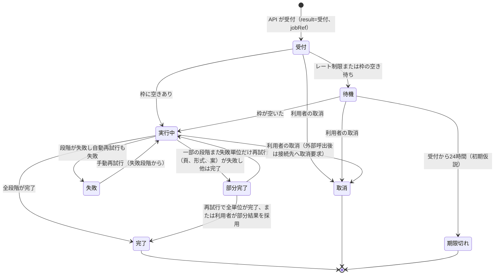
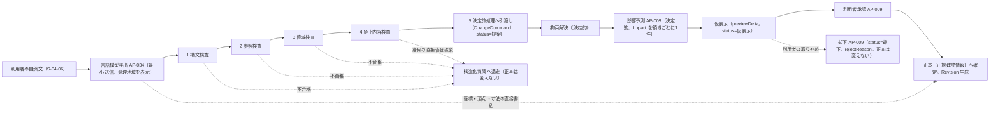
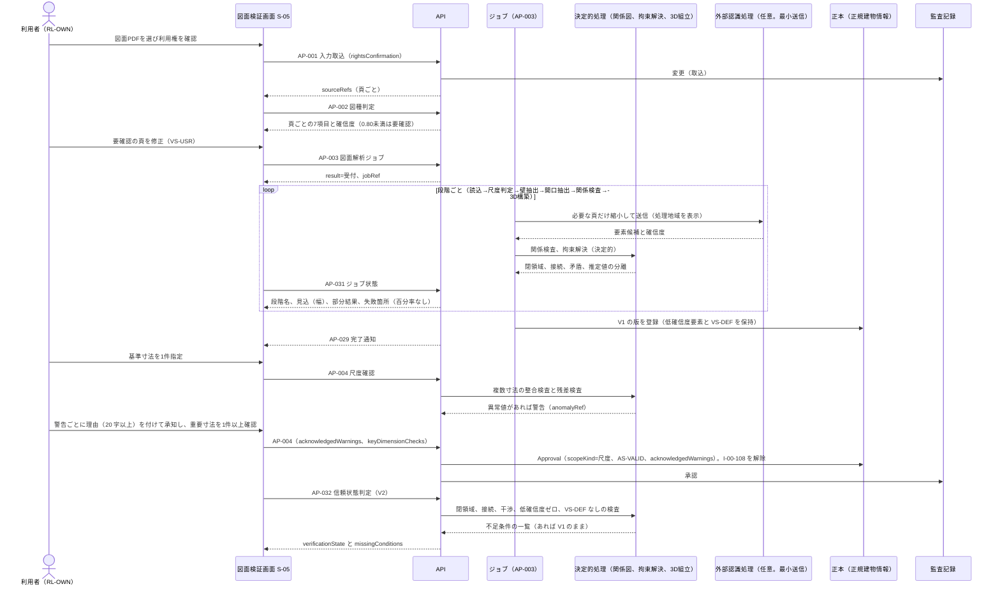
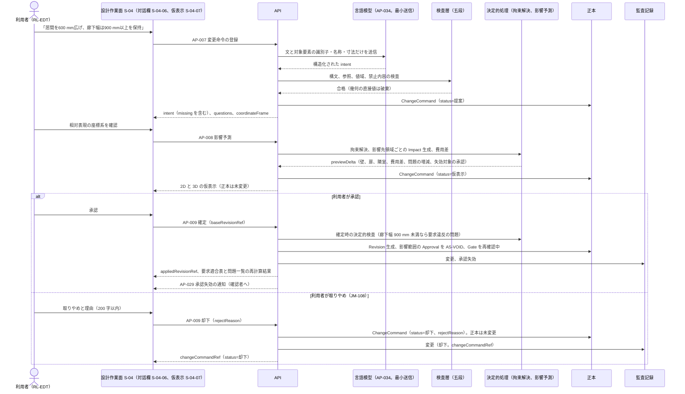
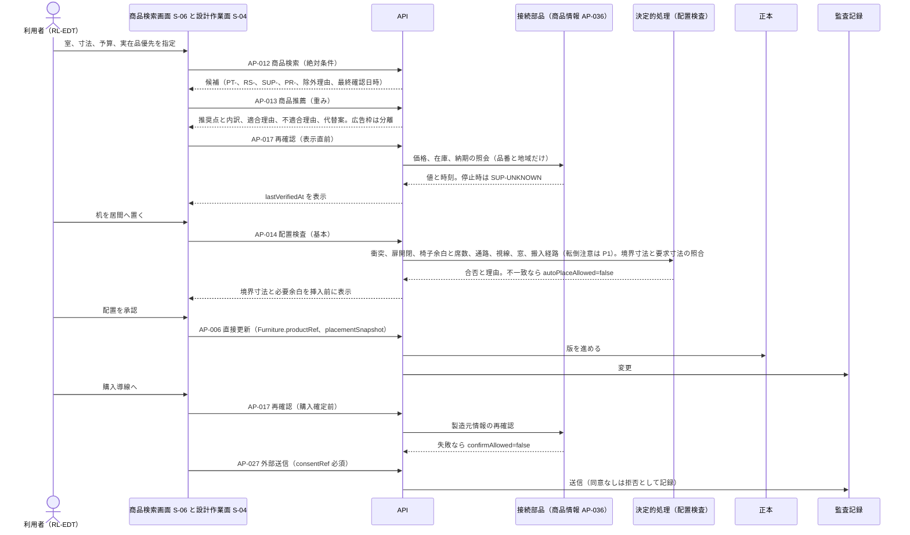
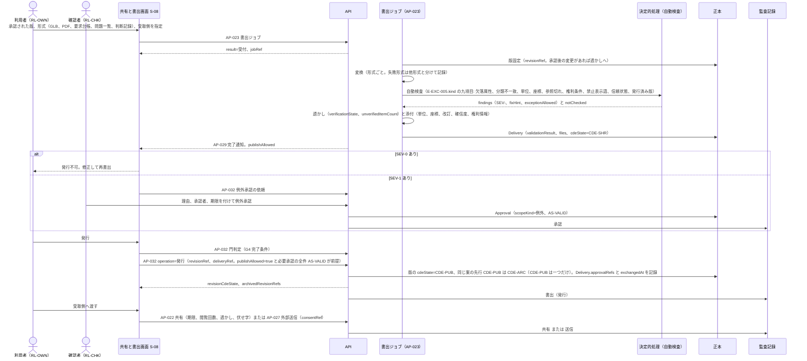

# 第14章 主要APIの入出力、非同期処理、失敗時の扱い

作成日: 2026-09-15　版: v1.5　担当: 段階3 第14章（計算機科学者、BIM技術者、3D幾何処理技術者、個人情報保護と知的財産の審査担当）。v1.5 は段階8 の最終仕上げ（2026-10-08。再々確認の番号 K2-05、主2-01、主2-04、主2-05、主2-17、主4-02。統括の決定 D34、D37、D38、D45、同日の追加の決定 D48、共通の決定 D28、D29）。AP-022 の入力に reservationRef（対象の相談予約。recipientRole=RL-PART のとき必須の条件付き）を加え、運用属性の失敗の扱いと第8節の合格条件の候補に反映した。AP-038 の出力と第3.3節の図面派生の候補列挙で、耐力壁候補線、外周壁、上下階連続壁とその上の要素（外壁開口を含む）を目録の対象外と明示し、改装案件の自動付与（移動に移設、開口の拡大と寸法変更に撤去と新設の組。図面読解の修正は対象外）を第2.3節と AP-038 に写した。AP-004 に基準寸法に使った要素の同じ属性を尺度の承認（AS-VALID）で確認済みに数える扱いを加えた（第12章 v1.6 に追従）。同日の統括の追加の決定 D48（群G1 の残る危険への決定）で、AP-032 の承認の入力に acknowledgedWarnings（scopeKind=要求 の未確認の必須要求ごとの決定者の承知。anomalyRef、reason、judgedBy。第12章 v1.6 の E-REQ-007.acknowledgedWarnings と同じ型）を加え、運用属性の失敗区分1 と第8節の合格条件の候補に反映した（新しい API は作っていない）。記録は `05_審査/再修正記録_最終仕上げ_群G1.md`。v1.4 は段階8前の持ち越し仕上げ（2026-10-08。共通の決定 D14、既定値の識別子の併記 0 行）。用語追加提案の手修正中心の V1 と外部AI処理費の三段の上限に用語集 571、570 への統合を記した。第2.1.1節 AP-036 の対応機能で F-C05-016 の注記から購入確定前の再確認を除き、購入確定前の再確認を F-C05-011（P1。AP-017 purpose=購入確定前）と書き分けた（第16章 第6.4節「P0 の扱い」、F-C05-011、F-C05-016 の識別子の行を正とした。統括の追加の項目）。共通の決定 D6 は本章に EL-LAW の証明書の発行者を列挙する文がなく変更なし。既定値の直書きの候補 17 行はいずれも既定値表の値と別の量（レート制限、契約の保持期限、待ち時間の見込の集計期間、例示）または表に行のない値域検査の範囲で、本文は変えていない。記録は `05_審査/再修正記録_段階8前_仕上げ_群F3.md`。v1.3 は 2026-10-07 の段階6 二回目の修正（段階7 再審査の後。`05_審査/再審査/00_修正計画.md` 第1.14節の 17 件〔主担当 JR-072〜JR-077、整合 JR-095、JR-011、JR-047 ほか〕と第0.3節の横断方針。第12章 v1.4 に追従。内容は `05_審査/再修正記録_2回目_第14章.md`）。同日の二回目の仕上げ（v1.3 の追補。群R2。内容は `05_審査/再修正記録_2回目_仕上げ_群R2.md`）で、二回目の修正を終えた第11章 v1.3、第16章 v1.3、第18章 v1.2 と突合し、AP-004、AP-029、AP-036、AP-037 と第8節の行を合わせた。v1.1 は 2026-10-06 の段階6 初稿審査の再修正（統合指摘 19 件と他章依頼。内容は `05_審査/再修正記録_第14章.md`）。v1.2 は 2026-10-06 の段階6 仕上げ（相互依頼 群B。第14章あての依頼 15 行と第12章 v1.3 の回答への追従。内容は `05_審査/再修正記録_相互依頼_群B.md`）
根拠: 指示文 C2（解析工程と処理状態）、C3（言語模型と幾何の責務分離、自然文変更の順序）、C4（書出形式と添付情報）、C5（商品項目、購入確定前の再確認）、C7（独自家具の生成と3D物品の自動検査）、C8（送信先ごとの同意）、C9（公的地理情報の属性）、C10（役割権限、BCF）、C15（IFC、IDS、BCF、書出時の自動検査）、D（長い処理の状態表示）、E（監査記録、処理地域）、9.2（中核となる情報の流れ）、9.6（商品情報の更新と消失）、9.8（外部AI処理先、最小送信、障害調査用複製）、9.11（重大な失敗と防止策）。基盤定義は `識別子規則.md` 第2.9節（AP-）、`情報実体骨格.md` 第3節と群7、`信頼状態と証拠段階.md`、`機能一覧骨格.md`、`画面指標試験骨格.md`（S-30-02、T-P-008、M-P-01〜03）に従う。v1.1 は基盤定義 v1.2 と `整合検査報告.md` 第5節の識別子変更一覧（I-00-108、F-C03-019-01、F-C09-012-01 ほか）、修正計画 第0.4節（AP-038、AP-039）、第12章 v1.2 の項目辞書（表11.2-A〜C）に従う。v1.2 は第12章 v1.3（2026-10-06 の相互依頼の追補）に従う。調査は `01_調査/05_商品情報基盤と3D生成.md`（BIMobject、Meshy、Tripo、LIXIL）、`01_調査/06_研究と標準.md`（IFC、IDS、BCF、bSDD、glTF、web-ifc）を参照した。

## 0. 本章の位置付け

### 0.1 本章の目的

| 項目 | 内容 | 区分 |
|---|---|---|
| 目的1 | 製品の主要API（識別子 AP-）を採番し、各APIの入力、出力、権限、同期か非同期か、想定処理時間、失敗時の扱い、監査記録、レート制限、版を固定して、機能 F- と API の対応を一箇所に集める（`識別子規則.md` 第2.9節と `機能一覧骨格.md` の依頼への回答） | 【推定】 |
| 目的2 | 長い処理をジョブとして設計し、実際の処理段階（読込、尺度判定、壁抽出、開口抽出、関係検査、3D構築等）、待ち時間の見込、部分結果、失敗箇所、再試行、取消の規則を定め、架空の進捗率を出さない表示規則を画面（S-30-02、S-05-05）へ渡す（指示文D、F-C02-028、T-P-008） | 【推定】 |
| 目的3 | 言語模型の呼び出し境界（意図抽出、説明生成）と幾何処理（決定的な拘束解決と検査）の境界を定め、言語模型の出力を未検査で正本へ書かない検査層を仕様として置く（指示文C3、9.2、F-C03-006） | 【推定】 |
| 目的4 | 外部接続（商品情報、公的地理情報と法規情報、生成3D、外部AI、画像生成）を接続部品として抽象化し、更新頻度、失敗、有効期限、最終確認時刻の扱いを共通化する（指示文9.6、9.8、E） | 【推定】 |
| 目的5 | 書出時の自動検査（欠落属性、分類不一致、単位、座標、参照切れ、権利条件、禁止表示語、信頼状態、発行済み版の九項目。E-EXC-005.kind と一対一）と合否報告の構造（正本は第12章 E-EXC-002.validationResult）を定め、第22章の情報要求適合表と例外承認の入力にする（指示文C15、F-C15-011） | 【推定】 |

### 0.2 本章の範囲と非対象

| 区分 | 内容 | 区分 |
|---|---|---|
| 範囲 | AP-001〜AP-039 の採番と属性（AP-038、AP-039 は v1.1 で追加。JM-077、JM-178）。共通の要求と応答、同期と非同期の区分、失敗の区分、権限と同意と監査の共通規則、レート制限。ジョブの構造、状態遷移、処理段階、進捗表示、待ち時間の見込、部分結果、再試行、取消、返金条件。言語模型の呼び出し境界と検査層。外部接続の抽象化。書出時の自動検査と合否報告。図面解析、自然文変更、商品配置、書出の四つの流れの図示 | 【推定】 |
| 非対象（他章が主章） | 図面の認識処理の内容と確信度の付与方法（第11章）。正規建物情報の実体、属性名、型、座標系、状態遷移（第12章。本章は第12章の型と属性名で入出力を書く）。影響予測の領域別の再計算内容と責任境界（第13章）。画面の部品設計と待機状態、失敗状態の見え方（第15章。本章は表示に必要な情報と条件を渡す）。商品推薦の点数、住友林業参照、独自家具の設計条件、代替品の選定規則（第16章）。提携先の点数、同意画面、有資格者確認の運用（第17章）。敷地と法規の値と判定式（第18章）。性能計算の式と基準（第19章）。費用の算出方法（第20章）。竣工反映と維持（第21章）。権限、同意、監査、削除、IFC・IDS・BCF の運用と情報要求適合表の運用、権利情報の添付規則（第22章。本章は API とジョブと検査の構造まで）。応答時間、暗号化、可用性、到達性の非機能要件と受入条件 AC-、試験手順（第23章）。課金単位と料金（第24章。本章は処理枠の消費と返金の条件まで） | 【推定】 |
| 実装しないこと | 実装コード、経路（URL）の具体的な文字列、通信規約の選定、認証方式の実装。本章は入出力の情報項目と挙動を定める | 【仮定】 |

### 0.3 前提とする章

| 章 | 前提とする内容 |
|---|---|
| 第6章 | 段階門 G0〜G6 の完了条件と進行禁止条件（AP-032 の判定内容） |
| 第7章 | 十二判断領域と影響関係（AP-008 の影響先の列挙順） |
| 第9章、第10章 | 機能一覧と追跡表（本章の F- と AP- の対応を追跡表へ転記） |
| 第11章 | 解析10工程、確信度の付与、V1→V2 の昇格条件（AP-003、AP-004 のジョブ段階と第11章 第4節の工程の対応） |
| 第12章 | 実体 E- の属性名、型（id、str、num(単位)、range、enum、ref、list、map、json、geom）、単位（mm、m2、deg、JPY）、座標系（案件原点＋真北）、版と改訂の単位、機密属性の分離、変更命令の状態。v1.2 の追補（表11.2-A〜C）、三案生成の生成規則（第7.8節。AP-038）、合否報告の構造の正本（E-EXC-002.validationResult）。v1.3 の E-ORG-006.purpose=外部処理 と processorKind、E-REQ-005.roomLayout と generationBasis（method=構想案合成）、E-EXC-005.kind=余白、第7.8節の P0 の法規 4 項目（本章 v1.2 で追従）。v1.4 の E-EXC-008〜010 の項目辞書、E-EXC-002.formats と documentKinds、generationBasis.scale、第7.8節 (b2)(f) と図面派生三案、valueStateMeta の照合、E-ORG-006.purpose=評価利用（本章 v1.3 で追従） |
| 第13章 | 影響予測と干渉検査の責任境界（AP-008、AP-014 の検査内容）。再計算対象（第7.1節、第7.2節）と設備系の建物側の値（第4.2節末尾の表） |
| 第16章、第18章〜第20章、第22章〜第24章 | 判定値と規則の正本（第16章 AP-012〜AP-017、第18章 AP-018 と AP-019、第19章 AP-020、第20章 AP-021、第22章 外部処理先の契約条件と伏せ字、第23章 N-PF-、第24章 処理枠と外部契約）。依頼への対応は第9節 |
| 基盤 識別子規則 | AP-{連番3桁}、必須属性（対応する機能、入力、出力、同期または非同期、失敗時の扱い、権限、外部送信の有無と同意）、版は識別子の版で表す |
| 基盤 情報実体骨格 | E-EXC-002 Delivery、E-EXC-005 ValidationRule、E-EXC-007 AuditLog、E-EXC-008 Notification、E-EXC-009 Transmission、E-EXC-010 DebugCopy（v1.3）、E-REQ-011 ChangeCommand、E-REQ-012 Impact、E-PRD-003 Supplier、E-PRD-007 Availability、E-ORG-006 Consent |
| 基盤 信頼状態と証拠段階 | V0〜V3、VS-、EL-、CS-、PT-、RS-、SUP-、CDE-、IS-、AS-、SEV- の符号と禁止表示語 |
| 基盤 画面指標試験骨格 | S-30-02 処理状態表示、S-05-05、S-04-06-W、S-04-07-W、T-P-007、T-P-008、M-P-01〜M-P-03 |

## 1. API 設計の総則

### 1.1 API 識別子と版

| 規則 | 内容 | 区分 |
|---|---|---|
| 書式 | `AP-{連番3桁}`。本章が AP-001〜AP-039 を採番する（AP-038、AP-039 は修正計画 第0.4節の割当。v1.1）。連番は工程順を意味しない。欠番は詰めない（`識別子規則.md` 第2.9節） | 【推定】 |
| 必須属性 | 対応する機能（F-）、入力、出力、同期または非同期、想定処理時間、失敗時の扱い、権限（RL-）、監査記録、レート制限、外部送信の有無と同意（E-ORG-006 Consent）、版、優先（P0〜P2） | 【推定】 |
| 版 | 版は API の経路に含めず、識別子の版 `AP-003 v1.0` で表す。互換性のない変更（入力の必須項目の追加、出力項目の削除または意味変更、失敗区分の変更、権限の変更）で主番号を上げ、互換の追記（任意項目の追加、説明の修正）で副番号を上げる。主番号を上げた版は旧版と 180 日間並行提供する（初期仮説） | 【仮定】 |
| 内部境界API | AP-034〜AP-037 は外部接続先を呼ぶ内部の境界であり、利用者や提携先へ公開しない。公開しない API にも同じ属性と監査を課す | 【仮定】 |
| 分類 | 利用者向け（RL-OWN、RL-EDT、RL-CHK、RL-VIEW が呼ぶ）、提携先向け（RL-PART が呼ぶ。共有範囲内のみ）、製造元向け（法人の RL-PART が AP-016 と商品登録に使う）、内部境界（製品が外部接続先へ呼ぶ）の四分類 | 【仮定】 |

### 1.2 共通の要求と応答

全 API の要求と応答は次の共通項目を持つ。項目名は第12章の属性名の規則（英字、先頭小文字）に合わせる【仮定】。要求と応答の項目のうち第12章の実体の属性に当たるものは、第12章の属性名と構造（例: E-REQ-011.intent、previewDelta、E-REQ-005.unverifiedItemCount）をそのまま使い、別名を置かない。第12章に対応する属性がない API 固有の項目（failure、jobRef、questions 等）は本章で定義し、第12章の属性名と同じ綴りで別の意味の項目を置かない（v1.1、JM-109）【推定】。

| 項目 | 方向 | 型 | 内容 | 区分 |
|---|---|---|---|---|
| requestId | 要求 | id | 要求ごとの固有ID（UUID 版4）。監査記録（E-EXC-007）の requestRef と対応する | 【仮定】 |
| idempotencyKey | 要求 | str | 冪等鍵。正本を変える API（AP-001、AP-004、AP-006、AP-007、AP-009、AP-015、AP-022、AP-023、AP-026、AP-027、AP-032、AP-033、AP-038、AP-039）で必須。同じ鍵の再送は同じ結果を返し、二重実行しない。保持期間 24 時間（初期仮説） | 【仮定】 |
| projectRef | 要求 | ref[E-BLD-001] | 案件。案件横断台帳を扱う API（AP-012、AP-013、AP-017、AP-028、AP-036、AP-037）では任意 | 【推定】 |
| actorRef | 要求 | ref[E-ORG-001] | 呼出者。役割（RL-）は案件ごとに Person.roles から解決する。運用担当者は申請識別子（AuditLog.requestRef）を必須にする | 【推定】 |
| baseRevisionRef | 要求 | ref[E-REQ-006] | 正本を変える API で、呼出者が見ていた版。正本の最新版と異なる場合は競合として拒否し、差分を返す（F-C10-006 の黙って上書きしない規則） | 【推定】 |
| consentRef | 要求 | ref[E-ORG-006] | 次の場合に必須。(a) 外部送信（AP-027）と外部組織への共有（AP-022 の RL-PART 宛）: 送信先一件ごとの同意（purpose=外部送信 または 共有、recipientRef、contentScope）。(b) 外部処理先を使う API（AP-002 と AP-003 の図面認識、AP-007 と AP-034 の言語模型、AP-011 と AP-039 の画像生成、AP-015 と AP-035 の生成3D）: 処理先の種別ごとの同意（purpose=外部処理、processorKind=処理先の種別（言語模型、図面認識、生成3D、画像生成）、recipientRef=処理先の組織、consentTextVersion、processingRegion。利用開始時に S-15 で一種別ずつ取る。第22章 第1.8節。v1.1、JM-164。processorKind は第12章 v1.3 で E-ORG-006 に登録された属性で、本章の「種別「X」の同意」は purpose=外部処理 かつ processorKind=X の同意を指す。v1.2）。(c) AP-017 の製造元照会に送信内容を含む場合。送信先と内容が同意の recipientRef と contentScope に含まれない場合は拒否し、同意のない種別の外部処理先は使わず種別ごとの退避先へ切り替える（言語模型は構造化質問、図面認識は内部の模型〔自社学習の場合〕または手修正中心の V1、画像生成は意匠像なし、生成3D は内部生成または独自案なし。v1.3、JR-119） | 【推定】 |
| result | 応答 | enum{成功,部分成功,失敗,拒否,受付} | 「受付」は非同期ジョブの登録だけが完了した状態。「部分成功」は部分結果を返す同期 API（AP-005 の共有範囲外を除いた取得等） | 【仮定】 |
| verificationState | 応答 | enum{V0,V1,V2,V3} | 建物情報を返す全 API に付ける（F-C04-011 の常時表示の元）。未確認項目数（unverifiedItemCount。E-REQ-005.unverifiedItemCount）を併記する。未解決点の件数 openItemCount（E-REQ-005.openItemCount）は別の項目であり、未確認項目数の意味で使わない（v1.1、JM-109） | 【推定】 |
| jobRef | 応答 | id | 非同期の場合のジョブ識別子（第3節）。同期の場合は null | 【仮定】 |
| failure | 応答 | json | 失敗時の構造。{category: 失敗区分（第1.4節の1〜7）, stage: 失敗した段階名, targetRefs: 対象, message: 利用者向け文, fixHint: 修正の手掛かり, retryable: bool, retryAfterSeconds: int} | 【仮定】 |
| auditRef | 応答 | ref[E-EXC-007] | 監査記録を残した場合の参照 | 【推定】 |
| processingRegion | 応答 | str | 外部処理先を使った場合の処理地域（F-C10-018）。使わない場合は製品の保存地域 | 【推定】 |
| engineVersion | 応答 | str | 決定的処理（拘束解決、干渉検査、書出検査、3D組立）の名称と版。同じ入力と同じ版で同じ結果を返す根拠 | 【推定】 |

### 1.3 同期と非同期の区分

| 区分 | 定義（観察可能な条件） | 応答 | 画面の状態 | 区分 |
|---|---|---|---|---|
| 同期 | 想定処理時間の 95 百分位が 3 秒以内（M-P-02 の初期仮説と同じ値）。決定的検査、取得、登録、判定 | 結果を同じ応答で返す | 待機状態を出さない、または 1 秒超で短い待機表示 | 【仮定】 |
| 短期非同期 | 3 秒超 30 秒以内。言語模型の意図抽出、影響予測、3D構築、3D物品検査、商品再確認、敷地法規照会 | 「受付」と jobRef を返し、利用者は同じ画面で待つ。画面は部品の待機状態（例: S-04-06-W 意図解析中、S-04-07-W 影響計算中） | 部品の待機状態。段階名を表示 | 【仮定】 |
| 長期非同期 | 30 秒超。図面解析、写実生成、独自家具生成、書出、IDS 検査、外部送信、一括削除、性能の詳細計算 | 「受付」と jobRef を返す。利用者は画面を離れてよく、完了は通知（AP-029）で知らせる。処理状態は S-30-02 と S-05-05 に表示 | 段階名、待ち時間の見込、部分結果、失敗箇所、再試行を表示（第3.4節） | 【推定】 |
| 判定 | 区分は API ごとに固定する（第2.2節）が、入力の規模（頁数、要素数）で見込が閾値を超える場合は上位の区分へ切り替え、応答の result=受付 で知らせる | — | — | 【仮定】 |

30 秒の閾値は第11章 第1.2節「30秒を超える処理は S-05-05 と S-30-02 に表示」と T-P-008 の前提（30 秒以上かかる図面読込）に合わせた【推定】。

### 1.4 失敗の区分と共通の扱い

| 番号 | 失敗区分 | 観察可能な条件 | 応答と扱い | 部分結果 | 再試行 | 監査記録 | 区分 |
|---:|---|---|---|---|---|---|---|
| 1 | 入力不備 | 必須項目の欠落、型と単位の不一致、対象外の形式（DWG を P0 で受け付けない等）、利用権未確認の資料 | 同期で「失敗」。fixHint に修正方法。正本は変えない | なし | 利用者が修正して再要求 | 記録しない（拒否ではないため）。ただし利用権未確認は F-C10-014 の記録を残す | 【推定】 |
| 2 | 権限または同意なし | 役割外の操作、共有範囲外の取得、同意のない送信先、撤回済み同意、運用担当者の申請なし | 「拒否」。拒否理由を返し、正本は変えない | なし | なし（権限や同意が得られた後に再要求） | 必ず残す（AuditLog.result=拒否）。F-C10-001 | 【推定】 |
| 3 | 決定的検査の不合格 | 拘束解決の矛盾、閉領域不成立、干渉 SEV-0、書出検査の SEV-0、進行禁止条件の該当、寸法不一致物品の配置 | 「失敗」または「部分成功」。検出した問題を E-REQ-003 Issue として登録し（複製しない）、正本の対象属性は変えない | あり（検査結果そのものが結果） | 入力を直してから | 変更を伴う場合は「変更」の失敗として残す | 【推定】 |
| 4 | 外部接続の失敗 | 接続先の応答なし、応答の構造不一致、認証失効、接続先のレート制限、出力URLの期限切れ | 自動再試行の後に「失敗」。接続先の状態を「停止」とし、最終成功時刻と最終確認日時を保持。商品は SUP-UNKNOWN、在庫ありと推定しない | 直前までの取得値（時点付き） | 自動 2 回（間隔 10 秒、60 秒。初期仮説）。その後は利用者の手動再試行 | 外部送信を伴う場合は「送信」の失敗として残す | 【推定】 |
| 5 | 処理内部の失敗 | 例外、資源不足、時間超過（段階ごとの上限）、模型の応答なし | ジョブを「失敗」とし、失敗した段階名、部分結果、再試行可否を返す | あり（完了した段階まで） | 自動 1 回、手動は失敗した段階から | 「変更」の失敗として残す（正本を変える処理の場合） | 【推定】 |
| 6 | 期限切れまたは取消 | ジョブの待機が上限（24 時間。初期仮説）を超えた、利用者が取消した、案件が削除された | 「取消」または「期限切れ」。部分結果の保持は第3.8節 | 利用者の選択で保持 | 手動で最初から、または保持した段階から | 取消は「変更」として残す | 【仮定】 |
| 7 | レート制限超過 | 第1.6節の上限を超えた | 「受付」せず待機列へ、または「失敗」で retryAfterSeconds を返す。外部AI処理費の三段の上限（第1.6節）の超過は、言語模型を構造化質問へ、画像生成を意匠像なしへ、外部認識を内部の模型または手修正中心の V1 へ退避する（v1.3、JR-075） | なし | retryAfterSeconds 後 | 記録しない | 【仮定】 |

共通規則: どの失敗区分でも、正本（正規建物情報）は「全て反映」か「全く反映しない」のいずれかであり、途中まで反映した状態を残さない。ジョブの部分結果は正本と分けて保持し、利用者が採用操作をしたときだけ正本へ反映する【推定】。

### 1.5 権限、同意、監査の共通規則

| 規則 | 内容 | 区分 |
|---|---|---|
| 役割の解決 | 権限は役割 RL-OWN、RL-EDT、RL-CHK、RL-VIEW、RL-PART（`識別子規則.md` 第2.8節）で判定する。RL-PART は共有（E-EXC-006 Share）の scope 内だけを取得でき、非共有項目（住所、費用、連絡先等）は API の応答にも含めない（F-C10-007、T-S-013） | 【推定】 |
| 正本を変える操作 | RL-OWN と RL-EDT に限る。RL-CHK は承認（AP-032）と注記、問題の登録だけ。RL-VIEW は取得のみ。RL-PART は共有範囲内の注記と問題（E-EXC-006 の規則） | 【推定】 |
| 同意 | 外部送信（送信先が E-ORG-002 の組織、または外部AI処理先）を伴う API は consentRef を必須にし、Consent.purpose、recipientRef、contentScope、status=有効 を検査する。一括同意の登録操作を API に置かない（T-S-001）。撤回後の送信は失敗区分2。外部処理先（言語模型、図面認識、生成3D、画像生成）は処理先の種別ごとに purpose=外部処理 の同意を一件ずつ取り、利用条件の同意に含めない。全種別へ一度で同意する操作を置かず、処理先の追加と変更は同意文の主番号の更新として再同意を求める。同意のない種別、または契約条件（学習利用の禁止、保持期間、処理地域）を満たさない処理先の接続部品は無効にし、種別ごとの退避先（第1.2節 consentRef (b)）へ切り替えて処理時間の増加を注記する（第22章 第1.8節、第15章 S-15-04。v1.1、JM-164。退避先は v1.3、JR-119） | 【推定】 |
| 電子連絡先 | 初回成果（初回案または不足情報一覧）までの API（AP-001〜AP-005、AP-018、AP-039）は電子連絡先を要求しない。匿名の利用者識別子で案件を作れる（F-C01-025、T-S-002）。無料枠の案件の作成の上限は第1.6節 | 【推定】 |
| 監査記録 | AuditLog.action の enum（閲覧、変更、送信、削除、共有、同意、同意撤回、承認、承認失効、書出、運用閲覧、学習利用、複製、分母変更、取消、やり直し。値の正本は第12章 E-EXC-007）に対応する API 呼出を必ず記録する。記録は追記のみ。本文は保持せず detailsHash を持つ（E-EXC-007）。運用担当者の閲覧は requestRef なしで拒否 | 【推定】 |
| 外部AI処理先 | 外部の言語模型や認識処理へ送る前に必要最小限の頁または切出しへ縮小し、処理先と保存地域を応答の processingRegion で返す（F-C10-018、T-S-012） | 【推定】 |
| 暗号化と組織分離 | 通信時と保存時の暗号化、組織分離は本章の前提とし、要件は第23章の非機能 N-SC- に置く（U-00-059 の判断に従う） | 【仮定】 |

### 1.6 レート制限（初期仮説）

数値は全て初期仮説であり、公開判定会議で固定する【仮定】。上限に達した要求は失敗区分7として retryAfterSeconds を返すか、ジョブの待機列へ入れる。外部AI処理費（M-B-15。言語模型、外部認識、画像生成の合計）は、案件の 1 日の上限、案件の累計上限、製品全体の無料枠の日次上限の三段で抑え、各段の発動を記録する（第24章 第5.2節、第23章 N-PF-08、T-I-019。v1.3、JR-075）【仮定】。

| 対象 | 単位 | 上限（初期仮説） | 超過時 | 根拠 |
|---|---|---|---|---|
| 同期 API 全般 | 利用者ごと | 10 要求/秒、600 要求/分 | retryAfterSeconds を返す | 画面操作の連打を吸収する値【仮定】 |
| 図面解析ジョブ（AP-003） | 利用者ごと | 同時 2 件、待機列 10 件 | 待機列へ。見込を返す | 3D処理費の抑制（指示文9.11「3D処理費が収益を超える」）【仮定】 |
| 3D構築（AP-010）、影響予測（AP-008） | 案件ごと | 同時 1 件（後着が先着を置き換える） | 先着を取消し最新だけ実行 | 変更部分だけ再生成する方針【仮定】 |
| 写実生成（AP-011） | 案件ごと | 1 日 20 枚（無料枠は 3 枚） | 失敗区分7。枠は第24章 | 処理費の管理（M-B-07、M-B-08）【仮定】 |
| 独自家具生成（AP-015） | 利用者ごと | 同時 1 件、1 日 10 件 | 待機列へ | 外部生成3Dの同時実行枠（Meshy Pro は同時 10 タスク。https://www.meshy.ai/pricing 確認日 2026-09-15【事実】）を利用者へ分配【仮定】 |
| 言語模型呼出（AP-034） | 利用者ごと | 30 回/分 | retryAfterSeconds | 対話の頻度【仮定】 |
| 言語模型呼出（AP-034）の費用上限（三段の一段目） | 案件ごと | 1 日 200,000 トークン（入力と出力の合計。無料枠の案件は 50,000 トークン。初期仮説） | 失敗区分7 とし、その日の残りは言語模型を呼ばず構造化質問（一問式）へ退避する。退避中である旨と再開の時刻を表示する（v1.1、JM-183） | M-B-15（案件当たり外部AI処理費）の上限（第24章 第5.2節: 案件定額の案件は案件定額の 15% 以下、無料枠は 3% 相当以下）を守るための値。最小送信の 1 回当たり約 2,000 トークン × 1 日 100 回を目安にした初期仮説で、usage の実績と単価から公開判定会議で固定する。退避が M-P-04 を下げていないかは第23章 N-AV-02 の層別「退避」で監視する【仮定】 |
| 外部AI処理費の案件の累計上限（二段目。v1.3、JR-075） | 案件ごと（案件の全期間） | 言語模型（AP-034 の usage.cost）、画像生成（AP-039 の usage.cost と AP-011）、外部認識（AP-002、AP-003 のジョブの externalTaskRefs の消費量を単価表で換算した額）の累計が、案件定額の案件は案件定額の 15%、無料枠の案件は 3% 相当（言語模型の上限はこの額を単価表で換算したトークン数。単価表は版を持つ） | 失敗区分7 とし、案件の残りの期間は言語模型を構造化質問へ、画像生成を意匠像なしへ、外部認識を内部の模型（自社学習の場合）または手修正中心の V1 へ退避し、退避中である旨を表示する | 1 日の上限だけでは一時保持 30 日の無料枠の案件で 150 万トークンまで使えるため、M-B-15 の上限（第24章 第5.2節）を累計で守る【仮定】 |
| 画像生成と外部認識の回数上限（v1.3、JR-075） | 案件ごと（案件の全期間） | 画像生成（外部処理先を使う AP-039 と AP-011）は 60 枚（無料枠の案件は 3 枚）。外部認識（種別「図面認識」の処理先を使う AP-002、AP-003）は 200 頁（無料枠の案件は 30 頁） | 失敗区分7。AP-039 は意匠像なし（omittedReason=上限超過）、外部認識は累計上限と同じ退避 | 処理費の案件ごとの歯止め（M-B-15）【仮定】 |
| 無料枠の案件の作成（v1.3、JR-075） | 匿名の利用者識別子ごと | 同時 1 件、30 日に 3 件 | 失敗区分7 とし、作成済みの無料枠の案件を続けるか有料の案件で作るかを示す。電子連絡先は要求しない | 無料枠の繰返し利用で処理費が収益に先行しない（第24章 第7節）。識別子の消去や変更で回避でき、完全には守れない（U-14-016）【仮定】 |
| 製品全体の無料枠の外部処理費の日次上限（三段目。v1.3、JR-075） | 製品全体、暦日ごと | 無料枠の案件の外部AI処理費（二段目と同じ集計）の 1 日の合計の上限額（無料枠の費用予算から定め、版を持つ。U-14-016） | その日の残りは無料枠の案件の言語模型を構造化質問へ、画像生成を意匠像なしへ、外部認識を累計上限と同じく退避する。有料の案件は退避しない。発動を日別に記録する（T-I-019） | 無料枠の総量の歯止め【仮定】 |
| 商品情報の再確認（AP-017、AP-036） | 接続先ごと | 5 要求/秒。製造元との契約値が優先 | 直前の取得値を時点付きで返し SUP- を据え置く | 接続先の負荷【仮定】 |
| 外部送信（AP-027） | 送信先ごと、案件ごと | 1 日 3 回 | 失敗区分7 | 迷惑連絡の抑止（M-B-04）【仮定】 |
| 書出（AP-023）、IDS 検査（AP-024） | 案件ごと | 同時 2 件 | 待機列へ | 処理費【仮定】 |
| 三案生成（AP-038） | 案件ごと | 同時 1 件。1 回で処理枠 1 枠（個人有料の定額に 3 回を含む。第24章 第1.1節） | 待機列へ。処理枠の不足は失敗区分7 | 処理費と再生成の抑制【仮定】 |
| 構想案生成（AP-039） | 案件ごと | 同時 1 件。無料枠は 1 件、再生成は 1 回 1 枠（個人有料の定額に 3 回を含む。第24章 第1.1節） | 待機列へ。処理枠の不足は失敗区分7 | 画像生成の処理費（M-B-15）の抑制【仮定】 |
| 共有URL の閲覧 | 共有ごと | Share.viewQuota に従う | 拒否 | F-C10-009【推定】 |

## 2. 主要 API 一覧

### 2.1 一覧（識別子、名称、対応機能、入力、出力）

入力と出力は第12章の属性名と型で書く。第1.2節の共通項目（requestId、idempotencyKey、projectRef、actorRef、baseRevisionRef、consentRef、result、verificationState、jobRef、failure、auditRef、processingRegion、engineVersion）は各行から省く。対応機能の先頭が主となる機能【推定】。AP-012〜AP-017 は識別子、名称、入出力の型を本章が正本とし、判定値、閾値、合格条件、生成履歴の項目は第16章（第5.1節、第8.6節、第8.8節。重みは第3.4節、有効期限は第6.1節）が正本である。各行に書いた値は第16章の写しで、食い違う場合は第16章に従い、本章の初期値で第16章を上書きしない（識別子台帳 第1節。v1.1、JM-193）【推定】。

#### 2.1.1 利用者向けと提携先向けの API（AP-001〜AP-033、AP-038、AP-039）

| 識別子 | 名称 | 対応機能（F-） | 入力 | 出力 | 区分 |
|---|---|---|---|---|---|
| AP-001 | 入力取込 | F-C02-001、F-C10-014、F-C02-002（P1）、F-C02-003（P1）、F-C07-001（P1）、F-C02-004（P2） | files: list[{name, mediaType, content, declaredKind: enum{図面,写真,CAD,BIM,走査,寸法表,手描き}}]; rightsConfirmation: {rightsState: enum{RS-OWN,RS-OK}, holderNote, confirmedByRef}; purpose: enum{図面3D化,写真から改装,家具入力,現況資料} | sourceRefs: list[ref[E-PRD-006]]（頁ごとに分割。kind、page、rightsState、acquiredAt）; rejectedFiles: list[{name, reason}]（対象外形式、破損、上限超過、利用権未確認）; jobRef（頁分割と検査） | 【推定】 |
| AP-002 | 図種判定 | F-C02-005、F-C02-021（P1）、F-C02-019（P1） | sourceRefs; userOverrides: list[{sourceRef, field: enum{入力種別,頁,図種,方位,単位,縮尺,改訂番号}, value}] | pages: list[{sourceRef, inputKind, page, drawingType, orientation, unit, scaleCandidates: list[{scale, confidence}], revisionDate, confidence, valueStates}]（修正値は VS-USR）; levelAssignment（頁と階の対応。P1）; masterCandidates（正本候補と判定理由。P1） | 【推定】 |
| AP-003 | 図面解析ジョブ | F-C02-006、F-C02-007、F-C02-008、F-C02-010、F-C02-011、F-C02-012、F-C02-013、F-C02-017、F-C02-023、F-C02-028、F-C02-009（P1）、F-C02-020（P1）、F-C02-022（P1）、F-C02-027（P1。差分更新） | sourceRefs（図種判定済み）; options: {targetLevels, useAuxiliaryElevation: bool, reanalyzeScope: enum{全頁,影響要素のみ}}（影響要素のみ は新しい現況資料による差分更新に使い、sourceRefs は AP-001 で取り込んだ新資料。第11章 第8.4節。P1）; defaultTableVersion（既定値表の版） | buildingRevisionRef（V1 の版）; elementSummary: {walls, doors, windows, spaces, stairs, lowConfidenceCount}; overlayRefs: list[ref[E-SRV-009]]; issueRefs（矛盾、閉領域不成立、上下階不整合）; assumptionRefs: list[ref[E-SRV-008]]; unverifiedItemCount（E-REQ-005.unverifiedItemCount。v1.1、JM-109）; changeCommandRef（reanalyzeScope=影響要素のみ の場合だけ。E-REQ-011 を origin=新資料取込、status=仮表示 で一件だけ作り、影響する要素だけ工程5〜7 を再実行した結果を resolvedGeometry に入れる。影響と承認失効の対象は AP-008、確定は AP-009 で行い、確定まで正本の版を作らない。この場合 buildingRevisionRef は返さない）; affectedElementRatio（影響する要素の数 ÷ 案の要素数。50% 超（初期仮説）は largeDiff=true を返し、確定前に影響要素の一覧の確認を必須にする。第11章 F-C02-027 例外(b)）（v1.2、第11章の依頼）。処理段階は第3.3節 | 【推定】 |
| AP-004 | 尺度確認と手修正 | F-C02-014、F-C02-015 | buildingRevisionRef; referenceDimensions: list[{elementRef または points: geom, value: num(mm)}]（1 件以上）; acknowledgedWarnings: list[{anomalyRef, reason}]（整合検査の警告ごとの承知。reason は 20 字以上で、理由のない承知は受け付けない。E-REQ-007.acknowledgedWarnings）; keyDimensionChecks: list[{elementRef, attribute, checkMethod: enum{実測,寸法文字,既知寸法,実測不能（未建築）}, checkValue: num(mm)}]（重要寸法の確認 1 件以上と、主要寸法〔六種〕を利用者確認済みにする各件。どちらも checkMethod と checkValue を必須とし、両方のない確認は VS-USR に数えない〔第12章 valueStateMeta〕。寸法文字が 0 件の頁では実測に限り外周の一辺を 1 件以上含める。referenceDimensions に使った要素の同じ属性と区間を照合に指定した要求は失敗区分1 で拒否する〔AC-C02-014-06〕。v1.3、JR-047。基準寸法に使った要素の同じ属性は、尺度の承認（AS-VALID）で確認済みに数える（独立の照合には数えない。keyDimensionChecks に指定しなくても主要寸法の確認に数える。第11章 第6.4節「主要寸法」、第6.5節 条件2、第12章 valueStateMeta と同文。v1.5、再々確認 主2-17、統括の決定 D45）。checkMethod=実測不能（未建築）は checkValue を null で受け付け、V2 の条件に数えず「V2 の対象外（寸法の根拠なし）」を返す〔第11章 F-C02-014 例外(e)、第12章 表11.2-B。JR-050。v1.3 の追補〕）; corrections: list[intent]（origin=直接操作の変更命令） | consistencyCheck: {pass: bool, anomalies: list[{anomalyRef, elementRef, expected, actual, message}], residualCheck: enum{実施,検査不能（寸法文字なし）}}（複数寸法の整合検査と残差検査。検査不能を合格とみなさない）; approvalRef（scopeKind=尺度、AS-VALID、利用者と日時、acknowledgedWarnings。警告がない場合、または全警告に理由付きの承知がある場合だけ記録する）; scaleGate: {resolved: bool, missingDeliverables: list[str]}（I-00-108 の解除に必要な成果「基準寸法 1 件以上の指定、整合検査の実行、警告がある場合は各警告への理由付きの承知の記録、尺度の承認（AS-VALID）」のうち欠けているもの。第11章 F-C02-014、第6章 第2.2節と同じ文言。v1.1、I-00-108 の範囲変更への追従）; rerunJobRef（影響要素の工程5〜8の再実行）; verificationState（V1 のまま。V2 判定は AP-032） | 【推定】 |
| AP-005 | 建物情報の取得 | F-C03-001、F-C03-002、F-C03-005、F-C03-017、F-C02-017、F-C04-011、F-C03-020 | optionRef または revisionRef（省略時は最新の作業中版）; scope: {levelRefs, spaceRefs, entityKinds, includeOverlay: bool, includeTrace: bool}（levelRefs、spaceRefs は E-EXC-006.scope と同じ名前。v1.3、JR-073）; asOf: datetime | entities（第12章の属性名。各属性の valueStates、confidence、conditionState）; overlays（元頁、元座標、認識方法、推定理由）; verificationState; unverifiedItemCount（未確認項目数）; openItemCount（未解決点の件数。未確認項目数とは別。v1.1、JM-109）; cdeState; approvedRevisionRef（承認された版と最新版の差の有無）; trace（includeTrace 時。第12章 第8.2節の経路の索引。要求→案→要素→計算→商品→問題→判断→承認→書出に、要素→数量→費用項目→概算（経路16）と計算・概算→問題（経路3、経路16）を加える。kind=費用 の要求は経路16 の終点への到達を reachable.cost で返す。v1.1、JM-078）。entityKinds に Option を含む場合は evaluationAxes、adoptionReason、droppedRequirementRefs、openItems、costRange を返す（三案の同一評価軸の比較。F-C03-020）; blockingIssueRefs（当該案の現段階と再確認中の段階の Gate.blockingIssueRefs。共有の役割にも問題の識別子と進行禁止条件の名称だけを返し、共有の閲覧画面に表示する。v1.3、JR-011）。RL-PART と RL-VIEW には共有範囲外を含めない | 【推定】 |
| AP-006 | 建物情報の直接更新 | F-C03-007、F-C03-008、F-C03-003、F-C03-016 | commands: list[{intent: {targetRefs, operation, amount, unit, direction, fixedRefs, fixedConstraints, purpose}}]（E-REQ-011.intent と同じ構造。origin=直接操作 では missing は空、rawText は null。v1.1、JM-109） | changeCommandRefs; appliedRevisionRef; deterministicCheck: {constraints: solverStatus, connections: isVerified, clashes: list}; issueRefs（新規または更新。複製しない）; voidedApprovalRefs; verificationStateChange（降格時は理由） | 【推定】 |
| AP-007 | 変更命令の登録（自然文） | F-C03-009、F-C03-010、F-C01-024、F-C03-006 | optionRef; rawText: str（2,000 字以内。初期仮説。E-REQ-011.intent.rawText に保存）; viewpointAtCommand: {camera, activeLevelRef, mode: enum{2D,3D}}（E-REQ-011.viewpointAtCommand）; selectedRefs; locale | changeCommandRef（status=提案）; intent（E-REQ-011.intent と同じ構造: targetRefs, operation, amount, unit, direction, fixedRefs, fixedConstraints, purpose, missing, rawText）; extractionConfidence: map[enum{対象,操作,量,方向,固定条件,目的}, num]（項目ごとの抽出の確信度。応答だけの項目で正本に保存しない）; questions: list[{item: enum{対象,操作,量,方向,固定条件,目的}, text: str}]（intent.missing の各値への質問。応答だけの項目）; coordinateFrame: enum{平面座標,視点座標,未確認}（E-REQ-011.coordinateFrame。direction を含み未確認なら座標系の確認を求め、未確認のまま AP-008 へ進めない）; inspection（検査層の五段の結果。第4.2節）（項目名は v1.1、JM-109） | 【推定】 |
| AP-008 | 影響予測と仮表示 | F-C03-011、F-C03-012、F-C03-013、F-C13-003、F-C11-002、F-C12-005（P1） | changeCommandRef（status=提案、coordinateFrame が確認済み）; recalcLevel: enum{列挙のみ,再計算}（P0 は列挙と注意のみ、P1 で再計算。影響先領域ごとの再計算対象は第13章 第7.1節、第7.2節が正本） | impactRefs: list[ref[E-REQ-012]]（影響先領域ごとに 1 件。影響なしも 1 件）; resolvedGeometry（E-REQ-011.resolvedGeometry。拘束解決の出力）; previewDelta（E-REQ-011.previewDelta と同じ構造: geometry2d, geometry3d, affectedElementRefs, costDelta: range(JPY), issueDelta: {added, resolved, worsened}, approvalDelta: list[ref[E-REQ-007]], performanceDelta, scheduleDeltaDays: range）。recalcLevel=列挙のみ（P0）では performanceDelta と scheduleDeltaDays を再計算せず影響先の列挙と「未再計算（P1）」を返す; changeCommandRef（status=仮表示）（項目名は v1.1、JM-109） | 【推定】 |
| AP-009 | 変更命令の確定、取消、やり直し、分岐 | F-C03-014、F-C03-003、F-C03-004、F-C10-005、F-C03-020 | changeCommandRef; operation: enum{確定,取消,やり直し,分岐,却下}; branchName（分岐時）; rejectReason（却下時に必須。200 字以内。E-REQ-011.rejectReason） | appliedRevisionRef（確定時）; changeCommandRef と status（値域は E-REQ-011.status の 5 値: 提案、仮表示、確定、取消、却下。「やり直し」は状態ではなく intent.operation の値。v1.1、JM-080）。取消とやり直しは新しい変更命令（intent.operation=取消 または やり直し、undoOfRef または redoOfRef）を status=仮表示 で返し、AP-009 operation=確定 で確定する。確定時に元命令の status を「取消」（取消）または「確定」（やり直し。対象の取消命令は「取消」）にする（第12章 第6.8節、第7.4節）。P0 の取消は最新の確定命令から遡る連続した範囲に限る（第12章 第7.4節 手順1）。却下は status=提案 または 仮表示 の命令を status=却下 にし rejectReason を記録して正本を変えない（第12章 第6.8節 PREVIEW → REJECTED。v1.1、JM-108）; voidedApprovalRefs（voidReason に変更識別子）; gateStatusChanges（再確認中になった門）; requirementCompliance（要求適合表の再計算）; issueDelta: {added, resolved, worsened}（E-REQ-011.previewDelta.issueDelta と同じ構造）; optionRef（分岐時の新しい案） | 【推定】 |
| AP-010 | 3D構築（GLB 派生） | F-C02-016、F-C04-012、F-C04-010 | revisionRef; detailLevel: enum{外形のみ,簡略,詳細}; scope: {levelRefs, spaceRefs}; purpose: enum{編集表示,共有,書出} | glbAssetRef（描画専用の派生。保存形式にしない）; geometryCheck: {closedSolids: bool, clashSev0: int, invalidElements: list[{elementRef, reason}]}; triangleCount; watermark（AP-023 と同じ項目。glTF の extras に格納。v1.1、JM-109。項目は v1.3、JR-047、JR-095） | 【推定】 |
| AP-011 | 写実生成 | F-C03-015 | revisionRef; viewpoint: camera; scene: {dateTime, materialRefs}; consentRef（外部処理先を使う場合） | deliveryRef（E-EXC-002。formats=写実画像、revisionRef=derivedFromRevisionRef、verificationState、viewpoint、generatorRef。書出検査の禁止表示語と信頼状態の対象にする。第12章 U-12-003 の確定に合わせた。v1.1、JM-112）; imageAssetRef（透かし付き。Delivery.fileRefs の保存先）; derivedFromRevisionRef; prohibitedTermCheck: pass; 正本への書戻し経路を持たない | 【推定】 |
| AP-012 | 商品検索 | F-C05-004、F-C05-005、F-C05-003、F-C06-001、F-C05-013（P1） | filters: {classificationRef, dimensions: range, priceRange, materials, woodSpecies, colors, region, supplyState}; hardConstraints: {spaceRef, requiredClearance, doorSwing, corridorWidth, budgetCap, rightsRequired: bool}; mode: enum{実在品のみ,実在品優先,独自案のみ}; page | products: list[{productRef, tier: PT-, rightsState: RS-, supplyState: SUP-, relations: list[PR-], lastVerifiedAt, exclusionReasons}]; totalCount; excludedCount; catalogStats: {収録企業数, 収録品数, 最終更新日, 正規3D割合, 未収録分野} | 【推定】 |
| AP-013 | 商品推薦 | F-C05-006、F-C05-007、F-C05-008、F-C06-005、F-C05-012（P1）、F-C13-006（P1） | candidateProductRefs または filters; spaceRef; requirementRefs; weights: {機能適合: 30, 寸法と余白: 20, 予算: 15, 意匠: 10, 素材と樹種: 10, 地域と供給: 10, 環境性: 5}（合計 100。利用者が変更可） | ranked: list[{productRef, score, breakdown（7 項目）, fitReasons, misfitReasons, alternatives, priceAndStockVerifiedAt, leadTimeDays, slackDays, substituteCount, explorationSlot: bool（探索枠の札）}]; sponsored: list（推奨点の並びから分離し「広告」を明示）。判定値は第16章（重みの初期値、範囲 0〜50 と正規化は第3.4節、多様化と探索枠は第3.5節が正本。本行の重みはその写し。v1.1、JM-193） | 【推定】 |
| AP-014 | 配置検査 | F-C05-009、F-C04-010、F-C07-010、F-C07-008、F-C05-010（P1） | revisionRef; placements: list[{productRef または assetRef, spaceRef, position: geom, rotation: num(deg)}]; checkSet: enum{基本,設備系}（基本: 衝突、扉開閉、椅子余白と席数、通路、視線、窓、搬入経路、転倒注意（P1）。設備系: 電源、給排水、換気、発熱、点検空間、交換経路）; requirementRefs: list[ref[E-REQ-001]]（任意。椅子余白と席数の判定に使う食卓の席数 N の要求（来客時 N＋2）を渡す。要求がない場合は席数を判定せず椅子余白だけを判定する。第16章 第5.1節 項目3。v1.2、JM-045） | results: list[{placement, checks: list[{kind, pass, detail, issueRef}], clearancePreview: {boundingDimensions, requiredClearance}, autoPlaceAllowed: bool}]（要求寸法と境界寸法が合わない物品は autoPlaceAllowed=false）。席数の detail は座れる席の数と要求の席数（N、来客時 N＋2）。転倒注意（第16章 第5.1節 項目14、F-C05-009 の項目8。P1）は、寝室に配置した家具の高さが DV-FN-01 の閾値を超え E-ELM-013.isAnchored=false の場合に、寝台（E-ELM-013 kind=寝台）からの水平距離を detail に付けて警告を返す。P0 では判定せず checks に含めない（isAnchored の記録だけ。JM-120）。検査規則は E-EXC-005（kind=干渉、余白。第12章 v1.3）で、空間側検査 F-C04-010 と同じ版を使う（JM-067）。判定値は第16章（13 項目と転倒注意の判定方法、閾値、重大度は第5.1節が正本。設備系の建物側の値は第13章 第4.2節末尾の表。v1.1、JM-193。席数と転倒注意は v1.2） | 【推定】 |
| AP-015 | 独自家具生成ジョブ | F-C07-002、F-C07-003、F-C07-004、F-C07-005、F-C07-006、F-C07-007 | inputs: {text, photoSourceRefs（利用権確認済み）, sketchSourceRefs, dimensionTable}; conditions: {requiredDimensions, use, bodyDimensions, materials, woodSpecies, colors, costRange, fabricationMethod}（8 項目。未指定は「指定なし」）; consentRef（外部生成処理先） | realProductCandidates（実在品探索の結果。0 件のときだけ生成へ進む）; options: list[3]{glbLowRef, glbHighRef, pbrMaterials, origin, boundingDimensions, collisionShape, parts, generationHistory: {generatorApi, modelVersion, plan, consumedCredits, externalTaskId, rightsCondition, referenceImageRightsCheck}, estimatedParts（見えない部分の推定範囲）, inspectionRef}; tier=PT-AI; rightsState=RS-OWN; notice「製作可否は未確認」と確認対象 7 項目。判定値は第16章（条件 8 項目は第8.3節、GLB の仕様と生成履歴の項目（generatedAt、inputRefs、inspectionRef を含む）は第8.6節が正本。v1.1、JM-193） | 【推定】 |
| AP-016 | 3D物品の自動検査 | F-C07-009、F-C05-019（P2） | assetRef; expected: {unit, boundingDimensions, origin, upAxis, maxTriangles} | checks: 15 項目 {単位, 軸方向, 尺度, 原点, 表裏, 法線, 閉じた形状, UV, 材質, 画像解像度, 三角形数, 詳細段階, 境界寸法, 当たり判定, 可動部範囲} の各 {pass, measured, expected, fixHint}; overallPass; testRef（E-SRV-003 kind=3D物品自動検査）。判定値は第16章（15 項目の合格条件と不合格時の扱いは第8.8節が正本。v1.1、JM-193） | 【推定】 |
| AP-017 | 商品情報の再確認 | F-C05-015、F-C05-016（P1）、F-C05-011（P1）、F-C06-005 | productRefs; region; purpose: enum{表示直前,購入確定前} | availability: list[{productRef, stockState, leadTimeDays, priceAtTime, priceDate, supplyState: SUP-, lastVerifiedAt, lastSuccessAt, connectionStatus, fingerprintChanged: bool}]（接続停止時は SUP-UNKNOWN と最終確認日時を返し在庫ありと推定しない）; confirmAllowed: bool（購入確定前の再確認に失敗した場合と、supplyState=SUP-DISC の場合は false）; substituteLink（SUP-DISC の商品では代替品 S-06-06 への導線を返す。公式頁への接続は「参考（販売終了）」として返し購入導線と呼ばない）。SUP-DISC と SUP-UNKNOWN の商品に「購入可能」「在庫あり」「供給中」の表示語を付けない（第16章 第4.2節、第4.3節、F-C05-011 からの転記。v1.1、JM-119）。判定値は第16章（有効期限 DV-CO-03 の価格と在庫 24 時間、納期 7 日は第6.1節が正本。v1.1、JM-193） | 【推定】 |
| AP-018 | 敷地法規照会 | F-C09-001、F-C09-002、F-C09-003、F-C09-004、F-C09-009、F-C09-010、F-C09-015、F-C09-012-01（P0。利用者操作の再取得）、F-C09-012-02（P1） | siteRef; address または lotNumbers（機密。分離保存へ）; items: {regulations: list[enum], hazards: list[enum]}; asOfPolicy: enum{最新,取得済み}（最新は P0 の利用者操作による版の再取得にも使い、checkedAt と validUntil を更新する。第18章 第1.4.2節） | siteRegulationRefs: list[ref[E-SRV-011]]（法令名、自治体、条項、版、施行日、取得日、値、出典）; hazardInfoRefs: list[ref[E-SRV-012]]（出典、取得日、対象時点、解像度、座標系、適用範囲、訂正履歴）; notices: {notLegalBoundary: true, noSafetyGuarantee: true}; requiredSurveys（測量、地盤調査、行政照会、供給事業者確認）; confirmationItems: list[{item, state: enum{確認済み,仮定,不足調査}, sourceRef, valueState, surveyRef, assumptionRef}]（E-BLD-002.confirmationItems。第18章 第2.1節の 11 項目と三状態）; coverageClass: enum{対象地域,部分対象地域,対象外地域}（地域符号による対象区分。第18章 第5.1節）; versionChanges（版更新の検出。P1）（v1.1、第18章の依頼） | 【推定】 |
| AP-019 | 法規判定 | F-C09-008、F-C09-011（P1） | optionRef; siteRegulationRefs; items: list[enum{建蔽率,容積率,高さ,接道}]（P0）; inputRefs（計算に使う要素） | calculationRefs: list[ref[E-SRV-004]]（kind=法規判定。法令名、自治体、版、施行日、取得日、該当根拠、入力値、計算、余裕量と、第18章 第4.1節の追加項目: 着工予定日 plannedStartDate による適用版の選択、exemptionReason、transitionalMeasure、category（P1））; advisoryNotice（助言であり適合を保証しない）; evidenceLevel=EL-CAL; validity: enum{有効,再計算要,失効,判定不能}（判定不能は outputs.values.requiredInputs に必要入力の一覧を必ず持ち I-18-004 の対象。第18章 第4.2節）; regulationValidity（参照した E-SRV-011 が validUntil を超えた条項は「確認期限切れ」と返し、改正あり再判定要と区別する。F-C09-012-01）; expertCheckState（有資格者確認の有無と確認範囲）（v1.1、第18章の依頼） | 【推定】 |
| AP-020 | 性能計算 | F-C04-009、F-C12-008、F-C12-015（P1）、F-C12-013（P1）、F-C12-011（P1。kind=利用円滑性） | optionRef; kind: enum{日照簡易,日照詳細,性能計算,通風,音,熱橋結露,利用円滑性}（E-SRV-004.kind と一対一。温熱は kind=性能計算〔standard で温熱の基準を指定〕として登録する。熱橋結露は第19章 第6.1節、利用円滑性は第19章 第2.3節。v1.1、JM-111、JM-135。温熱の扱いは v1.3、JR-073）; conditions: {dateTime, standard: {name, version, region, conditions}, inputRefs}。kind=利用円滑性 の inputRefs は E-SPC-001（polygon）、E-ELM-011（footprint）、E-ELM-013（collisionShape。寝台を含む）、E-ELM-007.swingArea、E-ELM-002.levelDelta、E-SYS-003（kind=動線）、E-ELM-016、E-BLD-002（高低差）、E-ELM-010 と、同一対象の要求値（E-REQ-001）; targetSpaceRefs（省略時は便所、浴室、脱衣室、寝室、玄関） | calculationRef（E-SRV-004。inputs、standard、outputs、margin、engine、validity）; performanceTargetUpdates（EL-CAL の記録を別列に追加。合成した「達成」を作らない）; needsRejudge。kind=利用円滑性 では outputs.values に第19章 第2.3節の 12 項目 × 室ごとの {result（合格、不合格、有、無、未検査、未確認のいずれか）, shortfallMm（回転は最大内接円の直径、移乗と介助空間は空きの幅）, thresholdSource（R- または DV-FN-01）, thresholdValue} を持ち、不合格は問題（主担当 A07）として outputs.issueRefs に返す。家具、器具、寝台が未配置の室は「未検査」、高低差が現地調査前の屋外経路は「未確認」とし、「指摘なし」と異なる値で返す。当事者確認（E-SRV-013.stakeholderCheck）は書かない。判定式と閾値の正本は第19章 第2.3節 | 【推定】 |
| AP-021 | 費用計算 | F-C13-001、F-C13-002、F-C13-003、F-C13-004（P1。kind=期間）、F-C13-005（P1。kind=期間） | optionRef; revisionRef; kind: enum{費用,期間}（既定は費用。期間は v1.1 で追加。第20章 U-20-011 への判断）; unitPriceDate; region; changeRef（変更差を求める場合） | kind=費用: estimateRef（E-SRV-005。totalRange は min < max を必須、confidenceRange、exclusions、priceIndexNote）; costItems: list[{workCategory, amountRange, quantityRefs, unitPriceDate, region, isProvisional}]; costDelta: {range, causeChangeRef}（changeRef 指定時）。kind=期間: scheduleRef（E-SRV-015。工程ごとの期間の幅）と calculationRef（E-SRV-004 kind=期間。工程の最短経路と危険）。数量、単価幅、確信幅、総額、単価時点と地域、物価変動の注記、変更差の計算式の正本は第20章 第10.1節（v1.1、第20章の依頼） | 【推定】 |
| AP-022 | 共有 | F-C10-009、F-C10-017、F-C03-018、F-C10-007（P1） | targetRef（Revision、Delivery、Issue）; recipientRef（E-ORG-001 または E-ORG-002）; recipientRole: enum{RL-CHK,RL-VIEW,RL-PART}; scope: {levelRefs, spaceRefs, issueRefs, sourceRefs, zoneRef, nonSharedItems}（E-EXC-006.scope と同じ構造。sourceRefs は共有する資料で、BCF の DocumentReference の判定にも使う。第17章 第7.6節、第7.7節 規則5。v1.3、JR-073）; reservationRef（対象の相談予約。ref[E-ORG-009]。recipientRole=RL-PART のとき必須の条件付き。consentRef と同じ同意、recipientRef と同じ予約先〔E-ORG-009.organizationRef〕を持つ予約に限り、欠落と不一致の要求は失敗区分1 で受け付けない。E-EXC-006.reservationRef に記録し、部分共有の expiresAt の既定の起点〔予約の scheduledAt ＋ 30 日の仮置き、completedAt の記録で completedAt ＋ 30 日に更新〕に使う。第12章 E-EXC-006、第17章 第7.6節、F-C10-007、U-17-018。v1.5、再々確認 K2-05、共通の決定 D29）; expiresAt; viewQuota; protection: {watermark: true, downloadAllowed: bool}; redactionDecisions（既定で適用する伏せ字候補のうち RL-OWN が明示して外すもの）; recipientLabel（発行先の役割と表示名または組織名。必須。E-EXC-006.recipientLabel）; confirmation: {confirmedAt: datetime, displayedItemsHash: str}（必須。発行先、目的、送信する情報、送信しない情報、期限と取消の方法を第17章 第5.2節と同じ順で示した確認表示への確認操作。表示内容の要約値と時刻を送る）; viewerVerification（閲覧時の本人確認。任意で P0 の任意機能。method: enum{なし,電子連絡先,合言葉}、既定は なし。電子連絡先の照合値は分離領域の secretRef、合言葉は要約値だけを保持する。E-EXC-006 の属性。第22章 第1.4節、F-C10-009）（recipientLabel、confirmation、viewerVerification は v1.2、JM-165） | shareRef（E-EXC-006。scope は E-EXC-006.scope に保存し、recipientRef、recipientRole、recipientLabel、evidenceRef、viewerVerification を記録する）; evidenceRef（confirmation から作った確認操作の記録。E-PRD-006 kind=利用者入力。E-EXC-006.evidenceRef。G4 完了条件(5)と I-00-125 の発行先ごとの判定に使う。v1.2、JM-165）; url（推測不能な識別子。初期値は非公開）; detectedSensitiveItems（住所、氏名、図面番号、位置情報の検出と伏せ字候補。公開共有と RL-PART への共有では既定で適用。第22章 第1.6節）; revisionCdeState（targetRef が Revision の場合、CDE-WIP の版を CDE-SHR にした結果。共有の取消で CDE-WIP へ戻す。第12章 第6.7節。v1.1、JM-110）; warnings（伏せ字を外した公開への警告） | 【推定】 |
| AP-023 | 書出ジョブ | F-C15-011、F-C15-007、F-C15-013、F-C15-017、F-C10-015、F-C02-018、F-C04-012、F-C04-014、F-C04-013（P1）、F-C04-015（P1） | optionRef; revisionRef（承認された版を推奨。最新版が承認後に変わっていれば透かしに「承認後に変更あり」）; formats: list[enum{IFC,GLB,PDF,SVG,DXF,BCF,JSON,写実画像}]（E-EXC-002.formats と同じ値で、形式だけを持つ。JSON は本製品の交換形式〔版付き。定義は第22章 第6.1節。P1〕。写実画像は AP-011 が同じ版から生成した画像を一式に含め、本 API は生成しない。v1.3、JR-102）; documentKinds: list[enum{要求台帳,問題一覧,判断記録,責任表,関係者表,情報要求適合表,性能比較,概算,期間,敷地根拠,仮定一覧,主要危険一覧,機器台帳,竣工差分,権利条件一覧,交換資料目録,商品一覧,不足調査一覧,検査記録,変更記録}]（E-EXC-002.documentKinds と同じ 20 値。formats に PDF または JSON を含む場合に必須。v1.3、JR-102）; kind: enum{通常,引渡し一式}（E-EXC-002.kind。引渡し一式は G5 の成果で P2。第21章）; ruleSetVersion（受付時に固定する検査規則集合の版。validationResult.ruleSetVersion に記録する。第22章）; exportSettings: {ifcVersion（IFC4 ADD2 TC1 既定、IFC 4.3 選択）, unit, origin, orientation, scale, sheetSize}; informationRequirementRef; recipientRef; consentRef（外部へ渡す場合） | deliveryRef（E-EXC-002）; validationResult（第6.3節）; files（応答の項目。保存先は E-EXC-002.fileRefs）: list[{format, assetRef, sizeBytes, watermark: {verificationState, unverifiedItemCount, scaleNotice, unconfirmedConditionCount}（v1.1、JM-109。scaleNotice は「尺度: 警告承知あり（n 件）」または寸法文字 0 件の頁で承認した尺度の「尺度: 残差検査不能（寸法文字なし）、実測照合 n 件」、unconfirmedConditionCount は S-30-01 の「現況未確認（n 要素）」の n で、0 件と非該当は表示しない。項目の正本は第22章 第1.4節「透かし」で、GLB と PDF は注記にも載せる。v1.3、JR-047、JR-095）, attachments: {unit, origin, revision, confidenceSummary, rights}}]; cdeState; publishAllowed: bool（SEV-0 が 0 件、かつ SEV-1 の全件が例外承認済みの場合だけ true。第6.3節） | 【推定】 |
| AP-024 | IDS 検査 | F-C15-008、F-C15-006、F-C15-016 | deliveryRef（IFC を含む）または revisionRef; informationRequirementRef（format=IDS、idsFileRef） | idsResult: {specifications: list[{name, applicability, requirements: list[{facet: enum{Entity,Attribute,Classification,Property,Material,PartOf}, cardinality, pass, failingEntities: list[ifcGuid]}]}], pass: bool}; findings（第6.3節の構造へ変換） | 【推定】 |
| AP-025 | BCF 交換 | F-C10-008 | 書出: issueRefs; revisionRef。取込: bcfAssetRef; statusMapping（TopicStatus と IS- の対応表） | 書出: bcfAssetRef; topicMap: list[{issueRef, topicGuid}]。取込: issueRefs（更新または新規。複製しない）; unmappedTopics; lostAttributes（視点、対象要素、状態、担当の欠落。1 件でもあれば失敗） | 【推定】 |
| AP-026 | 同意管理 | F-C10-011、F-C08-005（同意部分。P1）、F-C10-018（表示部分） | personRef; purpose: enum{外部送信,外部処理,学習利用,評価利用,入居後確認,共有,商品情報照会,運用閲覧,利用条件}（外部処理は処理先の種別ごとの同意。v1.1、JM-164。評価利用は第12章 v1.4 の E-ORG-006.purpose への追従で、既定は無効、学習利用とは別の同意。第22章 F-C10-011。v1.3）; processorKind: enum{言語模型,図面認識,生成3D,画像生成}（purpose=外部処理 で必須。一要求で一種別だけ。E-ORG-006.processorKind。v1.2）; recipientRef（外部送信と外部処理では必須、一件。外部処理では処理先の組織）; contentScope; consentTextVersion; operation: enum{付与,撤回,照会} | consentRef; status: enum{有効,撤回,期限切れ}; processingRegion; evidenceRef（画面記録）; history。一括同意（recipientRef が複数）は拒否 | 【推定】 |
| AP-027 | 外部送信 | F-C08-005、F-C08-007、F-C05-017、F-C10-007 | recipientRef（一件）; consentRef; payload: {deliveryRef または shareRef, contentScope, redactions}; purpose: enum{相談,相談予約,購入導線,連絡停止要求}; operation: enum{送信,迷惑連絡の報告}（迷惑連絡の報告は transmissionRef を指定） | transmissionRecord: ref[E-EXC-009]（送信記録。AP-027 は E-EXC-009 の登録と更新の API で、受領状態 receiptState、連絡停止の応答 contactStop、迷惑連絡の報告 spamReported の更新もここで行う。属性名と型の正本は第12章 第4.10節〔recipientRef、sentAt、purpose、contentSummaryHash、consentRef、consentTextVersion、receiptState、contactStop、spamReported、bcfFiltering、retentionUntil〕。第17章 第5.4節。v1.3、JR-054。bcfFiltering は BCF を含む送信の場合だけ持ち、第17章 第7.7節 規則2 と規則6 の除外と伏せ字の件数を送信前に S-20 または S-08 に表示し、監査記録 action=送信 にも残す。v1.2）; auditRef。同意なし、撤回済み、contentScope 外の内容と、第17章 第7.7節の規則1〜5 に反する Topic を含む BCF は送信前に拒否する。ただし purpose=連絡停止要求 は同意の撤回（AP-026）を契機に製品が送るもので、撤回済みの同意の送信先へ先行送信の識別子と連絡停止と受領情報の削除の要求だけを送る（新たな個人情報を含めない） | 【推定】 |
| AP-028 | 提携先照会 | F-C08-001、F-C08-002、F-C08-003、F-C08-004、F-C08-009 | criteria: {region, specialties, budgetRange, structureType, performance, capacity, responseTimeHours}; projectRef（案件条件との照合）; compareRefs（3 社以上） | organizations: list[{organizationRef, verifiedAt, attributes（資格、対応地域、得意分野、予算帯、構法、性能、作品事例、担当余力、返答時間、料金、紹介料、検証日）, matchReasonText, scoreBreakdown, isSponsored, referralFee}]; comparisonTable（同一項目。欠落を明示）; notSuitedForMatches: list[{organizationRef, kind, reasonText, result: enum{該当,近接}}]（提携先の notSuitedFor と案件の要求台帳の照合。該当した提携先は organizations から除き、近接（閾値の 20% 以内）は合わない理由として表示する。第17章 第2.3節）; excludedCandidates: {count, reasons: list[{reason, count}]}（除外した候補の件数と理由。notSuitedFor 該当、verifiedAt なし、対応地域外 等。v1.1、JM-111）。verifiedAt のない提携先は返さない | 【推定】 |
| AP-029 | 通知 | F-C10-005、F-C15-002、F-C09-012-01（P0。手動再取得の版更新。JR-086）、F-C09-012-02（P1）、F-C05-015（販売終了の通知は P0。第16章 第6.4節 第2箇条。JR-083）、F-C02-028 | 登録: kind: enum{承認依頼,承認失効,差戻し,進行禁止,問題期限超過,権利失効,販売終了,版更新,共有期限,同意撤回,一時保持期限,削除完了,ジョブ完了,ジョブ失敗}（差戻し、問題期限超過、一時保持期限、削除完了は v1.1。第15章 S-17-02、JM-111、JM-157）; targetRef; recipientRefs; summary。取得: personRef; since | notificationRefs: list[ref[E-EXC-008]]（通知の保持先。属性名と型の正本は第12章 第4.10節。v1.3、JR-053）; deliveryState（E-EXC-008.deliveryState。宛先ごとの state、attempts、readAt。配信は非同期）。kind=版更新 と kind=販売終了 は、案件の利用者に加え、対象を含む発行済み版（CDE-PUB）の交換資料の受取側（E-EXC-002.recipientRef。RL-CHK、RL-PART）にも送る（第6章 第5.3節 規則9、第18章 第4.7節。JM-038）。kind=版更新 は週次の検知（P1）に加え、P0 の手動再取得で台帳の版が進んだ時点でも、旧版を参照する全案件の利用者と発行済み版の受取側へ送る（AP-037。JR-086）。案件の利用者以外の宛先（E-EXC-002.recipientRef の RL-PART と、共有URL で渡した受取側）への配信は、当該宛先への同意（E-ORG-006 purpose=外部送信 または 共有、status=有効）または有効な共有（E-EXC-006 の期限内で取消なし）がある場合だけ行う。撤回後、取消後、期限切れの宛先には配信せず deliveryState.state=未配信（同意なし）と記録し、所有者の S-17 に「受取側へ通知していません（同意撤回済み）」を出す（第22章 AC-C10-009-05。v1.3、JR-072）。通知本文に非共有項目と禁止表示語を含めない | 【推定】 |
| AP-030 | 監査記録 | F-C10-010、F-C10-019 | 追記: AuditLog の属性（actorRef、action、targetRef、at、requestRef、processingRegion、result、detailsHash、retentionUntil、relatedConsentRef）。抽出: projectRef; range; filters; requestRef（運用担当者は必須） | auditRefs; records（追記のみ。改訂不可）; debugCopies: list[ref[E-EXC-010]]（障害調査用複製。申請、目的、対象、承認者、期限、延長回数〔上限 1〕、削除日時と削除の証跡を持つ。属性の正本は第12章 第4.10節、用語集 565。v1.3、JR-054） | 【推定】 |
| AP-031 | ジョブ状態の取得と操作 | F-C02-028 | jobRef; operation: enum{取得,取消,再試行,部分結果の採用,部分結果の破棄}; retryFromStage | job（第3.1節の構造。status、stages、currentStage、estimatedWait、partialResults、failure、retryable、cancelable、billing） | 【推定】 |
| AP-032 | 承認と段階門判定 | F-C10-004、F-C15-002、F-C15-003、F-C15-004、F-C15-001、F-C03-021、F-C03-018、F-C15-017、F-C02-019（P1。正本確定）、F-C08-008（P1）、F-C11-010（P1） | 承認: scopeKind; scope（E-REQ-007.scope の refs と entityKind、attributes）; approverRef; qualification（有資格者の場合。氏名、資格、番号、地域、verificationStatus）; standardsUsed; calculationRefs; acknowledgedWarnings: list[{anomalyRef, reason, judgedBy: enum{P1,受取側の設備設計者}}]（scopeKind=要求 で未確認の必須要求〔非常時の RP-MUST で判定区分が「未確認（P1で判定）」の要求〕がある場合に、要求ごとの決定者の承知を受ける。S-03-03 の「承知する」の操作の入力。anomalyRef は承知する要求〔E-REQ-001〕の識別子〔要求の参照。承知の欠けで登録した SEV-1 の問題は要求ごとの承知がそろうと解決する。第6章 第8.2節〕、reason は 20 字以上、judgedBy は判定する者。第12章 v1.6 の E-REQ-007.acknowledgedWarnings と同じ型。承認ではなく承知の記録で、例外承認では代えない。G2 完了条件(9)、JR-024。v1.5、統括の決定 D48）; exceptionKind（例外承認の場合。通常、利用者判断）; operation: enum{承認,差戻し,例外承認,承認者の取消}; returnReason（差戻し時に必須。200 字以内）; voidDetail（承認者の取消時に必須の理由。voidReason.detail に記録）。門判定: gate: enum{G0..G6}; operation: enum{完了条件判定,信頼状態判定,進行禁止判定,通過}。版の操作: operation: enum{発行,正本確定}。発行は revisionRef（発行する版）と deliveryRef（交換資料）、正本確定は masterDecision: {drawingNumber, choice: enum{正本の確定,新版の追加,旧版採用,引継ぎから除外,案件から除外（混入）,欠落のまま進める}, sourceRefs, reason, deciderRef}（P1。JM-069。drawingNumber と choice は第11章 F-C02-019 の三択と例外(c)に合わせた。reason は旧版採用、二つの除外、欠落のまま進める で必須。choice=引継ぎから除外 は E-EXC-002 の情報要求適合表へ欠落として記録する。v1.3、JR-074） | 承認: approvalRef（AS-VALID）; verificationStateChange（V2→V3 は照合済みの資格がそろう場合だけ。範囲外は V2 のまま）; returnedApprovalRef（差戻し。status は AS-PENDING のまま returnReason、returnedAt、returnCount を記録。JM-083）; voidedApprovalRef（承認者の取消。AS-VOID、voidReason.kind=承認者取消、changeRef=null。第6章 第5.3節 規則12）。門判定: gateRef（status）; completionChecks; requiredDeliverables; blockingIssueRefs（SEV-0。例外承認で解除しない）; maxVerificationState; missingConditions（昇格に不足する条件の一覧）。通過は完了条件が全て合格で blockingIssueRefs が空の場合だけ Gate.status=通過 と passedAt、passedByRef（操作者。第12章 v1.4、JR-020）を記録する（第6章 S-13-06）。発行: revisionCdeState（CDE-PUB）; archivedRevisionRefs（同じ案の先行 CDE-PUB を CDE-ARC にした版）; Delivery.approvalRefs と exchangedAt の記録（F-C15-017）。発行の前提は deliveryRef の validationResult.publishAllowed=true と、その門の必要承認（Gate.requiredApprovalRefs）が全件 AS-VALID であること（JM-110）、および発行の時点で同じ案に status=仮表示 の変更命令がないこと（JM-166。v1.2）、当該案の現段階と再確認中の段階の Gate.blockingIssueRefs が空であること（第6.4節。v1.3、JR-011）。正本確定: decisionRef（E-REQ-004。図面番号ごとの choice、reason、決定者。v1.3）と、正本が変わる choice（正本の確定、旧版採用）では changeCommandRef（E-REQ-011。origin=正本確定、targetRefs=旧版由来の要素。第11章 F-C02-019 から差分更新 F-C02-027 を呼ぶ）と I-06-003 の解除（JM-069） | 【推定】 |
| AP-033 | 一括削除 | F-C10-012、F-C10-019 | target: {projectRef または personRef}; confirmationToken（所有者の二段階確認） | deletionPlan: list[enum{原本,派生画像,3D,索引,予備複製,障害調査用複製,共有URL,外部処理先保持分}]; estimatedCompletionAt（本製品の管理下）; progressByTarget: list[{target, scope: enum{管理下,外部処理先}, state, ...}]。管理下の複製先は state: enum{未着手,完了,一部失敗} と completedAt（24 時間以内。AC-N-OP-03-01）。外部処理先は処理先ごとに state: enum{要求済み,応答済み,未応答}（未応答は要求から 24 時間を超えて応答がない状態で、後で応答があれば応答済みに移す。S-19 と第22章 F-C10-012 の三状態と同じ値。v1.2、JM-174）、requestedAt、respondedAt、completionDeclaredAt（処理先が削除の完了を申告した時刻。製品は外部処理先での削除の完了を検証できないため状態の値にせず、申告の記録として持つ。v1.2）、retentionUntil（契約の保持期限。最大 30 日）、escalatedAt（未応答が 30 日続き情報管理者へ通知した時刻）を持つ（要求の送信と応答の記録は 24 時間以内、完了の申告は保持期限以内。AC-N-OP-03-02。v1.1、JM-174）; deletionEvidenceRef（監査記録） | 【推定】 |
| AP-038 | 三案生成（雛形） | F-C03-019、F-C03-019-01、F-C03-019-03（図面派生。v1.3、JR-095）、F-C09-013、F-C03-019-02（P1。生成方式の拡張） | 入力は第12章 第7.8節 (a) と同じ。requirementRefs: list[ref[E-REQ-001]]（G1 で承認済みの要求台帳。必須要求 RP-MUST と RP-FORBID、延床面積、階数、室構成の要求値を含む）; siteRef（E-BLD-002 の boundary、northAngle、roadAccess）; siteRegulationRefs: list[ref[E-SRV-011]]（P0 の法規 4 項目のうち建蔽率、容積率、高さの条件。接道は siteRef の roadAccess で判定する。斜線と日影は P1 で、入力に含めても判定せず「未判定（P1）」と返す。第12章 v1.3 第7.8節 (a)(d)、第18章 第4.2節。v1.2）; defaultTableVersion（既定値表の版。図面派生の目録の量 DV-GE-22 を含む）; templateSetVersion（雛形集合 E-EXC-004 kind=三案雛形 の版。図面派生では使わない）; branchFromRef（派生元の V1 案。method=図面派生 で必須で、尺度が VS-USR 済みであること。各案の E-REQ-005.branchFromRef になり、派生元の版は Option.branchPointRevisionRef に残す。希望入力では省略）; method: enum{雛形三案,図面派生,自由形状}（P0 は希望入力が雛形三案 F-C03-019-01、図面入力が図面派生 F-C03-019-03。自由形状は P1） | optionRefs: list[ref[E-REQ-005]]（3 件。kind=三案_生活動線重視、三案_費用重視、三案_意匠重視、verificationState=V1。各案に generationBasis、evaluationAxes、droppedRequirementRefs、openItems。generationBasis は雛形三案では scale〔第12章 第7.8節 (b2) の伸縮量と調整後の延床。JR-057〕を含み、図面派生では method=図面派生 で templateCode、templateSetVersion、orientation、scale を null とする）; changeCommandRefs（案ごとの origin=生成 の E-REQ-011。図面派生では第12章 第7.8節 (f) の目録〔室の用途の入替え、間仕切の移動、開口の拡大。1 案 5 件以内〕の変更命令だけで、耐力壁候補線、外周壁、上下階連続壁とその上の要素〔外壁開口を含む〕を移動、撤去、拡大の対象にしない〔v1.5、統括の決定 D37〕。改装案件の現況要素の移動には移設を、開口の拡大〔寸法変更〕には撤去と新設の組を自動で付ける〔第21章 第2.1節 規則(7)、用語集 559。v1.5、統括の決定 D34〕）と初版の revisionRefs（E-REQ-006）; checkResults: list[{optionRef, closedRegion, connection, legalItems, compliance, replacedCandidateCount}]（第12章 第7.8節 (d) の順の決定的検査の結果と、不合格で次点に置き換えた候補の数。legalItems は P0 の法規 4 項目（第18章 第4.2節の建蔽率、容積率、高さ、接道）を AP-019 と同じ判定式で判定し、斜線は「未判定（P1）」と返す）; noDifferenceReason（同じ雛形と向きの案しか作れない観点、または目録の変更で差のある合格候補が作れない観点の「差がない（理由）」）; missingItems（案が作れない場合の不足情報一覧。満たせない要求と敷地の不適合の理由）と issueRef（I-00-111）。三案がそろうまで Option を正本に登録しない。生成規則と判定の正本は第12章 第7.8節（JM-077） | 【推定】 |
| AP-039 | V0 構想案生成 | F-C01-025、F-C10-018、F-C15-005 | projectRef の G0 必要情報（E-BLD-001 の purpose、entryType、useType、region、budgetRange、landStatus）と G0 必須 10 問（第8章 第3.1節の A1〜A3、B1、B3、C1、D1、D2、D7、I1）の回答（「未定」の明示を含む）; siteRef（敷地の概略。未入力可）; templateSetVersion（雛形集合 E-EXC-004 kind=三案雛形 の版）; consentRef（画像生成処理先を使う場合。種別「画像生成」の E-ORG-006 purpose=外部処理、processorKind=画像生成） | optionRef（E-REQ-005。kind=分岐案、verificationState=V0。建物情報の要素を作らない。生成は origin=生成 の E-REQ-011 で記録。第6章 第2.1節、第12章 第6.2節）; roomLayout（E-REQ-005.roomLayout と同じ構造: {rooms: list[{name, levelNo, adjacentRoomNames, relativeSize: enum{大,中,小}}], templateCode, templateSetVersion}。雛形からの決定的な合成。寸法値、座標、面積の値を持たず要素を作らない。正本外の保持領域ではなく Option の属性として正本に持つ。第12章 v1.3 表11.2-A、第11.3節。v1.2）; generationBasis（E-REQ-005.generationBasis。method=構想案合成、templateCode、templateSetVersion、jobRef を記録し、orientation、objective、score は null。同じ G0 の回答と雛形集合の版で同じ roomLayout を再現する根拠。v1.2）; designImage: {deliveryRef: ref[E-EXC-002]（formats=写実画像、verificationState=V0、generatorRef: {name, version, isExternal, consentRef}）, watermark: {verificationState: V0, notices: list[str]（「寸法未確認」「実在商品ではない」）}, prohibitedTermCheck, omittedReason: enum{なし,未契約,同意なし,停止,時間超過,上限超過}}（上限超過は第1.6節の画像生成の回数上限と三段の上限。v1.3、JR-075）（意匠像を返せない場合は deliveryRef=null と理由。PT-AI の表示規則を適用）; missingItems（不足情報一覧。未回答の G0 必須の問と雛形を選べない理由）; usage: {images, cost}（M-B-15 の分子）。言語模型は使わない（説明文を付ける場合は AP-034 task=説明生成 と第4.2節の検査層を通す）（JM-178） | 【推定】 |

#### 2.1.2 内部境界の API（AP-034〜AP-037。外部接続先を呼ぶ境界）

| 識別子 | 名称 | 対応機能（F-） | 入力 | 出力 | 区分 |
|---|---|---|---|---|---|
| AP-034 | 言語模型呼出 | F-C01-024、F-C03-006、F-C10-018、F-C01-003、F-C03-009 | task: enum{要求構造化,質問生成,意図抽出,説明生成,室名正規化}; context（最小化済み。必要な頁または切出し、対象要素の識別子と名称と寸法だけ）; schemaRef（応答の構造）; modelVersion; processingRegion; consentRef（E-ORG-006 purpose=外部処理、processorKind=言語模型。図面認識に使う場合は processorKind=図面認識。v1.1、JM-164。processorKind は v1.2） | structuredOutput（スキーマ適合の構造）; rawText（説明生成の場合）; inspection（第4.2節の五段の結果）; usage: {tokens, cost}（案件ごとに日次で集計し、第1.6節の上限の判定と M-B-15 の分子に使う。v1.1、JM-183）; processingRegion; modelVersion | 【推定】 |
| AP-035 | 外部生成3D呼出 | F-C07-004、F-C07-006、F-C03-015 | generator: enum{Meshy,Tripo,内部}; task: enum{text-to-3d,image-to-3d,multi-image-to-3d,refine,retexture}; params: {prompt, imageRefs（利用権確認済み）, targetPolycount, enablePbr, textureResolution, modelVersion}; consentRef（E-ORG-006 purpose=外部処理、processorKind=生成3D。generator が Meshy または Tripo の場合は必須。v1.2、JM-164） | externalTaskId; status（接続先の状態を第3.2節のジョブ状態へ写像）; modelUrls（期限付き。取得後に即時保存し指紋値を取る）; consumedCredits; refunded: bool; rightsCondition（プランに依存） | 【推定】 |
| AP-036 | 商品情報接続 | F-C05-001、F-C05-002、F-C05-015（P0: 同期結果 discontinued と台帳操作による SUP-DISC と第16章 第6.4節 第1〜3箇条の適用。受入条件は F-C05-015 の AC-C05-015-03 で判定）、F-C05-016（P1: 表示直前の再確認、納期超過と価格の更新。骨格の優先は P1 のまま。第16章 F-C05-016 の識別子の行と同じ範囲。JR-083）、F-C05-011（P1: 購入確定前の再確認〔AP-017 purpose=購入確定前〕。第16章 第6.4節「P0 の扱い」と F-C05-011。v1.4）、F-C05-013（P1） | supplierRef; connectorType: enum{公式接続,一括提供,手動登録,公開頁参照}; operation: enum{同期,再確認,更新検知,台帳操作}（台帳操作は運営側が手動登録の値と供給状態を書き換える操作で、監査記録 action=変更 を残す。試験環境では T-R-009 の P0 版 (6) と P1 版の前提に使う。v1.1、第23章の依頼、JM-176。P0 版は v1.3、JR-083）; productRefs | syncResult: {updated, added, discontinued, fingerprintChanged, siteChanged, formatChanged}; lastSyncAt; lastSuccessAt; connectionStatus: enum{稼働,停止,未接続}; licenseRefs。P0 でも同期結果 discontinued と運用者の台帳操作（監査記録 action=変更）で台帳の supplyState を SUP-DISC にし、第16章 第6.4節 第1〜3箇条（販売終了の表示と代替候補、配置済みの案件への変更命令〔status=提案〕と通知、承認の失効〔提案の生成時点。voidReason.changeRef はその命令〕）を適用する。自動置換はしない（v1.3、JR-083、JR-019） | 【推定】 |
| AP-037 | 公的地理情報と法規情報接続 | F-C09-003、F-C09-004、F-C09-002、F-C09-012-01（P0）、F-C09-012-02（P1） | sourceKind: enum{公的地理情報,法規情報}; query: {location（座標系付き）, items}; asOfPolicy（最新は週次の版更新の検知と P0 の利用者操作の再取得に使う。第18章 第1.4.2節） | records（出典、取得日、対象時点、解像度、座標系、適用範囲、訂正履歴、利用条件 License）; versionInfo（法規の版と施行日）; changesDetected。P0 の手動再取得（asOfPolicy=最新）で法令版台帳の版が進んだ時点で、旧版を参照する全案件の E-SRV-011 を「改正あり再判定要」（参照する E-SRV-004 は再計算要）にし、各案件の S-09-04 と S-17 で知らせ（週次照会を待たない）、発行済み版がある案件は受取側へ通知する（同意は AP-029 の規則。第18章 F-C09-012-01。v1.3、JR-086）。他案件の内容は再取得した利用者への応答に含めない（第18章 第1.4.2節「手動再取得」。v1.3 の追補） | 【推定】 |

### 2.2 運用属性（権限、同期区分、想定処理時間、失敗時の扱い、監査記録、レート制限、外部送信と同意、優先、版）

想定処理時間は 95 百分位の初期仮説であり、試験（T-P-007）で層別に計測して公開判定会議で固定する【仮定】。同じ列の末尾の識別子は値を受入条件にした第23章の非機能要件である（同期は N-PF-04、短期と長期の非同期は N-PF-05、門判定は N-PF-06、図面解析は N-PF-01、変更の反映は N-PF-02、一括削除は N-OP-03）。値を改める場合は本表と第23章を同時に改める（v1.1、JM-111）【推定】。「失敗時の扱い」の番号は第1.4節の失敗区分。「返金」は処理枠（利用者に割り当てた処理回数または処理費の枠。第24章で課金単位を定める）の消費に関する条件で、失敗した処理は処理枠を消費しないことを原則とする【仮定】。版は第1.1節の規則で付ける。v1.1 の改訂で入出力の項目名、必須項目、失敗区分、権限または同意の条件を変えた API は v2.0（AP-002〜AP-011、AP-015、AP-020〜AP-023、AP-032〜AP-035）、任意項目の追加と参照の追記だけの API は v1.1（AP-013、AP-014、AP-016〜AP-019、AP-026〜AP-029、AP-031、AP-036、AP-037）、変更のない API と新設の AP-038、AP-039 は v1.0 とする。v1.0 は公開前のため、第1.1節の旧版の 180 日並行提供は本改訂に適用しない（v1.1）【仮定】。章の v1.2（2026-10-06、相互依頼）の改訂では、必須の入力の追加、出力の値の意味の変更、拒否条件の追加を行った API の主番号を一つ上げ（AP-022、AP-023、AP-032、AP-033 は v3.0、AP-026、AP-027 は v2.0）、任意項目の追加と説明の追記だけの API の副番号を一つ上げる（AP-003、AP-034、AP-035 は v2.1、AP-014 は v1.2、AP-038、AP-039 は v1.1）。公開前のため旧版の 180 日並行提供はこの改訂にも適用しない【仮定】。章の v1.3（2026-10-07、二回目の修正）も同じ規則で、項目名と型の変更、必須の入力、拒否または同意の条件、結果の意味を変えた API の主番号を上げ（AP-002〜AP-006、AP-009〜AP-011、AP-020、AP-027、AP-034 は v3.0、AP-022、AP-023、AP-032 は v4.0、AP-029、AP-030、AP-038 は v2.0）、enum の値の追加と説明の追記だけの API の副番号を上げる（AP-026 は v2.1、AP-036、AP-037、AP-039 は v1.2）。並行提供は適用しない【仮定】。

| 識別子 | 権限（RL-） | 同期区分 | 想定処理時間（95 百分位） | 失敗時の扱い（部分結果、再試行、取消、返金） | 監査記録（action） | レート制限 | 外部送信と同意 | 優先 |
|---|---|---|---|---|---|---|---|---|
| AP-001 | RL-OWN、RL-EDT | 受付は同期、頁分割と検査は短期非同期 | 1 ファイル 20 MB で 10 秒。N-PF-04、N-PF-05 | 1（形式、破損）と 2（利用権未確認は登録しない）。部分結果: 読めた頁だけ登録し、読めない頁は頁単位で失敗。再試行: 利用者が差し替え。返金: 消費なし | 変更 | 利用者 1 日 50 ファイル | なし（取込時に外部処理先へ送らない） | P0 |
| AP-002 | RL-OWN、RL-EDT | 短期非同期。10 頁超は長期非同期へ切り替え、result=受付 を返して S-30-02 に段階を表示する（第1.3節の判定。v1.1、JM-113） | 頁当たり 3 秒、10 頁で 30 秒。N-PF-05 | 5。部分結果: 判定済み頁。確信度 0.80 未満は「要確認」で利用者へ。再試行: 頁単位 | 変更（修正値の登録時） | AP-003 の枠に含む | 図種判定に外部認識処理を使う場合は、種別「図面認識」の同意（E-ORG-006 purpose=外部処理、recipientRef=処理先の組織）を必須とし、最小送信（頁画像の縮小）と処理先と処理地域を送信前に表示する（v1.1、JM-164）。同意がない場合は、(a) 自社学習の場合は内部の模型で判定し、(b) 外部認識 API だけの場合は判定候補を返さず全頁を「要確認」として利用者の指定（userOverrides）を求め、AP-003 は手修正中心の V1 を返す（失敗区分2 にしない。第24章 D-24-022。v1.3、JR-119） | P0 |
| AP-003 | RL-OWN、RL-EDT | 長期非同期 | 明瞭な単一縮尺の一階平面図で中央値 180 秒、95 百分位 600 秒（M-P-01 の初期仮説）。N-PF-01、N-PF-05 | 3（矛盾は問題化し正本の値は変えない）、4（外部認識 API の失敗は自動 2 回の後に手修正中心の V1 を返す。構造化質問へは退避しない。第5.2節。JR-119）、5（段階名付きで失敗）。部分結果: 完了段階まで（第3.6節）。再試行: 自動 1 回、手動は失敗段階から。取消: 完了段階の部分結果を保持可。返金: 失敗と取消は消費なし（3D構築段階に入った後の取消は消費） | 変更 | 利用者当たり同時 2 件、待機列 10 件。外部認識を使う場合は案件の累計頁数の上限（第1.6節） | 認識処理に外部処理先を使う場合は AP-002 と同じ（種別「図面認識」の同意）。同意がない場合は、(a) 自社学習の場合は内部の模型で処理し、(b) 外部認識 API だけの場合は認識候補なしの手修正中心の V1（原図重ねの上で利用者が外周、壁、開口をなぞる）を部分結果として返す（失敗区分2 にしない。M-P-01 の 180 秒は適用せず同意の有無で別掲する。第24章 D-24-022。v1.3、JR-119） | P0 |
| AP-004 | RL-OWN、RL-EDT | 整合検査は同期、再実行は短期非同期 | 2 秒、再実行 30 秒。N-PF-04、N-PF-05 | 3（異常値は警告。全警告に理由付きの承知がない限り尺度の承認を記録せず、寸法の表示と V2 判定を拒否する（I-00-108）。照合値と算出値の差が DV-CF-11 の許容（5%）を超える確認は受け付けず修正 F-C02-015 へ導き、20% を超える場合は手修正ではなく基準寸法の再指定（S-05-03）へ導いて尺度の承認を AS-VOID にする。T-R-005）、1（20 字未満の理由の承知、照合方法か照合値のない確認、基準寸法に使った要素の同じ属性と区間を照合に指定した要求は受け付けない。JR-047）。返金: 消費なし | 承認（scopeKind=尺度）、変更 | 同期上限 | なし | P0 |
| AP-005 | 全役割（RL-PART、RL-VIEW は共有範囲内） | 同期 | 1 秒（要素 5,000 件まで）。N-PF-04 | 2（範囲外は除外して「部分成功」）。返金: 消費なし | 閲覧（RL-VIEW、RL-PART、運用担当者の取得時） | 同期上限 | なし | P0 |
| AP-006 | RL-OWN、RL-EDT | 同期 | 3 秒（M-P-02）。N-PF-02、N-PF-04 | 3（拘束解決の失敗は S-04-07-X。正本は変えない）、baseRevisionRef 不一致は競合として拒否し差分を返す。返金: 消費なし | 変更 | 同期上限 | なし | P0 |
| AP-007 | RL-OWN、RL-EDT | 短期非同期 | 10 秒。N-PF-05 | 4（言語模型の失敗は自動 2 回、その後は構造化質問へ退避）。検査層不合格は status=提案 に留め正本を変えない。返金: 消費なし | 変更（提案の登録） | 利用者 30 回/分 | 外部AI処理先へ最小送信（文と対象要素の識別子と名称と寸法だけ。図面画像は送らない）、処理地域を表示。種別「言語模型」の同意（purpose=外部処理）がない場合は AP-034 を呼ばず構造化質問へ退避（JM-164） | P0 |
| AP-008 | RL-OWN、RL-EDT | 短期非同期 | 列挙 5 秒、再計算 30 秒。N-PF-05 | 5。部分結果: 完了した影響先領域まで。後着の要求が先着を置き換える。返金: 消費なし | 記録しない（仮表示は正本を変えない） | 案件当たり同時 1 件 | なし | P0（列挙）、P1（再計算） |
| AP-009 | RL-OWN、RL-EDT | 確定と却下は同期、要求適合と問題一覧の再計算は短期非同期 | 3 秒、再計算 30 秒。N-PF-02、N-PF-04、N-PF-05 | 1（rejectReason のない却下、200 字超、P0 で途中の命令だけの取消は拒否）、3（確定時の決定的検査に不合格なら確定しない。取消の inverse が後続の変更で適用できない場合は取消命令を却下し理由を返す）、競合は拒否。返金: 消費なし | 変更（確定、分岐、却下。changeCommandRef を付ける）、取消、やり直し、承認失効 | 同期上限 | なし | P0 |
| AP-010 | RL-OWN、RL-EDT、RL-CHK | 短期非同期 | 30 秒（要素 5,000 件まで）。N-PF-05 | 5。部分結果: 組立不能の要素を要素単位で失敗表示し他は組み立てる（S-04-03-X）。再試行: 自動 1 回。返金: 消費なし | 記録しない | 案件当たり同時 1 件（後着が先着を置き換え） | なし | P0 |
| AP-011 | RL-OWN、RL-EDT | 長期非同期 | 1 画像 120 秒。N-PF-05 | 4、5。返金: 失敗は消費なし。取消: 描画開始後は消費 | 複製（外部処理先へ送る場合は送信） | 案件当たり 1 日 20 枚（無料枠 3 枚） | 外部生成処理先を使う場合は種別「画像生成」の同意（purpose=外部処理）を必須とし、最小送信（建物情報の派生形状だけ。住所と連絡先を含めない）と処理地域の表示（JM-164） | P1 |
| AP-012 | 全役割 | 同期 | 2 秒。N-PF-04 | 4（台帳接続の停止時は最終同期時点の値と SUP-UNKNOWN を返す）。返金: 消費なし | 記録しない | 同期上限 | なし | P0 |
| AP-013 | 全役割 | 同期 | 3 秒。N-PF-04 | 4（同上）。返金: 消費なし | 記録しない | 同期上限 | なし | P0 |
| AP-014 | RL-OWN、RL-EDT | 同期 | 3 秒（配置 20 件まで）。N-PF-04 | 3（不合格は結果そのもの。autoPlaceAllowed=false）。返金: 消費なし | 記録しない | 同期上限 | なし | P0 |
| AP-015 | RL-OWN、RL-EDT | 長期非同期 | 低詳細 300 秒、高詳細 600 秒（接続先は生成時間の数値を公表していない。https://developers.tripo3d.ai/en 確認日 2026-09-15【事実】）。N-PF-05 | 4（接続先の失敗は接続先の返金規則に従う。Meshy と Tripo は失敗時にクレジットを返金する。https://docs.meshy.ai/en/api/text-to-3d 、https://developers.tripo3d.ai/en 確認日 2026-09-15【事実】）、3（自動検査 AP-016 の不合格は案を返さず理由を返す）。再試行: 接続先失敗は自動 1 回。取消: 呼出前は消費なし、呼出後は接続先の規則。返金: 本製品の処理枠は失敗時に消費しない | 送信（外部生成処理先）、変更 | 利用者当たり同時 1 件、1 日 10 件 | 外部生成処理先へ送る（文、寸法表、利用権確認済みの参照画像）。種別「生成3D」の同意（purpose=外部処理）を必須とし、参照画像の送信前に S-20-06 で送信先、送信内容、権利条件を表示して確認操作の後だけ送る（第22章 第1.8節。JM-164）。参照画像の利用権確認なしでは呼び出さない | P1 |
| AP-016 | RL-OWN、RL-EDT、製造元（法人の RL-PART） | 短期非同期 | 30 秒（三角形 100 万まで）。N-PF-05 | 3（不合格は結果そのもの）。返金: 消費なし | 記録しない（製造元登録では変更） | 同時 2 件 | なし | P0 |
| AP-017 | 全役割 | 短期非同期 | 10 秒（商品 50 件まで）。N-PF-05 | 4（SUP-UNKNOWN と最終確認日時を返す。purpose=購入確定前 では confirmAllowed=false）。supplyState=SUP-DISC は失敗ではなく結果として confirmAllowed=false と代替品への導線を返す（JM-119）。再試行: 自動 2 回。返金: 消費なし | 記録しない | 接続先当たり 5 要求/秒 | 製造元への照会には品番と地域だけを送り、案件情報と連絡先を含めない | P1（最終確認日時の表示は P0） |
| AP-018 | RL-OWN、RL-EDT | 短期非同期 | 30 秒。N-PF-05 | 4（取得済みの値を対象時点付きで返し、再取得の予定を返す）。返金: 消費なし | 変更 | 案件当たり 1 日 20 回 | 公的接続先へ住所または座標を送る（利用条件の同意に含める。住所は分離保存の値を一時的に使い、応答後に保持しない） | P0 |
| AP-019 | RL-OWN、RL-EDT、RL-CHK | 同期 | 3 秒。N-PF-04 | 3（入力不足は「必要情報の欠落」として返し、判定しない。条項は validity=判定不能 と requiredInputs を付けて保存する。第18章 第4.2節）。返金: 消費なし | 記録しない（判定は E-SRV-004 に保存） | 同期上限 | なし | P0 |
| AP-020 | RL-OWN、RL-EDT | 簡易日照と利用円滑性は短期非同期、詳細（日照詳細、性能計算〔温熱〕、通風、音、熱橋結露）は長期非同期 | 30 秒（利用円滑性は対象 20 室まで）、詳細 600 秒。N-PF-05 | 3（入力不足は「必要情報の欠落」として計算しない。第19章 第6.1節 共通規則(2)。余裕量が負の項目は問題を登録）、5。部分結果: 完了した項目。返金: 失敗は消費なし | 記録しない（計算は E-SRV-004 に保存） | 案件当たり同時 2 件 | なし | P0（簡易日照）、P1（詳細、利用円滑性） |
| AP-021 | RL-OWN、RL-EDT、RL-CHK | 同期 | 3 秒。N-PF-04 | 1（単価時点と地域の欠落、changeRef 指定で前の版がない場合は拒否し概算を返さない）、3（数量根拠のない数量工種は I-20-002。min = max は検証規則で SEV-1、basis=概算 では I-00-114（SEV-0））、5（再計算 1 回）。失敗区分の割当の正本は第20章 第10.1節。返金: 消費なし（決定的計算のため処理枠を消費しない） | 記録しない | 同期上限 | なし | P0（費用）、P1（期間） |
| AP-022 | RL-OWN | 同期 | 2 秒。N-PF-04 | 2（RL-OWN 以外は拒否）。1（recipientLabel または確認操作 confirmation のない発行は受け付けない。JM-165。recipientRole=RL-PART で reservationRef がない発行、または consentRef と同じ同意と recipientRef と同じ予約先を持たない予約を指す発行も受け付けない。v1.5、D29）。3（targetRef の案に status=仮表示 の変更命令（E-REQ-011。その影響は E-REQ-012.isPreview=true）が 1 件以上ある場合は共有を発行せず、該当の変更命令を failure.targetRefs に返し「仮表示中の変更があります。確定または取消してください」を返す。E-EXC-005 kind=進行禁止、appliesTo.events=共有。第22章 F-C15-011。JM-166）。Gate.blockingIssueRefs が空でない案でも共有は止めない（P0 の復旧導線で建築士を招くため。第6.4節、JR-011）。伏せ字候補は既定で適用し、RL-OWN が明示して外した公開は警告付きで成功（第22章 F-C10-017）。本人確認を付けた URL は照合できない閲覧を拒否し、閲覧の記録に残す。返金: 消費なし（v1.2） | 共有 | 案件当たり 1 日 50 件 | 共有先が外部組織（RL-PART）の場合は Consent（purpose=共有）を必須 | P0 |
| AP-023 | RL-OWN、RL-EDT | 長期非同期 | GLB 30 秒、PDF 30 秒、IFC 120 秒、一式 300 秒（要素 5,000 件まで）。N-PF-05 | 3（SEV-0 は発行不可、SEV-1 は例外承認待ちで「部分成功」。仮表示中の変更命令（E-REQ-011.status=仮表示。その影響は E-REQ-012.isPreview=true）が 1 件以上ある案は「版固定」の段階で止めて書き出さず、該当の変更命令を failure.targetRefs に返す。E-EXC-005 kind=進行禁止、appliesTo.events=書出。第22章 F-C15-011 (2)。v1.2、JM-166。受取側〔recipientRef〕を指定する引継ぎ一式は、当該案の現段階と再確認中の段階の Gate.blockingIssueRefs が空でない場合も同じ段階で止め、該当の問題を返す。第6.4節、JR-011）、5（形式単位で失敗し他形式は完了）。再試行: 失敗形式だけ。返金: 失敗形式と仮表示または進行禁止による停止は消費なし | 書出 | 案件当たり同時 2 件 | 受取側へ渡す場合は Consent（purpose=外部送信）。書出自体は送信を含まない | P0（GLB、PDF〔台帳類の documentKinds を含む〕）、P1（IFC、SVG、DXF、BCF、JSON）、P2（documentKinds の機器台帳、引渡し一式。第21章 F-C14-009） |
| AP-024 | RL-OWN、RL-EDT、RL-CHK | 長期非同期 | 60 秒。N-PF-05 | 1（.ids の構文不正）、3。返金: 消費なし | 記録しない（結果は Delivery に保持） | 同時 2 件 | なし | P1 |
| AP-025 | RL-OWN、RL-EDT、RL-CHK、RL-PART（共有範囲の問題だけ） | 短期非同期 | 30 秒。N-PF-05 | 3（視点、対象要素、状態、担当の欠落が 1 件でもあれば失敗）。返金: 消費なし | 書出（書出時）、変更（取込時） | 同時 2 件 | 外部へ渡す場合は Consent | P1 |
| AP-026 | RL-OWN | 同期 | 1 秒。N-PF-04 | 1（recipientRef が複数の一括同意は拒否）。返金: 消費なし | 同意、同意撤回 | 同期上限 | 同意そのもの。外部処理の同意の撤回は以後の送信を止め、該当する種別を第1.2節 consentRef (b) の退避先へ切り替える | P0（利用条件、学習同意、外部処理）、P1（外部送信） |
| AP-027 | RL-OWN | 長期非同期（受領確認まで） | 送信 60 秒。受領確認は送信先に依存。N-PF-05 | 2（同意なし、撤回済み、contentScope 外は送信前に拒否し監査記録に残す）、3（第17章 第7.7節の規則1〜5 に反する Topic を含む BCF の送信は送信前に拒否する。v1.2）、4（送信失敗は自動 2 回、その後は利用者へ通知）。取消: 送信前だけ可。返金: 消費なし | 送信 | 送信先当たり、案件当たり 1 日 3 回（連絡停止要求は数えない） | 必須（Consent purpose=外部送信、recipientRef と contentScope の一致）。連絡停止要求だけは撤回済みの同意で送り、送信先の応答を contactStop に追記する（応答がない間は「未応答」を S-20 に表示） | P1 |
| AP-028 | RL-OWN、RL-EDT | 同期 | 2 秒。N-PF-04 | 1。返金: 消費なし | 記録しない | 同期上限 | なし（照会に案件情報を送らない） | P1 |
| AP-029 | 全役割（自分宛だけ取得） | 登録は同期、配信は非同期 | 1 秒。N-PF-04 | 5（配信失敗は自動 3 回、画面に未配信を表示）。同意または有効な共有のない受取側へは配信せず、失敗にせず未配信（同意なし）と記録する（JR-072）。返金: 消費なし | 記録しない。ただし版更新と販売終了の受取側への配信の失敗と未配信（同意なし）は監査記録に残す（第6章 第5.3節 規則9） | 同期上限 | 必須（受取側への配信。案件の利用者以外の宛先ごとに有効な同意〔purpose=外部送信 または 共有〕か有効な共有。案件の利用者への通知には要しない。通知本文に非共有項目を含めない。v1.3、JR-072） | P0 |
| AP-030 | RL-OWN（自案件）、情報管理者、監査、運用担当者（申請必須） | 追記は同期、抽出は短期非同期 | 1 秒、抽出 30 秒。N-PF-04、N-PF-05 | 2（申請なしの抽出は拒否し、拒否も記録）。返金: 消費なし | 運用閲覧（抽出時） | 同期上限 | なし | P0 |
| AP-031 | ジョブ登録者と同じ案件の RL-OWN、RL-EDT | 同期 | 1 秒。N-PF-04 | 1（存在しない jobRef）。返金: 消費なし | 変更（取消、部分結果の採用） | 同期上限 | なし | P0 |
| AP-032 | 承認と差戻しと例外承認は E-REQ-007.approverRef の条件（第12章、第6章 第5.1節の承認者）、承認者の取消は承認者本人だけ、門判定の実行は RL-OWN と RL-EDT、通過は RL-OWN と RL-CHK（第6章 第9.0節）、発行は RL-OWN、正本確定は RL-OWN、RL-EDT、RL-CHK（choice=旧版採用 は RL-OWN と RL-CHK だけ。deciderRef は決定者。第11章 F-C02-019。v1.3、JR-074） | 承認、差戻し、承認者の取消、通過、発行、正本確定は同期、門判定は短期非同期 | 3 秒、門判定 30 秒。N-PF-06 | 1（差戻しの returnReason なし、承認者の取消の理由なし、reason が必須の choice で理由のない正本確定。scopeKind=要求 の acknowledgedWarnings で reason が 20 字未満、judgedBy がない、または anomalyRef が未確認の必須要求を指さない承知。v1.5、D48）、2（資格情報のない V3 昇格は拒否。T-S-010。承認者以外による取消は拒否。権限外の正本確定（RL-EDT の旧版採用を含む）は拒否（JR-074）。資格を要する scopeKind（法規、構造、外皮、設備、性能。P1）で承認者の資格が未登録または失効（validUntil 超過を含む）の承認要求は拒否し、AS-PENDING も生成しない。その確認は責任表 duty=確認 の記録（E-ORG-007）に留める（第17章 第6.3.2節 (a)、第6章 第5.2節。v1.2、JM-121）。資格が未照合（本人申告）の承認は登録し「資格未照合（本人申告）」を併記して V3 と VS-PRO に使わない（JM-122）。P1 では未照合の資格の AS-VALID を門の必要承認の判定で AS-PENDING と同じに扱い、SEV-0 の却下と資格を要する SEV-1 の例外承認は照合済みに限る（第6章 第5.2節「資格の照合状態」。v1.3、JR-012））、3（進行禁止の該当は判定結果。例外承認で解除しない。発行は publishAllowed=false、必要承認に AS-VALID でないものがある場合、同じ案に仮表示中の変更命令がある場合（JM-166。v1.2）、または当該案の現段階と再確認中の段階の Gate.blockingIssueRefs が空でない場合（該当の問題と S-08、S-13-04 への導線を返す。JR-011）は行わず、同じ案に二つ目の CDE-PUB を作らない（I-00-122）。通過は完了条件の不合格または blockingIssueRefs が空でない場合に行わない）。返金: 消費なし | 承認（承認、差戻し、例外承認、通過）、承認失効（承認者の取消）、書出（発行）、変更（正本確定。changeCommandRef 付き） | 同期上限 | なし | P0（V3 昇格と正本確定は P1） |
| AP-033 | RL-OWN | 長期非同期 | 本製品の管理下は 24 時間以内。外部処理先は削除要求の送信と応答の記録を 24 時間以内、完了は契約の保持期限（最大 30 日）以内（v1.1、JM-174）。N-PF-05、N-OP-03 | 5（管理下の一部失敗を複製先ごとに明示し、完了まで再試行を継続）。外部処理先の未応答は失敗とせず「未応答」と表示し、30 日続けば情報管理者へ通知する。取消: 開始後は不可（削除は不可逆。開始前に二段階確認）。返金: 消費なし | 削除 | 案件当たり 1 回 | 外部処理先の保持分は契約に従い削除要求を送り、応答と完了の申告を記録する。製品が検証できるのは要求と応答の記録までで、完了の確認手段は契約に依存する（第22章 第1.5節、第23章 U-23-015） | P0 |
| AP-034 | 内部境界 | 短期非同期 | 10 秒。N-PF-05 | 4（自動 2 回、その後は構造化質問へ）。返金: 消費なし | 送信（外部処理先へ） | 利用者 30 回/分、案件の 1 日と累計の上限、製品全体の無料枠の日次上限（第1.6節） | 最小送信と処理地域（F-C10-018）。種別「言語模型」（図面認識に使う場合は「図面認識」）の同意（purpose=外部処理）がない場合は呼ばず、種別ごとの退避先（第1.2節 consentRef (b)。言語模型は構造化質問、図面認識は手修正中心の V1 等）へ切り替える。契約条件（学習利用の禁止、保持期間、処理地域）を満たさない処理先の接続部品は無効にする（第22章 第1.8節。JM-164） | P0 |
| AP-035 | 内部境界 | 長期非同期 | 接続先依存。N-PF-05 | 4（接続先の返金規則）。出力 URL は期限付きのため取得後に即時保存し、期限切れは再生成として扱う（https://docs.meshy.ai/en/api/text-to-3d 確認日 2026-09-15【事実】） | 送信 | 製品全体で同時 3 件 | 種別「生成3D」の同意（purpose=外部処理、processorKind=生成3D）と参照画像の利用権確認が必須。同意がない場合は外部の生成処理先を呼ばず、generator=内部 があれば内部で生成し、なければ AP-015 は独自案を生成せず理由「外部処理の同意なし」を返す（第22章 F-C10-018。v1.2）。契約条件を満たさない処理先と無料プランは使わない（第22章 第1.8節。JM-164）。生成元 API、モデル版、プラン、消費クレジット、権利条件を生成履歴に記録 | P1 |
| AP-036 | 内部境界 | 同期処理は長期非同期（日次）、再確認は短期非同期 | 日次同期、再確認 10 秒。N-PF-05 | 4（connectionStatus=停止、最終成功時刻の保持、商品は SUP-UNKNOWN）。サイト更新と形式変更の検知を失敗と区別して記録 | 記録しない（台帳の変更は Product.version と Supplier.reviewHistory）。台帳操作は変更として記録する | 接続先の契約値 | 案件情報を送らない | P0（限定した正規商品。discontinued と台帳操作による SUP-DISC と第16章 第6.4節 第1〜3箇条の適用を含む。JR-083） |
| AP-037 | 内部境界 | 短期非同期 | 30 秒。N-PF-05 | 4（取得済み値を対象時点付きで維持） | 記録しない | 接続先の利用条件 | 住所または座標だけを送る | P0 |
| AP-038 | RL-OWN、RL-EDT | 長期非同期 | 60 秒（三案。method=雛形三案 と 図面派生 のどちらも、候補の抽出または列挙と決定的検査を含む。段階は第3.3節。初期仮説）。N-PF-05 | 3（必須要求を満たす候補が一つもない場合は I-00-111 を登録し missingItems を返す。図面一式の正本候補が未確定（I-06-003）の案件と、method=図面派生 で派生元の V1 案の尺度が VS-USR でない案件（I-00-108 の該当）では生成しない。正本は変えない）、5（段階名付きで失敗）。部分結果: 検査を終えた案は閲覧のみで、三案がそろうまで正本に登録しない（全て反映か全く反映しない）。再試行: 自動 1 回、手動は失敗段階から。返金: 失敗と I-00-111 の場合は消費なし | 変更（三案の登録） | 案件当たり同時 1 件。三案生成 1 回で処理枠 1 枠（第24章 第1.1節） | なし（外部の生成模型と外部処理先を使わない。第12章 第7.8節） | P0（雛形三案 F-C03-019-01、図面派生 F-C03-019-03）、P1（自由形状） |
| AP-039 | RL-OWN、RL-EDT（匿名の利用者識別子で可。電子連絡先を要求しない） | 長期非同期 | 120 秒（雛形からの室構成の合成と画像生成処理先の処理時間の和。初期仮説。第8章 第6.1節、第24章 第1.1節 補足規則(4)）。N-PF-05 | 入力不足（G0 必須 10 問の未回答、雛形を選べない）は失敗区分1 とせず不足情報一覧（missingItems）を初回成果として返す（F-C01-025）。4（画像生成処理先の失敗、停止、時間超過は自動 1 回の後、意匠像なしで室構成の概略だけを返し「部分完了」とし omittedReason を付ける）、5。画像生成処理先が未契約、または種別「画像生成」の同意がない場合は画像生成を呼ばず室構成の概略だけを返す（失敗にしない）。返金: 意匠像を返せなかった再生成は処理枠を消費しない | 変更（構想案の登録）、送信（画像生成処理先へ送る場合） | 案件当たり同時 1 件。無料枠は 1 件、再生成は 1 回 1 枠（第24章 第1.1節）。画像生成の回数上限と三段の上限（第1.6節） | 画像生成処理先を使う場合だけ送信し、種別「画像生成」の同意（E-ORG-006 purpose=外部処理）を必須とする。送るのは G0 必須 10 問の回答の選択肢から決定的に組み立てた意匠の指示文だけで、住所、氏名、図面、自由記述を送らない（F-C10-018）。処理先と処理地域を送信前に表示する。契約条件は第22章 第1.8節と第24章 第5.1節（学習利用の禁止、保持は応答後の即時削除を既定に最大 30 日、無料プランの生成物を使わない。未成立の間は接続を無効にする。U-24-016） | P0 |

### 2.3 機能区分（C01〜C15）と API の対応

| 区分 | 主に対応する API | 本章が扱わない機能（画面または内部処理だけで API を持たないもの） | 区分 |
|---|---|---|---|
| C01 対話設計 | AP-007（意図抽出）、AP-034（要求構造化、質問生成）、AP-026（利用条件の同意）、AP-039（希望入力の初回成果。V0 構想案または不足情報一覧。JM-178） | 聞取項目の内容（F-C01-005〜F-C01-018）は AP-005 と AP-006 の要求台帳の更新として扱い、個別 API を置かない | 【仮定】 |
| C02 図面読解と3D変換 | AP-001、AP-002、AP-003、AP-004、AP-010、AP-031 | F-C02-024〜F-C02-026（現況状態）は AP-001（現況資料の取込）と AP-006（現況状態の更新）で扱う。差分更新 F-C02-027（P1）は AP-001（新資料の取込）→ AP-003（reanalyzeScope=影響要素のみ。長期非同期。origin=新資料取込 の変更命令を status=仮表示 で一件返す）→ AP-008（影響と承認失効の対象の仮表示）→ AP-009（確定または取消）の順で扱い、部分失敗は頁単位と要素単位で返す（第3.6節、第3.7節。v1.2、第11章の依頼）。図面一式の正本候補（F-C02-019。P1）は AP-002 が masterCandidates を返し、人の確定は AP-032 operation=正本確定（v1.1、JM-069） | 【推定】 |
| C03 建物情報と編集 | AP-005、AP-006、AP-007、AP-008、AP-009、AP-011、AP-038 | 三案生成は AP-038（生成規則の正本は第12章 第7.8節。P0 は希望入力の雛形三案 F-C03-019-01 と図面入力の図面派生三案 F-C03-019-03〔method=図面派生。用語集 558〕、雛形にない自由形状 F-C03-019-02 は P1）、同一評価軸の比較は AP-005（evaluationAxes）、選定記録は AP-032 operation=承認（scopeKind=選定）で扱う。利用者が作る分岐案は AP-009 operation=分岐（v1.1、JM-077） | 【推定】 |
| C04 3D表示 | AP-010、AP-020（簡易日照）、AP-023（書出）、AP-014（空間側検査） | 表示操作（F-C04-001〜F-C04-008、F-C04-016、F-C04-017）は画面側の処理で API を持たない | 【推定】 |
| C05 商品検索と推薦 | AP-012、AP-013、AP-014、AP-017、AP-036、AP-016 | F-C05-014（所有家具の実寸確認）は AP-001 と AP-004 の規則を流用 | 【推定】 |
| C06 住友林業参照 | AP-012（F-C06-001）、AP-013（F-C06-005）、AP-036（関係区分 PR- の同期） | 表示区別（F-C06-007、F-C06-009）は応答の PT-、PR- を画面が表示する | 【推定】 |
| C07 独自家具の3D生成 | AP-015、AP-016、AP-035、AP-014（挿入前の余白提示） | — | 【推定】 |
| C08 提携先推薦と人への引継ぎ | AP-028、AP-026、AP-027、AP-032（有資格者確認）、AP-029 | F-C08-006（問題一覧からの開始）は画面遷移で、開始先は AP-027 と AP-032 | 【推定】 |
| C09 敷地、法規、周辺環境 | AP-018、AP-019、AP-037 | F-C09-005、F-C09-006（現地資料、供給条件）は AP-001 と AP-006。F-C09-013（提案への反映）は AP-038 の内部処理（第12章 第7.8節 (b) の接道と真北に合わせた配置） | 【推定】 |
| C10 共同作業と承認 | AP-022、AP-025、AP-026、AP-029、AP-030、AP-032、AP-033、AP-005 | F-C10-002、F-C10-003（注記と問題の固定と属性）は AP-006 の対象実体（Issue）の更新として扱う。F-C10-006（同時編集の表示）は baseRevisionRef の競合検出と画面の表示 | 【推定】 |
| C11 構造と外皮 | AP-008（構造と外皮への影響）、AP-032（確認記録） | 調整の内容は第13章 | 【推定】 |
| C12 設備、環境、住宅性能 | AP-008（設備干渉）、AP-020、AP-014（設備系検査） | 目標設定（F-C12-007）は AP-006 の PerformanceTarget の更新。利用円滑性（F-C12-011。P1）は AP-020 kind=利用円滑性 で判定し、AP-014 の checkSet には置かない。判定の対象が商品の配置ではなく室と経路であり、結果を E-SRV-004 と S-11-05 に持つため（v1.1、JM-135）。配置のたびの副次検査は第16章 第5.2節「利用円滑性との分担」と同じく、P1 で配置または移動の確定後に配置先の室だけを対象に AP-020（kind=利用円滑性）を呼び、回転（項目4）は車椅子利用の場面の案件で配置先が便所、浴室、脱衣室、寝室、玄関の場合、移乗（項目5）は在宅介護の場面の案件で配置先の室に便器、浴槽、寝台がある場合に判定し、結果を S-04-05 に併記する。P0 は呼ばない（v1.2。移乗の契機は第16章 v1.2 に合わせた。v1.3、JR-076） | 【推定】 |
| C13 費用、期間、調達、施工成立性 | AP-021、AP-013（納期と代替可能性）、AP-017 | 期間（F-C13-004、F-C13-005。P1）は AP-021 kind=期間 で扱う。費用と同じ案の版と工種を入力にし、第12章 表11.2-B が E-SRV-004.kind=期間 を AP-021 に対応させているため別の API を置かない（第20章 U-20-011 への判断。v1.1） | 【推定】 |
| C14 改装、引渡し、維持、将来変更 | AP-001（現況資料）、AP-023（機器台帳の書出）、AP-026（入居後確認の同意） | P2 の機能は情報構造だけを保持し API は P2 で追加。F-C14-001 の P0 範囲（改装案件の現況要素の削除と移動への撤去と移設の自動付与と、寸法変更〔短縮、延長、既存開口の拡大と縮小、回転〕への撤去と新設の組の自動付与〔v1.5、統括の決定 D34〕。契機は案の変更命令〔三案の派生を含む〕で、図面読解の修正〔現況の訂正。第11章 工程9〕には付けない〔v1.5、統括の決定 D38〕。第13章 第5.5節 式(5)を P0 から適用し、解除は元に戻す変更だけ）は AP-006 と AP-009（確定）、AP-038（図面派生）の中で行い、要素を消さず renovationAction を付ける（第21章 第2.1節、用語集 559。v1.3、JR-095） | 【推定】 |
| C15 段階門と情報引継ぎ | AP-032、AP-023、AP-024、AP-025、AP-029、AP-022 | F-C15-015（指標の計測）は AP-030 の記録と第23章の計測手順。版の発行（CDE-PUB。F-C03-018、F-C15-017）は AP-032 operation=発行、共有（CDE-SHR）は AP-022、門の通過（F-C15-001）は AP-032 operation=通過（v1.1、JM-110） | 【推定】 |

## 3. 非同期処理の設計

### 3.1 ジョブの構造

短期非同期と長期非同期の処理は全てジョブとして登録し、AP-031 で状態を取得する。ジョブは正本（正規建物情報）とは別の保持領域（第12章 第11.3節）に置き、正本へは利用者の採用操作または確定操作でだけ反映する（第1.4節の共通規則）【推定】。変更命令（E-REQ-011）を生むジョブ（AP-003、AP-007、AP-008、AP-038、AP-039 等）は ChangeCommand.processingLog[].jobRef にジョブの参照を記録し、応答の jobRef と一致させる。ジョブを削除または再実行しても正本は変わらない（第12章の依頼。v1.1）【推定】。

| 項目 | 型 | 内容 | 区分 |
|---|---|---|---|
| jobId | id | UUID 版4。人が読む接頭辞は置かない（第12章 第1.3節の変更命令と同じ扱い。画面では「処理 #」に末尾 8 文字を付ける） | 【仮定】 |
| kind | enum{入力取込,図種判定,図面解析,3D構築,写実生成,独自家具生成,3D物品検査,商品再確認,敷地法規照会,影響予測,性能計算,書出,IDS検査,BCF交換,外部送信,一括削除,監査抽出,門判定,三案生成,構想案生成} | ジョブ種別。第3.3節の処理段階を決める（三案生成と構想案生成は v1.1。JM-077、JM-178） | 【仮定】 |
| apiRef | str | 登録した API の識別子（AP-） | 【仮定】 |
| projectRef、actorRef、requestId、idempotencyKey | ref、ref、id、str | 第1.2節の共通項目を写す | 【仮定】 |
| status | enum{受付,待機,実行中,部分完了,完了,失敗,取消,期限切れ} | 第3.2節の状態 | 【仮定】 |
| stages | list[{name: str, order: int, status: enum{未開始,実行中,完了,失敗,省略}, startedAt, endedAt, estimatedWait: {min: num, max: num, unit: str, basis: enum{実績,固定値}}, actualDuration: num（秒。endedAt − startedAt）, partialResultRef: ref, failure: json}] | 実際の処理段階。名称は第3.3節に固定し、処理していない段階を「実行中」にしない。見込（estimatedWait）と実績（actualDuration）を段階ごとに残す（v1.1、JM-111） | 【推定】 |
| waitRecord | {estimatedMaxAtAccept: num, actualTotal: num, unit: str} | 受付時に返した見込の上限の合計と、受付から完了または失敗までの実績（秒）。M-P-15（待ち時間の見込と実績の差）と T-P-014 の計測元（第23章 N-PF-05。v1.1、JM-111） | 【推定】 |
| currentStage | str | 実行中の段階名。画面（S-30-02、S-05-05）が表示する | 【推定】 |
| inputRefs、outputRefs | list[ref] | 入力と出力の参照。出力は完了時に確定 | 【仮定】 |
| retry | {autoCount: int, autoMax: int, manualCount: int, manualMax: int, retryableFromStage: str} | 再試行の記録と可否（第3.7節） | 【仮定】 |
| cancelable、cancelRequestedAt | bool、datetime | 取消の可否と要求時刻（第3.8節） | 【仮定】 |
| billing | {processingUnits: num, consumed: bool, refundReason: str} | 処理枠の消費と非消費の理由 | 【仮定】 |
| externalTaskRefs | list[{connector: str, externalTaskId: str, status: str, consumedCredits: num, refunded: bool}] | 外部接続先のタスク（AP-035 等）。二重要求の防止に使う。外部認識（AP-002、AP-003）の消費量も記録し、第1.6節の累計上限の集計に使う（v1.3、JR-075） | 【推定】 |
| processingRegion、engineVersion、modelVersions | str、str、list[str] | 処理地域、決定的処理の版、使用した模型の版 | 【推定】 |
| createdAt、queuedAt、startedAt、endedAt、expiresAt | datetime | 時刻。expiresAt は待機の上限（受付から 24 時間。初期仮説） | 【仮定】 |
| notificationRefs | list[ref[E-EXC-008]] | 完了と失敗の通知（AP-029。kind=ジョブ完了、ジョブ失敗。v1.3、JR-053） | 【仮定】 |

### 3.2 ジョブの状態遷移

接続先のタスク状態（例: Meshy の PENDING、IN_PROGRESS、SUCCEEDED、FAILED、CANCELED。https://docs.meshy.ai/en/api/text-to-3d 確認日 2026-09-15【事実】）は externalTaskRefs.status に原文で保持し、本章の状態へは「PENDING→待機、IN_PROGRESS→実行中、SUCCEEDED→当該段階の完了、FAILED→失敗、CANCELED→取消」と写像する【仮定】。

### 3.3 ジョブ種別ごとの処理段階

段階名は画面に表示する名称であり、実際の処理と一致させる。時間上限は段階ごとの打切り閾値（初期仮説）で、超過は失敗区分5として扱う【仮定】。

| 種別 | 段階（順） | 対応する工程または機能 | 段階ごとの時間上限（初期仮説） | 区分 |
|---|---|---|---|---|
| 図面解析（AP-003） | 読込 → 尺度判定 → 壁抽出 → 開口抽出 → 関係検査 → 3D構築 | 読込=第11章 工程1〜2。尺度判定=工程1の縮尺候補と工程6の尺度拘束（候補の提示まで。確定は利用者の AP-004）。壁抽出=工程3〜4のうち壁、柱、通り芯、室名。開口抽出=工程3〜4のうち扉、窓、階段。関係検査=工程5〜7（建物関係図、拘束解決、推定値の分離）。3D構築=工程8と工程10（原図重ね記録の生成と、縮尺候補による V1 の3D組立） | 60 秒、30 秒、180 秒、120 秒、60 秒、60 秒（合計 510 秒は AP-003 の 95 百分位 600 秒の内側。中央値 180 秒は上限の合計の約 1/3 を初期値とし、T-P-007 の実測で固定する。v1.1、JM-113） | 【推定】 |
| 入力取込（AP-001） | 受付 → 検査（形式、破損、上限、利用権記録） → 頁分割 → 保存 | F-C02-001、F-C10-014 | 10 秒、30 秒、60 秒、30 秒 | 【仮定】 |
| 図種判定（AP-002） | 読込 → 判定 → 要確認の抽出 | F-C02-005 | 10 秒、30 秒、5 秒 | 【仮定】 |
| 3D構築（AP-010） | 幾何検査 → 押出し → 開口切欠き → 階段と屋根 → GLB生成 | 第11章 工程10、F-C04-012 | 10 秒、10 秒、10 秒、10 秒、20 秒 | 【仮定】 |
| 写実生成（AP-011） | 場面準備 → 描画 → 検査（透かし、禁止表示語） → 保存 | F-C03-015 | 10 秒、100 秒、5 秒、10 秒 | 【仮定】 |
| 独自家具生成（AP-015） | 実在品探索 → 条件確認 → 低詳細生成 → 自動検査（低詳細） → 高詳細生成 → 自動検査（高詳細） → 保存 | F-C07-002〜F-C07-007。低詳細と高詳細は接続先の preview と refine の二段階に対応（https://docs.meshy.ai/en/api/text-to-3d 確認日 2026-09-15【事実】） | 10 秒、利用者入力待ち、300 秒、30 秒、600 秒、30 秒、30 秒 | 【推定】 |
| 3D物品検査（AP-016） | 読込 → 幾何検査（単位、軸、尺度、原点、表裏、法線、閉じた形状、三角形数、詳細段階） → 材質検査（UV、材質、画像解像度） → 寸法照合（境界寸法、当たり判定、可動部範囲） | F-C07-009 | 10 秒、15 秒、5 秒、5 秒 | 【仮定】 |
| 商品再確認（AP-017） | 接続先照会 → 指紋値比較 → 供給状態更新 | F-C05-016、指示文9.6 | 8 秒、1 秒、1 秒 | 【仮定】 |
| 敷地法規照会（AP-018） | 住所解決 → 法規条件 → 公的地理情報 → 重ね | F-C09-001〜F-C09-004 | 5 秒、10 秒、10 秒、5 秒 | 【仮定】 |
| 影響予測（AP-008） | 影響先列挙 → 再計算（P1） → 差分生成 | F-C03-011〜F-C03-013、第13章 | 5 秒、25 秒、5 秒 | 【仮定】 |
| 性能計算（AP-020） | 条件読込 → 計算 → 余裕量（EL-CAL の証拠記録を含む） | F-C12-015、F-C04-009、F-C12-011（kind=利用円滑性）。段階名は第19章 第6.1節 共通規則(6) と同じ | 10 秒、580 秒、10 秒（短期非同期の kind は合計 30 秒以内） | 【仮定】 |
| 書出（AP-023） | 版固定（仮表示中の変更命令の有無と、引継ぎ一式では Gate.blockingIssueRefs の検査を含む。第6.1節の前提、第6.4節） → 変換（形式ごと） → 自動検査 → 透かしと添付 → 保存 | F-C15-011、F-C15-013、第6節 | 5 秒、形式ごと 120 秒、60 秒、10 秒、30 秒 | 【推定】 |
| IDS 検査（AP-024） | .ids 読込 → 適用対象抽出 → 要求検査 → 報告 | F-C15-008 | 5 秒、20 秒、30 秒、5 秒 | 【仮定】 |
| BCF 交換（AP-025） | 読込 → 対応付け → 属性検査 → 登録または生成 | F-C10-008 | 5 秒、10 秒、5 秒、10 秒 | 【仮定】 |
| 外部送信（AP-027） | 同意確認 → 送信内容の生成（非共有項目の除外、伏せ字） → 送信 → 受領確認 | F-C08-005、F-C10-007、F-C10-017 | 2 秒、30 秒、30 秒、送信先依存（上限 72 時間で「受領未確認」を確定） | 【推定】 |
| 一括削除（AP-033） | 原本 → 派生画像 → 3D → 索引 → 予備複製 → 障害調査用複製 → 共有URL → 外部処理先 → 証跡 | F-C10-012、F-C10-019、指示文9.8、第23章 N-OP-03 | 管理下の各段階 4 時間、全体 24 時間。段階「外部処理先」は削除要求の送信 4 時間（要求と応答の記録は受付から 24 時間以内）で、完了は契約の保持期限（最大 30 日）。ジョブは管理下の削除と外部処理先への要求の送信で完了とし、外部処理先の応答と完了の申告は progressByTarget に追記する（v1.1、JM-174。三状態と完了の申告の分離は v1.2） | 【仮定】 |
| 門判定（AP-032） | 必要成果 → 完了条件 → 進行禁止 → 信頼状態 | F-C15-002〜F-C15-004、第6章 | 5 秒、10 秒、10 秒、5 秒 | 【仮定】 |
| 監査抽出（AP-030） | 申請確認 → 抽出 → 要約 | F-C10-010 | 1 秒、25 秒、4 秒 | 【仮定】 |
| 三案生成（AP-038、method=雛形三案） | 入力検査（承認済みの必須要求、敷地、既定値表と雛形集合の版、I-06-003 の該当） → 候補抽出（雛形の選択と 8 通りの向き） → 寸法の調整（雛形の伸縮。第12章 第7.8節 (b2)。延床を要求値の許容内に合わせ、許容と上限は DV-GE-23、伸縮量は generationBasis.scale。v1.3、JR-057） → 決定的検査（閉領域 → 接続 → 法規 4 項目 → 要求適合） → 三案の選定（観点ごとの目的関数） → 登録（Option、変更命令、初版の版） | 第12章 第7.8節 (a)〜(e)、F-C03-019-01 | 5 秒、10 秒、5 秒、25 秒、5 秒、10 秒（合計 60 秒） | 【仮定】 |
| 三案生成（AP-038、method=図面派生。v1.3、JR-095） | 入力検査（派生元の V1 案の尺度が VS-USR、承認済みの必須要求、既定値表の版、I-06-003 の該当、改装案件か） → 変更命令の候補列挙（第12章 第7.8節 (f) の目録の三種だけを目録の順と要素の uuid の辞書順で列挙。量は DV-GE-22、1 案 5 件以内。耐力壁候補線、外周壁、上下階連続壁の上の要素〔外壁開口を含む〕は対象外。v1.5、再々確認 主2-04、主4-02、統括の決定 D37） → 決定的検査（閉領域 → 接続 → 法規 4 項目 → 要求適合） → 選定（観点ごとの目的関数。差のある合格候補がない観点は「差がない（理由）」） → 登録（Option、origin=生成 の変更命令、分岐の初版の版。改装案件は現況要素の移動に移設を、開口の拡大に撤去と新設の組を自動で付ける。第21章 第2.1節 規則(7)。v1.5、統括の決定 D34） | 第12章 第7.8節 (f)、F-C03-019-03 | 5 秒、10 秒、30 秒、5 秒、10 秒（合計 60 秒は AP-038 の 60 秒の内数） | 【仮定】 |
| 構想案生成（AP-039） | 入力検査（G0 必須 10 問、画像生成の契約と同意の有無） → 室構成の合成（雛形の選択。寸法値なし） → 画像生成（画像生成処理先。未契約と同意なしは「省略」） → 検査（透かし、禁止表示語、PT-AI の表示規則） → 保存 | F-C01-025、第12章 第7.8節 (b) の雛形、第24章 第5.1節 | 2 秒、10 秒、90 秒、8 秒、10 秒 | 【仮定】 |

### 3.4 進捗の表示規則（画面へ渡す条件）

| 規則 | 内容 | 検査する試験 | 区分 |
|---|---|---|---|
| 百分率を出さない | API は百分率の進捗値を返さない。画面（S-30-02、S-05-05）は百分率、伸び続ける進捗棒、残り秒数の断定を表示しない | T-P-008 (2) | 【推定】 |
| 段階名は実際の処理段階 | 表示名は第3.3節の段階名と一致し、stages[].status が「実行中」の段階だけを実行中と表示する | T-P-008 (1) | 【推定】 |
| 待ち時間の見込は幅で | estimatedWait の {min, max} を「見込 2〜5 分」の形で表示し、basis（実績、固定値）を併記する | T-P-008 | 【仮定】 |
| 部分結果の明示 | 完了段階の partialResultRef を「解析中の部分結果（壁抽出まで完了）」のように、完了した段階名を付けて表示する。信頼状態帯には V を付けず「解析中」と表示する | T-P-008 (3) | 【推定】 |
| 失敗箇所の名指し | failure.stage と targetRefs を返し、画面は失敗した段階名と対象（頁、要素、形式、複製先）を表示する | T-P-008 (3) | 【推定】 |
| 再試行の導線 | retry.retryableFromStage を返し、画面は「失敗した段階から再試行」と「最初から再試行」を分けて出す | T-P-008 (3) | 【推定】 |
| 完了の通知 | 長期非同期は完了と失敗を AP-029 で通知し、画面を離れた利用者が戻れるようにする | — | 【推定】 |
| 未検査との区別 | ジョブが未実行または未完了の案は「未検査」、完了して指摘がない場合は「検査済み、指摘なし」と異なる文言で返す（結果の空配列だけで表さない） | T-S-011 | 【推定】 |

### 3.5 待ち時間の見込（未決 U-00-055 への本章の仮判断）

| 規則 | 内容 | 区分 |
|---|---|---|
| 算出 | 段階ごとに、直近 90 日の同種ジョブのうち層別（入力種別、頁数帯、要素数帯、詳細度、形式）が同じものの所要時間の 50 百分位（中央値）を min、95 百分位を max とする。max を 95 百分位にするのは、第2.2節の想定処理時間（95 百分位）と M-P-15 の超過割合 5% 以下の判定にそろえるため（v1.1 で第15章 第3.4節と統一。U-15-005） | 【仮定】 |
| 実績不足 | 層別内の実績が 30 件未満の段階は固定値を使い basis=固定値 とする。図面解析の min は第15章 第3.4節の固定値（読込 5 秒、尺度判定 10 秒、壁抽出 40 秒、開口抽出 30 秒、関係検査 15 秒、3D構築 30 秒。合計 130 秒で M-P-01 の 180 秒以内）、max は第3.3節の段階ごとの時間上限とする。他の種別は min を時間上限の 1/4、max を時間上限とする（初期仮説） | 【仮定】 |
| 待機列 | 待機中のジョブは、列の前にあるジョブの見込の合計を加える | 【仮定】 |
| 更新 | 段階の完了ごとに残り段階の見込を再計算し、AP-031 の応答に反映する | 【仮定】 |
| 超過 | max を超えた場合は「見込を超えています。処理は続いています」と返し、画面は取消と継続を選べる操作を出す。「あと 1 分」のような断定はしない。段階の時間上限（第3.3節）を超えた場合は失敗区分5 としてジョブを失敗にし、画面はこの失敗を受けて失敗状態へ移す（画面側の別の閾値で失敗にしない） | 【仮定】 |
| 記録 | 段階ごとの見込と実績（stages[].estimatedWait、actualDuration）とジョブ全体の waitRecord を残し、差を月次で集計して M-P-15 と T-P-014 の計測元にし、固定値と層別の見直しに使う（第23章 N-PF-05）。M-P-15 の対象機能は F-C02-028（処理状態の表示）で、計測は AP-031 のジョブ記録とする（第10章 K-06。v1.3、JR-077） | 【仮定】 |

### 3.6 部分結果

| 種別 | 単位 | 表示 | 正本への反映 | 区分 |
|---|---|---|---|---|
| 図面解析 | 頁、階、段階 | 「解析中（壁抽出まで完了）」。信頼状態帯は「解析中」 | 利用者が AP-031 で「部分結果の採用」を選べるのは関係検査が完了している場合だけ。関係検査前の部分結果は閲覧のみで正本に入れない（建物関係図と拘束解決を経ない要素を正本にしない） | 【推定】 |
| 3D構築 | 要素 | 組立不能の要素を失敗表示し、他は表示（S-04-03-X） | 派生表示のため正本の幾何を変えない | 【推定】 |
| 差分更新（AP-003 reanalyzeScope=影響要素のみ。P1） | 要素、頁 | 再認識または再取得に失敗した要素と頁を失敗表示し、他の要素の差分を仮表示する（S-05-05、S-04-07） | 確定（AP-009）まで正本を変えない。失敗した要素は旧値のまま変更命令の対象から外し、一覧に「再認識失敗」と示す（第11章 第8.4節。v1.2） | 【推定】 |
| 書出 | 形式 | 完了形式は取得可、失敗形式は失敗表示 | Delivery.fileRefs は完了した形式の保存先を持ち、形式ごとの合否は validationResult.summary.byFormat に持つ（v1.3 で属性名を第12章に合わせた。JR-073）。発行（CDE-PUB）は全形式の検査合格または例外承認がそろうまで行わない | 【推定】 |
| 影響予測 | 影響先領域 | 完了した領域の影響を表示 | 仮表示のみ | 【推定】 |
| 独自家具生成 | 案 | 完了した案だけ表示、未完了は「生成中」 | 利用者が採用した案だけ配置対象 | 【推定】 |
| 構想案生成 | 室構成の概略、意匠像 | 意匠像の段階が失敗、停止、時間超過の場合も室構成の概略を表示し「意匠像なし（理由）」を添える | 正本の要素を作らない。構想案の Option（V0。roomLayout と generationBasis を属性に持つ。第12章 v1.3）と意匠像の Delivery だけを登録する | 【推定】 |
| 三案生成 | 案 | 検査を終えた案を閲覧のみで表示し、残りは「生成中」 | 三案がそろった時点で一括して登録する。一部の案だけを正本に登録しない（第12章 第7.8節「API と再現性」） | 【推定】 |
| 一括削除 | 複製先、外部処理先 | 管理下は複製先ごとに完了と失敗。外部処理先は三状態「要求済み」「応答済み」「未応答」（progressByTarget.state）と完了の申告の日時（completionDeclaredAt）を管理下の完了と別の行に表示（S-19。第22章 第1.5節、F-C10-012。v1.2） | — | 【推定】 |
| 外部送信 | 送信先（一件） | 「受領未確認」 | — | 【推定】 |
| 性能計算、IDS 検査、BCF 交換 | 項目、規則、Topic | 完了した項目だけ表示 | 計算記録と検査結果として保持 | 【仮定】 |

### 3.7 失敗箇所と再試行

| 規則 | 内容 | 区分 |
|---|---|---|
| 失敗の記録 | failure: {category（第1.4節の番号）, stage, targetRefs, message, fixHint, retryable, retryAfterSeconds, externalErrorId}。接続先の誤り本文は保持せず識別子だけを持つ | 【仮定】 |
| 自動再試行 | 失敗区分4は 2 回（間隔 10 秒、60 秒）、区分5は 1 回。同じ段階から、先行段階の結果を再利用する | 【仮定】 |
| 手動再試行 | 利用者が AP-031 で retryFromStage を指定する。既定は失敗段階。先行段階からのやり直しは利用者が明示する | 【仮定】 |
| 冪等 | 再試行は同じ idempotencyKey と jobId で行い、外部接続先への二重要求を externalTaskRefs で防ぐ | 【推定】 |
| 上限 | 手動再試行は 5 回まで（初期仮説）。超えた場合は問題（SEV-2、主担当 A12）として登録し、運用担当者へ通知する | 【仮定】 |
| 決定性 | 決定的処理（拘束解決、干渉検査、書出検査、3D組立、門判定）の再試行は同じ入力と同じ engineVersion で同じ結果を返す。結果が異なる場合は不具合として監査記録（action=変更、result=失敗）に残す | 【推定】 |
| 部分失敗の表示 | 要素単位、頁単位、形式単位、複製先単位で「失敗」と「完了」を分けて表示する（S-05-05-X、S-04-03-X、S-19 の一部失敗の明示） | 【推定】 |

### 3.8 取消と返金条件

「返金」は本章では処理枠の非消費または戻しを指す。金銭の返金と課金単位は第24章が定める【仮定】。

| 状況 | 取消 | 部分結果 | 処理枠の消費 | 外部接続先 | 区分 |
|---|---|---|---|---|---|
| 受付、待機 | 可 | なし | なし | 呼出前 | 【仮定】 |
| 実行中（外部呼出前） | 可 | 完了段階を保持または破棄（利用者が選択） | なし | — | 【仮定】 |
| 実行中（外部呼出後） | 可。接続先へ取消要求を送る | 同上 | 接続先の規則に従う。Meshy は Text to 3D に DELETE の端点を持ち失敗時は返金する（https://docs.meshy.ai/en/api/text-to-3d 確認日 2026-09-15【事実】）。利用者取消時の接続先の課金は【未確認】 | 取消要求と応答を externalTaskRefs に記録 | 【推定】 |
| 図面解析で3D構築段階に入った後 | 可 | 保持 | 消費（初期仮説） | — | 【仮定】 |
| 書出で変換完了後 | 可 | 完了形式を保持 | 完了形式は消費 | — | 【仮定】 |
| 一括削除の開始後 | 不可（削除は不可逆。開始前に二段階確認） | — | なし | 削除要求は送る | 【推定】 |
| 外部送信の送信後 | 不可（撤回は AP-026 の同意撤回として別に記録し、以後の送信を止める） | — | なし | — | 【推定】 |
| 失敗（区分4、5、7） | — | 保持 | 消費なし | 接続先の返金を refunded に記録 | 【仮定】 |
| 期限切れ | — | なし | 消費なし | — | 【仮定】 |

## 4. 言語模型の呼び出し境界と検査層

### 4.1 責務の境界

指示文C3と9.2の責務分離を API の境界として固定する。言語模型は AP-034 を通してだけ呼び、その出力は第4.2節の検査層を通らない限り正本のどの属性にも書かれない（F-C03-006、F-C01-024）【推定】。

| 処理 | 言語模型が担う（AP-034） | 決定的処理が担う | 人が担う | 区分 |
|---|---|---|---|---|
| 要求理解（F-C01-003） | 自由記述の言い換え、条件項目の抽出、要求候補の生成、残り項目の質問生成 | 要求台帳の構造検査（優先度 RP- の型、数値範囲の単位、出典の参照） | 本人の価値判断、決定権の合意 | 【推定】 |
| 自然文変更（F-C03-009、F-C03-010） | 対象、操作、量、方向、固定条件、目的の抽出。相対表現（右、手前等）の検出 | 座標系の適用、拘束解決、干渉検査、影響予測、差分生成 | 座標系の確認、仮表示の承認 | 【推定】 |
| 説明生成 | 推定理由、適合理由と不適合理由、影響の説明、変更差分の要約の文章化 | 文章中の数値が正本の値と一致するかの照合、禁止表示語の検査、非共有項目の混入検査 | — | 【推定】 |
| 室名の正規化（第11章 第4.3節） | 「LDK」を居間、食堂、台所へ分ける等の語の正規化 | 辞書（E-EXC-004）との照合 | 利用者の確認（VS-USR） | 【推定】 |
| 担わない | 座標、寸法、3D頂点、接続関係、確信度の値、法規判定の結論、費用の額、性能値、信頼状態の判定、進行禁止の解除、承認、商品の権利状態、供給状態 | 左の全て（決定的処理または外部の正規情報） | 承認、確認、署名 | 【推定】 |

### 4.2 検査層の五段

AP-034 の出力は次の五段を順に通す。どの段で不合格になっても正本は変えず、ChangeCommand は status=提案 のまま留まる【推定】。

| 段 | 検査 | 合格条件（観察可能） | 不合格時の扱い | 区分 |
|---:|---|---|---|---|
| 1 | 構文検査 | 出力が schemaRef の構造に一致し、必須項目が埋まっている | 同じ文脈で再要求 1 回。再失敗は「意図を解釈できませんでした」と構造化質問（対象、操作、量、方向、固定条件、目的を一問ずつ）へ退避 | 【仮定】 |
| 2 | 参照検査 | intent.targetRefs と intent.fixedRefs の識別子が案件の正本に存在し、呼出者の役割で操作可能で、共有範囲内である | 対象の再指定を求める。存在しない識別子を含む出力は破棄 | 【推定】 |
| 3 | 値域検査 | intent.amount に intent.unit があり範囲内（移動量は 0 mm 超 10,000 mm 以下、開口幅は 300〜6,000 mm、階高は 2,100〜4,000 mm。初期仮説）。operation が対象実体に定義された操作集合（移動、追加、削除、寸法変更、置換、回転）に含まれる | 値の確認を求める。範囲外の値は正本へ渡さない | 【仮定】 |
| 4 | 禁止内容検査 | 出力に座標、頂点、幾何の直接値を含まない。説明文に禁止表示語（施工可能、法規適合、完全正確、原図完全一致、構造安全、確認申請可能、評価済み、製作可能）、非共有項目、他案件の情報を含まない | 該当部分を除去し、除去した事実を inspection に記録。幾何の直接値は破棄 | 【推定】 |
| 5 | 決定的処理への引渡し | 検査済みの intent を ChangeCommand.intent に保存（status=提案、coordinateFrame は未確認なら質問）。幾何の変更は拘束解決（AP-006 と同じ経路）、影響予測（AP-008）、仮表示の順で決定的に行う | — | 【推定】 |

検査層の結果は AP-007 の応答 inspection に段ごとの合否として返し、監査記録には残さない（提案は正本を変えないため）【仮定】。試験は T-A-003 と、F-C03-006 の受入条件（検査を経ずに正本へ書く経路が存在しないこと）で確認する。

### 4.3 境界の図

### 4.4 送信の最小化と記録

| 規則 | 内容 | 区分 |
|---|---|---|
| 送る情報 | 意図抽出: 利用者の文、対象候補の要素の識別子と名称と主要寸法、室名、視点の種別（平面か3D）。説明生成: 説明対象の値と単位と出典の種別。認識処理: 必要な頁または切出しの画像（縮小）。画像生成（AP-039）: G0 必須 10 問の回答の選択肢から決定的に組み立てた意匠の指示文だけ（自由記述は送らない。v1.1、JM-178） | 【推定】 |
| 送らない情報 | 図面画像（意図抽出では不要）、住所、地番、連絡先、費用の額、他案件の情報、利用者の氏名 | 【推定】 |
| 記録 | AuditLog に action=送信、targetRef（送信内容の要約値 detailsHash）、processingRegion、modelVersion、relatedConsentRef を残す。送信本文は保持しない | 【推定】 |
| 表示 | 送信前に処理先と保存地域を画面（S-20 の外部AI処理先表示、S-04-06-W）に出す（F-C10-018、T-S-012） | 【推定】 |
| 学習利用 | 外部処理先での学習利用を契約で禁止する条件を接続部品の licenseRef に持ち、確認できない処理先は使わない。契約条件は法規、権利に関わるため確定扱いにしない | 【仮定】 |
| 参照 | 生成AI利用時の個人情報の注意は指示文9.8が示す個人情報保護委員会の頁（https://www.ppc.go.jp/news/careful_information/230602_AI_utilize_alert/ ）に基づく。本章では頁本文を再確認していない | 【未確認】 |

## 5. 外部接続の抽象化

### 5.1 接続部品の共通構造

外部接続は接続部品（用語集 111 の「製造元ごとの接続部品」を全接続先へ一般化した語。用語集 398）として抽象化し、AP-034〜AP-037 はこの構造を通して呼ぶ【仮定】。V0 意匠像の画像生成処理先は AP-039 のジョブが接続部品（kind=画像生成）を通して呼び、内部境界API と同じ規則（同意の検査、最小送信、処理地域の表示、監査記録 action=送信、契約条件を満たさない処理先の無効化）を課す（v1.1、JM-178）【推定】。

| 属性 | 型 | 内容 | 区分 |
|---|---|---|---|
| connectorId | id | 接続部品の固有ID | 【仮定】 |
| kind | enum{商品情報,公的地理情報,法規情報,生成3D,外部AI,画像生成} | 接続先の種別（画像生成は V0 意匠像の画像生成処理先。AP-039。v1.1、JM-178） | 【仮定】 |
| connectorType | enum{公式接続,一括提供,手動登録,公開頁参照} | E-PRD-003 Supplier.connectorType と同じ区分 | 【推定】 |
| endpointVersion | str | 接続先の API または資料の版（例: Meshy は openapi v2、Tripo は v3.1-20260211 の日付付き版文字列。https://docs.meshy.ai/en/api/text-to-3d 、https://docs.tripo3d.ai/model-generation/image-to-model-v3-0-v3-1.html 確認日 2026-09-15【事実】） | 【推定】 |
| authState | enum{有効,失効,未設定} | 認証の状態。失効は失敗区分4 | 【仮定】 |
| updatePolicy | {mode: enum{都度,表示直前,日次,週次,月次}, trigger: list[str]} | 更新頻度と契機（第5.2節） | 【仮定】 |
| rateLimit | {perSecond, perDay, concurrent} | 契約値または公表値 | 【仮定】 |
| timeoutSeconds、retryPolicy | int、{count, intervals} | 打切りと再試行（第3.7節の区分4） | 【仮定】 |
| lastSyncAt、lastSuccessAt、lastVerifiedAt | datetime | 最終同期、最終成功、最終確認の時刻（指示文9.6） | 【推定】 |
| connectionStatus | enum{稼働,停止,未接続} | E-PRD-003 と同じ区分 | 【推定】 |
| validUntil、licenseRef | date、ref[E-PRD-005] | 許諾の期限と利用許諾 | 【推定】 |
| processingRegion | str | 処理と保存の地域 | 【推定】 |
| changeDetection | list[enum{サイト更新,形式変更,版更新,販売終了,価格変更,指紋値変更}] | 検知する変化の種類 | 【推定】 |
| healthCheck | {intervalSeconds, consecutiveFailuresToStop: 3} | 停止判定（初期仮説 3 回連続失敗） | 【仮定】 |

### 5.2 接続先ごとの規則

| 接続先 | 更新頻度と契機 | 失敗時 | 有効期限 | 最終確認時刻の表示 | 権利と送信内容 | 区分 |
|---|---|---|---|---|---|---|
| 商品情報（製造元接続、正規基盤、手動登録） | 寸法、3D、指紋値は日次同期。価格、在庫、納期は表示直前と購入確定前に再確認（AP-017）。サイト更新、形式変更、販売終了を検知 | connectionStatus=停止。商品は SUP-UNKNOWN、最終同期時点の値を表示し在庫ありと推定しない（指示文9.6） | Availability の有効期限は既定値表 DV-CO-03（価格と在庫 24 時間、納期 7 日。正本は第16章 第6.1節。v1.1、JM-193）。3D の許諾は License.validUntil。失効で新規配置停止（RS-EXP） | S-30-04 商品状態表示に lastVerifiedAt と lastSuccessAt | 正規基盤からの自動取得は行わず、製造元との直接許諾か基盤との事業契約に限る（BIMobject の規約は第三者製品への組込と再配布を禁止。https://business.bimobject.com/terms-of-service-eula 確認日 2026-09-15【事実】検索経由。契約条件は【未確認】）。照会に案件情報を送らない | 【推定】 |
| 公的地理情報 | 敷地確認の開始時に取得。対象時点の更新と訂正履歴の検知は月次（初期仮説） | 取得済みの値を対象時点付きで維持し、再取得の予定を表示 | 訂正履歴に従う。期限を持たない情報は取得日を表示 | S-09 に出典、取得日、対象時点、解像度、座標系、適用範囲 | License（出典の利用条件）。送るのは座標または住所だけ | 【推定】 |
| 法規情報（国、自治体） | 版更新の検知は週次（初期仮説）。判定（AP-019）は都度 | 取得済みの版で判定し、版の確認日を表示。「再判定要」の判定は版更新の検知後 | 施行日と改正日 | 法令名、自治体、版、施行日、取得日（E-SRV-011） | 送るのは自治体と項目だけ | 【推定】 |
| 生成3D（Meshy、Tripo、内部） | 都度（AP-035） | 接続先の返金規則に従い、自動再試行 1 回。出力 URL の期限切れは再生成として扱う | 出力 URL は署名付きで期限を持つ（期限値は【未確認】）。取得後に即時保存し指紋値を取る | 生成履歴に生成元 API、モデル版、プラン、消費クレジット、タスク識別子、権利条件 | プランに依存（Meshy の Free は CC BY 4.0、有料は利用者所有。Tripo の無料プランは非商用。https://www.meshy.ai/pricing 、https://www.tripo3d.ai/blog/illustration-to-stl-free-plan-limits 確認日 2026-09-15【事実】）。無料プランの生成物は製品内で使わない。参照画像の利用権確認が必須 | 【推定】 |
| 外部AI（言語模型） | 都度（AP-034） | 自動再試行 2 回、その後は構造化質問へ退避 | — | modelVersion と processingRegion を応答に付ける | 最小送信（第4.4節）。学習利用の禁止を契約条件に持つ | 【推定】 |
| 図面認識（外部認識 API。AP-002、AP-003。v1.3、JR-119） | 都度 | 自動再試行 2 回の後に認識候補なしの手修正中心の V1 を部分結果として返す。構造化質問へは退避しない | — | 模型の版と processingRegion を応答に付ける | 最小送信（頁画像の縮小。第4.4節）。種別「図面認識」の同意がない利用者には呼ばず同じ V1 を返す（第24章 D-24-022）。学習利用の禁止を契約条件に持つ | 【推定】 |
| 試験環境（T-R-009 の P0 版 (6) と P1 版。P0 版は v1.3、JR-083） | 試験ごと | 試験情報で接続停止と販売終了を再現する | — | 試験用の時刻を表示 | 製造元接続の模擬応答（kind=商品情報、endpointVersion=試験）と AP-036 operation=台帳操作で供給状態を SUP-DISC に書き換えられる。本番の案件情報を使わず、本番環境には模擬応答の接続部品を登録できない（第23章 T-R-009。v1.1、JM-176） | 【推定】 |
| 画像生成（V0 意匠像） | 都度（AP-039） | 自動再試行 1 回、その後は意匠像なしで室構成の概略だけを返す | 契約の有効期限。未成立の間は接続を無効にする（U-24-016） | generatorRef（名称、版）と processingRegion を応答に付ける | 送るのは意匠の指示文だけ（第4.4節）。学習利用の禁止、保持は応答後の即時削除を既定に最大 30 日、無料プランの生成物を使わない（第22章 第1.8節、第24章 第5.1節）。生成物は透かし、禁止表示語の検査、PT-AI の表示規則（「実在商品ではない」）を通す | 【推定】 |

### 5.3 接続停止時の表示と復旧

| 規則 | 内容 | 区分 |
|---|---|---|
| 停止の判定 | healthCheck の連続失敗 3 回、または authState=失効 で connectionStatus=停止 とする | 【仮定】 |
| 表示 | 「公式接続が停止しています。最後の確認: {lastSuccessAt}」を商品状態表示（S-30-04）と敷地確認画面（S-09）で目立たせる。停止中は SUP-UNKNOWN とし在庫ありと推定しない（指示文9.6） | 【推定】 |
| 復旧 | 成功で稼働へ戻し、停止期間中に表示した商品を再確認の対象に登録する | 【仮定】 |
| サイト更新と形式変更 | 接続先のサイト更新で既存データが引き継がれない事例（LIXIL の CAD・BIM サイトは 2026-03-10 に更新し既存のストックデータを新サイトへ引き継がない。https://www.biz-lixil.com/service/cad/ 確認日 2026-09-15【事実】検索経由）と、CAD 形式の変更（YKK AP、調査05 D6）を検知し、接続部品の endpointVersion と手順を更新するまで stop とする | 【推定】 |
| 通知 | 権利失効、販売終了、版更新、停止は AP-029 で所有者と編集者へ通知する | 【推定】 |

## 6. 書出時の自動検査と合否報告

### 6.1 検査項目と判定規則

書出ジョブ（AP-023）の「自動検査」段階は、E-EXC-005 ValidationRule の kind ごとに次の判定を決定的に行う。検査規則の集合には版（ruleSetVersion）を付け、同じ版と同じ入力で同じ結果を返す（F-C15-011）【推定】。九項目は E-EXC-005.kind の値と一対一であり（「信頼状態」「発行済み版」は第12章 v1.2 表11.2-B で追加済み）、各検査を検証規則として登録して executedRules と findings の kind に同じ値を入れる。enum の正本は第12章 E-EXC-005.kind（v1.1、JM-076）【推定】。

九項目の前提として、仮表示中（E-REQ-011.status=仮表示。その影響は E-REQ-012.isPreview=true）の変更命令が 1 件以上ある案は書出と共有の発行を行わない。失効の判定は確定時に行うため、仮表示中の案を書き出すと実状態と異なる透かしが付き得るからである。この検査は E-EXC-005（kind=進行禁止、appliesTo.events=書出、共有）として登録し、AP-023 は「版固定」の段階、AP-022 は受付時、AP-032 operation=発行 は実行時に判定する。画面（S-08）は「仮表示中の変更があります。確定または取消してください」を表示する（第22章 F-C15-011、第6章 第1.1節 規則4 (c)。v1.2、JM-166）【推定】。

| 検査（kind） | E-EXC-005.kind の値 | 判定（観察可能な条件） | 重大度 | 例外承認 | 自動修正 | 区分 |
|---|---|---|---|---|---|---|
| 欠落属性 | 欠落属性 | 必要情報要求（P0 は標準の必要情報要求、P1 は IDS または組織別要求）の必須属性が null。主要寸法（尺度、外周、開口、室、階段、階高）が VS-DEF | SEV-1。主要寸法の VS-DEF は SEV-0（V2 阻止条件と同じ） | SEV-1 は可 | 不可 | 【推定】 |
| 分類不一致 | 分類不一致 | classificationRef が辞書（E-EXC-004）に存在しない、または要素の IFC 実体が Classification.relatedIfcEntities に含まれない | SEV-2 | 可 | 辞書の候補を fixHint に提示 | 【推定】 |
| 単位 | 単位 | 長さ mm、面積 m2、角度 deg、費用 JPY 以外の単位。range の min が max を超える。費用と期間の range で min = max（単一額の断定） | SEV-1 | 不可（修正して再書出） | 単位換算は可。min = max は不可 | 【推定】 |
| 座標 | 座標 | 案件原点が VS-USR でない。Site.crs が null なのに公的地理情報を含む。IFC の IfcSite 座標と案件原点の変換が未定義 | SEV-1 | 可（原点の確認記録がある場合） | 不可 | 【推定】 |
| 参照切れ | 参照切れ | ref の先が存在しない、削除済み、他案件を指す | SEV-1 | 不可 | 不可 | 【推定】 |
| 権利条件 | 権利条件 | RS-NG または RS-EXP の商品3Dの固有形状を含む（SEV-0）。入力資料の rightsState が RS-OWN、RS-OK 以外（SEV-0）。帰属表示の欠落（SEV-1）。PT-AI に「製作可否は未確認」の注記がない（SEV-1） | SEV-0 または SEV-1 | SEV-0 は不可、SEV-1 は可 | 代替形状への置換は利用者の選択（自動置換しない） | 【推定】 |
| 禁止表示語 | 禁止表示語 | 注記、透かし、書出文書に禁止表示語（施工可能、法規適合、完全正確、原図完全一致、構造安全、確認申請可能、評価済み、製作可能） | SEV-0 | 不可 | 語の除去 | 【推定】 |
| 信頼状態 | 信頼状態（第12章 表11.2-B で追加。JM-076） | V1 以下の案を「検証済み」として、または V2 以上の透かしで書き出す。低確信度要素が残る案の検証済み書出（F-C02-018）。V3 の確認範囲外を V3 と表示 | SEV-0 | 不可（G4 の進行禁止条件 I-00-126 と同じ） | 透かしを実状態へ | 【推定】 |
| 発行済み版 | 発行済み版（同） | 同じ案の CDE-PUB が二つになる | SEV-0 | 不可（I-00-122） | — | 【推定】 |

### 6.2 形式別の付加検査

| 形式 | 付加検査 | 根拠 | 区分 |
|---|---|---|---|
| IFC | IFC 版（既定は IFC4 ADD2 TC1 = ISO 16739-1:2018、選択で IFC 4.3.2.0 = ISO 16739-1:2024）。IfcGloballyUniqueId の一意性と uuid との対応表の保持（U-00-010）。IfcSIUnit の単位。IfcSite の座標参照。独自属性集合（五状態、確信度、現況状態、信頼状態、主担当領域。名称は U-00-040）。読み戻し検査（書き出した IFC を再読込し要素数と GUID が一致） | IFC4 ADD2 TC1 は GitHub タグ IFC4.0.2.1（https://api.github.com/repos/buildingSMART/IFC/releases 確認日 2026-09-15【事実】）。IFC 4.3 の ISO 承認（https://www.buildingsmart.org/ifc-4-3-approved-as-a-final-standard/ 確認日 2026-09-15【事実】検索経由） | 【推定】 |
| GLB | glTF 2.0 の構造検証。三角形数の上限（100 万。初期仮説）。材質の帰属表示。extras に信頼状態、未確認項目数（unverifiedItemCount）、改訂、権利情報。保存形式にしない（描画専用） | glTF 2.0 は ISO/IEC 12113:2022（https://www.khronos.org/gltf/ 確認日 2026-09-15【事実】） | 【推定】 |
| PDF | 縮尺、方位、改訂、信頼状態の印字。伏せ字の適用。通常文字の可読性（第23章 N-AC-） | F-C04-014 | 【推定】 |
| SVG | 単位 mm、viewBox、層の保持、参照切れ 0 | F-C04-015 | 【推定】 |
| DXF | 層の保持、単位（$INSUNITS が mm）、ブロック参照の解決、文字の符号化 | F-C04-015 | 【仮定】 |
| BCF | Topic の必須属性（Guid、TopicType、TopicStatus、Title、CreationDate、CreationAuthor）。視点、対象要素、状態、担当の欠落 0 | BCF-XML 3.0（https://github.com/buildingSMART/BCF-XML/blob/release_3_0/Documentation/README.md 確認日 2026-09-15【事実】） | 【推定】 |
| 要求台帳、問題一覧、判断記録、責任表（documentKinds） | 必須属性の欠落（`識別子規則.md` 第2.6節）。主担当領域の一意性。責任表の空欄 0 | 第6章、第22章 | 【推定】 |
| JSON（本製品の交換形式。P1） | 項目名と型が第12章の項目辞書と一致し、交換形式の版と項目辞書の版、ifcGuid と uuid の対応を持つ。対象実体は第12章 第10.4節 | 第22章 第6.1節（v1.3、JR-102） | 【推定】 |
| 写実画像（AP-011）、V0 意匠像（AP-039） | 透かし（信頼状態と未確認項目数）、禁止表示語、PT-AI の表示規則（「実在商品ではない」）、派生元の版（revisionRef）と generatorRef の記録 | 第12章 U-12-003、E-EXC-002.generatorRef（v1.1、JM-112、JM-178） | 【推定】 |
| 機器台帳（documentKinds。P2） | 品番未登録の機器の欠落一覧、連絡先を本体に含めない（分離保存）、SUP-UNKNOWN の機器に「在庫あり」を付けない | 第21章 F-C14-009（v1.1、JM-112） | 【推定】 |

### 6.3 合否報告の構造

AP-023 の応答 validationResult と E-EXC-002 Delivery.validationResult は次の構造を持つ。構造の正本は第12章 E-EXC-002.validationResult（v1.2 で本節の構造に置換済み）であり、本節は API の応答の項目としてその写しを示す。項目名と型が食い違う場合は第12章に合わせる（v1.1、JM-076）。情報要求適合表（F-C15-007）は findings を要素単位に並べ替えた表であり、第22章が運用を定める【推定】。

| 項目 | 型 | 内容 | 区分 |
|---|---|---|---|
| deliveryRef、revisionRef | ref | 検査対象の書出と版 | 【推定】 |
| ranAt、engineVersion、ruleSetVersion | datetime、str、str | 実行時刻、検査処理の版、規則集合の版 | 【推定】 |
| executedRules | list[{ruleRef: ref[E-EXC-005], kind, version}] | 実行した規則（未実行の規則は notChecked へ） | 【推定】 |
| findings | list[{findingId: id, ruleRef, kind, targetRef, targetHumanId, format, severity: SEV-, message, fixHint, exceptionAllowed: bool, exceptionApprovalRef: ref[E-REQ-007], status: enum{未対応,例外承認済み,修正済み}}] | 検出項目。要素単位、形式単位 | 【推定】 |
| summary | {pass: bool, sev0: int, sev1: int, sev2: int, sev3: int, exceptionApproved: int, byFormat: map[format, {pass, counts}]} | 集計 | 【推定】 |
| publishAllowed | bool | sev0 = 0 かつ SEV-1 の全件が例外承認済みのときだけ true | 【推定】 |
| notChecked | list[{kind, reason}] | 未検査の規則と理由（「検査済み、指摘なし」と区別する。T-S-011） | 【推定】 |
| informationRequirementRef、idsResultRef | ref | 使った必要情報要求と IDS 検査の結果（AP-024） | 【推定】 |

### 6.4 例外承認との関係

| 規則 | 内容 | 区分 |
|---|---|---|
| SEV-0 | 例外承認できない。修正して再書出する（進行禁止条件と同じ扱い） | 【推定】 |
| SEV-1 | RL-CHK が理由、承認者、期限を付けて例外承認（AP-032 operation=例外承認、Approval.scopeKind=例外）した場合に発行できる。理由と承認者のない例外承認は 0 件（F-C15-012） | 【推定】 |
| SEV-2、SEV-3 | 記録のみで発行できる。findings に残し受取側へ渡す | 【推定】 |
| 発行と引継ぎ一式 | 発行（CDE-PUB）は AP-032 operation=発行で、publishAllowed=true、門の必要承認が全件 AS-VALID、かつ当該案の現段階と再確認中の段階の Gate.blockingIssueRefs が空のときだけ行い、発行時に Delivery.exceptionApprovalRefs へ例外承認を、Delivery.approvalRefs へ発行の根拠とした承認を結ぶ（v1.1、JM-110）。受取側（recipientRef）を指定する AP-023 の書出（引継ぎ一式。第22章 F-C15-013）も、同じ Gate.blockingIssueRefs が空のときだけ生成する。blockingIssueRefs が空でない場合は失敗区分3 とし、failure.targetRefs に該当する進行禁止の問題、fixHint に S-08 と S-13-04 への導線を返す（AC-C15-017-03、AC-C15-013-04）。共有URL（AP-022）は止めず、共有の閲覧画面に未解決の進行禁止条件を表示する（AP-005 の blockingIssueRefs）。法規の SEV-0 では信頼状態を下げない（第6章 第8.1節「発行と引継ぎ」。v1.3、JR-011） | 【推定】 |
| 失効 | 例外承認は Approval として範囲内の変更で自動失効し（AS-VOID）、失効後の再書出では再び findings に現れる | 【推定】 |

## 7. 主要な流れ

### 7.1 図面解析

### 7.2 自然文変更

### 7.3 商品配置

### 7.4 書出

## 8. 機能要件

本章に担当機能なし。`機能一覧骨格.md` 第0.4節と第4.6節のとおり第14章は機能 F- の主章ではなく、各機能の必須10項目（識別子、目的、利用者、前提、正常手順、例外、情報入出力、権限、計測方法、受入条件）は主章が記述する。受入条件 AC- の親は F- または N- に限られ AP- には付けない（`識別子規則.md` 第2.9節）。本章は、各 API に対する観察可能な合格条件を、主章が AC- を書き第23章が N- と T- を採番するための候補として次に示す【推定】。

| API | 合格条件の候補（観察可能） | 受入条件を書く章と親 | 対応する試験 | 区分 |
|---|---|---|---|---|
| AP-003、AP-031 | 返す状態名が第3.3節の段階名と一致し、百分率の進捗値を返さず、失敗時に段階名、対象、再試行可否が返る | 第11章 F-C02-028 | T-P-008 | 【推定】 |
| AP-003、AP-010 | 明瞭な単一縮尺の一階平面図で初回 V1 表示までの時間の中央値が固定値以内（初期仮説 180 秒） | 第11章 F-C02-016、第23章 N-PF- | T-P-007 | 【仮定】 |
| AP-004 | 誤った基準寸法（実寸の 2 倍）で異常値の警告が返り、警告に理由付きの承知がないまま寸法の表示と V2 判定が拒否される（I-00-108）。寸法文字のない頁で残差検査が「検査不能」と返り合格とみなされない。照合方法か照合値のない確認と、基準寸法に使った要素の同じ属性を照合に選ぶ要求が受け付けられない（v1.3、JR-047） | 第11章 F-C02-014（AC-C02-014-06） | T-R-005、T-A-002 | 【推定】 |
| AP-007、AP-034 | 言語模型の出力が検査層を経ずに正本へ書かれた件数が 0。幾何の直接値が破棄され inspection に記録される | 第12章 F-C03-006、第8章 F-C01-024 | T-A-003 | 【推定】 |
| AP-008、AP-009 | 確定前に影響要素一覧、費用差、問題の増減、失効対象の承認が返り、承認（AP-009）まで正本の版が変わらない | 第12章 F-C03-011〜F-C03-014、第13章 | T-A-003、T-A-009 | 【推定】 |
| AP-039 | 電子連絡先なしで構想案または不足情報一覧が返る。室構成の概略に寸法値がなく、意匠像に透かしと「寸法未確認」「実在商品ではない」が付き、禁止表示語の検出が 0 件。画像生成処理先が未契約または同意なしの案件で、意匠像なしの室構成の概略が返り、外部への送信が 0 件。同じ G0 の回答と雛形集合の版で再実行すると同じ roomLayout と generationBasis（method=構想案合成）が返る（v1.2） | 第8章 F-C01-025、第22章 F-C10-018 | T-S-002、T-S-003、T-S-012 | 【推定】 |
| AP-038 | 同じ入力と同じ既定値表、雛形集合の版で generationBasis が一致する同じ三案が返る。必須要求を満たす候補がない場合は I-00-111 と不足情報一覧が返り Option が登録されない。三案の一部だけが正本に登録された案件が 0 件。延床の要求値 n m2 の試験情報で三案の延床が n ±5% に入り、最小寸法を下回る室がない（AC-C03-019-01-03、T-U-008。JR-057）。method=図面派生 では同じ V1 案と版で同じ三案が返り、目録外の変更（耐力壁候補線、外周壁、上下階連続壁とその上の要素〔外壁開口を含む〕の移動、撤去、拡大、上限超、1 案 6 件以上）が候補に入らず、差のない観点に理由が返る（v1.3、JR-095。外壁開口は v1.5、統括の決定 D37。第12章 AC-C03-019-03-02 と同じ範囲） | 第12章 F-C03-019-01、F-C03-019-03（AC-C03-019-03-01〜03） | T-R-001、T-R-007、T-R-011（P0 版。M-P-10 は入口で層別）、T-U-008、T-I-024（図面派生） | 【推定】 |
| AP-014 | 要求寸法と境界寸法が合わない物品の autoPlaceAllowed が false で、自動配置が 0 件。席数の要求（requirementRefs）がある食卓で、座れる席の数と要求の席数が detail に返る。P1 で、寝室の高さ閾値超えかつ固定なしの家具に寝台からの水平距離付きの転倒注意が返り、P0 では転倒注意を返さない（v1.2） | 第16章 F-C07-010、F-C05-009 | T-A-004、T-P-010 | 【推定】 |
| AP-015、AP-016 | 15 項目の合否が物品ごとに記録され、PT-AI の応答に「製作可否は未確認」が常時付く。参照画像の利用権確認なしに AP-035 が呼ばれない | 第16章 F-C07-007、F-C07-009 | T-S-008 | 【推定】 |
| AP-017、AP-036 | 接続停止時に SUP-UNKNOWN と最終確認日時が返り、在庫ありの値を返さない。購入確定前の再確認失敗と SUP-DISC の商品で confirmAllowed=false となり、SUP-DISC では代替品への導線が返る。P0 でも台帳操作で SUP-DISC にした商品の配置済みの案件に変更命令（提案）と承認の失効が起き、自動置換が 0 件（v1.3、JR-083） | 第16章 F-C05-016、F-C05-011（P0 の販売終了の部分は F-C05-015 の AC-C05-015-03） | T-R-009（P0 版 (6)） | 【推定】 |
| AP-020（kind=利用円滑性） | 回転と移乗の判定結果が室ごとに合否と不足寸法付きで返り、家具と器具が未配置の室は「未検査」として「指摘なし」と異なる値で返る | 第19章 F-C12-011（AC-C12-011-05） | T-U-013 | 【推定】 |
| AP-018 | 公的地理情報の各件に出典、取得日、対象時点、解像度、座標系が付き、notLegalBoundary と noSafetyGuarantee が true で返る | 第18章 F-C09-004、F-C09-009、F-C09-010 | T-A-008 | 【推定】 |
| AP-022 | 共有の初期値が非公開。期限切れと閲覧回数超過の URL が拒否される。四種の機密情報が検出され伏せ字候補が返る。recipientLabel と確認操作の記録（evidenceRef）のない共有URL の発行が 0 件。本人確認を付けた URL で照合できない閲覧が拒否される。仮表示中の変更命令がある案の共有の発行が 0 件（v1.2、JM-165、JM-166）。recipientRole=RL-PART の共有で、reservationRef のない発行と、consentRef と同じ同意、recipientRef と同じ予約先を持たない予約を指す発行が 0 件で、発行した E-EXC-006 の expiresAt が reservationRef の予約の scheduledAt ＋ 30 日（scheduledAt が null の間は作成 ＋ 30 日。completedAt の記録の後は completedAt ＋ 30 日）になる（v1.5、再々確認 K2-05、共通の決定 D28、D29） | 第22章 F-C10-009、F-C10-017、F-C15-011。第17章 F-C10-007（部分共有） | T-S-004、T-S-007、T-U-015、T-S-003 | 【推定】 |
| AP-023、AP-024 | 欠落と不一致が要素単位で findings に一覧化され、SEV-0 がある版と例外承認のない SEV-1 がある版は CDE-PUB にならない。書出に単位、座標、改訂、確信度、権利情報と透かしが添付される。仮表示中の変更命令がある案の書出と発行が 0 件（v1.2、JM-166） | 第22章 F-C15-011、F-C15-007、F-C15-012、F-C04-013 | T-A-014、T-S-003 | 【推定】 |
| AP-025 | 往復交換後に視点、対象要素、状態、担当の欠落が 0 | 第22章 F-C10-008 | T-I-009（第23章 第8節で割当） | 【推定】 |
| AP-026、AP-027 | 一括同意の登録が拒否され、同意なし送信が 0 件、撤回後の送信が止まり、拒否が監査記録に残る。BCF を含む送信で除外と伏せ字の件数（bcfFiltering）が送信前の表示と監査記録に残り、除外規則に反する Topic を含む送信が 0 件（v1.2） | 第17章 F-C08-005、第22章 F-C10-010 | T-S-001、T-A-006 | 【推定】 |
| AP-029 | 同意の撤回後、共有の取消後、期限切れ後の受取側への通知の配信が 0 件で、宛先ごとに deliveryState.state=未配信（同意なし）が記録され、所有者の S-17 に表示が出る（v1.3、JR-072） | 第22章 F-C10-009（AC-C10-009-05） | T-S-001 | 【推定】 |
| AP-005 | 非共有項目が RL-PART と RL-VIEW の応答に含まれず、閲覧者の更新要求が拒否される | 第22章 F-C10-001、F-C10-007 | T-S-013 | 【推定】 |
| AP-030 | 申請なしの運用閲覧が拒否され、拒否を含む記録が残る。障害調査用複製の全件に期限がある | 第22章 F-C10-010、F-C10-019 | T-S-012、T-S-005 | 【推定】 |
| AP-032 | 資格情報のない承認で V3 にならない。資格を要する scopeKind で資格が未登録または失効の承認者による承認要求が拒否され、AS-PENDING が 0 件（v1.2、JM-121）。SEV-0 が例外承認で解除されない。必要成果と承認者が欠ける場合に次の信頼状態へ進めず、不足条件が返る。publishAllowed=false の版の発行と同じ案の二つ目の CDE-PUB が 0 件。差戻しで承認が AS-PENDING のまま returnCount が増え、承認者の取消で AS-VOID と理由が残る。当該案の現段階と再確認中の段階の Gate.blockingIssueRefs が空でない案（例: I-06-006 が未解決）で発行と引継ぎ一式の生成が 0 件で、失敗区分3 と S-08、S-13-04 への導線が返り、共有URL は発行される（v1.3、JR-011）。scopeKind=要求 の承知（acknowledgedWarnings）が未確認の必須要求ごとに reason（20 字以上）、judgedBy、日時とともに記録され、理由または判定する者のない承知が 0 件で、承知のない要求が残る間は G2 の門を通過しない（v1.5、統括の決定 D48。第8章 AC-C01-023-06） | 第6章 F-C15-002〜F-C15-004、第17章 F-C08-008、第22章 F-C15-017（AC-C15-017-03）、F-C15-013（AC-C15-013-04）。第8章 F-C01-023（AC-C01-023-06） | T-A-013、T-S-010、T-R-010、T-R-011（承知。AC-C01-023-06 の試験） | 【推定】 |
| AP-033 | 本製品の管理下の全複製先から 24 時間以内に取得できなくなる（AC-N-OP-03-01）。外部処理先には削除要求の送信と応答が 24 時間以内に記録され、完了の申告が契約の保持期限以内に記録される（AC-N-OP-03-02。製品は外部処理先での完了を検証しない）。削除証跡が残り、一部失敗と、外部処理先の三状態（要求済み、応答済み、未応答）が複製先と処理先ごとに明示される（v1.2） | 第22章 F-C10-012、第23章 N-OP-03 | T-S-005、T-I-017 | 【推定】 |
| AP-034 | 送信データが必要な頁または切出しと対象識別子に限定され、処理先と保存地域が送信前に画面へ渡る | 第22章 F-C10-018 | T-S-012 | 【推定】 |
| 全 API | 決定的処理は同じ入力と同じ engineVersion で同じ結果を返す（再実行 10 回で差が 0） | 第23章 N-CP- または N-PF- | T-P-011（第23章 第8節で割当） | 【推定】 |
| 全 API | 応答時間の 95 百分位が第2.2節の想定処理時間以内。レート制限超過時に retryAfterSeconds が返る | 第23章 N-PF- | T-P-007 | 【仮定】 |

## 9. 他章からの依頼への対応（v1.1〜v1.3）

本節は、他章の章末「他章への依頼または前提」と章要約集 A1 にある第14章宛ての依頼への対応状況である。初稿（v1.0）の後に届いた依頼を v1.1 で反映した（修正計画 第0.3節「他章依頼の対応記録」、JM-111）。v1.2（2026-10-06、相互依頼 群B）では段階6 で追加、更新された第14章あての依頼 15 行を確認し、未反映だった差分更新の API 経路（第11章）、AP-038 の入力の法規 4 項目（第12章）、AP-014 の席数と転倒注意（第16章）、AP-027 の BCF の除外件数と AP-032 の資格による拒否（第17章）、共有の発行先の記録と本人確認、仮表示中の発行停止、外部処理先の三状態（第22章）を反映し、他の 10 行は対応済みを確認した。記録は `05_審査/再修正記録_相互依頼_群B.md`【推定】。v1.3（2026-10-07、二回目の修正）では、第10章の M-P-15 の対象機能（JR-077）と第16章の移乗の契機（JR-076）を反映し、第23章への依頼の対応済み（JR-108）を章末に記し、第2.1.1節の項目名を第12章 v1.4 と機械照合した（表の後。JR-073）【推定】。

| 依頼元 | 依頼の要旨 | 対応 | 本章の箇所 |
|---|---|---|---|
| 第6章 | V0 構想案生成と三案生成の API を採番し、AP-032 の出力に差戻しを加える。AP-032 の門判定は第6章の定義に従う（前提） | 対応済み。AP-039 と AP-038 を採番し、差戻しは returnedApprovalRef とした。第5.3節 規則12 の承認者の取消と第9.0節の通過操作を AP-032 の operation に加えた | 第2.1.1節、第2.2節 AP-032、AP-038、AP-039 |
| 第8章 | 希望入力の構想案（V0）を返す API と三案生成の API を第14章が採番する（本文の参照） | 対応済み。第8章 第6.1節の 120 秒の根拠（雛形合成と画像生成の和）と AP-039 の想定処理時間を一致させた | 第2.1.1節、第2.2節 AP-038、AP-039 |
| 第9章 | P0 の「製品（自動）」機能の AP- を優先して採番し、外部送信を伴う機能（P1）を P0 の API に含めない | 対応済み。提携先への外部送信（AP-027）は P1。P0 の外部処理（AP-034 言語模型、AP-039 画像生成、AP-002 と AP-003 の図面認識）は処理先の種別ごとの同意（purpose=外部処理）を要する外部処理として外部送信と分けた | 第1.2節 consentRef、第1.5節、第2.2節 |
| 第10章 | M-P-15（第14章）の計測の対象とする機能を示すこと（K-06） | 対応済み（v1.3、JR-077）。対象機能は F-C02-028（処理状態の表示）、計測は AP-031 のジョブ記録（stages と waitRecord） | 第3.5節 |
| 第11章 | 図面読込（工程1〜8）、差分更新、3D組立、GLB と PDF の書出を非同期処理とし、頁単位、要素単位の部分失敗を第11章の例外に合わせる。AP-032 operation=正本確定、AP-004 の I-00-108 の解除条件の文言、AP-011 の deliveryRef | 初稿で対応（AP-003、AP-010、AP-023、第3.6節、第3.7節）。v1.1 で AP-004 を I-00-108 の範囲変更と警告の承知に合わせ、正本確定を AP-032 に置いた。v1.2 で差分更新（F-C02-027。P1）を AP-003 reanalyzeScope=影響要素のみ（origin=新資料取込 の変更命令を status=仮表示 で返し、affectedElementRatio と largeDiff を返す）→ AP-008 → AP-009 の経路とし、第3.6節に要素と頁単位の部分結果を加えた（2026-10-06） | 第2.1.1節 AP-003、AP-004、AP-032、第2.3節 C02、第3節 |
| 第12章 | ジョブを正本外に置き processingLog[].jobRef を返す。AP-038 の採番。第6.3節の正本の参照と第6.1節の E-EXC-005.kind の列。AP-009 の値域。AP-032 の returnedApprovalRef、正本確定、発行。AP-005 の trace に費用。AP-011 の deliveryRef。利用円滑性の実装先。AP-005〜AP-009 の入出力は第12章の属性名に従う | 対応済み（JM-077、JM-076、JM-080、JM-083、JM-069、JM-110、JM-078、JM-112、JM-135、JM-109）。v1.2 で AP-038 の入力 siteRegulationRefs の「斜線」を第12章 v1.3 第7.8節と第18章 第4.2節の P0 の 4 項目（建蔽率、容積率、高さ、接道）に合わせ、第12章 v1.3 の回答（E-ORG-006 の外部処理と processorKind、E-REQ-005.roomLayout と generationBasis の構想案合成）を第1.2節、AP-026、AP-034、AP-035、AP-039 に反映した（2026-10-06） | 第1.2節、第2.1.1節、第3.1節、第3.6節、第6節 |
| 第13章 | AP-008 の recalcLevel の境界と再計算内容は第13章 第7.1節、第7.2節で回答。AP-014 checkSet=設備系 の建物側の入力は第13章 第4.2節末尾の表（前提） | 前提として採用し、AP-008 と AP-014 の行から参照した | 第2.1.1節 AP-008、AP-014 |
| 第15章 | AP-029 の通知種別に差戻し、共有期限、同意撤回、削除完了、一時保持の期限、問題の期限超過、受取側への版更新を含める。待ち時間の見込の算出を統一する（U-15-005） | 対応済み。見込は直近 90 日の 50 と 95 百分位、30 件未満は固定値に統一し、失敗の判定は段階の時間上限によるとした | 第2.1.1節 AP-029、第3.5節 |
| 第16章 | AP-012〜AP-017 の判定値は第16章を正本とする（重み 0〜50 と探索枠の札、配置検査の閾値、独自家具の 8 項目と生成履歴、3D物品の 15 項目、有効期限 DV-CO-03） | 対応済み（JM-193）。各行に判定値の正本の節を記し、探索枠の札を AP-013 に加えた。v1.2 で AP-014 checkSet=基本 に「椅子余白と席数」と「転倒注意（P1）」を加え、入力に席数の要求（requirementRefs）を加えた（JM-045、JM-120）。回転と移乗の副次検査は第16章 第5.2節の決定（P1 で配置先の室だけ AP-020 kind=利用円滑性 を呼ぶ。回転は車椅子利用、移乗は在宅介護の場面の案件）を第2.3節 C12 に写した（2026-10-06。移乗の契機は 2026-10-07、JR-076） | 第2.1節 前文、AP-013〜AP-017、第2.3節 C12、第5.2節 |
| 第17章 | AP-027 の transmissionRecord に同意文の版、連絡停止要求の状態、迷惑連絡の報告。AP-028 に notSuitedFor の照合結果と除外した候補の件数と理由。AP-027 に BCF の送信時に除いた件数と伏せ字の件数（第7.7節 規則6）。AP-032 で資格を要する scopeKind の資格が未登録または失効の承認を AS-PENDING も作らずに拒否（第6.3.2節 (a)。JM-121） | 対応済み。v1.2 で AP-027 に bcfFiltering と BCF の除外規則に反する送信の拒否、AP-032 の失敗区分2 に資格による拒否と未照合の扱い（JM-122）を加えた（2026-10-06） | 第2.1.1節 AP-027、AP-028、第2.2節 AP-027、AP-032 |
| 第18章 | AP-018 に confirmationItems の三状態と対象区分。AP-019 に第4.1節の追加項目、validity=判定不能と requiredInputs、確認期限切れ。AP-037 の利用者操作の再取得（P0）。AP-029（版更新）の宛先に発行済み版の受取側 | 対応済み | 第2.1.1節 AP-018、AP-019、AP-029、AP-037、第2.2節 AP-019 |
| 第19章 | AP-020 の kind に熱橋結露。失敗区分3（必要情報の欠落）、長期非同期 600 秒、案件当たり同時 2 件を前提にする。AP-021 の規則は第20章 | 対応済み（JM-111）。利用円滑性も AP-020 kind=利用円滑性 に置いた（JM-135） | 第2.1.1節、第2.2節 AP-020 |
| 第20章 | AP-021 に第10.1節の計算式、単価時点、min < max、失敗区分を採る。期間計算を AP-021 の拡張とするか別 API とするか（U-20-011） | 対応済み。期間は AP-021 kind=期間（P1）とし、別の API を置かない | 第2.1.1節、第2.2節 AP-021、第2.3節 C13 |
| 第22章 | AP-022 の伏せ字の既定適用、AP-023 の規則集合の版の固定、AP-025 の四属性欠落時の失敗、AP-033 の削除要求の応答記録、AP-034 と AP-035 の契約条件を満たさない処理先の無効化。段階6 の依頼: AP-034、AP-035 の処理先の種別ごとの同意の必須化、AP-022 の recipientLabel、evidenceRef、閲覧時の本人確認、AP-033 の外部処理先の三状態と「要求 4 時間、完了は契約」、AP-023 で仮表示中の変更命令がある案の発行の拒否 | 対応済み（AP-025 は初稿で対応。AP-033 は JM-174、AP-034 と AP-035 は JM-164）。v1.2 で AP-035 の consentRef を processorKind=生成3D の同意として必須にし、AP-022 に recipientLabel、confirmation、viewerVerification と evidenceRef、AP-033 の外部処理先の state を三状態（要求済み、応答済み、未応答）と完了の申告（completionDeclaredAt）に分け、仮表示中の変更命令がある案の書出、共有、発行を AP-023、AP-022、AP-032 で止めた（第6.1節 前文。JM-164、JM-165、JM-166、JM-174。2026-10-06） | 第2.1.1節、第2.2節、第3.6節、第6.1節 |
| 第23章 | N-PF-04〜N-PF-08 の値を第2.2節と第1.6節に同期し、ジョブに見込と実績を持たせる。T-R-009 の P1 版で台帳操作または製造元接続の模擬応答を使えるようにする | 対応済み（JM-111、JM-176）。値の一致を照合し、第2.2節に N-PF- を併記した | 第2.2節、第3.1節、第5.2節、AP-036 |
| 第24章 | AP-038 と AP-039 を修正計画 第0.4節の番号で採番する。第1.6節に言語模型のトークン上限と退避を置く。処理枠の消費条件は本章 第3.8節を正本とする（前提） | 対応済み（JM-077、JM-178、JM-183） | 第1.6節、第2.1.1節、第2.2節、第3.8節 |

項目名の機械照合（v1.3、JR-073）: 第1.2節の「第12章の属性名をそのまま使う」規則を、本章と第12章の改訂のたびに次の手順で確かめ、結果を再修正記録に残す【推定】。

| 手順 | 内容 |
|---|---|
| 1 | 第12章の項目辞書（第4節の各表の第1列）、表11.2-A の追加属性、第3.2節の共通属性、json{} の内部項目から、実体ごとの属性名の一覧を作る |
| 2 | 第2.1.1節と第2.1.2節の全行の入力と出力から、「E-xxx-nnn.属性名」と「実体の英名.属性名」の参照、英字の項目名、enum の値を抜き出す |
| 3 | 参照は手順1の一覧にあるかを照合する。項目名は単数と複数、Ref と Refs の違いだけで第12章の属性名と重なるもの（levels と levelRefs 等）を別名の候補とし、第12章の名前に改めるか、第12章に対応する属性がない API 固有の項目（failure、jobRef、questions 等）であることを確かめる |
| 4 | enum の値（purpose、kind、formats、documentKinds、recipientRole、state 等）は第12章の取り得る値と集合が一致するかを照合する |
| 5 | 不一致 0 件（誤りの例として引用する文を除く）を合格とする。2026-10-07 の実行では、AP-022 の項目名、AP-005 と AP-010 の scope の levels と spaces、第3.6節の Delivery の files（正しくは fileRefs）、AP-020 の「温熱」、AP-026 の purpose の「評価利用」の欠落、AP-023 の formats（JR-102）を直し、不一致は 0 件になった |

## 章要約

本章は主要 API を AP-001〜AP-039 として採番し、対応機能、入出力（第12章の属性名をそのまま使い、v1.3 で機械照合の手順を置いた）、権限、同期区分、想定処理時間（第23章 N-PF- と同値）、七つの失敗区分、監査記録、レート制限（外部AI処理費は案件の 1 日、累計、製品全体の無料枠の三段）、同意（送信先ごと、処理先の種別ごと。受取側への通知は同意か有効な共有がある宛先だけ）、版を定めた。長い処理はジョブとし、実際の処理段階、幅の見込と実績、部分結果、再試行、取消を定めた。言語模型は AP-034 だけで呼び五段の検査層を通す。AP-038 は P0 で雛形三案と図面派生三案を作り、AP-032 は承認、差戻し、通過、発行、正本確定を持つ。発行と引継ぎ一式は進行禁止の問題が残る案で止め、共有URL は止めない。書出検査は九項目で判定し、合否報告の正本は第12章、AP-012〜AP-017 の判定値の正本は第16章とした。

## 他章への依頼または前提

| 章 | 内容 | 種別（依頼/前提） |
|---|---|---|
| 第6章 | AP-032 の門判定（完了条件、進行禁止条件、信頼状態）の判定内容は第6章の定義に従う。第2.1節の「V0 構想案生成の処理」を AP-039 に置き換え、S-13-06 の門の通過操作の API を AP-032 operation=通過、第5.3節 規則12 の承認者の取消を AP-032 operation=承認者の取消 として参照すること（v1.1）。対応済み（2026-10-06、相互依頼 群A）: 第6章 第2.1節を AP-039、第6.1節 S-13-06 の通過操作を AP-032 operation=通過、第5.3節 規則12 を AP-032 operation=承認者の取消（voidDetail 必須）に置き換え、識別子一覧で AP-032、AP-039 を「参照（正本: 第14章）」とした（相互依頼 仕上げ） | 前提、依頼（対応済み） |
| 第8章 | F-C01-024 の受入条件に検査層（第4.2節）の五段を含める（第8章 AC-C01-024-01 で対応済み）。初回成果の構想案は AP-039 の定義（第2.1.1節、第2.2節）に従う | 前提 |
| 第10章 | 第2.1節と第2.3節の F- と AP- の対応を追跡表へ転記すること。第3.2節の API 列の再生成で AP-038、AP-039 と v1.1 で加えた対応機能（F-C03-018、F-C15-017、F-C15-001、F-C03-020、F-C03-021、F-C02-019、F-C12-011、F-C13-004、F-C13-005、F-C09-012-01、F-C09-012-02）を反映すること | 依頼 |
| 第11章 | AP-003 のジョブ段階と第11章 工程1〜10 の対応（第3.3節）を処理状態の表示規則に反映すること。低確信度の閾値 0.70 と工程5、6、10 の決定性を前提とする。F-C02-014 と AP-004 の I-00-108 の解除条件の文言を一致させ、F-C02-019 の正本の確定に AP-032 operation=正本確定 を使うこと（v1.1）。v1.3 の前提: AP-032 の masterDecision は drawingNumber、choice（六値）、sourceRefs、reason、deciderRef で、旧版採用は RL-OWN と RL-CHK だけ（JR-074）。AP-004 は照合寸法に基準寸法と同じ要素の同じ属性を選ぶ要求を拒否する（AC-C02-014-06。JR-047）。第11章は修正計画 第1.11節の整合の行で同じ名前を書く前提とし、新しい依頼は出さない | 依頼、前提 |
| 第12章 | 型と属性名、座標系、版の規則は第12章に従う。v1.1 と v1.2 の依頼（(1) E-ORG-006.purpose に「外部処理」、(2) 第7.8節 (d) の法規 4 項目を建蔽率、容積率、高さ、接道にし斜線を P1、(3) V0 構想案の roomLayout の保持先と generationBasis、(4) E-EXC-006.viewerVerification）は第12章 v1.3 で対応済み（processorKind の登録、roomLayout を E-REQ-005 の属性に、generationBasis に method=構想案合成。本章は v1.2 で合わせ U-14-017、U-14-018 を解決。JM-164、JM-165）。v1.3（2026-10-07）: 第12章 v1.4 の E-EXC-008〜010、E-EXC-002.formats と documentKinds（第12章の第14章あての依頼の 4 値を含む 20 値）、generationBasis.scale と method=図面派生、第7.8節 (b2)(f)、valueStateMeta の照合、E-ORG-006.purpose=評価利用、E-REQ-010.passedByRef に追従し、第2.1.1節の項目名を機械照合した（第9節。JR-073）。新しい依頼はない | 前提（依頼は対応済み） |
| 第13章 | AP-008 の再計算対象は第13章 第7.1節、第7.2節、AP-014 checkSet=設備系 の建物側の値は第4.2節末尾の表を正本とする（第13章の回答を採用） | 前提 |
| 第15章 | S-30-02、S-05-05、S-04-06-W、S-04-07-W、S-19、S-20 の表示内容に第3.4節と第5.3節を反映すること。第3.4節の待ち時間の見込の「超過」を本章 第3.5節（見込の上限超過は表示だけ、段階の時間上限の超過で失敗区分5 のジョブ失敗）に合わせ U-15-005 を解決とすること。AP-039 の部分完了（意匠像なし、omittedReason）、AP-038 の生成中、S-17 の通知種別（差戻し、問題期限超過、一時保持期限、削除完了）を部品に反映すること（v1.1）。S-19 に外部処理先の三状態（要求済み、応答済み、未応答）と完了の申告の日時（AP-033 の completionDeclaredAt）を別行で、S-08 に共有の発行前の確認表示（recipientLabel、confirmation）、閲覧時の本人確認の選択（viewerVerification）、仮表示中の変更命令による書出と共有の停止の表示を置くこと（v1.2。JM-165、JM-166、JM-174） | 依頼 |
| 第16章 | AP-012〜AP-017 の判定値、閾値、合格条件、生成履歴の項目の正本は第16章（第3.4節、第3.5節、第5.1節、第6.1節、第8.3節、第8.6節、第8.8節）であり本章は写しを持つ（JM-193）。識別子一覧の当該行を「参照（正本: 第14章。判定値は本章）」とし、F-C05-009 に回転円の副次検査を置くかを決めること（JM-135）。対応状況（2026-10-06 確認。2026-10-07 に更新）: 識別子一覧の書き分けと副次検査の決定（第16章 第5.2節。P1 で配置先の室だけ AP-020 kind=利用円滑性 を呼び、回転は車椅子利用の場面の案件で配置先が便所、浴室、脱衣室、寝室、玄関の場合、移乗は在宅介護の場面の案件で配置先の室に便器、浴槽、寝台がある場合。第16章 v1.2）は本章 第2.3節 C12 に写した（JR-076）。AP-014 の席数と転倒注意（P1）は v1.2 で第5.1節 項目3、項目14 に合わせた | 前提、依頼 |
| 第17章 | AP-026〜AP-028 の同意画面、送信内容の確認、相談予約、AP-032 の有資格者確認の運用を定めること。AP-027 の連絡停止要求と迷惑連絡の報告、AP-028 の notSuitedForMatches と excludedCandidates を第5.4節と第2.3節から参照すること（v1.1） | 依頼 |
| 第18章 | AP-018、AP-019、AP-037 の法規項目、公的地理情報の出典と利用条件、座標系の既定、判定式、確認項目の三状態、対象区分の正本は第18章（第1.3.2節、第1.4節、第2.1節、第3節、第4.1節、第4.2節、第5.1節） | 前提 |
| 第19章 | AP-020 の計算式と基準の正本は第19章 第6節。第2.3節「別記録」の数値検査の記録先 E-SRV-004（kind=動線）を第12章 表11.2-B の kind=利用円滑性 に改め、実装先を AP-020 kind=利用円滑性 と記すこと（JM-135） | 前提、依頼 |
| 第20章 | AP-021 の計算式、単価時点、min < max、失敗区分の正本は第20章 第10.1節。U-20-011 を「解決: AP-021 kind=期間（P1）」とし、期間の工程雛形と式を定めること（v1.1） | 前提、依頼 |
| 第21章 | AP-023 の kind=引渡し一式 と documentKinds=機器台帳（P2。v1.3 で formats から移した。JR-102）を F-C14-009 と引渡し一式の書出に使うこと | 前提 |
| 第22章 | AP-022〜AP-025、AP-030、AP-033 の運用、情報要求適合表、例外承認、IFC 独自属性集合の名称（U-00-040）、IFC GUID の往復（U-00-010）、外部処理先の契約条件（第1.8節。画像生成処理先を含む）、AuditLog の保存期間を定めること。第1.8節の処理先の種別と本章 第1.2節 consentRef (b) の API の対応、第6.1節の重大度割当を確認すること。v1.2 の依頼（仮表示の表記を「E-REQ-011.status=仮表示（その影響は E-REQ-012.isPreview=true）」に、外部処理先の「完了」を完了の申告 completionDeclaredAt に改めること。JM-166、JM-174）は第22章で対応済み（2026-10-07 確認）。v1.3 の前提: 発行と引継ぎ一式の生成の拒否（AC-C15-017-03、AC-C15-013-04）、受取側への通知の同意（AC-C10-009-05）、透かしの項目（第1.4節）、本製品の交換形式（JSON。第6.1節）、障害調査用複製（E-EXC-010）は第22章の文を正本とし、本章の AP-032、AP-023、AP-029、AP-030 を合わせた（JR-011、JR-072、JR-047、JR-102、JR-054） | 依頼、前提 |
| 第23章 | N-PF-05 に AP-038（60 秒）と AP-039（120 秒）を、N-PF-08 に言語模型の案件当たり 1 日のトークン上限（第1.6節）を加えること。第8節の AP-038、AP-039、AP-020（kind=利用円滑性）の合格条件候補に試験を割り当てること。決定性の試験、BCF 往復の T-I-、暗号化と組織分離（U-00-059）の N-SC- を置くこと。対応済み（第23章 第1.2節、第8節。2026-10-07、JR-108）: N-PF-05 に AP-038 60 秒と AP-039 120 秒、N-PF-08 にトークン上限と第1.6節の三段の上限（JR-075）が入り、試験は第8節の候補どおり（図面派生は T-I-024）、決定性は T-P-011、BCF 往復は T-I-009、暗号化と組織分離は N-SC-01〜03（T-S-015）に割り当てられた | 依頼（対応済み） |
| 第24章 | 処理枠の課金単位、無料枠、金銭の返金規則は第24章、処理枠の消費条件は本章 第3.8節と第2.2節（AP-038 は 1 回 1 枠、AP-039 は無料枠 1 件で再生成 1 枠）。第1.6節のトークン上限を M-B-15 の上限の検討に使い、画像生成処理先の契約（U-24-016）が成立するまで AP-039 は意匠像を返さない。v1.3 の前提: 第1.6節に外部AI処理費の三段の上限、画像生成と外部認識の回数上限、無料枠の案件の作成の上限を置いた（JR-075。第24章 第5.2節と第7節は修正計画 第1.24節の文で同じ三段を書く前提）。外部認識 API の同意がない利用者の図面は D-24-022 のとおり手修正中心の V1 とした（JR-119） | 前提、依頼 |
| 04_必須表 | 識別子台帳 第5節の AP-038、AP-039 を定義済みとして機械判定で更新すること（統括の再生成）。「自動化してよい判断」の表に AP-038（雛形からの決定的生成）と AP-039（室構成の決定的合成。意匠像は外部処理）を、第4.1節の責務境界とともに反映すること | 依頼 |
| 05_審査 | 再審査で AP-038（60 秒）、AP-039（120 秒）、言語模型のトークン上限、待ち時間の見込の算出の初期仮説を審査対象にすること（再審査で JR-075、JR-108 として扱われ v1.3 で対応）。段階8 と再々確認では、AP-038 の図面派生（T-I-024）、進行禁止の問題が残る案の発行と引継ぎ一式の停止（T-R-010）、照合寸法の不受理（T-R-005）を同じ入力で試験し直すこと（修正計画 第7節） | 依頼 |
| 二回目の修正の各担当（第6、10〜12、16〜18、22〜24章、基盤定義。2026-10-07） | 本章 v1.3 は修正計画 第0.3節と第0.4節の文と識別子で直した。参照する他章の新設識別子は F-C03-019-03、AC-C03-019-03-01〜03、AC-C03-019-01-03（第12章）、AC-C15-013-04、AC-C15-017-03、AC-C10-009-05（第22章）、AC-C02-014-06（第11章）、T-I-024（第23章）、D-24-022（第24章）、E-EXC-009、E-EXC-010（基盤 情報実体骨格）。新しい依頼は出さない | 前提 |
| 第6章〜第24章（本章宛て依頼の対応状況） | 第6、8、9、11〜13、15〜20、22〜24章の本章宛て依頼に v1.1 で対応した。v1.2（2026-10-06、相互依頼 群B）で段階6 の依頼 15 行（第6、8、11、12、15、16（2 行）、17（2 行）、19（2 行）、20、22、23、24章）を確認し、第11、12、16、17、22章の 5 行の未反映分を反映し、他の 10 行は対応済みを確認した。内訳は第9節と `05_審査/再修正記録_相互依頼_群B.md` | 前提（回答） |
| 第11章、第12章、第15章、第16章、第17章、第18章、第20章、第22〜24章、基盤 情報実体骨格（二回目の仕上げ。2026-10-07、群R2。記録は `05_審査/再修正記録_2回目_仕上げ_群R2.md`） | 二回目に追加された本章あての依頼 8 行（第12、15、17、20、22、23、24章、基盤 情報実体骨格）は v1.1〜v1.3 で対応済みであることを確かめた（documentKinds の 20 値は第22章 第6.1節とも一致）。二回目の修正を終えた各章との突合で次を改めた（新しい依頼ではない）: AP-036 と AP-029 の対応機能を第16章 v1.3 に合わせ、P0 の販売終了の部分を F-C05-015（AC-C05-015-03）、P1 部分を F-C05-016 と書き分けた。AP-037 に第18章 v1.2 第1.4.2節の手動再取得の知らせ方と他案件の内容を応答に含めない規則を加えた。AP-004 の checkMethod に第11章 v1.3 F-C02-014 例外(e) の「実測不能（未建築）」を加えた（第12章 表11.2-B と同じ値。JR-050）。AP-032 の masterDecision は第11章 F-C02-019 と一致を確認した | 前提（回答） |

## 未決事項

| 識別子 | 内容 | 区分（事実/推定/仮定/未確認） | 影響 | 確認者候補 |
|---|---|---|---|---|
| U-14-001 | ジョブの人が読む識別子の接頭辞（例: JB-）を識別子規則へ追加するか、uuid の末尾表示で足りるか（U-00-037 の変更命令と同じ論点） | 仮定 | 識別子規則、S-30-02 の表示 | 識別子規則担当、画面設計担当 |
| U-14-002 | 同期と非同期の閾値（3 秒、30 秒）、第2.2節の想定処理時間、第1.6節のレート制限、第3.3節の段階ごとの時間上限は全て初期仮説 | 仮定 | N-PF-、公開判定 | 実装責任者、公開判定会議 |
| U-14-003 | 外部AI処理先と外部生成3D処理先の契約条件（学習利用の禁止、保持期間、処理地域、利用者取消時の課金、出力 URL の期限値、レート制限の数値、利用規約原文）。法規と権利に関わるため確定扱いにしない | 未確認 | AP-034、AP-035、第22章 | 法務、権利担当、事業提携担当 |
| U-14-004 | 図面解析と意図抽出で外部処理先を使う場合の同意を「利用条件の同意」に含め、個別同意を提携先等への外部送信に限る境界が、指示文B「外部送信は送信先ごとの個別同意」と整合するか。解決（2026-10-06、JM-164）: 利用条件の同意に含めず、処理先の種別（言語模型、図面認識、生成3D、画像生成）ごとの同意（E-ORG-006 purpose=外部処理）を利用開始時に S-15 で取る（第1.2節 consentRef、第1.5節、第22章 第1.8節）。E-ORG-006.purpose の値「外部処理」の追加は第12章へ依頼（第12章 v1.3 で登録済み。2026-10-06。U-14-017） | 仮定 | AP-002、AP-003、AP-007、AP-034、M-G-07 | 法務、情報保護責任者、製品責任者 |
| U-14-005 | 処理枠の定義（回数か費用か）と、図面解析の3D構築段階以降の取消を「消費」とする境界 | 仮定 | AP-003、AP-031、第24章 | 製品責任者、事業担当 |
| U-14-006 | 待ち時間の見込の算出（層別の直近 90 日の実績の 50 と 95 百分位、実績 30 件未満は固定値。v1.1 で第15章 第3.4節と統一し、第15章 U-15-005 の算出の不一致は解消）。U-00-055 への本章の仮判断で、値は T-P-014 の実測で固定する | 仮定 | S-30-02、T-P-008 | 実装責任者 |
| U-14-007 | 部分結果の採用を関係検査の完了後に限る規則が、頁数の多い図面一式（P1）で待ち時間を過大にしないか | 仮定 | AP-003、AP-031 | 図面認識担当、画面設計担当 |
| U-14-008 | GS-、CC-、CN- の符号化（U-00-046）。本章は API 応答で Gate.status、ChangeCommand.status、Consent.status を日本語の enum 値のまま返す仮判断を置いた。符号化された場合は応答の値を符号へ置き換え、AP-007〜AP-009、AP-026、AP-032 の主番号を上げる。解決（2026-10-06、根拠: 基盤が U-00-046 を「符号を設けず日本語値を正とする」で解決し〔相互依頼 群A〕、応答は日本語の enum 値のままとなった。主番号の変更は不要） | 仮定 | AP-007〜AP-009、AP-026、AP-032 | 識別子規則担当 |
| U-14-009 | 三案生成の専用 API の要否。解決（2026-10-06、JM-077）: 固有の同期区分（長期非同期）と失敗時の扱い（I-00-111 と不足情報一覧への退避）を要するため AP-038「三案生成（雛形）」を採番した（第2.1.1節、第2.2節、第3.3節）。生成規則の正本は第12章 第7.8節、比較は AP-005、選定記録は AP-032 | 仮定 | 第12章、第8章、追跡表 | 第12章担当、製品責任者 |
| U-14-010 | 書出検査の重大度の割当（主要寸法の VS-DEF を SEV-0、帰属表示の欠落を SEV-1 等）と例外承認の可否 | 仮定 | AP-023、第22章 | 建築士、情報管理者、法務 |
| U-14-011 | 検査層の値域（移動量 10,000 mm 以下、開口幅 300〜6,000 mm、階高 2,100〜4,000 mm）は初期仮説 | 仮定 | AP-007 | 建築士 |
| U-14-012 | 暗号化と組織分離を非機能に置く判断（U-00-059）に従い本章は API の前提とした。判断が変われば AP- の権限属性へ追記する | 仮定 | 第22章、第23章 | 第23章担当、情報保護責任者 |
| U-14-013 | 正規基盤（BIMobject、Archiproducts）との事業契約の有無で AP-036 の connectorType=公式接続 の対象が変わる。契約前は製造元との直接許諾と手動登録に限る | 未確認 | AP-036、第16章 | 事業提携担当、権利担当 |
| U-14-014 | AP-038 の想定処理時間 60 秒と候補数の上限（雛形数 × 向き 8 通り。図面派生は目録 DV-GE-22 の組合せで 1 案 5 件以内）、第3.3節の段階ごとの時間上限（寸法の調整と図面派生の段階を含む）、P1 の自由形状生成（F-C03-019-02）の方式と AP-038 の method=自由形状 の入出力（v1.1 で追加。v1.3 で図面派生と寸法の調整を加えた。JR-095、JR-057） | 仮定 | AP-038、T-P-007、T-I-024、第24章 群4 | 実装責任者、一級建築士、構造設計者 |
| U-14-015 | AP-039 の画像生成処理先の選定と契約（U-24-016）と、意匠像に実在商品や他者の意匠が混入していないかを確かめる方法。禁止表示語の検査と PT-AI の表示規則は文言の検査であり、画像の内容を検査しない（v1.1 で追加） | 未確認 | AP-039、第22章 第1.8節、第16章 | 製品責任者、法務、知財担当 |
| U-14-016 | 外部AI処理費の三段の上限の値（言語模型の案件当たり 1 日 200,000 トークン〔無料枠 50,000〕、案件の累計上限の単価換算、製品全体の無料枠の日次上限額）と、画像生成 60 枚（無料枠 3 枚）、外部認識 200 頁（無料枠 30 頁）、無料枠の案件の作成（同時 1 件、30 日に 3 件）。単価と案件定額（U-24-001）の確定後に M-B-15 の上限から逆算して固定する。匿名の利用者識別子は消去や変更で回避でき、無料案件の上限は完全には守れない（v1.1 で追加。v1.3 で三段、回数、作成の上限を加えた。JR-075） | 仮定 | AP-002、AP-003、AP-034、AP-039、M-B-15、M-P-04 | 製品責任者、事業担当、情報保護責任者（端末識別子の扱い） |
| U-14-017 | E-ORG-006.purpose の値「外部処理」が第12章の項目辞書に未登録（第22章、第15章、本章が使用）。登録までは第22章 第1.8節の定義に従う（v1.1 で追加）。解決（2026-10-06、第12章 v1.3 が E-ORG-006.purpose に「外部処理」を、処理先の種別 processorKind（言語模型、図面認識、生成3D、画像生成）を追加し、recipientRef と processingRegion を外部処理で必須にした。本章は第1.2節 consentRef (b) と AP-026 に processorKind を書いた） | 推定 | AP-002、AP-003、AP-007、AP-011、AP-015、AP-026、AP-034、AP-035、AP-039 | 第12章担当、第22章担当 |
| U-14-018 | 第12章 第7.8節 (d) は三案の法規 4 項目に斜線を含めるが、第18章 第4.2節と T-R-001 の P0 は斜線を「未判定（P1）」とする。AP-038 は第18章の 4 項目（建蔽率、容積率、高さ、接道）で判定する仮判断を置いた（v1.1 で追加）。解決（2026-10-06、第12章 v1.3 が第7.8節 (a)(d) を建蔽率、容積率、高さ、接道に改め斜線を P1 とした。本章は AP-038 の入力 siteRegulationRefs の説明を同じ 4 項目に合わせた） | 推定 | AP-038、T-R-001 | 第12章担当、第18章担当 |

## 用語追加提案

| 用語 | 定義 | 理由 |
|---|---|---|
| ジョブ、処理段階、部分結果、失敗区分、冪等鍵、検査層、内部境界API、処理枠、合否報告、短期非同期、長期非同期 | 初稿の提案のとおり（用語集 292、322、481、363、320、418、315、321、348、443 へ統合済み） | 統合済みのため再提案しない（v1.1） |
| 待ち時間の見込（用語集 384 の定義の更新） | 段階ごとの所要時間の直近 90 日の実績（50 と 95 百分位）、または実績 30 件未満の場合の固定値から求めた幅。百分率の進捗の代わりに表示する | v1.1 で第15章 第3.4節と算出を統一したため（U-15-005。旧定義は 50 と 90 百分位）。用語集 384 を本定義に改訂済み（2026-10-06、相互依頼 群A） |
| 接続部品（用語集 398 の定義の更新） | 外部接続先（商品情報、公的地理情報、法規情報、生成3D、外部AI、画像生成）を抽象化した部品。更新頻度、失敗時の扱い、有効期限、最終確認時刻、権利条件を持つ | v1.1 で V0 意匠像の画像生成処理先（AP-039）を加えたため。用語集 398 を本定義に改訂済み（2026-10-06、相互依頼 群A） |
| 図面派生三案、撤去と移設の自動付与、障害調査用複製、送信記録 | 用語集 558、559、565、473 の定義のとおり | 用語集 558〜565 へ統合済み（2026-10-07）のため再提案しない（v1.3） |
| 手修正中心の V1 | 認識候補なしの V1。外部認識 API の同意がない利用者、外部認識の失敗、外部AI処理費の上限の超過の場合に、原図重ねの上で利用者が外周、壁、開口をなぞって作る。初回成果の時間（M-P-01）を適用せず、同意の有無で別掲する | 本章 AP-002、AP-003、第1.6節と第24章 D-24-022、第23章 第2.3節で使い用語集にないため（v1.3。第24章に同じ提案があれば統合する）。用語集 571 へ統合済み（2026-10-07） |
| 外部AI処理費の三段の上限 | 外部AI処理費（M-B-15。言語模型、外部認識、画像生成の合計）を抑える、案件の 1 日の上限、案件の累計上限、製品全体の無料枠の日次上限。各段の発動を記録する | 本章 第1.6節、第23章 N-PF-08、第24章 第5.2節が同じ語で参照するため（v1.3）。用語集 570 へ統合済み（2026-10-07） |
| 外部処理（同意の目的） | 外部の言語模型、図面認識、生成3D、画像生成の処理先へ案件の情報を送り処理させること。提携先への外部送信と区別し、処理先の種別ごとに同意（E-ORG-006 purpose=外部処理）を取る | 第22章 第1.8節と本章 第1.2節の同意の区分を一語で指すため（第22章に同じ提案があれば統合する）。用語集 530 へ統合済み（2026-10-06） |

## 本章で定義した識別子一覧

| 種別（機能/情報実体/画面/指標/試験/API/非機能/受入条件） | 識別子 | 名称 |
|---|---|---|
| API | AP-001 | 入力取込 |
| API | AP-002 | 図種判定 |
| API | AP-003 | 図面解析ジョブ |
| API | AP-004 | 尺度確認と手修正 |
| API | AP-005 | 建物情報の取得 |
| API | AP-006 | 建物情報の直接更新 |
| API | AP-007 | 変更命令の登録（自然文） |
| API | AP-008 | 影響予測と仮表示 |
| API | AP-009 | 変更命令の確定、取消、やり直し、分岐 |
| API | AP-010 | 3D構築（GLB 派生） |
| API | AP-011 | 写実生成 |
| API | AP-012 | 商品検索 |
| API | AP-013 | 商品推薦 |
| API | AP-014 | 配置検査 |
| API | AP-015 | 独自家具生成ジョブ |
| API | AP-016 | 3D物品の自動検査 |
| API | AP-017 | 商品情報の再確認 |
| API | AP-018 | 敷地法規照会 |
| API | AP-019 | 法規判定 |
| API | AP-020 | 性能計算 |
| API | AP-021 | 費用計算 |
| API | AP-022 | 共有 |
| API | AP-023 | 書出ジョブ |
| API | AP-024 | IDS 検査 |
| API | AP-025 | BCF 交換 |
| API | AP-026 | 同意管理 |
| API | AP-027 | 外部送信 |
| API | AP-028 | 提携先照会 |
| API | AP-029 | 通知 |
| API | AP-030 | 監査記録 |
| API | AP-031 | ジョブ状態の取得と操作 |
| API | AP-032 | 承認と段階門判定 |
| API | AP-033 | 一括削除 |
| API | AP-034 | 言語模型呼出（内部境界） |
| API | AP-035 | 外部生成3D呼出（内部境界） |
| API | AP-036 | 商品情報接続（内部境界） |
| API | AP-037 | 公的地理情報と法規情報接続（内部境界） |
| API | AP-038 | 三案生成（雛形） |
| API | AP-039 | V0 構想案生成 |

注: 機能 F-、情報実体 E-、画面 S-、指標 M-、試験 T-、非機能 N-、受入条件 AC- は本章では定義しない。AP-038、AP-039 は v1.1 で修正計画 第0.4節の割当により採番した。章の v1.2 と v1.3 で新設した識別子はない（v1.3 で AP-038 は図面派生三案 F-C03-019-03 も扱うが、名称「三案生成（雛形）」は他章の参照を保つため変えない）。API の版は第2.2節の前文のとおり（v1.1 の改訂で v2.0、v1.1、v1.0。章の v1.2 で AP-022、AP-023、AP-032、AP-033 は v3.0、AP-026、AP-027 は v2.0、AP-003、AP-034、AP-035 は v2.1、AP-014 は v1.2、AP-038、AP-039 は v1.1。章の v1.3 で AP-002〜AP-006、AP-009〜AP-011、AP-020、AP-027、AP-034 は v3.0、AP-022、AP-023、AP-032 は v4.0、AP-029、AP-030、AP-038 は v2.0、AP-026 は v2.1、AP-036、AP-037、AP-039 は v1.2）。未決事項 U-14-001〜U-14-018 は本章が採番した（U-14-014〜U-14-018 は v1.1）。
