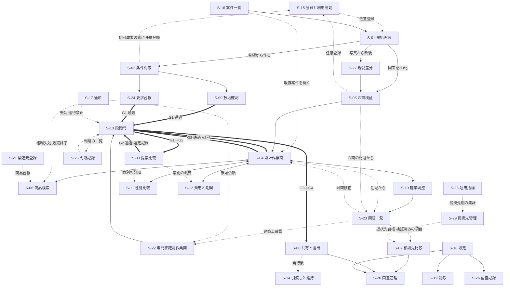

# 第15章 画面一覧、画面遷移、各画面の部品、空状態、待機状態、失敗状態

作成日: 2026-09-15　版: v1.6（v1.6 は段階8 の最終仕上げ（2026-10-08。最終仕上げの後に統括が S-23-06 の解決証拠の列挙の「修正した要素の版」を「修正の変更命令〔E-REQ-011〕」に改めた〔再々確認 K11-04〕。再々確認 K3-35、K6-03、主2-03、主2-04、主2-09、主2-13、主2-17、主3-01、主4-01、主4-09、主4-15。統括の決定 D36、D37、D40、D42、D43、D45 と、正本の改訂に合わせた同期 D30b、D33、D34、D35、D38、D41）〔群G4〕。S-06-08 の P10 (4) の文の識別子の対応（代替候補は F-C05-012、購入確定前の再確認は F-C05-011）、S-11-05 の「扉の把手側の側方の空き」、S-13-04 の式(5)の参照の形と P0 の解除は元に戻す変更（取消と連続取消）だけであることと図面派生による I-00-116 は 0 件であること、S-23-01 と S-23-06 の却下の記録（rejectionScopeKind、rejectionQualificationSnapshot）、S-27-04 と S-25-02 の発見の問題の解除成果 (a)(b)(c) の表示と判断を問題に結ぶ操作（「発見時の処理は P2」は G5 の処理）、S-05-03 の基準寸法に使った要素の属性、S-04-04 と S-10-01 の「既存壁（耐力の別は未確認）」、S-09-04 の「（VS-PRO）」の削除を改め、自動付与の契機（寸法変更、図面読解の修正の除外）、S-08-04 の (vii) の見出し、S-27-03 の未指定、S-03-03 の将来場面の空状態、解決証拠の型を正本の章に同期した。記録は `05_審査/再修正記録_最終仕上げ_群G4.md`。v1.5 は段階8前の持ち越し仕上げ（2026-10-08。共通の決定 D1、D3、D7、D14、既定値の識別子の併記 1 行）〔群F4〕。S-13-04 の表示名を「判定不能（P0 対象外の構法）」に、S-02-05 の立会者の関係者行を第12章 E-ORG-008.category の形に改め、用語追加提案「共有の閲覧画面」に用語集 567 への統合済みを記し、S-09 の法規条件の確認周期に DV-CO-15 を併記した。同日の統括の追加の項目（D7 の補完）で S-04-04 に壁の isLoadBearing、bearsVerticalLoad、isCompartmentPartition の「未確定」の表示を並べて書いた。記録は `05_審査/再修正記録_段階8前_仕上げ_群F4.md`。v1.4 は 2026-10-07 の二回目の修正の仕上げ〔群R3〕。正本の章の改訂後の突合〔第8章 P10 (4)、第11章 F-C02-014、第18章、第2章、第22章 第6.3節、第21章 第1.2節の固定注記。S-05-03、S-05-07、S-06-05、S-30-04〕、第20章 v1.3 の依頼〔S-12-01、S-12-03、S-04-07〕、第12章の属性〔S-25-02、S-17 の E-EXC-008〕、外部確認の第19章への反映に合わせた S-11-05 の出典名の表示、群R2 からの連絡〔S-05-03 の「実測不能（未建築）」、DV-FN-01 と DV-FN-03 の参照〕と、二回目の依頼の対応状況の確認。記録は `05_審査/再修正記録_2回目_仕上げ_群R3.md`。v1.3 は 2026-10-07 の段階6 二回目の修正（段階7 再審査の後）。修正計画 第1.15節の 32 件（主担当 JR-078〜JR-082、整合 JR-095〔極高〕、JR-011、JR-012、JR-037、JR-047 ほか）と、整合検査報告 第5.1節の識別子変更（I-06-009、DV-CF-12、DV-EQ-15、AC-C01-014-07、基盤 信頼状態と証拠段階 v1.3 の到達条件）への追従を反映。記録は `05_審査/再修正記録_2回目_第15章.md`。v1.2 は 2026-10-06 の段階6 の仕上げ（相互依頼と残課題の処理。群C）。他章の段階6 の依頼 26 行、残課題 R9b と R14b（S-29 の登録）、整合修正指示 第15章 1、群Bの申し送り（第12章 v1.3、第14章 v1.2 への追従）を処理。記録は `05_審査/再修正記録_相互依頼_群C.md`。v1.1 は 2026-10-06 段階6 再修正。初稿審査の統合指摘 31 件（主担当 JM-114〜JM-116、整合 27 件、横断 JM-087）、整合修正指示 第15章 17 件、試験の採番の置換、修正済みの章（第2、6、12、18、21、23、24章）からの依頼と章要約集 A1 の残りの依頼を反映。記録は `05_審査/再修正記録_第15章.md`）　担当: 段階3 仕様書 第15章（UX設計者、3D幾何処理技術者、一級建築士、製品責任者、個人情報保護と知的財産の審査担当の視点で作成）
根拠: 指示文 D（主要画面、視覚方針、長い処理の表示）、C1（一問式と一括入力の切替）、C3（自然文変更の処理順）、C4（3D表示の最低限の操作）、C10（注記と問題の固定、同時編集）、9.1（V0〜V3の許される表示と禁止する表示）、2.1（Renovo の導線の棚卸し）、I（成果物の章立て）。基盤定義 `識別子規則.md` v1.2、`信頼状態と証拠段階.md` v1.2、`用語集.md` v1.2、`機能一覧骨格.md` v1.2、`情報実体骨格.md` v1.2、`十二判断領域.md` v1.2、`七段階門.md` v1.2、`画面指標試験骨格.md` v1.2、`整合検査報告.md` v1.1（第5節 識別子変更一覧）。v1.3 では `識別子規則.md` v1.3、`信頼状態と証拠段階.md` v1.3、整合検査報告 第5.1節（二回目の修正の識別子変更一覧）と `05_審査/再審査/00_修正計画.md` 第0.3節、第0.4節、第1.15節に追従した。調査 `01_調査/01_指定参照三社.md`。仕様書 第6章（S-13 の部品と門の状態）、第8章（導線、初回成果、課金前表示）、第11章（S-05 の確認手順、3D構築と描画規則）、第12章（正規建物情報）。v1.1 で第2、13、17〜24章の記述（各指摘の行に節を記す）を加えた。
確認日: 2026-09-15。

## 0. 本章の目的、範囲と非対象、前提とする章

### 0.1 本章の目的

- 画面指標試験骨格 v1.2 の画面骨格（主要画面 S-01〜S-14、補助画面 S-15〜S-27、共通部品群 S-30）を基に、全画面の一覧、画面遷移の全体、各画面の目的、利用者、対応段階門、部品、表示する状態符号、空状態、待機状態、失敗状態、主要操作、鍵盤操作を固定する【推定】。
- 設計作業面（S-04）と図面検証画面（S-05）を、部品の配置、3D表示の操作、幅別の配置まで詳細化する【推定】。
- 信頼状態（V0〜V3）、要素値の五状態（VS-）、証拠段階（EL-）、商品四層（PT-）、権利状態（RS-）、供給状態（SUP-）、問題の重大度（SEV-）と状態（IS-）、承認の状態（AS-）、共通情報環境の状態（CDE-）を、全画面と全書出で常時表示する規則を、色だけに依存しない符号化と共に定める【推定】。
- 指示文D節の視覚方針（色、書体、対比、鍵盤操作、焦点表示、動きを減らす設定、375、768、1024、1440 px）を、観察可能な条件へ変換する【推定】。
- 機能一覧骨格で本章が主章の機能（F-C04-008、F-C04-011）に必須10項目と受入条件 AC- を記述し、3D表示の操作（F-C04-001〜007）と画面に関する副章機能（F-C02-013、F-C02-028、F-C03-007、F-C03-008）に画面側の要件を記述する【推定】。
- 整合検査報告の残る未決事項のうち本章に関係する U-00-046（状態符号 GS-/CC-/CN-）、U-00-057（機能と補助画面の対応）と、画面指標試験骨格の U-00-048（補助画面の優先と S-27）、U-00-054（相談予約の画面）、U-00-055（待ち時間の見込）、注記2（S-21 の段階外）に仮の判断を置く【推定】。

### 0.2 本章の範囲と非対象

| 区分 | 内容 | 区分 |
|---|---|---|
| 範囲 | 29 画面（S-01〜S-27、本章が追加した S-28、第17章 第2.5節が採番した S-29。S-29 の部品と三状態の文言の正本は第17章で、本章は一覧、遷移、主要操作、鍵盤操作を書く。v1.2）と共通部品群（S-30）の部品採番（S-04-01〜09、S-05-01〜06、S-10-08、S-13-01〜05、S-30-01〜06 は画面指標試験骨格 v1.2 の採番、S-13-06 は第6章が正本。v1.1）、画面遷移の全体、三状態（空状態 -E、待機状態 -W、失敗状態 -X）の文言と操作、主要操作と鍵盤操作、視覚方針、状態符号の表示規則、3D表示の操作、本章が主章の機能要件 | 【推定】 |
| 非対象（他章が主章） | 図面の認識処理と V1→V2 の昇格判定の中身（第11章）。正規建物情報の属性と状態遷移（第12章）。段階門の完了条件と S-13 に表示する内容の定義（第6章）。対話の質問群と導線の時系列（第8章）。商品の推薦と権利の運用（第16章）。同意、共有、承認の機能仕様（第17章、第22章）。敷地と法規の値（第18章）。性能計算（第19章）。費用と期間の算出（第20章）。竣工反映と維持（第21章）。API（第14章）。非機能要件（応答時間、対比の検査手順、鍵盤操作の試験手順）と指標の計測手順（第23章）。事業方式と料金の値（第24章） | 【推定】 |
| 非対象（製品として） | 次の表示、画面、操作は提供しない（共通指示 第8節の禁止。v1.1 で否定であることを明記）: 画像生成物を建築モデルと呼ぶ表示。未確認案を「施工可能」「法規適合」「完全正確」と表示する画面。電子連絡先を初回成果より前に必須にする画面。一括同意の操作。無許諾商品3Dの表示 | 【推定】 |

### 0.3 前提とする章

| 章 | 前提とする内容 |
|---|---|
| 第6章 | 段階門画面（S-13）の部品 S-13-01〜05 に表示する内容、門の状態（未開始、進行中、通過、再確認中）、進行禁止理由の9項目、承認の自動失効の通知 |
| 第8章 | 五つの利用場面の導線（画面の順序）、初回成果（V0 の構想案は S-02 で表示）、課金前表示 P1〜P9、透かし付き試作の規則、F-C01-001 と F-C01-004 の必須10項目 |
| 第11章 | S-05 の原図重ね、確信度の三帯（高 0.90 以上、中 0.70 以上 0.90 未満、低 0.70 未満）と線種、尺度確認の操作、重要寸法の一覧、3D構築の描画規則（F-C04-001〜007、009、010、012、014） |
| 第12章 | 正規建物情報の実体と属性名、変更命令の状態（提案、仮表示、確定、取消、却下。第12章 v1.2 第6.8節で「やり直し」は状態から除かれ intent.operation の値になった。JM-080） |
| 第2章、第13章、第17章〜第24章（v1.1 で追加） | M-N-01 の計測時点と確認者の役割の層別（第2章）、S-10 の問題の種別と経路帯の迂回候補（第13章）、提携先の比較と同意（第17章）、法規の確認期限、未判定、判定不能と対象区分（第18章）、利用円滑性と災害耐性の表示（第19章）、予算との比較、見積比較と費用低減案（第20章）、隠れ部分と解体後判明の P2 の区分（第21章）、外部処理先の同意と書出検査（第22章）、指標と試験と到達性（第23章）、課金前表示と収益操作の事前承認（第24章）。各部品の行に章と節を記す |
| 基盤定義 | 識別子（S-、F-、AC-、M-、T-、E-）、状態符号、段階、領域、用語（v1.2。識別子規則と信頼状態と証拠段階は v1.3。識別子の変更は整合検査報告 第5節と第5.1節に従う） |

### 0.4 本章の採番と判断の規則

| 規則 | 内容 | 区分 |
|---|---|---|
| 部品の採番 | S-04-01〜09、S-05-01〜06、S-10-08、S-13-01〜05、S-30-01〜06 は画面指標試験骨格 v1.2 の採番を参照する（S-04-09 と S-10-08 は v1.2 の追加で、本章は内容、操作、三状態の文言を書く）。S-13-06 は第6章が正本。残りの画面の部品と、共通部品 S-30-07〜S-30-12 は本章が採番する（識別子規則 第1節「部品は画面骨格担当と第15章」。v1.1 で更新） | 【推定】 |
| 状態接尾辞 | 空状態 -E、待機状態 -W、失敗状態 -X を画面または部品の末尾に付ける（識別子規則 第2.3節）。通常状態 -N は本文では省略する | 【推定】 |
| 受入条件の採番 | 本章が主章の F-C04-008、F-C04-011 は AC-C04-008-01〜、AC-C04-011-01〜 を採番する。主章が他章の機能（F-C04-001〜007、F-C02-013、F-C02-028、F-C03-007、F-C03-008）に本章が画面側の受入条件を書く場合、主章の連番（01〜09）と衝突しないよう連番 11〜19 を使う（第11章は AC-C04-007-01 を採番済み）。この扱いは未決 U-15-006 | 【仮定】 |
| 段階門の状態の表記 | E-REQ-010 Gate の状態は「未開始」「進行中」「通過」「再確認中」、E-REQ-011 ChangeCommand の状態は「提案」「仮表示」「確定」「取消」「却下」（やり直しは状態ではなく S-04-08 の操作。第12章 第6.8節、JM-080）、E-ORG-006 Consent の状態は「有効」「撤回」「期限切れ」の文字で画面に表示し、符号 GS-、CC-、CN- は画面に出さない（U-00-046 への仮判断。第8章 U-08-015 と同じ。U-15-002 は 2026-10-06 に基盤 U-00-046 の解決〔符号を設けず日本語値を正〕で解決） | 【仮定】 |
| 段階外の画面 | S-21 製造元登録画面の対応段階門「段階外（商品台帳）」と S-29 提携先管理画面の「段階外（案件横断の提携先台帳）」（第17章 第2.5節。v1.2）は画面の属性値として許容し、識別子規則には追記しない（整合検査報告 注記2 への仮判断。未決 U-15-010） | 【仮定】 |
| 曖昧語の置換 | 「迷わない」は「主要操作が1画面内で2操作以内、部品間の焦点移動が F6 で5領域を巡回」、「高密度」は「1440 px で5領域を同時表示」のように観察可能な条件で書く | 【推定】 |
| 数値の性質 | 幅、寸法、秒数、件数の値は全て初期仮説であり、実機検証（T-S-009）と公開判定会議で固定する | 【推定】 |

## 1. 画面一覧

### 1.1 主要画面（指示文D節の14画面）

主な利用者は役割符号（RL-OWN 所有者、RL-EDT 編集者、RL-CHK 確認者、RL-VIEW 閲覧者、RL-PART 提携事業者）で書く。優先は機能一覧骨格と画面指標試験骨格の割当に従う【推定】。

| 画面ID | 画面名 | 目的（一文） | 主な利用者 | 対応段階門 | 主担当領域 | 優先 | 本章の詳細節 |
|---|---|---|---|---|---|---|---|
| S-01 | 開始画面 | 三入口と利用目的を選び、非対象と責任境界を見て、電子連絡先なしで案件を始める | RL-OWN（未登録者を含む） | G0 | A01 | P0 | 7.1 |
| S-02 | 条件聞取画面 | 一問式と一括入力を切り替えて条件を答え、回答済みと残り項目を見て、初回成果（V0 の構想案または不足情報一覧）へ到達する | RL-OWN、RL-EDT | G0、G1 | A01 | P0 | 7.2 |
| S-03 | 提案比較画面 | 三案を同一評価軸（生活、空間、技術、費用、性能）で比較し、選定記録を残す | RL-OWN、RL-EDT、RL-CHK | G2 | A03 | P0 | 7.3 |
| S-04 | 設計作業面 | 左に階と要素、中央に同期2Dと3D、右に属性と商品、下に対話と履歴を置き、変更差分の仮表示を経て確定する | RL-OWN、RL-EDT、RL-CHK | G1〜G4 | A03 | P0 | 5 |
| S-05 | 図面検証画面 | 原図重ね、確信度の色表示、尺度確認、図面由来の問題一覧、処理状態を見て、V1 の案を確認する | RL-OWN、RL-EDT、RL-CHK | G1 | A12 | P0 | 6 |
| S-06 | 商品検索画面 | 実在品と独自案を切り替え、絞込、比較、適合理由と不適合理由、点数内訳、代替品を見て配置候補を選ぶ | RL-OWN、RL-EDT | G2、G3 | A08 | P0 | 7.4 |
| S-07 | 相談先比較画面 | 三社以上の作品、対応地域、予算帯、適合理由と点数内訳、料金、紹介料を比較し、相談を予約する | RL-OWN | G3、G4 | A12 | P1 | 7.5 |
| S-08 | 共有と書出画面 | 権限、期限、透かし、注記、改訂、書出形式、承認状態、書出検査の合否と例外承認を扱う | RL-OWN、RL-EDT | G2〜G4 | A12 | P0 | 7.6 |
| S-09 | 敷地確認画面 | 地図、境界資料、法規（版付き）、災害、供給条件、出典時点、不足調査を見て敷地根拠を作る | RL-OWN、RL-EDT、RL-CHK | G0、G1 | A02 | P0 | 7.7 |
| S-10 | 建築調整画面 | 空間、構造、外皮、設備の重ね合わせ、主要断面、問題一覧（干渉、構造注意、施工成立性の注意）、責任者、変更影響を見て、経路帯と立管を編集して調整する | RL-EDT、RL-CHK | G3 | A03 | P0（詳細は P1） | 7.8 |
| S-11 | 性能比較画面 | 住宅性能十領域の目標、計算予測、現場確認、第三者評価、法的適合を別列で見る | RL-OWN、RL-EDT、RL-CHK | G2、G3 | A07 | P0 | 7.9 |
| S-12 | 費用と期間画面 | 工種別範囲、数量根拠、単価時点、確信幅、変更差、長納期品、期間を見る | RL-OWN、RL-EDT | G2、G3 | A09 | P0 | 7.10 |
| S-13 | 段階門画面 | 段階ごとの必要成果、未解決問題、承認者、進行禁止理由、信頼状態の対応を見て門を通過する | RL-OWN、RL-EDT、RL-CHK | G0〜G6 | A12 | P0 | 7.11 |
| S-14 | 引渡しと維持画面 | 竣工差分、機器台帳、保証、点検、交換、入居後確認、学び一覧を扱う | RL-OWN、RL-CHK、RL-PART（施工者） | G5、G6 | A11 | P2（情報構造は P0） | 7.12 |

### 1.2 補助画面（画面指標試験骨格が追加した13画面）

| 画面ID | 画面名 | 目的（一文） | 主な利用者 | 対応段階門 | 主担当領域 | 優先（U-00-048 への仮判断） | 本章の詳細節 |
|---|---|---|---|---|---|---|---|
| S-15 | 登録と利用開始画面 | 匿名での利用開始と、初回成果の後の電子連絡先の任意登録、利用規約、個人情報方針、処理地域、学習利用が既定で無効であることの表示 | RL-OWN | G0 | A12 | P0 | 7.13 |
| S-16 | 案件一覧画面 | 所有と共有された案件の一覧、段階、信頼状態、未解決問題数、承認待ち数、最終更新 | 全役割 | 全段階 | A12 | P0 | 7.14 |
| S-17 | 通知画面 | 承認依頼、承認の自動失効、進行禁止の発生、商品の権利失効と販売終了、法規や単価の版更新、共有期限、同意撤回の通知 | 全役割 | 全段階 | A12 | P0 | 7.15 |
| S-18 | 設定画面 | 役割と権限、共有の既定（非公開）、保存期間、処理地域、学習同意、通知、表示（動きを減らす、対比、文字寸法）、鍵盤操作 | RL-OWN | 全段階 | A12 | P0 | 7.16 |
| S-19 | 削除画面 | 案件または利用者情報の一括削除と削除証跡 | RL-OWN | 全段階 | A12 | P0 | 7.17 |
| S-20 | 同意管理画面 | 送信先ごとの送信内容、目的、同意または除外、撤回、履歴。学習同意の別管理。外部AI処理先の表示 | RL-OWN | G3、G4（外部送信）、全段階（学習同意、処理先表示） | A12 | P0（学習同意、外部AI処理先の表示）、P1（外部送信の個別同意） | 7.18 |
| S-21 | 製造元登録画面 | 法人が正規商品を登録し、権利状態と供給状態を更新する | 製造元と販売元（RL-PART、法人） | 段階外（商品台帳） | A12 | P2 | 7.19 |
| S-22 | 専門家確認作業面 | 有資格者が確認範囲を指定し、氏名、資格、範囲、日付を付けて承認または差戻し | RL-CHK（有資格者） | G1、G3、G4 | A12 | P1 | 7.20 |
| S-23 | 問題一覧画面 | 案件横断の問題一覧と、問題からの人への引継ぎの開始 | RL-OWN、RL-EDT、RL-CHK、RL-PART（共有範囲内） | 全段階 | A12 | P0 | 7.21 |
| S-24 | 要求台帳画面 | 要求の一覧と編集、双方向追跡、衝突と解決候補と代償 | RL-OWN、RL-EDT、RL-CHK | G1〜G4 | A01 | P0 | 7.22 |
| S-25 | 判断記録画面 | 重要判断の一覧、分母の管理、検証付き重要判断完了率の案件内表示 | RL-OWN、RL-EDT、RL-CHK | G0〜G6 | A12 | P0 | 7.23 |
| S-26 | 監査記録画面 | 閲覧、変更、送信、削除、運用担当者の閲覧申請と承認の記録、障害調査用複製の期限 | RL-OWN、情報管理者、監査 | 全段階 | A12 | P0（所有者向け閲覧）、P2（法人監査） | 7.24 |
| S-27 | 現況差分画面 | 改装案件で設計時図面、竣工図、現況の差を重ね、改装区分を指定し、隠れ部分と必要調査を一覧する | RL-OWN、RL-EDT、RL-CHK | G1、G3 | A10 | P1 | 7.25 |

S-27 は S-05 の部品ではなく独立画面とし、S-05 と S-10 には現況差分への入口部品だけを置く（U-00-048 への仮判断。未決 U-15-003）。理由は、改装区分の指定（残す、撤去、補修、補強、移設、新設）が図面認識の確認（S-05）と操作の目的も主担当領域（A10）も異なるためである【仮定】。

S-28 以降の補助画面は、本章が追加した S-28 と第17章 第2.5節が採番した S-29 の2画面である（識別子規則 第2.3節「以後の補助画面は S-28 以降（S-30 を除く）」。同節 v1.3 で次の補助画面は S-31 と追記された。画面指標試験骨格 v1.2 追補 第1.2節は両画面を一覧に登録し、採番と内容の正本を各章とした）。いずれも案件横断の運用画面で、案件の利用者（RL-OWN、RL-EDT、RL-CHK、RL-VIEW）の画面からは遷移しない（v1.2。S-29 は第17章の依頼 (a)、未決 U-15-020 の解決）【推定】。

| 画面ID | 画面名 | 目的（一文） | 主な利用者 | 対応段階門 | 主担当領域 | 優先 | 本章の詳細節 |
|---|---|---|---|---|---|---|---|
| S-28 | 運用指標画面 | 指標の月次値を初期仮説の目標値と層別と併せて表示し、公開判定会議と収益操作の事前承認を記録する | 製品責任者、運用担当者 | 全段階（案件横断） | A12（F-C15-015） | P0（S-28-01〜03。S-28-04 は P2。v1.3、JR-078） | 7.26.1 |
| S-29 | 提携先管理画面 | 提携先台帳の登録、申告の更新、検証、提携状態の変更と、提携契約に基づく紹介料、掲載料、isSponsored の登録を、入力者ごとに権限を分けて行う（第17章 第2.5節が正本） | 運用担当者（検証は二人確認）、提携先の法人利用者（RL-PART の一種。自社の行だけ） | 段階外（案件横断の提携先台帳） | A09（F-C08-001） | P1 | 7.26.3 |

### 1.3 画面と段階門、許される信頼状態の対応

七段階門 第2節（段階ごとの最大信頼状態）に従い、各画面の信頼状態帯（S-30-01）が表示し得る範囲を固定する。表示は案の実際の状態であり、画面が状態を上げることはない【推定】。

| 段階 | 主に使う画面 | 表示し得る最大の信頼状態 | 備考 |
|---|---|---|---|
| G0 | S-01、S-02、S-09、S-13、S-15 | V0（S-02 の構想案、写真から改装の意匠像） | 建物情報の表示部は S-02 の構想案表示だけ。寸法値を出さない |
| G1 | S-02、S-05、S-09、S-24、S-27、S-13 | V1 | 図面入力時の編集案。尺度確認前は寸法値を出さない |
| G2 | S-03、S-04、S-06、S-11、S-12、S-13 | V1 | 三案は案別に V1。概算は幅で表示 |
| G3 | S-04、S-06、S-10、S-11、S-12、S-23、S-13 | V2（完了条件を満たした時点） | V2 の判定は F-C15-004。画面は判定結果を表示するだけ |
| G4 | S-08、S-07、S-20、S-22、S-13、S-25 | V2、確認範囲内は V3 | V3 は氏名、資格、範囲、日付がある承認だけ |
| G5、G6 | S-14、S-13、S-25 | V3（竣工反映版、実績付き） | P2 |
| 全段階 | S-16、S-17、S-18、S-19、S-23、S-24、S-25、S-26 | 参照先の案の状態を転記 | 案を持たない画面は「建物情報なし」の帯 |
| 案件横断（段階外を含む） | S-28、S-29 | 表示しない | 案件を開かない運用画面で、建物情報表示部と信頼状態帯（S-30-01）を持たない。S-29 は提携状態（候補、提携中、停止）、項目ごとの検証日と「未検証」、提携契約の版を文字で表示する（第17章 第2.5節。v1.2） |

### 1.4 機能と画面の対応（U-00-057 の確定）

機能一覧骨格 v1.1 の「関連画面（仮）」は S-01〜S-14 に限られていた。整合検査報告 U-00-057 の候補と第8章の仮判断（U-08-014）に従い、補助画面 S-15〜S-27 と共通部品への割当を次のとおり確定する。機能一覧骨格の列の更新は機能骨格担当と識別子台帳（04_必須表）へ依頼する（未決 U-15-001。機能一覧骨格 v1.2 でも未反映であることを本章 v1.1 で確認した。v1.1 で副番の機能の行を追加）。機能一覧骨格 v1.2 追補（2026-10-06）が本節の確定（S-28、S-29 を含む）を「関連画面」列へ反映し、U-00-057 と U-15-001 は解決した（v1.2 で確認）【仮定】。2026-10-07 の相互依頼 基盤仕上げで、第12章 U-12-017 と本章 S-24 の機能欄が骨格の割当と食い違っていた F-C03-005、F-C03-014、F-C03-021 の 3 行を加え（主の画面は操作の部品がある画面）、機能一覧骨格の関連画面列も同じにした【推定】。

| 機能 | 機能名 | 確定した画面（主 → 副） | 根拠 |
|---|---|---|---|
| F-C15-001 | 案件の段階管理 | S-16 → S-13、S-30-07 | U-00-057 候補。案件見出し帯（S-30-07）に段階と門の状態を出す |
| F-C10-011 | 学習同意の管理 | S-18 → S-15、S-20 | U-00-057 候補。学習同意は S-20 でも別管理 |
| F-C10-013 | 個人連絡先と設計情報の論理分離 | S-18 → S-15 | U-00-057 候補 |
| F-C10-012 | 保存期間、削除、複製先、処理地域の表示と一括削除 | S-19 → S-18、S-15 | U-00-057 候補 |
| F-C08-005 | 送信先ごとの送信内容確認と個別同意 | S-20 → S-07、S-08 | U-00-057 候補 |
| F-C08-001、F-C08-004、F-C08-009（P1） | 提携先台帳、掲載料企業の広告表示、紹介料と推薦の分離 | S-29（S-29-01〜S-29-05）→ S-07-01、S-07-04 | 第17章 第2.5節（v1.2、第17章の依頼 (a)）。登録と検証は S-29、案件の利用者への開示は S-07 |
| F-C05-019 | 法人用商品登録 | S-21 → S-06 | U-00-057 候補 |
| F-C08-008 | 有資格者確認の依頼と記録 | S-22 → S-13-03、S-07 | U-00-057 候補 |
| F-C10-003 | 問題の属性と状態 | S-23 → S-04、S-05-04、S-10、S-13-02 | U-00-057 候補 |
| F-C01-019 | 要求台帳への変換 | S-24 → S-02、S-04 | U-00-057 候補、第8章 U-08-014 |
| F-C01-020 | 要求衝突の検出と解決候補・代償の提示 | S-24 → S-02、S-03 | 第8章 U-08-014 |
| F-C15-014 | 判断記録 | S-25 → S-13、S-03 | U-00-057 候補 |
| F-C03-005 | 双方向追跡 | S-24（S-24-05 と M-G-01 の表示）→ S-23（S-23-03 の変更元と派生元への移動）、S-25（S-25-02 の要求）、S-04（追跡先の要素の選択） | 第12章 F-C03-005（利用者、正常手順(4)、AC-C03-005-02）、第12章 U-12-017。骨格 v1.1 の S-04 だけの割当を、本章 S-24 の機能欄と部品に合わせて改めた（2026-10-07 の相互依頼 基盤仕上げ） |
| F-C03-014 | 承認後の確定と再計算 | S-04（S-04-07 の「確定」。第5.6節 手順6）→ S-24（要求適合の更新）、S-23（S-23-W の再計算）、S-13（門の再判定） | 第12章 F-C03-014（正常手順(4)、例外(d)）、第12章 U-12-017。同上 |
| F-C03-021 | 選定記録 | S-03（S-03-07）→ S-13（G2 の門。I-00-115）、S-25（判断記録の一覧。kind=選定記録） | 第12章 F-C03-021（正常手順(1)〜(3)）、第12章 U-12-017。同上 |
| F-C10-010 | 監査記録 | S-26 → S-08 | U-00-057 候補 |
| F-C02-024-01（P0） | CS-DRW と CS-EST の初期付与と表示（機能一覧骨格 v1.2 の副番） | S-05-07 → S-04-01、S-04-02（CS- の線種）、S-30-01（現況未確認の併記） | 識別子変更一覧（JM-152）。v1.1 で追加 |
| F-C02-024-02（P1） | 現況資料による遷移と差異の重ね表示（同上） | S-27 → S-05、S-10 | U-00-057 候補、本章 U-15-003。v1.1 で副番に改めた |
| F-C09-012-01（P0）、F-C09-012-02（P1） | 法規条件の期限管理と手動再取得、法改正の検出と再判定（同上） | S-09-04 → S-17。P1 は S-09-10 | 識別子変更一覧（JM-127）。v1.1 で追加 |
| F-C14-003（P1）、F-C14-003-01（P2） | 解体後判明時の 4 項目の工事前定義、発見時の処理（同上） | S-25、S-12 → S-13-04、S-13-02、S-13-03、S-23-01、S-12-01、S-17。S-27-04 に「発見時の処理は P2」（G5 の施工中の発見の処理を指す。設計段階の発見の問題 I-06-007 は S-27-04 と S-25-02 で解決する。v1.6、統括の決定 D43） | 識別子変更一覧（JM-150）、第21章 第8節。v1.1 で追加 |
| F-C02-025、F-C02-026 | 現況資料の結合、隠れ部分と工事前専門調査の問題化 | S-27 → S-05、S-23 | 本章の追加 |
| F-C14-001、F-C14-002 | 改装区分の要素別管理、4状態の重ね管理 | S-27 → S-04、S-10 | 本章の追加 |
| F-C10-004、F-C10-005 | 確認範囲ごとの承認、承認の自動失効 | S-22、S-13-03 → S-08、S-17 | 本章の追加。失効の通知は S-17 |
| F-C11-002（P0）、F-C12-005（P1） | 構造への影響の問題化、設備干渉検出 | S-10（S-10-03）→ S-23、S-13-04（SEV-0） | 第13章 U-13-009 の仮判断への対応（v1.2、第13章の依頼）。問題は S-23 でも一覧し、SEV-0 は S-13-04 に複製表示する |
| F-C10-002 | 注記と問題の固定 | S-30-03 → S-04、S-05 | 本章の追加。固定注記は共通部品 |
| F-C04-008 | 注記の3D固定表示 | S-04-03 → S-30-03、S-23 | 本章が主章 |
| F-C04-011 | 信頼状態と未確認項目数の常時表示 | S-30-01 → 全画面、S-08（書出） | 本章が主章 |
| F-C15-002、F-C15-003、F-C15-004 | 進行禁止条件の判定、完了条件の判定、信頼状態の判定 | S-13 → S-30-01、S-17、S-16 | 本章の追加。判定結果の通知と一覧 |
| F-C15-005 | 禁止表示語の文言検査 | 全画面 → S-08、S-30-01 | 骨格どおり |
| F-C05-015 | 商品層と権利状態の常時表示 | S-30-04 → S-04-05、S-06、S-21 | 本章の追加。商品状態表示は共通部品 |
| F-C12-008 | 十領域の証拠段階別記録と表示 | S-11 → S-30-05、S-03、S-14 | 本章の追加 |
| F-C10-006 | 同時編集の表示 | S-04 → S-22 | 骨格どおり。S-22 でも他者の未確定変更を表示 |
| F-C10-009、F-C10-017 | 期限付き共有URL、公開共有時の伏せ字候補の提示 | S-08 | 骨格どおり |
| F-C10-018 | 外部AI処理先への最小送信と処理地域の表示 | S-20 → S-05-05、S-30-02 | 骨格どおり。処理状態表示に処理先を添える |
| F-C10-019 | 障害調査用複製の期限管理 | S-19、S-26 | 骨格どおり |
| F-C08-006 | 問題一覧からの人への引継ぎ開始 | S-23 → S-04、S-07、S-22 | 骨格 S-04、S-07 に S-23 と S-22 を追加 |
| F-C08-007 | 相談予約 | S-07（部品 S-07-06） | U-00-054 への仮判断（未決 U-15-004） |
| F-C14-006 | 将来場面の試行 | S-03（S-03-03 の将来場面の行。P0 は「試行未実施」の表示まで）、S-14 → S-04 | 骨格どおり。v1.3 で部品を明記（JR-080） |
| F-C02-028 | 処理状態の表示 | S-05-05 → S-30-02（全画面の長い処理） | 骨格どおり |
| F-C01-025 | 電子連絡先なしの初回価値提示 | S-01、S-02 → S-15 | 骨格に S-15 を追加 |

## 2. 画面遷移

### 2.1 全体遷移図

実線は主導線（段階の順に進む経路）、点線は補助導線（どの段階からも開ける経路と、失敗や通知からの復帰）、二重線は段階門の通過を伴う遷移を示す。全画面から S-16（案件一覧）、S-17（通知）、S-18（設定）、S-13（段階門）へは案件見出し帯（S-30-07）と信頼状態帯（S-30-01）から常に遷移できるため、図では省略する【推定】。

S-28 と S-29 は運用担当者と提携先の法人利用者が案件を開かずに使う画面であり、案件の画面からの遷移はない。S-29 から S-07 への点線は画面の遷移ではなく、検証済みの項目だけが S-07-01 の候補表示に使われる情報の流れを示す（v1.2）【推定】。

### 2.2 遷移の規則

| 規則 | 内容 | 区分 |
|---|---|---|
| 常時導線 | 案件を開いている全画面は、案件見出し帯（S-30-07）から S-16、S-17、S-18、S-23、S-24、S-25 へ、信頼状態帯（S-30-01）から S-13 へ、それぞれ1操作で遷移できる。遷移先から「戻る」で直前の画面の同じ位置（選択要素、表示階、視点）へ戻る | 【推定】 |
| 段階門の通過 | G の門を伴う遷移（二重線）は S-13 を経由する。S-13 を経ずに次段階の画面（例: G1 未通過で S-03）を開いた場合、画面は開くが建物情報表示部に「G1 未通過。表示は V0 のまま」の帯を出し、生成操作（三案生成等）を無効にする（F-C15-002、七段階門 第0節） | 【推定】 |
| 入口別の主経路 | 希望から作る: S-01 → S-02 → S-09 → S-24 → S-13 → S-03 → S-13 → S-04 → S-13 → S-08。図面を3D化: S-01 → S-05 → S-04 → S-13 → S-08（G2 の三案を省略できるのは利用目的による適用除外〔第6章 第2.3節、U-06-018〕の案件だけで、それ以外は S-13 → S-03 で図面派生三案〔F-C03-019-03〕を比較する。第8章 第2.4節。v1.3、JR-095）。写真から改装: S-01 → S-27 → S-05 → S-04 → S-13 → S-08。第8章 第2節の導線表を正本とする | 【推定】 |
| 失敗からの復帰 | 失敗状態（-X）の部品は「再試行」と「代替経路」の2操作を必ず持つ。代替経路は失敗の原因区分に応じて固定する（第3.3節）。失敗状態から他画面へ遷移しても、失敗した処理は自動で再実行しない | 【推定】 |
| 通知からの遷移 | S-17 の各通知は通知種別ごとに遷移先を固定する（承認依頼 → S-22 または S-13-03、自動失効 → S-13-03、進行禁止 → S-13-04、権利失効と販売終了 → S-06 の該当商品（販売終了は S-06-06 の代替品と「販売終了のまま維持」）、法規と単価の版更新 → S-09 または S-12（発行済み版の受取側は S-08-07）、共有期限 → S-08、同意撤回 → S-20、差戻し → S-23、問題の期限超過 → S-13-02 または S-23-01 の該当行、一時保持の期限 → S-15、削除完了 → S-19-05、長い処理の完了と失敗 → 元の画面。AP-029 の通知種別と一致させる。v1.2、第14章、第16章の依頼） | 【推定】 |
| 権限別の遷移 | RL-VIEW は S-03、S-04（閲覧）、S-11、S-12、S-23、S-25 を開けるが編集操作が表示されない。RL-PART は共有範囲内の階、室、問題だけを S-04、S-23 で見る。役割外の遷移要求は「権限がありません」の失敗状態（原因区分: 権限）を出し、監査記録に残す（F-C10-001）。S-28 は製品責任者と運用担当者、S-29 は運用担当者と提携先の法人利用者（自社の行だけ）が開き、案件の役割（RL-OWN、RL-EDT、RL-CHK、RL-VIEW）には表示しない（v1.2） | 【推定】 |
| 共有の閲覧画面 | 共有URL（S-08-02）または共有先の役割（S-08-01）で RL-CHK、RL-VIEW、RL-PART が共有範囲内で開く各画面を「共有の閲覧画面」と呼ぶ。共有の閲覧画面は、案件見出し帯（S-30-07）の直下に、当該案の現段階と再確認中の段階の未解決の進行禁止条件の一覧（識別子、定型文の見出し、固定先。共有範囲外の固定先は件数だけ）を必ず表示し、閉じる操作を出さない。0 件の場合は「未解決の進行禁止条件はありません（検査日時）」と表示する。進行禁止条件が残っても共有URL の閲覧は止めない（P0 の復旧導線で建築士を招くため。第6章 第8.1節「発行と引継ぎ」。v1.3、JR-011） | 【推定】 |
| 未保存の変更 | 変更命令が「仮表示」のまま他画面へ遷移しようとした場合、確定、取消、仮表示のまま保持の三択を出す。仮表示のまま保持を選ぶと S-04-07 に「未確定 1 件」の標識が残る。仮表示中の変更命令がある案は、S-08 で書出、共有URL の発行、版の発行を行えない（v1.1、JM-166） | 【仮定】 |
| 同一端末での続行 | S-15 の登録なしでも、初回成果までの画面は同一端末で続行できる（第8章 第6.1節）。端末を変えると案件は開けず、S-01 に「登録すると他の端末でも開けます」の案内を出す | 【推定】 |
| 遷移の禁止 | (1) 初回成果の前に S-15 の電子連絡先入力を必須にする遷移。(2) S-13 を経ない V2 以上の表示への遷移。(3) 同意管理（S-20）を経ない外部送信の完了。(4) 削除画面（S-19）からの削除を確認なしに完了させる遷移。(5) S-21 で未検証の商品を S-06 の配置候補にする遷移。(6) S-29 で保存した未検証の申告（料金、対応地域、作品事例、担当余力、返答時間）を S-07 の候補表示に使う遷移（第17章 第2.4節、第2.5節。v1.2） | 【推定】 |

### 2.3 遷移の起点と終点の一覧

| 起点 | 操作 | 終点 | 条件 |
|---|---|---|---|
| S-01 | 入口と利用目的を選ぶ | S-02、S-05、S-27 | 電子連絡先不要。利用目的が非対象なら I-00-104 を表示し遷移しない |
| S-02 | 初回成果の後に保存、共有、三案比較へ進む、引継ぎを選ぶ | S-15（任意登録）→ 元の画面 | 登録しない場合も続行 |
| S-02 | 敷地の初期確認へ | S-09 | 都道府県が入力済み |
| S-02 | 要求台帳を確認 | S-24 | G1 分の回答がある |
| S-05 | 尺度と重要寸法を確認して3Dへ | S-04 | 尺度の承認（scopeKind=尺度）が AS-VALID |
| S-05 | 図面の問題を開く | S-23 | 問題が 1 件以上 |
| S-05 | 現況差分へ | S-27 | 利用目的が改装で現況資料がある（P1） |
| S-03 | 案を選び選定記録を作る | S-13（G2 の門） | 決定者、理由、代償、未解決点が入力済み |
| S-03 | 案を設計作業面で開く | S-04 | G2 未通過では閲覧のみ |
| S-04 | 商品を探す | S-06 | 選択要素が室または家具 |
| S-04 | 断面、問題一覧（干渉、構造注意、施工成立性の注意）、責任者を見る | S-10 | G3 以降 |
| S-04 | 性能、費用を見る | S-11、S-12 | 案がある |
| S-04 | 注記から問題一覧へ | S-23 | 注記が 1 件以上 |
| S-04 | 段階門へ | S-13 | 常時 |
| S-10 | 問題一覧（S-10-03）の行から問題一覧画面へ | S-23 | 問題が 1 件以上 |
| S-10、S-13-04 | 排水勾配の問題（I-00-117）から経路帯と立管の編集へ | S-10-08 | G3 以降。編集は変更命令として S-04-07 の仮表示へ送る |
| S-23 | 建築士確認、図面修正、相談予約 | S-22、S-04、S-07 | 役割が RL-OWN または RL-EDT。S-22 は P1、S-07 は P1 |
| S-07 | 相談を予約する | S-20 → S-07 | 送信先ごとの同意の後にだけ予約が成立 |
| S-13 | 書出へ | S-08 | G3 通過（V2）。V1 の書出は透かし付きで S-04 からも可 |
| S-08 | 外部送信を伴う共有 | S-20 → S-08 | 送信先ごとの同意 |
| S-08 | 発行後に引渡しへ | S-14 | CDE-PUB の版がある（P2） |
| S-17 | 通知を開く | 第2.2節の遷移先 | 通知種別ごとに固定 |
| S-18 | 削除、監査記録、同意 | S-19、S-26、S-20 | 役割が RL-OWN |
| S-16 | 案件を開く | 案件の現段階の主画面（G0: S-02、G1: S-05 または S-24、G2: S-03、G3: S-04、G4: S-08、G5〜G6: S-14） | 共有された案件は共有範囲内の画面 |
| S-21 | 登録した商品を確認 | S-06（検索結果の該当商品） | 3D物品の自動検査に合格 |
| S-28 | 提携先別の集計を開く | S-29（S-29-05） | 運用担当者（P1。v1.2） |
| S-29 | 照合と二人確認を終え、提携契約を記録して提携中にする | なし（検証済みの項目が S-07-01 の候補表示に使われる） | 十二項目の照合結果と提携契約の記録がある（P1。第17章 第2.1節、第2.5節。v1.2） |

## 3. 全画面に共通する表示規則と共通部品（S-30）

### 3.1 状態符号の表示規則（全画面と書出）

信頼状態と証拠段階 第10節の表示規則を画面の部品へ割り当てる。全ての状態は「記号＋文字」を主とし、色は補助とする。色だけで区別する表示を作らない【推定】。

| 状態体系 | 表示する部品 | 表示形式（記号＋文字） | 補助の色 | 常時表示の範囲 | 禁止 | 区分 |
|---|---|---|---|---|---|---|
| 信頼状態 V0〜V3 | S-30-01 信頼状態帯 | 「V1 編集案」のように符号と名称を併記。未確認項目数を「未確認 12 件」と併記。書出には透かし | V0、V1: 副色。V2: 主色。V3: 主色＋確認者記号 | 建物情報を表示する全画面と全書出（GLB、PDF、SVG、DXF、IFC） | 状態が許さない語（第3.6節）。V の省略。案件内の複数案で帯を共用すること | 【推定】 |
| 要素値の五状態 VS- | S-04-04 属性欄、S-05-02、S-05-03、S-24 | 記号と文字: 「◆ 原図」「◇ AI推定 82%」「□ 既定値 DEF-…」「● 確認済み 氏名 日時」「◎ 専門家確認 氏名 資格 日時」 | 原図: 主色。AI推定: 確信度の帯色。既定値: 注意色。確認済み: 主色。専門家確認: 主色 | 属性値を表示する全ての欄 | VS-DEF と VS-AI を確認済みと同じ見え方にすること。未照合（本人申告）の資格による確認を「専門家確認」と表示すること（「資格未照合（本人申告）の確認あり」を併記する。第6章 第5.2節。v1.3、JR-012） | 【推定】 |
| 性能の証拠段階 EL- | S-30-05 証拠段階表示（S-11、S-03、S-14） | 五段階を別の列に「目標」「計算予測」「現場確認」「第三者評価」「法的適合」の見出しで表示。失効は「再判定要」。法的適合の値は証明書と照合済みの資格による scopeKind=法規 の承認がそろうまで「法的適合（確認待ち）」（S-11-01。v1.3、JR-012） | 列見出しは副色。値は主色 | 性能値を表示する全ての欄 | 合成した「達成」「適合」表示。列の統合。証明書の登録だけでの「法的適合」 | 【推定】 |
| 現況状態 CS- | S-05-01、S-10、S-27 | 「図面上」「現地確認済み」「開口調査済み」「推定」の文字と線種（実線、二重線、太線、点線） | 推定: 注意色 | 既存住宅の要素 | CS-EST の隠れ部分を空洞や「無い」と描くこと | 【推定】 |
| 商品四層 PT- と権利状態 RS-、供給状態 SUP- | S-30-04 商品状態表示（S-04-05、S-06、S-21） | 「正規商品」「公式情報参照（形状は代替）」「一般品（実商品ではない）」「AI独自案（製作可否は未確認）」と、「許諾済み」「確認中」「失効」「許諾なし」「利用者所有」、「供給中」「納期超過」「販売終了」「不明」、最終確認日時 | 正規商品: 主色。それ以外: 副色＋枠線の種別 | 商品を表示する全ての欄と 3D 上の商品標識 | PT-REF の代替形状と PT-AI を正規商品と同じ見え方にすること。SUP-UNKNOWN を在庫ありと表示すること | 【推定】 |
| 企業と品物の関係区分 PR- | S-30-04、S-06 | 「住宅商品」「内装案」「事例採用（掲載年月）」「製造」「販売」「正規3D提供」「参照」を関係ごとに列挙 | 副色 | 商品の詳細 | PR-CASE を製造や正規3D提供と誤認させる表示 | 【推定】 |
| 問題の重大度 SEV- と状態 IS- | S-30-03、S-23、S-05-04、S-10、S-13-02 | 重大度: 「禁止」（八角形）、「重大」（三角形）、「通常」（円）、「軽微」（四角形）。状態: 「未対応」「対応中」「解決」「却下」「例外承認」 | 禁止: 危険色。重大: 注意色。通常と軽微: 副色 | 問題を表示する全ての欄 | SEV-0 を「解決」と「却下」（誤警告。却下者の役割と資格の照合状態を併記。S-23-01。v1.3、JR-012）以外で閉じた表示。未検査を「指摘なし」と表示すること | 【推定】 |
| 承認の状態 AS- | S-13-03、S-08、S-22、S-25 | 「承認待ち」「有効（承認者 範囲 日付）」「失効（変更識別子 理由）」。未照合（本人申告）の資格による承認は「有効（資格未照合〔本人申告〕）」とし、P1 では門の必要承認の判定で承認待ちと同じに扱う（第6章 第5.2節。v1.3、JR-012） | 失効: 注意色 | 承認を表示する全ての欄 | 失効した承認を有効と同じ見え方にすること | 【推定】 |
| 共通情報環境の状態 CDE- | S-08、S-16、S-19、S-25 | 「作業中」「共有」「発行済み v1.2」「保管」 | 発行済み: 主色＋錠の図案 | 版を表示する全ての欄 | 発行済みの版と最新の作業中版を混同する表示 | 【推定】 |
| 役割 RL- | S-30-07、S-08、S-18 | 「所有者」「編集者」「確認者」「閲覧者」「提携事業者」 | 副色 | 案件見出し帯 | — | 【推定】 |
| 段階門の状態 | S-30-07、S-13-01、S-16 | 「G2 進行中」「G1 通過 2026-09-15」「G3 再確認中」 | 再確認中: 注意色 | 案件見出し帯 | 符号 GS- の表示（U-15-002） | 【仮定】 |

### 3.2 信頼状態帯（S-30-01）の詳細

| 項目 | 内容 | 区分 |
|---|---|---|
| 位置 | 建物情報表示部の直上に固定し、巻き取り（スクロール）で隠れない。375 px では表示部の上端 1 行 | 【推定】 |
| 表示内容 | (1) 符号と名称（例「V2 幾何検証案」）。(2) 未確認項目数（要素、値、問題の合計と内訳）。(3) 確認範囲別の内訳への導線（1操作）。(4) 降格が起きた場合は「V2→V1 降格: 理由」を 1 行追加し、閉じるまで残す。降格の契機は基盤 信頼状態 v1.3 第1.3節の事象に限り、法規の SEV-0（I-06-006）では降格せず、進行禁止は S-13-04、発行と引継ぎ一式の停止は S-08-07 で示す（v1.3、JR-011）。(5) 案が複数表示される画面（S-03、S-16）は案ごとに帯を持つ。(6) 尺度の整合検査の警告を理由付きで承知して尺度を承認した案（E-REQ-007.acknowledgedWarnings が 1 件以上）は、確認範囲別の内訳の「尺度」行に「警告承知 n 件」を、帯の未確認項目数の横に「尺度: 警告承知あり（n 件）」を表示し、警告承知のない同じ信頼状態の案と同じ見え方にしない。0 件なら表示しない（第6章 F-C15-004 手順(3)、AC-C15-004-05。v1.1、JM-064）。寸法文字 0 件の頁で尺度を承認した案は、同じ「尺度」行と帯に「尺度: 残差検査不能（寸法文字なし）、実測照合 n 件」を表示する（n は照合方法=実測の確認件数。第6章 第2.5節 欠落の自動記録 (v)。v1.3、JR-047）。照合方法「実測不能（未建築）」の確認を含む案は、同じ「尺度」行と帯に「V2 の対象外（寸法の根拠なし）」を表示する（その確認は重要寸法と主要寸法の確認に数えない。第12章 valueStateMeta.checkMethod、第11章 F-C02-014 例外(e)。JR-050）。(7) 確認範囲別の内訳で、資格が本人申告（未照合）の RL-CHK による承認の行には「資格未照合（本人申告）」を併記し、その承認を V3 の根拠に数えない（第6章 第5.2節。v1.1、第6章の依頼、JM-122） | 【推定】 |
| 案の表示状態 | 案の全確認範囲のうち最も低い状態を表示し、内訳で確認範囲ごとの状態を表示する（信頼状態と証拠段階 第1.1節、未決 U-00-020） | 【推定】 |
| 現況未確認の併記 | 改装案件で工事範囲（撤去、補修、補強、移設。P0 は案の変更命令で現況要素を削除、移動、寸法変更したときに自動で付く撤去と移設〔寸法変更は変更前の要素の撤去〕。第21章 第2.1節 規則(7)。統括の決定 D34）の要素が CS-DRW または CS-EST のままの案は、V2 の条件を満たしても帯に「現況未確認（n 要素）」を併記し、併記のない V2 の案と同じ見え方にしない。n は該当要素数で、選ぶと S-27-04（P0 は S-05-07）の該当要素の一覧へ移る。P0 は問題を登録せず、P1 は G3 の門で I-06-008（SEV-1）が登録される。併記は本節「書出への転記」のとおり透かしと GLB、PDF の注記にも含める（信頼状態と証拠段階 v1.3 第1.2節、第21章 第2.1節 規則(5)。v1.1 で基盤定義の変更に追従。JM-155。v1.3、JR-095） | 【推定】 |
| 建物情報のない画面 | S-01、S-09、S-07、S-15、S-17、S-18、S-19、S-20、S-21、S-26 は帯を出さない。S-02 は構想案の表示中だけ V0 の帯を出す | 【推定】 |
| 取得失敗 | 信頼状態が取得できない場合、帯に「信頼状態を取得できません。再試行」を表示し、建物情報の表示部を空状態（対象なし）にする。状態不明のまま建物情報を表示しない（安全側） | 【仮定】 |
| 書出への転記 | 全書出に V と未確認項目数を透かしとして描く。透かしの文言は第8章 第6.3節（信頼状態、「試作」、案件識別子の末尾、生成日時、「寸法未確認」、「実在商品ではない」）に従う。表示内容 (6) の案は「尺度: 警告承知あり（n 件）」（寸法文字 0 件の頁で承認した尺度の案は「尺度: 残差検査不能（寸法文字なし）、実測照合 n 件」）を、「現況未確認の併記」の案は「現況未確認（n 要素）」を、透かしと GLB、PDF の注記に含め、G4 の情報要求適合表（S-08-04）にも同じ項目を載せる（第22章 第1.4節 透かし、第6章 第2.5節 欠落の自動記録 (v)、(vii)。v1.1、JM-064。v1.3、JR-095、JR-047） | 【推定】 |

### 3.3 三状態（空状態、待機状態、失敗状態）の共通規則

| 状態 | 規則 | 観察可能な条件 | 区分 |
|---|---|---|---|
| 空状態 -E | 三種の文言を区別する。(a) 「対象なし」: まだ作られていない（例「要素がありません」）。(b) 「未検査」: 決定的検査が実行されていない。(c) 「検査済み、指摘なし」: 検査が実行され該当がない。(b) と (c) を同じ文言や同じ図案で表示しない（T-S-011、T-A-013）。各空状態は次の操作への導線を 1 つ以上持つ | 空状態の文言が三種のいずれかに一致し、(b) と (c) の文言が異なる。導線が 1 つ以上ある | 【推定】 |
| 待機状態 -W | (1) 実際の処理段階名を表示し、架空の進捗率（%）を出さない。(2) 待ち時間の見込を「約 N 秒〜最大 M 秒」の幅（N は同種入力の過去実績の中央値、M は 95 百分位）と根拠（実績、固定値）で表示する（第3.4節、第14章 第3.4節。v1.2）。(3) 部分結果があれば表示する（例: 壁抽出が終わった頁の原図重ね）。(4) 取消操作を持つ。(5) 3 秒未満で終わる見込の処理は段階名を出さず、部品の輪郭を待機の図案にするだけとし、焦点を移さない。(6) 30 秒を超える見込の処理は S-30-02 を全幅で出す | 状態名が処理段階と一対一（T-P-008）。百分率表示がない。取消が働く | 【推定】 |
| 失敗状態 -X | (1) 失敗箇所（処理段階名と対象の頁、要素、送信先）を表示する。(2) 原因区分を「入力起因」「製品起因」「外部接続起因」「権限起因」の四つから表示する。(3) 「再試行」と「代替経路」の 2 操作を持つ。(4) 利用量の扱い（消費しない、または再実行可）を表示する（第8章 P4）。(5) 失敗によって正本を変更しない。(6) 失敗は監査記録に残る（F-C10-010） | 4 項目（箇所、原因区分、再試行、代替経路）が表示される。失敗前後で正本の版が同じ | 【推定】 |
| 通常状態 -N | 三状態のいずれでもない状態。接尾辞は本文で省略する | — | 【推定】 |

原因区分ごとの代替経路の既定は次のとおり【仮定】。

| 原因区分 | 例 | 代替経路 |
|---|---|---|
| 入力起因 | 尺度判定不能、認識失敗、必須項目未入力、利用権未確認 | 入力の修正（該当欄へ焦点を移す）、基準寸法の指定、別の頁の指定 |
| 製品起因 | 拘束解決失敗、3D構築失敗、検査規則の読込失敗 | 直前の確定版へ戻す、変更を小さく分ける、問合せ（障害調査用複製の同意付き） |
| 外部接続起因 | 公的地理情報の取得失敗、公式商品情報の接続停止、外部AI処理先の停止 | 最終確認日時の情報で続行（在庫ありと推定しない）、後で再試行、手入力 |
| 権限起因 | 役割外の操作、共有範囲外、期限切れの共有URL | 所有者へ依頼、案件一覧へ戻る |

### 3.4 待ち時間の見込の算出（U-00-055 への仮判断）

| 項目 | 内容 | 区分 |
|---|---|---|
| 算出 | 処理段階ごとに、同種の入力（入力種別、頁数、要素数の帯）の直近 90 日の実績から中央値と 95 百分位を算出し、「約 N 秒」に中央値、「最大」に 95 百分位を表示する。算出は第14章 第3.5節と同じ規則であり、API の estimatedWait の {min, max} をそのまま表示する（v1.2 で確認） | 【仮定】 |
| 実績不足 | 実績が 30 件未満の段階は、段階ごとの固定値（初期仮説: 読込 5 秒、尺度判定 10 秒、壁抽出 40 秒、開口抽出 30 秒、関係検査 15 秒、3D構築 30 秒。合計は M-P-01 の初期仮説 180 秒以内と整合）を「約 N 秒」に、第14章 第3.3節の段階ごとの時間上限を「最大」に表示し、「見込は初期値」と注記する | 【仮定】 |
| 超過 | 見込の最大（95 百分位）を超えた場合、「見込を超えています。処理は続いています」を表示し、取消と継続を選べる操作を出す。「あと 1 分」のような断定はしない。画面側の閾値では失敗にしない。段階の時間上限（第14章 第3.3節）の超過で API がジョブを失敗区分5 として失敗にした場合だけ失敗状態（製品起因）へ移し、「失敗した段階から再試行」と「最初から再試行」を出す（第14章 第3.5節。v1.2、第14章の依頼。初稿の「二倍を超えたら失敗」は削った） | 【仮定】 |
| 未決 | 算出方法は未決 U-00-055 を継承する。本章の仮判断 U-15-005 は v1.2 で解決した（第14章 第3.5節と算出、表示、超過の扱いが一致） | 【仮定】 |

### 3.5 共通部品（S-30）の一覧

S-30-01〜06 は画面指標試験骨格の採番を継承し、S-30-07〜12 を本章が追加する【推定】。

| 部品ID | 部品名 | 内容 | 使う画面 | 三状態 | 区分 |
|---|---|---|---|---|---|
| S-30-01 | 信頼状態帯 | 第3.2節 | 建物情報を表示する全画面 | 常時表示。取得失敗時は第3.2節 | 【推定】 |
| S-30-02 | 処理状態表示 | 長い処理の共通部品。実際の状態名、待ち時間の見込、部分結果、失敗箇所、再試行、取消、外部AI処理先と保存地域（F-C10-018）。処理名は「処理 #」に識別子の末尾 8 文字。見込は「約 N 秒〜最大 M 秒」の幅と根拠（実績、固定値）で示す。再試行は「失敗した段階から」と「最初から」を分ける（第14章の依頼。v1.1 で第7.26.2節から移した。JM-087） | 全画面 | S-30-02-W、S-30-02-X | 【推定】 |
| S-30-03 | 問題固定注記 | 3D要素、2D位置、図面頁に固定する注記と問題の標識と詳細（重大度の形、状態、担当、期限、対象へ移動、注記一覧へ戻る） | S-04、S-05、S-10、S-27 | S-30-03-E 注記なし（未検査と指摘なしを区別） | 【推定】 |
| S-30-04 | 商品状態表示 | PT-、RS-、SUP-、PR-、最終確認日時、広告表示。公式接続の停止、許諾の失効（RS-EXP）、販売終了（SUP-DISC）の場合は、最終確認日時を本文の 1.2 倍以上の文字寸法で強調し「最後の確認: 日時」と表示する（v1.1、第16章の依頼）。SUP-DISC の商品は「販売終了」の札を層の札と同じ大きさで表示する（JM-119）。P0 の利用者申告は「販売終了（利用者申告、○月○日）」、有効期限（DV-CO-03。公開頁参照の商品は掲載確認の有効期限 DV-CO-20）を超えた商品は「供給状態 不明（最終確認 ○）」と表示し、いずれも「購入可能」「在庫あり」「供給中」を付けない（第16章 第4.2節、第6.1節、第6.4節。v1.2、第16章の依頼、JM-117。DV-CO-20 は第16章 v1.3 の第6.1節に合わせた。JR-084） | S-04-05、S-06、S-21、S-14 | 常時表示 | 【推定】 |
| S-30-05 | 証拠段階表示 | EL- 五段階の別列表示。失効は「再判定要」 | S-11、S-03、S-14 | 常時表示 | 【推定】 |
| S-30-06 | 責任境界表示 | AI が行えること（候補、確信度、矛盾、影響予測）と人が担うこと（価値判断、確認、計算、承認、署名）の区分。「AI は建築士ではありません」の一文 | S-01、S-04-06、S-22、S-07 | 常時表示 | 【推定】 |
| S-30-07 | 案件見出し帯 | 案件識別子の末尾（例「#00042」）、利用目的、現段階と門の状態、役割、S-16、S-17（未読件数）、S-18、S-23（未解決件数）、S-24、S-25 への導線、有料境界の表示（第8章 P5。値は第24章 第1.3節の「無料枠」「有料（定額内）」「有料（追加枠）」の三値を文字で表示し、色だけに依存しない。v1.1、第24章の依頼） | 案件を開いている全画面 | 常時表示 | 【仮定】 |
| S-30-08 | 鍵盤操作一覧 | 「?」または「Shift+/」で開く、現在の画面と部品で使える鍵盤操作の一覧。第4.4節と第5.4節の割当を表示 | 全画面 | 常時開ける | 【仮定】 |
| S-30-09 | 確認依頼 | VS-DEF と VS-AI の値に付く「確認する」操作。値の根拠（既定値表の識別子、推定理由、確信度）と、確認または修正の入力欄。確認で VS-USR へ遷移し、確認者と日時を記録 | S-04-04、S-05-02、S-05-03、S-24 | S-30-09-E 確認対象なし | 【推定】 |
| S-30-10 | 空状態表示 | 第3.3節の三種の文言と導線の共通部品 | 全画面 | — | 【仮定】 |
| S-30-11 | 失敗表示 | 処理以外の失敗（読込失敗、権限拒否、接続停止、保存失敗）の共通部品。失敗箇所、原因区分、再試行、代替経路、利用量の扱い | 全画面 | — | 【仮定】 |
| S-30-12 | 同時編集表示 | 他者の選択位置、未確定変更、同一要素への衝突の表示（F-C10-006、P1） | S-04、S-22 | S-30-12-E 他者なし | 【推定】 |

### 3.6 禁止表示語の検査（画面側）

| 項目 | 内容 | 区分 |
|---|---|---|
| 対象語 | 状態が許さない場面で表示しない語と、商品の状態を条件にした規則（E-EXC-005 kind=禁止表示語）は、第22章 第6.3節「語集合と規則集合の版」の一つの版を使い、本章では語を重ねて書かない（v1.1、JM-116。v1.3 で v1.2 までの (a)〜(g) の列挙を参照に改めた。JR-101）。同じ版を F-C15-005（第6章）、書出検査 F-C15-011（第22章）、試験 T-S-003（骨格、第23章）が参照し、片方だけの追加は整合検査で検出する。本章が画面の定型文の検査のために加えた語（旧 (f)）は同節の語集合の「第15章 第3.6節 (f) の語」の行を正本とし、追加と変更は同じ版で行う。注記語の検査（「図面上」の注記〔現地未確認〕の欠落と「確認済み」「現地確認済み」の併記）も同じ版に含む（T-S-003 合格条件(4)）。S-06-02 の製品自身の推奨点の表示名は提携誤認語の対象外とする（第22章 第3.3節） | 【推定】 |
| 検査の時点 | (1) 画面の定型文は設計時に文言表へ登録し、F-C15-005 の検査を通す。(2) 言語模型が生成する説明文（S-04-06 の応答、案の説明）は表示前に検査し、検出時は該当語を「（表示できない語）」へ置換して表示し、監査記録に残す。(3) 書出は S-08 の書出検査で検査する | 【推定】 |
| 利用者の入力 | 利用者が注記に「施工可能」と書くことは禁止しない。ただし製品の判定として表示せず、注記の欄に利用者名を付けて表示する | 【仮定】 |
| 計測 | M-G-10 証拠段階の誤表示件数、M-G-13 未確認案の誤表示件数。試験 T-S-003、T-A-007 | 【推定】 |

## 4. 視覚方針と到達性

### 4.1 色

指示文D節の初期値を採用し、背景に対する対比を本章で計算した。対比の値は相対輝度の算式（WCAG 2.x の定義として広く用いられる式）による本章の計算値であり、公式頁の再確認は第23章と 01_調査 へ依頼する【推定】。

| 用途 | 値 | 背景 #F8FAFC との対比（計算値） | 使い方 | 制限 | 区分 |
|---|---|---|---|---|---|
| 背景 | #F8FAFC | — | 全画面の地。3D 表示部の背景も同じ | — | 【推定】 |
| 主色 | #0F172A | 17.06 | 本文、見出し、主要な値、V2 以上の帯 | — | 【推定】 |
| 副色 | #334155 | 9.90 | 補助の文字、列見出し、V0 と V1 の帯、通常と軽微の問題 | — | 【推定】 |
| 主要操作 | #0369A1 | 5.67（白文字の場合 5.93） | 主要操作の釦の地または文字、焦点表示の輪郭、選択要素の強調 | 1 画面に主要操作の釦は 1 つ | 【推定】 |
| 境界 | #E2E8F0 | 1.18 | 領域の境界線、表の罫線、部品の枠 | 文字色に使わない（対比不足） | 【推定】 |
| 危険 | #DC2626 | 4.62（白文字の場合 4.83） | 進行禁止（SEV-0）、削除、失敗状態の見出し | 通常文字の対比 4.5 以上を満たすが下限に近い。実機検証で 4.5 を下回る場合は代替色 #B91C1C（背景 #F8FAFC に対する第23章の計算値 6.2）へ置き換える（第23章 N-AC-03。実機検証は U-23-002。U-15-008 の解決 v1.1）。面の塗りには使わず文字と輪郭に限る | 【仮定】 |
| 注意色（本章の追加） | #92400E | 6.78 | 中確信度、既定値、再確認中、承認の失効、SEV-1 | 指示文にない色。初期仮説 | 【仮定】 |
| 確信度の帯色 | 高: 副色、中: 注意色、低: 危険 | 上記 | 第11章 第6.2節の三帯に線種（実線、破線、点線）と文字（高、中、低）を併用 | 色だけで帯を区別しない | 【推定】 |

紫色系の色と、光沢、粒子、脈動などの生成AI風の演出は使わない（指示文D）【推定】。

### 4.2 書体

| 用途 | 候補 | 文字寸法（初期仮説） | 行送り | 検証 | 区分 |
|---|---|---|---|---|---|
| 英数字の見出し | Outfit | 20 px（画面見出し）、16 px（部品見出し） | 1.3 | 実機で可読性を検証。利用許諾（配布形態、商用利用）は未確認（未決 U-15-011） | 【未確認】 |
| 本文（英数字） | Work Sans | 14 px（通常文字）、12 px（補助。対比は 4.5 以上を維持） | 1.5 | 同上 | 【未確認】 |
| 日本語 | Noto Sans JP | 14 px（通常文字）、12 px（補助） | 1.6 | 同上。英数字書体との混植で基線を合わせる | 【未確認】 |
| 数値（寸法、費用） | 等幅の数字（各書体の等幅数字機能） | 14 px | 1.5 | 桁がそろうこと | 【仮定】 |
| 代替 | 端末の標準の無襯線体 | 同上 | 同上 | 候補書体が読み込めない場合。表示は崩れない | 【推定】 |

利用者は S-18 で文字寸法を 100%、125%、150%、200% に変更でき、200% でも 375 px で横方向の頁全体の巻き取りが起きない（第23章 N-AC-04 に合わせて v1.1 で 200% を追加）【推定】。

本節から第4.5節までの到達性の観察条件は、第23章の非機能要件 N-AC-01（鍵盤操作と焦点表示）、N-AC-02（通常文字の対比 4.5 対 1 以上）、N-AC-03（色以外の併用と危険色の代替）、N-AC-04（表示幅と文字拡大）、N-AC-05（動きを減らす設定）と、その受入条件 AC-N-AC-01-01〜AC-N-AC-05-01（試験 T-S-009）を正本とし、本章は画面ごとの割当を定める（v1.1、第23章の依頼）【推定】。

### 4.3 格子と幅

| 幅 | 列数（格子） | 余白 | 領域の構成 | 確認する試験 | 区分 |
|---|---|---|---|---|---|
| 375 px | 4 列、間隔 8 px | 16 px | 単一列。領域は上部の切替（要素、2D、3D、属性、対話、履歴）で一つずつ表示。3D は全幅 | T-S-009 | 【推定】 |
| 768 px | 8 列、間隔 12 px | 24 px | 二列。左と右の領域は引き出し（画面端から重ねて開く欄）。中央は 2D と 3D の切替。下は折畳欄 | T-S-009 | 【推定】 |
| 1024 px | 12 列、間隔 16 px | 24 px | 三列。左 200 px、右 280 px、中央は 2D と 3D の切替。下 200 px | T-S-009 | 【推定】 |
| 1440 px | 12 列、間隔 24 px | 32 px | 三列。左 240 px、右 320 px、中央は 2D と 3D を並列。下 240 px。5 領域を同時表示 | T-S-009 | 【推定】 |

格子の基本単位は 8 px、部品の最小の押下領域は 44×44 px、表の行高は 36 px（通常）と 28 px（密）とする（初期仮説）【仮定】。

### 4.4 焦点、鍵盤、動き

| 項目 | 内容 | 観察可能な条件 | 区分 |
|---|---|---|---|
| 焦点表示 | 焦点のある部品に主要操作色の 2 px の輪郭と 2 px の外側余白を描く。3D 表示部に焦点がある場合は表示部の枠全体に輪郭を描く | 全ての操作可能な部品で焦点が視認できる | 【推定】 |
| 焦点の順序 | Tab で部品内の要素を順に巡り、F6 で領域（左、中央2D、中央3D、右、下、見出し帯）を巡回する。Shift で逆順 | 5 領域を F6 で巡回できる | 【仮定】 |
| 単キーの割当 | 3D 操作の単キー（第5.4節）は 3D 表示部に焦点がある時だけ有効。文字入力欄（対話欄、属性欄）に焦点がある時は無効にし、日本語入力との競合を避ける | 対話欄で「w」を打っても視点が動かない | 【仮定】 |
| 鍵盤操作一覧 | 「?」で S-30-08 を開く | 全画面で開ける | 【仮定】 |
| 案件横断の補助画面 | S-28 は第7.26.1節、S-29 は第7.26.3節の鍵盤操作に従う。いずれも Tab で部品を巡回し、↑ ↓ で行、Enter で行の詳細を開く（v1.2） | S-28 と S-29 の全操作を鍵盤だけで完了できる | 【仮定】 |
| 動きを減らす設定 | S-18 の設定または端末の設定で有効にすると、軌道回転の慣性、視点移動の補間、待機状態の回転図案、flyover の自動再生を止め、状態変化は即時の切替にする | 設定有効時に 1 秒を超える連続的な動きがない | 【推定】 |
| 通知の割込 | 通知（S-17）は焦点を奪わず、見出し帯の未読件数を更新するだけ。進行禁止の発生は例外として帯を 1 行追加する | 入力中に焦点が移動しない | 【仮定】 |
| 鼠と触操作 | 全操作は鼠、触操作、鍵盤のいずれでも完了できる。触操作の押下領域は 44×44 px 以上 | T-S-009 | 【推定】 |

### 4.5 色に依存しない符号化の一覧

| 対象 | 文字 | 形または線種 | 色（補助） |
|---|---|---|---|
| 確信度 高、中、低 | 「高 95%」「中 80%」「低 55%」 | 実線、破線、点線＋警告記号（低） | 副色、注意色、危険 |
| 要素値の五状態 | 原図、AI推定、既定値、確認済み、専門家確認 | ◆、◇、□、●、◎ | 主色、帯色、注意色、主色、主色 |
| 問題の重大度 | 禁止、重大、通常、軽微 | 八角形、三角形、円、四角形 | 危険、注意色、副色、副色 |
| 信頼状態 | V0 視覚案〜V3 専門家確認案 | 帯の左端に段数の目盛（0〜3 段） | 副色（V0、V1）、主色（V2、V3） |
| 現況状態 | 図面上、現地確認済み、開口調査済み、推定 | 実線、二重線、太線、点線 | 主色、主色、主色、注意色 |
| 商品四層 | 正規商品、公式情報参照、一般品、AI独自案 | 実線枠、破線枠、点線枠、二重破線枠 | 主色、副色、副色、副色 |
| 承認の状態 | 承認待ち、有効、失効 | 空の印、確認印、取消線付きの印 | 副色、主色、注意色 |
| 段階門の状態 | 未開始、進行中、通過、再確認中 | 空の円、半円、塗りの円、円と矢印 | 副色、主色、主色、注意色 |
| 空状態の三種 | 対象なし、未検査、検査済み指摘なし | 空の枠、疑問符、確認印 | 副色 |
| 方策の三値（S-11-04。v1.1、JM-116） | 有、無、未確認 | 確認印、×、疑問符 | 主色、副色、注意色 |
| 証拠の失効と承認の失効（S-11-01。v1.1、JM-116） | 再判定要（変更 # または法令の版 vX→vY）、承認失効（再承認待ち） | 円と矢印、取消線付きの印（別の列） | 注意色、注意色 |
| 当事者確認（S-11-05、S-04-09。v1.1、JM-116） | 確認済み、懸念あり、未確認、当事者未割当、代理（記録者の役割名） | 確認印、吹き出し記号、疑問符、空の枠、括弧書き | 主色、注意色、副色、副色、副色 |
| 要求適合の判定区分（S-03-03、S-11-05。v1.3、JR-055） | 適合、不適合、G3で判定、未確認（P1で判定）、未判定（P1）、未判定（P2）、製品で判定しない（記録のみ）。理由（reason）を行の補足に出す | 確認印、×、砂時計、疑問符、空の円と「P1」、空の円と「P2」、斜線入りの円 | 主色、注意色、副色、注意色、副色、副色、副色 |
| 改装区分（第4.6節。v1.3、JR-079） | 残す、撤去、補修、補強、移設、新設 | 既存の線、破線と ×、網掛け、「補強」の記号、破線と矢印、「新」の記号 | 既存の色、注意色、副色、主色、主色、主色 |

### 4.6 改装区分の表示規則（P1。P0 は自動付与の撤去と移設〔寸法変更の撤去と新設の組を含む〕。v1.3、JR-079。v1.6、D34）

改装案件の設計版で要素共通属性 renovationAction（第21章 第2.1節）を 2D、3D、PDF で描き分ける。適用先は S-04-02、S-04-03、S-27-01、S-03-01（改装案件の案の縮小と F-C14-005 の改装前後比較）と、PDF 書出、主要断面（S-10 と同じ切断線）である。P0 は案の変更命令で現況要素を削除、移動、寸法変更したときに自動で付いた区分（撤去、移設と、寸法変更の撤去と新設の組。第21章 第2.1節 規則(7)。v1.6、統括の決定 D34）だけを描き、残す、補修、補強の記号と、指定による新設の記号は S-27-03 の指定（P1）と同時に出す。図面読解の修正（現況の訂正。第11章 工程9）には区分を付けない（統括の決定 D38）【推定】。

| 区分 | 2D（平面、断面、立面） | 3D | 文字と記号 | 色（補助） |
|---|---|---|---|---|
| 残す | 既存の線のまま | 既存の色 | 凡例「残す（既存）」 | 既存の色 |
| 撤去 | 破線と要素の中央の × 記号。要素は消さずに描く（isRemoved=true） | 半透明（透過率 70%。初期仮説）。切替で非表示 | 「撤去」 | 注意色 |
| 新設 | 着色した実線と「新」の記号 | 着色と「新」の標識 | 「新」 | 主色 |
| 補強 | 既存の線に「補強」の記号。補強の子要素は着色した実線 | 「補強」の標識 | 「補強」 | 主色 |
| 補修 | 網掛け（細かい点の網。S-27-01 の「未確認」の斜線塗りと区別する） | 網掛けの質感 | 「補修」 | 副色 |
| 移設 | 移設元を破線、移設先を着色し、元から先へ矢印で結ぶ | 移設元は半透明、移設先は着色、矢印の標識 | 「移設」 | 主色 |

| 規則 | 内容 | 区分 |
|---|---|---|
| 色に依存しない | 各区分は文字または記号を必ず持ち、色だけで区別しない（第4.5節）。撤去の破線は × 記号と「撤去」の文字で確信度の破線（S-05）と区別する | 【推定】 |
| 凡例 | 改装案件の設計版を表示する部品は、使っている区分の凡例（区分ごとの要素数を併記）を常時表示し、PDF 書出と主要断面にも同じ凡例を出す | 【推定】 |
| 現況状態との重なり | 改装区分は記号、塗り、破線で表し、CS- の線種（実線、二重線、太線、点線。第3.1節）と重ならない。S-04-02、S-04-03、S-27-01 に「改装区分」と「現況状態」の表示切替を置き（改装案件の設計版の既定は「改装区分」）、二つを同時に重ねない。「改装区分」の表示でも、撤去と移設の要素で CS-DRW または CS-EST のもの（第3.2節「現況未確認の併記」の n）には疑問符の小記号を付ける | 【推定】 |
| 試験 | 第23章 T-A-012 の P1 版（撤去 3 件、新設 2 件、移設 1 件の改装案で 2D、3D、PDF に区分ごとの表示と凡例が出る）と T-R-006 の P0 版（自動付与の撤去と移設の表示）で確かめる | 【推定】 |

## 5. 設計作業面（S-04）の詳細

### 5.1 配置（1440 px の基準配置）

指示文D節「左に階と要素、中央に2Dと3D、右に属性と商品、下に対話と履歴」を 5 領域に分け、1440 px で同時表示する。各領域の幅は初期仮説であり、利用者は境界を引いて変えられる（最小幅は左 160 px、右 240 px、下 120 px）【仮定】。

| 領域 | 位置と幅 | 部品 | 焦点の巡回順（F6） |
|---|---|---|---|
| 見出し帯 | 上端、全幅、高さ 48 px | S-30-07 案件見出し帯、S-30-01 信頼状態帯（建物情報表示部の直上に固定） | 1 |
| 左 | 幅 240 px | S-04-01 階と要素の木 | 2 |
| 中央左 | 残り幅の 50% | S-04-02 同期2D | 3 |
| 中央右 | 残り幅の 50% | S-04-03 同期3D。walkthrough 中は S-04-09 当事者確認の記録を表示部の右端に重ねて開く（幅 320 px。375 px と 768 px では下端の引き出し） | 4 |
| 右 | 幅 320 px | S-04-04 属性欄（上）、S-04-05 商品欄（下） | 5 |
| 下 | 高さ 240 px、全幅 | S-04-06 対話欄（左 50%）、S-04-07 変更差分の仮表示（対話欄の上に重ねて開く）、S-04-08 履歴欄（右 50%） | 6 |

### 5.2 部品の詳細

| 部品ID | 部品名 | 表示する内容 | 表示する状態符号 | 主要操作 | 空状態 -E | 待機状態 -W | 失敗状態 -X | 区分 |
|---|---|---|---|---|---|---|---|---|
| S-04-01 | 階と要素の木 | 案件 → 建物（E-BLD-003）→ 階（E-BLD-004）→ 室（E-SPC-001）→ 要素（E-ELM-）の親子関係。各行に要素名、要素値状態の記号（属性のうち最も低い状態）、低確信度の警告記号、問題件数、改装区分（改装案件） | VS-、SEV- の件数、CS-（改装） | 行の選択（2D、3D、属性欄と同期）、階の表示切替、種別ごとの表示切替、検索（要素名、識別子末尾）、複数選択（Shift、Ctrl） | 「要素がありません。図面を読み込むか、2D で壁を描いてください」（対象なし） | 「木を再構成中」（変更確定後、3 秒未満は輪郭のみ） | 「要素の取得に失敗（製品起因）。再試行／直前の確定版を開く」 | 【推定】 |
| S-04-02 | 同期2D | 平面（階別）、断面（S-10 の主要断面と同じ切断線）、立面。寸法、扉開閉域、通路幅、家具余白、室名、通り芯、原図の重ね（S-05-01 の透過を引き継ぐ）。選択要素の強調 | VS-（寸法値の記号）、低確信度の線種、SEV- の標識（S-30-03）、CS- の線種、改装区分（第4.6節。CS- と表示切替。v1.3、JR-079） | 要素の選択、移動、追加（壁、開口、室、家具）、削除（改装案件の現況要素の削除と移動は要素を消さずに撤去と移設を自動で付ける。第21章 第2.1節 規則(7)。v1.3、JR-095）、寸法の直接入力（改装案件の現況要素の寸法変更は、変更前の要素に撤去、変更後の形の要素に新設を自動で付ける。v1.6、統括の決定 D34）、図種の切替（平面、断面、立面）、階の切替、拡大縮小、平行移動、原図の重ね切替 | 「2D に描く要素がありません」（対象なし） | 「再描画中」（3 秒未満は輪郭のみ。M-P-02 の初期仮説 中央値 3 秒以内） | 「再描画に失敗（製品起因）。再試行／直前の確定版を開く」 | 【推定】 |
| S-04-03 | 同期3D | 建物情報から描画した 3D。軌道回転、俯瞰、建物模型表示、walkthrough、flyover（P1）、階別表示、屋根非表示、断面、透過（P1）、計測、注記、日照比較。選択要素の強調。商品の標識（S-30-04）、問題の標識（S-30-03）、透かし（V0、V1、試作） | V（帯）、PT-/RS-（商品標識）、SEV-（問題標識）、CS-（改装）、改装区分（第4.6節。撤去は半透明で切替により非表示。v1.3、JR-079） | 第5.3節 | 「3D に描く要素がありません」（対象なし）。V0 の意匠像だけの場合は「V0 視覚案。寸法未確認。編集は建物情報の生成後」 | 「3D構築中（変更部分だけ再生成）」「差分計算中」。段階名と見込を表示（30 秒超は S-30-02 を全幅） | 「3D構築に失敗（製品起因: 拘束解決失敗）。失敗した要素: 壁 #0032。再試行／該当要素を 2D で確認／直前の確定版を開く」 | 【推定】 |
| S-04-04 | 属性欄 | 選択要素の属性（寸法、材質、分類、費用範囲、親子、接続）、属性値ごとの要素値状態、出典（元頁、元座標。選ぶと S-05-01 の該当位置へ）、確信度、推定理由、責任者、改訂、必要段階、現況状態、改装区分。VS-DEF と VS-AI の値には S-30-09 確認依頼。値のない属性は、必要段階の前なら「未設定（必要段階 G{n}）」、必要段階に達して値がない場合は「欠落」と別の文言と記号で表示する（第12章 F-C03-002 正常手順(2)、AC-C03-002-02。v1.1、第12章の依頼）。壁（E-ELM-001）の isLoadBearing（耐力壁）、bearsVerticalLoad（鉛直荷重の負担）、isCompartmentPartition（区画の間仕切壁）は、値が null の間「未確定」と表示し、AI は true を推定しない（第12章 E-ELM-001。後の二つは外壁以外の壁が主要構造部に当たるかの判定に使う。第21章 第2.4節 (b)。v1.5、D7）。ただし改装案件の既存壁（現況要素。conditionState が CS-DRW または CS-EST）で isLoadBearing が null のものは、「未確定」に代えて第13章の表示語「既存壁（耐力の別は未確認）」を表示する（第13章 F-C11-002 例外(e)、AC-C11-002-07 (g)。v1.6、主4-09）。天井懐（E-ELM-004.plenumDepth）の入力時は、階高から算出した上限（floorToFloor − ceilingHeight − 床構成厚。床構成厚は既定値表）を入力欄の横に表示する。上限を超える値は保存できるが SEV-1（主担当 A03、固定先=該当階）の問題になり、その天井懐は排水勾配の判定に使わず「整合待ち」と表示する（第13章 第6.2節。v1.1、JM-105） | VS-、CS-、AS-（要素に関わる承認） | 値の編集（履歴付き変更命令になる）、確認（VS-USR）、出典へ戻る、要素に固定された注記一覧を開く | 「要素を選ぶと属性を表示します」（未選択） | 「属性を取得中」 | 「属性の取得に失敗。再試行」 | 【推定】 |
| S-04-05 | 商品欄 | 選択した室または家具に対する配置候補の上位（初期値 5 件）。各候補に S-30-04（層、権利、供給、最終確認日時）、適合理由と不適合理由の要約、推奨点、広告枠の分離表示。「S-06 で詳しく探す」。配置した家具の配置検査（F-C05-009）の結果と別の行に、利用円滑性の副次検査（P1。AP-020 kind=利用円滑性）の結果（合否、不足寸法、家具と器具が未配置の室は「未検査」）を併記する。対象は、車椅子利用の場面が該当する案件で配置先が便所、浴室、脱衣室、寝室、玄関の室の回転（第19章 第2.3節 項目4）と、在宅介護の場面が該当する案件で配置先の室に移乗の対象（便器、浴槽、寝台）がある場合の移乗（項目5）。P0 の該当案件では「回転と移乗は未検査（P1）」を表示する（第16章 第5.2節。v1.2、第16章の依頼、JM-135） | PT-、RS-、SUP-、PR- | 候補の配置（挿入前に寸法と余白を表示。F-C07-008）、代替品の表示、S-06 へ | 「候補がありません。実在品優先で探す／独自案を作る（P1）」（対象なし） | 「候補を検索中（公式情報を再確認中）」 | 「公式接続停止（外部接続起因）。最終確認日時 の情報で表示中。在庫は不明」 | 【推定】 |
| S-04-06 | 対話欄 | 自然文の変更命令の入力と応答。抽出結果（対象、操作、量、方向、固定条件、目的）の確認表。確認表に「主担当: A06（推定）。候補: A08」の形式の行を置き、候補の選択で確定する。未選択のまま進めた場合は推定のまま問題に isProvisional=true を付ける（第7章の依頼。v1.1 で第7.26.2節から移した。JM-087）。相対表現の座標系確認（平面座標か視点座標か）。S-30-06 責任境界表示（「AI は建築士ではありません」）。無料と有料の境界（S-30-07 の表示と連動）。要求や予算に関する自然文（第12章 既定値表 DV-CF-12「要求と予算の変更の検出語」〔版付き〕の語の決定的な検出。言語模型の分類には頼らない。v1.3、JR-065）は変更命令として解析せず、「要求台帳（S-24）で変更する」の導線を出す。予算上限（変更できない条件）の改訂は S-24 で決定権「予算上限」の決定者が行い、改訂と判断（理由、代償）を記録する（第8章 F-C01-006、第20章 第8.2節 予算削減の入口。v1.1、JM-050） | — | 命令の入力、抽出結果の訂正、座標系の選択、仮表示の要求、質問への回答 | 「変更したい内容を書いてください。例: 居間を 600 mm 広げ、廊下幅は 900 mm 以上を保つ」 | 「意図解析中」（言語模型の応答待ち。見込を表示） | 「意図を解析できません（入力起因: 対象が特定できない）。対象を 2D または 3D で選んでから再入力／操作を分けて入力／要求や予算の変更なら要求台帳（S-24）へ」 | 【推定】 |
| S-04-07 | 変更差分の仮表示 | 影響要素の一覧（識別子付き。選ぶと 2D と 3D で強調）、費用差（幅。P0 で数量の変わらない仕様だけの変更〔A05 の仕上と層構成、A06 の機器の種別〕は「未算出（P0 の概算は仕様で変わらない）」と表示し「差ゼロ」と表示しない。第20章 第2.1節、F-C13-003 例外(d)。JR-037）、問題の増減（新規、解決、変化なし）、影響先領域（A04、A05、A06、A09 等）と再計算の状態、承認の失効対象（失効候補の承認の件数と一覧（確認範囲、承認者、日付）。確定の操作で「n 件の承認が失効します」の確認を出す）。「影響なし」の領域は P0 で折り畳み、集計行「影響あり n 領域、再確認要 m 領域、影響なし k 領域」を初期表示にし、展開で 11 領域を表示する（U-15-015）（第7章の依頼。v1.1 で第7.26.2節から移した。JM-087）。問題の増減は、検査を実行して該当がない領域を「検査済み、該当なし」、検査が未実行または失敗の領域を「未検査」と別の文言で示す（v1.1、第12章の依頼）。SEV-0 を新規に生じる変更は確定できるが、確定の操作の前に定型文「確定すると G3 の門が閉じます（I-00-116／I-00-117）」を該当する条件の識別子付きで表示し、確定の操作を監査記録（E-EXC-007）に残す。取消で SEV-0 の該当が消えた場合は問題が解決（解決証拠=取消の変更命令）になり、失効した承認は戻らない旨を取消の確認に表示する（第12章 F-C03-014 例外(d)(e)。v1.1、JM-086）。2D と 3D の仮表示（変更前後の重ね）。「確定」「取消」「仮表示のまま保持」 | SEV-、AS-（失効対象）、変更命令の状態（提案、仮表示） | 確定（F-C03-014）、取消、要素ごとの採否（P1） | 「仮表示中の変更はありません」 | 「影響計算中（寸法、干渉、避難、採光、構造、外皮、設備、費用、工程、維持管理の順に段階名を表示）」 | 「拘束解決に失敗（製品起因）。矛盾した拘束: 廊下幅 900 mm 以上と居間 600 mm 拡張。固定条件を緩める／量を減らす／取消」 | 【推定】 |
| S-04-08 | 履歴欄 | 変更命令の履歴（時刻、利用者、要約、状態）、取消、やり直し、分岐案の作成と比較、版と共通情報環境の状態（作業中、共有、発行済み）。取消は直近の確定済み変更命令を逆順に取り消し、origin=取消 の新しい変更命令として履歴に残す（削除しない）。やり直しは取り消した命令の再適用。分岐案は分岐ごとに履歴を持つ。他者の確定変更が間に入った場合は取消を拒否し差分を表示する（第17章 第7.5節）（第7章の依頼。v1.1 で第7.26.2節から移した。JM-087）。分岐案の比較では、分岐点の版から分岐元と分岐案の両方で変わった属性を「競合」と表示する（合流は P0 の非対象。第12章 第7.3節、U-12-004。v1.1、第12章の依頼） | CDE-、変更命令の状態 | 取消、やり直し、任意の版を開く（閲覧）、分岐案を作る、分岐案を比較（S-03 の同一評価軸へ） | 「履歴がありません」 | 「履歴を再構成中」 | 「履歴の取得に失敗。再試行」 | 【推定】 |
| S-04-09 | 当事者確認の記録（画面指標試験骨格 v1.2 の採番。v1.1、JM-114） | 実物尺度の歩行（S-04-03 の walkthrough）で本人が経路を見たことの記録欄。(1) 対象の関係者行（E-ORG-008）の選択。選ぶと視点高さをその当事者の値（第12章 既定値表 DV-FN-03 の当事者別値。bodyMetrics があれば DV-FN-03 の換算値）に切り替える。(2) 見た経路（E-SYS-003。歩行の軌跡から経路の候補を示し、利用者が確定）。(3) 立会者（関係者表の行から選ぶ。未登録の立会者は役割名で関係者行を追加して選ぶ。記録者は操作した利用者。第12章 E-SRV-013.stakeholderCheck。v1.3、JR-056）。(4) 日時（保存時刻を既定）。(5) 結果（確認済み、懸念あり。懸念ありは内容の記述を必須とし、S-24 の該当要求に「当事者の懸念あり」を表示）。「記録する」で E-ORG-008.selfConfirmation（method=実物尺度の歩行）と、経路に関わる利用円滑性の項目の E-SRV-013.stakeholderCheck（当事者ごとの一覧。第12章 v1.3）のうち当該当事者の 1 件へ書き込む。記録は S-24-06 と S-11-05 の当事者確認列に表示する | 当事者確認の状態（確認済み、懸念あり、未確認）の文字。記録者が本人でない場合は「代理記録（記録者の役割名）」の文字 | 関係者行の選択、経路の確定、立会者と結果の入力、記録（鍵盤 K で開き Enter で記録）。操作主体は本人（RL-VIEW 以上）、または RL-OWN と RL-EDT による代理記録（第12章 stakeholderCheck の二経路。代理記録は立会者を必須とし代理の別を残す）。RL-CHK と RL-PART は閲覧のみ | S-04-09-E「当事者が登録されていません。関係者表（S-02-05）で当事者を登録すると記録できます」（対象なし） | S-04-09-W「記録を保存中」（3 秒未満は輪郭のみ） | S-04-09-X「記録を保存できません（製品起因）。再試行。入力した内容は保持しています」。代理記録で立会者が未入力の場合は「立会者を入力してください（入力起因）」として保存しない | 【推定】 |

### 5.3 3D表示の操作（S-04-03）

指示文C4の最低限の操作を、機能ID、優先、鼠、触操作、鍵盤、表示中の状態で固定する。描画規則は第11章 第9.5節を正本とし、本章は操作を定める。鍵盤の割当は初期仮説である（未決 U-15-007）【仮定】。

| 操作 | 機能ID | 優先 | 鼠 | 触操作 | 鍵盤（3D 表示部に焦点がある時） | 表示中の状態と制約 | 区分 |
|---|---|---|---|---|---|---|---|
| 軌道回転 | F-C04-001 | P0 | 左押下と移動 | 一本指の移動 | ← → で方位角、↑ ↓ で仰角（1 押下 5 度、Shift で 15 度） | 回転の中心は選択要素の重心、未選択時は建物外周の重心。仰角は −10〜90 度。動きを減らす設定で慣性なし | 【推定】 |
| 平行移動 | F-C04-001 | P0 | 右押下と移動、または中押下と移動 | 二本指の移動 | Shift+矢印 | 建物が表示部の外へ出た場合「全体表示」の釦を出す | 【仮定】 |
| 拡大縮小 | F-C04-001 | P0 | 輪の回転 | 二本指の開閉 | + / −（1 押下 10%） | 最小は建物全体が収まる倍率の 50%、最大は 1 室が表示部に収まる倍率 | 【仮定】 |
| 俯瞰 | F-C04-001 | P0 | 視点の釦「俯瞰」 | 同左 | Home | 真上、平行投影。2D 平面と同じ向き | 【推定】 |
| 建物模型表示 | F-C04-001 | P0 | 視点の釦「全体」 | 同左 | 0（ゼロ） | 屋根を含む全体を透視投影で表示。全階表示に戻す | 【推定】 |
| 室内 walkthrough | F-C04-002 | P0 | 釦「歩く」で切替。左押下と移動で視線、W A S D の代替として画面の方向釦 | 釦「歩く」。左半分の移動で歩行、右半分の移動で視線 | W で切替。W A S D または矢印で移動（1 押下 300 mm、Shift で 900 mm）、Q E で視線の上下、H で視点高さの入力（初期値は第12章 既定値表 DV-FN-03 の立位の値。値は人体寸法の公的統計からの推定で、2026-10-07 の外部確認で根拠が付いた〔第12章 v1.4 の追補〕。値は本章に書かない。未決 U-00-031 継承）、Esc で終了 | 衝突判定は壁と閉じた扉。開いた扉と開口は通過。段差は levelDelta。視点高さの変更で子供や車椅子の視点（DV-FN-03 の当事者別の値。身長の入力がある場合は DV-FN-03 の換算値）を試せる。S-04-09 で関係者行を選ぶと、その当事者の値を既定にする（v1.1、JM-093）。当事者確認の記録は次行の操作で S-04-09 に残す（記録の方法の定義は第5章 F-C01-014） | 【推定】 |
| 当事者確認の記録 | F-C04-002、F-C01-014（第5章） | P0 | walkthrough 中に釦「当事者確認を記録」で S-04-09 を開く | 同左 | K で S-04-09 を開く、Tab で入力欄の巡回、Enter で記録、Esc で閉じる（入力は保持） | walkthrough 中だけ開始できる（歩行の軌跡を経路の候補に使うため）。開いた時点の視点高さと関係者行を記録に含める。記録は関係者表（E-ORG-008）と性能目標（E-SRV-013）の記録であり、建物情報の変更命令にはしない（v1.1、JM-114） | 【推定】 |
| flyover | F-C04-003 | P1 | 釦「飛ぶ」 | 同左 | F で再生と停止、Shift+F で経路の編集 | 既定経路は外周から 5 m 外側、屋根最高点＋5 m（第11章）。経路を保存し再生。動きを減らす設定では静止画の連続（1 秒ごとの切替） | 【仮定】 |
| 階別表示 | F-C04-004 | P0 | 階の釦（S-04-01 と同期） | 同左 | PageUp / PageDown、1〜9 で階の直接指定 | 非表示の階の上下階接続（階段、吹抜け）を輪郭で表示し情報を失わない | 【推定】 |
| 屋根非表示 | F-C04-004 | P0 | 釦「屋根」 | 同左 | R で切替 | 非表示中は「屋根非表示」の標識を表示部の隅に出す。屋根が VS-DEF の場合は標識に「屋根形状は既定値」 | 【推定】 |
| 断面 | F-C04-005 | P0 | 釦「断面」で切断面を出し、面を押下と移動で位置決め | 同左 | C で切替、Shift+矢印で切断面の移動（100 mm）、Ctrl+Shift+S で主要断面として保存（G3 の必須成果） | 切断面の位置を 2D 平面に切断線として同期表示。主要断面は版付きで保存され S-10 で表示 | 【推定】 |
| 透過 | F-C04-006 | P1 | 釦「透過」と透過率の滑動子 | 同左 | T で切替、Shift+T で透過率を 25% ずつ | 選択要素の輪郭と識別を保つ | 【推定】 |
| 計測 | F-C04-007 | P0 | 釦「計測」。2 点の選択で距離、3 点以上で面積、垂直の 2 点で高さ | 同左 | M で切替、Tab で吸着点（頂点、中点、面）を巡回、Enter で確定、Esc で解除 | 計測値は建物情報の値から計算し、誤差 0（AC-C04-007-01、第11章）。V1 で尺度未確認の案では計測値を出さず「尺度未確認」を表示 | 【推定】 |
| 注記 | F-C04-008 | P0 | 釦「注記」。要素または位置を選び本文を入力 | 同左 | N で切替、Enter で確定。標識の巡回は Tab、詳細は Enter、対象要素へ移動は G | 標識は S-30-03。第8.1節 | 【推定】 |
| 日照比較 | F-C04-009 | P0 | 釦「日照」。日時（月日、時刻）を選ぶ。案の並列（S-03）では同じ日時で並べる | 同左 | L で切替、Shift+矢印で時刻（30 分）と月（1 か月） | 表示部に「日照の簡易表示。日時、緯度経度、方位の計算条件」を常時表示し、性能値（EL-）と混同しない。計算の担い手は未決 U-00-034（第11章の仮採用: 表示側で簡易計算） | 【推定】 |
| 要素の選択と編集 | F-C03-008 | P0 | 左押下で選択、Shift で追加選択。押下と移動で移動（軸に吸着） | 長押しで選択、移動 | Tab で要素の巡回、Enter で選択、矢印で移動（100 mm、Shift で 10 mm）、Delete で削除 | 移動と削除は履歴付き変更命令になり、2D へ同時反映（M-Q-19 = 100%） | 【推定】 |
| 全体表示、解除 | — | P0 | 釦「全体」 | 同左 | Esc で現在の操作を解除、0 で全体 | — | 【推定】 |

3D の表示中は、表示部の隅に「現在の操作」「表示階」「屋根非表示」「断面」「透過率」「日照の日時」を文字で表示し、状態を色だけで示さない【推定】。3D 表示の性能条件（端末区分別の要素数上限、描画の応答時間）は第23章 N-PF- に依頼する（未決 U-15-013）【推定】。

### 5.4 設計作業面の鍵盤操作（3D 以外）

| 鍵盤 | 操作 | 有効な領域 |
|---|---|---|
| F6 / Shift+F6 | 領域の巡回（見出し帯、左、中央2D、中央3D、右、下） | 全体 |
| Tab / Shift+Tab | 領域内の部品と要素の巡回 | 全体 |
| Ctrl+Z / Ctrl+Y | 取消、やり直し（S-04-08 と同期） | 全体（文字入力欄では入力の取消） |
| Ctrl+Enter | 対話欄の命令を送る | S-04-06 |
| Ctrl+Shift+Enter | 仮表示中の変更を確定 | S-04-07 |
| Ctrl+B | 分岐案を作る | S-04-08 |
| Ctrl+F | 要素の検索 | S-04-01 |
| Ctrl+1 / Ctrl+2 / Ctrl+3 | 2D の図種（平面、断面、立面） | S-04-02 |
| Ctrl+P | 2D と 3D の並列と切替（1024 px 以下） | 中央 |
| Alt+1〜Alt+6 | 375 px と 768 px で領域の切替（要素、2D、3D、属性、対話、履歴） | 全体 |
| ? | 鍵盤操作一覧（S-30-08） | 全体（文字入力欄を除く） |
| Esc | 現在の操作を解除。仮表示中は「取消するか」の確認 | 全体 |

割当は端末の既定操作（Ctrl+C 等）と競合しない範囲で置き、S-18 で変更できる（P1）【仮定】。

### 5.5 幅別の配置

| 幅 | 配置 | 編集の範囲 | 区分 |
|---|---|---|---|
| 1440 px | 5 領域を同時表示。中央は 2D と 3D の並列 | 全操作 | 【推定】 |
| 1024 px | 左と右を固定幅で表示。中央は 2D と 3D の切替（Ctrl+P）。下は高さ 200 px | 全操作 | 【推定】 |
| 768 px | 左と右は引き出し（開くと中央に重なる）。中央は切替。下は折畳欄 | 全操作。同時に見られる領域は 2 つ | 【推定】 |
| 375 px | 単一列。上部の切替で 1 領域ずつ表示。3D は全幅、対話欄は下端に固定 | 閲覧、注記、対話欄からの変更命令、確認（VS-USR）。壁や開口の直接編集（移動、追加）は 768 px 以上に限る（初期仮説。未決 U-15-009） | 【仮定】 |

### 5.6 自然文変更の流れと部品の対応（指示文C3の7手順）

| 手順 | 内容 | 部品 | 待機状態の段階名 | 失敗時 |
|---:|---|---|---|---|
| 1 | 対象、操作、量、方向、固定条件、目的を抽出 | S-04-06（抽出結果の確認表） | 意図解析 | 対象が特定できない → 2D または 3D で選択を求める。要求や予算の文（「予算」「上限」等の語を決定的に検出）→ 変更命令にせず S-24 への導線を出す（JM-050） |
| 2 | 相対表現の座標系を確認 | S-04-06（平面座標か視点座標かの二択） | — | 未選択のまま進めない |
| 3 | 変更前に影響を予測 | S-04-07（影響先領域と再計算の状態） | 影響計算（寸法、干渉、避難、採光、構造、外皮、設備、費用、工程、維持管理） | 影響計算の一部が失敗 → 失敗した領域を「未計算」と表示し、確定を無効にする |
| 4 | 影響する要素を一覧表示 | S-04-07（識別子付き一覧。選ぶと 2D と 3D で強調） | — | — |
| 5 | 3D と 2D の差分を仮表示 | S-04-02、S-04-03（変更前後の重ね）、S-04-07 | 拘束解決、再描画 | 拘束解決失敗 → 矛盾した拘束を表示し、緩める、減らす、取消 |
| 6 | 利用者承認後に確定 | S-04-07「確定」 | — | 承認前の確定は 0 件（F-C03-014） |
| 7 | 要求台帳と問題一覧を再計算 | S-30-07（S-23、S-24 の件数更新）、S-30-01（未確認項目数の更新） | 再計算 | 再計算失敗 → 確定は保持し、件数に「再計算失敗。再試行」を表示 |

## 6. 図面検証画面（S-05）の詳細

### 6.1 配置

| 領域 | 位置と幅（1440 px） | 部品 |
|---|---|---|
| 見出し帯 | 上端 | S-30-07、S-30-01（V1。尺度確認前は「寸法未確認」を併記） |
| 上 | 全幅、高さ 56 px | S-05-05 処理状態（処理中と失敗時に表示。完了後は 1 行に縮む） |
| 左 | 幅 280 px | S-05-06 正本候補判定（P1。P0 は頁一覧と採用頁の選択）、S-05-07 現況差分への入口（P0 は現況状態の件数と固定注記、P1 は S-27 への導線） |
| 中央 | 残り幅 | S-05-01 原図重ね（頁と階の切替、透過率） |
| 右 | 幅 360 px | S-05-03 尺度確認（上）、S-05-02 確信度表示（中）、S-05-04 問題一覧（下） |

768 px 以下では右の 3 部品を折畳欄にし、375 px では原図重ねを全幅にして右の部品を下の切替で表示する【推定】。

### 6.2 部品の詳細

| 部品ID | 部品名 | 表示する内容 | 表示する状態符号 | 主要操作 | 空状態 -E | 待機状態 -W | 失敗状態 -X | 区分 |
|---|---|---|---|---|---|---|---|---|
| S-05-01 | 原図重ね | 原図（補正後画像またはベクトル描画）と抽出線（壁中心線、壁面線、開口、階段、室の閉領域）の重ね。透過率 0〜100%、頁と階の切替、抽出線の種別ごとの表示切替。差分一覧（欠落、余分、位置ずれ）の各行から原図上の位置へ。要素を選ぶと元座標を強調（第11章 第6.1節） | 確信度の三帯（線種と文字）、VS-、CS-（改装） | 透過率の変更、頁と階の切替、要素の選択（S-05-02、S-05-03 と同期）、手修正（壁、開口、室名、寸法。F-C02-015） | 「図面がありません。PDF、PNG、JPEG の平面図を読み込んでください（P0 は明瞭な単一縮尺の 1 頁）」 | 「壁抽出中」等（S-05-05 と同じ段階名）。抽出済みの部分結果を重ねて表示 | 「認識に失敗（入力起因: 線が薄い、解像度不足）。別の頁または高解像度の画像を読み込む／手描きで壁を指定（P1）」 | 【推定】 |
| S-05-02 | 確信度表示 | 要素ごとの確信度を色、線種、文字で表示。低確信度要素（壁、開口、階段）の一覧と件数、「修正または確認」の操作（S-30-09）。確信度帯の凡例 | 確信度の三帯、VS-AI → VS-USR | 一覧からの要素選択、確認、修正 | 「低確信度の要素はありません（検査済み）」。未検査の場合は「未検査（抽出が完了していません）」 | 「確信度を計算中」 | 「確信度の取得に失敗。再試行」 | 【推定】 |
| S-05-03 | 尺度確認 | 基準寸法の指定（原図上の二点と実寸の入力）、縮尺表記の候補、寸法文字の候補、複数寸法の整合検査結果（残差 2% 超の件数と一覧、異常値の警告）、尺度の要素値状態、重要寸法と主要寸法の一覧（外周の各辺、各室の代表内法、各開口の幅、各階段の幅、各階の階高。項目ごとに確認、一括確認なし。第11章 第6.4節）。各行（重要寸法と主要寸法の六種のどちらも）に照合方法（実測、寸法文字、既知寸法、実測不能（未建築））の選択と照合値（mm）の入力欄を置き、実測不能（未建築）以外は両方の入力なしに確認操作を受け付けない（照合方法と照合値のない VS-USR は V2 の条件に数えない。第11章 第6.5節 条件2。v1.3、JR-047）。実測不能（未建築）を選んだ行は照合値を空（checkValue=null）として記録し、その確認を重要寸法と主要寸法の確認に数えない（V2 の条件に数えない）。寸法文字が 0 件の頁の「実測に限る」規則の例外ではなく、その頁の案は V1 にとどまる（第12章 valueStateMeta.checkMethod の値「実測不能（未建築）」。群R2 の二回目の仕上げで追加。JR-050）。尺度の基準寸法に使った要素と区間は照合の対象に選べず、同じ要素の同じ属性を選ぶ操作は受け付けない（AC-C02-014-06）。基準寸法に使った要素の同じ属性は、尺度の承認（AS-VALID）で確認済みに数える（独立の照合には数えない）。尺度の承認が AS-VOID になればこの扱いも外れる。一覧のその行（主要寸法）には照合方法と照合値の入力欄を置かず、尺度の承認への参照を表示し、重要寸法の確認（第11章 第6.5節 条件1）には数えない（第11章 第6.4節「主要寸法」、第6.5節 条件2、第12章 valueStateMeta と同文。v1.6、統括の決定 D45、主2-17）。寸法文字が 0 件の頁では照合する寸法に外周の一辺を少なくとも一つ含める（v1.3、JR-047）。照合値と製品の算出値の差が 5%（DV-CF-11。初期仮説）を超える場合は確認を受け付けず修正（F-C02-015）へ導き、20%（初期仮説。DV-CF-11 に併記）を超える場合は手修正ではなく基準寸法の再指定（本部品の二点の再指定）へ導いて尺度の承認を AS-VOID にする（第11章 第6.4節。v1.3、JR-047）。寸法文字が 0 件の頁では残差検査を「検査不能（寸法文字なし）」と表示して合格とみなさず、照合方法を実測に限る（第11章 第6.3節、第6.4節。v1.1、JM-071）。対象の建物が未建築で実測できない場合は照合方法に「実測不能（未建築）」を選べ、選んだ案は「V2 の対象外（寸法の根拠なし）」と表示して S-05-03-X の案内を出す（第11章 F-C02-014 例外(e)。v1.3、JR-050）。整合検査の警告ごとに「承知する」の操作と理由の入力欄（自由記述 20 字以上）を置き、理由のない承知は受け付けない。入力欄の既定文には例示を入れず「何で確かめたか（実測、図面の記載、既知の寸法）を書いてください」と表示する（理由の例示は第11章 第6.3節と同文の「玄関の親子扉を現地で実測し幅 1,600 mm を確認した」。v1.3、JR-049）。基準寸法 1 件以上の指定、整合検査の実行、全警告の理由付きの承知、尺度の承認（AS-VALID）がそろうまで寸法値の表示と V2 判定へ進めない（I-00-108。第11章 第6.3節、第12章 E-REQ-007.acknowledgedWarnings。v1.1、JM-064） | VS-（尺度と各寸法）、AS-（scopeKind=尺度）、「警告承知 n 件」、「残差検査不能（寸法文字なし）、実測照合 n 件」、「V2 の対象外（寸法の根拠なし）」（第3.2節 表示内容(6)） | 二点の指定、実寸の入力、候補の採用、警告の承知（理由の入力）、項目ごとの確認、修正 | 「尺度が未確認です。基準寸法を 1 件指定してください。指定まで寸法値は表示されません」（対象なし。これは正常な初期状態） | 「整合検査中」 | 「尺度判定不能（入力起因: 縮尺表記も寸法線もない）。基準寸法を指定してください（例: 扉幅 800 mm）」。誤った基準寸法の場合「異常値: 扉幅 1,600 mm。基準寸法を確認してください」。照合差が 20% を超えた場合「照合値と算出値の差が大きすぎます（入力起因）。基準寸法を指定し直してください。尺度の承認は失効しました」（JR-047）。照合寸法に基準寸法と同じ要素の同じ属性を選んだ場合「基準寸法に使った寸法は照合に使えません。別の要素を選んでください」（第11章 F-C02-014 例外(f)。AC-C02-014-06）。照合方法「実測不能（未建築）」を選んだ場合「この案は V2 の対象外です（寸法の根拠なし）。寸法の記載された図面（寸法文字あり、または縮尺付きの原図）を取得して読み込む／手描きと同じ扱い（寸法は範囲付き、V1 まで。第11章 第1.1節）に切り替える」の二つの導線を出す（第11章 F-C02-014 例外(e)。v1.3、JR-050） | 【推定】 |
| S-05-04 | 問題一覧（図面） | 図面由来の問題（閉領域不成立、上下階不整合、図面間矛盾、改訂不一致、出典欠落）と固定先（図面頁、2D位置）。重大度、状態、担当、期限。各行から原図上の位置へ | SEV-、IS- | 問題の選択（原図上で強調）、S-23 へ、修正へ | 「検査済み、指摘なし」（検査後）。「未検査」（検査前）。二つを別の文言で表示 | 「関係検査中」 | 「検査に失敗（製品起因）。再試行」 | 【推定】 |
| S-05-05 | 処理状態 | 読込、尺度判定、壁抽出、開口抽出、関係検査、3D構築の実際の状態（未着手、処理中、完了、失敗）、現在の段階の待ち時間の見込、部分結果、失敗箇所、再試行、取消。外部AI処理先へ送る場合は処理先と保存地域と送信範囲（頁）を表示（F-C10-018）。架空の進捗率を出さない | — | 取消、再試行、失敗箇所へ移動 | 表示しない（処理前は部品を出さない） | 段階名と見込（第3.4節） | 失敗した段階名、失敗箇所（頁、領域）、原因区分、再試行、代替経路 | 【推定】 |
| S-05-06 | 正本候補判定 | 図面一式の頁一覧、図種、改訂日、正本候補、差替え漏れ、優先した資料の記録（P1）。P0 は頁一覧（1 頁）と図種、方位、単位、縮尺、改訂番号の判定値（F-C02-005）と修正欄。P0 で同一階に二頁以上がある場合は、頁ごとに「この頁を採用する」の操作を置き、利用者が一つを選ぶ（採用は判断として記録し、値は VS-USR）。選ばれなかった頁は入力資料（E-PRD-006）に残し、一覧に「未使用」と表示する。選ぶまで壁抽出（工程3）以降へ進めない（v1.1、JM-070） | VS-（判定値）、「採用」「未使用」の文字 | 判定値の修正（VS-USR）、採用する頁の選択（P0）、正本の確定（P1）、頁の追加（P1） | 「単一図面（正本候補の判定は図面一式で行います）」 | 「正本候補を判定中」 | 「判定に失敗。人が正本を選んでください」 | 【推定】 |
| S-05-07（本章追加） | 現況差分への入口 | P0（F-C02-024-01）: 改装案件で現況状態（図面上 CS-DRW、推定 CS-EST）の件数と、固定注記「解体、改造、補修を伴う工事には石綿事前調査の義務があります（大気汚染防止法、石綿障害予防規則）。既存の壁を撤去、移動する場合は耐震診断、大規模の修繕または模様替に当たる場合は確認申請が必要になることがあります。1981年（昭和56年）5月31日以前に着工した建物は、耐震性が明らかでない建物とされています（耐震改修促進法施行令 第3条）。2000年（平成12年）5月以前に建てた木造軸組の住宅も、国の検証法で耐震性の確認が勧められています。2階建ての木造住宅等で 2025年4月以降に着手する工事のうち、主要構造部（壁、柱、床、はり、屋根、階段）の一種以上の過半（1/2 を超える部分）を修繕または模様替する工事は、建築確認が必要です（建築基準法 第2条第14号、第15号、第6条第1項）。要否の判定は P1 で提供します」を表示し、問題は登録しない（第21章 第1.2節と同文で、文の正本は第21章。年の閾値と過半の文は 2026-10-07 の外部確認〔RC-25、RC-27。01_調査 08 第1節、第2節〕で【事実】になった値で、出典 URL と確認日は第21章 第2.4節に置く。案件の要否を判定した表示ではない。v1.1、第21章の依頼。v1.3、JR-095。v1.4 で第21章の改訂文〔二回目の仕上げ〕に合わせた）。現況要素の削除、移動、寸法変更で自動で付いた撤去と移設（第21章 第2.1節 規則(7)。寸法変更は変更前の要素の撤去。v1.6、統括の決定 D34）のうち CS-DRW または CS-EST の要素の一覧を置き、件数を第3.2節「現況未確認の併記」の n と一致させる。P1: 現況資料の有無、現況状態の集計（図面上、現地確認済み、開口調査済み、推定の件数）、S-27 への導線 | CS- の件数 | S-27 へ（P1） | 「現況資料がありません。写真、採寸、既存住宅状況調査を登録すると差分を表示します」 | — | — | 【仮定】 |

### 6.3 処理状態の段階と文言（S-05-05）

| 段階 | 状態名（表示） | 部分結果 | 失敗時の文言（例） | 原因区分 | 代替経路 |
|---|---|---|---|---|---|
| 1 | 読込 | 頁の画像 | 「読込に失敗。対応形式は PDF、PNG、JPEG（P0）」 | 入力起因 | 形式の変換、別の資料 |
| 2 | 尺度判定 | 縮尺表記と寸法文字の候補 | 「尺度判定不能。基準寸法を指定してください」 | 入力起因 | S-05-03 で基準寸法の指定 |
| 2a（P0。v1.1、JM-070） | 採用する頁の選択待ち | 同じ階の頁の一覧 | 「採用する頁の選択待ち（入力起因）。同じ階に n 頁あります。S-05-06 で採用する頁を選んでください」。選ぶまで工程3 以降を開始しない | 入力起因 | S-05-06 で採用する頁を選ぶ |
| 3 | 壁抽出 | 抽出済みの壁線（原図重ねに表示） | 「壁抽出に失敗（線が薄い）。高解像度の画像または手描きの指定（P1）」 | 入力起因 | 別の画像、手修正 |
| 4 | 開口抽出 | 抽出済みの開口 | 「開口抽出に失敗。壁は使えます。開口を手修正で追加できます」 | 入力起因または製品起因 | 手修正 |
| 5 | 関係検査 | 閉領域と接続の検査結果（問題一覧） | 「関係検査に失敗（製品起因）。再試行」 | 製品起因 | 再試行、問合せ |
| 6 | 3D構築 | 階ごとの 3D | 「3D構築に失敗。失敗した要素: 階段 #0007（段数の整合不能）。2D で階段を確認」 | 製品起因（入力起因の矛盾を含む） | 該当要素の手修正、直前の確定版 |

処理中に利用者が S-05 を離れても処理は続き、完了または失敗は S-17 の通知と S-30-07 の件数で知らせる【推定】。

### 6.4 主要操作と鍵盤操作

| 鍵盤 | 操作 | 有効な領域 |
|---|---|---|
| F6 | 領域の巡回（見出し帯、上、左、中央、右） | 全体 |
| ← → | 頁の切替 | S-05-01（焦点時） |
| PageUp / PageDown | 階の切替 | S-05-01 |
| [ / ] | 透過率を 10% ずつ | S-05-01 |
| S | 基準寸法の指定を開始（二点の指定は矢印で位置、Enter で確定） | S-05-01 |
| Tab / Shift+Tab | 低確信度要素の巡回 | S-05-02 |
| Enter | 選択要素の確認（VS-USR）。修正欄が開いている場合は修正の確定 | S-05-02、S-05-03 |
| Ctrl+Enter | 尺度と重要寸法の確認を記録し、S-04 へ進む（条件を満たす場合） | S-05-03 |
| Ctrl+R | 失敗した段階の再試行 | S-05-05 |
| Esc | 現在の操作の解除。処理中は取消の確認 | 全体 |

### 6.5 画面としての三状態

| 状態 | 文言と操作 |
|---|---|
| S-05-E | 「図面がありません」。読込の入力欄、入力見本（明瞭な単一縮尺の平面図）、対象外の例（手描き、写真撮影、低解像度、三階建以上は P0 対象外）、利用権確認（F-C10-014）の確認欄 |
| S-05-W | S-05-05 が段階名を表示。原図重ねに部分結果。S-30-01 は「V1 構築中（寸法未確認）」 |
| S-05-X | S-05-05 が失敗箇所と原因区分を表示。原図は表示したまま。再試行と代替経路。V の帯は「V1（一部未構築）」または建物情報が無い場合は帯を出さない |

## 7. 各画面の詳細

各画面について、概要（目的、利用者、対応段階門、表示する信頼状態と状態符号）、部品（本章の採番）、三状態と主要操作と鍵盤操作を書く。S-04 と S-05 は第5節と第6節、S-13 の部品は第6章 第6.1節を正本とする。共通の鍵盤（F6、Tab、?、Esc、Ctrl+Z）は第4.4節に従い、各画面では固有の割当だけを書く【推定】。

### 7.1 S-01 開始画面

| 項目 | 内容 |
|---|---|
| 目的 | 三入口（希望から作る、図面を3D化、写真から改装）と利用目的（新築、改装、家具配置、図面3D化、売却または賃貸資料）を選び、案件を作る。非対象と責任境界を最初に見せる。電子連絡先を求めない |
| 利用者 | RL-OWN（未登録者を含む） |
| 対応段階門 | G0 |
| 信頼状態と状態符号 | 建物情報なし。S-30-01 は出さない。S-30-06 責任境界表示を常時 |
| 機能 | F-C01-001（第8章）、F-C01-025（第8章）、F-C15-005 |

| 部品ID | 部品名 | 内容 | 区分 |
|---|---|---|---|
| S-01-01 | 入口選択 | 三入口を同じ大きさの 3 枠で表示。各枠に入口名、一文の説明、入力するもの（図面 1 頁、写真 1 枚、質問への回答）、初回成果の種類（V0 構想案、V1 縮小表示、V0 視覚案）と所要時間の見込（第3.4節） | 【推定】 |
| S-01-02 | 利用目的選択 | 5 目的。入口との許容組合せ（第8章 第1.1節）だけを選択可能にし、非対象に該当する組合せは「対象外」と理由付きで表示（I-00-104） | 【推定】 |
| S-01-03 | 非対象と責任境界 | 非対象（建築士等の法的責任、確認申請図、構造安全証明、見積確定額、施工図、性能評価書、無許諾商品複製、連絡先一括送信、単写真からの実寸完全復元）の一覧と S-30-06。表示記録（表示日時、非対象一覧の版）を残し、S-13-06 の G0 の記録に使う（第8章の依頼。v1.1 で第7.26.2節から移した。JM-087） | 【推定】 |
| S-01-04 | 入力見本と対象外 | 入口に応じた入力見本（明瞭な単一縮尺の平面図、明るい室内写真）と対象外（手描き、写真撮影した図面、低解像度、三階建以上は P0 対象外）。Renovo の導線が入力見本を示す点を採り、対象外の明示を加える（01_調査 2.1）。注記「P0 で構造の初期注意を判定できるのは在来木造（延床 200 m2 以下）だけです。他の構法は判定不能と表示し、受取側の構造設計者の確認へ持ち越します」を置く（第13章 第1.3節、第6章 規則6 (b)。v1.3、JR-014） | 【推定】 |
| S-01-05 | 数値主張の計測方法 | 利用者数、提携数、所要時間の主張を出す場合は計測方法と時点を併記する（第8章 P9）。主張を出さない場合は部品を出さない | 【推定】 |
| S-01-06 | 続行案内 | 同一端末で続行中の案件があれば「続きから」。登録済みなら S-16 へ。「登録すると他の端末でも開けます」の案内 | 【推定】 |

| 状態 | 文言と操作 |
|---|---|
| 空状態 | なし（常に三入口を表示） |
| 待機状態 | なし（案件の作成は 3 秒未満。輪郭のみ） |
| 失敗状態 S-01-X | 「画面の読込に失敗（外部接続起因または製品起因）。再試行」。案件の作成失敗は「案件を作れませんでした。再試行／後で試す」。利用量は消費しない |
| 主要操作 | 入口の選択 → 目的の選択 → 「始める」（主要操作の釦は 1 つ） |
| 鍵盤操作 | 1〜3 で入口、Tab で目的、Enter で開始。責任境界は Tab で到達でき読み上げ順は入口の前 |

参照した事実: Renovo（AI Home Design - Renovo）の App Store 掲載頁は、平面図の写真または室内写真一枚を入力とし、Fly Over、Walkthrough、Room Tour を成果物として説明している（https://apps.apple.com/us/app/ai-home-design-renovo/id6747351118 、確認日 2026-09-15）【事実】。本製品の S-01 は入口ごとに初回成果が「編集可能な建物情報（V1）」か「派生表示（V0）」かを枠内に明記し、映像と建物情報の混同を避ける【推定】。

### 7.2 S-02 条件聞取画面

| 項目 | 内容 |
|---|---|
| 目的 | 一問式と一括入力を切り替えて条件を答え、回答済み条件と残り項目を見て、要求台帳への変換と衝突表示を経て初回成果へ到達する |
| 利用者 | RL-OWN、RL-EDT |
| 対応段階門 | G0、G1 |
| 信頼状態と状態符号 | 構想案の表示中だけ V0 の帯（「寸法未確認」「実在商品ではない」を併記）。要求の確認状態（VS-USR）、優先度（RP-） |
| 機能 | F-C01-002〜012、015〜020、022、024、025（第8章）、F-C01-013、014、021（第5章）、F-C01-004（第8章。切替の画面側要件は第8.4節） |

| 部品ID | 部品名 | 内容 | 区分 |
|---|---|---|---|
| S-02-01 | 回答方式の切替 | 「一問ずつ」と「まとめて書く」の二択。切替前後で回答済み項目数が減らない（AC-C01-004-01、第8章） | 【推定】 |
| S-02-02 | 質問と回答欄（一問式） | 質問文、選択肢または入力欄、「未定」の選択肢（予算、面積等）、前の質問へ戻る。既知情報は聞き直さない。質問の列は第8章の質問群 A〜K に従う（第8章の依頼。v1.1 で第7.26.2節から移した。JM-087）。構造形式の質問（新築は希望する構造形式、改装は既存建物の構造の申告。第8章 G1 の手順と質問群）には S-01-04 と同じ注記「P0 で構造の初期注意を判定できるのは在来木造（延床 200 m2 以下）だけです」を出す（v1.3、JR-014） | 【推定】 |
| S-02-03 | 自由記述欄と抽出結果（一括） | 自由記述の入力と、抽出した項目の一覧（各項目が元の文言へ戻れる）。未抽出の必須項目は残り項目へ。退避状態（外部AI処理先の契約が未成立の常時退避、または接続停止時の一時退避。第23章 N-AV-02）では自由記述を抽出せず、入力文を保持したまま一問式の構造化質問（S-02-02）へ切り替えて「自由記述の読み取りは現在使えません」と表示する。退避中は S-02 の見出しの下に「退避中: 固定の質問文と説明文で聞取を続けています」を常時表示し、G0 必須 10 問と構造化質問だけで初回成果（S-02-07）へ進める（第8章 F-C01-003 例外(f)、F-C01-024 例外(f)。v1.2、第8章の依頼、JM-052） | 【推定】 |
| S-02-04 | 回答済み一覧と残り項目 | 回答済み項目の一覧（編集可）と残り項目数（G0 必須、G1 必須、任意の別）。「確認待ち n 件」を残り項目数と別に数える。常時表示（第8章の依頼。v1.1 で第7.26.2節から移した。JM-087） | 【推定】 |
| S-02-05 | 関係者と生活場面 | 関係者表（利益、不利益、発言機会、決定権、確認対象）と生活場面の四群の該当有無。代理入力には当事者参画の方法の提案。当事者向け質問 D8-a〜l（質問文の正本は第8章 第7.0.1節。子供 D8-a〜c、高齢者 D8-d〜f、障害のある人 D8-g〜i、介護者 D8-j〜k と、避難の共通の 1 問 D8-l。一人の対象者に表示するのは対象者ごとの 3 問以内と D8-l の計 4 問以内）を含む（v1.1 で第7.26.2節から移した。JM-087。v1.2 で D8-g〜l を加えた。第5章、第8章の依頼、JM-048、JM-137）。当事者参画の対象の関係者行ごとに当事者確認の項目一覧を置く: 第19章 第2.3節の 12 項目（経路、段差、幅、回転、移乗、手掛かり、視認、聴覚情報、介助空間、玄関段差、屋外経路、昇降）の項目名、割り当てた当事者（割当前は「当事者未割当」）、状態（確認済み、懸念あり、当事者確認待ち。当事者が2名以上の項目は当事者ごとの状態を並べ、一人でも未確認または懸念ありなら「当事者確認待ち」）、数値検査列（P0 は「未検査（P1）」）。格納先は G1 では E-BLD-001.stakeholderCheckItems、案の生成後は各案の E-SRV-013.stakeholderCheck（当事者ごとに 1 件。第12章 v1.3。群Bの申し送り）。利用円滑性の検査が基準内でも「利用しやすい」「対応済み」の語を出さない（第5章 F-C01-014 正常手順(7)、AC-C01-014-05。v1.2、JM-014）。代理入力された当事者ごとに次の三つの入力欄を置く（v1.1、JM-114）。(1) 本人確認の記録: 方法（本人回答、同席、読み上げ、実物尺度の歩行、生活場面の確認、画面での確認、代理、その他。第12章 E-ORG-008.selfConfirmation.method）、日時、立会者（関係者表の行から選ぶ。未登録の立会者は役割名で関係者行〔personRef=null、category=その他、label=「立会者（役割名）」。第12章 E-ORG-008.category〕を追加して選ぶ。記録者は操作した利用者。第12章 E-ORG-008.selfConfirmation。v1.3、JR-056）。「実物尺度の歩行」を選ぶと S-04 の walkthrough と S-04-09 へ遷移して記録する。(2) 意思表示不可（理由。200 字以内。E-ORG-008.cannotExpressReason）。(3) 本人が回答を辞退（日時、立会者〔(1) と同じ選び方〕。E-ORG-008.responseDeclined。第12章 v1.3。v1.2 で格納先を確認）。(2) と (3) は決定者の承認付きで記録する（第5章 F-C01-014 例外(a)(e)）。三つのいずれもない当事者の行に「本人未確認」を表示する | 【推定】 |
| S-02-06 | 要求衝突の表示 | 検出した衝突（誰のどの価値が衝突しているか）、解決候補と代償、決定者の指定。S-24 へ | 【推定】 |
| S-02-07 | 初回成果 | G0 必要情報の回答後に「一件の構想案」（V0 視覚案、透かし付き、寸法値なし）または不足情報一覧を表示。構想案は室構成の概略（雛形からの決定的な合成）と意匠像（画像生成処理先の生成物）からなり、意匠像を省略した場合は室構成の概略に「意匠像なし（理由: 画像生成処理先が未契約／画像生成の同意なし／画像生成の失敗）」を添える（AP-039 の部分完了。omittedReason。v1.2、JM-178）。「保存」「三案比較へ進む」の選択肢はここで初めて出る（第8章 第6.1節）。有料操作の前に P1〜P4 と P10（P0 で行わない比較と検査: 費用低減案の性能と維持費への影響表示、利用円滑性の検査、在宅避難の居住性と災害耐性の比較。該当する生活場面がある案件では結果の欄に「比較は P1。P0 では未確認」を案別に併記する。第8章 第6.2節）を表示する（v1.2、第8章の依頼、JM-171） | 【推定】 |
| S-02-08 | 主要危険と初期予算 | 土地、費用、期間、災害の主要危険の一覧と初期予算の幅（下限と上限、または未定） | 【推定】 |
| S-02-09（v1.2 で追加） | 目的文と成功条件の承認 | F-C01-021 の4項目の入力欄: 目的文（E-BLD-001.purpose）、成功条件（E-BLD-001.successCriteria）、非対象（E-BLD-001.nonScope。製品の非対象を自動で添える）、変更できない条件（E-REQ-002 kind=変更できない条件）。言語模型の草案には「下書き」の印を付け、所有者が確認または編集する。成功条件の各項目は数値範囲または画面で確認できる状態で書き、曖昧語と禁止表示語を検出した場合は該当語に警告を出す。各項目の横に承認状態（AS-。承認者、日時、版）を表示し、「承認する」は決定権を持つ家族（RL-OWN、または判断種「目的文」の決定権を持つ RL-EDT）だけに出す。合議（mode=合議）は承認者ごとの状態を並べ、全員が AS-VALID になるまで「承認待ち（n/m 名）」と表示する。専門家の承認欄は P0 では「未承認」と表示する（P1 で建築士の確認範囲を明示した承認を必須にする）。4項目のいずれかを変更すると承認が AS-VOID になり「再承認が必要です」と表示する。承認状態と版は S-13-01、S-13-03 と同じ値を参照する（第5章 F-C01-021、第5.3節。第5章の依頼 (b)） | 【推定】 |

| 状態 | 文言と操作 |
|---|---|
| 空状態 S-02-E | 「まだ回答がありません。最初の質問: 建設地域の都道府県」（一問式）。一括では「希望を自由に書いてください。例: …」 |
| 待機状態 S-02-W | 「要求へ変換中」（抽出と要求台帳への変換）、「構想案を生成中」（AP-039 の段階名: 入力検査 → 室構成の合成 → 画像生成 → 検査 → 保存。見込は幅で表示。第14章 第3.3節）。生成中は回答の編集を続けられる |
| 失敗状態 S-02-X | 「抽出に失敗（入力起因: 文が短い）。一問ずつに切り替える／書き直す」。「構想案の生成に失敗（製品起因）。再試行（利用量は消費しません）／不足情報一覧を見る」。画像生成だけの失敗、停止、時間超過と、画像生成処理先が未契約または種別「画像生成」の同意がない場合は失敗状態にせず、S-02-07 に室構成の概略と「意匠像なし（理由）」を表示する（AP-039 の部分完了。omittedReason。意匠像を返せなかった再生成は処理枠を消費しない。第14章 第3.6節。v1.2、第14章の依頼、JM-178） |
| 主要操作 | 回答 → 次へ。一括では書く → 抽出結果を確認。初回成果の後は保存／三案比較へ進む |
| 鍵盤操作 | Enter で次の質問、Shift+Enter で前へ、Ctrl+Enter で自由記述の送信、Ctrl+Tab で回答方式の切替 |

### 7.3 S-03 提案比較画面

| 項目 | 内容 |
|---|---|
| 目的 | 三案（生活動線重視、費用重視、意匠重視）の 2D、3D、費用幅、動線、採光、未解決点を同一評価軸で比較し、選定記録を残す |
| 利用者 | RL-OWN、RL-EDT、RL-CHK |
| 対応段階門 | G2 |
| 信頼状態と状態符号 | V1（案別に S-30-01）。確信度、概算の確信幅と単価時点、性能目標（EL-TGT、S-30-05）、要求優先度（RP-） |
| 機能 | F-C03-019（P0 の副番は F-C03-019-01 雛形三案〔希望入力〕と F-C03-019-03 図面派生三案〔図面入力〕。v1.3、JR-095）、020、021（第12章）、F-C01-023（第8章）、F-C04-016（第8章）、F-C04-009（第11章）、F-C13-001（第20章）、F-C12-007（第19章）、F-C14-005、006（第21章） |

| 部品ID | 部品名 | 内容 | 区分 |
|---|---|---|---|
| S-03-01 | 案の並列表示 | 三案を横に並べ、各案に 2D 平面の縮小、3D の縮小（同じ視点で同期回転）、V1 の帯、案名と一文の考え方。1024 px 以下は二案ずつ、375 px は一案ずつの切替。利用目的が図面3D化または売却賃貸資料で RP-MUST の要求が 0 件の案件は、分岐案一つで G2 を通過でき、「三案比較なし（利用目的による）。要求を追加すると三案が必要になります」と表示する（第6章 第2.3節。U-06-018。v1.1、第6章の依頼、JM-030）。図面派生三案（F-C03-019-03）で差のある合格候補がない観点は、その案の位置に「差がない（理由）」を表示し、同じ案を三案として並べない（第12章 AC-C03-019-03-03。v1.3、JR-095）。改装案件の案の縮小と改装前後比較（F-C14-005。P1。現況と各案を並べる）は第4.6節の改装区分の記号と凡例で描く（v1.3、JR-079） | 【推定】 |
| S-03-02 | 同一評価軸の比較表 | 生活、空間、技術、費用、性能の五軸に、案別の値（動線長、面積、初期注意の件数、工種別概算幅、性能目標）。各案の採用理由、捨てた条件、未解決点、概算範囲、確信度。分岐案を並べる場合は三方向の差分（分岐点の版、分岐元の最新版、分岐案の最新版）で両方が変えた属性に「競合」を表示する（第12章 第7.3節。v1.1、第12章の依頼）。費用軸は案ごとに概算幅を示し、予算上限との比較を S-12-01 と同じ文言（「予算上限との衝突（X4）」SEV-1、「予算超過の可能性（中央値 n 万円、上限 m 万円）」SEV-2、条件を満たす場合だけ「衝突なし」）で示す（v1.1、JM-146）。傾斜地の案の費用軸には S-12-01 と同じ「擁壁・造成: 未算入（要見積）」の注記を付ける（v1.1、JM-145） | 【推定】 |
| S-03-03 | 案別の要求適合表 | 必須要求×案の判定。判定区分は七区分（適合、不適合、G3で判定、未確認（P1で判定）、未判定（P1）、未判定（P2）、製品で判定しない（記録のみ）。第8章 F-C01-023、第12章 E-REQ-001.complianceByOption の result）とし、区分ごとに第4.5節の文字と記号を付け、理由（reason）を行の補足に出す（色だけに頼らない。v1.3、JR-055）。「製品で判定しない（記録のみ）」の行は理由（例: 室温や継続時間で書かれた非常時の要求は「室温を推定しないため。設備設計者の確認対象」）を出し、「P1 で判定」と表示しない（v1.3、JR-039）。捨てた条件を案ごとに一覧。主担当 A07 の非常時要求（E-REQ-009 group=非常時 を出典とする要求）と、P0 で計算予測を持たない性能項目に結ぶ要求は、P0 では「未確認（P1で判定）」とし、適合とも不適合とも数えない。RP-MUST の場合は案ごとに「未確認の必須要求 n 件」を表の見出しに表示し、G4 の引継ぎ一式の未確認事項（S-08-04）へ結ぶ（第8章 F-C01-023 正常手順(3)。v1.2、第8章の依頼、JM-044。v1.3、JR-025）。未確認の必須要求（非常時の RP-MUST）の各件に「承知する」の操作（理由 20 字以上、P1 または受取側の設備設計者が判定することの確認、日時。E-REQ-007 scopeKind=要求 の acknowledgedWarnings）を置き、承知のない件が残る間は G2 の門を通過しない（第6章 第2.3節 完了条件(9)、AC-C01-023-06。v1.3、JR-024）。表の末尾に将来場面の行を置く: 家族変化群の 7 場面ごとに該当有無と時期を示し、該当する場面ごとに場面名、時期、案別の試行の状態（試行未実施（P0）、試行済み、不成立）を表示する。P1 は試行結果（requirementResults の適合、不適合、未判定と理由）、変更費の幅、壊す範囲（要素数、面積）を加える（第6章 第2.3節 完了条件(7)、第21章 F-C14-006。v1.3、JR-080）。表の脚注に、G4 の欠落の自動記録に載る (iv) 未確認の必須要求、(viii) 性能: 計算予測なし（P0）の目標、(ix) 将来場面: 試行未実施、(x) 利用円滑性: 数値検査 未検査（P1）の件数を案ごとに示す（第6章 第2.5節。v1.3、JR-025）。S-03-03-E「必須要求がありません。要求台帳（S-24）で登録してください」。将来場面の行の空状態は「家族変化群の該当有無が未記録です（G2 完了条件(7)）。S-02 で記録してください」。G2 完了条件(7)が非該当の利用目的（図面3D化、売却賃貸資料）と、条件に該当しない家具配置の案件ではこの空状態を出さない（第6章 第2.3節「利用目的による適用除外」。v1.6、統括の決定 D30b）。S-03-03-W「要求適合を判定中（案ごと）」。S-03-03-X「要求適合の判定に失敗（製品起因）。再試行。判定は前回の値（日時付き）」 | 【推定】 |
| S-03-04 | 動線比較 | 生活場面ごとの動線長、通過扉数、交差を案別に表示（F-C04-016）。場面を選ぶと S-03-01 の 2D に経路を描く | 【推定】 |
| S-03-05 | 日照比較 | 同じ日時で三案の日照を並べる（F-C04-009）。計算条件（日時、緯度経度、方位）を常時表示し「簡易表示。性能値ではない」を併記 | 【推定】 |
| S-03-06 | 未解決点と初期注意 | 案ごとの未解決点の件数と内容、構造、避難、排水の初期注意（SEV- 付き）。重大危険の未表示は I-00-112。傾斜地の案（E-BLD-002.terrain.heightDiffToRoad が 2,000 mm 超、slopePercent が 15 超、または confirmationItems の擁壁が確認済み以外）では、主要危険「擁壁と地盤」を全ての案に表示し、表示のない案が残ると G2 で I-00-112（SEV-0）になる（第18章 第1.8.2節。v1.1、第18章の依頼）。法規は P0 の 4 項目（建蔽率、容積率、高さ（絶対高さのみ）、接道）の余裕量だけを示し、斜線、日影、防火、確認申請の区分、省エネ適判は案ごとに「未判定（P1）。建築士の確認が必要」と固定表示して「指摘なし」と表示しない（v1.1、JM-128） | 【推定】 |
| S-03-07 | 選定記録の入力 | 進める案の選択、決定者、理由、代償、未解決点。決定者なしでは G2 の門を通過しない（I-00-115）。要求衝突の再表示（案ごとの捨てた条件に基づく）。合議の判断（E-REQ-004.coDeciderRefs が 2 名以上）では決定者ごとの選択を記録し（deciderSelections）、選択が割れた場合は「未合意（案A: 成人A、案B: 成人B）」と表示して選定を確定させず、期限（G2 完了前）と三つの導線（分岐案の作成 F-C03-004、優先順位への切替を求める操作（変更前の決定権者全員の承認を求める。所有者の単独の切替は出さない。S-13-03。v1.3、JR-008）、建築士への相談（S-07。P1））を置く。RL-VIEW の決定者が同席の RL-OWN または RL-EDT を介して選択する場合は、記録者（recordedByRef）と決定者の確認（方法、日時、立会者。deciderConfirmation。立会者は関係者表の行から選び、未登録の立会者は役割名で行を追加する。v1.3、JR-056）を記録し、立会者がない代理記録は保存しない（第12章 E-REQ-004。v1.1、JM-015） | 【推定】 |

| 状態 | 文言と操作 |
|---|---|
| 空状態 S-03-E | 「案がまだ生成されていません。G1 の要求台帳と敷地確認が完了すると三案を生成できます」（G1 未通過）。「三案を生成する」（G1 通過後） |
| 待機状態 S-03-W | 「三案を生成中」（AP-038 の段階名: 入力検査 → 候補抽出 → 決定的検査（閉領域 → 接続 → 法規 4 項目 → 要求適合）→ 三案の選定 → 登録。続けて「評価軸の計算」）と見込の幅。検査を終えた案は閲覧のみで「生成中」の案と並べて表示し、三案がそろうまで正本に登録しない（第14章 第3.3節、第3.6節。v1.2、第14章の依頼。初稿の「案の生成（1/3、2/3、3/3）」は実際の処理段階と一致しないため改めた）。図面入力（method=図面派生。F-C03-019-03）では「候補抽出」を「変更命令の候補列挙」と表示する（第12章 第7.8節 (f)。v1.3、JR-095） |
| 失敗状態 S-03-X | 「必須要求を満たす案がありません（入力起因: 敷地面積と部屋数の両立不可）。衝突している要求を見る（S-24）／要求を見直す」（I-00-111）。「尺度が未確認のため図面から三案を派生できません（入力起因）。S-05-03 で尺度を確認してください」（F-C03-019-03 例外(c)。v1.3、JR-095）。「生成に失敗（製品起因）。再試行（利用量は消費しません）」 |
| 主要操作 | 案を選ぶ → 選定記録を入力 → 「この案で進める」（S-13 へ） |
| 鍵盤操作 | ← → で案の切替、1〜5 で評価軸の展開、Ctrl+D で動線比較、Ctrl+L で日照比較、Ctrl+Enter で選定記録の確定 |

### 7.4 S-06 商品検索画面

| 項目 | 内容 |
|---|---|
| 目的 | 実在品と独自案を切り替え、絞込、比較、適合理由と不適合理由、点数内訳、代替品を見て、配置候補を選ぶ |
| 利用者 | RL-OWN、RL-EDT |
| 対応段階門 | G2、G3 |
| 信頼状態と状態符号 | 商品層（PT-）、権利状態（RS-）、供給状態（SUP-）、関係区分（PR-）、最終確認日時、広告表示（S-30-04）。配置先の案の V は S-30-01 |
| 機能 | F-C05-001〜009、012、014〜018（第16章）、F-C06-001〜009（第16章）、F-C07-001〜010（第16章）、F-C13-006（第20章） |

| 部品ID | 部品名 | 内容 | 区分 |
|---|---|---|---|
| S-06-01 | 検索条件 | 「実在品のみ」「実在品優先」「独自案のみ」の三択。分類、寸法、価格、素材、樹種、色、地域、供給状態の絞込。配置先の室と必要余白は S-04 から引き継ぐ | 【推定】 |
| S-06-02 | 候補一覧 | 推奨点順。各候補に S-30-04、推奨点と内訳 7 項目、「なぜ合うか」「何が合わないか」「代替案」「価格と在庫の確認日時」。除外された候補は「除外理由」付きで別欄。候補が 0 件の空状態 S-06-02-E は S-06-E と同じ文言とし、一般品と独自案（P1）への導線を必ず置く（v1.1、第16章の依頼）。環境性の適合度が公開主張だけによる候補は、推奨点の内訳の環境性の行に「公開主張（未検証）による加点 n 点」を置き、「未検証」の語を省略せず、第三者評価による加点と同じ行に合算しない（第16章 第4.1節。加点の上限は第16章 U-16-019。v1.2、第16章の依頼、JM-118）。広告枠の商品が候補にも含まれる場合は候補側に「広告掲載あり」を表示する（第16章 第3.6節） | 【推定】 |
| S-06-03 | 広告枠 | 「広告」と明示した枠。推奨点順の並びに混在しない。紹介料の有無。広告枠の中の順序規則（初期仮説: 掲載契約の開始日の古い順）を枠の見出しに文字で開示する。広告料と紹介料は推奨点と順位に入れない（第16章 第3.6節。v1.2、第16章の依頼、JM-118） | 【推定】 |
| S-06-04 | 比較表 | 選んだ候補（最大 4 件）を同一項目（寸法、価格範囲、納期、代替候補数、権利状態、供給状態）で比較 | 【推定】 |
| S-06-05 | 商品詳細 | 商品項目（用語集 130）の属性、公式URL、企業と品物の関係区分（PR-）の一覧、掲載年月と改廃注記、配置検査結果（衝突、扉開閉、余白、通路、搬入経路。P1 で電源等）。住友林業の商品に関する着想案には「住友林業の商品そのものではない」「公開特徴から着想を得た概念案」。P0 の販売終了の利用者申告: RL-OWN が「販売終了として登録（利用者申告）」で日時付きの申告を登録し、同じ部品で取り消せる。申告は当該案件の推薦と表示にだけ効き（案件横断台帳の供給状態は書き換えない）、当該商品を案件内の推薦から除外し、配置済みの要素には変更命令（origin=商品更新、status=提案）と商品の承認の失効を起こす。取消で除外を解き、再承認を依頼する（第16章 第6.4節 (b)、第9.3節 再承認。v1.2、第16章の依頼、JM-117）。供給状態の横に S-06-08 と同じ P10 (4) の文を表示し、公開頁参照（PT-REF）の商品では掲載確認の有効期限（DV-CO-20）を過ぎた値を「供給状態 不明（最終確認 ○）」（S-30-04 と同じ札）と表示する（第8章 第6.2節 P10 (4)。v1.3、JR-043。第16章 第3.2節、第6.1節。JR-084） | 【推定】 |
| S-06-06 | 代替品 | 販売終了、納期超過、価格超過時の代替品。絶対条件の適合判定と不一致点。自動置換しない。販売終了（SUP-DISC。P0 は利用者申告を含む）の商品では、代替品の候補と並べて「販売終了のまま維持」（RL-OWN。理由の選択: 購入済み、在庫確保、直接入手のいずれか。注記を併記可）を置く。維持を選ぶと判断を記録し変更命令を取消で閉じ、商品の承認の再承認を依頼する。発行済み版がある場合は新版の作成（S-04-08）への導線を置く。候補が 0 件の場合は PT-GEN の仮置きと「代替未定」を表示する（第16章 第6.4節、第9.3節。v1.2、第16章の依頼、JM-119） | 【推定】 |
| S-06-07 | 独自家具の生成（P1） | 入力受付（文章、写真、手描き、寸法表）、必要条件の確認、三案、「製作可否は未確認」と確認対象 7 項目、見えない部分の推定表示 | 【推定】 |
| S-06-08（v1.2 で追加） | 台帳指標 | 商品検索画面の常設部に第16章 第1.5節の5指標（収録企業数、層ごとの収録品数（PT-CERT、PT-REF、PT-GEN を分ける）、最終更新日、正規3Dを持つ割合、未収録分野）を常時表示する。「網羅」と表示しない。直接許諾の製造元が 3 社未満で「PT-GEN のみ」の条件付き公開とした期間は「正規商品未収録」を常時表示し、PT-CERT が 0 件であることを併記する（PT-CERT が 1 件以上になった時点で外す）（第16章 第1.5節、F-C05-001、AC-C05-001-01、第24章 第8節。v1.2、第16章と第24章の依頼、JM-184）。課金前表示 P10 (4) の文「販売終了の自動検知は日次同期の対象の正規商品だけで、公開頁参照の商品は利用者の申告で扱います。代替候補（F-C05-012）と購入確定前の再確認（F-C05-011）は P1 で提供します」を常設部に表示する（第8章 第6.2節 P10 (4)。v1.3、JR-043。識別子の対応は機能一覧骨格と第16章 第6.4節に合わせた。v1.6、K3-35） | 【推定】 |

| 状態 | 文言と操作 |
|---|---|
| 空状態 S-06-E | 「条件に合う実在品がありません。条件を緩める／一般品（実商品ではない）を置く／独自案を作る（P1）」。未収録分野は「この分類は未収録です（収録企業数、収録品数、最終更新日）」 |
| 待機状態 S-06-W | 「検索中（公式情報を再確認中）」、「生成中（独自案 1/3）」 |
| 失敗状態 S-06-X | 「公式接続停止（外部接続起因）。最終確認日時 2026-09-14 12:00 の情報で表示。在庫と価格は不明」。「生成に失敗（製品起因）。再試行（利用量は消費しません）」 |
| 主要操作 | 条件を選ぶ → 候補を比較 → 「配置する」（挿入前に寸法と余白を表示） |
| 鍵盤操作 | Ctrl+F で検索条件へ、Tab で候補の巡回、Space で比較へ追加、Enter で詳細、Ctrl+Enter で配置 |

### 7.5 S-07 相談先比較画面（P1）

| 項目 | 内容 |
|---|---|
| 目的 | 三社以上の作品、対応地域、予算帯、適合理由と点数内訳、料金、紹介料の開示を比較し、相談を予約する |
| 利用者 | RL-OWN |
| 対応段階門 | G3、G4 |
| 信頼状態と状態符号 | 建物情報は共有範囲の要約のみ（S-30-01 は出さない）。広告と紹介料の表示。S-30-06 責任境界表示 |
| 機能 | F-C08-001〜007、009（第17章）、F-C08-005（第17章。S-20 と連動） |

| 部品ID | 部品名 | 内容 | 区分 |
|---|---|---|---|
| S-07-01 | 候補一覧 | 三社以上。各社に資格、対応地域、得意分野、予算帯、構法、性能、担当余力、返答時間、検証日。検証日のない提携先は表示しない | 【推定】 |
| S-07-02 | 比較表 | 同一項目で三社以上を並べ、項目の欠落を「未登録」と明示する（第17章の表記に統一。v1.1） | 【推定】 |
| S-07-03 | 適合理由と点数内訳 | 文章と点数内訳（項目と重み）。紹介料は点数に含めない | 【推定】 |
| S-07-04 | 料金と紹介料の開示 | 料金、紹介料または手数料の有無と率、掲載料企業の「広告」表示 | 【推定】 |
| S-07-05 | 作品事例 | 建物種別、所在地（市区町村まで）、敷地面積、延床面積、費用帯、要望、提案、確認状態 | 【推定】 |
| S-07-06 | 相談予約 | 日時候補、相談方法、送る情報の要約。予約は S-20 の送信先ごとの同意の後にだけ成立（U-00-054 への仮判断。未決 U-15-004） | 【仮定】 |
| S-07-07 | 予約容量表示 | 相談先ごとの確認予約容量（受付可能な件数と最短日）と滞留（M-P-11）。S-22 でも同じ部品を参照 | 【仮定】 |

| 状態 | 文言と操作 |
|---|---|
| 空状態 S-07-E | 絶対条件を満たす候補が 2 社以下の場合に表示し、比較表は出さない。「対応地域に該当する提携先が n 社です。条件を緩める（地域、予算帯、遠隔対応）か、提携先以外への共有（S-08）を使えます」（第17章 第3.4節の文言。v1.1） |
| 待機状態 S-07-W | 「適合を計算中」、「予約を送信中（送信先: ○○。同意日時 …）」 |
| 失敗状態 S-07-X | 「送信に失敗（外部接続起因）。再試行／後で試す」。「同意がない送信先があります（権限起因）。S-20 で同意または除外」（送信は遮断） |
| 主要操作 | 候補を比較 → 相談先を選ぶ → 同意（S-20）→ 予約 |
| 鍵盤操作 | Tab で候補の巡回、Space で比較へ追加、Enter で詳細、Ctrl+Enter で予約へ |

### 7.6 S-08 共有と書出画面

| 項目 | 内容 |
|---|---|
| 目的 | 権限、期限、透かし、注記、改訂、書出形式、承認状態、書出検査の合否と例外承認を扱う |
| 利用者 | RL-OWN、RL-EDT |
| 対応段階門 | G2〜G4 |
| 信頼状態と状態符号 | V0〜V3（書出に転記し透かし）。CDE-（版ごと）、AS-（確認範囲別）、RS-（含まれる商品の権利条件）、SEV-（書出検査の不合格） |
| 機能 | F-C04-012、014（第11章）、F-C04-013、015（第22章）、F-C10-001、007、009、015、017（第22章）、F-C15-006、007、011、012、013、017（第22章）、F-C15-008、010、016（P1、第22章）、F-C03-018（第12章）、F-C02-018（第11章）、F-C08-005（第17章） |

| 部品ID | 部品名 | 内容 | 区分 |
|---|---|---|---|
| S-08-01 | 共有先と権限 | 共有先の一覧と役割（RL-）、共有範囲（階、室、問題）、非共有項目（住所、費用等）の保持。初期値は非公開。S-13-04 の「建築士へ相談する」から開いた場合は、役割 RL-CHK、共有範囲は該当問題の固定先を含む階と問題、S-08-02 の期限付き共有URL を既定値にした招待を用意し、所有者の確認で発行する（既定値は変更でき、自動では発行しない。v1.1、JM-023） | 【推定】 |
| S-08-02 | 期限付き共有URL | 期限、閲覧回数、透かし、取得可否の設定と発行。期限切れと回数超過の状態。発行の前に確認表示を出す: 発行先（役割と表示名または組織名。入力必須。E-EXC-006.recipientLabel）、目的、送信する情報、送信しない情報（第17章 第5.5節の非共有項目と粒度）、期限と取消の方法を、第17章 第5.2節と同じ順（項目1、2、3、4、7。期限は項目6 の位置）で表示し、所有者が「確認して発行する」を押した後にだけ URL を発行する（確認の記録は E-EXC-006.evidenceRef。AP-022 の confirmation。G4 完了条件(5)と I-00-125 の発行先ごとの判定に使う）。閲覧時の本人確認（viewerVerification）の選択を置く: なし（既定）、電子連絡先、合言葉（P0 の任意機能。照合できない閲覧は拒否）。仮表示中の変更命令がある案では発行の操作を無効にし、S-08-07 と同じ文言を出す（第17章 第5.6節、第22章 第1.4節、F-C10-009。v1.2、第17章、第22章、第14章の依頼、JM-165、JM-166） | 【推定】 |
| S-08-03 | 書出形式と設定 | GLB、PDF平面（P0）、SVG、DXF、IFC（P1）の選択。単位、座標、改訂、確信度、権利情報の添付内容の確認。必要情報要求（標準、組織別、IDS）の選択 | 【推定】 |
| S-08-04 | 書出検査結果と情報要求適合表 | 書出検査の九項目（欠落属性、分類不一致、単位、座標、参照切れ、権利条件、禁止表示語、信頼状態、発行済み版。第14章 第6.1節）の合否。要素単位の欠落と不一致の一覧。低確信度要素が残る場合の禁止理由（該当要素数と S-05-02 への導線）。G4 の情報要求適合表に自動記録された欠落と未確認事項（第6章 第2.5節 欠落の自動記録 (i)〜(x)。各項目の文は同節が正本で、本部品は見出しを示す: (i) 規則6 (b) の持ち越し〔地盤、重量物の載荷、P0 対象外の構法、境界、道路種別〕、(ii) 設備干渉: 未検査（P1）、(iii) 未確認の初期注意、(iv) 未確認の必須要求〔承知者と日時〕、(v) 尺度〔警告承知あり、残差検査不能（寸法文字なし）、実測照合 n 件〕、(vi) 未解決または保留の要求衝突、(vii) 改装（P0）〔工事前調査の要否 未判定（P1）、解体後判明時の 4 項目 未定義（P1）、現況未確認 n 要素、隠れ部分 未確認、解体撤去の処分区分 石綿含有未確認（撤去 n 要素。数え方は同節。統括の決定 D34、D35、D38）〕、(viii) 性能: 計算予測なし（P0）の目標 n 件、(ix) 将来場面: 試行未実施、(x) 利用円滑性: 数値検査 未検査（P1））と、却下（IS-REJECTED）で閉じた SEV-0 の問題（却下者の役割、却下時点の資格の照合状態、却下の確認範囲、理由、日時。統括の決定 D42。第22章 F-C15-013）を、受取側の責任表の行（再設計範囲または確認対象）と並べ、重大度の順に一覧に表示する（v1.1、JM-064、JM-022、JM-105。v1.3、JR-095、JR-025、JR-014、JR-047、JR-012。適合表への記載の受入条件は第22章 AC-C15-007-04、AC-C15-013-05）。受取側の種別ごとの必要情報要求（F-C15-006）の行として、構造設計者向けに「構造: 資料の有無」、設備設計者向けに13系統（未使用は「なし」）と設備の12属性を置き、P0 では13系統と12属性の行を「設備: 未検査（P1）」と表示して合格に数えない（第22章 第6.3節、AC-C15-006-03。v1.2、第13章と第22章の依頼） | 【推定】 |
| S-08-05 | 例外承認 | 不合格項目に理由、承認者、期限を付けて許容。理由と承認者のない例外承認は登録できない | 【推定】 |
| S-08-06 | 承認状態 | 確認範囲（尺度、間取り、商品、法規、構造等）ごとの承認者、状態（AS-）、日付、版。失効は変更識別子と理由 | 【推定】 |
| S-08-07 | 版と共通情報環境状態 | 版の一覧と状態（作業中、共有、発行済み、保管）。版の表示名と版比較の見出しは「案名 v主.副」（例: 「生活動線重視 v1.3」）とし、分岐案は branchRef の案名を含めて分岐元と同じ v主.副 でも区別する。台帳単位の版は「台帳の種別 v主.副」とする（第12章 第7.2節。v1.1、JM-089）。発行済みの版は同時に一つ。発行の操作（承認がそろい検査合格または例外承認済みで、かつ当該案の現段階と再確認中の段階の Gate.blockingIssueRefs が空の場合だけ有効）。空でない案では発行と引継ぎ一式の生成（第22章 F-C15-017、F-C15-013）の操作を無効にし、止めている進行禁止条件の識別子（例: I-06-006）と定型文の見出し、S-13-04 への導線を表示する。共有URL の発行（S-08-02）は止めない（第6章 第8.1節「発行と引継ぎ」、AC-C15-017-03、AC-C15-013-04。v1.3、JR-011）。発行済みの版（CDE-PUB）の判定に使った法令の版が更新された場合は、その版の行に「法令版更新あり（vX→vY）。新版での再判定は作業中版を参照」を表示する。法令版の更新は発行済み版の承認を失効させない（第6章 第5.3節 規則8、規則9。v1.1、JM-038）。仮表示中の変更命令（E-REQ-011.status=仮表示。その影響は E-REQ-012.isPreview=true。v1.2 で表記を第12章 v1.3、第14章 v1.2 に合わせた。群Bの申し送り）が 1 件以上ある案は、書出、共有URL の発行、版の発行の操作を無効にし、「仮表示中の変更があります。確定または取消してください」と件数、S-04-07 への導線を表示する（書出検査の項目。第6章 第1.1節 規則4、第22章 F-C15-011。v1.1、JM-166） | 【推定】 |
| S-08-08 | 伏せ字候補 | 公開共有の前に住所、氏名、図面番号、位置情報の自動検出と伏せ字候補の適用と確認。未処理の公開には警告 | 【推定】 |
| S-08-09 | 透かしと注記の設定 | 透かしの内容（信頼状態、試作、案件識別子の末尾、生成日時、寸法未確認、実在商品ではない）の確認。書出に含める注記の選択 | 【推定】 |

| 状態 | 文言と操作 |
|---|---|
| 空状態 S-08-E | 「共有先がありません。初期値は非公開です。共有先を追加／共有URLを発行」。版がない場合「書き出せる版がありません」 |
| 待機状態 S-08-W | 「書出生成中（GLB: 幾何の簡略化 → 属性の添付 → 透かし）」「検査中（九項目の順に段階名）」 |
| 失敗状態 S-08-X | 「書出検査に不合格（入力起因: 必須属性の欠落 12 件）。欠落一覧を見る／例外承認を申請／要素を修正」。「発行できません（権限起因: 承認範囲が未設定。I-00-124）」。「発行と引継ぎ一式の生成を止めています（入力起因: 未解決の進行禁止条件 n 件。I-06-006 ほか）。S-13-04 で解除に必要な成果を見る／共有URL で建築士を招待する」（v1.3、JR-011）。「仮表示中の変更があります。確定または取消してください（入力起因: 未確定の変更命令 n 件）。S-04-07 で確定／取消」（v1.1、JM-166）。「発行先が入力されていません（入力起因）。発行先（役割と表示名または組織名）を入力し、確認表示を確かめてから発行してください」（v1.2、JM-165）。「生成に失敗（製品起因）。再試行」 |
| 主要操作 | 形式を選ぶ → 検査 → 合格または例外承認 → 「書き出す」または「発行する」 |
| 鍵盤操作 | Ctrl+E で書出、Ctrl+Shift+P で発行（確認あり）、Tab で不合格項目の巡回、Enter で該当要素へ |

### 7.7 S-09 敷地確認画面

| 項目 | 内容 |
|---|---|
| 目的 | 地図、境界資料、法規（版付き）、災害、供給条件、出典時点、解像度、法的境界ではない旨、不足調査を見て、敷地根拠を作る |
| 利用者 | RL-OWN、RL-EDT、RL-CHK |
| 対応段階門 | G0、G1 |
| 信頼状態と状態符号 | 建物情報の V とは別（S-30-01 は出さない）。公的地理情報の出典と時点、法規判定の版、不足調査の状態、敷地確認項目の状態（確認済み、仮定、不足調査）、VS-（仮定の値） |
| 機能 | F-C09-001〜004、007〜010、013、015、F-C09-012-01（P0。法規条件の期限管理と手動再取得。機能一覧骨格 v1.2）（第18章）、F-C09-005、006、011、F-C09-012-02（P1。法改正の検出と再判定）（第18章） |

| 部品ID | 部品名 | 内容 | 区分 |
|---|---|---|---|
| S-09-01 | 地図と重ね | 敷地の地図と公的地理情報の層（標高、傾斜、土地利用、洪水、内水、高潮、津波、土砂、液状化）の切替。各層に出典と対象時点 | 【推定】 |
| S-09-02 | 出典と時点 | 表示中の各情報の出典、取得日、対象時点、解像度、座標系、適用範囲、訂正履歴。公的情報源への接続が停止している場合は「最後の確認: 日時」を本文より大きな文字で示す（第14章の依頼。v1.1 で第7.26.2節から移した。JM-087） | 【推定】 |
| S-09-03 | 境界資料 | 境界資料（測量図、公図等）の登録と表示。地図上の線に「法的境界ではありません。確定には測量が必要です」を常時併記 | 【推定】 |
| S-09-04 | 法規条件と法規判定 | 用途地域、建蔽率、容積率、高さ、斜線、日影、防火、景観、地区計画、条例、接道の各条件に自治体、版、施行日、取得日。P0 の初期判定（建蔽率、容積率、高さ、接道）と余裕量。高さは絶対高さ制限と高度地区の高さに限り「高さ（絶対高さのみ）」と表示する。P0 で判定しない項目（斜線、日影、防火、確認申請の区分、省エネ適判）の行には「未判定（P1）。建築士の確認が必要」を固定表示し、「指摘なし」「余裕あり」と表示しない（第18章 F-C09-008。v1.1、JM-128）。「助言であり適合を保証しない」の表示。版更新時は「再判定要」。各条件に確認期限（取得日＋確認周期。P0 は 90 日（DV-CO-15）、初期仮説）を表示し、期限を過ぎた条件は「版の確認期限切れ（yyyy-mm-dd）。再取得または行政照会が必要」と表示し、その条件を入力とする法規判定に「再計算要」と「期限切れ」を付ける（期限切れの判定は G4 で判定する SEV-1〔I-18-005。引継ぎの前提〕。第18章 AC-C09-002-04。v1.3 で「G3→G4 の門」の語を改めた。JR-011）。操作「版の再取得」（利用者の操作で最新の版を取得。F-C09-012-01、P0）を条件ごとと一括で置く。どの案件の再取得でも台帳の版が進んだ場合は、旧版を参照する全案件の該当条件に「改正あり再判定要」を表示して S-17 で知らせ、版が変わった条項だけ保存済みの旧版と新版の判定（余裕量）を並べて表示する（全条項の差分は S-09-10。P1）。施行日が着工予定日（E-BLD-001.plannedStartDate）より後の新版は「施行予定」として現行版と新版の両方を表示し、判定は現行版で行う（第18章 F-C09-008、F-C09-012-01、AC-C09-012-01-03〜05。v1.3、JR-086）。法改正の自動検出は P1（F-C09-012-02）のため、「P0 では期限内に施行された法改正を検出しません。建築士の確認が必要です」を常時併記する（v1.1、JM-127）。部品の見出しに対象区分（対象地域、部分対象地域、対象外地域。第18章 第5.1節）を表示する。部分対象地域は「条例未登録。行政照会が必要」と法規判定に「条例未反映」を付け、対象外地域は空状態「対象外地域のため法規判定を提供しません」とする（v1.1、JM-116）。必要な入力が欠けて判定できない条項は「判定不能」と必要な入力の一覧を表示し（G4 で判定する SEV-1〔I-18-004。引継ぎの前提〕。JR-011）、着工予定日が未入力の場合は「着工予定日未入力のため新版で判定」を表示する。P1 では、法令の版の更新後に再判定した条項で条項単位の承認が失効したままのものを「再判定済み（専門家未確認）」と表示し「専門家確認済み」を出さない（第18章 第4.7節。v1.1、第18章の依頼）。条項単位の「専門家確認済み」は、照合済みの資格を持つ RL-CHK の AS-VALID の承認がある条項だけに表示する（法規判定は要素値状態を持たないため VS- の記号を付けない。第18章 第4.3節、JR-087。v1.6、主4-15）。未照合（本人申告）の資格による AS-VALID の承認は判定を「助言」のまま「資格未照合（本人申告）の確認あり（氏名、資格名、日付）」を併記し、「専門家確認済み」を出さない（第6章 第5.2節「資格の照合状態」、第18章 第4.3節、AC-C09-011-04。v1.3、JR-012） | 【推定】 |
| S-09-05 | 災害情報 | 洪水等の情報に「個別敷地の安全を保証しない」を常時併記 | 【推定】 |
| S-09-06 | 供給条件 | 給排水、電気、通信、雨水放流、工事車両進入の確認状態（P1） | 【推定】 |
| S-09-07 | 敷地確認項目 | 土地境界、道路種別、権利、地役、越境、上下水、電力、通信、擁壁、地盤、既存埋設物の 11 項目を、確認済み（出典付き）、仮定（VS-AI または VS-DEF）、不足調査のいずれかで登録（F-C09-015）。改装案件では項目12〜15（石綿事前調査、既存住宅状況調査、耐震診断、既存建物の確認済証と検査済証）を加えて表示する。P0 は項目の表示と利用者の登録だけで、要否の判定と不足調査の自動登録は P1（第21章 第2.4節）。石綿事前調査は法令の義務のため仮定と利用者判断で閉じず、既存住宅状況調査（項目13）だけは決定者の利用者判断（理由必須）で閉じられる。項目12〜15 は G1 の 11 項目の未登録検査に含めない（第18章 第2.1節、第2.3節。v1.1、第18章の依頼） | 【推定】 |
| S-09-08 | 不足調査一覧 | 必要な調査（測量、地盤調査、行政照会、供給事業者確認、既存住宅状況調査）と状態、設計への制約の一覧。S-13 の必要成果と連動。車椅子利用の場面が該当する案件では「玄関までの高低差の実測」（道路と駐車位置から玄関までの高低差。改装案件は現況採寸。SEV-2、G3。P1）を表示し、受入済みになるまで屋外経路の段差を S-11-05 で「未確認」とする。改装案件の確認項目12〜15 の調査も含める（第18章 第1.8.1節、第2.1節。v1.1、第18章の依頼） | 【推定】 |
| S-09-09（P1。v1.1 で追加） | 周辺観察 | 隣家の窓、日影、眺望、騒音源、卓越風、樹木、公共空間との関係の観察を、位置（S-09-01 上で指定）、観察日、観察者、方法を必須として登録し（E-SRV-002 kind=周辺観察）、隣家の窓との距離と正対の有無の算出値と、変換した敷地制約（E-REQ-002 kind=敷地制約）を一覧する。判断は建築士（F-C09-005。第18章 第1節 手順4、第6.1節の部品案 S-09-07 の読み替え先）。S-09-09-E「周辺観察がありません。地図上の位置を選んで登録」 | 【推定】 |
| S-09-10（P1。v1.1 で追加） | 再判定差分 | 法令の版の更新または版の再取得の後に、旧版と新版の法規判定を並べた差分（条項、旧値、新値、余裕量の差、影響する案と要素）。差分は旧版の判定を残したまま表示し、再判定の結果で負の余裕量が生じた条項を先頭に置く（F-C09-011、F-C09-012-02。第18章 第6.1節の部品案 S-09-08 の読み替え先）。S-09-10-E「版の更新はありません（最終確認 日時）」 | 【推定】 |

| 状態 | 文言と操作 |
|---|---|
| 空状態 S-09-E | 「住所または概略地域が未入力です。都道府県から入力してください（地番は任意）」 |
| 待機状態 S-09-W | 「公的地理情報を取得中（層ごとに段階名。処理先と保存地域を表示）」 |
| 失敗状態 S-09-X | 「取得に失敗（外部接続起因: ○○の配信停止）。取得できた層だけ表示。後で再試行／資料を手で登録」。「座標系不明（入力起因）。座標系を選ぶ（未決 U-00-042 の既定値）」。「対象外地域（入力起因）。法規判定と公的地理情報は提供しません。対象区分: 対象外地域（日本国外、または都市計画情報の取得か座標の解決ができない地域）。建築士へ確認してください」。対象外地域でも敷地の基礎資料の手入力、境界資料、敷地確認項目の登録は続けられ、G1 の A02 の成果は「敷地根拠（手入力。法規判定なし。対象外地域）」として S-13 に示す（第18章 第5.2節。v1.1、JM-116） |
| 主要操作 | 住所入力 → 層を確認 → 11 項目を登録 → 不足調査を登録 |
| 鍵盤操作 | 1〜9 で層の切替、Tab で項目の巡回、Enter で状態の変更、Ctrl+Enter で敷地根拠として確認 |

### 7.8 S-10 建築調整画面

| 項目 | 内容 |
|---|---|
| 目的 | 空間、構造、外皮、設備の重ね合わせ、主要断面、問題一覧（干渉、構造注意、施工成立性の注意）、責任者、変更影響を見て、経路帯と立管を編集し、G3 の調整模型を作る |
| 利用者 | RL-EDT、RL-CHK |
| 対応段階門 | G3 |
| 信頼状態と状態符号 | V1、V2（S-30-01）。VS-（構造と設備の仮定）、SEV- と IS-（問題一覧の干渉、構造注意、施工成立性の注意）、AS-（確認範囲別）、CS-（改装） |
| 機能 | F-C04-005（第11章）、F-C11-001〜003、006（第13章）、F-C12-001、002、006、009（第13章、第19章）、F-C13-010（第20章）、F-C11-004、005、007〜010、F-C12-003〜005（P1、第13章）、F-C14-001、002（P1、第21章） |

| 部品ID | 部品名 | 内容 | 区分 |
|---|---|---|---|
| S-10-01 | 重ね合わせ切替 | 空間、構造（通り芯、耐力壁候補線、柱梁候補）、外皮（層構成、接合部）、設備（機器置場、経路帯、立管、貫通）の表示切替。3D と 2D（S-04 と同じ建物情報）に重ね、各要素に VS- と「候補」「仮定」の文字を添える（第13章 第1.1節 規則11、第9.1節）。改装案件で isLoadBearing が null の既存壁とその耐力壁候補線には「既存壁（耐力の別は未確認）」を添える（第13章 F-C11-002 例外(e)。S-04-04 と同じ表示語。v1.6、主4-09）。空: S-10-E と同じ「構造の仮定が未設定です」。待: 「再描画中（層名）」（v1.2、R9b） | 【推定】 |
| S-10-02 | 主要断面 | 階高、天井高、梁下、屋根勾配、設備経路を示す主要断面（F-C04-005）。切断位置の一覧（第13章 第6.1節）と確認項目の合否（第13章 第6.2節）を断面の横に表示する。版付きで保存し G3 の必須成果にする。切断線は 2D と同期。待: 「主要断面を生成中」（v1.2、R9b） | 【推定】 |
| S-10-03 | 問題一覧（干渉、構造注意、施工成立性の注意）（v1.1 で「干渉一覧」から改名。JM-115） | 建築調整に関わる問題の一覧。種別列で三つを区別する: 干渉（第13章 第5.1節の種別 1〜7。一覧の列は第13章 第5.4節。既定値で判定した行には「既定値による判定」を表示する。v1.2、R9b）、構造注意（第13章 第2.3節の 9 項目）、施工成立性の注意（第20章 第7.1節の 5 種: 搬入（敷地進入）、搬入（部材）、傾斜地、仮設（足場）、揚重）。各行に主担当領域、影響先、重大度、状態、担当、期限、固定先、解決候補、変更元の変更識別子。各行から根拠図（平面、断面、原図頁）へ。必要資料（E-SYS-001.requiredDocuments と受入状態、依頼先）は構造注意の行から辿る。排水勾配不成立（I-00-117）と荷重経路の重大問題（I-00-116）は SEV-0 とし、排水勾配の行から S-10-08 へ遷移する。並びは SEV-0 から順。行数が多い場合も SEV-0 の行を先頭に固定し、S-13-04 に同じ問題を複製表示する。P0 で判定する干渉（種別2、種別1 のうち排水経路の梁交差、種別6 のうち点検口と機器の間の梁、種別3 のうち経路帯の下端が要求天井高を下回るもの）と、P1 で追加する干渉（種別4、5、7 と種別3、6 の残り）を分け、後者は「未検査（P1）」と表示して「検査済み、指摘なし」と区別し、G4 の情報要求適合表の欠落「設備干渉: 未検査（P1）」（S-08-04）へ結ぶ（第13章 第5.2節。v1.1、JM-105） | 【推定】 |
| S-10-04 | 責任者 | 要素別責任表（作成、確認、承認、通知）。確認範囲ごとの承認状態と確認者。P0 で建築士がいない案件の G1〜G3 の承認の行の空欄は「専門家未割当」（用語集 493）と表示する。G4 では空欄が進行禁止（I-06-002）。資格が本人申告の確認者は「資格未照合（本人申告）」を併記する（v1.1、JM-122）。確認範囲（構造、外皮、設備）ごとに確認者、資格、承認状態（AS-）と5項目（確認者、確認範囲、使用基準、計算書、版。第13章 第8.2節）の充足を表示し、欠ける承認は「記録不備」と表示する（S-22-04 と同じ語）。空: 「確認者が未設定です。承認者を設定する（S-13-03）」（v1.2、R9b） | 【推定】 |
| S-10-05 | 変更影響 | 直近の変更命令が構造、外皮、設備、費用、期間、承認へ与えた影響の一覧（S-04-07 と同じ内容の履歴）。仮表示中の変更命令がある場合は、その影響（A04、A05、A06 の再計算対象 recalcTargetRefs と結果）を先頭に表示する（第13章 第7節、第9.1節）。空: 「仮表示中の変更はありません」（v1.2、R9b） | 【推定】 |
| S-10-06 | 構造と設備の仮定 | 構造形式、通り芯、基礎仮定、主要設備置場、経路帯、外皮方針（屋根形状、断熱区分、窓の方針、防火）の値と VS-（AI推定か既定値か）。構造図がない場合「部材寸法と安全性は確定しません。必要資料: 構造図、構造設計者の確認」。外皮方針と層構成（案ごとの4方針、層構成と九役割、接合部検査結果。第13章 F-C11-006〜009、第9.1節）は本部品に含め、別部品を置かない（v1.1、JM-115）。空: 「外皮方針が未設定です。方針を選ぶ（AI推定として登録）」（v1.2、R9b） | 【推定】 |
| S-10-07 | 現況差分への入口 | 改装案件で S-27 への導線と現況状態の集計（P1）。集計には改装案件の構造注意（第13章 第10.2節 例外(e)）と既存設備系統の余力の「余力未確認」（第13章 第4.1節末尾。設備点検の不足調査へ導く）の件数を含める（v1.2、R9b） | 【仮定】 |
| S-10-08 | 経路帯と立管の編集（画面指標試験骨格 v1.2 の採番。v1.1、JM-115） | 排水勾配の不成立（I-00-117）を解く操作の部品。(1) 立管候補の選択（候補ごとに位置、横引きの長さ、必要落差）。(2) 経路帯の移動と、製品が決定的に生成した迂回の 2 候補（梁下を通る、梁を避けて水平に迂回する。第13章 第4.3節）の採用。利用者が確認済み（VS-USR）にした経路帯は自動で置き換えず、候補の採用を利用者の操作とする。(3) 配管空間の位置。(4) 下がり天井の範囲指定（天井高の要求との比較を表示）。各操作は変更命令（primaryDomain=A06）として登録し、S-04-07 の仮表示で影響（不足落差、問題の増減、費用差）を確認してから確定する。区間ごとの不足落差、最小天井懐、最大水平長を S-13-04 の項目4 と同じ数値で表示する。P0 の操作（経路変更、立管の追加と移動、階高と天井高の変更）だけで門を通過でき、梁の変更は P1（F-C11-004）として押せない状態で示す。三状態: S-10-08-E「経路帯がありません（設備仮定が未設定）。主要設備置場と経路帯を仮定する（S-10-06）」、S-10-08-W「影響計算中（勾配 → 干渉 → 天井高 → 費用の順に段階名）」、S-10-08-X「拘束解決に失敗（製品起因）。矛盾した拘束: 例 天井高 2,400 mm 以上と下がり天井の範囲。範囲を縮める／取消」 | 【推定】 |

| 状態 | 文言と操作 |
|---|---|
| 空状態 S-10-E | 「構造の仮定が未設定です。構造形式と通り芯を仮定する（AI推定として登録）」。問題一覧（S-10-03）は種別ごとに「未検査」と「検査済み、指摘なし」を区別 |
| 待機状態 S-10-W | 「干渉検査中（構造 → 建具 → 家具 → 天井高の順）」「主要断面を生成中」 |
| 失敗状態 S-10-X | 「干渉検査に失敗（製品起因）。再試行／直前の検査結果を表示（日時付き）」 |
| 主要操作 | 重ねを切り替える → 問題一覧を確認 → 担当と解決（排水勾配の問題は S-10-08 で経路帯と立管を編集）→ 主要断面を保存 |
| 鍵盤操作 | 1〜4 で重ねの切替、C で断面、Tab で問題の巡回、Enter で根拠図へ、E で S-10-08 を開く（排水の問題の行で）、Ctrl+Shift+S で主要断面の保存 |

### 7.9 S-11 性能比較画面

| 項目 | 内容 |
|---|---|
| 目的 | 住宅性能十領域の目標、計算予測、現場確認、第三者評価、法的適合を別列で表示し、未確認の一覧、災害耐性と利用円滑性の比較を見る |
| 利用者 | RL-OWN、RL-EDT、RL-CHK |
| 対応段階門 | G2、G3 |
| 信頼状態と状態符号 | 案の V（S-30-01）。証拠段階（EL-、S-30-05）を列ごとに。合成した「達成」を作らない。基準名には定義、版、地域、計算条件 |
| 機能 | F-C12-007、008、009（第19章）、F-C12-010〜015（P1、第19章）、F-C12-016（P2）、F-C04-009（第11章） |

| 部品ID | 部品名 | 内容 | 区分 |
|---|---|---|---|
| S-11-01 | 十領域の表 | 構造安定、火災時安全、劣化軽減、維持管理と更新、温熱と省エネ、空気環境、光と視環境、音、高齢者等への配慮、防犯の各行に、目標、計算予測、現場確認、第三者評価、法的適合の 5 列（S-30-05）。各値に条件、版、余裕量、証拠の識別子。証拠の失効は「再判定要（変更 #nnnnn）」または「再判定要（法令の版 vX→vY）」と原因付きで表示し、承認の失効（AS-VOID）は「承認失効（再承認待ち）」として別の列と別の記号で表示する（再判定要: 円と矢印、承認失効: 取消線付きの印。第4.5節。v1.1、JM-116）。「専門家確認済み」（VS-PRO）は照合済みの資格を持つ RL-CHK の AS-VALID の承認がある値だけに表示する。法的適合の列は、証明書（E-REQ-008 kind=証明書）の登録と、照合済みの資格を持つ RL-CHK の scopeKind=法規 の承認の AS-VALID がそろった項目だけに「法的適合」と表示し、それまでは「法的適合（確認待ち）」と表示する。未照合（本人申告）の資格による AS-VALID の承認は「資格未照合（本人申告）の確認あり」を併記し、どちらの表示の根拠にもしない（第6章 第5.2節「資格の照合状態」、第19章 第4.3節、AC-C12-016-04。v1.3、JR-012）。証明書は確認済証、検査済証、適合判定通知書に限り、確認済証と適合判定通知書による「法的適合」には「計画段階」を併記し、完成時の適合は検査済証の登録で示す。長期優良住宅等の認定通知書は法的適合の列に置かない（第19章 第4.3節、第22章 第4.1節。2026-10-07 の外部確認。U-88-011） | 【推定】 |
| S-11-02 | 未確認一覧 | 目標未設定（targetState=未設定）、計算未実行、証拠未登録の項目の一覧と、次に必要な行為（計算条件の入力、専門家への依頼。適合の経路に応じた計算）。加えて次を別行で置く（v1.2、第19章の依頼、JM-137、JM-143）: (1) 当事者確認の「当事者未割当」と「当事者未定（将来）」の項目（G4 の未確認事項に残る）。(2) 避難経路の初期注意（I-19-001。SEV-0 で G3 を通過しない。S-10 の経路表示と同じ問題）。(3) 要配慮者の避難経路（I-19-001 と別行。P0 は「要配慮者の避難経路（判定は P1）」の初期注意だけで判定しない。P1 は経路の幅、段差、扉と垂直避難の手段の三値と問題 SEV-1）。いずれの行にも「避難できる」「避難安全」の語を使わない（第19章 第2.2節、第2.3節、第7.1節、第7.2節） | 【推定】 |
| S-11-03 | 案の比較 | 三案または分岐案の性能を同じ領域と証拠段階で並べる。日照と動線の簡易値（P0）、環境比較 11 項目（P1）。日照は性能項目の行と別に「日照表示（簡易。性能値ではない）」の行に置き、計算条件（日時、緯度経度、方位）を併記し、S-30-05 の証拠段階の列に入れない。この行では「日照時間」「日影規制」の語を使わない（第19章 第7.2節。v1.1、JM-116） | 【推定】 |
| S-11-04 | 災害耐性の比較 | 停電、断水、猛暑、寒波、豪雨、浸水、地震後の方策の有無を案別に表示。方策ごとに「有」（確認印と文字）、「無」（× と文字）、「未確認」（？ と文字）の三値を色に依存せず区別し、「無」と「未確認」を同じ見え方にしない（第4.5節。v1.1、JM-116）。「災害耐性あり」「防災対応」と断定しない（P1。P0 は「非常時の対応は未確認（比較は P1）」の表示と要求の記録だけ）。行の構成（v1.1、JM-138）: 7 場面の行に加え、複合行「寒波×停電」「猛暑×停電」と「在宅避難」の行を置く。猛暑と寒波は室温の推定を表示せず、断熱等級（目標）、日射遮蔽の有無、通風経路の方向数、凍結しやすい配管の位置の三値で比べる。停電の行には暖房（電源不要の暖房の有無）、給湯（貯湯式の非常時取水）、給水（直結増圧ポンプの停止の有無）、換気（第一種換気の停止時の自然換気経路）の方策を含める。停電の行の医療機器の電源は第19章 第5.1節の式（蓄電容量に実効率を掛け、医療機器と同じ系統で同時に賄う必須負荷の合計で割る）で判定し、「医療機器と必須負荷の概算（実効率 0.8 の仮定〔第12章 DV-EQ-15〕。太陽光の再充電は算入しない）」の注記を付ける（v1.3、JR-090）。在宅避難の行は備蓄空間（用途が収納の室〔備蓄に充てる室の指定があればその室〕の床面積の合計が要求値以上。第19章 第5.1節。v1.3、JR-082）、便所の非常用処理、換気経路 2 方向、暑さ寒さの対策を三値で示す。便所の非常用処理は要求を方策に数えず、携帯便所の備蓄の置場と数量の要求がある場合は「備蓄計画あり（要求）」と表示して「有」としない。断熱等級の行は「目標あり（EL-TGT）」と表示し、「暑さ寒さ（在宅避難）」の集計では EL-CAL 以上の証拠がある場合だけ「有」、目標だけなら「未確認」とする（第19章 第5.1節。v1.3、JR-090）。復旧しやすさの列は交換部品の入手、点検口と交換搬出、再起動手順の三項目の三値とし、三値にできない項目は「未確認」、自由記述は補助に置く | 【推定】 |
| S-11-05 | 利用円滑性 | 第19章 第2.3節の 12 項目（経路、段差、幅、回転、移乗、手掛かり、視認、聴覚情報、介助空間、玄関段差、屋外経路、昇降）の行と、乳幼児安全の行（判定区分「製品で判定しない（記録のみ）」。区分の文言と記号は第4.5節で S-03-03 と同じ。v1.3、JR-055）。回転と移乗は室ごとに合否と不足寸法（最大内接円の直径、移乗の空きの幅。mm）を表示する。家具、器具、寝台が未配置の室の回転、移乗、介助空間は「未検査（家具、器具が未配置）」、高低差が現地調査前の屋外経路は「未確認（高低差が未確認）」と表示し、「検査済み、指摘なし」と別の文言と記号で表示する（第3.3節）。数値適合だけで「利用しやすい」と表示せず、当事者確認の欄を残す。項目の行と当事者確認の欄は P0（F-C01-014 の既定生成。JM-014）、数値検査は P1（F-C12-011）（v1.1、JM-135）。列は二つに分ける。数値検査列: 合否、不足寸法、使った閾値の値と出所（要求 R- または DV-FN-01）と既定閾値の出典名（評価方法基準 9-1 等級3、ハンドブック 基本レベル〔想定の車椅子の全幅と全長を併記〕、建築設計標準〔公共的な建築物の値〕のいずれか。公的な根拠のない値〔介助空間〕は「初期仮説」。第19章 第2.3節「閾値の出所」。2026-10-07 の外部確認で「閾値は初期仮説」の一律の注記から改めた）。曲がり角（直角路、直角の経路の出入口）は組の値と不足寸法を、住宅の公的な値がない扉の把手側の側方の空きは計測値と「未検査（住宅の公的な値なし）」を表示する（第19章 第2.3節 項目3。語は第19章と共通の決定 D4 に合わせた。v1.6、K6-03）。当事者確認列: 確認済み、懸念あり、未確認の文字と、確認者の役割名、日付、方法、代理の別（代理記録は「代理（記録者の役割名）」）。当事者が2名以上の項目は当事者ごとの行を表示し（E-SRV-013.stakeholderCheck は当事者ごとの一覧。第12章 v1.3）、一人でも未確認または懸念ありなら項目を「当事者確認待ち」と表示する（v1.2、群Bの申し送り）。当事者が割り当てられていない項目は「当事者未割当」、将来の当事者は「当事者未定（将来）」と表示し、G4 の未確認事項に残る旨を示す。記録は S-04-09 または本欄の「当事者確認を記録」から行う（第19章 第2.3節。v1.1、JM-116） | 【推定】 |
| S-11-06 | 基準定義 | 省エネ、ZEH 等の基準名に定義、版、地域、計算条件。名称だけの「達成」表示を作らない（P1） | 【推定】 |

| 状態 | 文言と操作 |
|---|---|
| 空状態 S-11-E | 「性能目標が未設定です。十領域の目標を設定する（要求台帳の優先度から候補を提示）」 |
| 待機状態 S-11-W | 「計算中（温熱: 条件読込 → 計算 → 余裕量）」 |
| 失敗状態 S-11-X | 「計算条件が不足（入力起因: 外皮の層構成が未設定）。S-10 で設定」。「基準の版が未指定（入力起因）。版を選ぶ」。判定に必要な情報が欠ける場合は「必要情報の欠落（入力起因）: 項目名（例: 室の家具配置、敷地の高低差、要求の値）」と欠落した項目を全件列挙し、項目ごとに設定先（S-10、S-24、S-04、S-09）への遷移を置く（v1.1、JM-116） |
| 主要操作 | 目標を設定 → 計算を実行（P1）→ 証拠を登録（P2） |
| 鍵盤操作 | Tab で行の巡回、← → で列の巡回、Enter で値の詳細（条件、版、証拠） |

### 7.10 S-12 費用と期間画面

| 項目 | 内容 |
|---|---|
| 目的 | 工種別範囲、数量根拠、単価時点、確信幅、変更差、長納期品、期間を見る。単一額を表示しない |
| 利用者 | RL-OWN、RL-EDT |
| 対応段階門 | G2、G3 |
| 信頼状態と状態符号 | 案の V（S-30-01）。概算の確信幅と単価時点。SUP-（長納期品）。変更識別子（変更差） |
| 機能 | F-C13-001〜003（第20章）、F-C13-004〜008、013（P1、第20章）、F-C13-009、014（P2）、F-C14-004（P1、第21章） |

| 部品ID | 部品名 | 内容 | 区分 |
|---|---|---|---|
| S-12-01 | 工種別費用幅 | 土地、調査、設計、申請、仮設、基礎、躯体、外皮、内装、設備、外構、家具、税、予備費等の工種ごとに下限と上限。合計も幅。各金額に数量根拠、単価時点、地域、物価変動、除外事項、確信幅。P2 で工種行に「後工程見積との差」列（後工程の見積が概算幅の内側か外側かと差の率。第20章 第9節）を加える（v1.1、第20章の依頼）。合計の幅と予算上限の比較を表の上部に置く。概算の下限が予算上限を超える場合は「予算上限との衝突（X4。差 n〜m 万円）」（SEV-1）、下限は上限以下で中央値が上限を超える場合は「予算超過の可能性（中央値 n 万円、上限 m 万円）」（SEV-2）を表示し、「衝突なし」の語は下限、中央値、上限のすべてが予算上限以下の場合だけ使う（中央値は画面に単独で出さず幅と併記。v1.1、JM-146）。傾斜地の案（E-BLD-002.terrain.heightDiffToRoad が 2,000 mm 超、または confirmationItems の擁壁の値が「あり」〔「あり（詳細不明）」を含む〕。状態を問わない）では、除外事項の行に「擁壁・造成: 未算入（要見積。既存擁壁に検査済証がない場合は作り直しの可能性）」を自動で立て、合計の幅に含まれないことを合計行の横に注記し、X4 の判定結果に「擁壁未算入」の印を併記する。利用者が見積または概算の値を入力した場合は工種「外構」の暫定金額として算入し、注記を「擁壁・造成: 暫定金額で算入」に改める（第20章 第1.5節、第7.1節。v1.1、JM-145。条件の文は第20章 v1.3 第1.5節と同じ）。予備費の行には残高を表示し、改装案件の解体後判明等で消費の申請が残高を超える場合は、不足額の幅と「承認待ち」を表示する。追加予算の判断（E-REQ-004。gate=発見時の段階、primaryDomain=A09、決定者は決定権「予算上限」の決定者）が記録されるまで当該消費を確定せず、判断記録と要求変更（A01）の変更命令を同じ変更識別子で結ぶ（第21章 F-C14-004 例外(b)。v1.1、JM-157）。改装案件では、改装区分が未指定の現況要素を工種へ反映せず「改装区分 未指定 n 要素（費用未算入）」と表示する（P1 は第21章 第2.1節 規則(1) の件数と同じ。P0 は区分の指定〔S-27-03〕を提供しないため、自動付与のない現況要素を数えて「指定は P1」を併記する。第20章 第2.3節）。P0 の改装案件では除外事項の行に「既存補強: 未算入（補強の指定は P1）」を立てる（第20章 第1.1節。JR-095）。P1 で単価を仕様区分（specClass）の行から取る場合、仕様が VS-DEF の要素の行に「仮定に基づく」、specClass の行がない工種と地域の行に「仕様区分の単価なし」を注記する（第20章 第1.1節、第10.1節。JR-037）（v1.3 の仕上げで第20章 v1.3 の依頼に対応） | 【推定】 |
| S-12-02 | 数量根拠と単価時点 | 選んだ工種の数量（要素から算出）と単価の時点と地域。数量から要素へ戻れる | 【推定】 |
| S-12-03 | 変更差 | 変更命令ごとの費用差と原因（変更識別子）。S-04-08 の履歴と同期。P0 で数量の変わらない仕様だけの変更の費用差は S-04-07 と同じく「未算出（P0 の概算は仕様で変わらない）」と表示する（第20章 第2.1節。JR-037） | 【推定】 |
| S-12-04 | 長納期品 | 納期が工程上の危険となる商品と部材、代替可能性、供給状態（P1） | 【推定】 |
| S-12-05 | 期間 | 調査、設計判断、専門家確認、行政協議、申請、調達、製作、施工、試運転、引渡しの期間の幅と危険（P1） | 【推定】 |
| S-12-06 | 調達方式比較 | 設計施工分離、一括発注、工務店、住宅会社について費用確定時期、設計自由度、責任、変更方法、比較可能性（P1） | 【推定】 |
| S-12-07（P1。v1.1 で追加） | 見積比較 | 各社の見積（Estimate basis=見積比較）を本製品の概算（基準列）と並べ、九項目（工事範囲、数量、仮定、除外、支給品、暫定金額、予備費、税、保証）の行で比較する（F-C13-008。第20章 第5節）。総額の行は九項目の行と同時にだけ表示し、総額だけの比較表示をしない。数量の差が ±10% を超える工種に注記。取込は手入力と見積書の添付。三状態: S-12-07-E「見積がありません。見積を追加（手入力または見積書の添付）」、S-12-07-W「項目をそろえ中（工種の対応付け → 差の計算）」、S-12-07-X「工種の対応付けに失敗（入力起因: 内訳のない見積）。工種を手で対応付ける」 | 【推定】 |
| S-12-08（P1。v1.1 で追加） | 費用低減案 | 候補（単価表の代替仕様、面積の縮小、工種の除外または施主支給。第20章 第8.1節）ごとに費用差（幅）と四種の影響（守るべき要求、設計意図、性能、維持費。いずれかが未計算なら「未計算」）を表示する。要求違反の候補は末尾に置き採用操作を無効にする。並びは要求違反なしかつ設計意図に反しない候補を先にし、その中で費用差の順。一覧の上部に集計行「要求違反なしの候補をすべて採用した場合の費用差 −a〜−b 万円。上限までの残り c〜d 万円」を置く。費用差は要求違反の付かない候補の費用差（幅）の和、残りは全候補を採用した後の概算の幅から予算上限を引いた幅とし（正は上限の超過が残ることを示す）、残りの上側（d）が正のときは要求衝突の解決候補（F-C01-020。S-24-04）への導線を出す。性能影響が「未計算」の候補を含む場合は集計行に「未計算 n 件を含む」を併記する。残額に単一額を使わない（集計行の定義は第20章 第8.1節と同文。v1.2、第20章の依頼）。P0 では候補を生成せず、課金前表示 P10 で「費用低減案の性能と維持費への影響表示は P1」を示す（第20章 第8.1節。JM-171）。採用は決定者の判断記録（D-）で行い、製品は自動で採用しない（F-C13-013。第20章 第8.2節。v1.1、JM-146）。三状態: S-12-08-E「費用低減の候補がありません（候補の生成規則に該当する仕様、面積、工種がない）」、S-12-08-W「影響を計算中（要求 → 設計意図 → 性能 → 維持費）」、S-12-08-X「性能の再計算に失敗（製品起因）。該当候補は『性能影響 未計算』のまま採用できません。再試行」 | 【推定】 |

| 状態 | 文言と操作 |
|---|---|
| 空状態 S-12-E | 「数量が未算出です。案が生成されると工種別の幅を表示します」 |
| 待機状態 S-12-W | 「再計算中（数量 → 単価 → 幅）」 |
| 失敗状態 S-12-X | 「単価情報が失効（外部接続起因: 単価時点 2026-03 の情報が更新待ち）。旧単価で表示中（時点を明示）／更新を待つ」 |
| 主要操作 | 工種を開く → 数量根拠を見る → 変更差を確認 |
| 鍵盤操作 | Tab で工種の巡回、Enter で数量根拠、Ctrl+D で変更差、Ctrl+T で期間 |

### 7.11 S-13 段階門画面

| 項目 | 内容 |
|---|---|
| 目的 | 段階ごとの必要成果、未解決問題、承認者、進行禁止理由、解除に必要な成果、再確認中の表示を見て門を通過する |
| 利用者 | RL-OWN、RL-EDT、RL-CHK |
| 対応段階門 | G0〜G6 |
| 信頼状態と状態符号 | 現段階で許される最大の信頼状態と案の現在の状態（S-13-05、S-30-01）。SEV-（SEV-0 は進行禁止）、IS-、AS-、門の状態（未開始、進行中、通過、再確認中） |
| 機能 | F-C15-001〜004、009、014（第6章）、F-C10-004（第17章）、F-C08-008（P1、第17章） |

部品 S-13-01〜06 の内容と三状態は第6章 第6.1節を正本とする（S-13-06 の正本も第6章。識別子台帳 第1節の判定。v1.1）。本章は配置、操作、三状態の文言と、他章の依頼による表示の追加を定める【推定】。

| 部品ID | 部品名 | 内容（第6章の要約と本章の追加） | 区分 |
|---|---|---|---|
| S-13-01 | 必要成果一覧 | 段階ごとの必須成果と充足状態（完了、未完了、再確認中）。成果ごとに対応画面への導線。G2 以降は案ごとに「未確認の必須要求 n 件（うち承知待ち m 件）」（P0 で判定しない非常時の RP-MUST。S-03-03 と同じ値。承知待ちが 1 件以上なら G2 完了条件(9)は未完了。v1.3、JR-024）を表示し、不適合とは数えない（第8章 F-C01-023、第6章 第8.3節 T-R-011 の P0 版。v1.2、第8章の依頼、JM-044）。改装案件の G2 では、P1 は改装区分の未指定の件数（I-06-009。完了条件(10)）を、P0 は「改装区分の指定は P1」を表示する（第6章 第2.3節。v1.3、識別子変更一覧の追従、JR-022）。S-13-01-E 段階未開始、S-13-01-W 判定中、S-13-01-X 判定不能 | 【推定】 |
| S-13-02 | 未解決問題 | SEV-0、SEV-1 と例外承認の状態。「未検査」と「検査済み、指摘なし」を別文言。担当と期限の列を置き、期限を過ぎた問題の期限列に「超過」の文字と記号（期限日付き）を表示し、超過を S-17 に通知する（第21章 F-C14-003-01 正常手順（P2）。v1.1、JM-157。v1.3 で参照先を改めた。JR-081）。例外承認の行には承認者の役割、資格の照合状態（未照合は「資格未照合（本人申告）」）、関係者表（E-ORG-008）に行を持つか否かを表示する（規則6 (d) の例外承認者は関係者表に行を持たない RL-CHK に限り、行を持つ RL-CHK の承認は受け付けない。第6章 第1.1節 規則6 (d)、AC-C01-014-07。v1.3、JR-032）。G2 では未確認の必須要求の承知待ちの件数（完了条件(9)。SEV-1。例外承認ではなく S-03-03 の承知の記録で解決）を表示する（v1.3、JR-024）。S-13-02-E は検査済みの場合のみ | 【推定】 |
| S-13-03 | 承認者 | 確認範囲ごとの承認者、AS-、資格の有無と照合状態、依頼と催促、責任表の該当行。P0 の資格は本人申告（未照合）のため「資格未照合（本人申告）」と表示し、その承認と受諾を V3 と VS-PRO の根拠に使わない（P1 は照合済み。第6章 第2.5節、F-C15-009 例外(f)。v1.1、第6章の依頼、JM-122）。P1 では未照合の資格による AS-VALID を門の必要承認の判定で「承認待ち」と同じに扱い、行に「資格未照合」と表示する（第6章 第5.2節「資格の照合状態」、AC-C15-001-07、AC-C15-003-07）。照合の開始後は、未照合の資格で行った却下、例外承認、受諾、承認の一覧を本部品と S-26 に出す（照合で失効とした資格の扱いは第17章 第6.3.4節。v1.3、JR-012）。P0 で建築士がいない案件の G1〜G3 の承認の行の空欄は「専門家未割当」（用語集 493）と表示し、承認個体の表示語「専門家未確認」（用語集 370）と使い分ける。G4 では受取側の RL-CHK の行が埋まるまで I-06-002 に該当する。確認範囲「尺度」の行に「警告承知 n 件」（0 件なら表示しない。v1.1、JM-064）。合議の判断が「未合意」のまま残る場合は、決定権の優先順位への切替を求める操作と期限（G2 完了前）を置く（v1.1、JM-015）。合議の承認（承認者ごとの承認個体。目的文、要求等）が G1 完了前にそろわない場合も「承認待ち（n/m 名）」と同じ操作を置く（第22章 第1.3節。v1.2、JM-161）。この操作は mode の変更（合議から優先順位、決定者の削除を含む）の申請で、変更前に当該判断種の決定権を持つ全員の承認（scopeKind=関係者表、coApprovalRefs）を求め、全員の承認がそろうまで関係者表を改訂しない。所有者の単独の切替の操作は出さず、合意できない場合の導線は分岐案と建築士への相談（P1）に限る（第5章 第2.3節、F-C01-013、AC-C01-013-06。v1.3、JR-008）。S-13-03-E 承認者未設定: 確認範囲ごとに「有資格者へ依頼」の操作を置く（F-C08-008。P1 は S-22 への依頼の起票、P0 は S-08 の共有URL で建築士を招待し、建築士が S-15 で資格を登録する導線）。依頼中は対象の問題を IS-WIP、担当を依頼先として表示し、当該の変更命令は status=提案 に留める（第17章 F-C08-008 正常手順(1)、第21章 F-C14-003 例外(c)。v1.2、第17章の依頼 (b)、JM-157） | 【推定】 |
| S-13-04 | 進行禁止理由 | 第6章 第2.0節の 9 項目（定型文）。例外承認では解除できない旨。規則6 (b) の対象の SEV-1（地盤仮定、擁壁と地盤調査〔第13章 第2.3節 項目9、第18章 第2.1節 項目9、10〕、重い設備の載荷〔第13章 第2.3節 項目7〕、P0 対象外の構法による構造注意の判定不能〔既存構造が未定の改装を含み、既存壁の撤去と移動を含む改装案を除く〕、不足調査に伴う A02 の SEV-1〔第18章 第2.1節 項目1 測量、項目2 道路種別の行政照会〕）を P0 で担当（RL-OWN）と期限（G4 の門）付きで持ち越して G3 を通過する場合は、S-13-06 の通過操作の前に対象ごとの定型文と操作「建築士を招待する」（S-18-01 の役割と権限、または S-08 の共有URL。建築士は S-15 で資格を登録）を表示し、持ち越しを G4 の情報要求適合表の欠落 (i) として S-08-04 に表示する。定型文は地盤と同じ型とする: 地盤「地盤調査未実施のまま次の段階へ進みます。受取側の構造設計者の再設計範囲になります。建築士の登録（S-15、S-18）を推奨します」、重い設備「重量物の載荷は受取側の構造設計者が確認します。建築士の登録を推奨します」、構法「この構造形式は P0 の構造注意の判定対象外です（P0 は在来木造、延床 200 m2 以下）。受取側の構造設計者の再設計範囲になります。建築士の登録を推奨します」、境界「測量未実施のまま、仮定の境界で次の段階へ進みます。受取側の確認対象になります。建築士の登録を推奨します」、道路種別「道路種別が未確認（行政照会未了）のまま次の段階へ進みます。受取側の確認対象になります。建築士の登録を推奨します」。受取側の RL-CHK が欠落 (i) を例外承認した時点で持ち越した問題は IS-EXC になり、承認がない間は G4 を通過せず発行もしない（第6章 第1.1節 規則6 (b)、第2.5節 欠落の自動記録 (i)、AC-C15-003-08。v1.1、JM-022。v1.3、JR-014）。P0 で資格を登録した RL-CHK がいない案件の I-00-116、I-00-117 では、項目4 に P0 の解除成果（I-00-116: 開口幅を戻す、壁位置を耐力壁候補線へ寄せる、階高と天井高の変更。改装の既存壁の撤去と移設〔P0 は第21章 第2.1節 規則(7)で案の変更命令に自動で付いたもの〕の P0 の解除は元に戻す変更〔変更命令の取消と連続取消。第12章 第7.4節〕だけ。I-00-117: 経路変更、立管の追加と移動、階高と天井高の変更。第6章 第2.4節。v1.3、JR-095）だけを示し、項目8 に定型文「P0 では有資格者の確認による解除はできません。開口（経路）を戻すか、建築士に相談してください」と操作「建築士へ相談する」（S-08 の共有URL で建築士を招待 → 建築士が S-15 で RL-CHK として資格を登録（本人申告、未照合）→ 誤警告であれば S-23-06 で理由付きの却下）を置く。有資格者の確認記録（scopeKind=構造、設備）による解除の導線は P1（S-22）として表示し、P0 では押せない状態で「P1 で提供」と示す（第6章 第2.4節の復旧導線。v1.1、JM-023）。P0 で改装の撤去と移設を戻す操作に新しい部品は置かず、元に戻す変更（S-04-08 の履歴欄からの取消と連続取消）で撤去と移設が外れて「残す」に戻る（v1.6、統括の決定 D40、主3-01）。図面派生三案の目録は外周壁の上の要素（外壁開口を含む）、上下階連続壁、耐力壁候補線上の壁を対象外とする（第12章 DV-GE-22）ため、派生による I-00-116 は 0 件で、改装案件の撤去と移設による I-00-116 は利用者の変更命令（削除、移動、寸法変更）から生じる（派生前の利用者の削除は派生した案ごとに 1 件。試験は資格を登録した RL-CHK のいない改装案件の第23章 T-R-006 P0 版 (4) と T-I-024 (2)。v1.6、統括の決定 D37、主2-04）。P0 で第13章 F-C11-002 正常手順(6) のただし書き（壁と開口の変更命令に伴う候補線の自動の再生成で、開口の位置と幅を変えずに該当が消えた場合）に当たる I-00-116 は、項目4 に「候補線の再生成で該当が消えたため解決にできません。壁の変更を取り消して候補線を戻し、開口を戻すか、建築士に相談してください」を表示し、取消の変更命令と開口の変更命令の組を解決証拠として受け付ける（第13章 F-C11-002 例外。v1.3、JR-070）。源1 の判断が分母の除外申請の保留（承認者未設定。編集者がいて RL-CHK がいない案件）のまま門を止める場合は、項目8 に「確認者を招待して除外の承認を受ける（S-08 の共有URL）」の導線を置く（第6章 F-C15-014 例外。v1.3、JR-002）。資格制限の対象（A04 の荷重経路、A06 の排水勾配、A05 の防火、避難、A10 の石綿と工事前調査、A02 のうち法規判定の負の余裕量 I-18-002）の SEV-1 は、規則6 (b) の対象を除き、P0 で資格を登録した RL-CHK が不在の案件では例外承認で持ち越せず G3 で止まる。この場合は項目8 に定型文「P0 では有資格者の確認による解除はできません。問題を解決するか、建築士に相談してください」と操作「建築士へ相談する」を置く。項目8 の導線には、承認者の設定（S-13-03）、専門家確認作業面（S-22。P1）、誤警告の却下（S-23-06）を明記する（第6章 第1.1節 規則6 (a)、第2.0節 項目8。v1.1、JM-028）。I-00-117（排水勾配の不成立）の項目4 には、不成立の区間ごとに不足落差（mm）、成立に必要な最小天井懐（mm。梁せい仮定＋管径＋支持余裕＋必要落差）、最大水平長（mm。利用可能な落差 ÷ 最小勾配）を E-EXC-005.fixHint の数値として表示し、既定値に依存する数値には「既定値による」を付す。製品が決定的に生成した迂回の 2 候補（梁下を通る、梁を避けて水平に迂回する）の判定（成立、不成立、余裕不足）を併記し、成立する候補を S-10-08 で採用する導線を置く（算出規則は第13章 第4.3節、第10.13節 手順(5)。v1.1、JM-097）。P0 の対象外の構法（在来木造以外の大断面木造、枠組壁工法、プレハブ、鉄骨、RC）の案では、項目2 に構造注意の9項目の「判定不能（P0 対象外の構法）」を列挙し（構法別基準の登録は P1。第13章 第1.3節、第2.3節。JR-014）、項目4 に「この構造形式は P0 の判定対象外です（P0 は在来木造、延床 200 m2 以下）。構造注意を判定できません」と表示し、規則6 (b) の持ち越し（上の構法の定型文）と項目8 の「建築士へ相談する」を置く。既存壁の撤去と移動（移設）を含む改装案は持ち越せず、第13章 第5.5節 式(5)（移設は移設元を撤去として数える。統括の決定 D36 で U-13-014 は解決）の SEV-0 に従う（第13章 第1.3節、F-C11-002 例外(a)。U-13-013 は JR-014 で解決。v1.2、JM-099。v1.3、JR-014。v1.6、主2-03、主4-01）。S-13-04-E 検査済み、該当なし | 【推定】 |
| S-13-05 | 信頼状態の対応 | 現段階の最大の信頼状態、案の現在の状態、昇格に不足する条件（条件番号付き）。S-13-05-W 判定中 | 【推定】 |
| S-13-06（正本は第6章 第6.1節） | 門の通過操作と記録 | 第6章 第6.1節の内容: 「門を通過する」の主要操作（完了条件が全て合格の場合だけ有効）、通過日時と通過者、段階の横断表示（G0〜G6 の帯に状態の図案）、門ごとの M-N-01（通過要求時の初回値と門の通過時の確認記録を別に表示し、S-25-05 と同じ値を参照）、G0 の非対象の表示記録（S-01-03 の表示日時と非対象一覧の版）。前段階への戻りは行わず「再確認中」と表示する（七段階門 第0節）。規則6 (b) の対象（地盤、重い設備、P0 対象外の構法、境界、道路種別）を P0 で持ち越す場合は、通過の操作の前に S-13-04 の対象ごとの定型文を表示する（JM-022。v1.3、JR-014）（v1.1 で第6章の正本と第7.26.2節の第2章の行に合わせた。JM-087） | 【仮定】 |

| 状態 | 文言と操作 |
|---|---|
| 空状態 S-13-E | 「段階 G0 は未開始です。開始画面で入口と目的を選ぶと始まります」 |
| 待機状態 S-13-W | 「門の判定中（完了条件 1/5 … 5/5 の順に段階名）」 |
| 失敗状態 S-13-X | 「判定不能（製品起因: 検査規則の読込失敗）。再試行。判定できるまで門は通過できません」 |
| 主要操作 | 不足する成果の画面へ → 成果を補う → 「門を通過する」 |
| 鍵盤操作 | ← → で段階の切替、Tab で成果と問題の巡回、Enter で対応画面へ、Ctrl+Enter で門の通過（確認あり） |

### 7.12 S-14 引渡しと維持画面（P2。情報構造は P0）

| 項目 | 内容 |
|---|---|
| 目的 | 竣工差分、機器台帳、保証、点検、交換、入居後確認、学び一覧を扱う |
| 利用者 | RL-OWN、RL-CHK、RL-PART（施工者） |
| 対応段階門 | G5、G6 |
| 信頼状態と状態符号 | V3（竣工反映版、S-30-01）。CS-（CS-SITE 以上）、EL-（EL-SITE、EL-3RD、S-30-05）、SUP-（S-30-04）、学習同意の状態（有効、撤回） |
| 機能 | F-C14-007〜014（第21章）、F-C13-009、012（第20章、第21章）、F-C12-016（第19章）、F-C10-011（第22章） |

| 部品ID | 部品名 | 内容 | 区分 |
|---|---|---|---|
| S-14-01 | 竣工差分 | 設計案と竣工状態の差（要素単位）。未反映の現場変更は問題として表示。変更記録（理由、提案者、金額、期間、設計意図、承認） | 【推定】 |
| S-14-02 | 機器台帳 | 機器と品番、保証、取扱説明、試運転結果、検査記録、点検周期、交換周期、交換経路、連絡先。要素へ結ぶ。S-30-04 で供給状態 | 【推定】 |
| S-14-03 | 保証、点検、交換 | 維持計画（点検、交換、修繕の周期と担当）。期限の近い項目の一覧 | 【推定】 |
| S-14-04 | 入居後確認 | 温熱、光、音、空気、動線、収納、費用、保守の実感の入力。目標（EL-TGT）と計算予測（EL-CAL）と並べて表示。利用同意の確認 | 【推定】 |
| S-14-05 | 学び一覧 | 目標と実績の差、原因、次案件への学び。匿名化の状態。学習同意がない場合は登録操作を無効にし理由を表示（I-00-133） | 【推定】 |
| S-14-06 | 引渡し一式の欠落一覧 | 12 項目（F-C14-007）の欠落と登録先。欠落の各行から登録先の部品へ 1 操作で遷移する（機器、保証、取扱説明、試運転、点検周期の欠落は S-14-02 機器台帳の該当行、維持計画の欠落は S-14-03、竣工差分の欠落は S-14-01）。欠落が 1 件以上の引渡し一式は「引渡し一式（欠落あり）」と表示し「完備」と表示しない（第21章 第5節。v1.1、JM-116） | 【推定】 |

| 状態 | 文言と操作 |
|---|---|
| 空状態 S-14-E | 「竣工情報がありません。P0 では情報構造のみを保持し、竣工反映は P2 で提供します」 |
| 待機状態 S-14-W | 「差分を計算中」「実績を目標と照合中」 |
| 失敗状態 S-14-X | 「登録に失敗（権限起因: 学習同意がありません）。S-20 で同意を確認」。「差分計算に失敗（製品起因）。再試行」 |
| 主要操作 | 竣工差分を確認 → 機器台帳を登録 → 入居後確認を入力 |
| 鍵盤操作 | 1〜6 で部品の切替、Tab で行の巡回、Enter で要素へ |

### 7.13 S-15 登録と利用開始画面

| 項目 | 内容 |
|---|---|
| 目的 | 匿名で利用を開始し、初回成果の後に電子連絡先を任意登録する。利用規約、個人情報方針、処理地域、保存期間、学習利用が既定で無効であることを表示する |
| 利用者 | RL-OWN（匿名利用者を含む） |
| 対応段階門 | G0 |
| 信頼状態と状態符号 | 建物情報なし（S-30-01 は出さない）。同意の状態（有効、撤回）の文字表示 |
| 機能 | F-C01-025（第8章）、F-C10-011、F-C10-012、F-C10-013（第22章）。課金前表示 P1〜P7（第8章 第6.2節） |

| 部品ID | 部品名 | 内容 | 区分 |
|---|---|---|---|
| S-15-01 | 匿名開始 | 「登録せずに始める」を主要操作にする。同一端末での一時保持の期間（第22章の保存期間）を表示 | 【推定】 |
| S-15-02 | 任意登録 | 電子連絡先の入力欄。表示は初回成果の後に利用者が保存、共有、三案比較へ進む、引継ぎのいずれかを選んだ時点だけ（第8章 第6.1節）。「登録しない」でも続行できる。設計情報と論理分離して保存する旨（F-C10-013）。共有URL で RL-CHK として招待された建築士等は、ここで資格（資格名、番号、地域、有効期限）を本人申告で登録でき、照合状態は「未照合」として記録される（P0。照合は P1 の S-22-05。第6章 第2.4節の復旧導線、JM-023、JM-122） | 【推定】 |
| S-15-03 | 規約と方針 | 利用規約、個人情報方針の版と要約。同意は「利用条件」の目的で E-ORG-006 に記録 | 【推定】 |
| S-15-04 | 処理地域と保存 | 処理地域、保存期間、複製先、削除方法（S-19 への導線）。F-C10-012。外部処理先の種別（言語模型、図面認識、生成3D、画像生成）ごとに、処理先の組織、送信する内容、目的、処理地域（国外なら「国外で処理」）、同意文の版を示して一種別ずつ同意を取る（E-ORG-006 purpose=外部処理）。全種別へ一度で同意する操作は置かない。同意しない種別は使わず、内部処理または構造化質問へ退避し処理時間が増える旨を表示する。処理先の追加と変更は同意文の主番号の更新として再同意を求める（第22章 第1.8節。v1.1、JM-164） | 【推定】 |
| S-15-05 | 学習利用の既定 | 「学習利用は無効です。有効にするには別の同意が必要です」の一文と S-20 への導線。既定は無効（T-S-006） | 【推定】 |
| S-15-06 | 課金前表示 | 有料操作の前に P1（編集可能な3Dと派生表示の区別）、P4（失敗時の利用量と返金条件）、P5（有料境界）を表示。値は第24章 第1.3節に従う（v1.1、第24章の依頼）: P1 は「編集できる建物情報（V1 以上）」と「派生表示」の二値を操作ごとに表示、P2 は処理枠の単位と消費する操作（同期の決定的処理は消費しない）、P3 は追加購入（10 枠単位）の金額幅を発生前に示し明示操作なしに課金しない、P4 は失敗と期限切れでは処理枠を消費しない旨、P5 は S-30-07 と同じ三値。価格と処理枠の改定日を併記する（第24章 第3.3節） | 【推定】 |

| 状態 | 文言と操作 |
|---|---|
| 空状態 | なし（常に S-15-01 と S-15-03 を表示） |
| 待機状態 S-15-W | 「登録処理中」（3 秒未満は輪郭のみ） |
| 失敗状態 S-15-X | 「登録に失敗（外部接続起因）。再試行／登録せずに続行」。失敗しても案件は端末に保持される |
| 主要操作 | 登録せずに始める。初回成果の後は 登録する／登録しない |
| 鍵盤操作 | Tab で欄の巡回、Enter で登録、Esc で「登録しない」 |

参照した事実: タウンライフ家づくりの申込導線は最終段階で氏名と連絡先を求め（https://www.town-life.jp/home/main/chatform.php 、確認日 2026-09-15）、建築家コンシェルジュは無料相談の申込時に連絡先を求める（https://architect-concierge.com/consultation_meta 、確認日 2026-09-15）【事実】。Renovo の導線内の位置は取得できていない（01_調査 第3節）【未確認】。本製品は連絡先の入力を初回成果の後の任意登録に置く（第4章 第2.4節、M-P-04 初期仮説 95% 以上）【仮定】。

### 7.14 S-16 案件一覧画面

| 項目 | 内容 |
|---|---|
| 目的 | 所有と共有された案件を一覧し、段階、門の状態、信頼状態、未解決問題数、承認待ち数、最終更新を見て案件を開く |
| 利用者 | 全役割（RL-VIEW と RL-PART は共有範囲内） |
| 対応段階門 | 全段階 |
| 信頼状態と状態符号 | 案件ごとの V0〜V3（案ごとに S-30-01 相当の小さな帯）、段階と門の状態（四語）、CDE-、SEV-0 の件数 |
| 機能 | F-C15-001（第6章）、F-C10-001（第22章）、F-C01-001（第8章。複製元の案件からの既知情報） |

| 部品ID | 部品名 | 内容 | 区分 |
|---|---|---|---|
| S-16-01 | 案件行 | 案件識別子の末尾、利用目的、入口、現段階と門の状態（未開始、進行中、通過、再確認中）、案の信頼状態、未解決問題数（SEV-0 は「進行禁止 n 件」と別表示）、承認待ち数、最終更新、役割、版の状態（CDE-）。行を開くと現段階の主画面へ（第2.3節） | 【推定】 |
| S-16-02 | 絞込と並び替え | 段階、役割、状態（進行中、完了、保管）、更新日の絞込。既定は最終更新の降順 | 【仮定】 |
| S-16-03 | 新規作成と複製 | 「新しく始める」（S-01 へ）と「複製」。複製時に引き継ぐ項目（地域、家族構成、好み等）を利用者が選び、引き継いだ項目は既知情報になる（第8章 第3.4節） | 【推定】 |
| S-16-04 | 共有された案件 | 共有元、共有範囲（階、室、問題）、期限、閲覧回数の残り。非共有項目は行にも表示しない（T-S-013） | 【推定】 |
| S-16-05 | 状態の操作 | 「完了」「保管」への変更と一括削除（S-19）への導線。保管中の案件は閲覧のみ | 【推定】 |

| 状態 | 文言と操作 |
|---|---|
| 空状態 S-16-E | 「案件がありません。開始画面で入口を選ぶと案件が作られます」（S-01 へ）。共有された案件がない場合は「共有された案件はありません」 |
| 待機状態 S-16-W | 「案件の一覧を取得中」（3 秒未満は輪郭のみ） |
| 失敗状態 S-16-X | 「一覧の取得に失敗（外部接続起因または製品起因）。再試行／最後に開いた案件を開く」 |
| 主要操作 | 案件を選ぶ → 開く |
| 鍵盤操作 | ↑ ↓ で行の移動、Enter で開く、Ctrl+N で新規、Ctrl+D で複製、/ で絞込 |

### 7.15 S-17 通知画面

| 項目 | 内容 |
|---|---|
| 目的 | 承認依頼、承認の自動失効、進行禁止の発生、商品の権利失効と販売終了、法規と単価の版更新、共有期限、同意撤回、差戻し、長い処理の完了と失敗、一時保持の期限、問題の期限超過（v1.1）、削除完了（v1.2。AP-029、第14章の依頼）を一覧し、通知種別ごとに固定した遷移先（第2.2節「通知からの遷移」）へ移る |
| 利用者 | 全役割 |
| 対応段階門 | 全段階 |
| 信頼状態と状態符号 | 通知対象の信頼状態の変化（例「V2→V1 降格: 変更 #a1b2c3d4 尺度の変更」）、AS-、SEV-、SUP-、RS- を文字で表示 |
| 機能 | F-C10-005、F-C08-008（P1、第17章）、F-C15-002（第6章）、F-C02-028（第11章）、F-C09-012（P1、第18章）、F-C05-016（P1、第16章）。通知の登録と配信は AP-029（第14章）で、通知の記録の実体は E-EXC-008 Notification（種別 kind、対象 targetRef、宛先 recipientRefs、要約 summary、宛先ごとの配信状態 deliveryState、既読、保持期限。情報実体骨格 v1.3、第12章 v1.4 第4.10節。U-15-018 の解決） |

| 部品ID | 部品名 | 内容 | 区分 |
|---|---|---|---|
| S-17-01 | 通知一覧 | 種別、案件、要約（失効した確認範囲、変更識別子、変更の要約等。第6章 第5.3節 規則6）、日時、既読の別。進行禁止と自動失効を最上位に固定 | 【推定】 |
| S-17-02 | 通知詳細と遷移 | 通知の全文と遷移先（第2.2節「通知からの遷移」に差戻し → S-23、処理の完了と失敗 → 元の画面、一時保持の期限 → S-15、問題の期限超過 → S-13-02 または S-23-01 の該当行（v1.1、JM-157）、削除完了 → S-19-05（v1.2）を加える）。遷移先で対象を強調。法令版の更新の通知は案件の利用者に加え、発行済み版の交換資料（E-EXC-002）の受取側（RL-CHK、RL-PART）にも届き（AP-029 kind=版更新）、遷移先は S-08-07 の該当版（P1 は S-09-10 の再判定差分も）とする。配信に失敗した通知は監査記録に残す（第6章 第5.3節 規則9。v1.1、JM-038）。受取側（E-EXC-002.recipientRef の RL-PART と、共有URL で渡した受取側）への配信は、当該宛先への同意（E-ORG-006 purpose=外部送信 または 共有、status=有効）または有効な共有（E-EXC-006 の期限内で取消なし）がある場合だけ行う。撤回後、取消後、期限切れの宛先には配信せず（E-EXC-008.deliveryState.state=未配信（同意なし））、所有者の通知に「受取側へ通知していません（同意撤回済み）」（共有の取消後と期限切れ後は括弧内を「共有取消済み」「共有期限切れ」とする）を表示する（第14章 AP-029、第22章 AC-C10-009-05。v1.3、JR-072）。販売終了の通知は、所有者には S-06-06（代替品と「販売終了のまま維持」の選択肢）へ、当該商品を含む発行済み版の受取側（RL-CHK、RL-PART）には発行済み版を変えずに新版の作成（S-04-08）への導線を置く（第16章 第6.4節。v1.2、第16章の依頼、JM-119） | 【推定】 |
| S-17-03 | 既読と絞込 | 既読、未読、種別、案件で絞込。既読にしても通知は消えない（保持期間は初期仮説 180 日。未決 U-15-017） | 【仮定】 |
| S-17-04 | 通知設定への導線 | S-18-04 へ。進行禁止と自動失効の通知は無効にできない | 【推定】 |

| 状態 | 文言と操作 |
|---|---|
| 空状態 S-17-E | 「通知はありません」（対象なし） |
| 待機状態 | なし（一覧の取得は 3 秒未満、輪郭のみ） |
| 失敗状態 S-17-X | 「通知の取得に失敗（外部接続起因）。再試行」。案件見出し帯（S-30-07）の未読件数は最後に取得した値と時刻を表示 |
| 主要操作 | 通知を選ぶ → 遷移先で対応する |
| 鍵盤操作 | ↑ ↓ で移動、Enter で遷移先へ、R で既読、Shift+R で表示中を全て既読、F で絞込 |

### 7.16 S-18 設定画面

| 項目 | 内容 |
|---|---|
| 目的 | 役割と権限、共有の既定（非公開）、保存期間、処理地域、学習同意（既定無効）、通知、表示（動きを減らす、対比、文字寸法）、鍵盤操作を確認し変更する |
| 利用者 | RL-OWN（役割と権限、共有の既定、学習同意）。表示と通知の設定は全役割が自分の分だけ |
| 対応段階門 | 全段階 |
| 信頼状態と状態符号 | 建物情報なし（S-30-01 は出さない）。RL-、同意の状態の文字表示 |
| 機能 | F-C10-001、F-C10-011、F-C10-012、F-C10-013（第22章）。表示設定の観察条件は第4.2節、第4.4節。到達性の非機能は第23章 N-AC- |

| 部品ID | 部品名 | 内容 | 区分 |
|---|---|---|---|
| S-18-01 | 役割と権限 | 案件ごとの役割（RL-）の一覧と変更。役割外の操作が拒否される旨。有資格者の資格の登録（本人申告、未照合）は P0 では本人が S-15 で行い、照合の状態は S-22-05（P1）に表示する（v1.1、JM-122、JM-023） | 【推定】 |
| S-18-02 | 共有と保存 | 共有の既定（非公開。変更不可の表示）、保存期間、複製先、処理地域の表示と、案件の一時保持の期間。削除は S-19 へ。外部処理先の種別ごとの同意の状態と、選択肢「外部処理先を使わない」（種別ごと。選ぶと構造化質問と内部処理へ退避し、処理時間の増加を注記）、同意の即時撤回の操作を置く。撤回後の当該種別への送信は 0 件（第22章 第1.8節。v1.1、JM-164） | 【推定】 |
| S-18-03 | 学習同意と評価利用の同意 | 学習利用の状態（既定「無効」）と同意した範囲（「匿名化統計のみ」または「図面を含む」。P0 は前者だけ。第22章 F-C10-011、U-22-009）。評価利用（利用者の図面を製品の評価と運用案件の再評価に使うこと。E-ORG-006.purpose=評価利用）の状態（既定「無効」。学習利用とは別の同意）。有効化は S-20-05 の別同意で行い、ここでは状態と範囲の表示と即時撤回だけ（学習利用は撤回後 30 日以内に匿名化済みの学び以外を学習資料から除く、評価利用は撤回後 30 日以内に評価資料から除く旨を表示。v1.2、第22章の依頼。v1.3、JR-103） | 【推定】 |
| S-18-04 | 通知設定 | 種別ごとの通知の有無と方法。進行禁止と自動失効は無効にできない（S-17-04） | 【推定】 |
| S-18-05 | 表示設定 | 動きを減らす（有効時の観察条件は第4.4節）、文字寸法 100%、125%、150%、200%（第4.2節、第23章 N-AC-04）、対比の強調（境界線を副色にする）。端末の設定を初期値として引き継ぐ | 【推定】 |
| S-18-06 | 鍵盤操作の割当 | 第4.4節と第5.4節の一覧の表示（P0）と変更（P1）。競合する割当は保存できない | 【仮定】 |

| 状態 | 文言と操作 |
|---|---|
| 空状態 | なし（常に全部品を表示。案件がない場合は S-18-01 に「案件がありません」） |
| 待機状態 S-18-W | 「保存中」（3 秒未満は輪郭のみ） |
| 失敗状態 S-18-X | 「保存に失敗（外部接続起因）。再試行。変更前の値に戻しました」。学習同意の変更失敗は「無効」のまま |
| 主要操作 | 項目を変更 → 保存 |
| 鍵盤操作 | Tab で項目の巡回、Space で切替、Ctrl+S で保存、Esc で変更の破棄（確認あり） |

### 7.17 S-19 削除画面

| 項目 | 内容 |
|---|---|
| 目的 | 案件または利用者情報を、原本、派生画像、3D、索引、予備複製、障害調査用複製を含めて一括削除し、削除範囲、複製先、完了予定、削除証跡を表示する |
| 利用者 | RL-OWN |
| 対応段階門 | 全段階 |
| 信頼状態と状態符号 | 削除対象の版と CDE-（CDE-PUB の版は「発行済み版を含む」と明示、CDE-ARC を含む）。削除中は対象案件の S-30-01 を「削除処理中」にする |
| 機能 | F-C10-012、F-C10-019（第22章）。実行は AP-033、部分結果は複製先ごと（第14章 第3.6節） |

| 部品ID | 部品名 | 内容 | 区分 |
|---|---|---|---|
| S-19-01 | 削除対象と範囲 | 案件単位または利用者情報単位の選択。含まれるもの（原本、派生画像、3D、索引、予備複製、障害調査用複製、共有URL、送信記録の本製品側複製、案件に結び付く学習資料（匿名化前の記録と抽出中の記録））の一覧と件数。発行済み版が含まれる場合の注意（受取側の複製は削除されない旨）。匿名化済みの学び（元案件への参照を持たない）は削除の対象外として残ることを表示する（第22章 第1.5節、F-C10-012 例外。v1.2、第22章の依頼） | 【推定】 |
| S-19-02 | 複製先と完了予定 | 複製先ごとの処理地域と削除の完了予定（幅で表示。断定しない）。障害調査用複製の期限 | 【推定】 |
| S-19-03 | 二段階確認 | 案件識別子の末尾の入力と確認（AP-033 の confirmationToken）。確認なしに完了しない（第2.2節 遷移の禁止(4)） | 【推定】 |
| S-19-04 | 進行と結果 | 複製先ごとに「削除中」「完了」「失敗」を分けて表示。一部失敗は「一部削除失敗（複製先: ○○）」と明示し、成功分を戻さない。外部処理先は管理下の複製先と別の行に、三状態「要求済み」「応答済み」「未応答」（AP-033 の progressByTarget.state）と完了の申告の日時（completionDeclaredAt）を表示し、「製品が確かめられるのは削除要求と応答の記録までで、完了は契約（保持期限 最大 30 日）に依存します」と注記する。削除は管理下の削除と外部処理先への要求の送信で完了とし、外部処理先の応答と完了の申告は後から追記する。未応答が 30 日続いた行は「未応答（30 日超。情報管理者へ通知済み）」と表示する（第14章 第3.3節、第3.6節、第22章 第1.5節、AC-C10-012-04。v1.2、第14章と第22章の依頼、JM-174） | 【推定】 |
| S-19-05 | 削除証跡 | 削除の要求者、日時、対象、管理下の複製先ごとの完了日時と、外部処理先ごとの削除要求と応答の日時、完了の申告の日時（completionDeclaredAt。状態ではなく処理先の申告で、製品は検証しない）（E-EXC-007 action=削除。第14章 v1.2 AP-033。v1.2、群Bの申し送り）。S-26 でも閲覧できる | 【推定】 |

| 状態 | 文言と操作 |
|---|---|
| 空状態 S-19-E | 「削除できる対象がありません」（案件も利用者情報もない） |
| 待機状態 S-19-W | 「削除実行中（原本 → 派生画像 → 3D → 索引 → 予備複製 → 障害調査用複製 → 共有URL → 外部処理先 → 証跡 の順に段階名。複製先ごとの状態）」。段階名は AP-033 の段階（第14章 第3.3節）と一致させる（v1.2）。処理名は「処理 #」に識別子の末尾 8 文字（第14章 第3.1節） |
| 失敗状態 S-19-X | 「一部削除失敗（外部接続起因: 複製先 ○○）。失敗した複製先だけ再試行／運用担当者へ通知（監査記録付き）」。全体失敗は「削除を開始できません（製品起因）。再試行」 |
| 主要操作 | 対象を選ぶ → 範囲を確認 → 二段階確認 → 「削除する」（危険色の文字と輪郭） |
| 鍵盤操作 | Tab で巡回、確認欄で識別子末尾を入力、Ctrl+Enter で実行（確認の後だけ有効）、Esc で中止 |

### 7.18 S-20 同意管理画面

| 項目 | 内容 |
|---|---|
| 目的 | 送信先ごとに送信内容、目的、送信しない情報、処理地域を示して同意または除外を取り、撤回と履歴を扱う。学習同意を別に管理し、外部AI処理先を表示する |
| 利用者 | RL-OWN |
| 対応段階門 | G3、G4（外部送信）。全段階（学習同意、処理先の表示） |
| 信頼状態と状態符号 | 送信する案の V を送信内容に転記（透かし付き）。同意の状態（有効、撤回、期限切れ）の文字表示。RS-（送信に含む商品の権利条件） |
| 機能 | F-C08-005（P1）、F-C10-007（P1、第17章）、F-C10-011、F-C10-018（第22章）。AP-026、AP-027（第14章） |

| 部品ID | 部品名 | 内容 | 区分 |
|---|---|---|---|
| S-20-01 | 送信先一覧 | 送信先（公式表記、種別、広告の別、紹介料）と同意の状態。送信先は一件ずつ開く。全送信先へ一度で同意する操作は置かない（T-S-001） | 【推定】 |
| S-20-02 | 送信内容の確認 | 第17章 第5.2節の 9 項目（送信先、目的、送信する情報、送信しない情報、伏せ字の適用結果、処理地域と保存、撤回の方法、操作、同意文の版）を同じ順で表示。項目2 の定型文には送信先の提携契約の記録から版と条番号（例「提携契約（版 vX.Y）第n条」）を差し込み、記録のない提携先は送信先に表示しない（JM-125）。項目9 には前回同意時からの同意文の変更点（各版が持つ前版との差分）を示し、主番号が上がった版には「再同意が必要です」を表示して再同意まで送信しない（第22章 第1.6節。JM-169）（内容の正本は第17章 第5.2節。v1.2、第17章の依頼 (e)） | 【推定】 |
| S-20-03 | 同意と除外 | 「この送信先に同意する」「この送信先を除外する」の二択。同意なしの送信先へは送信を遮断し、遮断を監査記録に残す | 【推定】 |
| S-20-04 | 履歴と撤回 | 送信記録（送信先、日時、目的、内容の要約、同意の識別子、同意文の版、受領状態、撤回の有無、連絡停止要求の状態）。撤回は即時、理由は任意。送信記録の各行に「望まない連絡があった」の報告操作を置き、報告は M-B-04 に計上する（第17章 第5.4節。v1.1） | 【推定】 |
| S-20-05 | 学習同意と評価利用の同意 | 学習利用の別同意（既定無効）。同意の範囲（案件、期間）と学習範囲（「匿名化統計のみ」「図面を含む」の二値。P0 は前者だけを選択肢に出す）と撤回。撤回後に学び一覧へ登録されない（T-S-006）。同意時に、匿名化済みの学び（元案件への参照を持たない）は撤回と案件の削除の後も残ることを表示する（第22章 第1.5節、F-C10-011。v1.2、第22章の依頼）。評価利用の別同意（既定無効。学習利用とは別の同意で、一方の同意は他方を含まない）を別の行に置き、範囲（案件、期間）と撤回（即時。撤回後 30 日以内に評価資料と再評価の対象から除く）を示す。評価利用の同意のない案件の図面は評価資料と再評価の対象に含めない（第22章 F-C10-011、AC-C10-011-05。v1.3、JR-103） | 【推定】 |
| S-20-06 | 外部AI処理先 | 図面解析と言語模型の処理先、保存地域、送信範囲（頁または切出し）の表示。送信前に S-30-02 と S-04-06-W にも同じ内容を出す（F-C10-018、T-S-012）。生成3D（AP-035）と画像生成の処理先へは、参照画像または文章の送信前に送信先、送信内容、権利条件（参照画像の利用権、出力の権利条件）を表示し、利用者の確認操作の後だけ送る。同意のない種別へは送らない（第22章 第1.8節。v1.1、JM-164） | 【推定】 |

| 状態 | 文言と操作 |
|---|---|
| 空状態 S-20-E | 「送信先がありません。相談先比較（S-07）または共有（S-08）から送信先を選ぶと表示します」。学習同意は空状態にならず常に状態を表示 |
| 待機状態 S-20-W | 「送信中（送信先: ○○。同意日時 …）」。段階名は AP-027 の段階（同意確認 → 送信内容の生成（非共有項目の除外、伏せ字）→ 送信 → 受領確認。第14章 第3.3節）と一致させる（v1.2）。送信先ごとに「受領未確認」を経て「受領」。72 時間で受領を確認できない送信は「受領未確認」で確定する |
| 失敗状態 S-20-X | 「送信に失敗（外部接続起因）。再試行／後で試す」。「同意がないため送信を遮断しました（権限起因）」は失敗ではなく正常な遮断として表示し、監査記録に残す |
| 主要操作 | 送信先を開く → 9 項目を確認 → 同意する／除外する → 送信 |
| 鍵盤操作 | ↑ ↓ で送信先、Enter で内容の確認、Y で同意、X で除外（いずれも確認表示の後だけ有効）、Ctrl+Enter で送信 |

P0 では F-C08-005 を提供せず、所有者が S-08 の期限付き共有URL を渡す（第17章 第5.6節）。P0 の S-20 は S-20-05 と S-20-06 だけを表示する【推定】。

### 7.19 S-21 製造元登録画面（P2）

| 項目 | 内容 |
|---|---|
| 目的 | 製造元と販売元が正規商品（品番、寸法、価格、供給、CAD、BIM、許諾条件、帰属表示、使用期限）を登録し、3D物品の自動検査を通し、権利状態と供給状態を更新する |
| 利用者 | 製造元と販売元（RL-PART、法人） |
| 対応段階門 | 段階外（商品台帳。第0.4節、U-15-010） |
| 信頼状態と状態符号 | PT-CERT、RS-、SUP-、PR-、最終確認日時（S-30-04）。検査結果（合格、不合格、条件付き、未実施） |
| 機能 | F-C05-019（P2）、F-C07-009、F-C05-015、F-C05-016（P1、第16章）。検査は AP-016（第14章） |

| 部品ID | 部品名 | 内容 | 区分 |
|---|---|---|---|
| S-21-01 | 商品登録表 | 商品項目（第16章 第2.1節）の入力と一覧。品番、分類、寸法、可動範囲、必要余白、価格範囲、公式URL。未入力の必須項目を件数で表示 | 【推定】 |
| S-21-02 | 3D物品の登録と検査 | GLB 等の登録と F-C07-009 の 15 項目（単位、軸方向、尺度、原点、表裏、法線、閉じた形状、UV、材質、画像解像度、三角形数、詳細段階、境界寸法、当たり判定、可動部範囲）の合否を項目ごとに表示。不合格の項目に修正の手掛かり | 【推定】 |
| S-21-03 | 許諾条件と権利状態 | 対象、地域、期限、帰属表示、複製可否、許諾版（E-PRD-005）。登録で RS-OK、期限切れで RS-EXP と新規配置停止の予告 | 【推定】 |
| S-21-04 | 供給状態 | SUP-（供給中、納期超過、販売終了、不明）と最終確認日時。販売終了の登録は代替候補の入力を求める | 【推定】 |
| S-21-05 | 審査履歴 | 登録者、検証日、検査結果、公開の可否、変更履歴（E-PRD-003 の審査履歴） | 【推定】 |

| 状態 | 文言と操作 |
|---|---|
| 空状態 S-21-E | 「登録した商品がありません。商品を追加してください（必須項目の一覧を表示）」 |
| 待機状態 S-21-W | 「3D物品を検査中（15 項目の順に項目名）」。検査済みの項目から順に合否を表示（部分結果） |
| 失敗状態 S-21-X | 「検査不合格（入力起因: 単位が mm でない、閉じていない面 12 箇所）。修正して再登録」。F-C07-009 の 15 項目のうち不合格の項目を全件、項目名、不合格の理由、修正の手掛かり（例: 書出時の単位を mm に設定）の順で列挙する（v1.1、第16章の依頼）。不合格品は S-06 の配置候補にならない（第2.2節 遷移の禁止(5)） |
| 主要操作 | 商品を追加 → 3D を登録して検査 → 許諾条件を登録 → 公開 |
| 鍵盤操作 | Tab で項目の巡回、Ctrl+U で 3D の登録、Enter で検査結果の詳細、Ctrl+Enter で公開の申請 |

### 7.20 S-22 専門家確認作業面（P1）

| 項目 | 内容 |
|---|---|
| 目的 | 有資格者が確認範囲を指定し、氏名、資格、範囲、日付を付けて承認または差戻しを行う。問題への回答、修正依頼、元図と要求への遡り、確認予約の容量を扱う |
| 利用者 | RL-CHK（有資格者。資格未登録の RL-CHK は閲覧と問題の登録のみ） |
| 対応段階門 | G1（敷地根拠、要求実現性）、G3、G4 |
| 信頼状態と状態符号 | V2→V3 の対象範囲と範囲外（V2 のまま）を S-30-01 の内訳で表示。VS-PRO への遷移、AS-（承認待ち、有効、失効）、SEV-、IS- |
| 機能 | F-C08-008（P1）、F-C10-004、F-C10-005（第17章）、F-C10-006（P1、第17章）、F-C15-004（第6章）。AP-032（第14章） |

| 部品ID | 部品名 | 内容 | 区分 |
|---|---|---|---|
| S-22-01 | 確認依頼一覧 | 自分宛の依頼の件数、重大度別の内訳、依頼からの経過時間、滞留（M-P-11）、受付枠の設定（第17章 第6.2.2節）。72 時間超の未応答は強調 | 【推定】 |
| S-22-02 | 確認範囲の指定 | 依頼の 7 項目（第17章 第6.3.1節）の表示。確認範囲の種別（scopeKind）と要素、階、室、性能項目、法規条項の参照。範囲の追加と除外。空の範囲は保存できない | 【推定】 |
| S-22-03 | 正本の閲覧 | 同期2D、同期3D（S-04-02、S-04-03 と同じ部品を閲覧用に配置）、属性欄（S-04-04）。問題、要求、計算、元図の頁へ 1 操作で遡る。他者の未確定変更は S-30-12 | 【推定】 |
| S-22-04 | 承認と差戻し | 承認: 氏名、資格、範囲、日付の四項目の確認表示と、計算を伴う範囲では使用基準と版、計算記録の必須入力。差戻し: 理由（200 字以内）を必須とし、確認範囲を固定先とする問題を 1 件登録して決定者へ通知（第17章 第6.3.3節）。構造、外皮、設備の承認で 5 項目（確認者、確認範囲、使用基準、計算書、版。第13章 第8.2節）のいずれかが欠ける場合は承認待ち（AS-PENDING）のまま「記録不備」と欠落項目名を表示する（第17章 AC-C10-004-03。v1.1） | 【推定】 |
| S-22-05 | 資格の登録状態 | 資格名、番号、地域、有効期限、出典と照合状態（未照合、照合済み、失効）。未登録、期限切れ、未照合は「V3 昇格に使えません」と表示する。P0 の登録（本人申告）は S-15 で行い、本部品（P1）は公開名簿との照合の結果を示す（第6章 第5.2節。v1.1、JM-122） | 【推定】 |
| S-22-06 | 責任境界表示 | S-30-06 に「確認範囲外は保証されません」「確認は確認申請、構造計算書、性能評価書の代わりになりません」を加える | 【推定】 |

| 状態 | 文言と操作 |
|---|---|
| 空状態 S-22-E | 「確認依頼はありません」（対象なし）。資格未登録は「資格を登録すると承認できます（閲覧と問題の登録は可能）」 |
| 待機状態 S-22-W | 「差分を再計算中（依頼後の変更を反映）」「承認を記録中」 |
| 失敗状態 S-22-X | 「承認できません（権限起因: 資格が未登録または期限切れ）。S-22-05 で登録」。資格を要する確認範囲（法規、構造、外皮、設備、性能）では見出しを「確認者の資格未登録」とし、承認待ち（AS-PENDING）も作らず、確認は責任表（duty=確認）の記録に留まる旨を表示する（第17章 F-C10-004 例外(iv)、第13章 第8.1節。v1.2、第17章の申し送り、JM-121）。「記録に失敗（製品起因）。再試行。承認は登録されていません」 |
| 主要操作 | 依頼を開く → 正本を確認 → 承認する／差し戻す |
| 鍵盤操作 | ↑ ↓ で依頼、Enter で開く、G で元図へ、A で承認（四項目の確認表示の後）、D で差戻し、Tab で範囲の巡回 |

P0 では S-22 を提供せず、所有者が S-08 の共有URL で建築士へ渡し、建築士は S-15 で RL-CHK として資格を登録（本人申告、未照合）した後に S-13 と S-23 で確認する（S-13-04 の「建築士へ相談する」。第6章 第2.4節）。この確認は V3 と VS-PRO に使わない。S-13-03、S-08-06、S-25-02 の確認者欄は、資格を登録した RL-CHK の承認に「資格未照合（本人申告）」を、利用者自身の承認（自己承認）と資格を登録していない確認者の承認に「専門家未確認」（用語集 370）を表示する。M-N-01 の層別では前者を資格未照合〔本人申告〕、後者を専門家未確認に数え、有資格者確認〔照合済み〕には照合済みの資格を持つ RL-CHK の承認だけを数える（三層。S-25-01、第2章 第4.5節。v1.3、JR-004）。責任表の承認の行に担当者がいない場合は「専門家未割当」（用語集 493）と表示する（第5章 U-05-002、第17章 第6.4節。v1.1 で用語集 v1.2 と JM-122 に合わせた。未決 U-15-016）【仮定】。

### 7.21 S-23 問題一覧画面

| 項目 | 内容 |
|---|---|
| 目的 | 案件横断の問題を主担当領域、影響先、重大度、状態、担当、期限、固定先、解決証拠付きで一覧し、固定先へ移動し、建築士確認、図面修正、相談予約を開始する |
| 利用者 | RL-OWN、RL-EDT、RL-CHK、RL-PART（共有範囲内）、RL-VIEW（閲覧） |
| 対応段階門 | 全段階 |
| 信頼状態と状態符号 | SEV-（形と文字）、IS-（文字）、関連する案の V（S-30-01）。主担当が仮置きの問題は「主担当（推定）」の文字 |
| 機能 | F-C10-003、F-C10-002、F-C08-006（P1、第17章）、F-C11-002（第13章）、F-C12-005（P1、第13章）、F-C15-002（第6章） |

| 部品ID | 部品名 | 内容 | 区分 |
|---|---|---|---|
| S-23-01 | 問題一覧表 | 第17章 第7.3節の 13 属性（主担当領域、影響先、重大度、状態、担当、期限、固定先、解決証拠、発見段階、進行禁止該当、変更元、派生元、却下理由）を列にした表。却下理由の列には却下者の役割名、資格の照合状態（未照合は「資格未照合（本人申告）」）、却下の確認範囲、却下の日時を併記する（v1.3、JR-012）。照合状態と確認範囲は却下時点の記録（E-REQ-003.rejectionQualificationSnapshot と rejectionScopeKind）を表示し、却下の後の照合や失効で表示を変えない（v1.6、統括の決定 D42、主2-09）。例外承認（IS-EXC）の行には例外承認者の役割、資格の照合状態、関係者表（E-ORG-008）に行を持つか否かを表示する（S-13-02 と同じ。第6章 規則6 (d)。v1.3、JR-032）。SEV-0 を最上位に固定。差戻し由来の問題に「差戻し」の印。期限を過ぎた問題の期限列に「超過」の文字と記号（S-13-02 と同じ。v1.1、JM-157） | 【推定】 |
| S-23-02 | 絞込と並び替え | 重大度、状態、主担当領域、担当、段階、固定先の種類、変更元で絞込。既定は重大度の降順、期限の昇順 | 【仮定】 |
| S-23-03 | 問題詳細 | 全属性、説明文（既定値による判定は閾値と版）、解決候補、根拠図（平面、断面、原図頁）。固定先へ（S-04、S-05、S-10、S-27 の該当位置と視点）、変更元（変更識別子）へ、派生元へ 1 操作で移動。孤立した固定先は最後の位置を表示 | 【推定】 |
| S-23-04 | 三種の開始操作 | 建築士確認（S-22。P0 は担当に RL-CHK を設定）、図面修正（S-04 で対象要素を選択した状態へ）、相談予約（S-07 → S-20。P1）。複数選択で相談の主題にまとめる。三種の操作は問題を閉じず（IS-RESOLVED、IS-REJECTED、IS-EXC にしない）、起票時に IS-OPEN の問題を IS-WIP（対応中）にする。起票した依頼、修正依頼、相談を問題の行に「対応中の経路」（経路の種類、依頼先、起票日時）として表示し、建築士確認では担当を依頼先として表示する。そこから元の問題へ 1 操作で戻れる。経路が不成立（依頼の辞退、未応答の取下げ、相談の不成立、変更命令の取消）になった場合は問題を閉じずに「経路なし」と表示し、担当を元の担当へ戻す（第17章 第6.1節、F-C08-006、AC-C08-006-02、03。v1.2 で初稿の「問題の状態を変えない（IS-OPEN のまま）」を第17章 v1.1 の規則に改めた。第17章の依頼 (c)、JM-157） | 【推定】 |
| S-23-05 | 主担当の変更 | 確認者が主担当領域を変更する時は理由の入力を必須にし、変更履歴（前後の領域、理由、変更者、日時）を残す（第7章 第5.4節）。「主担当（推定）」は確認者の確定で消える | 【推定】 |
| S-23-06 | 状態の操作 | 対応開始（IS-WIP）、解決証拠の登録（IS-RESOLVED。修正の変更命令〔E-REQ-011〕、計算、確認記録〔AS-VALID の E-REQ-007〕、写真、取消の変更命令、判断〔発見の問題の解除成果 (c)。S-25-02〕のいずれか。第12章 E-REQ-003。v1.6、統括の決定 D41）、却下（IS-REJECTED。誤警告。理由必須。M-G-09 の分子）、例外承認の依頼（SEV-1 以下。理由、承認者、期限）。SEV-0 は IS-EXC にする操作を出さない。SEV-0 の却下（IS-REJECTED。誤警告）は、資格を登録した RL-CHK（P0 は本人申告の未照合、P1 は照合済み）にだけ、理由と確認範囲（scopeKind）の入力を必須にして出し、RL-OWN、RL-EDT、資格未登録の RL-CHK には表示しない。確認範囲は E-REQ-003.rejectionScopeKind（E-REQ-007.scopeKind と同じ値）に、却下時点の資格（qualificationRef、verificationStatus、checkedAt）は rejectionQualificationSnapshot に記録する（v1.6、統括の決定 D42）。未照合の資格による却下は「資格未照合（本人申告）」を付けて記録する（第6章 第1.1節 規則5、第5.2節「資格の照合状態」、F-C15-002 例外(a)、AC-C15-002-06、AC-C15-002-08。v1.3、JR-012） | 【推定】 |

| 状態 | 文言と操作 |
|---|---|
| 空状態 S-23-E | 「検査済み、指摘なし（最終検査 日時、検査規則の版）」と「未検査（次の検査は G1 の関係検査）」を別の文言と図案で表示（T-S-011）。絞込で 0 件の場合は「条件に合う問題はありません」 |
| 待機状態 S-23-W | 「問題を再計算中（変更 #… の影響）」。再計算前の一覧を薄い表示のまま残す |
| 失敗状態 S-23-X | 「一覧の取得に失敗（製品起因）。再試行／最後に取得した一覧を表示（日時付き）」 |
| 主要操作 | 問題を選ぶ → 固定先で確認 → 対応（修正、確認依頼、相談、却下） |
| 鍵盤操作 | ↑ ↓ で行、Enter で詳細、G で固定先へ、1 2 3 で三種の開始操作、F で絞込、Ctrl+Enter で状態の操作の確定 |

### 7.22 S-24 要求台帳画面

| 項目 | 内容 |
|---|---|
| 目的 | 要求を優先度、数値範囲、出典、決定者、確認者、期限、確認状態付きで一覧し編集する。案、要素、判断、承認への双方向追跡、衝突と解決候補と代償の表示を行う |
| 利用者 | RL-OWN、RL-EDT、RL-CHK、RL-VIEW（閲覧） |
| 対応段階門 | G1〜G4 |
| 信頼状態と状態符号 | 要求の確認状態（未確認、VS-USR、VS-PRO）、RP-、追跡先の案の V（S-30-01） |
| 機能 | F-C01-019、F-C01-020、F-C01-023（第8章）、F-C01-013、F-C01-014（第5章）、F-C03-005（第12章） |

| 部品ID | 部品名 | 内容 | 区分 |
|---|---|---|---|
| S-24-01 | 要求一覧 | 第8章 第5.1節の属性を列にした表: 文言、優先度（RP-）、数値範囲（単位付き）、主担当領域、影響先、要求元（関係者）、決定者、確認者、期限（段階の門）、確認状態、出典、必要段階、生活場面。要求元と決定者を別列にする（第5章 第5.3節）。RP-MUST で出典、決定者、確認者のいずれかが欠ける行を強調（G1 の完了条件） | 【推定】 |
| S-24-02 | 要求詳細と編集 | 文言の整形案の確認（VS-USR）、数値範囲の修正、優先度の変更（RP-MUST と RP-FORBID は決定者の確認）。変更は改訂として記録 | 【推定】 |
| S-24-03 | 衝突一覧 | 検出した衝突の全件（種類 X1〜X8、誰の、どの価値、何と、なぜ）。未解決の衝突の件数を S-30-07 に表示。表示されなかった衝突は 0 件（M-G-11）。規則（第8章 第5.3節。X3 は価値属性、極性、時間帯と DV-CF-10 の対応表）で検出されない組合せを言語模型が示した「衝突候補（未検証）」は別の欄に置き、検出した衝突の件数に数えない。各候補に「衝突として登録」（決定者または編集者。種類 X3、登録者、日時、理由を記録し、利用者登録の衝突として本欄へ移す。以後は M-G-11 の母集団に入る）と「衝突ではない」（理由を記録し、同じ組を再提示しない）の操作を置く（第8章 第5.3節、F-C01-020 正常手順(1)。v1.2、第8章の依頼、JM-043）。X3 の隣接室の組は、隣接が未確定（希望入力の G1 で案がない）の組と入力が VS-USR 未満の組を「判定待ち（案の生成後、または確認待ち n 件）」として件数を表示し、判定待ちが 1 件以上ある間は「衝突なし」を表示しない。利用者が隣接を希望した室の組（E-REQ-001.targetSpaceRefs に二室を持つ要求）は隣接とみなして判定する。G2 の案の生成時に検出した衝突には対象の案を表示し、決定者への表示と判断（保留を含む）の記録を G2 完了条件(8)に結ぶ（第8章 第5.3節 X3、F-C01-020 例外(f)、第6章 第2.3節。v1.3、JR-038） | 【推定】 |
| S-24-04 | 解決候補と代償 | 候補 2 件以上、各候補の変更内容と影響領域、代償（幅）、決定者の指定（未定なら「決定者を指定」の操作。指定まで G1 の門は閉じる）、保留。決定で判断（E-REQ-004）を作り S-25 へ。予算上限との衝突（X4）の候補「目標の引下げ」には「P0 の概算は性能目標で変わりません。目標を下げても予算上限との衝突は解けません（仕様と費用の対応は P1）」を表示し、費用差の欄を「未算出（P0 の概算は性能目標で変わらない）」として空欄や推測値にせず、候補の並びで費用の解決策として先頭に置かない（第8章 第5.3節、第20章 F-C13-013、第23章 T-R-007 P0 版。v1.3、JR-037） | 【推定】 |
| S-24-05 | 双方向追跡 | 要求から案（要求適合表の判定）、要素、判断、承認、書出へ。各先から要求へ戻る。追跡できない重要要求は「追跡不能」と表示（M-G-01 の分母） | 【推定】 |
| S-24-06 | 代理入力の差分 | 代理入力の要求に「未確認（本人）」の表示と本人の確認機会の記録。本人回答と代理回答の差分を並べて表示し、差分は衝突 X8 として S-24-03 へ | 【推定】 |

| 状態 | 文言と操作 |
|---|---|
| 空状態 S-24-E | 「要求がありません。条件聞取（S-02）の回答から要求台帳を作ります」。衝突一覧は「検査済み、衝突なし」と「未検査」を区別し、隣接や入力が未確定の組は未検査の一種の「判定待ち（案の生成後、または確認待ち n 件）」として件数を示し、判定待ちが残る間は「衝突なし」を出さない（第3.3節の空状態の三種。v1.3、JR-038） |
| 待機状態 S-24-W | 「追跡を再計算中」「衝突を再検出中」 |
| 失敗状態 S-24-X | 「要求への変換に失敗（入力起因: 文が短い）。S-02 で書き直す」。「追跡の再計算に失敗（製品起因）。再試行。追跡は前回の値（日時付き）」 |
| 主要操作 | 要求を確認（VS-USR）→ 衝突を解決 → 決定者が判断 |
| 鍵盤操作 | ↑ ↓ で行、Enter で編集、C で衝突一覧、T で追跡、Ctrl+Enter で確認の記録 |

### 7.23 S-25 判断記録画面

| 項目 | 内容 |
|---|---|
| 目的 | 重要判断の一覧（要求、選択肢、選定理由、影響先、決定者、確認者、版の 7 項目）を扱い、分母（重要判断一覧）の追加、除外、再追加を理由と承認付きで管理し、検証付き重要判断完了率を案件内で表示する |
| 利用者 | RL-OWN、RL-EDT（記録、追加、除外の申請）、RL-CHK（確認、除外の承認）、RL-VIEW（閲覧） |
| 対応段階門 | G0〜G6 |
| 信頼状態と状態符号 | AS-（決定者の承認）、CDE-（判断記録の版）、判断が依拠する案の V（S-30-01）。判断の状態（未着手、進行中、完了、再確認要、除外）の文字表示 |
| 機能 | F-C15-014（第6章）、F-C15-015（第23章）、F-C10-004（第17章）。分母の規則は第2章 第4.3〜4.5節 |

| 部品ID | 部品名 | 内容 | 区分 |
|---|---|---|---|
| S-25-01 | 判断一覧 | 判断ごとに題名、主担当領域、段階、源（源1 雛形、源2 問題由来、源3 案件固有）、状態、確認者の役割の層（有資格者確認〔照合済み〕、資格未照合〔本人申告〕、専門家未確認の三層。照合の状態は第6章 第5.2節「資格の照合状態」）、欠けている項目名。状態別の件数と、案件内の M-N-01。M-N-01 は門の通過要求の前は「暫定」と表示し、G2、G3、G4 の通過要求時の初回値を固定して表示し、門の通過時の値（確認記録）と区別する（第2章 第4.5節。JM-002）。三層で層別した値と件数を併記する。30 件（初期仮説）の判定は有資格者確認〔照合済み〕の層だけで行い、その層が 30 件未満の場合（照合済みがない P0 を含む）は当該層に「件数不足」を付け、M-N-01 の表示名を「専門家未確認の完了率（本人申告の資格による確認 n 件を含む）」とする。照合済みの層が 30 件以上でも、分子に資格未照合または専門家未確認の層の判断が 1 件以上ある場合は表示名に「（専門家未確認を含む）」を付す（v1.1、JM-003。語は用語集 370 と同じ。v1.3 で三層に改めた。第23章 AC-C15-015-06。JR-004）。段階と主担当領域で絞込 | 【推定】 |
| S-25-02 | 判断詳細 | 7 項目の充足表示（要求、選択肢 2 件以上と採否の理由、選定理由と捨てた条件と代償、影響先、決定者と日時、確認者と承認状態、版）。言語模型の下書きは「下書き」の印を付け、決定者の確定まで「そろった」にしない。P0 で確認者を利用者が兼ねる場合は「専門家未確認」。決定者と記録者（E-REQ-004.recordedByRef）が異なる判断は「代理記録」と表示し、記録者の役割名と決定者の確認（方法、日時、立会者。立会者は関係者表の行で、未登録の立会者は役割名で追加した行。第12章 E-REQ-004.deciderConfirmation。v1.3、JR-056）を併記する。合議で選択が割れた判断は「未合意（案A: 成人A、案B: 成人B）」と表示する（v1.1、JM-015）。決定権を持つ RL-EDT の承認には決定権の根拠の関係者行（E-REQ-007.authorityStakeholderRef。第12章 v1.3）を併記する。合議（mode=合議）の承認は承認者ごとの状態（E-REQ-004.coApprovalRefs。第12章 v1.3）を並べ、全員が AS-VALID になるまで判断を完了にしない。G1 完了前に承認がそろわない場合は「承認待ち（n/m 名）」と期限を表示し、優先順位への切替を求める操作（S-13-03。変更前に当該判断種の決定権を持つ全員の承認を求め、所有者の単独の切替は出さない。v1.3、JR-008）への導線を置く（第22章 第1.3節、第17章 F-C10-004 例外。v1.2、第22章の依頼、JM-161）。発見の問題（I-06-007。石綿含有。P1）を解決する判断（E-REQ-004。判断者は照合済みの資格の RL-CHK）では、解除成果 (a)(b)(c) のそろい方（S-27-04 と同じ表示）を併記し、判断を問題に結ぶ操作（resolvesIssueRefs に当該の発見の問題を加え、問題の解決証拠 resolutionEvidenceRef に本判断を入れる。第12章 E-REQ-003、E-REQ-004）を置く。(a)(c) がそろった時に問題は IS-RESOLVED になり、(c) の判断だけでは IS-RESOLVED にしない（第06章 第2.4節 解除表。v1.6、統括の決定 D41、D43、主2-13） | 【推定】 |
| S-25-03 | 分母の操作 | 追加（源3。理由 20 文字以上）、除外の申請（理由と統合先。SEV-0 由来は操作を出さない）、除外の承認（RL-CHK。所有者以外の編集者も確認者もいない 1 名の案件に限り所有者が承認し「自己承認」と記録する。編集者〔RL-EDT〕は除外を承認しない）、再追加（根拠）。編集者がいて RL-CHK がいない案件の除外申請は「承認者未設定」で保留し、「確認者を招待して除外の承認を受ける（S-08 の共有URL）」の導線を置く（第6章 第5.1節 分母変更の行、F-C15-014 権限と例外。v1.3、JR-002）。全操作を監査記録に残し、除外の割合を M-G-17 で表示し、源1 の自己承認による除外件数と、誤警告の却下による SEV-0 由来の自動除外件数（却下者の資格の照合状態の内訳）を併記する（採番の正本は第23章、定義と閾値の正本は第2章 第5.1節。v1.1。v1.3、JR-002） | 【推定】 |
| S-25-04 | 主担当判定記録 | kind=主担当判定 の記録の一覧（対象、既定の領域、確定した領域、理由、判定者、日時。第7章 第5.4節）。S-04-06 の仮置きと S-23-05 の変更がここに集まる | 【推定】 |
| S-25-05 | 門ごとの値 | G2、G3、G4 の通過要求時の初回値（公開判定と月次判定に使う値）と門の通過時の値（確認記録）を別の列に置いた M-N-01 と分母、分子の一覧。確認者の役割の三層（S-25-01 と同じ）ごとの値と件数を併記し、表示名の規則は S-25-01 と同じ（v1.1、JM-002、JM-003。v1.3、JR-004）。S-13-06 と同じ値を参照 | 【推定】 |

| 状態 | 文言と操作 |
|---|---|
| 空状態 S-25-E | 「判断がありません。段階 G0 の開始で主要判断の雛形が入ります」 |
| 待機状態 | なし（一覧と率の計算は 3 秒未満、輪郭のみ） |
| 失敗状態 S-25-X | 「率を計算できません（製品起因: 分母の取得失敗）。再試行。一覧は表示中」。除外の登録失敗は「除外は登録されていません」 |
| 主要操作 | 判断を開く → 欠けている項目を埋める → 決定者が確定 |
| 鍵盤操作 | ↑ ↓ で行、Enter で詳細、+ で追加、- で除外の申請、M で主担当判定記録、Ctrl+Enter で確定 |

### 7.24 S-26 監査記録画面

| 項目 | 内容 |
|---|---|
| 目的 | 閲覧、変更、送信、削除、共有、同意、承認、書出、運用担当者の閲覧の記録を所有者が閲覧し、運用担当者の閲覧申請と承認、障害調査用複製の期限を扱う |
| 利用者 | RL-OWN（自分の案件）、情報管理者、監査（P2 の法人監査） |
| 対応段階門 | 全段階 |
| 信頼状態と状態符号 | 建物情報なし（S-30-01 は出さない）。記録の結果（成功、失敗、拒否）の文字表示 |
| 機能 | F-C10-010、F-C10-019（第22章）、F-C10-016（P2、第22章）。AP-030（第14章） |

| 部品ID | 部品名 | 内容 | 区分 |
|---|---|---|---|
| S-26-01 | 記録一覧 | E-EXC-007 の行為者、行為、対象、日時、申請、処理地域、結果、内容の要約値、保存期限。追記のみで改訂しない旨を表示 | 【推定】 |
| S-26-02 | 絞込 | 行為、行為者、対象、期間、結果（拒否を含む）で絞込。役割外の操作の拒否、同意なし送信の遮断、禁止表示語の置換も行として表示 | 【推定】 |
| S-26-03 | 運用担当者の閲覧申請 | 申請（目的、対象、期間）、所有者または情報管理者の承認、閲覧の記録（閲覧者、対象、時刻）。申請なしの閲覧は拒否される（T-S-012） | 【推定】 |
| S-26-04 | 障害調査用複製の期限 | 複製の対象、作成日時、期限、削除証跡。期限超過の複製が残っていないことの表示 | 【推定】 |
| S-26-05 | 記録の書出 | 期間を指定した書出（P2、法人監査）。書出も監査記録に残る | 【仮定】 |

| 状態 | 文言と操作 |
|---|---|
| 空状態 S-26-E | 「記録がありません」（対象なし。案件の作成直後だけ起こり得る） |
| 待機状態 S-26-W | 「記録を抽出中（期間 …）」 |
| 失敗状態 S-26-X | 「抽出に失敗（製品起因）。再試行。抽出できた範囲（日時まで）を表示」 |
| 主要操作 | 期間と行為で絞込 → 記録を確認 → 必要なら閲覧申請を承認または拒否 |
| 鍵盤操作 | ↑ ↓ で行、F で絞込、Enter で詳細、Ctrl+E で書出（P2） |

### 7.25 S-27 現況差分画面（P1）

| 項目 | 内容 |
|---|---|
| 目的 | 改装案件で設計時図面、竣工図、現況の差を重ね、要素ごとに改装区分（残す、撤去、補修、補強、移設、新設）を指定し、隠れ部分と必要調査を一覧する |
| 利用者 | RL-OWN、RL-EDT、RL-CHK |
| 対応段階門 | G1、G3 |
| 信頼状態と状態符号 | V1、V2（S-30-01）。CS-（文字と線種。第3.1節）、VS-、SEV-（必要調査の問題） |
| 機能 | F-C02-024-02、F-C02-025、F-C02-026（第11章）、F-C14-001、F-C14-002（第21章）。いずれも P1。P0 の F-C02-024-01（CS-DRW と CS-EST の初期付与と表示）の表示先は S-05-07 と S-04 で、本画面ではない（v1.1、識別子変更一覧に追従） |

| 部品ID | 部品名 | 内容 | 区分 |
|---|---|---|---|
| S-27-01 | 三層重ね | 設計時図面、竣工図、現況の三層を切り替えて重ねる（2D と 3D。S-04-02、S-04-03 と同じ描画）。優先は現況 > 竣工図 > 設計時図面（第11章 第8.2節）。CS-EST の隠れ部分は空洞として描かず、斜線塗りと「未確認」の文字で描く。改装区分は第4.6節の記号と凡例で描き、「改装区分」と「現況状態」の表示切替を置く（v1.3、JR-079）。P2 で解体後判明の層と施工後の層を加え、五層（設計時図面、竣工図、現況、解体後判明、施工後）を切り替えて重ねる（F-C14-002。第21章 第2.2節 規則(3)。P1 は三層。v1.1、JM-116） | 【推定】 |
| S-27-02 | 差異一覧 | 存在差（図面のみ、現況のみ）、寸法差（30 mm 超）、位置差（50 mm 超）、仕上と設備の差、設計時と竣工の差。各行から要素と両方の出典へ。差異の問題化（SEV-2 以下） | 【推定】 |
| S-27-03 | 改装区分の指定 | 要素ごとに 6 区分を指定。未指定（renovationAction=null。P1 の改装案件の現況要素の既定。第12章 v1.6、統括の決定 D33）の件数を表示し、未指定 0 件を G2 の完了条件(10)とする（未指定が残る案は G2 の門で I-06-009。第6章 第2.3節、第8.2節。v1.3、識別子変更一覧の追従、JR-022）。P0 は本部品を提供せず、案の変更命令による現況要素の削除、移動、寸法変更に撤去と移設（寸法変更は撤去と新設の組。統括の決定 D34）が自動で付く（第21章 第2.1節 規則(7)、機能一覧骨格 v1.3 の F-C14-001 の P0 範囲の注記。描き方は第4.6節）。P1 の本部品は自動で付いた撤去と移設も一覧に含め、指定の変更は履歴付き変更命令で行う（v1.3、JR-095）。「撤去しない」要求（RP-FORBID）と矛盾する指定は衝突として S-24 へ。区分の指定は履歴付き変更命令 | 【推定】 |
| S-27-04 | 隠れ部分と必要調査 | 隠れ部分の一覧は要素ではなく要素共通属性 concealedParts の項目を単位とする（1 行 = 要素 1 件の kind 1 件。kind: 下地、配管、配線、劣化、漏水、腐朽、蟻害、石綿。conditionState: CS-EST は「未確認」と斜線の図案、CS-OPEN は「開口調査済み」と調査記録 surveyRef への導線。第12章 v1.2 第3.3節、第21章 第2.3節。v1.1、JM-153）。開口調査と石綿事前調査の記録は該当 kind の項目だけを CS-OPEN にし、要素本体の現況状態は変えない。工事範囲の要素だけに既定集合（第12章 DV-MT-05）が生成され、「残す」要素の項目は表示しない。必要な調査（開口調査、耐震診断、石綿事前調査、設備点検。設備点検は既存余力の確認として明示）。解体を伴う範囲に石綿事前調査の問題（主担当 A10、SEV-1）が自動登録される旨と S-13、S-09-08 への導線。部品内に固定の注記「発見時の処理は P2」を置き、P1 の本画面が扱うのは解体後判明時の 4 項目（判断者、費用予備、代替案の型、承認手順。第6章 I-06-005）の工事前の定義（F-C14-003。G3〜G4）までで、発見の登録から判断記録、変更命令、承認、予備費の消費を一つの変更識別子でたどる処理（F-C14-003-01。P2、G5）は提供しないことを示す（第21章 第1.2節。v1.1、JM-150）。この注記の「発見時の処理」は G5（施工中）の発見の処理を指し、設計段階（G3、G4。P1）の調査で登録された発見の問題（I-06-007）の解決は本部品と S-25-02 で扱う（v1.6、統括の決定 D43、主2-13）。発見の問題の行には第06章 第2.4節 解除表の解除成果のそろい方を「済み」「未」で表示する: 石綿含有（含有とみなす判断を含む）は (a) 解体撤去の費用幅と期間の更新（処分区分 DV-CO-07「含有あり」による）、(b) 引継ぎ一式の未確認事項への記載（製品が自動で行い「自動で記載（G4 の引継ぎ一式）」と表示する。第22章 F-C15-013 正常手順(4)）、(c) 判断（E-REQ-004。resolvesIssueRefs に当該の発見の問題、判断者は照合済みの資格の RL-CHK）の記録の三つとし、G3 の門は (a)(c) で判定する。構造部材の腐朽と蟻害は、補強または交換の設計変更と AS-VALID の構造の確認記録（E-REQ-007 scopeKind=構造）の二つを表示する。行から S-25-02 へ移り、判断を問題に結ぶ操作を行う | 【推定】 |
| S-27-05 | 現況資料 | 現況写真、採寸、三次元走査、既存住宅状況調査、耐震診断、地盤資料、設備点検、修繕履歴の一覧と要素への結合（撮影位置と向き、対象要素の指定）。資料から要素へ、要素から資料へ | 【推定】 |

| 状態 | 文言と操作 |
|---|---|
| 空状態 S-27-E | 「現況資料がありません。写真、採寸、既存住宅状況調査を登録すると差分を表示します。図面だけの場合は全要素が『図面上（現地未確認）』です」 |
| 待機状態 S-27-W | 「差分計算中（現況状態の付与 → 存在差 → 寸法差と位置差 → 仕上と設備の差）」 |
| 失敗状態 S-27-X | 「資料の結合に失敗（入力起因: 撮影位置が未指定）。位置を指定」。「差分計算に失敗（製品起因）。再試行／直前の差分（日時付き）」 |
| 主要操作 | 層を切り替えて差を確認 → 改装区分を指定 → 必要調査を不足調査へ登録 |
| 鍵盤操作 | 1 2 3 で層の切替、Tab で差異の巡回、R で改装区分の指定、Enter で要素へ、Ctrl+Enter で指定の確定 |

### 7.26 本章で追加する補助画面（S-28）、第17章が採番した補助画面（S-29）と他章からの依頼への対応

#### 7.26.1 S-28 運用指標画面（本章で追加。P0。S-28-04 は P2）

第2章 第4.5節「運用の月次集計は第23章と第24章の指標画面（第15章が定める）に表示する」に対応し、識別子規則 第2.3節（以後の補助画面は S-28 以降）に従って採番する。案件横断の運用画面であり、案件の信頼状態は表示しない（未決 U-15-014）【仮定】。

| 項目 | 内容 |
|---|---|
| 目的 | 北極星、防護、品質、処理と体験、事業、実績の指標の月次値を、初期仮説の目標値と層別と併せて表示し、公開判定会議の記録を残す |
| 利用者 | 製品責任者、運用担当者（情報管理者）。案件の利用者には表示しない |
| 対応段階門 | 全段階（案件横断） |
| 信頼状態と状態符号 | なし。各指標に種別（北極星、防護、成果、品質、性能、事業、実績）と計測時点の文字 |
| 機能 | F-C15-015（第23章）。事業指標は信頼指標と必ず併記（第24章） |
| 優先 | S-28-01〜03 は P0。P0 の F-C15-015 が値を S-28-01 へ出力し、判定、根拠の指標値、閾値の版を S-28-03 に記録するため（第23章 第7節 F-C15-015 正常手順(4)(6)、第6.2節 (1)、AC-C15-015-07）。S-28-04 は P2（v1.3、JR-078。初稿〜v1.2 の「P1」を改めた） |
| 権限と到達性 | 運営側の画面（表4-2b の運営側役割。RL- を拡張しない）。閲覧は製品責任者と運用担当者（第23章 F-C15-015 の利用者と同じ）。S-28-03 の判定の記録は公開判定会議の判定者が登録し、収益操作の事前承認は実行者と別の承認者が行う。集計値だけを表示し、案件識別子、個人、住所を表示しない（第23章 F-C15-015 権限）。運営側の認証を経た利用者だけが開き、案件の画面と常時導線（S-30-07）からは遷移しない（第2.2節「権限別の遷移」）。到達性は案件の画面と同じ条件（第4節、第23章 N-AC。鍵盤操作、対比 4.5 対 1、375〜1440 px）を適用し、運営側の画面を例外にしない（v1.3、JR-078） |

| 部品ID | 部品名 | 内容 | 区分 |
|---|---|---|---|
| S-28-01 | 指標一覧 | M-N-01、M-G-01〜M-G-25（M-G-25 は v1.3 で追加。JR-003）、M-Q-01〜M-Q-47、M-P-01〜M-P-16、M-B-01〜M-B-10、M-B-12〜M-B-15、M-O-01〜M-O-08（M-O-07、M-O-08 は P2。第23章 v1.2 の採番。v1.3 で範囲を合わせた）の月次値、分子と分母、初期仮説の目標値との差（第23章 第2.5節の追加指標を含む）。M-B-09 は正規3D保有率、M-B-10 は許諾確認済み率（第23章）、M-B-12 写実生成一件当たりの処理費、M-B-13 部分再生成率、M-B-14 GLB 容量超過率、M-B-15 案件当たり外部AI処理費（定義は第24章 第3.4節と第23章 第2.5節、採番は画面指標試験骨格 v1.2）を指し、M-B-11 は再採番による欠番で表示しない（v1.1、JM-179）。M-B- は M-N-01、M-G-02、M-G-03、M-G-06、M-B-02、M-B-03 と同じ行群に並べ、単独で表示しない。事業指標に目標値を表示する場合は同じ行に「単独目標化しない」の注記を置く（第24章 第3節の表示規則。v1.1、第24章の依頼）。M-N-01 は門（G2、G3、G4）の通過要求時の初回値を分子合計と分母合計で集計した値を表示し、確認者の役割の三層（有資格者確認〔照合済み〕、資格未照合〔本人申告〕、専門家未確認）で層別した値と件数を別掲する。「件数不足」と表示名の規則は S-25-01 と同じ（第2章 第5.2節、第23章 第6.1節、AC-C15-015-06。v1.1、JM-003。v1.3、JR-004） | 【仮定】 |
| S-28-02 | 層別と期間 | 入力種別、入力品質、構法、階数、図種、規模、入口、段階での層別。平均値だけの表示を既定にしない | 【仮定】 |
| S-28-03 | 公開判定会議の記録 | 入力種別ごとに固定した合格値、版、判定日、判定者。未固定の指標は「未設定」。試験不能の項目と派生条件の欄を置く: 試験不能の項目（例: PT-CERT かつ RS-OK の商品が 0 件の場合の T-A-004）は「試験不能」と理由を記録して合格に数えず、意思決定記録（D-24-003 の条件付き公開）で派生条件を定めた項目は、派生条件（例: PT-REF の代替形状と PT-GEN の机で AC-N-OP-01-04 の四検査を行う T-A-004 の条件付き版）と、その条件で判定した結果を元の項目と別の行に記録する（第23章 AC-N-OP-01-04、N-OP-01、第6.2節 (3)、第24章 第4.1節 (1)。v1.3、JR-111）。収益操作（価格、処理枠、広告枠、順位規則、公開範囲、有料境界の変更）の事前承認の記録欄（操作、影響を受ける信頼指標の予測値、承認者、承認日、版）を置く。事前承認のない収益操作は登録できず、操作の実行者と承認者を同一人にできない。価格と順位規則の版と改定日もここに置く（承認記録は監査記録の対象。第24章 第3.3節。v1.1、第24章の依頼、JM-189） | 【仮定】 |
| S-28-04（P2。v1.1 で追加） | 概算と後工程見積の差の集計 | 設計段階（G0、G2、G3）、工種（新築 15 区分、改装 17 区分（解体撤去、既存補強を含む）。CostItem.workCategory。第20章 第1.1節、第9節。v1.2、JM-144）、確信幅の三軸で層別した M-Q-24 と、見積が概算幅の内側に入った割合（M-Q-44）の表。地域、単価時点、規模帯、構法、調達方式でも層別できる。案件識別子を含めず、集計結果は既定値の見直し提案として S-28-03 に記録し、既定値を自動で書き換えない（F-C13-014。第20章 第9節。第20章の依頼） | 【仮定】 |

| 状態 | 文言と操作 |
|---|---|
| 空状態 S-28-E | 「集計対象の案件がありません（期間 …）」。指標ごとに「未設定（公開判定会議で固定前）」を区別 |
| 待機状態 S-28-W | 「集計中（指標区分ごとに段階名）」 |
| 失敗状態 S-28-X | 「集計に失敗（製品起因）。再試行。前回の集計（日時付き）を表示」 |
| 主要操作 | 期間と層別を選ぶ → 指標を確認 → 判定会議の記録を残す |
| 鍵盤操作 | Tab で指標区分の巡回、← → で期間、L で層別、Enter で分子と分母の内訳 |

#### 7.26.2 他章からの依頼への対応一覧

00_章要約集 A1 の第15章宛て依頼（20 件。同節の第10章の行は機能骨格と 04_必須表宛て）と、本文中の依頼への対応を示す。v1.1 で、依頼に応じた部品の内容は第3節、第5節〜第7節の部品表を正本とし、本表は依頼と対応した部品の識別子の対応だけを持つ形に改めた（初稿は本表に追記の本文を置き部品表を改訂しない方式で、同じ部品の内容が二か所に分かれていた。JM-087）【推定】。v1.2（2026-10-06 の段階6 の仕上げ）で、修正済みの章が段階6 で追加、更新した第15章あての依頼 26 行と残課題 R9b、R14b への対応を各依頼元の行に追記した（記録は `05_審査/再修正記録_相互依頼_群C.md`）。章末「他章への依頼または前提」の依頼元ごとの対応状況は本表を正本とする【推定】。

| 依頼元 | 依頼の要点 | 本章の対応 | 残り |
|---|---|---|---|
| 第2章 | S-25 の分母操作と案件内 M-N-01、S-13 の門ごとの M-N-01 と非対象の表示記録 | S-25-01、S-25-03、S-25-05、S-13-06、S-01-03。v1.1 で M-N-01 の計測時点（通過要求時の初回値）と確認者の役割の層別（JM-002、JM-003）を反映。v1.2 で第2章 v1.2 の依頼（層別の別掲、件数不足、表示名、通過要求時の初回値）が S-25-01、S-25-05、S-13-06、S-28-01 で対応済みと確認した | なし（M-G-17 は第23章の識別子一覧で採番済み。定義と閾値は第2章 第5.1節） |
| 第4章 | F-C08-005 の画面を S-20 に確定。三社の連絡先入力位置を S-15 の根拠に | 第1.4節、第7.13節 | なし |
| 第5章 | S-02 と S-24 の部品採番、P0 で S-22 なしに確認する経路の状態表示。第5章 v1.1 の追加依頼（S-02-05 の D8-a〜l と当事者確認の項目一覧、F-C01-021 の4項目の入力欄と承認状態） | 第7.2節、第7.22節、第7.20節末尾（v1.1 で「資格未照合（本人申告）」「専門家未確認」「専門家未割当」の三語に改めた。U-15-016）。v1.2 で S-02-05 を D8-a〜l と当事者確認の項目一覧（12 項目、当事者、状態、「未検査（P1）」。JM-014）に改め、S-02-09 目的文と成功条件の承認を新設した（F-C01-021） | 文言の誤解の検証（U-15-016） |
| 第6章 | S-13-01〜05 の三状態、9 項目の配置、S-16、S-17、S-25 の部品採番。第6章 v1.1 の追加依頼（S-13-04 の定型文と項目8 の導線、S-03 の三案比較なし、S-08 の仮表示中と法令版更新あり、S-30-01 と S-13-03 の警告承知と資格未照合） | 第7.11節、第7.14節、第7.15節、第7.23節。追加依頼は S-13-04、S-13-03、S-03-01、S-08-07、S-08-X、第3.2節 表示内容(6)(7)（v1.1。JM-022、JM-023、JM-028、JM-030、JM-166、JM-038、JM-064、JM-122）。v1.2 で第6章 v1.1 の追加依頼の全文言と導線が対応済みと確認した | なし |
| 第7章 | S-04-06 の主担当仮置き表示、S-23 の理由必須、S-25 の主担当判定記録、S-04-07 の失効候補、S-04-08 の取消とやり直し、「影響なし」の折畳み | S-04-06（主担当の仮置き）、S-04-07（失効候補と「影響なし」の折畳み。U-15-015）、S-04-08（取消とやり直し）、S-23-05、S-25-04 | なし |
| 第8章 | S-02 の質問部品（質問群 A〜K、D8-a〜f、切替、残り項目数、確認待ちの別計数）、S-24 の列、S-15 の位置、S-01 の非対象表示と記録。第8章 v1.1 の追加依頼（D8-a〜l、退避中の表示、S-24-03 の衝突候補（未検証）、S-04-06 の予算の振り分け、S-25 の代理記録、S-02-07 の P10、未確認の必須要求の件数） | S-02-02（質問群 A〜K）、S-02-05（D8-a〜l。v1.2）、S-02-04（確認待ちの別計数）、S-24-01、S-15-02、S-01-03（表示記録）。v1.2 で S-02-03（退避中。JM-052）、S-02-07（P10。JM-171）、S-24-03（衝突候補。JM-043）、S-03-03 と S-13-01（未確認の必須要求。JM-044）を加えた。S-04-06（JM-050）と S-25-02（JM-015）は v1.1 で対応済み | なし |
| 第9章 | 変更提案1 の補助画面割当の確定、S-04、S-06、S-05、S-08 への機能集中を前提に | 第1.4節。S-04 は 5 領域 8 部品、S-06 は 7 部品、S-05 は 7 部品、S-08 は 9 部品に機能を分散し、各部品の三状態を個別に定めた | なし |
| 第11章 | S-05 の頁一覧（七項目）、重要寸法一覧、差分一覧、確信度三帯、CS-EST の描画、S-27、S-04-03 の部分失敗 | S-05-06（頁番号、図種、方位、単位、縮尺、改訂番号、要確認の七項目）、S-05-03、S-05-01、第4.1節と第4.5節、S-27-01（斜線塗りと「未確認」）、第5.2節 S-04-03-X。第11章 v1.1 の追加依頼（S-05-03 の照合方法と照合値、承知の理由 20 字以上、S-30-01 の警告承知、S-05-06、S-05-07、S-04-09、S-24-06）も v1.1 で対応済みと v1.2 で確認した | なし |
| 第13章 | S-10 の部品採番と三状態、F-C12-005 の副画面 S-23。第13章 v1.1 の追加依頼（第9.1節の表示内容、S-04-04 の天井懐、S-13-04 の定型文と P0 の対象外構法、S-04-07 の SEV-0 の定型文、U-13-009） | 第7.8節（S-10-01〜07 と、画面指標試験骨格 v1.2 が採番した S-10-08 の文言。S-10-03 は v1.1 で問題一覧に改名。JM-115）、第1.4節。v1.2 で第13章 第9.1節の表示内容と部品ごとの空状態を S-10-01〜S-10-07 に反映し（R9b）、S-13-04 に P0 の対象外構法（JM-099）、第1.4節に F-C11-002 と F-C12-005 の副画面 S-23（U-13-009）を加えた。JM-105、JM-023、JM-022、JM-097、JM-086 は v1.1 で対応済み | なし（第13章 v1.1 第9.1節が S-10-01〜08 との対応表に改められ U-13-005 は解決） |
| 第14章 | S-30-02、S-05-05、S-04-06-W、S-04-07-W、S-19、S-20 への進捗表示規則と接続停止表示の反映、処理名の表示。第14章 v1.1、v1.2 の追加依頼（見込の超過の扱いと U-15-005、AP-039 の部分完了、AP-038 の生成中、S-17 の通知種別、S-19 の外部処理先の三状態、S-08 の共有の確認表示と本人確認と仮表示中の停止） | 第3.3節、第6.3節、第7.17節、第7.18節、S-30-02（処理名、見込の幅、再試行の二種）、S-30-04 と S-09-02（最後の確認: 日時）。v1.2 で第3.3節 (2) と第3.4節（幅の表示、超過は表示だけで画面側の閾値で失敗にしない）、S-02-07 と S-02-W、S-02-X（AP-039 の部分完了「意匠像なし（理由）」）、S-03-W（AP-038 の段階名）、第2.2節と S-17（差戻し、問題の期限超過、一時保持の期限、削除完了）、S-19-01、S-19-04、S-19-W（外部処理先の三状態と完了の申告の日時、段階名）、S-20-W（AP-027 の段階名）、S-08-02（確認表示と viewerVerification） | なし（U-15-005 は v1.2 で解決） |
| 第18章（v1.1 で追加。JM-116） | S-09 の部品案の読み替え（第18章 第6.1節）を正とし、P1 で S-09-09（周辺観察）と S-09-10（再判定差分）を追加。失敗状態に「対象外地域」、対象区分の表示（第18章 第5.1節）。注記文言は第18章 第3.3節を正とする | 読み替えは本章 S-09-01〜S-09-08 と一致。S-09-09、S-09-10 を採番（P1）。S-09-X に対象外地域、S-09-04 に対象区分。注記文言は S-09-03、S-09-05 で第18章 第3.3節の文言を使い、同節の禁止語は第3.6節の参照先（第22章 第6.3節の語集合。v1.3 で (b) の列挙を参照に改めた。JR-101）。第18章 v1.1 の追加依頼（S-09-04 の確認期限、未判定（P1）、判定不能、着工予定日未入力、再判定済み、S-03-06、S-09-07、S-09-08）も v1.1 で対応済みと v1.2 で確認した | なし |
| 第19章（v1.1 で追加。JM-116） | S-11-03 の日照表示（簡易。性能値ではない）の行、S-11-05 の数値検査列と当事者確認列、S-11-04 の三値の見え方、S-11-X の必要情報の欠落と設定先、S-11-01 の再判定要と承認失効の区別 | S-11-01、S-11-03、S-11-04、S-11-05、S-11-X。記号は第4.5節。第19章 第7.2節の禁止語は第3.6節の参照先（第22章 第6.3節の語集合）。v1.2 で第19章 v1.1 の追加依頼（S-11-02 の当事者未割当と当事者未定（将来）、I-19-001、要配慮者の避難経路の別行。JM-137、JM-143）を S-11-02 に、「避難の断定」の語を第3.6節 (c) に加えた（v1.3 で (c) の列挙は第22章 第6.3節の語集合の参照に改めた。JR-101） | なし |
| 第21章（v1.1 で追加。JM-116） | S-14-06 から登録先への導線、S-27-01 の解体後判明と施工後の層（P2） | S-14-06（欠落の各行から S-14-01〜S-14-03 へ）、S-27-01（P2 で五層）。第21章 v1.1 の追加依頼（S-27-04、S-13-04 項目8、S-12-01、S-13-02、S-23-01、S-05-07）は JM-150、JM-153、JM-028、JM-157 と本節の第21章 第1.2節の行で対応。v1.2 で第21章 v1.1 の追加依頼の全項目（S-27-04 の concealedParts の単位と「発見時の処理は P2」、S-05-07 の固定注記、S-13-04 項目8、S-12-01 の予備費、S-13-02 と S-23-01 の「超過」）が対応済みと確認した | なし |
| 第12章（v1.1 で追加。A1 の残り） | S-04-07 の「検査済み、該当なし」と「未検査」、S-04-08 と S-03 の三方向差分の「競合」、S-04-04 の「未設定」と「欠落」の区別。第12章 v1.2 の追加依頼（JM-086、JM-064、JM-093、合議の「未合意」） | 対応: S-04-04、S-04-07、S-04-08、S-03-02（v1.1）。追加依頼は JM-086（S-04-07）、JM-064（S-30-01）、JM-093（S-04-03）、JM-015（S-03-07 の未合意）の各行で対応。v1.2 で全項目（S-04-03 の DV-FN-03 を含む）が対応済みと確認した | なし |
| 第16章（v1.1 で追加。A1 の残り） | S-30-04 の最終確認日時の 1.2 倍以上の強調、S-06-02-E の独自案への導線、S-21-X の 15 項目の不合格理由と修正の手掛かり。第16章 v1.1、v1.2 の追加依頼（販売終了の利用者申告、回転と移乗の副次検査、広告枠の順序規則と公開主張の加点、販売終了の札と「販売終了のまま維持」、台帳指標と「正規商品未収録」） | 対応: S-30-04、S-06-02、S-21-X（v1.1）。v1.2 で S-06-05（利用者申告の登録と取消。JM-117）、S-30-04（販売終了の札、利用者申告、供給状態 不明。JM-117、JM-119）、S-04-05（副次検査。JM-135）、S-06-02 と S-06-03（JM-118）、S-06-06 と S-17-02（販売終了のまま維持と新版作成。JM-119）、S-06-08 台帳指標を新設（JM-184） | なし |
| 第17章（v1.1 で追加。A1 の残り） | S-20 の部品（9 項目、送信記録、撤回、迷惑連絡の報告）、S-22 の部品（依頼 7 項目、5 項目の入力、「記録不備」、受付枠と滞留）、S-23 の三種の開始操作と「対応中の経路」「差戻し」の印、S-07-02 の「未登録」への統一、S-07-E の文言。第17章 v1.1 の追加依頼 (a)〜(e)（S-29 の登録、S-13-03-E の「有資格者へ依頼」、三種の開始操作での IS-WIP、共有URL の確認表示、S-20 の項目2 と項目9） | 対応: S-20-02、S-20-04（迷惑連絡の報告を v1.1 で追加）、S-22-01、S-22-02、S-22-04（記録不備を v1.1 で追加）、S-23-01、S-23-04（対応中の経路を v1.1 で追加）、S-07-02、S-07-E（v1.1）。v1.2 で (a) 第1.2節〜第1.4節、第2節、第4.4節、第7.26.3節、(b) S-13-03-E、(c) S-23-04（IS-OPEN のままの旧規則を IS-WIP に改めた）、(d) S-08-02、(e) S-20-02、S-22-X の「確認者の資格未登録」 | なし |
| 第20章（v1.1 で追加。A1 の残り） | S-12-07（見積比較）と S-12-08（費用低減案）の採番、S-28 の三軸集計表の部品、S-12-01 の「後工程見積との差」列（P2） | 対応: S-12-07（P1）、S-12-08（P1。JM-146 の集計行を含む）、S-28-04（P2）、S-12-01（P2 の列）を採番、記述（v1.1）。v1.2 で第20章 v1.1 の追加依頼に従い、S-28-04 の工種の軸を新築 15 区分と改装 17 区分に（JM-144）、S-12-08 の集計行を第20章 第8.1節と同文に改めた（JM-146） | なし |
| 第22章（v1.1 で追加。A1 の残り） | S-15-04、S-18-02、S-18-03、S-19-02、S-20-02、S-20-05、S-20-06、S-26-03、S-26-04 の実装、S-19 の一部失敗の明示 | 対応済み（v1.0 で各部品と S-19-04、S-19-X の一部削除失敗を記述済み）。JM-164 の処理先種別の同意（S-15、S-18、S-20-06）は同行で対応。v1.2 で第22章 v1.1 の追加依頼に従い S-18-03 と S-20-05（学習範囲、匿名化済みの学びを残す旨）、S-19-01 と S-19-04（外部処理先の三状態の別行）、S-08-02（発行前の確認表示と閲覧時の本人確認。JM-165）、S-13-03 と S-25-02（合議の承認待ちと優先順位への切替。JM-161）を加えた | なし |
| 第23章（v1.1 で追加。A1 の残り） | S-28-01 に第2.5節の指標を追加、危険色の代替 #B91C1C を第4.1節へ、N-AC-01〜05 を第4節の観察条件として参照 | 対応: S-28-01（JM-179 の行）、第4.1節 危険の行、第4.2節の末尾（N-AC-01〜05 の参照、文字拡大 200%）、S-18-05（v1.1）。v1.2 で変更なしと確認した | 実機検証（第23章 U-23-002） |
| 第24章（v1.1 で追加。A1 の残り） | S-15-06 と S-30-07 に第24章 第1.3節の値、提携先向け管理画面（S-28 の次の番号）の採番。第24章 v1.1 の追加依頼: 同画面で紹介料、掲載料、isSponsored を閲覧のみ、S-28-03 に収益操作の事前承認の記録欄（JM-189）、S-28 の事業指標を M-B-12〜M-B-15 に合わせる（JM-179） | 対応: S-15-06、S-30-07、S-28-01（M-B-12〜M-B-15 と単独目標化しない注記）、S-28-03（事前承認の記録欄）（v1.1）。提携先向け管理画面は v1.1 では未採番とし（未決 U-15-020）、第17章 v1.1 が S-29 提携先管理画面として採番したため、v1.2 で第1.2節、第1.3節、第1.4節、第2節、第4.4節、第7.26.3節に登録した。紹介料、掲載料、isSponsored は S-29-04 で運用担当者が登録し、提携先は閲覧だけ（第17章の権限欄が正本） | なし（U-15-020 は v1.2 で解決） |
| 二回目の修正（v1.3。2026-10-07。修正計画 第1.15節の整合の行と、第6章 v1.2、第21章 v1.3、第23章の第15章あての依頼） | 第6章: S-13-04 の規則6 (b) の五対象の定型文と「建築士を招待する」、S-03-03 の将来場面の行（G2 完了条件(7)）。第21章: S-05-07 の P0 の固定注記（第1.2節と同文）、現況未確認の透かしと注記（第3.2節、S-08-04）、改装区分の表示規則（P1）、S-03-03 の将来場面の行。第23章: S-28-01 の M-G-25 と M-N-01 の確認者の三層、S-28-01〜03 の P0 | S-13-04、S-13-06、S-01-04、S-02-02（JR-014）、S-03-03（JR-080）、S-05-07、第3.2節、S-08-04（JR-095）、第4.6節（JR-079）、S-28-01、S-25-01、S-25-05（JR-004）、第1.2節、第7.26.1節（JR-078）。各指摘の反映の記録は `05_審査/再修正記録_2回目_第15章.md` | なし（正本の章の文が改まった後の突合は段階8） |
| 二回目の修正の仕上げ（v1.4。2026-10-07。各章の章末で二回目に追加、更新された第15章あての依頼 14 行と、第20章 v1.3 の依頼、正本の章の改訂後の突合、群R2 からの連絡） | 第2、5、6、8、9、12、20、22、23、24章、基盤 情報実体骨格、機能一覧骨格、画面指標試験骨格の二回目の依頼。第8章、第11章、第18章、第2章、第22章の正本との突合 | 章末「他章への依頼または前提」の仕上げの行が依頼元ごとの対応を示す。本文の変更は S-05-03、S-06-05、S-30-04、S-11-05、S-12-01、S-12-03、S-04-07、S-25-02、S-17 の機能の行、第3.2節 表示内容(6)、S-04-03 の walkthrough の行 | 段階8 の残り: 骨格の「第15章 第3.6節 (g)」の記述（第22章 第6.3節 (g) へ） |

#### 7.26.3 S-29 提携先管理画面（第17章 第2.5節で採番。P1）

目的、利用者、部品 S-29-01〜S-29-05 の内容と操作できる者、三状態（S-29-E、S-29-W、S-29-X）の文言は第17章 第2.5節を正本とする。本節は、画面一覧と遷移への登録（第1.2節〜第1.4節、第2節）、三状態の共通規則の適用、主要操作と鍵盤操作を定める。案件横断の画面であり、案件の信頼状態は表示しない（v1.2。第17章の依頼 (a)、第24章の依頼、未決 U-15-020 の解決）【推定】。

| 項目 | 内容 |
|---|---|
| 利用者と権限 | 運用担当者（全件。検証は二人確認）と提携先の法人利用者（RL-PART の一種。自社の行だけ）。紹介料、掲載料、isSponsored（S-29-04）は運用担当者が提携契約の版を付けて登録し、提携先は閲覧だけ（第17章 F-C08-004、F-C08-009 の権限欄が正本。第24章 第1.4節、JM-189） |
| 部品 | S-29-01 提携先一覧、S-29-02 申告の入力、S-29-03 検証と提携状態の変更、S-29-04 契約と報酬の登録、S-29-05 運用の集計（内容は第17章 第2.5節） |
| 三状態 | 文言は第17章 第2.5節の S-29-E、S-29-W、S-29-X。失敗状態は第3.3節の共通規則（再試行と代替経路の2操作、原因区分）に従い、提携先による S-29-04 の項目の変更の拒否は原因区分「権限」で表示して監査記録（E-EXC-007）に残す |
| 主要操作 | 運用担当者: 提携先を選ぶ → 十二項目を照合して検証日を記録（二人確認）→ 提携契約を記録して提携中へ → 必要なら停止（理由必須）。提携先: 自社の行を開く → 申告を入力（保存後は「未検証」と表示し、検証まで S-07 の候補表示に使わない）→ 照合結果と自社の集計を確認 |
| 鍵盤操作 | Tab で部品（S-29-01〜S-29-05）を巡回、↑ ↓ で提携先の行、Enter で詳細、E で申告の編集（提携先）、V で照合結果の記録（運用担当者）、Esc で編集の取消。単キーは文字入力欄に焦点がある時は無効（第4.4節） |

## 8. 機能要件

### 8.0 共通事項

- 本章が主章の機能は F-C04-008 と F-C04-011 の 2 件（機能一覧骨格 第4.6節）。必須 10 項目と受入条件 AC- を書く【推定】。
- 主章が他章の機能のうち、3D表示の操作（F-C04-001〜007。主章 第11章、第13章）と画面に関する機能（F-C01-004、F-C02-013、F-C02-028、F-C03-007、F-C03-008、F-C03-015）には画面側の受入条件だけを連番 11 で書く（第0.4節、U-15-006）。必須 10 項目は主章を正本とする【仮定】。
- 数値（件数、秒数、閾値）は全て初期仮説であり、公開判定会議で固定する【推定】。

### 8.1 F-C04-008 注記の3D固定表示

| 項目 | 内容 |
|---|---|
| 識別子 | F-C04-008 v1.0 注記の3D固定表示。優先 P0。主担当 A12、影響先 A03。六因果 (4)。段階 G1〜G4。画面 S-04-03 → S-30-03、S-23（第1.4節）。試験 T-A-010、T-S-009、T-S-011。副章 第17章【推定】 |
| 目的 | C10 の注記と問題（E-REQ-003。固定先 anchor）を 3D 要素上に標識として表示し、標識から対象要素へ、要素から注記一覧へ、それぞれ 1 操作で遷移できるようにする。固定先のない注記を作らない【推定】 |
| 利用者 | RL-OWN、RL-EDT、RL-CHK（表示、注記の追加）。RL-VIEW（表示のみ）。RL-PART（共有範囲内の表示と注記の追加）【推定】 |
| 前提 | F-C10-002 が固定先（3D要素、2D位置、図面頁、台帳行）を付けている（第17章 第7.2節）。F-C02-016 が 3D を描画している。S-30-03 の標識（重大度の形、状態、担当、期限）が第3.1節に従う【推定】 |
| 正常手順 | (1) 表示中の案の版に固定された注記と問題を取得する（AP-005）。(2) 3D要素固定は要素の重心付近、2D位置固定は同じ建物情報の対応する 3D 位置、図面頁固定は該当階の平面上の位置に S-30-03 の標識を描き、同一位置の複数件は件数を併記する。(3) 標識の選択で詳細（本文、重大度、状態、担当、期限、固定先、変更元、派生元）を表示する。(4) 「対象へ移動」で視点を固定時の視点（anchor.viewpoint）へ移し、対象要素を強調する。(5) 要素の選択から「注記一覧」で要素に固定された全件を表示し、S-23 へ移れる。(6) 新規注記は N で対象または位置を指定し本文を入力し、固定先を持たせて F-C10-002 へ登録する。(7) 階別表示、屋根非表示、断面、透過で対象が非表示になった標識は輪郭で残し、選択で該当階または全体表示へ切り替える【推定】 |
| 例外 | (a) 固定先のない注記は表示も登録もしない（検証規則 kind=欠落属性）。(b) 固定先の要素が削除された注記は「孤立」の標識を最後の位置に表示し、自動で閉じない。(c) 標識が 1 画面に 50 件（初期仮説。数値の正本は本行、確定は U-15-019）を超える場合は重大度の高い順に表示し、残りを束ねて件数表示する。(d) RL-PART は共有範囲外の標識を取得できない。(e) 取得失敗は S-30-11 で表示し、標識なしの 3D を「注記未取得」の帯付きで表示する【仮定】 |
| 情報入出力 | 入力: E-REQ-003（title、severity、status、assigneeRef、deadline、anchor{kind、ref、position、viewpoint}、primaryDomain、originChangeRef、parentIssueRef）、E-REQ-006（表示中の版）、3D の表示状態（階、切断面、透過率）。出力: 標識の描画、遷移（視点、選択要素）、新規注記の登録要求（F-C10-002）。監査記録は閲覧では残さず、注記の追加で E-EXC-007（action=変更）を残す【推定】 |
| 権限 | 表示: 全役割（RL-PART と RL-VIEW は共有範囲内）。注記の追加: RL-OWN、RL-EDT、RL-CHK、RL-PART（共有範囲内）。問題の状態変更は S-23（F-C10-003）の権限に従う【推定】 |
| 計測方法 | 固定先のない注記の件数（0 件）、標識から対象要素への遷移の失敗件数（0 件）、3D 上の標識の件数と S-23 の該当案の件数の一致。計測は F-C15-015（第23章）。誤警告率 M-G-09 の分母は S-23 で数える【推定】 |
| 受入条件 | 下表【推定】 |

| 受入条件 | 観察可能な合格条件 | 対応する試験 |
|---|---|---|
| AC-C04-008-01 | 3D要素、2D位置、図面頁のいずれかに固定された全ての注記と問題が 3D 上に標識として表示され、固定先のない注記が 0 件である | T-A-010 |
| AC-C04-008-02 | 標識から対象要素へ 1 操作で移動し、要素から注記一覧へ 1 操作で戻れる。鍵盤（Tab、Enter、G）だけで完了する | T-A-010、T-S-009 |
| AC-C04-008-03 | 標識の重大度が形と文字で示され、色だけで区別されていない | T-S-009 |
| AC-C04-008-04 | 固定先の要素が削除された注記が「孤立」として最後の位置に表示され、自動で解決や却下にならない | T-U-016（第23章 付表 4.3-A。v1.1 で採番依頼を置換） |
| AC-C04-008-05 | 注記が 0 件の要素で「未検査」と「検査済み、指摘なし」が異なる文言で表示される（S-30-03-E） | T-S-011 |

### 8.2 F-C04-011 信頼状態と未確認項目数の常時表示

| 項目 | 内容 |
|---|---|
| 識別子 | F-C04-011 v1.1 信頼状態と未確認項目数の常時表示（v1.1 は 2026-10-07 の二回目の修正で正常手順(5)に第3.2節「書出への転記」の印の参照を加えた互換の追記。JR-095、JR-047）。優先 P0。主担当 A12、影響先なし。六因果 (4)。段階 G0〜G6。画面 S-30-01 → 建物情報を表示する全画面、S-08（書出）。指標 M-G-13、M-G-10。試験 T-S-003、T-A-007【推定】 |
| 目的 | 建物情報を表示する全画面と全書出（GLB、PDF、SVG、DXF、IFC）に V0〜V3 と未確認項目数を常時表示し、書出に透かしを付ける。状態が不明なまま建物情報を表示しない【推定】 |
| 利用者 | 全役割（表示）。製品（取得と更新）【推定】 |
| 前提 | F-C15-004 が案の verificationState を判定している。E-REQ-005 が openItemCount と確認範囲別の内訳を持つ。透かしの文言は第8章 第6.3節、帯の詳細は第3.2節【推定】 |
| 正常手順 | (1) 画面を開く時と案の版が変わる時に AP-005 で verificationState、openItemCount、確認範囲別の内訳を取得する。(2) S-30-01 を第3.2節の「位置」と「表示内容」(1)〜(7) のとおり描き、段数の目盛（第4.5節）を付ける。(3) 降格の行は第3.2節 表示内容(4)、複数案の帯は同 (5)、尺度の警告承知は同 (6)、資格未照合の承認は同 (7) に従う（規則の本文は第3.2節だけに置く。v1.1、JM-087）。(4) 改装案件で工事範囲の要素が現況未確認の案は第3.2節「現況未確認の併記」の行に従う。(5) 書出（AP-023）では V と未確認項目数と第3.2節「書出への転記」の印（尺度の警告承知と残差検査不能、現況未確認 n 要素）を透かし文言と注記に含め、GLB は属性と透かし面、PDF と SVG は図面上の印字、DXF は層、IFC は属性として添付する（形式別の実装は第22章）。(6) 表示語は F-C15-005 の文言検査を通す【推定】 |
| 例外 | (a) 取得に失敗した場合は第3.2節「取得失敗」の行に従う。(b) 建物情報のない画面は第3.2節「建物情報のない画面」の一覧に従い帯を出さない（v1.1 で規則の本文を第3.2節へ一元化。JM-087）。(c) V0 では未確認項目数の代わりに「寸法未確認」「実在商品ではない」を表示する。(d) 尺度未確認の V1 は「寸法未確認」を併記する。(e) 透かしを外す設定は所有者にも提供しない【仮定】 |
| 情報入出力 | 入力: E-REQ-005（verificationState、openItemCount、buildingRevisionRef）、E-REQ-007（scopeKind、status。内訳）、F-C15-004 の降格理由と変更識別子、E-BLD-001（projectId の末尾）。出力: S-30-01 の描画、E-EXC-002（信頼状態の転記、透かし）【推定】 |
| 権限 | 表示: 全役割。編集: なし（帯の内容を利用者が変更する操作を置かない）【推定】 |
| 計測方法 | M-G-13 未確認案の誤表示件数（0 件）、M-G-10 証拠段階の誤表示件数（禁止表示語の検出 0 件）、T-S-003 の合否（主要画面 14 と補助画面で帯が表示され、5 形式の書出に透かしがある）。計測は F-C15-015（第23章）【推定】 |
| 受入条件 | 下表【推定】 |

| 受入条件 | 観察可能な合格条件 | 対応する試験 |
|---|---|---|
| AC-C04-011-01 | 建物情報を表示する全画面（S-02 の構想案表示、S-03、S-04、S-05、S-08、S-10、S-11、S-12、S-13、S-14、S-16、S-22、S-23、S-24、S-25、S-27）で S-30-01 が表示され、巻き取りで隠れない | T-S-003 |
| AC-C04-011-02 | GLB、PDF、SVG、DXF、IFC の全書出に V と未確認項目数の透かしがあり、透かしを外す操作が画面と API に存在しない | T-S-003、T-A-007 |
| AC-C04-011-03 | 信頼状態が取得できない時に建物情報が表示されず、「取得できません」と再試行が表示される | T-U-016（第23章 付表 4.3-A。v1.1 で採番依頼を置換） |
| AC-C04-011-04 | 降格が起きた時に理由と変更識別子を含む行が帯に追加され、利用者が閉じるまで残る | T-A-009 |
| AC-C04-011-05 | 帯の表示語が符号と名称の併記であり、状態が許さない禁止表示語（第3.6節）を含まない | T-S-003、T-A-007 |

### 8.3 3D表示の操作の画面側要件（主章 第11章、第13章）

| 受入条件 | 機能 | 観察可能な合格条件 | 対応する試験 |
|---|---|---|---|
| AC-C04-001-11 | F-C04-001 軌道回転、俯瞰、建物模型表示 | 第5.3節の鍵盤だけで軌道回転、平行移動、拡大縮小、俯瞰、建物模型表示が完了し、単キーは 3D 表示部に焦点がある時だけ働く。動きを減らす設定で慣性がない | T-S-009 |
| AC-C04-002-11 | F-C04-002 室内walkthrough | 視点高さの入力欄が表示部の隅にあり、変更後の値が文字で表示される。壁と閉じた扉で止まり、Esc で終了する | T-R-008、T-S-009 |
| AC-C04-003-11 | F-C04-003 flyover（P1） | 動きを減らす設定で第5.3節 flyover 行の静止画の連続（切替の間隔は同行の値）になり、経路の保存と再生が鍵盤で完了する | T-S-009 |
| AC-C04-004-11 | F-C04-004 階別表示と屋根非表示 | 非表示の階の上下階接続が輪郭で表示され、屋根非表示中に標識が出て、屋根が VS-DEF の場合「屋根形状は既定値」が併記される | T-P-003、T-S-009 |
| AC-C04-005-11 | F-C04-005 断面表示と主要断面 | 切断面の位置が 2D 平面に切断線として同期表示され、Ctrl+Shift+S で主要断面が版付きで保存され S-10-02 に表示される | T-A-013 |
| AC-C04-006-11 | F-C04-006 透過表示（P1） | 透過率の変更後も選択要素の輪郭と識別が残る | T-S-009 |
| AC-C04-007-11 | F-C04-007 計測 | 尺度未確認の案で計測値が表示されず「尺度未確認」が出る。吸着点の巡回が Tab で完了する | T-A-002、T-S-009 |

### 8.4 画面に関する副章機能の画面側要件

| 受入条件 | 機能（主章） | 観察可能な合格条件 | 対応する試験 |
|---|---|---|---|
| AC-C01-004-11 | F-C01-004 一問式と一括入力の切替（第8章） | S-02-01 の切替（Ctrl+Tab）の前後で S-02-04 の回答済み件数が減らず、切替後に既知情報の質問が再表示されない | T-S-002、T-U-001（統合試験。第23章 v1.2 付表 4.3-A、4.3-B。画面側の受入条件〔連番 11〕は親機能の T-U- に入る） |
| AC-C02-013-11 | F-C02-013 原図重ねと確信度の色表示（第11章） | S-05-02 で確信度が線種、文字、色の三つで示され、全要素から元頁と元座標へ 1 操作で戻れる | T-A-001 |
| AC-C02-028-11 | F-C02-028 処理状態の表示（第11章） | S-05-05 と S-30-02 の段階名が実際の処理段階と一致し、百分率がなく、失敗時に段階名、対象、原因区分、再試行、代替経路が表示される | T-P-008 |
| AC-C03-007-11 | F-C03-007 2D直接編集（第12章） | S-04-02 の移動、追加、削除が S-04-03 へ反映され、整合率 100%（M-Q-19）、反映時間が M-P-02 の初期仮説（値は第5.2節 S-04-02 の待機状態の欄）以内 | T-P-009 |
| AC-C03-008-11 | F-C03-008 3D直接編集（第12章） | S-04-03 の移動、追加、削除が S-04-02 へ反映され、鍵盤（Tab、Enter、矢印、Delete）だけで完了する | T-P-009、T-S-009 |
| AC-C03-015-11 | F-C03-015 写実生成（P1、第12章） | 写実画像に「派生表示」と V の透かしがあり、画像から正本へ書き戻す操作が画面に存在しない | T-S-003 |

## 章要約

本章は画面指標試験骨格 v1.2 の 27 画面と共通部品群（S-30）に S-28 運用指標画面を加え、全画面の目的、利用者、段階門、部品、状態符号、三状態、主要操作、鍵盤操作を固定した。画面遷移、機能と画面の対応、状態符号の「記号＋文字」の表示規則、三状態の共通規則、視覚方針と到達性を定め、S-04 と S-05 を詳細化した。v1.1、v1.2 で初稿審査と他章の依頼を反映し、S-29 提携先管理画面を登録した。v1.3 で再審査 32 件を反映し、S-28-01〜03 を P0 に上げ、改装区分の表示規則（第4.6節）、S-03-03 の将来場面の行と判定区分の七区分、共有の閲覧画面の進行禁止条件の一覧、発行と引継ぎの停止（S-08）、SEV-0 の却下の操作者（S-23-06）、照合済みの資格による表示条件、照合寸法の規則（S-05-03）、S-05-07 の固定注記、規則6 (b) の五対象の定型文（S-13-04）を加え、禁止表示語は第22章 第6.3節の版の参照にした。部品の内容は部品表を正本とする。

## 他章への依頼または前提

| 章 | 内容 | 種別（依頼/前提） |
|---|---|---|
| 02_基盤定義 機能一覧骨格 | 第1.4節で確定した機能と補助画面の対応（U-00-057）を「関連画面」列へ v1.2 で反映すること | 依頼（機能一覧骨格 v1.2 追補で対応済みと 2026-10-06 に確認。U-15-001 は解決） |
| 02_基盤定義 画面指標試験骨格、第22章、第23章 | 本章 第3.6節は禁止表示語の語集合と規則集合を第22章 第6.3節「語集合と規則集合の版」の一つの版の参照とし、語を列挙しない（v1.3、JR-101）。本章が画面の定型文の検査のために加えた旧 (f) の 5 語（JM-116）は T-S-003 と第22章 第6.3節の語集合に採用済み。T-S-003 と F-C15-005 も同じ版を参照すること（修正計画 第1.22節 JR-101 の主担当は第22章） | 前提（画面指標試験骨格 v1.2 追補で (f) の 5 語と「避難できる」「避難計画適合」が T-S-003 に採用されたと 2026-10-06 に確認。v1.3 で第3.6節を参照に改めた） |
| 02_基盤定義 情報実体骨格、第12章 | 通知（AP-029 の登録内容）に対応する実体がないため、E-EXC-007 の派生か新実体かを判断すること（U-15-018）。段階門、変更命令、同意の状態を文字で表示する扱い（U-15-002）を項目辞書と整合させること | 依頼（U-15-002 は対応済み: 基盤 U-00-046 と第12章 第6.1節が符号を設けず日本語値を正とした〔2026-10-06、相互依頼 群A〕。U-15-018〔通知の実体〕は情報実体骨格の E-EXC-008 Notification で解決（2026-10-07、相互依頼 基盤仕上げ）） |
| 第2章 | S-25-03 で表示する M-G-17（分母変更率）は、採番の正本を第23章、定義と閾値の正本を第2章 第5.1節とする（識別子台帳 第1節。v1.1 で確定を確認）。S-25 と S-28 の M-N-01 の計測時点（門の通過要求時の初回値）と確認者の役割の層別は第2章 第4.5節、第5.2節を前提とする（JM-002、JM-003） | 前提 |
| 第5章 | S-24-06 の代理入力の差分と本人確認の記録の項目は第5章 第3.2節と第5.3節に従う | 前提 |
| 第5章 | F-C01-014 の画面を「S-02、S-04（S-04-09）、S-24」に改め、第5.3節の画面の依頼表に S-04 の行（S-04-09 当事者確認の記録、walkthrough の操作「当事者確認の記録」）を加えること（JM-114 (3)。2026-10-06 時点で第5章は未修正） | 依頼（第5章 v1.1 の第5.3節 S-04 の行と第6.2節 F-C01-014 の画面欄で対応済みと 2026-10-06 に確認） |
| 第6章 | S-13-01〜S-13-06 の内容と第2.0節の 9 項目、S-16、S-17、S-25 の部品の参照は第6章 v1.1 第6.1節を正本とする（初稿の依頼は第6章で対応済み。v1.1 で確認）。S-13-04 の定型文と導線、S-03 の三案比較なし、S-08 の仮表示中と法令版更新あり、S-30-01 と S-13-03 の警告承知と資格未照合は第6章の依頼に従って反映した | 前提 |
| 第7章 | S-04-06 の主担当仮置き、S-04-07 の失効候補と「影響なし」の折畳み、S-04-08 の取消とやり直し、S-23-05、S-25-04 の仕様（第5.2節、第7.21節、第7.23節の部品表。v1.1 で第7.26.2節から移した）を前提にすること | 前提 |
| 第8章 | S-01、S-02、S-15 の部品と質問群の対応（第7.1節、第7.2節、第7.13節の部品表。v1.1 で第7.26.2節から移した）を前提にすること。S-04-06 の要求と予算の自然文の振り分け（JM-050）は第8章 F-C01-006 の要求変更の規則を前提とする | 前提 |
| 第10章 | 本章の部品（S-01〜S-28、S-30-07〜12）、受入条件、第1.4節の対応を追跡表の画面列の元にすること | 依頼 |
| 第11章 | S-04-03-X の部分失敗、S-05 の 7 部品、S-27-01 の CS-EST の描画（斜線塗りと「未確認」）を描画規則の前提にすること | 前提 |
| 第11章 | F-C04-002 に AC-C04-002-04「歩行の記録が selfConfirmation として保存され S-24-06 に表示される」を追加し、試験は付表 4.3-A の T-U-007 の新設予定に従うこと（JM-114 (4)） | 依頼（第11章 F-C04-002 の AC-C04-002-04 で対応済みと 2026-10-06 に確認） |
| 第11章 | F-C02-005 例外(d) を「P0 では利用者が採用する頁を一つ選び（判断として記録し VS-USR）、他の頁を Source に『未使用』として残す。選ぶまで工程3 以降へ進めず、S-05-05 に『採用する頁の選択待ち（入力起因）』を表示する」に改め、AC-C02-005-05 を追加すること。S-05-06 と S-05-05 はこの規則を表示する（JM-070。2026-10-06 の確認時点で第11章の例外(d) は「要確認」のまま） | 依頼（第11章 第2.2節「階の割当」、F-C02-005 例外(d)、AC-C02-005-05 で対応済みと 2026-10-06 に確認） |
| 第12章 | E-ORG-008 に本人の回答辞退の記録（日時、記録者、決定者の承認）を持つ属性を加えること。S-02-05 の入力 (3) の格納先（JM-114 (2)） | 依頼（第12章 v1.3 の E-ORG-008.responseDeclined で対応済みと 2026-10-06 に確認） |
| 第13章 | S-10 の 8 部品（S-10-01〜S-10-07 は本章 第7.8節の採番。S-10-03 は「問題一覧（干渉、構造注意、施工成立性の注意）」に改名し、外皮方針と層構成は S-10-06 に含める。S-10-08 経路帯と立管の編集は画面指標試験骨格 v1.2 の採番）を調整模型と問題一覧の仕様から参照し、第9.1節の部品候補を S-10-01〜S-10-08 との対応表に書き換えて U-13-005 を解決すること（JM-115。2026-10-06 の確認時点で第9.1節は未改訂） | 依頼（第13章 v1.1 第9.1節で対応済みと 2026-10-06 に確認。本章 v1.2 で同節の表示内容を S-10-01〜S-10-07 に反映した） |
| 第13章 | 第4.3節の迂回候補の生成と不成立時の数値表示（不足落差、最小天井懐、最大水平長）、F-C12-002 v2.0 を、S-13-04 の項目4 と S-10-08 の表示の前提とする（JM-097。2026-10-06 の作業中に第13章での反映を確認） | 前提 |
| 第14章 | AP-029 の通知種別に差戻し、共有期限、同意撤回、削除完了、一時保持の期限を含めること。v1.1 で問題の期限超過（S-17-02。JM-157）と、発行済み版の交換資料の受取側への法令版更新（kind=版更新。JM-038）を加えること。待ち時間の見込の算出（本章 第3.4節と第14章 第3.5節）を統一すること（U-15-005） | 依頼（第14章 v1.1 第2.1.1節 AP-029 と第3.5節で対応済みと 2026-10-06 に確認。U-15-005 は解決） |
| 第16章 | S-06 の 8 部品（v1.2 で S-06-08 台帳指標を追加）と S-21 の 5 部品を商品仕様から参照し、F-C07-009 の 15 項目の表示順と修正の手掛かりの文言を定めること | 依頼 |
| 第17章 | S-07-06 相談予約、S-07-07 と S-22-01 の予約容量、S-20-02 の 9 項目、S-22-04 の四項目と差戻し、S-23-01 の 13 属性、S-23-04 の三種の開始操作による状態遷移（IS-OPEN → IS-WIP、経路不成立の「経路なし」）、S-29 提携先管理画面の目的、利用者、部品、三状態の文言（第2.5節）は第17章を正本とする（v1.2 で S-23-04 と S-29 を追加） | 前提 |
| 第18章 | S-09-04 の確認期限、「版の確認期限切れ」、「版の再取得」、法改正を検出しない旨の注記は、第18章 F-C09-002（P0 の手動再取得）、F-C09-012-01、AC-C09-002-04 と E-SRV-011 の確認期限の属性（第12章）を前提とする（JM-127）。S-09-04 と S-03-06 の「高さ（絶対高さのみ）」と、P0 で判定しない項目（斜線、日影、防火、確認申請の区分、省エネ適判）の「未判定（P1）。建築士の確認が必要」は、第18章 F-C09-008 と第4.3節の P0 の範囲の明記を前提とする（JM-128）。第18章 v1.1（2026-10-06）でいずれも反映済みであることを作業の終盤に確認した。同章の第15章あて依頼（第4.7節の判定不能、着工予定日未入力、再判定済み（専門家未確認）、S-03-06 の I-00-112、S-09-07 の改装項目12〜15、S-09-08 の玄関までの高低差の実測）も本章 v1.1 で反映した | 前提 |
| 第19章 | 修正計画 第0.4節の新設 AC-C12-011-04、AC-C12-011-05（回転と移乗の判定結果が室ごとに合否と不足寸法付きで表示される）を F-C12-011 の受入条件に加えること。S-11-05 はこの表示を持つ（JM-135。2026-10-06 の確認時点で第19章 v1.1 の受入条件は AC-C12-011-01〜03） | 依頼（第19章 v1.1 の F-C12-011 受入条件で対応済みと 2026-10-06 に確認） |
| 第19章 | 第5.1節の猛暑と寒波の行から室温の推定を外して三値（断熱等級（目標）、日射遮蔽、通風経路の方向数、凍結しやすい配管）に改め、停電の行に暖房、給湯、給水、換気の方策、複合行「寒波×停電」「猛暑×停電」、在宅避難の行、復旧しやすさの三項目の決定的判定を置くこと。S-11-04 は統合判断（指摘一覧 JM-138）に従ってこの構成を表示する（JM-138。2026-10-06 の確認時点で第19章 第5.1節は「室温の推定」が残り、在宅避難と複合行がない） | 依頼（第19章 v1.1 の第5.1節、第5.2節、F-C12-014 で対応済みと 2026-10-06 に確認） |
| 第20章 | 第7.1節の初期注意（施工成立性の注意 5 種）の表示先は S-10-03 問題一覧（種別列「施工成立性の注意」）とする（JM-115） | 前提 |
| 第20章 | 第1.7節に中央値が予算上限を超える場合の SEV-2「予算超過の可能性」と「衝突なし」の使用条件、第8.1節に費用低減候補の集計行（全採用時の費用差と上限までの残りの幅）と残りが正のときの導線を置くこと。S-12-01、S-03-02、S-12-08 はこの規則を表示する。S-12-07、S-12-08、S-28-04 を本章が採番した（JM-146。2026-10-06 の確認時点で第20章は v1.0 のまま） | 依頼（第20章 v1.1 の第1.7節、第8.1節で対応済みと 2026-10-06 に確認。S-12-08 の集計行は v1.2 で第8.1節と同文にした） |
| 第20章 | Estimate.exclusions の既定一覧に「造成・擁壁工事（傾斜地）」を加え、検出条件を属性名（E-BLD-002.terrain.heightDiffToRoad > 2,000 mm、または confirmationItems の擁壁の値が「あり」）で第7.1節に書くこと。S-12-01 と S-03-02 の「擁壁・造成: 未算入」はこの規則を表示する（JM-145。第20章は v1.0 のまま） | 依頼（第20章 v1.1 の第1.5節、第7.1節で対応済みと 2026-10-06 に確認） |
| 第21章 | S-14 の 6 部品と S-27 の 5 部品（改装区分 6 区分、CS- の遷移）を改装と維持の仕様から参照すること | 依頼 |
| 第22章 | S-15、S-18、S-19、S-20、S-26 の部品を F-C10-010〜013、017〜019 の仕様から参照し、保存期間、処理地域、一時保持の期間、書出形式別の透かしの実装を定めること | 依頼 |
| 第22章 | F-C15-011 の書出検査に「仮表示中（isPreview=true）の変更命令が 1 件以上ある案は書出と共有の発行を行えない」を加えること。S-08-07 と S-08-X はこの検査の結果を表示する（JM-166。2026-10-06 の確認時点で第22章に未反映） | 依頼（第22章 F-C15-011 正常手順(2)と F-C10-009 の例外で対応済みと 2026-10-06 に確認） |
| 第23章 | 3D 表示の性能条件 N-PF-（U-15-013）の値を定めること。到達性の N-AC-01〜N-AC-05、危険色の代替（U-15-008）、S-28 の指標一覧、M-G-17 の採番、本章の AC-C04-008-01〜05 と AC-C04-011-01〜05 の試験（T-U-016）は第23章 v1.1 で対応済み（v1.1 で確認）。付表 4.3-A に採番のない本章の画面側の受入条件（AC-C01-004-11 ほか連番 11 の 13 件）の試験の対応を付表に加えること | 依頼 |
| 第24章 | S-15-06 と S-30-07 の有料境界、利用量、返金条件、改定日の値は第24章 第1.3節、第3.3節を、S-28-01 の事業指標の表示規則（M-B-12〜M-B-15、単独目標化しない）と S-28-03 の収益操作の事前承認の記録欄は第24章 第3節、第3.3節（JM-189）を前提とする（v1.1 で反映）。提携先向け管理画面は第17章 第2.5節が S-29 として採番し、本章 v1.2 が画面一覧と遷移に登録した（U-15-020 は解決。紹介料、掲載料、isSponsored は S-29-04 で閲覧のみ） | 前提（v1.2 で依頼への対応を確認） |
| 第2、5、6、8、11〜14、16〜24章、基盤 画面指標試験骨格（本章への依頼の対応状況。v1.2、2026-10-06 の相互依頼の処理。記録は `05_審査/再修正記録_相互依頼_群C.md`） | 段階6 で追加、更新された本章あての依頼 26 行と残課題 R9b（S-10 の部品と定型文）、R14b（S-29 の登録）への依頼元ごとの対応状況は第7.26.2節の表を正本とする。v1.2 で反映した主な部品: 第1.2節〜第1.4節、第2節、第4.4節、第7.26.3節（S-29）、S-02-03、S-02-05、S-02-07、S-02-09（新設）、S-03-03、S-03-W、S-04-05、S-06-02、S-06-03、S-06-05、S-06-06、S-06-08（新設）、S-08-02、S-08-04、S-10-01〜S-10-07、S-11-02、S-12-08、S-13-01、S-13-03、S-13-04、S-17、S-18-03、S-19、S-20-02、S-20-05、S-22-X、S-23-04、S-24-03、S-25-02、S-28-04、S-30-04、第3.3節、第3.4節、第3.6節。不反映: 整合修正指示 第15章 1（S-05-07 の参照化。正本は本章のため）。S-23-04 は第17章 v1.1 の規則（起票時に IS-WIP）に合わせて旧規則を改めた | 前提（依頼への対応） |
| 第12章、第14章（群Bの申し送り。第12章 v1.3、第14章 v1.2 への追従） | S-02-05、S-04-09、S-11-05 の当事者確認は E-SRV-013.stakeholderCheck（当事者ごとの一覧）と G1 の E-BLD-001.stakeholderCheckItems、S-02-05 の入力(3)は E-ORG-008.responseDeclined、S-08-07 の仮表示中の停止は E-REQ-011.status=仮表示（影響は E-REQ-012.isPreview=true）、S-19-04 と S-19-05 は AP-033 の外部処理先の三状態と完了の申告（completionDeclaredAt）に合わせた（v1.2。記録は `05_審査/再修正記録_相互依頼_群C.md`） | 前提（依頼への対応） |
| 04_必須表 | 識別子台帳に本章の部品 S-、受入条件 AC-、画面 S-28 を登録し、第1.4節の対応を機能一覧骨格と突合すること。v1.1 の変更（S-09-09、S-09-10、S-12-07、S-12-08、S-28-04 の追加、S-10-03 の改名、S-04-09 と S-10-08 と S-15〜S-27 は参照（正本: 基盤定義）、S-13-06 は参照（正本: 第6章））を台帳の再生成に反映すること。v1.2 の変更（S-02-09、S-06-08 の追加、S-29 と S-29-01〜05 は参照（正本: 第17章）、S-05-07 は本章が正本で第11章の識別子一覧の出現は言及）を反映すること。v1.3 の変更（S-28 の優先を P0〔S-28-04 は P2〕、S-18-03 と S-20-05 の部品名を「学習同意と評価利用の同意」、F-C04-011 v1.1。新しい識別子の採番はない）を台帳の再生成に反映すること | 依頼 |
| 01_調査 | 書体候補（Outfit、Work Sans、Noto Sans JP）の利用許諾と配布形態を公式頁で確認すること（U-15-011） | 依頼 |
| 第6章、第8章、第11章、第12章、第14章、第18章、第19章、第21章、第22章、第23章（v1.3。二回目の修正） | v1.3 は修正計画 第0.3節と第0.4節の文と識別子（G2 完了条件(7)〜(10)、欠落の自動記録 (i)〜(x)、判定区分の七区分、資格の照合状態の一文、「法的適合」の表示、発行と引継ぎの前提、規則6 (b) の五対象、F-C03-019-03、AC-C03-019-03-03、DV-CF-12、DV-EQ-15、I-06-009、AC-C01-014-07、AC-C02-014-06、AC-C15-013-04、AC-C15-013-05、AC-C15-017-03 ほか）を前提に、正本の章の改訂を待たずに書いた。作業時点で正本が改訂前だった第8章 P10 (4)、第11章 F-C02-014 例外(e)と照合寸法の規則、第18章 I-18-004、I-18-005 の「G4 で判定」、第2章の確認者の三層は統合判断の文で書いた。正本の文が改まった後に本章の参照と食い違う場合は正本に従い、段階8 で突合する。突合の結果（2026-10-07、二回目の修正の仕上げ 群R3）: 第8章 v1.3 P10 (4)、第18章 v1.3 の「G4 で判定」、第2章 v1.3 の三層、第22章 v1.3 第6.3節の (a)〜(h) と状態条件の規則は本章の文と一致した。第11章 v1.3 F-C02-014 例外(f)の表示を S-05-03-X に加え、第16章 v1.3 の公開頁参照の有効期限（DV-CO-20）を S-06-05 と S-30-04 に合わせた。第21章 第1.2節の固定注記が外部確認で改訂された（年の閾値と過半の文）ため、S-05-07 の固定注記を同文に改めた | 前提（突合済み） |
| 04_必須表 表4 | U-90-409（S-18-04 の通知設定で役割ごとに無効化できる通知種別と表4-1 の N 列の対応付け）は本章の UX の論点として継続する（責任審査の判定。修正計画 第3節）。進行禁止と自動失効の通知は無効にできない（S-17-04） | 前提（継続） |
| 第2章、第5章、第6章、第8章、第9章、第12章、第20章、第22章、第23章、第24章、02_基盤定義 情報実体骨格、機能一覧骨格、画面指標試験骨格（本章への二回目の依頼〔各章の章末で二回目に追加、更新された行〕の対応状況。2026-10-07、二回目の修正の仕上げ 群R3。記録は `05_審査/再修正記録_2回目_仕上げ_群R3.md`） | 対応済み（確認のみ）: 第2章（S-25 の分母操作、案件内 M-N-01、状態別の件数、S-13 の門ごとの M-N-01 と非対象の表示記録、三層と件数不足と表示名〔第2章 v1.3 の三層の表示名に従う〕、通過要求時の初回値）、第5章（S-02-05 の D8-a〜l と当事者確認の項目一覧、F-C01-021 の 4 項目）、第6章（S-13-04 の定型文と項目8 の導線、S-03、S-08、S-30-01、S-13-03 の文言）、第8章（S-02 の質問部品、S-24、S-04-06、S-25 の代理記録、S-02-07、S-15、S-01）、第9章（S-28-01〜03 の P0 の転記。本章の対応は不要）、第22章（S-15-04、S-18-02、S-18-03、S-19-04、S-20-06、S-08-02、S-13-03 と S-25 の導線）、第23章（S-28-01 の指標の範囲と三層、S-28-01〜03 の P0、#B91C1C、N-AC-01〜05）、第24章（S-15-06 と S-30-07 の値は第24章 v1.2 第1.3節と一致、S-29、S-28-03 の事前承認の記録欄、M-B-12〜M-B-15）、機能一覧骨格（第1.4節の F-C03-005、014、021 の 3 行）、画面指標試験骨格（提携誤認語は第3.6節から第22章 第6.3節 (g) の参照で扱い、S-06-02 の除外を明記済み）。反映: 第12章（S-25-02 に E-REQ-007.authorityStakeholderRef と E-REQ-004.coApprovalRefs を併記）、第20章（S-12-01 の改装区分未指定、既存補強の未算入、仕様区分の単価なしと仮定に基づく、S-04-07 と S-12-03 の「未算出（P0 の概算は仕様で変わらない）」、S-12-01 の擁壁の条件の「あり（詳細不明）」と暫定金額）、情報実体骨格（S-17 の機能の行に E-EXC-008 を参照し U-15-018 の記述を更新）。あわせて 01_調査 08 の外部確認の第19章への反映に合わせ、S-11-05 の「閾値は初期仮説」を既定閾値の出典名の表示に改めた（値は第12章 DV-FN-01 を参照し本章に書かない）。群R2 からの連絡（第12章 v1.4 の追補で valueStateMeta.checkMethod に「実測不能（未建築）」が加わった）に従い、S-05-03 の照合方法の選択肢と照合値の扱い、第3.2節 表示内容(6) の「V2 の対象外（寸法の根拠なし）」を改め、S-04-03 の視点高さの注記を DV-FN-03 の改訂に合わせた。新しい依頼は出さない | 前提（対応済み） |

## 未決事項

整合検査報告の残る未決事項のうち U-00-046 と U-00-057 には本章で仮判断を置いた（U-15-002、U-15-001）。両者は 2026-10-06 の相互依頼 群A で基盤が解決し、U-15-001、U-15-002 も解決とした。U-00-058〜U-00-061 は本章の対象外である【推定】。

| 識別子 | 内容 | 区分（事実/推定/仮定/未確認） | 影響 | 確認者候補 |
|---|---|---|---|---|
| U-15-001 | 第1.4節の機能と補助画面の対応（U-00-057 への確定）を機能一覧骨格の関連画面列と識別子台帳へ反映する手順。解決（2026-10-06、機能一覧骨格 v1.2 追補が関連画面列を第1.4節の確定に合わせて 46 行反映し、整合検査報告 U-00-057 も解決。台帳への反映は統括の再生成） | 仮定 | 追跡表、識別子台帳 | 機能骨格担当、04_必須表担当 |
| U-15-002 | 段階門、変更命令、同意の状態を文字で表示し、符号 GS-、CC-、CN- を画面に出さない（U-00-046 への仮判断）。解決（2026-10-06、根拠: 基盤が U-00-046 を「符号を設けず日本語の enum 値を正とする」で解決し、第12章 第6.1節と U-12-005 も同じ判断。仮判断のとおり。相互依頼 群A） | 仮定 | S-16、S-04-08、S-20、第12章 | 識別子規則担当、画面設計担当 |
| U-15-003 | S-27 を独立画面とし、S-05 と S-10 には入口部品（S-05-07、S-10-07）だけを置く（U-00-048 への仮判断） | 仮定 | 第11章、第21章、追跡表 | 画面設計担当、建築士 |
| U-15-004 | 相談予約を S-07 の部品 S-07-06 とし、予約容量の表示を S-07-07 と S-22-01 に置く（U-00-054 への仮判断） | 仮定 | 第17章 | 画面設計担当 |
| U-15-005 | 待ち時間の見込の算出が本章 第3.4節（直近 90 日、中央値と 95 百分位）と第14章 第3.5節（直近 30 日、50 と 90 百分位）で異なる。表示は第14章の幅の形式を採り、算出は統一待ち（U-00-055 への仮判断）。解決（2026-10-06、第14章 第3.5節 v1.1 が直近 90 日、中央値と 95 百分位に統一し、本章 v1.2 が第3.3節と第3.4節の表示と超過の扱い（見込の上限超過は表示だけ、段階の時間上限の超過で失敗区分5 のジョブ失敗）を第14章に合わせた。固定値と時間上限の実測による固定は T-P-008、T-P-014） | 未確認 | S-30-02、T-P-008 | 実装責任者、第14章担当 |
| U-15-006 | 主章が他章の機能に本章が書く画面側の受入条件に連番 11〜19 を使う扱い | 仮定 | AC- の台帳 | 識別子規則担当 |
| U-15-007 | 3D 表示と各画面の鍵盤割当は初期仮説。端末の既定操作と日本語入力との競合を実機で検証する | 仮定 | 第5.3節、第5.4節、第6.4節、第7節、T-S-009 | UX設計者、第23章担当 |
| U-15-008 | 危険色 #DC2626 の対比 4.62（本章の計算値）が実機で 4.5 未満となる場合の代替色。解決（2026-10-06、第23章 N-AC-03 の仮判断）: 代替色 #B91C1C（計算値 6.2）を第4.1節に記した。実機検証は第23章 U-23-002 に移る | 仮定 | 第4.1節、N-AC- | 第23章担当、UX設計者 |
| U-15-009 | 375 px で壁と開口の直接編集を提供しない制限 | 仮定 | S-04、T-S-009 | UX設計者、製品責任者 |
| U-15-010 | S-21 の対応段階門「段階外（商品台帳）」を画面の属性値として許容し、識別子規則へ追記しない（整合検査報告 注記2 への仮判断）。v1.2 で S-29 の「段階外（案件横断の提携先台帳）」にも同じ扱いを適用した | 仮定 | 識別子規則、S-21、S-29 | 識別子規則担当 |
| U-15-011 | 書体候補（Outfit、Work Sans、Noto Sans JP）の利用許諾と配布形態 | 未確認 | 第4.2節 | 01_調査担当、法務 |
| U-15-012 | S-15 の任意登録で電子連絡先のほかに表示名を求めるか | 仮定 | S-15-02、E-ORG-001 | 製品責任者、個人情報保護担当 |
| U-15-013 | 3D 表示の性能条件（端末区分別の要素数上限、描画の応答時間）の値 | 未確認 | N-PF-、S-04-03 | 第23章担当、実装責任者 |
| U-15-014 | S-28 運用指標画面を本章が追加し P1 とした判断と、利用者に見せない範囲。解決（2026-10-07、統合 JR-078）: P0 の F-C15-015 が S-28-01 へ出力し S-28-03 に判定を記録するため、S-28-01〜03 を P0、S-28-04 を P2 とした。利用者に見せない範囲、運営側の権限、到達性は第7.26.1節「権限と到達性」に書いた | 仮定 | 第23章、第24章、識別子台帳 | 製品責任者、画面設計担当 |
| U-15-015 | 「影響なし」の影響を P0 で折り畳み、集計行を初期表示にする（U-07-002 への仮判断） | 仮定 | S-04-07、第7章、第13章 | 画面設計担当、実装責任者 |
| U-15-016 | P0 の確認者欄の三つの表示語「資格未照合（本人申告）」「専門家未確認」「専門家未割当」が利用者に区別して理解されるか（U-05-002 への仮判断。v1.1 で初稿の「専門家未確認（P0 は利用者確認のみ）」を用語集 v1.2 の 370、493 と第6章 JM-122 の語に改めた） | 仮定 | S-13-03、S-08-06、S-25-02 | 建築士、製品責任者 |
| U-15-017 | 通知の保持期間 180 日、S-16 と S-23 の絞込と並び順の既定は初期仮説 | 仮定 | S-17-03、S-16-02、S-23-02 | 製品責任者 |
| U-15-018 | 通知に対応する情報実体が情報実体骨格にない。AP-029 の登録内容を E-EXC-007 の派生とするか新実体とするか。解決（2026-10-07、相互依頼 基盤仕上げ）: 情報実体骨格で E-EXC-008 Notification を新設した（AuditLog の派生にしない）。第12章 項目辞書への転記は修正計画 第2節により次版としていたが、第12章 v1.4 の第4.10節に転記された（二回目の修正。JR-053）。S-17 の機能の行で E-EXC-008 を参照した（2026-10-07、仕上げ 群R3） | 未確認 | S-17、第12章、第14章 | 情報実体骨格担当、第12章担当 |
| U-15-019 | 注記の標識が 1 画面 50 件を超えた場合の束ね表示の閾値 | 仮定 | S-04-03、F-C04-008 | UX設計者 |
| U-15-020 | 第24章の依頼「提携先向け管理画面（S-28 の次の番号）」を v1.1 では採番しない。提携先の登録、検証日、停止、迷惑連絡報告（M-B-04）の集計を扱う部品は第17章の提携先台帳の機能（F-C08 群。P1）の項目を前提とするため、第17章の修正後に S-28 の次の番号の補助画面として採番するか、S-28 の部品で足りるかを決める。採番する場合、提携先が入力するのは料金、対応地域、実績、検証資料に限り、紹介料、掲載料、isSponsored は運用担当者が契約の版付きで登録し提携先は閲覧のみとする（第17章の権限欄が正本。第24章 第1.4節、JM-189）（v1.1 で追加。JM-116、第24章の依頼）。解決（2026-10-06、第17章 v1.1 第2.5節が S-28 の部品とせず補助画面 S-29 提携先管理画面として採番し、本章 v1.2 が第1.2節〜第1.4節、第2節、第4.4節、第7.26.3節に登録した。紹介料、掲載料、isSponsored は S-29-04 で運用担当者が登録し提携先は閲覧だけ） | 仮定 | 第17章、第24章、S-28、識別子台帳 | 製品責任者、画面設計担当、第17章担当 |

## 用語追加提案

| 用語 | 定義 | 理由 |
|---|---|---|
| 案件見出し帯 | 用語集 416 へ統合済み（v1.1 で確認） | 本章の初稿の提案 |
| 原因区分 | 用語集 340 へ統合済み（v1.1 で確認） | 本章の初稿の提案 |
| 主担当（推定） | 用語集 299 へ統合済み（v1.1 で確認） | 本章の初稿の提案 |
| 専門家未確認 | 用語集 370 へ統合済み（用語集 v1.2 で承認個体の表示語に限定された。責任表の行の空欄は 493「専門家未割当」、P0 の本人申告の資格は「資格未照合（本人申告）」を使う。v1.1） | 本章の初稿の提案。統合済みのため新たな定義は置かない |
| 運用指標画面 | 用語集 479 へ統合済み（v1.1 で確認） | 本章の初稿の提案 |
| 資格未照合（本人申告） | P0 で本人申告のまま公開名簿と照合していない資格を持つ RL-CHK の承認と受諾に付ける表示語。V3 と VS-PRO の根拠に使わない（第6章 第5.2節、JM-122） | 「専門家未確認」（370）と「専門家未割当」（493）と並ぶ確認者欄の表示語を固定するため（v1.1。U-15-016）。用語集 506 へ統合済み（2026-10-06） |
| 代理記録 | 決定者または当事者本人と記録者が異なる記録（E-REQ-004.recordedByRef、E-SRV-013.stakeholderCheck.recordedByRef）に付ける表示語。記録者の役割名、確認の方法、日時、立会者を併記する | S-04-09、S-11-05、S-25-02 で同じ語を使うため（v1.1。JM-015、JM-114、JM-163）。用語集 507 へ統合済み（2026-10-06。第8章の提案と一語にまとめた） |
| 未合意 | 合議の判断で決定者ごとの選択が割れた状態の表示語。「未合意（案A: 成人A、案B: 成人B）」の形で示し、期限と三つの導線（分岐案、優先順位への切替を求める操作〔変更前の決定権者全員の承認を求める。v1.3、JR-008〕、建築士への相談）を伴う | S-03-07、S-13-03、S-25-02 で同じ語を使うため（v1.1。JM-015）。用語集 531 へ統合済み（2026-10-06）。v1.3 で導線の語を JR-008 に合わせた（用語集 531 の定義の更新は不要。導線の詳細は本章 S-13-03） |
| 共有の閲覧画面 | 共有URL（S-08-02）または共有先の役割（S-08-01）で RL-CHK、RL-VIEW、RL-PART が共有範囲内で開く各画面。案件見出し帯（S-30-07）の直下に、当該案の現段階と再確認中の段階の未解決の進行禁止条件の一覧を閉じる操作なしで表示する（本章 第2.2節） | 第6章 第8.1節「発行と引継ぎ」と第12章 連動9 が使う語の画面上の範囲を一つに定めるため（v1.3、JR-011）。用語集 567 へ統合済み（2026-10-07） |

## 本章で定義した識別子一覧

| 種別（機能/情報実体/画面/指標/試験/API/非機能/受入条件） | 識別子 | 名称 |
|---|---|---|
| 画面 | S-28 | 運用指標画面（本章で追加。P0。S-28-04 は P2。v1.3 で P1 から改めた。JR-078） |
| 画面 | S-29 | 参照（正本: 第17章 第2.5節）提携先管理画面（P1。画面指標試験骨格の画面一覧への登録は群A）。本章は画面一覧、遷移、主要操作、鍵盤操作を第1.2節〜第1.4節、第2節、第4.4節、第7.26.3節に書く（v1.2） |
| 画面（部品） | S-29-01〜S-29-05 | 参照（正本: 第17章 第2.5節）提携先一覧、申告の入力、検証と提携状態の変更、契約と報酬の登録、運用の集計（v1.2） |
| 画面 | S-15〜S-27 | 補助画面 13 画面（登録と利用開始画面、案件一覧画面、通知画面、設定画面、削除画面、同意管理画面、製造元登録画面、専門家確認作業面、問題一覧画面、要求台帳画面、判断記録画面、監査記録画面、現況差分画面）。参照（正本: 基盤定義。画面指標試験骨格 v1.2 第1.2節）。本章は部品と三状態を第7.13節〜第7.25節に書く（v1.1、整合修正指示 第15章 2〜14） |
| 画面（部品） | S-01-01〜S-01-06 | 開始画面の部品（入口選択、利用目的選択、非対象と責任境界、入力見本と対象外、数値主張の計測方法、続行案内） |
| 画面（部品） | S-02-01〜S-02-09 | 条件聞取画面の部品（回答方式の切替、質問と回答欄、自由記述欄と抽出結果、回答済み一覧と残り項目、関係者と生活場面、要求衝突の表示、初回成果、主要危険と初期予算、目的文と成功条件の承認（v1.2 で追加。第5章の依頼）） |
| 画面（部品） | S-03-01〜S-03-07 | 提案比較画面の部品（案の並列表示、同一評価軸の比較表、案別の要求適合表、動線比較、日照比較、未解決点と初期注意、選定記録の入力） |
| 画面（部品） | S-04-09 | 当事者確認の記録。参照（正本: 基盤定義。画面指標試験骨格 v1.2 の採番）。本章は内容、操作、三状態の文言を第5.2節と第5.3節に書く（JM-114） |
| 画面（部品） | S-05-07 | 図面検証画面の追加部品（現況差分への入口）。正本は本章（第6.2節の部品表。画面の部品の採番は画面骨格と本章、識別子規則 第2.3節）。第11章の識別子一覧での出現は AC-C02-024-01-01〜02 の名称の中の言及であり定義ではない（v1.2、整合修正指示 第15章 1 への判断） |
| 画面（部品） | S-06-01〜S-06-08 | 商品検索画面の部品（検索条件、候補一覧、広告枠、比較表、商品詳細、代替品、独自家具の生成、台帳指標（v1.2 で追加。第16章と第24章の依頼）） |
| 画面（部品） | S-07-01〜S-07-07 | 相談先比較画面の部品（候補一覧、比較表、適合理由と点数内訳、料金と紹介料の開示、作品事例、相談予約、予約容量表示） |
| 画面（部品） | S-08-01〜S-08-09 | 共有と書出画面の部品（共有先と権限、期限付き共有URL、書出形式と設定、書出検査結果と情報要求適合表、例外承認、承認状態、版と共通情報環境状態、伏せ字候補、透かしと注記の設定） |
| 画面（部品） | S-09-01〜S-09-10 | 敷地確認画面の部品（地図と重ね、出典と時点、境界資料、法規条件と法規判定、災害情報、供給条件、敷地確認項目、不足調査一覧、周辺観察（P1。v1.1 で追加）、再判定差分（P1。v1.1 で追加）） |
| 画面（部品） | S-10-01〜S-10-07 | 建築調整画面の部品（重ね合わせ切替、主要断面、問題一覧（干渉、構造注意、施工成立性の注意。v1.1 で「干渉一覧」から改名、JM-115）、責任者、変更影響、構造と設備の仮定、現況差分への入口） |
| 画面（部品） | S-10-08 | 経路帯と立管の編集。参照（正本: 基盤定義。画面指標試験骨格 v1.2 の採番）。本章は操作と三状態の文言を第7.8節に書く（JM-115） |
| 画面（部品） | S-11-01〜S-11-06 | 性能比較画面の部品（十領域の表、未確認一覧、案の比較、災害耐性の比較、利用円滑性、基準定義） |
| 画面（部品） | S-12-01〜S-12-08 | 費用と期間画面の部品（工種別費用幅、数量根拠と単価時点、変更差、長納期品、期間、調達方式比較、見積比較（P1。v1.1 で追加）、費用低減案（P1。v1.1 で追加。JM-146）） |
| 画面（部品） | S-13-06 | 門の通過操作と記録。参照（正本: 第6章 第6.1節。識別子台帳 第1節の判定）。本章は配置と三状態の文言を第7.11節に書く（v1.1、整合修正指示 第15章 1） |
| 画面（部品） | S-14-01〜S-14-06 | 引渡しと維持画面の部品（竣工差分、機器台帳、保証点検交換、入居後確認、学び一覧、引渡し一式の欠落一覧） |
| 画面（部品） | S-15-01〜S-15-06 | 登録と利用開始画面の部品（匿名開始、任意登録、規約と方針、処理地域と保存、学習利用の既定、課金前表示） |
| 画面（部品） | S-16-01〜S-16-05 | 案件一覧画面の部品（案件行、絞込と並び替え、新規作成と複製、共有された案件、状態の操作） |
| 画面（部品） | S-17-01〜S-17-04 | 通知画面の部品（通知一覧、通知詳細と遷移、既読と絞込、通知設定への導線） |
| 画面（部品） | S-18-01〜S-18-06 | 設定画面の部品（役割と権限、共有と保存、学習同意と評価利用の同意（v1.3 で改名。JR-103）、通知設定、表示設定、鍵盤操作の割当） |
| 画面（部品） | S-19-01〜S-19-05 | 削除画面の部品（削除対象と範囲、複製先と完了予定、二段階確認、進行と結果、削除証跡） |
| 画面（部品） | S-20-01〜S-20-06 | 同意管理画面の部品（送信先一覧、送信内容の確認、同意と除外、履歴と撤回、学習同意と評価利用の同意（v1.3 で改名。JR-103）、外部AI処理先） |
| 画面（部品） | S-21-01〜S-21-05 | 製造元登録画面の部品（商品登録表、3D物品の登録と検査、許諾条件と権利状態、供給状態、審査履歴） |
| 画面（部品） | S-22-01〜S-22-06 | 専門家確認作業面の部品（確認依頼一覧、確認範囲の指定、正本の閲覧、承認と差戻し、資格の登録状態、責任境界表示） |
| 画面（部品） | S-23-01〜S-23-06 | 問題一覧画面の部品（問題一覧表、絞込と並び替え、問題詳細、三種の開始操作、主担当の変更、状態の操作） |
| 画面（部品） | S-24-01〜S-24-06 | 要求台帳画面の部品（要求一覧、要求詳細と編集、衝突一覧、解決候補と代償、双方向追跡、代理入力の差分） |
| 画面（部品） | S-25-01〜S-25-05 | 判断記録画面の部品（判断一覧、判断詳細、分母の操作、主担当判定記録、門ごとの値） |
| 画面（部品） | S-26-01〜S-26-05 | 監査記録画面の部品（記録一覧、絞込、運用担当者の閲覧申請、障害調査用複製の期限、記録の書出） |
| 画面（部品） | S-27-01〜S-27-05 | 現況差分画面の部品（三層重ね、差異一覧、改装区分の指定、隠れ部分と必要調査、現況資料） |
| 画面（部品） | S-28-01〜S-28-04 | 運用指標画面の部品（指標一覧、層別と期間、公開判定会議の記録、概算と後工程見積の差の集計（P2。v1.1 で追加）） |
| 画面（共通部品） | S-30-07〜S-30-12 | 共通部品の追加（案件見出し帯、鍵盤操作一覧、確認依頼、空状態表示、失敗表示、同時編集表示） |
| 受入条件 | AC-C04-008-01〜05 | F-C04-008 注記の3D固定表示の受入条件 |
| 受入条件 | AC-C04-011-01〜05 | F-C04-011 信頼状態と未確認項目数の常時表示の受入条件 |
| 受入条件 | AC-C04-001-11、AC-C04-002-11、AC-C04-003-11、AC-C04-004-11、AC-C04-005-11、AC-C04-006-11、AC-C04-007-11 | 3D表示の操作の画面側の受入条件（主章は第11章、第13章） |
| 受入条件 | AC-C01-004-11、AC-C02-013-11、AC-C02-028-11、AC-C03-007-11、AC-C03-008-11、AC-C03-015-11 | 画面に関する副章機能の画面側の受入条件（主章は第8章、第11章、第12章） |

注: 機能 F-C04-008 と F-C04-011 は機能一覧骨格 v1.2 が定義し、本章は必須 10 項目と受入条件を記述した。部品 S-04-01〜09、S-05-01〜06、S-10-08、S-13-01〜05、S-30-01〜06 と画面 S-15〜S-27 は参照（正本: 基盤定義。画面指標試験骨格 v1.2）であり、S-13-06 は参照（正本: 第6章）である（v1.1 で整合修正指示 第15章 1〜14 を反映）。本章が採番した部品は上表の参照でない行に限る（v1.1 で S-09-09、S-09-10、S-12-07、S-12-08、S-28-04 を追加し、S-10-03 を改名。v1.2 で S-02-09、S-06-08 を追加し、S-29 と S-29-01〜05 を参照（正本: 第17章）として載せた。v1.3 は新しい識別子を採番せず、S-28 の優先、S-18-03 と S-20-05 の部品名、F-C04-011 の版〔v1.1〕を改めた）。情報実体、指標、試験、API、非機能の識別子は本章では定義しない。
