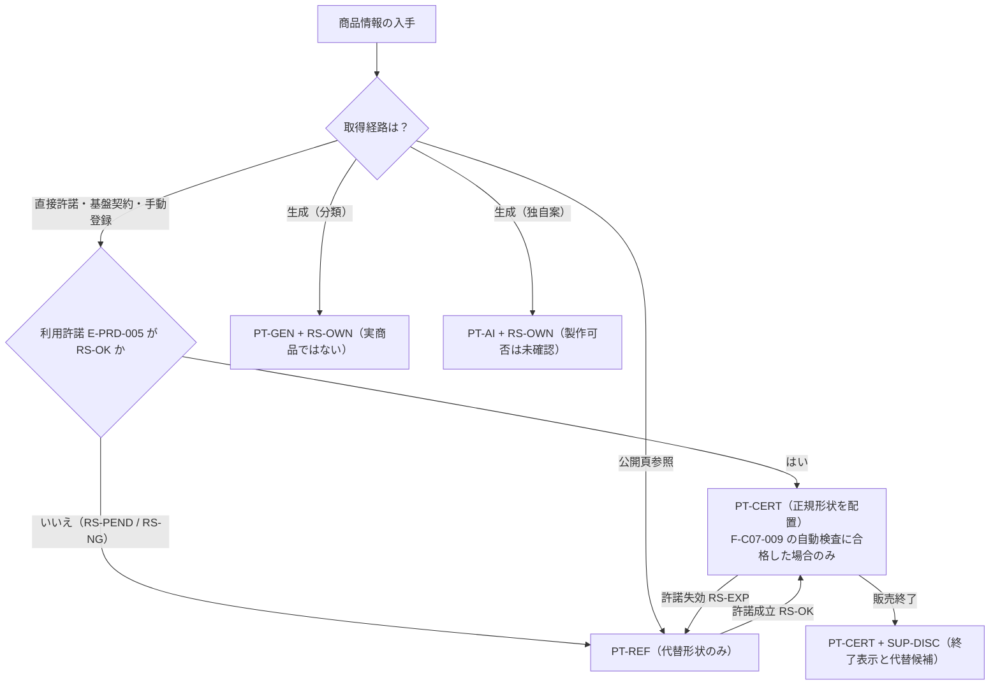
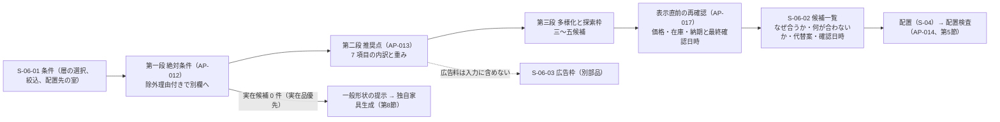
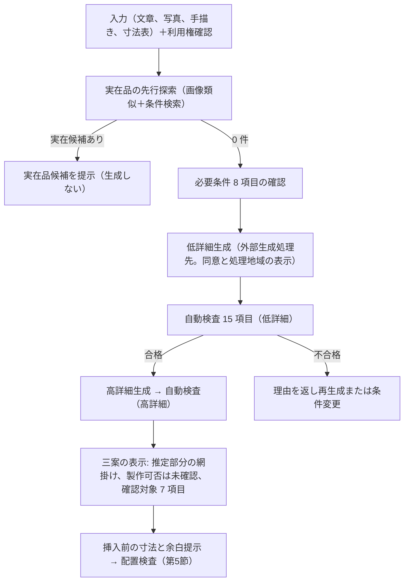

# 第16章 商品推薦、住友林業参照、独自家具生成、代替品の仕様

作成日: 2026-09-15　版: v1.6（v1.6 は段階8 の最終仕上げ（2026-10-08。再々確認 主4-24）〔群G4〕。AC-C05-015-03 の試験の文に、第6.4節「P0 の扱い」に合わせて日次同期の模擬（同期結果 discontinued）で SUP-DISC になった正規商品の経路を加えた。記録は `05_審査/再修正記録_最終仕上げ_群G4.md`。v1.5 は段階8前の持ち越し仕上げ（2026-10-08。共通の決定 D15、D16、既定値の識別子の併記 6 行）〔群F4〕。章末 第12章（群Bの申し送り）の行の placementSnapshot の tier を対応済みに、F-C05-016 の識別子の行の AP-036 の注記を第14章 v1.3 の書き分けと同じ語に改め、第5.1節の交差の許容差に DV-CF-09、F-C05-019 例外(c) に DV-CO-03、章要約の公開頁参照の有効期限に DV-CO-20 を併記した。同日の統括の追加の項目で、F-C05-016 の識別子の行と章末の前提の行の第14章 AP-036 の引用を第14章 v1.4 の書き分け（F-C05-011 の購入確定前の再確認を含む）に合わせた。記録は `05_審査/再修正記録_段階8前_仕上げ_群F4.md`。v1.4 は 2026-10-07 の二回目の修正の仕上げ〔群R3〕。第7.5節の提携誤認語の参照先を第22章 第6.3節 (g) に改め、F-C05-002 の前提の古い依頼注記、U-16-003〔一部解決〕、第14章あての行と章末の二回目の依頼の対応状況を更新した。記録は `05_審査/再修正記録_2回目_仕上げ_群R3.md`）　担当: 段階3 仕様書 第16章（一級建築士、BIM技術者、3D幾何処理技術者、画像認識研究者、UX設計者、個人情報保護と知的財産の審査担当、製品責任者の視点で作成）。v1.1 は 2026-09-15 の初稿審査（統合指摘 JM-117〜120 と整合指摘 JM-045、067、081、098、103、135、193、横断 JM-087、整合修正指示 12 件）の再修正（2026-09-29 と 2026-09-30 の途中停止の後、2026-10-06 に再開して完了。基盤定義 v1.2、第12章 v1.2、第13章、第14章、第19章、第23章 付表 4.3-A への追従と他章の依頼への対応を含む）。内容は `05_審査/再修正記録_第16_20章.md`。v1.2 は 2026-10-06 の段階6 の仕上げ（相互依頼と残課題の処理。群C）。第07、11、12、13、14、19、24章の依頼 7 件を確かめ、第6.1節「配置時点の記録」（U-00-044、U-12-009 への回答）、第5.2節 移乗の副次検査の場面、第9.3節 維持後の G5 の再確認を補った。群Bの申し送り（第12章 v1.3 への追従。userSupplyReports、DV-CO-03、DV-FN-01、E-EXC-005.kind=余白、連動8）を含む。記録は `05_審査/再修正記録_相互依頼_群C.md`。v1.3 は 2026-10-07 の段階6 二回目の修正（段階7 再審査の後）。修正計画 第1.16節の 6 件（主担当 JR-083、JR-084、JR-085、整合 JR-101、JR-118、JR-112）と 01_調査の番号置換への追従（U-84-004、U-84-007、U-85-004、U-85-012）を反映し、第12章 v1.4（DV-CO-20）、第14章 AP-036、第22章 第6.3節、第23章 T-R-009 P0 版、第24章 D-24-023 と第3.3節に揃えた。記録は `05_審査/再修正記録_2回目_第16_17_19章.md`
根拠: 指示文 4（住友林業を参照するための設計原則）、4.1（商品四層）、4.2（権利判断）、4.3（Interior Style と家具推薦）、C5（家具、設備、建材の検索と推薦）、C6（住友林業参照機能）、C7（独自家具の3D生成）、9.5（商品推薦の内部判断）、9.6（商品情報の更新と消失）、B（中心原則）、9.1（V0〜V3）、G（非対象）。基盤定義 `用語集.md` v1.1（第5群 111〜133、第11群）、`識別子規則.md` v1.1、`十二判断領域.md` v1.1（A08、A12、影響関係表、判定例）、`七段階門.md` v1.1（G1〜G4 の A08 行、I-00-121）、`信頼状態と証拠段階.md` v1.1（第5節 PT-/RS-、第6節 PR-、第8節 SUP-、第10節 表示規則）、`機能一覧骨格.md` v1.1（C05、C06、C07）、`情報実体骨格.md` v1.1（群4 PRD、E-ELM-011〜014、E-MAT-001、E-MAT-002、E-SYS-003、E-SRV-016、E-OPS-005、E-EXC-003）、`画面指標試験骨格.md` v1.1（S-06、S-21、S-04-05、S-30-04、M-Q-20〜M-Q-23、M-G-16、M-B-01、T-A-004、T-A-005、T-R-009、T-S-008、T-P-010）、`整合検査報告.md` v1.0。調査 `01_調査/04_住友林業と関連建材.md`、`01_調査/05_商品情報基盤と3D生成.md`、`01_調査/03_国内競合.md`。仕様書 第03章（RC-01〜04、19、20、24、DIF-45〜68）、第04章（U-04-004）、第07章（第3.7節 例6 商品変更）、第08章（手順14、K3 所有家具、J4 家具搬入）、第11章（F-C04-010、F-C04-012、F-C03-015）、第12章（placementSnapshot、interiorStyleRef、既定値表 DV-FN-01、DV-FN-02、DV-CO-03）、第13章（F-C12-005）、第14章（AP-012〜AP-017、AP-035、AP-036）、第15章（S-06-01〜07）。章要約集 A1 の第16章宛て依頼 6 件。v1.1 の追加の根拠: 基盤定義の各ファイル v1.2 と `整合検査報告.md` 第5節（識別子変更一覧）、第12章 v1.2（表11.2-A、DV-FN-01、DV-CO-03、DV-EQ-03、DV-EQ-09、第6.10節 連動8）、第13章 第4.1節と第4.2節末尾、第19章 第2.3節と第4.4節、第23章 第2.5節と第4.3節 付表 4.3-A（T-U-010、T-I-011、M-Q-39、M-Q-40、M-G-22、M-B-09、M-B-10）、第24章 第8節 9.12-3、`04_必須表/識別子台帳.md` 第1節、第5節、`04_必須表/整合修正指示.md` 第16章。
確認日: 2026-09-15。

## 0. 本章の目的、範囲と非対象、前提とする章

### 0.1 本章の目的

- 連合商品台帳の四層（PT-CERT 正規商品、PT-REF 公式情報参照、PT-GEN 分類別一般品、PT-AI AI独自案）、権利状態（RS-）、供給状態（SUP-）、企業と品物の関係区分（PR-）を、商品項目の全一覧と複数企業横断の正規化規則として固定し、第12章の項目辞書（E-PRD-001〜E-PRD-007）の内容を商品の観点から具体化する【推定】。
- 推薦を三段（絶対条件、適合順位、多様化）で行い、推奨点の内訳（機能適合30、寸法と余白20、予算15、意匠10、素材と樹種10、地域と供給10、環境性5）、重み変更、探索枠、広告料と紹介料の分離、偏り監査を、観察可能な算式と合否条件で定める（指示文 C5、9.5）【推定】。
- 配置検査13項目（衝突、扉開閉、椅子余白、通路、視線、窓、電源、給排水、換気、発熱、点検空間、交換経路、搬入経路）の判定方法、閾値の初期仮説、重大度、固定先を定める【推定】。
- 商品情報の更新と消失（取得時刻、有効期限、指紋値、販売終了、許諾失効、接続停止、製造元登録画面）を PT-、RS-、SUP-、PR- の遷移として仕様化する（信頼状態と証拠段階 第5節、第6節、第8節の依頼）【推定】。
- 住友林業参照（解釈対象、Interior Style 七系統二十三案の正規化、掲載家具の事例関係、権利判断、着想案の表示文言、提携誤認の回避）と、独自家具生成（入力、実在品検索の先行、三案、推定部分の表示、GLB仕様、製作可否未確認、3D物品の自動検査）と、代替品の提示規則を定める【推定】。
- 担当機能 F-C05-001〜F-C05-019、F-C06-001〜F-C06-009、F-C07-001〜F-C07-010 の必須10項目と受入条件 AC- を記述し、非対象 F-C05-020 と F-C07-011 の境界を明記する【推定】。

### 0.2 本章の範囲と非対象

| 区分 | 内容 |
|---|---|
| 範囲 | 連合商品台帳の構造と公開指標。商品項目の全一覧と正規化規則。実在品優先の二段階導線。三段推薦と推奨点。候補の表示項目と文言規則。配置検査13項目（商品側の検査）。商品情報の更新と消失、製造元登録画面（S-21）の情報要件。住友林業と住友林業クレストの参照（解釈表、Interior Style の正規化、関係区分、権利判断、表示文言）。独自家具の入力、生成、GLB仕様、自動検査15項目。代替品の提示規則。担当38機能の機能要件と、非対象2機能の境界 |
| 非対象（他章） | 室の寸法と家具余白の空間側の確保と空間側検査 F-C04-010（第11章。本章は商品側の当たり判定と余白）。商品を配置した要素（E-ELM-013 等）の項目辞書と placementSnapshot（第12章）。家具や設備品の荷重（第13章 A04）、設備の系統と容量（第13章 A06）。内装仕上の防火や空気環境の性能目標（第19章）。費用幅、長納期品、工程（第20章。本章は商品の価格範囲と納期の項目定義まで）。清掃と交換周期の計画、機器台帳（第21章）。利用許諾の契約管理、商標表示の規則、外部送信の同意、法人用商品登録の権利審査（第22章。本章は商品に付く権利状態の表示と遷移まで）。画面部品の採番と空状態、待機状態、失敗状態の設計（第15章）。API の入出力（第14章）。提携先推薦と相談予約（第17章） |
| 非対象（製品外、機能一覧骨格 第2節） | F-C05-020 無許諾商品3Dの複製（許諾なし RS-NG の商品は代替形状のみ配置する。第1.2節、第10.0節）。F-C07-011 単写真からの実寸完全復元（写真一枚では実寸1件以上の利用者入力がない限り実寸を断定しない。第8.5節）。生成した家具の強度、接合、転倒、難燃、乳幼児安全、製造費、加工公差の確認（家具設計者または製造者が担う）。購入契約と決済そのもの（本製品は製造元または販売元の公式導線へ個別同意の上で接続する） |

### 0.3 前提とする章

| 章 | 前提として使う内容 |
|---|---|
| 第02章 | 完成像、六段の因果（本章の機能は因果(1)(2)(3)(4)(5)。機能一覧骨格 v1.2 で F-C05-016 は (3)、F-C05-001、F-C05-002、F-C05-013、F-C06-001、F-C06-004、F-C06-006、F-C07-001、F-C07-009 は (2) に付け替えられた。(1) は F-C05-014、F-C05-019、F-C07-003、F-C07-005 に残る。JM-056）、非対象の一覧（無許諾商品3D複製、単写真からの実寸完全復元） |
| 第04章 | 競合の商品3Dが自社商品に閉じている事実、LOWYA の特許出願中の主張と推奨点の抵触評価の依頼（U-04-004） |
| 第05章 | 関係者表と決定権（商品選定の決定者は所有者、確認者は建築士または内装担当） |
| 第06章 | G2（基本家具と内装方針、商品層 PT- の表示）、G3（商品一覧の四層と権利状態の全件表示、完了条件(6)、進行禁止 I-00-121）、G4（商品一覧の権利状態と最終確認日時の引継ぎ） |
| 第07章 | 影響関係表の A08 行（余白、荷重、建具、電源、材料、納期、搬入、交換、権利）、第3.7節 例6（販売終了を origin=商品更新の変更命令として status=提案で登録し、利用者が代替品を選ぶまで仮表示へ進めない） |
| 第08章 | 手順14（S-04 と S-06 で実在品優先で選ぶ）、質問群 K3 所有家具（F-C05-014 の入力）、維持群「家具搬入」の要求（搬入経路検査の入力）、写真内の物品を PT-GEN として仮置きし正規商品と表示しない前提 |
| 第11章 | 空間側検査 F-C04-010（室の寸法、通路幅、扉開閉域の空間側の値）、同期2Dと3Dの描画、GLB書出 F-C04-012 |
| 第12章 | 項目辞書（E-PRD-001〜007、E-ELM-013 Furniture、E-MAT-002 Finish の interiorStyleRef）、配置時点の商品記録 placementSnapshot（U-00-044 の仮判断）、既定値表 |
| 第22章 | 利用許諾（E-PRD-005）の契約管理、商標表示規則、外部送信の個別同意（E-ORG-006）、法人用商品登録の権利審査、禁止表示語の文言検査 F-C15-005 |
| 基盤定義 | 用語集、識別子規則、十二判断領域、七段階門、信頼状態と証拠段階、機能一覧骨格、情報実体骨格、画面指標試験骨格（すべて v1.2）と整合検査報告（第5節 識別子変更一覧）を正本とし、本章はこれらに従う（v1.1 で v1.2 へ追従） |

## 1. 連合商品台帳の構造

### 1.1 四層、権利状態、供給状態の組合せ

商品（E-PRD-001）は商品層 PT-、権利状態 RS-、供給状態 SUP- を互いに独立した属性として持ち、常に三つを添えて表示する（信頼状態と証拠段階 第0節、第10節）【推定】。層と権利状態の許される組合せを次に固定する。

| 層 | 許される権利状態 | 許される供給状態 | 3D の配置形状 | 必須表示（S-30-04） | 検索結果での見え方 | 区分 |
|---|---|---|---|---|---|---|
| PT-CERT 正規商品 | RS-OK のみ（RS-EXP へ落ちた時点で PT-REF へ降格） | SUP-AVAIL、SUP-LEAD、SUP-DISC、SUP-UNKNOWN | 正規形状（製造元または正規基盤から取得した GLB または IFC 変換） | 出典、許諾（許諾版）、帰属表示、最終確認日時 | 正規形状の縮小画像と「正規商品」札 | 【推定】 |
| PT-REF 公式情報参照 | RS-NG、RS-PEND、RS-EXP | 同上 | 代替形状（公式頁の寸法から生成した外形のみ。固有意匠を含まない） | 「公式情報参照」「形状は代替」、公式URL、取得日 | 外形の線画と「形状は代替」札。写真は表示しない | 【推定】 |
| PT-GEN 分類別一般品 | RS-OWN | SUP- を持たない（供給の概念がない。表示は「—」） | 一般形状（分類ごとの標準形状） | 「実商品ではない」 | 灰色の一般形状と「実商品ではない」札 | 【推定】 |
| PT-AI AI独自案 | RS-OWN（生成元の権利条件を生成履歴に持つ） | SUP- を持たない | 独自形状（第8節の GLB 仕様） | 「製作可否は未確認」、生成履歴、権利条件 | 生成形状と「独自案」札。推定部分の網掛け | 【推定】 |

- 表の組合せ以外（例: PT-CERT かつ RS-NG）は台帳検査で不正として登録を拒否する【仮定】。
- PT-REF の代替形状と PT-AI の独自案を PT-CERT と同じ見え方にしない（信頼状態と証拠段階 第10節）。札の文言、縮小画像の種類（写真、線画、灰色形状、生成形状）、枠の図案の三つのうち二つ以上が PT-CERT と同一である表示を「同じ見え方」とし、禁止する（少なくとも二つを異ならせる）。第15章はこの規則で部品を設計し、F-C05-015 の AC-C05-015-01 は本規則で判定する（v1.1 で定義を本節に一本化。JM-087）【仮定】。
- 段階 G3 の進行禁止条件 I-00-121「正規商品以外を実商品として表示している」は、PT-CERT 以外の商品に「実在商品」「正規商品」の札が付く状態、または PT-REF に製造元の商品写真が付く状態を指す（SEV-0）【推定】。

### 1.2 権利状態と配置の規則（F-C05-020 の境界）

| 権利状態 | 新規配置 | 既存案件の配置 | 書出（GLB、PDF、IFC） | 区分 |
|---|---|---|---|---|
| RS-OK | 正規形状を配置できる | 継続 | 許諾範囲（E-PRD-005.scope）に従う。第三者表示不可の許諾では書出に含めず代替形状へ置換し、置換した旨を書出検査（第22章）に記録 | 【仮定】権利に関わるため確定扱いにしない |
| RS-PEND | 代替形状のみ | 既存の正規形状は表示継続し警告 | 代替形状で書出 | 【仮定】同上 |
| RS-NG | 代替形状のみ | 代替形状のみ | 代替形状で書出 | 【推定】 |
| RS-EXP | 不可（新規は代替形状） | 権利条件（E-PRD-005.scope の失効時条項）に従う。条項がない場合は代替形状へ置換し最後の確認日を表示（U-00-021 への仮判断、第6.5節） | 代替形状で書出 | 【仮定】同上 |
| RS-OWN | 一般形状または独自形状、利用者所有の資料 | 継続 | 可。PT-AI は「製作可否は未確認」の注記を書出に転記 | 【推定】 |

無許諾商品3Dの複製（F-C05-020）は非対象であり、RS-OK 以外の商品に製造元の 3D、写真、商品画像を製品内へ複製して配置する機能は存在しない。公式頁からの取得は文章の要約、名称、数値、注記の転記、出典URLの保存に限る（調査04 含意9）【推定】。

### 1.3 企業と品物の関係区分（PR-）の登録根拠

企業（E-PRD-003 Supplier、E-PRD-002 Brand、E-ORG-002 Organization）と商品の組は、関係区分 PR- を一つ以上持つ。各区分は別々の根拠（E-PRD-006 Source）で登録し、PR-CASE や PR-INT から PR-MFG、PR-SELL、PR-3D を推定登録しない（信頼状態と証拠段階 第6節）【推定】。

| 関係区分 | 登録に必要な根拠（Source.kind） | 必須属性 | 含意しないこと（表示で誤認させない） | 区分 |
|---|---|---|---|---|
| PR-HOUSE 住宅商品 | 公式頁（商品一覧頁） | 掲載頁URL、取得日、注文区分、階数区分、用途区分 | 掲載家具の製造、3D提供 | 【推定】 |
| PR-INT 内装案 | 公式頁（内装案頁） | 掲載年月（掲載時点注記）、改廃注記、案の8要素（第7.3節） | 家具の製造、販売、現行品であること | 【推定】 |
| PR-CASE 事例採用 | 公式頁（内装案頁、実例頁） | 掲載年月、掲載した企業、掲載された品物の企業名と品名（公式表記） | 製造、販売、正規3D提供、現行販売 | 【推定】 |
| PR-MFG 製造 | 製造元の公式頁または製造元接続 | 製造元の公式URL、確認日 | 販売、3D提供 | 【推定】 |
| PR-SELL 販売 | 販売頁または製造元接続 | 販売頁URL、価格、在庫、納期の最終確認日時 | 製造、3D提供 | 【推定】 |
| PR-3D 正規3D提供 | 利用許諾（E-PRD-005、RS-OK） | 許諾版、対象、地域、期限、帰属表示、複製可否 | 現行販売、在庫 | 【推定】 |
| PR-REF 参照 | 公式頁 | 出典URL、取得日 | 一切の提携、監修 | 【推定】 |

判定例（十二判断領域 第3.4節）に従い、関係区分と商標の表示の正しさは A12 が主担当、商品の適合判断は A08 が主担当である。

### 1.4 取得経路と製造元ごとの接続部品

| 取得経路 | 内容 | 到達できる層 | 必須の管理項目 | 根拠 | 区分 |
|---|---|---|---|---|---|
| 直接許諾 | 製造元または販売元との契約により品番、寸法、価格、供給、CAD、BIM を受け取る | PT-CERT | 許諾版、対象地域、期限、更新頻度、取得失敗、販売終了、形式変更検知 | 飛騨産業は DWG、3DS、STP を法人審査付きで提供し「プランニング目的のみ」と定める【事実】（https://hidasangyo.com/projects/download-3d/ 、確認日 2026-09-15）。CONDE HOUSE は DXF、DWG、3DS を法人会員に提供し複製、配布、伝送を禁止【事実】（https://www.condehouseglobal.com/contract/download/ 、確認日 2026-09-15） | 【推定】 |
| 基盤契約 | BIMobject の Embed API または開発者 API、Archiproducts との事業契約 | PT-CERT | 同上に加え基盤の規約版 | BIMobject の規約は第三者製品への組込と再配布を禁止（検索経由）【事実】（https://business.bimobject.com/terms-of-service-eula 、確認日 2026-09-15）。Archiproducts の規約は商業的利用、派生物、bot による複製を禁止【事実】（https://bim.archiproducts.com/en/terms-and-conditions 、確認日 2026-09-15）。無契約の自動取得は行わない | 【推定】権利に関わるため確定扱いにしない |
| 手動登録 | 製造元または販売元が製造元登録画面（S-21）で登録し、3D物品の自動検査（F-C07-009）を通す（P2） | PT-CERT | 審査履歴、登録者、検証日、権利状態 | 指示文9.6 | 【推定】 |
| 公開頁参照 | 公式頁の寸法、材質、注記を人が調査して転記し、代替形状を生成する | PT-REF | 公式URL、取得日、掲載時点注記、権利者（複数可） | 指示文4.2、調査04 含意9、11 | 【推定】 |
| 生成 | 分類別一般形状の生成（PT-GEN）、独自案の生成（PT-AI） | PT-GEN、PT-AI | 生成履歴、権利条件 | 指示文4.1、C7 | 【推定】 |

接続部品（E-PRD-003.connectorType、connectionStatus、lastSyncAt）は製造元ごとに分離し、一つの製造元の接続停止が他の製造元の表示に影響しない。接続部品は「サイト更新検知」（取得先URLの応答形式が変わった場合）、「形式変更検知」（CAD形式の版が変わった場合）、「販売終了検知」（品番が一覧から消えた場合。日次同期の対象の商品に限り P0 から。第6.4節。JR-083）を持つ。根拠: LIXIL は 2026-03-10 のサイト更新で既存ストックデータを引き継がない（検索経由）、YKK AP は 2023-11 に CAD 形式を DWG 2010 と DXF 2010 に変更した（調査05 D6）【事実】（確認日 2026-09-15。出典は `01_調査/05_商品情報基盤と3D生成.md` SRC-161、SRC-174）。

### 1.5 公開する台帳指標（F-C05-001）

商品検索画面（S-06）の常設部に次の5指標を表示し、「網羅」と宣伝しない。「網羅」と表示する場合は対象範囲（分類、企業、地域）と測定方法を定義した上で、未取得品を隠さない（指示文4.1）【推定】。

| 指標 | 定義 | 分子 | 分母 | 更新 | 区分 |
|---|---|---|---|---|---|
| 収録企業数 | PT-CERT または PT-REF の商品を1件以上持つ企業（E-PRD-003）の数 | — | — | 日次 | 【推定】 |
| 収録品数 | 層ごとの商品数（PT-CERT、PT-REF、PT-GEN を分けて表示。PT-AI は案件に属すため数えない） | — | — | 日次 | 【推定】 |
| 最終更新日 | 台帳全体で最後に取得または登録に成功した日時。製造元ごとの最終同期日時は詳細で表示 | — | — | 取得ごと | 【推定】 |
| 正規3Dを持つ割合 | PT-CERT かつ RS-OK の商品数 ÷（PT-CERT ＋ PT-REF）の商品数。事業指標 M-B-09 正規3D保有率（第23章）と同じ値として扱う。M-B-09 の分母「台帳の商品数」を本表の分母（品番を持つ商品数。PT-GEN を含めない）に揃えるよう第23章へ依頼した（v1.1、JM-173） | 正規3D商品数 | 品番を持つ商品数 | 日次 | 【推定】 |
| 未収録分野 | 分類辞書（E-EXC-004）の商品分類のうち PT-CERT と PT-REF が0件の分類の一覧 | — | — | 日次 | 【推定】 |

初期公開（P0）は「限定した正規商品」（機能一覧骨格 F-C05-001）であり、正規3Dを持つ割合は低い前提で画面を設計する。調査05 では家具企業の公式3D提供は飛騨産業と CONDE HOUSE のみ確認され、IKEA、ニトリ、MASTERWAL、無印良品は外部提供を確認できなかった【事実】（`01_調査/05_商品情報基盤と3D生成.md` 第3節 D2、確認日 2026-09-15）。したがって P0 の主力は PT-REF と PT-GEN である【推定】。

直接許諾の製造元が 3 社未満（初期仮説）で「PT-GEN のみ」の条件付き公開とした場合（第24章 第8節 9.12-3、D-24-003）は、S-06 の常設部に「正規商品未収録」を常時表示し、収録品数の PT-CERT が 0 件であることを併記する。PT-CERT が 1 件以上登録された時点で表示を外す（F-C05-001。第24章の依頼への回答、JM-184）【推定】。

### 1.6 層と権利の判定の流れ

## 2. 商品項目の全一覧と複数企業横断の正規化規則

### 2.1 商品項目の全一覧（F-C05-002）

指示文 C5 の8群を最低限の項目とし、調査05 の含意（許諾の区分、許諾範囲、取得経路、元形式、配布形式、変換履歴、指紋値、有効期限、帰属表示文）を追加した。対応する実体は情報実体骨格 群4（E-PRD-001 Product、E-PRD-002 Brand、E-PRD-003 Supplier、E-PRD-005 License、E-PRD-006 Source、E-PRD-007 Availability）、E-MAT-001 Material、E-OPS-005 ReplacementCycle であり、属性名は第12章の項目辞書に従う。本表は「商品として必ず持つ項目」と「正規化後の単位」を固定する【推定】。

| 群 | 項目 | 型（正規化後） | 必須 | 保持する実体 | 正規化単位と規則 | 状態 | 区分 |
|---|---|---|---|---|---|---|---|
| 識別 | 企業 | ref[E-ORG-002] | 必須 | Product→Brand→Organization | 公式表記。法人番号を持てる場合は併記 | PR（Supplier 側） | 【推定】 |
| 識別 | 銘柄 | ref[E-PRD-002] | 必須 | Brand | 公式表記。商標注記（trademarkNotice） | — | 【推定】 |
| 識別 | 系列 | str | 任意 | Product.series | 公式表記 | — | 【推定】 |
| 識別 | 品番 | str | PT-CERT、PT-REF は必須。PT-GEN、PT-AI は null | Product.modelNumber | 製造元の表記そのまま。空白と全角英数は正規化せず保持し、検索用の正規化キー（半角、大文字。Product.searchKey、第12章 表11.2-A）を別に持つ | — | 【推定】 |
| 識別 | 分類 | ref[E-EXC-003] | 必須 | Product.classificationRef | 辞書（E-EXC-004）の商品分類コード。製造元独自の分類名は Source に保持 | — | 【推定】 |
| 寸法 | 幅、奥行、高さ | int（mm） | 必須（PT-GEN は分類の既定値、VS-DEF） | Product.dimensions | mm 整数。幅は正面から見た左右、奥行は前後、高さは床面から最上部。inch は 25.4 倍して整数へ四捨五入し換算元を保持 | VS | 【推定】 |
| 寸法 | 可動範囲 | json{使用状態の幅、奥行、高さ、開閉軌跡} | 扉、引出し、伸長、リクライニングを持つ品は必須 | Product.dimensions.movableRange | 使用状態の最大寸法（mm）と開閉軌跡（2D多角形） | VS | 【推定】 |
| 寸法 | 必要余白 | json{前方、側方左、側方右、後方、上方}（mm） | 必須（不明は分類の既定値、VS-DEF） | Product.dimensions.clearance | 製造元指定値があればそれを VS-SRC、なければ分類既定値を VS-DEF | VS | 【推定】 |
| 寸法 | 重量 | num（kg） | 任意 | Product.dimensions.weight | kg、小数1桁。梱包重量は別項目 | VS | 【推定】 |
| 素材 | 素材、樹種、色、仕上 | ref[E-MAT-001]、str | 素材は必須 | Product→Material、Material.species、color、texture | 樹種は公式表記（ASH、OAK 等）と和名を併記。仕上色は樹種と別項目（調査04 含意6） | VS | 【推定】 |
| 素材 | 耐久、防火、環境情報 | num（年）、str、json | 任意 | Material.durabilityYears、fireClass、emissions | 環境情報は「公開主張」として出典と確認日を付け、第三者評価や法的適合と表示しない | VS | 【推定】 |
| 価格と供給 | 価格範囲、通貨、税、地域 | range(JPY)、str、enum{税込,税別}、list[str] | PT-CERT、PT-REF は必須（公開頁に価格がない場合は「記載なし」） | Product.priceRange、Availability.priceAtTime | JPY 税込へ正規化。税別のみ判明は税率と時点を付けて換算し「換算値」と表示。外貨は換算せず元通貨と「換算なし」を表示。価格時点（priceDate）を必ず持つ | SUP | 【推定】 |
| 価格と供給 | 在庫状態、納期、最終確認日時 | enum{在庫あり,取寄せ,欠品,不明}、range(日)、datetime | 必須（不明は SUP-UNKNOWN） | Availability.stockState、leadTimeDays、lastVerifiedAt | 地域（都道府県コードまたは「全国」）ごとに持つ。最終確認日時は UTC で保存し表示は日本時間 | SUP | 【推定】 |
| 保守 | 保証、清掃方法、点検周期、交換周期、修理可否、交換部品、廃棄または再利用方法 | ref[E-OPS-003]、str、int（月）、range(年)、bool、enum{入手可,限定,終了,不明}、str | 任意（P0 は項目の保持のみ） | Product→Warranty、ReplacementCycle | 交換周期の根拠（製造元、統計、仮定）を持ち、仮定は VS-DEF | VS | 【推定】 |
| 適用 | 対応する室、生活行動、内装様式、組合せ条件 | list[enum]、list[str]、list[ref 内装案]、json | 対応する室は必須 | Product.applicability | 室は E-SPC-001.usage の列挙、生活行動は第08章の質問群Dの語彙、内装様式は第7.3節の正規化案（掲載年月付き） | — | 【推定】 |
| 表現 | 2D記号 | SVG | 必須（分類の既定記号で代替可） | Source（kind=製造元接続または生成） | 平面記号。実寸（mm）で描画 | — | 【推定】 |
| 表現 | 3D情報、IFC または GLB | GLB（glTF 2.0 バイナリ）。IFC は変換元として保持 | PT-CERT は必須、PT-REF は代替形状、PT-GEN は一般形状、PT-AI は独自形状 | Source（kind=製造元接続、生成） | 元形式（RVT、RFA、GSM、DWG、3DS、STP、IFC 等）、配布形式（GLB）、変換履歴、指紋値を持つ。第8.6節の GLB 仕様に従う | RS | 【推定】 |
| 表現 | 詳細度 | enum{外形のみ,簡略,詳細,MEP情報付き} | 必須 | Product.detailLevel（第12章 表11.2-A） | 調査05 含意（YKK AP の簡略化表現、TOTO の MEP 情報、Panasonic の ifc は形状のみ）に基づく四段階 | — | 【推定】 |
| 表現 | 当たり判定形状 | geom（閉多様体、または OBB） | 必須 | Product.geometryRefs.collisionShape | 境界寸法（幅、奥行、高さ）と共に持つ。表示形状と別に持つ | — | 【推定】 |
| 権利 | 公式URL、情報提供元、利用許諾、帰属表示、使用期限 | str、ref[E-PRD-003]、ref[E-PRD-005]、str、date | 公式URL と情報提供元は必須。利用許諾は PT-CERT に必須 | Product.officialUrl（Source kind=公式頁 と同じ）、Supplier.relations（E-PRD-003）、License | 公式URLはトップ頁を併記（住友林業と住友林業クレストの利用条件がトップ頁へのリンクを推奨。第7.1節） | RS | 【推定】 |
| 権利（追加） | 許諾の区分、許諾範囲、権利者（複数可） | enum{設計提案,社内利用,第三者表示可,組込可,再配布可}、json{用途,案件,期間}、list[ref[E-ORG-002]] | PT-CERT に必須 | License.licenseCategory（許諾の区分。用語集 497）、License.scope（許諾範囲）、License.licensorRefs（第12章 v1.2 で複数化）。許諾種別（利用許諾の対象行為の区分。用語集 464）ごとの可否は License.grantKinds（第22章 第3.2節） | 建材各社の許諾は「設計と提案業務」「社内利用」に限る文言が多い（調査05 D3）ため、施主表示と保管の可否を許諾種別ごとに grantKinds で持つ（区分からの決め方は U-16-009 の確認まで確認中） | RS | 【推定】権利に関わるため確定扱いにしない |
| 更新（追加） | 取得時刻、有効期限、最終成功時刻、提供元、許諾版、指紋値 | datetime、datetime、datetime、ref、str、str | 必須 | Availability.lastVerifiedAt、validUntil、lastSuccessAt、License.licenseVersion、Product.fingerprint | 第6節 | SUP、RS | 【推定】 |

### 2.2 複数企業横断の正規化規則（F-C05-013）

企業をまたぐ比較では、分類、寸法、価格時点、供給地域、許諾状態の5項目を同一基準へ正規化し、正規化前の値と換算規則を Source に残す（指示文 C5）【推定】。

| 項目 | 正規化の基準 | 換算できない場合の表示 | 検査（台帳検査） | 区分 |
|---|---|---|---|---|
| 分類 | 辞書 E-EXC-004 の商品分類（住友林業クレストの製品分類「床材、建具、階段、収納、壁材、造作材、化粧造作部材」と家具分類「机、椅子、収納、寝台、食卓、ソファ、棚」を初期候補に含める）へ一つ割り当てる | 「分類未割当」として検索結果の末尾に置き、絞込（F-C05-004）の分類条件では除外する | 未割当率を月次で集計 | 【推定】 |
| 寸法 | mm 整数。軸の定義は第2.1節。可変寸法商品（台所、収納）は最小と最大を range で持つ | 「寸法未取得」。配置検査では分類既定値（VS-DEF）を使い、候補札に「既定値」を表示 | 寸法が null の PT-CERT は登録拒否 | 【推定】 |
| 価格時点 | 表示直前に再確認した priceDate を同一画面の候補全体で揃える。揃えられない候補は個別に時点を表示 | 「価格記載なし」（住友林業と住友林業クレストの公開頁は価格を掲載しない【事実】（https://sfc.jp/ie/lineup/ 、確認日 2026-09-15）） | 24時間を超えた価格には「再確認前」を表示（第6.2節） | 【推定】 |
| 供給地域 | 都道府県コードの集合または「全国」。海外発送のみの品は「国内供給なし」 | 「供給地域不明」として絶対条件の地域判定では除外 | — | 【推定】 |
| 許諾状態 | RS- の五区分（信頼状態と証拠段階 第5.2節） | RS-PEND | PR-3D かつ RS-OK 以外は登録拒否 | 【推定】 |

比較画面（S-06 の比較部品）では、5項目の単位と時点を列の見出しに一度だけ表示し、行ごとに異なる時点や単位がある場合はその欄に個別表示する。これにより「同一単位と同一時点で表示される」（機能一覧骨格の合格条件）を観察可能にする【仮定】。

### 2.3 樹種、仕上色、印象語の語彙

- 樹種は公式表記の英字（ASH、OAK、CHERRY、WALNUT、TEAK 等）と和名（タモ、ナラ、サクラ、クルミ、チーク 等）を Material.species に併記する。住友林業の樹種図鑑は13樹種を掲載する【事実】（https://sfc.jp/ie/tree/primewood/woodguide/ 、確認日 2026-09-15）が、各樹種の個別頁の内容は未確認のため（調査04 U-84-007）、初期収録は英字5樹種と和名の対応だけを置く【未確認】。
- 仕上色（ホワイト、ブラック、グレージュ、ダークグレー 等）は樹種と別項目で持つ。OAK WHITE、OAK BLACK は「樹種 OAK ＋ 仕上色」として持つ（調査04 含意6）【推定】。
- 印象語（明るい、和モダン、ラグジュアリー、北欧、インダストリアル 等）は第7.3節の内装案から抽出した語彙集合を辞書 E-EXC-004 に「印象語」として登録し、利用者の希望語（第08章 質問群H）と照合する【推定】。同義語（例: 和モダンと和の意匠）の対応は辞書の属性として持ち、言語模型は候補提示だけを行い辞書の書換えは人が行う【仮定】。

## 3. 実在品優先の二段階導線と三段推薦

### 3.1 実在品優先の二段階導線（F-C05-003）

| 選択（S-06-01） | 検索対象の層 | PT-AI の生成 | 候補なしの時 | 区分 |
|---|---|---|---|---|
| 実在品のみ | PT-CERT、PT-REF、PT-GEN | 抑止 | 空状態（S-06-02-E）に「候補なし」と独自案への導線を出す。切替は利用者の明示操作 | 【推定】 |
| 実在品優先（既定） | PT-CERT、PT-REF、PT-GEN。実在候補 0 件のときだけ PT-AI | 実在候補 0 件のときだけ許可 | F-C07-002 の先行探索を経て生成（第8節） | 【推定】 |
| 独自案のみ | PT-AI。先行探索の実在候補は「参考」欄に表示 | 許可 | — | 【推定】 |

「実在候補 0 件」とは、絶対条件（第3.3節）を通過した PT-CERT と PT-REF が 0 件の状態を指す。PT-GEN は分類が一致すれば常に 1 件あるため候補数に数えず、実在候補 0 件のとき一般形状を先に提示し、利用者が「合わない」を選んだ場合に生成へ進む【仮定】。

### 3.2 絞込検索（F-C05-004）

| 条件 | 入力形式 | 既定値 | 区分 |
|---|---|---|---|
| 分類 | 辞書 E-EXC-004 の商品分類（第2.2節）。複数選択可 | 配置先の室（S-04 から引継ぎ）に対応する分類 | 【推定】 |
| 寸法 | 幅、奥行、高さの範囲（mm） | 配置先の室の有効寸法から必要余白（DV-FN-01）を引いた上限 | 【推定】 |
| 価格 | 上限（JPY 税込） | 要求台帳の費用上限（該当要求がなければ空） | 【推定】 |
| 素材、樹種、色 | 辞書の語彙（第2.3節）。複数選択可 | 内装方針（G2 の必須成果）の樹種と仕上色 | 【推定】 |
| 地域 | 都道府県 | 案件の敷地の都道府県 | 【推定】 |
| 供給状態 | SUP- の選択 | SUP-AVAIL、SUP-LEAD と SUP-UNKNOWN（有効期限超過、接続停止）を表示し、SUP-UNKNOWN には「供給状態 不明（最終確認 ○）」の札を付ける。SUP-DISC と利用者申告の販売終了（status=有効）は既定で非表示（切替可）（JR-084） | 【推定】 |

条件を変えるたびに結果件数（totalCount）と除外件数（excludedCount）を更新し、除外された候補は除外理由付きで別欄（S-06-02）に置く（AP-012）【推定】。

### 3.3 第一段 絶対条件による除外（F-C05-005）

| 条件 | 除外する判定（決定的） | 除外理由の文言（数値を含む） | 入力元 | 区分 |
|---|---|---|---|---|
| 寸法 | 使用状態の境界寸法＋必要余白が配置先の室の有効寸法を超える。可変寸法品は最小値で判定 | 「幅 ○ mm＋余白 ○ mm が室の有効幅 ○ mm を超える」 | Product.dimensions、E-SPC-001 | 【推定】 |
| 扉開閉 | 配置先の候補位置で Door.swingArea と当たり判定形状が交差する。位置未定なら室内の全候補位置で交差する | 「扉 #○ の開閉域と干渉」 | F-C04-010（第11章） | 【推定】 |
| 通路 | 配置後の通路幅が要求値（既定 780 mm、DV-FN-01。要求台帳の値が優先）未満 | 「通路幅 ○ mm が要求 ○ mm 未満」 | E-REQ-001 | 【推定】 |
| 地域 | Availability.region に案件の都道府県が含まれない。「供給地域不明」も除外 | 「○県への供給なし」「供給地域不明」 | E-PRD-007 | 【推定】 |
| 費用上限 | priceRange.min が費用上限（RP-MUST）を超える。「価格記載なし」は除外せず理由に表示 | 「価格下限 ○ 円が上限 ○ 円を超える」 | E-REQ-001 | 【推定】 |
| 供給状態 | SUP-DISC。SUP-LEAD で納期の上限が必要期日（E-SRV-016.requiredByDate）を超える。P0 は案件内の利用者申告の販売終了（第6.4節。JM-117）も除外する | 「販売終了（最終確認 ○）」「販売終了（利用者申告、○月○日）」「納期 ○ 日が期日 ○ を超える」 | E-PRD-007、利用者申告（案件側） | 【推定】 |
| 権利 | RS-NG、RS-PEND、RS-EXP は正規形状での配置対象から除外し、代替形状の候補として残す（形状の制限であり候補からの除外ではない） | 「正規3Dなし。形状は代替」 | E-PRD-005 | 【推定】 |

指示文 9.5 の「権利を満たさない品を除く」は、正規形状での配置からの除外と解釈する。代替形状の候補まで除くと P0 の主力である PT-REF が全て消えるためである【推定】。

### 3.4 第二段 推奨点の計算と重み変更（F-C05-006）

| 項目 | 初期重み | 算式（0〜1 の適合度 × 重み） | 適合度の判定 | 区分 |
|---|---:|---|---|---|
| 機能適合 | 30 | 一致した要求数 ÷ 対象要求数 | 対象は要求台帳（E-REQ-001）のうち主担当 A08 と生活場面（E-REQ-009）の食事、調理、在宅勤務等が生む要求。対応する室、生活行動、組合せ条件（Product.applicability）との照合 | 【仮定】初期仮説 |
| 寸法と余白 | 20 | 余裕率 r＝(実余白－必要余白)÷必要余白。r≦0 で 0.5、r≧0.2 で 1.0、間は線形 | 絶対条件通過後の余裕。可動範囲の使用状態で判定 | 【仮定】初期仮説 |
| 予算 | 15 | 比 p＝価格範囲の中央値÷費用上限。p≦0.6 で 1.0、p＝1.0 で 0.33、間は線形 | 価格記載なしは 0 とし「価格記載なし」を理由に表示 | 【仮定】初期仮説 |
| 意匠 | 10 | 一致した印象語数 ÷ 希望印象語数 | 内装案（第7.3節）の印象語と質問群H（第08章）の希望語を辞書で照合 | 【仮定】初期仮説 |
| 素材と樹種 | 10 | 素材、樹種、仕上色の全一致 1.0、樹種のみ 0.6、仕上色のみ 0.3、不一致 0 | Material.species、color と内装方針の照合 | 【仮定】初期仮説 |
| 地域と供給 | 10 | SUP-AVAIL 1.0、SUP-LEAD で期日内 0.7、SUP-UNKNOWN 0.3 | SUP-DISC は絶対条件で除外済み | 【仮定】初期仮説 |
| 環境性 | 5 | 第三者評価（EL-3RD 相当の評価書）あり 1.0、公開主張のみ 0.6（未検証の加点。上限は U-16-019 で確定するまでの初期仮説）、情報なし 0 | Material.emissions 等の環境情報の出典種別。公開主張の記録種別は第19章 第4.4節（E-REQ-008 kind=出典、summary に「公開主張」。証拠段階に入れない）を正本とする。公開主張は真偽を保証しない旨を表示し、加点を内訳に明示する（第4.1節。JM-118） | 【仮定】初期仮説 |

- 重みは利用者が各項目 0〜50 の範囲で変更でき、合計が 100 になるよう正規化する。変更は案件ごとに保存し、既定値へ戻せる。重み変更の履歴は判断記録（S-25）に「推薦条件の変更」として残す【仮定】。
- 点数と共に条件ごとの合否と情報源（Source の種別と確認日）を表示する（指示文 9.5）【推定】。
- 閲覧、保存、配置、削除、購入、返品理由からの改善は案件横断の集計に限り、個人ごとの学習は学習許可（第22章 N-DP-01。初期状態は無効）がある利用者の記録だけを使う【推定】。
- LOWYA おくROOM が「特許出願中」と主張する機能（部屋寸法と予算からの自動生成）との抵触は未評価であり、本節の算式は評価が終わるまで確定扱いにしない（U-04-004 の引継ぎ、U-16-004）【未確認】。

### 3.5 第三段 多様化と探索枠

| 規則 | 内容 | 区分 |
|---|---|---|
| 候補数 | 三〜五候補。推奨点の上位から取るが、下記の偏り条件に当たる候補は次点と入れ替える | 【推定】 |
| 企業の偏り | 同一企業（E-ORG-002）の候補は候補数の 40% 以下（五候補で最大 2 件） | 【仮定】初期仮説 |
| 価格帯の偏り | 費用上限を三等分した価格帯のうち一つの帯だけで全候補を占めない | 【仮定】初期仮説 |
| 探索枠 | 五候補のうち 1 枠を、履歴不足の商品（過去 30 日の閲覧、配置、購入の記録が 10 件未満）または収録から 90 日以内の商品に割り当てる。四候補以下では 0 枠。探索枠の候補は「探索枠」札を付け、推奨点を偽らず順位も点数順のまま表示する。法人登録品の露出差の超過時の割当の停止は第6.7節（JR-118） | 【仮定】初期仮説（U-16-002） |
| 入替の記録 | 入れ替えた候補と理由を推薦記録に残し、偏り監査（第3.6節）の入力にする | 【推定】 |

### 3.6 広告料と紹介料の分離、偏り監査（F-C05-008）

| 規則 | 内容 | 区分 |
|---|---|---|
| 点数からの分離 | 広告料と紹介料は推奨点の入力に含めない。算式に該当する項目がない | 【推定】 |
| 広告枠 | 広告枠（S-06-03）は候補一覧（S-06-02）と別の部品に置き、「広告」と紹介料の有無を明示する。広告枠の商品が候補にも含まれる場合、候補側にも「広告掲載あり」を表示する | 【推定】 |
| 順位への影響の禁止 | 広告料と紹介料は P0〜P2 を通じて推奨点と順位に入れない。広告の露出は広告枠（S-06-03）の中の順序に限り、広告枠の中の順序規則（初期仮説: 掲載契約の開始日の古い順）も S-06-03 に開示する（指示文 9.5、指示文 H。v1.1 で「将来持つ場合は重みと理由を開示する」を削除、JM-118）。推奨点と順位の算定規則が参照する属性に E-ORG-002.isSponsored、E-ORG-005（Fee。法人の登録の料金〔審査の手数料を取る場合〕を含む）、E-PRD-003.selfManaged（法人登録品であること）が含まれないことを算定規則の版ごとに静的検査する（T-S-008 合格条件(5)。第17章 AC-C08-009-02 と同じ形。selfManaged と登録の料金は JR-118 で追加）。掲載料は広告枠（S-06-03）への表示の対価に限り、正規商品登録（F-C05-019、S-21）は無償とする（第24章 第1.1節、D-24-023。経営陣の確認を要する仮の判断） | 【推定】 |
| 偏り監査（月次） | 企業集中度（上位 1 社の候補露出割合。初期仮説 30% 以下）、価格帯偏り（三帯の露出割合の最大と最小の差。初期仮説 40 ポイント以内）、地域偏り（供給地域が全国の商品の露出割合を都道府県別に比較）、広告ありと広告なしの露出差（M-G-16。同点数帯を推奨点 10 点幅と定義し、帯ごとの露出回数の差。初期仮説 ±5 ポイント以内。U-00-051 への仮判断）。P2 では法人登録品と非登録品の露出差（第6.7節）を加える | 【仮定】初期仮説（U-16-003） |
| 監査の記録 | 監査結果は監査記録（E-EXC-007 AuditLog）に残し、閾値超過は製品責任者へ通知（S-17） | 【推定】 |

### 3.7 利用者所有家具の実寸確認（F-C05-014）

| 規則 | 内容 | 区分 |
|---|---|---|
| 入力元 | 質問群 K3（第08章）の所有家具一覧（種類、幅、奥行、高さ、寸法の確認方法）と、写真から改装（第08章 3c）で取り込んだ室内写真 | 【推定】 |
| 確認方法 | ownedDimensionSource は「寸法入力」（利用者が mm で入力）、「基準物確認」（同じ写真内の既知寸法物 2 点間の実寸を入力。既知寸法物の例: A4 用紙 210×297 mm、扉幅、畳）、「未確認」の三値 | 【推定】 |
| 写真内の物品 | PT-GEN の一般形状（DV-FN-02）として仮置きし、「実商品ではない」「寸法未確認」を表示する。正規商品と表示しない | 【推定】 |
| 配置の制限 | 「未確認」の所有家具は配置検査を行わず配置できない（F-C04-010 例外(b) と同じ）。基準物確認の値は VS-USR、写真のみの値は VS-AI のまま | 【推定】 |
| 搬入 | 所有家具と大型機器（冷蔵庫、洗濯機、ソファ、ピアノ）の寸法は維持群「家具搬入」の要求（例 R-08-011）として搬入経路検査（第5節）へ渡る | 【推定】 |

### 3.8 推薦の流れ

## 4. 候補の表示（F-C05-007、F-C05-015、F-C05-017）

### 4.1 表示項目と文言規則

| 項目 | 内容 | 生成元 | 文言規則 | 区分 |
|---|---|---|---|---|
| なぜ合うか | 一致した要求と希望（要求識別子付き）を適合度の高い順に最大 3 件 | AP-013 fitReasons | 「要求 #○○（食事 6 人）を満たす: 幅 1,800 mm」。事実は条件照合の結果であり、言語模型は文の整形だけを行う | 【推定】 |
| 何が合わないか | 不一致の希望（RP-WANT、RP-NICE）と、既定値（VS-DEF）で判定した項目を全件 | misfitReasons | 「希望 #○○（樹種 OAK）と不一致: WALNUT」「必要余白は分類の既定値で判定」。M-Q-23 の対象 | 【推定】 |
| 代替案 | 不一致点を解消する同分類の候補 1〜3 件 | alternatives、substituteRefs | 候補ごとに PT-、RS-、SUP- と不一致点の差分を付ける | 【推定】 |
| 価格と在庫の確認日時 | lastVerifiedAt と priceDate。24 時間超は「再確認前」、接続停止は「接続停止（最終成功 ○月○日 ○時）」 | AP-017 | 日本時間、分単位。「在庫あり」は lastVerifiedAt が有効期限内のときだけ表示 | 【推定】 |
| 推奨点 | 合計と 7 項目の内訳、適用中の重み、探索枠の札 | AP-013 breakdown | 小数第 1 位まで | 【推定】 |
| 公開主張による加点（JM-118） | 環境性の適合度が公開主張だけによる候補（第3.4節の 0.6）は、内訳の環境性の行に「公開主張（未検証）による加点 n 点」を必ず表示する（n＝適合度 × 環境性の重み。初期の重み 5 では 3.0 点）。加点の上限（0.6 を 0.3 へ下げるか 0 とするか）は U-16-019 で公開判定会議が確定する | AP-013 breakdown | 「未検証」の語を省略しない。第三者評価による加点と同じ行に合算しない | 【推定】 |
| 商品状態 | S-30-04（第4.2節） | AP-012 | 常時表示 | 【推定】 |
| 除外理由 | 第3.3節の文言 | AP-012 exclusionReasons | 候補一覧と別欄 | 【推定】 |

### 4.2 商品状態表示（S-30-04）の規則

| 表示 | 内容 | 区分 |
|---|---|---|
| 四つの状態 | PT-（層の札と縮小画像の種類、第1.1節）、RS-（許諾済み、確認中、失効、許諾なし、利用者所有）、SUP-（供給中、納期超過、販売終了、不明）、PR-（該当する区分を全て。PR-CASE は掲載年月付き） | 【推定】 |
| 記号と文字 | 状態は記号と文字で表示し、色だけに依存しない（信頼状態と証拠段階 第10節） | 【推定】 |
| 強調 | SUP-UNKNOWN、RS-EXP、SUP-DISC は最終確認日時を状態の直後に表示し、通常の候補より大きい文字（1.2 倍以上）で目立たせる | 【仮定】 |
| 禁止表示語 | PT-CERT 以外に「実在商品」「正規商品」「購入可能」を付けない。PT-AI に「製作可能」を付けない。RS-OK 以外に製造元の商品写真を付けない。SUP-DISC と SUP-UNKNOWN の商品（P0 の利用者申告の販売終了〔status=有効〕を含む）に「購入可能」「在庫あり」「供給中」を付けない（JM-119）。文言検査（画面は第6章 F-C15-005、書出は第22章 F-C15-011）の対象。語と商品の状態を条件にした規則は第22章 第6.3節「語集合と規則集合の版」（E-EXC-005 kind=禁止表示語）の一つの版で管理し、本行はその写しとする（JR-101） | 【推定】 |
| 販売終了の札（JM-119） | SUP-DISC の商品は「販売終了」の札を層の札（第1.1節）と同じ大きさで表示し、最終確認日時を併記する（強調の行） | 【推定】 |
| 書出と写実画像 | GLB 書出（第11章 F-C04-012）と写実生成（第11章 F-C03-015）でも同じ状態を転記し、RS-OK でない商品は代替形状または一般形状で描く（第9.3節） | 【推定】 |

### 4.3 保存、購入導線、人への相談（F-C05-017）

| 導線 | 内容 | 外部送信 | 区分 |
|---|---|---|---|
| 保存 | 配置案を案の版（E-REQ-005 Option）へ保存し、配置時点の商品記録（placementSnapshot）を複製する。連絡先を求めない | なし | 【推定】 |
| 購入導線 | 製造元または販売元の公式頁（Source.officialUrl または販売頁）へ「外部へ移動」の表示付きで接続する。案件情報と連絡先を送らない。購入確定前の再確認（第6.2節）を経る。決済は製品外。supplyState=SUP-DISC のときは confirmAllowed=false とし、S-06-06（代替品）への導線を出す。利用者申告の販売終了（E-BLD-001.userSupplyReports の status=有効）の商品も supplyState=SUP-DISC と同じく confirmAllowed=false とする（JR-101）。公式頁への接続は「参考（販売終了）」として残してよいが購入導線と呼ばない（AP-017 の出力規則へ転記済み。JM-119） | 公式頁への移動のみ | 【推定】 |
| 人への相談 | 相談先比較（第17章 S-07）へ、送信内容（配置案、商品一覧）と送信先を個別に表示して同意（E-ORG-006）を得た後に送る。独自案は家具設計者または製造者への相談を既定の導線にする（第8.7節） | 個別同意の上で送信 | 【推定】 |

## 5. 配置検査（F-C05-009、F-C05-010、F-C07-008、F-C07-010）

### 5.1 13 項目と転倒注意（P1）の判定方法と閾値

判定は当たり判定形状（Product.geometryRefs.collisionShape）と余白（clearance）の交差、または経路の断面との照合を決定的に行う。交差の許容差は 10 mm（第13章と同じ初期仮説。DV-CF-09）【仮定】。閾値は商品の製造元指定値（VS-SRC）があればそれを優先し、なければ下表の初期仮説（VS-DEF）を使い、候補札に「既定値」を表示する。

| 番号 | 項目 | 判定（不合格の条件） | 閾値の初期仮説 | 重大度 | 優先 | 主担当／影響先 | 区分 |
|---:|---|---|---|---|---|---|---|
| 1 | 衝突 | 当たり判定形状が壁、柱、他の家具、設備機器と交差 | 交差 > 10 mm（DV-CF-09） | SEV-2（設備機器との衝突は SEV-1） | P0 | A08／A03 | 【仮定】 |
| 2 | 扉開閉 | Door.swingArea と交差 | 交差 > 10 mm（DV-CF-09） | SEV-2 | P0 | A08／A03 | 【仮定】 |
| 3 | 椅子余白と席数 | 椅子を引く余白が要求未満。食卓は、要求台帳の席数 N（第08章 第4.1節 食事の行。RP-WANT。来客時 N＋2）に対し、座れる席の数が N 未満（JM-045）。座れる席の数は、食卓の各辺の長さ ÷ 一人当たりの幅の整数部を、その辺の外側に椅子を引く余白が室と他の要素に当たらずに取れる辺だけ合計した数とする（円形と楕円の食卓は、余白が取れる外周の長さ ÷ 一人当たりの幅の整数部） | 椅子を引く余白 600 mm（DV-FN-01）。一人当たりの幅 600 mm（初期仮説。DV-FN-01 の「食卓の一人当たりの幅」。第12章 v1.3 で登録済み） | SEV-2（来客時 N＋2 の不足は SEV-3 で記録のみ） | P0 | A08／A03 | 【仮定】 |
| 4 | 通路 | 配置後の通路幅が要求未満 | 780 mm（DV-FN-01）。要求台帳が優先 | SEV-2 | P0 | A08／A03 | 【仮定】 |
| 5 | 視線 | 座席の視点（高さは既定値表、U-00-031）から窓または画面への幅 1,200 mm の直線帯に高さ 1,100 mm 超の物品がある。画面と座席の距離が画面高さの 3 倍未満 | 1,100 mm、3 倍 | SEV-3（記録のみ） | P0 | A08／A03 | 【仮定】 |
| 6 | 窓 | 窓の開閉域と交差、または窓台高さより高い物品が窓の幅の 50% 超を覆う | 50% | SEV-2 | P0 | A08／A05 | 【仮定】 |
| 7 | 電源 | 電源を要する商品（分類辞書の requiresPower）の接続点から最寄りの電源端点（E-ELM-011 kind=コンセント。第13章 第4.1節）まで 1,500 mm 超、または電源端点が未配置。電気図がない案件の電源端点は DV-EQ-09 の既定配置による候補（VS-AI）であり、結果に「候補の電源端点に基づく」と表示する（JM-103） | 1,500 mm。未配置は「電源未確認」 | SEV-3（未配置）、SEV-2（超過） | P1 | A08／A06 | 【仮定】（U-16-017 は解決） |
| 8 | 給排水 | 給排水を要する商品の接続点から経路（E-SYS-003 kind=配管、排水）の端点まで 1,000 mm 超、または排水勾配が第13章の条件を満たさない | 1,000 mm | SEV-1 | P1 | A08／A06 | 【仮定】 |
| 9 | 換気 | 燃焼または発熱調理機器の室に換気系統（E-SYS-002 kind=換気）の端点がない | 端点 0 件 | SEV-1 | P1 | A08／A06 | 【仮定】 |
| 10 | 発熱 | 発熱機器（heatOutput > 0）の離隔が製造元指定値未満 | 側方 50 mm、上方 100 mm、背面 50 mm | SEV-2 | P1 | A08／A06 | 【仮定】 |
| 11 | 点検空間 | 商品側の維持空間（serviceSpace）と他要素が交差 | 交差 > 10 mm（DV-CF-09）。点検口との関係は第13章 F-C12-005 | SEV-1 | P1 | A08／A06、A11 | 【仮定】 |
| 12 | 交換経路 | 商品の境界寸法（梱包寸法 packagedDimensions があれば優先）が交換搬出経路（kind=交換搬出）の最小断面を通らない（梱包寸法基準の商品側検査） | 経路の幅と高さ ≧ 梱包寸法（なければ境界寸法）＋50 mm。建物側の経路の必要幅（機器寸法＋100 mm、下限 幅 700 × 高さ 1,800。DV-EQ-03）は第13章の検査であり、本項目はその商品側の検査として併記する（U-21-003 の解決。JM-098） | SEV-2 | P1 | A08／A11 | 【仮定】 |
| 13 | 搬入経路 | 玄関から配置室までの経路（kind=搬入）の各区間の幅、高さ、曲がり角の対角寸法、階段の幅と踊り場の対角が寸法未満 | 寸法＋50 mm。曲がり角は対角で判定 | SEV-2 | P0 | A08／A03、A10 | 【仮定】 |
| 14 | 転倒注意（F-C05-009 の項目8。JM-120） | 寝室に配置した家具の高さが閾値を超え、固定の有無（E-ELM-013.isAnchored）が false。寝台（E-ELM-013 kind=寝台）からの水平距離を付けて S-04-05 に警告として表示する（第08章 第4.3節 地震「寝室の背の高い家具を固定または置かない」の検査） | 高さ 1,200 mm 超（DV-FN-01 の転倒注意） | SEV-3（警告の表示と記録。P0 は isAnchored の記録だけで判定しない） | P1 | A08／A07 | 【仮定】 |

### 5.2 責任境界、固定先、結果の扱い

| 規則 | 内容 | 区分 |
|---|---|---|
| 空間側との分担 | 室の有効寸法、通路幅、扉開閉域、階段幅の値は空間側検査 F-C04-010（第11章、A03）が持つ。本章は商品側の当たり判定形状、必要余白、境界寸法、梱包寸法、可動範囲、電源と給排水の接続点、発熱、維持空間を提供し、同じ検査器（AP-014）と同じ版の検査規則 E-EXC-005（kind=干渉、余白。kind=余白 は必要な空きを寸法で検査する値として第12章 v1.3 の表11.2-B に登録済み。既定閾値 DV-FN-01）で判定する。家具余白の不足（家具と扉開閉域、通路、他の要素との当たり）の問題は商品側（F-C05-009、主担当 A08）に一本化し、A03 は影響先とする。室側の寸法変更で解く場合も問題の主担当は変えない（第07章 第4.3節 判定例辞書、第11章 F-C04-010。JM-067） | 【推定】 |
| 設備側との分担 | 電源、給排水、換気、点検空間の建物側の値（端点、勾配、点検口）は第13章（A06）が持つ。機器と建物の干渉は第13章 F-C12-005、商品を置いた時点の商品側の要求は本章 F-C05-010 | 【推定】 |
| 利用円滑性との分担（JM-135） | 回転と移乗の判定（第19章 第2.3節 項目4、項目5）の処理、閾値（DV-FN-01）、記録（E-SRV-004 kind=利用円滑性）と問題の登録の正本は F-C12-011（第19章、A07。AP-020 kind=利用円滑性）であり、第5.1節の 13 項目には含めない。P1 では、配置または移動の確定のたびに、配置先の室だけを対象に AP-020（kind=利用円滑性）を副次検査として呼ぶ。呼ぶ項目は、車椅子利用の場面（第08章 第4.2節）が該当する案件で配置先の室が便所、浴室、脱衣室、寝室、玄関のいずれかであれば項目4 回転、在宅介護の場面が該当する案件で配置先の室に移乗の対象（便器、浴槽、寝台）があれば項目5 移乗とする（第19章 第2.3節「生活場面との結び」の列と同じ対応。項目5 は項目4 と同じ占有域の控除後に判定するため、寝台以外の家具の配置でも結果が変わる。v1.2 で移乗の契機を寝台の配置と移動から改めた）。結果（合否と不足寸法、家具と器具が未配置の室は「未検査」）を S-04-05 に併記する。P0 は F-C12-011 と AP-020 kind=利用円滑性 が P1 のため呼ばず、該当する案件の S-04-05 に「回転と移乗は未検査（P1）」を表示する | 【推定】 |
| 固定先 | 不合格は E-REQ-003 Issue として登録し、固定先は配置した 3D 要素（E-ELM-013 等）。主担当 A08、影響先は上表 | 【推定】 |
| 挿入前の提示（F-C07-008） | 3D への挿入前に境界寸法、必要余白、使用状態の寸法を S-04-05 に表示し、利用者が確認してから配置する | 【推定】 |
| 自動配置の禁止（F-C07-010） | 要求寸法（配置先の室と要求台帳）と境界寸法が合わない物品は autoPlaceAllowed=false とし自動配置しない。手動配置は不合格の理由を表示した上で許す | 【推定】 |
| 再検査 | 配置、移動、商品の指紋値変更、扉や壁の変更のたびに影響範囲を再検査する。同じ配置の再検査は同じ結果を返す | 【推定】 |
| 計測 | M-Q-20 家具衝突検出率（初期仮説 100%、誤検出 5% 以下）は本章 F-C05-009 の指標。M-Q-21 扉開閉域検出率と M-Q-22 通路余白検出率（100%）は第11章 F-C04-010 の指標で、同じ検査規則で数える（JM-067）。T-A-004、T-P-010 | 【仮定】 |

## 6. 商品情報の更新と消失（F-C05-016、F-C05-011、F-C05-019）

### 6.1 時刻と有効期限

| 項目 | 保持先 | 更新契機 | 有効期限と失効時の状態 | 区分 |
|---|---|---|---|---|
| 取得時刻 | E-PRD-006.acquiredAt | 取得または登録のたび | なし（履歴として残す） | 【推定】 |
| 最終確認日時 | E-PRD-007.lastVerifiedAt | 表示直前と購入確定前の再確認（AP-017。P1）。P0 は表示直前の再確認を行わず、次の取得（AP-036 の同期または台帳操作）まで更新されない | validUntil＝lastVerifiedAt＋DV-CO-03（価格と在庫 24 時間、納期 7 日）。公開頁参照（PT-REF。人の転記で取得し同期を持たない）は validUntil＝lastVerifiedAt（最終の掲載確認）＋DV-CO-20（公開頁参照の掲載確認の有効期限。初期仮説 30 日。JR-084）。超過で SUP-UNKNOWN とし、既定の検索結果から外さない（第3.2節）。超過時の表示規則は P0 から適用し、「供給状態 不明（最終確認 ○）」と表示して「供給中」「在庫あり」と表示しない（F-C05-015。JM-117） | 【推定】 |
| 最終成功時刻 | E-PRD-007.lastSuccessAt | 接続先の応答が成功したとき | 接続停止時に「最終成功 ○」として表示 | 【推定】 |
| 提供元と許諾版 | E-PRD-003、E-PRD-005.licenseVersion | 契約または登録の更新 | License.validUntil 超過で RS-EXP | 【推定】 |
| 使用期限 | E-PRD-001.usageExpiry | License.validUntil の複製 | 超過で新規配置停止 | 【推定】 |
| 指紋値 | E-PRD-001.fingerprint | 寸法または 3D の改訂ごと | 相違で「形状変更あり」（第6.3節） | 【推定】 |
| 配置時点の記録 | 配置した要素（productRef を持つ E-ELM-013 等）の placementSnapshot（第12章 第3.3節、第6.6節「配置記録」。U-00-044 の仮判断） | 商品の配置と置換（代替品の確定、形状の差替え）の確定のたび。移動では更新しない | 期限なし。台帳の現在値と併せて表示し、配置した形状の層は配置時点の tier で示す。相違は第6.2節「配置後に価格変化」、第6.3節「形状変更あり」、第6.8節の表示（「許諾失効」「販売終了」「正規形状に更新可能」）で示し、これらを第12章 第6.6節の「配置後に変化」の文言とする。複製する項目は productVersion、fingerprint、priceAtTime、priceDate、tier、rightsState、supplyState、placedAt（U-12-009 への本章の回答。tier の項目辞書への追加は第12章 v1.3 第3.3節で対応済み＝U-12-009 解決、2026-10-06 相互依頼） | 【仮定】（U-00-044） |

時刻は UTC で保存し、表示は日本時間、分単位とする（第2.1節）。

### 6.2 価格、在庫、納期の再確認（F-C05-016、F-C05-011）

| 場面 | 手順 | 失敗時 | 区分 |
|---|---|---|---|
| 表示直前（P1） | 候補一覧の表示前に AP-017（purpose=表示直前）で公式情報を再確認し、lastVerifiedAt を更新する。24 時間を超えた価格には「再確認前」を表示する。P0 は再確認を行わず、第6.1節の有効期限の表示規則だけを適用する（JM-117） | 直前の取得値を時点付きで表示し SUP- を据え置く。接続停止は第6.6節 | 【推定】 |
| 購入確定前 | 購入導線へ移る前に AP-017（purpose=購入確定前）で製造元情報を再確認する。品番と地域だけを送り、案件情報と連絡先を送らない | confirmAllowed=false とし購入導線へ進めない。「再確認できないため確定できない」と表示し、最終確認日時を示す | 【推定】 |
| 価格の変化 | placementSnapshot.priceAtTime と現在値の差が ±10% を超える場合「配置後に価格変化」を表示し、費用上限を超えたら代替品（第9節）の契機にする | — | 【仮定】初期仮説 |

### 6.3 指紋値と形状変更の検出

- 指紋値は寸法（幅、奥行、高さ、可動範囲、必要余白）の正規化文字列と、配布形式（GLB）のバイト列から算出した固定長の要約値とする。算法は SHA-256（初期仮説）【仮定】。
- 製造元接続の日次同期と手動登録のたびに再計算し、相違があれば「形状変更あり」を台帳と配置済み要素（placementSnapshot.fingerprint との比較）に表示する。形状の自動差替えは行わず、利用者が差替えを選んだときだけ変更命令（origin=商品更新）を仮表示へ進める【推定】。

### 6.4 販売終了

- 販売終了検知（品番が製造元一覧から消えた〔AP-036 の同期結果 discontinued〕、製造元が SUP-DISC を登録、または製品運用者が台帳操作で SUP-DISC にした。P0 から。JR-083）で Availability.supplyState を SUP-DISC にし、層は変えない。既存設計から消さず「販売終了（最終確認 ○）」を表示し、代替候補（第9節）を付ける。○ は lastVerifiedAt（販売終了を確かめた日時）とし、供給中を最後に確かめた日時の目安として公式接続の最終成功時刻 lastSuccessAt を「最終成功 ○」で並記する（JM-119）【推定】。
- 配置済みの案件には変更命令（origin=商品更新、status=提案）を登録し、通知（S-17）を送る。通知の宛先は所有者（RL-OWN）と、当該商品を含む発行済み版（CDE-PUB）の受取側（受取側の RL-CHK、RL-PART）とする。発行済み版は変更せず、通知に新版の作成（S-04-08）への導線を含める（JM-119）。利用者が代替品を選ぶか「販売終了のまま維持」（第9.3節）を選ぶまで仮表示へ進めず、自動置換しない（第07章 第3.7節 例6、T-R-009）【推定】。
- 承認の失効（JM-081）: 当該商品を配置した要素を確認範囲に含む承認（scopeKind=商品）を AS-VOID にし、G3 の門を「再確認中」にする（第12章 第6.10節 連動8、第6章 第5.1節）。代替品の確定または「販売終了のまま維持」の判断の後に再承認を依頼し（第9.3節 再承認の行）、再承認で門の再判定を行う【推定】。
- P0 の扱い（JM-117。v1.3 で JR-083 により改訂）: P0 でも、日次同期（AP-036。対象は限定した正規商品）の同期結果 discontinued と、製品運用者が製造元の公式情報で確かめて行う台帳操作（AP-036 operation=台帳操作。監査記録 action=変更）で台帳の supplyState を SUP-DISC にし、本節の第1〜3箇条（札、変更命令の提案と通知、承認の失効）を P0 から適用する（T-R-009 P0 版 (6)）。P1 は表示直前と購入確定前の再確認（AP-017。F-C05-016、F-C05-011）と納期超過、価格の更新に限る。同期の対象外の商品（公開頁参照の PT-REF ほか）の販売終了は製品が検知できないため、次の二つで古い供給情報の断定を防ぐ。(a) 有効期限（validUntil。DV-CO-03、公開頁参照は DV-CO-20）を超えた商品は SUP-UNKNOWN とし、「供給状態 不明（最終確認 ○）」の札を付けて既定の検索結果に残し（第3.2節）、「供給中」「在庫あり」と表示しない（第6.1節、F-C05-015。JR-084）。(b) 利用者申告: RL-OWN が S-06-05 で「販売終了（利用者申告、日時）」を登録できる。申告は当該案件の推薦と表示にだけ効き、案件横断台帳の supplyState は書き換えない（未確認の申告を他案件へ広げない）。登録で当該商品を案件内の推薦から除外し（第3.3節 供給状態の行）、配置済みの要素には本節の変更命令（origin=商品更新、status=提案）の登録と承認の失効（前の箇条）を起こす。代替品は P1 まで PT-GEN の仮置き（DV-FN-02）と「代替未定」とする（第9.3節 候補ゼロと同じ表示）。PT-GEN の仮置きは変更命令（status=提案）の内容として示し、利用者が確定するまで元の配置を残す（JR-085）。申告は商品ごとに集計し、製品運用者が製造元の公式情報で確かめた場合だけ台帳を SUP-DISC に改める（AP-036 operation=台帳操作。改めた後は本節の第1〜3箇条が当該商品を配置した全案件に働く。JR-083）。申告の保持先は案件側の E-BLD-001.userSupplyReports（productRef、kind=販売終了、reportedByRef、reportedAt、reason、status＝有効または取消、取消の記録 revokedAt、revokedByRef、revokeReason）とし、status=有効 の行の追加が第12章 第6.10節 連動8 の契機になる（第12章 v1.3。群Bの申し送り）【推定】。

### 6.5 許諾失効

| 規則 | 内容 | 区分 |
|---|---|---|
| 検出 | License.validUntil 超過、または権利者の取消（revokedAt）で RS-EXP にし、PT-CERT は PT-REF へ降格する（第1.6節） | 【推定】 |
| 新規配置 | 停止。候補には代替形状のみ | 【推定】 |
| 既存案件 | License.existingProjectPolicy（表示継続、代替形状へ置換、削除）に従う。契約に定めがない場合の既定は「表示継続」とし、最後の確認日と「許諾失効」を表示する。既定の妥当性は U-00-021 の判断まで仮とする | 【仮定】権利に関わるため確定扱いにしない（U-16-013） |
| 書出 | RS-EXP の商品は代替形状で書き出し、置換した旨を書出検査へ記録する（第1.2節、第11章 F-C04-012） | 【推定】 |
| 通知 | 配置済みの案件の所有者（RL-OWN）と、当該商品を含む発行済み版（CDE-PUB）の受取側（受取側の RL-CHK、RL-PART）へ S-17 で通知し、問題（主担当 A12、影響先 A08、SEV-2）を登録する。発行済み版は変更せず、通知に新版の作成（S-04-08）への導線を含める（JM-119） | 【推定】 |

### 6.6 接続停止と検知

| 事象 | 検知方法 | 製品の状態 | 表示 | 区分 |
|---|---|---|---|---|
| 接続停止 | 同期が 3 回連続で失敗（初期仮説） | Supplier.connectionStatus=停止。その製造元の商品の supplyState を SUP-UNKNOWN、stockState を「不明」に戻す | 「接続停止（最終成功 ○）」を強調表示（第4.2節）。在庫ありと推定しない | 【仮定】 |
| サイト更新検知 | 取得先 URL の応答形式（構造、状態符号、転送先）の変化 | 停止と同じ。人が接続部品を更新するまで復旧しない | 同上。根拠: LIXIL の 2026-03-10 サイト更新（第1.4節） | 【推定】 |
| 形式変更検知 | CAD や BIM の形式または版の変化（例: YKK AP の DWG 2010 への変更） | 変換履歴に記録し、変換に失敗した商品の 3D を「変換待ち」にする | 「3D 更新待ち」 | 【推定】 |
| 販売終了検知 | 第6.4節 | SUP-DISC | 「販売終了」 | 【推定】 |
| 復旧 | 同期成功 | connectionStatus=稼働。再確認を経て SUP- を更新 | 通常表示 | 【推定】 |

### 6.7 製造元登録画面 S-21（F-C05-019、P2）

| 項目 | 内容 | 区分 |
|---|---|---|
| 利用者 | 製造元と販売元の法人（RL-PART の一種）。登録者の所属と権限は第22章の法人審査を経る | 【推定】 |
| 登録項目 | 商品項目の全一覧（第2.1節）のうち PT-CERT の必須項目、許諾条件（許諾の区分、許諾範囲: 用途、案件、期間、地域）、帰属表示文、使用期限、責任表示（登録内容の責任は登録者にある旨。根拠: BIMobject と Archiproducts の構造、調査05 D7） | 【推定】 |
| 検証 | 3D は自動検査（F-C07-009、AP-016）に合格したものだけ登録できる。不合格は失敗状態（S-21-X）に 15 項目の不合格理由と修正の手掛かりを表示する | 【推定】 |
| 審査履歴 | Supplier.reviewHistory に審査者、日時、結果（承認、差戻し、却下）、注記を残す。権利審査は第22章。selfManaged=true | 【推定】 |
| 状態の更新 | 製造元自身が価格、在庫、納期、販売終了、許諾の更新を登録できる。更新は lastVerifiedAt と指紋値の再計算を伴う | 【推定】 |
| 未検証品 | 検証日（reviewHistory の承認日時）がない商品は RS-PEND のままとし配置できない（機能一覧骨格の合格条件） | 【推定】 |
| 自己申告の失効（JM-118） | selfManaged=true の商品の在庫と納期は製造元の自己申告であり、製造元の最終更新（lastVerifiedAt）から 24 時間を超えると「再確認前（製造元申告 ○月○日）」を表示して「在庫あり」を付けない。30 日（初期仮説）更新がなければ supplyState を SUP-UNKNOWN へ自動で戻し、地域と供給の適合度は 0.3 で計算する（第3.4節）。自己申告の値は本規則を通ってから推奨点に反映する（AC-C05-019-03）。30 日の値は DV-CO-03 の法人登録品の行（第12章 v1.3 で登録済み）を使う。利用者申告（第6.4節）は法人登録品にも適用し、申告の集計を製品運用者の確認の契機にする | 【仮定】初期仮説 |
| 法人登録品の偏り監査（JM-118） | 月次の偏り監査（第3.6節）に、PT-CERT のうち法人登録品（selfManaged=true）と PT-REF、PT-GEN の同点数帯（推奨点 10 点幅）の露出差を加え、±5 ポイント以内（初期仮説。M-G-16 と同じ）とする。超過時は監査記録（E-EXC-007）に残して製品責任者へ通知（S-17）し、第24章 第3.3節の見直しを発動して、法人登録品に対する探索枠（第3.5節）の割当を停止する（JR-118） | 【仮定】初期仮説（U-16-003） |

### 6.8 遷移の一覧

| 契機 | PT- | RS- | SUP- | 配置済み要素への表示 | 変更命令 | 承認（scopeKind=商品。JM-081） | 区分 |
|---|---|---|---|---|---|---|---|
| 許諾成立 | PT-REF→PT-CERT | RS-PEND→RS-OK | — | 「正規形状に更新可能」（自動差替えしない） | なし | 不変（差替えを確定した場合は範囲内の変更として AS-VOID） | 【推定】 |
| 許諾失効 | PT-CERT→PT-REF | RS-OK→RS-EXP | — | 「許諾失効」と最終確認日 | origin=商品更新、status=提案 | AS-VOID。G3 の門は「再確認中」。置換または existingProjectPolicy の適用の後に再承認 | 【推定】 |
| 販売終了（P0 から。同期結果 discontinued と台帳操作を含む。JR-083） | 不変 | 不変 | →SUP-DISC | 「販売終了」と代替候補 | origin=商品更新、status=提案 | AS-VOID。G3 の門は「再確認中」。代替品の確定または維持の後に再承認 | 【推定】 |
| 納期超過 | 不変 | 不変 | →SUP-LEAD | 「納期超過 ○ 日」 | 必要期日を超える場合のみ提案 | 不変（提案を確定した場合は範囲内の変更として AS-VOID） | 【推定】 |
| 接続停止 | 不変 | 不変 | →SUP-UNKNOWN | 「接続停止（最終成功 ○）」 | なし | 不変（商品の変化ではないため失効させない） | 【推定】 |
| 有効期限超過（P0 から。JM-117） | 不変 | 不変 | →SUP-UNKNOWN（validUntil 超過） | 「供給状態 不明（最終確認 ○）」。「供給中」「在庫あり」を付けない | なし | 不変（同上） | 【推定】 |
| 販売終了の利用者申告（P0。JM-117） | 不変 | 不変 | 台帳は不変（案件内だけ「販売終了（利用者申告、日時）」） | 「販売終了（利用者申告、○月○日）」と「代替未定」（P1 は代替候補） | origin=商品更新、status=提案 | AS-VOID。G3 の門は「再確認中」。代替品の確定、維持、または申告の取消の後に再承認 | 【推定】 |
| 形状変更 | 不変 | 不変 | 不変 | 「形状変更あり」 | 利用者が差替えを選んだときのみ | 不変（差替えを確定した場合は範囲内の変更として AS-VOID） | 【推定】 |
| 実在品の発見（PT-AI） | 不変（独自案は残す） | 不変 | — | 実在品を別項目として提示 | 利用者が置換を選んだときのみ | 不変（置換を確定した場合は範囲内の変更として AS-VOID） | 【推定】 |

第12章 第6.10節 連動8 の「supplyState の相違」による承認の失効は、本表の販売終了（利用者申告を含む）に限る。接続停止、有効期限超過、納期超過の SUP- の変化では承認を失効させない（毎日の期限切れや接続の障害で全案件の承認が失効し、承認の意味が失われるのを避ける）。第12章 v1.3 の連動8 は、契機に利用者申告の登録（E-BLD-001.userSupplyReports）を含め、失効を RS-EXP、SUP-DISC、利用者申告に限ると明記しており、本表と一致する（2026-10-06 に確認。群Bの申し送り）【推定】。

## 7. 住友林業と住友林業クレストの参照（C06）

### 7.1 権利判断と取得の運用規則

| 根拠（事実） | 内容 | 出典（確認日 2026-09-15） |
|---|---|---|
| 住友林業の利用条件 | サイト内の全内容と知的財産は住友林業に帰属。登録商標の複製や不正使用を禁止。著作権法の範囲を超える無断複写、盗用、無断転載を禁止。リンクは個別頁ではなくトップ頁（https://sfc.jp/）を推奨。準拠法と自動収集の明示条項は未確認【事実】 | https://sfc.jp/terms/ |
| 住友林業クレストの利用条件 | 内容、著作権、肖像権は同社および制作会社、広告代理店に帰属。無断の複写、盗用、転載、改変を禁止。トップ頁へのリンクを推奨。CAD と製品画像の利用条件は記載なし【事実】 | https://www.sumirin-crest.co.jp/policy/ |
| データプレイス | CAD、製品画像の提供を法人向けに案内。利用条件は取得失敗（自己署名証明書）【未確認】 | https://www.sumirin-crest.co.jp/professional/ |

| 運用規則 | 内容 | 区分 |
|---|---|---|
| 取得の範囲 | 公式頁からの取得は文章の要約、名称、数値、注記の転記、出典 URL の保存に限る。写真、商品画像、間取り、3D、CAD を複製しない。自動収集（クローラ）を行わず、人が調査して転記する | 【推定】（調査04 含意9） |
| 層と関係区分 | 住友林業の住宅商品は PR-HOUSE、内装案は PR-INT、掲載家具は PR-CASE。住友林業クレストの建材は利用条件の確認（RC-01）まで PT-REF（代替形状）に置き、PT-CERT に入れない | 【仮定】権利に関わるため確定扱いにしない（U-16-008） |
| 出典表示 | 個別頁 URL は確認日付きの参照として保存し、表示のリンク先はトップ頁を併記する | 【推定】 |
| 権利者 | クレストの内容は権利者が複数の可能性があるため、権利者を複数持てる License.licensorRefs（list[ref[E-ORG-002]]。第12章 v1.2 で licensorRef から複数化）で記録する（第2.1節） | 【推定】 |
| 確定扱いにしない仮定 | RC-01（データプレイス）、RC-02（建材各社の許諾範囲）、RC-03（正規基盤の契約）、RC-04（生成 3D の規約と参照画像）、RC-19、RC-20（3D 提供範囲）、RC-24（掲載時点と改廃）は本章の未決事項に確認者付きで記録し、公開判定会議前に権利担当の判断記録を要する | 【仮定】（第3章の依頼） |

### 7.2 解釈対象の解釈表（F-C06-001、F-C06-002）

「MyForest のように木質感を強く」等の指示は、固有商品や部材の複製ではなく、属性語を経て要求候補（R-）へ変換する。解釈結果には必ず「概念案」の表示と出典（公式 URL、取得日）を付ける【推定】。商品名の表記は公式表記に従う（DIF-45〜47）。

| 解釈対象（公式表記） | 公式説明からの属性語 | 変換する設計条件（要求候補の例。値は初期仮説） | 主担当 | 区分 |
|---|---|---|---|---|
| MyForest（商品頁は MyForest BF。2 階） | 木質感、5 樹種対応、自由設計 | 床、建具、天井の木質率の目標（可視面積の 40% 以上）、樹種の連続性 | A08 | 【推定】 |
| GRAND LIFE（平屋） | 平屋、緑、庭との連続 | 階数 1、居間と庭の開口幅 2,700 mm 以上、単一階の生活動線 | A03 | 【推定】 |
| PLUSKY（1.5 階） | 平屋を基礎にした中間階、勾配天井、吹抜け | 中間階の有無、勾配天井、吹抜け面積 | A03 | 【推定】 |
| PROUDIO（3・4 階） | 都市型、耐震、大開口 | 階数 3〜4、開口幅の目標、構法の属性（第13章へ影響） | A03 | 【推定】 |
| BF-耐火（1〜4 階。表記は原頁で再確認要） | 防火地域、木造、間取りの柔軟性 | 防火地域での木造の可否は法規判定（第18章）の要求。本章は要求候補の生成のみ | A02 | 【推定】 |
| 賃貸併用住宅（1〜4 階。指示文にない商品） | 家賃収入、併用 | 用途区分＝賃貸併用、住戸分離の要求 | A01 | 【推定】 |
| Forest Selection（セミオーダー） | 厳選した仕様と案から選び個別調整 | 注文区分＝セミオーダー相当の提案（既定仕様の一括適用と要素単位の上書き） | A01 | 【推定】 |
| Premal（セレクト） | 簡潔、可変性 | 注文区分＝セレクト相当、間仕切りの可変性（第21章の将来場面） | A01 | 【推定】 |
| 暮らし提案 意匠（ISAIPLUS、BF Gran SQUARE、和楽） | 無機質と木の対比、立方体、和 | 印象語（ミニマル、和モダン）と差し色素材の要求 | A08 | 【推定】 |
| 暮らし提案 設備（PRIME AIR、エアドリームハイブリッド、Germoglio＝キッチン名称としても使用） | 全館空調、外気冷房、台所 | 設備方式の要求（第13章）。Germoglio は台所商品として PR-HOUSE ではなく参照（PR-REF） | A06 | 【推定】 |
| 暮らし提案 動線と収納（Seilist（表記は原頁で再確認要）、SENTAKist） | 収納のコツ、洗濯動線 | 洗濯動線の距離目標（脱衣、洗濯、干す、収納の合計 10 m 以内）、収納率 | A03 | 【推定】 |
| 暮らし提案 安全（防災家づくり、防犯設計） | 敷地の危険、防犯 | 災害耐性と防犯の要求（第19章、第18章） | A07 | 【推定】 |
| 暮らし提案 環境と健康（家づくり空気環境設計、NEW ZEH STYLE、LCCM 住宅、涼温房） | 空気環境、ZEH、LCCM、自然利用 | 性能目標（EL-TGT）の候補。数値は公式頁に記載がないため「公開頁に記載なし」と表示し推定しない | A07 | 【推定】 |
| 暮らし提案 家族形態と働き方（ikiki、NEW everyday） | 二世帯、在宅 | 世帯構成と在宅勤務の場面（第08章） | A01 | 【推定】 |
| 樹種と色調（ASH、OAK、CHERRY、WALNUT、TEAK、OAK WHITE、OAK BLACK） | 第2.3節、第7.3節 | 内装方針の樹種と仕上色 | A08 | 【推定】 |
| BF構法 | 梁勝ち、柱幅 560 mm、金属接合、大開口、柱位置の自由 | 固有部材ではなく開口幅の目標と耐力壁配置の自由度へ変換（第13章） | A04 | 【推定】 |
| 実例（226 件） | 階数、延床面積帯、樹種、空間分類、性能表示、掲載年月 | 属性のみ保持し写真と間取りは保持しない。「概念案」の出典 | A08 | 【推定】 |

The Forest BF は現行一覧に含まれず位置づけ未確認のため解釈表に載せない（DIF-48）【未確認】。

### 7.3 Interior Style 七系統二十三案の正規化（F-C06-003、F-C06-008）

各案は内装案（License.targetKind=内装案、Source.kind=内装案、Finish.interiorStyleRef）として、8 要素（床、建具、壁、天井、差し色、家具素材、照明、印象語）、木質系統、案番号、掲載年月（2023 年 9 月）、改廃注記、出典 URL、掲載企業（PR-CASE）を持つ【推定】。下表は公式頁の要約から転記した初期収録値であり、壁、天井、照明の個別品名と OAK WHITE の案別企業は未取得のため「未取得」とする（U-84-004、U-16-012）。企業名の表記は要約に依存し、正式表記は原頁で再確認する（U-16-014）。

| 系統 | 案 | 床 × 建具 | 判明した壁、天井、差し色、家具素材 | 印象語 | 掲載企業（PR-CASE。製造や 3D 提供を含意しない） | 区分 |
|---|---|---|---|---|---|---|
| ASH | 01 | アッシュ × アッシュ | 壁グレー、差し色ブラックとブラウン、低彩度 | 和モダン、シック、落ち着き、明るい | 冨士ファニチア、カールハンセン&サン、飛騨産業、マルニ木工、パナソニック、ルイスポールセン、住友林業オリジナル | 【事実】要約（出典と確認日は表末） |
| ASH | 02 | アッシュ × アッシュ | 北欧と和の混合 | 明るい、ナチュラル、統一感、木質感、リラックス | カンディハウス、カリモクケーススタディ、カールハンセン&サン、ルイスポールセン、ルミナベッラ | 【事実】要約（出典と確認日は表末） |
| ASH | 03 | アッシュ × グレージュ | 大理石、真鍮 | フェミニン、グレージュ、ラグジュアリー | カリモクケーススタディ、カールハンセン&サン、エスティック、YAMAGIWA | 【事実】要約（出典と確認日は表末） |
| ASH | 04 | アッシュ × グレージュ | ニュアンスカラー、アート | 明るい、ナチュラル | カンディハウス、カールハンセン&サン、マスターウォール、ルイスポールセン、住友林業オリジナル | 【事実】要約（出典と確認日は表末） |
| OAK | 01 | オーク × オーク | グリーン、アースカラー | ナチュラル、シンプル、明るい、オーソドックス | マルニ木工、カールハンセン&サン、カンディハウス、ルイスポールセン | 【事実】要約（出典と確認日は表末） |
| OAK | 02 | オーク × オーク | 天井を木で統一、アイアン、タイル | かっこいい、和モダン、木質感、明るい | カリモクケーススタディ、カールハンセン&サン、カンディハウス、ルイスポールセン、日本フィスバ（ラグ）、住友林業オリジナル | 【事実】要約（出典と確認日は表末） |
| OAK | 03 | オーク × ダークグレー | アイアン、観葉植物 | スタイリッシュ、インダストリアル、カフェスタイル、ダークグレー | 冨士ファニチア、マルニ木工、日本フクラ、リッツウェル、ルイスポールセン | 【事実】要約（出典と確認日は表末） |
| CHERRY | 01 | チェリー × チェリー | 真鍮、観葉植物 | 北欧スタイル、ヴィンテージ、落ち着き、ナチュラル | 冨士ファニチア、マルニ木工、ルイスポールセン、カンディハウス | 【事実】要約（出典と確認日は表末） |
| CHERRY | 02 | チェリー × チェリー | ソファを置かずイージーチェアが主役 | オーク、個性的、自分らしく、ラフ、リラックス | マルニ木工、カールハンセン&サン、ルイスポールセン | 【事実】要約（出典と確認日は表末） |
| CHERRY | 03 | チェリー × アッシュ | 真鍮、アンティーク | 落ち着き、リラックス、北欧スタイル | リッツウェル、冨士ファニチア、カンディハウス、飛騨産業、YAMAGIWA、ルイスポールセン | 【事実】要約（出典と確認日は表末） |
| WALNUT | 01 | ウォルナット × ウォルナット | ブラック、障子や白木との相性 | かっこいい、和モダン、オーソドックス、落ち着き | カンディハウス、リッツウェル、YAMAGIWA、ルイスポールセン | 【事実】要約（出典と確認日は表末） |
| WALNUT | 02 | ウォルナット × ウォルナット | グレートーンで統一 | モダン、ラグジュアリー、木質感、高級感、非日常、落ち着き | リッツウェル、カッシーナ、アルフレックス、ルイスポールセン | 【事実】要約（出典と確認日は表末） |
| WALNUT | 03 | ウォルナット × グレージュ | ガラス | ラグジュアリー、グレージュ、フェミニン、モダン、クラシック | リッツウェル、アルフレックス、カッシーナ、日本フクラ、ルミナベッラ | 【事実】要約（出典と確認日は表末） |
| WALNUT | 04 | ウォルナット × グレージュ | ブラック、アート | ナチュラル、オーク、グレージュ | カンディハウス、カールハンセン&サン、エスティック、ルイスポールセン | 【事実】要約（出典と確認日は表末） |
| TEAK | 01 | チーク × チーク | タイル、アイアン、ブラックの差し色、レザー家具 | 光沢、深いブラウン | アルフレックス、カールハンセン&サン、カッシーナ、ルミナベッラ、ルイスポールセン | 【事実】要約（出典と確認日は表末） |
| TEAK | 02 | チーク × チーク | 木質天井、グレー壁、ブラック系の台所 | 和モダン、寒色系ダークトーン | リッツウェル、アルフレックス、DAIKO、YAMAGIWA | 【事実】要約（出典と確認日は表末） |
| TEAK | 03 | チーク × ダークグレー（壁も） | — | インダストリアル、ヴィンテージ | カンディハウス、リッツウェル、カッシーナ、ルイスポールセン | 【事実】要約（出典と確認日は表末） |
| OAK WHITE | 01 | オーク（仕上色ホワイト） × ホワイトグレイン | — | ホワイト、北欧、ミニマル | 系統全体: アルフレックス、ハーマンミラー、ルイスポールセン、カンディハウス、カールハンセン&サン、フリッツハンセン、YAMAGIWA、マルニ木工、エスティック、冨士ファニチア。案別は未取得 | 【事実】要約（出典と確認日は表末）、案別【未確認】 |
| OAK WHITE | 02 | 同 × マットホワイト | ブラック、アイアン | カジュアル | 同上 | 同上 |
| OAK WHITE | 03 | 同 × グレージュ | — | 北欧、フェミニン | 同上 | 同上 |
| OAK WHITE | 04 | 同 × ダークグレー | アイアン | カフェスタイル、モノトーン | 同上 | 同上 |
| OAK BLACK | 01 | オーク（仕上色ブラック） × ブラックグレイン | — | モダン、ブラック、ニュートラルカラー、和モダン、高級感、非日常 | TIME&STYLE、カッシーナ、ルミナベッラ（フォスカリーニ製品を掲載）、ルイスポールセン | 【事実】要約（出典と確認日は表末） |
| OAK BLACK | 02 | 同 × アッシュ | 素材感、グレー | 和モダン、落ち着き | カリモクケーススタディ、TIME&STYLE、YAMAGIWA、ルイスポールセン | 【事実】要約（出典と確認日は表末） |

出典: https://sfc.jp/ie/design/interior/ と各系統頁（/style/ash/、/oak/、/cherry/、/walnut/、/teak/、/oakwhite/、/oakblack/）、確認日 2026-09-15。全系統頁に「掲載情報は 2023 年 9 月時点」「将来、改廃の可能性」の注記がある【事実】。

組合せ提示（F-C06-008）の規則: 木質系統を選ぶと、上表の建具色、壁色、差し色素材（真鍮、鉄、石、革、硝子、タイル）、印象語を提示し、企業非依存の属性として他社の床材や建具にも適用する。一室の選択を家全体へ適用する前に、室ごとの明暗（仕上色の明度差）と木質の連続性（隣接室の床樹種の一致）を確認し、不一致を注記として表示する【推定】。

### 7.4 掲載家具の事例関係と三者分離判定（F-C06-004、F-C06-005、F-C06-006）

| 規則 | 内容 | 区分 |
|---|---|---|
| 事例関係の登録 | 上表の掲載企業と品物を PR-CASE として Supplier.relations に登録し、publishedAt=2023-09、revisionNote=「掲載商品は将来改廃の可能性あり（公式頁の注記）」、sourceRef を必ず持つ | 【推定】 |
| 掲載企業と製造元の分離 | 「掲載された企業名」（表記どおり）と製造元は別属性で持つ。ルミナベッラ／フォスカリーニのように販売者と製造者が異なる例があるため、製造元は製造元の公式情報（別根拠）で PR-MFG を登録するまで null のまま | 【推定】 |
| 推定登録の禁止 | PR-CASE と PR-INT から PR-MFG、PR-SELL、PR-3D を推定登録しない。台帳検査で推定登録が 0 件であることを検査する | 【推定】 |
| 住友林業オリジナル | 「住友林業オリジナル」と掲載された品物は PR-CASE かつ住友林業を掲載企業として持つが、製造元と販売元は未確認のため PR-MFG を付けない | 【未確認】 |

三者分離判定（F-C06-005）は推薦時に次の三つを別々に判定し、表示文言を組み合わせる【推定】。

| 判定 | 根拠 | 「あり」のときの文言 | 「なし」または未確認のときの文言 |
|---|---|---|---|
| 掲載実績 | PR-CASE と publishedAt | 「住友林業の内装案で紹介（2023 年 9 月時点）」 | 表示なし |
| 現在の販売状態 | PR-SELL と SUP-、lastVerifiedAt | 「供給中（最終確認 ○）」 | 「販売状態は未確認」。「購入可能」を表示しない |
| 正規 3D 利用権 | PR-3D と RS-OK | 「正規形状」 | 「形状は代替」 |

掲載実績だけの品物には「購入可能」「在庫あり」「正規形状」のいずれも表示しない（T-A-005 合否(3)、T-S-008）。

### 7.5 着想案の表示文言と提携誤認の回避（F-C06-007、F-C06-009）

| 規則 | 内容 | 区分 |
|---|---|---|
| 着想案の定型文 | 正式な商品情報（PT-CERT）がない案には「住友林業の商品そのものではない」「公開特徴から着想を得た概念案」の二文を定型で付け、出典 URL と取得日を添える。PT-AI と解釈表の出力（第7.2節）が対象 | 【推定】 |
| 商標の扱い | 商標（MyForest、GRAND LIFE、BF構法、Interior Style 等）は企業名付きの固有名（「住友林業の GRAND LIFE」）として表示し、一般様式名（「グランドライフ風」「BF 構法的な」）として使わない。Brand.trademarkNotice の既定文を表示する | 【推定】 |
| 提携誤認の回避 | 正式連携前は「提携」「公式監修」「公認」「推奨」「認定」の語を住友林業と住友林業クレストに関する表示で使わない。対象は両社の提携、監修、公認、推奨、認定を示す表示（例: 「住友林業推奨」）に限り、製品自身の推奨点（S-06-02）の表示名は含めない（骨格 T-S-003 の対象語、第22章 第6.3節「語集合と規則集合の版」の (g) と同じ範囲（2026-10-07、相互依頼 基盤仕上げ。第15章 v1.3 は第3.6節の語の列挙を第22章 第6.3節の参照に改め、旧 (g) は同節の (g) が正本。2026-10-07 の仕上げで参照先を改めた））。関係区分は PR-REF、PR-HOUSE、PR-INT、PR-CASE のいずれかに限る | 【推定】 |
| 比較広告の回避 | 「住友林業より安い」等、特定企業との優劣を述べる文を生成しない | 【推定】 |
| 文言検査 | 上記の語と着想案の定型文の有無を文言検査（画面は第6章 F-C15-005、書出は第22章 F-C15-011）の対象とし、検出 0 件を合格とする（T-A-005）。語の正本は第22章 第6.3節「語集合と規則集合の版」で、本表はその写し（JR-101） | 【推定】 |
| 表記の確認 | 商標の大文字小文字と記号（BF-耐火のハイフン、Seilist）は原頁の目視確認まで「表記は原頁で再確認要」を台帳に付ける | 【未確認】（U-16-014） |

## 8. 独自家具生成（C07。P1、F-C07-009 と F-C07-010 は P0）

### 8.1 入力（F-C07-001）

| 入力種別 | 形式と上限（初期仮説） | 必須の付随情報 | 区分 |
|---|---|---|---|
| 文章 | 800 字以内（外部生成処理先の prompt 上限 800 文字に合わせる。https://docs.meshy.ai/en/api/text-to-3d 確認日 2026-09-15【事実】） | 言語 | 【仮定】 |
| 参考写真、一方向または複数方向の写真 | JPEG または PNG、1 枚 20 MB 以内、最大 6 枚 | 利用権の確認（撮影者または権利者が利用者であることの申告と記録。Source.rightsState=RS-OWN）。被写体が実在商品と一致する場合の扱いは第8.2節 | 【仮定】 |
| 手描き | 画像として受け付ける | 同上 | 【推定】 |
| 寸法表 | 幅、奥行、高さ（mm）と部品寸法の表 | 単位 | 【推定】 |

入力種別と利用権確認の結果は Source（kind=利用者入力）に記録し、利用権確認のない写真は外部生成処理先へ送らない（第14章 AP-015）【推定】。

### 8.2 実在品検索の先行（F-C07-002）

- 生成の前に画像類似検索（写真がある場合）と条件検索（AP-012。絞込は第3.2節）で実在品を探し、絶対条件を通過した PT-CERT と PT-REF の候補が 0 件のときだけ生成へ進む。「実在品のみ」では生成しない（第3.1節）【推定】。
- 写真の被写体が画像類似検索で実在商品と一致（類似度の閾値は初期仮説 0.9）した場合、その写真を生成の参照画像に使わず、実在品候補として提示する。実在商品の写真からの生成は固有意匠の複製に当たる恐れがあるためである【仮定】権利に関わるため確定扱いにしない（U-16-007、RC-04）。

### 8.3 必要条件の確認（F-C07-003）

| 項目 | 入力形式 | 未指定時 | 区分 |
|---|---|---|---|
| 必要寸法 | 幅、奥行、高さの範囲（mm）。配置先の室から上限を既定 | 「指定なし」（配置先の室の上限のみ） | 【推定】 |
| 用途 | 分類（机、椅子、収納、寝台、食卓、ソファ、棚、その他）と生活行動 | 「指定なし」 | 【推定】 |
| 人体寸法 | 使う人の身長または既定値表の座面高、机高（第12章） | 既定値表（VS-DEF） | 【推定】 |
| 素材、樹種、色 | 第2.3節の語彙 | 内装方針の値、なければ「指定なし」 | 【推定】 |
| 費用 | 上限（JPY） | 「指定なし」 | 【推定】 |
| 製作方法 | 無垢材加工、突板、集成材、金属、既製部材の組合せ、指定なし | 「指定なし」 | 【推定】 |

8 項目すべてが入力または「指定なし」で記録されてから生成を要求する（AP-015 conditions）【推定】。

### 8.4 三案の生成（F-C07-004）

- 生活動線重視（必要余白と可動範囲を最小にする）、費用重視（製作方法と材料の費用幅を最小にする）、意匠重視（内装案の印象語と素材に最も合う）の三案を生成する（指示文 B の三案原則）【推定】。
- 各案に境界寸法、費用範囲（材料と製作方法からの概算の幅。「初期仮説」と表示し、製造費の確認は製造者の対象）、素材、推定部分（第8.5節）、自動検査結果（第8.8節）を付ける【推定】。
- 生成は低詳細と高詳細の二段階（外部生成処理先の preview と refine に対応）で行い、低詳細の自動検査に合格した案だけ高詳細へ進める（第14章 AP-015）【推定】。

### 8.5 見えない部分の推定表示（F-C07-005）

- 一枚写真または一方向の写真から生成した場合、写真に写らない背面、底面、内部（引出しの内側等）は部品単位で「推定」区分（estimatedParts）を持ち、3D 表示で網掛け、寸法表示で「推定」を付ける【推定】。
- 「実寸で復元」「寸法確定」「完全正確」の語を、利用者の実寸入力 1 件以上と利用者の確認（VS-USR）がない寸法に対して表示しない（F-C07-011 の境界。v1.1 で語を整理）。写真一枚からの家具は、実寸 1 件以上の利用者入力（寸法表または基準物確認）がない限り寸法値を断定せず VS-AI のままとし、V1 の室へ配置する場合も「寸法未確認」を付ける（指示文 9.3）【推定】。

### 8.6 GLB 仕様と生成履歴（F-C07-006）

| 属性 | 仕様（初期仮説） | 検査（第8.8節） | 区分 |
|---|---|---|---|
| GLB | glTF 2.0 バイナリ。幾何は glTF 規約の m 単位で格納し、拡張属性に元単位 mm と尺度係数を持つ。第11章 F-C04-012 の添付規則（単位、座標、信頼状態、権利情報）に従う。単位の統一は U-16-006 | 単位、尺度 | 【仮定】 |
| 低詳細と高詳細 | 低詳細: 三角形 5,000 以下、質感 1k。高詳細: 三角形 100,000 以下、質感 2k〜4k。両方を持つ | 三角形数、詳細段階 | 【仮定】 |
| PBR 材質 | baseColor、metallic、roughness、normal（必要に応じ emission）。全メッシュに割当 | 材質、UV、画像解像度 | 【推定】 |
| 原点 | 底面（床接地面）の外接矩形の中心。上方向は glTF 規約の +Y、正面は +Z | 原点、軸方向、表裏、法線 | 【仮定】 |
| 境界寸法 | 幅、奥行、高さ（mm）。可動部の使用状態の寸法を別に持つ | 境界寸法、可動部範囲 | 【推定】 |
| 当たり判定形状 | 部品ごとの OBB または凸包の集合。表示形状を内包する閉多様体 | 当たり判定、閉じた形状 | 【推定】 |
| 部品構成 | 部品名、材質、寸法、可動の別、推定区分の一覧 | 可動部範囲 | 【推定】 |
| 生成履歴 | generatorApi（生成元 API）、modelVersion（日付付き版文字列。例 meshy-7、v3.1-20260211）、plan（契約プラン）、consumedCredits、externalTaskId、rightsCondition、referenceImageRightsCheck（参照画像の権利確認結果）、generatedAt、inputRefs、inspectionRef（E-SRV-003）。第12章 Product.aiGenerationInfo の拡張を依頼 | — | 【推定】（調査05 含意） |
| 権利条件 | 生成物は利用者所有（RS-OWN）とするため有料プランの契約を前提にし、無償プランの生成物（Meshy Free は CC BY 4.0、Tripo Free は非商用。https://www.meshy.ai/pricing 、https://www.tripo3d.ai/blog/illustration-to-stl-free-plan-limits 確認日 2026-09-15【事実】）を製品内で使わない。規約原文は未確認（RC-04） | — | 【仮定】権利に関わるため確定扱いにしない |

### 8.7 製作可否未確認の表示（F-C07-007）

- PT-AI には「製作可否は未確認」を常時表示し、「製作可能」を自動表示しない（manufacturabilityChecked=false）。書出にも転記する（第1.2節）【推定】。
- 確認対象 7 項目（強度、接合、転倒、難燃、乳幼児安全、製造費、加工公差）を案ごとに列挙し、家具設計者または製造者への相談導線（第17章）を既定にする。相談で確認記録が登録された項目だけ「確認済み（確認者、日付）」に変わる。7 項目すべてが確認済みでも「製作可能」ではなく「製作可否を確認済み（範囲: ○）」と表示する【推定】。

### 8.8 3D 物品の自動検査 15 項目（F-C07-009、F-C07-010）

P0 では正規商品（PT-CERT）の受入と製造元登録（S-21）にも同じ検査を使う。合否は物品ごとに E-SRV-003（kind=3D物品の自動検査）へ記録し、AP-016 が返す【推定】。

| 番号 | 項目 | 合格条件（初期仮説） | 不合格時 | 区分 |
|---:|---|---|---|---|
| 1 | 単位 | 単位が判別でき、境界寸法が要求寸法の ±5% 以内に収まる単位が一つに定まる | 単位を指定して再変換 | 【仮定】 |
| 2 | 軸方向 | 上方向が +Y（表示形状の最下面が床接地面） | 軸を入れ替えて再検査 | 【仮定】 |
| 3 | 尺度 | 要求寸法との比が 0.95〜1.05（一様拡縮で補正できる場合は補正して合格、補正量を記録。部品ごとの寸法指定が必要な場合は不合格。U-85-004） | 不合格 | 【仮定】 |
| 4 | 原点 | 底面中心からの偏差 10 mm 以内 | 平行移動で補正し記録 | 【仮定】 |
| 5 | 表裏 | 反転面（法線が内向き）が 0% | 不合格 | 【仮定】 |
| 6 | 法線 | 法線の欠落 0、不正な法線 1% 以下 | 再計算 | 【仮定】 |
| 7 | 閉じた形状 | 当たり判定形状が閉多様体。表示形状は開いていてもよい | 当たり判定形状を再生成 | 【仮定】 |
| 8 | UV | UV が 0〜1 の範囲で重なり 5% 以下 | 不合格（高詳細のみ） | 【仮定】 |
| 9 | 材質 | 全メッシュに PBR 材質が割当 | 不合格 | 【推定】 |
| 10 | 画像解像度 | 低詳細 1k、高詳細 2k 以上 8k 以下 | 不合格 | 【仮定】 |
| 11 | 三角形数 | 低詳細 5,000 以下、高詳細 100,000 以下、正規商品の受入 1,000,000 以下 | 減面して再検査 | 【仮定】 |
| 12 | 詳細段階 | 低詳細と高詳細の両方がある（正規商品は詳細度 detailLevel が記録されている） | 不合格 | 【推定】 |
| 13 | 境界寸法 | 要求寸法との差が ±5% かつ ±20 mm 以内 | 自動配置禁止（F-C07-010） | 【仮定】 |
| 14 | 当たり判定 | 当たり判定形状が表示形状を内包し、体積比 1.0〜1.5 | 再生成 | 【仮定】 |
| 15 | 可動部範囲 | 可動部品に開閉軌跡が定義され、使用状態の境界寸法が算出できる。可動部がない物品は「該当なし」で合格 | 不合格 | 【推定】 |

要求寸法と境界寸法が合わない物品（項目 13 不合格）は autoPlaceAllowed=false とし自動配置しない（第5.2節）。

表示順と修正の手掛かり（第15章の依頼への回答。v1.1）: S-21-02（製造元登録）と S-06-07（独自家具の生成）、S-21-X（失敗状態）では 15 項目を上表の番号順で全件表示し、不合格の項目には記号と文字で「不合格」を付ける（色だけに依存しない）。修正の手掛かり（AP-016 の fixHint）は「項目名: 測定値（期待値）。対処」の一文で示し、対処は上表の「不合格時」の列の語を使う（例: 「尺度: 1.12（0.95〜1.05）。一様拡縮で補正できないため、部品ごとの寸法を指定して再生成してください」「三角形数: 182,000（高詳細 100,000 以下）。減面して再検査します」）【推定】。

### 8.9 生成の流れ

## 9. 代替品の提示規則（F-C05-012）

### 9.1 契機と入力

| 契機 | 検出 | 変更命令 | 区分 |
|---|---|---|---|
| 販売終了 | SUP-DISC（第6.4節） | origin=商品更新、status=提案 | 【推定】 |
| 納期超過 | SUP-LEAD で必要期日（E-SRV-016）を超える | 同上 | 【推定】 |
| 価格超過 | 再確認後の価格が費用上限を超える、または配置時点比 ±10% 超（第6.2節） | 同上 | 【仮定】 |
| 許諾失効 | RS-EXP で既存案件の扱いが「代替形状へ置換」の契約（第6.5節） | 同上 | 【推定】 |

### 9.2 保つもの

- 設計意図: 配置した要素が結ぶ要求（R-）と生活場面（例: 6 人掛けの食事）。placementSnapshot と変更命令の fixed に固定条件として持つ【推定】。
- 絶対条件（第3.3節）: 寸法、扉開閉、通路、地域、費用上限、供給状態、権利。加えて元商品の素材と樹種、必要余白を「意図固定条件」として既定で保つ。緩和は利用者（A01 の決定者）だけが行い、判断記録に残す【推定】。

### 9.3 手順と禁止

| 規則 | 内容 | 区分 |
|---|---|---|
| 候補生成 | 固定条件を絶対条件として AP-012 → AP-013 を実行し、三〜五候補を S-06-06 に示す。各候補に元商品との不一致点（寸法差、素材差、価格差、納期差）と絶対条件の適合判定を付ける | 【推定】 |
| 自動置換の禁止 | 外観だけが似た不適合品（絶対条件または意図固定条件を満たさない品）へ自動置換しない。利用者が選ぶまで元の配置を残し、status=提案 で止める。自動置換 0 件、承認なしの確定 0 件（第07章 条件 9） | 【推定】 |
| 選択の記録 | 利用者の選択で仮表示へ進み、確定は判断記録（例示 D-07-003）に残す。元商品は「置換済み（元: ○）」として履歴に残す | 【推定】 |
| 販売終了のまま維持（JM-119） | 販売終了（SUP-DISC。P0 は利用者申告の販売終了を含む）の商品について、RL-OWN は理由（購入済み、在庫確保、直接入手のいずれか。注記を併記できる）を必須にして「販売終了のまま維持」を選べる（P0 から）。判断（E-REQ-004。主担当 A08、影響先 A09、A10）を記録し、変更命令を status=取消 で閉じる（Impact は全件 status=取消とし削除しない。第07章 第5.6節）。配置要素は SUP-DISC（または利用者申告）と最終確認日時の表示を保ち、G4 の引継ぎの商品一覧（第6章 第2.5節。E-PRD-001 の RS-、SUP-、最終確認日時）に「販売終了（維持。理由）」を転記する。商品の承認の再承認を依頼する（再承認の行）。維持を選んだ後に入手できなくなる危険は、G5 の納入記録で入手済みかを再確認し、未入手なら本表の候補生成へ戻す（第07章 第3.7節と同じ扱い。v1.2。この再確認の手順は【仮定】） | 【推定】 |
| 再承認（JM-081） | 販売終了または許諾失効で AS-VOID になった承認（scopeKind=商品。第6.4節、第6.8節）は、代替品の確定、「販売終了のまま維持」の判断、または利用者申告の取消の後に、元の承認者へ再承認を依頼する（AS-VOID → AS-PENDING。S-17 で通知）。再承認（AS-VALID）で G3 の門を再判定し、完了条件を満たせば「再確認中」を解く（第6章 第1.1節 規則4(e)、規則7） | 【推定】 |
| 候補ゼロ | 固定条件を満たす候補が 0 件（例示 I-07-008）の場合、PT-GEN の一般形状の仮置きを変更命令（status=提案）の内容として示し「代替未定」を表示する。PT-GEN の仮置きは利用者が確定するまで配置へ適用せず、元の配置を残す（自動置換 0 件と両立する。JR-085）。固定条件の緩和は利用者の判断として提示し、緩和なしに候補を偽らない | 【推定】 |
| 書出と写実画像の置換 | RS-OK でない商品（RS-NG、RS-PEND、RS-EXP）は GLB 書出（第11章 F-C04-012）と写実生成（第11章 F-C03-015）で代替形状または一般形状に置換し、置換した旨と理由を書出に添付する。PT-AI は独自形状のまま「製作可否は未確認」を転記する | 【推定】（第11章の依頼） |
| 計測 | 自動置換件数 0、代替候補の不一致点表示率 100%、M-Q-23（不適合理由の正確性）、M-B-01。T-R-009 | 【推定】 |

## 10. 機能要件

### 10.0 総則と非対象の境界

機能一覧骨格 v1.2 で本章を主章とする機能は C05 の F-C05-001〜F-C05-019（19 機能）、C06 の F-C06-001〜F-C06-009（9 機能）、C07 の F-C07-001〜F-C07-010（10 機能）の計 38 機能である【推定】。各機能の識別子行には主担当領域、影響先、段階、画面、指標、試験、API（第14章）を転記した。受入条件 AC- は本章が採番する。単体と統合の試験は第23章が採番済みで、本章の全受入条件は単体試験 T-U-010 の対象（対象の AC- は第23章 第4.3節 付表 4.3-A で固定）、商品情報の更新、失効、販売終了、接続停止、生成3D の機能をまたぐ観察条件は統合試験 T-I-011 で判定する（v1.1 で「第23章へ依頼」を置換。JM-173、JM-040）。手順の詳細は本文の該当節を参照し、本文と重複して書かない。

非対象 F-C05-020（無許諾商品3Dの複製）と F-C07-011（単写真からの実寸完全復元）は機能として仕様化しない。境界は次のとおり【推定】。

| 非対象 | 製品が行わないこと | 代わりに行うこと（本章の節） | 禁止表示語 |
|---|---|---|---|
| F-C05-020 | RS-OK 以外の商品の 3D、写真、商品画像を製品内へ複製して配置する | 代替形状のみの配置（第1.2節）、権利状態の管理と表示（第4.2節、第6.5節）、書出時の置換（第9.3節） | 「実在商品」「正規商品」（PT-REF、PT-GEN、PT-AI に対して） |
| F-C07-011 | 一枚の写真から実寸を完全に復元する | 推定部分の表示（第8.5節）、所有家具の実寸確認（第3.7節）、基準寸法の指定（第11章 F-C02-014） | 「実寸で復元」「寸法確定」「完全正確」を、利用者の実寸入力 1 件以上と VS-USR の確認がない寸法に対して表示しない |

### 10.1 C05 家具、設備、建材の検索と推薦

#### 10.1.1 F-C05-001 連合商品台帳 v1.1

| 項目 | 内容 |
|---|---|
| 識別子 | F-C05-001 連合商品台帳。主担当 A08、影響先 A12。P0（限定した正規商品）。段階 G2〜G4。画面 S-06。指標 M-B-01（併記）、M-B-09（第1.5節の正規3Dを持つ割合）。試験 T-A-005、T-U-010。API AP-012（catalogStats）、AP-036 |
| 目的 | 製造元ごとの接続部品で取得した商品を四層と権利状態付きで統合し、5 指標を公開する（第1節）【推定】 |
| 利用者 | RL-OWN、RL-EDT（検索）、製品運用者（接続部品の管理）【推定】 |
| 前提 | 取得経路ごとの契約または許諾（第1.4節）、分類辞書 E-EXC-004、状態符号 PT-、RS-、SUP-、PR-【推定】 |
| 正常手順 | (1) 取得経路に応じ Product、Brand、Supplier、License、Source、Availability を登録する。(2) 層と権利状態の組合せを台帳検査で検証し（第1.1節）、不正な組合せを拒否する。(3) 製造元ごとに同期し lastSyncAt を更新する。(4) 5 指標（第1.5節）を日次で集計し S-06 の常設部へ表示する【推定】 |
| 例外 | (a) 接続停止: 第6.6節。(b) 組合せ不正（例 PT-CERT かつ RS-NG）: 登録拒否と理由の記録。(c) 分類未割当: 検索結果の末尾に置く（第2.2節）。(d) PT-CERT が 0 件（「PT-GEN のみ」の条件付き公開）: S-06 の常設部に「正規商品未収録」を常時表示する（第1.5節。JM-184）【推定】 |
| 情報入出力 | 入力: 製造元接続、公開頁参照、手動登録。出力: E-PRD-001〜003、005〜007、5 指標【推定】 |
| 権限 | 閲覧は全役割。登録と接続部品の更新は製品運用者と法人の RL-PART（S-21）【仮定】 |
| 計測方法 | 5 指標の表示有無、正規 3D を持つ割合（M-B-09。初期値は低い前提で第23章は未設定）、組合せ不正の登録拒否件数【推定】 |
| 受入条件 | AC-C05-001-01: 5 指標が S-06 に表示され、日次で更新される。PT-CERT が 0 件の間は「正規商品未収録」が常時表示される（JM-184）。AC-C05-001-02: 許されない組合せの登録が台帳検査で 100% 拒否される。AC-C05-001-03: 「網羅」の語が対象範囲と測定方法の定義なしに表示されない【推定】 |

#### 10.1.2 F-C05-002 商品項目の属性 v1.0

| 項目 | 内容 |
|---|---|
| 識別子 | F-C05-002 商品項目の属性。主担当 A08、影響先 A12。P0。段階 G2〜G4。画面 S-06（S-06-05）。試験 T-A-004（商品寸法の入力）。API AP-012、AP-036。副章 第12章 |
| 目的 | 商品が第2.1節の全項目を正規化後の型と単位で持ち、必須項目の欠落を検出する【推定】 |
| 利用者 | 自動処理（台帳検査）。製品運用者、法人の RL-PART（登録）【推定】 |
| 前提 | 第12章の項目辞書（E-PRD-001〜007。第2.1節の「追加」行の属性 licenseCategory、grantKinds、licensorRefs、scope、licenseVersion、lastVerifiedAt、fingerprint は第12章 v1.2 の表11.2-A と第4.7節で登録済み）【推定】 |
| 正常手順 | (1) 登録または同期のたびに第2.1節の必須列を層ごとに検査する。(2) 寸法を mm 整数、価格を JPY 税込へ正規化し換算元を Source に残す。(3) 必要余白がなければ分類既定値を VS-DEF で入れ「既定値」を表示する。(4) 欠落があれば登録を保留し欠落項目を返す【推定】 |
| 例外 | (a) 価格記載なし: 「記載なし」として登録を許す。(b) 寸法 null の PT-CERT: 登録拒否。(c) 外貨: 換算せず元通貨を表示【推定】 |
| 情報入出力 | 入力: 取得値。出力: 正規化した Product と欠落一覧【推定】 |
| 権限 | 台帳検査は自動。修正は製品運用者と登録者【仮定】 |
| 計測方法 | 必須属性の欠落検出率（試験情報で 100%）、既定値で補った商品の割合（月次）【仮定】 |
| 受入条件 | AC-C05-002-01: 必須項目を欠く試験情報が台帳検査で 100% 検出される。AC-C05-002-02: 寸法と価格が第2.1節の単位で保存され、換算元が Source から追える【推定】 |

#### 10.1.3 F-C05-003 実在品優先の二段階導線 v1.0

| 項目 | 内容 |
|---|---|
| 識別子 | F-C05-003 実在品優先の二段階導線。主担当 A08、影響先なし。P0。段階 G2、G3。画面 S-06（S-06-01）。API AP-012（mode）、AP-015 |
| 目的 | 実在品を先に探し、見つからない場合だけ独自案へ移る（第3.1節）【推定】 |
| 利用者 | RL-OWN、RL-EDT【推定】 |
| 前提 | 連合商品台帳、第8.2節の先行探索【推定】 |
| 正常手順 | (1) S-06-01 で三択を受ける（既定は実在品優先）。(2) 選択に応じ検索対象の層を決め AP-012 を呼ぶ。(3) 実在候補 0 件のとき一般形状を提示し、利用者が「合わない」を選んだら第8節へ進む【推定】 |
| 例外 | (a) 「実在品のみ」で候補 0 件: 空状態に導線を表示し自動では切り替えない。(b) P0 では PT-AI の生成を提供せず、「独自案のみ」は「P1」と表示する【推定】 |
| 情報入出力 | 入力: 三択、絞込条件、要求（E-REQ-001）、配置先の室（E-SPC-001）。出力: 候補一覧（E-PRD-001）、生成の許可状態（K-04 の依頼で E- を追記）【推定】 |
| 権限 | RL-OWN、RL-EDT【推定】 |
| 計測方法 | 選択ごとの PT-AI 生成件数（実在品のみで 0 件）、実在候補 0 件の割合【推定】 |
| 受入条件 | AC-C05-003-01: 「実在品のみ」で PT-AI の生成要求が 0 件。AC-C05-003-02: 「実在品優先」で実在候補 1 件以上のとき生成へ進まない【推定】 |

#### 10.1.4 F-C05-004 絞込検索 v1.0

| 項目 | 内容 |
|---|---|
| 識別子 | F-C05-004 絞込検索。主担当 A08、影響先なし。P0。段階 G2、G3。画面 S-06（S-06-01、S-06-02）。試験 T-A-004。API AP-012 |
| 目的 | 8 条件で絞り込み、条件変更ごとに件数を更新する（第3.2節）【推定】 |
| 利用者 | RL-OWN、RL-EDT【推定】 |
| 前提 | 分類辞書、配置先の室（S-04 から引継ぎ）、樹種と仕上色の語彙【推定】 |
| 正常手順 | (1) 既定値を配置先の室と内装方針から入れる。(2) 条件変更ごとに AP-012 を呼び totalCount と excludedCount を更新する（応答 2 秒以内。第14章）。(3) 除外候補を理由付きで別欄に置く【推定】 |
| 例外 | (a) 分類未割当の商品: 分類条件では除外。(b) 接続停止: 最終同期時点の値で検索し SUP-UNKNOWN を表示【推定】 |
| 情報入出力 | 入力: 8 条件（E-PRD-001 の分類、寸法、価格範囲、素材、樹種、色、E-PRD-007 の region と supplyState）。出力: 候補（E-PRD-001）、件数、除外理由（K-04）【推定】 |
| 権限 | RL-OWN、RL-EDT【推定】 |
| 計測方法 | 条件変更から件数更新までの時間（初期仮説 2 秒以内）、条件の表示率 100%【仮定】 |
| 受入条件 | AC-C05-004-01: 8 条件が表示され、変更ごとに件数が更新される。AC-C05-004-02: 除外候補に第3.3節の理由文言が付く【推定】 |

#### 10.1.5 F-C05-005 絶対条件による除外 v1.0

| 項目 | 内容 |
|---|---|
| 識別子 | F-C05-005 絶対条件による除外。主担当 A08、影響先 A03。P0。段階 G2、G3。画面 S-06。指標 M-Q-23。試験 T-A-004。API AP-012（hardConstraints） |
| 目的 | 7 条件を満たさない品を決定的に除外し、理由を候補ごとに表示する（第3.3節）【推定】 |
| 利用者 | 自動処理。RL-OWN、RL-EDT（結果の閲覧）【推定】 |
| 前提 | 配置先の室の有効寸法と扉開閉域（F-C04-010）、要求台帳の費用上限と通路幅、Availability【推定】 |
| 正常手順 | (1) 第3.3節の判定式を順に適用する。(2) 除外した候補と理由（数値入り）を excludedCount と exclusionReasons に返す。(3) 権利条件は除外ではなく形状制限として扱う【推定】 |
| 例外 | (a) 配置先未指定: 寸法、扉開閉、通路の判定を省き「配置先未指定のため未判定」を表示。(b) 価格記載なし: 除外せず表示【推定】 |
| 情報入出力 | 入力: 候補（E-PRD-001、E-PRD-005、E-PRD-007）、hardConstraints（E-SPC-001、E-ELM-007.swingArea、E-REQ-001、検査規則 E-EXC-005 kind=商品絶対条件）。出力: 通過候補、除外候補と理由（K-04）【推定】 |
| 権限 | 自動処理【推定】 |
| 計測方法 | 除外理由の正確性（M-Q-23 の理由種別「寸法、余白、扉、予算、供給」。初期仮説 95% 以上）【仮定】 |
| 受入条件 | AC-C05-005-01: 試験情報の除外対象が 100% 除外され、理由が数値付きで表示される。AC-C05-005-02: 同じ入力の再実行で同じ結果を返す【推定】 |

#### 10.1.6 F-C05-006 推奨点の計算と重み変更 v1.0

| 項目 | 内容 |
|---|---|
| 識別子 | F-C05-006 推奨点の計算と重み変更。主担当 A08、影響先なし。P0。段階 G2、G3。画面 S-06（S-06-02）。指標 M-B-01、M-G-16。試験 T-A-004。API AP-013（weights、breakdown） |
| 目的 | 7 項目の初期重みで推奨点を計算し、利用者の重み変更で再計算する（第3.4節）【推定】 |
| 利用者 | RL-OWN、RL-EDT【推定】 |
| 前提 | 絶対条件を通過した候補、要求台帳、内装方針、Availability【推定】 |
| 正常手順 | (1) 第3.4節の算式で 7 項目の適合度と点数を求める。(2) 合計と内訳を候補ごとに表示する。(3) 重み変更（各 0〜50、合計 100 へ正規化）で再計算し、変更を案件に保存して判断記録に残す。(4) 広告料と紹介料を入力に含めない【推定】 |
| 例外 | (a) 価格記載なし: 予算の適合度 0 と理由表示。(b) 環境情報なし: 環境性 0【推定】 |
| 情報入出力 | 入力: 候補（E-PRD-001、E-PRD-007）、要求（E-REQ-001、生活場面 E-REQ-009）、重み。出力: 推奨点、内訳、適用した重み、重み変更の判断記録（E-REQ-004）（K-04）【推定】 |
| 権限 | 重み変更は RL-OWN、RL-EDT【推定】 |
| 計測方法 | 内訳 7 項目の表示率 100%、重み変更から再計算までの時間（初期仮説 3 秒以内）、M-B-01 を M-Q-23 と M-G-16 と併記【仮定】 |
| 受入条件 | AC-C05-006-01: 内訳 7 項目と合計が候補ごとに表示され、重み変更で再計算される。AC-C05-006-02: 広告料の有無を変えても推奨点が変わらない。AC-C05-006-03: 算式は U-16-004 の抵触評価が終わるまで確定扱いにしない【推定】 |

#### 10.1.7 F-C05-007 適合理由等の表示 v1.0

| 項目 | 内容 |
|---|---|
| 識別子 | F-C05-007 適合理由等の表示。主担当 A08、影響先なし。P0。段階 G2、G3。画面 S-06（S-06-02）。指標 M-Q-23。試験 T-A-004、T-R-009。API AP-013、AP-017 |
| 目的 | 「なぜ合うか」「何が合わないか」「代替案」「価格と在庫の確認日時」を候補ごとに表示する（第4.1節）【推定】 |
| 利用者 | RL-OWN、RL-EDT、RL-CHK【推定】 |
| 前提 | AP-013 の fitReasons、misfitReasons、alternatives、AP-017 の再確認結果【推定】 |
| 正常手順 | (1) 4 項目を第4.1節の文言規則で整形する。(2) 言語模型は文の整形だけを行い、事実は条件照合の結果から取る。(3) 24 時間超の価格に「再確認前」を付ける【推定】 |
| 例外 | (a) 接続停止: 確認日時の欄に「接続停止（最終成功 ○）」。(b) 代替案 0 件: 「代替案なし」【推定】 |
| 情報入出力 | 入力: 推薦結果（E-PRD-001）、再確認結果（E-PRD-007）、要求（E-REQ-001）。出力: 4 項目の表示（K-04）【推定】 |
| 権限 | 閲覧は全役割【推定】 |
| 計測方法 | M-Q-23 不適合理由の正確性（初期仮説 95% 以上）、4 項目の表示率 100%【仮定】 |
| 受入条件 | AC-C05-007-01: 4 項目が候補ごとに表示される。AC-C05-007-02: 不適合理由に要求識別子と数値が含まれ、人の照合で 95% 以上が正しい【推定】 |

#### 10.1.8 F-C05-008 広告と紹介料の分離表示 v2.0

| 項目 | 内容 |
|---|---|
| 識別子 | F-C05-008 広告と紹介料の分離表示。主担当 A08、影響先 A12。P0。段階 G2、G3。画面 S-06（S-06-03）。指標 M-G-16。試験 T-A-005、T-S-008（合格条件(5)）、T-U-010。API AP-013（sponsored）。v2.0 で静的検査の参照禁止の属性に selfManaged と登録の料金を加えた（正常手順(4)、AC-C05-008-01。JR-118） |
| 目的 | 広告料と紹介料を点数に含めず広告枠で別表示し、偏りを監査する（第3.6節）【推定】 |
| 利用者 | RL-OWN、RL-EDT（閲覧）、製品責任者（監査）【推定】 |
| 前提 | 広告主の契約情報（第22章、第24章）、推薦記録【推定】 |
| 正常手順 | (1) 広告枠を候補一覧と別部品に置き「広告」と紹介料の有無、広告枠の中の順序規則を明示する。(2) 候補にも含まれる広告商品に「広告掲載あり」を付ける。(3) 月次で第3.6節の 4 指標（P2 は法人登録品の露出差を加えた 5 指標。第6.7節）を集計し、閾値超過を通知する。(4) 推奨点と順位の算定規則の版ごとに、参照属性に isSponsored、Fee（登録の料金を含む）、selfManaged が含まれないことを静的検査する（第3.6節。JM-118、JR-118）【推定】 |
| 例外 | (a) 広告主なし: 広告枠を空状態にする。(b) 広告料と紹介料が順位へ影響する設定は P0〜P2 を通じて持たない（第3.6節。JM-118）【推定】 |
| 情報入出力 | 入力: 契約情報、推薦記録、算定規則の版。出力: 広告枠、監査記録（E-EXC-007）、静的検査の結果【推定】 |
| 権限 | 契約情報の閲覧は製品運用者。監査結果は製品責任者【仮定】 |
| 計測方法 | M-G-16 広告偏り指数（初期仮説 ±5 ポイント以内）、企業集中度、価格帯偏り、地域偏り、法人登録品の露出差（P2。±5 ポイント以内）、算定規則の参照属性の静的検査の検出件数（0）【仮定】 |
| 受入条件 | AC-C05-008-01: 広告枠が「広告」と明示され推奨点順の並びに混在せず、推奨点と順位の算定規則の参照属性に isSponsored、Fee（登録の料金を含む）、selfManaged が含まれない（版ごとの静的検査で 0 件。T-S-008 合格条件(5)。JR-118）。AC-C05-008-02: 月次監査の 4 指標（P2 は 5 指標）が記録され、閾値超過が通知される【推定】 |

#### 10.1.9 F-C05-009 基本配置検査 v1.1

| 項目 | 内容 |
|---|---|
| 識別子 | F-C05-009 基本配置検査。主担当 A08、影響先 A03。P0。段階 G2、G3。画面 S-04（S-04-05）、S-06（S-06-05）。指標 M-Q-20（扉開閉域 M-Q-21 と通路余白 M-Q-22 は第11章 F-C04-010）。試験 T-A-004、T-P-010、T-U-010。API AP-014（checkSet=基本）。副章 第11章、第08章 |
| 目的 | 商品側の当たり判定（商品の必要余白、可動範囲、搬入経路、視線、窓）を、第5.1節の項目 1〜6、13 について商品側の値で検査する。P1 で項目8 として第5.1節 項目14 の転倒注意を加える（JM-120）。室寸法、通路幅と扉の有効開口幅、扉開閉域の空間確保の検査は第11章 F-C04-010（A03）が担い、検査規則 E-EXC-005（kind=干渉、余白）を両機能で共用する（第5.2節。JM-067）【推定】 |
| 利用者 | 自動処理。RL-OWN、RL-EDT（配置の修正）【推定】 |
| 前提 | 空間側検査 F-C04-010 の値、検査規則 E-EXC-005（kind=干渉、余白。F-C04-010 と同じ版。既定閾値 DV-FN-01）、商品の当たり判定形状と必要余白、家具搬入の要求（第08章 J4、K3）、食卓の席数の要求（第08章 第4.1節 食事、F-C01-015。JM-045）【推定】 |
| 正常手順 | (1) 配置または移動のたびに第5.1節の項目 1〜6、13 を判定する。(2) 不合格を Issue（主担当 A08、固定先 3D 要素）に登録し S-04-05 に表示する。(3) 不足時に代替品（第9節）を提示する。(4) 車椅子利用または在宅介護の場面が該当する案件では、第5.2節「利用円滑性との分担」の副次検査（車椅子利用は回転円、在宅介護は移乗。P1）を呼び結果を併記する。判定と問題の登録は F-C12-011 が行い、本機能の合否には含めない（JM-135）。(5) P1 では寝室に配置した家具に第5.1節 項目14（本機能の項目8、転倒注意）を判定し、寝台からの距離付きの警告を S-04-05 に表示する。P0 は固定の有無（isAnchored）の記録だけを受け、判定しない（JM-120）【推定】 |
| 例外 | (a) 寸法未確認の所有家具: 検査せず「寸法未確認」。(b) 扉向き低確信度: 「向き未確認」で SEV-3。(c) 搬入経路未定義: 「搬入経路未確認」。(d) 寝台が未配置の寝室: 転倒注意は距離なしで表示する（P1）【推定】 |
| 情報入出力 | 入力: 配置、商品、要求（E-REQ-001。食卓の席数 N と来客時の増席、家具搬入）、検査規則 E-EXC-005、E-ELM-013.isAnchored（P1 の転倒注意）。出力: 検査結果（E-SRV-004）、Issue（主担当 A08、影響先 A03）【推定】 |
| 権限 | 自動処理。修正は RL-OWN、RL-EDT【推定】 |
| 計測方法 | M-Q-20 家具衝突検出率（初期仮説 100%、誤検出 5% 以下）。M-Q-21、M-Q-22 は F-C04-010 の指標（第5.2節。JM-067）【仮定】 |
| 受入条件 | AC-C05-009-01: 実在する机の配置で製品寸法、椅子余白、扉開閉、搬入経路の結果が合否と理由付きで表示される（T-A-004）。家具余白の不足の問題は本機能（主担当 A08）にだけ登録され F-C04-010 は影響先（A03）として表示し、両機能が同じ版の検査規則 E-EXC-005 を使う（JM-067）。AC-C05-009-02: T-P-010 で家具衝突の検出率（M-Q-20）が固定した合格値以上で誤検出率が固定値以下（扉開閉域と通路の検出率は第11章 AC-C04-010-02）。AC-C05-009-03: 家具搬入と食卓の席数の要求から検査結果へ、検査結果から要求へ戻れる。AC-C05-009-04（P1）: 寝室で第5.1節 項目14 の条件に当たる家具に、寝台からの距離付きの転倒注意が表示され、固定の有無を true にした家具には表示されない（JM-120）【推定】 |

#### 10.1.10 F-C05-010 設備系配置検査 v1.1

| 項目 | 内容 |
|---|---|
| 識別子 | F-C05-010 設備系配置検査。主担当 A08、影響先 A06。P1。段階 G3。画面 S-04（S-04-05）。指標 M-Q-20（併記）。試験 T-A-010（間接）。API AP-014（checkSet=設備系）。副章 第13章 |
| 目的 | 電源、給排水、換気、発熱、点検空間、交換経路の 6 項目を商品側の要求値で検査する（第5.1節 項目 7〜12）【推定】 |
| 利用者 | 自動処理。RL-OWN、RL-EDT、RL-CHK【推定】 |
| 前提 | 第13章 第4.2節末尾の表（AP-014 checkSet=設備系 へ渡す建物側の値: 電源端点、給水・給湯・排水端点、換気端点、点検口、交換搬出経路）。電源端点は E-ELM-011（kind=コンセント、スイッチ。第13章 第4.1節。電気図がない案件は DV-EQ-09 の候補）。商品の設備要求属性（第12章 表11.2-A の requiresPower、plumbingConnection、heatOutput、serviceSpace、packagedDimensions）（JM-103）【推定】 |
| 正常手順 | (1) 商品の requiresPower、給排水接続点、heatOutput、serviceSpace、梱包寸法を読む。(2) 第5.1節の閾値で判定する。(3) 不合格を Issue（主担当 A08、影響先 A06）に登録する。P0 では S-04 に「P1」と表示する【推定】 |
| 例外 | (a) 電源端点が未配置: SEV-3「電源未確認」。(b) 経路未定義: 「経路未確認」【推定】 |
| 情報入出力 | 入力: 配置、商品、設備系統。出力: 検査結果、Issue【推定】 |
| 権限 | 自動処理【推定】 |
| 計測方法 | 6 項目の表示率 100%、誤検出率（初期仮説 5% 以下）【仮定】 |
| 受入条件 | AC-C05-010-01: 6 項目の検査結果が配置ごとに表示される。AC-C05-010-02: 給排水と換気の不合格が SEV-1 として登録される【推定】 |

#### 10.1.11 F-C05-011 購入確定前の製造元再確認 v2.0

| 項目 | 内容 |
|---|---|
| 識別子 | F-C05-011 購入確定前の製造元再確認。主担当 A08、影響先なし。P1。段階 G3、G4。画面 S-06（S-06-06 への導線を含む）。試験 T-R-009（P1 版）、T-U-010。API AP-017（purpose=購入確定前）。v2.0 で利用者申告の販売終了（status=有効）を SUP-DISC と同じ扱いにした（例外(c)、情報入出力、AC-C05-011-01。JR-101） |
| 目的 | 購入導線へ移る前に製造元情報を再確認し、失敗時と販売終了時は確定できないようにする（第6.2節、第4.3節）【推定】 |
| 利用者 | RL-OWN【推定】 |
| 前提 | 製造元接続または手動登録の Availability【推定】 |
| 正常手順 | (1) 品番と地域だけを送って再確認する。(2) 価格、在庫、納期、指紋値の変化を表示する。(3) 成功時に confirmAllowed=true とし購入導線へ進める【推定】 |
| 例外 | (a) 再確認失敗: confirmAllowed=false、理由と最終確認日時を表示。(b) 価格超過や販売終了を検出: 代替品の契機（第9.1節）。(c) supplyState=SUP-DISC、または案件の利用者申告の販売終了（E-BLD-001.userSupplyReports の status=有効）: confirmAllowed=false とし S-06-06（代替品）への導線を出す。公式頁は「参考（販売終了）」として表示し購入導線と呼ばない（第4.3節。JM-119、JR-101）【推定】 |
| 情報入出力 | 入力: productRefs、region、案件側の E-BLD-001.userSupplyReports（status=有効の行）。出力: availability、confirmAllowed、substituteLink（SUP-DISC と利用者申告の販売終了のとき）【推定】 |
| 権限 | RL-OWN【推定】 |
| 計測方法 | 再確認日時の表示率 100%、失敗時と SUP-DISC 時の確定阻止率 100%【推定】 |
| 受入条件 | AC-C05-011-01: 再確認日時が表示され、失敗時と SUP-DISC の商品（利用者申告の販売終了〔status=有効〕を含む。JR-101）で購入導線へ進めず、SUP-DISC では S-06-06 への導線が出て「購入可能」「在庫あり」「供給中」が表示されない（JM-119）。AC-C05-011-02: 照会に案件情報と連絡先が含まれない【推定】 |

#### 10.1.12 F-C05-012 代替品の提示 v1.2

| 項目 | 内容 |
|---|---|
| 識別子 | F-C05-012 代替品の提示。主担当 A08、影響先 A09。P1。段階 G3、G4。画面 S-06（S-06-06）、S-17。指標 M-Q-23、M-B-01。試験 T-R-009（P1 版）、T-U-010。API AP-013（substituteCount）。副章 第07章、第20章。v1.2 で例外(a) の仮置きの扱いを明記した（JR-085） |
| 目的 | 販売終了、納期超過、価格超過時に設計意図と絶対条件を保った代替品を提示し、自動置換しない（第9節）【推定】 |
| 利用者 | RL-OWN、RL-EDT【推定】 |
| 前提 | placementSnapshot の固定条件、変更命令（第07章）、E-SRV-016【推定】 |
| 正常手順 | 第9.3節。(1) 契機の検出と変更命令（status=提案）の登録。(2) 固定条件で候補生成。(3) 不一致点と適合判定の表示。(4) 利用者の選択で仮表示へ、確定で判断記録へ。(5) 販売終了では「販売終了のまま維持」も選択肢に示し、選ばれたら第9.3節の規則で判断を記録し変更命令を status=取消 で閉じる（JM-119）【推定】 |
| 例外 | (a) 候補 0 件: 一般形状の仮置きを変更命令（status=提案）の内容として示し「代替未定」。利用者が確定するまで元の配置を残す（第9.3節。JR-085）。(b) 固定条件の緩和は利用者の判断として提示。(c) 維持の理由が未入力: 維持を確定しない【推定】 |
| 情報入出力 | 入力: 契機、固定条件。出力: 候補、不一致点、変更命令、判断記録（E-REQ-004。維持の理由を含む）【推定】 |
| 権限 | 置換と維持の選択は RL-OWN（RL-EDT は提案まで）【仮定】 |
| 計測方法 | 自動置換件数（0）、不一致点の表示率（100%）、M-Q-23、維持の理由の記録率（100%）【推定】 |
| 受入条件 | AC-C05-012-01: 元の配置が自動で置き換わらず、承認なしの確定が 0 件（T-R-009 合否(3)）。AC-C05-012-02: 代替候補に絶対条件の適合判定と不一致点が付く。AC-C05-012-03: 利用者の選択（代替品の採用、または理由付きの「販売終了のまま維持」）が判断記録に残り、維持は G4 の商品一覧に「販売終了（維持。理由）」として転記される（JM-119）【推定】 |

#### 10.1.13 F-C05-013 複数企業横断の正規化 v1.0

| 項目 | 内容 |
|---|---|
| 識別子 | F-C05-013 複数企業横断の正規化。主担当 A08、影響先 A12。P1。段階 G2〜G4。画面 S-06（S-06-04）。API AP-012、AP-036。副章 第12章 |
| 目的 | 分類、寸法、価格時点、供給地域、許諾状態を同一基準へ正規化し、比較を同一単位と同一時点で行う（第2.2節）【推定】 |
| 利用者 | 自動処理。RL-OWN、RL-EDT（比較表の閲覧）【推定】 |
| 前提 | 分類辞書、第2.1節の正規化単位【推定】 |
| 正常手順 | (1) 登録時に 5 項目を正規化し換算規則を Source に残す。(2) 比較表で単位と時点を列見出しに一度だけ表示し、揃わない行に個別表示する。(3) 表示直前に価格時点を揃える【推定】 |
| 例外 | 換算できない場合は第2.2節の表示（分類未割当、寸法未取得、価格記載なし、供給地域不明、RS-PEND）【推定】 |
| 情報入出力 | 入力: 各社の取得値。出力: 正規化値、比較表【推定】 |
| 権限 | 自動処理【推定】 |
| 計測方法 | 分類未割当率（月次）、比較表の時点不一致行の割合【推定】 |
| 受入条件 | AC-C05-013-01: 企業をまたぐ比較で 5 項目が同一単位と同一時点で表示される。AC-C05-013-02: 換算元の値と規則が Source から追える【推定】 |

#### 10.1.14 F-C05-014 利用者所有家具の実寸確認 v1.0

| 項目 | 内容 |
|---|---|
| 識別子 | F-C05-014 利用者所有家具の実寸確認。主担当 A08、影響先なし。P0。段階 G1。画面 S-02、S-06。試験 T-A-004（間接）、T-R-005（写真の尺度）。API AP-001、AP-004 の規則を流用（第14章）。副章 第08章、第11章 |
| 目的 | 写真だけで実寸を断定せず、寸法入力または基準物確認を求める（第3.7節）【推定】 |
| 利用者 | RL-OWN【推定】 |
| 前提 | 質問群 K3、写真の利用権（RS-OWN）【推定】 |
| 正常手順 | (1) K3 の一覧を受ける。(2) 確認方法（寸法入力、基準物確認）を選ばせ、値を VS-USR にする。(3) 写真内の物品は PT-GEN で仮置きし「実商品ではない」「寸法未確認」を付ける。(4) 大型家具の寸法を家具搬入の要求へ渡す【推定】 |
| 例外 | (a) 未確認のまま配置要求: 配置を拒否し確認を求める。(b) 基準物が写真内にない: 寸法入力へ誘導【推定】 |
| 情報入出力 | 入力: K3、写真。出力: E-ELM-013（isOwned=true、ownedDimensionSource）、要求候補【推定】 |
| 権限 | RL-OWN【推定】 |
| 計測方法 | 寸法未確認の所有家具の配置件数（0）、確認方法の記録率 100%【推定】 |
| 受入条件 | AC-C05-014-01: 寸法未確認の所有家具は配置できない。AC-C05-014-02: 写真内の物品が正規商品と表示されない【推定】 |

#### 10.1.15 F-C05-015 商品層と権利状態の常時表示 v2.0

| 項目 | 内容 |
|---|---|
| 識別子 | F-C05-015 商品層と権利状態の常時表示。主担当 A12、影響先 A08。P0。段階 G2〜G4。画面 S-04（S-04-05）、S-06（S-06-05 の販売終了の申告を含む）、共通部品 S-30-04、S-17（通知）。指標 M-G-13（未確認案の誤表示件数）。試験 T-S-008、T-A-005、T-R-009（P0 版）、T-U-010。API AP-012、AP-017（最終確認日時の表示）、AP-036（同期結果 discontinued と台帳操作）。v2.0 で目的、正常手順(6)、情報入出力、権限、AC-C05-015-03 を改めた（JR-083、JR-112） |
| 目的 | PT-、RS-、SUP- を商品に常に添え、PT-REF と PT-AI を正規商品と同じ見え方にしない（第1.1節、第4.2節）。P0 は表示直前の再確認（AP-017）を行わないため、有効期限を超えた商品の SUP-UNKNOWN 表示、日次同期の同期結果 discontinued と製品運用者の台帳操作による SUP-DISC、利用者申告の販売終了の登録で古い供給情報を断定せず、SUP-DISC と利用者申告には第6.4節 第1〜3箇条（札、変更命令の提案と通知、承認の失効）を P0 から適用する（第6.1節、第6.4節。JM-117、JR-083）【推定】 |
| 利用者 | 全役割（閲覧）。販売終了の申告は RL-OWN。台帳操作は製品運用者【推定】 |
| 前提 | 状態符号、S-30-04 の部品設計（第15章）、有効期限 DV-CO-03 と公開頁参照の DV-CO-20（第6.1節。JR-084）【推定】 |
| 正常手順 | (1) 候補、配置、書出の全てに S-30-04 を付ける（第4.2節）。(2) 層ごとの見え方を第1.1節の規則で出し分ける。(3) 接続停止、失効、販売終了を第4.2節の強調規則で表示する。(4) validUntil を超えた商品を SUP-UNKNOWN と表示し「供給中」「在庫あり」を付けない（第6.1節。AC-C05-016-02 の P0 部分）。(5) RL-OWN が S-06-05 で販売終了を申告したら、第6.4節「P0 の扱い」(b) の手順で案件内の推薦から除外し、配置済み要素に変更命令（status=提案）を登録する。(6) AP-036 の同期結果 discontinued または台帳操作で台帳の supplyState が SUP-DISC になった商品を配置した全案件に、第6.4節 第1〜3箇条（「販売終了」の札、変更命令〔status=提案〕と通知、scopeKind=商品 の承認の AS-VOID と G3 の「再確認中」）を適用する（P0 から。JR-083）【推定】 |
| 例外 | (a) 状態が取得できない場合は「状態不明」と表示し、正規商品として扱わない。(b) 申告の取消: RL-OWN が理由を付けて取り消せる。推薦の除外を解き、未確定の変更命令は status=取消 で閉じる（確定済みの置換は戻さない）。(c) 販売終了のまま維持: 申告で登録した変更命令は第9.3節「販売終了のまま維持」の規則（理由必須、判断の記録、status=取消、G4 の商品一覧への転記）で閉じられる（P0 から。JM-119）【推定】 |
| 情報入出力 | 入力: E-PRD-001（tier、rightsState、supplyState）、E-PRD-007（supplyState、lastVerifiedAt、validUntil）、AP-036 の syncResult.discontinued と台帳操作の監査記録（E-EXC-007 action=変更）、利用者申告（案件側の E-BLD-001.userSupplyReports。productRef、reportedByRef、reportedAt、reason、status。第12章 v1.3）。出力: S-30-04 の表示、除外理由、E-REQ-011（origin=商品更新、status=提案）、通知（S-17）、E-REQ-007（scopeKind=商品 の AS-VOID）【推定】 |
| 権限 | 閲覧は全役割。販売終了の申告と取消は RL-OWN。台帳操作は製品運用者（監査記録を残す）【推定】 |
| 計測方法 | 禁止表示語の検出件数（0）、I-00-121 の発生件数（0）、有効期限を超えた商品に「供給中」「在庫あり」が付いた件数（0）、申告の登録件数と推薦から除外した件数の一致（100%）、SUP-DISC の商品を配置した案件のうち変更命令（提案）と承認の失効が起きた割合（100%）と自動置換件数（0）【推定】 |
| 受入条件 | AC-C05-015-01: 第1.1節の「同じ見え方」に当たる PT-REF の代替形状と PT-AI の表示が 0 件（T-S-008、T-A-005。判定規則は第1.1節だけに置く。JM-087）。AC-C05-015-02: 無許諾 3D が配置されず、失効後の新規配置が拒否される（T-S-008）。AC-C05-015-03: RL-OWN の「販売終了（利用者申告、日時）」の登録で当該商品が案件内の推薦から除外され、当該商品に「購入可能」「在庫あり」「供給中」が付かず（T-R-009 P0 版の合否(1) の利用者申告の部分。JR-101）、配置済み要素に変更命令（status=提案）が登録され、自動置換が 0 件（代替は「代替未定」）（T-R-009 P0 版の合否(2)(3)。JM-117）。申告の登録で配置要素に「販売終了（利用者申告、日時）」の札が出て、scopeKind=商品 の承認が AS-VOID、G3 の門が「再確認中」になり、「販売終了のまま維持」（理由必須）または申告の取消の後に再承認を依頼でき、再承認（AS-VALID）で G3 の門が通過する。維持では G4 の引継ぎの商品一覧に「販売終了（維持。理由）」が載る（T-R-009 P0 版の合否(4)(5)。JR-112）。試験環境の台帳操作（AP-036 operation=台帳操作）で SUP-DISC にした商品と、日次同期の模擬（AP-036 の日次同期が対象の正規商品に同期結果 discontinued を返す試験用の同期）で SUP-DISC になった正規商品のそれぞれで、配置済みの案件に変更命令（提案）と承認の失効が起き、自動置換が 0 件（T-R-009 P0 版の合否(6)。JR-083。日次同期の経路は第6.4節「P0 の扱い」に合わせて v1.6 で加えた。主4-24）。AC-C05-016-02 の P0 部分（validUntil 超過の SUP-UNKNOWN 表示と「供給中」の非表示、既定の検索結果に「供給状態 不明」の札付きで残ること。T-R-009 P0 版の合否(1)。JR-084）は本機能で判定する【推定】 |

#### 10.1.16 F-C05-016 価格、在庫、納期の更新 v2.0

| 項目 | 内容 |
|---|---|
| 識別子 | F-C05-016 価格、在庫、納期の更新。主担当 A08、影響先なし。P1。P1 部分は表示直前の再確認（AP-017）、納期超過と価格の更新に限る（JR-083）。P0 から行う部分（最終確認日時の表示、有効期限超過の SUP-UNKNOWN 表示、AP-036 の同期結果 discontinued と製品運用者の台帳操作による SUP-DISC と第6.4節 第1〜3箇条の適用）は F-C05-015 が担い、その受入条件で判定する（JM-117、JR-083。第14章 AP-036 の対応機能の書き分け「F-C05-015（P0: 同期結果 discontinued と台帳操作による SUP-DISC と第16章 第6.4節 第1〜3箇条の適用。受入条件は F-C05-015 の AC-C05-015-03 で判定）、F-C05-016（P1: 表示直前の再確認、納期超過と価格の更新）、F-C05-011（P1: 購入確定前の再確認〔AP-017 purpose=購入確定前〕）」と同じ範囲。第14章 v1.4）。v2.0 で P1 部分の範囲と AC-C05-016-02（公開頁参照の有効期限と既定の検索結果への残置）を改めた（JR-083、JR-084）。段階 G2〜G4。画面 S-06、S-30-04。試験 T-R-009（P1 版）、T-U-010、T-I-011。API AP-017（purpose=表示直前）、AP-036 |
| 目的 | 表示直前に再確認し、接続停止時は SUP-UNKNOWN として在庫ありと推定しない（第6.2節、第6.6節）【推定】 |
| 利用者 | 自動処理【推定】 |
| 前提 | 製造元接続、DV-CO-03、公開頁参照の DV-CO-20（JR-084）【推定】 |
| 正常手順 | (1) 表示前に AP-017 を呼び lastVerifiedAt と validUntil を更新する。(2) 指紋値を比較し形状変更を検出する。(3) 再確認で得た納期超過、価格、販売終了を供給状態と価格に反映する（SUP-DISC の後の札、変更命令の提案と通知、承認の失効は P0 から F-C05-015 と第6.4節 第1〜3箇条で扱う。JR-083）【推定】 |
| 例外 | (a) 接続停止: SUP-UNKNOWN と最終成功時刻。(b) 有効期限超過: SUP-UNKNOWN へ戻す【推定】 |
| 情報入出力 | 入力: productRefs。出力: Availability、fingerprintChanged【推定】 |
| 権限 | 自動処理【推定】 |
| 計測方法 | M-Q-39 価格確認の鮮度（表示前 24 時間以内に再確認した商品表示数 / 商品表示数。初期仮説 95% 以上。定義は第23章）。P0 は表示直前の再確認（AP-017）を行わないため未計測とし、P1 の対象拡張時から計測する（JM-117）【仮定】 |
| 受入条件 | AC-C05-016-01: 最終確認日時が表示され、接続停止時に「在庫あり」が表示されない。AC-C05-016-02: 有効期限超過の商品（公開頁参照は DV-CO-20 の超過）が SUP-UNKNOWN に戻り「供給中」「在庫あり」と表示されず、既定の検索結果に「供給状態 不明（最終確認 ○）」の札付きで残る（JR-084）。P0 部分（表示）は F-C05-015 で判定し、P1 部分（AP-017 の再確認による更新）は本機能で判定する（JM-117）【推定】 |

#### 10.1.17 F-C05-017 保存、購入導線、人への相談 v1.0

| 項目 | 内容 |
|---|---|
| 識別子 | F-C05-017 保存、購入導線、人への相談。主担当 A08、影響先 A12。P1。段階 G3、G4。画面 S-06、S-07。試験 T-S-001（個別同意）。API AP-017、AP-027（第17章）。副章 第17章、第22章 |
| 目的 | 配置案の保存、購入導線、人への相談の導線を外部送信の個別同意の下で提供する（第4.3節）【推定】 |
| 利用者 | RL-OWN【推定】 |
| 前提 | 案の版、同意（E-ORG-006）、相談先比較（第17章）【推定】 |
| 正常手順 | (1) 配置案を版へ保存し placementSnapshot を複製する。(2) 購入導線は再確認（F-C05-011）の後に公式頁へ「外部へ移動」表示付きで接続する。(3) 相談は送信内容と送信先を個別に表示し同意を得てから送る【推定】 |
| 例外 | (a) 同意なし: 送信しない。(b) 再確認失敗: 購入導線を止める【推定】 |
| 情報入出力 | 入力: 配置案、同意。出力: 保存した版、外部移動、相談の送信記録【推定】 |
| 権限 | RL-OWN【推定】 |
| 計測方法 | 同意なしの外部送信件数（0）、M-G-07 同意事故件数【推定】 |
| 受入条件 | AC-C05-017-01: 購入と相談の導線が送信先ごとの個別同意を経る。AC-C05-017-02: 保存に電子連絡先を要しない【推定】 |

#### 10.1.18 F-C05-018 分類別一般品の配置 v1.0

| 項目 | 内容 |
|---|---|
| 識別子 | F-C05-018 分類別一般品の配置。主担当 A08、影響先なし。P0。段階 G2、G3。画面 S-04、S-06。試験 T-A-005（表示区別）。API AP-014 |
| 目的 | 特定品番ではない一般形状（PT-GEN）を配置し、「実商品ではない」を常時表示する（第1.1節）【推定】 |
| 利用者 | RL-OWN、RL-EDT【推定】 |
| 前提 | 分類辞書の商品分類、既定値表 DV-FN-02、DV-FN-01【推定】 |
| 正常手順 | (1) 分類を選ぶと一般形状を既定寸法（VS-DEF）で生成する。(2) 寸法を利用者が変えられる（VS-USR）。(3) 配置検査を行い「実商品ではない」「既定値」を表示する【推定】 |
| 例外 | 分類に既定寸法がない場合は寸法入力を求める【推定】 |
| 情報入出力 | 入力: 分類（E-EXC-003）、寸法（既定値表 DV-FN-02）。出力: PT-GEN の Product（E-PRD-001）と配置（E-ELM-013 等）（K-04）【推定】 |
| 権限 | RL-OWN、RL-EDT【推定】 |
| 計測方法 | 「実商品ではない」の表示率 100%【推定】 |
| 受入条件 | AC-C05-018-01: PT-GEN に「実商品ではない」が常時付く。AC-C05-018-02: 既定寸法の一般品に「既定値」が表示され、変更で VS-USR になる【推定】 |

#### 10.1.19 F-C05-019 法人用商品登録 v1.2

| 項目 | 内容 |
|---|---|
| 識別子 | F-C05-019 法人用商品登録。主担当 A12、影響先 A08。P2。段階 G2〜G4（台帳は段階外）。画面 S-21（U-00-057 の候補を採用）。試験 T-S-008、T-U-010。API AP-016、AP-036。副章 第22章。正規商品登録は無償（第24章 D-24-023）。v1.2 で例外(d) を加えた（JR-118） |
| 目的 | 法人が自社商品を登録し、権利状態と検証日を持たせる。自己申告の供給状態は失効規則を通して推薦へ反映する（第6.7節）【推定】 |
| 利用者 | 製造元と販売元の法人（RL-PART）、権利審査者【推定】 |
| 前提 | 法人審査（第22章）、自動検査 F-C07-009【推定】 |
| 正常手順 | (1) S-21 で商品項目と許諾条件を登録する。(2) 3D を自動検査にかけ合格したものだけ保存する。(3) 権利審査を経て reviewHistory に承認を記録し RS-OK にする。(4) 製造元自身が状態を更新する。(5) 自己申告の在庫と納期に第6.7節「自己申告の失効」を適用してから推奨点を計算し、法人登録品の露出差を月次の偏り監査に含める（JM-118）【推定】 |
| 例外 | (a) 検査不合格: 失敗状態に 15 項目の理由。(b) 未審査: RS-PEND のまま配置不可。(c) 30 日（DV-CO-03）更新なし: SUP-UNKNOWN へ自動で戻し、製造元へ更新を促す通知（S-17）を送る。(d) 法人登録品の露出差の超過: 第24章 第3.3節の見直しを発動し、法人登録品に対する探索枠の割当を停止する（第6.7節。JR-118）【推定】 |
| 情報入出力 | 入力: 登録内容、3D、製造元の状態更新。出力: Product（PT-CERT）、License、reviewHistory、Availability（supplyState、lastVerifiedAt）【推定】 |
| 権限 | 登録は法人の RL-PART。承認は権利審査者【仮定】 |
| 計測方法 | 未検証品の配置件数（0）、登録から承認までの日数、失効規則を通らずに推奨点へ反映された自己申告の件数（0）【推定】 |
| 受入条件 | AC-C05-019-01: 登録品に権利状態と検証日があり、未検証品は配置できない。AC-C05-019-02: 自動検査不合格の 3D が保存されない。AC-C05-019-03: 自己申告の供給状態は第6.7節「自己申告の失効」の規則（期間と適合度は同節だけに置く）を通ってから推奨点に反映され、規則を通らずに反映された件数が 0（JM-118、JM-087）【推定】 |

### 10.2 C06 住友林業参照機能

#### 10.2.1 F-C06-001 公式情報の検索対象化 v1.0

| 項目 | 内容 |
|---|---|
| 識別子 | F-C06-001 公式情報の検索対象化。主担当 A08、影響先 A12。P0（限定）。段階 G2、G3。画面 S-06。試験 T-A-005。API AP-012 |
| 目的 | 住友林業と住友林業クレストの公式情報を権利順守の上で検索対象にし、各項目に公式 URL、取得日、権利状態を付ける（第7.1節、第7.2節）【推定】 |
| 利用者 | RL-OWN、RL-EDT（検索）、商品調査担当（転記）【推定】 |
| 前提 | 第7.1節の運用規則、解釈表、Interior Style の正規化【推定】 |
| 正常手順 | (1) 人が公式頁を調査し、名称、数値、注記を転記して Source（kind=公式頁）を作る。(2) 住宅商品は PR-HOUSE、内装案は PR-INT、建材は PT-REF として登録する。(3) 検索結果に公式 URL、取得日、権利状態、掲載時点注記を表示する【推定】 |
| 例外 | (a) 取得失敗（データプレイス等）: 「利用条件未確認」として PT-CERT に入れない。(b) 表記が要約に依存: 「表記は原頁で再確認要」を付ける【未確認】 |
| 情報入出力 | 入力: 公式頁の転記。出力: Source（E-PRD-006）、Supplier.relations（E-PRD-003）、Product（E-PRD-001、PT-REF）（K-04）【推定】 |
| 権限 | 転記と登録は商品調査担当。閲覧は全役割【仮定】 |
| 計測方法 | 公式 URL、取得日、権利状態の付与率 100%、写真と 3D の複製件数 0【推定】 |
| 受入条件 | AC-C06-001-01: 各項目に公式 URL、取得日、権利状態が付く。AC-C06-001-02: 住友林業クレストの建材が RC-01 の確認まで PT-REF に留まる【推定】 |

#### 10.2.2 F-C06-002 住宅商品と生活提案の解釈 v1.0

| 項目 | 内容 |
|---|---|
| 識別子 | F-C06-002 住宅商品と生活提案の解釈。主担当 A08、影響先 A03。P1。段階 G2。画面 S-03、S-06。試験 T-A-005。API AP-007（変更命令の登録（自然文）。第14章） |
| 目的 | 「GRAND LIFE のような平屋」等の指示を解釈表（第7.2節）で属性語と要求候補へ変換し、「概念案」の表示と出典を付ける【推定】 |
| 利用者 | RL-OWN、RL-EDT【推定】 |
| 前提 | 解釈表、要求台帳（第08章 F-C01-019）【推定】 |
| 正常手順 | (1) 自然文から解釈対象の商標を検出する。(2) 解釈表の属性語と設計条件を要求候補（R-）として提示し、利用者が確認して VS-USR にする。(3) 出力に「住友林業の商品そのものではない」「公開特徴から着想を得た概念案」と出典を付ける【推定】 |
| 例外 | (a) 解釈表にない商標（The Forest BF 等）: 「解釈対象外」と表示し推定しない。(b) 性能の数値要求: 「公開頁に記載なし」【推定】 |
| 情報入出力 | 入力: 自然文。出力: 要求候補、概念案の表示【推定】 |
| 権限 | RL-OWN、RL-EDT【推定】 |
| 計測方法 | 概念案表示の付与率 100%、要求候補の利用者確認率【推定】 |
| 受入条件 | AC-C06-002-01: 解釈結果に「概念案」の表示と出典が付く。AC-C06-002-02: 固有部材や間取りの複製が出力に含まれない（属性語と数値目標のみ）【推定】 |

#### 10.2.3 F-C06-003 Interior Style の正規化 v1.0

| 項目 | 内容 |
|---|---|
| 識別子 | F-C06-003 Interior Style の正規化。主担当 A08、影響先 A12。P1。段階 G2、G3。画面 S-06。試験 T-A-005。API AP-012。副章 第12章 |
| 目的 | 七木質系統二十三案を 8 要素の組として正規化し、掲載年月を持たせる（第7.3節）【推定】 |
| 利用者 | 商品調査担当（登録）、RL-OWN、RL-EDT（利用）【推定】 |
| 前提 | 第7.3節の初期収録表、内装案の実体（Source.kind=内装案、Finish.interiorStyleRef）【推定】 |
| 正常手順 | (1) 各案を 8 要素、木質系統、案番号、掲載年月、改廃注記、出典 URL で登録する。(2) 印象語を辞書へ登録し希望語と照合する。(3) 未取得の要素は「未取得」のまま保持する【推定】 |
| 例外 | OAK WHITE の案別企業が未取得: 系統全体の一覧として保持し「案別は未確認」を付ける【未確認】 |
| 情報入出力 | 入力: 公式頁の転記。出力: 内装案 23 件、印象語の辞書項目【推定】 |
| 権限 | 登録は商品調査担当【仮定】 |
| 計測方法 | 8 要素と掲載年月の保持率（23 案で 100%。未取得は「未取得」の明示を含む）【推定】 |
| 受入条件 | AC-C06-003-01: 各案が 8 要素の組で保持され掲載年月を持つ。AC-C06-003-02: 未取得の要素が空欄ではなく「未取得」と記録される【推定】 |

#### 10.2.4 F-C06-004 掲載家具と照明の事例関係保持 v1.0

| 項目 | 内容 |
|---|---|
| 識別子 | F-C06-004 掲載家具と照明の事例関係保持。主担当 A12、影響先 A08。P1。段階 G2、G3。画面 S-06（S-06-05）。試験 T-A-005。API AP-036 |
| 目的 | 各案の掲載家具と照明を PR-CASE として保持し、掲載年月と改廃注記を付ける（第7.4節）【推定】 |
| 利用者 | 商品調査担当、閲覧は全役割【推定】 |
| 前提 | Supplier.relations、第7.3節の掲載企業【推定】 |
| 正常手順 | (1) 掲載企業と品物を PR-CASE で登録し publishedAt、revisionNote、sourceRef を必ず持たせる。(2) 掲載企業名と製造元を別属性で持ち、製造元は別根拠まで null。(3) 表示に「住友林業の内装案で紹介（2023 年 9 月時点）」を付ける【推定】 |
| 例外 | 販売者と製造者が異なる掲載（ルミナベッラ／フォスカリーニ）: 掲載企業名を表記どおり保持し、製造元を推定しない【推定】 |
| 情報入出力 | 入力: 掲載情報。出力: relations（PR-CASE）【推定】 |
| 権限 | 登録は商品調査担当【仮定】 |
| 計測方法 | 掲載年月と改廃注記の付与率 100%【推定】 |
| 受入条件 | AC-C06-004-01: 事例関係の全件に掲載年月と改廃注記がある。AC-C06-004-02: 掲載企業名から製造元が自動登録されない【推定】 |

#### 10.2.5 F-C06-005 掲載実績、販売状態、正規3D利用権の分離判定 v1.0

| 項目 | 内容 |
|---|---|
| 識別子 | F-C06-005 掲載実績、販売状態、正規3D利用権の分離判定。主担当 A12、影響先 A08。P0。段階 G2〜G4。画面 S-06。指標 M-Q-23、M-G-16。試験 T-A-005。API AP-013、AP-017 |
| 目的 | 推薦時に三者を別々に判定し、古い掲載実績だけで購入可能と表示しない（第7.4節）【推定】 |
| 利用者 | 自動処理。閲覧は全役割【推定】 |
| 前提 | PR-、SUP-、RS- の登録【推定】 |
| 正常手順 | (1) PR-CASE と publishedAt で掲載実績を判定する。(2) PR-SELL と SUP-、lastVerifiedAt で販売状態を判定する。(3) PR-3D と RS-OK で正規 3D 利用権を判定する。(4) 三つの文言を組み合わせて表示する【推定】 |
| 例外 | 販売状態未確認: 「販売状態は未確認」とし「購入可能」「在庫あり」を出さない【推定】 |
| 情報入出力 | 入力: 関係区分（E-PRD-003.relations）、供給状態（E-PRD-007）、権利状態（E-PRD-005）。出力: 三者の判定と文言（K-04）【推定】 |
| 権限 | 自動処理【推定】 |
| 計測方法 | 掲載実績のみの品に「購入可能」が表示された件数（0）【推定】 |
| 受入条件 | AC-C06-005-01: 掲載実績のみの品に「購入可能」「在庫あり」「正規形状」の表示が出ない（T-A-005 合否(3)）。AC-C06-005-02: 三者の判定が別々に表示される【推定】 |

#### 10.2.6 F-C06-006 企業と品物の関係区分の管理 v1.0

| 項目 | 内容 |
|---|---|
| 識別子 | F-C06-006 企業と品物の関係区分の管理。主担当 A12、影響先 A08。P0。段階 G2〜G4。画面 S-06、S-30-04。試験 T-A-005、T-S-008。API AP-036。副章 第12章 |
| 目的 | 七区分（PR-）を別根拠で登録し、推定登録を 0 件にする（第1.3節）【推定】 |
| 利用者 | 商品調査担当、製品運用者。閲覧は全役割【推定】 |
| 前提 | 第1.3節の登録根拠表、Supplier.relations【推定】 |
| 正常手順 | (1) 区分ごとに必要な Source.kind と必須属性を検査して登録する。(2) PR-CASE や PR-INT から PR-MFG、PR-SELL、PR-3D を作る経路を持たない。(3) PR-3D は RS-OK を要する。(4) S-30-04 に該当区分を全て表示する【推定】 |
| 例外 | 根拠不足: 登録を PR-REF に留める【推定】 |
| 情報入出力 | 入力: 根拠（E-PRD-006）。出力: relations（E-PRD-003.relations）（K-04）【推定】 |
| 権限 | 登録は商品調査担当と法人の RL-PART（自社分のみ）【仮定】 |
| 計測方法 | 推定登録件数（台帳検査で 0）、関係区分の誤表示件数（0）【推定】 |
| 受入条件 | AC-C06-006-01: PR-CASE から PR-MFG や PR-3D が推定登録された件数が 0。AC-C06-006-02: PR-3D かつ RS-OK 以外の登録が拒否される【推定】 |

#### 10.2.7 F-C06-007 正規商品と概念案の表示区別 v1.0

| 項目 | 内容 |
|---|---|
| 識別子 | F-C06-007 正規商品と概念案の表示区別。主担当 A12、影響先 A08。P0。段階 G2〜G4。画面 S-04、S-06（S-06-05）。指標 M-G-13。試験 T-A-005。API AP-012（tier、relations） |
| 目的 | 正式な商品情報がない案に定型の二文を表示し、正規商品と表示上区別する（第7.5節）【推定】 |
| 利用者 | 全役割（閲覧）【推定】 |
| 前提 | PT-、PR- の表示（F-C05-015）、文言検査（第22章）【推定】 |
| 正常手順 | (1) 住友林業に関する候補と解釈結果に PT- と PR- を付ける。(2) PT-CERT 以外に「住友林業の商品そのものではない」「公開特徴から着想を得た概念案」と出典を付ける。(3) 札、縮小画像、枠で区別する【推定】 |
| 例外 | 表示部品が定型文を収められない場合は省略せず詳細へ遷移する導線を必須にする【仮定】 |
| 情報入出力 | 入力: 候補の状態（E-PRD-001 の tier と rightsState、E-PRD-003.relations）。出力: 表示（S-30-04、定型二文）（K-04）【推定】 |
| 権限 | 閲覧は全役割【推定】 |
| 計測方法 | 定型文の付与率 100%、T-A-005 合否(2)【推定】 |
| 受入条件 | AC-C06-007-01: 住友林業に関する指示で正規商品と着想案が表示上区別できる（T-A-005）。AC-C06-007-02: 着想案の全件に二文と出典が付く【推定】 |

#### 10.2.8 F-C06-008 樹種と色調の組合せ提示 v1.0

| 項目 | 内容 |
|---|---|
| 識別子 | F-C06-008 樹種と色調の組合せ提示。主担当 A08、影響先なし。P1。段階 G2、G3。画面 S-06。試験 T-A-005（間接）。API AP-013 |
| 目的 | 木質系統を選ぶと相性の良い建具色、壁色、差し色素材、照明色、印象語を提示し、家全体への適用前に室ごとの明暗と木質連続性を確認する（第7.3節）【推定】 |
| 利用者 | RL-OWN、RL-EDT【推定】 |
| 前提 | 第2.3節の語彙、第7.3節の正規化、Finish（E-MAT-002）【推定】 |
| 正常手順 | (1) 木質系統の選択で組合せ候補を提示する。(2) 各組合せに樹種の出典（樹種図鑑の URL）と権利状態を付ける。(3) 家全体へ適用する前に隣接室の床樹種の一致と仕上色の明度差を検査し、不一致を注記する【推定】 |
| 例外 | 樹種図鑑の個別頁が未確認の樹種（ASH 以外 12 樹種）: 英字と和名の対応だけ提示する【未確認】 |
| 情報入出力 | 入力: 木質系統、室の仕上。出力: 組合せ候補、注記【推定】 |
| 権限 | RL-OWN、RL-EDT【推定】 |
| 計測方法 | 出典と権利状態の付与率 100%【推定】 |
| 受入条件 | AC-C06-008-01: 各組合せに樹種の出典と権利状態が付く。AC-C06-008-02: 家全体適用前に室ごとの不一致が注記として表示される【推定】 |

#### 10.2.9 F-C06-009 商標と提携誤認の回避 v1.0

| 項目 | 内容 |
|---|---|
| 識別子 | F-C06-009 商標と提携誤認の回避。主担当 A12、影響先 A08。P0。段階 G2〜G4。画面 S-06。試験 T-A-005、T-S-008、T-S-003（提携誤認語の検出。骨格 T-S-003（2026-10-07、相互依頼 基盤仕上げ））。副章 第22章 |
| 目的 | 商標を一般様式名として扱わず、比較広告と提携誤認を避ける表示にする（第7.5節）【推定】 |
| 利用者 | 全役割（閲覧）、権利担当（文言検査の運用）【推定】 |
| 前提 | Brand.trademarkNotice、文言検査 F-C15-005（第22章）【推定】 |
| 正常手順 | (1) 商標を企業名付きの固有名で表示する。(2) 「提携」「公式監修」「公認」「推奨」「認定」を正式連携前に使わない。(3) 特定企業との優劣を述べる文を生成しない。(4) 文言検査の対象語に登録する【推定】 |
| 例外 | 利用者の入力に様式名としての商標が含まれる場合: 解釈は行うが出力では固有名に置き換える【推定】 |
| 情報入出力 | 入力: 表示文、文言検査の規則（E-EXC-005 kind=禁止表示語）。出力: 検査結果（検出語と位置）（K-04）【推定】 |
| 権限 | 対象語の更新は権利担当【仮定】 |
| 計測方法 | 文言検査の検出件数（0）【推定】 |
| 受入条件 | AC-C06-009-01: 商標が様式名として使われた表示が文言検査で 0 件。AC-C06-009-02: 正式連携前に提携を示す語が 0 件【推定】 |

### 10.3 C07 独自家具の3D生成

#### 10.3.1 F-C07-001 独自家具の入力受付 v1.0

| 項目 | 内容 |
|---|---|
| 識別子 | F-C07-001 独自家具の入力受付。主担当 A08、影響先 A12。P1。段階 G2、G3。画面 S-06（S-06-07）。試験 T-S-008（間接）。API AP-015（inputs）。副章 第22章 |
| 目的 | 文章、写真、手描き、寸法表を受け付け、写真に利用権確認を付ける（第8.1節）【推定】 |
| 利用者 | RL-OWN、RL-EDT【推定】 |
| 前提 | 入力資料の利用権（第22章 F-C10-014）【推定】 |
| 正常手順 | (1) 入力種別を記録する。(2) 写真は利用権の申告を受け Source.rightsState=RS-OWN にする。(3) 上限を検査する【推定】 |
| 例外 | (a) 利用権確認なし: 受け付けるが生成へ送らない。(b) 上限超過: 理由を返す【推定】 |
| 情報入出力 | 入力: 5 種の入力。出力: Source（kind=利用者入力）【推定】 |
| 権限 | RL-OWN、RL-EDT【推定】 |
| 計測方法 | 利用権確認の付与率 100%、M-G-22 参照画像の権利確認実施率（権利確認記録のある参照画像数 / 生成に使った参照画像数。100%。定義は第23章。JM-173）【推定】 |
| 受入条件 | AC-C07-001-01: 写真に利用権確認が付き、入力種別が記録される。AC-C07-001-02: 利用権確認のない写真が外部生成処理先へ送られない【推定】 |

#### 10.3.2 F-C07-002 実在品の先行探索 v1.0

| 項目 | 内容 |
|---|---|
| 識別子 | F-C07-002 実在品の先行探索。主担当 A08、影響先なし。P1。段階 G2、G3。画面 S-06。API AP-012、AP-015（realProductCandidates） |
| 目的 | 画像類似検索と条件検索で実在品を先に探し、0 件のときだけ生成へ進む（第8.2節）【推定】 |
| 利用者 | 自動処理。RL-OWN、RL-EDT【推定】 |
| 前提 | 連合商品台帳、画像類似検索の索引【推定】 |
| 正常手順 | (1) 写真があれば画像類似検索、条件があれば条件検索を行う。(2) 絶対条件を通過した実在候補を提示する。(3) 0 件のときだけ第8.3節へ進む【推定】 |
| 例外 | 写真が実在商品と一致（類似度 0.9 以上）: 参照画像に使わず実在品候補として提示する【仮定】権利に関わるため確定扱いにしない |
| 情報入出力 | 入力: 写真、条件。出力: 実在候補、生成可否【推定】 |
| 権限 | 自動処理【推定】 |
| 計測方法 | 実在候補 1 件以上で生成へ進んだ件数（0）【推定】 |
| 受入条件 | AC-C07-002-01: 実在候補が 0 件の場合だけ生成へ進む。AC-C07-002-02: 実在商品と一致した写真が参照画像に使われない【推定】 |

#### 10.3.3 F-C07-003 必要条件の確認 v1.0

| 項目 | 内容 |
|---|---|
| 識別子 | F-C07-003 必要条件の確認。主担当 A08、影響先 A01。P1。段階 G2、G3。画面 S-06（S-06-07）。API AP-015（conditions） |
| 目的 | 8 項目を入力または「指定なし」で記録してから生成する（第8.3節）【推定】 |
| 利用者 | RL-OWN、RL-EDT【推定】 |
| 前提 | 配置先の室、既定値表（人体寸法）、内装方針【推定】 |
| 正常手順 | (1) 既定値を配置先と内装方針から入れる。(2) 8 項目を順に確認する。(3) 全項目が記録されたら生成要求を許す【推定】 |
| 例外 | 費用上限が要求台帳と矛盾: 要求台帳の値を表示し利用者に選ばせる（A01 の影響先）【推定】 |
| 情報入出力 | 入力: 8 項目。出力: conditions【推定】 |
| 権限 | RL-OWN、RL-EDT【推定】 |
| 計測方法 | 8 項目の記録率 100%【推定】 |
| 受入条件 | AC-C07-003-01: 8 項目が入力または「指定なし」で記録される。AC-C07-003-02: 未記録の項目がある状態で生成要求が送られない【推定】 |

#### 10.3.4 F-C07-004 独自家具の三案生成 v1.0

| 項目 | 内容 |
|---|---|
| 識別子 | F-C07-004 独自家具の三案生成。主担当 A08、影響先なし。P1。段階 G2、G3。画面 S-06（S-06-07）。API AP-015（options）。副章 第14章 |
| 目的 | 生活動線重視、費用重視、意匠重視の三案を寸法と費用範囲付きで生成する（第8.4節）【推定】 |
| 利用者 | RL-OWN、RL-EDT【推定】 |
| 前提 | 8 項目、外部生成処理先の契約（有料プラン）、外部送信の同意と処理地域の表示（第22章）【推定】 |
| 正常手順 | (1) 低詳細を生成し自動検査にかける。(2) 合格した案を高詳細にし再検査する。(3) 三案に寸法、費用範囲（初期仮説と表示）、素材、推定部分、検査結果を付ける【推定】 |
| 例外 | (a) 接続先の失敗: 自動 1 回再試行、失敗時は処理枠を消費しない（第14章）。(b) 検査不合格: 案を返さず理由を返す。(c) 利用者当たり同時 1 件、1 日 10 件を超える: 待機列【推定】 |
| 情報入出力 | 入力: conditions、inputs、consentRef。出力: options（3 件）、生成履歴【推定】 |
| 権限 | RL-OWN、RL-EDT【推定】 |
| 計測方法 | 三案の生成成功率、M-Q-40 生成3D検査合格率（自動検査 15 項目に合格した生成数 / 生成数。合格値は未設定。定義は第23章。JM-173）、低詳細 300 秒と高詳細 600 秒以内の割合【仮定】 |
| 受入条件 | AC-C07-004-01: 三案が寸法と費用範囲付きで表示される。AC-C07-004-02: 費用範囲に「初期仮説」が付き、確定額として表示されない【推定】 |

#### 10.3.5 F-C07-005 見えない部分の推定表示 v1.0

| 項目 | 内容 |
|---|---|
| 識別子 | F-C07-005 見えない部分の推定表示。主担当 A12、影響先 A08。P1。段階 G2、G3。画面 S-06（S-06-07）、S-04。試験 T-S-008（間接）。API AP-015（estimatedParts） |
| 目的 | 写真に写らない部分を推定状態（推定範囲付き）にし、「実寸で復元」「寸法確定」と表示しない（第8.5節）【推定】 |
| 利用者 | 全役割（閲覧）【推定】 |
| 前提 | 部品構成（parts）と推定区分【推定】 |
| 正常手順 | (1) 写真の視点から見えない部品を推定区分にする。(2) 3D で網掛け、寸法に「推定」を付ける。(3) 実寸 1 件以上の入力がない限り寸法値を断定しない【推定】 |
| 例外 | 複数方向の写真で全面が写る場合も内部は推定のまま【推定】 |
| 情報入出力 | 入力: 写真の視点、parts。出力: estimatedParts、表示【推定】 |
| 権限 | 閲覧は全役割【推定】 |
| 計測方法 | 文言検査で検出した「実寸で復元」「寸法確定」「完全正確」の表示件数（0 件。表示しない語の検査）【推定】 |
| 受入条件 | AC-C07-005-01: 推定部分が表示上区別され、「実寸で復元」「寸法確定」の表示が 0 件。AC-C07-005-02: 実寸入力なしの家具に「寸法未確認」が付く【推定】 |

#### 10.3.6 F-C07-006 生成物の属性 v1.0

| 項目 | 内容 |
|---|---|
| 識別子 | F-C07-006 生成物の属性。主担当 A08、影響先 A12。P1。段階 G2〜G4。画面 S-06。試験 T-S-008。API AP-015、AP-016。副章 第12章、第14章 |
| 目的 | GLB、低詳細と高詳細、PBR 材質、原点、境界寸法、当たり判定形状、部品構成、生成履歴、権利条件の 9 属性を持たせる（第8.6節）【推定】 |
| 利用者 | 自動処理【推定】 |
| 前提 | 第8.6節の仕様、Product.aiGenerationInfo（第8.6節の生成履歴項目と estimatedParts を持つ型。第12章 v1.2 で拡張済み）【推定】 |
| 正常手順 | (1) 生成結果を第8.6節の仕様へ変換し保存する（出力 URL は期限付きのため製品側で保存し指紋値を取る）。(2) 生成履歴の全項目を記録する。(3) 9 属性の欠落を自動検査で検出する【推定】 |
| 例外 | 欠落あり: 案を返さず欠落項目を返す【推定】 |
| 情報入出力 | 入力: 生成結果。出力: Product（PT-AI、RS-OWN）、Source（GLB）、aiGenerationInfo【推定】 |
| 権限 | 自動処理【推定】 |
| 計測方法 | 9 属性の欠落検出率（試験情報で 100%）【推定】 |
| 受入条件 | AC-C07-006-01: 9 属性の欠落が自動検査で検出される。AC-C07-006-02: 生成履歴に生成元 API、モデル版、プラン、消費クレジット、タスク識別子、権利条件、参照画像の権利確認結果がそろう【推定】 |

#### 10.3.7 F-C07-007 製作可否未確認の表示 v1.0

| 項目 | 内容 |
|---|---|
| 識別子 | F-C07-007 製作可否未確認の表示。主担当 A12、影響先 A08。P1。段階 G2〜G4。画面 S-06（S-06-07）、S-04、S-07。指標 M-G-13。試験 T-S-008。API AP-015（notice）。副章 第17章 |
| 目的 | 「製作可能」と自動表示せず、7 項目を家具設計者または製造者の確認対象として列挙する（第8.7節）【推定】 |
| 利用者 | 全役割（閲覧）、家具設計者または製造者（確認記録）【推定】 |
| 前提 | manufacturabilityChecked=false の既定、相談導線（第17章）【推定】 |
| 正常手順 | (1) PT-AI に「製作可否は未確認」を常時表示し書出へ転記する。(2) 7 項目を案ごとに列挙する。(3) 相談で確認記録が登録された項目だけ「確認済み（確認者、日付）」にする【推定】 |
| 例外 | 7 項目すべて確認済みでも「製作可能」ではなく「製作可否を確認済み（範囲: ○）」と表示する【推定】 |
| 情報入出力 | 入力: 案、確認記録。出力: 表示、確認状態【推定】 |
| 権限 | 確認記録の登録は家具設計者または製造者（RL-CHK または RL-PART）【仮定】 |
| 計測方法 | 「製作可能」の表示件数（0）、7 項目の表示率 100%【推定】 |
| 受入条件 | AC-C07-007-01: PT-AI に「製作可否は未確認」が常時表示され、7 項目が確認対象に出る（T-S-008 合否(4)）。AC-C07-007-02: 「製作可能」の自動表示が 0 件【推定】 |

#### 10.3.8 F-C07-008 挿入前の寸法と余白提示 v1.0

| 項目 | 内容 |
|---|---|
| 識別子 | F-C07-008 挿入前の寸法と余白提示。主担当 A08、影響先 A03。P1。段階 G2、G3。画面 S-04（S-04-05）。試験 T-A-004（合否(1) の配置前表示）。API AP-014（clearancePreview） |
| 目的 | 3D 挿入前に境界寸法と必要余白を利用者へ見せる（第5.2節）【推定】 |
| 利用者 | RL-OWN、RL-EDT【推定】 |
| 前提 | 境界寸法、必要余白、使用状態の寸法【推定】 |
| 正常手順 | (1) 挿入要求時に境界寸法、必要余白、使用状態の寸法を S-04-05 に表示する。(2) 利用者の確認後に配置し配置検査へ進む【推定】 |
| 例外 | 必要余白が既定値: 「既定値」を表示【推定】 |
| 情報入出力 | 入力: 物品。出力: clearancePreview【推定】 |
| 権限 | RL-OWN、RL-EDT【推定】 |
| 計測方法 | 挿入前表示の実施率 100%【推定】 |
| 受入条件 | AC-C07-008-01: 挿入前に境界寸法と必要余白が表示される。AC-C07-008-02: 利用者の確認前に 3D へ挿入されない【推定】 |

#### 10.3.9 F-C07-009 3D物品の自動検査 v1.0

| 項目 | 内容 |
|---|---|
| 識別子 | F-C07-009 3D物品の自動検査。主担当 A08、影響先 A12。P0（正規商品の受入にも使う）。段階 G2〜G4。画面 S-06、S-21。試験 T-S-008。API AP-016。副章 第14章 |
| 目的 | 15 項目を物品ごとに検査し合否を記録する（第8.8節）【仮定】 |
| 利用者 | 自動処理。製造元と販売元（S-21）、RL-OWN、RL-EDT（結果の閲覧）【推定】 |
| 前提 | 第8.8節の合格条件、expected（単位、境界寸法、原点、上方向、三角形上限）【推定】 |
| 正常手順 | (1) 幾何検査（単位、軸、尺度、原点、表裏、法線、閉じた形状、三角形数、詳細段階）。(2) 材質検査（UV、材質、画像解像度）。(3) 寸法照合（境界寸法、当たり判定、可動部範囲）。(4) 各項目の pass、measured、expected、fixHint と overallPass を E-SRV-003 に記録する（30 秒以内、三角形 100 万まで）【推定】 |
| 例外 | 補正で合格にできる項目（尺度の一様拡縮、原点の平行移動）は補正量を記録して合格とし、それ以外は不合格【仮定】 |
| 情報入出力 | 入力: assetRef、expected。出力: checks（15 項目）、overallPass、testRef【推定】 |
| 権限 | 自動処理【推定】 |
| 計測方法 | 15 項目の合否記録率 100%、生成 3D 検査合格率（初期仮説は未設定）【仮定】 |
| 受入条件 | AC-C07-009-01: 15 項目の合否が物品ごとに記録される。AC-C07-009-02: 不合格の物品が PT-CERT および PT-AI として保存されない【推定】 |

#### 10.3.10 F-C07-010 寸法不一致物品の自動配置禁止 v1.0

| 項目 | 内容 |
|---|---|
| 識別子 | F-C07-010 寸法不一致物品の自動配置禁止。主担当 A08、影響先なし。P0。段階 G2、G3。画面 S-04。試験 T-A-004（合否(3)）。API AP-014（autoPlaceAllowed） |
| 目的 | 要求寸法と境界寸法が合わない物品を自動配置しない（第5.2節、第8.8節 項目 13）【推定】 |
| 利用者 | 自動処理。RL-OWN、RL-EDT（手動配置）【推定】 |
| 前提 | 要求寸法（配置先の室、要求台帳）、境界寸法【推定】 |
| 正常手順 | (1) 差が ±5% かつ ±20 mm 以内かを判定する。(2) 不一致なら autoPlaceAllowed=false とし理由を表示する。(3) 手動配置は理由を表示した上で許し、配置検査へ進む【推定】 |
| 例外 | 境界寸法が未取得: 「寸法未取得」として自動配置しない【推定】 |
| 情報入出力 | 入力: 要求寸法（E-REQ-001、E-SPC-001）、境界寸法（E-PRD-001.dimensions）。出力: autoPlaceAllowed、理由（AP-014 の結果。E-SRV-004）（K-04）【推定】 |
| 権限 | 手動配置は RL-OWN、RL-EDT【推定】 |
| 計測方法 | 不一致物品の自動配置件数（0）【推定】 |
| 受入条件 | AC-C07-010-01: 不一致物品の自動配置が 0 件。AC-C07-010-02: 手動配置時に不一致の理由が表示され配置検査が行われる【推定】 |

## 章要約

本章は連合商品台帳の四層（PT-CERT、PT-REF、PT-GEN、PT-AI）と RS-、SUP-、PR- の組合せ、公開する5指標、商品項目と正規化規則を定めた。推薦は絶対条件、推奨点（7項目、重み0〜50）、多様化の三段とし、広告料、紹介料、法人登録であることは点数と順位に入れず偏り監査を置く。候補に適合理由と確認日時を付け、配置検査13項目と転倒注意（P1）の閾値と他章との分担を定めた。供給情報は有効期限（公開頁参照は30日。DV-CO-20）、販売終了（変更命令は提案、自動置換なし、維持、承認の失効と再承認）、許諾失効、接続停止で扱う。P0 も同期と台帳操作による販売終了に同じ規則を適用し、期限超過は「不明」の札を付けて検索結果に残す。住友林業参照は解釈表、Interior Style の正規化、三者分離判定、提携誤認語の禁止を定め、独自家具は8条件、三案、自動検査15項目とした。v1.1〜v1.2 で初稿審査の指摘と配置時点の記録を、v1.3 で再審査の6件を反映した。

## 他章への依頼または前提

| 章 | 内容 | 種別（依頼/前提） |
|---|---|---|
| 第03章 | RC-01〜RC-04、RC-19、RC-20、RC-24 を確定扱いにしない仮定として未決 U-16-007〜U-16-012 に確認者付きで記録した。DIF-45〜DIF-68 は第1.4節、第2.1節、第6.6節、第7.2節、第7.3節、第8.6節に反映し、住友林業クレストの建材を PT-REF に置いた | 前提 |
| 第04章 | 競合の商品 3D が自社商品に閉じる事実を第1.5節（正規 3D 割合は低い前提）と第4.2節（許諾状態の商品単位管理）に反映した。LOWYA の特許出願中の主張と F-C05-006 の抵触評価は U-16-004 として権利担当へ渡し、評価まで第3.4節の算式を確定扱いにしない | 前提 |
| 第07章 | 販売終了を origin=商品更新、status=提案 の変更命令とし、利用者が代替品を選ぶまで仮表示へ進めない（第6.4節、第9.3節） | 前提 |
| 第08章 | K3 所有家具の実寸確認（第3.7節）と維持群「家具搬入」の要求を搬入経路検査の入力にし、写真内の物品を PT-GEN で仮置きする | 前提 |
| 第11章 | GLB 書出と写実生成で RS-OK でない商品を代替形状または一般形状に置換する規則を第9.3節に含めた。空間側検査 F-C04-010 の値（室の有効寸法、通路幅、扉開閉域、階段幅）を AP-014 へ提供すること。2026-10-06（相互依頼）: 第11章の依頼（置換規則、F-C05-009 を商品側の当たり判定に限る、E-EXC-005 kind=干渉、余白 を F-C04-010 と共用、家具余白の不足の問題を A08 に一本化。JM-067）は第9.3節「書出と写実画像の置換」、第5.2節「空間側との分担」、F-C05-009 の目的、前提、AC-C05-009-01 で対応済みと確認した。kind の値「余白」の登録は第12章への依頼の行（継続） | 前提／依頼 |
| 第12章 | Product に requiresPower、plumbingConnection、heatOutput、serviceSpace、packagedDimensions（梱包寸法）、searchKey（品番の検索用正規化キー）、clearance の側方左右と後方の分離、detailLevel（第2.1節）を追加すること。License.licensorRef を複数化すること。aiGenerationInfo を第8.6節の生成履歴項目と estimatedParts へ拡張すること。Supplier.relations に掲載企業名の表記（featuredName）を持たせること。E-SRV-004.kind に「配置検査」を追加すること（E-SRV-003 の kind「3D物品の自動検査」は骨格で定義済みのため本章はそれを使う）。対応済み（第12章 v1.2 の表11.2-A、表11.2-B、表11.2-C。本章 第2.1節の属性名を第12章 第4.7節と表11.2-A の名前〔movableRange、geometryRefs.collisionShape、searchKey、detailLevel、licenseCategory、licensorRefs、validUntil〕に合わせた。v1.1） | 依頼（対応済み） |
| 第13章 | 電源端点、給排水端点、換気端点、点検口の建物側の値を AP-014 checkSet=設備系 へ提供すること。電源端点（コンセント）の実体の所在を定めること（U-16-017）。対応済み（第13章 第4.1節、第4.2節末尾の表。U-16-017 を解決とし F-C05-010 の前提から参照した。v1.1、JM-103）。2026-10-06（相互依頼）: 第13章の依頼（U-16-017 の解決の記載、F-C05-010 の前提での第13章 第4.2節末尾の表の参照）は未決事項 U-16-017、F-C05-010 の前提、第5.1節 項目7 で対応済みと確認した | 依頼（対応済み） |
| 第14章 | AP-012〜AP-017 の判定値は本章を正本とすること。AP-013 weights の範囲 0〜50 と探索枠の札、AP-014 の閾値表（第5.1節）、AP-015 の 8 項目と生成履歴、AP-016 の 15 項目の合格条件（第8.8節）、AP-017 の有効期限（DV-CO-03）。対応済み（第14章 AP-013〜AP-017 の各行に「判定値は第16章」が追記された。識別子、名称、入出力の型の正本は第14章、判定値の正本は本章と台帳 第1節で書き分け、本章の識別子一覧の当該行を「参照（正本: 第14章。判定値は本章）」とした。v1.1、JM-193）。2026-10-06（相互依頼）: 第14章の依頼（判定値、閾値、合格条件、生成履歴の項目の正本は本章で第14章は写し、識別子一覧の当該行の書き方。JM-193）は識別子一覧の API の行で対応済みと確認した。回転円の副次検査の問いは「第14章、第19章」の行 | 依頼（対応済み） |
| 第15章 | S-30-04 で接続停止、失効、販売終了の最終確認日時を 1.2 倍以上の文字で強調すること。S-06-02-E の空状態に独自案への導線を置くこと。S-21-X に 15 項目の不合格理由と修正の手掛かりを表示すること | 依頼 |
| 第17章 | 家具設計者または製造者への相談導線と確認記録の登録（F-C07-007）、購入と相談の送信先ごとの個別同意（F-C05-017） | 依頼 |
| 第18章 | BF-耐火の解釈（第7.2節）から生じる防火地域での木造の可否は法規判定の要求として受けること | 前提 |
| 第19章 | 環境性の適合度（第3.4節）で使う環境情報を公開主張と第三者評価に区別すること。NEW ZEH STYLE 等の性能目標候補は「公開頁に記載なし」を前提にすること | 依頼 |
| 第20章 | 価格範囲、納期、長納期危険（E-SRV-016）の必要期日と代替可能性を推薦（第3.3節、第9.1節）の入力にすること | 依頼 |
| 第21章 | 配置した商品を機器台帳（E-PRD-004）へ引き継ぎ、交換周期と交換経路（第5.1節 項目 12）を維持計画に使うこと | 依頼 |
| 第22章 | 許諾の契約管理（許諾の区分〔用語集 497〕、許諾種別〔用語集 464〕ごとの可否と範囲、existingProjectPolicy の契約ごとの設定）、商標表示規則と文言検査の対象語（第4.2節、第7.5節）、法人用商品登録の権利審査（S-21）、外部生成処理先への送信同意と処理地域の表示、書出時の代替形状置換の検査 | 依頼 |
| 第23章 | T-U-、T-I- の採番と AC- との対応。指標候補（正規 3D 保有率、許諾確認済み率、価格確認の鮮度、生成 3D 検査合格率、参照画像の権利確認実施率）の採番と初期値。対応済み（T-U-010、T-I-011、付表 4.3-A。M-B-09、M-B-10、M-Q-39、M-Q-40、M-G-22。本章の第10.0節、F-C05-016、F-C07-001、F-C07-004 の計測方法と識別子一覧の参照の行に反映した。v1.1、JM-173） | 依頼（対応済み） |
| 第23章 | M-B-09 正規3D保有率の分母「台帳の商品数」を本章 第1.5節の「品番を持つ商品数（PT-CERT ＋ PT-REF。PT-GEN を含めない）」に揃えること。PT-GEN は一般形状で品番を持たず、分母に含めると保有率が収録の構成で変わるため（v1.1） | 依頼 |
| 第24章 | 正規 3D 保有率の初期値は低い前提。広告枠の事業方式と偏り監査の閾値（第3.6節）。生成 3D の有料プラン契約と処理費 | 依頼 |
| 04_必須表 | AC-C05-、AC-C06-、AC-C07- を識別子台帳へ登録すること。自動化してよい判断（絶対条件の除外、配置検査、表示直前の再確認）と必ず人が承認すべき判断（代替品の置換、製作可否の確認、固定条件の緩和、権利審査）を必須表へ反映すること | 依頼 |
| 02_基盤定義 | 用語追加提案の統合。U-00-051（M-G-16 の算式）と U-00-057（F-C05-019→S-21）への本章の仮判断の反映 | 依頼（一部対応済み（2026-10-06 確認）: 用語追加提案は用語集へ統合済み〔段階4 と 2026-10-06 の 497、532〜534〕。U-00-057 は解決〔機能一覧骨格 v1.2 追補の関連画面列で F-C05-019 は S-21、S-06。相互依頼 群A〕。U-00-051 は一部解決（同点数帯と初期仮説を M-G-16 の定義に反映（2026-10-07、相互依頼 基盤仕上げ））〔同点数帯を推奨点 10 点幅とする本章の仮判断 U-16-003 の反映を、相互依頼 仕上げで統括へ申し送った〕） |
| 第12章 | 販売終了の利用者申告（P0）の保持先を案件側に追加すること（productRef、申告者 RL-OWN、日時、理由、取消の記録。案件横断台帳の supplyState は書き換えない）。第6.10節 連動8 の契機に「利用者申告の登録」を加え、同じ変更命令（origin=商品更新、status=提案）と承認の失効を起こすこと（第6.4節、F-C05-015。v1.1、JM-117） | 依頼（第12章 v1.3 の E-BLD-001.userSupplyReports と第6.10節 連動8 の契機で対応済みと 2026-10-06 に確認） |
| 第15章 | S-06-05 に「販売終了（利用者申告）」の登録と取消の操作（RL-OWN）を置き、S-30-04 に「販売終了（利用者申告、○月○日）」「供給状態 不明（最終確認 ○）」を表示すること（第6.1節、第6.4節。v1.1、JM-117） | 依頼 |
| 第23章 | 新設の AC-C05-015-03 を付表 4.3-A の T-U-010 と T-R-009（P0 版）の対象に加え、AC-C05-016-02 の P0 部分（有効期限超過の表示）を F-C05-015 で判定する扱いを P0 の件数に反映すること（v1.1、JM-117） | 依頼 |
| 第14章、第19章 | 回転円の副次検査（第14章 第9節、第19章 第2.3節の問いへの回答）: F-C05-009 に置く。P1 で車椅子利用の場面が該当する案件に限り、配置または移動の確定のたびに配置先の室（便所、浴室、脱衣室、寝室、玄関）だけを対象に AP-020（kind=利用円滑性、項目4。寝台は項目5 も）を呼ぶ。判定処理、閾値、記録、問題の登録は F-C12-011 が正本で、AP-014 の checkSet には置かない（第5.2節。v1.1、JM-135）。2026-10-06（相互依頼）: 第14章と第19章の依頼（F-C05-009 に置くかの明記、置く場合は第19章 第2.3節 項目4 の判定処理と閾値を対象の室に限って使う。JM-135）は第5.2節と F-C05-009 正常手順(4) で対応済みと確認した。あわせて、項目5 移乗を呼ぶ条件を第19章 第2.3節の場面の対応（移乗は在宅介護）に合わせ、在宅介護の場面が該当する案件で配置先の室に便器、浴槽、寝台がある場合に改めた（v1.2） | 前提（回答） |
| 第15章 | S-04-05 に回転と移乗の副次検査の結果（合否、不足寸法、「未検査」）を配置検査と別の行で併記し、P0 の該当案件では「回転と移乗は未検査（P1）」を表示すること（第5.2節。v1.1、JM-135） | 依頼 |
| 第12章 | DV-CO-03 に法人登録品（selfManaged=true）の自己申告の失効期間 30 日（初期仮説。24 時間超は「再確認前」）の行を加えること（第6.7節。v1.1、JM-118） | 依頼（第12章 v1.3 の DV-CO-03 法人登録品の行で対応済みと 2026-10-06 に確認） |
| 第15章 | S-06-03 に広告枠の中の順序規則（初期仮説: 掲載契約の開始日の古い順）を表示し、S-06-02 の推奨点内訳に「公開主張（未検証）による加点 n 点」の行を置くこと（第3.6節、第4.1節。v1.1、JM-118） | 依頼 |
| 第23章 | AC-C05-019-03（付表 4.3-A の T-U-010 で新設予定とされた受入条件）を本章で定義した。T-S-008 合格条件(5) の静的検査は AC-C05-008-01 に含めた（v1.1、JM-118） | 前提 |
| 第24章 | 公開判定会議の議題に、公開主張（未検証）の環境性加点の上限（U-16-019。0.6 を 0.3 へ下げるか 0 とするか）を加えること（v1.1、JM-118） | 依頼 |
| 第24章 | 第8節 9.12-3（D-24-003）の「PT-GEN のみ」の条件付き公開の場合の「正規商品未収録」の常時表示を第1.5節と F-C05-001 例外(d)、AC-C05-001-01 に、P0 の販売終了の利用者申告と有効期限超過の SUP-UNKNOWN 表示を第6.4節と F-C05-015 に置いた（第24章の依頼への回答。v1.1、JM-184、JM-117）。2026-10-06（相互依頼）: 第24章の依頼は第1.5節、F-C05-001 例外(d)、AC-C05-001-01、第6.1節、第6.4節「P0 の扱い」、第6.8節、F-C05-015（正常手順(4)(5)、AC-C05-015-03）で対応済みと確認した。画面側の部品は第15章への依頼の行（S-06 の台帳指標の常設部、S-06-05、S-30-04） | 前提（回答） |
| 第07章 | 第3.7節 例6 の「販売終了のまま維持」の分岐は本章 第9.3節に置いた（理由必須、判断 E-REQ-004 の記録、変更命令の status=取消、G4 の商品一覧への転記、商品の承認の再依頼。P0 から）。第07章の依頼への回答（v1.1、JM-119）。2026-10-06（相互依頼）: 第07章の依頼（変更命令 status=提案、自動置換なし、維持の分岐）は第6.4節、第6.8節、第9.3節で対応済みと確認し、第07章 第3.7節が本章を出典とする「Impact の全件取消」と「G5 の納入記録での再確認」を第9.3節に加えた（v1.2） | 前提（回答） |
| 第14章 | AP-017 の出力規則（SUP-DISC の confirmAllowed=false、substituteLink、「参考（販売終了）」、SUP-DISC と SUP-UNKNOWN への「購入可能」「在庫あり」「供給中」の不付与）は本章 第4.2節、第4.3節、F-C05-011 例外(c) と同じ（第14章が転記済み。v1.1、JM-119） | 前提 |
| 04_必須表 | 表2-8 A08-6 に「販売終了のまま維持」の分岐（人が承認する判断。RL-OWN、理由必須）を加え、表4-1 行18 の通知先 N を「RL-OWN、受取側 RL-CHK、RL-PART（発行済み版がある場合）」に改めること（第6.4節、第9.3節。v1.1、JM-119） | 依頼 |
| 第15章 | S-30-04 に SUP-DISC の「販売終了」の札を層の札と同じ大きさで表示し、S-06-06 と S-17 の通知に「販売終了のまま維持」の選択肢と新版の作成（S-04-08）への導線を置くこと（第4.2節、第6.4節、第9.3節。v1.1、JM-119） | 依頼 |
| 第12章 | DV-FN-01 に食卓の一人当たりの幅 600 mm（初期仮説。第5.1節 項目3 の席数の判定）を加えること。転倒注意（高さ 1,200 mm 超かつ E-ELM-013.isAnchored=false）は第12章 v1.2 の DV-FN-01 と表11.2-A をそのまま使った（v1.1、JM-045、JM-120） | 依頼（第12章 v1.3 の DV-FN-01「食卓の一人当たりの幅 600」で対応済みと 2026-10-06 に確認） |
| 第12章 | E-EXC-005.kind の値に「余白」がない。第11章 F-C04-010 と本章 F-C05-009 が共用する検査規則を「kind=干渉、余白」と書いているため、kind に「余白」を加えるか、余白の検査を kind=干渉 に含めると明記すること（v1.1、JM-067） | 依頼（第12章 v1.3 の表11.2-B E-EXC-005.kind=余白 で対応済みと 2026-10-06 に確認） |
| 第10章 | K-04（情報入出力に E- がない P0 機能）のうち本章の 13 機能（F-C05-003〜F-C05-007、F-C05-015、F-C05-018、F-C06-001、F-C06-005〜F-C06-007、F-C06-009、F-C07-010）の情報入出力に E- を追記した。追跡表の再生成で反映すること（第10章の依頼への回答。v1.1） | 前提（回答） |
| 第14章 | AP-014 checkSet=基本 の判定項目に転倒注意（P1。第5.1節 項目14、F-C05-009 の項目8）を加え、席数の判定（項目3）の入力に要求台帳の席数を含めること（v1.1、JM-045、JM-120） | 依頼（対応済み（2026-10-07 に確認）: 第14章 v1.2 の AP-014 の checkSet=基本 に転倒注意（P1）と席数が入り、受入の行に席数の detail と P1 の転倒注意が置かれた。第14章の二回目の依頼の行にも「AP-014 の席数と転倒注意（P1）は v1.2 で第5.1節 項目3、項目14 に合わせた」とある） |
| 第23章 | 新設の AC-C05-009-04（P1。転倒注意）を付表 4.3-A の T-U-010 の対象に加えること（v1.1、JM-120） | 依頼 |
| 第08章 | 食事の席数の要求（N 以上、来客時 N＋2）を F-C05-009 の入力とし第5.1節 項目3 で判定する。寝室の背の高い家具の転倒注意は P0 で記録のみ、P1 で F-C05-009 の項目8（第5.1節 項目14）とした。第08章 第4.1節、第4.3節の対応列と一致する（第08章の依頼への回答。v1.1、JM-045、JM-120） | 前提（回答） |
| 第21章 | U-21-003（交換搬出経路の閾値の統一）は、建物側を第13章の機器寸法＋100 mm（下限 幅 700 × 高さ 1,800。DV-EQ-03）、商品側を本章 第5.1節 項目12 の梱包寸法＋50 mm として併記する形で解決した（第12章 DV-EQ-03 v1.2 と同じ）。第21章の未決事項に「解決」を記すこと（v1.1、JM-098） | 依頼 |
| 第12章 | 第6.10節 連動8 の「supplyState の相違」による承認の失効（AS-VOID と G3 の再確認中）を SUP-DISC（利用者申告の販売終了を含む）と RS-EXP に限り、接続停止と有効期限超過（SUP-UNKNOWN）、納期超過（SUP-LEAD）では失効させないと明記すること（本章 第6.8節の承認の列と注記。v1.1、JM-081） | 依頼（第12章 v1.3 の第6.10節 連動8 で対応済みと 2026-10-06 に確認） |
| 第12章 | 第12章の依頼（placementSnapshot〔U-00-044 の仮判断〕、RS-OK 以外の商品3Dの新規配置停止〔第12章 第6.6節〕、商品更新による承認の AS-VOID と再承認〔JM-081〕、商品の属性名は表11.2-A と第4.7節）は、第6.1節「配置時点の記録」（v1.2 で追加。U-12-009 への回答として複製する 8 項目を示した）、第1.2節と第6.5節（新規配置の停止）、第6.4節、第6.8節、第9.3節（AS-VOID と再承認）、第2.1節（属性名）で対応した（2026-10-06、相互依頼）。placementSnapshot の型への tier の追加（第6.6節「配置記録」の行との一致）は第12章 v1.3 第3.3節で対応済み（U-12-009 解決。2026-10-06、相互依頼 群B）。配置された形状が正規形状か代替形状かを要素ごとに示すのに使う | 前提（依頼への対応） |
| 第12章（群Bの申し送り。第12章 v1.3 の属性への追従） | 群B の申し送り（R25-1〜5。利用者申告の保持先 E-BLD-001.userSupplyReports、連動8 の契機と失効の範囲、DV-CO-03 の法人登録品 30 日、DV-FN-01 の食卓の一人当たりの幅 600 mm、E-EXC-005.kind=余白）は、第5.1節 項目3、第5.2節「空間側との分担」、第6.4節 P0 の扱い (b)、第6.7節「自己申告の失効」、第6.8節の注記、F-C05-015 の情報入出力で「第12章へ依頼」の注記を属性名と DV- の参照に改めて対応した（2026-10-06、相互依頼）。同種の古い注記（第7.1節の License.licensorRefs、F-C07-006 の前提の aiGenerationInfo。第12章 v1.2 で対応済み）も参照に改めた。placementSnapshot の型への tier の追加（第6.1節）は対応済み（2026-10-08 に確認。第12章 v1.3 第3.3節 placementSnapshot の型と第6.6節「配置記録」。U-12-009 解決）。第12章の二回目の依頼（「第12章へ依頼」「仮称」の注記を v1.3 の属性名と DV- に改める。第16章: userSupplyReports、連動8、DV-CO-03、DV-FN-01、E-EXC-005.kind=余白）は上記の改訂で対応済みで、F-C05-002 の前提に残っていた「本章の追加依頼」の注記も登録済みの属性名に改めた。tier は第12章 v1.3（第3.3節の placementSnapshot の型と第6.6節「配置記録」）で加えられ U-12-009 が解決したことを確認した（2026-10-07、仕上げ 群R3） | 前提（依頼への対応。対応済み） |
| 第15章 | S-06 の常設部に第1.5節の台帳指標 5 項目（収録企業数、層別の収録品数、最終更新日、正規3Dを持つ割合、未収録分野）を置き、PT-CERT が 0 件の間（第24章 第8節 9.12-3 の「PT-GEN のみ」の条件付き公開）は「正規商品未収録」と PT-CERT 0 件を常時表示し、PT-CERT が 1 件以上になったら外すこと（F-C05-001 例外(d)、AC-C05-001-01。2026-10-06 の確認時点で第15章 S-06 の部品表に台帳指標の常設部がなく、空状態 S-06-E の文言だけが 3 指標を示す。第24章の依頼の画面側。JM-184） | 依頼 |
| 第12章、第14章、第22章、第23章、第24章（二回目の修正。2026-10-07） | 本章 v1.3 は修正計画 第0.3節と第0.4節の文と識別子で書き、各章の二回目の文を前提とする: 第12章 v1.4 の DV-CO-20（公開頁参照の掲載確認の有効期限 30 日）。第14章 AP-036 の operation=台帳操作と syncResult.discontinued（第14章 v1.4 の対応機能の書き分け: F-C05-015 は P0 の同期結果 discontinued と台帳操作、F-C05-016 は P1 の表示直前の再確認と納期超過と価格の更新、F-C05-011 は P1 の購入確定前の再確認。本章は骨格の優先 P1 を保ち、F-C05-016 の P0 から行う部分を F-C05-015 の受入条件で判定する）。第22章 第6.3節「語集合と規則集合の版」（第4.2節、第7.5節はその写し）。第23章 T-R-009 P0 版 (1)〜(6)（(1) は AC-C05-016-02 の P0 部分と AC-C05-015-03 の利用者申告の部分、(2)〜(6) は AC-C05-015-03 で判定する。第23章 第5.1節は (6) の判定先の AC- を書いていないため段階8 で突合する）。第24章 第1.1節、第3.3節、D-24-023（正規商品登録は無償。法人登録品の露出差の超過時は探索枠の割当を停止）。新しい依頼は出さない（JR-083、JR-084、JR-101、JR-112、JR-118） | 前提 |
| 第12章、第14章、第19章、02_基盤定義 画面指標試験骨格（本章への二回目の依頼の対応状況。2026-10-07、二回目の修正の仕上げ 群R3。記録は `05_審査/再修正記録_2回目_仕上げ_群R3.md`） | 第12章（「第12章へ依頼」「仮称」の注記を v1.3 の属性名と DV- に改める。placementSnapshot に tier を加え U-12-009 を解決）: 第12章（群Bの申し送り）の行のとおり対応済みで、F-C05-002 の前提の古い注記も改めた。第14章（AP-012〜AP-017 の判定値の正本は本章、識別子一覧の書き分け、F-C05-009 の回転円の副次検査）: 識別子一覧の API の行、第5.2節「利用円滑性との分担」、F-C05-009 正常手順(4)、第14章あての行で対応済み。第19章（F-C05-009 の副次検査の明記。JM-135）: 「第14章、第19章」の行のとおり対応済み（第19章の章末でも対応済みと記録）。02_基盤定義 画面指標試験骨格（(1) 提携誤認語の「推奨」の対象を両社の関与を示す表示に限り製品自身の推奨点〔S-06-02〕の表示名を除く。(2) U-00-051 への U-16-003 の仮判断の反映）: (1) は第7.5節「提携誤認の回避」に明記済みで、参照先を第22章 第6.3節 (g) に改めた（第15章 v1.3 で第3.6節の列挙が第22章へ移ったため）。(2) は U-16-003 を一部解決とした。新しい依頼は出さない | 前提（対応済み） |

## 未決事項

| 識別子 | 内容 | 区分（事実/推定/仮定/未確認） | 影響 | 確認者候補 |
|---|---|---|---|---|
| U-16-001 | 推奨点 7 項目の算式（第3.4節）の初期仮説の妥当性 | 仮定 | F-C05-006、M-B-01 | 製品責任者、建築士、内装担当 |
| U-16-002 | 探索枠の割当基準（履歴不足 30 日 10 件未満、新商品 90 日、五候補で 1 枠） | 仮定 | F-C05-006、偏り監査 | 製品責任者 |
| U-16-003 | 偏り監査の閾値（企業集中度 30%、価格帯偏り 40 ポイント、M-G-16 ±5 ポイント）と同点数帯の定義（推奨点 10 点幅）。U-00-051 への仮判断。一部解決（2026-10-07、基盤 画面指標試験骨格が M-G-16 の定義の行と U-00-051 に同点数帯〔推奨点 10 点幅〕と初期仮説 ±5 ポイントを仮判断として記した。相互依頼 基盤仕上げ）。閾値の確定と露出の数え方は継続 | 仮定 | F-C05-008、第24章 | 製品責任者、法務 |
| U-16-004 | LOWYA おくROOM が「特許出願中」と主張する機能と F-C05-006 の抵触（U-04-004 の引継ぎ）。評価まで算式を確定扱いにしない | 未確認 | F-C05-006、第3.4節 | 権利担当、弁理士等の専門家 |
| U-16-005 | 配置検査の閾値（視線 1,100 mm と 3 倍、発熱離隔 50/100 mm、給排水 1,000 mm、電源 1,500 mm、搬入 寸法＋50 mm） | 仮定 | F-C05-009、F-C05-010 | 建築士、設備設計者 |
| U-16-006 | GLB の幾何単位（glTF 規約の m か、第11章 F-C04-012 の添付規則との統一）と原点、軸の規約 | 仮定 | F-C07-006、F-C07-009、第11章 | 3D 幾何処理担当、第11章担当 |
| U-16-007 | 実在商品の写真を生成の参照画像に使わない規則（類似度 0.9）と、Meshy と Tripo の規約原文（RC-04、U-85-012） | 仮定／未確認 | F-C07-001、F-C07-002、第22章 | 権利担当、法務 |
| U-16-008 | 住友林業クレスト「データプレイス」の利用条件（RC-01）。確認まで PT-REF | 未確認 | F-C06-001、第1.4節 | 権利・法務担当（正式照会は本仕様では行わない） |
| U-16-009 | 建材各社（TOTO、YKK AP、LIXIL、Daikin）の許諾文言「設計と提案業務」「社内利用」が施主表示と製品サーバー保管を含むか（RC-02） | 未確認 | 第2.1節 許諾の区分と許諾種別ごとの可否、PT-CERT の範囲 | 権利担当、各製造元 |
| U-16-010 | BIMobject の EULA 原文と Archiproducts との事業契約可否（RC-03、U-14-013） | 未確認 | 第1.4節 基盤契約 | 権利担当、事業提携担当 |
| U-16-011 | 住宅用商品の BIM 収録範囲と家具企業の公式 3D 提供（RC-19、RC-20、U-03-009） | 未確認 | 正規 3D を持つ割合の初期値 | 建材担当、家具担当 |
| U-16-012 | 住友林業の掲載時点注記と商品改廃、The Forest BF の位置づけ、MyForest BF の 5 樹種の内訳、OAK WHITE STYLE の案別掲載企業（RC-24、U-84-004） | 未確認 | 第7.2節、第7.3節 | 商品調査担当 |
| U-16-013 | RS-EXP 時の既存案件の既定「表示継続」の妥当性（U-00-021 への仮判断） | 仮定 | 第6.5節、第22章 | 法務、知財担当 |
| U-16-014 | 商標と掲載企業名の表記（BF-耐火のハイフン、Seilist の大文字小文字、片仮名表記）の原頁確認（DIF-46、DIF-50、U-03-010） | 未確認 | 第7.2節、第7.3節、第7.5節 | 権利・法務担当 |
| U-16-015 | 分類辞書 E-EXC-004 の商品分類の初期候補（住友林業クレストの 7 分類と家具 7 分類）と印象語の同義語対応 | 仮定 | 第2.2節、第2.3節、F-C05-004 | 内装担当、辞書担当（第22章） |
| U-16-016 | 推薦改善に使う記録の範囲（案件横断の集計と個人別学習の境界）と学習許可の初期状態 | 仮定 | 第3.4節、第22章 N-DP-01 | 情報保護責任者、製品責任者 |
| U-16-017 | 電源端点（コンセント）の情報実体の所在（E-SYS-002 の端点か新実体か）と電源検査の判定。解決（2026-10-06、第13章 第4.1節と第4.2節末尾、第12章 v1.2: 電源端点は E-ELM-011 Fixture kind=コンセント、スイッチ。電気図がない案件は DV-EQ-09 の既定配置で VS-AI の候補を置き、第5.1節 項目7 の結果に「候補の電源端点に基づく」と表示する。JM-103） | 仮定 | F-C05-010、第12章、第13章 | 第12章担当、設備設計者 |
| U-16-018 | 本章の文字数が固有指針の目安上限を超えた点（機能要件 38 件の必須 10 項目を優先）。審査で本文の圧縮または機能要件の別表化を判断する | 推定 | 本章の体裁 | 05_審査担当、製品責任者 |
| U-16-019 | 公開主張（未検証）の環境性加点の上限。第3.4節の適合度 0.6 を 0.3 へ下げるか 0 とするかを公開判定会議で確定する。確定まで 0.6 を初期仮説として使い、内訳に「公開主張（未検証）による加点 n 点」を表示する（第4.1節。v1.1 で新設、JM-118） | 仮定 | F-C05-006、F-C05-007、第3.4節、第4.1節、第19章 第4.4節（公開主張の記録種別） | 公開判定会議、製品責任者、環境性能の担当 |

## 用語追加提案

| 用語 | 定義 | 理由 |
|---|---|---|
| 木質系統 | Interior Style の分類単位（ASH、OAK、CHERRY、WALNUT、TEAK、OAK WHITE、OAK BLACK）。樹種と仕上色の組合せで定義する | 樹種と区別するため |
| 掲載時点注記 | 公式頁が掲載情報の時点と改廃可能性を示す注記。公式頁由来の情報に必須で保持する | 古い掲載実績を現行品と誤表示しないため |
| 内装案 | 企業が提示する床、建具、壁、天井、差し色、家具素材、照明、印象語の組。掲載年月と改廃注記を持つ（PR-INT） | 用語集にない |
| 内装方針 | G2 の必須成果として案ごとに定める樹種、仕上色、印象語の方針 | 絞込と推奨点の既定値の出所を示すため |
| 印象語 | 内装案から抽出し辞書に登録する雰囲気の語彙（明るい、和モダン等）。希望語との照合に使う | 意匠の適合度の定義に必要 |
| 仕上色 | 樹種と別に持つ仕上の色（ホワイト、ブラック、グレージュ等） | OAK WHITE 等を樹種と分けるため |
| 探索枠 | 履歴不足の商品や新商品を候補に含めるための枠。「探索枠」札を付け点数を偽らない | 指示文 9.5 の語を定義するため |
| 偏り監査 | 企業集中度、価格帯偏り、地域偏り、広告有無の露出差を月次で確認する監査 | 指示文 9.5 の語を定義するため |
| 推薦記録 | 推薦ごとの候補、点数、重み、入替と理由の記録。偏り監査の入力 | 監査の入力を示す語が必要 |
| 台帳検査 | 連合商品台帳の登録時に層と権利の組合せ、必須属性、推定登録の有無を検査する決定的検査 | 本章の合格条件で繰り返し使う |
| 着想案（概念案） | 正式な商品情報がない案に「公開特徴から着想を得た概念案」と表示する PT-AI または解釈結果 | 指示文 4 と C6 の語を定義するため |
| 解釈表 | 商標と暮らし提案を属性語と設計条件へ変換する表（第7.2節） | F-C06-002 の中核 |
| 三者分離判定 | 掲載実績、販売状態、正規 3D 利用権を別々に判定し文言を組み合わせる規則 | F-C06-005 の名称 |
| 意図固定条件 | 代替品の提示で元商品から引き継ぐ素材、樹種、必要余白等の条件。緩和は利用者の判断 | 代替品の規則に必要 |
| 梱包寸法 | 搬入と交換経路の検査に使う梱包状態の寸法。境界寸法より優先 | 搬入経路検査の入力 |
| 基準物確認 | 写真内の既知寸法物の 2 点間の実寸入力で所有家具の寸法を確定する方法 | F-C05-014 の確認方法 |
| 生成履歴 | 生成 3D の生成元 API、モデル版、プラン、消費クレジット、タスク識別子、権利条件、参照画像の権利確認結果、検査結果の記録 | 指示文 C7 の語を具体化するため |
| 詳細度 | 3D 情報の表現段階（外形のみ、簡略、詳細、MEP 情報付き） | 調査05 の提案の再掲 |
| 許諾の区分（初稿の提案語は「許諾種別」） | 権利者の許諾文言の区分（設計提案、社内利用、第三者表示可、組込可、再配布可）。License.licenseCategory | 調査05 の提案の再掲。用語集 497 許諾の区分へ統合済み（用語集 464「許諾種別」は第22章の定義〔利用許諾の対象行為の区分。License.grantKinds〕へ改訂されたため、本章は licenseCategory を「許諾の区分」と呼ぶ。2026-10-06 相互依頼） |
| 取得経路 | 商品情報と 3D を得た経路（直接許諾、基盤契約、手動登録、公開頁参照、生成） | 同上 |
| 一般形状 | 分類別一般品（PT-GEN）に置く標準的な形状。既定値表 DV-FN-02 の寸法 | 代替形状と区別するため |
| 正規3D | 権利者の許諾（RS-OK）付きで取得した正規商品の 3D 情報 | 用語集に語としてない |
| 暮らし提案 | 住友林業が商品とは別に提示する 16 項目の生活価値。六属性群へ分解して扱う | 調査04 の提案の再掲 |
| 公開主張 | 企業が公式頁で示す性能、実績、効果の数値で独立試験を経ていないもの | 環境性の適合度と性能目標で使う |
| 文言検査 | 禁止表示語と定型文の有無を画面と書出で検査する処理（第22章 F-C15-005） | 本章で繰り返し参照 |
| 製品運用者 | 連合商品台帳の接続部品、辞書、広告契約情報を運用する製品側の担当。責任表（第22章）の役割として RL- とは別に持つ | 機能要件の権限行で使う役割名が用語集にない |
| 商品調査担当 | 公式頁を人が調査して名称、数値、注記を転記し、関係区分を登録する製品側の担当 | 同上 |
| 権利審査者 | 法人用商品登録と許諾の権利審査を行い reviewHistory に承認を記録する担当（第22章の権利審査） | 同上 |
| 利用者申告（販売終了） | RL-OWN が S-06-05 で登録する「販売終了（利用者申告、日時）」。当該案件の推薦と表示にだけ効き、案件横断台帳の supplyState は書き換えない（第6.4節） | 同期の対象外の商品（公開頁参照の PT-REF ほか）の販売終了を製品が検知できない間の手段として、台帳の供給状態と区別する語が必要（v1.1、JM-117。v1.3 で JR-083 に合わせて理由の文を改めた）。用語集 532 へ統合済み（2026-10-06） |
| 販売終了のまま維持 | 販売終了の商品を理由（購入済み、在庫確保、直接入手）を付けて設計に残す利用者の判断。変更命令を取消で閉じ、G4 の商品一覧に転記する（第9.3節） | 代替品の採用と並ぶ選択肢の名称が必要（v1.1、JM-119）。用語集 534 へ統合済み（2026-10-06） |
| 自己申告の失効 | 法人登録品（selfManaged=true）の在庫と納期の自己申告を、最終更新からの経過で「再確認前」、SUP-UNKNOWN へ移す規則（第6.7節） | 法人登録品の優遇を防ぐ規則の名称が必要（v1.1、JM-118）。用語集 533 へ統合済み（2026-10-06） |

## 本章で定義した識別子一覧

| 種別（機能/情報実体/画面/指標/試験/API/非機能/受入条件） | 識別子 | 名称 |
|---|---|---|
| 受入条件 | AC-C05-001-01〜03 | 連合商品台帳（5 指標の表示、組合せ不正の拒否、「網羅」の表示条件） |
| 受入条件 | AC-C05-002-01〜02 | 商品項目の属性（欠落検出、単位と換算元） |
| 受入条件 | AC-C05-003-01〜02 | 実在品優先の二段階導線（生成の抑止と許可） |
| 受入条件 | AC-C05-004-01〜02 | 絞込検索（件数更新、除外理由） |
| 受入条件 | AC-C05-005-01〜02 | 絶対条件による除外（除外率、決定性） |
| 受入条件 | AC-C05-006-01〜03 | 推奨点の計算と重み変更（内訳、広告非依存、抵触評価まで仮） |
| 受入条件 | AC-C05-007-01〜02 | 適合理由等の表示（4 項目、不適合理由の正確性） |
| 受入条件 | AC-C05-008-01〜02 | 広告と紹介料の分離表示（広告枠と算定規則の静的検査、月次監査。01 は v1.3 で selfManaged と登録の料金を追加、JR-118） |
| 受入条件 | AC-C05-009-01〜04 | 基本配置検査（机の配置と問題の一本化、検出率、要求との往復、転倒注意。04 は v1.1 で新設、P1、JM-120） |
| 受入条件 | AC-C05-010-01〜02 | 設備系配置検査（6 項目、SEV-1） |
| 受入条件 | AC-C05-011-01〜02 | 購入確定前の製造元再確認（確定阻止と販売終了時の代替品への導線、最小送信。01 は v1.3 で利用者申告の販売終了を追加、JR-101） |
| 受入条件 | AC-C05-012-01〜03 | 代替品の提示（自動置換 0、適合判定、判断記録と販売終了のまま維持） |
| 受入条件 | AC-C05-013-01〜02 | 複数企業横断の正規化（同一単位と時点、換算元） |
| 受入条件 | AC-C05-014-01〜02 | 利用者所有家具の実寸確認（配置制限、表示） |
| 受入条件 | AC-C05-015-01〜03 | 商品層と権利状態の常時表示（見え方の区別、無許諾 3D の非配置、販売終了の利用者申告。03 は v1.1 で新設、JM-117。v1.3 で台帳操作による SUP-DISC、承認の失効と再承認、利用者申告の商品の禁止表示語を追加、JR-083、JR-112、JR-101） |
| 受入条件 | AC-C05-016-01〜02 | 価格、在庫、納期の更新（接続停止、有効期限。02 の P0 部分は F-C05-015 で判定、JM-117。02 は v1.3 で公開頁参照の有効期限と既定の検索結果への残置を追加、JR-084） |
| 受入条件 | AC-C05-017-01〜02 | 保存、購入導線、人への相談（個別同意、連絡先不要） |
| 受入条件 | AC-C05-018-01〜02 | 分類別一般品の配置（表示、既定値） |
| 受入条件 | AC-C05-019-01〜03 | 法人用商品登録（検証日、不合格 3D の非保存、自己申告の失効規則。03 は v1.1 で新設、JM-118） |
| 受入条件 | AC-C06-001-01〜02 | 公式情報の検索対象化（出典と権利状態、クレストの PT-REF） |
| 受入条件 | AC-C06-002-01〜02 | 住宅商品と生活提案の解釈（概念案表示、非複製） |
| 受入条件 | AC-C06-003-01〜02 | Interior Style の正規化（8 要素と掲載年月、未取得の明示） |
| 受入条件 | AC-C06-004-01〜02 | 掲載家具と照明の事例関係保持（掲載年月と改廃注記、製造元の非推定） |
| 受入条件 | AC-C06-005-01〜02 | 三者分離判定（購入可能の非表示、別々の判定） |
| 受入条件 | AC-C06-006-01〜02 | 企業と品物の関係区分の管理（推定登録 0、PR-3D の条件） |
| 受入条件 | AC-C06-007-01〜02 | 正規商品と概念案の表示区別（表示区別、定型二文） |
| 受入条件 | AC-C06-008-01〜02 | 樹種と色調の組合せ提示（出典と権利状態、室ごとの注記） |
| 受入条件 | AC-C06-009-01〜02 | 商標と提携誤認の回避（様式名 0 件、提携語 0 件） |
| 受入条件 | AC-C07-001-01〜02 | 独自家具の入力受付（利用権確認、未確認写真の非送信） |
| 受入条件 | AC-C07-002-01〜02 | 実在品の先行探索（0 件のときのみ生成、一致写真の非使用） |
| 受入条件 | AC-C07-003-01〜02 | 必要条件の確認（8 項目の記録、未記録での非送信） |
| 受入条件 | AC-C07-004-01〜02 | 独自家具の三案生成（三案の表示、費用の初期仮説表示） |
| 受入条件 | AC-C07-005-01〜02 | 見えない部分の推定表示（区別表示、寸法未確認） |
| 受入条件 | AC-C07-006-01〜02 | 生成物の属性（9 属性の欠落検出、生成履歴） |
| 受入条件 | AC-C07-007-01〜02 | 製作可否未確認の表示（常時表示と 7 項目、「製作可能」0 件） |
| 受入条件 | AC-C07-008-01〜02 | 挿入前の寸法と余白提示（挿入前表示、確認前の非挿入） |
| 受入条件 | AC-C07-009-01〜02 | 3D物品の自動検査（15 項目の記録、不合格の非保存） |
| 受入条件 | AC-C07-010-01〜02 | 寸法不一致物品の自動配置禁止（自動配置 0、手動時の理由表示） |
| 未決事項 | U-16-001〜U-16-019 | 本章の未決事項（U-16-019 は v1.1 で新設、JM-118） |
| 機能 | F-C05-001〜F-C05-019、F-C06-001〜F-C06-009、F-C07-001〜F-C07-010 | 本章を主章とする 38 機能。参照（正本: 基盤定義。機能一覧骨格 v1.2。本章は必須 10 項目を記述） |
| 画面 | S-06 | 商品検索画面。参照（正本: 基盤定義） |
| 画面 | S-21 | 製造元登録画面。参照（正本: 基盤定義） |
| 指標 | M-Q-20〜M-Q-23 | 家具衝突検出率、扉開閉域検出率、通路余白検出率、不適合理由の正確性。参照（正本: 基盤定義） |
| 指標 | M-G-16、M-B-01 | 広告偏り指数ほか。参照（正本: 基盤定義） |
| 指標 | M-Q-39、M-Q-40、M-G-22、M-B-09、M-B-10 | 価格確認の鮮度、生成3D検査合格率、参照画像の権利確認実施率、正規3D保有率、許諾確認済み率（本章の依頼で採番）。参照（正本: 第23章） |
| 試験 | T-A-004、T-A-005、T-R-009、T-S-008、T-P-010 | 配置検査、商品表示、販売終了商品、商品権利と関係区分、配置検査の精度。参照（正本: 基盤定義） |
| 試験 | T-U-010、T-I-011 | 本章の受入条件の単体試験、商品情報の更新と生成3Dの統合試験。参照（正本: 第23章） |
| API | AP-012〜AP-017 | 商品検索、商品推薦、配置検査、独自家具生成ジョブ、3D物品の自動検査、商品情報の再確認。参照（正本: 第14章。判定値は本章）。判定値、閾値、合格条件、生成履歴の項目の正本は本章 第3.3節（AP-012 の絶対条件）、第3.4節、第3.5節、第5.1節、第6.1節、第8.3節、第8.6節、第8.8節であり、第14章の初期値で上書きしない（JM-193） |

注: 「参照（正本: …）」の行は他の文書が採番した識別子であり、本章は詳細要件を記述しただけで新規に定義していない（v1.1 で注の列挙を参照の行に改めた。整合修正指示 第16章、JM-193）。本章が定義する識別子は受入条件 AC-C05-、AC-C06-、AC-C07- と未決事項 U-16- の行に限る。
