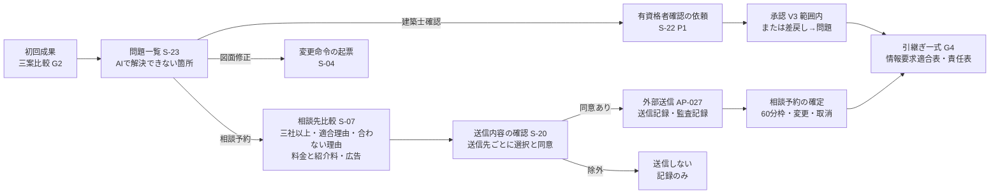
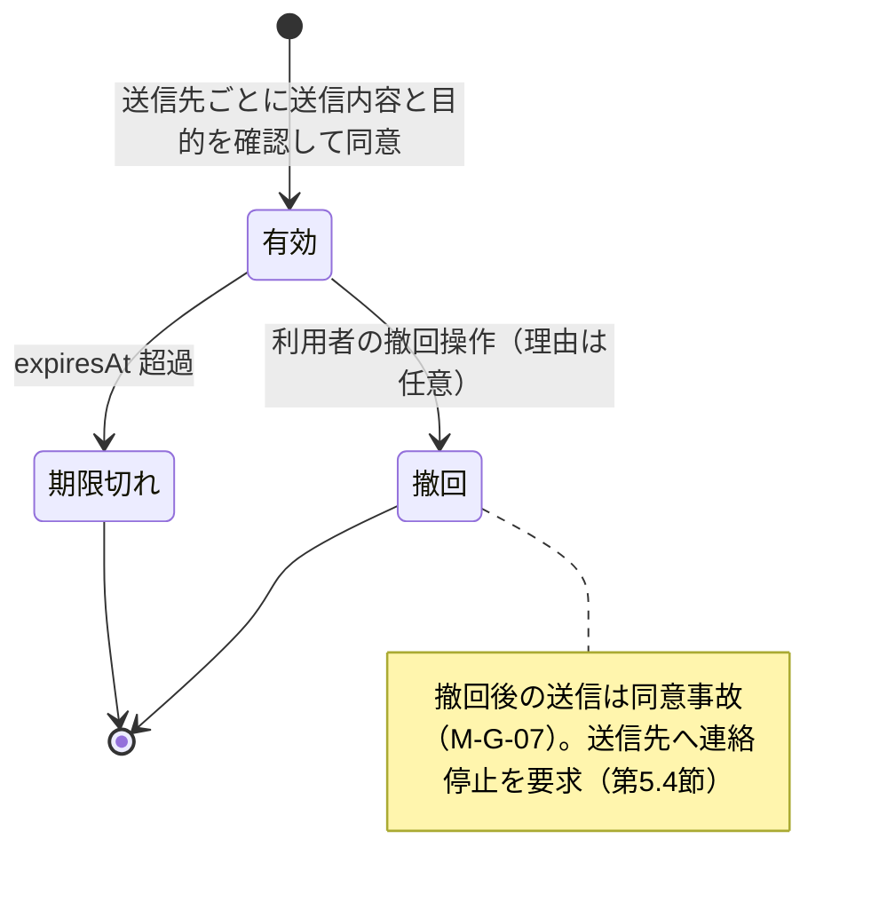
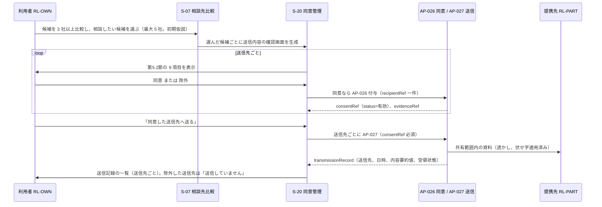
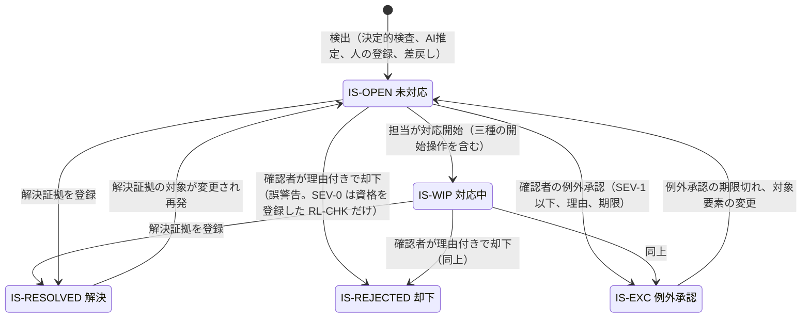
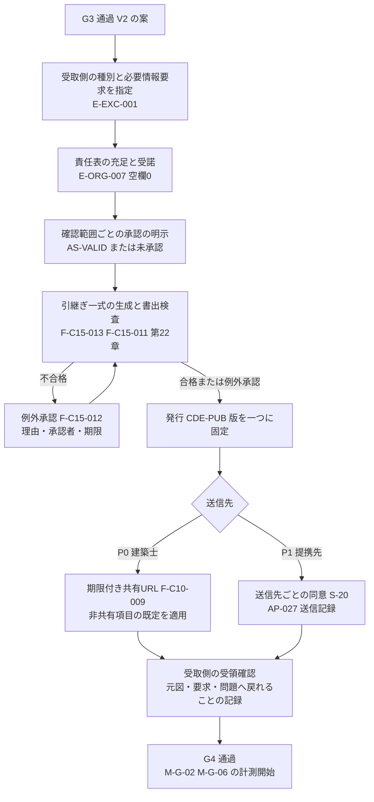

# 第17章 提携先推薦、人への引継ぎ、同意管理の仕様

作成日: 2026-09-15　版: v1.6（v1.6 は段階8 の最終仕上げ（2026-10-08。再々確認 K1-03、K4-22、主2-09、主4-16。統括の決定 D32、D42 と、正本の改訂に合わせた同期 D41、D43）〔群G4〕。第0.3節の七段階門の行の版と G3 完了条件(2)の要約を統一文に、E-ORG-009.spamReported を E-EXC-009.spamReported の写しと明記して M-B-04 の分子を E-EXC-009 に一本化し、第7.3節と F-C10-003 に却下の確認範囲と却下時点の資格（rejectionScopeKind、rejectionQualificationSnapshot）を加え、U-17-020 と第6.3.4節の照合の行に承認（AS-VALID）の扱いを加え、第7.3節の解決証拠の型を第12章に同期した。同日の統括の追加の項目（統括の決定 D46）で、第5.1節 expiresAt、第6.2.1節 completedAt、U-17-018 の外部送信の同意の期限を、登録 ＋ 90 日の仮置きと、その同意を consentRef に持つ相談予約の completedAt ＋ 90 日への更新（複数の予約は最後の completedAt）に改めた。記録は `05_審査/再修正記録_最終仕上げ_群G4.md`。v1.5 は段階8前の持ち越し仕上げ（2026-10-08。統括の決定 D28、D29、既定値の識別子の併記 0 行）〔群F4〕。部分共有の期限を、対象の相談予約（作成時に E-EXC-006.reservationRef に記録する）の実施日時 scheduledAt ＋ 30 日の仮置き、その予約の completedAt の記録で completedAt ＋ 30 日に更新とし、閲覧上限の既定を 20 回（DV-CO-05）とし、予約記録の属性に completedAt を加え、外部送信の同意の期限の起点を completedAt と書いた（第5.1節、第6.2.1節、第7.6節、F-C10-007、U-17-018）。記録は `05_審査/再修正記録_段階8前_仕上げ_群F4.md`。v1.4 は 2026-10-07 の二回目の修正の仕上げ〔群R3〕。01_調査 08 の外部確認の反映〔第6.3.4節「照合（P1）」に既存住宅状況調査技術者の建築士の区分と対象建物の規模の組合せ〕と、第5章、第12章、基盤定義の二回目の依頼の確認〔章末の対応状況の行〕。記録は `05_審査/再修正記録_2回目_仕上げ_群R3.md`。v1.3 は 2026-10-07 の段階6 二回目の修正（段階7 再審査の後）。修正計画 第1.17節の整合 7 件（JR-012〔高〕、JR-016、JR-008、JR-019、JR-054、JR-072、JR-032）を第06章 第5.2節「資格の照合状態」、第5.3節 規則1、3、9、第1.1節 規則6 (d)(e)、第05章 第2.3節、第12章 v1.4 の E-EXC-009、第14章 AP-027、AP-029 の文に揃え、U-17-020 を解決とした。記録は `05_審査/再修正記録_2回目_第16_17_19章.md`。v1.1 は 2026-10-06 の段階6 初稿審査の再修正。統合指摘 JM-121〜JM-125 と整合指摘 JM-006、013、021、033、038、075、083、157、161、165、169 の 16 件、整合修正指示 第17章 5 件、試験の採番の置換、第15章 U-15-020 と修正済みの章の依頼を反映。記録は `05_審査/再修正記録_第17章.md`。v1.2 は 2026-10-06 の段階6 の仕上げ（相互依頼と残課題の処理。群C）。第2、6、13、14、21、22章からの依頼 6 件に対応し、F-C10-004 の尺度の警告承知（JM-064）、F-C10-005 の失効の契機と信頼状態の連動範囲（JM-082）、資格の照合状態の P0 からの保持（JM-122）、AP-027、AP-028 の参照を加えた。群Bの申し送り（第12章 v1.3 と情報実体骨格 v1.2 追補への追従。partnerContract、家具設計者、authorityStakeholderRef、coApprovalRefs、scope.sourceRefs、予約記録 E-ORG-009 で U-17-005 を解決）を含む。記録は `05_審査/再修正記録_相互依頼_群C.md`）　担当: 段階3 仕様書 第17章（一級建築士、UX設計者、製品責任者、個人情報保護と知的財産の審査担当の合議）
根拠: 指示文 2.2（建築家コンシェルジュの棚卸し）、2.3（タウンライフの棚卸し）、C8（提携先推薦と人への引継ぎ）、C10（共同作業と承認）、9.9（収益と信頼の衝突）、B（外部送信は送信先ごとの個別同意）、E（個人情報、機密、権利）、H（紹介料、広告料の開示と推薦点からの分離）、10.6（人とAIの責任境界）、C15（引継ぎ一式）。基盤定義 用語集 v1.2、識別子規則 v1.2、十二判断領域 v1.2（A09、A12）、七段階門 v1.2（G3、G4）、信頼状態と証拠段階 v1.2（V2→V3、AS-、IS-）、機能一覧骨格 v1.2（F-C08-001〜009、F-C10-002〜007）、情報実体骨格 v1.2（E-ORG-001〜008、E-REQ-003、E-REQ-004、E-REQ-007、E-REQ-008、E-EXC-002、E-EXC-006、E-EXC-007）、画面指標試験骨格 v1.2（S-07、S-15、S-20、S-22、S-23、S-30-03、M-G-03、M-G-07、M-B-02〜04、M-P-11、T-A-006、T-A-013、T-R-012、T-S-001、T-S-010、T-S-013）、整合検査報告 第5節「識別子変更一覧」。調査 `01_調査/01_指定参照三社.md`。仕様書 第05章、第06章、第07章、第08章、第12章、第13章、第14章、第15章、第18章、第21章、第22章、第23章、第24章。

## 0. 冒頭

### 0.1 本章の目的

本章は、AIで解決できない箇所を人（建築士、施工会社、造作、外構、土地、資金相談の提携先と有資格者）へ、利用者の同意と根拠を失わずに引き継ぐ仕組みを定める。具体的には、(1) 提携先台帳と適合度算定と三社以上の比較、(2) 送信先ごとの同意管理と送信記録、(3) 問題一覧からの相談開始と相談予約と有資格者確認、(4) 注記、問題、承認、同時編集、部分共有の共同作業規則、(5) 受取側の情報要求に適合する引継ぎ一式、の五つを仕様化する【推定】指示文C8、C10。

本章が守る中心原則は次の三つである【推定】指示文B、H、9.9。

- 外部送信は送信先ごとの個別同意の後にだけ行い、一括同意と連絡先の一括送信を提供しない。
- 紹介料、広告料、掲載料は推薦の点数に含めず、候補ごとに別表示する。
- AIは候補、適合理由、点数、送信内容を提示するが、送信先の選択、同意、承認、契約は人が行う。AI人格を建築士と誤認させない。

### 0.2 本章の範囲と非対象

| 区分 | 内容 |
|---|---|
| 本章が主章として書く機能 | F-C08-001 提携先台帳、F-C08-002 適合理由と点数内訳、F-C08-003 三社以上の比較、F-C08-004 掲載料企業の広告表示、F-C08-005 送信先ごとの送信内容確認と個別同意、F-C08-006 問題一覧からの人への引継ぎ開始、F-C08-007 相談予約、F-C08-008 有資格者確認の依頼と記録、F-C08-009 紹介料と推薦の分離、F-C10-002 注記と問題の固定、F-C10-003 問題の属性と状態、F-C10-004 確認範囲ごとの承認、F-C10-005 承認の自動失効、F-C10-006 同時編集の表示、F-C10-007 外部事業者への部分共有（計15機能。基盤 機能一覧骨格 第4.6節の第17章 15 と一致）【事実】機能一覧骨格 v1.2 第1.8節、第1.10節（確認日 2026-09-15） |
| 本章が仕様として定める内容 | 提携先の十二項目と検証日、適合度算定（絶対条件、点数内訳、文章、合わない理由）、三社以上比較、広告と紹介料の開示、同意の実体と状態と画面と撤回と送信記録、非共有項目、問題一覧からの三種の開始操作、相談予約の導線、有資格者確認の依頼と記録、五役割と注記、問題、承認、同時編集、部分共有の規則、BCF へ渡す問題属性の対応、引継ぎ一式の構成と受取側の情報要求への適合 |
| 非対象（他章が主章） | 役割権限の実装、監査記録、学習同意、削除、期限付き共有URL、伏せ字、入力資料の利用権、BCF 交換の実行（F-C10-001、F-C10-008〜019。第22章）。引継ぎ一式の生成と書出検査、情報要求適合表、IDS 検査、例外承認（F-C15-006〜008、F-C15-011〜013、F-C15-016、F-C15-017。第22章。本章は引継ぎ一式の「構成と受取側適合の条件」を定め、生成手順は第22章）。段階門の完了条件と責任表（F-C15-001〜005、F-C15-009、F-C15-014。第06章）。商品推薦の広告分離（F-C05-008。第16章）。関係者表と決定権（第05章）。画面の部品採番、遷移、空状態、待機状態、失敗状態（第15章）。API の入出力（AP-022、AP-026〜028、AP-032。第14章）。指標の計測方法と試験手順（第23章）。事業方式、紹介料の率、有料化の境界（第24章）。提携先管理画面の画面一覧、遷移、鍵盤操作（第15章）と事業方式（第24章）。画面番号 S-29 と目的、部品、三状態は本章 第2.5節が定める（v1.1）【推定】 |
| 製品が代替しないもの | 建築士、構造設計者、設備設計者、施工者、宅地建物取引業者、資金相談者の法的責任と契約行為。相談先の選定そのものの決定（利用者が行う）。連絡先の販売と一括送信（指示文A1、G、用語集5）【推定】 |

### 0.3 前提とする章

| 章 | 前提とする内容 |
|---|---|
| 基盤 用語集 v1.2 | 個別同意（225）、外部送信（226）、提携事業者（224）、承認（60）、確認範囲（62）、自動失効（63）、問題（48）、固定先（289）、引継ぎ一式（196）、交換資料（195）、責任表（194）、有資格者（168）、広告枠（128）、同意の状態（274）、承認の状態（258）、問題の状態（257）、専門家未確認（370。承認個体の表示語）、専門家未割当（493。責任表の行の空欄）、情報管理担当（494）、利用者判断（495）。本章初稿の提案語は予約記録（302）、合わない理由（347）、受領確認（345）、対応中の経路（367）、記録不備（463）、送信記録（473）、運用担当者（478）、非共有項目（488）として統合済み |
| 基盤 識別子規則 v1.2 | F-、E-、S-、M-、T-、AC-、I-（例示 I-17-）、D-（例示 D-17-）、U-（U-17-）の書式。RL-、AS-、IS-、SEV-、V0〜V3 の符号。補助画面は S-28 以降（S-30 を除く）で採番する（第2.3節） |
| 基盤 十二判断領域 v1.2 | 提携先の台帳、適合、比較、予約は A09（「誰に頼むか」の調達判断）。外部送信、同意、有資格者確認の記録、注記、問題、承認、共有は A12（第3.4節 判定例） |
| 基盤 七段階門 v1.5 | G3（完了条件(2) 当該案の未解決の SEV-1〔問題一覧の干渉、構造注意、施工成立性の注意と、不足調査の requestedGate 超過、法規判定 I-18-002 を含む全主担当の SEV-1〕が IS-RESOLVED または IS-EXC。ただし第6章 第1.1節 規則6 (b) の対象の SEV-1 は、P0 では担当〔RL-OWN〕と期限〔G4 の門〕を付けて通過でき、第6章 第2.5節 欠落の自動記録 (i) に記録する〔修正計画 第0.3節の統一文。正本は第6章 第2.4節。段階8 の最終仕上げ、K1-03〕、(8) V2 昇格）、G4（必要情報「送信先ごとの同意」、完了条件(3)(5)(6)、進行禁止条件 I-00-124、I-00-125、I-00-126、I-06-002。確認者は受取側 RL-CHK で、P0 は資格が本人申告（未照合）、P1 は照合済み。組織案件は情報管理担当の RL-EDT） |
| 基盤 信頼状態と証拠段階 v1.2 | V2→V3 は有資格者が確認範囲を明示し氏名、資格、範囲、日付を付けて承認した時だけ。V3→V2 は確認範囲内の変更で自動失効。AS-PENDING、AS-VALID、AS-VOID。IS-OPEN〜IS-EXC（SEV-0 の IS-REJECTED は資格を登録した RL-CHK の誤警告の却下に限る。利用者判断は IS-EXC の一種） |
| 基盤 情報実体骨格 v1.2 | E-ORG-001 Person、E-ORG-002 Organization（提携先の属性）、E-ORG-003 Portfolio、E-ORG-004 ServiceArea、E-ORG-005 Fee、E-ORG-006 Consent、E-ORG-007 Responsibility、E-ORG-008 Stakeholder、E-REQ-003 Issue、E-REQ-004 Decision、E-REQ-007 Approval、E-REQ-008 Evidence、E-EXC-002 Delivery、E-EXC-006 Share、E-EXC-007 AuditLog、E-REQ-011 ChangeCommand、E-REQ-012 Impact。属性名、型、enum の正本は第12章 項目辞書（v1.2 追補） |
| 基盤 画面指標試験骨格 v1.2 | S-07 相談先比較画面（主担当 A12、G3、G4）、S-15 登録と利用開始画面、S-20 同意管理画面、S-22 専門家確認作業面、S-23 問題一覧画面、S-30-03 問題固定注記。M-G-07 同意事故件数、M-B-02 紹介後満足、M-B-03 同意撤回率、M-B-04 迷惑連絡報告件数、M-B-06 相談先送信率、M-G-16 広告偏り指数、M-P-11 専門家確認の滞留時間、M-G-03 重大誤り流出率。T-A-006、T-S-001、T-S-010、T-S-013、T-A-009、T-A-010、T-A-013、T-R-012 |
| 第05章 | 家族は決定者、専門家は確認者（決定と確認の分離）。差戻しは理由付きで問題として登録し決定者へ通知する。S-22 は P1 であり、P0 の専門家確認は S-08 共有と S-13、S-23 に限る（U-05-002）。提携事業者（RL-PART）には関係者表と本人確認の記録を共有しない |
| 第06章 | 第1.1節 規則5（SEV-0 の付与と誤警告の却下）、規則6（例外承認の制限 (a)〜(f)）、第5.1節 確認範囲の 17 種と entityKind と自己承認と承認者、第5.2節 承認の必須属性と登録できない承認と資格の照合状態、第5.3節 自動失効の規則1〜12、第5.4節 影響範囲の判定手順、第6.2節 門通過時の記録、第9.0節 権限の原則（自分の承認の取消）。G4 完了条件(5)の P0 代替（U-06-006: P0 は所有者自身の期限付き共有URL の発行操作を同意の代替とし、RL-PART への送信と個別同意 F-C08-005 は P1） |
| 第07章 | 第2.3節 影響伝播の八規則、第5.4節 問題化した時の主担当の決め方（主担当「推定」表示）、第5.5節 承認の自動失効との連動、第5.6節 取消時に失効した承認を自動で戻さない |
| 第08章 | 質問群I の「相談希望」は G4 の導線を有効にする記録だけを作り送信ではない。送信は個別同意（F-C08-005、P1）または所有者自身の共有（F-C10-009）に限る |
| 第12章 | E-REQ-003 Issue の項目辞書（anchor.kind に台帳行を含む、originChangeRef、parentIssueRef、isBlocking、rejectReason、rejectedByRef、rejectionScopeKind、rejectionQualificationSnapshot〔統括の決定 D42〕、reportKind、bcfTopicGuid）、E-REQ-007 Approval の項目辞書（scope の refs と entityKind と attributes、expandedScopeRefs、qualification.verificationStatus、isSelfApproval、responsibilityRef、returnReason、returnedAt、returnCount、voidReason.kind）と表11.2-D、E-ORG-001.qualifications.verificationStatus、E-ORG-002〜007 の項目辞書（capacity、qualificationsHeld、partnerStatus、notSuitedFor、matchReasonTemplate、isDisclosed、contentScope、expiresAt）、E-EXC-006 の recipientLabel と evidenceRef、第10.6節 BCF への対応（Issue → Topic の正本） |
| 第14章 | AP-022 共有、AP-026 同意管理（一括同意は拒否）、AP-027 外部送信（同意なし、撤回済み、contentScope 外は送信前に拒否）、AP-028 提携先照会（verifiedAt のない提携先は返さない）、AP-029 通知（kind に承認失効、版更新、同意撤回を含む）、AP-032 承認と段階門判定（operation に差戻しを含む） |
| 第13章、第15章、第21章、第22章、第23章（v1.1 で追加） | 第13章 第8.1節、第8.2節（構造、外皮、設備の承認の 5 項目。資格が未登録の確認は責任表 duty=確認 の記録に留める）。第15章 S-13-03、S-15-02（資格の本人申告）、S-22-05（照合状態）と三つの表示語。第21章 第3節 承認手順(2)（人の報告の種別による SEV-0 の付与）と F-C14-003 例外(c)（S-13-03「承認者未設定」からの依頼）。第22章 第1.3節 役割権限表（決定権を持つ RL-EDT の承認）、第1.6節 同意文の版規則、F-C10-001、F-C10-009。第23章 第4.3節 付表 4.3-A、4.3-B（本章の受入条件の試験 T-U-011、T-I-003、T-I-012、T-S-017、指標 M-Q-41） |
| 調査 01_指定参照三社 | 建築家コンシェルジュの預り金、返金、事業者側5%手数料、出張費、並行検討の制限、合わない利用者三類型、事例の情報構造。タウンライフの一問一答、複数社選択の推奨、連絡先が最終段階、規約上の提供情報、連絡停止が利用者側申出、紹介料の非開示（いずれも確認日 2026-09-15） |

## 1. 総則

### 1.1 本章の設計原則

| 番号 | 原則 | 観察可能な条件 | 出典 | 区分 |
|---:|---|---|---|---|
| 1 | 初回価値の後に人へ | 提携先の候補表示（S-07）は初回成果（初回案または不足情報一覧）の表示後にだけ開ける。電子連絡先の入力は候補表示の前提にしない | 指示文B、2.3、用語集26、280 | 【推定】 |
| 2 | 送信は個別同意の後 | 図面、予算、連絡先、問題を外部の組織へ送る操作は、送信先一件ごとの同意（E-ORG-006 purpose=外部送信、recipientRef 一件、status=有効）を持つ場合だけ成功する。一括同意の操作は画面にも API にも存在しない | 指示文B、C8、E、T-S-001 | 【推定】 |
| 3 | 推薦と報酬の分離 | 点数内訳（第3.2節）に紹介料、掲載料、広告料の項目がなく、有償掲載（isSponsored=true）の候補は「広告」と文字で表示され、紹介料の有無と金額幅が候補ごとに表示される | 指示文H、9.5、C8 | 【推定】 |
| 4 | 合わない理由を示す | 各候補に「合う理由」だけでなく「合わない理由」を、利用者の要求台帳との差分（項目名、要求値、提携先の値）で表示する | 指示文2.2、C5 | 【推定】 |
| 5 | 人が決め、人が確認する | 送信先の選択、同意、相談の申込、契約は RL-OWN が行い、承認は第06章 第5.1節の範囲で RL-OWN、決定権を持つ RL-EDT、RL-CHK が行う（第7.1節）。AI は候補と理由と送信内容を提示するに留まる。AI 人格が「建築士として」と名乗る表示をしない | 指示文10.6、T-S-010 | 【推定】 |
| 6 | 主担当を一つに | 提携先の台帳、適合、比較、予約は主担当 A09。同意、送信、有資格者確認の記録、注記、問題、承認、同時編集、共有は主担当 A12。一つの機能に主担当は一つ | 基盤 十二判断領域 第3.4節、第07章 第6.4節 | 【推定】 |
| 7 | 信頼指標を併記 | 相談先送信率（M-B-06）に目標値を置かず、同意事故件数（M-G-07）、同意撤回率（M-B-03）、迷惑連絡報告件数（M-B-04）、紹介後満足（M-B-02）を同じ画面で併記して運用判断する | 指示文9.9、H | 【推定】 |
| 8 | 非共有項目の保持 | 提携先へ渡す情報は共有範囲（階、室、問題、資料）に限り、住所、費用、連絡先、関係者表、本人確認の記録、監査記録は既定で非共有とし、画面、書出、API の三経路で遮断する | 指示文C10、T-S-013、第05章 | 【推定】 |
| 9 | 引継ぎは再入力なし | 引継ぎ一式は受取側の必要情報要求（P0 は標準の必要情報要求、P1 は IDS または組織別要求）に対する適合表を伴い、受取側が元図、要求、問題へ戻れることを G4 完了条件(6)で確認する | 指示文C15、G4 | 【推定】 |

### 1.2 優先と P0 での代替

| 機能 | 優先 | P0 での代替または扱い | 区分 |
|---|---|---|---|
| F-C08-001〜009（提携先、同意、相談予約、有資格者確認、紹介料分離） | P1（指示文G「拡張一: 有資格者確認、提携先比較、相談予約、同意付き情報送信」） | P0 では所有者自身が期限付き共有URL（F-C10-009、S-08）で建築士へ渡し、建築士は RL-CHK として S-13 と S-23 で確認する（第05章 U-05-002、第06章 U-06-006）。P0 の引継ぎ一式は F-C15-013（第22章）が生成する。C08 に P0 機能が 0 件である扱いは基盤 U-00-035 に従う | 【推定】機能一覧骨格 第1.8節 |
| F-C10-002、003、004、005（注記と問題の固定、問題の属性と状態、確認範囲ごとの承認、承認の自動失効） | P0 | 代替なし。G1〜G4 の門の判定に必須 | 【推定】 |
| F-C10-006 同時編集の表示 | P1 | P0 では同一案件の同時編集を許さず、後着の編集者に「他の編集者が作業中」と表示して閲覧のみにする（初期仮説。第7.5節） | 【仮定】 |
| F-C10-007 外部事業者への部分共有 | P1 | P0 では RL-PART の役割を付与せず、共有は RL-CHK と RL-VIEW への期限付き共有URL に限る。非共有項目の既定（第5.5節）は P0 の共有URL にも適用する | 【推定】 |
| 資格の登録と照合（第6.3.4節。F-C08-008 と F-C10-004 の前提） | 登録は P0、照合は P1 | E-ORG-001.qualifications は照合状態（verificationStatus: 未照合、照合済み、失効）を P0 から持つ（第06章 第5.2節「資格の照合状態」。JM-122）。資格の登録（本人申告。verificationStatus=未照合）は P0 で提供し、共有URL で招かれた建築士は S-15（S-15-02）で登録する。有効期限（validUntil）の経過による失効は P0 から製品が判定する。公開名簿との照合（照合済み、名簿で確認できない場合の失効）は P1。未照合の資格は「資格未照合（本人申告）」と表示し、使える用途（P0 は isLegalDuty=true の責任表の行の受諾、SEV-0 の誤警告の却下、資格を要する領域の SEV-1 の例外承認。第06章 第1.1節 規則5、規則6 (a)、F-C15-009 例外(f)）と段階と期限（P1 は照合の申請から 30 日の間の受諾と承認の登録に限る）は第6.3.4節「未照合の扱い」に従う（正本は第06章 第5.2節「資格の照合状態」の一文。JR-012）。「資格を登録した RL-CHK」は P0 では本人申告（未照合）の RL-CHK を含み、P1 では照合済みの資格を持つ RL-CHK に限る（JM-122、JR-012） | 【推定】第06章 第5.2節、第12章 E-ORG-001 |

### 1.3 収益源の順序と本章の位置

指示文9.9 は収益源の順序を (1) 個人向けの検証付き3D化と詳細書出、(2) 専門職向けの共同作業、IFC、承認、組織標準、(3) 正規商品情報の提供と配置後の成果測定、(4) 利用者が明示選択した相談紹介、と定める【推定】指示文9.9。本章の提携先推薦はこの (4) に当たり、紹介収益を最初の中心にしない。したがって、相談先送信率（M-B-06）は目標化せず、送信の前に初回成果と三案比較（第08章）が必ず存在する導線に固定する【推定】。

## 2. 提携先台帳（F-C08-001）

### 2.1 提携先の種別と資格項目

提携先は E-ORG-002 Organization の個体（案件横断台帳、partnerStatus=提携中）で持つ。種別 kind と、種別ごとに台帳へ登録する資格項目は次のとおり【推定】指示文C8、情報実体骨格 E-ORG-002。

| 種別（E-ORG-002.kind） | 資格項目（qualificationsHeld に登録する内容） | 資格の根拠資料（sourceRef の kind） | 区分 |
|---|---|---|---|
| 設計事務所 | 建築士事務所登録（登録番号、登録先の都道府県、有効期限）。所属する建築士の資格区分（一級、二級、木造）と人数 | 登録票の写し、または都道府県の公開名簿の頁 | 【推定】用語集169。建築士事務所登録の制度出典は指示文が示す https://www.mlit.go.jp/jutakukentiku/build/architect.html で本章では再確認していない【未確認】 |
| 施工会社 | 建設業許可（許可番号、許可行政庁、業種、有効期限）。住宅瑕疵担保責任保険の加入の有無 | 許可通知書の写し、または公開名簿の頁 | 【推定】。建設業許可の要否は請負金額により異なるため、許可なしの小規模工事業者の扱いは【未確認】（U-17-009） |
| 造作、外構 | 該当する許可または登録（ある場合）。施工実績 | 公式頁 | 【推定】 |
| 土地 | 宅地建物取引業の免許（免許番号、免許行政庁、有効期限） | 免許証の写し、または公開名簿の頁 | 【推定】。土地の仲介を行う提携先に宅地建物取引業免許を必須とする判断の法的根拠は 01_調査へ確認を依頼する【未確認】（U-17-009） |
| 資金相談 | 該当する登録（ある場合）と、利益相反（特定の金融機関からの報酬）の開示 | 公式頁 | 【推定】 |
| 住宅会社 | 設計事務所と施工会社の両方の項目 | 同上 | 【推定】 |
| 家具設計者、製造者（家具設計者は E-ORG-002.kind=家具設計者、製造者は E-ORG-002.kind=製造元。家具設計者の値は第12章 v1.3 で追加済み） | 該当なし（資格項目を持たない）。代わりに製作実績（作品事例 E-ORG-003）と、独自案（PT-AI）の製作可否の確認の記録（E-REQ-008 kind=確認記録。強度、接合、転倒、難燃、乳幼児安全、製造費、加工公差の 7 項目。第16章 F-C07-007）を登録する | 公式頁、作品事例 | 【推定】第16章の依頼（JM-124） |

資格項目を持つ種別で、資格項目が未登録、または有効期限切れの提携先は partnerStatus=停止 とし、候補表示から除く（第3.1節の絶対条件）【推定】。家具設計者と製造者は資格項目の代わりに製作実績を検証し、確認記録は独自案の製作可否の「確認済み（確認者、日付）」にだけ使い、「製作可能」と表示しない（第16章）【推定】。

提携契約の記録（契約の版 v主.副、締結日、有効期限、条番号の対応〔営業目的の再利用の禁止、送信先での保存期間、撤回時の削除と連絡停止、紹介料、掲載料〕、契約書の出典 sourceRef）が登録されていない提携先は partnerStatus=提携中 にできない。送信内容の確認（第5.2節 項目2、項目6、項目7）と紹介料、掲載料、isSponsored の表示はこの記録の版と条番号を参照する。記録は E-ORG-002.partnerContract（version、signedAt、validUntil、clauses〔topic、clauseNo、summary〕、sourceRef。第12章 v1.3）に持ち、未登録または validUntil を過ぎた提携先は partnerStatus=提携中 にできない。登録は運用担当者が行い、提携先は閲覧だけ（S-29-04。JM-125）【仮定】。

### 2.2 十二項目と検証日

指示文C8 が提携先に持たせる十二項目と検証日を、情報実体の属性、検証方法、失効条件、利用者への開示の別で固定する【推定】指示文C8。全項目は AP-028 提携先照会の attributes として返り、S-07 の比較表の列になる。

| 番号 | 項目 | 実体と属性 | 型と語彙 | 検証方法（検証日 verifiedAt の根拠） | 失効条件 | 利用者への開示 | 区分 |
|---:|---|---|---|---|---|---|---|
| 1 | 資格 | E-ORG-002.qualificationsHeld | 第2.1節の種別別項目 | 公開名簿または写しの目視確認を運用担当者が行い、sourceRef を付ける | 有効期限切れ、名簿からの消除 | 資格名と登録先を開示。番号は詳細で開示 | 【推定】 |
| 2 | 対応地域 | E-ORG-004.regions、travelLimitKm、remoteOk | 都道府県、市区町村（第18章の地域符号）、移動上限 km、遠隔対応の可否 | 提携先の申告と公式頁の照合 | validUntil 超過 | 開示 | 【推定】 |
| 3 | 得意分野 | E-ORG-002.specialties | 語彙: 用途（新築、改装、二世帯、狭小、傾斜地、店舗併用）、意匠の傾向（自由記述は 30 字以内）、生活場面（在宅勤務、介護、子育て） | 作品事例（E-ORG-003）との整合を検証する。事例のない得意分野は「申告のみ」と表示 | 事例との不整合が検出された時 | 開示（「申告のみ」の別を含む） | 【仮定】語彙は本章の初期値 |
| 4 | 予算帯 | E-ORG-002.budgetRange | range(JPY)。工事費または設計監理料の対象範囲を includes に明記 | 作品事例の費用帯との整合 | 検証日から 180 日超（初期仮説） | 開示 | 【仮定】 |
| 5 | 構法 | E-ORG-002.specialties の構法語彙 | 在来木造、大断面木造、枠組壁工法、鉄骨、RC、混構造 | 作品事例の structureType との整合 | 同上 | 開示 | 【推定】 |
| 6 | 性能 | E-ORG-002.specialties の性能語彙と、作品事例の performance | 住宅性能十領域の語彙（第19章）と証拠段階（EL-）。「対応可」の申告と「実績（EL-3RD 以上）」を区別 | 評価書等の sourceRef | 証拠の有効期限切れ | 開示（申告と実績の別を含む） | 【推定】 |
| 7 | 作品事例 | E-ORG-003.works（title、year、region、structureType、performance、imageSourceRefs、rightsState）。第12章 v1.2 で追加済みの項目: siteArea、floorArea、costBand、requirementsSummary、proposalSummary（要約は各 200 字以内） | 敷地面積 m2、延床面積 m2、費用帯（幅）、要望の要約、提案の要約 | 提携先の申告と公式頁の照合。写真は rightsState=RS-OK の場合だけ表示 | 写真の許諾失効（RS-EXP） | 開示。写真は許諾範囲内 | 【推定】調査01 建築家コンシェルジュの事例形式（https://architect-concierge.com/ 、確認日 2026-09-15）【事実】を情報構造として採る |
| 8 | 担当余力 | E-ORG-002.capacity（acceptingNew、slotsPerMonth、asOf） | 新規受付の可否、月当たりの受付枠、時点 | 提携先の月次申告 | asOf から 60 日超（初期仮説） | 開示（「受付可」「受付停止中」「時点」） | 【仮定】 |
| 9 | 返答時間 | E-ORG-002.responseTimeHours | 時間。申告値と、本製品の送信記録から計測した実績中央値を別に持つ | 実績は送信記録 E-EXC-009 の sentAt と receiptState=受領確認済み の時刻差から計測（JR-054） | 実績が申告の 2 倍を超えた時に「申告と実績が異なる」と表示 | 開示（申告と実績の両方） | 【仮定】 |
| 10 | 料金 | E-ORG-005 Fee（feeType=設計料、相談料、工事費目安、その他） | 金額幅、算定基準、含む範囲、除外、税 | 公式頁または提携先の書面 | 検証日から 180 日超 | 開示（isDisclosed=true） | 【推定】 |
| 11 | 紹介料 | E-ORG-005 Fee（feeType=紹介料、掲載料） | 金額幅または率（basis=率の場合は請負額または設計料に対する率）、支払時点（成約時等） | 提携契約書 | 契約更新時 | 必ず開示（isDisclosed=true 固定）。点数に含めない（第3.5節） | 【推定】指示文H |
| 12 | 検証日 | E-ORG-002.verifiedAt、E-ORG-003.verifiedAt、E-ORG-005.verifiedAt | 暦日。項目ごとの検証日と、組織全体の最古の検証日 | 上記の検証を行った日 | 最古の検証日から 180 日超で候補表示から除外（初期仮説） | 開示（「検証日: YYYY-MM-DD」） | 【仮定】 |

検証日の失効期間 180 日と担当余力の 60 日は初期仮説であり、公開判定会議で確定する（U-17-002）【仮定】。

### 2.3 合わない利用者の類型と非推奨条件

建築家コンシェルジュは「土地優先型」「全お任せ型」「最短・最安型」の三類型を非推奨と明示している（https://architect-concierge.com/ 、確認日 2026-09-15）【事実】調査01 第2.2節。本製品はこれを提携先ごとの属性に一般化し、要求台帳との照合で「合わない理由」を機械的に出せるようにする【推定】。

| 属性（E-ORG-002。第12章 表11.2-A で追加済み） | 型 | 内容 | 照合する要求台帳の項目 |
|---|---|---|---|
| notSuitedFor | list[json{kind:enum{予算上限,工期,構法,用途,地域,設計関与度,規模}, condition:json, reasonText:str}] | 提携先が「合わない」と申告する条件と理由文（80 字以内）。例: kind=工期、condition={maxMonths:6}、reasonText=「着工まで 6 か月未満の案件は受けない」 | E-REQ-001（priority、valueRange）、E-REQ-002（変更できない条件）、E-BLD-002 Site の地域、E-SRV-015 Schedule |

属性は第12章 v1.2 の表11.2-A（notSuitedFor）と第4.8節（E-ORG-003.works）で追加済みであり、本章は同じ属性名を使う（U-17-006 は解決。第12章の前提）【推定】。

照合の結果は AP-028（提携先照会）の notSuitedForMatches（organizationRef、kind、reasonText、result: 該当、近接）で返す。該当した提携先は候補（organizations）から除き、第3.1節 絶対条件7 の除外理由として notSuitedFor.reasonText を表示する。近接（閾値の 20% 以内）は第3.3節の合わない理由に表示する。除外した候補の件数と理由（notSuitedFor 該当、検証日なし、対応地域外など第3.1節の絶対条件ごと）は AP-028 の excludedCandidates（count、reasons）で返し、第3.1節の「除外した候補」の表示に使う（第14章 AP-028。2026-10-06 の第14章の依頼に対応）【推定】。

### 2.4 台帳の登録と更新の責任

| 操作 | 実行者 | 記録 | 区分 |
|---|---|---|---|
| 提携先の候補登録（partnerStatus=候補） | 運用担当者（提携先の申込を受けて） | E-EXC-007 action=変更 | 【推定】 |
| 検証と提携中への遷移 | 運用担当者（二人確認。初期仮説）。提携契約の記録（版と条番号。第2.1節）の登録を遷移の条件とする | verifiedAt、sourceRef、提携契約の記録、E-EXC-007 | 【仮定】 |
| 提携先自身による更新（担当余力、返答時間の申告、作品事例の追加） | 提携先の法人利用者（RL-PART の一種。第14章「製造元向け」に準じる提携先向け分類） | 更新は「未検証」として保持し、運用担当者の検証で verifiedAt を更新する | 【推定】 |
| 停止 | 運用担当者（資格失効、迷惑連絡報告 M-B-04 の閾値超過、同意撤回率 M-B-03 の閾値超過） | partnerStatus=停止、理由、E-EXC-007 | 【推定】 |

迷惑連絡報告の停止閾値は引継ぎ 100 件当たり 3 件（初期仮説。M-B-04 の仮説値 1 件の 3 倍）とし、公開判定会議で確定する（U-17-002）【仮定】。

### 2.5 提携先管理画面（S-29。本章で採番。P1）

第24章 第1.4節の依頼「提携先向け管理画面（S-28 の次の番号）」を第15章が本章の修正後の判断に委ねた（第15章 U-15-020）ため、本章が補助画面 S-29 として採番する（基盤 識別子規則 第2.3節「以後の補助画面は S-28 以降（S-30 を除く）」。v1.1）【推定】。S-28 運用指標画面の部品としない理由は、(1) 利用者に提携先の法人利用者を含み S-28 の利用者（製品責任者、運用担当者）と権限が異なる、(2) 提携先ごとの登録、検証、停止の操作を持ち、集計を表示する S-28 と目的が異なる、の二つである【推定】。三状態の共通規則、鍵盤操作、視覚方針は第15章 第3.3節、第4節に従い、画面一覧と遷移図への追加は第15章へ依頼する【仮定】。第15章 v1.2（2026-10-06）が第1.2節〜第1.4節、第2節、第4.4節、第7.26.3節に S-29 を登録し、主要操作と鍵盤操作を定めた。目的、利用者、部品、三状態の文言の正本は本節のままとする【推定】。

| 項目 | 内容 |
|---|---|
| 目的 | 提携先台帳（F-C08-001）の登録、申告の更新、検証、提携状態の変更と、提携契約に基づく報酬と広告の別の登録（F-C08-004、F-C08-009）を、入力者ごとに権限を分けて行う |
| 利用者 | 提携先の法人利用者（RL-PART の一種。自社の行だけ）、運用担当者（運営側役割。検証は二人確認）。案件の利用者（RL-OWN 等）には表示しない |
| 対応段階門 | 段階外（案件横断の提携先台帳） |
| 信頼状態と状態符号 | 案件の信頼状態は表示しない。提携状態（候補、提携中、停止）、項目ごとの検証日と「未検証」、提携契約の版を文字で表示する |
| 機能と指標 | F-C08-001、F-C08-004、F-C08-009（いずれも P1）。M-B-03、M-B-04 の提携先別集計 |

| 部品ID | 部品名 | 内容 | 操作できる者 | 区分 |
|---|---|---|---|---|
| S-29-01 | 提携先一覧 | 提携先ごとの種別、提携状態、最古の検証日と 180 日超の印、提携契約の版、停止の理由 | 運用担当者（全件）、提携先（自社だけ） | 【推定】 |
| S-29-02 | 申告の入力 | 料金（設計料、相談料、出張費等。紹介料と掲載料を除く）、対応地域（E-ORG-004）、作品事例（E-ORG-003）、担当余力、返答時間の申告、検証資料（資格の根拠資料）。保存した値は「未検証」と表示し、検証まで候補表示に使わない（第2.4節） | 提携先 | 【推定】 |
| S-29-03 | 検証と提携状態の変更 | 十二項目ごとの照合結果、verifiedAt、sourceRef、二人確認の記録、提携中への遷移（提携契約の記録が条件。第2.1節）、停止（理由必須） | 運用担当者 | 【推定】 |
| S-29-04 | 契約と報酬の登録 | 提携契約の記録（版、条番号）、紹介料と掲載料（E-ORG-005）、isSponsored。運用担当者が契約の版を付けて登録し、提携先は閲覧だけ（F-C08-004、F-C08-009 の権限。第24章 第1.4節） | 運用担当者（登録）、提携先（閲覧） | 【推定】 |
| S-29-05 | 運用の集計 | 提携先ごとの迷惑連絡報告（M-B-04）、同意撤回率（M-B-03）、返答時間の実績中央値、相談予約の不成立率と停止閾値までの残り（第2.4節）。案件識別子と利用者の情報を含めない | 運用担当者（全件）、提携先（自社の集計だけ） | 【推定】 |

| 状態 | 文言と操作 |
|---|---|
| 空状態 S-29-E | 運用担当者: 「登録された提携先はありません」。提携先: 「自社の登録がありません。申込の受付後に表示されます」 |
| 待機状態 S-29-W | 「照合中（項目名）」「集計中」 |
| 失敗状態 S-29-X | 「保存に失敗しました（製品起因）。入力は保持しています。再試行」。提携先による紹介料、掲載料、isSponsored の変更は「この項目は運用担当者が提携契約に基づいて登録します」と表示して拒否し、監査記録（E-EXC-007）に残す |

## 3. 適合度算定、三社以上の比較、広告と紹介料の開示（F-C08-002、003、004、009）

主担当領域: 適合度算定と比較は A09（「誰に頼むか」の調達判断。基盤 十二判断領域 第3.4節）。広告表示と紹介料の分離は A12（権利と表示の正しさ）【推定】。

### 3.1 第一段: 絶対条件（除外）

商品推薦の絶対条件（用語集127）に倣い、次の条件を満たさない提携先は点数を計算せず候補から除く。除いた提携先と除外理由は「除外した候補」として件数と理由を表示し、利用者が条件を緩めて再検索できるようにする【推定】指示文C5、C8。

| 番号 | 絶対条件 | 照合する情報 | 除外理由の表示文（定型） | 区分 |
|---:|---|---|---|---|
| 1 | 提携状態が「提携中」 | E-ORG-002.partnerStatus | （表示しない。候補に載らない） | 【推定】 |
| 2 | 検証日が 180 日以内（初期仮説） | E-ORG-002.verifiedAt の最古 | 「検証日が古いため表示していません」 | 【仮定】 |
| 3 | 種別に必要な資格が有効（資格項目を持つ種別に限る。家具設計者と製造者は製作実績の検証日。第2.1節） | qualificationsHeld の有効期限、E-ORG-003.verifiedAt | 「資格情報が確認できないため表示していません」 | 【推定】 |
| 4 | 対応地域に案件の建設地が含まれる、または遠隔対応可 | E-ORG-004.regions、remoteOk と E-BLD-002 の地域 | 「対応地域外（○○県）」 | 【推定】 |
| 5 | 予算帯が案件の予算上限（E-REQ-002 変更できない条件、または RP-MUST の予算）と交差する | E-ORG-002.budgetRange | 「予算帯が合いません（提携先: a〜b 万円、案件上限: c 万円）」 | 【推定】 |
| 6 | 担当余力が受付可 | E-ORG-002.capacity.acceptingNew | 「現在新規受付を停止しています（時点: YYYY-MM-DD）」 | 【推定】 |
| 7 | 合わない類型（第2.3節）に該当しない | notSuitedFor と要求台帳 | notSuitedFor.reasonText をそのまま表示 | 【推定】 |
| 8 | 求める役割（設計、施工、造作、外構、土地、資金、家具の設計と製作）に種別が一致。調達方式（E-SRV-005.procurementRoute。第20章 第4節の方式の判断。A09）が決まっている場合は方式に合う種別に絞る（設計施工分離→設計事務所、一括発注→住宅会社と施工会社、工務店→施工会社、住宅会社→住宅会社。未定は絞らない。第20章の依頼） | kind、利用者の相談種別、procurementRoute | 「調達方式（○○）に合わないため表示していません」 | 【推定】 |

### 3.2 第二段: 点数内訳（初期仮説）

絶対条件を満たした候補に、合計 100 点の点数を七項目で付ける。重みの初期値は次のとおりで、利用者は S-07 で重みを変更できる。紹介料、掲載料、広告料、有償掲載の有無、本製品への送客実績は項目に含めない【推定】指示文C8、H、用語集126 の構造を提携先へ適用。

| 番号 | 項目 | 初期重み | 算定（観察可能な条件） | 使う情報 | 区分 |
|---:|---|---:|---|---|---|
| 1 | 要求適合 | 25 | 要求台帳の RP-MUST と RP-WANT のうち、得意分野、用途、生活場面の語彙で一致する要求の割合。RP-MUST の不一致 1 件につき 5 点減点 | E-REQ-001、E-ORG-002.specialties | 【仮定】 |
| 2 | 地域と移動 | 15 | 建設地が市区町村単位で対応地域に含まれれば満点。都道府県単位で 10、遠隔対応のみは 5。移動上限内なら加点なし、超過は 0 | E-ORG-004、E-BLD-002 | 【仮定】 |
| 3 | 予算帯の一致 | 15 | 案件の概算幅（E-SRV-005、G2 以降）または予算希望が提携先の予算帯の中央 50% に入れば満点、端に入れば 8、交差のみは 3 | E-ORG-002.budgetRange、E-SRV-005 | 【仮定】 |
| 4 | 構法と性能の実績 | 15 | 案件の構造形式仮定（E-SYS-001）と性能目標（E-SRV-013、RP-MUST）に対し、作品事例に同じ構法と証拠段階 EL-3RD 以上の実績があれば満点、申告のみは半分 | E-ORG-003.works | 【仮定】 |
| 5 | 作品事例の近さ | 15 | 作品事例のうち、敷地面積、延床面積、費用帯の三つが案件の値の ±30% に入る事例の件数（1 件 5 点、上限 15） | E-ORG-003.works の siteArea、floorArea、costBand | 【仮定】 |
| 6 | 担当余力と返答時間 | 10 | 月当たり受付枠が残っていれば 5。返答時間の実績中央値が 48 時間以内なら 5、96 時間以内なら 3、それ以上は 0 | E-ORG-002.capacity、responseTimeHours の実績 | 【仮定】 |
| 7 | 料金の透明性 | 5 | 設計料、相談料、工事費目安の全てが isDisclosed=true かつ検証日 180 日以内なら満点。一つでも欠ければ 0 | E-ORG-005 | 【仮定】 |

点数の初期重みと算定閾値は初期仮説であり、試行と公開判定会議で確定する（U-17-001）【仮定】。点数は整数で表示し、内訳の七項目と重み、各項目の算定に使った案件側の値と提携先側の値を、候補ごとに展開表示する（F-C08-002 の合格条件「点数内訳の項目と重みが表示される」）【推定】。

### 3.3 適合理由の文章と合わない理由

| 表示 | 内容 | 生成方法 | 検査 | 区分 |
|---|---|---|---|---|
| 適合理由（文章） | 点数の高い上位 3 項目について、「案件の値」と「提携先の値」を含む一文ずつ（各 60 字以内）。例: 「傾斜地の実績が 2 件あり、案件の敷地（高低差 2.1 m）に近い」 | 点数内訳の項目ごとに定型文の雛形（E-ORG-003.matchReasonTemplate）へ値を差し込む。言語模型は語順の整形だけに使い、値と項目名を変えない（第14章 AP-034 の検査層） | 文章中の数値が点数内訳の元の値と一致する（不一致 0 件）。禁止表示語を含まない | 【推定】 |
| 合わない理由 | 点数が重みの半分未満の項目と、第2.3節の notSuitedFor に近い条件（該当はしないが閾値の 20% 以内）を、「項目名: 要求値 / 提携先の値」の形で列挙 | 決定的な差分計算 | 合わない理由の正確性を人の照合で計測（M-Q-41 提携先の合わない理由の正確性。第23章 第2.5節。JM-173） | 【推定】 |
| 申告と実績の別 | 得意分野、性能、返答時間について「申告のみ」「実績あり」「申告と実績が異なる」を文字で表示 | 第2.2節の検証結果 | 表示の欠落 0 件 | 【推定】 |

### 3.4 三社以上の比較（F-C08-003）

| 規則 | 内容 | 区分 |
|---|---|---|
| 最少件数 | 比較表は絶対条件を満たす候補を 3 社以上並べる。候補が 2 社以下の場合は空状態（S-07-E）とし、「対応地域に該当する提携先が n 社です。条件を緩める（地域、予算帯、遠隔対応）か、提携先以外への共有（S-08）を使えます」と表示し、2 社以下のまま比較表を出さない | 【推定】指示文C8 |
| 同一項目 | 列は第2.2節の十二項目と検証日、点数内訳の七項目、適合理由、合わない理由、広告の別、紹介料の 4 群で固定し、候補間で列を変えない | 【推定】 |
| 欠落の明示 | 提携先が項目を持たない場合、空欄にせず「未登録」と表示する。「未登録」の項目数を候補ごとに集計して表示する（F-C08-003 の合格条件「項目の欠落が明示される」） | 【推定】 |
| 並び順 | 既定は点数の降順。有償掲載の候補を点数と無関係に上位へ置かない。利用者は列で並び替えできる。並び替えの根拠列を表頭に表示する | 【推定】指示文H「隠れた順位操作の禁止」 |
| 同点の扱い | 同点は検証日の新しい順。乱数や有償掲載の有無で並べない | 【仮定】 |
| 上限 | 一画面の比較は 6 社まで（初期仮説）。7 社以上は頁送り | 【仮定】 |
| 建物情報の表示 | S-07 には建物情報を表示せず、案件条件の要約（地域、予算帯、構法、延床面積帯、性能目標）だけを表示する（画面骨格 S-07「建物情報の表示は共有範囲の要約のみ」） | 【推定】 |

### 3.5 広告表示と紹介料の分離（F-C08-004、F-C08-009）

| 規則 | 内容 | 検査する試験 | 区分 |
|---|---|---|---|
| 広告の表示 | isSponsored=true の候補は、候補名の直後に「広告」の文字を表示し、色だけで区別しない。比較表、詳細、相談予約画面、送信内容の確認画面の全てで表示する | T-S-017 提携先の広告表示と料金、紹介料の同一画面開示（第23章 第4.2節。JM-173） | 【推定】指示文C8 |
| 広告枠の分離 | 有償掲載の候補を点数順の一覧に混ぜず、一覧の末尾に「広告」の枠を設けて表示する（用語集128 広告枠）。広告枠の候補も絶対条件と点数内訳を持ち、点数を表示する | 同上 | 【推定】指示文9.5 |
| 紹介料の表示 | 候補ごとに、紹介料の有無、金額幅または率、算定基準、支払時点を「紹介料」の列に表示する。「紹介料なし」も明示する。本製品が受け取る紹介料であることを一文で説明する | 同上 | 【推定】指示文H |
| 点数からの分離 | 点数内訳の算定に isSponsored、Fee（紹介料、掲載料）、送客実績を参照しない。算定に使った属性の一覧を点数内訳の展開表示に含め、利用者が確認できる | 同上、M-G-16 | 【推定】 |
| 広告偏り指数の提携先版 | M-G-16 の提携先側の算式（仮）: 月次で、有償掲載の候補が比較表の上位 3 位に入った回数の割合と、同点数帯（点数内訳の合計の 10 点幅の帯。基盤 U-00-051 の仮判断）の無償候補が上位 3 位に入った割合の差（ポイント）。差が ±5 ポイントを超えた場合、順位規則と点数の算定を見直す（指示文H）。算式の確定は U-00-051 の判断に合わせる（U-17-014） | M-G-16 | 【仮定】 |
| 料金と紹介料の同一画面開示 | 利用者が相談予約または送信の同意へ進む画面で、料金（設計料、相談料、出張費等）と紹介料を候補ごとに再掲する。建築家コンシェルジュが料金節と FAQ に集約している開示を、候補ごとの画面へ移す（調査01「本製品が越える点」） | T-A-006（第23章 第4.1節の拡張: 料金と紹介料の候補ごとの同一画面開示、相談予約からの同意導線）、T-S-017（JM-173） | 【推定】 |

## 4. 参照先二社の長所の統合と、避ける点

### 4.1 統合表

本表の【事実】の出典: 建築家コンシェルジュは https://architect-concierge.com/ と https://architect-concierge.com/meta/ 、タウンライフは https://www.town-life.jp/home/ 、 https://www.town-life.jp/home/main/chatform.php 、 https://www.town-life.jp/home/terms.html（いずれも確認日 2026-09-15。調査 `01_調査/01_指定参照三社.md` 第2.2節、第2.3節）。

| 要素 | 建築家コンシェルジュ（確認日 2026-09-15） | タウンライフ（確認日 2026-09-15） | 本製品が採る形 | 本製品が避ける点 | 区分 |
|---|---|---|---|---|---|
| 候補の選定 | 200 社超を調査し約 40 社を厳選と説明。専属の人が要望、予算、設計力、施工力、性能を踏まえて選定（https://architect-concierge.com/meta/ ）【事実】 | 回答条件に合う住宅会社の候補を表示し、複数社選択を推奨（https://www.town-life.jp/home/main/chatform.php ）【事実】 | 絶対条件と点数内訳で候補を機械的に絞り、適合理由と合わない理由を表示する。P1 で有資格者（RL-CHK）が候補の適合を確認した記録を付けられる（第6.3節。人による選定の長所を確認記録として移植） | 人の選定を必須にして対応人数を成長制約にすること（指示文9.9）。「厳選」の語を根拠なく使うこと | 【推定】 |
| 料金の開示 | 預り金 20 万円（住宅）、30 万円（非住宅）、工事請負契約締結の翌々月に全額返金、不成約時は費用充当、事業者側 5% 手数料、出張費 5 万円または 10 万円（税抜）を同一頁で開示【事実】 | 利用者向けは「すべて無料」。紹介料と掲載条件は利用者向け規約と導線に記載なし（https://www.town-life.jp/home/terms.html ）【事実】 | 料金と紹介料を候補ごとの画面に必ず表示する（第3.5節）。事業者側の紹介料が率（請負額比例）の場合も率と基準を開示する | 利用者向けに紹介料を非開示にすること。「無料」だけを表示して事業構造を隠すこと | 【推定】 |
| 預り金と成約時返金 | 預り金は成約時に全額返金、預り金後に同社経由以外の並行検討をすると返金対象外【事実】 | 該当なし | 預り金型は採らない（仮定）。利用者の並行検討を制限する条件を設けない。人による選定を有料の選択肢として提供する場合は Fee（feeType=相談料、返金条件を includes に記載）で開示し、判断は第24章（U-17-003） | 並行検討の制限。返金条件の不開示 | 【仮定】 |
| 事例の表示 | 竣工事例 8 件に建物種別、所在地（一部）、敷地面積、延床面積、費用帯、特徴を付す【事実】 | 該当なし | E-ORG-003.works に敷地面積、延床面積、費用帯、要望要約、提案要約を持ち、案件との差分を数値で示す（第3.2節 項目5） | 写真だけの事例表示。許諾のない写真の表示 | 【推定】 |
| 合わない利用者の提示 | 「土地優先型」「全お任せ型」「最短・最安型」を非推奨と明示【事実】 | 該当なし | notSuitedFor 属性と要求台帳の照合で「合わない理由」を機械的に表示（第2.3節、第3.3節） | 合う理由だけの表示 | 【推定】 |
| 相談予約の導線 | LINE、対面、Web 面談。60 分枠の日付選択、情報入力、完了、変更または取消（指示文2.2。静的取得で未確認）【未確認】調査01 | 該当なし | 60 分枠を初期値とする予約導線（第6.2節）。予約の変更と取消を利用者側から行える | 予約前の連絡先入力を必須にすること | 【仮定】 |
| 複数社送客 | 基本 3 社程度のプラン依頼【事実】 | 「まとめて選択」を推奨し、最終段階で氏名、ふりがな、年齢、電子連絡先、電話、住所を入力。規約上、提携会社からの連絡停止は利用者側申出【事実】 | 三社以上の比較は採る。送信は送信先ごとの個別同意（第5節）。連絡停止は本製品側から送信先へ要求できる経路を持つ（第5.4節） | 「まとめて選択」「一括同意」の操作。連絡先入力を成果閲覧より先にすること。連絡停止を利用者側申出だけに委ねること | 【推定】 |
| 人による翻訳と同席 | 元住宅会社設計責任者（一級建築士）が聞取、会議同席、利用者と事業者の翻訳【事実】 | 該当なし | 引継ぎ一式（第8節）に要求台帳、判断記録、問題一覧を含め、人の翻訳を情報で代替する。有資格者確認（第6.3節）で人の確認記録を残す | AI 人格を「相談員」「建築士」と表示すること | 【推定】 |
| 土地との一体検討 | 希望建物から逆算した土地提案【事実】 | 土地状況と土地予算を質問に含む【事実】 | 提携先の種別に「土地」を持ち、敷地確認（第18章）の不足調査と結ぶ。土地の提携先には宅地建物取引業免許を資格項目にする（第2.1節） | 土地の提携先を資格確認なしに載せること | 【推定】 |

### 4.2 統合後の利用者の流れ（概略）

## 5. 同意管理（F-C08-005、F-C10-007 の同意部分）

主担当領域: A12【推定】基盤 十二判断領域 第3.3節「外部三社へ送る情報の範囲 → A12」。

### 5.1 同意の実体と状態

同意は E-ORG-006 Consent の個体で持ち、外部送信では送信先（recipientRef）一件につき一件を登録する。複数送信先を一つの同意に束ねる登録は検証規則（E-EXC-005 kind=同意、SEV-0）で拒否する【推定】情報実体骨格 E-ORG-006、第14章 AP-026。

| 属性（E-ORG-006） | 本章での使い方 | 区分 |
|---|---|---|
| purpose | 外部送信（提携先への相談、相談予約）、共有（RL-PART への部分共有）を本章が扱う。学習利用、入居後確認、運用閲覧、利用条件は第22章 | 【推定】 |
| recipientRef | E-ORG-002 の一件。外部AI処理先への送信（F-C10-018）は第22章 | 【推定】 |
| contentScope | levelRefs、spaceRefs、issueRefs、sourceRefs、formats と nonSharedItems（第5.5節の既定）。送信内容の確認画面（第5.2節）に表示した内容と一致する | 【推定】 |
| consentTextVersion | 表示した同意文の版。同意文の版規則（v主.副、前版との差分）は第22章 第1.6節が定める | 【推定】 |
| processingRegion | 送信先の処理地域（提携先の申告値。日本国内が既定）。表示は第22章の規則に従う | 【推定】 |
| evidenceRef | 同意画面の記録（表示した送信内容、目的、日時、操作者）。改訂しない | 【推定】 |
| status | 有効、撤回、期限切れ。符号は設けず文字で持つ（基盤 U-00-046 は 2026-10-06 に「符号を設けず日本語値を正とする」で解決。U-17-011 は解決） | 【仮定】 |
| expiresAt | 外部送信の同意の期限の既定は、同意の登録時は登録 ＋ 90 日を仮置きし、その同意を consentRef に持つ相談予約（E-ORG-009）の completedAt が記録された時点で completedAt ＋ 90 日に更新する（複数の予約がある場合は最後に記録された completedAt。初期仮説。U-17-018）。相談が完了していない同意にも期限を置く（2026-10-08 の統括の決定 D46 で、起点を completedAt だけとした D28 の文を改めた。第12章 E-ORG-006.expiresAt と同文。v1.6）。期限切れ後の再送信は新しい同意を要する | 【仮定】 |

### 5.2 送信内容の確認画面（S-20）の表示項目

送信の同意は S-20 同意管理画面で、送信先一件ごとに次の項目を同じ順で表示した後にだけ取れる。部品は第15章が S-20-01〜として採番した（「F-C08-005 → S-20」の割当は第15章 第1.4節が確定。U-17-012 は解決）【推定】画面骨格 S-20。

| 番号 | 表示項目 | 内容（観察可能な条件） | 出典となる実体 | 区分 |
|---:|---|---|---|---|
| 1 | 送信先 | 組織名（公式表記）、種別、対応地域、広告の別、紹介料の有無と金額幅または率 | E-ORG-002、E-ORG-005 | 【推定】 |
| 2 | 目的 | 「相談」「相談予約」「部分共有」のいずれか一つと、送信先がこの情報を使う範囲の定型文（例: 「初回相談の準備と提案の作成に使います。営業目的の再利用は提携契約（版 vX.Y）第n条で禁じています」）。vX.Y と n は送信先の提携契約の記録（第2.1節）から差し込み、記録のない提携先は送信先に表示しない（提携中にできないため。JM-125） | Consent.purpose、提携契約の記録 | 【推定】 |
| 3 | 送信する情報 | 階、室、問題、資料の一覧（件数と名称）。書出形式（GLB、PDF平面、要求台帳の抜粋等）。案の信頼状態（V1 または V2）と透かしの表示 | Consent.contentScope、E-EXC-002 | 【推定】 |
| 4 | 送信しない情報 | 非共有項目の一覧（第5.5節）。「住所（市区町村まで送信、番地以下は送信しない）」のように粒度を示す | Consent.contentScope.nonSharedItems | 【推定】 |
| 5 | 伏せ字の適用結果 | 住所、氏名、図面番号、位置情報の検出と伏せ字の適用状態（F-C10-017、第22章）。未処理があれば警告 | AP-022 detectedSensitiveItems | 【推定】 |
| 6 | 処理地域と保存 | 送信先の処理地域、送信先での保存期間（提携契約の値と版、条番号）、本製品側の送信記録の保存期間 | Consent.processingRegion、第22章 | 【推定】 |
| 7 | 撤回の方法 | 「いつでも S-20 から撤回できます。撤回後は送信先へ連絡停止を要求します」の定型文と、撤回後に送信先が既に受け取った情報の扱い（提携契約に基づく削除要求） | 第5.4節 | 【推定】 |
| 8 | 操作 | 「この送信先に同意する」「この送信先を除外する」の二つ。全送信先に一度で同意する操作を置かない | AP-026 operation=付与 | 【推定】T-S-001 |
| 9 | 同意文の版 | consentTextVersion と、前回同意時からの同意文の変更点。変更点は第22章 第1.6節の同意文の版規則（全 purpose 共通。目的、送信先種別、保存期間、処理地域の変更と送信先種別の追加は主番号を上げて再同意、字句修正は副番号）で各版が持つ前版との差分を元情報とし、主番号が上がった版には「再同意が必要です」を表示して再同意まで送信しない（JM-169） | 第22章 第1.6節 | 【推定】 |

### 5.3 送信先ごとの選択と同意の手順

手順の規則【推定】指示文C8、T-A-006:

1. 同意は送信先ごとに独立し、1 社の除外が他社の送信に影響しない。
2. 同意のない送信先、撤回済みの送信先、contentScope 外の内容を含む送信は AP-027 が送信前に拒否し、拒否を E-EXC-007（action=送信、result=拒否）へ記録する。
3. 送信の前に、送信対象の案が V1 以上であることと、書出の透かしに信頼状態が含まれることを検査する（F-C15-005 の禁止表示語検査を通す）。
4. 一度に同意へ進める送信先は 5 社まで（初期仮説）。6 社以上を選んだ場合は理由（比較のため等）に関わらず 5 社に絞る操作を求める。
5. 送信後に案の版が変わっても、送信済みの内容は変えない。再送信は新しい同意を要する。

### 5.4 撤回、送信記録、連絡停止

| 規則 | 内容 | 区分 |
|---|---|---|
| 撤回 | 利用者は S-20 の履歴から送信先ごとに撤回できる。撤回は即時に status=撤回、revokedAt を記録し、E-EXC-007（action=同意撤回）を追記する。撤回理由の入力は任意で、理由は M-B-03 の層別に使う | 【推定】 |
| 撤回後の送信 | 撤回済みの送信先への送信要求は AP-027 が拒否する。拒否されずに送信された事象は同意事故（M-G-07）として計上し、通知（S-17）と監査記録を残す。受取側（発行済み版の交換資料の受取側と共有URL で渡した受取側）への版更新と販売終了の通知（AP-029 kind=版更新、販売終了）も原則2 の同意の検査を受け、当該宛先への有効な同意または有効な共有（期限内で取消なし）がある場合だけ配信する。撤回後、取消後、期限切れの宛先には配信せず E-EXC-008.deliveryState.state=未配信（同意なし）と記録する（規則の正本は第14章 AP-029、受入条件は第22章 AC-C10-009-05。JR-072） | 【推定】 |
| 連絡停止の要求 | 撤回時に、本製品から送信先へ「連絡停止と受領情報の削除」を提携契約に基づいて要求し、要求日時と送信先の応答（受領確認、削除完了の申告）を送信記録に追記する。タウンライフ規約が連絡停止を利用者側申出に委ねている点（https://www.town-life.jp/home/terms.html 、確認日 2026-09-15）【事実】を本製品は本製品側の経路で補う。特定電子メール等の停止に関する法的位置付けは 01_調査へ確認を依頼する（U-17-010）【未確認】。要求は撤回（AP-026 operation=撤回）を契機に製品が AP-027（purpose=連絡停止要求）で送り、撤回済みの同意の送信先へ先行送信の識別子と、連絡停止と受領情報の削除の要求だけを送る（新たな個人情報を含めない）。送信先の応答は送信記録 E-EXC-009 の contactStop（requestedAt、recipientResponse: 未応答、受領確認、削除完了の申告、respondedAt）に追記し、応答がない間は S-20 に「未応答」を表示する。連絡停止要求は送信先当たり 1 日 3 回の送信上限に数えない（第14章 AP-027） | 【推定】 |
| 送信記録 | 送信先、送信日時、目的、送信内容の要約値（本文は保持しない）、同意の識別子、同意文の版、受領状態、撤回の有無、連絡停止要求の状態を、送信先ごとに一行で保持する。実体は E-EXC-009 Transmission（送信記録。recipientRef、sentAt、purpose、contentSummaryHash、consentRef、consentTextVersion、receiptState、contactStop、spamReported、bcfFiltering、retentionUntil。属性名と型の正本は第12章 第4.10節、採番は基盤 情報実体骨格）とし、AP-027 は登録と更新の API とする（AP-027 の transmissionRecord は ref[E-EXC-009]。第14章。JR-054）。利用者は S-20 で全件を閲覧でき、削除要求（第22章）で一括削除の対象になる | 【推定】 |
| 迷惑連絡の報告 | 利用者は送信記録の各行から「望まない連絡があった」を報告できる。報告は AP-027（operation=迷惑連絡の報告、transmissionRef を指定）で E-EXC-009.spamReported=true として記録し、M-B-04 に計上し、提携先の停止判定（第2.4節）に使う | 【推定】 |
| 同意の期限 | 第5.1節の expiresAt。期限の 14 日前に通知（S-17）し、延長は新しい同意として登録する | 【仮定】 |

### 5.5 非共有項目の保持（F-C10-007 の同意部分）

提携先（RL-PART）へ送る、または共有する情報は共有範囲（階、室、問題、資料）に限り、次の項目を既定で非共有とする。非共有項目は画面（RL-PART の全画面）、書出（E-EXC-002）、API（第14章 第1.5節）の三経路で遮断し、遮断の検査は T-S-013 で行う【推定】指示文C10、第14章。

| 非共有項目（既定） | 粒度 | 共有へ変えられるか | 区分 |
|---|---|---|---|
| 住所 | 番地以下を非共有。市区町村までは送信（対応地域の照合に必要） | 相談予約の確定後に、利用者の追加同意で番地まで共有できる（現地確認のため） | 【推定】 |
| 費用 | 概算幅、予算上限、費用希望を非共有。予算帯（範囲）だけを送信 | 利用者の追加同意で概算幅を共有できる | 【推定】 |
| 連絡先 | 電子連絡先、電話番号を非共有。連絡は本製品の通知（S-17）経由 | 相談予約の確定時に、利用者が選んだ連絡手段だけを追加同意で共有 | 【推定】 |
| 関係者表と本人確認の記録 | 全件非共有（第05章） | 変えられない | 【推定】第05章 |
| 監査記録、同意記録、送信記録 | 全件非共有 | 変えられない | 【推定】 |
| 判断記録の決定者名 | 決定者の表示名を「所有者」等の役割名に置換 | 変えられない | 【仮定】 |
| 共有範囲外の階、室、問題、資料 | 送信しない | 共有範囲の変更は新しい同意 | 【推定】 |
| 図面番号、位置情報（伏せ字候補） | 伏せ字を適用（F-C10-017、第22章） | 利用者の明示操作で伏せ字を外せるが警告を出す | 【推定】 |

### 5.6 P0 での代替と P1 への移行

P0 では F-C08-005 を提供せず、所有者自身が期限付き共有URL（F-C10-009、第22章）を建築士へ渡す。この操作は所有者の共有操作そのものを同意の代替とし、G4 完了条件(5)と I-00-125 は共有URL の発行先ごとに判定する（第06章 U-06-006）【仮定】。共有URL は、発行先（役割と表示名または組織名）、目的、送信する情報、送信しない情報（第5.5節）、期限と取消の方法を第5.2節と同じ順（項目1、2、3、4、7。期限は項目6 の位置）で S-08 に表示し、所有者の確認操作の後にだけ発行する。発行先は E-EXC-006.recipientLabel、確認操作の記録は E-EXC-006.evidenceRef に残し、G4 完了条件(5)と I-00-125 の発行先ごとの判定に使う（第12章、第22章 F-C10-009。JM-165）【推定】。

閲覧時の本人確認（電子連絡先または合言葉）は P0 の任意機能として第22章が定める【仮定】。P0 の共有URL でも第5.5節の非共有項目の既定を適用し、RL-VIEW と RL-CHK が非共有項目を見られないことを T-S-013 で検査する【推定】。P1 で F-C08-005 を提供した後も、共有URL の経路は残し、二つの経路の送信記録を S-20 で同じ一覧に表示する【推定】。

## 6. 問題一覧からの相談開始、相談予約、有資格者確認（F-C08-006、007、008）

### 6.1 問題一覧からの三種の開始操作（F-C08-006）

主担当領域: A12【推定】。問題一覧（S-23、S-04 の問題表示、S-05-04）の各行に、AIで解決できない箇所を人へ渡す三種の操作を置く。「AIで解決できない箇所」とは、問題の検出規則（E-EXC-005）が fixHint に「有資格者の確認」「人の再設計」「現地確認」「相談」のいずれかを持つ問題、または利用者が任意の問題に対して操作を選んだ場合を指す【推定】指示文C8。

| 操作 | 何を作るか | 遷移先 | 優先 | 前提 | 区分 |
|---|---|---|---|---|---|
| 建築士確認 | 有資格者確認の依頼（第6.3節）。問題の固定先を確認範囲（E-REQ-007.scope）の候補にし、問題の主担当領域から確認範囲の種別（scopeKind）を既定する（A04→構造、A05→外皮、A06→設備、A02→法規、A07→性能、A03→間取り） | S-22（P1）。P0 では S-08 の共有URL 発行と S-23 の担当設定（RL-CHK） | P1（P0 は代替） | 責任表（E-ORG-007 duty=確認）に該当領域の RL-CHK が割り当てられている、または割当を同時に行う | 【推定】 |
| 図面修正 | 修正依頼。問題を parentIssueRef に持つ変更命令（E-REQ-011 origin=直接操作または自然文、status=提案）を起票し、担当（RL-EDT。自分または建築士）と期限を付ける。製品は修正を自動で確定しない（第07章 規則7） | S-04（設計作業面。対象要素を選択した状態） | P0 | 問題の固定先が 3D要素または 2D位置 | 【推定】 |
| 相談予約 | 相談の起票。問題（複数選択可）を相談の主題として S-07 へ渡し、比較の絶対条件と点数の「要求適合」に問題の主担当領域を加味する（例: A04 の問題なら構造の実績を重み付け）。独自案（PT-AI）の製作可否が未確認の問題では、送信先の候補の既定を家具設計者と製造者にする（第16章 F-C07-007。JM-124） | S-07 → S-20 → 予約（第6.2節） | P1 | 初回成果が表示済み | 【推定】 |

三種の操作は問題を閉じない（IS-RESOLVED、IS-REJECTED、IS-EXC にしない）。起票時に IS-OPEN の問題は IS-WIP（対応中）にし（第7.3.1節）、依頼、修正依頼、相談の起票を問題に「対応中の経路」（経路の種類、依頼先、起票日時）として表示する。建築士確認では担当を依頼先として表示する（第21章 F-C14-003 例外(c)と同じ。JM-157）。経路の完了（承認、変更命令の確定、相談の完了）で問題の担当が解決証拠を登録して IS-RESOLVED にする。経路が不成立（依頼の辞退、未応答の取下げ、相談の不成立、変更命令の取消）になった場合は問題を閉じずに「経路なし」と表示し、担当を元の担当へ戻す【推定】。

### 6.2 相談予約（F-C08-007）

主担当領域: A09【推定】基盤 十二判断領域 第3.4節。相談予約は送信先ごとの同意（第5節）の後にだけ成立する（F-C08-007 の合格条件）。予約の枠は 60 分を初期値とし、提携先が 30 分、60 分、90 分から選べる（初期仮説。建築家コンシェルジュの 60 分枠は指示文2.2 の記述で、公開頁から未確認。U-17-004）【仮定】。相談予約は S-07 の部品として置き、部品の採番は第15章へ依頼する（U-00-054 への仮判断。U-17-013）【仮定】。

| 段階 | 内容 | 実行者 | 記録 | 区分 |
|---|---|---|---|---|
| 1 予約要求 | 同意済みの送信先を一つ選び、方式（Web 面談、対面、電話）、希望日時（3 候補まで）、相談の主題（問題一覧から選んだ問題、または自由記述 200 字以内）、連絡手段（追加同意）を入力 | RL-OWN | 予約記録（第6.2.1節）status=要求、E-EXC-007 | 【推定】 |
| 2 送信 | AP-027（purpose=相談予約）で送信先へ共有範囲内の資料と予約要求を送る | 製品 | 送信記録 E-EXC-009（AP-027 の transmissionRecord。JR-054） | 【推定】 |
| 3 受付待ち | 提携先が候補日時のいずれかを受け付ける、または別日時を提案する。返答期限は提携先の返答時間（申告値）の 2 倍（初期仮説） | RL-PART | status=受付待ち | 【仮定】 |
| 4 確定 | 提携先の受付と利用者の確認で確定。確定内容（日時、方式、場所または接続先、担当者名、料金の再掲、紹介料の再掲）を通知（S-17） | RL-PART、RL-OWN | status=確定 | 【推定】 |
| 5 変更または取消 | 利用者と提携先の双方が予約開始の 24 時間前まで変更または取消できる（初期仮説）。取消理由は任意 | RL-OWN、RL-PART | status=変更、取消 | 【仮定】 |
| 6 完了 | 予約日時の経過と、利用者または提携先の「実施した」の記録で完了。完了後 30 日で紹介後満足（M-B-02、五段階）を利用者へ 1 回だけ尋ねる | RL-OWN、RL-PART | status=完了、M-B-02 | 【推定】 |
| 7 不成立 | 返答期限までに提携先の返答がない場合は「不成立」とし、利用者へ別候補の提示と、当該提携先の返答時間の実績を更新する | 製品 | status=不成立 | 【推定】 |

#### 6.2.1 予約記録（E-ORG-009 Reservation。情報実体骨格 v1.2 追補で採番）

予約記録は、本章の依頼（U-17-005）により情報実体骨格 v1.2 追補（2026-10-06）で E-ORG-009 Reservation（群 ORG、主担当 A09。親は Project、Consent 1 件と Organization 1 件に結ぶ）として採番された（整合検査報告 第5節）。次の表の属性は骨格の主要属性と一致する。属性は第12章 v1.3 の追補（2026-10-06 の相互依頼 仕上げ）で項目辞書の表11.2-A へ転記され、属性名と型の正本は第12章となった（必須、既定値、取り得る値も同表。U-17-005 は解決）【推定】。

| 属性 | 型 | 内容 |
|---|---|---|
| consentRef | ref[E-ORG-006] | 予約の根拠となる同意（必須、一件） |
| organizationRef | ref[E-ORG-002] | 送信先 |
| issueRefs | list[ref[E-REQ-003]] | 相談の主題となる問題 |
| method | enum{Web面談,対面,電話} | 方式 |
| slotMinutes | int | 枠（30、60、90） |
| requestedAt、candidates、confirmedAt、scheduledAt、completedAt | datetime、list[datetime]、datetime、datetime、datetime | 要求日時、候補日時、確定日時、実施日時、完了日時（予約状態を「完了」にした時点。第6.2節 段階6。外部送信の同意〔第5.1節 expiresAt。登録 ＋ 90 日の仮置きをこの時点で completedAt ＋ 90 日に更新する。統括の決定 D46〕と部分共有〔第7.6節〕の期限の起点。2026-10-08 の統括の決定 D28 で追加し、第12章 E-ORG-009 にも同時に加える） |
| status | enum{要求,受付待ち,確定,変更,取消,完了,不成立} | 状態 |
| transmissionRef | ref[E-EXC-009] | 送信記録（E-EXC-009 Transmission。AP-027 が登録）の参照（情報実体骨格 v1.3 で str から改めた。JR-054） |
| satisfaction | int（1〜5） | 紹介後満足（M-B-02） |
| spamReported | bool | 迷惑連絡の報告。E-EXC-009.spamReported の写し（予約の画面の表示用。M-B-04 の分子には数えない）。M-B-04 の分子は transmissionRef の E-EXC-009.spamReported に一本化する（第5.4節 迷惑連絡の報告。v1.6、統括の決定 D32、K4-22） |

#### 6.2.2 予約容量と滞留の表示

| 表示先 | 内容 | 出典 | 区分 |
|---|---|---|---|
| S-07（利用者側） | 候補ごとの月当たり受付枠の残り（capacity.slotsPerMonth − 確定済み予約数）、返答時間の実績中央値、「受付停止中」の別 | E-ORG-002.capacity、予約記録 | 【推定】 |
| S-22（有資格者側） | 自分に割り当てられた確認依頼の件数と重大度別の内訳、依頼からの経過時間、滞留（M-P-11 の当該者分）、受付枠の設定 | E-REQ-007（AS-PENDING）、M-P-11 | 【推定】第05章の依頼（確認予約の容量表示を S-22 に含める） |
| 通知（S-17） | 依頼から 72 時間（初期仮説）を超えて未応答の確認依頼を、依頼者と有資格者の双方へ通知 | M-P-11 | 【仮定】 |

### 6.3 有資格者確認の依頼と記録（F-C08-008）

主担当領域: A12。影響先: A04、A05、A06、A07【推定】機能一覧骨格。有資格者確認は V2 の案を確認範囲ごとに V3 へ昇格させる唯一の経路であり、氏名、資格、確認範囲、日付の四項目がそろわない確認と、資格が照合済みでない（P0 の本人申告を含む）確認は V3 に反映しない（基盤 信頼状態 第1.2節、T-S-010、第6.3.4節）【推定】。

#### 6.3.1 依頼の項目

| 番号 | 項目 | 内容 | 実体 | 区分 |
|---:|---|---|---|---|
| 1 | 確認範囲の種別 | scopeKind（第06章 第5.1節の種別から一つ。P1 で法規、構造、外皮、設備、性能は資格を要する） | E-REQ-007.scopeKind | 【推定】 |
| 2 | 確認範囲 | 要素、階、室、性能項目、法規条項の参照集合（空は不可）。問題一覧から起票した場合は問題の固定先を初期値にする | E-REQ-007.scope | 【推定】 |
| 3 | 依頼先 | RL-CHK の有資格者（E-ORG-001.qualifications に有効期限内の資格。照合済みを既定とし、未照合は表示語を付ける。第6.3.4節）。有資格者の対応地域（所属組織の E-ORG-004.regions）が敷地の地域符号（E-BLD-001.region。第18章 第5.1節）を含むこと。含まない有資格者と、対象外地域（第18章 第5.2節）の案件では依頼を起票しない。責任表の該当行（duty=確認または承認、domain=該当領域）と対応する | E-ORG-007、E-ORG-004 | 【推定】 |
| 4 | 対象の版 | 依頼時点の案の版（baseRevisionRef）。依頼後の変更は依頼先へ通知し、承認は変更後の版に対して行う | E-REQ-006 | 【推定】 |
| 5 | 添付 | 確認範囲に関わる問題、要求、計算（E-SRV-004）、出典（元図の頁）へ一操作で遡れる参照。書出は不要（有資格者は S-22 で正本を見る） | E-REQ-003、E-REQ-001、E-SRV-004、E-PRD-006 | 【推定】 |
| 6 | 期限 | 依頼者が指定。有資格者の受付枠（第6.2.2節）を表示 | — | 【推定】 |
| 7 | 責任境界の表示 | 「確認範囲外は保証されません」「確認は確認申請、構造計算書、性能評価書の代わりになりません」の定型文 | S-30-06 | 【推定】指示文10.6 |

#### 6.3.2 確認記録の必須四項目と昇格

| 項目 | 必須 | 出典 | 昇格への効果 | 区分 |
|---|---|---|---|---|
| 氏名 | approverRef → E-ORG-001.displayName（本名。表示名が別名の場合は資格登録名） | 有資格者の登録 | 四項目がそろい、資格が照合済み（verificationStatus=照合済み。P1）で AS-VALID になった確認範囲内の要素の valueStates を VS-PRO にし、案の当該確認範囲を V3 にする。範囲外は V2 のまま。案の表示信頼状態は全確認範囲の最低状態 | 【推定】基盤 信頼状態 第1.2節 |
| 資格 | qualification（name、number、region、validUntil、sourceRef、verificationStatus）。Person.qualifications から承認時点の値を複製（第12章 E-REQ-007.qualification） | 資格の登録（第6.3.4節） | (a) 資格を要する scopeKind（法規、構造、外皮、設備、性能。いずれも P1）: 資格が未登録または失効（有効期限切れを含む）の承認者による承認は登録できない（AS-PENDING も生成しない）。その確認は責任表 duty=確認 の記録（E-ORG-007）に留め、承認（E-REQ-007）にしない（第13章 第8.1節と同じ）。資格が未照合（本人申告）の承認は第06章 第5.2節「資格の照合状態」に従い登録できるが「資格未照合（本人申告）」を併記し、V3 と VS-PRO に使わない（P1 は照合の申請から 30 日の間だけ登録でき、門の必要承認の判定では AS-PENDING と同じに扱う。第6.3.4節。JR-012）。(b) 資格を要しない scopeKind: RL-CHK が資格情報なしに承認した場合だけ AS-VALID とし「専門家未確認」（用語集 370）を併記する。未照合の資格による承認は「資格未照合（本人申告）」を併記する。いずれも V3 と VS-PRO にしない。(a)(b) とも照合済みの資格による承認だけが V3 と VS-PRO を与える。自己承認（isSelfApproval=true）は第7.4節 規則1 に従う（JM-121、JM-122） | 【推定】第06章 第5.2節、第12章 E-REQ-007 |
| 確認範囲 | scopeKind と scope | 依頼 | 範囲外の保証をしない表示（S-30-01 の内訳） | 【推定】 |
| 日付 | approvedAt | 承認操作 | 承認した版（baseRevisionRef）と結ぶ | 【推定】 |

計算を伴う確認（法規、構造、外皮、設備、性能）は standardsUsed（使用基準と版）と calculationRefs を必須とする（第06章 第5.2節）【推定】。

#### 6.3.3 差戻しの扱い

| 規則 | 内容 | 区分 |
|---|---|---|
| 差戻しは問題になる | 有資格者が承認せず差し戻す場合、理由（200 字以内）を必須とし、確認範囲を固定先とする問題（E-REQ-003）を一件登録する。主担当領域は確認範囲の種別に対応する領域、重大度は E-REQ-003.reportKind を入力に次の規則で付ける。人の報告は種別（構造、避難、防火、漏水、石綿含有、その他）を入力に、検証規則 E-EXC-005（kind=進行禁止、isDeterministic=true。式と版は第06章 第8.2節「報告種別による SEV-0 付与」）が種別から SEV-0 を付ける。人が直接選べる重大度は SEV-1〜3 に限り、監理者（RL-CHK）は理由付きで種別を再分類できる（第21章 第3節 承認手順(2)と同じ規則。現場の報告では対象要素と写真も入力にする。JM-033） | 【推定】第05章の依頼 |
| 決定者への通知 | 差戻しの問題を、要求の決定者（E-REQ-001.deciderRef または E-REQ-004.deciderRef）と RL-OWN へ通知（S-17）し、問題一覧（S-23）に「差戻し」の印を付けて表示する。決定者は再判断（変更命令の起票、要求の変更、例外承認の依頼）を行う | 【推定】第05章「決定と確認の分離」 |
| 承認の状態 | 差戻し（AP-032 operation=差戻し）では承認個体を AS-PENDING のまま残し、returnReason（理由）、returnedAt（日時）、returnCount（回数）を記録する（第12章 E-REQ-007。JM-083）。差戻しの問題が IS-RESOLVED になった後、再依頼で同じ承認個体を AS-PENDING → AS-VALID にする | 【仮定】 |
| V3 への影響 | 差戻しでは信頼状態を変えない（V2 のまま）。既に V3 の範囲に対する差戻しは、有資格者が自らの承認を取り消す操作（AS-VOID、voidReason.kind=承認者取消、changeRef=null、detail に理由。第7.4節 規則2）として扱い、V3→V2 に降格する | 【仮定】 |

#### 6.3.4 資格の登録（P0）と照合（P1）

| 規則 | 内容 | 区分 |
|---|---|---|
| 登録（P0） | 有資格者（共有URL で RL-CHK として招かれた建築士を含む）は S-15（S-15-02）で E-ORG-001.qualifications に資格名、番号、登録地域、有効期限、根拠資料（登録証の写し、または公開名簿の頁）を本人申告で登録する。照合状態は verificationStatus=未照合 とする。登録時に「氏名は資格登録名で表示される」ことに同意する（第1.2節。JM-122）。P1 で有資格者確認（F-C08-008）の依頼先になる者は、あわせて所属組織（E-ORG-001.organizationRef。個人の建築士事務所を含む）と対応地域（所属組織の E-ORG-004.regions。第18章の地域符号）を登録し（P0 では任意）、第6.3.1節 項目3 と第18章 第4.3節の対象地域の一致検査に使う（第18章の依頼、JM-124。U-17-021） | 【推定】 |
| 未照合の扱い（段階と期限。第06章 第5.2節「資格の照合状態」の一文の参照。JR-012） | 「資格未照合（本人申告）」と表示する。P0 は第1.2節に挙げた用途（責任表の受諾、SEV-0 の誤警告の却下、資格を要する領域の SEV-1 の例外承認）に使え、承認と却下に「資格未照合（本人申告）」を表示する。P1 は照合の申請から 30 日（初期仮説）の間だけ受諾と承認の登録に使え、却下と例外承認には使えない。未照合の AS-VALID は門の必要承認の判定（第06章 F-C15-001、F-C15-003）で AS-PENDING と同じに扱い、G1 完了条件(5)と G3 完了条件(9)の建築士の承認に数えない。P0、P1 とも V3、VS-PRO、「専門家確認済み」、EL-LAW の「法的適合」には使わない。承認での扱いは第6.3.2節 | 【推定】第06章 第5.2節 |
| 照合（P1） | 運用担当者が根拠資料と公開名簿を照合し、verificationStatus=照合済み、照合日（verifiedAt）、照合者を記録する。照合済みの資格だけが V3、VS-PRO、「専門家確認済み」、EL-LAW の「法的適合」の表示を与える。照合の開始時の再確認（U-17-020 の解決。JR-012）: 照合の開始から 30 日以内に、未照合の資格で行った却下、例外承認、受諾、承認の一覧を S-13-03 と S-26 に出し、照合で失効とした資格による却下は IS-OPEN に戻して blockingIssueRefs に再び入れ、例外承認は AS-VOID にし、受諾は空欄に戻して I-06-002 を再判定する。承認（AS-VALID）は状態を変えず、照合済みでない（未照合、または照合で失効とした）資格の AS-VALID として、門の必要承認の判定（第06章 F-C15-001、F-C15-003）で AS-PENDING と同じに扱う（第06章 第5.2節「資格の照合状態」。v1.6、主4-16）。既存住宅状況調査技術者の資格（第21章 第2.3節、第2.4節の調査記録の受入に使う）の照合では、講習の修了と有効期限に加えて建築士の区分（一級、二級、木造）を記録し、案件ごとに対象建物の規模との組合せを確かめる。既存住宅状況調査方法基準 第3条は、建築士法 第3条第1項第2号〜第4号の建築物は一級建築士、第3条の2第1項各号の建築物は一級または二級建築士、その他は一級、二級または木造建築士である既存住宅状況調査技術者が調査すると定める（SRC-319 https://www.mlit.go.jp/jutakukentiku/house/content/001840201.pdf 確認日 2026-10-07。01_調査 08 第6節）。組合せが合わない資格による調査記録の扱いは第21章 第2.3節の受入の規則に従う。公開名簿の URL と照合方法は 01_調査へ確認を依頼する（U-17-009） | 【未確認】（照合方法）。再確認の規則は【推定】。建築士の区分と建物の規模の組合せは【事実】（2026-10-07） |
| 失効（期限の経過は P0、名簿による失効は P1） | 有効期限（validUntil）の経過は P0 から製品が日ごとに判定して verificationStatus=失効 とする（未照合の本人申告の資格を含む）。名簿からの消除、または照合で名簿に確認できない場合（P1）も失効とする。失効した資格では、資格を要する範囲の以後の承認と資格を要する領域の例外承認を登録できず、資格が必要な確認範囲の責任表 duty=承認 の行へ割り当てられない（第6.3.2節 (a)、第06章 F-C15-009 例外(a)、第22章 F-C10-001 例外、F-C15-012 例外）。失効前に照合済みの資格で行った V3 承認は維持する（承認時点で有効だったため）。照合状態の三値（未照合、照合済み、失効）は P0 から持つ（第1.2節。JM-122） | 【仮定】 |
| 表示 | 承認記録の表示は「氏名（資格登録名）、資格名、登録番号の末尾 4 桁、登録地域、照合状態と照合日（未照合は「資格未照合（本人申告）」）」とし、番号全体は詳細で表示する。AI 人格には資格を表示しない | 【仮定】 |

### 6.4 P0 での建築士確認の経路

P0 では S-22 と F-C08-008 を提供しない。所有者が期限付き共有URL で建築士へ RL-CHK として渡し、建築士は S-15（S-15-02）で資格を本人申告で登録した後に S-13 と S-23 で確認する（第6.3.4節）。この確認は責任表の duty=確認 の行を埋め、isLegalDuty=true の行の受諾にも使えるが、V3 昇格には使わず、案は V2 のまま、確認者欄に「資格未照合（本人申告）」を表示する。資格を登録していない確認者の承認は「専門家未確認」（用語集 370）、承認の行に担当者がいない場合は「専門家未割当」（用語集 493）と表示し、三つの語を混用しない（第05章 U-05-002、第06章 第2.5節、第15章 第7.20節。JM-122）。

受取側の建築士は共有範囲内で問題を起票でき、発見段階 G4 以降の SEV-0 は M-G-03 の分子になる（F-C10-003。JM-006）。P0 の差戻しは、建築士が S-23 で問題を登録する操作で代替する【仮定】（U-17-008）。

## 7. 共同作業と権限（F-C10-002〜007）

主担当領域: 本節の全機能は A12【推定】基盤 機能一覧骨格 第0.5節「権限、注記、問題、承認、共有、監査、同意、削除は A12」。役割権限の実装（F-C10-001）は第22章が主章であり、本節は注記、問題、承認、同時編集、部分共有に関する五役割の操作範囲だけを定める。

### 7.1 五役割と本節の操作の対応

| 操作 | RL-OWN 所有者 | RL-EDT 編集者 | RL-CHK 確認者 | RL-VIEW 閲覧者 | RL-PART 提携事業者 | 区分 |
|---|---|---|---|---|---|---|
| 注記の追加、自分の注記の編集と削除 | 可 | 可 | 可 | 不可 | 可（共有範囲内の固定先のみ） | 【推定】 |
| 問題の登録（手動） | 可 | 可 | 可（P0 は共有URL で招かれた受取側を含み、共有範囲内に限る。第7.3節 受取側の起票。JM-006） | 不可 | 可（共有範囲内） | 【推定】 |
| 問題の担当、期限、重大度（SEV-1〜3）の変更 | 可 | 可 | 可（自分が確認者の問題） | 不可 | 不可 | 【推定】 |
| 問題の却下（IS-REJECTED） | 不可 | 不可 | 可（理由必須。SEV-0 の却下は資格を登録した RL-CHK〔P0 は本人申告の未照合を含む〕に限り、rejectedByRef を記録する。第06章 第1.1節 規則5。JM-033） | 不可 | 不可 | 【推定】信頼状態 第8節 |
| 問題の解決（IS-RESOLVED、解決証拠付き） | 可 | 可 | 可 | 不可 | 不可 | 【推定】 |
| 例外承認（IS-EXC、SEV-1 以下） | 不可（exceptionKind=利用者判断 だけは第06章 規則6 (e) の対象に限り理由付きで可。本人確認機会が未記録の RP-MUST は対象外。第7.4節 規則7） | 不可 | 可（資格を要する領域は資格を登録した RL-CHK のみ。P0 は本人申告の未照合を含む。第06章 規則6 (a)） | 不可 | 不可 | 【推定】第06章 第1.1節 規則6 |
| 確認範囲ごとの承認、差戻し | 可（自己承認。isSelfApproval=true。第06章 第5.1節の自己承認列が「可」の目的文、要求、尺度、選定、間取り〔P1 は建築士の承認を要する〕、商品、費用、書出、関係者表、分母変更〔1 名の案件〕） | 決定権（E-ORG-008.decisionAuthority）を持つ者に限り、判断種に対応する scopeKind（目的文←目的文、要求←要求優先度と衝突の解決、選定←選定、費用←予算上限と変更の確定、関係者表←いずれかの判断種）の承認だけ可。自己承認として扱う（isSelfApproval=true。第7.4節 規則8）。それ以外は不可 | 可（資格を要する種別は第6.3.2節の資格の条件を満たす者のみ） | 不可 | 不可 | 【推定】第06章 第5.1節、第22章 第1.3節 |
| 承認の取消（自分の承認。理由必須） | 可 | 可（決定権に基づく自分の承認） | 可 | — | — | 【仮定】第06章 第9.0節、第5.3節 規則12 |
| 共有範囲の指定、部分共有の発行、取消 | 可 | 不可（P0）。組織案件では情報管理担当の RL-EDT に限り可（P2） | 不可 | 不可 | 不可 | 【推定】 |
| 同意の付与、撤回 | 可 | 不可 | 不可 | 不可 | 不可 | 【推定】E-ORG-006.personRef は RL-OWN |
| 同時編集での正本の変更 | 可 | 可 | 不可 | 不可 | 不可 | 【推定】第14章 第1.5節 |
| 他者の選択位置と未確定変更の閲覧 | 可 | 可 | 可 | 可（共有範囲内） | 可（共有範囲内） | 【推定】 |

役割外の操作は拒否し、拒否を監査記録に残す（F-C10-001 の合格条件、第22章）【推定】。

### 7.2 注記と問題の固定先（F-C10-002）

| 規則 | 内容 | 区分 |
|---|---|---|
| 固定先の種類 | 3D要素（要素の uuid）、2D位置（階と平面座標、mm）、図面頁（出典の頁番号と頁内座標）の三種。加えて第12章 E-REQ-003.anchor.kind の「台帳行」（関係者表、要求台帳、判断記録の行。U-05-008 の仮判断）を採る（U-17-015 は解決）。固定先のいずれも持たない注記と問題は登録できない（検証規則 kind=欠落属性、SEV-1） | 【推定】指示文C10、第12章 E-REQ-003.anchor |
| 共通部品 | 固定と表示は共通部品 S-30-03 問題固定注記で行い、S-04（同期2Dと3D）、S-05（原図重ね）、S-10、S-23、S-27 で同じ見え方にする | 【推定】画面骨格 S-30-03 |
| 相互遷移 | 固定先から注記または問題の一覧へ、注記または問題から固定先へ、一操作で遷移できる（F-C04-008 と整合。第15章） | 【推定】 |
| 視点の保存 | 3D要素に固定する場合、固定時の視点（camera、表示中の要素、切断面）を anchor.viewpoint に保存し、BCF Viewpoint へ変換できるようにする（対応は第12章 第10.6節。送信時の除外は第7.7節） | 【推定】 |
| 固定先の消失 | 固定先の要素が削除された、または頁が正本から外れた場合、固定先を「孤立」と表示し、最後の位置（座標、頁）と削除した変更命令（E-REQ-011）への参照を保持する。孤立した問題は自動で閉じない | 【仮定】 |
| 同期 | 2D位置に固定した注記は、同じ建物情報から描画した 3D の対応位置にも表示する（同期2Dと3D） | 【推定】 |
| 権限 | 第7.1節。RL-PART の固定先は共有範囲内の要素、階、室に限る | 【推定】 |

### 7.3 問題の属性と状態（F-C10-003）

問題は E-REQ-003 Issue で持ち、第12章の項目辞書を正本とする。本章は機能一覧骨格の十属性（担当、期限、重大度、状態、解決証拠、主担当領域、影響先、固定先、発見段階、進行禁止該当）に、第07章の依頼に従い originChangeRef、parentIssueRef、主担当の「推定」表示を加えて、機能要件の必須項目にする【推定】第07章 第5.4節。

| 属性 | 必須 | 本章の規則 | 区分 |
|---|---|---|---|
| 主担当領域 primaryDomain | 必須（一つ） | 検出規則または Impact.affectedDomain を既定とし、第07章 第5.4節の手順で上書きする。手順3以降で決めた場合は主担当判定記録（E-REQ-004 kind=主担当判定。domainJudgement.targetRef が当該問題）を domainJudgement.isProvisional=true で登録し（第07章 第5.4節 手順3、第12章 E-REQ-004）、問題一覧に「主担当（推定）」と文字で表示する。確認者の確定で表示が消える | 【推定】 |
| 影響先 affectedDomains | 必須（空可） | Impact.affectedDomain を必ず含める | 【推定】 |
| 重大度 severity | 必須 | SEV-0 は検証規則（E-EXC-005）だけが付ける。人の報告は種別（構造、避難、防火、漏水、石綿含有、その他）を入力に、検証規則 E-EXC-005（kind=進行禁止、isDeterministic=true。式と版は第06章 第8.2節「報告種別による SEV-0 付与」）が種別から SEV-0 を付ける。人が直接選べる重大度は SEV-1〜3 に限り、監理者（RL-CHK）は理由付きで種別を再分類できる（第21章 第3節 承認手順(2)と同じ規則。現場の報告では対象要素と写真も入力にする。JM-033） | 【推定】第06章 第1.1節 規則5 |
| 状態 status | 必須 | 第7.3.1節の遷移に従う。SEV-0 は IS-RESOLVED 以外で閉じない。ただし資格を登録した RL-CHK が理由を付けて行う誤警告の却下（IS-REJECTED）は解除の例外とし、解決ではなく Gate.blockingIssueRefs から除いて M-G-09 の分子に数え、監査記録に残す（第06章 第1.1節 規則5）。却下の確認範囲と却下時点の資格は E-REQ-003.rejectionScopeKind と rejectionQualificationSnapshot に記録する（本表の却下の行。v1.6、統括の決定 D42）。IS-EXC は SEV-1 以下 | 【推定】 |
| 担当 assigneeRef | SEV-0、SEV-1 で必須 | 責任表の該当領域の確認者を既定にする | 【推定】 |
| 期限 deadline | SEV-1、SEV-2 で必須 | 段階の完了予定を既定にする | 【推定】 |
| 固定先 anchor | 必須 | 第7.2節 | 【推定】 |
| 解決証拠 resolutionEvidenceRef | IS-RESOLVED で必須 | 修正した要素の版、計算、確認記録、写真、取消の変更命令、判断（発見の問題の解除成果 (c)）のいずれか。型は ref[E-REQ-004 または E-REQ-007 または E-REQ-008 または E-REQ-011] で、構造の確認記録は AS-VALID の E-REQ-007、計算書等は E-REQ-008 として添付する（第12章 E-REQ-003。v1.6、統括の決定 D41、D43） | 【推定】 |
| 発見段階 detectedGate | 必須 | 現段階。G4 以降に発見された問題も発見時の段階で記録する | 【推定】 |
| 受取側の起票（P0） | — | 共有URL（S-08）で RL-CHK として招かれた受取側の建築士は、共有範囲内の固定先に問題を起票できる（S-23、S-30-03）。起票者（createdByRef）の役割と共有（E-EXC-006）の参照を残し、重大度は第7.3節 重大度の行に従う。発見段階が G4 以降の SEV-0 は M-G-03（重大誤り流出率）の P0 の運用時の分子に数える（第02章 第5.1節、第23章 第2.6節。JM-006） | 【推定】 |
| 進行禁止該当 isBlocking | 必須 | SEV-0 なら true。Gate.blockingIssueRefs と整合 | 【推定】 |
| 変更元 originChangeRef | Impact から生じた問題で必須 | 変更識別子から問題へ、問題から変更識別子へ双方向にたどれる | 【推定】第07章 |
| 派生元 parentIssueRef | 任意 | 派生問題は複製せず元問題を参照する。同じ固定先、同じ主担当、未解決の問題は二件以上登録できない（検証規則） | 【推定】情報実体骨格 第3.4節 |
| 却下理由 rejectReason、却下者 rejectedByRef、却下の確認範囲 rejectionScopeKind、却下時点の資格 rejectionQualificationSnapshot | IS-REJECTED で必須（条件付き必須〔status=IS-REJECTED〕） | 誤警告率（M-G-09）の分子。却下者は roles に RL-CHK を持つ Person で、SEV-0 の却下では qualifications を登録した者に限る（第12章 E-REQ-003）。rejectionScopeKind は S-23-06 で必須にした却下の確認範囲（E-REQ-007.scopeKind と同じ値）、rejectionQualificationSnapshot は却下時点の資格の写し（json{qualificationRef, verificationStatus, checkedAt}）で、後の照合や失効で書き換えない。S-23-01 と引継ぎ一式（第22章 F-C15-013 正常手順(4)）の照合状態はこの写しを表示する（v1.6、統括の決定 D42、主2-09） | 【推定】 |

#### 7.3.1 状態遷移

### 7.4 確認範囲ごとの承認（F-C10-004）と承認の自動失効（F-C10-005）

本章は第06章 第5.1節（確認範囲の 17 種、Approval.scope.refs の entityKind、自己承認の可否、承認者）、第5.2節（必須属性と登録できない承認）、第5.3節（自動失効の規則1〜12）、第5.4節（影響範囲の判定手順）、第07章 第5.5節（承認の照合と失効）、第5.6節（取消時に失効した承認を自動で戻さない）をそのまま採り、機能要件（第9.13節、第9.14節）の正常手順と例外に写す【推定】。第06章が改められた場合は第06章の文言に従い、本章の写しを追従させる（JM-021、JM-075）。

確認範囲の型と失効の判定の入力は次のとおりとし、第06章と第12章の文と同じにする【推定】。

| 項目 | 内容 | 区分 |
|---|---|---|
| 確認範囲の型 | E-REQ-007.scope = json{refs: list[json{ref, entityKind}], attributes: list[str]}（第12章。旧来の要素、階、室等の固定の参照列は使わない）。scopeKind ごとに refs に許す entityKind は第06章 第5.1節「Approval.scope.refs の entityKind」列と第12章 表11.2-D を正本とし、表にない entityKind を含む承認は登録できない（第06章 第5.2節。第9.13節 例外 (i)）。attributes がある承認は、その属性の変更だけが失効を起こす（JM-075） | 【推定】 |
| 失効の判定の入力 | 「変更した要素と属性（resolvedGeometry.entries の targetRef と attribute）∪ Impact.recalcTargetRefs（影響先の再計算対象）」の和集合。承認側は expandedScopeRefs（scope を要素へ展開した参照集合。展開規則は第12章 表11.2-D）と scope.attributes で照合し、照合の結果が空でない AS-VALID の承認だけを AS-VOID にする（第06章 第5.3節 規則1、第12章 第6.10節 連動1 と同文。JM-021）。失効の時点は変更命令の確定時で、origin=商品更新、単価改定、法改正 の失効だけは製品が変更命令（status=提案）を生成した時点とする（規則1 のただし書き。JR-019） | 【推定】 |

本章が追加する規則は次のとおり。

| 番号 | 追加規則 | 内容 | 区分 |
|---:|---|---|---|
| 1 | 自己承認の表示 | RL-OWN と、決定権を持つ RL-EDT の承認（いずれも自己承認。isSelfApproval=true）は AS-VALID になるが、確認範囲の表示に「専門家未確認」を併記し、V3 と VS-PRO にしない（規則8。JM-161） | 【推定】第12章、第22章 第1.3節 |
| 2 | 承認の取消 | 承認者自身は自分の AS-VALID の承認を理由付きで取り消せる（AS-VALID → AS-VOID、voidReason.kind=承認者取消、changeRef=null、detail に理由、at に日時）。取消は失効と同じ記録（Impact を伴わない E-EXC-007 action=承認失効）、門の再確認中、信頼状態の再計算、通知を伴い、F-C15-009 例外(c)の受諾の取消と同じ扱いとする。他者の承認は取り消せない。人が承認の状態を直接書き換える操作は提供せず、取消は第06章 第9.0節の許される操作「自分の承認の取消（理由付き）」に限る（第06章 第5.3節 規則12。JM-083） | 【仮定】 |
| 3 | 失効候補の仮表示 | 変更命令の仮表示（S-04-07）の間は、失効する承認を「失効候補」として件数と一覧で表示し、確定操作で失効させる。件数が 10 件を超える場合は確定前に一覧の確認操作を求める（第06章 規則10）。外部の状態の変化（origin=商品更新、単価改定、法改正）による失効は提案の生成時に起きるため失効候補の段階を持たない（第06章 規則1 のただし書き。JR-019） | 【推定】 |
| 4 | 失効の通知先 | 承認者、RL-OWN、当該確認範囲を含む送信先（RL-PART。送信済みの案の版に失効が生じた旨のみ。内容は送らない）。法令版の更新では発行済み版の交換資料の受取側へも AP-029（kind=版更新）で知らせる（承認は失効させない。第06章 第5.3節 規則9。JM-038）。受取側への通知は当該宛先への有効な同意または有効な共有がある場合だけ行う（第5.4節「撤回後の送信」。JR-072） | 【仮定】 |
| 5 | 再承認依頼の一括化 | 一つの変更で複数の承認が失効した場合、同じ承認者への再承認依頼は一通の通知にまとめ、依頼の個体は確認範囲ごとに分ける | 【仮定】 |
| 6 | 責任表との整合 | 承認の登録時に E-ORG-007（duty=承認）の対応行を検査し、行がない場合は登録を拒否して行の作成操作へ導く（第06章 AC-C15-009-04） | 【推定】 |
| 7 | 例外承認の自己承認の禁止 | scopeKind=例外 で isSelfApproval=true の承認（RL-OWN、決定権を持つ RL-EDT、代理入力者と同一世帯の決定者による承認）は登録できない。exceptionKind=利用者判断 だけは第06章 第1.1節 規則6 (e) の対象（任意の工事前調査を実施しない選択等）に限り RL-OWN が理由を付けて行える。利用者判断の範囲に要求衝突の保留の延長を含めない（保留の延長は第06章 第2.2節 完了条件(2)の「保留の期限の延長」の判断〔E-REQ-004、判断種=衝突の解決、scopeKind=要求。mode に従い合議は全員の coApprovalRefs。G3 の門までの一回、理由必須〕で扱う。JR-016）。本人確認機会が未記録の RP-MUST の SEV-1（第05章 F-C01-014）は利用者判断の対象にならず、例外承認者は関係者表（E-ORG-008）に行を持たない RL-CHK に限る（関係者表に行を持つ RL-CHK の例外承認は登録しない。S-13-02 に承認者の役割、資格の照合状態、関係者表との関係の有無を表示する。第06章 規則6 (d)、第05章 AC-C01-014-07。JR-032）。P0 で RL-CHK が不在の案件では持ち越せず、本人確認機会の記録、または「辞退」「意思表示不可」の記録（決定者の承認付き）で解決する（第06章 規則6 (d)。JM-013） | 【推定】 |
| 8 | 決定権者の承認と合議 | 決定権を持つ RL-EDT は判断種に対応する scopeKind（第7.1節の対応）に限り承認できる。approverRef は本人の Person（E-ORG-001）とし、可否は personRef で結ばれた関係者行（E-ORG-008）の decisionAuthority で判定して、承認個体に関係者行への参照を残す（E-REQ-007.authorityStakeholderRef。第12章 v1.3）。mode=合議 の判断は承認個体を承認者ごとに作り（E-REQ-004.coApprovalRefs。第12章 v1.3）、全員が AS-VALID のときだけ判断（E-REQ-004）の approvalRef を有効とし判断を完了にする。一人でも AS-PENDING または AS-VOID なら判断は完了にならない。G1 完了前に全員の承認がそろわない場合は、分岐案と建築士への相談（P1）の導線を S-13-03 と S-25 に出す。合議から優先順位への切替（mode の変更。決定者の削除を含む）は変更前の決定権者全員の承認（scopeKind=関係者表、coApprovalRefs）を要し、所有者の単独の切替は受け付けない（関係者表の改訂と I-05-002 の再承認はその承認の後。第05章 第2.3節「mode の記録と変更」、第06章 第5.1節 関係者表の行。JR-008）。監査記録（E-EXC-007）に決定権の根拠（判断種と mode）を残す（第22章 第1.3節と同じ。JM-161） | 【推定】 |

### 7.5 同時編集の表示（F-C10-006）

| 規則 | 内容 | 観察可能な条件 | 区分 |
|---|---|---|---|
| 他者の選択位置 | 同じ案件の同じ案を開いている他者が選択中の要素を、その利用者の表示名と役割（RL-）を添えて 2D と 3D の両方で強調表示する。色に加えて名前の札を付ける | 選択から 2 秒以内（初期仮説）に他者の画面へ反映 | 【仮定】 |
| 未確定変更 | 他者が仮表示中（E-REQ-011 status=仮表示）の変更命令を、対象要素の位置に「未確定（○○さん）」として表示する。内容の差分は開かない限り表示しない | 仮表示の開始と取消が 2 秒以内に反映 | 【仮定】 |
| 衝突の定義 | 同一要素（または同一属性）に対する二つ以上の変更命令が、いずれも未確定または一方が確定直後（確定から 60 秒以内。初期仮説）の状態で重なること | 衝突の検出は決定的検査 | 【仮定】 |
| 衝突時の扱い | 後着の変更命令を自動で確定せず、両者の差分（属性ごとの前後値）を表示し、後着の利用者に「相手の変更を取り込んでやり直す」「自分の変更を取り下げる」「相手に確認を依頼する」の三択を求める。黙って上書きしない | 衝突した変更が確認なしに確定した件数 0 件 | 【推定】機能一覧骨格の合格条件 |
| 版の整合 | 変更命令の確定要求は、要求時に前提とした版（Revision）が最新でなければ拒否し、最新版との差分を表示する（第14章 idempotencyKey と版の検査） | 古い版に対する確定が 0 件 | 【推定】 |
| 閲覧者への表示 | RL-VIEW と RL-PART には他者の選択位置と未確定変更を共有範囲内で表示するが、差分の内容は表示しない | — | 【推定】 |
| P0 の代替 | 同一案の同時編集を許さず、後着の編集者に「○○さんが編集中です。閲覧のみ」と表示する。先着の無操作が 15 分（初期仮説）続くと編集権が解放される | 二人が同時に正本を変えた件数 0 件 | 【仮定】 |

### 7.6 外部事業者への部分共有（F-C10-007）

| 規則 | 内容 | 区分 |
|---|---|---|
| 共有の実体 | E-EXC-006 Share（recipientRole=RL-PART、scope に階、室、問題、資料の参照と nonSharedItems、redactions）。資料の参照は E-EXC-006.scope.sourceRefs（list[ref[E-PRD-006]]。E-ORG-006.contentScope.sourceRefs と同じ型。第12章 v1.3）に持つ。同意（E-ORG-006 purpose=共有または外部送信）を必ず参照する。部分共有を作るときは、対象の相談予約（E-ORG-009。consentRef と同じ同意、recipientRef と同じ予約先の予約に限る）を E-EXC-006.reservationRef に記録する（期限の起点。第12章 E-EXC-006。2026-10-08 の統括の決定 D29） | 【推定】 |
| 共有範囲の指定 | RL-OWN が S-08 で階、室、問題、資料を選ぶ。既定は「相談の主題となる問題の固定先を含む階と室」と「問題そのもの」。案全体の共有は明示操作を要し、それでも非共有項目は含まれない | 【推定】 |
| 非共有項目 | 第5.5節の既定。共有範囲外の要素の幾何と属性、住所（番地以下）、費用、連絡先、関係者表、本人確認の記録、監査記録、判断記録の決定者名 | 【推定】 |
| 遮断の三経路 | RL-PART の画面（共有範囲外を描画しない。共有範囲外の階は一覧に出さない）、書出（E-EXC-002 の生成時に共有範囲で切り出す）、API（第14章 第1.5節。応答に非共有項目を含めない） | 【推定】T-S-013 |
| 提携先の操作 | 共有範囲内の閲覧、注記、問題の登録、問題への回答（コメント）。家具設計者と製造者は共有範囲内の独自案について製作可否の確認の記録（E-REQ-008 kind=確認記録。第2.1節）を登録できる。正本の変更、承認、共有範囲の変更は不可 | 【推定】 |
| 期限と取消 | 期限（部分共有の対象の相談予約〔E-EXC-006.reservationRef〕の実施日時 scheduledAt ＋ 30 日〔未確定の間は作成 ＋ 30 日〕を仮置きし、その予約の completedAt が記録された時点で completedAt ＋ 30 日に更新する。初期仮説。U-17-018）、閲覧上限（既定は 20 回〔DV-CO-05〕。DV-CO-05 の期限 14 日は共有URL に限る〔第12章 DV-CO-05 の適用条件〕。期限の起点と閲覧上限は 2026-10-08 の統括の決定 D28、D29）、透かし（V 状態を含む）、取得可否を持つ。RL-OWN はいつでも取り消せ、取消後は RL-PART の画面と API が共有範囲を返さない | 【仮定】 |
| 共有後の変更 | 共有している版が変わっても共有範囲は自動で広がらない。新しい版の共有は新しい共有として登録する | 【推定】 |
| 提携先の注記と問題 | RL-PART が登録した注記と問題は、RL-OWN の画面で「提携先からの指摘」と表示し、主担当領域と担当は RL-OWN または RL-CHK が付ける | 【推定】 |

### 7.7 BCF で送る問題の送信時の除外規則（対応表は第12章 第10.6節の参照）

BCF 交換の実行（機能 F-C10-008）は第22章が、問題（E-REQ-003）の属性と BCF 3.0 の Topic の項目の対応は第12章 第10.6節が正本である。本章は対応表を持たず、提携先（RL-PART）や受取側（共有URL の RL-CHK、RL-VIEW）へ BCF で問題を送る時に非共有項目（第5.5節）を除く規則だけを定める（v1.1。JM-123）【推定】指示文C10、用語集205。往復で失わない条件（視点、対象要素、状態、担当の四属性）と取込の規則は第12章 第10.6節と第22章 F-C10-008 に従う。本章初稿の第7.7節にあった対応（2D位置と図面頁、台帳行の固定先の Comment、parentIssueRef と RelatedTopics、originChangeRef と resolutionEvidenceRef の Comment、共有範囲内の資料だけを指す DocumentReference）は第12章 v1.3 第10.6節に加えられた（2026-10-06 に確認）。BCF 3.0 の項目名は調査 `01_調査/06_研究と標準.md` が確認した名称に依拠し、本章では再確認していない【未確認】。

| 番号 | 送信時の除外規則 | 対象の BCF の項目 | 区分 |
|---:|---|---|---|
| 1 | 共有範囲（E-EXC-006.scope、E-ORG-006.contentScope）の外の固定先を持つ問題は Topic にしない。台帳行（関係者表等）に固定した問題は RL-PART へ送らない（関係者表は全件非共有。第5.5節） | Topic | 【推定】 |
| 2 | Title、Description、Comment の本文に非共有項目（住所の番地以下、電子連絡先と電話番号、概算幅と予算上限、関係者表と本人確認の記録の内容、判断記録の決定者名）が含まれる場合は、伏せ字の検出（F-C10-017）の結果で該当部分を伏せ字にし、伏せ字にできない Comment は送らない。除いた件数と伏せ字の件数を送信前に S-20 または S-08 に表示する | Title、Description、Comment | 【推定】 |
| 3 | AssignedTo、CreationAuthor、Comment の作成者は表示名または組織名だけを写し、連絡先を写さない。判断記録の決定者は役割名（「所有者」等）に置き換える | AssignedTo、CreationAuthor、Comment | 【推定】 |
| 4 | Viewpoint の Components は共有範囲内の要素の ifcGuid だけを含め、範囲外の要素を含めない | Viewpoint | 【推定】 |
| 5 | DocumentReference は共有範囲内の資料（E-EXC-006.scope.sourceRefs、E-ORG-006.contentScope.sourceRefs）だけを参照し、範囲外の資料、監査記録、同意記録、送信記録を参照しない。範囲外の資料は参照を書かず Comment に「資料: 共有範囲外」と書く（第12章 v1.3 第10.6節 DocumentReference の行と同じ） | DocumentReference | 【推定】 |
| 6 | 除外は送信のたびに決定的検査で行い、除外と伏せ字の件数を監査記録（E-EXC-007 action=送信）に残す。規則1〜5 に反する Topic を含む送信は AP-027 が送信前に拒否する | 全項目 | 【推定】 |

## 8. 人への引継ぎ一式と受取側の情報要求への適合

主担当領域: A12【推定】七段階門 G4「何を誰へどこまで送るか」。引継ぎ一式の生成と書出検査は F-C15-013、F-C15-007、F-C15-011（第22章）が主章であり、本節は「何を含め、受取側が何を要求し、何が満たされたら引き継げたと言えるか」を定める。

### 8.1 引継ぎ一式の構成

| 番号 | 構成要素 | 実体と形式 | P0 | P1 | 受取側が戻れる先 | 区分 |
|---:|---|---|---|---|---|---|
| 1 | 要求台帳 | E-REQ-001 の全件（優先度、数値範囲、出典、決定者、確認者、期限、確認状態）。形式: 要求台帳（表）、PDF | 必須 | 必須 | 要求 → 案、要素、判断への追跡（第12章 第4節） | 【推定】 |
| 2 | 建物情報 | 発行済み版（CDE-PUB）の案。形式: GLB、PDF平面（P0）、IFC、SVG、DXF（P1）。信頼状態の透かし、未確認項目数、要素値状態（VS-）、確信度、出典（元頁、元座標） | 必須 | 必須 | 要素 → 出典（元図の頁と座標） | 【推定】 |
| 3 | 商品一覧 | 配置した E-PRD-001（層 PT-、権利状態 RS-、供給状態 SUP-、最終確認日時、公式URL、利用許諾） | 必須 | 必須 | 商品 → 公式頁、配置した要素 | 【推定】 |
| 4 | 問題一覧 | E-REQ-003 の未解決と例外承認（担当、期限、重大度、状態、固定先、主担当、影響先、変更元）。形式: 問題一覧（表）、BCF（P1） | 必須 | 必須 | 問題 → 固定先、根拠図、変更元 | 【推定】 |
| 5 | 判断記録 | E-REQ-004（要求、選択肢、選定理由、影響先、決定者、確認者、版）。決定者名は役割名に置換して RL-PART へ渡す | 必須 | 必須 | 判断 → 要求、案、問題 | 【推定】 |
| 6 | 責任表 | E-ORG-007（役割×作成、確認、承認、通知、受諾状態）。G4 で空欄と未受諾が 0（I-06-002）。受諾者の資格が本人申告の行は「資格未照合（本人申告）」を表示する（第06章 F-C15-009 例外(f)。JM-122） | 必須 | 必須 | 責任 → 承認、要素 | 【推定】第06章 F-C15-009 |
| 7 | 承認記録 | E-REQ-007 の全件（確認範囲、承認者、資格と照合状態、日付、版、状態）。V3 の範囲と V2 の範囲の一覧。表示語「専門家未確認」「資格未照合（本人申告）」を承認ごとに付ける（第6.3.2節） | 必須 | 必須 | 承認 → 版、要素、責任表 | 【推定】 |
| 8 | 交換資料の目録と情報要求適合表 | E-EXC-002（formats、exportSettings、validationResult、exceptionApprovalRefs、verificationState、cdeState、recipientRef、consentRef） | 必須 | 必須 | 目録 → 各資料 | 【推定】 |
| 9 | 同意記録 | 送信先ごとの E-ORG-006（受取側自身に関する同意だけ） | 必須（P0 は共有URL の記録） | 必須 | — | 【推定】 |
| 10 | 敷地根拠と不足調査 | E-SRV-011、E-SRV-012、不足調査の一覧（第18章） | 必須 | 必須 | 敷地根拠 → 出典と時点 | 【推定】 |
| 11 | 性能項目の状態一覧 | E-SRV-013（EL- 五段階を別列）、未確認の一覧（第19章） | 必須 | 必須 | 性能 → 計算、要求 | 【推定】 |
| 12 | 費用幅と前提 | E-SRV-005（工種別、確信幅、単価時点、除外）（第20章） | 必須 | 必須 | 費用 → 数量、要素 | 【推定】 |

### 8.2 受取側の種別と必要とする情報

受取側の種別ごとに、必要情報要求（E-EXC-001。P0 は標準の必要情報要求、P1 は IDS または組織別要求）の初期値として次を置く。標準の必要情報要求の属性一覧そのものは第22章と未決 U-00-017 に従う【推定】七段階門 G4×領域。

| 受取側の種別 | 主に必要とする情報（第8.1節の番号） | 確認範囲の種別（第06章 第5.1節） | 追加で必要な情報 | 区分 |
|---|---|---|---|---|
| 建築士（意匠） | 1〜12 全て | 間取り、法規、要求、選定 | 元図（正本候補の判定記録を含む）、現況差分（改装） | 【推定】 |
| 構造設計者 | 2（IFC、主要断面）、4（A04 の問題）、6、7、10、11（構造安定） | 構造 | 構造形式仮定、通り芯、荷重経路の注意、必要資料一覧（第13章） | 【推定】 |
| 設備設計者 | 2、4（A06 の問題）、6、7、11（温熱、空気、音） | 設備 | 系統、機器置場、経路帯、干渉一覧、点検口と交換搬出（第13章） | 【推定】 |
| 施工会社 | 2、3、4（A10 の問題）、6、12 | 費用、例外（施工上の問題） | 施工成立性の注意、搬入、揚重、順序、公差の検討（第20章）、質疑候補 | 【推定】 |
| 造作、外構 | 2（該当する室または外構の範囲）、3、4（A08 または A03 の該当問題） | 商品 | 家具余白、搬入経路、庭と駐車の配置 | 【推定】 |
| 土地 | 10、1（建設地域と土地状況の要求）、12（土地費の幅） | なし（製品内の承認対象外） | 希望建物の規模と構法（逆算条件）。建物情報は送らない | 【推定】 |
| 資金相談 | 12、1（予算と費用優先順位の要求） | なし | 費用幅と前提だけ。建物情報と図面は送らない | 【推定】 |

### 8.3 引き継げたと判定する条件

| 条件 | 内容 | 計測 | 区分 |
|---|---|---|---|
| 適合表の合格 | 情報要求適合表（E-EXC-002.validationResult）が合格、または不合格項目の全件に例外承認がある（G4 完了条件(1)、I-00-123） | M-G-14 書出属性欠落率 | 【推定】 |
| 正本の一意 | CDE-PUB の版が一つだけ（I-00-122） | — | 【推定】 |
| 承認範囲の明示 | 確認範囲ごとに AS-VALID または「未承認」が明示されている（I-00-124） | — | 【推定】 |
| 責任表の充足 | 空欄と未受諾が 0（I-06-002） | 第06章の空欄率、受諾率 | 【推定】 |
| 同意の存在 | 送信先ごとの同意、または P0 の共有URL の発行先ごとの発行記録（recipientLabel と確認操作の evidenceRef。第5.6節）がある（I-00-125） | M-G-07 | 【推定】 |
| 戻れることの確認 | 受取側が交換資料から元図、要求、問題へ戻れることを確認した記録（E-EXC-007 action=閲覧、受取側の役割）がある（G4 完了条件(6)）。確認は受取側の「受領確認」操作で行い、操作時に元図、要求、問題の三つへの遷移が各 1 回以上あったことを監査記録で検査する | M-G-02 再入力なし引継ぎ率、M-G-06 専門家修正時間 | 【仮定】U-17-007 |
| 再入力なし | 受取側が引継ぎ後 30 日以内に「再入力した項目」を申告し、情報種別（要求、建物、商品、問題）ごとに M-G-02 を計測する。初期仮説は P0 の標準の必要情報要求で 80% 以上 | M-G-02 | 【仮定】画面指標試験骨格 |

### 8.4 引継ぎの流れ

## 9. 機能要件（F-C08-001〜009、F-C10-002〜007）

### 9.1 共通事項

本節の 15 機能は機能一覧骨格 v1.2 の区分、優先、主担当領域、影響領域、段階、画面をそのまま採り、規則の本文は第2〜8節を正本として参照する（同じ内容を二重に書かない）【推定】。

| 共通項目 | 内容 | 区分 |
|---|---|---|
| 表の形式 | 各機能を 10 項目（識別子、目的、利用者、前提、正常手順、例外、情報入出力、権限、計測方法、受入条件）の表で書く。識別子の行に優先、主担当、影響先、段階、画面、本文の節を併記する | 【推定】共通指示 第6節 |
| 共通の前提 | 案件（E-BLD-001）が存在し、操作者に役割（RL-）が付与されている。P1 の機能は P0 では第1.2節の代替に従う | 【推定】 |
| 共通の例外 | 役割外の操作は拒否し監査記録（E-EXC-007）に残す（F-C10-001、第22章）。API の失敗区分と再試行は第14章 第1.4節、第2.2節に従う | 【推定】 |
| 受入条件の採番と試験 | AC-C08-001-01 の書式で本章が採番する（基盤 識別子規則 第2.9節）。各受入条件は観察可能な合格条件を持ち、試験は第23章 第4.3節 付表 4.3-A、4.3-B の採番に従う。T-U-011 が本章の全受入条件を対象とし、AC-C08-006 は T-I-012、AC-C10-006 は T-I-003、広告と紹介料の表示は T-S-017、合わない理由の正確性は指標 M-Q-41、料金と紹介料の同一画面開示と相談予約は T-A-006 の拡張（第23章 第4.1節）で検査する。骨格の T-A-、T-R-、T-S- は各受入条件に併記する。v1.1 で追加した AC-C08-001-04、AC-C10-003-05、AC-C10-004-05、AC-C10-004-06 の付表への追加は第23章へ依頼する（JM-173、JM-040） | 【推定】 |
| 計測の実施 | 指標の計測手順と試験手順は第23章が書く。本章は各機能に指標（M-）と試験（T-）の識別子を結ぶ | 【推定】 |
| 版 | 各機能の初版は v1.0。本章 v1.1（段階6 の再修正）で目的、利用者、権限、例外、受入条件を変えた F-C08-001、F-C08-006、F-C08-008、F-C10-003、F-C10-004、F-C10-005 を v2.0 とし、試験の対応、画面の結び、字句の追記だけの F-C08-002〜005、F-C08-007、F-C08-009、F-C10-002、F-C10-006、F-C10-007 を v1.1 とした（基盤 識別子規則 第4節） | 【推定】 |
| 禁止表示 | 本節の全機能の画面と書出で、基盤 信頼状態 第10節の禁止表示語を使わない。AI 人格に「建築士」「相談員」の呼称を付けない（T-S-010） | 【推定】 |

### 9.2 F-C08-001 提携先台帳

| 項目 | 内容 |
|---|---|
| 識別子 | F-C08-001 v2.0。P1、主担当 A09、影響先 A12、G4、S-07-01、S-29（S-29-01〜03、05）。本文 第2節 |
| 目的 | 七種別（第2.1節の表の行。家具設計者と製造者を含む）の提携先に十二項目と検証日を持たせ、検証日のない提携先を候補に出さない |
| 利用者 | 運用担当者（登録、検証、停止）、提携先の法人利用者（申告更新）、RL-OWN と RL-EDT（AP-028 の照会） |
| 前提 | E-ORG-002〜005 の項目辞書（第12章。notSuitedFor と works の追加項目は v1.2 で追加済み）と提携契約の記録（第2.1節。E-ORG-002.partnerContract。第12章 v1.3）。資格の根拠資料（第2.1節） |
| 正常手順 | (1) 候補で登録。(2) 十二項目を根拠資料と照合し項目ごとに verifiedAt と sourceRef を付けて提携中へ（二人確認）。(3) 提携先の申告更新は「未検証」で保持し、再検証で verifiedAt を更新。(4) AP-028 が十二項目と検証日を返す（第2.4節） |
| 例外 | 資格失効→停止。提携契約の記録（版と条番号）が未登録→提携中にできない（JM-125）。最古の検証日 180 日超→除外し理由を集計（第3.1節）。返答時間の実績が申告の 2 倍超→「申告と実績が異なる」。迷惑連絡報告の閾値超過→停止 |
| 情報入出力 | 入: 申告、根拠資料または公開名簿の頁、提携契約の記録（版、条番号）。出: E-ORG-002〜005、AP-028 の attributes、S-07-01、E-EXC-007 |
| 権限 | 登録、検証、停止は運用担当者（S-29-03）。申告更新は当該提携先（S-29-02）。RL-OWN と RL-EDT は照会のみ。RL-VIEW と他社は不可 |
| 計測方法 | 検証日のない、または 180 日超の提携先が候補に出た件数（月次、0 件）。M-B-04 の提携先別集計 |
| 受入条件 | AC-C08-001-01 十二項目のいずれか、または検証日を持たない提携先が候補一覧と比較表に出ない。AC-C08-001-02 資格失効と検証日超過の提携先が除外され、除外件数と理由が表示される。AC-C08-001-03 申告更新が検証まで「未検証」と表示される。AC-C08-001-04 提携契約の記録（版と条番号）のない提携先を提携中にできず、送信内容の確認（S-20 の項目2）の定型文に契約の版と条番号が差し込まれて表示される（JM-125）。試験: T-U-011、T-A-006（前提情報） |

### 9.3 F-C08-002 適合理由と点数内訳

| 項目 | 内容 |
|---|---|
| 識別子 | F-C08-002 v1.1。P1、主担当 A09、G4、S-07-03。本文 第3.1〜3.3節 |
| 目的 | 絶対条件を満たす候補に七項目 100 点の点数内訳、上位 3 項目の適合理由の文章、合わない理由を候補ごとに示す |
| 利用者 | RL-OWN（閲覧、重みの変更）、RL-EDT（閲覧） |
| 前提 | 要求台帳に RP-MUST が 1 件以上。案件の地域がある。F-C08-001 の提携中の候補がある |
| 正常手順 | (1) 絶対条件 8 件で除外し件数と理由を表示。(2) 七項目で点数を整数で算定。(3) 項目、重み、案件側と提携先側の値を展開表示。(4) 上位 3 項目を雛形へ差し込み文章を生成（AP-034 の検査層）。(5) 合わない理由を差分で列挙。(6) 重みの変更時は再算定し変更後の重みを表頭に表示 |
| 例外 | RP-MUST なし→「要求適合」を「未算定」とし合計を換算しない。文章の数値が元値と不一致→文章を出さず内訳だけを表示。概算（E-SRV-005）なし→予算希望だけで算定し「概算前」と表示 |
| 情報入出力 | 入: E-REQ-001、E-REQ-002、E-BLD-002、E-SRV-005、E-SYS-001、E-SRV-013、E-ORG-002〜005。出: AP-028 の scoreBreakdown と matchReasonText、S-07-03 |
| 権限 | 重みの変更は RL-OWN。算定規則の変更は製品側（版付き）。提携先は自社の点数の閲覧のみ |
| 計測方法 | 文章の数値と内訳の元値の不一致件数（0 件）。合わない理由の正確性（M-Q-41）。M-G-16 の提携先版（U-17-014） |
| 受入条件 | AC-C08-002-01 内訳の七項目、重み、案件側と提携先側の値が候補ごとに展開表示される。AC-C08-002-02 文章の数値が内訳の元値と一致する（不一致 0）。AC-C08-002-03 合わない理由が「項目名: 要求値 / 提携先の値」で表示され、notSuitedFor の該当時は理由文がそのまま出る。試験: T-U-011、T-S-017（M-Q-41 の照合） |

### 9.4 F-C08-003 三社以上の比較

| 項目 | 内容 |
|---|---|
| 識別子 | F-C08-003 v1.1。P1、主担当 A09、G4、S-07-02。本文 第3.4節 |
| 目的 | 絶対条件を満たす候補を 3 社以上、同一項目の列で並べ、欠落を「未登録」と明示する |
| 利用者 | RL-OWN、RL-EDT |
| 前提 | F-C08-001、F-C08-002。初回成果が表示済み（第1.1節 原則1） |
| 正常手順 | (1) 点数の降順（同点は検証日の新しい順）。(2) 列を第3.4節の 4 群で固定。(3) 欠落を「未登録」と表示し候補ごとに件数を集計。(4) 並び替え時は根拠列を表頭に表示。(5) 一画面 6 社、7 社以上は頁送り |
| 例外 | 候補 2 社以下→比較表を出さず空状態（S-07-E）とし、条件緩和と S-08 への導線を表示。有償掲載→点数順に混ぜず広告枠へ（F-C08-004） |
| 情報入出力 | 入: AP-028 の organizations（compareRefs 3 社以上）。出: comparisonTable、S-07-02、案件条件の要約（建物情報は表示しない） |
| 権限 | RL-OWN と RL-EDT の閲覧と並び替え。列構成の変更は不可 |
| 計測方法 | 3 社未満で比較表が表示された件数（0 件）。「未登録」の候補別件数。M-B-06（目標化しない） |
| 受入条件 | AC-C08-003-01 3 社以上が同一の列で並ぶ（列の差異 0）。AC-C08-003-02 欠落が「未登録」と表示され件数が集計される。AC-C08-003-03 2 社以下で比較表が出ず、空状態と条件緩和の導線が出る。試験: T-U-011、T-A-006（前提） |

### 9.5 F-C08-004 掲載料企業の広告表示

| 項目 | 内容 |
|---|---|
| 識別子 | F-C08-004 v1.1。P1、主担当 A12、影響先 A09、G4、S-07-04、S-29-04。本文 第3.5節 |
| 目的 | 掲載料を払う提携先（isSponsored=true）を「広告」と文字で表示し、点数順の一覧と分離した広告枠に置く |
| 利用者 | RL-OWN、RL-EDT（閲覧）。運用担当者（isSponsored と掲載料 Fee の登録） |
| 前提 | E-ORG-002.isSponsored と E-ORG-005（掲載料）が提携契約に基づき登録済み |
| 正常手順 | (1) isSponsored=true の候補名の直後に「広告」を付け、比較表、詳細、相談予約（S-07-06）、送信内容の確認（S-20）の全てに表示。(2) 広告枠を一覧の末尾に置き、広告枠の候補にも点数内訳を表示。(3) 掲載料の有無を紹介料の列に併記 |
| 例外 | isSponsored 未設定→「広告の別 未登録」として候補に出さない（U-17-019）。有償候補を点数と無関係に上位へ置く要求→拒否。色だけの区別→禁止 |
| 情報入出力 | 入: E-ORG-002.isSponsored、E-ORG-005。出: AP-028 の isSponsored、S-07-04、S-20 の送信先表示 |
| 権限 | isSponsored の登録と変更は運用担当者（契約の版を付ける。S-29-04）。提携先自身は閲覧だけで変更不可 |
| 計測方法 | 「広告」表示の欠落件数（画面別、月次、0 件）。M-G-16 の提携先版（差 ±5 ポイント以内） |
| 受入条件 | AC-C08-004-01 isSponsored=true の全候補に「広告」の文字が 4 画面で表示される（欠落 0）。AC-C08-004-02 広告枠の候補が点数順の一覧に混ざらず、広告枠にも点数内訳が出る。AC-C08-004-03 広告の別が未登録の提携先が候補に出ない。試験: T-U-011、T-S-017 |

### 9.6 F-C08-005 送信先ごとの送信内容確認と個別同意

| 項目 | 内容 |
|---|---|
| 識別子 | F-C08-005 v1.2。P1、主担当 A12、影響先 A01、G4、S-07、S-08、S-20。本文 第5節。v1.2 で送信記録の実体を E-EXC-009 と書いた（JR-054） |
| 目的 | 図面、予算、連絡先、問題を外部へ送る前に、送信先一件ごとに送信内容と目的を示して個別に同意または除外を得る。一括同意を提供しない |
| 利用者 | RL-OWN（同意、除外、撤回、送信）、RL-PART（受け手） |
| 前提 | 初回成果が表示済み。案が V1 以上。送信先が提携中。同意文の版（第22章）と伏せ字の検出（F-C10-017）が使える |
| 正常手順 | 第5.3節。(1) S-07 で候補を選ぶ（最大 5 社）。(2) 送信先ごとに S-20 で第5.2節の 9 項目を表示。(3) 送信先ごとに同意または除外。(4) 同意は AP-026（recipientRef 一件）で E-ORG-006 と evidenceRef を登録。(5) 「同意した送信先へ送る」で AP-027 を送信先ごとに実行し送信記録を一覧表示。(6) 撤回、連絡停止要求、迷惑連絡の報告は第5.4節 |
| 例外 | recipientRef が複数→AP-026 が拒否。同意なし、撤回済み、期限切れ、contentScope 外→AP-027 が送信前に拒否し監査記録。V0 の案→送信不可。伏せ字未処理→警告し明示操作なしに送らない。6 社以上→5 社に絞る操作（U-17-018）。送信失敗→自動 2 回の再試行後に通知 |
| 情報入出力 | 入: 候補、contentScope（階、室、問題、資料、形式、nonSharedItems）、同意操作、consentTextVersion。出: E-ORG-006、E-EXC-009（送信記録。AP-027 の transmissionRecord。JR-054）、S-20 の履歴、E-EXC-007 |
| 権限 | 同意、除外、撤回、送信は RL-OWN のみ。他の役割は送信記録も閲覧不可。P0 は F-C10-009 の共有URL で代替（第5.6節、U-06-006） |
| 計測方法 | M-G-07（0 件）、M-B-03（撤回理由で層別）、M-B-04、M-B-06（目標化しない） |
| 受入条件 | AC-C08-005-01 3 社への相談で各社に確認画面が出て、除外した社へ送信されない（T-A-006 (1)(2)）。AC-C08-005-02 一括同意の操作が画面と API に存在せず、同意なし送信が 0 件（T-S-001）。AC-C08-005-03 送信記録に送信先、内容要約値、目的、同意日時、同意文の版が残り、撤回後の送信が拒否される（T-A-006 (3)(4)）。AC-C08-005-04 受け手に非共有項目が含まれない（T-S-013）。試験: T-U-011、T-A-006、T-S-001、T-S-013 |

### 9.7 F-C08-006 問題一覧からの人への引継ぎ開始

| 項目 | 内容 |
|---|---|
| 識別子 | F-C08-006 v2.0。P1、主担当 A12、影響先 A09、G3、G4、S-04、S-07、S-23。本文 第6.1節 |
| 目的 | AI で解決できない問題の各行から、建築士確認、図面修正、相談予約の三種の操作を同じ問題一覧で開始できるようにする |
| 利用者 | RL-OWN、RL-EDT（開始）、RL-CHK（建築士確認の受け手） |
| 前提 | 問題が固定先を持つ。建築士確認は責任表に該当領域の RL-CHK がいる、または同時に割り当てる。相談予約は初回成果が表示済み |
| 正常手順 | (1) 問題一覧の各行に三種の操作を表示。(2) 建築士確認: 固定先を scope、主担当領域から scopeKind を既定して依頼（F-C08-008）を起票し S-22 へ。(3) 図面修正: parentIssueRef を持つ変更命令（status=提案）を起票し担当と期限を付けて S-04 へ。(4) 相談予約: 問題を主題として S-07 へ渡す。(5) 三種とも問題を閉じず、IS-OPEN の問題を IS-WIP にして「対応中の経路」を表示し（建築士確認は担当を依頼先に）、完了時に担当が解決証拠を登録（第6.1節） |
| 例外 | 固定先が図面頁のみで図面修正→S-05 の該当頁へ遷移し要素選択後に起票。該当領域の RL-CHK なし→割当操作へ導き、割当なしでは起票しない。初回成果未表示→相談予約を無効表示。P0→図面修正だけを提供し、他は代替経路（S-08、S-23 の担当設定）を案内 |
| 情報入出力 | 入: E-REQ-003（anchor、primaryDomain、fixHint）、E-ORG-007。出: E-REQ-007（AS-PENDING）、E-REQ-011（提案）、S-07 の issueRefs、「対応中の経路」表示 |
| 権限 | 第7.1節の表。RL-PART は三種の操作を開始できない |
| 計測方法 | 起票件数と完了件数（月次、経路別）。起票から完了までの時間（建築士確認分は M-P-11） |
| 受入条件 | AC-C08-006-01 各行から三種の操作が開始できる（P0 は図面修正と代替経路の案内）。AC-C08-006-02 三種の操作で問題が閉じず（IS-RESOLVED、IS-REJECTED、IS-EXC にならない）、IS-OPEN の問題が IS-WIP になり「対応中の経路」（経路の種類、依頼先）が表示される。AC-C08-006-03 起票した依頼、変更命令、相談から元の問題へ一操作で戻れる（T-A-010 (3) と同じ部品）。試験: T-U-011、T-I-012、T-A-010 |

### 9.8 F-C08-007 相談予約

| 項目 | 内容 |
|---|---|
| 識別子 | F-C08-007 v1.2。P1、主担当 A09、影響先 A12、G4、S-07-06、S-07-07。本文 第6.2節。v1.2 で送信記録の実体を E-EXC-009 と書いた（JR-054） |
| 目的 | 送信先ごとの同意の後にだけ提携先との相談を予約し、確定、変更、取消、完了、不成立を記録する |
| 利用者 | RL-OWN（要求、変更、取消、満足の回答）、RL-PART（受付、別日時の提案、変更、取消） |
| 前提 | 当該送信先の同意（purpose=外部送信、status=有効）。提携先の受付枠と枠の長さ（30、60、90 分）が登録済み |
| 正常手順 | 第6.2節の 7 段階。(1) 同意済みの送信先を一つ選び、方式、希望日時 3 候補、主題、連絡手段（追加同意）を入力。(2) AP-027（purpose=相談予約）で送信。(3) 提携先が受付または別日時を提案。(4) 双方の確認で確定し、日時、方式、担当者、料金と紹介料の再掲を通知（S-17）。(5) 完了後 30 日で紹介後満足（M-B-02）を 1 回だけ尋ねる |
| 例外 | 同意なし、撤回済み、recipientRef 不一致→要求を拒否。返答期限（申告値の 2 倍）超過→不成立とし別候補を提示、返答時間の実績を更新。24 時間前を過ぎた変更または取消→記録し、料金の扱いは Fee の includes に従う（製品は課金しない）。受付枠 0→「受付停止中」と表示し要求を受けない。期限と回数の初期仮説は U-17-018 |
| 情報入出力 | 入: consentRef、organizationRef、issueRefs、method、candidates、連絡手段の追加同意。出: 予約記録（E-ORG-009 Reservation。第6.2.1節）、E-EXC-009（送信記録。AP-027 の transmissionRecord。JR-054）、S-17 の通知、M-B-02 の回答、spamReported（E-EXC-009 に記録し M-B-04 に数える。E-ORG-009.spamReported はその写しで M-B-04 に数えない。統括の決定 D32） |
| 権限 | 要求、変更、取消は RL-OWN。受付、提案、変更、取消は当該 RL-PART のみ。他の役割は閲覧のみ |
| 計測方法 | 同意のない予約の成立件数（0 件）。不成立率（提携先別、月次）。返答時間の実績中央値。M-B-02（送信先種別、地域で層別）。M-P-11 の予約容量表示 |
| 受入条件 | AC-C08-007-01 同意（有効、recipientRef 一致）のない予約要求が 0 件成立する。AC-C08-007-02 確定通知に日時、方式、場所または接続先、担当者名、料金、紹介料の再掲がある（欠落 0）。AC-C08-007-03 双方が 24 時間前まで変更と取消を行え、状態遷移が予約記録に残る。試験: T-U-011、T-A-006（第23章 第4.1節の拡張） |

### 9.9 F-C08-008 有資格者確認の依頼と記録

| 項目 | 内容 |
|---|---|
| 識別子 | F-C08-008 v2.1。P1、主担当 A12、影響先 A04、A05、A06、A07、G4、S-22（第15章 第1.4節で確定。U-17-016 は解決）、S-13、S-13-03。本文 第6.3節。v2.1 で例外に未照合の資格の期限と必要承認の扱いを明記した（JR-012） |
| 目的 | 有資格者へ確認範囲を明示して依頼し、氏名、資格、範囲、日付の四項目を記録して確認範囲内だけを V3 へ昇格させる。四項目がそろわない確認は V3 に反映しない |
| 利用者 | RL-OWN、RL-EDT（依頼）、有資格者の RL-CHK（受付、承認、差戻し）、運用担当者（資格の照合。P1） |
| 前提 | 案が V2。依頼先の資格が登録されている（登録は P0 から本人申告、照合は P1。照合済みを既定とし、未照合の依頼先には「資格未照合（本人申告）。照合まで V3 と VS-PRO になりません」を表示する。第6.3.4節）。責任表に該当行がある |
| 正常手順 | (1) 依頼の起点は問題一覧の建築士確認（F-C08-006）、S-13-03 の承認者の部品（S-13-03-E「承認者未設定」の状態に置く「有資格者へ依頼」の操作）、S-22 のいずれか。第6.3.1節の 7 項目で依頼し AS-PENDING の E-REQ-007 を生成。資格記録のある RL-CHK が案件に未登録の場合は、S-13-03「承認者未設定」から本機能（P1）または S-08 の共有で建築士を追加する導線を示し、依頼中は対象の問題を IS-WIP、担当を依頼先として表示し、追加まで当該の変更命令は status=提案 に留める（第21章 F-C14-003 例外(c)。JM-157）。(2) S-22 に受付枠と滞留を表示。(3) 有資格者が範囲を確認し、計算を伴う場合は standardsUsed と calculationRefs を登録。(4) AP-032（承認）で四項目を記録し AS-VALID、scope 内の要素を VS-PRO、当該確認範囲を V3。(5) 監査記録、責任表の accepted、通知 |
| 例外 | 資格を要する範囲で承認者の資格が未登録または失効→承認を登録できず（AS-PENDING も生成しない）S-22 の失敗状態とし、その確認は責任表 duty=確認 の記録に留める（第6.3.2節 (a)）。資格が未照合（本人申告）→承認は登録できるが「資格未照合（本人申告）」を併記し V3 と VS-PRO にしない。照合の申請から 30 日（初期仮説）を過ぎた未照合の資格による承認は登録せず、未照合の AS-VALID は門の必要承認の判定で AS-PENDING と同じに扱う（第6.3.4節。JR-012）。資格を要しない範囲で資格情報がない→AS-VALID だが「専門家未確認」を併記し V3 と VS-PRO にしない（第6.3.2節 (b)）。standardsUsed または calculationRefs の欠落→「記録不備」（第13章 第8.2節）。差戻し→理由必須、確認範囲を固定先とする問題を登録し決定者と RL-OWN へ通知（第6.3.3節）。依頼後に版が変わる→通知し新しい版に対して承認。72 時間未応答→双方へ通知。有資格者の対応地域（所属組織の E-ORG-004.regions）が敷地の地域符号を含まない→承認を登録できず、理由「対応地域外（○○）」を表示する（JM-124）。敷地が対象外地域（第18章 第5.2節）→有資格者確認（V3）へ進めない旨を S-07 と S-22 に表示し依頼を起票しない |
| 情報入出力 | 入: scopeKind、scope、依頼先、baseRevisionRef、添付の参照、期限。出: E-REQ-007（approverRef、qualification、approvedAt、status）、verificationStateChange、差戻し時の E-REQ-003、E-EXC-007 |
| 権限 | 資格を要する scopeKind の承認と差戻しは有資格者の RL-CHK のみ。依頼は RL-OWN と RL-EDT。P0 は提供せず第6.4節の経路で代替し V3 昇格を行わない |
| 計測方法 | M-P-11（重大度、確認範囲、地域で層別）。四項目の欠けた確認が V3 になった件数（0 件）。M-G-13。差戻し件数と決定者の再判断までの時間 |
| 受入条件 | AC-C08-008-01 四項目のいずれかを欠く確認が V3 と VS-PRO に反映されない（T-S-010 (2)）。AC-C08-008-02 資格未登録または失効の確認者の承認が登録できず失敗状態が出る。AC-C08-008-03 差戻しが理由付きの問題として登録され、決定者と RL-OWN へ通知され「差戻し」の印が付く。AC-C08-008-04 確認範囲外が V2 と表示される（T-S-010 (3)）。試験: T-U-011、T-S-010 |

### 9.10 F-C08-009 紹介料と推薦の分離

| 項目 | 内容 |
|---|---|
| 識別子 | F-C08-009 v1.1。P1、主担当 A12、影響先 A09、G4、S-07-04、S-29-04。本文 第3.5節 |
| 目的 | 紹介料を推薦の点数に含めず、候補ごとに有無、金額幅または率、算定基準、支払時点を別表示する |
| 利用者 | RL-OWN、RL-EDT（閲覧）。運用担当者（紹介料 Fee の登録） |
| 前提 | E-ORG-005（紹介料）が提携契約に基づき isDisclosed=true で登録済み。点数の算定規則が参照属性の一覧を版付きで持つ |
| 正常手順 | (1) 算定規則から isSponsored、Fee（紹介料、掲載料）、送客実績を参照属性として除外。(2) 候補ごとに「紹介料」の列に有無、金額幅または率、基準、支払時点を表示し「紹介料なし」も明示。(3) 本製品が受け取る紹介料である旨を一文で表示。(4) 算定に使った属性の一覧を点数内訳の展開表示に含める。(5) 相談予約と送信の同意の画面で料金と紹介料を再掲 |
| 例外 | 紹介料の Fee 未登録→「紹介料 未登録」として候補に出さない（U-17-019）。算定規則の参照属性に除外対象が含まれる版→公開前の静的検査で不合格。率の基準（請負額、設計料）が未記入→表示せず運用担当者へ通知 |
| 情報入出力 | 入: E-ORG-005（amountRange、basis、includes、verifiedAt）、算定規則の版。出: AP-028 の referralFee、S-07-04、S-20 の送信先表示、参照属性の一覧 |
| 権限 | 紹介料の登録と変更は運用担当者（契約の版を付ける。S-29-04）。提携先は閲覧だけ。算定規則の変更は製品側で版を進め変更点を公開 |
| 計測方法 | 算定の参照属性に除外対象が含まれた件数（版ごとの静的検査と月次の実行時検査、0 件）。紹介料の表示が欠けた候補の件数（0 件）。M-G-16 の提携先版（U-17-014） |
| 受入条件 | AC-C08-009-01 候補ごとに紹介料の有無、金額幅または率、算定基準、支払時点が表示され「紹介料なし」も明示される。AC-C08-009-02 算定の参照属性に isSponsored、Fee、送客実績が含まれない（静的検査と実行時検査で 0 件）。AC-C08-009-03 相談予約と同意の画面で料金と紹介料が候補ごとに再掲される。試験: T-U-011、T-S-017 |

### 9.11 F-C10-002 注記と問題の固定

| 項目 | 内容 |
|---|---|
| 識別子 | F-C10-002 v1.1。P0、主担当 A12、G1〜G5、S-04、S-05、S-30-03。本文 第7.2節 |
| 目的 | 注記と問題を 3D要素、2D位置、図面頁（および台帳行。第12章 E-REQ-003.anchor）のいずれかに固定し、固定先を持たない注記と問題を 0 件にする |
| 利用者 | RL-OWN、RL-EDT、RL-CHK（登録）、RL-PART（共有範囲内）、RL-VIEW（閲覧） |
| 前提 | 建物情報が V1 以上、または図面頁（E-PRD-006）が登録済み。共通部品 S-30-03 が S-04、S-05、S-10、S-23、S-27 で使える |
| 正常手順 | (1) 2D、3D、原図の重ね、または台帳の行で固定先を選ぶ。(2) 注記または問題を登録し anchor（kind、ref、position、viewpoint）を保存。3D要素では視点も保存。(3) 2D位置の注記を 3D の対応位置にも表示。(4) 固定先と一覧の間を一操作で相互遷移 |
| 例外 | 固定先のない登録→検証規則（欠落属性、SEV-1）で拒否。固定先の要素の削除または頁の正本外れ→「孤立」と表示し最後の位置と削除した変更命令を保持、自動で閉じない。RL-PART が共有範囲外へ固定→拒否し監査記録。図面頁で 3D の対応位置が定まらない→2D と原図のみ |
| 情報入出力 | 入: 固定先の種類と参照、座標（mm）、頁番号と頁内座標、視点。出: E-REQ-003.anchor、注記、S-30-03 の表示、BCF Viewpoint への変換元（第12章 第10.6節） |
| 権限 | 第7.1節の表。自分の注記の編集と削除は登録者。問題の削除は不可（IS-REJECTED で扱う） |
| 計測方法 | 固定先を持たない注記と問題の件数（登録時の検証で 0 件、月次の整合検査で再確認）。孤立の件数と解消までの時間 |
| 受入条件 | AC-C10-002-01 固定先のいずれも持たない注記と問題が 0 件（登録が拒否される）。AC-C10-002-02 固定先と注記または問題の間を一操作で相互遷移できる（T-A-010 (2)(3)）。AC-C10-002-03 2D位置の注記が 3D の対応位置にも表示され、固定先の消失時に「孤立」と最後の位置が表示される。試験: T-U-011、T-A-010 |

### 9.12 F-C10-003 問題の属性と状態

| 項目 | 内容 |
|---|---|
| 識別子 | F-C10-003 v2.1。P0、主担当 A12、G0〜G6、S-04、S-13、S-23（第15章 第1.4節で確定。U-17-016 は解決）。本文 第7.3節。v2.1 で SEV-0 の却下者の P1 の条件（照合済み）を権限に明記した（JR-012） |
| 目的 | 問題に十属性と変更元（originChangeRef）、派生元（parentIssueRef）を持たせ、SEV-0 が IS-RESOLVED 以外で閉じないようにする |
| 利用者 | RL-OWN、RL-EDT、RL-CHK（登録、変更、解決、却下、例外承認。P0 は共有URL で招かれた受取側の建築士を含む）、RL-PART（共有範囲内の登録）、製品（決定的検査） |
| 前提 | E-REQ-003 の項目辞書（第12章）。検出規則（E-EXC-005）が版を持つ。責任表が領域別の確認者を持つ。P0 の受取側の起票は共有URL（F-C10-009）の共有範囲内に限る |
| 正常手順 | (1) 決定的検査、AI 推定、人の登録、差戻しで IS-OPEN を登録。P0 では共有URL で招かれた受取側の RL-CHK も共有範囲内の固定先に起票でき、起票者の役割、共有の参照、発見段階（G4 以降を含む）を記録する（第7.3節 受取側の起票。JM-006）。(2) 主担当領域を検出規則または Impact.affectedDomain から既定し第07章 第5.4節で上書き。手順3以降なら主担当判定記録を domainJudgement.isProvisional=true で登録し「主担当（推定）」を文字で表示。(3) 担当と期限を責任表と段階の完了予定から既定。(4) 第7.3.1節の遷移に従い解決証拠の登録で IS-RESOLVED。(5) 変更元と派生元を双方向にたどれるようにし S-23 に主担当、影響先、変更元を表示 |
| 例外 | SEV-0 を IS-EXC で閉じる→拒否。SEV-0 の IS-REJECTED→資格を登録した RL-CHK の理由付きの誤警告の却下だけ受け付け（rejectedByRef を記録、解決ではなく blockingIssueRefs から除き M-G-09 に計上）、それ以外は拒否。人が重大度に SEV-0 を直接選ぶ→拒否（種別 reportKind から検証規則が付ける。監理者の再分類は理由付きで記録）。同じ固定先、同じ主担当、未解決の二件目→拒否し parentIssueRef を促す。解決証拠のない IS-RESOLVED、却下理由のない IS-REJECTED→拒否。例外承認の期限切れまたは対象要素の変更→IS-OPEN へ戻す |
| 情報入出力 | 入: 検出規則の結果、Impact（affectedDomain、changeRef）、人の登録と報告の種別（reportKind）、解決証拠、却下理由と却下者と却下の確認範囲。出: E-REQ-003（十属性、originChangeRef、parentIssueRef、reportKind、rejectReason、rejectedByRef、rejectionScopeKind、rejectionQualificationSnapshot〔却下時点の資格の写し。統括の決定 D42〕、bcfTopicGuid）、主担当判定記録（E-REQ-004 kind=主担当判定 の domainJudgement.isProvisional）、S-23、S-13 の進行禁止表示、M-G-09 の分子 |
| 権限 | 第7.1節の表。却下と例外承認は RL-CHK のみ。SEV-0 の却下は資格を登録した RL-CHK のみ（P0 は本人申告の未照合を含み、却下に「資格未照合（本人申告）」を表示する。P1 は照合済みに限る。第1.2節、第6.3.4節。JR-012）。主担当の確定は RL-CHK |
| 計測方法 | 必須属性の欠落件数（0 件）。SEV-0 が IS-RESOLVED 以外で閉じた件数（0 件。資格を登録した RL-CHK の誤警告の却下は M-G-09 の分子として別に数える）。M-G-09、M-G-12。M-G-03（P0 の運用時は受取側が起票した発見段階 G4 以降の SEV-0 を分子にする。JM-006）。主担当（推定）の件数と確定までの時間（U-07-001） |
| 受入条件 | AC-C10-003-01 十属性と条件付き必須の originChangeRef、parentIssueRef、rejectReason、rejectionScopeKind、rejectionQualificationSnapshot（status=IS-REJECTED。統括の決定 D42）、resolutionEvidenceRef の欠落が 0 件。AC-C10-003-02 SEV-0 が IS-EXC で閉じず、IS-RESOLVED 以外で閉じるのは資格を登録した RL-CHK の理由付きの誤警告の却下（rejectedByRef 付き。blockingIssueRefs から除かれ M-G-09 に計上）に限られ、人が SEV-0 を直接選べず種別から規則が付ける。AC-C10-003-03 主担当判定記録が isProvisional=true の問題に「主担当（推定）」が文字で表示され、確認者の確定で消える。AC-C10-003-04 変更識別子と問題を双方向にたどれ、影響先の問題が複製されない（T-A-009 (2)、T-A-010 (2)）。AC-C10-003-05 P0 で共有URL の受取側（RL-CHK）が共有範囲内の固定先に問題を起票でき（範囲外は拒否）、起票者の役割、共有の参照、発見段階が記録され、発見段階 G4 以降の SEV-0 が M-G-03 の分子に計上される（T-U-011）。試験: T-U-011、T-A-009、T-A-010 |

### 9.13 F-C10-004 確認範囲ごとの承認

| 項目 | 内容 |
|---|---|
| 識別子 | F-C10-004 v3.0。P0（V3 昇格と資格を要する種別は P1）、主担当 A12、G1〜G5、S-08、S-13-03、S-22。本文 第7.4節。v3.0 で例外に未照合の資格の P1 の期限と必要承認の扱い（JR-012）、規則7 と規則8 の追記（JR-016、JR-008、JR-032）を写し、AC-C10-004-06 の合議がそろわない場合の導線を分岐案と建築士への相談に改めた（JR-008） |
| 目的 | 図面一式ではなく第06章 第5.1節の 17 種の確認範囲（P0 は 11 種。法規、構造、外皮、設備、性能、敷地は P1 で、敷地は P0 では G1 の通過操作で代替）ごとに承認し、確認範囲、承認者、日付、版の空欄を 0 にする |
| 利用者 | RL-OWN（自己承認。第06章 第5.1節の自己承認列が「可」の目的文、要求、尺度、選定、間取り〔P1 は建築士の承認を要する〕、商品、費用、書出、関係者表、分母変更〔1 名の案件〕）、決定権を持つ RL-EDT（判断種に対応する目的文、要求、選定、費用、関係者表に限る。第7.4節 規則8）、RL-CHK（法規、構造、外皮、設備、性能は有資格者）、RL-EDT（依頼） |
| 前提 | 責任表（duty=承認）に該当行がある。対象の版が CDE-PUB でない。第06章 第5.1節〜第5.4節（第7.4節の写し）の必須属性と entityKind。第12章 E-REQ-007 と表11.2-D |
| 正常手順 | (1) S-13-03 または S-22 から確認範囲を指定して依頼し AS-PENDING を生成（baseRevisionRef に依頼時の版）。(2) 承認者が scope（refs: 参照と entityKind の組。attributes: 任意の属性集合。第7.4節）を確認。構造、外皮、設備は第13章 第8.2節の 5 項目（確認者、確認範囲、使用基準、計算書または該当なしと理由、版）を登録。scopeKind=尺度 は整合検査の警告ごとの承知記録（acknowledgedWarnings: anomalyRef、reason〔20 字以上〕、acknowledgedAt。第12章 E-REQ-007）を登録する（第06章 第5.2節 必須属性。JM-064）。(3) AP-032（承認）で approvedAt と AS-VALID を記録。資格がそろえば scope 内を VS-PRO、当該範囲を V3。(4) 監査記録、責任表の accepted=true、Gate の更新。(5) S-30-01 の内訳と S-13-03 に範囲ごとの状態を表示。(6) 判断（E-REQ-004）の決定者の承認では、mode=合議 なら承認個体を承認者ごとに作り、全員が AS-VALID になった時だけ判断の approvalRef を有効とする（第7.4節 規則8。JM-161） |
| 例外 | 登録できない承認の 6 種（第06章 第5.2節）: (i) 参照集合を持たない scope（案全体、図面一式、全階）、または refs に当該 scopeKind で許されない entityKind を含む scope（第06章 第5.1節、第12章 表11.2-D）、(ii) scopeKind が空、(iii) 承認者が RL-VIEW または RL-PART、(iv) 資格を要する scopeKind（法規、構造、外皮、設備、性能）で承認者の資格が未登録または失効（AS-PENDING も生成せず、S-22 の失敗状態に「確認者の資格未登録」を表示し、その確認は責任表 duty=確認 の記録〔E-ORG-007〕に留める。第6.3.2節 (a)、第13章 第8.1節、第8.2節。JM-121）、(v) 責任表に行なし、(vi) CDE-PUB の版。いずれも拒否し理由を表示。資格が未照合（本人申告）の承認は登録するが「資格未照合（本人申告）」を併記し V3 と VS-PRO にしない（第6.3.2節）。P1 は照合の申請から 30 日（初期仮説）を過ぎた未照合の資格による承認を登録せず、未照合の AS-VALID は門の必要承認の判定（第06章 F-C15-001、F-C15-003）で AS-PENDING と同じに扱う（第6.3.4節。JR-012）。scopeKind=例外 で isSelfApproval=true の承認→拒否（exceptionKind=利用者判断 は第06章 規則6 (e) の対象に限り可で、要求衝突の保留の延長を含めない〔JR-016〕。本人確認機会が未記録の RP-MUST を代理入力者または同一世帯の決定者の承認で持ち越すことは不可で、関係者表に行を持つ RL-CHK の例外承認も拒否〔JR-032〕。第7.4節 規則7）。決定権を持たない RL-EDT、または判断種に対応しない scopeKind での RL-EDT の承認→拒否（第7.4節 規則8）。合議の承認が G1 完了前にそろわない→判断を完了にせず、分岐案と建築士への相談（P1）の導線を S-13-03 と S-25 に表示（優先順位への切替は変更前の決定権者全員の承認を要し、所有者の単独の切替は拒否。第7.4節 規則8。JR-008）。5 項目の欠落→AS-PENDING のまま「記録不備」と欠落項目名を S-22 に表示。scopeKind=尺度 で整合検査の警告に承知記録がない、または理由が 20 字未満→拒否し、警告の一覧と理由の入力欄（S-05-03）へ戻す（第06章 第5.2節 必須属性、第11章 F-C02-014。JM-064）。資格を要しない範囲の自己承認と資格情報のない RL-CHK の承認→AS-VALID だが「専門家未確認」を併記し V3 と VS-PRO にしない。差戻し→F-C08-008 と同じ。取消→承認者自身のみ、理由を必須として AS-VOID（voidReason.kind=承認者取消、changeRef=null。第7.4節 規則2、第06章 第5.3節 規則12） |
| 情報入出力 | 入: scopeKind、scope（refs〔ref、entityKind〕、attributes）、approverRef、qualification、standardsUsed、calculationRefs、acknowledgedWarnings（scopeKind=尺度）、baseRevisionRef、operation。出: E-REQ-007（status、approvedAt、isSelfApproval、responsibilityRef、expandedScopeRefs〔導出〕）、verificationStateChange、VS-PRO への遷移、E-EXC-007、S-13-03 と S-30-01 の表示、「記録不備」の表示 |
| 権限 | 第7.1節の表と第06章 第5.1節の承認者列。決定権を持つ RL-EDT は判断種に対応する scopeKind に限る（第22章 第1.3節）。取消は承認者自身のみ |
| 計測方法 | 4 属性の空欄件数（0 件）。登録できない承認の拒否件数（種類別）。「記録不備」の件数と解消までの時間。M-G-13（自己承認を V3 と表示した件数を含む）。M-N-01 |
| 受入条件 | AC-C10-004-01 承認に確認範囲、承認者、日付、版があり範囲の空欄が 0。AC-C10-004-02 登録できない承認の 6 種（例外欄 (i)〜(vi)。資格を要する範囲で資格が未登録または失効の承認者による承認の拒否を含み、その場合は AS-PENDING も生成されない）が全て拒否され理由が表示される。AC-C10-004-03 構造、外皮、設備の承認で 5 項目のいずれかを欠く場合 AS-PENDING のまま「記録不備」と欠落項目名が表示される。AC-C10-004-04 資格を要しない範囲の自己承認と資格情報のない RL-CHK の承認が V3 と VS-PRO にならず「専門家未確認」が併記され、資格が未照合（本人申告）の承認には「資格未照合（本人申告）」が併記される（T-S-010 (2)(3)）。AC-C10-004-05 scopeKind=例外 で isSelfApproval=true の承認（代理入力者、または代理入力者と同一世帯の決定者による承認を含む）が拒否され、exceptionKind=利用者判断 は第06章 規則6 (e) の対象だけで受け付けられ、本人確認機会が未記録の RP-MUST が自己承認で持ち越された件数が 0（T-R-012）。AC-C10-004-06 決定権を持つ RL-EDT の承認が判断種に対応する scopeKind だけで受け付けられ（対応しない scopeKind と決定権のない RL-EDT は拒否）、mode=合議 の判断は承認者ごとの承認個体が全員 AS-VALID になるまで完了にならず、G1 完了前に全員がそろわない場合に分岐案と建築士への相談（P1）の導線が表示される（T-A-013。所有者の単独の mode の切替の拒否は第05章 AC-C01-013-06〔T-R-012〕で検査し、本章では重ねて置かない。JR-008）。scopeKind=尺度 の理由のない承知の拒否は第11章 AC-C02-014-04（T-A-002、T-R-005）で検査し、本章では受入条件を重ねて置かない。試験: T-U-011、T-S-010、T-A-013、T-R-012 |

### 9.14 F-C10-005 承認の自動失効

| 項目 | 内容 |
|---|---|
| 識別子 | F-C10-005 v3.0。P0、主担当 A12、G1〜G5、S-08、S-04-07、S-17。本文 第7.4節。v3.0 で外部の状態の変化による失効の時点（提案の生成時）と voidReason の記録（JR-019）、受取側への通知の同意の検査（JR-072）を正常手順、例外、AC-C10-005-02、03 に加えた |
| 目的 | 後の変更で影響範囲の承認だけを AS-VOID にし、影響範囲外の承認を失効させず、失効に理由と変更識別子を記録する |
| 利用者 | 製品（決定的検査で自動実行）、RL-OWN と RL-EDT（変更の確定）、承認者（再承認）、RL-PART（失効の事実の通知のみ） |
| 前提 | 第06章 第5.3節の規則1〜12、第5.4節の手順、第07章 第5.5節の照合と第5.6節の取消規則を採る（第7.4節の写し。第06章が正本）。影響（E-REQ-012）の recalcTargetRefs が決定的に列挙される（取り得る値に Approval を含めず、影響先系統を含む。第12章） |
| 正常手順 | 第06章 第5.4節の手順1〜6。(1) 確定要求から変更した要素と属性（E-REQ-011 の resolvedGeometry.entries の targetRef と attribute）と Revision.diff を得る。失効の判定は変更命令の確定時に行う。ただし origin=商品更新、単価改定、法改正 の失効（法令版の更新、単価時点の失効、商品の権利失効と販売終了）は、製品が状態の変化を検出して変更命令（status=提案）を生成した時点で行う（確定を待たない。承認の前提が実在の状態で崩れたため。第06章 第5.3節 規則1 のただし書き、規則9 と同文。JR-019）。影響の種類を版、時点、権利として同じ手順で判定する（第18章の依頼を第22章から転送）。(2) 影響先領域ごとに Impact を生成し recalcTargetRefs を列挙。(3) 判定の入力を「(1) の変更した要素と属性 ∪ (2) の recalcTargetRefs」の和集合とし、AS-VALID の各承認の expandedScopeRefs（scope を要素へ展開。第12章 表11.2-D）と scope.attributes で照合する（第7.4節。JM-021）。(4) 照合の結果が空でない承認を AS-VOID にし、voidReason（kind=変更、商品更新、単価改定、法改正のいずれか。changeRef は失効を起こした変更命令〔status=提案 でもよい〕、impactRef は生成済みの場合、ruleRef と ruleVersion、at）を記録、Impact.voidedApprovalRefs と監査記録（承認失効）を追記。「規則版更新」は失効の理由に使わない（第06章 第5.3節 規則3。JR-019）。(5) 該当する門を「再確認中」、信頼状態を影響範囲だけ降格（V3→V2、幾何検査対象は V2→V1）し S-30-01 と透かしを更新。信頼状態に連動するのは E-REQ-005.verificationByScope の 9 種（尺度、間取り、商品、法規、構造、外皮、設備、性能、費用）と敷地の失効に限り、他の scopeKind（目的文、要求、選定、書出、例外、関係者表、分母変更）の失効は Gate.status=再確認中 と Decision.status=再確認要 にだけ連動し V を変えない（第06章 第5.3節 規則5。JM-082）。(6) 承認者、RL-OWN、当該範囲の送信先へ通知し、再承認依頼を新しい承認個体（AS-PENDING）として登録。同じ承認者への依頼は一通にまとめる。法令版の更新（origin=法改正）では、CDE-PUB の版の承認は失効させず（第06章 第5.3節 規則8）、発行済み版の交換資料（E-EXC-002）の受取側（recipientRef）へ AP-029（kind=版更新）で通知し（当該宛先への有効な同意または有効な共有がある場合だけ。撤回後、取消後、期限切れの宛先には送らず未配信〔同意なし〕と記録する。第5.4節、第14章 AP-029。JR-072）、S-08 の発行済み版に「法令版更新あり（vX→vY）。新版での再判定は作業中版を参照」を表示する。配信失敗は監査記録（E-EXC-007）に残す（第06章 規則9。JM-038） |
| 例外 | 失効させない（第06章 規則8）: 影響範囲外の変更、注記の追加、表示と共有の設定、問題の担当と期限、既に AS-VOID、CDE-PUB の版。仮表示中は「失効候補」として件数と一覧を表示し確定でのみ失効（第07章 第5.5節。origin=商品更新、単価改定、法改正 の失効は提案の生成時で失効候補の段階を持たない。規則1 のただし書き。JR-019）。10 件超→確定前に確認操作（規則10）。確定後の取消→自動で戻さず再承認（第07章 第5.6節）。法令版更新、単価時点、権利失効と販売終了→影響の種類を版、時点、権利として同じ規則（規則9）。言語模型による失効→行わない（規則11） |
| 情報入出力 | 入: E-REQ-011、Revision.diff、E-REQ-012、AS-VALID の E-REQ-007、法令版の更新（法令版台帳の版）、発行済み版の E-EXC-002（recipientRef）。出: E-REQ-007（AS-VOID、voidReason）、Impact.voidedApprovalRefs、Gate.status=再確認中、案の信頼状態、S-04-07 の失効候補、S-17 の通知（AP-029 kind=承認失効、版更新）、S-08 の「法令版更新あり」の表示、配信失敗の E-EXC-007、再承認依頼の E-REQ-007 |
| 権限 | 失効の判定は製品のみ（人による失効は承認者自身の取消に限る）。再承認は元の承認者列の役割 |
| 計測方法 | 影響範囲外の承認が失効した件数（試験で 0 件）。失効の記録の欠落件数（0 件）。M-P-02 変更反映時間。再承認件数と再承認までの時間（U-07-003）。M-G-01 |
| 受入条件 | AC-C10-005-01 影響範囲外の承認が失効せず、影響範囲の承認だけが失効する。壁の移動（変更した要素）で間取りの承認が、影響先系統（recalcTargetRefs）の変更で設備の承認が、それぞれ失効する（T-A-009 (3)、T-R-010 (3)）。AC-C10-005-02 失効の全件に失効の種類（voidReason.kind）、日時、規則の版が記録され、kind=変更、商品更新、単価改定、法改正 では失効を起こした変更命令の識別子（status=提案 でもよい）と、生成済みなら影響の識別子も記録され、監査記録に残る（JR-019）。AC-C10-005-03 仮表示中は失効候補が件数と一覧で表示され、利用者の変更命令による失効は確定でのみ起き、10 件超では確認操作を経る。origin=商品更新、単価改定、法改正 の失効は、製品が状態の変化を検出して変更命令（status=提案）を生成した時点で起き（確定を待たない）、voidReason.changeRef がその命令を指す（第06章 第5.3節 規則1 のただし書きと同文。JR-019）。AC-C10-005-04 通知が承認者と RL-OWN へ届き、再承認が新しい版に対する新しい個体として登録され、取消後に失効した承認が自動で戻らない。試験: T-U-011、T-A-009、T-R-010 |

### 9.15 F-C10-006 同時編集の表示

| 項目 | 内容 |
|---|---|
| 識別子 | F-C10-006 v1.1。P1、主担当 A12、G1〜G4、S-04。本文 第7.5節 |
| 目的 | 同じ案を開く他者の選択位置、未確定変更、衝突を表示し、同一要素への同時変更を黙って上書きしない |
| 利用者 | RL-OWN、RL-EDT（正本の変更）、RL-CHK、RL-VIEW、RL-PART（共有範囲内の閲覧） |
| 前提 | 同じ案を二人以上が開いている。変更命令が status=仮表示 を持ち、確定要求に前提の版を伴う（第14章） |
| 正常手順 | (1) 他者の選択中の要素を表示名と役割を添えて 2D と 3D で強調（色に加えて名前の札）。(2) 他者の仮表示中の変更命令を「未確定（○○さん）」と表示し、差分は開かない限り出さない。(3) 同一要素または属性への二つ以上の変更が未確定、または一方が確定から 60 秒以内で重なる場合を衝突として決定的に検出。(4) 後着に属性ごとの前後値を示し三択（取り込んでやり直す、取り下げる、確認を依頼する）を求める。(5) 前提の版が最新でない確定は拒否し差分を表示 |
| 例外 | 三択を経ない確定→拒否。RL-VIEW と RL-PART→差分の内容を表示しない。通信の途絶→「最終更新 ○秒前」とし 10 秒超で不明表示。P0→同時編集を許さず後着に「○○さんが編集中です。閲覧のみ」と表示し、先着の無操作 15 分で編集権を解放（U-17-017） |
| 情報入出力 | 入: 他者の選択（要素、利用者、役割）、E-REQ-011（仮表示、targetRefs、前提の版）。出: S-04 の強調表示と札、未確定の表示、衝突の差分、三択の記録（E-EXC-007）、確定拒否の応答 |
| 権限 | 正本の変更は RL-OWN と RL-EDT。衝突の解決は後着の利用者。確認の依頼は先着へ通知（S-17） |
| 計測方法 | 衝突が確認なしに確定した件数（0 件）。反映遅延（中央値 2 秒以内。初期仮説）。古い版に対する確定の件数（0 件）。P0 は二人が同時に正本を変えた件数（0 件） |
| 受入条件 | AC-C10-006-01 同一要素への同時変更が衝突として表示され、三択を経ずに確定した件数が 0。AC-C10-006-02 他者の選択位置と未確定変更が表示名と役割付きで 2D と 3D に 2 秒以内に反映される。AC-C10-006-03 前提の版が最新でない確定が拒否され差分が表示される。試験: T-U-011、T-I-003（二者の同時操作） |

### 9.16 F-C10-007 外部事業者への部分共有

| 項目 | 内容 |
|---|---|
| 識別子 | F-C10-007 v1.1。P1、主担当 A12、G3、G4、S-08。本文 第5.5節、第7.6節 |
| 目的 | 提携事業者に必要な階、室、問題、資料だけを共有し、住所、費用、連絡先等の非共有項目を画面、書出、API の三経路で保持する |
| 利用者 | RL-OWN（範囲の指定、発行、取消）、RL-PART（範囲内の閲覧、注記、問題の登録、回答） |
| 前提 | 同意（purpose=共有または外部送信、recipientRef 一件、有効）。案が V1 以上。E-EXC-006、AP-022、伏せ字の検出（第22章）が使える |
| 正常手順 | (1) S-08 で階、室、問題、資料を選ぶ（既定は主題の問題の固定先を含む階と室、および問題）。(2) 第5.5節の非共有項目の既定と粒度を表示。(3) AP-022（RL-PART、consent 必須）で E-EXC-006 を発行し、期限（部分共有の対象の相談予約〔E-EXC-006.reservationRef〕の実施日時 scheduledAt ＋ 30 日〔未確定の間は作成 ＋ 30 日〕を仮置きし、その予約の completedAt が記録された時点で completedAt ＋ 30 日に更新する。初期仮説。U-17-018、D28、D29）、閲覧上限（既定は 20 回〔DV-CO-05〕）、透かし、取得可否を設定。(4) 画面は範囲外を描画せず、書出は範囲で切り出し、API は非共有項目を返さない。(5) RL-PART の注記と問題は「提携先からの指摘」と表示し、主担当と担当は RL-OWN または RL-CHK が付ける。(6) 取消で画面と API が範囲を返さなくなる |
| 例外 | 同意のない共有→AP-022 が拒否。案全体の共有→明示操作を要し非共有項目は含めない。範囲外へのアクセス→拒否し監査記録。期限切れまたは閲覧上限超過→遮断。版が変わる→範囲は広がらず新しい共有として登録。非共有項目を共有へ→第5.5節の可否に従い追加同意を要する。伏せ字を外す操作→警告 |
| 情報入出力 | 入: 共有範囲、excludedItems、期限、閲覧上限、取得可否、consentRef、reservationRef（対象の相談予約。期限の起点。D29）。出: E-EXC-006（scope、nonSharedItems、redactions、status）、shareRef、detectedSensitiveItems、RL-PART 向けの画面と書出、E-EXC-007 |
| 権限 | 指定、発行、取消は RL-OWN（P0 は RL-PART を付与しない。P2 の組織案件は情報管理担当の RL-EDT も可）。RL-PART は正本の変更、承認、範囲の変更が不可 |
| 計測方法 | 非共有項目が三経路のいずれかで取得できた件数（試験と月次で 0 件）。範囲外の要素が書出に含まれた件数（0 件）。M-G-07（漏えいを含める）。取消から遮断までの時間（即時） |
| 受入条件 | AC-C10-007-01 非共有項目が RL-PART の画面、書出、API で取得できない（T-S-013 (1)）。AC-C10-007-02 範囲外の階、室、要素、問題が画面に出ず書出に含まれない（T-S-013 (3)）。AC-C10-007-03 同意のない共有が拒否され、取消後に画面と API が範囲を返さない。AC-C10-007-04 RL-PART の編集、承認、範囲の変更が拒否され監査記録に残る（T-S-013 (2)）。試験: T-U-011、T-S-013、T-A-006 |

## 章要約

本章は C08 と C10 の 15 機能を仕様化した。提携先台帳は七種別に十二項目、検証日、提携契約の記録を持たせ、検証日 180 日超、資格失効、契約未登録の提携先を候補から除く。適合度は絶対条件と七項目 100 点の内訳、合う理由と合わない理由で示し、比較は 3 社以上、広告は文字で分離し、紹介料は点数に含めず開示する。同意は送信先一件につき一件で S-20 の 9 項目の確認後にだけ取り、送信記録は E-EXC-009 に持ち、受取側への通知も同意を検査する。P0 は共有URL で代替する。

資格の登録は P0（本人申告）、照合は P1 で、P1 の未照合の資格は申請から 30 日の間だけ受諾と承認に使え、照合済みの資格の四項目がそろう範囲だけ V3 とする。承認は 17 種の確認範囲ごとに行い、例外承認の自己承認を禁じ、合議は全員の承認を要し単独の切替を認めない。失効は変更要素と影響先の和集合で判定し、外部の状態の変化では提案の生成時に失効させる。S-29 を採番した。v1.1〜v1.2 で初稿審査と相互依頼、v1.3 で再審査 7 件を反映した。

## 他章への依頼または前提

| 章 | 内容 | 種別（依頼/前提） |
|---|---|---|
| 第12章、02_基盤定義 情報実体骨格 | (a) 予約記録（第6.2.1節）を E-ORG または E-EXC 群で採番すること（U-17-005。第12章 v1.2 は情報実体骨格担当の判断待ち）。(b) E-ORG-002 に提携契約の記録（partnerContract: 版、締結日、有効期限、条番号の対応、出典。第12章 v1.3 で同じ名称で登録済み）を追加すること（第2.1節。JM-125）。(c) E-ORG-002.kind に「家具設計者」を追加すること（第2.1節。製造者は既存の「製造元」を使う。JM-124）。(d) E-REQ-007 に決定権の根拠となる関係者行（E-ORG-008）への参照を、E-REQ-004 に合議の承認者ごとの承認個体の一覧と「全員 AS-VALID で approvalRef を有効とする」規則を持たせること（第7.4節 規則8。第22章 第1.3節の依頼と同じ。JM-161）。(e) 第10.6節の BCF 対応に、本章初稿の第7.7節にあった対応（2D位置と図面頁の固定先の Comment への座標と頁、parentIssueRef と RelatedTopics、originChangeRef と resolutionEvidenceRef と Comment、DocumentReference）を加えるか判断すること（JM-123）。(f) E-REQ-007.qualification の注記の表示語を第06章、第15章と同じ「資格未照合（本人申告）」に揃え（第12章 v1.2 の注記の旧表記を改める）、資格を要する scopeKind で資格が失効の承認を登録しないことを加えること（第6.3.2節。JM-121、JM-122）。(g) E-EXC-006.scope に共有する資料の参照（sourceRefs）を加えること（第7.6節の共有範囲「資料」、第7.7節 規則5。E-ORG-006.contentScope には既にある） | 依頼（(a) は情報実体骨格 v1.2 追補の E-ORG-009 Reservation〔第12章 v1.3 の追補で表11.2-A に転記済み〕、(b)〜(g) は第12章 v1.3 の E-ORG-002.partnerContract、kind=家具設計者、E-REQ-007.authorityStakeholderRef と E-REQ-004.coApprovalRefs、第10.6節の Comment、RelatedTopics、DocumentReference、qualification の表示語と失効の拒否、E-EXC-006.scope.sourceRefs で対応済みと 2026-10-06 に確認） |
| 第12章、02_基盤定義 情報実体骨格（群Bの申し送り。第12章 v1.3 の属性への追従） | 群B の申し送り（R23 の第7.4節 規則8、第12章あて-16 (a)〜(g)、qualification の表示語）は次で対応した（2026-10-06、相互依頼）。第2.1節（家具設計者 E-ORG-002.kind=家具設計者、提携契約の記録 E-ORG-002.partnerContract の属性）、第6.2.1節と F-C08-007 の情報入出力（予約記録 E-ORG-009。U-17-005 は解決）、第7.4節 規則8（E-REQ-007.authorityStakeholderRef、E-REQ-004.coApprovalRefs）、第7.6節と第7.7節（E-EXC-006.scope.sourceRefs、第12章 第10.6節の BCF 対応の確認）、F-C08-001 の前提、章末の依頼行 (f) の旧表記の削除。仮の属性名と第12章あての依頼の旧注記は本文に残っていない | 前提（依頼への対応） |
| 第12章（前提） | notSuitedFor（表11.2-A）、E-ORG-003.works の追加 5 項目、E-ORG-006.expiresAt、E-REQ-003.anchor.kind の台帳行、E-REQ-007 の scope（refs、entityKind、attributes）、expandedScopeRefs、qualification.verificationStatus、returnReason、returnedAt、returnCount、voidReason.kind、E-REQ-003 の rejectedByRef と reportKind、E-EXC-006 の recipientLabel と evidenceRef は第12章 v1.2 で追加済みであり、本章は同じ属性名を使う（初稿の依頼は対応済み。U-17-006、U-17-015 は解決） | 前提 |
| 第14章 | AP-027 の transmissionRecord に BCF の送信時に除いた件数と伏せ字の件数（第7.7節 規則6）を持たせること。AP-032 の承認の失敗区分に、資格を要する scopeKind で承認者の資格が未登録または失効の場合は AS-PENDING も生成せずに拒否することを加えること（第6.3.2節 (a)。JM-121） | 依頼（対応済み（2026-10-07 に確認）: 第14章 v1.2 で AP-027 に bcfFiltering〔二回目の修正で E-EXC-009.bcfFiltering。第12章 v1.4〕、AP-032 の失敗区分2 に資格による拒否と未照合の扱いが加わった） |
| 第14章（前提） | 初稿の依頼（AP-027 の transmissionRecord の consentTextVersion、連絡停止要求の状態、spamReported、AP-028 の notSuitedFor の照合結果と除外した候補の件数と理由）は第14章の 2026-10-06 の版で対応済み（同時修正中の版で確認）。AP-032 の operation（承認、差戻し、例外承認、承認者の取消）と returnReason を第6.3.3節と第7.4節 規則2 の前提とする | 前提 |
| 第15章 | (a) 本章が採番した S-29 提携先管理画面（第2.5節。部品 S-29-01〜05、三状態）を第1.2節の補助画面の一覧、第2節の画面遷移、第4.4節の鍵盤操作に加え、U-15-020 を解決とすること。(b) S-13-03-E「承認者未設定」に「有資格者へ依頼」の操作（F-C08-008。第9.9節。JM-157）を置くこと。(c) S-23 の三種の開始操作で IS-OPEN の問題を IS-WIP にし、「対応中の経路」と担当（建築士確認では依頼先）を表示すること（第6.1節）。(d) S-08 の共有URL の発行時に第5.6節の確認表示（発行先、目的、送信する情報、送信しない情報、期限と取消の方法）を置くこと（JM-165）。(e) S-20 の項目2 に提携契約の版と条番号を差し込み（JM-125）、項目9 に前版との差分と再同意の要否を表示すること（JM-169） | 依頼 |
| 第15章（前提） | 初稿の依頼（S-20、S-22、S-23 の部品、S-07-02 の「未登録」、S-07-E の文言）は第15章 v1.1 で対応済み。資格の本人申告の登録（S-15-02。P0）、照合状態（S-22-05。P1）、三つの表示語（S-13-03、S-10-04、第3.2節(7)）も第15章 v1.1 で対応済みであり、JM-122 の「S-15 の資格登録が P0 で行えることの依頼」は不要になった。S-07-06、S-07-07、S-22-01、S-20-02、S-22-04、S-23-01 の内容は本章を正本とする | 前提 |
| 第22章 | (a) F-C10-017 の伏せ字の検出を BCF の送信時の除外（第7.7節 規則2）にも使うこと。(b) 第4.1節の有資格者の行の「第17章 第6.3.2節」（資格の表示）の参照先を第6.3.4節「表示」に改めること | 依頼 |
| 第22章（前提） | 2026-10-06 の版で、初稿の依頼（同意文の版と送信記録の保存期間、F-C10-009 の非共有項目、F-C10-017 の S-20 での利用、F-C10-008 の対応表、F-C15-006 の受取側別、E-EXC-007 の action）と段階6 の整合（F-C10-008 の参照先を第12章 第10.6節へ、F-C10-009 の発行前の確認表示と recipientLabel、evidenceRef）が対応済みであることを確認した。第1.3節 役割権限表（決定権を持つ RL-EDT の承認、合議、資格の照合状態）、第1.6節 同意文の版規則（全 purpose 共通）、F-C10-001 例外（資格が空または失効は拒否、未照合は登録して表示語）を本章 第7.1節、第7.4節、第5.2節 項目9、第6.3.2節の前提とする | 前提 |
| 第23章 | 付表 4.3-A の T-U-011 の対象に本章 v1.1 で新設した AC-C08-001-04、AC-C10-003-05、AC-C10-004-05、AC-C10-004-06 を加え（51 件から 55 件）、AC-C10-004-05 を T-R-012、AC-C10-004-06 を T-A-013 の対象に加えること。第8.3節の M-G-02 の計測（30 日以内の再入力申告）を試験手順にすること | 依頼 |
| 第23章（前提） | 本章の受入条件の試験は付表 4.3-A、4.3-B の採番（T-U-011、T-I-003、T-I-012、T-S-017、T-A-006 の拡張、M-Q-41）に従う（第9.1節） | 前提 |
| 第24章 | 紹介料の率と支払時点、掲載料の額を事業方式として定めること。第1.4節の提携先向け管理画面は本章が S-29 として採番した（第2.5節）。第1.4節の「第17章 第6.3節」（提携先の申告更新の扱い）の参照先は第2.4節である | 依頼 |
| 第24章（前提） | 提携先の停止閾値（U-17-002）を第1.4節が初期仮説として採用し、預り金型を採らず並行検討を制限しない判断と人による選定の有料の選択肢（U-17-003）を第1.2節が採用した | 前提 |
| 01_調査 | 建築家コンシェルジュの予約段階と入力項目（U-04-010、U-17-004）、建築士事務所登録、建設業許可、宅地建物取引業免許の公開名簿の URL と照合方法、建設業許可を要しない小規模工事業者の扱い（U-17-009）、特定電子メール等の停止要求の法的位置付け（U-17-010）を確認すること | 依頼 |
| 04_必須表 | 責任表に RL-PART の行（注記、問題の登録、回答、家具設計者と製造者の確認記録の登録。承認は不可）、同意の主体が RL-OWN であること、決定権を持つ RL-EDT の承認（第7.1節）を反映すること。識別子台帳へ AC-C08-、AC-C10- の 55 件、S-29 と S-29-01〜05、U-17-001〜022 を登録し、整合修正指示 第17章 1〜5 の反映（M-Q-23、S-20、S-22、S-23、T-S-008 を「参照（正本: 基盤定義）」に改めた）を台帳の再生成で確認すること | 依頼 |
| 第06章 | 第1.1節 規則5、規則6、第5.1〜5.4節、第9.0節を F-C10-004、F-C10-005 の正常手順と例外の正本とし、本章 第7.4節の写しを追従させる | 前提 |
| 第06章 | 第5.2節「登録できない承認」の行は資格が「未登録」の承認者だけを挙げるため、本章 第6.3.2節 (a)、第13章 F-C11-010 例外(a)、第22章 F-C10-001 例外と同じく「失効（有効期限切れ）」を加えること（JM-121） | 依頼（対応済み（2026-10-06、相互依頼 群A）: 第6章 第5.2節「登録できない承認」「資格の照合状態」と第9.6節 F-C15-009 例外(a)に資格の失効を加え、本章 第6.3.2節 (a) と同文にした） |
| 第07章 | 第5.4節の主担当の決め方（主担当判定記録の isProvisional）と第5.5〜5.6節の照合と取消の規則を F-C10-003、F-C10-005 の正本とする | 前提 |
| 第08章 | 質問群I の「相談希望」は G4 の導線を有効にする記録だけであり送信ではない | 前提 |
| 第13章 | 第8.2節の 5 項目を scopeKind=構造、外皮、設備の承認の必須条件とし、資格が未登録の確認は責任表 duty=確認 の記録に留める（第8.1節） | 前提 |
| 第16章 | F-C07-007 の製作可否の確認 7 項目の正本は第16章。家具設計者と製造者への相談導線（第6.1節）と確認記録の登録（第2.1節、第7.6節）は本章で対応した | 前提 |
| 第18章 | 地域符号（第5.1節）と対象外地域の扱い（第5.2節）を第6.3.1節と F-C08-008 で使う。第4.3節の対象地域の一致検査は本章 第6.3.4節で登録する所属組織の E-ORG-004.regions を使う | 前提 |
| 第20章 | 第4節の調達方式の判断（E-SRV-005.procurementRoute。A09）を第3.1節 絶対条件8 の種別の絞込みの入力にする（第20章の依頼に対応） | 前提 |
| 第21章 | F-C14-003 例外(c)（S-13-03「承認者未設定」からの依頼、依頼中は IS-WIP）を F-C08-008 と第6.1節に採った | 前提 |
| 02_基盤定義 用語集 | 用語集 367「対応中の経路」の理由欄「三種の開始操作が問題の状態を変えない規則」を、本章 v1.1 の規則（三種の操作は問題を閉じず、IS-OPEN の問題を IS-WIP にする。第6.1節）に合わせて改めること | 依頼（対応済み（2026-10-06、相互依頼 群A）: 用語集 367 の定義と理由を本章 第6.1節の規則に合わせて改訂した） |
| 第2、6、12、15、18、21、23、24章（本章への依頼の対応状況。v1.1） | 第2章（F-C10-003 の P0 の受取側の起票と M-G-03。JM-006）: 第7.3節、F-C10-003。第6章（第5.1〜5.4節の追従、例外承認の自己承認の拒否、承認者の取消、資格の照合状態。JM-013、JM-083、JM-122）: 第7.4節、F-C10-004、F-C10-005、第6.3.4節。第12章（属性名の使用）: 第2.2節、第2.3節。第15章（S-07-06 ほかの正本）: 前提として維持。第18章（資格登録の対象地域と対象外地域の表示）: 第6.3.1節、第6.3.4節、F-C08-008。第21章（S-13-03 からの依頼導線。JM-157）: F-C08-008、第6.1節。第23章: 依頼の行なし（付表の採番を第9.1節で使用）。第24章（U-17-002、U-17-003 の採用）: 前提として確認し U-17-003 を解決とした | 前提 |
| 第2、6、13、14、21、22章（本章への依頼の対応状況。v1.2、2026-10-06 の相互依頼の処理。記録は `05_審査/再修正記録_相互依頼_群C.md`） | 第2章（F-C10-003 の P0 の受取側の起票と M-G-03。JM-006）: 第7.3節と F-C10-003 で対応済みと確認。第6章（第5.1〜5.4節の採用、規則6 (d)、規則12、照合状態。JM-013、JM-083、JM-122）: 対応済みと確認し、写されていなかった scopeKind=尺度 の警告ごとの承知記録（JM-064）を F-C10-004 に、信頼状態に連動する scopeKind の範囲（規則5。JM-082）を F-C10-005 正常手順(5)に加えた。第13章（5 項目の必須化と資格未登録の拒否。JM-121。第22章あてと同文）: F-C10-004 例外 (iv) に「確認者の資格未登録」の表示と責任表 duty=確認 の記録を明記した（S-22 の部品は第15章、F-C15-006 は第22章が扱う）。第14章（AP-026〜AP-028、AP-032 の運用と属性の参照）: 第2.3節に AP-028 の notSuitedForMatches と excludedCandidates、第5.4節に AP-027 の連絡停止要求、transmissionRecord、迷惑連絡の報告を加えた。第21章（S-13-03 からの依頼導線。JM-157）: F-C08-008 正常手順(1)で対応済みと確認。第22章（転送された依頼、合議、自己承認、第7.7節、照合状態、共有URL の記録。JM-161、JM-123、JM-122、JM-165）: 第1.2節と第6.3.4節に照合状態の三値を P0 から持つことと有効期限の経過による失効（P0）を明記し、F-C10-005 正常手順(1)に法令版の更新ほかの失効の契機を明記した。他の部分は v1.1 で対応済みと確認 | 前提（依頼への対応） |
| 第05章、第06章、第12章、第14章、第22章、02_基盤定義 情報実体骨格（二回目の修正。2026-10-07） | 本章 v1.3 は修正計画 第0.3節と第0.4節の文と識別子で書き、各章の二回目の文を前提とする: 第06章 第5.2節「資格の照合状態」（正本の一文。U-17-020 の解決の規則は同節の参照先として本章 第6.3.4節「照合（P1）」に置いた）、第1.1節 規則6 (d)(e)、第2.2節 完了条件(2)（保留の期限の延長）、第5.1節 関係者表の行、第5.3節 規則1、規則3、規則9。第05章 第2.3節「mode の記録と変更」、AC-C01-013-06、AC-C01-014-07。第12章 v1.4 と情報実体骨格 v1.3 の E-EXC-009、E-ORG-009.transmissionRef（ref[E-EXC-009]）、E-EXC-008.deliveryState の「未配信（同意なし）」。第14章 AP-027（E-EXC-009 の登録と更新）、AP-029。第22章 第1.3節、AC-C10-009-05。新しい依頼は出さない（JR-012、JR-016、JR-008、JR-019、JR-054、JR-072、JR-032） | 前提 |
| 第05章、第12章、02_基盤定義 情報実体骨格、02_基盤定義 画面指標試験骨格、01_調査（本章への二回目の依頼と外部確認の対応状況。2026-10-07、二回目の修正の仕上げ 群R3。記録は `05_審査/再修正記録_2回目_仕上げ_群R3.md`） | 第05章（例外承認の自己承認の禁止〔第7.4節 規則7、AC-C10-004-05〕、決定権者の承認と合議〔規則8、AC-C10-004-06〕、記録の二経路〔第22章 第1.3節〕を第5章 第2.3節、F-C01-014、F-C01-021 の前提とする）: 規則7、規則8 と両受入条件は本章 v1.3 の第7.4節と F-C10-004 にあり、第5章の前提と一致する（確認のみ）。第12章（E-ORG-001.qualifications の注記を本章 第1.2節、第6.3.4節の P0 と P1 の書き分けに改めた。JM-122）: 第12章の注記（照合状態の三値と期限の経過による失効は P0、名簿による失効は P1）が本章 第1.2節、第6.3.4節「失効」と同文であることを確認した。02_基盤定義 情報実体骨格（予約記録を E-ORG-009 Reservation として採番。U-17-005 を解決とし E-ORG-009 を参照）: 第6.2.1節、F-C08-007 と U-17-005（解決）で対応済み。02_基盤定義 画面指標試験骨格（第3.5節の同点数帯を 10 点幅に改め U-17-014 を一部解決）: 第3.5節と U-17-014 で対応済み。01_調査（`01_調査/08_外部確認_段階7後.md` 第6.6節。第17章と第22章あての行の本章の部分）: 既存住宅状況調査技術者の照合に建築士の区分と対象建物の規模の組合せ（既存住宅状況調査方法基準 第3条。SRC-319）を第6.3.4節「照合（P1）」に加えた。EL-LAW の文書の範囲と書出の測量法の判定の三値は第22章の部分で、本章では扱わない。新しい依頼は出さない | 前提（対応済み） |

## 未決事項

| 識別子 | 内容 | 区分（事実/推定/仮定/未確認） | 影響 | 確認者候補 |
|---|---|---|---|---|
| U-17-001 | 点数内訳の七項目の初期重みと算定閾値（第3.2節）。試行と公開判定会議で確定する | 仮定 | F-C08-002、S-07-03、M-G-16 | 製品責任者、建築士 |
| U-17-002 | 検証日の失効期間 180 日、担当余力の時点 60 日、迷惑連絡報告の停止閾値（引継ぎ 100 件当たり 3 件）の初期仮説。第24章 第1.4節が初期仮説として採用した（v1.1 で確認）。確定は公開判定会議 | 仮定 | F-C08-001、第24章 | 製品責任者、法務 |
| U-17-003 | 預り金型を採らず並行検討を制限しない判断と、人による選定を有料の選択肢として提供するかの判断（第4.1節）。解決（2026-10-06、第24章 v1.1 第1.2節が預り金型を採らず並行検討を制限しないと定め、人による選定は P1 で有料の選択肢として提供できるとした） | 仮定 | 第24章 | 製品責任者、法務 |
| U-17-004 | 相談枠 60 分の初期値。建築家コンシェルジュの予約段階は公開頁から未確認（U-04-010） | 未確認 | F-C08-007、S-07-06 | 調査担当 |
| U-17-005 | 予約記録の実体の採番（群 ORG または EXC）と属性の確定（第12章 v1.2 も情報実体骨格担当の判断待ちとした）。解決（2026-10-06、情報実体骨格 v1.2 追補が E-ORG-009 Reservation として群 ORG に採番し、整合検査報告 第5節に記録した。属性は本章 第6.2.1節と一致。第12章 項目辞書への転記は第12章の作業。2026-10-06 の相互依頼 仕上げで第12章 v1.3 の追補の表11.2-A に転記済み） | 仮定 | 第12章、情報実体骨格 | 情報実体骨格担当 |
| U-17-006 | E-ORG-002 への notSuitedFor と E-ORG-003.works への 5 項目の追加。解決（2026-10-06、第12章 v1.2 の表11.2-A と第4.8節で追加済み） | 仮定 | 第12章、AP-028 | 情報実体骨格担当 |
| U-17-007 | 引き継げたと判定する「戻れることの確認」（受領確認時に元図、要求、問題への遷移が各 1 回以上）の判定方法と、M-G-02 の 30 日以内の再入力申告の妥当性（第8.3節） | 仮定 | G4 完了条件(6)、M-G-02、第23章 | 受取側建築士、製品責任者 |
| U-17-008 | P0 の差戻しを建築士が S-23 で問題を登録する操作で代替する扱い（第6.4節）。V3 昇格を行わない P0 で、確認者欄の三つの表示語「資格未照合（本人申告）」「専門家未確認」「専門家未割当」が区別して理解されるか（U-05-002、第15章 U-15-016） | 仮定 | 第6.4節、S-23、S-13 | 建築士、画面設計担当 |
| U-17-009 | 提携先の資格項目の法的根拠（建設業許可を要しない小規模工事業者、土地の提携先に宅地建物取引業免許を必須とする判断）と公開名簿の URL と照合方法 | 未確認 | F-C08-001、第2.1節、第6.3.4節 | 調査担当、法務 |
| U-17-010 | 撤回時に本製品から送信先へ行う連絡停止要求の、特定電子メール等に関する法的位置付けと、提携契約の条項（営業目的の再利用の禁止、削除）の法的な効果 | 未確認 | 第5.4節、第5.2節 項目2、提携契約 | 調査担当、法務 |
| U-17-011 | 同意の状態を符号 CN- でなく文字（有効、撤回、期限切れ）で持つ仮判断（基盤 U-00-046 の判断待ち）。解決（2026-10-06、根拠: 基盤が U-00-046 を「符号を設けず日本語値を正とする」で解決し、仮判断のとおりになった。相互依頼 群A） | 仮定 | E-ORG-006、S-20、AP-026 | 識別子規則担当 |
| U-17-012 | F-C08-005 の画面を S-20 とし部品を第15章が採番する仮判断（基盤 U-00-057）。解決（2026-10-06、第15章 第1.4節が割当を確定し S-20-01〜の部品を採番。骨格の列の更新は第15章 U-15-001） | 仮定 | 第15章、追跡表 | 画面設計担当 |
| U-17-013 | 相談予約を S-07 の部品とする仮判断（基盤 U-00-054）。解決（第15章が S-07-06 と S-07-07 を採番済みのため、第15章の判断 U-15-004 に従う） | 仮定 | S-07、S-22 | 画面設計担当 |
| U-17-014 | M-G-16 広告偏り指数の提携先版の算式（第3.5節。基盤 U-00-051）。一部解決（2026-10-07、相互依頼 基盤仕上げ）: 同点数帯を 10 点幅とした（基盤 U-00-051 の仮判断）。露出の数え方は継続 | 仮定 | F-C08-004、F-C08-009、第24章 | 製品責任者、法務 |
| U-17-015 | 注記と問題の固定先に「台帳行」を加える仮判断（第5章 U-05-008）。解決（2026-10-06、第12章 E-REQ-003.anchor.kind に台帳行が含まれる） | 仮定 | F-C10-002、E-REQ-003.anchor | 情報実体骨格担当 |
| U-17-016 | 基盤 U-00-057 の候補のうち F-C08-008→S-22、F-C10-003→S-23 の割当を本章の仮判断として採る。解決（2026-10-06、第15章 第1.4節が確定） | 仮定 | 第15章、追跡表 | 画面設計担当、機能骨格担当 |
| U-17-017 | 同時編集の初期仮説（反映 2 秒、衝突の窓 60 秒、通信途絶の不明表示 10 秒）と P0 の排他（無操作 15 分で編集権を解放） | 仮定 | F-C10-006、第23章 | 実装責任者、UX 設計者 |
| U-17-018 | 同意と共有の期限の初期仮説（外部送信の同意は登録時に登録 ＋ 90 日を仮置きし、その同意を consentRef に持つ相談予約〔E-ORG-009〕の completedAt が記録された時点で completedAt ＋ 90 日に更新〔複数の予約がある場合は最後に記録された completedAt。2026-10-08 の統括の決定 D46〕、部分共有は対象の相談予約〔E-EXC-006.reservationRef〕の scheduledAt ＋ 30 日〔未確定の間は作成 ＋ 30 日〕を仮置きしその予約の completedAt ＋ 30 日に更新、期限通知 14 日前。起点と部分共有の閲覧上限〔DV-CO-05 の 20 回〕は 2026-10-08 の統括の決定 D28、D29）、一度に同意へ進める送信先 5 社、返答期限（申告値の 2 倍）、予約の変更と取消の 24 時間前、確認依頼の未応答通知 72 時間 | 仮定 | F-C08-005、F-C08-007、F-C08-008、F-C10-007 | 製品責任者、法務 |
| U-17-019 | 「広告の別」または紹介料の Fee が未登録の提携先を候補に出さない扱い（第9.5節、第9.10節）が、提携先の登録負担と候補数（3 社以上）の確保に与える影響 | 仮定 | F-C08-003、F-C08-004、F-C08-009 | 製品責任者 |
| U-17-020 | P0 に本人申告（未照合）の資格で行われた責任表の受諾、誤警告の却下、例外承認、承認を、P1 の照合の開始後にどう再確認するか（一覧の作成と再確認の期限、照合で名簿に確認できず失効とした資格による承認の扱いと失効の種類の追加の要否）（v1.1。JM-121、JM-122 の残る危険）。解決（2026-10-07、統合 JR-012。J-SK-022 (2) の文を第6.3.4節「照合（P1）」に置いた: 照合の開始から 30 日以内に、未照合の資格で行った却下、例外承認、受諾、承認の一覧を S-13-03 と S-26 に出し、照合で失効とした資格による却下は IS-OPEN に戻して blockingIssueRefs に再び入れ、例外承認は AS-VOID にし、受諾は空欄に戻して I-06-002 を再判定する。承認（AS-VALID）は状態を変えず、照合済みでない資格の AS-VALID として門の必要承認の判定で AS-PENDING と同じに扱う（第06章 第5.2節「資格の照合状態」の一文。2026-10-08 に追記。主4-16）。既存の状態（IS-OPEN、AS-VOID）で表し、失効の種類は追加しない） | 仮定 | 第6.3.4節、F-C08-008、F-C10-004、G4 | 製品責任者、建築士、第12章担当 |
| U-17-021 | 有資格者の対応地域を所属組織の E-ORG-004.regions とする仮判断（所属組織を持たない有資格者の扱い、全国で業務を行う資格と都道府県で登録する資格の区別、遠隔の確認を認めるか）（v1.1。JM-124、第18章の依頼） | 仮定 | 第6.3.1節、第6.3.4節、F-C08-008、第18章 第4.3節 | 建築士、法務、第18章担当 |
| U-17-022 | 提携先管理画面 S-29 を本章で採番した判断（第15章 U-15-020 への回答）と、部品 S-29-01〜05 の範囲が画面の採番規則と第24章の事業方式に合うか（v1.1） | 仮定 | 第2.5節、第15章、第24章、識別子台帳 | 画面設計担当、製品責任者 |

## 用語追加提案

| 用語 | 定義 | 理由 |
|---|---|---|
| 予約記録 | 用語集 302 へ統合済み（302 に情報実体 E-ORG-009 Reservation を追記済み。2026-10-06 相互依頼） | 本章初稿の提案。統合済みのため新たな定義は置かない |
| 送信記録 | 用語集 473 へ統合済み | 同上 |
| 非共有項目 | 用語集 488 へ統合済み | 同上 |
| 合わない理由 | 用語集 347 へ統合済み | 同上 |
| 対応中の経路 | 用語集 367 へ統合済み。v1.1 で三種の開始操作は問題を閉じず IS-OPEN を IS-WIP にするため、理由欄の改訂を用語集担当へ依頼した。依頼は対応済み（2026-10-06、相互依頼 群A。367 の定義と理由を本章 第6.1節の規則に合わせて改訂） | 同上 |
| 受領確認 | 用語集 345 へ統合済み | 同上 |
| 記録不備 | 用語集 463 へ統合済み | 同上 |
| 運用担当者 | 用語集 478 へ統合済み | 同上 |
| 提携契約の記録 | 提携先ごとの提携契約の版、締結日、有効期限、条番号の対応（営業目的の再利用の禁止、送信先での保存期間、撤回時の削除と連絡停止、紹介料、掲載料）と出典。提携中への遷移の条件で、利用者向けの定型文はこの版と条番号を参照する | 利用者向けの定型文を契約の版と条番号に結ぶための語（v1.1。JM-125）。用語集 536 へ統合済み（2026-10-06） |
| 提携先管理画面 | 提携先の登録、申告、検証、提携状態、契約と報酬、運用の集計を、提携先の法人利用者と運用担当者が権限を分けて扱う補助画面（本章で採番した画面） | 画面名を固定するため（v1.1。第15章 U-15-020）。用語集 535 へ統合済み（2026-10-06） |

## 本章で定義した識別子一覧

| 種別（機能/情報実体/画面/指標/試験/API/非機能/受入条件） | 識別子 | 名称 |
|---|---|---|
| 受入条件 | AC-C08-001-01〜04 | 提携先台帳（十二項目と検証日の欠落 0、除外の集計、未検証の表示、提携契約の記録のない提携先を提携中にしない） |
| 受入条件 | AC-C08-002-01〜03 | 適合理由と点数内訳（内訳の展開表示、数値の一致、合わない理由の形式） |
| 受入条件 | AC-C08-003-01〜03 | 三社以上の比較（同一列、未登録の明示、2 社以下の空状態） |
| 受入条件 | AC-C08-004-01〜03 | 掲載料企業の広告表示（4 画面での文字表示、広告枠の分離、未登録の非表示） |
| 受入条件 | AC-C08-005-01〜04 | 送信先ごとの送信内容確認と個別同意（個別の同意と除外、一括同意の不在、送信記録と撤回、非共有項目） |
| 受入条件 | AC-C08-006-01〜03 | 問題一覧からの人への引継ぎ開始（三種の操作、問題を閉じず対応中にする経路表示、元の問題への遷移） |
| 受入条件 | AC-C08-007-01〜03 | 相談予約（同意のない成立 0、確定通知の項目、変更と取消） |
| 受入条件 | AC-C08-008-01〜04 | 有資格者確認の依頼と記録（四項目の欠落と V3、資格未登録と失効の拒否、差戻しの問題化、範囲外の V2 表示） |
| 受入条件 | AC-C08-009-01〜03 | 紹介料と推薦の分離（紹介料の表示、参照属性の除外、再掲） |
| 受入条件 | AC-C10-002-01〜03 | 注記と問題の固定（固定先なし 0、相互遷移、2D と 3D の同期と孤立表示） |
| 受入条件 | AC-C10-003-01〜05 | 問題の属性と状態（属性の欠落 0、SEV-0 の閉じ方と誤警告の却下、主担当（推定）の表示、変更元との双方向追跡、P0 の受取側の起票と G4 以降の発見の記録） |
| 受入条件 | AC-C10-004-01〜06 | 確認範囲ごとの承認（4 属性の空欄 0、登録できない承認の 6 種の拒否、記録不備の表示、資格を要しない範囲の自己承認と資格未照合の表示、例外承認の自己承認の拒否、決定権を持つ RL-EDT の承認と合議。06 は v1.3 で合議がそろわない場合の導線を分岐案と建築士への相談に改めた、JR-008） |
| 受入条件 | AC-C10-005-01〜04 | 承認の自動失効（影響範囲外の維持、失効の種類と理由の記録、失効候補の仮表示、通知と再承認。02、03 は v1.3 で外部の状態の変化による失効の時点と changeRef を加えた、JR-019） |
| 受入条件 | AC-C10-006-01〜03 | 同時編集の表示（衝突の非上書き、2 秒以内の反映、古い版の拒否） |
| 受入条件 | AC-C10-007-01〜04 | 外部事業者への部分共有（非共有項目の三経路遮断、共有範囲外の非表示、同意と取消、RL-PART の操作制限） |
| 画面 | S-29 | 提携先管理画面（補助画面。P1。第2.5節。第15章の未決への回答として v1.1 で採番） |
| 画面（部品） | S-29-01〜S-29-05 | 提携先一覧、申告の入力、検証と提携状態の変更、契約と報酬の登録、運用の集計（三状態 S-29-E、S-29-W、S-29-X を含む） |
| 参照（正本: 基盤定義 機能一覧骨格 v1.2） | F-C08-001〜F-C08-009、F-C10-002〜F-C10-007 | 本章が主章の 15 機能。必須10項目と受入条件を第9節に記述する |
| 参照（正本: 基盤定義） | S-20、S-22、S-23 | 同意管理画面、専門家確認作業面、問題一覧画面（画面指標試験骨格 v1.2 第1.2節）。部品と三状態は第15章が採番し、S-20-02、S-22-04、S-23-01 等の内容は本章 第5.2節、第6.3節、第7.3節を正本とする（整合修正指示 第17章 2〜4） |
| 参照（正本: 基盤定義） | M-Q-23、T-S-008 | 不適合理由の正確性、商品権利と関係区分（いずれも商品向け。画面指標試験骨格 v1.2）。提携先版は第23章が M-Q-41、T-S-017 として採番した（整合修正指示 第17章 1、5） |
| 参照（正本: 第23章） | M-Q-41、T-S-017、T-U-011、T-I-003、T-I-012 | 提携先の合わない理由の正確性、提携先の広告表示と料金と紹介料の同一画面開示、本章の 15 機能の単体試験、二者の同時操作、相談予約と同意と送信と撤回の統合試験（付表 4.3-A、4.3-B） |
| 参照（正本: 基盤定義 情報実体骨格 v1.2 追補、v1.3。属性名と型は第12章 項目辞書への転記後は第12章） | E-ORG-009、E-ORG-002、E-EXC-009 | 予約記録（Reservation。第6.2.1節、F-C08-007 の出力）、提携先（Organization。提携契約の記録は第12章 v1.3 の E-ORG-002.partnerContract。第2.1節）、送信記録（Transmission。第5.4節。情報実体骨格 v1.3 と第12章 v1.4 第4.10節。JR-054）。本章は参照するだけで情報実体を定義しない（2026-10-06 相互依頼 仕上げで参照の行に分けた） |
| 機能、情報実体、指標、試験、API、非機能 | なし | 本章は機能と情報実体と指標と試験と API と非機能を新たに定義しない（参照する識別子は上の参照の行） |
