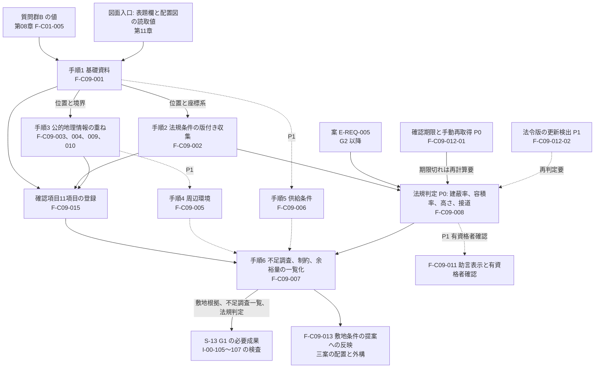
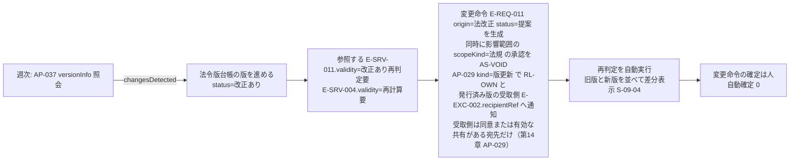

# 第18章 敷地、法規、公的地理情報、現地調査の仕様

作成日: 2026-09-15　版: v1.5（v1.5 は段階8 の最終仕上げ（2026-10-08。再々確認 主2-07。統括の決定 D30）〔群G4〕。第1.8.2節に、利用目的別の生成で G1(b) が非の利用目的（家具配置、図面3D化、売却賃貸）では敷地の項目を非該当とし I-00-105〜107 を登録しないことを第06章 第2.2節、第8.2節、基盤 七段階門 G1 と同文で加えた。記録は `05_審査/再修正記録_最終仕上げ_群G4.md`。v1.4 は段階8前の持ち越し仕上げ（2026-10-08。共通の決定 D8、D18、既定値の識別子の併記 1 行）〔群F4〕。AC-C09-011-04 の試験を「T-S-010、T-U-012」に（章末の前提の行の T-U-015 も除いた）、第4.7節と AC-C09-012-03 の T-R-010 の参照を「P2 版の合格条件(4)」に改め、章要約の確認期限に DV-CO-15 を併記した。記録は `05_審査/再修正記録_段階8前_仕上げ_群F4.md`。v1.3 は 2026-10-07 の二回目の修正の仕上げ〔群R3〕。01_調査 08 の外部確認の反映〔第3.2節の地理院の規約の版、地理院タイル一覧へのリンク、測量法の判断の流れ、書出の測量法の判定の三値、不動産情報ライブラリの地図画像を取り込まないこと、ゼンリンの規定、第4.2節と第4.6節の過半の判定式、新3号の扱い、2025-04-01 以後の着工〕と、第6章と基盤 用語集の二回目の依頼の確認。記録は `05_審査/再修正記録_2回目_仕上げ_群R3.md`。v1.2 は 2026-10-07 段階6 二回目の修正（段階7 再審査の後）。修正計画 第1.18節の統合指摘 11 件（主担当 JR-086〜JR-088、整合 JR-011、JR-012、JR-014、JR-023、JR-034 の (3)、JR-040、JR-041、JR-072）と識別子変更一覧（JR-006 の六因果）を反映し、横断方針「外部起因の承認の失効」（修正計画 第0.3節。JR-019）を第4.7節に適用。記録は `05_審査/再修正記録_2回目_第18章.md`。v1.1 は 2026-10-06 段階6 再修正で、初稿審査の統合指摘 20 件（主担当 JM-126〜JM-133 の 8 件、整合 12 件）と整合修正指示 第18章 2 件、試験の採番の置換を反映。記録は `05_審査/再修正記録_第18章.md`）　担当: 段階3 仕様書 第18章（一級建築士、BIM技術者、3D幾何処理技術者、製品責任者、個人情報保護と知的財産の審査担当の視点で作成）
根拠: 指示文 C9（敷地、法規、周辺環境。検討6手順、確認項目、公的地理情報の属性、法規判定の保存項目）、9.7（法規機能の境界。版管理、再判定と差分表示、有資格者への最終判断の残置）、B（中心原則）、E（住所の機密扱い）、G（非対象「全世界法規の完全対応」）、9.10（日本の戸建住宅）。基盤定義 `用語集.md` v1.1、`識別子規則.md` v1.1、`十二判断領域.md` v1.1（A02、影響関係表）、`七段階門.md` v1.1（G0、G1、G1×A02、I-00-105〜I-00-107）、`信頼状態と証拠段階.md` v1.1（VS-、EL-、AS-、第9節の法規判定と公的地理情報の状態）、`機能一覧骨格.md` v1.1（C09 の15機能）、`情報実体骨格.md` v1.1（E-BLD-002、E-SRV-001、E-SRV-002、E-SRV-004、E-SRV-011、E-SRV-012、E-REQ-002）、`画面指標試験骨格.md` v1.1（S-09、T-A-008、T-R-001、T-R-010、M-G-10）、`整合検査報告.md` v1.0。v1.1 では基盤定義 v1.2（機能一覧骨格の副番 F-C09-012-01、F-C09-012-02、画面指標試験骨格の T-R-001、T-R-010、T-S-003 の改訂、七段階門の I-06-003〜I-06-006。`整合検査報告.md` 第5節 識別子変更一覧）、第06章 v1.1（規則6、I-06-006、第5.1節 敷地、U-06-016、U-06-019）、第12章 v1.2 追補（表11.2-A、表11.2-B、terrain.designGroundLevel、DV-CO-15、DV-GE-18、DV-GE-19、DV-ST-01）、第21章 第2.4節、第23章 第4.3節 付表 4.3-A、4.3-B に合わせた。調査 `01_調査/07_法規と個人情報と権利.md`（確認日 2026-09-15）。仕様書 第03章（RC-05、RC-07、RC-09、RC-14、DIF-82、DIF-83、DIF-89、DIF-90、DIF-93）、第06章（G1 の必須成果と進行禁止条件、確認範囲別承認）、第07章（I-07-005、U-07-004、延焼のおそれのある部分の連鎖）、第08章（質問群B、F-C01-005）、第09章（C09 の10項目初稿）、第11章（配置図の読取、座標系の前提）、第12章（E-BLD-002 の項目辞書、U-00-042）、第13章（地盤仮定、防火、引込点）、第14章（AP-018、AP-019、AP-029、AP-037）、第15章（S-09 の位置付け）。v1.2 では `05_審査/再審査/00_修正計画.md` 第0.3節、第0.4節、基盤 `信頼状態と証拠段階.md` v1.3、`機能一覧骨格.md` v1.3、`整合検査報告.md` 第5.1節、第06章 v1.2（第5.2節「資格の照合状態」、第8.1節、第8.2節）、第08章 v1.3（X2）、第12章 v1.4 に合わせた。
確認日: 2026-09-15。

## 0. 本章の目的、範囲と非対象、前提とする章

### 0.1 本章の目的

- 敷地と法規の検討6手順（住所と境界資料、法規収集、公的災害情報の重ね、周辺環境、供給条件、不足資料一覧）について、各手順の入力、処理、出力、確認者を固定し、段階 G1 の必須成果「敷地根拠」「不足調査一覧」「法規判定（版付き）」がどの実体と属性で成立するかを定める（指示文 C9、基盤 七段階門 G1×A02）【推定】。
- 確認項目11項目（土地境界、道路種別、権利、地役、越境、上下水、電力、通信、擁壁、地盤、既存埋設物）を、確認済み、仮定、不足調査の三状態で登録する規則を定める（指示文 C9、F-C09-015）【推定】。
- 公的地理情報の属性（出典、取得日、対象時点、解像度、座標系、適用範囲、訂正履歴）と権利属性（規約名、商用可否、出典表示文言、測量法承認の要否）、および表示規則（地図上の線を法的境界と断定しない、災害情報を個別敷地の安全保証に使わない）を定める（指示文 C9、調査07 第2.6〜2.8節）【推定】。
- 法規判定の保存項目（法令名、自治体、版、施行日、取得日、該当根拠、入力値、計算、余裕量）に着工予定日等を加え、AI判定が助言であることの表示、有資格者確認の範囲、法改正時の再判定と差分表示（指示文 9.7）、2025年4月以降の制度変更の扱いを定める【推定】。
- 初期対象地域の絞り込み基準と、対象外地域での表示を定め、非対象 F-C09-014「全世界法規の完全対応」を仕様化しない境界を明示する（指示文 G、9.10）【推定】。
- 敷地確認画面（S-09）に表示する内容と条件を部品案として定め、担当機能 F-C09-001〜F-C09-013、F-C09-015（F-C09-012 は副番 F-C09-012-01、F-C09-012-02 に分けて記述）の必須10項目と受入条件 AC- を記述する【推定】。

### 0.2 本章の範囲と非対象

| 区分 | 内容 |
|---|---|
| 範囲 | 敷地の基礎資料（住所、地番候補、座標系、境界資料、測量日、資料作成者）。法規条件11項目の版付き収集と法令版の管理（P0 の確認期限と手動再取得を含む）。公的地理情報（標高、傾斜、土地利用、洪水、内水、高潮、津波、土砂、液状化、地震動）の取得、属性、権利検査、重ね表示、注記。周辺環境と供給条件の現地資料補完（P1）。不足調査、敷地制約、余裕量の一覧化と G1 の進行禁止条件（I-00-105〜I-00-107）と G2 の I-00-112（擁壁と地盤）の検査規則。改装案件の確認項目（P1 の自動登録は第21章）。法規判定（P0 は建蔽率、容積率、高さ〔絶対高さと高度地区〕、接道の初期判定。P1 で斜線、日影、防火、延焼のおそれのある部分、確認申請と省エネ適判の区分）の保存項目、判定式、余裕量、判定不能、助言表示、有資格者確認、再判定と差分表示。初期対象地域と対象外地域の表示。S-09 の部品案。担当14機能（副番を含む）の機能要件と受入条件 |
| 非対象（他章が主章） | 質問群B の聞取と分岐（F-C01-005。第08章）。敷地条件を受けた建物配置と外構の設計そのもの（F-C09-013 は本章が主章だが、三案の生成 F-C03-019 は第12章、配置図の読取 F-C02-005 は第11章）。地盤に対する基礎の設計と地盤仮定の扱い（第13章。本章は地盤調査の不足調査への登録まで）。防火地域に応じた外皮仕様の選定（第13章。本章は防火の法規条件の値と延焼のおそれのある部分の判定まで）。省エネ基準等の性能計算と証拠段階（第19章。本章は省エネ適判の要否と省略経路の区分まで）。既存住宅状況調査、石綿事前調査、工事前調査（第21章）。法規根拠の版と出典の管理の情報基盤、公的地理情報の利用許諾（E-PRD-005）の権利仕様、承認の自動失効の機能（F-C10-005）、住所の分離保存の実装（第22章）。API の入出力（第14章）。S-09 の部品採番と三状態の設計（第15章。本章は表示する内容と条件を部品案として渡す）。指標の計測手順と試験情報（第23章）。初期対象都道府県の事業判断（第24章、U-24-010） |
| 非対象（製品外） | 確認申請と行政協議、適用判断の代行、法規適合の断定（製品は断定しない。用語集171、非対象5）。測量、地盤調査、行政照会、供給事業者確認の実施（製品は必要箇所の明示と依頼状態の管理まで）。権利、地役、越境の法的判断（製品は資料の有無と記録まで）。日本以外の法規と、対象外地域の法規判定（F-C09-014、非対象。第5節）【推定】 |

### 0.3 前提とする章

| 章 | 前提として使う内容 |
|---|---|
| 第02章 | 完成像、六段の因果（本章の機能は因果(1)(2)(3)(4)(5)。F-C09-012 と F-C09-012-02 は機能一覧骨格 v1.3 で因果(1)に改められた。JR-006）、非対象の一覧、例示判断 D-02-004「敷地制約と不足調査」 |
| 第03章 | 再確認項目 RC-05、RC-07、RC-09、RC-14 を本章で仮定として明記する依頼。DIF-82（施行日と経過措置）、DIF-83（質疑応答集の版）、DIF-89（PDL1.0 とデータ別条件）、DIF-90（不動産情報ライブラリの API）、DIF-93（廃止制度を参照しない） |
| 第06章 | G1 の開始条件、必須成果（敷地根拠 E-BLD-002 と E-SRV-011、不足調査 E-SRV-001）、完了条件(3)、進行禁止条件 I-00-105〜I-00-107 の検出画面（S-09）、確認範囲「法規」の承認（P1 で照合済みの資格を持つ RL-CHK。第5.2節「資格の照合状態」）、進行禁止条件の運用（第8.1節。発行と引継ぎの停止を含む） |
| 第07章 | A02 の影響関係（制約、地盤、防火、供給、気候、災害、進入、出典）、I-07-005（北側斜線の余裕量が負）、U-07-004（負の余裕量の重大度。本章 第4.4節で仮判断）、延焼のおそれのある部分の判定を A05 へ同じ変更識別子で連鎖させる依頼 |
| 第08章 | 質問群B（B1〜B10）の値が S-09 へ渡ること、F-C01-005 の不足調査登録（R9）、主要危険「擁壁と地盤」（R10）、住所の末尾伏せ表示 |
| 第09章 | C09 の各機能の10項目初稿と AC- の採番を第18章が行う前提 |
| 第11章 | 配置図からの境界候補、方位、道路位置の読取（P1）、日照表示の簡易計算（F-C04-009）が緯度経度を本章から受け取ること、案件座標系の規則を本章が定めること |
| 第12章 | E-BLD-002 Site、E-SRV-001 Survey、E-SRV-002 Observation、E-SRV-004 Calculation、E-SRV-011 SiteRegulation、E-SRV-012 HazardInfo、E-REQ-002 Constraint の項目辞書。Site.crs の値の規則、roadAccess.kind の道路種別、ServiceArea.regions の地域符号を本章が定める前提。案件原点と真北角（U-00-042 への仮判断） |
| 第13章 | 地盤仮定（isSafetyRelated=true、地耐力の既定値を置かない）、防火の法規条件と外皮仕様の整合判定（主担当 A05）、引込点と放流点の仮置きと供給事業者確認の登録 |
| 第14章 | AP-018 敷地法規照会、AP-019 法規判定、AP-029 通知（kind=版更新）、AP-037 公的地理情報と法規情報接続の入出力 |
| 第15章 | S-09 の位置付け（G0、G1、A02、P0）、遷移（S-02 → S-09、S-17 の版更新通知 → S-09）、共通部品 S-30-01、S-30-02、S-30-06 |
| 基盤定義 | 用語集、識別子規則、十二判断領域、七段階門、信頼状態と証拠段階、機能一覧骨格、情報実体骨格、画面指標試験骨格（v1.2。整合検査報告 第5節の識別子変更一覧に追従）を正本とし、本章はこれらに従う |

### 0.4 本章の記述規則

| 規則 | 内容 | 区分 |
|---|---|---|
| 根拠区分 | 【事実】は調査07（確認日 2026-09-15）で公式頁または公式PDFの本文を直接読めた事項に限り、出典URLを付ける。調査07で「検索抜粋」だった事項は【事実（検索抜粋）】と書き、再確認対象（第03章 RC-）を併記する。法令の条文原文（建築基準法42条、43条、52条、53条、55条、56条、65条等）は今回確認できていないため、条文に依拠する判定式は【仮定】とし、確定扱いにしない（共通指示 第4節） | 【仮定】 |
| 識別子 | 機能は基盤 機能一覧骨格の F-C09-001〜F-C09-015 と v1.2 の副番 F-C09-012-01、F-C09-012-02 をそのまま使う。受入条件は `AC-C09-{連番3桁}-{連番2桁}`（副番の機能は `AC-C09-012-01-{連番2桁}`。識別子規則 第2.9節）。例示の問題、判断、要求は `I-18-`、`D-18-`、`R-18-`。未決は `U-18-`。S-09 の部品は第15章が採番するため、本章は `S-09-01` 〜 `S-09-10` を「部品案」として提示し、第15章の採番が異なる場合は第15章を正とする | 【仮定】 |
| 試験 | 既存の T-A-008、T-R-001、T-R-010、T-A-013、T-S-003、T-S-013 で検査できる受入条件はそれを付け、できないものは第23章 第4.3節 付表 4.3-A、4.3-B の採番（T-U-012。AC-C09-002-03 は T-I-014、AC-C09-005-02、006-02、008-03、013-03 は T-I-023、AC-C09-004-02 は T-S-016）を付ける（v1.1。JM-173、JM-040） | 【仮定】 |
| 数値目標 | 本章の数値目標は全て初期仮説であり、公開判定会議で固定する（用語集9、287） | 【推定】 |
| 曖昧語の置換 | 「正確」「適切」等を使わず、観察可能な条件（件数、割合、表示の有無、状態符号）で書く | 【推定】 |

## 1. 敷地と法規の検討6手順

### 1.1 手順の全体

指示文 C9 の順序をそのまま6手順とし、各手順の入力、処理、出力、確認者、関連機能、段階、画面を固定する。手順1〜3と6は P0、手順4と5は P1 である（機能一覧骨格 C09 の優先）【推定】。手順は順序を持つが、手順1の6項目のうち住所（または概略地域）と座標系があれば手順2と3を並行して開始できる【仮定】。

| 手順 | 名称 | 入力 | 処理（決定的処理と人の作業の区別） | 出力（実体と属性） | 確認者 | 関連機能 | 段階 | 画面 | 区分 |
|---|---|---|---|---|---|---|---|---|---|
| 1 | 住所、地番候補、座標系、境界資料、測量日、資料作成者の確認 | 質問群B（B1、B2、B4、B5、B6、B7、B8、B9、B10。第08章）、図面入口では表題欄と配置図の読取値（VS-SRC、VS-AI。第11章）、利用者が登録する境界資料（測量図、公図の写し等）、写真の位置情報（利用者が許可した場合のみ） | 製品: 住所の分離保存、地番候補の登録、座標系の決定（第1.3節）、境界多角形の生成と要素値状態の付与、面積の算出、6項目の欠落検査。人: 値の確認（VS-USR）、境界資料の登録 | E-BLD-002（address、lotNumbers、crs、boundary、boundarySourceRef、surveyDate、area、northAngle）、E-PRD-006（kind=図面 または 調査報告。作成者、revisionDate、rightsState）、E-SRV-001（kind=測量、status=必要。境界資料がない場合） | RL-OWN（値の確認）。RL-CHK 建築士（境界資料の妥当性。P1 で必須、P0 で任意。第06章 U-06-003） | F-C09-001、F-C09-009 | G0（概略地域）、G1 | S-09（部品案 S-09-01、S-09-02） | 【推定】 |
| 2 | 法規条件の版付き収集 | E-BLD-002 の位置（crs 付き）と市区町村、着工予定日（第4.1節）、案件横断の法令版台帳（第4.6節） | 製品: AP-037 で公的情報源から用途地域、建蔽率、容積率、高さ、斜線、日影、防火、景観、地区計画、条例、接道の11項目を取得し、各項目に法令名、自治体、該当根拠、版、施行日、取得日、値、出典を付ける。版が取得できない項目を「版不明」にする。人: 自治体の条例や地区計画の追加入力（VS-USR）、行政照会の依頼 | E-SRV-011 × 項目数（isConfirmedByAuthority=false、validity=有効）、E-REQ-002（kind=法規制約、originRef=E-SRV-011）、E-SRV-001（kind=行政照会、status=必要。版不明または用途地域不明の場合） | RL-CHK 建築士（法規条件の妥当性。P1 で必須）。行政（照会先。製品外） | F-C09-002、F-C09-012-01（P0）、F-C09-012-02（P1） | G1 | S-09（S-09-03） | 【推定】 |
| 3 | 公的地理情報（標高、傾斜、土地利用、洪水、内水、高潮、津波、土砂、液状化。加えて地震動、大規模盛土造成地）の重ね | E-BLD-002 の位置と boundary（crs 付き）、災害種別の一覧、出典ごとの利用条件（E-PRD-005） | 製品: AP-037 で取得し、7属性（出典、取得日、対象時点、解像度、座標系、適用範囲、訂正履歴）と権利属性（第3.1節）の欠落を検査し、欠ける情報は取り込まない。座標変換（第1.3節）。重ね表示の生成と注記（法的境界ではない、安全保証ではない、出典表示文言）の固定。標高と傾斜は E-SRV-002（kind=地理情報）として観察値へ展開し、E-BLD-002.terrain を VS-AI で埋める。人: 閲覧、床高等の要求への反映（R-18-001 の例） | E-SRV-012 × 種別数、E-PRD-006（kind=公的地理情報）、E-PRD-005（地理情報の利用条件）、E-SRV-002（kind=地理情報）、E-BLD-002.terrain（VS-AI）、E-SRV-007（kind=災害。主要危険の候補）、E-REQ-001 の候補（床高等） | RL-OWN（閲覧と要求への反映）。情報管理者（属性欠落と権利検査の運用） | F-C09-003、F-C09-004、F-C09-009、F-C09-010 | G0（概略の主要危険）、G1 | S-09（S-09-01、S-09-04） | 【推定】 |
| 4 | 周辺環境の現地資料補完（隣家の窓、日影、眺望、騒音源、卓越風、樹木、公共空間との関係） | 現地写真（利用者所有、RS-OWN）、利用者の観察入力、隣家の窓と樹木の位置指定（S-09-01 上）、日照の簡易計算（F-C04-009。第11章）、風向の公的統計（出典が確認できた場合のみ） | 製品: E-SRV-002（kind=周辺観察）の登録、位置固定、観察日、観察者、方法の必須化。隣家の窓との距離と正対の有無を決定的に算出して表示（判断は建築士）。騒音源、視線、眺望を敷地制約（E-REQ-002 kind=敷地制約）へ変換。人: 観察の入力と確認 | E-SRV-002 × 観察数、E-REQ-002（kind=敷地制約。視線、騒音、眺望、樹木）、E-BLD-002 への参照 | RL-OWN（観察者）。RL-CHK 建築士（制約の妥当性） | F-C09-005（P1） | G1、G2 | S-09（S-09-07） | 【推定】 |
| 5 | 供給条件（給排水、電気、通信、雨水放流、工事車両進入）の確認 | 利用者が入手した供給事業者の資料（水道台帳の写し、下水道台帳の写し等）、E-BLD-002.roadAccess（幅員。工事車両進入の判定に使う）、供給事業者への確認結果 | 製品: utilities の6項目を「確認済み（出典付き）」「未確認」「なし」で登録し、未確認の項目ごとに E-SRV-001（kind=供給事業者確認）を生成。引込点と放流点の仮置きは第13章 F-C12-001 へ渡す。人: 資料の登録、供給事業者への確認（製品外） | E-BLD-002.utilities、E-SRV-001（kind=供給事業者確認、status=必要 または 受入済み）、E-SYS-002.supplyConditionRef（第13章） | RL-OWN。RL-CHK（設備設計者、建築士）。供給事業者（製品外） | F-C09-006（P1） | G1（G3 の設備調整前までに受入済み） | S-09（S-09-06） | 【推定】 |
| 6 | 不足資料、必要な調査、設計への制約、余裕量の一覧化 | 手順1〜5の出力、F-C09-015 の確認項目11項目の状態、F-C09-008 の法規判定の余裕量、案（E-REQ-005。G2 以降） | 製品: 不足資料の抽出、必要な調査の生成（kind、requestedGate、依頼先の候補、重大度）、敷地制約と法規制約の一覧化、余裕量の一覧化、G1 の進行禁止条件 I-00-105〜I-00-107 の決定的検査、敷地根拠の版の固定。人: 一覧の確認、調査の依頼（製品外）、依頼状態の更新 | E-SRV-001（status=必要 → 依頼済み → 実施済み → 受入済み）、E-REQ-002 の一覧、E-SRV-004.margin の一覧、敷地根拠（E-BLD-002、E-SRV-011、E-SRV-012 の版の組。第1.8節）、E-REQ-003（I-00-105〜I-00-107、SEV-0） | RL-OWN（一覧の確認）。RL-CHK 建築士（敷地根拠の確認。P1 で必須、P0 では「専門家未確認」と表示） | F-C09-007、F-C09-015 | G1（G2〜G4 で更新） | S-09（S-09-05、S-09-08）、S-13（G1 の必要成果） | 【推定】 |

### 1.2 手順の流れ

点線は P1 の経路である【推定】。

### 1.3 手順1の詳細: 住所、地番候補、座標系、境界資料、測量日、資料作成者

#### 1.3.1 6項目の取得元と要素値状態

| 項目 | 実体と属性 | 取得元（優先順） | 要素値状態の付け方 | 欠落時の扱い | 区分 |
|---|---|---|---|---|---|
| 住所 | E-BLD-002.address（機密。分離保存。第22章） | 質問群B の B4、図面の表題欄（VS-SRC）、写真の位置情報（利用者が許可した場合のみ。第08章 F-C01-005 例外(d)） | 利用者入力は VS-USR。図面由来は VS-SRC、写真由来は VS-AI で「確認」を出す | 概略地域（都道府県、市区町村）だけで手順2と3を開始できるが、地番候補と境界は登録できない。画面には末尾を伏せて表示する（第08章） | 【推定】 |
| 地番候補 | E-BLD-002.lotNumbers（機密） | B4、配置図の記載（VS-AI）、境界資料の記載（VS-SRC） | 複数候補を許し、確定は利用者（VS-USR）。地番と住所（住居表示）は別物であることを画面に明示する | 空を許す。境界資料が「公図のみ」の場合は地番が必須 | 【推定】 |
| 座標系 | E-BLD-002.crs、E-BLD-002.originPoint、northAngle（第12章） | 第1.3.2節の規則で製品が決定 | crs は「なし」（状態を持たない属性）。originPoint と northAngle は VS-DEF から始まり、利用者確認で VS-USR | crs が決められない（緯度経度も市区町村も不明）場合は S-09 の失敗状態「座標系不明」 | 【仮定】 |
| 境界資料 | E-BLD-002.boundary、boundarySourceRef、E-PRD-006 | B10（測量図あり、公図のみ、なし、不明）、登録された資料、配置図の敷地境界候補（第11章。P1）、地理院タイルと国土数値情報の筆界を示さない地図情報（参考） | 第1.3.3節の表 | 「なし」「不明」は I-00-105 の候補。仮定（VS-DEF の概略多角形）を置く場合は E-SRV-008（kind=現況、isSafetyRelated=false）と不足調査「測量」を必ず登録する | 【推定】 |
| 測量日 | E-BLD-002.surveyDate | 境界資料の記載（VS-SRC）、利用者入力（VS-USR） | 資料に記載がなければ null。null の境界資料は「測量日不明」と表示する | 測量日から 10 年（初期仮説）を超える確定測量図は「再測量の要否を建築士へ確認」を表示する | 【仮定】 |
| 資料作成者 | E-PRD-006 の作成者（Person または Organization。第12章） | 境界資料の記載、利用者入力 | 作成者が土地家屋調査士、測量士等の資格者であるかは資料の記載を転記するだけで、製品は資格の真偽を確認しない | 作成者不明の資料は登録できるが、境界の要素値状態を VS-AI 止まりにする（VS-SRC にしない） | 【仮定】 |

#### 1.3.2 座標系の規則（U-00-042 への仮判断）

第12章は案件座標系を「案件原点＋真北」とし、Site.crs の値の規則を本章に委ねた。本章は次のとおり定める（U-18-002）【仮定】。

| 規則 | 内容 | 区分 |
|---|---|---|
| 案件座標系 | 第12章 第1.6節のとおり、案件原点は敷地内の一点、X 軸は東、Y 軸は北、Z 軸は上、単位 mm。全ての建物幾何は案件座標系で持つ | 【推定】 |
| Site.crs | 日本測地系2011（JGD2011）の平面直角座標系を用い、表記は「JGD2011 / n系」（n は系番号 1〜19）。系番号は敷地の都道府県から製品が決め、都道府県が複数系にまたがる場合は市区町村で決める。系の割当表は案件横断台帳（辞書 E-EXC-004）に版付きで持つ | 【仮定】 |
| 地理座標 | 公的地理情報との照会には JGD2011 の緯度経度（度、小数第6位まで）を用い、E-BLD-002 の補助属性 `geoPoint`（緯度、経度、取得方法、要素値状態）として保持する（第12章 v1.2 追補 表11.2-A で追加済み）。地理院タイルのタイル座標（XYZ、ズーム 2〜18。調査07 第2.7節【事実】 https://maps.gsi.go.jp/development/ichiran.html 確認日 2026-09-15）への変換は表示側で行う | 【仮定】 |
| 変換 | 案件座標系と Site.crs の間は originPoint（crs 上の座標）と northAngle で変換する。公的地理情報が別の座標系（測地系、投影）で提供される場合は取得時の crs を E-SRV-012.crs に保持し、表示時に変換する。変換後の位置の許容差は初期仮説 0.5 m とし、これを超える可能性がある解像度（格子間隔 5 m 超の標高等）は「位置は概略」と表示する | 【仮定】 |
| 既定 | originPoint は boundary の重心（VS-DEF）、northAngle は 0（案件 Y 軸＝真北。VS-DEF）。図面入口では配置図の方位記号から northAngle を VS-AI で置く（第11章）。V2 判定時に両者が VS-USR 以上であること（第12章の必須条件） | 【推定】 |
| 磁北と真北 | 方位記号が磁北を指す場合は真北への補正を求める。補正値は利用者入力（VS-USR）とし、製品は既定値を置かない | 【仮定】 |
| EPSG 符号 | 平面直角座標系の EPSG 符号との対応は今回確認していないため、書出（IFC、DXF）時の符号表記は第22章と 01_調査へ確認を依頼する（U-18-001） | 【未確認】 |

#### 1.3.3 境界資料の種類と境界多角形の要素値状態

| 境界資料 | boundary の要素値状態 | 画面表示 | 法的境界としての扱い | 必要な不足調査 | 区分 |
|---|---|---|---|---|---|
| 確定測量図（隣地所有者と道路管理者の立会いを経たと資料に記載があるもの） | VS-SRC（資料の座標または辺長から生成） | 「測量図による。測量日 yyyy-mm-dd」 | 製品は「法的境界」と表示しない（資料の記載を転記するだけ）。照合済みの資格を持つ建築士が確認範囲「敷地」で承認すれば VS-PRO（P1。第06章 第5.2節） | なし（測量日が 10 年超の場合は「再測量の要否確認」） | 【仮定】 |
| 現況測量図、地積測量図（立会いの記載なし） | VS-SRC | 「現況測量図による。境界確定ではない」 | 同上 | 測量（境界確定）を「推奨」として登録（status=必要、severity=SEV-2） | 【仮定】 |
| 公図の写しだけ | VS-AI（公図の形状を敷地面積で尺度合わせした概略） | 「公図による概略。寸法と形状は現地と異なる可能性」 | 法的境界ではない | 測量を「必要」として登録（SEV-1。G2 の配置検討は概略で進められる） | 【仮定】 |
| 配置図の敷地境界線（図面入口。P1） | VS-AI | 「図面の境界線による。原図の頁へ戻れる」 | 法的境界ではない | 測量（SEV-1） | 【推定】 |
| 資料なし、不明 | VS-DEF（面積と形状の回答から生成した概略の矩形または四角形） | 「仮定の境界。配置検討用」 | 法的境界ではない | 測量（SEV-0 相当。I-00-105: 仮定も不足調査も登録していない場合だけ進行禁止） | 【推定】 |

地理院タイルと国土数値情報は筆界を示さないため、境界資料として登録しない（地図の背景と災害情報にだけ使う）【推定】。

### 1.4 手順2の詳細: 法規条件の版付き収集

#### 1.4.1 11項目と取得元

| 項目（E-SRV-011.item） | 値の例（E-SRV-011.value） | 取得元の候補（優先順） | 版（version）と施行日（effectiveDate）の定義 | 行政確認（isConfirmedByAuthority）の条件 | 区分 |
|---|---|---|---|---|---|
| 用途地域 | 第一種低層住居専用地域 等 | 不動産情報ライブラリの都市計画情報（都市計画決定GISデータ 令和7年度、API配信、商用可【事実】 https://www.reinfolib.mlit.go.jp/help/contents/ 確認日 2026-09-15）。次に国土数値情報の用途地域（A29。2019年度データ【事実（検索抜粋）】 https://nlftp.mlit.go.jp/ksj/gml/datalist/KsjTmplt-A29.html 確認日 2026-09-15。RC-09）。自治体の都市計画図 | 版は取得元のデータ年度（例「令和7年度」）、施行日は都市計画決定の告示日（取得できない場合は「不明」） | 行政照会（E-SRV-001 kind=行政照会）が受入済みで、照会結果の資料（E-PRD-006 kind=調査報告）が結ばれた時 | 【推定】 |
| 建蔽率 | 60 % | 同上（都市計画情報に含まれる指定値） | 同上 | 同上 | 【推定】 |
| 容積率 | 200 % | 同上。前面道路幅員による制限は接道の値から製品が算出（第4.2節） | 同上 | 同上 | 【推定】 |
| 高さ | 絶対高さ 10 m、高度地区 等 | 都市計画情報（高度地区）、自治体の条例と告示 | 同上 | 同上 | 【推定】 |
| 斜線 | 道路斜線、隣地斜線、北側斜線の適用区分 | 用途地域から製品が候補を導く。値（勾配、立上り）は法令の版に依存する | 建築基準法の版（改正の施行日。第4.6節の法令版台帳） | 同上 | 【仮定】 |
| 日影 | 日影規制の対象と測定面、時間 | 自治体の条例（日影規制の指定） | 条例の版と施行日 | 同上 | 【推定】 |
| 防火 | 防火地域、準防火地域、法22条区域、指定なし | 都市計画情報（防火・準防火地域。令和7年度、API配信【事実】 同上） | 都市計画の版 | 同上 | 【推定】 |
| 景観 | 景観計画区域、景観地区の別と届出の要否 | 自治体の景観計画 | 計画の版 | 同上 | 【推定】 |
| 地区計画 | 地区計画の名称と壁面後退等の制限 | 都市計画情報（地区計画。令和7年度【事実】 同上）、自治体の地区計画書 | 同上 | 同上 | 【推定】 |
| 条例 | がけ条例、緑化条例、建築協定、宅地造成等の区域 等 | 自治体の条例一覧（案件横断の法令版台帳に市区町村ごとに登録。初期対象地域だけ） | 条例の版と施行日 | 同上 | 【仮定】 |
| 接道 | 前面道路の幅員、道路種別（第2.2節）、接道長 | E-BLD-002.roadAccess（質問群B の B8、配置図）、自治体の指定道路図と道路台帳（行政照会） | 道路種別の根拠（建築基準法42条の区分）の版 | 道路種別は行政照会が受入済みになるまで「未確認」。幅員と接道長は利用者入力（VS-USR）または測量図（VS-SRC） | 【仮定】 |
| その他 | 都市計画区域の内外、市街化調整区域、埋蔵文化財包蔵地、宅地造成及び特定盛土等規制法の区域 等 | 都市計画情報、自治体の公開情報 | 同上 | 同上 | 【仮定】 |

#### 1.4.2 版の扱いの規則

| 規則 | 内容 | 区分 |
|---|---|---|
| 版の必須 | 各 E-SRV-011 は lawName、municipality、article、version、effectiveDate、acquiredAt、sourceRef を必須とする（第12章の項目辞書）。version が取得できない項目は version=「版不明」、validity=有効 のまま登録できるが、法規判定（F-C09-008）の入力には使わず、S-09-03 に「版不明。行政照会または資料の登録が必要」を表示し、E-SRV-001（kind=行政照会、SEV-2）を生成する | 【仮定】 |
| 取得日と対象時点の差 | acquiredAt と出典の対象時点（E-PRD-006.asOfDate）の差が 2 年（初期仮説）を超える項目は「時点が古い可能性」を表示する。用途地域を国土数値情報 A29（2019年度）から取った場合は常にこの表示が付き、不動産情報ライブラリ（令和7年度）または行政照会を優先する（調査07 第2.8節の含意【推定】） | 【仮定】 |
| 複数出典の不一致 | 同じ項目を二つ以上の出典から取得して値が異なる場合、両方を E-SRV-011 として登録し、問題（主担当 A02、影響先 A12、SEV-1）を1件登録して行政照会を不足調査へ加える。製品は多数決や新しい方の自動採用をしない | 【仮定】 |
| 利用者入力 | 利用者や建築士が入力した法規条件は VS-USR とし、出典（資料または照会の記録）の登録を求める。出典のない入力は「出典なし」と表示し法規判定の入力には使わない | 【仮定】 |
| 行政確認 | isConfirmedByAuthority=true は行政照会の受入済みだけで立て、値の要素値状態を VS-PRO 相当として扱う（第12章）。行政照会の結果は資料として登録し、口頭確認だけの場合は照会日、窓口名、確認者を必須にする | 【仮定】 |
| 法令の版の正本 | 法令名と版の正本は案件横断の法令版台帳（第4.6節）に置き、各 E-SRV-011 は sourceRef でそれを参照する。改正の検出は台帳側で行う | 【仮定】 |
| 確認期限（v1.1。F-C09-012-01、P0） | 各 E-SRV-011 と法令版台帳の項目は checkedAt（最終確認日。版の再取得または行政照会で更新）と validUntil（checkedAt ＋ 確認周期。第12章 DV-CO-15。P0 は 90 日、初期仮説）を持つ。validUntil を超えた項目は E-SRV-011.validity=確認期限切れ とし、それを参照する E-SRV-004（kind=法規判定）を validity=再計算要 にして、S-09-04 に「版の確認期限切れ（yyyy-mm-dd）。再取得または行政照会が必要」を表示する。「改正あり再判定要」（F-C09-012-02）と区別して表示し、版は変わっていないため承認（scopeKind=法規）は失効させない（第12章 第6.10節 連動12）。確認期限切れの項目が残る案件は G4 で判定して I-18-005（SEV-1。引継ぎの前提）とする（AC-C09-002-04。JM-127。JR-011） | 【仮定】 |
| 手動再取得（v1.1。P0） | 利用者（RL-OWN、RL-EDT）の操作で AP-037（asOfPolicy=最新）を実行し、版と施行日を取り直して checkedAt と validUntil を更新する。版が変わった場合は法令版台帳の版を進め、新版の E-SRV-011 を登録して旧版を版履歴に残し、第4.1節の規則で適用版を選んで F-C09-008 を再実行する。台帳の版が進んだ時点で、旧版を参照する全案件の E-SRV-011 を「改正あり再判定要」（参照する判定は再計算要）にし、各案件の S-09-04 と S-17 で知らせる（週次照会を待たない。他案件の内容は再取得した利用者に見せない）。発行済み版（CDE-PUB）がある案件は AP-029（kind=版更新）で受取側へ通知する（宛先の条件は第4.7節）。版が変わった条項だけ、保存済みの旧版と新版の判定を並べて表示する。全条項の差分表示と週次の検出は P1（F-C09-012-02）。P0 では自動の定期再取得を行わない（v1.2、JR-086） | 【仮定】 |
| 期限内の改正（P0 の限界） | 確認期限の内側で施行された改正は P0 では検出できない。S-09-04 と引継ぎ一式（G4 の問題一覧の注記）に「法令の版は yyyy-mm-dd 時点の確認。以後の改正は検出していない。建築士の確認が必要」を固定表示する | 【仮定】 |

### 1.5 手順3の詳細: 公的地理情報の重ね

#### 1.5.1 重ねる情報の種類と出典候補

| 種別 | E-SRV-012.hazardKind または E-SRV-002.kind | 出典候補（確認できた利用条件） | 対象時点の取り方 | 区分 |
|---|---|---|---|---|
| 標高、傾斜 | E-SRV-002（kind=地理情報。attribute=標高、傾斜）、E-BLD-002.terrain | 地理院タイル（標高タイル、色別標高図、傾斜量図。出典明示で利用可【事実】 https://maps.gsi.go.jp/development/ichiran.html 確認日 2026-09-15） | タイルの整備年度（取得できない場合は「不明」） | 【推定】 |
| 土地利用 | E-SRV-002（kind=地理情報。attribute=土地利用） | 国土数値情報の土地利用細分メッシュ等（データ別に商用可否あり【事実】 https://nlftp.mlit.go.jp/ksj/other/agreement.html 確認日 2026-09-15） | データの年次 | 【推定】 |
| 洪水（浸水想定） | 洪水 | 国土数値情報 洪水浸水想定区域（CC BY 4.0【事実（検索抜粋）】 https://nlftp.mlit.go.jp/ksj/gml/datalist/KsjTmplt-A31-v4_0.html 確認日 2026-09-15）、不動産情報ライブラリ（河川ごとに更新日が異なり商用可【事実】 https://www.reinfolib.mlit.go.jp/help/contents/ 確認日 2026-09-15） | 河川ごとの公表日 | 【推定】 |
| 内水（雨水出水） | 内水 | 国土数値情報 雨水出水浸水想定【事実】 https://nlftp.mlit.go.jp/ 確認日 2026-09-15 | 同上 | 【推定】 |
| 高潮 | 高潮 | 国土数値情報 高潮浸水想定区域【事実】 同上 | 同上 | 【推定】 |
| 津波 | 津波 | 不動産情報ライブラリ 津波浸水想定（令和6年度、一部条件付き商用【事実】 https://www.reinfolib.mlit.go.jp/help/contents/ 確認日 2026-09-15）、国土数値情報 | 同上 | 【推定】 |
| 土砂 | 土砂 | 不動産情報ライブラリ 土砂災害警戒区域（令和4年度、一部地域非商用。API版は令和6年度で地図版と原典が異なる【事実】 同上） | データ年度。API版と地図版の差を表示 | 【推定】 |
| 液状化 | 液状化 | 自治体公開の液状化予測図（出典と利用条件を個別に確認できた場合のみ。全国一律の公的データは今回確認できていない） | 公表日 | 【未確認】 |
| 地震動 | 地震動 | 地理院地図の災害情報（地震）、自治体の揺れやすさ情報（同上） | 公表日 | 【未確認】 |
| 大規模盛土造成地 | その他（level.category=大規模盛土） | 不動産情報ライブラリ（令和5年度、商用可【事実】 同上） | データ年度 | 【推定】 |

液状化と地震動は出典と利用条件が確認できた地域だけ表示し、確認できない地域では「この地域の公的情報は未接続」と表示する（表示しないことを安全と誤認させない。U-18-006）【仮定】。

#### 1.5.2 手順3の処理順

1. E-BLD-002 の位置（geoPoint または boundary）を Site.crs から出典の座標系へ変換して照会する（AP-037）。
2. 返った各情報について 7属性（出典、取得日、対象時点、解像度、座標系、適用範囲、訂正履歴）と権利属性（第3.1節）の欠落を検査し、欠ける情報は取り込まず、S-09-04 に「出典属性不足のため非表示」と種別名だけを表示する（F-C09-004 例外）。
3. 取り込んだ情報を E-SRV-012（災害）または E-SRV-002（標高、傾斜、土地利用）として登録し、E-PRD-006（kind=公的地理情報）と E-PRD-005（利用条件）を結ぶ。
4. 重ね表示を種別ごとに切り替えられる形で生成し、各表示に注記（第3.3節）と出典表示文言を固定する。
5. 標高と傾斜から E-BLD-002.terrain（elevationRange、slopePercent、heightDiffToRoad、designGroundLevel。designGroundLevel の初期値は接道面の平均。第4.2節 高さ）を VS-AI で埋め、高低差が 2 m 超（T-R-001 の条件）または勾配が 15 %（初期仮説）超の場合は、主要危険「擁壁と地盤」（E-SRV-007 kind=敷地）を自動登録して第08章 F-C01-022 の主要危険一覧へ渡し、確認項目「擁壁」「地盤」を「不足調査」で自動登録する（登録は F-C09-007。第2.3節）。候補の提示に留めず、利用者の操作を待たない（JM-126）。
6. 洪水、内水、高潮、津波の想定深さが 0 を超える場合は要求候補（例 R-18-001「1階床高を想定浸水深＋余裕以上」RP-WANT）を要求台帳へ提案し、決定は利用者に残す（I-00-006 の予防）。
7. 取得日から 90 日（初期仮説）を超えた情報は「再取得」の操作を表示し、自動再取得はしない（利用者の操作で asOfPolicy=最新 を指定する）。
上記はすべて【仮定】。

### 1.6 手順4の詳細: 周辺環境の現地資料補完（P1）

| 観察項目 | 登録の形 | 製品が決定的に算出するもの | 製品が判断しないもの | 影響先 | 区分 |
|---|---|---|---|---|---|
| 隣家の窓 | E-SRV-002（kind=周辺観察、attribute=隣家窓、position=窓の位置、写真を sourceRef） | 案の各窓との距離（mm）、正対の有無（窓中心線の角度差 15 度以内を正対とする。初期仮説） | 目隠しの要否、民法上の距離の適用 | A03（配置）、A08（建具） | 【仮定】 |
| 日影 | 周辺建物の高さと位置（E-SRV-002）、第11章 F-C04-009 の簡易日照 | 冬至 9〜15 時（初期仮説）の各室の窓面への日照時間の概算（性能値ではなく表示用。EL- を付けない） | 日影規制の適合（法規判定 P1 で扱う） | A03、A07 | 【仮定】 |
| 眺望 | 写真と方位（E-SRV-002） | 方位ごとの眺望の有無の記録 | 眺望の価値 | A03 | 【推定】 |
| 騒音源 | 道路、鉄道、施設の位置と種別（E-SRV-002） | 敷地境界から騒音源までの距離 | 騒音レベルの推定（実測値がない限り数値を出さない） | A03、A05、A07 | 【仮定】 |
| 卓越風 | 出典が確認できた公的統計の風配図（E-PRD-006 kind=公式頁）または利用者の観察 | 主風向の方位 | 通風性能 | A03、A07 | 【未確認】 |
| 樹木 | 位置、樹種（任意）、高さ（概略）、敷地内外の別（E-SRV-002） | 越境の疑い（樹冠が境界線を越える場合。確認項目「越境」へ）、日影への影響の概略 | 保存か伐採か | A03、A11 | 【仮定】 |
| 公共空間との関係 | 公園、道路、水路、電柱、消火栓の位置（E-SRV-002） | 敷地境界からの距離、車両進入への影響 | 行政協議の要否 | A03、A10 | 【推定】 |

### 1.7 手順5の詳細: 供給条件の確認（P1）

| 項目（E-BLD-002.utilities） | 確認内容 | 出典 | 未確認時の扱い | 影響先 | 区分 |
|---|---|---|---|---|---|
| water 給水 | 引込管の位置と口径、本管の位置、水圧の情報（あれば） | 水道事業者の台帳の写し、供給事業者確認 | E-SRV-001（kind=供給事業者確認）を SEV-2（G1）とし、G3 の設備調整開始時に未受入なら SEV-1 へ上げる | A06 | 【仮定】 |
| sewer 排水 | 公共下水道の有無、放流先、浄化槽の要否、放流点の位置と深さ | 下水道台帳の写し、供給事業者確認 | 同上 | A06、A04（基礎との干渉） | 【仮定】 |
| electricity 電気 | 引込位置、電柱の位置、契約容量の上限、太陽光の逆潮流可否（任意） | 電力会社への確認 | 同上 | A06 | 【仮定】 |
| telecom 通信 | 光回線等の引込可否 | 通信事業者への確認 | SEV-3（記録のみ） | A06 | 【仮定】 |
| rainDischarge 雨水放流 | 放流先（下水、側溝、浸透）、浸透の可否 | 自治体の雨水対策の規定、供給事業者確認 | SEV-2 | A06、A02（条例） | 【仮定】 |
| vehicleAccess 工事車両進入 | 前面道路の幅員（roadAccess.width）、電柱と樹木、一方通行、搬入経路 | roadAccess、現地写真 | 幅員が 4 m 未満または不明の場合は「搬入制約あり」を第20章の施工成立性へ渡す | A10、A09 | 【仮定】 |

### 1.8 手順6の詳細: 不足資料、調査、制約、余裕量の一覧化

#### 1.8.1 一覧の四区分

| 区分 | 元になる実体 | 一覧に載せる項目 | 並び順 | 区分 |
|---|---|---|---|---|
| 不足資料 | E-BLD-002、E-SRV-011、E-SRV-012 の欠落属性、F-C09-015 の状態=不足調査 の項目 | 資料名、必要な理由、どの段階で必要か（requestedGate）、入手先の候補（利用者、自治体、供給事業者、測量者） | 段階の早い順、重大度の高い順 | 【推定】 |
| 必要な調査 | E-SRV-001（status=必要、依頼済み、実施済み）。作成は F-C09-007 に一本化し、F-C09-001、F-C09-002、F-C09-006 の出力の E-SRV-001 は F-C09-007 への作成依頼を指す（v1.1、JM-133） | kind、対象、requestedGate、依頼先の候補、必要資格、状態、費用の幅（あれば）、依頼元の問題 | 同上 | 【推定】 |
| 設計への制約 | E-REQ-002（kind=敷地制約、法規制約） | 制約の文、由来（E-SRV-011、E-SRV-001、E-SRV-002）、主担当 A02、影響先、厳格か警告か、解決状態 | 影響先の多い順 | 【推定】 |
| 余裕量 | E-SRV-004（kind=法規判定）.margin | 項目、上限（limit）、案の値（value）、余裕（margin）、単位、案別、版、有効性 | 余裕の小さい順（負が先頭） | 【推定】 |

利用円滑性の屋外経路（第19章 第2.3節 項目11、F-C12-011。P1）の入力として、車椅子利用の場面（第08章 第4.2節）が該当する案件では、必要な調査に「玄関までの高低差の実測」（E-SRV-001 kind=測量、対象=道路と駐車位置から玄関（予定位置）までの高低差。改装案件は kind=現況採寸。重大度 SEV-2、requestedGate=G3）を登録し、S-09-08 に表示する。受入済みになるまで、標高から推定した高低差（E-BLD-002.terrain.heightDiffToRoad、VS-AI）は「未確認」として扱い、第19章の検査は段差を「未確認」と表示する（JM-135）【仮定】。

#### 1.8.2 G1 と G2 の進行禁止条件の検査規則（第06章の依頼への回答。I-00-112 は v1.1 で追加）

| 条件 | 検査規則（決定的検査。E-EXC-005 kind=欠落属性 または 進行禁止） | 解除に必要な成果 | 表示 | 区分 |
|---|---|---|---|---|
| I-00-105 境界資料も仮定もなく配置検討へ進もうとしている | E-BLD-002.boundary が null、かつ E-SRV-008（kind=現況、targetRef=Site.boundary）が無い、かつ E-SRV-001（kind=測量、status≠不要）が無い。三つとも無い場合に SEV-0 | 境界資料の登録（VS-SRC または VS-AI）、または仮定の登録と不足調査「測量」の登録 | S-09-01 に「境界未設定」、S-13-04 に I-00-105 | 【推定】 |
| I-00-106 接道の有無が不明 | E-BLD-002.roadAccess が null または width と frontageLength の両方が null、かつ E-SRV-001（kind=行政照会、targetRef=roadAccess）が無い | 幅員と接道長の入力（VS-USR 以上）、または不足調査「行政照会」の登録 | S-09-02、S-13-04 | 【推定】 |
| I-00-107 用途地域が不明で法規判定ができない | E-SRV-011（item=用途地域）が無い、または version=「版不明」だけ、かつ E-SRV-001（kind=行政照会、targetRef=用途地域）が無い。対象外地域（第5節）では用途地域の入力があっても法規判定を行わないため、「対象外地域」の表示で代え、I-00-107 は登録しない（G1 完了条件(3)は不足調査「行政照会」の登録で満たす。第5.2節） | 用途地域の登録（出典、版、取得日付き）、または不足調査「行政照会」の登録 | S-09-03、S-13-04 | 【仮定】 |
| I-00-112 重大危険（擁壁と地盤）が案に未表示（G2。避難経路なしの式は第19章 I-19-001） | E-BLD-002.terrain.heightDiffToRoad > 2,000 mm、terrain.slopePercent > 15（初期仮説）、または confirmationItems の item=擁壁 の value が「あり」「あり（詳細不明）」「未確認」のいずれかで state ≠ 確認済み のとき、各案（E-REQ-005）の openItems（未解決点）または S-03-06 の初期注意に、E-SRV-007（kind=敷地、主要危険「擁壁と地盤」）か E-REQ-003（対象=擁壁、主担当 A04。A02 は影響先）の参照が1件もない案があれば SEV-0。E-EXC-005 kind=進行禁止、appliesTo=G2、version v1.1（JR-088、JR-034 (3)）、testRef=T-R-001（AC-C09-007-04） | 各案の openItems または S-03-06 に当該危険を表示する。第2.3節の自動登録で E-SRV-007 と不足調査が登録済みなら、三案の生成時に openItems へ写す。製品側の検査失敗は再試行 | S-03-06、S-09-08、S-13-04 | 【仮定】 |

I-00-105〜I-00-107 は仮定または不足調査の登録で解除できる（調査の完了までは求めない）。これは「境界、接道、用途地域の重大不明が解消しているか、不足調査に登録されている」（七段階門 G1 完了条件(3)）の解釈である【推定】。利用目的別の生成で G1(b) が非の利用目的（家具配置、図面3D化、売却賃貸）では、敷地の項目（境界、接道、用途地域）を非該当とし、I-00-105〜107 を登録しない（第2章 第4.3節。第06章 第2.2節 完了条件(3)、第8.2節、基盤 七段階門 G1 と同文。v1.5、統括の決定 D30、主2-07）【仮定】。I-00-112 は危険の表示で解除でき、擁壁と地盤の調査の完了までは求めない（調査の未了は第2.1節 項目9、10 の SEV-1 として G3 で扱う）。式の要旨と版は第06章 第8.2節 G2 行に登録済みで、式の全文は本節が正本である。平坦地でも擁壁の値が「あり」「あり（詳細不明）」「未確認」で確認済みでない案件は対象とし、擁壁「なし」の仮定は値による条件に入れない。地盤仮定の問題（第13章 第2.3節 項目9。対象=地盤）は擁壁の危険の表示に数えない（v1.1、JR-088。擁壁と地盤の安全の主担当は A04 で A02 は影響先。JR-034 (3)、基盤 十二判断領域 A04）。勾配 15 % と値による判定の誤検出は M-G-09 で計測する（JM-126）【仮定】。

#### 1.8.3 敷地根拠の構成

敷地根拠（用語集285）は次の実体の版の組として固定し、G1 の門を通過した時点の版を E-REQ-010（Gate G1）から参照する【仮定】。

| 構成要素 | 実体 | 版の固定の仕方 |
|---|---|---|
| 敷地の基礎資料 | E-BLD-002（version）、境界資料 E-PRD-006 | Site の version と boundarySourceRef |
| 法規条件 | E-SRV-011 の全項目（各 version、acquiredAt） | 項目ごとの識別子と version の一覧 |
| 公的地理情報 | E-SRV-012、E-SRV-002（kind=地理情報） | 識別子と acquiredAt、asOfDate の一覧 |
| 確認項目 | E-BLD-002.confirmationItems（第2.1節。第12章 v1.2 追補 表11.2-A で追加済み） | 11項目の状態と出典 |
| 不足調査 | E-SRV-001（status） | 識別子と status の一覧 |
| 法規判定（版付き） | E-SRV-004（kind=法規判定。standard.version） | 案ごとの識別子と version |

敷地根拠の構成要素のいずれかが後から変わった（新資料、法令版の更新、境界の修正）場合、G1 の門は「再確認中」となり、影響範囲の承認（scopeKind=法規、要求）だけが自動失効する（第06章 第5.3節）【推定】。

## 2. 確認項目11項目の登録規則（F-C09-015）

### 2.1 11項目の定義と三状態

指示文 C9 の確認項目11項目は、E-BLD-002 の補助属性 `confirmationItems`（list[json{item:enum, state:enum{確認済み,仮定,不足調査}, sourceRef:ref[E-PRD-006], valueState:enum{VS-SRC,VS-AI,VS-DEF,VS-USR,VS-PRO}, surveyRef:ref[E-SRV-001], assumptionRef:ref[E-SRV-008], note:str, updatedAt:datetime}]）として持つ（第12章 v1.2 追補 表11.2-A で追加済み）【仮定】。三状態の意味は次のとおり【推定】。

- 確認済み: 出典（E-PRD-006）または受入済みの調査（E-SRV-001 status=受入済み）が結ばれ、値が VS-SRC、VS-USR、VS-PRO のいずれかである。
- 仮定: 資料がなく VS-AI または VS-DEF の値を置いた状態。E-SRV-008 を必ず結び、mustConfirmByGate を持つ。
- 不足調査: 値を置かず、E-SRV-001（status=必要 以上）を結んだ状態。

| 番号 | 項目 | 確認する内容 | 「確認済み」の条件（出典） | 「仮定」の可否と置き方 | 不足調査の kind（重大度、requestedGate） | 影響先 | 区分 |
|---:|---|---|---|---|---|---|---|
| 1 | 土地境界 | boundary の根拠資料と測量日 | 確定測量図または現況測量図が boundarySourceRef に結ばれ VS-SRC（第1.3.3節） | 可。公図または回答からの概略（VS-AI、VS-DEF）＋E-SRV-008（境界の仮定の確認期限 mustConfirmByGate=G4。JR-014） | 測量（SEV-1、G2。資料も仮定もなければ I-00-105。P0 の G3 通過は表の後の注記） | A03 | 【推定】 |
| 2 | 道路種別 | roadAccess.kind（第2.2節）、幅員、接道長 | 行政照会（E-SRV-001 kind=行政照会）の受入済み、または指定道路図等の資料 | 可。種別は「未確認」のまま幅員と接道長だけ VS-USR＋E-SRV-008（道路種別の仮定の確認期限 mustConfirmByGate=G4。JR-014） | 行政照会（SEV-1、G2。幅員も不明なら I-00-106。P0 の G3 通過は表の後の注記） | A02（接道判定）、A10 | 【仮定】 |
| 3 | 権利 | 所有権、借地権、抵当権等の有無と権利者 | 利用者が登録した登記事項証明書等の写し（E-PRD-006 kind=調査報告） | 可。利用者の申告（VS-USR、出典なし）を「申告のみ」と表示 | 権利確認（kind=権利確認、対象=登記。SEV-2、G2。kind は第12章 表11.2-B で追加済み） | A01、A09 | 【仮定】 |
| 4 | 地役 | 地役権、他人地の通行や引込の利用 | 登記事項証明書、契約書の写し | 可。申告のみ | 同上（SEV-2、G3） | A06（引込経路）、A03 | 【仮定】 |
| 5 | 越境 | 塀、屋根、樹木、配管等の越境の有無 | 測量図の記載、または現地写真（E-SRV-002）と利用者確認 | 不可（権利に関わるため仮定を置かない） | 測量（越境確認を含む）または近隣確認（SEV-2、G3） | A03、A10 | 【仮定】 |
| 6 | 上下水 | 給水引込の位置と口径、下水放流先 | 水道と下水道の台帳の写し、供給事業者確認の受入済み | 可。「未確認」 | 供給事業者確認（SEV-2、G3。第1.7節） | A06 | 【推定】 |
| 7 | 電力 | 引込位置、契約容量の上限 | 電力会社の確認 | 可。「未確認」 | 同上 | A06 | 【推定】 |
| 8 | 通信 | 光回線等の引込可否 | 通信事業者の確認 | 可。「未確認」 | 同上（SEV-3） | A06 | 【推定】 |
| 9 | 擁壁 | 有無、高さ、構造、検査済証の有無 | 現地写真と資料（検査済証、構造図） | 平坦地は可。「あり（詳細不明）」を VS-AI（terrain と写真から）。傾斜地（terrain.heightDiffToRoad > 2,000 mm または slopePercent > 15）では仮定不可（不足調査を自動登録。第2.3節） | 行政照会（対象=がけ条例）と地盤調査（SEV-1、G2。傾斜地は自動登録。P0 の G3 通過は表の後の注記） | A04、A02 | 【仮定】 |
| 10 | 地盤 | 地盤調査の有無と結果 | E-SRV-001（kind=地盤調査）の受入済みと報告書 | 地耐力の値は仮定不可（第13章）。基礎形式の既定値（VS-DEF、第12章 既定値表 DV-ST-01。第13章が使う）は可で、「地盤調査で確定」の注記を付ける（JM-132） | 地盤調査（SEV-1、G3。第13章 第2.3節 項目9。P0 の G3 通過は表の後の注記） | A04 | 【推定】 |
| 11 | 既存埋設物 | 旧基礎、浄化槽、井戸、埋設管、埋蔵文化財包蔵地 | 解体時資料、供給事業者の台帳、自治体の包蔵地図 | 不可（施工安全と費用に関わる） | 現況採寸（敷地内）または行政照会（包蔵地）（SEV-2、G3） | A10、A09 | 【仮定】 |

項目5、11 は「仮定」を選べず、項目10 は地耐力の値を仮定できない（基礎形式の既定値だけを「地盤調査で確定」の注記付きで置ける）。法規、権利、施工安全に関わる仮定を確定扱いにしない（共通指示 第4節）【推定】。製品は権利、地役、越境の法的判断をせず、資料の有無と記載の転記だけを行う【推定】。

項目1（測量）、項目2（道路種別の行政照会）、項目9（擁壁）、項目10（地盤）の不足調査に伴う SEV-1 は、第06章 第1.1節 規則6 (b) の対象であり、P0 では担当（RL-OWN）と期限（G4 の門）を付けて G3 を通過でき、G4 の情報要求適合表に欠落の自動記録 (i)（第06章 第2.5節。「境界: 測量未実施（仮定の境界）」「道路種別: 未確認（行政照会未了）」「地盤: 調査未実施」。受取側の再設計範囲または確認対象）として記録する。期限（G4 の門）は、受取側の RL-CHK が欠落 (i) を例外承認した時点で持ち越した問題を IS-EXC にすることを指し、例外承認がない間は I-00-123 で G4 を通過させず発行もしない。S-13-04 には同規則の定型文（例: 測量未実施、地盤調査未実施のまま次の段階へ進む旨）と「建築士を招待する」（S-08、S-15、S-18）を表示する。P0 のこの例外（第06章 規則6 (b)）以外の持ち越しは、同条 (a) または (f) の RL-CHK の例外承認に従う（第06章 第2.4節 完了条件(2)。JM-022、JR-014）【仮定】。

改装案件（E-BLD-001.useType=改装）では、S-09-07 に次の確認項目を加えて表示する。item の値は第12章 E-BLD-002.confirmationItems に追加済みで、新築案件では表示しない（JM-149、JM-151）【推定】。

| 番号 | 項目 | 確認する内容 | 「確認済み」の条件（出典） | 「仮定」の可否と置き方 | 不足調査の kind（重大度、requestedGate） | 影響先 | 区分 |
|---:|---|---|---|---|---|---|---|
| 12 | 石綿事前調査 | 解体、改造、補修を伴う工事の石綿含有建材の事前調査の有無、着工年、調査者資格の種別、報告要否の仮判定（三値。第21章 第2.4節） | 事前調査の記録の登録（E-SRV-001 kind=石綿事前調査 の受入済みと報告書。調査者の資格を記録）、または着工日が平成18年9月1日以降と設計図書等で明らかな書面の登録 | 不可（法令の義務と施工安全に関わる。利用者判断でも閉じない） | 石綿事前調査（SEV-1、G4。実施者は元請業者等のため G4 とする。第21章 第2.4節で確定し、着工日の書面は G2 から受け入れ、G5 は I-00-130。U-18-011 解決） | A10、A09 | 【推定】 |
| 13 | 既存住宅状況調査 | 調査の有無、調査日、既存住宅状況調査技術者の資格有効期限 | 調査報告の登録（E-SRV-001 kind=既存住宅状況調査 の受入済み。技術者の資格と有効期限を記録） | 不可（現況の仮定を確定扱いにしない）。任意の制度のため、実施しない判断は決定者（RL-OWN）が理由を付けた利用者判断（IS-EXC の一種、exceptionKind=利用者判断）で閉じる | 既存住宅状況調査（SEV-2。利用目的が売却または賃貸資料なら SEV-1。G2） | A11、A04、A05 | 【推定】 |
| 14 | 耐震診断 | 診断の有無と結果（着工年が旧耐震の閾値 DV-ST-10 に当たる、外周壁または耐力壁候補線上の壁の撤去、増築のいずれかの場合） | 診断報告の登録（E-SRV-001 kind=耐震診断 の受入済み）、または構造設計者の確認記録（scopeKind=構造） | 不可（構造安全に関わる） | 耐震診断（SEV-1、G2） | A04、A10、A09 | 【推定】 |
| 15 | 既存建物の確認済証と検査済証 | 既存建物の確認済証、検査済証、既存不適格の資料（建築計画概要書等）の有無 | 写しの登録（E-PRD-006 kind=証明書 または 調査報告）。口頭の確認は照会日、窓口名、確認者を必須にする | 不可（法規の判断に関わる。既存不適格か違反建築かは製品が判断しない） | 行政照会（対象=建築計画概要書。SEV-1、G2） | A02、A09、A12 | 【仮定】 |

項目12〜15 の要否の判定と不足調査の自動登録は第21章 第2.4節の条件で行い P1 とする。P0 では項目の表示と利用者の登録だけを行い、工事前調査の義務は S-05-07 の固定注記（第21章 第1.2節）で伝える。項目12〜15 は G1 の11項目の未登録検査（第2.3節）に含めない【推定】。

### 2.2 道路種別（E-BLD-002.roadAccess.kind）

第12章が本章に委ねた道路種別の区分を次のとおり定める。建築基準法42条、43条の条文原文は今回確認できていないため、区分名と後退の扱いは【仮定】とし、法令版台帳（第4.6節）の版に従って改める【未確認】。

| kind の値 | 意味 | 法規判定（接道）での扱い | 区分 |
|---|---|---|---|
| 42条1項1号〜5号 | 道路法の道路、開発道路等、既存道路、計画道路、位置指定道路（5値） | 建築基準法上の道路として接道長を判定 | 【仮定】 |
| 42条2項 | いわゆるみなし道路 | 道路中心線から 2 m の後退線を「候補」として表示し、後退部分を敷地面積から控除した値で建蔽率と容積率を併記する。要求衝突 X2 の判定（第08章 第5.3節）と配置の拘束（F-C09-013）は控除後の面積を使い、「後退候補による」を注記する（JM-049）。確定は建築士 | 【仮定】 |
| 43条2項許可等 | 接道の特例（許可、認定）が必要な通路 | 「行政の許可または認定が必要」を表示し、接道の判定を「判定不能」（validity=判定不能、requiredInputs=許可または認定の記録。第4.7節の I-18-004）にする | 【仮定】 |
| 道路でない | 通路、未指定の私道 | 接道なしとして I-00-106 相当の問題を登録する | 【仮定】 |
| 未確認 | 行政照会の受入前 | 幅員と接道長だけで暫定判定し、「道路種別未確認」を表示 | 【推定】 |

### 2.3 状態の遷移と G1 との関係

| 遷移 | 契機 | 記録 | 区分 |
|---|---|---|---|
| 未登録 → 三状態のいずれか | S-09-07 での利用者操作。手順1〜5の出力（境界資料、行政照会、供給事業者確認）、第13章の問題（地盤仮定、防火地域未確認、供給条件未確認）からの自動提案 | updatedAt、操作者。自動提案は候補の提示までとし、登録は利用者の操作で行う（傾斜地の擁壁と地盤は次行の自動登録） | 【仮定】 |
| 未登録 または 仮定 → 不足調査（自動登録。傾斜地） | E-BLD-002.terrain.heightDiffToRoad > 2,000 mm または slopePercent > 15（初期仮説。第1.5.2節 手順5） | F-C09-007 が確認項目「擁壁」「地盤」を「不足調査」で登録し、E-SRV-001（kind=行政照会、対象=がけ条例。kind=地盤調査。いずれも status=必要、requestedGate=G2）と E-SRV-007（kind=敷地、主要危険「擁壁と地盤」）を登録する。updatedAt と「自動登録（傾斜地）」を記録する。利用者の操作は「確認済み」への変更（出典または受入済みの調査の登録）に限り、取下げと「仮定」への変更はできない（JM-126） | 【仮定】 |
| 未登録 → 不足調査（第21章 第2.4節からの自動提案。改装案件、P1） | 第21章 第2.4節の自動登録条件（石綿事前調査、既存住宅状況調査、耐震診断、確認申請の要否候補）に該当し、不足調査（E-SRV-001）が登録された | 項目12〜15 の状態を「不足調査」とし surveyRef を結ぶ（第21章の登録の反映）。利用者の操作は「確認済み」への変更と、項目13 に限る利用者判断の記録。石綿事前調査は法令の義務のため利用者判断で閉じない（JM-151） | 【推定】 |
| 仮定 → 確認済み | 調査の受入（E-SRV-001 status=受入済み）または資料の登録 | E-SRV-008.status=置換済み、confirmedByRef | 【推定】 |
| 不足調査 → 確認済み | 同上 | surveyRef の status | 【推定】 |
| 確認済み → 仮定 または 不足調査 | 出典資料の削除、資料の版の失効、新資料との矛盾 | 影響範囲の承認（scopeKind=敷地、法規）を AS-VOID。scopeKind=敷地 は第06章 第5.1節で追加済み（P1。P0 は RL-OWN の G1 通過操作で代替。第06章 U-06-016、第12章 表11.2-B。JM-029） | 【仮定】 |

未登録の項目が残る間は、検証規則 E-EXC-005（kind=欠落属性、severity=SEV-1）が G1 の完了条件を不充足と判定し、敷地根拠を「完了」と表示しない（第06章 第1.1節、機能一覧骨格 F-C09-015 の例外）【推定】。11項目すべてが「不足調査」でも登録としては成立し、G1 を通過できる（調査の完了までは求めない。第1.8.2節）【推定】。

## 3. 公的地理情報の属性、権利、表示規則

### 3.1 7属性と権利属性

| 属性 | 実体と属性 | 必須 | 欠落時の扱い | 区分 |
|---|---|---|---|---|
| 出典 | E-SRV-012.sourceRef → E-PRD-006（kind=公的地理情報。提供元、URL、データ名、製品仕様書の版） | 必須 | 取り込まない | 【推定】 |
| 取得日 | E-SRV-012.acquiredAt | 必須 | 取り込まない | 【推定】 |
| 対象時点 | E-SRV-012.asOfDate、E-PRD-006.asOfDate | 必須 | 出典側が「整備年度不明」等と明示している場合は「不明」を値として持ち欠落と扱わない。ただし表示に「対象時点不明」を常時併記する | 【仮定】 |
| 解像度 | E-SRV-012.resolution（格子間隔、縮尺相当） | 必須 | 取り込まない。格子間隔 5 m 超は「位置は概略」 | 【仮定】 |
| 座標系 | E-SRV-012.crs | 必須 | 取り込まない（変換できない） | 【推定】 |
| 適用範囲 | E-SRV-012.applicability（既定文「個別敷地の安全保証には使わない」を含む） | 必須 | 既定文で補う | 【推定】 |
| 訂正履歴 | E-SRV-012.correctionHistory | 任意（出典に訂正情報がある場合は必須） | 空を許す | 【推定】 |
| 権利属性 | E-PRD-005 License: 規約名（licenseName: PDL1.0、CC BY 4.0、非商用、個別）、規約の版と改定日、商用可否（可、不可、条件付き）、出典表示文言、加工表示文言、API利用時の必須文言、測量法承認の要否（不要、要、未確認）、API版と地図版の差、第三者権利 | 必須（規約名、商用可否、出典表示文言、測量法承認の要否） | 取り込まない | 【推定】（第22章へ属性追加を依頼） |

7属性の欠落検査は F-C09-004 が行い、欠ける情報は取り込まず S-09-01 に種別名だけを「出典属性不足のため非表示」と表示する（第1.5.2節）【推定】。

### 3.2 出典別の利用条件と権利検査（調査07 第2.6〜2.8節。確認日 2026-09-15。地理院タイルと不動産情報ライブラリの行は 2026-10-07 の外部確認〔01_調査 08 第8節。RC-28〕で更新）

| 出典 | 規約 | 出典表示文言と加工表示 | 商用可否 | 測量法 | 本製品の扱い | 区分 |
|---|---|---|---|---|---|---|
| 地理院タイル（国土地理院） | 国土地理院コンテンツ利用規約（令和7年11月20日改正。公共データ利用規約 第1.0版〔PDL1.0〕を適用） | 「出典：国土地理院ウェブサイト（URL）」。加工時は「地理院タイル（標高タイル）を加工して作成」（国土地理院が作成したかのような公表は禁止）。Web でのリアルタイム表示は「国土地理院」または「地理院タイル」の出典明示で申請不要で、地理院タイル一覧ページ（ https://maps.gsi.go.jp/development/ichiran.html ）へのリンクを付ける | 商用禁止の明記なし | 判断の流れ（国土地理院の地図の利用手続フロー Q1 基本測量成果を使うか、Q2 地図としての利用か、Q3 不特定多数への提供か〔特定の者に提出する申請書、報告書等の添付資料や説明資料は提供しない例〕、Q4 正確さを要するか、位置座標があるか、国土の管理に関わる地図情報か、Q5 複製〔29条〕か使用〔30条〕か）で判定する。リアルタイム表示は申請不要。書籍、パンフレット、ウェブサイトへの挿入は出典の記載だけで申請不要（地図帳、折込み地図、地図が主のものを除く。片面の半分以上が地図の1枚ものは折込み地図と同等）。申請は測量成果ワンストップサービスまたは郵送、標準処理期間は 7〜14 日程度、手数料なし | 地図表示は参照（リアルタイム表示）。タイルを取り込んで加工した図を書出（PDF）に含める場合は、下の権利検査 3 の三値で測量法の判定を記録する | 【事実】確認日 2026-10-07（SRC-282、SRC-283、SRC-284、SRC-324〜SRC-326。01_調査 08 第8節） https://www.gsi.go.jp/kikakuchousei/kikakuchousei40182.html 、https://maps.gsi.go.jp/development/ichiran.html 、https://www.gsi.go.jp/LAW/2930-index.html |
| 国土数値情報（国土交通省） | PDL1.0（規約の施行日 2026-03-23） | 「出典：国土交通省国土数値情報ダウンロードサイト（URL）」。加工時は「『国土数値情報（○○データ）』（国土交通省）（URL）をもとに○○作成」。国が作成したかのような公表は禁止 | データごとに「商用可」「非商用」を表示。洪水浸水想定区域は CC BY 4.0（検索抜粋。RC-09） | 背景図は基本測量成果のため複製と使用は国土地理院の承認が必要 | データ単位で商用可否を E-PRD-005 に持ち、非商用データを商用機能へ混入させない検査（DIF-89） | 【事実】 https://nlftp.mlit.go.jp/ksj/other/agreement.html |
| 不動産情報ライブラリ（国土交通省） | PDL1.0。約款の改定 2025-06-18 | 「出典：国土交通省 不動産情報ライブラリ」と URL。API 利用時は「このサービスは国土交通省の不動産情報ライブラリAPIを使用していますが、提供情報の最新性、正確性、完全性等が保証されたものではありません」を必ず表示 | 都市計画情報は商用可。土砂災害警戒区域は一部地域非商用。津波浸水想定は一部条件付き商用 | 地図表示画面の背景地図は株式会社ゼンリン「ZENRIN Maps API」と地理院タイルで、両者の規定に従う。ゼンリンの地図使用規約（2023年8月1日改定）は第1条2項(2)でブラウザの印刷機能による印刷を公開されたウェブサイトまたは不特定多数向けのアプリでない場合に限り認め、第2条1項(2)で地図データ等を譲渡、貸与、使用許諾、送信その他の方法で第三者に利用させることを禁じる | API キーの申請と必須文言の固定表示（DIF-90）。API 版と地図版の差を表示。地図表示画面の地図（ゼンリン、地理院タイル）の画像を本製品に取り込まない（画面、書出、提携先送信のいずれにも使わない）。API のデータだけを使い、背景地図は地理院タイルを本製品が直接読み込む。ゼンリンの規約の上記 2 条項を E-PRD-005 の第三者権利に転記する（権利検査 4） | 【事実】確認日 2026-10-07（SRC-279、SRC-327。01_調査 08 第8節）https://www.reinfolib.mlit.go.jp/help/termsOfUse/ 、https://www.reinfolib.mlit.go.jp/help/contents/ 、https://support.zmaps-api.com/document/Terms_of_Use_for_ZMapsAPI.html 。地図画像を取り込めないとの読みは【推定】 |
| 自治体の公開情報（液状化予測図、揺れやすさ等） | 自治体ごと | 自治体ごと | 自治体ごと | — | 出典と利用条件を個別に確認できた地域だけ接続する（第1.5.1節） | 【未確認】 |

背景地図に使う地図表示基盤の利用条件は、2026-10-07 の外部確認（第03章 RC-28。01_調査 08 第8節）で上表のとおり確かめた【事実】。本製品の書出（PDF）が判断の流れのどこに当たるか（特に Q3 の「特定の者に対して提出する…説明資料」に当たるか）は規定を当てはめた【推定】で、権利担当の確認まで【未確認】のまま残す（01_調査 08 U-88-006）。書出に背景地図を含める場合は下の権利検査の対象にし、既定は書出に地図を含めない（第24章 第5.1節）（v1.1。第03章の依頼への回答）【仮定】。

権利検査（F-C09-004 が実行。第22章の E-PRD-005 の権利仕様に従う）の合格条件は次のとおり【仮定】。

1. 商用不可のデータが有償機能、提携先への送信、書出に含まれない（含めようとした場合は I-18-003 を SEV-1、主担当 A12、影響先 A02 で登録し、操作を止める）。
2. 表示中の各層と書出の敷地図に出典表示文言があり、加工した図には加工表示文言がある。
3. 書出に含める図ごとに測量法の判定を三値（E-PRD-005 の測量法承認の要否: 不要、要、未確認）で記録する。(a) 案件の関係者だけに渡す書出で地図が主でないものは「不要（出典明示）」の候補【推定】、(b) 共有 URL 等で不特定多数が見られる書出、地図が主の書出、位置座標（経緯度、平面直角座標、タイル座標を含む）を記載した書出は「要」または「未確認」、(c) 判断できない場合は「未確認」とする。(a) を採るかは権利担当が国土地理院の「地図の利用手続ナビ」で確かめ、判断記録を E-PRD-005 に結ぶまで既定（書出に地図を含めない）を変えない（01_調査 08 第8.6節、U-88-006）。「要」または「未確認」の図を書出に含めない（承認記録が E-PRD-005 に結ばれた場合を除く）。
4. 第三者権利（ゼンリン、JAXA 等）の記載がある出典は、その規定を E-PRD-005 に転記してから使う（ゼンリンの規定は上表の不動産情報ライブラリの行）。
5. 規約の改定を検出した場合は情報管理者へ通知し、再検査までは新規取得を止める（取得済みの表示は継続）。

### 3.3 表示規則と注記文言

| 場面 | 固定文言（変更不可） | 表示位置 | 禁止する表示 | 検査 | 区分 |
|---|---|---|---|---|---|
| 境界線（VS-SRC、VS-AI、VS-DEF、VS-USR、VS-PRO の全て） | 「法的境界ではありません。確定には測量が必要です」（第15章 S-09-03 の文言）。VS-PRO でも資料名の転記に留める | S-09-01 の線に常時併記、S-09-03、書出の敷地図の欄外 | 「確定境界」「境界確定済み」「法的境界」 | T-A-008 合格条件(2)、T-S-003 | 【推定】 |
| 災害情報の各層と値 | 「個別敷地の安全を保証しない」＋出典＋対象時点 | S-09-05、層の凡例、主要危険一覧（S-13 の G0 成果）、書出 | 「安全」「浸水しない」「該当なしのため安全」 | T-A-008 合格条件(4)、T-S-003 | 【推定】 |
| 該当区域なし | 「出典の対象範囲内で該当区域なし（対象時点 yyyy-mm）」 | 同上 | 「安全」 | T-S-003 | 【仮定】 |
| 出典未接続の地域 | 「この地域の公的情報は未接続」 | 層の凡例 | 「該当なし」 | T-U-012（AC-C09-010-03） | 【仮定】 |
| 出典属性不足 | 「出典属性不足のため非表示」＋種別名 | 層の凡例 | 値の表示 | T-A-008 合格条件(1)、T-U-012（AC-C09-004-01） | 【仮定】 |
| 位置精度 | 「位置は概略（解像度 n m）」 | 格子間隔 5 m 超の層 | — | T-U-012 | 【仮定】 |
| 鮮度 | 取得日から 90 日超「再取得」操作。対象時点と取得日の差が 2 年超「時点が古い可能性」。法規条件の確認期限切れは第1.4.2節 | S-09-02 | 自動再取得 | T-U-012 | 【仮定】 |
| 出典表示 | 第3.2節の文言、API 必須文言 | 地図の隅に常時、書出の欄外 | 出典の省略 | T-A-008 合格条件(1) | 【事実】（文言は第3.2節の出典） |

「安全」「浸水しない」「確定境界」「境界確定済み」は、禁止表示語検査（F-C15-005、T-S-003）の対象に追加済みである（基盤 画面指標試験骨格 v1.2 第3.4節、第23章 第4.1節。v1.1 で依頼の対応を確認）【推定】。

## 4. 法規判定の保存項目、助言の境界、有資格者確認、再判定

### 4.1 保存項目

法規判定は E-SRV-004（kind=法規判定、primaryDomain=A02、evidenceLevel=EL-CAL）として案ごと、条項ごとに保存する。指示文 C9 の9項目と本章の追加項目の対応は次のとおり【推定】。

| 保存項目 | E-SRV-004 の属性 | 内容 | 区分 |
|---|---|---|---|
| 法令名 | standard.name | 公式名称（例: 建築基準法、○○市建築基準条例） | 【推定】 |
| 自治体 | standard.region | 都道府県、市区町村（地域符号。第5.1節） | 【推定】 |
| 版 | standard.version | 法令版台帳（第4.6節）の版。質疑応答集の版を standard.conditions.qaVersion に併記（DIF-83） | 【推定】 |
| 施行日 | standard.effectiveDate | 版の施行日 | 【推定】 |
| 取得日 | inputs.values.acquiredAt | 参照した E-SRV-011.acquiredAt の転記 | 【推定】 |
| 該当根拠 | standard.conditions.article、inputs.values.regulationRefs | 条項と、参照した E-SRV-011 の識別子と版 | 【推定】 |
| 入力値 | inputs（elementRefs、values、assumptionRefs、revisionRef） | 敷地面積、建築面積、延べ面積、最高高さ、幅員、接道長、用途地域等の値と要素値状態。案の版 | 【推定】 |
| 計算 | outputs.values（式と中間値）、engine | 決定的処理の名称と版。言語模型を engine にしない | 【推定】 |
| 余裕量 | margin.items（name、limit、value、margin、unit） | 上限、案の値、余裕。負は問題（第4.4節） | 【推定】 |
| 着工予定日（追加） | inputs.values.plannedStartDate（E-BLD-001.plannedStartDate の転記。第12章 表11.2-A で追加済み。書込先は第08章 質問群I「着工予定（年月）」、F-C01-012） | 施行日との前後で適用する版を選ぶ（調査07 第4節）。施行日が着工予定日より後の新版は「施行予定」として現行版と並べて表示し、判定は現行版で行う（P0 から。F-C09-008、F-C09-012-01。JR-086）。null の場合は新版を適用し、S-09-04 に「着工予定日未入力のため新版で判定」を表示する。着工予定日の変更は影響の種類「時点」で再判定する（JM-073） | 【仮定】 |
| 適用除外理由（追加） | outputs.values.exemptionReason | 例: 10 m2 以下の新築または増改築 | 【推定】 |
| 経過措置の適用有無（追加） | outputs.values.transitionalMeasure | 壁量基準の経過措置は令和8年3月31日着工分で終了しており、2026-09-15 時点の新規着工は「なし」（DIF-82） | 【事実】 https://www.mlit.go.jp/common/001627103.pdf （p.25〜27）【推定】（終了の判断） |
| 判定区分（追加。P1） | outputs.values.category | 確認申請区分（新2号、新3号、区域外で対象外）、省エネ適判の区分（適判要、省略経路〔仕様基準、設計住宅性能評価、長期優良住宅認定〕、対象外。第19章 第4.3節へ渡す） | 【推定】 |
| 助言表示 | outputs.values.advisoryNotice=true | 全判定に固定 | 【推定】 |
| 有効性 | validity、invalidatedByRef | 有効、再計算要、失効、判定不能（v1.1。必要な入力が欠けて判定できない条項。outputs.values.requiredInputs に必要入力の一覧を必ず持つ。第12章 表11.2-B、JM-131）。再計算要にした変更命令 | 【推定】 |

### 4.2 判定式（P0 の4項目と P1 の項目）

条文原文は今回確認できていないため、式は【仮定】であり、法令版台帳の版と有資格者の確認で改める（U-18-004）。入力に VS-DEF が含まれる場合は出力に「既定値を含む」を付け、入力不足は「必要情報の欠落」として判定しない（第14章 AP-019 失敗区分3）。判定しない条項は validity=判定不能 と必要入力の一覧（outputs.values.requiredInputs）を付けて保存し、第4.7節の I-18-004 の対象にする【推定】。緩和規定（角地、耐火建築物、地下室、車庫等）は P0 では適用せず「緩和未適用」と表示する【仮定】。

| 項目 | 入力 | 判定（決定的処理） | 余裕量 | 優先 | 区分 |
|---|---|---|---|---|---|
| 建蔽率 | E-BLD-002.area、案の建築面積（水平投影。第12章）、E-SRV-011（建蔽率）.value | 建築面積 ≤ 敷地面積 × 建蔽率 | 上限面積 − 建築面積（m2）と率の差（%） | P0 | 【仮定】 |
| 容積率 | 延べ面積（E-BLD-004 の床面積の和）、指定容積率、roadAccess.width | 上限 = 指定容積率。幅員 12 m 未満では 幅員(m) × 係数（住居系 0.4、その他 0.6 を初期値）との小さい方 | 上限延べ面積 − 延べ面積 | P0 | 【仮定】（係数は一般理解。原文未確認） |
| 高さ（絶対高さ制限と高度地区の高さに限る。斜線と日影は下の別項目で P1。JM-128） | 最高高さ = E-ELM-003.ridgeHeight（第13章）− E-BLD-002.terrain.designGroundLevel（設計地盤面。案件座標系の Z。初期値は接道面の平均で VS-AI、照合済みの資格を持つ建築士の確認で VS-PRO。第12章）。E-SRV-011（高さ）.value（絶対高さ、高度地区） | 最高高さ ≤ 上限。terrain.heightDiffToRoad が 2,000 mm を超える敷地では判定出力に「地盤面は仮定」を付す（平均地盤面の算定は建築士。条文未確認 U-18-004。JM-129） | mm | P0 | 【仮定】 |
| 接道 | roadAccess（width、frontageLength、kind） | kind が 42条の道路で接道長 ≥ 2,000 mm。42条2項は後退候補を併記。43条2項許可等は判定不能 | 接道長 − 2,000 mm | P0 | 【仮定】 |
| 斜線（道路、隣地、北側） | 用途地域、幅員、建物外形、真北角 | 各斜線面と外形の干渉を検査し最小余裕を出す | mm | P1 | 【仮定】 |
| 日影 | 条例の指定（測定面、時間）、建物外形、真北角、緯度 | 冬至日の等時間日影線 | 時間 | P1 | 【仮定】 |
| 防火と延焼のおそれのある部分 | E-SRV-011（防火）、境界線、道路中心線 | 第4.5節 | — | P1 | 【仮定】 |
| 確認申請区分と省エネ適判 | 都市計画区域等の内外、階数、延べ面積、構造、工事種別（新築、増築、大規模の修繕、模様替、その他。E-BLD-001.useType と要素の renovationAction から候補を作り、利用者が確認する。大規模の修繕と模様替の候補は第21章 第2.4節 (b) の判定式〔主要構造部の種類ごとに改修する部分の量が工事前の総量の 1/2 を超える。壁は面積、柱と梁は本数、床と屋根は水平投影面積、階段は階ごとの数〕で作る）、既存建物の確認済証と検査済証の有無（第2.1節 項目15。改装案件。JM-149）、着工予定日（E-BLD-001.plannedStartDate） | 都市計画区域等内の平屋かつ 200 m2 以下は新3号、それ以外は新2号（1号を除く）。区域外は階数2以上または 200 m2 超で対象。新3号は新築、増築、改築、移転だけが確認の対象で、大規模の修繕と模様替は確認の対象外とする。新2号の大規模の修繕と模様替は 2025-04-01 以後に工事に着手するものから確認の対象とし、着工予定日で分岐する（null は対象として扱う）。キッチン、トイレ、浴室等の水回りだけの改修と、手すり、スロープの設置は確認不要。確認が不要な場合も改修後の建築物は建築基準法に適合している必要がある旨を表示する。省エネ適判は新3号を除き必要で、住宅は仕様基準、設計住宅性能評価、長期優良住宅認定のいずれかで省略。修繕と模様替は省エネ適合義務の対象外。工事種別が大規模の修繕または模様替の候補（第21章 第2.4節が問題 I-21-007 として登録）の案件は「確認申請の要否は建築士が確定」と表示し、「申請不要」と表示しない（撤去、新設、移設、補強の数え方は国の資料に記載がなく【未確認】。01_調査 08 U-88-002） | — | P1 | 【事実】 https://www.mlit.go.jp/common/001627103.pdf （p.10〜11、p.60、p.63、p.67）確認日 2026-09-15。新3号の大規模の修繕と模様替の扱い、2025年4月以降の着工、水回りと手すりの扱い、過半の判定式は確認日 2026-10-07（SRC-310〜SRC-312。建築基準法 第2条第5号、第14号、第15号、第6条第1項。01_調査 08 第2節）。判定への当てはめは【推定】 |

### 4.3 助言表示と有資格者確認の範囲

| 場面 | 表示と状態 | 禁止する表示 | 区分 |
|---|---|---|---|
| 全ての法規判定 | 「助言であり適合を保証しない。確認申請の可否は建築士が判断」を固定。evidenceLevel=EL-CAL。法規判定は要素値状態（VS-）を持たない（入力値の要素値状態は inputs に転記する。第4.1節。JR-087） | 「法規適合」「確認申請可能」「法的適合」（EL-LAW の「法的適合」は証明書（E-REQ-008 kind=証明書）の登録と、照合済みの資格を持つ RL-CHK の scopeKind=法規 の承認の AS-VALID がそろった後だけ。それまでは「法的適合（確認待ち）」。第06章 第5.2節、第19章、第22章。JR-012） | 【推定】 |
| 余裕量 | 「余裕 +n」「不足 −n（要確認）」。「上限内（助言）」の語を使い「適合」を使わない | 「適合」「合格」 | 【仮定】 |
| P0 で判定しない項目（斜線、日影、防火、確認申請区分、省エネ適判。v1.1、JM-128） | S-09-04 と S-03-06 に「未判定（P1）。建築士の確認が必要」を固定表示する。高さの判定には「絶対高さのみ」を併記し、斜線を含む判定と読ませない。七段階門 G3×A02 の必須成果「斜線」も P0 では「未判定（P1）」と表示する（第06章 第3.4節 A02） | 「指摘なし」「該当なし」「余裕あり」（未判定の項目に対して） | 【推定】 |
| 有資格者確認（P1。F-C09-011） | 対象地域の有資格者（RL-CHK で資格が照合済み（P1）、かつ E-ORG-004.regions が敷地の地域符号を含む）が E-REQ-007（scopeKind=法規、scope=条項単位の E-SRV-004、qualification、approvedAt）で承認した項目だけに、確認の表示「○○（一級建築士）が yyyy-mm-dd に条項△△の範囲で確認」（本章の「専門家確認済み」）を出す。法規判定は要素値状態を持たず、有資格者の確認は E-REQ-007 の AS-VALID で表し、判定に VS-PRO の表示は出さない（JR-087。表5 C-19）。未照合（本人申告）の資格による承認は登録するが、判定は「助言」のまま「資格未照合（本人申告）の確認あり（氏名、資格名、日付）」を併記し、門の必要承認の判定では AS-PENDING と同じに扱う（第06章 第5.2節「資格の照合状態」。JR-012） | 確認範囲外への「専門家確認済み」。未照合（本人申告）の資格による承認での「専門家確認済み」 | 【推定】 |
| 承認できない場合 | 資格未登録、資格の照合状態が失効、照合の申請から 30 日（初期仮説）を過ぎた未照合の資格（第06章 第5.2節）、対象地域外、scope が「全条項」、判定が再計算要 | — | 【仮定】 |
| 失効 | 法令版の更新（変更命令 status=提案 の生成時。第4.7節、JR-019）、高さ、配置、用途の変更で scopeKind=法規 の承認が AS-VOID（第06章 第5.1節、F-C10-005） | 失効後の「専門家確認済み」 | 【推定】 |

### 4.4 負の余裕量の重大度（U-07-004 への仮判断。v1.1 で第06章 I-06-006 に整合）

| 段階 | 重大度 | 解除 | 理由 | 区分 |
|---|---|---|---|---|
| G2（比較構想） | SEV-1（I-18-002。主担当 A02、影響先 A03、A12。margin が負の条項ごとに1件） | 形状または配置の変更（A03 の解決候補）の後の再判定で IS-RESOLVED、または資格を登録した RL-CHK の例外承認（第06章 第1.1節 規則6 (a)。P0 では本人申告（未照合）の資格を持つ RL-CHK で、承認に「資格未照合（本人申告）」を表示する。P1 は照合済みの資格に限る。第06章 第5.2節。JR-012） | 案の比較に残し、要求の見直しの材料にする。SEV-0 にすると比較材料が消える | 【仮定】 |
| G3（調整） | SEV-1（I-18-002） | 同上。P0 で該当する RL-CHK が不在の案件は持ち越せず G3 で止まる（第06章 第2.0節 項目8 の導線）。I-18-002 の例外承認は G2→G3 の持ち越しにだけ効き、G3 の門では I-06-006 が SEV-0 で該当する（JR-011） | V2 は幾何の範囲であり法規の判断を含まない | 【仮定】 |
| G3 と G4 で判定（I-06-006。G3 では G3 の門の通過を止め、G4 では再検査） | SEV-0（I-06-006。第06章 第2.5節の進行禁止条件。appliesTo: gates=[G3, G4]）。I-18-002 が IS-RESOLVED でない条項が1件以上あれば該当し、例外承認（IS-EXC）で持ち越した I-18-002 も含む。I-06-006 は I-18-002 と別の問題として登録し、I-18-002 の重大度は変えない | IS-RESOLVED のみ（資格を登録した RL-CHK による誤警告の却下（第06章 第1.1節 規則5）を除く。却下者は P0 は本人申告（未照合）を含み却下に「資格未照合（本人申告）」を表示し、P1 は照合済みに限る。却下した SEV-0 は却下者の照合状態付きで引継ぎ一式に載る。第06章 第5.2節、第22章 F-C15-013。JR-012）。形状または配置の変更の後に法規判定を再実行し、全条項の margin が 0 以上になって I-18-002 が IS-RESOLVED になる。例外承認の有無を問わず、解決と誤警告の却下以外では G3 の門を通過できない。導線は S-09-04、S-10 | 引継ぎ以降へ負の余裕量を持ち越さない。信頼状態は下げず、発行（CDE-PUB）と引継ぎ一式の生成を止める（共有URL は止めない。第06章 第8.1節「発行と引継ぎ」） | 【仮定】 |

I-06-006 の検査式（E-EXC-005 kind=進行禁止、appliesTo: gates=[G3, G4]、expression「E-SRV-004(kind=法規判定).margin.items[].margin<0 の条項が1件以上あり、対応する I-18-002 が IS-RESOLVED でない」、testRef=T-R-010 合格条件(5)）の正本は第06章 第2.5節と第8.2節であり、本章は I-18-002 の登録と再判定（F-C09-008）を受け持つ。T-R-010 合格条件(5)は二経路で確かめる（経路A: P0 で RL-CHK が不在のため I-18-002 で G3 が止まる。経路B: 本人申告の RL-CHK が I-18-002 を例外承認しても、G3 の通過操作で I-06-006 が SEV-0 で登録されて通過せず、発行と引継ぎ一式の生成が 0 件。JR-011）。誤警告の却下（IS-REJECTED）の後も、却下時の指紋（E-REQ-003.rejectionFingerprint）と比べて (a) 余裕量が却下時より小さくなった、(b) 別の条項が負になった、(c) 法令版が更新された、のいずれかに当たれば I-06-006 を再登録する（抑止の単位と指紋の項目は第06章 第8.1節 解除。AC-C15-002-09。JR-023）。第07章の仮置き SEV-0 を上記の段階別へ置き換えた本章の仮判断（U-18-003）は、第06章が規則6 (a) に「A02 のうち法規判定（負の余裕量 I-18-002）」を加え、I-06-006 を置いたことで解決した（第06章 U-06-002。JM-019、JM-028。v1.2 で判定の時点を G3 と G4 に改めた。JR-011）。判定式は条文未確認（U-18-004）であり、誤警告で門が閉じる場合は M-G-09 で層別に監視する【仮定】。

### 4.5 延焼のおそれのある部分の判定と A05 への連鎖（P1）

判定式は「隣地境界線、道路中心線、同一敷地内の他建物の外壁間の中心線から、1階は 3 m 以内、2階以上は 5 m 以内」を初期値とする【仮定】（建築基準法2条6号の一般理解。原文未確認。U-18-004）。出力は該当する外壁と開口の要素識別子の一覧（outputs.values.exposedElementRefs）と防火設備の要否の候補である【推定】。連鎖は、判定を再実行させた変更命令（E-REQ-011）と同じ識別子を参照する E-REQ-012（targetDomain=A05）を生成し、第13章の防火整合判定（主担当 A05）が受ける（第07章 第3.4節の依頼への回答）【推定】。再実行の契機は屋根形状、開口、配置、境界、防火の区分の変更である（第13章の依頼への回答）【推定】。

出力形式（v1.1。第13章 第1.2節の対象実体表へ渡す。JM-103）は次のとおりとする【推定】。

| 項目 | 形式 | 内容 |
|---|---|---|
| 要素参照の集合 | E-SRV-004（kind=法規判定、条項=延焼のおそれのある部分）.outputs.values.exposedElementRefs: list[ref] | 該当する外壁（E-ELM-001、kind=外壁）、窓（E-ELM-008）、外部に面する扉（E-ELM-007）の要素識別子。各要素の該当範囲（1階 3 m、2階以上 5 m の区分）を併記する |
| 判定の版 | E-SRV-004 の識別子、inputs.revisionRef（案の版）、standard.version（法令の版）、validity | 第13章の防火整合判定は、この組で判定を特定し、validity=有効 の判定だけを必須対象の根拠にする |
| 未判定の扱い | 判定が未実行（P0）または validity≠有効 の間は exposedElementRefs を空の集合として渡さず「未判定」とする | 第13章は「延焼のおそれ未判定」として SEV-2 の注意を置く（第13章 第3.2節 防火の行への依頼） |

### 4.6 法令版台帳と 2025年4月以降の制度変更の扱い

法令名と版の正本は案件横断台帳の辞書 E-EXC-004（kind=法令版）の項目として持ち、新しい実体は作らない（U-18-008）【仮定】。項目の属性は lawId、lawName、level（国、都道府県、市区町村）、municipality、version、effectiveDate、publishedAt、sourceRef（公式URL）、changeSummary、supersedes、status（有効、改正あり、施行予定、廃止）、checkedAt、checkPolicy（週次。第14章 第4節。P1 の自動検出 F-C09-012-02 で使う）、validUntil（checkedAt ＋ 第12章 DV-CO-15。P0 は 90 日、初期仮説。v1.1、JM-127）とする【仮定】。validUntil を超えた項目は確認期限切れとして扱い、参照する E-SRV-011 と E-SRV-004 を第1.4.2節「確認期限」の規則で扱う。P0 は週次の自動検出を持たないため、版の鮮度は validUntil と利用者操作の再取得（F-C09-012-01）で保つ【仮定】。廃止した制度は status=廃止 で保持し、判定の参照から外す（DIF-93）【推定】。

| 制度変更 | 施行日 | 本製品の扱い | 出典（確認日 2026-09-15） | 区分 |
|---|---|---|---|---|
| 省エネ基準適合義務の原則全建築物への拡大。10 m2 以下等は除外。修繕と模様替は対象外 | 2025-04-01 以降の着工 | 省エネ適判の要否と省略経路の判定区分（P1）。着工予定日で分岐 | https://www.mlit.go.jp/common/001627103.pdf （p.60、p.63、p.67） | 【事実】 |
| 建築確認と検査対象の見直し（新2号、新3号、都市計画区域等の内外） | 2025-04-01 | 確認申請区分の判定（P1）。区分名は説明資料の語。新2号の大規模の修繕と模様替は 2025-04-01 以後に工事に着手するものから確認の対象で、新3号は対象外（第4.2節。着工予定日で分岐） | 同上（p.10〜12）、https://www.mlit.go.jp/jutakukentiku/build/r4kaisei_kijunhou0001.html 。大規模の修繕と模様替の扱いは SRC-311、SRC-312（確認日 2026-10-07） | 【事実】 |
| 壁量基準と柱の小径の見直し。経過措置は 2026-03-31 着工分まで | 2025-04-01 | 本製品は改正後基準のみを対象（第13章）。transitionalMeasure=なし | 同上（p.25〜27） | 【事実】【推定】（終了の判断） |
| 建築士法3条の業務独占範囲の見直し | 2025-04-01 | 有資格者の資格区分の閾値（第17章、第22章。RC-05） | 同上（p.27） | 【事実】 |
| 質疑応答集の更新 | 令和8年8月6日時点版 | standard.conditions.qaVersion に版を保持（DIF-83、RC-07）。中身は未読 | https://www.mlit.go.jp/common/001890168.pdf | 【事実】（存在）【未確認】（内容） |
| 届出義務制度と説明義務制度の廃止 | 2025-04 以降 | 参照しない（status=廃止） | https://www.mlit.go.jp/common/001627103.pdf （p.60） | 【事実】 |

確認申請用の共通情報環境が受け付ける IFC の版と、BIM 図面審査の対象に戸建住宅が含まれるか（第03章 RC-14）は【未確認】であり、本章の法規判定は確認申請図書を生成しない前提を仮定として置く（第06章、第22章が引継ぎ側で扱う）【仮定】。

第19章の依頼（U-19-008）により、住宅用火災警報器の設置義務の条項（消防法令と自治体の火災予防条例）を法令版台帳の項目（level=国、市区町村）として登録する。条項の原文は未確認のため、確認まで【未確認】として扱う。大規模の修繕と模様替の「過半」の判定式（第4.2節の工事種別。第03章 RC-27）は v1.1 で【未確認】としたが、2026-10-07 の外部確認（01_調査 08 第2節。SRC-310〜SRC-313）で【事実】になった（主要構造部の種類ごとに、壁は面積、柱と梁は本数、床と屋根は水平投影面積、階段は階ごとの数で工事前の総量の 1/2 を超えるか。判定式の正本は第21章 第2.4節 (b)）。撤去、新設、移設、補強の数え方は【未確認】のまま（01_調査 08 U-88-002）。

### 4.7 法改正時の再判定と差分表示（F-C09-012-02、P1。指示文 9.7）

承認の失効は、製品が法令版の更新を検出して変更命令（status=提案）を生成した時点で行い、確定を待たない（voidReason.changeRef はその命令。第06章 第5.3節 規則1、規則9、第12章 第6.10節 連動7 と同文。JR-019）。影響範囲は適用版が変わる条項の判定を scope に含む承認とする【推定】。

受取側への通知（AP-029 kind=版更新）は、案件の利用者以外の宛先（E-EXC-002.recipientRef の RL-PART と共有URL で渡した受取側）には、同意（E-ORG-006、status=有効）または有効な共有（E-EXC-006 の期限内で取消なし）がある場合だけ配信し、撤回後、取消後、期限切れの宛先は E-EXC-008.deliveryState.state=未配信（同意なし）と記録して所有者の S-17 に知らせる。P0 の手動再取得（F-C09-012-01）も同じとする（正本は第14章 AP-029。第22章 AC-C10-009-05。JR-072）【推定】。

| 差分の種類 | 表示 | 承認と問題 | 区分 |
|---|---|---|---|
| 結論が変わる（上限内 → 不足、不足 → 上限内、判定可 → 判定不能） | 変わった条項を先頭に、旧版と新版の版、施行日、値、余裕量を並べる | 影響範囲の承認だけ AS-VOID。不足へ変わった場合は I-18-002 を登録 | 【推定】 |
| 余裕量だけ変わる | 差（±n）と新旧の値 | 同上 | 【推定】 |
| 変わらない | 「変更なし（新版 yyyy-mm-dd で再判定済み）」 | 適用版が変わった条項の承認は変更命令の生成時に失効している。値が変わらないことを示して再承認を依頼する（JR-019） | 【仮定】 |
| 新条項で入力不足 | 「必要情報の欠落」と必要な入力 | validity=判定不能（requiredInputs 付き）。不足調査または入力を求める | 【推定】 |
| 施行日が着工予定日より後 | 「施行予定」として現行版と新版の両方を表示 | 適用版が変わらないため影響範囲に入れず承認は維持し、着工予定日の変更で再判定（影響の種類「時点」） | 【仮定】 |
| 着工予定日が未入力（E-BLD-001.plannedStartDate が null） | 新版で判定し「着工予定日未入力のため新版で判定」を表示 | 新版の判定として扱う。着工予定日の入力または変更で再判定（影響の種類「時点」。JM-073） | 【仮定】 |
| EL-LAW を持つ項目 | 「再判定要」。自動で維持しない（T-R-010 P2 版の合格条件(4)。F-C12-016。JR-116） | — | 【推定】 |

判定不能の条項（新条項の入力不足、43条2項許可等の接道。第2.2節、第4.2節）は、G4 で判定して SEV-1 の問題 I-18-004（主担当 A02、影響先 A12。引継ぎの前提）とし、引継ぎ一式の問題一覧（第22章 F-C15-013）に必要入力（requiredInputs）を付けて含める。E-EXC-005 は kind=欠落属性、severity=SEV-1、appliesTo=G4、expression「E-SRV-004(kind=法規判定).validity=判定不能 の条項が1件以上ある」とし、第06章 第8.2節に登録済みである（JR-011）。新条項の入力項目が項目辞書にない場合は手入力（VS-USR、出典必須）に頼る（v1.1、JM-131）【仮定】。

再判定後の「採用」は二つの行為に分ける（v1.1、JM-130）【推定】。

| 行為 | 行う者 | 記録 | 区分 |
|---|---|---|---|
| (1) 変更命令（E-REQ-011、origin=法改正）の確定。新版の判定を敷地根拠に採用する操作 | RL-OWN（決定権「変更の確定」を持つ RL-EDT を含む。第12章 E-REQ-011.approvedByRef） | E-REQ-011.approvedByRef、approvedAt。approvedByRef のない自動確定を 0 件とする（第07章 第5.3節 条件9） | 【推定】 |
| (2) 条項単位の承認（E-REQ-007 scopeKind=法規。P1） | 資格を登録した RL-CHK だけ（第06章 第5.1節、第22章 第1.3節。RL-OWN は確認範囲ごとの承認をしない）。「専門家確認済み」の表示と門の必要承認に数えるのは照合済みの資格による AS-VALID に限る（第06章 第5.2節。JR-012） | E-REQ-007（scope=条項単位の E-SRV-004、qualification、approvedAt） | 【推定】 |

(1) の後も照合済みの資格による (2) の AS-VALID がない判定は「専門家確認済み」を出さず、S-09-04 に「再判定済み（専門家未確認）」と表示する（未照合の資格による AS-VALID は「資格未照合（本人申告）の確認あり」を併記する。JR-012）。P0 には (2) の承認がないため (1) だけで進み、表示は「専門家未確認」のままとなる【推定】。

## 5. 初期対象地域の絞り込みと対象外地域での表示

### 5.1 地域符号と対象区分

E-BLD-001.region と E-ORG-004.regions（第12章が本章へ委ねた地域符号）は、都道府県 2 桁＋市区町村 3 桁の 5 桁符号（全国地方公共団体コードから検査数字を除いた形）とする【仮定】。符号の規格名と最新の符号表の出典は今回確認していない（U-18-005）【未確認】。初期対象都道府県の事業判断は第24章（U-24-010）が行い、本章は市区町村単位の対象区分の判定条件だけを定める【推定】。

| 対象区分 | 条件（すべて満たす） | 提供する処理 | 表示 | 区分 |
|---|---|---|---|---|
| 対象地域 | (1) 地域符号が案件横断台帳の初期対象一覧に登録済み。(2) 都市計画情報（用途地域、建蔽率、容積率、防火、高度地区、地区計画）が AP-037 で取得できる。(3) 市区町村の条例（がけ、日影の指定、景観、雨水）が法令版台帳に版付きで登録済み。(4) 住所または地番から座標が解決できる | 検討6手順の全て、法規判定（P0 の4項目）、有資格者確認（P1） | 対象区分の表示なし（通常） | 【仮定】 |
| 部分対象地域 | (1)(2)(4) を満たすが (3) が未登録 | 公的地理情報、国と都道府県の法規条件、建蔽率、容積率、高さ、接道の判定。条例は「未登録」として行政照会（SEV-2）を不足調査へ登録 | S-09 に「条例未登録。行政照会が必要」。法規判定に「条例未反映」 | 【仮定】（U-18-009） |
| 対象外地域 | 日本国外、または (2)(4) を満たさない | 敷地の基礎資料の手入力、境界資料の登録、確認項目の登録（不足調査中心）、周辺観察（P1） | S-09 に「対象外地域。法規判定と公的地理情報は提供しません」。法規判定の部品は空状態で理由を表示 | 【推定】（F-C09-014 非対象） |

### 5.2 対象外地域での段階門と機能の扱い

| 対象 | 扱い | 区分 |
|---|---|---|
| I-00-107（用途地域不明） | 登録しない。代わりに G1 の A02 必須成果を「敷地根拠（手入力。法規判定なし。対象外地域）」と S-13 に明示し、法規判定を「対象外」と表示する。G1 完了条件(3) は不足調査「行政照会」の登録で満たす（第06章 第2.2節、U-06-019 の判断。U-18-007 は解決。JM-029） | 【仮定】 |
| F-C09-008、F-C09-011、F-C09-012 | 実行しない。S-09-04 は空状態「対象外地域のため法規判定を提供しません」 | 【推定】 |
| F-C09-013 | 法規の拘束なしで配置する。三案に「法規未判定（対象外地域）」の注記を固定 | 【仮定】 |
| 提携先推薦（第17章） | 対象地域の有資格者が存在しないため、有資格者確認（V3）へ進めない旨を S-07 に表示 | 【推定】 |
| 対象の拡張 | 市区町村単位で (3) の条例登録と (2) の取得確認が済んだ時点で対象地域へ昇格する。昇格は情報管理者の操作と台帳の版で記録する | 【仮定】 |

## 6. 敷地確認画面（S-09）との対応

### 6.1 本章の部品案と第15章の採番の対応

第15章 第7.7節が S-09-01〜S-09-08 を採番したため、第1節の部品案は第15章の採番へ読み替える（第0.4節）【推定】。

| 本章 第1節の部品案 | 第15章の部品（正） | 表示する内容と条件（本章が定める） | 機能 | 区分 |
|---|---|---|---|---|
| S-09-01 地図と重ね | S-09-01 地図と重ね | 層の切替（第1.5.1節の種別）、各層の凡例に出典と対象時点、注記（第3.3節）。周辺観察（P1）は層として重ねる | F-C09-003、F-C09-009、F-C09-010、F-C09-005 | 【推定】 |
| S-09-02 基礎資料と接道 | S-09-03 境界資料（6項目と境界）、S-09-04（接道の値） | 6項目の値と要素値状態、境界資料の種類と文言（第1.3.3節）、I-00-105 と I-00-106 の表示 | F-C09-001 | 【推定】 |
| S-09-03 法規条件 | S-09-04 法規条件と法規判定 | 11項目の値、自治体、版、施行日、取得日、版不明、時点が古い可能性、複数出典不一致。確認期限切れと再取得の操作、期限内の改正を検出していない旨（第1.4.2節）。P0 で判定しない項目の「未判定（P1）」と高さの「絶対高さのみ」（第4.3節）。判定不能と必要入力（第4.7節）。「着工予定日未入力のため新版で判定」と「再判定済み（専門家未確認）」（第4.7節。P1） | F-C09-002、F-C09-008、F-C09-012-01、F-C09-012-02 | 【推定】 |
| S-09-04 災害情報 | S-09-05 災害情報、S-09-02 出典と時点 | 種別ごとの値、注記、該当なし、未接続、出典属性不足 | F-C09-003、F-C09-004、F-C09-010 | 【推定】 |
| S-09-05 不足調査 | S-09-08 不足調査一覧 | 四区分の一覧（第1.8.1節）のうち不足資料と必要な調査。依頼状態の更新。玄関までの高低差の実測（第1.8.1節の注記。P1）と改装案件の確認項目（第2.1節）の調査を含む | F-C09-007、F-C09-015 | 【推定】 |
| S-09-06 供給条件 | S-09-06 供給条件 | 6項目の状態と出典（P1） | F-C09-006 | 【推定】 |
| S-09-07 周辺観察 | 該当部品なし（S-09-01 の層と S-09-08 の制約で代替。P1 で S-09-09 の追加を第15章へ依頼） | 観察項目、算出値、制約 | F-C09-005 | 【仮定】 |
| S-09-08 制約と余裕量 | S-09-08（制約）、S-09-04（余裕量と助言表示、再判定要、差分表示） | 制約の一覧、余裕量の一覧（負が先頭）、旧版と新版の差分（P0 は手動再取得で版が変わった条項の新旧の判定と「施行予定」を S-09-04 に並べる。全条項の差分は P1 で S-09-10 の追加を第15章へ依頼。JR-086） | F-C09-007、F-C09-008、F-C09-011、F-C09-012-01、F-C09-012-02 | 【推定】 |
| 確認項目 | S-09-07 敷地確認項目 | 11項目と三状態、出典、仮定不可の項目の表示（第2.1節） | F-C09-015 | 【推定】 |
| 出典と時点 | S-09-02 出典と時点 | 7属性と権利属性、出典表示文言、鮮度 | F-C09-004 | 【推定】 |

### 6.2 三状態の条件と S-13 との連動

| 状態 | 本章が定める条件 | 文言 | 区分 |
|---|---|---|---|
| 空状態 S-09-E | 住所も概略地域（都道府県）もない | 第15章の文言 | 【推定】 |
| 待機状態 S-09-W | AP-018（短期非同期 30 秒。第14章）の実行中。層ごとの段階名（住所解決、法規条件、公的地理情報、重ね）と処理先、保存地域 | 第15章の文言 | 【推定】 |
| 失敗状態 S-09-X | (a) 外部接続起因: 取得できた層だけ表示し再試行を提示。(b) 入力起因: 座標系不明（第1.3.2節）。(c) 対象外地域（第5節） | 第15章の文言に (c)「対象外地域」を追加するよう依頼 | 【推定】 |
| S-13 との連動 | G1 の必要成果（敷地根拠、不足調査一覧、法規判定の版）と I-00-105〜I-00-107 を S-13-01 と S-13-04 に表示し、S-09 の該当部品へ戻れる | — | 【推定】 |

## 7. 機能要件（C09。担当14機能）

機能一覧骨格 v1.2 の C09 のうち、本章が主章の14機能（F-C09-001〜F-C09-013、F-C09-015）に必須10項目を書く。F-C09-012 は v1.2 の副番 F-C09-012-01（P0）、F-C09-012-02（P1）ごとに書く（第7.12節）。F-C09-014「全世界法規の完全対応」は非対象機能（用語集262）であり10項目を書かず、対象外地域の表示は第5節で扱う【推定】。本文の規則（第1〜6節）はここで繰り返さず参照する。試験は既存の T- と、第23章 付表 4.3-A、4.3-B が採番した T-U-012（単体。AC-C09- の全件）、T-I-014、T-I-023（統合）、T-S-016 を付ける（v1.1。JM-173）。各表の区分は【推定】（指示文 C9、機能一覧骨格からの導出）、数値は初期仮説【仮定】である。

### 7.1 F-C09-001 敷地の基礎資料確認（P0、主担当 A02、影響先 A12、G1、S-09）

| 項目 | 内容 |
|---|---|
| 識別子 | F-C09-001 v1.0 |
| 目的 | 住所、地番候補、座標系、境界資料、測量日、資料作成者の6項目を要素値状態付きで登録し、欠落を不足調査へ導く（第1.3節） |
| 利用者 | RL-OWN、RL-EDT（登録）。RL-CHK 建築士（境界資料の妥当性。P1） |
| 前提 | 質問群B の値（第08章 F-C01-005）または表題欄と配置図の読取値（第11章）。案件の都道府県が入力済み。住所の分離保存（第22章） |
| 正常手順 | (1) B4 等の値を受け取り address と lotNumbers を分離保存し、画面は末尾を伏せる。(2) 第1.3.2節の規則で crs、originPoint、northAngle を決める。(3) 境界資料を E-PRD-006 として登録し、第1.3.3節の表で boundary の要素値状態を付ける。(4) surveyDate と作成者を転記する。(5) 6項目の欠落を検査し、境界資料なしは不足調査「測量」を提案する。(6) 面積を算出し、質問群B の回答（B5）と 5 % 超の差があれば確認を求める |
| 例外 | (a) 住所も概略地域もない場合は空状態（S-09-E）。(b) 座標系が決まらない場合は失敗状態「座標系不明」で都道府県の選択を求める。(c) 作成者不明の境界資料は VS-AI 止まり。(d) 写真の位置情報は利用者が許可した場合だけ使う |
| 情報入出力 | 入力: 質問群B、E-PRD-006、読取値。出力: E-BLD-002（address、lotNumbers、crs、originPoint、northAngle、boundary、boundarySourceRef、surveyDate、area）、E-SRV-001（kind=測量）、E-SRV-008（仮定の境界） |
| 権限 | 登録 RL-OWN、RL-EDT。閲覧 RL-CHK。RL-PART と RL-VIEW は住所と地番を見られない |
| 計測方法 | 6項目の入力または不足調査登録率（目標 100 %）。境界資料なし案件の測量登録率（100 %）。I-00-105 の発生件数 |
| 受入条件 | AC-C09-001-01: 6項目のいずれかが値も「不足調査」も持たない案件で G1 の敷地根拠が完了と表示されない（T-A-013）。AC-C09-001-02: boundary が VS-AI または VS-DEF の案件で E-SRV-001（測量）が登録され、地図の線に「法的境界ではない」が付く（T-A-008）。AC-C09-001-03: 住所と地番が RL-PART の画面と書出に出ない（T-S-013） |

### 7.2 F-C09-002 法規条件の版付き収集（P0、主担当 A02、影響先 A12、G1、S-09）

| 項目 | 内容 |
|---|---|
| 識別子 | F-C09-002 v2.0（v2.0 で P0 の確認期限の表示と版の再取得、AC-C09-002-04 を追加。JM-127） |
| 目的 | 11項目を法令名、自治体、該当根拠、版、施行日、取得日、確認期限、値、出典付きで E-SRV-011 に登録する（第1.4節） |
| 利用者 | 製品（AP-037 経由の取得）。RL-OWN、RL-EDT（条例等の追加入力）。RL-CHK 建築士（妥当性。P1） |
| 前提 | 位置（crs 付き）と市区町村。法令版台帳（第4.6節）に国の法令と対象地域の条例がある。対象地域または部分対象地域（第5節） |
| 正常手順 | (1) AP-018 から AP-037 で都市計画情報等を照会する。(2) 項目ごとに E-SRV-011 を登録し、sourceRef で台帳を参照する。(3) 版が取れない項目は version=「版不明」とし、法規判定の入力から除外する。(4) 複数出典の不一致は両方登録し、I-18-001（SEV-1、主担当 A02、影響先 A12）と行政照会を登録する。(5) 利用者入力は VS-USR とし出典を必須にする。(6) S-09-04 に表示する。(7) P0: 確認期限（validUntil）を超えた項目は「確認期限切れ」を表示し、利用者の操作で版を再取得する（AP-037 asOfPolicy=最新。F-C09-012-01、第1.4.2節） |
| 例外 | (a) 用途地域が取れない場合は I-00-107 の候補として行政照会を提案する。(b) 対象時点が取得日より 2 年超古い項目は「時点が古い可能性」を表示する。(c) 部分対象地域では条例を「未登録」と表示する。(d) 接続失敗時は取得できた項目だけ登録し失敗状態を出す |
| 情報入出力 | 入力: E-BLD-002（位置、municipality）、法令版台帳、AP-037 の応答。出力: E-SRV-011 × 項目数（checkedAt、validUntil を含む）、E-REQ-002（kind=法規制約）、E-SRV-001（kind=行政照会）、E-REQ-003（I-18-001、I-18-005） |
| 権限 | 取得は製品。追加入力 RL-OWN、RL-EDT。isConfirmedByAuthority の登録は照会資料を結んだ RL-CHK または RL-OWN |
| 計測方法 | 項目ごとの版と取得日の付与率（100 %）。版不明率（M-Q-42。自治体別）。I-18-001 の件数 |
| 受入条件 | AC-C09-002-01: 登録された全 E-SRV-011 に lawName、municipality、article、version、effectiveDate、acquiredAt、sourceRef がある（T-R-010 合格条件(1)）。AC-C09-002-02: version=「版不明」の項目が法規判定の入力に使われず S-09-04 に「版不明」が表示される（T-U-012）。AC-C09-002-03: 同一項目の複数出典不一致で I-18-001 と行政照会が登録される（T-I-014）。AC-C09-002-04: 確認期限切れの項目を入力とする判定の助言表示に「期限切れ（yyyy-mm-dd）」が付き、確認期限切れの項目が残る案を G4 で判定すると SEV-1 の問題（I-18-005）が登録される（T-U-012。判定の時点を「G4 で判定」に統一。JR-011） |

### 7.3 F-C09-003 公的地理情報の重ね（P0、主担当 A02、影響先なし、G0、G1、S-09）

| 項目 | 内容 |
|---|---|
| 識別子 | F-C09-003 v2.0（v2.0 で傾斜地の擁壁と地盤の自動登録と AC-C09-003-03 を改めた。JM-126） |
| 目的 | 標高、傾斜、土地利用、洪水、内水、高潮、津波、土砂、液状化（加えて地震動、大規模盛土造成地）を出典と対象時点付きの層として重ね、切り替えて表示する（第1.5節） |
| 利用者 | RL-OWN、RL-EDT、RL-CHK（閲覧と要求への反映） |
| 前提 | 位置（geoPoint または boundary）。F-C09-004 の属性検査。出典の利用条件（E-PRD-005） |
| 正常手順 | (1) AP-018 から AP-037 で照会する。(2) 7属性と権利属性の検査（F-C09-004）に合格した情報だけ登録する。(3) 出典の座標系から表示座標へ変換する（第1.3.2節）。(4) 層ごとに切替を提供し、凡例に出典、対象時点、注記（第3.3節）を固定する。(5) 標高と傾斜から terrain を VS-AI で埋め、高低差 2 m 超または勾配 15 % 超なら F-C09-007 に E-SRV-007（kind=敷地、主要危険「擁壁と地盤」）と擁壁、地盤の不足調査を自動登録させ（第2.3節）、第08章 F-C01-022 の主要危険一覧へ渡す。(6) 想定浸水深が 0 超なら要求候補 R-18-001 を提案する |
| 例外 | (a) 属性不足は種別名だけ「非表示」。(b) 未接続地域は「未接続」。(c) 取得失敗は取得できた層だけ表示し失敗状態を出す。(d) 取得日から 90 日超は「再取得」操作を出し自動再取得はしない |
| 情報入出力 | 入力: E-BLD-002、E-PRD-005。出力: E-SRV-012 × 種別数、E-SRV-002（kind=地理情報）、E-PRD-006（kind=公的地理情報）、E-BLD-002.terrain、傾斜地の判定結果（F-C09-007 へ。E-SRV-007 と不足調査の登録は F-C09-007）、E-REQ-001 の候補、S-09-01、S-09-02、S-09-05 |
| 権限 | 取得は RL-OWN、RL-EDT の操作で製品が行う。閲覧は RL-CHK を含む。RL-PART は共有範囲内だけ |
| 計測方法 | 層の出典付与率（100 %）。取得完了までの時間（30 秒以内。第14章 AP-018）。M-G-10 |
| 受入条件 | AC-C09-003-01: 表示中の各層に出典、取得日、対象時点、解像度、座標系がある（T-A-008 合格条件(1)）。AC-C09-003-02: 9種の層を個別に切り替えでき、各凡例に注記がある（T-A-008）。AC-C09-003-03: 高低差 2 m 超または勾配 15 % 超の敷地で、利用者の操作なしに擁壁と地盤の不足調査（行政照会（対象=がけ条例）と地盤調査、requestedGate=G2）と E-SRV-007（kind=敷地）が登録される（T-R-001 合格条件(2)、T-U-012） |

### 7.4 F-C09-004 公的地理情報の属性（P0、主担当 A12、影響先 A02、G1、S-09。副章 第22章）

| 項目 | 内容 |
|---|---|
| 識別子 | F-C09-004 v1.1（v1.1 で受入条件に試験の識別子を付けた。JM-173） |
| 目的 | 7属性と権利属性の欠落検査と保持、非商用データの商用機能への混入防止、出典表示文言の固定（第3.1節、第3.2節） |
| 利用者 | 製品（自動）。情報管理者（台帳の運用） |
| 前提 | E-PRD-005 に第3.1節の権利属性がある（第22章）。出典ごとの規約が版付きで案件横断台帳にある |
| 正常手順 | (1) AP-037 の応答の各記録について 7属性を検査する。(2) 権利属性（規約名、商用可否、出典表示文言、測量法承認の要否）を検査する。(3) 合格した記録を E-SRV-012 または E-SRV-002 と E-PRD-006、E-PRD-005 に結ぶ。(4) 出典表示文言と API 必須文言を画面と書出に固定する。(5) 商用不可の記録を有償機能、提携先送信、書出で使わない。(6) 訂正履歴の更新を取り込む |
| 例外 | (a) 欠落は取り込まず E-EXC-005（kind=欠落属性）に記録する。(b) 出典側が「不明」と明示した値は値として持つ（第3.1節）。(c) 規約の改定を検出したら情報管理者へ通知し、再検査までは新規取得を止める。(d) 測量法承認が「要」または「未確認」の図は書出に含めない。(e) 商用不可の記録を商用機能に含めようとした操作は I-18-003（SEV-1、主担当 A12）で止める |
| 情報入出力 | 入力: AP-037 の records、利用条件台帳。出力: E-SRV-012 の 7属性、E-PRD-005、E-EXC-005、表示文言 |
| 権限 | 製品（自動）。台帳の更新は情報管理者（第22章の運用役割） |
| 計測方法 | 7属性の欠落率（0）。商用不可データの商用機能混入件数（M-G-23、0）。出典表示の欠落件数（0） |
| 受入条件 | AC-C09-004-01: 7属性のいずれかが欠ける記録が E-SRV-012 に存在しない（T-A-008 合格条件(1)）。AC-C09-004-02: 商用不可の記録が有償機能、提携先送信、書出に含まれず、含めようとすると I-18-003 が登録される（T-S-016。第22章と共同）。AC-C09-004-03: 各層の凡例と書出に規約の出典表示文言がある（T-A-008） |

### 7.5 F-C09-005 周辺環境の現地資料補完（P1、主担当 A02、影響先 A03、A07、G1、G2、S-09）

| 項目 | 内容 |
|---|---|
| 識別子 | F-C09-005 v1.1（v1.1 で受入条件に試験の識別子を付けた。JM-173） |
| 目的 | 隣家の窓、日影、眺望、騒音源、卓越風、樹木、公共空間との関係を E-SRV-002（kind=周辺観察）として位置固定で登録し、決定的に算出できる量だけを表示する（第1.6節） |
| 利用者 | RL-OWN（観察者）、RL-EDT。RL-CHK 建築士（制約の妥当性） |
| 前提 | 境界（VS-AI 以上）と方位がある。写真の権利状態が RS-OWN。P1 |
| 正常手順 | (1) 観察項目を選び、写真、方位、位置を地図上で指定する。(2) observedAt、observerRef、method を必須にする。(3) 隣家の窓との距離と正対、騒音源までの距離、樹木の越境の疑いを算出する。(4) 視線、騒音、眺望を E-REQ-002（kind=敷地制約）へ変換し RL-CHK が確認する。(5) F-C09-013 と第13章の配置検討へ渡す |
| 例外 | (a) 位置未指定の観察は登録できない。(b) 写真の位置情報は許可時だけ使う。(c) 騒音レベルは実測値がない限り数値化しない。(d) 隣家の写真は住所と同じ非共有項目とし RL-PART へ共有しない |
| 情報入出力 | 入力: 写真、方位、位置、E-BLD-002、F-C04-009 の簡易日照。出力: E-SRV-002 × 観察数、E-REQ-002、確認項目「越境」の候補 |
| 権限 | 登録 RL-OWN、RL-EDT。制約の確定 RL-CHK。共有は RL-PART に隣家写真を含めない |
| 計測方法 | 7項目ごとの現地資料の有無と日付の記録率（100 %）。制約への変換件数 |
| 受入条件 | AC-C09-005-01: 登録された全観察に観察日、観察者、方法、位置がある（T-U-012）。AC-C09-005-02: 隣家の窓の観察から案の各窓との距離と正対の有無が mm で表示され、目隠しの要否は表示されない（T-I-023）。AC-C09-005-03: 隣家の写真が RL-PART の共有と書出に含まれない（T-S-013） |

### 7.6 F-C09-006 供給条件の確認（P1、主担当 A02、影響先 A06、A10、G1、S-09）

| 項目 | 内容 |
|---|---|
| 識別子 | F-C09-006 v1.1（v1.1 で受入条件に試験の識別子を付けた。JM-173） |
| 目的 | 給水、排水、電気、通信、雨水放流、工事車両進入の6項目を確認済み（出典付き）、未確認、なしで登録し、未確認を供給事業者確認へ導く（第1.7節） |
| 利用者 | RL-OWN、RL-EDT。RL-CHK（設備設計者、建築士） |
| 前提 | roadAccess.width がある。供給事業者の資料は利用者が入手する（製品外） |
| 正常手順 | (1) 6項目の状態を登録し、出典を E-PRD-006 に結ぶ。(2) 未確認の項目ごとに E-SRV-001（kind=供給事業者確認、SEV-2、requestedGate=G3）を登録する。(3) 幅員が 4 m 未満または不明なら「搬入制約あり」を第20章の施工成立性へ渡す。(4) 引込点と放流点の仮置きを第13章 F-C12-001 へ渡す。(5) G3 の設備調整開始時に未受入なら SEV-1 へ上げる |
| 例外 | (a) 「なし」（公共下水道なし等）は浄化槽の要否を A06 の影響先へ渡す。(b) 供給事業者の回答が口頭だけの場合は照会日、窓口名、確認者を必須にする。(c) 雨水放流の規定が条例にある場合は A02 の法規制約として登録する |
| 情報入出力 | 入力: 資料、roadAccess。出力: E-BLD-002.utilities、E-SRV-001、E-SYS-002.supplyConditionRef（第13章）、施工成立性への制約（第20章） |
| 権限 | 登録 RL-OWN、RL-EDT。確認 RL-CHK |
| 計測方法 | 6項目の確認済みまたは登録率（100 %）。G3 開始時の未受入率（層別: 地域） |
| 受入条件 | AC-C09-006-01: 未確認の項目ごとに E-SRV-001（供給事業者確認）が登録される（T-A-008 合格条件(3)）。AC-C09-006-02: 幅員 4 m 未満または不明で施工成立性の問題が第20章の機能に渡る（T-I-023）。AC-C09-006-03: 「確認済み」の項目に出典が結ばれている（T-U-012） |

### 7.7 F-C09-007 不足調査、制約、余裕量の一覧化（P0、主担当 A02、影響先なし、G1、S-09、S-13）

| 項目 | 内容 |
|---|---|
| 識別子 | F-C09-007 v3.0（v2.0 で I-00-112 の検査、傾斜地の自動登録、E-SRV-001 の作成の一本化を追加。JM-126、JM-133。v3.0 で I-00-112 の条件を擁壁の値で判定する式に改め、AC-C09-007-04 を追加し、例外(c)に第08章 X2 (c) の参照を加えた。JR-088、JR-041） |
| 目的 | 不足資料、必要な調査、設計への制約、余裕量の四区分を一覧化し（第1.8.1節）、G1 の進行禁止条件と G2 の I-00-112（擁壁と地盤）を決定的に検査し（第1.8.2節）、敷地根拠の版を固定する（第1.8.3節）。確認項目の状態（F-C09-015 の入力）と欠落属性から不足調査（E-SRV-001）と制約（E-REQ-002）を生成する出力を受け持ち、E-SRV-001 の作成を本機能に一本化する（JM-133） |
| 利用者 | 製品（自動）。RL-OWN（確認と依頼状態の更新）。RL-CHK 建築士（敷地根拠の確認。P1） |
| 前提 | 手順1〜3の出力。F-C09-015 の確認項目の状態。F-C09-008 の余裕量（案がある場合） |
| 正常手順 | (1) 欠落属性と不足調査状態の項目から不足資料を抽出する。(2) 確認項目の状態が「不足調査」の項目から E-SRV-001 を kind、requestedGate、依頼先の候補、重大度付きで作成し、確認項目の surveyRef に結ぶ。状態の入力がない調査の候補（欠落属性からの候補）は提示に留め、登録は利用者の操作で行う。ただし傾斜地（第2.3節）の擁壁と地盤の不足調査と E-SRV-007（kind=敷地）は利用者の操作を待たずに登録する。(3) 制約と余裕量を第1.8.1節の並び順で表示する。(4) I-00-105〜I-00-107（G1）と I-00-112 のうち擁壁と地盤（G2）を第1.8.2節の規則で判定し、該当時は SEV-0 を F-C15-002 経由で登録する。(5) 依頼状態（必要、依頼済み、実施済み、受入済み）を更新する。(6) G1 通過時に敷地根拠の版を固定し E-REQ-010 から参照する |
| 例外 | (a) 対象外地域では I-00-107 を登録しない（第5.2節）。(b) 仮定の登録で I-00-105 を解除できる。(c) 案がない G1 では余裕量を「未判定」と表示し「指摘なし」と区別する。G1 の延床と容積率の不交差（RP-MUST の延床下限が第4.2節の容積率の式による上限延べ面積を超える）は第08章 X2 (c) で扱う（JR-041）。(d) 調査費用の幅は出典がある場合だけ表示する |
| 情報入出力 | 入力: E-BLD-002、E-SRV-011、E-SRV-012、confirmationItems、E-SRV-004。出力: E-SRV-001、E-REQ-002、E-SRV-007（kind=敷地。傾斜地）、余裕量の一覧、E-REQ-003（I-00-105〜I-00-107、I-00-112）、E-REQ-010（G1）の必要成果、S-09-08、S-13-04 |
| 権限 | 生成は製品。登録と依頼状態の更新は RL-OWN、RL-EDT。確認 RL-CHK |
| 計測方法 | M-G-08、M-G-09（I-00-105〜I-00-107 と I-00-112 で層別。I-00-112 は平坦地の誤検出を含む）。境界、接道、用途地域の重大不明の解消または登録率（100 %） |
| 受入条件 | AC-C09-007-01: 境界、接道、用途地域のいずれかが不明で不足調査も仮定もない案件で SEV-0 が S-13-04 に表示され G2 へ進めない（T-A-013、T-R-001）。AC-C09-007-02: 境界資料がない案件の不足調査一覧に測量が登録される（T-A-008 合格条件(3)）。AC-C09-007-03: 未判定の余裕量が「指摘なし」と異なる文言で表示される（T-S-011）。AC-C09-007-04: 平坦地で擁壁の値が「あり（詳細不明）」の案件で、案の未解決点に擁壁の危険がない場合に I-00-112 が登録され、表示の後に解除される（T-R-001。JR-088） |

### 7.8 F-C09-008 法規判定（P0、主担当 A02、影響先 A03、A12、G1〜G3、S-09）

| 項目 | 内容 |
|---|---|
| 識別子 | F-C09-008 v3.0（v2.0 で P0 の高さの範囲と未判定（P1）の表示を明記し、高さの基準面を設計地盤面にし、判定不能と AC-C09-008-04 を追加した。JM-128、JM-129、JM-131。v3.0 で入力に E-BLD-001.plannedStartDate を加えて P0 の適用版の選択を正常手順に書き、I-06-006 の判定の時点を G3 と G4 に改めた。JR-086、JR-011） |
| 目的 | 建蔽率、容積率、高さ、接道の初期判定を決定的処理で行い、第4.1節の保存項目と余裕量を案別、条項別に保存する。高さは絶対高さ制限と高度地区の高さ（P0）であり、斜線制限と日影は P1 とし、P0 では「未判定（P1）」と表示する（第4.3節） |
| 利用者 | 製品（AP-019）。RL-OWN、RL-CHK（閲覧） |
| 前提 | version が「版不明」でない E-SRV-011。案（E-REQ-005）の建築面積、延べ面積、最高高さ。E-BLD-001.plannedStartDate（null 可）。対象地域または部分対象地域。P0 の判定項目は建蔽率、容積率、高さ（絶対高さと高度地区）、接道の4項目に限る |
| 正常手順 | (1) 案の版、E-SRV-011、E-BLD-001.plannedStartDate を入力に AP-019 を同期実行し、条項ごとの適用版を第4.1節の規則で選ぶ（施行日が着工予定日より後の新版は「施行予定」として現行版と並べ、判定は現行版。null は新版。P0。JR-086）。(2) 第4.2節の式で判定し margin を算出する。(3) E-SRV-004（kind=法規判定、standard、inputs、outputs、margin、evidenceLevel=EL-CAL、engine、validity=有効）を保存する。(4) 負の余裕量は条項ごとに I-18-002（SEV-1）を登録する。I-18-002 が IS-RESOLVED でない条項が残る案は、G3 と G4 で判定する第06章 I-06-006（SEV-0）により G3 の門を通過できない（誤警告の却下を除く。第4.4節。JR-011）。(5) S-09-04 と S-03 に助言表示付きで表示する。P0 で判定しない項目（斜線、日影、防火、確認申請区分、省エネ適判）は「未判定（P1）。建築士の確認が必要」を表示し「指摘なし」と表示しない（第4.3節）。(6) 案の形状変更で validity=再計算要 とし再実行する |
| 例外 | (a) 入力不足は「必要情報の欠落」を返し判定しない。その条項は validity=判定不能（requiredInputs 付き）で保存し、G4 で判定して I-18-004（SEV-1。引継ぎの前提）とする（第4.7節）。(b) VS-DEF を含む入力は「既定値を含む」を付ける。(c) 緩和規定は「緩和未適用」。(d) 対象外地域では実行しない。(e) 確認期限切れ（第1.4.2節）の E-SRV-011 を入力とする判定は validity=再計算要 とし、助言表示に「期限切れ（yyyy-mm-dd）」を付ける（F-C09-012-01） |
| 情報入出力 | 入力: E-SRV-011、E-REQ-005、E-BLD-001.plannedStartDate、E-BLD-002、E-ELM-003、E-BLD-004、法令版台帳。出力: E-SRV-004（判定不能は outputs.values.requiredInputs 付き。施行予定の新版は現行版と並べて表示）、E-REQ-002.marginRef、E-REQ-003（I-18-002、I-18-004）、S-09-04、S-03 |
| 権限 | 実行は製品。閲覧 RL-OWN、RL-CHK。有資格者の確認の表示は F-C09-011 だけ（法規判定は要素値状態を持たない。第4.3節） |
| 計測方法 | 保存項目の保存率（100 %）。処理時間 3 秒以内（同期。第14章）。M-G-10 |
| 受入条件 | AC-C09-008-01: 各判定に法令名、自治体、版、施行日、取得日、該当根拠、入力値、計算、余裕量がある（T-R-010 合格条件(1)）。AC-C09-008-02: 判定の表示に「助言」があり「法規適合」「確認申請可能」を表示しない。P0 で判定しない項目（斜線、日影、防火、確認申請区分、省エネ適判）に「未判定（P1）。建築士の確認が必要」が表示され、「指摘なし」と表示されない（T-S-003、T-R-001 合格条件(5)。v2.0、JM-128）。AC-C09-008-03: 余裕量が負の項目で I-18-002 が登録され、案の変更で再判定される（T-R-001、T-I-023）。AC-C09-008-04: 必要入力が欠ける条項が validity=判定不能 と必要入力の一覧付きで保存され、判定不能の条項が残る案を G4 で判定すると I-18-004（SEV-1）が登録される（T-U-012。v2.0、JM-131。判定の時点を「G4 で判定」に統一。JR-011） |

### 7.9 F-C09-009 法的境界断定の禁止と現地調査の明示（P0、主担当 A02、影響先 A12、G1、S-09）

| 項目 | 内容 |
|---|---|
| 識別子 | F-C09-009 v1.2（v1.1 で例外(a)に scopeKind=敷地 の注記を付けた。JM-029。v1.2 で例外(a)の VS-PRO を照合済みの資格による確認に限った。JR-012） |
| 目的 | 地図上の境界線に出典時点、解像度、「法的境界ではない」旨、必要な現地調査を常時表示する（第3.3節） |
| 利用者 | 製品（表示）。全役割（閲覧） |
| 前提 | boundary の要素値状態と boundarySourceRef がある |
| 正常手順 | (1) boundary の要素値状態に応じて第1.3.3節の文言を線に併記する。(2) 出典時点と解像度を S-09-02 に表示する。(3) 必要な現地調査（測量等）を S-09-08 から線の近傍へ結ぶ。(4) 書出（PDF の敷地図、GLB の敷地）に同じ注記と透かしを付ける |
| 例外 | (a) VS-PRO（照合済みの資格を持つ建築士が確認範囲「敷地」で確認。scopeKind=敷地 は第06章 第5.1節で追加済みで P1。P0 は RL-OWN の G1 通過操作で代替し VS-PRO にならない。JM-029）でも資料名の転記に留め「法的境界」と表示しない。(b) boundary が null の場合は線を描かず「境界未設定」を表示する |
| 情報入出力 | 入力: E-BLD-002.boundary、valueStates、E-PRD-006。出力: 表示文言、書出の注記 |
| 権限 | 全役割が閲覧。文言は変更不可 |
| 計測方法 | 4項目（出典時点、解像度、法的境界ではない旨、必要な現地調査）の表示率（100 %）。禁止表示語の検出件数（0） |
| 受入条件 | AC-C09-009-01: 境界線に「法的境界ではありません。確定には測量が必要です」がある（T-A-008 合格条件(2)）。AC-C09-009-02: 出典時点、解像度、必要な現地調査が同一画面にある（T-A-008 合格条件(1)(3)）。AC-C09-009-03: PDF 書出の敷地図に同じ注記がある（T-S-003） |

### 7.10 F-C09-010 災害情報の安全保証禁止表示（P0、主担当 A02、影響先 A07、G1、S-09）

| 項目 | 内容 |
|---|---|
| 識別子 | F-C09-010 v1.1（v1.1 で受入条件に試験の識別子を付けた。JM-173） |
| 目的 | 災害情報の表示に「個別敷地の安全を保証しない」を常時付け、該当なしを「安全」と読ませない（第3.3節） |
| 利用者 | 製品（表示）。全役割 |
| 前提 | E-SRV-012 と applicability の既定文 |
| 正常手順 | (1) 各層の凡例と個別の値に注記を固定する。(2) 該当なしは「出典の対象範囲内で該当区域なし（対象時点）」と表示する。(3) 未接続は「未接続」と表示する。(4) 主要危険一覧（F-C01-022）、S-13、書出に同じ注記を付ける。(5) 第19章の災害耐性比較へ渡す際も証拠段階（EL-）を付けない |
| 例外 | (a) 注記を消す設定を提供しない。(b) 通知本文（AP-029）に災害の値を含めない |
| 情報入出力 | 入力: E-SRV-012。出力: 表示文言、E-SRV-007 の注記 |
| 権限 | 全役割が閲覧。変更不可 |
| 計測方法 | 注記の常時表示率（100 %）。禁止語（安全、浸水しない）の検出件数（0） |
| 受入条件 | AC-C09-010-01: 災害情報を表示する全画面と書出に注記がある（T-A-008 合格条件(4)、T-S-003）。AC-C09-010-02: 該当なしの層に「安全」の語がない（T-S-003）。AC-C09-010-03: 未接続地域で「該当なし」と表示されない（T-U-012） |

### 7.11 F-C09-011 法規判定の助言表示と有資格者確認（P1、主担当 A12、影響先 A02、G3、G4、S-09、S-13）

| 項目 | 内容 |
|---|---|
| 識別子 | F-C09-011 v2.0（v2.0 で照合済みの資格の条件、例外(e)、AC-C09-011-04 を追加し、法規判定は要素値状態を持たず確認を E-REQ-007 の AS-VALID で表す記述に改めた。JR-012、JR-087） |
| 目的 | AI判定を助言と表示し、対象地域の照合済みの有資格者が明示した範囲を確認した判定だけに確認の表示（「専門家確認済み」）を出す。法規判定は要素値状態を持たず、確認は E-REQ-007 の AS-VALID で表す（第4.3節） |
| 利用者 | RL-CHK（資格を登録した建築士。「専門家確認済み」に使えるのは照合済みの資格。第06章 第5.2節）。RL-OWN（閲覧） |
| 前提 | E-SRV-004（法規判定）。RL-CHK の資格登録と照合状態（E-ORG-001.qualifications の未照合、照合済み、失効。照合は P1。第17章 F-C08-008）。E-ORG-004.regions |
| 正常手順 | (1) 判定に advisoryNotice を固定する。(2) 有資格者が S-22 で条項単位の scope を選び E-REQ-007（scopeKind=法規、qualification、approvedAt）を登録する。(3) 対象地域の一致と資格の照合状態を検査する。(4) 照合済みの資格による AS-VALID の該当項目に、氏名、資格、範囲、日付付きの確認の表示を出す。(5) 範囲外は助言のまま残す。(6) 入力や版の変更で AS-VOID（F-C10-005） |
| 例外 | (a) 資格未登録は承認できない。(b) 対象地域外の有資格者は承認できず理由を表示する。(c) scope が「全条項」の承認は登録できない（第06章 第5.2節）。(d) validity=再計算要 の判定は承認できない。(e) 未照合（本人申告）の資格による承認は登録するが、VS-PRO と確認の表示（「専門家確認済み」）を出さず「資格未照合（本人申告）」を表示する。判定は「助言」のまま「資格未照合（本人申告）の確認あり（氏名、資格名、日付）」を併記し、門の必要承認の判定では AS-PENDING と同じに扱う。照合の申請から 30 日（初期仮説）を過ぎた未照合の資格と照合状態が失効の資格は承認に使えない（第06章 第5.2節。JR-012） |
| 情報入出力 | 入力: E-SRV-004、E-ORG-001（資格と照合状態）、E-ORG-004。出力: E-REQ-007、表示（照合状態を含む） |
| 権限 | 承認は資格を登録した RL-CHK（「専門家確認済み」と門の必要承認に数えるのは照合済みの資格に限る）。閲覧 RL-OWN |
| 計測方法 | 資格記録のない法規判定、または未照合の資格による承認だけの法規判定に VS-PRO または「専門家確認済み」の表示が付いた件数（0）。M-G-10 |
| 受入条件 | AC-C09-011-01: 資格情報のない承認で判定に VS-PRO と「専門家確認済み」の表示が出ない（T-S-010 合格条件(2)）。AC-C09-011-02: 確認範囲外の条項が助言表示のまま残る（T-S-010 合格条件(3)）。AC-C09-011-03: 法令版の更新で承認が AS-VOID になる（T-R-010 合格条件(3)）。AC-C09-011-04: 未照合（本人申告）の資格による法規の承認では、判定に VS-PRO と「専門家確認済み」が出ず、「資格未照合（本人申告）の確認あり」が表示される（T-S-010、T-U-012。JR-012） |

### 7.12 F-C09-012 法令版の期限管理と更新の検出、再判定（親。P1、主担当 A12、影響先 A02、G1〜G5、S-09。副章 第22章）

機能一覧骨格 v1.2 で F-C09-012 を副番に分けた（JM-127）。親 F-C09-012 v2.0 は P1 のまま分割の親とし、範囲は F-C09-012-01（法規条件の期限管理と手動再取得。P0）と F-C09-012-02（法改正の検出と再判定。P1）の和とする。必須10項目は副番ごとに第7.12.1節と第7.12.2節に書く。v1.0 の受入条件 AC-C09-012-01〜03 は識別子を維持し、F-C09-012-02 の範囲で判定する【推定】。

#### 7.12.1 F-C09-012-01 法規条件の期限管理と手動再取得（P0、副番。主担当 A12、影響先 A02、六因果(1)、G1〜G4、S-09、S-17。副章 第22章）

| 項目 | 内容 |
|---|---|
| 識別子 | F-C09-012-01 v2.0（骨格 v1.2 の副番。v2.0 で再取得の後の適用版の選択、他案件への伝播、受取側への通知、版が変わった条項の並記と AC-C09-012-01-03〜05 を追加した。JR-086） |
| 目的 | 法規条件の確認期限を管理し、期限切れを表示して再取得させる。再取得で版が進んだ場合は、適用版の選択、他案件への伝播、受取側への通知、版が変わった条項の並記を P0 で行う（第1.4.2節） |
| 利用者 | 製品。RL-OWN、RL-EDT（再取得）。旧版を参照する他案件の RL-OWN と発行済み版の受取側（通知の受領） |
| 前提 | E-SRV-011 と法令版台帳が checkedAt と validUntil（DV-CO-15）を持ち、各 E-SRV-011 が sourceRef で台帳を参照する。E-BLD-001.plannedStartDate（null 可） |
| 正常手順 | (1) 表示時と G4 の判定時（引継ぎの前提）に validUntil を検査する。(2) 超過した項目を確認期限切れ、参照する判定を再計算要にし S-09-04 に表示する。(3) 再取得（AP-037 asOfPolicy=最新）で期限を更新する。版が変わった場合は台帳の版を進め、新版の E-SRV-011 を登録し、第4.1節の規則で適用版を選んで F-C09-008 を再実行する。(4) 台帳の版が進んだ時点で、旧版を参照する全案件の E-SRV-011 を「改正あり再判定要」、参照する E-SRV-004 を再計算要にし、各案件の S-09-04 と S-17 に知らせる（週次照会を待たない）。(5) 発行済み版（CDE-PUB）がある案件では AP-029（kind=版更新）で受取側へ通知する。(6) 版が変わった条項だけ、保存済みの旧版と新版の判定を S-09-04 に並べて表示する。(7) 期限切れが残る案は G4 で判定して I-18-005 を登録する（JR-011） |
| 例外 | (a) 再取得の失敗時は期限切れのまま。(b) 期限内の改正を検出しない旨を固定表示する。(c) 自動再取得はしない。(d) 施行日が着工予定日より後の新版は「施行予定」として現行版と並べ判定は現行版、plannedStartDate が null なら新版で判定する（第4.1節）。(e) 受取側への通知は同意または有効な共有がある宛先だけに送り、撤回後、取消後、期限切れの宛先は未配信（同意なし）と記録する（第4.7節。JR-072） |
| 情報入出力 | 入力: E-SRV-011、E-EXC-004（kind=法令版）、AP-037、E-BLD-001.plannedStartDate、E-EXC-002.recipientRef（発行済み版の受取側）。出力: validity（自案件と旧版を参照する他案件）、新版の E-SRV-011、E-SRV-004（新版の判定と旧版の判定の並記）、E-REQ-003（I-18-005）、通知（AP-029、E-EXC-008）、E-EXC-007（配信の記録）、S-09-04、S-17 |
| 権限 | 判定、他案件の状態の更新、通知は製品。再取得は RL-OWN、RL-EDT。他案件の内容は再取得した利用者に見せない |
| 計測方法 | 期限切れ項目の表示率（100 %）。I-18-005 の登録率（100 %）。台帳の版が進んだ後も「改正あり再判定要」にならず旧版を参照している案件の数（0） |
| 受入条件 | AC-C09-012-01-01: 期限を超えた項目に「確認期限切れ」が表示され、判定が再計算要になる（T-U-012）。AC-C09-012-01-02: 再取得で期限が更新され、判定が再実行される（T-U-012）。AC-C09-012-01-03: 手動再取得で施行日が着工予定日より後の新版を得た案件では、新版が「施行予定」として現行版と並べて表示されて判定は現行版で行われ、plannedStartDate が null の案件では新版で判定され、版が変わった条項だけ旧版と新版の判定が並べて表示される（T-U-012。JR-086）。AC-C09-012-01-04: ある案件の手動再取得で台帳の版が進むと、週次照会なしで旧版を参照する他の全案件の E-SRV-011 が「改正あり再判定要」になり、各案件の S-09-04 と S-17 に表示される（T-R-010 の P0 版。JR-086）。AC-C09-012-01-05: 発行済み版がある案件で台帳の版が進むと、同意または有効な共有がある受取側へ AP-029（kind=版更新）の通知が配信され、撤回後、取消後、期限切れの宛先への配信は 0 件である（T-R-010 の P0 版。JR-086、JR-072） |

#### 7.12.2 F-C09-012-02 法改正の検出と再判定（P1、副番。主担当 A12、影響先 A02、六因果(1)、G1〜G5、S-09。副章 第22章）

| 項目 | 内容 |
|---|---|
| 識別子 | F-C09-012-02 v1.1（機能一覧骨格 v1.2 の副番。v1.0 の F-C09-012 の範囲を引き継ぐ。v1.1 で例外(d)(e)の語を照合済みの資格と「G4 で判定」に揃え、正常手順(3)に受取側の宛先の条件（第14章 AP-029 の参照）と、承認の失効を変更命令の生成時に行うこと（修正計画 第0.3節「外部起因の承認の失効」）を加えた。JR-011、JR-012、JR-072、JR-019） |
| 目的 | 法令版台帳の更新を検出し、既存案件を再判定して差分を表示する（第4.7節） |
| 利用者 | 製品（自動）。情報管理者（台帳の版）。RL-OWN（変更命令の確定、通知の受領）。RL-CHK 建築士（条項単位の承認） |
| 前提 | 法令版台帳（第4.6節）。E-SRV-011.sourceRef。AP-037 の versionInfo |
| 正常手順 | (1) 週次に照会し changesDetected を得る。(2) 台帳の版を進め、参照する E-SRV-011.validity=改正あり再判定要、E-SRV-004.validity=再計算要 にする。(3) 変更命令（origin=法改正、status=提案）を生成し、その時点で影響範囲の scopeKind=法規 の承認を AS-VOID にし（確定を待たない。第4.7節、JR-019）、AP-029（kind=版更新）で RL-OWN と発行済み版の交換資料（E-EXC-002）の受取側へ通知する（第06章 第5.3節 規則9。受取側は同意または有効な共有がある宛先だけで、撤回後、取消後、期限切れの宛先は未配信（同意なし）と記録する。第4.7節、JR-072。配信失敗は監査記録 E-EXC-007 に残す）。(4) 再判定を自動実行し、差分を旧版と並べて表示する。値が変わらない条項は「変更なし」と表示して再承認を依頼する。(5) 確定は人が行う（第4.7節の二つの行為） |
| 例外 | (a) 施行日が着工予定日より後は「施行予定」として両方を表示する。plannedStartDate が null の場合は新版を適用し「着工予定日未入力のため新版で判定」を S-09-04 に表示し、着工予定日の変更は影響の種類「時点」で再判定する（JM-073）。(b) 版の取得失敗時は「版の確認日」を表示し再判定要にしない。(c) 廃止制度は参照しない。(d) 変更命令の確定後も照合済みの資格による条項単位の AS-VALID がない判定は「再判定済み（専門家未確認）」と S-09-04 に表示し、「専門家確認済み」を出さない（JM-130。JR-012）。(e) 新条項で入力が不足する条項は validity=判定不能 とし、G4 で判定して I-18-004（SEV-1）とする（第4.7節。JM-131。JR-011） |
| 情報入出力 | 入力: AP-037、法令版台帳、E-BLD-001.plannedStartDate、E-EXC-002.recipientRef（cdeState=CDE-PUB の発行済み版の受取側。通知先。JM-038）。出力: 台帳の新版、E-SRV-011.validity、E-SRV-004（新版）、E-REQ-011、E-REQ-012、E-REQ-003（I-18-002、I-18-004）、通知（AP-029）、E-EXC-007（配信の記録）、S-09-04 の差分表示 |
| 権限 | 検出と再判定は製品。台帳の版更新の確認は情報管理者。変更命令（origin=法改正）の確定は RL-OWN が行える（E-REQ-011.approvedByRef を記録）。条項単位の承認（scopeKind=法規）は資格を登録した RL-CHK だけ（第4.7節。JM-130。照合状態による効力の違いは第06章 第5.2節） |
| 計測方法 | 版更新から「再判定要」表示までの日数（M-P-16、7 日以内）。法令版台帳の未登録件数（M-Q-43）。approvedByRef のない自動確定件数（0） |
| 受入条件 | v1.0 の F-C09-012 の受入条件（識別子を維持し本副番の範囲で判定する）。AC-C09-012-01: 版更新後に該当判定が「再判定要」と表示される（T-R-010 合格条件(2)）。AC-C09-012-02: 影響範囲の承認だけが失効する（T-R-010 合格条件(3)）。AC-C09-012-03: 旧版で EL-LAW だった項目が自動で維持されない（T-R-010 P2 版の合格条件(4)。F-C12-016。JR-116） |

### 7.13 F-C09-013 敷地条件の提案への反映（P0、主担当 A03、影響先 A02、G2、S-03、S-09。副章 第08章）

| 項目 | 内容 |
|---|---|
| 識別子 | F-C09-013 v1.2（v1.1 で地盤面の保存先、後退候補の扱い、間口不足の例外を追記。JM-129、JM-049。v1.2 で例外(d)を第08章 X2 (b) の改訂式にし、縦列配置の未解決点を追記。JR-040） |
| 目的 | 日照、方位、接道、高低差、排水、災害、庭、駐車、周辺視線、騒音、風を三案の配置と外構へ反映する |
| 利用者 | 製品（生成）。RL-OWN、RL-EDT（編集） |
| 前提 | 敷地根拠（G1）。要求台帳。E-REQ-002（敷地制約、法規制約）。三案の生成（F-C03-019。第12章） |
| 正常手順 | (1) 接道と真北角から建物の配置候補と駐車位置を決定的に生成する。(2) 建蔽率、容積率、高さの上限を配置の拘束に入れ、余裕量が負にならない配置を優先する。(3) 高低差と排水方向から地盤面の設定（E-BLD-002.terrain.designGroundLevel に VS-AI で保存し、高さの判定の基準面にする。第4.2節）と雨水経路の候補を置く。(4) 想定浸水深から 1 階床高の候補（R-18-001）を置く。(5) 隣家の窓と騒音源（P1）から開口と寝室の向きの制約を反映する。(6) 庭と駐車を E-ELM-015、E-ELM-016 として置き、反映できない条件は「未反映」として案の未解決点に残す |
| 例外 | (a) 駐車と庭が敷地面積上両立しない場合は要求衝突 X2（第08章）へ返す。42条2項の後退候補がある場合は控除後の面積で判定し「後退候補による」を注記する（第2.2節）。(b) 境界が VS-DEF の場合は配置に「仮定の境界」の注記を付ける。(c) 対象外地域では法規の拘束なしで配置し注記する。(d) 間口: roadAccess.frontageLength が駐車幅（第12章 DV-GE-18）未満のとき、または並列配置（frontageLength − 駐車台数 × 駐車幅 − 建物の最小間口（DV-GE-19））が負で、かつ縦列配置（接道からの奥行 − 駐車台数 × 駐車の奥行（DV-GE-18）− 前面の後退）× frontageLength が建物の最小面積（DV-GE-24）を下回るときは X2 へ返し、案の未解決点に「駐車: 未反映（間口不足）」を残す（第08章 X2 (b) と同じ式。JM-049、JR-040）。並列配置が負でも縦列配置が成立する場合は駐車を縦列で生成し、案の未解決点に「駐車: 縦列配置（間口 n mm）」を残す（成立の確認は建築士。ビルトインの車庫は P0 の雛形三案の候補に含めない。第12章 第7.8節） |
| 情報入出力 | 入力: E-BLD-002、E-REQ-002、E-SRV-012、E-SRV-002、E-REQ-001。出力: E-REQ-005 の配置、E-ELM-015、E-ELM-016、未反映の一覧 |
| 権限 | 生成は製品。編集 RL-EDT、RL-OWN |
| 計測方法 | 三案の接道と方位の反映率（100 %）。未反映件数（案別） |
| 受入条件 | AC-C09-013-01: 三案の配置に接道側と真北が反映され、駐車と庭が置かれる（T-R-001、T-U-012）。AC-C09-013-02: 両立不能時に要求衝突が決定者へ表示される（T-R-001 合格条件(1)）。AC-C09-013-03: 反映できない条件が案の未解決点に残る（T-I-023） |

### 7.14 F-C09-015 敷地確認項目の登録（P0、主担当 A02、影響先 A04、A06、A10、G1、S-09）

| 項目 | 内容 |
|---|---|
| 識別子 | F-C09-015 v2.0（v2.0 で役割を確認項目の状態の入力に限り、E-SRV-001 の作成を F-C09-007 へ移した。傾斜地の自動登録の表示と地盤の仮定の書き分けを追記。JM-133、JM-126、JM-132） |
| 目的 | 11項目を確認済み、仮定、不足調査のいずれかの状態で入力し、未登録を 0 にする（第2節）。不足調査（E-SRV-001）の作成は F-C09-007 が行う |
| 利用者 | RL-OWN、RL-EDT（登録）。RL-CHK（確認） |
| 前提 | 敷地資料がある。第2.1節の表。E-BLD-002.confirmationItems（第12章 v1.2 追補で追加済み） |
| 正常手順 | (1) S-09-07 に 11項目を表示する。(2) 項目ごとに状態を選ぶ。確認済みは出典必須、仮定は VS-AI または VS-DEF と E-SRV-008、不足調査は状態を入力して E-SRV-001 の作成を F-C09-007 に渡す。(3) 越境と既存埋設物は仮定を選べない。地盤は地耐力の値を仮定にできず、基礎形式の既定値（DV-ST-01）だけを「地盤調査で確定」の注記付きで置ける（第2.1節 項目10）。(4) 手順1〜5と第13章の問題（地盤仮定、防火地域未確認、供給条件未確認）から状態を自動提案する。傾斜地の擁壁と地盤は提案ではなく、F-C09-007 が「不足調査」で自動登録した状態を表示し、利用者の変更は「確認済み」への変更だけを受け付ける（第2.3節）。(5) 未登録の項目には「不足調査」の候補を提示し、一括の状態入力は利用者の操作で行う。(6) 敷地根拠に含める |
| 例外 | (a) 権利と地役の法的判断はしない。(b) 道路種別は行政照会の受入前は「未確認」。(c) 確認済みの出典が削除された場合は仮定または不足調査へ戻し、承認を失効させる |
| 情報入出力 | 入力: 資料、E-SRV-001 の状態、第13章の問題。出力: E-BLD-002.confirmationItems（state、sourceRef、valueState、assumptionRef。surveyRef は F-C09-007 が結ぶ）、E-SRV-008（仮定）。E-SRV-001 は作らない（F-C09-007。JM-133） |
| 権限 | 登録 RL-OWN、RL-EDT。確認 RL-CHK。RL-PART には権利の情報を含めない |
| 計測方法 | 未登録件数（0）。G3 開始時に「仮定」のまま残る件数（項目別） |
| 受入条件 | AC-C09-015-01: 11項目すべてに三状態のいずれかが付き未登録が 0（T-A-008 合格条件(3)、T-U-012）。AC-C09-015-02: 越境と既存埋設物に「仮定」を登録できず、地盤には地耐力の値の仮定を登録できない（基礎形式の既定値は「地盤調査で確定」の注記付きでだけ登録できる。JM-132）（T-U-012）。AC-C09-015-03: 第13章の地盤仮定の問題から F-C09-007 が不足調査（地盤調査）を登録し、S-09-07 の地盤の状態が「不足調査」と表示される（T-R-001 合格条件(2)） |

## 章要約

本章は指示文 C9、9.7 を、検討6手順、確認項目11項目（改装案件は4項目追加）の三状態、公的地理情報の7属性と権利と注記、法規判定（保存項目、判定式、助言表示、有資格者確認、負の余裕量、延焼、法令版台帳、再判定）、対象区分、S-09 との対応、C09 の機能要件として固めた。境界は法的境界と表示せず、災害情報を安全保証に使わない。P0 の法規判定は建蔽率、容積率、高さ、接道で、斜線等は「未判定（P1）」と表示する。負の余裕量は G2〜G3 で SEV-1（I-18-002）、G3、G4 では第06章 I-06-006（SEV-0。信頼状態は下げず発行と引継ぎを止める）。擁壁の値か傾斜の条件で危険が案に未表示なら I-00-112。確認期限切れ（P0 は 90 日。DV-CO-15）と判定不能は G4 で SEV-1。v1.2 で手動再取得の後の適用版、他案件への伝播、同意のある受取側への通知を P0 に加え、「専門家確認済み」と「法的適合」を照合済みの資格の承認に限り、法規判定は要素値状態を持たないとした。v1.3 で地図の規約と測量法の判断、過半の式を外部確認で【事実】とした。

## 他章への依頼または前提

| 章 | 内容 | 種別（依頼/前提） |
|---|---|---|
| 第12章 | 対応済み（第12章 v1.2 追補 表11.2-A、表11.2-B、第4.1節 terrain、第5.2節 既定値表）: confirmationItems（改装項目を含む）、geoPoint、plannedStartDate、roadAccess.kind、E-SRV-001.kind=権利確認、E-SRV-004.outputs の法規判定の項目、E-EXC-004 kind=法令版とその項目、checkedAt と validUntil（DV-CO-15）、validity の「確認期限切れ」と「判定不能」、terrain.designGroundLevel、DV-GE-18、DV-GE-19。本章はこれらの属性名を使う。第12章から本章への依頼（F-C09-012 例外(a)、確認期限、判定不能。JM-073、JM-127、JM-131）は第4.1節、第1.4.2節、第4.7節、第7.12節で対応した | 前提（対応済み） |
| 第06章 | 対応済み（第06章 v1.1）: 規則6 (a)(b)、G1 完了条件(3)（U-06-019）、第5.1節 scopeKind=敷地（U-06-016）、第8.2節の I-00-112、I-18-002、I-06-006。第06章から本章への依頼（第4.4節の I-06-006、第1.8.2節の I-00-112 の式、scopeKind=敷地）は第4.4節、第1.8.2節、第2.3節、第7.9節で対応した。新たな依頼: 第8.2節の E-EXC-005 の一覧に I-18-004（判定不能。kind=欠落属性、SEV-1、appliesTo=G4、式は第4.7節）と I-18-005（確認期限切れ。kind=欠落属性、SEV-1、appliesTo=G4、式「E-SRV-011.validity=確認期限切れ の項目を入力とする E-SRV-004 が案に1件以上ある」は第1.4.2節）を登録し、I-00-112（第1.8.2節。v1.0）と I-18-002（第4.4節）の式の要旨と版を本章と同期すること | 依頼（対応済み（2026-10-06、相互依頼 群A）: 第6章 第8.2節の G4 に I-18-004、I-18-005 を登録し、I-00-112 の要旨を本章 第1.8.2節に、I-18-002 を第4.4節と規則6 (a) に同期した。式の版を上げた場合は第6章へ通知する）。第6章の二回目の依頼（第4.4節の負の余裕量の行を I-06-006 に揃え、例外承認の有無を問わず IS-RESOLVED 以外は先へ進めない。2026-10-07 に I-06-006 を G3 と G4 で判定に改めた。JM-019、JR-011。第1.8.2節の I-00-112 の式。scopeKind=敷地 は第5.1節に従う）は対応済み: 第4.4節の I-06-006 の行は「G3 と G4 で判定」で、解除は IS-RESOLVED（資格を登録した RL-CHK による誤警告の却下を除く）に限り、例外承認の有無を問わず G3 の門を通過できないと書かれ、第1.8.2節に I-00-112 の式（v1.1）、第2.3節と第7.9節に scopeKind=敷地 の扱いがある（2026-10-07 に確認。仕上げ 群R3） |
| 第22章 | E-PRD-005 に第3.1節の権利属性を追加し、第3.2節の権利検査の機能仕様と情報管理者の役割を定めること。住所の分離保存の実装。F-C10-005 の失効契機に法令版の更新を含めること。F-C09-004 と F-C09-012-01、F-C09-012-02 の副章として第7.4節と第7.12節の受入条件を参照すること。F-C15-013 の P0 出力（問題一覧）に validity=判定不能 の条項を必要入力付きで含めることを受入条件で明示し（JM-131）、引継ぎ一式に「法令の版は yyyy-mm-dd 時点の確認。以後の改正は検出していない。建築士の確認が必要」の注記を含めること（第1.4.2節。JM-127）。対応済み（2026-10-06 確認）: 権利属性は第22章 第3.1節（E-PRD-005.geoTerms）、権利検査と情報管理者は同 第3.2節、住所の分離は同 第1.7節、副章の参照は同 第0.2節、判定不能の条項と法令版の注記は F-C15-013 正常手順(4)と AC-C15-013-03。F-C10-005 の失効契機（法令版の更新）は主章の第17章 F-C10-005 正常手順(1)に置かれた | 依頼（対応済み） |
| 第15章 | S-09 の部品案の読み替え（第6.1節）を正とし、P1 で S-09-09（周辺観察）と S-09-10（再判定差分）を追加すること。失敗状態に「対象外地域」、対象区分の表示（第5.1節）を加えること。注記文言は第3.3節を正とすること。S-09-04 に第1.4.2節（確認期限切れ、再取得の操作、期限内の改正を検出していない旨）、第4.3節（「未判定（P1）。建築士の確認が必要」「絶対高さのみ」）、第4.7節（判定不能と必要入力、「着工予定日未入力のため新版で判定」「再判定済み（専門家未確認）」）の文言を、S-03-06 に「未判定（P1）」と I-00-112 の危険の表示を、S-09-07 に改装案件の項目12〜15 を、S-09-08 に玄関までの高低差の実測を加えること。第15章の前提（S-09-04 の確認期限。JM-127）は本章 v1.1 で反映した | 依頼 |
| 第23章 | 対応済み: T-U-012、T-I-014、T-I-023、T-S-016（付表 4.3-A、4.3-B）、T-S-003 の語、M-Q-42、M-Q-43、M-G-23、M-P-16。新たな依頼: 付表 4.3-A の T-U-012 の行に AC-C09-002-04（新設予定から定義済みへ）、AC-C09-008-04、AC-C09-012-01-01、AC-C09-012-01-02 を加え、F-C09-012-01 の受入条件を P0 で数えること。対応済み（2026-10-06、第23章 v1.2 付表 4.3-A。T-U-012 は 46 件、P0 34 件で、親の AC-C09-012-01〜03 は F-C09-012-02 の P1 で数える） | 依頼（対応済み） |
| 第07章 | U-07-004 への回答は第4.4節（I-07-005 は I-18-002 と同じ条件で扱い、G3 と G4 は第06章 I-06-006。v1.2、JR-011）、延焼のおそれのある部分の連鎖は第4.5節、着工予定日の変更は影響の種類「時点」で再判定（第4.7節）。第07章から本章への依頼に対応した | 前提（回答） |
| 第13章 | 延焼のおそれのある部分の判定結果（exposedElementRefs）を E-REQ-012（A05）で受けること。第4.5節の出力形式（要素参照の集合と判定の版、未判定の扱い）を第1.2節の対象実体表に加え、未判定の間は「延焼のおそれ未判定」の SEV-2 の注意を置くこと（v1.1、JM-103）。屋根、開口、配置、境界の変更で法規判定の再実行を変更命令の再計算対象に含めること。地盤仮定と防火未確認からの不足調査登録は第2.3節と第7.14節の経路を使うこと。第13章から本章への依頼（不足調査の登録経路、屋根と開口の変更での再実行）は第2.3節、第4.5節で対応している | 依頼 |
| 第17章 | RL-CHK の資格登録に対象地域（E-ORG-004.regions）を持たせ、第4.3節の対象地域の一致検査に使えること。対象外地域では有資格者確認へ進めない表示（第5.2節） | 依頼 |
| 第19章 | 省エネ適判の要否と省略経路（第4.2節、P1）の判定区分を受け、性能計算の証拠段階に結ぶこと。EL-LAW の登録権限（U-00-023）を定めること。第19章からの依頼（U-19-008 警報器の条項の台帳登録、省エネ適判の区分の出力）は第4.6節、第4.1節で対応した。屋外経路の段差は玄関までの高低差の実測（第1.8.1節）の受入まで「未確認」とすること（JM-135）。屋外経路の段差は第19章 第2.3節 項目11 で対応済み（2026-10-06 確認） | 依頼 |
| 第20章 | 幅員 4 m 未満または不明の「搬入制約あり」を施工成立性の問題として受けること（第7.6節） | 依頼 |
| 第06章、第08章、第12章、第13章、第19章、第22章、基盤 機能一覧骨格（段階6 の相互依頼の対応状況。2026-10-06、記録は `05_審査/再修正記録_相互依頼_群D.md`） | 第06章（第4.4節の I-06-006 と IS-RESOLVED 以外の不通過、第1.8.2節の I-00-112 の式、scopeKind=敷地、U-18-003、U-18-007。JM-019、JM-126、JM-029）: 第4.4節、第1.8.2節、第2.3節、第7.9節 例外(a)、未決事項で対応済み。第08章（質問群B の受取、X2 の建蔽率、着工予定日 null の新版判定、42条2項の控除と間口の式。JM-073、JM-049）: 第1.1節、第4.1節（着工予定日の行）、第7.12.2節 例外(a)、第7.13節 例外(a)(d)で対応済み。第12章（属性名、F-C09-012 例外(a)、確認期限、判定不能。JM-073、JM-127、JM-131）: 第4.1節、第1.4.2節、第4.7節、第7.12節で対応済み。第13章（第13章の問題からの不足調査の登録、高さの入力 ridgeHeight − designGroundLevel。JM-129）: 第2.3節、第7.14節 正常手順(4)、第7.7節 正常手順(2)、AC-C09-015-03、第4.2節で対応済み。第19章（U-19-008 の警報器の条項、省エネ適判の区分の出力、災害情報に EL- を付けない前提、屋外経路の段差。JM-135）: 第4.6節、第4.1節（判定区分の行）、第7.10節 正常手順(5)で対応済み、屋外経路は第19章 第2.3節 項目11 の対応を確認。第22章（権利属性、権利検査、住所の分離、F-C10-005、副章）: 上の第22章の行のとおり対応済み。基盤 機能一覧骨格（副番 F-C09-012-01〜02 の必須10項目と受入条件、親の受入条件の振り分け）: 第7.12節（親の受入条件 AC-C09-012-01〜03 は F-C09-012-02 の範囲で判定）、第7.12.1節、第7.12.2節で対応済み | 前提（対応状況） |
| 第21章 | 対応済み（JM-149、JM-151）: 第2.1節に改装案件の項目12〜15、第4.2節に工事種別と既存建物の確認済証と検査済証の有無、第2.3節に第21章 第2.4節からの自動提案を置いた。新たな依頼: 石綿事前調査の requestedGate（本章は G4 と仮定。U-18-011）を第2.4節で定めること。対応済み（2026-10-06）: 第21章 v1.2 第2.4節「石綿事前調査の製品への反映」が G4 と定め、G2 での着工日の書面確認、受入前の費用幅の扱い、G4 での持ち越しの条件、G5 の I-00-130 を書いた | 依頼（対応済み） |
| 第24章 | 初期対象都道府県（U-24-010）と市区町村単位の対象区分（第5.1節）の運用と事業判断。不動産情報ライブラリの API キー申請（DIF-90）。F-C09-012-01（P0）を P0 の機能群と開発順序に含めること（整合検査報告 第5節） | 依頼 |
| 第09章 | F-C09-012-01（P0）と F-C09-012-02（P1）を C09 の一覧に反映すること（整合検査報告 第5節） | 依頼 |
| 第10章 | 第3.4節の情報実体列で E-SRV-001 の出力を F-C09-007 に一本化し、F-C09-015 の出力を confirmationItems と E-SRV-008 にし、F-C09-012-01、F-C09-012-02 の行を加えること（JM-133） | 依頼 |
| 第14章 | AP-018 の応答に confirmationItems の三状態と対象区分を、AP-019 の出力に第4.1節の追加項目を含めること。AP-037（asOfPolicy=最新）を P0 の利用者操作の再取得（F-C09-012-01）にも使い、AP-019 の出力に validity=判定不能 と requiredInputs と確認期限切れの表示を含め、AP-029（kind=版更新）の宛先に発行済み版の受取側（E-EXC-002.recipientRef）を含めること。第14章から本章への依頼（法規項目、出典と利用条件、座標系の既定）は第1.4.1節、第3節、第1.3.2節で対応している | 依頼 |
| 第08章 | X2 の判定には建蔽率の上限面積（E-SRV-004.margin の limit）を渡す（第7.13節）。42条2項の後退候補がある場合は控除後の面積を使い「後退候補による」を注記し、間口の条件（DV-GE-18、DV-GE-19）は X2 と F-C09-013 例外(d)で同じ式を使うこと（JM-049）。第08章から本章への依頼（質問群B の受取、不足調査の登録、X2 への建蔽率）は第1.1節、第7.1節、第7.13節で対応している | 依頼 |
| 第11章 | 座標系の規則（第1.3.2節）と緯度経度（geoPoint）を日照表示と配置図の照合に使うこと | 前提（回答） |
| 第16章 | 防火地域での木造の可否（第16章 BF-耐火）は第4.2節の防火（P1）で判定し、P0 では「未判定（P1）」と表示する（第4.3節） | 前提（回答） |
| 第03章 | 第03章からの依頼（RC-05、RC-07、RC-09、RC-14、RC-27、RC-28 を仮定として明記、DIF-82、83、89、90、93 の反映）は第0.4節、第1.4節、第3.2節、第4.2節、第4.6節で対応した。2026-10-07 の外部確認（01_調査 08 第2節、第8節）で RC-27 の判定式と RC-28 の規約と測量法の判断の流れは【事実】になり、第3.2節、第4.2節、第4.6節を改めた（RC- の行の状態の更新は第3章が行う） | 前提（回答） |
| 04_必須表 | 出典表示文言と加工表示文言（第3.2節）を権利・出典表へ固定すること。責任表に情報管理者の法令版台帳と利用条件台帳の運用を加えること。識別子台帳へ AC-C09-、I-18-、R-18-、U-18- を登録すること。識別子台帳へ I-18-004（第5節の予定を有効に）、I-18-005、AC-C09-002-04、AC-C09-008-04、AC-C09-012-01-01、AC-C09-012-01-02、U-18-011 を登録すること。表4-1 行13 の承認列を「採用（変更命令の確定）は RL-OWN、条項単位の承認は資格を登録した RL-CHK」に二分すること（JM-130）。統括: 副番の機能の受入条件（AC-C09-012-01-01 の書式。第12章の AC-C03-019-01-01 と同じ）が機械抽出の正規表現で AC-C09-012-01 と読まれないよう生成規則を改めること | 依頼 |
| 01_調査、第03章 | RC-07、RC-09 の再確認結果を第4.2節と第3.2節へ反映すること。EPSG 符号（U-18-001）、条文原文（U-18-004）、地域符号の規格（U-18-005）、地図表示基盤の利用条件（RC-28）の確認。対応状況（2026-10-07、`01_調査/08_外部確認_段階7後.md` 第2節、第8節。仕上げ 群R3 が反映）: RC-28 は確認され、第3.2節（地理院の規約の版〔令和7年11月20日改正〕、地理院タイル一覧へのリンク、測量法の判断の流れ Q1〜Q5、不動産情報ライブラリの地図画像を取り込まないこと、ゼンリンの規定の転記）と権利検査 3（書出の測量法の判定の三値）に反映した（SRC-279、SRC-282〜SRC-284、SRC-324〜SRC-327）。大規模の修繕と模様替の判定式、新3号の扱い、2025-04-01 以後の着工は第4.2節と第4.6節に反映した（SRC-310〜SRC-313）。残る未確認は書出への測量法の当てはめ（U-88-006）、撤去と移設の数え方（U-88-002）、U-18-001、U-18-004、U-18-005、RC-07、RC-09 | 依頼（一部対応済み） |
| 第06章、第08章、第12章、第14章、第22章、第23章、04_必須表、基盤定義（二回目の修正。2026-10-07） | 本章 v1.2 の I-06-006 の判定の時点（G3 と G4）と I-18-004、I-18-005 の「G4 で判定」、規則6 (b) の対象と欠落の自動記録 (i)、資格の照合状態と「法的適合」の到達条件、発行と引継ぎの前提、却下の再登録（rejectionFingerprint）、X2 (b)(c)、AP-029 の宛先の条件、I-00-112 の式（v1.1）、AC-C09-007-04、AC-C09-011-04、AC-C09-012-01-03〜05 は、修正計画 第0.3節、第0.4節の文と番号で書いた。第6章 第8.2節 G2 行の I-00-112（v1.1）は本章 第1.8.2節と同文であることを確かめた。新設の受入条件の試験（T-R-001、T-R-010 の P0 版、T-S-010、T-U-012）への登録は第23章と基盤 画面指標試験骨格、表5 C-19 の解決は 04_必須表が修正計画の割当で行う。章の文が異なる場合は正本の章を正とし段階8 で突合する。本章から新しい依頼は出さない | 前提 |

## 未決事項

| 識別子 | 内容 | 区分（事実/推定/仮定/未確認） | 影響 | 確認者候補 |
|---|---|---|---|---|
| U-18-001 | 平面直角座標系と EPSG 符号の対応。IFC、DXF 書出時の座標系の符号表記（第1.3.2節） | 未確認 | 第22章の書出、第12章 Site.crs | 01_調査担当、BIM技術者 |
| U-18-002 | 座標系の既定値（U-00-042 への仮判断）。Site.crs を JGD2011 の平面直角座標系、案件原点を境界の重心、真北角 0 とした規則でよいか。系番号の割当表の出典 | 仮定 | 第11章、第12章、第14章、日照表示 | 第12章担当、BIM技術者、3D幾何処理技術者 |
| U-18-003 | 負の余裕量の重大度（U-07-004 への仮判断）。G2〜G3 で SEV-1、G3 の後と G4 で SEV-0 とし、例外承認を資格ありRL-CHK に限る案でよいか。法規に関わるため確定扱いにしない。解決（2026-10-06、根拠: 第06章 第1.1節 規則6 (a) に「A02 のうち法規判定（負の余裕量 I-18-002）」が加わり、SEV-0 は第06章 I-06-006 とされた。第06章 U-06-002。JM-028、JM-019。本章 第4.4節を同文に改めた。2026-10-07 に I-06-006 の判定を「G3 と G4 で判定」に改めた。JR-011。判定式の条文確認は U-18-004 に残る） | 仮定 | 第06章、第07章、S-13、T-R-001 | 建築士、製品責任者 |
| U-18-004 | 判定式の条文確認。建蔽率と容積率の式、前面道路幅員の係数（0.4、0.6）、接道長 2 m、42条2項の後退 2 m、延焼のおそれのある部分の 3 m と 5 m、43条2項の扱い。いずれも原文未確認（RC-07） | 未確認 | 第4.2節、第4.5節、F-C09-008 | 法規担当、建築士 |
| U-18-005 | 地域符号の規格名（都道府県 2 桁＋市区町村 3 桁）と符号表の公式出典 | 未確認 | 第5.1節、E-BLD-001.region、E-ORG-004.regions | 01_調査担当、第24章担当 |
| U-18-006 | 液状化と地震動の全国一律の公的出典の有無と利用条件。自治体ごとの接続の運用 | 未確認 | 第1.5.1節、F-C09-003 | 情報管理者、01_調査担当 |
| U-18-007 | 対象外地域で G1 完了条件(3) の用途地域を「不問」とし、I-00-107 を登録しない扱いでよいか。解決（2026-10-06、根拠: 第06章 U-06-019 の判断。対象外地域では法規判定を「対象外」と表示し、I-00-107 は登録せず、不足調査「行政照会」の登録で G1 完了条件(3)を満たす。第06章 第2.2節、本章 第5.2節を同文に改めた。JM-029） | 仮定 | 第06章、S-13、F-C09-007 | 第06章担当、製品責任者、建築士 |
| U-18-008 | 法令版台帳を E-EXC-004（kind=法令版）で持つか、新しい実体を採番するか。解決（2026-10-06、根拠: 第12章 v1.2 追補 表11.2-A、表11.2-B が E-EXC-004.kind=法令版 と entries の項目を定義し、新しい実体は作らないとした） | 仮定 | 第12章、第22章、識別子台帳 | 第12章担当、情報実体骨格担当 |
| U-18-009 | 部分対象地域（条例未登録）で建蔽率、容積率、高さ、接道の判定を許すか、対象外と同じ扱いにするか | 仮定 | 第5.1節、F-C09-008、初期公開範囲 | 製品責任者、建築士 |
| U-18-010 | 権利と地役の不足調査 kind（「権利確認」の追加）と、製品が行わない法的判断の境界（登記事項の転記まで）。一部解決（2026-10-06、根拠: 第12章 表11.2-B で E-SRV-001.kind=権利確認 を追加済み。法的判断の境界は未決のまま） | 仮定 | 第2.1節、E-SRV-001、F-C09-015 | 第12章担当、法務担当 |
| U-18-011 | 改装案件の石綿事前調査（第2.1節 項目12）の requestedGate を G4（引継ぎまで）とした仮定でよいか。実施者は元請業者等だが、費用と期間へ反映するには G2 での実施が望ましい場合がある（v1.1 で追加。JM-151）。解決（2026-10-06、根拠: 第21章 v1.2 第2.4節が requestedGate=G4 と定めた。発注先が決まる前は実施できない案件が多いため G4 とし、着工日が平成18年9月1日以降と明らかな書面は G2 から受け入れ、受入前は解体撤去の費用幅を上側へ広げ、G4 での持ち越しは資格ありの RL-CHK の例外承認に限り、G5 は I-00-130 で止める。本章 第2.1節 項目12 は同じ値） | 仮定 | 第2.1節、第21章 第2.4節、S-09-07、S-27-04 | 第21章担当、一級建築士、石綿含有建材調査者 |

## 用語追加提案

| 用語 | 定義 | 理由 |
|---|---|---|
| 確認項目 | 指示文 C9 の土地境界、道路種別、権利、地役、越境、上下水、電力、通信、擁壁、地盤、既存埋設物の11項目。確認済み、仮定、不足調査の三状態で登録する（E-BLD-002.confirmationItems） | F-C09-015 の対象を一語で参照するため。用語集 445 へ統合済み。v1.1 で定義に「改装案件は石綿事前調査、既存住宅状況調査、耐震診断、既存建物の確認済証と検査済証を加えて表示する」の追記を提案（第2.1節、JM-151）。用語集 445 を改訂済み（2026-10-07。改装案件の 4 項目〔項目12〜15〕を追記。相互依頼 基盤仕上げ） |
| 道路種別 | 前面道路の建築基準法上の区分（第2.2節の enum）。行政照会の受入前は「未確認」 | roadAccess.kind の値を固定するため。用語集 480 へ統合済み |
| 法令版台帳 | 法令名、自治体、版、施行日、出典、状態を案件横断で持つ台帳。E-EXC-004（kind=法令版） | 第4.6節の正本を一語で参照するため。用語集 436 へ統合済み |
| 対象区分 | 敷地の市区町村ごとの対象地域、部分対象地域、対象外地域の三区分（第5.1節） | 初期対象地域と非対象 F-C09-014 の境界を表すため。用語集 368 へ統合済み |
| 地域符号 | 都道府県 2 桁と市区町村 3 桁の 5 桁符号。E-BLD-001.region と E-ORG-004.regions に使う | 第12章が本章へ委ねた符号の名称。用語集 352 へ統合済み |
| 助言表示 | 法規判定に固定する「助言であり適合を保証しない」の表示と advisoryNotice 属性 | 指示文 C9 と 9.7 の要件を一語で参照するため。用語集 335 へ統合済み |
| 再判定差分 | 法令版の更新後に旧版と新版の法規判定を並べ、結論、余裕量、判定不能の差を示す表示 | 指示文 9.7 の差分表示を一語で参照するため。用語集 316 へ統合済み |
| 確認期限 | 法規条件（E-SRV-011）と法令版台帳の項目が持つ確認の期限。checkedAt ＋ 確認周期（第12章 DV-CO-15。P0 は 90 日、初期仮説）。超過で「確認期限切れ」とし、利用者操作で版を再取得する（第1.4.2節） | 改正の検出（P1）と別に、P0 の版の鮮度を表す語が要るため（v1.1、JM-127）。用語集 517 へ統合済み（「確認期限切れ」は第12章と共有の 518。2026-10-06） |
| 判定不能 | 必要な入力が欠けて判定できない法規判定の条項の有効性（E-SRV-004.validity）。必要入力の一覧を持ち、G4 で判定して SEV-1 の問題（I-18-004。引継ぎの前提）とする（第4.7節） | 「指摘なし」と区別して引継ぎ一式に載せるため（v1.1、JM-131）。用語集 537 へ統合済み（2026-10-06） |
| 設計地盤面 | 高さの判定の基準面（E-BLD-002.terrain.designGroundLevel）。初期値は接道面の平均（VS-AI）で、照合済みの資格を持つ建築士の確認で VS-PRO（第4.2節） | 第12章、第13章、本章が同じ基準面を参照するため（v1.1、JM-129）。用語集 538 へ統合済み（2026-10-06） |

## 本章で定義した識別子一覧

| 種別（機能/情報実体/画面/指標/試験/API/非機能/受入条件） | 識別子 | 名称 |
|---|---|---|
| 受入条件 | AC-C09-001-01〜AC-C09-001-03 | 敷地の基礎資料確認の受入条件（6項目の登録、仮定境界の測量登録と注記、住所の非共有） |
| 受入条件 | AC-C09-002-01〜AC-C09-002-03 | 法規条件の版付き収集の受入条件（必須属性、版不明の除外、複数出典不一致） |
| 受入条件 | AC-C09-002-04 | 確認期限切れの判定の「期限切れ」表示と、期限切れが残る案を G4 で判定した場合の SEV-1（I-18-005）の登録（v1.1、JM-127。v1.2 で判定の時点を統一。JR-011） |
| 受入条件 | AC-C09-003-01〜AC-C09-003-03 | 公的地理情報の重ねの受入条件（属性表示、層の切替と注記、傾斜地の不足調査と E-SRV-007 の自動登録） |
| 受入条件 | AC-C09-004-01〜AC-C09-004-03 | 公的地理情報の属性の受入条件（欠落ゼロ、商用不可の混入禁止、出典表示） |
| 受入条件 | AC-C09-005-01〜AC-C09-005-03 | 周辺環境の現地資料補完の受入条件（観察の必須属性、距離と正対、隣家写真の非共有） |
| 受入条件 | AC-C09-006-01〜AC-C09-006-03 | 供給条件の確認の受入条件（供給事業者確認の登録、搬入制約、出典） |
| 受入条件 | AC-C09-007-01〜AC-C09-007-03 | 不足調査、制約、余裕量の一覧化の受入条件（進行禁止、測量の登録、未判定の区別） |
| 受入条件 | AC-C09-007-04 | 平坦地で擁壁の値が「あり（詳細不明）」の案件の、擁壁の危険が案に未表示の場合の進行禁止の登録と表示後の解除（v1.2、JR-088） |
| 受入条件 | AC-C09-008-01〜AC-C09-008-04 | 法規判定の受入条件（保存項目、助言表示と P0 で判定しない項目の「未判定（P1）」、負の余裕量の問題化、判定不能の保存と G4 で判定する I-18-004。AC-C09-008-04 は v1.1、JM-131） |
| 受入条件 | AC-C09-009-01〜AC-C09-009-03 | 法的境界断定の禁止と現地調査の明示の受入条件（注記、同一画面、書出） |
| 受入条件 | AC-C09-010-01〜AC-C09-010-03 | 災害情報の安全保証禁止表示の受入条件（注記、該当なし、未接続） |
| 受入条件 | AC-C09-011-01〜AC-C09-011-03 | 法規判定の助言表示と有資格者確認の受入条件（資格なし承認の拒否、範囲外、失効） |
| 受入条件 | AC-C09-011-04 | 未照合（本人申告）の資格による法規の承認で VS-PRO と「専門家確認済み」が出ず「資格未照合（本人申告）の確認あり」が表示される（v1.2、JR-012） |
| 受入条件 | AC-C09-012-01〜AC-C09-012-03 | 法令版更新の検出と再判定の受入条件（再判定要、影響範囲の失効、EL-LAW の非維持）。親 F-C09-012 の v1.0 の受入条件で、v1.1 から副番 F-C09-012-02 の範囲で判定する |
| 受入条件 | AC-C09-012-01-01、AC-C09-012-01-02 | 法規条件の期限管理と手動再取得の受入条件（期限切れの表示と再計算要、再取得による期限の更新と再判定）。親は F-C09-012-01（v1.1、JM-127） |
| 受入条件 | AC-C09-012-01-03〜AC-C09-012-01-05 | P0 の手動再取得の後の適用版（施行予定の並記と版が変わった条項の新旧の並記）、旧版を参照する他案件への伝播、同意または有効な共有がある受取側への通知。親は F-C09-012-01（v1.2、JR-086） |
| 参照（正本: 基盤定義 機能一覧骨格 v1.2） | F-C09-012-01、F-C09-012-02 | 法規条件の期限管理と手動再取得（P0）、法改正の検出と再判定（P1）。本章 第7.12.1節、第7.12.2節が必須10項目を記述する |
| 受入条件 | AC-C09-013-01〜AC-C09-013-03 | 敷地条件の提案への反映の受入条件（接道と方位の反映、要求衝突、未反映） |
| 受入条件 | AC-C09-015-01〜AC-C09-015-03 | 敷地確認項目の登録の受入条件（未登録ゼロ、仮定不可の項目と地盤の書き分け、第13章からの不足調査の F-C09-007 による登録） |
| 問題（例示） | I-18-001 | 同一の法規項目で複数出典の値が不一致（主担当 A02、影響先 A12、SEV-1） |
| 問題（例示） | I-18-002 | 法規判定の余裕量が負（主担当 A02、影響先 A03、A12、SEV-1。G3 と G4 では IS-RESOLVED でない I-18-002 が第06章 I-06-006（SEV-0）に該当し、例外承認は G2→G3 の持ち越しにだけ効く。第4.4節。JR-011） |
| 問題（例示） | I-18-003 | 商用不可または測量法承認要の公的地理情報を商用機能または書出に含めようとした（主担当 A12、影響先 A02、SEV-1） |
| 問題（例示） | I-18-004 | 判定不能の条項（必要入力の一覧付き）が G4 の判定（引継ぎの前提）で残っている（主担当 A02、影響先 A12、SEV-1。引継ぎ一式の問題一覧に必要入力を付けて含める。第4.7節。v1.1、JM-131。修正計画 第0.4節の振り直し） |
| 問題（例示） | I-18-005 | 法規条件の確認期限切れの項目が G4 の判定（引継ぎの前提）で残っている（主担当 A12、影響先 A02、SEV-1。第1.4.2節、F-C09-012-01。v1.1、JM-127。判定の時点は JR-011） |
| 要求（例示） | R-18-001 | 1階床高を想定浸水深＋余裕以上とする（RP-WANT。第1.5.2節） |
| 未決 | U-18-001〜U-18-011 | 本章の未決事項（U-18-003、U-18-007、U-18-008 は解決、U-18-010 は一部解決。U-18-011 は v1.1 で追加） |
| 参照（正本: 基盤定義 機能一覧骨格 v1.2） | F-C09-001〜F-C09-013、F-C09-015 | 本章が主章の14機能。必須10項目と受入条件を第7節に記述する |
| 参照（正本: 基盤定義、非対象） | F-C09-014 | 全世界法規の完全対応（非対象。必須10項目を書かない。対象外地域の表示は第5節。JM-194） |
| 参照（正本: 基盤定義） | S-09 | 敷地確認画面。部品の採番と三状態は第15章が持ち、本章は部品案の読み替え表（第6.1節）と表示する内容だけを持つ（整合修正指示 第18章 1） |

注: 情報実体、画面、指標、試験、API、非機能の識別子は本章で新たに定義していない。機能と画面は上表の「参照」の行の正本に従う。
