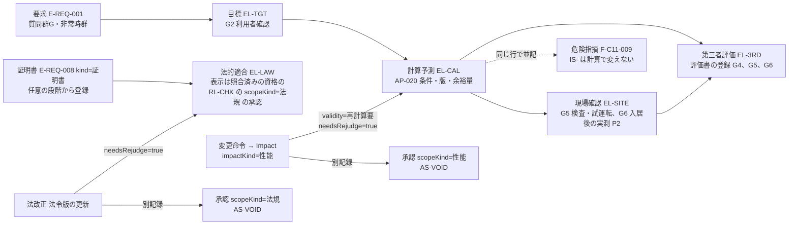

# 第19章 住宅性能、環境、健康、災害耐性の仕様

作成日: 2026-09-15　版: v1.5（v1.5 は段階8 の最終仕上げ（2026-10-08。再々確認 K1-05、K2-02、K6-02 と、正本の改訂に合わせた同期 D30b）〔群G4〕。判定区分の表示語を enum の語「未確認（P1で判定）」に（第8.8節 F-C12-014、第1.4節）、U-19-006 の旧い表示語に共通の決定 D4 で改めた旨を添え、第2.3節 項目3 の「転回の空間」を DV-FN-01 の「転回スペース」に改め、第1.5節 手順4 に G2 完了条件(5)の利用目的による適用除外の参照を加えた。記録は `05_審査/再修正記録_最終仕上げ_群G4.md`。v1.4 は段階8前の持ち越し仕上げ（2026-10-08。共通の決定 D2、D6、D17、D20、既定値の識別子の併記 0 行）〔群F4〕。EL-LAW の証明書の発行者を行政、確認検査機関、判定機関に改め第4.3節の【仮定】を解決とし、F-C12-011 の識別子の行の先頭の版を v3.0 に、乳幼児安全の表示語を「製品で判定しない（記録のみ）」に改め、第1.4節 法改正の行に影響範囲と時点を第12章 連動7、第18章 第4.7節の参照で記した。記録は `05_審査/再修正記録_段階8前_仕上げ_群F4.md`。v1.3 は 2026-10-07 の二回目の修正の仕上げ〔群R3〕。01_調査 08 の外部確認の反映〔第2.3節の既定閾値の出典と曲がり角の判定、第4.1節〜第4.3節の等級6・7、一次エネルギー消費量等級7、8、ZEH の各区分、BELS 評価書と証明書の文書の範囲、F-C12-013、F-C12-016、U-19-006、U-19-009、U-19-012、U-19-013〕と、第12章と基盤 用語集の二回目の依頼の確認。記録は `05_審査/再修正記録_2回目_仕上げ_群R3.md`。v1.2 は 2026-10-07 の段階6 二回目の修正（段階7 再審査の後）。修正計画 第1.19節の 9 件（主担当 JR-089〜JR-093、整合 JR-012〔高〕、JR-051、JR-039、JR-056）と 01_調査の番号置換への追従（U-87-004）を、第0.3節と第0.4節の固定文と識別子（AC-C12-007-04、AC-C12-016-04、DV-EQ-15、R-08-015、R-08-016、E-REQ-001.checkTarget）で反映した。記録は `05_審査/再修正記録_2回目_第16_17_19章.md`。v1.1 は 2026-10-06 段階6 再修正。統合指摘 JM-134〜JM-143、JM-014、JM-031、JM-044、JM-045、JM-087、JM-092、JM-102、JM-107、JM-163、試験の採番の置換（JM-173、JM-040）、整合修正指示 第19章、修正済みの章から本章あての依頼を反映。記録は `05_審査/再修正記録_第19章.md`）　担当: 段階3 仕様書 第19章（一級建築士、計算機科学者、BIM技術者、UX設計者、製品責任者の視点で作成）
根拠: 指示文 C12（住宅性能十領域、火災時安全、利用円滑性、環境比較、基準の版管理、災害耐性）、B（証拠段階の五段階）、10（建築家視点による再監査。住宅性能表示制度の設計時評価と建設後評価の区別、建築設計標準の当事者参画）、G（非対象「第三者性能評価の自動発行」「性能評価書」）、9.7（法改正時の再判定）。基盤定義 `用語集.md` v1.1（83〜88、159〜162、260、267、288）、`識別子規則.md` v1.1、`十二判断領域.md` v1.1（A07、影響関係表、判定例 F-C12-007〜009、U-00-014）、`七段階門.md` v1.1（G2×A07、G3×A07、I-00-118、第2節）、`信頼状態と証拠段階.md` v1.1（第3節 EL-、第9節、第10節、U-00-023）、`機能一覧骨格.md` v1.1（C12 のうち F-C12-007〜F-C12-017、U-00-034）、`情報実体骨格.md` v1.1（E-SRV-013、E-SRV-004、E-SRV-003、E-REQ-008、E-REQ-009、E-SYS-003）、`画面指標試験骨格.md` v1.1（S-11、S-30-05、M-G-10、M-O-01、M-O-05、T-A-011、T-R-007、T-R-008、T-R-011）、`整合検査報告.md` v1.0。本章 v1.1 は基盤定義 v1.2（識別子規則、信頼状態と証拠段階、七段階門、機能一覧骨格、画面指標試験骨格（T-R-008、T-R-011 の P0 版と P1 版、T-S-003 の対象語）、用語集）と整合検査報告 第5節「識別子変更一覧」、第12章 v1.2 の項目辞書（属性名の正本）、第23章 第4.3節 付表 4.3-A、4.3-B に追従した。調査 `01_調査/07_法規と個人情報と権利.md`（第2.1、2.3、2.5、2.11節）、`01_調査/06_研究と標準.md`（第2.12節）。
確認日: 2026-09-15。

## 0. 本章の目的、範囲と非対象、前提とする章

### 0.1 本章の目的

- 住宅性能十領域の各項目（E-SRV-013 PerformanceTarget）に、要求、設計目標（EL-TGT）、計算予測（EL-CAL）、現場確認（EL-SITE）、第三者評価（EL-3RD）、法的適合（EL-LAW）を別々の記録として持たせ、段階 G2 の必須成果「性能目標」と G3 の必須成果「性能予測（P0 は簡易な日照と動線）」がどの実体と属性で成立するかを定める（指示文 C12、基盤 七段階門 G2×A07、G3×A07、第06章の依頼）【推定】。
- 火災時安全の8項目と利用円滑性の12項目（v1.1 で玄関段差、屋外経路、昇降を追加。JM-135）について、P0 の初期注意と P1 の詳細検討の範囲、生活場面との結び、当事者確認を数値検査と別記録にする表示規則を定める（指示文 C12、第05章の依頼）【推定】。
- 環境比較11項目の計算条件、省エネ、ZEH、LCCM 等の基準の定義、版、地域、計算条件の管理、災害耐性の方策比較の表示規則を定め、名称だけで「達成」と表示しない規則を置く（指示文 C12、調査07）【推定】。
- 性能計算（第14章 AP-020）の計算種別ごとの入力、決定的処理、基準、出力、余裕量、失効の規則を定める（第14章の依頼）【推定】。
- 性能比較画面（S-11）との対応と、目標を評価と表示する等の誤表示を防ぐ規則を定め、担当機能 F-C12-007〜F-C12-016 の必須10項目と受入条件 AC- を記述する。F-C12-017 は非対象として境界だけを示す【推定】。

### 0.2 本章の範囲と非対象

| 区分 | 内容 |
|---|---|
| 範囲 | 十領域の名称（正式名称と略称の対応）、領域ごとの記録項目と初期項目集合、証拠段階の遷移と失効の並記規則、性能優先度（質問群G）から目標への変換。火災時安全（出火危険、警報、避難経路、出口、階段、区画、延焼、消防活動条件）、利用円滑性（経路、段差、幅、回転、移乗、手掛かり、視認、聴覚情報、介助空間、当事者確認）。環境比較11項目の計算条件と表示。基準定義の管理（定義、版、地域、計算条件）と公開主張の区別。災害耐性の方策比較。性能計算 AP-020 の規則。S-11 との対応と誤表示の防止。C12 のうち性能部分10機能の機能要件と受入条件 |
| 非対象（他章が主章） | 設備の置場、経路帯、系統、属性、干渉、意匠図だけからの経路確定禁止（F-C12-001〜F-C12-006。第13章）。層構成、接合部検査、熱橋と結露の危険指摘（F-C11-007〜F-C11-009。第13章。本章は計算値との並記規則まで）。法規判定、省エネ適判の要否と省略経路の区分、防火の法規条件、災害情報の取得と注記（第18章。本章は判定区分を証拠段階へ結ぶ規則まで）。簡易な日照の表示と動線の計測（F-C04-009、F-C04-016。第11章、第08章）。性能優先度と非常時場面の聞取（F-C01-010、F-C01-017。第08章）。要求台帳と当事者参画（第05章）。商品の環境情報の適合度（F-C05-006。第16章）。提携先の性能語彙の照合（第17章）。入居後の実測と実感の記録（F-C14-011、F-C14-012。第21章）。証拠資料の権利と保存（第22章）。S-11 の部品採番と三状態の設計（第15章）。指標の計測手順と試験情報（第23章）。API の入出力（第14章）。費用計算 AP-021 の規則（第20章） |
| 非対象（製品外） | 第三者性能評価の自動発行（F-C12-017、指示文 G）。性能評価書、確認済証、検査済証の発行（評価機関、行政、確認検査機関）。法規適合の断定（製品はいかなる案にも「法規適合」と断定しない。第7.2節）。設計住宅性能評価と建設住宅性能評価の申請手続き。性能を実現する層構成、機器、構造の選定（A05、A06、A04 の判断。本章は目標と予測の記録まで）【推定】 |

### 0.3 前提とする章

| 章 | 前提として使う内容 |
|---|---|
| 第02章 | 完成像、六段の因果（本章の機能は因果(1)(3)(4)(6)）、非対象の一覧（性能評価書、第三者性能評価の自動発行） |
| 第03章 | 再確認項目 RC-06（ZEH 定義の原文）、RC-18（建築設計標準 令和7年度改正版の本文、断熱等性能等級6・7の施行日原文）を本章で仮定として明記する依頼。DIF-84〜DIF-88 |
| 第05章 | 要求 R-05-002（自室の扉を閉めた状態で居間の会話が聞き取れない。RP-MUST）、当事者参画の提案（F-C01-014）、関係者表（E-ORG-008） |
| 第06章 | G2 の完了条件(5)「十領域の全項目に EL-TGT の目標値、または『未設定』の明示がある。非常時の RP-MUST に結ぶ目標（温熱、耐震）は『未設定』を許さない」（v1.1 で第6章の改訂に追従）、G4 の欠落の自動記録 (iv)「未確認の必須要求」（第6章 第2.5節）、G3 の必須成果「性能予測（EL-CAL。P0 は簡易な日照と動線）」、進行禁止条件 I-00-118（避難経路が未解決、SEV-0）、避難に関わる SEV-1 の例外承認は資格を登録した RL-CHK だけ（U-06-002）、確認範囲「性能」の承認（P1、項目単位） |
| 第07章 | A07 の影響関係（適合、形状、仕様、容量、材料、費用、検査、実績、証拠）、Impact による証拠段階の降格を「再判定要」として記録する依頼、用語追加提案「再確認要」 |
| 第08章 | 質問群G（F-C01-010。10項目の順位。U-08-013 は順位方式が既定）、非常時群の10場面（F-C01-017）とその要求例（第08章 第4.3節）、P0 では S-03 と S-11 に「非常時の対応は未確認」と表示する規則。v1.1 の追加: 家族変化群の要求例 R-08-008（v1.2 で R-08-015、R-08-016 を分割。JR-089）、要配慮者の避難の当事者向け質問 D8-l（第8章 第7.0.1節）、案別要求適合表の「未確認の必須要求」（F-C01-023 正常手順(3)） |
| 第11章 | F-C04-009 日照表示（簡易）は表示側で太陽位置を決定的に計算し EL- を付けない派生計算とする仮判断（U-11-010）、方位未確認の案では日照表示を無効にする規則 |
| 第12章 | E-SRV-013 PerformanceTarget、E-SRV-004 Calculation、E-REQ-008 Evidence、E-SRV-003 Test、E-SYS-003 Route（kind=避難、主担当 A07）、E-REQ-009 LifeScene の項目辞書。第6.4節の証拠段階の遷移図。既定値表 DV-FN-01（動線の必要幅と利用円滑性の既定閾値）。v1.2 の追補（targetState、measuredStage、certificateKind、stakeholderCheck の記録者、E-SRV-004.kind=利用円滑性 と outputs.checks、E-ELM-002.floorHeightAboveGL）と第6.10節 連動7（法改正で scopeKind=法規 の承認が AS-VOID） |
| 第13章 | 外皮方針の断熱区分（F-C11-006）が本章の性能項目の等級定義を参照する前提、熱橋と結露の危険指摘（F-C11-009）と計算値の並記、警報器の設置室を火災時安全と結ぶ前提、設備系統「なし」を災害耐性の比較へ渡す前提。v1.1 の追加: 電源不要の暖房の防火と換気の三値（第13章 第4.1節）、夏型結露の確認要（第3.4節）、重い設備の項目7（第2.3節。満水時の貯水機器）、1階床高（第6.2節）、点検口と交換搬出の検査（F-C12-004） |
| 第14章 | AP-020 性能計算（kind: 日照簡易、日照詳細、温熱、通風、音、熱橋結露、利用円滑性。conditions、calculationRef、performanceTargetUpdates、needsRejudge。簡易日照と利用円滑性は短期非同期 30 秒、詳細は長期非同期 600 秒）、AP-006 による PerformanceTarget の更新、失敗区分 |
| 第15章 | S-11 の部品 S-11-01〜S-11-06、空状態、待機状態、失敗状態の文言、共通部品 S-30-05 証拠段階表示 |
| 第16章 | 環境情報の「公開主張」の定義、NEW ZEH STYLE 等の性能目標候補は「公開頁に記載なし」を前提とする依頼 |
| 第17章 | 提携先の性能語彙は本章の十領域名を使い「対応可」と「実績（EL-3RD 以上）」を区別する前提 |
| 第18章 | 省エネ適判の要否と省略経路の判定区分（第18章 第4.2節、P1）、災害情報（E-SRV-012）には EL- を付けない前提、法規判定は EL-CAL、EL-LAW は証明書登録時だけ、EL-LAW の登録権限（U-00-023）を本章が定める依頼 |
| 基盤定義 | 用語集、識別子規則、十二判断領域、七段階門、信頼状態と証拠段階、機能一覧骨格、情報実体骨格、画面指標試験骨格（すべて v1.2。本章 v1.1 で追従）を正本とし、本章はこれらに従う |

### 0.4 他章からの依頼への対応

| 依頼元 | 依頼の要旨 | 本章での対応箇所 |
|---|---|---|
| 第03章 | RC-06、RC-18 を仮定として明記。DIF-84〜DIF-88 の反映。住友林業の性能主張を公開主張として区別 | 第1.1節（DIF-84、DIF-85）、第4.1節（DIF-87、RC-06）、第2.3節（DIF-88、RC-18）、第4.4節（公開主張） |
| 第05章 | R-05-002 の遮音の数値範囲。利用円滑性の検査と当事者確認の別記録の表示規則 | 第3.3節、第2.3節 |
| 第06章 | G2 の性能目標と G3 の計算予測を必須成果として満たす仕様 | 第1.2節、第1.5節、第6.1節、F-C12-007、F-C12-008 |
| 第07章 | 降格（EL-CAL → EL-TGT）を「再判定要」として記録し、承認の失効と別記録で並記 | 第1.4節 |
| 第08章 | 質問群G の10項目を目標の要求元として G2 で受ける。非常時群の温熱、耐震の要求を目標へ結ぶ。家族変化群（在宅介護、車椅子利用）の要求を「高齢者等への配慮」の目標候補へ結ぶ（JM-141）。避難行と在宅避難行の比較先（JM-137、JM-138） | 第1.5節 手順2、6、第5.1節、第2.2節 |
| 第11章 | 簡易日照と性能値を同じ部品に置かない。U-00-034 の確定 | 第3.2節、未決 U-19-001 |
| 第13章 | 熱橋、結露、温熱の計算と危険指摘の並記。断熱区分の等級定義を性能項目に持つ。避難経路と火災時安全の問題は A07 で登録 | 第6.2節、第4.1節、第2.2節 |
| 第14章 | AP-020 の計算式、基準、規則（AP-021 は第20章） | 第6節 |
| 第16章 | 環境情報の公開主張と第三者評価の区別。性能目標候補は「公開頁に記載なし」を前提 | 第4.4節 |
| 第18章 | 省エネ適判の判定区分を証拠段階へ結ぶ。EL-LAW の登録権限（U-00-023） | 第4.3節 |
| 第21章 | 入居後の実測（EL-SITE）を E-SRV-013.evidenceRecords へ登録する経路と F-C14-011 との分担（2026-09-15 追加。JM-139。対応済み） | 第1.2節 現場確認の行、F-C12-016 正常手順(5) |
| 第12章、第13章、第14章、第15章、第18章、第22章（段階6 の再修正で追加された依頼。2026-10-06） | 利用円滑性の閾値の出所と kind=利用円滑性、EL-LAW の承認の scopeKind=法規（第12章）。電源不要の暖房、夏型結露、貯水と重い設備、1階床高（第13章）。AP-020 kind=利用円滑性 の記録先と実装先（第14章）。AC-C12-011-04、05 と S-11-04 の行の構成（第15章）。屋外経路の高低差（第18章）。「避難できる」と当事者確認の二経路（第22章） | 章末「他章への依頼または前提」の各章の「依頼への対応」の行 |

整合検査報告 第3節の残る未決事項（U-00-046、U-00-057〜U-00-061）のうち本章に直接関係するものはない。本章の機能の関連画面は S-11 と S-10 であり補助画面の割当（U-00-057）に影響しない【推定】。

### 0.5 本章の記述規則

| 規則 | 内容 | 区分 |
|---|---|---|
| 数値 | 本章の閾値と目安は、出典付きの【事実】を除き初期仮説であり、公開判定会議で固定する | 【仮定】 |
| 証拠段階 | 本章が製品内で到達させるのは EL-TGT と EL-CAL だけ。EL-SITE、EL-3RD、EL-LAW は製品外の記録の登録によってのみ到達する（基盤 七段階門 第2節） | 【推定】 |
| 主担当 | 本章の機能と問題の主担当は A07。性能を実現する要素の変更は A03、A04、A05、A06 の変更命令であり本章は影響先として再判定する | 【推定】 |
| 名称 | 十領域は略称（用語集159）を本文で使い、住宅性能表示制度の正式名称を第1.1節の対応表で併記する | 【推定】 |

## 1. 住宅性能十領域と証拠段階の記録構造

### 1.1 十領域の名称と住宅性能表示制度の対応（DIF-84、DIF-85、U-00-002 への回答）

| 略称（用語集159、E-SRV-013.area） | 住宅性能表示制度の正式名称 | 新築の必須分野 | 区分 |
|---|---|---|---|
| 構造安定 | 構造の安定に関すること | 必須 | 【事実】 |
| 火災時安全 | 火災時の安全に関すること | 選択 | 【事実】 |
| 劣化軽減 | 劣化の軽減に関すること | 必須 | 【事実】 |
| 維持管理と更新 | 維持管理・更新への配慮に関すること | 必須 | 【事実】 |
| 温熱と省エネ | 温熱環境・エネルギー消費量に関すること | 必須（断熱等性能等級と一次エネルギー消費量等級の両方） | 【事実】 |
| 空気環境 | 空気環境に関すること | 選択 | 【事実】 |
| 光と視環境 | 光・視環境に関すること | 選択 | 【事実】 |
| 音 | 音環境に関すること | 選択 | 【事実】 |
| 高齢者等への配慮 | 高齢者等への配慮に関すること | 選択 | 【事実】 |
| 防犯 | 防犯に関すること | 選択 | 【事実】 |

出典: https://www.hkd.mlit.go.jp/ky/jg/tosijyu/ud49g7000000j3pl.html （十分野の正式名称、設計住宅性能評価書と建設住宅性能評価書の区別）、https://www.mlit.go.jp/jutakukentiku/house/content/001424534.pdf （必須分野と省エネ上位等級）、確認日 2026-09-15。必須4分野は検索抜粋による確認であり原文は【未確認】（調査07 第2.3節）。用語集 159 を改訂済み（2026-10-07。本表により「住宅性能表示制度の区分との対応」を【事実】へ更新し U-00-002 を解決。相互依頼 基盤仕上げ）。現行の告示の版（日本住宅性能表示基準と評価方法基準の令和7年9月1日の改正後）は 2026-10-07 に確認した（第4.1節、第4.2節「版の更新」）。制度の利用は任意であり、本製品の十領域は制度の評価を受けない案件でも記録する【推定】。

### 1.2 領域ごとの記録項目（E-SRV-013 の使い方）

| 記録項目 | 実体と属性 | 到達する段階 | 誰が作る | 表示語（S-30-05） | 区分 |
|---|---|---|---|---|---|
| 要求 | E-REQ-001（primaryDomain=A07）→ E-SRV-013.requirementRef | G1 | 利用者（質問群G、非常時群） | 「要求」 | 【推定】 |
| 設計目標 | E-SRV-013.targetValue、standard、evidenceRecords[EL-TGT] | G2 | 利用者と製品（候補提示）、建築士 | 「目標」 | 【推定】 |
| 計算予測 | E-SRV-004（kind=性能計算 等、evidenceLevel=EL-CAL）→ evidenceRecords[EL-CAL] | G3 以降（P0 は簡易な日照と動線、P1 で詳細） | 製品（AP-020）または専門家の計算書登録 | 「計算予測」 | 【推定】 |
| 現場確認 | G5: E-SRV-003（kind=性能測定、現場検査、試運転）→ E-REQ-008（kind=試験、EL-SITE、measuredStage=G5）。G6: 入居後の実測（E-OPS-007 の実測値。取得時期=入居後）→ E-REQ-008（kind=試験、EL-SITE、evidenceRef=E-OPS-007、measuredStage=G6）。measuredStage（enum{G5, G6}）、measuredByRef（検査者または回答者）、measurementMethod（測定方法）は必須（第12章 v1.2 表11.2-A で定義済み。JM-139） | G5、G6（P2） | 施工者、検査者（G5）。居住者（G6。第21章 F-C14-011 が取得し F-C12-016 が登録） | 「現場確認」。G6 の記録は「現場確認（入居後）」 | 【推定】 |
| 第三者評価 | E-REQ-008（kind=評価書、EL-3RD、identifier、issuedByRef、validUntil、certificateKind=設計住宅性能評価書/建設住宅性能評価書。certificateKind は第12章 v1.2 表11.2-A で定義済み。JM-073、JM-142） | G4（設計住宅性能評価書）、G5、G6（建設住宅性能評価書）（P2） | 評価機関の評価書を登録（製品は登録のみ） | 「第三者評価」 | 【推定】 |
| 法的適合 | E-REQ-008（kind=証明書、EL-LAW、lawVersion）。証明書の登録は計算予測や第三者評価の有無に関わらず任意の段階から追加できる（基盤 信頼状態 第3.2節。JM-142）。表示への反映は scopeKind=法規 の承認（第4.3節） | G4 以降の行政手続後（製品外） | 行政、確認検査機関、判定機関の証明書を登録 | 「法的適合」（承認前は「法的適合（確認待ち）」） | 【推定】 |

要約表示は highestValidLevel を示し、失効した記録は「再判定要」と表示する。六つの記録を合成した「達成」「適合」「評価済み」の表示を作らない（基盤 信頼状態 第3.1節、第10節）【推定】。

### 1.3 領域ごとの初期項目集合（P0 で E-SRV-013.item に既定生成する項目）

| 領域 | 初期項目（item）と目標値の形 | 目標の要求元（質問群G の項目） | P0 の計算予測 | 区分 |
|---|---|---|---|---|
| 構造安定 | 耐震等級（1〜3）の目標。地盤仮定は第13章 | 耐震 | なし（構造の初期注意は A04。第13章） | 【推定】 |
| 火災時安全 | 各寝室からの避難経路数（本 ≥ 目標）、警報器の設置室 | 防災 | 避難経路の初期注意（第2.2節。EL- なし） | 【推定】 |
| 劣化軽減 | 劣化対策等級の目標 | 保守 | なし | 【推定】 |
| 維持管理と更新 | 点検口と交換経路の確保（第13章 F-C12-004 の属性を参照） | 保守 | なし | 【推定】 |
| 温熱と省エネ | 断熱等性能等級（4〜7）、外皮平均熱貫流率（W/m2K 以下）、一次エネルギー消費量等級（BEI 以下）、ZEH 区分 | 温熱、省エネ | なし（P1 で AP-020 温熱） | 【推定】 |
| 空気環境 | 換気回数（回/h 以上）、内装材の材料由来排出の区分 | —（要求は生活場面から） | なし | 【推定】 |
| 光と視環境 | 主要室の冬至の日照時間（h 以上）、床面積に対する窓面積比（% 以上） | 採光、眺望 | 簡易な日照（F-C04-009 の表示。EL- なし。第3.2節） | 【推定】 |
| 音 | 室間の遮音（第3.3節）、外部騒音源との距離 | 音 | なし | 【推定】 |
| 高齢者等への配慮 | 利用円滑性12項目（第2.3節）と乳幼児安全（記録のみ）。requiresStakeholderCheck=true。P0 は F-C01-014（第5章）が12項目の名称を当事者確認の項目として既定生成し、数値検査列は「未検査（P1）」と表示する | 家族変化群（F-C01-016。在宅介護、車椅子利用。第1.5節 手順6）、当事者参画 | なし（P0 は目標の記録、当事者の割当、「未検査（P1）」の表示） | 【推定】 |
| 防犯 | 開口部の侵入対策の有無、死角の有無 | 防犯 | なし | 【推定】 |

等級名の項目には standard（定義文書名、版、地域区分、計算条件）が必須であり、standard が空の等級名は目標としても登録できない（第4.2節）【仮定】。

### 1.4 証拠段階の遷移、失効、承認失効の並記（第07章の依頼への回答）

| 契機 | 証拠段階の記録 | 承認の記録（別記録） | S-11-01 の表示 | 区分 |
|---|---|---|---|---|
| 変更命令の Impact（impactKind=性能、熱、空気、材料、形状 等）が性能項目を再計算対象にした | E-SRV-004.validity=再計算要、invalidatedByRef=変更命令。E-SRV-013.needsRejudge=true。evidenceRecords[EL-CAL] は削除せず保持。highestValidLevel は有効な最高段階（多くは EL-TGT）へ下がる | E-REQ-007（scopeKind=性能、当該項目）が AS-VOID。理由に同じ変更識別子 | 計算予測列に「再判定要（変更 #nnnnn）」、承認欄に「承認失効（再承認待ち）」を別の印で表示。目標列は変えない | 【推定】 |
| 再計算を実行し目標を満たす | validity=有効、needsRejudge=false、EL-CAL を再登録 | AS-PENDING → 再承認で AS-VALID | 「計算予測」に戻る。承認欄は再承認まで「承認待ち」 | 【推定】 |
| 再計算で目標未達（余裕量が負） | EL-CAL は登録（値は事実）。問題 E-REQ-003（主担当 A07、SEV-1、固定先=対象要素）を登録 | 変更なし（承認待ちのまま） | 計算予測列に値と「目標未達 −n」。目標の変更は判断 D- として決定者と代償を記録 | 【推定】 |
| 現場確認後に対象部位が変更された | EL-SITE の記録を「再確認要」。EL-CAL へ戻る | scopeKind=性能 が AS-VOID | 現場確認列に「再確認要」 | 【推定】 |
| 評価書の有効期限切れ、範囲変更 | E-REQ-008.isExpired=true、EL-3RD 失効 | — | 第三者評価列に「失効（yyyy-mm-dd）」 | 【推定】 |
| 法改正（E-SRV-011.validity=改正あり再判定要） | EL-LAW の記録に needsRejudge=true。証明書は保持 | 影響範囲の scopeKind=法規 の承認（scope に証明書 E-REQ-008 を含む承認を含む。第18章 第4.3節）が AS-VOID。影響範囲は新しい法令版で適用版が変わる条項の判定と、その条項に対応する証明書を scope に含む承認に限り、時点は製品が変更命令（origin=法改正、status=提案）を生成した時点で確定を待たない。影響範囲と時点の規則（施行日が着工予定日より後の新版の扱いを含む）は第12章 第6.10節 連動7 と第18章 第4.7節を正とし、本表に重ねて書かない（JR-019）。scopeKind=性能 の承認は失効しない | 法的適合列に「再判定要（法令の版 vX → vY）」。「法的適合」の語は出さない | 【推定】 |
| 目標の変更（判断 D-。第1.5節 手順5） | EL-TGT を新値で再登録し旧値を履歴に保持。EL-CAL は保持し余裕量を新目標で再判定。「目標未達」の問題（SEV-1）は余裕量が非負になれば解決証拠＝判断 D- で IS-RESOLVED | 変更なし（scopeKind=性能 の承認は失効しない） | 目標列に新値と「変更（判断 #nnnnn）」、履歴に旧値。計算予測列は再判定後の余裕量 | 【推定】 |

「再判定要」は証拠段階の語（用語集260）、「承認失効」は承認の状態（AS-VOID）であり、片方の表示で他方を代用しない。人の再確認を要する状態の語「再確認要」は第07章の用語追加提案に従う【推定】。

### 1.5 性能優先度（質問群G）から目標への変換（第08章の依頼への回答）

1. G1 で F-C01-010 が記録した10項目の順位（1〜10。U-08-013 の既定方式を本章も採用）を E-REQ-001（primaryDomain=A07）として受け、順位1〜3 の項目に対応する領域（第1.3節の対応）へ「目標の候補」を既定生成する。順位4〜10 の領域は「未設定」（E-SRV-013.targetState=未設定。第12章 v1.2 で定義済み。JM-092）を明示する【仮定】。
2. 非常時群（F-C01-017）の寒波と猛暑の要求は温熱と省エネの目標へ、地震の要求は構造安定の耐震等級の目標へ、火災の要求は火災時安全の避難経路数の目標へ結び、E-SRV-013.requirementRef に記録する。医療機器がある停電の要求（RP-MUST）は災害耐性の比較（第5節）の必須方策にする（P1。P0 は「未確認の必須要求」として G4 の未確認事項へ。第5.2節 P0 行。JM-044）。室温や継続時間で書かれた非常時の要求（例: 「暖房停止時も主寝室 10 ℃以上」「停電時に何時間もつ」）は、第8章 F-C01-019 が方策型の候補（断熱等級の目標、電源不要の暖房、日射遮蔽、通風 2 方向、蓄電容量）を示し、利用者確認で方策型の要求に置き換えるか元の文言のまま残すかを選ぶ。置き換えた要求は本手順で目標と第5節の方策に結ぶ。元の文言のまま残る要求は、室温を推定しない（第5.2節）ため本章で判定せず、案別要求適合表の判定区分「製品で判定しない（記録のみ）」（reason「室温を推定しないため。設備設計者の確認対象」。第8章 F-C01-023、第12章 E-REQ-001.complianceByOption）とし、「未確認（P1で判定）」と表示しない。RP-MUST は G4 の引継ぎ一式で受取側の設備設計者の確認対象（責任表）へ一覧として渡す（修正計画 第0.3節「要求適合の判定区分」。JR-039）【推定】。
3. 候補の目標値は基準台帳（第4.1節）の等級と、既定値表を持たない項目は「値の入力待ち」として提示し、利用者が確認した値だけを EL-TGT として登録する（VS-USR）。製品が値を推定して目標に入れない【仮定】。
4. 全領域に目標（targetState=設定済み）または「未設定」（targetState=未設定。対象外の項目は targetState=対象外）が明示された時点で G2 の完了条件(5)を満たす。非常時の RP-MUST に結ぶ目標（温熱、耐震）は「未設定」を許さない（第6章 第2.3節 完了条件(5)。JM-031）。完了条件(5)が非該当の利用目的（家具配置）と、RP-MUST が 1 件以上になるまで非該当の利用目的（図面3D化、売却賃貸資料）は第6章 第2.3節「利用目的による適用除外」に従う（v1.5、統括の決定 D30b）。「未設定」が残ることは進行禁止ではないが、S-11-02 の未確認一覧と G4 の引継ぎ一式の未確認事項に残る【推定】。
5. 目標の引下げと変更（JM-140）: E-REQ-001（primaryDomain=A07）の valueRange を S-24 要求台帳画面で改訂すると、F-C12-007 が E-SRV-013.targetValue の新値を候補として再提示し、利用者確認（VS-USR）で登録する。判断 D-（主担当 A07、影響先 A09、A05。代償として性能の低下量と維持費差を記録）を S-25 判断記録画面に記録し、旧目標を S-11-01 の目標列の履歴に残す。維持費差の算出は F-C13-013（P1。第20章 第8.1節）のため、P0 では代償の維持費差を「未算出（P1）」と表示し、性能の低下量（旧目標と新目標の差。等級は段階の差）だけを数値で残す（JR-092）。第20章 第8.2節「A07 の要求変更を決定者が代償付きで承認しない限り採用できない」の受け側は本手順である。証拠段階と承認の扱いは第1.4節「目標の変更」行に従う【推定】。
6. 家族変化群からの目標候補（JM-141）: 家族変化群（F-C01-016）の在宅介護と車椅子利用の要求（E-REQ-001 primaryDomain=A07）は「高齢者等への配慮」の目標候補（段差、幅、回転、移乗、手掛かり。requiresStakeholderCheck=true）として既定生成し、値は R-08-008、R-08-015、R-08-016 の要求値（廊下有効幅 850 mm 以上、玄関段差 20 mm 以下、便所と浴室の扉有効幅 800 mm 以上。RP-WANT、初期仮説。一要求に valueRange 一つ。JR-089）を提示して利用者確認で登録する。要求値と既定閾値の使い分けは第2.3節「閾値の出所」の規則に従う【推定】。

## 2. 火災時安全と利用円滑性

### 2.1 火災時安全の8項目（F-C12-009 は P0、F-C12-010 は P1）

| 項目 | 対象建物に応じた扱い | 決定的検査の入力 | 記録の形 | 区分 |
|---|---|---|---|---|
| 出火危険 | 火気使用室（台所、暖房機器の置場）の位置と隣接室 | E-SPC（用途）、E-ELM-012 Equipment（kind） | 検討記録（E-REQ-008 kind=確認記録、EL-TGT のまま） | 【推定】 |
| 警報 | 住宅用火災警報器の設置室（寝室、寝室のある階の階段上部を初期候補）。設置義務の条項と自治体の追加規定は【未確認】であり、法令版台帳（第18章）への登録を依頼した（第18章 第4.6節で対応済みと 2026-10-06 に確認。条項の内容は U-19-008） | E-ELM-012（kind=警報器）の位置（第13章 防災系統） | 設置室一覧と未設置室の問題（SEV-2） | 【推定】【未確認】 |
| 避難経路 | 各寝室から屋外への経路数と経路長。P0 は2階の寝室について経路が1本以下なら初期注意（第2.2節） | E-SYS-003（kind=避難、lifeSceneRef=火災）、E-ELM-007 Door、E-ELM-008 Window、E-ELM-009 Stair | E-SRV-004（kind=動線の避難版、EL-CAL は P1）。P0 は注意（Issue）のみ | 【推定】 |
| 出口 | 玄関以外の出口（掃出窓、勝手口）の有無と2階からの避難に使える開口（バルコニー） | Door、Window（sillHeight、開口寸法） | 出口一覧 | 【推定】 |
| 階段 | 階段の位置と各寝室からの距離、階段が唯一の経路か | Stair、Route | 距離（mm）と唯一経路の別 | 【推定】 |
| 区画 | 3階建、併用住宅、車庫付きで区画の要否が生じる場合に「区画の要否は建築士が判断」と表示。2階建の専用住宅では「該当なし（理由）」 | E-BLD-003（階数、用途） | 要否の表示（判定はしない） | 【推定】 |
| 延焼 | 延焼のおそれのある部分（第18章 第4.5節、P1）にある開口部の防火設備の有無（Window.fireRating。A05） | E-SRV-011（防火）、Window | 該当開口の一覧。仕様の適否は A05 の問題 | 【推定】 |
| 消防活動条件 | 接道と進入口の有無を表示。消防水利の距離は公的地理情報の対象外であり【未確認】 | E-BLD-002.roadAccess | 表示のみ | 【推定】【未確認】 |

8項目の検討結果は「検討済み（根拠付き）」「検討済み（未確認あり）」「未検討」の三値で記録し、「火災に安全」「避難安全」の断定語を使わない。火災時安全の問題は主担当 A07、影響先 A03（経路の幾何）、A05（防火仕様）で登録し、避難に関わる SEV-1 の例外承認は資格を登録した RL-CHK だけが行える（第06章 U-06-002）【推定】。

### 2.2 避難経路の初期注意（F-C12-009、I-00-118、U-00-014 への仮判断）

| 規則 | 内容 | 区分 |
|---|---|---|
| 検査 | G2 の案生成時と G3 の変更確定時に、寝室（E-SPC の用途=寝室）ごとに屋外へ至る経路を E-SYS-003（kind=避難）として決定的に生成する。経路は扉接続（E-SYS-005）と階段接続をたどり、掃出窓と2階のバルコニーを第二経路の候補にする | 【推定】 |
| 初期注意 | 2階の寝室で経路が1本以下、または経路長が初期仮説 20 m を超える場合、問題 I-19-001（主担当 A07、影響先 A03、SEV-0、固定先=当該寝室）を登録し、S-10 と S-11-02 に表示する。この問題が残る案は G3 を通過しない（I-00-118） | 【仮定】（経路長の閾値は初期仮説） |
| 主担当の仮判断 | 避難経路の主担当は A07（火災時安全の性能目標が対象）。経路の幾何（扉、窓、階段の位置）を変える判断は A03 の変更命令であり、A07 は影響先として再検査する。U-00-014 への本章の仮判断として未決 U-19-002 に記録 | 【仮定】 |
| 表示 | 「避難経路の初期注意」と明記し「避難安全」「避難計画適合」「避難できる」の語を使わない。P1 の詳細検討（F-C12-010）で経路長の計算（EL-CAL）へ置き換わる | 【推定】 |
| 要配慮者の避難経路（JM-137） | 関係者表（E-ORG-008）で needsParticipationSupport=true の関係者、または在宅介護と車椅子利用の場面（E-REQ-009）が該当する案件では、当該者の寝室から屋外までの避難経路（E-SYS-003 kind=避難）に第2.3節の幅（項目3）、段差（項目2）、扉の有効開口の判定を適用し、2階以上の寝室は垂直避難の手段（階段の有効幅、避難用開口、介助者の同室）を三値（有、無、未確認）で表示する。「無」または「未確認」は問題（SEV-1、主担当 A07、影響先 A03、固定先=当該寝室）に登録する。S-11-02 と S-10 では初期注意（I-19-001）と別行にする。P0 は S-11-02 に「要配慮者の避難経路（判定は P1）」の初期注意を表示するだけで判定しない。判定は P1（F-C12-009 正常手順(6)） | 【推定】 |
| I-19-001 の決定的検査の式（第6章 第8.2節への登録用。JM-031。第6章 第8.2節の I-00-118 の行に v1.0 で登録済みと 2026-10-06 に確認） | E-EXC-005 として kind=進行禁止、severity=SEV-0、appliesTo=G3 完了条件(1)「避難」、testRef=T-I-001（第23章 付表 4.3-B「避難の進行禁止」。第6章 第8.2節と同じ。JR-093）、version=v1.0。expression: 案の各室 E-SPC-001（usage=寝室、所属する階 E-BLD-004 が2階以上）について、屋外に達する E-SYS-003（kind=避難）の件数が 1 以下、または最短経路長が 20,000 mm（U-19-005 の初期仮説）を超えるならば I-19-001 相当の E-REQ-003（severity=SEV-0、primaryDomain=A07、affectedDomains=A03、固定先=当該室）を生成し、その問題が IS-RESOLVED でない限り G3 を通過させない。SEV-0 のため IS-EXC（例外承認）では閉じない | 【推定】 |

### 2.3 利用円滑性の12項目と当事者確認（F-C12-011、P1。DIF-88、RC-18、第05章の依頼への回答）

初稿の9項目に玄関段差、屋外経路、昇降の3項目を加えて12項目とし、回転と移乗の決定的処理を書いた（2026-09-15、JM-135）。項目の名称は P0 で F-C01-014（第5章）が当事者確認の項目として既定生成し、数値検査は P1 の F-C12-011 が加える（JM-014）。機能要件 F-C12-011 は閾値を持たず本節を参照する（JM-087）。判定は第14章 AP-020（kind=利用円滑性。短期非同期）で行い、AP-014 の checkSet には置かない（第14章の判断）。配置のたびに回転円を判定する副次検査を第16章 F-C05-009 に置くかは第16章が決め、置く場合も本節と同じ判定処理と閾値を対象の室に限って使う【推定】。

| 番号 | 項目 | 検査（決定的処理） | 既定閾値（値の正本は第12章 既定値表 DV-FN-01 で、本表は値を重ねて書かず DV-FN-01 の値の名前と出典を示す。要求台帳に同一対象の値があればそれを優先する。住宅の値は評価方法基準 9-1 とハンドブック、公共的な建築物の値は建築設計標準〔2026-10-07 確認。出典は表の後の「参照する指針」〕。公的な根拠のない値は初期仮説） | 生活場面との結び | 区分 |
|---|---|---|---|---|---|
| 1 | 経路 | 玄関から各主要室（居間、台所、寝室、便所、浴室、脱衣室）への E-SYS-003（kind=動線）の存在と扉数 | 経路が存在し扉数が最小 | 家族変化群（在宅介護、車椅子利用）、日常群 | 【推定】 |
| 2 | 段差 | 経路上の E-ELM-002.levelDelta と敷居 | DV-FN-01 の段差（段差のない構造。評価方法基準 9-1）。玄関の出入口と上がりかまちは項目10 | 同上 | 【事実】（値の出典。2026-10-07）【推定】（検査） |
| 3 | 幅 | 経路の最小有効幅（E-SYS-003.metrics.minWidthMm。第11章 F-C04-010 が算出し本章は読むだけ。JR-051）と扉の有効開口（E-ELM-007.width から枠と開閉方式による控除後の値）。あわせて、経路の曲がり角で曲がる前後の有効幅の組から通過可否を判定する: (i) 直角路（廊下と廊下が直角に接する箇所）は前後の有効幅 W1、W2 の組、(ii) 直角の経路の出入口（廊下から直角に曲がって入る扉）は出入口付近の通路の有効幅 Wc と出入口の有効幅 Wd の組を、DV-FN-01 の曲がり角の値の組（直角路は二つの向き、直角の経路の出入口は二つの組）と照合し、いずれかを満たせば通過可とする。出入口の前に項目4 と同じ回転円が内接する転回スペースがある場合は、DV-FN-01 の転回スペースがある場合の出入口の値で判定する（語は DV-FN-01 に合わせた。K6-02）。組が閾値を満たさない場合は組のうち小さい側の不足量を不足寸法として出力する。扉の把手側の側方の空き（開閉のために車椅子が寄る空間。項目4 と同じ占有域の控除後）は幅を計測して記録する（JR-091） | DV-FN-01 の通路と扉の有効開口（評価方法基準 9-1 等級3。介助用車いすの通行を想定した基本的な水準）と曲がり角（障害者の居住にも対応した住宅の設計ハンドブックの基本レベル。自走・自操の車椅子〔全幅 530〜670 mm、全長 800〜970 mm 程度〕を想定し、想定の寸法を S-11-05 に表示する）。電動車椅子（4輪、6輪）の要求がある場合は同ハンドブックの個別の配慮事項の値（直角路の他方 1,000〜1,050 mm、直角の経路の出入口 900〜1,050 mm）を要求値に使う（DV-FN-01 の既定値ではない）。扉の把手側の側方の空きは DV-FN-01 で閾値未定義（住宅の公的な値なし）のため、S-11-05 に計測値と「未検査（住宅の公的な値なし）」を表示して当事者確認に委ねる（公共的な建築物の客室の値〔内開き戸と引き戸の取っ手側に袖壁の幅 45cm 程度以上〕は参考の表示だけ。01_調査 08 U-88-005）。車椅子利用の要求（R-08-008 廊下有効幅 850 mm 以上〔評価方法基準 9-1 等級5 と同じ値〕、R-08-016 便所と浴室の扉有効幅 800 mm 以上 等。measureBasis=有効。JR-089）が要求台帳にあれば要求値（複数の要求は「閾値の出所」の規則）。要求がない場合は S-11-05 に「既定閾値は介助用車いすの基本的な水準（評価方法基準 9-1 等級3）。自走用車椅子の基本レベルは出入口 ○ mm、トイレと浴室 ○ mm（ハンドブック）」（○ は DV-FN-01 の自走用の出入口の値）を表示する | 車椅子利用 | 【事実】（閾値の出典。2026-10-07）【推定】（検査の組立て）【未確認】（把手側の空き） |
| 4 | 回転 | 便所、浴室、脱衣室、寝室、玄関ごとに、室の多角形（E-SPC-001.polygon）から家具の占有域（E-ELM-013.collisionShape）、器具の占有域（E-ELM-011.footprint）、扉の開閉域（E-ELM-007.swingArea）を除いた領域に、DV-FN-01 の回転円の直径の円が内接する位置が一つ以上あるかを決定的幾何判定する。不足時は最大内接円の直径を不足寸法として出力する。家具と器具が未配置の室は「未検査」とし「指摘なし」と区別する | DV-FN-01 の回転円の直径（建築設計標準の車椅子使用者用客室と便房等の値と同じ。住宅の公的な値はない）。電動車椅子の要求がある場合は DV-FN-01 に併記した電動車椅子の値を要求値に使う（同標準: 電動車椅子の回転は直径約 160〜180cm） | 車椅子利用 | 【事実】（値の出典。2026-10-07）【仮定】（住宅への適用。DV-FN-01 と同じ） |
| 5 | 移乗 | 寝台（E-ELM-013 kind=寝台）は長辺の一方、浴槽は長辺側に、DV-FN-01 の移乗空間の幅 × 寝台または浴槽の長さ以上の空きが、項目4 と同じ占有域の控除後に存在するかを判定する。便器は DV-FN-01 のアプローチの方向別（正面、直角、側方）の空きのいずれかを満たすかを判定し、要求に向きの指定があればその向きだけで判定する。不足時は空きの幅を不足寸法として出力する | DV-FN-01 の移乗空間（寝台と浴槽の側面の空きは建築設計標準のベッド側面と腰掛便座、浴槽への移乗の空間の幅、便器のアプローチの方向別の値はハンドブック〔側方は介助が必要な場合の例〕）。奥行を浴槽の長さとする扱いは初期仮説 | 在宅介護 | 【事実】（値の出典。2026-10-07）【仮定】（浴槽の奥行） |
| 6 | 手掛かり | 手摺の有無と位置（E-ELM-010 Railing、階段、便所、浴室、玄関） | 有無の表示。要否は当事者確認 | 高齢者、乳幼児 | 【推定】 |
| 7 | 視認 | 段差部と階段の踏面の仕上の対比、照明の有無 | 対比比の閾値は【未確認】。有無の表示 | 高齢者 | 【推定】【未確認】 |
| 8 | 聴覚情報 | 警報器と呼出の光による情報（光警報の有無） | 有無の表示 | 聴覚に障害のある人 | 【推定】 |
| 9 | 介助空間 | 便所、浴室、脱衣室で介助者が並んで立てる空間（項目4 と同じ占有域の控除後の、器具または寝台の側方の幅） | DV-FN-01 の介助空間（初期仮説。公的な根拠は見つかっていない〔01_調査 08 U-88-004〕。評価方法基準 9-1 の便所の介助の空間は便器の前方または側方 500 mm〔等級4、3〕） | 在宅介護 | 【仮定】【未確認】（根拠） |
| 10 | 玄関段差 | 玄関の出入口の段差（玄関外側〔ポーチ〕とくつずり、くつずりと玄関土間）と上がりかまちの段差（玄関土間と床の E-ELM-002.levelDelta）を別に判定する | DV-FN-01 の玄関の出入口（くつずりと玄関外側、くつずりと玄関土間の二つの高低差。評価方法基準 9-1 等級5〜3）と上がりかまち（接地階の玄関と踏み段を設ける場合の値を含む。等級5、4。等級3 は制限なし）。自走の車椅子利用の要求がある場合の上がりかまちの扱い（段差なしまたは昇降の手段。ハンドブック）も DV-FN-01 に従う。要求値（R-08-015 玄関段差 20 mm 以下。JR-089）がある場合は二つの段差の両方に使う。段差解消のスロープがある場合は DV-FN-01 のスロープの勾配（建築設計標準の基準相当。屋外の敷地内の通路は推奨の値を併記）とその長さ | 車椅子利用、高齢者 | 【事実】（値の出典。2026-10-07）【推定】（要求の適用） |
| 11 | 屋外経路 | 駐車（E-ELM-016 kind=駐車）と道路から玄関までの屋外の経路（E-SYS-003 kind=動線）の段差と幅。敷地の高低差（E-BLD-002）と外構の高さ（E-ELM-016.height）から段差を求める | 幅は項目3、段差は項目10 の閾値。高低差は不足調査「玄関までの高低差の実測」（第18章 第1.8.1節、S-09-08）が受入済みになるまで「未確認」（CS-EST の案を含む） | 車椅子利用 | 【仮定】 |
| 12 | 昇降 | 2階以上に主要室（寝室、便所、浴室）がある場合の昇降手段の有無と空間（階段昇降機の空間、住宅用昇降機の予約空間、または主要室の1階配置） | 三値（有、無、未確認）。寸法の閾値は置かない | 車椅子利用（第8章 第4.2節 車椅子利用行の「昇降」） | 【仮定】 |
| — | 乳幼児安全（記録のみ） | 検査なし（P1 でも記録のみ）。乳幼児期が該当する案件では要求例（階段上下の柵、浴室扉の施錠、2階の窓台高さ。RP-WANT。第8章 第4.2節）を要求台帳に記録し、S-11-05 に「製品で判定しない（記録のみ）」（判定区分の七区分。修正計画 第0.3節、第15章 S-11-05。JR-055）を表示する（JM-045） | なし | 乳幼児期 | 【推定】 |

| 表示規則（第05章の依頼への回答） | 内容 | 区分 |
|---|---|---|
| 閾値の出所（JM-134。v1.2 で JR-089 により照合と優先の規則を追加） | 各項目の閾値は、要求台帳（E-REQ-001）の要求のうち checkTarget（itemKey=上表の項目番号、targetRefs=当該の室 E-SPC-001、経路 E-SYS-003 または扉 E-ELM-007、measureBasis=検査の計測量。第12章 v1.4）が一致する RP-MUST または RP-WANT の valueRange があればその値、なければ第12章 既定値表 DV-FN-01 の値（上表の既定閾値の欄が指す値。値は本章に重ねて書かない）を使う。同一対象かつ同一項目に複数の要求がある場合は RP-MUST を RP-WANT より優先し、同じ優先度では最も厳しい値を使い、採らなかった要求の識別子を outputs.checks の当該項目に併記する（JR-089）。measureBasis が検査の計測量（項目3 は有効寸法）と異なる要求は換算せず閾値に使わず、S-11-05 に「計測基準の異なる要求（心々 等）。有効寸法で確認してください」と表示して要求の確認（VS-USR）へ導く【仮定】。使った閾値の出所（R- の識別子または DV-FN-01）と値を E-SRV-004（kind=利用円滑性）の outputs.checks（thresholdValue、thresholdSource=要求/既定値、thresholdRef。第12章 v1.2 表11.2-A）に項目ごとに記録し、S-11-05 に既定閾値の出典名（評価方法基準 9-1 等級3、ハンドブック 基本レベル、建築設計標準〔公共的な建築物の値〕、初期仮説〔公的な根拠なし〕のいずれか。2026-10-07 の外部確認による。U-19-006）と併せて表示する。要求値が既定閾値より厳しい案件では要求値で不合格を判定し、問題（E-REQ-003）から要求（R-）へ戻れる。要求のない案件の合否は既定閾値によることを S-11-05 に明示する | 【推定】 |
| 別記録 | 数値検査の結果は E-SRV-004（kind=利用円滑性。outputs.checks に12項目の合否（合格、不足、未検査）、不足寸法 shortfall、閾値の出所。第12章 v1.2）に、当事者確認は E-SRV-013.stakeholderCheck（stakeholderRef、at、result=確認済み/懸念あり/未確認、note、recordedByRef、method、witnessRef。後三者は第12章 v1.2 で定義済み。JM-163）に持つ。stakeholderCheck は第12章 v1.3 で当事者ごとの一覧に改められ、割り当てた当事者ごとに1件を持ち、一人でも未確認または懸念ありなら項目を「当事者確認待ち」と表示する。G1 の項目一覧と割当は E-BLD-001.stakeholderCheckItems に持ち、案の生成時に E-SRV-013 へ写す（第12章 v1.3。2026-10-06、群B の申し送り）。両者を S-11-05 の別の列に表示する。当事者確認は承認（E-REQ-007）とは別の記録であり、承認の状態（AS-）を持たない | 【推定】 |
| 記録の主体（二経路。JM-163） | 当事者本人（stakeholderRef の本人、または介護者行の本人）が RL-VIEW 以上で登録されている場合は本人が操作して記録する（method=本人回答、実物尺度の歩行 等）。本人が未登録の場合は RL-OWN または RL-EDT が代理記録し、method=代理 と witnessRef（立会者）を必須にする。立会者は関係者行（ref[E-ORG-008]）で参照し、未登録の立会者は personRef=null、category=その他、label=「立会者（役割名）」の行を関係者表に追加して参照する（五属性は既定で「なし（理由: 立会者）」）。記録者（recordedByRef）は操作した利用者（ref[E-ORG-001]。監査記録 E-EXC-007 の操作者と同じ）とする（第12章 v1.4 E-ORG-008.category、E-SRV-013.stakeholderCheck。JR-056）。代理記録は S-11-05 に「代理」と記録者の役割名を表示する。子供は養育者の同席で本人が操作する。本規則は第22章 第1.3節 役割権限表の「stakeholderCheck と selfConfirmation の記録」の行と同じである（2026-10-06 に確認） | 【推定】 |
| 断定の禁止 | 数値検査が全項目合格でも、stakeholderCheck の全当事者の result が「確認済み」でない限り「利用しやすい」「バリアフリー対応」「配慮済み」の語を表示しない。両方がそろっても「利用しやすい（当事者確認済み yyyy-mm-dd）」と確認者と日付を付けて表示する | 【推定】 |
| 当事者の割当 | requiresStakeholderCheck=true の項目は、関係者表（E-ORG-008）の当事者（本人または介護者）を stakeholderRef に割り当てるまで「当事者未割当」を表示し、G4 の未確認事項に残す。項目の既定生成と当事者の割当は P0 の F-C01-014（第5章。当事者参画の提案）が行い、F-C12-011（P1）は数値検査を加える（JM-014）。将来場面で当事者が特定できない場合（将来の同居者、未定の被介護者）は「当事者未定（将来）」とし、割当の期限を場面の時期（E-REQ-009 の時期）に置き、G4 の未確認事項に残す。現在の家族が将来の当事者になる場合は本人を割り当て、代理は「代理」を明示する（JM-143。第5章 第3.2節と同文） | 【推定】 |
| 未検査と指摘なしの区別 | 家具、器具、寝台が未配置の室の回転、移乗、介助空間、および高低差が未確認の屋外経路は「未検査」または「未確認」とし、「指摘なし」と同じ見え方にしない。住宅の公的な値がなく既定閾値を置かない判定（項目3 の把手側の側方の空き）も「未検査（住宅の公的な値なし）」とし、「指摘なし」と区別する（JR-091。曲がり角の通過は 2026-10-07 の外部確認で閾値を置いた） | 【推定】 |
| 参照する指針（2026-10-07 の外部確認。01_調査 08 第4節、第5節） | 既定閾値の出典は三つに分けて持つ。(1) 評価方法基準 9-1 高齢者等配慮対策等級（専用部分）（平成13年国土交通省告示第1347号。最終改正 令和7年国土交通省告示第845号。https://www.mlit.go.jp/jutakukentiku/house/content/001907911.pdf ）: 介助用車いすを想定した住宅の値（通路、出入口、段差、玄関の出入口、上がりかまち）。(2) 「障害者の居住にも対応した住宅の設計ハンドブック」（令和6年6月、国土交通省住宅局。https://www.mlit.go.jp/jutakukentiku/house/content/001751893.pdf ）: 自走・自操の車椅子を想定した住宅の値（直角路、直角の経路の出入口、便所の進入の向き）。(3) 「高齢者、障害者等の円滑な移動等に配慮した建築設計標準」（令和7〔2025〕年5月。本編 https://www.mlit.go.jp/jutakukentiku/content/001904154.docx 、掲載頁 https://www.mlit.go.jp/jutakukentiku/jutakukentiku_house_fr_000049.html ）: 一戸建て住宅の節を持たず、公共的な建築物の値（回転、寝台と移乗の空間、スロープの勾配）の出典に限る。確認日はいずれも 2026-10-07（SRC-316〜SRC-318）。S-11-05 に、建築設計標準は法の対象建築物向けで戸建住宅は法の直接対象ではない旨を表示する | 【事実】（出典の値と節の構成）【推定】（住宅への適用） |

## 3. 環境比較の計算条件と表示

### 3.1 11項目の計算条件（F-C12-012、P1）

| 項目 | 決定的処理の入力 | 出力（案別、証拠段階） | 計算条件として必ず表示するもの | 区分 |
|---|---|---|---|---|
| 日照 | 緯度経度、真北角（第18章）、日時、3D幾何、隣地建物（E-SRV-002 kind=周辺観察。なければ「未考慮」） | 主要室の冬至の日照時間（h）。EL-CAL（AP-020 日照詳細） | 日時、隣地の考慮の有無、方位の要素値状態 | 【推定】 |
| 昼光 | 窓面積、室床面積、ガラスの性能区分 | 床面積に対する窓面積比（%）。EL-CAL | 対象室、窓の VS- | 【推定】 |
| 眺望 | 窓の位置と高さ、隣地建物、周辺観察（樹木、道路） | 各窓の視線が遮られる角度の割合（%） | 周辺観察の有無と日付 | 【仮定】 |
| 熱 | 層構成（E-MAT-003.uValue）、外皮面積、地域区分、日射取得 | 外皮平均熱貫流率（W/m2K）、平均日射熱取得率。EL-CAL（AP-020 温熱） | 基準の定義と版、地域区分、既定値を含む旨 | 【推定】 |
| 空気質 | 換気系統（第13章）、内装材の材料由来排出の区分 | 換気回数（回/h）、区分の一覧 | 換気系統の VS- | 【推定】 |
| 通風 | 開口の位置と面積、対向関係 | 通風経路の数、床面積に対する開口面積比（%）。EL-CAL（AP-020 通風） | 卓越風向の有無（周辺観察） | 【仮定】 |
| 音 | 室間の層構成、外部騒音源（周辺観察） | 室間の遮音の推定区分（第3.3節）、騒音源との距離（m）。EL-CAL（AP-020 音） | 材料値の出典 | 【仮定】 |
| 水使用 | 節水機器の有無（E-ELM-011 Fixture）、雨水利用の有無 | 有無の一覧 | — | 【推定】 |
| 運用時排出 | 一次エネルギー消費量（外部計算の登録値）、太陽光発電の有無 | 年間の排出量の推定（kg-CO2/年）。換算係数は【未確認】 | 一次エネルギーの計算処理の名称と版、換算係数の出典 | 【推定】【未確認】 |
| 材料由来排出 | 主要材料の数量（E-SRV-006）と原単位 | 原単位の出典がある材料だけ集計し、ない材料は「未集計」 | 原単位の出典と版 | 【仮定】 |
| 生物環境 | 外構（E-ELM-015 Landscape）の緑地面積、既存樹木 | 敷地面積に対する緑地率（%） | — | 【仮定】 |

11項目は案別に同じ条件で並べ、条件が異なる案の値を並べない（条件差は「比較不可（条件差）」と表示）。P0 では簡易な日照（第3.2節）と動線（第08章）だけを S-11-03 に置き、他の9項目は「未計算（P1）」と表示する【推定】。

### 3.2 簡易な日照と性能値の分離（第11章の依頼への回答。U-00-034 の確定）

| 規則 | 内容 | 区分 |
|---|---|---|
| 担い手 | P0 の簡易な日照は F-C04-009（第11章、主担当 A03）が表示側で太陽位置を決定的に計算する派生表示とし、E-SRV-004（kind=日照）に記録するが evidenceLevel を付けない。本章の F-C12-015（P1、AP-020 日照詳細）が日照時間と日影を EL-CAL として性能項目へ登録する。第11章の仮判断（U-11-010）を本章が採用し、U-00-034 の解決案として未決 U-19-001 に記録する | 【仮定】 |
| 部品の分離 | S-03 と S-04 の日照表示（簡易）は S-30-05 証拠段階表示の部品に置かず、S-11-03 では「日照表示（簡易。性能値ではない）」の見出しで性能項目の行と別の行に置く | 【推定】 |
| 語の禁止 | 簡易な日照の表示に「日影規制適合」「採光確保」「日照時間 n 時間」の語を使わない。日照時間（h）は EL-CAL の値だけに使う | 【推定】 |

### 3.3 遮音の数値範囲（R-05-002 への回答）

| 項目 | 内容 | 区分 |
|---|---|---|
| 公的等級の有無 | 住宅性能表示制度の音環境は共同住宅の界壁と界床が主対象であり、戸建住宅の室間の遮音に適用できる公的等級は本章では確認できていない | 【未確認】 |
| 目標の形 | R-05-002「自室の扉を閉めた状態で居間の会話が聞き取れない」を、性能項目（音、item=室間遮音）の目標として「隣接室間の音圧レベル差 Dr-40 以上（初期仮説）」に置き、観察条件（会話が聞き取れない）を stakeholderCheck 相当の当事者確認（本人回答）として別記録に残す。数値の根拠は【未確認】であり建築士の確認で改める | 【仮定】 |
| 計算予測 | AP-020（kind=音）は界壁と扉の構成から推定区分（Dr-30、35、40、45、50 相当）を出し、EL-CAL として登録する。扉の隙間と欄間は「未考慮」を表示する | 【仮定】 |
| 現場確認 | 竣工時の測定（E-SRV-003 kind=性能測定）で EL-SITE。本人の実感は入居後確認（第21章）へ | 【推定】 |

## 4. 省エネ、ZEH、LCCM 等の基準定義の管理

### 4.1 基準台帳（E-SRV-013.standard の値の正本。DIF-87、RC-06 への回答）

基準は案件横断台帳の辞書（E-EXC-004 Dictionary、kind=性能基準）として名称、版、定義文書（E-PRD-006）、地域区分の有無、計算条件、再エネ控除の有無を持ち、E-SRV-013.standard と E-SRV-004.standard はこの辞書の項目を参照する。辞書項目に識別子体系は設けず名称と版で識別する（未決 U-19-004）【仮定】。

| 基準名 | 版と定義文書 | 地域区分 | 主な閾値（確認できた範囲） | 区分 |
|---|---|---|---|---|
| 断熱等性能等級5（ZEH 水準） | 住宅性能表示制度。資料 https://www.mlit.go.jp/jutakukentiku/house/content/001424534.pdf 。現行の告示は評価方法基準 5-1（平成13年国土交通省告示第1347号。最終改正 令和7年9月1日国土交通省告示第845号。https://www.mlit.go.jp/jutakukentiku/house/content/001907911.pdf ） | 1〜8地域 | 外皮平均熱貫流率: 1・2地域 0.4、3地域 0.5、4〜7地域 0.6 W/m2K 以下、8地域は基準なし。平均日射熱取得率: 5地域 3.0、6地域 2.8、7地域 2.7、8地域 6.7 | 【事実】確認日 2026-09-15（外皮平均熱貫流率と現行の告示の版は 2026-10-07 に再確認。01_調査 08 第7節） |
| 一次エネルギー消費量等級6 | 同上（評価方法基準 5-2） | — | BEI 0.8 以下（評価方法基準 5-2 の係数 R_E 0.8）。太陽光による削減は見込まない | 【事実】確認日 2026-09-15（係数は 2026-10-07 に再確認） |
| 断熱等性能等級6、7（戸建住宅） | 評価方法基準 5-1（令和4年3月25日公布、令和4年10月1日施行。現行は上の令和7年国土交通省告示第845号改正後）。国土交通省「住宅性能表示制度における省エネ性能に係る上位等級の創設」 https://www.mlit.go.jp/common/001585664.pdf | 1〜7地域（8地域は等級7を設定しない） | 外皮平均熱貫流率（W/(m2・K) 以下）: 等級7 は 1〜3地域 0.20、4地域 0.23、5〜7地域 0.26。等級6 は 1〜3地域 0.28、4地域 0.34、5〜7地域 0.46。冷房期の平均日射熱取得率: 等級7 は 5地域 3.0、6地域 2.8、7地域 2.7（8地域は設定なし）、等級6 は 5地域 3.0、6地域 2.8、7地域 2.7、8地域 5.1。暖冷房の一次エネルギー消費量の概ね 30%（等級6）、40%（等級7）の削減を目安とした水準 | 【事実】確認日 2026-10-07（01_調査 08 第7節。SRC-318、SRC-320。調査 U-87-004 の施行日の推定は確認された） |
| 一次エネルギー消費量等級7、8 | 評価方法基準 5-2（令和7年9月1日公布、令和7年12月1日施行）。日本住宅性能表示基準（平成13年国土交通省告示第1346号。最終改正 令和7年9月1日消費者庁・国土交通省告示第1号。https://www.mlit.go.jp/jutakukentiku/house/content/001907813.pdf ）の 5-2 は等級1、4、5、6、7、8。施行の案内 https://www.mlit.go.jp/jutakukentiku/house/jutakukentiku_house_tk4_000016.html | — | 基準一次エネルギー消費量の算定の係数 R_E は等級7 0.7、等級8 0.65（設計一次エネルギー消費量が基準一次エネルギー消費量を上回らないこと）。BEI に直すと等級7 は 0.7 以下、等級8 は 0.65 以下。太陽光による削減を見込むかは告示本文で未確認 | 【事実】確認日 2026-10-07（係数と公布日、施行日。01_調査 08 第7節。SRC-318、SRC-321、SRC-322）【推定】（BEI への読み替え）【未確認】（太陽光の扱い） |
| 省エネ基準（適合義務） | 建築物省エネ法。令和7年4月1日以降着工の原則全ての住宅に適合義務。https://www.mlit.go.jp/common/001627103.pdf （p.60、p.67） | 1〜8地域 | 仕様基準（平成28年国交省告示266号、令和4年国交省告示1106号の誘導基準）または性能基準。適判の省略経路は第18章 | 【事実】確認日 2026-09-15 |
| ZEH（『ZEH』、Nearly ZEH、ZEH Oriented） | 「ZEH の定義（改定版）＜戸建住宅＞」平成31年2月（資源エネルギー庁。https://www.enecho.meti.go.jp/category/saving_and_new/saving/assets/pdf/general/housing/zeh_definition_kodate.pdf は 2026-10-07 も HTTP 403）。要件は環境省「省エネ住宅とは」（SRC-337 https://policies.env.go.jp/earth/zeh/shoene/ ）で確認 | 1〜7地域（Nearly ZEH と ZEH Oriented は対象の地域と敷地に限る） | 強化外皮基準: 1・2地域 0.40、3地域 0.50、4〜7地域 0.60 以下。省エネのみで 20% 以上削減。『ZEH』は再エネを含めて 100% 以上削減。Nearly ZEH は再エネを含めて 75% 以上 100% 未満で、対象は寒冷地（地域区分1・2）、低日射地域（日射区分A1、A2）、多雪地域。ZEH Oriented は省エネのみで 20% 以上（再エネの導入は不要）で、対象は都市部狭小地等（北側斜線制限の対象となる用途地域等〔第一種・第二種低層住居専用地域、第一種・第二種中高層住居専用地域、条例で北側斜線規制が定められている地域〕で敷地面積 85 m2 未満。平屋建ては除く）と多雪地域（建築基準法で規定する垂直積雪量 100 cm 以上） | 【事実】確認日 2026-10-07（環境省の解説。01_調査 08 第11節、SRC-337）【未確認】（資源エネルギー庁の定義の原文。01_調査 08 U-88-009） |
| ZEH+（『ZEH+』、Nearly ZEH+） | 令和7年度（2025年4月）から適用の新定義（資源エネルギー庁 https://www.enecho.meti.go.jp/category/saving_and_new/saving/general/housing/data/r7_zehteigi.pdf は HTTP 403）。要件は環境省の解説（同上）で確認 | 同上 | 外皮は断熱等性能等級6。省エネのみで 30% 以上削減、再エネを含めて 100% 以上削減（Nearly ZEH+ は 75% 以上）。加えて、再生可能エネルギーの自家消費拡大の設備（エコキュート、蓄電池、EV 充電設備、太陽熱利用給湯システムのいずれか一つ以上）と、HEMS による発電量等の把握と住宅内の設備の制御 | 【事実】確認日 2026-10-07（環境省の解説。SRC-337）【未確認】（定義の原文。U-88-009） |
| GX ZEH シリーズ | 経済産業省の定義（令和7年9月。原文は HTTP 403 で未取得）。環境省の解説（同上）は 2027年4月以降の適用予定と記す | — | 定量要件は未確認（01_調査 08 U-88-010）。辞書に「登録保留（定義の原文未確認）」で置き、目標として選べない | 【事実】確認日 2026-10-07（適用予定の時期）【未確認】（定量要件） |
| 長期優良住宅認定 | 省エネ適判の省略経路として言及（同 001627103.pdf p.67）。任意の申請に基づく所管行政庁の認定（長期優良住宅の普及の促進に関する法律 第5条〜第7条。SRC-335 https://laws.e-gov.go.jp/law/420AC0000000087 確認日 2026-10-07） | — | 認定基準の版と閾値は本章では未確認 | 【事実】（認定の法令上の性格）【未確認】（認定基準の版と閾値） |
| LCCM 住宅 | 定義文書を今回確認できていない。辞書に「登録保留（定義文書未確認）」で置き、目標として選べない | — | — | 【未確認】 |

### 4.2 名称だけで達成と表示しない規則（F-C12-013）

| 規則 | 内容 | 区分 |
|---|---|---|
| 登録条件 | 等級名や ZEH 区分を目標に登録するには standard（名称、版、地域区分、計算条件、定義文書、再エネ控除の有無）が全て埋まっていること。地域区分は敷地（E-BLD-002）から導出し、未確定なら「地域区分未確定」で登録を止める。Nearly ZEH と ZEH Oriented は第4.1節の敷地の条件（地域区分、日射区分、用途地域、敷地面積、平屋建てか否か、垂直積雪量）を満たすことも条件とし、条件の値は敷地（E-BLD-002）と第18章の法規の情報から引く。未確定の条件があれば「敷地の条件未確定」で登録を止める（2026-10-07 の外部確認。01_調査 08 第11.6節） | 【推定】 |
| 表示語 | 目標は「目標: 断熱等性能等級5（版、地域）」、計算予測は「計算予測: 外皮平均熱貫流率 0.58（基準 0.60、余裕 +0.02）」の形。「ZEH 達成」「ZEH 住宅」等の ZEH 区分の語は、BELS 評価書（BELS 評価機関が発行する省エネ性能の第三者評価の文書。ZEH マークまたは特記項目「ZEH等に関する情報」に『ZEH』『Nearly ZEH』『ZEH Oriented』等の区分の記載があるもの）を EL-3RD として登録した項目にだけ、評価書の番号と区分と共に許す。ZEH は法令の義務ではないため EL-LAW による経路は置かない（2026-10-07 の外部確認。01_調査 08 第10節。住宅性能評価・表示協会「2024年4月以降のBELS（第三者評価）制度」 SRC-333 https://www.hyoukakyoukai.or.jp/shouene_hyouji/pdf/bels_3rd_party_evaluation2401.pdf 確認日 2026-10-07）。「等級5適合」等の等級の語は住宅性能評価書（設計または建設。EL-3RD）の記録がある項目にだけ、記録の識別子と共に許す | 【事実】（BELS 評価書の記載事項）【推定】（表示の経路への当てはめ） |
| 版の更新 | 辞書の版が更新された場合、旧版を参照する性能項目に needsRejudge=true を立て「基準の版 vX → vY。再判定要」を表示する。自動で新版へ置換しない。辞書の現行の版は日本住宅性能表示基準（令和7年9月1日消費者庁・国土交通省告示第1号改正後）と評価方法基準（令和7年9月1日国土交通省告示第845号改正後）とし、令和6年以前の版を参照する性能項目は本規則の対象とする（2026-10-07 確認。01_調査 08 第7.6節） | 【推定】 |
| 検査 | 版と計算条件のない基準名の「達成」表示件数を M-G-10 に計上し、0 件を受入条件とする（T-A-011 合格条件(3)） | 【推定】 |

### 4.3 省エネ適判の判定区分との結び、EL-LAW の登録権限（第18章の依頼、U-00-023 への仮判断）

| 規則 | 内容 | 区分 |
|---|---|---|
| 判定区分の受入 | 第18章 第4.2節の「確認申請区分と省エネ適判」の出力（適判要、省略経路: 仕様基準/設計住宅性能評価/長期優良住宅認定、対象外: 修繕と模様替）を温熱と省エネの性能項目の standard.conditions に「適合の経路」として記録し、経路に応じて必要な計算（仕様基準なら部位別仕様の照合、性能基準なら外皮と一次エネルギーの計算）を S-11-02 の「次に必要な行為」に表示する | 【推定】 |
| EL-LAW の登録 | 証明書（設計住宅性能評価書ではなく法令適合を示す文書）を E-REQ-008（kind=証明書、identifier、issuedByRef、issuedAt、lawVersion、documentRef）として登録する操作は RL-OWN、RL-EDT、RL-CHK が行える。必須属性が一つでも欠ける登録は失敗区分1で拒否する。証明書に当たる文書は法令の義務の手続で交付される次の三つに限る: 確認済証（計画が建築基準関係規定に適合することの確認。建築基準法 第6条第4項）、検査済証（完成した建築物と敷地の適合。同 第7条第5項）、適合判定通知書（省エネ基準の適合性判定の結果。建築物省エネ法 第11条、第12条。省エネ基準は同法 第10条第2項で建築基準関係規定とみなされる）（SRC-310、SRC-334。確認日 2026-10-07。01_調査 08 第10節）。確認済証と適合判定通知書は計画段階の文書のため、これらによる「法的適合」には S-11-01 で「計画段階」を併記し、完成時の適合は検査済証の登録で示す。長期優良住宅、低炭素建築物、性能向上計画の認定通知書（任意の申請に基づく行政の認定）は EL-LAW に数えず「法的適合」の表示に使わない（証明書として登録しない）。EL-3RD の一種（公的認定）とするか別の区分とするかは未決（01_調査 08 U-88-011。法規担当、建築士、第22章担当が決める）。以上は第22章 第4.1節の「法的適合の証明（EL-LAW）」の行と同じ規則である | 【事実】（文書の法令上の根拠）【仮定】（登録の規則と認定通知書の保留） |
| 表示への反映 | 登録だけでは highestValidLevel を EL-LAW にせず「法的適合（確認待ち）」と表示する。照合済みの資格を持つ RL-CHK（qualification.verificationStatus=照合済み。第6章 第5.2節「資格の照合状態」）が E-REQ-007（scopeKind=法規、scope=証明書 E-REQ-008 と対応する E-SRV-004（kind=法規判定）の条項）で AS-VALID にした時点で「法的適合」と表示する。未照合（本人申告）の資格による AS-VALID では「法的適合（確認待ち）」のまま「資格未照合（本人申告）の確認あり（氏名、資格名、日付）」を併記する（修正計画 第0.3節「法的適合」の表示。JR-012）。scopeKind=性能 の承認では「法的適合」を表示しない。法改正（法令版の更新）では影響範囲（適用版が変わる条項。第1.4節 法改正行）の scopeKind=法規 の承認が AS-VOID になり、この承認に依る「法的適合」の表示も「再判定要」へ戻る（第1.4節 法改正行、第12章 第6.10節 連動7、第6章 第5.1節「法規」行。v1.1、JM-136）。P2 | 【仮定】 |
| 評価書と証明書の区別 | 設計住宅性能評価書と建設住宅性能評価書は EL-3RD（評価機関）であり EL-LAW ではない。BELS 評価書（第4.2節「表示語」）も EL-3RD である。証明書の発行者は行政、確認検査機関、判定機関に限る（E-ORG-002.kind。適合判定通知書を交付する登録建築物エネルギー消費性能判定機関〔建築物省エネ法 第12条〕は kind=判定機関 で登録する〔第12章 E-ORG-002.kind〕。所管行政庁が交付する場合は kind=行政。専用の値がないため確認検査機関の区分で登録するとした【仮定】は解決〔2026-10-08、第12章 v1.5 の E-ORG-002.kind に判定機関が加わった。持ち越し 12〕） | 【推定】 |

### 4.4 公開主張と証拠段階の区別（第03章、第16章の依頼への回答）

| 規則 | 内容 | 区分 |
|---|---|---|
| 公開主張の定義 | 企業が公式頁で示す性能、実績、効果の数値で独立試験を経ていないもの（第16章の用語追加提案）。住友林業の住宅商品や暮らし提案（NEW ZEH STYLE、LCCM 住宅、涼温房 等）の性能記述を含む | 【推定】 |
| 記録の形 | 公開主張は E-REQ-008（kind=出典、evidenceLevel なし、documentRef=公式頁、summary に「公開主張」）として持ち、E-SRV-013.evidenceRecords のどの段階にも入れない。目標の候補として提示する場合は「公開頁に記載なし」（数値がない場合）または「公開主張（数値は未検証）」を付ける | 【推定】 |
| 表示 | S-11 と S-06 で公開主張を「第三者評価」「計算予測」の列に置かず、参考情報の欄に出典と確認日付きで置く。第16章の環境性の適合度（公開主張 0.6）は本規則の記録種別を参照する | 【推定】 |

## 5. 災害耐性の方策比較（F-C12-014、P1）

### 5.1 場面と方策

第08章の非常時群10場面のうち、火災は第2.1節、避難は第2.2節（要配慮者の避難経路を含む）で扱う。S-11-04 の行は機能一覧骨格の7場面（停電、断水、猛暑、寒波、豪雨、浸水、地震後）に、複合行「寒波×停電」「猛暑×停電」と「在宅避難」の行を加えた10行とする（第15章 S-11-04、第8章 第4.3節 在宅避難行と同じ構成）。冷房または暖房の停止時の室温の推定は計算種別（第6.1節）に含めず、表示もしない。猛暑と寒波は断熱等級（目標）、日射遮蔽の有無、通風経路の方向数、凍結しやすい配管の位置の三値で比べる（統合判断。v1.1、JM-138）【推定】。

| 場面 | 比較する方策（有、無、未確認の三値。判定規則は次表。設備系統の「なし」は第13章から受ける） | 継続時間等の要求元 | 区分 |
|---|---|---|---|
| 停電 | 照明と通信の非常用電源（太陽光発電、蓄電、電気自動車からの給電）、医療機器の電源（RP-MUST 時は必須方策）、暖房（電源不要の暖房の有無）、給湯（貯湯式の非常時取水）、給水（直結増圧ポンプの停止の有無）、換気（第一種換気の停止時の自然換気経路） | 停電時に照明と通信を 24 時間確保（R-08-007 等） | 【推定】 |
| 断水 | 貯水（受水槽、給湯機の貯湯）、雨水利用、備蓄空間、便所の非常用処理。貯水を「有」とした案は第13章 F-C11-002 項目7（重い設備）の判定契機に渡す（JM-107） | 飲用水 3 日分の備蓄空間 | 【推定】 |
| 猛暑 | 断熱等級（目標）、日射遮蔽の有無、通風経路の方向数 | 猛暑の要求（主寝室と居間） | 【推定】 |
| 寒波 | 断熱等級（目標）、凍結しやすい配管の位置 | 温熱の目標（EL-TGT） | 【推定】 |
| 寒波×停電（複合行） | 寒波の方策に、停電の暖房、給湯、換気の方策を加えた組 | 寒波と停電の要求の両方 | 【推定】 |
| 猛暑×停電（複合行） | 猛暑の方策に、停電の換気と、照明と通信の非常用電源の方策を加えた組 | 猛暑と停電の要求の両方 | 【推定】 |
| 豪雨 | 雨水の排水経路、雨戸または防水戸、敷地内の放流先（第18章の不足調査） | 豪雨の要求 | 【推定】 |
| 浸水 | 想定浸水深（E-SRV-012。EL- を付けない）に対する1階床高（E-ELM-002.floorHeightAboveGL。第13章 第6.2節）、分電盤と機器の高さ、2階への垂直避難の可否 | 分電盤を想定深より上 | 【推定】 |
| 地震後 | 耐震等級の目標、家具の固定、避難経路の確保、備蓄空間、ガス遮断後の復旧手順の有無 | 耐震の目標（EL-TGT）、家具固定の要求 | 【推定】 |
| 在宅避難 | 備蓄空間、便所の非常用処理、換気経路 2 方向、暑さ寒さ | 在宅避難 3 日分の備蓄空間と換気（第8章 第4.3節、RP-WANT） | 【推定】 |

方策ごとの三値の判定規則（決定的。入力が欠ける場合は「未確認」とし、「無」と同じ扱いにしない。v1.1、JM-138）:

| 方策 | 判定規則 | 入力 | 区分 |
|---|---|---|---|
| 照明と通信の非常用電源 | 太陽光または蓄電の系統（E-SYS-002 kind=太陽光、蓄電）に機器（E-ELM-012 kind=太陽光、蓄電池）がある、または EV充電または蓄電池の系統の商品が住宅への給電に対応する（E-PRD-001.homePowerSupply=対応。第12章 v1.3。未確認の間は EV充電による「有」を出さない）→ 有。第13章から設備系統「なし」を受けた → 無。系統が未登録 → 未確認 | E-SYS-002、E-ELM-012、E-PRD-001 | 【推定】 |
| 医療機器の電源 | 医療機器の要求（RP-MUST）がある案で、非常用電源が「有」かつ（蓄電容量〔商品の kWh〕× 実効率〔DV-EQ-15。初期仮説 0.8〕）÷（医療機器の消費電力 ＋ 同じ系統で同時に賄う必須負荷）≥ 要求の継続時間 → 有。満たさない → 無。容量、消費電力、必須負荷のいずれかが不明 → 未確認。必須負荷は同じ系統の要求（照明と通信 R-08-007 等）の消費電力の要求値と、給水ポンプ（E-ELM-012 kind=給水ポンプ）の商品の消費電力の和とし、太陽光の再充電は算入しない（JR-090） | E-REQ-001、E-PRD-001、E-ELM-012、DV-EQ-15 | 【仮定】 |
| 暖房（電源不要の暖房） | 燃焼式の暖房機（E-ELM-012 kind=燃焼式暖房機。第12章 v1.3）があり、第13章 第4.1節の防火と換気の判定がともに「有」→ 有。冷暖房系統（E-SYS-002 kind=冷暖房）の機器が電気式だけ → 無。燃焼式の機器があり第13章の判定のいずれかが「未確認」→ 未確認 | E-SYS-002、E-ELM-012、第13章 第4.1節 | 【仮定】 |
| 給湯（貯湯式の非常時取水） | 給湯機（E-ELM-012 kind=給湯機）の商品項目の貯湯容量 E-PRD-001.storageCapacityL が 0 より大きく、非常時取水口 emergencyWaterOutlet=有 → 有。storageCapacityL=0（瞬間式）、または emergencyWaterOutlet=無 → 無。商品が未選定、または storageCapacityL が null か emergencyWaterOutlet=未確認 → 未確認（属性は第12章 v1.3 で登録済み） | E-ELM-012、E-PRD-001 | 【仮定】 |
| 給水（直結増圧ポンプ） | 給水系統（E-SYS-002 kind=給水）に給水ポンプ（E-ELM-012 kind=給水ポンプ）がない（直結直圧）→ 有（停電で給水が止まらない。水道側の状況は製品外）。給水ポンプがあり非常用電源に接続されていない → 無。給水方式が供給事業者確認（E-SRV-001）の前 → 未確認 | E-SYS-002、E-ELM-012、E-SRV-001 | 【推定】 |
| 換気（自然換気経路）、換気経路 2 方向 | 在宅避難で使う居室（居間、寝室）ごとに、異なる2面以上の開閉できる開口（E-ELM-008.operation が FIX 以外）による自然換気経路がある（第13章 第4.1節「換気」と同じ判定）→ 有。ない → 無。開口の開閉方式が未登録 → 未確認 | E-SYS-002（kind=換気）、E-ELM-008 | 【推定】 |
| 断熱等級（目標） | 温熱と省エネの性能項目（E-SRV-013、断熱等性能等級）が targetState=設定済み → 「目標あり（EL-TGT）」と表示し（等級と基準の版を併記。EL-CAL 以上の有効な記録があれば証拠段階も併記）、目標の設定だけでは方策の「有」と数えない。対象外 → 無。未設定 → 未確認。室温の推定は出さない（JR-090） | E-SRV-013 | 【推定】 |
| 日射遮蔽 | 東、南、西面の主要室（居間、寝室）の窓（E-ELM-008）のすべてに、軒の出（E-ELM-003.eavesDepth が 0 より大きく窓の上にかかる）、庇または外付け遮蔽がある（E-ELM-008.shadingDevices の canopy または externalShading=有。第12章 v1.3）→ 有。一つでもない → 無。真北角が未確認、または shadingDevices が未確認の窓がある → 未確認 | E-ELM-008、E-ELM-003、E-BLD-002 | 【仮定】 |
| 通風経路の方向数 | 主寝室と居間のそれぞれで、異なる2面以上の外壁の開閉できる窓（E-ELM-008.operation が FIX 以外）による通風経路が 2 方向以上 → 有。1 方向以下 → 無。窓の開閉方式が未登録 → 未確認（経路数の数え方は第3.1節 通風と同じ） | E-ELM-008 | 【推定】 |
| 凍結しやすい配管の位置 | 給水と給湯の経路（E-SYS-003 kind=配管）が外壁の内部、北面の屋外露出部、床下の外周部を通らない → 有。通る → 無。経路帯が仮定のまま（第13章 F-C12-001）→ 未確認。地域区分 8 の案は対象外として行を表示しない | E-SYS-003、E-BLD-002（地域区分） | 【仮定】 |
| 備蓄空間 | 用途が収納の室（E-SPC-001。備蓄に充てる室の指定があればその室だけ。用途に「備蓄」の値はない）の床面積の合計が、在宅避難の備蓄空間の要求値以上 → 有。未満 → 無。要求値がない、または用途が未設定 → 未確認 | E-SPC-001、E-REQ-001 | 【仮定】 |
| 便所の非常用処理 | 断水時の便所の処理手段の設備（雨水設備 E-ELM-016 kind=雨水設備、貯水の機器 E-ELM-012 kind=受水槽 等）が一つ以上ある → 有。設備がないことを確認済み（第13章から系統「なし」を受けた等）→ 無。設備が未登録 → 未確認。要求は方策に数えない。携帯便所の備蓄の置場（収納の指定）と数量の要求がある場合は「備蓄計画あり（要求）」と別の文言で併記し、「有」としない（三値の集計では「未確認」と同じに数える。JR-090） | E-ELM-016、E-ELM-012、E-REQ-001 | 【仮定】 |
| 暑さ寒さ（在宅避難） | 「寒波×停電」と「猛暑×停電」の行の方策がすべて「有」→ 有。一つでも「無」→ 無。それ以外 → 未確認。断熱等級は EL-CAL 以上の有効な証拠がある場合だけ「有」と数え、目標だけ（「目標あり（EL-TGT）」）なら「未確認」と数える（JR-090） | 本表の判定結果、E-SRV-013（evidenceRecords） | 【推定】 |
| 浸水の床高と機器の高さ | 1階床高と分電盤（E-ELM-012 kind=分電盤）の設置高さがともに想定浸水深より高い → 有。いずれかが低い → 無。浸水深の未取得、または床高が未設定 → 未確認 | E-SRV-012、E-ELM-002、E-ELM-012 | 【推定】 |
| 上表にない方策（豪雨、地震後の各方策、雨水利用、貯水） | 対応する要素または系統が案にある → 有。第13章から系統「なし」を受けた、または要素がないことを確認済み → 無。未登録 → 未確認 | 各要素、E-SYS-002 | 【推定】 |
| 復旧しやすさ (a) 交換部品の入手 | 対象機器の商品項目（E-PRD-001）に供給状況（E-PRD-007 が SUP-AVAIL）と交換周期（E-OPS-005 の交換部品の入手性）がある → 有。SUP-DISC → 無。商品が未選定、または SUP-UNKNOWN → 未確認 | E-ELM-012、E-PRD-001、E-PRD-007、E-OPS-005 | 【推定】 |
| 復旧しやすさ (b) 点検口と交換搬出 | 第13章の点検口と交換搬出経路の検査（F-C12-004）の結果が合格 → 有。指摘あり → 無。未検査 → 未確認 | 第13章 F-C12-004 の検査記録 | 【推定】 |
| 復旧しやすさ (c) 再起動手順 | 対象機器に取扱説明（E-OPS-002 Manual）が結ばれている → 有。商品は選定済みで資料がない → 無。商品が未選定 → 未確認 | E-ELM-012、E-OPS-002 | 【推定】 |

### 5.2 表示規則

| 規則 | 内容 | 区分 |
|---|---|---|
| 三値 | 各方策は案別に「有」「無」「未確認」で表示し、「無」と「未確認」を同じ見え方にしない。要求だけの便所の備蓄は「備蓄計画あり（要求）」、断熱等級の目標だけは「目標あり（EL-TGT）」と別の文言で示し、「有」と同じ見え方にしない（第5.1節。JR-090）。「災害耐性あり」「防災対応」の断定語を使わない（T-R-011 の P0 版の合格条件(2)、P1 版の合格条件(2)） | 【推定】 |
| 医療機器と必須負荷の概算 | S-11-04 の医療機器の電源の行に「医療機器と必須負荷の概算（実効率 0.8 の仮定〔DV-EQ-15〕。太陽光の再充電は算入しない）」の注記を付け、計算に使った蓄電容量、実効率、消費電力の和、継続時間を表示する（JR-090） | 【仮定】 |
| 避難方法と復旧しやすさ | 場面ごとに避難方法（在宅避難は「在宅避難」の行、屋外避難の経路は第2.2節）と復旧しやすさを比較表の末尾2列に置く。復旧しやすさは (a) 交換部品の入手、(b) 点検口と交換搬出、(c) 再起動手順の三項目をそれぞれ第5.1節の規則で三値にし、三値にできない項目は「未確認」とする。自由記述は補助欄に置き、比較と問題の判定に使わない（v1.1、JM-138） | 【推定】 |
| 室温の推定を出さない | 猛暑、寒波と複合行に冷房または暖房の停止時の室温（℃）や「何時間もつ」の推定を表示しない。在宅避難の行に「在宅避難できる」「避難できる」の語を使わない（第7.2節）（v1.1、JM-138） | 【推定】 |
| 費用 | 追加方策（蓄電等）は第20章の費用幅と併せて提示し、方策の自動採用をしない | 【推定】 |
| P0 | S-03 と S-11-04 に「非常時の対応は未確認（比較は P1）」を表示し、要求の記録だけを行う（第08章）。非常時の RP-MUST（医療機器の電源等）は適合とも不適合とも数えず「未確認の必須要求」として案別に件数を S-03-03 と S-13-01 に表示し、G4 の未確認事項に含める（第8章 F-C01-023 正常手順(3)、第6章 第2.5節。JM-044）。P1 では F-C12-014 の必須方策の「無」が SEV-1 となり G3 の完了条件(2)で止まる | 【推定】 |

## 6. 性能計算（AP-020）の規則（第14章の依頼への回答。F-C12-015）

### 6.1 計算種別ごとの入力、処理、出力、余裕量

| kind | 入力（E-SRV-004.inputs） | 決定的処理（engine に名称と版） | 出力と単位 | 余裕量（margin） | 優先 | 区分 |
|---|---|---|---|---|---|---|
| 日照簡易 | 日時、緯度経度、真北角、3D幾何 | 太陽位置の天文計算と影の投影 | 影の描画（表示用）。EL- なし | なし | P0（F-C04-009） | 【推定】 |
| 日照詳細 | 上記＋隣地建物、対象室の主採光窓 | 冬至、春秋分、夏至の 8〜16 時を 10 分刻みで日照判定 | 室別日照時間（h）、等時間日影線 | 目標 − 値（h） | P1 | 【仮定】 |
| 温熱 | 層構成の uValue、部位面積、窓の性能区分、地域区分、基準（辞書） | 外皮平均熱貫流率＝Σ(部位面積×熱貫流率×温度差係数)÷外皮面積。平均日射熱取得率は同様の面積加重。一次エネルギー消費量は製品内で計算せず外部の計算プログラムの結果を engine 名と版付きで登録 | W/m2K、—、BEI | 基準値 − 値（以下型は符号反転） | P1 | 【推定】（式は一般理解。告示の原文は【未確認】） |
| 通風 | 開口の位置、面積、対向関係、卓越風向 | 対向開口の組を列挙し経路数と開口面積比を算出 | 経路数、% | 目標 − 値 | P1 | 【仮定】 |
| 音 | 界壁と扉の層構成、材料の透過損失の出典値 | 構成別の推定区分の照合表 | Dr 相当の区分 | 目標区分 − 推定区分 | P1 | 【仮定】 |
| 熱橋結露 | 接合部（E-MAT-005）、層構成、地域の外気温、室内条件（冬型の条件と、第13章で「夏型結露の確認要」とされた層構成に限る夏型の条件。第6.2節） | 線熱貫流率の照合表と室内側表面温度の推定、露点との比較（夏型は防湿層付近の温度と露点の比較） | 部位別の表面温度（℃）、結露の有無の推定 | 表面温度 − 露点（K） | P1 | 【仮定】 |
| 利用円滑性 | F-C12-011 の情報入出力の入力（室の多角形、器具、家具、扉開閉域、段差、経路、外構、敷地の高低差、同一対象の要求値、DV-FN-01） | 第2.3節の12項目の決定的判定（回転は最大内接円、移乗は側方の空き）。閾値は第2.3節「閾値の出所」 | outputs.checks（項目ごとの合否、不足寸法 mm、閾値の値と出所）。短期非同期（第14章） | 不足寸法（shortfall） | P1 | 【仮定】（JM-135） |

共通規則: (1) 入力に VS-DEF または VS-AI を含む場合、outputs に「既定値を含む」「推定値を含む」を付け、入力の五状態の最低状態を併記する。(2) 入力不足は失敗区分3（必要情報の欠落）で計算しない。(3) 言語模型を engine にできない。(4) 余裕量が負の項目は問題（主担当 A07、SEV-1）を登録する。(5) 出力の値は単一値とし、不確かさは入力側の五状態で示す（費用の range の min < max の規則は AP-021、第20章）。(6) computedAt、durationMs、standard を必ず保存し、S-11 の待機状態に処理段階（条件読込、計算、余裕量）を実際の状態で表示する【推定】。

### 6.2 熱橋、結露、温熱の計算と危険指摘の並記（第13章の依頼への回答）

| 規則 | 内容 | 区分 |
|---|---|---|
| 並記 | F-C11-009（第13章）の危険指摘（問題、主担当 A05）と本章の熱橋結露の計算結果（EL-CAL）を S-10 と S-11-01 の同じ部位で並記する。計算で「結露なし」と推定されても指摘の状態（IS-）を製品が変えない。解除は有資格者の却下（IS-REJECTED）または解決証拠（IS-RESOLVED）だけ | 【推定】 |
| 参照 | 断熱区分の等級の定義、版、地域区分、計算条件は第4.1節の辞書項目を E-SRV-013.standard に持ち、第13章 第3.2節はこれを参照する。E-MAT-003.uValue は本章の温熱計算の入力であり評価は本章、選定は A05 | 【推定】 |
| 夏型結露 | 第13章 第3.4節で「夏型結露の確認要（SEV-3）」が記録された層構成（地域区分 5〜7、防湿層が断熱層の室内側、外装側の材料の透湿抵抗の区分が高）を、熱橋結露の計算（第6.1節。P1）の対象に含める。夏期の条件（外気の高温高湿、日射で温められた外装、冷房時の室内温度）で防湿層付近の温度と露点を比べ、EL-CAL として並記する。材料の透湿抵抗の区分がない層構成は「未判定」とし、「結露なし」と表示しない。計算の結果で第13章の指摘の状態（IS-）を変えない（並記の規則）（v1.1、JM-102） | 【仮定】 |

## 7. 性能比較画面（S-11）との対応と誤表示の防止

### 7.1 部品との対応

| 部品（第15章） | 本章の内容 | 機能 | 優先 |
|---|---|---|---|
| S-11-01 十領域の表 | 第1.2節の六記録を別列で表示（S-30-05）。再判定要と承認失効の並記（第1.4節） | F-C12-007、F-C12-008 | P0 |
| S-11-02 未確認一覧 | 目標未設定（targetState=未設定）、計算未実行、証拠未登録、当事者未割当と当事者未定（将来）、避難経路の初期注意（I-19-001）、要配慮者の避難経路（判定は P1。I-19-001 と別行）と、次に必要な行為 | F-C12-007、F-C12-008、F-C12-009 | P0 |
| S-11-03 案の比較 | 簡易な日照（性能値ではない行）と動線（P0）、環境比較11項目（P1） | F-C12-012 | P0、P1 |
| S-11-04 災害耐性の比較 | 第5.1節の10行（7場面、複合行「寒波×停電」「猛暑×停電」、在宅避難）×方策の三値と、復旧しやすさの三項目の三値。室温の推定は表示しない（JM-138） | F-C12-014 | P1（P0 は「非常時の対応は未確認（比較は P1）」） |
| S-11-05 利用円滑性 | 第2.3節の12項目と乳幼児安全（記録のみ）の行。数値検査列（合否、回転と移乗の不足寸法、閾値の値と出所、既定閾値の出典名〔第2.3節「閾値の出所」。公的な根拠のない値は「初期仮説」〕）と当事者確認列（代理の別を含む） | F-C12-011（項目の行と当事者確認列は P0 の F-C01-014） | P1（項目の行は P0） |
| S-11-06 基準定義 | 第4.1節の辞書項目（名称、版、地域、計算条件、定義文書） | F-C12-013 | P1 |

### 7.2 誤表示の防止規則（M-G-10 の対象）

| 誤表示の型 | 検出条件（決定的検査） | 扱い | 区分 |
|---|---|---|---|
| 目標を評価と表示 | evidenceRecords に EL-TGT しかない項目に「達成」「適合」「評価済み」「クリア」の語 | 表示を抑止し「目標」へ置換、検出を記録（F-C15-005） | 【推定】 |
| 計算予測を法的適合と表示 | EL-CAL だけの項目に禁止表示語「法規適合」「確認申請可能」「法的適合」 | 表示を抑止し「計算予測（助言）」へ置換、検出を記録（F-C15-005） | 【推定】 |
| 名称だけの達成 | standard の version または region が空の等級名に「達成」 | 登録を拒否、表示を抑止 | 【推定】 |
| 列の統合 | 五段階の値を一つの欄に合成した表示（書出 PDF を含む） | 書出検査で発行を停止（T-A-011 合格条件(4)） | 【推定】 |
| 失効の未反映 | needsRejudge=true または isExpired=true の記録に旧表示語 | 「再判定要」「失効」へ置換 | 【推定】 |
| 簡易日照の混同 | 日照表示（簡易）の値に「日照時間」「日影規制」の語、または S-30-05 内への配置 | 表示を抑止（AC-C04-009-01、第3.2節） | 【推定】 |
| 利用円滑性の断定 | stakeholderCheck に result≠確認済み の当事者が一人でもある項目に「利用しやすい」「バリアフリー対応」 | 表示を抑止（第2.3節） | 【推定】 |
| 災害耐性の断定 | 方策の三値に「災害耐性あり」「防災対応」 | 表示を抑止（第5.2節） | 【推定】 |
| 避難の断定 | 避難経路の初期注意（I-19-001）、要配慮者の避難経路、在宅避難の行に「避難できる」「避難安全」「避難計画適合」の語 | 表示を抑止し「避難経路の初期注意」「要配慮者の避難経路（判定は P1）」へ置換（第2.2節、第5.1節。v1.1、JM-137） | 【推定】 |

本節の禁止表示語（達成、適合、クリア、利用しやすい、バリアフリー対応、災害耐性あり、防災対応、避難安全、避難できる、日照時間（簡易表示内））を第22章の語集合と第23章の T-S-003 へ追加するよう依頼する。「避難できる」以外は基盤 画面指標試験骨格 v1.2 の T-S-003 と第22章の語集合に追加済みで、「避難できる」は第22章の語集合に先に追加され、T-S-003 への追加は基盤定義への依頼が残る（v1.1、JM-137）【推定】。

### 7.3 証拠段階の並記と降格の流れ

EL-LAW は計算予測や第三者評価の有無に関わらず、証明書の登録で任意の段階から追加できる（基盤 信頼状態 第3.2節「任意 → EL-LAW」、第12章 第6.4節）。表示への反映は照合済みの資格を持つ RL-CHK による scopeKind=法規 の承認（U-19-003、第4.3節）を要し、登録だけ、または未照合の資格による承認だけでは「法的適合（確認待ち）」と表示する（v1.1、JM-136、JM-142。照合済みの条件は v1.2、JR-012）【推定】。

## 8. 機能要件（C12 の性能部分。担当11機能、うち非対象1）

機能一覧骨格 v1.2 で本章を主章とする機能は F-C12-007〜F-C12-017 の11機能である。主担当領域、影響先、段階、画面は機能一覧骨格から転記し、受入条件 AC- は本章が採番した。受入条件の試験は第23章 第4.3節 付表 4.3-A、4.3-B の採番を使う。全件を T-U-013（F-C12-007〜F-C12-016）が対象とし、AC-C12-009-01 と避難の進行禁止は T-I-001、AC-C12-007-02、008-02、015-03 は T-I-015、AC-C12-013-03 は T-I-014 が対象とする。v1.1 で新設した AC-C12-009-04、AC-C12-011-04、AC-C12-011-05 は付表 4.3-A の T-U-013 の「新設予定」にあり、AC-C12-011-04 は T-R-008 の P1 版の合格条件(1)にも結ぶ（JM-173、JM-040）。v1.2 で新設した AC-C12-007-04（T-R-007 P0 版 (3)、T-U-013）と AC-C12-016-04（T-S-010）は第23章 v1.3 の付表 4.3-A の T-U-013 の行に新設予定として載っている（JR-092、JR-012）【推定】。

### 8.1 F-C12-007 住宅性能十領域の目標設定（P0、主担当 A07、影響先 A01、G2、S-11）

| 項目 | 内容 |
|---|---|
| 識別子 | F-C12-007 v3.0（v2.0 で targetState による未設定の明示、家族変化群からの目標候補、目標の引下げと変更の手順(6)と入出力を加えた。JM-092、JM-141、JM-140。v3.0 で手順(6)の P0 の維持費差の表示と受入条件 AC-C12-007-04 を加え〔JR-092〕、目標候補の要求値を R-08-008、R-08-015、R-08-016 に改めた〔JR-089〕） |
| 目的 | 十領域の各項目に目標（EL-TGT）を設定し、全項目に E-SRV-013.targetState（設定済み、未設定、対象外）を明示して G2 の完了条件(5)を満たす（第1.3節、第1.5節） |
| 利用者 | RL-OWN、RL-EDT（目標の確認と入力）、RL-CHK 建築士（目標の妥当性）、製品（候補の既定生成） |
| 前提 | G1 が通過し、質問群G の順位（F-C01-010）、非常時群の要求（F-C01-017）、家族変化群の要求（F-C01-016。在宅介護、車椅子利用）が E-REQ-001 にある。案（E-REQ-005）が生成されている。基準台帳（第4.1節）が読める |
| 正常手順 | (1) 案ごとに第1.3節の初期項目集合を E-SRV-013 として既定生成する（evidenceRecords は空、highestValidLevel=EL-TGT、targetState=未設定、targetValue は null）。(2) 順位1〜3 の領域に要求と基準台帳から目標候補を提示し、他は targetState=未設定 のまま「未設定」と明示する（対象にしない項目は targetState=対象外。JM-092）。家族変化群の在宅介護と車椅子利用が該当する案件では、高齢者等への配慮に目標候補（requiresStakeholderCheck=true）を既定生成し、R-08-008、R-08-015、R-08-016 の要求値を提示する（第1.5節 手順6。JM-141、JR-089）。(3) 利用者が値を確認または入力した項目だけ targetValue を登録して targetState=設定済み にし、requirementRef を結ぶ（VS-USR）。(4) 等級名の目標は standard が全て埋まる場合だけ登録する。(5) S-11-01 の目標列と S-11-02 に反映し、G2 の完了条件(5)の判定（F-C15-003）へ渡す。(6) 目標の引下げと変更: 要求（E-REQ-001、A07）の valueRange が S-24 で改訂されたら、E-SRV-013.targetValue の新値を候補として再提示し、利用者確認（VS-USR）で登録する。判断 D-（主担当 A07、影響先 A09、A05。代償は性能の低下量と維持費差。維持費差は P0 では「未算出（P1）」。JR-092）を S-25 に記録し、旧目標を S-11-01 の目標列の履歴に残す。証拠段階と承認の扱いは第1.4節「目標の変更」行に従う（第1.5節 手順5。JM-140） |
| 例外 | (a) 順位が未入力: 全項目を targetState=未設定 で生成し S-11-E を表示。(b) 地域区分未確定: 等級の目標を「地域区分未確定」で保留。(c) 要求が RP-FORBID と衝突する目標値: 要求衝突（F-C01-020）へ渡し登録しない |
| 情報入出力 | 入力: E-REQ-001（A07）、E-REQ-009（非常時、家族変化群）、E-REQ-005、基準台帳（E-EXC-004）、E-BLD-002（地域区分）、S-24 での要求の改訂。出力: E-SRV-013（targetState、targetValue、standard、requirementRef、requiresStakeholderCheck、evidenceRecords[EL-TGT]、目標の履歴）、判断 D-（目標の変更。S-25）、S-11-01、S-11-02、AP-006 経由の更新 |
| 権限 | 目標の登録は RL-OWN、RL-EDT。RL-CHK は確認と問題登録。RL-VIEW は閲覧 |
| 計測方法 | 十領域の全項目に targetState（設定済み、未設定、対象外）がある案の割合（100 %）。目標が製品の推定値のまま登録された件数（0 件）。M-G-10 |
| 受入条件 | AC-C12-007-01: 案ごとに十領域の全項目が targetState を持ち（設定済みは目標値あり）、「未設定」が空欄や「目標なし」ではなく S-11-01 に明示される（T-A-011）。AC-C12-007-02: 目標値の要素値状態が VS-USR 以上であり、製品が推定した値が目標として登録されない（T-I-015、T-U-013）。AC-C12-007-03: standard が空の等級名は目標に登録できず、理由が表示される（T-A-011 合格条件(3)）。AC-C12-007-04: S-24 で A07 の要求の valueRange を改訂すると新値が候補として再提示され、利用者確認で登録され、旧値が S-11-01 の履歴に残り、判断 D- に決定者と代償（性能の低下量。維持費差は P0 では「未算出（P1）」）が残る（T-R-007 P0 版 (3)、T-U-013。JR-092） |

### 8.2 F-C12-008 十領域の証拠段階別記録と表示（P0、主担当 A07、影響先 A12、G2〜G6、S-11）

| 項目 | 内容 |
|---|---|
| 識別子 | F-C12-008 v1.1（v1.1 で受入条件と計測方法の試験と指標を第23章の採番に置換した。JM-173） |
| 目的 | 各項目に要求、目標、計算予測、現場確認、第三者評価、法的適合を別々に記録し、S-11-01 と書出で別列に表示し、失効を「再判定要」と表示する（第1.2節、第1.4節、第7.2節） |
| 利用者 | 製品（記録と表示）、RL-OWN、RL-EDT、RL-CHK、RL-VIEW（閲覧）、受取側（G4 の引継ぎ一式） |
| 前提 | F-C12-007 の E-SRV-013 がある。禁止表示語の語集合（F-C15-005）が第7.2節の語を含む |
| 正常手順 | (1) E-SRV-004、E-SRV-003、E-REQ-008 の登録時に evidenceRecords の該当段階へ参照を追加し、他段階の記録を変えない。(2) highestValidLevel を有効な記録から導出する。(3) Impact、期限切れ、法改正で needsRejudge または isExpired を立て、記録を保持したまま「再判定要」「失効」を表示する。(4) 承認の失効（AS-VOID）は別の印で並記する。(5) S-11-01、S-03 の性能軸、S-14、PDF 書出に S-30-05 の五列を同じ区別で出す |
| 例外 | (a) 記録が EL-TGT のみ: 他列は空欄と「未計算」「未登録」を区別して表示。(b) 同一段階に複数記録: 最新の有効な記録を要約に使い、履歴を詳細に出す。(c) 書出で列が合成される形式: 発行を止め S-08 の失敗状態に理由を出す |
| 情報入出力 | 入力: E-SRV-013、E-SRV-004、E-SRV-003、E-REQ-008、E-REQ-012 Impact、E-REQ-007。出力: E-SRV-013（evidenceRecords、highestValidLevel、needsRejudge）、S-11-01、S-30-05、E-EXC-002 書出、M-G-10 の検出記録 |
| 権限 | 記録の追加は各証拠の登録権限に従う（EL-SITE、EL-3RD、EL-LAW は F-C12-016）。表示は全役割 |
| 計測方法 | M-G-10 証拠段階の誤表示件数（0 件）。再判定要の表示までの時間（変更確定から 3 秒以内。第23章 N-PF-02、M-P-02 に準ずる） |
| 受入条件 | AC-C12-008-01: 五段階が別列で表示され合成した「達成」表示が 0 件、書出でも同じ（T-A-011）。AC-C12-008-02: 入力変更で EL-CAL の記録が保持されたまま「再判定要」と承認失効が別の印で表示される（T-A-009 の影響予測と併せ、T-I-015）。AC-C12-008-03: EL-CAL の項目に禁止表示語「評価済み」「法規適合」が出ない（T-S-003、AC-C15-005-04） |

### 8.3 F-C12-009 避難経路の初期注意（P0、主担当 A07、影響先 A03、G2、G3、S-10、S-11）

| 項目 | 内容 |
|---|---|
| 識別子 | F-C12-009 v2.0（v2.0 で要配慮者の避難経路の手順(6)、入出力、AC-C12-009-04 を加えた。JM-137） |
| 目的 | 2階の寝室からの避難経路と出口を決定的に検査し、未解決の案を SEV-0（I-00-118）で G3 に通過させない（第2.2節） |
| 利用者 | 製品（検査）、RL-OWN、RL-EDT（案の修正）、RL-CHK 建築士（確認） |
| 前提 | 案が V1 以上で、室の用途、扉接続、階段接続（E-SYS-005）が生成されている。方位と敷地は不要 |
| 正常手順 | (1) 寝室ごとに E-SYS-003（kind=避難、primaryDomain=A07、lifeSceneRef=火災）を生成し、屋外までの経路数と経路長を求める。(2) 2階の寝室で経路数または経路長が第2.2節「初期注意」の閾値（U-19-005 の初期仮説。数値は第2.2節だけに置く）を外れるなら I-19-001 相当の問題（SEV-0、固定先=寝室）を登録する。(3) S-10 の経路表示と S-11-02 に「避難経路の初期注意」として表示し、S-13 の進行禁止に連動する。(4) 変更命令の確定ごとに再検査し、同じ問題を複製せず更新する。(5) 解決証拠（第二経路の追加等）で IS-RESOLVED にする。(6) 要配慮者の避難経路（第2.2節「要配慮者の避難経路」行。JM-137）: 該当する案件では当事者向け質問 D8-l の回答（第8章 第7.0.1節）を入力に、P0 は S-11-02 に初期注意「要配慮者の避難経路（判定は P1）」を I-19-001 と別行で表示するだけで判定しない。P1 で当該者の寝室から屋外までの経路に第2.3節の幅、段差、扉の判定を適用し、2階以上の寝室の垂直避難の手段を三値で表示し、「無」「未確認」を問題（SEV-1）に登録する |
| 例外 | (a) 寝室の用途が未確認: 「寝室候補」として検査し SEV-1 で登録。(b) バルコニーの避難利用: 掃出窓の開口寸法と手摺高さが既定値表の範囲なら第二経路の候補とし「避難器具の要否は建築士が判断」を表示。(c) 平屋: 経路が1本でも SEV-1 に下げ、掃出窓の有無を表示 |
| 情報入出力 | 入力: E-SPC、E-ELM-007、E-ELM-008、E-ELM-009、E-SYS-005、E-REQ-009（火災、避難、在宅介護、車椅子利用）、E-ORG-008（needsParticipationSupport）、E-REQ-001（D8-l の回答から作る要配慮者の避難経路の要求）。出力: E-SYS-003（避難）、E-REQ-003（I-19-001 相当、要配慮者の避難経路の SEV-1（P1））、S-10、S-11-02、S-13-01 |
| 権限 | 検査は製品。SEV-0 の解除は解決のみ。SEV-1 の例外承認は資格を登録した RL-CHK だけ（U-06-002） |
| 計測方法 | M-G-12 構造設備上の重大見落し率のうち「避難経路なし」（試験情報で 0 %）。M-G-03。誤警告率 M-G-09 |
| 受入条件 | AC-C12-009-01: 2階寝室の経路が1本以下の案に SEV-0 の問題が登録され G3 を通過しない（T-I-001。避難の進行禁止の testRef と同じ）。AC-C12-009-02: 問題の主担当が A07 で影響先 A03 が一つの問題に集約され複製がない。AC-C12-009-03: 表示に「避難安全」「避難計画適合」「避難できる」の語がない（T-S-003）。AC-C12-009-04: 要配慮者の避難経路が初期注意（I-19-001）と別行で S-11-02 と S-10 に表示され、P0 では「判定は P1」の初期注意だけが出て、断定語（第7.2節「避難の断定」）がない。P1 では垂直避難の手段の「無」「未確認」が問題（SEV-1）として登録される（T-U-013、T-S-003） |

### 8.4 F-C12-010 火災時安全の詳細検討（P1、主担当 A07、影響先 A03、A05、G3、S-11）

| 項目 | 内容 |
|---|---|
| 識別子 | F-C12-010 v1.1（v1.1 で受入条件と計測方法の試験と指標を第23章の採番に置換した。JM-173） |
| 目的 | 出火危険、警報、避難経路、出口、階段、区画、延焼、消防活動条件の8項目を対象建物に応じて検討し、結果を証拠段階付き（計算できる項目は EL-CAL、他は検討記録）で記録する（第2.1節） |
| 利用者 | 製品、RL-CHK 建築士（区画と延焼の判断）、RL-OWN（閲覧） |
| 前提 | F-C12-009 の経路がある。防火の法規条件（E-SRV-011）と延焼のおそれのある部分（第18章 P1）、警報器の位置（第13章 防災系統）が登録または「未確認」 |
| 正常手順 | (1) 8項目を項目ごとに検査または表示し、三値（検討済み根拠付き、検討済み未確認あり、未検討）を記録する。(2) 避難経路の経路長を E-SRV-004（kind=動線、EL-CAL）として性能項目（火災時安全）へ登録する。(3) 警報器の未設置室、防火設備のない延焼部分の開口を問題（A07。延焼の仕様は A05 へ影響）として登録する。(4) 区画と消防活動条件は判定せず要否と表示を出す。(5) S-11-01 の火災時安全の行に反映する |
| 例外 | (a) 法令版台帳に警報器の条項がない: 「設置義務の条項は未確認」を表示し SEV-2。(b) 防火の法規条件が未確認: 延焼の検討を「未検討（法規条件待ち）」にする |
| 情報入出力 | 入力: E-SYS-003（避難）、E-ELM-012（警報器）、E-SRV-011（防火）、E-ELM-008.fireRating、E-BLD-003。出力: E-SRV-004、E-REQ-008（kind=確認記録）、E-REQ-003、S-11-01 |
| 権限 | 検討記録の作成は製品と RL-EDT。区画と延焼の判断の確認は資格を登録した RL-CHK |
| 計測方法 | 8項目に三値が付く割合（100 %）。「火災に安全」等の断定語の検出（0 件、M-G-10） |
| 受入条件 | AC-C12-010-01: 8項目の結果が三値と根拠付きで記録され S-11-01 に表示される（T-U-013）。AC-C12-010-02: 計算できない項目が EL-CAL として登録されない。AC-C12-010-03: 断定語が 0 件（T-S-003） |

### 8.5 F-C12-011 利用円滑性の検討（P1、主担当 A07、影響先 A03、A01、G2、G3、S-11）

| 項目 | 内容 |
|---|---|
| 識別子 | F-C12-011 v3.0（v2.0 で目的、前提、正常手順、情報入出力、権限、受入条件を改めた。JM-134、JM-135、JM-014、JM-163、JM-087。v2.1 は 2026-10-06 に第12章 v1.3 の stakeholderCheck の一覧化と stakeholderCheckItems に正常手順(3)(5)の字句を合わせた。入出力の実体は変えない。v3.0 は二回目の修正で、checkTarget による照合と複数要求の優先〔正常手順(1)、情報入出力、AC-C12-011-04。JR-089〕、経路の最小有効幅の読取りと F-C04-010 の問題の更新〔正常手順(2)。JR-051〕、記録の主体の参照の型〔権限。JR-056〕を改めた） |
| 目的 | 第2.3節の12項目（経路、段差、幅、回転、移乗、手掛かり、視認、聴覚情報、介助空間、玄関段差、屋外経路、昇降）を生活場面と結んで決定的に検査し、回転と移乗は室ごとに合否と不足寸法を出し、数値検査と当事者確認を別記録に持ち、数値適合だけで「利用しやすい」と表示しない（第2.3節。v2.0 で9項目から12項目へ。JM-135） |
| 利用者 | 製品（検査）、当事者（本人、介護者。関係者表）、RL-OWN、RL-EDT（代理記録を含む）、RL-CHK 建築士 |
| 前提 | 家族変化群の場面（在宅介護、車椅子利用）または高齢者等への配慮の目標がある。E-SYS-003（動線）と既定値表 DV-FN-01 が読める。項目の既定生成と当事者の割当は P0 の F-C01-014（第5章）が行い、本機能は数値検査を加える（JM-014） |
| 正常手順 | (1) 主要室ごとに経路を生成し、各項目を検査する。各項目の閾値は、要求台帳の要求を E-REQ-001.checkTarget（itemKey、targetRefs、measureBasis。第12章）で当該項目と対象（室、経路、扉）に照合し、一致する RP-MUST または RP-WANT の valueRange があればその値（複数の要求は RP-MUST を優先し、同じ優先度では最も厳しい値を使い、採らなかった要求を併記する）、なければ第2.3節の既定閾値（DV-FN-01）を使い、出所（R- または DV-）と値を E-SRV-004（kind=利用円滑性）の outputs.checks に項目ごとに記録し S-11-05 に表示する（第2.3節「閾値の出所」。閾値の数値は本機能に書かない。JR-089）。(2) 項目3（幅）の経路の最小有効幅は E-SYS-003.metrics.minWidthMm（第11章 F-C04-010 が算出して書き込む。本機能は算出しない）を読む。不足項目を問題（A07、SEV-1、影響先 A03）にする。ただし不足が F-C04-010 の登録した問題（主担当 A03、SEV-2）と同じ固定先の同じ不足の場合は、その問題を更新して主担当を A07、重大度を SEV-1 にし、新規登録しない（基盤 十二判断領域 第2.2節。JR-051）。閾値の出所が要求の場合は問題から当該要求（R-）へ戻る導線を付ける。(3) F-C01-014（P0）が既定生成した性能項目（高齢者等への配慮。requiresStakeholderCheck=true。G1 の項目一覧と割当は E-BLD-001.stakeholderCheckItems にあり、案の生成時に E-SRV-013 へ写される。第12章 v1.3）と当事者ごとの stakeholderCheck を受け、数値検査の結果を同じ項目に結ぶ。割当がない項目は「当事者未割当」のまま残す。(4) 当事者ごとの回答を stakeholderCheck の当該当事者の行に記録する（記録の主体は第2.3節「記録の主体」の二経路）。(5) S-11-05 に数値検査列と当事者確認列を別に表示し、当事者確認列は当事者ごとの行で示し、一人でも未確認または懸念ありなら「当事者確認待ち」とする。数値検査と全当事者の確認がそろった時だけ確認者と日付付きの「利用しやすい（当事者確認済み）」を許す |
| 例外 | (a) 当事者が未割当: 「当事者未割当」を表示し G4 の未確認事項に残す。将来場面で当事者が特定できない場合は「当事者未定（将来）」とし、割当の期限を場面の時期に置く（第2.3節「当事者の割当」。JM-143）。(b) 将来場面（T-R-008）: 目標未定義を問題にし「対応済み」と表示しない。(c) 改装案件の既存段差: CS- を併記し、CS-EST の段差を「無い」と表示しない。(d) 幅の不足が F-C04-010（第11章）の問題として既にある: 同じ問題を更新し（主担当 A07、SEV-1）、二件目を登録しない。主担当の変更は第07章の判定手順で影響先として扱う（JR-051） |
| 情報入出力 | 入力: E-SYS-003（kind=動線）、E-SPC-001（室の多角形 polygon）、E-ELM-011 Fixture（便器、浴槽、洗面の位置と footprint）、E-ELM-013 Furniture（寝台を含む collisionShape）、E-ELM-007（有効開口と swingArea）、E-ELM-002.levelDelta、E-ELM-009 Stair、E-ELM-010、E-ELM-016（駐車、外構の高さ）、E-BLD-002（敷地の高低差）、E-REQ-001（checkTarget と valueRange。JR-089）、既定値表 DV-FN-01、E-REQ-009、E-ORG-008。出力: E-SRV-004（kind=利用円滑性、outputs.checks）、E-SRV-013.stakeholderCheck、E-REQ-003、S-11-05。実装は第14章 AP-020（kind=利用円滑性。短期非同期） |
| 権限 | 数値検査の実行は製品（契機は RL-OWN、RL-EDT の操作と変更の確定）、閲覧は全役割。当事者確認（stakeholderCheck）の記録は二経路（第2.3節「記録の主体」、第22章 第1.3節）: 当事者本人（stakeholderRef の本人、または介護者行の本人。子供は養育者の同席で本人操作）が RL-VIEW 以上で登録されていれば本人が操作する。本人が未登録なら RL-OWN または RL-EDT が代理記録し、method=代理 と witnessRef（関係者行 ref[E-ORG-008]。未登録の立会者は役割名の行を関係者表に追加して参照）を必須にし、記録者は操作した利用者（ref[E-ORG-001]）とする（JR-056）。当事者確認は承認（E-REQ-007）とは別の記録である（JM-163） |
| 計測方法 | M-P-09 関係者確認率（当事者参画の対象）。断定語の検出（0 件、M-G-10）。T-R-008 の P1 版の合格条件(1)〜(3)（P0 の公開判定は P0 版の(c)(d)。基盤 画面指標試験骨格 v1.2 第3.2節） |
| 受入条件 | AC-C12-011-01: 段差と幅の不足が問題になり、目標未定義のまま「対応済み」と表示されない（T-R-008 P1 版の合格条件(1)(2)、T-U-013）。AC-C12-011-02: 数値検査と当事者確認が別列で表示され、当事者確認なしで「利用しやすい」が出ない。代理記録は「代理」と記録者の役割名が表示される（JM-163。T-R-008 P0 版の合格条件(c)、T-S-003、T-U-013）。AC-C12-011-03: 当事者未割当の項目が G4 の未確認事項に残る（T-R-008 P1 版の合格条件(3)、T-U-013）。AC-C12-011-04: 要求値が既定閾値より厳しい案件で、要求値により不合格（不足）が判定され、S-11-05 に使った閾値の値と出所（R- の識別子）が表示され、問題から要求へ戻れる。同一対象かつ同一項目に複数の要求がある場合は RP-MUST の値が採られ、採らなかった要求の識別子が併記される（例: 廊下で R-05-011 の 900 mm が採られ R-08-008 の 850 mm が併記される。JR-089）（第2.3節「閾値の出所」。T-R-008 P1 版の合格条件(1)、T-U-013）。AC-C12-011-05: 回転と移乗の判定結果が室ごとに合否と不足寸法（最大内接円の直径、移乗の空きの幅）付きで S-11-05 に表示され、家具、器具、寝台が未配置の室は「未検査」として「指摘なし」と区別される（第2.3節 項目4、5。T-U-013） |

### 8.6 F-C12-012 環境比較（P1、主担当 A07、影響先 A03、A05、G2、G3、S-11）

| 項目 | 内容 |
|---|---|
| 識別子 | F-C12-012 v1.1（v1.1 で受入条件と計測方法の試験と指標を第23章の採番に置換した。JM-173） |
| 目的 | 日照、昼光、眺望、熱、空気質、通風、音、水使用、運用時排出、材料由来排出、生物環境の11項目を案の間で同じ条件で比較し、証拠段階付きで並べる（第3.1節） |
| 利用者 | RL-OWN、RL-EDT（比較）、RL-CHK（確認）、製品（計算） |
| 前提 | 三案または分岐案が2件以上あり、各案の入力（第3.1節の列）がそろっている、または欠落が判定できる |
| 正常手順 | (1) 11項目ごとに案別の値を AP-020 と決定的処理で求め E-SRV-004 に登録する。(2) 条件が同じ案だけを並べ、条件差は「比較不可（条件差）」にする。(3) S-11-03 に案別、項目別に値と証拠段階（EL-CAL）と計算条件を表示する。(4) 目標（EL-TGT）がある項目は余裕量を併記する。(5) 未計算の項目は「未計算」と理由を表示する |
| 例外 | (a) 隣地建物や周辺観察がない: 日照、眺望、通風に「未考慮」を付ける。(b) 換算係数や原単位の出典がない: 運用時排出と材料由来排出を「未集計」にし推定値を出さない |
| 情報入出力 | 入力: E-REQ-005 ×n、E-MAT-003、E-ELM-008、E-SRV-002、E-SRV-006、E-SYS-002。出力: E-SRV-004 ×11、S-11-03、S-03 の環境軸 |
| 権限 | 実行は RL-OWN、RL-EDT。閲覧は全役割 |
| 計測方法 | M-P-10 比較完了率（環境軸）。11項目に証拠段階と条件が付く割合（100 %） |
| 受入条件 | AC-C12-012-01: 11項目が案別に証拠段階と計算条件付きで並ぶ（T-U-013）。AC-C12-012-02: 条件が異なる案の値が並べて表示されない。AC-C12-012-03: 出典のない換算値が表示されない |

### 8.7 F-C12-013 省エネ、ZEH 等の基準定義の管理（P1、主担当 A07、影響先 A12、G2〜G4、S-11）

| 項目 | 内容 |
|---|---|
| 識別子 | F-C12-013 v1.2（v1.1 で受入条件と計測方法の試験と指標を第23章の採番に置換した。JM-173。v1.2 で 2026-10-07 の外部確認〔01_調査 08 第10節、第11節〕により正常手順(3)の表示語の経路と例外(a)(c) を改めた） |
| 目的 | 基準台帳（第4.1節）を版付きで管理し、standard のない基準名の登録と「達成」表示を防ぎ、版更新時に再判定要を立てる（第4.2節、第4.3節） |
| 利用者 | 運用担当（辞書の更新）、製品（検査）、RL-OWN、RL-CHK（閲覧） |
| 前提 | E-EXC-004（kind=性能基準）に第4.1節の項目が定義文書（E-PRD-006）付きで登録されている |
| 正常手順 | (1) 目標や計算に基準名を使う時、辞書項目を参照して standard を埋める。(2) 埋まらない場合は登録を拒否し理由を表示する。(3) 表示語を第4.2節の形に固定し、「達成」等は第4.2節「表示語」の記録がある項目にだけ許す（ZEH 区分の語は BELS 評価書の EL-3RD、等級の語は住宅性能評価書の EL-3RD。ZEH に EL-LAW の経路は置かない。2026-10-07 の外部確認）。(4) 辞書の版更新で旧版参照の項目に needsRejudge=true を立て「基準の版 vX → vY」を表示する。(5) 第18章の適判の判定区分を conditions に記録する。(6) S-11-06 に辞書項目を表示する |
| 例外 | (a) LCCM、GX ZEH シリーズ（定量要件が未確認。U-88-010）等の定義文書が未確認の基準: 「登録保留」とし目標に選べない。(b) 地域区分が未確定: 登録を保留。(c) Nearly ZEH、ZEH Oriented で敷地の条件が未確定または非該当: 「敷地の条件未確定」または「対象外の敷地」で登録を保留（第4.2節「登録条件」） |
| 情報入出力 | 入力: E-EXC-004、E-PRD-006、E-BLD-002（地域区分）、第18章の判定区分。出力: E-SRV-013.standard、E-SRV-004.standard、S-11-06、M-G-10 の検出記録 |
| 権限 | 辞書の更新は運用担当（案件横断台帳）。案件内の参照は RL-OWN、RL-EDT |
| 計測方法 | 版と計算条件のない基準名の「達成」表示件数（0 件、M-G-10）。版更新から再判定要の表示までの日数（第23章 M-P-16。7 日以内。初期仮説。T-I-014） |
| 受入条件 | AC-C12-013-01: 基準名に定義、版、地域、計算条件が付く（T-A-011 合格条件(3)）。AC-C12-013-02: standard が空の基準名の「達成」表示が 0 件（T-A-011）。AC-C12-013-03: 版更新後に旧版参照の項目が「再判定要」になり自動で新版へ置換されない（T-R-010 と同型。T-I-014） |

### 8.8 F-C12-014 災害耐性の比較（P1、主担当 A07、影響先 A06、A02、G2、G3、S-11）

| 項目 | 内容 |
|---|---|
| 識別子 | F-C12-014 v2.1（v2.0 で比較の行に複合行と在宅避難を加え、室温の推定を外し、方策と復旧しやすさの三値の判定規則を第5.1節に置いた。JM-138、JM-044、JM-107。v2.1 で第5.1節の判定規則の改訂〔医療機器の電源の実効率と必須負荷、便所の要求を方策に数えない、断熱等級の目標だけを「有」と数えない〕に合わせ、入力に DV-EQ-15 と evidenceRecords を追記した。JR-090） |
| 目的 | 停電、断水、猛暑、寒波、豪雨、浸水、地震後の7場面と、複合行「寒波×停電」「猛暑×停電」、「在宅避難」の行の計10行について、方策の有無、避難方法、復旧しやすさ（三項目）を案別に三値で比較し、室温の推定と断定語を出さない（第5節） |
| 利用者 | RL-OWN、RL-EDT（比較と方策の選択）、RL-CHK、製品 |
| 前提 | 非常時群の要求（F-C01-017）がある。設備系統の有無（第13章）、災害情報（E-SRV-012。第18章）、目標（EL-TGT）が登録または「未確認」 |
| 正常手順 | (1) 第5.1節の10行×方策の表を案別に生成し、方策ごとに第5.1節の判定規則で三値（有、無、未確認）を決定的に判定する（電源不要の暖房の防火と換気は第13章 第4.1節の判定を受ける）。断水の貯水（受水槽、貯湯タンク、雨水タンク）を「有」とした案は、その貯水機器を第13章 F-C11-002（第2.3節 項目7 重い設備。満水時の重量で判定）の判定契機として渡す（JM-107）。(2) 要求（継続時間、医療機器の RP-MUST）と照合し、必須方策の「無」を問題（A07、SEV-1）にする。この SEV-1 は P1 では G3 の完了条件(2)（SEV-1 が IS-RESOLVED または IS-EXC）を満たすまで G3 の通過を止める（第6章 第2.4節、第8.3節 T-R-011 行）。P0 では本機能がなく、非常時の RP-MUST は案別要求適合表の判定区分「未確認（P1で判定）」（第12章 E-REQ-001.complianceByOption の enum の語）の「未確認の必須要求」として G4 の未確認事項へ送る（第8章 F-C01-023 正常手順(3)、第6章 第2.5節 欠落の自動記録 (iv)。JM-044）。(3) 避難方法と、復旧しやすさの三項目（交換部品の入手、点検口と交換搬出、再起動手順）を第5.1節の規則で三値にして記録し、自由記述は補助欄に置く。(4) 追加方策を第20章の費用幅と併せて候補に出し、自動採用しない。(5) S-11-04 に表示する |
| 例外 | (a) 災害情報が未取得: 浸水の行を「敷地確認後に再表示」。(b) 全場面が対象外の要求: 表は生成するが問題は登録しない。(c) 複合行の一方の場面が「対象外」: 複合行は表示せず、残る場面の行だけを表示する。(d) 第13章の電源不要の暖房の判定が届かない: 暖房の方策を「未確認」にする |
| 情報入出力 | 入力: E-REQ-009（非常時）、E-REQ-001、E-SYS-002、E-SYS-003（配管）、E-SRV-012、E-SRV-001（給水方式）、E-ELM-002（1階床高 floorHeightAboveGL）、E-ELM-003（軒の出）、E-ELM-008（窓）、E-ELM-012（分電盤、給湯機、給水ポンプ、蓄電池、暖房機）、E-ELM-016（雨水設備）、E-SPC-001（収納の面積）、E-PRD-001、E-PRD-007、E-OPS-002、E-OPS-005、E-SRV-013（温熱、耐震の目標と evidenceRecords）、既定値表 DV-EQ-15（蓄電の実効率。JR-090）、第13章 第4.1節の判定と F-C12-004 の検査記録。出力: 比較表（E-SRV-004 kind=性能計算の outputs）、E-REQ-003、S-11-04 |
| 権限 | 実行と閲覧は RL-OWN、RL-EDT、RL-CHK |
| 計測方法 | T-R-011 の P1 版の合格条件（P0 の公開判定は P0 版。基盤 画面指標試験骨格 v1.2 第3.2節）。断定語の検出（0 件、M-G-10）。M-P-10 |
| 受入条件 | AC-C12-014-01: 第5.1節の10行（7場面、複合行2、在宅避難）それぞれに案別の方策の三値が表示され、室温の推定が表示されない（T-R-011 P1 版の合格条件(1)、T-U-013）。AC-C12-014-02: 対応なしが「未確認」または問題として残り「災害耐性あり」が出ない（T-R-011 P1 版の合格条件(2)、T-U-013）。AC-C12-014-03: 追加方策が費用と併せて提示され自動採用されない（T-R-011 P1 版の合格条件(3)、T-U-013） |

### 8.9 F-C12-015 性能計算（P1、主担当 A07、影響先なし、G3、S-11）

| 項目 | 内容 |
|---|---|
| 識別子 | F-C12-015 v1.1（v1.1 で受入条件と計測方法の試験と指標を第23章の採番に置換した。JM-173） |
| 目的 | 温熱、通風、音、日照詳細、熱橋結露の計算（EL-CAL）を計算条件、版、入力値、余裕量付きで AP-020 として実行し、性能項目へ別記録として登録する（第6節） |
| 利用者 | 製品（AP-020）、RL-OWN、RL-EDT（実行）、RL-CHK 建築士（結果の確認、計算書の登録） |
| 前提 | 案が G3 にあり、層構成（第13章 F-C11-007）、開口、地域区分、基準台帳の項目が登録されている。目標（EL-TGT）がある |
| 正常手順 | (1) kind と conditions を指定して AP-020 を長期非同期（600 秒以内）で実行する。(2) 第6.1節の決定的処理で outputs と margin を求め E-SRV-004（standard、engine、computedAt、validity=有効）を保存する。(3) 入力の VS-DEF、VS-AI を検出し「既定値を含む」等を付ける。(4) evidenceRecords[EL-CAL] へ参照を追加し、余裕量が負なら問題（A07、SEV-1）を登録する。(5) S-11-01 に値、条件、版、余裕量を表示し、待機中は実際の処理段階を S-11-W に出す。(6) 専門家の計算書は E-REQ-008（kind=計算）として EL-CAL に登録できる |
| 例外 | (a) 入力不足: 失敗区分3で計算せず S-11-X に欠落項目と設定先（S-10）を表示。(b) 一次エネルギー消費量: 製品内で計算せず外部の計算処理の結果登録だけを受ける。(c) 変更命令で validity=再計算要: 再実行まで旧値を「再判定要」で保持 |
| 情報入出力 | 入力: E-MAT-003、E-MAT-004、E-MAT-005、E-ELM-008、E-BLD-002、E-EXC-004、E-SRV-002。出力: E-SRV-004、E-SRV-013.evidenceRecords[EL-CAL]、E-REQ-003、S-11-01、S-11-W、S-11-X |
| 権限 | 実行は RL-OWN、RL-EDT（案件当たり同時2件。第14章）。計算書の登録は RL-CHK |
| 計測方法 | 計算結果に条件、版、入力値、余裕量が付く割合（100 %）。処理時間の 95 百分位（600 秒以内。第23章 N-PF-05、T-I-015）。M-G-10 |
| 受入条件 | AC-C12-015-01: 各計算結果に条件、版、入力値、余裕量、engine、computedAt がある（T-U-013）。AC-C12-015-02: 言語模型の出力が計算結果として登録されない（検証規則）。AC-C12-015-03: 入力変更で validity=再計算要 となり旧値が「再判定要」で表示される（T-A-009 と併せて T-I-015） |

### 8.10 F-C12-016 現場確認、第三者評価、法的適合の証拠登録（P2、主担当 A07、影響先 A12、G5、G6、S-11）

| 項目 | 内容 |
|---|---|
| 識別子 | F-C12-016 v3.1（v2.0 で G6 の入居後の実測の登録（手順(5)、入力 E-OPS-007）と、EL-LAW の表示の承認を scopeKind=法規 に改めた。JM-139、JM-136、JM-142。v3.0 で EL-LAW の表示の承認者を照合済みの資格を持つ RL-CHK に限り〔正常手順(3)、権限、AC-C12-016-02〕、AC-C12-016-04 を新設した。JR-012。v3.1 で 2026-10-07 の外部確認〔01_調査 08 第10節〕により正常手順(2)に BELS 評価書、(3)に証明書の文書の範囲〔第4.3節〕を加えた） |
| 目的 | EL-SITE、EL-3RD、EL-LAW の証拠を識別子、日付、版付きで登録し、必須属性のない登録を拒否する（第1.2節、第4.3節） |
| 利用者 | 施工者（RL-PART）、検査者、RL-OWN、RL-EDT、RL-CHK 建築士（確認） |
| 前提 | 竣工反映版（V3）または G5 の案がある。G6 の登録では入居後記録（E-OPS-007。第21章 F-C14-011 が取得）がある。E-REQ-008、E-SRV-003 の項目辞書（第12章）。P0、P1 では情報構造だけを保持する |
| 正常手順 | (1) 現場確認は E-SRV-003（kind=性能測定、現場検査、試運転。measured、testerRef、performedAt、reportRef）を登録し、E-REQ-008（kind=試験、measuredStage=G5）として EL-SITE の記録にする。(2) 第三者評価は E-REQ-008（kind=評価書。identifier、issuedByRef=評価機関、issuedAt、validUntil、documentRef）を登録し EL-3RD にする。設計住宅性能評価書（G4）と建設住宅性能評価書（G5、G6）を certificateKind で区別する（JM-142）。BELS 評価書は certificateKind=その他の評価書 とし、ZEH 等の区分の記載と評価書の番号を記録して第4.2節の ZEH 区分の語の根拠にする。(3) 法的適合は E-REQ-008（kind=証明書。lawVersion を含む。文書は確認済証、検査済証、適合判定通知書に限る。第4.3節）を登録し「法的適合（確認待ち）」とし、照合済みの資格を持つ RL-CHK の承認（E-REQ-007 scopeKind=法規。scope=証明書と対応する法規判定の条項。第4.3節）で「法的適合」にする。未照合（本人申告）の資格による承認では「法的適合（確認待ち）」のまま「資格未照合（本人申告）の確認あり」を併記する（JR-012）。(4) S-11-01 の各列と S-14 に反映する。(5) G6 では、第21章 F-C14-011 が取得した入居後の実測値（E-OPS-007）を E-REQ-008（kind=試験、evidenceRef=E-OPS-007、measuredStage=G6、measuredByRef、measurementMethod）として E-SRV-013.evidenceRecords[EL-SITE] に登録し、S-11-01 に「現場確認（入居後）」と表示する。M-O-01 の分子はこの記録から計測する（第1.2節。JM-139） |
| 例外 | (a) 必須属性の欠落: 失敗区分1で拒否し欠落項目を表示。(b) 評価範囲外の項目への適用: 拒否し「評価範囲外」を表示。(c) 有効期限切れの登録: 登録は許すが直ちに isExpired=true |
| 情報入出力 | 入力: E-SRV-003、E-REQ-008、E-OPS-007（入居後の実測。G6）、E-PRD-006（資料。権利は第22章）、E-ORG-002（発行者）。出力: E-SRV-013.evidenceRecords[EL-SITE（G5、G6）、EL-3RD、EL-LAW]、E-REQ-007（EL-LAW の表示は scopeKind=法規）、S-11-01、S-14 |
| 権限 | 登録は RL-OWN、RL-EDT、RL-CHK、RL-PART（共有範囲内）。EL-LAW の表示反映は照合済みの資格を持つ RL-CHK による scopeKind=法規 の承認だけ（U-19-003。U-00-023 への仮判断。JM-136。照合済みの条件は第6章 第5.2節「資格の照合状態」。JR-012） |
| 計測方法 | 識別子のない登録の成功件数（0 件）。未照合の資格による承認で「法的適合」が表示された件数（0 件。JR-012）。M-O-01、M-O-05（G6 で目標と実績の対応） |
| 受入条件 | AC-C12-016-01: 評価書または証明書の識別子、発行者、日付のない登録ができない（T-U-013）。AC-C12-016-02: 証明書の登録だけでは「法的適合」と表示されず、照合済みの資格を持つ RL-CHK の scopeKind=法規 の承認後に表示され、法令版の更新でこの承認が AS-VOID になると「再判定要」に戻る（T-U-013）。AC-C12-016-03: 評価書が EL-LAW として表示されない（T-A-011）。AC-C12-016-04: 未照合（本人申告）の資格による scopeKind=法規 の承認（AS-VALID）では「法的適合」を表示せず、「法的適合（確認待ち）」と「資格未照合（本人申告）の確認あり」を表示する（T-S-010。JR-012） |

### 8.11 F-C12-017 第三者性能評価の自動発行（非対象）

| 項目 | 内容 |
|---|---|
| 識別子 | F-C12-017 v1.0（非対象。識別子台帳で「非対象」状態） |
| 境界 | 製品は評価書を発行しない。EL-3RD は登録住宅性能評価機関の評価書の登録（F-C12-016）でのみ到達する。製品の計算結果を「評価」「性能評価済み」と表示しない（第7.2節）。10項目は仕様化しない【推定】 |

## 章要約

本章は指示文 C12 の性能部分を、十領域と記録項目（第1節）、火災時安全8項目と利用円滑性12項目（第2節）、環境比較11項目（第3節）、基準台帳（第4節）、災害耐性の方策比較（第5節）、AP-020 の規則（第6節）、S-11 との対応と誤表示の防止（第7節）、10機能の要件（第8節）として定めた。性能項目は五つの証拠段階（現場確認は G5 と G6 の入居後の実測）を別記録に持ち、失効は「再判定要」、承認失効は別の印で示す。EL-LAW は証明書を任意の段階で登録でき、表示は照合済みの資格を持つ RL-CHK の scopeKind=法規 の承認による。利用円滑性の閾値は checkTarget で照合した要求値（複数なら RP-MUST、最も厳しい値）を優先し既定は DV-FN-01 とし、回転と移乗は決定的に判定し、当事者確認は承認と別の記録とする。災害耐性は室温を推定せず10行を決定的な三値で比べ、目標や要求だけを「有」と数えない。要配慮者の避難経路は P0 で初期注意、P1 で判定する。既定閾値は評価方法基準 9-1 等を出典とし、ZEH の語は BELS 評価書に限る。

## 他章への依頼または前提

| 章 | 内容 | 種別（依頼/前提） |
|---|---|---|
| 第12章 | E-SRV-013.item の初期項目集合（第1.3節）を項目辞書の既定生成規則に載せること。E-REQ-008（kind=評価書）に設計住宅性能評価書と建設住宅性能評価書を区別する補助属性を持つこと。E-EXC-004 に kind=性能基準（名称、版、定義文書、地域区分の有無、計算条件、再エネ控除の有無）を持つこと。E-SRV-004.kind の「日照」を簡易と詳細で区別できるようにすること（第6.1節） | 依頼（第12章 v1.2 で対応済みと 2026-10-06 に確認: E-SRV-013.item の既定と targetState、certificateKind、measuredStage、measuredByRef、measurementMethod、kind=性能基準、日照簡易、日照詳細、音、利用円滑性、outputs.checks、stakeholderCheck の記録者、DV-FN-01 の利用円滑性の値。第12章からの依頼（JM-134、JM-135、JM-136）は第2.3節、F-C12-011、第4.3節で対応した） |
| 第12章 | (1) DV-FN-01 に玄関段差の既定 20 mm とスロープ勾配 1/12（第2.3節 項目10。初期仮説）を登録すること（JM-135）。(2) 災害耐性の方策の判定に使う属性を追加すること: 窓の庇と外付け遮蔽の有無（E-ELM-008）、給湯機の貯湯容量と非常時取水口、EV充電の住宅への給電対応（商品項目）。追加までは該当の方策を「未確認」とする（第5.1節。JM-138）。(3) 第13章の依頼（E-ELM-012.kind に受水槽、雨水タンク、燃焼式の暖房機）は本章の第5.1節の判定でも使う。(1)〜(3) は第12章 v1.3 で対応済み（2026-10-06、群B の申し送り）: DV-FN-01（玄関段差 20 以下、スロープ勾配 1/12 以下）、E-ELM-008.shadingDevices、E-PRD-001.storageCapacityL、emergencyWaterOutlet、homePowerSupply、E-ELM-012.kind（受水槽、雨水タンク、燃焼式暖房機）。本章の第2.3節 項目10 と第5.1節の判定規則をこの属性名に改めた。あわせて E-SRV-013.stakeholderCheck が当事者ごとの一覧になり G1 の割当が E-BLD-001.stakeholderCheckItems に置かれた（第12章 v1.3）ため、第2.3節「別記録」「断定の禁止」、第7.2節、F-C12-011 v2.1 の正常手順(3)〜(5)を合わせた。第12章の二回目の依頼（各章の「第12章へ依頼」「仮称」の注記を v1.3 の属性名と DV- に改める。第19章: DV-FN-01、shadingDevices、storageCapacityL、emergencyWaterOutlet、homePowerSupply、E-ELM-012.kind）は対応済み: 本章の第2.3節と第5.1節はこれらの名称で書かれ、「仮称」と「第12章へ依頼」の注記は残っていない（2026-10-07 に検索で確認。仕上げ 群R3）。DV-FN-01 の玄関段差は 2026-10-07 の外部確認で玄関の出入口と上がりかまちに分かれた（第2.3節 項目10） | 依頼（対応済み） |
| 第13章 | 住宅用火災警報器を E-ELM-012（kind=警報器）として設置室と位置を持ち、本章の火災時安全（第2.1節）が参照できること。設備系統「なし」を災害耐性の比較へ渡すこと。F-C11-009 の指摘と本章の計算値の並記（第6.2節） | 前提 |
| 第13章 | 第13章の依頼（電源不要の暖房の防火と換気は第13章 第4.1節の三値の判定を参照する。夏型結露の確認要（SEV-3）を結露計算の対象に含める。F-C12-014 で断水時の貯水を「有」とした案を第13章 第2.3節 項目7 の判定契機に渡す。1階床高を浸水との比較の入力に使う。JM-138、JM-102、JM-107、JM-101）は、第5.1節（停電の暖房、断水、浸水の行と判定規則の表）、第6.1節、第6.2節「夏型結露」、F-C12-014 正常手順(1)で対応した | 前提（依頼への対応） |
| 第14章 | AP-020 の kind に「熱橋結露」を追加すること。失敗区分3（必要情報の欠落）で計算しない扱い、長期非同期 600 秒、案件当たり同時2件を本章の前提とすること。AP-021 の規則は第20章が定める分担とすること | 依頼（第14章の AP-020 の kind に熱橋結露が載ったことを 2026-10-06 に確認） |
| 第14章 | 利用円滑性（F-C12-011、第2.3節の12項目）の実装先は AP-020 kind=利用円滑性（短期非同期、対象 20 室まで。AP-014 の checkSet には置かない）。AP-020 の計算式と基準の正本は本章 第6節。第14章の依頼（第2.3節「別記録」の記録先 E-SRV-004 を kind=動線 から第12章 表11.2-B の kind=利用円滑性 に改め、実装先を AP-020 kind=利用円滑性 と記す。JM-135）は、第2.3節の冒頭と「閾値の出所」「別記録」、第6.1節の利用円滑性の行、F-C12-011 の正常手順と情報入出力で対応した | 前提（依頼への対応） |
| 第16章 | F-C05-009 に、車椅子利用の場面が該当する案件で配置のたびに回転円を判定する副次検査を置くか、F-C12-011 に限るかを明記すること。置く場合は本章 第2.3節 項目4 の判定処理と閾値を対象の室に限って使うこと（JM-135） | 依頼（対応済み（2026-10-07 に確認）: 第16章 第5.2節と F-C05-009 正常手順(4)に置き、判定処理と閾値は本章 第2.3節 項目4、5 を対象の室に限って使う〔第16章の依頼の表「第14章、第19章」の行〕） |
| 第15章 | S-11-03 に「日照表示（簡易。性能値ではない）」の行を性能項目と別に置くこと。S-11-05 に数値検査列と当事者確認列、S-11-04 に三値（有、無、未確認）の見え方の区別を置くこと。S-11-X に「必要情報の欠落」と設定先の遷移を置くこと。S-11-01 で「再判定要」と「承認失効」を別の印にすること | 依頼（第15章 S-11-01、S-11-03〜S-11-05、S-11-X で対応済みと 2026-10-06 に確認） |
| 第15章 | 第15章の依頼（F-C12-011 の受入条件に AC-C12-011-04、05 を加える。第5.1節の猛暑と寒波から室温の推定を外し、停電の方策、複合行、在宅避難の行、復旧しやすさの三項目の決定的判定を置く。JM-135、JM-138）は、F-C12-011 の受入条件と第5.1節、第5.2節、F-C12-014 で対応した。S-11-04 と S-11-05 の行の構成は第15章の記述と一致する | 前提（依頼への対応） |
| 第15章 | S-11-02 未確認一覧の対象に、当事者未割当と当事者未定（将来）、避難経路の初期注意（I-19-001）、要配慮者の避難経路（判定は P1。I-19-001 と別行）を加えること（本章 第2.2節、第2.3節、第7.1節。JM-137、JM-143） | 依頼 |
| 第18章 | 住宅用火災警報器の設置義務の条項（消防法令、自治体条例）を法令版台帳に登録すること（U-19-008）。省エネ適判の判定区分の出力（適判要、省略経路、対象外）を第4.3節の形で渡すこと。災害情報には EL- を付けない前提 | 依頼（第18章 第4.6節、第4.1節で対応済みと 2026-10-06 に確認） |
| 第18章 | 第18章の依頼（屋外経路の段差は玄関までの高低差の実測（第18章 第1.8.1節）の受入まで「未確認」とする。JM-135）は第2.3節 項目11 で対応した。同じ依頼の前半（省エネ適判の要否と省略経路の判定区分を受け性能計算の証拠段階に結ぶ、EL-LAW の登録権限 U-00-023）は第4.3節「判定区分の受入」「EL-LAW の登録」「表示への反映」で対応している（2026-10-06 の相互依頼の処理で確認。記録は `05_審査/再修正記録_相互依頼_群D.md`） | 前提（依頼への対応） |
| 第20章 | AP-021 の計算式、単価時点、range の min < max の規則（第14章の依頼の第20章分）。災害耐性の追加方策（蓄電等）の費用幅の提示（第5.2節） | 前提（第20章 第10.1節、第10.2節で回答済みと 2026-10-06 に確認） |
| 第21章 | 現場確認（E-SRV-003）の登録手順と、入居後確認（E-OPS-007）と目標（EL-TGT）の対応（M-O-01、M-O-05）の計測。改装案件の既存段差の CS- 併記（第8.5節） | 依頼（対応済み。次行） |
| 第21章 | 入居後の実測は第21章 F-C14-011 が E-OPS-007 に取得し、本章 F-C12-016 正常手順(5)が E-REQ-008（kind=試験、measuredStage=G6）として E-SRV-013.evidenceRecords[EL-SITE] に登録する分担（第21章の前提の行と一致。2026-10-06 に確認。JM-139）。既存段差の CS- 併記は第21章 第2.2節で対応済みと確認した | 前提（依頼への対応の確認） |
| 第22章 | 禁止表示語に第7.2節の語（達成、適合、クリア、利用しやすい、バリアフリー対応、災害耐性あり、防災対応、避難安全、避難できる、簡易表示内の日照時間）を追加すること（「避難できる」は第22章 第6.3節の語集合に先に追加済みと確認。第7.2節にも加えた。JM-137）。評価書、証明書、計算書の資料（E-PRD-006）の権利と保存期間。公開主張の出典と確認日の管理 | 依頼（第22章 第6.3節、第2.1節、第2.2節で対応済みと 2026-10-06 に確認） |
| 第22章 | 第22章からの依頼（「避難できる」を第7.2節へ加える。第2.3節と F-C12-011 の当事者確認の記録を第22章 第1.3節の二経路に合わせる。JM-137、JM-163）は、第7.2節「避難の断定」の行、第2.3節「記録の主体」、F-C12-011 の権限と AC-C12-011-02 で対応した | 前提（依頼への対応） |
| 第23章 | AC-C12-007-01〜AC-C12-016-03 のうち専用試験がないものへ T-U-、T-I- を採番すること。T-S-003 に第7.2節の語を追加すること。M-G-10 の計測手順、AP-020 の処理時間（95 百分位 600 秒）、再判定要の表示までの時間を指標化すること | 依頼（第23章で対応済みと 2026-10-06 に確認: 付表 4.3-A、4.3-B の T-U-013、T-I-001、T-I-014、T-I-015、第2.6節 M-G-10、N-PF-05、M-P-16。本章の受入条件と計測方法をこの番号へ置換した。JM-173、JM-040） |
| 第23章 | (1) 付表 4.3-A の再生成で、本章 v1.1 で定義した AC-C12-009-04、AC-C12-011-04、AC-C12-011-05 を T-U-013 の対象に含め、AC-C12-011-04 を T-R-008 の P1 版の合格条件(1)と結ぶこと。(2) 第2.6節 M-G-10 の「第19章 第7.2節の八つの誤表示の型」を九つ（v1.1 で「避難の断定」を追加）に改めること。(3) T-S-003 の第19章の語に「避難できる」を加えること（基盤定義への依頼と同じ）。(4) T-R-011 の P1 版の試験情報に、第5.1節の複合行（寒波×停電、猛暑×停電）と在宅避難の行の三値を含めること（JM-138）。(1)〜(4) は第23章 v1.2 で対応済み（2026-10-06: 付表 4.3-A の T-U-013 と T-R-008（P1 版）の行、第2.6節 M-G-10 の九つの型、第4.1節 T-S-003 の「避難できる」「避難計画適合」、第5.1節 T-R-011 の P1 版の試験情報と合格条件(4)(5)） | 依頼（対応済み） |
| 第05章 | R-05-002 の valueRange に「隣接室間の音圧レベル差 Dr-40 以上（初期仮説）」を転記し、本人の観察条件を当事者確認として持つこと（第3.3節） | 依頼（第5章 v1.1 の R-05-002 で対応済みと 2026-10-06 に確認） |
| 第05章 | 第5章 v1.1 で、F-C01-014 による12項目の当事者確認の項目の既定生成（JM-014）、参画方法の避難経路の実物尺度の歩行（JM-137）、「当事者未定（将来）」の同文（JM-143）、当事者確認の二経路（JM-163）が反映済みと確認した。本章 F-C12-011 はこれを前提に数値検査を加える | 前提 |
| 第06章 | G3 の完了条件(1)の「避難」は本章の I-19-001 相当の問題（SEV-0）が IS-RESOLVED であることで判定すること。G2 の完了条件(5)は「全項目に目標または未設定の明示」で判定すること。第6章 第2.3節、第2.4節、第8.2節（I-00-118 の行に本章 第2.2節の式 v1.0）、第9.3節で対応済みと 2026-10-06 に確認した。式の版を変えた場合は第6章 第8.2節へ通知する（JM-031） | 前提（依頼への対応の確認） |
| 第06章 | 第8.2節 I-00-118 の testRef（T-A-010 設備干渉の受入試験）を、第23章 付表 4.3-B が避難の進行禁止に割り当てた T-I-001 に合わせるか、両方を記すこと（本章 第2.2節の式は T-I-001 とした） | 依頼（対応済み（2026-10-06、相互依頼 群A）: 第6章 第8.2節 I-00-118 の testRef を T-I-001 に改めた） |
| 第08章 | 質問群G は順位方式（U-08-013 の既定）を本章も採用した。順位1〜3 の領域に目標候補を出す規則（第1.5節） | 前提 |
| 第08章 | 第8章の依頼（家族変化群の要求を「高齢者等への配慮」の目標候補へ結ぶ。車椅子利用行の昇降、回転、移乗と乳幼児安全を第2.3節の項目に持つ。要配慮者の避難経路（P0 は初期注意、判定は P1、D8-l を入力）。在宅避難の行を S-11-04 と第5.1節に置く。JM-141、JM-135、JM-045、JM-137、JM-138）は、第1.5節 手順6、第2.3節、F-C12-009 正常手順(6)、第5.1節、F-C12-014 で対応した | 前提（依頼への対応） |
| 第03章 | 第3章の依頼（RC-06、RC-18 を仮定として明記し確認まで S-11-05 に「閾値は初期仮説」を表示、DIF-84〜DIF-88 の反映、住友林業の性能主張を公開主張として区別）は、第1.1節、第2.3節「閾値の出所」、第4.1節、第4.4節、U-19-006、U-19-009 で対応済み。2026-10-07 の外部確認（01_調査 08。RC-06、RC-18 の確認）で、S-11-05 の「閾値は初期仮説」を既定閾値の出典名の表示に改め、第4.1節の ZEH の各区分と等級6・7 を【事実】に改めた（RC-06 と RC-18 の行の状態の更新は第3章が行う） | 前提（依頼への対応の確認） |
| 第11章 | F-C04-009 の仮判断（U-11-010）を本章が採用した。日照表示に「日照時間」の語を使わないこと | 前提 |
| 第16章、第17章 | 公開主張の記録種別（第4.4節）と十領域の語彙を本章の正本とすること | 前提 |
| 02_基盤定義（用語集） | 用語集159「住宅性能表示制度の区分との対応は【未確認】」を第1.1節の対応表により【事実】へ更新すること（U-00-002 の解決案） | 依頼（対応済み: 用語集 159 を第1.1節の対応表により【事実】へ改訂し U-00-002 を解決（2026-10-07、相互依頼 基盤仕上げ））。基盤 用語集の二回目の依頼（各章の注記を「用語集 NNN を改訂済み（2026-10-07）」に改める）に従い、第1.1節の出典の注記を「用語集 159 を改訂済み（2026-10-07）」に改めた（2026-10-07、仕上げ 群R3） |
| 02_基盤定義（画面指標試験骨格） | T-S-003 の対象語（v1.2 で第7.2節の語を追加済み）に「避難できる」を加えること（第7.2節「避難の断定」。JM-137。第22章も同じ依頼を出している）。対応済み（2026-10-06、骨格 v1.2 追補 第3.4節が「避難できる」「避難計画適合」を加えた。整合検査報告 第5節） | 依頼（対応済み） |
| 04_必須表 | 識別子台帳に AC-C12-、U-19-、I-19-001 を登録すること。必須表「目標、計算予測、現場確認、第三者評価、法的適合の状態比較」の元として第1.2節と第1.4節を使うこと。v1.1 で定義した AC-C12-009-04、AC-C12-011-04、AC-C12-011-05（修正計画 第0.4節の新設）と U-19-016 を台帳に反映し、台帳 第5節の状態を再生成で更新すること | 依頼 |
| 04_必須表（表5） | 表5-4 の EL-LAW の承認を scopeKind=法規（scope=証明書と対応する法規判定の条項）に統一し、C-02 と U-90-502 を閉じること（本章 第4.3節、第1.4節、U-19-003。JM-136）。表5-1 と表5-7 の G6 行を「EL-SITE（入居後）」で統一し、C-06 と U-90-507 を閉じること（本章 第1.2節、F-C12-016 正常手順(5)。JM-139）。表5-4 に「目標の変更（判断 D-）」の行（EL-TGT を新値で再登録し旧値を履歴に保持、EL-CAL は保持して余裕量を再判定、scopeKind=性能 の承認は失効しない）を転記すること（本章 第1.4節。JM-140） | 依頼 |
| 第06章、第08章、第11章、第12章、第23章（二回目の修正。2026-10-07） | 本章 v1.2 は修正計画 第0.3節と第0.4節の文と識別子で書き、各章の二回目の文を前提とする: 第06章 第5.2節「資格の照合状態」と修正計画 第0.3節「法的適合」の表示（第4.3節、F-C12-016、AC-C12-016-04）。第08章の R-08-008、R-08-015、R-08-016 と F-C01-019 の方策型の候補、F-C01-023 の判定区分「製品で判定しない（記録のみ）」（第1.5節、第2.3節）。第11章 F-C04-010 が算出する E-SYS-003.metrics.minWidthMm（F-C12-011 正常手順(2)、例外(d)）。第12章 v1.4 の E-REQ-001.checkTarget、DV-EQ-15、E-ORG-008 の立会者の行と stakeholderCheck の型。第23章 T-R-007 P0 版 (3)、T-R-008 P1 版 (1)、T-S-010（AC-C12-007-04、AC-C12-011-04、AC-C12-016-04。新設の 2 件は本章の識別子一覧に載せ、台帳は統括の再生成で反映）。新しい依頼は出さない（JR-012、JR-089、JR-090、JR-051、JR-039、JR-056、JR-092） | 前提 |
| 01_調査（08_外部確認_段階7後。二回目の修正の仕上げ。2026-10-07） | 外部確認の反映案（同ファイル 第4節、第5節、第7節、第10節、第11節）を本章に反映した: 第2.3節の既定閾値の出典（評価方法基準 9-1、ハンドブック、建築設計標準。SRC-316〜SRC-318）、曲がり角の判定、玄関段差の分割、第4.1節の等級6・7（SRC-318、SRC-320）、一次エネルギー消費量等級7、8（SRC-321、SRC-322）、ZEH の各区分と条件、ZEH+、GX ZEH（SRC-337）、第4.2節の ZEH 区分の語は BELS 評価書の EL-3RD に限ること（SRC-333）、第4.3節の証明書の文書の範囲（SRC-310、SRC-334）、U-19-006、U-19-009、U-19-012 の一部解決。【未確認】のまま残るもの: U-88-004（介助空間）、U-88-005（把手側の空き）、U-88-009（ZEH の定義の原文）、U-88-010（GX ZEH の定量要件）、U-88-011（認定通知書の区分）。第2.3節の既定閾値は値を重ねて書かず、第12章 DV-FN-01（群R2 の二回目の仕上げの改訂版。2026-10-07 に照合）の参照とした（群R2 からの連絡）。新しい依頼は出さない | 前提（外部確認の反映） |

## 未決事項

| 識別子 | 内容 | 区分（事実/推定/仮定/未確認） | 影響 | 確認者候補 |
|---|---|---|---|---|
| U-19-001 | U-00-034 の解決案: 簡易な日照は F-C04-009（表示側、A03）で決定的に太陽位置を計算し EL- を付けない。日照時間と日影の性能値は F-C12-015（P1）が EL-CAL で登録する | 仮定 | F-C04-009、F-C12-015、S-03、S-11-03 | 実装責任者、建築士 |
| U-19-002 | U-00-014 への仮判断: 避難経路の主担当は A07、経路の幾何を変える判断は A03 の変更命令で A07 は影響先 | 仮定 | F-C12-009、判定例辞書 | 建築士 |
| U-19-003 | U-00-023 への仮判断: EL-LAW の登録操作は RL-OWN、RL-EDT、RL-CHK が行い、表示への反映は照合済みの資格を持つ RL-CHK の承認（scopeKind=法規、scope=証明書と対応する法規判定の条項。v1.1 で scopeKind=性能 から改めた。JM-136。照合済みの条件は v1.2 で第6章 第5.2節に合わせた。JR-012）だけ。法改正で結論が変わらない場合に再承認を省略できるかは建築士の裁定を要する | 仮定 | F-C12-016、責任表、第22章 | 建築士、情報管理者 |
| U-19-004 | 基準台帳の辞書項目に識別子体系を設けず名称と版で識別する判断 | 仮定 | E-EXC-004、識別子台帳 | 識別子規則担当 |
| U-19-005 | 避難経路の初期注意の閾値（2階寝室の経路 2 本以上、経路長 20 m 以下）は初期仮説 | 仮定 | F-C12-009、I-19-001、M-G-09 | 建築士 |
| U-19-006 | 利用円滑性の閾値（段差 5 mm、玄関段差 20 mm、スロープ勾配 1/12、廊下 780 mm、扉 750 mm、回転円 1,500 mm、移乗 800 mm、介助空間 600 mm）が建築設計標準 令和7年度改正版の本文（RC-18）と整合するか。あわせて家族変化群の要求例 R-08-008（廊下有効幅 850 mm 以上）、R-08-015（玄関段差 20 mm 以下）、R-08-016（便所と浴室の扉有効幅 800 mm 以上）（v1.2 で R-08-008 から分割。JR-089）の根拠を確認する（要求の例であり検査の既定閾値ではない。確認まで S-11-05 に「閾値は初期仮説」を表示する。v1.1、JM-134）。v1.2 追記: 経路の曲がり角の通過（曲がる前後の有効幅の組）と扉の把手側の側方の空きの閾値を同標準の本文（RC-18）で確かめ、確認の後に DV-FN-01 へ登録する。確認まで S-11-05 に「未検査（閾値未定義）」を表示する（第2.3節 項目3。JR-091。外部確認は修正計画 第0.6節の着手前必須判断）。この表示語は 2026-10-08 に共通の決定 D4 で「未検査（住宅の公的な値なし）」（把手側の側方の空きだけ）へ改めた（現行の表示語は第2.3節 項目3 と S-11-05 の語。段階8 の最終仕上げ、K2-02）。一部解決（2026-10-07、01_調査 08 第4節、第5節）: 建築設計標準（令和7年5月）は一戸建て住宅の節を持たず、住宅の値は評価方法基準 9-1（介助用車いす）とハンドブック（自走・自操の車椅子）にあることを確かめ、第2.3節の項目2〜5、10 の閾値と出典、項目3 の曲がり角の判定（値は DV-FN-01）を改めた。R-08-008 は評価方法基準 9-1 等級5 と同じ値、R-05-011 の 900 mm は公的基準の値ではない。残り: 介助空間 600 mm の公的な根拠（01_調査 08 U-88-004）と住宅の扉の把手側の空きの公的な値（同 U-88-005。既定閾値を置かず「未検査（住宅の公的な値なし）」）は【未確認】のまま | 未確認 | F-C12-011、既定値表 DV-FN-01 | 性能担当、建築士 |
| U-19-007 | R-05-002 の遮音の数値範囲（Dr-40 以上）の根拠と、戸建住宅の室間への適用可否 | 未確認 | 第3.3節、AP-020（音） | 建築士 |
| U-19-008 | 住宅用火災警報器の設置義務の条項（消防法令、自治体条例）と設置室の要件 | 未確認 | 第2.1節、F-C12-010、法令版台帳 | 法規担当 |
| U-19-009 | ZEH 定義の原文（RC-06。Nearly ZEH の下限、ZEH Oriented の条件、ZEH+ の追加要件）。資源エネルギー庁の頁が HTTP 403。一部解決（2026-10-07、01_調査 08 第11節）: 環境省の解説（ https://policies.env.go.jp/earth/zeh/shoene/ 確認日 2026-10-07）で各区分の要件、Nearly ZEH の対象地域、ZEH Oriented の条件、ZEH+ の新定義（令和7年度から）、GX ZEH の適用予定（2027年4月以降）を確かめ、第4.1節を改めた。資源エネルギー庁の定義の原文（2026-10-07 も HTTP 403。01_調査 08 U-88-009）と GX ZEH の定量要件（同 U-88-010）は【未確認】のまま | 未確認 | 第4.1節、S-11-06 | 性能担当 |
| U-19-010 | 一次エネルギー消費量を製品内で計算せず外部の計算処理の結果登録に限る判断 | 仮定 | F-C12-015、AP-020 | 実装責任者、建築士 |
| U-19-011 | 運用時排出の換算係数と材料由来排出の原単位の出典 | 未確認 | 第3.1節、F-C12-012 | 性能担当 |
| U-19-012 | 断熱等性能等級6・7の閾値の原文と施行日（調査 U-87-004）。必須4分野の原文（検索抜粋のみ）。一部解決（2026-10-07、01_調査 08 第7節）: 等級6・7（戸建住宅）は令和4年3月25日公布、令和4年10月1日施行で、外皮平均熱貫流率と冷房期の平均日射熱取得率の基準値を評価方法基準 5-1 で確かめ、第4.1節を【事実】に改めた（調査 U-87-004 の施行日の推定は確認された）。一次エネルギー消費量等級7、8 の行を加えた。必須4分野の原文は未確認のまま | 推定 | 第1.1節、第4.1節 | 性能担当 |
| U-19-013 | LCCM 住宅と長期優良住宅の認定基準の定義文書と版。2026-10-07 追記: 長期優良住宅の認定が任意の申請に基づく所管行政庁の認定であること（長期優良住宅の普及の促進に関する法律 第5条〜第7条）は 01_調査 08 第10節で確かめた。認定基準の版と閾値、LCCM の定義文書は未確認のまま | 未確認 | 第4.1節 | 性能担当 |
| U-19-014 | 温熱計算の式（部位面積と温度差係数の加重）が告示の原文と一致するか | 未確認 | 第6.1節、F-C12-015 | 建築士 |
| U-19-015 | 火災時安全の区画と消防活動条件を判定せず要否の表示に留める範囲が、3階建と併用住宅で足りるか | 仮定 | 第2.1節、F-C12-010 | 建築士 |
| U-19-016 | 災害耐性の方策の三値の判定規則（第5.1節。日射遮蔽の対象面、凍結しやすい配管の位置、備蓄空間を収納の面積で代える扱い、自然換気経路の 2 方向）が初期仮説として妥当か。判定に使う属性（庇と外付け遮蔽、貯湯容量と非常時取水口、給電対応、燃焼式の暖房機と受水槽の種別）は第12章への追加依頼中で、追加まで「未確認」が多くなる（v1.1 で追加。JM-138）。一部解決（2026-10-06、根拠: 第12章 v1.3 が E-ELM-008.shadingDevices、E-PRD-001.storageCapacityL、emergencyWaterOutlet、homePowerSupply、E-ELM-012.kind=受水槽、雨水タンク、燃焼式暖房機を登録し、第5.1節の判定規則をこの属性名に改めた。属性の追加待ちは解消した）。判定規則の妥当性（初期仮説）と、商品項目の値が製造元の公式情報の取得まで「未確認」に残る点は継続する | 仮定 | 第5.1節、F-C12-014、S-11-04 | 設備設計者、建築士、第12章担当 |

## 用語追加提案

| 用語 | 定義 | 理由 |
|---|---|---|
| 当事者確認 | 利用円滑性等の性能項目について、当事者本人または介護者が数値検査と別に行う確認の記録（E-SRV-013.stakeholderCheck。結果は確認済み、懸念あり、未確認） | 用語集160 の定義内にある語だが単独の見出しがなく、第05章と本章の表示規則で使う。用語集 380 へ統合済み（段階4。2026-10-06 に当事者ごとの一覧の扱いを追記） |
| 基準台帳 | 省エネ基準、断熱等性能等級、ZEH 区分等の性能基準の名称、版、定義文書、地域区分、計算条件、再エネ控除の有無を案件横断台帳の辞書（E-EXC-004 kind=性能基準）として持つもの | 第4.1節で E-SRV-013.standard の正本として使う。用語集 353 へ統合済み（段階4） |
| 方策（災害耐性の方策） | 非常時の場面で最低限の安全と居住性を保つための設備、外皮、配置上の手段。案別に有、無、未確認の三値で比較する | 第5節と F-C12-014 で使う。用語集 405 へ統合済み（段階4） |
| 検討記録 | 火災時安全の項目のうち計算で予測できない項目の検討結果を三値（検討済み根拠付き、検討済み未確認あり、未検討）で持つ記録（E-REQ-008 kind=確認記録） | 第2.1節で EL-CAL と区別するために使う。用語集 420 へ統合済み（段階4） |
| 公開主張 | 第16章の提案と同じ定義（企業が公式頁で示す性能、実績、効果の数値で独立試験を経ていないもの） | 本章 第4.4節で記録種別として使う。重複提案ではなく第16章の提案の採用。用語集 312 へ統合済み（段階4） |
| 複合行（災害耐性の比較） | 二つの非常時場面が重なる場合（寒波×停電、猛暑×停電）の方策を一行にまとめて三値で比べる S-11-04 の行（v1.1） | 第5.1節と第15章 S-11-04 で同じ語を使うため（JM-138）。用語集 539 へ統合済み（2026-10-06） |
| 当事者未定（将来） | 将来場面（将来の同居者、未定の被介護者）で当事者を現時点で特定できない項目の表示語。割当の期限を場面の時期に置き、G4 の未確認事項に残す（v1.1） | 第2.3節と第15章 S-11-05 で同じ語を使うため（JM-143）。用語集 502 へ統合済み（2026-10-06。第5章の提案と一語） |
| 要配慮者の避難経路 | 関係者表で参画に支援が要る人、または在宅介護と車椅子利用の場面の当事者について、寝室から屋外までの経路の幅、段差、扉と垂直避難の手段を確かめる対象。P0 は初期注意、判定は P1（v1.1） | 第2.2節、F-C12-009、第8章 第4.3節で同じ語を使うため（JM-137）。用語集 540 へ統合済み（2026-10-06） |

## 本章で定義した識別子一覧

| 種別（機能/情報実体/画面/指標/試験/API/非機能/受入条件） | 識別子 | 名称 |
|---|---|---|
| 受入条件 | AC-C12-007-01〜AC-C12-007-03 | 十領域の目標設定の受入条件（全項目に targetState と未設定の明示、VS-USR 以上、standard のない等級名の登録拒否） |
| 受入条件 | AC-C12-007-04 | 目標の引下げと変更の再提示、履歴、判断の記録（P0 の維持費差は「未算出（P1）」。v1.2 で新設。修正計画 第0.4節の割当。JR-092） |
| 受入条件 | AC-C12-008-01〜AC-C12-008-03 | 証拠段階別記録と表示の受入条件（別列表示と合成禁止、再判定要と承認失効の並記、禁止表示語） |
| 受入条件 | AC-C12-009-01〜AC-C12-009-03 | 避難経路の初期注意の受入条件（SEV-0 で G3 停止、主担当一意と非複製、断定語なし） |
| 受入条件 | AC-C12-009-04 | 要配慮者の避難経路の別行表示と断定語なし、P1 の垂直避難の手段の問題化（v1.1 で新設。JM-137） |
| 受入条件 | AC-C12-010-01〜AC-C12-010-03 | 火災時安全の詳細検討の受入条件（8項目の三値記録、計算不能項目の EL-CAL 禁止、断定語なし） |
| 受入条件 | AC-C12-011-01〜AC-C12-011-03 | 利用円滑性の検討の受入条件（不足の問題化、数値検査と当事者確認の別列と代理の表示、当事者未割当の残置） |
| 受入条件 | AC-C12-011-04 | 要求値が既定閾値より厳しい案件で要求値により不合格が判定され、閾値の値と出所が表示され、問題から要求へ戻れる（v1.1 で新設。JM-134。v1.2 で同一対象の複数の要求の RP-MUST の優先と併記を追加。JR-089） |
| 受入条件 | AC-C12-011-05 | 回転と移乗の判定結果が室ごとに合否と不足寸法付きで表示され、未配置の室は「未検査」と区別される（v1.1 で新設。JM-135） |
| 受入条件 | AC-C12-012-01〜AC-C12-012-03 | 環境比較の受入条件（11項目の証拠段階と条件、条件差の非比較、出典なし換算値の非表示） |
| 受入条件 | AC-C12-013-01〜AC-C12-013-03 | 基準定義の管理の受入条件（定義、版、地域、計算条件の付与、名称だけの達成 0 件、版更新の再判定要） |
| 受入条件 | AC-C12-014-01〜AC-C12-014-03 | 災害耐性の比較の受入条件（10行（7場面、複合行2、在宅避難）の三値と室温の推定なし、未確認の残置と断定語なし、追加方策の非自動採用） |
| 受入条件 | AC-C12-015-01〜AC-C12-015-03 | 性能計算の受入条件（条件と版と余裕量の保存、言語模型出力の登録禁止、再計算要の表示） |
| 受入条件 | AC-C12-016-01〜AC-C12-016-03 | 証拠登録の受入条件（識別子なし登録の拒否、証明書登録だけでの法的適合表示の禁止と照合済みの資格による scopeKind=法規 の承認〔v1.2、JR-012〕、評価書の EL-LAW 表示禁止） |
| 受入条件 | AC-C12-016-04 | 未照合（本人申告）の資格による承認では「法的適合」を表示しない（v1.2 で新設。修正計画 第0.4節の割当。JR-012） |
| 問題（例示） | I-19-001 | 2階の寝室から屋外への避難経路が1本以下（SEV-0、主担当 A07、影響先 A03） |
