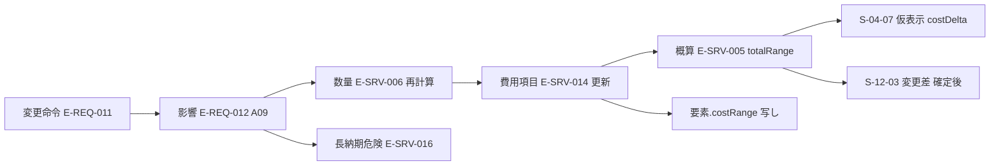

# 第20章 費用、期間、調達、施工成立性の仕様

作成日: 2026-09-15　版: v1.6　担当: 第20章（一級建築士、製品責任者、BIM技術者、計算機科学者の合議を想定）。v1.6 は段階8 の最終仕上げ（2026-10-08。再々確認 主2-01、主2-16。統括の決定 D34、D38、D44）で、第2.3節と F-C13-001（機能の版 v1.3）に寸法変更で自動付与された撤去と新設の組の算入と (vii) の n への撤去の側の算入、図面読解の修正の除外を加え、第8.2節の X4 の「未解決」の定義を「最新の再判定で X4 の SEV-1 が IS-RESOLVED でない、または判断が未完了」に改めた。記録は `05_審査/再修正記録_最終仕上げ_群G3.md`。v1.5 は段階8前の持ち越し仕上げ（2026-10-08。既定値の識別子の併記 8 行）〔群F4〕で、第1.6節、第2.1節、第3.3節、第7.1節、第7.2節、F-C13-006 の既定値に DV-CO-04、DV-CO-11、DV-CO-12、DV-CO-13 を併記した（値は変えない）。記録は `05_審査/再修正記録_段階8前_仕上げ_群F4.md`。v1.4 は 2026-10-07 の二回目の修正の仕上げ〔群R3〕で、章末の第12章（群Bの申し送り）の行に第12章の二回目の依頼（属性名と DV- の注記）への対応状況を追記した（本文の変更なし。記録は `05_審査/再修正記録_2回目_仕上げ_群R3.md`）。v1.3 は 2026-10-07 の段階6 二回目の修正（段階7 再審査の後）。修正計画 第1.20節の 3 件（主担当 JR-094、整合 JR-095〔極高〕、JR-037〔高〕）を第0.3節、第0.4節の固定文で反映した（予備費の消費の時点、P0 の撤去と移設の解体撤去への算入、単価表の仕様区分 specClass の行は P1）。記録は `05_審査/再修正記録_2回目_第20章.md`。v1.1 は 2026-09-15 の初稿審査（統合指摘 JM-144〜147 と整合指摘 JM-026、050、078、081、115、150、154、157）の再修正（2026-09-29 と 2026-09-30 の途中停止の後、2026-10-06 に再開して完了。基盤定義 v1.2、第12章 v1.2、第15章 v1.1、第21章 v1.1、第23章 付表 4.3-A への追従と他章の依頼への対応を含む）。内容は `05_審査/再修正記録_第16_20章.md`。v1.2 は 2026-10-06 の段階6 の仕上げ（相互依頼と残課題の処理。群C）。整合修正指示 第20章 1〜6 と第6、8、13、14、15章の依頼を処理した。群Bの申し送り（第12章 v1.3、第14章 v1.2 への追従）を含む。記録は `05_審査/再修正記録_相互依頼_群C.md`
根拠: 指示文 C13（514〜523行）、I節（664〜705行）。基盤定義（識別子規則、信頼状態と証拠段階、十二判断領域 A09・A10、七段階門の A09・A10 行、機能一覧骨格 第1.13節、情報実体骨格 群6・群8、画面指標試験骨格 S-12、M-Q-24、T-A-003、T-R-001、T-R-007）。他章の依頼（第6、7、8、11、12、13、14、16章）。調査 `01_調査/03_国内競合.md`。v1.1 の追加の根拠: 基盤定義の各ファイル v1.2 と `整合検査報告.md` 第5節、第6章 第2.4節 G3 完了条件(10)、第2.5節、第8章 第5.1節、第5.3節 X4、F-C01-006、第12章 v1.2（表11.2-A、表11.2-B、DV-CO-04、DV-CO-07〜16、第6.10節 連動11、第8.2節 経路16）、第15章 S-10-03、S-12-01、S-12-07、S-12-08、S-28-04、第18章 第2.1節 項目9、第21章 第2.1節、第3節、F-C14-004、第23章 第2.5節と第4.3節 付表 4.3-A（T-U-014、T-I-016、M-Q-44）。v1.3 の追加の根拠: `05_審査/再審査/00_修正計画.md` 第0.3節、第1.20節と、二回目の修正を終えた第6章、第8章、第12章、第21章、第23章の該当節（章末「他章への依頼または前提」の v1.3 の行）。

## 0. 本章の目的、範囲と非対象、前提とする章

### 0.1 本章の目的

本章は、案ごとの費用、期間、調達方式、施工成立性を「幅と根拠を持つ情報」として正規建物情報へ結び、家族と専門家が費用と期間を伴う判断を早く安全に行える状態を作る仕様を定める（六段の因果 (3) 差の比較、(4) 承認、(6) 実績差の取得）【推定】。製品は見積確定額と施工図を出さず、概算は幅で、施工成立性は注意と検討結果として持つ【推定】。機能一覧骨格 C13 の16機能のうち非対象2件を除く14機能の必須10項目を第12節に書く。

### 0.2 本章の範囲と非対象

| 区分 | 内容 | 区分 |
|---|---|---|
| 範囲 | 工種別費用幅と六属性、単一額断定の禁止と検査規則、変更の数量と費用への波及、期間の十工程（改装は改装用の雛形）と六種の危険、納期と代替可能性の比較（費用と期間の側）、調達方式の比較、見積比較の同一項目化、契約後変更の記録、施工成立性の初期注意と詳細検討、施工資料の要素結合、費用低減案の影響表示、概算と後工程見積の差の集計。AP-021 の計算式。予備費、確信幅、工程雛形、初期注意の閾値の既定 | 【推定】 |
| 非対象（他章が主章） | 商品の価格範囲、納期の項目定義、代替品の提示（第16章 F-C05-012、016）。提携先の台帳、適合、点数、相談予約（第17章 F-C08）。変更命令の抽出、影響予測、仮表示、確定（第12章 F-C03-009〜014）。構造、外皮、設備の再計算対象（第13章）。敷地の高低差と接道幅員の取得（第18章）。性能の再計算（第19章）。竣工差分、機器台帳、維持計画、解体後判明の手順（第21章）。契約の権利条件、共有範囲、監査（第22章）。試験の詳細と指標の計測手順（第23章）。課金額と利用量の値（第24章）。画面部品の三状態の設計（第15章）。API の非同期と失敗の扱い（第14章） | 【推定】 |
| 恒久の非対象 | 施工図の完全自動作成（F-C13-015）、確定見積（F-C13-016）。画面と書出に「施工図」「施工可能」「見積確定額」「確定見積」を表示しない（第1.4節） | 【推定】指示文 G、9.1 |

### 0.3 前提とする章

| 章 | 前提とする内容 |
|---|---|
| 第5章 | 決定権の判断種「予算上限」「変更の確定」「選定」の決定者（E-ORG-008.decisionAuthority）。施工者の確認権（A10） |
| 第6章 | G2 完了条件(4)、進行禁止 I-00-114、G3 の費用更新（E-SRV-005、E-REQ-012 付き）、G5 の変更記録と I-00-127、第2.5節 欠落の自動記録 (vii)（解体撤去の処分区分） |
| 第7章 | 影響関係表の A09、A10 の行と列。Impact の生成規則（11領域に一件ずつ） |
| 第8章 | 質問群C（予算帯、予備費）、要求衝突 X4、X6、第6.2節 P2、P3 |
| 第11章 | F-C02-027 新しい現況資料による差分更新 |
| 第12章 | E-SRV-005、006、014、015、016、E-REQ-011、012、E-OPS-006 の項目辞書。E-EXC-004（kind=単価表）entries の specClass。既定値表 DV-CO-04、DV-CO-07、DV-CO-21。第3.4節（costRange の導出値） |
| 第13章 | 第7.2節の変更元と再計算対象。A09、A10 を影響先として受ける依頼 |
| 第14章 | AP-021 費用計算、AP-008 影響予測と仮表示、AP-013 商品推薦、AP-017 商品情報の再確認 |
| 第15章 | S-12-01〜S-12-06、S-12-E、S-12-W、S-12-X |
| 第16章 | E-PRD-007 Availability、SUP-、代替品、最終確認日時 |
| 第18章 | E-BLD-002（高低差、擁壁）、E-SRV-011（接道） |
| 第21章 | 改装区分（第2.1節。P0 の撤去と移設の自動付与は規則(7)）、解体後判明時の 4 項目と費用予備（第3節）、F-C14-004 |

### 0.4 他章からの依頼と本章の回答

| 依頼元 | 依頼の要点 | 本章の回答（節） |
|---|---|---|
| 第6章 | G2 の概算（工種別の幅、単価時点、地域）と I-00-114 の検査規則、G3 の費用更新 | 第1.1〜1.4節、第2.2節 |
| 第7章 | F-C13-003 の費用差を変更識別子ごとに表示。長納期危険（E-SRV-016）を Impact から登録 | 第2.2節、第3.4節 |
| 第8章 | X4 の概算幅の下限、X6 の最短工程、予備費の既定、第6.2節 P2、P3 の値 | 第1.6節、第1.7節、第3.2節、第10.3節 |
| 第11章 | F-C02-027 で数量と費用項目を再計算する接点 | 第2.3節 |
| 第12章 | costRange を導出値とし直接編集を置かない扱いの採否（U-00-043、U-12-008） | 第1.8節（採用） |
| 第13章 | 構造、外皮、設備の変更の費用波及と施工成立性の初期注意を A09、A10 の影響先として受ける | 第2.1節、第7.1節 |
| 第14章 | AP-020（第19章）と AP-021 の計算式、基準、単価時点、range の min < max の規則 | 第10.1節（AP-021 のみ） |
| 第16章 | 価格範囲、納期、長納期危険の必要期日と代替可能性を推薦の入力にする | 第3.4節、第3.5節 |
| 段階6 の依頼（v1.1） | 第6章（X4 未解決時の費用の承認の注記。JM-026）、第8章（X4 の二段階と集計行、予算削減の入口。JM-146、JM-050）、第12章（工種の enum、既定値表の登録済みの参照）、第13章と第15章（S-10-03 問題一覧、擁壁・造成の未算入、S-12-07、S-12-08、S-28-04。JM-115、JM-145、JM-146）、第21章（改装の工種と工程、G3 完了までの定義、解体後判明による停止、追加予算の判断記録。JM-144、JM-150、JM-154、JM-157）、第23章（T-U-014、T-I-016、M-Q-44） | 第1.1節、第1.5〜1.7節、第2.1〜2.3節、第3.1節、第3.3節、第6.3節、第7.1節、第8.1〜8.2節、第11節 |
| 段階6 の仕上げ（v1.2、相互依頼） | 第6章（JM-026）、第8章（JM-146、JM-050、JM-171）、第13章（JM-115）、第14章（AP-021 kind=期間 の式、U-20-011）、第15章（JM-146、JM-145）。整合修正指示 第20章 1〜6（他章の識別子の参照化） | 第10.1節（kind=期間 の表を追加）、第8.1節、第8.2節、F-C13-013（P0 と P1 の境界。JM-171）。他は v1.1 で対応済みと確認。対応状況は章末「他章への依頼または前提」、識別子は「本章で定義した識別子一覧」 |
| 段階6 二回目の修正（v1.3、2026-10-07。修正計画 第1.20節） | JR-094（工事前の判明を予備費の消費から外す。主担当）、JR-095（P0 で自動付与された撤去と移設の解体撤去への算入。第21章が主担当）、JR-037（単価表の specClass の行は P1、P0 の概算は変えない。第8章が主担当） | 第6.3節、第1.6節、第2.3節、第1.1節、第1.5節、第1.7節、第2.1節、第8.1節、第10.1節、F-C13-001、F-C13-003、F-C13-013 |

### 0.5 調査結果の反映

Panasonic 間取り図AI積算は「※図面の精度によって、AIが内容を正しく読み取れない場合もあります。見積り内容のご確認をお願いします。」「※建具寸法は、図面寸法では拾われず、当社の標準仕様にて積算されます。」と明記している（https://sumai.panasonic.jp/contents/housing-biz/madorizu-sekisan/ 、確認日 2026-09-15）【事実】。a.flat 3D My Room は配置商品の見積もり金額を表示し、まとめてカートに入れる導線を持つ（https://aflat.asia/support/myroom/index.html 、確認日 2026-09-15）【事実】。本章はこれらを次のように越える。数量は要素から決定的に算出し、既定値（VS-DEF）に基づく数量には「既定値に基づく」を工種ごとに表示する。商品費用は商品層（PT-）と供給状態（SUP-）付きで家具の工種に集約し、単一額でなく幅で示す【推定】。

## 1. 費用の工種分解と六属性（F-C13-001、F-C13-002）

### 1.1 工種の区分と数量根拠

工種は E-SRV-014.workCategory の17区分（初稿の15区分に、改装案件の「解体撤去」「既存補強」を v1.1 で追加。値は第12章 v1.2 表11.2-B。JM-144）を使う。P0 で数量に基づく工種は、要素から決定的に算出した E-SRV-006 Quantity を数量根拠に持つ。数量に基づかない工種は算出方法（率、一式、利用者入力）を Quantity.method 相当の文で持つ【推定】。要素識別子は情報実体骨格 群 ELM の順（E-ELM-001 Wall〜E-ELM-016 ExternalWork）による【推定】。

| 工種 | 数量根拠の元（Quantity.elementRef、quantityKind） | P0 の算出方法 | 既定の除外条件 | 区分 |
|---|---|---|---|---|
| 土地 | なし（利用者入力の土地費） | 利用者入力の幅。未入力は「除外」 | 土地取得を伴わない案件 | 【推定】 |
| 調査 | E-SRV-001.costRange の合計（個数） | 不足調査一覧の各調査の費用幅 | 実施済み調査 | 【推定】 |
| 設計 | なし（率） | 建築費（仮設〜設備の合計）× 率幅 | 設計契約済み | 【仮定】 |
| 申請 | なし（一式） | 確認申請等の手数料と代行費の幅 | — | 【仮定】 |
| 仮設 | 外周長 × 高さ（足場面積、E-ELM-001 kind=外壁、面積） | 足場面積 × 単価、養生と仮設電気水道は一式 | — | 【推定】 |
| 基礎 | 一階床面積（E-ELM-002 Slab kind=基礎、面積） | 面積 × 単価。基礎形式が VS-DEF なら「仮定に基づく」 | — | 【推定】 |
| 躯体 | 延床面積、壁長（E-ELM-001、長さ）、梁柱本数（E-ELM-005、006、個数） | 面積 × 単価 ＋ 部材数 × 単価 | — | 【推定】 |
| 外皮 | 外壁面積（開口控除、面積）、屋根面積（E-ELM-003）、外部開口面積（E-ELM-007、008 kind=外部） | 各面積 × 単価 | — | 【推定】 |
| 内装 | 床、壁、天井面積（E-SPC-001 の内法から算出）、内部建具個数（E-ELM-007） | 面積 × 単価 ＋ 個数 × 単価 | — | 【推定】 |
| 設備 | 機器個数（E-ELM-011 Fixture、E-ELM-012 Equipment）、配管配線は延床面積 | 個数 × 単価 ＋ 面積 × 率 | — | 【推定】 |
| 解体撤去（改装。v1.1、JM-144） | renovationAction=撤去、移設の要素（isRemoved=true。移設は移設元。P0 は自動付与の撤去と移設。第2.3節、JR-095）の面積、長さ、個数（Quantity.elementRef、quantityKind=面積、長さ、個数）と処分量（quantityKind=体積または重量、method=処分量） | 数量 × 単価。処分区分を石綿含有の有無（工事前調査の記録）で分け、調査前の要素を含む場合は工種の幅の下側を処分区分「含有なし」、上側を「含有あり」の単価で算出し、上側への拡大量を固定の率で置かない（第12章 v1.3 DV-CO-07。単価表に「含有あり」の単価がない場合は除外事項「石綿含有の処分費: 未算入（要見積）」を立てる。処分区分ごとの単価の出所は U-20-016） | 新築案件（敷地内の既存建物の解体は第1.5節の除外事項で扱う） | 【推定】 |
| 既存補強（改装。v1.1、JM-144） | renovationAction=補強 の要素に追加した補強の子要素の数（個数）。補強の種類（耐力壁の追加、金物、基礎の補強）ごとに数える | 子要素数 × 種類別の単価。単価が単価表にない種類は暫定金額（isProvisional=true） | 新築案件。P0 の改装案件（補強の指定は P1。除外事項「既存補強: 未算入（補強の指定は P1）」を立てる。JR-095） | 【推定】 |
| 外構 | 敷地面積 − 建築面積（E-ELM-016、面積） | P0 は面積 × 概略単価。詳細は除外 | 外構の詳細（P0） | 【仮定】 |
| 家具 | 配置商品の個数と E-PRD-001.priceRange | PT-CERT、PT-REF は priceRange、PT-GEN、PT-AI は分類別の幅 | 利用者の既存家具 | 【推定】 |
| 税 | 課税対象工種の合計（率） | 合計 × 税率（第1.5節。値は【未確認】） | — | 【推定】 |
| 予備費 | 建築費（率） | 建築費 × DV-CO-04 の率幅（第1.6節） | — | 【推定】 |
| その他 | なし（一式） | 引越し、仮住まい、登記、借入諸費用、火災・地震保険、家電、カーテン | P0 は除外事項一覧に明示。改装案件の引越しと仮住まいは除外にせず算入する（居ながら工事の可否は第3.1節。JM-144） | 【仮定】 |

単価の行（v1.3、JR-037）: P0 の概算は工種 × 地域 × 時点の行（specClass=null）のままとし、要素の仕様と性能目標では変わらない（性能目標の引下げの費用差は「未算出（P0 の概算は性能目標で変わらない）」。第8章 第5.3節）。P1 は単価を要素の仕様属性に対応する specClass の行（仕様区分。外壁仕上の種別、屋根材、サッシの性能区分、断熱の等級帯、設備機器の等級、造作の別。第12章 表11.2-A E-EXC-004 entries、用語集 560）から取り、仕様が VS-DEF の要素は既定の specClass（性能目標との対応は第12章 DV-CO-21。初期仮説）で算出して「仮定に基づく」を注記する。specClass の行がない工種と地域は specClass=null の行で算出し「仕様区分の単価なし」を注記する。X4 の候補「目標の引下げ」の費用差（P1）は、仕様が VS-DEF の要素の specClass を下げた目標で DV-CO-21 から選び直して再計算した概算との差とし、VS-USR 以上の仕様は変えない【仮定】。

### 1.2 各金額の六属性

| 属性 | 実体の属性 | 内容と表示 | 欠落時の扱い | 区分 |
|---|---|---|---|---|
| 数量根拠 | CostItem.quantityRefs → Quantity.method、elementRef | 数量から算出元の要素へ一操作で戻れる（S-12-02）。数量に基づかない工種は算出方法の文 | 数量に基づく工種で空 → I-20-002（SEV-1、第1.4節） | 【推定】 |
| 単価時点 | CostItem.unitPriceDate | 単価表の版の暦日 | 欠落 → AP-021 が拒否（第14章）。概算を表示しない | 【推定】 |
| 地域 | CostItem.region | 都道府県（Project.region） | 欠落 → 拒否 | 【推定】 |
| 物価変動 | Estimate.priceIndexNote | 単価時点から表示時点までの経過月数と注記。P0 は文言、P1 は率 | 経過 6 か月超 → S-12-X「単価情報の失効」（旧単価で表示中と時点を明示）。費用の承認は AS-VOID（第1.5節 単価時点の失効。JM-081） | 【仮定】 |
| 除外事項 | Estimate.exclusions、CostItem.exclusions | 既定の除外一覧（第1.5節）と利用者の切替 | 空 → 既定一覧を自動付与 | 【推定】 |
| 確信幅 | Estimate.confidenceRange、CostItem.confidenceRange | 段階別の既定（第1.3節）と根拠文 | 段階の最小幅未満 → 最小幅へ広げる | 【推定】 |

### 1.3 確信幅の段階別の既定と「幅を狭く見せない」規則

| 段階 | 確信幅の既定（±%） | 最小幅（これより狭く表示しない、±%） | Estimate.basis | 根拠文の例 | 区分 |
|---|---|---|---|---|---|
| G0 初期予算 | 30 | 25 | 概算 | 「面積と地域の単価帯からの初期予算」 | 【仮定】初期仮説 |
| G2 三案 | 25 | 20 | 概算 | 「V1 案の数量と単価表 v○ による概算」 | 【仮定】初期仮説 |
| G3 調整後 | 15 | 10 | 概算 | 「V2 案の数量と商品価格による概算」 | 【仮定】初期仮説 |
| G4 見積比較後 | 各社見積の min〜max | 見積 1 社のみは 10 | 見積比較 | 「○社の見積の幅」 | 【仮定】初期仮説 |
| G5 契約後 | 契約額 ＋ 未確定の変更記録の幅 | — | 契約、精算 | 「契約額と未承認変更の幅」 | 【仮定】 |

規則: (1) 表示する幅は算出幅と段階の最小幅の広い方とする。(2) 幅を狭める操作を利用者に提供しない。狭める根拠は見積（第5節）または契約の入力に限る。(3) 確信幅の根拠文（confidenceRange.basis）を S-12-01 に表示する。(4) G4 の見積が概算幅の外に出た場合は M-Q-24 に記録し、既定の校正に使う（第9節）。(5) 尺度が VS-USR 未満の案は確信幅を最小幅に固定し「尺度未確認」を注記する【仮定】。既定値は第12章 既定値表の DV-CO-07（確信幅の段階別既定。第12章 v1.2 で登録済み。改装の工種「解体撤去」で石綿含有の調査前の要素を含む場合の幅の算出〔下側は処分区分「含有なし」、上側は「含有あり」の単価〕は第12章 v1.3 で追加）とする。

### 1.4 単一額断定の禁止と検査規則（I-00-114 への回答）

| 番号 | 検査 | 条件 | 重大度と処置 | 検出方式 | 区分 |
|---:|---|---|---|---|---|
| 1 | 総額 | Estimate.basis=概算 かつ totalRange.min = max | SEV-0（I-00-114。G2 の進行禁止）。S-13-04 に表示し、S-12 で幅へ再計算 | 決定的（E-EXC-005 検証規則） | 【推定】 |
| 2 | 費用項目 | CostItem.amountRange.min = max かつ isProvisional=false かつ workCategory が税、土地以外 | SEV-1。書出検査でも SEV-1（第14章 AP-021 の規則と一致） | 決定的 | 【仮定】 |
| 3 | 数量根拠 | 数量に基づく工種（仮設、基礎、躯体、外皮、内装、設備、家具）で quantityRefs が空 | SEV-1（I-20-002）。「既定値に基づく」の注記では代替できない | 決定的 | 【仮定】 |
| 4 | 文言 | 画面と書出に「見積確定額」「確定見積」「概算確定」 | SEV-0。書出を止める（F-C15-005、T-S-003） | 文言検査 | 【推定】 |
| 5 | 比較軸 | S-03 の費用軸が単一額 | SEV-0（I-00-114 相当） | 決定的 | 【推定】 |
| 6 | 表示 | S-12-01 で幅を出さず中央値だけを表示 | 画面仕様違反。統合試験 T-I-016 で検査する（第23章が採番。JM-173） | 試験 | 【仮定】 |

中央値は並べ替えと差の集計のために内部で使ってよいが、幅と併記しない限り画面に出さない【仮定】。契約後（basis=契約、精算）の契約額は単一額で表示してよいが、「契約額」「精算額」と表示し「概算」と混同しない【推定】。

### 1.5 単価表と除外事項の既定

- 単価表: 工種 × 地域 × 時点の単価の集合（P1 は仕様区分 specClass の行を加える。項目は第12章 表11.2-A E-EXC-004 entries。第1.1節「単価の行」。v1.3、JR-037）。E-EXC-004 Dictionary（kind=単価表）として製品が版付きで保持し、各単価は E-PRD-006 Source を出典に持つ（E-PRD-006.kind=単価表。第12章 v1.2 で追加済み）【仮定】。初期版の出所（公的統計、業界資料、提携施工者の実績）と仕様区分の grade ごとの単価は【未確認】（U-20-001）。更新周期は四半期ごと、時点から 6 か月超で失効表示（DV-CO-09）【仮定】初期仮説。単価時点の失効（v1.1、JM-081）: 単価時点が DV-CO-09 の失効期間を超えた時、または単価表の版の更新で Estimate.unitPriceDate が単価表の時点より古くなった時、製品が origin=単価改定 の変更命令を生成し、Calculation（kind=費用）を「再計算要」にし、scopeKind=費用 の承認を AS-VOID にする（第12章 第6.10節 連動11、第6章 第5.1節）。G3 の門は「再確認中」になり、再計算の後に費用の承認を元の承認者へ再依頼する。再計算までは S-12-X「単価情報の失効」を表示し、旧単価の値を時点付きで残す【推定】。
- 税率: 「税」の工種の率は既定値表 DV-CO-08 として版付きで持ち、法令の版を E-SRV-011 と同じ方式で記録する。本章で税率の値と適用範囲は確認していない【未確認】（U-20-006）。
- 除外事項の既定一覧（Estimate.exclusions の初期値）: 土地取得費（土地案件以外）、地盤改良費（地盤調査前）、外構の詳細（P0）、引越しと仮住まい費（新築のみ。改装案件では既定で「含む」とし工種「その他」に算入する。仮住まいの要否は第3.1節の居ながら工事の可否による。JM-144）、登記と借入諸費用、火災・地震保険、家電、カーテン、既存建物の解体費（新築で既存建物がある場合は「調査」へ移す。改装案件の撤去と移設は工種「解体撤去」で算入する）、近隣対応費、造成・擁壁工事（傾斜地。下の未算入表示の条件に当たる案件。JM-145）、石綿含有の処分費（改装の解体撤去で石綿含有の調査前の要素があり、単価表に処分区分「含有あり」の単価がない案件。「石綿含有の処分費: 未算入（要見積）」と表示する。第12章 v1.3 DV-CO-07。JM-144）、既存補強（P0 の改装案件。第1.1節。v1.3、JR-095）【仮定】。各項目は「含む」「除外」を切り替えられ、切替は変更命令（origin=直接操作、primaryDomain=A09）として記録する【推定】。
- 擁壁・造成の未算入表示（v1.1、JM-145）: E-BLD-002.terrain.heightDiffToRoad > 2,000 mm、または confirmationItems の item=擁壁 の value が「あり」（「あり（詳細不明）」を含み、state を問わない。擁壁の value は「あり」「あり（詳細不明）」「なし」「未確認」の4値。第12章 v1.3 E-BLD-002.confirmationItems.value、第18章 第2.1節 項目9）のとき、Estimate.exclusions に「擁壁・造成: 未算入（要見積。既存擁壁に検査済証がない場合は作り直しの可能性）」を自動で立て、S-12-01 と S-03-02 の費用軸に同じ注記を出す。利用者が見積または概算の値を入力した場合は工種「外構」に暫定金額（isProvisional=true）として算入し、注記を「擁壁・造成: 暫定金額で算入」に改める。擁壁費の幅の出典は未確認であり、製品は擁壁費の幅を自動で算出しない【仮定】。

### 1.6 予備費の既定（第8章の依頼、DV-CO-04 の確定）

| 案件種別 | 既定の率（建築費に対する） | 幅 | 判断者 | 代替案と承認手順 | 区分 |
|---|---|---|---|---|---|
| 新築 | 5% | 5〜10% | 決定権「予算上限」の関係者 | 予備費の使用は変更命令として記録し、決定者が承認する | 【仮定】初期仮説 |
| 改装 | 10% | 10〜20%（DV-CO-04） | 同上 | 解体後判明時の 4 項目（判断者、費用予備、代替案の型、承認手順）を G3 完了まで（第21章 第3節）に定義し、E-REQ-004（gate=G3、isKeyDecision=true）に記録する。工事前定義と G4 での停止は F-C14-003（P1）、発見時の処理は F-C14-003-01（P2）、予備費の管理は F-C14-004（P1）（v1.1 で「G1 で定義」を改めた。JM-150） | 【仮定】初期仮説 |

予備費は CostItem（workCategory=予備費、isProvisional=true）として総額に含め、除外にしない【推定】。予備費の消費の時点は第6.3節による（G5 に限る。v1.3、JR-094）。値は第12章 DV-CO-04（新築 5〔幅 5〜10〕、改装 10〔幅 10〜20〕。第12章 v1.2 で登録済み）とする。

### 1.7 X4 の判定に使う概算幅の下限（第8章の依頼）

X4（予算と性能または規模の衝突）の判定値は、建築費上限（R-08-003 相当の変更できない条件）と比較する「建築費の下限」とし、仮設、基礎、躯体、外皮、内装、設備、税、予備費の CostItem.amountRange.min の和とする（土地、調査、設計、申請、外構、家具、その他を除く）【仮定】。建築費上限 < 建築費下限 のとき X4 を F-C01-020 へ渡す（SEV-1）。二段階の判定（v1.1、JM-146。第8章 第5.3節 X4 と同文）: (a) SEV-1: 建築費の下限が建築費の上限を上回る（上の規則）。(b) SEV-2: 下限は上限以下だが、建築費の中央値（同じ工種の amountRange の中点の和）が上限を上回る。問題「予算超過の可能性（概算幅 a〜b 万円、中央値 n 万円、上限 m 万円）」を E-REQ-003 に登録し S-24 と S-12-01 に表示する。中央値は幅と併記し単独で示さない（第1.4節 検査6）。「衝突なし」の語は下限、中央値、上限のすべてが予算上限以下の場合だけ使う。概算未算出（G2 前）は「判定待ち」とし「衝突なし」と表示しない。擁壁・造成が未算入（第1.5節）の案件では、X4 の判定結果に「擁壁未算入」の印を併記し、判定が擁壁費を含まない下限によることを示す（JM-145）。質問群C の建築費が「未定」の場合は判定しない【推定】。予算上限に土地費を含める案件は、上限の定義（E-REQ-002.expression）に合わせて土地を加える【仮定】。P0 の概算は性能目標で変わらないため（第1.1節「単価の行」）、性能目標を下げても建築費の下限は動かず、判断の後の X4 の再判定で SEV-1 が残り「解決」と表示しない（第8章 第5.3節 X4 (a)、第23章 T-R-007 P0 版 (3)。v1.3、JR-037）【推定】。

### 1.8 費用範囲 costRange の扱い（U-00-043 への回答）

第12章 第3.4節の仮判断を採用する。要素の costRange は Quantity と CostItem から導出した表示用の値であり、直接編集を置かない。導出の順序は、要素 → Quantity（決定的）→ CostItem（数量 × 単価の幅）→ 要素.costRange（写し）とし、要素の revisionRef が Quantity.derivedFromRevisionRef より新しい場合は「再計算要」と表示する【仮定】。U-00-043 と U-12-008 は本章で「採用」として記録する（末尾の未決事項表）。

## 2. 変更の数量と費用への波及の追跡（F-C13-003）

### 2.1 変更種別と A09 の再計算対象（第13章 第7.2節の受け）

| 変更元（主担当）と内容 | 再計算する Quantity | 更新する CostItem | 長納期危険の候補（第3.4節） | 区分 |
|---|---|---|---|---|
| A03: 面積（室の拡張、階数） | 床面積、壁長、外壁面積、屋根面積、基礎面積 | 基礎、躯体、外皮、内装、仮設、設計（率）、税、予備費 | — | 【推定】 |
| A03: 形状（外周の凹凸、屋根形状） | 外周長、外壁面積、屋根面積、出隅数 | 外皮、躯体、仮設 | — | 【推定】 |
| A03: 開口（位置と大きさ） | 開口面積、外壁面積（控除）、開口個数 | 外皮（サッシ）、躯体（開口上の梁） | 幅 2,000 mm 超のサッシ | 【推定】 |
| A05: 仕上、層構成 | 外壁面積、屋根面積（単価の変更） | 外皮 | 特注仕上材 | 【推定】 |
| A04: 構造形式、梁と柱 | 部材数、断面 | 躯体 | 大断面部材 | 【推定】 |
| A06: 機器の種別と置場、経路 | 機器個数、配管延長 | 設備 | 造作台所、特注機器 | 【推定】 |
| A08: 商品の置換 | 個数、priceRange | 家具、設備、内装 | Availability.leadTimeDays が 30 日（DV-CO-12）超 | 【推定】 |
| A02: 法規（防火区分等の版更新） | 開口個数（性能区分別） | 外皮 | 防火設備 | 【推定】 |
| A09: 予備費率、除外の切替 | — | 予備費、該当工種 | — | 【推定】 |
| A01: 予算上限の変更 | — | 再計算なし。X4 の再判定のみ | — | 【推定】 |
| A10: 施工成立性の注意（加工、割付、仮設、揚重。第7.1節、第7.2節。v1.1、JM-147） | 該当要素の数量に加工係数（加工、割付の注意がある部位に 1.05〜1.15）、足場面積（外壁の外周長 ×（最高高さ ＋ 1,000 mm））、揚重回数（揚重の注意の対象部材 1 件につき 1 回）。係数と算式は DV-CO-16（第12章 v1.2 で登録済み） | 仮設、躯体、外皮。確信幅を上側へ広げる（下限は変えない） | — | 【仮定】初期仮説 |

第7章 規則3 により11領域すべてに Impact を置き、本表は A09 の recalcTargetRefs を定める。A09 に影響がない変更は status=影響なし の Impact を一件置く【推定】。P0 は単価に仕様区分を使わないため（第1.1節「単価の行」）、数量の変わらない仕様だけの変更（A05 の仕上と層構成、A06 の機器の種別）は費用差を「未算出（P0 の概算は仕様で変わらない）」と表示し、「差ゼロ」と表示しない（P1 は specClass の単価で再計算する。v1.3、JR-037）【推定】。

### 2.2 変更識別子ごとの費用差の表示（第6章、第7章の依頼）

| 規則 | 内容 | 区分 |
|---|---|---|
| 差の算出 | Impact（affectedDomain=A09）.delta に前後の amountRange と totalRange を持ち、費用差は min − min、max − max の幅で表す | 【推定】 |
| 表示 | S-12-03 と S-04-07 に費用差（幅）と原因の変更識別子（ChangeCommand.uuid の末尾）を表示する。確定前は previewDelta.costDelta、確定後は Estimate.changeDeltaRefs に Impact を追加し S-04-08 と同期する | 【推定】 |
| 取消 | ChangeCommand.status=取消 で当該 Impact を「取消」にし、費用差を打ち消す新しい Impact を表示する（第12章 第11.2節） | 【推定】 |
| 追跡不能 | 単価未登録の新工種、数量根拠のない要素は「費用影響未評価」と表示し SEV-2 の問題（I-20-003）を登録する。「差ゼロ」と表示しない | 【仮定】 |
| G3 の費用更新 | G3 の必須成果「費用更新」は、G2 以降の全 Impact（A09）を changeDeltaRefs に持つ Estimate の版とし、E-REQ-007（scopeKind=費用）の承認対象にする | 【推定】 |
| 費用差の説明と追跡（v1.1、JM-078） | 費用差と各金額の説明には、算出元の要素一覧を第12章 第8.2節の追跡経路16（建築要素 → 数量 → 費用項目 → 概算。Quantity.elementRef、CostItem.quantityRefs、Estimate.costItemRefs）の逆方向で付け、どの要素の数量から出た額かを S-12-02 と S-12-03 から一操作で示す。費用の問題（I-00-114 の単一額、I-20-002、I-20-003、I-20-004、単価時点の失効）は Issue.anchor.kind=概算 で Estimate または CostItem に固定し、Estimate.issueRefs に結ぶ（経路16 の終点。第12章 v1.2 表11.2-A、表11.2-B）。kind=費用 の要求の M-G-01 の到達判定は経路16 の終点（概算）で行う（第12章 第8.3節） | 【推定】 |

### 2.3 差分更新と改装区分との接点（第11章、第21章の依頼）

新資料取込（origin=新資料取込）で要素が再認識された場合、F-C02-027 が生成する変更命令から Impact（A09）を作り、対象要素の Quantity を再計算して CostItem を更新する【推定】。尺度が VS-USR へ確定した場合は全 Quantity を再計算し、Estimate を「再計算要」とする【推定】。

改装区分（renovationAction。第21章 第2.1節）が指定または変更された要素（現況差分による変更を含む）は、次の対応表で工種と数量へ反映する。表は第21章 第2.1節の「工種と数量」の列と同じ対応である（v1.1。JM-144）【推定】。

| 改装区分 | 工種（第1.1節） | 数量根拠（E-SRV-006 Quantity） | 区分 |
|---|---|---|---|
| 残す | なし（費用差 0。仕上の再塗装等は「補修」） | — | 【推定】 |
| 撤去 | 解体撤去 | 要素の面積、長さ、個数と処分量（体積または重量）。処分区分は石綿含有の有無で分ける | 【推定】 |
| 補修 | 内装または外皮（補修する仕上が室内側なら内装、屋外側なら外皮） | 補修する仕上の面積 | 【推定】 |
| 補強 | 既存補強 | 補強の子要素の数 | 【推定】 |
| 移設 | 解体撤去（移設元）＋新設の該当工種（移設先） | 移設元の面積、長さ、個数と処分量、移設先の要素の数量 | 【推定】 |
| 新設 | 要素種別の該当工種（躯体、外皮、内装、設備、外構） | 第1.1節の各工種の数量根拠 | 【推定】 |

単価表に単価がない補修、補強の種類は暫定金額（isProvisional=true）とし、「暫定」と表示する【仮定】。改装区分が未指定の現況要素は工種へ反映せず、未指定の件数を S-12-01 に「改装区分 未指定 n 要素（費用未算入）」と表示する（P1 は第21章 第2.1節 規則(1) の件数と同じ。P0 は区分の指定〔S-27-03〕を提供しないため、自動付与のない現況要素を数えて「指定は P1」を併記する）【推定】。

P0 の撤去と移設の自動付与（v1.3、JR-095）: P0 で自動付与された撤去と移設（第21章 第2.1節 規則(7)、用語集 559）は、上の表の撤去と移設の行のとおり解体撤去の工種に算入する。現況要素の寸法変更（短縮、延長、既存開口の拡大と縮小、回転）で自動付与された撤去と新設の組は、撤去の側を削除の撤去と同じく上の表の撤去の行で解体撤去に、新設の側を新設の行で該当工種に算入する（v1.6、統括の決定 D34）。図面読解の修正（現況の訂正。第11章 工程9）で消した要素は自動付与の対象外のため算入しない（統括の決定 D38）。処分区分は石綿含有の有無の未確認として幅を上側へ広げる（工事前調査の記録がない要素は第1.1節 解体撤去の行と第12章 DV-CO-07 のとおり、下側を処分区分「含有なし」、上側を「含有あり」の単価で算出する）。算入は変更命令の Impact（A09）で費用差として示し、元に戻す変更（残すに戻す）で取り消す。算入した要素（撤去〔寸法変更の撤去の側を含む〕と移設元）のうち石綿含有が未確認の要素の数を、G4 の欠落の自動記録 (vii)「解体撤去の処分区分 石綿含有未確認（幅の上側。撤去 n 要素）」（第6章 第2.5節）の n とする【推定】。

### 2.4 波及の流れ

## 3. 期間と危険（F-C13-004、F-C13-005、F-C13-006）

### 3.1 十工程の雛形（Schedule.phases の既定。新築、在来木造、二階建）

| 工程（kind） | 期間幅（月） | 依存（dependsOn） | 主担当 | 危険の主な要因 | 区分 |
|---|---|---|---|---|---|
| 調査 | 1〜2 | 土地確定（土地案件） | A02 | 測量と地盤調査の予約待ち | 【仮定】初期仮説 |
| 設計判断 | 2〜4 | 調査 | A03 | 家族の判断の遅れ（M-G-05） | 【仮定】初期仮説 |
| 専門家確認 | 1〜2 | 設計判断 | A12 | 確認予約の滞留（M-P-11） | 【仮定】初期仮説 |
| 行政協議 | 0.5〜1 | 設計判断（並行可） | A02 | 自治体の回答期間 | 【仮定】初期仮説 |
| 申請 | 1〜2 | 専門家確認、行政協議 | A02 | 審査期間と指摘対応 | 【仮定】初期仮説 |
| 調達 | 1〜3 | 設計判断（申請と並行） | A09 | 長納期品 | 【仮定】初期仮説 |
| 製作 | 1〜3 | 調達 | A10 | 造作、特注 | 【仮定】初期仮説 |
| 施工 | 4〜6 | 申請、製作（部分並行） | A10 | 季節、職人、乾燥養生、現場制約 | 【仮定】初期仮説 |
| 試運転 | 0.25〜0.5 | 施工 | A10 | 機器納入 | 【仮定】初期仮説 |
| 引渡し | 0.25 | 試運転 | A12 | 検査記録の整備 | 【仮定】初期仮説 |

雛形は既定値表 DV-CO-10（第12章 v1.2 で登録済み）とする。在来木造以外の構法の雛形は未定（U-20-004）【仮定】。

改装用の工程雛形（DV-CO-10 の改装版。v1.1、JM-144）: 改装案件（第21章 F-C14-001 の改装区分を持つ案件。P1）は、設計判断、専門家確認、行政協議、申請（確認申請等が要る改装だけ）、調達、製作を新築の行と同じ値で置いたうえで、工事の流れを次の雛形にする【仮定】初期仮説。

| 工程（kind） | 期間幅（月） | 依存（dependsOn） | 主担当 | 危険の主な要因 | 区分 |
|---|---|---|---|---|---|
| 調査（既存住宅状況調査、工事前調査） | 1〜2（新築の調査と同じ） | 改装区分の仮指定 | A10 | 石綿事前調査と開口調査の予約待ち（第11章 F-C02-026） | 【仮定】初期仮説 |
| 解体 | 0.5〜1 | 申請（不要な改装は設計判断）、仮住まいへの移動（仮住まい要の場合） | A10 | 石綿含有の発見による作業の停止（第3.3節） | 【仮定】初期仮説 |
| 解体後判明の対応（予備） | 0〜1 | 解体 | A10 | 判断の遅れ、追加調査（第3.3節、第21章 第3節） | 【仮定】初期仮説 |
| 施工 | 4〜6（新築の施工と同じ。工事範囲が一部の室だけなら利用者が短くできる） | 解体後判明の対応、製作 | A10 | 季節、職人、乾燥養生、現場制約 | 【仮定】初期仮説 |
| 試運転 | 0.25〜0.5 | 施工 | A10 | 機器納入 | 【仮定】初期仮説 |
| 引渡し | 0.25 | 試運転 | A12 | 検査記録の整備 | 【仮定】初期仮説 |

居ながら工事の可否（DV-CO-10 の改装版）: 工事範囲（撤去、補修、補強、移設の要素を持つ範囲。第21章 第2.1節 規則(3)）が一つの階の全室または建物全体に及ぶ場合は「仮住まい要」、それ以外は「居ながら工事可」を既定の判定とし、利用者が変更できる。仮住まい要の場合は引越しと仮住まい費（第1.5節）を算入し、仮住まいの期間を解体から引渡しまでの期間幅とする【仮定】初期仮説。

### 3.2 最短工程の算出と X6（第8章の依頼、U-08-010 の置換）

最短工程は phases の依存グラフの最長経路を各工程の期間幅の min で求めた値とし、決定的計算（E-SRV-004 kind=期間。第12章 v1.2 で追加済み。API は AP-021 kind=期間、P1。第14章 v1.1、U-20-011 の解決）で算出する【仮定】。既定雛形では 調査→設計判断→専門家確認→申請→施工→試運転→引渡し の経路で 9.5 か月となる【仮定】。X6 の判定は「居住開始希望日（R-08-010 相当）− 今日 < 最短工程」のとき SEV-1 の警告を F-C01-020 へ渡す【推定】。土地状況が「探索中」の案件は調査の開始日が未定のため「算出不能（土地確定後に再判定）」と表示し、暫定値 12 か月（最短工程 9.5 か月 ＋ 土地確定から調査開始までの既定 2.5 か月）で判定する。第8章 U-08-010 の初期仮説はこの規則で置き換える【仮定】。

### 3.3 期間の危険の六種（E-SRV-007 kind=期間、E-SRV-016。六種目の「解体後判明による停止」は改装案件だけ。v1.1、JM-154）

| 危険 | 検出条件（決定的） | 影響する工程 | 期間差の既定 | 重大度 | 区分 |
|---|---|---|---|---|---|
| 長納期品 | LeadTimeRisk.slackDays < 0、または余裕 30 日（DV-CO-11）未満 | 調達、製作、施工 | leadTimeDays.max − slackDays | SEV-1（顕在化）、SEV-2（余裕 30 日未満） | 【仮定】初期仮説 |
| 季節 | 施工の startRange が 12〜2 月（基礎の凍結）、6〜7 月（外壁と屋根の雨天）、8 月（猛暑）を含む | 施工 | ＋0.5 か月 | SEV-3 | 【仮定】初期仮説 |
| 職人 | 左官、造作、石、瓦の CostItem が存在する。または第7.2節の「加工」「施工順序」の注意が 1 件以上ある（P1。注意件数を危険の説明に表示する。JM-147） | 施工、製作 | ＋0.5〜1 か月 | SEV-2 | 【仮定】初期仮説 |
| 乾燥養生 | 基礎コンクリート、左官、塗装、無垢床の工程が存在 | 施工 | 基礎 ＋7〜14 日、塗装 ＋3〜7 日 | SEV-3 | 【仮定】初期仮説 |
| 現場制約 | 前面道路幅員 4 m 未満、傾斜地、隣地離れ 600 mm（DV-CO-11）未満、搬入経路の注意（第7.1節） | 仮設、施工 | ＋0.5〜1 か月 | SEV-2 | 【仮定】初期仮説 |
| 解体後判明による停止（改装。JM-154） | 開口調査等の観察（E-SRV-002。resultingConditionState=CS-OPEN）を契機に登録された解体後判明の問題（E-REQ-003）が IS-OPEN のまま残る。石綿含有が疑われる発見では作業を止め分析調査と届出を経るため必ず該当する | 解体後判明の対応、施工 | 発見から判断記録（E-REQ-004）までの日数。初期仮説 3〜10 営業日。第21章 第3節の代替案「工事停止と追加調査」の停止日数（E-REQ-012 A09、期間）を受ける。待機費は予備費の使途候補（第6.3節） | SEV-1 | 【仮定】初期仮説 |

検出条件と期間差は DV-CO-11（第12章 v1.2 で登録済み。v1.1 で加えた「解体後判明による停止」〔発見から判断記録まで 3〜10 営業日、SEV-1〕と「職人」の追加条件〔第7.2節の「加工」「施工順序」の注意が 1 件以上。P1〕は第12章 v1.3 で登録済み）とする。検出は決定的検査で行い、言語模型の推定で危険を登録しない【推定】。

### 3.4 長納期危険の登録（第7章、第16章の依頼）

登録の契機は (a) 商品配置時に Availability.leadTimeDays が 30 日超、(b) 変更命令の Impact（A09、impactKind=納期）で第2.1節の候補に該当、(c) AP-017 の再確認で SUP-LEAD の三つとする【仮定】。requiredByDate は Schedule の該当工程（調達、製作、施工の該当部位）の開始日の min とし、Schedule が未作成の P0 では「必要期日未定」として slackDays を算出せず SEV-2 で登録する【仮定】。対象部材の既定一覧は、幅 2,000 mm 超のサッシ、造作台所、特注階段、大断面梁、輸入建材、太陽光と蓄電池、昇降機とする（DV-CO-12 に含める）【仮定】初期仮説。

### 3.5 納期と代替可能性の比較（F-C13-006。第16章との境界）

第16章（A08）が推薦の点数と代替品を定め、本章（A09）は候補ごとの納期（leadTimeDays）、必要期日との余裕（slackDays）、代替候補数（substituteCount。絶対条件を満たす substituteRefs の件数）を AP-013 の出力に載せ、S-06 と S-12-04 に表示する【推定】。並び替え軸は推奨点、価格、納期、代替候補数の四つとし、既定は推奨点で、価格だけの並び替えを既定にしない【推定】。

## 4. 調達方式の比較（F-C13-007）

### 4.1 4方式 × 5項目

| 方式 | 費用確定時期 | 設計自由度 | 責任（設計と施工の主体） | 変更方法 | 比較可能性 |
|---|---|---|---|---|---|
| 設計施工分離（設計事務所と施工者） | 設計完了後の見積（G4）で確定。設計中は概算 | 高い（設計者が利用者側に立つ） | 設計は設計者、施工は施工者、監理は設計者 | 設計変更は設計者経由。施工中は変更記録と精算 | 同一図面で複数施工者の見積を比較できる |
| 一括発注（設計施工一括） | 契約時（基本設計段階）に概算で契約し、詳細設計で精算 | 中（施工者の標準仕様に依る） | 設計と施工が同一主体 | 契約後の変更は追加契約 | 他社と仕様が異なり、第5節の同一項目化が要る |
| 工務店 | 契約時。標準仕様の範囲で確定 | 中〜高（工務店により幅） | 工務店（設計は所属または外部の建築士） | 現場で柔軟だが記録が残りにくい。本製品の変更記録で補う | 仕様書の粒度が異なる |
| 住宅会社 | 契約時に商品価格で確定。選択仕様で変動 | 低〜中（商品の規格内） | 住宅会社 | 選択仕様の変更。着工後は制限 | 商品資料で比較できるが標準仕様の範囲が各社で異なる |

表の内容は一般的な理解に基づく初期の記述であり、本章で公式情報による確認は行っていない【仮定】。「責任」列は契約と法的責任に関わるため確定扱いにせず、表示に「案件の契約書が優先する」を注記する（共通指示 第4節、U-20-005）。表に空欄を置かない（機能一覧骨格の合格条件）【推定】。

### 4.2 第17章との境界

本章は方式の比較（5項目）までを扱い、具体的な提携先の台帳、適合、点数、相談予約は第17章（F-C08）が扱う。S-12-06 と S-07 は相互に遷移する【推定】。方式の選定は判断（D-、gate=G2 または G4、primaryDomain=A09、影響先 A12）として記録し、E-SRV-005.procurementRoute（調達方式。enum{設計施工分離, 一括発注, 工務店, 住宅会社, 未定}。既定は「未定」。第12章 第4.9節に v1.0 から定義済み）へ写す【推定】。

## 5. 見積比較の同一項目化（F-C13-008）

### 5.1 九項目

| 項目 | 実体の属性 | そろえ方 | 差の表示 | 区分 |
|---|---|---|---|---|
| 工事範囲 | 見積の Estimate.exclusions と CostItem の有無 | 各社の内訳を工種（新築 15、改装 17。第1.1節）へ対応付け（製品が候補を出し、人が確認） | 工種ごとに「含む」「除外」「不明」 | 【推定】 |
| 数量 | CostItem.quantityRefs と各社の数量 | 本製品の決定的な数量と各社の数量を並べる | 差が ±10% 超で注記 | 【仮定】 |
| 仮定 | E-SRV-008 Assumption（kind=単価、地盤） | 各社が置いた前提（地盤改良なし等）を統一語へ | 仮定の有無 | 【推定】 |
| 除外 | Estimate.exclusions | 各社の除外を第1.5節の統一語へ | 除外の差 | 【推定】 |
| 支給品 | CostItem.isOwnerSupplied | 施主支給の別 | 支給の有無 | 【推定】 |
| 暫定金額 | CostItem.isProvisional | 暫定（未確定）の別 | 暫定の合計 | 【推定】 |
| 予備費 | CostItem（workCategory=予備費） | 各社の予備費の率 | 率の差 | 【推定】 |
| 税 | CostItem（workCategory=税） | 税込へ統一（既定は税込。第8章 第5.2節） | 税の扱い | 【推定】 |
| 保証 | E-OPS-003 Warranty の範囲と期間 | 保証の範囲と期間 | 差 | 【推定】 |

### 5.2 比較表の規則

見積は Estimate（basis=見積比較）として各社一件を持ち、提出組織を quotedByRef（第12章 v1.2 で追加済み）で持つ。本製品の概算（basis=概算）を基準列に置く【仮定】。総額だけの比較表示を禁止し、S-12-07（見積比較。第15章が採番、P1）で総額行は九項目の行と同時にしか表示しない【推定】。取込は P1 では手入力（工種と金額）と見積書の添付（Source kind=見積書）とし、見積書の自動読解は【未確認】（U-20-008）。差の集計は第9節へ渡す。

## 6. 契約後の変更記録（F-C13-009）

### 6.1 六項目と第21章との分担（第21章の依頼への回答）

| 項目 | 実体の属性 | 主章 | 本章の規則 | 区分 |
|---|---|---|---|---|
| 理由 | E-REQ-011.intent.purpose | 第21章 | 記録の成立条件は第21章 第4節（六項目のない変更は記録として成立しない） | 【推定】 |
| 提案者 | E-REQ-011.siteChangeInfo.proposer | 第21章 | 同上 | 【推定】 |
| 金額 | siteChangeInfo.costDelta（range(JPY)） | 本章 | 提案時は幅（min ≤ max）。第2.2節の Impact（A09）.delta から算出し、単価未登録なら「費用影響未評価」（I-20-003）で提案を止めない。承認時に承認額へ確定し「承認額」と表示する | 【推定】 |
| 期間 | siteChangeInfo.timeDelta（日） | 本章 | Schedule（basis=契約）の該当工程の endRange に加算し、引渡し予定日への差を S-12-05 に表示する | 【推定】 |
| 設計意図 | siteChangeInfo.designIntent | 第21章 | 第8.1節の「設計意図」判定（選定記録との照合）を流用する | 【推定】 |
| 承認 | E-REQ-007（scopeKind=費用 ほか影響先の確認範囲） | 第21章（手順）、本章（費用側の承認者） | 費用側の承認者は決定権の判断種「変更の確定」の決定者とし、第6.3節の閾値を超える予備費使用は「予算上限」の決定者の承認を加える | 【仮定】 |

F-C14-013 は変更記録の成立、承認手順、既施工の未承認変更（I-21-004）を担い、F-C13-009 は金額と期間の算出、契約額に対する累計、精算を担う。本章は第21章 第4節の規則をそのまま採る【推定】。

### 6.2 累計と精算の規則

| 規則 | 内容 | 区分 |
|---|---|---|
| 総額の表示 | 契約後の Estimate（basis=契約）は「契約額 ＋ 承認済み変更の合計 ＋ 未承認変更の幅」を totalRange に持ち、三つを分けて S-12-01 に表示する（第1.3節 G5 行） | 【推定】 |
| 累計 | 承認済み変更の累計額と契約額に対する率を S-12-03 に表示する。累計が予備費（DV-CO-04 の額）を超えた時点で SEV-1 の問題 I-20-004（予備費超過）を登録し、決定権「予算上限」の決定者へ通知する | 【仮定】 |
| 取消 | 承認前の変更の取消は第2.2節の取消規則に従う。承認後の取消は新しい変更記録（理由に「取消」）として扱い、金額は打消しの幅で記録する | 【推定】 |
| 精算 | G5 の完了時に Estimate（basis=精算）を作り、精算額 ＝ 契約額 ＋ 承認済み変更の合計 とし、単一額で「精算額」と表示する。精算額と G2、G3 の概算幅の差は第9節の集計へ渡す | 【推定】 |
| 主担当 | 変更記録の主担当は A10（現場変更）で、金額と期間は A09 の影響として一件の Impact に持つ。同じ変更を A09 の問題として複製しない | 【推定】 |

### 6.3 予備費の使途承認の閾値（U-21-004 の確定）

第21章の初期仮説「予備費残高の 30% 超または 30 万円超の使用は決定権『予算上限』の決定者の承認、通知は 3 営業日以内、代替案の提示は 5 営業日以内」を本章で採用し、既定値表 DV-CO-14（第12章 v1.2 で登録済み）とする【仮定】初期仮説。閾値未満は「変更の確定」の決定者の承認で足りる。予備費残高 ＝ 予備費 − 承認済み予備費使用の合計 とし、残高が負になる承認は行えず、先に予算上限の要求変更（A01。X4 の再判定）を要する【推定】。新築と改装で同じ閾値を使い、値の妥当性は U-20-009 に残す。

予備費の消費の時点（v1.3、JR-094。第21章 第3節「費用予備」、F-C14-004 と同じ規則）: 予備費の消費（予備費使用の承認）は工事開始後（G5）に限り、改装案件では G5 の解体後判明への対応に限る。工事前（G3、G4）の調査で判明した事項（石綿含有、腐朽、既存の構造や設備の状態）は工種別費用（解体撤去の処分区分、既存補強、設備更新〔工種「設備」〕）へ計上して予備費を消費せず、費用更新（A09。変更影響 E-REQ-012 付きの Estimate の版。第2.2節「G3 の費用更新」）と X4 の再判定（第1.7節）で扱う。工事前の判明で隠れ部分の CS-EST が減った場合は予備費の根拠（第21章 F-C14-004 正常手順(1)）を再計算し、決定権「予算上限」の決定者に予備費の見直しを示す。率の変更は決定者が予備費率の変更命令（第2.1節 A09 の行）で行い、製品は自動で変えない。同じ事項を工種別費用と予備費の両方へ計上しない【推定】。

追加予算の判断記録の型（v1.1、JM-157。第21章 F-C14-004 例外(b)と同じ型）: 予備費残高が負になる消費、または解体後判明の対応で予備費が足りない場合の追加予算の判断は、E-REQ-004（gate=発見時の段階〔G5。工事前の判明は予備費を消費しないため対象外。v1.3、JR-094〕、primaryDomain=A09、isKeyDecision=true、deciderRef=決定権「予算上限」の決定者）として記録する。判断の記録まで当該消費を「承認待ち」とし、S-12-01 の予備費行に不足額の幅（下限〜上限）で表示する。予算上限の引上げを伴う場合は要求変更（A01。第8.2節 予算削減の入口と同じ順序）の変更命令と同じ変更識別子で結び、X4 を再判定する。判断の記録がないまま予備費を超える消費を確定しない【推定】。

## 7. 施工成立性（F-C13-010、F-C13-011、F-C13-012）

### 7.1 初期注意（F-C13-010。P0、G2〜G3、主担当 A10、影響先 A03。第13章、第18章の依頼への回答）

| 注意 | 検出条件（決定的検査） | 入力の実体 | 重大度 | 固定先 | 区分 |
|---|---|---|---|---|---|
| 搬入（敷地進入） | 前面道路幅員 4 m 未満、または不明（第18章 第7.6節「搬入制約あり」を受ける） | E-BLD-002（roadAccess.width）、E-SRV-011（接道） | SEV-2。不明は「未確認」と表示し「制約なし」と表示しない | 敷地（S-09、S-10-03） | 【推定】 |
| 搬入（部材） | 幅 2,000 mm 超のサッシ（E-ELM-008）、長さ 4,000 mm 超の梁（E-ELM-006）、幅 2,700 mm 超の造作台所（E-ELM-011）の最小断面が、玄関開口（E-ELM-007 kind=外部）または階段（E-ELM-009）の最小幅 − 50 mm（DV-CO-13）を超える | 要素の寸法、E-SYS-003（搬入経路） | SEV-2 | 該当要素 | 【仮定】初期仮説 |
| 傾斜地 | E-BLD-002.terrain.heightDiffToRoad > 2,000 mm、または confirmationItems の item=擁壁 の value が「あり」（「あり（詳細不明）」を含み、state を問わない）（v1.1 で属性名に改めた。JM-145。value の4値は第12章 v1.3 E-BLD-002.confirmationItems.value） | E-BLD-002（terrain、confirmationItems） | SEV-2。擁壁未検討の重大危険は第18章の I-00-112（G2 の進行禁止。terrain.slopePercent > 15 も条件に含む）が扱い、本注意と擁壁・造成の未算入表示（第1.5節）は費用と施工の側の扱いである | 敷地 | 【推定】 |
| 仮設（足場） | 外壁（E-ELM-001 kind=外壁）と隣地境界の離れ 600 mm（DV-CO-13）未満の区間がある。足場面積は第1.1節の仮設工種と共有 | E-ELM-001、E-BLD-002 | SEV-2 | 該当外壁 | 【仮定】初期仮説 |
| 揚重 | 二階以上に梁せい 450 mm 超の部材（E-ELM-006）または重量 200 kg 超の機器（E-ELM-012）があり、前面道路幅員 4 m 未満（重機の進入制約） | E-ELM-006、E-ELM-012、E-BLD-002 | SEV-2 | 該当要素 | 【仮定】初期仮説 |

閾値は既定値表 DV-CO-13（第12章 v1.2 で登録済み）とする【仮定】初期仮説。注意は E-REQ-003 Issue（primaryDomain=A10、affectedDomains=A03、detectedGate=G2 または G3）として一件ずつ登録し、S-10-03 問題一覧（種別列「施工成立性の注意」。v1.1 で第15章が「干渉一覧」から改名。干渉、構造注意と同じ一覧に種別で区別して並べる。JM-115）と S-03（案ごとの主要危険）に表示する。第16章の配置検査（商品の搬入、寸法＋50 mm）は Product が対象、本節は建材と部材と敷地進入が対象であり、同じ要素に両方を登録しない【推定】。第3.3節「現場制約」の期間危険は本節の注意から派生させ、Issue を参照して複製しない【推定】。

### 7.2 詳細検討の十二項目（F-C13-011。P1、G3〜G4、主担当 A10、影響先 A03、A05）

| 項目 | 検討内容（観察可能な条件） | 対象 | 閾値の既定（初期仮説） | 区分 |
|---|---|---|---|---|
| 標準寸法 | 壁長、開口幅が基準寸法（910 mm 系または 1,000 mm 系。Project の構法設定）の整数倍でない箇所の数 | E-ELM-001、007、008 | 端数 100 mm 未満を注意 | 【仮定】 |
| 割付 | 外装材、内装仕上、タイルの割付で端部が半端になる箇所 | E-MAT-002、E-MAT-004 | 端部が材の 1/4 未満を注意 | 【仮定】 |
| 加工 | 現場加工を要する要素（曲線壁、斜め切断、特注寸法） | 要素の geom | 曲線または非直交の要素を注意 | 【推定】 |
| 公差 | 寸法拘束の公差（E-REQ-002.tolerance）と施工公差の整合 | E-REQ-002 | 造作 ±3 mm、躯体 ±10 mm を超える要求を注意 | 【仮定】 |
| 作業空間 | 機器置場の作業空間（第13章 設備12属性）、外壁と隣地の離れ | E-ELM-012、E-ELM-001 | 離れ 600 mm（DV-CO-13）未満を注意 | 【推定】 |
| 搬入 | 第7.1節の部材搬入を部材単位で再検査 | 要素、E-SYS-003 | 同上 | 【推定】 |
| 揚重 | 第7.1節の揚重を部材単位で再検査 | 要素 | 同上 | 【推定】 |
| 施工順序 | 工程雛形（第3.1節）の順序（基礎→躯体→外皮→設備→内装）に反する依存（先入れが要る造作等） | E-SRV-015.phases | 順序違反を注意 | 【推定】 |
| 仮設 | 足場、養生、仮設電気水道の要否と範囲 | E-ELM-001、E-BLD-002 | 第7.1節と同じ | 【推定】 |
| 雨仕舞 | 接合部（第13章 接合部7種）の施工手順の注意（先張り防水、水切りの順序） | E-MAT-005 | 接合部ごとに注意の有無 | 【推定】 |
| 検査可能性 | 隠ぺい部（配管、防水、断熱）の検査時期を隠ぺい前として検査計画に登録 | E-SRV-003.plan | 検査計画のない隠ぺい部を注意 | 【推定】 |
| 交換可能性 | 交換周期の短い部材（DV-CO-06）の交換経路（E-SYS-003 kind=交換搬出） | E-OPS-005、E-SYS-003 | 経路のない部材を注意 | 【推定】 |

各項目の結果は「未検査」「注意なし」「注意」「問題（SEV-1〜3）」「質疑候補」の五値で要素へ結び、決定的計算の記録（E-SRV-004 kind=施工成立性。第12章 v1.2 で追加済み。U-20-010 は解決）として保持する【仮定】。「未検査」と「注意なし」を同じ表示にしない（用語集281）。質疑候補は G4 の必須成果「施工者への質疑事項」（基盤 七段階門 G4×A10）へ渡す。検討結果を「施工可能」と表示せず、「施工上の注意 n 件、未検査 m 項目」と表示する【推定】。

### 7.3 施工資料の要素結合（F-C13-012。P2、G5、主担当 A10、影響先 A12。第21章の分担）

| 資料 | 実体 | 結合先 | 承認 | 区分 |
|---|---|---|---|---|
| 試作品 | E-SRV-003（kind=試作品） | 要素、Product（PT-AI の製作可否確認） | E-REQ-007（scopeKind=商品） | 【推定】 |
| 現物見本 | E-SRV-003（kind=現物見本） | E-MAT-002 Finish、E-MAT-001 Material | 同上 | 【推定】 |
| 施工図 | E-PRD-006（kind=図面、drawingType=施工図。第12章 v1.2 で追加済み） | 要素群（E-SPC-002 Zone） | E-REQ-007（影響先の確認範囲。有資格者） | 【仮定】 |
| 製作図 | E-PRD-006（kind=図面、drawingType=製作図。同上） | 要素、Product | 同上 | 【仮定】 |
| 質疑 | E-SRV-003（kind=質疑。plan に質問と期限、result に回答の別、measured に回答文と回答者。生じた変更は E-REQ-011 へ） | 要素、E-REQ-003 | — | 【仮定】 |
| 承認 | E-REQ-007 | 上記の各資料 | — | 【推定】 |
| 検査記録 | E-SRV-003（kind=現場検査。計画と結果は第21章 F-C14-014） | 要素、E-PRD-004 | — | 【推定】 |

規則: (1) 各資料は少なくとも一つの要素または要素群に結ぶ。結ばれていない資料は「未結合」一覧（S-14-02）に出す。(2) 要素の属性欄（S-04-04）から資料一覧へ、資料から要素へ一操作で戻れる（機能一覧骨格の合格条件）。(3) 施工図と製作図は人が作成した資料として保持し、製品が生成した図面（F-C04-014 の PDF 平面等）に「施工図」の名称を付けない（F-C13-015 の非対象、T-S-003）。(4) 施工図の承認は有資格者の確認範囲付き承認であり、製品は承認の有無と版を表示するだけで内容の妥当性を判定しない【推定】。

## 8. 費用低減案の扱い（F-C13-013）

### 8.1 候補の生成と四種の影響

本節と第8.2節の候補の生成、四種の影響、集計行は P1（F-C13-013）である。P0 では候補を生成せず、有料操作の開始前の課金前表示 P10（第8章 第6.2節）が「費用低減案の性能と維持費への影響表示は P1」を示し、予算と目標の衝突は X4（第1.7節）と第8章 F-C01-020 の解決候補（予算の変更、目標の引下げ）と代償で扱い、P0 の性能目標の引下げの費用差は「未算出（P0 の概算は性能目標で変わらない）」とする（v1.2、JM-171。v1.3、JR-037）【推定】。候補は (a) 単価表の specClass の行（第1.1節「単価の行」。同じ工種と仕様区分で現行の grade より単価の低い grade の行。外壁仕上の種別、屋根材、サッシの性能区分、断熱の等級帯、設備機器の等級、造作の別〔既製品化〕。v1.3、JR-037）、(b) 面積の縮小、(c) 工種の除外または施主支給、の三種から決定的に生成する。言語模型の提案は AP-034 の検査層を通り、(a)〜(c) のいずれかへ対応付かない提案は候補にしない【推定】。各候補に費用差（幅）と次の四種の影響を同時に表示し、いずれかが「未計算」なら「未計算」と表示する【推定】。

| 影響 | 判定（決定的） | 表示 | 主担当と影響先 | 区分 |
|---|---|---|---|---|
| 守るべき要求 | RP-MUST または RP-FORBID の要求（E-REQ-001）に触れるかを要求適合表で判定 | 触れる候補は「要求違反」を付け一覧の末尾に置き、採用操作を無効にする | A01 | 【推定】 |
| 設計意図 | 選定記録（E-REQ-004.rationale）と捨てた条件に反するか。反する候補は決定者の確認を要する | 「選定理由に反する: 理由文」 | A03（選定）、A09 | 【推定】 |
| 性能 | 性能項目（E-SRV-013）を AP-020 で再計算し、目標（EL-TGT）未達になるか。再計算前は「性能影響 未計算」 | 目標との差と証拠段階 | A07 | 【推定】 |
| 維持費 | 交換周期（E-OPS-005）と維持作業の見込み費用（E-OPS-004.estimatedCostRange）から 30 年の維持費幅を算出し、現行との差を表示 | 維持費差（幅）。周期の根拠が仮定なら VS-DEF を表示 | A11 | 【仮定】初期仮説 |

候補一覧の集計行（v1.1、JM-146）: S-12-08（費用低減案。第15章が採番）の候補一覧の上部に「要求違反なしの候補をすべて採用した場合の費用差 −a〜−b 万円。上限までの残り c〜d 万円」を表示する。費用差は「要求違反」の付かない候補の費用差（幅）の和、残りは全候補を採用した後の概算の幅から予算上限を引いた幅（正は上限の超過が残ることを示す）とし、いずれも幅で示して単一額を使わない。残りの上側（d）が正のときは、候補の採用だけでは予算上限に収まらない可能性があるため、要求衝突の解決候補（第8章 F-C01-020。予算の変更、目標の引下げ）への導線を出す。性能影響が「未計算」の候補を含む場合は集計行に「未計算 n 件を含む」を併記する【推定】。

### 8.2 採用の規則

| 規則 | 内容 | 区分 |
|---|---|---|
| 自動採用ゼロ | 候補の採用は判断 D-（primaryDomain=A09、影響先 A05、A07、A08、A11 等。基盤 十二判断領域 判定例「費用低減案として外壁仕上を変更」）として決定者が行う。製品が候補を案へ反映するのは採用の判断記録が作られた後に限る | 【推定】 |
| 性能目標の引下げ | 目標未達になる候補は、先に A07 の要求変更（目標の引下げ）を決定者が代償付きで承認しない限り採用できない（T-R-007 合格条件(3)） | 【推定】 |
| 並び順 | 既定の並びは費用差の大きい順とせず、「要求違反なし、設計意図に反しない」候補を先に置き、その中で費用差順とする。単価差だけの並び替えは利用者の明示操作に限る | 【仮定】 |
| 例示 | D-20-001 外壁仕上を窯業系サイディングへ変更する費用低減の判断（主担当 A09、影響先 A05、A07、A11）。R-20-001 温熱等級の目標（RP-MUST）は守るべき要求 | 【仮定】 |
| 予算削減の入口 | 「予算を n 万円下げたい」は A01 の要求変更（第7章）として登録し、本節は影響先 A09 として候補を生成する。X4 の再判定を伴う。入口と順序（v1.1、JM-050）: 対話欄（S-04-06）や自由記述の「予算」「上限」の語を含む自然文は変更命令として解析せず、要求台帳（S-24）での変更の導線を出す（第8章 第5.1節「要求と予算の変更の入口」。文字列の一致による決定的な検出）。(1) 決定権「予算上限」の決定者が S-24 で変更できない条件（E-REQ-002）を改訂し、改訂（E-REQ-006）と判断（E-REQ-004。理由、代償、影響先）を記録する。目的文の承認（scopeKind=目的文）は AS-VOID になり再承認を求める（第8章 F-C01-006 手順(7)）。(2) 改訂後に X4 を再判定する（第1.7節の二段階、第8章 F-C01-020）。(3) X4 または「予算超過の可能性」が残る場合、本節が影響先 A09 として費用低減候補を生成し、第8.1節の集計行で上限までの残りを示す（P1。P0 は候補を生成せず、第8章 F-C01-020 の解決候補と代償の表示で止まる。JM-171）。(4) 候補の採用は本表の「自動採用ゼロ」の規則で行い、採用ごとに X4 を再判定する。予算の引上げも (1)(2) の順で扱う | 【推定】 |
| 費用の承認と未解決の X4（JM-026） | X4（第1.7節。予算上限と概算下限の衝突）が未解決（最新の再判定で X4 の SEV-1 が IS-RESOLVED でない、または衝突解決の判断 E-REQ-004 kind=要求衝突解決 が未完了〔保留を含む〕。判断の後も再判定で SEV-1 が残る場合は未解決に数える。v1.6、統括の決定 D44。第6章 第2.4節 G3 完了条件(10)と第2.5節 G4 完了条件(8)はこの定義を参照する）の案件では、scopeKind=費用 の承認操作（S-13-03、S-12-01）に「予算上限との衝突 未解決（差 n〜m 万円）」を表示し、承認記録（E-REQ-007）の注記に衝突の識別（X4、衝突する要求 R- と問題 I- の識別子）を含める。n〜m は概算の下限と上限からそれぞれ予算上限を引いた幅とする。承認の操作は止めず、衝突を知った上で承認したことを記録する。注記のない費用の承認は G3 完了条件(10)（第6章 第2.4節）を満たさず、未解決の衝突は G4 の交換資料の未確認事項へ転記される（第6章 第2.5節 完了条件(8)、第22章） | 【推定】 |

## 9. 概算と後工程見積の差の集計（F-C13-014）

| 軸 | 値の集合 | 元の属性 | 区分 |
|---|---|---|---|
| 設計段階 | 概算を作成した段階 G0、G2、G3 | Estimate（basis=概算）の requiredStage | 【推定】 |
| 工種 | 新築 15 区分、改装 17 区分（解体撤去、既存補強を含む。第1.1節） | CostItem.workCategory | 【推定】 |
| 確信幅 | 段階別の既定（第1.3節）の percent | CostItem.confidenceRange.percent | 【推定】 |

| 規則 | 内容 | 区分 |
|---|---|---|
| 算式 | M-Q-24 ＝ (見積額 − 概算幅の中央値) ÷ 概算幅の中央値 × 100（%）。見積額は Estimate（basis=見積比較）の各社の工種別金額（第5節で同一項目化した後）と Estimate（basis=契約、精算）の金額。中央値は内部値であり画面で幅と併記する | 【推定】 |
| 併記する合格条件 | 「見積が概算幅の内側に入った割合」を工種別に併記する。初期仮説: G3 概算で 80% 以上、G2 概算で 60% 以上 | 【仮定】初期仮説 |
| 層別 | 地域、単価時点、規模帯（延床 100 m² 未満、100〜150、150 超）、構法、調達方式 | 【仮定】 |
| 校正への反映 | 集計結果は DV-CO-07（確信幅）と単価表の版の見直し提案として公開判定会議へ出し、自動で既定値を書き換えない | 【推定】 |
| 匿名化 | 案件横断の集計は案件識別子を除いて保持し、個別案件の見積書（Source kind=見積書）は集計者へ共有しない（第22章） | 【推定】 |
| 表示 | 三軸で層別した表を運用指標画面の S-28-04（概算と後工程見積の差の集計。第15章が採番、P2）に置く。案件内では S-12-01 の工種行に「後工程見積との差」列を P2 で加える | 【仮定】 |

## 10. 計算と表示の規則

### 10.1 AP-021 費用計算の計算式（第14章、第19章の依頼への回答）

| 段階 | 式または規則 | 失敗の扱い（第14章 第1.4節の区分） | 区分 |
|---|---|---|---|
| 数量 | Quantity.value を要素の幾何から決定的に算出する（第1.1節の quantityKind） | 数量根拠のない数量工種は区分3（I-20-002） | 【推定】 |
| 単価幅 | 単価表（E-EXC-004 kind=単価表）の行から [min, max] を取る。P0 は工種 × 地域 × 時点の行（specClass=null）。P1 は要素の仕様属性に対応する specClass の行（VS-DEF の仕様は DV-CO-21 の既定。第1.1節「単価の行」。v1.3、JR-037）。既定は同一工種（P1 は同一仕様区分）の単価分布の 25〜75 百分位 | 該当行なし → 区分1（地域または時点の欠落として拒否）。P1 で specClass の行だけがない場合は拒否せず第1.1節「単価の行」のとおり算出する | 【仮定】初期仮説 |
| 費用項目 | amountRange.min ＝ Σ(数量 × 単価 min)、max ＝ Σ(数量 × 単価 max)。率の工種（設計、税、予備費）は建築費の幅に率幅を掛ける | — | 【推定】 |
| 確信幅の適用 | 段階の既定 ±p%（第1.3節）を min' ＝ min × (1 − p)、max' ＝ max × (1 + p) で適用し、表示幅は算出幅と最小幅の広い方 | — | 【推定】 |
| 総額 | totalRange.min ＝ Σ min'、max ＝ Σ max'。min < max を必須とし、min ＝ max は検証規則（E-EXC-005）で SEV-1、basis=概算 では I-00-114（SEV-0） | 区分3 | 【推定】 |
| 単価時点と地域 | Estimate.unitPriceDate ＝ 単価表の版の暦日。region ＝ Project.region | 欠落は区分1 で拒否し概算を返さない | 【推定】 |
| 物価変動 | 経過月数 ＝ 表示日 − unitPriceDate。6 か月超で priceIndexNote に注記し S-12-X を出す。P1 では率を掛けず注記に留める | — | 【仮定】 |
| 変更差 | changeRef 指定時は前後の totalRange の差（min − min、max − max）と原因の変更識別子を返す（第2.2節） | 前の版がない → 区分1。P0 で数量の変わらない仕様だけの変更 → 差を返さず「未算出」（第2.1節。JR-037） | 【推定】 |
| 基準 | 単価の出典は Source（kind=単価表）に版付きで持つ。公的統計等の基準名は U-20-001 の確認後に standard 相当の注記へ入れる | — | 【未確認】 |
| 同期区分 | 同期 3 秒以内、決定的計算のため利用量を消費しない。処理時間は 95 百分位の初期仮説 | 区分5 は再計算 1 回 | 【仮定】 |

AP-021 kind=期間（P1。F-C13-004、F-C13-005）の計算式（v1.2。第14章の依頼。U-20-011 の解決に伴い、期間の式の正本も本節とする）: 雛形の値は第3.1節、最短工程と X6 の判定は第3.2節、危険の検出条件と期間差は第3.3節（DV-CO-11）を正本とし、本表はそれらを組み合わせる順序と失敗の扱いだけを定める【推定】。

| 段階 | 式または規則 | 失敗の扱い（第14章 第1.4節の区分） | 区分 |
|---|---|---|---|
| 工程の生成 | E-SRV-015.phases を DV-CO-10 の雛形（新築は第3.1節の十工程、改装案件は同節の改装用の雛形）から生成し、各工程に期間幅 [dMin, dMax] を持たせる。RL-EDT または RL-CHK が編集した工程は編集後の幅を使う。月の値は 1 か月 ＝ 30 日で日に換算する | 在来木造以外の構法 → 区分1（「雛形なし」を返す。U-20-004、F-C13-004 例外(a)） | 【仮定】 |
| 開始と終了の幅 | 依存（dependsOn）の順に、startRange.min ＝ 依存先の endRange.min の最大、startRange.max ＝ 依存先の endRange.max の最大（依存のない工程は起点日）、endRange ＝ [startRange.min ＋ dMin, startRange.max ＋ dMax] とする。「並行可」「部分並行」の工程も依存先の終了を開始とみなし、期間を短く見せない側に倒す。起点日は Schedule.asOfDate とする。土地探索中の案件は第3.2節のとおり「算出不能（土地確定後に再判定）」と表示し、X6 だけを暫定値（最短工程 ＋ 土地確定から調査開始までの 2.5 か月）で判定する | 依存の循環 → 区分1（循環する工程の名称を返す） | 【仮定】 |
| 危険の加算 | 第3.3節の条件で検出した危険の期間差 [a, b] を、影響する工程の endRange に加え（min に a、max に b）、後続の工程の開始へ伝える。長納期品の期間差は第3.4節の requiredByDate と slackDays から求める | 納期が SUP-UNKNOWN の商品は余裕日数を算出せず「納期不明」とする（F-C13-005 例外(b)） | 【仮定】 |
| 総期間 | 危険の加算の後の工程から、totalDurationRange.min ＝ 起点日から最後の工程の endRange.min まで、max ＝ 起点日から最後の工程の endRange.max までの日数とする。min < max を必須とする（AC-C13-004-02）。危険を加える前の min は依存の最長経路の dMin の和であり、X6 の判定に使う最短工程（第3.2節）はこの値とする | min ＝ max → 区分3（幅のない工程を示す問題を SEV-1 で登録し、期間の比較に使わない） | 【推定】 |
| X6 | 居住開始希望日 − 今日 < 最短工程 のとき SEV-1 を F-C01-020 へ渡す（第3.2節） | 居住開始希望日が未入力 → 判定せず「判定待ち」と表示する | 【推定】 |
| 出力と同期区分 | scheduleRef（E-SRV-015。工程ごとの startRange と endRange、totalDurationRange）と calculationRef（E-SRV-004 kind=期間。最長経路と危険）を返す。同期 3 秒以内、決定的計算のため利用量を消費しない（第10.3節） | 区分5 は再計算 1 回 | 【仮定】 |

### 10.2 災害耐性の追加方策の費用幅（第19章の依頼への回答）

追加方策（蓄電池、太陽光発電、貯水、非常用トイレ、雨水利用等）は「設備」工種の CostItem（isProvisional=true、productRefs 付き）として案に仮置きし、PT-CERT と PT-REF は priceRange、PT-GEN は分類別の幅で示す。S-11 の比較表の費用列には S-12 の幅を写し、方策の自動採用をしない（第19章 第5.2節）。太陽光と蓄電池は第3.4節の長納期部材の既定一覧に含まれるため、仮置き時に E-SRV-016 を登録する【推定】。

### 10.3 第8章 第6.2節 P2、P3 に使う値（第8章の依頼への回答）

| 操作 | 利用量（P2） | 追加費用（P3） | 区分 |
|---|---|---|---|
| 概算の再計算（AP-021）、変更差の表示 | 消費しない（同期、決定的） | 発生しない | 【仮定】初期仮説 |
| 三案の費用幅の比較（S-03 の費用軸、S-12-01） | 個人有料の範囲（第8章 第6.2節）。単位と数量は第24章 | 発生しない | 【推定】 |
| 見積比較の取込と同一項目化（P1） | 案件当たり 3 社まで定額の範囲、4 社目以降は第24章の単位 | 4 社目以降は発生前に幅で表示 | 【仮定】初期仮説 |
| 期間と危険の再計算（P1） | 消費しない | 発生しない | 【仮定】初期仮説 |

値（金額、単位）は第24章が定め、本章は表の規則だけを置く【推定】。

## 11. 画面、指標、試験との対応

| 本章の節 | 画面（部品） | 指標 | 試験 | 区分 |
|---|---|---|---|---|
| 第1節 費用幅と六属性 | S-12-01、S-12-02、S-03（費用軸）、S-13-04 | M-Q-24、M-Q-44、M-G-04（確信幅の校正） | T-S-003（文言）、T-R-001（間接）、T-I-016（検査6） | 【推定】 |
| 第2節 波及の追跡 | S-12-03、S-04-07、S-04-08、S-10-05 | M-Q-19、M-G-01 | T-A-003、T-A-009 | 【推定】 |
| 第3節 期間と危険 | S-12-04、S-12-05、S-06 | M-G-11（X6） | T-R-009 | 【推定】 |
| 第4節 調達方式 | S-12-06、S-07 | — | — | 【推定】 |
| 第5節 見積比較 | S-12-07（第15章が採番） | M-Q-24、M-Q-44 | T-I-016 | 【推定】 |
| 第6節 変更記録 | S-14-01、S-12-03 | M-G-08（I-00-127 の層別） | T-A-015（間接） | 【推定】 |
| 第7節 施工成立性 | S-10-03（問題一覧）、S-03、S-04-04、S-14-02 | M-G-12（間接） | T-R-001、T-R-002、T-I-016（AC-C13-010-02） | 【推定】 |
| 第8節 費用低減案 | S-12-08（第15章が採番。集計行を含む。JM-146） | M-N-01、M-G-11 | T-R-007（本節は P1 版。P0 版は X4 と代償の表示で判定し、性能目標の引下げの費用差は「未算出」。JM-171、JR-037） | 【推定】 |
| 第9節 差の集計 | S-28-04 | M-Q-24、M-Q-44 | T-I-016 | 【推定】 |
| 第10.2節 災害耐性の費用 | S-11、S-12-01 | M-P-10 | T-R-011 | 【推定】 |

単体試験と統合試験は第23章が採番済みである。本章の全受入条件（AC-C13-001-01〜AC-C13-014-03）は単体試験 T-U-014（第21章の AC-C14- と共通。対象の AC- は第23章 第4.3節 付表 4.3-A で固定）、第1.4節 検査6 と AC-C13-010-02、M-Q-24、M-Q-44 は統合試験 T-I-016 で判定する。M-Q-24 の計測手順と見積内側割合 M-Q-44 の定義は第23章 第2.5節が正本である（v1.1 で「第23章へ依頼」を置換。JM-173、JM-040）【推定】。

## 12. 機能要件（本章が主章の14機能）

機能一覧骨格 第1.13節の F-C13-001〜014 について必須10項目を書く。F-C13-015、F-C13-016 は非対象であり仕様化しない。優先、主担当、影響先、段階、画面は骨格の値を採る【推定】。

### 12.1 F-C13-001 工種別費用幅 v1.3（P0、A09、G2〜G4、S-12）

| 項目 | 内容 |
|---|---|
| 識別子 | F-C13-001 v1.3（改装案件の工種は P1 の改装区分 F-C14-001 の指定から数量を作り、P0 は自動付与された撤去と移設を解体撤去へ算入する〔既存補強は P1。第2.3節。v1.2、JR-095〕。単価の行は P0 と P1 で分ける〔第1.1節。v1.2、JR-037〕。寸法変更で自動付与された撤去と新設の組は撤去の側を解体撤去へ、新設の側を新設の工種へ算入する〔第2.3節。v1.3、統括の決定 D34〕。試験 T-U-014） |
| 目的 | 費用を工種（新築 15、改装案件は解体撤去と既存補強を加えた 17。v1.1、JM-144）へ分け、各金額に六属性を付けて幅で表示する（第1.1〜1.2節、第2.3節） |
| 利用者 | RL-OWN、RL-EDT（閲覧、除外の切替）。RL-CHK（積算担当、建築士の確認） |
| 前提 | V1 以上の案、Project.region、単価表の版（第1.5節。P0 は specClass=null の行、P1 は specClass の行。第1.1節「単価の行」）。P0 |
| 正常手順 | (1) AP-021 が数量を算出し CostItem を生成する。改装案件は改装区分の対応表（第2.3節。P0 は自動付与の撤去と移設と、寸法変更の撤去と新設の組だけ）で解体撤去、既存補強と該当工種の数量を作る。(2) 六属性を付与する。(3) 総額の幅を算出する。(4) S-12-01 に表示し S-12-02 で数量根拠へ戻る。(5) 除外の切替を変更命令として記録する。(6) X4 が未解決の案件では、scopeKind=費用 の承認操作に第8.2節「費用の承認と未解決の X4」の表示と注記を付ける（JM-026） |
| 例外 | (a) 単価時点または地域の欠落は拒否し概算を表示しない。(b) 数量根拠のない数量工種は I-20-002。(c) 単価の失効は S-12-X で旧単価と時点を明示する。(d) 傾斜地または擁壁ありの案件: 「擁壁・造成: 未算入（要見積）」を除外事項に自動で立て、S-12-01 と S-03-02 に注記し、X4 に「擁壁未算入」を併記する（第1.5節、第1.7節。JM-145） |
| 情報入出力 | 入: E-REQ-005、要素、E-EXC-004（単価表）、E-SRV-001.costRange、E-PRD-001.priceRange。出: E-SRV-005、E-SRV-014、E-SRV-006、S-12-01、S-12-02 |
| 権限 | 算出は製品。除外の切替は RL-OWN、RL-EDT。確認は RL-CHK |
| 計測方法 | 案件種別の工種（新築 15、改装 17）の欠落数（0）、六属性の欠落率、P0 の改装案件で自動付与の撤去と移設のうち解体撤去へ算入されない要素の数（0）、M-Q-24、M-Q-44 |
| 受入条件 | AC-C13-001-01 案件種別の工種（新築 15、改装 17。第1.1節）すべてに幅と六属性が付き欠落が 0 件。AC-C13-001-02 数量に基づく工種の数量から要素へ一操作で戻れる。AC-C13-001-03 単価時点または地域の欠落時に概算が表示されず理由が表示される |

### 12.2 F-C13-002 単一額断定の禁止 v1.0（P0、A09、影響先 A12、G0〜G4、S-12）

| 項目 | 内容 |
|---|---|
| 識別子 | F-C13-002 v1.0 |
| 目的 | 概算を単一額で表示せず、概念段階で幅を狭く見せない（第1.3〜1.4節） |
| 利用者 | 全役割（表示）。RL-CHK（検証結果の確認） |
| 前提 | E-EXC-005 の検証規則、文言検査（F-C15-005） |
| 正常手順 | (1) 表示幅を算出幅と段階の最小幅の広い方にする。(2) 第1.4節の6検査を保存、表示、書出で実行する。(3) 違反を SEV-0 または SEV-1 で登録し S-13-04 へ出す。(4) G4 の見積と G5 の契約で幅を狭めた根拠を記録する |
| 例外 | (a) 契約額と精算額は名称を明示して単一額で表示できる。(b) 中央値は内部利用に限る。(c) 尺度が VS-USR 未満の案は最小幅に固定する |
| 情報入出力 | 入: E-SRV-005、E-SRV-014、E-REQ-010.stage。出: E-REQ-003（I-00-114 等）、S-13-04、書出検査の結果 |
| 権限 | 検証規則の変更は製品運用者。利用者に幅を狭める操作を提供しない |
| 計測方法 | 概算が単一額で表示された件数（0）、禁止語の検出数（0）、M-G-03 |
| 受入条件 | AC-C13-002-01 basis=概算 で min ＝ max の Estimate が I-00-114 で止まる。AC-C13-002-02 「見積確定額」「確定見積」が画面と書出で 0 件。AC-C13-002-03 表示幅が段階の最小幅未満にならない |

### 12.3 F-C13-003 変更の数量と費用波及の追跡 v1.1（P0、A09、影響先 A03、A08、G2、G3、S-12）

| 項目 | 内容 |
|---|---|
| 識別子 | F-C13-003 v1.1（v1.1 で例外(d)を加えた。JR-037） |
| 目的 | 変更命令ごとに数量と費用の差を追跡し、原因の変更識別子と共に表示する（第2節） |
| 利用者 | RL-OWN、RL-EDT、RL-CHK |
| 前提 | E-REQ-011、E-REQ-012 の生成規則（第7章、第12章）。AP-008 の仮表示 |
| 正常手順 | (1) 変更命令から Impact（A09）を生成する。(2) 第2.1節の Quantity を再計算する。(3) CostItem と totalRange を更新する。(4) 確定前は S-04-07 に costDelta、確定後は S-12-03 と changeDeltaRefs に載せる。(5) 長納期候補を第3.4節へ渡す |
| 例外 | (a) 単価未登録は「費用影響未評価」（I-20-003）。(b) 取消は打消しの Impact で表す。(c) 差分更新は第2.3節。(d) P0 で数量の変わらない仕様だけの変更は費用差を「未算出（P0 の概算は仕様で変わらない）」と表示する（第2.1節） |
| 情報入出力 | 入: E-REQ-011、E-REQ-012、要素の版。出: E-SRV-006、E-SRV-014、E-SRV-005.changeDeltaRefs、要素.costRange、S-12-03、S-04-07 |
| 権限 | 自動。表示は全役割 |
| 計測方法 | 変更ごとに費用差と変更識別子が表示された割合（100%）、M-Q-19、M-G-01 |
| 受入条件 | AC-C13-003-01 T-A-003 で確定前に費用差が表示される。AC-C13-003-02 費用差の各行に原因の変更識別子がある。AC-C13-003-03 単価未登録の変更が「差ゼロ」と表示されない |

### 12.4 F-C13-004 期間の保持 v1.1（P1、A09、G2〜G5、S-12-05）

| 項目 | 内容 |
|---|---|
| 識別子 | F-C13-004 v1.1（試験 T-U-014。API AP-021 kind=期間、P1） |
| 目的 | 十工程（改装案件は第3.1節の改装用の雛形。v1.1、JM-144）の期間幅と依存を案ごとに持ち、最短工程と X6 を判定する（第3.1〜3.2節） |
| 利用者 | RL-OWN、RL-EDT。RL-CHK（建築士、施工者） |
| 前提 | DV-CO-10 の雛形、E-SRV-015。P1（P0 は情報構造の保持と「期間の比較は P1」の表示） |
| 正常手順 | (1) 雛形（新築または改装）から phases を生成する。改装案件は居ながら工事の可否（第3.1節）を既定で判定し、仮住まい要なら仮住まいの期間を表示する。(2) 案件種別と構法で期間幅を補正する。(3) 最長経路で totalDurationRange を算出する（式と失敗の扱いは第10.1節の kind=期間 の表）。(4) X6 を判定する。(5) 変更の Impact で更新する |
| 例外 | (a) 在来木造以外は U-20-004 まで「雛形なし」。(b) 土地探索中は暫定 12 か月で判定する。(c) 契約後は basis=契約 の期日を正とする |
| 情報入出力 | 入: E-REQ-005、E-SRV-001（調査の期間）、E-REQ-012。出: E-SRV-015、S-12-05、F-C01-020（X6） |
| 権限 | 期間幅の編集は RL-EDT、RL-CHK。雛形は製品 |
| 計測方法 | 10工程すべてに幅がある案の割合（100%）、実績（basis=実績）との差 |
| 受入条件 | AC-C13-004-01 雛形の各工程（新築は 10 工程、改装は第3.1節の改装用の工程を含む）それぞれに startRange と endRange の幅がある。AC-C13-004-02 totalDurationRange の min < max。AC-C13-004-03 居住開始希望日が最短工程より近い案件で X6 が F-C01-020 へ渡る |

### 12.5 F-C13-005 期間の危険 v1.0（P1、A09、影響先 A10、G2〜G4、S-12-05）

| 項目 | 内容 |
|---|---|
| 識別子 | F-C13-005 v1.0 |
| 目的 | 六種の危険（改装案件の「解体後判明による停止」を含む。JM-154）を決定的に検出し、影響する工程と期間差を付ける（第3.3〜3.4節） |
| 利用者 | RL-OWN、RL-EDT、RL-CHK |
| 前提 | E-SRV-015、E-SRV-016、DV-CO-11、第7.1節の注意 |
| 正常手順 | (1) 第3.3節の条件で検出する。(2) E-SRV-007（kind=期間）に登録し、長納期品は E-SRV-016 に登録する。(3) 影響工程の endRange に期間差を加算する（加算と後続の工程への伝え方は第10.1節の kind=期間 の表）。(4) S-12-05 に表示する |
| 例外 | (a) 言語模型の推定で危険を登録しない。(b) 納期が SUP-UNKNOWN なら「納期不明」とし余裕日数を算出しない。(c) 解消は再確認または要素の変更で記録する |
| 情報入出力 | 入: E-SRV-015、E-PRD-007、E-SRV-014、E-BLD-002、第7.1節の E-REQ-003。出: E-SRV-007、E-SRV-016、S-12-05 |
| 権限 | 検出は自動。受容（status=受容）は RL-OWN |
| 計測方法 | 各危険に影響工程と期間差が付いた割合（100%）、顕在化した危険のうち事前登録されていた割合 |
| 受入条件 | AC-C13-005-01 六種（新築は五種）の各危険に影響工程と期間差がある。AC-C13-005-02 納期不明の商品が「余裕あり」と表示されない。AC-C13-005-03 期間の危険が第7.1節の注意を複製しない |

### 12.6 F-C13-006 納期と代替可能性の比較 v1.0（P1、A09、影響先 A08、G2、G3、S-06、S-12-04）

| 項目 | 内容 |
|---|---|
| 識別子 | F-C13-006 v1.0 |
| 目的 | 推薦候補ごとに納期、余裕、代替候補数を表示し、価格だけの並び替えを既定にしない（第3.5節） |
| 利用者 | RL-OWN、RL-EDT |
| 前提 | AP-013 の出力に leadTimeDays と substituteCount がある（第14章）。第16章の推薦 |
| 正常手順 | (1) AP-017 で納期を再確認する。(2) requiredByDate から slackDays を算出する。(3) substituteRefs の件数を数える。(4) S-06 と S-12-04 に四軸で表示する。(5) 30 日（DV-CO-12）超は E-SRV-016 に登録する |
| 例外 | (a) Schedule 未作成は「必要期日未定」。(b) SUP-UNKNOWN は最終確認日時を目立たせる。(c) 代替候補 0 件は「代替なし」と明示する |
| 情報入出力 | 入: AP-013、E-PRD-007、E-SRV-015。出: S-06、S-12-04、E-SRV-016 |
| 権限 | 表示は全役割。並び替えは利用者の明示操作 |
| 計測方法 | 候補ごとに納期と代替候補数が表示された割合（100%）、既定の並びが推奨点である割合 |
| 受入条件 | AC-C13-006-01 候補ごとに納期と代替候補数がある。AC-C13-006-02 既定の並びが価格順でない。AC-C13-006-03 T-R-009 で販売終了品の代替候補に納期が付く |

### 12.7 F-C13-007 調達方式の比較 v1.0（P1、A09、影響先 A12、G2、G4、S-12-06）

| 項目 | 内容 |
|---|---|
| 識別子 | F-C13-007 v1.0 |
| 目的 | 4方式 × 5項目の比較表を空欄なく示し、選定を判断として記録する（第4節） |
| 利用者 | RL-OWN（決定者）、RL-CHK |
| 前提 | 第4.1節の表。第17章の提携先台帳 |
| 正常手順 | (1) 表を表示する。(2) 案件種別と地域の注記を付ける。(3) 選定を D-（gate=G2 または G4、A09）に記録する。(4) E-SRV-005.procurementRoute（第12章 第4.9節）へ写す。(5) S-07 へ遷移する |
| 例外 | (a) 「責任」列に契約書優先の注記を付ける。(b) 未選定は「未定」。(c) 方式の変更は判断の改訂として残す |
| 情報入出力 | 入: 第4.1節の表、E-BLD-001。出: E-REQ-004、E-SRV-005.procurementRoute、S-12-06 |
| 権限 | 選定は決定権「選定」の決定者 |
| 計測方法 | 4×5 の空欄数（0）、選定記録に決定者がある割合 |
| 受入条件 | AC-C13-007-01 表に空欄がない。AC-C13-007-02 選定が判断記録に決定者付きで残る。AC-C13-007-03 「責任」列に契約書優先の注記が表示される |

### 12.8 F-C13-008 見積比較の項目そろえ v1.0（P1、A09、G4、S-12-07）

| 項目 | 内容 |
|---|---|
| 識別子 | F-C13-008 v1.0 |
| 目的 | 各社の見積を九項目へそろえ、総額だけの比較を表示しない（第5節） |
| 利用者 | RL-OWN、RL-EDT（取込）。RL-CHK（積算担当、建築士） |
| 前提 | Estimate（basis=見積比較）と quotedByRef（第12章 v1.2 で追加済み）、Source（kind=見積書） |
| 正常手順 | (1) 見積を手入力と添付で取り込む。(2) 内訳を工種（新築 15、改装 17）へ対応付ける（製品が候補を出し人が確認）。(3) 九項目の差を算出する。(4) 基準列に概算を置く。(5) 差を第9節へ渡す |
| 例外 | (a) 対応付け不能は「不明」とする。(b) 数量差 ±10% 超は注記する。(c) 見積書の自動読解は U-20-008 まで行わない |
| 情報入出力 | 入: 見積書、E-SRV-005（概算）。出: E-SRV-005（見積比較）、E-SRV-014、S-12-07、M-Q-24 の入力 |
| 権限 | 取込は RL-OWN、RL-EDT。確認は RL-CHK。見積書の共有範囲は第22章 |
| 計測方法 | 総額だけの比較表示の件数（0）、九項目の差が表示された割合 |
| 受入条件 | AC-C13-008-01 総額行が九項目の行と同時にしか表示されない。AC-C13-008-02 九項目の差が各社ごとに表示される。AC-C13-008-03 対応付け不能の工種が「不明」と表示され「含む」と表示されない |

### 12.9 F-C13-009 契約後変更の記録 v1.0（P2、A09、影響先 A10、G5、S-12-03、S-14-01。第21章が副章）

| 項目 | 内容 |
|---|---|
| 識別子 | F-C13-009 v1.0 |
| 目的 | 契約後の変更の金額と期間を算出し、累計と精算を扱う（第6節） |
| 利用者 | RL-PART 施工者（提案）、RL-OWN（費用の承認）、RL-CHK |
| 前提 | F-C14-013 による変更記録の成立。Estimate（basis=契約）。P2（siteChangeInfo は P0 から保持） |
| 正常手順 | (1) 提案の Impact（A09）から costDelta の幅と timeDelta を算出する。(2) 承認で承認額へ確定する。(3) 累計と率を S-12-03 に表示する。(4) 予備費超過で I-20-004 を登録する。(5) G5 完了時に精算する |
| 例外 | (a) 六項目の欠落は第21章の規則で成立させない。(b) 単価未登録は「費用影響未評価」。(c) 予備費残高が負になる承認は行えない |
| 情報入出力 | 入: E-REQ-011（origin=現場変更）、E-REQ-012、E-SRV-005（契約）。出: siteChangeInfo.costDelta、timeDelta、E-SRV-005（精算）、E-SRV-015（契約）、S-12-03 |
| 権限 | 費用の承認は「変更の確定」の決定者。閾値超は「予算上限」の決定者を加える |
| 計測方法 | 六項目のない変更が成立した件数（0）、累計と予備費の差、M-G-08 |
| 受入条件 | AC-C13-009-01 金額（幅）と期間のない変更記録が成立しない。AC-C13-009-02 累計が予備費を超えた時に I-20-004 が登録される。AC-C13-009-03 精算額が契約額と承認済み変更の合計に一致する |

### 12.10 F-C13-010 施工成立性の初期注意 v1.0（P0、A10、影響先 A03、G2、G3、S-10）

| 項目 | 内容 |
|---|---|
| 識別子 | F-C13-010 v1.0 |
| 目的 | 案ごとに搬入、傾斜地、仮設、揚重の注意を決定的に示す（第7.1節） |
| 利用者 | RL-OWN、RL-EDT。RL-CHK（施工者、建築士） |
| 前提 | E-BLD-002（roadAccess.width、terrain.heightDiffToRoad、confirmationItems の擁壁の value。第7.1節。JM-145。value は第12章 v1.3）、要素の寸法、DV-CO-13 |
| 正常手順 | (1) 第7.1節の条件で検出する。(2) Issue（A10）を要素または敷地に固定する。(3) S-10-03 問題一覧（種別列「施工成立性の注意」。JM-115）と S-03 に表示する。(4) 第3.3節の現場制約から参照する。(5) 変更で再検査する |
| 例外 | (a) 幅員不明は「未確認」と表示する。(b) 商品の搬入は第16章の検査を参照する。(c) 擁壁未検討は第18章の I-00-112 が扱う |
| 情報入出力 | 入: E-BLD-002、E-ELM-006、E-ELM-007、E-ELM-008、E-ELM-009、E-ELM-011、E-ELM-012、E-SYS-003。出: E-REQ-003、S-10-03、S-03 |
| 権限 | 検出は自動。却下（IS-REJECTED）は RL-CHK |
| 計測方法 | 各案に主要危険が表示された割合（100%）、M-G-12（施工分）、誤警告率 |
| 受入条件 | AC-C13-010-01 各案に施工上の注意が件数付きで表示される。AC-C13-010-02 幅員 4 m 未満または不明で搬入制約の問題が登録される（第18章 AC-C09-006-02 と対）。AC-C13-010-03 T-R-001 で傾斜地の注意が登録される |

### 12.11 F-C13-011 施工成立性の詳細検討 v1.0（P1、A10、影響先 A03、A05、G3、G4、S-10）

| 項目 | 内容 |
|---|---|
| 識別子 | F-C13-011 v1.0 |
| 目的 | 十二項目の検討結果を要素へ結び、質疑候補を G4 へ渡す（第7.2節） |
| 利用者 | RL-CHK（施工者、建築士）、RL-EDT |
| 前提 | V2 の案、第13章の調整模型、E-SRV-004（kind=施工成立性。第12章 v1.2 で追加済み） |
| 正常手順 | (1) 十二項目を検査する。(2) 五値で要素へ結ぶ。(3) 注意と問題を S-10-03 問題一覧（種別列「施工成立性の注意」。JM-115）に出す。(4) 質疑候補を G4 の必須成果へ渡す。(5) 検査していない項目を「未検査」のまま残す |
| 例外 | (a) 構法設定がない案は標準寸法を未検査とする。(b) 結果を「施工可能」と表示しない。(c) 有資格者の確認は V3 の確認範囲として別に記録する |
| 情報入出力 | 入: 要素、E-REQ-002、E-SRV-015、E-MAT-005、E-OPS-005。出: E-SRV-004、E-REQ-003、質疑候補、S-10-03 |
| 権限 | 検査は自動。結果の確認は RL-CHK |
| 計測方法 | 12項目の結果が要素へ結ばれた割合（100%）、未検査項目数 |
| 受入条件 | AC-C13-011-01 12項目の検討結果が要素に結ばれる。AC-C13-011-02 「未検査」と「注意なし」が別表示になる。AC-C13-011-03 質疑候補が G4 の質疑事項一覧に現れる |

### 12.12 F-C13-012 施工資料の要素結合 v1.0（P2、A10、影響先 A12、G5、S-14。第21章が副章）

| 項目 | 内容 |
|---|---|
| 識別子 | F-C13-012 v1.0 |
| 目的 | 七種の施工資料を建物要素へ双方向に結ぶ（第7.3節） |
| 利用者 | RL-PART 施工者、RL-CHK 監理者、RL-OWN |
| 前提 | G5、E-SRV-003、E-PRD-006、E-REQ-007。P2（実体は P0 から保持） |
| 正常手順 | (1) 資料を登録する。(2) 要素または Zone へ結ぶ。(3) 承認を結ぶ。(4) 未結合一覧を出す。(5) 要素から資料へ、資料から要素へ遷移できるようにする |
| 例外 | (a) 未結合の資料は一覧に残す。(b) 製品が生成した図面に「施工図」の名称を付けない。(c) 承認の内容の妥当性を判定しない |
| 情報入出力 | 入: 資料、要素。出: E-SRV-003、E-PRD-006、E-REQ-007 の結合、S-14-02、S-04-04 |
| 権限 | 登録は RL-PART、RL-EDT。承認は確認範囲の承認者 |
| 計測方法 | 未結合資料の件数（G5 通過時 0）、双方向の到達率（100%） |
| 受入条件 | AC-C13-012-01 各資料から要素へ、要素から資料へ一操作で戻れる。AC-C13-012-02 未結合の資料が一覧に出る。AC-C13-012-03 製品が生成した図面に「施工図」の表示が付かない（T-S-003） |

### 12.13 F-C13-013 費用低減案の影響表示 v1.2（P1、A09、影響先 A01、A07、A11、G3、G4、S-12-08）

| 項目 | 内容 |
|---|---|
| 識別子 | F-C13-013 v1.2（試験 T-U-014、T-R-007 の P1 版。v1.2 で候補 (a) を単価表の specClass の行と明記した。JR-037） |
| 目的 | 候補ごとに費用差と四種の影響を示し、単価だけで自動採用しない（第8節） |
| 利用者 | RL-OWN（決定者）、RL-EDT、RL-CHK |
| 前提 | 単価表の specClass の行（第8.1節 (a)。性能目標との既定の対応は DV-CO-21）、要求台帳、選定記録、性能項目、交換周期。P1（P0 は候補を生成せず、課金前表示 P10（第8章 第6.2節）で「費用低減案の性能と維持費への影響表示は P1」を示す。P0 の予算と目標の衝突は X4 と第8章 F-C01-020 の解決候補と代償で扱い、T-R-007 は P0 版の合格条件で判定する。v1.2、JM-171） |
| 正常手順 | (1) 候補を生成する。(2) 四種の影響を判定する。(3) 一覧に表示し、上部に集計行（要求違反なしの候補の全採用時の費用差と上限までの残りの幅。第8.1節）を置く。残りの上側が正なら要求衝突の解決候補（第8章 F-C01-020）への導線を出す（JM-146）。(4) 採用を判断として記録する。(5) 記録後に案へ反映する |
| 例外 | (a) 要求違反の候補は採用操作が無効。(b) 性能が未計算なら「未計算」と表示する。(c) 目標の引下げは A07 の要求変更を先に要する |
| 情報入出力 | 入: E-EXC-004、E-REQ-001、E-REQ-004、E-SRV-013、E-OPS-005、E-OPS-004。出: 候補一覧（S-12-08）、E-REQ-004（採用）、E-REQ-011 |
| 権限 | 採用は決定権「選定」または「予算上限」の決定者 |
| 計測方法 | 自動採用の件数（0）、各候補に四種の影響がある割合（100%）、M-N-01 |
| 受入条件 | AC-C13-013-01 自動採用が 0 件。AC-C13-013-02 各候補に四種の影響が表示され、一覧の上部の集計行が費用差と上限までの残りを幅（単一額でない）で示す（JM-146）。AC-C13-013-03 T-R-007 で目標を下げる判断が決定者と代償付きで残る |

### 12.14 F-C13-014 概算と後工程見積の差の集計 v1.0（P2、A09、G4〜G6、S-12、S-28）

| 項目 | 内容 |
|---|---|
| 識別子 | F-C13-014 v1.0 |
| 目的 | 設計段階、工種、確信幅の三軸で差を集計し、既定の校正に使う（第9節） |
| 利用者 | 製品運用者（公開判定会議）、RL-CHK。案件内は RL-OWN |
| 前提 | Estimate（basis=見積比較、契約、精算）、M-Q-24 の定義 |
| 正常手順 | (1) 差を算出する。(2) 三軸で層別する。(3) 内側割合を併記する。(4) S-28 に表示する。(5) DV-CO-07 と単価表の見直しを提案する |
| 例外 | (a) 標本 10 件未満の層は表示しない。(b) 既定値を自動で変えない。(c) 個別の見積書は集計者へ共有しない |
| 情報入出力 | 入: E-SRV-005、E-SRV-014。出: 集計表（S-28）、既定値の見直し提案 |
| 権限 | 案件横断の集計の閲覧は製品運用者。案件内の差は RL-OWN |
| 計測方法 | M-Q-24、見積が概算幅の内側に入った割合、標本数 |
| 受入条件 | AC-C13-014-01 集計が三軸で層別表示される。AC-C13-014-02 標本 10 件未満の層が表示されない。AC-C13-014-03 集計後に既定値が自動で変わらない |

## 章要約

本章は費用、期間、調達、施工成立性を幅と根拠を持つ情報として正規建物情報へ結ぶ仕様を定めた。費用は工種（新築15、改装は解体撤去と既存補強を加えた17）の E-SRV-014 に六属性を付け、段階別の確信幅と最小幅で幅を狭く見せず、単一額は六つの検査（I-00-114 は SEV-0）で止める。単価は P0 が工種 × 地域 × 時点の行で仕様と性能目標では変わらず、P1 が仕様区分 specClass の行を使う。改装区分は対応表で工種と数量へ結び、P0 で自動付与された撤去と移設は解体撤去へ石綿含有未確認の幅で算入する。X4 は下限超過を SEV-1、中央値超過を SEV-2 とし、未解決なら費用の承認に注記を付ける。傾斜地は擁壁・造成を未算入と表示し、単価時点の失効で費用の承認を失効させる。期間は工程雛形、最短工程、六種の危険、調達は4方式、見積は九項目でそろえる。契約後変更と予備費（消費は G5 に限り、工事前の判明は工種別費用へ計上）、施工成立性、費用低減案（P1）、後工程見積との差の集計を定めた。v1.3 で再審査の3件を反映した。

## 他章への依頼または前提

| 章 | 内容 | 種別（依頼/前提） |
|---|---|---|
| 第12章 | E-PRD-006.kind に「単価表」「見積書」、E-SRV-004.kind に「期間」「施工成立性」、E-SRV-005 に quotedByRef、E-PRD-006.drawingType に「施工図」「製作図」を追加すること。E-SRV-003（kind=質疑）の plan と measured の項目（質問、期限、回答、回答者）を項目辞書に加えること。DV-CO-04 の値を「新築 5（幅 5〜10）、改装 10（幅 10〜20）」へ更新し、DV-CO-07〜DV-CO-14 を既定値表へ登録すること。対応済み（第12章 v1.2 の表11.2-A、表11.2-B、第5.2節。DV-CO-16 も登録済み。本章の「依頼」「提案」の記述を登録済みの参照に改めた。v1.1） | 依頼（対応済み） |
| 第15章 | S-12-07（見積比較）、S-12-08（費用低減案）の部品採番。S-28 に第9節の三軸集計表の部品を置くこと。S-12-01 に「後工程見積との差」列（P2）を加えること。対応済み（第15章 v1.1 で S-12-07、S-12-08〔集計行を含む〕、S-28-04 を採番し、S-12-01 の列を記述。本章の参照を採番済みの部品に改めた。v1.1） | 依頼（対応済み） |
| 第23章 | 第1.4節 検査6 と AC-C13-010-02 等の T-U-、T-I- の採番。M-Q-24 の計測手順と内側割合の併記。AC-C13-001-01〜AC-C13-014-03 と T- の対応表。M-G-04 に費用の確信幅の校正を含めるか。対応済み（T-U-014、T-I-016、付表 4.3-A、M-Q-44。本章の第1.4節、第11節に反映した。M-G-04 に費用の確信幅の校正を含めるかは第23章の判断を待つ。v1.1） | 依頼（一部対応済み） |
| 第24章 | 第10.3節の利用量と追加費用の値。初期対象地域の単価表の整備方針。公開判定会議で DV-CO-07 と第9節の内側割合を固定すること | 依頼 |
| 第14章 | 第10.1節の計算式、単価時点、min < max、失敗区分を AP-021 の仕様に採ること。期間計算（F-C13-004、005）を AP-021 の拡張とするか別 API とするか（U-20-011）。対応済み（第14章 v1.1 で AP-021 kind=期間〔P1〕を追加。U-20-011 を解決とした。v1.1） | 依頼（対応済み） |
| 第17章 | 調達方式の選定判断（D-、A09、第4.2節）を S-07 の提携先推薦の入力にすること | 依頼 |
| 第22章 | 見積書（Source kind=見積書）、契約額、精算額を非共有項目の既定に含めること。第9節の案件横断集計を匿名化の対象に含めること | 依頼 |
| 01_調査 | 単価表の出所候補（公的統計、業界資料）と税率の公式情報の確認（U-20-001、U-20-006） | 依頼 |
| 04_必須表 | 「自動化してよい判断」に数量算出、概算の再計算、期間の危険検出、施工成立性の初期注意を、「必ず人が承認すべき判断」に費用低減案の採用、調達方式の選定、契約後変更の承認、予備費の使用、施工図の承認を載せること | 依頼 |
| 第6章 | G2 の概算と I-00-114 の検査規則（第1.4節）、G3 の費用更新（第2.2節）、G5 の変更記録の費用側の承認者（第6.1節）を回答した | 前提（回答） |
| 第6章 | 第6章の依頼（X4 が未解決の案件で scopeKind=費用 の承認操作に衝突注記を表示する規定。JM-026）は、第8.2節「費用の承認と未解決の X4」で対応している（v1.1）。表示文「予算上限との衝突 未解決（差 n〜m 万円）」は第6章 第2.4節 G3 完了条件(10) と同じであり、承認の操作は止めず承認記録の注記に X4、R-、I- の識別子を含める（2026-10-06 に確認） | 前提（依頼への対応） |
| 第7章、第11章 | 変更識別子ごとの費用差（第2.2節）、長納期危険の登録（第3.4節）、差分更新の接点（第2.3節）を回答した | 前提（回答） |
| 第8章 | X4 の下限（第1.7節）、X6 と最短工程（第3.2節。U-08-010 を置換）、予備費（第1.6節）、P2、P3（第10.3節）を回答した | 前提（回答） |
| 第13章 | 第7.1節の注意を S-10-03 に表示し、第7.2節の「作業空間」「雨仕舞」は第13章の設備12属性と接合部7種の検査を参照して重複登録しないこと。S-10-03 は v1.1 で「問題一覧（干渉、構造注意、施工成立性の注意）」に改名され、本章の注意 5 種は種別列「施工成立性の注意」で表示する（第13章 第9.1節、第15章 第7.8節と同じ。JM-115） | 前提 |
| 第13章 | 第13章の依頼（構造、外皮、設備の変更の費用波及（F-C13-003）と施工成立性の初期注意（F-C13-010。搬入、揚重、足場）を第13章 第7.2節の影響先 A09、A10 として受ける。注意 5 種を S-10-03 問題一覧に種別で表示する。JM-115）は、第2.1節（A04、A05、A06 の行と A10 の加工係数の行）、F-C13-003 正常手順(1)〜(3)、第7.1節と F-C13-010 正常手順(3)(5) で対応している（v1.1。2026-10-06 に確認） | 前提（依頼への対応） |
| 第16章 | AP-013 の出力に leadTimeDays、slackDays、substituteCount を載せること（第3.5節）。第7.1節の部材搬入と第16章の商品搬入の境界を採ること | 前提 |
| 第18章 | 「搬入制約あり」を第7.1節で受けた（AC-C13-010-02 と AC-C09-006-02 が対） | 前提（回答） |
| 第19章 | AP-021 の規則（第10.1節）と災害耐性の追加方策の費用幅（第10.2節）を回答した | 前提（回答） |
| 第21章 | F-C13-009 と F-C14-013、F-C13-012 と F-C14-014 の分担（第6.1節、第7.3節）。DV-CO-04 の確定値と U-21-004 の採用（第1.6節、第6.3節） | 前提（回答） |
| 第08章 | X4 の二段階（下限超過は SEV-1、中央値超過は SEV-2「予算超過の可能性」、「衝突なし」は下限、中央値、上限のすべてが予算上限以下の場合だけ）を第1.7節に第8章 第5.3節 X4 と同文で置き、第8.1節に候補一覧の集計行と F-C01-020 の解決候補への導線を置いた（第8章の依頼への回答。v1.1、JM-146） | 前提（回答） |
| 第08章、第15章 | 第8章の依頼（X4、X6 の下限、中央値、最短工程、予備費、P2、P3 の値。X4 の二段階と集計行。JM-146。予算削減の入口。JM-050。F-C13-013 が P1 であることの課金前表示 P10。JM-171）と第15章の同じ依頼（JM-146）は、第1.6節、第1.7節、第3.2節、第8.1節、第8.2節「予算削減の入口」、第10.3節で対応している（v1.1。第1.7節の二段階は第8章 第5.3節 X4 と同じ規則であることを 2026-10-06 に確認）。JM-171 は v1.2 で第8.1節の冒頭、第8.2節「予算削減の入口」(3)、F-C13-013 の前提、第11節に P0 では候補を生成しない旨と P10、T-R-007 の P0 版の参照を加えた | 前提（依頼への対応） |
| 第15章 | S-28-04 の工種の軸を「新築 15 区分、改装 17 区分（解体撤去、既存補強を含む）」とすること（第1.1節、第9節。v1.1、JM-144）。S-12-08 の集計行の定義は本章 第8.1節と同じ（JM-146） | 依頼 |
| 第15章 | S-12-01 と S-03-02 の「擁壁・造成: 未算入（要見積）」の表示は本章 第1.5節の条件（E-BLD-002.terrain.heightDiffToRoad > 2,000 mm、または confirmationItems の擁壁の値が「あり」）と同じで、X4 の結果に「擁壁未算入」を併記する（第15章の依頼への回答。v1.1、JM-145）。第15章の依頼（Estimate.exclusions の既定一覧に「造成・擁壁工事（傾斜地）」を加え、検出条件を属性名で第7.1節に書く）は、第1.5節の除外事項の既定一覧と未算入表示、第7.1節「傾斜地」の行で対応しており、第15章 S-12-01 の条件と同じであることを 2026-10-06 に確認した。擁壁の「値」の欄は第12章 v1.3 の E-BLD-002.confirmationItems.value で対応済み（2026-10-06 に確認。下の行） | 前提（依頼への対応） |
| 第12章 | E-BLD-002.confirmationItems の要素に「値」の欄（擁壁の「あり」「あり（詳細不明）」「なし」等）がない。第18章 第2.1節 項目9 と本章 第1.5節、第7.1節の条件が擁壁の値を参照するため、値の欄を明記すること（v1.1、JM-145） | 依頼（第12章 v1.3 の E-BLD-002.confirmationItems.value〔state と別の欄。擁壁は「あり」「あり（詳細不明）」「なし」「未確認」の4値〕で対応済みと 2026-10-06 に確認） |
| 第21章 | 改装区分ごとの工種と数量の対応（第2.3節）は第21章 第2.1節の「工種と数量」の列と同じとした。工種「解体撤去」「既存補強」（第1.1節）、改装用の工程雛形と居ながら工事の可否（第3.1節）を置き、改装案件の引越しと仮住まい費を除外事項から外した。AC-C14-005-03（改装前後比較の工種別の費用幅と壊す範囲の面積）は本章の工種で表示できる（v1.1、JM-144） | 前提（回答） |
| 第12章 | DV-CO-07 に改装案件の解体撤去で石綿含有の調査前の要素の確信幅を広げる行を加えるかを判断すること（U-20-016。v1.1、JM-144） | 依頼（第12章 v1.3 の DV-CO-07 で対応済みと 2026-10-06 に確認: 下側は処分区分「含有なし」、上側は「含有あり」の単価で算出し、固定の率で広げない。処分区分ごとの単価の出所は U-20-016 に残る） |
| 第12章 | E-SRV-005 Estimate の procurementRoute（調達方式。enum{設計施工分離, 一括発注, 工務店, 住宅会社, 未定}）を、本章 第4.2節と F-C13-007 が選定を写す先とし、第17章 第3.1節 絶対条件8 が参照する（v1.1 で「項目辞書にない」として追加を依頼したが、第12章 第4.9節に v1.0 から定義があった。2026-10-06 に群B の申し送りで確認し、依頼文を改めた） | 依頼（対応済み。追加は不要であった） |
| 第12章 | DV-CO-11 に v1.1 で加えた期間の危険「解体後判明による停止」（発見から判断記録まで 3〜10 営業日、SEV-1）と「職人」の追加条件（第7.2節の「加工」「施工順序」の注意が 1 件以上）を登録すること（第3.3節。v1.1、JM-154、JM-147） | 依頼（第12章 v1.3 の DV-CO-11 で対応済みと 2026-10-06 に確認） |
| 第14章 | 第14章の依頼（AP-021 の計算式、単価時点、min < max、失敗区分の正本は本章 第10.1節。U-20-011 を「解決: AP-021 kind=期間（P1）」とし、期間の工程雛形と式を定める。v1.1）は、第10.1節に kind=期間 の計算式（工程の生成、開始と終了の幅、総期間、危険の加算、X6、出力と失敗の扱い）を加えて対応した（v1.2、2026-10-06）。雛形は第3.1節、最短工程と X6 は第3.2節、危険は第3.3節が正本で、U-20-011 は解決とした | 前提（依頼への対応） |
| 第12章、第14章（群Bの申し送り。第12章 v1.3、第14章 v1.2 への追従。2026-10-06。記録は `05_審査/再修正記録_相互依頼_群C.md`） | 群B の申し送り（R25-8）に従い、第12章 v1.3 の E-BLD-002.confirmationItems.value（擁壁の4値）、DV-CO-07（石綿含有の調査前の要素を含む解体撤去の幅を処分区分の単価の差で算出）、DV-CO-11（解体後判明による停止と職人の追加条件）と、v1.0 からある E-SRV-005.procurementRoute を、第1.1節（解体撤去の行）、第1.3節の規則、第1.5節（除外事項の既定一覧に「石綿含有の処分費」、擁壁・造成の未算入表示）、第3.3節、第4.2節、第7.1節「傾斜地」、F-C13-007 正常手順(4)、F-C13-010 の前提と、第12章あての依頼の4行（対応済み）で参照に改め、U-20-016 の判断済み部分を記した。第14章 v1.2 から本章あての申し送りはない。第12章の二回目の依頼（各章の「第12章へ依頼」「仮称」の注記を v1.3 の属性名と DV- に改める。第20章: confirmationItems.value、DV-CO-07、DV-CO-11、procurementRoute は既存）は対応済み: 本章の該当箇所（第1.5節、第3.3節、第4.2節、第7.1節、第10.1節、F-C13-007、F-C13-010）はこれらの名称で書かれ、「仮称」「第12章へ依頼」の注記は残っていない（2026-10-07 に検索で確認。仕上げ 群R3） | 前提（依頼への対応） |
| 第6章、第8章、第12章、第21章、第23章（二回目の修正の整合。2026-10-07。記録は `05_審査/再修正記録_2回目_第20章.md`） | 第21章 v1.3 の第2.1節 規則(7)（P0 の撤去と移設の自動付与）、第3節「費用予備」と F-C14-004（工事前の判明は予備費を消費しない）、第12章 v1.4 の E-EXC-004 entries.specClass と DV-CO-21、第8章 v1.3 第5.3節の費用差（P0 の性能目標の引下げは「未算出」）、第6章 第2.5節 (vii)、第23章 T-R-007 P0 版 (3) を前提に、第1.1節、第1.7節、第2.1節、第2.3節、第6.3節、第8.1節、第10.1節を同じ規則にした（新しい依頼は出さない。修正計画 第0.3節） | 前提 |
| 第15章（記録のみ。段階8 で処理） | S-12-01 に、第2.3節の「改装区分 未指定 n 要素（費用未算入）」（P0 は「指定は P1」を併記）、第1.1節の除外事項「既存補強: 未算入（補強の指定は P1）」、第10.1節の注記「仕様区分の単価なし」（P1）の記述がなく、S-04-07 と S-12-03 に第2.1節の「未算出（P0 の概算は仕様で変わらない）」の記述がない。段階8 で突合すること（v1.3） | 依頼（記録のみ） |

## 未決事項

| 識別子 | 内容 | 区分（事実/推定/仮定/未確認） | 影響 | 確認者候補 |
|---|---|---|---|---|
| U-20-001 | 単価表の初期版の出所（公的統計、業界資料、提携施工者の実績）と利用条件。v1.3 で P1 の仕様区分 specClass の grade ごとの単価の出所を加えた（JR-037。U-95-793 の残り） | 未確認 | 第1.1節、第1.5節、第10.1節、AP-021、F-C13-013 | 01_調査担当、製品責任者、積算担当 |
| U-20-002 | 確信幅の段階別既定（DV-CO-07。G0 ±30%、G2 ±25%、G3 ±15%）と最小幅の値 | 仮定 | 第1.3節、S-12-01、M-Q-24 | 積算担当、一級建築士、公開判定会議 |
| U-20-003 | 施工成立性の初期注意の閾値（DV-CO-13。サッシ幅 2,000 mm、梁長 4,000 mm、離れ 600 mm、梁せい 450 mm、機器 200 kg） | 仮定 | 第7.1節、F-C13-010、誤警告率 | 施工者、一級建築士 |
| U-20-004 | 在来木造以外の構法（枠組壁、鉄骨、RC）の工程雛形 | 仮定 | 第3.1節、F-C13-004 | 一級建築士、施工者 |
| U-20-005 | 調達方式の比較表の「責任」列の記述（契約と法的責任に関わるため確定扱いにしない） | 仮定 | 第4.1節、F-C13-007 | 法務、一級建築士 |
| U-20-006 | 「税」の工種の税率の値と適用範囲（土地、家具、設計料の扱い） | 未確認 | 第1.1節、第1.5節、DV-CO-08 | 01_調査担当、税務の専門家 |
| U-20-007 | 期間の危険の検出条件と期間差（DV-CO-11。季節の月、職人の工種、養生日数） | 仮定 | 第3.3節、F-C13-005 | 施工者、一級建築士 |
| U-20-008 | 見積書の自動読解（PDF からの工種と金額の抽出）を P1 で行うか | 未確認 | 第5.2節、F-C13-008 | 画像認識研究者、製品責任者 |
| U-20-009 | 予備費の使途承認の閾値（DV-CO-14。残高の 30% 超または 30 万円超、通知 3 営業日、代替案 5 営業日）を新築と改装で共通にする妥当性 | 仮定 | 第6.3節、F-C13-009、G5 の運用 | 一級建築士、施工者、製品責任者 |
| U-20-010 | 施工成立性の詳細検討の結果を E-SRV-004（kind=施工成立性）で持つか、E-REQ-003 と E-SRV-007 だけで持つか。解決（2026-10-06、第12章 v1.2 表11.2-B で E-SRV-004.kind=施工成立性 が追加されたため、E-SRV-004 で持つ） | 仮定 | 第7.2節、第12章の項目辞書 | 第12章担当、BIM技術者 |
| U-20-011 | 期間計算を AP-021 の拡張とするか、別 API として第14章が採番するか。解決（2026-10-06、第14章 v1.1: AP-021 の kind=期間〔P1〕として扱う。工程雛形は第3.1節、最短工程の式は第3.2節）。解決: AP-021 kind=期間（P1）（2026-10-06、第14章の依頼。v1.2 で総期間、危険の加算、失敗の扱いの式を第10.1節に置いた） | 仮定 | 第3節、第10.1節、第14章 | 第14章担当 |
| U-20-012 | 見積比較の取込を案件当たり 3 社まで定額の範囲とする初期仮説 | 仮定 | 第10.3節、第24章 | 第24章担当、製品責任者 |
| U-20-013 | 費用低減案の維持費影響を 30 年で算出する根拠と、交換周期が仮定（VS-DEF）の場合の表示 | 仮定 | 第8.1節、F-C13-013 | 一級建築士、第21章担当 |
| U-20-014 | 差の集計の内側割合の初期仮説（G3 で 80%、G2 で 60%）と表示の標本下限 10 件 | 仮定 | 第9節、F-C13-014、M-Q-24 | 公開判定会議、計算機科学者 |
| U-20-015 | 第7.1節の部材搬入と第16章の配置検査（商品の搬入）を同じ要素に二重登録しない境界の運用 | 推定 | 第7.1節、第16章 | 第16章担当、UX設計者 |
| U-20-016 | 改装案件の解体撤去で、石綿含有の調査前の要素の確信幅を上側へ広げる量（DV-CO-07 に改装の行を加えるか）と処分区分ごとの単価の出所。解体費は地域差と処分区分で幅が大きい（v1.1 で新設、JM-144）。一部解決（2026-10-06、第12章 v1.3 DV-CO-07: 石綿含有の調査前の要素を含む解体撤去の幅は、下側を処分区分「含有なし」、上側を「含有あり」の単価で算出し、上側への拡大量を固定の率で置かない。単価表に「含有あり」の単価がない場合は除外事項「石綿含有の処分費: 未算入（要見積）」を立てる。DV-CO-07 に改装の行を加えるかの判断はこれで済んだ。処分区分ごとの単価の出所は未決のまま）。v1.3: P0 で自動付与された撤去と移設も同じ幅で算入する（第2.3節。JR-095） | 仮定 | 第1.1節、第2.3節、F-C13-001、第21章 F-C14-005 | 積算担当、解体工事業者、一級建築士 |
| U-00-043（U-12-008） | costRange を導出値とし直接編集を置かない扱い。本章で「採用」と判断した（第1.8節） | 仮定（採用） | 第12章、S-04-04 | 第12章担当 |
| U-00-046 | GS-、CC-、CN- の符号追加。本章の仮判断: 変更命令の状態は第12章と同じく符号化まで日本語値（提案、仮表示、確定、取消）で参照する | 仮定 | 第2.2節、第6.2節 | 識別子規則担当 |
| U-00-058 | 非対象7機能の台帳扱い。本章の仮判断: F-C13-015、F-C13-016 は「非対象」状態で台帳に残し、本章は第0.2節と第1.4節の禁止表示だけを規定する | 推定 | 第0.2節、04_必須表 | 04_必須表担当、05_審査担当 |
| U-08-010 | 第3.2節の最短工程の算出で置換した（解決） | 仮定（解決） | 第8章 X6 | 第8章担当 |
| U-21-004 | 第6.3節で採用した。値の妥当性は U-20-009 へ引き継ぐ | 仮定（採用） | 第21章 | 第21章担当 |
| U-95-793（05_審査） | 仕様区分（specClass）を P0 の概算に入れるか、P1 の F-C13-013 の着手条件にするか。解決（2026-10-07、統合 JR-037）: P0 では入れず P1 とし、P0 の性能目標の引下げの費用差は「未算出」と表示する（第1.1節「単価の行」）。仕様区分ごとの単価の出所は U-20-001 に残る | 推定（解決） | 第1.1節、第8.1節、第10.1節、T-R-007 | 積算担当、製品責任者 |

## 用語追加提案

| 用語 | 定義 | 理由 |
|---|---|---|
| 単価表 | 工種 × 地域 × 時点の単価の集合。E-EXC-004（kind=単価表）として版付きで持ち、各単価は出典を持つ | 概算の根拠を指す語が用語集にない |
| 見積比較 | 各社の見積を工事範囲、数量、仮定、除外、支給品、暫定金額、予備費、税、保証の九項目へそろえた Estimate（basis=見積比較） | 総額だけの比較と区別する語が必要 |
| 暫定金額 | 確定していない費用項目（CostItem.isProvisional=true）。見積比較と変更記録で「暫定」と表示する | 指示文C13の語を実体の属性へ結ぶため |
| 支給品 | 施主が支給する物品（CostItem.isOwnerSupplied=true） | 同上 |
| 承認額 | 契約後変更で幅から確定した承認済みの金額 | 概算の幅、契約額、精算額と区別するため |
| 精算額 | 契約額と承認済み変更の合計。G5 完了時の Estimate（basis=精算） | 同上 |
| 予備費残高 | 予備費から承認済みの予備費使用を引いた額。使途承認の閾値の分母 | 第6.3節の判定に必要 |
| 最短工程 | 工程の依存グラフの最長経路を各工程の最小期間で求めた総期間。X6 の判定値 | 第8章の X6 を置換する語 |
| 初期注意（施工成立性） | 搬入、傾斜地、仮設、揚重の危険を G2〜G3 で決定的に検出した注意（F-C13-010） | 詳細検討（F-C13-011）と区別するため |
| 施工資料 | 試作品、現物見本、施工図、製作図、質疑、承認、検査記録の総称。建物要素へ結ぶ | 第7.3節の七種を一語で指すため |
| 質疑 | 施工者からの質問と設計者の回答の記録。E-SRV-003（kind=質疑） | 実体との対応を明示するため |
| 費用低減案 | 守るべき要求、設計意図、性能、維持費への影響を付けて提示する費用を下げる候補。単価だけで自動採用しない | 指示文C13の語を定義するため |
| 解体撤去（工種） | 改装案件で撤去と移設（移設元）の要素の面積、長さ、個数と処分量を数量根拠にする工種（E-SRV-014.workCategory。第1.1節） | 改装の費用を工種で比べるため（v1.1、JM-144）。用語集 544 へ統合済み（2026-10-06。工種 153 の列挙にも追記） |
| 既存補強（工種） | 改装案件で補強の子要素の数を数量根拠にする工種（第1.1節） | 同上（v1.1、JM-144）。用語集 545 へ統合済み（2026-10-06。工種 153 の列挙にも追記） |
| 居ながら工事 | 住みながら行う改装工事。工事範囲が一つの階の全室または建物全体に及ぶ場合は仮住まい要とする既定の判定（第3.1節） | 仮住まい費の算入と工程の判定に使う語が必要（v1.1、JM-144）。用語集 542 へ統合済み（2026-10-06） |
| 予算超過の可能性 | 概算の下限は予算上限以下だが中央値が上限を超える状態（SEV-2）。下限超過の X4（SEV-1）と区別する（第1.7節） | 「衝突なし」と読める誤表示を防ぐため（v1.1、JM-146）。用語集 541 へ統合済み（2026-10-06） |
| 擁壁・造成の未算入 | 傾斜地または擁壁ありの案件で、擁壁と造成の費用を概算に含めていないことを示す除外事項の既定の表示（第1.5節） | 未算入を算入済みと誤認させないため（v1.1、JM-145）。用語集 543 へ統合済み（2026-10-06） |
| 仕様区分、撤去と移設の自動付与 | 用語集 560、559 の定義のとおり（本章 第1.1節「単価の行」、第2.3節で使う） | 修正計画 第2節で用語集へ登録済み（2026-10-07）。v1.3 で本章からの新しい提案はない |

## 本章で定義した識別子一覧

| 種別（機能/情報実体/画面/指標/試験/API/非機能/受入条件） | 識別子 | 名称 |
|---|---|---|
| 機能（詳細要件。採番は機能一覧骨格） | F-C13-001 | 工種別費用幅 |
| 機能 | F-C13-002 | 単一額断定の禁止 |
| 機能 | F-C13-003 | 変更の数量と費用波及の追跡 |
| 機能 | F-C13-004 | 期間の保持 |
| 機能 | F-C13-005 | 期間の危険 |
| 機能 | F-C13-006 | 納期と代替可能性の比較 |
| 機能 | F-C13-007 | 調達方式の比較 |
| 機能 | F-C13-008 | 見積比較の項目そろえ |
| 機能 | F-C13-009 | 契約後変更の記録 |
| 機能 | F-C13-010 | 施工成立性の初期注意 |
| 機能 | F-C13-011 | 施工成立性の詳細検討 |
| 機能 | F-C13-012 | 施工資料の要素結合 |
| 機能 | F-C13-013 | 費用低減案の影響表示 |
| 機能 | F-C13-014 | 概算と後工程見積の差の集計 |
| 受入条件 | AC-C13-001-01〜03 | 工種別費用幅の受入条件（3件） |
| 受入条件 | AC-C13-002-01〜03 | 単一額断定の禁止の受入条件（3件） |
| 受入条件 | AC-C13-003-01〜03 | 波及の追跡の受入条件（3件） |
| 受入条件 | AC-C13-004-01〜03 | 期間の保持の受入条件（3件） |
| 受入条件 | AC-C13-005-01〜03 | 期間の危険の受入条件（3件） |
| 受入条件 | AC-C13-006-01〜03 | 納期と代替可能性の受入条件（3件） |
| 受入条件 | AC-C13-007-01〜03 | 調達方式の比較の受入条件（3件） |
| 受入条件 | AC-C13-008-01〜03 | 見積比較の受入条件（3件） |
| 受入条件 | AC-C13-009-01〜03 | 契約後変更の記録の受入条件（3件） |
| 受入条件 | AC-C13-010-01〜03 | 初期注意の受入条件（3件） |
| 受入条件 | AC-C13-011-01〜03 | 詳細検討の受入条件（3件） |
| 受入条件 | AC-C13-012-01〜03 | 施工資料の要素結合の受入条件（3件） |
| 受入条件 | AC-C13-013-01〜03 | 費用低減案の受入条件（3件） |
| 受入条件 | AC-C13-014-01〜03 | 差の集計の受入条件（3件） |
| 例示識別子（問題） | I-20-001 | 欠番（単一額の問題は基盤の I-00-114 で代用。識別子規則により詰めない） |
| 例示識別子（問題） | I-20-002 | 数量に基づく工種に数量根拠がない（SEV-1、A09） |
| 例示識別子（問題） | I-20-003 | 費用影響未評価（単価未登録、SEV-2、A09） |
| 例示識別子（問題） | I-20-004 | 承認済み変更の累計が予備費を超過（SEV-1、A09） |
| 例示識別子（判断） | D-20-001 | 外壁仕上を変更する費用低減の判断（A09。影響先 A05、A07、A11） |
| 例示識別子（要求） | R-20-001 | 温熱等級の目標（RP-MUST。守るべき要求の例） |
| 既定値表の値の出所（登録は第12章 v1.2 で済み） | DV-CO-07〜DV-CO-14、DV-CO-16 | 確信幅の段階別既定、税率、単価表の更新周期と失効、工程雛形（改装版を含む）、期間の危険の検出条件、長納期部材の既定一覧、初期注意の閾値、予備費使途承認の閾値、施工成立性の注意による数量の補正。参照（正本: 第12章 既定値表） |
| 既定値（参照） | DV-CO-21 | 参照（正本: 第12章 第5.2節）性能目標と外皮、設備の既定の仕様区分の対応（P1。本章 第1.1節、第10.1節、F-C13-013 が使う。v1.3、JR-037） |
| 未決事項 | U-20-001〜U-20-016 | 本章の未決事項（16件。U-20-016 は v1.1 で新設、JM-144） |
| 画面（部品） | S-12-07 | 参照（正本: 第15章）見積比較（P1。比較の九項目は本章 第5節） |
| 画面（部品） | S-12-08 | 参照（正本: 第15章）費用低減案（P1。集計行の定義は本章 第8.1節） |
| 画面（部品） | S-28-04 | 参照（正本: 第15章）概算と後工程見積の差の集計（P2。集計の三軸は本章 第9節） |
| 指標 | M-Q-44 | 参照（正本: 第23章）見積内側割合 |
| 試験 | T-U-014 | 参照（正本: 第23章）費用、期間、調達、改装、維持の単体試験（第20章、第21章） |
| 試験 | T-I-016 | 参照（正本: 第23章）概算、見積比較、差の集計の統合試験 |

注: 「参照（正本: …）」の行は他章が採番した識別子の再掲であり、本章は定義しない（v1.1 で「依頼」を置換。JM-173。v1.2 で注記の列挙を参照（正本）の行に改めた。整合修正指示 第20章 1〜6）。情報実体、指標、API、非機能の新規採番はない。v1.3（二回目の修正）でも新しい識別子は採番せず、F-C13-001 と F-C13-013 の版を v1.2、F-C13-003 の版を v1.1 に上げた。
