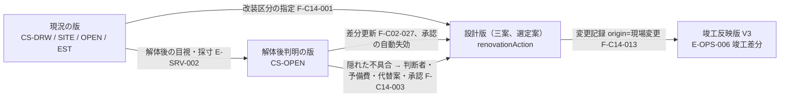

# 第21章 改装、竣工反映、引渡し、維持、入居後確認の仕様

作成日: 2026-09-15　版: v1.5　担当: 段階3 仕様書 第21章（一級建築士、BIM技術者、製品責任者、個人情報保護審査担当の合議）。v1.1 は 2026-09-15 の初稿審査（統合指摘 JM-148〜160 と整合指摘 10 件、整合修正指示 2 件）の再修正（2026-09-29 の途中停止の後、2026-10-06 に再開して完了。第6章 v1.1、第12章 v1.2、第23章 付表 4.3-A、4.3-B、基盤定義 v1.2 への追従を含む）。内容は `05_審査/再修正記録_第21章.md`。v1.2 は 2026-10-06 の段階6 の相互依頼の処理（石綿事前調査の requestedGate と I-00-130 の運用、竣工差分への現況状態の引継ぎ、入居後確認の家族間の不満と AC-C14-011-03、U-21-003 の解決）。内容は `05_審査/再修正記録_相互依頼_群D.md`。v1.3 は 2026-10-07 の段階6 二回目の修正（再審査の統合指摘 JR-095〔極高。P0 の撤去と移設の自動付与〕、JR-013、JR-066 ほか 16 件。`05_審査/再審査/00_修正計画.md` 第1.21節）。内容は `05_審査/再修正記録_2回目_第21章.md`。同日の二回目の修正の仕上げ（群R4）で、外部確認（`01_調査/08_外部確認_段階7後.md`。確認日 2026-10-07）の結果を第0.3節、第1.2節、第2.3節、第2.4節、第9.1節、章要約、章末の依頼表、未決事項に反映した（版は据え置き。内容は `05_審査/再修正記録_2回目_仕上げ_群R4.md`）。v1.4 は段階8前の持ち越し仕上げ（2026-10-08。共通の決定 D7、D14、D18、既定値の識別子の併記 1 行）。第2.4節「確認申請の要否候補」(b) の外壁以外の壁の数え方を第12章 v1.5 の E-ELM-001.bearsVerticalLoad と isCompartmentPartition の参照に改め（どちらかが true なら数え、両方 false なら数えず、どちらかが null で他方が true でない要素は「主要構造部の判定不能」。持ち越し 18）、章末の第23章あての依頼（T-A-012 の撤去と移設の例）を対応済みにし（JR-099）、用語追加提案に用語集 559、513 への統合を記し、U-21-004 の予備費の使途承認の閾値に DV-CO-14 を併記した。記録は `05_審査/再修正記録_段階8前_仕上げ_群F3.md`。v1.5 は段階8 の最終仕上げ（2026-10-08。再々確認 主2-01、主2-03〜主2-05、主2-10、主2-11、主4-01、主4-11。統括の決定 D34、D36、D37、D38、D43）。第2.1節 規則(7)の契機を案の変更命令（三案の派生を含む）に限って図面読解の修正を除き、寸法変更に撤去と新設の組を自動で付け、式(5)の参照を移設元と寸法変更の撤去の数え方とともに第13章 第5.5節と同じ文にし（目録の対象外は第12章 第7.8節 (f) と同じ）、第1.2節の T-R-006 P0 版の条件を第23章と同じ形にし、第2.3節 (3)(4) の石綿含有の発見の解除成果を (a)(c) で判定し (b) を製品が記載する形に改め、構造の確認記録に照合済みの資格の句を加え、F-C14-001 を v2.1 にした。記録は `05_審査/再修正記録_最終仕上げ_群G3.md`
根拠: 指示文 C14（改装、引渡し、維持、将来変更）、C2（現況状態、現況資料、隠れ部分、工事前調査）、C15（G5、G6）、E（学習同意、匿名化）、G（P1、P2 の範囲）、I節（第21章の位置）。基盤定義 `用語集.md` 第7群、第9群、第11群、495、`識別子規則.md`、`信頼状態と証拠段階.md` 第1.2節、第4節（CS-）、第3節（EL-）、第8節、第9節、`機能一覧骨格.md` v1.2 第1.14節（F-C14-001〜014、副番 F-C14-003-01）、`情報実体骨格.md` 群3、群6、群8、`七段階門.md` G2、G3、G5、G6、`十二判断領域.md` A10、A11、`画面指標試験骨格.md` S-14、S-27、M-O-01〜06、T-A-012、T-A-015、T-R-006、T-S-003、T-S-006、`整合検査報告.md` 第5節（識別子変更一覧）。第23章 第4.3節 付表 4.3-A、4.3-B（T-U-014、T-I-022、T-A-016、T-A-018）。調査 `01_調査/07_法規と個人情報と権利.md` 第2.9節、第2.10節、第2.12節、第4節。

## 0. 本章の目的、範囲と非対象、前提とする章

### 0.1 本章の目的

- 改装案件で、要素ごとの改装区分（残す、撤去、補修、補強、移設、新設）と、現況、解体後判明、設計、施工後の四つの状態を重ねて管理し、図面と現況の差、隠れ部分、工事前調査を問題として扱う規則を定める【推定】。
- 工事中に隠れた不具合が見つかった場合の判断者、費用予備、代替案、承認手順を工事前に定義させ、施工中変更、検査記録、竣工差分を竣工時建物情報へ反映する規則を定める【推定】。
- 引渡し一式（12項目）、機器台帳、維持計画、将来場面の試行、入居後確認、目標と実績の差、学び一覧、匿名化と学習同意の仕様を定め、実績が元案件の要求と判断へ戻る構造を固定する【推定】。
- P0 で保持する情報構造（固有ID、版、出典、責任、状態）と、P1、P2 で実装する機能を区分し、担当14機能（F-C14-001〜014）の必須10項目を記述する【推定】。

### 0.2 本章の範囲と非対象

| 区分 | 内容 | 区分 |
|---|---|---|
| 範囲 | 改装区分と四状態の重ね管理、現況資料と現況調査の結び付け、工事前調査の要件と自動登録条件（石綿事前調査、既存住宅状況調査、耐震診断、開口調査、設備点検〔既存余力〕）、確認申請の要否候補の登録、石綿含有判明後の記録の受入、解体後判明時の手順（工事前定義と発見時の処理）と予備費、施工中変更の記録と承認、検査記録と試運転、竣工差分と未反映の現場変更の検出、引渡し一式、機器台帳、維持計画、将来場面の試行、入居後確認、目標と実績の差と学び、匿名化と学習同意の運用、G5 と G6 の機能化、S-14 と S-27 の部品への対応、担当14機能の機能要件 | 【推定】 |
| 非対象（他章が主章） | 現況状態 CS- の付与処理と差異の重ね表示の描画、現況資料の結合手順、隠れ部分の問題化の検出規則（F-C02-024〜026。第11章。本章は改装区分と工事範囲の指定、CS-OPEN を与える調査記録の要件を定める）。変更命令と影響の実体と状態遷移（第12章。本章は origin=現場変更 の使い方）。構造、外皮、設備の調整と点検口、交換搬出の空間確保の検査（第13章。本章は維持計画との結合）。費用幅と予備費の算出（F-C13-001、第20章。本章は予備費の使途と隠れた不具合の判断の結合）。契約後変更の記録の費用側（F-C13-009、第20章。本章は副章）。施工資料の要素結合（F-C13-012、第20章。本章は副章）。現場確認、第三者評価、法的適合の証拠登録（F-C12-016、第19章）。学習同意の管理、削除、伏せ字候補の機能（F-C10-011、012、017。第22章。本章は入居後確認と学び一覧での使い方）。商品の交換周期の項目定義（第16章）。画面の部品採番と三状態の文言（第15章）。API（第14章。C14 の API は P2 で追加）。指標の計測手順と試験手順（第23章） | 【推定】 |
| 代替しないもの | 工事監理、石綿事前調査、既存住宅状況調査、耐震診断は有資格者または法令に基づく者が行い、本製品は要否の提示、記録の受入、要素への結合、未実施の問題化だけを行う（指示文 A1、10.6。共通指示 第7節） | 【推定】 |

### 0.3 前提とする章

| 章 | 本章が前提とする内容 |
|---|---|
| 第6章 | G5、G6 の開始条件、必須成果、完了条件、進行禁止条件 I-00-127〜I-00-133、G4 完了条件(7)と I-06-005、G5 の I-06-004（本章からの依頼）、承認範囲の種別（第5.1節）、進行禁止時の表示（第2.0節）。再審査の二回目（2026-10-07）で固定された G2 の完了条件(10)と I-06-009、I-06-007（発見の問題の重大度）、I-06-008（現況未確認）、解除表の「発見の問題」の行、欠落の自動記録 (vii)、資格の照合状態（第5.2節）、第2.6節の I-00-130 と I-06-004 の時点の書き分け、I-06-005 の式（unforeseenPlan の空） |
| 第7章 | 現況調査の主担当を対象に応じて分ける規則（U-00-011）、影響関係表の A10、A11 の行、判定例（石綿事前調査→A10、既存構造の腐朽→A04、既存壁内配管→A06、施工中の梁せい変更→A10、入居後の温熱乖離→A11） |
| 第8章 | 改装の利用導線（第2.2節）、売却または賃貸資料の導線（第2.5節）、生活場面の家族変化群と維持群、将来場面の P0 の範囲（U-08-008） |
| 第11章 | 現況状態の付与規則（第8.1節）、差異の種類（寸法差 30 mm 超、位置差 50 mm 超）、現況資料の結合と隠れ部分の問題化（第8.3節）、新資料による差分更新（第8.4節） |
| 第12章 | E-REQ-005 Option（kind=竣工反映版）、E-REQ-011 ChangeCommand（origin=現場変更、siteChangeInfo）、E-SRV-001 Survey、E-SRV-002 Observation、E-SRV-003 Test、E-PRD-004 Asset、E-OPS-001〜007、E-ORG-006 Consent（purpose=入居後確認、学習利用）、既定値表 DV-CO-04（予備費）、DV-CO-06（想定寿命）、DV-MT-05（隠れ部分の既定集合）、DV-ST-10（旧耐震の着工年閾値）、DV-EQ-10（試運転の既定項目）、DV-CO-17（汎用性の範囲）。v1.2 の属性 isRemoved、concealedParts、E-BLD-003.constructionStartYear、E-SYS-002.existingCapacity、E-REQ-009.trialScene、E-REQ-008.measuredStage（属性名、型、enum の正本は第12章）。再審査の二回目で新設の E-REQ-004.unforeseenPlan（kind=解体後判明の工事前定義）、DV-CF-13（所見の種別から報告種別への対応表）、E-SRV-001 の耐震診断の属性（evaluatedRevisionRef ほか）、第7.8節 (a) と (f) と F-C03-019-03（図面派生三案）、E-REQ-009 の説明（設備点検を設備更新の対応から外す） |
| 第13章 | 点検口（天井埋込機器から 1,000 mm 以内に 450×450 mm 以上）と交換搬出経路（機器寸法＋100 mm、下限 幅 700 × 高さ 1,800 mm。DV-EQ-03）の空間確保の指摘、干渉種別6と7、責任境界表の施工と設備の行。第5.5節 式(5)の P0 適用と解決証拠（撤去後の計画の版を対象とする構造の確認記録）、F-C11-001 例外(e)、AC-C11-002-07 |
| 第15章 | S-14 の6部品（S-14-01〜06）、S-27 の5部品（S-27-01〜05）、S-05-07 と S-10-07 の入口部品、三状態の文言。S-05-07 の P0 の固定注記（本章 第1.2節と同文）、現況未確認の透かしと注記（第3.2節、S-08-04）、改装区分の表示規則（P1）、S-03-03 の将来場面の行 |
| 第16章 | 商品項目の保守属性（保証、点検周期、交換周期、修理可否、交換部品、廃棄または再利用方法）、配置検査の交換経路（項目12） |
| 第17章 | 同意の実体と状態、個別同意の手順、有資格者確認の記録の必須四項目 |
| 第2章、第3章 | 成果5 の指標 M-O-05、M-O-06 の P0 の扱い（U-02-008）、雛形 G2(e)（将来場面への対応の採否）、DIF-91（石綿の有資格者調査義務）、RC-18（既存住宅状況調査方法基準の未確認事項）、RC-25〜RC-27（耐震診断の着工年閾値、石綿含有判明後の記録、大規模の修繕と模様替の過半の判定式）。2026-10-07 の外部確認（`01_調査/08_外部確認_段階7後.md`）で RC-18 の告示82号、RC-25、RC-26、RC-27 の判定式は【事実】になり、残る未確認は U-88-001〜U-88-003（改正政令の附則、撤去と移設の数え方、環境省令の保存期間。01_調査 08 の未決事項） |

## 1. 総則

### 1.1 規則

| 番号 | 規則 | 観察可能な条件 | 区分 |
|---|---|---|---|
| 1 | 情報構造の先行保持 | 本章の実体（要素の renovationAction、E-REQ-009 の isFuture と trialStatus、E-REQ-010 の G5 と G6、E-REQ-011 の origin=現場変更、E-SRV-001、E-SRV-003、E-PRD-004、E-OPS-001〜007、E-ORG-006 の purpose=入居後確認と学習利用）は P0 から識別子、版、出典、責任、状態を持つ。P0 で値が空でも実体定義と属性は存在する | 【推定】 |
| 2 | 隠れ部分を「無い」としない | CS-OPEN または該当する専門調査の記録がない隠れ部分は CS-EST のまま保持し、画面と書出で空洞や「無い」と描かない（基盤 信頼状態 第4.1節） | 【推定】 |
| 3 | 人の責任を代替しない | 工事前調査の実施、工事監理、現場変更の承認、竣工検査は人が担う。本製品は要否の提示、記録の受入、未実施の問題化、差分の検出を行う | 【推定】 |
| 4 | 竣工反映版は V3 の版 | 竣工時建物情報は E-REQ-005 kind=竣工反映版 として設計版とは別の版で持ち、信頼状態 V3、現況状態は CS-SITE 以上、共通情報環境状態 CDE-PUB を持つ（基盤 信頼状態 第9節） | 【推定】 |
| 5 | 差は残す | 設計版と竣工反映版の差は E-OPS-006 AsBuiltDelta に要素単位で残し、設計版を上書きしない。変更記録のない差は「未承認の現場変更」として問題にする | 【推定】 |
| 6 | 同意は目的別 | 入居後確認の取得は purpose=入居後確認 の同意、学び一覧への登録と学習利用は purpose=学習利用 の別同意を要する。学習同意の初期状態は無効（用語集229） | 【推定】 |
| 7 | 匿名化は登録の前提 | 学び一覧に登録する記録は isAnonymized=true を要し、住所、氏名、図面番号、位置情報、案件識別子、写真を含まない。M-G-15 の分子は 0 件を目標とする | 【推定】 |
| 8 | 主担当は一つ | 改装区分の指定は A03、四状態の重ね管理と解体後判明、施工中変更、検査記録、竣工差分の検出は A10、予備費は A09、竣工差分の正本化は A12、維持と将来場面と入居後は A11 を主担当とする（機能一覧骨格 第1.14節、十二判断領域 第3.4節） | 【推定】 |

### 1.2 P0、P1、P2 の区分

| 優先 | 本章で提供するもの | 観察可能な条件 | 区分 |
|---|---|---|---|
| P0 | 第1.1節 規則1の情報構造。S-14 は空状態（S-14-E「竣工情報がありません。P0 では情報構造のみを保持し、竣工反映は P2 で提供します」）。改装案件では S-05 で CS-DRW と CS-EST を記号と文字で表示（第11章 F-C02-024-01）。現況要素の削除と移動には撤去と移設を、寸法変更には撤去と新設の組を自動で付け（案の変更命令に限り、図面読解の修正は除く）、第13章 第5.5節 式(5)を P0 から適用する（第2.1節 規則(7)。解除は元に戻す変更だけ）。工事前調査の要否は S-05-07 に固定注記「解体、改造、補修を伴う工事には石綿事前調査の義務があります（大気汚染防止法、石綿障害予防規則）。既存の壁を撤去、移動する場合は耐震診断、大規模の修繕または模様替に当たる場合は確認申請が必要になることがあります。1981年（昭和56年）5月31日以前に着工した建物は、耐震性が明らかでない建物とされています（耐震改修促進法施行令 第3条）。2000年（平成12年）5月以前に建てた木造軸組の住宅も、国の検証法で耐震性の確認が勧められています。2階建ての木造住宅等で 2025年4月以降に着手する工事のうち、主要構造部（壁、柱、床、はり、屋根、階段）の一種以上の過半（1/2 を超える部分）を修繕または模様替する工事は、建築確認が必要です（建築基準法 第2条第14号、第15号、第6条第1項）。要否の判定は P1 で提供します」を表示し、問題は登録しない（要否判定の F-C02-026 と S-27-03 での区分の指定〔F-C14-001〕は P1。年の閾値と過半の文は 2026-10-07 の外部確認で【事実】になった値で、出典 URL と確認日は第2.4節の石綿事前調査、耐震診断、確認申請の要否候補の行に置く〔01_調査 08 第1節〜第3節〕。案件の要否を判定した表示ではなく、耐震診断は努力義務のため注記に「義務」と書かない）。改装の未確認事項は G4 で第6章 第2.5節 欠落の自動記録 (vii) として受取側へ渡す。予備費は工種別費用幅の一項目（E-SRV-014 workCategory=予備費、DV-CO-04 改装 10%）。将来場面は該当有無と時期の記録と案別の「試行未実施」の表示（U-06-007、U-08-008）。M-O-05、M-O-06 は「未計測」と表示し公開判定の合否に使わない（U-02-008） | 実体の属性が識別子台帳と項目辞書に存在し、G5 と G6 の門は「未開始」と表示される。資格を登録した RL-CHK がいない改装案件で、利用者の変更命令による既存の上下階連続壁の削除、既存の外周壁の削除、耐力壁候補線上の既存壁への新設開口で、それぞれ SEV-0（I-00-116）が 1 件ずつ登録され（派生前の変更は案ごとに 1 件）、派生による I-00-116 は 0 件（T-I-024 (2)）で、いずれも元に戻す変更で解決する（T-R-006 P0 版 (4)。第23章 AC-N-OP-01-21 の P0 版。統括の決定 D37） | 【推定】 |
| P1 | F-C14-001 改装区分（S-27-03 での 6 区分の指定。撤去と移設の自動付与は P0）、F-C14-002 四状態の重ね管理、F-C14-003 解体後判明時の手順（判断者、費用予備、代替案、承認手順の工事前定義と G4 での停止まで。発見時の処理は含まない）、F-C14-004 予備費管理、F-C14-005 改装前後比較、F-C14-006 将来場面の試行。S-27 の5部品。第2.4節の自動登録条件と第2.1節 規則(5)の「現況未確認」の問題の登録（I-06-008） | 6機能の受入条件（第9節）を満たし、T-U-014、T-I-022 と T-R-006、T-A-012、T-R-008 の P1 版に合格する（第23章 付表 4.3-A、4.3-B） | 【推定】 |
| P2 | F-C14-003-01 解体後判明時の発見時の処理（第3節 承認手順(1)〜(6)）、F-C14-007 引渡し一式、F-C14-008 竣工差分、F-C14-009 機器台帳、F-C14-010 維持計画、F-C14-011 入居後確認、F-C14-012 学び、F-C14-013 施工中変更、F-C14-014 検査記録。G5 と G6 の門の判定と進行禁止 I-00-127〜I-00-133、I-06-004。S-14 の6部品。S-27-04 に「発見時の処理は P2」の注記を置く | 9機能の受入条件を満たし、T-U-014、T-A-015、T-A-016、T-A-018 と T-S-006 に合格する | 【推定】 |

## 2. 改装の要素別区分と四状態の重ね管理

### 2.1 改装区分（F-C14-001）

改装区分は要素共通属性 renovationAction（enum{残す,撤去,補修,補強,移設,新設}。基盤 情報実体骨格 第0.4節）で持つ。指定は履歴付きの変更命令（E-REQ-011 origin=直接操作）として記録し、取消とやり直しができる。2D、3D、PDF の描き分けは第15章の改装区分の表示規則（P1。S-04-02、S-04-03、S-27-01、S-03。凡例を常時表示し PDF 書出と主要断面にも同じ凡例を出す。CS- の線種と重ならない記号の体系）に従い、表の「表示」列はその要約である（JR-079）【推定】。

| 区分 | 定義（観察可能な条件） | 要素の扱い | 影響先（影響関係表の語） | 工種と数量（第20章 第1.1節） | 表示（第15章） | 区分 |
|---|---|---|---|---|---|---|
| 残す | 幾何、位置、材質を変えない。仕上の再塗装等は「補修」 | 現況の要素をそのまま設計版へ複製。conditionState を保持 | A10（検査）、A11（点検） | なし（費用差 0。再塗装等は「補修」） | 既存の色 | 【推定】 |
| 撤去 | 要素を設計版から除く。撤去後の跡（開口、下地）を新たな要素として持つ | 設計版で isRemoved=true（要素共通属性。第12章 v1.2 第3.3節）とし、要素を消さずに保持する。工事範囲に含む | A04（荷重）、A06（貫通）、A09（数量）、A10（施工） | 解体撤去（要素の面積、長さ、個数と処分量。石綿含有の有無で処分区分を分け、確信幅を広げる） | 2D は破線と × 記号、3D は半透明（切替で非表示） | 【推定】 |
| 補修 | 幾何と位置を変えず、材質または仕上を更新する | 現況の要素を複製し materialRef または finish を変更 | A05（材料）、A09（費用）、A10（施工） | 内装または外皮の該当面積（仕上の面積 × 単価） | 網掛け | 【推定】 |
| 補強 | 幾何を変えずに構造性能を上げる部材を加える | 既存要素を残し、新設の補強要素を子要素として追加。既存要素の CS- は変えない | A04（補強）、A09（費用）、A10（施工） | 既存補強（補強の子要素数） | 「補強」の記号 | 【推定】 |
| 移設 | 既存要素を別位置へ移す。移設前後で同じ uuid | 設計版で geometry を変更し、移設元の跡を撤去と同じ扱いにする | A03（配置）、A06（経路）、A10（順序） | 解体撤去（移設元）＋新設の該当工種 | 移設元を破線、移設先を着色し矢印で結ぶ | 【推定】 |
| 新設 | 現況にない要素を追加する | conditionState は null（新設要素は現況状態を持たない） | A03、A04、A09 | 要素種別の該当工種（躯体、外皮、内装、設備、外構） | 着色と「新」の記号（色だけに頼らない） | 【推定】 |

規則: (1) 改装案件の全要素（新設を除く現況要素）は 6 区分のいずれかを持ち、未指定の件数を S-27-03 に表示する（P1。未指定 0 件は G2 の完了条件(10)）。(2) 「撤去しない」の要求（RP-FORBID。第8章 手順7）と矛盾する「撤去」「移設」の指定は要求衝突として S-24 へ出し、指定を確定させない。(3) 撤去、補修、補強、移設を持つ要素の集合を工事範囲とし、F-C02-026 の工事前調査の要否判定の入力にする。撤去と移設の要素集合は第13章 F-C11-002（構造への影響の問題化）の判定契機と、第20章 第1.1節の解体撤去の数量根拠として渡す。(4) 改装区分の指定は V1 以上の案で行い、V0 では行わない。(5) 工事範囲の要素が CS-DRW または CS-EST のままの案は、V2 の条件（基盤 信頼状態 第1.2節）を満たしても信頼状態帯（S-30-01）に「現況未確認（n 要素）」を併記し、G3 の門で問題（主担当 A10、影響先 A04、A06、SEV-1）を登録する。この SEV-1 は P1 で第6章 第8.2節 I-06-008「現況未確認の改装要素（G3、SEV-1。P1）」が判定し（F-C15-004 の V2 判定の出力に「現況未確認 n 要素」を含める）、資格を登録した RL-CHK（P1 は照合済み）の例外承認で持ち越せる。P0 は問題を登録せず、併記の表示（工事範囲は規則(7)で自動付与した撤去と移設の要素）と G4 の欠落の自動記録 (vii)（第6章 第2.5節）の「現況未確認 n 要素」だけを行い、P0 の撤去と移設には第13章 第5.5節 式(5)を P0 から適用する（規則(7)）。「現況未確認（n 要素）」は書出の透かしと GLB、PDF の注記にも含める（第15章 第3.2節、S-08-04、第22章 第1.4節）。この付帯条件は基盤 信頼状態 v1.2 第1.2節と第11章 第6.5節に追記済みで、受入条件は AC-C14-001-05（T-R-006 P1 版）。(6) 表の「工種と数量」の対応で、区分の指定と変更を第20章 F-C13-001 の工種別費用幅（工種の値 解体撤去、既存補強は第12章 v1.2 の E-SRV-014.workCategory に定義済み）と第3.1節の改装用工程雛形へ渡し、各案の変更費を工種別に、壊す範囲を面積（m2）でも表示する（AC-C14-005-03）。(7) P0 の撤去と移設の自動付与（JR-095）: 改装案件（E-BLD-001.useType=改装）で現況要素（conditionState が null でない要素）を削除、移動または寸法変更する案の変更命令（origin=自然文、直接操作の変更命令。三案の派生〔origin=生成。第12章 第7.8節 (f)〕を含む）は、要素を消さずに、削除には renovationAction=撤去（isRemoved=true）、移動には移設を自動で付ける（P0）。寸法変更（短縮、延長、既存開口の拡大と縮小、回転。E-REQ-011.intent.operation=寸法変更、回転）は、変更前の要素に撤去（isRemoved=true）、変更後の形の要素に新設を自動で付ける（撤去と新設の組。統括の決定 D34）。図面読解の修正（現況の訂正。第11章 工程9、F-C02-015 の手修正）は案の変更命令ではなく自動付与の対象外とし、訂正で消した要素は撤去にせず、解体撤去の費用、式(5)、欠落の自動記録 (vii) に数えない（統括の決定 D38）。指定画面 S-27-03 と、残す、補修、補強の指定は P1。自動で付いた撤去、移設、新設は工事範囲に含めて規則(3)の各章へ渡し、第13章 第5.5節 式(5)を P0 から適用する（既存の外周壁か上下階連続壁の撤去〔移設は移設元を、寸法変更は変更前の要素を撤去として数える。統括の決定 D36〕と、耐力壁候補線上の新設開口〔寸法変更で変更後の形に付いた新設の開口を含む〕は SEV-0〔I-00-116〕。候補線上のその他の壁の撤去、移設、補強は SEV-1。P0 の解除経路は元に戻す変更〔残すに戻す。変更命令の取消と連続取消。第12章 第7.4節〕だけで、撤去後の版を対象とする構造の確認記録による解除は P1。耐震診断の記録は確認記録の入力に限る。第2.4節）。寸法変更の撤去の側は削除の撤去と同じく、式(5)、解体撤去の費用への算入（第20章 第2.3節）、欠落の自動記録 (vii) の撤去の件数（第6章 第2.5節）、確認申請の要否候補の過半の分子（第2.4節 (b)。P1）に数える（D34）。図面派生の三案（第12章 第7.8節 (f)、F-C03-019-03）の変更命令の目録は、耐力壁候補線、外周壁、上下階連続壁とその上の要素（外壁開口を含む）を移動、撤去、拡大の対象にせず（改装案件の既存の壁と開口も同じ。統括の決定 D37）、目録の外の利用者の変更命令でこれらの現況要素を削除、移動または寸法変更した場合は本規則の自動付与を行い、第13章 第5.5節 式(5)で判定する（二重の防護。統括の決定 D36）。自動で付いた撤去と移設は解体撤去の工種へ（寸法変更の新設の側は新設の該当工種へ）算入し、処分区分は石綿含有の有無の未確認として幅の上側を使う（第20章 第2.3節）【推定】。

### 2.2 四状態の重ね管理（F-C14-002）

| 状態 | 保持する実体と版 | 要素の値の由来 | 現況状態 CS- | 段階 | 区分 |
|---|---|---|---|---|---|
| 現況 | 現況の版（E-REQ-006。設計版の分岐元） | 図面（VS-SRC）、現況資料（E-SRV-002 Observation）、推定（VS-AI） | CS-DRW、CS-SITE、CS-OPEN、CS-EST | G1 | 【推定】 |
| 解体後判明 | 現況の版へ E-SRV-002（kind=現地目視、resultingConditionState=CS-OPEN）を追加した新版 | 解体後の目視、採寸、写真（VS-USR または VS-PRO） | CS-OPEN | G5 | 【推定】 |
| 設計 | 設計版（E-REQ-005 三案または選定案の版） | 改装区分と変更命令 | 新設は null、残す等は現況を継承 | G2〜G4 | 【推定】 |
| 施工後 | 竣工反映版（E-REQ-005 kind=竣工反映版） | 竣工差分（E-OPS-006）と変更記録 | CS-SITE 以上 | G5 | 【推定】 |

規則: (1) 四状態は要素の uuid を共有し、状態ごとに別の版で値を持つ。一つの属性に四つの値（現況値、解体後判明値、設計値、竣工値）が別々に保持される。(2) 解体後判明で現況値が変わった場合、影響する設計版の要素と承認を差分更新し（F-C02-027 の手順）、影響範囲の承認だけを AS-VOID にする。(3) S-27-01 で現況、竣工図、設計時図面の三層に加え、P2 で解体後判明と施工後を切り替えて重ねる。(4) 工事で対象部位が変更または撤去された要素は CS-EST へ戻し、竣工反映で CS-SITE へ進める（基盤 信頼状態 第4.2節）【推定】。

既存の床段差（E-ELM-002.levelDelta）と扉幅（E-ELM-007 の有効幅）は現況の版で CS- を持ち、第19章 F-C12-011 の数値検査の結果に CS- を併記する。CS-DRW の段差は「図面上の値」と表示し、現地確認済みと同じ見え方にしない（第19章からの依頼への対応）【推定】。

### 2.3 現況資料と現況調査の主担当

現況資料は E-SRV-001 Survey と E-SRV-002 Observation で要素へ結ぶ（第11章 第8.3節）。現況調査の主担当は対象に応じて分け（第7章 U-00-011 を本章が採る）、確認者は主担当と別に持つ【推定】。

| 資料または調査 | Survey.kind | 主担当領域 | 与える現況状態 | 資格の記録 | 区分 |
|---|---|---|---|---|---|
| 現況写真、採寸、三次元走査 | 現況採寸、三次元走査 | 対象要素の領域（壁は A03、配管は A06） | CS-SITE | 不要（観察者と日時） | 【推定】 |
| 既存住宅状況調査 | 既存住宅状況調査 | A11 | CS-SITE（目視できる調査対象部位で、結果が「劣化事象等あり」または「劣化事象等なし」の要素に限る。「調査できない」部位と concealedParts の項目は上げない。CS-OPEN は与えない。第2.4節） | 既存住宅状況調査技術者の資格と有効期限、建築士の区分（一級、二級、木造）と対象建物の規模の組合せ（既存住宅状況調査方法基準 第3条、建築士法 第3条、第3条の2）、調査方法基準の版（例: 平成29年国土交通省告示第82号〔令和6年国土交通省告示第1235号改正、令和6年11月1日施行〕） | 【推定】 |
| 耐震診断 | 耐震診断 | A04 | CS-SITE または CS-OPEN（開口を伴う場合） | 診断者の資格（diagnoserQualification）。評価した案の版（evaluatedRevisionRef）、診断法、評点（第12章 E-SRV-001。撤去の指定より前の診断は撤去後の計画を評価していないものとして扱う） | 【推定】 |
| 石綿事前調査 | 石綿事前調査 | A10 | CS-OPEN（分析調査を伴う部位） | 調査者資格の種別（第2.4節） | 【推定】 |
| 地盤資料 | 地盤調査 | A02 | 要素ではなく Site へ | 調査者 | 【推定】 |
| 設備点検、修繕履歴 | 設備点検、修繕履歴 | A06（設備）、A11（履歴） | CS-SITE | 点検者 | 【推定】 |
| 開口調査（下地、配管、配線、劣化） | 現況採寸（開口を伴う） | 対象の領域（下地 A05、配管 A06、腐朽 A04） | CS-OPEN | 調査者と日時。有資格者を要する種類は資格 | 【推定】 |

CS-OPEN を与える調査記録の要件（第11章からの依頼への回答）: (1) 調査者（E-ORG-001 または E-ORG-002）、日付、対象要素、方法、写真または報告書（E-PRD-006）を必須とする。(2) 石綿事前調査、既存住宅状況調査、耐震診断は資格の種別と有効期限（期限のない資格は空）を Survey.qualificationRequired と Observation.observerRef の資格属性に持ち、資格記録がない場合は CS-OPEN にせず「資格記録なし」を表示する（第11章 F-C02-026 例外(b)）。既存住宅状況調査は非破壊で劣化事象等を調べる調査（既存住宅状況調査方法基準）のため、その記録は CS-OPEN を与えず、目視できる部位の CS-SITE までとし、concealedParts の項目は CS-EST のまま残す（開口調査の記録と区別し、劣化事象等の有無は隠れ部分の推定の根拠として記録する。01_調査 08 第6節【推定】）。(3) 調査記録の登録で対応する問題（E-REQ-003）を IS-RESOLVED にし、解決証拠に記録を結ぶ【推定】。

隠れ部分の単位と発見の問題化: (1) 隠れ部分は要素共通属性 concealedParts（list[json{kind:enum{下地, 配管, 配線, 劣化, 漏水, 腐朽, 蟻害, 石綿}, conditionState:enum{CS-EST, CS-OPEN}, surveyRef:ref[E-SRV-001 または E-SRV-002], note:str}]。第12章 v1.2 第3.3節で定義済み）で持ち、改装案件の壁、床、天井、屋根、基礎の要素には第11章 第8.1節が要素種別ごとの既定集合 DV-MT-05（第12章。工事範囲の要素だけに生成し、「残す」要素には生成しない）を CS-EST で生成する。(2) 開口調査と石綿事前調査の記録は該当 kind の conditionState だけを CS-OPEN にし、要素本体の CS- は変えない。S-27-04 の隠れ部分の一覧の単位は要素ではなく concealedParts の項目とする（第15章へ依頼）。(3) 調査記録の所見（E-SRV-001.findings.values[] と E-SRV-002.value の findingKind。concealedParts.kind と同じ 8 値。第12章 v1.2）が detected=true で劣化（腐朽、蟻害、漏水）、石綿含有、想定外の配管や配線を示す場合は、第11章 F-C02-026 正常手順(6)（受入条件 AC-C02-026-04 とともに第11章 v1.1 で定義済み。第11章 v1.2 の (6) は本節 (3) を参照する。2026-10-06、群B の申し送り）が要素ごとに発見の問題（E-REQ-003。主担当は対象の領域: 腐朽は A04、石綿は A10、配管は A06）を一件だけ登録し、第3節の代替案の型を提示する。重大度は第6章 第8.2節 I-06-007「発見の問題の所見の種別による重大度付与（G3、G4。P1）」が付ける（種別は E-REQ-003.reportKind、または第12章 DV-CF-13 で導いた種別。石綿含有と構造部材〔土台、柱、梁、耐力壁候補線上の壁、基礎〕の腐朽、蟻害は SEV-0、他の detected=true は SEV-1）。設計段階（G3、G4）で IS-RESOLVED になった同じ発見の問題は、所見が残っても G4 の再検査と G5 で再登録しない（第6章 第8.2節 I-06-007。統括の決定 D43）。要否の問題の解決と発見の問題の登録は同じ変更識別子で結ぶ。(4) 設計段階（G3、G4）の発見の問題は第6章 第2.4節、第2.5節の解除表の「発見の問題（石綿含有、構造）」の行（導線 S-27-04、S-25、S-12）で解決する。石綿含有（含有とみなす判断を含む。所見の根拠の区別は第12章 E-SRV-001.findings の basis〔分析、みなし〕）は、(a) renovationAction と処分区分（DV-CO-07「含有あり」）による解体撤去の費用幅と期間の更新（費用幅と期間の更新に限り、第20章に工程の規則を足さない）と、(c) 照合済みの資格を持つ RL-CHK を判断者とする判断（E-REQ-004。resolvesIssueRefs=当該の発見の問題。問題の解決証拠〔E-REQ-003.resolutionEvidenceRef〕はこの判断。統括の決定 D41）がそろうと IS-RESOLVED とし、G3 の門は (a)(c) で判定する。(b) 除去等は元請業者等が行い製品外である旨と I-06-004 の予告（吹付け石綿、石綿含有断熱材等の除去等を伴う届出対象特定工事では、発注者または自主施工者に作業開始の 14 日前までの届出の義務がある旨〔大気汚染防止法 第18条の17〕を同じ未確認事項に載せる。製品は届出の要否を判定しない。第2.4節）は、製品が引継ぎ一式の未確認事項に自動で記載する（解決済みの発見の問題を含む。第22章 F-C15-013 正常手順(4)。統括の決定 D43）。構造の腐朽、蟻害は補強または交換の設計変更（renovationAction=補強、撤去と新設）と構造の確認記録（E-REQ-007 scopeKind=構造。資格を登録した RL-CHK、P1 は照合済みの資格。第6章 第5.2節）で解決する。G5 の I-06-004 は同じ発見を参照する別の条件（除去等の記録の未登録）で、発見の問題を G5 で再登録しない【推定】。

### 2.4 工事前調査の要件（第3章からの依頼 DIF-91、RC-18、RC-25〜RC-27 への対応）

| 調査 | 製品が提示する確認項目 | 根拠 | 区分 |
|---|---|---|---|
| 石綿事前調査 | (1) 解体、改造、補修を伴う工事では元請業者または自主施工者が石綿含有建材の有無を事前調査する義務がある。(2) 建物の着工日が平成18年9月1日以降と設計図書等で明らかな場合は書面での着工日確認で足りる。(3) 令和5年10月1日以降、建築物の事前調査は一般建築物石綿含有建材調査者、特定建築物石綿含有建材調査者、一戸建て等石綿含有建材調査者（一戸建て住宅と共同住宅の住戸内部のみ）が行う。(4) 令和4年4月1日以降、解体は対象床面積合計 80 m2 以上、改造と補修は請負金額合計 100 万円以上（税込、調査費用を除く）で都道府県等への報告が要る。(5) 事前調査の記録は写しを現場に備え置き、工事終了後3年間保存する | 環境省 https://www.env.go.jp/air/asbestos/litter_ctrl/ 、リーフレット https://www.env.go.jp/air/air/post_48/20210909leaflet.pdf 、報告 https://www.env.go.jp/air/asbestos/post_87.html （確認日 2026-09-15）。(1) の義務者と条文: 大気汚染防止法 第18条の15第1項（元請業者が調査し結果を発注者に書面で説明）、石綿障害予防規則 第3条（事業者の事前調査。第7項で記録を 3 年間保存）。e-Gov https://laws.e-gov.go.jp/law/343AC0000000097 （SRC-314）、 https://laws.e-gov.go.jp/law/417M60000100021 （SRC-315、確認日 2026-10-07。01_調査 08 第3節） | 【事実】 |
| 石綿事前調査の製品への反映 | 改装案件で解体を伴う場合（質問群K の「解体を伴う」または工事範囲に撤去、補修、補強、移設がある場合）、着工年の入力（E-BLD-003.constructionStartYear。日付が分かれば constructionStartDate。第12章 v1.2）、事前調査の要否、報告要否の仮判定、調査者資格の種別を S-27-04 と S-09 の確認項目に表示する。報告要否の仮判定は 80 m2 と 100 万円を概算の数量と費用幅と比べ、「報告要の可能性が高い（概算）」「報告要の可能性あり（概算。確定は元請業者）」「概算では報告基準未満（確定は元請業者）」の三値だけで表示し、費用幅または面積が閾値をまたぐ案件は二番目の値にする。「報告不要」の語は使わない（T-S-003 の禁止表示語と合格条件(5)の三値表示の検査。基盤 画面指標試験骨格 v1.2 第3.4節と第23章 第4.1節で追加済み）。要否の最終判断と実施は元請業者等の責任であり、製品は「義務の有無を判定した」と表示しない。不足調査（E-SRV-001 kind=石綿事前調査、SEV-1）の requestedGate は G4 とする（第18章 第2.1節 項目12 の仮定を採る。U-18-011 への判断、2026-10-06）。理由は、調査の実施者が元請業者等であり、発注先が決まる前の G2、G3 では実施できない案件が多いためである。ただし (a) 着工日が平成18年9月1日以降と設計図書等で明らかな書面は G2 から受け入れて確認済みにできる。(b) 受入済みになるまでは解体撤去の費用幅を「石綿含有の有無は未確認」として上側へ広げる（第2.1節 表の解体撤去、第20章）。工事前の判明は工種別費用（解体撤去の処分区分「含有あり」）へ計上し予備費を消費しない。予備費の使途候補の石綿含有建材の除去は工事開始後（G5）の解体後判明に備えるもので、工事前の判明で CS-EST が減った場合は予備費の根拠を再計算し、決定者に予備費の見直しを示す（第3節「費用予備」、F-C14-004。JR-094）。(c) G4 の門で受入済みでない場合は、資格を登録した RL-CHK（P1 は照合済み。第6章 第5.2節）の例外承認（期限=G5 の開始前、実施予定者=元請業者等）でだけ持ち越せ、引継ぎ一式の未確認事項に載せる。法令の義務のため利用者判断（IS-EXC の一種）では閉じない。(d) G5（P2）では、工事範囲に撤去、補修、補強、移設を持つ案件で、受入済みの調査記録も (a) の書面もない場合に I-00-130（SEV-0。基盤 七段階門 G5）が該当し、G5 の開始後、解体を含む施工中変更と検査記録の登録を受け付けない（段階内の操作の停止。第6章 第2.6節、第1.1節 規則8 の例外）。含有判明後の作業結果の報告書面（大気汚染防止法 第18条の23第1項。自主施工の場合は自主施工者の記録。作業の写真記録は任意の添付。本節「石綿含有判明後の扱い」）の未登録は、I-06-004 が G5→G6 の門（竣工反映版の発行）を止める（第6章 第2.6節。JR-031）。I-00-130 は例外承認でも利用者判断でも閉じず、IS-RESOLVED は調査記録の受入済みか (a) の書面の登録に限る。P0 と P1 では G5 の門が未実装のため、S-27-04 と S-13 の警告表示に留める（第11章の依頼「I-00-130 の P2 での運用」への対応）【仮定】 | 調査07 第4節【推定】、第18章 第2.1節 項目12、基盤 七段階門 G5 | 【推定】 |
| 既存住宅状況調査 | (1) 建築士であって登録講習機関の講習を修了した既存住宅状況調査技術者が「既存住宅状況調査方法基準」（平成29年国土交通省告示第82号）に従って調査する。(2) 資格は取得年度の3年後の年度末まで有効で更新講習で継続する。(3) 平成30年4月1日から既存住宅の取引で重要事項説明の対象。(4) 調査者の建築士の区分は対象建物の規模で分かれる（建築士法 第3条第1項第2号〜第4号の建築物は一級建築士、第3条の2第1項各号の建築物は一級または二級建築士、その他は一級、二級または木造建築士である既存住宅状況調査技術者。告示 第3条）。(5) 告示は令和5年第49号、令和6年第180号、令和6年第1235号（令和6年11月1日施行）で改正されている | 国土交通省 https://www.mlit.go.jp/jutakukentiku/house/kisonjutakuinspection.html （確認日 2026-09-15）。有効期間は検索抜粋（調査07 第2.9節）。(4)(5) は国土交通省「既存住宅状況調査方法基準の解説」令和6年10月25日 https://www.mlit.go.jp/jutakukentiku/house/content/001840201.pdf （SRC-319、確認日 2026-10-07。01_調査 08 第6節） | 【事実】 |
| 既存住宅状況調査の製品への反映 | 調査の有無、調査日、技術者の資格有効期限、建築士の区分と対象建物の規模の組合せ、調査方法基準の版（例: 令和6年国土交通省告示第1235号改正）を E-SRV-001 と専門家確認の記録に持つ。調査対象部位は「告示の対象部位」として一覧にする（木造: 構造耐力上主要な部分の 9 部位〔基礎（立ち上がり部分を含む）、土台及び床組、床、柱及び梁、外壁及び軒裏、バルコニー、内壁、天井、小屋組（下屋部分を含む）〕と各部位の蟻害、腐朽等、基礎の配筋。雨水の浸入を防止する部分の 7 部位〔外壁（開口部を含む）、軒裏、バルコニー、内壁、天井、小屋組、屋根〕。告示 第5条、第6条）。結果は部位ごとに「劣化事象等あり」「劣化事象等なし」「調査できない」の三値で受け入れ（告示が結果の概要に部位ごとの有無と調査できない旨を記載させる扱いに合わせる）、「調査できない」部位と存在しない部位の要素は CS- を上げない。調査は非破壊のため、上げてよいのは目視できる部位の要素の CS-SITE までとし、concealedParts の項目は CS-EST のまま残す（第2.3節）。耐震性に関する書類の確認（告示 第11条。1981-06-01 以降に確認済証の交付を受けた既存住宅か等を確認済証、検査済証、耐震基準適合証明書等で確かめる）は確認済証の交付日による判定で、本節 耐震診断の要否 (a-1) の着工日による判定とは別に扱う | 国土交通省「既存住宅状況調査方法基準の解説」令和6年10月25日（告示本文を収録） https://www.mlit.go.jp/jutakukentiku/house/content/001840201.pdf （SRC-319、確認日 2026-10-07。01_調査 08 第6節）。三値の受入と CS- の扱いは本製品の規則 | 【事実】（部位、方法、版）、【推定】（三値の受入と CS- の扱い） |
| 石綿含有判明後の扱い | 分析結果で含有あり、または含有とみなす判断（石綿障害予防規則 第3条第5項ただし書）が記録された場合、製品は除去等の手続の要否と報告の内容（除去の適否）を判定せず、次の記録の受入と未登録の問題化だけを行う。受け入れる記録（製品外の手続の結果。E-PRD-006 kind=調査報告または証明書）: (1) 事前調査の結果の説明書面（大気汚染防止法 第18条の15第1項。元請業者から発注者へ）、(2) 特定粉じん排出等作業の結果の報告書面（同 第18条の23第1項。元請業者から発注者へ。自主施工の場合は自主施工者の記録〔同条第2項〕）、(3) 届出対象特定工事の届出の控え（同 第18条の17。発注者または自主施工者が作業開始の 14 日前までに都道府県知事へ届け出る）、(4) 事前調査の結果の報告の控え（同 第18条の15第6項、石綿障害予防規則 第4条の2）。作業の写真記録（石綿障害予防規則 第35条の2。事業者が保存する記録で、発注者への交付の定めはない）は任意の添付とする。除去等の作業、記録の作成と保存、都道府県知事と労働基準監督署長への報告の義務は元請業者、自主施工者、事業者にあり、製品はその当事者ではない。未登録の問題化は (2) の未登録を第6章 I-06-004（SEV-0。G5→G6 の門〔竣工反映版の発行〕を止める）で行う。含有の発見は、設計段階（G3、G4。P1）では発見の問題として I-06-007 で、G5 では第3節 承認手順(2)の検証規則で SEV-0 になり、例外承認で持ち越せない。設計段階の解決と G5 で再登録しない扱いは第2.3節 (4)（第6章 解除表の「発見の問題」の行）による。P0 と P1 では G5 の門が未実装のため I-06-004 は警告表示に留まる。環境省令（大気汚染防止法施行規則）の記録の保存期間の原文は未取得で【未確認】（U-88-003。01_調査 08）。U-21-013 は解決 | e-Gov 大気汚染防止法 第18条の15〜第18条の23 https://laws.e-gov.go.jp/law/343AC0000000097 （SRC-314）、石綿障害予防規則 第3条、第4条の2、第35条の2 https://laws.e-gov.go.jp/law/417M60000100021 （SRC-315、確認日 2026-10-07。01_調査 08 第3節）。指示文 C2、第6章 第2.6節、第8.2節 | 【事実】（義務者、書面、条文）、【推定】（受入と問題化の規則） |
| 開口調査の要否（自動登録条件） | 工事範囲（撤去、補修、補強、移設）の壁、床、天井、屋根、基礎の concealedParts に conditionState=CS-EST の項目が残る場合、要否を問題（主担当は項目の領域: 下地と漏水は A05、配管と配線は A06、腐朽と蟻害は A04、石綿は A10。影響先 A10、A11。SEV-1）として登録し、不足調査（E-SRV-001 kind=現況採寸〔開口を伴う〕、requestedGate=G2）へ入れる（第11章 F-C02-026 の手順） | 指示文 C2 | 【推定】 |
| 耐震診断の要否（自動登録条件） | 旧耐震の着工年閾値（値と版の正本は第12章 DV-ST-10）を次の二つに分けて使う。(a-1) E-BLD-003.constructionStartYear（日付が分かる場合は constructionStartDate）が 1981-05-31 以前（耐震改修促進法施行令 第3条「昭和五十六年五月三十一日以前に新築の工事に着手したもの」。耐震性が明らかでない建築物の要件。法令の文言で【事実】）。同条ただし書により、1981-06-01 以後に増築、改築、大規模の修繕または大規模の模様替の工事（同条各号の工事を除く）に着手し検査済証の交付を受けたもの（独立部分が二以上ある場合はその全部）は除かれるため、後の工事の検査済証（E-PRD-006 kind=証明書）の登録で (a-1) の問題を解決とする。(a-2) E-BLD-003.structureType=在来木造（在来軸組構法）かつ E-BLD-003.storeys が 2 以下で、1981-06-01〜2000-05-31 に建築されたもの（国土交通省掲載「新耐震基準の木造住宅の耐震性能検証法」〔平成29年5月〕の対象で、法令の要件ではない【事実】。同検証法の「建築された」時点を着工日で代用するのは【推定】）。枠組壁工法、木質系工業化住宅、3 階建て以上の木造、立面的混構造（structureType=その他を含む）には (a-2) を当てない。着工年が null なら要否を「判定不能」として不足調査の候補にする。(b) 撤去または移設の要素に外周壁または耐力壁候補線上の壁を含む。(c) 増築を伴う。いずれかで問題（主担当 A04、影響先 A10、A09、SEV-1、固定先=該当壁）と不足調査（kind=耐震診断、requestedGate=G2）を登録し、S-27-04 と S-13 に表示する。(a-1)、(a-2) の問題の表示語は「耐震診断の努力義務の対象となる場合があります（耐震改修促進法 第16条）」とし、「義務」「必須」と表示しない（一般の戸建住宅の耐震診断は同条第1項の努力義務【事実】）。P0 では耐震診断の要否の問題を登録せず、S-05-07 の固定注記と G4 の欠落の自動記録 (vii)（工事前調査の要否 未判定〔P1〕）で示す（(b) の撤去と移設は P0 でも第2.1節 規則(7)で自動で付くが、要否の判定は P1）。この要否の問題とは別に、既存の外周壁または上下階連続壁の撤去と、耐力壁候補線上の新設開口は、第13章 F-C11-002 が構造注意 I-00-116（荷重経路の重大問題。SEV-0、G3。基盤 七段階門 v1.2）として登録する（P0 は自動付与の撤去と移設にも適用し、移設は移設元を撤去として数える。第2.1節 規則(7)、第13章 第5.5節 式(5)。統括の決定 D36）。解決は撤去を「残す」に戻す変更（P0 の解除経路はこれだけ）か、撤去後の計画の版（baseRevisionRef）を対象とし撤去する壁を scope に含む AS-VALID の構造の確認記録（E-REQ-007 scopeKind=構造。資格を登録した RL-CHK、P1 は照合済み。計算書等は E-REQ-008 として添付。統括の決定 D41）に限る。耐震診断の記録（E-SRV-001 kind=耐震診断）は確認記録の入力（evidenceRefs）に限り、単独では SEV-0 の登録を妨げず解決にもしない（第13章 第5.5節 式(5)と F-C11-002 例外(e)の改訂。JR-066）。構造の確認記録（P1）の確認項目の参考に、国住指第517号（令和7年3月26日）記2(3) の構造耐力上の危険性を増大させない例（屋根を従前より重いものに葺き替えない、四分割法の検証結果が変わらず存在壁量が減らない、耐震診断の Iw 値が着工前以上か 1.0 以上、柱を取り除く場合に梁の強度や周辺の柱の配置等で構造安全性を確保する等）を示す。製品はこれを判定せず、構造設計者の確認記録の項目にとどめる（01_調査 08 第2節【推定】）。候補線上のその他の壁（上下階に連続しない内壁等）の撤去、移設、補強は SEV-1 の構造注意とする（2026-10-06 の相互依頼で基盤 七段階門 v1.2 の I-00-116 が指摘一覧 JM-094 (1) の範囲に訂正されたことへの追従。整合検査報告 第5節） | 指示文 C2、第12章 DV-ST-10、第13章 第10.2節、基盤 七段階門 G3。(a-1) と表示語: e-Gov 建築物の耐震改修の促進に関する法律施行令 第3条 https://laws.e-gov.go.jp/law/407CO0000000429 （SRC-306）、同法 第16条第1項 https://laws.e-gov.go.jp/law/407AC0000000123 （SRC-305）。(a-2): 国土交通省掲載「新耐震基準の木造住宅の耐震性能検証法」 https://www.mlit.go.jp/common/001184898.pdf （SRC-307）。国住指第517号: 国土交通省「建築物の改修における建築基準法のポイント説明会」 https://www.mlit.go.jp/jutakukentiku/content/001911322.pdf （SRC-313、いずれも確認日 2026-10-07。01_調査 08 第1節、第2節） | 【推定】 |
| 既存住宅状況調査の要否（自動登録条件） | 改装案件で現況資料（E-SRV-002）が 0 件、または構造耐力上主要な部分と雨水の浸入を防止する部分に当たる要素（告示の部位に当たる要素種別: 基礎、土台、床組、床、柱、梁、外壁、軒裏、バルコニー、内壁、天井、小屋組、屋根、開口部の建具。本節「既存住宅状況調査の製品への反映」）に CS-SITE 以上の要素が一つもない場合、不足調査（kind=既存住宅状況調査、requestedGate=G2）と問題（主担当 A11、影響先 A04、A05、SEV-2。利用目的が売却または賃貸資料なら SEV-1）を登録する。任意の制度であるため、実施しない判断は決定者（RL-OWN）が理由を付けた利用者判断（IS-EXC の一種。E-REQ-007 scopeKind=例外、exceptionKind=利用者判断。用語集 495、第6章 第5.1節）で閉じ、施工安全に関わる仮定を確定扱いにしない旨を表示する。法令で義務の調査（石綿事前調査）にはこの閉じ方を使えない。確認項目は E-BLD-002.confirmationItems の改装項目（第12章 v1.2）に持ち、新築案件では表示しない（useType で分岐） | 指示文 C2、第18章 第2.1節 | 【推定】 |
| 設備点検（既存余力） | 改装案が系統の方式変更または機器の追加（IH 調理器、ヒートポンプ給湯、EV 充電、二世帯化の台所増設等）を含む場合、既存余力（E-SYS-002.existingCapacity。電気は契約容量と分電盤の空き回路数と幹線、給水は引込口径と水圧、排水は管径と放流先、換気は 24 時間換気の有無、給湯は号数）の確認を工事前調査として問題（主担当 A06、影響先 A09、A10、SEV-1、固定先=系統）と不足調査（kind=設備点検、requestedGate=G2）に登録する。既存値が CS-EST なら「余力未確認」を表示し、S-27-04 の必要調査に設備点検を明示する。existingCapacity の項目と型は第12章 v1.2（list[json{item, value, unit, sourceRef, conditionState}]）に従う。余力と loadEstimate の決定的な比較は第13章 F-C12-003 正常手順(5)（P1。受入条件 AC-C12-003-04 は第13章が定義済み。第13章 第10.14節。2026-10-06 確認） | 指示文 10.1、第12章 E-SYS-002、第13章 第4.1節 | 【推定】 |
| 確認申請の要否候補 | (a) 増築（E-BLD-003.grossFloorArea の増加）、(b) 主要構造部（建築基準法 第2条第5号。壁は外壁、鉛直荷重を負担する間仕切壁、防火上・避難上の区画をする間仕切壁で、耐力壁かどうかとは別の概念。最下階の床、間柱、付け柱、小ばり、ひさし、局部的な小階段、屋外階段を除く）の種類ごとに、改修する部分の量が工事前の総量の 1/2 を超える（過半）場合。量は壁=面積、柱=本数、梁=本数、床=水平投影面積、屋根=水平投影面積、階段=階ごとの個数で数える【事実】。仕上げ材だけの改修、カバー工法、屋根ふき材のみ、外装材のみ、外壁の内側からの断熱改修、既存の床と階段への仕上げ材の被せは数えない【事実】（これらは renovationAction=補修 で指定し、過半の計算に入れない。第23章 T-A-012 P1 版 (iii)）。改修する部分には renovationAction=撤去、補強、新設、移設（移設は移設元と移設先をそれぞれ数える。JR-099）の要素を含めるが、この数え方は国の資料に記載がない保守側の候補規則で【仮定】（U-88-002。01_調査 08）。分母は工事前の総量とする（減築の屋根と外壁は【事実】、その他は【推定】）。外壁以外の壁は、E-ELM-001.bearsVerticalLoad（鉛直荷重の負担）または isCompartmentPartition（区画の間仕切壁）が true なら主要構造部の壁として過半の計算に数え、両方が false なら数えない。どちらかが null で他方が true でない要素は過半の計算に入れず「主要構造部の判定不能」として行政照会の不足調査に送る（両属性は第12章 第4.3節 v1.5。E-ELM-001.isLoadBearing は耐力壁の区分で鉛直荷重の負担を表さないため、この判定に使わない）。(a) または (b) に当たる場合に、「大規模の修繕または模様替の候補」を問題（主担当 A02、影響先 A09、A10、A12、SEV-1）として登録し、法規判定（第18章 F-C09-008。確認申請区分の判定は P1）と不足調査（行政照会）へ導く。(b) の対象は建築基準法 第6条第1項第2号の建築物（二以上の階数、または延べ面積 200 m2 超。E-BLD-003.storeys、grossFloorArea）で 2025-04-01 以後に工事に着手するもので、平家かつ延べ面積 200 m2 以下の建物では (b) の候補を登録しない。水回りのみの改修、手すりやスロープの設置は対象外【事実】。要否の確定は建築士が行い、判断がつかない場合は特定行政庁に照会する。製品は「申請不要」と表示しない（T-S-003 の禁止表示語。基盤 画面指標試験骨格 v1.2 第3.4節と第23章 第4.1節で追加済み）。既存不適格か違反建築かは製品が判断しない（2階建て木造一戸建て住宅の大規模の修繕・模様替の緩和〔法第86条の7、令第137条の12〕の要点は説明として表示できる）。U-21-012 は一部解決 | 2025 年 4 月施行の改正で新 2 号建築物の大規模の修繕と模様替が確認申請の対象。国土交通省 https://www.mlit.go.jp/common/001627103.pdf （確認日 2026-09-15）【事実】。判定式、主要構造部の壁、数えない改修、適用時期と対象外の工事、緩和: e-Gov 建築基準法 第2条、第6条第1項 https://laws.e-gov.go.jp/law/325AC0000000201 （SRC-310）、国土交通省「木造戸建の大規模なリフォームに関する建築確認手続について【令和7年2月21日時点】」 https://www.mlit.go.jp/common/001766698.pdf （SRC-311）、同「リフォームにおける建築確認要否の解説事例集（木造一戸建て住宅）」 https://www.mlit.go.jp/common/001853472.pdf （SRC-312）、同「建築物の改修における建築基準法のポイント説明会」（国住指第517号を収録） https://www.mlit.go.jp/jutakukentiku/content/001911322.pdf （SRC-313、確認日 2026-10-07。01_調査 08 第2節）【事実】。撤去、新設、移設、補強の数え方は【仮定】 | 【推定】 |

例示問題: I-21-001 解体を伴う改装で着工年が未入力のため石綿事前調査の簡略化可否が判定できない（主担当 A10、影響先 A09、SEV-1）。I-21-002 既存住宅状況調査技術者の資格有効期限が調査日より前（主担当 A11、影響先 A12、SEV-1）。I-21-003 撤去する壁の concealedParts（配管）が CS-EST のまま（主担当 A06、影響先 A10、A11、SEV-1）。I-21-006 既存の外周壁を撤去する指定に対し耐震診断の記録がない（耐震診断の要否の問題。主担当 A04、影響先 A10、A09、SEV-1。撤去そのものの構造注意は第13章 F-C11-002 が I-00-116〔SEV-0〕として別に登録し、耐震診断の記録だけでは解決しない）。I-21-007 主要構造部の過半を撤去する指定で確認申請の要否が未確定（主担当 A02、影響先 A09、A10、A12、SEV-1）【仮定】。

## 3. 解体後判明時の手順（F-C14-003、F-C14-004）

工事前（G3 完了まで）に次の4項目を定義し、定義のない改装案件は G4 を通過させない（機能一覧骨格 F-C14-003 の合格条件）。定義は E-REQ-004 Decision（kind=解体後判明の工事前定義、gate=G3、isKeyDecision=true）の unforeseenPlan（第12章。属性は表の「実体」列）に記録し、第6章 G4 完了条件(7)と進行禁止条件 I-06-005（SEV-0。E-EXC-005 kind=欠落属性。式は「kind=解体後判明の工事前定義 の E-REQ-004 が無い、または unforeseenPlan のいずれかが空」。試験 T-R-006）で判定する（第6章 第2.5節、第8.2節）。既定値（DV-CO-04）で埋まる予備費の range は定義済みに数えない（JR-058）。4 項目の工事前定義は F-C14-003（P1）、発見時の処理（承認手順(1)〜(6)）は F-C14-003-01（P2）が担う。P0 の改装案件では 4 項目を定義せず、G4 の欠落の自動記録 (vii) に「解体後判明時の 4 項目 未定義（P1）」として載せる（第6章 第2.5節。JR-095）。第20章 第1.6節の「G1 で定義」は本節の「G3 完了まで」に合わせる（第20章へ依頼）【推定】。

| 項目 | 工事前に定義する内容（観察可能な条件） | 実体 | 区分 |
|---|---|---|---|
| 判断者 | 決定者（関係者表の決定権を持つ RL-OWN）、確認者（RL-CHK 建築士または監理者）、報告者（施工者 RL-PART）を役割と氏名で指定する。構造、避難、防火、石綿含有に関わる発見は有資格者の RL-CHK を確認者に必須とする。資格記録のある RL-CHK が案件に未登録の場合は、S-13-03「承認者未設定」から F-C08-008（P1）または S-08 の共有で建築士を追加する導線を示す（F-C14-003 例外(c)） | E-REQ-004.unforeseenPlan の deciderRef、verifierRef、reporterRef（E-ORG-007 の行を指す） | 【推定】 |
| 費用予備 | 予備費（E-SRV-014 workCategory=予備費。既定 DV-CO-04 改装 10%、初期仮説）と使途候補（腐朽、蟻害、石綿含有建材の除去、隠れた配管の更新、下地補修、基礎の補修、工事停止中の待機費）ごとの費用幅を持つ。待機費の単価は施工者の契約条件に依存するため幅で示す。一件の使途が予備費残高の 30% 超または 30 万円超の場合は決定者の承認を要する（初期仮説）。予備費の消費は工事開始後（G5）の解体後判明に限る。工事前（G3、G4）の調査で判明した事項は工種別費用（解体撤去の処分区分、既存補強、設備更新）へ計上し予備費を消費しない。工事前の判明で CS-EST が減った場合は予備費の根拠を再計算し、決定者に予備費の見直しを示す（第20章 第6.3節。JR-094） | E-REQ-004.unforeseenPlan.contingencyRef → E-SRV-014（workCategory=予備費）。E-SRV-005.contingency は本判断を参照し、判断者と手順を重ねて持たない | 【仮定】 |
| 代替案 | 発見の種別ごとに代替案の型（残す→補修、補修→補強、補強→撤去と新設、工事範囲の縮小、工期延長、工事停止と追加調査〔石綿の分析調査と届出、構造の再検討、有資格者の再確認〕）を事前に置き、発見時に費用差、期間差、要求適合、影響先を付けて提示する。工事停止の停止日数は E-REQ-012（A09、期間）に、待機費は予備費の使途候補に結び、第20章 第3.3節の期間危険「解体後判明による停止」に渡す。自動採用しない | E-REQ-004.unforeseenPlan.alternativeTypes（型の一覧）。発見時の提示は E-REQ-005 kind=判断内選択肢、E-REQ-012 | 【推定】 |
| 承認手順 | (1) 報告者が E-SRV-002（kind=現地目視、写真必須、resultingConditionState=CS-OPEN）を登録。(2) 報告者が種別（構造、避難、防火、漏水、石綿含有〔分析結果で含有あり、または含有とみなす判断〕、その他）、対象要素、写真を登録し、問題（主担当 A10）の重大度は検証規則 E-EXC-005（kind=進行禁止、isDeterministic=true、appliesTo=E-REQ-003.reportKind、または第12章 DV-CF-13〔所見の種別と要素種別から報告種別への対応表〕で導いた種別、expression: 種別 ∈ {構造, 避難, 防火, 石綿含有} → SEV-0〔G6 の緊急不具合では漏水も SEV-0〕、対象 I-00-129、I-00-131、I-21-004、testRef=T-R-006。式と版は第6章 第8.2節「報告種別による SEV-0 付与」の行に登録済み）が種別から付ける。人が選べる重大度は SEV-1〜3 に限り、監理者（RL-CHK）は理由付きで種別を再分類できる。SEV-0 は例外承認で持ち越せず、IS-RESOLVED 以外で閉じない（誤警告の却下は資格を登録した RL-CHK〔P1 以降は照合済み〕に限る。第6章 規則5）。設計段階に同じ所見で登録した発見の問題（I-06-007）は再登録せず、その解決（第2.3節 (4)）を引き継ぐ。判断者へ通知（発見から 3 営業日以内。初期仮説）。(3) 代替案を提示（5 営業日以内。初期仮説）。(4) 決定者が E-REQ-004 を記録。(5) E-REQ-011（origin=現場変更、siteChangeInfo）を確定し、影響先の確認範囲の承認者が承認。(6) 予備費の消費を CostItem に記録し残高を S-12 に表示 | 工事前の定義は E-REQ-004.unforeseenPlan.approvalProcedureVersion（手順の版）。発見時の実行は E-SRV-002、E-REQ-003、E-REQ-004、E-REQ-011、E-REQ-007 | 【推定】 |

例示判断: D-21-001 撤去予定の間仕切壁の内部に給水管が見つかり、移設（費用幅 8〜12 万円、期間 2 日）と経路変更（15〜20 万円、期間 4 日）を比較して移設を採用した判断（主担当 A10、影響先 A06、A09）【仮定】。

## 4. 施工中変更、検査記録、竣工反映（F-C14-013、F-C14-014、F-C14-008）

| 対象 | 規則（観察可能な条件） | 実体 | 進行禁止（G5） | 区分 |
|---|---|---|---|---|
| 施工中変更 | 理由、提案者、金額（range）、期間（日）、設計意図の確認、承認の6項目を持つ変更命令（origin=現場変更）だけを変更記録として成立させる。承認者は影響先の確認範囲（第6章 第5.1節の構造、設備、間取り、費用等）の承認者とし、構造、避難、防火に関わる変更は有資格者の RL-CHK を必須とする。承認前に施工された変更は I-00-127 と別に問題 I-21-004（既施工の未承認変更）として登録し、重大度は報告者が選ばず第3節 承認手順(2)の検証規則が付ける（既施工の未承認変更は SEV-0） | E-REQ-011.siteChangeInfo、E-REQ-007、E-REQ-012 | I-00-127 未承認の現場変更 | 【推定】 |
| 検査記録 | 計画（項目、時期、担当、合格条件）を G5 開始時に登録し、結果（合格、不合格、条件付き）、測定値、実施者、報告を実施後に登録する。合格した測定値は EL-SITE の証拠として性能項目へ結ぶ。不合格は問題（主担当 A10）にする。「未実施」と「合格」を同じ表示にしない | E-SRV-003、E-REQ-008、E-SRV-013 | I-00-128 検査未了の部位 | 【推定】 |
| 試運転 | 機器台帳項目ごとに測定項目と合否を持つ。機器種別の既定項目（初期仮説）: 給湯機は出湯温度と操作器の動作、空調は冷房と暖房の運転と排水、換気は風量、給排水は漏水と排水の流れ、電気は絶縁と分電盤の表示。既定項目は既定値表 DV-EQ-10（第12章 v1.2。E-OPS-001.items）に登録済みで、合格条件の数値は製造元の指定を使い、ない場合は「条件未設定」と表示する | E-OPS-001 | I-00-128 | 【仮定】 |
| 竣工差分の検出 | 設計版（CDE-PUB）と竣工反映版を要素単位で比較し、寸法差 30 mm 超、位置差 50 mm 超、品番、仕上、追加、撤去、経路、層構成の不一致を E-OPS-006 に登録する（閾値は第11章 第8.2節と同じ）。changeRecordRef が null の差は未承認の現場変更として問題（主担当 A10、影響先 A12）にし、構造、避難、防火に関わる差は第3節の検証規則が SEV-0 を付ける（I-00-129）。竣工差分を BCF の Topic にする場合は Issue を生成してから Topic 化し、E-OPS-006 を直接 Topic 化しない（第12章 第10.6節）。差は設計版を上書きせず、竣工反映版の要素の valueStates を VS-USR または VS-PRO、conditionState を CS-SITE 以上にする | E-OPS-006、E-REQ-003 | I-00-129 危険な相違、I-00-127 | 【推定】 |
| 現況状態の引継ぎ（P2。第11章の依頼） | 竣工差分の登録時に、対象要素の設計版での現況状態（CS-DRW、CS-EST、CS-SITE、CS-OPEN。新設要素は null）を E-OPS-006.designValue に、竣工時の現況状態（CS-SITE 以上）を asBuiltValue に、値と並べて記録する（いずれも json の項目 conditionState。属性の追加はしない）。要素本体は竣工反映版で CS-SITE 以上にする（第1.1節 規則4）。工事範囲の要素の concealedParts は、施工中の目視記録（E-SRV-002、resultingConditionState=CS-OPEN）または調査記録がある項目だけを CS-OPEN として竣工反映版へ引き継ぎ、記録のない項目は CS-EST のまま引き継いで S-14-01 に「隠れ部分 未確認（n 件）」を表示し、「無い」と表示しない（第1.1節 規則2）。工事範囲外（改装区分「残す」）の要素の concealedParts は設計版の値を引き継ぐ。CS-EST から CS-OPEN への変化は差の種別ではなく現況状態の更新として扱い、E-OPS-006 の差の件数に数えない | E-OPS-006.designValue と asBuiltValue、concealedParts、E-SRV-002 | 進行禁止なし（未確認の件数は G5 完了時の引渡し一式に載せる） | 【仮定】 |
| 竣工反映版の発行 | 未反映の差が 0 件、未承認の差が 0 件、検査が全件完了、機器台帳の元情報がそろった時に所有者が発行し、確認範囲は「書出」（発行。必要な段階 G5）と、影響先範囲の承認（構造、設備等）の組で扱う。竣工反映の専用の確認範囲は新設しない（U-21-001。第6章 U-06-017 の判断） | E-REQ-005 kind=竣工反映版、E-REQ-007 scopeKind=書出 | 第6章 G5 完了条件(1)〜(4) | 【仮定】 |

例示問題: I-21-004 承認前に施工された梁せいの変更（主担当 A10、影響先 A04、A03、A09、A12、SEV-0。重大度は検証規則が種別「構造」から付ける）。I-21-005 竣工差分で品番が設計版と異なる給湯機（主担当 A10、影響先 A08、A11、SEV-1）【仮定】。

## 5. 引渡し一式、機器台帳、維持計画（F-C14-007、F-C14-009、F-C14-010）

引渡し一式は E-EXC-002 Delivery の一種（kind=引渡し一式。第12章 v1.2 表11.2-A で定義済み）として版付きで発行し、12項目の欠落を S-14-06 に表示する。欠落が 0 件でない引渡し一式は「引渡し一式（欠落あり）」と表示し、「完備」と表示しない【推定】。

| 番号 | 項目 | 実体と属性 | 欠落の判定（観察可能な条件） | 区分 |
|---:|---|---|---|---|
| 1 | 竣工時建物情報 | E-REQ-005 kind=竣工反映版、cdeState=CDE-PUB | 発行済みの竣工反映版がない | 【推定】 |
| 2 | 機器台帳 | E-PRD-004（Equipment、Fixture、Furniture、Finish） | E-ELM-012 の各機器に Asset がない | 【推定】 |
| 3 | 品番 | E-PRD-004.productRef、serialNumber | productRef が null | 【推定】 |
| 4 | 保証 | E-OPS-003（保証者、開始日、終了日、範囲） | warrantyRef が null、または endDate が null | 【推定】 |
| 5 | 取扱説明 | E-OPS-002（documentRef、rightsState） | manualRef が null、または rightsState が RS-NG | 【推定】 |
| 6 | 試運転結果 | E-OPS-001 | 試運転を要する機器種別（第4節）で commissioningRef が null | 【推定】 |
| 7 | 検査記録 | E-SRV-003 | 計画した検査で result=未実施 | 【推定】 |
| 8 | 清掃方法 | E-OPS-002.cleaningMethod | null | 【推定】 |
| 9 | 点検周期 | E-OPS-004（kind=点検） | 機器に点検の MaintenanceTask がない | 【推定】 |
| 10 | 交換周期 | E-OPS-005（expectedLifeYears、basis） | replacementCycleRef が null | 【推定】 |
| 11 | 交換経路 | E-PRD-004.replacementRouteRef（E-SYS-003 kind=交換搬出） | 第13章の交換搬出検査の対象機器で null | 【推定】 |
| 12 | 連絡先 | E-OPS-003.contact、E-PRD-004.contact（機密、分離保存） | 保証者または保守窓口の連絡先が null | 【推定】 |

維持計画の規則: (1) 機器台帳の各項目に点検、清掃、交換、修繕の E-OPS-004 を生成し、周期の既定は商品項目の点検周期、次に E-OPS-005、次に既定値表 DV-CO-06 の順で採り、根拠が仮定の周期は VS-DEF と表示する。(2) DV-CO-06 の初期仮説（給湯機 10〜15 年、空調 10〜15 年、換気機 10〜15 年、床仕上 15〜30 年、外壁仕上 10〜20 年、屋根材 20〜40 年）を本章で採用し、製造元と統計の出典の確認を未決 U-21-002 とする。(3) 担当の既定は所有者で、期限超過は status=期限超過 として S-14-03 に表示する。(4) 交換と修繕の作業は accessRouteRef に第13章の交換搬出経路（機器寸法＋100 mm）と点検口（機器から 1,000 mm 以内、450×450 mm 以上）を結び、経路未確保の機器には「交換経路未確保」の注記を付ける。閾値は DV-EQ-03（機器寸法＋100 mm、下限 幅 700 × 高さ 1,800 mm。第13章 第4.1節）を使い、第16章 第5.1節 項目12 の梱包寸法＋50 mm は商品側の検査として併記する（U-21-003 は解決）。(5) 配置した商品は第16章の依頼どおり E-PRD-004 へ引き継ぎ、商品項目の保守属性を初期値にする【推定】。

## 6. 将来場面の試行（F-C14-006）

| 場面 | 対応する第8章の場面（E-REQ-009.trialScene） | 試行で変更する対象 | 壊す範囲の主な要素 | 併せて検査する項目 | 区分 |
|---|---|---|---|---|---|
| 可変間仕切 | 学齢期、独立（家族変化群）、改装（維持群） | 間仕切壁の可動化または撤去 | 間仕切壁、天井、床仕上 | 耐力要素との干渉（A04）、照明と空調の系統分割（A06） | 【推定】 |
| 寝室分割 | 学齢期 | 一室を二室へ分割 | 間仕切の新設、扉の追加 | 分割後の採光と換気（I-00-032）、扉幅、収納 | 【推定】 |
| 二世帯化 | 二世帯化 | 玄関、台所、浴室の追加または分離 | 給排水経路、外壁開口、階段 | 排水勾配、電気容量（既存余力。第2.4節）、防火区画の要否（A02） | 【推定】 |
| 介護 | 在宅介護、車椅子利用 | 段差解消、手摺、車椅子経路、介護者の動線 | 床段差、扉、便所と浴室の壁 | 経路の幅と回転、当事者確認の項目（T-R-008） | 【推定】 |
| 在宅勤務 | 在宅勤務増加 | 執務室の確保、音の分離、電源と通信 | 間仕切、建具 | 音の目標、コンセント位置 | 【推定】 |
| 設備更新 | 交換（維持群。設備点検は試行の対象外で trialScene=なし） | 給湯機、空調、換気機の更新 | 点検口、外部機器置場、経路 | 交換搬出経路、供給状態（SUP-）、代替品 | 【推定】 |
| 災害復旧 | 浸水、停電、断水（非常時群） | 浸水後の床と壁の復旧、停電と断水時の運用 | 床仕上、壁下地、設備機器 | 災害情報（E-SRV-012）、機器の設置高さ | 【推定】 |
| 売却 | 売却または賃貸（維持群） | P1 は資料の作成可否（伏せ字と信頼状態の表示）のみ。個室数、各個室の面積、収納の有無の汎用性の三値判定（範囲内、範囲外、判定不能）は P2（既定値表 DV-CO-17 汎用性の範囲〔第12章 v1.2。初期仮説〕との比較。市場性を断定する語は使わない）。汎用性の要求は P0、P1 で「未判定（P2）」と表示する | なし（壊さない） | 伏せ字の範囲（RP-FORBID）、資料の信頼状態表示（第8章 導線 2.5） | 【推定】 |

乳幼児期と設備点検は試行の対象外（trialScene=なし）とする。維持群（改装、売却、交換）と非常時群（浸水、停電、断水）の該当場面を isFuture=true にする既定と、表の第1列を値に持つ E-REQ-009.trialScene（「なし」を含む）は第12章 v1.2 に定義済み（設備点検を「設備更新←交換」から外す旨は第12章が E-REQ-009 の説明に書く）。改装の場面は可変間仕切の試行で扱い、改装の要求（例: 間仕切壁を非耐力とし将来撤去可能）を P1 で判定する。売却の汎用性の要求の「未判定（P2）」は F-C01-023 と第12章 E-REQ-001.complianceByOption の判定区分（七区分）に従う（JR-097）【推定】。

規則: (1) 試行は分岐案（E-REQ-005 kind=分岐案、branchFromRef=選定案）として作り、選定案の要素を変更しない。(2) 変更費は工種別費用幅（F-C13-001）の分岐案と選定案の差を range で示し、単一額を表示しない。(3) 壊す範囲は撤去または移設になる要素数と、影響を受ける床面積と壁面積（m2）で示す。(4) 結果は E-REQ-009.trialResult に案ごとに持ち、trialStatus を未試行、試行済み、不成立にする。(5) P0 では該当有無と時期の記録と「試行未実施」の表示（S-03-03 の将来場面の行）までとし、試行は P1（U-00-027、U-06-007、U-08-008 の仮判断を採る）。(6) 数値基準への適合だけで「利用しやすい」「対応済み」と表示せず、当事者確認の項目を関係者表に残す。(7) 試行結果の採否（今の設計に反映、将来変更で対応、対応しない）は判断 D-（E-REQ-004。主担当 A11、段階 G2、影響先 A03、A09。代償は変更費の幅または現在の要求との衝突）に記録し、P0 でも該当場面がある案件は雛形 G2(e)（第2章 第4.3節。例示 D-02-021）を M-N-01 の分母に含める（第6章 第2.3節と基盤 七段階門の G2 の主要判断と完了条件(7)と同じ。JR-127）。(8) 試行の検査結果は場面の requirementRefs の各要求に適合、不適合、未判定として書き戻し（E-REQ-009.trialResult.requirementResults。第12章 v1.2 第4.6節）、案別要求適合表（S-03-03）と S-24-05 の追跡に反映する。P0 では、試行で判定する将来要求と主担当 A11 の要求を「未判定（P1）」とする。案の現在の要素値と比べられる数値要求（車椅子利用の玄関段差、廊下有効幅、扉有効幅）は F-C01-023 正常手順(1)で G2 に判定する（第8章 第4.0節。JR-096）。変更費の幅の下限が予算上限を超える場合は X4 として F-C01-020 へ渡す。一つの第8章の場面が複数の試行に対応する場合、変更費は場面ごとに一度だけ計上する（U-21-015）【推定】。

## 7. 入居後確認と学び（F-C14-011、F-C14-012）

| 項目 | 取得する値（実測は EL-SITE、実感は尺度 1〜5 と自由記述） | 対応する目標または要求 | 区分 |
|---|---|---|---|
| 温熱 | 室温、相対湿度（実測）、暑さと寒さの実感 | E-SRV-013（温熱と省エネ） | 【推定】 |
| 光 | 昼光の実感、照度（実測、任意） | E-SRV-013（光と視環境） | 【推定】 |
| 音 | 外部騒音と室間の音の実感 | E-SRV-013（音） | 【推定】 |
| 空気 | 換気と臭いの実感、CO2 濃度（実測、任意） | E-SRV-013（空気環境） | 【推定】 |
| 動線 | 生活場面（日常群）ごとの実感 | E-REQ-009、E-REQ-001 | 【推定】 |
| 収納 | 収納量と位置の実感 | E-REQ-001 | 【推定】 |
| 費用 | 光熱費と維持費の実績（月額 range） | E-SRV-005（維持費）、E-SRV-013 | 【推定】 |
| 保守 | 点検と清掃のしやすさの実感、不具合件数 | E-OPS-004、M-O-03 | 【推定】 |
| 家族間の不満（設計時に気付かなかったもの。P2。第8章の依頼、JM-043） | 不満の有無、対象の室（一室、または隣接する二室）、時間帯（E-REQ-009.timeBand の語）、行動（activities の語）または価値属性（E-REQ-001.valueAttribute の語。静音、視線遮蔽等）、不満の強さ（尺度 1〜5）、自由記述。回答者は匿名役割で記録し、相手の関係者は役割名（成人、子供、介護者等）だけを記録する | 第8章 第5.3節 X3（関係者間の価値の衝突）、E-REQ-001、E-REQ-009 | 【推定】 |

規則: (1) 取得は purpose=入居後確認 の同意（E-ORG-006 status=有効）がある案件だけで行い、同意がない場合は取得を止める（I-00-132）。(2) 取得時期は入居後 3 か月と 1 年（初期仮説）とし、回答者は氏名を持たない匿名役割（E-ORG-008）で記録する。(3) 目標と実績の差（gap）は決定的計算で求め、原因は設計、施工、運用、外的条件の4分類と自由記述で記録する。(4) 学び（lesson）は元の要求（E-REQ-001）と判断（E-REQ-004）へ結び、isAnonymized=true にした記録だけを学び一覧へ登録する。匿名化の対象は住所、氏名、図面番号、位置情報、案件識別子、写真、外構形状とする（初期仮説）。(5) 学び一覧への登録と学習利用は purpose=学習利用 の別同意（初期無効。F-C10-011、第22章）を要し、同意がない場合は登録操作を無効にする（I-00-133、T-S-006）。(6) 緊急不具合の申告は種別（構造、避難、防火、漏水、その他）、対象要素、写真を入力とし、重大度は第3節 承認手順(2)の検証規則が付ける（G6 の緊急不具合は構造、避難、防火、漏水が SEV-0。I-00-131）。申告者は重大度を選ばない。問題は保証（E-OPS-003）の請求履歴へ結ぶ。(7) 学びは次案件の要求台帳の初期注意と既定値表の見直し候補として提示し、採用件数を M-O-06 の分子にする。(8) M-O-01〜M-O-07 は G6 で計測し、P0 では「未計測」と表示して公開判定の合否に使わない（U-02-008 の扱いを本章が確認した）。(9) 家族間の不満の申告ごとに、設計時に第8章 F-C01-020 が検出した要求衝突、または利用者が登録した要求衝突のうち X3 に当たるものと、室の組（同一室または隣接室）、時間帯の重なり、価値属性または行動の組が一致するかを決定的に照合する。一致がない申告を「X3 の見逃し」として M-O-07 家族間衝突の見逃し率（第23章 第2.5節）の分子に数え、一致した申告は「検出済みの衝突の実感」として M-O-02 の項目別の層に記録する。見逃しの組は両立しない行動の対応表（第12章 DV-CF-10）の見直し候補として学び（F-C14-012）へ提示する。照合は申告の語と設計時の記録の語の一致だけで行い、言語模型で推定しない（第8章の依頼。JM-043 の残る危険への対応。P2）【推定】。

## 8. 画面、指標、試験との対応

| 機能 | 画面（部品） | 指標 | 試験 | 区分 |
|---|---|---|---|---|
| F-C14-001、002、005 | S-27-01〜04、S-04、S-10-07、S-05-07、S-03、S-13 | M-G-12、M-G-09 | T-U-014（全件）、T-R-006（P0 版 (4) は撤去と移設の自動付与と式(5)。P1 版は AC-C14-001-03〔AC-C11-002-07 を参照〕、001-05、002-02）、T-A-012（P1 版。AC-C14-001-02、001-04、005-03）、T-I-022（AC-C14-005-01〜02）、T-I-017、T-S-003（報告要否の三値、「図面上」の注記） | 【推定】 |
| F-C14-003、F-C14-003-01、004 | S-13-04、S-13-02、S-13-03、S-23-01、S-12-01、S-17、S-25 | M-N-01（解体後判明の判断を重要判断に含める）、M-G-08 | T-U-014（AC-C14-003-01、AC-C14-003-01-01 を含む）、T-R-006（P1 版。AC-C14-003-01）、T-I-022（AC-C14-004-01〜02）、T-I-017 | 【推定】 |
| F-C14-006 | S-03（S-03-03）、S-14-05、S-04、S-24-05 | M-P-10、M-G-10 | T-U-014、T-R-008（P1 版。AC-C14-006-02〜03）、T-I-022（AC-C14-006-01） | 【推定】 |
| F-C14-007、009、010 | S-14-02、S-14-03、S-14-06、S-30-04 | M-O-03、M-G-02 | T-U-014、T-A-016（P2。AC-C14-009、010 と引渡し一式の欠落一覧） | 【推定】 |
| F-C14-008、013、014 | S-14-01、S-13-04、S-23 | M-G-08、M-G-09 | T-U-014、T-A-018（P2。AC-C14-013、014）、T-A-016（未反映の差で G5 が止まる部分）、T-A-012（G5 の部分）、T-I-017 | 【推定】 |
| F-C14-011、012 | S-14-04、S-14-05、S-20 | M-O-01、M-O-02、M-O-04、M-O-05、M-O-06、M-O-07（家族間衝突の見逃し率。第23章 第2.5節）、M-G-07、M-G-15 | T-U-014（AC-C14-011-03 を含む）、T-A-015、T-S-006 | 【推定】 |

試験番号は第23章 第4.3節 付表 4.3-A、4.3-B に従う（JM-173）。P1 と P2 の受入条件は当該機能の対象拡張時に判定し、P0 の公開判定には P0 版の合格条件だけを使う（第23章 N-OP-01）【推定】。

## 9. 機能要件（本章が主章の14機能と副番1件）

共通事項: 識別子と名称は機能一覧骨格 v1.2 第1.14節（副番 F-C14-003-01 を含む）に従う。各機能の受入条件の試験は第23章 付表 4.3-A、4.3-B の番号を使う（第8節）。各表の先頭の「識別子」行に優先、主担当、影響先、六因果、段階、画面を骨格どおりに書く（第13章 第10.1節の書式）。手順の詳細は本文の節を参照し、ここでは要点だけを書く。区分は各行とも【推定】（骨格からの導出）、数値は初期仮説【仮定】。

### 9.1 F-C14-001 改装区分の要素別管理 v2.1

| 項目 | 内容 |
|---|---|
| 識別子 | F-C14-001 v2.1 改装区分の要素別管理（P1。P0 範囲は撤去と移設の自動付与〔第2.1節 規則(7)〕。主担当 A03、影響先 A10、A09、六因果(1)(2)、段階 G2、G3、画面 S-04、S-10、S-27-03）。v2.0 で P0 範囲（入力に削除と移動の変更命令）を加え、AC-C14-001-03 と 04 を改めた（JR-095、JR-066、JR-099）。v2.1 で P0 範囲の契機に寸法変更（撤去と新設の組）を加え、図面読解の修正を除いた（統括の決定 D34、D38） |
| 目的 | 改装案の全要素に残す、撤去、補修、補強、移設、新設のいずれかを付け、工事範囲を定める（第2.1節） |
| 利用者 | RL-OWN、RL-EDT（指定）。RL-CHK 建築士（確認） |
| 前提 | 改装案件（useType=改装）で V1 以上の案があり、要素が conditionState を持つ。P1（P0 は撤去と移設の自動付与だけ） |
| 正常手順 | (1) S-27-03 で要素ごとに区分を選ぶ。(2) 指定を変更命令（origin=直接操作）として記録する。(3) 撤去、補修、補強、移設の要素を工事範囲とし F-C02-026 へ渡す。撤去と移設の要素集合を第13章 F-C11-002 の判定契機として渡す（第2.1節 規則(3)）。(4) 第2.4節の自動登録条件（耐震診断、確認申請の要否候補、設備点検）に当たる指定で問題と不足調査を登録する。(5) 未指定の件数を表示し、0 件で G2 の改装前後比較へ進める。未指定 0 件は G2 の完了条件(10)（第6章 第2.3節。規則 I-06-009）で判定する。(6) P0 では (1)〜(5) を提供せず（S-13-01 に「改装区分の指定は P1」と表示）、第2.1節 規則(7)の撤去と移設の自動付与だけを行い、その要素集合を第13章 F-C11-002 と式(5)へ渡す |
| 例外 | (a) 「撤去しない」要求（RP-FORBID）と矛盾する指定は S-24 の要求衝突へ出し確定しない。(b) V0 の案では指定操作を無効にする。(c) 新設要素に区分を変更する操作は提供しない |
| 情報入出力 | 入: 要素、conditionState、E-REQ-001（RP-FORBID）、削除、移動、寸法変更の案の変更命令（E-REQ-011。P0 の自動付与の契機。図面読解の修正は除く。第2.1節 規則(7)）。出: 要素.renovationAction、E-REQ-011、工事範囲の要素集合 |
| 権限 | 指定は RL-OWN、RL-EDT。閲覧は RL-CHK、RL-VIEW。RL-PART は共有範囲内のみ |
| 計測方法 | 改装案件で区分未指定の要素の割合（S-27-03 の件数から算出）。M-G-12 への寄与。P0 は自動付与の漏れ件数（現況要素の削除、移動または寸法変更の案の変更命令で renovationAction が付かなかった件数。目標 0 件。T-R-006 P0 版 (4) で検出） |
| 受入条件 | AC-C14-001-01: 改装案の全現況要素に 6 区分のいずれかが付き、未指定 0 件が G2 の完了条件(10)（第6章 第2.3節。I-06-009）で判定される。AC-C14-001-02: RP-FORBID と矛盾する指定が確定されず衝突として表示される（T-A-012 の入力を用いる）。AC-C14-001-03: S-27-03 の撤去と移設の指定が第13章 F-C11-002 の判定契機として渡り、改装の撤去と開口の構造注意が第13章 AC-C11-002-07（P1。SEV-0 と SEV-1 の範囲、「残す」に戻す変更と撤去後の計画の版を対象とする構造の確認記録による解決、撤去指定より前の耐震診断の記録だけでは解決しないこと）を満たす。判定は AC-C11-002-07 の試験（T-R-006 P1 版、T-U-009）で行い、本章では同じ判定を重ねて書かない（JR-066）。AC-C14-001-04: 既存の主要構造部を過半撤去する指定、および撤去と移設（移設元と移設先をそれぞれ数える）を合わせて過半になる指定で「大規模の修繕または模様替の候補」が登録され、行政照会の不足調査が 1 件以上登録される（T-A-012 P1 版。試験情報に移設を含む例: 主要構造部の壁を撤去 2 割、移設 2 割とする案は 6 割と数えて候補が登録される。過半の判定式と主要構造部の壁は第2.4節〔2026-10-07 の外部確認で【事実】〕、撤去、新設、移設、補強の数え方は【仮定】〔U-88-002〕。境界値の試験情報は第23章 T-A-012 P1 版）。AC-C14-001-05: 工事範囲の要素が CS-DRW のままの案で「現況未確認」が表示され、SEV-1 の問題（第6章 I-06-008）が登録される（T-R-006 P1 版）。全件を T-U-014 でも判定する（第23章 付表 4.3-A）。P0 範囲（撤去と移設の自動付与と式(5)の P0 適用）は第23章 AC-N-OP-01-21 の P0 版（T-R-006 P0 版 (4)）で判定し、本機能では受入条件を新たに採番しない |

### 9.2 F-C14-002 現況、解体後判明、設計、施工後の状態重ね管理 v1.1

| 項目 | 内容 |
|---|---|
| 識別子 | F-C14-002 v1.1 現況、解体後判明、設計、施工後の状態重ね管理（P1、主担当 A10、影響先 A12、六因果(1)、段階 G3〜G5、画面 S-10、S-27-01） |
| 目的 | 要素ごとに四状態の値を別々の版で保持し、差を重ねて表示する（第2.2節） |
| 利用者 | RL-EDT、RL-CHK（建築士、施工者 RL-PART） |
| 前提 | 現況の版と設計版がある。解体後判明と施工後は G5（P2）で追加。P1 |
| 正常手順 | (1) 現況の版を設計版の分岐元として固定する。(2) 解体後判明の観察（E-SRV-002 CS-OPEN）を現況の新版へ追加する。(3) 影響する設計版の要素と承認を差分更新する（F-C02-027）。(4) 竣工反映版と設計版の差を E-OPS-006 に残す。(5) S-27-01 で状態を切り替えて重ねる |
| 例外 | (a) 解体後判明で構造、避難、防火、石綿含有に関わる差は第3節の検証規則が SEV-0 を付ける。(b) 現況の版がない案件（希望から作る入口）は「現況は手入力（VS-USR）」と表示する。(c) 版の照合に失敗した場合は「未検査」を表示する |
| 情報入出力 | 入: E-REQ-006（各版）、E-SRV-002、E-SRV-001.findings、E-OPS-006。出: 要素の属性ごとの四値、差異一覧、AS-VOID の記録、発見の問題（E-REQ-003。第11章 F-C02-026 正常手順(6) が登録） |
| 権限 | 版の追加は RL-EDT と RL-PART（解体後判明の報告）。承認の失効は自動 |
| 計測方法 | 四状態の値が別々に保持される要素の割合（試験情報で 100%）。差分更新で失効した承認の記録率 |
| 受入条件 | AC-C14-002-01: 要素ごとに四状態の値が別々に保持され、一つの状態の更新が他の状態の値を上書きしない。AC-C14-002-02: 解体後判明の登録で影響範囲の承認だけが AS-VOID になり理由が記録される（T-R-006 合否(3)）。全件を T-U-014 でも判定する |

### 9.3 F-C14-003 解体後判明時の手順（工事前定義） v2.1

| 項目 | 内容 |
|---|---|
| 識別子 | F-C14-003 v2.1 解体後判明時の手順（P1、主担当 A10、影響先 A09、A12、六因果(4)、段階 G3、G4、画面 S-13、S-25、S-12）。v2.0 で発見時の処理を F-C14-003-01 へ分離した。v2.1 で 4 項目の格納先を E-REQ-004.unforeseenPlan と明記した（JR-058） |
| 目的 | 判断者、費用予備、代替案の型、承認手順の 4 項目を工事前に定義し、未定義の改装案件を G4 で止める（第3節）。発見時の処理は F-C14-003-01 |
| 利用者 | RL-OWN（決定者）、RL-CHK 建築士または監理者（確認者）、RL-PART 施工者（報告者の指定） |
| 前提 | 改装案件で工事範囲が定まり、予備費（F-C14-004）がある。P1 |
| 正常手順 | (1) G3 完了までに 4 項目を E-REQ-004（kind=解体後判明の工事前定義、gate=G3、isKeyDecision=true）の unforeseenPlan に記録する（既定値で埋まる予備費の range は定義済みに数えない。JR-058）。(2) 記録がない改装案件は G4 の門を通過させない（第6章 G4 完了条件(7)、I-06-005）。(3) 定義の内容を S-25 と S-12 に表示し、変更は判断記録の改版で行う |
| 例外 | (a) 決定者が不在の場合は関係者表の代理決定者へ通知し、代理の判断は本人確認を要する。(b) 予備費が不足する場合は工事範囲の縮小案を代替案の型に必ず含める。(c) 資格記録のある RL-CHK が案件に未登録の場合、確認者の指定を保留にし、S-13-03「承認者未設定」から F-C08-008（P1）または S-08 の共有で建築士を追加する導線を示す。依頼中は問題を IS-WIP、担当を依頼先として表示する |
| 情報入出力 | 入: 関係者表（E-ORG-007、E-ORG-008）、E-SRV-014、E-REQ-012。出: E-REQ-004（kind=解体後判明の工事前定義。unforeseenPlan）、S-13-01 の欠落項目、E-REQ-003（I-06-005） |
| 権限 | 定義は RL-OWN と RL-CHK。閲覧は RL-PART（共有範囲内） |
| 計測方法 | 4 項目が定義された改装案件の割合（目標 100%）。G4 で I-06-005 により停止した件数 |
| 受入条件 | AC-C14-003-01: 4 項目のいずれかが欠ける改装案件（unforeseenPlan のいずれかが空。予備費が既定値だけの場合を含む）で G4 の門が通過せず、欠ける項目が S-13-01 に名指しで表示される（T-R-006 P1 版、T-U-014） |

### 9.3.1 F-C14-003-01 解体後判明時の発見時の処理 v1.1

| 項目 | 内容 |
|---|---|
| 識別子 | F-C14-003-01 v1.1 解体後判明時の発見時の処理（P2、副番。主担当 A10、影響先 A09、A12、六因果(4)、段階 G5、画面 S-13、S-27、S-23、S-12、S-17）。v1.1 で受入条件の識別子を AC-C14-003-01-01 に改めた（JR-100） |
| 目的 | 発見時に第3節 承認手順を実行し、発見から予備費の消費までを一つの変更識別子でたどる |
| 利用者 | RL-PART（報告）、RL-OWN（決定）、RL-CHK（確認） |
| 前提 | F-C14-003 の 4 項目が記録され G5 が開始している。P2 |
| 正常手順 | 第3節 承認手順(1)〜(6)による。期限超過は S-13-02 と S-23-01 の期限列に「超過」を示し S-17 へ通知する |
| 例外 | (a) 資格記録のある確認者が不在なら F-C14-003 例外(c)の導線を示し、変更命令を status=提案 に留める。(b) SEV-0 は例外承認で閉じない。(c) 石綿含有の判明後は第2.4節による（I-06-004） |
| 情報入出力 | 入: E-REQ-004、E-SRV-002、E-SRV-014。出: E-REQ-003、E-REQ-005、E-REQ-011、E-REQ-007、E-SRV-014 |
| 権限 | 報告は RL-PART、判断は RL-OWN、承認は確認範囲の承認者 |
| 計測方法 | 発見から判断記録までの日数（初期仮説 3〜10 営業日）と期限超過の件数。試験 T-U-014 |
| 受入条件 | AC-C14-003-01-01: 発見の登録から判断記録、変更命令、承認、予備費の消費が一つの変更識別子でたどれる（T-U-014）。v1.0 の AC-C14-003-02 は「廃止 v1.1、後継 AC-C14-003-01-01」とし、識別子を再利用しない（識別子規則 第5節。JR-100、U-21-016 は解決） |

### 9.4 F-C14-004 改装時の予備費管理 v1.2

| 項目 | 内容 |
|---|---|
| 識別子 | F-C14-004 v1.2 改装時の予備費管理（P1、主担当 A09、影響先 A10、六因果(3)、段階 G2〜G5、画面 S-12）。v1.2 で工事前の判明を予備費の消費から外した（JR-094） |
| 目的 | 予備費の根拠、使途候補、残高を隠れた不具合の判断と結び付けて管理する（第3節） |
| 利用者 | RL-OWN、RL-EDT。RL-CHK（費用の確認範囲） |
| 前提 | 工種別費用幅（F-C13-001）に予備費の項目がある。P1 |
| 正常手順 | (1) 予備費を E-SRV-014（workCategory=予備費）として既定 DV-CO-04（改装 10%）で置き、根拠（隠れ部分の CS-EST の件数と種類）を表示する。工事前（G3、G4）の判明は工種別費用へ計上し予備費を消費しない。CS-EST が減った場合は予備費の根拠を再計算し、決定者に予備費の見直しを示す（消費は G5 の解体後判明に限る。JR-094）。(2) 使途候補（工事停止中の待機費を含む）ごとの費用幅を置く。(3) 発見時の消費を記録し残高を更新する。(4) 閾値（残高の 30% 超または 30 万円超）を超える使途は決定者の承認を要する |
| 例外 | (a) 予備費 0 の設定は決定者の判断記録を要し「予備費なし」を S-12 に表示する。(b) 残高が負になる消費は登録できず、工事範囲の縮小または追加予算の判断へ導く。追加予算の判断は E-REQ-004（gate=発見時の段階〔G5。工事前の判明は予備費を消費しないため対象外〕、primaryDomain=A09、isKeyDecision=true、deciderRef=決定権「予算上限」の決定者）として記録し、記録まで当該消費を「承認待ち」として S-12-01 の予備費行に不足額の幅で表示する。要求変更（A01）の変更命令と同じ変更識別子で結ぶ（第20章 第6.3節と同じ型）。(c) 単価時点が失効した使途候補は「再計算要」を表示する |
| 情報入出力 | 入: E-SRV-005、CS-EST の要素、E-REQ-011（現場変更）。出: E-SRV-014（予備費と使途）、残高、承認依頼 |
| 権限 | 設定は RL-OWN。消費の記録は RL-PART と RL-EDT。承認は RL-OWN |
| 計測方法 | 予備費に根拠と使途候補が表示される改装案件の割合。消費額と当初予備費の比の分布（M-O-03 の層別に使う） |
| 受入条件 | AC-C14-004-01: 予備費の根拠（隠れ部分の件数）と使途候補の費用幅が S-12 に表示され、単一額で表示されない。AC-C14-004-02: 閾値超の使途が承認なしに確定されない。試験は T-I-022（P1）と T-U-014 |

### 9.5 F-C14-005 改装前後比較 v1.1

| 項目 | 内容 |
|---|---|
| 識別子 | F-C14-005 v1.1 改装前後比較（P1、主担当 A03、影響先 A09、六因果(3)、段階 G2、G3、画面 S-03） |
| 目的 | 現況の版と改装案の版を同一評価軸で並べ、差を要素単位で一覧化する |
| 利用者 | RL-OWN、RL-EDT、RL-CHK |
| 前提 | 現況の版と一つ以上の改装案（V1 以上）。改装区分が付いている。P1 |
| 正常手順 | (1) S-03 に現況と各案の 2D、3D、費用幅、動線、採光、未解決点を並べる。(2) 要素単位の差（区分別の件数、床面積、壁面積）を一覧化する。(3) 案ごとに壊す範囲（撤去と移設の要素数と面積）と変更費（工種別費用幅の差。解体撤去と既存補強を含む）を表示する。(4) 選定記録（E-REQ-004 gate=G2）に差の要約を含める |
| 例外 | (a) 現況の版がない場合は「現況なし（手入力）」と表示し比較を続ける。(b) 尺度未確認の案では寸法差を表示しない。(c) CS-EST の要素の差は「推定」と明示する |
| 情報入出力 | 入: 現況の版、E-REQ-005、E-SRV-005、要素.renovationAction。出: 前後差の一覧、選定記録の要約 |
| 権限 | 閲覧は RL-OWN、RL-EDT、RL-CHK、RL-VIEW。選定は RL-OWN |
| 計測方法 | M-P-10 比較完了率（改装案件で層別）。前後差の一覧が表示された案件の割合 |
| 受入条件 | AC-C14-005-01: 現況と各案の差が要素単位で一覧化され、各行から要素と両方の版へ 1 操作で移動できる。AC-C14-005-02: 各案に変更費の幅と壊す範囲の要素数が表示され、単一額が表示されない。AC-C14-005-03: 各案の変更費の幅が工種別（解体撤去、既存補強を含む）で表示され、壊す範囲が面積（m2）でも表示される（第2.1節の工種と数量の対応。T-A-012 P1 版）。AC-C14-005-01〜02 は T-I-022（P1）、全件を T-U-014 でも判定する（第23章 付表 4.3-A、4.3-B） |

### 9.6 F-C14-006 将来場面の試行 v1.2

| 項目 | 内容 |
|---|---|
| 識別子 | F-C14-006 v1.2 将来場面の試行（P1、主担当 A11、影響先 A03、A09、六因果(3)、段階 G2、G3、画面 S-03〔S-03-03 将来場面の行〕、S-14〔S-14-05〕）。v1.2 で表示の部品を明記した（JR-080） |
| 目的 | 8 場面を分岐案として試し、変更費と壊す範囲を案ごとに比較する（第6節） |
| 利用者 | RL-OWN、RL-EDT。当事者（介護、車椅子利用）の確認は関係者表に従う |
| 前提 | 選定案（V1 以上）と生活場面（E-REQ-009 isFuture=true）の該当と時期がある。P1（P0 は該当有無と時期の記録） |
| 正常手順 | (1) trialScene が「なし」以外の該当場面ごとに分岐案を生成する（第6節の表の第8章の場面との対応）。(2) 変更費（range）と壊す範囲（要素数、面積）を算出する。(3) 場面ごとの検査項目（第6節の表）を実行し問題を登録する。(4) 結果を E-REQ-009.trialResult に持ち、S-03-03 の将来場面の行（場面名、時期、案別の試行の状態）と S-14-05 に案別に並べる（第6章 G2 の完了条件(7)の表示場所。JR-080）。(5) 検査結果を場面の requirementRefs の各要求に適合、不適合、未判定として書き戻し、F-C01-023 の案別要求適合表（S-03-03）と S-24-05 に反映する。(6) 変更費の幅の下限が予算上限を超える場合は X4 として F-C01-020 へ渡す。(7) 採否を判断 D- に記録する（第6節 規則(7)） |
| 例外 | (a) 分岐案の生成に失敗した場合は trialStatus=不成立 と理由を表示する。(b) 数値基準に適合しても「利用しやすい」「対応済み」と表示しない。(c) P0 では trialStatus=未試行 とし、S-03-03 の将来場面の行に案別の「試行未実施」を表示して試行操作を出さない |
| 情報入出力 | 入: E-REQ-005（選定案）、E-REQ-009、E-SRV-005、E-SRV-012。出: E-REQ-005（分岐案）、trialResult、E-REQ-003 |
| 権限 | 試行は RL-OWN、RL-EDT。結果の閲覧は RL-CHK、RL-VIEW |
| 計測方法 | 該当場面のうち試行済みの割合。試行で登録された問題数（場面別）。M-G-10 |
| 受入条件 | AC-C14-006-01: 各場面に変更費の幅と壊す範囲（要素数と面積）が表示され、選定案の要素が変更されない。AC-C14-006-02: 車椅子利用の試行で段差と幅の不足が問題になり当事者確認の項目が残る（T-R-008 合否(1)(3)(4)）。AC-C14-006-03: 将来場面の要求ごとに試行結果の適合が案別要求適合表に表示される（T-R-008 P1 版 合否(4)）。AC-C14-006-01 は T-I-022（P1）、全件を T-U-014 でも判定する（第23章 付表 4.3-A、4.3-B） |

### 9.7 F-C14-007 引渡し一式 v1.0

| 項目 | 内容 |
|---|---|
| 識別子 | F-C14-007 v1.0 引渡し一式（P2、主担当 A11、影響先 A12、六因果(5)、段階 G5、画面 S-14） |
| 目的 | 12 項目をまとめ、欠落を一覧化して引渡し一式として発行する（第5節） |
| 利用者 | RL-OWN（受領）、RL-PART 施工者（登録）、RL-CHK（確認） |
| 前提 | G5 で竣工反映版と機器台帳の元情報がある。P2（情報構造は P0） |
| 正常手順 | (1) 12 項目の実体を集約する。(2) 欠落を S-14-06 に登録先付きで表示する。(3) 欠落 0 件で E-EXC-002（kind=引渡し一式）を版付きで発行する。(4) 受領確認を E-REQ-007（scopeKind=書出）で記録する |
| 例外 | (a) 欠落がある場合は「引渡し一式（欠落あり）」と表示し「完備」と表示しない。(b) 取扱説明の権利状態が RS-NG の資料は一式に含めず公式URLだけを示す。(c) 連絡先は機密属性として一式の書出本体に含めず、権限者だけが参照する |
| 情報入出力 | 入: E-REQ-005（竣工反映版）、E-PRD-004、E-OPS-001〜005、E-SRV-003。出: E-EXC-002、欠落一覧、受領記録 |
| 権限 | 登録は RL-PART、RL-EDT。発行と受領は RL-OWN。確認は RL-CHK |
| 計測方法 | 12 項目の欠落率（発行時）。M-G-02 再入力なし引継ぎ率（引渡しの層別） |
| 受入条件 | AC-C14-007-01: 12 項目の欠落が一覧で表示され、各欠落から登録先へ 1 操作で移動できる。AC-C14-007-02: 欠落が 1 件以上ある一式に「完備」の表示がない。試験は T-U-014（P2）と T-A-016 の欠落一覧の部分 |

### 9.8 F-C14-008 設計案と竣工状態の差分 v1.0

| 項目 | 内容 |
|---|---|
| 識別子 | F-C14-008 v1.0 設計案と竣工状態の差分（P2、主担当 A12、影響先 A10、六因果(5)(6)、段階 G5、画面 S-14） |
| 目的 | 設計版と竣工反映版の差を要素単位で残し、未反映と未承認の現場変更を見つける（第4節） |
| 利用者 | RL-PART 施工者（竣工値の登録）、RL-CHK 監理者と建築士（確認）、RL-OWN（発行） |
| 前提 | 発行済み設計版（CDE-PUB）と竣工値の入力（写真、採寸、検査記録）。P2（E-OPS-006 は P0 から保持） |
| 正常手順 | (1) 竣工値を竣工反映版の要素へ登録する。(2) 第4節の閾値で差を検出し E-OPS-006 に登録する。(3) changeRecordRef のない差を問題（主担当 A10、影響先 A12）にする。(4) 差が全て反映済みまたは承認済みになった時に発行へ進める |
| 例外 | (a) 構造、避難、防火に関わる差には第3節の検証規則が SEV-0 を付け（I-00-129）、例外承認で閉じない。(b) 竣工値の証拠（写真または検査記録）がない登録は受け付けない。(c) 比較に失敗した要素は「未検査」と表示し発行を止める |
| 情報入出力 | 入: E-REQ-006（設計版、竣工版）、E-SRV-002、E-SRV-003。出: E-OPS-006、E-REQ-003、S-14-01 |
| 権限 | 登録は RL-PART、RL-EDT。問題の確認は RL-CHK。発行は RL-OWN |
| 計測方法 | 未反映の差の件数（発行時 0 件）。未承認の現場変更の検出件数（試験情報で 100%） |
| 受入条件 | AC-C14-008-01: 変更記録のない差が未反映の現場変更として問題登録され S-14-01 に表示される。AC-C14-008-02: 未承認または未反映の差が 1 件以上ある案件で竣工反映版が発行されない。試験は T-U-014（P2）と T-A-016 の未反映の差の部分 |

### 9.9 F-C14-009 機器台帳 v1.0

| 項目 | 内容 |
|---|---|
| 識別子 | F-C14-009 v1.0 機器台帳（P2、主担当 A11、影響先 A06、六因果(5)(6)、段階 G5、G6、画面 S-14） |
| 目的 | 設備機器と品番、保証、取扱説明、試運転結果、検査記録、点検周期、交換周期、交換経路、連絡先を要素へ結んだ台帳を持つ（第5節） |
| 利用者 | RL-PART 施工者（登録）、RL-OWN（閲覧、更新）、維持担当（RL-EDT） |
| 前提 | 竣工反映版の機器要素（E-ELM-012 等）と商品項目。P2（E-PRD-004 は P0 から保持） |
| 正常手順 | (1) 機器要素ごとに E-PRD-004 を生成し productRef、installedAt、locationRef を登録する。(2) 商品項目の保守属性を保証、点検周期、交換周期の初期値にする。(3) 試運転、検査記録、交換経路を結ぶ。(4) 供給状態（SUP-）を S-30-04 で表示し、販売終了時は代替候補を提示する |
| 例外 | (a) 品番不明の機器は productRef=null で登録し「品番未登録」を欠落一覧に出す。(b) 連絡先は機密属性として分離保存し書出本体に含めない。(c) 供給状態が SUP-UNKNOWN の機器は「在庫あり」と推定しない |
| 情報入出力 | 入: E-ELM-012、E-PRD-001、E-OPS-001〜005、E-SYS-003。出: E-PRD-004、S-14-02、AP-023（機器台帳の書出） |
| 権限 | 登録と更新は RL-PART、RL-EDT、RL-OWN。閲覧は RL-CHK |
| 計測方法 | 機器要素のうち Asset を持つ割合と、品番と保証を持つ割合（発行時 100%） |
| 受入条件 | AC-C14-009-01: 竣工反映版の全機器要素に Asset があり、品番と保証が結ばれ、要素から台帳へ、台帳から要素へ 1 操作で移動できる。AC-C14-009-02: 連絡先が書出本体に含まれず、権限者だけが参照できる。試験は T-A-016（P2）と T-U-014 |

### 9.10 F-C14-010 維持計画 v1.0

| 項目 | 内容 |
|---|---|
| 識別子 | F-C14-010 v1.0 維持計画（P2、主担当 A11、影響先なし、六因果(6)、段階 G6、画面 S-14） |
| 目的 | 点検、清掃、交換、修繕の周期と担当を機器台帳と結合して定める（第5節） |
| 利用者 | RL-OWN、維持担当（RL-EDT または RL-PART） |
| 前提 | 機器台帳（F-C14-009）と交換周期。P2（E-OPS-004、E-OPS-005 は P0 から保持） |
| 正常手順 | (1) 機器と仕上ごとに E-OPS-004 を生成する。(2) 周期を商品項目、E-OPS-005、DV-CO-06 の順で採り、根拠が仮定の周期を VS-DEF と表示する。(3) 担当と次回期日を置く。(4) 交換と修繕に accessRouteRef を結び経路未確保を注記する。(5) 期限超過を S-14-03 に表示する |
| 例外 | (a) 周期の根拠がない項目は「周期は仮定（既定値）」と表示し確認を求める。(b) 交換経路が未確保の機器は「交換経路未確保」を注記し、交換作業の登録を止めない。(c) 履歴の登録に費用実績がない場合は費用欄を空のまま許容する |
| 情報入出力 | 入: E-PRD-004、E-OPS-005、DV-CO-06、E-SYS-003。出: E-OPS-004、S-14-03、E-OPS-007（保守の実感との対応） |
| 権限 | 作成は RL-OWN、RL-EDT。履歴の登録は RL-PART も可 |
| 計測方法 | 機器台帳項目のうち維持作業を持つ割合（100%）。期限超過の件数（M-O-03 の層別） |
| 受入条件 | AC-C14-010-01: 維持計画の各作業が機器台帳項目または要素へ結ばれ、結ばれていない作業が 0 件。AC-C14-010-02: 根拠が仮定の周期に VS-DEF の表示があり、製造元または統計の値と混同されない。試験は T-A-016（P2）と T-U-014 |

### 9.11 F-C14-011 入居後確認の取得 v2.0

| 項目 | 内容 |
|---|---|
| 識別子 | F-C14-011 v2.0 入居後確認の取得（P2、主担当 A11、影響先 A07、六因果(6)、段階 G6、画面 S-14。v2.0 で家族間の不満の項目、X3 の見逃しの照合、AC-C14-011-03 を加えた。第8章の依頼、JM-043。2026-10-06） |
| 目的 | 温熱、光、音、空気、動線、収納、費用、保守の実感と実測を同意付きで取得し目標と並べる。あわせて設計時に気付かなかった家族間の不満を取得し、設計時の要求衝突 X3 の見逃しを数える（第7節） |
| 利用者 | RL-OWN と居住者（回答者）、RL-CHK 建築士（閲覧） |
| 前提 | 竣工反映版、目標（EL-TGT）と計算予測（EL-CAL）、purpose=入居後確認 の同意。P2（E-OPS-007 は P0 から保持） |
| 正常手順 | (1) 同意の有効を確認する。(2) 入居後 3 か月と 1 年に 8 項目と家族間の不満（第7節の表の最終行）の入力を求める。(3) 実測を E-REQ-008（kind=試験、evidenceLevel=EL-SITE、measuredStage=G6、検査者 measuredByRef と測定方法 measurementMethod 付き。第12章 v1.2）を経由して E-SRV-013.evidenceRecords[EL-SITE] へ登録し（本機能が E-OPS-007 に取得し、第19章 F-C12-016 が登録する）、実感を尺度で記録する。(4) 目標と実績の差を決定的計算で求め S-14-04 に並べる。(5) 家族間の不満の申告を第7節 規則(9)で設計時の要求衝突（X3）と照合し、一致しない申告を M-O-07 の分子として記録する |
| 例外 | (a) 同意がない場合は取得を止め S-20 へ導く（I-00-132）。(b) 緊急不具合の申告は種別付きで即時登録し、重大度は第3節の検証規則が付ける（構造、避難、防火、漏水は SEV-0。I-00-131）。(c) 回答者が氏名を入力しても保存せず匿名役割で記録する |
| 情報入出力 | 入: E-ORG-006、E-SRV-013、E-REQ-001、E-REQ-009（timeBand、activities）、設計時の要求衝突の記録（第8章 F-C01-020）、回答。出: E-OPS-007、E-REQ-008（EL-SITE）、S-14-04、M-O-07 の分子と分母、AP-026（同意の照会） |
| 権限 | 回答は RL-OWN と居住者。閲覧は RL-CHK。RL-PART は閲覧不可。家族間の不満の申告は回答者の匿名役割で記録し、同じ案件の他の家族に申告者を示さない |
| 計測方法 | M-O-01、M-O-02、M-O-07（家族間衝突の見逃し率。第23章 第2.5節）。同意なしの取得件数（0 件。M-G-07 の分子） |
| 受入条件 | AC-C14-011-01: 8 項目が同意付きで取得され、目標と計算予測と並べて表示される。AC-C14-011-02: 同意がない案件で取得が止まり、同意なしの取得が 0 件（T-A-015 合否(1)、T-S-006）。AC-C14-011-03: 家族間の不満の申告が室、時間帯、行動または価値属性の語と共に匿名役割で記録され、設計時の要求衝突（X3）と室の組、時間帯、語の組が一致しない申告だけが M-O-07 の分子に数えられ、照合の結果が申告ごとに表示される（v2.0。第8章の依頼、JM-043。P2）。全件を T-U-014 でも判定する |

### 9.12 F-C14-012 目標と実績の差と学びの記録 v1.0

| 項目 | 内容 |
|---|---|
| 識別子 | F-C14-012 v1.0 目標と実績の差と学びの記録（P2、主担当 A11、影響先 A12、六因果(6)、段階 G6、画面 S-14） |
| 目的 | 差、原因、学びを元の要求と判断へ結び、匿名化して学び一覧に記録し、学習利用は別同意を要する（第7節） |
| 利用者 | RL-OWN、RL-CHK 建築士。学び一覧の閲覧は製品運用者（申請と記録付き） |
| 前提 | 入居後確認（F-C14-011）。学習同意（purpose=学習利用）は既定無効。P2 |
| 正常手順 | (1) 差と原因（4 分類）と学びを記録する。(2) 元の要求と判断へ結ぶ。(3) 匿名化を実行し isAnonymized=true にする。(4) 学習同意が有効な場合だけ学び一覧へ登録する。(5) 次案件の初期注意と既定値表の見直し候補として提示する |
| 例外 | (a) 学習同意がない場合は登録操作を無効にし理由を表示する（I-00-133）。(b) 匿名化後に特定可能な情報が残った記録は登録を止め M-G-15 に計上する。(c) 同意の撤回で学習利用可の記録を学習利用不可へ戻し、撤回後の利用を同意事故に計上する |
| 情報入出力 | 入: E-OPS-007、E-REQ-001、E-REQ-004、E-ORG-006。出: 学び一覧（匿名化済み E-OPS-007）、S-14-05、次案件への初期注意 |
| 権限 | 記録は RL-OWN、RL-CHK。学習同意の付与と撤回は RL-OWN のみ |
| 計測方法 | M-O-04、M-O-05、M-O-06、M-G-15（0 件）、M-G-07 |
| 受入条件 | AC-C14-012-01: 実績が要求と判断の識別子へ結ばれ、学習同意なしで学び一覧に登録されない（T-A-015 合否(1)(2)）。AC-C14-012-02: 登録済みの学びに住所、氏名、図面番号、位置情報、案件識別子が含まれない（T-A-015 合否(3)）。全件を T-U-014 でも判定する |

### 9.13 F-C14-013 施工中変更の記録と承認 v1.0

| 項目 | 内容 |
|---|---|
| 識別子 | F-C14-013 v1.0 施工中変更の記録と承認（P2、主担当 A10、影響先 A09、A12、六因果(4)、段階 G5、画面 S-14） |
| 目的 | 施工中の変更を理由、提案者、金額、期間、設計意図、承認付きで記録し、未承認を G5 の進行禁止にする（第4節） |
| 利用者 | RL-PART 施工者（提案）、RL-CHK 監理者と建築士（承認）、RL-OWN（費用と期間の承認） |
| 前提 | G5 開始（V3 の案、契約）。P2（E-REQ-011 origin=現場変更 は P0 から保持） |
| 正常手順 | (1) 変更命令（origin=現場変更）を提案する。(2) siteChangeInfo の 6 項目を登録する。(3) 影響先の確認範囲の承認者が承認する。(4) 確定で竣工反映版へ反映し E-OPS-006 の changeRecordRef に結ぶ |
| 例外 | (a) 6 項目のいずれかが欠ける変更は記録として成立させない。(b) 承認前に施工された変更は I-21-004 として登録し、第3節の検証規則が SEV-0 を付ける。例外承認で閉じない。(c) 構造、避難、防火に関わる変更で有資格者の承認がない場合は確定できない |
| 情報入出力 | 入: 提案内容、E-REQ-007、E-REQ-012。出: E-REQ-011（現場変更）、E-REQ-003、S-14-01、F-C13-009 への金額と期間 |
| 権限 | 提案は RL-PART、RL-EDT。承認は確認範囲の承認者。RL-VIEW は閲覧のみ |
| 計測方法 | 未承認の現場変更の件数（G5 通過時 0 件）。M-G-08 進行禁止条件の見逃し率（I-00-127 の層別） |
| 受入条件 | AC-C14-013-01: 6 項目のない変更が記録として成立せず、欠ける項目が名指しで表示される。AC-C14-013-02: 未承認の現場変更がある案件で G5 の門が通過せず S-13-04 に理由が表示される。試験は T-A-018（P2）と T-U-014 |

### 9.14 F-C14-014 検査記録と試運転結果 v1.0

| 項目 | 内容 |
|---|---|
| 識別子 | F-C14-014 v1.0 検査記録と試運転結果（P2、主担当 A10、影響先 A06、六因果(4)(6)、段階 G5、画面 S-14） |
| 目的 | 検査記録と試運転結果を要素と機器へ結び、検査未了の部位を一覧化する（第4節） |
| 利用者 | RL-PART 施工者（登録）、RL-CHK 監理者（確認）、RL-OWN（閲覧） |
| 前提 | 検査計画（E-SRV-003 plan）が G5 開始時にある。P2（E-SRV-003、E-OPS-001 は P0 から保持） |
| 正常手順 | (1) 検査計画を要素と機器に結んで登録する。(2) 実施後に結果、測定値、実施者、報告を登録する。(3) 合格の測定値を EL-SITE の証拠として性能項目へ結ぶ。(4) 試運転を E-OPS-001 として機器台帳へ結ぶ。(5) 未実施と不合格を一覧化する |
| 例外 | (a) 不合格は問題（主担当 A10）にし、再検査で解決する。(b) 「未実施」と「合格」を同じ表示にしない。(c) 測定値のない合格は登録できない |
| 情報入出力 | 入: 検査計画、測定値、報告書（E-PRD-006）。出: E-SRV-003、E-OPS-001、E-REQ-008（EL-SITE）、S-14-02、S-13-04 |
| 権限 | 登録は RL-PART、RL-EDT。確認は RL-CHK |
| 計測方法 | 計画した検査の完了率（G5 通過時 100%）。EL-SITE の証拠が結ばれた性能項目の割合 |
| 受入条件 | AC-C14-014-01: 検査未了の部位が一覧化され、G5 の門が I-00-128 で止まる。AC-C14-014-02: 合格した測定値が性能項目の EL-SITE として別列に表示され、計算予測と合成されない。試験は T-A-018（P2）と T-U-014 |

## 章要約

本章は改装から入居後確認までを定めた。改装区分を第20章の工種、第15章の表示に結び、現況、解体後判明、設計、施工後の四状態を別々の版で重ねる。P0 は現況要素の削除、移動、寸法変更に撤去、移設、撤去と新設の組を自動で付けて式(5)を適用し（解除は元に戻す変更だけ）、未確認事項を G4 の欠落の自動記録 (vii) で渡す。隠れ部分は concealedParts の項目で CS-EST を保持し、工事前調査と確認申請の要否候補の自動登録条件を置き、年の閾値、過半の式、石綿の書面、告示の部位は外部確認で【事実】とした。発見の問題の重大度は I-06-007、設計段階の解決は第6章の解除表による。解体後判明時の 4 項目は unforeseenPlan に持ち G4 で必須（I-06-005）とし、工事前の判明は予備費を消費しない。発見時の処理は F-C14-003-01。施工中変更、検査記録、竣工差分は G5 の進行禁止に結ぶ。将来場面の試行は要求ごとの適合と採否を記録し、入居後確認で X3 の見逃し（M-O-07）を数える。15 機能と受入条件 34 件を定めた。

## 他章への依頼または前提

| 章 | 内容 | 種別（依頼/前提） |
|---|---|---|
| 第12章 | 本章の依頼は第12章 v1.2 で対応済み（2026-10-06 に第12章 第11.1節の対応状況と項目辞書で確認）: 要素共通属性 isRemoved と concealedParts（第3.3節）、既定集合 DV-MT-05、旧耐震の着工年閾値 DV-ST-10、試運転の既定項目 DV-EQ-10、DV-CO-06 の本章採用値、汎用性の範囲 DV-CO-17（第5.2節）、E-BLD-003.constructionStartYear、E-BLD-002.confirmationItems の改装項目、E-SYS-002.existingCapacity、E-REQ-009.trialScene、E-REQ-008.measuredStage と measuredByRef、measurementMethod、E-EXC-002.kind=引渡し一式（表11.2-A）、E-REQ-009.isFuture の既定と trialResult.requirementResults（第4.6節）、所見の findingKind と detected、E-SRV-014.workCategory の解体撤去と既存補強、AsBuiltDelta の Topic 化は Issue 経由（第10.6節）。本章はこれらの属性名と既定値を使う（第12章から本章への依頼への対応。U-21-011 の解決） | 前提 |
| 第6章 | 本章の依頼は第6章 v1.1 で対応済み（2026-10-06 に本文で確認）: G4 完了条件(7)「改装案件では解体後判明時の 4 項目が E-REQ-004（gate=G3、isKeyDecision=true）に記録されている」と進行禁止条件 I-06-005（第2.5節、第8.2節。kind=欠落属性、T-R-006、導線 S-25、S-12）、G5 の I-06-004（第2.6節、第8.2節）、本章 第3節 承認手順(2)の報告種別による SEV-0 付与の式と版（第8.2節。対象 I-00-129、I-00-131、I-21-004）、第1.1節 規則5（人が選べる重大度は SEV-1〜3）と規則6 (a)（A10 のうち石綿と工事前調査）、第2.0節 項目8（S-13-03、S-22 の導線）、G5 完了条件(3)と U-06-017（U-21-001 への判断）。本章はこれらを前提とし、式や条件を変える場合は第6章 第8.2節を正本として本章を追従させる | 前提 |
| 第6章 | 第2.6節 G5 完了条件(3)と U-06-017 の「changeCommandRef（承認済み変更記録）が null の差」を、属性名の正本である第12章 E-OPS-006.changeRecordRef に合わせること（E-OPS-006 に changeCommandRef はない） | 依頼（対応済み（2026-10-06、相互依頼 群A）: 第6章 第2.6節 G5 完了条件(3)と U-06-017 を changeRecordRef に改めた） |
| 第20章 | 第1.6節の「G1 で定義」を「G3 完了まで（本章 第3節）」に改めること。第1.1節に工種「解体撤去」「既存補強」を追加し、第2.3節を改装区分ごとの対応表（本章 第2.1節の列と同じ）にすること。第3.3節に期間危険「解体後判明による停止」を追加すること。第6.3節に追加予算の判断記録の型（本章 F-C14-004 例外(b)）を書くこと。予備費 DV-CO-04 の値と使途承認の閾値（U-21-004）を確定すること | 依頼 |
| 第9章 | F-C14-003（P1。4 項目の工事前定義と G4 での停止）と F-C14-003-01（P2、副番。発見時の処理。機能一覧骨格 v1.2）を分けて一覧に載せ、P1 と P2 の機能数を更新すること（JM-150） | 依頼 |
| 第11章 | F-C02-026 正常手順に (6) 発見の問題化（本章 第2.3節。所見は第12章 v1.2 の findingKind と detected で判定）と AC-C02-026-04（台帳 第5節の新設予定。定義と「本章で定義した識別子一覧」への登録は第11章が行い、本章は参照だけを持つ）を追加すること。F-C02-024-01（P0）で CS-DRW と CS-EST の初期付与と S-05 の表示を担い、第8.1節で改装案件の要素に concealedParts の既定集合を CS-EST で生成すること。第6.5節に改装案件の付帯条件（本章 第2.1節 規則(5)）を追記すること。第8.3節の問題化の行に本章 第2.4節の自動登録条件を参照すること。対応済み（2026-10-06 確認、群B の申し送り）: F-C02-026 正常手順(6) と AC-C02-026-04 は第11章 v1.1 で定義済みで「本章で定義した識別子一覧」に載り、v1.2 で (6) から本章 第2.3節 (3) を参照し所見の属性（findingKind、detected）を追記した。F-C02-024-01、第8.1節の既定集合、第6.5節の付帯条件、第8.3節の自動登録条件の参照も v1.1 で反映済み | 依頼（対応済み） |
| 第13章 | F-C11-002 の判定契機に本章 F-C14-001 からの撤去、移設の要素集合を受け、既存外周壁または上下階連続壁の撤去と、耐力壁候補線上の新設開口を SEV-0（I-00-116）にし、候補線上のその他の壁（上下階に連続しない内壁等）の撤去、移設、補強は SEV-1 の構造注意にすること（基盤 七段階門 v1.2 の I-00-116。2026-10-06 の相互依頼で指摘一覧 JM-094 (1) の範囲に訂正された。整合検査報告 第5節）。F-C12-003 正常手順(5)として既存余力検査（existingCapacity と loadEstimate の決定的比較。P1）を追加し、AC-C12-003-04 を置くこと。既存余力検査と AC-C12-003-04 は第13章 第4.1節末尾と第10.14節で対応済み（2026-10-06 確認）。SEV-0 と SEV-1 の範囲も第13章 v1.2（F-C11-002 v2.1 の目的と例外(e)、第5.5節 式(5)）で訂正後の基盤 七段階門 v1.2 の I-00-116 と同じ範囲になった（2026-10-06 確認、相互依頼 仕上げ） | 依頼（対応済み） |
| 第18章 | 第2.1節に改装案件の行「既存建物の確認済証、検査済証、既存不適格の資料（不足調査: 行政照会、SEV-1、G2）」を追加し、第4.2節の確認申請区分の入力に「工事種別」と「既存建物の確認済証と検査済証の有無」を加え、第2.3節に本章 第2.4節からの自動提案を加えること | 依頼 |
| 第15章 | S-27-04 の隠れ部分一覧の単位を concealedParts の項目にし、必要調査に設備点検を明示し、「発見時の処理は P2」の注記を置くこと。S-05-07 に P0 の固定注記（本章 第1.2節）を置くこと。S-13-04 の項目8 の導線に S-13-03 と S-22 を明記すること（第6章 第2.0節 項目8 と同じ）。S-12-01 の予備費行に不足額の幅と「承認待ち」を、S-13-02 と S-23-01 の期限列に「超過」の印を置くこと（本章 F-C14-004 例外(b)、F-C14-003-01。JM-157）。S-14-06 から登録先への導線と、S-27-01 の解体後判明と施工後の層（P2）を追加すること | 依頼 |
| 第17章 | F-C08-008 に S-13-03「承認者未設定」からの建築士の依頼導線を明記すること（本章 F-C14-003 例外(c)。依頼中は問題を IS-WIP、変更命令は status=提案。JM-157） | 依頼 |
| 第23章 | 本章の依頼は第23章 v1.1 で対応済み（2026-10-06 に本文で確認）: T-S-003 の語（報告不要、申請不要）と「図面上」の注記語の検査（第4.1節。基盤 画面指標試験骨格 v1.2 第3.4節も同じ）、T-R-006 の P0 版と P1 版の試験情報（既存外周壁の撤去、CS-DRW のままの案、石綿含有の分析結果。第4.1節、第5.1節）、AC-C14- の試験の採番（付表 4.3-A、4.3-B: AC-C14-004-01〜02、005-01〜02、006-01 は T-I-022、009、010 は T-A-016、013、014 は T-A-018、001-03 と 001-05 は T-R-006 P1 版、001-04 と 005-03 は T-A-012 P1 版、006-03 は T-R-008 P1 版、全件を T-U-014）、M-O-01〜M-O-06 の計測（第2節）。本章の第8節と受入条件はこの番号を使う | 前提 |
| 第22章 | F-C10-011 で purpose=学習利用 の同意範囲（匿名化統計のみ、図面を含む）を実装し、本章 第7節 規則(4)の匿名化対象を伏せ字候補（F-C10-017）と共通にすること。削除要求時の匿名化済み学びの扱いを定めること | 依頼 |
| 第19章 | 本章の依頼（F-C12-016 に G6 の実測を E-REQ-008〔kind=試験、EL-SITE、measuredStage=G6〕として E-SRV-013.evidenceRecords へ登録する経路を置く）は第19章の第1.2節 現場確認の行と F-C12-016 正常手順(5)で対応済み（2026-10-06 に確認）。本章 F-C14-011 が E-OPS-007 に取得し、F-C12-016 が登録する分担を前提とする | 前提 |
| 第2章 | 本章の依頼（源1 の判断雛形に将来場面への対応の採否）は第2章 v1.2 の第4.3節 G2(e)（A11、影響先 A03、A09）と第4.6節 D-02-021 で対応済み（2026-10-06 に確認）。第2章から本章への依頼（第6節 規則(7)に雛形 G2(e) を分母に含める旨を書く）は規則(7)で対応した | 前提 |
| 基盤 信頼状態と証拠段階 | 本章の依頼（第1.2節 V1→V2 に改装案件の付帯条件「工事範囲の要素が CS-DRW または CS-EST のままなら『現況未確認（n 要素）』を S-30-01 に併記し、G3 で問題 A10、SEV-1 を登録」を追記）は v1.2 で対応済み（2026-10-06 に確認）。本章は第2.1節 規則(5)と AC-C14-001-05 でこれを前提とする | 前提 |
| 04_必須表 | 本章の AC-（34件。AC-C14-011-03 を 2026-10-06 に追加。2026-10-07 に AC-C14-003-02 を廃止 v1.1 とし後継 AC-C14-003-01-01 を定義。JR-100）、I-21-001〜007、D-21-001、U-21-001〜018、F-C14-003-01（骨格 v1.2）を識別子台帳へ登録し、E-OPS-007 の定義元を基盤定義とすること | 依頼 |
| 01_調査 | 告示82号の調査対象部位の原文（RC-18）、DV-CO-06 の製造元または統計の出典、石綿含有判明後の法令（大気汚染防止法、石綿障害予防規則）の条文（U-21-013、第3章 RC-26）、旧耐震の着工年閾値の法令原文（U-21-014、RC-25）、大規模の修繕と模様替の「過半」の判定式の条文（U-21-012、RC-27）を確認し、結果を第3章の統合表（SRC-305 以降）と該当する RC- の行に登録すること。対応状況（2026-10-07、`01_調査/08_外部確認_段階7後.md` 第1節〜第3節、第6節）: RC-18 の告示82号、RC-25、RC-26、RC-27 の判定式は【事実】で確認され、同ファイルの第21章あての依頼（S-05-07 の固定注記、第2.3節、第2.4節、U-21-006、U-21-012〜014）は本章 第1.2節、第2.3節、第2.4節、第9.1節 AC-C14-001-04、未決事項に反映した（記録は `05_審査/再修正記録_2回目_仕上げ_群R4.md`）。残る未確認は DV-CO-06 の出典（U-21-002）、撤去と移設の数え方（U-88-002）、改正政令の附則（U-88-001）、環境省令の保存期間（U-88-003）。出典候補 08-nn の SRC- 番号の確定は 00_出典一覧の担当が行う | 依頼（一部対応済み） |
| 第11章、第13章、第16章、第18章 | 現況状態の付与と差異の閾値（第11章）、点検口と交換搬出の指摘（第13章）、商品項目の保守属性（第16章）、改装案件の確認項目（第18章）を本章の前提として採る | 前提 |
| 第8章、第2章 | 将来場面の P0 の範囲（U-08-008）と場面名（第4節）、M-O-05、M-O-06 の P0「未計測」（U-02-008）を本章が採る | 前提 |
| 対応状況（他章からの依頼） | 第19章の「既存段差の CS- 併記」は第2.2節で対応済み。第10章の「機能要件への識別子行の追加（K-10）」は第9節の 15 機能で対応済み。第11章の「CS-OPEN を与える調査記録の要件」は第2.3節で対応済み。第3章の DIF-91、RC-18 は第2.4節で対応済み（RC-18 は U-21-006 として継続し、2026-10-07 に外部確認で解決）。以下は 2026-10-06 に対応: 第3章の「RC-25〜RC-27 を確認まで【未確認】の仮定として明記」は第2.4節と U-21-012〜014。第12章の「v1.2 の属性名と DV- を使う（U-21-011 の解決）」は第0.3節、第2節、第4節、第6節と U-21-011。第2章の「規則(7)に雛形 G2(e) を分母に含める旨」は第6節 規則(7)。基盤 信頼状態の「付帯条件を第2.1節に置き AC-C14-001-05 と結ぶ」は第2.1節 規則(5)。第6章と基盤 七段階門、情報実体骨格の「G5、G6 の情報構造を P0 から保持」は第1.1節 規則1 と第1.2節。第13章の「既存構造、配管、外皮の CS- と隠れ部分、耐震診断と開口調査への導線、維持計画と交換搬出、点検口」は第2.3節、第2.4節、第5節 規則(4)。第16章の「機器台帳への引継ぎと交換経路」は第5節 規則(5)。第15章の「S-14、S-27 の部品の参照」は第8節。第7章の「現況調査の主担当の規則、origin=現場変更」は第2.3節と第4節。第2章の「M-O-05、M-O-06 の P0『未計測』の確認」は第1.2節と U-21-010 | 前提 |
| 対応状況（段階6 の相互依頼。2026-10-06、記録は `05_審査/再修正記録_相互依頼_群D.md`） | 第2章（第6節 規則(7)。JM-007）: 規則(7)で対応済み。第6章（G5、G6 の P2 機能化と P0 からの情報構造、I-06-004、I-06-005、報告種別による SEV-0、U-21-001。JM-025、JM-033、JM-148）: 第1.1節 規則1、第1.2節、第2.4節、第3節、U-21-001 で対応済み。第8章（将来場面の試行と書き戻し。JM-156）: 第6節 規則(8)で対応済み。第8章の新たな依頼（入居後確認に「設計時に気付かなかった家族間の不満」を加え X3 の見逃しを M-O- で計測。JM-043、P2）: 第7節の表の最終行と規則(9)、F-C14-011 v2.0（正常手順(5)、AC-C14-011-03）で対応し、指標は第23章 第2.5節で M-O-07 家族間衝突の見逃し率として採番した。第11章（I-00-130 の P2 での運用、竣工差分への現況状態の引継ぎ）: 第2.4節「石綿事前調査の製品への反映」(d)、第4節「現況状態の引継ぎ」で対応。第12章（v1.2 の属性名と DV-。U-21-011）: 対応済み（U-21-011 は解決済み）。第13章、第16章（U-21-003 の解決の記載。JM-098）: U-21-003 に解決を記した。第2.4節の AC-C12-003-04 の「新設予定」を「第13章が定義済み」に改めた。第18章（石綿事前調査の requestedGate。U-18-011）: 第2.4節「石綿事前調査の製品への反映」で G4 と定め、G2 での書面確認、費用幅の扱い、G4 での持ち越しの条件、G5 の I-00-130 を書いた。第19章（G6 の実測の分担、既存段差の CS- 併記。JM-139）: 対応済み。基盤 信頼状態と証拠段階（第2.1節 規則(5)と AC-C14-001-05）: 対応済み。基盤 機能一覧骨格（F-C14-003-01 の必須10項目と受入条件）: 第9.3.1節で対応済み（受入条件は 2026-10-07 に AC-C14-003-01-01 へ改め、AC-C14-003-02 は廃止 v1.1。JR-100、U-21-016 は解決） | 前提（対応状況） |
| 対応状況（段階6 二回目の修正。2026-10-07、記録は `05_審査/再修正記録_2回目_第21章.md`） | 再審査の修正計画 第0.3節、第0.4節で固定された文と番号を使い、各章が同時に行う整合の修正を前提とする（本章から新たな依頼は出さない）。第6章、第12章、第13章、第15章の項目は第0.3節の各行に記した。ほかに第20章（第2.3節 自動付与の撤去と移設の算入、第6.3節 gate から工事前を削る）、第22章（現況未確認の透かし）、第23章（T-R-006 P0 版 (4) と AC-N-OP-01-21、T-U-014 の対象、T-A-012 P1 版の改装区分の表示）、第8章（第4.0節と F-C01-023 の「未判定（P2）」）、基盤（機能一覧骨格の F-C14-001 の P0 範囲の注記、七段階門 G2 の番号、画面指標試験骨格 T-R-006）、04_必須表（表2 A11-3、A11-4、台帳の AC-C14-003-02 の廃止の表示） | 前提 |
| 第23章 | 第5.1節 T-A-012 の前提（P1 は既存の主要構造部を過半撤去する指定を加える）に、撤去と移設を合わせて過半になる指定の例（主要構造部の壁を撤去 2 割、移設 2 割。移設元と移設先をそれぞれ数える。本章 AC-C14-001-04）を加えること（JR-099。修正計画に行がないため記録だけを残し、段階8 で処理する） | 依頼（対応済み（第23章 T-A-012、二回目の仕上げ 群R4。JR-099）: 第23章 第5.1節 T-A-012 の試験情報 (iv) と合格条件(6)。2026-10-08 に本文で確認） |

## 未決事項

| 識別子 | 内容 | 区分（事実/推定/仮定/未確認） | 影響 | 確認者候補 |
|---|---|---|---|---|
| U-21-001 | 竣工反映版の確認範囲を新設せず「書出」と影響先範囲の承認で扱う仮判断。解決（2026-10-06、第6章 U-06-017）: scopeKind=書出 の必要な段階に G5（竣工反映版。P2）を加え、G5 完了条件(3)を「未反映の差 0 件、承認済み変更記録のない差 0 件」とする判断を第6章 第2.6節、第5.1節が記載した。差の判定に使う属性は第12章 E-OPS-006.changeRecordRef（第6章の「changeCommandRef」は表記の不一致として第6章へ依頼し、2026-10-06 の相互依頼 群A で第6章が changeRecordRef に改めた） | 仮定 | 第6章 第5.1節、E-REQ-007 | 建築士、製品責任者 |
| U-21-002 | DV-CO-06 想定寿命の初期仮説（給湯機 10〜15 年等）の製造元または統計の出典 | 未確認 | 維持計画、機器台帳 | 01_調査担当、設備設計者 |
| U-21-003 | 交換搬出経路の閾値（第13章 機器寸法＋100 mm、第16章 ＋50 mm）の統一。解決（2026-10-06、根拠: 第12章 既定値表 DV-EQ-03 v1.2 で建物側の経路の必要幅を第13章の機器寸法＋100 mm（下限 幅 700 × 高さ 1,800）に統一し、第16章 第5.1節 項目12 の梱包寸法＋50 mm は梱包寸法基準の商品側検査として併記する形にした。第13章、第16章の回答。JM-098）。本章の維持計画と交換経路（第5節）は DV-EQ-03 の建物側の値を使う | 仮定 | 維持計画、配置検査 | 第13章担当、第16章担当 |
| U-21-004 | 予備費の使途承認の閾値（残高の 30% 超または 30 万円超。DV-CO-14）、通知 3 営業日、代替案 5 営業日の初期仮説 | 仮定 | 第20章、G5 の運用 | 建築士、施工者、製品責任者 |
| U-21-005 | 石綿事前調査の報告要否（80 m2、100 万円）を概算から仮判定して表示する扱いが義務の判定と誤認されないか。解決（2026-09-15、統合指摘 JM-159）: 表示を三値に固定し「報告不要」の語を禁止表示語にした（第2.4節） | 仮定 | 法規、S-27-04 | 一級建築士、法務 |
| U-21-006 | 既存住宅状況調査方法基準（告示82号）の調査対象部位の原文（RC-18）。解決（2026-10-07、01_調査 08 第6節）: 木造の構造 9 部位と蟻害、腐朽等、配筋、雨水 7 部位、非破壊で劣化事象等を調べ調査できない部位は「調査できない」とすること、版（令和6年国土交通省告示第1235号改正）を【事実】で確認し、第2.4節を「告示の対象部位」の一覧と部位ごとの三値の受入に、第2.3節を CS-SITE まで（隠れ部分は上げない）に改めた | 事実 | 調査記録の受入部位 | 01_調査担当 |
| U-21-007 | 入居後確認の取得時期（3 か月、1 年）と匿名化の対象（案件識別子、写真、外構形状を含む）の初期仮説 | 仮定 | 第22章、M-G-15 | 個人情報保護審査担当 |
| U-21-008 | 現況調査の主担当を対象に応じて分ける規則（U-00-011 への仮の判断。第2.3節の表） | 仮定 | 責任表 | 建築士、既存住宅状況調査技術者 |
| U-21-009 | 将来場面の試行を P1 とし P0 は該当有無と時期の記録までとする仮判断（U-00-027、U-06-007、U-08-008 と同じ） | 仮定 | G2、第8章 | 製品責任者、建築士 |
| U-21-010 | M-O-05、M-O-06 を P0 で「未計測」とし合否に使わない扱い（U-02-008）を本章が妥当と判断した | 仮定 | 公開判定 | 製品責任者 |
| U-21-011 | 撤去要素の isRemoved 属性、着工年、concealedParts、existingCapacity、trialScene、measuredStage、E-EXC-002.kind=引渡し一式 の第12章 v1.2 追補での採用。整合検査報告 U-00-046（GS-、CC-、CN-）については本章は符号を使わず状態を文字で書く。解決（2026-10-06、第12章 v1.2 第11.1節の対応状況と項目辞書）: 全て採用され、着工年は E-BLD-003.constructionStartYear、既定値は DV-MT-05、DV-ST-10、DV-EQ-10、DV-CO-17 として採番された。本章は第0.3節、第2節、第4節、第6節をこの属性名へ合わせた | 仮定 | 第12章、識別子台帳 | 情報実体担当 |
| U-21-012 | 確認申請の要否候補で使う「大規模の修繕または模様替」の主要構造部の種別ごとの「過半」の判定式（面積か本数か、条文の原文）。第3章 RC-27 として 01_調査の再確認項目に登録済み（公開前必須）。一部解決（2026-10-07、01_調査 08 第2節）: 判定式（壁=面積、柱と梁=本数、床と屋根=水平投影面積、階段=階ごとの数）、主要構造部の壁（外壁、鉛直荷重を負担する間仕切壁、区画の間仕切壁）、数えない改修、新2号の適用は【事実】で第2.4節に反映した。撤去、新設、移設（移設元と移設先）、補強を分子にどう数えるかは国の資料に記載がなく【未確認】のまま継続し、第2.4節では保守側の【仮定】とする（U-88-002。01_調査 08。確定は建築士、判断がつかない場合は特定行政庁への照会） | 未確認 | 第2.4節、第18章 F-C09-008 | 01_調査担当、一級建築士、法規担当 |
| U-21-013 | 石綿含有判明後に製品が受け入れる記録の種類（作業記録、報告記録）と法令（大気汚染防止法、石綿障害予防規則）の条文。第3章 RC-26 として登録済み（公開前必須）。解決（2026-10-07、01_調査 08 第3節）: 義務者は元請業者、自主施工者、事業者で、発注者が受け取る書面は事前調査の結果の説明書面と作業結果の報告書面であることを【事実】で確認し、第2.4節の受け入れる記録を (1)〜(4) の書面（作業の写真記録は任意の添付）に改めた。環境省令（大気汚染防止法施行規則）の保存期間の原文だけが未取得（U-88-003。01_調査 08） | 事実 | 第2.4節、第6章 I-06-004 | 01_調査担当、石綿含有建材調査者、法務 |
| U-21-014 | 耐震診断の要否の自動登録に使う旧耐震の着工年閾値（1981-05-31、木造 2000-05-31）の法令原文。既定値表への登録は第12章 DV-ST-10 で済んだ（2026-10-06 確認）。法令原文は第3章 RC-25 として登録済み（公開前必須）。解決（2026-10-07、01_調査 08 第1節）: 1981-05-31 以前の「新築の工事に着手」（耐震改修促進法施行令 第3条とただし書）と、木造の 2000 年は在来軸組構法の平屋と2階建てに限る国の検証法の対象（法令の要件ではない）であることを【事実】で確認し、第2.4節の耐震診断の要否 (a) を (a-1)、(a-2) に分け、表示語を努力義務（同法 第16条）に改めた。改正政令の附則（施行期日）の原文だけが未取得（U-88-001。01_調査 08）。DV-ST-10 の値の改定は第12章が行う | 事実 | 第2.4節、第12章 DV-ST-10、第13章 | 01_調査担当、構造設計者 |
| U-21-015 | 一つの第8章の場面が複数の試行に対応する場合の変更費の計上規則（場面ごとに一度）。P0 の「未判定（P1）」の範囲は 2026-10-07 に試行で判定する将来要求と主担当 A11 の要求に限った（車椅子利用の数値要求は G2 で判定。JR-096）。残る点: G2(e) で「将来変更で対応」を選んだ場面の数値要求が G2 で不適合として並ぶ表示（不適合の理由欄に採否を添える規則。第8章 F-C01-023） | 仮定 | 第6節、S-03-03、M-N-01 | 製品責任者、第8章担当 |
| U-21-016 | AC-C14-003-02 を F-C14-003-01 の受入条件として識別子を維持した扱い（識別子規則どおりなら AC-C14-003-01-01）。台帳での親の付け替えか再採番か。解決（2026-10-07、統合 JR-100）: 副番の受入条件を AC-C14-003-01-01 として定義し（第9.3.1節）、AC-C14-003-02 は「廃止 v1.1、後継 AC-C14-003-01-01」として台帳に残す（識別子規則 第5節。再利用しない）。T-U-014 の対象は第23章 付表 4.3-A が「AC-C14-003-01、AC-C14-003-01-01」に改め、台帳の廃止の表示は統括が機械生成の規則で出す（JR-125） | 仮定 | 識別子台帳、第23章 T-R-006 | 04_必須表担当、識別子規則担当 |
| U-21-017 | concealedParts の既定集合を要素種別と工事範囲で絞る規則。絞らないと「未確認」が大量表示され調査依頼が増える。解決（2026-10-06、第12章 v1.2 DV-MT-05）: 要素種別ごとの既定集合を工事範囲の要素だけに生成し「残す」要素には生成しない仮判断を採った。表示件数の妥当性は利用者試験で確認する | 仮定 | 第2.3節、第11章 第8.1節、S-27-04 | 第12章担当、既存住宅状況調査技術者 |
| U-21-018 | P0 の改装の撤去と移設の自動付与と第13章 式(5)の P0 適用（再審査 JR-095 の統合判断。図面派生の三案を P0 に残し目録から構造上重要な壁を除く案(A)と二重の防護）を暫定で採った（2026-10-07）。製品責任者、一級建築士、構造設計者の確認で異なる判断が出た場合は段階8 で差し替える（U-95-903）。P0 で既存壁を動かす改装案を作りにくくなる影響（M-P-04）と、現況要素の判定の誤りによる自動付与の漏れ（T-R-006 P0 版 (4) で検出）を公開前に確かめる | 仮定 | 第2.1節 規則(7)、第1.2節、F-C14-001、M-P-04 | 製品責任者、一級建築士、構造設計者 |

## 用語追加提案

| 用語 | 定義 | 理由 |
|---|---|---|
| 引渡し一式 | 竣工時建物情報、機器台帳、品番、保証、取扱説明、試運転結果、検査記録、清掃方法、点検周期、交換周期、交換経路、連絡先の12項目をまとめ、欠落一覧付きで版付きで発行する G5 の成果 | 用語集196「引継ぎ一式」（G4）と区別するため。用語集 378 へ統合済み（2026-10-06 確認） |
| 四状態 | 改装案件で要素が持つ現況、解体後判明、設計、施工後の四つの状態。別々の版で値を持つ | 指示文 C14 の重ね管理を一語で参照するため。用語集 351 へ統合済み |
| 竣工差分 | 設計版と竣工反映版の要素ごとの差。E-OPS-006 AsBuiltDelta | 第12章の日本語名を用語集へ統合するため。用語集 448 へ統合済み |
| 工事範囲 | 改装区分が撤去、補修、補強、移設の要素の集合。工事前調査の要否判定の入力 | 第11章と本章で定義なしに使われているため。用語集 373 へ統合済み |
| 壊す範囲 | 将来場面の試行で撤去または移設になる要素数と、影響を受ける床面積と壁面積 | 指示文 C14 の語を観察可能に定義するため。用語集 355 へ統合済み |
| 変更費 | 将来場面の分岐案と選定案の工種別費用幅の差（range） | 同上。用語集 358 へ統合済み |
| 現況未確認 | 工事範囲の要素が CS-DRW または CS-EST のまま V2 の条件を満たした案の信頼状態帯に併記する語。件数（n 要素）を伴う | 改装案件の V2 が現況の保証と誤読されるのを防ぐため。用語集 547 へ統合済み（2026-10-06） |
| 隠れ部分の項目 | 要素共通属性 concealedParts の一項目（下地、配管、配線、劣化、漏水、腐朽、蟻害、石綿のいずれかと CS-EST または CS-OPEN） | 配管の個体がない状態を要素の CS- で指せないため、描画と問題化の単位が必要。用語集 548 へ統合済み（2026-10-06） |
| 工事停止と追加調査 | 解体後判明時の代替案の型の一つ。石綿の分析調査と届出、構造の再検討、有資格者の再確認のために工事を止め、停止日数と待機費を期間と予備費に結ぶ | 期間危険と費用への結び付けを一語で参照するため。用語集 546 へ統合済み（2026-10-06） |
| 撤去と移設の自動付与 | P0 の改装案件で、現況要素を削除または移動する変更命令（三案の派生を含む）に renovationAction=撤去（isRemoved=true）または移設を自動で付け、要素を消さずに保持すること（第2.1節 規則(7)）。S-27-03 での 6 区分の指定（P1）と区別する | P0 と P1 の改装区分の範囲を一語で参照するため（2026-10-07、JR-095）。用語集 559 へ統合済み（2026-10-07）。2026-10-08 に寸法変更（撤去と新設の組）を契機に加え、図面読解の修正を除いた（第2.1節 規則(7)。統括の決定 D34、D38） |
| 発見の問題（用語集 513 の定義変更の提案） | 「重大度は検証規則（E-EXC-005）が種別から付ける」を「重大度は設計段階（G3、G4）では第6章 I-06-007（所見の種別による重大度付与）、G5 では報告種別の検証規則が付け、設計段階の解決は第6章の解除表による。G5 で再登録しない」に改める | 設計段階の重大度の規則と解除の条件が定まったため（2026-10-07、JR-013）。用語集 513 へ統合済み（2026-10-07。定義を本提案のとおり改訂） |

## 本章で定義した識別子一覧

| 種別（機能/情報実体/画面/指標/試験/API/非機能/受入条件） | 識別子 | 名称 |
|---|---|---|
| 受入条件 | AC-C14-001-01〜AC-C14-001-05 | 改装区分の要素別管理の受入条件（03〜05 は v1.1 で追加: 構造注意、確認申請の要否候補、現況未確認。v2.0〔2026-10-07〕で 03 を第13章 AC-C11-002-07 の参照に改め、04 に移設を加えた。JR-066、JR-099） |
| 受入条件 | AC-C14-002-01、AC-C14-002-02 | 四状態の重ね管理の受入条件 |
| 受入条件 | AC-C14-003-01 | 解体後判明時の手順（工事前定義）の受入条件 |
| 受入条件 | AC-C14-003-01-01 | 解体後判明時の発見時の処理の受入条件（親 F-C14-003-01。AC-C14-003-02 の後継。2026-10-07、JR-100） |
| 受入条件 | AC-C14-003-02 | 廃止 v1.1、後継 AC-C14-003-01-01（識別子は再利用しない。識別子規則 第5節。U-21-016 は解決） |
| 受入条件 | AC-C14-004-01、AC-C14-004-02 | 改装時の予備費管理の受入条件 |
| 受入条件 | AC-C14-005-01〜AC-C14-005-03 | 改装前後比較の受入条件（03 は v1.1 で追加: 工種別の変更費と面積） |
| 受入条件 | AC-C14-006-01〜AC-C14-006-03 | 将来場面の試行の受入条件（03 は v1.1 で追加: 要求ごとの適合の表示） |
| 受入条件 | AC-C14-007-01、AC-C14-007-02 | 引渡し一式の受入条件 |
| 受入条件 | AC-C14-008-01、AC-C14-008-02 | 設計案と竣工状態の差分の受入条件 |
| 受入条件 | AC-C14-009-01、AC-C14-009-02 | 機器台帳の受入条件 |
| 受入条件 | AC-C14-010-01、AC-C14-010-02 | 維持計画の受入条件 |
| 受入条件 | AC-C14-011-01〜AC-C14-011-03 | 入居後確認の取得の受入条件（03 は 2026-10-06 に追加: 家族間の不満の記録と X3 の見逃しの照合。第8章の依頼、JM-043） |
| 受入条件 | AC-C14-012-01、AC-C14-012-02 | 目標と実績の差と学びの記録の受入条件 |
| 受入条件 | AC-C14-013-01、AC-C14-013-02 | 施工中変更の記録と承認の受入条件 |
| 受入条件 | AC-C14-014-01、AC-C14-014-02 | 検査記録と試運転結果の受入条件 |
| 問題（例示） | I-21-001〜I-21-007 | 着工年未入力、資格有効期限切れ、撤去壁の concealedParts（配管）が CS-EST、既施工の未承認変更、竣工差分の品番相違、外周壁撤去で耐震診断なし、主要構造部の過半撤去で申請要否未確定 |
| 判断（例示） | D-21-001 | 撤去予定の間仕切壁内の給水管の移設を採用した判断 |
| 未決 | U-21-001〜U-21-018 | 本章の未決事項（U-21-018 は 2026-10-07 に追加。U-21-016 は解決） |
| 参照（正本: 基盤定義 機能一覧骨格 v1.2） | F-C14-003-01 | 解体後判明時の発見時の処理（P2、副番。本章 第9.3.1節が必須10項目を記述） |
| 参照（正本: 基盤定義） | E-OPS-007 | PostOccupancyRecord 入居後記録（本章は第7節と F-C14-011、012 で詳細要件のみ記述） |
| 参照（正本: 第23章 第2.5節） | M-O-07 | 家族間衝突の見逃し率（本章 第7節 規則(9)と F-C14-011 正常手順(5)が計測元。2026-10-06） |
| 参照（正本: 基盤定義。式は第6章 第8.2節） | E-EXC-005（kind=進行禁止） | 報告種別による SEV-0 付与規則（本章 第3節 承認手順(2)が式を定義。入力は E-REQ-003.reportKind、または第12章 DV-CF-13 で導いた種別。対象 I-00-129、I-00-131、I-21-004、G6 の緊急不具合。設計段階の発見の問題は第6章 I-06-007） |

注: 機能 F-C14-001〜014（副番 F-C14-003-01 を含む）は機能一覧骨格が、情報実体（OPS 群の 7 実体、Asset、Test）は情報実体骨格が定義し、本章は詳細要件を記述した。画面、指標、試験、API、非機能の新規採番はない。
