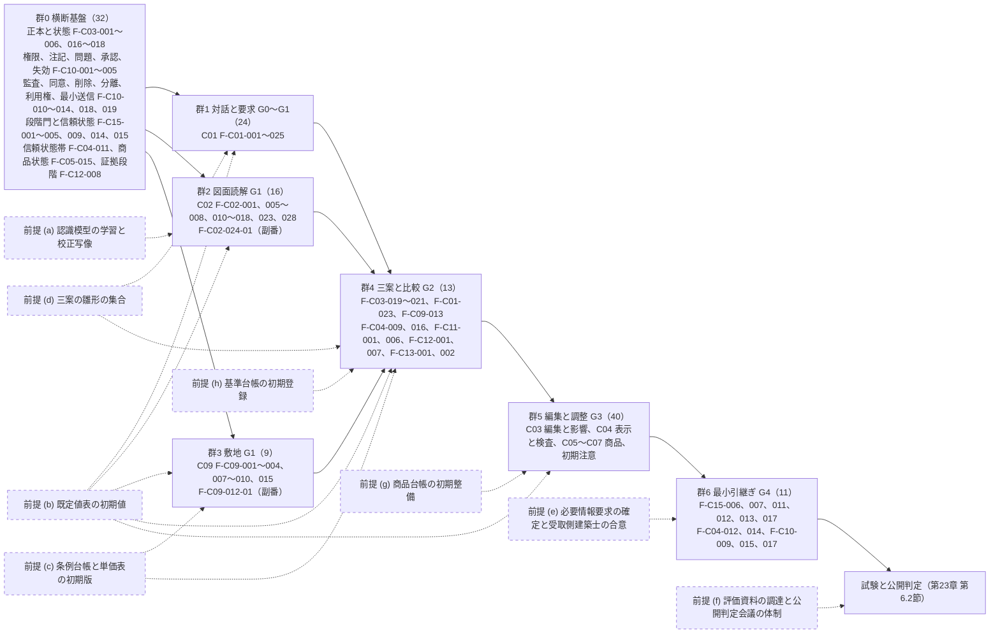

# 第24章 事業方式、主要指標、開発順序、依存関係、工数帯、失敗要因、未決事項

作成日: 2026-09-15　版: v1.4　担当: 製品責任者（仮想設計陣）。v1.1 は 2026-09-15 の初稿審査（主担当の統合指摘 JM-177〜JM-191 の 15 件と整合指摘 14 件、整合修正指示 第24章 10 件。修正計画 第1.24節）の反映（2026-09-29 に着手して途中停止し、2026-10-06 に完了）。内容は `05_審査/再修正記録_第24章.md`。v1.2 は 2026-10-07 の段階6 二回目の修正（段階7 再審査の後。`05_審査/再審査/00_修正計画.md` 第1.24節の統合指摘 19 件。主担当 JR-118〜JR-124、整合 JR-012、JR-002、JR-004、JR-078、JR-014、JR-075、JR-109〜JR-111、JR-083、JR-113、JR-103）の反映。内容は `05_審査/再修正記録_2回目_第24章.md`。同日の二回目の修正の仕上げ（群R4）で、外部確認による第5.1節 地図表示基盤の行（書出の測量法の判定の三値と既定の維持）、第1.4節の同点数帯の参照と章末の対応状況を加えた（版は据え置き。内容は `05_審査/再修正記録_2回目_仕上げ_群R4.md`）。v1.3 は段階8前の持ち越し仕上げ（2026-10-08。共通の決定 D1、D14、D21、既定値の識別子の併記 1 行）。U-24-006 の他構法の表示名を「判定不能（P0 対象外の構法）」に改め（第13章 第1.3節、D-24-009 と同じ）、第4.2節 順序の理由 (7) の群3 の前提に DV-GE-24 を加え（X2 (b) の式で DV-GE-18、DV-GE-19 と共に使う）、用語追加提案に用語集 571 への統合を記した。同日の統括の追加の項目で、用語追加提案の群外の前提作業を用語集 556 の 8 件への更新済みに改め、第1.1節 法人向けの行の 30 日に DV-CO-03 を併記し、第4.2節の前提 (b) の前提とする群と完了条件、図、順序の理由 (7)、工程帯 0〜3 か月の文に群1 を加えた（群1 の F-C01-020 等が DV-GE-18、19、24、DV-CF-10、DV-CF-12 を使う。工程帯の月数は変えていない）。既定値の直書きの候補 16 行は併記 1 行（35 行。一致した DV-CO-20 ではなく DV-CO-03 を指す）、別の意味 9 行、既定値表に行のない初期仮説 6 行。JR-124 の人月は変えていない。内容は `05_審査/再修正記録_段階8前_仕上げ_群F5.md`。v1.4 は段階8 の最終仕上げ（2026-10-08。正本の節の索引の所見〔表3 の範囲〕）。第9節と章要約の未決事項の正本の範囲を表3 v1.3 の UM-001〜UM-168 に改め、UM-168（P0 の改装の撤去と移設の防護）を第9節の表3-5 の行に加えた（対応表の欠け 0 件）。JR-124 の人月と工程帯は変えていない。内容は `05_審査/再修正記録_最終仕上げ_群G5.md`
根拠: 指示文 G（段階的な開発範囲）、H（収益設計）、8章（最初の経営判断）、9.5、9.9〜9.12、10.7、11.5。基盤定義（識別子規則と信頼状態と証拠段階は v1.3、機能一覧骨格、画面指標試験骨格、七段階門、整合検査報告 第5節と第5.1節）。再審査の修正計画 第0.3節（統一の文と番号）、第0.4節（新設識別子の割当）。章要約集 A1（第24章宛て依頼16件）、A2（未決事項284件。v1.1 で必須表 表3 を正本とした）。調査 `01_調査/00_出典一覧.md`（RC-01〜28、DIF-01〜93）。

## 0. 冒頭

### 0.1 本章の目的

本章は、製品を事業として成立させる方式と、公開前に確定すべき判断を一箇所に固定する。具体的には、(1) 無料枠、個人有料、専門職向け、法人向けの提供範囲と、紹介料、広告料、有料掲載の開示と推薦点からの分離、(2) 収益源の順序、(3) 事業指標と信頼指標の併記と見直し規則、(4) P0 → P1 → P2 の開発順序と完了条件、(5) 外部契約、試験資料、人員、計算費の依存関係、(6) 機能群ごとの工数帯、(7) 指示文 9.11 の失敗要因の更新、(8) 指示文 9.12 と 11.5 の経営判断事項への仮の判断（意思決定記録の様式）、(9) 全章の未決事項と経営判断の対応（全章の未決事項は必須表 表3 を正本とし、本章は主題と経営判断の対応だけを持つ）、を定める【推定】。

### 0.2 本章の範囲と非対象

| 区分 | 内容 | 区分 |
|---|---|---|
| 範囲 | 上記 (1)〜(9)。他章が第24章へ委ねた値（課金前表示の値、利用量の単位、返金条件、GLB 容量上限、偏り監査の閾値、紹介料の率、初期対象都道府県、外部契約の依存関係、図面認識模型と画像生成処理先と三案生成方式の依存関係、条例台帳と単価表の初期版、評価資料と建築士二重確認の工数帯）の仮の確定 | 【推定】 |
| 非対象 | 商品推薦の点数算式（第16章）、提携先の適合度と同意画面（第17章）、API の処理枠の消費条件（第14章。本章は課金単位と金銭の扱いだけ）、指標の定義と分母（画面指標試験骨格、第2章）、非機能要件と試験手順（第23章）。本章は機能要件を持たない（第10節） | 【推定】 |
| 確定扱いにしないもの | 法規、権利、外部送信、施工安全に関わる仮定（外部契約の条件、資格区分の閾値、公的地理情報の商用可否）。金額と数量の初期仮説 | 【仮定】 |

### 0.3 前提とする章

第2章（五成果、M-N-01 の分母と合否規則）、第3章（RC-、DIF-）、第4章（参照先の課金方式）、第5章（初期顧客の推奨 U-05-001）、第6章（P0 は G0〜G3 と G4 への最小引継ぎ）、第8章（課金前表示 P1〜P9）、第9章（P0 145機能の段階群）、第11章（GLB、処理費）、第14章（処理枠の消費条件）、第15章（S-15-06、S-30-07、S-28）、第16章（偏り監査）、第17章（紹介料の分離、預り金を採らない判断）、第18章（対象区分）、第20章（利用量と追加費用の規則、単価表）、第22章（外部処理先の契約条件 第1.8節、案件横断集計の匿名化 第1.6節）、第23章（公開判定の合格値 第6.1節と試験範囲 第6.2節、評価資料 第3節）、第12章（既定値表 第5節、三案生成の生成規則 第7.8節）、第11章（認識模型と校正写像 第10.3節）。基盤定義 v1.2 を正本とし（識別子の変更は整合検査報告 第5節）、修正計画 第0.4節の新設識別子を用いる。AP-038（三案生成）と AP-039（V0 構想案生成）は第14章が採番し本章は参照だけを持つ。M-B-12〜M-B-15 は画面指標試験骨格 v1.2 が採番し定義は本章 第3.4節、F-C03-019-01、F-C03-019-02、F-C09-012-01、F-C09-012-02 は機能一覧骨格 v1.2 の副番、U-24-016 と例示 D-24-001〜D-24-023 は本章が定義する（D-24-022、D-24-023 は再審査の修正計画 第0.4節の割当。二回目の修正では同計画 第0.3節の統一の文を用い、正本の章〔第6章 第5.2節の資格の照合状態ほか〕を参照する）【推定】。

## 1. 事業方式

### 1.1 提供範囲の四区分

指示文 H の四区分を、段階門、信頼状態、優先、案件当たりの処理枠（第14章 第3.8節の「処理枠」を課金単位として採用）で固定する。数量と解像度は全て初期仮説であり、公開判定会議で固定する【仮定】。

| 区分 | 提供範囲（指示文 H） | 段階と信頼状態の上限 | 案件当たりに含む処理枠（初期仮説） | 優先 | 区分 |
|---|---|---|---|---|---|
| 無料枠 | 一件の構想案（初回成果。希望入力は V0、図面入力は V1 の縮小表示。第8章 第6.1節）、低解像度共有、限定商品 | G0〜G1、G2 は一案のみ。V1 まで。電子連絡先を要求しない（M-P-04） | 図面読込 3 頁、構想案 1 件（希望入力は AP-039 の V0 構想案。室構成の概略は雛形からの決定的な合成、意匠像は画像生成処理先（第5.1節）が成立している場合だけ 1 枚）、低解像度共有 1 件。写実生成（AP-011、F-C03-015）は P1 のため P0 の無料枠に含めない。共有は画像で長辺 1,024 px、GLB は三角形 50,000 面以下かつ質感なし、透かし付き（第8章 第6.3節） | P0 | 【仮定】 |
| 個人有料 | 三案比較、図面検証、詳細3D、要求と問題の追跡、費用と性能の比較、改訂履歴、専門家引継ぎ書出 | G0〜G4。V2 まで（V3 は有資格者確認が P1） | 案件定額に、図面読込 20 頁、三案生成（AP-038）3 回（再生成を含め 9 案まで）、V0 構想案の再生成 3 回、書出 10 回（形式ごとに 1 回）、共有URL 10 件を含む。写実生成 20 枚（AP-011。P1）は P1 の案件定額で加え、P0 の案件定額には含めない。超過分は処理枠の追加購入（10 枠単位） | P0 | 【仮定】 |
| 専門職向け | IFC、情報要求検査、組織内標準、共同作業、承認、監査 | G1〜G4、V3 昇格（F-C08-008）、IDS 検査（F-C15-008） | 組織当たり月額と席数。IFC 書出と IDS 検査は各 1 回 1 枠。専門家確認作業面（S-22）を含む | P1 | 【仮定】 |
| 法人向け | 正規商品登録（F-C05-019、S-21）、適合推薦、成果測定 | 案件横断台帳。案件の段階には属さない | 正規商品登録（F-C05-019、S-21）は無償。掲載料（月額定額）は広告枠（S-06-03、S-07 の広告枠）への表示の対価に限る。審査の手数料を取る場合も掲載料と別に置き、推奨点、順位、露出に影響しない（第8節 D-24-023。JR-118）。成果測定は M-B-01 と M-Q-23 の企業別集計を提供する。企業別集計は案件識別子、市区町村以下の地域、個人属性を含まず、集計単位が 10 案件未満（初期仮説。U-24-018）の値は提供しない。提供項目は採用率、配置件数、不適合理由の分布に限る（匿名化規則は第22章 第1.6節、対象は F-C10-017 と共通、試験は T-S-006）。法人登録品（selfManaged=true）の自己申告の在庫と納期は第16章 第6.7節の失効規則（lastVerifiedAt から 24 時間で「再確認前」、30 日（DV-CO-03）未更新で SUP-UNKNOWN へ自動遷移し推奨点は下げる）に従い、失効規則を通らない自己申告を推奨点に反映しない | P1（登録の受付）、P2（S-21） | 【仮定】 |

補足規則: (1) 案件定額の金額、処理枠の単価、月額は未決（U-24-001）。(2) 処理枠の未使用分は購入から 12 か月有効とし金銭で返金しない。案件定額は開始から 14 日以内かつ有料操作の未実行に限り全額返金する（初期仮説）。(3) 有料化しても信頼状態の透かしは残る（第8章 第6.3節）。(4) 希望入力の構想案（V0）の到達時間は 120 秒以内を初期仮説として採る（第8章 U-08-003 への回答。根拠は AP-039 の雛形合成と画像生成処理先の処理時間の和であり、写実生成 AP-011 の枠ではない）。画像生成処理先が未成立の場合は室構成の概略（寸法値なし）だけを返し、意匠像は表示しない（第5.1節、U-24-016）。図面入力の初回 V1 は M-P-01 の 180 秒に従う（外部認識 API の同意がなく手修正中心の V1 を返す場合は対象外として別掲する。D-24-022）【仮定】。

### 1.2 参照先の課金方式との比較と本製品が採る形

| 方式 | 参照先で確認した事実（確認日 2026-09-15） | 本製品が採る形 | 避ける点 | 区分 |
|---|---|---|---|---|
| 定期購入と利用量の二重課金 | Renovo は定期購入（週 12.99 ドル、月 39.99 ドル、3か月 59.99 ドル）と Credits（100、250、500）の二重構造。掲載レビュー 4 件の要旨は広告と実物の差、支払後の追加課金、3D の実体への不満（https://apps.apple.com/us/app/ai-home-design-renovo/id6747351118 。第3章 DIF-03）【事実】 | 案件定額と処理枠の二層は残すが、課金前に第1.3節の値を表示し、失敗した処理は処理枠を消費しない。派生表示だけの成果に「3D」の語を単独で使わない | 支払後に初めて分かる追加課金。写実画像を建物情報と同列に売ること | 【推定】 |
| 預り金 | 建築家コンシェルジュは預り金 20 万円（住宅）、30 万円（非住宅）、工事請負契約締結の翌々月に全額返金、不成約時は費用に充当、事業者側 5% 手数料、預り金後の並行検討は返金対象外（https://architect-concierge.com/meta/ 。第3章 DIF-09、DIF-12）【事実】 | 預り金型を採らず、並行検討を制限しない（第17章 U-17-003 への回答）。人による選定は P1 で有料の選択肢（相談料。E-ORG-005 Fee で返金条件を含めて開示）として提供できる | 並行検討の制限。返金条件の不開示 | 【仮定】 |
| 成果報酬型送客 | タウンライフは利用者向けに「すべて無料」。協力会社側は問合せ発生時のみ課金の成果報酬型（検索抜粋のみ。SRC-017、SRC-018。第3章 DIF-17）【未確認】 | 事業者側の紹介料を利用者向け画面にも開示する（第1.4節）。送信は成果閲覧の後、送信先ごとの個別同意に限る | 連絡先入力を成果閲覧より先に置くこと。「無料」だけの表示で事業構造を隠すこと | 【推定】 |
| 特典による誘導 | まどりLABO は「契約/着工で 3 万円プレゼント」と建築会社向け掲載募集を持つ（DIF-35。https://madori-labo.com/ 、https://prtimes.jp/main/html/rd/p/000000004.000162725.html 、確認日 2026-09-15）【事実】 | 特典による送信の誘導を採らない。掲載募集は法人向けの掲載料として広告枠に限る | 特典で判断を急がせること | 【推定】 |

### 1.3 課金前に示す値（第8章 P1〜P5、第14章、第15章、第20章への回答）

第8章 第6.2節は「何を、いつ、どこに示すか」を固定し、値を本章へ委ねた。本章の値は次のとおり。表示場所は S-15-06（課金前表示）と S-30-07（案件見出し帯）、失敗時は S-30-02 とする【仮定】。

| 項目 | 本章の値（初期仮説） | 区分 |
|---|---|---|
| P1 成果物の種別 | 「編集できる建物情報（V1 以上）」「派生表示（V0 意匠像、低解像度共有。写実画像と動画は P1）」の二値を操作ごとに表示 | 【推定】 |
| P2 利用量の単位と数量 | 単位は処理枠。1 枠 = 図面 1 頁の読込（AP-003）、三案生成 1 回（AP-038）、V0 構想案生成 1 回（AP-039。無料枠 1 件を超える再生成）、書出 1 形式 1 回（AP-023）、写実生成 1 枚（AP-011。P1）、IFC 書出または IDS 検査 1 回（P1）、見積比較の取込 4 社目以降 1 社（第20章 第10.3節）。同期の決定的処理（AP-004、AP-006、AP-009、AP-019、AP-021）は消費しない | 【仮定】 |
| P3 追加費用 | 定額の範囲外は処理枠 10 枠単位の追加購入。金額幅を発生前に表示し、明示操作なしに課金しない。単価は U-24-001 | 【仮定】 |
| P4 失敗時の再実行と返金 | 第14章 第3.8節に従う。失敗（区分4、5、7）と期限切れは消費なし。図面解析の3D構築段階以降の取消と、書出の完了形式は消費。外部生成3D（AP-015）は接続先の返金規則に従い、本製品の処理枠は失敗時に消費しない。金銭の返金は第1.1節 補足規則(2) | 【仮定】 |
| P5 無料と有料の境界 | S-30-07 に「無料枠」「有料（定額内）」「有料（追加枠）」の三値を文字で表示。色だけに依存しない | 【推定】 |
| 外部生成3D の契約 | Meshy の Free は CC BY 4.0、有料は利用者所有。Tripo の Free は非商用（DIF-63。https://www.meshy.ai/pricing 、https://developers.tripo3d.ai/en 、確認日 2026-09-15）【事実】。無料プランの生成物を製品内で使わず、有料プラン契約を P1 の依存関係に置く（第5.1節） | 【推定】 |

### 1.4 紹介料、広告料、有料掲載の開示と推薦点からの分離

| 規則 | 内容 | 区分 |
|---|---|---|
| 紹介料の率と支払時点 | 事業者側が成約時（工事請負契約または設計契約の締結）に請負額または設計料の 3% を支払う形を初期仮説とする。利用者負担なし。建築家コンシェルジュの 5%【事実】より低く置く理由は、紹介収益を最初の中心にしない（第2節）ため。率、基準、支払時点を候補ごとの画面に表示する（第17章 第3.5節、F-C08-009） | 【仮定】 |
| 掲載料 | 法人向けの月額定額で、広告枠（S-06-03、S-07 の広告枠）への表示の対価に限る（正規商品登録は無償。第1.1節、第8節 D-24-023）。広告枠だけに表示し、推奨点と適合度の算定に含めない（F-C05-008、F-C08-004）。広告料と紹介料は P0〜P2 を通じて推奨点と順位に入れない。広告の露出は広告枠の中の順序に限り、広告枠の中の順序規則も開示する（第16章 第3.6節。「将来持つ場合は重みと理由を開示する」の条項は置かない。指示文9.5、H） | 【推定】 |
| 偏り監査の閾値 | 第16章 U-16-003 を採用: 企業集中度 30% 以下、価格帯偏り 40 ポイント以内、広告ありと広告なしの露出差（M-G-16）±5 ポイント以内。提携先版（U-17-014）も ±5 ポイント。法人登録品と非登録品の同点数帯の露出差 ±5 ポイント以内（P2。第16章 第6.7節。JR-118）。同点数帯は推奨点（相談先は点数内訳の合計）の 10 点幅の帯で、露出差は帯ごとの有償と無償（登録と非登録）の露出の差とする（基盤 画面指標試験骨格 U-00-051 の仮判断。露出の数え方と帯の境界は U-00-051 に残り、公開判定会議で確定する）。超過時は第3.3節の見直しを発動し、広告枠を停止する（法人登録品の露出差の超過時は法人登録品に対する探索枠の割当を停止する） | 【仮定】 |
| 提携先の停止と除外 | 第17章 U-17-002 を採用: 迷惑連絡報告（M-B-04）が引継ぎ 100 件当たり 3 件を超えた提携先は候補提示を停止、検証日 180 日超は除外 | 【仮定】 |
| 提携先向け管理画面 | P1 で設ける。提携先向け管理画面では提携先が料金（設計料、相談料、出張費等）、対応地域、実績、検証資料を入力する。紹介料、掲載料、isSponsored は運用担当者が契約の版付きで登録し、提携先は閲覧のみ（第17章 F-C08-004、F-C08-009 の権限欄が正本。S-07-04 の開示値は契約値と同じ版を参照する）。検証日は運用担当者の検証で更新し、提携先の申告更新は「未検証」として保持する（第17章 第2.4節）。画面は S-29 提携先管理画面（第17章 第2.5節で採番、第15章 v1.2 で登録。紹介料、掲載料、isSponsored は S-29-04 で閲覧のみ。JR-123） | 【仮定】 |
| 数値主張 | 利用者数、提携数、所要時間の主張は計測方法と時点を併記する（第8章 P9）。各社の公開主張を目標値の根拠にしない | 【推定】 |

### 1.5 禁止事項

指示文 H の三項目（連絡先販売、無断一括送信、隠れた順位操作）に、本章は次を加える。いずれも試験で検査する【推定】。

| 禁止 | 検査 |
|---|---|
| 連絡先の販売、送信先を選ばない一括送信、一括同意 | T-S-001 |
| 広告料や紹介料を推奨点と適合度に反映する隠れた順位操作（P0〜P2 を通じて。将来の例外条項を置かない） | T-S-008（算定規則の参照属性に isSponsored と Fee が含まれない静的検査）、M-G-16 |
| 預り金による並行検討の制限、特典による送信の誘導 | 第17章 第4.1節の統合表 |
| 「無料」だけを表示して事業者側の紹介料を隠すこと | T-S-017（S-07 と予約、同意の画面で料金と紹介料を候補ごとに同一画面で開示する検査。第23章） |
| 相談先送信率（M-B-06）や三次元生成回数（M-B-07）を単独の目標にすること | S-28-01 の表示規則（第3.4節） |
| 未確認案に禁止表示語（施工可能、法規適合、完全正確 等）を表示すること | T-S-003、F-C15-005 |

## 2. 収益源の順序と理由

指示文 9.9 の順序を採り、各収益源を第1.1節の区分と開発優先に対応付ける【推定】。

| 順序 | 収益源 | 区分 | 優先 | 理由 | 併記する指標 |
|---|---|---|---|---|---|
| 1 | 個人向けの検証付き3D化と詳細書出 | 個人有料 | P0 | 初期公開の成果「根拠付き比較構想一式」（指示文 8章）と一致し、外部契約への依存が最小。図面変換は入口であり、価値は重要判断の完了（M-N-01）と再入力削減（M-G-02）で測る | M-B-05、M-N-01、M-G-03 |
| 2 | 専門職向けの共同作業、IFC、承認、組織標準 | 専門職向け | P1 | IFC、IDS、承認、監査は有資格者確認（V3）と同時に価値が出る。人の対応人数の制約は専門家確認作業面（S-22）と予約容量表示で吸収する | M-G-02、M-G-06、M-P-11 |
| 3 | 正規商品情報の提供と配置後の成果測定 | 法人向け | P1〜P2 | 正規3D保有率の初期値は低い（DIF-60。第3章、第16章）ため、収録企業数が増えるまで収益源にしない。台帳指標（F-C05-001）で保有率を公開する（M-B-09 正規3D保有率、M-B-10 許諾確認済み率。定義は第23章 第2.5節） | M-B-01、M-Q-23、M-G-16、M-B-09 |
| 4 | 利用者が明示選択した相談紹介 | 紹介料 | P1 | 紹介収益を先に置くと見込客獲得頁と認識される（指示文 9.9）。送信率を目標化せず、三案比較の後にだけ送信の導線を置く | M-B-02、M-B-03、M-B-04、M-G-07 |

## 3. 主要指標

### 3.1 事業指標と信頼指標の併記

指示文 H に従い、事業指標を三次元生成回数や相談先送信率だけに置かず、信頼指標を併記する。画面指標試験骨格 第2.5節の M-B-01〜M-B-08 と第23章 第2.5節の M-B-09（正規3D保有率）、M-B-10（許諾確認済み率）に、本章が M-B-12〜M-B-15 を加える（第3.4節。初稿の M-B-09〜M-B-11 は第23章との識別子衝突のため M-B-12〜M-B-14 へ再採番し、採番は画面指標試験骨格 v1.2 第2.5節が確定した）【推定】。

| 事業指標 | 併記する信頼指標 | 単独の目標化 | 区分 |
|---|---|---|---|
| M-B-01 推奨品採用率 | M-Q-23 不適合理由の正確性、M-G-16 広告偏り指数 | しない | 【推定】 |
| M-B-02 紹介後満足、M-B-03 同意撤回率、M-B-04 迷惑連絡報告件数 | M-G-07 同意事故件数 | M-B-02 は目標化可。M-B-03 と M-B-04 は上限のみ | 【推定】 |
| M-B-05 有料転換率 | M-P-04 初回価値到達率、M-N-01 | しない（初回価値到達率を下げて上げる操作を禁止） | 【推定】 |
| M-B-06 相談先送信率 | M-B-02、M-B-03、M-G-07 | しない（指示文 H） | 【推定】 |
| M-B-07 三次元生成回数、M-B-08 案件当たり3D処理費、M-B-12〜M-B-15 | M-G-13 未確認案の誤表示件数、M-P-03 共有読込時間、M-P-04 初回価値到達率（M-B-15 の上限による退避が到達率を下げていないか） | しない。処理費の管理に使う | 【推定】 |
| M-B-09 正規3D保有率、M-B-10 許諾確認済み率（第23章 第2.5節） | M-G-16 広告偏り指数、M-Q-23 不適合理由の正確性 | しない。台帳の公開指標（F-C05-001）として公開し、低い初期値を隠さない（第7節） | 【推定】 |
| 指示文 H が併記を求める六指標 | M-N-01、M-G-02（再入力削減）、M-G-06（専門家修正時間）、M-G-03（重大誤り流出率）、M-B-02（紹介後満足）、M-B-03（同意撤回） | 事業指標の隣に必ず並べる | 【推定】 |

### 3.2 合否規則と判定例（第2章 第5.2節、第5.3節の転記）

| 規則 | 内容 | 区分 |
|---|---|---|
| 合格条件 | (a) M-N-01（G4 の通過要求時の初回値を分母合計で重み付けした値。第2章 第4.5節）が目標値（初期仮説 90%。第23章 第6.1節で固定）以上。M-N-01 は確認者の役割を三層（有資格者確認〔照合済み〕、資格未照合〔本人申告〕、専門家未確認）で層別し、公開判定では三層の値と件数を別掲する。30 件（初期仮説）の判定は照合済みの層だけで行い、その層が 30 件未満なら「件数不足」と表示し、その場合（照合済みがない P0 を含む）M-N-01 は「専門家未確認の完了率（本人申告の資格による確認 n 件を含む）」として公開する（JM-002、JM-003、JM-172、JR-004）。かつ (b) 閾値が設定された全ての防護指標が閾値内、かつ (c) M-G-08 進行禁止条件の見逃し率が 0%。全て満たすときだけ合格（第2章 第5.2節の転記。三層の規則は二回目の修正の統合判断〔JR-004〕と第23章 第6.1節に合わせた。2026-10-07） | 【推定】 |
| 不合格の扱い | 防護指標が一つでも閾値を外れた期間は不合格とし、M-N-01 は「参考値（防護不合格）」と表示。公開範囲、順位規則、昇格条件を見直し、第7節の表へ記録 | 【推定】 |
| 相殺の禁止 | 北極星と防護指標を加重合成した単一の点数を作らない。防護が全て合格でも M-N-01 が未達なら「未達」 | 【推定】 |
| 閾値未設定の指標 | M-G-05、M-G-06 等は「監視のみ」とし合否に使わない。前期比 20% 以上の悪化は公開判定会議へ報告（U-02-007） | 【仮定】 |
| 試験時と運用時 | 試験時の 0% 指標（M-G-03、M-G-08、M-G-12）は許諾済み図面の技術試験で判定。運用で 1 件でも発生した入力種別は公開範囲を縮小。運用での発生は、M-G-03 は共有URL の閲覧者（受取側の建築士）が起票した発見段階 G4 以降の SEV-0、M-G-12 は P1 移行後の有資格者確認で発見された SEV-0 の遡及計上で検出する。P0 の運用で M-G-12 を直接計測する手段はなく、M-G-03 も受取側が起票しない案件では検出できない（第2章 第5.2節。JM-006） | 【推定】 |
| 分母操作の防止 | M-G-17 重要判断一覧の分母変更率（採番は第23章、定義と閾値は第2章 第5.1節。JM-009）は 10% 以下、かつ SEV-0 由来の除外 0 件（手動の除外を指す。誤警告の却下による自動除外と、源1 の自己承認による除外は件数を別掲する。U-02-004）。分母変更の承認規則は第6章 第5.1節（分母変更。除外は RL-CHK が承認し、所有者以外の編集者または確認者がいない 1 名の案件に限り所有者の自己承認と記録する。編集者がいて RL-CHK がいない案件の除外は登録できず、判断は分母に残る）を仮採用し、権限の確定は第8節 11.5-2 の経営判断とする（JR-002） | 【仮定】 |
| 成果5 の指標 | M-O-05、M-O-06 は P0 の公開判定で「未計測」と表示し合否に使わない（U-02-008。第21章も妥当と判断） | 【仮定】 |

判定例（第2章 第5.3節）: 例1 M-N-01 G4 通過要求時 93%（P0。照合済みの有資格者確認層は 0 件で「件数不足」、資格未照合〔本人申告〕層 12 件と専門家未確認層を別掲）、防護全て閾値内 → 合格（M-N-01 は「専門家未確認の完了率（本人申告の資格による確認 12 件を含む）」として公開。JR-004）。例2 96% だが M-G-13 が 2 件 → 不合格（公開範囲の縮小と昇格条件の点検）。例3 95% だが M-G-17 が 18% → 不合格（除外理由の全件監査）。例4 84%、防護全て閾値内 → 未達（M-P-08、M-P-10 を層別して原因を探す）。例5 91%、M-G-06 が前期比 30% 悪化（閾値未設定）→ 合格だが要報告。例6 門通過時 100%、G4 通過要求時の初回値 84%、防護全て閾値内 → 未達（判定には通過要求時の初回値を使う。門通過時の 100% は門が未完了の判断を止めた結果であり判断の質を示さない。JM-002）【仮定】。

### 3.3 収益を増やす操作が信頼指標を悪化させた場合の見直し規則

| 規則 | 内容 | 区分 |
|---|---|---|
| 発動条件 | 収益に関わる操作（価格、処理枠、広告枠、順位規則、公開範囲、有料境界の変更）の後 2 か月以内に、第3.1節の信頼指標のいずれかが閾値を外れる、または閾値未設定の指標が前期比 20% 以上悪化する。偏り監査（第1.4節）の閾値の超過は操作の有無によらず発動する（法人登録品と非登録品の同点数帯の露出差 ±5 ポイント以内〔P2。第16章 第6.7節〕を含む。JR-118） | 【仮定】 |
| 見直しの内容 | 当該操作の取消または公開範囲の縮小、順位規則の再固定、広告枠の停止（M-G-16 超過時）、法人登録品に対する探索枠の割当の停止（法人登録品の露出差の超過時）。変更前の値へ戻すまで新たな収益操作を行わない | 【推定】 |
| 判定者と時点 | 公開判定会議、月次。操作、悪化した指標、見直し内容、日付を第7節の失敗要因の表へ追記し、監査記録（F-C10-010）に残す | 【推定】 |
| 変更の記録 | 価格、処理枠、順位規則の全変更は版を付けて S-28-03 に記録し、利用者向けには S-15-06 に改定日を表示する | 【仮定】 |
| 事前承認 | 収益操作（発動条件の行の操作）は公開判定会議（月次）または製品責任者の事前承認を要し、影響を受ける信頼指標（第3.1節）の予測値と承認者を版と共に S-28-03 に残す。事前承認のない操作は行えない（操作の実行者と承認者を同一人にしない）。承認記録は監査記録（F-C10-010）の対象とし、第15章へ S-28-03 の承認記録欄の追加を依頼する | 【仮定】 |

### 3.4 本章で定義する指標（M-B-12〜M-B-15）と S-28 の表示規則

第11章の依頼（GLB の容量上限、写実生成一件当たりの処理費、部分再生成による費用抑制の指標）と審査 JM-183（案件当たり外部AI処理費）に答える。定義の書式は画面指標試験骨格 第2.5節に従う。初稿の M-B-09〜M-B-11 は第23章 第2.5節の M-B-09（正規3D保有率）、M-B-10（許諾確認済み率）と衝突したため、修正計画 第0.4節に従い M-B-12〜M-B-14 へ再採番した（U-24-014 の解決）。M-B-11 は欠番とし再利用しない。M-B-12〜M-B-15 の採番は画面指標試験骨格 v1.2 第2.5節が確定し（M-B-15 の「仮」は外れた。整合検査報告 第5節）、定義の正本は本節と第23章 第2.5節である。目標値は初期仮説【仮定】。

| 指標ID | 指標名 | 定義 | 分子 / 分母 | 単位 | 計測時点 | 初期仮説の目標値 | 種別 |
|---|---|---|---|---|---|---|---|
| M-B-12 | 写実生成一件当たりの処理費 | 写実生成（AP-011。P1）1 枚に要した外部処理費と内部計算費の合計。計測の開始は P1 | 処理費の合計 / 生成枚数 | 円 | 月次 | 未設定。1 処理枠の単価（U-24-001）を超えない | 事業 |
| M-B-13 | 部分再生成率 | 確定した変更命令のうち、変更した要素と接合する要素だけを再生成（第11章 第9.2節）した割合。計測の対象は F-C03-014（承認後の確定と再計算）と F-C02-016（3D組立）の再生成の記録で、集計は F-C15-015（JR-122） | 部分再生成の件数 / 再生成を伴う変更命令数 | % | 月次 | 90% 以上 | 事業 |
| M-B-14 | GLB 容量超過率 | 共有用 GLB のうち、容量上限 20 MB（第11章の初期仮説を採用）を超えて段階詳細を下げた割合 | 超過した書出数 / GLB 書出数 | % | 月次 | 5% 以下。M-P-03 と併記 | 事業 |
| M-B-15 | 案件当たり外部AI処理費 | 言語模型（AP-034）、外部認識処理（図面認識模型を外部 API で行う場合）、画像生成処理先（AP-039 の意匠像）の cost の合計。無料枠の案件を分母に含め、層別「無料枠」「案件定額」で別掲する | 処理費の合計 / 案件数 | 円 | 月次 | 未設定。案件定額の 15%（初期仮説）以下。無料枠は案件当たり上限（第5.2節） | 事業 |

試験の対応（第23章 第2.5節と第4節で採番済み）: M-B-12 は T-I-011（P1。写実生成の処理費の処理先別集計）、M-B-13 は T-I-008（部分再生成の判定）、M-B-14 は T-P-013（GLB 容量と段階詳細）、M-B-15 は T-I-019（案件単位の集計）。M-B-09〜M-B-11 を本章の初稿の意味で参照している仕様書の章はない（2026-10-06 に grep で確認。章要約集は再生成で更新される）。表6-1、表6-5 の旧番号の参照と第15章 S-28 の表示は M-B-12〜M-B-15 へ更新する（他章への依頼）【推定】。

S-28 運用指標画面（第15章 S-28-01〜S-28-03。三部品は P0 で、P0 の公開判定と月次判定の記録と表示に使う。S-28-04 は P2。JR-078）の表示規則: (1) M-B- は M-N-01、M-G-02、M-G-03、M-G-06、M-B-02、M-B-03 と同じ行群に並べ、単独の表や図にしない。(2) 事業指標に目標値を表示する場合は「単独目標化しない」の注記を同じ行に置く。(3) 案件の利用者には表示しない（U-15-014 を採用）。(4) 価格と順位規則の版と改定日を S-28-03 に置く【仮定】。

## 4. 開発順序と完了条件

### 4.1 P0 → P1 → P2 の順序と完了条件

第6章の依頼（P0 は G0〜G3 と G4 への最小引継ぎ、G5 と G6 は P2 だが情報構造は P0 から保持）を依存関係として採る。完了条件は観察可能な条件で書く【推定】。

| 段階 | 含める範囲（指示文 G） | 完了条件（全て満たす） | 区分 |
|---|---|---|---|
| P0 初期公開 | 平屋または二階建、明瞭な単一縮尺 PDF/PNG/JPEG、G0〜G3 と G4 への最小成果、三案（希望入力は雛形三案 F-C03-019-01、図面入力は図面派生三案 F-C03-019-03）、同期2Dと3D、限定した正規商品、GLB 共有。自動昇格は V1 まで。V2 は利用者の尺度確認と決定的検査で到達し P0 に含む（第11章 第4.1節と同じ。V3 は P1）。構造の初期注意は在来木造（延床 200 m² 以下）だけ。他構法は判定不能を表示し、第6章 第1.1節 規則6 (b) で持ち越す（D-24-009。JR-014） | (1) 第23章 第6.2節(2)の範囲（T-A-001〜018、T-R-001〜012、T-P-001〜015、T-S-001〜017、T-U-001〜016、T-I-001〜024）のうち P0 の対象が合格し、機能一覧骨格の P0 機能の受入条件 AC- が合格（T-U- と T-I- は第23章 付表 4.3-A の P0 の AC- で判定）。T-A-016、T-A-018 は P2、T-A-014 は T-A-017 で代替。D-24-003 の条件付き公開（PT-GEN のみ）を確定した場合、T-A-004 は試験不能（PT-CERT 0 件）として除き、第23章 AC-N-OP-01-04 の派生条件（PT-REF の代替形状と PT-GEN の机で四検査を行う T-A-004 の条件付き版）で判定し、試験不能の項目と派生条件を S-28-03 に記録する（JR-111）。T-A-012、T-R-002、T-R-003、T-R-006〜T-R-011 は P0 版の合格条件（第23章 第5.1節、画面指標試験骨格 第3.2節。T-R-010 の P0 版は第23章 v1.3）で判定し、P1 版は対象拡張時に判定する。反証試験ごとに働く進行禁止条件と段階門は画面指標試験骨格 第3.5節の対応表に従う（P0 の T-R-006 は改装案件の既存の外周壁と上下階連続壁の撤去と耐力壁候補線上の新設開口で SEV-0〔I-00-116。G3〕が働き、G5 の I-00-130、I-06-004 は P2 で判定する。骨格 v1.3、JR-095）。(2) 指標を入力種別ごとに満たす: M-G-01 95% 以上、M-G-03 試験時 0%、M-G-13 0 件、M-G-08 0%（指示文 10.7）、M-N-01 G4 通過要求時 90% 以上、M-P-08 RP-MUST 100%、M-P-09 決定権を持つ者 100%、M-Q-25〜M-Q-27 試験時 0%、M-Q-28 2% 以下、M-G-04 ±5 ポイント以内、M-P-10 90% 以上（入口〔希望、図面〕で層別し、雛形三案と図面派生三案が T-R-001、T-R-007、T-R-011 の P0 版と T-I-024 で同一評価軸の比較に到達）、AC-N-OP-01-01、10、14 の合格と M-P-14 100%（専門家が元図、要求、問題へ戻れる）、M-G-07 0 件（P0 の分子は第23章 第6.1節）、外部AI処理先の契約が未成立のまま公開する場合は層別「退避」の M-P-04 95% 以上。M-N-01 は確認者の役割の三層（有資格者確認〔照合済み〕、資格未照合〔本人申告〕、専門家未確認）で層別して別掲し、公開の規則は第3.2節 合格条件(a)に従う（照合済みがない P0 は「専門家未確認の完了率」として公開。第23章 第6.1節。JR-004）。M-G-02 80% は試験時（建築士二重確認 100 件で受取側役を建築士が担う実測。M-G-03 とともに判定の単位ごとに別掲。JR-110）に限り、P0 完了条件に含めるか否かは第8節 24-3（D-24-021。必須表 表6 U-90-603。仮の判断は含める）の経営判断。値は第23章 第6.1節と一致させる。(3) 許諾済み図面の評価用 1,000 件以上（学習用と調整用は別に確保。第5.2節）の非公開評価と建築士二重確認 100 件以上（指示文 9.10。件数は初期仮説。配分は第5.2節）。(4) 公開判定会議が合格値を入力種別ごとに固定して S-28-03（公開判定会議の記録。P0）に版付きで記録し、公開（第23章 第6.2節(1)。JR-078）。(5) 第8節の経営判断（指示文の 18 項目と本章追加の 5 項目）が意思決定記録 D-24-001〜D-24-023 として確定。(6) 第5.1節の「公開前必須」の契約と確認が成立、または条件付き公開の意思決定記録（9.12-3 の「PT-GEN のみ」、11.5-8 の退避状態の公開可否、図面認識模型が未成立の場合の図面入力の非公開（U-24-017）、受取側建築士の協力がない場合の成果4 の扱い（24-3））がある。(7) P1、P2 の実体が情報実体骨格の識別子、版、出典、責任、状態を P0 から保持。(8) 第4.2節の群外の前提作業 (a)〜(h) の完了条件を満たす | 【仮定】 |
| P1 拡張一 | ベクトル PDF、DXF、SVG、IFC、図面一式、複数階、改装前後比較、構造・外皮・設備の調整、詳細な性能と費用の計算、IFC・IDS・BCF、商品拡大、独自家具生成、写実生成（F-C03-015）、有資格者確認、提携先比較、同意付き送信、既存住宅状況調査、自由形状の三案生成（F-C03-019-02） | (1) IFC 書出が IDS 1.0 の検査に合格し M-G-14 の例外承認なし欠落 0%。(2) V3 昇格が照合済みの資格の記録なしで行われず、未照合（本人申告）の資格による承認で V3、VS-PRO、「専門家確認済み」、「法的適合」が表示されない（T-S-010。第6章 第5.2節。JR-012）。(3) 外部送信が送信先ごとの個別同意だけで行われる（T-S-001、M-G-07 0 件）。(4) 提携先比較が 3 社以上で紹介料列を表示。(5) M-G-02 が運用計測で 80% 以上（初期仮説）。(6) 外部生成3D（AP-035）の契約が成立（外部AI処理先と画像生成処理先は P0 で扱う）。(7) G1 完了条件(5)の建築士の承認を必須にする（照合済みの資格を持つ建築士の承認に限る。第6章 第2.2節、第5.2節。P0 は専門家の承認欄を「未承認」と表示）。(8) T-A-012、T-R-002、003、006〜009、011 の P1 版の合格条件で合格。(9) 写実生成の処理枠と M-B-12 の計測を開始 | 【仮定】 |
| P2 拡張二 | 施工中変更、製作図、検査、竣工時建物情報、機器台帳、保証、点検、入居後確認、法人用商品登録、組織標準、監査、費用履歴、対象拡張 | (1) 竣工反映版（V3）が発行され G5 の進行禁止が働く。(2) 機器台帳が SUP- と最終確認日時を持つ。(3) 入居後確認が目的別同意で取得され M-G-15 0 件。(4) M-O-05 の計測を開始。(5) 対象拡張は市区町村単位で第18章 第5.1節の条件を満たす | 【仮定】 |

### 4.2 P0 内の開発順序

第9章 第5.8節の段階群（G0 8、G1 41、G2 13、G3 40、G4 11、横断 32）を入力とし、開発の群と依存を次のとおり定める。第9章の割当と食い違う場合は本章を正本とする（U-09-005）【仮定】。

順序の理由: (1) 群0 なしに信頼状態の常時表示、権限、監査が成立せず、後付けすると情報構造を作り直す。(2) 群1 と群2 は入口が異なり並行できるが、いずれも群0 の正本（E-BLD-001 Project、E-REQ-001 Requirement、E-REQ-003 Issue）を前提とする。(3) 群4 の三案は群1〜3 の要求台帳、建物情報、敷地根拠と、雛形の集合（前提 (d)。第12章の三案生成の生成規則、F-C03-019-01、AP-038）を前提とする。(4) 群6 は標準の必要情報要求と書出検査を要し、最後に置く。(5) 群2 の着手前に試験資料の整備と模型の学習（前提 (a)、(f)。第5.2節）を開始し、群2 の完了条件に校正写像の版（第11章 第10.3節）を含める。(6) 群3 は条例台帳の初期版、群4 は単価表の初期版（前提 (c)。第5.1節）を前提とする。(7) 群1 の V0 構想案（F-C01-025、AP-039 の室構成の合成）は最小の雛形集合（前提 (d)）を、群1〜群3 は各群が使う DV- の行の初期値（前提 (b)。第8章の DV-CF-10、DV-CF-12 等、第11章の DV-CF-01、DV-GE-16 等、第18章の DV-GE-18、DV-GE-19、DV-GE-24〔三つは X2 (b) の同じ式で使い、群1 の F-C01-020 も使う。JR-040〕、DV-CO-15、DV-ST-01）を前提とする（JR-120。群1 は段階8前の持ち越し仕上げで加えた）。破線の節点は群外の前提作業であり、下表に完了条件を置く【推定】。

群外の前提作業（P0 完了条件(8)。表3 第1節の門「群N 着手前」「試験開始前」と同じ語で結ぶ）【仮定】:

| 記号 | 作業 | 前提とする群（表3 の門） | 担当 | 完了条件 | 対応する未決 |
|---|---|---|---|---|---|
| (a) | 認識模型の学習と校正写像の作成（第5.1節 図面認識模型、第5.2節） | 群2 着手前（学習資料の整備と学習の開始）。校正写像の版は群2 の完了条件 | 図面認識担当 | 層別の M-Q-01〜M-Q-15 が試験開始前に固定した合格値以上。校正写像と模型の版が Confidence に記録される（第11章 第4.2節 工程3、4） | UM-011、UM-072、UM-125〜UM-127、U-24-017 |
| (b) | 既定値表の初期値の整備（第12章 第5節 DV-） | 群1、群2、群3 着手前（各群が使う DV- の行の初期値。群1 は F-C01-020 等が X2 (b) の式〔DV-GE-18、19、24〕、X3 の対応表〔DV-CF-10〕、要求と予算の変更の検出語〔DV-CF-12〕を使うため、段階8前の持ち越し仕上げで加えた）、群4 着手前（初期値）、群5 着手前（版の固定） | 情報実体骨格担当、一級建築士 | 群1〜群3 着手前は各群が使う DV- の行（第8章、第11章、第18章が参照する行）に初期値と根拠区分がある。群4 着手前は主要寸法（尺度、外周、開口、室、階段、階高）の既定値に根拠区分と版があり、V2 昇格条件「主要寸法に VS-DEF が残らない」の確認依頼を全項目で出せる | UM-104、UM-108 |
| (c) | 条例台帳と単価表の初期登録（第5.1節） | 群3 着手前（条例台帳）、群4 着手前（単価表） | 法規担当、積算担当 | 初期対象自治体の法令版台帳が改正日の版付きで登録済み。単価表の初期版が地域と時点と出所を持つ | UM-045、U-24-008、U-20-001 |
| (d) | 三案の雛形の集合（第12章 第7.8節の生成規則、F-C03-019-01） | 群1 着手前（V0 構想案に使う最小の雛形集合。階数 1、2 × 代表の室構成 3 種）、群4 着手前（三案の雛形集合） | 一級建築士、実装責任者 | 群1 着手前は最小の雛形集合が版付きで登録され、AP-039 の室構成の合成で V0 構想案（F-C01-025）を確かめられる。群4 着手前は雛形が既定値表と同じ版管理を持ち、T-R-001、T-R-007、T-R-011 の P0 版で M-P-10 90% 以上 | UM-147（AP-038）、UM-166、U-12-016 |
| (e) | 標準の必要情報要求の内容確定と受取側建築士の合意 | 群6 着手前 | 製品責任者、受取側建築士 | 必要情報要求（E-EXC-001）の版が固定され、受取側建築士 3 名以上の合意記録がある | UM-078、必須表 表6 U-90-603 |
| (f) | 評価資料の調達と公開判定会議の体制構築（第5.2節） | 試験開始前（評価資料の登録、正解作成手順、合格値と閾値の初期値の固定） | 製品責任者、法務、一級建築士 | 評価用 1,000 件以上が許諾付きで登録済み。正解作成手順が版を持つ。合格値が S-28-03 に版付きで固定され、第23章 第6.2節(5)の体制が発足 | UM-011、UM-013、U-23-003、U-23-004 |
| (g) | 商品台帳の初期整備（分類辞書、PT-GEN の分類別一般形状、PT-REF の公開頁の転記と代替形状。第5.1節、第16章 第1.4節。JR-121） | 群5 着手前 | 運用担当者、権利担当（転記は外部委託を可） | P0 の全分類（初期仮説 30 分類）に分類辞書（E-EXC-004）の行と一般形状があり、PT-REF の転記（初期仮説 300 件）が出典、最終確認日時、代替形状付きで登録済み | U-24-013 |
| (h) | 基準台帳の初期登録（P0 で使う性能基準と地域区分。第5.1節、第19章 第4.1節。JR-121） | 群4 着手前 | 一級建築士（性能の確認） | P0 で使う性能基準（初期仮説 10〜20 項目）が名称、版、定義文書（E-PRD-006）、地域区分付きで基準台帳（E-EXC-004 kind=性能基準）に登録され、F-C12-007 の目標候補が台帳を参照できる | U-19-004、U-24-013 |

概略の工程帯（6 群の並びに前提作業と試験期間を加えたもの。月数は初期仮説であり、人員 8〜12 名〔うち開発職 6〜9 名〕を前提とする。U-24-013）【仮定】:

| 期間帯（月） | 開発の群 | 並行する前提作業と試験 |
|---|---|---|
| 0〜3 | 群0 横断基盤 | (f) 評価資料の調達開始、(a) 学習資料の整備（自社学習は 0〜6 か月。表の後の補足 (3)）、(c) 条例台帳の登録開始、(d) 最小の雛形集合、(b) 群1〜群3 が使う DV- の初期値、外部契約（第5.1節）の交渉開始 |
| 2〜6 | 群1 対話と要求、群3 敷地（並行） | (a) 模型の学習、(b) 既定値表、(d) 雛形の作成、(h) 基準台帳の初期登録 |
| 4〜10 | 群2 図面読解 | (a) 校正写像の版（群2 の完了条件）、(f) 評価用と調整用の正解付与と裁定（付与者 5〜10 名の並行）、(g) 商品台帳の初期整備（10 か月目までに完了） |
| 8〜12 | 群4 三案と比較 | (c) 単価表の初期版、(d) 雛形の完了 |
| 10〜16 | 群5 編集と調整 | (b) 既定値表の版の固定、(e) 必要情報要求の確定 |
| 14〜18 | 群6 最小引継ぎ | (e) 受取側建築士の合意 |
| 16〜21 | — | 試験（第23章 第6.2節(2)）、建築士二重確認 100 件、公開判定会議 |
| 21〜24 | — | 予備。層別の未達時の再判定、条件付き公開の準備（第7節） |

工程帯の補足（JR-121）【仮定】: (1) 付与者の並行人数は 1 人月 160 人時で数える。評価用と調整用の付与と裁定（約 30〜59 人月。第5.2節）を 4〜10 か月で終えるには 5〜10 名、自社学習の学習用（約 28〜55 人月）を 0〜6 か月で終えるには 5〜10 名が要り、4〜6 か月は両方が重なって最大 10〜20 名になる。(2) 評価と学習の許諾契約（10〜30 件。第5.2節）は 1 件 1〜2 か月（初期仮説）で並行して結び、評価用は付与の開始（4 か月目）までに受け入れる。締結の遅れは付与の開始を遅らせ、21〜24 か月の予備で吸収する。(3) (a) は、自社学習では学習資料の整備と模型の学習を 0〜6 か月に置く。外部認識 API では学習資料を整備せず、0〜3 か月に契約の締結、2〜6 か月に調整用 200 件の付与と校正写像の作成を置く。どちらでも群2 の完了条件（校正写像の版）は同じとする（第5.1節）。

## 5. 依存関係

### 5.1 外部契約

| 対象 | 内容 | 必要な段階 | 公開前の扱い | 根拠 |
|---|---|---|---|---|
| 商品情報（製造元） | TOTO、YKK AP、LIXIL、Daikin 等の許諾文言「設計と提案業務」「社内利用」が施主表示と製品サーバー保管を含むかの確認（RC-02）。直接許諾のある製造元だけ PT-CERT | P0（限定） | 公開前必須。確認まで PT-REF。直接許諾が 3 社未満の場合は「PT-GEN のみ」の条件付き公開（第8節 9.12-3） | 【未確認】U-22-006 |
| 商品情報（正規基盤） | BIMobject と Archiproducts は無契約の自動取得を規約で禁止（DIF-59。Archiproducts は https://bim.archiproducts.com/en/terms-and-conditions を直接取得、BIMobject は https://business.bimobject.com/terms-of-service-eula の条文を検索経由で確認。確認日 2026-09-15）。事業契約の可否（RC-03） | P1 | 契約前は AP-036 の公式接続を使わない | 【事実】（Archiproducts の規約）、【事実（検索経由）】（BIMobject）、【未確認】（契約） |
| 住友林業 | 正式連携を目指さず、公開情報の解釈（PT-REF、PR-REF）と一般的な木質設計属性で開始する（指示文 9.12 項目4 への仮の判断）。住友林業クレスト「データプレイス」の利用条件（RC-01）確認まで PT-REF | P0 | 商標と提携誤認語の禁止（第16章 第7.5節） | 【仮定】U-16-008 |
| 提携建築士 | V2 の確認は利用者と決定的検査（P0）、V3 は提携建築士（P1）。初期対象都道府県ごとに 3 名以上、資格区分の閾値（RC-05）を法令版付きで保存 | P0（試験の二重確認）、P1（V3） | 公開前必須（試験の 100 件確認） | 【仮定】U-22-003 |
| 受取側建築士 | 試験の二重確認 100 件（第5.2節）と兼ね、受取側の役を担って M-G-02（再入力した情報項目の申告）と M-G-06（専門家修正時間）の計測に協力する（第23章 第6.1節、第2章 第6.2節）。標準の必要情報要求（E-EXC-001）の内容に 3 名以上（初期仮説）が合意する（第4.2節 前提 (e)） | P0（試験時）、P1（運用時の受取。F-C08-008） | 公開前必須（試験の受取側役）。協力が得られない場合は M-G-02 と M-G-06 を「未計測」と表示し、M-G-02 を P0 完了条件(2)に含めるかは第8節 24-3 で判断する | 【仮定】必須表 表6 U-90-603 |
| 外部AI処理先（AP-034） | 学習利用の禁止、保持は応答後即時削除を既定とし最大 30 日、処理地域の表示、削除要求への応答（第22章 第1.8節。RC-08） | P0 | 公開前必須。契約前は接続部品を無効にし構造化質問へ退避する。未成立のまま公開する場合は、層別「退避（契約未成立）」の M-P-04 が通常時と同じ 95% 以上であることを条件とし、未達なら退避状態では公開しない（M-P-05 は合否に使わず報告。第23章 第6.1節、N-AV-02）。可否の判断は第8節 11.5-8 | 【未確認】U-22-005 |
| 図面認識模型（線分、文字、寸法線、記号の抽出、要素分類、図種判定。第11章 第4.2節 工程3、4、AP-002、AP-003） | 調達方式を (a) 自社学習（学習資料は RS-OK〔E-PRD-005.grantKinds の学習への利用が可〕、または purpose=学習利用 かつ learningScope=図面を含む の同意が有効な利用者の資料に限り、RS-OWN の申告だけでは使わない。N-LG-03。JR-103。学習と調整の件数は第5.2節）か、(b) 外部認識 API（図面画像の外部送信が常時発生するため契約条件は第22章 第1.8節と同じ。送信前の同意の位置は U-14-004）から選ぶ。(b) を選んだ場合、種別「図面認識」の同意がない利用者の図面は受け付け、認識候補なしの手修正中心の V1 を返す（第8節 D-24-022。JR-119）。どちらでも模型、記号辞書、校正写像（第11章 第10.3節）の版を Confidence に記録し、版の更新で公開判定をやり直す（第23章 第6.2節(6)） | P0 | 公開前必須（方式の選択と、(a) は第5.2節の学習と校正の完了、(b) は契約の成立）。未成立時の代替は、手修正中心の V1（認識候補を全て低確信度として示し、利用者が原図重ねで確定する。M-P-01 の 180 秒は適用せず別の層で報告）か、図面入力を入力種別ごとの公開判定で非公開とし希望入力だけで条件付き公開する（第23章 第6.2節(3)）。ベクトル入力は P1 のため P0 の代替にしない | 【仮定】U-24-017 |
| 画像生成処理先（V0 意匠像。AP-039 は第14章が採番） | 学習利用の禁止、保持期間（応答後即時削除を既定とし最大 30 日）、処理地域の表示、削除要求への応答（第22章 第1.8節の契約条件を適用）。無料プランの生成物を製品内で使わない（第1.3節 外部生成3D の行と同じ理由）。送る情報は G0 必須 10 問の回答から作る意匠の指示文だけとし、住所、氏名、図面を送らない（F-C10-018）。生成した意匠像は透かし、禁止表示語検査、PT-AI の表示規則（「実在商品ではない」）を通す | P0 | 契約が成立した場合だけ接続を有効にする。未成立時は意匠像なしで室構成の概略（寸法値なし。雛形からの決定的な合成）だけを返す（第1.1節 補足規則(4)）。契約の要否と費用は第8節 24-1 | 【未確認】U-24-016 |
| 外部生成3D処理先（AP-035） | 有料プラン、参照画像の利用権、出力 URL の期限、失敗時の返金（第1.3節。RC-04） | P1 | P1 の公開前必須 | 【未確認】U-14-003 |
| 保管先 | 本製品の保存は日本国内（指示文 9.12 項目5 への仮の判断）。暗号化と組織分離は第23章 N-SC-（U-00-059） | P0 | 公開前必須（S-15-04 に処理地域を表示） | 【仮定】 |
| 公的地理情報 | PDL1.0 と商用可否、データ年次（RC-09）、不動産情報ライブラリの API キー申請（第18章の依頼）、測量法承認の要否 | P0 | 公開前必須。商用不可の情報は商用機能へ混入させない権利検査 | 【未確認】 |
| 地図表示基盤（地理院タイル、不動産情報ライブラリの地図） | 地理院タイルの利用規約（Web のリアルタイム表示は出典明示で申請不要）、不動産情報ライブラリの地図表示に適用されるゼンリンと国土地理院の両者の規定、第三者権利の規定の E-PRD-005 への転記、書出（PDF）へ地図を掲載する時の測量法 29 条、30 条の承認要否（第18章 第3.2節）。書出の測量法の判定は国土地理院の地図の利用手続フロー（Q1〜Q5）を当てはめた三値で記録する: (a) 案件の関係者だけに渡す書出で地図が主でないもの →「不要（出典明示）」の候補、(b) 共有 URL 等で不特定多数が見られる書出、地図が主の書出、位置座標を記載した書出 →「要」または「未確認」、(c) 判断できない →「未確認」（01_調査 08 第8.6節。判定の記録先は第22章の書出の権利検査と E-PRD-005） | P0 | 公開前必須。書出に地図を含めない設定を既定とし、承認が要る利用（タイルを取り込んで加工した図の書出等）は権利検査（第22章）で止める。(a) を採るかどうかは権利担当が国土地理院の「地図の利用手続ナビ」で確かめ、判断記録を E-PRD-005 に結ぶまで既定（書出に地図を含めない）を変えない | 【事実】（規約の文言。第18章 第3.2節の出典、確認日 2026-09-15。判断の流れ Q1〜Q5 は国土地理院「地図の利用手続パンフレット」 https://www.gsi.go.jp/common/000223838.pdf （SRC-325）、「地図の利用手続の改正に関するよくあるご質問（FAQ）」 https://www.gsi.go.jp/common/000219992.pdf （SRC-324）、確認日 2026-10-07。01_調査 08 第8節）、【推定】（三値への当てはめ）、【未確認】（(a) の採否。U-88-006。01_調査 08。第3章 RC-28） |
| 法規情報（条例の法令版台帳の初期登録） | 初期対象の市区町村ごとに条例の項目（がけ、日影の指定、景観、雨水。第18章 第5.1節 対象地域の条件(3)）を法令版台帳（E-EXC-004 kind=法令版）へ人手で登録する。出典は自治体の例規集、版は改正日。作業量は対象自治体数 × 4 項目 × 1 項目当たりの登録と照合の人時（初期仮説 2 人時。例: 100 自治体で 800 人時） | P0 | 公開前必須（初期対象として公開する自治体の分）。未登録の自治体は部分対象地域（第18章 第5.1節）とし、法規判定に「条例未反映」を表示して行政照会を不足調査へ登録する | 【仮定】U-24-008、U-24-010 |
| 単価表（初期版） | 工種 × 地域 × 時点の単価の集合（E-EXC-004 kind=単価表。第20章 第1.5節）。初期版の出所（公的統計、業界資料、提携施工者の実績）と利用条件、地域、時点、更新周期（四半期。第8節 11.5-6）を出典（E-PRD-006 Source）と共に版付きで持つ | P0 | 公開前必須（初期対象地域の分）。単価表が未整備の地域、または時点が欠ける場合は AP-021 が区分1 で拒否し、概算を返さない（第20章） | 【未確認】U-20-001、U-24-008 |
| 商品台帳（初期整備。第4.2節 前提 (g)） | P0 で使う分類（初期仮説 30 分類）の分類辞書（E-EXC-004）と PT-GEN の分類別一般形状、PT-REF の公開頁の転記（公式頁の寸法、材質、注記を人が調べて転記し代替形状を作る。第16章 第1.4節。初期仮説 300 件）。公開頁の利用条件と商標は第16章 第7.5節の規則で確かめる | P0 | 公開前必須（群5 着手前）。全分類に分類辞書の行と一般形状を置く。PT-CERT と PT-REF が 0 件の分類は未収録分野（第16章）として一覧し、一般形状だけを示す | 【仮定】U-24-013 |
| 基準台帳（初期登録。第4.2節 前提 (h)） | P0 で使う性能基準（F-C12-007 の目標候補が参照する基準。初期仮説 10〜20 項目）の名称、版、定義文書、地域区分、計算条件を基準台帳（E-EXC-004 kind=性能基準。第19章 第4.1節）へ人手で登録する。台帳を管理する F-C12-013 は P1 のため、P0 は製品の機能を使わない初期登録とする | P0 | 公開前必須（群4 着手前）。登録のない基準は目標候補に出さない（第19章 第4.1節） | 【仮定】U-19-004 |
| 法務確認 | 子供の同意年齢の閾値（15 歳未満。U-22-001）、資格区分の閾値（U-22-003）、連絡停止要求の位置付け（U-17-010） | P0 | 公開前必須 | 【未確認】 |

### 5.2 試験資料、人員、計算費

| 対象 | 内容 | 区分 |
|---|---|---|
| 試験資料 | 許諾を得た日本の戸建図面（RS-OK、または評価利用、学習利用の同意が有効な利用者の資料。RS-OWN の申告だけでは使わない。第23章 第3.1節。JR-103）を、評価用 1,000 件以上、調整用 200 件、学習用 2,000 件以上（学習用は自社学習の場合。必要総数は (a) 自社学習で 3,200 件以上、(b) 外部認識 API で評価用と調整用だけの 1,200 件以上。JR-124）として確保する（初期仮説。第23章 第3.1節、第3.2節、U-23-003）。評価用の件数を先に固定し、学習用と調整用はその外で確保する。学習、調整、評価を建物単位で分離（U-11-007）。一軸ごとの周辺集計で各層 50 件以上（調達目標）を掛けるのは第23章 第2.3節の「P0 の層」（構法は在来木造だけ、規模の最上層は 160〜200 m²）だけとし、30 件未満は件数不足（下限）、固定した組合せ層別 6 組は各 30 件以上とする。P0 対象外の構法（大断面木造、枠組壁工法、プレハブ、鉄骨、RC）は各 10 件を「P0 対象外の構法の検出」の試験情報として評価用の内数に持ち、認識精度の合格値は置かない。P1 以降の層は対象拡張時に同じ規則で調達する（JR-109。必須表 表6 U-90-604 の役割分け）。人が付けた正解と正解作成手順、専門家二重確認 100 件以上（指示文 9.10、11.5 項目4、10）。学習資料のライセンス確認（RC-10。FloorPlanCAD は CC BY-NC 4.0 で商用不可。https://floorplancad.github.io/ 、確認日 2026-09-15【事実】） | 【仮定】 |
| 模型の学習と校正写像の作成 | 担当は図面認識担当。(a) 自社学習（第5.1節）では学習用と調整用（件数は試験資料の行）で模型を学習し、調整用で校正写像（第11章 第10.3節）を作る。(b) 外部認識 API では調整用で校正写像だけを作る（第23章 第3.2節）。完了条件: 層別の M-Q-01〜M-Q-15 が試験開始前に固定した合格値（第23章 第6.2節(1)）以上で、模型、記号辞書、校正写像の版が Confidence に記録されている。校正写像の版は群2 の完了条件に含める（第4.2節 前提 (a)）。評価用の資料は学習と調整に使わない（建物単位の分離） | 【仮定】 |
| 評価資料の調達 | 許諾契約: 提供元（提携建築士、住宅会社、purpose=評価利用 の同意が有効な利用者。RS-OWN の申告だけでは使わない。JR-103）と評価目的の許諾雛形（第22章の契約台帳）で 10〜30 件を結ぶ。正解付与: 1 図面 1 名当たり 2〜4 人時、二重付与（第23章 第3.3節）で 2 名分、不一致の裁定は図面の 20% に 1 人時（1 件 4.2〜8.2 人時）。P0 の層で数え、評価用のうち P0 の層 950 件と調整用 200 件の計 1,150 件で 4,830〜9,430 人時、P0 対象外の構法の検出用 50 件は構法の正解だけを単独付与（1 件 0.5 人時。初期仮説）で 25 人時、計 4,855〜9,455 人時（約 30〜59 人月。1 人月 160 人時。JR-109）、学習用 2,000 件（自社学習の場合。単独付与と 10% の抜取り検査）で 4,400〜8,800 人時（約 28〜55 人月）。正解付与の合計は方式で変わり、(a) 自社学習で約 58〜114 人月、(b) 外部認識 API で約 30〜59 人月（ほかに外部認識の処理費を M-B-15 に計上する。方式の選択は U-24-017。JR-124）。付与者は中核人員の外（外部委託を可）とし、費用帯は人時単価の確定後に置く（U-23-003）。期間は評価用の付与と裁定を試験開始前に終える（第4.2節 工程帯の 4〜10 か月目） | 【仮定】 |
| 建築士二重確認 | 100 件（図面入力 70 件〔明瞭 40、低品質の層 30〕、希望入力 30 件。判定の単位〔入力種別「画像」の明瞭、低品質の層、希望入力〕ごとに 30 件以上。第23章 第6.1節。JR-110）× 2 名 × 1 件当たり 3〜6 人時（V2 の案の確認と、受取側役としての再入力項目と初回修正時間の申告を含む）= 600〜1,200 人時（約 4〜8 人月）。M-G-02 と M-G-03 の試験時の値は判定の単位ごとに別掲する。外部建築士 4〜8 名（受取側建築士を兼ねる。第5.1節）が試験期間（第4.2節 工程帯の 16〜21 か月目）のうち 2〜3 か月で行う。費用帯は人時単価の確定後に置く（U-23-004） | 【仮定】 |
| 人員 | 一級建築士（確認と試験設計）、図面認識、3D幾何処理、BIM、UX、製品責任者、個人情報と知的財産の審査担当を P0 の中核に置く。人数（8〜12 名。うち開発職〔図面認識、3D幾何処理、BIM の実装〕6〜9 名。JR-121）は初期仮説。中核の外に、法規担当（条例の初期登録。対象自治体数 × 4 項目 × 2 人時。例: 100 自治体で 800 人時）、積算担当（単価表の初期版の作成。1〜2 人月）、商品台帳の転記担当（第4.2節 前提 (g)。外部委託を可）を置く（初期仮説。第5.1節）。審査体制（提携建築士、構造、設備、施工、個人情報、知財の各 1 名以上）は 11.5 項目9 | 【仮定】 |
| 運用人員（公開後） | 運用担当者（接続部品の監視と更新、提携先と法人の登録と契約の版）、法規担当（法令版の改正の反映と条例の追加登録）、積算担当（単価表の四半期更新）、正解付与者（模型、写像、辞書の版更新時の再評価の付与と裁定）、情報管理者（監査記録の閲覧承認、削除要求の確認）、資格照合の担当（P1 から。照合の申請から 30 日以内の公開名簿との照合と失効の確認。第6章 第5.2節。JR-012）、公開判定会議の月次運営。月当たり合計 2〜4 人月（初期仮説。資格照合の人月は P1 着手前に見積る）。正解付与と単価表の更新は外部委託を可とし、監査記録の閲覧承認と公開判定は委託しない。役割の符号は第9章 U-09-003 の判断に従う | 【仮定】 |
| 計算費 | M-B-08 案件当たり3D処理費が個人有料の案件定額を超えない。写実生成（AP-011、F-C03-015）は P1 であり、P0 の無料枠と案件定額の処理枠に含めない。P1 では明示操作時のみ、案件 1 日 20 枚を上限とし、P1 の無料枠に含めるかは P1 着手前に決める（U-24-012）。言語模型は AP-034 の境界だけで呼ぶ。GLB は 20 MB 上限と段階詳細（M-B-14）。変更は部分再生成（M-B-13）。外部AI処理費（M-B-15。言語模型、外部認識処理、画像生成処理の合計）の上限は、案件定額の案件で案件定額の 15% 以下、無料枠の案件で案件当たり案件定額の 3% 相当以下（いずれも初期仮説。確定は U-23-017）とする。上限は 1 日の上限、案件の累計上限（案件定額の 15%、無料枠は 3% に相当する量。単価で換算し版を持つ）、全体の日次上限（無料枠の外部処理費）の三段で守る（第14章 第1.6節）。無料枠の案件の作成は匿名の利用者識別子ごとに制限し（初期仮説: 同時 1 件、30 日に 3 件）、画像生成と外部認識は案件当たりの回数上限を持つ。上限に達した案件と、全体の日次上限を超えた後の無料枠の案件は、言語模型の呼出を構造化質問へ、画像生成を意匠像なしへ退避し（失敗区分7）、退避が M-P-04 を下げていないかを層別「退避」で監視する（第3.1節。JR-075） | 【仮定】 |

## 6. 工数帯

根拠のある実績値がないため、機能群ごとの相対規模を四段（C01（25 機能）を「中」とし、小 1、中 3、大 5、特大 8 の重み）で示し、各段に初期仮説の人月帯（小 1〜3、中 3〜8、大 8〜15、特大 15〜30 人月）を置く。人月帯は公開時期と費用の判断（第8節 24-2）の材料であり、群の完了ごとに実績で校正する（U-24-013）。C08 と C14 の P0 が 0 件である前提（第9章）で見積もる【仮定】。

| 区分 | P0 / 全体の機能数 | 相対規模（P0） | 初期仮説の人月帯（P0） | 規模の主因 | 主な外部依存 |
|---|---|---|---|---|---|
| C01 対話設計 | 25 / 25 | 中 | 3〜8 | 61 問と分岐規則、要求衝突 | 外部AI処理先（意図解釈）、画像生成処理先（V0 意匠像。未成立時は意匠像なし。第5.1節） |
| C02 図面読解と3D変換 | 16 / 28 | 特大 | 15〜30（正解付与は含めない。第5.2節） | 認識、拘束解決、決定的検査、確信度校正、試験資料 | 図面認識模型（自社学習または外部認識 API。第5.1節）、試験資料、外部AI処理先 |
| C03 建物情報と編集 | 20 / 21 | 特大（U-24-013） | 15〜30 | 正本、変更命令、逆操作、双方向追跡、三案生成。三案生成は雛形と規則による決定的生成（第12章 第7.8節、F-C03-019-01、AP-038。図面入力は変更命令の目録 DV-GE-22 による図面派生三案 F-C03-019-03）であり、外部の生成模型は使わない。雛形の集合の作成は群外の前提作業 (d)（第4.2節） | なし |
| C04 3D表示 | 12 / 17 | 中 | 3〜8 | 同期描画、GLB と PDF 書出、信頼状態帯 | なし |
| C05〜C07 商品、住友林業、独自家具 | 19 / 40 | 中 | 3〜8 | 台帳の接続部品、配置検査、表示区別。生成は P1 | 製造元の許諾、正規基盤、生成3D処理先 |
| C08 提携先 | 0 / 9 | なし（P1 で大） | 0（P1 で 8〜15） | 台帳、適合度、同意、予約 | 提携先、法務 |
| C09 敷地、法規 | 10 / 15 | 中 | 3〜8（条例登録は含めない。第5.2節） | 公的地理情報の重ね、法規判定 4 項目、法令版台帳 | 公的地理情報、地図表示基盤、条例登録 |
| C10 共同作業と承認 | 15 / 19 | 大 | 8〜15 | 権限、注記、承認失効、監査、同意、削除、伏せ字 | 保管先、法務 |
| C11〜C13 構造、設備、性能、費用 | 14 / 44 | 中 | 3〜8 | 初期注意と概算幅。詳細計算は P1 | 単価表、基準台帳 |
| C14 改装、維持 | 0 / 14 | なし（情報構造のみ保持） | 0 | 実体と状態の先行保持 | なし |
| C15 段階門と引継ぎ | 14 / 17 | 大 | 8〜15 | 段階門、禁止表示検査、書出検査、引継ぎ一式 | 受取側建築士 |
| 合計（開発） | 145 / 249 | 重み合計 41 のうち C02 8、C03 8、C10 5、C15 5 で 63% | 61〜130 | 開発職 6〜9 名（中核 8〜12 名のうち。第5.2節）で開発だけなら約 7〜22 か月（61÷9、130÷6。JR-121）。群の依存、群外の前提作業（とくに評価資料と模型の学習）、試験期間が律速するため、公開判定までの期間帯は 18〜24 か月とする（第4.2節の工程帯）。上限側（130 人月を 6 名）では 24 か月に収まらないため、群の完了ごとの校正（U-24-013）で上限側の見込みになった時点で第8節 24-2 の公開範囲の縮小を判断する | — |
| 中核の外の作業（P0） | — | — | 正解付与は (a) 自社学習 58〜114、(b) 外部認識 API 30〜59（P0 の層で計算。外部認識の処理費は M-B-15。JR-109、JR-124）、建築士二重確認 4〜8、条例登録と単価表 6〜7（100 自治体の例。第5.2節） | 評価資料の二重付与と裁定、学習用の付与、二重確認、初期登録 | 評価資料の提供元、外部建築士 |
| 前提作業（P0。第4.2節 (b)(d)(e)(g)(h)。中核の一級建築士と中核の外の担当で分担） | — | — | 雛形 2〜4、既定値表 1〜2、必要情報要求 0.5〜1、商品台帳 3〜6、基準台帳 0.5〜1（計 7〜14。初期仮説。JR-121） | 雛形と既定値の根拠、受取側建築士との合意、分類辞書と一般形状と公開頁の転記（30 分類と 300 件の初期仮説。1 件 1〜2 人時、1 分類の一般形状 6〜8 人時）、性能基準の登録（10〜20 項目。1 項目 8 人時） | 受取側建築士、製造元の公開頁、性能基準の定義文書 |
| 運用（公開後の月次作業） | — | — | 月 2〜4 | 接続部品の更新、法令版の改正の反映と条例登録、単価表の四半期更新、監査記録の閲覧承認、正解付与と裁定、公開判定会議の月次運営（第5.2節 運用人員） | 外部処理先、公的地理情報、提携先 |

## 7. 失敗要因と防止策（指示文 9.11 の更新）

指示文 9.11 の 10 行に、第一波の各章が定めた機能、指標、試験を付け、6 行を追加した（v1.1 で「公開判定の不合格」を追加）。第3.3節の見直しはこの表へ追記する【推定】。

| 失敗 | 重大度 | 発生要因 | 防止策（機能、指標、試験） | 更新点 | 区分 |
|---|---|---|---|---|---|
| 尺度を誤ったまま3D化 | 極高 | 寸法線の誤読、印刷倍率 | F-C02-014 基準寸法確認と整合検査、V2 判定の拒否、M-Q-25 試験時 0%、T-R-005 | 第11章の残差検査（2% 超が 20% 超で警告）を追加 | 【推定】 |
| 外壁や階段接続の欠落 | 極高 | 線の薄さ、頁間分離 | F-C02-010 関係検査、原図重ね、SEV-0 で停止、M-Q-26、M-Q-27、T-P-002、T-P-003 | 重大失敗の別集計を追加 | 【推定】 |
| 構想画像を施工案と誤認 | 極高 | 状態表示不足 | S-30-01 信頼状態帯、書出透かし、F-C15-005 禁止表示語検査、M-G-13、T-A-007、T-S-003 | 写実生成（P1）は書戻し経路のない派生表示（F-C03-015）。P0 の V0 意匠像（AP-039）も派生表示とし透かしと「寸法未確認」「実在商品ではない」を付ける | 【推定】 |
| 特定企業の知財侵害 | 高 | 公開画像や CAD の無断取得 | 契約台帳（第22章 第3.2節）、RS- 判定、代替形状のみ配置、F-C10-014、F-C10-015 | 正規基盤の自動取得は規約上不可（DIF-59）を前提に追加 | 【推定】 |
| 古い商品や法規を断定 | 高 | 更新失敗、版管理不足 | P0: 有効期限（DV-CO-03）を超えた商品を SUP-UNKNOWN と表示し「供給中」と表示しない（F-C05-015）、日次同期（AP-036）の対象の正規商品の販売終了と運用者の台帳操作で SUP-DISC にし第16章 第6.4節 第1〜3箇条（札、変更命令の提案、通知、承認の失効）を適用する、利用者が S-06-05 で申告した販売終了で推薦を止める、法規条件の期限管理と手動再取得（F-C09-012-01）、T-R-009 の P0 版（画面指標試験骨格 第3.2節）。P1: 表示直前の再確認、納期超過と価格の更新（F-C05-016）、購入確定前の製造元再確認（F-C05-011）、法改正の検出と再判定（F-C09-012-02） | 価格と在庫の有効期限 24 時間（第16章）。P0 の販売終了の検知は日次同期の対象の正規商品と運用者の台帳操作に限る。法改正は自動では検知しない。公開頁参照（PT-REF）の販売終了は利用者申告と掲載確認の有効期限（DV-CO-20）の表示で抑える（JR-083） | 【推定】 |
| 図面流出 | 極高 | 公開共有、運用閲覧、外部AI | 非公開既定、F-C10-009 期限付き共有、F-C10-017 伏せ字、F-C10-018 最小送信、F-C10-010 監査、F-C10-012 一括削除、T-S-005、T-S-007、T-S-012 | 外部処理先の契約（第5.1節）を公開前必須に | 【推定】 |
| 広告企業へ推薦が偏る | 高 | 収益と順位の混在 | F-C05-008、F-C08-009 点数分離、広告枠、M-G-16 ±5 ポイント、偏り監査（第1.4節） | 閾値と広告枠停止の規則を追加 | 【仮定】 |
| 無断で複数社へ送信 | 高 | 一括同意、曖昧な選択 | F-C08-005 送信先ごとの同意、S-20 の 9 項目、撤回と連絡停止要求、M-G-07 0 件、T-S-001 | P0 は所有者の共有URL で代替（U-06-006） | 【推定】 |
| 3D処理費が収益を超える | 中 | 高詳細生成の乱用、外部AI処理の無制限な呼出 | 段階詳細、部分再生成、明示操作時のみの写実生成（P1）、M-B-08、M-B-12〜M-B-14、外部AI処理費の上限（M-B-15、第5.2節）を 1 日の上限、案件の累計上限、全体の日次上限の三段で守り（第14章 第1.6節）、無料枠の案件の作成を匿名の利用者識別子ごとに制限する。T-P-013、T-I-008、T-I-019（全体の日次上限の発動回数を集計） | 指標を採番（第3.4節。初稿の M-B-09〜M-B-11 を M-B-12〜M-B-14 へ再採番し、M-B-15 を追加）。三段の上限と無料枠の作成の制限を追加（JR-075） | 【仮定】 |
| 人確認が滞留する | 中 | 全件を同じ専門家工程へ送る | 重大度別振分（SEV-）、確認範囲（14 種）、予約容量表示（S-07-07、S-22-01）、M-P-11 | P0 は V3 昇格を行わず「専門家未確認」を表示 | 【推定】 |
| 収益操作で信頼指標が悪化（追加） | 高 | 価格、順位、公開範囲の変更 | 第3.3節の見直し規則、S-28-03 の版記録 | 新規 | 【仮定】 |
| 経営判断が未確定のまま画面設計へ進む（追加） | 高 | 責任範囲と情報構造の後退（指示文 9.12） | 第8節の 23 項目（指示文の 18 項目と本章追加の 5 項目）を意思決定記録 D-24-001〜D-24-023 として判断者、確定日、根拠、版、状態付きで確定し、P0 完了条件(5) に置く | 新規 | 【推定】 |
| 試験資料の権利不備と調達不足（追加） | 高 | 商用不可の学習資料、未許諾図面、許諾図面の件数不足 | RC-10 の確認、許諾済み図面だけで試験、建物単位の分離。調達不足時の代替は (a) 提携建築士と住宅会社からの許諾図面の段階調達（評価目的の許諾雛形を第22章の契約台帳に置く）、(b) 自社作図または CAD からの合成図面による前試験（開発時の回帰試験に限り、公開判定と合格値の固定には使わない）、(c) 入力種別と層別ごとの段階公開（第23章 第3.1節、第6.2節(3)） | 新規。調達不足時の代替を追加（JM-175） | 【推定】 |
| 対象地域外で法規判定を表示（追加） | 高 | 条例未登録、座標未解決、判定範囲の誤読（高さの余裕を斜線を含む適合と読む） | 第18章 第5.1節の対象区分、対象外では法規判定を行わない表示。P0 で判定しない斜線と日影は「未判定（P1）」と表示し、高さの余裕量に「絶対高さと高度地区のみ」を併記する（T-R-001 の P0 版、T-S-003） | 新規。斜線未判定の表示を追加（JM-128） | 【推定】 |
| 低い正規3D保有率を隠す（追加） | 中 | 台帳指標の非公開 | F-C05-001 の公開指標（収録企業数、正規3D保有率、未収録分野）、PT-GEN の「実商品ではない」表示 | 新規（DIF-60） | 【推定】 |
| 公開判定の不合格（層別の未達）（追加） | 高 | 層別の件数不足、合格値の未達、重大失敗の特定の組合せへの集中 | 入力種別と層別ごとの条件付き公開（第23章 第6.2節(3)）、対象範囲（入力品質、規模、対象地域）の縮小、模型と写像の更新後の再判定（第23章 第6.2節(6)）、評価資料の追加調達（第23章 第3.1節の代替案）。不合格の期間は M-N-01 を「参考値（防護不合格）」と表示 | 新規（JM-185）。期間と費用の帯（第8節 24-2）の上限に達した時点で縮小を判断する | 【推定】 |

## 8. 公開前に確定する経営判断（指示文 9.12、11.5）と本章の仮の判断

指示文の 18 項目と本章が追加した 5 項目（24-1〜24-5。24-4、24-5 は二回目の修正で追加。JR-119、JR-118）は P0 完了条件(5) の対象であり、公開前に意思決定記録として確定する。本表を意思決定記録の様式とし、各行に例示識別子 D-24-001〜D-24-023 を仮採番する（実行時の記録の識別子体系は U-24-015。修正計画 第0.4節、JM-188）。確定は判断者が確定日と版を記入し、状態を「仮」から「確定」に改める行為とする。確定後に前提が変わった場合は状態を「見直し中」とし、版を上げて再確定する。確定日の「—」は未確定を示し、根拠の確認日は全て 2026-09-15 である。本章の仮の判断は法規、権利、外部送信、施工安全に関わる限り確定扱いにしない【仮定】。

| 記録（例示） | 番号 | 事項 | 本章の仮の判断 | 判断者 | 確定日 | 根拠（出典と確認日） | 版 | 状態 | 未決 |
|---|---|---|---|---|---|---|---|---|---|
| D-24-001 | 9.12-1 | 初期顧客 | 一般利用者（設計契約前の家族。第5章 U-05-001 を採用）。設計実務者は P1、住宅会社は P2 | 経営陣 | — | 第5章 U-05-001、表3 UM-001 | v0.1 | 仮 | U-24-002、U-01-001 |
| D-24-002 | 9.12-2 | V2 と V3 の確認責任 | V2 は決定的検査と利用者の尺度確認（責任は幾何の範囲の表示に限る）。V3 は提携建築士（P1）と利用企業の建築士（専門職向け）。自社は確認主体にならない | 経営陣、法務、一級建築士 | — | 基盤 信頼状態と証拠段階 第1節、表3 UM-002 | v0.1 | 仮 | U-24-003、U-01-002 |
| D-24-003 | 9.12-3 | 正規商品の社数 | 直接許諾 3 社以上（初期仮説）を P0 の公開条件とする。満たさない場合は「PT-GEN のみ」の条件付き公開とし、指示文 G の範囲（限定した正規商品情報）の縮小として意思決定記録に明記し、S-06 に「正規商品未収録」を常時表示する。PT-CERT が 0 件の間は AC-N-OP-01-04（T-A-004）を試験不能として公開判定の記録（S-28-03）に残し、派生条件（PT-REF の代替形状と PT-GEN の机で四検査）で判定する（第23章、第4.1節 P0 完了条件(1)。JR-111）。台帳に PT-CERT と PT-REF の商品が 0 件の場合は AC-N-OP-01-24（T-R-009 の P0 版）も試験不能として S-28-03 に残し、合格と数えない（JR-113）。正規3D保有率の初期値は低い前提で台帳指標に公開 | 経営陣、権利担当 | — | 第3章 RC-02、DIF-60、第23章 AC-N-OP-01-04、AC-N-OP-01-24、表3 UM-003 | v0.1 | 仮 | U-24-004、U-01-003 |
| D-24-004 | 9.12-4 | 住友林業 | 正式連携を目指さず公開情報の解釈で開始（第5.1節） | 経営陣、権利担当 | — | 第3章 RC-01、RC-11、表3 UM-004 | v0.1 | 仮 | U-16-008、U-01-004 |
| D-24-005 | 9.12-5 | 国内処理と保存 | 保存は国内。外部処理先は国名を表示し、国外なら送信前に表示 | 経営陣、情報保護責任者 | — | 第22章 第1.8節、第3章 RC-08、表3 UM-005 | v0.1 | 仮 | U-22-005、U-01-005 |
| D-24-006 | 9.12-6 | 無料枠と有料の境界 | 第1.1節、第1.3節 | 経営陣、製品責任者 | — | 第4章（参照先の課金方式）、第1.2節、表3 UM-006 | v0.1 | 仮 | U-24-001、U-24-012、U-01-006 |
| D-24-007 | 9.12-7 | 紹介料の開示と順位分離 | 第1.4節（3%、成約時、候補ごとに開示、点数に含めない） | 経営陣、法務 | — | 第1.2節（建築家コンシェルジュの 5%）、第16章、第17章、表3 UM-007 | v0.1 | 仮 | U-24-005、U-01-007 |
| D-24-008 | 9.12-8 | 初期対象地域と法規助言の深さ | 初期対象都道府県は 1 都 2 県程度（首都圏）を初期仮説とし、市区町村単位で第18章 第5.1節の対象地域の条件を満たす自治体から開始。法規助言は P0 の 4 項目（建蔽率、容積率、高さ、接道）の余裕量表示まで。高さは絶対高さ制限と高度地区の高さに限り、斜線制限と日影は P1 とする。P0 で判定しない項目（斜線、日影、防火、確認申請区分、省エネ適判）は「未判定（P1）。建築士の確認が必要」と表示し、「指摘なし」と表示しない（第18章、JM-128） | 経営陣、法規担当 | — | 第18章 第5.1節、表3 UM-008 | v0.1 | 仮 | U-24-010、U-01-008 |
| D-24-009 | 11.5-1 | P0 の構法、図面品質、建物規模 | 在来木造、平屋または二階建、明瞭な単一縮尺、延床 200 m² 以下（初期仮説）。第13章 第2.1節の規模閾値はこの値を参照する（JM-099）。構造の初期注意は在来木造だけを判定し、他構法（既存構造が未定の改装を含む）は「判定不能（P0 対象外の構法）」を表示して、第6章 第1.1節 規則6 (b) で担当（RL-OWN）と期限（G4 の門）を付けて持ち越し、G4 の欠落の自動記録 (i) に記す（既存壁の撤去と移動を含む改装案は除く。JR-014） | 経営陣、一級建築士 | — | 第11章、第13章、表3 UM-009 | v0.1 | 仮 | U-24-006 |
| D-24-010 | 11.5-2 | 重要判断一覧と分母変更の権限 | 第6章 第5.1節（分母変更）を仮採用（第3.2節。JR-002） | 製品責任者、公開判定会議 | — | 第6章 第5.1節、第2章 第4.4節、表3 UM-010 | v0.1 | 仮 | U-02-002 |
| D-24-011 | 11.5-3 | 確認資格者と契約責任 | 9.12-2 に加え、EL-LAW の「法的適合」は証明書（E-REQ-008 kind=証明書）の登録と、照合済みの資格を持つ RL-CHK の scopeKind=法規 の承認の AS-VALID がそろった性能項目だけに表示し、それまでは「法的適合（確認待ち）」と表示する。V3、VS-PRO、「専門家確認済み」も照合済みの資格に限る（第6章 第5.2節「資格の照合状態」が正本。U-19-003。JR-012） | 経営陣、法務、一級建築士 | — | 第3章 RC-05、第6章 第5.2節、第19章 U-19-003、表3 UM-002、UM-014 | v0.1 | 仮 | U-24-003 |
| D-24-012 | 11.5-4 | 試験資料、正解作成手順、公開合格値 | 第5.2節。合格値は公開判定会議で入力種別ごとに固定。同じ会議の議題に、第16章の推奨点のうち公開主張（未検証）の環境性加点の上限（U-16-019。適合度 0.6 を 0.3 へ下げるか 0 とするか。確定まで 0.6 を初期仮説とし、内訳に「公開主張（未検証）による加点」を表示する）を加える（第16章の依頼。JM-118）。同じ議題に DV-CO-07（確信幅の段階別既定）と見積内側割合 M-Q-44 の固定（第20章 第9節）を加える（第20章の依頼。JR-122） | 公開判定会議 | — | 第23章 第3節、第6.1節、第16章 第3.4節、第4.1節、表3 UM-011 | v0.1 | 仮 | U-24-007、U-16-019 |
| D-24-013 | 11.5-5 | 商品情報の契約、表示、商標、三次元利用権 | 第5.1節。商標は原頁表記の目視確認（RC-11） | 経営陣、権利担当 | — | 第3章 RC-02、RC-03、RC-11、表3 UM-003、UM-004 | v0.1 | 仮 | U-22-006 |
| D-24-014 | 11.5-6 | 更新責任と失効規則 | 法令版は P0 で期限管理と手動再取得（F-C09-012-01）、改正の週次検出と再判定は P1（F-C09-012-02。第18章）。価格と在庫は 24 時間（第16章）、単価表は四半期（初期仮説）、提携先の検証日は 180 日。初期版の整備方針: 条例は初期対象自治体の 4 項目を公開前に法規担当が登録し、未登録の自治体は部分対象地域として公開する。単価表は出所と利用条件の確認（U-20-001）の後に積算担当が初期対象地域の初期版を作り、未整備の地域は概算を返さない（第5.1節） | 製品責任者 | — | 第16章、第18章、第20章 第1.5節、表3 UM-012 | v0.1 | 仮 | U-24-008、U-20-001 |
| D-24-015 | 11.5-7 | 免責だけに頼らない誤認防止 | 信頼状態帯、透かし、禁止表示語検査、確信幅の最小幅、証拠段階の別列表示 | 製品責任者、一級建築士 | — | 基盤 信頼状態と証拠段階 第10節、表3 UM-115、UM-118 | v0.1 | 仮 | — |
| D-24-016 | 11.5-8 | 外部AI、保管地域、学習利用、削除、事故対応 | 第5.1節と第22章 第1.8節。事故対応は同意事故の即時通知と監査記録。外部AI処理先の契約が未成立の場合は、層別「退避」の M-P-04 が 95% 以上のときだけ退避状態で公開し、未達なら公開しない（JM-052） | 経営陣、情報保護責任者、法務 | — | 第22章 第1.8節、第3章 RC-08、表3 UM-005 | v0.1 | 仮 | U-22-005 |
| D-24-017 | 11.5-9 | 審査体制 | 提携建築士、構造、設備、施工、個人情報、知財の各 1 名以上 | 経営陣 | — | 表3 UM-013 | v0.1 | 仮 | U-24-009 |
| D-24-018 | 11.5-10 | 百件規模の専門家確認試行と公開停止条件 | 試行 100 件（配分は第5.2節 建築士二重確認）で重大誤り流出（M-G-03）が 1 件でも発生した判定の単位は公開停止。P0 の判定の単位は入力種別「画像」（画像PDF、PNG、JPEG の三形式を一つとして判定）の明瞭と低品質の層、および希望入力（第23章 第6.2節(3)。JR-110）。直近 50 件で 0 件を収束条件とする | 公開判定会議 | — | 第23章 第6.2節(6)、表3 UM-011 | v0.1 | 仮 | U-24-007 |
| D-24-019 | 24-1 | 画像生成処理先（V0 意匠像）の契約（本章追加。JM-178） | 有料プランの契約を前提とし、無料プランの生成物は使わない。案件当たりの費用は M-B-15 の上限に含める。契約しない場合は意匠像なしで公開する（第1.1節 補足規則(4)、第5.1節） | 経営陣、法務 | — | 第22章 第1.8節、JM-178 | v0.1 | 仮 | U-24-016 |
| D-24-020 | 24-2 | P0 の期間と費用の帯（本章追加。JM-185） | 期間は公開判定まで 18〜24 か月（第4.2節の工程帯）。人月は開発 61〜130（開発職 6〜9 名で約 7〜22 か月）、中核の外の正解付与は (a) 自社学習 58〜114（必要総数 3,200 件以上）、(b) 外部認識 API 30〜59（1,200 件以上。ほかに外部認識の処理費を M-B-15 に計上）（P0 の層で計算。外部委託を可。方式の選択は U-24-017。JR-124）、前提作業 (b)(d)(e)(g)(h) 7〜14、建築士二重確認 4〜8、条例登録と単価表 6〜7（100 自治体の例）、運用は月 2〜4 の初期仮説（第5.2節、第6節）。費用帯は人時単価と外部処理費の単価（U-24-001、U-23-003、U-23-004）の確定後に経営陣が置く。帯の上限を超える見込みになった時点で公開範囲の縮小（入力種別、層別、対象地域）を判断する | 経営陣、実装責任者 | — | 第4.2節、第6節、JM-185 | v0.1 | 仮 | U-24-013、U-24-017 |
| D-24-021 | 24-3 | M-G-02 再入力なし引継ぎ率を P0 完了条件(2)に含めるか（本章追加。JM-004） | 含める。値は試験時（建築士二重確認 100 件で受取側役の建築士が再入力した項目を申告）の 80% 以上で判定し、運用時は監視のみ（運用の計測は P1 の F-C08-008。第23章 第6.1節）。受取側建築士の協力が得られない場合は M-G-02 と M-G-06 を「未計測」とし、成果4 を条件付きで公開する判断を意思決定記録に残す | 製品責任者、公開判定会議 | — | 第23章 第6.1節、JM-004 | v0.1 | 仮 | 必須表 表6 U-90-603 |
| D-24-022 | 24-4 | 外部認識 API の同意がない利用者の図面の扱い（本章追加。JR-119） | 図面認識模型を (b) 外部認識 API で調達する場合、種別「図面認識」の同意がない利用者の図面は受け付け、認識候補なしの手修正中心の V1（原図重ねの上で利用者が外周、壁、開口をなぞる）を返す。初回成果の時間（M-P-01 の 180 秒）は適用せず、M-P-01 と M-P-04 を同意の有無で別掲する（第23章 第2.3節）。S-01 で図面入口を選べない理由を示して希望入力へ導く案は採らない（同意しない利用者からも図面入口を除かないため）。(a) 自社学習の場合は内部の模型で処理し、本記録は適用しない（第5.1節） | 経営陣、製品責任者、情報保護責任者 | — | 第5.1節、第14章 AP-002、AP-003、第22章 第1.8節、第8章 第6.1節 | v0.1 | 仮 | U-24-017、U-95-903 |
| D-24-023 | 24-5 | 掲載料の対価の範囲（本章追加。JR-118） | 掲載料は広告枠（S-06-03、S-07 の広告枠）への表示の対価に限り、正規商品登録（F-C05-019、S-21）は無償とする。審査の手数料の扱いと、法人登録品の露出差の監査と超過時の是正は第1.1節、第1.4節、第3.3節に置く。法人の商品登録を有償にする場合は有料掲載として扱い、候補一覧と詳細に「法人登録（有料掲載）」の札を広告と同じ規則で付けることを条件に、本記録を見直し中にして版を上げる | 経営陣（確認を要する）、権利担当 | — | 第1.4節、第16章 第3.6節、第6.7節、用語集 450 | v0.1 | 仮 | U-24-001、U-95-903 |

## 9. 全章の未決事項と経営判断の対応（主題別）

全章の未決事項の正本は必須表 表3 v1.3（UM-001〜UM-168。元識別子、区分、確認者候補、確定期限は表3）とし、本節は主題と第8節の経営判断（意思決定記録）の対応だけを持つ。v1.1 で初稿の主題別統合（章要約集 A2 の 284 件の元識別子の列挙）を本表に圧縮した（JM-188。U-24-011 の解決）。第1章 U-01-001〜U-01-008 は指示文 9.12 の八項目に対応し、表3 UM-001〜UM-008 に含まれる。本章の新設未決 U-24-016、U-24-017、U-24-018 は表3 v1.1 の UM-157、UM-167、UM-161 に収録済みであり、二回目の修正で UM-157〜UM-167 を主題の行へ加えた（JR-122）。段階8 の最終仕上げで、表3 v1.2 が加えた UM-168（P0 の改装の撤去と移設の防護。JR-095）を表3-5 の行へ加えた（06_最終報告 正本の節の索引の所見）【推定】。

| 主題 | 対応する UM-（表3） | 第8節の経営判断（意思決定記録） |
|---|---|---|
| 初期顧客（U-01-001 を含む） | UM-001 | 9.12-1（D-24-001） |
| V2 と V3 の確認責任、確認資格者と契約責任（U-01-002 を含む） | UM-002（関連 UM-014、UM-028、UM-054、UM-115） | 9.12-2（D-24-002）、11.5-3（D-24-011） |
| 正規商品情報の社数（U-01-003 を含む） | UM-003（関連 UM-030、UM-031、UM-034） | 9.12-3（D-24-003）、11.5-5（D-24-013） |
| 住友林業との関係（U-01-004 を含む） | UM-004（関連 UM-029、UM-033、UM-035） | 9.12-4（D-24-004）、11.5-5（D-24-013） |
| 国内処理と保存、外部AI と外部処理先の契約（U-01-005 を含む） | UM-005（関連 UM-032、UM-043、UM-046、UM-049、UM-050） | 9.12-5（D-24-005）、11.5-8（D-24-016） |
| 無料枠と有料化の境界、処理枠、体験の上限値（U-01-006 を含む） | UM-006（関連 UM-120、UM-163） | 9.12-6（D-24-006） |
| 紹介料の開示と順位分離、偏り監査（U-01-007 を含む） | UM-007（関連 UM-079、UM-132） | 9.12-7（D-24-007） |
| 掲載料の対価の範囲（法人向け） | UM-007（関連 UM-006、UM-161） | 24-5（D-24-023） |
| 初期対象地域と法規助言の深さ（U-01-008 を含む） | UM-008（関連 UM-015、UM-016、UM-100） | 9.12-8（D-24-008） |
| P0 の構法、図面品質、建物規模 | UM-009（関連 UM-011、UM-126） | 11.5-1（D-24-009） |
| 重要判断一覧と分母変更の権限、合否規則 | UM-010（関連 UM-064〜UM-066） | 11.5-2（D-24-010） |
| 試験資料、正解作成手順、公開合格値、専門家確認試行と公開停止条件 | UM-011（関連 UM-038、UM-056、UM-066、UM-072、UM-073、UM-125〜UM-127） | 11.5-4（D-24-012）、11.5-10（D-24-018） |
| 更新責任と失効規則、条例台帳と単価表の初期版 | UM-012（関連 UM-037、UM-041、UM-045） | 11.5-6（D-24-014） |
| 免責だけに頼らない誤認防止 | UM-115、UM-118（関連 UM-018、UM-020、UM-085、UM-117、UM-121、UM-133） | 11.5-7（D-24-015） |
| 審査体制 | UM-013 | 11.5-9（D-24-017） |
| 画像生成処理先の契約 | UM-157（U-24-016。関連 UM-163） | 24-1（D-24-019） |
| 図面認識模型の調達方式と、外部認識 API の同意がない利用者の図面の扱い | UM-167（U-24-017。関連 UM-011、UM-046） | 24-4（D-24-022）、11.5-4（D-24-012） |
| P0 の期間と費用の帯、工数帯 | UM-156 | 24-2（D-24-020） |
| M-G-02 を P0 完了条件に含めるか | UM-078（関連 UM-069。必須表 表6 U-90-603） | 24-3（D-24-021） |
| 法規、資格、行政手続（表3-2。確定扱い禁止） | UM-014〜UM-028、UM-158〜UM-160 | 一部（UM-014、UM-028 は 11.5-3、UM-015、UM-016 は 9.12-8、UM-018、UM-020 は 11.5-7）。他は経営判断の対象外（UM-158〜UM-160 は法令原文の確認。RC-25〜RC-27） |
| 権利、許諾、商標、商品情報（表3-3。確定扱い禁止） | UM-029〜UM-045 | 一部（UM-029〜UM-037 は 9.12-3、9.12-4、11.5-5、UM-038 は 11.5-4、UM-041、UM-045 は 11.5-6、UM-032、UM-043 は 11.5-8）。他は対象外 |
| 外部送信、個人情報、同意（表3-4。確定扱い禁止） | UM-046〜UM-053、UM-161 | 一部（UM-046、UM-050 は 9.12-5、11.5-8、UM-049 は 11.5-8、UM-046 は 24-4 にも関連、UM-161 は 24-5 に関連し公開判定会議で見直す〔U-24-018〕）。他は対象外 |
| 施工安全、構造、設備、重大度（表3-5。確定扱い禁止） | UM-054〜UM-063、UM-162、UM-168 | 一部（UM-054 は 9.12-2、11.5-3、UM-056 は 11.5-10）。他は対象外 |
| 北極星、指標、試験、公開判定（表3-6） | UM-064〜UM-079、UM-163、UM-164 | 一部（UM-064〜UM-066 は 11.5-2、UM-066 は 11.5-10 にも関連、UM-072、UM-073 は 11.5-4、UM-078 は 24-3、UM-079 は 9.12-7、UM-163 は 9.12-6 と 24-1）。他は対象外 |
| 識別子体系、台帳、版の解釈（表3-7） | UM-080〜UM-092、UM-165 | 対象外（UM-085 は 11.5-7 の禁止表示語の試験に関連） |
| 情報実体の構造と属性（表3-8） | UM-093〜UM-111 | 一部（UM-100 は 9.12-8）。他は対象外 |
| 画面、体験、補助画面の割当（表3-9） | UM-112〜UM-124 | 一部（UM-115、UM-117、UM-118、UM-121 は 11.5-7、UM-120 は 9.12-6）。他は対象外 |
| 図面認識、幾何、確信度の閾値（表3-10） | UM-125〜UM-130、UM-167 | 一部（UM-125〜UM-127 は 11.5-4、UM-126 は 11.5-1 にも関連、UM-167 は 24-4 と 11.5-4）。他は対象外 |
| 費用、期間、維持、商品推薦の閾値と算式（表3-11） | UM-131〜UM-135 | 一部（UM-132 は 9.12-7、UM-133 は 11.5-7）。他は対象外 |
| 段階門、主担当領域、P0 の範囲（表3-12） | UM-136〜UM-143 | 一部（UM-142 は 11.5-5）。他は対象外 |
| API、処理時間、同時編集（表3-13） | UM-144〜UM-148、UM-166 | 対象外（UM-147 は第14章の AP-038 の採番で解決する。UM-166 は第4.2節 前提 (d) の完了条件で確かめ、24-2 の工程帯に関連） |
| 調査の再確認と参照先（表3-14） | UM-149〜UM-154 | 対象外（RC- の再取得は 01_調査） |
| 章の体裁と開発計画（表3-15） | UM-155、UM-156 | UM-156 は 24-2。UM-155 の本章分（U-24-011）は v1.1 で解決 |

## 10. 機能要件

本章に担当機能なし。機能一覧骨格 v1.3 でも第24章を主章とする機能はない（機能行の主章列に 24 は 0 件。副番 F-C03-019-01〜03、F-C09-012-01、-02 の主章は第12章と第18章）【事実】（`02_基盤定義/機能一覧骨格.md` の照合。確認日 2026-09-15、照合は 2026-10-06 と 2026-10-07）。

## 章要約

本章は事業方式を四区分で固定し、課金単位を処理枠とし、写実生成（P1）を P0 の枠から除き、希望入力の V0 構想案（AP-039）を雛形合成と画像生成処理先で返す。紹介料、掲載料（広告枠の対価に限り、正規商品登録は無償）、偏り監査（法人登録品の露出差を含む）を推薦点から分離し、収益操作に事前承認を求める。事業指標 M-B- を信頼指標と併記する。P0 完了条件は第23章の試験範囲と合格値に一致させ、M-N-01 は資格の照合状態の三層で層別し、群外の前提作業 8 件を表3 の門と結んだ。外部契約、試験資料（P0 の層。必要総数は自社学習 3,200、外部認識 API 1,200 件以上）、正解付与、建築士二重確認、人月帯（開発 61〜130 人月、開発職 6〜9 名、公開判定まで 18〜24 か月）を初期仮説で置いた。指示文 9.12 と 11.5 の 18 項目と本章追加の 5 項目を意思決定記録 D-24-001〜D-24-023 とし、全章の未決事項は表3（UM-001〜UM-168）を正本とする対応表に圧縮した。本章に担当機能はない。

## 他章への依頼または前提

| 章 | 内容 | 種別（依頼/前提） |
|---|---|---|
| 第8章 | 第6.1節に、希望入力の構想案の室構成は雛形からの決定的な合成であり、120 秒の根拠は AP-039 の雛形合成と画像生成の処理時間であること、画像生成処理先が未成立の場合は意匠像なしで室構成の概略だけを返すことを明記すること（JM-178。本章 第1.1節 補足規則(4)、第5.1節） | 依頼 |
| 第9章 | P0 内の開発順序は本章 第4.2節を正本とする（U-09-005） | 前提 |
| 第9章 | 第1.1節、第5.2節の「自動は V1 まで」を本章 第4.1節と同じ「自動昇格は V1 まで。V2 は利用者の尺度確認と決定的検査で到達し P0 に含む」に改めること（JM-191）。U-09-003（運営側の役割符号）を確定し、本章 第5.2節の運用人員の役割に付けること（JM-185） | 依頼 |
| 第11章 | 第4.2節 工程3、4 の前提に、認識模型の出所（自社学習か外部認識 API か。本章 第5.1節、U-24-017）と模型、記号辞書、校正写像の版を明記すること（JM-177） | 依頼 |
| 第13章 | 第2.1節の P0 の規模閾値は本章 U-24-006（延床 200 m² 以下）を参照し、P0 で初期注意を判定する構造形式は在来木造だけとすること（JM-099。本章 第8節 11.5-1） | 依頼 |
| 第14章 | AP-038「三案生成（雛形）」と AP-039「V0 構想案生成」を修正計画 第0.4節の番号で採番すること（本章は第1.1節、第1.3節、第3.4節、第5.1節、第6節で参照だけを持つ）。第1.6節に言語模型呼出の案件当たり 1 日のトークン上限（初期仮説）と、超過時の構造化質問への退避（失敗区分7）を置くこと（本章 第5.2節の外部AI処理費の上限の前提。JM-077、JM-178、JM-183）。二回目の修正で本章 第5.2節を三段の上限（1 日、案件の累計、全体の日次）と無料枠の案件の作成の制限に改めた（JR-075。第14章 第1.6節が正本で、同章の改訂は再審査の修正計画 第1.14節による。新しい依頼ではない） | 依頼 |
| 第14章 | 処理枠の課金単位と金銭の返金条件は第1.3節。処理枠の消費条件は第14章 第3.8節を正本とする | 前提 |
| 第15章 | S-15-06 と S-30-07 に第1.3節の値を反映すること。提携先向け管理画面は S-29 提携先管理画面（第17章 第2.5節で採番、第15章 v1.2 で登録。紹介料、掲載料、isSponsored は S-29-04 で閲覧のみ）として対応済み（JR-123）。S-28-03 に収益操作の事前承認の記録欄（操作、影響を受ける信頼指標の予測値、承認者、版）を加えること（JM-189）。S-28 の事業指標の表示を M-B-12〜M-B-15 に合わせること（JM-179） | 依頼 |
| 第16章 | S-06 の「正規商品未収録」の常時表示（直接許諾 3 社未満で「PT-GEN のみ」の条件付き公開とした場合。本章 第8節 9.12-3。JM-184）と、P0 の販売終了の利用者申告（S-06-05）と有効期限超過の SUP-UNKNOWN 表示（画面指標試験骨格 v1.2 の T-R-009 の P0 版。本章 第7節。JM-117）を仕様に置くこと | 依頼 |
| 第16章、第17章 | 偏り監査の閾値（U-16-003）、提携先の停止閾値（U-17-002）、預り金を採らない判断（U-17-003）を本章が採用した | 前提 |
| 第2章、第21章 | M-O-05、M-O-06 を P0 で「未計測」とする扱い（U-02-008）を本章が採用した | 前提 |
| 第23章 | S-28-01 の表示規則（事業指標を信頼指標と同じ行群に並べ、目標値に「単独目標化しない」の注記を置く。本章 第3.4節）の観察条件を T-I-019 の合否に加えること（2026-10-06 に第23章 v1.2 第4.4節 T-I-019 で対応済み）。N-SC- の暗号化と組織分離。S-07 の紹介料列の検査（T-S-017）、M-B-12〜M-B-15 の試験（第2.5節で T-I-011、T-I-008、T-P-013、T-I-019 に結んだ）、P0 完了条件(1) の試験一覧（第6.2節(2)。本章 第4.1節へ転記）、N-OP- の計測主体（第1.1節）は対応済み（JM-179、JM-183、JM-187、JM-185） | 依頼 |
| 04_必須表 | 識別子台帳へ M-B-12〜M-B-15（採番は画面指標試験骨格 v1.2。M-B-09、M-B-10 は第23章の定義で有効、M-B-11 は欠番。JM-179、JM-183）と U-24-001〜U-24-018、例示 D-24-001〜D-24-023 を登録し（D-24-022、D-24-023 は二回目の修正の追加で、台帳の再生成で本章の識別子一覧から登録される）、表6-1 行5、8 と表6-5 の M-B- の参照を M-B-12〜M-B-14 へ更新すること。表3 の表3-20、表3-21 の「第24章 第8節の対応 U-」列に D-24-nnn を加え、U-24-011、U-24-014 を解決に更新すること（JM-188、JM-179）。本章の新設未決（U-24-016〜U-24-018）の表3 への追加は表3 v1.1 の UM-157、UM-167、UM-161 で対応済み | 依頼 |
| 04_必須表（表3） | 表3 第1節の確定期限の門に「試験開始前」と「群N 着手前」（N は本章 第4.2節の群 0〜6）を同じ語で追加し、第2.8.1節の該当 UM- を付け替えること。本章 第4.2節の群外の前提作業 (a)〜(h) はこの語で表3 の門と結んでいる（JM-192、JM-186。(g)(h) と、(b)(d) の群1〜群3 着手前の門は二回目の修正で加えた。UM-104、UM-108、UM-166 の確定期限の前倒しは再審査の修正計画 第1.24節 JR-120 により表3 の担当が行う） | 依頼 |
| 04_必須表（表6） | 表6-4 に本章 第5.1節の新しい行（図面認識模型、画像生成処理先、受取側建築士、地図表示基盤、法規情報、単価表）を加え、商品情報の未成立時の代替を「条件付き公開（意思決定記録 D-24-003）」に改めること。表6-6 の M-N-01、M-G-02、M-P-14、試験の範囲の行を本章 第4.1節の P0 完了条件と一致させること（JM-182、JM-184、JM-187） | 依頼 |
| 05_審査 | 事業審査で第1.4節、第3.3節、第8節を対象とし、第9節の対応表が表3 の UM-001〜UM-156 を漏れなく含むか照合すること（v1.1 で第9節を表3 との対応表に圧縮。JM-188）。対応済み: 再審査 J-JI-012 が照合し（欠け 0 件）、二回目の修正で表3 v1.1 の UM-001〜UM-167 に改めて欠け 0 件を確かめた（JR-122）。段階8 の最終仕上げで UM-168 を表3-5 の行へ加え、表3 v1.3 の UM-001〜UM-168 に欠け 0 件を確かめた（正本の節の索引の所見。2026-10-08） | 依頼（対応済み） |
| 01_調査 | RC-01〜RC-11、RC-25〜RC-28（公開前必須。RC-28 は第5.1節 地図表示基盤の前提）を P0 の公開判定前に再取得すること。対応状況（2026-10-07、`01_調査/08_外部確認_段階7後.md`）: RC-06、RC-18、RC-25〜RC-28 は公式・公的情報で確認され（未確認の残りは同ファイルの未決 U-88-001〜U-88-011。U-88-012 は解決）、RC-28 は規約と判断の流れを確認したが本製品の書出への当てはめ（U-88-006）は権利担当の確認待ち。同ファイルの本章あての依頼（第5.1節 地図表示基盤の行に書出の測量法の判定の三値と既定の維持）は第5.1節で対応した（記録は `05_審査/再修正記録_2回目_仕上げ_群R4.md`） | 依頼（一部対応済み） |
| 第2章、第14章、基盤 画面指標試験骨格（二回目の依頼への対応状況。2026-10-07） | 第2章（合否規則と判定例の転記、P0 完了条件(2)の層別と件数不足、受取側建築士の行、M-G-02 の経営判断）は第3.2節、第4.1節、第5.1節、第8節 D-24-021（24-3）で、第14章（三段の上限、無料枠の案件の作成の制限、外部認識 API の同意がない図面の D-24-022）は第5.1節、第5.2節、第7節、第8節で対応済み。基盤 画面指標試験骨格の U-00-051 の仮判断（同点数帯は推奨点の 10 点幅の帯、±5 ポイント）は第1.4節 偏り監査の閾値の行に参照として加えた | 前提（対応済み） |
| 第1章〜第23章（本章への依頼の対応状況。v1.1） | 章要約集 A1 の本章宛て依頼と各章 v1.2 の追加依頼に次の節で対応した。第1章（意思決定記録の様式と U-01-001〜U-01-008 の確定先）: 第8節、第9節。第2章（合否規則の転記、P0 完了条件(2) の層別、受取側建築士、M-G-02 の経営判断）: 第3.2節、第4.1節、第5.1節、第8節 24-3。第3章（RC- の統合、RC-28、DIF-）: 第9節（表3 経由）、第5.1節、第1.2節、第7節。第4章: 第1.2節、第1.3節。第5章: 第8節 9.12-1。第6章: 第4.1節。第8章: 第1.1節、第1.3節。第9章: 第4.2節、第6節。第11章: 第3.4節。第14章: 第1.1節、第1.3節。第15章: 第1.3節、第3.4節。第16章: 第1.4節、第7節。第17章: 第1.4節。第18章: 第5.1節、第8節 9.12-8。第20章（単価表の整備方針）: 第1.3節、第5.1節、第8節 11.5-6。第22章: 第5.1節。第23章（公開判定会議の体制と費用、評価資料と二重確認の工数、不合格時の縮小、P0 完了条件）: 第4.1節、第5.2節、第7節、第8節 24-2 | 前提 |
| 第2章、第3章、第8章、第16章、第23章、基盤 画面指標試験骨格（段階6 の相互依頼の対応状況。2026-10-06、記録は `05_審査/再修正記録_相互依頼_群D.md`） | 第2章: 第3.2節の合否規則と判定例を第2章 v1.2 第5.2節、第5.3節に合わせて更新（合格条件(a)の確認者の役割の層別と件数不足、運用での検出手段、M-G-17 の採番の表記、判定例1 の改訂と例6）。11.5-2 は D-24-010、P0 完了条件(2)の同文、第5.1節 受取側建築士、24-3 は対応済み。第3章: 第1.2節に DIF-03、DIF-09、DIF-12、DIF-17 を出典として明記（内容は v1.1 で反映済み。DIF-35、DIF-60、RC-28、表3 経由の統合は対応済み）。第8章: 第1.1節、第1.3節、第8節 24-1、11.5-8 で対応済み。第16章: D-24-012 に U-16-019 を公開判定会議の議題として追加。第23章: 第4.1節、第5.2節、第7節、第3.4節で対応済み。基盤 画面指標試験骨格: P0 完了条件(1)に第3.5節の対応表への準拠を追記。M-B-12〜M-B-15 の採番の参照と旧番号の除去は第3.4節、第5.2節、第7節、識別子一覧で対応（整合修正指示 第24章の1、2） | 前提 |
| 第2章、第6章、第14章、第16章、第22章、第23章（二回目の修正の整合。2026-10-07、記録は `05_審査/再修正記録_2回目_第24章.md`） | 再審査の修正計画 第1.24節の整合の行を、同計画 第0.3節の統一の文で本章へ反映した（新しい依頼は出さない）。正本は第6章 第1.1節、第5.1節、第5.2節（JR-012、JR-002、JR-014）、第23章 第2.3節、第6.1節、第6.2節（JR-004、JR-109〜JR-111、JR-113）、第14章 第1.6節（JR-075）、第16章 第6.4節、第6.7節（JR-083、JR-118）、第22章（JR-103）。正本の文が改まった場合は正本を正とし、段階8 で突合する | 前提 |

## 未決事項

| 識別子 | 内容 | 区分（事実/推定/仮定/未確認） | 影響 | 確認者候補 |
|---|---|---|---|---|
| U-24-001 | 案件定額の金額、処理枠の単価、専門職向けの月額と席数単価、法人向けの掲載料の額 | 未確認 | 第1.1節、第1.3節、S-15-06 | 経営陣、製品責任者 |
| U-24-002 | 初期顧客を一般利用者に置く判断（9.12-1。第5章 U-05-001 の採用） | 仮定 | 公開判定、指標の層別 | 経営陣 |
| U-24-003 | V2 と V3 の確認責任と契約責任の配分（9.12-2、11.5-3）。自社を確認主体にしない判断 | 仮定 | 責任表、V3 の資格区分 | 経営陣、法務、建築士 |
| U-24-004 | P0 の公開条件とする正規商品の直接許諾社数（3 社以上）と、満たさない場合の「PT-GEN のみ」の条件付き公開の可否（9.12-3。JM-184） | 仮定 | 第5.1節、F-C05-001 | 経営陣、権利担当 |
| U-24-005 | 紹介料の率 3% と支払時点（成約時）、人による選定の相談料（9.12-7） | 仮定 | 第1.4節、F-C08-009 | 経営陣、法務 |
| U-24-006 | P0 の構法（在来木造）、図面品質、延床 200 m² 以下の規模（11.5-1）。第13章 第2.1節の P0 の規模閾値は本値を参照し、P0 で構造の初期注意を判定する構造形式は在来木造だけとする（他構法は「判定不能（P0 対象外の構法）」と表示し、構法別基準の登録は P1。JM-099）。判定不能の持ち越しは D-24-009（JR-014） | 仮定 | 公開範囲、層別 | 経営陣、建築士 |
| U-24-007 | 試験資料の件数（評価用 1,000 件、調整用 200 件、学習用 2,000 件以上）と層別の件数（一軸の各層 50 件の調達目標〔P0 の層だけ。P0 対象外の構法は検出用に各 10 件。JR-109〕、30 件の下限、組合せ 6 組 × 30 件）、専門家確認 100 件、公開停止条件（100 件で 1 件、直近 50 件で 0 件）の値（11.5-4、11.5-10。JM-170 で件数の内訳を更新） | 仮定 | P0 完了条件、M-G-03 | 公開判定会議 |
| U-24-008 | 単価表の更新周期（四半期）等、更新責任と失効規則の値と、条例台帳と単価表の初期版の整備方針（対象自治体数と 1 項目 2 人時の見込、単価表の出所は U-20-001。11.5-6、第5.1節。JM-180） | 仮定 | 第20章、第16章、第18章 | 製品責任者 |
| U-24-009 | 審査体制の人数（各 1 名以上）と中核人員 8〜12 名（11.5-9） | 仮定 | 第5.2節 | 経営陣 |
| U-24-010 | 初期対象都道府県（1 都 2 県程度）と法規助言の深さ（9.12-8。第18章の依頼） | 仮定 | 第18章 第5.1節、E-ORG-004 | 経営陣、法規担当 |
| U-24-011 | 本章の字数が固有指針の目安上限（20,000 字）を超えた点（284 件の統合と 18 項目の判断を優先）。圧縮の判断。解決（2026-10-06、JM-188: 全章の未決事項の正本を表3 とし、第9節を主題、UM-、経営判断の対応表へ圧縮した。字数は v1.1 の追記（外部契約、人員と工数の帯、意思決定記録の様式）で目安上限を超えたままとし、これ以上の圧縮は行わない） | 推定 | 本章の体裁 | 05_審査担当 |
| U-24-012 | 無料枠の解像度（長辺 1,024 px、三角形 50,000 面）、案件定額に含む処理枠数、返金条件（14 日、12 か月）、構想案 120 秒 | 仮定 | 第1.1節、M-P-01 | 製品責任者、公開判定会議 |
| U-24-013 | 工数帯の四段の重み（1、3、5、8）と区分別の相対規模（C03 は v1.1 で特大。JM-077）、各段の人月帯（小 1〜3、中 3〜8、大 8〜15、特大 15〜30 人月）、P0 の期間帯 18〜24 か月、中核の外の作業（正解付与、建築士二重確認、条例登録と単価表）と運用の人月（第5.2節、第6節、第8節 24-2。JM-185）。前提作業 (b)(d)(e)(g)(h) の人月（計 7〜14）、開発職の人数（6〜9 名）、付与者の並行人数（5〜10 名）と許諾契約の締結期間（1 件 1〜2 か月）（第4.2節、第6節。JR-121） | 仮定 | 第4.2節、第6節、公開時期と費用 | 実装責任者、製品責任者、経営陣 |
| U-24-014 | M-B-09〜M-B-11 を本章が採番した点（画面指標試験骨格は M-B- の採番主体を指標骨格担当とする）と目標値。解決（2026-10-06、JM-179: 第3.4節の三指標を M-B-12〜M-B-14 へ再採番し、画面指標試験骨格 v1.2 第2.5節が M-B-12〜M-B-15 の採番を確定した。M-B-09、M-B-10 は第23章の定義で有効、M-B-11 は欠番。目標値は第3.4節の初期仮説のまま） | 仮定 | 識別子台帳、第23章 | 指標骨格担当 |
| U-24-015 | 意思決定記録（第8節の 18 項目と本章追加の 5 項目）の識別子体系（D- の案件横断版か新接頭辞か）。v1.1 で第8節の各行に例示 D-24-001〜D-24-021 を仮採番し、二回目の修正で D-24-022、D-24-023 を加えた（修正計画 第0.4節、JM-188、JR-119、JR-118）。実行時の記録の体系は未決のまま | 仮定 | 識別子規則、04_必須表 | 識別子規則担当 |
| U-24-016 | 画像生成処理先（V0 意匠像。第14章が採番する AP-039）の契約の要否と費用の上限（第5.1節、第8節 24-1。JM-178）。契約しない場合は意匠像なしで室構成の概略（寸法値なし）だけを返す。契約条件（学習利用の禁止、保持期間、処理地域）は第22章 第1.8節を適用 | 未確認 | 第1.1節 補足規則(4)、M-P-04、M-B-15、第22章 第1.8節 | 経営陣、製品責任者、法務 |
| U-24-017 | 図面認識模型の調達方式（自社学習か外部認識 API か）と未成立時の代替（手修正中心の V1 か、図面入力を非公開として希望入力だけで条件付き公開か）の選択（第5.1節、第4.2節 前提 (a)。JM-177）。自社学習は許諾済みの学習用 2,000 件以上（第23章 第3.2節）の確保が群2 の着手時期を決め、外部 API は図面画像の常時の外部送信と送信前の同意（U-14-004）を伴う。外部 API で同意がない利用者の図面の扱いは D-24-022（24-4。JR-119）、方式ごとの必要総数と正解付与の人月は第5.2節と D-24-020（JR-124） | 仮定 | 群2 の着手時期と工程帯、第5.2節、M-B-15、第22章 第1.8節 | 図面認識担当、製品責任者、法務 |
| U-24-018 | 法人向けの企業別集計（M-B-01、M-Q-23）の最小件数の閾値（集計単位が 10 案件未満の値は提供しない。初期仮説）と提供項目の範囲（採用率、配置件数、不適合理由の分布）。小規模企業や希少商品では閾値以上でも案件が推測され得るため、公開判定会議で見直す（第1.1節 法人向け、第22章 第1.6節、T-S-006。JM-190） | 仮定 | 第1.1節、第22章 第1.6節、法人向けの提供範囲 | 情報保護責任者、製品責任者 |

## 用語追加提案

| 用語 | 定義 | 理由 |
|---|---|---|
| 処理枠 | 利用者に割り当てた処理回数の枠。1 枠は図面 1 頁の読込、三案生成 1 回、V0 構想案生成 1 回、写実生成 1 枚（P1）、書出 1 形式 1 回等。失敗した処理は消費しない（第14章の提案語。本章が課金単位として採用） | 課金単位を一語で参照するため。用語集 321 へ統合済み（v1.1 で単位の例に V0 構想案と写実生成の P1 を加える提案）。2026-10-06 時点で用語集 321 に例は加えられていないが、321 は課金単位を本章が定めると定義しており食い違いはない（単位の例の正本は本章 第1.1節） |
| 提供区分 | 無料枠、個人有料、専門職向け、法人向けの四区分（指示文 H） | 事業方式の区分を一語で参照するため。用語集 401 へ統合済み |
| 案件定額 | 個人有料で案件ごとに一括で支払う料金。第1.1節の処理枠を含み、開始から 14 日以内かつ有料操作の未実行に限り全額返金する（初期仮説） | 課金の単位を一語で参照するため。用語集 415 へ統合済み |
| 紹介料、掲載料 | 紹介料は成約時に事業者側が支払う率または額。掲載料は広告枠への表示に対する月額。いずれも推奨点と適合度に含めず開示する | 開示対象を区別するため。用語集 450 へ統合済み |
| 預り金、成果報酬型送客、利用量 | 第4章の提案語と同じ定義（重複提案） | 本章の比較表で使うため。用語集 491、391、333（第4章の提案）と 492 へ統合済み |
| 意思決定記録（定義の更新提案） | 指示文 9.12 と 11.5 の経営判断と本章追加の判断を、判断者、確定日、根拠（出典と確認日）、版、状態（仮、確定、見直し中）付きで確定した記録。P0 完了条件(5) の対象。例示識別子は D-24-001〜D-24-023（第8節。D-24-022、D-24-023 は二回目の修正で追加） | 用語集 390 の定義に状態と確定日の列を加えるため（v1.1、JM-188）。用語集 390 を本定義に改訂済み（2026-10-06、相互依頼 群A） |
| 事業指標、信頼指標 | 事業指標は M-B- 区分の指標。信頼指標は M-N-01、M-G-02、M-G-03、M-G-06、M-B-02、M-B-03（指示文 H の併記対象） | 併記規則の対象を固定するため。用語集 303 へ統合済み |
| 工数帯（定義の更新提案） | 機能群ごとの相対規模の帯（小、中、大、特大）と、各段に置く初期仮説の人月帯（小 1〜3、中 3〜8、大 8〜15、特大 15〜30 人月）。群の完了ごとに実績で校正する | 用語集 374 の「数値の工数は根拠がない限り置かない」を、公開時期と費用の判断材料として初期仮説の人月帯を置く定義へ改めるため（v1.1、JM-185）。用語集 374 を本定義に改訂済み（2026-10-06、相互依頼 群A。人月帯は確定値として扱わない旨を付記） |
| 群外の前提作業 | 開発の群（第4.2節の群0〜群6）の着手または完了に要るが、どの群の機能にも属さない作業。認識模型の学習と校正写像、既定値表の初期値、条例台帳と単価表、三案の雛形、必要情報要求と受取側建築士の合意、評価資料と公開判定会議の体制、商品台帳の初期整備、基準台帳の初期登録の 8 件。表3 の門「群N 着手前」「試験開始前」と同じ語で結ぶ | 開発の依存関係に現れない前提作業を一語で参照するため（v1.1、JM-186、JM-192）。用語集 556 へ統合済み（2026-10-06）。二回目の修正で (g)(h) を加え 8 件にしたため（JR-121）、用語集 556 を 8 件に更新済み（2026-10-08、用語集 v1.4） |
| 手修正中心の V1 | 認識候補を使わず（または全てを低確信度として示し）、原図重ねの上で利用者が外周、壁、開口をなぞって作る V1 の建物情報。初回成果の時間（M-P-01 の 180 秒）の対象外として別掲する | 外部認識 API の同意がない利用者の図面（D-24-022）と、図面認識模型が未成立の場合の代替（第5.1節）を一語で参照するため（JR-119）。第8章、第14章、第22章も同じ語を使う。用語集 571 へ統合済み（2026-10-07。第14章の提案と一語） |
| 条件付き公開 | 公開判定または経営判断により、範囲（入力種別、層別、対象地域、正規商品の有無、外部処理先の有無）を限定して公開すること。限定の内容と理由を意思決定記録に残し、限定を画面に常時表示する（例: 「PT-GEN のみ」の公開、退避状態の公開） | 第23章 第6.2節(3) と本章 第4.1節、第8節で同じ語を使うため（v1.1、JM-184、JM-052）。用語集 555 へ統合済み（2026-10-06） |

## 本章で定義した識別子一覧

| 種別（機能/情報実体/画面/指標/試験/API/非機能/受入条件） | 識別子 | 名称 |
|---|---|---|
| 指標 | M-B-12 | 写実生成一件当たりの処理費（初稿で本章が付けた番号から再採番。経緯は第3.4節と下の参照の行。定義の正本は本章 第3.4節と第23章 第2.5節、採番は画面指標試験骨格 v1.2 第2.5節。JM-179） |
| 指標 | M-B-13 | 部分再生成率（初稿の番号から再採番。正本と採番は M-B-12 と同じ。JM-179） |
| 指標 | M-B-14 | GLB 容量超過率（初稿の番号から再採番。正本と採番は M-B-12 と同じ。JM-179） |
| 指標 | M-B-15 | 案件当たり外部AI処理費（正本と採番は M-B-12 と同じ。JM-183） |
| 指標 | M-B-09、M-B-10 | 参照（正本: 第23章 第2.5節。正規3D保有率、許諾確認済み率。本章の第2節、第3.1節はこの意味で参照する。本章の初稿が同じ番号で定義した三指標は M-B-12〜M-B-14 へ再採番し、初稿の M-B-11 は欠番で再利用しない。識別子台帳 第1節、第5節。JM-179） |
| 例示判断（識別子規則 第2.6節。v1.1 で追加。JM-188） | D-24-001〜D-24-021 | 第8節の意思決定記録（9.12-1〜9.12-8 は D-24-001〜D-24-008、11.5-1〜11.5-10 は D-24-009〜D-24-018、本章追加の 24-1〜24-3 は D-24-019〜D-24-021）。実行時の記録の識別子体系は U-24-015 |
| 例示判断（二回目の修正で追加。再審査の修正計画 第0.4節） | D-24-022 | 外部認識 API の同意がない利用者の図面の扱い（経営判断 24-4。JR-119） |
| 例示判断（二回目の修正で追加。再審査の修正計画 第0.4節） | D-24-023 | 掲載料の対価の範囲（経営判断 24-5。経営陣の確認を要する。JR-118） |

注: 未決事項 U-24-001〜U-24-018 は本章が採番した（U-24-016 は修正計画 第0.4節の新設、U-24-017、U-24-018 は v1.1 で本章が追加）。初稿で本章が付けた事業指標の番号は第23章の定義と衝突したため本章の定義から除き、上の参照の行に経緯を記した（識別子台帳 第1節、第5節。整合修正指示 第24章の1、2 への対応として、本表に旧番号を定義の形で残さない。2026-10-06）。機能、情報実体、画面、試験、API、非機能、受入条件は定義しない。
