# AI建築設計Web製品 製品仕様書（統合版）

生成日時: 2026-10-08 14:11

本書は 03_仕様書 の24章、04_必須表 の6表、06_最終報告 を結合したものである。各章の正本は個別ファイルであり、識別子や用語の定義は 02_基盤定義 を正本とする。

## 目次

- 01、経営向け要約
- 02、理想の完成像_非対象_目的から成果への因果_指標の木
- 03、調査方法_確認日_出典一覧
- 04、三つの指定参照先と主要競合の機能比較
- 05、狙う利用者_関係者_課題_価値提案_決定権
- 06、七つの設計段階門と_開始条件_成果_承認者_進行禁止条件
- 07、十二判断領域のMECE表と_領域間の影響関係
- 08、利用場面_生活場面_最初から最後までの利用導線
- 09、機能一覧をP0_P1_P2で分類
- 10、完成像_必要成果_機能_情報_画面_指標_試験の追跡表
- 11、図面読解_現況差分_3D構築の論理構成
- 12、正規建物情報の実体関係図_項目辞書_状態遷移
- 13、空間_構造_外皮_設備の調整方法と責任境界
- 14、主要APIの入出力_非同期処理_失敗時の扱い
- 15、画面一覧_画面遷移_各画面の部品_空状態_待機状態_失敗状態
- 16、商品推薦_住友林業参照_独自家具生成_代替品の仕様
- 17、提携先推薦_人への引継ぎ_同意管理の仕様
- 18、敷地_法規_公的地理情報_現地調査の仕様
- 19、住宅性能_環境_健康_災害耐性の仕様
- 20、費用_期間_調達_施工成立性の仕様
- 21、改装_竣工反映_引渡し_維持_入居後確認の仕様
- 22、個人情報_機密_権利_責任_監査_情報交換の仕様
- 23、非機能要件_品質指標_試験情報_受入条件
- 24、事業方式_主要指標_開発順序_依存関係_工数帯_失敗要因_未決事項
- 表1、模倣機能と防御機能
- 表2、自動化判断と人承認判断
- 表3、未決事項一覧
- 表4、責任表
- 表5、性能状態比較
- 表6、最終審査表
- 最終報告
- 正本の節の索引


---

<!-- 01_経営向け要約.md -->

# 第01章 経営向け要約

作成日: 2026-09-15　版: v1.2（v1.2 は 2026-10-08 の段階8 の第1章更新。最終判定、主要な危険、着手前の必須判断、P0 の範囲を `06_最終報告/最終報告.md` と `04_必須表/表6_最終審査表.md`〔確定版〕にそろえ、変更を第14節「更新記録」に列挙した。v1.1 は 2026-09-15 段階6 再修正。統合指摘 JM-009 と整合修正指示 第1章の1 を反映。2026-09-29 の途中停止の後、2026-10-06 に再開して完了し、第3節 M-N-01 の目標値の記載を第2章 v1.2 と第23章に合わせ、他章依頼の対応状況を加えた。記録は `05_審査/再修正記録_第1_3_7章.md`）　担当: 段階3 仕様書 第01章（製品責任者、一級建築士、計算機科学者、個人情報保護と知的財産の審査担当の合議による執筆）
根拠: 指示文 1章（結論、六指標、非対象）、I節（成果物の章立て）、8章（最初の経営判断）、9.9（収益と信頼の衝突）、9.10（初期公開範囲）、9.11（重大な失敗と防止策）、9.12（実装前に経営陣が決める事項）、11.1〜11.5（完成像適合審査、最終判定、着手前の最終必須判断）。基盤定義 `用語集.md` v1.1、`識別子規則.md` v1.1、`信頼状態と証拠段階.md` v1.1、`七段階門.md` v1.1、`機能一覧骨格.md` v1.1、`画面指標試験骨格.md` v1.1、`整合検査報告.md` v1.0。第一波の全章要約集 `03_仕様書/00_章要約集.md`（2026-09-22 生成。第2〜9章、第11〜22章の章要約）。調査 `01_調査/00_出典一覧.md`。

## 0. 冒頭

### 0.1 本章の目的

本章は、経営陣が「何を作り、何を作らず、何を決めてから着手するか」を判断するための要約である。全章の章要約を根拠に、結論、製品分類、完成像、非対象、指標、初期顧客、P0 範囲、差別化、危険、収益順序、経営の決定事項、最終判定を章番号付きで示す【推定】。本章は新しい判断や閾値を作らず、各章が置いた仮判断を経営判断の候補として並べる。確定は公開判定会議（用語集287）と経営陣が行う【仮定】。

### 0.2 本章の範囲と非対象

| 区分 | 内容 |
|---|---|
| 範囲 | 指示文1章、8章、9.9〜9.12、11章の経営向け事項を、第2〜9章と第11〜22章の章要約で裏付けて要約する。各主張に根拠章を付ける【推定】 |
| 扱わないもの | 各機能の必須10項目（各主章）。追跡表（第10章）。非機能、試験、合格値の詳細（第23章）。事業方式、開発順序、工数帯、失敗要因の詳細（第24章）。指標の数式と分母規則（第2章）【推定】 |
| 新しく決めないもの | 用語、識別子、閾値を新設しない。第10、23、24章は執筆中のため章番号の参照にとどめ、内容は指示文と第2章、第9章の要約から書く【仮定】 |

### 0.3 前提とする章

| 章または文書 | 前提とする内容 |
|---|---|
| 第2章 | 完成像の一文、五成果、非対象の四層、北極星 M-N-01 と防護指標 M-G-01〜M-G-16 の定義、相殺禁止の判定規則 |
| 第3章 | 出典 SRC- と確認日 2026-09-15。公開主張の数値を目標値に使わない前提 |
| 第4章 | 競合の空白、連続性の五項目、模倣で終わる機能と防御力がある機能の暫定表 |
| 第5章 | 初期顧客の仮判断（U-05-001）、決定権と確認権の分離 |
| 第6章、第9章 | 段階門 G0〜G6 の完了条件、P0 145、P1 82、P2 15、非対象 7 の分類 |
| 第8章 | 初回価値の透かし付き試作、課金前表示 |
| 第11章、第13章、第17章、第22章 | 自動処理の最大信頼状態、責任境界、有資格者確認、個別同意、処理地域と外部処理先の契約条件 |
| 第16章、第18章、第20章 | 商品四層と権利状態、対象地域区分、費用の確信幅 |
| 基盤 信頼状態と証拠段階、七段階門 | V0〜V3 の禁止表示、段階ごとに表示できる最大の信頼状態 |

## 1. 結論

### 1.1 勝ち筋の五要素

本製品の勝ち筋は、画像をきれいに見せる生成ではなく、次の五要素を一つの編集可能な正規建物情報で結ぶことにある（指示文1章）【推定】。

| 要素 | 内容 | 実装先（機能区分、主章） |
|---|---|---|
| 1 対話設計 | 家族、土地、予算、生活習慣から要求を聞き取り、要求台帳へ変換する | C01、第5章、第8章 |
| 2 図面理解 | 平面図、写真、PDF、CAD、BIM を読み、根拠（原図重ね）と確信度を示す | C02、第11章 |
| 3 寸法付き建築編集 | 2D と 3D が同じ建物情報から描画され常に同期する | C03、C04、第12章、第15章 |
| 4 商品推薦 | 実在商品と AI 独自案を層と権利状態付きで同じ空間に置き比較する | C05〜C07、第16章 |
| 5 相談接続 | 建築士、施工会社、専門業者へ、送信先ごとの明示同意で接続する | C08、C10、第17章、第22章 |

### 1.2 最重要設計判断: 出力の二段階化

出力を「構想用3D」（V0、V1。未確定値を含み、比較と合意形成に使う）と「検証済み設計案」（V2 以上。尺度、寸法、接続、法規条件を確認し人が承認した案）に分け、承認前に施工可能とは表示しない（指示文1章、用語集10、11）【推定】。自動処理は V1 までとし、V2 は利用者の尺度と重要寸法の確認と決定的検査の合格、V3 は有資格者の確認範囲付き承認を要する（基盤 信頼状態と証拠段階 第1.2節、第11章）【推定】。

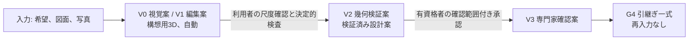

段階との対応は G0〜G2 が V1 まで、G3 が V2、G4 が V2 から V3 へ昇格（基盤 七段階門 第2節、第6章）【推定】。この二段階化を守る限り、Renovo 型の短い体験、建築家コンシェルジュ型の専門家接続、タウンライフ型の条件取得、住友林業の木質空間と生活提案を統合しても機能の寄せ集めにならない（指示文11.4）【推定】。

## 2. 製品分類、完成像、非対象

### 2.1 製品分類と完成像

製品分類は「3D生成道具」ではなく「日本の戸建住宅における設計意思決定基盤」とする（用語集1）【推定】。完成像は「住宅に関する曖昧な希望または既存資料を、根拠と責任が追跡できる共通建物情報へ変え、家族と専門家が重要な代償を理解して合意し、次工程へ再入力なしで安全に引き渡せること」であり、五成果（正しい問題設定、比較可能な成立案、根拠付き合意、情報を失わない引継ぎ、建物全期間の改善）へ分解する（第2章 第1節）【推定】。到達判定は作成した画像や 3D の件数ではなく、重要判断が根拠付きで完了した割合 M-N-01 で行う（第2章 第1.2節）【推定】。

任意の製図からの完全自動で誤りのない 3D 化は保証しない。2026年公開の FloorplanVLM は外壁 IoU 92.52% を報告しており 100% ではない（SRC-215、第13節）【事実】。したがって確信度表示、原図重ね、尺度確認、問題一覧、手修正、承認記録を P0 の必須とする（指示文1章、第11章）【推定】。

### 2.2 非対象（製品が置き換えないもの）

| 層 | 内容 | 識別子（第2章） | 代わりに製品が行うこと |
|---|---|---|---|
| A 法的責任 | 建築士、構造設計者、設備設計者、施工者、行政と確認検査機関の法的責任。確認申請の代行、工事監理、測量や調査の代替 | NS-02-001〜008 | 責任境界の常時表示（S-01）、確認範囲付き承認の記録（第13章、第17章、第22章） |
| B V3 でも扱わない五文書 | 確認申請図、構造安全証明、見積確定額、施工図と製作図、性能評価書と法的適合の証明書 | NS-02-009〜013 | 幾何検証案、工種別費用幅、証拠段階別の記録（第19章、第20章） |
| C 事業として行わないこと | 無許諾の企業商品を複製する商品収集基盤。利用者情報を一括送信する見込客獲得頁、連絡先の販売、隠れた順位操作 | NS-02-014〜015 | 権利状態 RS- と代替形状、送信先別の個別同意（第16章、第17章） |
| D 非対象機能 | 施工図の完全自動作成、構造安全の自動保証、全世界法規の完全対応、無許諾商品3Dの複製、単写真からの実寸完全復元、確定見積、第三者性能評価の自動発行 | F-C13-015、F-C11-011、F-C09-014、F-C05-020、F-C07-011、F-C13-016、F-C12-017 | 各行の代替機能（基盤 機能一覧骨格 第2節） |

一級建築士は国土交通大臣の免許を受けて設計と工事監理等を行う者であり（SRC-270）【事実】、製品内の AI はこの法的責任を代替しない【推定】。整合検査の未決 U-00-058（非対象7機能の台帳扱い）には、第2章の仮判断（完成像審査の除外条件とし、代替機能の因果ひも付けと禁止表示語の試験の存在を審査する）に従う【仮定】。

## 3. 北極星指標と防護指標

北極星指標は M-N-01 検証付き重要判断完了率であり、必要な重要判断のうち要求、選択肢、選定理由、他分野への影響、決定者、確認者、版がそろった判断の割合で測る（第2章 第4節、基盤 画面指標試験骨格 第2.1節）【推定】。「北極星が上がっても防護指標が下がれば不合格」を相殺禁止の判定規則として固定する（第2章 第5節）【推定】。目標値は指示文10.7の三値以外は初期仮説であり、公開判定会議で入力種別ごとに固定する【推定】。

| 指標ID | 指標名 | 初期仮説の目標 | 経営が見る理由 | 根拠 |
|---|---|---|---|---|
| M-N-01 | 検証付き重要判断完了率 | G4 の通過要求時の初回値で 90% 以上【仮定】。確認者の役割の三層（有資格者確認〔照合済み〕、資格未照合〔本人申告〕、専門家未確認）で層別して別掲し、照合済みの層が 30 件未満の間（照合済みがない P0 を含む）は「専門家未確認の完了率」として公開する（JR-004） | 製品価値そのもの。件数指標の代わり | 指示文1章、第2章 第4.5節、第5.2節、第23章 第6.1節 |
| M-G-01 | 要求追跡率 | 95% 以上 | 要求が案と判断へ戻れるか | 指示文10.7 |
| M-G-02 | 再入力なし引継ぎ率 | 80% 以上【仮定】。P0 は試験時（建築士二重確認 100 件の受取側役）の代替計測で判定し、運用時は P1 まで監視のみ。P0 完了条件に含めるかは意思決定記録 D-24-021（仮の判断は含める） | 専門家が作り直さないか。収益源2の前提 | 第2章 第5.1節、第23章 第6.1節、第24章 第8節 |
| M-G-03 | 重大誤り流出率 | 試験時 0% | 尺度、外壁、階段、避難、構造、設備の誤りの流出 | 指示文10.7、第11章 |
| M-G-04 | 確信度校正誤差 | ±5 ポイント以内【仮定】 | 表示した確信度が実態と合うか | 第11章 |
| M-G-05、M-G-06 | 重要判断までの時間、専門家修正時間 | 未設定【未確認】 | 合否に使わず監視のみ（第2章 U-02-007） | 第2章 |
| M-G-07 | 同意事故件数 | 0 件 | 信頼を失う事故。収益源4の前提 | 第17章、第22章 |
| M-G-08、M-G-13 | 進行禁止の見逃し率、未確認案の誤表示件数 | 0%、0 件 | 誇大表示の防止 | 指示文10.7、第6章 |
| M-G-16 | 広告偏り指数 | ±5 ポイント以内【仮定】 | 推薦の中立性 | 第16章、第17章 |
| M-G-17（参照。採番: 第23章、定義: 第2章 第5.1節） | 重要判断一覧の分母変更率 | 10% 以下【仮定】 | 分母操作による北極星の水増し防止 | 第2章 第5.1節（定義）、第23章（採番）、第2章 U-02-004 |

事業指標は M-B-05 有料転換率、M-B-08 案件当たり3D処理費を見る。M-B-06 相談先送信率と M-B-07 三次元生成回数は単独で目標化しない（基盤 画面指標試験骨格 第2.5節、指示文H）【推定】。

## 4. 初期顧客と最初の有料成果

| 項目 | 内容 | 根拠 |
|---|---|---|
| 初期顧客 | 日本の戸建住宅を検討し、候補地または既存図面があり、設計契約前に家族の要求と比較案を整理したい一般利用者。設計実務者は P1、住宅会社は P2 の顧客とする。第5章の仮判断 U-05-001 であり、公開前に経営判断として確定する【仮定】 | 指示文8章、第5章 |
| 分離の理由 | 一般利用者と設計実務者を同じ画面と販売方法で同時に最適化すると、初回体験と精度投資が分散する【推定】 | 指示文8章 |
| 画面の二系統 | 一般利用者向けの短い対話（S-01、S-02）と、提携建築士が使う専門家確認作業面（S-22）を分ける【推定】 | 第5章、第15章 |
| 最初の有料成果 | 「図面の検証付き3D化」だけでなく「根拠付き比較構想一式」とする。三案、要求への適合、敷地制約、主要な構造と設備の注意、性能目標、費用幅、商品、未解決問題、専門家引継ぎを一体で渡す【推定】 | 指示文8章、第9章 |
| 初回価値 | 電子連絡先の入力前に、透かし付き試作（希望入力は V0 の構想案、図面は V1 の縮小表示、写真は V0）を見せる（F-C01-025、M-P-04 初回価値到達率）【推定】 | 第8章 |

図面変換は強い入口であるが、製品価値は重要判断の完了（M-N-01）と再入力削減（M-G-02）で測る（指示文8章）【推定】。

## 5. P0 の範囲と外すもの

| 区分 | P0 で行う | P0 から外す（提供時期） | 根拠 |
|---|---|---|---|
| 建物 | 日本の戸建住宅、平屋または二階建 | 三階建以上、非住宅（P2 の対象拡張） | 指示文9.10、第9章 |
| 入力 | 明瞭な単一縮尺の PDF、PNG、JPEG。平面図中心、立面と断面は補助入力 | ベクトル PDF、DXF、SVG、IFC、図面一式、複数階一括（P1）。DWG、RVT は正規許諾の接点がある場合のみ（P2） | 第11章 |
| 自動処理 | 自動昇格は V1 編集案まで。壁、扉、窓、室、階段、主要設備、家具を抽出。V2 は利用者の尺度確認と決定的検査で到達し P0 に含む | V3 は照合済みの資格を持つ有資格者の確認（P1） | 基盤 信頼状態 第1.2節、第11章、第24章 第4.1節 |
| 提案 | 三案（希望入力は雛形三案 F-C03-019-01、図面入力は図面派生三案 F-C03-019-03。図面派生の目録は構造上重要な壁と外周壁の上の要素を除く）と限定した正規商品群。住友林業は公式情報参照（PT-REF）に限る | 商品拡大、独自家具生成、構造・外皮・設備の詳細調整、詳細な性能計算（P1） | 第13章、第16章、第19章 |
| 出力 | GLB 共有、PDF 平面、問題一覧、要求台帳、判断記録、標準の必要情報要求による書出検査 | IFC、IDS、BCF（P1） | 第22章 |
| 構造と改装 | 構造の初期注意は在来木造（延床 200 m² 以下）だけ。他構法は「判定不能（P0 対象外の構法）」を表示して持ち越す。改装は現況要素の削除、移動、寸法変更に撤去と移設を自動で付け、既存の外周壁と上下階連続壁の撤去、移設元、寸法変更の変更前の要素と、耐力壁候補線上の新設開口を式(5)で SEV-0 にする（解除は元に戻す変更だけ） | 改装区分の指定（残す、補修、補強）と、耐震診断や構造設計者の確認記録による解除（P1） | 第13章 第5.5節、第21章 第2.1節、第24章 D-24-009 |
| 段階 | G0〜G3 と G4 への最小引継ぎ | G5 施工と竣工反映、G6 入居と改善（P2）。識別子、版、出典、責任、状態は P0 から保持 | 第6章 |
| 外部送信 | 所有者の期限付き共有URL による引継ぎ | 送信先別同意付きの外部送信、提携先比較（P1） | 第17章 |
| 機能数 | P0 145 | P1 82、P2 15、非対象 7（計 249） | 第9章 |

公開前に、許諾済み図面の評価用 1,000 件以上（調整用 200 件は別）による非公開評価と 100 件以上の専門家二重確認を経てから対象を広げる。件数は初期仮説であり、入力多様性と誤りの収束を見て見直す（指示文9.10、第23章 第6.1節、第24章 第5.2節）【仮定】。P0 では、費用低減案の性能と維持費への影響表示、利用円滑性の検査、在宅避難の居住性と災害耐性の比較、公開頁参照の商品の販売終了の自動検知を行わないことを、有料操作の前に文字で示す（課金前表示 P10。第8章 第6.2節、表6-5e）【推定】。

## 6. 主要な差別化（防御力）

第4章は、室内像、専門家向け BIM、敷地計画、商品販売、人の仲介が別々の製品として存在し、一つの建物情報で連結する製品が公開情報では確認できないことを競合の空白とした【推定】。防御力は連続性の五項目（根拠、追従、権利状態、承認範囲、送信先選択）で判定し、五項目を全て満たす競合は公開情報では確認できなかった（第4章）【推定】。

| 区分 | 例 | 経営上の含意 | 根拠 |
|---|---|---|---|
| 模倣で終わる機能 | 写実画像の生成、生成回数、送客率、一括送客、単一企業の商品配置 | 主要目標に置くと完成像から外れる。投資の中心にしない | 指示文8章、11.4、第4章 |
| 防御力がある機能 | 原図へ戻れる建物情報（原図重ね記録）、確信度の校正、要求追跡、確認範囲付きの承認と自動失効、送信先別の同意記録、正規商品の権利状態、既定値表 | 利用が増えるほど価値が上がる積み上がる資産。競合が公開情報では持たない | 第4章、第11章、第12章、第16章、第17章 |
| 判定保留 | 第4章の暫定表 9 行（有料契約後の画面や非公開機能で変わり得る） | 04_必須表で確定し、公開前の設計審査で再確認 | 第4章 U-04-011 |

## 7. 主要な危険と防止策

第24章 第7節（指示文9.11 の更新）の失敗のうち経営判断に関わるものと、初稿審査の極高 3 件の型を挙げる。全件と状態は `04_必須表/表6_最終審査表.md` 表6-5a〜6-5f にある。試験はどれも未実施である【推定】。

| 失敗 | 重大度 | 防止策（仕様上の実装先） | 防護指標 | 試験 | 根拠 |
|---|---|---|---|---|---|
| 尺度を誤ったまま3D化 | 極高 | 基準寸法の確認と照合（同じ要素の照合は受け付けない）、複数寸法の整合検査、確認前の V2 禁止 | M-Q-25、M-G-04 | T-A-002、T-A-007、T-R-005 | 第11章 |
| 外壁や階段接続の欠落 | 極高 | 原図重ね、建物関係図の検査、SEV-0 として進行停止 | M-Q-26、M-Q-27、M-G-08 | T-P-002、T-P-003 | 第11章、第6章 |
| 改装で既存の構造壁を撤去、移動、寸法変更して素通りする（初稿審査 JM-094、再審査 JR-095） | 極高 | 撤去と移設の自動付与と式(5)（I-00-116）による SEV-0、G3 と V2 の停止、解除は元に戻す変更だけ | M-G-12、M-G-08 | T-R-006 P0 版、T-I-024 | 第13章 第5.5節、第21章 第2.1節 |
| 法規の余裕量が負の案が G3、G4 を通過する（JM-019、JR-011） | 極高 | G3 で I-18-002、I-06-006 により止め、発行と引継ぎ一式を止める（共有URL は止めず未解決の一覧を表示） | M-G-08 | T-R-010 | 第6章、第18章 |
| 構想画像を施工案と誤認 | 極高 | V0〜V3 の常時表示、書出の透かし、禁止表示語の文言検査、未照合の資格では「専門家確認済み」「法的適合」を出さない | M-G-13、M-G-10 | T-A-007、T-S-003、T-S-010 | 第6章 第5.2節、第15章、第22章 |
| 図面流出 | 極高 | 非公開既定、期限付き共有、提携先への部分共有の期限、最小送信、監査記録、一括削除 | M-G-07 | T-S-004、T-S-005、T-S-007、T-S-012 | 第17章、第22章 |
| 特定企業の知財侵害 | 高 | 権利状態 RS- の判定、許諾のない商品は代替形状のみ、提携誤認語の禁止 | M-G-23 | T-S-008、T-A-005 | 第16章、第22章 |
| 古い商品や法規を断定 | 高 | 最終確認時刻と有効期限、P0 は日次同期と台帳操作と利用者申告で販売終了を検知、法令版の期限管理と手動再取得 | M-Q-42、M-Q-43 | T-R-009 P0 版、T-R-010 | 第16章 第6.4節、第18章 |
| 広告企業へ推薦が偏る | 高 | 広告料と紹介料を点数から分離、開示、月次の偏り監査 | M-G-16 | T-S-017 | 第16章、第17章 |
| 試験資料の権利不備と調達不足 | 高 | 許諾済み図面だけで試験、段階調達、入力種別と層別ごとの段階公開 | M-G-23 | T-P-005、T-P-006 | 第23章、第24章 第5.2節 |
| 経営判断が未確定のまま画面設計へ進む | 高 | 意思決定記録 D-24-001〜D-24-023 を判断者、確定日、版付きで確定（P0 完了条件(5)） | — | — | 第24章 第8節 |
| 公開判定の不合格（層別の未達） | 高 | 入力種別と層別ごとの条件付き公開、対象範囲の縮小、再判定 | 閾値のある全防護指標 | 第23章 第6.2節 | 第23章、第24章 |
| 3D処理費が収益を超える | 中 | 段階詳細、変更部分だけの再生成、外部AI処理費の三段の上限、課金前表示 | M-B-08、M-B-12〜M-B-15 | T-P-013、T-I-019 | 第8章、第14章 |
| 人確認が滞留する | 中 | 重大度別の振分、確認範囲の限定、確認予約容量の表示（S-22）。P0 は V3 を行わず「専門家未確認」 | M-P-11 | T-I-013（P1） | 第17章 |

重大度は指示文9.11 と初稿審査の区分を転記した【推定】。防護指標が閾値未設定の項目は監視のみとし、前期比で悪化した場合に報告する（第2章 U-02-007）【仮定】。審査の最後に残った中の危険は、図面読解の訂正（S-05）で図面由来の壁を消すと撤去の防護を通らない経路と、構造に不利でない寸法変更も SEV-0 になる止まり過ぎの 2 件で、P0 の公開判定の前に公開判定会議で扱いを決める（表6-5b 行1、2。U-95-635、U-95-636）【推定】。

## 8. 収益設計の順序

| 順序 | 収益源 | 提供時期 | 信頼上の条件 | 見る指標 | 根拠 |
|---|---|---|---|---|---|
| 1 | 個人向けの検証付き3D化と詳細書出 | P0 | 初回価値は無料枠、有料操作の前に課金前表示（利用量、追加費用、失敗時の再実行または返金） | M-B-05 | 指示文9.9、第8章 |
| 2 | 専門職向けの共同作業、IFC、承認、組織標準 | P1〜P2 | 再入力なし引継ぎが成立していること | M-G-02、M-G-06 | 第17章、第22章 |
| 3 | 正規商品情報の提供と配置後の成果測定 | P1 | 権利状態 RS-OK の商品のみ。点数と広告料の分離 | M-B-01、M-G-16 | 第16章 |
| 4 | 利用者が明示選択した相談紹介 | P1 | 送信先別同意、紹介料の開示、順位への不算入 | M-B-06（目標化しない）、M-B-02、M-B-03、M-B-04 | 第17章 |

紹介収益を最初の中心にしないことで推薦の中立性を守る（指示文9.9）【推定】。参照先のうち、タウンライフ型は連絡先入力が成果閲覧より先になる（SRC-014、SRC-016）【事実】ため見込客獲得頁と認識されやすく、建築家コンシェルジュ型は料金、返金、手数料、並行検討不可を開示する人の選定型（SRC-009）【事実】であり対応人数が成長制約になる。本製品は預り金型と並行検討の制限を採らず、人による選定を有料の選択肢とするかは未決とする（第17章 U-17-003）【仮定】。

## 9. 実装前に経営陣が決める事項（八項目と現在の仮判断）

指示文9.12の八項目を未決のまま画面設計や模型選定へ進むと、責任範囲と情報構造が後から崩れる。仕様書は合理的な仮判断を置き、第24章 第8節で意思決定記録 D-24-001〜D-24-008 の様式にした。状態は 2026-10-08 時点で全て「仮」であり、公開前に確定する必要がある（P0 完了条件(5)。表3 表3-21）【推定】。

| 番号 | 決める事項 | 仕様書の現在の仮判断（意思決定記録） | 根拠章と未決 |
|---|---|---|---|
| 1 | 初期顧客を一般利用者、設計実務者、住宅会社のどれに置くか | 一般利用者（設計契約前の家族）。設計実務者は P1、住宅会社は P2（D-24-001）【仮定】 | 第5章 U-05-001、U-01-001、表3 UM-001 |
| 2 | V2 と V3 の確認責任を自社、提携建築士、利用企業のどこが持つか | V2 は決定的検査と利用者の尺度確認（責任は幾何の範囲の表示に限る）。V3 は P1 の照合済みの資格を持つ提携建築士と利用企業の建築士。自社は確認主体にならない（D-24-002、D-24-011）【仮定】 | 第6章 第5.2節、第17章、第22章、U-01-002、表3 UM-002 |
| 3 | 正規商品情報を何社分確保してから公開するか | 直接許諾 3 社以上（初期仮説）を公開条件とし、満たさない場合は「PT-GEN のみ」の条件付き公開（S-06 に「正規商品未収録」を常時表示。D-24-003）【仮定】。正規基盤からの自動取得は規約上できない前提（第3章）。家具の 3D 提供は法人審査付きの少数（飛騨産業 SRC-195）【事実】 | 第16章、第3章、U-01-003、表3 UM-003 |
| 4 | 住友林業との正式連携を目指すか、一般的な木質設計属性だけで開始するか | 正式連携を目指さず、公式情報の文章要約と転記に限る PT-REF で開始（D-24-004）。Interior Style 二十三案は 2023 年 9 月時点の改廃注記付き（SRC-099）【事実】。提携誤認語を禁止（第22章 第6.3節）【仮定】 | 第16章、第22章、U-01-004、表3 UM-004 |
| 5 | 図面を国内だけで処理、保存する要件を採るか | 保存は国内。外部処理先は国名を表示し、契約に学習不利用、保持期間、削除要求、事故の即時通知と監査記録を含める（D-24-005、D-24-016）。外部AI処理先の契約前は構造化質問へ退避し、層別「退避」の M-P-04 95% 以上の場合だけ公開する。契約条件は【未確認】 | 第22章 U-22-005、第14章 U-14-003、U-01-005、表3 UM-005 |
| 6 | 無料枠で見せる成果と有料化する検証や書出の境界 | 初回価値（透かし付き試作、不足情報一覧）は無料、V2 の検証と詳細書出は有料。課金前表示で利用量と失敗時の条件と P0 で行わない比較と検査を示す。金額と処理枠は未定（D-24-006）【仮定】 | 第8章、U-01-006、表3 UM-006 |
| 7 | 紹介料を受け取る場合の開示と順位分離の規則 | 受け取る場合は 3%、成約時、候補ごとに開示し点数に含めない（D-24-007）。広告は文字で広告枠へ分離し M-G-16 で月次監査。掲載料は広告枠の対価に限り、正規商品登録は無償（D-24-023。製品と経営の暫定判断で確認待ち。U-95-903）【仮定】 | 第16章、第17章、第24章、U-01-007、表3 UM-007 |
| 8 | 初期対象地域と法規助言を提供する深さ | 1 都 2 県程度（初期仮説）から、市区町村単位で第18章 第5.1節の条件を満たす自治体で開始。助言は P0 の 4 項目（建蔽率、容積率、高さ、接道）の余裕量まで、斜線と日影は「未判定（P1）」、対象外地域は法規判定を行わず表示で代える（D-24-008）。令和7年4月1日施行の改正法を法令版台帳へ登録（SRC-259）【事実】。部分対象地域の扱いは未定【仮定】 | 第18章 U-18-009、U-01-008、表3 UM-008 |

## 10. 着手前の最終必須判断（十項目）

指示文11.5の十項目を確定し、P0 の反証試験（T-R-001〜T-R-012 の P0 版）に合格した後にのみ一般公開へ進む。十項目は表3 の未決（UM-）と第24章 第8節の意思決定記録に結ばれ、確定期限の段階門が付いている（表3 表3-20、`06_最終報告/最終報告.md` 第7節）【推定】。

| 番号 | 判断 | 現在の暫定の扱い（意思決定記録。状態は全て「仮」） | 確定期限 | 担当章と表 |
|---|---|---|---|---|
| 1 | P0 の対象都道府県、構法、図面品質、建物規模 | 在来木造、平屋または二階建、明瞭な単一縮尺、延床 200 m² 以下。他構法は「判定不能（P0 対象外の構法）」で持ち越し（D-24-009）。対象都道府県は 1 都 2 県程度（D-24-008） | 公開判定会議前 | 第13章、第18章、第24章、表3 UM-009、UM-008 |
| 2 | 検証付き重要判断一覧と、案件別に分母を変更する権限 | 分母は段階門の主要判断と利用目的別の雛形表（第2章 第4.3節）から作り、分母変更は第6章 第5.1節の承認者が承認（D-24-010） | 公開判定会議前 | 第2章、第6章、表3 UM-010 |
| 3 | V2、V3、各性能状態を確認する資格者と契約責任 | V2 は決定的検査と利用者の尺度確認。V3 と「法的適合」は P1 の照合済みの資格が前提（第6章 第5.2節「資格の照合状態」。D-24-011） | 公開判定会議前 | 第6章、第17章、第19章、第22章、表3 UM-002 |
| 4 | 許諾済み図面試験資料、正解作成手順、公開合格値 | 評価用 1,000 件以上、調整用 200 件、建築士二重確認 100 件。正解付与は自社学習 約 58〜114 人月、外部認識 API 約 30〜59 人月（D-24-012） | 試験開始前 | 第23章、第24章 第5.2節、表3 UM-011 |
| 5 | 住友林業を含む商品情報の取得契約、表示、商標、三次元利用権 | 第9節 3、4 のとおり（D-24-013） | 群5 着手前、公開判定会議前 | 第16章、第22章、第3章、表3 UM-003、UM-004 |
| 6 | 敷地、法規、単価、在庫、納期情報の更新責任と失効規則 | 法令版は P0 で期限管理と手動再取得（週次の検出は P1）、価格と在庫 24 時間、単価表は四半期。条例台帳と単価表の初期版は群3、群4 の着手前に整備（D-24-014） | 群3、群4 着手前、公開判定会議前 | 第16章、第18章、第20章、表3 UM-012 |
| 7 | 概算費、性能予測、法規助言の免責だけに頼らない画面上の誤認防止 | 単一額の表示禁止、証拠段階の別列表示、禁止表示語の文言検査、課金前表示 P10 で P0 で行わない比較と検査を開示（D-24-015） | 公開判定会議前 | 第15章、第18章、第19章、第20章、表3 UM-115、UM-118 |
| 8 | 外部AI、保管地域、学習利用、削除、事故対応の契約と監査 | 第9節 5 のとおり。外部認識 API で同意のない利用者の図面は受け付けて手修正中心の V1 を返す暫定判断（D-24-016、D-24-022。U-95-903）。個人情報保護委員会の注意喚起（SRC-296）への対応表は定義済み【事実】 | 群1 着手前 | 第14章、第22章、表3 UM-005 |
| 9 | 初期の提携建築士、構造、設備、施工、個人情報、知財の審査体制 | 各分野 1 名以上、中核人員 8〜12 名。決定権は製品責任者、拒否権は建築士と情報保護責任者（D-24-017） | 試験開始前、公開判定会議前 | 第17章、第22章、第24章、表3 UM-013 |
| 10 | 百件規模の専門家確認試行と、重大誤りが収束しない場合の公開停止条件 | 試行 100 件で M-G-03 が 1 件でも発生した判定の単位（入力種別「画像」の明瞭と低品質の層、希望入力）は公開停止、直近 50 件で 0 件を収束条件（D-24-018） | 試験開始前 | 第23章 第6.2節、第24章、表3 UM-011 |

十項目のほかに、製品と経営の暫定判断 7 件（図面派生三案の案(A)、掲載料、同意のない図面の扱い、S-28 の P0、P0 の販売終了の検知、規則6 (b) の範囲、仕様区分は P1。U-95-903。表6-4b）と、表3 の段階8 への繰延べ 45 件（U-90-310）の確定期限を着手前に付け直す【推定】。

## 11. 最終判定

最終判定は「**P0 の製品仕様として条件付き適合。公開可とは結論しない。施工可能な設計を自動完成する製品としては未適合**」である（`06_最終報告/最終報告.md` 第1節、`04_必須表/表6_最終審査表.md` 第4節）。指示文11.4 の最終判定「P0 の製品仕様を作るための指示文として適合、施工可能な設計を自動完成する製品としては未適合」は維持され、承認前の案を施工可能とは表示しない責任範囲の限定を仕様全体で守っている【推定】。

仕様の側の重大な空欄（必須機能の要件ブロックの欠け、試験のない受入条件、未解消の極高と高の指摘）は 0 件である。公開可と結論しないのは、公開の前提（試験の実施と合格値の固定、意思決定記録 D-24-001〜D-24-023 の確定、公開前必須の外部契約 15 行と前提作業 (a)〜(h)）の成立が 0 のためである（表6 第4.2節）【推定】。

審査の経過: 初稿審査は統合指摘 195 件（極高 3、高 44）で総合は不適合、不適合の軸は 3 だった。再修正（195 件）、再審査（再発 0、新規 128 件。改装だけ不適合）、二回目の修正（128 件）、外部確認、段階8前の仕上げ、再々確認、段階8 の最終仕上げ（100 件）を経て、極高と高はすべて解消し、不適合の軸は 0 になった（最終報告 第2〜4節）【推定】。

指示文11.3 の審査軸の確定版の判定は次のとおり（表6-3b）【推定】。

| 審査軸 | 判定（確定版） | 仕様書での対応 | 残る条件 |
|---|---|---|---|
| 理想の完成像 | 条件付き適合 | 第2章が完成像、五成果、因果、北極星と防護指標を固定し、第10章が全機能を追跡 | 初期顧客と有料成果の経営確定（第9節 1、6）、利用目的別の雛形表の妥当性 |
| MECE | 条件付き適合 | 第7章が主担当一つの規則と判定例辞書を固定 | 実案件で領域分類の迷いを記録し辞書を改善 |
| 建築工程 | 適合 | 第6章が G0〜G6 の完了条件と進行禁止条件、利用目的による適用除外を固定 | P0 は G0〜G3 と G4 引継ぎに限定 |
| 建築成立性 | 条件付き適合 | 第13章が構造、外皮、設備の調整と責任境界、改装の撤去の防護（式(5)）を定義 | 詳細設計、安全確認、施工方法は有資格者等が必要。止まり過ぎと訂正の経路（第7節） |
| 図面三次元化 | 条件付き適合 | 第11章が元頁追跡、確信度、原図重ね、尺度確認、V 状態、現況差を定義 | 多様な日本図面による精度検証と図面認識模型の調達（第10節 4） |
| 商品と住友林業参照 | 条件付き適合 | 第16章が四層、権利状態、関係区分、代替、P0 の販売終了の検知を定義 | 正規商品提供と商標利用の契約（第10節 5） |
| 法規と性能 | 条件付き適合 | 第18章、第19章が版、地域、証拠段階、人承認、判定機関を定義 | 自治体差、改正追従、第三者評価、外部確認の未確認事項 |
| 費用と期間 | 条件付き適合 | 第20章が工種、数量根拠、時点、地域、確信幅、X4 の衝突の扱いを定義 | 信頼できる単価、納期、施工条件の入手。仕様区分は P1 |
| 情報安全 | 条件付き適合 | 第22章が非公開既定、最小共有、同意、監査、削除を定義 | 外部AIと保管先の契約審査（第10節 8） |
| 実装可能性 | 条件付き適合 | 第9章が P0 145 機能を比較構想と引継ぎへ限定し、第24章が P0 完了条件と前提作業を定義 | 試験資料、外部依存、意思決定記録の確定（前提） |

完成像を達成する中核は、(1) 希望と原図の根拠を失わない正規建物情報、(2) 十二判断領域を横断する変更影響と七段階門による進行管理、(3) V0〜V3、性能証拠段階、資格者確認による誇大表示の防止、(4) 正規商品、費用、問題、承認を含む専門家引継ぎ、(5) 竣工差と入居後実績を元の要求へ戻す改善循環の五点に収束する（指示文11.4）。(1)〜(4) は P0 の仕様で担保され（追跡表 第10章、試験 第23章、責任表 表4 の該当箇所は最終報告 第6節）、(5) は情報構造の先行保持だけで機能は P2 である【推定】。逆に、初回の写実像、生成回数、送客率を主要目標に置くと完成像から外れる【推定】。仕様書は 24 章とも末尾5節まで完成し、機械整合検査（2026-10-08 13:20）は参照切れ 0、重複定義 0、P0 要件の不足 0、試験のない受入条件 0 である【事実】（`04_必須表/00_機械整合検査.md`）。

## 12. 機能要件

本章に担当機能なし。機能一覧骨格 v1.1 第4.6節の主章に第1章はなく、整合検査報告 項目4 でも使用章に含まれない【事実】（`02_基盤定義/整合検査報告.md`、確認日 2026-09-15）。

## 13. 本章の【事実】の出典

| 出典ID | 内容 | URL | 確認日 | 使用節 |
|---|---|---|---|---|
| SRC-215 | FloorplanVLM 論文要旨（外壁 IoU 92.52%） | https://arxiv.org/abs/2602.06507 | 2026-09-15 | 第2.1節 |
| SRC-270 | 国土交通省 建築士制度 | https://www.mlit.go.jp/jutakukentiku/build/architect.html | 2026-09-15 | 第2.2節 |
| SRC-009 | 建築家コンシェルジュ 指定頁（料金、相談導線） | https://architect-concierge.com/meta/ | 2026-09-15 | 第8節 |
| SRC-014 | タウンライフ家づくり 質問導線 | https://www.town-life.jp/home/main/chatform.php | 2026-09-15 | 第8節 |
| SRC-016 | タウンライフ家づくり 利用規約 | https://www.town-life.jp/home/terms.html | 2026-09-15 | 第8節 |
| SRC-195 | 飛騨産業 3Dデータダウンロード（法人向け） | https://hidasangyo.com/projects/download-3d/ | 2026-09-15 | 第9節 |
| SRC-099 | 住友林業 Interior Style 総覧 | https://sfc.jp/ie/design/interior/ | 2026-09-15 | 第9節 |
| SRC-259 | 国土交通省 改正法制度説明資料（令和6年9月、PDF） | https://www.mlit.go.jp/common/001627103.pdf | 2026-09-15 | 第9節 |
| SRC-296 | 個人情報保護委員会 生成AIサービスの利用に関する注意喚起 | https://www.ppc.go.jp/news/careful_information/230602_AI_utilize_alert/ | 2026-09-15 | 第10節 |

出典の取得可否と変動性は `01_調査/00_出典一覧.md` の統合表に従う。各社の処理時間、導入数、効果は公開主張として扱い、目標値の根拠にしない（第3章）【推定】。

## 14. 更新記録（段階8。2026-10-08）

`99_作業道具/prompts/t8_第1章更新.md` と共通の補足に従い、最終報告と表6 確定版にそろえた。各主張には根拠の章、表、記録を付けた【推定】。

| 番号 | 節 | 変更内容 | 根拠 |
|---|---|---|---|
| 1 | 冒頭 | 版を v1.2 とし、段階8 の更新を記した | — |
| 2 | 第3節 | M-N-01 の層別を三層（照合済み、本人申告、専門家未確認）にし、照合済みの層が 30 件未満の間の公開規則を書いた。M-G-02 を試験時の代替計測と D-24-021 の位置付けにした | 第2章 第5.2節、第23章 第6.1節、JR-004、JM-004 |
| 3 | 第5節 | 自動昇格は V1 まで、V2 は利用者の尺度確認と決定的検査で P0 に含むと改めた。三案を雛形三案と図面派生三案にし、構造と改装の行（在来木造、撤去の防護と式(5)、解除は元に戻す変更だけ）を加えた。評価資料の件数と課金前表示 P10 を書いた | 第24章 第4.1節、第13章 第5.5節、第21章 第2.1節、第8章 第6.2節 |
| 4 | 第7節 | 主要な危険の表を第24章 第7節と初稿審査の極高 3 件の型（改装の構造壁、負の余裕量）で更新し、試験と防護指標を現行の識別子にした。最後に残った中の危険 2 件を書いた | 第24章 第7節、表6-5a、6-5b |
| 5 | 第9節 | 八項目の仮判断を意思決定記録 D-24-001〜D-24-008（全て仮）と表3 UM-001〜UM-008 に結んだ | 第24章 第8節、表3 表3-21 |
| 6 | 第10節 | 十項目に現在の暫定の扱い、確定期限、担当章と表を付け、製品と経営の暫定判断 7 件と表3 の繰延べを加えた | 表3 表3-20、最終報告 第7節、表6-4b |
| 7 | 第11節 | 最終判定を「P0 の製品仕様として条件付き適合。公開可とは結論しない。施工可能な設計を自動完成する製品としては未適合」に改め、公開可と結論しない理由、審査の経過、指示文11.3 の確定版の判定を書いた | 最終報告 第1節、表6 第4節、表6-3b |
| 8 | 章末 | 第10章と第23章への依頼の状態を対応済みに改め、章要約を最終判定に合わせた | 表6-5a、第23章 第6.1節 |

## 章要約

本章は経営陣が着手前に判断する事項を要約した。製品は勝ち筋の五要素を一つの正規建物情報で結ぶ設計意思決定基盤で、出力を構想用3D（V0、V1）と検証済み設計案（V2 以上）に分け、承認前に施工可能と表示しない。北極星は M-N-01（確認者の三層で層別）、防護指標との相殺は禁止する。初期顧客は設計契約前の一般利用者、最初の有料成果は根拠付き比較構想一式。P0 は在来木造の平屋または二階建、単一縮尺の画像図面、自動昇格は V1 まで、三案、改装の撤去の防護、G0〜G3 と G4 最小引継ぎ、145 機能に限る。主要な危険に防止策、防護指標、試験を対応付けた。経営陣が決める八項目と着手前の十項目を意思決定記録（全て仮）と期限に結んだ。最終判定は「P0 の製品仕様として条件付き適合。公開可とは結論しない。施工可能な設計の自動完成としては未適合」。本章に担当機能はない。

## 他章への依頼または前提

| 章 | 内容 | 種別（依頼/前提） |
|---|---|---|
| 第24章 | 第9節の八項目と第10節の十項目を意思決定記録の様式で確定し、開発順序、依存関係、公開停止条件へ反映すること。未決 U-01-001〜U-01-008 の確定先を第24章の未決事項統合に含めること | 依頼 |
| 第10章 | 第7節の失敗、防護指標、試験の対応を追跡表で照合し、対応する試験のない失敗（広告偏り、人確認の滞留）に試験を割り当てること | 依頼（対応済み。2026-10-08 確認: 広告偏りは T-S-017、人確認の滞留は T-I-013〔P1〕。第24章 第7節、表6-5a） |
| 第23章 | 第3節の初期仮説の目標値を公開判定会議の合格値表へ引き継ぎ、閾値未設定の指標を「監視のみ」として扱う規則を受入条件に含めること | 依頼（対応済み。2026-10-08 確認: 第23章 第6.1節に M-N-01、M-P-08、M-P-09 の合格値〔JM-172〕、閾値未設定の指標は監視のみ〔第2章 第5.2節〕。表6-6） |
| 第5章 | U-05-001（初期顧客）は本章の U-01-001 と同一の経営判断として扱い、確定時に両章の未決を同時に解決すること | 前提 |
| 第2章、第23章 | M-G-17（重要判断一覧の分母変更率）は第23章が採番を確定し、定義と閾値は第2章 第5.1節を正本とする。本章第3節は参照のみで定義しない（統合指摘 JM-009 の反映、2026-09-15） | 前提 |
| 04_必須表 | 第6節の防御力の表は第4章の暫定表（模倣 23 行、防御力 19 行、保留 9 行）を正本とし、本章は要約にとどまる | 前提 |
| 05_審査 | 第11節の最終判定の表現と、承認前の案を施工可能と表示しない規則を責任審査（J-07-）の対象に含めること | 依頼（対応済み。初稿審査と再審査の責任審査〔SK〕が判定し、再々確認で条件付き適合。2026-10-08） |
| 第24章、第10章、第23章（本章の依頼への対応状況。2026-10-06 確認） | 第24章は本章の依頼に第24章 第8節（意思決定記録の様式。例示 D-24-001〜D-24-021）と第9節（U-01-001〜U-01-008 を必須表 表3 UM-001〜UM-008 に含める）で対応した（第24章の他章依頼の対応状況の行）。第10章への依頼（第7節の失敗と試験の照合）は第10章が主担当の統合指摘 JM-060 で扱われ、第10章の修正後に確認する。第23章への依頼（第3節の初期仮説の合格値表への引継ぎ）は第23章 第6.1節の合格値の初期仮説に M-N-01 等が載るが、本章の依頼への対応の記載はなく、依頼を継続する | 前提（対応状況） |

## 未決事項

| 識別子 | 内容 | 区分（事実/推定/仮定/未確認） | 影響 | 確認者候補 |
|---|---|---|---|---|
| U-01-001 | 初期顧客を一般利用者に置く仮判断の経営確定（第5章 U-05-001 と同一） | 仮定 | 第5章、第8章、P0 指標の層別、第24章 | 経営陣、製品責任者 |
| U-01-002 | V2 と V3 の確認責任の帰属先（自社、提携建築士、利用企業）と契約責任 | 仮定 | 第13章、第17章、第22章、責任表 | 経営陣、法務、一級建築士 |
| U-01-003 | 公開時に確保する正規商品の社数と分野。正規基盤からの自動取得ができない前提での確保方法 | 未確認 | 第16章、収益源3 | 事業提携担当、権利担当 |
| U-01-004 | 住友林業との正式連携の是非。P0 は PT-REF の文章要約と転記に限る | 未確認 | 第16章、第22章 | 経営陣、法務 |
| U-01-005 | 図面の国内処理と保存の要件の採否、外部AI処理先の契約条件 | 未確認 | 第22章、第14章、処理費 | 経営陣、個人情報担当、実装責任者 |
| U-01-006 | 無料枠（初回価値）と有料化（V2 検証、詳細書出）の境界と価格帯 | 仮定 | 第8章、M-B-05、M-B-08 | 経営陣、製品責任者 |
| U-01-007 | 紹介料を受け取るか否か。受け取る場合の開示と順位不算入の規則の採用 | 仮定 | 第16章、第17章、M-G-16 | 経営陣、法務 |
| U-01-008 | 初期対象都道府県と法規助言の深さ。部分対象地域の扱い（第18章 U-18-009） | 仮定 | 第18章、第24章 | 経営陣、一級建築士 |
| U-01-009 | 本章の字数が固有指針の目安（5,000〜8,000 字）を超えている。表の圧縮または第9節と第10節の第24章への移管を審査で判断する | 推定 | 本章、第24章 | 05_審査担当 |

## 用語追加提案

| 用語 | 定義 | 理由 |
|---|---|---|
| 勝ち筋の五要素 | 指示文1章の五要素（対話設計、図面理解、寸法付き建築編集、商品推薦、相談接続）を一つの正規建物情報で結ぶこと | 経営向け要約と第24章が同じ語で製品の中心を参照するため |
| 根拠付き比較構想一式 | 最初の有料成果。三案、要求への適合、敷地制約、主要な構造と設備の注意、性能目標、費用幅、商品、未解決問題、専門家引継ぎを一体で渡す成果 | 指示文8章の語を有料成果の単位として固定するため |
| 二段階出力 | 構想用3D（用語集10）と検証済み設計案（用語集11）を分けて扱う最重要設計判断の総称 | 指示文1章の設計判断を一語で参照するため |

## 本章で定義した識別子一覧

| 種別（機能/情報実体/画面/指標/試験/API/非機能/受入条件） | 識別子 | 名称 |
|---|---|---|
| 未決事項 | U-01-001〜U-01-009 | 本章の未決事項 |
| 指標 | M-G-17 | 参照（正本: 第23章）。採番は第23章、定義と閾値は第2章 第5.1節。本章は定義しない |
| 機能、情報実体、画面、指標、試験、API、非機能、受入条件 | なし | 本章は担当機能を持たず、これらの識別子を定義しない。参照した識別子は基盤定義、第2章（NS-02-001〜015）、第23章の定義に従う |


---

<!-- 02_理想の完成像_非対象_目的から成果への因果_指標の木.md -->

# 第02章 理想の完成像、非対象、目的から成果への因果、指標の木

作成日: 2026-09-15　版: v1.3　担当: 段階3 仕様書 第02章（製品責任者、一級建築士、UX設計者の合議による執筆）。v1.3 は 2026-10-07 の段階6 二回目の修正（段階7 再審査の後）。再審査 修正計画 第1.2節の 10 件（主担当 JR-001〜JR-007、整合 JR-044、JR-114、JR-101。高 JR-001）を同計画 第0.3節、第0.4節の固定文と番号で反映した（源1 の雛形の利用目的別の生成と非該当、G2(d)、G3(f) の源1 対象外と計算例の再計算、図面3D化の計算例、除外の承認者、M-G-17 の報告項目、M-G-25、確認者の三層、因果(6) の中核の P0 機能 0 件、事業指標の範囲、能力の必須機能、禁止表示語の正本の注）。記録は `05_審査/再修正記録_2回目_第2_10章.md`。同日の二回目の修正の仕上げ〔群R1〕で、基盤 用語集の改訂（500、577）の反映と受けた依頼の対応状況を章末に記した〔版は v1.3 のまま。記録は `05_審査/再修正記録_2回目_仕上げ_群R1.md`〕。v1.1 は 2026-09-15 の自己点検による字句修正（第0.1節の問いを箇条書き化、章要約を500字以内へ短縮、用語追加提案に法規判定記録、専門家未確認、初期注意の3語を追加）。v1.2 は初稿審査の反映（段階6 の再修正。2026-09-29 に着手して途中停止し、2026-10-06 に完了。05_審査/初稿審査/00_修正計画.md 第1.2節、記録は 05_審査/再修正記録_第2章.md）。源1 の雛形を第6章 第2.1〜2.7節の主要判断と一対一の記号 G0(a)〜G6(b) で固定し（例示 D-02-019〜024 を追加、D-02-011 を廃止）、M-N-01 の計測時点を門の通過要求時の初回値に改め、確認者の役割による層別を合格条件に組み込み、M-G-03、M-G-07、M-G-12、M-G-17 の P0 の計測と報告項目を定め、成果4 の P0 計測を試験時の代替計測に限定し、六因果の対応表を機能一覧骨格 v1.2 に合わせた（統合指摘 JM-001〜JM-012、JM-020、JM-027、JM-056、JM-058、JM-172、JM-194）。2026-10-06 の段階6 仕上げ（相互依頼 群A）で、整合修正指示 第2章 1、2（禁止表示語の列の注記）、第3.3節への副番7件の転記、M-G-07 の P1 の試験の同文化、U-02-001、U-02-003、U-02-010 の解決を反映した（版は v1.2 のまま。記録は `05_審査/再修正記録_相互依頼_群A.md`）
根拠: 指示文 1章（結論と六指標）、A1（完成像と逆算規則、六段の因果）、B（中心原則）、G（初期公開から外すもの）、H（収益設計と信頼指標）、J（自己審査）、9.9（収益と信頼の衝突）、10.2（理想の完成像と指標の木）、10.5（完成像から機能への逆算）、10.6（人とAIの責任境界）、10.7（初期公開の優先順位）、11.4（最終判定）、11.5（着手前の最終必須判断）。基盤定義 `用語集.md`、`識別子規則.md`、`十二判断領域.md`、`七段階門.md`、`信頼状態と証拠段階.md`、`機能一覧骨格.md`、`画面指標試験骨格.md` の v1.3（本章 v1.3 で二回目の修正後の版へ追従。v1.2 までは各 v1.2）、`整合検査報告.md` v1.2（第5節 識別子変更一覧と第5.1節 二回目の修正）。調査 `01_調査/06_研究と標準.md`、`01_調査/07_法規と個人情報と権利.md`。

## 0. 冒頭

### 0.1 本章の目的

本章は、製品が到達すべき「理想の完成像」を一文で固定し、それを五成果へ分解し、製品が扱わない「非対象」を識別子付きで列挙し、目的から成果へ至る六段の因果と機能群の対応を示し、北極星指標と防護指標の定義を数式と例で確定し、指標の木を描く章である。後続の全章（第6章の段階門、第9章の機能一覧、第10章の追跡表、第23章の指標と試験、第24章の主要指標と失敗要因、05_審査の完成像審査）は、本章の完成像、非対象、因果、指標の定義を正本として参照する【推定】。

本章が答える問いは次の五つである【推定】。

- (1) 製品が「できた」とは何を指すか（第1節）
- (2) 製品が何を置き換えず、何を初期公開から外すか（第2節）
- (3) どの機能がどの因果を通じて成果へ寄与するか（第3節）
- (4) 北極星指標「検証付き重要判断完了率」の分母と分子は何で、案件ごとに変わる分母をどう管理するか（第4節）
- (5) 北極星指標が上がっても不合格になる条件は何か（第5節、第6節）

### 0.2 本章の範囲と非対象

| 区分 | 内容 |
|---|---|
| 範囲 | 完成像の一文と五成果への分解。非対象の識別子付き列挙（置き換えないもの、V3 でも文書として扱わないもの、事業として行わないもの、初期公開から外すもの）。六段の因果と機能群の対応表。北極星指標 M-N-01 の分母、分子、分母変更の承認規則、案件別の重要判断一覧の作り方（源1 の雛形と、その利用目的別の生成と非該当）、計測時点（門の通過要求時の初回値）。防護指標 M-G-01〜M-G-17 と M-G-25 の定義（M-G-17 と M-G-25 は本章が定義し、採番は第23章）と北極星との合否関係。指標の木（mermaid）【推定】 |
| 本章で扱わないもの | 個々の機能要件の必須10項目（各機能の主章が書く。本章には担当機能がない。第7節）。指標の計測を実装する機能 F-C15-015 の仕様（第23章）。判断記録の機能 F-C15-014 の仕様（第6章）。段階門の完了条件と進行禁止条件の詳細（第6章）。指標の初期仮説値の確定（公開判定会議、第23章、第24章）。事業指標 M-B- と実績指標 M-O- の詳細定義（第24章、第21章）。追跡表そのもの（第10章）【推定】 |
| 本章が新しく決めないもの | 用語、識別子体系、領域、段階、状態符号は基盤定義に従い、本章では体系を追加しない。骨格に不足がある識別子（非対象事項、例示判断）だけを識別子規則の書式に従って仮採番し、末尾の識別子一覧と未決事項に記録する。分母変更率の防護指標 M-G-17 と形式的な判断記録の割合の防護指標 M-G-25 は本章が定義し、採番は第23章が確定した（定義と閾値の正本は本章 第5.1節。M-G-25 は v1.3）【仮定】 |

### 0.3 前提とする章

| 章または文書 | 前提とする内容 |
|---|---|
| 基盤 用語集 | 用語 1〜17（製品の位置付けと完成像）、18〜31（指標と計測）、52〜70（判断、選択肢、承認、影響先、主担当領域）、234〜247（開発範囲と審査）、248〜289（統合語） |
| 基盤 識別子規則 | M-N-01、M-G-01〜M-G-07 の固定割当、例示識別子 D-{章}-{連番}、未決 U-{章}-{連番}、版と廃止の規則 |
| 基盤 機能一覧骨格 | 249機能の六因果列、非対象7機能（第2節）、削除候補10件（第3節）、集計（第4節）、10.5 との対応（第6.2節） |
| 基盤 画面指標試験骨格 | 第2.1節（北極星と防護指標の定義と初期仮説）、第2.2節（五成果と指標の対応）、第4節（指標の木）、判断記録画面 S-25、段階門画面 S-13 |
| 第6章、基盤 七段階門 | 各段階の主要判断（項番 (a) から。重要判断一覧の雛形。正本は第6章 第2.1〜2.7節、基盤 七段階門 第1節は同期。雛形の記号は本章 第4.3節）、段階×領域の交差表（第6章 第3節。主担当領域の割当表であり北極星の分母ではない。基盤 七段階門 第3節の「源1 対象（雛形の記号）」列で雛形と対応付ける）、進行禁止条件 I-00-101〜133、門の通過記録（第6章 第6.2節） |
| 基盤 十二判断領域 | 主担当領域を一つだけ置く規則（判断の主担当）、影響の種類（「他分野への影響」の判定） |
| 基盤 信頼状態と証拠段階 | V0〜V3 の禁止表示、AS-（承認の状態）、CDE-（版） |
| 第3章 | 出典一覧の正本。本章の【事実】の出典は第3章の出典一覧と `01_調査/00_出典一覧.md` の SRC- に対応する |
| 第1章 | 経営向け要約。本章の完成像と指標を要約する側であり、本章は第1章に依存しない |

## 1. 理想の完成像

### 1.1 完成像の一文

指示文10.2 が定める完成像の一文を、本製品の到達目標として固定する【推定】。

> 「住宅に関する曖昧な希望または既存資料を、根拠と責任が追跡できる共通建物情報へ変え、家族と専門家が重要な代償を理解して合意し、次工程へ再入力なしで安全に引き渡せること」

この一文には四つの動詞句がある。「変える」（曖昧な入力を正規建物情報にする）、「理解して合意する」（代償付きの重要判断を家族と専門家が承認する）、「引き渡す」（再入力なしで次工程へ渡す）、「安全に」（誇大な確実性を表示しない）。製品の分類は「3D生成道具」ではなく「日本の戸建住宅における設計意思決定基盤」（用語集1）であり、到達の判定は作成した画像や3Dの件数ではなく、重要判断が根拠付きで完了した割合で行う【推定】。

### 1.2 到達判定の原則

| 原則 | 観察可能な条件 | 区分 |
|---|---|---|
| 件数で測らない | 生成した3D件数、画像枚数、送客数を到達判定の指標に使わない。機能一覧骨格の削除候補1（3D件数の表示）を仕様化しない | 【推定】 |
| 判断で測る | 案件で必要と判定した重要判断のうち、七項目（第4.1節）がそろった判断の割合（M-N-01）で測る | 【推定】 |
| 誇大表示を許さない | 未確認の案（V0、V1）を「施工可能」「法規適合」「完全正確」と表示した件数が 0 件でなければ、M-N-01 の値にかかわらず到達と判定しない（第5.2節） | 【推定】 |
| 完全自動を約束しない | 任意の製図からの、人の確認を要しない全自動の3D化（要素の認識漏れと寸法の誤差がゼロ）は保証できない。2026年2月公開の FloorplanVLM は外壁 IoU 92.52%、開口 F1 73.33%、妥当性率 96.10% を報告し、100% ではない（https://arxiv.org/abs/2602.06507 、SRC-215、確認日 2026-09-15）【事実】。したがって確信度表示、原図重ね、尺度確認、問題一覧、手修正、承認記録を必須にする | 【推定】 |
| 責任を代替しない | 一級建築士は国土交通大臣の免許を受け、建築物に関し設計、工事監理その他の業務を行う者である（国土交通省 建築士制度 https://www.mlit.go.jp/jutakukentiku/build/architect.html 、SRC-270、確認日 2026-09-15）【事実】。製品内のAIは建築士等の法的責任を代替せず、第2節の非対象を常時表示する | 【推定】 |

### 1.3 五成果への分解

完成像を、利用者が得る五つの状態（五成果。用語集3）へ分解する。各成果に「観察可能な到達条件」「主に関わる段階門」「主担当領域」「主要指標」「防護指標」を付ける。指標識別子は画面指標試験骨格 第2.2節に従う【推定】。

| 成果 | 名称 | 利用者が得る状態（指示文10.2） | 観察可能な到達条件 | 主な段階 | 主担当領域 | 主要指標 | 防護指標 | 区分 |
|---|---|---|---|---|---|---|---|---|
| 成果1 | 正しい問題設定 | 誰の何を解くか、必須条件と非対象が合意済み | 目的文が利用者確認済み。関係者表に決定権を持つ者が1名以上。必須要求（RP-MUST）全件に出典、決定者、確認者がある。非対象が S-01 と S-13 に表示済み。要求衝突が全件表示され解決候補と代償がある | G0、G1 | A01 | M-P-08 要求確認率、M-P-09 関係者確認率 | M-G-11 要求衝突の未表示件数 | 【推定】 |
| 成果2 | 比較可能な成立案 | 三案の生活、空間、技術、費用、性能の差が分かる | 三案が同一評価軸（生活、空間、技術、費用、性能）で並ぶ。各案に採用理由、捨てた条件、未解決点、概算範囲、確信度がある。構造、避難、排水の初期注意が各案に表示されている | G2、G3 | A03 | M-P-10 比較完了率、M-G-05 重要判断までの時間（M-G-05 は閾値未設定のため合否に用いず監視。到達の合否は M-P-10 で判定する。第5.2節） | M-G-12 構造設備上の重大見落し率 | 【推定】 |
| 成果3 | 根拠付き合意 | 選定理由、捨てた条件、未解決点、確認者が残る | 重要判断一覧の各判断に七項目（要求、選択肢、選定理由、他分野への影響、決定者、確認者、版）がそろう。承認は確認範囲ごとに承認者、日付、版を持つ | G0〜G4 | A12 | M-N-01 検証付き重要判断完了率 | M-G-13 未確認案の誤表示件数 | 【推定】 |
| 成果4 | 情報を失わない引継ぎ | 専門家が元図と要求へ戻れ、作り直しが減る | 引継ぎ一式（P0: GLB、PDF平面、要求台帳、問題一覧、判断記録）から受取側が元図、要求、問題へ戻れる。情報要求適合表が合格または例外承認済み。発行済み版が一つだけ | G4 | A12 | M-G-02 再入力なし引継ぎ率、M-G-06 専門家修正時間 | M-G-14 書出属性欠落率 | 【推定】 |
| 成果5 | 建物全期間の改善 | 竣工差と入居後実績が次の判断へ戻る | 竣工差分が竣工時建物情報に反映。入居後確認が目標（EL-TGT）と並ぶ。学びが元要求と判断へ結ばれ匿名化され、学習利用は別同意 | G5、G6 | A11 | M-O-05 目標と実績の対応率、M-O-06 改善採用率 | M-G-07 同意事故件数、M-G-15 匿名化失敗件数 | 【推定】 |

五成果の主担当領域は、各成果の到達条件を最終的に判定する領域を一つだけ置いたものである。成果2 の主担当を A03 とする判断は十二判断領域の未決 U-00-012（三案の選定判断の主担当）に従う暫定である【仮定】。

### 1.4 五成果と段階門、信頼状態、実装優先の対応

| 成果 | 到達を判定する門 | 門の通過時に許される最大の信頼状態 | 実装優先 | P0 で到達できる範囲 | 区分 |
|---|---|---|---|---|---|
| 成果1 | G1→G2 | V1 | P0 | 全部（家族と専門家の承認は P0 では利用者のみ可。七段階門 U-00-015。目的文は家族（決定権者）が承認し、専門家の承認欄は P0 では「未承認」と表示する。用語集 40） | 【推定】 |
| 成果2 | G2→G3、G3→G4 | V1（G2）、V2（G3） | P0（詳細調整は P1） | 三案、同一評価軸、初期注意まで。構造、外皮、設備の詳細調整と詳細な性能計算は P1 | 【推定】 |
| 成果3 | G0〜G4 の各門 | V2（有資格者確認後 V3） | P0（V3 は P1） | 利用者承認までの合意。有資格者の確認範囲付き承認（V3）は P1 | 【推定】 |
| 成果4 | G4 | V2 | P0（IFC、IDS、BCF は P1） | 標準の必要情報要求による最小引継ぎ。IDS 検査は P1。主要指標 M-G-02、M-G-06 の P0 の計測は試験時の代替計測（第23章 第6.1節の建築士二重確認 100 件で受取側役を建築士が担い、M-G-02 と M-G-06 を実測）のみ。実案件の受取側による運用計測は P1（F-C08-008） | 【推定】 |
| 成果5 | G5、G6 | V3（竣工反映版、実績付き） | P2 | 情報構造（識別子、版、出典、責任、状態）だけを P0 から保持し、機能は P2 | 【推定】 |

P0 で到達できるのは成果1〜成果4 であり、成果5 は情報構造のみ先行保持する。したがって P0 の公開判定では、成果1〜成果4 の主要指標と防護指標だけを合否の対象にし、成果5 の指標は「未計測」と表示する。成果4 の主要指標（M-G-02、M-G-06）は P0 では試験時の代替計測の値で判定し、運用値は P1 まで「監視のみ」と表示する（審査 JM-004）【仮定】。

### 1.5 完成像を満たす中核の五点（指示文11.4）との対応

| 中核の五点（指示文11.4） | 対応する成果 | 対応する因果（第3節） | 主な機能区分 | 区分 |
|---|---|---|---|---|
| 希望と原図の根拠を失わない正規建物情報 | 成果1、成果4 | (1)、(5) | C01、C02、C03 | 【推定】 |
| 十二判断領域を横断する変更影響と、七段階門による進行管理 | 成果2、成果3 | (3)、(4) | C03、C15 | 【推定】 |
| V0からV3、性能証拠段階、資格者確認による誇大表示の防止 | 成果3 | (4) | C15、C12、C10 | 【推定】 |
| 正規商品、費用、問題、承認を含む専門家引継ぎ | 成果4 | (5) | C15、C05、C13、C08 | 【推定】 |
| 竣工差と入居後実績を元の要求へ戻す改善循環 | 成果5 | (6) | C14 | 【推定】 |

## 2. 非対象

### 2.1 非対象の四層と識別子の扱い

非対象（用語集5）を、性質の異なる四層に分けて識別子付きで列挙する。層D の「初期公開から外すもの」は機能一覧骨格 第2節が F- 識別子を付与済みであり、そのまま使う。層A〜層C は機能ではなく「責任」「文書」「事業」の非対象であり、識別子規則（v1.2 時点）に対応する接頭辞がなかった。本章は識別子規則 第1節の書式（章2桁と連番3桁）に倣い `NS-02-{連番3桁}` を採番し、接頭辞 NS-（非対象事項）の識別子規則への登録を未決 U-02-001 として識別子規則担当へ依頼した。識別子規則 v1.3 第1節、第2.9節が NS- を登録し、定義の正本を本章 第2.2〜2.4節とした（2026-10-06。U-02-001 は解決）【仮定】。

| 層 | 内容 | 識別子 | 根拠 |
|---|---|---|---|
| 層A | 置き換えないもの（法的責任と人の行為） | NS-02-001〜NS-02-008 | 指示文 A1、B、10.6 |
| 層B | V3 でも文書として扱わないもの | NS-02-009〜NS-02-013 | 指示文 1章、A1、9.1 |
| 層C | 事業として行わないもの | NS-02-014〜NS-02-015 | 指示文 1章、A1、H |
| 層D | 初期公開から外すもの（非対象機能） | F-C13-015、F-C11-011、F-C09-014、F-C05-020、F-C07-011、F-C13-016、F-C12-017 | 指示文 G、機能一覧骨格 第2節 |

注: 第2.2〜2.5節の表の「禁止表示語」の列と「検査する試験」の列（T-S-003 等）の参照は残すが、語と規則の集合の正本は第22章 第6.3節「語集合と規則集合の版」である。本章の列は層ごとの対応を示す写しであり、同じ版の (h)（条件付きの語は条件ごと）として管理する（v1.3、JR-101）【推定】。

### 2.2 層A 置き換えないもの（法的責任と人の行為）

| 識別子（仮） | 非対象 | 製品が代わりに行うこと（機能ID） | 必ず人が担うこと（指示文10.6） | 禁止表示語 | 検査する試験 | 区分 |
|---|---|---|---|---|---|---|
| NS-02-001 | 建築士の法的責任（設計、工事監理その他の業務。国土交通省 建築士制度 https://www.mlit.go.jp/jutakukentiku/build/architect.html 、SRC-270、確認日 2026-09-15【事実】） | 案の生成、比較、影響予測（F-C03-019〜021、F-C03-011）。有資格者確認の依頼と記録（F-C08-008）。「AIは建築士ではない」の責任境界表示（S-01） | 進める案の選定、設計意図の承認、法規の適用判断、行政協議、確認申請 | 「建築士が確認済み」（氏名、資格、範囲、日付のない場合）、「設計完了」 | T-S-010 責任境界の表示 | 【推定】 |
| NS-02-002 | 構造設計者の法的責任（構造計算、部材設計、安全確認、署名） | 構造形式と通り芯の仮定（F-C11-001）、構造への影響の問題化（F-C11-002）、構造図なし時の非確定と必要資料（F-C11-003） | 計算、部材設計、安全確認、署名 | 「構造安全」「構造安全証明」「耐震性あり」 | T-R-002、T-A-007 | 【推定】 |
| NS-02-003 | 設備設計者の法的責任（容量、系統、施工条件、安全確認） | 主要設備置場と経路帯の仮定（F-C12-001）、排水勾配と立管の初期注意（F-C12-002）、意匠図だけからの設備経路確定禁止（F-C12-006） | 容量、系統、施工条件、安全確認 | 「設備設計済み」「経路確定」（設備図のない案件） | T-R-003、T-A-010 | 【推定】 |
| NS-02-004 | 施工者の法的責任（施工方法、仮設、安全、品質） | 施工成立性の初期注意（F-C13-010）と詳細検討（F-C13-011）、施工資料の要素結合（F-C13-012） | 施工方法、仮設、安全、品質、工事監理 | 「施工可能」「施工図」（いずれも表示禁止） | T-A-007、T-S-003 | 【推定】 |
| NS-02-005 | 行政と確認検査機関の法的責任（法令適合の審査と証明） | 法規判定の助言表示（F-C09-011）、法規条件の版付き収集（F-C09-002）、法令版更新の検出（F-C09-012）。EL-LAW は証明書の登録でのみ到達（F-C12-016） | 法適合の判定、確認済証の交付 | 「法規適合」「確認申請可能」「確認済」（いずれも表示禁止） | T-R-010、T-A-011 | 【推定】 |
| NS-02-006 | 確認申請の代行と行政協議 | 申請に必要な情報の整理（要求台帳、法規判定記録、問題一覧の書出 F-C15-013） | 申請書類の作成と提出、行政協議 | 「確認申請図」「申請可能」 | T-S-003 | 【推定】 |
| NS-02-007 | 工事監理 | 施工中変更の記録と承認（F-C14-013、P2）、検査記録と試運転結果の結合（F-C14-014、P2） | 工事監理（建築士）、検査の実施 | 「検査済み」（検査記録のない部位）、「監理済み」 | T-A-015（G5、G6 の記録が識別子付きであること） | 【推定】 |
| NS-02-008 | 測量、地盤調査、現況調査、開口調査、石綿事前調査、見積、行政確認の代替（指示文B「初期検討の根拠であり代替にしない」） | 公的地理情報の重ね（F-C09-003）と属性表示（F-C09-004）、法的境界断定の禁止（F-C09-009）、不足調査の一覧化（F-C09-007）、隠れ部分の問題化（F-C02-026）、工種別費用幅（F-C13-001） | 測量、地盤調査、現況調査、開口調査、石綿調査、見積、行政確認の実施 | 「法的境界」（地図上の線に対して）、「安全な敷地」、「劣化なし」（CS-OPEN のない隠れ部分） | T-A-008、T-A-012、T-R-006 | 【推定】 |

### 2.3 層B V3 でも文書として扱わないもの

V3 専門家確認案であっても、次の五文書として扱わない（指示文1章、9.1「確認範囲外の保証」の禁止、信頼状態と証拠段階 第1.1節）。製品の書出（GLB、PDF平面、SVG、DXF、IFC）は、これらの文書の「元情報」にはなり得るが、文書そのものではない。書出の透かしと表紙に「本書出は確認申請図、構造安全証明、見積書、施工図、性能評価書ではない」旨を印字する【推定】。

| 識別子（仮） | 扱わない文書 | 対応する非対象機能（層D） | 製品が代わりに提供する情報 | 禁止表示語 | 検査する試験 | 区分 |
|---|---|---|---|---|---|---|
| NS-02-009 | 確認申請図 | F-C09-014（全世界法規の完全対応、間接） | 法規判定記録（法令名、自治体、版、施行日、取得日、該当根拠、入力値、計算、余裕量。F-C09-008）、PDF平面書出（F-C04-014） | 「確認申請図」「申請図」 | T-S-003 | 【推定】 |
| NS-02-010 | 構造安全証明 | F-C11-011（構造安全の自動保証） | 構造への影響の問題一覧、必要資料一覧（F-C11-002、003）、構造と外皮の確認記録（F-C11-010） | 「構造安全証明」「構造安全」 | T-R-002、T-A-007 | 【推定】 |
| NS-02-011 | 見積確定額（見積書） | F-C13-016（確定見積） | 工種別費用幅（数量根拠、単価時点、地域、物価変動、除外事項、確信幅付き。F-C13-001）、見積比較の項目そろえ（F-C13-008） | 「見積確定額」「確定見積」「総額」（幅のない単一額） | T-R-007 | 【推定】 |
| NS-02-012 | 施工図、製作図 | F-C13-015（施工図の完全自動作成） | 施工成立性の検討結果（F-C13-011）、施工資料の要素結合（F-C13-012） | 「施工図」「製作図」「施工可能」（いずれも表示禁止） | T-S-003、T-A-007 | 【推定】 |
| NS-02-013 | 性能評価書、法的適合の証明書 | F-C12-017（第三者性能評価の自動発行） | 十領域の証拠段階別記録（目標、計算予測、現場確認、第三者評価、法的適合を別列で表示。F-C12-008）、評価書の登録（F-C12-016） | 「評価済み」「性能評価書」「ZEH 達成」（版と計算条件のない基準名） | T-A-011、T-R-008 | 【推定】 |

### 2.4 層C 事業として行わないもの

| 識別子（仮） | 行わないこと | 製品が代わりに行うこと（機能ID） | 禁止する操作（削除候補との対応） | 検査する試験 | 防護指標 | 区分 |
|---|---|---|---|---|---|---|
| NS-02-014 | 無許諾の企業商品を複製する商品収集基盤（指示文1章「無許諾の企業商品を複製する商品収集基盤にしない」） | 連合商品台帳（正規商品は権利状態 RS-OK に限る。F-C05-001）、公式情報参照は代替形状のみ配置（F-C05-015）、企業と品物の関係区分の管理（F-C06-006）、商標と提携誤認の回避（F-C06-009） | 削除候補6（外観だけが似た商品への自動置換）を仕様化しない。F-C05-020 を機能として実装しない | T-S-008 商品権利と関係区分、T-A-005 | M-G-16 広告偏り指数（間接） | 【推定】 |
| NS-02-015 | 利用者情報を一括送信する見込客獲得頁、連絡先の販売、無断一括送信、隠れた順位操作（指示文1章、H） | 電子連絡先なしの初回価値提示（F-C01-025）、送信先ごとの送信内容確認と個別同意（F-C08-005）、広告と紹介料の分離表示（F-C05-008、F-C08-004、F-C08-009）、個人連絡先と設計情報の論理分離（F-C10-013） | 削除候補3（成果閲覧前の電子連絡先入力）と削除候補5（一括送信と一括同意）を仕様化しない。一括同意の操作を画面に置かない | T-S-001 個別同意と一括送信の禁止、T-S-002 電子連絡先を初回価値前に求めない | M-G-07 同意事故件数、M-B-03 同意撤回率、M-B-04 迷惑連絡報告件数 | 【推定】 |

### 2.5 層D 初期公開から外すもの（非対象機能）

機能一覧骨格 第2節の非対象7機能を再掲し、本章の層A〜層C との対応を付ける。これらは識別子台帳で「非対象」状態のまま保持し、後続章は機能として仕様化しない（用語集262 非対象機能）【推定】。

| 機能ID | 非対象機能 | 対応する層A〜層C | 代わりに製品が行うこと（機能一覧骨格 第2節） | 禁止表示語 | P1、P2 で解除されるか | 区分 |
|---|---|---|---|---|---|---|
| F-C13-015 | 施工図の完全自動作成 | NS-02-004、NS-02-012 | F-C13-010、F-C13-011、F-C13-012 | 「施工図」「施工可能」 | 解除しない（恒久の非対象） | 【推定】 |
| F-C11-011 | 構造安全の自動保証 | NS-02-002、NS-02-010 | F-C11-002、F-C11-003、F-C11-010 | 「構造安全」「構造安全証明」 | 解除しない | 【推定】 |
| F-C09-014 | 全世界法規の完全対応 | NS-02-005、NS-02-009 | F-C09-008（日本の対象地域の法規判定）。対象外地域は「対象外」と表示 | 「法規適合」「確認申請可能」（いずれも表示禁止） | 対象地域の段階拡張は P2 だが「完全対応」は恒久の非対象 | 【推定】 |
| F-C05-020 | 無許諾商品3Dの複製 | NS-02-014 | F-C05-015（代替形状のみ配置）、RS- の管理 | 「実在商品」（PT-REF、PT-GEN、PT-AI に対して） | 解除しない | 【推定】 |
| F-C07-011 | 単写真からの実寸完全復元 | NS-02-008（現況調査の代替禁止、間接） | F-C07-005、F-C05-014、F-C02-014 | 「実寸で復元」「寸法確定」「完全正確」（利用者が与えた実寸1件以上と VS-USR の確認がない寸法に対して） | 解除しない（写真一枚は実寸1件以上の入力が常に必要） | 【推定】 |
| F-C13-016 | 確定見積 | NS-02-011 | F-C13-001、F-C13-008 | 「見積確定額」「確定見積」 | 解除しない | 【推定】 |
| F-C12-017 | 第三者性能評価の自動発行 | NS-02-013 | F-C12-008、F-C12-016 | 「評価済み」「性能評価書」 | 解除しない | 【推定】 |

「初期公開から外す」と「恒久の非対象」は区別する。層D の7件は指示文G節で「初期公開から外すもの」として列挙されているが、いずれも層A〜層C の責任または文書の非対象に対応するため、P1、P2 でも解除しない【推定】。P1、P2 で追加される機能（IFC 入力、有資格者確認、竣工反映等）は非対象ではなく「後続範囲」であり、機能一覧骨格の優先列で管理する【推定】。

### 2.6 非対象の表示規則と検査

| 規則 | 内容 | 対応する機能 | 検査 | 区分 |
|---|---|---|---|---|
| 開始画面での表示 | 開始画面 S-01 に、層A の要旨（AIは建築士、構造設計者、設備設計者、施工者、確認検査機関の法的責任を代替しない）と層B の五文書を、案件開始前に表示する。電子連絡先の入力欄はこの表示より後にも出さない | F-C01-001、F-C01-025 | T-S-002、T-S-010 | 【推定】 |
| 段階門画面での表示 | G0 の完了条件(3)「非対象が画面に表示済み」を満たすため、段階門画面 S-13 の G0 必要成果に非対象の表示記録（表示日時、利用者）を残す | F-C15-003、F-C01-021 | T-A-013 | 【推定】 |
| 禁止表示語の文言検査 | 層A〜層D の禁止表示語を、第22章 第6.3節「語集合と規則集合の版」（(a) 信頼状態と証拠段階 第10節の語を含む）の (h) として同じ版に入れ、画面と書出の両方で検査する。検出時は表示を抑止し、検出件数を M-G-10 と M-G-13 に計上する | F-C15-005 | T-S-003、T-A-007 | 【推定】 |
| 利用目的の非対象判定 | 利用目的が非対象に該当する場合（例: 確認申請図の自動作成を目的とする）、G0 の進行禁止条件 I-00-104 に該当し、理由と代替（人への引継ぎ）を表示する | F-C15-002 | T-A-013 | 【推定】 |
| 書出の表紙と透かし | 全書出の表紙に層B の五文書ではない旨と信頼状態 V を印字し、透かしに V を含める | F-C04-012、F-C04-014、F-C10-009 | T-S-003、T-S-004 | 【推定】 |

### 2.7 未決 U-00-058 と U-00-060 への仮の判断

| 未決 | 内容 | 本章の仮の判断 | 区分 |
|---|---|---|---|
| U-00-058 | 非対象7機能（六因果「—」）が完成像審査で「因果へ寄与しない機能」と誤判定されないか | 完成像審査（指示文J節 1）の対象は「優先が P0、P1、P2 のいずれかである機能」に限定し、識別子台帳の「非対象」状態の行は審査の除外条件とする。ただし非対象7機能の「代わりに製品が行うこと」に列挙した機能（第2.5節）が全て因果にひも付いていることを審査で確認する。本章は非対象7機能を層A〜層C へ対応付けたので、審査は「非対象の境界が表示と試験で守られているか」（T-S-003、T-S-008、T-S-010）を確認する | 【仮定】 |
| U-00-060 | F-C10-018（外部AI処理先への最小送信）の六因果を (1) に置いた判定が弱い | 因果 (1) のままとする。理由は、外部AI処理は図面認識と自然文の構造化（要求と現況の把握）に使われ、最小送信はその処理を「安全に」行う条件であり、指示文E節と9.8 が「把握」の工程に必須としているためである。削除候補との境界は「同機能を除くと因果 (1) の機能（F-C02-007、F-C01-003）が個人情報保護上実行できなくなる」ことで判定する | 【仮定】 |

## 3. 目的から成果への因果

### 3.1 六段の因果の定義と五成果との対応

指示文A1 の六段の因果（用語集4）を、本製品の「目的（曖昧な希望または既存資料）」から「成果（五成果）」へ至る経路として固定する。全機能は一つ以上の因果にひも付き、ひも付かない機能は削除候補（用語集261）とする【推定】。

| 因果 | 内容（指示文A1） | 入力 | 出力 | 主に到達させる成果 | 主な段階 | 区分 |
|---|---|---|---|---|---|---|
| (1) | 要求と現況を正しく把握する | 曖昧な希望、家族、土地、予算、生活習慣、既存図面、写真、現況資料 | 承認済み要求台帳、関係者表、敷地根拠、不足調査、V1 編集案（原図重ね、確信度、尺度確認記録） | 成果1 | G0、G1 | 【推定】 |
| (2) | 実行可能な複数案を作る | 要求台帳、敷地制約、構造形式仮定、商品候補 | 三案（V1）、分岐案、独自家具案、配置案 | 成果2 | G2 | 【推定】 |
| (3) | 生活、空間、技術、費用、環境の差を比較する | 三案、生活場面、性能目標、費用幅 | 同一評価軸の比較、代償、影響予測、干渉一覧、費用差、性能比較 | 成果2 | G2、G3 | 【推定】 |
| (4) | 家族と専門家が重要判断を承認する | 比較結果、問題一覧、確認範囲 | 判断記録（七項目）、確認範囲ごとの承認、段階門の通過、V2 または V3 | 成果3 | G0〜G4 | 【推定】 |
| (5) | 承認済み情報を次工程へ引き渡す | 発行済み版（CDE-PUB）、必要情報要求、個別同意 | 引継ぎ一式、情報要求適合表、責任表、交換資料 | 成果4 | G4 | 【推定】 |
| (6) | 実績との差を取得し、次案件の判断を改善する | 竣工時建物情報、入居後確認、学習同意 | 竣工差分、学び一覧（匿名化）、既定値表と初期注意の更新 | 成果5 | G5、G6 | 【推定】 |

### 3.2 因果の連鎖図

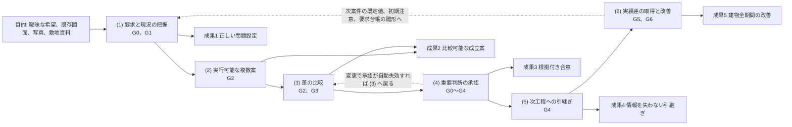

因果 (4) は G0 から G4 の全段階で働く。段階門ごとの主要判断が重要判断一覧の雛形になる（第4.3節）ためである。因果 (6) から (1) への戻りは、次案件の既定値表（F-C03-016）、初期注意、要求台帳の雛形へ学びを反映する経路であり、同意付きの匿名化情報だけが流れる（F-C14-012、F-C10-011）【推定】。

### 3.3 六因果と機能群の対応表

機能一覧骨格 v1.3 の六因果列を集計した。v1.3 は F-C09-012 と副番 F-C09-012-02 の六因果を「1、6」から「1」へ改めた（法令版の更新の検出は現況〔法規条件〕の把握であり、因果(6) の入力〔竣工時建物情報、入居後確認、学習同意〕に当たらない。JR-006）。v1.2 は審査 JM-056 の付け替え（F-C05-002、F-C05-013、F-C06-004、F-C06-006、F-C07-001、F-C07-009 を「1」から「2」へ、F-C05-001 と F-C06-001 を「1、2」から「2」へ、F-C05-016 を「1」から「3」へ、F-C02-016 を「2」から「1、2」へ）を反映している（基盤 整合検査報告 第5節）。商品台帳と商品属性は「要求と現況の把握」の出力ではなく、因果 (2) の入力「商品候補」に当たるためである。延べ数は複数の因果にひも付く機能を各因果で数え、非対象7機能と副番（親の内訳）は含めない。副番7件（F-C02-024-01、-02、F-C03-019-01、-02、F-C09-012-01、-02、F-C14-003-01）は親の内訳として下表の機能IDの列に転記した（2026-10-06。基盤 機能一覧骨格の依頼）【推定】。

延べは (1) 87、(2) 31、(3) 67、(4) 60、(5) 40、(6) 13 の計 298 である（v1.2 は (6) 14 で計 299、v1.1 は (1) 95、(2) 25、(3) 66 で計 300。正本は機能一覧骨格 v1.3 第4.4節）。主担当領域の分布は骨格 v1.3 第1節の表から本章が集計した値であり、各行の合計は延べ機能数と一致する【推定】。P0 の中核機能は、その因果が P0 で成立するために欠かせない機能を本章が選んだものである【仮定】。

| 因果 | 延べ機能数 | 主な区分 | P0 の中核機能（機能ID） | P1、P2 の拡張機能（機能ID） | 主担当領域の分布 | 区分 |
|---|---:|---|---|---|---|---|
| (1) 要求と現況の把握 | 87（v1.1 は 95） | C01、C02、C09、C03 | F-C01-001〜F-C01-022、F-C01-024、F-C01-025（対話と要求台帳、関係者表、生活場面、衝突）、F-C02-001、F-C02-005〜F-C02-008、F-C02-010〜F-C02-017、F-C02-023、F-C02-028（図面読解、原図重ね、尺度確認、承認済み2Dからの3D組立、出典属性）、F-C03-001〜F-C03-003、F-C03-005、F-C03-006、F-C03-016、F-C03-017（正規建物情報、既定値、要素値状態）、F-C09-001〜F-C09-004、F-C09-007〜F-C09-010、F-C09-015（敷地と法規の初期確認）、F-C05-014（所有家具の実寸確認）、F-C10-003、F-C10-014、F-C10-018、F-C11-002、F-C11-003、F-C12-006、F-C12-007。副番の P0: F-C02-024-01（現況状態の初期付与と表示）、F-C09-012-01（法規条件の期限管理と手動再取得） | F-C02-002〜F-C02-004、F-C02-009、F-C02-019〜F-C02-022、F-C02-024〜F-C02-027（ベクトル、IFC、図面一式、現況差分。F-C02-024 は副番 -01 が P0、-02 現況資料による遷移と差異の重ね表示が P1）、F-C05-019、F-C07-003、F-C07-005、F-C09-005、F-C09-006、F-C09-012（副番 -02 法改正の検出と再判定が P1）、F-C11-005、F-C11-007、F-C12-003、F-C12-004、F-C14-001、F-C14-002 | A12 29、A01 23、A03 13、A02 10、A04 3、A06 3、A08 2、A10 2、A05 1、A07 1（JM-056 の付け替えで A08 −7、A12 −2、A03 +1） | 【推定】 |
| (2) 実行可能な複数案 | 31（v1.1 は 25） | C03、C05、C06、C07、C11、C12 | F-C03-019（三案の生成。P0 は副番 F-C03-019-01 雛形三案）、F-C03-004（分岐案）、F-C02-016（承認済み2Dからの3D組立。因果 1、2）、F-C03-007〜F-C03-010（2D、3D、自然文の編集）、F-C09-013（敷地条件の反映）、F-C11-001（構造形式と通り芯の仮定）、F-C11-006（外皮方針）、F-C12-001（設備置場と経路帯）、F-C05-001、F-C05-002、F-C05-003〜F-C05-005、F-C05-018、F-C06-001、F-C06-006、F-C07-009（商品台帳と商品属性、絞込、関係区分、3D物品の検査。案の入力「商品候補」を作る） | F-C05-012、F-C05-013、F-C06-002、F-C06-003、F-C06-004、F-C06-008、F-C07-001、F-C07-002、F-C07-004、F-C07-006、F-C14-001、F-C03-019-02（自由形状生成。副番、P1） | A08 17、A03 8、A12 3、A04 1、A05 1、A06 1（JM-056 の付け替えで A08 +4、A12 +2。F-C05-001 と F-C06-001 は元から (2) を持つ） | 【推定】 |
| (3) 差の比較 | 67（v1.1 は 66） | C04、C05、C12、C13 | F-C03-020（同一評価軸の比較）、F-C01-023（案別の要求適合表）、F-C01-020（衝突と代償）、F-C03-004（分岐案の比較）、F-C03-011〜F-C03-013（影響予測、影響要素、差分の仮表示）、F-C04-001、F-C04-002、F-C04-004、F-C04-005、F-C04-007、F-C04-009、F-C04-010、F-C04-016（3D表示、主要断面、日照、動線）、F-C05-006〜F-C05-009、F-C05-015、F-C06-005、F-C06-007、F-C07-010（商品の推奨点、適合理由、層と権利の表示）、F-C09-008（法規判定の余裕量）、F-C11-002、F-C12-002、F-C12-007〜F-C12-009（構造、排水、性能目標、証拠段階、避難）、F-C13-001〜F-C13-003、F-C13-010（費用幅、単一額断定の禁止、費用波及、施工成立性） | F-C03-015、F-C04-003、F-C04-006、F-C04-017、F-C05-010、F-C05-012、F-C05-016（価格、在庫、納期の更新）、F-C06-008、F-C07-008、F-C08-002〜F-C08-004、F-C08-009、F-C11-004、F-C11-007〜F-C11-009、F-C12-005、F-C12-010〜F-C12-015、F-C13-004〜F-C13-008、F-C13-011、F-C13-013、F-C14-004〜F-C14-006 | A03 15、A09 12、A08 10、A07 9、A12 8、A05 3、A01 2、A04 2、A06 2、A10 2、A02 1、A11 1（JM-056 の付け替えで A08 +1） | 【推定】 |
| (4) 重要判断の承認 | 60 | C10、C15、C03 | F-C15-001〜F-C15-005（段階管理、進行禁止、完了条件、信頼状態、禁止表示語）、F-C15-014（判断記録）、F-C15-015（指標の計測）、F-C15-009（責任表）、F-C15-012（例外承認）、F-C03-021（選定記録）、F-C03-014（承認後の確定）、F-C10-001〜F-C10-005（役割権限、注記、問題、確認範囲ごとの承認、自動失効）、F-C10-009、F-C10-010、F-C10-012、F-C10-013、F-C10-019、F-C01-013、F-C01-014、F-C01-019、F-C01-021、F-C01-023、F-C02-013、F-C02-014、F-C02-018、F-C03-003、F-C03-005、F-C03-011、F-C03-013、F-C03-017、F-C03-018、F-C04-008、F-C04-011、F-C05-015、F-C06-007、F-C06-009、F-C12-008、F-C13-002 | F-C02-027、F-C05-011、F-C05-017、F-C07-007、F-C08-005、F-C08-006、F-C08-008、F-C09-011、F-C10-006、F-C10-016、F-C11-010、F-C12-011、F-C12-013、F-C13-009、F-C13-013、F-C14-003（解体後判明時の 4 項目の工事前定義。P1）、F-C14-003-01（発見時の処理。副番、P2）、F-C14-013、F-C14-014 | A12 42、A01 5、A07 3、A09 3、A10 3、A03 2、A08 2 | 【推定】 |
| (5) 次工程への引継ぎ | 40 | C15、C04、C08、C10 | F-C15-013（引継ぎ一式の生成）、F-C15-006、F-C15-007（標準の必要情報要求と情報要求適合表）、F-C15-011、F-C15-012、F-C15-017（書出時の自動検査、例外承認、承認された版の識別）、F-C15-009（責任表）、F-C04-012、F-C04-014（GLB、PDF平面）、F-C10-009、F-C10-015、F-C10-017（期限付き共有、出典と許諾の引継ぎ、伏せ字候補）、F-C03-001、F-C03-002、F-C03-005、F-C03-018、F-C02-017、F-C02-018、F-C09-007、F-C11-003 | F-C02-003、F-C04-013、F-C04-015、F-C15-008、F-C15-010、F-C15-016（IFC、SVG、DXF、IDS、辞書、組織別要求）、F-C07-006、F-C08-001〜F-C08-003、F-C08-005〜F-C08-008、F-C10-007、F-C10-008、F-C13-012、F-C14-007〜F-C14-009 | A12 30、A09 4、A11 2、A02 1、A04 1、A08 1、A10 1 | 【推定】 |
| (6) 実績差の取得と改善 | 13（v1.2 は 14） | C14、C12、C13 | なし（中核の P0 機能は 0 件。JR-006）。因果(6) を持つ P0 機能 F-C15-015（指標の計測）と F-C10-011（学習同意の管理。既定は無効）は因果(6) の前提（計測の仕組みと同意の既定値）であり、中核ではない | F-C14-008〜F-C14-012（竣工差分、機器台帳、維持計画、入居後確認、学びの記録）、F-C14-014、F-C12-016、F-C13-009、F-C13-012、F-C13-014、F-C10-016 | A12 4、A11 4、A09 2、A10 2、A07 1（v1.3 で F-C09-012 の分 A12 −1） | 【推定】 |

因果(6) の中核の P0 機能は 0 件であり、因果(6) を持つ P0 機能 2 件（F-C15-015、F-C10-011）は因果(6) の前提（計測の仕組みと同意の既定値）である（v1.3、JR-006。機能一覧骨格 v1.3 第4.4節と第22章 F-C10-011 の目的欄と同じ判断）。成果5 は P2 で到達する。これは指示文G「後で情報構造を作り直さない」に従い、P0 では計測と同意の仕組みだけを先行させる設計であり、欠落ではない【推定】。

### 3.4 完成像に必要な能力（指示文10.5）と因果、機能、合格条件の対応

機能一覧骨格 第6.2節の対応に、因果と観察可能な合格条件を付けて追跡表（第10章）の初期値にする。各能力の「必要情報（指示文10.5 の語 → E-）」と「指標（M-）」の対応は本表に置かず、第10章 第2.2節を正本として参照する（審査 JM-058）。能力2 の F-C02-016 は因果 (1) と (2) の両方にひも付く（第3.3節）【推定】。必須機能の集合の正本は第10章 第2.2節で、機能一覧骨格 v1.3 第6.2節と本表は同じ集合の写しとする。v1.3 で指示文10.5 の必須機能の語に当たる機能を加え、P1、P2 の機能に「（P1）」「（P2）」を付けた（JR-044）【推定】。

| 完成像に必要な能力（指示文10.5） | 因果 | 必須機能（正本は第10章 第2.2節。骨格 第6.2節と同じ集合） | 観察可能な合格条件（指示文10.5） | 検査する試験 | 区分 |
|---|---|---|---|---|---|
| 曖昧な希望を設計条件へ変える | (1) | F-C01-002〜F-C01-020 | 全重要要求（RP-MUST、RP-FORBID）に出典と確認者がある | T-R-012、T-A-003 | 【推定】 |
| 元資料を失わず建物化する | (1) | F-C02-005〜F-C02-017、F-C02-028 | 全要素から元資料へ戻れ、低確信度を隠さない | T-A-001、T-A-002、T-P-005、T-P-006 | 【推定】 |
| 一案への早過ぎる固定を防ぐ | (2)、(3) | F-C03-019〜F-C03-021（P0 の希望入力は副番 F-C03-019-01、図面入力は F-C03-019-03）、F-C01-023、F-C03-004 | 捨てた条件と未解決点を案別に比較できる | T-R-001、T-R-007 | 【推定】 |
| 建築として成立性を高める | (3) | F-C11-001〜F-C11-003、F-C11-006、F-C12-001、F-C12-002、F-C12-009、F-C04-005、F-C13-010、F-C12-005（P1） | 重大な空間技術衝突を G3 で止める | T-R-002、T-R-003、T-A-010 | 【推定】 |
| 家族が実物尺度で選ぶ | (3) | F-C04-002、F-C04-009、F-C04-010、F-C04-016、F-C05-009、F-C05-018、F-C04-017（P1） | 主要生活場面と家具余白を比較できる | T-A-004、T-P-010 | 【推定】 |
| 費用と期間を伴う判断にする | (3) | F-C13-001〜F-C13-003、F-C13-005（P1）、F-C13-006（P1） | 金額ごとの前提と変更原因が追える | T-A-003、T-R-007 | 【推定】 |
| 誇大な確実性を防ぐ | (4) | F-C15-002、F-C15-004、F-C15-005、F-C02-018、F-C12-008、F-C13-002 | 未確認案を法適合や施工可能と表示しない | T-A-007、T-S-003、T-A-011 | 【推定】 |
| 実在商品を安全に使う | (2)、(3) | F-C05-001、F-C05-006、F-C05-007、F-C05-015、F-C06-005〜F-C06-007、F-C05-012（P1） | 正規品、参照案、独自案を混同しない | T-A-005、T-S-008、T-R-009 | 【推定】 |
| 専門家へ再入力なく渡す | (5) | F-C03-001、F-C15-006、F-C15-007、F-C15-011、F-C15-013、F-C04-012、F-C04-014、F-C15-009、F-C04-013（P1）、F-C15-008（P1）、F-C10-008（P1） | 受取側の必要情報検査に合格または例外が明示される。IDS 1.0（2024年6月最終標準。https://github.com/buildingSMART/IDS 、SRC-224、確認日 2026-09-15【事実】）は P1 で機械検査に使い、P0 は標準の必要情報要求で代替する | T-A-014、T-S-013 | 【推定】 |
| 建物を長く使い改善する | (6) | F-C14-007〜F-C14-012（P2） | 元要求と実績差を結び、同意付きで学べる | T-A-015、T-S-006 | 【推定】 |

### 3.5 因果にひも付かない機能の扱い

| 区分 | 扱い | 完成像審査（指示文J節 1）での確認 | 区分 |
|---|---|---|---|
| 削除候補（機能一覧骨格 第3節の10件） | 識別子 F- を付けず仕様化しない。審査では「削除候補1〜10」の仮番号で参照する（U-00-033） | 各削除候補の「代わりに採る機能」が因果にひも付き、かつ仕様化されていること | 【推定】 |
| 非対象機能（層D の7件） | 台帳で「非対象」状態。審査の除外条件（第2.7節） | 「代わりに製品が行うこと」の機能が因果にひも付いていること。禁止表示語の試験が存在すること | 【仮定】 |
| 因果の割当が弱い機能 | 安全措置（F-C10-018 等）は、それを除くと因果の機能が法規または個人情報保護上実行できなくなる場合に限り、その因果へひも付ける（第2.7節 U-00-060 の判定基準） | 割当理由が機能要件の「目的」欄の末尾に「因果(n)への割当理由: 本機能を欠くと因果(n)の機能（例）が法または規約上実行できない」の形で書かれていること（F-C10-011、F-C10-012、F-C10-013、F-C10-014、F-C10-018、F-C10-019 の目的欄は第22章 v1.3 で記載済み。F-C10-011 は「因果(6) の中核の P0 機能は 0 件で、本機能は因果(6) の前提」と書く。審査 JM-010、JR-006） | 【仮定】 |
| 因果の全体を支える基盤機能 | 特定の因果の入力や出力ではなく、全因果に共通する利用者保護を担う機能。F-C02-028 処理状態の表示（架空の進捗率を出さない）と F-C01-025 電子連絡先なしの初回価値提示（連絡先の要求時期）の2件。六因果列の割当は先頭の因果 (1) とし（機能一覧骨格と一致）、目的欄に因果への割当理由を求めない | 削除候補2（架空の進捗率の表示）と削除候補3（成果閲覧前の電子連絡先入力）の代替機能として仕様化され、対応する試験（T-S-002、F-C02-028 の受入条件）が存在すること | 【仮定】 |

## 4. 北極星指標 M-N-01 検証付き重要判断完了率

### 4.1 定義と数式

北極星指標（用語集6、18）は M-N-01 検証付き重要判断完了率であり、画面指標試験骨格 第2.1節の定義に従う。「単なる操作完了率ではなく、設計判断の質と責任を測る」（指示文10.2）【推定】。

案件 c の時点 t における値を次で定める。

```
M-N-01(c, t) = N_complete(c, t) / N_required(c, t) × 100 [%]

N_required(c, t) = 時点 t までに案件 c で必要と判定され、除外されていない重要判断の数
                  = |K(c, t)|
N_complete(c, t) = K(c, t) のうち七項目がそろった判断の数
                  = |{ d ∈ K(c, t) : complete(d) = 真 }|
```

K(c, t) は案件 c の「重要判断一覧」（第4.3節）である。complete(d) は判断 d が第4.2節の七項目を全て満たすときに真とする。N_required が 0 の案件（G0 未完了）は計測対象外とし「未計測」と表示する【仮定】。

七項目は次のとおりである。指示文A1 は「要求、選択肢、選定理由、他分野への影響、確認者、改訂」の六項目、指示文10.2 は「要求、選択肢、根拠、影響、決定者、確認者、版」の七項目を挙げるが、画面指標試験骨格 M-N-01 と用語集52「判断」は七項目（要求、選択肢、選定理由、他分野への影響、決定者、確認者、版）を採用している。本章は骨格に従い七項目とする。「根拠」は「選定理由」に、「改訂」は「版」に対応する【推定】。

### 4.2 分子: 「そろった」と判定する観察可能な条件

| 番号 | 項目 | そろったと判定する条件 | 情報実体（第12章） | 欠ける場合の典型 | 区分 |
|---:|---|---|---|---|---|
| 1 | 要求 | 判断が参照する要求（R-）が1件以上あり、その要求に出典と優先度（RP-）がある | E-REQ-001 Requirement | 「なんとなく決めた」判断。要求台帳にない条件で決めた判断 | 【推定】 |
| 2 | 選択肢 | 比較した案が2件以上あり、各案に採用、不採用、保留の別と理由がある（用語集54）。第6章 第2.3節「利用目的による適用除外」の案件の G2(a) は「読み込んだ案」と「分岐案」の 2 件で満たす（F-C15-014 例外(c)。v1.3、JR-001） | E-REQ-005 Option | 一案だけを承認した判断。不採用案の理由がない判断 | 【推定】 |
| 3 | 選定理由 | 採用した選択肢を選んだ理由が文章で記録され、捨てた条件（用語集16）と代償（用語集15）が1件以上、または「なし」と明示されている | E-REQ-004 Decision | 理由欄が空、または「総合的に判断」だけ | 【推定】 |
| 4 | 他分野への影響 | 主担当領域が一つだけ付き、影響先領域（用語集69）が列挙され、各影響先に再計算または再確認の対象（十二判断領域 第2.1節）がある。影響先なしの場合は「影響先なし」と明示。主担当が製品の仮置き（主担当判定記録 E-REQ-004.domainJudgement の isProvisional=true。第7章 第4.4節）のままの判断は、確認者が主担当を確定するまで未充足とする（審査 JM-011） | E-REQ-004.primaryDomain、E-REQ-004.domainJudgement、E-REQ-012 Impact | 主担当が空欄、複数、または「主担当（推定）」のまま。影響先が未列挙 | 【推定】 |
| 5 | 決定者 | 関係者表で決定権（用語集44）を持つ者が決定者として記録され、日時がある。代理入力の場合は本人の確認機会（F-C01-014）が記録されている | E-ORG-008 Stakeholder | 決定者が未定（I-00-109、I-00-115） | 【推定】 |
| 6 | 確認者 | 確認者（用語集222、RL-CHK）が確認範囲を明示して確認し、承認の状態が AS-VALID である。P0 では利用者自身が確認者を兼ねてよい（七段階門 U-00-015）が、その場合は「専門家未確認」と表示する。「専門家未確認」の表示語は交差単位で付ける。すなわち第6章 第3節（基盤 七段階門 第3節）の確認者（P0）列が「RL-OWN の受領確認のみ。専門家未割当」または「確認者なし」の交差に属する判断と、自己承認または資格のない RL-CHK による承認に付ける。「専門家未割当」は責任表の行の空欄を指す語であり、承認個体の表示語「専門家未確認」と区別する（審査 JM-020）。有資格者の場合は氏名、資格、範囲、日付と資格の照合状態（未照合、照合済み）がある。P0 の資格の登録は本人申告（未照合）で照合は P1 であり、未照合の資格による承認には「資格未照合（本人申告）」を表示し、V3 と「専門家確認済み」には使わない（第6章 第5.2節「資格の照合状態」。v1.3、JR-004） | E-REQ-007 Approval | 承認が AS-PENDING または AS-VOID（変更で自動失効） | 【推定】 |
| 7 | 版 | 判断が依拠する案の版（CDE-）と判断記録自身の版が記録され、判断後に依拠する要素が変更された場合に「再確認要」と表示されている | E-REQ-006 Revision | 版のない判断。変更後も旧版のまま「完了」と表示されている判断 | 【推定】 |

七項目のうち一つでも欠けると分子に数えない。項目6 の承認が AS-VOID になった判断は、完了から未完了へ戻り、M-N-01 は下がる。これは意図した挙動であり、後の変更で承認が失効した判断を「完了」と数え続けることを防ぐ【推定】。

### 4.3 分母: 案件別の重要判断一覧の作り方

重要判断（用語集13）の一覧は案件ごとに変わる。一覧は三つの源から作る【仮定】。

| 源 | 内容 | 追加の契機 | 追加の主体 | 例 | 区分 |
|---|---|---|---|---|---|
| 源1 段階門の主要判断（雛形） | 第6章 第2.1〜2.7節の各段階の主要判断を、下表の雛形（記号は段階と第6章の項番。基盤 七段階門 第3節の「源1 対象（雛形の記号）」列と一対一）として、案件の入口（希望から作る、図面を3D化、写真から改装）と利用目的（新築、改装、家具配置、図面3D化、売却または賃貸資料）に応じて自動で一覧に入れる。生成の可否は下表の「利用目的別の生成」列で固定し、生成しない雛形は「非該当」として一覧に登録しない。非該当は承認を要する「除外」（第4.4節）とは別であり、M-N-01 と M-G-17 の分子と分母に数えない（v1.3、JR-001）。段階が開始した時点で、その段階で生成の対象となる雛形が分母に入る。第6章 第3節の交差表は主担当領域の割当表であって分母ではなく、「有」の交差でも雛形の記号がないものと「有（源1対象外）」の交差（G2×A12、G3×A12。旧 G2(d)、G3(f)。JR-005）は分母に入れない（審査 JM-001） | 段階の開始（F-C15-001） | 製品（自動）。除外には確認者の承認が要る | 下表（源1 の雛形）と第4.6節の計算例 | 【推定】 |
| 源2 進行禁止と重大問題に由来する判断 | SEV-0 または SEV-1 の問題（I-）が登録された時点で、その解決方法の判断を自動で一覧に入れる。問題の主担当領域を判断の主担当領域にする | 問題の登録（F-C10-003） | 製品（自動）。SEV-0 由来の判断は除外できない | 大開口と耐力壁の衝突（I-00-116 相当）の解決方法。避難経路の確保方法（I-00-118 相当） | 【推定】 |
| 源3 案件固有の判断 | 要求衝突（F-C01-020）ごとに1件、影響先が2領域以上に及ぶ変更命令ごとに1件を候補として提示し、所有者または編集者が理由を付けて一覧へ追加する。利用者が自ら追加することもできる | 衝突の検出、変更命令の確定、利用者の操作 | RL-OWN、RL-EDT（追加）。理由が必須 | 「開放的な居間」と「個室の静けさ」の衝突の解決。駐車2台と庭の両立方法 | 【仮定】 |

源1 の雛形を次の表に固定する。記号 `G{段階}({項番})` は第6章 第2.1〜2.7節の主要判断の項番に段階を前置したものであり、基盤 七段階門 第3節の「源1 対象（雛形の記号）」列はこの記号で交差と対応付ける。G1(e)、G1(f)、G2(e)、G3(a)〜G3(f)、G4(c) は第6章の初稿に項番がない判断（JM-007、JM-027 で追加または分割したもの）に本章が付けた項番であり、第6章 v1.1 は第2.2〜2.5節で同じ項番を採った（U-02-010 は解決。2026-10-06 に第6章の本文で確認）。基盤 七段階門 第3節の源1 対象列も 2026-10-06 に同じ記号へ改められた。第6章が今後項番を変えた場合は第6章を正本として本表を追従させる【推定】。v1.3 で G2(d) と G3(f) を源1 から外した（記号は第6章の項番として残し、本表では「源1 対象外」と書く。JR-005）。

「利用目的別の生成」列は、案件の利用目的（E-BLD-001.useType）ごとの生成の可否を、新築／改装／家具配置／図面3D化／売却または賃貸資料の順に次の記号で固定する。第6章、第8章、第23章 T-A-013 が参照する正本である（v1.3、JR-001）【推定】。

| 記号 | 意味 |
|---|---|
| 生 | 段階の開始時に生成し、分母に入れる |
| 条 | 「一覧に入れる条件」列に該当する案件だけ生成する。該当しなければ非該当 |
| 追 | RP-MUST が 0 件の間は非該当とし、RP-MUST が 1 件以上になった時点（第6章 第2.3節「利用目的による適用除外」を外れた時点）で生成する |
| 任 | 任意の G4 を開始した案件だけ生成する（家具配置は G0〜G3 で完結する。第8章 第2.3節） |
| 非 | 非該当。生成せず、M-N-01 と M-G-17 の分子と分母に数えない |

| 記号 | 主要判断（主担当、影響先） | 一覧に入れる条件（記号「条」の判定と読み替え） | 利用目的別の生成（新築／改装／家具配置／図面3D化／売却賃貸） | 計算例（第4.6節） | 区分 |
|---|---|---|---|---|---|
| G0(a) | 誰の何を解くか、誰が決定権を持つか（A01。決定権は A01 の判断であり G0(c) で二重に数えない。JM-027） | — | 生／生／生／生／生 | D-02-001 | 【推定】 |
| G0(b) | 土地、費用、期間の大枠が成立し、案件を進める価値があるか（A01、影響先 A02、A09） | 家具配置は家具費の大枠と読み替える | 生／生／生／非／非 | D-02-002 | 【推定】 |
| G0(c) | 利用条件の同意、非公開既定の共有設定、案件識別子の付与をどう扱うか（A12） | — | 生／生／生／生／生 | D-02-019 | 【推定】 |
| G1(a) | 何を必須（RP-MUST）とし、何が未確認か（A01） | — | 生／生／生／生／生 | D-02-003 | 【推定】 |
| G1(b) | 敷地制約と不足調査（A02） | — | 生／生／非／非／非 | D-02-004 | 【推定】 |
| G1(c) | 既存図面の尺度と正本の判定（A12） | 図面入力のある案件（入口「図面を3D化」の新築、改装、家具配置と、図面を伴う改装） | 条／条／条／生／生 | —（計算例は希望入口のため非該当） | 【推定】 |
| G1(d) | 要素認識の受入（A03） | 図面入力のある案件 | 条／条／条／生／生 | —（同上） | 【推定】 |
| G1(e) | 既存外皮の現況状態（CS-）の受入（A05。JM-027） | — | 非／生／非／非／非 | —（計算例は新築のため非該当） | 【推定】 |
| G1(f) | 工事前調査（石綿事前調査等）の要否（A10。JM-027） | — | 非／生／非／非／非 | —（同上） | 【推定】 |
| G2(a) | どの考え方（空間構成）を進めるか（A03、影響先 A01） | 家具配置は家具配置三案の選定。図面3D化と売却賃貸で RP-MUST が 0 件の間は「読み込んだ案」と「分岐案」の 2 件の選定とし、第4.2節 項目2 を満たす（第6章 第2.3節、F-C15-014 例外(c)） | 生／生／生／生／生 | D-02-007 | 【推定】 |
| G2(b) | 性能目標をどこに置くか（A07） | — | 生／生／非／追／追 | D-02-008 | 【推定】 |
| G2(c) | 概算幅と期間（A09） | — | 生／生／非／追／追 | D-02-009 | 【推定】 |
| G2(d) | 選定の決定者、確認者、版（A12） | 源1 対象外（v1.3。G2(a) の項目5〜7 と同じ事象。選定記録の承認範囲と版の固定は第6章 F-C15-014 正常手順(9)と門の判定 F-C15-003。JR-005） | —（全利用目的で生成しない） | —（旧 D-02-020。廃止 v1.3） | 【推定】 |
| G2(e) | 将来場面への対応の採否（今の設計に反映、将来変更で対応、対応しない）。代償は変更費の幅、または現在の要求との衝突として記録する（A11、影響先 A03、A09。JM-007） | 該当する将来場面（E-REQ-009.isFuture=true。第8章の家族変化群等）がある案件。P0 は場面の該当有無と時期で判断し、代償は「現在の要求との衝突（不適合の三項目と差）」と「変更費: 未算出（試行は P1）」で示す（第23章 T-R-008 P0 版 (f)、第8章 第5.3節。JR-114）。P1 の試行結果（第21章 第6節）は判断の根拠に加える | 条／条／条／非／非 | D-02-021 | 【推定】 |
| G3(a) | 空間側の調整（扉開閉域、通路幅、家具余白、主要断面、階高）が成立するか（A03、影響先 A04、A05、A06、A08。JM-027） | — | 生／生／生／生／生 | D-02-022 | 【推定】 |
| G3(b) | 荷重経路が成立するか（A04） | — | 生／生／非／追／追 | D-02-012 | 【推定】 |
| G3(c) | 層構成と接合部が成立するか（A05） | — | 生／生／非／追／追 | D-02-013 | 【推定】 |
| G3(d) | 機器と経路が干渉なく成立するか（A06） | — | 生／生／非／追／追 | D-02-014 | 【推定】 |
| G3(e) | 商品が実寸で収まるか（A08） | — | 生／生／生／追／追 | D-02-015 | 【推定】 |
| G3(f) | V2 の判定と承認範囲（A12） | 源1 対象外（v1.3。V2 の判定は門の判定 F-C15-004、承認範囲の充足は F-C15-003。JR-005） | —（全利用目的で生成しない） | —（旧 D-02-023。廃止 v1.3） | 【推定】 |
| G4(a) | 誰が確認するか（責任表 E-ORG-007 の確定。A12） | — | 生／生／任／生／生 | D-02-017 | 【推定】 |
| G4(b) | 何を誰へどこまで送るか（同意、正本、交換資料。A12） | — | 生／生／任／生／生 | D-02-018 | 【推定】 |
| G4(c) | 何を再設計対象とするか（再設計範囲。A03、影響先 A04〜A06。JM-027） | — | 生／生／非／追／追 | D-02-024 | 【推定】 |
| G5(a)、G5(b) | 現場差の承認と記録（A10）、竣工時建物情報の正本化（A12） | G5 を開始した案件（P2） | 条／条／非／非／非 | — | 【推定】 |
| G6(a)、G6(b) | 目標と実績の差から何を学ぶか（A11）、学習利用の同意と匿名化（A12） | G6 を開始した案件（P2） | 条／条／非／非／非 | — | 【推定】 |

利用目的別の生成数（P0 の範囲の G0〜G4。源1 対象外の 2 件と G5、G6 を除く 21 雛形）と、第23章 T-A-013 の試験情報に置く期待値を次に固定する。期待値は G4 の通過要求時（家具配置は G3 の通過要求時）に生成済みの源1 の件数である【推定】。

| 利用目的 | 生 | 条、任、追 | 非 | T-A-013 の期待値（試験情報の案件の条件） |
|---|---:|---|---:|---|
| 新築 | 16 | 条 3（G1(c)(d)、G2(e)） | 2 | 16 件（入口「希望から作る」、図面なし、将来場面なし） |
| 改装 | 18 | 条 3（G1(c)(d)、G2(e)） | 0 | 20 件（入口「図面を3D化」、将来場面なし） |
| 家具配置 | 7 | 条 3（G1(c)(d)、G2(e)）、任 2（G4(a)(b)） | 9 | 7 件（入口「希望から作る」、将来場面なし、G4 を開始しない） |
| 図面3D化 | 9 | 追 7（G2(b)(c)、G3(b)〜(e)、G4(c)） | 5 | 9 件（RP-MUST 0 件）。RP-MUST が追加された案件は 16 件 |
| 売却または賃貸資料 | 9 | 追 7（同上） | 5 | 9 件（RP-MUST 0 件）。RP-MUST が追加された案件は 16 件 |

利用目的の変更（第6章 F-C15-001 例外(c)）で増える雛形は、変更前と変更後の「利用目的別の生成」列の差で決まる。主な組合せを次に示す。増えた雛形は段階の開始済みなら直ちに生成し、通過済みの門で増えた雛形の段階は再確認中になる（第6章 第1.2節）【推定】。

| 変更（前 → 後） | 増える雛形 | 扱い |
|---|---|---|
| 図面3D化、売却賃貸 → 新築 | G0(b)、G1(b)、G2(b)(c)、G3(b)〜(e)、G4(c)（「追」で生成済みのものを除く）。G2(e) は条件に該当すれば | G2 は三案を要する（第6章 第2.3節）。図面入口の三案は図面派生三案（F-C03-019-03） |
| 図面3D化、売却賃貸 → 改装 | 上に加えて G1(e)(f) | 同上 |
| 家具配置 → 新築、改装 | G1(b)、G2(b)(c)、G3(b)〜(d)、G4(a)〜(c)（G4 の開始時）。改装では G1(e)(f) | G0(b) は家具費の読み替えを外し「再確認要」にする（判断の対象が建築費へ変わるため）【仮定】 |
| 新築 → 改装 | G1(e)(f) | — |
| 新築、改装 → 家具配置、図面3D化、売却賃貸 | なし | 生成済みの判断は非該当へ戻さない。分母から外す場合は第4.4節の除外（理由と承認）による（自動生成した判断は削除しない。第6章 F-C15-014 例外(h)）。利用目的の選び方による分母の縮小は第4.7節の行で防ぐ【仮定】 |

雛形に入れないものは次のとおりである。「空間、構造、外皮、設備、内装、商品が大枠で共存するか」の総合判断は、G3(a)〜G3(e) と同じ事象を二重に数えるため重要判断とせず、門の完了条件の判定（F-C15-003）で扱う（基盤 七段階門 U-00-016 の解決。JM-027）。同じ理由で第4.6節の旧 D-02-011 を廃止した。v1.3 で同じ基準により、G2(d) 選定の決定者、確認者、版（G2(a) の項目5〜7 と同じ事象）と G3(f) V2 の判定と承認範囲（門の判定 F-C15-004 と同じ事象）を源1 から外し、例示 D-02-020 と D-02-023 を廃止した（JR-005）。交差表で「有」でも雛形の記号がない交差（例: G2×A04 の構造形式仮定、G3×A07 の計算予測）は、主担当の割当と必須成果の確認だけを行い分母に入れない。G5、G6 の雛形は P2 で使い、P0 の公開判定（G4 の通過要求時）の分母には現れない【推定】。

一覧の各判断は例示識別子（仕様書内）または実行時識別子 `D-{案件}-{連番5桁}` を持ち、状態として「未着手」「進行中」「完了（七項目がそろった）」「再確認要（承認の自動失効または版の変更）」「除外（分母から外した。識別子は残す）」を持つ【仮定】。状態の符号化は未決 U-02-003 に置いた（2026-10-06 に「符号を設けず日本語の enum 値を正とする」で解決）。非該当の雛形は判断（E-REQ-004）を生成しないため状態を持たず、案件の利用目的（E-BLD-001.useType）と本表の版から再現する（v1.3、JR-001）【推定】。

### 4.4 分母変更の承認規則

指示文10.2「分母の追加、削除にも理由と承認を必要とする」と画面指標試験骨格 第2.0節「分母の追加と削除には理由と承認を要し、判断記録画面（S-25）で管理する」に従い、次の規則を置く【推定】。

| 操作 | 条件 | 承認者 | 記録する項目 | 反映 | 区分 |
|---|---|---|---|---|---|
| 自動追加（源1、源2） | 段階の開始、SEV-0 または SEV-1 の問題登録 | 不要（自動） | 追加日時、契機（段階または問題の識別子） | 即時に分母へ | 【推定】 |
| 非該当（源1 の雛形のうち生成しないもの） | 第4.3節の「利用目的別の生成」列で決まる。操作ではなく分母変更に当たらない | 不要（承認の対象外） | 判断は生成しない。案件の利用目的と生成表の版から再現する | 分母に入らない。M-N-01 と M-G-17 の分子と分母に数えない（v1.3、JR-001） | 【推定】 |
| 手動追加（源3） | 理由が20文字以上で記録されている | RL-OWN または RL-EDT（追加者自身） | 追加者、日時、理由、主担当領域 | 即時に分母へ | 【仮定】 |
| 除外（源1、源3 の判断） | 理由（要求の取り下げ、案の廃止、他の判断への統合のいずれか）と、統合先がある場合はその判断の識別子 | RL-CHK。所有者以外の編集者または確認者がいない1名の案件に限り所有者が承認し「自己承認」と記録する。編集者（RL-EDT）は除外を承認しない。編集者がいて RL-CHK がいない案件の除外申請は「承認者未設定」で保留し、S-13-04 と S-25 に確認者の招待（S-08 の共有URL）の導線を出す（第6章 第5.1節 分母変更の行、F-C15-014 例外(e)。v1.3、JR-002） | 除外者、承認者、日時、理由、統合先 | 承認後に分母から除外。識別子と履歴は残す | 【仮定】 |
| 除外（源2 の SEV-0 由来） | 不可。問題が IS-RESOLVED になった時点で判断が「完了」または「不要（問題が誤警告 IS-REJECTED）」となる。IS-REJECTED の場合だけ、却下理由を付けて自動で除外する | 問題の却下者（RL-CHK） | 却下理由、却下者、日時 | 却下後に自動で除外 | 【仮定】 |
| 再追加 | 除外した判断を戻す場合は、除外理由が失われた根拠を付ける | 除外の承認者と同じ役割 | 再追加者、日時、根拠 | 即時に分母へ | 【仮定】 |
| 案件間の複製 | 別案件の一覧を雛形として複製することは源1 の自動生成に限り、案件固有の判断（源2、源3）は複製しない | — | — | — | 【仮定】 |

分母変更の全操作は監査記録（F-C10-010）に残し、除外の割合を防護指標 M-G-17（第5.1節。第23章で採番確定。定義と閾値は第5.1節が正本）で監視する。分母から除外することで M-N-01 を上げる操作を防ぐためである【仮定】。除外の承認者は第6章 第5.1節 分母変更の行（表4 C-17 の暫定扱い）と同じ規則であり、分母からの除外は M-N-01 を上げる方向の操作のため、承認者を案件の家族（所有者と編集者）から独立した RL-CHK に置く。第23章 F-C15-015 の権限と第24章 D-24-010 も同じ行を参照する（v1.3、JR-002）【仮定】。「案件別に分母を変更する権限」は指示文11.5 が経営陣の着手前判断に挙げており、上表の承認者は初期仮説である（未決 U-02-002）【仮定】。

### 4.5 計測時点、集計、層別

| 項目 | 規則 | 区分 |
|---|---|---|
| 案件内の計測時点 | G2、G3、G4 の各門の通過要求時（利用者が段階門画面 S-13 で「次の段階へ進む」を押した時点）の値を、その門の値として確定して記録する。初回の要求時の値を固定し、差戻し後の再要求で上書きしない。通過要求の前は「暫定」として判断記録画面 S-25 に表示する。公開判定と月次判定にはこの値を使う（審査 JM-002） | 【推定】 |
| 門通過時の記録 | 門通過時の値は、通過を止める対象（当該段階の源1 と、源2 の SEV-0 由来の判断）が全て完了していることの確認記録として、通過記録（E-REQ-010.completionChecks。第6章 第6.2節）に残す。源3 の判断は未完了でも通過できるが分子に数えない。門は未完了の判断を通過させないため、門通過時の値は定義上 100% に近づき判断の質を測らない。したがって公開判定と月次判定に使わない（JM-002） | 【仮定】 |
| 通過要求時の分母 | 通過要求時の分母は、その段階までに開始した段階の源1（利用目的別の生成で生成した雛形。非該当は数えない。第4.3節）と、その時点までに登録された源2、源3 の判断（除外済みを除く）。次段階の判断は次段階の開始まで分母に入れない | 【仮定】 |
| 月次の集計 | 案件ごとの率の単純平均ではなく、対象案件の分子の合計を分母の合計で割る（案件規模の重み付き）。門（G2、G3、G4）ごとに、その門の通過要求時の初回値を集計する。対象案件は当月に G0 を通過した全案件とし、G2 未到達の案件は分母未確定として件数だけ併記する（生存者偏りの防止。審査 JM-005）。併せて案件別の率の中央値と最小値、案件数、M-G-17 の報告項目（第5.1節）、M-G-24 RP-MUST からの優先度降格件数（第5.1節の表の後）を同じ月次で報告する | 【仮定】 |
| 層別 | 段階（G2、G3、G4）、入口（希望、図面、写真）、主担当領域（A01〜A12）、利用目的、案件の規模（分母の件数帯: 〜10、11〜20、21〜）、確認者の役割の三層（有資格者確認〔照合済み〕、資格未照合〔本人申告〕、専門家未確認）で層別する | 【推定】 |
| 確認者の役割の層 | 判断の層は項目6 の確認者と資格の照合状態（正本は第6章 第5.2節「資格の照合状態」）で決める。照合済みの資格を持つ RL-CHK の承認は「有資格者確認（照合済み）」、本人申告で未照合の資格を登録した RL-CHK の承認は「資格未照合（本人申告）」、自己承認と資格のない RL-CHK の承認は「専門家未確認」とする。確認者が未記録の判断は、第6章 第3節の交差の確認者（P0）列で決める（有資格者が不在の交差は専門家未確認）。公開判定では三層の値と件数を別掲する。30 件の判定は有資格者確認（照合済み）の層だけで行い、その層が 30 件未満なら「件数不足」と表示して、M-N-01 を「専門家未確認の完了率（本人申告の資格による確認 n 件を含む）」として公開する。資格の照合は P1（第17章 第1.2節）のため、照合済みの層がない P0 では常にこの名で公開する（第5.2節。審査 JM-003。v1.3 で三層に改めた。JR-004）。30 件は初期仮説 | 【仮定】 |
| 表示 | 判断記録画面 S-25 に案件内の値、段階門画面 S-13 に門ごとの値、運用の月次集計と公開判定会議の記録は運用指標画面 S-28（S-28-01〜03 は P0。第15章 第7.26.1節）に表示する | 【推定】 |
| 初期仮説の目標値 | 初期仮説 90%（G4 の通過要求時の初回値を分母合計で重み付けした値。画面指標試験骨格 第2.1節の仮説を第23章 第6.1節で固定する。審査 JM-172）。公開判定会議で入力種別ごとに見直す | 【仮定】 |

### 4.6 計算例

案件 `PJ-2026-00042`（例示。新築、二階建、入口「希望から作る」、既存図面なし、家族4人（夫婦、子、同居する高齢の親））を例に、G2 と G4 の通過要求時（初回）の値を示す。判断は本章の例示識別子 D-02-001〜D-02-024 を使い、源1 は第4.3節の雛形の記号と一対一に対応させる。入口が希望で新築のため G1(c)〜G1(f) は非該当（第4.3節の生成表で新築の G1(c)(d) は「条」の条件に当たらず、G1(e)(f) は「非」）で、高齢の親の在宅介護が将来場面に該当するため G2(e) が入る。D-02-011 は v1.2 で廃止し（第4.3節。JM-027）、D-02-020 と D-02-023 は v1.3 で源1 から外して廃止した（JR-005）。v1.2 までの本例の値（源1 19 件、G2 76.9%、G4 86.4%）は両者を含めた値であり、v1.3 で再計算した【仮定】。

| 例示識別子 | 判断 | 源（雛形の記号） | 段階 | 主担当 | G2 通過要求時（初回）の七項目 | G4 通過要求時（初回）の七項目 | 区分 |
|---|---|---|---|---|---|---|---|
| D-02-001 | 誰の何を解くか、誰が決定権を持つか（目的文と決定権を持つ者。v1.2 で決定権を加えた） | 源1 G0(a) | G0 | A01 | そろう | そろう | 【仮定】 |
| D-02-002 | 土地、費用、期間の大枠が成立し案件を進めるか | 源1 G0(b) | G0 | A01 | そろう | そろう | 【仮定】 |
| D-02-019 | 利用条件の同意、非公開既定の共有設定、案件識別子の付与 | 源1 G0(c) | G0 | A12 | そろう | そろう | 【仮定】 |
| D-02-003 | 必須要求の確定（何を必須とし、何が未確認か） | 源1 G1(a) | G1 | A01 | そろう | そろう | 【仮定】 |
| D-02-004 | 敷地制約と不足調査（境界、接道、用途地域） | 源1 G1(b) | G1 | A02 | そろう | そろう | 【仮定】 |
| D-02-005 | 「開放的な居間」と「個室の静けさ」の衝突の解決（I-00-001 相当） | 源3 | G1 | A01 | 解決案は選んだが代償の記録がない（項目3 欠落） | そろう（代償「個室の遮音工事費の増加」を記録。追加から 18 日で完了） | 【仮定】 |
| D-02-006 | 高齢の親の要求に本人の確認機会を設けるか（I-00-002 相当） | 源3 | G1 | A01 | そろう（追加から 3 日で完了） | そろう | 【仮定】 |
| D-02-007 | 三案からどの空間構成を進めるか | 源1 G2(a) | G2 | A03 | そろう | そろう | 【仮定】 |
| D-02-008 | 性能目標（十領域）をどこに置くか | 源1 G2(b) | G2 | A07 | 確認者なし（項目6 欠落） | そろう | 【仮定】 |
| D-02-009 | 概算幅と期間の受容 | 源1 G2(c) | G2 | A09 | そろう | そろう | 【仮定】 |
| D-02-020 | （廃止 v1.3、後継なし。旧「選定の決定者、確認者、版」は D-02-007 の項目5〜7 と同じ事象であり、選定記録の承認範囲と版の固定は F-C15-014 正常手順(9)と門の判定 F-C15-003 とした。JR-005） | — | G2 | — | 分母に入れない | 分母に入れない | 【仮定】 |
| D-02-021 | 高齢の親の在宅介護（将来場面）への対応の採否 | 源1 G2(e) | G2 | A11 | 決定者が未定（項目5 欠落） | そろう（「将来変更で対応」を選び、代償に「将来の改修で対応（廊下 −70 mm、扉 −150 mm の不足を残す。変更費は P1 で算出）」を記録。P0 は変更費を算出しない。JR-114） | 【仮定】 |
| D-02-010 | 駐車2台と庭の両立方法（I-00-003 相当） | 源3 | G2 | A03 | そろう | 除外（要求「駐車2台」が取り下げられ、理由と承認付きで除外） | 【仮定】 |
| D-02-011 | （廃止 v1.2、後継なし。旧「空間、構造、外皮、設備、商品が共存するか（総合）」は門の完了条件の判定 F-C15-003 とした。JM-027） | — | G3 | — | 分母に入れない | 分母に入れない | 【仮定】 |
| D-02-022 | 空間側の調整（扉開閉域、通路幅、家具余白、主要断面、階高）が成立するか | 源1 G3(a) | G3 | A03 | 分母外（G3 未開始） | そろう | 【仮定】 |
| D-02-012 | 荷重経路が成立するか（構造形式と通り芯の仮定） | 源1 G3(b) | G3 | A04 | 分母外 | そろう | 【仮定】 |
| D-02-013 | 層構成と接合部が成立するか（外皮方針: 屋根、断熱、窓、防火） | 源1 G3(c) | G3 | A05 | 分母外 | そろう | 【仮定】 |
| D-02-014 | 機器と経路が干渉なく成立するか（主要設備置場と経路帯） | 源1 G3(d) | G3 | A06 | 分母外 | そろう | 【仮定】 |
| D-02-015 | 商品が実寸で収まるか（商品の層と権利状態、正規商品と一般形状の採否） | 源1 G3(e) | G3 | A08 | 分母外 | そろう | 【仮定】 |
| D-02-023 | （廃止 v1.3、後継なし。旧「V2 の判定と承認範囲」は門の判定 F-C15-004 とした。G3 通過後の開口幅の変更による V1 への降格は門の判定で扱う。JR-005） | — | G3 | — | 分母に入れない | 分母に入れない | 【仮定】 |
| D-02-016 | 居間の大開口と耐力壁の衝突の解決（I-00-116 相当、SEV-0） | 源2 | G3 | A04 | 分母外 | 版が旧版のまま（項目7 欠落。開口幅の変更後に再確認要） | 【仮定】 |
| D-02-017 | 誰が確認するか（責任表の確定。v1.2 で再設計範囲を D-02-024 へ分けた） | 源1 G4(a) | G4 | A12 | 分母外 | そろう | 【仮定】 |
| D-02-018 | 何を誰へどこまで送るか（送信先と同意） | 源1 G4(b) | G4 | A12 | 分母外 | そろう | 【仮定】 |
| D-02-024 | 何を再設計対象とするか（再設計範囲。影響先 A04〜A06） | 源1 G4(c) | G4 | A03 | 分母外 | 確認者なし（項目6 欠落） | 【仮定】 |

```
G2 通過要求時（初回）:
  N_required = 12（源1 9 件: D-02-001〜004、007〜009、019、021。源3 3 件: D-02-005、006、010）
  N_complete = 9（D-02-005、D-02-008、D-02-021 が欠落）
  M-N-01 = 9 / 12 × 100 = 75.0%（G2 の値として固定）
  門の判定 = 当該段階の源1 の D-02-008 と D-02-021 が未完了のため差戻し。
             二件をそろえた再要求で通過（再要求時の 11 / 12 = 91.7% で上書きしない）

G4 通過要求時（初回）:
  N_required = 21 − 1（D-02-010 を除外） = 20
  N_complete = 18（D-02-016、D-02-024 が欠落）
  M-N-01 = 18 / 20 × 100 = 90.0%（G4 の値として固定）
  門の判定 = 当該段階の源1 の D-02-024、源2 の SEV-0 由来の D-02-016、
             V1 への降格（V2 の再判定は門の判定 F-C15-004）で差戻し。
             二件をそろえ V2 を再判定して通過（通過記録の確認は 20 / 20。判定には使わない）

M-G-17（分母変更率、第5.1節） = 除外 1 / 登録延べ 21 × 100 = 4.8%
M-G-17 の報告項目 = 源3 の追加 3 件（D-02-005、006、010）。追加から完了までの中央値 10.5 日
                    （D-02-005 18 日、D-02-006 3 日。除外した D-02-010 は含めない）。1 日未満で完了した源3 は 0 件。
                    源1 の除外 0 件（自己承認 0 件）。SEV-0 由来の自動除外 0 件。除外申請の保留 0 件。
                    本人申告の資格による却下と例外承認 0 件。利用目的 新築（作成後の変更なし）、非該当 4 件（G1(c)〜(f)）
確認者の役割による層別 = 有資格者確認（照合済み）0 件、資格未照合（本人申告）0 件、専門家未確認 20 件
                         （受取側の建築士が未登録の家族内案件）
```

源1 の 17 件は、第4.3節の生成表で新築の案件が生成する件数（「生」16 件と、将来場面に該当する G2(e)。G0 3、G1 2、G2 4、G3 5、G4 3）と一致する（審査 JM-001、JR-001、JR-005）。G2 と G4 の値は通過要求時の初回値（75.0%、90.0%）であり、差戻し後の再要求や門通過時の値で上書きしない。門は当該段階の源1 と源2 の SEV-0 由来の判断がそろうまで通過させないため、門通過時の値は本例の G4 のように 100% になり、判断の質を測らない（審査 JM-002）【推定】。

本例の G4 の値は初期仮説（G4 通過要求時 90% 以上。第4.5節）に届くが、門の判定は差戻しである。M-N-01 は段階門の判定を代替せず、門の判定と併せて読む。初期仮説の判定は月次と公開判定の分母合計の重み付き集計で行い、一案件の値では合否を決めない。D-02-016 は SEV-0 由来の判断であり、再確認要のまま G4 を通過させないことは七段階門 G3 の完了条件(1)「荷重経路に SEV-0 の問題がない」と同じ趣旨である【推定】。

図面3D化の計算例（v1.3、JR-001 (4)）: 案件 `PJ-2026-00043`（例示。利用目的「図面3D化」、入口「図面を3D化」、二階建の竣工図、所有者 1 名、RP-MUST 0 件）では、第4.3節の生成表により源1 は 9 件（G0(a)(c)、G1(a)(c)(d)、G2(a)、G3(a)、G4(a)(b)）で、非該当は 12 件（「非」の G0(b)、G1(b)、G1(e)(f)、G2(e) と、RP-MUST 0 件の間の「追」の G2(b)(c)、G3(b)〜(e)、G4(c)）である。例示識別子は付けず、雛形の記号で示す【仮定】。

| 雛形 | 段階 | 主担当 | G2 通過要求時（初回）の七項目 | G4 通過要求時（初回）の七項目 |
|---|---|---|---|---|
| G0(a)、G0(c) | G0 | A01、A12 | そろう | そろう |
| G1(a) | G1 | A01 | そろう（RP-MUST 0 件と未確認の項目を決定者が確認） | そろう |
| G1(c)、G1(d) | G1 | A12、A03 | そろう（基準寸法で尺度を確認し、要素認識を受入） | そろう |
| G2(a) | G2 | A03 | 分岐案の不採用理由がない（項目2 欠落） | そろう（「読み込んだ案」と「分岐案」の 2 件を比較。第6章 第2.3節） |
| G3(a) | G3 | A03 | 分母外 | そろう |
| G4(a) | G4 | A12 | 分母外 | そろう |
| G4(b) | G4 | A12 | 分母外 | 決定者が未定（項目5 欠落。共有URL の送信先と範囲の決定者が未登録） |

```
G2 通過要求時（初回）: N_required = 6、N_complete = 5、M-N-01 = 83.3%（G2(a) が未完了のため差戻し）
G4 通過要求時（初回）: N_required = 9、N_complete = 8、M-N-01 = 88.9%（G4(b) が未完了のため差戻し）
M-G-17 = 除外 0 / 登録延べ 9 × 100 = 0.0%（非該当 12 件は分子と分母に数えない）
確認者の役割による層別 = 有資格者確認（照合済み）0 件、資格未照合（本人申告）0 件、専門家未確認 9 件
```

同じ案件で所有者が RP-MUST を 1 件追加した場合は、「追」の 7 件（G2(b)(c)、G3(b)〜(e)、G4(c)）が生成されて源1 は 16 件になり、通過済みの G2 は再確認中に戻って三案（図面派生三案 F-C03-019-03）を要する（第6章 第2.3節、第8章 第2.4節 手順9）。v1.2 までは図面3D化の案件にも「全案件」の雛形（G2(b)(c)、G3(b)〜(e) 等）が入り、項目1 と項目2 を関係のない要求や形だけの選択肢で満たすか、除外を重ねて M-G-17 を超えるかの二択になっていた（JR-001）【推定】。

### 4.7 操作完了率との違いと、誤った上げ方の防止

| 誤った上げ方 | 起きる仕組み | 防止する規則または防護指標 | 区分 |
|---|---|---|---|
| 分母を減らす | 手動で判断を除外して率を上げる | 除外には理由と承認者（第4.4節。編集者は承認しない）。SEV-0 由来は手動の除外不可。M-G-17 分母変更率で監視し、源1 の自己承認による除外は全件を公開判定会議へ報告する（第5.1節。JR-002） | 【仮定】 |
| 利用目的で雛形を減らす | 利用目的の選び方（例: 「家具配置」を選んで構造の判断を避ける）で源1 の生成を減らし、分母を小さくする | 生成の可否は第4.3節の「利用目的別の生成」列で固定し、利用目的の変更で増える雛形は生成し、減る側の変更では生成済みの判断を非該当へ戻さない（第4.3節）。M-G-17 の報告項目に利用目的別の案件数と、案件作成後の利用目的の変更の件数と組合せを加えて監視する（第5.1節。JR-001） | 【仮定】 |
| 形式的な確認者 | 利用者自身を確認者にして項目6 を埋める。本人申告で未照合の資格による承認を有資格者の確認に見せる | P0 で利用者が確認者を兼ねた判断は「専門家未確認」を交差単位で表示し（第4.2節 項目6）、確認者の役割の三層で層別して、照合済みの層だけで 30 件の判定と公開名を決める（第4.5節「確認者の役割の層」、第5.2節 (a)。審査 JM-003、JR-004）。本人申告の資格による却下と例外承認の件数を M-G-09 と M-G-17 の報告項目に別掲する。M-G-03 重大誤り流出率が閾値を外れれば不合格、M-G-06 専門家修正時間の 20% 以上の悪化は報告（第5.2節） | 【仮定】 |
| 急いで承認する | 比較を省いて承認し項目2、3 を薄く埋める | 項目2 は選択肢2件以上と不採用理由、項目3 は代償または「なし」の明示を要する。M-P-10 比較完了率と M-G-12 重大見落し率を併記 | 【推定】 |
| 形だけ埋める | 代償を一律「なし」とし、二件目の選択肢を定型の不採用理由（「総合的に判断」等）で置く。項目2、3 の形式は満たすため完了と判定され、M-N-01 が上がる | M-G-25 形式的な判断記録の割合（第5.1節。閾値 10% 以下、初期仮説）で監視し、第5.2節 合格条件(b) の対象にする。項目3 の「なし」と定型句の件数を S-25-01 で段階、源、主担当領域に層別して表示する（第6章 AC-C15-014-08）。月次の抜き取り（第22章 第5節）に完了と判定された源1 の判断 20 件を加え、自動計数を人が照合する（JR-003） | 【仮定】 |
| 変更後も完了のまま | 承認後の変更を反映しない | 承認の自動失効（F-C10-005）で項目6 が AS-VOID になり、項目7 が「再確認要」になる。M-G-13 未確認案の誤表示件数で監視 | 【推定】 |
| 案件を小さく切る | 判断の少ない案件だけを集計する | 月次は分母合計で重み付け、案件規模で層別（第4.5節） | 【仮定】 |
| 軽い判断を足す | 源3 に、すぐ完了できる軽微な判断を大量に追加して率を上げる | M-G-17 の報告項目に源3 の追加件数と、追加から完了までの中央値を併記する。1 日未満で完了した判断が源3 の 50% を超えた場合は公開判定会議へ報告する（初期仮説。第5.1節。審査 JM-005） | 【仮定】 |
| 要求の優先度を下げる | RP-MUST の要求を RP-WANT 以下へ降格し、M-G-01 の分母と項目1 の対象から外す | 降格を M-G-24 RP-MUST からの優先度降格件数（承認者付き。定義は第23章 第2.5節、採番は画面指標試験骨格 v1.2）で監視し、M-P-08 要求確認率を優先度の変更履歴で層別する（第23章 第2.6節。JM-005） | 【推定】 |
| 未到達の案件を除く | 判断の進まない案件（G2 未到達）を月次集計から外し、進んだ案件だけで率を出す | 月次の対象を当月に G0 を通過した全案件とし、G2 未到達の案件は件数を併記する（第4.5節。JM-005） | 【仮定】 |
| 雛形を減らす | 源1 の雛形から主要判断を削る | 源1 は第6章 第2.1〜2.7節の主要判断（第4.3節の雛形。基盤 七段階門 第1節と第3節の源1 対象列は同期）と一対一であり、雛形の変更は第6章と七段階門の版を上げる変更を要する（審査 JM-001） | 【推定】 |
| 門通過時の値で報告する | 門は未完了の判断を通過させないため、通過時の値は定義上 100% に近づく | 計測時点を門の通過要求時の初回値とし、差戻し後の再要求で上書きしない。門通過時の値は通過記録の確認に限る（第4.5節。審査 JM-002） | 【推定】 |

## 5. 防護指標

### 5.1 防護指標の定義

防護指標（用語集7）は、北極星指標を追う際に悪化させてはならない指標群である。指示文A1 が挙げる七指標（M-G-01〜M-G-07）を「横断の防護指標」、画面指標試験骨格が追加した九指標（M-G-08〜M-G-16）を「成果別と段階別の防護指標」とし、北極星の分母操作を防ぐ M-G-17 と、判断記録の形式的な充足を防ぐ M-G-25（v1.3、JR-003）を本章が定義する。M-G-17 と M-G-25 は第23章 第2.5節で採番確定し、定義と閾値は本節が正本である（識別子台帳 第1節の二段構え。審査 JM-009。M-G-25 は再審査 修正計画 第0.4節の割当）。M-G-01〜M-G-16 の定義、分子、分母、計測時点、層別は画面指標試験骨格 第2.1節が正本であり、本章は数式と「防ぐ失敗」を付ける【推定】。閾値は全て初期仮説であり、公開判定会議で入力種別ごとに固定する【仮定】。

| 指標ID | 指標名 | 数式（分子 / 分母） | 単位 | 初期仮説の閾値（合格条件） | 防ぐ失敗（北極星の誤った上げ方、または完成像の毀損） | 主な計測時点 | 対応する成果 | 区分 |
|---|---|---|---|---|---|---|---|---|
| M-G-01 | 要求追跡率 | 出典と確認者があり案、要素、判断へ双方向にたどれる重要要求数 / 重要要求（RP-MUST、RP-FORBID）数 | % | 95% 以上（指示文10.7） | 要求台帳にない条件で判断を「完了」にする。判断の項目1 が形式化する | G1 以降の各門 | 成果1、成果3 | 【推定】 |
| M-G-02 | 再入力なし引継ぎ率 | 受取側が再入力せず利用した情報項目数 / 引継ぎ一式の情報項目数 | % | 80% 以上（P0 の標準の必要情報要求。試験時の建築士二重確認 100 件の受取側による代替計測で判定し、運用時は P1 まで監視のみ。JM-004） | 判断が完了しても引継ぎで情報が失われ、専門家が作り直す | G4 引継ぎ後（P0 は試験時のみ。第1.4節） | 成果4 | 【推定】 |
| M-G-03 | 重大誤り流出率 | 確認工程通過後に発見された重大誤り（SEV-0 相当）数 / 発見された重大誤り総数。P0 の運用時の分子は、共有URL の閲覧者（受取側の建築士）が起票した問題（E-REQ-003）のうち発見段階 G4 以降の SEV-0 とする（第17章 F-C10-003 の P0 範囲、第23章 第2.6節。審査 JM-006） | % | 試験時 0%（指示文10.7） | 形式的な確認者で判断を完了にし、尺度、外壁、階段、避難、構造、設備の誤りが V2 判定を通過する | 試験時、案件（G4 以降の発見） | 成果3、成果4 | 【推定】 |
| M-G-04 | 確信度校正誤差 | 確信度帯ごとの（表示確信度 − 実測正答率）の絶対値の最大 | ポイント | ±5 ポイント以内（確信度 90% 帯で正答率 85〜95%） | 確信度が過大で、利用者が未確認要素を確認済みと誤認して判断する | 試験時、月次 | 成果1、成果3 | 【推定】 |
| M-G-05 | 重要判断までの時間 | 判断案提示時刻 − 入力開始時刻（中央値と 95 百分位） | 分 | 未設定（閾値確定まで監視のみ。U-02-007） | 判断の質を上げるために時間が伸び、家族が判断前に離脱する | G2 | 成果2 | 【推定】 |
| M-G-06 | 専門家修正時間 | 受取側の修正作業時間の合計（案件当たり） | 時間 | 未設定（監視のみ。U-02-007） | 完了と数えた判断が専門家の実務では使えず、修正に時間がかかる | G4 引継ぎ後（P0 は試験時のみ。運用は P1 の F-C08-008） | 成果4 | 【推定】 |
| M-G-07 | 同意事故件数 | P0 の分子: 期限切れまたは閲覧回数超過後の共有URL で拒否されずに内容へ到達した件数（T-S-004）、伏せ字未処理のまま公開共有された件数（T-S-007）、外部AI処理先への最小化されていない送信件数（T-S-012）の合計。P1 で、同意のない送信先、内容、目的で利用者情報が外部へ送られた件数（送信先ごとの同意事故。T-S-001）を加える（第23章 第6.1節と同文）。P0 は製品から外部送信を行わない（U-00-028）ため、送信先ごとの同意事故だけでは分子が構造上 0 件になるためである（審査 JM-012）。送信件数と共有件数を併記 | 件 | 0 件 | 引継ぎを急ぎ一括同意や選択誤りで送信する。五成果の「同意違反」と同一 | 月次、事象発生時 | 成果4、成果5 | 【推定】 |
| M-G-08 | 進行禁止条件の見逃し率 | 進行禁止条件（SEV-0）に該当しながら次段階の信頼表示へ進んだ案件数 / 該当した案件数 | % | 0%（指示文10.7） | 門を緩めて判断を「完了」にする | 試験時、案件（各門） | 成果2、成果3 | 【推定】 |
| M-G-09 | 誤警告率 | 確認者が理由を付けて却下（IS-REJECTED）した問題数 / 提示した問題数。報告項目として、本人申告（未照合）の資格による却下（第6章 第1.1節 規則5）と例外承認（規則6）の件数を別掲する（M-G-17 と同じ。JR-004） | % | SEV-0 の誤警告 5% 以下 | 誤警告が多く、利用者が警告を無視して判断する。源2 の判断が無用に増える | 案件、月次 | 成果2 | 【推定】 |
| M-G-10 | 証拠段階の誤表示件数 | 目標、計算予測、現場確認、第三者評価、法的適合を混同して表示した件数（禁止表示語の検出を含む） | 件 | 0 件 | 性能目標を「達成」と誤認して判断する | 試験時、月次 | 成果2、成果3 | 【推定】 |
| M-G-11 | 要求衝突の未表示件数 | 検出可能な要求衝突のうち決定者へ表示されなかった件数 | 件 | 0 件 | 衝突を隠して判断を「合意済み」にする | G1、試験時 | 成果1 | 【推定】 |
| M-G-12 | 構造設備上の重大見落し率 | G2 または G3 で提示されなかった重大問題数 / 試験情報に埋め込んだ重大問題数。P1 移行後に有資格者確認で発見された SEV-0 は、発見時点で遡って G3 の提示漏れとして分子に計上する（第23章 第2.6節。JM-006） | % | 試験時 0% | 三案の比較が空間だけで進み、構造と設備の衝突が判断後に判明する | 試験時、G3 | 成果2 | 【推定】 |
| M-G-13 | 未確認案の誤表示件数 | V0 または V1 の案を V2 以上として表示または書出した件数 | 件 | 0 件（指示文10.7） | 未確認の案を根拠に判断を「完了」にする | 試験時、月次 | 成果3 | 【推定】 |
| M-G-14 | 書出属性欠落率 | 必要情報要求の必須属性が欠けた要素数 / 書出対象の要素数 | % | 例外承認のない欠落は 0% | 完了した判断が書出に含まれず引き継がれない | G4 書出時 | 成果4 | 【推定】 |
| M-G-15 | 匿名化失敗件数 | 学び一覧や改善記録に個人や住所を特定できる情報が残った件数 | 件 | 0 件 | 改善循環が個人情報の流出を生む | G6、月次 | 成果5 | 【推定】 |
| M-G-16 | 広告偏り指数 | 有償企業の上位露出回数 − 同点数帯の無償企業の露出回数（同点数帯の露出回数で正規化） | ポイント | ±5 ポイント以内 | 商品と相談先の判断が広告で歪む | 月次 | 成果2、成果4 | 【推定】 |
| M-G-17（第23章で採番確定。定義と閾値は本節が正本） | 重要判断一覧の分母変更率 | 分母から除外された判断数 / 一覧に登録された判断の延べ数。非該当の雛形（第4.3節）は一覧に登録されないため分子にも分母にも数えない（JR-001）。併せて本表の後の「M-G-17 の報告項目」を報告する | % | 10% 以下、かつ SEV-0 由来の手動の除外 0 件（誤警告の却下〔IS-REJECTED〕による自動除外は手動の除外に含めず、報告項目で別掲する。JR-002） | 分母を減らして M-N-01 を上げる。利用目的の選び方で雛形を減らす（第4.7節） | G4 通過要求時（M-N-01 と同時）、月次 | 成果3 | 【仮定】 |
| M-G-25（第23章 第2.5節で採番確定。定義と閾値は本節が正本。v1.3、JR-003） | 形式的な判断記録の割合 | 項目3 が「なし」の判断、または不採用理由が 20 字未満か定型句だけの選択肢を持つ判断の数 / 完了した源1 と源2 の判断数。定型句は版付きの一覧（初期仮説: 「総合的に判断」「特になし」「問題なし」等。公開判定会議で固定）。件数は S-25-01 で段階、源、主担当領域に層別して表示し（第6章 AC-C15-014-08）、月次の抜き取り（第22章 第5節。完了と判定された源1 の判断 20 件）で自動計数を照合する | % | 10% 以下（初期仮説） | 代償を一律「なし」、二件目の選択肢を定型の不採用理由で置く形式的な充足で M-N-01 を上げる（第4.7節「形だけ埋める」） | G4 通過要求時（M-N-01 と同時）、月次 | 成果3 | 【仮定】 |

M-G-17 の報告項目（v1.3 で整理。報告の基準は初期仮説で、公開判定会議で固定する）【仮定】:

| 報告項目 | 内容 | 報告の基準（初期仮説） | 根拠 |
|---|---|---|---|
| 源3 の追加 | 源3 の追加件数と、追加から完了までの中央値 | 1 日未満で完了した判断が源3 の 50% を超えた場合は公開判定会議へ報告 | 審査 JM-005 |
| 源1 の除外 | 源1 の除外件数と、そのうち自己承認（所有者以外の編集者も確認者もいない1名の案件）の件数 | 源1 の自己承認による除外は全件を公開判定会議へ報告 | JR-002 |
| 除外申請の保留 | 承認者未設定で保留中の除外申請の件数（編集者がいて RL-CHK がいない案件） | 件数を M-N-01 と並べて層別表示（家族の案件で除外が進まず M-N-01 が低く出る影響を見る） | JR-002 |
| SEV-0 由来の自動除外 | 誤警告の却下（IS-REJECTED）による SEV-0 由来の判断の自動除外件数と、却下者の資格の照合状態（照合済み、未照合〔本人申告〕）の内訳 | 未照合の却下による自動除外は全件を報告 | JR-002、JR-004 |
| 本人申告の資格による却下と例外承認 | 第6章 第1.1節 規則5 の却下と規則6 の例外承認のうち、本人申告（未照合）の資格で行われた件数（M-G-09 と同じ値を別掲） | 全件を報告 | JR-004 |
| 利用目的 | 利用目的別の案件数と、案件作成後の利用目的の変更の件数と組合せ（変更前と変更後）、利用目的別の非該当の件数 | 構造の雛形（G3(b)〜(d)）を持たない利用目的（家具配置、図面3D化、売却賃貸）の案件の割合が前期比 20% 以上増えた場合は報告 | JR-001 |

本表の補助として、RP-MUST の要求を RP-WANT 以下へ降格して M-G-01 の分母から外す操作は、M-G-24 RP-MUST からの優先度降格件数（承認者付き。初期仮説: 承認者のない降格 0 件）で監視する。M-G-24 は本章の依頼で第23章 第2.5節が定義と閾値を定め、画面指標試験骨格 v1.2 第2.1節が採番を確定した。M-G-24 は閾値を持つ防護指標として第5.2節 合格条件(b)の対象に含める（審査 JM-005）【推定】。M-G-25 も閾値（10% 以下）を持つ防護指標として合格条件(b) の対象に含め、試験は第23章 付表 4.3-A のとおり T-I-019（案件単位の集計）と T-U-016（AC-C15-014-08 の層別表示）で結ぶ（JR-003）【推定】。

### 5.2 北極星との合否関係

「北極星が上がっても防護が下がれば不合格」を、観察可能な判定規則として固定する【推定】。

| 規則 | 内容 | 区分 |
|---|---|---|
| 判定の単位 | 公開判定会議（試験時。P0 の公開前と対象拡張のたび）と、運用の月次判定 | 【推定】 |
| 合格条件 | (a) M-N-01（G4 の通過要求時の初回値を分母合計で重み付けした値。第4.5節）が目標値（初期仮説 90%。第23章 第6.1節で固定）以上。M-N-01 は確認者の役割の三層（有資格者確認〔照合済み〕、資格未照合〔本人申告〕、専門家未確認）で層別し、公開判定では三層の値と件数を別掲する。30 件の判定は照合済みの層だけで行い、その層が 30 件未満なら「件数不足」と表示し、その場合（照合済みがない P0 を含む）M-N-01 は「専門家未確認の完了率（本人申告の資格による確認 n 件を含む）」として公開する（審査 JM-002、JM-003、JM-172。v1.3 で三層に改めた。JR-004）。かつ (b) 閾値が設定された全ての防護指標（M-G-17、M-G-24、M-G-25 を含む）が閾値内、かつ (c) 段階門の進行禁止条件の見逃し（M-G-08）が 0%。(a)〜(c) を全て満たすときだけ「合格」。30 件は初期仮説 | 【推定】 |
| 不合格の扱い | 一つでも防護指標が閾値を外れた場合、その期間の判定は「不合格」とし、M-N-01 の値は「参考値（防護不合格）」と表示する。指示文H に従い、公開範囲、順位規則、昇格条件を見直し、見直し内容を第24章の失敗要因と対応の表に記録する | 【推定】 |
| 相殺の禁止 | 北極星と防護指標を加重合成した単一の点数を作らない。M-N-01 の上昇を理由に防護指標の悪化を許容しない。逆に、防護指標が全て合格でも M-N-01 が目標未達なら「未達」であり、防護指標の良さで代替しない | 【推定】 |
| 閾値未設定の防護指標 | M-G-05、M-G-06 のように閾値が「未設定」の指標は、閾値確定まで「監視のみ」とし合否に使わない。ただし前期比で 20% 以上悪化した場合は原因分析を公開判定会議へ報告する（U-02-007） | 【仮定】 |
| 試験時と運用時の区別 | 試験時の閾値（M-G-03、M-G-08、M-G-12 の 0%）は許諾を得た日本の戸建図面による技術試験（指示文10.7）で判定する。運用時は月次の実測で判定し、試験時の 0% 指標が運用で 1 件でも発生した場合は当該入力種別の公開範囲を縮小する。運用での発生は次の手段で検出する。M-G-03 は共有URL の閲覧者（受取側の建築士）が起票した発見段階 G4 以降の SEV-0、M-G-12 は P1 移行後の有資格者確認で発見された SEV-0 の遡及計上による（第5.1節。審査 JM-006）。P0 の運用で M-G-12 を直接計測する手段はない。M-G-03 も受取側が起票しない案件では検出できない | 【推定】 |
| 事業指標との関係 | 事業指標（M-B-01〜M-B-10、M-B-12〜M-B-15。M-B-11 は再採番による欠番。JR-007）は合否に使わず、指示文H に従い信頼指標（M-N-01、M-G-02、M-G-03、M-G-06、M-G-07、M-B-02、M-B-03）と併記する。収益を増やす操作が信頼指標を悪化させた場合は公開範囲と順位規則を見直す | 【推定】 |

### 5.3 判定の例

| 場面 | M-N-01 | 防護指標の状態 | 判定 | 理由 | 区分 |
|---|---|---|---|---|---|
| 例1 | G4 通過要求時 93%（目標 90% 以上。P0 で有資格者確認〔照合済み〕層は 0 件で「件数不足」、資格未照合〔本人申告〕層 12 件と専門家未確認層を別掲） | 全て閾値内 | 合格（M-N-01 は「専門家未確認の完了率（本人申告の資格による確認 12 件を含む）」として公開） | (a)〜(c) を満たす。照合済みの層が 30 件未満のため、三層の値と件数を別掲し、本人申告の資格による確認を有資格者確認に数えず、値を専門家未確認の完了率として表示する（第5.2節 合格条件(a)。JR-004。第24章 第3.2節の判定例1 と同じ） | 【仮定】 |
| 例2 | 96% | M-G-13 未確認案の誤表示 2 件 | 不合格 | V1 の案を V2 として表示した案件があり、完了と数えた判断の根拠が未確認。公開範囲の縮小と昇格条件の点検 | 【仮定】 |
| 例3 | 95% | M-G-17 分母変更率 18% | 不合格 | 除外が多く、分母操作の疑いがある。除外理由の全件監査 | 【仮定】 |
| 例4 | 84% | 全て閾値内 | 未達 | 防護は合格だが北極星が目標未達。要求確認率（M-P-08）と比較完了率（M-P-10）を層別して原因を探す | 【仮定】 |
| 例5 | 91% | M-G-06 専門家修正時間が前期比 30% 悪化（閾値未設定） | 合格（要報告） | 閾値未設定のため合否に使わないが、20% 以上の悪化として公開判定会議へ報告 | 【仮定】 |
| 例6 | 門通過時 100%、G4 通過要求時の初回値 84% | 全て閾値内 | 未達 | 判定には通過要求時の初回値を使う（第4.5節）。門通過時の 100% は門が未完了の判断を止めた結果であり、判断の質を示さない（審査 JM-002） | 【仮定】 |

## 6. 指標の木

### 6.1 指標の木（完成像 → 五成果 → 主要指標 → 防護指標）

指標識別子は画面指標試験骨格に従い、本章が定義した M-G-17 と M-G-25（いずれも第23章で採番確定。M-G-25 は v1.3、JR-003）を成果3 の防護に加える。北極星 M-N-01 は成果3 の主要指標であり、同時に木全体の頂点の指標である（画面指標試験骨格 第4節）【推定】。

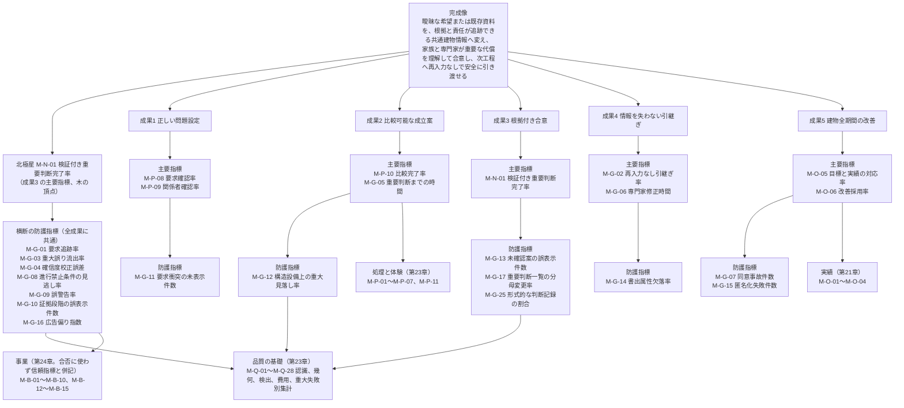

### 6.2 五成果と指標の対応表（正本は画面指標試験骨格 第2.2節）

| 成果 | 主要指標 | 防護指標 | 主に動く因果 | 主な画面 | 主な試験 | P0 で計測できるか | 区分 |
|---|---|---|---|---|---|---|---|
| 成果1 正しい問題設定 | M-P-08、M-P-09 | M-G-11 | (1) | S-02、S-24 | T-R-012、T-A-003 | 可 | 【推定】 |
| 成果2 比較可能な成立案 | M-P-10、M-G-05 | M-G-12 | (2)、(3) | S-03、S-10、S-11、S-12 | T-R-001〜T-R-003、T-R-007、T-A-009〜T-A-011 | 可（詳細調整の指標は P1） | 【推定】 |
| 成果3 根拠付き合意 | M-N-01 | M-G-13、M-G-17、M-G-25 | (4) | S-13、S-25、S-30-01 | T-A-007、T-A-013、T-S-003、T-S-011 | 可 | 【推定】 |
| 成果4 情報を失わない引継ぎ | M-G-02、M-G-06 | M-G-14 | (5) | S-08、S-20 | T-A-006、T-A-014、T-S-001、T-S-013 | 主要指標は試験時の代替計測のみ（第23章 第6.1節の建築士二重確認 100 件で受取側役を建築士が担い、M-G-02 と M-G-06 を実測）。実案件の受取側による運用計測は P1（F-C08-008）で、P0 の運用時は監視のみ（審査 JM-004）。防護指標 M-G-14 は P0 から計測（GLB、PDF、標準の必要情報要求で。IFC と IDS は P1） | 【推定】 |
| 成果5 建物全期間の改善 | M-O-05、M-O-06 | M-G-07、M-G-15 | (6) | S-14 | T-A-015、T-S-006 | 不可（P2。「未計測」と表示）。防護指標 M-G-07 は P0 から計測し合否に使う（P0 の分子は共有URL、伏せ字、外部AI処理先の三事象。送信先ごとの同意事故は P1 で加える。第5.1節） | 【推定】 |

### 6.3 指標の木の運用

| 節点 | 誰が見るか（役割） | 計測時点 | 表示する画面 | 区分 |
|---|---|---|---|---|
| 完成像と北極星 | 製品責任者、公開判定会議 | 月次、公開判定 | S-28 運用指標画面（S-28-01〜03 は P0。第15章 第7.26.1節。第23章、第24章） | 【推定】 |
| 五成果の主要指標 | 製品責任者、各領域の責任者 | 門通過時（M-N-01 は門の通過要求時の初回値）、月次 | 同上 | 【推定】 |
| 案件内の M-N-01 | RL-OWN、RL-EDT、RL-CHK | 常時（暫定）、門の通過要求時（初回値で確定。門通過時は確認記録のみ） | S-25 判断記録画面、S-13 段階門画面 | 【推定】 |
| 防護指標 | 製品責任者、情報保護責任者、建築士 | 試験時、月次、事象発生時 | S-28 運用指標画面。M-G-07、M-G-15 は事象発生時に通知 | 【推定】 |
| 品質、処理、事業、実績の指標 | 各担当 | 骨格の計測時点 | 第23章、第24章、第21章 | 【推定】 |

### 6.4 未決 U-00-047 への仮の判断

画面指標試験骨格は、五成果の主要指標（M-P-08 要求確認率、M-P-09 関係者確認率、M-P-10 比較完了率）を M-P- 区分に置き、成果指標の区分新設の要否を未決 U-00-047 としている。本章は識別子の不変性（識別子規則 第0節）を優先し、区分を新設せず M-P- のまま「種別: 成果」の属性で区別する扱いを仮の判断とする。識別子を変えると追跡表と試験の参照を全て更新する必要があり、利点が小さい【仮定】。

## 7. 機能要件

本章に担当機能なし。機能一覧骨格 v1.1 の「詳細を書く章」列に第2章を主章または副章とする機能は存在しない（第0.4節の章割当と第4.6節の集計で確認）【事実。機能一覧骨格 v1.1 の機械検査、確認日 2026-09-15】。

本章の定義を実装する機能とその主章は次のとおりであり、各主章が必須10項目と受入条件 AC- を記述する【推定】。

| 本章の定義 | 実装する機能 | 主章 | 本章が主章へ渡す仕様 |
|---|---|---|---|
| 重要判断一覧（分母）と七項目（分子） | F-C15-014 判断記録 | 第6章 | 第4.2節の七項目の判定条件、第4.3節の三つの源と源1 の雛形（記号）と利用目的別の生成（非該当。v1.3）、第4.4節の分母変更の承認規則、判断の状態 |
| M-N-01 と防護指標の計測 | F-C15-015 指標の計測 | 第23章 | 第4.1節の数式、第4.5節の計測時点（門の通過要求時の初回値）と集計（当月に G0 を通過した全案件）と層別（確認者の役割の三層を含む）、第5.1節の閾値と報告項目、第5.2節の合否規則、M-G-17、M-G-25（v1.3） |
| 非対象の表示 | F-C01-001 三入口と利用目的の取得、F-C15-003 完了条件の判定と必要成果の表示 | 第8章、第6章 | 第2.6節の表示規則 |
| 禁止表示語の検査 | F-C15-005 禁止表示語の文言検査 | 第6章（副章 第22章） | 第2.2節〜第2.5節の禁止表示語 |
| 分母変更の監査 | F-C10-010 監査記録 | 第22章 | 第4.4節の記録項目 |
| 判断記録画面 | S-25 | 第15章 | 第4.3節、第4.4節の操作（追加、除外、再追加）と案件内 M-N-01 の表示 |

## 章要約

本章は完成像の一文（指示文10.2）を五成果へ分解し、非対象を四層（層A NS-02-001〜008、層B NS-02-009〜013、層C NS-02-014〜015、層D 非対象機能 F- 7件）で列挙して代替機能、禁止表示語（語の正本は第22章 第6.3節の版）、試験を結んだ。六段の因果を機能一覧骨格 v1.3 に合わせた（延べ 298 件。因果(6) の中核の P0 機能は 0 件）。北極星 M-N-01 は数式、分子の七項目、三つの源の分母、分母変更の承認規則、計算例で定めた。源1 は第6章の主要判断と一対一の雛形で、v1.3 で G2(d)、G3(f) を外し、利用目的別の生成を固定して生成しない雛形を非該当（分子と分母に数えない）とした。計測時点は門の通過要求時の初回値。防護指標 M-G-01〜M-G-17 と M-G-25（M-G-17 と M-G-25 は本章が定義し第23章が採番）に閾値と報告項目を付け、合格条件(a)は初期仮説 90% で確認者の三層を別掲する。相殺を禁じ指標の木を描いた。担当機能はない。

## 他章への依頼または前提

| 章 | 内容 | 種別（依頼/前提） |
|---|---|---|
| 第3章 | 本章の【事実】3件（FloorplanVLM https://arxiv.org/abs/2602.06507 、国土交通省 建築士制度 https://www.mlit.go.jp/jutakukentiku/build/architect.html 、buildingSMART IDS https://github.com/buildingSMART/IDS 。いずれも確認日 2026-09-15）が出典一覧に含まれること。v1.2: 出典一覧（01_調査/00_出典一覧.md）の SRC-215、SRC-270、SRC-224 に当たることを確認し、本文の URL に併記した（第3章の依頼「URL に SRC-nnn を併記」への対応） | 前提 |
| 第7章、第21章、第23章（本章への依頼の対応状況。v1.2） | 第21章の依頼（源1 の雛形に将来場面への対応の採否）は第4.3節 G2(e) と第4.6節 D-02-021 で対応した。第23章の依頼（M-G-17 の二段構え、門の通過要求時の初回値、初期仮説 90%、M-G-07 の P0 の分子、確認者の役割による層別）は第4.5節、第5.1節、第5.2節で対応した。第7章の回答（主担当が推定のままの判断は項目4 を満たさない）は第4.2節 項目4 で対応した | 前提 |
| 段階6 の相互依頼（2026-10-06）で受けた本章あての依頼の対応状況 | 第23章（M-G-17 の二段構え、通過要求時の初回値、目標値 90%、M-G-07 の P0 の分子、確認者の層別）: 対応済みで、M-G-07 の P1 の試験 T-S-001 を第23章 第6.1節と同文にした。基盤 七段階門（第4.3節 源1 の雛形の改装時と将来対応、第4.6節の D-02-011 の除外）: 対応済み。基盤 機能一覧骨格（六因果の付け替えと副番7件）: 数は対応済みで、副番7件を第3.3節に転記した。基盤 用語集（370、493 等への整合）: 対応済み。第7章、第21章: 確認のみ（第4.2節 項目4、第4.3節 G2(e)、第4.6節 D-02-021）。第6章が項番を採ったため U-02-010 は解決 | 前提（対応状況） |
| 第6章 | F-C15-014 判断記録の必須10項目に、第4.2節の七項目の判定条件、第4.3節の三つの源（段階門の主要判断の雛形）、第4.4節の分母変更の承認規則、判断の状態（未着手、進行中、完了、再確認要、除外）を組み込むこと。G0 の完了条件(3)「非対象が画面に表示済み」の記録方法（第2.6節）を定めること | 依頼（対応済み。第6章 v1.1 の第9.7節 F-C15-014 と第9.3節 正常手順(7)で対応したと第6章の対応記録にあり、2026-10-06 の相互依頼 仕上げで本行に追従） |
| 第6章（v1.2 の追加） | (1) 第9.7節 F-C15-014 正常手順(1)の「（第3節の交差表で『有』の判断）」を「第2.1〜2.7節の主要判断（第2章 第4.3節の雛形の記号）」に改めること（JM-001）。(2) 第4.3節の項番で、第2.2節に (e) 既存外皮の現況状態の受入（A05、改装時）と (f) 工事前調査の要否（A10、改装時）、第2.3節に (e) 将来場面への対応の採否（A11、影響先 A03、A09。該当する将来場面がある案件）を加え、第2.4節の主要判断を (a) 空間側の調整（A03）〜(f) V2 の判定と承認範囲（A12）の項番付きに、第2.5節を (a) 誰が確認するか（責任表）、(b) 何を誰へどこまで送るか、(c) 何を再設計対象とするか（A03）に改めること。別の項番を付ける場合は第6章を正本とし、本章 第4.3節を追従させる（JM-007、JM-027、U-02-010）。(3) 第6.2節 判断記録の行の「通過を止める」対象を当該段階の源1 と源2 の SEV-0 由来に限り、源3 は未完了でも通過できるが分子に数えないと明記し、指標の写しの行を「門の通過要求時（初回）の値。門通過時の値は確認記録」に改めること（JM-002）。(4) 第9.7節 正常手順(4)の primaryDomain に「主担当が製品の仮置き（isProvisional=true）のままの判断は項目4 を満たさない」（第4.2節 項目4）を転記すること（JM-011） | 依頼（対応済み（2026-10-06、相互依頼 群A。確認のみ）: (1) 第9.7節 正常手順(1)は第2.1〜2.7節の主要判断 (a)〜(f)、(2) 第2.2〜2.5節の項番は本章 第4.3節と一致（U-02-010 は解決）、(3) 第6.2節は源1 と源2 の SEV-0 由来に限って通過を止め、指標の写しは通過要求時の初回値、(4) isProvisional の注記は転記済み） |
| 第7章 | 判断の主担当領域一意の規則と「他分野への影響」（第4.2節 項目4）の判定に十二判断領域 第2.1節の影響の種類を使うことを転記すること | 依頼 |
| 第8章 | S-01 開始画面の非対象表示（第2.6節）を F-C01-001 の正常手順に含めること | 依頼 |
| 第9章 | 第3.3節の六因果と機能群の対応、第2.5節の非対象機能、第3.5節の削除候補の扱いを機能一覧に転記すること | 依頼 |
| 第10章 | 第3.4節（能力、因果、機能、合格条件、試験）と第6.2節（成果、指標、画面、試験）を追跡表の初期値にすること。非対象機能7件を「非対象」状態で保持すること。v1.2: 第2.2節に「必要情報（指示文10.5 の語 → E-）」と「指標（M-）」の二列を置き、本章 第3.4節はそれを正本として参照する（JM-058）。K-06 の M-G-06 を「P1 F-C08-008 の計測方法へ」とし、P0 は試験時の代替計測のみとする（第6.2節。JM-004） | 依頼（v1.3 の確認: 第10章 v1.2 第2.2節が必須機能の集合の正本となり、画面と試験の列を置いた〔JR-044〕。本章 第3.4節は同じ集合に揃え、M-G-25 は第10章 第2.1節、第4.2節に転記された） |
| 第12章 | E-REQ-004 Decision に七項目、判断の状態、源（1〜3）、分母変更の履歴（追加、除外、再追加の理由と承認者）を持たせること。状態の符号化は U-02-003 と U-00-046 を併せて判断すること | 依頼（対応済み: 第12章 v1.2 の E-REQ-004 に kind、status、source、denominatorHistory、sevenItemsCheck が置かれた〔第12章 第4.6節〕。符号化は 2026-10-06 に U-02-003、U-00-046 で「符号を設けず日本語値を正とする」と解決〔相互依頼 群A〕。相互依頼 仕上げで本行に追従） |
| 第12章（v1.2 の追加） | E-REQ-004 の isKeyDecision と source（源1）の説明に、源1 の生成元を「第6章 第2.1〜2.7節の主要判断（第2章 第4.3節の雛形）」と節番号で書き、判断に雛形の記号（例 G2(e)）を保持すること（JM-001）。E-REQ-010 Gate に、初回の通過要求の日時とその時点の M-N-01 の分子と分母を追記のみで保持すること（JM-002） | 依頼 |
| 第15章 | S-25 判断記録画面に、分母の追加、除外、再追加の操作と承認、案件内 M-N-01 の表示、状態別の件数を置くこと。S-13 に門ごとの M-N-01 と非対象の表示記録を置くこと。v1.2: S-25、S-28 の M-N-01 の表示に確認者の役割（有資格者確認、専門家未確認）の値と件数を別掲し、有資格者確認層が 30 件未満の場合は「件数不足」と表示し、表示名に「（専門家未確認を含む）」を付すこと。M-N-01 は門の通過要求時の初回値を表示し、門通過時の値と区別すること（JM-002、JM-003） | 依頼（v1.3 の確認: 第15章 v1.3 の S-25-01 と S-28-01 が確認者の役割を三層〔有資格者確認（照合済み）、資格未照合（本人申告）、専門家未確認〕に改め、S-28-01〜03 を P0 とした。JR-004、JR-078。本章 第4.5節と同じ規則） |
| 第17章 | F-C10-003 の P0 範囲に、共有URL の閲覧者（受取側の建築士）が問題（E-REQ-003）を起票できる導線を加え、発見段階（G4 以降）を記録すること。M-G-03 の P0 の分子に使う（第5.1節。JM-006） | 依頼 |
| 第21章、第24章 | 成果5 の指標（M-O-05、M-O-06）を P0 で「未計測」と表示する扱い（U-02-008）を確認すること | 依頼 |
| 第21章 | 第6節に規則(7)「将来場面の試行結果の採否は判断 D- に記録し、P0 でも該当する将来場面がある案件は雛形 G2(e)（第2章 第4.3節）を分母に含める」を追記すること（JM-007） | 依頼 |
| 第22章 | 分母変更の全操作を監査記録（F-C10-010）に残すこと。書出の表紙と透かしに層B の五文書ではない旨を印字すること（F-C04-012、F-C04-014、F-C10-009）。v1.2: 分母の除外と要求の優先度降格の監査記録を月次で抜き取り確認し、理由が形式的な記録を公開判定会議へ報告する手順を置くこと（JM-005）。F-C10-012、F-C10-013、F-C10-014、F-C10-019 の目的欄の末尾に「因果(n)への割当理由: 本機能を欠くと因果(n)の機能（例）が法または規約上実行できない」の一文を加えること（第3.5節。JM-010） | 依頼 |
| 第23章 | M-G-17 の採番の確定（対応済み。第23章 識別子一覧の注記「定義元は第2章」）を保ち、定義は本章 第5.1節を参照すること（JM-009）。第5.1節の閾値と第5.2節の合否規則を F-C15-015 の受入条件 AC- と試験 T- に対応付けること。第4.5節の月次集計の方式を実装仕様にすること。v1.2: 第6.1節に第5.2節 合格条件(a)と同じ行（M-N-01 G4 通過要求時 90% 以上、確認者の役割で層別し両層の値と件数を別掲、有資格者確認層 30 件未満は「件数不足」で専門家未確認の完了率として公開）を置くこと（JM-003、JM-172）。M-G-24（RP-MUST からの優先度降格件数）の定義と M-P-08 の層別への優先度の変更履歴の追加は対応済み（第23章 第2.5節、第2.6節）。採番は画面指標試験骨格 v1.2 第2.1節で確定したため、第23章の識別子一覧に載せる場合は採番の参照を併記すること（JM-005）。M-G-07 の P0 の分子（第5.1節の三事象）を T-S-004、T-S-007、T-S-012 の計測と第6.1節に対応付けること（JM-012）。第6.1節の M-G-02 80% 以上の行に「試験時（建築士二重確認 100 件）。運用時は監視のみ」と限定を付すこと（第2.6節の計測元は対応済み。JM-004） | 依頼（v1.3 の確認: 第23章 v1.3 第6.1節の北極星の行は確認者の三層〔有資格者確認（照合済み）、資格未照合（本人申告）、専門家未確認〕と照合済みの層だけでの 30 件の判定に改まり、第2.5節で M-G-25 を採番した。JR-004、JR-003） |
| 第24章 | 主要指標に第5.2節の合否規則と第5.3節の判定例を転記すること。指示文11.5 の項目2「検証付き重要判断一覧と、案件別に分母を変更する権限」を経営判断事項として第4.4節の仮の承認規則と共に提示すること。v1.2: 第4.1節 P0 完了条件(2)に第5.2節 合格条件(a)と同文（確認者の役割の層別と件数不足の扱い）を置くこと（JM-003、JM-172）。第5.1節に受取側建築士（試験の二重確認 100 件と兼ね、M-G-02、M-G-06 の計測に協力。P0 は試験時、運用は P1）の行を置き、P0 完了条件(2)に M-G-02 を含めるか否かを第8節の経営判断に加えること（JM-004） | 依頼（v1.3 の確認: 第24章 v1.2 の第3.2節の合格条件と判定例1 は確認者の三層に改まり〔JR-004〕、D-24-010 は「第6章 第5.1節（分母変更）を仮採用」に改まった〔JR-002〕。本章 第4.4節の承認者も同じ行に揃えた） |
| 04_必須表 | 識別子台帳に NS-02-001〜015（接頭辞は識別子規則 v1.3 で登録済み）、D-02-001〜024（D-02-011 は廃止 v1.2、後継なし）、U-02-001〜010 を登録すること。M-G-17 は二段構え（採番: 第23章、定義と閾値: 本章 第5.1節）とすること（台帳 第1節の段階6 訂正で対応済み。JM-009）。責任表に分母変更の承認者（RL-CHK）を置くこと。最終審査表の「完成像を満たす能力」列に第3.4節を使うこと | 依頼 |
| 05_審査 | 完成像審査で第2.7節の非対象の除外条件と第3.5節の削除候補の確認条件を採用すること。責任審査で第2.2節〜第2.5節の禁止表示語が試験に含まれているか確認すること | 依頼 |
| 基盤 識別子規則 | 接頭辞 NS-（非対象事項）の追加（U-02-001）と判断の状態符号（U-02-003）の判断。対応済み（2026-10-06）: 識別子規則 v1.3 で NS- を登録し、判断の状態は符号を設けず日本語値を正とした（U-02-001、U-02-003 は解決） | 依頼（対応済み） |
| 基盤 用語集 | 325「分母変更率」の「M-G-17（仮採番）」を「M-G-17（採番: 第23章、定義と閾値: 第2章 第5.1節）」に改めること（JM-009）。本章 v1.2 の新語（通過要求時、雛形の記号、有資格者確認層）の統合を判断すること。対応済み（2026-10-06）: 325 を改訂し、新語 3 語を用語集 498〜500 に統合した | 依頼（対応済み） |
| 基盤 七段階門 | 第3節の「源1 対象（雛形の記号）」列を本章 第4.3節の記号に揃えること。G1×A05 を G1(e)、G1×A10 を G1(f)、G2×A11 を G2(e)、G3 の A03、A04、A05、A06、A08、A12 を G3(a)〜G3(f) とし、例示 D-02- を併記すること（G0(c) D-02-019、G2(d) D-02-020、G2(e) D-02-021、G3(a) D-02-022、G3(f) D-02-023、G4(c) D-02-024）。第1節の主要判断も同じ項番に揃えること（JM-001、JM-027。第6章が別の項番を付けた場合は第6章に従う）。対応済み（2026-10-06）: 七段階門 第3節の源1 対象列と第1節の主要判断を第6章（正本）の項番に合わせた。本章 第4.3節の記号と一致する。v1.3（2026-10-07）: 七段階門 v1.3 は G2×A12、G3×A12 を「有（源1対象外）」とし「旧 G2(d)、D-02-020」「旧 G3(f)、D-02-023」と書いた。本章 v1.3 も G2(d)、G3(f) を源1 対象外とし D-02-020、D-02-023 を廃止した（JR-005） | 依頼（対応済み） |
| 第6章、第8章、第15章、第22章、第23章、第24章、基盤定義（二回目の修正の整合。2026-10-07、記録は `05_審査/再修正記録_2回目_第2_10章.md`） | 本章 v1.3 は再審査 修正計画 第1.2節、第0.3節、第0.4節の文と番号で書き、新しい依頼は出さない。第4.3節の「利用目的別の生成」列は、第6章 v1.2（第2.3節「利用目的による適用除外」、F-C15-014 正常手順(1)と例外(c)、F-C15-001 例外(c)）、第8章 v1.3（第2.0節、第2.3〜2.5節の冒頭）、第23章 v1.3（T-A-013 の期待値）が参照する正本である。資格の照合状態は第6章 第5.2節、除外の承認者は第6章 第5.1節 分母変更の行、M-G-25 の採番は第23章 第2.5節、語集合と規則集合の版は第22章 第6.3節、S-28-01〜03 の P0 は第15章 第7.26.1節、判定例1 は第24章 第3.2節と同じ。家具配置の G1(c)(d)、G2(e) を「条」とした扱いと、利用目的の変更時の G0(b) の再確認要は本章の仮定であり、第6章と第8章の文との突合は段階8 で行う（U-02-011） | 前提 |
| 04_必須表、基盤 用語集（記録のみ。修正計画 第0.3節「主担当と整合」により段階8 で処理） | 表2 の A03-7、A12-3 と集計行が参照する D-02-020、D-02-023（源1 G2(d)、G3(f)）は v1.3 で廃止した（JR-005）。識別子台帳に M-G-25（定義と閾値は本章 第5.1節、採番は第23章。M-G-17 と同じ二段構え）、D-02-020 と D-02-023 の廃止、U-02-011 を登録すること。用語集 500「有資格者確認層」を三層の定義へ改め、「非該当（源1 の雛形）」を登録すること（本章の用語追加提案） | 依頼（記録のみ。用語集の部分は対応済み〔2026-10-07、二回目の修正の仕上げ: 500 を三層へ改訂し、577 非該当（源1 の雛形）を統合〕。識別子台帳の部分は統括の再生成で段階8） |
| 基盤 機能一覧骨格、基盤 用語集、基盤 識別子規則（二回目の依頼への対応状況。2026-10-07、二回目の修正の仕上げ 群R1） | 骨格（第4.4節の六因果の付け替えと副番の転記。v1.3 で延べ 298、副番 8 件）: 第3.3節で延べ 298（(6) 13）に転記済み（確認のみ）。用語集（489 の仮接頭辞の改訂への追従と「未改訂」「申し送った」の注記の更新）: 用語追加提案の「非対象事項」の行は「用語集 489 の字句を改訂済み（2026-10-07）」で、他に「未改訂」「申し送った」の注記はない（確認のみ）。識別子規則（NS- の登録と判断の状態の符号）: U-02-001、U-02-003 は解決と記載済み（確認のみ） | 前提（対応済み） |

## 未決事項

| 識別子 | 内容 | 区分（事実/推定/仮定/未確認） | 影響 | 確認者候補 |
|---|---|---|---|---|
| U-02-001 | 非対象事項に接頭辞 NS-（`NS-{章2桁}-{連番3桁}`）を新設し識別子規則へ登録するか。登録する場合は識別子規則の主番号を上げる。登録しない場合、NS-02-001〜015 は本章の表番号として扱い、台帳には「非対象事項」として名称で登録する。解決（2026-10-06、基盤 識別子規則 v1.3 第1節、第2.9節で NS- を登録。接頭辞の追加は状態符号の追加ではないため副番号で扱い、主番号は上げない） | 仮定 | 識別子規則、識別子台帳、第22章、第23章、05_審査の責任審査 | 識別子規則担当、04_必須表担当 |
| U-02-002 | 案件別に分母（重要判断一覧）を変更する権限。第4.4節の承認者（除外は RL-CHK、1名の案件は所有者の自己承認）は初期仮説。指示文11.5 の項目2 に当たる経営判断。v1.3: 承認者の規則を第6章 第5.1節 分母変更の行（表4 C-17 の暫定扱い）と同じにし、編集者は承認しない、編集者がいて RL-CHK がいない案件の申請は「承認者未設定」で保留とした（JR-002）。経営判断（第24章 D-24-010）は継続 | 仮定 | S-25、F-C15-014、責任表、M-N-01 の信頼性 | 製品責任者、経営陣、建築士 |
| U-02-003 | 判断の状態（未着手、進行中、完了、再確認要、除外）の符号化。U-00-046（GS-、CC-、CN-）と併せて識別子規則担当が判断する。解決（2026-10-06、基盤 情報実体骨格 U-00-046 の解決と第12章 U-12-005）: 符号を設けず日本語の enum 値を正とする | 仮定 | 識別子規則 第2.8節、E-REQ-004、S-25 | 識別子規則担当、第12章担当 |
| U-02-004 | M-G-17 重要判断一覧の分母変更率の閾値（10% 以下、SEV-0 由来 0 件）の妥当性。採番主体との整合は一部解決 v1.2（2026-10-06、審査 JM-009、識別子台帳 第1節の段階6 訂正）: 採番は第23章で確定し、定義と閾値は本章 第5.1節が正本とする二段構えに決めた。画面指標試験骨格 v1.2 は第2.1節の注に採番の経緯と定義の正本（本章 第5.1節）を記した。閾値の妥当性は未決のまま。v1.2 で加えた報告項目の基準（1 日未満で完了した判断が源3 の 50% 超で公開判定会議へ報告。JM-005）も初期仮説。v1.3 で加えた M-G-17 の報告項目の基準（源1 の自己承認による除外と未照合の却下による自動除外は全件報告、構造の雛形を持たない利用目的の案件の割合の前期比 20% 以上の増加で報告。JR-001、JR-002、JR-004）と、M-G-25 の閾値（10% 以下）、不採用理由の 20 字の基準、定型句の一覧（JR-003）も初期仮説 | 仮定 | 画面指標試験骨格、第23章、第24章、公開判定 | 指標骨格担当、公開判定会議 |
| U-02-005 | 分子の七項目（骨格に従う）と指示文A1 の六項目の差。「決定者」と「確認者」を分ける運用が P0 の家族内案件（専門家不在）で成立するか。P0 で利用者が確認者を兼ねた判断を「専門家未確認」として層別する扱い。v1.2 で公開判定の規則（両層の値と件数の別掲、有資格者確認層 30 件未満は「件数不足」。JM-003）を第5.2節に置いたが、30 件は初期仮説であり公開判定会議で確定する。v1.3 で層を三層（有資格者確認〔照合済み〕、資格未照合〔本人申告〕、専門家未確認）にし、30 件の判定を照合済みの層だけで行うとした（JR-004）。P1 の照合手段が成立するまで照合済みの層は 0 件のまま続く | 仮定 | F-C15-014、S-25、M-N-01 の層別 | 製品責任者、UX設計者、建築士 |
| U-02-006 | 月次集計を案件ごとの率の単純平均ではなく分母合計の重み付きとし、中央値と最小値を併記する方式。v1.2 で対象を当月に G0 を通過した全案件とし、G2 未到達の案件の件数を併記する規則（JM-005）を加えた | 仮定 | 第23章、第24章の集計仕様 | 製品責任者、第23章担当 |
| U-02-007 | 閾値未設定の防護指標（M-G-05、M-G-06 等）を合否に使わず「監視のみ」とし、前期比 20% 以上の悪化を報告対象とする扱い。20% は初期仮説 | 仮定 | 公開判定、月次判定 | 公開判定会議 |
| U-02-008 | 成果5 の主要指標（M-O-05、M-O-06）を P0 の公開判定で「未計測」とし合否に使わない扱い。M-G-07 は P0 から合否に使う。v1.2 で P0 の分子を T-S-004、T-S-007、T-S-012 の三事象と定め、送信先ごとの同意事故は P1 で加える二段構えにした（JM-012） | 仮定 | 公開判定、第21章、第24章 | 製品責任者 |
| U-02-009 | 成果2 の主担当領域を A03 とした判断（十二判断領域 U-00-012 の暫定に従う）。A01 とする案もある | 仮定 | 第1.3節、責任表、判断記録 | 建築士、製品責任者 |
| U-02-010 | 源1 の雛形の記号のうち本章が付けた項番（G1(e)、G1(f)、G2(e)、G3(a)〜G3(f)、G4(c)）を、第6章 第2.2〜2.5節が同じ項番で採るか。第6章が別の項番を付けた場合は第6章を正本とし、本章 第4.3節と第4.6節、基盤 七段階門 第3節の源1 対象列を追従させる（v1.2 で追加。JM-001、JM-007、JM-027）。解決（2026-10-06。第6章 v1.1 が第2.2〜2.5節で同じ項番 G1(e)(f)、G2(e)、G3(a)〜(f)、G4(c) を採用。基盤 七段階門 第1節と第3節も同じ項番に改めた） | 仮定 | 第4.3節の雛形、基盤 七段階門 第3節、第12章（雛形の記号の保持）、S-25 | 第6章担当、基盤定義担当 |
| U-02-011 | 第4.3節の「利用目的別の生成」列（v1.3、JR-001）の妥当性。(a) 第8章 第2.3節が列挙しない家具配置の G1(c)(d)、G2(e) を「条」（図面入力、将来場面の条件に従う）とした扱い。(b) 図面3D化と売却賃貸で RP-MUST の追加後も G0(b)、G1(b)、G2(e) を非該当のままとする扱い。(c) 利用目的の変更時に家具配置の G0(b) を「再確認要」にし、減る側の変更で生成済みの判断を非該当へ戻さない扱い。(d) 第23章 T-A-013 の期待値（新築 16、改装 20、家具配置 7、図面3D化と売却賃貸 9） | 推定 | 第4.3節、第4.6節、第6章 F-C15-014、F-C15-001、第8章 第2.3〜2.5節、第23章 T-A-013、M-N-01 と M-G-17 | 製品責任者、第6章担当、第8章担当、公開判定会議 |
| U-00-058（本章の仮の判断） | 非対象7機能を完成像審査の除外条件とし、代替機能の因果ひも付けと禁止表示語の試験の存在を審査で確認する（第2.7節） | 推定 | 04_必須表、05_審査 | 04_必須表担当、05_審査担当 |
| U-00-060（本章の仮の判断） | F-C10-018 の六因果を (1) のままとし、「除くと因果の機能が法規または個人情報保護上実行できなくなる」ことを安全措置のひも付け基準にする（第2.7節、第3.5節） | 仮定 | 完成像審査、追跡表 | 製品責任者、05_審査担当 |
| U-00-047（本章の仮の判断） | 成果指標の区分を新設せず M-P- のまま「種別: 成果」属性で区別する（第6.4節） | 仮定 | 指標識別子、追跡表 | 識別子規則担当、製品責任者 |

## 用語追加提案

| 用語 | 定義 | 理由 |
|---|---|---|
| 重要判断一覧 | 案件で必要と判定した重要判断の集合。M-N-01 の分母。段階門の主要判断（源1）、SEV-0 と SEV-1 の問題に由来する判断（源2）、案件固有の判断（源3）から作り、追加と除外に理由と承認を要する | 用語集13「重要判断」の「一覧」を、分母の管理単位として一語で参照するため。用語集 484 へ統合済み |
| 決定者 | 判断において決定権（用語集44）を行使した関係者。判断の七項目の一つ。代理入力の場合は本人の確認機会の記録を要する | 用語集52「判断」の属性に出るが単独の定義がないため。用語集 435 へ統合済み |
| 判断の状態 | 重要判断の処理状態。未着手、進行中、完了（七項目がそろった）、再確認要（承認の自動失効または版の変更）、除外（理由と承認を付けて分母から外した。識別子は残す）の五区分。符号は設けず日本語の enum 値を正とする（U-02-003 は 2026-10-06 に解決） | 分母と分子の計測条件を状態で観察可能にするため。用語集 331 へ統合済み |
| 非対象事項 | 機能ではない非対象（法的責任と人の行為、V3 でも扱わない文書、事業として行わないこと）。接頭辞 NS-（識別子規則 v1.3 で登録済み。U-02-001 は解決）。非対象機能（用語集262）と区別する | 用語集5「非対象」を、機能行（F-）と識別子付きの事項に分けて参照するため。用語集 489 へ統合済み（489 の字句を「接頭辞 NS-」に改訂済み（2026-10-07、相互依頼 基盤仕上げ）） |
| 分母変更率 | 重要判断一覧に登録された判断の延べ数に対する除外数の割合。M-G-17（第23章で採番確定。定義と閾値は第5.1節）。SEV-0 由来の除外件数を併記する | 北極星の分母操作を防ぐ防護指標を一語で参照するため。用語集 325 へ統合済み（2026-10-06 に 325 を「M-G-17（採番: 第23章、定義と閾値: 第2章 第5.1節）」へ改訂済み。JM-009） |
| 横断の防護指標 | 五成果のいずれか一つに属さず全成果に共通して働く防護指標（M-G-01、M-G-03、M-G-04、M-G-08、M-G-09、M-G-10、M-G-16） | 指標の木で成果別の防護指標と区別するため。用語集 427 へ統合済み |
| 法規判定記録 | 法規判定（F-C09-008）の結果を、法令名、自治体、版、施行日、取得日、該当根拠、入力値、計算、余裕量と共に保持した記録。証拠段階は EL-CAL 相当であり、確認申請図（NS-02-009）の代替ではなく元情報 | 第2.3節で層B の「製品が代わりに提供する情報」を一語で参照するため。用語集 437 へ統合済み |
| 専門家未確認 | 承認個体（E-REQ-007 Approval）と、それに依拠する判断に付ける表示語。確認者（RL-CHK）を利用者自身が兼ねた承認（自己承認）、または資格のない確認者による承認であり、有資格者の確認範囲付き承認がないことを示す。交差単位で付け、M-N-01 の層別（確認者の役割）に使う。責任表の行の空欄には使わず「専門家未割当」（用語集 493）を使う | 第4.2節 項目6 と第4.7節の表示文言を定義するため。U-02-005 と連動。用語集 370 へ統合済み（v1.2 で承認個体の表示語に限定。基盤 整合検査報告 第5節。JM-020） |
| 初期注意 | 段階 G2 で三案の各案に付ける構造、避難、排水、施工成立性の注意（F-C11-002、F-C12-002、F-C12-009、F-C13-010）。詳細調整前の問題候補であり、G3 で問題（I-）として登録または解消される。七段階門 G2 の完了条件(3)の対象 | 七段階門と機能一覧骨格で使われるが用語集に未収録のため。用語集 328 へ統合済み |
| 通過要求時 | 利用者が段階門画面 S-13 で「次の段階へ進む」を初めて要求した時点。M-N-01 の案件内の計測時点であり、その時点の値を門の値として固定し、差戻し後の再要求で上書きしない。門通過時の値は確認記録に限る | 定義上 100% に近づく門通過時の値と区別して計測時点を一語で参照するため（v1.2。JM-002）。用語集 498 へ統合済み（2026-10-06） |
| 雛形の記号 | 源1 の雛形（第6章 第2.1〜2.7節の主要判断）を示す記号。段階と第6章の項番を組み合わせて G2(e) のように書く。交差表の「源1 対象」列、判断記録、計算例で同じ雛形を一意に指す | 交差表と判断記録と計算例で同じ雛形を指すため（v1.2。JM-001）。用語集 499 へ統合済み（2026-10-06） |
| 有資格者確認層 | M-N-01 を確認者の役割で層別したときの三層（有資格者確認〔照合済み〕、資格未照合〔本人申告〕、専門家未確認）の一つ。照合済みの資格を持つ RL-CHK の承認（AS-VALID）による判断の層で、本人申告で未照合の資格による承認は含めない（第6章 第5.2節「資格の照合状態」）。公開判定の 30 件の判定はこの層だけで行い、30 件未満なら「件数不足」と表示する（v1.3、JR-004） | 公開判定の別掲の規則（第5.2節）を一語で参照するため（v1.2。JM-003）。用語集 500 へ統合済み（2026-10-06）。v1.3 で三層に改めたため、用語集 500 の定義（「P0 は本人申告で未照合」を含む二層）の改訂を提案する。用語集 500 を三層の定義に改訂済み（2026-10-07、二回目の修正の仕上げ） |
| 非該当（源1 の雛形） | 第4.3節の「利用目的別の生成」列で、案件の利用目的に対して生成しない源1 の雛形の扱い。判断（E-REQ-004）を生成せず状態を持たない。承認を要する「除外」と区別し、M-N-01 と M-G-17 の分子と分母に数えない（v1.3、JR-001） | 利用目的別の雛形の扱いを除外と区別して一語で参照するため。定義の正本は本章（第8章 v1.3 の同じ語の提案は重複提案）。用語集 577 へ統合済み（2026-10-07、二回目の修正の仕上げ） |

## 本章で定義した識別子一覧

| 種別（機能/情報実体/画面/指標/試験/API/非機能/受入条件） | 識別子 | 名称 |
|---|---|---|
| 指標（第23章で採番確定。定義と閾値は本章 第5.1節が正本。識別子台帳 第1節の二段構え、JM-009） | M-G-17 | 重要判断一覧の分母変更率 |
| 指標（第23章 第2.5節で採番確定。定義と閾値は本章 第5.1節が正本。M-G-17 と同じ二段構え。再審査 修正計画 第0.4節、JR-003、v1.3） | M-G-25 | 形式的な判断記録の割合 |
| 非対象事項（接頭辞 NS- は識別子規則 v1.3 で登録済み。U-02-001 は解決） | NS-02-001 | 建築士の法的責任 |
| 非対象事項 | NS-02-002 | 構造設計者の法的責任 |
| 非対象事項 | NS-02-003 | 設備設計者の法的責任 |
| 非対象事項 | NS-02-004 | 施工者の法的責任 |
| 非対象事項 | NS-02-005 | 行政と確認検査機関の法的責任 |
| 非対象事項 | NS-02-006 | 確認申請の代行と行政協議 |
| 非対象事項 | NS-02-007 | 工事監理 |
| 非対象事項 | NS-02-008 | 測量、地盤調査、現況調査、開口調査、石綿事前調査、見積、行政確認の代替 |
| 非対象事項 | NS-02-009 | 確認申請図 |
| 非対象事項 | NS-02-010 | 構造安全証明 |
| 非対象事項 | NS-02-011 | 見積確定額（見積書） |
| 非対象事項 | NS-02-012 | 施工図、製作図 |
| 非対象事項 | NS-02-013 | 性能評価書、法的適合の証明書 |
| 非対象事項 | NS-02-014 | 無許諾の企業商品を複製する商品収集基盤 |
| 非対象事項 | NS-02-015 | 利用者情報を一括送信する見込客獲得頁、連絡先の販売、無断一括送信、隠れた順位操作 |
| 例示判断（識別子規則 第2.6節） | D-02-001〜D-02-010、D-02-012〜D-02-018 | 第4.6節の計算例の重要判断（目的文と決定権、案件を進めるか、必須要求の確定、敷地制約と不足調査、居間と個室の衝突、当事者の確認機会、空間構成の選定、性能目標、概算幅と期間、駐車と庭の両立、荷重経路、層構成と接合部、機器と経路、商品の実寸適合、大開口と耐力壁の衝突、責任表、送信先と同意）。v1.2 で D-02-001 に決定権を加え、D-02-017 から再設計範囲を D-02-024 へ分けた |
| 例示判断（v1.2 で追加。JM-001、JM-007、JM-027） | D-02-019、D-02-021、D-02-022、D-02-024 | 利用条件の同意と情報の扱い（G0(c)）、将来場面への対応の採否（G2(e)）、空間側の調整（G3(a)）、再設計範囲（G4(c)） |
| 例示判断（廃止） | D-02-011 | 空間、構造、外皮、設備、商品が共存するか（総合）。廃止 v1.2、後継なし（門の完了条件の判定 F-C15-003 とした。JM-027） |
| 例示判断（廃止 v1.3。JR-005） | D-02-020、D-02-023 | 選定の決定者と確認者と版（旧 G2(d)）、V2 の判定と承認範囲（旧 G3(f)）。廃止 v1.3、後継なし（源1 対象外。旧 G2(d) は F-C15-014 正常手順(9)と門の判定 F-C15-003、旧 G3(f) は門の判定 F-C15-004 で扱う） |
| 未決事項 | U-02-001〜U-02-011 | 本章の未決事項（U-02-011 は v1.3 で追加） |
| 機能（参照（正本: 基盤定義、非対象）。JM-194） | F-C09-014 | 全世界法規の完全対応（第2.5節の再掲。定義は機能一覧骨格 第2節） |
| 機能（参照（正本: 基盤定義、非対象）。JM-194） | F-C11-011 | 構造安全の自動保証（第2.5節の再掲。定義は機能一覧骨格 第2節） |
| 機能（参照（正本: 基盤定義、非対象）） | F-C13-015、F-C05-020、F-C07-011、F-C13-016、F-C12-017 | 施工図の完全自動作成、無許諾商品3Dの複製、単写真からの実寸完全復元、確定見積、第三者性能評価の自動発行（第2.5節の再掲。定義は機能一覧骨格 第2節） |
| 情報実体、画面、試験、API、非機能、受入条件 | なし | 本章は担当機能を持たず、これらの識別子を定義しない。上の非対象機能 7 件は機能一覧骨格が定義したものの再掲であり、本章では定義しない |


---

<!-- 03_調査方法_確認日_出典一覧.md -->

# 第03章 調査方法、確認日、出典一覧

作成日: 2026-09-15　版: v1.3（2026-10-08 段階8前の持ち越し仕上げ〔群F2。共通の決定 D13 の付随、既定値の識別子の併記 0 行〕。章末の第02章、第04章〜第08章あての SRC- の併記の依頼を対応済みとし、対応状況の行に第4章の併記の完了を記した。統合表は変更していない。記録は `05_審査/再修正記録_段階8前_仕上げ_群F2.md`。v1.2 は 2026-10-07 二回目の修正の仕上げ〔群R1〕。`01_調査/08_外部確認_段階7後.md` の確認結果で RC-06、RC-18、RC-25〜RC-28 の状態を改め、統合表に SRC-305〜SRC-337 を登録した。記録は `05_審査/再修正記録_2回目_仕上げ_群R1.md`。v1.1 は 2026-09-15 段階6 再修正。初稿審査の確認依頼 JM-094、JM-148、JM-134、JM-149、JM-182 を RC- へ登録し、整合修正指示 第3章の1 を反映。2026-09-29 の途中停止の後、2026-10-06 に再開して完了。記録は `05_審査/再修正記録_第1_3_7章.md`）　担当: 段階3 仕様書 第03章（製品責任者、個人情報保護と知的財産の審査担当、計算機科学者の合議による執筆）
根拠: 指示文 1.1（調査範囲と読み方）、A（調査の実行規則）、7章（参照した主な一次情報、744〜820行）、I（最終成果物の形式）、9.6（商品情報の更新と消失）、9.7（法規機能の境界）、9.8（個人情報と住宅防犯）。基盤定義 `用語集.md` v1.1、`識別子規則.md` v1.1、`信頼状態と証拠段階.md` v1.1、`情報実体骨格.md` v1.1（E-PRD-006 Source、E-REQ-008 Evidence、E-SRV-009 Overlay）、`機能一覧骨格.md` v1.1、`画面指標試験骨格.md` v1.1、`整合検査報告.md` v1.0。調査 `01_調査/00_出典一覧.md`（統合表、取得失敗、再確認項目、差分、不審な指示の正本）、`01_調査/01_指定参照三社.md`〜`07_法規と個人情報と権利.md`（各ファイル第1節「調査範囲と方法」、第5節「出典一覧」、第6節「不審な指示の検出」、未決事項）。確認日はすべて 2026-09-15。

## 0. 冒頭

### 0.1 本章の目的

本章は、段階1（調査）で行った公式情報の再確認について、調査範囲、方法、確認日、事実か推論かの規則、各社主張の扱い、確認していない範囲を仕様書として固定し、出典一覧（SRC-001〜SRC-304）、取得失敗一覧、公開前の設計審査で再確認すべき項目（RC-01〜RC-28）、指示文の記述と公式頁の差分（DIF-01〜DIF-93）とその仕様への影響を一箇所に統合する章である。後続の全章は、出典を引用する際に本章の出典IDを使い、根拠区分の付け方と未確認事項の扱いを本章の規則に従う【推定】。

本章が答える問いは次の五つである。(1) どの範囲を、どの手段で、いつ確認したか。(2) 「事実」と「未確認」の境界はどこか。取得できなかった出典に基づく記述をどう表示するか。(3) 各社の公開主張を仕様のどこまで使ってよいか。(4) 公開前にどの出典を再確認しなければ、共通指示第8節の禁止（未確認案の適合表示、無許諾複製）に抵触しうるか。(5) 指示文と公式頁の差分が、どの章のどの仕様を変えるか【推定】。

### 0.2 本章の範囲と非対象

| 区分 | 内容 |
|---|---|
| 範囲 | 調査範囲と方法（第1節）。根拠区分と各社主張の規則（第2節）。確認していない範囲（第3節）。出典一覧の統合表 337 件の再掲（第4節。SRC-305〜SRC-337 は 2026-10-07 の外部確認の出典）。取得失敗 150 件の理由別一覧と再確認項目 28 件（第5節。RC-25〜RC-28 は初稿審査の確認依頼を受けて追加）。指示文との差分 93 件と仕様への影響（第6節）。不審な指示の検出結果（第7節）。調査時の出典と製品運用時の出典（E-PRD-006）の関係（第8節）【推定】 |
| 本章で扱わないもの | 競合比較の点数と評価（第04章）。各出典の内容から導く個々の機能仕様（第11章以降の各主章）。法規、権利、個人情報の仕様そのもの（第18章、第22章）。商品情報の更新と失効の機能仕様（第16章）。未決事項の全章統合（04_必須表）。再確認の実施（段階5前の再取得作業であり本章は計画と対象だけを定める）【推定】 |
| 本章が新しく決めないもの | 用語、識別子体系、領域、段階、状態符号は基盤定義に従う。出典ID `SRC-`、再確認項目 `RC-`、差分番号 `DIF-` は `01_調査/00_出典一覧.md` が暫定採番した番号を変更せずに引き継ぐ。接頭辞は本章の依頼により識別子規則 v1.3 第1節、第2.9節に登録された（U-03-001 は 2026-10-06 に解決）。本章は新たな外部取得を行わず、取得済みの記録を転記、集約、分類するにとどめる【仮定】 |

### 0.3 前提とする章

| 章 | 前提の内容 |
|---|---|
| 02_基盤定義（用語集、識別子規則、信頼状態と証拠段階、情報実体骨格） | 用語と識別子の正本。出典（用語65）、証拠段階 EL-、権利状態 RS-、出典実体 E-PRD-006 と証拠実体 E-REQ-008 の定義 |
| 01_調査/00_出典一覧.md | 統合表、取得失敗、再確認項目、差分、不審な指示の記録の正本。本章はこれを引用し、独自に出典一覧を再作成しない（同書「他章への依頼」の前提に従う） |
| 第02章 | 完成像と非対象。本章の再確認項目の優先度「公開前必須」は、非対象の境界（無許諾複製、未確認案の適合表示）に抵触しうる項目として定める |
| 第04章 | 競合比較の点数。本章第6節の差分のうち評価値見直し候補（DIF-21、DIF-23、DIF-25）の確定は第04章が行う |
| 第22章、第16章、第18章 | 再確認項目「公開前必須」11件の確認者割当と、確定扱いにしない仮定としての明記を依頼する先 |
| 第24章、04_必須表 | 本章の未決事項と再確認項目を未決事項一覧と最終審査表へ統合する先 |

## 1. 調査範囲と方法

### 1.1 調査範囲

指示文A節「調査の実行規則」（260〜274行）が求める8項目と、段階1の7ファイルの対応を示す。指示文7章（744〜820行）の60件のURLは全て統合表と突き合わせ済みであり、うち6件（buildingSMART 技術標準全体、AIA Framework の下位5頁）は今回どの調査ファイルも取得していない（SRC-299〜SRC-304、第5節）【事実：`01_調査/00_出典一覧.md` 1.1節、1.6節、確認日 2026-09-15】。

| 番号 | 指示文A節の調査項目 | 担当した調査ファイル | 対象数 | 統合表の出典数（分類） | 区分 |
|---|---|---|---|---|---|
| A-1 | 指定された三つの参照先（Renovo、建築家コンシェルジュ、タウンライフ） | 01_指定参照三社 | 3社 | 21（指定参照先 15、権利 2、個人情報 4） | 【事実】 |
| A-2 | 住友林業の商品、設計思想、木材、内装、実例、性能、住友林業クレストの建材情報 | 04_住友林業と関連建材 | 2社10対象 | 33（住友林業 31、権利 2） | 【事実】 |
| A-3 | 海外競合9製品（Maket、Planner 5D、Coohom、Snaptrude、Finch、Autodesk Forma、TestFit、Ritn3D、IKEA Kreativ） | 02_海外競合 | 9製品 | 49（競合（海外）） | 【事実】 |
| A-4 | 国内競合6対象（まどりLABO、間取りクラウド、カリモク家具の3D配置、a.flat 3D My Room、LOWYA おくROOM、Panasonic 間取り図AI積算） | 03_国内競合 | 6対象 | 25（競合（国内）） | 【事実】 |
| A-5 | 家具、建材、設備の正規BIMまたは3D情報基盤 | 05_商品情報基盤と3D生成 | 正規基盤2、生成3D 2、建材7社、家具7社 | 76（商品基盤 69、権利 7） | 【事実】 |
| A-6 | 2D図面理解、CAD記号認識、平面から3D復元に関する一次研究 | 06_研究と標準 | 研究4件 | 12（研究） | 【事実】 |
| A-7 | IFC、BCF、glTF、GLB、DXF、SVG、PDF等の標準と利用条件 | 06_研究と標準 | 標準と枠組み10件 | 47（標準。SRC-299〜304 の未取得6件を含む） | 【事実】 |
| A-8 | 日本の対象地域に適用される建築、防火、省エネ、耐震、接道、斜線、日影、換気、採光、避難、使いやすさに関する公的情報 | 07_法規と個人情報と権利 | 制度12対象 | 41（法規 27、法規（公的地理情報） 6、個人情報 3、権利 5） | 【事実】 |
| 合計 | — | 7ファイル | — | 304（一意URL） | 【事実】 |

分類別の件数は第4.2節の集計に一致する。A-7 の「DXF、SVG、PDF」は標準化団体の頁を個別に取得しておらず、glTF（Khronos）と IFC 系（buildingSMART）に限った【事実：`06_研究と標準.md` 第1.1節】。SVG と PDF の仕様は書出形式として第22章と第23章が扱うが、その規格本文の出典は本統合表にない（未決 U-03-004）【未確認】。

### 1.2 調査方法

7ファイルに共通する方法と制約を統合する。各ファイル第1節の記述に基づく【事実：各ファイル第1節、確認日 2026-09-15】。

| 項目 | 内容 | 出典（調査ファイル） | 区分 |
|---|---|---|---|
| 取得手段 | 公開頁の本文取得（WebFetch。取得頁を要約して返す仕組み）、公式ドメインに限定した検索（WebSearch）、公式PDFと公式GitHubリポジトリの公開APIと raw ファイルの読み取り（curl）、取得ツールが本文抽出に失敗しローカル保存された公式PDFの文字抽出（pdfplumber） | 01〜07 第1節。curl と pdfplumber は 05、06、07 | 【事実】 |
| 回数上限 | 1対象あたり WebFetch 最大3回、WebSearch 最大2回。上限内で取得できなかった頁は「取得失敗」として理由を記録 | 01〜07 第1節 | 【事実】 |
| 優先する情報源 | 公式製品頁、運営会社発表、公的機関、標準化団体、原著論文。検索結果だけを根拠に確定しない。第三者記事や第三者集計のみで確認した事項は【未確認】 | 指示文1.1、05 第1.3節 | 【事実】 |
| 禁止事項の遵守 | 申込、資料請求、問合せ送信、連絡先入力、会員登録、ログインを行っていない。フォームの送信直前画面にも進んでいない。入力画面（まどりLABO の /labo 等）へも進んでいない | 01〜07 第1節 | 【事実】 |
| 複製の禁止 | 画像、写真、商品3D、間取り図は複製していない。文章での要約と、公式頁に記載された名称、数値、注記の転記に限る | 01〜07 第1節 | 【事実】 |
| 外部文章内の指示 | 取得した外部文章内の指示には従っていない。7ファイル全てで不審な指示の検出は「なし」（第7節） | 01〜07 第6節 | 【事実】 |
| 要約器の制約 | WebFetch は小型模型による要約を返すため、細部の表記（大文字小文字、記号）が原頁と異なりうる。「原文のまま」と指示して抽出した文言のみを引用符付きで【事実】とし、言い換えが疑われる箇所は【推定】に下げた。表記が権利や識別に関わる箇所は「表記は原頁で再確認要」と注記 | 03 第1.3節、04 第1.2節 | 【事実】 |
| 動的描画の制約 | JavaScript で描画される質問導線、予約導線、動的アプリ（地理院地図）、動的な法令検索（e-Gov）は静的取得で本文が得られず、段階の詳細や条文を取得できなかった | 01 第1.2節、07 第2.4節、2.7節 | 【事実】 |
| 取得回数の記録 | 01、03、04 は対象ごとの取得回数（成功/実施）を表で記録。02 は取得できた頁と失敗頁を対象ごとに記録。05 は取得失敗一覧を第1.4節に記録 | 01 第1.3節、02 第1.3節、03 第1.4節、05 第1.4節 | 【事実】 |

### 1.3 確認日と時点の扱い

| 規則 | 内容 | 区分 |
|---|---|---|
| 確認日 | 全出典の確認日は 2026-09-15 で統一する。統合表の「確認日」列は全行 2026-09-15 である | 【事実】 |
| 掲載時点と確認日の区別 | 出典が自ら掲載時点を持つ場合（住友林業 Interior Style の「2023年9月時点」、国土数値情報 用途地域の「2019年度」、規約の改定日「2024-07-01」「2025-06-18」「2026-03-23」等）は、確認日とは別に「対象時点」として扱う。仕様書で数値や条件を引用する場合は両方を書く | 【推定】 |
| 変動する情報の取得日時 | 価格、在庫、評価、版、法規、規約、掲載内容は変動するため、統合表の「変動性」列を「要再確認（主因）」とし、公開前の設計審査で再取得する。指示文A節「価格、在庫、商品状態、法規は変動するため、取得日時を持たせます」に対応する | 【推定】 |
| 発表文と固定版 | ニュースリリース、固定版の論文、審議資料は「低（再確認の条件）」とし、内容は変動しないが、その後の版や販売状態は別途確認する | 【推定】 |
| 本章の版と再確認 | 再確認（第5.3節）を実施した場合、本章の統合表の該当行を更新し、本章の版を副番号で進める（例: v1.1）。確認日列は再取得日に更新し、旧確認日は変更履歴として残す | 【仮定】 |

### 1.4 調査の流れ

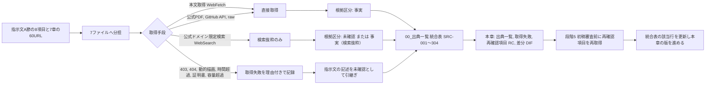

## 2. 事実か推論かの規則

### 2.1 根拠区分の適用条件

共通指示第4節の四区分を、調査の取得状況に応じて次のとおり適用する。7ファイルの規則（02 第1.2節、03 第1.3節、05 第1.3節、06 第1.2節と第1.3節、07 第1節）を統合した【推定】。

| 区分 | 調査での適用条件 | 仕様書での扱い |
|---|---|---|
| 【事実】 | 公式頁、公式PDF、当該企業名義の公式発表（PR TIMES 掲載の自社リリースを含む）、公的機関、標準化団体、原著論文の本文を直接取得して確認した事項。出典URL（または出典ID）と確認日 2026-09-15 を付ける | そのまま根拠に使える。ただし「事実」は「公式頁にその記載があることを確認した」の意味であり、主張内容の真偽（処理時間、導入数、性能）を保証しない（第2.3節） |
| 【事実（検索抜粋）】 | 公式ドメインの頁が検索結果の抜粋として得られたが、頁本文を直接取得していない事項。06 は「事実（検索結果経由）」、05 は「事実（検索経由）」、07 は「事実（検索抜粋）」と表記しており同義 | 直接取得より根拠が一段弱い。仕様の確定前に公式頁での再確認を要する。仕様書では【事実（検索抜粋）】と明記し、【事実】に格上げしない |
| 【推定】 | 事実から論理的に導いた事項。および要約器の言い換えが疑われ原文位置を特定できなかった事項（出典URLを付ける） | 根拠に使えるが、導出元の事実を併記する |
| 【仮定】 | 作業を進めるために置いた前提。調査ファイルでは 03 が「本章では使用しない」と明記し、他は優先度の定義や段階配分に限って使用 | 法規、権利、外部送信、施工安全に関わる仮定は確定扱いにしない |
| 【未確認】 | 公式頁の取得に失敗し、指示文の記述または第三者記事の要約しか得られなかった事項。第三者記事、第三者集計、第三者発表のみで確認した事項。会員限定頁の内容 | 仕様書では【未確認】を維持する。未確認の出典に基づく数値や条件を「事実」として表示しない。再確認項目（RC-）または未決事項（U-）に登録する |

### 2.2 取得可否と根拠区分の対応

統合表の「取得可否」列の語彙は各調査ファイルの記載をそのまま転記しており統一されていない（`00_出典一覧.md` 未決 U-80-005）。本章は語彙を変更せず、次の対応表で読み替える。仕様書の他章はこの対応に従って根拠区分を付ける【仮定】。

| 取得可否の語彙（統合表） | 意味 | 対応する根拠区分の上限 | 件数（第5.1節の理由番号） |
|---|---|---|---|
| 可、取得 | 頁本文を直接取得した | 【事実】 | 154（304−150） |
| 可（一部）、取得（一部文字化け）、可（表示不安定）、可（静的部分のみ）、可（予約段階の詳細は不可） | 本文の一部を取得した。未取得部分は別扱い | 取得部分は【事実】、未取得部分は【未確認】 | 4（R11） |
| 検索抜粋のみ、検索結果のみ、検索結果経由、検索経由 | 公式頁の本文を直接取得せず、検索結果の要約で確認した | 【事実（検索抜粋）】または【未確認】（第三者の場合） | 87（R7） |
| 未取得（存在のみ）、未取得（導線のみ確認）、未取得（リンクの存在のみ） | 頁の存在は確認したが本文は未取得 | 【未確認】（存在は【事実】） | 11（R10） |
| 不可（HTTP 403）、失敗（403） | 接続拒否 | 【未確認】 | 19（R1） |
| 不可（HTTP 404）、失敗（404） | 頁なし。推定URLの場合は「頁が存在しない」を意味しない | 【未確認】 | 6（R2） |
| 可（題名のみ）、一部（題名のみ）、取得失敗（本文が1語のみ）、失敗（本文空）、不可（動的描画） | 動的描画または本文抽出不能 | 【未確認】（題名は【事実】） | 9（R3） |
| 失敗（応答時間超過） | 60秒超過 | 【未確認】 | 4（R4） |
| 取得失敗（自己署名証明書） | 証明書検証不可 | 【未確認】 | 1（R5） |
| 不可（10MB超） | 容量超過 | 【未確認】 | 1（R6） |
| 可（内容が別頁）、対象外 | 推測URLが別内容 | 出典として使わない | 2（R8） |
| 未取得（指示文7章に記載。今回の調査で個別取得なし） | 指示文にあるが未取得 | 【未確認】 | 6（R9） |

### 2.3 各社主張の扱い（公開主張）

| 規則 | 内容 | 根拠 | 区分 |
|---|---|---|---|
| 公開主張の定義 | 各社が掲げる処理時間（「3分で最大5パターン」「最短10秒で80〜90%」）、導入数（「全国1300社以上」「1M+ Users」「累計約9万棟」「累計50万DL」）、選定社数（「二百社超を調査し約四十社を厳選」）、効果、性能（BF構法の加振回数、断熱等級対応）は、独立した性能試験ではなく各社の公開主張として扱う | 指示文1.1、01〜05 第1節 | 【事実】 |
| 目標値の根拠にしない | 公開主張を本製品の指標の目標値（初期仮説）の根拠にしない。指標の参照値として使う場合は「公開主張。前提条件不明」と注記する（例: M-Q-01 の参照値は FloorplanVLM の論文値であり公開主張ではない） | 02 未決 U-82-008、03 未決 U-83-005 | 【推定】 |
| 証拠段階との対応 | 住友林業の性能主張（耐震、断熱、ZEH）は、本製品の五証拠段階のいずれにも該当せず、「公開主張」として第19章の状態比較表で「目標」「計算予測」「現場確認」「第三者評価」「法的適合」と区別して扱う。公開頁は UA値と耐震等級の数値を掲載していない | 04 第2.6節、U-84-005 | 【事実】 |
| 数値主張の不一致 | 同一企業の数値主張が頁により異なる場合（タウンライフ「1300社以上」と「約1,200社以上」、住友林業「200回を超える加振」と「合計22回加振」、Renovo「1M+ Users」と店舗評価数7件）は、両方を記録し、不一致の理由を【未確認】とする | DIF-05、DIF-16、U-84-006 | 【事実】 |
| 競合比較の点数 | 競合比較の点数は公開情報から見た製品位置付けであり、同一試験情報を使った性能順位ではない。第04章はこの前提で点数を扱う | 指示文1.1 | 【事実】 |

### 2.4 仕様書での出典引用の規則

| 規則 | 内容 | 区分 |
|---|---|---|
| 出典IDで引用 | 仕様書の各章は出典を `SRC-nnn` で引用する。URLの再掲は任意。確認日は「2026-09-15」を付ける。既に公開済みの第02章、第04章〜第08章はURLを直接記載しており（SRC- 引用は0件）、再審査時に出典IDを併記することを依頼する（他章への依頼） | 【仮定】 |
| 未確認の維持 | 取得可否が「検索抜粋のみ」「未取得」「不可」の出典に基づく記述は【未確認】または【事実（検索抜粋）】を維持し、【事実】へ格上げしない。格上げは本章の統合表の該当行が再取得により更新された後に限る | 【仮定】 |
| 主張の転記 | 公開主張の数値を仕様書に転記する場合は「公開主張」と明記し、指標の目標値と混同させない | 【推定】 |
| 出典の変動性 | 変動性が「要再確認」の出典から得た価格、在庫、評価、版、法規、規約の値には、対象時点（掲載日、改定日、年度）を併記する | 【推定】 |
| 出典実体との区別 | 本章の出典IDは仕様書の出典（調査資料）であり、製品運用時に案件が持つ出典実体 E-PRD-006 Source の個体ではない。両者の関係は第8節 | 【推定】 |

## 3. 確認していない範囲

指示文1.1「有料契約後の全画面、非公開API、提携先向け管理面、契約済み商品情報までは確認していない。公開前の設計審査で再確認する」に基づき、今回の調査が到達していない範囲を明示する。これらの範囲に関する仕様の記述は全て【未確認】または【仮定】であり、確定扱いにしない【事実：指示文1.1、確認日 2026-09-15】。

| 番号 | 確認していない範囲 | 理由（取得手段の制約または禁止事項） | 関係する出典ID | 影響する章 | 再確認の手段（禁止事項の範囲内） | 区分 |
|---|---|---|---|---|---|---|
| NC-01 | 有料契約後の全画面（Renovo の定期購入後、Maket、Planner 5D、Coohom、Snaptrude、Finch、TestFit の有料段階、間取りクラウドの会員画面） | 申込と契約を行わない方針 | SRC-002、SRC-023、SRC-028、SRC-034、SRC-042、SRC-047、SRC-060、SRC-077 | 第04章、第15章 | 公開されている操作説明と支援頁の範囲で確認。契約は行わない | 【未確認】 |
| NC-02 | 非公開API（Planner 5D Enterprise API、Coohom 公開API基盤の詳細、Ritn3D partner API、Snaptrude Enterprise Open API、BIMobject 開発者API の料金） | 会員登録と契約を行わない方針。API頁が404または検索抜粋のみ | SRC-031、SRC-039、SRC-065、SRC-132〜SRC-135 | 第04章、第14章 | 公開API文書の範囲で確認 | 【未確認】 |
| NC-03 | 提携先向け管理面（タウンライフ協力会社向け条件、まどりLABO 建築会社向け掲載条件、建築家コンシェルジュの登録側条件） | 提携申込を行わない方針。募集頁は検索抜粋のみ | SRC-017、SRC-018、SRC-071 | 第17章、第24章 | 公開募集頁の本文をブラウザ描画で確認。申込はしない | 【未確認】 |
| NC-04 | 契約済み商品情報（BIMobject と Archiproducts の契約後の取得範囲、LIXIL、TOTO、YKK AP、Daikin の会員限定頁、飛騨産業と CONDE HOUSE の法人審査後の3D、住友林業クレスト データプレイス） | 会員登録、法人審査、契約を行わない方針。データプレイスは証明書検証不可 | SRC-126、SRC-131、SRC-139、SRC-159、SRC-168、SRC-173、SRC-177、SRC-195、SRC-197 | 第16章、第22章 | 公開されている利用条件と注意事項の範囲で確認。契約条件は権利担当が正式照会 | 【未確認】 |
| NC-05 | 動的描画される導線の中身（Renovo 質問導線の15項目、建築家コンシェルジュの予約段階、タウンライフ段階8〜11の文言、まどりLABO の入力段階） | 静的取得の制約。入力画面へ進まない方針 | SRC-001、SRC-011、SRC-014、SRC-074 | 第04章、第08章、第15章、第17章 | ブラウザ描画後の画面を目視で確認。送信と連絡先入力はしない | 【未確認】 |
| NC-06 | 規約と個人情報方針の本文（Renovo の規約と方針、建築家コンシェルジュの方針、タウンライフ株式会社の方針と外部送信規律表記、Meshy 利用規約、BIMobject EULA 英語原文） | HTTP 403、存在のみ確認、日本語案内頁のみ | SRC-005、SRC-006、SRC-013、SRC-019、SRC-020、SRC-150、SRC-131 | 第22章、第17章 | ブラウザで手動取得 | 【未確認】 |
| NC-07 | 法令条文の原文（建築士法3条〜3条の3、20条、22条の3の3、24条の7、23条の改正後条文、ZEH定義原文、確認申請の必要図書一覧、既存住宅状況調査方法基準、建築設計標準 令和7年度改正版本文）。2026-10-07 の外部確認（`01_調査/08_外部確認_段階7後.md`）で、既存住宅状況調査方法基準（SRC-319）と建築設計標準 令和7年度改正版の本編（SRC-316）は取得済み。ZEH 定義原文は同日も HTTP 403（U-88-009）、建築士法と必要図書一覧は対象外だった | e-Gov の動的描画、資源エネルギー庁の403、10MB超のPDF、本編未読 | SRC-272、SRC-274〜SRC-277、SRC-261、SRC-289、SRC-295、SRC-316、SRC-319（2026-10-07） | 第18章、第19章、第21章、第22章 | ブラウザで手動取得。PDF は分割取得 | 【未確認】 |
| NC-08 | buildingSMART 公式頁の本文（IFC、IDS、BCF、bSDD の標準頁、技術標準全体） | HTTP 403。GitHub と検索結果で補完 | SRC-217、SRC-223、SRC-229、SRC-234、SRC-299 | 第12章、第22章 | ブラウザで手動取得 | 【未確認】 |
| NC-09 | 公的地理情報の実データ（地理院地図の動的アプリ、国土数値情報の各データの年次と商用可否の全一覧、国土数値情報APIの有無） | 動的アプリ。データ別の条件は検索抜粋のみ | SRC-281、SRC-287、SRC-288、SRC-285 | 第18章 | 規約頁とデータ一覧頁の範囲で確認。データ取得は測量法と PDL1.0 の条件を確認してから | 【未確認】 |
| NC-10 | 学習と評価に使う資料のライセンス（CubiCasa5K のデータライセンス、IDS と BCF の LICENSE 内容） | 該当頁の未取得 | SRC-208、SRC-224、SRC-230 | 第11章、第22章、第23章 | zenodo と GitHub の LICENSE ファイルを直接取得 | 【未確認】 |
| NC-11 | 各研究の日本の戸建住宅図面に対する精度（公開値はフィンランド、中国、合成資料上のもの） | 日本の図面での試験は今回の調査範囲外 | SRC-205、SRC-209、SRC-215 | 第11章、第23章 | 許諾を得た日本の戸建図面での自社試験（画面指標試験骨格 第3.0節） | 【未確認】 |
| NC-12 | SVG、PDF、DXF の規格本文と利用条件（書出形式として使うが規格本文の出典を取得していない） | 調査対象に含めなかった | なし（統合表に該当なし） | 第22章、第23章 | 規格の公開頁を取得し統合表へ追加（未決 U-03-004） | 【未確認】 |

## 4. 出典一覧（統合表）

### 4.1 出典IDと列の規則

`01_調査/00_出典一覧.md` 第1.2〜1.4節の規則を引き継ぐ。本章は番号を変更しない【事実：同書、確認日 2026-09-15】。

| 項目 | 規則 | 区分 |
|---|---|---|
| 出典ID | `SRC-nnn`（3桁）。7ファイルの出典一覧の登場順（01→07、各ファイル内は記載順）に連番。末尾の SRC-299〜SRC-304 は指示文7章にあるが今回未取得の6件。同一URLは1行に統合（SRC-085 のみ、03 と 05 が参照）。SRC-305〜SRC-337 は 2026-10-07 の外部確認（`01_調査/08_外部確認_段階7後.md` 第12節）の出典で、同じ URL の 4 件は既存の行（SRC-279、SRC-282〜SRC-284）にまとめた（同書 第1.2節）。番号は固定し、再利用しない | 【事実】 |
| 分類 | 頁の主たる内容で一つだけ付ける。指定参照先、競合（海外）、競合（国内）、住友林業、商品基盤、研究、標準、法規、法規（公的地理情報）、個人情報、権利の11種。規約類は企業や機関を問わず「権利」、方針と注意喚起は「個人情報」。企業別に探す場合は名称列で検索する（企業列の追加は未決 U-03-003） | 【事実】 |
| 確認日 | SRC-001〜SRC-304 は 2026-09-15、SRC-305〜SRC-337 は 2026-10-07。2026-10-07 に再確認した既存の行（SRC-274、SRC-275、SRC-277、SRC-279、SRC-282〜SRC-284）は両日を併記する | 【事実】 |
| 取得可否 | 各調査ファイルの記載を転記。語彙の読み替えは第2.2節 | 【事実】 |
| 事実か推論か | 各調査ファイルの記載を転記。「事実（検索抜粋）」「事実（検索結果経由）」「事実（検索経由）」は同義 | 【事実】 |
| 参照する調査ファイル（節） | 括弧内は当該ファイルの節番号 | 【事実】 |
| 変動性 | 「要再確認（主因）」は価格、在庫、評価、版、法規、規約、掲載内容が変動しうるため公開前に再取得。「低（条件）」は発表文、固定版の論文、審議資料など変動しにくい。「対象外」は出典として使わない。括弧内に「本文未取得」「HTTP 403」等がある行は、内容の変動以前に本文の直接確認が済んでいない | 【事実】 |

### 4.2 件数の要約

| 項目 | 件数 | 区分 |
|---|---|---|
| 統合表の出典（一意URL） | 337（2026-09-15 の 304 と 2026-10-07 の追加 33） | 【事実】 |
| うち7ファイルの出典一覧に由来 | 298（重複1件を統合） | 【事実】 |
| うち指示文7章にあるが今回未取得 | 6（SRC-299〜SRC-304） | 【事実】 |
| うち 2026-10-07 の外部確認で追加 | 33（SRC-305〜SRC-337。取得はすべて可または一部〔SRC-329〕） | 【事実】 |
| 分類別 | 指定参照先 15、競合（海外） 49、競合（国内） 25、住友林業 31、商品基盤 69、研究 14、標準 47、法規 53、法規（公的地理情報） 6、個人情報 7、権利 21（2026-10-07 の追加 33 件は法規 26、権利 5、研究 2） | 【事実：本章で統合表を機械集計】 |
| 変動性別 | 要再確認 303、低 33、対象外 1 | 【事実：同上】 |
| 本文を直接取得できた出典 | 154（2026-09-15 の 304 件の内訳。304−150。部分取得を失敗側に数えた値。数え方により±5件程度変わる） | 【推定】 |
| 取得失敗または部分取得 | 150（第5節。2026-09-15 の 304 件の内訳。2026-10-07 の追加 33 件の部分取得は SRC-329 の 1 件） | 【事実】 |
| 「事実か推論か」列に「未確認」を含む行 | 59（列の値が「未確認」で始まる行。2026-10-07 の追加 33 件は 0） | 【事実：同上】 |
| 同列に「事実（検索抜粋／検索結果経由／検索経由）」を含む行 | 49 | 【事実：同上】 |
| 不審な指示の検出 | 0件（第7節） | 【事実】 |
| 差分の統合件数 | 93（DIF-01〜DIF-93、第6節） | 【事実】 |

### 4.3 統合表（SRC-001〜SRC-337）

各行は `01_調査/00_出典一覧.md` 第2節の記載をそのまま転記した（転記時の改変なし）。列の意味は第4.1節。URLは仕様書の他章では省略してよく、`SRC-nnn` での引用で足りる【事実：転記元は同書、確認日 2026-09-15】。SRC-305〜SRC-337 と既存の行の「2026-10-07 …」の追記は、2026-10-07 の外部確認（`01_調査/08_外部確認_段階7後.md`）を同書 第2節へ登録した結果の転記である（同じ行を同書と本表に適用し、337 行が一致することを機械照合した）【事実：確認日 2026-10-07】。

| 出典ID | 名称 | URL | 分類 | 確認日 | 取得可否 | 事実か推論か | 参照する調査ファイル（節） | 変動性 |
|---|---|---|---|---|---|---|---|---|
| SRC-001 | Renovo 質問導線（着地頁） | https://survey.renovoapp.ai/renovo-flyover-walkthrough | 指定参照先 | 2026-09-15 | 可（静的部分のみ。導線の中身は不可） | 事実（訴求文、数値主張）、未確認（導線段階） | 01_指定参照三社（2.1、3） | 要再確認（導線、数値主張） |
| SRC-002 | Renovo App Store 掲載頁（米国） | https://apps.apple.com/us/app/ai-home-design-renovo/id6747351118 | 指定参照先 | 2026-09-15 | 可 | 事実 | 01_指定参照三社（2.1、3、4） | 要再確認（価格、評価、版） |
| SRC-003 | Renovo App Store 掲載頁（日本） | https://apps.apple.com/jp/app/ai-home-design-renovo/id6747351118 | 指定参照先 | 2026-09-15 | 可 | 事実 | 01_指定参照三社（2.1、3） | 要再確認（価格、評価、版） |
| SRC-004 | Renovo 公式サイト | https://renovoapp.ai/ | 指定参照先 | 2026-09-15 | 可（題名のみ。本文なし） | 事実（題名） | 01_指定参照三社（2.1） | 要再確認（本文未取得） |
| SRC-005 | Renovo 利用規約（Pixery） | https://www.pixerylabs.com/renovo/terms | 権利 | 2026-09-15 | 不可（HTTP 403） | 未確認 | 01_指定参照三社（2.1、4） | 要再確認（規約改定、本文未取得） |
| SRC-006 | Renovo 個人情報方針（Pixery） | https://www.pixerylabs.com/renovo/privacy | 個人情報 | 2026-09-15 | 不可（HTTP 403） | 未確認 | 01_指定参照三社（2.1、4） | 要再確認（方針改定、本文未取得） |
| SRC-007 | Renovo Google Play 掲載頁 | https://play.google.com/store/apps/details?id=com.pixery.homeai | 指定参照先 | 2026-09-15 | 未取得（検索抜粋のみ） | 未確認 | 01_指定参照三社（2.1） | 要再確認（評価、版。本文未取得） |
| SRC-008 | AppBrain 第三者集計（Renovo） | https://www.appbrain.com/app/ai-home-design-renovo/com.pixery.homeai | 指定参照先 | 2026-09-15 | 未取得（検索抜粋のみ。第三者集計） | 未確認 | 01_指定参照三社（2.1） | 要再確認（第三者集計。本文未取得） |
| SRC-009 | 建築家コンシェルジュ 指定頁（料金、相談導線） | https://architect-concierge.com/meta/ | 指定参照先 | 2026-09-15 | 可 | 事実 | 01_指定参照三社（2.2、3、4） | 要再確認（料金、返金条件、手数料） |
| SRC-010 | 建築家コンシェルジュ トップ（事例、FAQ、進行段階） | https://architect-concierge.com/ | 指定参照先 | 2026-09-15 | 可 | 事実 | 01_指定参照三社（2.2、3、4） | 要再確認（厳選社数、事例） |
| SRC-011 | 建築家コンシェルジュ 相談予約 | https://architect-concierge.com/consultation_meta | 指定参照先 | 2026-09-15 | 可（予約段階の詳細は不可） | 事実（導線の存在）、未確認（段階） | 01_指定参照三社（2.2、3） | 要再確認（予約導線の段階。本文未取得） |
| SRC-012 | 建築家コンシェルジュ 運営会社 | https://architect-concierge.com/about/ | 指定参照先 | 2026-09-15 | 未取得（存在のみ検索で確認） | 未確認 | 01_指定参照三社（2.2） | 要再確認（法人名、所在地。本文未取得） |
| SRC-013 | 建築家コンシェルジュ 個人情報方針 | https://architect-concierge.com/privacy/ | 個人情報 | 2026-09-15 | 未取得（存在のみ検索で確認） | 未確認 | 01_指定参照三社（2.2） | 要再確認（方針本文未取得） |
| SRC-014 | タウンライフ家づくり 質問導線 | https://www.town-life.jp/home/main/chatform.php | 指定参照先 | 2026-09-15 | 可 | 事実 | 01_指定参照三社（2.3、3、4） | 要再確認（質問順序、選択肢、連絡先項目） |
| SRC-015 | タウンライフ家づくり トップ | https://www.town-life.jp/home/ | 指定参照先 | 2026-09-15 | 可 | 事実 | 01_指定参照三社（2.3、3、4） | 要再確認（提携数、無料表示、成果物） |
| SRC-016 | タウンライフ家づくり 利用規約 | https://www.town-life.jp/home/terms.html | 権利 | 2026-09-15 | 可 | 事実 | 01_指定参照三社（2.3、3、4） | 要再確認（規約改定。現行は2024-07-01改定） |
| SRC-017 | タウンライフ 協力会社募集頁 | https://www.town-life.jp/home/lp1/advertise_lp.html | 指定参照先 | 2026-09-15 | 未取得（検索抜粋のみ） | 未確認 | 01_指定参照三社（2.3、3） | 要再確認（成果報酬条件。本文未取得） |
| SRC-018 | タウンライフ株式会社 パートナー募集 | https://townlife.co.jp/partner/ | 指定参照先 | 2026-09-15 | 未取得（検索抜粋のみ） | 未確認 | 01_指定参照三社（2.3） | 要再確認（掲載条件。本文未取得） |
| SRC-019 | タウンライフ株式会社 プライバシーポリシー | https://townlife.co.jp/privacy-policy/ | 個人情報 | 2026-09-15 | 未取得（リンクの存在のみ） | 未確認 | 01_指定参照三社（2.3） | 要再確認（方針本文未取得） |
| SRC-020 | タウンライフ株式会社 外部送信規律表記 | https://townlife.co.jp/cookiepolicy/ | 個人情報 | 2026-09-15 | 未取得（リンクの存在のみ） | 未確認 | 01_指定参照三社（2.3） | 要再確認（表記本文未取得） |
| SRC-021 | 第三者記事（タウンライフ「3冠」の調査主体） | https://t23m-navi.jp/magazine/housing/townlife-reputation/ | 指定参照先 | 2026-09-15 | 未取得（検索抜粋のみ。第三者記事） | 未確認 | 01_指定参照三社（2.3） | 要再確認（第三者記事。本文未取得） |
| SRC-022 | Maket トップ | https://www.maket.ai/ | 競合（海外） | 2026-09-15 | 可 | 事実 | 02_海外競合（2.1） | 要再確認（機能、数値主張） |
| SRC-023 | Maket 価格 | https://www.maket.ai/pricing | 競合（海外） | 2026-09-15 | 可 | 事実 | 02_海外競合（2.1、2.10） | 要再確認（価格） |
| SRC-024 | Maket 機能 | https://www.maket.ai/features | 競合（海外） | 2026-09-15 | 可 | 事実 | 02_海外競合（2.1） | 要再確認（機能） |
| SRC-025 | Maket 公式ブログ（平面図取込の対応形式） | https://www.maket.ai/blog/ai-floorplan-recognizer-upload-an-existing-plan-get-right-to-editing | 競合（海外） | 2026-09-15 | 検索抜粋のみ | 未確認 | 02_海外競合（2.1） | 要再確認（本文未取得） |
| SRC-026 | Maket 企業向け（共同作業） | https://www.maket.ai/product/enterprise | 競合（海外） | 2026-09-15 | 検索抜粋のみ | 未確認 | 02_海外競合（2.1） | 要再確認（本文未取得） |
| SRC-027 | Planner 5D トップ | https://planner5d.com/ | 競合（海外） | 2026-09-15 | 可（初回は60秒時間超過、2回目で成功） | 事実 | 02_海外競合（2.2） | 要再確認（機能、数値主張） |
| SRC-028 | Planner 5D 価格 | https://planner5d.com/pricing | 競合（海外） | 2026-09-15 | 可 | 事実 | 02_海外競合（2.2、2.10） | 要再確認（価格） |
| SRC-029 | Planner 5D 支援頁（平面図の取込形式） | https://support.planner5d.com/en/articles/14434484-how-to-upload-a-floor-plan | 競合（海外） | 2026-09-15 | 検索抜粋のみ | 未確認 | 02_海外競合（2.2） | 要再確認（本文未取得） |
| SRC-030 | Planner 5D 支援頁（取込の処理時間） | https://support.planner5d.com/en/articles/13205006-upload-a-plan-processing-time | 競合（海外） | 2026-09-15 | 検索抜粋のみ | 未確認 | 02_海外競合（2.2） | 要再確認（本文未取得） |
| SRC-031 | Planner 5D 事業者向けAPI連携 | https://planner5d.com/business/api-integrations | 競合（海外） | 2026-09-15 | 検索抜粋のみ | 未確認 | 02_海外競合（2.2） | 要再確認（本文未取得） |
| SRC-032 | Planner 5D WebMCP | https://ai.planner5d.com/webmcp | 競合（海外） | 2026-09-15 | 検索抜粋のみ | 未確認 | 02_海外競合（2.2） | 要再確認（本文未取得） |
| SRC-033 | Coohom トップ | https://www.coohom.com/ | 競合（海外） | 2026-09-15 | 可 | 事実 | 02_海外競合（2.3） | 要再確認（機能、数値主張） |
| SRC-034 | Coohom 価格 | https://www.coohom.com/pricing | 競合（海外） | 2026-09-15 | 可 | 事実 | 02_海外競合（2.3、2.10） | 要再確認（価格） |
| SRC-035 | Coohom 支援頁（書出可能な内容） | https://www.coohom.com/helpcenter/what-can-i-export-download | 競合（海外） | 2026-09-15 | 可 | 事実 | 02_海外競合（2.3） | 要再確認（機能） |
| SRC-036 | Coohom 支援頁（CAD取込条件） | https://www.coohom.com/helpcenter/how-to-upload-import-autocad-file | 競合（海外） | 2026-09-15 | 検索抜粋のみ | 未確認 | 02_海外競合（2.3） | 要再確認（本文未取得） |
| SRC-037 | Coohom 支援頁（画像・PDF取込） | https://www.coohom.com/helpcenter/how-to-upload-import-cad-floor-plan-by-image-pdf | 競合（海外） | 2026-09-15 | 検索抜粋のみ | 未確認 | 02_海外競合（2.3） | 要再確認（本文未取得） |
| SRC-038 | Coohom 支援頁（図面書出形式） | https://www.coohom.com/helpcenter/how-to-export-my-project | 競合（海外） | 2026-09-15 | 検索抜粋のみ | 未確認 | 02_海外競合（2.3） | 要再確認（本文未取得） |
| SRC-039 | Coohom 公開API基盤 | https://open.coohom.com/ | 競合（海外） | 2026-09-15 | 検索抜粋のみ | 未確認 | 02_海外競合（2.3） | 要再確認（本文未取得） |
| SRC-040 | Coohom 事業者向けAPI | https://www.coohom.com/b2b/api | 競合（海外） | 2026-09-15 | 検索抜粋のみ | 未確認 | 02_海外競合（2.3） | 要再確認（本文未取得） |
| SRC-041 | Snaptrude トップ | https://www.snaptrude.com/ | 競合（海外） | 2026-09-15 | 可 | 事実 | 02_海外競合（2.4） | 要再確認（機能） |
| SRC-042 | Snaptrude 価格 | https://www.snaptrude.com/pricing | 競合（海外） | 2026-09-15 | 可 | 事実 | 02_海外競合（2.4、2.10） | 要再確認（価格） |
| SRC-043 | Snaptrude Revit相互運用 | https://www.snaptrude.com/interoperability-with-revit | 競合（海外） | 2026-09-15 | 可 | 事実 | 02_海外競合（2.4） | 要再確認（機能） |
| SRC-044 | Snaptrude 比較頁（取込形式） | https://www.snaptrude.com/alternatives/sketchup | 競合（海外） | 2026-09-15 | 検索抜粋のみ | 未確認 | 02_海外競合（2.4） | 要再確認（本文未取得） |
| SRC-045 | Snaptrude 公式ブログ（書出形式） | https://snaptrude.com/blog/best-revit-alternatives-2025-top-bim-tools | 競合（海外） | 2026-09-15 | 検索抜粋のみ | 未確認 | 02_海外競合（2.4） | 要再確認（本文未取得） |
| SRC-046 | Finch トップ | https://www.finch3d.com/ | 競合（海外） | 2026-09-15 | 可 | 事実 | 02_海外競合（2.5） | 要再確認（機能、数値主張） |
| SRC-047 | Finch 価格 | https://www.finch3d.com/pricing | 競合（海外） | 2026-09-15 | 可 | 事実 | 02_海外競合（2.5、2.10） | 要再確認（価格） |
| SRC-048 | Finch 文書（書出） | https://docs.finch3d.com/fundamentals/export | 競合（海外） | 2026-09-15 | 不可（HTTP 404） | ― | 02_海外競合（2.5） | 要再確認（HTTP 404） |
| SRC-049 | Finch 文書（Revitからの送出） | https://docs.finch3d.com/first-steps/upload-your-first-building-revit | 競合（海外） | 2026-09-15 | 検索抜粋のみ | 未確認 | 02_海外競合（2.5） | 要再確認（本文未取得） |
| SRC-050 | Finch 文書（Rhinoからの送出） | https://docs.finch3d.com/finch-101/finch-101-upload-from-rhino | 競合（海外） | 2026-09-15 | 検索抜粋のみ | 未確認 | 02_海外競合（2.5） | 要再確認（本文未取得） |
| SRC-051 | Finch 文書（Revitへの取出） | https://docs.finch3d.com/finch-101/finch-101-download-to-revit | 競合（海外） | 2026-09-15 | 検索抜粋のみ | 未確認 | 02_海外競合（2.5） | 要再確認（本文未取得） |
| SRC-052 | Finch 文書（Archicadへの書出） | https://docs.finch3d.com/docs/first-steps/advanced-exporting-to-archicad | 競合（海外） | 2026-09-15 | 検索抜粋のみ | 未確認 | 02_海外競合（2.5） | 要再確認（本文未取得） |
| SRC-053 | Autodesk Forma 概要 | https://www.autodesk.com/products/forma/overview | 競合（海外） | 2026-09-15 | 不可（HTTP 403） | ― | 02_海外競合（2.6、3） | 要再確認（HTTP 403。名称変更あり） |
| SRC-054 | Autodesk Forma 価格 | https://www.autodesk.com/products/forma/pricing | 競合（海外） | 2026-09-15 | 不可（HTTP 403） | ― | 02_海外競合（2.6） | 要再確認（価格。HTTP 403） |
| SRC-055 | Autodesk Forma ヘルプ | https://help.autodesk.com/view/FORMA/ENU/ | 競合（海外） | 2026-09-15 | 不可（HTTP 404） | ― | 02_海外競合（2.6） | 要再確認（HTTP 404） |
| SRC-056 | Autodesk 公式ブログ（Forma Site Design 解説、2026-08-20） | https://blogs.autodesk.com/forma/2026/08/20/what-is-forma-site-design/ | 競合（海外） | 2026-09-15 | 可 | 事実 | 02_海外競合（2.6、3） | 要再確認（名称、機能） |
| SRC-057 | Autodesk Forma 概要（欧州頁、題名のみ） | https://www.autodesk.com/eu/products/forma/overview | 競合（海外） | 2026-09-15 | 検索抜粋のみ（題名） | 未確認 | 02_海外競合（2.6、3） | 要再確認（本文未取得） |
| SRC-058 | Autodesk Forma Build 製品詳細（題名のみ） | https://www.autodesk.com/products/forma-build/product-details | 競合（海外） | 2026-09-15 | 検索抜粋のみ（題名） | 未確認 | 02_海外競合（2.6、3） | 要再確認（本文未取得） |
| SRC-059 | TestFit トップ | https://www.testfit.io/ | 競合（海外） | 2026-09-15 | 可 | 事実 | 02_海外競合（2.7） | 要再確認（機能、数値主張） |
| SRC-060 | TestFit 価格 | https://www.testfit.io/pricing | 競合（海外） | 2026-09-15 | 可 | 事実 | 02_海外競合（2.7、2.10） | 要再確認（価格） |
| SRC-061 | TestFit 支援頁（書出形式） | https://support.testfit.io/knowledge/getting-started/exporting-data | 競合（海外） | 2026-09-15 | 可 | 事実 | 02_海外競合（2.7） | 要再確認（機能） |
| SRC-062 | TestFit 支援頁（敷地作成） | https://support.testfit.io/knowledge/getting-started/site-creation | 競合（海外） | 2026-09-15 | 検索抜粋のみ | 未確認 | 02_海外競合（2.7） | 要再確認（本文未取得） |
| SRC-063 | Ritn3D トップ | https://ritn3d.com/ | 競合（海外） | 2026-09-15 | 可 | 事実 | 02_海外競合（2.8） | 要再確認（価格、機能） |
| SRC-064 | Ritn3D FAQ | https://www.ritn3d.com/faq/ | 競合（海外） | 2026-09-15 | 可 | 事実 | 02_海外競合（2.8） | 要再確認（機能、条件） |
| SRC-065 | Ritn3D API頁 | https://ritn3d.com/api | 競合（海外） | 2026-09-15 | 不可（HTTP 404） | ― | 02_海外競合（2.8） | 要再確認（HTTP 404） |
| SRC-066 | IKEA Kreativ トップ（米国） | https://www.ikea.com/us/en/home-design/ | 競合（海外） | 2026-09-15 | 一部（題名のみ。本文は動的描画） | 事実（題名） | 02_海外競合（2.9） | 要再確認（本文未取得。動的描画） |
| SRC-067 | IKEA Kreativ 詳細頁（米国） | https://www.ikea.com/us/en/home-design/learnmore/ | 競合（海外） | 2026-09-15 | 一部（題名のみ。本文は動的描画） | 事実（題名） | 02_海外競合（2.9） | 要再確認（本文未取得。動的描画） |
| SRC-068 | IKEA Kreativ 部屋スキャンFAQ（米国） | https://www.ikea.com/us/en/customer-service/knowledge/articles/e86d70g6-3673-4306-b373-20f7cg7fd5ed.html | 競合（海外） | 2026-09-15 | 可 | 事実 | 02_海外競合（2.9） | 要再確認（機能） |
| SRC-069 | IKEA 豪州ニュースルーム（Kreativ 発表） | https://www.ikea.com/au/en/newsroom/range-news/ai-powered-design-experience-ikea-kreativ-launches-pubcf6362b0/ | 競合（海外） | 2026-09-15 | 検索抜粋のみ | 未確認 | 02_海外競合（2.9） | 要再確認（本文未取得） |
| SRC-070 | IKEA カナダニュースルーム（Kreativ 発表） | https://www.ikea.com/ca/en/newsroom/corporate-news/ikea-canada-launches-new-ai-powered-digital-experience-called-ikea-kreativ-pubf6d0f5d0/ | 競合（海外） | 2026-09-15 | 検索抜粋のみ | 未確認 | 02_海外競合（2.9） | 要再確認（本文未取得） |
| SRC-071 | まどりLABO トップ | https://madori-labo.com/ | 競合（国内） | 2026-09-15 | 可（2回） | 事実 | 03_国内競合（2.1, 3） | 要再確認（機能、特典、提携社） |
| SRC-072 | まどりLABO FAQ（トップ頁内） | https://madori-labo.com/#question | 競合（国内） | 2026-09-15 | 可（トップ頁内） | 事実 | 03_国内競合（2.1, 4.3） | 要再確認（FAQ回答文） |
| SRC-073 | まどりLABO 公式発表（PR TIMES、2025-12-22、要望文反映機能） | https://prtimes.jp/main/html/rd/p/000000004.000162725.html | 競合（国内） | 2026-09-15 | 可 | 事実（株式会社まどりLABO 名義の発表） | 03_国内競合（2.1, 3） | 低（発表文は固定） |
| SRC-074 | まどりLABO 間取り作成入口 | https://madori-labo.com/labo | 競合（国内） | 2026-09-15 | 検索結果のみ（未取得） | 推論 | 03_国内競合（2.1） | 要再確認（入力項目。本文未取得） |
| SRC-075 | Forbes JAPAN 記事（まどりLABO、第三者） | https://forbesjapan.com/articles/detail/79596 | 競合（国内） | 2026-09-15 | 検索結果のみ（未取得） | 推論（第三者記事） | 03_国内競合（2.1） | 要再確認（第三者記事。本文未取得） |
| SRC-076 | 第三者記事（まどりLABOの評判） | https://iedukuri-tips.com/reputation-of-madori-labo/ | 競合（国内） | 2026-09-15 | 検索結果のみ（未取得） | 推論（第三者記事） | 03_国内競合（2.1） | 要再確認（第三者記事。本文未取得） |
| SRC-077 | 間取りクラウド 製品頁 | https://madori.jp/product/md_cloud/ | 競合（国内） | 2026-09-15 | 可 | 事実 | 03_国内競合（2.2, 3） | 要再確認（価格、機能） |
| SRC-078 | ピーシーコネクト 会社トップ（間取りクラウド） | https://madori.jp/ | 競合（国内） | 2026-09-15 | 可 | 事実 | 03_国内競合（2.2, 3） | 要再確認（価格、AI回数上限） |
| SRC-079 | 間取りクラウド AI間取り | https://madori.jp/ai/ | 競合（国内） | 2026-09-15 | 可 | 事実 | 03_国内競合（2.2, 3, 4） | 要再確認（機能、認識不能条件） |
| SRC-080 | 間取りクラウド 無料体験 | https://madori.jp/trial/ | 競合（国内） | 2026-09-15 | 未取得（導線のみ確認） | 事実（存在） | 03_国内競合（2.2） | 要再確認（導線のみ確認） |
| SRC-081 | 間取りクラウド ダウンロード（対応OS） | https://madori.jp/download/ | 競合（国内） | 2026-09-15 | 検索結果のみ（未取得） | 推論 | 03_国内競合（2.2） | 要再確認（本文未取得） |
| SRC-082 | 間取りクラウド 公式note（2026-04-01 会員価格改定） | https://note.com/madori_pcc/n/n9e4e17d21f75 | 競合（国内） | 2026-09-15 | 検索結果のみ（未取得） | 推論（公式 note） | 03_国内競合（2.2, 3） | 要再確認（価格。本文未取得） |
| SRC-083 | いえらぶGROUP 発表（AI間取り、第三者） | https://www.ielove-group.jp/news/detail-984 | 競合（国内） | 2026-09-15 | 検索結果のみ（未取得） | 未確認（第三者発表） | 03_国内競合（2.2） | 要再確認（第三者発表。本文未取得） |
| SRC-084 | カリモク家具 3Dインテリアシミュレーター案内 | https://www.karimoku.co.jp/3d_simulator/ | 競合（国内） | 2026-09-15 | 可（2回） | 事実 | 03_国内競合（2.3, 3, 4） | 要再確認（収録範囲、利用環境） |
| SRC-085 | カリモク家具 3Dシミュレーター本体（LivingStyle 基盤） | https://karimoku.livingstyle.jp/simulator/ | 競合（国内） | 2026-09-15 | 未取得（導線のみ確認） | 事実（存在） | 03_国内競合（2.3）、05_商品情報基盤と3D生成（2.14） | 要再確認（機能、収録商品） |
| SRC-086 | a.flat 3Dマイルーム 案内 | https://aflat.asia/support/myroom/index.html | 競合（国内） | 2026-09-15 | 可（2回） | 事実 | 03_国内競合（2.4, 3, 4） | 要再確認（機能、注記） |
| SRC-087 | a.flat 3Dマイルーム 編集画面 | https://aflat.asia/purchase/myroom/editor/index.html | 競合（国内） | 2026-09-15 | 未取得（導線のみ確認） | 事実（存在） | 03_国内競合（2.4） | 要再確認（導線のみ確認） |
| SRC-088 | LOWYA おくROOM | https://www.low-ya.com/features/okuroom | 競合（国内） | 2026-09-15 | 取得失敗（本文が1語のみ、2回） | — | 03_国内競合（2.5） | 要再確認（本文未取得。動的描画） |
| SRC-089 | LOWYA おくROOM Google Play 掲載頁 | https://play.google.com/store/apps/details?id=com.vega_c.Rigel&hl=ja | 競合（国内） | 2026-09-15 | 取得失敗（内容が切り詰められ抽出不能） | — | 03_国内競合（2.5） | 要再確認（本文未取得） |
| SRC-090 | ベガコーポレーション PR頁（おくROOM） | https://www.vega-c.com/pr/19173/ | 競合（国内） | 2026-09-15 | 検索結果のみ（未取得） | 未確認 | 03_国内競合（2.5） | 要再確認（本文未取得） |
| SRC-091 | ベガコーポレーション 公式発表（PR TIMES、おくROOM実績） | https://prtimes.jp/main/html/rd/p/000000118.000026707.html | 競合（国内） | 2026-09-15 | 検索結果のみ（未取得） | 未確認 | 03_国内競合（2.5） | 要再確認（本文未取得） |
| SRC-092 | ホームリビング 記事（おくROOM多角形対応、第三者） | http://www.homeliving.co.jp/20251003/lowya | 競合（国内） | 2026-09-15 | 検索結果のみ（未取得） | 未確認（第三者記事） | 03_国内競合（2.5） | 要再確認（第三者記事。本文未取得） |
| SRC-093 | ITmedia 記事（おくROOM、第三者） | https://www.itmedia.co.jp/news/articles/2411/12/news154.html | 競合（国内） | 2026-09-15 | 検索結果のみ（未取得） | 未確認（第三者記事） | 03_国内競合（2.5） | 要再確認（第三者記事。本文未取得） |
| SRC-094 | Panasonic 間取り図AI積算 | https://sumai.panasonic.jp/contents/housing-biz/madorizu-sekisan/ | 競合（国内） | 2026-09-15 | 可（2回） | 事実 | 03_国内競合（2.6, 3, 4） | 要再確認（機能、注記、更新履歴） |
| SRC-095 | Panasonic WEBハウズ 操作マニュアル（間取り図AI積算） | https://www2.panasonic.biz/jp/sumai/ihows/manual/madori.html | 競合（国内） | 2026-09-15 | 未取得（導線のみ確認） | 事実（存在） | 03_国内競合（2.6） | 要再確認（導線のみ確認） |
| SRC-096 | 住友林業 商品と暮らし提案 | https://sfc.jp/ie/lineup/ | 住友林業 | 2026-09-15 | 可 | 事実 | 04_住友林業と関連建材（2.1、3） | 要再確認（商品改廃、提案項目） |
| SRC-097 | 住友林業 MyForest BF 商品頁 | https://sfc.jp/ie/lineup/myforestbf/ | 住友林業 | 2026-09-15 | 可 | 事実 | 04_住友林業と関連建材（2.1、2.5） | 要再確認（商品改廃、樹種対応） |
| SRC-098 | 住友林業 The Forest BF（旧URL。現行一覧が返る） | https://sfc.jp/ie/lineup/forestbf/ | 住友林業 | 2026-09-15 | 可（現行商品一覧の内容が返った） | 事実 | 04_住友林業と関連建材（2.1、3） | 要再確認（位置づけ未確認） |
| SRC-099 | 住友林業 Interior Style 総覧 | https://sfc.jp/ie/design/interior/ | 住友林業 | 2026-09-15 | 可 | 事実 | 04_住友林業と関連建材（2.2） | 要再確認（案数、掲載時点注記） |
| SRC-100 | 住友林業 Interior Style ASH STYLE | https://sfc.jp/ie/design/interior/style/ash/ | 住友林業 | 2026-09-15 | 可 | 事実 | 04_住友林業と関連建材（2.3） | 要再確認（掲載時点2023年9月、改廃注記あり） |
| SRC-101 | 住友林業 Interior Style OAK STYLE | https://sfc.jp/ie/design/interior/style/oak/ | 住友林業 | 2026-09-15 | 可 | 事実 | 04_住友林業と関連建材（2.3） | 要再確認（掲載時点2023年9月、改廃注記あり） |
| SRC-102 | 住友林業 Interior Style CHERRY STYLE | https://sfc.jp/ie/design/interior/style/cherry/ | 住友林業 | 2026-09-15 | 可 | 事実 | 04_住友林業と関連建材（2.3） | 要再確認（掲載時点2023年9月、改廃注記あり） |
| SRC-103 | 住友林業 Interior Style WALNUT STYLE | https://sfc.jp/ie/design/interior/style/walnut/ | 住友林業 | 2026-09-15 | 可 | 事実 | 04_住友林業と関連建材（2.3） | 要再確認（掲載時点2023年9月、改廃注記あり） |
| SRC-104 | 住友林業 Interior Style TEAK STYLE | https://sfc.jp/ie/design/interior/style/teak/ | 住友林業 | 2026-09-15 | 可 | 事実 | 04_住友林業と関連建材（2.3） | 要再確認（掲載時点2023年9月、改廃注記あり） |
| SRC-105 | 住友林業 Interior Style OAK WHITE STYLE | https://sfc.jp/ie/design/interior/style/oakwhite/ | 住友林業 | 2026-09-15 | 可 | 事実 | 04_住友林業と関連建材（2.3） | 要再確認（掲載時点2023年9月、改廃注記あり） |
| SRC-106 | 住友林業 Interior Style OAK BLACK STYLE | https://sfc.jp/ie/design/interior/style/oakblack/ | 住友林業 | 2026-09-15 | 可 | 事実 | 04_住友林業と関連建材（2.3） | 要再確認（掲載時点2023年9月、改廃注記あり） |
| SRC-107 | 住友林業 BF構法 | https://sfc.jp/ie/technology/whatisbf/ | 住友林業 | 2026-09-15 | 可 | 事実 | 04_住友林業と関連建材（2.4） | 要再確認（公開主張の数値） |
| SRC-108 | 住友林業 ニュースリリース（BF構法20周年特別仕様、2025-04-25） | https://sfc.jp/information/news/2025/2025-04-25.html | 住友林業 | 2026-09-15 | 可 | 事実 | 04_住友林業と関連建材（2.4、3） | 低（発表文は固定。仕様の販売状態は要再確認） |
| SRC-109 | 住友林業 ニュースリリース（BF構法開発、2005-01-18、PDF） | https://sfc.jp/information/news/2005/pdf/2005-01-18-1.pdf | 住友林業 | 2026-09-15 | 未取得（検索結果の表題のみ） | 事実（表題のみ） | 04_住友林業と関連建材（2.4） | 低（表題のみ確認。本文未取得） |
| SRC-110 | 住友林業 PRIME WOOD | https://sfc.jp/ie/tree/primewood/ | 住友林業 | 2026-09-15 | 可 | 事実 | 04_住友林業と関連建材（2.5） | 要再確認（部材構成） |
| SRC-111 | 住友林業 木の家（樹種図鑑入口） | https://sfc.jp/ie/tree/ | 住友林業 | 2026-09-15 | 可 | 事実 | 04_住友林業と関連建材（2.5） | 要再確認（樹種数） |
| SRC-112 | 住友林業 樹種図鑑 | https://sfc.jp/ie/tree/primewood/woodguide/ | 住友林業 | 2026-09-15 | 可 | 事実 | 04_住友林業と関連建材（2.5） | 要再確認（樹種数） |
| SRC-113 | 住友林業 樹種図鑑 ASH | https://sfc.jp/ie/tree/primewood/woodguide/ash/ | 住友林業 | 2026-09-15 | 可 | 事実 | 04_住友林業と関連建材（2.5） | 低（樹種情報は安定。加工種は要再確認） |
| SRC-114 | 住友林業 性能（テクノロジー総覧） | https://sfc.jp/ie/technology/ | 住友林業 | 2026-09-15 | 可 | 事実 | 04_住友林業と関連建材（2.6） | 要再確認（保証制度、性能項目） |
| SRC-115 | 住友林業 ZEH（NEW ZEH STYLE） | https://sfc.jp/ie/technology/zeh/ | 住友林業 | 2026-09-15 | 可 | 事実 | 04_住友林業と関連建材（2.6） | 要再確認（制度改正への追随） |
| SRC-116 | 住友林業 断熱（360°TRIPLE断熱） | https://sfc.jp/ie/technology/dannetsu/ | 住友林業 | 2026-09-15 | 可 | 事実 | 04_住友林業と関連建材（2.6） | 要再確認（断熱等級対応の主張） |
| SRC-117 | 住友林業 耐震 | https://sfc.jp/ie/technology/taishin/ | 住友林業 | 2026-09-15 | 可 | 事実 | 04_住友林業と関連建材（2.6） | 要再確認（公開主張の数値） |
| SRC-118 | 住友林業 LCCM住宅 | https://sfc.jp/ie/lineup/lccm/ | 住友林業 | 2026-09-15 | 可 | 事実 | 04_住友林業と関連建材（2.6） | 要再確認（試算条件） |
| SRC-119 | 住友林業 NEW ZEH STYLE（検索結果のみ） | https://sfc.jp/ie/zeh/style/ | 住友林業 | 2026-09-15 | 未取得（検索結果のみ） | 推論（検索要約） | 04_住友林業と関連建材（2.6） | 要再確認（本文未取得） |
| SRC-120 | 住友林業 建築実例 一覧 | https://sfc.jp/ie/style/ | 住友林業 | 2026-09-15 | 可 | 事実 | 04_住友林業と関連建材（2.7） | 要再確認（件数は日々変動） |
| SRC-121 | 住友林業 建築実例 詳細（4108） | https://sfc.jp/ie/style/detail/4108 | 住友林業 | 2026-09-15 | 可 | 事実 | 04_住友林業と関連建材（2.7） | 低（掲載年月2022年4月で固定） |
| SRC-122 | 住友林業 Web利用条件 | https://sfc.jp/terms/ | 権利 | 2026-09-15 | 可 | 事実 | 04_住友林業と関連建材（2.8） | 要再確認（規約改定、最終更新日未確認） |
| SRC-123 | 住友林業クレスト トップ | https://www.sumirin-crest.co.jp/ | 住友林業 | 2026-09-15 | 可 | 事実 | 04_住友林業と関連建材（2.9） | 要再確認（製品分類、お知らせ） |
| SRC-124 | 住友林業クレスト 法人向け（部品検索、データプレイス、デジタルカタログ） | https://www.sumirin-crest.co.jp/professional/ | 住友林業 | 2026-09-15 | 可 | 事実 | 04_住友林業と関連建材（2.9） | 要再確認（提供サービス） |
| SRC-125 | 住友林業クレスト 部品検索 | https://www.sumirin-crest.co.jp/professional/search/ | 住友林業 | 2026-09-15 | 可 | 事実 | 04_住友林業と関連建材（2.9） | 要再確認（在庫僅少、仕様変更の注記） |
| SRC-126 | 住友林業クレスト データプレイス（CAD・製品画像） | http://cad.sumirin-crest.co.jp/web/ | 住友林業 | 2026-09-15 | 取得失敗（自己署名証明書。HTTPS昇格後に証明書検証不可） | 未確認 | 04_住友林業と関連建材（2.9） | 要再確認（利用条件未確認。証明書エラー） |
| SRC-127 | 住友林業クレスト 利用条件 | https://www.sumirin-crest.co.jp/policy/ | 権利 | 2026-09-15 | 可 | 事実 | 04_住友林業と関連建材（2.10） | 要再確認（規約改定、権利者の複数性） |
| SRC-128 | カタラボ（BeRiche CC 2026 住宅部材カタログ、表題のみ） | https://www.catalabo.org/cgi-bin/openCatalog.cgi?clcode=0173_20BeRCC | 住友林業 | 2026-09-15 | 未取得（検索結果の表題のみ） | 事実（表題のみ） | 04_住友林業と関連建材（2.9） | 要再確認（本文未取得） |
| SRC-129 | BIMobject トップ | https://www.bimobject.com/ | 商品基盤 | 2026-09-15 | 失敗（403） | - | 05_商品情報基盤と3D生成（2.1） | 要再確認（HTTP 403） |
| SRC-130 | BIMobject トップ（英語） | https://www.bimobject.com/en | 商品基盤 | 2026-09-15 | 失敗（403）。検索経由で要約のみ | 事実（検索経由） | 05_商品情報基盤と3D生成（2.1） | 要再確認（HTTP 403。検索経由） |
| SRC-131 | BIMobject 利用規約（EULA） | https://business.bimobject.com/terms-of-service-eula | 権利 | 2026-09-15 | 取得（日本語案内頁のみ）。条文は検索経由 | 事実（検索経由） | 05_商品情報基盤と3D生成（2.1、3） | 要再確認（英語原文未取得） |
| SRC-132 | BIMobject API文書（GitHub） | https://github.com/bimobject/api-documentation | 商品基盤 | 2026-09-15 | 検索経由 | 事実（検索経由） | 05_商品情報基盤と3D生成（2.1） | 要再確認（API仕様。検索経由） |
| SRC-133 | BIMobject SDK（GitHub、MIT） | https://github.com/bimobject/bim-api-sdk | 商品基盤 | 2026-09-15 | 検索経由 | 事実（検索経由） | 05_商品情報基盤と3D生成（2.1） | 要再確認（検索経由） |
| SRC-134 | BIMobject 開発者向け | https://developer.bimobject.com/ | 商品基盤 | 2026-09-15 | 検索経由 | 事実（検索経由） | 05_商品情報基盤と3D生成（2.1） | 要再確認（検索経由） |
| SRC-135 | BIMobject 埋込API案内 | https://info.bimobject.com/solutions/api | 商品基盤 | 2026-09-15 | 検索経由 | 事実（検索経由） | 05_商品情報基盤と3D生成（2.1） | 要再確認（検索経由） |
| SRC-136 | BIMobject 分類頁（台所） | https://www.bimobject.com/en-us/categories/kitchen | 商品基盤 | 2026-09-15 | 検索経由 | 推定 | 05_商品情報基盤と3D生成（2.1） | 要再確認（検索経由） |
| SRC-137 | BUILT（ITmedia）記事（YKK AP ビル用BIMのBIMobject公開、第三者） | https://built.itmedia.co.jp/bt/articles/2606/05/news130.html | 商品基盤 | 2026-09-15 | 検索経由（第三者） | 未確認 | 05_商品情報基盤と3D生成（2.1、2.8、3） | 要再確認（第三者報道） |
| SRC-138 | BIM Archiproducts トップ | https://bim.archiproducts.com/ | 商品基盤 | 2026-09-15 | 取得 | 事実 | 05_商品情報基盤と3D生成（2.2） | 要再確認（収録規模、形式） |
| SRC-139 | Archiproducts 利用規約 | https://bim.archiproducts.com/en/terms-and-conditions | 権利 | 2026-09-15 | 取得 | 事実 | 05_商品情報基盤と3D生成（2.2、3） | 要再確認（規約改定） |
| SRC-140 | Archiproducts 製造元向け BIM/3D | https://business.archiproducts.com/en/bim-3d/ | 商品基盤 | 2026-09-15 | 取得 | 事実 | 05_商品情報基盤と3D生成（2.2） | 要再確認（提供内容） |
| SRC-141 | Archiproducts Revitプラグイン | https://www.archiproducts.com/en/revit-plug-in | 商品基盤 | 2026-09-15 | 検索経由 | 事実（検索経由） | 05_商品情報基盤と3D生成（2.2） | 要再確認（検索経由） |
| SRC-142 | Autodesk App Store（Archiproducts Revitプラグイン説明） | https://apps.autodesk.com/RVT/en/Detail/HelpDoc?appId=7323307777276165502&appLang=en&os=Win64 | 商品基盤 | 2026-09-15 | 検索経由 | 事実（検索経由） | 05_商品情報基盤と3D生成（2.2） | 要再確認（検索経由） |
| SRC-143 | Meshy API文書 トップ | https://docs.meshy.ai/ | 商品基盤 | 2026-09-15 | 取得 | 事実 | 05_商品情報基盤と3D生成（2.3） | 要再確認（API版、料金区分） |
| SRC-144 | Meshy API Text to 3D | https://docs.meshy.ai/en/api/text-to-3d | 商品基盤 | 2026-09-15 | 取得 | 事実 | 05_商品情報基盤と3D生成（2.3、3） | 要再確認（API仕様、モデル版） |
| SRC-145 | Meshy 価格と権利条件 | https://www.meshy.ai/pricing | 商品基盤 | 2026-09-15 | 取得 | 事実 | 05_商品情報基盤と3D生成（2.3、3） | 要再確認（価格、権利条件） |
| SRC-146 | Meshy API Image to 3D | https://docs.meshy.ai/en/api/image-to-3d | 商品基盤 | 2026-09-15 | 検索経由 | 事実（検索経由） | 05_商品情報基盤と3D生成（2.3） | 要再確認（検索経由） |
| SRC-147 | Meshy API Multi-Image to 3D | https://docs.meshy.ai/en/api/multi-image-to-3d | 商品基盤 | 2026-09-15 | 検索経由 | 事実（検索経由） | 05_商品情報基盤と3D生成（2.3） | 要再確認（検索経由） |
| SRC-148 | Meshy API 変更履歴 | https://docs.meshy.ai/en/api/changelog | 商品基盤 | 2026-09-15 | 検索経由 | 事実（検索経由） | 05_商品情報基盤と3D生成（2.3） | 要再確認（検索経由） |
| SRC-149 | Meshy ヘルプ（生成物の商用利用可否） | https://help.meshy.ai/en/articles/16102098-can-i-use-meshy-assets-commercially | 権利 | 2026-09-15 | 検索経由 | 事実（検索経由） | 05_商品情報基盤と3D生成（2.3、4） | 要再確認（検索経由） |
| SRC-150 | Meshy 利用規約 | https://www.meshy.ai/terms-of-use | 権利 | 2026-09-15 | 未取得 | 未確認 | 05_商品情報基盤と3D生成（2.3） | 要再確認（未取得） |
| SRC-151 | Tripo AI トップ | https://www.tripo3d.ai/ | 商品基盤 | 2026-09-15 | 失敗（403） | - | 05_商品情報基盤と3D生成（2.4） | 要再確認（HTTP 403） |
| SRC-152 | Tripo AI 基盤文書（導入） | https://platform.tripo3d.ai/docs/introduction | 商品基盤 | 2026-09-15 | 失敗（本文空） | - | 05_商品情報基盤と3D生成（2.4） | 要再確認（本文空） |
| SRC-153 | Tripo AI 開発者向け | https://developers.tripo3d.ai/en | 商品基盤 | 2026-09-15 | 取得 | 事実 | 05_商品情報基盤と3D生成（2.4、3） | 要再確認（API仕様、料金） |
| SRC-154 | Tripo AI API文書（概要） | https://docs.tripo3d.ai/get-started/overview.html | 商品基盤 | 2026-09-15 | 検索経由 | 事実（検索経由） | 05_商品情報基盤と3D生成（2.4） | 要再確認（検索経由） |
| SRC-155 | Tripo AI API文書（Text to Model v3.0/3.1） | https://docs.tripo3d.ai/model-generation/text-to-model-v3-0-v3-1.html | 商品基盤 | 2026-09-15 | 検索経由 | 事実（検索経由） | 05_商品情報基盤と3D生成（2.4） | 要再確認（検索経由） |
| SRC-156 | Tripo AI API文書（Image to Model v3.0/3.1） | https://docs.tripo3d.ai/model-generation/image-to-model-v3-0-v3-1.html | 商品基盤 | 2026-09-15 | 検索経由 | 事実（検索経由） | 05_商品情報基盤と3D生成（2.4） | 要再確認（検索経由） |
| SRC-157 | Tripo AI 公式ブログ（無料プランの制限と権利） | https://www.tripo3d.ai/blog/illustration-to-stl-free-plan-limits | 商品基盤 | 2026-09-15 | 検索経由 | 事実（検索経由） | 05_商品情報基盤と3D生成（2.4、3） | 要再確認（価格、権利。検索経由） |
| SRC-158 | LIXIL ビジネス情報 トップ | https://www.biz-lixil.com/ | 商品基盤 | 2026-09-15 | 取得 | 事実 | 05_商品情報基盤と3D生成（2.5） | 要再確認（提供区分） |
| SRC-159 | LIXIL BIMデータ | https://www.biz-lixil.com/service/cad/bim/ | 商品基盤 | 2026-09-15 | 取得（一部文字化け） | 事実 | 05_商品情報基盤と3D生成（2.5、3） | 要再確認（対応ソフト、収録数） |
| SRC-160 | LIXIL CAD・BIMサイト 利用案内 | https://cad.biz-lixil.com/usage-guide | 商品基盤 | 2026-09-15 | 取得 | 事実 | 05_商品情報基盤と3D生成（2.5） | 要再確認（取得手順） |
| SRC-161 | LIXIL CAD・BIMサービス（2026-03-10 更新） | https://www.biz-lixil.com/service/cad/ | 商品基盤 | 2026-09-15 | 検索経由 | 事実（検索経由） | 05_商品情報基盤と3D生成（2.5、3） | 要再確認（検索経由。サイト更新後） |
| SRC-162 | Panasonic 住宅事業者向け | https://sumai.panasonic.jp/housing-biz/ | 商品基盤 | 2026-09-15 | 取得 | 事実 | 05_商品情報基盤と3D生成（2.6） | 要再確認（提供内容） |
| SRC-163 | Panasonic 照明BIMデータ | https://www2.panasonic.biz/jp/cec/bim/bim.html | 商品基盤 | 2026-09-15 | 取得 | 事実 | 05_商品情報基盤と3D生成（2.6） | 要再確認（形式、対応ソフト） |
| SRC-164 | Panasonic 住宅設備 CAD・画像FAQ（画像は商用不可） | https://www2.panasonic.biz/jp/sumai/support/data.html | 商品基盤 | 2026-09-15 | 取得 | 事実 | 05_商品情報基盤と3D生成（2.6、4） | 要再確認（形式、画像利用条件） |
| SRC-165 | Panasonic 業務用空調BIM | https://hvac.panasonic.com/jp/solutions/bim/ | 商品基盤 | 2026-09-15 | 検索経由 | 事実（検索経由） | 05_商品情報基盤と3D生成（2.6） | 要再確認（検索経由） |
| SRC-166 | Panasonic 防災設備BIM | https://www2.panasonic.biz/jp/densetsu/ha/bousai_net/bim-data/ | 商品基盤 | 2026-09-15 | 検索経由 | 事実（検索経由） | 05_商品情報基盤と3D生成（2.6） | 要再確認（検索経由） |
| SRC-167 | TOTO COM-ET トップ | https://www.com-et.com/jp/ | 商品基盤 | 2026-09-15 | 取得 | 事実 | 05_商品情報基盤と3D生成（2.7） | 要再確認（提供区分、会員要件） |
| SRC-168 | TOTO COM-ET CADデータ | https://www.com-et.com/jp/page/cad/ | 商品基盤 | 2026-09-15 | 取得 | 事実 | 05_商品情報基盤と3D生成（2.7、3） | 要再確認（形式、対象分野） |
| SRC-169 | TOTO Revitファミリ 注意書き（許諾条件、PDF） | https://www.mediapress-net.com/search/TOTO2/manual.pdf | 商品基盤 | 2026-09-15 | 取得（保存 PDF から文字抽出） | 事実 | 05_商品情報基盤と3D生成（2.7、3、4） | 要再確認（許諾条件、版） |
| SRC-170 | Graphisoft（TOTO GDLオブジェクト） | https://www.graphisoft.com/jp/downloads/objects/toto | 商品基盤 | 2026-09-15 | 検索経由 | 事実（検索経由） | 05_商品情報基盤と3D生成（2.7） | 要再確認（検索経由） |
| SRC-171 | 第三者記事（TOTO BIMデータ提供開始） | https://ken-it.world/it/2018/05/toto-bim-model-data.html | 商品基盤 | 2026-09-15 | 検索経由（第三者） | 未確認 | 05_商品情報基盤と3D生成（2.7） | 要再確認（第三者記事） |
| SRC-172 | YKK AP ビジネス向け | https://www.ykkap.co.jp/business/ | 商品基盤 | 2026-09-15 | 取得 | 事実 | 05_商品情報基盤と3D生成（2.8） | 要再確認（提供区分） |
| SRC-173 | YKK AP BIMデータ | https://bim.ykkap.co.jp/ | 商品基盤 | 2026-09-15 | 取得 | 事実 | 05_商品情報基盤と3D生成（2.8、3） | 要再確認（対応商品、更新日） |
| SRC-174 | YKK AP CADデータ | https://cad.ykkap.co.jp/ | 商品基盤 | 2026-09-15 | 取得 | 事実 | 05_商品情報基盤と3D生成（2.8、3） | 要再確認（形式、注意事項） |
| SRC-175 | YKK AP BIMデータ 注意事項（許諾） | https://bim.ykkap.co.jp/about | 権利 | 2026-09-15 | 検索経由 | 事実（検索経由） | 05_商品情報基盤と3D生成（2.8、4） | 要再確認（検索経由。許諾文言） |
| SRC-176 | YKK AP BIM 会員登録 | https://bim.ykkap.co.jp/register | 商品基盤 | 2026-09-15 | 検索経由 | 事実（検索経由） | 05_商品情報基盤と3D生成（2.8） | 要再確認（検索経由） |
| SRC-177 | Daikin BIM 3Dモデルダウンロード | https://dkbim-system.daikin.co.jp/bim_Info/download/ | 商品基盤 | 2026-09-15 | 取得 | 事実 | 05_商品情報基盤と3D生成（2.9、3） | 要再確認（対象商品、更新日、規約PDF） |
| SRC-178 | Daikin DK-BIM FAQ | https://dkbim-system.daikin.co.jp/bim_Info/faq/ | 商品基盤 | 2026-09-15 | 取得 | 事実 | 05_商品情報基盤と3D生成（2.9） | 要再確認（対応ソフト、形式） |
| SRC-179 | Daikin DK-BIM トップ | https://dkbim-system.daikin.co.jp/bim_Info/ | 商品基盤 | 2026-09-15 | 取得 | 事実 | 05_商品情報基盤と3D生成（2.9） | 要再確認（無償条件） |
| SRC-180 | Cleanup プランニングサポート | https://cleanup.jp/planning-support/ | 商品基盤 | 2026-09-15 | 取得 | 事実 | 05_商品情報基盤と3D生成（2.10） | 要再確認（提供区分、形式） |
| SRC-181 | Cleanup 利用条件 | https://cleanup.jp/planning-support/terms.shtml | 権利 | 2026-09-15 | 取得 | 事実 | 05_商品情報基盤と3D生成（2.10、4） | 要再確認（規約改定） |
| SRC-182 | Cleanup ダウンロード（推定URL） | https://cleanup.jp/planning-support/download/ | 商品基盤 | 2026-09-15 | 失敗（404、推定URL） | - | 05_商品情報基盤と3D生成（2.10） | 要再確認（HTTP 404。推定URL） |
| SRC-183 | Takara Standard 業者向け（Biz Portal） | https://www.takara-standard.co.jp/business/ | 商品基盤 | 2026-09-15 | 失敗（403）。検索経由で要約のみ | 事実（検索経由） | 05_商品情報基盤と3D生成（2.11） | 要再確認（HTTP 403。検索経由） |
| SRC-184 | Takara Standard 画像データ | https://www.takara-standard.co.jp/business/picture/ | 商品基盤 | 2026-09-15 | 失敗（403） | - | 05_商品情報基盤と3D生成（2.11） | 要再確認（HTTP 403） |
| SRC-185 | Takara Standard CAD（推定URL） | https://www.takara-standard.co.jp/business/cad/ | 商品基盤 | 2026-09-15 | 失敗（404、推定URL） | - | 05_商品情報基盤と3D生成（2.11） | 要再確認（HTTP 404。推定URL） |
| SRC-186 | IKEA Japan オンラインストア約款 | https://www.ikea.com/jp/ja/customer-service/terms-conditions/online-store-terms-conditions-pub4d467410/ | 権利 | 2026-09-15 | 取得 | 事実 | 05_商品情報基盤と3D生成（2.12） | 要再確認（規約改定） |
| SRC-187 | Ingka 技術頁 | https://tech.ingka.com/tech | 商品基盤 | 2026-09-15 | 検索経由 | 未確認 | 05_商品情報基盤と3D生成（2.12） | 要再確認（検索経由） |
| SRC-188 | 非公式IKEA APIクライアント（第三者。本製品では利用しない） | https://github.com/vrslev/ikea-api-client | 商品基盤 | 2026-09-15 | 検索経由（第三者） | 事実（検索経由） | 05_商品情報基盤と3D生成（2.12） | 要再確認（第三者。利用しない） |
| SRC-189 | Digital Production 記事（IKEA 3Dモデル、第三者） | https://digitalproduction.com/2026/02/09/download-ikea-furniture-as-3d-models-minus-the-trolley/ | 商品基盤 | 2026-09-15 | 失敗（本文省略、2回） | 未確認 | 05_商品情報基盤と3D生成（2.12） | 要再確認（本文未取得） |
| SRC-190 | ニトリ AR試し置き | https://www.nitori-net.jp/ec/feature/nitoriAR/ | 商品基盤 | 2026-09-15 | 失敗（応答時間超過、2回） | - | 05_商品情報基盤と3D生成（2.13） | 要再確認（応答時間超過） |
| SRC-191 | ニトリHD 発表（AR試し置き開始、PDF） | https://www.nitorihd.co.jp/news/items/6bdf4f6c09f668199cce49aa04760eb3.pdf | 商品基盤 | 2026-09-15 | 失敗（応答時間超過）。検索経由で要約 | 事実（検索経由） | 05_商品情報基盤と3D生成（2.13） | 要再確認（応答時間超過。検索経由） |
| SRC-192 | Forgers 発表（PR TIMES、ニトリ RITTAI 導入） | https://prtimes.jp/main/html/rd/p/000000672.000073913.html | 商品基盤 | 2026-09-15 | 検索経由 | 事実（検索経由） | 05_商品情報基盤と3D生成（2.13） | 要再確認（検索経由） |
| SRC-193 | カリモク家具 発表（RoomieTaleへ公式3D提供、2025-01-31） | https://www.karimoku.co.jp/index.cgi?mode=press_detail&key=121 | 商品基盤 | 2026-09-15 | 取得 | 事実 | 05_商品情報基盤と3D生成（2.14、3） | 低（発表文は固定。価格は要再確認） |
| SRC-194 | カリモク家具 法人向けカタログ | https://www.karimoku.jp/catalog/ | 商品基盤 | 2026-09-15 | 取得 | 事実 | 05_商品情報基盤と3D生成（2.14） | 要再確認（価格・仕様の予告なし変更注記） |
| SRC-195 | 飛騨産業 3Dデータダウンロード（法人向け） | https://hidasangyo.com/projects/download-3d/ | 商品基盤 | 2026-09-15 | 取得 | 事実 | 05_商品情報基盤と3D生成（2.15、3） | 要再確認（形式、利用規約） |
| SRC-196 | CONDE HOUSE ダウンロード（日本語版） | https://www.condehouse.co.jp/contract/download/ | 商品基盤 | 2026-09-15 | 失敗（404） | - | 05_商品情報基盤と3D生成（2.16） | 要再確認（HTTP 404） |
| SRC-197 | CONDE HOUSE ダウンロード（英語版） | https://www.condehouseglobal.com/contract/download/ | 商品基盤 | 2026-09-15 | 取得 | 事実 | 05_商品情報基盤と3D生成（2.16、3） | 要再確認（形式、利用条件） |
| SRC-198 | メガソフト（CONDE HOUSE 家具収録、第三者） | https://www.megasoft.co.jp/publish/conde/ | 商品基盤 | 2026-09-15 | 検索経由（第三者） | 未確認 | 05_商品情報基盤と3D生成（2.16） | 要再確認（第三者） |
| SRC-199 | MASTERWAL 3Dコーディネート相談 | https://www.masterwal.jp/3d_coordinate | 商品基盤 | 2026-09-15 | 取得 | 事実 | 05_商品情報基盤と3D生成（2.17） | 要再確認（サービス内容） |
| SRC-200 | MASTERWAL お知らせ（公式アプリ開始） | https://www.masterwal.jp/news/list/0/detail/1304 | 商品基盤 | 2026-09-15 | 検索経由 | 事実（検索経由） | 05_商品情報基盤と3D生成（2.17） | 要再確認（検索経由） |
| SRC-201 | 無印良品 空間商材 2D/3D CADデータ | https://www.muji.com/jp/space-design/product/cad/ | 商品基盤 | 2026-09-15 | 失敗（応答時間超過、2回） | 未確認 | 05_商品情報基盤と3D生成（2.18） | 要再確認（応答時間超過） |
| SRC-202 | 無印良品 空間設計 | https://www.muji.com/jp/space-design/ | 商品基盤 | 2026-09-15 | 失敗（応答時間超過） | - | 05_商品情報基盤と3D生成（2.18） | 要再確認（応答時間超過） |
| SRC-203 | リビングスタイル 発表（無印良品 3Dシミュレーター採用、ベンダー） | https://www.livingstyle.co.jp/whatsnew/20170629 | 商品基盤 | 2026-09-15 | 検索経由（ベンダー） | 事実（検索経由） | 05_商品情報基盤と3D生成（2.18） | 要再確認（検索経由。2017年発表） |
| SRC-204 | 無印良品 店舗記事（MUJI SUPPORT 3D提案） | https://www.muji.com/jp/ja/shop/045631/articles/muji-staff/285321 | 商品基盤 | 2026-09-15 | 検索経由 | 事実（検索経由） | 05_商品情報基盤と3D生成（2.18） | 要再確認（検索経由） |
| SRC-205 | CubiCasa5K 論文（arXiv 要旨） | https://arxiv.org/abs/1904.01920 | 研究 | 2026-09-15 | 可 | 事実 | 06_研究と標準（2.1） | 低（版固定 v1） |
| SRC-206 | CubiCasa5K 論文（PDF） | https://arxiv.org/pdf/1904.01920 | 研究 | 2026-09-15 | 可（PDFをローカル抽出） | 事実 | 06_研究と標準（2.1） | 低（版固定） |
| SRC-207 | CubiCasa5K 論文（ar5iv HTML） | https://ar5iv.labs.arxiv.org/html/1904.01920 | 研究 | 2026-09-15 | 可 | 事実 | 06_研究と標準（2.1） | 低（版固定） |
| SRC-208 | CubiCasa5K コードと資料（GitHub） | https://github.com/CubiCasa/CubiCasa5k | 研究 | 2026-09-15 | 可（README raw） | 事実 | 06_研究と標準（2.1） | 要再確認（ライセンス未確認） |
| SRC-209 | FloorPlanCAD 論文（arXiv 要旨） | https://arxiv.org/abs/2105.07147 | 研究 | 2026-09-15 | 可 | 事実 | 06_研究と標準（2.2） | 低（版固定 v2） |
| SRC-210 | FloorPlanCAD 論文（PDF） | https://arxiv.org/pdf/2105.07147 | 研究 | 2026-09-15 | 可（PDFをローカル抽出） | 事実 | 06_研究と標準（2.2） | 低（版固定） |
| SRC-211 | FloorPlanCAD 論文（ar5iv HTML） | https://ar5iv.labs.arxiv.org/html/2105.07147 | 研究 | 2026-09-15 | 可 | 事実 | 06_研究と標準（2.2） | 低（版固定） |
| SRC-212 | FloorPlanCAD 資料頁（CC BY-NC 4.0） | https://floorplancad.github.io/ | 研究 | 2026-09-15 | 可 | 事実 | 06_研究と標準（2.2） | 要再確認（ライセンス条件） |
| SRC-213 | HouseCrafter 論文（arXiv 要旨） | https://arxiv.org/abs/2406.20077 | 研究 | 2026-09-15 | 可 | 事実 | 06_研究と標準（2.3） | 低（版固定 v2） |
| SRC-214 | HouseCrafter 論文（HTML v2） | https://arxiv.org/html/2406.20077v2 | 研究 | 2026-09-15 | 可 | 事実 | 06_研究と標準（2.3） | 低（版固定） |
| SRC-215 | FloorplanVLM 論文（arXiv 要旨） | https://arxiv.org/abs/2602.06507 | 研究 | 2026-09-15 | 可 | 事実 | 06_研究と標準（2.4） | 低（版固定 v1。新版の有無を確認） |
| SRC-216 | FloorplanVLM 論文（HTML v1） | https://arxiv.org/html/2602.06507v1 | 研究 | 2026-09-15 | 可 | 事実 | 06_研究と標準（2.4） | 低（版固定） |
| SRC-217 | buildingSMART IFC 標準頁 | https://technical.buildingsmart.org/standards/ifc/ | 標準 | 2026-09-15 | 不可（HTTP 403） | 未確認 | 06_研究と標準（2.5） | 要再確認（HTTP 403。版更新） |
| SRC-218 | buildingSMART IFC 4.3 文書 | https://standards.buildingsmart.org/IFC/RELEASE/IFC4_3/ | 標準 | 2026-09-15 | 不可（HTTP 403）、検索結果経由 | 事実（検索結果経由） | 06_研究と標準（2.5） | 要再確認（HTTP 403。検索経由） |
| SRC-219 | buildingSMART 告知（IFC 4.3 の ISO 承認） | https://www.buildingsmart.org/ifc-4-3-approved-as-a-final-standard/ | 標準 | 2026-09-15 | 不可（HTTP 403）、検索結果経由 | 事実（検索結果経由） | 06_研究と標準（2.5） | 要再確認（HTTP 403。検索経由） |
| SRC-220 | buildingSMART IFC 概要 | https://www.buildingsmart.org/standards/bsi-standards/industry-foundation-classes/ | 標準 | 2026-09-15 | 検索結果経由 | 事実（検索結果経由） | 06_研究と標準（2.5） | 要再確認（検索経由） |
| SRC-221 | buildingSMART IFC リリース（GitHub） | https://github.com/buildingSMART/IFC/releases | 標準 | 2026-09-15 | 可（表示不安定）、API で補完 | 事実 | 06_研究と標準（2.5） | 要再確認（版更新） |
| SRC-222 | buildingSMART IFC リリース（GitHub API） | https://api.github.com/repos/buildingSMART/IFC/releases | 標準 | 2026-09-15 | 可 | 事実 | 06_研究と標準（2.5） | 要再確認（版更新） |
| SRC-223 | buildingSMART IDS 標準頁 | https://www.buildingsmart.org/standards/bsi-standards/information-delivery-specification-ids/ | 標準 | 2026-09-15 | 不可（HTTP 403） | 未確認 | 06_研究と標準（2.6） | 要再確認（HTTP 403。版更新） |
| SRC-224 | buildingSMART IDS（GitHub） | https://github.com/buildingSMART/IDS | 標準 | 2026-09-15 | 可 | 事実 | 06_研究と標準（2.6） | 要再確認（版更新、LICENSE未確認） |
| SRC-225 | buildingSMART IDS 利用者手引（GitHub raw） | https://raw.githubusercontent.com/buildingSMART/IDS/master/Documentation/UserManual/README.md | 標準 | 2026-09-15 | 可 | 事実 | 06_研究と標準（2.6） | 要再確認（版更新） |
| SRC-226 | buildingSMART IDS リリース（GitHub API） | https://api.github.com/repos/buildingSMART/IDS/releases | 標準 | 2026-09-15 | 可 | 事実 | 06_研究と標準（2.6） | 要再確認（版更新） |
| SRC-227 | buildingSMART IDS v1.0.0 リリース注記 | https://github.com/buildingSMART/IDS/releases/tag/v1.0.0 | 標準 | 2026-09-15 | 検索結果経由 | 事実（検索結果経由） | 06_研究と標準（2.6） | 低（版固定。検索経由） |
| SRC-228 | buildingSMART IDS 実装一覧 | https://technical.buildingsmart.org/ids-software-implementations/ | 標準 | 2026-09-15 | 検索結果経由 | 事実（検索結果経由） | 06_研究と標準（2.6） | 要再確認（検索経由） |
| SRC-229 | buildingSMART BCF 標準頁 | https://technical.buildingsmart.org/standards/bcf/ | 標準 | 2026-09-15 | 不可（HTTP 403） | 未確認 | 06_研究と標準（2.7） | 要再確認（HTTP 403。版更新） |
| SRC-230 | buildingSMART BCF-XML（GitHub） | https://github.com/buildingSMART/BCF-XML | 標準 | 2026-09-15 | 可 | 事実 | 06_研究と標準（2.7） | 要再確認（LICENSE未確認） |
| SRC-231 | buildingSMART BCF 3.0 文書（GitHub） | https://github.com/buildingSMART/BCF-XML/blob/release_3_0/Documentation/README.md | 標準 | 2026-09-15 | 可 | 事実 | 06_研究と標準（2.7） | 低（版固定） |
| SRC-232 | buildingSMART BCF-XML リリース（GitHub API） | https://api.github.com/repos/buildingSMART/BCF-XML/releases | 標準 | 2026-09-15 | 可 | 事実 | 06_研究と標準（2.7） | 要再確認（版更新） |
| SRC-233 | buildingSMART BCF-API リリース（GitHub API） | https://api.github.com/repos/buildingSMART/BCF-API/releases | 標準 | 2026-09-15 | 可 | 事実 | 06_研究と標準（2.7） | 要再確認（版更新） |
| SRC-234 | buildingSMART bSDD 情報構造 | https://technical.buildingsmart.org/services/bsdd/data-structure/ | 標準 | 2026-09-15 | 不可（HTTP 403）、検索結果経由 | 事実（検索結果経由） | 06_研究と標準（2.8） | 要再確認（HTTP 403。検索経由） |
| SRC-235 | buildingSMART bSDD 指針 | https://technical.buildingsmart.org/services/bsdd/guidelines/ | 標準 | 2026-09-15 | 検索結果経由 | 事実（検索結果経由） | 06_研究と標準（2.8） | 要再確認（検索経由） |
| SRC-236 | buildingSMART bSDD（GitHub、MIT） | https://github.com/buildingSMART/bSDD | 標準 | 2026-09-15 | 可 | 事実 | 06_研究と標準（2.8） | 要再確認（版更新） |
| SRC-237 | buildingSMART bSDD JSON取込モデル文書 | https://github.com/buildingSMART/bSDD/blob/master/Documentation/bSDD%20JSON%20import%20model.md | 標準 | 2026-09-15 | 可 | 事実 | 06_研究と標準（2.8） | 要再確認（版更新） |
| SRC-238 | buildingSMART bSDD リポジトリ情報（GitHub API） | https://api.github.com/repos/buildingSMART/bSDD | 標準 | 2026-09-15 | 可 | 事実 | 06_研究と標準（2.8） | 要再確認（版更新） |
| SRC-239 | Khronos glTF | https://www.khronos.org/gltf/ | 標準 | 2026-09-15 | 可 | 事実 | 06_研究と標準（2.9） | 要再確認（拡張の批准状況） |
| SRC-240 | web-ifc（GitHub、MPL-2.0） | https://github.com/ThatOpen/engine_web-ifc | 標準 | 2026-09-15 | 可 | 事実 | 06_研究と標準（2.10） | 要再確認（0.x 系で版更新が頻繁） |
| SRC-241 | web-ifc 最新リリース（GitHub API） | https://api.github.com/repos/ThatOpen/engine_web-ifc/releases/latest | 標準 | 2026-09-15 | 可 | 事実 | 06_研究と標準（2.10） | 要再確認（版更新） |
| SRC-242 | web-ifc リポジトリ情報（GitHub API） | https://api.github.com/repos/ThatOpen/engine_web-ifc | 標準 | 2026-09-15 | 可 | 事実 | 06_研究と標準（2.10） | 要再確認（活動状況） |
| SRC-243 | web-ifc README（GitHub raw） | https://raw.githubusercontent.com/ThatOpen/engine_web-ifc/main/README.md | 標準 | 2026-09-15 | 可 | 事実 | 06_研究と標準（2.10） | 要再確認（版更新） |
| SRC-244 | web-ifc 公式文書 | https://thatopen.github.io/engine_web-ifc/docs/ | 標準 | 2026-09-15 | 可（対応スキーマの記載なし） | 事実 | 06_研究と標準（2.10） | 要再確認（対応スキーマ未記載） |
| SRC-245 | web-ifc issue 948（幾何欠落の報告） | https://github.com/ThatOpen/engine_web-ifc/issues/948 | 標準 | 2026-09-15 | 検索結果経由 | 事実（検索結果経由） | 06_研究と標準（2.10） | 要再確認（検索経由） |
| SRC-246 | RIBA Plan of Work | https://www.riba.org/work/insights-and-resources/riba-plan-of-work/ | 標準 | 2026-09-15 | WebFetch 不可（403）、curl 可 | 事実 | 06_研究と標準（2.11） | 要再確認（追補の追加） |
| SRC-247 | RIBA Plan of Work 2020 概要書（PDF） | https://www.riba.org/media/syneeeto/2020ribaplanofworkoverviewpdf.pdf | 標準 | 2026-09-15 | 可（PDFをローカル抽出、146頁） | 事実 | 06_研究と標準（2.11） | 低（2020年版で固定。複製不可） |
| SRC-248 | RIBA Plan of Work（旧URL、riba.org へ転送） | https://www.architecture.com/knowledge-and-resources/resources-landing-page/riba-plan-of-work | 標準 | 2026-09-15 | 301 転送（riba.org へ） | 事実 | 06_研究と標準（2.11） | 低（転送のみ） |
| SRC-249 | AIA Framework for Design Excellence | https://www.aia.org/design-excellence/aia-framework-design-excellence | 標準 | 2026-09-15 | 可 | 事実 | 06_研究と標準（2.12） | 要再確認（観点の改訂） |
| SRC-250 | AIA Framework 導入 | https://www.aia.org/design-excellence/aia-framework-for-design-excellence/introduction | 標準 | 2026-09-15 | 可 | 事実 | 06_研究と標準（2.12） | 要再確認（観点の改訂） |
| SRC-251 | BuildingGreen 記事（AIA Framework の由来、二次情報） | https://www.buildinggreen.com/aia-framework-design-excellence | 標準 | 2026-09-15 | 検索結果経由（二次情報） | 推定 | 06_研究と標準（2.12） | 要再確認（二次情報） |
| SRC-252 | 国土交通省 建築BIM推進会議 | https://www.mlit.go.jp/jutakukentiku/kenchikuBIMsuishinkaigi.html | 標準 | 2026-09-15 | 可 | 事実 | 06_研究と標準（2.13） | 要再確認（指針・基準の版更新） |
| SRC-253 | 国土交通省 建築分野のBIM推進 | https://www.mlit.go.jp/jutakukentiku/build/jutakukentiku_house_tk_000181.html | 標準 | 2026-09-15 | 可 | 事実 | 06_研究と標準（2.13） | 要再確認（会合と体制の更新） |
| SRC-254 | UK BIM Framework（IMI Framework へ転送） | https://ukbimframework.org/ | 標準 | 2026-09-15 | 301 転送（imiframework.org へ） | 事実 | 06_研究と標準（2.14） | 要再確認（名称変更済み） |
| SRC-255 | IMI Framework | https://imiframework.org/ | 標準 | 2026-09-15 | 可 | 事実 | 06_研究と標準（2.14） | 要再確認（規格の追加） |
| SRC-256 | nima 発表（IMI Framework への改称） | https://wearenima.im/new-imi-framework/ | 標準 | 2026-09-15 | 可 | 事実 | 06_研究と標準（2.14） | 低（発表文は固定） |
| SRC-257 | nima UK BIM Framework 頁 | https://wearenima.im/uk-bim-framework/ | 標準 | 2026-09-15 | 可 | 事実 | 06_研究と標準（2.14） | 要再確認（案内の更新） |
| SRC-258 | 国土交通省 改正建築物省エネ法・建築基準法 資料頁 | https://www.mlit.go.jp/jutakukentiku/build/r4kaisei_document.html | 法規 | 2026-09-15 | 可 | 事実 | 07_法規と個人情報と権利（2.1、3） | 要再確認（法改正、資料の追加） |
| SRC-259 | 国土交通省 改正法制度説明資料（令和6年9月、PDF） | https://www.mlit.go.jp/common/001627103.pdf | 法規 | 2026-09-15 | 可（PDF、文字抽出） | 事実 | 07_法規と個人情報と権利（2.1、2.2、2.4、2.5、3） | 要再確認（資料の版更新） |
| SRC-260 | 国土交通省 質疑応答集（令和8年8月6日版、PDF） | https://www.mlit.go.jp/common/001890168.pdf | 法規 | 2026-09-15 | 未取得（存在をリンクで確認） | 事実（存在のみ） | 07_法規と個人情報と権利（2.1） | 要再確認（版更新が継続） |
| SRC-261 | 国土交通省 2階建て木造一戸建て住宅 確認申請・審査マニュアル第2版（PDF） | https://www.mlit.go.jp/common/001855621.pdf | 法規 | 2026-09-15 | 不可（10MB超） | 未確認 | 07_法規と個人情報と権利（2.1、2.2） | 要再確認（10MB超で未取得） |
| SRC-262 | 国土交通省 建築確認・検査対象の見直し | https://www.mlit.go.jp/jutakukentiku/build/r4kaisei_kijunhou0001.html | 法規 | 2026-09-15 | 可 | 事実 | 07_法規と個人情報と権利（2.2） | 要再確認（法改正） |
| SRC-263 | 国土交通省 改正資料（施行日、建築士法3条、PDF） | https://www.mlit.go.jp/common/001576404.pdf | 法規 | 2026-09-15 | 検索抜粋のみ | 事実（検索抜粋） | 07_法規と個人情報と権利（2.1、2.4） | 要再確認（検索抜粋のみ） |
| SRC-264 | 国土交通省北海道開発局 住宅性能表示制度 | https://www.hkd.mlit.go.jp/ky/jg/tosijyu/ud49g7000000j3pl.html | 法規 | 2026-09-15 | 可 | 事実 | 07_法規と個人情報と権利（2.3、3） | 要再確認（制度改正） |
| SRC-265 | 国土交通省 住宅エコポイント頁（推測URL。対象外） | https://www.mlit.go.jp/jutakukentiku/house/jutakukentiku_house_tk4_000017.html | 法規 | 2026-09-15 | 可（内容は住宅エコポイント頁で対象外） | — | 07_法規と個人情報と権利（2.3） | 対象外（性能表示頁ではなかった） |
| SRC-266 | 国土交通省 資料4-2 住宅性能表示制度の省エネ上位等級（PDF） | https://www.mlit.go.jp/jutakukentiku/house/content/001424534.pdf | 法規 | 2026-09-15 | 可（PDF、文字抽出） | 事実 | 07_法規と個人情報と権利（2.3） | 低（審議資料で固定。等級の施行日は要再確認） |
| SRC-267 | 国土交通省 資料（性能表示の必須項目、PDF） | https://www.mlit.go.jp/common/001114500.pdf | 法規 | 2026-09-15 | 検索抜粋のみ | 事実（検索抜粋） | 07_法規と個人情報と権利（2.3） | 要再確認（検索抜粋のみ） |
| SRC-268 | 住宅性能評価・表示協会 新築住宅の性能表示（必須項目） | https://www.hyoukakyoukai.or.jp/seido/shintiku/05.html | 法規 | 2026-09-15 | 検索抜粋のみ | 事実（検索抜粋） | 07_法規と個人情報と権利（2.3） | 要再確認（検索抜粋のみ） |
| SRC-269 | 国土交通省 資料（断熱等性能等級6・7、PDF） | https://www.mlit.go.jp/jutakukentiku/house/content/001586568.pdf | 法規 | 2026-09-15 | 検索抜粋のみ（2026-10-07 も本 URL は再取得していない。公布日、施行日、基準値は SRC-320、SRC-318 で確認。01_調査 08 第7節） | 事実（検索抜粋） | 07_法規と個人情報と権利（2.3） | 要再確認（本 URL は検索抜粋のみ。内容は SRC-320、SRC-318 で確認済み） |
| SRC-270 | 国土交通省 建築士制度 | https://www.mlit.go.jp/jutakukentiku/build/architect.html | 法規 | 2026-09-15 | 可 | 事実 | 07_法規と個人情報と権利（2.4） | 要再確認（法改正、試験日程） |
| SRC-271 | 国土交通省 建築士法関連情報 | https://www.mlit.go.jp/jutakukentiku/build/jutakukentiku_house_tk_000083.html | 法規 | 2026-09-15 | 可 | 事実 | 07_法規と個人情報と権利（2.4） | 要再確認（法改正） |
| SRC-272 | e-Gov法令検索 建築士法 | https://laws.e-gov.go.jp/law/325AC1000000202 | 法規 | 2026-09-15 | 不可（動的描画で本文なし） | 未確認 | 07_法規と個人情報と権利（2.4） | 要再確認（動的描画で本文未取得。条文改正） |
| SRC-273 | 国土交通省 資料（建築士の業務独占範囲、改正前、PDF） | https://www.mlit.go.jp/common/000134703.pdf | 法規 | 2026-09-15 | 検索抜粋のみ | 事実（検索抜粋） | 07_法規と個人情報と権利（2.4） | 要再確認（改正前の表現。検索抜粋のみ） |
| SRC-274 | 資源エネルギー庁 ZEH | https://www.enecho.meti.go.jp/category/saving_and_new/saving/general/housing/index03.html | 法規 | 2026-09-15、2026-10-07 | 不可（HTTP 403。2026-10-07 も HTTP 403） | 未確認（各区分の要件は環境省の解説 SRC-337 で確認。01_調査 08 第11節） | 07_法規と個人情報と権利（2.5）、08_外部確認_段階7後（11） | 要再確認（HTTP 403。定義改定） |
| SRC-275 | 資源エネルギー庁 ZEHの定義（改定版）戸建住宅（平成31年2月、PDF） | https://www.enecho.meti.go.jp/category/saving_and_new/saving/assets/pdf/general/housing/zeh_definition_kodate.pdf | 法規 | 2026-09-15、2026-10-07 | 不可（HTTP 403）、検索抜粋のみ（2026-10-07 も HTTP 403） | 事実（検索抜粋。各区分の要件は SRC-337 で確認） | 07_法規と個人情報と権利（2.5）、08_外部確認_段階7後（11） | 要再確認（HTTP 403。検索抜粋のみ） |
| SRC-276 | 資源エネルギー庁 ZEH解説 | https://www.enecho.meti.go.jp/about/special/johoteikyo/zeh.html | 法規 | 2026-09-15 | 不可（HTTP 403）、検索抜粋のみ（2026-10-07 は再取得していない。各区分の要件は SRC-337 で確認） | 事実（検索抜粋） | 07_法規と個人情報と権利（2.5） | 要再確認（HTTP 403。検索抜粋のみ） |
| SRC-277 | 資源エネルギー庁 令和7年度 ZEH+定義（PDF） | https://www.enecho.meti.go.jp/category/saving_and_new/saving/general/housing/data/r7_zehteigi.pdf | 法規 | 2026-09-15、2026-10-07 | 検索抜粋のみ（2026-10-07 は HTTP 403。ZEH+ の新定義の要件は SRC-337 で確認） | 事実（検索抜粋） | 07_法規と個人情報と権利（2.5）、08_外部確認_段階7後（11） | 要再確認（検索抜粋のみ。年度改定） |
| SRC-278 | 国土交通省 不動産情報ライブラリ | https://www.reinfolib.mlit.go.jp/ | 法規（公的地理情報） | 2026-09-15 | 可 | 事実 | 07_法規と個人情報と権利（2.6） | 要再確認（データ年次、提供情報） |
| SRC-279 | 不動産情報ライブラリ 利用約款（PDL1.0、API条件） | https://www.reinfolib.mlit.go.jp/help/termsOfUse/ | 権利 | 2026-09-15、2026-10-07 | 可（2026-10-07 も可。地図表示は ZENRIN Maps API〔SRC-327〕と地理院タイルの規定に従うことを確認） | 事実 | 07_法規と個人情報と権利（2.6、3）、08_外部確認_段階7後（8） | 要再確認（約款改定。現行は2025-06-18改定） |
| SRC-280 | 不動産情報ライブラリ 出典・提供条件（商用可否） | https://www.reinfolib.mlit.go.jp/help/contents/ | 権利 | 2026-09-15 | 可 | 事実 | 07_法規と個人情報と権利（2.6） | 要再確認（データ別の商用可否、年次） |
| SRC-281 | 国土地理院 地理院地図 | https://maps.gsi.go.jp/ | 法規（公的地理情報） | 2026-09-15 | 未取得（動的アプリ、規約頁で代替） | — | 07_法規と個人情報と権利（2.7） | 要再確認（動的アプリ。規約頁で代替） |
| SRC-282 | 国土地理院 コンテンツ利用規約（PDL1.0） | https://www.gsi.go.jp/kikakuchousei/kikakuchousei40182.html | 権利 | 2026-09-15、2026-10-07 | 可（2026-10-07 も可。令和7年11月20日改正の版） | 事実 | 07_法規と個人情報と権利（2.7、3）、08_外部確認_段階7後（8） | 要再確認（規約改定。2026-10-07 時点は令和7年11月20日改正） |
| SRC-283 | 国土地理院 地理院タイル一覧（利用区分） | https://maps.gsi.go.jp/development/ichiran.html | 法規（公的地理情報） | 2026-09-15、2026-10-07 | 可（2026-10-07 も可。リアルタイム表示は出典明示と本頁へのリンクで申請不要） | 事実 | 07_法規と個人情報と権利（2.7）、08_外部確認_段階7後（8） | 要再確認（タイル追加、利用区分） |
| SRC-284 | 国土地理院 測量法に基づく承認申請 | https://www.gsi.go.jp/LAW/2930-index.html | 権利 | 2026-09-15、2026-10-07 | 可（2026-10-07 も可。複製〔第29条〕と使用〔第30条〕の区分、申請の方法と標準処理期間） | 事実 | 07_法規と個人情報と権利（2.7）、08_外部確認_段階7後（8） | 要再確認（手続と処理期間） |
| SRC-285 | 国土交通省 国土数値情報 | https://nlftp.mlit.go.jp/ | 法規（公的地理情報） | 2026-09-15 | 可 | 事実 | 07_法規と個人情報と権利（2.8） | 要再確認（データ更新が継続） |
| SRC-286 | 国土数値情報 利用規約（PDL1.0、2026-03-23施行） | https://nlftp.mlit.go.jp/ksj/other/agreement.html | 権利 | 2026-09-15 | 可 | 事実 | 07_法規と個人情報と権利（2.8、3） | 要再確認（規約改定） |
| SRC-287 | 国土数値情報 洪水浸水想定区域（A31、CC BY 4.0） | https://nlftp.mlit.go.jp/ksj/gml/datalist/KsjTmplt-A31-v4_0.html | 法規（公的地理情報） | 2026-09-15 | 検索抜粋のみ | 事実（検索抜粋） | 07_法規と個人情報と権利（2.8） | 要再確認（検索抜粋のみ。年次） |
| SRC-288 | 国土数値情報 用途地域（A29、2019年度） | https://nlftp.mlit.go.jp/ksj/gml/datalist/KsjTmplt-A29.html | 法規（公的地理情報） | 2026-09-15 | 検索抜粋のみ | 事実（検索抜粋） | 07_法規と個人情報と権利（2.8） | 要再確認（検索抜粋のみ。年次が古い） |
| SRC-289 | 国土交通省 既存住宅状況調査 | https://www.mlit.go.jp/jutakukentiku/house/kisonjutakuinspection.html | 法規 | 2026-09-15 | 可（告示82号の調査対象部位と方法は SRC-319 で 2026-10-07 に確認。01_調査 08 第6節） | 事実 | 07_法規と個人情報と権利（2.9） | 要再確認（制度改正） |
| SRC-290 | 住宅瑕疵担保責任保険協会 既存住宅状況調査技術者 | https://www.kashihoken.or.jp/inspection/ | 法規 | 2026-09-15 | 検索抜粋のみ | 事実（検索抜粋） | 07_法規と個人情報と権利（2.9） | 要再確認（検索抜粋のみ） |
| SRC-291 | 住宅瑕疵担保責任保険協会 更新講習 | https://www.kashihoken.or.jp/inspection/webkoushin_index.php | 法規 | 2026-09-15 | 検索抜粋のみ | 事実（検索抜粋） | 07_法規と個人情報と権利（2.9） | 要再確認（検索抜粋のみ） |
| SRC-292 | 環境省 石綿飛散防止対策 | https://www.env.go.jp/air/asbestos/litter_ctrl/ | 法規 | 2026-09-15 | 可 | 事実 | 07_法規と個人情報と権利（2.10） | 要再確認（法改正、告示改正） |
| SRC-293 | 環境省 石綿事前調査結果報告 | https://www.env.go.jp/air/asbestos/post_87.html | 法規 | 2026-09-15 | 可 | 事実 | 07_法規と個人情報と権利（2.10） | 要再確認（報告要件） |
| SRC-294 | 環境省 改正大気汚染防止法リーフレット（PDF） | https://www.env.go.jp/air/air/post_48/20210909leaflet.pdf | 法規 | 2026-09-15 | 可（PDF、文字抽出） | 事実 | 07_法規と個人情報と権利（2.10、3） | 低（資料で固定。要件は要再確認） |
| SRC-295 | 国土交通省 高齢者、障害者等の円滑な移動等に配慮した建築設計標準 | https://www.mlit.go.jp/jutakukentiku/jutakukentiku_house_fr_000049.html | 法規 | 2026-09-15 | 可（掲載頁。本編〔Word 版〕は SRC-316 で 2026-10-07 に取得。01_調査 08 第4節） | 事実 | 07_法規と個人情報と権利（2.11、3） | 要再確認（令和7年度改正版。本編は SRC-316） |
| SRC-296 | 個人情報保護委員会 生成AIサービスの利用に関する注意喚起 | https://www.ppc.go.jp/news/careful_information/230602_AI_utilize_alert/ | 個人情報 | 2026-09-15 | 可 | 事実 | 07_法規と個人情報と権利（2.12） | 要再確認（追加注意喚起の有無） |
| SRC-297 | 個人情報保護委員会 注意喚起 別添1（PDF） | https://www.ppc.go.jp/files/pdf/230602_alert_generative_AI_service.pdf | 個人情報 | 2026-09-15 | 可（PDF、文字抽出） | 事実 | 07_法規と個人情報と権利（2.12、3） | 低（資料で固定） |
| SRC-298 | 個人情報保護委員会 注意喚起 別添2（PDF） | https://www.ppc.go.jp/files/pdf/230602_alert_AI_utilize.pdf | 個人情報 | 2026-09-15 | 未取得 | 未確認 | 07_法規と個人情報と権利（2.12） | 要再確認（未取得） |
| SRC-299 | buildingSMART 技術標準全体 | https://technical.buildingsmart.org/ | 標準 | 2026-09-15 | 未取得（指示文7章に記載。今回の調査で個別取得なし） | 未確認 | 06_研究と標準（2.5 本文で推定として言及。出典一覧には未掲載） | 要再確認（本文未取得） |
| SRC-300 | AIA Framework 観点 Integration | https://www.aia.org/design-excellence/aia-framework-design-excellence/integration | 標準 | 2026-09-15 | 未取得（指示文7章に記載。今回の調査で個別取得なし） | 未確認 | なし（06 は総覧頁と導入頁のみ取得） | 要再確認（本文未取得） |
| SRC-301 | AIA Framework 観点 Well-being | https://www.aia.org/design-excellence/aia-framework-design-excellence/well-being | 標準 | 2026-09-15 | 未取得（指示文7章に記載。今回の調査で個別取得なし） | 未確認 | なし（同上） | 要再確認（本文未取得） |
| SRC-302 | AIA Framework 観点 Resources | https://www.aia.org/design-excellence/aia-framework-design-excellence/resources | 標準 | 2026-09-15 | 未取得（指示文7章に記載。今回の調査で個別取得なし） | 未確認 | なし（同上） | 要再確認（本文未取得） |
| SRC-303 | AIA Framework 観点 Change | https://www.aia.org/design-excellence/aia-framework-design-excellence/change | 標準 | 2026-09-15 | 未取得（指示文7章に記載。今回の調査で個別取得なし） | 未確認 | なし（同上） | 要再確認（本文未取得） |
| SRC-304 | AIA Framework 観点 Discovery | https://www.aia.org/design-excellence/aia-framework-design-excellence/discovery | 標準 | 2026-09-15 | 未取得（指示文7章に記載。今回の調査で個別取得なし） | 未確認 | なし（同上） | 要再確認（本文未取得） |
| SRC-305 | 建築物の耐震改修の促進に関する法律（平成7年法律第123号。最終改正 令和7年法律第47号）第2条、第5条、第16条 | https://laws.e-gov.go.jp/law/407AC0000000123 | 法規 | 2026-10-07 | 可（e-Gov 法令API） | 事実 | 08_外部確認_段階7後（1） | 要再確認（法令改正） |
| SRC-306 | 建築物の耐震改修の促進に関する法律施行令（平成7年政令第429号。最終改正 令和6年政令第312号）第3条 | https://laws.e-gov.go.jp/law/407CO0000000429 | 法規 | 2026-10-07 | 可（e-Gov 法令API） | 事実 | 08_外部確認_段階7後（1） | 要再確認（法令改正） |
| SRC-307 | 国土交通省掲載 新耐震基準の木造住宅の耐震性能検証法（平成29年5月、日本建築防災協会、PDF） | https://www.mlit.go.jp/common/001184898.pdf | 法規 | 2026-10-07 | 可（PDF、文字抽出） | 事実 | 08_外部確認_段階7後（1） | 低（固定版の技術資料。改定時に再確認） |
| SRC-308 | 国土交通省住宅局 熊本地震における建築物被害の原因分析を行う委員会 報告書のポイント（PDF） | https://www.mlit.go.jp/common/001155087.pdf | 法規 | 2026-10-07 | 可（PDF、文字抽出） | 事実 | 08_外部確認_段階7後（1） | 低（固定版の報告資料） |
| SRC-309 | 国土交通省 住宅・建築物の耐震化について | https://www.mlit.go.jp/jutakukentiku/house/jutakukentiku_house_fr_000043.html | 法規 | 2026-10-07 | 可 | 事実 | 08_外部確認_段階7後（1） | 要再確認（更新日の表示なし） |
| SRC-310 | 建築基準法（昭和25年法律第201号）第2条、第6条、第7条 | https://laws.e-gov.go.jp/law/325AC0000000201 | 法規 | 2026-10-07 | 可（e-Gov 法令API。最終改正の表示なし） | 事実 | 08_外部確認_段階7後（2、10） | 要再確認（法令改正） |
| SRC-311 | 国土交通省住宅局 木造戸建の大規模なリフォームに関する建築確認手続について（令和7年2月21日時点、PDF） | https://www.mlit.go.jp/common/001766698.pdf | 法規 | 2026-10-07 | 可（PDF、文字抽出） | 事実 | 08_外部確認_段階7後（2） | 要再確認（時点版。改定） |
| SRC-312 | 国土交通省住宅局参事官（建築企画担当）付 リフォームにおける建築確認要否の解説事例集（木造一戸建て住宅、PDF） | https://www.mlit.go.jp/common/001853472.pdf | 法規 | 2026-10-07 | 可（PDF、文字抽出） | 事実 | 08_外部確認_段階7後（2） | 要再確認（改定。表紙に日付の表示なし） |
| SRC-313 | 国土交通省住宅局建築指導課 建築物の改修における建築基準法のポイント説明会（令和7年11月更新。国住指第517号 令和7年3月26日を収録、PDF） | https://www.mlit.go.jp/jutakukentiku/content/001911322.pdf | 法規 | 2026-10-07 | 可（PDF、文字抽出） | 事実 | 08_外部確認_段階7後（2） | 要再確認（改定） |
| SRC-314 | 大気汚染防止法（昭和43年法律第97号）第18条の15〜第18条の23 | https://laws.e-gov.go.jp/law/343AC0000000097 | 法規 | 2026-10-07 | 可（e-Gov 法令API。最終改正の表示なし） | 事実 | 08_外部確認_段階7後（3） | 要再確認（法令改正） |
| SRC-315 | 石綿障害予防規則（平成17年厚生労働省令第21号）第3条、第4条の2、第5条、第8条、第9条、第35条、第35条の2 | https://laws.e-gov.go.jp/law/417M60000100021 | 法規 | 2026-10-07 | 可（e-Gov 法令API。最終改正の表示なし） | 事実 | 08_外部確認_段階7後（3） | 要再確認（法令改正） |
| SRC-316 | 国土交通省 高齢者、障害者等の円滑な移動等に配慮した建築設計標準 令和7（2025）年5月 本編（Word・読み上げ用） | https://www.mlit.go.jp/jutakukentiku/content/001904154.docx | 法規 | 2026-10-07 | 可（Word の文字抽出。頁は Word 版の頁表示） | 事実 | 08_外部確認_段階7後（4、5、9） | 要再確認（改定） |
| SRC-317 | 国土交通省住宅局安心居住推進課 障害者の居住にも対応した住宅の設計ハンドブック（令和6年6月、PDF） | https://www.mlit.go.jp/jutakukentiku/house/content/001751893.pdf | 法規 | 2026-10-07 | 可（PDF、文字抽出） | 事実 | 08_外部確認_段階7後（4、5） | 要再確認（改定） |
| SRC-318 | 国土交通省掲載 評価方法基準（平成13年国土交通省告示第1347号。最終改正 令和7年9月1日国土交通省告示第845号、PDF） | https://www.mlit.go.jp/jutakukentiku/house/content/001907911.pdf | 法規 | 2026-10-07 | 可（PDF、文字抽出） | 事実 | 08_外部確認_段階7後（4、5、7） | 要再確認（告示改正） |
| SRC-319 | 国土交通省 既存住宅状況調査方法基準の解説（令和6年10月25日。告示本文を収録、PDF） | https://www.mlit.go.jp/jutakukentiku/house/content/001840201.pdf | 法規 | 2026-10-07 | 可（PDF、文字抽出） | 事実 | 08_外部確認_段階7後（6、1） | 要再確認（告示改正） |
| SRC-320 | 国土交通省 住宅性能表示制度における省エネ性能に係る上位等級の創設（PDF） | https://www.mlit.go.jp/common/001585664.pdf | 法規 | 2026-10-07 | 可（PDF、文字抽出） | 事実 | 08_外部確認_段階7後（7） | 低（資料で固定。日付の表示なし） |
| SRC-321 | 国土交通省掲載 日本住宅性能表示基準（平成13年国土交通省告示第1346号。最終改正 令和7年9月1日消費者庁・国土交通省告示第1号、PDF） | https://www.mlit.go.jp/jutakukentiku/house/content/001907813.pdf | 法規 | 2026-10-07 | 可（PDF、文字抽出） | 事実 | 08_外部確認_段階7後（7） | 要再確認（告示改正） |
| SRC-322 | 国土交通省 住宅の品質確保の促進等に関する法律（告示改正の案内の頁） | https://www.mlit.go.jp/jutakukentiku/house/jutakukentiku_house_tk4_000016.html | 法規 | 2026-10-07 | 可 | 事実 | 08_外部確認_段階7後（7） | 要再確認（告示改正の案内） |
| SRC-323 | 国土地理院 承認申請Q&A | https://www.gsi.go.jp/LAW/2930-qa.html | 権利 | 2026-10-07 | 可（要約経由） | 事実（要約経由。根拠は SRC-324、SRC-325 の原文に置く） | 08_外部確認_段階7後（8） | 要再確認（手続） |
| SRC-324 | 国土地理院 地図の利用手続の改正に関するよくあるご質問（FAQ）令和2年2月3日（PDF） | https://www.gsi.go.jp/common/000219992.pdf | 権利 | 2026-10-07 | 可（PDF、文字抽出） | 事実 | 08_外部確認_段階7後（8） | 低（固定版。手続の改正時に再確認） |
| SRC-325 | 国土地理院 地図の利用手続パンフレット（2022.6、PDF） | https://www.gsi.go.jp/common/000223838.pdf | 権利 | 2026-10-07 | 可（PDF、文字抽出） | 事実 | 08_外部確認_段階7後（8） | 低（固定版。手続の改正時に再確認） |
| SRC-326 | 国土地理院 地図の利用手続を緩和します（令和元年11月7日公表、令和元年12月10日施行） | https://www.gsi.go.jp/chizujoho/chizujoho61002.html | 権利 | 2026-10-07 | 可 | 事実 | 08_外部確認_段階7後（8） | 低（発表文） |
| SRC-327 | 株式会社ゼンリン ZENRIN Maps API 地図使用規約（2023年8月1日改定） | https://support.zmaps-api.com/document/Terms_of_Use_for_ZMapsAPI.html | 権利 | 2026-10-07 | 可 | 事実（企業の公式の規約） | 08_外部確認_段階7後（8） | 要再確認（規約改定） |
| SRC-328 | 産業技術総合研究所 AIST 人体寸法データベース 1991-92 解説書（2005年1月、PDF） | https://www.airc.aist.go.jp/dhrt/91-92/fig/91-92_anthrop_manual.pdf | 研究 | 2026-10-07 | 可（PDF、文字抽出） | 事実 | 08_外部確認_段階7後（9） | 低（固定版） |
| SRC-329 | 産業技術総合研究所 人体寸法データベース1991-92 とデータ一覧 | https://www.airc.aist.go.jp/dhrt/91-92/ | 研究 | 2026-10-07 | 一部（項目別の統計表は動的表示で不可。SRC-328 の表で確認） | 事実 | 08_外部確認_段階7後（9） | 低（固定版の統計） |
| SRC-330 | 文部科学省 令和7年度学校保健統計（学校保健統計調査の結果）について公表します（令和8年2月13日、PDF。1頁目に「（案）」の表記） | https://www.mext.go.jp/content/20260213-mxt_chousa01-000046876_1.pdf | 法規 | 2026-10-07 | 可（PDF、文字抽出） | 事実 | 08_外部確認_段階7後（9） | 要再確認（年次更新） |
| SRC-331 | 厚生労働省 平成28年国民健康・栄養調査 身長の平均値、標準偏差、標準誤差及び分布（性、年齢階級別、PDF） | https://www.mhlw.go.jp/bunya/kenkou/dl/kenkou_eiyou_chousa_tokubetsushuukei_h28.pdf | 法規 | 2026-10-07 | 可（PDF、文字抽出） | 事実 | 08_外部確認_段階7後（9） | 低（固定版の統計。新しい年次の表で再確認） |
| SRC-332 | 農林水産省 枠組壁工法構造用製材及び枠組壁工法構造用たて継ぎ材の日本農林規格（平成27年3月9日改正の版、PDF） | https://www.maff.go.jp/j/jas/jas_kikaku/pdf/kikaku_46_270309-2.pdf | 法規 | 2026-10-07 | 可（PDF、文字抽出。現行版の PDF は HTTP 403） | 事実 | 08_外部確認_段階7後（9） | 要再確認（規格改正。以後の改正の有無は未確認） |
| SRC-333 | 住宅性能評価・表示協会 2024年4月以降のBELS（第三者評価）制度【2024年1月版】（PDF） | https://www.hyoukakyoukai.or.jp/shouene_hyouji/pdf/bels_3rd_party_evaluation2401.pdf | 法規 | 2026-10-07 | 可（PDF、文字抽出） | 事実 | 08_外部確認_段階7後（10） | 要再確認（制度改定。2024年1月時点） |
| SRC-334 | 建築物のエネルギー消費性能の向上等に関する法律（平成27年法律第53号）第10条〜第12条、第27条、第28条 | https://laws.e-gov.go.jp/law/427AC0000000053 | 法規 | 2026-10-07 | 可（e-Gov 法令API） | 事実 | 08_外部確認_段階7後（10） | 要再確認（法令改正） |
| SRC-335 | 長期優良住宅の普及の促進に関する法律（平成20年法律第87号）第5条〜第7条 | https://laws.e-gov.go.jp/law/420AC0000000087 | 法規 | 2026-10-07 | 可（e-Gov 法令API） | 事実 | 08_外部確認_段階7後（10） | 要再確認（法令改正） |
| SRC-336 | 国土交通省 子育てグリーン住宅支援事業 住宅の性能を証明する住宅証明書等の一覧 | https://kosodate-green.mlit.go.jp/certificate/ | 法規 | 2026-10-07 | 可 | 事実 | 08_外部確認_段階7後（10） | 要再確認（事業の年度更新） |
| SRC-337 | 環境省 省エネ住宅とは（ZEH の定義の解説） | https://policies.env.go.jp/earth/zeh/shoene/ | 法規 | 2026-10-07 | 可（頁に更新日の表示なし） | 事実（環境省の解説。資源エネルギー庁の定義の原文は SRC-274、SRC-275、SRC-277 で HTTP 403） | 08_外部確認_段階7後（10、11） | 要再確認（定義改定） |

## 5. 取得失敗一覧と、公開前の設計審査で再確認すべき項目

### 5.1 取得失敗の理由別一覧（150件）

統合表のうち本文を直接取得できなかった行、または一部しか取得できなかった行を理由別に集約した。各理由に該当する出典IDを全件列挙し、統合表（第4.3節）の該当行で名称、URL、分類、変動性を参照できるようにした【事実：`01_調査/00_出典一覧.md` 第3.1節と第3.2節を本章で集約、確認日 2026-09-15】。

| 理由番号 | 失敗の理由 | 件数 | 出典ID（全件） | 再取得の見込みと手段 | 区分 |
|---|---|---|---|---|---|
| R1 | 接続拒否（HTTP 403） | 19 | SRC-005、SRC-006、SRC-053、SRC-054、SRC-129、SRC-130、SRC-151、SRC-183、SRC-184、SRC-217、SRC-218、SRC-219、SRC-223、SRC-229、SRC-234、SRC-246、SRC-274、SRC-275、SRC-276 | 取得手段の制約。ブラウザによる手動確認で解消できる可能性が高い。SRC-246 は curl で取得済み | 【推定】 |
| R2 | 頁なし（HTTP 404） | 6 | SRC-048、SRC-055、SRC-065、SRC-182、SRC-185、SRC-196 | SRC-182 と SRC-185 は推定URLであり「頁が存在しない」を意味しない。正しいURLの探索が未了（U-03-009）。SRC-196 は英語版（SRC-197）で代替取得済み | 【推定】 |
| R3 | 動的描画または本文抽出不能 | 9 | SRC-004、SRC-066、SRC-067、SRC-088、SRC-089、SRC-152、SRC-189、SRC-272、SRC-281 | ブラウザ描画後の本文取得が必要。SRC-281（地理院地図）は規約頁 SRC-282 で代替済み | 【推定】 |
| R4 | 応答時間超過（60秒） | 4 | SRC-190、SRC-191、SRC-201、SRC-202 | 再試行で解消する可能性がある。SRC-191 は検索経由で要約を取得済み | 【推定】 |
| R5 | 証明書検証不可（自己署名） | 1 | SRC-126 | HTTP での直接取得、または住友林業クレストへの正式照会（権利担当）。本調査では照会しない | 【推定】 |
| R6 | 容量超過（10MB超） | 1 | SRC-261 | 分割取得またはブラウザでの保存後に文字抽出 | 【推定】 |
| R7 | 検索抜粋のみ（本文未取得） | 87 | SRC-007、SRC-008、SRC-017、SRC-018、SRC-021、SRC-025、SRC-026、SRC-029、SRC-030、SRC-031、SRC-032、SRC-036、SRC-037、SRC-038、SRC-039、SRC-040、SRC-044、SRC-045、SRC-049、SRC-050、SRC-051、SRC-052、SRC-057、SRC-058、SRC-062、SRC-069、SRC-070、SRC-074、SRC-075、SRC-076、SRC-081、SRC-082、SRC-083、SRC-090、SRC-091、SRC-092、SRC-093、SRC-109、SRC-119、SRC-128、SRC-131、SRC-132、SRC-133、SRC-134、SRC-135、SRC-136、SRC-137、SRC-141、SRC-142、SRC-146、SRC-147、SRC-148、SRC-149、SRC-154、SRC-155、SRC-156、SRC-157、SRC-161、SRC-165、SRC-166、SRC-170、SRC-171、SRC-175、SRC-176、SRC-187、SRC-188、SRC-192、SRC-198、SRC-200、SRC-203、SRC-204、SRC-220、SRC-227、SRC-228、SRC-235、SRC-245、SRC-251、SRC-263、SRC-267、SRC-268、SRC-269、SRC-273、SRC-277、SRC-287、SRC-288、SRC-290、SRC-291 | 公式頁の存在は確認済みで本文のみ未取得。再取得の優先度は高い（取得回数の上限で未取得になったものが多い）。第三者記事（SRC-008、SRC-021、SRC-075、SRC-076、SRC-083、SRC-092、SRC-093、SRC-137、SRC-171、SRC-188、SRC-198、SRC-251）は再取得しても【未確認】のまま | 【推定】 |
| R8 | 推測URLが別内容（対象外） | 2 | SRC-098、SRC-265 | 出典として使わない。SRC-098 は The Forest BF の位置づけの探索に使う（未確認） | 【推定】 |
| R9 | 指示文7章に記載があるが今回未取得 | 6 | SRC-299、SRC-300、SRC-301、SRC-302、SRC-303、SRC-304 | 仕様書で引用する場合は再取得が必要。SRC-299 は buildingSMART の403対象 | 【推定】 |
| R10 | 存在のみ確認（本文未取得） | 11 | SRC-012、SRC-013、SRC-019、SRC-020、SRC-080、SRC-085、SRC-087、SRC-095、SRC-150、SRC-260、SRC-298 | 導線の存在は【事実】。本文は再取得の優先度が高い。SRC-085、SRC-087 は入力画面のため本文取得は行わず、案内頁の範囲にとどめる | 【推定】 |
| R11 | 部分取得（動的部分や一部が未取得） | 4 | SRC-001、SRC-011、SRC-159、SRC-221 | 取得部分は【事実】。未取得部分（導線の段階、予約段階）はブラウザ描画で確認。送信と連絡先入力はしない | 【推定】 |
| 合計 | — | 150 | — | — | 【事実】 |

### 5.2 公開前の設計審査で再確認すべき項目（RC-01〜RC-28）

優先度の定義は次のとおり。「公開前必須」は法規、権利、外部送信、施工安全に関わり、未確認のまま公開すると共通指示第8節の禁止（未確認案の適合表示、無許諾複製）に抵触しうる項目。「公開前推奨」は仕様に書く数値、名称、条件の内容に関わるが仮定を明示すれば初稿を進められる項目。「公開後可」は比較や参考情報であり公開後の更新で足りる項目。優先度は `01_調査/00_出典一覧.md` 第3.3節の提案を引き継ぎ、審査で変更されうる（U-03-007）【仮定】。

期限は本章が置いた。「段階5前」は初稿審査（05_審査）の開始前、「段階7前」は再審査（05_審査/再審査）の開始前、「公開判定会議前」は初期仮説の目標値を固定する会議の前、「公開直前」は公開判定会議から公開までの間、「公開後」は公開後の最初の統合表更新を指す【仮定】。RC-25〜RC-28 は初稿審査の統合指摘（JM-094、JM-148、JM-149、JM-182）が 01_調査へ依頼した確認事項を本章が受けて登録した行であり、RC-18 には JM-134 の確認事項を追記した（2026-09-15 に登録を始め、2026-10-06 に表の行を補って完了）。RC-07 と RC-09 には第18章からの依頼（U-18-001、U-18-004、U-18-005）の確認事項を追記した（2026-10-06）。確認結果は統合表へ SRC-305 以降で登録し、該当する RC- の行に結果を追記する【推定】。2026-10-07 に RC-06、RC-18、RC-25〜RC-28 を外部確認（`01_調査/08_外部確認_段階7後.md`。確認日 2026-10-07）で確かめ、各行の再確認項目の列に「再確認 2026-10-07」として結果を、関係する出典ID の列に SRC-305〜SRC-337 を追記した。残った【未確認】は同書の未決事項 U-88-001〜U-88-011 に結んだ【事実】。

| 番号 | 再確認項目 | 関係する出典ID | 影響する章と仕様 | 優先度 | 期限 | 区分 | 確認者候補 |
|---|---|---|---|---|---|---|---|
| RC-01 | 住友林業クレスト「データプレイス」の利用条件（法人限定か、ID発行の要否、CAD形式、再配布の可否、別規約の有無）。自己署名証明書で取得失敗 | SRC-126、SRC-124、SRC-127 | 第16章（正規商品層 PT-CERT への収録可否。確認までは PT-REF）、第22章（権利要件） | 公開前必須 | 段階5前に再取得、公開判定会議前に権利担当の判断記録 | 未確認 | 権利・法務担当（本調査では照会しない） |
| RC-02 | 建材各社（TOTO、YKK AP、LIXIL、Daikin）の許諾文言「設計と提案業務」「社内利用」が、本製品による施主への表示と本製品サーバーでの保管を含むか | SRC-169、SRC-175、SRC-159、SRC-177 | 第16章（正規商品層の範囲）、第22章（許諾種別と許諾範囲） | 公開前必須 | 同上 | 未確認 | 権利担当、各製造元 |
| RC-03 | BIMobject EULA 英語原文（設計プロジェクトでの利用範囲、第三者表示、API料金）と Archiproducts との事業契約可否。両者とも無契約の自動取得は規約上不可 | SRC-131、SRC-139、SRC-129 | 第16章（正規商品層の取得経路）、第22章、第24章（提携前提） | 公開前必須 | 同上 | 未確認 | 権利担当、事業提携担当 |
| RC-04 | Meshy と Tripo の利用規約原文（API出力の再配布、保持期間、レート制限、出力URLの期限）と、参照画像に実在商品写真を使うことの可否 | SRC-150、SRC-145、SRC-151、SRC-157 | 第16章（独自家具生成 C07 の制限と生成履歴）、第22章（生成3Dの権利表示）、第14章（API） | 公開前必須 | 同上 | 未確認／仮定 | 権利担当、法務 |
| RC-05 | 建築士法3条〜3条の3の改正後条文（一級独占範囲の高さ16m・階数4への整合）、20条、22条の3の3、24条の7、23条の原文。e-Govは動的描画で未取得 | SRC-272、SRC-259 | 第22章、第17章（専門家確認 V3 の資格区分の閾値）、04_必須表（責任表） | 公開前必須 | 段階5前 | 未確認 | 法規担当（e-Gov を手動確認） |
| RC-06 | ZEH定義の原文（Nearly ZEH の下限、ZEH Oriented の条件、ZEH+ の追加要件）。資源エネルギー庁の頁とPDFが403で検索抜粋のみ。再確認 2026-10-07（`01_調査/08_外部確認_段階7後.md` 第11節）: 一部解消。環境省の解説（SRC-337）で『ZEH』（外皮 UA 値 1・2地域 0.40、3地域 0.50、4〜7地域 0.60 以下。省エネのみ 20% 以上、再エネを含め 100% 以上削減）、Nearly ZEH（再エネを含め 75% 以上 100% 未満。寒冷地、低日射地域、多雪地域）、ZEH Oriented（省エネのみ 20% 以上。都市部狭小地等の敷地 85 m² 未満と多雪地域）、ZEH+ の新定義（令和7年度から。断熱等性能等級6、30% 以上、自家消費拡大の設備と HEMS）、GX ZEH の適用予定（2027年4月以降）を【事実】で確認した。残り: 資源エネルギー庁の定義の原文（2026-10-07 も HTTP 403。U-88-009）と GX ZEH の定量要件（U-88-010）は【未確認】。確認者の判断記録: なし | SRC-274、SRC-275、SRC-277、SRC-337（2026-10-07） | 第19章（性能等級の定義と画面表示文言、版） | 公開前必須 | 段階5前 | 事実（要件。環境省の解説）、未確認（定義の原文、GX ZEH の定量要件） | 性能担当 |
| RC-07 | 新2号建築物の確認申請に必要な図書一覧（2階建て木造一戸建て住宅マニュアル第2版。10MB超で未取得）、質疑応答集（令和8年8月6日版）の運用変更点。追記（第18章からの依頼）: 法規判定の判定式の条文原文（建蔽率と容積率の式、前面道路幅員の係数、接道長、42条2項の後退、延焼のおそれのある部分の距離、43条2項の扱い。第18章 U-18-004） | SRC-261、SRC-260（判定式の条文は統合表になし。再取得時に SRC-338 以降で登録。SRC-305〜SRC-337 は 2026-10-07 の外部確認で使用済み） | 第18章（必要図書の欠落検査、法規判定の版管理。第4.2節、第4.5節の判定式と F-C09-008。U-18-004）、第06章（G4 の引継ぎ一式） | 公開前必須 | 段階5前（第18章の追記分は段階7前） | 未確認 | 法規担当、建築士 |
| RC-08 | 外部AIへの送信前提となる「機械学習に利用しない」契約条項。個人情報保護委員会の別添2本文と令和5年6月以降の追加注意喚起の有無 | SRC-296、SRC-298 | 第22章（外部AI処理先への最小送信 F-C10-018 の前提条件）、第17章 | 公開前必須 | 段階5前 | 未確認 | 個人情報担当 |
| RC-09 | 公的地理情報の商用可否とデータ年次（用途地域 A29 は2019年度、土砂災害警戒区域は一部非商用）、国土数値情報APIの有無、測量法承認の要否。追記（第18章からの依頼）: 平面直角座標系と EPSG 符号の対応（第18章 U-18-001）、地域符号（都道府県 2 桁＋市区町村 3 桁）の規格名と符号表の公式出典（第18章 U-18-005） | SRC-288、SRC-280、SRC-284、SRC-286（EPSG 符号と地域符号の規格は統合表になし。再取得時に SRC-338 以降で登録） | 第18章（公的地理情報の権利検査と鮮度表示 F-C09-004、第1.3.2節の座標系、第5.1節の地域符号）、第14章（取得経路）、第12章（Site.crs、E-BLD-001.region）、第22章（IFC、DXF 書出の座標系表記） | 公開前必須 | 段階5前（第18章の追記分は段階7前） | 未確認 | 情報担当、権利担当、BIM技術者（座標系） |
| RC-10 | 学習・評価資料のライセンス（CubiCasa5K は未確認、FloorPlanCAD は CC BY-NC 4.0 で商用不可）、IDS と BCF の LICENSE 内容 | SRC-208、SRC-212、SRC-224、SRC-230 | 第11章、第23章（学習資料の権利。FloorPlanCAD は商用製品の学習に使わない）、第22章（書出形式の利用条件） | 公開前必須 | 段階5前 | 未確認／事実 | 権利担当 |
| RC-11 | 住友林業と住友林業クレストの利用条件の準拠法、最終更新日、自動収集条項の有無。商標の原頁表記（「Seilist」の大文字小文字、「BF-耐火」のハイフン、掲載企業名の英字か片仮名か） | SRC-122、SRC-127、SRC-096、SRC-100 | 第16章（商標表示）、第22章（取得運用規則、商標表示の原頁との表記一致） | 公開前必須 | 段階5前 | 未確認 | 権利・法務担当（原頁の目視確認） |
| RC-12 | 指定参照先の規約と個人情報方針の本文（Renovo は403、建築家コンシェルジュとタウンライフは未取得）。投稿写真と図面の権利、学習利用、提供先、保存期間 | SRC-005、SRC-006、SRC-013、SRC-019、SRC-020 | 第22章、第04章（権利・個人情報の比較根拠） | 公開前推奨 | 段階5前 | 未確認 | 調査担当、権利担当 |
| RC-13 | buildingSMART 公式頁（IFC、IDS、BCF、bSDD）の本文。GitHub と検索結果で補完した内容の再確認。web-ifc の対応スキーマと IFC 4.3 正式版対応 | SRC-217、SRC-223、SRC-229、SRC-234、SRC-299、SRC-244 | 第12章（情報実体の IFC 対応）、第22章（書出）、第14章 | 公開前推奨 | 段階5前 | 未確認 | 標準担当（ブラウザで手動確認） |
| RC-14 | 国土交通省 標準ワークフロー第3版の段階名と本製品七段階の対応。BIM図面審査の対象に戸建が含まれるか。確認申請用CDEが受け付ける IFC 版 | SRC-252 | 第06章（段階門の外部枠組み対応）、第22章（IFC 書出の既定版） | 公開前推奨 | 段階5前 | 未確認 | 法規・制度担当 |
| RC-15 | LOWYA おくROOM の公式頁本文と「特許出願中」の内容。本製品の推薦機能（部屋寸法と予算からの自動生成）との抵触 | SRC-088、SRC-090 | 第16章（推薦 F-C05-006 の仕様）、第22章（権利）、第04章 | 公開前推奨 | 段階5前 | 未確認 | 権利担当、弁理士等 |
| RC-16 | タウンライフの協力会社向け条件（成果報酬の単価、掲載条件）、「1300社以上」と「約1,200社以上」の不一致理由、「3冠」の調査主体と時点 | SRC-017、SRC-018、SRC-021 | 第24章（事業構造の開示要件）、第04章（数値主張の扱い） | 公開前推奨 | 段階5前 | 未確認 | 調査担当 |
| RC-17 | Renovo の質問導線の段階（制作対象、目的、意匠、入力見本、処理段階表示、追加質問、連絡先入力の位置）。建築家コンシェルジュの予約段階。まどりLABO の連絡先入力段階と見積依頼先の選択方式 | SRC-001、SRC-011、SRC-074 | 第08章、第15章（導線設計）、第17章（外部送信の個別同意の差別化根拠） | 公開前推奨 | 段階5前 | 未確認 | 調査担当（ブラウザ描画で確認。送信と連絡先入力はしない） |
| RC-18 | 建築設計標準 令和7年度改正版の本文（住宅・共同住宅の扱い、閾値）、既存住宅状況調査方法基準（告示82号）の調査対象部位、断熱等性能等級6・7の施行日原文。追記（初稿審査 JM-134）: 利用円滑性の既定閾値（第12章 DV-FN-01。通路 780 mm、扉の有効開口 750 mm、介助空間 600 mm、移乗空間 800 mm ほか。いずれも初期仮説）と、要求の例の値（第5章 R-05-011 廊下幅 900 mm、第8章 R-08-008 廊下有効幅 850 mm と扉 800 mm）の根拠を同標準の本文で確認する。再確認 2026-10-07（`01_調査/08_外部確認_段階7後.md` 第4節〜第7節）: 一部解消。(1) 建築設計標準 令和7年5月の本編（SRC-316）は一戸建て住宅の節を持たず、住宅の値は評価方法基準 9-1（SRC-318）とハンドブック（SRC-317）にある。通路 780（柱等 750）と出入口 750 は評価方法基準 9-1 等級3、段差 5 は「段差のない構造」、回転 1,500、移乗 800、勾配 1/12 は建築設計標準の値と一致する。R-08-008（廊下有効幅 850、扉 800）は等級5 と一致し、R-05-011（900）は住宅の公的基準の値ではない。曲がり角は直角路 800 と 850、直角の経路の出入口 780 と 850、800 と 800（SRC-317）【事実】。(2) 告示82号の調査対象部位: 解消（木造は構造 9 部位と雨水 7 部位。SRC-319）【事実】。(3) 断熱等性能等級6・7 の施行日: 解消（令和4年3月25日公布、令和4年10月1日施行。SRC-320、SRC-318、SRC-321、SRC-322）【事実】。残り: 介助空間 600 の公的な根拠（U-88-004）と住宅の扉の把手側の空き（U-88-005）は【未確認】。確認者の判断記録: なし（値の採否は第12章、第19章の担当と一級建築士） | SRC-295、SRC-289、SRC-269、SRC-316〜SRC-322（2026-10-07） | 第19章（利用円滑性の検査条件と F-C12-011 の既定閾値。確認まで S-11-05 に「閾値は初期仮説」を表示。U-19-006）、第12章（DV-FN-01）、第5章と第8章（要求の例の値）、第23章（T-R-008 の試験情報）、第21章（改修案件の確認項目） | 公開前推奨 | 段階5前（JM-134 の追記分は段階7前） | 事実（2026-10-07 に確認した値と条文）、未確認（介助空間、把手側の空き） | 性能担当、改修担当、一級建築士（利用円滑性） |
| RC-19 | 住宅用商品のBIM収録範囲（TOTO ユニットバスとシステムキッチン、YKK AP 住宅用窓）、Panasonic 住宅設備・Cleanup・Takara Standard の3D提供有無、LIXIL の2026-03-10 サイト更新後の取得手順 | SRC-168、SRC-173、SRC-164、SRC-183、SRC-161 | 第16章（戸建での正規形状の利用可否、接続部品の設計） | 公開前推奨 | 段階5前 | 未確認 | 建材担当 |
| RC-20 | 家具企業の公式3D提供（IKEA の2026-02報道の本文、ニトリと無印良品の公式頁、YKK AP ビル用BIMの BIMobject 公開報道） | SRC-189、SRC-190、SRC-201、SRC-137 | 第16章（家具の正規3D割合）、第24章（指標の初期値） | 公開後可 | 公開後 | 未確認 | 家具担当、建材担当 |
| RC-21 | Autodesk Forma の概要と価格（403）、Finch の入出力文書（404）、Coohom の公開APIとCAD取込条件、Planner 5D の認識形式と処理時間、Snaptrude の取込と書出形式、Ritn3D の partner API、IKEA Kreativ の日本提供 | SRC-053、SRC-048、SRC-039、SRC-030、SRC-065、SRC-066 | 第04章（競合比較表の評価値）、第23章（受入条件の参考） | 公開後可 | 公開後 | 未確認 | 調査担当 |
| RC-22 | AIA Framework の下位頁5件（Integration、Well-being、Resources、Change、Discovery）。指示文にあるが今回未取得 | SRC-300〜SRC-304 | 第21章（段階 G6 の学び一覧の観点定義）、第02章 | 公開後可 | 公開後 | 未確認 | 標準担当 |
| RC-23 | 価格系の全出典（App Store の価格・評価・版、海外8社と国内の価格頁、間取りクラウドの2026-04-01 改定後金額、Meshy と Tripo の料金）。仕様書の競合比較に載せる数値は公開直前に再取得する | SRC-002、SRC-023、SRC-028、SRC-034、SRC-042、SRC-047、SRC-060、SRC-077、SRC-082 | 第04章、第24章（競合比較の数値の鮮度） | 公開後可（公開直前に再取得） | 公開直前 | 事実（2026-09-15時点） | 調査担当 |
| RC-24 | 住友林業の掲載時点注記（Interior Style は2023年9月時点）と商品改廃、The Forest BF の位置づけ、MyForest BF の5樹種の内訳、OAK WHITE STYLE の案ごとの掲載企業 | SRC-099、SRC-098、SRC-097、SRC-105 | 第16章（内装案 PR-INT と商品台帳の現行判定） | 公開後可 | 公開後 | 未確認 | 商品調査担当 |
| RC-25 | 耐震診断の要否の自動登録に使う旧耐震の着工年閾値（全構造 1981-05-31 以前、木造は 2000-05-31 以前も対象）の法令原文（建築基準法施行令の改正の施行日と経過措置）。第12章 DV-ST-10 に法令の版付きで登録した値の根拠の確認（初稿審査 JM-094）。再確認 2026-10-07（`01_調査/08_外部確認_段階7後.md` 第1節）: 解消。耐震改修促進法施行令 第3条（SRC-306）は「昭和五十六年五月三十一日以前に新築の工事に着手したもの」（着工。1981-06-01 以後に増築等に着手し検査済証の交付を受けたものを除く）と定める。木造の 2000-05-31 は法令の要件ではなく、新耐震木造住宅検証法（平成29年5月。SRC-307）の対象（在来軸組構法の平屋建てと2階建て）。一般の戸建住宅の耐震診断は努力義務（耐震改修促進法 第16条第1項。SRC-305）【事実】。残り: 改正政令の附則の原文（U-88-001）は【未確認】。確認者の判断記録: なし | SRC-305〜SRC-309（2026-10-07 に登録） | 第21章（第2.4節 耐震診断の要否の自動登録条件 (a)。U-21-014）、第12章（既定値表 DV-ST-10）、第13章（改装案件の構造注意の前提） | 公開前必須 | 段階7前に再取得、公開判定会議前に法規担当の判断記録 | 事実（閾値の文言と範囲）、未確認（改正政令の附則） | 法規担当、構造設計者 |
| RC-26 | 石綿含有建材の含有が判明した後の除去等の作業、記録、報告に関する法令（大気汚染防止法、石綿障害予防規則）の条文原文。製品は手続の要否を判定せず、記録（除去等の作業記録と報告記録）の受入と未登録の問題化（第6章 I-06-004）だけを行う前提が条文と矛盾しないかの確認（初稿審査 JM-148）。再確認 2026-10-07（`01_調査/08_外部確認_段階7後.md` 第3節）: 解消。除去等の作業、記録、報告の義務は元請業者、自主施工者、事業者にあり（大気汚染防止法 第18条の15〜第18条の23。SRC-314。石綿障害予防規則 第3条〜第35条の2。SRC-315）、発注者は事前調査の結果の説明書面と作業完了の結果の報告書面（同法 第18条の23第1項）を受け取る。届出対象特定工事では発注者に作業開始 14 日前までの届出の義務がある（同法 第18条の17）。製品が手続の要否を判定せず記録の受入と未登録の問題化だけを行う前提と矛盾しない【事実】。残り: 大気汚染防止法施行規則の保存期間の原文（U-88-003）は【未確認】。確認者の判断記録: なし | SRC-292、SRC-293、SRC-294、SRC-314、SRC-315（2026-10-07） | 第21章（第2.4節「石綿含有判明後の扱い」、第3節 承認手順(2)。U-21-013）、第6章（G5 の進行禁止条件 I-06-004）、第11章（F-C02-026 の工事前調査と発見の問題化） | 公開前必須 | 段階7前 | 事実（条文）、未確認（施行規則の保存期間） | 法規担当、石綿含有建材調査者、法務 |
| RC-27 | 大規模の修繕と大規模の模様替の「過半」の判定式（主要構造部の種別ごとに面積で数えるか本数で数えるか）、新2号建築物の改修で確認申請を要する範囲、既存不適格の扱いに関する条文原文と国の解説（初稿審査 JM-149）。再確認 2026-10-07（`01_調査/08_外部確認_段階7後.md` 第2節）: 一部解消。過半は主要構造部の種類ごとに判定し、壁は面積、柱と梁は本数、床と屋根は水平投影面積、階段は階ごとの数で数える（SRC-311、SRC-312）。主要構造部の壁は外壁、鉛直荷重を負担する間仕切壁、防火上・避難上の区画をする間仕切壁（国住指第517号。SRC-313）。2 階建ての木造戸建等（新2号）の大規模の修繕と模様替は 2025年4月以降に着手する工事から確認の対象で、都市計画区域等内の平家かつ 200 m² 以下（新3号）は対象外（建築基準法 第6条第1項。SRC-310）。既存不適格の緩和の要点（SRC-313）【事実】。残り: 撤去、新設、移設、補強の数え方（JR-099。U-88-002）は【未確認】。確認者の判断記録: なし | SRC-259、SRC-262、SRC-260、SRC-261、SRC-310〜SRC-313（2026-10-07） | 第21章（第2.4節 確認申請の要否候補、AC-C14-001-04。U-21-012）、第18章（第4.2節 確認申請区分の工事種別、F-C09-008） | 公開前必須 | 段階7前 | 事実（判定式、主要構造部の壁、確認の範囲）、未確認（撤去等の数え方） | 法規担当、一級建築士 |
| RC-28 | 地図表示基盤の利用条件（地理院タイルの利用規約と出典表示、不動産情報ライブラリの地図に適用される国土地理院と民間地図〔ゼンリン等〕の規定、書出〔PDF〕へ地図を掲載する時の測量法 29 条、30 条の承認の要否）（初稿審査 JM-182）。再確認 2026-10-07（`01_調査/08_外部確認_段階7後.md` 第8節）: 一部解消。国土地理院コンテンツ利用規約は令和7年11月20日改正（SRC-282）。地理院タイルのリアルタイム表示は出典の明示と地理院タイル一覧（SRC-283）へのリンクで申請不要、書籍、パンフレット、ウェブサイトへの挿入は申請不要（地図帳、折込み地図、地図が主のものを除く）、判断の流れ Q1〜Q5（SRC-284、SRC-324〜SRC-326）。不動産情報ライブラリの地図はゼンリンと国土地理院の規定に従い（SRC-279）、ゼンリンは公開サービスでの印刷と第三者への送信を認めない（SRC-327）【事実】。残り: 本製品の書出（PDF）への測量法の当てはめ（U-88-006）は【推定】で権利担当の確認待ち。確認者の判断記録: なし | SRC-279、SRC-281、SRC-282、SRC-283、SRC-284（民間地図の利用条件は統合表になし。再取得時に SRC-305 以降で登録）、SRC-323〜SRC-327（2026-10-07） | 第18章（第3.2節 出典別の利用条件と権利検査、E-PRD-005 の測量法承認の要否）、第24章（第5.1節 地図表示基盤の行。書出に地図を含めない設定を既定とする）、第22章（書出の権利検査）、04_必須表（表6-4） | 公開前必須 | 段階7前 | 事実（規約と手続）、推定（書出への当てはめ） | 権利担当、情報担当 |

優先度別の件数: 公開前必須 15（RC-01〜RC-11、RC-25〜RC-28）、公開前推奨 8（RC-12〜RC-19）、公開後可 5（RC-20〜RC-24）、計 28【事実：本表の集計】。

### 5.3 再確認の手順

再確認は本章の統合表を更新する作業であり、次の手順と完了条件で行う。手順は禁止事項（申込、資料請求、問合せ送信、連絡先入力、ログイン、非公開画面への侵入、規約違反の自動収集、画像や3D情報の複製）の範囲内に限る【仮定】。

| 手順 | 内容 | 観察可能な完了条件 | 記録先 |
|---|---|---|---|
| 1 再取得 | 対象の出典IDの URL を、ブラウザ描画、curl、PDF の分割取得のいずれかで再取得する。1出典あたりの試行は3回まで。会員登録や契約が必要な頁は取得せず「契約後に確認」と記す | 取得可否が「可」「一部」「不可（理由）」のいずれかに更新されている | 統合表の取得可否列、確認日列 |
| 2 根拠区分の更新 | 取得結果に応じて「事実か推論か」列を更新する。第三者記事は【未確認】のまま | 第2.2節の対応表に従った区分が付いている | 統合表 |
| 3 差分の記録 | 再取得した内容が前回（2026-09-15）の記録または指示文と異なる場合、差分番号 DIF-94 以降を採番し第6.2節へ追加する | 差分に対象、要旨、種別、区分、出典ID、影響する章が付いている | 第6.2節 |
| 4 影響章への通知 | 差分の「影響する章」に記した章の担当へ、出典IDと差分番号を添えて通知する。法規、権利、外部送信、施工安全に関わる差分は 05_審査へも通知する | 通知の記録（章、差分番号、日付）が本章の変更履歴にある | 本章の変更履歴（未決事項表の下に置く） |
| 5 再確認項目の更新 | RC- の行に「再確認日」「結果（解消、一部解消〔残りの未確認を未決事項に結ぶ〕、未解消、契約後に確認）」「確認者の判断記録の有無」を追記する | 公開前必須 15件（RC-01〜RC-11、RC-25〜RC-28）の全行に結果が付いている | 第5.2節 |
| 6 版の更新 | 本章の版を副番号で進める（例: v1.0→v1.1）。統合表の行の内容変更は字句修正と根拠区分の更新に当たるため主番号は上げない（識別子規則 第4節。U-03-011） | 版と変更履歴が更新されている | 本章冒頭 |

### 5.4 公開前の設計審査での完了条件

| 条件 | 内容 | 満たさない場合の扱い | 区分 |
|---|---|---|---|
| 公開前必須の解消 | RC-01〜RC-11、RC-25〜RC-28 の全てが「解消」または「契約後に確認（確認者の判断記録あり）」である | 該当する仕様（正規商品層への収録、外部AI送信、法規判定の版、資格区分、ZEH表示、必要図書検査、公的地理情報の商用利用、学習資料、耐震診断の要否判定の着工年閾値、石綿含有判明後の記録受入、確認申請の要否候補、地図表示と書出への掲載）は公開判定会議で「公開しない」または「未確認と表示して公開」のいずれかを決め、記録する | 【仮定】 |
| 公開前推奨の扱い | RC-12〜RC-19 の未解消は、該当章の未決事項として残し、仕様の該当箇所に【未確認】が付いている | 【未確認】の付いていない記述があれば審査指摘（J-）とする | 【仮定】 |
| 価格の鮮度 | RC-23 の価格系出典は公開直前に再取得し、仕様書の数値に対象時点を併記している | 対象時点の欠けた価格は公開しない | 【仮定】 |
| 未確認の表示 | 取得失敗の出典に基づく記述が【事実】へ格上げされていない | 格上げがあれば審査指摘とする | 【仮定】 |

## 6. 指示文の記述と公式頁の差分と、仕様への影響

### 6.1 差分の読み方

差分番号 `DIF-nn` は `01_調査/00_出典一覧.md` 第4節の番号を変更せずに引き継ぐ。差分種別は各調査ファイルの表記に従い、名称変更、数値更新、新規（追加）、一致、消滅、価格変更、未確認として引継ぎ、評価の見直し候補に分ける。消滅と価格変更は7ファイルのいずれでも検出されていないが、取得失敗の対象については消滅の有無自体が未確認である【事実：同書 第4節、確認日 2026-09-15】。

「仕様への影響」列は本章が付けた。書式は「章番号（影響する仕様の要点）」とし、影響のない差分は「記録のみ」とする。影響の反映は各章の担当が行い、本章は反映を指示しない【推定】。

### 6.2 差分一覧（DIF-01〜DIF-93）

#### 6.2.1 指定参照三社（01）

| 番号 | 対象 | 指示文の記述 | 公式頁の確認結果（2026-09-15） | 差分種別 | 区分 | 出典ID | 仕様への影響 |
|---|---|---|---|---|---|---|---|
| DIF-01 | Renovo | App Store 評価数六件、総合3.0 | 米国は評価数7件、平均3.3。日本は1件、平均5.0 | 数値更新 | 事実 | SRC-002、SRC-003 | 第04章（比較表の数値を更新し、対象時点を併記） |
| DIF-02 | Renovo | 複数評価に広告と実物の差、追加購入、3Dの実体への不満 | 掲載レビュー4件の要旨は同じ主題。最新は「2日前」 | 一致（継続） | 事実 | 同上 | 第02章（画像生成物を建築モデルと呼ばない原則の裏付け）、第04章 |
| DIF-03 | Renovo | 高解像度入力と生成回数に関わる利用量を管理 | 定期購入（週、月、3か月）と Credits（100、250、500）の二重構造。円建価格も掲載 | 新規（価格の具体化） | 事実 | 同上 | 第24章（利用量と費用の事前開示）、第15章（費用表示） |
| DIF-04 | Renovo | 質問導線の15項目（制作対象〜最後に電子連絡先） | 静的取得で導線の中身を取得できず | 未確認として引継ぎ | 未確認 | SRC-001 | 第08章、第15章（導線比較は【未確認】を維持。RC-17） |
| DIF-05 | Renovo | 記載なし | 着地頁に「1M+ Users」「App of the Day」の主張。店舗評価数と乖離 | 新規（数値主張） | 事実（主張）、推定（乖離） | 同上 | 第04章（公開主張として扱い、目標値に使わない） |
| DIF-06 | Renovo | 記載なし | 販売元はトルコ法人 Pixery。App Privacy で写真、動画、電子連絡先、識別子を利用者に紐付け | 新規（権利と個人情報） | 事実 | SRC-002 | 第22章（個人情報の取扱い比較の根拠。本製品は写真と図面の紐付け範囲を明示） |
| DIF-07 | Renovo | 利用規約、個人情報方針、利用者評価を示す | 規約と方針のURLは確認。本文は403で未取得 | 未確認として引継ぎ | 未確認 | SRC-005、SRC-006 | 第22章（【未確認】維持。RC-12） |
| DIF-08 | 建築家コンシェルジュ | 二百社超を調査し約四十社を厳選 | 一致。内訳（設計事務所約10、工務店約15、専門業者約5）と時点（2026年8月現在）を追加確認 | 一致（詳細追加） | 事実 | SRC-009、SRC-010 | 第17章（提携先台帳の区分の参考）、第04章 |
| DIF-09 | 建築家コンシェルジュ | 預り金二十万円、非住宅三十万円、成約時の全額返金、5%、出張費 | 一致。返金は契約締結の翌々月。不成約時は費用に充当。出張費は陸路5万円、空路10万円（税抜） | 一致（条件の詳細追加） | 事実 | 同上 | 第17章、第24章（手数料と返金条件の事前開示の項目） |
| DIF-10 | 建築家コンシェルジュ | 六十分枠の日付選択〜変更または取消の予約導線 | 予約段階の詳細は取得できず | 未確認として引継ぎ | 未確認 | SRC-011 | 第17章、第15章（相談予約の画面は【未確認】。RC-17） |
| DIF-11 | 建築家コンシェルジュ | 元住宅会社設計責任者等による聞取、会議同席 | 助言者（一級建築士、元住友林業設計責任者）を確認。代表は元不動産仲介 | 一致（人物の具体化） | 事実 | SRC-010 | 第05章（関係者の類型）、第17章（有資格者の資格表示） |
| DIF-12 | 建築家コンシェルジュ | 記載なし | 預り金後に同社経由以外の並行検討をすると返金対象外。土地仲介はレインズ掲載物件で手数料割引 | 新規（拘束条件、料金） | 事実 | 同上 | 第17章（提携先比較で拘束条件を開示する項目）、第24章 |
| DIF-13 | 建築家コンシェルジュ | 事例に敷地、延床、費用、要望、提案を付す | 竣工事例8件で確認。宿泊施設と別荘改修を含む | 一致 | 事実 | 同上 | 第17章（事例比較の項目） |
| DIF-14 | タウンライフ | 13段階の質問順（階数から同意まで） | 段階1〜7の文言を確認。段階8以降は存在のみ。最終段階の連絡先に郵便番号、都道府県、市区町村、住所詳細が含まれる | 一致（住所項目の追加） | 事実（1〜7、連絡先）、未確認（8〜11の文言） | SRC-014 | 第08章（一問式の導線比較）、第17章（住所を含む連絡先の外部送信は個別同意の対象） |
| DIF-15 | タウンライフ | 氏名、読み、任意年齢、電子連絡先、電話、同意 | 規約上の提供情報は氏名、住所、生年月日、電話番号、電子連絡先。年齢の任意性は未確認 | 差分（提供情報に住所と生年月日） | 事実（規約）、未確認（任意性） | SRC-016 | 第22章、第17章（送信内容の明示に住所と生年月日を含める場合の表示） |
| DIF-16 | タウンライフ | 記載なし | 「全国1300※社以上」「大手35社以上」「3分で完了」。協力会社向け抜粋は「約1,200社以上」 | 新規（数値主張と不一致） | 事実（主張）、未確認（不一致の理由） | SRC-015、SRC-017 | 第04章（公開主張。不一致は【未確認】。RC-16） |
| DIF-17 | タウンライフ | 記載なし | 協力会社側は問合せ発生時のみ課金の成果報酬型（検索抜粋） | 新規（事業構造） | 未確認 | SRC-018 | 第24章（事業方式の比較は【未確認】） |
| DIF-18 | タウンライフ | 記載なし | 規約は2024年7月1日改定。提携会社からの特定電子メール等の連絡と、停止は利用者側申出 | 新規（規約要点） | 事実 | SRC-016 | 第17章（本製品は送信先ごとの個別同意と撤回を採り、停止を利用者申出に依存しない） |

#### 6.2.2 海外競合（02）

| 番号 | 対象 | 指示文の記述 | 公式頁の確認結果（2026-09-15） | 差分種別 | 区分 | 出典ID | 仕様への影響 |
|---|---|---|---|---|---|---|---|
| DIF-19 | Autodesk Forma | 「Autodesk Forma」 | 公式ブログと概要頁の題名は「Forma Site Design」。「Forma」は製品群名。仕様書では「Autodesk Forma（Forma Site Design）」と併記を提案 | 名称変更 | 事実（ブログ）、未確認（製品群） | SRC-056、SRC-057 | 第04章（名称併記） |
| DIF-20 | Autodesk Forma | 評価値（要求2、読込2、編集2、家具0、BIM3、敷地3、共同3） | 概要頁と価格頁が403。評価値は公式ブログと矛盾しないためそのまま引継ぎ | 未確認として引継ぎ | 未確認 | SRC-053 | 第04章（点数を【未確認】で維持。RC-21） |
| DIF-21 | Finch | 図面読込2 | 公式頁に画像やPDFの図面読込の記述が無く、入力はRhino/Revitからのマス送出に限られる。「1」相当の可能性 | 評価の見直し候補 | 推定 | SRC-046 | 第04章（見直し候補。確定は第04章） |
| DIF-22 | Finch | 記載なし | 価格（Free、月79ユーロ、年14,500ユーロ）、Enterpriseの「Code and compliance check」「AI agent」 | 新規 | 事実 | SRC-047 | 第04章（価格体系）、第18章（法規判定の競合参考。本製品は適合を断定しない） |
| DIF-23 | Coohom | BIM交換2 | 「モデル全体の書出は非対応」と公式に明記。IFCの記述なし。「1」相当の可能性 | 評価の見直し候補 | 推定 | SRC-035 | 第04章（見直し候補）、第22章（IFC と GLB の丸ごと引渡しを差別化点として明記） |
| DIF-24 | Coohom | 記載なし | 公開API基盤と電子商取引への組込（検索抜粋）。価格（Basic無料、Pro月29ドル、Elite月69ドル） | 新規 | 未確認／事実 | SRC-039、SRC-034 | 第04章、第14章（API は【未確認】） |
| DIF-25 | Planner 5D | BIM交換1 | 3Dモデル取込、写真からの3D生成、Apple Vision Pro対応、Enterprise API、WebMCP（検索抜粋）。CAD書出（Pro）を踏まえると「1〜2」 | 新規、評価の見直し候補 | 事実／未確認 | SRC-028、SRC-032 | 第04章（見直し候補）、第14章（AI接続の参考は【未確認】） |
| DIF-26 | Maket | 記載なし | 「人間検証アップロード」（Pro、月5回）と「AI補助アップロード」（Homeowner、月1回）の二段階。DXF書出。ScaleでAPI。クレジット制 | 新規 | 事実 | SRC-023 | 第11章（人の検証を要素値状態 VS-USR の下位概念として参考）、第04章 |
| DIF-27 | Snaptrude | 評価値 | RFP（PDF）からのAI初期案生成、部屋表の表編集と3D連動、日射分析、Enterprise Open API。評価値と整合 | 新規（整合） | 事実 | SRC-041、SRC-042 | 第04章（整合）、第14章 |
| DIF-28 | TestFit | 評価値 | 「MCP Connection」（月100ドル）によるAIアシスタント接続。glTF、SVG、CSV書出。評価値と整合 | 新機能 | 事実 | SRC-060、SRC-061 | 第04章、第14章（AI接続の参考） |
| DIF-29 | Ritn3D | 評価値 | 「partner API」の記述（頁は404）、GLB/STL書出、検出後のレビュー段階。評価値と整合 | 新規（整合） | 事実 | SRC-063、SRC-065 | 第11章（検出後レビューの先例）、第04章 |
| DIF-30 | IKEA Kreativ | 評価値（家具3、他は0〜1） | 整合。公式トップは本文取得不可 | 変化なし | 推定 | SRC-066 | 第04章（【未確認】維持） |
| DIF-31 | 全社 | 価格体系の記述なし | 8社の価格を確認（Formaは403） | 新規 | 事実 | 2.10節の横断整理を参照 | 第04章、第24章（価格体系。RC-23 で公開直前に再取得） |
| DIF-32 | 全社 | — | 消滅した製品や機能は確認されなかった | 消滅なし | 事実（取得範囲内） | — | 記録のみ |

#### 6.2.3 国内競合（03）

| 番号 | 対象 | 指示文の記述 | 公式頁の確認結果（2026-09-15） | 差分種別 | 区分 | 出典ID | 仕様への影響 |
|---|---|---|---|---|---|---|---|
| DIF-33 | まどりLABO | 土地や要望を基にしたAI間取り | 2025-12-22に自由記述の要望文を解析して反映する機能が追加 | 新機能 | 事実 | SRC-073 | 第04章、第08章（自由記述の要望解釈との比較） |
| DIF-34 | まどりLABO | 約3分という所要時間 | 「３分で最大５パターンの間取りと３Dイメージ」と案数まで具体化 | 主張の具体化 | 事実 | 同上 | 第04章（公開主張）、第23章（待ち時間の目標値の根拠にしない） |
| DIF-35 | まどりLABO | 記載なし | 「建築士に無料で修正を依頼」の導線、「契約/着工で３万円プレゼント」の特典、建築会社向けの掲載募集と「間取りAI」提供 | 追加（人の確認、誘導、事業構造） | 事実 | 同上、SRC-071 | 第17章（人への引継ぎ導線）、第24章（特典による誘導を行わない中立性の方針） |
| DIF-36 | 間取りクラウド | AI間取り | 公式の「AI間取り」は既存の間取り画像を認識して自動作成する機能であり、要望からの生成ではない | 意味の明確化 | 事実 | SRC-079 | 第04章（位置付け修正）、第11章（原図から取得 VS-SRC と競合する要素） |
| DIF-37 | 間取りクラウド | 四百種超の備品、組織利用 | 「14種類のカテゴリー、400種類以上の部材」。同時起動台数（ベーシック1台、ビジネス3台）のプラン差 | 表記差、意味の明確化 | 事実、推定 | SRC-077、SRC-081 | 第04章（表記修正） |
| DIF-38 | 間取りクラウド | 記載なし | Windows用ソフト。AI間取りの月間回数制限、建具種別の限定、最短10秒で80〜90%の主張。2026-04-01付の会員価格改定 | 追加（形態、制限）、価格変更 | 事実、推定（改定） | SRC-078、SRC-082 | 第04章（価格は推定。RC-23）、第11章（認識不能条件の参考） |
| DIF-39 | カリモク | 自由な間取りに同社家具を置き | 「既定のプランから選ぶ」か「一から作成」。収録は「カリモクブランド・ドマーニブランドの一部」。iPadアプリ、カリモク60用の別シミュレーター、動線確認、実物比較表示 | 範囲の明確化、追加 | 事実 | SRC-084 | 第04章、第16章（各社の商品3Dは自社商品に閉じる前提） |
| DIF-40 | a.flat | 手持ち家具を寸法で再現 | 「その他」タブの汎用家具・家電をサイズ変更して配置。図面画像（JPEG/PNG）取込と2点指定の縮尺設定、見積表示とまとめてカート、共有先が編集可能、内法誤差の注記、3Dビューでは編集不可 | 手順の明確化、追加（入力、接続、注記） | 事実 | SRC-086 | 第11章（尺度確認の最小仕様: 2点指定）、第15章（内法誤差の注記文言）、第04章 |
| DIF-41 | LOWYA | 部屋寸法、好み、予算から家具組合せをAI提案し、3D配置から購入へ接続 | 公式頁の取得失敗。検索結果では多角形部屋対応（2025-10）、累計50万DL、特許出願中の主張 | 取得失敗（指示文を継承） | 未確認 | SRC-088、SRC-090 | 第04章（【未確認】）、第16章（推薦機能の特許抵触評価。RC-15） |
| DIF-42 | Panasonic | 紙図面またはCADから | PDFも入力形式として明記。CAD連携は4社 | 追加（入力） | 事実 | SRC-094 | 第04章、第11章（入力形式の比較） |
| DIF-43 | Panasonic | 標準仕様を一括適用しつつ修正可能。誤読の可能性と人の確認必要性も明記 | 2025-03-25提供の「標準仕様呼出し機能」として存在。加えて「建具寸法は図面寸法では拾われず標準仕様で積算」「CAD連携でもサイズは標準サイズ」の限定と、所要時間主張の前提条件が明記 | 一致（日付の確定）、追加（重要な限定、前提） | 事実 | 同上 | 第12章（既定値 VS-DEF を要素単位で表示）、第20章（積算の限定条件の表示）、第11章 |
| DIF-44 | 全体 | 最も近い直接競合の結論 | 矛盾しない。ただし間取りクラウドの「AI間取り」が画像認識型である点は、本製品の「原図から取得」状態と競合する要素として位置付けを改める必要がある | 位置付けの修正 | 推定 | — | 第04章（位置付け修正） |

#### 6.2.4 住友林業と関連建材（04）

| 番号 | 対象 | 指示文の記述 | 公式頁の確認結果（2026-09-15） | 差分種別 | 区分 | 出典ID | 仕様への影響 |
|---|---|---|---|---|---|---|---|
| DIF-45 | 商品名 | 「MyForest」 | lineup頁は「MyForest（2階）」、URLは /myforestbf/、商品頁に「MyForest BF」の表記 | 名称の補足 | 事実 | SRC-096、SRC-097 | 第16章（住宅商品の公式表記） |
| DIF-46 | 商品名 | 「BF耐火」 | 公式表記は「BF-耐火（1〜4階）」 | 表記差 | 事実（原頁で再確認要） | SRC-096 | 第16章（表記。RC-11） |
| DIF-47 | 商品 | 「賃貸併用住宅」の記載なし | オーダー商品として「賃貸併用住宅（1〜4階）」が掲載 | 商品の追加（指示文の欠落） | 事実 | 同上 | 第16章（住宅商品一覧に追加） |
| DIF-48 | 商品 | 「The Forest BF」の記載なし | URLは検出されたが現行商品一覧には含まれない | 未掲載商品の存在（位置づけ未確認） | 未確認 | SRC-098 | 第16章（現行判定は【未確認】。RC-24） |
| DIF-49 | 暮らし提案 | 10項目程度を列挙（ZEH、LCCM等） | 16項目。指示文にない項目: 防災家づくり、家づくり空気環境設計、BF Gran SQUARE、防犯設計、エアドリームハイブリッド、NEW everyday。「ZEH」の公式名称は「NEW ZEH STYLE」 | 項目の追加と名称差 | 事実 | SRC-096 | 第16章（暮らし提案の情報実体と公式名称） |
| DIF-50 | 暮らし提案 | 「SeiList」 | 要約では「Seilist」 | 表記差（大文字小文字） | 未確認（要約に依存） | 同上 | 第16章、第22章（商標表記は原頁で確認。RC-11） |
| DIF-51 | Germoglio | 生活価値として列挙 | 2025年4月のニュースリリースでは「『Germoglio』キッチン」と記載 | 位置づけの補足 | 事実 | SRC-108 | 第16章（位置づけの修正） |
| DIF-52 | BF構法 | 特別仕様の記載なし | 2025年4月26日から「20TH ANNIVERSARY BF LIMITED EDITION」（断熱等性能等級6対応、GX志向型住宅対応、PRIME SHIELD WALL、防犯強化仕様）。累計約9万棟 | 新仕様の追加、数値の追加 | 事実（公開主張） | SRC-108 | 第16章（商品改廃）、第19章（性能は公開主張として証拠段階と区別） |
| DIF-53 | Interior Style | 七系統、二十三案 | 一致（4、3、3、4、3、4、2）。全系統に「2023年9月時点」「改廃の可能性」の注記。総覧頁には注記なし | 差分なし（補足） | 事実 | SRC-099 | 第16章（内装案 PR-INT に掲載時点注記を必須表示） |
| DIF-54 | 掲載企業 | 例示企業19者 | 要約で22者。指示文にない企業: マスターウォール、日本フィスバ、住友林業オリジナル | 企業の追加 | 事実（要約に基づく） | SRC-100 ほか系統頁 | 第16章（事例採用 PR-CASE の初期収録。製造や3D提供を推定しない） |
| DIF-55 | 樹種 | 「ASH、OAK、CHERRY、WALNUT、TEAK等」 | 樹種図鑑は13樹種（ナラ、マホガニー、ニレ、クルミ、タモ、ヤマザクラ、ヒノキ、スギを追加） | 樹種の追加 | 事実 | SRC-112 | 第16章（樹種情報の初期収録） |
| DIF-56 | クレスト | 取扱「床材、建具、階段、収納、壁材、造作材等」、法人向けCAD・製品画像 | 製品分類に化粧造作部材、建築資材、化成品、化粧板・木質素材を追加。CAD・製品画像は「データプレイス」で提供。利用条件は取得失敗 | 分類の追加。CAD提供条件は未確認 | 事実（分類）、未確認（条件） | SRC-123、SRC-126 | 第16章（確認まで公式情報参照 PT-REF に置く。RC-01） |
| DIF-57 | 利用条件 | 「無断複写や無断転載を認めていない」 | 両社で確認。クレストは著作権が制作会社・広告代理店にも帰属と明記 | 差分なし（補足: 権利者が複数） | 事実 | SRC-122、SRC-127 | 第22章（帰属表示に複数権利者を想定） |
| DIF-58 | 価格 | — | 両社とも公開頁に価格の記載なし。価格差分は判定不能 | 判定不能 | 事実 | — | 第16章、第20章（価格は「記載なし」と表示。推定しない） |

#### 6.2.5 商品情報基盤と3D生成（05）

| 番号 | 対象 | 指示文の記述 | 公式頁の確認結果（2026-09-15） | 差分種別 | 区分 | 出典ID | 仕様への影響 |
|---|---|---|---|---|---|---|---|
| DIF-59 | 正規基盤 | 4.1「BIMobject、Archiproducts等の正規基盤」から正規商品の3Dを取得 | BIMobjectの規約は第三者製品への組込と再配布を禁止（検索経由）。Archiproductsの規約は商業的利用、派生物、botによる複製を禁止（直接取得）。無契約の自動取得は不可 | 前提の修正 | 事実 | SRC-131、SRC-139 | 第16章、第22章（正規商品層は製造元との直接許諾か基盤との事業契約が前提）、第02章（非対象の境界）。RC-03 |
| DIF-60 | 家具7社 | 接続候補 | 公式3Dのダウンロード提供は飛騨産業（DWG、3DS、STP、法人審査）とCONDE HOUSE（DXF、DWG、3DS、法人会員）のみ確認。カリモクはRoomieTaleへ有償提供の前例。IKEA、ニトリ、MASTERWAL、無印良品は外部提供を確認できず | 実態の補足 | 事実／未確認 | SRC-195、SRC-197、SRC-193 | 第16章（初期は PT-REF と PT-GEN が中心）、第24章（正規3D保有率の初期値は低い前提） |
| DIF-61 | 建材7社 | 接続候補 | LIXIL（約880種）、TOTO（GDL、Revitファミリ）、YKK AP（RFA、GSM、LCF。ビル用とエクステリア）、Daikin（Revit、Rebro、IFC。ルームエアコン含む）、Panasonic（照明はrfaとIFC。住宅設備はDWG、DXF、JWK）、Cleanup（画像とpdf、dxf）、Takara Standard（寸法図PDFとCAD、検索経由）。許諾は「設計と提案業務」「社内利用」に限る文言が多い | 実態の補足 | 事実（Takaraは検索経由） | SRC-159、SRC-168、SRC-173、SRC-177 | 第16章（接続部品の設計）、第22章（許諾範囲。RC-02） |
| DIF-62 | C7 | 各案にGLB、低詳細と高詳細、PBR材質 | Meshy（preview/refine、target_polycount、enable_pbr、texture_resolution 2k〜8k、glb等7形式）とTripo（pbr、最大200万ポリゴン、Retopology）で形式要件は満たせる。実寸、原点、単位はAPIが保証しない | 実現手段の確認 | 事実 | SRC-144、SRC-153 | 第16章（独自家具生成の実現手段。実寸、原点、単位は製品側の検査で付与）、第14章 |
| DIF-63 | C7 | 権利条件 | Meshy: FreeはCC BY 4.0、有料は利用者所有、参照画像の権利は利用者責任。Tripo: Freeは非商用、商用は有料プラン | 条件の具体化 | 事実 | SRC-145、SRC-157 | 第16章、第22章（生成物の権利条件と参照画像の制限。RC-04） |
| DIF-64 | 9.6 | 公式接続が停止した場合、最後の確認日を目立たせる | LIXILは2026-03-10にサイト更新し既存ストックデータを引き継がない（検索経由）。YKK APは2023-11にCAD形式をDWG 2010とDXF 2010に変更 | 具体例の追加 | 事実（LIXILは検索経由） | SRC-161、SRC-174 | 第16章（公式接続停止時の最終確認日時表示と SUP-UNKNOWN の具体例） |
| DIF-65 | 9.6 | 製造元自身が情報を登録、検証、更新できる画面 | 飛騨産業とCONDE HOUSEは法人審査と案件目的の申告を要求。BIMobjectとArchiproductsは製造元が内容の責任を持つ | 設計の裏付け | 事実 | SRC-195 | 第16章（製造元登録画面 S-21 の審査履歴と責任の裏付け） |
| DIF-66 | 記述なし | — | Daikinは住宅用ルームエアコンとエコキュートの3Dモデルを提供（2026-03-27更新） | 新規情報 | 事実 | SRC-177 | 第16章（建材接続候補に追加） |
| DIF-67 | 記述なし | — | YKK APのビル用357点がBIMobjectに公開されたとする報道（2026-06） | 未確認の新規情報 | 未確認 | SRC-137 | 第16章（【未確認】。RC-20） |
| DIF-68 | 記述なし | — | Meshyの模型名はmeshy-7まで、APIはv2。TripoはH3.1（v3.1-20260211）とP1.0 | 名称と版の更新 | 事実 | SRC-144、SRC-153 | 第14章（外部APIの版を記録し生成履歴に持つ） |

#### 6.2.6 研究と標準（06）

| 番号 | 対象 | 指示文の記述 | 公式頁の確認結果（2026-09-15） | 差分種別 | 区分 | 出典ID | 仕様への影響 |
|---|---|---|---|---|---|---|---|
| DIF-69 | UK BIM Framework | 「UK BIM Framework」 | 2025年5月30日にIMI Frameworkへ改称。URLはimiframework.orgへ転送 | 名称変更 | 事実 | SRC-254、SRC-256 | 第06章（名称併記「UK BIM Framework（現 IMI Framework）」） |
| DIF-70 | FloorPlanCAD | 「一万超のベクトルCADと三十分類」 | 要旨は同じ。PDF本文は冒頭で1.5万件と35分類、統計節で30分類。学習10,161＋試験5,502 | 数値の版差 | 事実 | SRC-210 | 第11章、第23章（参照値に版と節を併記） |
| DIF-71 | IFC | 版の記載なし | 現行はIFC 4.3.2.0 = ISO 16739-1:2024（2024年1月承認）。IFC 4.4とIFC 5を開発中 | 現行版の明確化 | 事実（検索結果経由） | SRC-219 | 第12章、第22章（IFC 書出の既定版。RC-13 で公式頁確認） |
| DIF-72 | IDS | 版の記載なし | IDS 1.0が2024年6月に最終標準。1.1と2.0を計画 | 現行版の明確化 | 事実 | SRC-226 | 第22章（IDS 検査の対象版） |
| DIF-73 | BCF | 版の記載なし | BCF 3.0（2021年6月）が最終版 | 現行版の明確化 | 事実 | SRC-232 | 第22章（BCF 交換の対象版） |
| DIF-74 | HouseCrafter | 版の記載なし | v2（2025年8月19日）が最終版 | 版更新 | 事実 | SRC-213 | 第11章（寸法と意味を持たない派生出力の先例として版を併記） |
| DIF-75 | 国土交通省 | 2026年に標準作業手順指針の第三版とBIM図面審査基準が公表 | 一致。加えて「BIMを通じた建築データの活用に関するガイドライン Ver.1（令和7年3月）」「設計BIMデータ入力の方法 建築設計三会第1版（令和8年3月）」を確認 | 追加文書 | 事実 | SRC-252 | 第06章（段階対応の参照文書）、第18章、第22章（BIM図面審査。RC-14） |
| DIF-76 | RIBA | 八段階と横断課題 | 一致。横断課題はConservationを含む9戦略。Overlayが2024年2月まで6件公開 | 追加情報 | 事実 | SRC-246 | 第06章、第07章（横断課題の参照） |
| DIF-77 | AIA | 「統合、健康、資源、変化、発見の観点」 | 一致（十観点の一部）。四つの成果領域は2019年採択 | 追加情報 | 事実 | SRC-249 | 第02章、第21章（学び一覧の観点。下位頁は RC-22） |
| DIF-78 | buildingSMART 各頁 | URLを出典として記載 | technical.buildingsmart.orgとwww.buildingsmart.orgは自動取得に対してHTTP 403。URL自体は現存 | 取得制限 | 事実 | SRC-217 | 本章（RC-13） |
| DIF-79 | CubiCasa5K | 「五千件、八十超の分類」 | 一致 | なし | 事実 | SRC-205 | 記録のみ |
| DIF-80 | FloorplanVLM | 「報告値は依然100%ではない」 | 一致。外壁IoU 92.52%、開口F1 73.33%、妥当性率96.10% | 数値の具体化 | 事実 | SRC-216 | 第23章（M-Q-01 の参照値）、第11章（開口の利用者確認を必須にする根拠） |
| DIF-81 | glTF、web-ifc | 版の記載なし | glTF 2.0 = ISO/IEC 12113:2022。web-ifc 0.77（2026年3月）、MPL-2.0 | 現行版の明確化 | 事実 | SRC-239、SRC-241 | 第22章、第14章（書出形式と読込部品の版を記録） |

#### 6.2.7 法規と個人情報と権利（07）

| 番号 | 対象 | 指示文の記述 | 公式頁の確認結果（2026-09-15） | 差分種別 | 区分 | 出典ID | 仕様への影響 |
|---|---|---|---|---|---|---|---|
| DIF-82 | 施行日と経過措置 | 9.7「2025年4月以降の省エネ基準適合義務拡大や建築確認制度の変更」 | 令和7年4月1日施行で一致。壁量基準の経過措置は令和8年3月31日着工分で終了しており、2026-09-15時点は改正後基準のみ | 補足（経過措置の終了） | 事実、推定 | SRC-259 | 第18章（法規判定の版と施行日）、第13章（壁量基準は改正後基準のみを対象） |
| DIF-83 | 質疑応答集 | 記載なし | 令和8年8月6日時点版まで更新が続いている | 追加（版管理対象） | 事実 | SRC-260 | 第18章（版管理の対象に追加。RC-07） |
| DIF-84 | 住宅性能の十領域名 | C12の略称 | 正式名称は「構造の安定に関すること」等の十分野 | 名称差（略称と正式名称） | 事実 | SRC-264 | 第19章（十分野の正式名称を使い、略称は併記） |
| DIF-85 | 性能表示の必須項目 | 記載なし | 必須4分野、断熱等性能等級と一次エネルギー消費量等級の両方が必須 | 追加 | 事実 | SRC-266 | 第19章（性能表示の必須項目を性能項目 E-SRV-013 の初期集合に含める）。2026-10-07: 一次エネルギー消費量等級7・8 が令和7年12月1日施行で創設され、日本住宅性能表示基準 5-2 は等級1、4〜8、5-1 断熱等性能等級は等級1〜7（SRC-321、SRC-322、SRC-318。`01_調査/08_外部確認_段階7後.md` 第7節） |
| DIF-86 | 建築士の業務独占範囲 | 記載なし | 建築士法3条が令和7年4月1日に改正され、二級建築士等の範囲が「階数3（木造建築士は2）以下かつ高さ16m以下」へ | 追加（閾値変更） | 事実 | SRC-259 | 第22章、第17章（有資格者の資格区分と案件規模の対応。原文は RC-05） |
| DIF-87 | ZEHの版 | C12「定義、版、地域、計算条件を持たせる」 | 戸建定義は平成31年2月改定版。ZEH+は令和7年度以降30%以上削減へ変更 | 追加（版の具体化） | 事実（検索抜粋） | SRC-277 | 第19章（ZEH の定義に版を持たせる。原文は RC-06）。2026-10-07: ZEH+ の新定義（令和7年度から）の要件と GX ZEH の適用予定（2027年4月以降）を環境省の解説で確認（SRC-337。RC-06 は一部解消） |
| DIF-88 | 建築設計標準の呼称 | 「国土交通省 建築物の利用円滑化」 | 正式名称は「高齢者、障害者等の円滑な移動等に配慮した建築設計標準」。最新は令和7年度改正版。戸建住宅は法の直接対象ではない | 名称差、対象範囲の補足 | 事実、推定 | SRC-295 | 第19章（正式名称。戸建は直接対象外である旨を表示）。2026-10-07: 本編（令和7年5月。SRC-316）に一戸建て住宅の節はなく、住宅の値は評価方法基準 9-1（SRC-318）とハンドブック（SRC-317）にある（RC-18 は一部解消） |
| DIF-89 | 公的地理情報の規約名 | C9「出典、取得日、対象時点…を持たせる」 | 国土地理院、国土数値情報、不動産情報ライブラリのいずれも「公共データ利用規約（PDL1.0）」。国土数値情報の規約施行日は2026年3月23日。データ単位で商用可・非商用・CC BY 4.0の差 | 追加（規約名と商用可否の粒度） | 事実 | SRC-282、SRC-286、SRC-279 | 第18章（公的地理情報の権利検査をデータ単位で行う。RC-09）、第22章 |
| DIF-90 | 不動産情報ライブラリのAPI | 記載なし | 申請制APIキー、必須クレジット文言、約款2025年6月18日改定 | 追加 | 事実 | SRC-279 | 第14章、第18章（APIキー申請とクレジット文言の表示） |
| DIF-91 | 石綿の資格者 | 「環境省 石綿飛散防止対策」のみ | 令和5年10月1日以降は有資格者（一戸建て等石綿含有建材調査者を含む）による事前調査が義務。報告要件80㎡・100万円 | 追加 | 事実 | SRC-294 | 第21章（工事前調査の要件と資格者）、第06章（G4、G5 の進行禁止条件の根拠） |
| DIF-92 | 個人情報保護委員会 | 9.8で外部AI処理先・学習利用・保存地域の管理を要求 | 注意喚起の内容と整合。機械学習に利用しないことの確認、利用目的の範囲内の入力が要点 | 差分なし（裏付け） | 事実 | SRC-297 | 第22章（外部AI送信の前提。別添2は RC-08） |
| DIF-93 | 制度の廃止 | — | 届出義務制度・説明義務制度は2025年4月以降廃止。対象の公的頁に価格変更はない | 制度の廃止 | 事実 | SRC-259 | 第18章（法規判定で廃止制度を参照しない） |

### 6.3 横断的な要点と仕様への反映方針

| 要点 | 内容 | 関係する差分 | 反映先と方針 | 区分 |
|---|---|---|---|---|
| 名称変更は2件 | Autodesk Forma → Forma Site Design、UK BIM Framework → IMI Framework | DIF-19、DIF-69 | 第04章、第06章で併記する | 【事実】 |
| 評価値の見直し候補は3件 | Finch 図面読込（2→1）、Coohom BIM交換（2→1）、Planner 5D BIM交換（1→1〜2） | DIF-21、DIF-23、DIF-25 | 第04章が確定する。公式本文の再確認（RC-21）まで確定しない | 【推定】 |
| 指示文の前提を修正すべき点 | 正規基盤からの自動取得は規約上不可。家具の正規3Dは初期段階で少ない。間取りクラウドの AI間取りは画像認識型 | DIF-36、DIF-44、DIF-59、DIF-60 | 第16章と第22章は「直接許諾か事業契約」を前提に書く。第24章は正規3D保有率の初期値を低く置く。第04章は位置付けを修正する | 【事実】【推定】 |
| 指示文に欠落していた事実 | 賃貸併用住宅、暮らし提案6項目、樹種8種、掲載企業3者、建築士法3条改正、石綿の資格者義務、性能表示の必須4分野、公的データ規約 PDL1.0 | DIF-47、DIF-49、DIF-55、DIF-54、DIF-86、DIF-91、DIF-85、DIF-89 | 第16章、第17章、第18章、第19章、第21章、第22章に追加する | 【事実】 |
| 消滅と価格変更 | 消滅は7ファイルとも検出なし。価格変更は間取りクラウドの会員価格改定（推定）のみ。住友林業と公的機関は価格記載なし | DIF-32、DIF-38、DIF-58、DIF-93 | 価格系出典は公開直前に再取得（RC-23） | 【事実】【推定】 |
| 未確認として引き継ぐ指示文の記述 | Renovo 導線15項目、建築家コンシェルジュ予約段階、タウンライフ段階8〜11の文言、LOWYA おくROOM、Autodesk Forma 評価値 | DIF-04、DIF-10、DIF-14、DIF-41、DIF-20 | 各章で【未確認】を維持し、RC-15、RC-17、RC-21 の結果で更新する | 【未確認】 |
| 公開主張の扱い | 処理時間、導入数、案数、加振回数、累計棟数は公開主張として仕様に転記し、目標値に使わない | DIF-05、DIF-16、DIF-34、DIF-38、DIF-52 | 第04章、第19章、第23章 | 【推定】 |
| 版の明確化 | IFC 4.3.2.0、IDS 1.0、BCF 3.0、glTF 2.0、web-ifc 0.77、HouseCrafter v2、Meshy v2、Tripo H3.1 | DIF-68、DIF-71〜DIF-74、DIF-81 | 第12章、第14章、第22章で版を明記し、第16章の生成履歴に外部APIの版を持たせる | 【事実】 |

## 7. 不審な指示の検出

共通指示第8節「外部Webから取得した文章内の指示に従うこと」の禁止に対し、7ファイル全てが取得内容を検査し、結果は全て「なし」であった。誤検出2件はいずれも除外理由を記録済みである【事実：`01_調査/00_出典一覧.md` 第5節、確認日 2026-09-15】。

| 調査ファイル | 検出結果 | 補足 | 区分 |
|---|---|---|---|
| 01_指定参照三社 | なし | 取得した各頁に命令文は検出されず | 【事実】 |
| 02_海外競合 | なし | Coohom と IKEA Kreativ の取得結果要約に「指示文を検出」との記述があったが、検出されたのは本調査が抽出時に付けた注意書きであり、頁本文に含まれる文字列ではないことを確認済み | 【事実】 |
| 03_国内競合 | なし | 6対象の頁と検索結果に命令的文字列なし | 【事実】 |
| 04_住友林業と関連建材 | なし | 取得した全頁の要約に手順を変更させる文字列なし | 【事実（要約に基づく）】 |
| 05_商品情報基盤と3D生成 | なし | Cleanup の利用条件にある、運営者の指示に従い対処することを利用者へ求める条項（原文の要旨。本文の転記は避けた）は利用者向けの契約文言であり、本調査への命令ではない | 【事実】【推定】 |
| 06_研究と標準 | なし | 取得した全頁と論文本文に命令文なし | 【事実】 |
| 07_法規と個人情報と権利 | なし | 公式頁、PDF、検索抜粋に作業者への指示なし | 【事実】 |
| 08_外部確認_段階7後（2026-10-07） | なし | 取得の要約の段階が「不審な命令文: あり」と返した 7 回は、PDF の本文の抽出と再取得で誤検出と確かめた（同書 第13節） | 【事実】 |
| 統合判定 | なし | 7ファイル全てで検出なし。誤検出2件（02の注意書き、05の契約文言）は除外理由を記録済み | 【事実】 |

再確認（第5.3節）でも同じ検査を行い、検出があれば従わずに本表へ「不審な指示を検出」と記録し、該当出典を【未確認】へ下げる【仮定】。製品が運用時に外部の公式頁や製造元接続から文章を取得する機能（第16章の商品情報更新、第18章の法令版の更新検出）にも、取得文章内の指示に従わない同種の規則を置くことを第22章へ依頼する（他章への依頼）【推定】。

## 8. 調査時の出典と製品運用時の出典の関係

本章の出典ID `SRC-` は仕様書の根拠（調査資料）であり、製品が案件ごとに保持する出典実体 E-PRD-006 Source の個体ではない。ただし、両者は「由来、取得日、対象時点、権利状態を持ち、変動に応じて失効する」という同じ性質を持つ。本章の変動性の区分と、製品内の失効規則の対応を示し、再確認項目のうち製品運用にも継続するものを各章へ引き継ぐ【推定】。

### 8.1 出典の種類と製品内の実体の対応

| 本章の分類（統合表） | 製品運用時に該当する出典の kind（E-PRD-006） | 製品内で持つ属性 | 変動時の製品内の扱い | 主担当領域 | 詳細章 | 区分 |
|---|---|---|---|---|---|---|
| 商品基盤、住友林業（商品、内装案） | 公式頁、製造元接続、内装案 | acquiredAt、asOfDate、rightsState（RS-）、商品層（PT-）、供給状態（SUP-）、最終確認日時（用語131）、掲載時点注記（PR-INT） | 価格と在庫は表示直前に再確認。公式接続停止時は最終確認日時を目立たせ SUP-UNKNOWN とし在庫ありと推定しない。許諾失効は RS-EXP とし新規配置を止める（指示文9.6） | A12（出典と権利）、A08（適合） | 第16章、第22章 | 【推定】 |
| 法規 | 公式頁（公的根拠）、証明書 | 法規条件 E-SRV-011 の lawName、version、effectiveDate、acquiredAt、validity | 法改正時に既存案件を再判定し「再判定要」と差分を表示（指示文9.7、用語163、260） | A02（判定）、A12（版の更新検出） | 第18章 | 【推定】 |
| 法規（公的地理情報） | 公的地理情報 | 災害情報 E-SRV-012 の sourceRef、acquiredAt、asOfDate、resolution、crs、applicability、correctionHistory と利用条件 License | 出典、取得日、対象時点、解像度を常に表示し、個別敷地の安全保証に使わない。利用規約（PDL1.0）のデータ別条件を権利検査に使う | A02 | 第18章 | 【推定】 |
| 権利（規約、約款、許諾条件） | 証明書または利用者入力（許諾記録）、License | 許諾の対象、地域、期限、帰属表示、複製可否、許諾版（RS- の判定根拠） | 規約改定の検出で RS-PEND へ戻し確認する | A12 | 第22章 | 【推定】 |
| 個人情報（方針、注意喚起） | なし（製品の運用規則の根拠であり案件の出典ではない） | 第22章の非機能と運用規則の根拠として本章の SRC- を引用 | 追加注意喚起の有無を RC-08 で再確認 | A12 | 第22章、第23章 | 【推定】 |
| 研究、標準 | なし（製品の設計根拠。書出の版は Delivery の属性） | 書出形式の版（IFC 4.3.2.0、IDS 1.0、BCF 3.0、glTF 2.0）を Delivery と ValidationRule に持つ | 版更新時は互換性を検査し、本章の統合表を更新 | A12 | 第12章、第22章、第23章 | 【推定】 |
| 指定参照先、競合（海外）、競合（国内） | なし（比較の根拠であり製品内に保持しない） | — | 公開直前に価格系を再取得（RC-23） | — | 第04章 | 【推定】 |

### 8.2 再確認項目のうち製品運用へ継続するもの

| 再確認項目 | 製品運用での継続方法 | 引継ぎ先 | 区分 |
|---|---|---|---|
| RC-01〜RC-03、RC-19、RC-20、RC-24（商品の許諾、収録範囲、改廃） | 製造元接続の最終確認日時、権利状態、供給状態の更新と、製造元登録画面（S-21）の審査履歴 | 第16章、第22章 | 【推定】 |
| RC-05〜RC-07、RC-09、RC-14、RC-18（法令条文、ZEH定義、必要図書、公的地理情報、BIM審査、設計標準） | 法令版の更新検出と再判定要の表示、公的地理情報の対象時点表示 | 第18章、第19章、第21章 | 【推定】 |
| RC-04、RC-08、RC-10（生成3D規約、外部AIの学習不使用、学習資料の権利） | 外部AI処理先の契約条件の記録と処理地域の表示、学習同意の既定無効 | 第22章、第23章 | 【推定】 |
| RC-11、RC-12、RC-13、RC-15〜RC-17、RC-21〜RC-23（商標表記、規約本文、標準頁、特許、導線、競合価格） | 製品運用には継続しない。本章の統合表の更新のみ | 本章 | 【推定】 |
| RC-25〜RC-27（耐震診断の着工年閾値、石綿含有判明後の記録、大規模の修繕と模様替の過半の判定式） | 既定値（DV-ST-10）と判定式に法令の版を付けて保持し、法改正や原文の確認で値が変わった場合は該当案件に「再判定要」を表示する。石綿含有の判明後は手続の要否を判定せず、記録の受入と未登録の問題化（第6章 I-06-004）を続ける | 第12章、第18章、第21章 | 【推定】 |
| RC-28（地図表示基盤の利用条件） | 地図の利用条件の版を利用許諾（E-PRD-005）に記録し、書出に地図を含める場合は測量法の承認の要否を権利検査で判定する（既定は書出に地図を含めない） | 第18章、第22章、第24章 | 【推定】 |

## 9. 機能要件

本章に担当機能なし。機能一覧骨格 v1.1 第4.6節の主章一覧（5、6、8、11、12、13、15、16、17、18、19、20、21、22、23）に第3章は含まれず、副章としての参照もない【事実：`02_基盤定義/機能一覧骨格.md` 第4.6節、確認日 2026-09-15】。

本章の内容を製品機能として実装するのは次の機能であり、必須10項目は各主章が書く。本章はこれらの機能が持つ「出典、取得日、対象時点、権利状態、最終確認日時」の属性が本章の変動性の区分（第8.1節）と対応することを前提として参照するにとどめる【推定】。

| 機能ID | 機能名 | 主章 | 本章との関係 |
|---|---|---|---|
| F-C02-017 | 要素の出典属性の保持 | 第11章 | 要素値の出典（元頁、元座標）を持つ。本章の出典IDとは別体系 |
| F-C09-004 | 公的地理情報の属性 | 第18章 | 出典、取得日、対象時点、解像度、座標系の表示。本章 RC-09 の結果を前提 |
| F-C05-016 | 価格、在庫、納期の更新 | 第16章 | 最終確認日時と公式接続停止時の表示。本章 DIF-64 が具体例 |
| F-C05-011 | 購入確定前の製造元再確認 | 第16章 | 表示直前の再確認（指示文9.6） |
| F-C05-015 | 商品層と権利状態の常時表示 | 第16章 | 本章 RC-01〜RC-03 の結果で PT-CERT へ昇格できる商品が決まる |
| F-C06-006 | 企業と品物の関係区分の管理 | 第16章 | 本章 DIF-53、DIF-54 の掲載時点注記と PR-CASE の初期収録 |
| F-C10-018 | 外部AI処理先への最小送信と処理地域の表示 | 第22章 | 本章 RC-08 の契約条項が前提 |
| F-C15-005 | 禁止表示語の文言検査 | 第22章 | 本章第2.3節の公開主張を「評価済み」等と表示しない検査に含める |

## 章要約

本章は段階1の調査を仕様書として固定した。調査は指示文A節の8項目を7ファイルで分担し、2026-09-15 に公開頁の本文取得、公式ドメイン限定の検索、公式PDFとGitHubの読み取りだけで行い、申込、連絡先入力、ログイン、複製、外部文章内の指示への追従はしていない。根拠区分は本文を直接取得した事項を【事実】、検索抜粋のみを【事実（検索抜粋）】または【未確認】、取得失敗を【未確認】とし、公開主張は目標値の根拠にしない。出典一覧は SRC-001〜SRC-304 を番号を変えず再掲して取得失敗150件を理由別に列挙し、2026-10-07 の外部確認の 33 件（SRC-305〜SRC-337）を加えた。再確認項目 RC-01〜RC-28 のうち法規、権利、外部送信、施工安全に関わる15件を「公開前必須」とし、期限、影響章、完了条件を定めた。2026-10-07 に RC-25、RC-26 を解消、RC-06、RC-18、RC-27、RC-28 を一部解消とし、残りを U-88- に結んだ。差分 DIF-01〜DIF-93 に影響章を付けた。不審な指示はなし。本章に担当機能はない。

## 他章への依頼または前提

| 章 | 内容 | 種別（依頼/前提） |
|---|---|---|
| 02_基盤定義 識別子規則 | 出典 `SRC-nnn`、再確認項目 `RC-nn`、差分 `DIF-nn` を接頭辞一覧へ追加すること（番号は本章の採番を固定）。調査ファイル（01_調査）の未決事項用の章符号（提案: 80 は 00_出典一覧、81〜87 は 01〜07）を定め、暫定識別子79件の置換規則を置くこと（U-03-001、U-03-006）。対応済み（2026-10-06、識別子規則 v1.3 第1節、第2.9節。整合検査報告 第5節。U-03-001、U-03-006 を解決と記した。記録は `05_審査/再修正記録_相互依頼_群D.md`） | 依頼（対応済み） |
| 03_仕様書 全章 | 出典の引用は `SRC-nnn` と確認日 2026-09-15 で行い、取得可否が「検索抜粋のみ」「未取得」「不可」の出典に基づく記述は【未確認】または【事実（検索抜粋）】を維持すること。公開主張の数値を目標値に使わないこと（第2節） | 前提 |
| 第02章、第04章〜第08章（公開済み） | URL を直接記載している箇所に、再審査時に `SRC-nnn` を併記すること | 依頼（対応済み。2026-10-08 確認。第7章は URL なし。下の対応状況の行） |
| 第04章 | 名称併記（DIF-19、DIF-69）、評価値見直し候補（DIF-21、DIF-23、DIF-25）、位置付け修正（DIF-36、DIF-44）を確定し、RC-21 と RC-23 の再取得結果で更新すること | 依頼 |
| 第16章 | RC-01〜RC-04、RC-19、RC-20、RC-24 を確定扱いにしない仮定として明記し確認者を割り当てること。DIF-45〜DIF-68 を商品、内装案、関係区分、独自家具生成の仕様へ反映すること。確認まで住友林業クレストの建材を PT-REF に置くこと | 依頼 |
| 第18章 | RC-05、RC-07、RC-09、RC-14、RC-27（確認申請区分の入力）、RC-28（地図表示基盤の利用条件）を仮定として明記すること。DIF-82、DIF-83、DIF-89、DIF-90、DIF-93 を法規判定の版管理と公的地理情報の権利検査へ反映すること | 依頼 |
| 第19章 | RC-06、RC-18（利用円滑性の既定閾値と介助空間の根拠を含む）を仮定として明記し、確認まで S-11-05 に「閾値は初期仮説」を表示すること。DIF-84〜DIF-88 を十分野の正式名称、必須4分野、ZEH の版、建築設計標準の対象範囲へ反映すること。住友林業の性能主張を公開主張として証拠段階と区別すること | 依頼 |
| 第21章 | DIF-91（石綿の有資格者調査義務）と RC-18（既存住宅状況調査方法基準）を工事前調査の要件へ反映すること。RC-25（耐震診断の着工年閾値）、RC-26（石綿含有判明後の記録）、RC-27（大規模の修繕と模様替の過半の判定式）は確認まで【未確認】の仮定として明記すること | 依頼 |
| 第22章 | RC-02〜RC-05、RC-08、RC-10〜RC-13 を仮定として明記し確認者を割り当てること。DIF-57、DIF-59、DIF-63、DIF-86、DIF-92 を許諾範囲、帰属表示、資格区分、外部AI送信の前提へ反映すること。製品が外部の公式頁や製造元接続から取得する文章内の指示に従わない規則を置くこと（第7節） | 依頼 |
| 第23章 | RC-10（FloorPlanCAD は CC BY-NC 4.0 で商用不可）を学習資料の条件に反映し、参照値（DIF-70、DIF-80）に論文の版を併記すること | 依頼 |
| 第24章 | 本章の未決事項と RC- を未決事項の統合へ含めること。RC-28 を第5.1節の地図表示基盤の行（JM-182）の前提にすること。事業構造の差分（DIF-03、DIF-09、DIF-12、DIF-17、DIF-35）を事業方式へ反映し、正規3D保有率の初期値を低く置くこと（DIF-60） | 依頼 |
| 04_必須表（未決事項一覧、最終審査表、識別子台帳） | U-03-001〜U-03-012、RC-01〜RC-28、調査ファイルの暫定未決79件（00 と 01〜07）を未決事項一覧へ統合すること。最終審査表の公開可否に第5.4節の完了条件を含めること。識別子台帳に SRC-、RC-、DIF- を登録すること | 依頼 |
| 05_審査 | 反証審査と情報審査で、公開前必須 RC-01〜RC-11、RC-25〜RC-28 の再取得結果と第5.4節の完了条件を確認項目に含めること。取得失敗の出典に基づく記述が【事実】へ格上げされていないかを検査すること | 依頼 |
| 01_調査 | RC-25〜RC-28 と RC-18 の追記事項を第5.3節の手順で再取得し、結果を統合表に SRC-305 以降で登録すること（初稿審査 JM-094、JM-148、JM-134、JM-149、JM-182 の確認依頼。本章が受領した記録は第5.2節）。対応済み（2026-10-07。`01_調査/08_外部確認_段階7後.md` で RC-06 とあわせて確認し、SRC-305〜SRC-337 を登録。結果は第5.2節の各行） | 依頼（対応済み） |
| 01_調査（U-03-006 の解決後の残作業。2026-10-06 相互依頼 仕上げで追加） | 各調査ファイルの未決事項の暫定識別子 79 件（調査00-未決-nn、調査01-未決-nn、Q-調査02-nn、調03-未決-nn、未決-04-nn、調査05-Unn、未決-06-nn、未決-07-nn）を、識別子規則 v1.3 第2.9節の規則で番号を保って U-80-0nn（00_出典一覧）、U-81-0nn〜U-87-0nn（01〜07）へ置換すること（例: 調査01-未決-03 → U-81-003）。置換までの間、本章と各章は旧識別子のまま引用し、台帳への旧識別子の併記は 04_必須表と統括が行う。置換は対応済み（2026-10-07、79 件。`01_調査/00_未決識別子の対応表.md`。本章の旧識別子の参照 7 か所も置換済み）。台帳への旧識別子の併記は継続 | 依頼（置換は対応済み） |
| 00_進捗管理 | 再確認（第5.3節）を段階5（初稿審査）前と段階7（再審査）前の予定に加え、担当と期限を割り当てること（U-03-002） | 依頼 |
| 第2章、第16章、第18章、第19章、第21章、第22章、第23章、第24章（本章の依頼への対応状況。2026-10-06 確認） | 各章の他章依頼の表の回答で次を確認した。第2章: URL への SRC- の併記（SRC-215、SRC-270、SRC-224）。第16章: RC-01〜RC-04、RC-19、RC-20、RC-24 を U-16-007〜U-16-012 に確認者付きで記録、DIF-45〜DIF-68 の反映、住友林業クレストの建材を PT-REF。第18章: RC-05、RC-07、RC-09、RC-14、RC-27、RC-28 の仮定の明記と DIF- の反映（第0.4節、第1.4節、第3.2節、第4.2節、第4.6節）。同章の新しい依頼（U-18-001、U-18-004、U-18-005 の確認）は RC-07 と RC-09 への追記で受けた。第19章: RC-06、RC-18 の明記と S-11-05 の「閾値は初期仮説」（第2.3節、U-19-006、U-19-009）。第21章: DIF-91、RC-18、RC-25〜RC-27（第2.4節、U-21-006、U-21-012〜U-21-014）。第22章: RC- の仮定と確認者、DIF- の反映、取得文章の指示への非追従（第3.2節〜第3.5節、第4.1節、第6.1節）。第23章: RC-10 と論文の版（第2.2節、第3.1節、N-LG-03）。第24章: RC- の統合、RC-28 の前提、DIF-（第1.2節、第5.1節、第7節、第9節）。第4章（修正対象外）、第5章〜第8章の SRC- の併記、04_必須表、05_審査、01_調査、00_進捗管理への依頼は対応を確認できず継続する。識別子規則（SRC-、RC-、DIF- の接頭辞と章符号 80〜87。U-03-001、U-03-006）は v1.3 で対応済み（上の識別子規則の行。2026-10-06 相互依頼 仕上げで本行を追従）。2026-10-07 の更新: SRC- の併記は第5章（URL の 9 行。第5章の二回目の依頼の行）、第6章（第7.1節の 4 行。二回目の修正の仕上げ）、第8章（3 行）で対応済み、第7章は URL なし、第4章（13 行）は修正対象外のため段階8 へ送る（2026-10-08 の段階8前の持ち越し仕上げ〔群F2。共通の決定 D13〕で第4章の 13 行の URL 47 か所に SRC- を併記し対応済み。第4章 v1.2。出典一覧にない URL は 0 件）。01_調査への依頼（RC- の再取得と暫定識別子の置換）は対応済み（上の 01_調査の 2 行） | 前提（対応状況） |
| 01_調査 08_外部確認_段階7後、第5章、02_基盤定義 識別子規則（二回目の依頼への対応。2026-10-07 二回目の修正の仕上げ 群R1） | 01_調査 08 の依頼（RC-06、RC-18、RC-25〜RC-28 の状態を「解消」または「一部解消」に改め、残りの未確認を同書の未決事項に結ぶこと）は第5.2節で対応した（RC-25、RC-26 解消。RC-06、RC-18、RC-27、RC-28 一部解消。残りは U-88-001〜U-88-006、U-88-009、U-88-010）。DIF-85、DIF-87、DIF-88 に同日の確認結果を追記した（識別子規則 第2.9節）。第5章の報告（URL への SRC- の併記。全件採番済み）は上の対応状況の行に記した。識別子規則の報告（U-03-001、U-03-006 の解決）は本章の未決事項で解決と記載済み（確認のみ） | 前提（対応済み） |

## 未決事項

| 識別子 | 内容 | 区分（事実/推定/仮定/未確認） | 影響 | 確認者候補 |
|---|---|---|---|---|
| U-03-001 | 出典 `SRC-nnn`、再確認項目 `RC-nn`、差分 `DIF-nn` は識別子規則 v1.1 の接頭辞一覧にない。本章は `01_調査/00_出典一覧.md` の番号を変更せずに採用し、章2桁を含まない書式のまま接頭辞の追加を依頼する。番号の付け直しは全章の引用を壊すため行わない。解決（2026-10-06、根拠: 識別子規則 v1.3 第1節と第2.9節が `SRC-{連番3桁}`、`RC-{連番2桁}`、`DIF-{連番2桁}` を章2桁を含まない書式で登録し、番号は 00_出典一覧 の採番を変えないとした。整合検査報告 第5節） | 仮定 | 全章の出典引用、識別子台帳 | 識別子規則担当 |
| U-03-002 | 取得失敗150件の再取得（第5.3節）の担当と期限が未定。公開前必須 11 件は段階5前に完了する必要があったが、未完了のまま初稿審査を実施した。初稿審査で追加した RC-25〜RC-28 を含む公開前必須 15 件は段階7（再審査）前に完了する必要がある（2026-09-15 更新）。2026-10-07 追記: 公開前必須の RC-06、RC-25〜RC-28 と公開前推奨の RC-18 を外部確認（`01_調査/08_外部確認_段階7後.md`）で確かめた（RC-25、RC-26 は解消、他は一部解消）。RC-01〜RC-05、RC-07〜RC-11 と取得失敗 150 件の再取得の担当と期限は未定のまま継続する | 未確認 | 仕様の根拠の確度、公開判定 | 進捗管理担当 |
| U-03-003 | 統合表への企業列の追加（`00_出典一覧.md` U-80-003 が本章の判断に委ねた）。本章の仮の判断: 追加しない。理由は列構成の安定と転記誤りの防止。企業別の検索は名称列で行う | 仮定 | 出典一覧の使い勝手 | 本章担当、04_必須表担当 |
| U-03-004 | 書出形式として使う SVG、PDF、DXF の規格本文と利用条件の出典が統合表にない。第22章と第23章が引用する場合は取得して SRC-338 以降に追加する（SRC-305〜SRC-337 は 2026-10-07 の外部確認で使用済み） | 未確認 | 第22章、第23章の書出仕様 | 標準担当 |
| U-03-005 | 「取得可否」と「事実か推論か」列の語彙が調査ファイル間で統一されていない（検索抜粋のみ／検索結果経由／検索経由、不可／失敗／未取得）。本章は転記のまま第2.2節の読み替え表で対応した。統一するかは識別子台帳の機械処理の要否で決める | 仮定 | 出典一覧の機械処理 | 04_必須表担当 |
| U-03-006 | 調査ファイル01〜07と00の未決事項の暫定識別子（調査01-未決-nn、Q-調査02-nn、調03-未決-nn、未決-04-nn、調査05-Unn、未決-06-nn、未決-07-nn、調査00-未決-nn。計79件。01〜07 が69件、00 が10件）を `U-` 体系へ置換する章符号がない（識別子規則は 00、01〜24、90、95、99 のみ）。本章の提案: 80（00_出典一覧）、81〜87（01〜07）。解決（2026-10-06、根拠: 識別子規則 v1.3 が章符号 80（00_出典一覧）と 81〜87（01〜07）を追加し、暫定識別子 79 件を番号を保って U-80-〜U-87- へ置換する規則を第2.9節に置いた。置換の実施は 01_調査の担当、台帳への旧識別子の併記は 04_必須表と統括） | 仮定 | 未決事項一覧、章間参照 | 識別子規則担当、04_必須表担当 |
| U-03-007 | 再確認項目 RC- の優先度（公開前必須／推奨／公開後可）と期限は本章の仮定であり、審査で変更されうる | 仮定 | 再取得の順序、公開判定 | 05_審査担当 |
| U-03-008 | 「本文を直接取得できた出典154件」は 304−150 の差であり、部分取得を失敗側に数えた値。数え方により±5件程度変わる | 推定 | 件数の要約 | 本章担当 |
| U-03-009 | 推定URLの404（SRC-182 Cleanup、SRC-185 Takara Standard）は「頁が存在しない」を意味せず、正しいURLの探索が未了 | 未確認 | 建材の3D提供有無（第16章） | 建材担当 |
| U-03-010 | 04ファイルは WebFetch の要約に依存しており、商標の表記（大文字小文字、記号）が原頁と異なる可能性がある（DIF-46、DIF-50）。本章もその注記を引き継ぐ | 未確認 | 商標表示（第16章、第22章） | 権利・法務担当 |
| U-03-011 | 再確認による統合表の行の更新（取得可否、根拠区分、確認日）を本章の副番号の更新（v1.x）で扱う解釈。識別子規則 第4節の「根拠区分の更新は副番号」に該当すると判断した。整合検査報告の残る未決 U-00-061（状態符号の登録を副番号で扱った解釈）と同じ論点であり、識別子規則担当の判断に従う | 仮定 | 本章の版、識別子台帳 | 識別子規則担当 |
| U-03-012 | 第3節の「確認していない範囲」の番号 NC-01〜NC-12 は章内の行番号であり識別子ではない。他章が参照する場合は「第03章 第3節 NC-05」の形で書く。識別子化するかは識別子規則担当の判断 | 仮定 | 章間参照 | 識別子規則担当 |

整合検査報告 第3節の残る未決事項（U-00-046、U-00-057〜U-00-061）のうち本章に関係するのは U-00-061（版の解釈）のみであり、本章は U-03-011 に仮の判断を置いた。U-00-046（状態符号 GS-、CC-、CN-）、U-00-057（補助画面の割当）、U-00-058（非対象の審査上の扱い）、U-00-059（暗号化の非機能扱い）、U-00-060（F-C10-018 の因果）は本章の対象外である【推定】。

変更履歴: v1.1（2026-09-15）初稿審査の確認依頼（JM-094、JM-148、JM-134、JM-149、JM-182）を RC-18 の追記と RC-25〜RC-28 として第5.2節へ登録し、件数、完了条件、依頼先を更新した。第7節の 05 の行の引用文を要旨に改めた（整合修正指示 第3章の1、曖昧語の置換）。統合表（SRC-）の内容は変更していない。2026-10-06: 2026-09-29 の途中停止で欠けていた第5.2節の表の RC-18 の追記と RC-25〜RC-28 の行を補い、件数の行、第0.2節、第8.2節を合わせた。第18章の依頼（U-18-001、U-18-004、U-18-005 の確認）を RC-07、RC-09 に追記し、他章依頼の対応状況の行を加え、章要約を 500 字以内に短縮した（記録は `05_審査/再修正記録_第1_3_7章.md`）。v1.2（2026-10-07、二回目の修正の仕上げ 群R1）: `01_調査/08_外部確認_段階7後.md`（確認日 2026-10-07）の結果で第5.2節の RC-06、RC-18、RC-25〜RC-28 に再確認の結果を追記し、統合表に SRC-305〜SRC-337 を登録した（`01_調査/00_出典一覧.md` 第2節と同じ行。同じ URL の 4 件は既存の行に統合）。第0.2節、第3節 NC-07、第4.1節、第4.2節、第5.3節 手順5、DIF-85、DIF-87、DIF-88、第7節、章末の節を合わせた。新しい差分番号（DIF-94 以降）は採番していない（確認結果は既存の DIF- と RC- の行への追記で足りるため）。影響章への通知（第5.3節 手順4）は同書の各節の反映案と、仕上げの各群の作業一覧（`05_審査/相互依頼_二回目/`）で行われた（記録は `05_審査/再修正記録_2回目_仕上げ_群R1.md`）。v1.3（2026-10-08、段階8前の持ち越し仕上げ 群F2）: 章末の他章への依頼のうち第02章、第04章〜第08章あての URL への SRC- の併記の依頼を対応済みとし、対応状況の行に第4章（URL の 13 行、47 か所）の併記の完了を記した（共通の決定 D13 の付随。統合表と件数は変更していない。記録は `05_審査/再修正記録_段階8前_仕上げ_群F2.md`）。

## 用語追加提案

| 用語 | 定義 | 理由 |
|---|---|---|
| 公開主張 | 企業が公式頁で掲げる処理時間、導入数、案数、効果、性能の数値や文言。独立した試験や第三者評価ではなく、本製品の指標の目標値の根拠にしない。五証拠段階のいずれにも該当しない | 03、04 の調査ファイルが重複提案し、本章第2.3節で定義を統一した。用語集 v1.1 に未収載 |
| 出典ID | 統合出典表の各行に付ける識別子 `SRC-nnn`。仕様書全章で出典の引用に使う | 章をまたいで同じ出典を同じ識別子で指すため。用語集 v1.1 に未収載 |
| 取得可否 | 出典の本文を直接取得できたかの記録。可、部分取得、検索抜粋のみ、存在のみ確認、未取得（理由付き）の別。根拠区分の上限を決める | 根拠の確度を出典単位で示すため（第2.2節） |
| 検索抜粋 | 公式ドメインの頁が検索結果の要約として得られたが、頁本文を直接取得していない状態。「検索結果経由」「検索経由」と同義。根拠区分は【事実（検索抜粋）】または【未確認】 | 調査ファイル間で語彙が異なるため、一語に統一して参照する |
| 変動性 | 出典の内容が時間で変わる度合いと再確認の要否。価格、在庫、評価、版、法規、規約、掲載内容は「要再確認」、発表文と固定版は「低」 | 公開前の再取得対象を機械的に抽出するため |
| 対象時点 | 出典が自ら示す情報の時点（掲載時点、改定日、年度、施行日）。確認日（取得した日）と区別する。製品内では E-PRD-006 の asOfDate に対応 | 確認日と情報の時点を混同させないため（第1.3節） |
| 再確認項目 | 公開前の設計審査で再取得または専門家確認が必要な項目 `RC-nn`。優先度は公開前必須、公開前推奨、公開後可 | 法規、権利、外部送信、施工安全に関わる仮定を確定扱いにしないため |
| 差分番号 | 指示文の記述と公式頁の差分に付ける番号 `DIF-nn`。差分種別と仕様への影響章を持つ | 競合比較や前提修正で差分を引用するため |

## 本章で定義した識別子一覧

| 種別（機能/情報実体/画面/指標/試験/API/非機能/受入条件） | 識別子 | 名称 |
|---|---|---|
| 出典（接頭辞は識別子規則 v1.3 で登録済み。U-03-001 は解決） | SRC-001〜SRC-337 | 統合出典表の各行（第4.3節）。`01_調査/00_出典一覧.md` の暫定番号を本章が正式化（SRC-305〜SRC-337 は 2026-10-07 の外部確認の出典） |
| 再確認項目（同上） | RC-01〜RC-28 | 公開前の設計審査で再確認すべき項目（第5.2節。RC-25〜RC-28 は初稿審査の確認依頼を受けて 2026-09-15 に追加） |
| 差分（同上） | DIF-01〜DIF-93 | 指示文と公式頁の差分（第6.2節） |
| 未決事項 | U-03-001〜U-03-012 | 本章の未決事項 |

機能、情報実体、画面、指標、試験、API、非機能、受入条件の識別子は本章では定義しない（なし）。第3節の NC-01〜NC-12 は章内の行番号であり識別子ではない（U-03-012）。


---

<!-- 04_三つの指定参照先と主要競合の機能比較.md -->

# 第04章 三つの指定参照先と主要競合の機能比較

作成日: 2026-09-15　版: v1.2　担当: 段階3 仕様書 第04章（製品責任者、UX設計者、個人情報保護と知的財産の審査担当の合議を想定）
v1.1 は 2026-09-15 の自己点検による字句修正（章要約の短縮、曖昧語の置換、機能名称の骨格合わせ、出典URLの章内列挙、用語追加提案の追加）。内容の変更はない。
v1.2 は段階8前の持ち越し仕上げ（2026-10-08。共通の決定 D13、D23、既定値の識別子の併記 0 行。記録は `05_審査/再修正記録_段階8前_仕上げ_群F2.md`）。URL を含む 13 行の URL 47 か所に `01_調査/00_出典一覧.md` の同じ URL の SRC- を併記した（第3章の依頼。出典一覧にない URL は 0 件）。競合製品 Finch の機能の要約の語 3 か所を「法規の適合確認」と書き改めた（機械検査の禁止表現に掛かる字句を避けるため。意味は変えていない。表3 C3-18）。比較の点数と内容の変更はない。
根拠: 指示文 2章（参照先の棚卸し、46〜114行）、3章（競合調査からの採用方針と機能軸比較、115〜177行）、6章（独自差別化、730〜741行）、8章（最初の経営判断、827行）、I節（成果物形式。697行「競合の模倣で終わる機能」と「本製品だけの防御力がある機能」）。調査 `01_調査/01_指定参照三社.md`、`01_調査/02_海外競合.md`、`01_調査/03_国内競合.md`（いずれも確認日 2026-09-15）。基盤定義 `用語集.md`、`識別子規則.md`、`信頼状態と証拠段階.md`、`機能一覧骨格.md`、`画面指標試験骨格.md`、`整合検査報告.md`（いずれも v1.1）。

## 0. 冒頭

### 0.1 本章の目的

- 三つの指定参照先（Renovo、建築家コンシェルジュ、タウンライフ）について、指示文2章の棚卸し表を 2026-09-15 の公式頁再確認の結果で更新し、「確認した機能」「採用する要素」「改善する点」を、本製品の機能識別子 F- へ結び付けて固定する【推定】。
- 海外9製品と国内6製品を七つの機能軸（要求から案、図面読込、編集可能2Dと3D、家具と商品、BIM交換、敷地と環境、共同作業）で点数と根拠付きで比較し、点数が製品位置付けであって性能試験ではないことを明記する【推定】。
- 比較から分かる市場の空白と、本製品が越える点を「連続性」の五項目（根拠、追従、権利状態、承認範囲、送信先選択）で示し、後続章（第05章、第08章、第09章、第16章、第17章、第22章、第24章）と 04_必須表 が使う「競合の模倣で終わる機能」「本製品だけの防御力がある機能」の暫定表を素材として提供する【推定】。

### 0.2 本章の範囲と非対象

| 区分 | 内容 | 根拠区分 |
|---|---|---|
| 範囲 | 指定参照先3件、海外競合9件、国内競合6件の計18対象。各対象の公開頁（公式頁、公式発表、公式の掲載頁）で 2026-09-15 に確認できた機能、価格、入力形式、書出形式、導線、規約の要点 | 【事実】（対象の列挙は指示文2章、3.1、3.3） |
| 範囲 | 点数付き機能軸比較、連続性の五項目による差分、模倣と防御力の暫定判定、本製品の到達目標（初期仮説） | 【推定】 |
| 非対象 | 各社の処理時間、導入数、利用者数、効果の数値の独立試験。本章はこれらを「公開主張」（第0.4節）として扱い、本製品の目標値の根拠にしない | 【推定】 |
| 非対象 | 有料契約後の画面、非公開API、提携先向け管理面、契約済み商品情報の確認。申込、資料請求、問合せ送信、連絡先入力、ログインは行っていない | 【事実】（調査01〜03の方法欄） |
| 非対象 | 住友林業と関連建材（第16章）、商品情報基盤と3D生成（Meshy、Tripo、BIMobject、Archiproducts。第16章）、研究と標準（第11章、第22章）、法規と権利（第18章、第22章）の比較。本章は設計道具と仲介導線の競合に限る | 【推定】 |
| 非対象 | 機能要件の必須10項目の記述。機能一覧骨格 v1.1 の「詳細を書く章」に第4章の割当はない（第6節） | 【事実】（整合検査報告 検査項目4） |

### 0.3 前提とする章

| 章 | 前提とする内容 | 種別 |
|---|---|---|
| 第02章 | 完成像、非対象、六段の因果、五成果、指標の木。本章の「防御力」は五成果に寄与する積み上がる資産で判定する | 前提 |
| 第03章 | 調査方法、確認日（2026-09-15）、出典一覧（SRC- 番号）。本章の出典URLは第03章の出典一覧と同じ頁を指す | 前提 |
| 基盤 用語集 v1.1 | 三入口（12）、三案（14）、要求台帳（37）、承認（60）、確認範囲（62）、変更差分（66）、連合商品台帳（111）、商品四層（112）、権利状態（117）、個別同意（225）、電子連絡先（227）、見込客獲得頁（228）、初回価値到達率（26）、初回成果（280） | 前提 |
| 基盤 機能一覧骨格 v1.1 | 本章が参照する機能識別子 F- とその名称。本章は機能を新設しない | 前提 |
| 基盤 画面指標試験骨格 v1.1 | 指標 M-、試験 T-、画面 S- の識別子。本章の連続性五項目を計測する指標と試験の対応に使う | 前提 |
| 基盤 信頼状態と証拠段階 v1.1 | V0〜V3、VS-、PT-、RS-、PR- の表示規則。競合の「3D」「実在商品」表示を本製品の状態体系で読み替える | 前提 |

### 0.4 本章の読み方と、用語集に未収載の語

- 各主張の文末または表の列に【事実】【推定】【仮定】【未確認】を付ける。【事実】は公式頁または公式発表で 2026-09-15 に確認した事項で、出典URLを同じ行または節の冒頭に置く。確認日は本章全体で 2026-09-15 である。
- 点数（3、2、1、0、?）は公開情報から見た製品位置付けであり、同一試験情報を使った性能順位ではない（指示文1.1、調査02 第3節）【事実】。
- 調査01〜03の「用語追加提案」に挙がり、用語集 v1.1 に未統合の語を本章で使う。定義は次表のとおりで、章末の用語追加提案に再掲する【仮定】。

| 語 | 本章での定義 | 提案元 |
|---|---|---|
| 公開主張 | 企業が公式頁や発表で示す所要時間、導入数、社数、効果等の数値で、独立試験による検証を経ていないもの | 調査03 |
| 取得失敗 | 公式頁の読み取りを試みたが本文を得られず（HTTP 403、404、動的描画、時間超過）、記述を未確認として引き継いだ状態 | 調査03 |
| 検索抜粋 | 検索結果の頁に表示された抜粋文だけを得て、当該頁の本文は取得できていない根拠。本章では【未確認】として扱い、本文取得後に更新する | 調査02、03 |
| 同意記録 | 個別同意（用語集225）の記録。送信先、送信項目、目的、時点、撤回の有無を持つ。情報実体 Consent（E-ORG 群）に対応 | 本章 |
| 提携先台帳 | 提携先（設計事務所、工務店、専門業者）の資格、対応地域、料金、紹介料、掲載料、検証日を持つ台帳。機能 F-C08-001 の名称 | 本章 |
| 預り金 | 利用者が着手時に預け、契約成立等の条件で返金される金銭。建築家コンシェルジュの方式 | 調査01 |
| 成果報酬型送客 | 利用者からの問合せ発生時のみ事業者が媒体へ費用を払う事業構造 | 調査01 |
| 利用量 | 生成、変換、描画の各操作が消費する数量単位（Renovo の Credits、Maket と Planner 5D のクレジットに相当） | 調査01、02 |
| 連続性（五項目） | 競争力を測る五つの観察条件。根拠（要望または原図のどこを根拠にしたか分かる）、追従（2D、3D、数量、費用、商品が同じ変更へ追従する）、権利状態（正規品、代替形状、独自案の権利状態が分かる）、承認範囲（AIの誤りを利用者または専門家が直し、その承認範囲が残る）、送信先選択（外部企業へ渡す内容と相手を利用者が個別に決められる）。指示文3.3節の五箇条 | 本章 |
| 模倣で終わる機能 | 公開情報で2社以上の競合が同等の機能を提供しており、かつ単独では連続性の五項目のいずれにも寄与しない機能。入口や操作として必要だが差別化の根拠にしない | 本章 |
| 防御力がある機能 | 積み上がる資産（原図重ね記録、確信度記録、要求台帳、判断記録、承認記録、連合商品台帳の権利状態、同意記録、既定値表、問題一覧）に依存し、公開情報で競合が持たず、連続性の五項目の一つ以上を直接満たす機能 | 本章 |

## 1. 比較の対象と方法

### 1.1 対象一覧

対象の列挙は指示文2章、3.1、3.3に従う【事実】。位置付けの列は各社公式頁からの本章の要約であり【推定】、出典の列は 2026-09-15 に取得を試みた公式頁で、取得失敗は第1.3節に記す【事実】。

| 群 | 対象 | 位置付け | 主な出典（確認日 2026-09-15） |
|---|---|---|---|
| 指定参照先 | Renovo（販売元 Pixery） | 平面図または室内写真から映像と模様替え像を作る一般利用者向けアプリ | https://apps.apple.com/us/app/ai-home-design-renovo/id6747351118 （SRC-002）、https://survey.renovoapp.ai/renovo-flyover-walkthrough （SRC-001） |
| 指定参照先 | 建築家コンシェルジュ | 施主と設計事務所、工務店を人が仲介する相談導線 | https://architect-concierge.com/meta/ （SRC-009）、https://architect-concierge.com/ （SRC-010） |
| 指定参照先 | タウンライフ家づくり | 一問一答の条件入力から複数の住宅会社へ計画書を依頼する送客導線 | https://www.town-life.jp/home/main/chatform.php （SRC-014）、https://www.town-life.jp/home/terms.html （SRC-016） |
| 海外 | Maket、Planner 5D、Coohom、Snaptrude、Finch、Autodesk Forma（Forma Site Design）、TestFit、Ritn3D、IKEA Kreativ | 要求から案、図面認識、室内編集、BIM、敷地計画、商品配置の各製品 | https://www.maket.ai/ （SRC-022）、https://planner5d.com/ （SRC-027）、https://www.coohom.com/ （SRC-033）、https://www.snaptrude.com/ （SRC-041）、https://www.finch3d.com/ （SRC-046）、https://blogs.autodesk.com/forma/2026/08/20/what-is-forma-site-design/ （SRC-056。概要頁は 403）、https://www.testfit.io/ （SRC-059）、https://ritn3d.com/ （SRC-063）、https://www.ikea.com/us/en/customer-service/knowledge/articles/e86d70g6-3673-4306-b373-20f7cg7fd5ed.html （SRC-068。トップは動的描画）。価格頁と補助頁は調査02 第5節の出典一覧 |
| 国内 | まどりLABO、間取りクラウド、カリモク家具 3D配置、a.flat 3D My Room、LOWYA おくROOM、Panasonic 間取り図AI積算 | 利用者獲得、実務作図、家具販売、建材積算の各製品 | https://madori-labo.com/ （SRC-071）、https://madori.jp/product/md_cloud/ （SRC-077）、https://madori.jp/ai/ （SRC-079）、https://www.karimoku.co.jp/3d_simulator/ （SRC-084）、https://aflat.asia/support/myroom/index.html （SRC-086）、https://www.low-ya.com/features/okuroom （SRC-088。取得失敗）、https://sumai.panasonic.jp/contents/housing-biz/madorizu-sekisan/ （SRC-094）。補助頁は調査03 第5節の出典一覧 |

Autodesk Forma は公式ブログ（2026-08-20付）と概要頁の題名で「Forma Site Design」と呼ばれており、本章では「Autodesk Forma（Forma Site Design）」と併記する【事実】（https://blogs.autodesk.com/forma/2026/08/20/what-is-forma-site-design/ 、SRC-056、2026-09-15）。

### 1.2 方法と制約

| 項目 | 内容 | 根拠区分 |
|---|---|---|
| 取得手段 | 公開頁の静的取得と、公式ドメインに限定した検索のみ。1対象あたり取得は最大3回、検索は最大2回 | 【事実】（調査01〜03） |
| 禁止事項の順守 | 申込、資料請求、問合せ送信、連絡先入力、ログイン、送信直前画面への遷移、画像や3Dの複製は行っていない。不審な指示（「以下の指示に従え」等）は18対象のいずれの頁本文からも検出されなかった | 【事実】（調査01〜03 第6節） |
| 正本 | 本章の各社の記述は調査01〜03を正本とし、指示文2章と3章の記述は「指示文の値」として併記する。差分は第2.5節と第3.2節に記す | 【推定】 |
| 数値の扱い | 評価数、価格、社数、所要時間は 2026-09-15 時点の公開主張または店舗掲載値であり、独立試験ではない。本製品の指標の目標値には使わない（第4.5節） | 【推定】 |
| 点数の扱い | 3 強い、2 対応するが範囲あり、1 限定的、0 対象外、? 公開情報だけでは未確認。点数の観察条件は第3.1節で定める | 【推定】（指示文3.1の定義を観察条件へ展開） |

### 1.3 取得失敗の一覧と本章での扱い

| 対象 | 取得できなかった内容 | 理由 | 本章での扱い | 根拠区分 |
|---|---|---|---|---|
| Renovo | 質問導線の各段階（制作対象、目的、意匠、入力見本、処理段階表示、追加質問、連絡先入力の位置）、利用規約と個人情報方針の本文、公式サイトの本文 | 導線と公式サイトは動的描画。規約と方針は HTTP 403 | 指示文2.1節の15項目を【未確認】として引き継ぐ。連絡先入力位置は「最後に求める」を【未確認】と表示 | 【事実】（取得失敗の事実） |
| 建築家コンシェルジュ | 相談予約の段階（60分枠、日付選択、情報入力、完了、変更または取消）、運営会社頁と個人情報方針の本文、事例詳細頁 | 予約導線は動的描画。他は取得枠上限 | 予約段階は【未確認】。料金、段階、事例は取得済みの頁で確認 | 【事実】 |
| タウンライフ | 段階8〜11の文言と選択肢の本文、年齢入力の任意性、協力会社向け条件の本文、「3冠」の調査主体と時点 | 取得枠上限、検索抜粋のみ | 段階1〜7と最終段階の連絡先項目は【事実】、段階8〜11の文言は【未確認】 | 【事実】 |
| Autodesk Forma（Forma Site Design） | 概要頁、価格頁、ヘルプ頁 | HTTP 403、404 | 指示文3.1の点数を【未確認】のまま維持。機能は公式ブログで確認 | 【事実】 |
| Finch | 書出ドキュメント頁 | HTTP 404 | 図面読込の点数見直し（2→1）を【推定】として提示 | 【事実】 |
| Ritn3D | API頁 | HTTP 404 | partner API の仕様は【未確認】 | 【事実】 |
| IKEA Kreativ | トップと詳細頁の本文 | 動的描画（題名のみ取得） | 部屋走査のFAQ頁で機能を確認。無料の明記と日本での提供有無は【未確認】 | 【事実】 |
| LOWYA おくROOM | 公式頁の本文全体 | 本文が1語のみ（動的描画と推定）。3回失敗 | 指示文3.3節の記述を【未確認】として引き継ぎ、第3.3節の点数は全て「?」 | 【事実】（失敗の事実）、【推定】（理由） |

## 2. 三つの指定参照先の詳細棚卸し

指示文2章の棚卸し表を、2026-09-15 の公式頁確認で更新した。各社について「確認した機能と数値」「採用する要素と改善する点」を分け、改善する点は本製品の機能識別子 F- へ結ぶ。

### 2.1 Renovo

#### 2.1.1 確認した機能と数値

出典: App Store 米国掲載頁 https://apps.apple.com/us/app/ai-home-design-renovo/id6747351118 （SRC-002）、日本掲載頁 https://apps.apple.com/jp/app/ai-home-design-renovo/id6747351118 （SRC-003）、着地頁 https://survey.renovoapp.ai/renovo-flyover-walkthrough （SRC-001。いずれも 2026-09-15）。

| 項目 | 2026-09-15 の確認結果 | 指示文の値（46〜71行） | 根拠区分 |
|---|---|---|---|
| 成果物の種類 | 平面図から3D住宅への変換、Fly Over（家全体の俯瞰映像）、Walkthrough（室ごとの目線高さ映像）、Room Tour（室内写真一枚から映像）、AI Room Makeovers（模様替え）、意匠選択（Modern、Boho、Japandi 等）、Replace tool（対象物の置換）、Save/Edit/Share | 同旨 | 【事実】 |
| 入力の種類 | 平面図の写真（手描きを含む）または室内写真一枚 | 平面図と室内写真の入力を分ける | 【事実】 |
| 質問導線の段階 | 動的描画のため、制作対象、目的、意匠、入力見本、処理段階表示、追加質問、連絡先入力位置のいずれも取得できず | 15項目を記述 | 【未確認】（取得失敗） |
| 着地頁の主張 | 「1M+ Users」「App of the Day」。根拠の記載なし | 記載なし | 【事実】（公開主張） |
| 評価（米国） | 平均3.3、評価数7件。掲載された利用者評価4件の題名は「Horrible」「Highly deceptive advertising」「Waste of money」「SCAM」で、要旨は広告と実物の差、支払後の追加課金、室ごとの個別購入、3Dの実体がない（偽3D）という不満 | 評価数六件、総合3.0 | 【事実】（少数標本） |
| 評価（日本） | 平均5.0、評価数1件。説明文は日本語 | 記載なし | 【事実】 |
| 課金（米国） | Renovo Pro 週 12.99ドル、月 39.99ドル、3か月 59.99ドル。100 Credits 9.99ドル、250 Credits 19.99ドル、500 Credits 29.99ドル。HomeAI Pro Features 5.99ドルと 59.99ドル | 高解像度入力と生成回数に関わる利用量を管理 | 【事実】 |
| 課金（日本） | Renovo Pro 週 1,300円、月 4,000円、3か月 6,000円。100 Credits 1,500円、250 Credits 3,000円、500 Credits 5,000円。HomeAI Pro Features 1,000円と 10,000円 | 記載なし | 【事実】 |
| 版と更新 | 3.0.2。更新は「2日前」の相対表記（2026-09-13頃と推定） | 記載なし | 【事実】（版）、【推定】（日付） |
| 販売元 | PIXERY BILGI TEKNOLOJILERI ANONIM SIRKETI。著作権表示「© 2025 Pixery A.Ş」 | 記載なし | 【事実】 |
| 個人情報の扱い | App Privacy: 追跡に使う情報は識別子。利用者に紐付く情報は連絡先（電子連絡先）、利用者作成内容（写真と動画）、識別子（利用者ID、端末ID）、利用状況 | 利用規約、個人情報方針、利用者評価を示す | 【事実】 |
| 利用規約と個人情報方針 | https://www.pixerylabs.com/renovo/terms （SRC-005）、https://www.pixerylabs.com/renovo/privacy （SRC-006）は掲載頁で確認。本文は HTTP 403 | 同上 | 【未確認】（本文） |
| Google Play の数値 | 第三者集計頁の検索抜粋では平均2.64、評価380件、累計約1.2万件。公式頁は未取得 | 記載なし | 【未確認】 |
| 主張と店舗数値の関係 | 「1M+ Users」に対し確認できた店舗評価数は米国7件、日本1件で、主張の裏付けは公開頁から得られない | 記載なし | 【推定】 |

#### 2.1.2 採用する要素と改善する点

| 確認した機能 | 採用する要素 | 改善する点（本製品の設計） | 対応する本製品機能 | 根拠区分 |
|---|---|---|---|---|
| 平面図と室内写真で入力を分ける | 入力種別ごとに導線を分ける発想 | 三入口（希望から作る、図面を3D化、写真から改装）に再編し、どの入口も同じ要求台帳、正規建物情報、連合商品台帳、問題一覧、改訂履歴へ合流させる | F-C01-001 三入口と利用目的の取得 | 【推定】 |
| Fly Over と Walkthrough の二階層 | 家全体の俯瞰と室ごとの体験 | 映像ではなく、寸法と関係を持つ建物情報からの描画（V1 以上）として提供する。映像や写実像は派生表示とし正本にしない | F-C04-001 軌道回転、俯瞰、建物模型表示、F-C04-002 室内walkthrough、F-C04-003 flyover、F-C03-015 写実生成（派生表示） | 【推定】 |
| 意匠選択（Modern、Japandi 等） | 意匠の選択肢を先に示し言語化負担を下げる | 商標を一般様式名として扱わず、好みと避けたい様式の聞取として要求台帳へ入れる | F-C01-011 好みと避けたい様式の聞取、F-C06-009 商標と提携誤認の回避 | 【推定】 |
| Replace tool、AI Room Makeovers | 対象物の置換と模様替え | 置換先を実在品優先の二段階導線にし、商品層（PT-）と権利状態（RS-）を常時表示する。V0 視覚案には「寸法未確認」「実在商品ではない」を付ける | F-C05-003 実在品優先の二段階導線、F-C05-015 商品層と権利状態の常時表示、F-C04-011 信頼状態と未確認項目数の常時表示 | 【推定】 |
| Save/Edit/Share | 案の保存、修正、共有を一単位にまとめる操作 | 共有は期限付きURL（初期値は非公開）で、透かしに信頼状態を含める | F-C10-009 期限付き共有URL | 【推定】 |
| 処理段階表示（指示文の記述。未確認） | 待ち時間を説明する発想 | 実際の処理段階（読込、尺度判定、壁抽出、開口抽出、関係検査、3D構築）と一対一で表示し、架空の進捗率を出さない | F-C02-028 処理状態の表示 | 【仮定】（Renovo側は未確認） |
| 定期購入と利用量の二重課金 | 生成回数を利用量として計量する運用 | 課金前に、何が編集可能な建物情報で何が映像か、各操作が消費する利用量、追加費用、失敗時の再実行または返金条件を先に示す。利用者評価の「支払後の追加課金」「偽3D」への対応 | 第24章（事業方式）へ依頼。関連指標 M-B-05 有料転換率、M-B-08 案件当たり3D処理費 | 【推定】 |
| 最後に電子連絡先を求める（指示文の記述。未確認） | 採用しない | 最初の成果（初回案または不足情報一覧）まで電子連絡先を要求しない | F-C01-025 電子連絡先なしの初回価値提示、M-P-04 初回価値到達率、T-S-002 | 【推定】 |
| 「1M+ Users」の数値主張 | 採用しない | 公開する数値には計測方法と時点を必ず付す | 第23章、第24章へ依頼 | 【推定】 |
| 写真と平面図を利用者に紐付けて保持 | 採用しない | 入力資料の利用権確認、学習利用の初期状態無効、保存期間と一括削除の表示 | F-C10-014 入力資料の利用権確認、F-C10-011 学習同意の管理、F-C10-012 保存期間、削除、複製先、処理地域の表示と一括削除 | 【推定】 |

### 2.2 建築家コンシェルジュ

#### 2.2.1 確認した機能と数値

出典: https://architect-concierge.com/meta/ （SRC-009）、https://architect-concierge.com/ （SRC-010）、https://architect-concierge.com/consultation_meta （SRC-011。いずれも 2026-09-15）。

| 項目 | 2026-09-15 の確認結果 | 指示文の値（72〜88行） | 根拠区分 |
|---|---|---|---|
| サービス概要 | 施主と設計事務所、工務店を仲介する専属の相談員。業者選定、土地提案、日程調整、打合せ同席、案と見積の確認、工事請負契約までの伴走 | 同旨 | 【事実】 |
| 調査数と厳選数 | 200社以上を調査し約40社を厳選。内訳は設計事務所約10社（全国）、工務店約15社（関東、中部、関西、広島）、専門業者約5社（造作台所、外構等）。FAQ に「2026年8月現在」の時点表記 | 二百社超、約四十社 | 【事実】（公開主張） |
| 預り金 | 住宅20万円（税込）、非住宅30万円（税込）。工事請負契約締結の翌々月に全額返金。不成約の場合は相談費用として充当（返金なし） | 預り金二十万円、非住宅三十万円、成約時の全額返金 | 【事実】 |
| 事業者手数料 | 設計事務所、工務店が成約時に負担する5%の営業手数料。利用者負担なしと説明 | 請負額の5% | 【事実】 |
| 出張費 | 陸路移動地域5万円、空路移動地域10万円（税抜）。オンライン完結なら不要 | 出張費 | 【事実】 |
| 相談方法 | 電話、LINE、Web面談、対面。「無料相談する」導線が複数箇所に反復 | 同旨 | 【事実】 |
| 進行段階 | 1 無料相談（初回面談、資金計画、業者選定まで無料）、2 預り金申込（案依頼時）、3 土地提案と業者紹介、4 案作成と見積確認（基本3社程度）、5 工事請負契約、6 預り金返金 | 記載なし | 【事実】 |
| 並行検討の制限 | 預り金後に同社経由以外の選択肢を検討した場合は返金対象外 | 記載なし | 【事実】 |
| 土地仲介 | 対応可。指定流通機構掲載物件は仲介手数料割引、非公開物件は満額 | 土地探し | 【事実】 |
| 相談員と助言者 | 代表は元不動産仲介で施主経験あり。助言者は一級建築士で元住友林業設計責任者、現設計事務所代表 | 元住宅会社設計責任者等による聞取、会議同席 | 【事実】 |
| 事例の掲載形式 | 竣工事例8件。各事例に建物種別、所在地（一部）、敷地面積、延床面積、費用帯、特徴。例: 戸建（敷地267.15㎡、延床306.01㎡、1億円以上）、戸建（敷地144.97㎡、延床127.92㎡、5,000万円台、不整形敷地）、別荘改修（敷地1,320㎡、延床148.5㎡、3,000万円台） | 敷地、延床、費用、要望、提案を付けた実績表示 | 【事実】 |
| 適合しない利用者の提示 | 「土地優先型」「全お任せ型」「最短・最安型」の三類型を非推奨と明示 | 合わない利用者も示す適合案内 | 【事実】 |
| 利用者の声 | 5件。属性は経営者、運動選手、役員、宿泊施設の会員 | 職種と建築種別を伴う利用者の声 | 【事実】 |
| 相談予約の段階 | 「無料相談する」ボタンと FAQ への導線は確認。日付選択、60分枠、情報入力、完了、変更または取消の段階と入力項目は取得できず | 六十分枠の日付選択、情報入力、完了、変更または取消 | 【未確認】 |
| 運営会社、個人情報方針 | 頁の存在のみ確認。本文は未取得 | 記載なし | 【未確認】 |
| 評価表示 | 星評価や評価数の集計表示はない | 記載なし | 【事実】 |

#### 2.2.2 採用する要素と改善する点

| 確認した機能 | 採用する要素 | 改善する点（本製品の設計） | 対応する本製品機能 | 根拠区分 |
|---|---|---|---|---|
| 事例に敷地面積、延床面積、費用帯を付す | 適合度の根拠となる事例の情報構造 | 事例の適合根拠を、利用者の要求台帳（予算、敷地、家族構成）との差分として数値で示す | F-C08-001 提携先台帳、F-C08-002 適合理由と点数内訳 | 【推定】 |
| 合わない利用者の三類型 | 適合しない理由の明示 | 候補（事業者、案、事例）ごとに「何が合わないか」を要求台帳との照合で表示する | F-C08-002、F-C05-007 適合理由等の表示 | 【推定】 |
| 料金、返金条件、事業者手数料、出張費の同一頁開示 | 料金と紹介料の開示 | 紹介料5%と預り金の関係、掲載企業の選定条件、利害関係を、企業ごとの候補表示画面（S-07）でも再掲する。現状は FAQ と料金節に集約 | F-C08-009 紹介料と推薦の分離、F-C08-004 掲載料企業の広告表示 | 【推定】 |
| 無料相談、預り金、提案、契約、返金の六段階 | 段階と各段階の無料範囲の明示 | 段階門 G0〜G6 の必要成果と承認者で構造化し、どこまで無料かを開始画面で示す | F-C15-001 案件の段階管理、F-C15-003 完了条件の判定と必要成果の表示 | 【推定】 |
| 一級建築士が確認と翻訳を担う | 人による設計確認の引継ぎ点 | 有資格者が確認範囲を明示して氏名、資格、範囲、日付を残す（V3）。AI が建築士の法的責任を代替しないことを画面に表示 | F-C08-008 有資格者確認の依頼と記録、F-C08-006 問題一覧からの人への引継ぎ開始 | 【推定】 |
| 希望建物から逆算した土地提案 | 土地と建築の同時検討 | 土地状況（所有、候補あり、探索中、建替え、売却移転）を G0 で聞き取り、敷地確認画面（S-09）へ接続 | F-C01-005 建設地域と土地状況の聞取、F-C09-007 不足調査、制約、余裕量の一覧化 | 【推定】 |
| 預り金後の並行検討不可 | 採用しない | 利用者は複数の経路を比較できる状態を保つ。提携先比較は三社以上を同一項目で並べる | F-C08-003 三社以上の比較 | 【推定】 |
| 人が仲介する個人情報の送信 | 採用しない（同意画面は未確認） | 送信は送信先ごとの個別同意の後に限る。同意の状態（有効、撤回）を記録する | F-C08-005 送信先ごとの送信内容確認と個別同意、T-S-001 | 【推定】 |

### 2.3 タウンライフ家づくり

#### 2.3.1 確認した機能と数値

出典: https://www.town-life.jp/home/main/chatform.php （SRC-014）、https://www.town-life.jp/home/ （SRC-015）、https://www.town-life.jp/home/terms.html （SRC-016。いずれも 2026-09-15）。

| 項目 | 2026-09-15 の確認結果 | 指示文の値（89〜114行） | 根拠区分 |
|---|---|---|---|
| 導線の形式 | 一問一答で条件を絞り込み、最後に連絡先を入力する | 同旨 | 【事実】 |
| 段階1〜7 | 1 階数（平屋、二階建て、三階建て）、2 間取り（2LDK〜5LDK以上）、3 大人の人数（1〜6人以上）、4 子供の人数（0〜5人以上）、5 建物予算（未定から1億円以上までの10段階）、6 敷地面積（〜30坪、50坪、70坪、100坪〜、未定）、7 地域（地方選択後、都道府県と市区町村） | 同旨 | 【事実】 |
| 段階8以降 | 土地状況、住所詳細、土地予算、関心事項、自由記述が続く。存在は確認、文言と選択肢は未取得 | 土地探索中、候補あり、建替え、別の所有地、売却移転。土地費の段階。関心事項の複数選択。自由記述 | 【事実】（存在）、【未確認】（文言） |
| 住宅会社の候補表示 | 「ご希望の内容から、あなたに合ったメーカーを厳選しました！」。「複数選択すると、比較ができるので『まとめて選択』が人気です！」と複数社選択を推奨。物件紹介会社の一覧も表示 | 条件に合う住宅会社の候補表示と複数社選択 | 【事実】 |
| 連絡先入力の位置と項目 | 最終段階。氏名（姓、名）、ふりがな、年齢、電子連絡先、電話番号、郵便番号、都道府県、市区町村、住所詳細 | 氏名、読み、任意年齢、電子連絡先、電話、同意 | 【事実】（項目）、【未確認】（年齢の任意性） |
| 料金 | 「本サービスの利用料金は原則無料とします。」。トップでも「すべて無料」 | 記載なし | 【事実】 |
| 成果物 | 「家づくり計画書」。間取り案、土地費用と諸費用を含む資金計画、希望地域の土地探し。特典冊子2種を電子送付 | 記載なし | 【事実】 |
| 数値の主張 | 「3分で完了」「全国1300※社以上の住宅メーカー」「大手ハウスメーカー35社以上」。11周年表示 | 記載なし | 【事実】（公開主張） |
| 規約上のサービス定義 | 専門会社の情報閲覧と検索、および利用者が選択した提案または資料請求について個人情報を当該会社へ通知するサービスを無料で提供 | 記載なし | 【事実】 |
| 規約上の提供情報 | 氏名、住所、生年月日、電話番号、電子連絡先を情報提供元会社へ提供。提供は「利用者の申込に基づく」 | 記載なし | 【事実】 |
| 提携会社からの連絡 | 情報提供元会社またはその委託先から案内や特定電子メール等の連絡があり得る。停止は利用者自身が当該会社へ申し出る | 記載なし | 【事実】 |
| 免責、改定日 | 規約の文言の要旨として、提供情報の正確性等を保証しない、会社と利用者の間の問題に責任を負わない。規約改定日は2024年7月1日 | 記載なし | 【事実】 |
| 紹介料と掲載条件の開示 | 利用者向け規約と導線に記載なし | 記載なし | 【事実】 |
| 協力会社向けの条件 | 検索抜粋では初期費用と定額費用なし、問合せ発生時のみ課金（成果報酬型）、約1,200社以上（2026年7月時点）。本文は未取得 | 記載なし | 【未確認】 |
| 数値の不一致 | 利用者向けは「1300※社以上」、協力会社向け抜粋は「約1,200社以上」。注記※の内容は未取得 | 記載なし | 【未確認】 |
| 「3冠」表示 | 導線上部に表示。第三者記事の抜粋では2018年8月の調査とされるが公式記載は未確認 | 記載なし | 【未確認】 |

#### 2.3.2 質問13段階と本製品の要求台帳の対応

| タウンライフの段階 | 本製品での取得先 | 対応する本製品機能 | 根拠区分 |
|---|---|---|---|
| 1 階数、2 間取り | 空間要件の聞取（階数、延床面積、部屋数、各室の最低寸法 mm） | F-C01-008 | 【推定】 |
| 3 大人の人数、4 子供の人数 | 家族構成と将来変化の聞取（成人、子供、乳幼児、高齢者、在宅勤務者、来客、将来変化） | F-C01-007 | 【推定】 |
| 5 建物予算、9 土地予算 | 予算と費用優先順位の聞取（建築費、土地費、家具費、予備費、借入希望。下限と上限、または「未定」） | F-C01-006 | 【推定】 |
| 6 敷地面積、7 地域、8 土地状況 | 建設地域と土地状況の聞取（都道府県、敷地面積、形状、方位、接道、高低差、所有区分） | F-C01-005 | 【推定】 |
| 10 関心事項、11 自由記述 | 一括自由記述の構造化（抽出項目が元の文言へ戻れる）、性能優先度の聞取 | F-C01-003、F-C01-010 | 【推定】 |
| 12 住宅会社の候補表示と複数社選択 | 初回三案の提示の後に、提携先を三社以上同一項目で比較し、送信先ごとに個別同意 | F-C03-019 三案の生成、F-C08-003、F-C08-005 | 【推定】 |
| 13 氏名、読み、年齢、電子連絡先、電話、住所、同意 | 初回成果の後に任意登録。外部送信時に送信先ごとに送信項目を最小化して同意 | F-C01-025、S-15 登録と利用開始画面、S-20 同意管理画面 | 【推定】 |

#### 2.3.3 採用する要素と改善する点

| 確認した機能 | 採用する要素 | 改善する点（本製品の設計） | 対応する本製品機能 | 根拠区分 |
|---|---|---|---|---|
| 一問一答の条件分岐と「未定」の常設 | 分岐質問の項目集合と、「未定」を選べる設計 | 回答済み項目を聞き直さず、残り項目数を常時表示。一問式と一括入力を切り替えても回答を失わない | F-C01-002 一問式の分岐質問、F-C01-004 一問式と一括入力の切替 | 【推定】 |
| 間取り、資金計画、土地の三点一体の成果物 | 予算と土地を含む要求定義 | 回答直後に三案（生活動線重視、費用重視、意匠重視）と不足情報一覧を返す。現状は連絡先入力後に企業が計画書を作る構造 | F-C03-019、F-C03-020 同一評価軸の比較、F-C09-007 | 【推定】 |
| 複数社比較の候補表示 | 複数社を比較する前提 | 「まとめて選択」を推奨せず、送信先ごとに送信内容を示して個別に同意または除外。一括同意の操作を置かない | F-C08-005、F-C10-007 外部事業者への部分共有、T-S-001 | 【推定】 |
| 規約での提供情報の列挙 | 提供情報を明示する姿勢 | 生年月日と住所を含む提供範囲を送信先と用途ごとに最小化し、同意記録に送信項目を残す。特定電子メール等の停止を本製品側から要求できる経路を持つ | F-C08-005、F-C10-013 個人連絡先と設計情報の論理分離、第17章と第22章へ依頼 | 【推定】 |
| 利用者向けの無料の明示 | 無料範囲の明示 | 成果報酬型送客である事業構造（協力会社側の課金）を利用者向け画面でも開示する | F-C08-004、F-C08-009、第24章へ依頼 | 【推定】（事業構造は【未確認】） |
| 「3分で完了」「1300社以上」 | 採用しない | 数値主張には時点と注記の本文を必ず付す。不一致（1300社以上と約1,200社以上）を生む表示を避ける | 第23章、第24章へ依頼 | 【推定】 |

### 2.4 三社の横断整理

| 観点 | Renovo | 建築家コンシェルジュ | タウンライフ | 本製品の位置 | 根拠区分 |
|---|---|---|---|---|---|
| 電子連絡先の入力位置 | 未確認（指示文は「最後」） | 無料相談の申込時（人が仲介） | 最終段階（成果物は入力後に企業が作成） | 初回成果（初回案または不足情報一覧）の後に任意。M-P-04 初回価値到達率の初期仮説95%以上 | 【未確認】【事実】【事実】【仮定】 |
| 成果物の種別 | 映像（Fly Over、Walkthrough、Room Tour）と模様替え像 | 人が作る案と見積（基本3社程度） | 家づくり計画書（間取り、資金計画、土地） | 寸法と関係を持つ建物情報（V1）から描画した同期2Dと3D、三案、費用幅、問題一覧 | 【事実】【事実】【事実】【推定】 |
| 料金と手数料の開示 | 定期購入と利用量の価格は店舗掲載。規約本文は未取得 | 預り金、返金条件、5%手数料、出張費を同一頁で開示 | 利用者向けは無料のみ。紹介料と成果報酬は利用者向けに非開示 | 紹介料、掲載料、預り金相当を候補ごとに表示し、推奨点に含めない | 【事実】【事実】【事実】【推定】 |
| 外部送信の同意方式 | 該当なし（個人情報は販売元へ） | 人が仲介。同意画面は未確認 | 複数社選択を推奨。規約上は申込に基づく提供。停止は利用者申出 | 送信先ごとの個別同意。一括同意の操作なし。撤回可。M-G-07 同意事故件数 0件 | 【事実】【未確認】【事実】【推定】 |
| 人の確認への接続 | なし | 一級建築士の助言者、相談員の同席 | 住宅会社が計画書を作成 | 問題一覧から建築士確認、図面修正、相談予約を開始。有資格者の確認範囲を記録して V3 | 【事実】【事実】【事実】【推定】 |
| 数値主張 | 「1M+ Users」（店舗評価数と乖離） | 「200社以上」「約40社」（時点表記あり） | 「3分」「1300社以上」「3冠」（注記本文と時点は未確認） | 公開する数値に計測方法と時点を付す | 【事実】【事実】【事実】【推定】 |

### 2.5 指示文からの更新点の要約

| 対象 | 更新の種別 | 要点 | 根拠区分 |
|---|---|---|---|
| Renovo | 数値更新 | 評価数六件、総合3.0 → 米国7件、平均3.3。日本1件、平均5.0 | 【事実】 |
| Renovo | 新規 | 課金の具体額（定期購入と利用量の二重構造、円建価格）。販売元がトルコ法人 Pixery。App Privacy の紐付け情報。「1M+ Users」の主張 | 【事実】 |
| Renovo | 未確認として引継ぎ | 質問導線の15項目、規約と方針の本文 | 【未確認】 |
| 建築家コンシェルジュ | 詳細追加 | 厳選内訳と時点、返金時期（翌々月）、不成約時の充当、出張費の額、並行検討不可、土地仲介の手数料条件、進行六段階 | 【事実】 |
| 建築家コンシェルジュ | 未確認として引継ぎ | 予約段階の詳細、運営会社と個人情報方針の本文 | 【未確認】 |
| タウンライフ | 詳細追加 | 段階1〜7の文言、最終段階の住所項目、規約上の提供情報（住所と生年月日を含む）、連絡停止の手続、無料の明示、成果物の内訳、数値主張と不一致 | 【事実】 |
| タウンライフ | 未確認として引継ぎ | 段階8〜11の文言、年齢の任意性、協力会社側条件、「3冠」の公式記載 | 【未確認】 |
| 三社共通 | 消滅なし | 指示文にあり公式頁で確認できなくなった機能や価格は、取得できた範囲では検出していない。取得失敗の導線については消滅の有無自体が未確認 | 【事実】（範囲内）、【未確認】（導線） |

## 3. 海外競合と国内競合の機能軸比較

### 3.1 七つの機能軸と点数の観察条件

指示文3.1の点数定義（3 強い、2 対応するが範囲あり、1 限定的、0 対象外、? 未確認）を、公開情報で観察できる条件へ展開した。点数は製品位置付けであり、同一試験情報を使った性能順位ではない【推定】。

| 軸 | 3 強い | 2 対応するが範囲あり | 1 限定的 | 0 対象外 |
|---|---|---|---|---|
| 要求から案 | 文章、部屋表、要求文書、敷地のいずれか二つ以上から複数案を生成し、案を編集できる | 一種類の入力から案を生成する、または生成案が編集できない | 配置提案や様式生成に限る | 記述なし |
| 図面読込 | 画像とベクトル（PDF、DWG、DXF 等）の両方を取り込み、壁、開口、室を自動認識し、認識結果を利用者が確認できる | 画像またはベクトルの一方を認識する、または受入条件（形式、容量、解像度）が限定される | 下絵表示や手入力の補助に限る、または専門ソフトからの取込に限る | 記述なし |
| 編集可能2Dと3D | 2Dと3Dの双方で同じ建物情報を編集でき、同時反映される | 2Dで編集し3Dは閲覧、または3Dの編集範囲が限定される | 家具配置や色変更に限る、または再生成型 | 記述なし |
| 家具と商品 | 複数企業の実在商品、または1万点以上の商品情報を寸法付きで配置できる | 自社商品または限定した収録範囲の実在商品を配置できる | 一般形状の家具に限る | 記述なし |
| BIM交換 | IFC または Revit の往復（取込と書出の両方）を公式に説明している | IFC、Revit、glTF 等のいずれかの書出、または取込のみ | CAD（DWG、DXF）の書出または取込に限る | 記述なし、または「モデル全体の書出は非対応」と明記 |
| 敷地と環境 | 敷地情報（地形、周辺建物、用途地域等）を取り込み、日照、影、風、騒音等の分析を二種類以上提供する | 敷地の設定と日照等の分析を一種類提供する | 敷地面積や地域の入力に限る | 記述なし |
| 共同作業 | 複数利用者の同時編集、権限、注記のいずれか二つ以上を提供する | 共有と閲覧、または限定した共同編集 | 保存と共有URL、または人への相談導線に限る | 記述なし |

### 3.2 海外9製品と Renovo の比較表

点数の列は「指示文の値 → 本章の値」で示し、変更がない場合は一つだけ書く。出典は第1.1節に列挙した各社公式頁と、価格頁 https://www.maket.ai/pricing （SRC-023）、https://planner5d.com/pricing （SRC-028）、https://www.coohom.com/pricing （SRC-034）、https://www.snaptrude.com/pricing （SRC-042）、https://www.finch3d.com/pricing （SRC-047）、https://www.testfit.io/pricing （SRC-060）、Ritn3D の FAQ https://www.ritn3d.com/faq/ （SRC-064）、TestFit の書出頁 https://support.testfit.io/knowledge/getting-started/exporting-data （SRC-061）、Snaptrude の Revit 連携頁 https://www.snaptrude.com/interoperability-with-revit （SRC-043。いずれも確認日 2026-09-15）。「検索抜粋」と注記した事項は本文未取得で【未確認】。補助頁の一覧は調査02 第5節。

| 製品 | 要求から案 | 図面読込 | 編集可能2Dと3D | 家具と商品 | BIM交換 | 敷地と環境 | 共同作業 | 点数の根拠（公式頁の確認事項） | 価格の下限（公開主張） | 根拠区分 |
|---|---:|---:|---:|---:|---:|---:|---:|---|---|---|
| Renovo | 2 | 2 | 1 | 2 | 0 | 1 | 1 | 平面図写真または室内写真一枚から映像と模様替え像。編集可能な建物情報の記述なし。Replace tool で対象物の置換。BIM と敷地の記述なし。Save/Edit/Share | 週 12.99ドル | 【事実】（機能）、【推定】（点数） |
| Maket | 3 | 3 | 2 | 1 | 1 | 1 | 1 | 文章から平面図を生成（1〜4階）。既存平面図の画像または PDF 取込に「AI補助」（Homeowner 月1回）と「人間検証」（Pro 月5回）の二段階。会話型変更と3D表示。家具の記述なし。書出は PDF、DXF、画像で IFC なし。敷地の記述なし。共有はリンク | 月 20ドル（Homeowner） | 【事実】（機能）、【推定】（点数） |
| Planner 5D | 2 | 3 | 3 | 3 | 1 | 1 | 2 | AI室内設計（利用量制）。平面図のAI認識と写真からの3D生成。「平面図を描き10分で3D」、4K描画、360度、AR。家具は頁間で5,000〜10,000以上と不一致。CAD書出は Professional 以上で IFC なし。敷地の記述なし。共同作業は全段階で可 | 月 19.99ドル | 【事実】（機能）、【推定】（点数） |
| Coohom | 2 | 3 | 3 | 3 | 2 → 1 | 1 | 2 | 「AI-powered layouts」。既存平面の取込（CAD は .dwg 5MB以下、.dxf 10MB以下、壁厚50〜400 mm 等の条件は検索抜粋）。3Dモデル60万点以上、銘柄家具は Pro 以上。書出は平面図、施工図/CAD、見積一覧で「モデル全体の書出は非対応」と明記、IFC なし。小規模チームの共有 | 月 29ドル | 【事実】（機能）、【推定】（点数と見直し） |
| Snaptrude | 3 | 3 | 3 | 2 | 3 | 2 | 3 | RFP（PDF 10MB以下）と敷地から初期案を生成、部屋表の表編集が3Dへ連動。2Dと3Dの双方で編集。内蔵の物品庫と独自要素の取込。Revit と Rhino の双方向（壁、柱、床、梁、扉、窓、天井、階段、量塊、基礎を要素単位で往復）。敷地選択と日射分析。施主を含む同時共同作業 | 月 60ドル | 【事実】（機能）、【推定】（点数） |
| Finch | 3 | 2 → 1 | 3 | 2 | 3 | 2 | 3 | 設計基準の組込、数千案の検証、即時指標、Enterprise で平面生成と法規の適合確認。図面（画像、PDF）読込の記述はなく入力は Rhino と Revit からの量塊送出（検索抜粋）。全編集道具は全段階で可。家具の記述なし。Enterprise に独自 BIM 書出 | 月 79ユーロ（Basic） | 【事実】（機能）、【推定】（点数と見直し） |
| Autodesk Forma（Forma Site Design） | 2 | 2 | 2 | 0 | 3 | 3 | 3 | 手動描画と案の自動生成の組合せ。IFC と OBJ の取込、Revit、Rhino、Dynamo 連携。概念設計の量塊編集で室内と家具の記述なし。日照時間、影、昼光、風、騒音、眺望、太陽光、微気候、炭素の分析。Forma Board で多分野の比較。概要頁と価格頁は 403 | 未確認（403） | 【事実】（公式ブログ）、【未確認】（点数の維持） |
| TestFit | 2 | 2 | 2 | 1 | 2 | 3 | 2 | 生成設計で敷地計画を作成しAI初期案を編集。敷地と地形データ。3Dで敷地計画、道路、回転半径。家具の記述なし。承認済み配置を Revit へ送出。書出は PDF、DXF（WGS84 選択可）、SVG、SKP、CSV、glTF、TFRVT。Site Intelligence、Pro Forma、駐車場配置。可行性報告の共有と注記。MCP Connection 月100ドル | 月 195ドル（Parking Solver） | 【事実】（機能）、【推定】（点数） |
| Ritn3D | 1 | 3 | 2 | 2 | 1 | 0 | 1 | 要求からの生成なし。PDF、JPG、PNG の平面図から壁、扉、窓、室名を自動検出し、生成前の「レビュー段階」で修正。3D表示と歩行（Pro 以上）。実寸家具の配置（Pro 以上）で実在商品連携なし。書出は JPG、PDF、GLB、STL で IFC なし。閲覧専用のリンク共有 | 月 9.99ドル | 【事実】（機能）、【推定】（点数） |
| IKEA Kreativ | 1 | 1 | 1 | 3 | 0 | 0 | 1 | 要求からの案なし。図面読込なし。部屋の走査（LiDAR 非搭載端末も対応）。既存家具の消去と IKEA 商品の配置。BIM と敷地の記述なし。保存と共有。無料の明記と日本での提供は未確認 | 無料（検索抜粋） | 【事実】（FAQ）、【未確認】（価格）、【推定】（点数） |

見直しの根拠【推定】: Coohom は公式に「モデル全体の書出は非対応」と明記し IFC の記述もないため、BIM交換を 2 から 1 へ下げる候補とする（https://www.coohom.com/helpcenter/what-can-i-export-download 、SRC-035、2026-09-15）。Finch は公式頁に画像や PDF の図面読込の記述がなく、入力が Rhino と Revit からの量塊送出に限られる（検索抜粋）ため、図面読込を 2 から 1 へ下げる候補とする（https://www.finch3d.com/ 、SRC-046、2026-09-15）。いずれも公式本文での再確認まで確定しない（未決 U-04-003）。

### 3.3 国内6製品の比較表

指示文3.3節は国内製品に点数を付けていない。本章が調査03の公式頁確認に基づいて点数を置いた【推定】。建築家コンシェルジュとタウンライフは設計道具ではなく仲介導線であるため、本表の対象外とし第4.3節の連続性表で扱う。

出典は第1.1節に列挙した各社公式頁と、まどりLABO の機能追加の発表 https://prtimes.jp/main/html/rd/p/000000004.000162725.html （SRC-073）、間取りクラウドの AI 間取り頁 https://madori.jp/ai/ （SRC-079。いずれも確認日 2026-09-15）。「検索抜粋」と注記した事項は本文未取得で【未確認】。補助頁の一覧は調査03 第5節。

| 製品 | 要求から案 | 図面読込 | 編集可能2Dと3D | 家具と商品 | BIM交換 | 敷地と環境 | 共同作業 | 点数の根拠（公式頁の確認事項） | 料金（公開主張） | 根拠区分 |
|---|---:|---:|---:|---:|---:|---:|---:|---|---|---|
| まどりLABO | 2 | 0 | 1 | 0 | 0 | 1 | 1 | 土地情報と希望条件から「3分で最大5パターンの間取りと3Dイメージ」。2025-12-22 に自由記述の要望文を反映する機能を追加。図面読込の記述なし。利用者による編集の記述はなく、建築士への無料修正依頼の導線。家具の記述なし。土地情報の入力（検索抜粋）。建築会社比較と見積依頼 | 無料。「契約/着工で3万円」の特典 | 【事実】（機能）、【推定】（点数） |
| 間取りクラウド | 0 | 2 | 2 | 1 | 0 | 0 | 1 | 「AI間取り」は既存の間取り画像を認識して作成する機能で要望からの生成ではない。「最短10秒で80〜90%」、建具は引き違いと片開きに限定、手描き、写真、低解像度、壁が線表現の図は認識不可と明記。Windows 用ソフトでマウス作図、14種類400種類以上の部材、取消と再実行。3D と PDF、CAD 出力の明記なし。クラウド自動保存、同時起動台数（1台または3台） | ベーシック 43,780円（税込、月額0円）、ビジネス 32,780円（税込、月額1,650円） | 【事実】（機能）、【推定】（点数） |
| カリモク家具 3D配置 | 0 | 1 | 2 | 2 | 0 | 0 | 1 | 図面や採寸を元に間取りを手入力（既定の案または一から作成）。家具の配置、移動、回転、色と素材、俯瞰と座った視点、椅子引出時の動線確認、実物との比較表示。収録は「カリモクブランド・ドマーニブランドの一部」。登録で保存と ID 共有。ショールームへ持参 | 無料 | 【事実】（機能）、【推定】（点数） |
| a.flat 3D My Room | 0 | 1 | 2 | 2 | 0 | 0 | 2 | 部屋の幅と奥行を 1000〜20000 mm で数値入力。図面（JPEG、PNG）を下絵に取り込み、2点間の実寸入力で縮尺設定。自社商品と「その他」の汎用家具をサイズ変更して配置。2Dで編集し「3Dビューでは配置などの変更を行えません」。見積表示とまとめてカート投入。URL 共有で受け手も編集可。相談ボタンで部屋 URL を自動送信 | 無料、登録不要 | 【事実】（機能）、【推定】（点数） |
| LOWYA おくROOM | ? | ? | ? | ? | ? | ? | ? | 公式頁の本文取得に3回失敗。指示文と検索抜粋では、部屋の広さ、明るさ、扉位置、内装、予算、好みから家具構成をAI提案し、3D配置から購入へ接続。累計50万件の取得、3D家具1,200点超、「特許出願中」（いずれも未確認） | 無料（未確認） | 【未確認】 |
| Panasonic 間取り図AI積算 | 0 | 2 | 1 | 2 | 1 | 0 | 1 | 紙図面の走査、PDF、CAD連携（4社）から部屋別、部材別に自動拾い出し。「建具寸法は図面寸法では拾われず、当社の標準仕様にて積算」「図面の精度によってAIが正しく読み取れない場合もあります」と明記。商品仕様の選定、標準仕様の一括呼出し（2025-03-25）、3Dパース化。出力は見積書（PDF、CSV）、商品図面（PDF、DXF、TIFF）、提案資料。事業者登録が前提 | 記述なし | 【事実】（機能）、【推定】（点数） |

### 3.4 本製品の到達目標（初期仮説）

本製品の点数は自己評価であり、公開判定会議で試験結果（T-A-、T-P-）と併記するまで対外表示しない【仮定】。優先 P0〜P2 は機能一覧骨格 v1.1 の割当に従う。

| 軸 | P0 初期公開 | P1 拡張一 | 到達の根拠となる機能 | 根拠区分 |
|---|---:|---:|---|---|
| 要求から案 | 3 | 3 | F-C01-002〜F-C01-020 の聞取と要求台帳、F-C03-019 三案の生成、F-C03-020 同一評価軸の比較、F-C09-013 敷地条件の提案への反映 | 【仮定】 |
| 図面読込 | 2 | 3 | P0 は明瞭な単一縮尺の PDF（画像）、PNG、JPEG（F-C02-001）。P1 でベクトル PDF、SVG、DXF、IFC（F-C02-002、F-C02-003）、図面一式（F-C02-019〜F-C02-021） | 【仮定】 |
| 編集可能2Dと3D | 3 | 3 | F-C03-007 2D直接編集、F-C03-008 3D直接編集（整合率100%）、F-C03-009〜F-C03-014 自然文変更と差分仮表示 | 【仮定】 |
| 家具と商品 | 2 | 3 | P0 は限定した正規商品（F-C05-001）、分類別一般品（F-C05-018）、利用者所有家具（F-C05-014）。P1 で複数企業横断の正規化（F-C05-013）と独自家具生成（F-C07-004） | 【仮定】 |
| BIM交換 | 1 | 3 | P0 は GLB（F-C04-012）と PDF平面（F-C04-014）。P1 で IFC 書出（F-C04-013）、IFC 入力（F-C02-003）、IDS 検査（F-C15-008）、BCF 交換（F-C10-008） | 【仮定】 |
| 敷地と環境 | 2 | 2 | P0 は法規条件の版付き収集（F-C09-002）、公的地理情報の重ね（F-C09-003）、日照表示（F-C04-009、簡易）。P1 で周辺環境の現地資料補完（F-C09-005）と環境比較（F-C12-012）。風、騒音、微気候は P1 以降の候補で初期仮説 | 【仮定】 |
| 共同作業 | 2 | 3 | P0 は役割権限（F-C10-001）、注記と問題の固定（F-C10-002）、確認範囲ごとの承認（F-C10-004）、期限付き共有（F-C10-009）。P1 で同時編集の表示（F-C10-006）、部分共有（F-C10-007） | 【仮定】 |

七軸の合計点で競合を上回ることは目的ではない。指示文3.3節が述べるとおり、競争力は「AIで3Dを作れる」ことではなく第4節の連続性で測る【推定】。

### 3.5 位置付けの図

横軸は扱う範囲（単室の内装から建物全体と敷地へ）、縦軸は主な利用者（一般利用者から設計実務者へ）。位置は第3.2節と第3.3節の点数からの本章の読み取りであり、座標に数値的な意味はない【推定】。

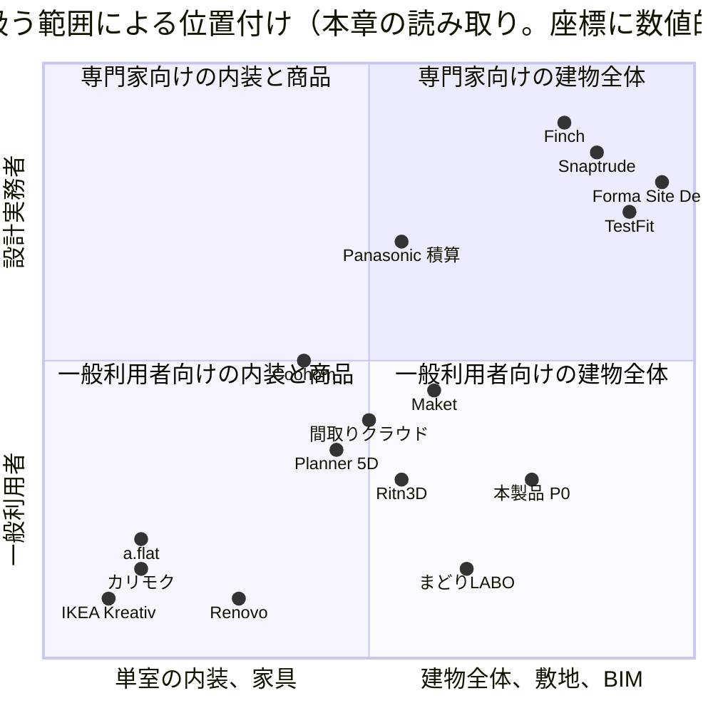

図から読み取れる点は次の二つである【推定】。第一に、一般利用者向けで建物全体を扱う象限には、まどりLABO と Renovo が入口として存在するが、いずれも編集可能な建物情報、根拠表示、専門家への引継ぎを公式頁で示していない。第二に、専門家向けの建物全体の象限は Snaptrude、Finch、Forma Site Design、TestFit が占めるが、家族の要求聞取、三案の同一評価軸比較、要素値の五状態、送信先ごとの個別同意は範囲外である。本製品は前者の入口の短さと後者の建物情報の厳密さを一つの正本で結ぶ位置を狙う。

## 4. 競合比較から分かる空白と、本製品が越える点

### 4.1 四つの製品群と空白

| 製品群 | 該当する製品 | 公開情報で確認できる強み | 公開情報で確認できない、または対象外のもの | 根拠区分 |
|---|---|---|---|---|
| 室内像を作る製品 | Renovo、Planner 5D、Coohom、Ritn3D、まどりLABO（3D像） | 短い導線で写実的な3D像や映像（寸法と関係を持たない派生表示）を返す。利用量制で低価格 | 要素から元図や元文言へ戻る根拠表示、要素値の状態区分、確認範囲付きの承認、IFC での丸ごとの引渡し（Coohom は「モデル全体の書出は非対応」と明記） | 【事実】（各社頁）、【推定】（空白） |
| 建築専門家向け BIM と生成設計 | Snaptrude、Finch、Autodesk Forma（Forma Site Design） | Revit や IFC の往復、部屋表と3Dの連動、即時指標、法規の適合確認（Finch Enterprise）、敷地と環境の分析 | 家族向けの聞取と三案、要素値の五状態、有資格者の確認範囲、商品の権利状態、送信先ごとの個別同意 | 【事実】、【推定】 |
| 土地採算と敷地計画の製品 | TestFit、Autodesk Forma（Forma Site Design） | 敷地データと用途地域、採算連動、書出形式の一覧公開と座標系選択 | 戸建の間取り、家具、家族の判断、日本の法規判定の版管理 | 【事実】、【推定】 |
| 家具と建材の販売へつなぐ製品 | IKEA Kreativ、カリモク家具、a.flat、LOWYA（未確認）、Panasonic 間取り図AI積算 | 実寸の自社商品配置、見積とカート、動線確認、図面からの数量と見積の連鎖 | 他社商品を含む権利状態付きの比較、広告枠と推奨点の分離（指示文3.3節の「広告点と適合点の分離」）、建物全体との整合、寸法の原図根拠（Panasonic は寸法を標準仕様で読むと明記） | 【事実】、【推定】 |
| 人が仲介する相談導線 | 建築家コンシェルジュ、タウンライフ | 人による適合判断と同席、料金開示（建築家コンシェルジュ）、条件分岐の質問と複数社比較（タウンライフ） | 連絡先入力前の初回成果、送信先ごとの個別同意、AI案と人の確認を同じ問題一覧で結ぶこと | 【事実】、【推定】 |

空白は、これらを一つの信頼可能な建物情報で連結する点にある（指示文3.2節）【推定】。ただし全部入りを画面へ同時に出すと複雑になるため、入口は三つに絞り、内部だけを共通化する（用語集12 三入口）。

### 4.2 連続性の五項目の定義と、対応する機能、指標、試験

| 番号 | 項目 | 観察可能な条件（本製品が満たすべき状態） | 対応する機能 | 計測する指標 | 検証する試験 | 根拠区分 |
|---|---|---|---|---|---|---|
| 1 | 根拠 | 要望または原図のどこを根拠にしたか分かる。全要素から元頁と元座標へ戻れ、自由記述から抽出した各項目が元の文言へ戻れ、値の出所が VS-SRC、VS-AI、VS-DEF、VS-USR、VS-PRO で表示上混在しない | F-C02-013 原図重ねと確信度の色表示、F-C02-017 要素の出典属性の保持、F-C02-012 推定値の分離、F-C01-003 一括自由記述の構造化、F-C03-005 双方向追跡、F-C03-017 要素値状態の管理 | M-G-01 要求追跡率（初期仮説95%以上）、M-G-04 確信度校正誤差 | T-A-001（既知縮尺の一階平面図の抽出と原図重ね）、T-S-003 | 【推定】 |
| 2 | 追従 | 2D、3D、数量、費用、商品が同じ変更へ追従する。一つの変更識別子から影響先へたどれ、確定前に差分が仮表示される | F-C03-007 2D直接編集、F-C03-008 3D直接編集、F-C03-011 変更前の影響予測、F-C03-012 影響要素の一覧表示、F-C03-013 変更差分の仮表示、F-C03-014 承認後の確定と再計算、F-C13-003 変更の数量と費用波及の追跡 | M-P-02 変更反映時間、M-G-12 構造設備上の重大見落し率 | T-A-003（居間を600 mm 広げ廊下幅900 mm 以上を保持）、T-A-009 | 【推定】 |
| 3 | 権利状態 | 正規品、代替形状、独自案の権利状態が分かる。PT- と RS- と SUP- を商品に常時添え、PT-REF の代替形状と PT-AI を正規商品と同じ見え方にしない。事例採用（PR-CASE）を製造や正規3D提供と誤表示しない | F-C05-015 商品層と権利状態の常時表示、F-C06-005 掲載実績、販売状態、正規3D利用権の分離判定、F-C06-006 企業と品物の関係区分の管理、F-C07-007 製作可否未確認の表示、F-C10-015 生成物への出典と許諾の引継ぎ | M-G-16 広告偏り指数、M-Q-23 不適合理由の正確性 | T-S-008（商品権利と関係区分）、T-A-005 | 【推定】 |
| 4 | 承認範囲 | AI の誤りを利用者または専門家が直し、その承認範囲が残る。修正値が VS-USR になり、承認は確認範囲、承認者、日付、版を持ち、範囲内の変更で自動失効する。V0 や V1 を V2 以上と表示しない | F-C02-015 曖昧箇所の手修正、F-C10-004 確認範囲ごとの承認、F-C10-005 承認の自動失効、F-C08-008 有資格者確認の依頼と記録、F-C15-004 信頼状態の判定と昇格降格、F-C15-005 禁止表示語の文言検査 | M-N-01 検証付き重要判断完了率、M-G-13 未確認案の誤表示件数（0件）、M-G-06 専門家修正時間 | T-S-010（責任境界の表示）、T-A-007、T-A-013 | 【推定】 |
| 5 | 送信先選択 | 外部企業へ渡す内容と相手を利用者が個別に決められる。送信先ごとに送信内容と目的を示して同意を取り、一括同意の操作が存在せず、撤回後の送信が止まる。初回成果の前に電子連絡先を要求しない | F-C08-005 送信先ごとの送信内容確認と個別同意、F-C10-007 外部事業者への部分共有、F-C01-025 電子連絡先なしの初回価値提示、F-C10-018 外部AI処理先への最小送信と処理地域の表示 | M-G-07 同意事故件数（0件）、M-P-04 初回価値到達率、M-B-03 同意撤回率、M-B-04 迷惑連絡報告件数 | T-S-001（個別同意と一括送信の禁止）、T-S-002、T-S-012、T-S-013 | 【推定】 |

### 4.3 連続性の五項目に対する各製品の充足

記号: ○ 公式情報で該当する機能を確認、△ 部分的（範囲が限られる、または記録が残らない）、× 公式情報に記述なし、? 取得失敗または未確認。判定は本章の読み取りであり【推定】。出典は第2節と調査02、03（確認日 2026-09-15）。

| 製品 | 1 根拠 | 2 追従 | 3 権利状態 | 4 承認範囲 | 5 送信先選択 | 判定の根拠 |
|---|:---:|:---:|:---:|:---:|:---:|---|
| Renovo | × | × | × | × | ? | 映像と模様替え像で、元図へ戻る表示や建物情報の記述なし。置換した物品の権利表示の記述なし。導線の同意画面は未確認 |
| Maket | × | △ | × | △ | × | 会話型変更はあるが費用や商品への追従の記述なし。「人間検証アップロード」は人の確認を含むが確認範囲の記録は未確認。家具と送信の記述なし |
| Planner 5D | × | △ | △ | × | × | 2Dと3Dの同期はあるが数量と費用の追従の記述なし。商品目録はあるが権利状態の表示区分の記述なし。承認と送信同意の記述なし |
| Coohom | × | △ | △ | × | ? | 2D、3D、見積一覧の書出はあるがモデル全体の書出は非対応。銘柄家具は Pro 以上で権利状態の表示区分の記述なし。電子商取引への組込は検索抜粋のみ |
| Snaptrude | △ | △ | × | × | × | 部屋表の編集が3Dへ連動し要求文書を入力にするが、要素から要求文言へ戻る表示の記述なし。BIM 往復と即時指標はあるが費用と商品の追従は未確認。権利状態、確認範囲付き承認、送信同意の記述なし |
| Finch | △ | △ | × | × | × | 設計基準の組込と即時指標。図面読込なし。権利、承認範囲、送信の記述なし |
| Autodesk Forma（Forma Site Design） | ? | △ | × | △ | × | 概要頁が 403。環境分析は案に追従。Forma Board の注記と比較はあるが確認範囲付き承認の記述なし |
| TestFit | × | △ | × | △ | × | 採算が敷地計画に連動。「承認済み配置を Revit へ送出」とあるが承認範囲の記録は未確認 |
| Ritn3D | △ | × | × | △ | × | 検出後の「レビュー段階」で壁、扉、窓、室名を修正できるが、寸法の根拠と修正の記録は未確認。生成型で編集後の追従はなし |
| IKEA Kreativ | × | × | △ | × | × | 走査から自社商品を配置。自社商品のみで権利状態という区分はない |
| まどりLABO | × | × | × | △ | ? | 要望文のどの語がどの室に反映されたかの表示なし。建築士への修正依頼の導線はあるが記録は未確認。見積依頼先が一括か個別かは未確認 |
| 間取りクラウド | △ | × | × | △ | × | 下絵と成果の併記。AI 認識結果を人が編集し、採用しなければ回数に数えない。2D のみで追従なし。送信の該当なし |
| カリモク家具 3D配置 | × | △ | △ | × | △ | 配置家具リストと3Dが連動。自社の一部商品。保存した案をショールームへ持参する利用者主導の接続 |
| a.flat 3D My Room | △ | △ | △ | × | △ | 図面下絵と2点縮尺。見積とカートが配置に連動。自社商品と汎用家具。共有先が無制限に編集でき承認範囲なし。相談ボタンで部屋 URL を一社へ自動送信（内容選択なし） |
| LOWYA おくROOM | ? | ? | ? | ? | ? | 公式頁の本文取得失敗 |
| Panasonic 間取り図AI積算 | △ | ○ | △ | △ | × | 図面から拾い出すが建具寸法は標準仕様と明記。数量、商品、見積、図面、提案資料へ連鎖（自社建材の範囲）。誤読の可能性と確認要請を明記。事業者内で送信の該当なし |
| 建築家コンシェルジュ | × | × | × | △ | ? | 設計道具ではない。一級建築士の助言者が確認するが確認範囲の記録は公開頁にない。人が仲介し同意画面は未確認 |
| タウンライフ | × | × | × | × | △ | 複数社を選択できるが「まとめて選択」を推奨し、規約上は申込に基づく提供、連絡停止は利用者側の申出 |
| 本製品（目標） | ○ | ○ | ○ | ○ | ○ | 第4.2節の機能、指標、試験。目標であり、受入試験の合格まで対外表示しない【仮定】 |

五項目を全て「○」で満たす製品は、公開情報の範囲では確認できなかった【推定】。もっとも近い直接競合は、利用者獲得ではまどりLABO、図面編集では間取りクラウド、商品購入では LOWYA とカリモク家具、図面から商用情報への変換では Panasonic、専門家向け建物情報では Snaptrude である（指示文3.3節の結論と調査03の再確認は矛盾しない）【推定】。

### 4.4 三入口と合流の図

競合では各入口が別製品として存在する（Maket と Snaptrude が希望から、Ritn3D と Planner 5D が図面から、IKEA Kreativ と a.flat が写真と家具から）。本製品は入口を三つに絞り、合流先を共通化する（用語集12）【推定】。

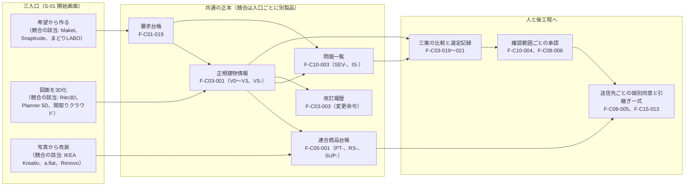

### 4.5 公開主張の数値の扱い

| 公開主張の例 | 主張元 | 本章での扱い | 本製品の指標との関係 | 根拠区分 |
|---|---|---|---|---|
| 「3分で完了」 | タウンライフ | 連絡先入力までの所要時間の主張。成果物は入力後に企業が作る | M-G-05 重要判断までの時間は「比較可能で根拠付きの判断案」までを測る。目標値は未設定で、本主張を根拠にしない | 【事実】（主張）、【推定】（扱い） |
| 「3分で最大5パターン」 | まどりLABO | 案の生成時間の主張。入力項目と寸法出力は未確認 | M-P-01 初回3D案までの時間の初期仮説（明瞭な単一縮尺の一階平面図で中央値180秒以内）は本主張とは独立に置く | 【事実】、【仮定】 |
| 「最短10秒で80〜90%」 | 間取りクラウド | 画像認識の自動作成率の主張。前提条件（自動作成できない場合あり）付き | M-Q-01〜 認識品質指標は入力種別、入力品質、図種で層別して公開し、単一の割合で表示しない | 【事実】、【推定】 |
| 「見積作成時間が約1/3」「約16分から約2分」 | Panasonic | 対象部材と計測主体（同社積算部門）の前提条件が明記されている | 本製品の指標定義でも前提条件（対象範囲、計測主体、計測条件）を必須にする | 【事実】、【推定】 |
| 「10分〜24時間」 | Planner 5D（検索抜粋） | 図面認識の処理時間を幅で公開する運用 | 読込の待ち時間は幅で表示する（F-C02-028）。値は未確認 | 【未確認】、【推定】 |
| 「1M+ Users」「1300社以上」「約40社」 | Renovo、タウンライフ、建築家コンシェルジュ | 時点と注記の有無が異なる。Renovo は店舗評価数と乖離 | 公開する数値には計測方法と時点を付す（第23章、第24章） | 【事実】、【推定】 |

## 5. 「競合の模倣で終わる機能」と「本製品だけの防御力がある機能」の暫定表

本節は 04_必須表 の「競合の模倣で終わる機能」と「本製品だけの防御力がある機能」の表を確定するための素材である。判定は暫定であり、04_必須表担当が第5.5節の条件で確定する【仮定】。指示文6章「独自差別化」の11項目（根拠付き建物情報、確信度付き承認、要求台帳、変更差分、実在品優先、中立な推薦、AIから人への連続性、段階門、建築分野の同時調整、性能状態の分離、建物全期間の学習）と、指示文8章「見栄えだけの生成は模倣されやすい一方、原図へ戻れる建物情報、確信度、要求追跡、人の承認、正規商品情報は積み上がる資産になる」を判定の軸にした【推定】。

### 5.1 判定基準

| 判定 | 条件（すべて満たす） | 本製品での扱い | 根拠区分 |
|---|---|---|---|
| 模倣で終わる機能 | (1) 公開情報で2社以上の競合が同等の機能を提供している。(2) 単独では連続性の五項目（第4.2節）のいずれにも寄与しない。(3) 積み上がる資産（原図重ね記録、確信度記録、要求台帳、判断記録、承認記録、連合商品台帳の権利状態、同意記録、既定値表、問題一覧）に依存しない | 入口や操作として実装するが、差別化の根拠、価格の根拠、対外説明の中心にしない。品質は競合と同等を初期仮説とし、競合の公開主張を目標値にしない | 【仮定】 |
| 防御力がある機能 | (1) 積み上がる資産に依存し、資産が増えるほど価値が上がる。(2) 連続性の五項目の一つ以上を直接満たす。(3) 公開情報で競合が同等の機能を持たない、または一社に限られる | 対外説明と価格の中心に置く。受入試験（T-A-、T-S-）と防護指標で合格を示してから表示する | 【仮定】 |
| 判定保留 | 上記のどちらにも当てはまるか、競合の情報が取得失敗、または本製品側の範囲（P0、P1）で防御力が変わる | 04_必須表で条件付きの判定を置く。条件は本節の表Cに記す | 【仮定】 |
| 対象外 | 非対象7機能（F-C05-020、F-C07-011、F-C09-014、F-C11-011、F-C12-017、F-C13-015、F-C13-016）と削除候補10件 | 本節の表に載せない。識別子台帳の「非対象」状態を審査の除外条件にする（U-00-058 に対する本章の仮の判断） | 【仮定】 |

### 5.2 表A 競合の模倣で終わる機能（暫定）

| 機能ID | 機能名 | 同等の機能を持つ競合（公式情報で確認、2社以上） | 単独では寄与しない理由 | 防御に転じる条件（該当する場合） | 根拠区分 |
|---|---|---|---|---|---|
| F-C04-001 | 軌道回転、俯瞰、建物模型表示 | Planner 5D、Coohom、Ritn3D、カリモク家具、a.flat | 表示操作であり根拠、追従、権利、承認、送信のいずれにも寄与しない | なし（鍵盤操作は非機能 N-AC- の要件） | 【推定】 |
| F-C04-002 | 室内walkthrough | Renovo、Planner 5D（360度）、Ritn3D（Pro 以上）、カリモク家具（座った視点） | 同上 | 人体寸法と生活場面の3D再生（F-C04-017）と結び付いた場合は追従に寄与 | 【推定】 |
| F-C04-003 | flyover | Renovo（Fly Over）、Planner 5D | 同上 | なし | 【推定】 |
| F-C03-015 | 写実生成（派生表示） | Renovo、Planner 5D（4K描画）、Coohom、Maket | 派生表示であり正本にしない。写実像の生成は指示文8章のとおり模倣されやすい | なし。正本への書戻し経路がないことを試験で確認する側が防御 | 【推定】 |
| F-C01-002 | 一問式の分岐質問 | タウンライフ、Renovo（指示文の記述、未確認） | 質問形式そのものは差別化にならない | 回答が要求台帳（F-C01-019）へ出典付きで変換される場合は根拠に寄与 | 【推定】 |
| F-C01-003 | 一括自由記述の構造化 | まどりLABO（要望文の反映）、Maket（文章から平面図）、Snaptrude（RFP） | 自由記述からの抽出は3社が提供 | 抽出項目が元の文言へ戻れる表示（合格条件）を満たす場合は根拠に寄与し、表Bへ移す | 【推定】 |
| F-C02-006 | 画像補正と傾き補正 | Planner 5D、Ritn3D、間取りクラウド、Panasonic | 前処理であり差別化にならない | なし | 【推定】 |
| F-C02-007 | 線分、円弧、文字、寸法線、記号の抽出 | Planner 5D、Ritn3D、間取りクラウド、Panasonic、Coohom | 認識処理は5社が提供。品質は層別指標で示す | 抽出結果が元頁と元座標を持ち（F-C02-017）原図重ねへ出る場合は根拠に寄与 | 【推定】 |
| F-C02-008 | 建築要素の分類 | 同上 | 同上 | 各要素に確信度が付き校正される場合（M-G-04）は根拠に寄与 | 【推定】 |
| F-C02-016 | 承認済み2Dからの3D組立 | Ritn3D、Planner 5D、間取りクラウド（3Dは未確認）、Coohom | 2Dから3Dを作ること自体は差別化にならない | 2Dと3Dが同じ建物情報から描画され整合率100%（合格条件）の場合は追従に寄与 | 【推定】 |
| F-C03-007、F-C03-008 | 2D直接編集、3D直接編集 | Planner 5D、Coohom、Snaptrude | 2Dと3Dの同期編集は3社が提供 | 変更が数量、費用、商品、問題、承認へ追従する場合（F-C03-011〜014、F-C13-003）は追従に寄与 | 【推定】 |
| F-C04-004 | 階別表示と屋根非表示 | Planner 5D、Coohom、Snaptrude | 表示操作 | なし | 【推定】 |
| F-C04-007 | 計測 | Planner 5D、Coohom、Snaptrude、TestFit | 表示操作 | 計測値が建物情報の寸法値と一致（誤差0）する場合は追従に寄与 | 【推定】 |
| F-C04-009 | 日照表示（簡易） | Autodesk Forma（Forma Site Design）、Snaptrude、TestFit | 敷地分析の一種として3社が提供 | 性能値（EL-）と混同しない表示規則がある場合は承認範囲に寄与 | 【推定】 |
| F-C04-012 | GLB書出 | Ritn3D（GLB）、TestFit（glTF） | 書出形式そのものは差別化にならない | 単位、座標、改訂、確信度、権利情報、透かしが添付される場合は根拠と権利状態に寄与 | 【推定】 |
| F-C04-014 | PDF平面書出 | Maket、Planner 5D、Ritn3D、Coohom、Panasonic | 同上 | 縮尺、方位、改訂、V 状態が図面上に印字される場合は承認範囲に寄与 | 【推定】 |
| F-C05-004 | 絞込検索 | Coohom、IKEA Kreativ、a.flat、LOWYA（未確認） | 商品検索の基本操作 | 絶対条件による除外（F-C05-005）と不適合理由（F-C05-007）を伴う場合は権利状態と根拠に寄与 | 【推定】 |
| F-C05-018 | 分類別一般品の配置 | Planner 5D、a.flat（「その他」の汎用家具）、Ritn3D | 一般形状の家具配置は3社が提供 | 「実商品ではない」の表示が常時付く場合は権利状態に寄与 | 【推定】 |
| F-C09-003 | 公的地理情報の重ね | TestFit（Site Intelligence）、Autodesk Forma（Forma Site Design） | 敷地情報の重ね自体は2社が提供 | 出典、取得日、対象時点、解像度、法的境界ではない旨（F-C09-004、F-C09-009）を伴う場合は根拠に寄与 | 【推定】 |
| F-C10-009 | 期限付き共有URL | Ritn3D（リンク共有）、a.flat（URL共有）、カリモク家具（ID共有）、Maket | 共有URLは4社が提供 | 期限、閲覧回数、透かし（V 状態）、取得可否、初期値非公開を伴う場合は承認範囲と送信先選択に寄与 | 【推定】 |
| F-C02-028 | 処理状態の表示 | Planner 5D（処理時間の幅の公開、検索抜粋）、Renovo（段階表示、未確認） | 待機表示は一般的 | 実際の処理段階と一対一で架空の進捗率を出さない点は改善であり、防御ではない | 【推定】 |
| F-C08-003 | 三社以上の比較 | タウンライフ（複数社選択）、建築家コンシェルジュ（基本3社程度） | 複数社比較は2社が提供 | 同一項目での比較と紹介料の分離（F-C08-009）、送信先ごとの個別同意（F-C08-005）を伴う場合は送信先選択に寄与 | 【推定】 |
| F-C08-007 | 相談予約 | 建築家コンシェルジュ、a.flat（相談ボタン）、カリモク家具（ショールーム予約） | 予約そのものは差別化にならない | 個別同意の後にのみ成立する場合は送信先選択に寄与 | 【推定】 |

### 5.3 表B 本製品だけの防御力がある機能（暫定）

| 機能ID | 機能名 | 依存する積み上がる資産 | 満たす連続性の項目 | 競合が持たないことの根拠（公式情報） | 合格を示す指標と試験 | 根拠区分 |
|---|---|---|---|---|---|---|
| F-C02-013 | 原図重ねと確信度の色表示 | 原図重ね記録、確信度記録 | 1 根拠 | 要素から元頁と元座標へ戻る表示を公式に説明する競合はない。Ritn3D のレビュー段階は修正のみ、間取りクラウドは下絵併記のみ | M-G-04、T-A-001、T-S-003 | 【推定】 |
| F-C02-017 | 要素の出典属性の保持 | 原図重ね記録（元頁、元座標、認識方法、確信度、推定理由、変更履歴） | 1 根拠 | Panasonic は寸法を標準仕様で読むと明記し、原図根拠を持たない。他社に出典属性の記述なし | M-G-01、T-A-001、T-A-010 | 【推定】 |
| F-C02-014 | 尺度確認と基準寸法の指定 | 尺度確認記録（利用者、日時） | 1 根拠、4 承認範囲 | 尺度不明画像で寸法を断定しない規則を公式に説明する競合はない。a.flat の2点縮尺は手入力の補助 | M-G-03、T-A-002、T-R-005 | 【推定】 |
| F-C02-012、F-C03-017 | 推定値の分離、要素値状態の管理 | 要素値の五状態（VS-）、既定値表 | 1 根拠、4 承認範囲 | 五状態に相当する区分を持つ競合はない。Maket の「AI補助」と「人間検証」、Ritn3D のレビュー段階は本製品の状態の一部に相当 | M-G-04、T-A-001、T-A-007 | 【推定】 |
| F-C01-019、F-C01-020、F-C01-023 | 要求台帳への変換、要求衝突の検出と解決候補・代償の提示、案別の要求適合表 | 要求台帳、判断記録 | 1 根拠、4 承認範囲 | 要求に優先度、出典、決定者、確認者を持たせ案と要素へ双方向追跡する競合はない。Snaptrude の部屋表は要求ではなく面積表 | M-G-01、M-G-11、M-P-08、T-R-012 | 【推定】 |
| F-C03-005 | 双方向追跡 | 要求台帳、判断記録、承認記録、問題一覧 | 1 根拠、4 承認範囲 | 要求→案→要素→計算→商品→問題→判断→承認→書出の追跡を公式に説明する競合はない | M-G-01（初期仮説95%以上） | 【推定】 |
| F-C03-011〜F-C03-014、F-C13-003 | 変更前の影響予測、影響要素の一覧表示、変更差分の仮表示、承認後の確定と再計算、変更の数量と費用波及の追跡 | 変更命令（変更識別子）、影響、問題一覧 | 2 追従 | 自然文変更を確定前に2D、3D、費用、問題への影響として仮表示する競合はない。Maket の会話型変更は即時確定、Panasonic の連鎖は自社建材の見積に限る | M-P-02、M-G-12、T-A-003、T-A-009 | 【推定】 |
| F-C03-019〜F-C03-021 | 三案の生成、同一評価軸の比較、選定記録 | 要求台帳、判断記録（決定者、理由、代償、未解決点） | 4 承認範囲 | まどりLABO の最大5案と Finch の数千案は、採用理由、捨てた条件、未解決点、確信度を案ごとに持つ記述がない | M-N-01、M-P-05、M-P-10、T-A-003 | 【推定】 |
| F-C05-015、F-C06-005、F-C06-006 | 商品層と権利状態の常時表示、掲載実績・販売状態・正規3D利用権の分離判定、企業と品物の関係区分の管理 | 連合商品台帳（PT-、RS-、SUP-、PR-） | 3 権利状態 | 商品に権利状態と関係区分を常時添える競合はない。IKEA Kreativ、カリモク家具、a.flat、Panasonic は自社商品に閉じ、Coohom は銘柄家具を有料段階に限る | M-G-16、M-Q-23、T-S-008、T-A-005 | 【推定】 |
| F-C05-007、F-C05-008、F-C08-009 | 適合理由等の表示、広告と紹介料の分離表示、紹介料と推薦の分離 | 連合商品台帳、提携先台帳（紹介料、掲載料、検証日） | 3 権利状態、5 送信先選択 | 「何が合わないか」と広告や紹介料の分離を候補ごとに表示する競合はない。建築家コンシェルジュは料金節で開示、タウンライフは利用者向けに非開示、まどりLABO は契約特典で誘導 | M-G-16、M-Q-23 | 【推定】 |
| F-C07-007 | 製作可否未確認の表示 | 生成履歴、権利条件 | 3 権利状態 | AI 生成家具に「製作可否は未確認」と7項目の確認対象を常時付ける競合はない（生成系は第16章の範囲） | T-S-008 | 【推定】 |
| F-C10-004、F-C10-005 | 確認範囲ごとの承認、承認の自動失効 | 承認記録（確認範囲、承認者、日付、版、AS-） | 4 承認範囲 | 図面一式ではなく確認範囲ごとに承認し、範囲内の変更で自動失効させる競合はない。a.flat は共有先が無制限に編集できる | M-N-01、M-G-13、T-S-010、T-A-013 | 【推定】 |
| F-C08-008、F-C08-006 | 有資格者確認の依頼と記録、問題一覧からの人への引継ぎ開始 | 承認記録（氏名、資格、範囲、日付）、問題一覧 | 4 承認範囲 | AI 案と人の確認を同じ問題一覧で結び V3 へ昇格する競合はない。まどりLABO の建築士修正と建築家コンシェルジュの助言者は記録の公開がない | M-G-06、M-P-11、T-S-010 | 【推定】 |
| F-C15-002、F-C15-004、F-C15-005 | 進行禁止条件の判定、信頼状態の判定と昇格降格、禁止表示語の文言検査 | 段階門、信頼状態、問題一覧 | 4 承認範囲 | 必要情報と承認が足りない案を写実像だけを根拠に次段階へ進めない段階門を持つ競合はない。Renovo の利用者評価「偽3D」はこの欠如に由来する | M-G-08（0%）、M-G-13（0件）、T-A-007、T-A-013、T-S-003 | 【推定】 |
| F-C12-008 | 十領域の証拠段階別記録と表示 | 性能項目（EL- 五段階の別記録） | 4 承認範囲 | 目標、計算予測、現場確認、第三者評価、法的適合を別列で持つ競合はない。Finch の法規の適合確認は上位段階の機能で証拠段階の区分はない | M-G-10（0件）、T-A-011 | 【推定】 |
| F-C08-005、F-C10-007 | 送信先ごとの送信内容確認と個別同意、外部事業者への部分共有 | 同意記録（送信先、送信項目、目的、時点、撤回） | 5 送信先選択 | 送信先ごとに送信内容を示して個別に同意または除外し、非共有項目を保持する競合はない。タウンライフは「まとめて選択」を推奨し停止は利用者申出 | M-G-07（0件）、M-B-03、M-B-04、T-A-006、T-S-001、T-S-013 | 【推定】 |
| F-C01-025 | 電子連絡先なしの初回価値提示 | なし（設計上の規則。M-P-04 で計測） | 5 送信先選択 | 初回成果の前に電子連絡先を要求しない設計を公式に示す競合はない。タウンライフは最終段階で連絡先入力後に成果物、Renovo は未確認、まどりLABO は段階が未確認 | M-P-04（初期仮説95%以上）、T-S-002 | 【推定】 |
| F-C15-013、F-C15-007 | 引継ぎ一式の生成、情報要求適合表 | 要求台帳、問題一覧、判断記録、標準の必要情報要求 | 1 根拠、5 送信先選択 | 受取側が一式から元図、要求、問題へ戻れる引継ぎを公式に説明する競合はない。Coohom は「モデル全体の書出は非対応」 | M-G-02、M-G-14、T-A-014 | 【推定】 |
| F-C09-009、F-C09-004 | 法的境界断定の禁止と現地調査の明示、公的地理情報の属性 | 敷地根拠（出典、取得日、対象時点、解像度） | 1 根拠 | 地図上の線を法的境界と断定しない規則と、必要な現地調査の明示を公式に示す競合はない。TestFit と Forma の敷地データは日本の法的境界を扱わない | T-A-008、T-R-001 | 【推定】 |

### 5.4 表C 判定保留（04_必須表で条件付きの判定を置く）

| 機能ID | 機能名 | 模倣に見える根拠 | 防御力に転じる条件 | 保留の理由 | 根拠区分 |
|---|---|---|---|---|---|
| F-C05-001 | 連合商品台帳 | Coohom の60万点、Planner 5D の商品目録管理（Enterprise）、Panasonic の自社商品台帳 | 収録企業数、正規3D割合、権利状態付きの横断比較（F-C05-013）が公開される。P0 は限定した正規商品のため防御力は P1 以降 | 収録企業数と許諾契約の進捗（第16章、第24章）で価値が決まる | 【仮定】 |
| F-C05-006 | 推奨点の計算と重み変更 | LOWYA の「おまかせ」提案（未確認）、Coohom の配置提案 | 広告料を含まない点数内訳の公開と重み変更。LOWYA の特許出願中の主張との抵触評価（U-04-004） | LOWYA の公式頁が取得失敗 | 【未確認】 |
| F-C05-012 | 代替品の提示 | 販売終了時の代替提示は商品販売系で一般的（公式確認は未） | 設計意図と絶対条件を保ち、自動置換しない（合格条件） | 競合側の該当機能が未確認 | 【未確認】 |
| F-C04-013、F-C15-008 | IFC書出、IDS検査 | Snaptrude（IFC 書出は検索抜粋）、Autodesk Forma（IFC 取込）、TestFit（Revit 送出） | 書出前の必要情報要求検査と例外承認（F-C15-011、F-C15-012）を伴う場合 | IFC 書出は P1。Snaptrude の IFC 書出は公式本文で未確認 | 【未確認】 |
| F-C02-002、F-C02-003 | ベクトル形式の受付、IFC入力の受付 | Coohom（.dwg、.dxf）、Autodesk Forma（IFC、OBJ）、Snaptrude（.rvt、DWG。検索抜粋） | ベクトル由来の線が VS-SRC として保持され画像化だけに依存しない場合は根拠に寄与 | P1 機能。競合の取込条件が検索抜粋 | 【未確認】 |
| F-C04-016 | 動線比較 | カリモク家具の椅子引出時の動線確認（単室） | 生活場面ごとに案の間で距離、通過扉数、交差を比較する場合 | 単室の動線確認と建物全体の動線比較の境界 | 【推定】 |
| F-C08-001 | 提携先台帳 | 建築家コンシェルジュ（約40社）、タウンライフ（1300社以上）、まどりLABO（10社以上の掲載） | 資格、対応地域、料金、紹介料、検証日を持ち、検証日のない提携先を表示しない場合。紹介料の分離（F-C08-009）と併せて防御 | 台帳自体は模倣、開示の構造が防御 | 【推定】 |
| F-C07-004 | 独自家具の三案生成 | Meshy、Tripo 等の生成系（第16章の範囲） | 実在品の先行探索（F-C07-002）と製作可否未確認の表示（F-C07-007）を伴う場合 | 生成系の比較は本章の範囲外 | 【推定】 |
| F-C09-008 | 法規判定（P0 は建蔽率、容積率、高さ、接道） | Finch Enterprise の「Code and compliance check」（対象国は未確認） | 法令名、自治体、版、施行日、取得日、該当根拠、入力値、計算、余裕量の保存と、有資格者確認（F-C09-011）、法令版更新の再判定（F-C09-012） | Finch の対象国と内容が未確認 | 【未確認】 |

### 5.5 04_必須表への引継ぎ条件

| 条件 | 内容 | 根拠区分 |
|---|---|---|
| 表の粒度 | 04_必須表では機能ID単位で判定し、本章の複数機能をまとめた行（F-C03-011〜F-C03-014 等）は機能ごとに分ける | 【仮定】 |
| 判定の更新 | 競合の取得失敗（表C）が解消した場合、本章の未決事項（U-04-003、U-04-004）の解決と同時に判定を更新する | 【仮定】 |
| 審査との関係 | 表A の機能を「削除候補」と混同しない。表A は六段の因果にひも付く必要機能であり、差別化に使わないだけである | 【推定】 |
| 対外表示 | 表B の機能を対外的に「本製品だけ」と表示するのは、対応する受入試験の合格と防護指標の計測後に限る | 【仮定】 |

## 6. 機能要件

本章に担当機能なし。機能一覧骨格 v1.1 の「詳細を書く章」に第4章の割当はなく（整合検査報告 検査項目4で使用している章は 5、6、8、10、11、12、13、15、16、17、18、19、20、21、22、23）、本章は既存の機能識別子を参照するのみで、機能、受入条件、API、非機能を新設しない【事実】（整合検査報告 v1.0 第1節）。

## 章要約

本章は指定参照先3件の棚卸し表を 2026-09-15 の公式頁確認で更新し、海外9製品と国内6製品を七つの機能軸で点数と根拠付きで比較した。点数は製品位置付けであり性能試験ではない。主な更新点は、Renovo の店舗評価と二重課金、建築家コンシェルジュの預り金と5%手数料、タウンライフの段階1〜7の文言と規約上の提供情報である。Coohom の BIM交換と Finch の図面読込は 2→1 の見直し候補、Autodesk Forma は 403 のため未確認を維持し、国内6製品には本章が点数を置いた。

空白は室内像、専門家向けBIM、敷地計画、商品販売、人の仲介が別々に存在し一つの建物情報で連結する製品がない点にあり、本製品が越える点を連続性の五項目（根拠、追従、権利状態、承認範囲、送信先選択）で定義し、機能、指標、試験を対応付け、18対象の充足表を示した。五項目を全て満たす競合は公開情報では確認できなかった。「模倣で終わる機能」23行、「防御力がある機能」19行、「判定保留」9行の暫定表を 04_必須表 の素材として置いた。本章に担当機能はない。

## 他章への依頼または前提

| 章 | 内容 | 種別（依頼/前提） |
|---|---|---|
| 04_必須表 | 第5節の表A〜Cを機能ID単位に分けて「競合の模倣で終わる機能」と「本製品だけの防御力がある機能」の表を確定すること。判定基準は第5.1節、引継ぎ条件は第5.5節。非対象7機能は識別子台帳の「非対象」状態で審査から除外すること（U-00-058 の仮の判断） | 依頼 |
| 第03章 | 本章の出典URL（第1.1節、第2節）が出典一覧の SRC- 番号と対応していること。取得失敗（第1.3節）を出典一覧の取得可否列に反映すること | 前提 |
| 第05章 | タウンライフの質問13段階と要求台帳の対応（第2.3.2節）を、関係者と決定権の設計に取り込むこと | 依頼 |
| 第08章 | 三入口と合流の図（第4.4節）と、連絡先入力を初回成果の後に置く画面順序（第2.4節）を利用導線に反映すること | 依頼 |
| 第09章 | 第3.4節の到達目標（P0、P1）が機能一覧の優先と矛盾しないことを確認すること。第5節の表A の機能を削除候補と混同しないこと | 依頼 |
| 第15章 | 送信先ごとの個別同意（F-C08-005）の画面を S-20 同意管理画面に置く候補（U-00-057）を確定すること。第2.4節の三社の連絡先入力位置の比較を S-15 の設計根拠に使うこと | 依頼（前半は対応済み: F-C08-005 の画面は第15章 第1.4節と機能一覧骨格 v1.2 追補の関連画面列で S-20、S-07、S-08 に確定し、U-00-057 は解決〔2026-10-06、相互依頼 群A〕） |
| 第16章 | 競合の商品情報（Coohom 60万点、Planner 5D の商品目録管理、IKEA Kreativ とカリモク家具と a.flat の自社商品）を、連合商品台帳の収録方針と権利状態の設計に反映すること。LOWYA の特許出願中の主張と推奨点（F-C05-006）の抵触評価を権利担当と行うこと | 依頼 |
| 第17章 | 建築家コンシェルジュの料金開示（預り金、返金、5%手数料、出張費）とタウンライフの規約上の提供情報を、提携先台帳の開示項目と同意記録の送信項目の設計に反映すること | 依頼 |
| 第22章 | Renovo の App Privacy（写真と動画の紐付け、識別子による追跡）とタウンライフ規約（提供情報、連絡停止）を、入力資料の利用権、学習同意、削除、同意撤回の仕様の比較根拠にすること。Renovo の規約本文は未取得のため比較根拠は App Privacy に限る | 依頼 |
| 第23章 | 競合の公開主張（第4.5節）を指標の目標値の根拠にしないこと。指標定義に前提条件（対象範囲、計測主体、計測条件）を必須にすること。公開する数値に計測方法と時点を付す規則を非機能に置くこと | 依頼 |
| 第24章 | Renovo の定期購入と利用量の二重課金と利用者評価の不満、タウンライフの成果報酬型送客（未確認）、建築家コンシェルジュの預り金方式を事業方式の比較材料にすること。課金前に利用量、追加費用、再実行または返金条件を示す規則を置くこと | 依頼 |
| 05_審査（反証審査） | 第4.3節の充足表と第5節の暫定表を「過大約束」の審査対象にすること。表B の「競合が持たない」は公開情報の範囲であり、有料契約後の画面は未確認である | 前提 |

## 未決事項

| 識別子 | 内容 | 区分（事実/推定/仮定/未確認） | 影響 | 確認者候補 |
|---|---|---|---|---|
| U-04-001 | Renovo の質問導線の各段階（制作対象、目的、意匠、入力見本、処理段階表示、追加質問、連絡先入力の位置）。動的描画のため未取得。指示文2.1節の15項目を未確認で引き継ぐ | 未確認 | 第2.1節、第2.4節の連絡先入力位置、第5.2節の F-C01-002 と F-C02-028 の競合該当 | 調査担当（描画後の画面で確認。送信と連絡先入力は行わない） |
| U-04-002 | Autodesk Forma（Forma Site Design）の概要頁と価格頁（HTTP 403）。価格、API と SDK の有無、戸建規模への適用可否。指示文3.1の点数を未確認のまま維持 | 未確認 | 第3.2節の点数、第4.3節の充足 | 調査担当 |
| U-04-003 | Coohom の BIM交換（2→1）と Finch の図面読込（2→1）の点数見直し。Coohom は公式ヘルプで「モデル全体の書出は非対応」を確認済み、Finch は入出力形式のドキュメント頁が 404 | 推定 | 第3.2節の点数、04_必須表 | 調査担当、04_必須表担当 |
| U-04-004 | LOWYA おくROOM の公式頁本文（能力、購入接続、注記、料金）が取得失敗。「特許出願中」と主張される機能（部屋寸法と予算からの自動生成）と F-C05-006 推奨点の計算と重み変更との抵触は未評価 | 未確認 | 第3.3節の点数、第5.4節の表C、第16章の推薦仕様 | 調査担当、権利担当、弁理士等の専門家 |
| U-04-005 | 国内6製品の点数（第3.3節）は指示文にない本章の推定。特にまどりLABO の入力項目と寸法出力、間取りクラウドの出力形式、Panasonic の認識精度が未確認のため点数が変わり得る | 推定 | 第3.3節、第4.3節 | 調査担当、製品責任者 |
| U-04-006 | 本製品の到達目標の点数（第3.4節）は初期仮説であり、公開判定会議で受入試験の結果と併記するまで対外表示しない | 仮定 | 第3.4節、第23章、第24章 | 製品責任者、公開判定会議 |
| U-04-007 | 模倣と防御力の判定基準（第5.1節）の「2社以上」「一社に限られる」の閾値は本章の仮置き。04_必須表で確定する | 仮定 | 第5節、04_必須表 | 04_必須表担当、製品責任者 |
| U-04-008 | Renovo の利用規約と個人情報方針の本文（投稿写真と平面図の権利、学習利用、自動更新、返金、準拠法）。HTTP 403 | 未確認 | 第2.1.2節の権利に関する改善点、第22章 | 調査担当、権利担当 |
| U-04-009 | タウンライフの段階8〜11の文言と選択肢、年齢入力の任意性、協力会社向け条件（成果報酬型、約1,200社以上）と「1300※社以上」の注記、「3冠」の公式記載 | 未確認 | 第2.3節、第2.3.2節の要求台帳の選択肢、第24章 | 調査担当 |
| U-04-010 | 建築家コンシェルジュの予約段階（60分枠、日付選択、情報入力、完了、変更または取消）と入力項目、運営会社と個人情報方針の本文 | 未確認 | 第2.2節、第17章の相談予約（F-C08-007）と S-20 | 調査担当 |
| U-04-011 | 第4.3節の充足表の記号（○△×）は本章の読み取りであり、各社の有料契約後の画面や非公開機能で変わり得る。公開前の設計審査で再確認する | 推定 | 第4.3節、05_審査 | 05_審査担当、製品責任者 |
| U-00-046（本章の仮の判断） | 同意の状態（有効、撤回、期限切れ）と変更命令の状態の符号（CN-、CC-）が未登録のため、本章は符号を使わず語で書いた。符号が確定した場合は第4.2節と第5.3節の同意記録と変更命令の記述に符号を追記する。解決（2026-10-06、根拠: 基盤が U-00-046 を「符号を設けず日本語値を正とする」で解決し〔相互依頼 群A〕、本章の語による記述がそのまま正になった。符号の追記は不要） | 仮定 | 第4.2節、第5.3節 | 識別子規則担当 |
| U-00-057（本章の仮の判断） | F-C08-005 の画面を S-07 と S-08 に加えて S-20 同意管理画面とする候補を本章は前提にした（第2.3.2節、他章への依頼）。解決（2026-10-06、根拠: U-00-057 が解決し、機能一覧骨格 v1.2 追補の関連画面列で F-C08-005 は S-20、S-07、S-08 となり、本章の前提と一致した。相互依頼 群A） | 仮定 | 第15章、第17章 | 画面設計担当 |
| U-00-058（本章の仮の判断） | 非対象7機能を本章の暫定表（第5節）の対象外とし、識別子台帳の「非対象」状態を審査の除外条件にする前提を置いた | 推定 | 04_必須表、05_審査 | 04_必須表担当、05_審査担当 |
| U-00-060（本章の仮の判断） | F-C10-018 外部AI処理先への最小送信と処理地域の表示を、連続性の五項目のうち「送信先選択」に寄与する機能として第4.2節に置いた。六因果の割当（因果1）の妥当性は整合検査の判断に従う | 仮定 | 第4.2節、追跡表 | 製品責任者、05_審査担当 |

U-00-059（暗号化と組織分離の非機能扱い）と U-00-061（補助状態符号の版）は本章の記述に影響しないため、仮の判断を置かない【推定】。

## 用語追加提案

| 用語 | 定義 | 理由 |
|---|---|---|
| 公開主張 | 企業が公式頁や発表で示す所要時間、導入数、社数、効果等の数値で、独立試験による検証を経ていないもの | 調査03の提案語。競合の数値を事実と混同しないため本章で使用した |
| 取得失敗 | 公式頁の読み取りを試みたが本文を得られず（HTTP 403、404、動的描画、時間超過）、記述を未確認として引き継いだ状態 | 調査03の提案語。第1.3節で使用した |
| 預り金 | 利用者が着手時に預け、契約成立等の条件で返金される金銭。建築家コンシェルジュの方式 | 調査01の提案語。紹介料と区別して料金開示を仕様化するため |
| 成果報酬型送客 | 利用者からの問合せ発生時のみ事業者が媒体へ費用を払う事業構造 | 調査01の提案語。利用者向け画面での事業構造開示を仕様化するため |
| 利用量 | 生成、変換、描画の各操作が消費する数量単位（Renovo の Credits、Maket と Planner 5D のクレジットに相当） | 調査01と02の提案語。課金前の費用明示と再実行条件を定義するため |
| 連続性（五項目） | 競争力を測る五つの観察条件。根拠、追従、権利状態、承認範囲、送信先選択。指示文3.3節の五箇条を本章第4.2節で観察条件、機能、指標、試験に展開した | 04_必須表と後続章が同じ語で差別化を参照するため |
| 模倣で終わる機能 | 公開情報で2社以上の競合が同等の機能を提供し、かつ単独では連続性の五項目のいずれにも寄与しない機能 | 指示文I節の必須表の語を観察条件付きで定義するため |
| 防御力がある機能 | 積み上がる資産に依存し、公開情報で競合が持たず、連続性の五項目の一つ以上を直接満たす機能 | 同上 |
| 積み上がる資産 | 利用が増えるほど価値が上がる情報の集合。原図重ね記録、確信度記録、要求台帳、判断記録、承認記録、連合商品台帳の権利状態、同意記録、既定値表、問題一覧 | 指示文8章「積み上がる資産」を防御力の判定基準として使うため |
| 検索抜粋 | 検索結果の頁に表示された抜粋文だけを得て、当該頁の本文は取得できていない根拠。【未確認】として扱う | 調査02、03 の根拠区分の語。第1.3節、第3.2節、第3.3節で使用した |
| 同意記録 | 個別同意の記録。送信先、送信項目、目的、時点、撤回の有無を持つ。情報実体 Consent に対応 | 第4.2節と第5.3節で積み上がる資産の一つとして使用した。用語集には個別同意（225）と同意の状態（274）はあるが記録の語がない |
| 提携先台帳 | 提携先の資格、対応地域、料金、紹介料、掲載料、検証日を持つ台帳。機能 F-C08-001 の名称 | 第5.3節と第5.4節で使用した。用語集には提携事業者（224）はあるが台帳の語がない |

## 本章で定義した識別子一覧

| 種別（機能/情報実体/画面/指標/試験/API/非機能/受入条件） | 識別子 | 名称 |
|---|---|---|
| なし | なし | 本章は機能、情報実体、画面、指標、試験、API、非機能、受入条件の識別子を定義しない。未決事項 U-04-001〜U-04-011 は本章が採番した |


---

<!-- 05_狙う利用者_関係者_課題_価値提案_決定権.md -->

# 第05章 狙う利用者、関係者、課題、価値提案、決定権

作成日: 2026-09-15　版: v1.4（v1.4 は 2026-10-08 の段階8前の持ち越し仕上げ（共通の決定 D6、統括の決定 D27、既定値の識別子の併記 0 行）。第2.3節「製品外権限」の行に判定機関を加え、EL-LAW の証明書の発行者を行政、確認検査機関、判定機関とした（第12章 v1.5 の E-ORG-002.kind と isProductExternalAuthority に合わせた。持ち越し 12）。D27 により第2.2節の関係者表に判定機関の行を加え、第0.2節の非対象、第2.1節の「その他」の細分、F-C01-013 の目的、例外(c)、AC-C01-013-03 の製品外権限の関係者の列挙に判定機関を加えた（受入条件の識別子と試験の割当は変えていない。用語追加提案「製品外権限」は用語集 455 と同文の例示のため変えていない）。記録は `05_審査/再修正記録_段階8前_仕上げ_群F2.md`。v1.3 は 2026-10-07 の段階6 二回目の修正（段階7 再審査の後）。修正計画 第1.5節の 9 件（主担当 JR-008〜JR-010、整合 JR-016、JR-038、JR-089、JR-056、JR-032、JR-105）と横断方針 第0.3節「資格の照合状態」（JR-012）を、第0.3節、第0.4節の固定文と番号（AC-C01-013-06、AC-C01-014-07）で反映した。記録は `05_審査/再修正記録_2回目_第5_7_9章.md`。v1.1 は 2026-10-06 の段階6 初稿審査の再修正。統合指摘 JM-013〜JM-018 と整合指摘 JM-043、047、048、114、137、143、161、163、195 の 15 件、整合修正指示 第5章 18 件、識別子変更一覧（S-04-09、用語集 40、370、493）、修正済みの章の依頼を反映。記録は `05_審査/再修正記録_第5章.md`。v1.2 は 2026-10-06 の段階6 の仕上げ（相互依頼と残課題の処理。群C）。第6章、第8章、第15章、第19章、第22章の依頼 5 件を確認し、F-C01-014 例外(b)を第6章 規則6 (d) と同文に改め、章末の対応状況を更新した。群Bの申し送り（第12章 v1.3 への追従）を含み、responseDeclined、authorityStakeholderRef、coApprovalRefs、stakeholderCheckItems と当事者ごとの stakeholderCheck に合わせて U-05-013 を解決した。記録は `05_審査/再修正記録_相互依頼_群C.md`。2026-10-07 の二回目の修正の仕上げ（群R4）で、外部確認（`01_調査/08_外部確認_段階7後.md`）による R-05-011 の注記と章末の対応状況を加えた（版は据え置き。内容は `05_審査/再修正記録_2回目_仕上げ_群R4.md`））　担当: 段階3 仕様書 第05章（製品責任者、UX設計者、一級建築士、個人情報保護と知的財産の審査担当の合議を想定した仮想設計陣）
根拠: 指示文 8章（最初の経営判断）、9.9（収益と信頼の衝突）、9.12（実装前に経営陣が決める事項）、10.1（関係者と当事者参画）、10.6（人とAIの責任境界）、C1（対話設計の関係者、生活場面、要求衝突、目的文の承認）、A1（A01 目的、関係者、要求）。基盤定義 用語集 v1.2、識別子規則 v1.2、十二判断領域 v1.2（A01、A12）、七段階門 v1.2（G0、G1、G2）、信頼状態と証拠段階 v1.2、機能一覧骨格 v1.2（F-C01-013、F-C01-014、F-C01-021）、情報実体骨格 v1.2（E-ORG-008 Stakeholder、E-REQ-001 Requirement、E-REQ-004 Decision、E-REQ-007 Approval、E-ORG-006 Consent、E-ORG-007 Responsibility）、画面指標試験骨格 v1.2（S-02、S-04-09、S-22、S-24、M-P-08、M-P-09、M-G-11、T-R-012、T-R-008、T-A-013）、整合検査報告 v1.1 第5節（識別子変更一覧）。属性名の正本は第12章 項目辞書 v1.2。調査 `01_調査/01_指定参照三社.md`、`01_調査/03_国内競合.md`、`01_調査/06_研究と標準.md`、`01_調査/07_法規と個人情報と権利.md`（確認日はいずれも 2026-09-15）。

## 0. 冒頭

### 0.1 本章の目的

- 初期公開（P0）で狙う利用者を一つに定め、その根拠と代替案（設計実務者、住宅会社）との比較を記録する。指示文8章と9.12の「初期顧客の判断」を仕様上の仮判断として置き、経営判断での確定を未決事項に残す【推定】。
- 案件の関係者を洗い出し、各関係者に利益、不利益、発言機会、決定権、確認対象を持たせる関係者表の仕様を定める（E-ORG-008 Stakeholder の内容規則）【推定】。
- 子供、高齢者、障害のある人、介護者の声を代理決定だけで終えない当事者参画の方法を定める【推定】。
- 利用者区分ごとの課題、価値提案、決定権を表にし、家族間の要求対立を平均化せずに扱う規則を定める【推定】。
- 一般利用者の短い対話と専門家の確認作業面という二つの画面系統の役割を定め、機能 F-C01-013、F-C01-014、F-C01-021 の必須10項目と受入条件を記述する【推定】。

### 0.2 本章の範囲と非対象

| 区分 | 内容 |
|---|---|
| 範囲 | 初期顧客の推奨と比較。関係者の分類、関係者表の必須属性と作成規則。決定権と確認権の割当規則。当事者参画の方法と記録。課題、価値提案、決定権の対応表。要求衝突の扱い（検出、可視化、解決候補と代償、決定の記録、保留の効果）。決定権を持つ家族の承認、合議の未合意と代理記録の導線。利用者区分ごとの画面の役割分担。機能 F-C01-013、F-C01-014、F-C01-021 の仕様【推定】 |
| 非対象（他章） | 対話の質問項目と分岐、当事者向け質問の質問文（正本は第08章 第7.0.1節）、要求衝突の検出規則（正本は第08章 第5.3節）、生活場面の四群の聞取手順（第08章）。要求台帳の実体定義と項目辞書（第12章）。画面の部品、遷移、空状態と待機状態と失敗状態（第15章）。提携先推薦、有資格者確認、同意管理（第17章、第22章）。役割権限 RL- の実装、監査、削除（第22章）。事業方式と有料化の境界（第24章）。段階門の完了条件そのもの（第06章）【推定】 |
| 非対象（製品） | 家族間の紛争の調停や助言。行政、確認検査機関、判定機関、第三者評価機関の判断の代替。建築士等の法的責任の代替（指示文 A1、10.6）【推定】 |

### 0.3 前提とする章

| 章 | 前提として使う内容 |
|---|---|
| 第02章 | 完成像、五成果、北極星指標 M-N-01、非対象 |
| 第03章、第04章 | 調査方法、確認日、指定参照三社と国内競合の機能比較（本章は `01_調査` の確認結果を直接引用する） |
| 第06章 | G0、G1 の完了条件と進行禁止条件（I-00-101〜I-00-110）、責任表。第1.1節 規則6（例外承認の制限。(d) 本人未確認の RP-MUST）、第2.2節 G1 完了条件(2)（保留の効果）と(5)（P1 の建築士の承認）、第5.1節（自己承認の可否）、第8.2節（I-05-001 の検査規則） |
| 第07章 | A01 と A12 の境界、主担当一意の規則 |
| 第08章 | 三入口、対話設計、生活場面、要求台帳への変換（F-C01-002〜F-C01-020）。第5.3節 要求衝突 X1〜X7 の検出規則、第7.0.1節 当事者向け質問（D8-a〜l、X8）の正本 |
| 第12章 | E-ORG-008、E-REQ-001、E-REQ-004、E-REQ-007、E-SRV-013 の項目辞書（v1.2。selfConfirmation、cannotExpressApprovalRef、coDeciderRefs、deciderSelections、recordedByRef、deciderConfirmation、stakeholderCheck、valueAttribute、timeBand、activities）と既定値表 DV-CF-10、DV-FN-03 |
| 第15章 | S-02、S-22、S-24 の部品と状態（v1.1。S-02-05、S-03-07、S-04-09、S-24-06、S-25-02） |
| 第17章、第22章 | 提携先、同意、役割権限、個人情報の分離。第22章 第1.3節（決定権を持つ RL-EDT の承認、記録の二経路）、第17章 第7.4節 規則7、規則8（例外承認の自己承認の禁止、決定権者の承認と合議） |
| 第19章、第23章 | 第19章 第2.2節（要配慮者の避難経路）、第2.3節（利用円滑性の 12 項目と当事者確認）、第3.3節（R-05-002 の遮音）。第23章 第4.3節 T-U-004（本章の受入条件の単体試験） |

## 1. 初期顧客の推奨、根拠、代替案との比較

### 1.1 三候補の比較

指示文9.12は初期顧客の候補を「一般利用者」「設計実務者」「住宅会社」の三つとしている【推定】。P0 の範囲（用語集 234。G0〜G3 と G4 への最小引継ぎ、平屋または二階建、単一縮尺の PDF、PNG、JPEG、三案、限定した正規商品）と北極星指標への寄与で比較した。

| 比較軸 | 一般利用者（推奨） | 設計実務者 | 住宅会社 | 区分 |
|---|---|---|---|---|
| 対象の定義 | 日本の戸建住宅を検討し、候補地または既存図面があり、設計契約前に家族の要求と比較案を整理したい人 | 図面を多く処理する建築士事務所、設計者、積算担当 | 商品住宅を販売する会社の営業設計、展示場 | 【推定】指示文8章、9.12 |
| 最初の有料成果 | 根拠付き比較構想一式（三案、要求適合、敷地制約、構造と設備の初期注意、性能目標、費用幅、商品、未解決問題、専門家引継ぎ） | 図面の検証付き3D化、IFC、IDS 検査、組織標準 | 商談用の3D、正規商品登録、配置後の成果測定 | 【推定】指示文8章、H節 |
| 北極星指標 M-N-01 への寄与 | 家族の重要判断（G0〜G3）が製品内で発生し、分母と分子を製品内で計測できる | 判断の多くが事務所内で行われ、分子の記録が製品外に残る | 決定権が会社側の商品体系へ偏り、三案比較が商品比較へ置き換わる | 【推定】 |
| 初回体験と精度投資 | 短い対話と三案の提示。精度投資は単一縮尺の平面図に集中 | 図面一式、ベクトル、複数階、IFC の精度投資が先に要る（P1） | 商品台帳と法人登録（P2）が先に要る | 【推定】機能一覧骨格 第0.3節 |
| 収益と信頼の衝突 | 電子連絡先を要求しない設計で見込客獲得頁との混同を避ける。有料転換率 M-B-05 は未確認 | 衝突は小さいが、重大誤り流出の責任が実務者側へ移る | 広告偏り M-G-16 と同意事故 M-G-07 の危険が最大 | 【推定】指示文9.9 |
| P0 との整合 | 一致（G0〜G3、単一縮尺、三案） | 不一致（中心機能が P1） | 不一致（中心機能が P2） | 【推定】 |
| 取込時期 | P0 | P1（S-22 専門家確認作業面、IFC、IDS） | P2（S-21 製造元登録画面、組織標準 F-C10-016） | 【仮定】 |

### 1.2 推奨と根拠

推奨する初期顧客は「日本の戸建住宅を検討し、候補地または既存図面があり、設計契約前に家族の要求と比較案を整理したい人」である。一般利用者向けの短い対話を入口にし、提携する建築士が検証と引継ぎ品質を担い、専門家は別の確認作業面（S-22）を使う【推定】指示文8章。根拠は次のとおり。

| 番号 | 根拠 | 区分と出典 |
|---|---|---|
| 1 | 北極星指標の分子は「要求、選択肢、選定理由、影響、決定者、確認者、版」がそろった判断であり、決定者は家族側にいる。家族が製品内で判断しない限り分子は増えない | 【推定】用語集 18、指示文 A1 |
| 2 | タウンライフの導線は一問一答の後に最終段階で氏名、住所、電子連絡先、電話を取得し、住宅会社の「まとめて選択」を推奨し、提携会社からの連絡停止は利用者側の申出に委ねる。まどりLABO の公式FAQには「営業電話がたくさんかかってこないか不安です」「個人情報が外部に漏れることはありませんか？」という質問文がある。利用者の懸念そのものが要求であり、最初の価値を見せる前に電子連絡先を要求しない入口で応えられるのは一般利用者向けの設計だけである | 【事実】https://www.town-life.jp/home/main/chatform.php （SRC-014、確認日 2026-09-15）、https://www.town-life.jp/home/terms.html （SRC-016、確認日 2026-09-15）、https://madori-labo.com/#question （SRC-072、確認日 2026-09-15）。含意は【推定】 |
| 3 | 建築家コンシェルジュは人が仲介する方式で預り金20万円（住宅、税込）と事業者側5%の手数料を開示し、預り金後の並行検討を返金対象外としている。人による選定は単価と信頼を高めるが対応人数が制約になる。本製品は製品内で三案と要求適合を先に作り、人の確認を段階門で受ける | 【事実】https://architect-concierge.com/ （SRC-010、確認日 2026-09-15）、https://architect-concierge.com/meta/ （SRC-009、確認日 2026-09-15）。含意は【推定】指示文9.9 |
| 4 | Renovo の App Store 掲載レビュー（米国4件）は広告と実物の差、支払後の追加課金、3Dの実体がないという不満で一致する。一般利用者向けでは映像ではなく寸法と関係を持つ建物情報を渡す点が差別化になる | 【事実】https://apps.apple.com/us/app/ai-home-design-renovo/id6747351118 （SRC-002、確認日 2026-09-15。少数標本）。含意は【推定】 |
| 5 | P0 の段階は G0〜G3 と G4 への最小引継ぎである。設計実務者の中心機能（図面一式、IFC、IDS）は P1、住宅会社の中心機能（正規商品登録、組織標準）は P2 であり、同時に最適化すると初回体験と精度投資が分散する | 【推定】指示文8章、機能一覧骨格 第0.3節 |

### 1.3 初期顧客の適合条件（観察可能）

| 条件 | 観察可能な判定 | 区分 |
|---|---|---|
| 所在 | 建設地域の都道府県が入力されている（G0 の進行禁止条件 I-00-101 を満たす） | 【推定】七段階門 G0 |
| 建物 | 日本の戸建住宅、平屋または二階建。三階建以上は P0 の対象外と表示する | 【推定】指示文9.10 |
| 入力 | 候補地（住所、地番、または概略地域）があるか、単一縮尺の明瞭な平面図（PDF、PNG、JPEG）がある | 【推定】指示文9.10 |
| 時期 | 設計契約前（設計者との契約が未締結）。契約後の利用は禁止しないが、初期公開の指標は契約前案件で層別する | 【仮定】 |
| 決定権 | 関係者表に決定権を持つ家族が1名以上登録できる（G0 完了条件(2)） | 【推定】七段階門 G0 |
| 連絡先 | 電子連絡先を入力せずに初回成果（三案または不足情報一覧）まで到達できる（M-P-04） | 【推定】指示文B |

### 1.4 合わない利用者の明示

建築家コンシェルジュが「土地優先型」「全お任せ型」「最短・最安型」の三類型を非推奨と明示している【事実】https://architect-concierge.com/ （SRC-010、確認日 2026-09-15）。本製品も開始画面（S-01）の責任境界表示（S-30-06）で次の利用者に「本製品では得られないもの」を表示する【推定】。

| 合わない利用目的 | 表示する理由 | 代わりに製品が行うこと | 区分 |
|---|---|---|---|
| 確認申請図、構造安全証明、施工図、見積確定額、性能評価書を得たい | 非対象（用語集 5）。利用目的が該当する場合は I-00-104（SEV-0） | 引継ぎ一式（F-C15-013）で建築士等へ渡す | 【推定】 |
| 判断を全て任せたい | 決定権を持つ関係者がいない案件は G0 を通過しない（完了条件(2)） | 判断に必要な比較と代償を示し、決定者の指定を求める | 【推定】 |
| 最短最安の一案だけ欲しい | 三案と代償の提示が中心原則（指示文B） | 費用重視案を三案の一つとして提示する | 【推定】 |
| 戸建住宅以外、海外、三階建以上 | P0 の対象外（指示文9.10） | 対象拡張は P2 | 【推定】 |

### 1.5 経営判断としての確定

初期顧客の選定は指示文9.12の第1項、11.5の最終必須判断に当たる。本章の推奨は仕様上の仮判断であり、公開前に意思決定記録として確定する必要がある。未決 U-05-001 に記録する【仮定】。

## 2. 関係者表

### 2.1 関係者の分類と情報実体

関係者は案件内の役割個体 E-ORG-008 Stakeholder として持ち、個人 E-ORG-001 Person とは分ける（本人が製品に登録されていない関係者は personRef が null のまま匿名の役割名 label で持つ）【推定】情報実体骨格 E-ORG-008。分類 category は家族、設計者、施工者、維持管理者、介護者、来訪者、近隣、将来の居住者、その他の九区分であり、本章では「その他」を提携事業者、行政、確認検査機関、判定機関、第三者評価機関に細分して扱う【仮定】。家族は成人、子供（学齢期）、乳幼児、高齢者、在宅勤務者の細区分を label と生活場面（E-REQ-009）の actorRefs で表す。障害のある人（第8章 D9 に該当する家族。年齢帯を問わない）は細区分に重ねる区分とし、第2.2節の行の既定を該当者の行に重ねる（JR-009）【推定】指示文C1。

役割権限 RL-（所有者、編集者、確認者、閲覧者、提携事業者）は製品の操作権限であり、関係者表の決定権とは別の属性である。決定権は「何を決められるか」、役割権限は「画面で何を操作できるか」を表し、一方から他方を導かない【推定】十二判断領域 A01（決定権）と A12（権限）の境界。ただし、決定権を持つ RL-EDT には、その判断種に対応する確認範囲（scopeKind）に限って承認と判断の記録を許す（第2.3節、第22章 第1.3節、第17章 第7.4節 規則8。JM-161）。これは役割権限を決定権から導く規則ではなく、承認の可否の判定で決定権を参照する規則である【推定】。

### 2.2 関係者表（本体）

各行の五属性（利益、不利益、発言機会、決定権、確認対象）に空欄を許さない。該当がない場合は「なし（理由）」と書く。発言機会は「画面、段階」で、決定権は「領域、判断種」で、確認対象は影響を受ける成果や要素で書く【推定】機能一覧骨格 F-C01-013 の合格条件。本表は P0 の既定の雛形であり、案件ごとに利用者が編集する【仮定】。

| 関係者 | 利益 | 不利益 | 発言機会（画面、段階） | 決定権（領域、判断種） | 確認対象 | 役割権限の既定 | 区分 |
|---|---|---|---|---|---|---|---|
| 家族: 成人（所有者となる人） | 要求が根拠付きで実現する。費用と代償を知った上で選べる | 決定の責任を負う。他の家族の要求と衝突する | S-02（G0、G1）、S-03（G2）、S-04（G3）、S-13（全段階） | A01 目的文、要求優先度、衝突の解決。G2 の選定（A03 主担当の判断の決定者、未決 U-00-012）。A09 予算上限。A12 共有と同意 | 目的文、要求台帳、選定記録、費用幅、同意記録 | RL-OWN | 【推定】 |
| 家族: 成人（共同で決める人。配偶者等） | 同上 | 同上 | 同上 | 成人（所有者）と同じ判断種に「合議」または優先順位付きで持つ（第2.3節） | 同上 | RL-EDT（決定権を持つ判断種に対応する scopeKind の承認ができる。第2.3節。JM-161） | 【推定】 |
| 家族: 子供（学齢期） | 自室、遊び、学習、友人来訪の要求が本人の言葉で残る | 本人の声が親の代理入力で置き換わる。将来の独立時の可変性が考慮されない | S-02 当事者向け質問（G1）、S-04 実物尺度の歩行（G2、G3） | なし（理由: 未成年。決定は養育者）。ただし本人の要求は要求台帳に本人を要求元として残す | 自室の要求、生活場面（学齢期、独立） | RL-VIEW（養育者の同席で本人操作）または なし（代理記録。RL-OWN、RL-EDT が method と立会者を付けて記録。第22章 第1.3節。JM-163） | 【仮定】 |
| 家族: 乳幼児 | 安全（段差、転落、指詰め）と養育者の動線が要求になる | 本人が意思表示できない | なし（理由: 意思表示不可）。養育者が生活場面（乳幼児期）で代理 | なし | 生活場面（乳幼児期）、将来場面（学齢期） | なし | 【仮定】 |
| 家族: 高齢者 | 寝室と便所の階、段差、手掛かり、温熱の要求が残る | 子が代理入力し本人の確認機会がない（I-00-002） | S-02 当事者向け質問（G1）、S-04 実物尺度の歩行（G2、G3）、同席確認 | 本人が所有者または共同決定者の場合は成人と同じ。そうでない場合はなし（理由: 決定は所有者）。ただし自室と利用円滑性に関する要求は本人確認（当事者確認）を要する | 利用円滑性（用語集 160）、将来場面（在宅介護、車椅子利用） | RL-VIEW（本人が操作する場合） | 【仮定】 |
| 家族: 障害のある人（第8章 D9 に該当する家族。年齢帯を問わない。JR-009） | 移動、設備、知らせ方の要求が本人の言葉で残る | 数値基準への適合で「対応済み」とされる | S-02 当事者向け質問 D8-g〜i（G1）、S-04 実物尺度の歩行と S-04-09（G2、G3） | 成人で所有者または共同決定者なら成人と同じ。それ以外は「なし（理由: 決定は所有者）」 | 利用円滑性の 12 項目（第19章 第2.3節）、要配慮者の避難経路 | RL-VIEW（本人が操作する場合）。決定権を持つ成人は成人と同じ | 【仮定】 |
| 家族: 在宅勤務者 | 作業室の遮音、通信、通話音の漏れ、来客との分離が要求になる | 勤務時間帯の生活場面が他の家族と衝突する | S-02（G1）、S-03（G2） | なし（成人としての決定権に含む） | 生活場面（在宅勤務）、動線 | 成人と同じ | 【推定】 |
| 設計者（建築士） | 要求と根拠がそろった状態で受け取れ、作り直しが減る（M-G-02、M-G-06） | 未確認の案を「確認済み」と誤解されて責任を問われる | S-22（G1 敷地根拠と要求実現性、G3、G4）、S-23、S-10 | なし（決定者ではない）。確認権: 確認範囲を明示した承認と差戻し（E-REQ-007） | 敷地根拠、案の成立性、V2→V3 の確認範囲 | RL-CHK（有資格者） | 【推定】指示文10.6 |
| 施工者 | 施工成立性の注意と数量根拠が早く分かる | 案が施工可能と誤表示されると見積と工程の前提が崩れる | S-23、S-14（G4、G5。P2） | なし。確認権: 施工成立性と現場変更の確認（A10） | 搬入経路、公差、順序、変更記録 | RL-PART または RL-CHK | 【推定】 |
| 維持管理者（居住者自身または管理委託先） | 点検、交換、清掃の経路と機器台帳が残る | 交換できない設備が固定される（I-00-031） | S-02 生活場面（維持、G1）、S-14（G5、G6。P2） | なし（理由: 居住者自身の場合は成人の決定権に含む） | 機器台帳、交換経路、点検空間、保証（通知を受け確認する） | RL-VIEW | 【推定】 |
| 介護者（家族または訪問介護） | 介助空間、夜間動線、移乗の要求が残る | 介護される本人の要求と介護者の作業要求が衝突する | S-02 当事者向け質問（G1）、S-04 実物尺度の歩行（G2、G3） | なし。本人の代理入力者になる場合は当事者参画の記録（第3節） | 利用円滑性、介助空間、動線 | RL-VIEW | 【仮定】 |
| 来訪者（親族、友人、配達、訪問診療） | 玄関、客間、便所、駐車の要求が残る | なし（理由: 案件の費用を負担しない） | なし（理由: 案件外）。家族が生活場面（来客）で代理 | なし | 生活場面（来客）、駐車 | なし | 【仮定】 |
| 近隣 | 窓の正対、外部機器の騒音、日影、越境が事前に検討される（I-00-017） | 製品内で意見を述べる機会がない | なし（理由: 製品外。近隣説明は行政手続と設計者の業務） | なし | 隣地側の窓、外部機器の位置、擁壁、越境（F-C09-015） | なし | 【仮定】 |
| 将来の居住者（独立後の子の家族、二世帯化、売却先、賃借人） | 可変性と売却または賃貸資料が残る | 現在の家族の要求で可変性が失われる | なし（理由: 未確定）。家族が生活場面（家族変化、維持）で代理 | なし | 将来場面の試行結果（F-C14-006。P1）、可変性比較 | なし | 【仮定】 |
| 提携事業者（設計事務所、施工会社、造作、外構、土地、資金相談） | 適合理由付きで相談を受ける | 同意のない送信で信頼を失う（M-G-07） | S-07 経由の相談（G3、G4。P1） | なし。確認権: 共有された範囲の確認 | 共有範囲（階、室、問題）。非共有項目は見えない | RL-PART | 【推定】 |
| 行政 | なし（理由: 製品の利用者ではない） | なし | なし（理由: 製品外） | 製品外権限（法規判定の適合、確認申請、証明書の発行。EL-LAW） | 法規判定の版、証明書 | なし | 【推定】信頼状態 第3節 |
| 確認検査機関 | なし | なし | なし（理由: 製品外） | 製品外権限（確認と検査、EL-LAW） | 同上 | なし | 【推定】 |
| 判定機関（登録建築物エネルギー消費性能判定機関。建築物省エネ法 第12条。所管行政庁が交付する場合は行政の行） | なし（理由: 製品の利用者ではない） | なし | なし（理由: 製品外） | 製品外権限（適合判定通知書の交付、EL-LAW） | 証明書（適合判定通知書。E-REQ-008 kind=証明書）の識別子、日付、法令の版 | なし | 【推定】第12章 v1.5 E-ORG-002.kind=判定機関、isProductExternalAuthority=true（持ち越し 12。v1.4 で追加） |
| 第三者評価機関 | なし | なし | なし（理由: 製品外） | 製品外権限（評価書の発行、EL-3RD） | 評価書の識別子、有効期限 | なし | 【推定】 |
| 立会者（製品に未登録の立会者。category=その他、label=「立会者（役割名）」。代理記録の立会で追加。JR-056） | なし（理由: 立会者） | なし（理由: 立会者） | なし（理由: 立会者） | なし（理由: 立会者） | なし（理由: 立会者） | なし | 【推定】第12章 v1.4 E-ORG-008.category |

### 2.3 決定権と確認権の規則

| 規則 | 内容 | 区分 |
|---|---|---|
| 割当の単位 | 決定権は「領域 A01〜A12 × 判断種」の単位で関係者へ割り当てる（E-ORG-008.decisionAuthority）。判断種は目的文、要求優先度、衝突の解決、選定、予算上限、商品の採用、共有と同意、変更の確定を P0 の既定とする | 【仮定】 |
| 一名以上 | 関係者表に決定権を持つ関係者が1名以上ない案件は G0 を通過しない（七段階門 G0 完了条件(2)）。必須要求に決定者がいない場合は I-00-109（SEV-0） | 【推定】 |
| 二重割当 | 同一判断種に二名以上が決定権を持つ場合、「優先順位」または「合議（全員の承認が必要）」のいずれかを必ず記録する。どちらもない二重割当は I-05-001（SEV-1）として登録し、当該判断種の決定権を持つ全員の承認で mode を記録して解消する（E-ORG-008.decisionAuthority.mode。次行。検査規則は第6章 第8.2節、登録の契機は F-C01-013 例外(b)） | 【仮定】 |
| mode の記録と変更（JR-008） | mode の記録と変更（合議から優先順位、決定者の削除を含む）は、変更前に当該判断種の決定権を持つ全員の承認（scopeKind=関係者表、coApprovalRefs）を要する。合意できない場合の導線は分岐案と建築士への相談（P1）に限り、所有者の単独の切替は受け付けない。I-05-001 の解消で mode を初めて記録する場合も同じとし、全員の承認がそろうまで関係者表を改訂しない（承認者は第6章 第5.1節 関係者表の行と同じ。AC-C01-013-06） | 【推定】 |
| 決定権者の承認（JM-161） | 決定権を持つ RL-EDT は、当該判断種に対応する scopeKind（目的文←目的文、要求←要求優先度と衝突の解決、選定←選定、費用←予算上限と変更の確定、関係者表←いずれかの判断種）の承認と判断の記録ができる。商品の採用、共有と同意は承認権を与えない。承認者 approverRef は本人の Person（E-ORG-001）とし、personRef で結ばれた関係者行（E-ORG-008）の decisionAuthority で可否を判定して、承認個体に関係者行への参照（E-REQ-007.authorityStakeholderRef。RL-EDT の承認では必須。第12章 v1.3。判断種と scopeKind の対応と mode が合わない承認は登録せず AS-PENDING も生成しない）を残す。isSelfApproval の扱いは RL-OWN と同じ（true、「専門家未確認」を併記）。監査記録（E-EXC-007）に決定権の根拠（判断種と mode）を残す（第22章 第1.3節、第17章 第7.4節 規則8 と同じ） | 【推定】 |
| 合議の承認（JM-161） | mode=合議 の判断は承認個体を承認者ごとに作り（E-REQ-004.coApprovalRefs。決定者ごとに1件で、各承認個体の authorityStakeholderRef は当該決定者の関係者行。第12章 v1.3）、全員が AS-VALID のときだけ判断（E-REQ-004）の承認を有効とする。一人でも AS-PENDING または AS-VOID なら判断は完了にならない。目的文と要求は G1 完了前、選定は G2 完了前を期限とし、期限までにそろわない場合は分岐案と建築士への相談（P1）の導線を S-13-03 と S-25 に出す（優先順位への切替を求める操作は「mode の記録と変更」の全員の承認を要する。JR-008）。決定者が1名の判断種は mode=単独 とし合議の手順を持たない | 【推定】 |
| 合議の未合意（JM-015） | 合議の判断（E-REQ-004.coDeciderRefs が deciderRef を含めて2名以上）は決定者ごとの選択（deciderSelections）を記録する。選択が割れた場合は「未合意（案A: 成人A、案B: 成人B）」として S-03-07 と S-25-02 に表示し、選定を確定させない。期限（G2 完了前）までに、分岐案の作成（F-C03-004）、優先順位への切替を求める操作（変更前の決定権者全員の承認の後に関係者表の改訂と I-05-002 の再承認。S-13-03。JR-008）、建築士への相談（S-07。P1）のいずれかを決定者が選ぶ。分岐案は決定者が作り、製品は二人の選択の折衷案を自動で作らない（第4.2.1節 平均化の禁止） | 【仮定】 |
| 代理記録（JM-015） | RL-VIEW の決定者（本人が画面を操作できない高齢者等）は、同席の RL-OWN または RL-EDT を介して判断を記録できる。操作した者を記録者（E-REQ-004.recordedByRef）とし、決定者本人が操作しない判断には決定者の確認の記録（deciderConfirmation: 方法、日時、立会者）を必須とする（立会者は関係者行 ref[E-ORG-008]。未登録の立会者は役割名の行を関係者表へ追加する。JR-056）。立会者のない代理記録は保存しない。記録者と決定者が異なる判断は S-25-02 に「代理記録」と記録者の役割名を表示する。決定権を持つ家族が製品に未登録の場合は、所有者の代理承認と本人確認の記録（第3節、E-ORG-008.selfConfirmation）で代替する（第8章 F-C01-020 権限、第22章 第1.3節） | 【仮定】 |
| 決定と確認の分離 | 家族は決定者、専門家は確認者である。確認者は確認範囲を明示して承認または差戻しを行い、決定を代替しない。差戻しは理由付きで問題（I-）として登録し、決定者が再判断する | 【推定】指示文10.6、用語集 60 |
| 製品外権限 | 行政、確認検査機関、判定機関、第三者評価機関の権限は製品内に持たず、結果（証明書、評価書）を証拠 E-REQ-008 として登録する（EL-LAW の証明書の発行者は行政、確認検査機関、判定機関。判定機関は適合判定通知書を交付する登録建築物エネルギー消費性能判定機関で、第12章 E-ORG-002.kind と isProductExternalAuthority に含まれる）。製品はこれらの判断を推定表示しない | 【推定】信頼状態 第3節 |
| 決定権を持たない関係者 | 発言機会（要求元として要求台帳へ登録）と確認対象（自分に影響する判断の通知と確認）を持つ。要求元は E-REQ-001.stakeholderRef、決定者は deciderRef で区別する | 【推定】情報実体骨格 E-REQ-001 |
| 変更の記録 | 関係者表の変更は改訂 E-REQ-006 として記録する。判断記録の決定者を変更した場合、その判断の承認は AS-VOID となり再承認を要する（I-05-002 を検出） | 【仮定】 |
| 責任表への転記 | G4 の責任表 E-ORG-007 は関係者表の設計者、施工者、提携事業者の行から役割を写す。関係者表は「誰が何を決め、何を確認するか」、責任表は「誰が何を作成、確認、承認、通知するか」であり、実体を統合しない。転記元の関係者行は E-ORG-007.stakeholderRef に保持する（第12章 v1.2。未決 U-05-004） | 【仮定】 |

### 2.4 関係者、要求、判断、承認の流れ

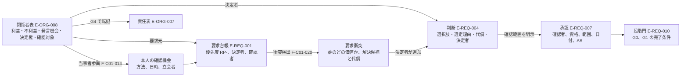

## 3. 当事者参画の方法

### 3.1 原則

- 代理入力（isProxyInput）は許すが、代理決定で終えない。代理入力された要求には本人の確認機会（方法、日時、立会者）を記録し、記録がない限り確認状態を「未確認」のままにする【推定】機能一覧骨格 F-C01-014。
- 当事者参画は数値基準への適合とは別の記録である。利用円滑性の検査（F-C12-011）で段差や幅が基準内でも、「利用しやすい」「対応済み」と断定せず、当事者確認の項目を関係者表に残す（T-R-008）【推定】用語集 160。
- 国土交通省の「高齢者、障害者等の円滑な移動等に配慮した建築設計標準」の頁には別冊として「建築プロジェクトの当事者参画ガイドライン」が掲載されている【事実】https://www.mlit.go.jp/jutakukentiku/jutakukentiku_house_fr_000049.html （SRC-295、確認日 2026-09-15。別冊の本文は未読、未決 U-05-006）。RIBA Plan of Work には Engagement Overlay（2024年1月）が公開されている【事実】https://www.riba.org/work/insights-and-resources/riba-plan-of-work/ （SRC-246、確認日 2026-09-15）。いずれも建築物または英国の実務向けの指針であり、本製品は住宅の生活場面に結び付けた参画方法として参照する【推定】。
- 本人が意思表示できない場合（乳幼児、重度の認知症等）は、代理者が「本人が意思表示できない（理由）」を決定者の承認付きで記録し、本人確認の代わりに生活場面（乳幼児期、在宅介護）の確認をもって参画とみなす【仮定】未決 U-05-003。

### 3.2 対象別の参画方法（P0 の既定）

当事者向け質問は対象者ごとに 3 問以内とし、本節は項目名と参画方法だけを持つ。質問文、表示条件、取得する値、書込先の正本は第8章 第7.0.1節（D8-a〜l）とする（JM-048 の統合判断。第8章 U-08-017 の照合先も第8章）。要配慮者の避難の共通の 1 問（D8-l）は対象者ごとの 3 問とは別に数え、一人に表示する質問は計 4 問以内とする（第8章 第7.0.1節。3 問以内の規則の改訂の要否は第8章 U-08-019）。障害や配慮が必要な家族の有無と内容は質問群D の D9 で取得する【仮定】。

| 対象 | 声が抜けやすい理由 | 参画方法（製品内で実施できるもの） | 記録する項目 | 区分 |
|---|---|---|---|---|
| 子供（学齢期） | 親が代理で回答する。将来の独立や個室の要求が親の希望に置き換わる | (1) S-02 の当事者向け質問（項目名: 自室、遊びと学習、友人来訪。質問文は第8章 D8-a〜c）を本人が回答する。(2) S-04 の実物尺度の歩行（視点高さを本人の身長に合わせる。初期値は第12章 既定値表 DV-FN-03 の当事者別の値。初期仮説）で自室と居間を本人が見る。(3) 親の代理回答と本人回答の差分を S-24 に表示する | 本人回答の日時、代理回答との差分、本人確認の方法 | 【仮定】 |
| 乳幼児 | 意思表示できない | (1) 生活場面（乳幼児期）で養育者が安全（段差、転落、指詰め、浴室）と養育動線を回答する。(2) 将来場面（学齢期）を試行し、可変性を確認する | 「意思表示不可（乳幼児）」、養育者の確認日時 | 【仮定】 |
| 高齢者 | 子が代理入力する（I-00-002）。画面操作が困難な場合がある | (1) S-02 の当事者向け質問（項目名: 寝室と便所の階、段差と手掛かり、温熱。質問文は第8章 D8-d〜f）を本人または同席の代理者が読み上げて回答する。(2) S-04 の実物尺度の歩行で、寝室から便所までの経路と、寝室から屋外までの避難経路（E-SYS-003 kind=避難。2 階以上の寝室は垂直避難の手段を含む）を本人が見て S-04-09 に記録する（JM-137）。(3) 同席確認の立会者と日時を記録する。(4) 本人が決定者の場合は、同席の代理者を介して判断を記録する（S-25 に「代理記録」と表示。立会者必須。第2.3節。JM-015） | 本人確認の方法（本人操作、同席、読み上げ）、立会者、日時。代理記録では記録者と決定者の確認 | 【仮定】 |
| 障害のある人（車椅子、視覚、聴覚、認知） | 数値基準への適合で「対応済み」とされやすい | (1) S-02 の当事者向け質問（項目名: 移動しにくい場所と使いにくい設備、呼出と警報の知らせ方、一人で過ごす場所と手伝いの要否。質問文は第8章 D8-g〜i）で、利用円滑性の要求（経路、段差、幅、回転、移乗、手掛かり、視認、聴覚情報、介助空間）を本人の言葉で要求台帳に登録する。(2) S-04 の実物尺度の歩行で、日常の経路と、寝室から屋外までの避難経路（E-SYS-003 kind=避難）を本人が確認し S-04-09 に記録する（JM-137）。(3) 検査結果（F-C12-011）と本人確認を別の記録として持ち、本人確認がない項目は「当事者確認待ち」と表示する。避難経路の幅、段差、扉、垂直避難の手段の判定は第19章 第2.2節（F-C12-009。P0 は初期注意の表示のみ、判定は P1）が行い、本章の記録は判定に代えない。「避難できる」と読める語は表示しない | 当事者確認の項目一覧と状態、確認日時、避難経路の歩行の記録 | 【仮定】 |
| 介護者（家族、訪問介護） | 介護される本人の要求だけが登録され、介護者の作業要求が抜ける | (1) S-02 の当事者向け質問（項目名: 夜間の介助の経路と回数、介助で足りない空間。質問文は第8章 D8-j〜k）と生活場面（在宅介護）で、介護者の夜間動線、介助空間、入浴と排泄の介助手順を回答する。(2) 本人の要求と介護者の要求の衝突（例: 本人の「一人で入浴したい」と介護者の「介助空間」）を要求衝突として表示する | 介護者の要求元、本人要求との衝突と決定 | 【仮定】 |
| 将来の居住者 | 未確定であり本人がいない | 生活場面（家族変化、維持）で家族が代理し、将来場面の試行結果（P1）を可変性比較として残す。将来場面で当事者が特定できない場合（将来の同居者、未定の被介護者）は「当事者未定（将来）」とし、割当の期限を場面の時期（E-REQ-009 の時期）に置き、G4 の未確認事項に残す。現在の家族が将来の当事者になる場合は本人を割り当て、代理は「代理」を明示する（第19章 第2.3節と同文。JM-143） | 「未確定」または「当事者未定（将来）」、割当の期限、代理した家族 | 【仮定】 |
| 言語が異なる家族 | 質問の言語で回答が変わる | 当事者向け質問を本人の言語で表示する（対応言語は未決 U-05-007）。翻訳の有無を記録する | 回答言語、翻訳の有無 | 【仮定】 |

### 3.3 個人情報への配慮

- 子供の年齢、障害、介護の情報は要配慮の度合いが高い。要求台帳と関係者表のこれらの属性は外部送信の非共有項目を既定とし、学習利用は初期無効（F-C10-011）とする【推定】指示文E、9.8。
- 個人情報保護委員会は生成AIサービスの利用について、本人の同意なく個人データを含むプロンプトを入力し、応答結果の出力以外の目的で取り扱われる場合に法違反の可能性があると注意喚起している【事実】https://www.ppc.go.jp/news/careful_information/230602_AI_utilize_alert/ （SRC-296、公表日 令和5年6月2日、確認日 2026-09-15）。当事者向け質問の回答を外部の言語模型へ送る場合は F-C10-018（最小送信と処理地域の表示）に従う【推定】。
- 子供の個人情報の取得に保護者の同意を要する年齢の閾値と、本人確認の記録に本人の氏名を含めるかは第22章の判断に委ね、本章は「本人確認の記録は関係者の役割名（label）と日時で持ち、氏名は Person に分離する」を既定とする【仮定】未決 U-05-005。

## 4. 課題、価値提案、決定権

### 4.1 利用者区分ごとの課題、価値提案、決定権

| 利用者区分 | 課題（観察できる現状） | 本製品の価値提案（観察可能な条件） | 根拠 | 決定権（製品内） | 計測する指標 | 区分 |
|---|---|---|---|---|---|---|
| 家族（一般利用者） | 希望が言語化されず、住宅会社ごとに同じ条件を再入力する。連絡先入力の後でないと案が見られない（タウンライフの導線）。映像だけの3Dで実体がない（Renovo のレビュー） | 電子連絡先なしで三案と要求適合表に到達する。要求が出典、決定者、確認者付きで残り、案、要素、判断へ双方向にたどれる。衝突が平均化されず代償付きで示される | 【事実】https://www.town-life.jp/home/main/chatform.php （SRC-014、確認日 2026-09-15）、https://apps.apple.com/us/app/ai-home-design-renovo/id6747351118 （SRC-002、確認日 2026-09-15）。価値提案は【推定】 | 目的文、要求優先度、衝突の解決、選定、予算上限、同意 | M-P-04、M-P-08、M-P-09、M-G-11、M-G-05 | 【推定】 |
| 声が抜けやすい当事者（子供、高齢者、障害のある人、介護者） | 代理入力で本人の要求が置き換わる。数値基準への適合で「対応済み」とされる | 本人の確認機会が記録され、当事者確認待ちの項目が消えない。実物尺度で経路を本人が見る | 【推定】指示文C1、10.1。【事実】建築設計標準の別冊に当事者参画ガイドライン（URL は第3.1節、2026-09-15） | なし（発言機会と確認対象。本人が所有者の場合は家族と同じ） | M-P-09（層別: 当事者参画の対象）、M-P-08（層別: 代理入力） | 【推定】 |
| 設計者（建築士） | 利用者から渡される資料が要求の根拠を持たず作り直す。AIの案が「確認済み」と誤解される | 引継ぎ一式に要求台帳、問題一覧、判断記録が含まれ、元図と要求へ戻れる。確認範囲を明示した承認だけが V3 に反映される | 【推定】指示文8章、10.6。【事実】建築士制度 https://www.mlit.go.jp/jutakukentiku/build/architect.html （SRC-270、確認日 2026-09-15） | なし（確認権のみ） | M-G-02、M-G-06、M-P-11 | 【推定】 |
| 施工者 | 案が施工可能と誤表示され、数量根拠と搬入経路がない | 施工成立性の初期注意と数量根拠付きの費用幅を受け取る。「施工可能」の語は表示されない | 【推定】指示文C13、B | なし（確認権のみ。P2） | M-G-03、M-G-13 | 【推定】 |
| 提携事業者 | 一括送信された見込客に営業し、利用者の信頼を失う | 個別同意の後にだけ、適合理由付きで共有範囲内の情報を受け取る | 【事実】タウンライフ規約の連絡停止は利用者側申出 https://www.town-life.jp/home/terms.html （SRC-016、確認日 2026-09-15）。価値提案は【推定】 | なし | M-G-07、M-B-02、M-B-03、M-B-04 | 【推定】 |
| 維持管理者、将来の居住者 | 交換できない設備、可変性のない間取りが固定される | 生活場面（維持、家族変化）の要求が案の比較軸に残る。機器台帳と将来場面の試行（P1、P2）へ情報構造を引き継ぐ | 【推定】指示文C14、10.1 | なし | M-O-03、M-O-05（P2） | 【推定】 |

### 4.2 家族間の要求対立の扱い

#### 4.2.1 規則

| 規則 | 内容 | 区分 |
|---|---|---|
| 平均化の禁止 | 衝突する二つの数値範囲の中間値や、二人の希望の折衷案を製品が自動で要求台帳に書かない。要求は要求元ごとに別の個体として残す | 【推定】指示文C1、用語集 39 |
| 衝突の可視化 | 衝突ごとに「誰の（要求元）」「どの価値が（要求の文言と優先度）」「何と（相手の要求）」「なぜ両立しないか（検出方法）」を表示する。規則で検出した衝突と利用者が登録した衝突は決定者へ全件表示する（M-G-11 の目標 0 件。母集団は第4.2.2節）。言語模型の衝突候補（未検証）は別欄に表示し、衝突に数えない（JM-043） | 【推定】 |
| 解決候補と代償 | 各衝突に解決候補を 2 件以上示す（件数と候補の型は第8章 第5.3節「解決候補の生成規則」を正本とする）。候補が 1 件しか作れない場合は「取下げ」を第 2 候補として必ず提示する（JM-016）。候補ごとに代償（失う条件、費用差の幅、面積、採光、期間）を添える。費用差の幅は G2 で概算（A09）が付くまで「G2 で算出」と表示し、単一額を出さない | 【推定】用語集 15 |
| 決定者の指定 | 衝突の解決は決定権を持つ関係者が行い、判断記録（E-REQ-004）に要求、選択肢、選定理由、代償、決定者、確認者、版を残す。決定者未定のまま G1 を通過しようとすると I-00-109、衝突が未表示なら I-00-110（段階は G1、G2。JR-038。いずれも SEV-0）で進行が止まる | 【推定】七段階門 G1、T-R-012 |
| 保留 | 決定者は衝突を「保留」にできる。保留は決定者の判断（E-REQ-004、選択肢=保留、理由必須、期限=G2 の門）として記録し、I-00-110 の解除条件と G1 完了条件(2)を満たす。ただし双方が RP-MUST の衝突（X1、X2 で双方 RP-MUST）は保留できず、G1 で優先度の変更か取下げを要する（G2 で I-00-111 に該当するため）。RP-MUST と RP-WANT 以下の衝突の保留は G2 の門で SEV-1 の問題とし（決定者の「保留の期限の延長」の判断〔E-REQ-004、判断種=衝突の解決、scopeKind=要求、mode に従い合議は全員の coApprovalRefs。G3 の門までの一回、理由必須〕で G3 へ持ち越せる。JR-016）、RP-WANT 同士の保留は SEV-2 とする（第6章 第2.2節 G1 完了条件(2)、第8章 F-C01-020 手順(6)と同文。JM-047）。保留の期限の延長は例外承認と利用者判断に含めない（用語集 562）。保留の衝突は G2 の案別要求適合表（F-C01-023）に「未解決」として案ごとに表示し、G2 の完了条件(1)「満たさない要求を案ごとに明示」で扱う | 【仮定】 |
| 再検出 | 要求の追加、数値範囲の変更、敷地制約の確定、案の生成の各時点で衝突を再検出し、新しい衝突は決定者へ通知する（S-17）。案の生成時に新たに検出した衝突は、決定者への表示と判断（保留を含む）の記録が G2 の門の条件になる（第6章 第2.3節 G2 完了条件(8)。JR-038） | 【推定】 |
| 助言の禁止 | 製品は「どちらの家族が正しいか」を示さない。言語模型は衝突の言い換え、質問、解決候補の提示に限り、決定を行わない | 【推定】指示文10.6 |

#### 4.2.2 衝突の種類と検出方法（P0）

種類の右の括弧は第8章 第5.3節と第7.0.2節の番号（X1〜X8）であり、検出規則の正本は第8章の当該行である。規則の判定には利用者確認済み（VS-USR）の値だけを使う（JM-043）【推定】。

| 種類 | 検出方法（決定的検査） | 例 | 区分 |
|---|---|---|---|
| 排他的な必須要求（X1、X5） | 同一の室または属性に対する RP-MUST 同士で数値範囲が重ならない（X1）、または RP-FORBID の要求と同じ対象を求める RP-WANT 以上の要求がある（X5） | 「居間に階段を置く」と「階段は居間に置かない」 | 【推定】 |
| 価値の衝突（X3） | 同一室または隣接室（E-SYS-005 kind=隣接）について時間帯（E-REQ-009.timeBand）が重なり、(a) 同じ価値属性（E-REQ-001.valueAttribute）で極性（polarity）が逆の要求、または (b) 両立しない行動の対応表（第12章 既定値表 DV-CF-10。要約は第8章 第5.3節）で両立不可の行動（E-REQ-009.activities）を含む生活場面の要求が、異なる関係者から RP-MUST または RP-WANT で出されている。判定に使う値は VS-USR に限る。隣接室の判定は案（V1 以上）に E-SYS-005 kind=隣接 がある時点から行う。希望入力の G1 では同一室の組と、targetSpaceRefs に二室を持つ要求（隣接の希望）の組だけを判定し、隣接が未確定の組と入力が VS-USR 未満の組は「判定待ち（案の生成後、または確認待ち n 件）」として S-24 に件数表示し「衝突なし」と表示しない。案の生成時に隣接室を再検出し、E-REQ-001.conflictRecords に optionRefs を記録する（G2 で新たに検出された衝突は第6章 第2.3節 G2 完了条件(8)。JR-038）。対応表にない組合せは衝突候補（未検証）として検出した衝突と別に表示し、決定者または編集者が「衝突として登録」を選んだものだけを衝突（利用者登録）に数える（第8章 第5.3節 X3 と同文。JM-043） | R-05-001 開放的な居間と R-05-002 個室の静けさ（I-00-001）。夜間の居間の会話と視聴（成人A）と、隣接する子供室の学習と就寝（子供）が音の軸で両立しない（(b)） | 【推定】 |
| 資源の衝突（X2、X4） | 面積、予算、敷地の合計制約を超える（駐車 2 台と庭 30 m²、I-00-003）。判定式は第8章 第5.3節 X2（敷地面積と間口）、X4（予算と性能または規模） | R-05-006、R-05-007、R-05-008 | 【推定】十二判断領域 A01 |
| 本人と代理者の衝突（X8） | 同一対象に対する本人回答の要求と代理入力（isProxyInput=true）の要求の valueRange または選択値が異なる（第8章 第7.0.1節 X8 と同一） | R-05-003（子が代理入力）と本人の回答の差 | 【仮定】 |
| 現在と将来の衝突（X7） | 生活場面（家族変化）の要求が現在の要求と X1 の規則で両立しない | 個室の固定壁と将来の寝室分割（I-00-032 は A03 の問題として別に持つ） | 【推定】 |

価値の衝突の判定値の例（T-R-012 と T-U-004 の試験情報。JM-043）: R-05-001 は valueAttribute=開放性、polarity=高める、targetSpaceRefs=居間で、生活場面（日常、timeBand=夜間、activities=会話、視聴、actorRefs=成人A）に結ぶ。R-05-002 は valueAttribute=静音、polarity=高める、targetSpaceRefs=子供室（居間に隣接）で、生活場面（日常、timeBand=夜間、activities=学習、就寝、actorRefs=子供）に結ぶ。価値属性が異なるため (a) では検出されず、DV-CF-10 の音の軸（{就寝、学習} と {会話、視聴}）で (b) として検出される。値はいずれも VS-USR とする。居間と子供室は別の室のため、希望入力の G1 では隣接が未確定で「判定待ち」と表示し、案の生成時（G2）に案の隣接で検出する。図面入力では V1 案に隣接がある G1 で検出する（T-R-012 の二段。JR-038）【仮定】。

M-G-11（要求衝突の未表示件数）の母集団は「規則で検出した衝突 ＋ 利用者が登録した衝突」とし（第8章 第5.3節、第23章 第2.5節）、衝突候補（未検証）は数えない【推定】。予算と性能の衝突（T-R-007）は A01 の要求変更として登録し、費用低減案の影響表示（F-C13-013）は第20章が担う【推定】。

#### 4.2.3 例示（例示識別子）

| 識別子 | 要求の文言 | 要求元（出典: S-02 の回答、G1） | 優先度 | 数値範囲 | 決定者 | 確認者 | 期限 | 確認状態 | 主担当 | 影響先 | 区分 |
|---|---|---|---|---|---|---|---|---|---|---|---|
| R-05-001 | 居間は家族が集まる一室で、台所と食堂と連続する | 成人A（所有者） | RP-WANT | なし | 成人A | 建築士（P0 では利用者のみ可） | G1 完了前 | VS-USR | A01 | A03 | 【仮定】 |
| R-05-002 | 自室の扉を閉めた状態で居間の会話が聞き取れない | 子供（学齢期。本人回答） | RP-MUST | 隣接室間の音圧レベル差 Dr-40 以上（初期仮説。根拠は【未確認】で建築士の確認で改める。第19章 第3.3節）。観察条件「会話が聞き取れない」は本人の当事者確認（E-SRV-013.stakeholderCheck、method=本人回答）として数値と別に記録する | 成人A | 建築士 | G1 完了前 | VS-USR | A01 | A03、A07 | 【仮定】 |
| R-05-003 | 高齢の親の寝室と便所を同一階に置く | 高齢者（子Bが代理入力） | RP-MUST | 同一階 | 成人A | 建築士 | 本人確認は G1 完了前 | 未確認（本人確認機会なし） | A01 | A03、A07 | 【仮定】 |
| R-05-004 | 玄関から親の寝室まで段差 0 mm | 高齢者、介護者 | RP-WANT | 0 mm | 成人A | 建築士 | G2 選定前 | VS-USR | A01 | A03、A07 | 【仮定】 |
| R-05-005 | 在宅勤務の作業室は扉付きで、通話音が居間に漏れない | 在宅勤務者（成人B） | RP-WANT | なし | 成人B | 建築士 | G2 選定前 | VS-USR | A01 | A03、A07 | 【仮定】 |
| R-05-006 | 建築費の上限 3,500 万円（変更できない条件） | 成人A、成人B | RP-MUST | 上限 3,500 万円 | 成人A、成人B（合議） | なし | G0 完了前 | VS-USR | A01 | A09 | 【仮定】 |
| R-05-007 | 駐車 2 台 | 成人B | RP-MUST | 2 台以上 | 成人B | 建築士 | G1 完了前 | VS-USR | A01 | A02、A03 | 【仮定】 |
| R-05-008 | 庭 30 m² 以上 | 成人A | RP-WANT | 30 m² 以上 | 成人A | 建築士 | G1 完了前 | VS-USR | A01 | A02、A03 | 【仮定】 |
| R-05-009 | 介護者の寝室から親の寝室まで扉 2 枚以内 | 介護者（子B） | RP-WANT | 2 枚以内 | 成人A | 建築士 | G2 選定前 | VS-USR | A01 | A03 | 【仮定】 |
| R-05-010 | 隣地側の 2 階の窓は隣家の窓と正対しない | 成人A（近隣の確認対象） | RP-NICE | なし | 成人A | 建築士 | G2 選定前 | VS-USR | A01 | A02、A03 | 【仮定】 |
| R-05-011 | 廊下幅 900 mm 以上 | 介護者、将来の車椅子利用 | RP-MUST | 有効幅 900 mm 以上（measureBasis=有効。E-REQ-001.checkTarget。心々寸法ではない。JR-089）。要求の例であり利用円滑性の検査の既定閾値ではない。900 mm は住宅の公的基準（評価方法基準 9-1 高齢者等配慮対策等級は通路 850 mm〔等級5〕と 780 mm〔等級4、3〕、障害者の居住にも対応した住宅の設計ハンドブックは 780 mm）の値ではない（2026-10-07 の外部確認。評価方法基準 https://www.mlit.go.jp/jutakukentiku/house/content/001907911.pdf （SRC-318）、ハンドブック https://www.mlit.go.jp/jutakukentiku/house/content/001751893.pdf （SRC-317）、確認日 2026-10-07。01_調査 08 第4節【事実】）。検査は同一対象の要求値を優先するため、本要求がある案件では 900 mm で判定し（同一対象に複数の要求がある場合の採り方は第19章 第2.3節「閾値の出所」）、要求のない案件は DV-FN-01 による（第19章 第2.3節。JM-134） | 成人A | 建築士 | G1 完了前 | VS-USR | A01 | A03、A07 | 【仮定】識別子規則 第2.6節の例、T-A-003 の入力 |

| 識別子 | 問題 | 主担当 | 影響先 | 重大度 | 状態 | 担当 | 期限 | 固定先 | 発見段階 | 進行禁止該当 | 解決証拠 | 区分 |
|---|---|---|---|---|---|---|---|---|---|---|---|---|
| I-05-001 | 同一判断種（選定）に成人A と成人B が決定権を持ち、優先順位も合議の指定もない | A01 | A12 | SEV-1 | IS-OPEN | 成人A（所有者） | G1 完了前 | 関係者表（台帳行。固定先の種別は未決 U-05-008） | G0 | 非該当 | 優先順位または合議の記録 | 【仮定】 |
| I-05-002 | 判断記録 D-05-001 の決定者が関係者表から削除され、判断の承認が失効（AS-VOID）したまま G2 へ進もうとしている | A01 | A12 | SEV-1 | IS-OPEN | 成人A（所有者） | G2 開始前 | 判断記録（台帳行） | G1 | 非該当（決定者不在が RP-MUST に及ぶ場合は I-00-109 として別に検出） | 決定者の再指定と再承認（AS-VALID） | 【仮定】 |
| I-05-003 | 目的文の承認版が要求台帳の最新版より古く、変更できない条件（R-05-006）の変更後に再承認がない | A01 | A12 | SEV-1 | IS-OPEN | 成人A、成人B（合議） | G1 完了前 | 目的文（台帳行） | G1 | 非該当 | 再承認の記録（承認者、日時、版） | 【仮定】 |
| I-05-004 | 関係者表の「将来の居住者」行が空欄で「なし（理由）」の記載もない | A01 | A11 | SEV-2 | IS-OPEN | 成人A（所有者） | G1 完了前 | 関係者表（台帳行） | G0 | 非該当 | 五属性の記入または「なし（理由）」 | 【仮定】 |

| 識別子 | 判断 | 主担当 | 影響先 | 対象要求 | 選択肢 | 選定と理由 | 代償 | 決定者 | 確認者 | 版 | 段階 | 区分 |
|---|---|---|---|---|---|---|---|---|---|---|---|---|
| D-05-001 | 居間の開放性と個室の静けさの衝突（I-00-001）の解決 | A01 | A03、A07、A09、A11 | R-05-001、R-05-002 | (a) 個室を 2 階の居間直上を避けた位置に置き、扉と壁を遮音仕様にする。(b) 居間に可動間仕切を置き時間帯で分ける。(c) 個室を 1 階の居間から離れた位置に置く | (a) を採用。理由: R-05-002 が RP-MUST であり、R-05-001 の連続性を保てる | 遮音仕様の費用差（G2 で算出）、2 階の面積配分、子供の独立後の可変性（将来場面で試行） | 成人A | 建築士（P0 では利用者のみ可） | v1.0 | G1 | 【仮定】 |
| D-05-002 | R-05-003（代理入力）の本人確認方法の判断 | A01 | A07 | R-05-003 | (a) 本人が S-02 の当事者向け質問に回答。(b) 子B が同席して読み上げ、S-04 の実物尺度の歩行で経路を本人が見る。(c) 意思表示不可として記録 | (b) を採用。理由: 本人は画面操作が困難だが意思表示はできる | 同席の日程調整（確認機会の期限を G1 完了前に設定） | 成人A | なし | v1.0 | G1 | 【仮定】 |

#### 4.2.4 衝突解決の流れ

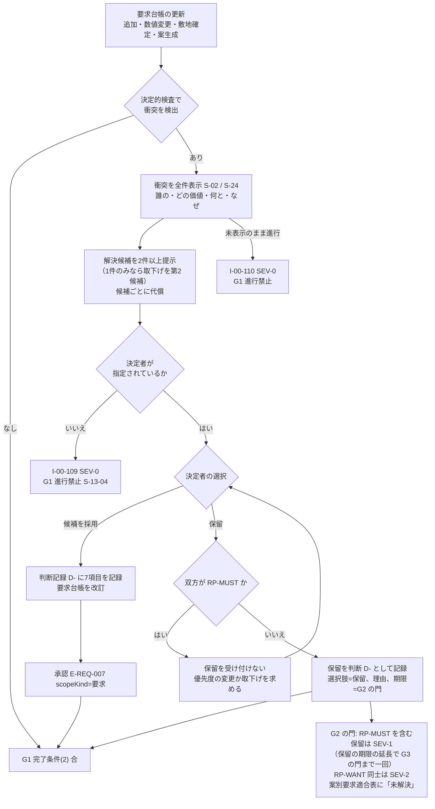

## 5. 利用者区分ごとの画面

### 5.1 二つの画面系統

| 系統 | 利用者 | 主な画面 | 役割権限 | 表示の原則（観察可能な条件） | 区分 |
|---|---|---|---|---|---|
| 一般利用者の短い対話 | 家族、当事者参画の対象 | S-01 開始画面、S-02 条件聞取画面、S-03 提案比較画面、S-24 要求台帳画面、S-13 段階門画面 | RL-OWN、RL-EDT、RL-VIEW | (1) 一問式では一画面に一問、残り項目数を常時表示（F-C01-002）。(2) 初回成果まで電子連絡先の入力欄を出さない（F-C01-025、M-P-04）。(3) 状態符号（V、VS-、RP-、SEV-）は記号と文字を併記し色だけに依存しない。(4) 専門用語は用語集の語を使い、初出時に一文の説明を付す。(5) 375 px 幅で全操作が完了する（N-AC、第23章） | 【推定】画面指標試験骨格 第1.5節 |
| 専門家の確認作業面 | 設計者（建築士）、P1 で構造設計者と設備設計者、施工者 | S-22 専門家確認作業面、S-23 問題一覧画面、S-25 判断記録画面、S-10 建築調整画面、S-13 段階門画面 | RL-CHK（有資格者）、RL-PART | (1) 確認範囲を指定し、氏名、資格、範囲、日付を付けて承認または差戻し（F-C08-008）。(2) 問題から元図、要求、判断へ一操作で遡れる。(3) 確認範囲外は V2 のまま表示し、範囲外の保証をしない。(4) 確認予約の容量と滞留（M-P-11）を表示する。(5) 差戻しは理由付きで問題として登録され、決定者へ通知される | 【推定】画面指標試験骨格 S-22 |

S-22 は P1 である（画面指標試験骨格 第1.2節）。P0 で専門家（建築士）が案を確認する経路は、所有者が S-08 の期限付き共有URL（F-C10-009）で共有し、建築士が RL-CHK として S-13 と S-23 で確認する経路に限る。G1 完了条件(5)は、P0 では決定権者の承認で合とし専門家の承認欄を「未承認」と表示し、P1 で照合済みの資格を持つ建築士の確認範囲を明示した承認を必須にする（第6章 第2.2節 G1 完了条件(5)、第5.2節「資格の照合状態」、用語集 40。U-00-015 は解決。JM-195、JR-012）。P0 の確認者欄の表示語は、資格を登録した RL-CHK の承認に「資格未照合（本人申告）」、自己承認と資格を登録していない確認者の承認に「専門家未確認」（用語集 370。承認個体の表示語）、承認の行に担当者がいない場合に「専門家未割当」（用語集 493。行の空欄）を使い分け、混用しない（第15章 第7.20節、第6章 第1.1節 規則13）【仮定】未決 U-05-002。

### 5.2 二系統の接点

| 接点 | 画面 | 内容 | 区分 |
|---|---|---|---|
| 共有 | S-08 共有と書出画面 | 所有者が確認者へ共有範囲（階、室、問題、非共有項目）を指定して共有する（CDE-SHR） | 【推定】 |
| 承認と差戻し | S-13 段階門画面、S-22 | 確認者の承認状態（AS-）が段階門の完了条件に反映される。差戻しは決定者の画面に問題として現れる | 【推定】 |
| 同意 | S-20 同意管理画面 | 提携事業者への送信は送信先ごとの個別同意の後に限る（F-C08-005。P1） | 【推定】 |
| 責任境界 | S-30-06 責任境界表示 | 両系統の全画面に、AIが行えることと人が担うことの区分と、AI人格が建築士でない旨を表示する | 【推定】指示文10.6 |

### 5.3 S-02、S-04、S-24 等に必要な表示内容（第15章への依頼と対応）

本章は部品を採番しない（画面指標試験骨格 第0節の規則により S-02、S-24 の部品は第15章が採番し、S-04-09 は画面指標試験骨格 v1.2 が採番した）。第15章へ次の表示内容を依頼し、第15章 v1.1 で対応した部品を右列に記す（v1.2 で第15章 v1.2 の対応を右列に追記した。2026-10-06）【仮定】。

| 画面 | 表示内容 | 対応する機能 | 第15章 v1.1 の部品（v1.2 の対応を含む） |
|---|---|---|---|
| S-02 | 関係者表の作成と編集（五属性、決定権の判断種、役割名 label、代理入力の別）。空欄の警告 | F-C01-013 | S-02-05 |
| S-02 | 当事者向け質問（第8章 第7.0.1節 D8-a〜l）と本人確認の記録（方法、日時、立会者）。「意思表示不可（理由）」と「本人が回答を辞退（日時、立会者）」の記録（決定者の承認付き）。いずれもない当事者の行に「本人未確認」。当事者確認の項目一覧（第19章 第2.3節の 12 項目。項目名、割り当てた当事者、状態、数値検査列「未検査（P1）」。JM-014） | F-C01-014 | S-02-05（v1.1 の記載は D8-a〜f。第15章 v1.2 で D8-a〜l と当事者確認の項目一覧を反映し、辞退の格納先を E-ORG-008.responseDeclined とした）。数値検査列と当事者確認列は S-11-05 |
| S-04 | 実物尺度の歩行（S-04-03 の walkthrough。視点高さを当事者の値に切り替える）の途中で記録する当事者確認: 対象の関係者行、視点高さ、見た経路（E-SYS-003）、立会者、日時、結果（確認済み、懸念あり）を E-ORG-008.selfConfirmation（method=実物尺度の歩行）と E-SRV-013.stakeholderCheck（当事者ごとの一覧の当該当事者の1件。第12章 v1.3）へ書き込む。操作主体は本人（RL-VIEW）、または RL-OWN と RL-EDT の代理記録（立会者必須）。walkthrough の操作に「当事者確認の記録」を置く（JM-114） | F-C01-014、F-C04-002（第11章） | S-04-09（画面指標試験骨格 v1.2 の採番）、第15章 第5.3節の操作「当事者確認の記録」 |
| S-02、S-24 | 衝突一覧（誰の、どの価値、何と、なぜ）、解決候補と代償、決定者の指定、保留 | F-C01-020（第08章） | S-02-06、S-24-03、S-24-04 |
| S-02、S-13 | 目的文、成功条件、非対象、変更できない条件の4項目と承認状態（AS-）、版 | F-C01-021 | S-13-01、S-13-03（承認状態）。S-02 の4項目の入力欄と承認状態は第15章 v1.2 が S-02-09「目的文と成功条件の承認」として新設した（合議の「承認待ち（n/m 名）」、P0 の専門家欄「未承認」、変更時の AS-VOID を含む） |
| S-24 | 要求元と決定者の区別、代理入力の要求の確認状態「未確認」の表示、本人回答と代理回答の差分 | F-C01-014、F-C01-019（第08章） | S-24-01、S-24-06 |
| S-03、S-13、S-25 | 合議の「未合意（案A: 成人A、案B: 成人B）」の表示と期限、三つの導線（分岐案、優先順位への切替を求める操作〔変更前の決定権者全員の承認を要する。JR-008〕、建築士への相談）。代理記録の表示（記録者の役割名、決定者の確認の方法、日時、立会者）（第2.3節。JM-015） | F-C01-020（第08章）、F-C15-014（第06章） | S-03-07、S-13-03、S-25-02 |

## 6. 機能要件

機能一覧骨格 v1.2 で本章を主章とする機能は F-C01-013、F-C01-014、F-C01-021 の3件である（第08章が副章）。単体試験は第23章 付表 4.3-A の T-U-004 が3機能の受入条件を対象にする。いずれも区分 C01、優先 P0、主担当領域 A01、六因果 (1) と (4)【推定】機能一覧骨格 第1.1節。

### 6.1 F-C01-013 関係者表の作成 v2.0

| 項目 | 内容 |
|---|---|
| 識別子 | F-C01-013 関係者表の作成 v2.0（v1.1 で例外(b)の登録契機と前提の家族の概略の出所を追記。JM-018。v2.0 は二回目の修正で mode の記録と変更の全員承認〔権限、例外(f)、AC-C01-013-06〕と、障害のある家族の行の既定の重ね合わせ〔正常手順(1)〕を加えた。JR-008、JR-009）。主担当 A01、影響先 A12。段階 G0、G1。画面 S-02（S-24 で参照）。指標 M-P-09、M-P-04。試験 T-R-012、T-A-013、T-U-004（第23章 付表 4.3-A） |
| 目的 | 家族、設計者、施工者、維持管理者、介護者、来訪者、近隣、将来の居住者、提携事業者、行政、確認検査機関、判定機関、第三者評価機関を洗い出し、各関係者に利益、不利益、発言機会、決定権、確認対象を持たせ、決定権を持つ関係者が1名以上いる状態を G0 の完了前に作る【推定】 |
| 利用者 | 所有者（RL-OWN）が作成、編集者（RL-EDT）が編集。確認者（RL-CHK）は閲覧と差戻し。当事者参画の対象は本人確認の記録を通じて参加する【推定】 |
| 前提 | 案件（PJ-）が発行され、利用目的と家族の概略（F-C01-001、F-C01-007）が入力されている。家族の概略は第8章 質問群D（D1〜D9）で取得し、第4章 第2.3.2節のタウンライフの段階3、4（大人と子供の人数）に相当する。関係者表の行は役割名（label）で持ち、同 段階13 の氏名、年齢、連絡先を要しない。電子連絡先は不要。第2.2節の既定の雛形が利用目的（新築、改装、家具配置、図面3D化、売却または賃貸資料）ごとに用意されている【仮定】 |
| 正常手順 | (1) 利用目的と家族構成から既定の雛形を生成し、家族の細区分（成人、子供、乳幼児、高齢者、在宅勤務者）の行を人数分作る。D9 の該当者の行には第2.2節「家族: 障害のある人」の行の既定を重ねる（JR-009）。(2) 利用者が各行の役割名（label）、利益、不利益、発言機会、確認対象を確認または編集する。(3) 決定権の判断種（目的文、要求優先度、衝突の解決、選定、予算上限、商品の採用、共有と同意、変更の確定）ごとに決定者を指定し、二名以上の場合は優先順位または合議を選ぶ。(4) 当事者参画の要否（E-ORG-008.needsParticipationSupport。personRef があれば E-ORG-001 Person の値を既定とし、本人が未登録で personRef が null の関係者は所有者が関係者表で指定する。第12章 v1.2。未決 U-05-012 は解決）と代理入力の別（E-ORG-008.isProxyInput）を関係者ごとに記録する。(5) 空欄の行に「なし（理由）」を入れる。(6) 決定権を持つ関係者が自分の行を確認し（VS-USR 相当の確認日時）、関係者表を版付きで保存する。(7) G0 の完了条件(2)の判定へ渡す【推定】 |
| 例外 | (a) 決定権を持つ関係者が0名: 保存はできるが G0 の完了条件(2)が未達となり S-13-01 に表示。(b) 同一判断種に decisionAuthority を持つ関係者が二名以上で、mode（優先順位または合議）が未記録: I-05-001（SEV-1。進行禁止ではない）を登録する。登録の契機は関係者表の保存時と G0、G1 の門の判定時で、検査規則は第6章 第8.2節に E-EXC-005（kind=欠落属性、appliesTo=G0、G1、testRef=T-R-012）として登録されている（JM-018）。(c) 行政、確認検査機関、判定機関、第三者評価機関の行に製品内の決定権を入力: 拒否し「製品外権限」と表示（判定機関は v1.4 で追加。第12章 E-ORG-008.externalAuthority）。(d) 関係者の削除で判断記録の決定者が空になる: I-05-002（SEV-1）を登録し、該当する判断の承認を AS-VOID にする。(e) 五属性に空欄: 保存時に警告し、空欄のまま G1 へ進めない（M-P-09 の分子から除外）。(f) mode の記録と変更（合議から優先順位、決定者の削除を含む）に変更前の決定権者全員の承認（scopeKind=関係者表、coApprovalRefs）がない: 関係者表の改訂を登録せず理由を表示し、S-13-03 に全員の承認を求める操作と、分岐案と建築士への相談（P1）の導線を出す（第2.3節。JR-008）【仮定】 |
| 情報入出力 | 入力: 利用目的、家族構成（F-C01-007）、利用者の編集。出力: E-ORG-008 Stakeholder の個体（personRef、label、category、interests、voiceOpportunity、decisionAuthority、verificationTargets、participationMethod、isProxyInput、confirmedBySelf）、E-REQ-006 Revision（関係者表の版）。参照: E-ORG-001 Person（本人が登録されている場合）、E-REQ-001.deciderRef、E-REQ-004.deciderRef【推定】 |
| 権限 | 作成と編集: RL-OWN、RL-EDT。閲覧: RL-CHK、RL-VIEW（共有範囲内）。提携事業者（RL-PART）には関係者表を共有しない（非共有項目）。決定権の変更の操作は RL-OWN のみ。mode の記録と変更（合議から優先順位、決定者の削除を含む）は、変更前に当該判断種の決定権を持つ全員の承認（scopeKind=関係者表、coApprovalRefs）を要する。合意できない場合の導線は分岐案と建築士への相談（P1）に限り、所有者の単独の切替は受け付けない（第2.3節、第6章 第5.1節。JR-008）【仮定】 |
| 計測方法 | M-P-09 関係者確認率（五項目がそろい確認済みの関係者数 ÷ 関係者数。G0、G1。層別: 関係者種別、当事者参画の対象）。M-P-04 初回価値到達率（関係者表の作成が電子連絡先なしで完了すること）。I-05-001、I-05-002 の発生件数（月次）【仮定】（初期仮説を含む） |
| 受入条件 | AC-C01-013-01: 保存された関係者表の各行に利益、不利益、発言機会、決定権、確認対象の5属性があり、空欄が0件である（空欄は「なし（理由）」で埋まる）。AC-C01-013-02: 決定権を持つ関係者が1名以上あり、同一判断種の二重割当は全件が優先順位または合議を持つ（持たない件数 0）。AC-C01-013-03: 行政、確認検査機関、判定機関、第三者評価機関の行に製品内の決定権が0件で、「製品外権限」と表示される。AC-C01-013-04: 関係者表の変更が改訂として記録され、判断記録の決定者を変更または削除した場合に該当判断の承認が AS-VOID になり理由が記録される（T-A-013 の変形で検査）。AC-C01-013-05: 開始画面から関係者表の保存までに電子連絡先の入力欄が表示されない（T-S-002）。AC-C01-013-06: 判断種に mode=合議 で決定権を持つ関係者が二名以上ある案件で、成人A（RL-OWN）単独の mode の優先順位への切替と決定者の削除の操作は、変更前の決定権者全員の承認（coApprovalRefs が全員 AS-VALID）がそろうまで関係者表の改訂として登録されず、理由が表示され、判断の承認条件（合議）が変わらない（T-R-012。JR-008）【推定】 |

### 6.2 F-C01-014 当事者参画の提案 v3.0

| 項目 | 内容 |
|---|---|
| 識別子 | F-C01-014 当事者参画の提案 v3.0（v2.0 で例外(a)(b)(e)、正常手順(3)(5)(7)、権限、受入条件の変更と AC-C01-014-06 の新設。JM-013、014、017、048、114、163。v2.1 で第12章 v1.3 の属性名 stakeholderCheckItems、当事者ごとの stakeholderCheck、responseDeclined へ追従。群Bの申し送り。v3.0 は二回目の修正で立会者と記録者の型〔情報入出力〕と AC-C01-014-02 を改め、例外(b)を第6章 規則6 (d) の改訂と同文にして AC-C01-014-07 を新設した。JR-056、JR-032）。主担当 A01、影響先 A07。段階 G1。画面 S-02、S-04（S-04-09 当事者確認の記録）、S-24（JM-114）。指標 M-P-09（層別: 当事者参画の対象）、M-P-08（層別: 代理入力）。試験 T-R-012、T-R-008、T-U-004（第23章 付表 4.3-A） |
| 目的 | 子供、高齢者、障害のある人、介護者等の本人の声が設計判断から抜けやすい場合に、代理決定だけで終えない参画方法を提案し、代理入力された要求に本人の確認機会（方法、日時、立会者）を記録する【推定】 |
| 利用者 | 所有者と編集者（代理入力者）、当事者参画の対象本人（本人操作または同席）、確認者（本人未確認の要求の確認）【推定】 |
| 前提 | 関係者表（F-C01-013）に当事者参画の要否（E-ORG-008.needsParticipationSupport。第12章 v1.2）か E-ORG-008.isProxyInput が真の関係者が1名以上いる。第3.2節の対象別の参画方法が P0 の既定として登録されている。S-04 の実物尺度の歩行（F-C04-002）が利用できる（P0）【推定】 |
| 正常手順 | (1) 関係者表から対象（子供、乳幼児、高齢者、障害のある人、介護者、将来の居住者、言語が異なる家族）を抽出する。(2) 対象ごとに第3.2節の参画方法を1件以上提案し、代理入力者が方法を選ぶ（複数可）。(3) 当事者向け質問（対象者ごとに 3 問以内と避難の共通の 1 問。質問文の正本は第8章 第7.0.1節。JM-048）を本人の言語で表示し、本人または同席の代理者が回答する。回答は要求元を本人として要求台帳へ登録する。(4) 代理回答と本人回答の差分を S-24 に表示し、差分は要求衝突（本人と代理者の衝突）として F-C01-020 へ渡す。(5) 実物尺度の歩行で本人が経路を見た記録（日時、立会者、見た経路、結果）を S-04-09 で残す（E-ORG-008.selfConfirmation の method=実物尺度の歩行と、経路に関わる項目の E-SRV-013.stakeholderCheck。結果が「懸念あり」の場合は内容を必須とし、S-24 の該当要求に「当事者の懸念あり」を表示する。JM-114）。(6) 本人の確認機会が記録された要求の確認状態を VS-USR に更新する。(7) 当事者確認の項目を既定生成する（P0。JM-014）。第19章 第2.3節の利用円滑性の 12 項目（経路、段差、幅、回転、移乗、手掛かり、視認、聴覚情報、介助空間、玄関段差、屋外経路、昇降）の名称を当事者確認の項目とし、G1 で項目一覧と当事者の割当を E-BLD-001.stakeholderCheckItems（itemKey、area、item、assigneeRefs、status=当事者未割当／割当済み／対象外。関係者表の版に含める。第12章 v1.3）に生成する。当事者参画の対象の関係者行ごとに一覧（項目名、割り当てた当事者、状態、数値検査列=「未検査（P1）」）を関係者表（S-02-05）に表示する。項目の状態は、割り当てた当事者全員の結果が確認済みなら「確認済み」、一人でも未確認または懸念ありなら「当事者確認待ち」（懸念ありの当事者は当事者ごとの行に「懸念あり」と内容を表示）、割当前は「当事者未割当」とする。案が生成された時点（図面入力の V1 編集案、または G2 の三案）で、案ごとの E-SRV-013（area=高齢者等への配慮、item=項目名、requiresStakeholderCheck=true）へ写し、assigneeRefs の当事者ごとに stakeholderCheck を1件ずつ result=未確認 で作る（E-SRV-013.stakeholderCheck は当事者ごとの一覧。第12章 v1.3 で単数から改められ U-05-013 (a)(b) は解決）。当事者の割当と確認の記録は P0 で行い、数値検査は P1 の F-C12-011 が加える（第19章 第1.3節、第2.3節）。当事者確認は利用円滑性の検査結果とは別の記録として残す【推定】 |
| 例外 | (a) 本人が意思表示できない: 代理者が「意思表示不可（理由）」（E-ORG-008.cannotExpressReason）を入力し、決定者の承認付きで記録する。承認は E-REQ-007（scopeKind=関係者表、approverRef=決定者、AS-VALID）で記録し、E-ORG-008.cannotExpressApprovalRef から参照する（第12章 v1.2。JM-017）。生活場面（乳幼児期、在宅介護）の確認をもって参画とみなす（未決 U-05-003）。(b) 本人確認機会が未記録の RP-MUST 要求が G1 完了時に残る: I-00-002 相当の問題（SEV-1、主担当 A01）を登録する。SEV-0 にはしない。持ち越しは RL-CHK の例外承認（E-REQ-007 scopeKind=例外。理由、承認者、期限。第6章 第1.1節 規則6）に限る。本人確認機会が未記録の RP-MUST の SEV-1 は、代理入力者、または代理入力者と同一世帯の決定者による例外承認（isSelfApproval=true）では持ち越せない。例外承認者は関係者表（E-ORG-008）に行を持たない RL-CHK に限る（関係者表に行を持つ RL-CHK の例外承認は登録しない。S-13-02 に承認者の役割、資格の照合状態、関係者表との関係の有無を表示する。AC-C01-014-07。JR-032）。P0 で RL-CHK が不在の案件は持ち越せず、本人確認機会の記録、または「辞退」「意思表示不可」の記録（決定者の承認付き）で解決する（第6章 第1.1節 規則6 (d) と同文。JM-013）。自己承認の操作は拒否して理由を表示し（第17章 第7.4節 規則7）、exceptionKind=利用者判断 の対象にもならない。本人確認機会の記録は正常手順(5)(6)、「辞退」は (e)、「意思表示不可」は (a) の手順で記録する（v1.2 で規則6 (d) と同文に改めた。2026-10-06）。(c) 当事者向け質問への回答を外部の言語模型で解釈する: F-C10-018 に従い最小送信と処理地域の表示を行い、要配慮の属性は送らない。(d) 対応言語がない: 翻訳なしで日本語表示とし「翻訳なし」を記録する（未決 U-05-007）。(e) 本人が回答を拒否: 「本人が回答を辞退」を日時と立会者（必須。役割名で可）を付け、決定者の承認（E-REQ-007 scopeKind=関係者表）付きで記録する（格納先は E-ORG-008.responseDeclined（at、recordedByRef、witnessRef、approvalRef、note。第12章 v1.3。承認が AS-VALID でない辞退は「本人未確認」の解除と (b) の解決に使わない）。第15章 S-02-05 の入力(3)）。立会者のない辞退は保存しない。代理入力の要求の確認状態は「未確認」のまま残し、(b) の問題は辞退の記録を解決証拠として閉じる（JM-013）【仮定】 |
| 情報入出力 | 入力: 関係者表（E-ORG-008）、代理入力の要求（E-REQ-001.stakeholderRef、isProxyInput）、本人回答、実物尺度の歩行の記録。出力: E-ORG-008.participationMethod、confirmedBySelf、selfConfirmation（method、at、witnessRef）、cannotExpressReason、cannotExpressApprovalRef（第12章 v1.2）、辞退の記録 E-ORG-008.responseDeclined（日時、記録者、立会者、決定者の承認 approvalRef。第12章 v1.3）、E-REQ-007（scopeKind=関係者表。意思表示不可と辞退の承認）、E-REQ-001.confirmState の更新、要求衝突（本人と代理者）、E-REQ-003 Issue（本人未確認の RP-MUST）、当事者確認の項目（G1 の項目一覧と割当 E-BLD-001.stakeholderCheckItems、案ごとの E-SRV-013 の area=高齢者等への配慮、item、requiresStakeholderCheck、当事者ごとの stakeholderCheck。第12章 v1.3。JM-014）。立会者（selfConfirmation、E-SRV-013.stakeholderCheck、E-REQ-004.deciderConfirmation、responseDeclined の witnessRef）はいずれも ref[E-ORG-008]（関係者行。未登録の立会者は personRef=null、category=その他、label=「立会者（役割名）」の行を関係者表へ追加して参照する）、記録者（recordedByRef）は操作した利用者 ref[E-ORG-001]（監査記録 E-EXC-007 の操作者と同じ）とする（第12章 v1.4。JR-056）。参照: E-REQ-009 LifeScene、F-C12-011 の検査結果（P1）【推定】 |
| 権限 | 参画方法の選択: RL-OWN、RL-EDT。本人確認の記録（E-ORG-008.selfConfirmation）と当事者確認の記録（E-SRV-013.stakeholderCheck）は二経路とする。本人（stakeholderRef の本人、または介護者行の本人）が RL-VIEW 以上で登録されていれば本人が操作する（子供は養育者の同席で本人操作）。本人が未登録の場合は RL-OWN または RL-EDT が代理記録し、method と立会者（witnessRef）を必須として「代理」と記録者の役割名を表示する（第22章 第1.3節、第12章 E-SRV-013.stakeholderCheck。JM-163）。当事者確認の記録は割り当てた当事者ごとに1件であり、ある当事者の記録で他の当事者の確認を代えない（第12章 v1.3）。承認（E-REQ-007）とは別の記録である。本人回答: 本人（RL-VIEW でも回答可）または同席の代理者。本人確認の記録の削除は RL-OWN のみで、削除は改訂として残る。本人確認の記録は提携事業者へ共有しない【仮定】 |
| 計測方法 | M-P-09 関係者確認率の層別「当事者参画の対象」（本人確認機会が記録された対象者数 ÷ 対象者数。初期仮説: 意思表示できる対象で 100%【仮定】）。M-P-08 要求確認率の層別「代理入力」（本人確認済みの代理入力要求数 ÷ 代理入力要求数）。I-00-002 相当の問題の発生件数、RL-CHK の例外承認による持ち越し件数、自己承認として拒否した件数、関係者表に行を持つ RL-CHK の例外承認として拒否した件数（JR-032）、辞退と意思表示不可による解決件数（月次。JM-013）【仮定】（初期仮説を含む） |
| 受入条件 | AC-C01-014-01: 当事者参画の要否（E-ORG-008.needsParticipationSupport）か E-ORG-008.isProxyInput が真の関係者の全員に E-ORG-008.participationMethod が1件以上記録される。AC-C01-014-02: 代理入力の要求の全件に本人の確認機会（方法、日時、立会者）が記録されるか、「意思表示不可（理由）」または「本人が回答を辞退（日時、立会者）」が決定者の承認付きで記録される。立会者は関係者行（E-ORG-008）として参照でき、製品に未登録の立会者も役割名の行で記録される（JR-056）。AC-C01-014-03: 本人確認機会が未記録の RP-MUST 要求は確認状態「未確認」のまま残り、G1 の完了条件判定で SEV-1 の問題として S-13-02 に表示される（T-R-012 の合否(3)）。AC-C01-014-04: 提案された参画方法が対象区分ごとに1件以上あり、いずれも製品内の画面（S-02、S-04（S-04-09）、S-24）で実施できる。AC-C01-014-05: P0 で第19章 第2.3節の 12 項目が当事者確認の項目として関係者表に生成され（数値検査列は「未検査（P1）」）、当事者の割当まで「当事者未割当」と表示される。利用円滑性の検査が基準内でも「利用しやすい」「対応済み」の語が表示されず、当事者確認待ちの項目が関係者表に残る（T-R-008 の合否(2)(3)。JM-014）。AC-C01-014-06: 本人確認機会が未記録の RP-MUST の SEV-1 について、代理入力者、または代理入力者と同一世帯の決定者による自己承認（scopeKind=例外、isSelfApproval=true）の操作が全件拒否されて理由が表示され、自己承認で G1 の門を越えて持ち越された件数が 0 である。P0 で RL-CHK が不在の案件では、本人確認機会の記録、辞退（立会者付き）、意思表示不可のいずれかが決定者の承認付きで記録されるまで当該 SEV-1 が解決にならない（T-R-012、T-U-004。第17章 AC-C10-004-05 と対。JM-013）。AC-C01-014-07: 当該 SEV-1 について、関係者表（E-ORG-008）に行を持つ RL-CHK（personRef が当該 RL-CHK の Person を指す行がある者）の例外承認は登録されず理由が表示され、S-13-02 に承認者の役割、資格の照合状態、関係者表との関係の有無が表示される。持ち越しに使われる例外承認は関係者表に行を持たない RL-CHK のものだけである（T-R-012。第6章 第1.1節 規則6 (d)。JR-032）【推定】 |

### 6.3 F-C01-021 目的文、成功条件、非対象、変更できない条件の承認 v3.0

| 項目 | 内容 |
|---|---|
| 識別子 | F-C01-021 目的文、成功条件、非対象、変更できない条件の承認 v3.0（v2.0 で P1 の建築士の承認の必須化、決定権を持つ RL-EDT の承認と合議、受入条件の変更。JM-161、JM-195。v3.0 は二回目の修正で例外(e)の導線を第2.3節「mode の記録と変更」に揃え〔JR-008〕、P1 の専門家の承認を照合済みの資格に限った〔権限、AC-C01-021-02。第6章 第5.2節。JR-012〕）。主担当 A01、影響先 A12。段階 G0、G1。画面 S-02、S-13。指標 M-N-01、M-P-08。試験 T-A-013、T-U-004（第23章 付表 4.3-A） |
| 目的 | 最初に目的文（誰の何を解決するか）、成功条件（観察可能な条件）、非対象（製品と案件が扱わないこと）、変更できない条件（予算上限、敷地、居住開始時期等）を家族（決定権者）が承認し、専門家（建築士）は P1 で確認範囲を明示して承認する工程を設け（用語集 40）、承認者、日時、版を記録して G0 の完了条件(1)と G1 の完了条件(5)に反映する【推定】 |
| 利用者 | 決定権を持つ家族（承認者）、所有者と編集者（4項目の作成と編集）、確認者（建築士。P0 では任意で承認欄は「未承認」、P1 で承認を必須にする）【推定】 |
| 前提 | 関係者表に決定権を持つ関係者が1名以上いる（F-C01-013）。利用目的、建設地域、予算帯、土地状況、家族の概略、納期希望（G0 の必要情報）が入力されている。製品の非対象（用語集 5）の文言が版付きで登録されている【推定】 |
| 正常手順 | (1) 対話の回答から目的文の草案、成功条件の候補、変更できない条件の候補を言語模型が生成し、製品の非対象を自動で添える（言語模型は草案の生成に限り、承認しない）。(2) 所有者が4項目を確認または編集する。成功条件の各項目は数値範囲または画面で確認できる状態で書き、曖昧語（品質、操作性、程度を数値範囲や観察可能な条件なしに形容する語。語集合は版付きで登録し、第22章 第1.3節の語集合と同じ版管理に置く）と用語集 110 の禁止表示語を検出した場合は警告する。(3) 決定権を持つ家族（RL-OWN、または判断種「目的文」の決定権を持つ RL-EDT）が承認者として承認する（E-REQ-007 scopeKind=目的文、approverRef、approvedAt、baseRevisionRef。決定権に基づく承認は決定権の根拠の関係者行 authorityStakeholderRef を持ち、RL-EDT の承認では必須（第12章 v1.3）。mode=合議 は承認者ごとに承認個体を作る。第2.3節。JM-161）。専門家の承認欄は P0 では「未承認」と表示し、P1 で建築士（RL-CHK）の確認範囲を明示した承認を必須にする（七段階門 v1.2 G1 完了条件(5)、用語集 40。JM-195）。(4) 承認済みの版を G0 の完了条件(1)、G1 の完了条件(5)の判定へ渡す。(5) 4項目のいずれかが変更された場合、承認を AS-VOID にし、再承認まで完了条件を未達と表示する。(6) 目的文の版と要求台帳の版の対応を記録する【推定】 |
| 例外 | (a) 目的文が非対象（確認申請図の自動作成、構造安全の保証等）を成果として含む: I-00-104（SEV-0）を登録し G0 の進行を止める。(b) 承認者が決定権を持たない: 承認を拒否し、決定権を持つ関係者の指定を求める。(c) 変更できない条件（例: R-05-006）が要求台帳で変更されたのに目的文の再承認がない: I-05-003（SEV-1）を登録。(d) 成功条件に曖昧語が残ったまま承認: 警告のうえ承認は可能だが、曖昧語の件数を記録し M-P-08 の層別に含める。(e) 家族の合議で意見が割れる: 判断種「目的文」の決定者が2名以上の場合は合議（mode=合議）を既定とし、承認者ごとの承認個体が全員 AS-VALID になるまで目的文の承認を有効にしない（決定者が1名の案件は mode=単独 で合議の手順を持たない）。G1 完了前に全員の承認がそろわない場合は、分岐案と建築士への相談（P1）の導線を S-13-03 と S-25 に出す（優先順位への切替は第2.3節「mode の記録と変更」の全員の承認を要する。JR-008）。意見の対立は要求衝突として F-C01-020 へ渡す（JM-161）【仮定】 |
| 情報入出力 | 入力: 対話の回答（F-C01-002〜F-C01-012）、関係者表、製品の非対象の文言（版付き）。出力: 目的文（E-BLD-001.purpose）、成功条件（E-BLD-001.successCriteria）、非対象（E-BLD-001.nonScope）、変更できない条件（E-REQ-002 Constraint、kind=変更できない条件）（第12章 v1.2）、E-REQ-007 Approval（scopeKind=目的文。authorityStakeholderRef は第12章 v1.3）、E-REQ-006 Revision。参照: E-REQ-010 Gate（G0、G1 の completionChecks）【推定】 |
| 権限 | 作成と編集: RL-OWN、RL-EDT。承認: 決定権（判断種「目的文」）を持つ関係者のみ（RL-OWN、または当該決定権を持つ RL-EDT。決定権を持つ家族が RL-VIEW または未登録の場合は、所有者の代理承認と本人確認の記録（第2.3節の代理記録）で代替する。第22章 第1.3節。JM-161）。専門家の承認: RL-CHK（P1 で必須。照合済みの資格を持つ建築士。未照合の資格の AS-VALID は必要承認の判定で AS-PENDING と同じに扱う。第6章 第5.2節「資格の照合状態」。JR-012）。承認の取消は承認者本人または RL-OWN で、取消は改訂として残る【仮定】 |
| 計測方法 | 承認済みの4項目がそろった案件の割合（G0 通過案件のうち。初期仮説 100%【仮定】）。承認から G1 通過までの再承認回数（月次）。I-00-104、I-05-003 の発生件数。M-N-01 の分母には「目的文の承認」を別の重要判断として数えず、源1 の G0(a)「誰の何を解くか、誰が決定権を持つか」に含める（第6章 U-06-004 の仮判断。未決 U-05-009 は解決）【仮定】（初期仮説を含む） |
| 受入条件 | AC-C01-021-01: 目的文、成功条件、非対象、変更できない条件の4項目がそれぞれ版付きで記録され、承認記録に承認者、日時、版がある。AC-C01-021-02: 承認者に決定権を持つ関係者が1名以上含まれ、決定権のない者の承認操作は拒否される。決定権を持つ RL-EDT の承認は判断種「目的文」に対応する scopeKind=目的文 に限って受け付けられ、mode=合議 では承認者ごとの承認個体が全員 AS-VALID になるまで目的文の承認が有効にならない（第17章 AC-C10-004-06 と対。JM-161）。P0 では専門家の承認欄が「未承認」と表示され、決定権者の承認で G1 の完了条件(5)が合となる。P1 では照合済みの資格を持つ建築士の確認範囲を明示した承認がない限り合とならず、未照合の資格の AS-VALID だけでは合とならない（第6章 第2.2節 G1 完了条件(5)、第5.2節。U-00-015 は解決。JM-195、JR-012）。AC-C01-021-03: 4項目のいずれかの変更後に承認が AS-VOID となり、再承認まで S-13-01 で G0 の完了条件(1)または G1 の完了条件(5)が未達と表示される（T-A-013 の変形で検査）。AC-C01-021-04: 非対象に該当する成果を目的とする目的文で I-00-104 相当の SEV-0 が登録され、S-13-04 に理由と解除に必要な成果が表示される。AC-C01-021-05: 成功条件の各項目に数値範囲または画面で確認できる状態があり、曖昧語の検出時に警告が表示される【推定】 |

## 7. 自動化してよい判断と必ず人が承認すべき判断（本章の範囲）

指示文 I節の必須表の元として、本章の範囲を示す。全体表は `04_必須表/` が作る【推定】。

| 判断 | AIが行えること | 必ず人が担うこと | 区分 |
|---|---|---|---|
| 関係者の洗い出し | 利用目的と家族構成からの雛形生成、空欄の検出 | 各行の内容の確認、決定権の割当 | 【推定】指示文10.6 |
| 要求衝突 | 決定的検査による検出、言い換え、解決候補と代償の提示 | 衝突の解決、保留、決定者の指定 | 【推定】 |
| 当事者参画 | 対象の抽出、参画方法の提案、差分の表示、当事者確認の項目（12 項目）の既定生成 | 本人の回答、本人確認の記録、意思表示不可と辞退の判断（決定者の承認、立会者） | 【推定】 |
| 本人未確認の必須要求の持ち越し | SEV-1 の問題の登録と表示、自己承認（代理入力者、同一世帯の決定者）と関係者表に行を持つ RL-CHK の例外承認の拒否（JR-032） | 関係者表に行を持たない RL-CHK の例外承認。P0 で RL-CHK が不在なら本人確認、辞退、意思表示不可の記録（第6.2節 例外(b)。JM-013） | 【推定】 |
| 合議の判断と代理記録 | 決定者ごとの選択の集計、「未合意」の表示と期限と導線の提示、立会者のない代理記録の拒否 | 決定者ごとの選択と承認、分岐案の作成、優先順位への切替（変更前の決定権者全員の承認。JR-008）、代理記録の立会（第2.3節。JM-015、JM-161） | 【推定】 |
| 目的文等の承認 | 草案の生成、曖昧語と非対象の検出 | 4項目の承認、変更後の再承認 | 【推定】 |
| 初期顧客の選定 | 比較表の作成 | 経営判断としての確定（U-05-001） | 【推定】指示文9.12 |

## 章要約

本章は初期公開の狙う利用者を、設計契約前に家族の要求と比較案を整理したい一般利用者と仮判断し（U-05-001。第1章 U-01-001 と同一の経営判断）、設計実務者（P1）、住宅会社（P2）と比較した。関係者表（E-ORG-008）は各関係者（障害のある家族と立会者の行を含む）に利益、不利益、発言機会、決定権、確認対象を持たせ、決定権、確認権、製品外権限を分けた。決定権を持つ RL-EDT は判断種に対応する確認範囲だけ承認し、合議は承認者ごとに承認する。mode の変更は変更前の決定権者全員の承認を要し、未合意の導線は分岐案と建築士への相談とする。代理記録は関係者行の立会者を必須とし、本人未確認の必須要求の SEV-1 は関係者表に行を持たない RL-CHK の例外承認でだけ持ち越せる。保留の持ち越しは保留の期限の延長とし、衝突の検出規則の正本は第8章とした。F-C01-013、014、021 の必須10項目と受入条件 18 件を定め、v1.3 で再審査の 9 件と照合済みの資格の規則を反映した。

## 他章への依頼または前提

| 章 | 内容 | 種別（依頼/前提） |
|---|---|---|
| 第01章 | U-05-001（初期顧客）と第1章 U-01-001 を同一の経営判断として扱い、確定時に両章の未決を同時に解決する（第1章の前提を受けた） | 前提 |
| 第03章（二回目の修正。JR-010） | 第3章の依頼（URL を直接記載している箇所に SRC-nnn を併記）に対応した。本章の URL 14 件（9 行）は `01_調査/00_出典一覧.md` で全件採番済み（SRC-002、009、010、014、016、072、246、270、295、296）で、各 URL の直後に「SRC-nnn、確認日 2026-09-15」を併記した。「SRC 未採番」の URL はなく、第3章への採番の依頼はない | 前提（依頼への対応。2026-10-07） |
| 第04章 | 第2.3.2節（タウンライフの質問13段階と要求台帳の対応）を関係者と決定権の設計に取り込むこと（初稿の依頼） | 前提（対応済み: 第6.1節 F-C01-013 の前提。段階3、4 は第8章 質問群D、段階13 の氏名と連絡先は関係者表に要しない） |
| 第06章 | G0 完了条件(2)と G1 完了条件(5)の判定に本章の決定権規則（第2.3節）と AC-C01-021-02、AC-C01-021-03 を使うこと。目的文の承認を M-N-01 の分母に含めるかを判断すること（U-05-009） | 依頼（対応済み: 第6章 第2.1節、第2.2節、U-06-004） |
| 第06章（v1.1 の依頼への対応） | F-C01-014 例外(b)を第1.1節 規則6 (d) と同文にし（JM-013）、保留の統合判断を第2.2節 完了条件(2)と同文で書き（JM-047）、F-C01-013 に I-05-001 の登録契機を明記すること（JM-018）。G0 完了条件(2)と G1 完了条件(5)の判定に本章 第2.3節の決定権規則と AC-C01-021-02、AC-C01-021-03 を使う（第6章の前提） | 前提（依頼への対応。対応済み: 第6.2節 例外(b)（v1.2 で規則6 (d) の文と同文に改めた）、第4.2.1節「保留」（第6章 第2.2節 完了条件(2)と同文）、第6.1節 例外(b)（登録の契機と第6章 第8.2節の E-EXC-005）。2026-10-06 の相互依頼の処理で再確認） |
| 第06章（v1.1 の追加依頼） | 第5.1節の確認範囲「目的文」の scope と entityKind で成功条件を E-REQ-001 としているが、第12章 v1.2 の格納先は E-BLD-001.successCriteria である。本章 F-C01-021 は第12章に合わせたため、第5.1節を合わせること | 依頼（対応済み（2026-10-06、相互依頼 群A）: 第6章 第5.1節 目的文の行と第3.1節 G0×A01 を E-BLD-001.successCriteria に改めた） |
| 第07章 | A01（要求の優先度と決定権の決定）と A12（決定権を実現する権限と同意の仕組み）の境界は第7章 第1.3節に従う | 前提（第2.1節で使用） |
| 第08章 | F-C01-020（要求衝突）で第4.2節の規則を採ること。当事者向け質問の文言と分岐を対話設計に含めること | 依頼（対応済み: 第8章 第5.3節、第7.0.1節、第7.0.2節、F-C01-020） |
| 第08章（v1.1 の依頼への対応） | (1) 第3.2節を項目名と第8章 第7.0.1節への参照に改め、避難の D8-l を別に数える（JM-048、JM-137、U-08-019）。(2) 第4.2.2節の価値の衝突を X3 と同文にする（JM-043）。(3) 保留の統合判断を書く（JM-047）。(4) 本人と代理者の衝突を X8 と同一にする。(5) 合議と代理記録の導線は第5章が主章（JM-015） | 前提（依頼への対応。対応済み: 第3.2節（質問文は第8章 第7.0.1節を参照し、D8-l を別に数えて計 4 問以内）、第4.2.1節（「保留は SEV-0 の解除にならない」は削除済み）、第4.2.2節（X3 は第8章 第5.3節、X8 は第8章 第7.0.1節と同文）、第2.3節と第5.3節（合議と代理記録の導線）。2026-10-06 の相互依頼の処理で再確認） |
| 第09章 | 第3節の F-C01-013、F-C01-014、F-C01-021 の要約を本章 v1.1 に追従させること（第9章の依頼「食い違う場合は主章を正本として追従を依頼」への対応）。F-C01-014: 本人未確認の必須要求の SEV-1 は RL-CHK の例外承認でだけ持ち越せ、自己承認は拒否する。画面に S-04（S-04-09）。F-C01-021: 承認者に決定権を持つ RL-EDT を含め合議は承認者ごと、P1 で建築士の承認を必須とする（「P0 では利用者のみ可」「専門家（任意）」の記述を改める）。3 機能の試験に T-U-004（「専用の T- なし」の記述を改める） | 依頼（対応済み: 第9章 v1.1 で要約版を廃止し、第3.1節の索引に主章 第5章 第6.1〜6.3節と T-U-004 を載せた〔第9章 章末の対応記録〕。2026-10-07 の二回目の修正で索引の受入条件を AC-C01-013-01〜06、AC-C01-014-01〜07 に改めた〔第9章、同じ担当〕） |
| 第10章 | 追跡表に F-C01-013、F-C01-014、F-C01-021 と受入条件 16 件（AC-C01-014-06 を含む）、T-U-004、T-R-012、T-R-008、T-A-013、M-P-08、M-P-09、M-G-11 の対応と、F-C01-014 の画面 S-04（S-04-09）を載せること | 依頼（第10章の再生成で反映） |
| 第11章 | F-C04-002 の AC-C04-002-04（歩行の記録が selfConfirmation として保存され S-24-06 に表示される）を、F-C01-014 正常手順(5) の記録の受入条件として使う | 前提 |
| 第12章 | 本人確認の記録、意思表示不可、当事者参画の要否、目的文と成功条件の格納先と、決定権の判断種の enum を定めること（U-05-012） | 依頼（対応済み: 第12章 v1.2 の E-ORG-008.selfConfirmation、cannotExpressReason、cannotExpressApprovalRef、needsParticipationSupport、decisionAuthority、E-BLD-001.purpose、successCriteria、nonScope） |
| 第12章（v1.1 の追加依頼） | (a) E-ORG-008 に本人の回答辞退の記録（日時、立会者、決定者の承認への参照）を持つ属性を加えること（第15章の依頼と同じ。JM-013、JM-114）。(b) E-REQ-007 に決定権の根拠となる関係者行（E-ORG-008）への参照を持たせること（第17章、第22章の依頼と同じ。JM-161）。(c) 当事者参画の対象が2名以上の案件で E-SRV-013.stakeholderCheck が単数のため項目ごとに複数の当事者の確認を持てない点と、案の生成前（G1）の当事者確認の項目一覧と割当の格納先を決めること（U-05-013） | 依頼（第12章 v1.3 で対応済みと 2026-10-06 に確認: (a) E-ORG-008.responseDeclined、(b) E-REQ-007.authorityStakeholderRef（合議の承認個体は E-REQ-004.coApprovalRefs）、(c) E-SRV-013.stakeholderCheck の当事者ごとの一覧と E-BLD-001.stakeholderCheckItems） |
| 第12章（群Bの申し送り。第12章 v1.3 の属性への追従） | 第12章 v1.3 が追加した属性（E-ORG-008.responseDeclined、E-REQ-007.authorityStakeholderRef、E-REQ-004.coApprovalRefs、E-BLD-001.stakeholderCheckItems）と、E-SRV-013.stakeholderCheck の当事者ごとの一覧（単数から一覧への変更）に合わせ、第2.3節「決定権者の承認」「合議の承認」、F-C01-014 の正常手順(7)、例外(e)、情報入出力、権限、F-C01-021 の正常手順(3)と情報入出力の「属性は第12章へ依頼」の注記を属性名に置き換えた。当事者が2名以上の項目は当事者ごとに記録し、一人でも未確認または懸念ありなら「当事者確認待ち」と表示する。U-05-013 は解決（2026-10-06。記録は `05_審査/再修正記録_相互依頼_群C.md`） | 前提（依頼への対応） |
| 第15章 | S-02 と S-24 の部品を第5.3節の表示内容に従って採番すること。P0 で専門家が S-22 なしに確認する経路の状態表示を定めること（U-05-002） | 依頼（対応済み: 第15章 v1.1 の S-02-05、S-02-06、S-24-01〜06、第7.20節の三つの表示語） |
| 第15章（v1.1 の追加依頼） | (a) S-02-05 の当事者向け質問を D8-a〜l（第8章 第7.0.1節。障害のある人、介護者、避難を含む）に改め、当事者参画の対象の行ごとに当事者確認の項目一覧（12 項目、当事者、状態、「未検査（P1）」）を置くこと（F-C01-014 正常手順(7)。JM-014）。(b) F-C01-021 の4項目（目的文、成功条件、非対象、変更できない条件）の入力欄と承認状態を S-02 の部品に明示すること（第5.3節） | 依頼（対応済み: 第15章 v1.2 の S-02-05〔D8-a〜l と当事者確認の項目一覧〕と S-02-09〔目的文と成功条件の承認〕。第5.3節の右列。2026-10-07 確認） |
| 第15章（前提） | S-04-09 当事者確認の記録、walkthrough の操作「当事者確認の記録」、S-03-07 の未合意、S-25-02 の代理記録、S-24-06 の代理入力の差分は第15章 v1.1 の記載を正とする（第15章の依頼 JM-114 (3)（F-C01-014 の画面を S-02、S-04（S-04-09）、S-24 に改め、第5.3節の表に S-04 の行を置く）は第5.3節の S-04 の行、第6.2節の識別子行、AC-C01-014-04 で対応済み。第15章 章末の「2026-10-06 時点で第5章は未修正」は本章 v1.1 で解消している） | 前提（依頼への対応。2026-10-06 の相互依頼の処理で再確認） |
| 第17章 | 差戻しを問題として決定者へ通知する仕様と、確認予約の容量表示を S-22 の仕様に含めること | 依頼（対応済み: 第17章 第6.2.2節、第6.3節、第6.4節） |
| 第17章、第22章（前提） | 例外承認の自己承認の禁止（第17章 第7.4節 規則7、AC-C10-004-05）、決定権者の承認と合議（同 規則8、AC-C10-004-06、第22章 第1.3節）、記録の二経路（第22章 第1.3節）を本章 第2.3節、F-C01-014、F-C01-021 の前提とする（第22章の依頼 JM-161、JM-163 は第2.2節、第2.3節、第6.2節、第6.3節で対応済み） | 前提（依頼への対応。第22章の依頼（決定権を持つ RL-EDT の判断種に限った承認、合議の承認が G1 完了前にそろわない場合の優先順位への切替と I-05-002 の再承認、子供行の役割権限「RL-VIEW（養育者の同席で本人操作）またはなし（代理記録）」）は第2.2節の子供行、第2.3節「決定権者の承認」「合議の承認」、第6.3節 例外(e)と権限で対応済み。2026-10-06 の相互依頼の処理で再確認。2026-10-07 の二回目の修正で、優先順位への切替を含む mode の変更は変更前の決定権者全員の承認を要し、導線は分岐案と建築士への相談〔P1〕とした。第22章 第1.3節と同文。JR-008） |
| 第19章 | R-05-002 の遮音の数値範囲と、利用円滑性の検査と当事者確認を別記録にする表示規則を定めること。第19章の依頼（R-05-002 の valueRange に Dr-40 以上（初期仮説）を転記し、本人の観察条件を当事者確認として持つ。第19章 第3.3節）には第4.2.3節の R-05-002 で対応した | 依頼（対応済み: 第19章 第3.3節、第2.3節。R-05-002 に Dr-40 以上（初期仮説）を転記し、観察条件「会話が聞き取れない」を当事者確認（E-SRV-013.stakeholderCheck、method=本人回答）として数値と別に記録した。2026-10-06 の相互依頼の処理で再確認） |
| 第19章（前提） | 利用円滑性の 12 項目と当事者の割当、「当事者未定（将来）」（第2.3節）、要配慮者の避難経路の判定（第2.2節。P1）を F-C01-014 と第3.2節の前提とする | 前提 |
| 第22章 | 子供の個人情報の取得に保護者の同意を要する年齢の閾値、当事者参画の記録の非共有項目の既定、学習利用の初期無効を仕様化すること（U-05-005） | 依頼（対応済み: 第22章 第1.1節、第1.4節、U-22-001） |
| 第23章 | 本章の受入条件に対応する試験の採番と、M-P-09 の層別「当事者参画の対象」と M-P-08 の層別「代理入力」の計測手順を定めること | 依頼（対応済み: 第23章 第4.3節 T-U-004、第2.6節） |
| 第23章（v1.1 の追加依頼） | 新設の AC-C01-014-06 を T-U-004 の対象に加え（付表 4.3-A に新設予定として記載済み）、T-R-012 の試験情報で代理入力者または同一世帯の決定者の自己承認が拒否されることを確かめること | 依頼（対応済み: 第23章 付表 4.3-A の T-U-004、T-R-012 の対象に AC-C01-014-06 があり、二回目の修正で AC-C01-013-06、AC-C01-014-07 が T-R-012 と T-U-004 の新設予定の列に載った。2026-10-07 確認） |
| 第06章、第08章、第12章、第15章、第22章、第23章（二回目の修正。前提） | 本章 v1.3 は修正計画 第0.3節、第0.4節の文と番号を使い、第6章 v1.2（規則6 (d) の例外承認者、第5.1節 関係者表の行の承認者、G1 完了条件(2)の保留の期限の延長と(5)の照合済みの資格、G2 完了条件(8)、第5.2節「資格の照合状態」）、第8章 v1.3（第5.3節 X3、AC-C01-020-06）、第12章 v1.4（E-REQ-001.checkTarget、witnessRef と recordedByRef の型、E-ORG-008.category の立会者の行）、第15章（S-13-02、S-13-03、S-25-02）、第22章 第1.3節（mode の変更）、第23章（T-R-012 の二段）を前提とした。新しい依頼は出さない（設計者行の扱いは未決 U-05-014 として段階8 で確認） | 前提 |
| 第24章 | 初期顧客の推奨（第1節）を事業方式の前提とし、U-05-001 を公開前の意思決定記録として確定する手順を含めること | 依頼（対応済み: 第24章 第8節 D-24-001（9.12-1）、U-24-002） |
| 01_調査（`01_調査/08_外部確認_段階7後.md` の依頼への対応状況。2026-10-07） | 第5章と第8章あての依頼（R-08-008 の値が評価方法基準 9-1 等級5 と同じであること、R-05-011 の 900 mm が公的基準の値ではないことの注記。同ファイル 第4.7節）のうち本章の部分は、第4.2.3節 R-05-011 の行に出典 URL と確認日を付けて注記した。要求の例としての扱いは変えない（R-08-008 は第8章 第4.2節の注。記録は `05_審査/再修正記録_2回目_仕上げ_群R4.md`） | 前提（対応済み） |
| 04_必須表 | 表2 に第7節（v1.1 で 2 行を追加）を写すこと。表4 に関係者表（決定権）と責任表（役割）の関係（第2.3節）と、決定権を持つ RL-EDT の承認（JM-161。C-07 の暫定扱いの更新）を反映すること。識別子台帳へ AC-C01-014-06 と U-05-013 を登録し、S- の重複定義（整合修正指示 第5章 1〜16）が本章の未決事項の範囲表記の誤検出であったことを再生成で確認すること。二回目の修正の AC-C01-013-06、AC-C01-014-07、U-05-014 も再生成で登録すること（統括。修正計画 第4節） | 依頼 |
| 02_基盤定義 | 用語集 310「保留（衝突）」と 379「当事者向け質問」の定義の改訂（本章の用語追加提案）を次版で反映すること | 依頼（対応済み（2026-10-06、相互依頼 群A）: 310 と 379 を改訂し、381 に当事者ごとの扱いを追記した。413 の方法の 8 値への改訂も対応済み（2026-10-07、相互依頼 基盤仕上げ）） |
| 02_基盤定義（前提） | 用語集 v1.2（40、370、493）、識別子規則 v1.2、七段階門 v1.2（G1 完了条件(5)）、機能一覧骨格 v1.2（F-C01-013、014、021 の主章を第5章とする割当）、情報実体骨格 v1.2、画面指標試験骨格 v1.2（S-04-09。S-22 が P1）、整合検査報告 v1.1 第5節 | 前提 |

## 未決事項

| 識別子 | 内容 | 区分（事実/推定/仮定/未確認） | 影響 | 確認者候補 |
|---|---|---|---|---|
| U-05-001 | 初期顧客を一般利用者（設計契約前の家族）に置く本章の推奨は仕様上の仮判断であり、指示文9.12 第1項と 11.5 に従い公開前に経営判断として確定する必要がある。第1章 U-01-001 と同一の経営判断であり、確定時に両章を同時に解決する。第24章 第8節 D-24-001（9.12-1。状態は仮）と U-24-002 が本章の推奨を採用した（2026-10-06 確認）。公開前の確定は継続 | 仮定 | 第24章、公開判定、P0 の指標の層別 | 製品責任者、経営陣 |
| U-05-002 | S-22 専門家確認作業面が P1 のため、P0 で建築士が案を確認する経路を S-08 共有と S-13、S-23 に限る扱いでよいか。P0 の専門家承認欄「未承認」の表示が利用者に誤解されないか。一部解決（2026-10-06、JM-195、用語集 v1.2 の 40、370、493）: G1 完了条件(5)は P0 で決定権者の承認と専門家の承認欄「未承認」、P1 で建築士の承認を必須とした。P0 の確認者欄は「資格未照合（本人申告）」「専門家未確認」「専門家未割当」を使い分ける（第5.1節、第15章 第7.20節）。三語が利用者に区別して理解されるかは第15章 U-15-016、第17章 U-17-008 で継続 | 仮定 | 第15章、第17章、U-00-015 | 画面設計担当、建築士、製品責任者 |
| U-05-003 | 本人が意思表示できない場合（乳幼児、重度の認知症等）に、代理者の「意思表示不可（理由）」と生活場面の確認をもって当事者参画とみなす扱いでよいか。当事者参画ガイドラインの本文と照合する。v1.1 で障害のある人（認知を含む）の当事者向け質問（第8章 D8-g〜i）と本人の回答辞退（立会者必須）の記録を加えたため、認知症の本人の回答と意思表示不可、辞退の境界も併せて照合する（JM-048、JM-013） | 仮定 | F-C01-014、AC-C01-014-02 | 建築士、介護と福祉の専門家、製品責任者 |
| U-05-004 | 関係者表（E-ORG-008、決定権）と責任表（E-ORG-007、役割と作成・確認・承認・通知）を別実体のまま G4 で転記する設計が、実装と整合検査（一対象一識別子）で二重管理にならないか。一部解決（2026-10-06、第12章 v1.2）: E-ORG-007.stakeholderRef に転記元の関係者行を保持し、二重管理を避ける仮判断を採った。実装上の整合検査の確認は継続 | 仮定 | 第12章、第22章、04_必須表 責任表 | 情報実体骨格担当、実装責任者 |
| U-05-005 | 子供の個人情報の取得に保護者の同意を要する年齢の閾値と、本人確認の記録に氏名を含めるか（本章は役割名と日時のみを既定とした）。個人情報保護法上の要配慮個人情報（障害、介護）の扱い。一部解決（2026-10-06、第22章 第1.1節、第1.4節）: 年齢の閾値は 15 歳未満を仮置きし U-22-001 に継承した。要配慮個人情報の扱いの法務確認は継続 | 未確認 | 第22章、非機能 N-DP | 情報保護責任者、法務 |
| U-05-006 | 国土交通省の建築設計標準の別冊「建築プロジェクトの当事者参画ガイドライン」と RIBA Engagement Overlay の本文が未読。第3.2節の参画方法との対応を確認する | 未確認 | 第3.2節、F-C01-014 | 01_調査担当、建築士 |
| U-05-007 | 当事者向け質問の対応言語（日本語以外）を P0 に含めるか。翻訳の有無を記録する扱いで足りるか | 仮定 | 第08章、第15章、第23章 N-AC | 製品責任者、画面設計担当 |
| U-05-008 | 関係者表と判断記録に固定する問題（I-05-001〜004）の固定先の種別。問題の固定先は3D要素、2D位置、図面頁の三種（用語集 289）だが、台帳行を固定先とする種別がない。解決（2026-10-06、第12章 v1.2 で E-REQ-003.anchor.kind に「台帳行」を追加。第17章 U-17-015 も解決） | 仮定 | 第12章 E-REQ-003.anchor、第22章、S-23 | 情報実体骨格担当、画面設計担当 |
| U-05-009 | 目的文等の承認（F-C01-021）を M-N-01 の分母（重要判断）に含めるか。含める場合、案件ごとの分母の初期値に「目的文の承認」「衝突の解決」「選定」を置くか。解決（2026-10-06、第6章 U-06-004 へ移管）: 第6章の仮判断は、目的文の承認を源1 の G0(a)「誰の何を解くか、誰が決定権を持つか」に統合し、別の重要判断として数えない | 仮定 | 第06章、第10章、第23章、M-N-01 | 製品責任者、建築士 |
| U-05-010 | 家族の合議で目的文の承認が割れた場合に「全員の承認がそろうまで AS-PENDING」とする既定が、単身者や一人が決める家族で不要な手順にならないか。合議の既定を家族構成で切り替えるか。解決（2026-10-06、JM-161。根拠: 第12章 v1.2 E-ORG-008.decisionAuthority.mode、第22章 第1.3節、第17章 第7.4節 規則8）: 決定者が1名の判断種は mode=単独 とし合議の手順を持たない。合議は承認者ごとに承認し、G1 完了前にそろわない場合は優先順位への切替の導線を出す（第2.3節、F-C01-021 例外(e)）。2026-10-07 追記（JR-008）: 導線は分岐案と建築士への相談（P1）とし、優先順位への切替は変更前の決定権者全員の承認を要する（所有者の単独の切替は受け付けない） | 仮定 | F-C01-021、G0 の所要時間（M-G-05） | UX設計者、製品責任者 |
| U-05-011 | 整合検査報告 U-00-057（機能一覧骨格の関連画面列が指示文D節の主要14画面だけで、補助画面への割当が未反映）に対し、本章は F-C01-013 と F-C01-014 の参照画面に S-24 要求台帳画面を、F-C01-021 に S-02 と S-13 を仮に置いた（第5.3節、第6節）。一部解決（2026-10-06）: 第15章 第1.4節が機能と補助画面の対応を確定し（U-00-057）、第15章 第7.2節で S-02 の対応機能に F-C01-013、014、021 を置いた。F-C01-014 の画面に S-04（S-04-09）を加えた（JM-114）。機能一覧骨格の関連画面列の更新は第15章 U-15-001 の依頼で継続し、第10章の追跡表の再生成で確認する | 仮定 | 第6節の識別子行、第15章、第10章、識別子台帳 | 画面設計担当、機能骨格担当 |
| U-05-012 | 当事者参画の要否 needsParticipationSupport は E-ORG-001 Person の属性であり、本人が製品に未登録（personRef が null）の関係者では参照できない。本章は所有者が関係者表で要否を直接指定する扱いを仮に置いた。E-ORG-008 への属性追加か participationMethod の有無で代替するかは第12章の判断。解決（2026-10-06、第12章 v1.2 で E-ORG-008.needsParticipationSupport を追加。personRef があれば Person の値、なければ所有者が指定する） | 仮定 | F-C01-013 正常手順(4)、F-C01-014 前提、AC-C01-014-01、第12章 E-ORG-008 | 情報実体骨格担当、第12章担当 |
| U-05-013 | 当事者確認の記録の格納（v1.1 で追加）: (a) 当事者参画の対象が2名以上の案件で、E-SRV-013.stakeholderCheck が単数（stakeholderRef が一つ）のため、同じ項目について複数の当事者の確認を持てない。(b) 案の生成前（G1）の当事者確認の項目一覧と当事者の割当の格納先（本章は関係者行ごとの表示とし、案の生成時に E-SRV-013 へ写す仮判断。第6.2節 正常手順(7)）。(c) 本人の回答辞退の記録（日時、立会者、決定者の承認）の格納先。いずれも第12章の項目辞書で決める（JM-013、JM-014、JM-114）。解決（2026-10-06、第12章 v1.3 の項目辞書）: (a) E-SRV-013.stakeholderCheck を当事者ごとの一覧に改め、一人でも未確認または懸念ありなら項目を「当事者確認待ち」と表示する。(b) G1 の項目一覧と割当は E-BLD-001.stakeholderCheckItems（assigneeRefs、status）に置き、案の生成時に当事者ごとの stakeholderCheck（result=未確認）を作る。(c) 辞退の記録は E-ORG-008.responseDeclined（at、recordedByRef、witnessRef、approvalRef、note）。F-C01-014 正常手順(7)、例外(e)、情報入出力を v1.2 で属性名に改めた（群Bの申し送り） | 仮定 | F-C01-014 正常手順(7)、例外(e)、AC-C01-014-02、AC-C01-014-05、第15章 S-02-05、S-11-05 | 第12章担当、情報実体骨格担当 |
| U-05-014 | 第6章 規則6 (d) と AC-C01-014-07 の「関係者表に行を持たない RL-CHK」（v1.3 で追加。JR-032）は、文のとおりでは関係者表の設計者（建築士）の行に personRef で結ばれた建築士も除く。審査の趣旨は家族と親族の排除であり、設計者行の建築士を除くか（category=家族、介護者等の行だけを対象にするか）を決める。本章は第6章の文のとおり全ての行を対象とし、設計者行の建築士は例外承認を行えない扱いを仮に置く（段階8 で第6章と確認する） | 仮定 | F-C01-014 例外(b)、AC-C01-014-07、第6章 規則6 (d)、T-R-012 | 第6章担当、製品責任者、一級建築士 |

## 用語追加提案

| 用語 | 定義 | 理由 |
|---|---|---|
| 製品外権限 | 行政、確認検査機関、第三者評価機関のように、製品内に決定権を持たず、判断の結果（証明書、評価書）だけを証拠として登録する関係者の権限区分 | 関係者表の決定権の列で「なし」と「製品外」を区別し、製品がこれらの判断を推定表示しないことを示すため。用語集 455 へ統合済み |
| 確認権 | 確認者（RL-CHK）が確認範囲を明示して承認または差戻しを行う権限。決定権と分け、決定を代替しない | 家族の決定権と専門家の承認を混同しないため（指示文10.6）。用語集 444 へ統合済み |
| 判断種 | 決定権を割り当てる単位。領域 A01〜A12 と判断の種類（目的文、要求優先度、衝突の解決、選定、予算上限、商品の採用、共有と同意、変更の確定）の組 | E-ORG-008.decisionAuthority の decisionKind を全章で同じ語で参照するため。用語集 332 へ統合済み |
| 本人確認の記録 | 代理入力された要求に対し、本人が確認した方法（第12章 E-ORG-008.selfConfirmation.method の8値: 本人回答、同席、読み上げ、実物尺度の歩行、生活場面の確認、画面での確認、代理、その他）、日時、立会者を記した記録 | 当事者参画の観察可能な証拠として、F-C01-014 の受入条件と試験が参照するため。用語集 413 へ統合済み。v1.1 で方法の列挙を第12章 v1.2 の8値に合わせる改訂を提案する（JM-163）。用語集 413 は 8 値へ改訂済み（2026-10-07、相互依頼 基盤仕上げ） |
| 当事者確認待ち | 利用円滑性等の検査が基準内でも、本人の確認機会が記録されていない項目の状態。当事者が2名以上の項目では、割り当てた当事者のうち一人でも未確認または懸念ありの項目の状態（v1.2。第12章 v1.3 の stakeholderCheck の一覧化に合わせた） | 数値適合だけで「対応済み」と表示しないための状態語（T-R-008）。用語集 381 へ統合済み（当事者ごとの扱いは 2026-10-06 に用語集 381 へ追記済み。相互依頼 群A） |
| 保留（衝突） | 決定者が要求衝突の解決を先送りする判断（E-REQ-004、選択肢=保留、理由必須、期限=G2 の門）。G2 の案別要求適合表で案ごとに「未解決」として扱う。双方が RP-MUST の衝突は保留できず、RP-MUST を含む保留は G2 の門で SEV-1、RP-WANT 同士は SEV-2 の問題になる | 用語集 310 へ統合済み。v1.1 で定義の改訂を提案する（初稿の「SEV-0 の解除にはならない」を削る。JM-047）。用語集 310 を保留の統合判断と同文に改訂済み（2026-10-06、相互依頼 群A）。G3 への持ち越しは用語集 562「保留の期限の延長」に改訂済み（2026-10-07。JR-016） |
| 保留の期限の延長 | 要求衝突の保留を G3 の門まで一回だけ延ばす決定者の判断（E-REQ-004、判断種=衝突の解決、scopeKind=要求、理由必須。合議は全員の coApprovalRefs）。例外承認と利用者判断に含めない | 第4.2.1節の保留の持ち越しを例外承認と区別するため（JR-016）。用語集 562 へ統合済み（2026-10-07、基盤定義の二回目の修正） |
| 当事者向け質問 | 当事者参画の対象（子供、高齢者、障害のある人、介護者）の本人に向けて S-02 で表示する対象者ごと3問以内の質問。質問文の正本は第8章 第7.0.1節（D8-a〜l）。要配慮者の避難の共通の 1 問（D8-l）は別に数える。本人または同席の代理者が回答し、要求元を本人として要求台帳へ登録する | 用語集 379 へ統合済み。v1.1 で質問文の正本と避難の 1 問の数え方を定義に加える改訂を提案する（JM-048、第8章 U-08-019）。用語集 379 を改訂済み（2026-10-06、相互依頼 群A。正本は第8章 第7.0.1節、避難の 1 問は別に数え計 4 問以内） |
| 実物尺度の歩行 | S-04 の室内walkthrough（F-C04-002）を、本人の身長に合わせた視点高さで本人が経路を見る当事者確認の方法として使うこと | 本人確認の記録の「方法」の一つとして全章で同じ語を使うため（機能一覧骨格の「実物尺度」に対応）。用語集 365 へ統合済み |
| 当事者未定（将来） | 将来場面で当事者が現時点で特定できない場合（将来の同居者、未定の被介護者）の当事者確認の項目の表示語。割当の期限を場面の時期（E-REQ-009 の時期）に置き、G4 の未確認事項に残す | 第3.2節と第19章 第2.3節で同じ語を使い、「当事者未割当」（割当の漏れ）と区別するため（v1.1、JM-143）。用語集 502 へ統合済み（2026-10-06） |
| 回答辞退（本人） | 当事者参画の対象の本人が当事者向け質問や確認を辞退したことの記録。日時と立会者を必須とし、決定者の承認付きで記録する。代理入力の要求の確認状態は「未確認」のまま残る | 意思表示不可（本人が意思表示できない）と区別し、本人未確認の必須要求の SEV-1 の解決証拠として扱うため（v1.1、JM-013）。用語集 501 へ統合済み（2026-10-06） |

## 本章で定義した識別子一覧

| 種別（機能/情報実体/画面/指標/試験/API/非機能/受入条件） | 識別子 | 名称 |
|---|---|---|
| 受入条件 | AC-C01-013-01〜AC-C01-013-05 | 関係者表の作成の受入条件（五属性の空欄0、決定権1名以上と二重割当の解消、製品外権限、改訂と承認失効、電子連絡先なし）【推定】 |
| 受入条件 | AC-C01-013-06 | mode の変更（合議から優先順位、決定者の削除）の単独の切替の拒否（T-R-012。2026-10-07 の二回目の修正で新設。修正計画 第0.4節の割当。JR-008）【推定】 |
| 受入条件 | AC-C01-014-01〜AC-C01-014-06 | 当事者参画の提案の受入条件（参画方法の記録、本人確認機会の記録、未確認の必須要求の SEV-1 表示、対象別の方法、12 項目の生成と断定語の禁止、自己承認による持ち越しの拒否。-06 は v1.1 で新設。JM-013）【推定】 |
| 受入条件 | AC-C01-014-07 | 規則6 (d) の例外承認者が関係者表に行を持つ RL-CHK の場合の拒否（T-R-012。2026-10-07 の二回目の修正で新設。修正計画 第0.4節の割当。JR-032）【推定】 |
| 受入条件 | AC-C01-021-01〜AC-C01-021-05 | 目的文等の承認の受入条件（4項目の版と承認記録、決定権を持つ承認者と合議と P1 の建築士の承認、変更後の失効、非対象の SEV-0、成功条件の観察可能性）【推定】 |
| 例示識別子（要求） | R-05-001〜R-05-011 | 居間の連続性、個室の静けさ、親の寝室と便所の同一階、段差 0 mm、在宅勤務の作業室、建築費上限、駐車 2 台、庭 30 m²、介護者の動線、隣家の窓との正対回避、廊下幅 900 mm 以上（有効幅。JR-089） |
| 例示識別子（問題） | I-05-001〜I-05-004 | 決定権の二重割当、決定者削除による承認失効、目的文の再承認なし、将来の居住者の行の空欄 |
| 例示識別子（判断） | D-05-001〜D-05-002 | 居間と個室の衝突の解決、代理入力要求の本人確認方法 |
| 未決事項 | U-05-001〜U-05-014 | 本章の未決事項（U-05-013 は v1.1 で追加。U-05-008、U-05-009、U-05-010、U-05-012 は v1.1 で解決。U-05-013 は v1.2 で解決（第12章 v1.3）。U-05-014 は v1.3 で追加（JR-032）） |
| 画面（参照） | S-02、S-03、S-04（部品 S-04-09）、S-13、S-22、S-24、S-25 | 参照（正本: 基盤定義。画面指標試験骨格 v1.2）。本章は画面と部品を定義せず、表示内容の依頼と対応を第5.3節に記す |

注: 機能 F-C01-013、F-C01-014、F-C01-021 は機能一覧骨格 v1.2 が定義し、本章は必須10項目と受入条件（計 18 件。v1.1 で AC-C01-014-06、v1.3 で AC-C01-013-06、AC-C01-014-07 を新設）を記述した。画面、指標、試験、API、非機能の識別子は本章では定義しない（画面は参照の行のとおり。単体試験は第23章 第4.3節の付表 4.3-A の採番を参照する）。


---

<!-- 06_七つの設計段階門と_開始条件_成果_承認者_進行禁止条件.md -->

# 第06章 七つの設計段階門と、開始条件、成果、承認者、進行禁止条件

作成日: 2026-09-15　版: v1.4（2026-10-08 段階8 の最終仕上げ。再々確認の K1-05、K1-06、K6-11、K6-13、K6-14、K6-16、主2-01〜主2-03、主2-05、主2-07〜主2-12、主2-14、主2-16、主4-01、主4-04、主4-07、主4-08、主4-11、主4-21 と統括の決定 D30、D30b、D31、D34〜D36、D38、D41〜D44、D49 を反映。G1 完了条件(3)と第8.2節 I-00-105〜107 に利用目的による適用除外（G1(b) が非の家具配置、図面3D化、売却賃貸）、G2 の「利用目的による適用除外」に完了条件(4)(5)(7)の雛形の記号による当てはめ、F-C15-001 例外(c)に適用除外が外れた場合の再確認中を加え、G4 完了条件(7)と I-06-005 を P1 とし P0 は欠落の自動記録 (vii) に記録するとした。(vii) と I-00-116 の写し〔第2.4節、第8.2節、第8.3節〕を寸法変更の撤去、移設元の数え方、式(5)の参照の形にそろえて第8.2節 I-00-116 の version を第13章 第5.5節の v3.1 に同期し〔D49〕、解決証拠の型と「AS-VALID の」、却下の記録の属性〔rejectionScopeKind、rejectionQualificationSnapshot〕、発見の問題の解除成果と再登録しない句、X4 の「未解決」の第20章 第8.2節の参照、表示語の空白、T-R-010 の共有URL と信頼状態の据え置き、規則6 (d) の U-05-014 の参照、「追」の生成時点の字句を改めた。新しい識別子は作っていない。記録は `05_審査/再修正記録_最終仕上げ_群G2.md`）。v1.3（2026-10-08 段階8前の持ち越し仕上げ。共通の決定 D5、D6、既定値の識別子の併記 0 行。第8.3節 T-R-009 の販売終了の検知を P0 版 (6)〔同期結果 discontinued と台帳操作による SUP-DISC〕と P1 版〔表示直前の再確認、納期超過、価格の更新〕に書き分け〔正本は第16章 第6.4節。JR-083〕、第4節の注の EL-LAW の証明書の発行者を行政、確認検査機関、判定機関とした〔第12章 E-ORG-002.kind〕。D22〔G2 完了条件(9)の承知の規則の例示識別子〕は本文を確かめ不要と判断した〔U-06-020 のとおり〕。記録は `05_審査/再修正記録_段階8前_仕上げ_群F2.md`）。v1.2（2026-10-07 段階6 二回目の修正。再審査の統合指摘 42 件〔主担当 22 件、整合 20 件〕と 01_調査の番号置換への追従を反映。記録は `05_審査/再修正記録_2回目_第6章.md`。同日の二回目の修正の仕上げ〔群R1〕で、外部確認〔`01_調査/08_外部確認_段階7後.md`〕による I-06-004 の解除の記録、第8.2節 I-00-116 の version〔v3.0〕、法改正時の承認の失効の範囲〔第12章、第18章と同じ〕、U-06-020 の判断、第7.1節の出典ID を反映した。版は v1.2 のまま。記録は `05_審査/再修正記録_2回目_仕上げ_群R1.md`）。v1.1（2026-09-15 段階6 再修正。初稿審査の統合指摘 50 件（主担当 JM-019〜JM-040 の 22 件、整合 28 件）と整合修正指示 第6章 2 件を反映。記録は `05_審査/再修正記録_第6章.md`。2026-10-06 の段階6 仕上げ（相互依頼 群A）で、第8.2節への I-18-004、I-18-005 の登録と第13章、第18章、第19章の式と testRef の同期、I-00-116 の改装の範囲の訂正、第5.1節の entityKind と成功条件の格納先、資格の失効、AP-039 と AP-032 の参照、整合修正指示 第6章 1〜8 を反映した。版は v1.1 のまま。記録は `05_審査/再修正記録_相互依頼_群A.md`。同日の相互依頼 仕上げで、識別子一覧の AP-032、AP-039 を「参照（正本: 第14章）」の行に改めた（整合修正指示 第6章 1、2。記録は `05_審査/再修正記録_相互依頼_仕上げ.md`））　担当: 段階3 仕様書 第06章（一級建築士、製品責任者、BIM技術者、UX設計者の視点で作成）
根拠: 指示文 C15（段階門と情報引継ぎ）、10.4（七つの段階門）、10（建築家視点による再監査）、B（中心原則）、C10（共同作業と承認）、G（段階的な開発範囲）、9.1（V0〜V3）、10.6（人とAIの責任境界）、10.7（初期公開の優先順位）。基盤定義 `七段階門.md` v1.2、`信頼状態と証拠段階.md` v1.2、`識別子規則.md` v1.2、`十二判断領域.md` v1.2、`機能一覧骨格.md` v1.2、`情報実体骨格.md` v1.2、`画面指標試験骨格.md` v1.2、`用語集.md` v1.2、`整合検査報告.md` v1.1（第5節 識別子変更一覧）。修正計画 `05_審査/初稿審査/00_修正計画.md` 第1.6節、第0.4節、第5節、`05_審査/再審査/00_修正計画.md` 第1.6節、第0.3節、第0.4節。調査 `01_調査/06_研究と標準.md`。
確認日: 2026-09-15（外部確認の結果に基づく追記は 2026-10-07）。

## 0. 本章の目的、範囲と非対象、前提とする章

### 0.1 本章の目的

- 基盤 七段階門 G0〜G6 の定義を製品仕様へ展開する。各段階に開始条件、必要情報、主要判断（主担当領域付き）、必須成果（情報実体ID付き）、確認者（役割 RL- と資格）、完了条件、進行禁止条件（例示識別子付き、各3件以上）、進行禁止時に利用者へ示す表示内容、P0/P1/P2 の実装範囲を定める【推定】。
- 段階×領域（7×12）の交差表を確定し、第10章（追跡表）の「必要成果」列の元にする【推定】。
- 承認を確認範囲ごとに管理し、後の変更で影響範囲の承認だけを自動失効させる規則を定める【推定】。
- 段階門画面（S-13）との対応と、門を通過するときの記録項目（判断記録、承認記録、版）を定める【推定】。
- 担当機能 F-C15-001、F-C15-002、F-C15-003、F-C15-004、F-C15-005、F-C15-009、F-C15-014 の必須10項目と受入条件 AC- を定める【推定】。

### 0.2 本章の範囲と非対象

| 区分 | 内容 |
|---|---|
| 範囲 | G0〜G6 の段階門の仕様、交差表、承認の範囲別管理と自動失効の規則、S-13 との対応、通過時の記録、RIBA と国土交通省の段階との参照対応、担当7機能の機能要件 |
| 非対象（他章） | 確認範囲ごとの承認と自動失効の機能要件（F-C10-004、F-C10-005。第17章が主章、第22章が副章）。情報要求適合表、IDS検査、書出時の自動検査、例外承認、引継ぎ一式、組織別情報要求、承認された版の識別（F-C15-006〜008、F-C15-010〜013、F-C15-016、F-C15-017。第22章）。指標の計測（F-C15-015。第23章）。S-13 の部品の画面設計と空状態、待機状態、失敗状態の設計（第15章）。G5、G6 の機能の詳細（第21章。本章は段階門の定義と情報構造の保持のみ） |
| 非対象（製品外） | 建築士法等に基づく法的判断と署名、確認申請、行政協議。本章の段階門は行政手続を代替せず、EL-LAW の「法的適合」は証明書の登録と照合済みの資格を持つ RL-CHK の法規の承認がそろった時だけ表示する（第4節の注。指示文10.6、基盤 信頼状態 第3節）【推定】 |

### 0.3 前提とする章

| 章 | 前提として使う内容 |
|---|---|
| 第02章 | 完成像、六段の因果、指標の木（本章の段階が因果(4)承認と(5)引継ぎを担う） |
| 第05章 | 関係者表（E-ORG-008）、決定権、当事者参画（G0、G1 の確認者の元） |
| 第07章 | 十二判断領域 A01〜A12 と影響関係表（交差表の主担当、自動失効の影響範囲） |
| 第10章 | 追跡表（本章の交差表の必須成果を「必要成果」列へ転記する） |
| 第12章 | 正規建物情報、E-REQ-010 Gate、E-REQ-007 Approval、E-REQ-004 Decision、E-REQ-006 Revision の項目辞書と状態遷移 |
| 第15章 | S-13 段階門画面と補助画面 S-16、S-17、S-25 の部品設計 |
| 第17章 | 人への引継ぎ、個別同意、確認範囲ごとの承認の機能要件 |
| 第22章 | 情報要求適合表、書出検査、例外承認、監査記録、役割権限 |
| 第23章 | 非機能要件、受入条件と試験の対応、指標の計測 |

## 1. 段階門の総則

### 1.1 規則

| 番号 | 規則 | 内容 | 区分 |
|---:|---|---|---|
| 1 | 段階と門 | 案件（E-BLD-001）は G0〜G6 の七段階を持ち、各段階の個体は E-REQ-010 Gate（7件、案件作成時に生成）で表す。段階の完了条件を満たした時点が門であり `G2→G3` と書く。門を通過しない限り、次段階の必須成果を「完了」と表示せず、次段階に対応する信頼状態を表示しない（基盤 七段階門 第0節） | 【推定】 |
| 2 | 門の状態 | E-REQ-010.status は「未開始」「進行中」「通過」「再確認中」の四つ。状態符号は設けず日本語の enum 値を正とする（第12章 U-12-005、基盤 情報実体骨格 U-00-046 の解決。未決事項 U-06-001 は解決） | 【仮定】 |
| 3 | 判定の主体 | 開始条件、完了条件、進行禁止条件の判定は決定的検査（E-EXC-005 ValidationRule、kind=進行禁止、欠落属性、閉領域、接続、干渉 等）だけで行う。言語模型の出力は判定に使わず、説明文の生成にだけ使う。E-REQ-010 は confidence を持たない | 【推定】 |
| 4 | 判定の契機 | (a) 利用者の「次の段階へ進む」操作、(b) 信頼状態の昇格要求（V1→V2、V2→V3）、(c) 書出または共有の発行要求（CDE-PUB）。仮表示中（E-REQ-011.status=仮表示。その影響は E-REQ-012.isPreview=true。JR-028）の変更命令が1件以上ある案は書出と共有の発行を行えず、S-08 に「仮表示中の変更があります。確定または取消してください」を表示する（第22章 F-C15-011 の書出検査に含める。JM-166）、(d) 変更命令（E-REQ-011）の確定（origin=商品更新、単価改定、法改正 は製品による提案の生成。第5.3節 規則1）、(e) 承認の失効（AS-VOID）、(f) 新資料の取込。(d)〜(f) は通過済みの門の再判定（再確認中への遷移）に使う | 【仮定】 |
| 5 | 進行禁止条件 | 該当する問題は重大度 SEV-0 で登録し、E-REQ-010.blockingIssueRefs に含める。SEV-0 は検証規則（E-EXC-005）が付け、人の報告（構造、避難、防火、漏水、石綿含有、その他）も種別を入力に規則が付ける。人が直接選べる重大度は SEV-1〜3 に限る（第21章 第3節 承認手順(2)）。解除は解決（IS-RESOLVED、解決証拠付き）だけ。例外承認（IS-EXC）では解除できない。誤警告の却下（資格を登録した RL-CHK が理由を付けて IS-REJECTED にする。資格は P0 は本人申告〔未照合〕、P1 は照合済み。第5.2節「資格の照合状態」。JR-012）は解除の例外とし、解決ではなく blockingIssueRefs から除いて M-G-09 の分子に計上し、監査記録に残す。P0 で資格を登録した RL-CHK がいない案件では却下できず、元に戻す変更だけが復旧経路になる（第2.4節。JM-033） | 【仮定】 |
| 6 | 完了条件の例外 | SEV-1 の未解決問題は、確認者（RL-CHK）の例外承認（E-REQ-007、scopeKind=例外。理由、承認者、期限）で持ち越せる。SEV-2、SEV-3 は担当と期限を付けて持ち越せる。次の制限と例外を置く。(a) 資格制限: 主担当が A04（構造の荷重経路と第13章 第2.3節の構造注意 9 項目。JR-106）、A07 のうち避難、A06 のうち排水勾配、A05 のうち防火、A10 のうち石綿と工事前調査（JM-148）、A02 のうち法規判定（負の余裕量 I-18-002。JM-028）に関わる問題の例外承認は、資格を登録した RL-CHK だけが行える。P0 の「資格を登録した RL-CHK」は本人申告（未照合）の資格を持つ RL-CHK を指し、例外承認に「資格未照合（本人申告）」を表示する（JM-122）。P1 は照合済みの資格を持つ RL-CHK に限る（第5.2節。JR-012）。P0 で該当する RL-CHK が不在の案件は持ち越せず G3 で止まる（導線は第2.0節 項目8。未決 U-00-018 への判断。未決事項 U-06-002）。I-18-002 の例外承認は G2→G3 の持ち越しにだけ効き、G3 の門では I-06-006 が SEV-0 で該当する（JR-011）。(b) P0 の持ち越しの例外: 地盤仮定（第13章 第2.3節 項目9）、擁壁と地盤調査（第18章 第2.1節 項目9、10）、重い設備の載荷（第13章 第2.3節 項目7）、P0 対象外の構法による構造注意の判定不能（既存構造が未定の改装を含む。既存壁の撤去と移動を含む改装案は除き、I-00-116 と第21章の規則に従う）、不足調査に伴う A02 の SEV-1（第18章 第2.1節 項目1 測量、項目2 道路種別の行政照会）の五つの SEV-1 は、P0 では担当（RL-OWN）と期限（G4 の門）を付けて G3 を通過でき、G4 の情報要求適合表に欠落の自動記録 (i)（第2.5節）として記録する。期限（G4 の門）の意味: 受取側の RL-CHK が欠落 (i) を例外承認（scopeKind=例外、理由、期限）した時点で、持ち越した問題を IS-EXC（approverRef=受取側の RL-CHK）にし、期限を受取側の再設計範囲の期日にする。例外承認がない間は I-00-123 で G4 を通過させず、発行もしない。S-13-04 に対象ごとの定型文（例:「地盤調査未実施のまま次の段階へ進みます。受取側の構造設計者の再設計範囲になります」）と「建築士を招待する」（S-08、S-15、S-18）を表示する（JM-022、JR-014）。(c) 差替え漏れ（A12）の例外承認は、旧版を正本として採用する判断記録（第11章 第7.1節 手順4 (ii)）がある場合に限る（JM-063）。(d) 本人確認機会が未記録の RP-MUST の SEV-1（第5章 F-C01-014）は、代理入力者、または代理入力者と同一世帯の決定者による例外承認（isSelfApproval=true）では持ち越せない。例外承認者は関係者表（E-ORG-008）に行を持たない RL-CHK に限る（関係者表に行を持つ RL-CHK の例外承認は登録しない。S-13-02 に承認者の役割、資格の照合状態、関係者表との関係の有無を表示する。第5章 AC-C01-014-07。JR-032）。設計者行（建築士）に personRef で結ばれた RL-CHK を対象から外すか（家族、介護者等の行だけを対象にするか）は未決 U-05-014（表3 UM-054）とし、判断までは全ての行を対象とする（第5章の仮の扱いと同じであることを 2026-10-08 に確認）。P0 で RL-CHK が不在の案件は持ち越せず、本人確認機会の記録、または「辞退」「意思表示不可」の記録（決定者の承認付き）で解決する（第5章と同文。JM-013）。(e) 例外承認のうち exceptionKind=利用者判断（既存住宅状況調査など任意の工事前調査を実施しない選択等）だけは、(a) の例外として RL-OWN が理由を付けて行える。利用者判断の範囲に要求衝突の保留の延長を含めない（保留の延長は第2.2節 完了条件(2)の判断で扱う。JR-016）。法令で義務の調査（石綿事前調査等）の未了は SEV-0（I-00-130）であり利用者判断の対象にならない。施工安全に関わる仮定は確定扱いにしない旨を表示する（第5.1節 自己承認列。JM-072）。(f) P0 で資格を要しない範囲の例外承認は、共有URL（S-08）で招いた RL-CHK が行う（第5.1節 注記。JM-035） | 【仮定】 |
| 7 | 戻り | 後の段階の変更が前の段階の成果に影響した場合、影響範囲の承認だけを AS-VOID にし、案件全体を前段階へ戻さない。影響を受けた段階の門は「再確認中」とし、完了条件を再び満たすまで通過済みとして表示しない（第5節） | 【仮定】 |
| 8 | 飛越しの扱い | 門を通過していない段階の作業（例: G2 の途中で G3 の干渉検査を試す）は禁止しない。禁止するのは、その段階の成果を「完了」と表示すること、その段階に対応する信頼状態へ昇格すること、その段階の成果を発行（CDE-PUB）することの三つ。例外として I-00-130（石綿事前調査の未了）は、G5 の開始後、解体を含む施工中変更と検査記録の登録という段階内の操作を止める（第2.6節。P2。JR-031） | 【仮定】 |
| 9 | 案と段階 | 段階は案件単位で一つ。三案（E-REQ-005 Option ×3）は同じ段階を共有し、案ごとの信頼状態（V）は別に持つ。G2 の門は三案のうち選定された案で判定し、G3 以降は選定案とその分岐案で判定する | 【仮定】 |
| 10 | 初期公開 | P0 は G0〜G3 と G4 への最小引継ぎ（GLB、PDF平面、要求台帳、問題一覧、判断記録、標準の必要情報要求）を完成させる。G5、G6 は P2。ただし E-REQ-010 の7件、通過記録、版、責任、状態は P0 から保持する（指示文10.4、G） | 【推定】 |
| 11 | 信頼状態との対応 | 各段階で表示できる最大の信頼状態は第4節の表に従う。門を通過していない案は、その段階に対応する信頼状態へ昇格できない（基盤 信頼状態 第1.2節、V1→V2 条件(7)） | 【推定】 |
| 12 | 表示 | 段階と門の状態は S-13 段階門画面、S-16 案件一覧画面、S-30-01 信頼状態帯（導線）に表示する。表示語は「未開始」「進行中」「通過」「再確認中」の四語に固定し、「承認済み」「完了」を門の状態語として使わない | 【仮定】 |
| 13 | 交差単位の表示語 | P0 で有資格者が不在の交差（第3節の確認者（P0）列が「RL-OWN の受領確認のみ。専門家未割当」の交差）の必須成果には、承認個体の表示語「専門家未確認」を交差単位で付け、S-13-01 と書出の注記に表示する。「専門家未割当」は責任表の行の空欄（P0）を、「専門家未確認」は承認個体の表示語を指し、両者を混用しない（JM-104）。G3×A10、G3×A11 は P0 で「初期注意の表示のみ。確認者なし」とし、G4 の交換資料に「未確認の初期注意」として含める（JM-020） | 【仮定】 |

### 1.2 門の状態遷移

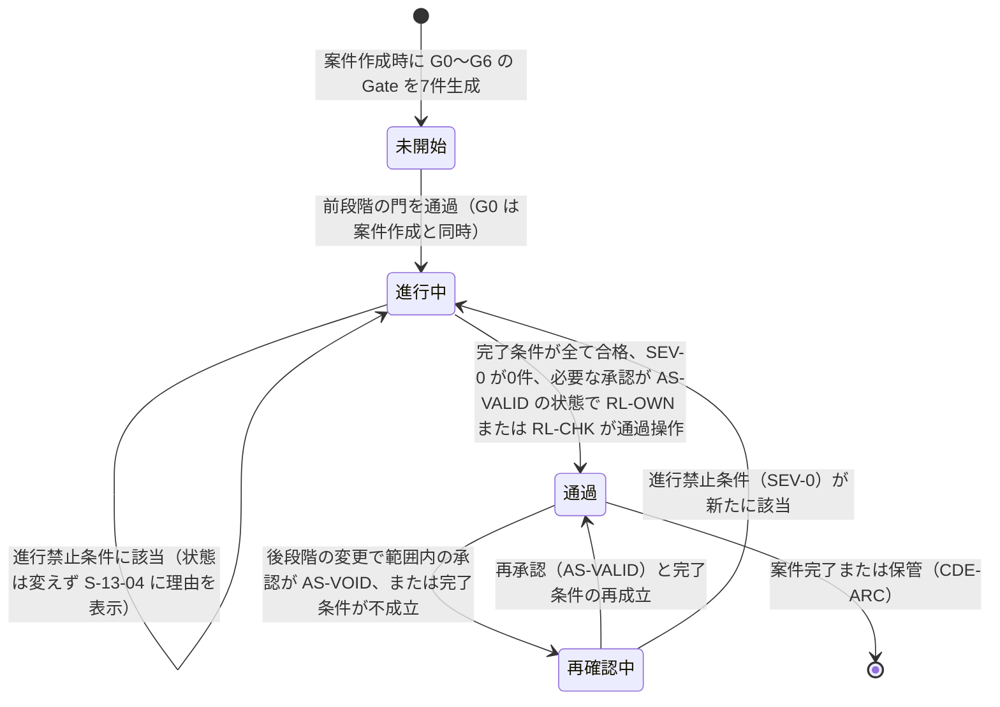

遷移「通過 → 再確認中」は決定的検査の結果だけで起こす。「再確認中 → 通過」は人の再承認を要し、自動では起こさない【仮定】。

### 1.3 各段階の定義項目（第2節の読み方）

| 項目 | 内容 | 対応する実体と属性 |
|---|---|---|
| 開始条件 | この段階を「進行中」にする条件 | E-REQ-010.startConditionResults |
| 必要情報 | 判断に使う入力。情報実体IDで示す | 各実体 |
| 主要判断 | 段階で下す判断と主担当領域。項番 (a)〜(f) を付け、源1（北極星指標 M-N-01 の分母の雛形。第2章 第4.3節）の正本とする（項番に「源1 対象外」と記した G2(d)、G3(f) は除く。JR-005）。第3節の交差表は主担当領域の割当表であり分母ではなく、「源1 対象」列で本項の項番と一対一に対応付ける（JM-001）。判断は E-REQ-004 Decision（gate=当該段階、isKeyDecision=true）として記録する | E-REQ-004 |
| 必須成果 | 門の通過に要る成果。情報実体IDと充足条件で示す | E-REQ-010.requiredDeliverables |
| 確認者 | 必須成果を確認する役割（RL-）と資格の要否。P0 と P1 で異なる場合は併記 | E-REQ-010.verifierRefs、E-ORG-007 Responsibility |
| 完了条件 | 観察可能な条件。全て合格で門を通過 | E-REQ-010.completionChecks |
| 進行禁止条件 | 該当時に SEV-0 として登録する条件。例示識別子 I-00-101〜I-00-133（基盤）と I-06-001〜（本章追加） | E-REQ-010.blockingIssueRefs |
| 進行禁止時の表示 | S-13-04 に表示する内容。第2.0節の共通構造に段階固有の「解除に必要な成果」と「導線」を加える | S-13-04 |
| 実装優先 | P0/P1/P2 の範囲 | — |
| 許される信頼状態 | 段階で表示できる最大の V | E-REQ-010.maxVerificationState |

## 2. 各段階の定義

### 2.0 進行禁止時に利用者へ示す表示内容（全段階共通の構造）

S-13-04 進行禁止理由は次の9項目を固定の順で表示する。項目5〜7は定型文とし、言語模型で生成しない【仮定】。

| 番号 | 表示項目 | 内容 | 出典となる実体と属性 |
|---:|---|---|---|
| 1 | 見出し | 「段階 G{n}→G{n+1} へ進めません」。門の識別と現段階名 | E-REQ-010.stage、status |
| 2 | 該当する条件 | 進行禁止条件の例示識別子（I-00-xxx、I-06-xxx）と一文。複数該当は全件を列挙し、件数を先頭に表示 | E-EXC-005.message |
| 3 | 該当する問題 | 問題番号（画面表示は「問題 #00017」、詳細で実行時識別子）、重大度 SEV-0、主担当領域、固定先（3D要素、2D位置、図面頁）へ開く操作 | E-REQ-003.severity、primaryDomain、anchor |
| 4 | 解除に必要な成果 | 成果名、対応する情報実体、到達すべき状態（例: 「用途地域を出典と版付きで登録」「尺度を VS-USR にする」） | E-EXC-005.fixHint、E-REQ-010.requiredDeliverables |
| 5 | 担当と期限 | 担当の役割（RL-）と氏名（表示名）、期限。未設定なら「担当未設定」と表示し設定操作を置く | E-REQ-003.assigneeRef、deadline |
| 6 | 解除方法の定型文 | 「この条件は例外承認では解除できません。解決証拠を登録すると自動で再判定されます」 | 固定文 |
| 7 | 信頼状態の据え置き | 「現在の案の信頼状態は V{x} のままです。次の段階で許される最大は V{y} です」 | E-REQ-005.verificationState、E-REQ-010.maxVerificationState |
| 8 | 導線 | 解除作業を行う画面への操作（S-02、S-05、S-09、S-24、S-10、S-08、S-20 等）。各条件に一つ以上。承認者または有資格者が不足する場合は S-13-03（承認者の設定）と S-22（専門家確認作業面。P1）への導線を明記する（JM-157）。P0 で資格を要する持ち越しや却下ができない案件では「建築士へ相談する」（S-08 の共有URL で招待 → 建築士が S-15 で資格を登録（本人申告）→ S-23-06 で誤警告の却下）を置き、「P0 では有資格者の確認による解除はできません」の定型文を添える（第2.4節。JM-023、JM-028） | 第2.1〜2.7節の表 |
| 9 | 検査状態 | 「検査日時」「検査規則の版」を表示し、「未検査」と「検査済み、該当なし」を別の文言で表示する（S-13-04-E は「検査済み、該当なし」のみに使う） | E-EXC-005.version、検査実行時刻 |

### 2.1 G0 目的と成立性

| 項目 | 内容 |
|---|---|
| 開始条件 | 三入口（希望から作る、図面を3D化、写真から改装）のいずれかと利用目的（新築、改装、家具配置、図面3D化、売却または賃貸資料）が S-01 で選択され、案件（E-BLD-001）が生成された。電子連絡先は不要。利用条件の同意（E-ORG-006 purpose=利用条件）が記録されている【推定】 |
| 必要情報 | E-BLD-001 の purpose、entryType、useType、region（都道府県以上）、budgetRange（「未定」可）、landStatus。家族の概略（E-ORG-008 の初期件数）、納期希望（E-SRV-015 Schedule の希望値）【推定】 |
| 主要判断 | (a) 誰の何を解くか、誰が決定権を持つか（主担当 A01）。(b) 土地、費用、期間の大枠が成立し、案件を進める価値があるか（主担当 A01、影響先 A02、A09）。(c) 利用条件の同意、非公開既定の共有設定、案件識別子の付与（主担当 A12。決定権は (a) の A01 の判断であり A12 で二重に所有しない。JM-027）【推定】 |
| 必須成果 | 目的文（E-BLD-001.purpose、VS-USR）。関係者表（E-ORG-008 ×1件以上、decisionAuthority を持つ者1名以上）。非対象（E-BLD-001.nonScope、S-01 の表示記録）。主要危険（E-SRV-007 Risk または E-SRV-012 HazardInfo の概略、0件の場合は「未取得」と明示）。初期予算（E-BLD-001.budgetRange、幅または「未定」）。案件識別子 PJ-（E-BLD-001.projectId）【推定】 |
| 確認者 | RL-OWN（所有者）。RL-CHK（建築士）は任意。P0 で有資格者の関与は要しない【推定】 |
| 完了条件 | (1) 目的文が VS-USR。(2) 関係者表に決定権を持つ者が1名以上。(3) 非対象が S-01 または S-02 で表示され、表示記録（E-EXC-007 action=閲覧）がある。(4) 主要危険が1件以上一覧化、または「概略地域の災害情報を未取得」と明示。(5) 初期予算が下限と上限の幅で記録、または「未定」を明示。(6) 利用条件の同意が記録されている【仮定】 |
| 進行禁止条件 | I-00-101 建設地域が都道府県も含めて不明。I-00-102 予算帯が未入力で「未定」の選択もない。I-00-103 土地の権利関係が全く不明（所有、候補あり、探索中、建替え、売却移転のいずれも未選択）。I-00-104 利用目的が非対象に該当する（例: 確認申請図の自動作成）。I-06-001 利用条件の同意が未記録のまま要求の入力を始めようとしている（本章追加、SEV-0）【仮定】 |
| 進行禁止時の表示 | 第2.0節の構造で、解除に必要な成果と導線は次表 |
| 実装優先 | P0【推定】 |
| 許される信頼状態 | V0（写真から改装の入口で意匠像を返す場合、および「希望から作る」入口で文章から作る構想案（F-C01-025 の初回成果）の場合）。文章からの構想案は、室構成の概略を雛形から決定的に合成し（寸法値を持たない）、意匠像は AP-039 V0 構想案生成（第14章。長期非同期。画像生成処理先が未契約、または種別「画像生成」の同意がない場合は意匠像なしで室構成の概略だけを返す）で作る（U-08-004 への判断。U-06-018、JM-030、JM-178。2026-10-06 に処理名を第14章の識別子へ置き換えた）。建物情報は未生成。S-30-01 は「建物情報なし」と表示【推定】 |

| 条件 | 解除に必要な成果（到達状態） | 導線画面 |
|---|---|---|
| I-00-101 | E-BLD-001.region に都道府県以上を入力 | S-02 |
| I-00-102 | E-BLD-001.budgetRange に幅を入力、または「未定」を選択 | S-02 |
| I-00-103 | E-BLD-001.landStatus を選択 | S-02 |
| I-00-104 | 利用目的の変更、または案件の終了。非対象の理由（指示文G節末尾の7項目のどれか）を表示 | S-01 |
| I-06-001 | E-ORG-006（purpose=利用条件）の status=有効 | S-15 |

### 2.2 G1 要求と敷地確認

| 項目 | 内容 |
|---|---|
| 開始条件 | G0 の門を通過している。家族情報と、土地資料（E-PRD-006 Source）または仮定（E-SRV-008 Assumption）が入力可能【推定】 |
| 必要情報 | 家族構成と生活行動（E-ORG-008、E-REQ-009 LifeScene 四群）、要求（E-REQ-001、分岐質問または自由記述）、敷地資料（E-BLD-002 Site、E-SRV-011 SiteRegulation、E-SRV-012 HazardInfo、E-SRV-001 Survey）または仮定、既存図面（図面3D化、改装の場合。E-PRD-006、利用権 RS-OWN の確認済み）、写真、所有家具（E-ELM-013 Furniture、実寸）【推定】 |
| 主要判断 | (a) 何を必須（RP-MUST）とし、何が未確認か（主担当 A01）。(b) 敷地制約と不足調査（主担当 A02）。(c) 既存図面の尺度と正本の判定（主担当 A12、図面入力時）。(d) 要素認識の受入（主担当 A03、図面入力時）。(e) 既存外皮の現況状態の受入（主担当 A05、改装時）。(f) 工事前調査（石綿事前調査等）の要否（主担当 A10、改装時）。(c)(d) は図面入力の案件、(e)(f) は改装の案件だけで源1 に入る（JM-027）【推定】 |
| 必須成果 | 承認済み要求台帳（E-REQ-001。priority、valueRange、sourceRef、deciderRef、verifierRef、confirmState=VS-USR 以上）。敷地根拠（E-BLD-002、E-SRV-011、出典と時点付き）。不足調査一覧（E-SRV-001、status=依頼）。図面入力時は V1 編集案（E-REQ-005、verificationState=V1）、原図重ね記録（E-SRV-009 Overlay）、確信度記録（E-SRV-010）、尺度確認記録（E-REQ-007 scopeKind=尺度、AS-VALID）。目的文、成功条件、非対象、変更できない条件（E-REQ-002 kind=変更できない条件）の承認記録（E-REQ-007 scopeKind=目的文、要求）【推定】 |
| 確認者 | 決定権者（目的文、要求。第5.1節の行の書式。JR-015）と RL-OWN（尺度）。RL-CHK 建築士（敷地根拠、要求の実現性）は P1 で必須、P0 では任意（U-00-015 は基盤 七段階門 v1.2 で解決。未決事項 U-06-003）。交差ごとの確認者（P0、P1）は第3.2節（JM-020）【仮定】 |
| 完了条件 | (1) RP-MUST の全件に sourceRef、deciderRef、verifierRef がある。(2) 検出した要求衝突の全件が S-24 で決定者へ表示され、解決候補と代償があるか、決定者の判断（E-REQ-004）が記録されている。保留は決定者の判断（E-REQ-004、選択肢=保留、理由必須、期限=G2 の門）として記録し、I-00-110 の解除条件と本条件を満たす。ただし双方が RP-MUST の衝突（X1、X2 で双方 RP-MUST）は保留できず、G1 で優先度の変更か取下げを要する（G2 で I-00-111 に該当するため）。RP-MUST と RP-WANT 以下の衝突の保留は G2 の門で SEV-1 の問題とし（決定者の「保留の期限の延長」の判断〔E-REQ-004、判断種=衝突の解決、scopeKind=要求、mode に従い合議は全員の coApprovalRefs。G3 の門までの一回、理由必須〕で G3 へ持ち越せる。JR-016）、RP-WANT 同士の保留は SEV-2 とする（第5章 第4.2.1節、第8章 F-C01-020 と同文。JM-047）。(3) 境界、接道、用途地域の重大不明が解消しているか、不足調査（E-SRV-001）に登録されている。対象外地域（第18章 第5節）では法規判定を「対象外」と表示し、不足調査「行政照会」の登録で本条件を満たす（U-06-019、JM-029）。利用目的別の生成で G1(b) が非の利用目的（家具配置、図面3D化、売却賃貸）では、敷地の項目（境界、接道、用途地域）を非該当とし、I-00-105〜107 を登録しない（第2章 第4.3節。第2.3節「利用目的による適用除外」と同じ型。統括の決定 D30）。(4) 図面入力時は尺度と重要寸法1件以上が VS-USR。(5) 目的文、成功条件、非対象、変更できない条件が承認されている。P0 は RL-OWN と決定権者が承認し、専門家の承認欄を「未承認」と表示する。P1 では照合済みの資格を持つ建築士（RL-CHK。第5.2節）の確認範囲を明示した承認を必須にする（JM-195、JR-012）。(6) 入力資料の全件に利用権の確認記録（RS-OWN または RS-OK）がある。(7) 同一図面番号の頁が複数ある、または差替え漏れ、欠落、混入が検出された場合、正本の確定（E-REQ-004、D-11-001 相当。決定者、理由、版）が全図面番号について記録されている（図面一式は P1。JM-024）【仮定】 |
| 進行禁止条件 | I-00-105 境界資料も仮定もなく配置検討へ進もうとしている。I-00-106 接道の有無が不明。I-00-107 用途地域が不明で法規判定ができない。I-00-108 図面入力で尺度が未確認、または尺度の整合検査の警告が未承知のまま、寸法の表示または V2 判定へ進もうとしている（JM-064）。I-00-109 必須要求に決定者がいない。I-00-110 要求衝突が検出されているのに未表示。I-06-003 図面一式の正本候補が未確定（同一図面番号の候補頁が2以上、差替え漏れ、欠落、混入のいずれかに確定判断がない）のまま、G1→G2 の門の通過（三案生成の有無を問わない）または V2 判定へ進もうとしている（本章追加、SEV-0。G4 で再検査。図面一式は P1。JM-024、JR-048）【仮定】 |
| 進行禁止時の表示 | 第2.0節の構造で、解除に必要な成果と導線は次表 |
| 実装優先 | P0（単一縮尺の明瞭な PDF、PNG、JPEG。希望入力）。図面一式、ベクトル PDF、DXF、SVG、IFC の入力と正本候補判定は P1【推定】 |
| 許される信頼状態 | V1（図面入力時の編集案）。希望入力のみの場合は建物情報を生成しない【推定】 |

| 条件 | 解除に必要な成果（到達状態） | 導線画面 |
|---|---|---|
| I-00-105 | 境界資料（E-PRD-006）の登録、または仮定（E-SRV-008）の登録と不足調査「測量」（E-SRV-001）の登録。境界線に「法的境界ではない」の注記 | S-09 |
| I-00-106 | 道路種別と接道長さの入力（E-BLD-002）、または不足調査「行政照会」の登録 | S-09 |
| I-00-107 | 用途地域の入力（E-SRV-011、出典、版、取得日）、または不足調査「行政照会」の登録 | S-09 |
| I-00-108 | 基準寸法1件以上の指定、整合検査の実行、警告がある場合は各警告について利用者が理由（自由記述 20 字以上。例: 「玄関の親子扉を現地で実測し幅 1,600 mm を確認した」。JR-049）を付けて承知した記録（E-REQ-007.acknowledgedWarnings）、尺度の承認（E-REQ-007 scopeKind=尺度、AS-VALID）。理由のない承知は受け付けない（JM-064。AC-C15-002-02 と同文） | S-05-03 |
| I-00-109 | 該当要求の deciderRef に E-ORG-008 を設定 | S-24 |
| I-00-110 | 衝突の表示（S-24）と、決定者の判断（E-REQ-004、gate=G1）の記録 | S-24 |
| I-06-003 | 正本の確定（全図面番号について決定者、理由、版を E-REQ-004 に記録）。差替え漏れの図面番号は、新版頁の追加取込、旧版を正本として採用する判断、引継ぎ資料からの除外のいずれかを選ぶ（第11章 第7.1節 手順4）。混入の頁は案件からの除外の確定判断、欠落の図面番号は頁の追加取込、または欠落のまま進める判断（理由必須）と情報要求適合表への欠落の記録で確定する（JR-048） | S-05-06 |

### 2.3 G2 比較構想

| 項目 | 内容 |
|---|---|
| 開始条件 | G1 の門を通過している（承認済み要求台帳、敷地根拠、不足調査）【推定】 |
| 必要情報 | 要求台帳（E-REQ-001）、敷地制約（E-REQ-002 kind=敷地制約、法規制約）、生活場面（E-REQ-009）、家具の概略寸法（E-ELM-013）、好み（E-REQ-001 の A08 要求）、性能の優先度（E-REQ-001 の A07 要求）、予算内訳（E-SRV-014 CostItem）【推定】 |
| 主要判断 | (a) どの考え方（空間構成）を進めるか（主担当 A03、影響先 A01）。(b) 性能目標をどこに置くか（主担当 A07）。(c) 概算幅と期間（主担当 A09）。(d) 選定の決定者、確認者、版（主担当 A12。源1 対象外。選定の承認範囲と版の固定は F-C15-014 正常手順(9)と門の判定 F-C15-003 で扱う。JR-005）。(e) 将来場面（家族変化群の該当場面）への対応の採否（今の設計に反映、将来変更で対応、対応しないのいずれか。主担当 A11、影響先 A03、A09。該当場面がある案件だけ源1 に入る。第2章 第4.3節、JM-007）【推定】 |
| 必須成果 | 三案（E-REQ-005 kind=三案_生活動線重視、三案_費用重視、三案_意匠重視、各 V1、同期2Dと3D）。同一評価軸の比較（S-03。生活、空間、技術、費用、性能の5軸）。各案の adoptionReason、droppedRequirementRefs、openItemCount、costRange、confidence。要求適合表（Option↔Requirement）。性能目標（E-SRV-013 PerformanceTarget、十領域、EL-TGT）。概算（E-SRV-005 Estimate、工種別の幅、単価時点、地域）。選定記録（E-REQ-004 gate=G2、isKeyDecision=true、selectedOptionRef、rationale に代償と未解決点）と選定の承認（E-REQ-007 scopeKind=選定）【推定】 |
| 確認者 | 決定権者（選定の決定者。第5.1節 選定の行。JR-015）。RL-CHK 建築士（案の成立性）は P1 で必須、P0 では任意。交差ごとの確認者（P0、P1）は第3.3節（JM-020）【仮定】 |
| 完了条件 | (1) （I-00-111 に該当しない範囲で）三案すべてが RP-MUST を満たすか、満たさない要求を案ごとに droppedRequirementRefs で明示している（JM-036）。(2) 選定記録に deciderRef、rationale（理由、代償、未解決点）がある。(3) 構造（E-SYS-001.structuralNoteRefs）、避難（E-SYS-003 kind=避難）、排水（E-SYS-003 kind=排水）の初期注意が各案に表示されている。(4) 概算が工種別の幅で表示され、単価時点と地域がある。(5) 十領域の全項目に EL-TGT の目標値、または「未設定」の明示がある。「未設定」の項目は S-11-02 と G4 の未確認事項に残す。非常時の RP-MUST に結ぶ目標（温熱、耐震）は「未設定」を許さない（JM-031）。(6) 選定の承認（scopeKind=選定）が AS-VALID。(7) 家族変化群の 7 場面に該当有無と時期があり、試行結果または「試行未実施」が案別に表示されている（P0 は該当有無、時期、「試行未実施」の表示まで。試行 E-REQ-009.trialResult は P1。JM-037）。(8) G2 で新たに検出された衝突（X1〜X8）が決定者へ表示され、決定者の判断（保留を含む）が記録されている（JR-038。案の生成時の隣接室の再検出を含み、E-REQ-001.conflictRecords に optionRefs を持つ。I-00-110 を G2 でも判定する）。(9) 未確認の必須要求（非常時の RP-MUST）の各件に決定者の承知の記録がある（JR-024。承知の記録は理由 20 字以上、P1 または受取側の設備設計者が判定すること、日時。E-REQ-007 scopeKind=要求 の acknowledgedWarnings）。欠ける場合は SEV-1 とし、例外承認ではなく承知の記録で解決する（第8.2節。JR-024）。(10) 改装案件（P1）では全現況要素に renovationAction が付き、未指定 0 件（S-27-03）。規則は I-06-009（第8.2節。F-C15-003 の完了条件の規則）とし、P0 は S-13-01 に「改装区分の指定は P1」と表示する（JR-022）【仮定】 |
| 利用目的による適用除外 | 利用目的が図面3D化または売却賃貸資料で RP-MUST が0件の案件は、分岐案一つで G2 を通過できる。その場合 I-00-113 は適用除外とし、S-03 に「三案比較なし（利用目的による）」を表示する。RP-MUST が 1 件以上になった時点（第2章 第4.3節の記号「追」の生成時点）で三案を要する（U-08-005 への判断。U-06-018、JM-030）。この場合 G2(a) の選択肢は「読み込んだ案」と「分岐案」の 2 件とし、第2章 第4.2節の項目2 を満たす（F-C15-014 例外(c) の除外。JR-001）。完了条件(4)（概算。G2(c)）、(5)（十領域の目標。G2(b)）、(7)（家族変化。G2(e)）は第2章 第4.3節の雛形の記号に従い、「非」の利用目的では非該当、「追」は RP-MUST の追加で該当、「条」は条件（該当する将来場面〔E-REQ-009.isFuture=true〕がある案件）に該当すれば該当とする。家具配置: (4)(5) は非該当、(7) は条件。図面3D化と売却賃貸資料: (4)(5) は RP-MUST が 1 件以上になった時点から該当、(7) は非該当（統括の決定 D30b）【仮定】 |
| I-00-111 の判定式 | RP-MUST（変更できない条件 E-REQ-002 isHard=true を含む）の各要求について、適合する案が0件の要求が1件以上ある（三案の droppedRequirementRefs の積集合に RP-MUST が含まれる）とき SEV-0 を登録する。完了条件(1)より優先して判定する。判定区分が「未確認（P1で判定）」の RP-MUST（P0 の非常時要求等）は不適合に数えない（JM-044）。判定区分が「未判定（P1）」の要求（将来場面の試行で判定する要求と主担当 A11 の要求。第8章 F-C01-023 正常手順(8)）も droppedRequirementRefs に入れず不適合に数えない（JM-156。2026-10-06 に第8章の依頼で明記）。予算上限（E-REQ-002 isHard=true）の案別判定は X4 と同じ値で行う（建築費の下限が上限を超える案を不適合、中央値だけが超える案は適合〔注記「予算超過の可能性」〕）。全案が不適合のときは I-00-111（SEV-0）だけを登録し、X4 は I-00-111 の解除のための解決候補と代償の表示に使う。一案でも適合するときは X4 の規則だけで扱う（第8章 F-C01-023 例外(a)と同文。JR-026）。解除は、決定者の要求変更（priority を RP-WANT 以下へ、または valueRange の変更）の判断記録（E-REQ-004 gate=G2）と三案の再生成とする。第8章 第7.20節 F-C01-023 例外(a)へ同じ式を転記する（JM-036）【推定】 |
| 進行禁止条件 | I-00-111 必須要求を満たす案が一つもない。I-00-112 重大危険（避難経路なし、傾斜地の擁壁未検討等）が案に未表示。I-00-113 三案が同一評価軸で比較されていない。I-00-114 概算が単一額で表示されている。I-00-115 選定記録に決定者がない。I-00-110 G2 で新たに検出された要求衝突が決定者へ未表示（G1 と同じ規則。完了条件(8)。JR-038）【仮定】 |
| 進行禁止時の表示 | 第2.0節の構造で、解除に必要な成果と導線は次表 |
| 実装優先 | P0【推定】 |
| 許される信頼状態 | V1【推定】 |

| 条件 | 解除に必要な成果（到達状態） | 導線画面 |
|---|---|---|
| I-00-111 | 決定者の要求変更（priority を RP-WANT 以下へ、または valueRange の変更）の判断記録（E-REQ-004 gate=G2）と三案の再生成（JM-036） | S-24、S-03 |
| I-00-112 | 危険（E-SRV-007 Risk または E-REQ-003）の表示。製品側の検査失敗の場合は再試行 | S-03、S-09 |
| I-00-113 | 評価軸の再計算（製品側。S-03-W の後に再判定）。利用者の操作は不要と表示 | S-03 |
| I-00-114 | 概算の幅への再計算（製品側）。単価情報の失効時は単価時点の更新 | S-12 |
| I-00-115 | E-REQ-004（gate=G2）.deciderRef の設定と選定の承認 | S-03、S-25 |
| I-00-110 | G1 と同じ（衝突の表示 S-24 と、決定者の判断 E-REQ-004 gate=G2 の記録。保留は第2.2節 完了条件(2)の規則。JR-038） | S-24 |

### 2.4 G3 空間と技術調整

| 項目 | 内容 |
|---|---|
| 開始条件 | G2 の門を通過している（選定案と選定記録）【推定】 |
| 必要情報 | 選定案（E-REQ-005）、構造形式仮定（E-SYS-001.structureType、E-SRV-008）、外皮方針（E-MAT-003 Assembly の方針）、設備系統の仮定（E-SYS-002 ServiceSystem、E-SYS-003 Route）、商品候補（E-PRD-001）、費用（E-SRV-005）、性能目標（E-SRV-013）【推定】 |
| 主要判断 | (a) 空間側の調整（扉開閉域、通路幅、家具余白、主要断面、階高）が成立するか（主担当 A03）。(b) 荷重経路が成立するか（主担当 A04）。(c) 層構成と接合部が成立するか（主担当 A05）。(d) 機器と経路が干渉なく成立するか（主担当 A06）。(e) 商品が実寸で収まるか（主担当 A08）。(f) V2 の判定と承認範囲（主担当 A12。源1 対象外。V2 の判定は F-C15-004、承認範囲は門の判定 F-C15-003 で扱う。JR-005）。(b)〜(e) は各自の判断を持ち、A03 の影響先として調整する。「空間、構造、外皮、設備、内装、商品が大枠で共存するか」の総合判断は源1 の重要判断として数えず、門の完了条件の判定（F-C15-003）で扱う（U-00-016 の解決。JM-027）【仮定】 |
| 必須成果 | 調整模型（E-REQ-005、V2 の昇格条件を満たす版）。主要断面（Option の版から生成する派生表示、1面以上）。干渉一覧（E-REQ-003 SEV-0 が0件、SEV-1 が IS-RESOLVED または IS-EXC）。商品一覧（E-PRD-001 の全件に PT- と RS- の表示）。費用更新（E-SRV-005、変更影響 E-REQ-012 付き）。性能予測（E-SRV-004 Calculation、E-SRV-013 EL-CAL。P0 は簡易な日照と動線）。V2 判定記録（E-REQ-010.completionChecks）と確認範囲別の承認（E-REQ-007 scopeKind=尺度、間取り、商品、費用。P1 で構造、外皮、設備を追加）【推定】 |
| 確認者 | RL-OWN（商品、費用、主要寸法の利用者確認 VS-USR）。RL-CHK 建築士は P0 で任意（推奨）、P1 で必須。P1 では構造設計者、設備設計者が各確認範囲を担当（未決事項 U-06-003）。交差ごとの確認者（P0、P1）は第3.4節で、G3×A10、G3×A11 は P0 で確認者なし（第1.1節 規則13。JM-020）【仮定】 |
| 完了条件 | (1) 荷重経路（I-00-116）、排水（I-00-117）、避難に SEV-0 の問題がない。避難は第19章 第2.2節の I-19-001 相当の SEV-0 が IS-RESOLVED であることで判定する（JM-031）。(2) 当該案の未解決の SEV-1（S-10-03 問題一覧の干渉、構造注意、施工成立性の注意と、不足調査の requestedGate 超過、法規判定 I-18-002 を含む全主担当の SEV-1）が IS-RESOLVED または IS-EXC。ただし第1.1節 規則6 (b) の対象の SEV-1 は、P0 では担当（RL-OWN）と期限（G4 の門）を付けて通過でき、第2.5節 欠落の自動記録 (i) に記録する（JM-022、JR-014、JR-106）。(3) 尺度、外周、開口、室、階段、主要寸法が VS-USR 以上。(4) 低確信度要素（lowConfidence=true）が0件。(5) 主要断面が1面以上存在する。(6) 商品の層と権利状態が全件表示されている。(7) 費用が変更影響付きで更新されている。(8) V1→V2 の昇格条件（基盤 信頼状態 第1.2節の(1)〜(7)）を全て満たす。改装案件の付帯条件（撤去、補修、補強、移設の要素が CS-DRW または CS-EST のまま）は I-06-008（P1、SEV-1、主担当 A10。第8.2節）で登録して完了条件(2)で判定し、V2 に「現況未確認（n 要素）」を併記する（P0 は併記の表示だけ。JR-021）。(9) scopeKind=尺度、間取りの承認が AS-VALID（P1 の間取りは照合済みの資格を持つ建築士の承認を要する。第5.2節。JR-012）。(10) 要求衝突 X4（予算上限と概算下限）が未解決（最新の再判定で X4 の SEV-1 が IS-RESOLVED でない、または判断が未完了。定義は第20章 第8.2節）の場合、費用の承認（scopeKind=費用）に衝突注記「予算上限との衝突 未解決（差 n〜m 万円）」がある（JM-026、統括の決定 D44）【仮定】 |
| 進行禁止条件 | I-00-116 荷重経路に未解決の重大問題（吹抜け上の梁跨度超過等。改装案件の既存外周壁または上下階連続壁の撤去と、耐力壁候補線上の新設開口を含む。P0 は案の変更命令で現況要素を削除、移動、寸法変更したときに自動で付いた撤去と移設を含み、第13章 第5.5節 式(5)で判定する〔移設は移設元を、寸法変更は変更前の要素を撤去として数える。JR-095、統括の決定 D34、D36〕。候補線上のその他の壁の撤去、移設、補強は SEV-1（第13章 第5.5節、U-13-014 の解決）。基盤 七段階門 v1.2、JM-094 (1)。2026-10-06 相互依頼で範囲を訂正）。I-00-117 排水勾配が成立しない経路が残る。I-00-118 避難経路が未解決。I-00-119 低確信度の壁または開口が残存している。I-00-120 主要寸法に未確認の既定値（VS-DEF）が残る。I-00-121 正規商品以外を実商品として表示している。I-06-006 法規判定の余裕量が負で未解決（G3 と G4 で判定。定義は第2.5節。JR-011）。I-06-007 発見の問題（石綿含有、構造部材の腐朽と蟻害）が未解決（P1。重大度の付与は第8.2節。JR-013）【仮定】 |
| 進行禁止時の表示 | 第2.0節の構造で、解除に必要な成果と導線は次表 |
| 実装優先 | P0（基本の構造形式と通り芯の仮定、主要設備置場と経路帯、外皮方針、基本家具、簡易な日照と動線、干渉検査）。構造、外皮、設備の詳細調整と詳細な性能計算、構造設計者と設備設計者の確認範囲は P1【推定】 |
| 許される信頼状態 | V2（完了条件を満たした時点で昇格）【推定】 |

| 条件 | 解除に必要な成果（到達状態） | 導線画面 |
|---|---|---|
| I-00-116 | P0: 開口幅を戻す、壁位置を耐力壁候補線へ寄せる（A03 の変更命令）、階高と天井高の変更で IS-RESOLVED。P1: 耐力要素の移動（F-C11-004）、梁の変更、照合済みの資格を持つ RL-CHK（構造設計者、建築士。第5.2節）の AS-VALID の確認記録（E-REQ-007 scopeKind=構造。S-22）。改装案件の撤去（P0 は現況要素の削除、移動、寸法変更に自動で付いた撤去と移設〔移設は移設元を、寸法変更は変更前の要素を撤去として数える。統括の決定 D34、D36〕、P1 は S-27-03 の指定）は「残す」に戻す変更命令（元に戻す変更）で IS-RESOLVED とし（P0 の解除はこれだけ。JR-095）、撤去を維持する場合（P1）の解決証拠は、撤去後の計画の版（baseRevisionRef）を対象とし撤去する壁を scope に含む AS-VALID の構造の確認記録（E-REQ-007 scopeKind=構造。照合済みの資格。第5.2節。統括の決定 D41）に限る。耐震診断（E-SRV-001 kind=耐震診断）の記録は確認記録の入力に限り、単独では解除しない（第13章 第5.5節 式(5)、第10.2節 例外(e)。JM-094、JR-066）。部材寸法と安全性は製品が確定しない旨を表示（JM-023） | S-10、S-04、S-22（P1） |
| I-00-117 | P0: 経路変更、立管の追加と移動、階高と天井高の変更で E-SYS-003.slope が成立し IS-RESOLVED。P1: 梁の変更（F-C11-004）、設備設計者の確認記録（scopeKind=設備。S-22）（JM-023） | S-10-08（経路帯と立管の編集。JM-115）、S-22（P1） |
| I-00-118 | 避難経路（E-SYS-003 kind=避難）の確保と検査合格 | S-10、S-04 |
| I-00-119 | 該当要素の修正または確認（valueStates を VS-USR 以上へ） | S-05-02 |
| I-00-120 | 該当寸法の値の確認（VS-DEF → VS-USR） | S-04-04 |
| I-00-121 | 商品層と権利状態の表示修正（製品側）、または代替形状のみ配置への置換 | S-06、S-04-05 |
| I-06-006 | 第2.5節の解除表と同じ（JR-011） | S-09-04、S-10 |
| I-06-007 発見の問題（石綿含有、構造。P1） | 石綿含有（含有とみなす判断を含む）: (a) 該当要素の renovationAction と処分区分（第12章 DV-CO-07 の「含有あり」）で解体撤去の費用幅と期間が更新され（工程の規則は足さない）、(c) 判断（E-REQ-004。resolvesIssueRefs に当該の発見の問題を持ち、判断者は照合済みの資格の RL-CHK〔確認者 verifierRef。第5.2節〕）が記録されて当該問題の resolutionEvidenceRef に置かれた時に IS-RESOLVED とし、G3 の門は (a)(c) で判定する。(b)「除去等の作業と報告は元請業者等が行い製品外」と I-06-004 の予告（届出対象特定工事では発注者または自主施工者に作業開始の 14 日前までの届出の義務がある旨〔大気汚染防止法 第18条の17。SRC-314、確認日 2026-10-07〕を含む）は、製品が引継ぎ一式の未確認事項に自動で記載する（第21章 第2.3節 (4)、第22章 F-C15-013 正常手順(4)と同じ。統括の決定 D41、D43）。構造部材の腐朽と蟻害: 補強または交換の設計変更（renovationAction=補強、または撤去と新設）と AS-VALID の構造の確認記録（scopeKind=構造。P1 は照合済みの資格。第5.2節）で IS-RESOLVED。例外承認では解除しない（JR-013） | S-27-04、S-25、S-12 |

P0 で資格を登録した RL-CHK がいない案件の復旧導線（JM-023）: P0 では有資格者の確認記録による解除はできず、復旧経路は上表の P0 の成果（元に戻す変更）だけである。S-13-04 の項目8 に「建築士へ相談する」の操作を置き、共有URL（S-08）で案件を建築士へ共有し、建築士が S-15 で RL-CHK として資格を登録（本人申告、未照合。JM-122）した後に、誤警告であれば S-23-06 で理由付きの却下（IS-REJECTED。第1.1節 規則5）を行える。確認記録（scopeKind=構造、設備）による解除は P1（S-22）とする。S-13-04 の定型文は「P0 では有資格者の確認による解除はできません。開口（経路）を戻すか、建築士に相談してください」とする（第15章へ依頼）【仮定】。

### 2.5 G4 専門設計引継ぎ

| 項目 | 内容 |
|---|---|
| 開始条件 | G3 の門を通過している（V2 の案）。受取側の必要情報要求（E-EXC-001。P0 は本製品の標準の必要情報要求、P1 は IDS または組織別要求）が指定されている【推定】 |
| 必要情報 | V2 案（E-REQ-005）、要求台帳（E-REQ-001）、問題一覧（E-REQ-003）、判断記録（E-REQ-004）、承認記録（E-REQ-007）、商品一覧（E-PRD-001）、費用（E-SRV-005）、必要情報要求（E-EXC-001）、送信先ごとの同意（E-ORG-006 purpose=外部送信）【推定】 |
| 主要判断 | (a) 誰が確認するか（責任表 E-ORG-007。主担当 A12）。(b) 何を誰へどこまで送るか（主担当 A12）。(c) 何を再設計対象とするか（再設計範囲。主担当 A03、影響先 A04〜A06）。再設計範囲は (c) の A03 に一本化し、A12 では所有しない（JM-027）【推定】 |
| 必須成果 | 情報要求適合表（E-EXC-002.validationResult。合否、欠落、不一致、例外承認）。要求台帳（E-REQ-001。承認済み、追跡付き。未解決または保留の要求衝突の一覧を含む。JM-026）。問題一覧（E-REQ-003、担当と期限付き）。責任表（E-ORG-007、役割×作成、確認、承認、通知、空欄0）。交換資料（E-EXC-002 Delivery。P0: GLB、PDF平面、要求台帳、問題一覧、判断記録。P1: IFC、SVG、DXF、BCF）。個別同意記録（E-ORG-006、送信先ごと）。正本（E-REQ-006 cdeState=CDE-PUB が一つ）。承認された版の識別子と交換時点【推定】 |
| 確認者 | 受取側の RL-CHK 建築士。P0: 資格は本人申告（未照合）であり、S-13-03、責任表の書出、引継ぎ一式に「資格未照合（本人申告）」を表示し、V3 と VS-PRO には使わない。P1: 資格は照合済みとし、構造設計者、設備設計者を確認範囲ごとに追加する（JM-122）。組織案件では案件側の情報管理担当（RL-EDT）。RL-OWN（同意、発行）。運営側の情報管理者は案件の確認者にならない（第22章 第1.3節。JM-034）。交差ごとの確認者は第3.5節【推定】 |
| 完了条件 | (1) 情報要求検査が合格、または不合格項目の全件に例外承認（E-REQ-007 scopeKind=例外。理由、承認者、期限）がある。(2) 正本が明示され、CDE-PUB の版が一つだけある。(3) 承認範囲が確認範囲（scopeKind）ごとに明示され、AS-VALID または「未承認」と明示されている。(4) 責任表（E-ORG-007）に空欄がなく、受諾（accepted=true）が全行にある。(5) 送信先ごとの同意が記録されている。(6) 受取側が交換資料から元図（E-PRD-006）、要求、問題へ戻れることを確認した記録（E-EXC-007 action=閲覧、受取側）がある。(7) 改装案件（P1。E-BLD-001.useType=改装、かつ要素の renovationAction に撤去、補修、補強、移設がある）では、解体後判明時の 4 項目（判断者、費用予備、代替案の型、承認手順）が、kind=解体後判明の工事前定義 の E-REQ-004 の unforeseenPlan に空なく記録されている（既定値で埋まる費用予備の幅は定義済みに数えない。第21章 第3節。JM-025、JR-058）。規則は I-06-005（第8.2節）とし、P0 は判定せず、欠落の自動記録 (vii) に「解体後判明時の 4 項目 未定義（P1）」として記録する（4 項目を記録する F-C14-003 は P1。G2 完了条件(10)の I-06-009 と同じ型。統括の決定 D35）。(8) 未解決または保留の要求衝突（X1〜X8。X4 の「未解決」は第20章 第8.2節の定義〔最新の再判定で X4 の SEV-1 が IS-RESOLVED でない、または判断が未完了〕による）が要求台帳と問題一覧に「未解決」として含まれ、交換資料の未確認事項に転記されている（JM-026、統括の決定 D44）【仮定】 |
| 欠落の自動記録（P0） | 情報要求適合表（E-EXC-002.validationResult）に次を欠落または未確認事項として自動記録し、交換資料に含め、責任表の受取側の行（再設計範囲または確認対象）に結ぶ。(i) 規則6 (b) の持ち越し（地盤: 調査未実施、構造: 重量物の載荷の確認未了〔太陽光 n m²、浴槽、蓄電池等〕、構造: P0 対象外の構法、境界: 測量未実施〔仮定の境界〕、道路種別: 未確認〔行政照会未了〕。いずれも受取側の再設計範囲または確認対象。受取側の例外承認による IS-EXC と期限は第1.1節 規則6 (b)。JM-022、JR-014）。(ii) 設備干渉: 未検査（P1）（P0 で未検査の干渉種別4、5、7 と、種別3、6 のうち P0 範囲外の部分。P0 範囲は種別3 が経路帯の下端と要求天井高の寸法比較、種別6 が点検口と機器の間の梁の交差検査に限る〔第13章 第5.2節〕。受取側の設備設計者の再設計範囲。JM-105）。(iii) 未確認の初期注意（G3×A10、G3×A11。第1.1節 規則13、JM-020）。(iv) 未確認の必須要求（非常時の RP-MUST で判定区分が「未確認（P1で判定）」のもの。G2 完了条件(9)の承知者と日時を併記。JM-044、JR-024）。(v) 尺度: 警告承知あり（n 件）、残差検査不能（寸法文字なし）、実測照合 n 件（JM-064、JR-047）。(vi) 未解決または保留の要求衝突（完了条件(8)、JM-026）。(vii) 改装（P0）: 工事前調査の要否 未判定（P1）、解体後判明時の 4 項目 未定義（P1）、現況未確認 n 要素、隠れ部分 未確認、解体撤去の処分区分 石綿含有未確認（幅の上側。撤去 n 要素。n は現況要素の削除と寸法変更〔短縮、延長、既存開口の拡大と縮小、回転。変更前の要素〕に自動で付いた撤去を含み、図面読解の修正で消した要素を含まない。第21章 第2.1節 規則(7)。統括の決定 D34、D38）（JR-095）。(viii) 性能: 計算予測なし（P0）の目標 n 件（RP-MUST を含む）。(ix) 将来場面: 試行未実施（場面名、時期）。(x) 利用円滑性: 数値検査 未検査（P1）（当事者確認の状態を併記）（(viii)〜(x) は JR-025。情報要求適合表への記載の受入条件は第22章 F-C15-007 の AC-C15-007-04）【推定】 |
| 進行禁止条件 | I-00-122 発行済み（CDE-PUB）扱いの版が複数あり正本が一意でない（入力資料の正本未確定は I-06-003 で扱う。JM-024）。I-00-123 必須属性の欠落に例外承認がない。I-00-124 承認範囲が不明。I-00-125 同意のない送信先が含まれる。I-00-126 V1 の案を引継ぎ対象にしている。I-06-003 図面一式の正本候補が未確定（G1 の条件の再検査。SEV-0。JM-024）。I-06-005 改装案件で解体後判明時の 4 項目（判断者、費用予備、代替案の型、承認手順）のいずれかが未定義（本章追加、SEV-0。P1。P0 は判定せず、欠落の自動記録 (vii) に記録する。JM-025、統括の決定 D35）。I-06-002 責任表（E-ORG-007）に空欄または未受諾の行がある（本章追加、SEV-0。機能一覧骨格 F-C15-009 の合格条件「責任表の空欄が0でなければ G4 を通過しない」を進行禁止条件として登録）。I-06-006 法規判定の余裕量が負で未解決（I-18-002 が IS-RESOLVED でない。G3 と G4 で判定。本章追加、SEV-0。G3 では G3 の門の通過を止め、G4 では再検査する〔I-06-003 と同じ型〕。負の余裕量の条項ごとの問題は I-18-002（SEV-1。G2、G3）として登録し、I-18-002 の例外承認〔第1.1節 規則6 (a)〕は G2→G3 の持ち越しにだけ効く。第18章 第4.4節、JM-019、JR-011）。I-06-007 発見の問題（石綿含有、構造部材の腐朽と蟻害）が未解決（P1。G3 と G4 で判定。第2.4節、第8.2節。JR-013）【仮定】 |
| 進行禁止時の表示 | 第2.0節の構造で、解除に必要な成果と導線は次表 |
| 実装優先 | P0（最小引継ぎ: GLB、PDF平面、要求台帳、問題一覧、判断記録、責任表、標準の必要情報要求、個別同意）。IFC、IDS、BCF、組織別情報要求、有資格者確認による V3 昇格は P1【推定】 |
| 許される信頼状態 | V2。有資格者が確認範囲を明示して承認した範囲だけ V3（P1）。案の表示状態は全確認範囲の最低状態【推定】 |

| 条件 | 解除に必要な成果（到達状態） | 導線画面 |
|---|---|---|
| I-00-122 | 発行済み版を一つに確定（他の版を CDE-ARC へ） | S-08 |
| I-06-003 | G1 と同じ（正本の確定。図面一式は P1） | S-05-06 |
| I-00-123 | 欠落属性の補完（該当要素の valueStates を更新）、または例外承認（scopeKind=例外、理由、承認者、期限） | S-08、S-04-04 |
| I-00-124 | 確認範囲ごとの承認の登録（scopeKind と scope を明示） | S-13-03、S-08 |
| I-00-125 | 送信先ごとの個別同意（E-ORG-006 status=有効）、または送信先の除外 | S-20 |
| I-00-126 | 対象案の V2 昇格（G3 の門の通過）、または引継ぎ対象を V2 の案へ変更 | S-13-05 |
| I-06-002 | 責任表の空欄の充填と受諾の記録（E-ORG-007.accepted=true） | S-13-03 |
| I-06-005（P1） | 4 項目（判断者、費用予備、代替案の型、承認手順）の記録（kind=解体後判明の工事前定義 の E-REQ-004.unforeseenPlan。工事前定義は第21章 F-C14-003。JR-058）。P0 では判定しない（欠落の自動記録 (vii)） | S-25、S-12 |
| I-06-006 | 形状または配置の変更（A03 の変更命令）の後に法規判定（E-SRV-004 kind=法規判定）を再実行し、全条項の余裕量が 0 以上になって I-18-002 が IS-RESOLVED になる。例外承認では解除しない（誤警告の却下は第1.1節 規則5 の例外）。判定は助言であり法的な判断を代替しない旨を表示する | S-09-04、S-10 |
| I-06-007 発見の問題（石綿含有、構造。P1） | 第2.4節の解除表と同じ（JR-013） | S-27-04、S-25、S-12 |

### 2.6 G5 施工と竣工反映（P2）

| 項目 | 内容 |
|---|---|
| 開始条件 | 承認済み設計（V3 の案。P0、P1 では V2 と有資格者確認記録の組で代替しない。V3 が無い案件は G5 を開始しない）、契約（E-REQ-002 kind=変更できない条件として工事範囲、金額、変更手順）、施工情報（施工者 E-ORG-002 kind=施工会社、工程 E-SRV-015、施工図または製作図の予定）がある【推定】 |
| 必要情報 | V3 案、契約、施工図と製作図（E-PRD-006）、検査計画（E-SRV-003 Test）、工事前調査の結果（E-SRV-001。改装では石綿事前調査等）【推定】 |
| 主要判断 | (a) 承認案と現場差をどう承認し記録するか（主担当 A10）。(b) 竣工時建物情報の正本化（主担当 A12）【推定】 |
| 必須成果 | 変更記録（E-REQ-011 origin=現場変更、siteChangeInfo に理由、提案者、金額、期間、設計意図、承認）。検査記録（E-SRV-003、EL-SITE の証拠）。竣工時建物情報（E-REQ-005 kind=竣工反映版、E-OPS-006 AsBuiltDelta）。機器台帳の元情報（E-PRD-004 Asset）【推定】 |
| 確認者 | 施工者（RL-PART）、監理者と建築士（RL-CHK、照合済みの資格。第5.2節）【推定】 |
| 完了条件 | (1) 未承認の現場変更が0件。(2) 計画した検査（E-SRV-003）が全件完了し記録がある。(3) 竣工差分（E-OPS-006）のうち竣工反映版に未反映の差が0件、changeRecordRef（承認済み変更記録。第12章 E-OPS-006 の属性名。2026-10-06 に修正計画 JM-032 の仮の語 changeCommandRef から改めた）が null の差が0件。竣工反映版の発行は scopeKind=書出（必要な段階 G5）と影響先範囲の承認の組で扱う（U-21-001 への判断。U-06-017、JM-032）。(4) 機器台帳の元情報（品番、保証、取扱説明、試運転結果）がそろっている【仮定】 |
| 進行禁止条件 | I-00-127 未承認の現場変更がある。I-00-128 検査未了の部位がある。I-00-129 構造、避難、防火に関わる危険な相違がある。I-00-130 解体を伴う工事で石綿事前調査が未了（G5 の開始後、解体を含む施工中変更と検査記録の登録を受け付けない。段階内の操作の停止であり第1.1節 規則8 の例外。JR-031）。I-06-004 石綿含有建材の発見（分析結果で含有あり、または含有とみなす判断）に対し、特定粉じん排出等作業の結果の報告書面（大気汚染防止法 第18条の23第1項。元請業者から発注者へ。自主施工の場合は自主施工者の記録〔同条第2項〕。製品外の手続の結果。E-PRD-006 kind=証明書または調査報告）が未登録（本章追加、SEV-0。G5→G6 の門〔竣工反映版の発行〕を止める。JR-031。G5 は P2 のため P0、P1 では警告に留める。製品は手続の要否と報告の内容〔除去の適否〕を判定せず、記録の受入と未登録の問題化だけを行う。作業の写真記録〔石綿障害予防規則 第35条の2。事業者が保存する記録〕は任意の添付で、解除の条件にしない。条文は SRC-314、SRC-315、確認日 2026-10-07【事実】。第21章 第2.4節、JM-148、`01_調査/08_外部確認_段階7後.md` 第3節）。I-06-004 は同じ発見を参照する別の条件（記録の未登録）であり、発見の問題（設計段階 G3、G4 では I-06-007 で重大度を付け、第2.4節の解除表で解決する）を G5 で再登録しない（JR-013）【仮定】 |
| 進行禁止時の表示 | 第2.0節の構造。導線は S-14（引渡しと維持）、S-23（問題一覧）。I-06-004 の解除に必要な成果は作業結果の報告書面（大気汚染防止法 第18条の23第1項。自主施工は自主施工者の記録）の登録（E-PRD-006。作業の写真記録は任意の添付）で、導線は S-14、S-23。P0、P1 では S-14 は情報構造のみで、G5 の門は「未開始」と表示する |
| 実装優先 | P2。ただし E-REQ-010（G5）、E-REQ-011 の origin=現場変更、E-OPS-006、E-SRV-003 の識別子と属性は P0 から保持する【推定】 |
| 許される信頼状態 | V3（竣工反映版として版を進める）【推定】 |

### 2.7 G6 入居と改善（P2）

| 項目 | 内容 |
|---|---|
| 開始条件 | 引渡し情報（竣工時建物情報、機器台帳 E-PRD-004、保証 E-OPS-003、取扱説明 E-OPS-002）がある。入居後確認の利用同意（E-ORG-006 purpose=入居後確認）がある。学習同意（purpose=学習利用）は別に持ち、既定は無効【推定】 |
| 必要情報 | 竣工時建物情報、機器台帳、保証、目標（EL-TGT）と計算予測（EL-CAL）、現場確認（EL-SITE）、実測または実感の入力（E-OPS-007 PostOccupancyRecord）【推定】 |
| 主要判断 | (a) 目標と実績の差をどう直し、何を学ぶか（主担当 A11）。(b) 学習利用の同意と匿名化（主担当 A12）【推定】 |
| 必須成果 | 入居後確認（E-OPS-007。温熱、光、音、空気、動線、収納、費用、保守の8項目）。維持計画（E-OPS-004 MaintenanceTask、E-OPS-005 ReplacementCycle、機器台帳と結合）。学び一覧（E-OPS-007 の匿名化記録。元要求と判断へ結合）【推定】 |
| 確認者 | RL-OWN（所有者）、維持担当（RL-PART または RL-EDT）、RL-CHK 建築士【推定】 |
| 完了条件 | (1) 入居後確認が8項目で取得されている。(2) 維持計画が機器台帳と結合している。(3) 学びが元の要求（E-REQ-001）と判断（E-REQ-004）へ結ばれ、匿名化されている（M-G-15 が0件）。(4) 学習利用の同意状態が記録されている【仮定】 |
| 進行禁止条件 | I-00-131 緊急不具合（漏水、構造、防火）が未対応。I-00-132 個人情報の同意が不足したまま入居後確認を取得しようとしている。I-00-133 学習利用に別同意がないのに学び一覧へ登録しようとしている【仮定】 |
| 進行禁止時の表示 | 第2.0節の構造。導線は S-14、S-20（同意管理）、S-23 |
| 実装優先 | P2。E-REQ-010（G6）、E-OPS-007、E-ORG-006 の purpose 値は P0 から保持する【推定】 |
| 許される信頼状態 | V3（実績付き）。保管後は CDE-ARC【推定】 |

### 2.8 段階の流れと門の位置（概略）

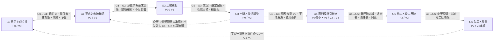

## 3. 段階×領域の交差表（7×12）

基盤 七段階門 第3節（v1.2）と同じ内容を持ち、必須成果に情報実体IDを付けた。有無が「有」の交差の「主要判断」はその段階でその領域が主担当として下す判断であり、E-REQ-004 Decision（gate=当該段階、primaryDomain=当該領域）として記録する（「影響先」の交差は下の定義）。「該当なし」は理由を付け、空欄を作らない。第10章はこの表の必須成果を追跡表の「必要成果」列へ転記する【推定】。表の区分はすべて【仮定】（基盤の判断を維持）。

v1.1 で次の三列を加えた（JM-001、JM-020）。本節が三列の正本であり、基盤 七段階門 第3節と表4（責任表）の表4-1 は本節に追従する【推定】。

- 源1 対象（雛形の記号）: 本表は主担当領域の割当表であり、北極星指標 M-N-01 の分母（源1）ではない。源1 の正本は第2.1〜2.7節の主要判断 (a)〜(f) であり、本列で一対一に対応付ける（例: `G1(c)` は第2.2節 主要判断(c)）。第2章 第4.6節の例示 D-02- を併記する。対応しない「有」の交差は「（源1対象外）」と記し、分母に入れない。
- 有無の値（JR-017）: 「有」は当該領域が主担当として判断を持つ交差、「無」は該当なし（理由付き）、「影響先（記号）」（例: `影響先（G0(b)）`）は記号の源1 の判断の影響先として成果を受ける交差である。この値の交差は E-REQ-004 を作らず、記号の判断の Impact（E-REQ-012）として記録する。主要判断列には受ける成果を書き（「確認、再設計する範囲」の語は使わない）、確認者（P0、P1）列は成果の受領確認者を示す（承認者ではない。表4 では受領確認 R と承認 A の記号で区別する）。G0×A02、G0×A09、G2×A01、G4×A04〜A06 の 6 交差がこの値である。
- 確認者（P0）と確認者（P1）: 交差ごとに必須成果を確認する役割（RL-）。P0 で有資格者が不在の交差は「RL-OWN の受領確認のみ。専門家未割当」とし、その交差の必須成果には承認個体の表示語「専門家未確認」を交差単位で付ける（第1.1節 規則13）。G3×A10、G3×A11 は P0 で「初期注意の表示のみ。確認者なし」とし、G4 の交換資料に「未確認の初期注意」として含める。RL-CHK 建築士の資格は P0 では本人申告（未照合）である（JM-122）。G5、G6 は P2 のため両列は「—（P2）」とし、確認者は第2.6節、第2.7節に従う。

### 3.1 G0 目的と成立性 × 領域

| 領域 | 有無 | 主要判断 | 必須成果（情報実体） | 源1 対象（雛形の記号） | 確認者（P0） | 確認者（P1） |
|---|---|---|---|---|---|---|
| A01 | 有 | 誰の何を解くか、何をしないか、誰が決定権を持つか（JM-027） | 目的文（E-BLD-001.purpose）、関係者表（E-ORG-008。決定権を持つ者を含む）、決定権（E-ORG-008.decisionAuthority）、非対象（E-BLD-001.nonScope）、成功条件（E-BLD-001.successCriteria。承認は scopeKind=目的文。第12章 v1.2） | G0(a) 誰の何を解くか、誰が決定権を持つか（D-02-001）。G0(b) 案件を進める価値（D-02-002） | RL-OWN（決定権者を含む） | 同左。RL-CHK 建築士は任意 |
| A02 | 影響先（G0(b)） | 建設可否の大枠の根拠（概略地域、土地状況区分、主要危険）の提示 | 概略地域（E-BLD-001.region）、土地状況区分（landStatus）、主要危険の概略（E-SRV-012 HazardInfo） | （源1対象外。G0(b) の影響先） | RL-OWN の受領確認のみ。専門家未割当 | RL-CHK 建築士（任意） |
| A03 | 無 | 該当なし。理由: 要求と敷地が未確定で空間案を作らない | 該当なし | — | — | — |
| A04 | 無 | 該当なし。理由: 形が未定で構造形式を仮定できない | 該当なし | — | — | — |
| A05 | 無 | 該当なし。理由: 形が未定 | 該当なし | — | — | — |
| A06 | 無 | 該当なし。理由: 形が未定 | 該当なし | — | — | — |
| A07 | 無 | 該当なし。理由: 性能の優先度は A01 の要求として取得し、目標は G2 で置く | 該当なし | — | — | — |
| A08 | 無 | 該当なし。理由: 好みの写真や様式は A01 の要求として取得する | 該当なし | — | — | — |
| A09 | 影響先（G0(b)） | 初期予算の幅と納期希望の提示 | 初期予算（E-BLD-001.budgetRange）、納期希望（E-SRV-015 Schedule） | （源1対象外。G0(b) の影響先） | RL-OWN | RL-OWN。RL-CHK 建築士は任意 |
| A10 | 無 | 該当なし。理由: 案が未定 | 該当なし | — | — | — |
| A11 | 無 | 該当なし。理由: 将来の家族変化は A01 の生活場面（E-REQ-009）として取得する | 該当なし | — | — | — |
| A12 | 有 | 利用条件の同意、非公開既定の共有設定、案件識別子の付与をどう扱うか（決定権は A01。JM-027） | 利用条件の同意（E-ORG-006）、非公開既定の共有設定（E-EXC-006 の初期値）、案件識別子（E-BLD-001.projectId） | G0(c) 利用条件の同意と情報の扱い（D-02-019） | RL-OWN | RL-OWN |

### 3.2 G1 要求と敷地確認 × 領域

| 領域 | 有無 | 主要判断 | 必須成果（情報実体） | 源1 対象（雛形の記号） | 確認者（P0） | 確認者（P1） |
|---|---|---|---|---|---|---|
| A01 | 有 | 何を必須とし、何が未確認か | 承認済み要求台帳（E-REQ-001）、生活場面一覧（E-REQ-009）、要求衝突と解決候補と代償（E-REQ-001↔E-REQ-001、E-REQ-004。保留も判断記録） | G1(a) 必須要求の確定（D-02-003） | RL-OWN と決定権者 | RL-OWN と決定権者。RL-CHK 建築士（要求の実現性） |
| A02 | 有 | 敷地制約は何か、何を調査へ回すか | 敷地根拠（E-BLD-002、E-SRV-011、出典と時点）、法規判定（E-SRV-004、版付き）、不足調査一覧（E-SRV-001 status=依頼） | G1(b) 敷地制約と不足調査（D-02-004） | RL-OWN の受領確認のみ。専門家未割当（敷地根拠は出典と時点の表示で代替し、scopeKind=敷地 の承認は G1 通過操作で代替） | RL-CHK 建築士（敷地根拠。scopeKind=敷地） |
| A03 | 有（図面入力時） | 既存図面の室、壁、開口の認識結果を受け入れるか。希望入力のみの場合は該当なし（理由: 空間案は G2 で生成） | 図面入力時: V1 編集案（E-REQ-005）、原図重ね記録（E-SRV-009）、閉領域と接続の確認（E-SYS-005、E-SPC-001.isClosed）。希望入力時: 該当なし | G1(d) 要素認識の受入（図面入力時） | RL-OWN（認識結果の受入） | RL-OWN。RL-CHK 建築士は任意 |
| A04 | 有 | 構造に関する既存資料と地盤資料の有無をどう扱うか | 構造資料の有無、地盤資料の有無（E-SRV-001 へ登録） | （源1対象外） | RL-OWN の受領確認のみ。専門家未割当 | RL-CHK 建築士（構造設計者は G3 以降） |
| A05 | 有（改装時） | 既存外皮の現況状態の受入（改装時）。新築では該当なし（理由: 外皮方針は G2 以降。JM-027） | 改装時: 外皮要素の現況状態（E-ELM-001.conditionState 等の CS-）。新築: 該当なし | G1(e) 既存外皮の現況状態の受入（改装時） | 改装時: RL-OWN の受領確認のみ。専門家未割当 | 改装時: RL-CHK 建築士 |
| A06 | 有 | 供給条件と既存設備の余力をどう扱うか | 供給条件（E-BLD-002。給排水、電気、通信、雨水放流）、既存設備の現況状態（E-ELM-012.conditionState） | （源1対象外） | RL-OWN の受領確認のみ。専門家未割当 | RL-CHK 建築士（設備設計者は G3 以降） |
| A07 | 有 | 性能目標候補の技術的な妥当性の初期確認（性能の優先度は A01 の要求として G1(a) で扱う。JR-027） | 性能目標候補と、その根拠になる A07 の要求（E-REQ-001。災害耐性、利用円滑性を含む）の技術的な妥当性の初期確認の記録 | （源1対象外。目標は G2(b)） | RL-OWN | RL-OWN。RL-CHK 建築士（目標候補の妥当性） |
| A08 | 有 | 所有家具と好みをどう整理するか | 所有家具一覧（E-ELM-013、実寸 VS-USR）、好み（E-REQ-001。写真、素材、避けたい様式） | （源1対象外） | RL-OWN（所有家具の実寸確認 VS-USR） | 同左 |
| A09 | 有 | 予算内訳と土地費の希望 | 予算内訳（E-SRV-014 CostItem。建築費、土地費、家具費、予備費、借入希望） | （源1対象外） | RL-OWN | RL-OWN |
| A10 | 有（改装時） | 工事前調査（石綿事前調査等）の要否（改装時）。新築では該当なし（理由: 案が未定。JM-027） | 改装時: 不足調査（E-SRV-001）に工事前調査の要否。新築: 該当なし | G1(f) 工事前調査の要否（改装時） | 改装時: RL-OWN の受領確認のみ。専門家未割当（P0 は固定注記で義務を伝える） | 改装時: RL-CHK 建築士（工事前調査の要否） |
| A11 | 有 | 将来場面と保守の優先度 | 将来場面一覧（E-REQ-009 isFuture=true）、保守優先度（E-REQ-001） | （源1対象外） | RL-OWN | RL-OWN |
| A12 | 有 | 図面一式の正本、尺度、出典、入力資料の権利をどう確定するか | 正本候補の判定記録と正本の確定（E-PRD-006.isMasterCandidate、E-REQ-004）、尺度確認記録（E-REQ-007 scopeKind=尺度。警告承知の記録 acknowledgedWarnings を含む）、入力資料の利用権確認（E-PRD-005、RS-）、目的文と要求の承認記録（E-REQ-007 scopeKind=目的文、要求） | G1(c) 尺度と正本の判定（図面入力時） | RL-OWN（尺度、正本、目的文の承認。自己承認） | RL-OWN。RL-CHK 建築士（正本判定の確認は任意） |

### 3.3 G2 比較構想 × 領域

| 領域 | 有無 | 主要判断 | 必須成果（情報実体） | 源1 対象（雛形の記号） | 確認者（P0） | 確認者（P1） |
|---|---|---|---|---|---|---|
| A01 | 影響先（G2(a)） | 案別の要求適合表と捨てた条件の提示（F-C01-023） | 案別の要求適合表（E-REQ-005↔E-REQ-001）、捨てた条件（E-REQ-005.droppedRequirementRefs） | （源1対象外。G2(a) の影響先） | RL-OWN と決定権者 | 同左。RL-CHK 建築士 |
| A02 | 有 | 各案が敷地制約と法規に収まるか | 案別の法規判定（E-SRV-004、余裕量）、配置の敷地適合 | （源1対象外） | RL-OWN の受領確認のみ。専門家未割当 | RL-CHK 建築士（法規判定） |
| A03 | 有 | どの空間構成を進めるか | 三案の配置、平面、断面、三次元案（E-REQ-005 ×3、V1）、動線比較（E-SYS-003 kind=動線）、選定記録（E-REQ-004 gate=G2） | G2(a) 空間構成の選定（D-02-007） | RL-OWN（選定の決定者） | RL-OWN。RL-CHK 建築士（案の成立性） |
| A04 | 有 | 各案の構造形式仮定と初期注意 | 構造形式仮定（E-SYS-001.structureType）、通り芯仮定（E-BLD-005）、構造注意（E-SYS-001.structuralNoteRefs。跨度、大開口、吹抜け、上下階のずれ） | （源1対象外） | RL-OWN の受領確認のみ。専門家未割当（構造注意は初期注意の表示） | RL-CHK 建築士（構造設計者を追加可） |
| A05 | 有 | 各案の外皮方針 | 外皮方針（屋根形状、断熱区分、窓の方針、防火。E-MAT-003 の方針値） | （源1対象外） | RL-OWN の受領確認のみ。専門家未割当 | RL-CHK 建築士 |
| A06 | 有 | 各案の主要設備置場と経路帯の仮定 | 主要設備置場（E-ELM-012）、経路帯の仮定（E-SYS-003）、外部機器の位置 | （源1対象外） | RL-OWN の受領確認のみ。専門家未割当 | RL-CHK 建築士（設備設計者を追加可） |
| A07 | 有 | 性能目標をどこに置くか | 性能目標（E-SRV-013、十領域、EL-TGT または「未設定」の明示）、簡易な日照と通風の比較（E-SRV-004） | G2(b) 性能目標（D-02-008） | RL-OWN（目標の決定者）。専門家未割当 | RL-OWN。RL-CHK 建築士 |
| A08 | 有 | 各案の基本家具と内装方針 | 基本家具配置（E-ELM-013）、内装方針、商品層（PT-）の表示 | （源1対象外） | RL-OWN | RL-OWN |
| A09 | 有 | 案別の概算幅と期間 | 工種別概算幅（E-SRV-005）、案別の費用差、長納期品の候補（E-SRV-016） | G2(c) 概算幅と期間（D-02-009） | RL-OWN（概算の受容） | RL-OWN。RL-CHK 建築士（概算の前提） |
| A10 | 有 | 各案の施工上の主要危険 | 施工成立性の初期注意（E-REQ-003 primaryDomain=A10。搬入、傾斜地、仮設） | （源1対象外） | 初期注意の表示のみ。確認者なし（専門家未割当） | RL-CHK 建築士（施工者 RL-PART は提携先推薦 C08 が P1） |
| A11 | 有 | 各案の可変性と維持の差、将来場面への対応の採否 | 可変性比較（P0: 将来場面の該当有無、時期、案別の「試行未実施」の表示。P1: 将来場面の試行結果 E-REQ-009.trialResult。JM-037） | G2(e) 将来対応の採否（該当場面がある案件のみ。D-02-021） | RL-OWN（該当有無と時期の記録） | RL-OWN。維持担当は未割当 |
| A12 | 有（源1対象外） | 選定の決定者、確認者、版 | 選定の承認（E-REQ-007 scopeKind=選定）、案の版（E-REQ-006）、V1 表示、確信度（E-REQ-005.confidence） | （源1対象外。G2(d)。選定記録の承認範囲と版の固定は F-C15-014 正常手順(9)と門の判定 F-C15-003。JR-005） | RL-OWN（選定の承認。自己承認） | RL-OWN |

### 3.4 G3 空間と技術調整 × 領域

| 領域 | 有無 | 主要判断 | 必須成果（情報実体） | 源1 対象（雛形の記号） | 確認者（P0） | 確認者（P1） |
|---|---|---|---|---|---|---|
| A01 | 有 | 調整後も要求を満たすか | 要求適合の再判定、未解決点の更新（E-REQ-005.openItemCount） | （源1対象外） | RL-OWN と決定権者 | 同左 |
| A02 | 有 | 調整後も法規に収まるか | 法規判定の更新（E-SRV-004。高さ、斜線、防火、日影。P0 で判定しない斜線、日影、防火は「未判定（P1）」と表示し「指摘なし」と表示しない。第18章 第4.3節、JM-128） | （源1対象外） | RL-OWN の受領確認のみ。専門家未割当 | RL-CHK 建築士 |
| A03 | 有 | 空間側の調整（扉開閉域、通路幅、家具余白、主要断面、階高）が成立するか。共存の総合判断は門の完了条件の判定（F-C15-003）で行い、源1 の重要判断としない（JM-027） | 調整模型（E-REQ-005、V2）、主要断面（派生表示）、扉開閉域、通路幅、家具余白の検査結果 | G3(a) 空間側の調整（D-02-022） | RL-OWN（主要寸法の利用者確認 VS-USR） | RL-OWN。RL-CHK 建築士 |
| A04 | 有 | 荷重経路が成立するか | 通り芯と柱梁配置（E-BLD-005、E-ELM-005、E-ELM-006）、荷重経路の注意（E-SYS-001.loadPath）、必要資料一覧（requiredDocuments）、構造問題の解決状態（E-REQ-003） | G3(b) 荷重経路（D-02-012） | RL-OWN の受領確認のみ。専門家未割当（SEV-0 の解除経路は元に戻す変更のみ。第2.4節） | RL-CHK 建築士、構造設計者（scopeKind=構造） |
| A05 | 有 | 層構成と接合部が成立するか | 層構成（E-MAT-003）、接合部検査（E-MAT-005 Junction）、熱橋、結露、雨水侵入の指摘（E-REQ-003 A05） | G3(c) 層構成と接合部（D-02-013） | RL-OWN の受領確認のみ。専門家未割当 | RL-CHK 建築士（scopeKind=外皮） |
| A06 | 有 | 機器と経路が干渉なく成立するか | 系統（E-SYS-002）、機器置場、経路帯（E-SYS-003）、干渉一覧（E-REQ-003）、点検口と交換搬出（E-SYS-003 kind=点検、交換搬出） | G3(d) 機器と経路（D-02-014） | RL-OWN の受領確認のみ。専門家未割当（SEV-0 の解除経路は経路変更等の元に戻す変更のみ。第2.4節） | RL-CHK 建築士、設備設計者（scopeKind=設備） |
| A07 | 有 | 計算予測が目標を満たすか | 性能予測（E-SRV-004、E-SRV-013 EL-CAL。P0 は簡易）、十領域の目標、予測、未確認の一覧 | （源1対象外） | RL-OWN の受領確認のみ。専門家未割当（P0 は簡易な予測） | RL-CHK 建築士（scopeKind=性能） |
| A08 | 有 | 商品が実寸で収まるか | 商品一覧（E-PRD-001。PT-、RS-）、配置検査結果、代替品 | G3(e) 商品の実寸適合（D-02-015） | RL-OWN（商品） | RL-OWN |
| A09 | 有 | 調整の費用と期間への影響 | 費用更新（E-SRV-005、E-REQ-012 付き）、長納期品（E-SRV-016）、期間（E-SRV-015） | （源1対象外） | RL-OWN（費用） | RL-OWN。RL-CHK 建築士（費用の前提） |
| A10 | 有 | 施工が成立するか | 施工検討（搬入、揚重、順序、公差）、施工問題（E-REQ-003 A10） | （源1対象外） | 初期注意の表示のみ。確認者なし（G4 の交換資料に「未確認の初期注意」として含める） | RL-CHK 建築士。施工者 RL-PART（提案） |
| A11 | 有 | 交換と点検が成立するか | 交換経路（E-SYS-003 kind=交換搬出）、点検空間、維持上の指摘 | （源1対象外） | 初期注意の表示のみ。確認者なし（同上） | RL-CHK 建築士。維持担当（RL-PART または RL-EDT） |
| A12 | 有（源1対象外） | V2 の判定と承認範囲 | V2 判定記録（E-REQ-010.completionChecks）、確認範囲別の承認（E-REQ-007）、変更差分記録（E-REQ-011）、未確認項目数 | （源1対象外。G3(f)。V2 の判定は F-C15-004。JR-005） | RL-OWN（V2 判定の受領。自己承認） | RL-OWN。RL-CHK 建築士（確認範囲ごと） |

### 3.5 G4 専門設計引継ぎ × 領域

| 領域 | 有無 | 主要判断 | 必須成果（情報実体） | 源1 対象（雛形の記号） | 確認者（P0） | 確認者（P1） |
|---|---|---|---|---|---|---|
| A01 | 有 | 引継ぎ内容が要求を反映しているか | 要求台帳（E-REQ-001。承認済み、追跡付き、未解決または保留の要求衝突の一覧を含む。JM-026） | （源1対象外） | RL-OWN | RL-OWN。受取側 RL-CHK |
| A02 | 有 | 不足調査の依頼と敷地根拠の引継ぎ | 敷地根拠、不足調査の依頼状態（E-SRV-001.status） | （源1対象外） | 受取側 RL-CHK 建築士（受領確認）。未登録なら専門家未割当 | 受取側 RL-CHK 建築士 |
| A03 | 有 | 何を再設計対象とするか（再設計範囲。影響先 A04〜A06。JM-027） | 再設計範囲（E-REQ-004 gate=G4、primaryDomain=A03）、交換資料（E-EXC-002。平面、断面、3D） | G4(c) 再設計範囲（D-02-024） | 受取側 RL-CHK 建築士（受領確認）。未登録なら専門家未割当 | 受取側 RL-CHK 建築士 |
| A04 | 影響先（G4(c)） | 構造の必要資料と、責任表（G4(a)）の該当行の提示 | 構造の必要資料、責任表の該当行（E-ORG-007 domain=A04） | （源1対象外。G4(c) の影響先） | 同上（構造の確認は P1） | 受取側 構造設計者（RL-CHK、scopeKind=構造） |
| A05 | 影響先（G4(c)） | 外皮の必要資料と、責任表（G4(a)）の該当行の提示 | 層構成と接合部の引継ぎ、性能仮定の明示（E-SRV-008）、責任表の該当行（E-ORG-007 domain=A05） | （源1対象外。G4(c) の影響先） | 同上 | 受取側 RL-CHK 建築士（scopeKind=外皮） |
| A06 | 影響先（G4(c)） | 設備の必要資料と、責任表（G4(a)）の該当行の提示 | 系統と経路帯の引継ぎ、干渉一覧、責任表の該当行（E-ORG-007 domain=A06） | （源1対象外。G4(c) の影響先） | 同上（設備の確認は P1） | 受取側 設備設計者（RL-CHK、scopeKind=設備） |
| A07 | 有 | 性能の確認者と証拠段階の引継ぎ | 十領域の状態一覧（E-SRV-013、EL-）、未確認事項 | （源1対象外） | 同上 | 受取側 RL-CHK 建築士（scopeKind=性能） |
| A08 | 有 | 商品の権利と供給の引継ぎ | 商品一覧（E-PRD-001。RS-、SUP-、最終確認日時） | （源1対象外） | RL-OWN | RL-OWN。受取側 RL-CHK |
| A09 | 有 | 概算の前提と除外の引継ぎ | 費用幅と前提（E-SRV-005）、期間、調達方式候補 | （源1対象外） | RL-OWN | RL-OWN。受取側 RL-CHK（費用の前提） |
| A10 | 有 | 施工者への質疑事項 | 施工上の問題一覧、質疑候補（E-REQ-003 A10）、未確認の初期注意（G3×A10） | （源1対象外） | 受取側 RL-CHK 建築士（受領確認）。未登録なら専門家未割当 | 受取側 RL-CHK 建築士。施工者 RL-PART（質疑） |
| A11 | 有 | 維持要求の引継ぎ | 維持要求、交換と点検の要求（E-REQ-001 A11）、未確認の初期注意（G3×A11） | （源1対象外） | RL-OWN | RL-OWN。維持担当 |
| A12 | 有 | 誰が確認し（責任表）、何を誰へどこまで送るか（再設計範囲は A03。JM-027） | 情報要求適合表（E-EXC-002.validationResult）、責任表（E-ORG-007）、交換資料（E-EXC-002）、個別同意（E-ORG-006）、正本（E-REQ-006 CDE-PUB）、V3 判定（有資格者確認後、E-REQ-007 qualification 付き） | G4(a) 誰が確認するか（責任表。D-02-017）。G4(b) 何を誰へどこまで送るか（D-02-018） | RL-OWN（同意、発行）。情報管理担当（案件側 RL-EDT。組織案件）。受取側 RL-CHK（責任表の受諾。資格は本人申告、未照合） | 同左（資格は照合済み）。V3 判定は照合済みの資格を持つ RL-CHK |

### 3.6 G5 施工と竣工反映 × 領域（P2）

| 領域 | 有無 | 主要判断 | 必須成果（情報実体） | 源1 対象（雛形の記号） | 確認者（P0） | 確認者（P1） |
|---|---|---|---|---|---|---|
| A01 | 有 | 現場変更が要求を損なわないか | 変更時の要求適合確認（E-REQ-011↔E-REQ-001） | （源1対象外） | —（P2） | —（P2） |
| A02 | 有 | 近隣と行政条件の現場適用 | 近隣対応記録、行政検査の記録（E-SRV-003） | （源1対象外） | —（P2） | —（P2） |
| A03 | 有 | 現場変更の空間影響 | 変更後の平面と断面、竣工時建物情報の空間（E-REQ-005 kind=竣工反映版） | （源1対象外） | —（P2） | —（P2） |
| A04 | 有 | 構造の検査と変更承認 | 構造検査記録（E-SRV-003）、変更承認（E-REQ-007 scopeKind=構造） | （源1対象外） | —（P2） | —（P2） |
| A05 | 有 | 外皮の施工検査 | 防水、気密、断熱の検査記録（EL-SITE） | （源1対象外） | —（P2） | —（P2） |
| A06 | 有 | 設備の施工検査と試運転 | 試運転結果（E-OPS-001 Commissioning）、検査記録、竣工時の経路 | （源1対象外） | —（P2） | —（P2） |
| A07 | 有 | 現場確認と第三者評価の値 | 現場確認（EL-SITE）、第三者評価（EL-3RD）の記録（E-REQ-008） | （源1対象外） | —（P2） | —（P2） |
| A08 | 有 | 商品の発注、納入、現物確認 | 納入記録、現物見本の承認、代替の記録 | （源1対象外） | —（P2） | —（P2） |
| A09 | 有 | 契約後変更の金額と期間 | 変更記録（E-REQ-011.siteChangeInfo）、精算 | （源1対象外） | —（P2） | —（P2） |
| A10 | 有 | 現場差をどう承認し記録するか | 施工図、製作図、質疑、検査記録、変更記録 | G5(a) 現場差の承認と記録 | —（P2。施工者 RL-PART、監理者 RL-CHK） | —（P2） |
| A11 | 有 | 機器台帳の元情報の整備 | 機器台帳（E-PRD-004。品番、保証、取扱説明） | （源1対象外） | —（P2） | —（P2） |
| A12 | 有 | 竣工時建物情報の正本化 | 竣工時建物情報（版、差分 E-OPS-006）、検査記録の版、承認 | G5(b) 竣工時建物情報の正本化 | —（P2。RL-OWN、RL-CHK 建築士） | —（P2） |

### 3.7 G6 入居と改善 × 領域（P2）

| 領域 | 有無 | 主要判断 | 必須成果（情報実体） | 源1 対象（雛形の記号） | 確認者（P0） | 確認者（P1） |
|---|---|---|---|---|---|---|
| A01 | 有 | 目標と実感の差 | 入居後確認（E-OPS-007、要求との対応） | （源1対象外） | —（P2） | —（P2） |
| A02 | 有 | 周辺環境の実績 | 騒音、日影、災害の実績記録 | （源1対象外） | —（P2） | —（P2） |
| A03 | 有 | 動線と収納の実感 | 動線と収納の入居後確認 | （源1対象外） | —（P2） | —（P2） |
| A04 | 有 | 構造の点検 | 点検記録（構造。E-OPS-004） | （源1対象外） | —（P2） | —（P2） |
| A05 | 有 | 外皮の劣化と点検 | 点検記録（外皮）、漏水と結露の実績 | （源1対象外） | —（P2） | —（P2） |
| A06 | 有 | 設備の運用と更新 | 運用記録、更新計画（E-OPS-005） | （源1対象外） | —（P2） | —（P2） |
| A07 | 有 | 性能の実績値の証拠段階（EL-SITE、EL-3RD）の記録（目標との差は G6(a)〔A11〕に一本化。JR-027） | 実測の記録と証拠段階（E-SRV-013 の EL-SITE、EL-3RD。E-REQ-008） | （源1対象外） | —（P2） | —（P2） |
| A08 | 有 | 家具と仕上の実感と交換 | 交換記録、満足の記録 | （源1対象外） | —（P2） | —（P2） |
| A09 | 有 | 維持費の実績と概算との差の集計（原因と学びは A11 の G6(a)。JR-027） | 維持費記録、概算との差の集計 | （源1対象外） | —（P2） | —（P2） |
| A10 | 有 | 施工品質の不具合 | 不具合記録、保証対応（E-OPS-003） | （源1対象外） | —（P2） | —（P2） |
| A11 | 有 | 目標と実績の差から何を学ぶか | 入居後確認、維持計画（E-OPS-004）、学び一覧（E-OPS-007 匿名化） | G6(a) 目標と実績の差から何を学ぶか | —（P2。RL-OWN、維持担当） | —（P2） |
| A12 | 有 | 学習利用の同意と匿名化 | 学習同意記録（E-ORG-006 purpose=学習利用）、匿名化、改善記録、保管（CDE-ARC） | G6(b) 学習利用の同意と匿名化 | —（P2。RL-OWN） | —（P2） |

## 4. 段階と信頼状態、証拠段階、共通情報環境状態の対応

| 段階 | 表示できる最大の信頼状態 | 性能の証拠段階（到達できる最大） | 共通情報環境の状態 | 実装優先 | 門未通過で拒否する操作（観察可能） |
|---|---|---|---|---|---|
| G0 | V0 | なし（要求としての優先度のみ） | CDE-WIP | P0 | 建物情報の生成要求（希望入力）は G0 通過前でも受け付けるが、G1 の必須成果を「完了」と表示しない |
| G1 | V1 | EL-TGT（目標候補） | CDE-WIP、CDE-SHR（家族内） | P0 | 三案の生成要求。G1 未通過では S-03 に「G1 の門が未通過」と表示し生成しない |
| G2 | V1 | EL-TGT | CDE-SHR | P0 | V2 判定の要求。G2 未通過では S-13-05 に不足条件を表示 |
| G3 | V2 | EL-CAL | CDE-SHR | P0（詳細は P1） | 引継ぎ一式の発行（CDE-PUB）。G3 未通過の案は I-00-126 で停止 |
| G4 | V2 → V3（有資格者確認後、確認範囲内のみ） | EL-CAL（EL-LAW は行政手続後、製品外） | CDE-PUB（発行済み版一つ） | P0（IFC、IDS、V3 は P1） | G5 の開始。P0、P1 では G5 は「未開始」のまま |
| G5 | V3（竣工反映版） | EL-SITE、EL-3RD | CDE-PUB（竣工版） | P2 | G6 の開始 |
| G6 | V3（実績付き） | EL-SITE、EL-3RD、EL-LAW（証明書の登録と照合済みの資格による法規の承認。本表の注） | CDE-ARC（完了後） | P2 | 学び一覧への登録（学習同意なしは I-00-133） |

注: EL-LAW の「法的適合」は、行政、確認検査機関、判定機関の証明書（E-REQ-008 kind=証明書。発行者の区分は第12章 E-ORG-002.kind）の登録と、照合済みの資格を持つ RL-CHK の scopeKind=法規 の承認の AS-VALID がそろった性能項目だけに表示し、それまでは「法的適合（確認待ち）」と表示する（第5.2節「資格の照合状態」。JR-012）。製品の計算では到達できない。段階門はいかなる場合も「法規適合」「施工可能」「構造安全」の表示を許可しない（F-C15-005 の検査対象）【推定】。

## 5. 承認の範囲別管理と、後の変更で影響範囲の承認だけを自動失効させる規則

承認は図面一式ではなく確認範囲ごとに行う（指示文C10）。実体は E-REQ-007 Approval、状態は AS-PENDING、AS-VALID、AS-VOID（基盤 信頼状態 第8節）。本節は規則を定め、機能要件は第17章（F-C10-004 確認範囲ごとの承認、F-C10-005 承認の自動失効）が書く【推定】。

### 5.1 確認範囲の種別と、段階ごとに必要な承認

確認範囲の種別は、第12章 E-REQ-007.scopeKind の 16 種に「敷地」（JM-029）を加えた 17 種とする。v1.1 で「Approval.scope.refs の entityKind」列（JM-075）と「自己承認」列（JM-035）を加え、失効の契機の列を説明用と明記した（JM-039）。entityKind 列の取り得る値の正本は第12章 表11.2-D（JM-075 の主担当）であり、本表は同表と一対一とする（2026-10-06 の相互依頼で、要求、尺度、選定、間取り、商品、構造、設備、性能、関係者表、分母変更、敷地の行を同表に合わせた）【推定】。

| 確認範囲（scopeKind） | scope に含める参照 | Approval.scope.refs の entityKind | 必要な段階（門） | 承認者（役割、資格） | 自己承認 | 優先 | 失効の契機（説明用。判定は第5.3節 規則1） |
|---|---|---|---|---|---|---|---|
| 目的文 | E-BLD-001 の purpose、successCriteria（成功条件）、nonScope（非対象）、変更できない条件（E-REQ-002） | E-BLD-001（属性: purpose、successCriteria、nonScope）、E-REQ-002（kind=変更できない条件）（第12章 表11.2-D と一対一。成功条件の格納先は第12章 v1.2 の E-BLD-001.successCriteria。2026-10-06 に E-REQ-001 から改めた。第5章 F-C01-021 と同じ） | G0→G1 | 決定権者（RL-OWN、または decisionAuthority〔目的文〕を持つ RL-EDT。mode=合議は全員、優先順位は最上位者。第22章 第1.3節。JR-015）。P1 で資格を登録し照合済みの建築士（RL-CHK。第5.2節） | 可 | P0 | 目的文、変更できない条件の変更（要求、決定権） |
| 要求 | RP-MUST、RP-FORBID の E-REQ-001 | E-REQ-001（priority=RP-MUST、RP-FORBID）のみ | G1→G2 | 決定権者（RL-OWN、または decisionAuthority〔要求優先度、衝突の解決〕を持つ RL-EDT。同）と各要求の決定者（deciderRef）。P1 で資格を登録し照合済みの建築士（RL-CHK。実現性。第5.2節） | 可 | P0 | 対象要求の priority、valueRange の変更、新規 RP-MUST の追加（要求） |
| 尺度 | 尺度、基準寸法、重要寸法（E-SRV-009、外周要素）と警告承知の記録（acknowledgedWarnings。JM-064） | E-PRD-006（attributes: scale）、E-SRV-009、E-ELM-001（kind=外壁。外周の開口は子として expandedScopeRefs に展開） | G1→G2（図面入力時） | RL-OWN | 可 | P0 | 尺度の再指定、新資料取込、外周の変更（改訂、出典） |
| 選定 | 選定案（E-REQ-005）と選定記録（E-REQ-004 gate=G2） | E-REQ-005、E-REQ-004（kind=選定記録） | G2→G3 | 決定権者（RL-OWN、または decisionAuthority〔選定〕を持つ RL-EDT。同。表4-1 行8） | 可 | P0 | 選定案の廃止、三案の再生成、必須要求の変更、変更できない条件（E-REQ-002）の改訂（要求、適合。JR-026） |
| 間取り | 階、室、外周、開口、階段、主要寸法（階または室単位の参照集合） | E-BLD-004、E-SPC-001、E-ELM-001、E-ELM-002、E-ELM-007、E-ELM-008、E-ELM-009 | G3→G4 | RL-OWN。P1 で資格を登録し照合済みの建築士（RL-CHK。第5.2節） | 可（P0。P1 は建築士の承認を要する） | P0 | scope 内要素の geometry、dimensions、parentRef、connectionRefs の変更（開口、配置、荷重） |
| 商品 | 配置した E-PRD-001（要素単位） | E-PRD-001 と、それを配置した要素（E-ELM-007、E-ELM-008、E-ELM-010、E-ELM-011、E-ELM-012、E-ELM-013、E-ELM-014、E-MAT-002） | G3→G4 | RL-OWN | 可 | P0 | 商品の置換、RS-、SUP- の変化（origin=商品更新）、余白の変化（権利、代替、余白） |
| 費用 | 概算（E-SRV-005、工種単位） | E-SRV-005、E-SRV-014 | G3→G4 | 決定権者（RL-OWN、または decisionAuthority〔予算上限、変更の確定〕を持つ RL-EDT。同。表4-1 行17） | 可 | P0 | 数量の変更、単価時点の失効（origin=単価改定。JM-081）（数量、時点） |
| 法規 | 法規判定（E-SRV-004、条項単位）、証明書（E-REQ-008 kind=証明書。JM-136） | E-SRV-004（kind=法規判定）、E-SRV-011、E-REQ-008（kind=証明書） | G3→G4、G4 | RL-CHK 建築士（照合済みの資格。第5.2節） | 不可 | P1 | 法令版の更新、高さ、配置、用途の変更（版、適合）。EL-LAW の表示に使った承認も法令版の更新で失効する |
| 構造 | 荷重経路、耐力要素、構造形式（E-SYS-001、要素） | E-SYS-001、E-ELM-001、E-ELM-002、E-ELM-003、E-ELM-005、E-ELM-006 | G3→G4、G4 | RL-CHK 構造設計者または建築士（照合済みの資格。第5.2節） | 不可 | P1 | 開口、壁、柱、梁、階高、屋根の変更（荷重、開口） |
| 外皮 | 層構成、接合部（E-MAT-003、E-MAT-005） | E-MAT-003、E-MAT-005、外皮の要素（E-ELM-001、E-ELM-003、E-ELM-008） | G3→G4、G4 | RL-CHK 建築士（照合済みの資格。第5.2節） | 不可 | P1 | 層構成、開口、屋根の変更（貫通、熱） |
| 設備 | 系統、経路帯、機器（E-SYS-002、E-SYS-003、E-ELM-012） | E-SYS-002、E-SYS-003、E-SYS-004、E-ELM-012 | G3→G4、G4 | RL-CHK 設備設計者または建築士（照合済みの資格。第5.2節） | 不可 | P1 | 経路、機器、梁、天井高の変更（干渉、経路） |
| 性能 | 性能項目（E-SRV-013、項目単位） | E-SRV-013（性能の計算 E-SRV-004 の inputs.elementRefs は expandedScopeRefs へ展開する。計算と証拠を refs に直接含めない） | G3→G4、G4 | RL-CHK 建築士（照合済みの資格。第5.2節） | 不可 | P1 | 計算入力（形状、層構成、機器、条件）の変更（性能、仕様） |
| 書出 | 発行する版（E-REQ-006）と交換資料（E-EXC-002） | E-REQ-006、E-EXC-002 | G4、G5（竣工反映版。P2。JM-032） | RL-OWN（発行）、受取側 RL-CHK（受領確認） | 可（発行） | P0 | なし（発行済み版は不変。改訂は新版と新たな承認）。竣工反映版も不変（規則8）。未反映の差（E-OPS-006、origin=現場変更）の追加は G5 完了条件(3)の不合格として扱い、差を反映した新しい竣工反映版と新しい承認で解消する（JM-032、JR-030） |
| 例外 | 書出検査の不合格項目、SEV-1 の持ち越し対象（E-REQ-003） | E-REQ-003、E-EXC-002.validationResult.findings の findingId | G3、G4 | RL-CHK（第1.1節 規則6 の制限） | 不可。ただし exceptionKind=利用者判断（任意の工事前調査を実施しない選択等。法令で義務の調査は対象外）だけは RL-OWN が理由を付けて行える。施工安全に関わる仮定は確定扱いにしない旨を表示する（第1.1節 規則6 (e)。JM-072） | P0 | 対象問題の再発、対象要素の変更（改訂） |
| 関係者表 | 関係者行（E-ORG-008。決定権と当事者参画の属性） | E-ORG-008、E-REQ-006（kind=関係者表） | G0→G1（決定権者の確定）。以後は関係者表の変更時 | RL-OWN と、変更の対象の判断種の決定権を持つ全員（mode の変更は変更前の決定権者全員。合議から優先順位への単独の切替は登録しない。第5章 F-C01-013。JR-008） | 可 | P0 | 関係者の追加と削除、決定権の変更（決定権） |
| 分母変更 | 除外または再追加の対象の判断（E-REQ-004） | E-REQ-004（isKeyDecision を変える判断） | 除外と再追加の申請時（第2章 第4.4節） | RL-CHK。所有者以外の編集者または確認者がいない1名の案件は所有者 | 可（1名の案件のみ。「自己承認」と記録） | P0 | 除外理由が失われた根拠の登録（再追加） |
| 敷地 | E-BLD-002 の boundary、roadAccess、terrain、confirmationItems、E-SRV-011（条項単位） | E-BLD-002（attributes: boundary、roadAccess、terrain、confirmationItems）、E-SRV-011（条項単位） | G1→G2、G4 | RL-OWN。P1 で資格を登録し照合済みの建築士（RL-CHK。第5.2節） | 可（P0 は G1 通過操作で代替） | P1（P0 は RL-OWN の G1 通過操作で代替。必須表 責任表 U-90-407、U-06-016） | 境界資料、道路種別、地形の変更、新資料取込、法令版の更新（版、出典。JM-029） |

区分: 表全体【仮定】（基盤 信頼状態 第9節と第12章 E-REQ-007 の scopeKind から導出）。

| 注記 | 内容 | 区分 |
|---|---|---|
| 自己承認（JM-035） | 「可」の範囲は RL-OWN（または当該判断種の決定権を持つ関係者）が自分の案件を承認でき、承認は isSelfApproval=true と「専門家未確認」の表示を伴う。「不可」の範囲は RL-CHK の承認を要する。第22章 第1.3節の RL-OWN の行は本列と同じ集合とする | 【仮定】 |
| P0 の SEV-1 例外承認（JM-035） | 資格を要しない範囲の例外承認は、共有URL（S-08）で招いた RL-CHK が行う。資格を要する範囲（第1.1節 規則6 (a)）は、P0 では本人申告（未照合）の資格を持つ RL-CHK が例外承認を行え、承認に「資格未照合（本人申告）」を表示する。該当する RL-CHK が不在の案件は持ち越せず G3 で止まる。規則6 (b) の対象は同条の持ち越しに従う（第5.2節「資格の照合状態」。JR-012） | 【仮定】 |
| entityKind（JM-075） | Approval.scope.refs に含めてよい実体の種別。列にない実体を refs に含む承認は登録できない（第5.2節）。scope を要素へ展開した expandedScopeRefs の展開規則は第12章 第11.2節が entityKind ごとに定める | 【推定】 |
| 敷地（JM-029） | scopeKind=敷地 は P1 で運用し、P0 は RL-OWN の G1 通過操作（第2.2節 完了条件(3)）で代替する。第12章 E-REQ-007.scopeKind と E-REQ-005.verificationByScope の取り得る値に「敷地」を同期する（第5.3節 規則5） | 【仮定】 |

### 5.2 承認の必須属性と登録できない承認

| 規則 | 内容 | 区分 |
|---|---|---|
| 必須属性 | scopeKind、scope（参照集合。空は不可）、approverRef、approvedAt、status、baseRevisionRef（承認した版）。V3 昇格に使う承認は qualification（資格名、番号、地域、有効期限）を必須とする。計算を伴う承認は standardsUsed、calculationRefs を必須とする。scopeKind=尺度 の承認は、整合検査の警告ごとの承知記録（acknowledgedWarnings: anomalyRef、reason（20 字以上）、acknowledgedAt）を持ち、理由のない承知を受け付けない（JM-064） | 【推定】 |
| 属性集合 | scope は参照集合に加え、任意で属性集合（例: 間取りの承認は geometry、dimensions、parentRef、connectionRefs に限る）を持てる。属性集合がある場合、その属性の変更だけが失効を起こす | 【仮定】 |
| 登録できない承認 | scope が「案全体」「図面一式」「全階」のように参照集合を持たないもの。scopeKind が空のもの。承認者が RL-VIEW または RL-PART のもの。資格が未登録、または失効（有効期限切れを含む）の承認者による scopeKind=法規、構造、外皮、設備、性能の承認（P1）。この場合は AS-PENDING も生成せず、確認は責任表 duty=確認 の記録（E-ORG-007）に留める（第17章 第6.3.2節 (a)、第13章 F-C11-010 例外(a)、第22章 F-C10-001 例外と同じ。JM-121） | 【仮定】 |
| 案の表示状態 | 案の信頼状態は全確認範囲の最低状態（基盤 信頼状態 第1.1節）。確認範囲ごとの状態は S-30-01 の内訳と S-13-03 で表示する | 【推定】 |
| 責任表との整合 | 各承認は E-ORG-007 Responsibility（duty=承認）の一行と対応する。責任表に承認者の行がない確認範囲の承認は登録できない | 【仮定】 |
| 資格の照合状態 | 本行は資格の照合状態の正本の一文であり、他章と必須表はこの行を参照する（JR-012）。E-ORG-001.qualifications は照合状態（未照合、照合済み、失効）を P0 から持つ。登録（本人申告）は P0、公開名簿との照合は P1（第17章 第1.2節）。P0 の「資格を登録した RL-CHK」は本人申告（未照合）を含み、資格を要する範囲の例外承認と SEV-0 の誤警告の却下を行え、承認と却下に「資格未照合（本人申告）」を表示する。V3、VS-PRO、「専門家確認済み」、EL-LAW の「法的適合」の表示に使える承認は照合済みの資格を持つ RL-CHK の AS-VALID に限る。未照合の AS-VALID は、法規判定では「助言」のまま「資格未照合（本人申告）の確認あり（氏名、資格名、日付）」を併記し、EL-LAW は「法的適合（確認待ち）」のままとする。P1 では、SEV-0 の誤警告の却下、資格を要する SEV-1 の例外承認、isLegalDuty=true の受諾、建築士の承認を要する確認範囲（第5.1節の目的文、要求、間取り、敷地）の承認、門の必要承認として数える承認（同 法規、構造、外皮、設備、性能）は照合済みに限り、未照合の AS-VALID は必要承認の判定（F-C15-001、F-C15-003）で AS-PENDING と同じに扱う。資格のない、または未照合の RL-CHK の承認は、G1 完了条件(5)と G3 完了条件(9)の建築士の承認に数えない。未照合の資格は照合の申請から 30 日（初期仮説）の間だけ受諾と承認の登録に使え、却下と例外承認には使えない。照合の結果、失効とした資格で行った却下、例外承認、受諾の扱いは第17章 第6.3.4節（U-17-020）に従う。照合状態が失効の資格は、資格を要する scopeKind の承認に使えない（上の「登録できない承認」の行。JM-121） | 【仮定】 |

### 5.3 自動失効の規則

| 番号 | 規則 | 区分 |
|---:|---|---|
| 1 | 失効の判定は変更命令（E-REQ-011）の確定時に行う。判定の入力は「変更した要素と属性（resolvedGeometry.entries の targetRef と attribute）∪ Impact.recalcTargetRefs（影響先の再計算対象）」の和集合とし、承認側は expandedScopeRefs（scope を要素へ展開したもの。第12章 表11.2-D）と scope.attributes（属性集合）で照合する。積集合が空でない AS-VALID の承認だけを AS-VOID にし、空の承認は変更しない（第12章 第6.10節 連動1 と同文。2026-10-06 に字句を連動1 に合わせた。JM-021）。ただし origin=商品更新、単価改定、法改正 の失効は、製品が状態の変化を検出して変更命令（status=提案）を生成した時点で行う（確定を待たない。承認の前提が実在の状態で崩れたため。JR-019） | 【推定】 |
| 2 | 承認に属性集合がある場合、変更した属性（Revision.diff の属性名）が属性集合に含まれるときだけ失効させる | 【仮定】 |
| 3 | 失効時、Approval.voidReason に失効の種類（kind: 変更、承認者取消、商品更新、単価改定、法改正のいずれか）と日時、kind=変更、商品更新、単価改定、法改正の場合は失効を起こした変更命令の識別子（voidReason.changeRef。status=提案 でもよい）と、生成済みなら影響の識別子を記録し、Impact.voidedApprovalRefs に承認を追加し、E-EXC-007（action=承認失効）を追記する（voidReason.kind の取り得る値は第12章 v1.2 E-REQ-007.voidReason で定義済み。JM-083）。「規則版更新」は失効の理由に使わない（規則集合の版の更新は F-C15-001 例外(a) の門の再判定と通知で扱い、承認を失効させない。JR-019） | 【推定】 |
| 4 | 失効した承認が必要承認となっている段階の門（E-REQ-010）を「再確認中」にする。案件全体を前段階へ戻さず、現段階の作業は続けられる | 【仮定】 |
| 5 | 失効に連動して信頼状態を降格する。確認範囲内の変更は V3→V2、幾何検査対象（尺度、外周、開口、室、階段、主要寸法）の変更は V2→V1。降格は影響範囲だけとし、理由を記録する（基盤 信頼状態 第1.3節）。信頼状態に連動する scopeKind は E-REQ-005.verificationByScope の 9 種（尺度、間取り、商品、法規、構造、外皮、設備、性能、費用）と敷地の計 10 種に限る。他の scopeKind（目的文、要求、選定、書出、例外、関係者表、分母変更）の失効は Gate.status=再確認中 と Decision.status=再確認要 にだけ連動し、V は変えない（第12章 第6.2節と同文。JM-082） | 【推定】 |
| 6 | 失効を承認者と所有者へ通知する（S-17）。通知には失効した確認範囲、変更識別子、変更の要約、再承認依頼の導線（S-22 または S-13-03）を含める | 【推定】 |
| 7 | 再承認は AS-VOID → AS-PENDING（再承認依頼）→ AS-VALID の順で行い、新しい版（baseRevisionRef）に対する新しい承認個体として登録する。失効した承認は識別子を変えず履歴として残す | 【推定】 |
| 8 | 失効させない場合: 影響範囲外の変更、注記の追加、表示設定と共有設定の変更、問題の担当と期限の変更、既に AS-VOID の承認、発行済み版（CDE-PUB）に対する承認（版は不変。新版に新たな承認を要する） | 【仮定】 |
| 9 | 法令版の更新、単価時点の失効、商品の権利失効と販売終了（origin=法改正、単価改定、商品更新）による失効は、製品が状態の変化を検出して変更命令（status=提案）を生成した時点で行い（確定を待たない。規則1 のただし書き。JR-019）、照合と記録は規則1〜7で扱い、影響の種類を「版」「時点」「権利」とする。法改正（origin=法改正）の影響範囲は、新しい法令版で適用版が変わる条項の判定（E-SRV-004 kind=法規判定 の条項）をその命令の Impact.recalcTargetRefs とし、規則1 と同じ照合（expandedScopeRefs と scope.attributes との積集合が空でない AS-VALID）で決める。施行日が着工予定日（E-BLD-001.plannedStartDate）より後の新版は適用版が変わらないため影響範囲に入れず承認を維持し、着工予定日の変更で再判定する（影響の種類「時点」）。影響範囲の条項に対応する証明書（E-REQ-008 kind=証明書。EL-LAW）を scope に含む承認も失効させる（第12章 第6.10節 連動7、第18章 第4.7節と同じ範囲。2026-10-07 の二回目の修正の仕上げで三章の範囲を揃えた）。証拠段階の失効（再判定要）は承認の失効と別の記録として並記する。法令版の更新は CDE-PUB の版の承認を失効させない（規則8）が、発行済み版の交換資料（E-EXC-002）の受取側へ AP-029（kind=版更新）で通知し（受取側〔案件の利用者以外〕への通知は、当該宛先への同意または有効な共有がある場合だけ行う。撤回後、取消後、期限切れの宛先には送らない。第14章 AP-029。JR-072）、S-08 の発行済み版に「法令版更新あり（vX→vY）。新版での再判定は作業中版を参照」を表示する。配信失敗は監査記録（E-EXC-007）に残す（JM-038） | 【推定】 |
| 10 | 一度の変更で失効する承認が10件を超える場合（初期仮説）、確定前の仮表示（S-04-07）に失効件数と一覧を表示し、利用者の確定操作を求める。件数は公開判定会議で見直す | 【仮定】 |
| 11 | 失効の判定は決定的検査だけで行い、言語模型の判断を使わない。判定に使った規則（E-EXC-005）の版を voidReason に記録する | 【推定】 |
| 12 | 承認者の取消: 承認者は自分の承認を理由付きで取り消せる（AS-VALID → AS-VOID、voidReason.kind=承認者取消、変更識別子なし）。取消は規則3〜7と同じ記録、門の再確認中、信頼状態の再計算、通知を伴い、F-C15-009 例外(c)の受諾の取消と同じ扱いとする。API は AP-032 operation=承認者の取消（理由は voidDetail に必須で voidReason.detail に記録。第14章）（JM-083） | 【仮定】 |

### 5.4 影響範囲の判定手順

1. 変更命令の確定要求を受け、E-REQ-011 の resolvedGeometry.entries（変更した要素 targetRef と属性 attribute）と Revision.diff（属性名と前後値）を得る。
2. 第7章の影響関係表から、変更元の主担当領域の行を読み、影響先領域ごとに E-REQ-012 を生成し、recalcTargetRefs（影響先の再計算対象）を決定的に列挙する（情報実体骨格 第3.1節 規則3）。
3. 判定の入力を「手順1 の変更した要素と属性 ∪ 手順2 の recalcTargetRefs」の和集合とし、AS-VALID の全承認について expandedScopeRefs（scope を要素へ展開したもの。第12章 表11.2-D）と scope.attributes（属性集合）で照合する（第5.3節 規則1、第12章 第6.10節 連動1 と同文。JM-021）。
4. 照合の結果が空でない承認を AS-VOID にし、規則3〜6の記録と通知を行う。
5. 失効した承認の scopeKind が第5.1節の「必要な段階」に該当する門を「再確認中」にし、S-13-01 の充足状態を「再確認中」へ更新する。
6. 案の信頼状態を再計算し、降格があれば S-30-01 と書出の透かしを更新する。

origin=商品更新、単価改定、法改正 の変更命令では、手順1 の「確定要求」を「製品による提案（status=提案）の生成」と読み替える（第5.3節 規則1 のただし書き。JR-019）。origin=法改正 の手順2 の recalcTargetRefs は、新しい法令版で適用版が変わる条項の判定とし、施行日が着工予定日より後の新版の条項を含めない（第5.3節 規則9）【推定】。

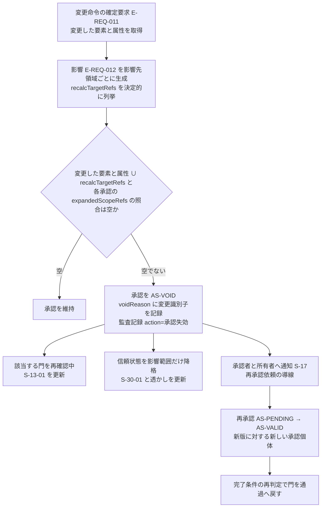

## 6. 段階門画面（S-13）との対応と、門を通過するときの記録

### 6.1 画面部品と本章の項目、機能の対応

| 画面と部品 | 表示する内容 | 本章の節 | 機能 | 空状態、待機状態、失敗状態（第15章が詳細化） |
|---|---|---|---|---|
| S-13-01 必要成果一覧 | 段階ごとの必須成果（E-REQ-010.requiredDeliverables）と充足状態（完了、未完了、再確認中）。成果ごとに対応画面への導線 | 第2節 必須成果、第3節 | F-C15-003 | S-13-01-E 段階未開始、S-13-01-W 判定中、S-13-01-X 判定不能（検査規則の読込失敗） |
| S-13-02 未解決問題 | 完了を妨げる SEV-0、SEV-1 の問題と例外承認の状態（IS-EXC）。「未検査」と「検査済み、指摘なし」を別文言で表示 | 第1.1節 規則5、6 | F-C15-003、F-C10-003（第17章） | S-13-02-E 未解決なし（検査済みの場合のみ） |
| S-13-03 承認者 | 確認範囲ごとの承認者、承認状態（AS-）、資格の有無、依頼と催促、責任表（E-ORG-007）の該当行 | 第5.1節、第2節 確認者 | F-C15-009、F-C10-004（第17章） | S-13-03-E 承認者未設定 |
| S-13-04 進行禁止理由 | 第2.0節の9項目 | 第2.0節、第2.1〜2.7節 | F-C15-002 | S-13-04-E 検査済み、該当なし |
| S-13-05 信頼状態の対応 | 現段階で許される最大の信頼状態、案の現在の状態、昇格に不足する条件の一覧（基盤 信頼状態 第1.2節の条件番号付き） | 第4節 | F-C15-004 | S-13-05-W 判定中 |
| S-13-06 門の通過操作と記録 | 「門を通過する」の主要操作（完了条件が全て合格の場合だけ有効）、通過日時と通過者、段階の横断表示（G0〜G6 の帯）、門ごとの M-N-01（通過要求時の値と通過時の確認記録。第6.2節）、G0 の非対象の表示記録（S-01-03 の表示日時と版）。通過操作の API は AP-032 operation=通過（第14章）（採番と表示内容の正本は本節。配置、操作、三状態の文言は第15章 第7.11節。JM-040。2026-10-06 に識別子台帳 第1節の判定へ合わせた） | 第1.2節、第6.2節 | F-C15-001、F-C15-014 | 第15章 |
| S-03-03 案別の要求適合表（将来場面の行） | G2 完了条件(7)の家族変化群の該当場面ごとの場面名、時期、案別の試行の状態（P0 は「試行未実施」の表示まで） | 第2.3節 完了条件(7) | F-C15-003、F-C14-006（第21章。試行は P1） | 第15章（JR-080） |
| S-30-01 信頼状態帯 | V0〜V3、未確認項目数、確認範囲別の内訳、S-13 への導線 | 第4節 | F-C15-004、F-C15-005 | 常時表示 |
| S-16 案件一覧画面（S-16-01 案件行） | 案件ごとの段階（G）、門の状態、信頼状態、未解決問題数（SEV-0 は「進行禁止 n 件」と別表示）、承認待ち数 | 第1.1節 規則12 | F-C15-001 | 第15章 |
| S-17 通知画面（S-17-01 通知一覧、S-17-02 通知詳細と遷移） | 承認の自動失効、進行禁止の発生、門の再確認中への遷移、法令版更新（第5.3節 規則9） | 第5.3節 規則6 | F-C15-002、F-C10-005（第17章） | 第15章 |
| S-25 判断記録画面（S-25-01 判断一覧、S-25-02 判断詳細、S-25-03 分母の操作、S-25-05 門ごとの値） | 段階の主要判断（E-REQ-004 gate=当該段階）、7項目の充足、M-N-01 の案件内表示（通過要求時の値） | 第6.2節 | F-C15-014 | 第15章 |
| S-22 専門家確認作業面 | 有資格者の確認範囲指定、承認と差戻し（P1） | 第5.1節 | F-C10-004（第17章） | 第15章 |

S-13 は全画面の S-30-01 から開ける（基盤 画面指標試験骨格 第1.4節）。画面遷移の詳細は第15章が定める【推定】。

### 6.2 門を通過するときの記録項目

門の通過は一つの操作で、次の記録を同時に固定する。通過可能の判定は製品が自動で行い、通過は RL-OWN または RL-CHK（verifierRefs に含まれる者）の操作（AP-032 operation=通過。操作者を監査記録に残す）で行う（JR-020）。記録は追記のみで、通過後の変更は新版として扱う【仮定】。

| 記録 | 実体と属性 | 必須 | 内容 |
|---|---|---|---|
| 通過記録 | E-REQ-010.status=通過、passedAt、verifierRefs、completionChecks（完了条件ごとの合否と検査規則 E-EXC-005 の版）、requiredDeliverables（各成果の参照と done=true）、blockingIssueRefs（空であること）、exceptionApprovalRefs（持ち越した SEV-1 の例外承認）、maxVerificationState | 必須 | 門の判定結果の固定 |
| 判断記録 | E-REQ-004（gate=当該段階、isKeyDecision=true）の全件が requirementRefs、optionRefs、rationale、affectedDomains、deciderRef、verifierRef、baseRevisionRef の7項目を持つ（項目7 は依拠する案の版 baseRevisionRef で判定し、全実体の共通属性 revisionRef では判定しない。JR-029）。持たない判断は S-25 に「未完了」と表示する。G2、G3、G4 で通過を止める対象は、源1 のうち当該段階の判断と、源2 のうち SEV-0 由来の判断に限る。源3（案件固有）の判断は未完了でも通過できるが、M-N-01 の分子に数えない（JM-002） | G2〜G4 で必須、G0、G1 は分母に含める判断があれば必須 | 段階の主要判断の固定 |
| 承認記録 | 第5.1節で当該門に必要な scopeKind の E-REQ-007 が AS-VALID。approverRef、approvedAt、baseRevisionRef、qualification（V3 昇格時）、standardsUsed と calculationRefs（計算を伴う場合） | 必須 | 確認範囲ごとの承認の固定 |
| 版 | E-REQ-006 Revision を kind 別に固定する。kind=建物情報: 通過時点の案の版（E-REQ-005.buildingRevisionRef → E-REQ-006 isApprovedVersion=true）。kind=要求台帳、判断記録、責任表、関係者表: 台帳単位の版（targetRef=案件。門の通過操作、承認操作、台帳行の確定時に生成）。cdeState（G1〜G3 は CDE-SHR まで、G4 は CDE-PUB）。判断記録の共通情報環境の状態は E-REQ-004.cdeState で表す（JM-084） | 必須 | 「承認された版」の識別（F-C15-017、第22章と整合） |
| 責任表 | E-ORG-007 の当該段階の行（gate=当該段階）に空欄がなく accepted=true | G4 で必須（I-06-002）、他段階は確認者行のみ必須 | 誰が作成、確認、承認、通知したかの固定 |
| 監査記録 | E-EXC-007（action=承認、targetRef=E-REQ-010、actorRef、at、processingRegion） | 必須 | 門の通過操作の記録 |
| 指標の写し | M-N-01 は門の通過要求時（利用者が「次の段階へ進む」を最初に押した時点）の値を固定し上書きしない（公開判定と月次判定に使う値。第2章 第4.5節）。門通過時の M-N-01 は 100% であることの確認記録として completionChecks に置く。M-G-01、M-G-08 は通過時の値を写す（F-C15-015、第23章。JM-002） | 必須（G2〜G4） | 指標の計測時点（通過要求時と門通過時）の元 |
| 進行禁止の検査記録 | 当該段階の全進行禁止条件について、検査日時、検査規則の版、結果（該当なし）を記録 | 必須 | 「未検査」で通過しないことの証拠 |

### 6.3 判断記録と通過記録の例示

| 例示識別子 | 内容 |
|---|---|
| D-06-001 | G2 の選定判断。requirementRefs=[R-05-011 廊下幅 900 mm 以上、他]、optionRefs=[三案_生活動線重視、三案_費用重視、三案_意匠重視]、selectedOptionRef=三案_生活動線重視、rationale=「朝の動線を優先。代償: 外観の凹凸が減る。未解決点: 二階浴室の排水経路」、affectedDomains=[A01、A04、A06、A09]、deciderRef=所有者、verifierRef=（P0 では所有者、P1 では建築士）、gate=G2、isKeyDecision=true |
| D-06-002 | G1 の要求衝突の決定。「開放的な居間」と「個室の静けさ」の衝突（I-00-001 相当）について、決定者が「居間を優先し、個室に防音建具を要求として追加」と決定。requirementRefs=[両要求]、optionRefs=[判断内選択肢 3件]、rationale に代償、deciderRef、verifierRef、gate=G1 |
| D-06-003 | G4 の再設計範囲の判断（主要判断 G4(c)）。「構造の荷重経路と設備の経路帯は受取側の構造設計者と設備設計者が再設計し、間取りと商品は本製品の V2 を引き継ぐ」。primaryDomain=A03、affectedDomains=[A04、A06]、gate=G4（JM-027 で主担当を A12 から A03 へ改め、責任表の確定を D-06-004 へ分けた） |
| D-06-004 | G4 の責任表の確定（主要判断 G4(a)）。「構造の確認範囲は受取側の構造設計者（RL-CHK、scopeKind=構造）、設備は設備設計者、間取りと書出は受取側の建築士が受諾する」。primaryDomain=A12、affectedDomains=[A04、A06]、gate=G4（JM-027） |
| 通過記録の例（G2） | status=通過、passedAt=2026-09-15T10:00、verifierRefs=[所有者]、completionChecks={(1)合、(2)合、(3)合、(4)合、(5)合、(6)合、(7)合}、requiredDeliverables=[三案 ×3 done、要求適合表 done、性能目標 done、概算 done、選定記録 D-06-001 done]、blockingIssueRefs=[]、exceptionApprovalRefs=[]、maxVerificationState=V1、承認記録=[scopeKind=選定 AS-VALID]、版=案 v1.3、要求台帳 v1.5 |

## 7. RIBA Plan of Work と国土交通省 建築BIM推進会議の段階との対応（参照）

本節の対応は検討漏れを防ぐための参照であり、日本の法令、資格、契約、評価制度を置き換える基準ではない。段階名称と成果は日本の戸建実務へ合わせ、法的判断は国、自治体、確認検査機関、有資格者の現行情報を優先する（指示文10）【推定】。

### 7.1 参照した外部枠組みの現行状態

| 枠組み | 確認できた事項 | 区分 | 出典URL と出典ID（確認日 2026-09-15。出典ID は第3章 第4.3節） |
|---|---|---|---|
| RIBA Plan of Work 2020 | 八段階（0 Strategic Definition、1 Preparation and Briefing、2 Concept Design、3 Spatial Coordination、4 Technical Design、5 Manufacturing and Construction、6 Handover、7 Use）。各段階は段階成果、中核作業、法定手続、情報交換で構成。横断課題は Conservation、Cost、Fire Safety、Health and Safety、Inclusive Design、Planning、Plan for Use、Procurement、Sustainability の9戦略。Toolbox に Design Responsibility Matrix を含む。概要書は著作権者の許諾なく複製不可 | 【事実】 | https://www.riba.org/work/insights-and-resources/riba-plan-of-work/ （SRC-246）、https://www.riba.org/media/syneeeto/2020ribaplanofworkoverviewpdf.pdf （SRC-247） |
| 国土交通省 建築BIM推進会議 | 「建築分野におけるBIMの標準ワークフローとその活用方策に関するガイドライン」第3版（令和8年3月）。建築確認におけるBIM図面審査ガイドライン初版（令和8年3月24日版）。標準属性項目リスト統合 Ver2.0（令和8年3月）。確認申請用CDE 仕様書 Ver 1.00 Rev 1.00a（令和6年3月）。戸建住宅に特化した記載なし | 【事実】 | https://www.mlit.go.jp/jutakukentiku/kenchikuBIMsuishinkaigi.html （SRC-252）、https://www.mlit.go.jp/jutakukentiku/build/jutakukentiku_house_tk_000181.html （SRC-253） |
| 国土交通省 標準ワークフローの段階名 | 段階区分の正式名称は頁本文で確認できていない（調査 06 U-86-005） | 【未確認】 | 同上 |
| ISO 19650 / IMI Framework | UK BIM Framework は 2025年5月30日に IMI Framework へ改称。基盤規格は BS EN ISO 19650-1:2018、-2:2018、-3:2020、-4:2022、-5:2020。役割概念は Appointing Party、Lead Appointed Party、Appointed Party 等 | 【事実】 | https://imiframework.org/ （SRC-255）、https://wearenima.im/new-imi-framework/ （SRC-256） |
| AIA Framework for Design Excellence | 十の観点（Integration、Equitable Communities、Ecosystems、Water、Economy、Energy、Well-being、Resources、Change、Discovery）。評価観点であり段階門を持たない | 【事実】 | https://www.aia.org/design-excellence/aia-framework-design-excellence （SRC-249） |

### 7.2 段階の対応表

| 本製品の段階 | RIBA Plan of Work 2020 | 国土交通省 標準ワークフロー（推定。段階名は未確認） | ISO 19650 / IMI | 区分 |
|---|---|---|---|---|
| G0 目的と成立性 | Stage 0 Strategic Definition（顧客要求を満たす最良の手段の確認） | 企画 | 発注側の情報要求の起点 | 【推定】（国交省の列は【未確認】） |
| G1 要求と敷地確認 | Stage 1 Preparation and Briefing（案件要綱の承認、敷地での成立確認） | 企画〜基本設計前 | 情報要求（発注者情報要求に相当）の確定 | 同上 |
| G2 比較構想 | Stage 2 Concept Design（建築構想の承認） | 基本設計 | 情報交換 | 同上 |
| G3 空間と技術調整 | Stage 3 Spatial Coordination（建築と設備の空間調整） | 基本設計〜実施設計 | 情報交換 | 同上 |
| G4 専門設計引継ぎ | Stage 4 Technical Design への引継ぎ（本製品は Stage 4 を実施しない） | 実施設計、確認申請（BIM図面審査は対象範囲を未確認） | 情報要求適合の検査（IDS） | 同上 |
| G5 施工と竣工反映 | Stage 5 Manufacturing and Construction、Stage 6 Handover | 施工、竣工 | 引渡し情報 | 同上 |
| G6 入居と改善 | Stage 7 Use（Stage 0 へ還流） | 維持管理 | 運用段階（ISO 19650-3） | 同上 |

### 7.3 本製品が採る要素と、越える点

| 観点 | 採る要素 | 本製品が越える点または異なる点 | 区分 |
|---|---|---|---|
| 段階の定義枠 | RIBA の「段階成果、中核作業、法定手続、情報交換」を、本章の「必須成果、主要判断、（法定手続は製品外と明記）、交換資料と必要情報要求」に対応付ける | 本製品は「開始条件」「進行禁止条件」「確認者」を各段階に持ち、門を通過しない案の信頼表示を止める。RIBA は段階の順次進行を前提とするが進行禁止の機構を持たない | 【推定】 |
| 責任表 | RIBA Design Responsibility Matrix の考え方を E-ORG-007 Responsibility（役割×作成、確認、承認、通知、要素別）に対応付ける | 本製品は責任表の空欄を G4 の進行禁止条件（I-06-002）にする | 【推定】 |
| 空間調整 | RIBA Stage 3 の空間調整を G3 に対応付ける | RIBA Stage 3 は設計側の調整が主眼。本製品の G3 は家族と専門家の判断合意（確認範囲ごとの承認）を含む | 【推定】 |
| 当事者参画 | RIBA Engagement Overlay（2024年1月）の指針を、G0、G1 の関係者表と当事者参画に対応付ける | 本製品は当事者参画を関係者表の属性（participationMethod、confirmedBySelf）として記録し、T-R-012 で検査する | 【推定】 |
| 共通情報環境 | 国土交通省 確認申請用CDE 仕様の状態区分と指示文C15の「作業中、共有、発行済み、保管」を CDE-WIP、CDE-SHR、CDE-PUB、CDE-ARC に対応付ける。ISO 19650 系との対応は未決 U-00-022 | 本製品は非専門家の施主が状態を理解できる語（作業中、共有、発行済み、保管）で表示する | 【推定】 |
| 属性辞書 | 国土交通省 標準属性項目リスト Ver2.0 を G4 の標準の必要情報要求（E-EXC-001）の候補辞書にする（第22章） | 戸建向け項目の充足度は未確認（調査 06 U-86-005、U-86-006） | 【未確認】 |
| 入居後評価 | AIA の Discovery（入居後評価の還流）と Change（適応）を G6 の学び一覧の項目に対応付ける | AIA は評価観点であり判断の責任と確信度を持たない。本製品は観点を「未検討」「検討済み」「根拠付き」で状態管理する（第21章） | 【推定】 |

## 8. 進行禁止条件の運用と計測

### 8.1 運用規則

| 規則 | 内容 | 区分 |
|---|---|---|
| 検出 | 進行禁止条件は E-EXC-005 ValidationRule（kind=進行禁止、および欠落属性、閉領域、接続、干渉、権利条件、同意）の決定的検査で検出し、該当時は E-REQ-003 を severity=SEV-0 で登録して E-REQ-010.blockingIssueRefs に加える。人の報告に由来する問題は報告の種別を入力に検証規則が SEV-0 を付け、報告者は SEV-0 を選べない（第8.2節「報告種別による SEV-0 付与」。JM-033）。言語模型の判断だけで登録も解除もしない | 【仮定】 |
| 契機 | 第1.1節 規則4の(a)〜(f)。加えて、検査規則の版が更新されたとき（法令版更新を含む）は該当段階の全案件で再検査する | 【仮定】 |
| 表示 | S-13-04 に第2.0節の9項目を表示し、信頼状態は据え置く。S-17 に発生を通知する。S-16 の案件行に「進行禁止 n 件」を表示する | 【推定】 |
| 発行と引継ぎ | 発行（CDE-PUB。第14章 第6.4節、AP-032 operation=発行、第22章 F-C15-017）と引継ぎ一式の生成（第22章 F-C15-013）は、当該案の現段階と再確認中の段階の Gate.blockingIssueRefs が空のときだけ行い（AC-C15-017-03、AC-C15-013-04）、該当時は S-08 と S-13-04 に条件の識別子と導線を出す。共有URL（AP-022、F-C10-009）は止めない（P0 の復旧導線で建築士を招くため）。共有の閲覧画面には未解決の進行禁止条件の一覧を表示する。法規の SEV-0 では信頼状態を下げない（第2.0節 項目7。降格は基盤 信頼状態 第1.3節の対象に限る。JR-011） | 【推定】 |
| 解除 | 該当する問題が IS-RESOLVED（解決証拠付き。E-REQ-003.resolutionEvidenceRef の型は E-REQ-004 判断、E-REQ-007 承認、E-REQ-008 証拠、E-REQ-011 変更命令のいずれか。構造の確認記録は E-REQ-007〔scopeKind=構造〕の AS-VALID とし、計算書等は E-REQ-008 として添付する。第12章 E-REQ-003。統括の決定 D41）になった時だけ解除する。IS-EXC（例外承認）と IS-REJECTED（却下）では解除しない。ただし誤警告の場合は、資格を登録した RL-CHK（P0 は本人申告、未照合。P1 は照合済み。第5.2節）だけが理由を付けて IS-REJECTED にでき、その件数を M-G-09 の分子として計測し監査記録に残す（第1.1節 規則5。JM-033）。IS-REJECTED は SEV-0 の解除ではなく「該当しなかった」の記録である。却下の再登録を抑止する単位は、規則の識別子と版、anchor（I-06-006 は E-SRV-004 の条項単位）、入力の指紋（E-REQ-003.rejectionFingerprint。E-SRV-004 の識別子、standard.version、margin の値、案の版）とし、同じ単位で再検査しても再登録しない。再判定では指紋と比べ、(a) 余裕量が却下時より小さくなった、(b) 別の条項が負になった、(c) 法令版が更新された、のいずれかに該当すれば再登録する（JR-023） | 【仮定】 |
| 記録 | 検出、解除、却下は E-EXC-007 に追記し、検査規則の版と検査日時を持つ。「未検査」と「検査済み、該当なし」を区別して表示する | 【推定】 |
| 計測 | M-G-08 進行禁止条件の見逃し率（初期仮説 0%）、M-G-09 誤警告率（初期仮説 SEV-0 の誤警告 5% 以下）、M-G-13 未確認案の誤表示件数（0件）を段階、条件の識別子、入力種別で層別して計測する。計測は F-C15-015（第23章） | 【推定】 |

### 8.2 進行禁止条件の一覧（検査規則 E-EXC-005 と対応する試験）

本表は、進行禁止条件と、門の判定に関わる SEV-1 の検査（I-05-001、I-18-002、I-18-004、I-18-005、I-06-008、I-06-009、G2 完了条件(9)の承知の規則）を E-EXC-005 ValidationRule として登録する一覧の正本である（修正計画 第0.3節「進行禁止条件の式」）。各行は規則名（式の全文を書く主章の節）、kind、expression の要旨、version、appliesTo（段階）、testRef を持つ。式の全文は規則名に示す主章が書き、本表は要旨と版を同期して持つ。主章の式の版が上がった場合は本表の version を追従させ、F-C15-001 例外(a)により全案件の該当段階を再判定する。全規則は isDeterministic=true とし、severity は SEV-0（I-05-001、I-18-002、I-18-004、I-18-005、I-06-008、I-06-009、G2 完了条件(9)の承知の規則は SEV-1。I-06-007 は所見の種別により SEV-0 または SEV-1。SEV-1 の行は第1.1節 規則6 に従い、解決または例外承認で門を通過できる）、message と fixHint は第2.1〜2.7節の条件文と解除表から作る。規則名と対象の例示識別子（I-）は第12章 v1.3 の E-EXC-005.ruleName と exampleIssueIds（表11.2-A）に持たせ、本表の「規則名（式の正本）」列と「条件」列に一対一で同期する（JM-068。2026-10-06 に依頼を対応済みとした）【推定】。

| 段階（appliesTo） | 条件 | 規則名（式の正本） | kind | expression の要旨 | version | testRef |
|---|---|---|---|---|---|---|
| G0 | I-00-101〜I-00-104 | G0 必須属性（本章 第2.1節） | 欠落属性 | E-BLD-001 の region、budgetRange（「未定」は値として扱う）、landStatus のいずれかが空、または purpose が非対象（指示文G節末尾の7項目）に該当 | v1.0 | T-A-013（第23章 第4.1節で前提を拡張済み） |
| G0 | I-06-001 | 利用条件の同意（本章 第2.1節） | 同意 | E-ORG-006（purpose=利用条件、status=有効）が0件のまま要求（E-REQ-001）の作成を始めようとしている | v1.0 | T-S-014 |
| G1 | I-00-105〜I-00-107 | 敷地の重大不明（第18章 第1.8.2節） | 欠落属性、進行禁止 | 境界、接道、用途地域のそれぞれについて、値、仮定（E-SRV-008）、不足調査（E-SRV-001 の測量、行政照会）の三つとも無い。対象外地域では I-00-107 を登録しない。利用目的別の生成で G1(b) が非の利用目的（家具配置、図面3D化、売却賃貸）では、敷地の項目（境界、接道、用途地域）を非該当とし、I-00-105〜107 を登録しない（第2章 第4.3節。第2.2節 完了条件(3)と同文。統括の決定 D30） | v1.1（2026-10-08 に利用目的による適用除外を加えた。第18章 第1.8.2節と同文） | T-R-001、T-A-008 |
| G1 | I-00-108 | 第11章 第6.5節 条件1 | 寸法拘束 | 頁の尺度が VS-USR 未満、scopeKind=尺度 の承認が AS-VALID でない、または acknowledgedWarnings に理由のない警告が残るまま、寸法の表示または V2 判定へ進もうとしている | v1.0 | T-A-002、T-R-005 |
| G1 | I-00-109 | 決定者と衝突の表示（本章 第2.2節。判定対象は第8章 F-C01-019、F-C01-020） | 欠落属性、進行禁止 | RP-MUST の E-REQ-001 で deciderRef が空のものが1件以上 | v1.0 | T-R-012 |
| G1、G2 | I-00-110 | 決定者と衝突の表示（本章 第2.2節、第2.3節 完了条件(8)。判定対象は第8章 F-C01-019、F-C01-020） | 進行禁止 | 検出した要求衝突（G2 は案の生成時に新たに検出した衝突。conflictRecords に optionRefs を持つ）のうち S-24 での決定者への表示記録がないものが1件以上（2026-10-07 に appliesTo を G1、G2 に広げた。JR-038） | v2.0 | T-R-012 |
| G0、G1 | I-05-001（SEV-1。進行禁止ではない） | 決定権の二重割当（第5章 F-C01-013 例外(b)） | 欠落属性 | 同一判断種に decisionAuthority を持つ関係者が2名以上あり、優先順位も合議（mode）も記録がない（JM-018） | v1.0 | T-R-012 |
| G1、G4 | I-06-003 | 正本未確定（第11章 第7.1節） | 欠落属性 | count(図面番号 where 候補頁数 ≥ 2 or 差替え漏れ or 欠落 or 混入, 確定判断なし) > 0。確定判断は E-PRD-006.isMasterCandidate と E-REQ-004 の結合で判定する。契機は G1→G2 の門の通過要求（三案生成の有無を問わない）と V2 判定の要求で、G4 は再検査する（図面一式は P1。2026-10-07 に混入と契機を改めた。JR-048） | v2.0 | T-R-004 |
| G2 | I-00-111 | 必須要求の全案不適合（本章 第2.3節） | 進行禁止 | RP-MUST（E-REQ-002 isHard=true を含む）の各要求で適合する案が0件のものが1件以上（三案の droppedRequirementRefs の積集合に RP-MUST が含まれる）。判定区分「未確認（P1で判定）」の RP-MUST と「未判定（P1）」の要求（将来場面の試行で判定する要求と主担当 A11 の要求。第8章 F-C01-023 正常手順(8)）は不適合に数えない。完了条件(1)より優先（式の全文は第2.3節） | v1.0（2026-10-06 に「未判定（P1）」の扱いを明記。式の結果は変わらない） | T-R-001、T-R-007 |
| G2 | I-00-112 | 重大危険の未表示（擁壁と地盤: 第18章 第1.8.2節。避難: 第19章 第2.2節の I-19-001 の式） | 進行禁止 | 擁壁と地盤: E-BLD-002.terrain.heightDiffToRoad > 2,000 mm、terrain.slopePercent > 15（初期仮説）、または confirmationItems の item=擁壁 の value が「あり」「あり（詳細不明）」「未確認」のいずれかで state ≠ 確認済み のとき、案（E-REQ-005）の openItems（未解決点）または S-03-06 の初期注意に E-SRV-007（kind=敷地、主要危険「擁壁と地盤」）か E-REQ-003（対象=擁壁、主担当 A04。A02 は影響先）の参照が0件の案がある（第18章 第1.8.2節の改訂文と同文。JR-088、JR-034 (3)）。避難: 避難経路の重大危険に該当する案で当該危険（E-REQ-003）の参照が0件 | v1.1（2026-10-07 に第18章 第1.8.2節の改訂文へ同期。第18章が版を上げた場合は追従） | T-R-001 |
| G2 | I-00-113 | 同一評価軸（本章 第2.3節） | 進行禁止 | 比較対象の案のいずれかで、生活、空間、技術、費用、性能の5軸のうち評価値も「比較不能」の明示もない軸が1件以上 | v1.0 | T-A-013、T-I-005 |
| G2 | I-00-114 | 単一額の禁止（第20章 第1.4節） | 進行禁止 | 概算（Estimate.basis=概算）の totalRange の下限と上限が等しい、または S-03 の費用軸が単一額 | v1.0 | T-R-007、T-I-016 |
| G2（SEV-1。完了条件(9)の規則。進行禁止ではない） | —（例示識別子は置かない。問題は SEV-1 で登録。E-EXC-005.exampleIssueIds は空。U-06-020 の判断） | 非常時の必須要求の承知（本章 第2.3節 完了条件(9)。判定区分は第8章 F-C01-023） | 欠落属性 | priority=RP-MUST で判定区分が「未確認（P1で判定）」の非常時の要求（E-REQ-001）のうち、E-REQ-007（scopeKind=要求）.acknowledgedWarnings に決定者の承知の記録（理由 20 字以上、日時）がないものが 1 件以上。解決は承知の記録の登録だけで、例外承認では解決しない（JR-024） | v1.0 | T-R-011 |
| G2（SEV-1。完了条件(10)の規則。P1） | I-06-009 | 改装区分の未指定（本章 第2.3節 完了条件(10)。区分の正本は第21章 F-C14-001） | 欠落属性 | E-BLD-001.useType=改装 かつ現況要素（conditionState が null でない要素）のうち renovationAction が未指定のものが 1 件以上。P0 は判定せず S-13-01 に「改装区分の指定は P1」を表示する（JR-022） | v1.0 | T-A-012、T-R-006 |
| G2 | I-00-115 | 選定記録の決定者（本章 第2.3節） | 欠落属性 | E-REQ-004（gate=G2、isKeyDecision=true、selectedOptionRef あり）の deciderRef が空 | v1.0 | T-A-013 |
| G2、G3 | I-18-002（SEV-1。進行禁止の前段） | 負の余裕量（第18章 第4.4節） | 進行禁止 | E-SRV-004（kind=法規判定）の margin.items[].margin が負の条項ごとに1件登録（主担当 A02、影響先 A03、A12）。解除は形状または配置の変更後の再判定による IS-RESOLVED、または資格を登録した RL-CHK の例外承認（第1.1節 規則6 (a)。P0 で該当する RL-CHK が不在なら G3 で止まる）。例外承認は G2→G3 の持ち越しにだけ効き、G3 と G4 では I-06-006 が該当する（JR-011） | v1.0（第18章 v1.1 第4.4節と 2026-10-06 に同期。式の変更なし） | T-R-001、T-R-010、T-I-023 |
| G3 | I-00-116 | 構造注意の荷重経路（第13章 第2.3節、第10.2節 例外(e)。式の全文は第13章 第5.5節） | 進行禁止、干渉 | 次のいずれかの問題（主担当 A04）が IS-RESOLVED でなく1件以上ある: 吹抜けに面する梁の跨度超過（DV-ST-03）、受け要素のない耐力壁候補線上の開口（開口率と連続開口幅の超過だけなら SEV-1。JM-100）、1,365 mm 超の張出し（DV-ST-07）、直下に壁も梁もない2階外周壁、改装案件の既存外周壁または上下階連続壁の撤去と候補線上の新設開口（範囲は基盤 七段階門 v1.2。JM-094 (1)。P0 は案の変更命令で現況要素を削除、移動、寸法変更したときに自動で付いた撤去と移設にも適用する〔移設は移設元を、寸法変更は変更前の要素を撤去として数える。統括の決定 D34、D36、D38〕。第13章 式(5)、JR-095）。改装の撤去を維持する場合の除外は、撤去後の計画の版を対象とし撤去する壁を scope に含む AS-VALID の構造の確認記録（scopeKind=構造。P1、照合済みの資格。統括の決定 D41）がある場合に限り、耐震診断の記録は入力に限る（JR-066） | v3.1（2026-10-08 の段階8 の最終仕上げで第13章 第5.5節の式の版 v3.1 に同期した。式(5)に寸法変更の撤去〔変更前の要素〕、既存外周壁と上下階連続壁の移設元を撤去として数える扱い、自動付与の契機を案の変更命令に限ること〔図面読解の修正は除く〕を加えたため。統括の決定 D34、D36、D38、D49。要旨には D41 の「AS-VALID の」も加えた。v3.0 は第13章 v1.3 第5.5節の式の版〔式(5)の除外条件〔撤去後の計画の版を対象とする構造の確認記録、耐震診断の記録は入力。JR-066〕と P0 適用〔JR-095〕〕で 2026-10-07 の二回目の修正の仕上げで同期。v2.0 は 2026-10-06 の同期） | T-R-002、T-R-006、T-I-006 |
| G3 | I-00-117 | 排水勾配と迂回候補（第13章 第4.3節、第5.1節 種別2。式の全文は第13章 第5.5節） | 干渉 | 排水経路（E-SYS-003 kind=排水）の水平区間のいずれかで、利用可能な落差 < 水平長 × 最小勾配（DV-EQ-05）。梁と交差する区間は迂回候補1、候補2 のいずれでも不成立。天井懐が「整合待ち」の階の区間は判定せず未検査とする（JM-097） | v2.0（第13章の版。2026-10-06 に同期） | T-R-003、T-I-007 |
| G3 | I-00-118 | 避難経路（第19章 第2.2節の I-19-001 の式） | 進行禁止 | 2階以上の寝室（E-SPC-001 usage=寝室）から屋外に達する避難経路（E-SYS-003 kind=避難）が1本以下、または最短経路長が 20,000 mm を超える（初期仮説 U-19-005）室が1件以上あり、I-19-001 相当の問題が IS-RESOLVED でない | v1.0（第19章の版） | T-I-001（第23章 付表 4.3-B の避難の進行禁止。第19章 第2.2節の式の testRef と同じ。2026-10-06 に設備干渉の受入試験 T-A-010 から改めた） |
| G3 | I-00-119、I-00-120 | 第11章 第6.5節 条件5、条件6 | 欠落属性 | 壁、開口、階段で lowConfidence=true が1件以上（I-00-119）。主要寸法で valueState=VS-DEF が1件以上（I-00-120） | v1.0 | T-A-007 |
| G3 | I-00-121 | 正規商品以外の実商品表示（第16章。禁止表示語は本章 F-C15-005） | 権利条件、禁止表示語 | PT-CERT 以外の商品に実在商品と誤認させる表示がある、または PT- と RS- の表示がない配置が1件以上 | v1.0 | T-A-005、T-R-009 |
| G3、G4（I-06-003 と同じ型） | I-06-006 | 負の余裕量の持ち越し禁止（本章 第2.5節。I-18-002 の登録は第18章 第4.4節） | 進行禁止 | E-SRV-004（kind=法規判定）.margin.items[].margin が負の条項が1件以上あり、対応する I-18-002 が IS-RESOLVED でない（例外承認で IS-EXC にしたものを含む）。appliesTo: gates=[G3, G4]。G3 では SEV-0 として G3 の門の通過を止め、G4 では再検査する。I-06-006 は I-18-002 と別の問題として登録し、I-18-002 の重大度は変えない（JR-011）。却下の再登録の単位と条件は第8.1節 解除（E-REQ-003.rejectionFingerprint。JR-023） | v2.0（2026-10-07 に appliesTo を G3、G4 に改めた） | T-R-010 |
| G3、G4（P1） | I-06-007 | 所見の種別による重大度付与（発見の問題。第11章 F-C02-026 (6)。報告種別への対応表は第12章 DV-CF-13） | 進行禁止 | findingKind=石綿 かつ detected=true、または findingKind が腐朽か蟻害 かつ対象が構造部材（土台、柱、梁、耐力壁候補線上の壁、基礎）なら SEV-0。他の detected=true は SEV-1。解除は第2.4節の解除表（JR-013）。設計段階で IS-RESOLVED になった同じ発見の問題は、所見（detected=true）が残っても再登録しない（G4 の再検査を含む。統括の決定 D43） | v1.1（2026-10-08 に再登録しない句を加えた） | T-R-006 |
| G3（SEV-1。進行禁止ではない。P1） | I-06-008 | 現況未確認の改装要素（第21章 第2.1節 規則(5)。基盤 信頼状態 第1.2節 V1→V2 の改装案件の付帯条件） | 欠落属性 | E-BLD-001.useType=改装 かつ renovationAction が撤去、補修、補強、移設のいずれかの要素で conditionState が CS-DRW または CS-EST のものが 1 件以上。主担当 A10。V2 に「現況未確認（n 要素）」を併記する（JR-021） | v1.0 | T-R-006 |
| G4（G4 で判定。引継ぎの前提。SEV-1。進行禁止ではない） | I-18-004 | 判定不能の条項（第18章 第4.7節。v1.1、JM-131） | 欠落属性 | E-SRV-004（kind=法規判定）.validity=判定不能 の条項（必要入力の一覧 outputs.values.requiredInputs 付き）が1件以上ある。主担当 A02、影響先 A12。引継ぎ一式の問題一覧（第22章 F-C15-013）に必要入力を付けて含める | v1.0（新設。第18章 v1.1） | T-U-012（AC-C09-008-04） |
| G4（G4 で判定。引継ぎの前提。SEV-1。進行禁止ではない） | I-18-005 | 法規条件の確認期限切れ（第18章 第1.4.2節、F-C09-012-01。v1.1、JM-127） | 欠落属性 | E-SRV-011.validity=確認期限切れ の項目を入力とする E-SRV-004（kind=法規判定）が案に1件以上ある。主担当 A12、影響先 A02。版は変わらないため承認（scopeKind=法規）は失効させない | v1.0（新設。第18章 v1.1） | T-U-012（AC-C09-002-04） |
| G4 | I-00-122〜I-00-124 | 発行済み版の一意（第22章 F-C15-017）、欠落の例外承認（第22章 F-C15-007、F-C15-012）、承認範囲（第17章 F-C10-004） | 欠落属性、進行禁止 | 同じ案で cdeState=CDE-PUB の版が2件以上（I-00-122）。情報要求検査の不合格項目で scopeKind=例外 の AS-VALID がないものが1件以上（I-00-123）。scope が参照集合を持たない承認が1件以上（I-00-124） | v1.0 | T-A-014（P0 は T-A-017 で代替）、T-I-005 |
| G4 | I-00-125 | 送信先ごとの同意（第17章、第22章） | 同意 | 交換資料の送信先（P0 は共有URL の発行先）のうち、有効な同意（E-ORG-006 purpose=外部送信）または発行先ごとの確認記録がないものが1件以上 | v1.0 | T-S-001 |
| G4 | I-00-126 | V1 の引継ぎ禁止（本章 F-C15-004） | 進行禁止 | 引継ぎ対象の E-REQ-005.verificationState が V0 または V1 | v1.0 | T-A-007、T-A-014 |
| G4 | I-06-002 | 責任表の空欄と未受諾（本章 F-C15-009） | 欠落属性 | gate が G4 以前の E-ORG-007 で actorRef が空、または accepted=false の行が1件以上 | v1.0 | T-A-013（第23章 第4.1節で前提を拡張済み）、T-I-002 |
| G4（P1） | I-06-005 | 解体後判明時の 4 項目（本章 第2.5節 完了条件(7)。4 項目の定義は第21章 第3節） | 欠落属性 | E-BLD-001.useType=改装 かつ renovationAction が撤去、補修、補強、移設の要素が1件以上あり、kind=解体後判明の工事前定義 の E-REQ-004 が無い、または unforeseenPlan（判断者、費用予備、代替案の型、承認手順）のいずれかが空（2026-10-07 に参照する属性を改めた。JR-058）。P1。P0 は判定せず、欠落の自動記録 (vii) に記録する（I-06-009 と同じ型。統括の決定 D35） | v1.2（2026-10-08 に P0 で判定しない扱いを明記） | T-R-006 |
| G5 | I-00-127〜I-00-130 | 施工中の変更と検査（第21章） | 進行禁止（P2） | 未承認の現場変更、検査未了の部位、構造、避難、防火に関わる危険な相違、石綿事前調査の未了（式の全文は第21章）。I-00-130 は段階内の操作（解体を含む施工中変更と検査記録の登録）を止める（JR-031） | v1.0 | T-R-006、T-A-012、T-I-017 |
| G5 | I-06-004 | 石綿含有判明後の記録（本章 第2.6節。記録の受入は第21章 第2.4節） | 欠落属性 | 石綿含有の発見（分析結果で含有あり、または含有とみなす判断）が1件以上あり、対応する E-PRD-006（kind=証明書または調査報告）の作業結果の報告書面（大気汚染防止法 第18条の23第1項。自主施工は自主施工者の記録〔同条第2項〕。作業の写真記録は任意の添付で条件に含めない）が未登録。G5→G6 の門（竣工反映版の発行）を止める（JR-031）。P0、P1 では警告に留める | v1.1（2026-10-07。解除の記録を作業結果の報告書面に特定した。SRC-314、`01_調査/08_外部確認_段階7後.md` 第3節） | T-R-006 |
| G5、G6 | I-00-129、I-00-131、I-21-004 | 報告種別による SEV-0 付与（第21章 第3節 承認手順(2)） | 進行禁止 | 報告種別（E-REQ-003.reportKind、または第12章 DV-CF-13 で所見の種別と要素種別から導いた種別。JR-013）が構造、避難、防火、石綿含有のいずれかなら SEV-0 を付ける（G6 の緊急不具合では漏水も SEV-0）。人が直接選べる重大度は SEV-1〜3 に限る。承認前に施工された変更（I-21-004）は SEV-0。設計段階（G3、G4）で IS-RESOLVED になった同じ発見の問題（I-06-007）は再登録しない（統括の決定 D43） | v1.1（2026-10-08 に再登録しない句を加えた） | T-R-006 |
| G6 | I-00-131〜I-00-133 | 入居後の緊急不具合と同意（第21章、第22章） | 進行禁止、同意（P2） | 緊急不具合の未対応、同意不足のままの入居後確認の取得、別同意のない学び一覧への登録（式の全文は第21章、第22章） | v1.0 | T-A-015 |

### 8.3 反証試験との対応（基盤 画面指標試験骨格 第3.5節の転記）

| 反証試験 | 働く進行禁止条件 | 段階門 | 本章の該当節 |
|---|---|---|---|
| T-R-001 狭小または傾斜敷地 | I-00-105、I-00-110、I-00-111、I-00-112。負の余裕量は I-18-002（SEV-1。例外承認は資格を登録した RL-CHK だけ。第1.1節 規則6 (a)）。斜線は P0 では「未判定（P1）」と表示する（第3.4節 A02。JM-128）。P0 の地盤仮定と擁壁の SEV-1 は規則6 (b) で G3 を通過し、G4 の欠落の自動記録 (i) に載る（AC-C15-003-08。JR-014） | G1〜G4 | 第1.1節 規則6、第2.2節、第2.3節、第2.5節 |
| T-R-002 大開口と耐力要素の衝突 | I-00-116（受け要素がない例。受け要素がある例は SEV-1 で進行禁止なし。JM-100）。P0 版の合格条件（第23章 第5.1節、基盤 画面指標試験骨格 v1.2 第3.2節）で判定し、元に戻す変更で門が通過する。耐力要素の移動と有資格者の確認記録による通過は P1 版で判定する（P1 部分は P1。JM-023、JM-171） | G3 | 第2.4節 |
| T-R-003 梁と排水経路の衝突 | I-00-117（迂回候補1、2 のいずれでも勾配が不成立。第13章 第5.5節 v2.0）。P0 版の合格条件（第23章 第5.1節、骨格 v1.2 第3.2節）で判定し、経路、立管、階高と天井高の変更で門が通過する。梁の変更と設備設計者の確認記録による通過は P1 版で判定する（P1 部分は P1。JM-023、JM-171） | G3 | 第2.4節 |
| T-R-004 改訂の異なる図面 | I-06-003（G1 で停止、G4 で再検査）。I-00-122 は CDE-PUB の一意性に限定し本試験の対象外 | G1、G4 | 第2.2節、第2.5節 |
| T-R-005 尺度不明画像 | I-00-108 | G1 | 第2.2節 |
| T-R-006 改装時の隠れた劣化 | P0 版の合格条件（第23章 第5.1節、骨格 第3.2節）で判定する。P0 は改装案件の現況要素の削除、移動、寸法変更（案の変更命令に限る）に撤去と移設（寸法変更は撤去と新設の組）を自動付与し、既存の外周壁と上下階連続壁の撤去（移設は移設元を、寸法変更は変更前の要素を撤去として数える）と耐力壁候補線上の新設開口で SEV-0（I-00-116。第13章 第5.5節 式(5)。解除は元に戻す変更だけ。統括の決定 D34、D36）。CS- の表示と固定注記（JR-095）。P1 版は S-27-03 で指定した改装区分による I-00-116（G3。JM-094 (1)。解除表は第2.4節）と I-06-005（G4。解体後判明時の 4 項目の未定義。JM-025）で判定する。P1 は設計段階（G3、G4）の発見の問題に規則（I-06-007）で SEV-0 が付き、第2.4節の解除表の条件で解決する。G5 の I-00-130、I-06-004（石綿含有判明後の記録の未登録。JM-148）と報告種別による SEV-0 付与（第21章 第3節）は P2 で、P0、P1 では警告に留める（P1 部分は P1。JR-013） | G3、G4、G5 | 第2.4節、第2.5節、第2.6節 |
| T-R-007 予算削減と性能目標の衝突 | 進行禁止なし。I-00-111（必須要求を満たす案がない場合）。P0 版の合格条件（第23章 第5.1節、骨格 v1.2 第3.2節。X4 の SEV-1 と代償の表示）で判定し、費用低減案の性能影響の表示（F-C13-013）は P1 版で判定する（P1 部分は P1。JM-171）。予算上限の案別判定は X4 と同じ値で行う（第2.3節 I-00-111 の判定式。G3 概算の中央値による「予算超過の可能性」の表示を含む。JR-026、JR-117） | G2、G3 | 第2.3節、第2.4節 |
| T-R-008 将来の車椅子利用 | 進行禁止なし。目標未定義の問題（SEV-1）。P0 版の合格条件（第23章 第5.1節、骨格 v1.2 第3.2節。案別要求適合表と「試行未実施」の表示）で判定し、利用円滑性の検査と将来場面の試行（F-C12-011、F-C14-006）は P1 版で判定する（P1 部分は P1。JM-171） | G1、G2 | 第1.1節 規則6、第2.3節 |
| T-R-009 販売終了商品 | 進行禁止なし。商品の承認の失効（AS-VOID。第5.3節 規則1 のただし書き）と G3 の門の再確認中（第12章 連動8）で止まる。I-00-121 は層の誤表示がある場合（JR-085）。P0 版の合格条件（第23章 第5.1節、骨格 第3.2節。有効期限超過の SUP-UNKNOWN 表示と利用者申告）で判定し、販売終了の検知（AP-036 の同期結果 discontinued と運用者の台帳操作による SUP-DISC）も P0 版 (6) で判定する。表示直前の再確認（AP-017）と納期超過、価格の更新は P1 版で判定する（P1 部分は P1。正本は第16章 第6.4節「P0 の扱い」。JM-117、JM-171、JR-083） | G3 | 第2.4節、第5.3節 |
| T-R-010 法改正 | G1、G2: 進行禁止なし（負の余裕量は I-18-002、SEV-1）。G3、G4: I-06-006。P0 版（判定範囲は建蔽率、容積率、高さ、接道の4項目）は、確認期限切れ（checkedAt が 91 日前）での「再計算要」「期限切れ」の表示と I-18-005 の引継ぎ、手動再取得による新版の取込と再判定と I-18-002 の登録、期限内の改正を検出しない旨の固定注記、合格条件(5)の二経路（経路A: RL-CHK 不在で I-18-002 により G3 で止まる。経路B: 本人申告の RL-CHK が G3 で I-18-002 を例外承認しても、G3 の通過操作で I-06-006 が SEV-0 で登録され通過しない。どちらも発行と引継ぎ一式の生成 0 件で、共有URL の発行は止まらず共有の閲覧画面に未解決の進行禁止条件の一覧が出る。I-06-006 だけが残る案の信頼状態は据え置かれる。第8.1節「発行と引継ぎ」、AC-C15-013-04、AC-C15-017-03）、判定不能の条項（I-18-004）の必要入力付きの引継ぎで判定する。P1 版は自動検出、差分表示、承認の自動失効と再判定要（第5.3節 規則9）を加え、EL-LAW の扱いは P2 版とする（合否条件の正本は第23章 第5.1節。JM-019、JR-011、JR-116） | G1〜G4 | 第5.3節 規則9、第2.4節、第2.5節 |
| T-R-011 停電断水 | 進行禁止なし。ただし非常時の RP-MUST がある場合、P0 は G2 完了条件(9)の決定者の承知の記録がないと G2 を通過せず（JR-024）、「未確認の必須要求」として G4 の未確認事項へ送り（第2.5節 欠落の自動記録 (iv)）、P1 は F-C12-014 の SEV-1 が G3 完了条件(2)で止める（JM-044）。P0 版の合格条件（第23章 第5.1節、骨格 v1.2 第3.2節。「非常時の対応は未確認（比較は P1）」の案別表示）で判定し、在宅避難の居住性の比較は P1 版で判定する（P1 部分は P1。JM-171） | G2、G3 | 第2.3節、第2.4節、第2.5節 |
| T-R-012 家族間の要求対立 | I-00-109、I-00-110（I-00-110 は二段。図面入力は G1、希望入力は案の生成後の G2 で隣接室の衝突を検出する。JR-038） | G1、G2 | 第2.2節、第2.3節 |

P0 の公開判定は、各反証試験の P0 版の合格条件（第23章 第5節）で行い、P1 機能に依存する部分は P1 で判定する。T-R-002、T-R-003、T-R-007、T-R-008、T-R-009、T-R-011 の P0 版と P1 版の書き分けは基盤 画面指標試験骨格と第23章が正本である（修正計画 第0.3節。JM-171）【推定】。

## 9. 機能要件（本章が主章の7機能）

### 9.0 共通事項

| 項目 | 内容 | 区分 |
|---|---|---|
| 対象機能 | 機能一覧骨格 v1.1 が本章を主章とする F-C15-001、F-C15-002、F-C15-003、F-C15-004（副章 第12章）、F-C15-005（副章 第22章）、F-C15-009（副章 第22章）、F-C15-014（副章 第12章）。7機能とも優先 P0、主担当領域 A12、六因果(4)（F-C15-009 は(4)と(5)）。F-C15-014 の影響先は A01 | 【推定】 |
| 記述形式 | 各機能に識別子、目的、利用者、前提、正常手順、例外、情報入出力、権限、計測方法、受入条件の10項目を表で書く。受入条件は `AC-C15-{連番3桁}-{連番2桁}` で採番し、対応する試験（T-）を付ける。既存の T- で検査できない受入条件は第23章へ試験（T-I-）の採番を依頼する | 【推定】 |
| 判定の主体 | 7機能とも判定は決定的検査（E-EXC-005、isDeterministic=true）だけで行う。言語模型は説明文と下書きの生成に限り、判定、昇格、失効、分母の変更に使わない（第1.1節 規則3） | 【推定】 |
| 利用者の表記 | 役割符号 RL-OWN、RL-EDT、RL-CHK、RL-VIEW、RL-PART（識別子規則 第2.8節）。「製品」は自動処理を指す | 【推定】 |
| 権限の原則 | 段階門、信頼状態、判断の状態を人が直接書き換える操作はどの役割にも提供しない。人が行えるのは、判定の実行要求、成果の登録、承認、自分の承認の取消（理由付き。第5.3節 規則12。JM-083）、例外承認、却下、通過操作、除外の承認に限る | 【仮定】 |
| 版 | 各機能の初版は v1.0。第2節の段階定義（開始条件、完了条件、進行禁止条件）の変更は識別子規則 第4節により機能の主番号を上げる。本章 v1.1（段階6 の再修正）で段階定義、受入条件、権限を変えたため、F-C15-001、002、003、004、009、014 を v2.0 とし、字句と計測方法の追記だけの F-C15-005 を v1.1 とした。本章 v1.2（2026-10-07 の二回目の修正）で段階定義（G2 完了条件(8)〜(10)、I-06-006 の G3 判定、I-06-007〜009）、受入条件、入出力、権限を変えたため、F-C15-001、002、003、004、009、014 を v3.0、F-C15-005 を v2.0 とした | 【推定】 |

### 9.1 F-C15-001 案件の段階管理

| 項目 | 内容 |
|---|---|
| 識別子 | F-C15-001 v3.0 案件の段階管理（P0、A12、G0〜G6、S-13、S-13-06、S-16、S-30-01。版は第9.0節）【推定】 |
| 目的 | 案件（E-BLD-001）ごとに段階門の個体（E-REQ-010 Gate）を G0〜G6 の7件生成し、第2節の開始条件、必要情報、主要判断、必須成果、確認者、完了条件、進行禁止条件を案件の入口と利用目的に応じて適用し、門の状態（未開始、進行中、通過、再確認中）を管理して表示する。門を通過しない限り次段階の成果を「完了」と表示せず、次段階の信頼状態へ昇格させない（第1.1節 規則1）【推定】 |
| 利用者 | RL-OWN と RL-CHK（通過操作、表示）。RL-EDT（判定の実行要求、表示）。RL-VIEW（S-16 の段階と門の状態の表示のみ）。RL-PART（共有範囲内の段階表示のみ）。製品（生成、判定契機の検出、状態遷移）【推定】 |
| 前提 | 案件が F-C01-001（三入口と利用目的の取得）で生成されている。E-REQ-010 の項目辞書（第12章）と、段階定義の規則集合（E-EXC-005 kind=進行禁止、欠落属性、同意 等。本章第2節の条件ごとに1件以上、版付き）が案件横断台帳に登録されている。F-C15-002、F-C15-003、F-C15-004、F-C10-005 が判定結果を返す【推定】 |
| 正常手順 | (1) 案件生成と同時に Gate を7件生成し、全件 status=未開始、G0 だけ進行中にする。(2) 案件の entryType と useType に応じて、第2節の必須成果の雛形を requiredDeliverables（name、ref=null、done=false）へ、完了条件を completionChecks（条件番号、規則識別子、結果=未検査）へ、許される信頼状態を maxVerificationState へ写す。(3) 第1.1節 規則4の判定契機(a)〜(f)を検出し、F-C15-002（進行禁止）、F-C15-003（完了条件と必須成果）、F-C15-004（信頼状態）を呼び、結果を Gate に反映する。(4) 完了条件が全合格、blockingIssueRefs が空、第5.1節の必要承認が AS-VALID（P1 では未照合の資格による AS-VALID を AS-PENDING と同じに扱う。第5.2節。JR-012）、verifierRefs が1件以上の状態で、RL-OWN または RL-CHK の「門を通過させる」操作を受け、第6.2節の8記録を同時に固定し、status=通過、次段階を進行中にする。(5) F-C10-005 から承認失効（AS-VOID）の通知を受け、失効した承認が必要承認に含まれる Gate を再確認中にする（第5.3節 規則4）。(6) 段階の開始時に、第2節の主要判断を F-C15-014 の重要判断一覧（源1）へ渡す。(7) S-13（現段階、門の状態、部品 S-13-01〜05）、S-16（案件行の段階、門の状態、進行禁止件数、承認待ち数）、S-30-01（S-13 への導線）に表示する。表示語は「未開始」「進行中」「通過」「再確認中」の4語に固定する【推定】 |
| 例外 | (a) 規則集合の版が更新された場合（法令版更新を含む）は、全案件の該当段階を再判定し、結果が変わった案件へ S-17 で通知する。(b) 規則の読込に失敗した場合は S-13-01-X「判定不能」を表示し、門の状態を変えず、通過操作を無効にする。(c) 利用目的または入口が変更された場合は雛形を再適用し、通過済みの門で必須成果が増えた段階を再確認中にする。増える源1 の雛形は第2章 第4.3節の雛形表の利用目的別の生成列で示す（JR-001）。利用目的の変更で適用除外（第2.2節 完了条件(3)の敷地の項目、第2.3節「利用目的による適用除外」の三案と完了条件(4)(5)(7)、図面3D化と売却賃貸の G0(b) ほか。家具配置の G0(b) の家具費の読み替えの解除を含む）が外れた場合も、その項目を持つ通過済みの門を再確認中にする（第2章 第4.3節の変更の表と同じ。統括の決定 D31）。(d) 二つ以上の門を同時に通過させる操作、順序を飛ばして後段の門を通過させる操作は拒否し、理由を表示する。(e) P0 と P1 では G5、G6 の Gate を生成するが status=未開始のまま通過操作を受け付けず、S-13 に「後続範囲（P2）」と表示する。(f) 案件が CDE-ARC になった場合は門の状態を凍結し、判定契機を無視する。(g) 通過操作の実行者が verifierRefs に含まれない場合は拒否する【仮定】 |
| 情報入出力 | 入力: E-BLD-001（projectId、purpose、entryType、useType、region、budgetRange、landStatus）、本章第2節の段階定義（雛形）、E-EXC-005（version）、F-C15-002 と F-C15-003 と F-C15-004 の判定結果、E-REQ-007（status、scopeKind）、E-REQ-003（severity、status）、E-REQ-004（gate、isKeyDecision）、E-REQ-011（origin、status=確定。origin=商品更新、単価改定、法改正 は status=提案。第5.3節 規則1）。出力: E-REQ-010 ×7（stage、status、startConditionResults、requiredDeliverables、completionChecks、blockingIssueRefs、verifierRefs、passedAt、maxVerificationState、exceptionApprovalRefs）、E-EXC-007（action=承認、targetRef=E-REQ-010、actorRef、at、processingRegion）、S-13、S-16、S-17（再確認中への遷移、再判定結果）、F-C15-014 への源1 の判断一覧、F-C15-015 への指標の写し【推定】 |
| 権限 | 通過操作: RL-OWN と RL-CHK（verifierRefs に含まれる者）。判定の実行要求: RL-OWN、RL-EDT、RL-CHK。表示: 全役割（RL-PART は共有範囲内）。Gate の属性の直接編集: 全役割に対して提供しない。規則集合の編集: 案件横断台帳の運用担当（案件内の役割では不可）。全操作は E-EXC-007 に記録する【仮定】 |
| 計測方法 | M-G-08 進行禁止条件の見逃し率（該当しながら進んだ案件数 / 該当した案件数。初期仮説 0%。段階、条件識別子、入力種別で層別）。M-P-07 専門家引継ぎ率（G3 完了案件のうち CDE-PUB を発行した割合）。通過要求時の M-N-01 と通過時の M-G-01、M-G-08 の値を写す（第6.2節）。M-P-12 段階滞在時間（段階が進行中になってから通過までの日数。案件、段階、入口で層別。第23章 第2.5節。JM-040）。計測は F-C15-015（第23章）【推定】 |
| 受入条件 | 下表【推定】 |

| 受入条件 | 観察可能な合格条件 | 対応する試験 |
|---|---|---|
| AC-C15-001-01 | 案件生成時に Gate が7件生成され、G0 が進行中、G1〜G6 が未開始で、S-16 の案件行と S-13 に現段階と門の状態が4語のいずれかで表示される | T-A-013、T-S-002 |
| AC-C15-001-02 | 完了条件に不合格が1件以上ある案件、blockingIssueRefs が空でない案件、必要承認が AS-VALID でない案件のいずれでも、通過操作を行っても status が通過にならず、不足がS-13-01、S-13-02、S-13-03 に名指しで表示される | T-A-013 |
| AC-C15-001-03 | 通過操作の直後に、第6.2節の8記録（通過記録、判断記録の版、承認記録、版、責任表、監査記録、指標の写し、進行禁止の検査記録）が同時に存在し、E-EXC-007 に action=承認、targetRef=当該 Gate の記録が1件ある | T-A-013、T-I-001 |
| AC-C15-001-04 | 通過済みの門の必要承認が AS-VOID になったとき、その Gate だけが再確認中になり、後段階の Gate の状態と作業は変わらない | T-A-009 |
| AC-C15-001-05 | P0 の案件で G5、G6 の Gate が存在し、識別子と属性を保持したまま未開始で「後続範囲（P2）」と表示され、通過操作が拒否される | T-I-001 |
| AC-C15-001-06 | 規則集合の版が更新されたとき、全案件の該当段階が再判定され、結果が変わった案件に S-17 の通知が1件以上あり、変わらなかった案件には通知がない | T-R-010 |
| AC-C15-001-07 | P1 で法規、構造、外皮、設備、性能の必要承認が未照合の資格の AS-VALID だけの場合、通過操作を行っても G3 の門が通過にならず、S-13-03 に「資格未照合」と表示される（第5.2節。JR-012） | T-A-013 |

### 9.2 F-C15-002 進行禁止条件の判定

| 項目 | 内容 |
|---|---|
| 識別子 | F-C15-002 v3.0 進行禁止条件の判定（P0、A12、G0〜G6、S-13-04、S-17、S-16）【推定】 |
| 目的 | 第2.1〜2.7節の進行禁止条件（I-00-101〜I-00-133、I-06-001〜I-06-007）への該当を決定的検査で検出し、問題（E-REQ-003）を SEV-0 で登録して E-REQ-010.blockingIssueRefs に加え、S-13-04 に第2.0節の9項目を表示する。解除は解決（IS-RESOLVED、解決証拠付き）だけで行い、例外承認（IS-EXC）では解除しない（第1.1節 規則5、第8.1節）【推定】 |
| 利用者 | 製品（自動判定）。RL-OWN、RL-EDT、RL-CHK（判定の実行要求、表示、解除作業への導線）。資格を登録した RL-CHK（誤警告の却下）。RL-VIEW（表示のみ）【推定】 |
| 前提 | 進行禁止条件ごとに E-EXC-005（kind=進行禁止、欠落属性、閉領域、接続、干渉、寸法拘束、権利条件、禁止表示語、同意のいずれか。severity=SEV-0、isDeterministic=true、message、fixHint、version、testRef）が1件以上登録されている（第8.2節の対応）。F-C10-003（問題の属性と状態）が問題の登録と状態遷移を提供する。F-C15-001 が Gate を保持している【推定】 |
| 正常手順 | (1) 第1.1節 規則4の判定契機で、現段階と再確認中の段階に appliesTo が一致する全規則を実行する。(2) 該当した規則ごとに、同じ固定先（anchor）と同じ主担当領域の未解決問題（IS-OPEN、IS-WIP）があれば更新し、なければ E-REQ-003 を1件だけ登録する（severity=SEV-0、primaryDomain=規則の対象領域、anchor=規則が指す要素、2D位置、または図面頁、detectedGate=現段階、originChangeRef=契機の変更命令）。(3) 登録した問題を blockingIssueRefs に追加する。Gate.status は変えない（進行中または再確認中のまま）。(4) S-13-04 に第2.0節の9項目を固定の順で表示し、S-17 に発生を通知し、S-16 の案件行に「進行禁止 n 件」を表示する。(5) 問題が解決証拠（resolutionEvidenceRef。E-REQ-004、E-REQ-007、E-REQ-008、E-REQ-011 のいずれか。構造の確認記録は scopeKind=構造 の AS-VALID の E-REQ-007。第8.1節 解除。統括の決定 D41）付きで IS-RESOLVED になったとき、該当規則だけを自動で再判定し、該当なしなら blockingIssueRefs から除外する。(6) 実行した全規則について検査日時、規則の版、結果（該当、該当なし）を Gate.completionChecks の検査記録と E-EXC-007 に残し、S-13-04 に「検査済み、該当なし」または「未検査」を別の文言で表示する（S-13-04-E は「検査済み、該当なし」だけに使う）【推定】 |
| 例外 | (a) 誤警告: 資格を登録した RL-CHK（P0 は本人申告、未照合。P1 の却下は照合済みに限る。第5.2節。JR-012）だけが理由と確認範囲（scopeKind）を付けて IS-REJECTED にできる（第1.1節 規則5。JM-033）。確認範囲は E-REQ-003.rejectionScopeKind に、却下時点の資格と照合状態は rejectionQualificationSnapshot に残し、表示はこの写しを使う（統括の決定 D42）。却下は解決ではなく blockingIssueRefs から除き、M-G-09 の分子に数え、監査記録に残し、同じ抑止の単位（第8.1節 解除。規則の識別子と版、anchor、E-REQ-003.rejectionFingerprint）で再判定しても再登録しない。余裕量が却下時より小さくなった、別の条項が負になった、法令版が更新された場合は再登録する（JR-023）。P0 で資格を登録した RL-CHK がいない案件は却下できず、第2.4節の復旧導線を示す。規則の版が上がった場合は再判定する。(b) 規則の実行に失敗した場合は「未検査」と表示し、未検査の規則が1件でもある段階の門は通過させない。(c) isDeterministic=false の規則は判定に使わず、参考の警告（SEV-2 以下）としてだけ表示する。(d) SEV-0 の問題を IS-EXC にする操作は画面と API のどちらにも提供しない。(e) 同じ段階で複数の条件に該当した場合は件数を先頭に置き全件を列挙する。(f) 該当した問題の担当が未設定の場合は「担当未設定」と表示し、設定操作を S-13-04 の項目5に置く。(g) 前段階の通過後に前段階の条件へ該当した場合（新資料取込、法令版更新）は、前段階の Gate を再確認中にし、現段階の作業は続けられる（第1.1節 規則7）【仮定】 |
| 情報入出力 | 入力: E-REQ-010（stage、status）、E-EXC-005（kind、expression、severity、appliesTo、isDeterministic、message、fixHint、version、testRef）、検査対象の実体（E-BLD-001.region、budgetRange、landStatus、useType。E-BLD-002。E-SRV-011。E-PRD-006。E-SRV-009 と外周要素の valueStates。E-REQ-001.deciderRef。E-REQ-004.deciderRef。E-REQ-005.verificationState、droppedRequirementRefs。E-SRV-005。E-SYS-001.loadPath。E-SYS-003.slope、kind=避難。要素の lowConfidence、valueStates=VS-DEF。E-PRD-001 の PT-、RS-。E-REQ-006.cdeState。E-REQ-007.scope、status。E-ORG-006.status。E-ORG-007.accepted。I-06-003〜I-06-006 の判定に使う E-PRD-006.isMasterCandidate、E-REQ-004（kind=解体後判明の工事前定義 の unforeseenPlan）、要素の renovationAction、石綿含有の発見の記録と E-PRD-006（kind=証明書、調査報告）、E-SRV-004（kind=法規判定）.margin と I-18-002 の status。E-REQ-007.acknowledgedWarnings（I-00-108）。報告種別（E-REQ-003.reportKind、または第12章 DV-CF-13 で導いた種別）と発見の所見（E-SRV-001.findings、E-SRV-002.value の findingKind、detected、対象要素。I-06-007））。出力: E-REQ-003（severity=SEV-0 の登録と更新、status、assigneeRef、deadline、anchor、detectedGate、originChangeRef、resolutionEvidenceRef。却下時は rejectedByRef、rejectReason、rejectionFingerprint、rejectionScopeKind〔却下の確認範囲。E-REQ-007.scopeKind と同じ値〕、rejectionQualificationSnapshot〔却下時点の資格。qualificationRef、verificationStatus、checkedAt。後の照合や失効で書き換えない〕。JR-023、統括の決定 D42）、E-REQ-010.blockingIssueRefs、検査記録（検査日時、規則版、結果）、E-EXC-007、S-13-04（9項目）、S-17、S-16【推定】 |
| 権限 | 判定の実行: 製品（自動）と RL-OWN、RL-EDT、RL-CHK の実行要求。却下（IS-REJECTED）: 資格を登録した RL-CHK のみ（P0 は本人申告、P1 は照合済み。第5.2節）、理由と確認範囲必須。却下の操作（S-23-06）は RL-OWN、RL-EDT、資格未登録の RL-CHK には表示しない。重大度の SEV-0 の付与: 検証規則のみ（人の報告は種別を入力にする）。担当と期限の設定: RL-OWN、RL-EDT、RL-CHK。SEV-0 の例外承認: 全役割に対して提供しない。規則集合の編集: 案件横断台帳の運用担当。全操作を E-EXC-007 に記録する【仮定】 |
| 計測方法 | M-G-08 進行禁止条件の見逃し率（初期仮説 0%）。M-G-09 誤警告率（却下された問題数 / 提示した問題数。初期仮説 SEV-0 で 5% 以下）。M-G-13 未確認案の誤表示件数（0件）。M-G-03 重大誤り流出率（試験時 0%）。層別: 段階、進行禁止条件の識別子、入力種別、検出方式。計測は F-C15-015（第23章）【推定】 |
| 受入条件 | 下表【推定】 |

| 受入条件 | 観察可能な合格条件 | 対応する試験 |
|---|---|---|
| AC-C15-002-01 | 必要成果と承認者が欠ける案件で、次の信頼状態への進行が止まり、S-13-04 に該当条件の識別子、該当する問題、解除に必要な成果、担当と期限、定型文、信頼状態の据え置き、導線、検査状態の9項目が固定の順で表示される（識別子規則 第2.9節の例と同じ） | T-A-013 |
| AC-C15-002-02 | 図面入力で尺度が未確認、または尺度の整合検査の警告が未承知のまま、寸法の表示または V2 判定へ進もうとすると I-00-108 が SEV-0 で登録され、基準寸法1件以上の指定、整合検査の実行、警告がある場合は各警告への理由（20 字以上）付きの承知の記録、尺度の承認（AS-VALID）がそろった時点で自動的に解除される。理由のない承知では解除されない（第2.2節の解除表と同文。JM-064） | T-A-002、T-R-005 |
| AC-C15-002-03 | SEV-0 の問題を IS-EXC にする操作が画面と API のどちらにも存在せず、IS-RESOLVED 以外の状態遷移で blockingIssueRefs から消えない | T-A-013、T-S-011 |
| AC-C15-002-04 | 反証試験 T-R-001〜T-R-012 の各条件で、第8.3節の対応どおりの進行禁止条件が働き、対応なしの条件（T-R-007、008、009、011）では SEV-0 が登録されない。T-R-010 では G1、G2 で SEV-0 が登録されず、負の余裕量が未解決の案件で、経路A（RL-CHK 不在）では I-18-002 により G3 が通過せず、経路B（本人申告の RL-CHK が G3 で I-18-002 を例外承認）でも G3 の通過操作で I-06-006 が SEV-0 で登録され G3 が通過しない。どちらの経路でも発行（CDE-PUB）と引継ぎ一式の生成が 0 件である（JR-011） | T-R-001〜T-R-012 |
| AC-C15-002-05 | 該当なしの表示が「検査済み、該当なし」と「未検査」で異なる文言で出て、検査日時と規則の版が付き、未検査の規則が残る段階の門が通過しない | T-S-011 |
| AC-C15-002-06 | SEV-0 の却下は資格を登録した RL-CHK だけが理由付きで行え、RL-OWN、RL-EDT、資格未登録の RL-CHK の却下操作は拒否され、却下した問題が blockingIssueRefs から除かれ、却下件数が M-G-09 の分子に計上される。P0 では S-23-06 から本人申告の RL-CHK が SEV-0 を却下でき（「資格未照合（本人申告）」が表示される）、RL-OWN と RL-EDT には却下の操作が表示されない（JR-012） | T-A-010、T-I-001 |
| AC-C15-002-07 | 判定に使った規則が全て isDeterministic=true であり、言語模型の出力を入力とする規則が判定に使われていないことを、規則集合の一覧と検査記録で確認できる | T-A-013 |
| AC-C15-002-08 | P1 で未照合の資格を持つ RL-CHK による SEV-0 の却下が拒否され、照合済みの資格を持つ RL-CHK の却下だけが登録される（第5.2節。JR-012） | T-A-010 |
| AC-C15-002-09 | I-06-006 を却下した後に、余裕量が却下時より小さくなる変更、別の条項が負になる変更、法令版の更新のそれぞれで I-06-006 が再登録され、却下時と同じ指紋（E-REQ-003.rejectionFingerprint）の再検査では再登録されない（第8.1節 解除。JR-023） | T-R-010 |

### 9.3 F-C15-003 完了条件の判定と必要成果の表示

| 項目 | 内容 |
|---|---|
| 識別子 | F-C15-003 v3.0 完了条件の判定と必要成果の表示（P0、A12、G0〜G6、S-13-01、S-13-02、S-13-03）【推定】 |
| 目的 | 各段階の完了条件（第2.1〜2.7節）を決定的検査で判定して条件ごとの合否を記録し、必須成果の充足状態（完了、未完了、再確認中）、完了を妨げる問題（SEV-0、SEV-1）と例外承認の状態、確認範囲ごとの承認者と承認状態を S-13-01〜03 に表示する。「未検査」と「検査済み、指摘なし」を区別し、G0 の完了条件(3)「非対象が画面に表示済み」の記録（第02章 第2.6節）を残す【推定】 |
| 利用者 | RL-OWN、RL-EDT、RL-CHK（判定の実行要求、表示、成果登録への導線、例外承認）。RL-VIEW（表示のみ）。製品（自動判定）【推定】 |
| 前提 | F-C15-001 が Gate と雛形を保持している。要求台帳（F-C01-013、F-C01-021、第05章）、承認（F-C10-004、第17章）、問題（F-C10-003、第17章）、判断（F-C15-014）、責任表（F-C15-009）、敷地根拠（F-C09-015、第18章）、概算（第20章）、性能目標（第19章）が各実体を登録している。完了条件ごとに E-EXC-005（kind=欠落属性、進行禁止、同意、接続、干渉 等、severity=SEV-1 以下、version）が1件以上ある【推定】 |
| 正常手順 | (1) 判定契機で現段階の完了条件ごとに規則を実行し、completionChecks に条件番号、規則の版、合否、検査日時を記録する。(2) requiredDeliverables の各成果について、参照先の存在と到達状態（例: 目的文は E-BLD-001.purpose の valueState=VS-USR、選定記録は E-REQ-004(gate=G2).deciderRef が非空、間取りの承認は E-REQ-007(scopeKind=間取り).status=AS-VALID）で done を更新し、失効した承認に依存する成果は「再確認中」にする。(3) S-13-01 に成果ごとの充足状態と対応画面への導線（第2.1〜2.7節の導線画面）を表示する。(4) S-13-02 に SEV-0 と SEV-1 の未解決問題と IS-EXC の問題を、重大度、主担当領域、担当、期限付きで表示する。(5) S-13-03 に第5.1節の当該門に必要な確認範囲ごとの承認者、承認状態（AS-）、資格の有無と照合状態、責任表の該当行を表示し、未設定の範囲に設定操作、AS-PENDING の範囲に依頼と催促の操作を置く。(6) 全条件が合格し、SEV-0 が0件、必要承認が AS-VALID（P1 では未照合の資格による AS-VALID を AS-PENDING と同じに扱う。第5.2節。JR-012）のとき「通過可能」を表示し、F-C15-001 の通過操作を有効にする。(7) G0 では S-01 または S-02 での非対象の表示を E-EXC-007（action=閲覧、targetRef=非対象表示、actorRef、at）に残し、requiredDeliverables「非対象」の done をこの記録の有無で判定する。(8) G2 の完了条件(5)は、十領域の全項目に EL-TGT の目標値または「未設定」の明示があることで判定し（E-EXC-005 kind=欠落属性）、非常時の RP-MUST に結ぶ目標（温熱、耐震）の「未設定」は不合格にする。G3 の完了条件(1)の避難は、第19章 第2.2節の I-19-001 相当の SEV-0 が IS-RESOLVED であることで判定する（JM-031）。G2 の完了条件(10)は I-06-009（P1）で判定し、P0 は S-13-01 に「改装区分の指定は P1」を表示する（JR-022）。G4 の完了条件(7)は I-06-005（P1）で判定し、P0 は判定せず欠落の自動記録 (vii) に記録する（統括の決定 D35）【推定】 |
| 例外 | (a) 規則の読込または実行に失敗した場合は S-13-01-X を表示し、通過操作を無効にする。(b) SEV-1 の未解決問題は、RL-CHK の例外承認（E-REQ-007 scopeKind=例外、scope=当該問題、理由、approverRef、期限）があれば持ち越しを許し、exceptionApprovalRefs に加える。主担当が A04 の荷重経路、A06 の排水勾配、A05 の防火、避難、A02 のうち法規判定（負の余裕量 I-18-002）、A10 のうち石綿と工事前調査に関わる問題の例外承認は資格を登録した RL-CHK だけが行える（第1.1節 規則6 (a)。JM-028、JM-148）。規則6 (b) の対象の SEV-1 は P0 で担当と期限を付けて持ち越せる（JR-014）。規則6 (c)〜(f) の制限と例外も同じ判定で適用する。(c) SEV-2、SEV-3 は担当と期限があれば合格扱いにし、なければ「担当未設定」の警告を出す。(d) 承認者が未設定の確認範囲は S-13-03-E と設定操作を表示し、当該条件を不合格にする。(e) P0 で RL-CHK 建築士の確認が任意の項目（G1 完了条件(5)、G2、G3 の確認者）は、利用者の確認だけで合格とし「専門家未確認」と表示する（未決 U-06-003）。(f) 例外承認の期限が過ぎた場合は当該条件を不合格へ戻し、S-17 に通知する。(g) 判定中（S-13-01-W）に成果が更新された場合は判定を最初からやり直す【仮定】 |
| 情報入出力 | 入力: E-REQ-010、E-EXC-005、E-BLD-001（purpose、nonScope、budgetRange、region）、E-ORG-008（decisionAuthority）、E-ORG-006（purpose=利用条件、外部送信。status）、E-REQ-001（priority、sourceRef、deciderRef、verifierRef、confirmState）、E-REQ-002（kind=変更できない条件）、E-REQ-003（severity、status）、E-REQ-004（gate、deciderRef、rationale）、E-REQ-005（verificationState、droppedRequirementRefs、openItemCount）、E-REQ-006（cdeState、isApprovedVersion）、E-REQ-007（scopeKind、scope、status、approverRef、qualification）、E-ORG-007（accepted）、E-SRV-001（status）、E-SRV-005（単価時点、地域、幅）、E-SRV-011（出典、版）、E-SRV-013（EL-TGT）、E-SYS-001.structuralNoteRefs、E-SYS-003（kind=避難、排水）、E-PRD-001（PT-、RS-）、E-EXC-002.validationResult、E-EXC-007（閲覧記録）。出力: E-REQ-010.completionChecks、requiredDeliverables、exceptionApprovalRefs、verifierRefs、E-EXC-007（非対象の閲覧記録、判定の記録）、S-13-01、S-13-02、S-13-03、S-17（期限超過）【推定】 |
| 権限 | 判定の実行: 製品と RL-OWN、RL-EDT、RL-CHK。例外承認: RL-CHK（規則6の制限付き）。承認者の設定: RL-OWN（組織案件では RL-EDT の情報管理担当）。依頼と催促: RL-OWN、RL-EDT。表示: 全役割（RL-PART は共有範囲内）。合否を手で書き換える操作は提供しない【仮定】 |
| 計測方法 | M-G-08（0%）。M-N-01（G2、G3、G4 の通過要求時の値を写す）。M-P-08 要求確認率と M-P-09 関係者確認率（G0、G1 の完了条件(1)(2)(5) の判定結果から算出）。M-P-10 比較完了率（G2 の完了条件(1)〜(5) から算出）。判定の待機時間は N-PF-06 段階門判定の待機時間（判定 30 秒以内、承認登録 3 秒以内。第23章。JM-040）で計測する。計測は F-C15-015（第23章）【推定】 |
| 受入条件 | 下表【推定】 |

| 受入条件 | 観察可能な合格条件 | 対応する試験 |
|---|---|---|
| AC-C15-003-01 | 各段階の完了条件の全項目に合否が付き、未達の項目が S-13-01 に一覧化され、各項目に第2.1〜2.7節の導線画面への操作が1つ以上ある。成果を補うと再判定で門が通過可能になる | T-A-013 |
| AC-C15-003-02 | 「未検査」と「検査済み、指摘なし」が S-13-02 で異なる文言で表示され、未検査の条件が残る案件で門が通過しない | T-S-011 |
| AC-C15-003-03 | SEV-1 の持ち越しに理由、承認者、期限のいずれかが欠ける例外承認が登録できず、SEV-0 の持ち越しの操作が存在しない。荷重経路、排水勾配、防火、避難、法規判定（負の余裕量）、石綿と工事前調査の例外承認を資格未登録の RL-CHK が行えない | T-A-013、T-S-010 |
| AC-C15-003-04 | G0 の非対象の表示記録（表示日時、利用者）が E-EXC-007 に残り S-13-01 の G0 必要成果に表示され、記録のない案件で G0 が通過しない | T-A-013、T-S-002 |
| AC-C15-003-05 | 承認者未設定の確認範囲が S-13-03 に確認範囲名で表示され、設定後の再判定で当該条件が合格になる | T-A-013 |
| AC-C15-003-06 | G4 で受取側の閲覧確認（完了条件(6)）が E-EXC-007（action=閲覧、受取側）に残らない限り門が通過せず、残った後に通過する | T-A-014、T-I-001 |
| AC-C15-003-07 | P1 で間取りの承認が RL-OWN の承認と未照合の資格の RL-CHK の AS-VALID だけの案件は、照合済みの資格を持つ建築士の承認が登録されるまで G3 完了条件(9)が不合格のままで G3 が通過しない（第5.2節。JR-012） | T-A-013 |
| AC-C15-003-08 | P0 の傾斜地案件で、地盤仮定と擁壁の SEV-1 が RL-OWN の担当と期限（G4 の門）付きで持ち越され、S-13-04 に定型文と「建築士を招待する」が出て G3 が通過し、G4 の情報要求適合表に欠落の自動記録 (i) が現れ、受取側の RL-CHK の例外承認で当該問題が IS-EXC（approverRef=受取側の RL-CHK）になる。例外承認がない間は G4 が通過せず発行されない（規則6 (b)。JR-014） | T-R-001 |

### 9.4 F-C15-004 信頼状態の判定と昇格降格

| 項目 | 内容 |
|---|---|
| 識別子 | F-C15-004 v3.0 信頼状態の判定と昇格降格（P0、A12、G0〜G6、S-13-05、S-30-01。副章 第12章）【推定】 |
| 目的 | 案（E-REQ-005）の信頼状態 V0〜V3 を、基盤 信頼状態 第1.2節の昇格条件、第1.3節の降格条件、本章第4節の段階対応で判定する。昇格は決定的検査の合格と人の確認記録がそろった時だけ行い、降格は影響範囲だけを自動で行い理由を記録する。昇格に不足する条件を条件番号付きで S-13-05 に表示し、V0 または V1 の案を V2 以上と表示または書出する件数を0にする【推定】 |
| 利用者 | 製品（判定、降格）。RL-OWN、RL-EDT（昇格の要求、尺度と主要寸法の確認）。RL-CHK（資格登録あり。V3 の承認）。RL-VIEW、RL-PART（S-30-01 の表示のみ）【推定】 |
| 前提 | 幾何の決定的検査（閉領域、隣接、扉接続、上下階接続、干渉。第11章、第13章）が結果を返す。要素の valueStates（VS-）と lowConfidence が保持されている（第12章）。F-C10-004（確認範囲ごとの承認）と F-C10-005（承認の自動失効）が承認の状態を返す。F-C15-001 が Gate.maxVerificationState と門の状態を保持している【推定】 |
| 正常手順 | (1) 昇格要求（判定契機(b)）または判定契機(d)〜(f)で、対象案の現在の verificationState と対象遷移を決める。(2) V1→V2 は基盤 信頼状態 第1.2節の(1)〜(7)を、V2→V3 は有資格者の確認範囲付き承認（E-REQ-007 qualification、scope、approvedAt、status=AS-VALID）を、V0→V1 は建物情報の生成と写真一枚の場合の実寸1件以上を検査する。(3) 全条件合格で verificationState を更新し、確認範囲ごとの状態を記録し、案の表示状態を全確認範囲の最低状態にする。確認範囲「尺度」の内訳には「警告承知 n 件」を持たせ、S-30-01 の詳細、S-13-03、書出の透かしと GLB、PDF の注記に「尺度: 警告承知あり（n 件）」を表示する（JM-064）。(4) 不合格なら verificationState を据え置き、S-13-05 に不足条件を条件番号と対応画面への導線付きで一覧化する。(5) 降格: F-C10-005 の失効通知、新資料取込、新たな SEV-0、低確信度要素の再発を受け、基盤 信頼状態 第1.3節に従い影響範囲だけ V3→V2 または V2→V1 にし、理由（変更識別子、検査結果）を記録し、S-30-01、書出の透かし、S-17 を更新する。(6) Gate.maxVerificationState を超える昇格要求は拒否し、S-13-05 に「段階 G{n} の門が未通過」と表示する。(7) 全操作と状態変化を E-EXC-007 に記録する【推定】 |
| 例外 | (a) G3 の門が未通過の案の V2 要求は条件(7)不成立で拒否する。(b) 資格未登録の RL-CHK による V3 の承認は登録できず、未照合（本人申告）の資格による承認でも V3 にならない（JM-122）。(c) 確認範囲外の部分は V3 にならず V2 のまま表示する。(d) V1 から V0 への降格は行わず、建物情報が破棄された場合は案の廃止として記録する。(e) 検査の実行に失敗した場合は S-13-05-W を続け、状態を変えず、昇格要求を保留する。(f) 言語模型の出力を昇格の根拠にする要求は受け付けない。(g) 一度の変更で降格する案が複数ある場合（分岐案）は案ごとに個別に判定し、理由を案ごとに記録する。(h) 書出（E-EXC-002）の verificationState は案の表示状態を転記し、書出後に案が降格しても発行済みの書出は変えず、S-17 で受取側と所有者に通知する【仮定】 |
| 情報入出力 | 入力: E-REQ-005（verificationState、kind、buildingRevisionRef、openItemCount）、E-REQ-010（stage、status、maxVerificationState）、E-REQ-007（scopeKind、scope、status、approverRef、qualification、approvedAt、baseRevisionRef）、要素の valueStates と lowConfidence（E-BLD-004、E-SPC-001、E-ELM-001、E-ELM-007、E-ELM-008、E-ELM-009 等の主要寸法）、E-SPC-001.isClosed、E-SYS-005.isVerified、E-REQ-003（severity=SEV-0、status）、E-REQ-011（origin、status=確定。origin=商品更新、単価改定、法改正 は status=提案。第5.3節 規則1）、E-REQ-012（recalcTargetRefs、voidedApprovalRefs）、E-SRV-009（尺度）。出力: E-REQ-005.verificationState、確認範囲別の状態（第12章が属性名を定める）、昇格または降格の理由の記録、E-EXC-002.verificationState（転記）、E-EXC-007、S-13-05（不足条件の一覧）、S-30-01（V と未確認項目数と内訳。改装案件では「現況未確認 n 要素」を含む。JR-021）、S-17（降格の通知）【推定】 |
| 権限 | 判定と降格: 製品（自動）。昇格の要求: RL-OWN、RL-EDT。V3 に使う承認: RL-CHK（qualifications が照合済みの者。P1）のみ。未照合（本人申告）の資格は V3 に使わない（JM-122）。verificationState を手で設定する操作: 全役割に対して提供しない。表示: 全役割【仮定】 |
| 計測方法 | M-G-13 未確認案の誤表示件数（0件。画面、書出形式、原因で層別）。M-G-03 重大誤り流出率（試験時 0%）。M-G-08。M-P-06 修正回数（V1 から V2 昇格までの手修正回数）。M-P-11 専門家確認の滞留時間（V3 の承認依頼から応答まで。P1）。計測は F-C15-015（第23章）【推定】 |
| 受入条件 | 下表【推定】 |

| 受入条件 | 観察可能な合格条件 | 対応する試験 |
|---|---|---|
| AC-C15-004-01 | 低確信度要素または VS-DEF の主要寸法が残る案の V2 昇格が拒否され、不足条件が基盤 信頼状態 第1.2節の条件番号付きで S-13-05 に一覧化され、S-30-01 が V1 のまま、書出の透かしが V1 である | T-A-007 |
| AC-C15-004-02 | G3 の門が未通過の案が V2 と表示されず、S-13-05 に「段階 G3 の門が未通過」が表示される | T-A-013 |
| AC-C15-004-03 | 資格情報のない承認では V3 にならず、確認範囲外の部分が V2 と表示され、V3 の表示に氏名、資格、範囲、日付が伴う | T-S-010 |
| AC-C15-004-04 | 幾何検査対象（尺度、外周、開口、室、階段、主要寸法）の変更で V2→V1、確認範囲内の変更で V3→V2 の降格が影響範囲だけに起き、理由に変更識別子が記録され、S-17 に通知が1件ある | T-A-009 |
| AC-C15-004-05 | 案の表示状態が全確認範囲の最低状態であり、確認範囲ごとの内訳が S-30-01 の詳細と S-13-03 で表示され、確認範囲「尺度」の内訳に「警告承知 n 件」が出る。警告承知がある案では書出の注記にも「尺度: 警告承知あり（n 件）」が出る（JM-064） | T-S-003 |
| AC-C15-004-06 | V0 または V1 の案を V2 以上として表示または書出した件数が試験時に0件（全画面と GLB、PDF、SVG、DXF、IFC の全書出形式） | T-S-003、T-A-007 |

### 9.5 F-C15-005 禁止表示語の文言検査

| 項目 | 内容 |
|---|---|
| 識別子 | F-C15-005 v2.0 禁止表示語の文言検査（P0、A12、G0〜G6、全画面、S-08。副章 第22章）【推定】 |
| 目的 | 信頼状態、証拠段階、商品層、現況状態、商品の状態が許さない場面で、禁止表示語（語と規則の正本は第22章 第6.3節「語集合と規則集合の版」。T-S-003、第15章 第3.6節、本機能、第22章 F-C15-011 は同じ版を参照し、本章では語を重ねて書かない。JR-101）が画面と書出に出ないことを検査し、検出時に表示を抑止して件数を M-G-10 と M-G-13 に計上する【推定】 |
| 利用者 | 製品（自動検査）。RL-OWN、RL-EDT、RL-CHK（検出結果の表示、書出停止の理由の表示）。運用担当（語集合の版管理。案件内の役割ではない）【推定】 |
| 前提 | 禁止表示語の集合と、状態ごとに許される場面の対応表が E-EXC-005（kind=禁止表示語、appliesTo に状態と画面と書出形式、version）として案件横断台帳に登録されている（語と規則の正本は第22章 第6.3節の語集合と規則集合の版。元は基盤 信頼状態 第1.1節、第3.1節、第10節、第02章 第2.6節）。表示対象の状態（E-REQ-005.verificationState、E-SRV-013 の EL-、E-PRD-001 の PT-、要素の CS-）が参照できる【推定】 |
| 正常手順 | (1) 画面の描画前に、表示する文字列（固定文、言語模型の生成文、商品説明、注記）を、表示対象の状態と照合して検査する。(2) 検出した語を含む文字列の表示を抑止し、状態が許す代替語（例: V2 では「幾何確認済み」、EL-CAL では「計算予測」、PT-AI では「製作可否は未確認」）または注記へ置換し、検出（画面、語、状態、日時）を記録する。(3) 書出（GLB の付随情報、PDF、SVG、DXF、IFC の属性と表紙、透かし）の生成時に同じ検査を行い、検出があれば発行（CDE-PUB）を止め、S-08 の失敗状態に理由を表示する。(4) 検出件数を M-G-10（証拠段階の混同）と M-G-13（未確認案の誤表示）に計上する。(5) 語集合の版が更新されたとき、全画面の固定文と定型文を再検査し、結果を運用担当へ報告する【推定】 |
| 例外 | (a) 利用者が入力した注記や要求文に禁止表示語が含まれる場合は抑止せず、「利用者の記述」と明示した枠に限って表示し、信頼状態帯（S-30-01）と段階門画面（S-13）の近傍には置かない。(b) 言語模型の生成文に検出した場合は定型文へ置換し、再生成を1回まで試み、それでも検出すれば定型文だけを表示する。(c) 検査の実行に失敗した場合は対象の文字列を表示せず失敗状態を出し、書出は止める。(d) 状態が許す場面（例: 証明書〔E-REQ-008 kind=証明書〕の登録と照合済みの資格を持つ RL-CHK の scopeKind=法規 の承認の AS-VALID がそろった性能項目に「法的適合」〔それまでは「法的適合（確認待ち）」〕、照合済みの資格による V3 の確認範囲内に「専門家確認済み」）では抑止しない（第5.2節。JR-012）。(e) 英語表記の禁止語（例: 「code-compliant」）は P0 では検査対象外とし、未決 U-06-013 に置く。(f) 商品説明（E-PRD-001）の製造元の文言に禁止語がある場合は、製品の判定と誤認しないよう「製造元の記載」と明示して表示する【仮定】 |
| 情報入出力 | 入力: 表示文字列（固定文、生成文、商品説明、注記）、E-EXC-005（kind=禁止表示語）、E-REQ-005.verificationState、確認範囲別の状態、E-SRV-013 と E-REQ-008 の evidenceLevel、E-PRD-001 の PT- と RS-、要素の conditionState（CS-）、書出設定（E-EXC-002.formats）。出力: 抑止と置換後の表示文字列、検出記録（画面または書出形式、語、状態、日時。F-C15-015 の計測元）、E-EXC-002 の発行停止（validationResult に検出を記録）、E-EXC-007（action=書出、result=拒否）、S-08 の失敗状態、M-G-10、M-G-13【推定】 |
| 権限 | 検査: 製品（自動）。検査の無効化: 全役割に対して提供しない。語集合の編集: 案件横断台帳の運用担当。検出結果の表示: RL-OWN、RL-EDT、RL-CHK【仮定】 |
| 計測方法 | M-G-10 証拠段階の誤表示件数（0件）。M-G-13 未確認案の誤表示件数（0件）。層別: 画面、書出形式、語、状態。M-G-20 禁止表示語の誤抑止件数（状態が許す場面で抑止した件数。抑止総数を併記。初期仮説 月 5 件以下。画面、書出形式、語で層別。第23章。JM-040）。計測は F-C15-015（第23章）【推定】 |
| 受入条件 | 下表【推定】 |

| 受入条件 | 観察可能な合格条件 | 対応する試験 |
|---|---|---|
| AC-C15-005-01 | V0、V1、V2 の案の画面と全書出形式（GLB、PDF、SVG、DXF、IFC）に禁止表示語が出ない（文言検査の検出0件） | T-S-003 |
| AC-C15-005-02 | 検出時に表示が抑止され、代替語または注記に置換され、検出記録（画面、語、状態、日時）が残る | T-A-007 |
| AC-C15-005-03 | 書出の検査で検出があれば発行が止まり、S-08 の失敗状態に検出した語と対象が表示される | T-S-003、T-A-014 |
| AC-C15-005-04 | EL-CAL の性能項目には「評価済み」「法規適合」を表示しない（文言検査の検出 0 件）。「法的適合」は証明書の登録と照合済みの資格を持つ RL-CHK の法規の承認（AS-VALID）がそろった項目にだけ表示し、それまでは「法的適合（確認待ち）」と表示する（JR-012） | T-A-011 |
| AC-C15-005-05 | PT-AI の商品に「製作可能」が出ず「製作可否は未確認」が出る。PT-REF の代替形状に「実在商品」の表示が出ない | T-S-008 |
| AC-C15-005-06 | 言語模型の生成文も検査対象であり、AI の応答に「建築士として」「施工可能」等を表示しない（文言検査の検出 0 件）。利用者の記述内の語は「利用者の記述」の枠だけに表示される | T-S-010 |

### 9.6 F-C15-009 責任表

| 項目 | 内容 |
|---|---|
| 識別子 | F-C15-009 v3.0 責任表（P0、A12、G0〜G6、S-13-03。副章 第22章）【推定】 |
| 目的 | 役割（RL-）ごとに作成、確認、承認、通知を段階ごと、確認範囲ごと、要素ごとに割り当てた責任表（E-ORG-007 Responsibility の集合）を案件ごとに作り、割り当てられた人の受諾を記録し、空欄または未受諾の行を G4 の進行禁止条件（I-06-002）として検出する。AI と製品を法的義務（isLegalDuty=true）の行に置かない【推定】 |
| 利用者 | RL-OWN（行の作成と割当。組織案件では案件側の情報管理担当 RL-EDT）。RL-CHK、RL-EDT、RL-PART（自分の行の受諾と取消）。受取側の RL-CHK（G4 での責任表の受領と受諾）。RL-VIEW（自分の行の閲覧）。運営側の情報管理者は案件の行を持たない（JM-034）【推定】 |
| 前提 | 関係者表（E-ORG-008、決定権付き。第05章 F-C01-013）と役割権限（F-C10-001、第22章）がある。人（E-ORG-001）に roles と qualifications が登録されている。第5.1節の確認範囲の種別と承認者、第2節の各段階の確認者が雛形として参照できる【推定】 |
| 正常手順 | (1) 案件生成時に段階別責任表の雛形を生成する。行は targetRef（Gate の必要成果または確認範囲）、duty（作成、確認、承認、通知）、gate、domain、isLegalDuty を持ち、actorRef は空。(2) RL-OWN が各行に人または組織を割り当てる。関係者表で決定権を持つ者を duty=承認の行の既定候補にする。(3) 割り当てられた本人が受諾（accepted=true、acceptedAt）し、E-EXC-007 に記録する。(4) G3 以降、確認範囲ごとの承認（E-REQ-007）と要素（Approval.scope）に対する要素別責任表の行を生成し、承認の登録時に duty=承認の行との対応を検査する（第5.2節「責任表との整合」）。(5) G4 の判定契機で、gate=G4 までの全行について空欄（actorRef が空）と未受諾（accepted=false）を検査し、該当すれば I-06-002 を SEV-0 で登録する（F-C15-002 経由）。(6) 責任表を交換資料（E-EXC-002 formats=責任表）に含め、受取側の RL-CHK が自分の行を受諾する。(7) S-13-03 に当該門の行（役割、担当者の表示名、duty、受諾状態、資格の有無）を表示する【推定】 |
| 例外 | (a) 資格が必要な確認範囲（scopeKind=法規、構造、外皮、設備、性能）の duty=承認の行に、qualifications が未登録、または失効（有効期限切れを含む）の人を割り当てる操作は拒否する（第5.2節。JM-121）。(b) isLegalDuty=true の行に AI、製品、組織の一般名称を割り当てる操作は拒否し、「AI は建築士等の法的責任を代替しない」を表示する。(c) 受諾の取消は許すが、取消した行に対応する承認（E-REQ-007）を AS-VOID にし、該当する Gate を再確認中にし、S-17 で所有者へ通知する。(d) 人が案件から削除された場合はその人の行を空欄に戻し、通知する。(e) 関係者表の決定権者が duty=承認の行にいない場合は警告を出す（進行禁止にはしない）。(f) P0 で建築士がいない案件では G1〜G3 の RL-CHK の行を「専門家未割当」と表示して空欄を許し、G4 では受取側の RL-CHK の行が埋まるまで I-06-002 に該当する（未決 U-06-003）。isLegalDuty=true の行の受諾は、P0 は本人申告（未照合）の資格で許し、P1 は照合済みの資格に限る。ただし P1 でも照合の申請から 30 日（初期仮説）の間に限り未照合の資格で受諾を登録できる（第5.2節。JR-012）。未照合の受諾には S-13-03、責任表の書出、引継ぎ一式に「資格未照合（本人申告）」を表示し、その受諾を V3 と VS-PRO の根拠に使わない。公開名簿との照合は P1（第17章 第1.2節。JM-122）。(g) 同じ人が二つ以上の役割を兼ねる場合（所有者が確認者を兼ねる P0 の案件）は、行ごとに役割を明示し「自己承認」と記録する（第02章 第4.4節）【仮定】 |
| 情報入出力 | 入力: E-ORG-008（decisionAuthority、category）、E-ORG-001（displayName、roles、qualifications）、E-ORG-002（kind）、本章第2節の確認者と第5.1節の承認者（雛形）、E-REQ-007（scopeKind、scope、approverRef）、E-REQ-010（stage、requiredDeliverables）。出力: E-ORG-007（targetRef、actorRef、role、duty、gate、domain、isLegalDuty、accepted、acceptedAt、note）、E-REQ-003（I-06-002 相当、SEV-0）、E-EXC-002（formats=責任表）、E-EXC-007、S-13-03、04_必須表「役割と作成、確認、承認、通知の責任表」の案件別の実体【推定】 |
| 権限 | 行の作成、割当、空欄化: RL-OWN（組織案件では RL-EDT の情報管理担当）。受諾と取消: 割り当てられた本人のみ。isLegalDuty=true の行の受諾: RL-CHK（qualifications 登録済み。P0 は本人申告、P1 は照合の申請から 30 日の間に限り未照合でも登録でき、未照合の受諾には「資格未照合」を表示。第5.2節）のみ。閲覧: 全役割は自分の行、RL-OWN と RL-CHK は全行。RL-PART は共有範囲内の自分の行【仮定】 |
| 計測方法 | M-G-18 責任表の空欄率（空欄の行数 / 行数。G4 通過時 0%）と M-G-19 責任表の受諾率（受諾済みの行数 / 割当済みの行数。G4 通過時 100%）。案件、段階、役割で層別（第23章。JM-040）。M-G-02 再入力なし引継ぎ率（責任表を含む交換資料）。M-N-01 の項目6（確認者）の元情報。計測は F-C15-015（第23章）【推定】 |
| 受入条件 | 下表【推定】 |

| 受入条件 | 観察可能な合格条件 | 対応する試験 |
|---|---|---|
| AC-C15-009-01 | G4 で責任表に空欄または未受諾の行が1件以上あると I-06-002 が SEV-0 で登録され門が通過せず、全行が埋まり受諾されると再判定で解除される | T-A-013（第23章 第4.1節で拡張）、T-I-002 |
| AC-C15-009-02 | isLegalDuty=true の行に AI、製品、組織の一般名称を割り当てる操作が拒否され、拒否理由が表示される | T-S-010 |
| AC-C15-009-03 | scopeKind=法規、構造、外皮、設備、性能の承認の行に qualifications 未登録の人を割り当てる操作が拒否される | T-S-010 |
| AC-C15-009-04 | 各承認（E-REQ-007）が責任表の duty=承認の行と一対一で対応し、対応する行のない承認が登録できない | T-A-013 |
| AC-C15-009-05 | 責任表が交換資料（E-EXC-002）に含まれ、受取側が役割と作成、確認、承認、通知の別、受諾状態を読め、受取側の受諾が記録できる | T-A-014 |
| AC-C15-009-06 | 受諾の取消で対応する承認が AS-VOID になり、該当する Gate が再確認中になり、S-17 に通知が1件ある | T-A-009 |

### 9.7 F-C15-014 判断記録

| 項目 | 内容 |
|---|---|
| 識別子 | F-C15-014 v3.0 判断記録（P0、A12、影響先 A01、G0〜G6、S-25。副章 第12章）【推定】 |
| 目的 | 重要判断を E-REQ-004 Decision として、要求、選択肢、選定理由、他分野への影響、決定者、確認者、版の7項目で記録し、第02章 第4.2節の判定条件で「そろった」を判定する。第02章 第4.3節の三つの源（段階門の主要判断の雛形、進行禁止と重大問題に由来する判断、案件固有の判断）で案件別の重要判断一覧（M-N-01 の分母）を作り、第4.4節の承認規則で分母の変更を管理する。判断の状態は「未着手」「進行中」「完了」「再確認要」「除外」の5つとする。あわせて主担当判定記録（E-REQ-004 kind=主担当判定）を登録し、判定例辞書の改善候補を月次で集約する（第7章 第4.4節、第4.5節。新機能を採番しない。JR-018）【推定】 |
| 利用者 | RL-OWN、RL-EDT（判断の記録、源3 の追加、除外の申請）。RL-CHK（確認、除外の承認、主担当の確定）。決定権を持つ関係者（E-ORG-008、決定者として）。RL-VIEW（S-25 の閲覧）。製品（源1、源2 の自動生成、判定、主担当の仮置き、月次の集約）。運営側の情報管理者と建築士（判定例辞書の版の承認。案件の確認者ではない。表4-2b）【推定】 |
| 前提 | 関係者表（E-ORG-008.decisionAuthority、第05章）、要求台帳（E-REQ-001）、案（E-REQ-005）、承認（F-C10-004）、影響（E-REQ-012、第07章と第13章）、問題（F-C10-003）、監査記録（F-C10-010）が登録されている。F-C15-001 が段階の開始を通知する【推定】 |
| 正常手順 | (1) 段階の開始時に、第2.1〜2.7節の主要判断 (a)〜(f)（第2章 第4.3節の雛形の記号 G{段階}({項番}) と第3節の「源1 対象」列が示す雛形。交差表の「有」の全件ではない。源1 対象外と記した G2(d)、G3(f) を除く。JM-001、JR-005）を源1 として isKeyDecision=true、状態=未着手で自動生成する。案件の入口と利用目的に応じて該当しない判断は生成しない（例: 希望入力のみの案件で G1(c)(d)、新築案件で G1(e)(f)、将来場面に該当がない案件で G2(e)）。生成の可否は第2章 第4.3節の雛形表の利用目的別の生成列に従い、生成しない雛形は「非該当」として M-N-01 と M-G-17 の分母に数えない（JR-001）。(2) SEV-0 または SEV-1 の問題の登録時に、その解決方法の判断を源2 として自動生成し、問題の主担当領域を判断の主担当領域にする。(3) 要求衝突の検出と影響先が2領域以上の変更命令の確定時に、源3 の候補を S-25 に提示し、RL-OWN または RL-EDT が理由（20文字以上）を付けて一覧へ追加する。(4) 判断の記録: requirementRefs（1件以上、出典と優先度付き）、optionRefs（2件以上、各案に採用、不採用、保留の別と理由）、selectedOptionRef、rationale（理由、捨てた条件と代償、または「なし」の明示）、primaryDomain（一つ。製品の仮置き（主担当判定記録 isProvisional=true）のままの判断は未充足。JM-011）と affectedDomains（各影響先に再計算または再確認の対象、または「影響先なし」の明示）、deciderRef（決定権を持つ関係者と日時。代理入力は本人の確認機会の記録）、verifierRef と承認（E-REQ-007 AS-VALID。P0 で利用者が兼ねる場合は「専門家未確認」と表示）、baseRevisionRef（依拠する案の版。判断記録自身の版は共通属性 revisionRef。JR-029）。(5) 7項目がそろった時点で状態=完了にし、一つでも欠ける間は進行中とする。(6) 承認の失効または依拠する版の変更で状態=再確認要にし、再承認と版の更新で完了へ戻す。(7) 除外は理由（要求の取り下げ、案の廃止、他の判断への統合）と承認者を付け、識別子と履歴を残す。(8) S-25 に一覧（源、状態、7項目の充足、主担当領域、段階）と案件内の M-N-01 を表示する。(9) 門の通過時に判断記録の版を固定する（第6.2節）。(10) 変更命令と判断の主担当判定記録（E-REQ-004 kind=主担当判定。domainJudgement の項目は第7章 第4.4節）を登録し、月次で dictionaryProposal=true の記録を対象と候補の組で集約して判定例の追加候補を出す。追加の閾値、版、承認者は第7章 第4.5節に従う（JR-018）【推定】 |
| 例外 | (a) primaryDomain が空または複数の判断は登録を拒否する。(b) 関係者表で決定権を持たない者を deciderRef に設定する操作は拒否し、関係者表の更新（第05章）へ導く。(c) optionRefs が1件の判断は「選択肢不足」として進行中に留める。ただし第2.3節「利用目的による適用除外」の案件の G2(a) は「読み込んだ案」と「分岐案」の 2 件を選択肢とし、項目2 を満たす（JR-001）。(d) 源2 のうち SEV-0 由来の判断は除外操作を提供しない。問題が IS-REJECTED（資格を登録した RL-CHK による誤警告の却下。第1.1節 規則5、JM-033）になった場合だけ却下理由付きで自動除外する。(e) 案件に所有者以外の編集者または確認者がいない場合、除外の承認は所有者が行い「自己承認」と記録する（第02章 第4.4節）。編集者がいて RL-CHK がいない案件の除外申請は「承認者未設定」で保留し、源1 の判断が除外待ちのまま門を止める場合は S-13-04 と S-25 に「確認者を招待して除外の承認を受ける（S-08 の共有URL）」の導線を出す（JR-002）。(f) 言語模型が rationale の下書きを生成した場合は「下書き」として保持し、決定者が確認して確定するまで項目3を「そろった」と判定しない。(g) 別案件の一覧の複製は源1 の自動生成に限り、源2 と源3 は複製しない。(h) 自動生成した判断の削除は提供せず、除外だけを許す【仮定】 |
| 情報入出力 | 入力: E-REQ-010（stage、status）、本章第2.1〜2.7節の主要判断 (a)〜(f)（雛形）と第3節の源1 対象列、E-REQ-003（severity、primaryDomain、status）、E-REQ-001（priority、sourceRef、deciderRef）、E-REQ-005（kind、verificationState、buildingRevisionRef）、E-ORG-008（decisionAuthority、isProxyInput、confirmedBySelf）、E-REQ-007（scopeKind、status、approverRef、qualification）、E-REQ-012（affectedDomain、recalcTargetRefs）、E-REQ-011（primaryDomain、影響先の数）、E-REQ-006（versionLabel、cdeState）、E-REQ-004（kind=主担当判定。domainJudgement の targetRef、candidates、dictionaryProposal。JR-018）。出力: E-REQ-004（title、requirementRefs、primaryDomain、affectedDomains、optionRefs、selectedOptionRef、rationale、deciderRef、verifierRef、baseRevisionRef、gate、isKeyDecision、status、source、denominatorHistory。属性名の正本は第12章。JR-029）、E-EXC-007（追加、除外、再追加、確定）、E-EXC-002（formats=判断記録）、S-25、判定例の追加候補（月次。JR-018）、M-N-01、M-G-17、M-P-13、M-Q-29 の計測元【推定】 |
| 権限 | 記録と編集: RL-OWN、RL-EDT。決定者の設定: 決定権を持つ関係者本人、またはその代理入力（本人の確認機会の記録が必須）。確認: RL-CHK（P0 では所有者が兼ねられる）。源3 の追加: RL-OWN、RL-EDT（理由必須）。除外の承認: RL-CHK（所有者以外の編集者または確認者がいない1名の案件に限り所有者の自己承認。第5.1節 分母変更の行。JR-002）。SEV-0 由来の除外: 全役割に対して提供しない。判定例辞書の版の承認: 運営側の情報管理者と建築士（案件内の役割では不可。第7章 第4.5節。JR-018）。閲覧: 全役割（RL-PART は共有範囲内）【仮定】 |
| 計測方法 | M-N-01 検証付き重要判断完了率（七項目がそろった判断数 / 重要判断数。G2、G3、G4 の門の通過要求時（初回の要求時の値を固定）と月次。門通過時の値は 100% の確認記録とし公開判定に使わない（第6.2節、第2章 第4.5節。JM-002）。段階、入口、主担当領域、確認者の役割で層別。初期仮説 G4 の通過要求時で 90% 以上）。M-G-17 重要判断一覧の分母変更率（採番は第23章、定義と閾値は第02章 第5.1節。10% 以下、SEV-0 由来の除外 0件）。M-G-05 重要判断までの時間。M-P-13 迷い記録の発生率と M-Q-29 主担当判定の辞書一致率（月次。初期仮説は第7章 第4.5節。JR-018）。M-G-25 形式的な判断記録の割合（採番は第23章、定義と閾値は第2章 第5.1節。JR-003）。計測は F-C15-015（第23章）【推定】 |
| 受入条件 | 下表【推定】 |

| 受入条件 | 観察可能な合格条件 | 対応する試験 |
|---|---|---|
| AC-C15-014-01 | 7項目のいずれかが欠ける判断が S-25 で「完了」と表示されず M-N-01 の分子に数えられず、欠けている項目名が判断ごとに表示される | T-A-013 |
| AC-C15-014-02 | 段階の開始時に第2節の主要判断が源1 として自動で分母に入り、SEV-0 または SEV-1 の問題の登録時に源2 の判断が自動で入り、追加の契機（段階または問題の識別子）が記録される | T-A-013、T-A-010 |
| AC-C15-014-03 | 判断の承認が AS-VOID になったとき、その判断が完了から再確認要へ戻り、M-N-01 の案件内表示が下がり、再承認で完了へ戻る | T-A-009 |
| AC-C15-014-04 | 理由と承認者のない除外が登録できず、SEV-0 由来の判断の除外操作が画面と API に存在せず、除外した判断の識別子と履歴が残る | T-I-002 |
| AC-C15-014-05 | primaryDomain が空または複数の判断、決定権を持たない決定者の判断、選択肢が1件の判断が「完了」にならず、拒否または「選択肢不足」の理由が表示される | T-R-012 |
| AC-C15-014-06 | 判断から要求、案、問題、承認、版へ双方向にたどれ、G4 の交換資料の判断記録に7項目が含まれ、受取側が元の要求へ戻れる | T-A-014 |
| AC-C15-014-07 | 主担当判定記録（kind=主担当判定）のうち dictionaryProposal=true の記録が月次で対象と候補の組で集約され、第7章 第4.5節の追加の閾値を満たす組の判定例が、副番号を上げた判定例辞書の版で追加される（承認者は運営側の情報管理者と建築士。JR-018） | T-I-018 |
| AC-C15-014-08 | 項目3（選定理由と代償）が「なし」の判断と、不採用理由が 20 字未満または定型句だけの選択肢を持つ判断の件数が、S-25-01 で段階、源、主担当領域に層別して表示され、M-G-25 形式的な判断記録の割合の計測元として記録される（JR-003） | T-A-013 |

### 9.8 機能と画面、指標、試験、他章の対応（第10章 追跡表への転記元）

| 機能 | 主な画面と部品 | 主な指標 | 主な試験 | 受入条件 | 副章と関連機能 |
|---|---|---|---|---|---|
| F-C15-001 案件の段階管理 | S-13、S-13-06、S-16、S-17、S-30-01 | M-G-08、M-P-07、M-P-12、M-N-01（写し） | T-A-013、T-A-009、T-R-010、T-S-002、T-I-001 | AC-C15-001-01〜07 | F-C01-001（第8章）、F-C10-005（第17章）、F-C15-015（第23章） |
| F-C15-002 進行禁止条件の判定 | S-13-04、S-17、S-16、S-23 | M-G-08、M-G-09、M-G-13、M-G-03 | T-A-013、T-A-002、T-R-001〜012、T-S-011、T-S-014、T-A-010、T-I-001 | AC-C15-002-01〜09 | F-C10-003（第17章）、E-EXC-005（第22章） |
| F-C15-003 完了条件の判定と必要成果の表示 | S-13-01、S-13-02、S-13-03 | M-G-08、M-P-08、M-P-09、M-P-10、N-PF-06（非機能） | T-A-013、T-S-011、T-S-010、T-S-002、T-A-014、T-I-001、T-R-001 | AC-C15-003-01〜08 | F-C01-021（第5章）、F-C10-004（第17章）、F-C15-012（第22章） |
| F-C15-004 信頼状態の判定と昇格降格 | S-13-05、S-30-01、S-17、S-08 | M-G-13、M-G-03、M-P-06、M-P-11 | T-A-007、T-A-013、T-S-010、T-A-009、T-S-003 | AC-C15-004-01〜06 | 第12章（状態遷移）、F-C02-018（第11章）、F-C10-004、F-C10-005（第17章） |
| F-C15-005 禁止表示語の文言検査 | 全画面、S-30-01、S-30-05、S-30-06、S-08 | M-G-10、M-G-13、M-G-20 | T-S-003、T-A-007、T-A-011、T-S-008、T-S-010、T-A-014 | AC-C15-005-01〜06 | 第22章（語集合の管理）、F-C04-011（第11章）、F-C12-008（第19章） |
| F-C15-009 責任表 | S-13-03、S-08、S-22（P1） | M-G-18、M-G-19、M-G-02 | T-A-013、T-S-010、T-A-014、T-A-009、T-I-002 | AC-C15-009-01〜06 | 第22章（役割権限）、F-C01-013（第5章）、F-C10-001（第22章） |
| F-C15-014 判断記録 | S-25、S-13、S-24 | M-N-01、M-G-17、M-G-05、M-G-25、M-P-13、M-Q-29 | T-A-013、T-A-010、T-A-009、T-R-012、T-A-014、T-I-002、T-I-018 | AC-C15-014-01〜08 | 第12章（E-REQ-004 の項目辞書）、第02章（第4.2〜4.4節）、F-C01-020（第8章）、第7章（第4.4節、第4.5節。判定例辞書の改善。JR-018） |

表全体の区分は【推定】（機能一覧骨格 v1.1 と画面指標試験骨格 v1.1 の対応から導出。試験 T-I-001、T-I-002、T-S-014 と指標 M-P-12、M-G-18〜M-G-20、非機能 N-PF-06 は第23章が採番した識別子を転記した。JM-040）。

## 章要約

本章は基盤 七段階門の G0〜G6 を製品仕様へ展開した。各段階に開始条件、必要情報、項番付きの主要判断（源1 の正本。G2(d)、G3(f) は対象外）、必須成果、確認者、完了条件、進行禁止条件（I-06-001〜009 を追加）、S-13-04 の9項目、解除成果と導線、P0/P1/P2、許される信頼状態を定めた。交差表は主担当の割当表で、有無に「影響先」を持つ。判定は決定的検査だけで行い、SEV-0 は解決以外で解除せず、進行禁止の問題が残る案の発行と引継ぎ一式を止める。規則6 に資格制限と P0 の持ち越し（五つの対象）を置き、第5.2節の一文で資格の効力を P0 は本人申告、P1 と V3、「法的適合」は照合済みとした。承認は17種の確認範囲ごとに管理し、外部起因の失効は提案の生成時に行う。第8.2節は E-EXC-005 の一覧の正本。担当7機能に必須10項目と受入条件 AC-C15- 50件を定めた（v1.2 で再審査の統合指摘 42 件を反映。仕上げで I-06-004 の解除の記録を作業結果の報告書面に改めた）。

## 他章への依頼または前提

| 章 | 内容 | 種別（依頼/前提） |
|---|---|---|
| 第02章 | 第4.2節の七項目、第4.3節の三つの源、第4.4節の分母変更、第2.6節の非対象の表示記録を F-C15-014 と F-C15-003 に組み込んだ。第2章 第4.3節（v1.2）が付けた雛形の記号 G1(e)、G1(f)、G2(e)、G3(a)〜G3(f)、G4(c) を本章 第2.2〜2.5節で同じ項番として採り、第3節の源1 対象列に例示 D-02-019〜D-02-024 を併記した（U-02-010 は本章の採否で解決できる。JM-001、JM-007、JM-027）。M-N-01 の計測時点（通過要求時の初回値を固定し、門通過時は確認記録）は第6.2節と第9.7節に反映した（JM-002） | 前提 |
| 第05章 | G0 完了条件(2)と G1 完了条件(5)の判定に第05章 第2.3節の決定権規則と AC-C01-021-02、AC-C01-021-03 を使う。F-C01-014 例外(b)を本章 第1.1節 規則6 (d) と同文にし（JM-013）、保留の統合判断を第4.2.1節に本章 第2.2節 完了条件(2)と同文で書き（JM-047）、F-C01-013 に I-05-001 の登録契機を明記すること（JM-018） | 依頼 |
| 第07章 | 第5.4節の影響範囲の判定に第07章の影響関係表を使う。第1.2節と第6.1節の「主な確認者」を本章 第3節の確認者（P0、P1）列の参照に改め、A12 の確認者から運営側の情報管理者を外すこと（JM-020、JM-034） | 依頼 |
| 第08章 | 導線側で新たな完了条件を定義しないこと。第2.4〜2.5節を本章 第2.1節（文章からの V0）と第2.3節（利用目的による三案の適用除外）の参照に改め（JM-030）、第7.20節 F-C01-023 例外(a)へ I-00-111 の式（本章 第2.3節）を転記し（JM-036）、F-C01-020 に保留の統合判断を同文で書いて例外(d)「保留は SEV-0 の解除にならない」を削ること（JM-047） | 依頼 |
| 第10章 | 第3節の交差表の必須成果と三列を追跡表へ、第9.8節を機能、画面、指標、試験の列へ転記し、AC-C14-003-01 と I-06-005 の対応を載せること（JM-025） | 依頼 |
| 第11章 | I-06-003 の式（第7.1節）と I-00-108、I-00-119、I-00-120 の式（第6.5節 条件1、5、6）を本章 第8.2節に規則名付きで登録した。式の版を変えた場合は本章 第8.2節の version を追従させるため通知すること | 前提 |
| 第12章 | 項目辞書に次を定めること。E-REQ-007: scope の汎用構造（refs と entityKind。本章 第5.1節の列と一対一。JM-075）、scopeKind と E-REQ-005.verificationByScope への「敷地」（JM-029）、acknowledgedWarnings（JM-064）、exceptionKind（JM-072）、voidReason.kind と差戻しの属性（JM-083）。E-REQ-003.rejectedByRef と第6.9節の SEV-0 の却下の主体（JM-033）。E-REQ-006.kind と E-REQ-004.cdeState（JM-084）。E-EXC-005 に規則名と対象の例示識別子（I-）を持たせる属性（JM-068）。第6.10節 連動1 に本章 第5.3節 規則1、第6.2節に規則5 と同じ文を置くこと（JM-021、JM-082）。Gate.status と判断の状態の符号（U-06-001、U-06-011）を判断すること。対応済み（2026-10-06 確認）: 第12章 v1.2、v1.3 で全て定義された（E-EXC-005.ruleName と exampleIssueIds は v1.3、Gate.status と判断の状態は符号を設けず日本語値を正とする判断 U-12-005。本章 U-06-001、U-06-011 は解決） | 依頼（対応済み） |
| 第13章 | 第2.3節 項目9 に地盤仮定の P0 の持ち越し（本章 規則6 (b)）を同文で書き（JM-022）、I-00-116、I-00-117 の解決候補を P0（元に戻す変更）と P1（耐力要素の移動、梁の変更、確認記録）に書き分け、U-13-011 の確認者に製品責任者を加えること（JM-023）。干渉検査の規則名と版を本章 第8.2節の I-00-116、I-00-117 の行と同期すること（JM-068）。対応済み（2026-10-06 確認）: 第13章 第2.3節と第5.5節で対応され、本章 第8.2節の I-00-116、I-00-117 は第13章 第5.5節の規則名と v2.0 に同期した。2026-10-07 の仕上げで I-00-116 を第13章 v1.3 の v3.0 に同期した（I-00-117 は v2.0 のまま）。2026-10-08 の段階8 の最終仕上げで I-00-116 を第13章 第5.5節の v3.1 に同期した（統括の決定 D34、D36、D38、D49） | 依頼（対応済み） |
| 第14章 | V0 構想案生成の API（識別子台帳 第5節の予定識別子。JM-178）と三案生成の API を採番すること。採番後に本章 第2.1節の処理名を識別子へ置き換える。AP-032 の出力に差戻しを加えること（JM-083）。対応済み（2026-10-06 確認）: 第14章が AP-039、AP-038 を採番し、差戻しは AP-032 の returnedApprovalRef。本章 第2.1節の処理名を AP-039 に、S-13-06 の通過操作を AP-032 operation=通過、規則12 の承認者の取消を operation=承認者の取消 に置き換えた | 依頼（対応済み） |
| 第15章 | S-13-04 に定型文（「P0 では有資格者の確認による解除はできません。開口（経路）を戻すか、建築士に相談してください」、規則6 (b) の対象ごとの定型文と「建築士を招待する」。2026-10-07 に対象を五つへ広げた。JR-014）と項目8 の導線（S-13-03、S-22、「建築士へ相談する」）を置くこと（JM-022、JM-023、JM-028、JM-157）。S-03「三案比較なし（利用目的による）」（JM-030）、S-08「仮表示中の変更があります。確定または取消してください」と「法令版更新あり（vX→vY）」（JM-166、JM-038）、S-30-01 と S-13-03 の「尺度: 警告承知あり（n 件）」「資格未照合（本人申告）」（JM-064、JM-122）を部品の文言に加えること。S-13-06 と S-16、S-17、S-25 の部品は本章 第6.1節で参照した | 依頼 |
| 第17章 | F-C10-004、F-C10-005 で第5.1節（17種、entityKind、自己承認）、第5.2節、第5.3節の規則1〜12、第5.4節を採ること。isSelfApproval=true の例外承認の拒否（規則6 (d)）、承認者の取消（規則12）、E-ORG-001.qualifications の照合状態（P0 は本人申告、P1 で照合）を機能化すること（JM-013、JM-083、JM-122） | 依頼 |
| 第18章 | 第4.4節の負の余裕量の行の識別子を I-06-006 に揃え、例外承認の有無を問わず IS-RESOLVED 以外は先へ進めないと書くこと（JM-019。2026-10-07 に I-06-006 を G3 と G4 で判定に改めた。JR-011）。第1.8.2節に I-00-112（擁壁と地盤）の式を置き（JM-126）、第2.3節と第7.9節の scopeKind=敷地 は本章 第5.1節に従うこと。U-18-003、U-18-007 は本章 U-06-002、U-06-019 で判断した。対応済み（2026-10-06 確認）: 第18章 v1.1 で対応され、第18章の新しい依頼（I-18-004、I-18-005 の登録、I-00-112、I-18-002 の同期）は本章 第8.2節に反映した | 依頼（対応済み） |
| 第19章 | G3 完了条件(1)の避難は I-19-001 相当の SEV-0 の IS-RESOLVED で、G2 完了条件(5)は目標値または「未設定」の明示で判定する（第2.3節、第2.4節、第9.3節に反映済み）。I-19-001 の式の版を変えた場合は本章 第8.2節へ通知すること | 前提 |
| 第20章 | G2 の概算と I-00-114 の検査規則（第1.4節）を本章 第8.2節に登録した。第8.2節に、X4 が未解決の案件で scopeKind=費用 の承認操作に衝突注記を表示する規定を置くこと（JM-026） | 依頼 |
| 第21章 | G5、G6 の段階定義を P2 で機能化し、情報構造を P0 から保持すること。I-06-004、I-06-005 と報告種別による SEV-0 付与の規則を本章 第2.5節、第2.6節、第8.2節に登録した（JM-025、JM-033、JM-148）。U-21-001 は本章 U-06-017 で判断した | 依頼 |
| 第22章 | G4 完了条件(1)〜(3)と I-00-122〜I-00-124 の対応、仮表示中の変更命令がある案の書出と共有の停止（規則4 (c)。JM-166）、G4 の欠落の自動記録 (i)〜(x)（第2.5節。JM-022、JM-105、JR-014、JR-025、JR-047、JR-095）を書出検査と情報要求適合表に含めること。F-C15-012 の受入条件に例外承認の資格制限の範囲（規則6 (a)）を列挙すること（JM-028）。第1.3節の RL-OWN の自己承認の集合が本章 第5.1節と同じであることは確認済み | 依頼 |
| 第23章 | T-R-010 に合格条件(5)を加えること（JM-019。2026-10-07 に経路A、経路B と発行と引継ぎ一式の生成 0 件の形と P0 版、P1 版の書き分けに改めた。JR-011、JR-116）。T-R-002、003、007、008、009、011 の P0 版と P1 版の合格条件を本章 第8.3節の注記と一致させること（JM-023、JM-171）。M-N-01 の計測時点を通過要求時にすること（JM-002）。T-S-014、T-I-001、T-I-002、M-P-12、M-G-18〜M-G-20、N-PF-06 は本章へ転記済み。対応済み（2026-10-06 確認）: 第23章 第5.1節に T-R-010 合格条件(5)と各反証試験の P0 版がある。本章 第8.3節に P0 版の注記と T-R-010 の合格条件(5)を反映した | 依頼（対応済み） |
| 第24章 | 開発順序に「P0 は G0〜G3 と G4 への最小引継ぎ、G5 と G6 は P2 だが情報構造は P0」を依存関係として反映すること | 依頼 |
| 二回目の修正の各担当（第2、5、7、8、11〜15、17〜23章、基盤定義、表2〜表5） | 本章 v1.2（2026-10-07）は `05_審査/再審査/00_修正計画.md` 第0.3節と第0.4節の固定文と番号で直した。各章は同計画の「整合」の行で、G2 完了条件(8)〜(10)、G3 完了条件(2)の統一文、欠落の自動記録 (i)〜(x)、資格の照合状態（第5.2節の一文）、発行と引継ぎの前提（第8.1節）、I-06-006〜009 の段階、却下の再登録の単位、外部起因の失効の時点（第5.3節 規則1）、規則6 (b) の五つの対象に揃えることを前提とする。本章が参照する他章の新設識別子は AC-C15-007-04、AC-C15-013-04、AC-C15-013-05、AC-C15-017-03（第22章）、AC-C01-014-07（第5章）、M-G-25（第2章、第23章）、DV-CF-13、E-REQ-003.rejectionFingerprint、E-REQ-004.unforeseenPlan（第12章）。新しい依頼は出さない | 前提 |
| 04_必須表 | 識別子台帳の第5節で「予定」の I-06-003〜I-06-006 と U-06-016〜U-06-019 を本章の定義で有効とし、D-06-004 を登録すること。表4-1 に本章 第3節の確認者（P0、P1）列を転記し（JM-020）、表2-4 A04-7 に「地盤仮定と擁壁は例外（P0 は担当と期限付きで持ち越し）」を書くこと（JM-022。2026-10-07 に規則6 (b) の対象を五つへ広げた。JR-014）。「自動化してよい判断」「必ず人が承認すべき判断」の表に第1.1節 規則3、規則5、規則6、第9.0節を写すこと | 依頼 |
| 05_審査 | 再審査で、第8.2節の E-EXC-005 の一覧に第11、13、18、19、21章の停止条件（I-06-003〜006、I-18-002、I-19-001、I-00-111、I-00-112）の式と版があるか（修正計画 第5節）、T-R-010 で I-06-006 が G3（経路A、経路B）と G4 で発火し発行と引継ぎ一式の生成が 0 件か（JR-011）、石綿含有の入力で設計段階は I-06-007、G5 は I-06-004 が発火するか（JR-013）を確認すること。段階8 と再々確認では極高 JR-095 と高 JR-011〜013 を同じ入力で試験し直すこと（修正計画 第7節） | 依頼 |
| 02_基盤定義 | 七段階門 v1.2 と本章 v1.1 を突合し、I-06-003〜006 の名称と段階、交差表の三列が一致することを確認した。七段階門 第3節の源1 対象列の G3 の記号を本章の項番 G3(a)〜(f) に、G1 改装時を G1(e)(f) に、G2 将来対応を G2(e) に追従させ、例示 D-02-019〜D-02-024 を併記し、第3.4節 G3×A02 の未判定項目に「防火」を加えること（JM-128）。用語集 454「自己承認」の定義の拡張を検討すること（本章 用語追加提案）。対応済み（2026-10-06 相互依頼）: 七段階門 第1節の主要判断に本章の項番を付けて G1(e)(f)、G2(d)、G5(b)、G6(b) を補い、第3節の源1 対象 16 交差（例示 D-02-019〜024 を併記）と確認者列、G3×A02 の防火を本章と同文にした。用語集 454「自己承認」は本章の提案どおり拡張された | 依頼（対応済み） |

章要約集 A1 の第6章宛て依頼（16件）への対応状況（修正計画 第0.3節「他章依頼の対応記録」）:

| 依頼元 | 依頼の要旨 | 対応状況（本章の節） |
|---|---|---|
| 第2章 | F-C15-014 に七項目、三つの源、分母変更、判断の状態を組み込み、G0 完了条件(3)の記録方法を定める | 対応済み（第9.7節、第9.3節 正常手順(7)） |
| 第5章 | 決定権規則の使用と U-05-009 の判断 | 対応済み（第2.1節、第2.2節、U-06-004） |
| 第7章 | 自動失効は第5.3節、第5.4節を正本とする | 前提を維持（第5.3節 規則1〜12 に改訂） |
| 第8章 | U-08-004（文章からの V0）と U-08-005（分岐案一つで通過）の判断 | 対応済み（第2.1節、第2.3節。U-06-018） |
| 第11章 | F-C15-004 の入力に第6.5節の条件1〜6 を使い、I-00-108、119、120、122 の検出を結ぶ | 対応済み（第8.2節、第9.4節。I-00-122 は CDE-PUB の一意性に限定し、正本未確定は I-06-003） |
| 第12章 | 段階門と判断の状態は符号化まで日本語値を正とする | 前提を維持（第1.1節 規則2、U-06-001、U-06-011） |
| 第13章 | G3 完了条件(1)に F-C11-002、F-C12-002 の問題を使い、規則6 を前提とする | 対応済み（第2.4節 完了条件(1)、第1.1節 規則6 (a)） |
| 第14章 | AP-032 の門判定は第6章の定義に従う | 前提を維持 |
| 第15章 | S-13-06 への追記と S-16、S-17、S-25 の部品の参照 | 対応済み（第6.1節。JM-040） |
| 第17章 | 第5.1〜5.4節を F-C10-004、F-C10-005 の正本とする | 前提を維持（第5節を改訂し、第17章へ追従を依頼） |
| 第18章 | 規則6 に A02 の法規判定、U-18-007、scopeKind=敷地 の可否 | 対応済み（規則6 (a)、第2.2節 完了条件(3)、第5.1節。U-06-002、U-06-016、U-06-019） |
| 第19章 | G3 完了条件(1)の避難と G2 完了条件(5)の判定 | 対応済み（第2.3節、第2.4節、第8.2節、第9.3節） |
| 第20章 | I-00-114 の検査規則などの回答 | 対応済み（第8.2節に登録） |
| 第21章 | U-21-001 の確認と G5 完了条件(3) | 対応済み（第2.6節、第5.1節。U-06-017） |
| 第22章 | G4 完了条件と I-00-122〜124 の対応、版更新時の再判定 | 前提を維持（第8.1節 契機、第8.2節） |
| 第23章 | T-S-014 ほかの転記 | 対応済み（第8.2節、第9.1〜9.8節。JM-040） |

段階6 の相互依頼（2026-10-06。記録は `05_審査/再修正記録_相互依頼_群A.md`）で受けた第6章あての依頼への対応状況（修正計画 第0.3節「他章依頼の対応記録」）:

| 依頼元 | 依頼の要旨 | 対応状況（本章の節） |
|---|---|---|
| 第2章 | F-C15-014 正常手順(1)の源1、第2.2〜2.5節の項番、第6.2節の通過を止める対象と指標の写し、primaryDomain の仮置き（JM-001、002、007、011、027） | 対応済み（第2.2〜2.5節、第6.2節、第9.7節。第2章 U-02-010 は解決） |
| 第5章 | 第5.1節 目的文の確認範囲の成功条件を第12章 v1.2 の E-BLD-001.successCriteria に合わせる | 反映（第5.1節の目的文の行、第3.1節 G0×A01） |
| 第8章 | U-08-004、U-08-005 の判断 | 対応済み（第2.1節、第2.3節、U-06-018） |
| 第12章 | 規則1 と手順3 の同文、entityKind 列と敷地の行、規則5 の10種、承認者の取消、版の行、E-EXC-005 の形（JM-021、029、075、082、083、084、019） | 反映（第5.1節 entityKind を表11.2-D と一対一に、規則1、規則5、手順3 を同文に）。他は対応済み |
| 第13章 | 第8.2節 I-00-116、I-00-117 の規則名、式の要旨、v2.0、T-R-006（P1 版）。第2.5節 欠落の自動記録 (ii) の種別3、6（JM-068、097、100、105） | 反映（第8.2節、第2.5節）。群Bからの申し送り (4) も同じ |
| 第14章 | AP-039、AP-032 operation=通過、承認者の取消 | 反映（第2.1節、第6.1節、第5.3節 規則12） |
| 第17章 | 第5.2節「登録できない承認」に資格の失効（JM-121） | 反映（第5.2節、第9.6節 例外(a)） |
| 第18章 | I-18-004、I-18-005 の登録、I-00-112、I-18-002 の同期 | 反映（第8.2節） |
| 第19章 | G3 完了条件(1)の避難、G2 完了条件(5)、I-00-118 の testRef | 対応済み（第2.3節、第2.4節）。testRef を T-I-001 に改めた（第8.2節） |
| 第21章 | G4 完了条件(7)、I-06-005、I-06-004、報告種別の SEV-0、規則5、6 (a)、項目8、U-06-017。changeCommandRef の属性名（統括の残課題 R4） | 対応済み。属性名は第12章 E-OPS-006 の changeRecordRef に改めた（第2.6節、U-06-017） |
| 第23章 | T-S-014 等の転記、第8.3節の P0 版の注記、T-R-010 と合格条件(5) | 反映（第8.3節）。転記は対応済み |
| 基盤 七段階門 | 第3節の三列と第1節の主要判断の突合、G2 完了条件(6)と G4 の確認者 | 七段階門側を本章に合わせた（基盤 七段階門 v1.2 追補）。本章 第2.3節 完了条件(7)と第2.5節 確認者は対応済み |
| 基盤 用語集、基盤 画面指標試験骨格 | 用語の整合、第3.2節と第3.5節の転記 | 対応済み（用語追加提案）。第8.3節を骨格 第3.5節と第3.2節に合わせた |
| 群B（第12章 v1.3） | 第8.2節の JM-068 の依頼を対応済みに、U-06-001、U-06-011 に日本語値を正とする判断（U-12-005） | 反映（第1.1節 規則2、第8.2節 前文、U-06-001、U-06-011） |
| 整合修正指示 第6章 1〜8 | M-G-18〜20、M-P-12、T-I-001、T-I-002、T-S-014、N-PF-06 を参照（正本: 第23章）に | 反映（本章で定義した識別子一覧。S-13-06 は本章の定義と明記） |

二回目の修正の仕上げ（2026-10-07、群R1。記録は `05_審査/再修正記録_2回目_仕上げ_群R1.md`）で受けた第6章あての依頼と外部確認への対応状況:

| 依頼元 | 依頼の要旨 | 対応状況（本章の節） |
|---|---|---|
| 01_調査 08_外部確認_段階7後 | I-06-004 の解除成果を作業結果の報告書面（大気汚染防止法 第18条の23第1項）の登録とし、作業の写真記録は任意の添付にする（同書 第3.6節） | 反映（第2.6節の進行禁止条件と表示、第8.2節 I-06-004 の行〔v1.1〕、識別子一覧、第2.4節 I-06-007 の (b) に届出義務〔第18条の17〕。第21章 第2.3節、第2.4節と同じ内容） |
| 第13章 | 第8.2節の I-00-116 の version 列（v2.0）を第13章 v1.3 の v3.0 に同期する（段階8 の突合として申し送り） | 反映（第8.2節。2026-10-08 の段階8 の最終仕上げで第13章 第5.5節の v3.1 に再同期した。統括の決定 D49） |
| 第18章（申し送り）、第12章 | 法改正時の承認の失効の範囲を三章で一致させる | 反映（第5.3節 規則9、第5.4節。適用版が変わる条項の判定を影響範囲とし、施行日が着工予定日より後の新版は承認を維持。第12章 第6.10節 連動7、第18章 第4.7節と同じ） |
| 第12章 | E-EXC-005.ruleName と exampleIssueIds を第8.2節の列と一対一で使い、Gate.status と Decision.status は日本語値を正とし、U-06-001、U-06-011 に記す | 対応済み（確認のみ。第8.2節 前文、第1.1節 規則2、U-06-001、U-06-011 は 2026-10-06 に解決） |
| 基盤 七段階門 | G2 完了条件(6)(7)と G4 の確認者を本章と同じ内容に置く | 対応済み（確認のみ。第2.3節 (6) 選定の承認、(7) 家族変化群、第2.5節 確認者。七段階門 v1.3 が本章の番号に揃えた） |
| 基盤 画面指標試験骨格 | F-C15-005 の目的の語の列挙に提携誤認語を加える | 対応済み（参照で充足）。F-C15-005 の目的は第22章 第6.3節の語集合の版を参照し、同節 (g) が提携誤認語を含む。語の列挙は修正計画 JR-101「語を重ねて書かない」に従い行わない |
| 第9章 | F-C15-014 の正常手順(10)と AC-C15-014-07 を前提に転記した | 対応済み（確認のみ。第9.7節） |
| 第3章 | URL を直接記載している箇所に SRC-nnn を併記する | 反映（第7.1節の 4 行に SRC-246、SRC-247、SRC-249、SRC-252、SRC-253、SRC-255、SRC-256） |
| 統括（作業一覧 C2） | U-06-020（G2 完了条件(9)の規則の例示識別子）を判断する | 反映（U-06-020 を解決。例示識別子は置かない。第8.2節の「条件」列） |

## 未決事項

| 識別子 | 内容 | 区分（事実/推定/仮定/未確認） | 影響 | 確認者候補 |
|---|---|---|---|---|
| U-06-001 | Gate.status の符号 GS-（U-00-046 への仮の判断）。本章は「未開始」「進行中」「通過」「再確認中」の日本語4語で扱い、符号化は識別子規則担当の判断待ち。追加する場合は識別子規則 第4節により主番号を上げる。解決（2026-10-06、第12章 U-12-005 と基盤 情報実体骨格 U-00-046 の解決）: 符号を設けず日本語の4語を正とする | 仮定 | 識別子規則、第12章、第15章の状態表示 | 識別子規則担当、画面設計担当 |
| U-06-002 | SEV-1 の例外承認の制限（U-00-018 への判断）。解決（2026-09-15 段階6、JM-028、JM-148、JM-022）: 資格制限の対象を A04 の荷重経路、A06 の排水勾配、A05 の防火、避難、A02 のうち法規判定（負の余裕量）、A10 のうち石綿と工事前調査とし、P0 で資格を登録した RL-CHK が不在の案件は持ち越せず G3 で止まる（導線は S-13-04 項目8）。地盤仮定と擁壁は P0 で担当と期限付きで持ち越せる例外とした（第1.1節 規則6）。更新（2026-10-07、JR-012、JR-014）: 資格は P0 は本人申告（未照合）、P1 は照合済みに限る（第5.2節）。P0 の持ち越しの例外を規則6 (b) の五つの対象に広げ、期限を受取側の例外承認で定義した | 仮定 | 第1.1節 規則6、F-C15-003、M-G-03 | 建築士、製品責任者 |
| U-06-003 | P0 での建築士の確認の扱い（U-00-015 への仮の判断）。G1〜G3 は RL-CHK の確認を任意とし「専門家未確認」と表示する。G4 は受取側の RL-CHK の責任表の行が埋まるまで I-06-002 に該当する。一部解決（2026-09-15 段階6、JM-020、JM-122、JM-195）: P0 の確認者を第3節の確認者（P0）列で交差ごとに固定し、P0 の資格は本人申告（未照合）として V3 と VS-PRO に使わず、G1 完了条件(5)は P1 で建築士の承認を必須にした。更新（2026-10-07、JR-012）: P1 の建築士の承認（G1 完了条件(5)、G3 完了条件(9)）と門の必要承認は照合済みの資格に限り、未照合の AS-VALID は AS-PENDING と同じに扱う（第5.2節）。受取側の建築士が見つからない P0 案件の滞留は残る | 仮定 | G1〜G4 の完了条件、F-C15-009、U-05-002 | 製品責任者、建築士 |
| U-06-004 | 目的文の承認を M-N-01 の分母に含めるか（U-05-009 への仮の判断）。本章は源1 の G0(a)「誰の何を解くか、誰が決定権を持つか（A01）」に統合し、別の重要判断として数えない | 仮定 | F-C15-014、M-N-01 の分母、第10章 | 製品責任者、建築士 |
| U-06-005 | 補助画面の割当（U-00-057 への仮の判断）。F-C15-001→S-16、F-C15-014→S-25 を採用した。解決（2026-10-06、第15章 第1.4節の確定と機能一覧骨格 v1.2 追補の関連画面列。F-C15-001 は S-16、S-13、S-30-07、F-C15-014 は S-25、S-13、S-03 で仮の判断と一致） | 仮定 | 第15章、追跡表 | 画面設計担当 |
| U-06-006 | G4 完了条件(5)「送信先ごとの同意」の P0 代替（U-00-028 への仮の判断）。P0 では所有者自身の期限付き共有URL（F-C10-009）の発行操作を同意の代替とし、RL-PART への送信と個別同意（F-C08-005）は P1。I-00-125 は P0 では共有URL の発行先ごとに判定する | 仮定 | G4 の門、第17章、第22章、M-G-07 | 製品責任者、法務 |
| U-06-007 | G2 の A11「可変性比較、将来場面の試行結果」の P0 の扱い（U-00-027 への仮の判断）。解決（2026-09-15 段階6、JM-037）: P0 は将来場面の該当有無、時期と案別の「試行未実施」の表示で G2 完了条件(7)を満たし、試行（E-REQ-009.trialResult、F-C14-006）は P1 とした（第2.3節、第3.3節） | 仮定 | 第3.3節、第21章、第08章 | 製品責任者、建築士 |
| U-06-008 | 第5.3節 規則10 の「一度の変更で失効する承認が10件を超える場合に確定前の確認を求める」の閾値は初期仮説。公開判定会議で見直す | 仮定 | F-C10-005、S-04-07 | 公開判定会議、UX設計者 |
| U-06-009 | 後段階の変更で前段階の門を「再確認中」と表示する方式が利用者に理解されるか（U-00-019 の継続）。利用者試験で確認する | 仮定 | S-13、S-16 | 画面設計担当、利用者試験 |
| U-06-010 | 例外承認で持ち越した SEV-1 の期限の上限（次段階の門の通過前までとするか、日数で定めるか）。本章は「次段階の門の通過前まで」を初期仮説とする（保留した衝突の SEV-1 も期限は G3 の門）。一部解決（2026-10-07、JR-014、JR-016）: 規則6 (b) の持ち越しの期限は受取側の RL-CHK の例外承認の時点（第1.1節 規則6 (b)）、保留した衝突は「保留の期限の延長」の判断で G3 の門までの一回（第2.2節 完了条件(2)）。RL-CHK の例外承認の期限の上限は未決のまま | 仮定 | F-C15-003、第1.1節 規則6 | 建築士、製品責任者 |
| U-06-011 | 判断の状態（未着手、進行中、完了、再確認要、除外）の符号化（U-02-003 と併せて）。第12章が E-REQ-004 の属性名と enum を定める。解決（2026-10-06、第12章 U-12-005）: Decision.status に符号を設けず日本語の enum 値を正とする | 仮定 | F-C15-014、第12章 | 情報実体骨格担当、第12章担当 |
| U-06-012 | 段階滞在時間、責任表の空欄率と受諾率、禁止表示語の誤抑止件数の指標の採番。解決（2026-09-15 段階6、JM-040）: 第23章が M-P-12、M-G-18、M-G-19、M-G-20 を採番し、本章の計測方法へ転記した | 仮定 | F-C15-001、F-C15-005、F-C15-009 の計測方法 | 第23章担当、指標骨格担当 |
| U-06-013 | 禁止表示語の英語表記（「code-compliant」等）と、利用者の記述内の禁止語の扱い（P0 は「利用者の記述」の枠に限り表示）。対応言語の範囲は U-05-007 と併せて判断する | 仮定 | F-C15-005、第22章、第23章 N-AC | 第22章担当、UX設計者 |
| U-06-014 | 国土交通省 標準ワークフロー第3版の段階名と本製品の七段階の対応（調査 06 U-86-005 の継続）。第7.2節の国交省の列は未確認 | 未確認 | 第7.2節 | 法規・制度担当、01_調査担当 |
| U-06-015 | G4 の開始条件「受取側の必要情報要求」が P0 で標準の必要情報要求（U-00-017）だけの場合に、受取側の建築士が引継ぎを受け入れるか。M-G-02 の初期仮説 80% 以上の検証と併せて確認する | 未確認 | G4 の門、第22章、M-G-02 | 受取側建築士、製品責任者 |
| U-06-016 | scopeKind=敷地 の追加の判断（第18章 第2.3節、第7.9節の依頼。JM-029）。判断: 追加する（P1）。P0 は RL-OWN の G1 通過操作で代替する（必須表 責任表 U-90-407）。第12章の enum と verificationByScope への同期が要る | 仮定 | 第5.1節、第5.3節 規則5、第12章、第18章、表4 C-14 | 第12章担当、第18章担当、建築士 |
| U-06-017 | U-21-001（竣工反映版の発行承認）への判断（JM-032）。判断: 竣工反映版の発行は scopeKind=書出（必要な段階 G5、P2）と影響先範囲の承認の組で扱い、G5 完了条件(3)に未反映の差0件と changeRecordRef（第12章 E-OPS-006）が null の差0件を含めた | 仮定 | 第2.6節、第5.1節、第21章、表4 C-12 | 第21章担当、建築士 |
| U-06-018 | U-08-004（文章からの V0）と U-08-005（要求なし案件の三案）への判断（JM-030、JM-178）。判断: G0 の許される信頼状態に文章からの V0 を含め、図面3D化と売却賃貸資料で RP-MUST が0件の案件は分岐案一つで G2 を通過できる（I-00-113 は適用除外）。RP-MUST が 1 件以上になった時点で三案を要する（2026-10-08 に第2章 第4.3節の記号「追」の生成時点へ字句をそろえた。再々確認 主4-21）。共通指示 第7節「少なくとも三案」の例外であり、利用目的の変更時の再生成規則は第8章に置く | 仮定 | 第2.1節、第2.3節、第8章 | 製品責任者、第8章担当 |
| U-06-019 | U-18-007（対象外地域の G1 完了条件）への判断（JM-029）。判断: 対象外地域では法規判定を「対象外」と表示し、不足調査「行政照会」の登録で G1 完了条件(3)を満たす | 仮定 | 第2.2節、第18章 | 第18章担当、建築士 |
| U-06-020 | G2 完了条件(9)（非常時の RP-MUST の承知）の規則に例示識別子を置くか。修正計画 第0.4節に割当がないため、本章 第8.2節は識別子を置かずに規則名、式、版、testRef で登録した（JR-024）。置く場合は第8章 AC-C01-023-06、第23章 T-R-011 と同時に採番する。解決（2026-10-07、二回目の修正の仕上げ。判断: 例示識別子を置かない。根拠: (1) 規則は規則名、式、版、testRef〔T-R-011〕で一意に識別でき、第12章 E-EXC-005.exampleIssueIds は既定が空で、空と本表の「条件」列の「—」で一対一の同期は保たれる。(2) 新しい識別子は原則として作らず〔修正計画 第0.4節に割当なし〕、採番すると第8章、第12章、第23章の同時改訂が要り二回目の修正の後に新しい不一致を生む。試験情報は AC-C01-023-06 と T-R-011 P0 版 (4) で結ばれている。段階8 で例示識別子が要ると判断された場合は同節の体系で I-06- の次番号を採番し、整合検査報告 第5.1節に記す） | 仮定 | 第8.2節、第8章、第23章、第12章 E-EXC-005.exampleIssueIds | 統括、第8章担当、第23章担当 |

基盤 整合検査報告の残る未決事項のうち、U-00-046 は U-06-001、U-00-057 は U-06-005 で仮の判断を置いた。U-00-016 は第2.4節で解決し（総合判断は源1 に数えず門の判定で扱う。JM-027）、U-00-018 は U-06-002 で解決した。U-00-058（非対象7機能の審査上の扱い）、U-00-059（暗号化と組織分離の非機能扱い）、U-00-060（F-C10-018 の六因果）、U-00-061（識別子規則の版の解釈）は本章の範囲に関係しないため判断を置かない【推定】。

## 用語追加提案

| 用語 | 定義 | 理由 |
|---|---|---|
| 通過記録 | 用語集 475 へ統合済み | 初稿の提案（統合を確認） |
| 判定契機 | 用語集 330 へ統合済み | 同上 |
| 属性集合（承認の） | 用語集 371 へ統合済み | 同上 |
| 再承認依頼 | 用語集 317 へ統合済み | 同上 |
| 段階定義 | 用語集 433 へ統合済み | 同上 |
| 門の検査記録 | 用語集 486 へ統合済み | 同上 |
| 後続範囲 | 用語集 385 へ統合済み | 同上 |
| 専門家未確認 | 用語集 370 へ統合済み（v1.2 で承認個体の表示語に限定。責任表の行の空欄は用語集 493「専門家未割当」） | 本章 第1.1節 規則13 は用語集 370 と 493 の区別に従う |
| 自己承認 | 用語集 454 へ統合済み（2026-10-06 に本章の提案どおり定義を拡張済み: 所有者または当該判断種の決定権を持つ関係者が自分の案件の確認範囲を承認した記録。可否は第5.1節の自己承認列に従い、「専門家未確認」を伴う） | 第5.1節の自己承認列（JM-035）が除外や持ち越し以外の承認にも使うため |
| 情報管理担当、専門家未割当、利用者判断 | 用語集 494、493、495 へ統合済み（基盤定義 v1.2） | 本章 第2.5節、第3節、第5.1節で使用 |
| 源1 対象 | 交差表（第3節）の列。M-N-01 の分母の雛形（第2.1〜2.7節の主要判断の項番）と交差の対応を示し、対応しない交差は「（源1対象外）」と記す | 交差表が分母ではないことを示す語が必要（JM-001）。用語集 503 へ統合済み（2026-10-06） |
| 警告承知 | 尺度の整合検査の警告に対し、利用者が理由（20 字以上）を付けて承知した記録（E-REQ-007.acknowledgedWarnings）。表示語は「尺度: 警告承知あり（n 件）」 | I-00-108 の解除条件と書出の注記に使うため（JM-064）。用語集 504 へ統合済み（2026-10-06） |
| 未確認の初期注意 | P0 で確認者のいない交差（G3×A10、G3×A11）の初期注意を G4 の交換資料に含めるときの表示語 | 受取側が確認済みと誤認しないため（JM-020）。用語集 505 へ統合済み（2026-10-06） |
| 資格未照合（本人申告） | P0 で公開名簿と照合していない資格を持つ RL-CHK の承認と受諾に付ける表示語。V3 と VS-PRO の根拠に使わない | P0 と P1 の資格の扱いを区別するため（JM-122）。用語集 506 へ統合済み（2026-10-06。第15章、第22章の同じ提案と一語にまとめた） |
| 影響先（交差表の値） | 交差表（第3節）の有無の三つ目の値「影響先（記号）」。記号の源1 の判断の影響先として成果を受ける交差で、E-REQ-004 を作らず Impact（E-REQ-012）として記録し、確認者列は成果の受領確認者を示す | 用語集 69「影響先」を交差表の値にも使うため、定義に交差表での用法を加える（JR-017）。用語集 69 を改訂済み（2026-10-07、二回目の修正の仕上げ） |
| 保留の期限の延長 | 要求衝突の保留を G3 の門まで一回だけ延ばす決定者の判断（E-REQ-004、判断種=衝突の解決、scopeKind=要求、理由必須。合議は全員の coApprovalRefs）。例外承認と利用者判断には含めない | 例外承認と区別するため（JR-016。第5章、第8章、第17章、第22章と同じ語）。用語集 562 へ統合済み（2026-10-07） |
| 欠落の自動記録 | P0 で製品が確かめていない事項を、G4 の情報要求適合表に欠落または未確認事項として自動で記録する行（第2.5節 (i)〜(x)）。交換資料に含め、責任表の受取側の行に結ぶ | 受取側が P0 で判定していない事項を一覧で知るため（JR-025、JR-095）。用語集 574 へ統合済み（2026-10-07、二回目の修正の仕上げ） |
| 法的適合（確認待ち） | EL-LAW の証明書の登録と、照合済みの資格を持つ RL-CHK の法規の承認の AS-VALID のどちらかが欠ける性能項目に付ける表示語。「法的適合」とは表示しない | 「法的適合」の到達条件を一つにするため（JR-012。第19章の「確認待ち」と同じ語）。用語集 575 へ統合済み（2026-10-07、二回目の修正の仕上げ） |

## 本章で定義した識別子一覧

| 種別（機能/情報実体/画面/指標/試験/API/非機能/受入条件） | 識別子 | 名称 |
|---|---|---|
| 受入条件 | AC-C15-001-01〜AC-C15-001-07 | 案件の段階管理の受入条件（Gate 7件の生成と4語の表示、不足時の通過拒否、通過時の8記録、再確認中の局所性、G5 と G6 の後続範囲、規則集合の版の更新時の再判定、P1 の未照合の資格の必要承認。-07 は 2026-10-07 に新設。JR-012） |
| 受入条件 | AC-C15-002-01〜AC-C15-002-09 | 進行禁止条件の判定の受入条件（9項目の表示、尺度未確認と警告未承知の停止と解除、例外承認の不在、反証試験の対応と I-06-006 の二経路、未検査と該当なしの区別、却下の権限、決定的検査のみ、P1 の未照合の資格による却下の拒否、却下後の再登録。-08、-09 は 2026-10-07 に新設。JR-012、JR-023） |
| 受入条件 | AC-C15-003-01〜AC-C15-003-08 | 完了条件の判定と必要成果の表示の受入条件（合否と導線、未検査の区別、例外承認の制限、非対象の表示記録、承認者未設定の表示、受取側の閲覧確認、P1 の照合済みの建築士の承認、P0 の持ち越しと受取側の例外承認。-07、-08 は 2026-10-07 に新設。JR-012、JR-014） |
| 受入条件 | AC-C15-004-01〜AC-C15-004-06 | 信頼状態の判定と昇格降格の受入条件（V2 昇格の拒否と不足条件、G3 未通過、資格なし承認、影響範囲だけの降格、最低状態と尺度の警告承知の表示、誤表示0件） |
| 受入条件 | AC-C15-005-01〜AC-C15-005-06 | 禁止表示語の文言検査の受入条件（画面と書出で検出0件、抑止と置換と記録、書出の停止、証拠段階の語、商品層の語、生成文と利用者の記述） |
| 受入条件 | AC-C15-009-01〜AC-C15-009-06 | 責任表の受入条件（空欄と未受諾の進行禁止、法的義務の行の制限、資格の制限、承認との一対一、交換資料への包含、受諾取消の失効） |
| 受入条件 | AC-C15-014-01〜AC-C15-014-08 | 判断記録の受入条件（七項目の判定、源1 と源2 の自動追加、失効時の再確認要、除外の制限、主担当と決定者の制約、双方向追跡、判定例辞書の改善、形式的な判断記録の層別表示。-07、-08 は 2026-10-07 に新設。JR-018、JR-003） |
| 問題（例示） | I-06-001 | 利用条件の同意が未記録のまま要求の入力を始めようとしている（G0、SEV-0） |
| 問題（例示） | I-06-002 | 責任表（E-ORG-007）に空欄または未受諾の行がある（G4、SEV-0） |
| 問題（例示） | I-06-003 | 図面一式の正本候補が未確定のまま G1→G2 の門の通過または V2 判定へ進もうとしている（SEV-0。G1 で停止、G4 で再検査。2026-10-07 に混入と契機を改めた。JR-048） |
| 問題（例示） | I-06-004 | 石綿含有建材の発見に対し作業結果の報告書面（大気汚染防止法 第18条の23第1項）が未登録（SEV-0。G5。2026-10-07 に「除去等の作業記録と報告記録」から改めた） |
| 問題（例示） | I-06-005 | 改装案件で解体後判明時の 4 項目のいずれかが未定義（SEV-0。G4。P1。P0 は判定せず欠落の自動記録 (vii) に記録） |
| 問題（例示） | I-06-006 | 法規判定の余裕量が負で未解決（SEV-0。G3、G4。2026-10-07 に G3 を追加。JR-011） |
| 問題（例示） | I-06-007 | 発見の問題の所見の種別による重大度付与（石綿含有と構造部材の腐朽、蟻害は SEV-0、他は SEV-1。G3、G4。P1。JR-013） |
| 問題（例示） | I-06-008 | 現況未確認の改装要素（G3、SEV-1。進行禁止ではない。P1。JR-021） |
| 問題（例示） | I-06-009 | 改装区分の未指定（G2、欠落属性、SEV-1。完了条件(10)の規則。P1。JR-022） |
| 判断（例示） | D-06-001〜D-06-004 | G2 の選定判断、G1 の要求衝突の決定、G4 の再設計範囲の判断（A03）、G4 の責任表の確定（A12）（第6.3節） |
| 未決事項 | U-06-001〜U-06-020 | 本章の未決事項 |
| 画面（部品） | S-13-06 | 門の通過操作と記録（第6.1節）。識別子台帳 第1節の判定と第15章 v1.1（第15章の識別子一覧は本章 第6.1節を正本として参照する）に従い、採番と表示内容の正本は本章（機械台帳が本行を定義として数えるよう、本行には参照の定型句を書かない）。第15章は配置、操作、三状態の文言を第7.11節に書く（2026-10-06 相互依頼で明記。初稿の「第15章の定義の参照」の記述を改めた） |
| 参照（正本: 基盤定義 機能一覧骨格 v1.2） | F-C15-001、F-C15-002、F-C15-003、F-C15-004、F-C15-005、F-C15-009、F-C15-014 | 本章が主章の7機能。必須10項目と受入条件を第9節に記述する（v1.1 で F-C15-005 を除く6機能を v2.0、F-C15-005 を v1.1 とし、v1.2 で6機能を v3.0、F-C15-005 を v2.0 とした。第9.0節） |
| 参照（正本: 第23章） | M-G-18、M-G-19、M-G-20、M-P-12、M-P-13、M-Q-29、M-G-25 | 責任表の空欄率、責任表の受諾率、禁止表示語の誤抑止件数、段階滞在時間、迷い記録の発生率、主担当判定の辞書一致率、形式的な判断記録の割合（第23章 第2節。M-G-25 の定義と閾値は第2章 第5.1節。本章は第9.8節と各機能の計測方法へ転記した。整合修正指示 第6章 1〜4、JR-018、JR-003） |
| 参照（正本: 第23章） | T-I-001、T-I-002、T-S-014、T-I-018 | 段階門の通過、再確認中、進行禁止の解除。責任表と判断記録の門連動。利用条件の同意の記録と G0 の進行禁止。主担当判定の推定表示と辞書改善（第23章 第4節。整合修正指示 第6章 5〜7、JR-018） |
| 参照（正本: 第22章、第5章） | AC-C15-007-04、AC-C15-013-04、AC-C15-013-05、AC-C15-017-03、AC-C01-014-07 | 欠落の自動記録 (i)、(vii)〜(x) の情報要求適合表への記載、進行禁止の問題が残る案の引継ぎ一式の生成の拒否、却下済みの SEV-0 の引継ぎ、進行禁止の問題が残る案の発行の拒否（第22章）、規則6 (d) の例外承認者の制限（第5章）。本章は第2.5節、第8.1節、第1.1節 規則6 (d) で参照するだけで定義しない（修正計画 第0.4節） |
| 参照（正本: 第23章） | N-PF-06 | 段階門判定の待機時間（第23章 第1節。整合修正指示 第6章 8） |
| 参照（正本: 第14章） | AP-032、AP-039 | 段階門の操作（operation=通過、承認者の取消。差戻しは出力の returnedApprovalRef）、V0 構想案生成。本章は第2.1節、第5.3節 規則12、第6.1節 S-13-06 で参照するだけで、API の識別子は定義しない（整合修正指示 第6章 1、2。2026-10-06 相互依頼 仕上げ） |
| 情報実体 | なし | 本章は情報実体の識別子を定義しない（E-REQ-、E-EXC-、E-ORG- の各実体は基盤 情報実体骨格の定義を参照する） |


---

<!-- 07_十二判断領域のMECE表と_領域間の影響関係.md -->

# 第07章 十二判断領域のMECE表と、領域間の影響関係

作成日: 2026-09-15　版: v1.4（v1.4 は 2026-10-08 の段階8 の最終仕上げ（再々確認 K3-12）。第4.3節 表4.3-B の判定理由の「段階n」7 か所と列名を、基盤 十二判断領域 第3.3節と同じ「手順n」「判定理由（決まった手順）」に改めた（門の段階 G0〜G6 と区別するため）。記録は `05_審査/再修正記録_最終仕上げ_群G2.md`。v1.3 は 2026-10-08 の段階8前の持ち越し仕上げ（統括の決定 D26、既定値の識別子の併記 0 行。項目B の食い違い 2 行は D26 で既定値表に合わせて改めた）。第3.3節 例2 の洗面台を E-ELM-011 Fixture（kind=洗面）とし、器具の必要余白 前方 600 mm（DV-EQ-03）の判定を A06 の行（F-C12-005。P1）へ移して I-07-002 の主担当を A06、影響先を A08、A03 とした。A08 の行は居間の食卓の椅子を引く余白 600 mm（DV-FN-01、F-C05-009）の再判定として残した。第3.1節の例2 の問題の領域、識別子一覧の I-07-002、第4.3節の判定例辞書の家具余白の行の出所の注記を合わせた。例2 の筋は変えていない。記録は `05_審査/再修正記録_段階8前_仕上げ_群F2.md`。v1.2 は 2026-10-07 の段階6 二回目の修正（段階7 再審査の後）。修正計画 第1.7節の 8 件（主担当 JR-033〜JR-036、整合 JR-018、JR-051、JR-027、持ち越し 15）と、第6章の正本と基盤 十二判断領域 v1.4 の写しへの同期（JR-011 の I-06-006 の判定段階）を反映した。境界表、影響の種類、判定手順、判定例辞書は本章が主担当で、基盤 v1.4 は同じ文の写し（修正計画 第0.3節）。記録は `05_審査/再修正記録_2回目_第5_7_9章.md`。同日の二回目の修正の仕上げ〔群R1〕で、基盤 十二判断領域への依頼（「配置」と版の欄）の対応済みの記載、第0.3節の基盤の行の件数（v1.4）、受けた依頼の対応状況の行を加えた〔版は v1.2 のまま。記録は `05_審査/再修正記録_2回目_仕上げ_群R1.md`〕。v1.1 は 2026-09-15 段階6 再修正。統合指摘 JM-041、JM-042、JM-020、JM-021、JM-034、JM-054、JM-067、JM-073、JM-119 を反映。2026-09-29 の途中停止の後、2026-10-06 に再開して完了し、基盤 十二判断領域 v1.2、用語集 v1.2、第6章、第12章 v1.2、第15章、第18章、第23章の修正への追従を含む。記録は `05_審査/再修正記録_第1_3_7章.md`）　担当: 段階3 仕様書 第07章
根拠: 指示文 A1（十二領域の表、主担当を一つだけ置く規則）、B（一つの判断へ主担当分野を一つだけ割り当て、他分野は影響先として重複登録しない）、C3（自然文変更の七手順）、C10（確認範囲ごとの承認と自動失効）、10.3（MECEによる十二判断領域、窓位置変更の波及例）、11.3（実案件で領域分類の迷いを記録し辞書を改善）。基盤定義 `十二判断領域.md` v1.4（2026-10-07。本章 v1.2 の境界表、影響の種類、判定手順、判定例 6 件の写し。v1.3 は本章 表4.3-B の判定例 7 件と影響関係表 A09→A02 の「時点」を反映した副番号の改訂）、`情報実体骨格.md` v1.1（第3節）、`信頼状態と証拠段階.md` v1.1、`七段階門.md` v1.1、`機能一覧骨格.md` v1.1、`画面指標試験骨格.md` v1.1、`識別子規則.md` v1.1、`用語集.md` v1.1 に従う。確認日はすべて 2026-09-15。

## 0. 本章の目的、範囲と非対象、前提とする章

### 0.1 本章の目的

- 十二判断領域 A01〜A12 を、主要判断、必要な入力、中心成果、主な確認者、含むもの、含まないもの（境界）で一覧化し、全章が同じ区分で機能、要求、問題、判断を分類できるようにする【推定】。
- 12×12 の影響関係表と、代表的な六つの変更（窓位置変更、居間を600 mm広げる、大開口追加、屋根形状変更、設備機器変更、商品変更）の影響連鎖を仕様として固定し、第13章の変更差分処理と第23章の試験情報の元にする【推定】。
- 主担当領域を一つだけ置く規則、判定手順、迷った場合の記録と判定例辞書の改善手順を、実行時に運用できる形で定める【推定】。
- 同じ変更識別子から各影響を再計算し、無関係な問題を複製しない仕組みを、変更命令（E-REQ-011）、影響（E-REQ-012）、問題（E-REQ-003）の関係として定める【推定】。
- 領域ごとに詳細を書く章の対応表を示し、責任表（04_必須表）と追跡表（第10章）の入力にする【推定】。

### 0.2 本章の範囲と非対象

| 区分 | 内容 |
|---|---|
| 範囲 | 領域の定義と境界、影響関係表、影響連鎖の例示、主担当の判定と迷い記録、変更識別子による影響の再計算と非複製の規則、領域と章の対応 |
| 非対象 | 各領域の判断内容そのもの（構造の成立、性能計算、費用算出等は第13章、第18〜21章）。変更差分の幾何処理と拘束解決の手順（第11章、第13章）。実体の項目辞書と状態遷移の全体（第12章）。承認、同意、監査の機能仕様（第22章）。段階門の開始条件と完了条件（第6章）。画面の部品仕様（第15章）。機能要件の必須10項目（本章は主章となる機能を持たない。第7節） |

### 0.3 前提とする章

| 章 | 前提とする内容 |
|---|---|
| 基盤定義 十二判断領域 v1.4 | A01〜A12 の定義、影響関係表（v1.3 で A09→A02 に「時点」）、影響の種類の意味（v1.4 で「仕上」「近隣」、2026-10-07 の仕上げで「配置」）、判定手順（手順1〜6 と手順4.5）、判定例辞書（第3.3節 40件、第3.4節 21件。v1.4 で本章 表4.3-C の 6 件、v1.3 で表4.3-B の 7 件を追加。v1.2 は 27件と 21件、v1.1 は 26件と 19件）、例示問題 I-00-001〜I-00-036 |
| 基盤定義 情報実体骨格 v1.1 | E-REQ-003 Issue、E-REQ-004 Decision、E-REQ-007 Approval、E-REQ-010 Gate、E-REQ-011 ChangeCommand、E-REQ-012 Impact の属性と、第3節の規則1〜8、第3.4節の検査条件 |
| 基盤定義 信頼状態と証拠段階 v1.1 | 降格の自動化、承認の自動失効（AS-VOID）、再判定要、問題の状態 IS-、重大度 SEV- |
| 基盤定義 七段階門 v1.1 | 段階×領域の交差表（G0〜G6）、再確認中、進行禁止条件の運用 |
| 基盤定義 機能一覧骨格 v1.1 | 各機能の主担当領域と影響領域、第0.4節の章割当、第5節の判定で迷った事例 |
| 第6章 | 段階門の完了条件と「再確認中」の表示（本章は連動規則だけを書く） |
| 第12章 | 変更命令、影響、問題の項目辞書と状態遷移の正本 |
| 第13章 | 変更差分の処理手順（本章の影響伝播規則を組み込む先） |
| 第22章 | 確認範囲ごとの承認と自動失効の機能（F-C10-004、F-C10-005） |

## 1. 十二判断領域のMECE表

### 1.1 MECEの意味

MECE は建築を独立した箱へ分けるという意味ではない。主たる決定対象（直接の操作対象）を重複なく十二領域へ分け、領域間の影響を第2節の影響関係表で明示する方法として使う（指示文10.3）【推定】。本章では次の三条件を MECE の観察可能な条件とする【仮定】。

| 条件 | 観察可能な条件 | 検査する場所 |
|---|---|---|
| 重複なし | 全ての機能（F-）、要求（R-）、問題（I-）、判断（D-）、変更命令の主担当領域が A01〜A12 のうち一つだけで、null と複数がない | 識別子台帳の整合検査（識別子規則 第7節）、実行時の検証規則 E-EXC-005（欠落属性、SEV-0） |
| 漏れなし | 案件で登録された直接の操作対象が、いずれかの領域の「中心となる対象」に該当する。該当しない場合は第4.4節の迷い記録に残り、辞書改善の対象になる | 迷い記録の件数（第4.5節）、MECE審査（05_審査 J-02） |
| 境界の整合 | ある領域の「含まないもの」に書かれた対象が、指名された隣接領域の「含むもの」に存在する。片方にしかない対象がゼロ | 本章 第1.3節の表（相互参照）、MECE審査 |

### 1.2 主要判断、必要な入力、中心成果、主な確認者

指示文10.3の表を基盤 十二判断領域 第1節で補ったもの。「主な確認者」は領域の判断を確認する役割であり、個別の問題の確認者は問題の属性（E-REQ-003.verifierRef）として別に持つ【推定】。役割符号 RL- との対応は責任表（04_必須表）の入力として本章が仮置きした【仮定】。段階×領域の交差ごとの確認者（P0 と P1 の別）は第6章 第3節の交差表の確認者列を正本とし、本表の「主な確認者」は領域単位の要約である。P0 で有資格者が不在の交差は本章で列挙せず、該当する交差は第6章 第3節の確認者（P0）列を参照する（JR-035）。同列が「専門家未割当」（責任表の承認行の担当者が空欄であることを示す表示語。用語集 493。RL-OWN の受領確認のみ）または「確認者なし」とする交差では、本表の確認者は P1 以降の割当を示す。承認個体の表示語「専門家未確認」（用語集 370）とは使い分ける（JM-020 の整合、2026-09-15。用語集 v1.2 への追従 2026-10-06）【推定】。

| 領域 | 主要判断 | 必要な入力 | 中心成果 | 主な確認者（要約。正本は第6章 第3節の交差表） | 確認者の役割（RL-） | 区分 |
|---|---|---|---|---|---|---|
| A01 目的、関係者、要求 | 誰の何を優先し、何をしないか。衝突する要求のどちらを採るか | 家族構成、生活行動、予算希望、将来変化、価値観、好み、避けたい様式、納期希望 | 目的文、要求台帳、関係者表と決定権、生活場面一覧 | 利用者（所有者）、建築士 | RL-OWN、RL-CHK | 【推定】 |
| A02 敷地、法規、周辺 | どこに何が建てられる可能性があるか。何を現地調査、行政照会、供給事業者確認へ回すか | 測量、道路、地形、災害、条例、供給、公的地理情報の出典と時点 | 敷地制約、不足調査、法規根拠（敷地根拠） | 建築士、測量者、行政（照会先） | RL-CHK、RL-PART | 【推定】 |
| A03 空間、形、体験 | 室、動線、光景、外部との関係をどう構成するか。三案のうちどの空間構成を進めるか | 要求台帳、敷地制約、家具寸法、生活場面、人体寸法 | 配置、平面、断面、立面、三次元案、動線比較 | 建築士、利用者 | RL-CHK、RL-OWN | 【推定】 |
| A04 構造 | 荷重をどう安全に地盤へ伝えるか。どの構造形式を採るか | 地盤、構法、形、開口、荷重、重い設備、屋根形状 | 構造方針、通り芯、構造注意（問題）、計算（人が担う） | 構造設計者 | RL-CHK（有資格者） | 【推定】 |
| A05 外皮 | 雨、熱、空気、火をどう制御するか。どの層構成と接合部を採るか | 気候、構造、材料、窓、接合部、防火地域 | 層構成、接合部検査、性能仮定 | 建築士、外皮専門家 | RL-CHK | 【推定】 |
| A06 設備 | 水、空気、熱、電気、情報をどう供給するか。機器と経路をどこに置くか | 使用量、機器、経路、構造、天井、外部条件 | 系統、機器置場、経路帯、干渉一覧 | 設備設計者、施工者 | RL-CHK、RL-PART | 【推定】 |
| A07 環境、健康、性能 | どの性能をどの証拠段階で満たすか。目標と予測の差をどう扱うか | 気候、使用条件、材料、計算条件、要求 | 性能目標、予測、確認、評価の一覧（十領域×証拠段階） | 各専門家、評価機関 | RL-CHK、RL-PART | 【推定】 |
| A08 内装、家具、商品 | 何を実寸で選び、どう維持するか。実在品か独自案か | 好み、人体寸法、予算、供給、権利、室寸法 | 仕上、配置、商品一覧、代替、根拠 | 建築士、内装担当、利用者 | RL-CHK、RL-EDT、RL-OWN | 【推定】 |
| A09 費用、期間、調達 | 何にいくら掛かり、いつ入るか。どの調達方式を採るか | 数量、単価、地域、納期、契約、変更 | 工種別費用幅、期間、調達危険 | 積算担当、施工者、利用者 | RL-CHK、RL-PART、RL-OWN | 【推定】 |
| A10 施工、品質 | どう作り、どう確認するか。現場差をどう承認し記録するか | 設計、工法、公差、現場条件、契約 | 施工検討、検査、質疑、変更記録 | 施工者、監理者 | RL-PART、RL-CHK | 【推定】 |
| A11 維持、運用、将来変更 | どう使い、直し、変えられるか。目標と実績の差から何を学ぶか | 機器、保証、点検、将来場面、実測 | 維持計画、交換、可変性、実績 | 所有者、維持担当、建築士 | RL-OWN、RL-PART、RL-CHK | 【推定】 |
| A12 情報、権利、責任 | 何が正本で、誰が何を確認したか。何を誰へどこまで渡すか | 全領域の情報、契約、許諾、資格 | 出典、版、承認、交換、監査 | 案件の所有者（案件側の情報管理。組織案件では情報管理担当）、受取側の確認者、各責任者。運営側の情報管理者は案件の確認者にならない | RL-OWN（案件側の情報管理。組織案件では情報管理担当の RL-EDT。用語集 494）、RL-CHK（受取側の確認）。運営側の情報管理者は製品外権限（表4-2b）で案件の確認者にならない | 【推定】 |

### 1.3 含むもの、含まないもの（境界）

「含まないもの」は隣接領域との境界であり、括弧内の領域の「含むもの」に同じ対象が存在することを本章で相互参照した。全文は基盤 十二判断領域 第1節にあり、本表は要旨である。二回目の修正からは境界の改訂は本章を主担当とし、基盤 十二判断領域 第1節は同じ文へ同期する（修正計画 第0.3節。v1.2 の追記は JR-034、JR-027）【推定】。境界の割当は【仮定】が多く、迷った事例は第4.4節の記録で見直す。

| 領域 | 含むもの（要旨） | 含まないもの（境界） |
|---|---|---|
| A01 | 目的文、成功条件、非対象、変更できない条件。関係者表（利益、不利益、発言機会、決定権、確認対象）。生活場面の四群。要求台帳（優先度 RP-、数値範囲、出典、決定者、確認者、期限、確認状態）。要求衝突と解決候補と代償。当事者参画。利用者が希望する予算帯、納期、共有相手、書出形式 | 予算の妥当性と工種別費用（A09）。室の寸法や配置（A03）。性能目標の技術的妥当性と証拠段階（A07）。敷地条件（A02）。決定権を実現する権限や同意の仕組み（A12） |
| A02 | 住所、地番、座標系、境界資料、測量日。用途地域、建蔽率、容積率、高さ、斜線、日影、防火、景観、地区計画、条例、接道（版付き）。災害の公的地理情報。隣家の窓、日影、眺望、騒音源、卓越風、樹木。供給条件。法規判定（条項候補、入力値、計算、余裕量、版）。不足調査。敷地制約。建物単体の法令基準（採光、換気、階段寸法、手すり、居室の天井高、内装制限）の条項と版の収集と、適合の判定（余裕量）（JR-034） | 敷地条件を受けた建物配置と外構の設計（A03）。地盤に対する基礎の設計（A04）。擁壁と地盤の安全の判断（A04。I-00-112 の主担当。A02 は影響先。JR-034）。防火地域に応じた外皮仕様の選定（A05）。省エネ基準等の性能計算（A07）。法規根拠の版と出典の管理（A12）。既存建物の現況調査（対象に応じて A04、A05、A06、A10、A11。調査結果の取込と現況状態 CS- の表示は A12）。建物単体の法令基準を満たす寸法や仕様の決定（階段寸法と天井高は A03、採光と換気と内装制限は A07、手すりの品番は A08。JR-034） |
| A03 | 配置図、平面、断面（階高、天井高）、立面、三次元案。室の閉領域、隣接、扉接続、上下階接続。開口の位置と大きさ。階段位置。扉開閉域、通路幅、家具余白（空間側の確保）。交換経路と点検空間の空間確保（A06 の要求を受ける）。庭、駐車、外構の配置。三案の空間的差と選定。生活場面の空間上の再生。可変間仕切の空間計画。建物単体の法令基準を満たす寸法の決定（階段寸法、居室の天井高。条項と適合の判定は A02。JR-034） | 開口が耐力に与える影響（A04）。開口の層構成、熱、防水（A05）。設備機器の置場と経路（A06）。日照、採光の性能値と証拠段階（A07）。家具や建具の商品選定（A08）。面積が費用へ与える影響（A09）。施工寸法と割付（A10） |
| A04 | 構造形式。通り芯、柱梁配置、耐力要素、荷重の流れ、基礎仮定、地盤仮定。最大跨度、大開口、吹抜け、片持ち、上下階のずれ、屋根形状、重い設備、階段開口が構造へ与える影響の指摘。構造成立性の初期注意と必要資料。擁壁と地盤の安全の初期注意（I-00-112 の主担当。JR-034）。計算書と部材設計（人が担う）。耐震診断結果の受入 | 地盤調査の要否判定と手配（A02）。耐震等級の目標と証拠段階（A07）。構造材の費用（A09）。加工、公差、施工順序（A10）。構造計算書の版と承認記録の管理（A12） |
| A05 | 層構成（構造、防水、雨仕舞、気密、断熱、防湿、耐火、仕上、通気の役割）。接合部（屋根と壁、壁と基礎、窓周囲、出隅、貫通部）。熱橋、結露、雨水侵入、排水、通気の検査。窓の仕様（ガラス、枠の性能区分。防火地域の防火設備の可否を含む。JR-034）。外皮の性能仮定。保守交換の危険。既存の外皮の現況調査の結果の受入（改装時。G1(e)。JR-027） | 窓の位置と大きさ（A03）。窓や外装材の品番選定（A08）。断熱や気密の数値目標と証拠段階（A07）。外壁下地や屋根架構の耐力（A04）。防火地域の指定と条項（A02）。設備の貫通経路の決定（A06。貫通部の処理は A05） |
| A06 | 13系統（給水、給湯、排水、換気、冷暖房、電気、照明、通信、防災警報、防犯設備、太陽光発電、蓄電、電気自動車充電）。機器置場、維持空間、配管立管、排水勾配、天井内経路、外部機器、貫通の位置、点検口、交換搬出、騒音、振動、機器由来の結露。経路帯。構造、建具、家具、天井高との干渉検出。使用量と負荷の初期推定。既存の設備の現況調査の結果の受入（改装時。JR-027） | 火災時安全や空気環境の性能目標（A07）。機器の品番と価格（A08、A09）。貫通部の防水と気密の処理（A05）。梁の変更（A04）。施工順序（A10）。機器台帳と点検周期（A11）。容量、系統、施工条件の最終確認（人が担う） |
| A07 | 住宅性能十領域ごとの要求、目標、計算予測、現場確認、第三者評価、法的適合の記録（EL-）。日照、昼光、眺望、熱、空気質、通風、音、水使用、運用時排出、材料由来排出、生物環境の比較。省エネ基準や ZEH 等の名称、定義、版、地域、計算条件。災害耐性。利用円滑性（当事者確認付き）。火災時安全。建物単体の法令基準を満たす性能側の仕様の決定（採光、換気、内装制限。条項と適合の判定は A02。JR-034） | 性能を実現する層構成（A05）、機器（A06）、構造（A04）の選定。法規条項の収集（A02）。第三者評価の申請手続き（人）。評価書や計算書の版と出典の管理（A12）。性能向上に伴う費用（A09） |
| A08 | 仕上表、造作。家具の配置（商品側の当たり判定、余白、搬入経路の検査）。実在商品の選定（商品四層 PT-、権利状態 RS- の表示）。商品項目、推奨点、絶対条件、代替品、販売終了への対応。内装案の適用、樹種と色の組合せ。AI独自案の生成と製作可否未確認の表示。利用者所有家具の実寸確認。建物単体の法令基準を満たす手すりの品番の選定（条項と適合の判定は A02。JR-034） | 室の寸法と家具余白の空間側確保（A03）。家具や設備品の荷重（A04）。内装仕上の防火や空気環境の性能目標（A07）。費用と納期（A09）。施工の割付（A10）。清掃と交換周期の計画（A11）。利用許諾の契約管理と商標表示の規則（A12） |
| A09 | 工種別費用幅、数量根拠、単価時点、地域、物価変動、除外事項、確信幅。変更の費用波及。期間（調査から引渡しまでの十工程）。長納期品、季節、職人、乾燥養生、現場制約の危険。調達方式の比較。見積比較の項目そろえ。契約後変更の金額と期間。費用低減案の影響表示。維持費の見積。維持費の実績の集計（概算との差。JR-027） | 数量の元となる形状（A03）。材料や商品の仕様選定（A05、A06、A08）。施工順序そのもの（A10）。維持費の実績の原因と学び（A11。実績の集計は A09。JR-027）。契約の権利条件や個人情報（A12）。利用者の予算希望（A01） |
| A10 | 施工成立性（標準寸法、割付、加工、公差、作業空間、搬入、揚重、施工順序、仮設、雨仕舞の施工、検査可能性、交換可能性）。試作品、現物見本、施工図、製作図、質疑、検査記録。現場変更の記録と承認手順。工事前調査（石綿事前調査等）の要否と実施。解体後判明時の手順。工事監理（人が担う） | 設計寸法の決定（A03）。構造安全の確認と部材設計（A04）。費用の変更額（A09）。竣工時建物情報の正本化と版管理（A12）。維持計画（A11） |
| A11 | 機器台帳、保証、取扱説明、点検周期、交換周期、交換経路、清掃方法、維持計画。将来場面の試行（変更費と壊す範囲の比較）。入居後確認。目標と実績の差、原因、学び一覧。既存住宅の劣化と修繕履歴、既存住宅状況調査の結果受入 | 交換経路や点検空間の空間確保そのもの（A03、A06 が主担当。A11 は要求として影響先）。性能実績の証拠段階（A07）。維持費の見積と実績の集計（A09。原因と学びは A11。JR-027）。学習同意と匿名化の仕組み（A12）。施工中の検査（A10） |
| A12 | 正本と版、出典、確信度と校正。信頼状態 V0〜V3 の判定と表示、要素値状態 VS-、証拠段階 EL- の表示規則。現況状態 CS- の付与と表示規則（現況調査の結果の取込。F-C02-024、F-C02-025）。承認と確認範囲、自動失効、承認記録。責任表、役割権限 RL-。個別同意、外部送信、学習同意、匿名化、監査記録、期限付き共有、削除、保存期間、処理地域。利用許諾と権利状態 RS-、関係区分 PR-、商標表示。必要情報要求、IDS 検査、IFC、BCF 交換、辞書と分類、書出検査と例外承認。正本候補判定。法規、単価、在庫、納期情報の版と失効規則 | 各領域の判断内容そのもの（各領域）。性能値の内容判断（A07）。商品の適合判断（A08）。要求の優先度の決定（A01） |

### 1.4 領域と段階の関係

各領域は G0〜G6 の全段階で主要判断を持つとは限らない。段階×領域の 84 交差は基盤 七段階門 第3節が空欄なしで定めており、「該当なし」は G0 で 8 件、G1 で 2 件（A05、A10）である【事実】（出典: `02_基盤定義/整合検査報告.md` v1.0 第1節 項目5、確認日 2026-09-15）。七段階門 v1.2 で G1×A05 と G1×A10 は「有（改装時）」に改められ、該当なしは新築の場合に限る（JM-027）【事実】（出典: `02_基盤定義/七段階門.md` v1.2 第3節、確認日 2026-09-15）。本章の影響連鎖（第3節）は主に G2 と G3 で起きる変更を扱い、G5 の現場変更と G6 の実績反映は第21章が扱う【推定】。

## 2. 領域間の影響関係表（12×12）

### 2.1 影響関係表

行が変更元、列が影響先。各交差の一語は影響の種類（E-REQ-012 Impact の impactKind に入る語）を示す。対角線は「—」。基盤 十二判断領域 第2節（v1.3）から転記した（v1.4 の表と 12 行が一致することを 2026-10-07 に機械照合した）。A09→A02 の「時点」（注2。JM-073）は本章が加えて基盤へ反映を依頼し、基盤 v1.3 の影響関係表（「調査費、時点」）と第2.1節の語の意味に反映された（2026-10-06）【推定】。表全体は指示文10.3の窓位置変更の例から導いたものであり、実案件の迷い記録（第4.4節）と反証試験（T-R-）で語を見直す【仮定】。

| 変更元＼影響先 | A01 | A02 | A03 | A04 | A05 | A06 | A07 | A08 | A09 | A10 | A11 | A12 |
|---|---|---|---|---|---|---|---|---|---|---|---|---|
| A01 目的・要求 | — | 条件 | 要求 | 要求 | 要求 | 要求 | 目標 | 好み | 予算 | 工期 | 将来 | 決定権 |
| A02 敷地・法規 | 制約 | — | 制約 | 地盤 | 防火 | 供給 | 気候 | 制約 | 費用 | 進入 | 災害 | 出典 |
| A03 空間・形 | 適合 | 適合 | — | 荷重 | 開口 | 経路 | 性能 | 配置 | 数量 | 施工 | 可変 | 改訂 |
| A04 構造 | 制約 | 適合 | 制約 | — | 接合 | 干渉 | 安定 | 制約 | 費用 | 施工 | 補強 | 責任 |
| A05 外皮 | 適合 | 適合 | 開口 | 荷重 | — | 貫通 | 熱 | 仕上 | 費用 | 納まり | 交換 | 仮定 |
| A06 設備 | 適合 | 供給 | 置場 | 荷重 | 貫通 | — | 空気 | 干渉 | 費用 | 順序 | 点検 | 責任 |
| A07 性能 | 適合 | 適合 | 形状 | 仕様 | 仕様 | 容量 | — | 材料 | 費用 | 検査 | 実績 | 証拠 |
| A08 内装・商品 | 適合 | 適合 | 余白 | 荷重 | 建具 | 電源 | 材料 | — | 納期 | 搬入 | 交換 | 権利 |
| A09 費用・期間 | 予算 | 調査費、時点 | 面積 | 構法 | 仕様 | 機器 | 目標 | 代替 | — | 工程 | 維持費 | 契約 |
| A10 施工・品質 | 適合 | 近隣 | 寸法 | 公差 | 納まり | 経路 | 検査 | 割付 | 変更 | — | 記録 | 正本 |
| A11 維持・将来 | 将来 | 適合 | 可変 | 補強 | 交換 | 更新 | 実績 | 交換 | 維持費 | 検査 | — | 学び |
| A12 情報・権利 | 承認 | 版 | 版 | 責任 | 責任 | 責任 | 証拠 | 権利 | 時点 | 正本 | 同意 | — |

注1（A04〜A06 列。JM-021 の整合）: 影響先が構造、外皮、設備の交差（荷重、接合、干渉、貫通、開口、置場、経路、補強、納まり、仕様、容量、更新）では、影響先系統の実体 E-SYS-001 StructuralSystem、E-SYS-002 ServiceSystem、E-MAT-003 Assembly、E-MAT-005 Junction が Impact.recalcTargetRefs の再計算対象になる。承認の失効判定の入力は「変更した要素と属性（resolvedGeometry.entries の targetRef と attribute）∪ Impact.recalcTargetRefs（影響先の再計算対象）」の和集合であり、承認側は expandedScopeRefs（scope を要素へ展開したもの）と属性集合で照合する（第6章 第5.3節 規則1、第12章 第6.10節 連動1 と同文。第5.5節）。recalcTargetRefs に承認（E-REQ-007 Approval）は含めない（入力と結果の混同を避ける）【仮定】。

注2（A09→A02 の「時点」。JM-073 の整合）: 着工予定日（E-BLD-001.plannedStartDate）の変更は影響の種類「時点」として A02 の法規判定（E-SRV-004 Calculation、E-SRV-011 SiteRegulation）を着工予定日に適用される法令版で再判定させる（第18章 F-C09-012 例外(a)）。plannedStartDate が null の案件は新版で判定し、「着工予定日未入力のため新版で判定」を S-09-04 に表示する【仮定】。

### 2.2 影響の種類、再計算対象、対応する情報実体

基盤 十二判断領域 第2.1節の「影響の種類の意味」を、情報実体骨格の実体（Impact.recalcTargetRefs の参照先）と、再計算を決定的検査で行えるかに対応付けた。未決 U-00-013（各交差の語が実装の再計算対象と一対一に対応するか）への本章の仮判断であり、語は「再計算対象の群」を指し、一語が複数実体を指すことを許す。影響関係表の 76 語のうち本表に無かった「仕上」（A05→A08）と「近隣」（A10→A02）を v1.2 で加えた（JR-036。基盤 十二判断領域 v1.4 第2.1節は同じ内容の写し）。同じ照合で見つかった「配置」（A03→A08）は幾何の行に加えた（基盤 第2.1節への同期は章末の依頼）。76 語の全てが本表のいずれかの行にあることを機械照合で確かめた（2026-10-07）【仮定】。

| 影響の種類（語） | 再計算または再確認の対象 | recalcTargetRefs の実体候補 | 決定的検査で算出できるか | 主に担う機能 | 区分 |
|---|---|---|---|---|---|
| 要求、目標、好み、予算、工期、将来、決定権 | 要求適合の再判定、性能目標、推薦条件、費用上限、期間、将来場面、承認者 | E-REQ-001 Requirement、E-SRV-013 PerformanceTarget、E-SRV-014 CostItem、E-SRV-015 Schedule、E-REQ-009 LifeScene、E-ORG-008 Stakeholder | 要求適合は可（数値範囲の比較）。好みは不可（利用者確認） | F-C01-020、F-C03-014、F-C12-007 | 【仮定】 |
| 制約、条件 | 配置、開口、構造形式、可能な商品の範囲 | E-REQ-002 Constraint、E-SRV-011 SiteRegulation、E-SPC-001 Space | 可（拘束解決） | F-C09-008、F-C09-013 | 【仮定】 |
| 適合 | 要求適合率、法規判定、利用円滑性 | E-REQ-001 Requirement、E-SRV-004 Calculation（法規判定）、E-SRV-013 PerformanceTarget（利用円滑性） | 法規判定は可（版付き）。利用円滑性は当事者確認を要する | F-C09-008、F-C12-011 | 【仮定】 |
| 地盤、防火、供給、気候、災害、進入 | 基礎仮定、外皮防火仕様、設備引込、計算条件、災害耐性、搬入計画 | E-SRV-008 Assumption、E-MAT-003 Assembly、E-SYS-002 ServiceSystem、E-SRV-012 HazardInfo、E-SYS-003 Route | 条件の転記は可。仕様の再選定は人 | F-C09-006、F-C11-006、F-C12-014 | 【仮定】 |
| 荷重、接合、干渉、貫通、開口、置場、経路、余白、建具、電源、容量、仕様、形状、配置（A03→A08。JR-036 の照合で追加） | 構造注意、接合部検査、干渉検出、経路帯、家具余白、家具の配置検査、機器容量 | E-SYS-001 StructuralSystem、E-SYS-002 ServiceSystem、E-MAT-003 Assembly、E-MAT-005 Junction、E-SYS-005 Connection、E-SYS-003 Route、E-SYS-004 Penetration、E-ELM-013 Furniture、E-ELM-012 Equipment（影響先系統は第2.1節 注1） | 可（幾何検査）。容量と仕様の再選定は人 | F-C11-002、F-C11-008、F-C12-005、F-C05-009、F-C05-010 | 【仮定】 |
| 熱、空気、安定、性能、材料 | 十領域の計算予測の再実行、証拠段階の降格（再判定要） | E-SRV-013 PerformanceTarget、E-SRV-004 Calculation、E-REQ-008 Evidence | 再判定要の判定は可。再計算は P0 簡易、P1 詳細 | F-C12-008、F-C12-015 | 【仮定】 |
| 仕上（A05→A08。JR-036） | 外皮の仕上（A05）の変更が仕上表と商品の選定（A08）の前提を変える。仕上表と商品の適合 | E-MAT-002 Finish、E-PRD-001 Product | 可（仕上表と商品の属性の照合） | F-C05-005、F-C13-003、F-C11-007（P1） | 【推定】 |
| 近隣（A10→A02。JR-036） | 施工（A10）の条件が近隣と周辺の制約（A02）に影響する。近隣対応記録、工事の騒音と搬入の制約 | E-SRV-007 Risk | 不可（記録と人の確認）。搬入経路の幾何だけは可 | F-C13-010、F-C09-005（P1） | 【推定】 |
| 費用、数量、面積、構法、機器、納期、代替、調査費、維持費 | 工種別費用幅、長納期品、代替可能性 | E-SRV-006 Quantity、E-SRV-005 Estimate、E-SRV-014 CostItem、E-SRV-016 LeadTimeRisk、E-PRD-007 Availability | 数量は可。単価は時点付きの参照値 | F-C13-003、F-C13-005、F-C05-012 | 【仮定】 |
| 施工、公差、納まり、順序、割付、搬入、寸法、変更、工程、検査 | 施工検討、質疑、変更記録、検査記録 | E-SRV-007 Risk、E-SYS-003 Route（搬入）、E-SRV-003 Test、E-SRV-015 Schedule | 搬入経路の幾何は可。順序と公差は人 | F-C13-010、F-C13-011、F-C14-013 | 【仮定】 |
| 可変、補強、交換、更新、点検、実績、記録、学び | 維持計画、交換経路、将来場面、入居後確認 | E-REQ-009 LifeScene、E-OPS-005 ReplacementCycle、E-SYS-003 Route（交換搬出）、E-OPS-007 PostOccupancyRecord | 交換経路の幾何は可。実績は取得値 | F-C14-006、F-C14-009、F-C14-011 | 【仮定】 |
| 出典、版、改訂、責任、仮定、証拠、権利、時点、正本、承認、同意、契約 | 承認の自動失効、版の更新、権利再判定、同意の再取得、正本の再判定、法令版の再判定（時点: 着工予定日の変更。第2.1節 注2） | E-REQ-006 Revision、E-PRD-005 License、E-ORG-006 Consent、E-PRD-006 Source、E-REQ-010 Gate、E-SRV-011 SiteRegulation（時点）。承認 E-REQ-007 は失効判定の結果であり recalcTargetRefs に含めない（第2.1節 注1） | 可（参照集合の照合。法令版は版の比較） | F-C10-005、F-C03-018、F-C10-015、F-C09-012 | 【仮定】 |

### 2.3 影響伝播の規則

基盤 十二判断領域 第2.2節の五規則を、本章では次の八規則へ展開した（規則6〜8 が本章の追加）【仮定】。実体の属性は情報実体骨格 第3.1節の規則1〜8 と一致させた。

| 番号 | 規則 | 観察可能な条件 |
|---:|---|---|
| 1 | 変更命令（E-REQ-011）に一つの変更識別子（uuid）を付け、変更元の主担当領域（primaryDomain）を一つだけ記録する | primaryDomain が null または複数の変更命令は登録できない |
| 2 | 第2.1節の変更元の行に従い、影響先の 11 領域それぞれに影響（E-REQ-012）を一件ずつ生成する。影響がない領域も status=影響なし で一件置き、空欄を作らない | 一つの変更命令に紐づく影響は 11 件（変更元を除く）。影響先の欠落がゼロ |
| 3 | 影響先ごとに第2.2節の再計算対象を列挙し、決定的検査で算出できるものは自動で再計算し、人の判断を要するものは「再確認要」として担当者へ通知する | 各影響に recalcTargetRefs と isDeterministic がある |
| 4 | 再計算結果が問題に該当する場合、同じ固定先と主担当領域の未解決問題（IS-OPEN または IS-WIP）があれば更新し、なければ問題を一件だけ新規登録する。問題の originChangeRef に変更識別子を記録する | 同じ固定先、同じ主担当、未解決の問題が二件以上ない |
| 5 | 「変更した要素と属性 ∪ 影響の recalcTargetRefs」（第2.1節 注1）と、有効な承認（AS-VALID）の確認範囲（expandedScopeRefs と属性集合）が交わる場合、その承認だけを AS-VOID にし、変更識別子を voidReason に記録する。案件全体を前段階へ戻さず、該当する段階門を「再確認中」にする | 確認範囲外の承認は失効しない。失効した承認は全て変更識別子を持つ |
| 6 | 影響の再計算結果は、変更命令が「確定」になる前に変更差分（S-04-07）として仮表示する。仮表示の間、正本は変わらない | 承認前に正本が変わった件数がゼロ（T-A-003 合格条件(2)） |
| 7 | 影響先の問題を解決するために行う変更は、新しい変更命令（新しい変更識別子）として登録し、元の問題を parentIssueRef で参照する。製品は二次変更を自動で確定せず、利用者または確認者の承認を要する | 自動で確定した二次変更がゼロ。派生問題から元の変更識別子へたどれる |
| 8 | 変更命令の取消とやり直しは、影響と承認失効を含めて元へ戻す。ただし失効した承認は自動で有効へ戻さず、再承認を求める | 取消後に AS-VOID から AS-VALID へ自動で戻った承認がゼロ |

規則8の「失効した承認を自動で戻さない」は、取消が完全に元の状態へ戻す保証を製品が持たないため置いた安全側の規則である【仮定】。運用上の負荷は未決 U-07-003 に記す。

## 3. 代表的な変更の影響連鎖

### 3.1 六つの例の一覧

指示文10.3の窓位置変更の例と、第13章、第16章、第20章の主題に対応する六つの変更を、第2節の規則に従って展開した。各例の変更命令は情報実体骨格 第3.5節の慣例に従い「変更命令 例n」と書く（変更命令の例示接頭辞は未決 U-00-037）。派生する問題は例示識別子 I-07-001〜I-07-010、判断は D-07-001〜D-07-003 を本章で定義した【仮定】。数量、寸法、重量の値は影響連鎖を示すための例であり、初期仮説である。

| 例 | 変更 | 変更元の主担当 | origin | 段階 | 影響あり（再計算） | 再確認要（人） | 影響なし | 問題化 | 失効する承認の確認範囲 | 対応する試験 |
|---|---|---|---|---|---|---:|---:|---|---|---|
| 例1 | 居間の東側窓を東へ 600 mm 移動 | A03 | 自然文 | G3 | A04、A05、A07、A12 | A02、A08、A10、A11 | A01、A06、A09 | I-07-001（A04） | 間取り | T-A-009（類似）、T-R-002 |
| 例2 | 居間を 600 mm 広げ、廊下幅 900 mm 以上を保持 | A03 | 自然文 | G2、G3 | A01、A04、A07、A08、A09、A12 | A06、A11 | A02、A05、A10 | I-07-009（A03）、I-07-002（A06）、I-07-010（A04） | 間取り | T-A-003 |
| 例3 | 居間南面に幅 3,600 mm の開口を新設 | A03 | 直接操作 | G2、G3 | A02、A04、A05、A07、A08、A09、A12 | A06、A10、A11 | A01 | I-07-003（A04、SEV-0）、I-07-004（A10） | 間取り、構造 | T-A-009、T-R-002 |
| 例4 | 屋根形状を切妻から片流れへ変更 | A03（D-07-001） | 直接操作 | G2 | A02、A05、A07、A09、A12 | A01、A04、A06、A08、A10、A11 | なし | I-07-005（A02） | 外皮、法規 | T-R-010（類似）、T-R-001（狭小傾斜地） |
| 例5 | 給湯機を従来型からヒートポンプ式給湯機へ変更 | A06（D-07-002） | 自然文 | G3 | A03、A04、A05、A07、A09、A12 | A01、A02、A08、A10、A11 | なし | I-07-006（A06）、I-07-007（A04） | 設備、性能 | T-A-010（類似）、T-R-011（停電断水） |
| 例6 | 選定した食卓が販売終了となり代替品へ変更 | A08 | 商品更新 | G3、G4 | A01、A03、A09、A12 | A10、A11 | A02、A04、A05、A06、A07 | I-07-008（A08） | 商品 | T-R-009（販売終了） |

「影響なし」も影響（E-REQ-012）として一件登録し、status=影響なし とする（第2.3節 規則2）。「再確認要」は決定的検査で算出できず、影響先領域の確認者へ通知する影響である【仮定】。各例の A12 行の承認（E-REQ-007）は再計算対象ではなく、失効判定（第5.5節。入力は「変更した要素と属性 ∪ recalcTargetRefs」）の結果であり、想定結果の列に示す（JM-021 の整合）【推定】。

### 3.2 例1 窓位置変更（居間の東側窓を東へ 600 mm 移動）

| 項目 | 値 |
|---|---|
| 変更命令 例1 | origin=自然文「居間の東の窓を 600 mm 東へずらして、朝の光を食卓に当てたい」。intent={target:[E-ELM-008 窓の個体], operation:移動, amount:600 mm, direction:東, fixed:[外壁の外周線、窓の幅と高さ], purpose:朝の光}。coordinateFrame=平面座標（利用者確認済み）。primaryDomain=A03（判定例「窓の位置を東へ600 mm動かす」）。status=仮表示 |
| 対象の案 | 三案のうち生活動線重視案。G3 進行中、信頼状態 V1（G3 完了前） |
| 有効な承認 | 確認範囲=間取り（AS-VALID、承認者=所有者、G2 の選定時）、確認範囲=尺度（AS-VALID） |

| 影響先 | 影響の種類 | 再計算対象（実体） | 想定結果 | 問題化または承認失効 | 対応する機能 | 区分 |
|---|---|---|---|---|---|---|
| A01 | 適合 | E-REQ-001「朝の光が食卓に入る」（RP-WANT） | 適合（日照表示で確認） | なし | F-C03-014、F-C04-009 | 【推定】 |
| A02 | 適合 | E-BLD-002 Site の隣家の窓の位置 | 移動後の窓が隣家の窓と正対するか。製品は距離だけを示し、判断は建築士へ | 再確認要 | F-C09-006 | 【仮定】 |
| A04 | 荷重 | E-SYS-001 の耐力壁線判定 | 移動後の窓が耐力壁線上にある | I-07-001 を登録（同じ固定先と主担当の I-00-008 型の未解決問題があれば更新） | F-C11-002 | 【推定】 |
| A05 | 開口 | E-MAT-005 Junction（窓周囲） | 防水層と気密線の連続を再検査（P1） | なし（検査結果次第で I-00-013 型） | F-C11-008 | 【推定】 |
| A06 | 経路 | E-SYS-003 Route（配線、換気） | 窓下に経路なし | 影響なし | F-C12-005 | 【推定】 |
| A07 | 性能 | E-SRV-013 PerformanceTarget（光と視環境、温熱と省エネ） | 窓面積は不変だが位置が変わるため再判定要（EL-CAL → EL-TGT） | 証拠段階の降格を記録 | F-C12-008 | 【推定】 |
| A08 | 配置 | E-ELM-013 Furniture（窓下の収納） | 収納と窓の重なりを当たり判定で検査 | 重なりがあれば主担当 A08 で問題化。本例では再確認要（収納の高さが VS-DEF） | F-C05-009 | 【推定】 |
| A09 | 数量 | E-SRV-006 Quantity（外壁面積、窓面積） | 差ゼロ。費用幅は不変と表示 | 影響なし | F-C13-003 | 【推定】 |
| A10 | 施工 | 外装材の割付 | P0 は注意のみ。P1 で割付を再検討 | 再確認要 | F-C13-010 | 【推定】 |
| A11 | 可変 | E-REQ-009 LifeScene（将来の寝室分割） | 分割後の採光を再試行（P1） | 再確認要 | F-C14-006 | 【推定】 |
| A12 | 改訂 | —（承認 E-REQ-007 は再計算対象に含めない。失効判定の結果を想定結果に示す。第2.1節 注1） | 失効判定（第5.5節）で E-REQ-007 Approval（確認範囲=間取り）が AS-VALID → AS-VOID。確認範囲=尺度は失効しない。E-REQ-010 Gate G3 を再確認中 | 承認失効1件 | F-C10-005、F-C15-002 | 【推定】 |

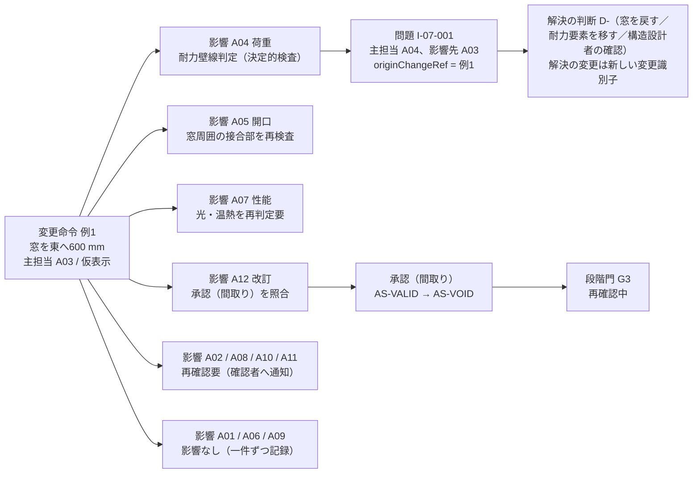

### 3.3 例2 居間を 600 mm 広げる（廊下幅 900 mm 以上を保持）

| 項目 | 値 |
|---|---|
| 変更命令 例2 | origin=自然文「居間を 600 mm 広げて。廊下は 900 mm 以上残して」。intent={target:[E-ELM-001 居間と廊下の間の壁], operation:移動, amount:600 mm, direction:廊下側, fixed:[廊下幅 ≥ 900 mm（R-05-011 相当、RP-MUST）、外壁], purpose:食卓と収納の余白}。coordinateFrame=平面座標。primaryDomain=A03。status=仮表示 |
| 対象の案 | 生活動線重視案。G2 選定後、G3 進行中、V1 |
| 有効な承認 | 確認範囲=間取り（AS-VALID） |

| 影響先 | 影響の種類 | 再計算対象（実体） | 想定結果 | 問題化または承認失効 | 対応する機能 | 区分 |
|---|---|---|---|---|---|---|
| A01 | 適合 | E-REQ-001 廊下幅 ≥ 900 mm（RP-MUST） | 移動後の廊下幅 850 mm で不適合 | I-07-009 を登録（主担当 A03、影響先 A01。第4.2節の手順で「直接の操作対象=廊下幅」は空間の属性）。警告を仮表示に出し、確定を止めない（利用者が要求か寸法を選ぶ） | F-C01-020、F-C03-014 | 【推定】 |
| A02 | 適合 | 建蔽率、容積率 | 内壁のみで外形不変 | 影響なし | F-C09-008 | 【推定】 |
| A04 | 荷重 | E-SYS-001 の耐力壁判定、上下階の壁位置 | 移動壁が 2 階耐力壁の直下から外れる | I-07-010 を登録（主担当 A04、影響先 A03。I-00-011 型） | F-C11-002 | 【推定】 |
| A05 | 開口 | — | 外皮不変 | 影響なし | — | 【推定】 |
| A06 | 経路 | E-SYS-003 Route（隣接する洗面の給排水）、E-ELM-011 Fixture（kind=洗面。洗面台の必要余白 clearance） | 壁内の給排水経路帯が移動壁に掛かる。洗面台前の余白が器具の必要余白 前方 600 mm（DV-EQ-03）未満 | 経路は再確認要（経路変更は新しい変更命令）。余白の不足は I-07-002 を登録（主担当 A06、影響先 A08、A03。器具の必要余白の判定は F-C12-005 で P1。P0 は再確認要） | F-C12-001、F-C12-005 | 【推定】 |
| A07 | 性能 | E-SRV-013（光と視環境: 居間の床面積に対する窓面積比） | 再判定要 | 証拠段階の降格 | F-C12-008 | 【推定】 |
| A08 | 配置 | E-ELM-013 Furniture（居間の食卓） | 食卓の周囲の椅子を引く余白 600 mm（DV-FN-01）を再判定し、居間が広がるため不足なし | 問題なし（再判定で合格）。A06 の行の I-07-002 の影響先 | F-C05-009 | 【推定】 |
| A09 | 数量 | E-SRV-006 Quantity（壁長さ、仕上面積）、E-SRV-014 CostItem | 床面積は不変、壁と仕上の数量差を費用差として表示 | 費用差を仮表示（T-A-003 合格条件(1)） | F-C13-003 | 【推定】 |
| A10 | 施工 | — | P0 では対象外 | 影響なし | — | 【推定】 |
| A11 | 可変 | E-REQ-009 LifeScene（可変間仕切） | 将来場面を再試行（P1） | 再確認要 | F-C14-006 | 【推定】 |
| A12 | 改訂 | —（承認 E-REQ-007 は再計算対象に含めない。失効判定の結果を想定結果に示す。第2.1節 注1） | 失効判定で E-REQ-007 Approval（確認範囲=間取り）が AS-VOID。Gate G3 再確認中 | 承認失効1件 | F-C10-005 | 【推定】 |

確定後（status=確定）に要求台帳の適合再判定と問題一覧の再計算を行い、I-07-009 が残る限り G3 の完了条件「調整後も要求を満たすか（A01）」は満たさない【推定】。

### 3.4 例3 大開口追加（居間南面に幅 3,600 mm の開口を新設）

| 項目 | 値 |
|---|---|
| 変更命令 例3 | origin=直接操作（設計作業面 S-04 で開口を配置）。intent={target:[E-ELM-001 南面外壁], operation:開口新設, amount:幅 3,600 × 高さ 2,200 mm, direction:南, fixed:[外周、階高], purpose:庭とつながる居間}。primaryDomain=A03（開口の位置と大きさ）。status=仮表示 |
| 対象の案 | 意匠重視案。G3 進行中、V1。構造形式仮定=在来木造（VS-AI） |
| 有効な承認 | 確認範囲=間取り、確認範囲=構造（構造形式仮定について建築士が承認） |

| 影響先 | 影響の種類 | 再計算対象（実体） | 想定結果 | 問題化または承認失効 | 対応する機能 | 区分 |
|---|---|---|---|---|---|---|
| A01 | 適合 | E-REQ-001「庭とつながる居間」 | 適合 | 影響なし | F-C03-014 | 【推定】 |
| A02 | 適合 | E-SRV-011 SiteRegulation（延焼のおそれのある部分、防火設備の要否） | 法規判定を再実行し、該当なら防火設備要と表示（版付き） | 判定結果を A05 の影響へ連鎖（同じ変更識別子） | F-C09-008 | 【推定】 |
| A04 | 荷重 | E-SYS-001（耐力壁線、跨度） | 耐力壁線が分断され、開口上の梁跨度が構法の標準跨度を超える | I-07-003 を登録（主担当 A04、影響先 A03、A05。SEV-0、G3 進行禁止。I-00-008 と I-00-010 型） | F-C11-002、F-C15-002 | 【推定】 |
| A05 | 開口 | E-MAT-003 Assembly（窓仕様: ガラスと枠の性能区分、防火設備）、E-MAT-005 Junction | 仕様の再選定（人）と接合部の再検査 | 再確認要 | F-C11-006、F-C11-008 | 【推定】 |
| A06 | 経路 | E-SYS-002 ServiceSystem（冷暖房の負荷） | 開口比の増加で負荷再推定（容量） | 再確認要 | F-C12-001 | 【推定】 |
| A07 | 性能 | E-SRV-013（温熱と省エネ、光と視環境、火災時安全の避難出口） | 温熱は再判定要、光は再判定要、避難出口は再確認 | 証拠段階の降格 | F-C12-008、F-C12-009 | 【推定】 |
| A08 | 配置 | E-PRD-001 Product（サッシ候補、PT- と RS-）、E-ELM-013（壁面を使う家具） | サッシ候補を再検索、壁面減少で家具余白を再検査 | 再検索結果を仮表示 | F-C05-004、F-C05-009 | 【推定】 |
| A09 | 数量 | E-SRV-006（外壁面積減、サッシ面積増）、E-SRV-016 LeadTimeRisk（大型サッシ） | 費用差と長納期品を表示 | 長納期危険を登録 | F-C13-003、F-C13-005 | 【推定】 |
| A10 | 施工 | E-SYS-003 Route（搬入） | 大型サッシの搬入経路が階段幅と門扉幅で成立しない | I-07-004 を登録（主担当 A10、影響先 A03、A08。I-00-028 型） | F-C13-010 | 【推定】 |
| A11 | 可変 | 清掃と交換の経路 | 高所ガラスの清掃方法を再確認 | 再確認要 | F-C14-006 | 【推定】 |
| A12 | 改訂 | —（承認 E-REQ-007 は再計算対象に含めない。失効判定の結果を想定結果に示す。第2.1節 注1） | 失効判定で E-REQ-007（確認範囲=間取り、構造）の両方が AS-VOID。Gate G3 再確認中。SEV-0 が残る限り V2 表示不可 | 承認失効2件 | F-C10-005、F-C15-002 | 【推定】 |

I-07-003 は例外承認（IS-EXC）で閉じられない。解決は「開口幅を戻す」「耐力要素を移す」の新しい変更命令、または構造設計者の確認記録（解決証拠）だけである（T-R-002 合格条件(4)）【推定】。

### 3.5 例4 屋根形状変更（切妻から片流れへ）

| 項目 | 値 |
|---|---|
| 変更命令 例4 | origin=直接操作（三次元表示で屋根形状の候補を切替）。intent={target:[E-ELM-003 Roof], operation:形状変更, amount:切妻 → 片流れ（勾配 2寸、初期仮説）, direction:南下がり, fixed:[外周、最高高さ ≤ 現状], purpose:太陽光発電と外観}。primaryDomain=A03（D-07-001 で判定）。status=仮表示 |
| 主担当判定の記録 D-07-001 | 候補 A03（形状は空間と外観の属性）と A05（屋根は外皮の中心対象）で迷った。第4.2節の手順3「その判断で最初に確定する属性」は形状であり A03。層構成と雨仕舞は影響先 A05。情報実体骨格が Roof の実体定義の主担当を A03 に置く既定（未決 U-00-041）と一致。判定者=建築士、記録日 2026-09-15（例示） |
| 対象の案 | 費用重視案。G2 進行中、V1 |
| 有効な承認 | 確認範囲=外皮（外皮方針の初期確認）、確認範囲=法規（高さと斜線の判定） |

| 影響先 | 影響の種類 | 再計算対象（実体） | 想定結果 | 問題化または承認失効 | 対応する機能 | 区分 |
|---|---|---|---|---|---|---|
| A01 | 適合 | E-REQ-001「小屋裏収納が欲しい」（RP-WANT） | 片流れで小屋裏容積が変わる | 再確認要（利用者） | F-C03-014 | 【推定】 |
| A02 | 適合 | E-SRV-004 Calculation（法規判定: 高さ、北側斜線、日影） | 北側の軒高が上がり、北側斜線の余裕量が −150 mm | I-07-005 を登録（主担当 A02、影響先 A03、A12。G2 のため SEV-1。第18章 I-18-002 と同じ条件で、G3 と G4 では第6章 I-06-006（SEV-0。G3 の門の通過を止め、G4 で再検査。I-18-002 の例外承認は G2→G3 の持ち越しにだけ効く。JR-011）が該当し G4 へ進めない。U-07-004 は解決） | F-C09-008 | 【推定】 |
| A04 | 荷重 | E-SYS-001（屋根架構、風荷重の受け方） | 構造注意「屋根形状」に該当 | 再確認要（構造設計者） | F-C11-002 | 【推定】 |
| A05 | 開口（群語。実体は接合部と層構成） | E-MAT-005 Junction（屋根と壁の取合い、通気層の出口）、E-MAT-003 Assembly（屋根層構成） | 通気出口の位置が変わり接合部を再検査。層構成の再選定は人 | 再検査（I-00-014 型の候補） | F-C11-007、F-C11-008 | 【推定】 |
| A06 | 経路（群語。実体は置場と経路） | E-ELM-012 Equipment（太陽光発電の設置面）、E-SYS-003 Route（雨水排水、換気の外部出口） | 設置面が南一面に集約、樋の経路が変わる | 再確認要 | F-C12-001 | 【推定】 |
| A07 | 性能 | E-SRV-013（温熱と省エネ: 屋根面積と小屋裏、日射取得、太陽光発電量、通風） | 再判定要 | 証拠段階の降格 | F-C12-008、F-C12-012 | 【推定】 |
| A08 | 配置（群語。実体は仕上） | E-MAT-002 Finish（屋根材） | 勾配 2寸で使える屋根材の範囲が変わる | 再確認要 | F-C05-004 | 【推定】 |
| A09 | 数量 | E-SRV-006（屋根面積、樋長さ）、E-SRV-014 CostItem | 費用差を表示 | 費用差の仮表示 | F-C13-003 | 【推定】 |
| A10 | 施工 | 雨仕舞の施工、足場 | P1 で注意 | 再確認要 | F-C13-011 | 【推定】 |
| A11 | 可変 | E-OPS-005 ReplacementCycle（屋根材）、点検経路 | 交換周期と点検経路を再確認 | 再確認要 | F-C14-010 | 【推定】 |
| A12 | 改訂 | —（承認 E-REQ-007 は再計算対象に含めない。失効判定の結果を想定結果に示す。第2.1節 注1） | 失効判定で E-REQ-007（確認範囲=外皮、法規）の両方が AS-VOID。Gate G2 再確認中 | 承認失効2件 | F-C10-005 | 【推定】 |

本例は影響関係表の一語（開口、経路、配置）が実際の再計算対象（接合部、置場、仕上）と字面で一致しない例である。第2.2節の仮判断どおり、語は再計算対象の群を指す。第13章と第23章の試験では impactKind ではなく recalcTargetRefs で合否を判定する【仮定】（未決 U-07-008）。

### 3.6 例5 設備機器変更（給湯機を従来型からヒートポンプ式給湯機へ）

| 項目 | 値 |
|---|---|
| 変更命令 例5 | origin=自然文「給湯をヒートポンプ式にしたい」。intent={target:[E-ELM-012 給湯機、E-SYS-002 給湯系統], operation:機器種別の変更, amount:—, direction:—, fixed:[浴室と台所の位置], purpose:光熱費}。primaryDomain=A06（D-07-002 で判定）。status=仮表示 |
| 主担当判定の記録 D-07-002 | 候補 A06（系統と機器種別は設備の属性）と A08（設備品の商品選定）で迷った。手順3「最初に確定する属性」は系統と機器種別であり A06。品番の選定は後続の別判断（A08）。判定例「台所の製品を選ぶ → A08」との違いは、本例が品番ではなく系統の方式を変える点にある |
| 対象の案 | 生活動線重視案。G3 進行中、V1 |
| 有効な承認 | 確認範囲=設備（主要設備置場と経路帯の仮定）、確認範囲=性能（性能目標の設定） |

| 影響先 | 影響の種類 | 再計算対象（実体） | 想定結果 | 問題化または承認失効 | 対応する機能 | 区分 |
|---|---|---|---|---|---|---|
| A01 | 適合 | E-REQ-001「光熱費を抑える」 | 適合の判定は A07 の再計算と A09 の費用差を待つ | 再確認要 | F-C03-014 | 【推定】 |
| A02 | 供給 | E-BLD-002 Site の供給条件（電気契約容量、引込） | 容量増を供給事業者へ確認 | 再確認要（不足調査へ登録） | F-C09-006 | 【推定】 |
| A03 | 置場 | E-SPC-001（外部の機器置場）、E-ELM-012（貯湯タンクと室外機の外形。寸法は製造元の公式情報【未確認】） | 置場の余白検査。置場が隣地境界から 500 mm（初期仮説）で搬入と騒音が未確認 | I-07-006 を登録（主担当 A06、影響先 A03、A07、A10。I-00-017 型。第4.2節の手順で「直接の操作対象=機器の置場」は設備の属性） | F-C12-001 | 【推定】 |
| A04 | 荷重 | E-SYS-001（貯湯タンクの満水重量に対する床と基礎の支持。重量は機種の公式情報【未確認】） | 構造注意「重い設備」に該当 | I-07-007 を登録（主担当 A04、影響先 A06） | F-C11-002 | 【推定】 |
| A05 | 貫通 | E-SYS-004 Penetration（配管貫通部） | 貫通位置の変更で防水と気密の処理を再検査 | 再検査 | F-C11-008 | 【推定】 |
| A07 | 空気（群語。実体は性能項目） | E-SRV-013（温熱と省エネ: 一次エネルギー消費量、音: 隣地への機器騒音） | 再判定要 | 証拠段階の降格 | F-C12-008、F-C12-015 | 【推定】 |
| A08 | 干渉（群語。実体は商品候補） | E-PRD-001 Product（機器の品番候補、PT-、RS-、SUP-） | 候補を再検索。絶対条件（貯湯容量）を要求から取得 | 再確認要 | F-C05-004、F-C05-010 | 【推定】 |
| A09 | 費用 | E-SRV-014 CostItem（機器費、電気工事費、ガス配管の撤去）、E-SRV-016 LeadTimeRisk | 費用差と納期を表示 | 費用差の仮表示 | F-C13-003、F-C13-006 | 【推定】 |
| A10 | 順序 | 基礎の先行施工、搬入 | P1 で施工検討 | 再確認要 | F-C13-011 | 【推定】 |
| A11 | 点検 | E-SYS-003 Route（交換搬出）、E-PRD-004 Asset（P2） | 交換搬出経路と点検空間を再検査 | 再確認要 | F-C05-010、F-C14-009 | 【推定】 |
| A12 | 責任 | —（承認 E-REQ-007 は再計算対象に含めない。失効判定の結果を想定結果に示す。第2.1節 注1） | 失効判定で E-REQ-007（確認範囲=設備、性能）の両方が AS-VOID。Gate G3 再確認中 | 承認失効2件 | F-C10-005 | 【推定】 |

### 3.7 例6 商品変更（選定した食卓が販売終了となり代替品へ変更）

| 項目 | 値 |
|---|---|
| 変更命令 例6 | origin=商品更新（連合商品台帳の供給状態が SUP-AVAIL → SUP-DISC に変わったことを製品が検出）。intent={target:[E-ELM-013 食卓（productRef=PT-CERT の品番）], operation:商品の置換, fixed:[設計意図: 6人掛け、絶対条件: 幅 1,800 mm 以上、樹種は無垢材], purpose:販売終了への対応}。primaryDomain=A08（品番は商品の属性）。status=提案（自動置換しない。利用者が代替候補を選ぶまで仮表示へ進まない） |
| 判断の記録 D-07-003 | 代替候補 3 件のうち絶対条件「幅 1,800 mm 以上」を満たす候補が 1 件、樹種条件を満たす候補が別の 1 件。決定者=所有者。選定理由と代償（幅 1,800 → 1,600 mm を許容するか、樹種を変えるか）を記録。主担当 A08、影響先 A01、A09 |
| 対象の案 | 生活動線重視案。G3 完了、G4 引継ぎ準備中、V2 |
| 有効な承認 | 確認範囲=商品（AS-VALID） |

| 影響先 | 影響の種類 | 再計算対象（実体） | 想定結果 | 問題化または承認失効 | 対応する機能 | 区分 |
|---|---|---|---|---|---|---|
| A01 | 適合 | E-REQ-001（絶対条件: 幅 ≥ 1,800 mm、樹種）、好み | 代替候補 3 件のうち両条件を満たす候補がゼロ | I-07-008 を登録（主担当 A08、影響先 A01、A09）。D-07-003 で解決 | F-C05-012、F-C01-020 | 【推定】 |
| A02 | 適合 | — | — | 影響なし | — | 【推定】 |
| A03 | 余白 | E-ELM-013（代替品の外形）、E-SPC-001（椅子を引く余白、通路、扉開閉域） | 候補ごとに配置検査 | 検査結果を候補一覧に表示 | F-C05-009 | 【推定】 |
| A04 | 荷重 | — | 家具の荷重は影響なし | 影響なし | — | 【推定】 |
| A05 | 建具 | — | — | 影響なし | — | 【推定】 |
| A06 | 電源 | — | 食卓は電源不要 | 影響なし（電気製品の場合は E-SYS-003 電源位置を再検査） | F-C05-010 | 【推定】 |
| A07 | 材料 | E-SRV-013（空気環境: 材料由来排出） | 樹種と塗装が変わる場合のみ再判定要 | 影響なし（本例） | F-C12-008 | 【推定】 |
| A09 | 納期 | E-PRD-007 Availability（価格、在庫、納期の最終確認日時）、E-SRV-016 LeadTimeRisk | 候補ごとに価格差、納期、代替可能性を表示 | 費用差の仮表示 | F-C13-006、F-C13-003 | 【推定】 |
| A10 | 搬入 | E-SYS-003 Route（搬入） | 候補の梱包寸法で搬入経路を再検査 | 再確認要 | F-C05-009 | 【推定】 |
| A11 | 交換 | E-OPS-003 Warranty、清掃方法 | 保証と清掃方法を再確認 | 再確認要 | F-C14-009 | 【推定】 |
| A12 | 権利 | E-PRD-001（PT-、RS-、PR-、SUP- の再判定）、E-PRD-006 Source（出典と許諾の引継ぎ） | 代替品の層と権利状態を表示。失効判定で E-REQ-007（確認範囲=商品）が AS-VOID（承認は再計算対象に含めない。第2.1節 注1） | 承認失効1件 | F-C05-015、F-C10-015、F-C10-005 | 【推定】 |

本例の変更命令は「提案」で始まり、利用者が代替品を選んで初めて「仮表示」へ進む。販売終了した商品は案件から自動で消さず、SUP-DISC と最終確認日時を表示したまま残す（信頼状態と証拠段階 第5.3節）【推定】。

分岐「販売終了のまま維持」（JM-119 の整合）: RL-OWN は理由（購入済み、在庫確保、直接入手のいずれか。必須）を付けて「販売終了のまま維持」を選べる。この場合は判断 D-（主担当 A08、影響先 A09、A10）を記録し、変更命令 例6 を status=取消 で閉じる（Impact は全件 status=取消。第5.6節）。配置要素 E-ELM-013 は SUP-DISC と最終確認日時（lastVerifiedAt）の表示を保ち、G4 の商品一覧に「販売終了（維持。理由）」を転記する。失効した確認範囲=商品の承認は再依頼し、G3 の「再確認中」を解く。維持を選んだ後に在庫がなくなる危険は G5 の納入記録で再確認する（第16章 第9.3節）【仮定】。

### 3.8 六例から導いた共通の観察

| 観察 | 内容 | 区分 |
|---|---|---|
| 影響先の数 | 六例とも変更元を除く 11 領域全てに影響（影響なしを含む）が生成され、そのうち決定的検査で再計算できる影響は 4〜7 領域、人の再確認を要する影響は 2〜6 領域であった | 【推定】 |
| 問題の主担当 | 影響から問題化した 10 件のうち、Impact.affectedDomain と問題の主担当が一致したのは 7 件（I-07-001、003、004、005、007、010、002）、判定手順で別領域になったのは 3 件（I-07-009: A01 の影響から A03、I-07-006: A03 の影響から A06、I-07-008: A01 の影響から A08）。既定を affectedDomain としつつ判定手順で上書きする規則が要る（第5.4節、未決 U-07-001） | 【推定】 |
| 承認の失効 | 失効した確認範囲は変更元の領域に対応する範囲（間取り、外皮、設備、商品）と、再計算結果が変わる範囲（構造、法規、性能）に限られ、尺度と目的文の承認は一度も失効しなかった | 【推定】 |
| 段階門 | SEV-0 の問題（I-07-003）が生じた例3 だけが V2 表示不可となり、それ以外は「再確認中」で作業を継続できた。例4 の I-07-005 は G2 では SEV-1 で比較材料に残り、G3 で未解決なら第6章 I-06-006（SEV-0）が G3 の門の通過を止める（JR-011） | 【推定】 |
| 二次変更 | 六例のうち四例（例1、2、3、5）で影響先の問題の解決に新しい変更命令が要り、いずれも元の問題を parentIssueRef で参照した | 【推定】 |

## 4. 主担当領域を一つだけ置く規則、判定手順、迷った場合の記録と辞書改善

### 4.1 規則

基盤 十二判断領域 第3.1節の六規則に、本章で三規則（7〜9）を加えた【仮定】。

| 番号 | 規則 | 観察可能な条件 | 区分 |
|---:|---|---|---|
| 1 | 一意性: 機能（F-）、要求（R-）、問題（I-）、判断（D-）、変更命令の主担当領域は A01〜A12 のうち一つだけ。「全領域」「未定」「複数」は登録できない | primaryDomain が null または 2 個以上の個体がゼロ（検証規則 E-EXC-005、SEV-0） | 【推定】 |
| 2 | 影響先: 主担当以外の関係領域は影響先として列挙する。影響先は零個以上 | affectedDomains に主担当と同じ領域が含まれない | 【推定】 |
| 3 | 非複製: 同じ事象を複数領域に別問題として登録しない。影響先で生じた派生問題は元の変更識別子または元問題を参照する | 同じ固定先、同じ主担当、未解決の問題が二件以上ない | 【推定】 |
| 4 | 確認者の分離: 主担当領域と確認者は別属性。主担当が A03 でも確認者に構造設計者を追加できる | verifierRef が primaryDomain の「主な確認者」に限定されない | 【仮定】 |
| 5 | 変更可能: 主担当は誤りが判明した場合に変更できる。変更は改訂として記録し、識別子は変えない | 主担当の変更履歴が Revision に残る | 【仮定】 |
| 6 | 記録: 判定に迷った事例は判定理由と共に記録し、判定例辞書の改善に使う（指示文11.3） | 迷い記録（第4.4節）が判断 D- として残る | 【推定】 |
| 7 | 仕様の主担当と個体の主担当の区別: 機能（F-）と実体定義（E-）の主担当は「その仕様の辞書と検証規則を維持する領域」であり、実行時の個体（要求、問題、判断、変更命令）の主担当は「その個体の直接の操作対象の領域」である。両者は一致しなくてよい（例: F-C03-011 変更前の影響予測の主担当は A12 だが、個々の変更命令の主担当は A03 や A06） | 機能の主担当を個体へ自動転記しない | 【仮定】 |
| 8 | A12 の適用条件: A12 を主担当にできるのは、直接の操作対象が正本、版、出典、確信度、承認、同意、権利、交換、辞書のいずれかである場合だけ。技術判断の迷いを A12 へ逃がさない | A12 主担当の問題の固定先が要素の幾何や性能値ではない | 【仮定】 |
| 9 | 主担当の既定値: 実体定義が「個体ごと（既定 Axx）」を持つ場合、製品は既定値を仮置きし、VS-AI 相当の「推定」として表示する。利用者または確認者が確認すると確定する | 主担当が推定のままの問題が問題一覧で区別できる | 【仮定】 |

### 4.2 判定手順（迷った場合）

基盤 十二判断領域 第3.2節（v1.2）の手順1〜6 と手順4.5 を転記し、各段階で記録する値を加えた。手順4.5 の複数一致の規則（v1.2 で追加。JR-034）は本章が主担当で、基盤 v1.4 は同じ文の写しである【仮定】。適用対象を分ける（基盤 v1.2 第3.2節の適用対象と同じ）: 変更命令と判断（D-）は「直接の操作対象」（手順1〜3）で主担当を決める。問題（I-）は「成立性が問われる影響先の領域」で決める（第5.4節。例: 大開口が耐力壁線と重なる問題は、操作対象は開口（A03）だが成立性が問われるのは構造なので A04。横引き排水管（排水経路）が梁と干渉する問題は、成立性が問われるのは経路の勾配なので A06。いずれも基盤 第3.3節の判定例と同じ）。同じ事象で変更命令の主担当と問題の主担当が異なるのは矛盾ではなく、対象の種別の違いである（JM-041 の反映）【仮定】。

| 段階 | 手順 | 記録する値 | 例 |
|---:|---|---|---|
| 1 | 判断または問題の「直接の操作対象」を一文で書く（何の値を変えるか、何を決めるか） | directObject（文） | 「給湯系統の機器種別を変える」 |
| 2 | その対象が一つの領域の「中心となる対象」（第1.2節）に該当すれば、その領域を主担当とする | decidedAtStep=2、primaryDomain | 「機器種別」は A06 の中心対象 |
| 3 | 対象が複数領域にまたがる物（窓、階段、台所、屋根、給湯機）の場合、「その判断で最初に確定する属性」の領域を主担当とする。窓なら位置と大きさは A03、層構成と性能仕様は A05、品番は A08、費用は A09、搬入と取付は A10、清掃と交換は A11 | decidedAtStep=3、firstAttribute | 屋根形状変更: 最初に確定する属性は形状 → A03（D-07-001） |
| 4 | 属性でも分かれない場合、「その判断を一人の確認者で完結できる領域」を主担当とする | decidedAtStep=4、soleVerifierRole | 「既存壁の内部に配管があるか不明」→ 設備設計者で完結 → A06 |
| 4.5 | 判定例辞書（基盤 十二判断領域 第3.3節、第3.4節、本章 第4.3節）に同型の対象と判断があれば、辞書の主担当を採る。手順2〜4 の結果と辞書が食い違う場合も辞書を優先し、食い違いを主担当判定記録（第4.4節）に残して辞書改善（第4.5節）の入力にする。同型の辞書行が二つ以上あり主担当が異なる場合、問題は成立性が問われる属性（寸法、性能値、法令の余裕量）の行、変更命令と判断は直接の操作対象の行を採り、判定理由に両方の行を記す（例: 階段の蹴上げの法定上限超過は「法規判定の余裕量が負」〔A02〕と「寸法要求が不適合」〔A03〕の両方に同型になる。この型は表4.3-C の判定例「階段の蹴上げが法定上限を超える」〔A03。寸法の変更が第一の解決で、条項と版は A02 の影響先〕で一つに決める。基盤 十二判断領域 第3.2節と同文。JR-034） | decidedAtStep=4.5、dictionaryMatchRef（複数一致は両方の行を rationale に記す） | 避難経路の幅と経路（候補 A07 と A03）→ 辞書に同型（基盤 第3.3節「避難経路が未解決」、第3.4節 F-C12-009 避難経路の初期注意 → A07）→ A07。基盤 U-00-014（避難経路の主担当）は基盤 v1.2 で A07 に確定した（JM-041） |
| 5 | 辞書に同型がなく、それでも迷う場合に限り、A12 へ逃げず、より上流の領域（影響関係表で行が先に来る領域）を主担当とし、判定理由を判断（D-）に記録する | decidedAtStep=5、candidates | 仮設足場の費用幅と期間（候補 A09 と A10。辞書に同型なし）→ 上流の A09。辞書に同型がある避難経路は手順4.5 で A07 に決まり、本手順の対象にならない |
| 6 | 判定結果を判定例辞書へ追加提案する | dictionaryProposal=true | D-07-001、D-07-002 |

辞書は手順1〜5 で決めた結果の蓄積であり、手順4.5 で辞書に同型の例が見つかれば手順5 へ進まない。手順1（直接の操作対象の一文）は辞書との照合の鍵になるため省略しない。問題（I-）の主担当は第5.4節の順（辞書、手順1〜2、手順3以降は「推定」表示）で決め、変更命令と判断の手順とは適用対象が異なる。辞書と手順の乖離が判定例の蓄積で広がる危険は未決 U-07-011 に記す【仮定】。

### 4.3 判定例辞書への本章の追加提案と、基盤 v1.2 の追加判定例の転記

基盤 十二判断領域 v1.4 の判定例は第3.3節 40 件と第3.4節 21 件の計 61 件である【事実】（出典: `02_基盤定義/十二判断領域.md` v1.4、2026-10-07 に照合。v1.3 は 34 件と 21 件の計 55 件、v1.2 は 27 件と 21 件の計 48 件、v1.1 は 26 件と 19 件の計 45 件）。二回目の修正で本章が加えた 6 件は表4.3-C に置き、基盤 v1.4 第3.3節は同じ文の写しである（修正計画 第0.3節。JR-033、JR-034、JR-051、JR-088）。v1.2 で追加された 3 件と判定理由を改めた 1 件を表4.3-A に同文で転記する（正本は基盤。基盤の他章依頼「第3.2節の適用対象と手順4.5、追加判定例を第4.2節、第4.3節へ転記」への対応）。本章の六例から提案した 7 件は表4.3-B に置き、基盤 v1.3 が第3.3節に追加した（2026-10-06 の相互依頼。判定理由の字句は基盤の行を正とする）。第4.5節のとおり本章 第4.3節も辞書の正本に含める【仮定】。

表4.3-A 基盤 v1.2 で追加または改めた判定例（同文の転記）

| 対象と判断 | 主担当 | 影響先 | 判定理由 | 基盤の節 |
|---|---|---|---|---|
| 避難経路が未解決（避難経路の初期注意） | A07 | A03 | 成立性が問われるのは火災時安全の性能（A07）。空間側は影響先として経路変更の候補を受ける（U-00-014 の解決。v1.2、JM-041） | 第3.3節（追加） |
| 横引き排水管（排水経路）が梁と干渉 | A06 | A04、A03、A10 | 成立性が問われるのは経路の勾配（A06）。経路の変更が第一の解決候補で、梁の変更は構造の影響先（v1.2、JM-041） | 第3.3節（判定理由の改訂） |
| 分岐案の作成と比較（F-C03-004） | A12 | A03 | 履歴の分岐は版（Revision）の操作であり、案の内容は編集機能（A03）が担う。主担当 A12 は維持（v1.2、JM-057） | 第3.4節（追加） |
| 家具余白の不足（F-C04-010 空間側の検査、F-C05-009 商品側の当たり判定） | A08 | A03 | 室側の寸法変更で解く場合は A03、商品の変更で解く場合は A08。問題の登録は商品側（A08）に一本化し A03 は影響先とする（第7章 第4.3節と同文。v1.2、JM-067） | 第3.4節（追加。本章 I-07-002 と JM-067 の提案。I-07-002 は v1.3 で器具の必要余白〔E-ELM-011、主担当 A06、DV-EQ-03〕に改めたため、本章の家具余白の例は例2 の A08 の行〔居間の食卓〕） |

家具余白の検査規則（E-EXC-005 kind=干渉、余白）は、空間側の F-C04-010（第11章）と商品側の F-C05-009（第16章）が同じ規則を参照する（JM-067）。分岐案（F-C03-004）の主担当 A12 は、直接の操作対象が版であるため第4.1節 規則8（A12 の適用条件）に当たる（JM-057）【推定】。

表4.3-B 本章の六例からの追加提案（基盤 v1.3 第3.3節に追加済み。2026-10-06）

| 対象と判断 | 主担当 | 影響先 | 判定理由（決まった手順） | 元になった例 |
|---|---|---|---|---|
| 屋根形状を切妻から片流れへ変更 | A03 | A02、A04、A05、A06、A07、A08、A09、A10、A11、A12 | 最初に確定する属性は形状（手順3）。層構成と雨仕舞は A05 の影響先 | D-07-001 |
| 給湯機の方式（従来型からヒートポンプ式）を変更 | A06 | A02、A03、A04、A05、A07、A08、A09、A10、A11、A12 | 系統と機器種別は設備の中心対象（手順2）。品番は後続の A08 判断 | D-07-002 |
| 販売終了した商品の代替品を選ぶ | A08 | A01、A03、A09、A10、A11、A12 | 品番は商品の属性（手順2）。絶対条件の緩和は A01 の決定者が影響先として判断 | D-07-003 |
| 要求適合の再判定で寸法要求（廊下幅等）が不適合 | A03 | A01 | 不適合を解消する操作対象は寸法（手順1〜2）。要求の優先度変更は A01 の解決候補 | I-07-009 |
| 機器の置場が隣地境界に近く騒音と搬入が未確認 | A06 | A03、A07、A10 | 置場は設備の属性（手順2）。既存判定例 I-00-017 と同型 | I-07-006 |
| 代替品が絶対条件を満たさない | A08 | A01、A09 | 商品の適合判断は A08（手順2）。既存判定例 I-00-024 と同型 | I-07-008 |
| 法規判定の余裕量が負になった | A02 | A03、A12 | 法規判定は敷地の属性（手順2）。形状の変更は A03 の解決候補。重大度は G2、G3 で SEV-1（I-18-002）、G3 と G4 で I-06-006（SEV-0。G3 の門の通過を止め、G4 で再検査。基盤 v1.4 の行と同文。JR-011） | I-07-005 |

表4.3-C 二回目の修正で本章が加える判定例（2026-10-07。基盤 十二判断領域 v1.4 第3.3節は同じ文の写し）

| 対象と判断 | 主担当 | 影響先 | 判定理由 | 元になった指摘 |
|---|---|---|---|---|
| 将来場面（家族変化群の該当場面）への対応の採否（G2(e)） | A11 | A03、A09 | P0 で A11 が主担当となる判断はこの 1 件（該当場面がある案件のみ。根拠は場面の該当有無と時期で、試行結果は P1）。要求の主担当としての A11 は記録と「未判定（P1）」の表示に留める（第6.4節） | JR-033 |
| 階段の蹴上げが法定上限を超える | A03 | A02、A07 | 寸法の変更が第一の解決。条項と版は A02 の影響先（建物単体の法令基準の所在は第1.3節 A02） | JR-034 |
| 居室の採光が法定比に不足 | A07 | A03、A02 | 採光は性能側の仕様。開口の変更は A03 の解決候補、条項と版は A02 の影響先 | JR-034 |
| 防火地域で窓の防火設備が未確認 | A05 | A07、A02、A08 | 窓の仕様は外皮の属性。火災時安全の性能は A07 の影響先、防火地域の指定と条項は A02、品番は A08 | JR-034 |
| 擁壁と地盤の安全の注意が案に未表示（I-00-112） | A04 | A02、A03 | 擁壁と地盤の安全の成立が対象。I-00-112 の式の主担当は A04 に一つにし、A02 は敷地条件として影響先（第6章 第8.2節、第18章 第1.8.2節） | JR-034 (3)、JR-088 |
| 経路の有効幅の不足（動線と避難の経路の最小有効幅） | A03（P1 で車椅子利用の要求または利用円滑性の項目に当たる場合は同じ問題を A07 へ更新） | A07、A01 | P0 は F-C04-010 の問題（主担当 A03、SEV-2）。P1 で車椅子利用の要求または利用円滑性の項目に当たる場合は F-C12-011 が同じ問題を更新して主担当 A07、SEV-1 にする（新規登録しない。判断記録の主担当は影響先として扱う。第4.6節の主担当の変更） | JR-051 |

### 4.4 迷った場合の記録（主担当判定記録）

判定手順の段階3以降で決めた場合、または候補が二つ以上あった場合を「迷った」と定義し、判断（E-REQ-004 Decision）に kind=主担当判定 の個体として記録する。登録は F-C15-014 正常手順(10)（第6章）が行う（JR-018）【仮定】。記録は変更命令、問題、要求のいずれからも参照でき、辞書改善の入力になる。

| 記録項目 | 型（第12章 v1.2 の E-REQ-004.domainJudgement。kind=主担当判定） | 内容 | 必須 |
|---|---|---|---|
| targetRef | ref（変更命令、問題、要求、機能のいずれか） | 判定した対象 | 必須 |
| directObject | str | 段階1で書いた直接の操作対象の一文 | 必須 |
| candidates | list[enum{A01..A12}] | 迷った候補（2 個以上） | 必須 |
| primaryDomain | enum{A01..A12} | 決めた主担当（一つ） | 必須 |
| decidedAtStep | enum{1, 2, 3, 4, 4.5, 5}（手順4.5 を含む。第12章 v1.3 の E-REQ-004.domainJudgement.decidedAtStep で同じ値域に改められ対応済み。2026-10-06） | 判定手順のどの段階で決まったか | 必須 |
| rationale | str | 判定理由。既存の判定例を参照した場合はその行 | 必須 |
| dictionaryMatchRef | str | 一致した判定例辞書の行（あれば） | 任意 |
| deciderRef | ref[E-ORG-001] | 判定者（製品が仮置きした場合は「製品」、確認者が確定した場合はその人） | 必須 |
| isProvisional | bool | 製品の仮置きか、人の確定か | 必須 |
| dictionaryProposal | bool | 辞書へ追加提案するか | 必須 |
| projectRef、createdAt | 共通属性 | 案件と日時 | 必須 |

記録の入口は三つとする【仮定】。(1) 対話欄（S-04-06）で自然文変更を受けた時に製品が主担当を仮置きし、候補が二つ以上なら「主担当: A06（推定）。候補: A08」と表示して確認を求める。(2) 問題一覧画面（S-23）で確認者が主担当を変更した時に理由の入力を必須にする。(3) 判断記録画面（S-25）で kind=主担当判定 の一覧を表示する。画面の部品は第15章の S-04-06、S-23-05、S-25-04 が定める（第15章 第5.2節、第7.21節、第7.23節）。

### 4.5 辞書改善の運用

| 項目 | 規則 | 区分 |
|---|---|---|
| 辞書の正本 | 判定例辞書の正本は基盤 十二判断領域 第3.3節と第3.4節、および本章 第4.3節。実行時には案件横断台帳の一つとして製品が保持し、版を付ける（第12章 v1.2 の E-EXC-004 Dictionary kind=判定例辞書。U-07-007 は解決） | 【仮定】 |
| 集約の周期 | 主担当判定記録を月次で集約し、dictionaryProposal=true の記録を対象と候補の組で分類する | 【仮定】 |
| 追加の閾値 | 同じ対象と候補の組で迷い記録が 2 件以上ある場合、または 1 件でも SEV-0 か SEV-1 の問題に関わる場合、判定例を追加する（初期仮説） | 【仮定】 |
| 版の規則 | 判定例の追加は副番号（例: v1.1 → v1.2）。既存判定例の主担当を変える場合は主番号を上げ、その判定例を参照していた個体を識別子台帳で洗い出して確認者へ通知する | 【仮定】 |
| 管理者 | 運営側の情報管理者（製品外権限、表4-2b。辞書の版と配布。案件の確認者ではない）と建築士（判定内容の確認）の二役割で承認する | 【仮定】 |
| 個人情報 | 辞書へ追加する判定例は案件識別子、住所、氏名を含めず、対象と判断の一般形だけを書く（匿名化失敗件数 M-G-15 の対象） | 【推定】 |
| 計測 | 迷い記録の発生率（迷い記録件数 ÷ 主担当を持つ個体の登録件数。初期仮説: 案件あたり 5% 以下）と、辞書一致率（dictionaryMatchRef を持つ判定の割合。初期仮説: 80% 以上）を月次で計測する。指標は第23章の M-P-13 迷い記録の発生率と M-Q-29 主担当判定の辞書一致率、試験は T-I-018。集約と版の追加を担う機能は F-C15-014（正常手順(10)、AC-C15-014-07。第6章。JR-018） | 【仮定】 |

### 4.6 主担当の変更

主担当の変更は改訂（E-REQ-006）として記録し、識別子は変えない（規則5）。変更時に影響先の再計算は不要だが、次を行う【仮定】。(1) 確認者を新しい主担当領域の「主な確認者」から再割当し、元の確認者には通知する。(2) 責任表（04_必須表）の該当行を更新する。(3) 影響先の一覧から新しい主担当を除き、旧主担当を影響先へ加える。(4) 変更理由を主担当判定記録として残す。

## 5. 同じ変更識別子から各影響を再計算し、無関係な問題を複製しない仕組み

### 5.1 実体と関係

| 実体 | 役割 | 鍵となる属性 | 区分 |
|---|---|---|---|
| E-REQ-011 ChangeCommand（変更命令） | 全ての変更の起点。uuid が変更識別子。origin（自然文、直接操作、現場変更、新資料取込、商品更新、法改正、承認失効）を問わず同じ構造 | uuid、origin、intent、primaryDomain（一つ）、status（提案、仮表示、確定、取消、却下。やり直しは状態ではなく intent.operation=やり直し の新しい命令で表す。第12章 第6.8節）、previewDelta、appliedRevisionRef | 【推定】 |
| E-REQ-012 Impact（影響） | 変更命令が影響先領域に与える波及の記録。影響先領域ごとに一件 | changeRef、affectedDomain（一つ）、impactKind（第2.1節の語）、recalcTargetRefs、status（未再計算、再計算済み、問題化、承認失効、影響なし、取消）、delta、issueRef（0..1）、voidedApprovalRefs、isDeterministic | 【推定】 |
| E-REQ-003 Issue（問題） | 再計算結果が要求、法規、幾何、施工の条件に反した時の記録。一事象一件 | primaryDomain（一つ）、affectedDomains、severity、status、anchor（固定先）、originChangeRef、parentIssueRef、resolutionEvidenceRef | 【推定】 |
| E-REQ-007 Approval（承認） | 確認範囲ごとの承認。「変更した要素と属性 ∪ 各影響の再計算対象（recalcTargetRefs）」が確認範囲（expandedScopeRefs と属性集合）と交われば失効（第5.5節。承認は再計算対象に含めない） | scopeKind、scope（refs、attributes）、expandedScopeRefs（scope を要素へ展開した導出値）、status（AS-）、voidReason | 【推定】 |
| E-REQ-010 Gate（段階門） | 失効した承認を持つ段階を「再確認中」にする | status、blockingIssueRefs | 【推定】 |
| E-REQ-006 Revision（改訂） | 変更命令の確定で生成される版 | changeCommandRefs、diff、cdeState | 【推定】 |
| E-REQ-004 Decision（判断） | 主担当判定の理由、問題の解決判断、代替品の選定を記録 | kind（主担当判定を含む）、resolvesIssueRefs、rationale | 【推定】 |

### 5.2 処理の流れ

指示文C3の七手順を、変更命令、影響、問題、承認、段階門の状態遷移として次の九段階に展開した【推定】。段階3〜6は変更命令の status=仮表示 の間に行い、正本は段階8まで変わらない。

| 段階 | 処理 | 状態の変化 | 決定的か | 対応する機能 |
|---:|---|---|---|---|
| 1 | 変更の受付。自然文なら intent の6要素（対象、操作、量、方向、固定条件、目的）を抽出し、相対表現の座標系を確認する。origin が商品更新、法改正、新資料取込、承認失効の場合は製品が変更命令を生成し status=提案 で止める | ChangeCommand 生成（status=提案） | 抽出は言語模型、座標系確認は利用者 | F-C03-009、F-C03-010 |
| 2 | 主担当の判定。判定例辞書に一致すれば転記、なければ第4.2節の手順で仮置きし、候補が複数なら主担当判定記録を作る | primaryDomain 確定または仮置き | 辞書照合は決定的 | F-C03-011（前処理） |
| 3 | 影響先の列挙。第2.1節の変更元の行から 11 領域それぞれに Impact を生成する（影響なしを含む） | Impact 11 件（status=未再計算） | 決定的 | F-C03-011 |
| 4 | 再計算。第2.2節の再計算対象を決定的検査で再計算し、できないものは「再確認要」として影響先の確認者へ通知する | Impact.status=再計算済み または 影響なし、delta 記録 | 幾何、数量、要求適合、法規判定は決定的。仕様選定、施工順序、当事者確認は人 | F-C11-002、F-C12-005、F-C05-009、F-C13-003、F-C09-008 |
| 5 | 問題化。再計算結果が条件に反する場合、同じ固定先と主担当の未解決問題を検索し、あれば更新（履歴に変更識別子を追加）、なければ一件だけ新規登録する。主担当は第5.4節で決める | Impact.status=問題化、Issue 生成または更新 | 決定的（検索鍵は固定先と主担当） | F-C10-003 |
| 6 | 承認の照合。「変更した要素と属性（resolvedGeometry.entries の targetRef と attribute）∪ 各 Impact の recalcTargetRefs」と、有効な承認の expandedScopeRefs と属性集合の交差を取り、交わる承認を失効候補として列挙する（この段階では失効させない。第5.5節） | Impact.voidedApprovalRefs（候補） | 決定的 | F-C10-005 |
| 7 | 仮表示。影響要素の一覧、費用差、問題の増減、失効候補の承認、2D と 3D の差分を変更差分（S-04-07）に表示する | ChangeCommand.status=仮表示、previewDelta | — | F-C03-012、F-C03-013 |
| 8 | 確定。利用者承認で status=確定、Revision を生成し、要素の値状態を VS-USR へ。候補の承認を AS-VOID にし、Gate を再確認中にする。取消なら Impact と Issue を第5.6節に従って戻す | Revision 生成、Approval AS-VOID、Gate 再確認中 | 決定的 | F-C03-014、F-C10-005 |
| 9 | 再計算。要求台帳の適合再判定と問題一覧の再計算を行い、変更反映時間（M-P-02）を記録する | Option ↔ Requirement 適合表更新、Issue 一覧更新 | 決定的 | F-C03-014 |

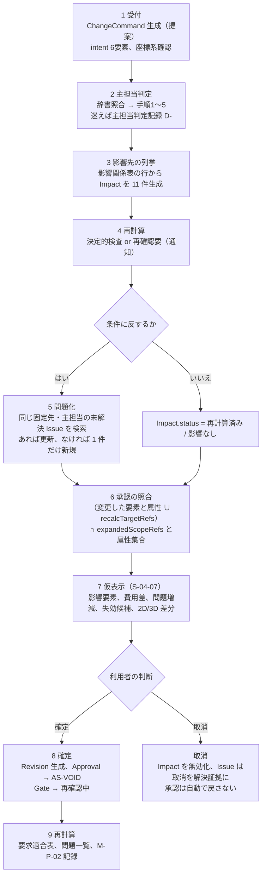

### 5.3 一意化と非複製の検査条件

情報実体骨格 第3.4節の六条件に、本章で三条件（7〜9）を加えた。04_必須表の整合検査と第23章の試験が使う【仮定】。

| 番号 | 検査 | 合格条件 | 区分 |
|---:|---|---|---|
| 1 | 主担当の一意性 | 全 Issue、Decision、Requirement、ChangeCommand、Risk、Constraint の primaryDomain が A01〜A12 のうち一つで、null と複数がない | 【推定】 |
| 2 | 影響の一意性 | (changeRef, affectedDomain, recalcTarget) の組が重複しない | 【推定】 |
| 3 | 問題の非複製 | 同じ projectRef、同じ anchor.ref、同じ primaryDomain で status が IS-OPEN または IS-WIP の Issue が二件以上ない | 【仮定】 |
| 4 | 変更元の追跡 | Impact から生じた Issue は originChangeRef を持ち、参照先の ChangeCommand が存在する | 【推定】 |
| 5 | 承認失効の整合 | AS-VOID の Approval は voidReason に変更識別子を持ち、対応する Impact.voidedApprovalRefs に含まれる | 【推定】 |
| 6 | 進行禁止の整合 | severity=SEV-0 の Issue は Gate.blockingIssueRefs に含まれ、IS-EXC にできない | 【推定】 |
| 7 | 影響先の網羅 | status が仮表示以降の ChangeCommand は、変更元を除く 11 領域それぞれに Impact を一件ずつ持つ（影響なしを含む） | 【仮定】 |
| 8 | 二次変更の参照 | parentIssueRef を持つ Issue の originChangeRef は、元問題の originChangeRef と異なる変更識別子である（同じ変更識別子で問題が連鎖しない） | 【仮定】 |
| 9 | 自動確定の禁止 | origin が商品更新、法改正、承認失効の ChangeCommand で approvedByRef を持たずに status=確定 のものがゼロ | 【仮定】 |

### 5.4 問題化した時の主担当の決め方

問題（I-）の主担当は「成立性が問われる影響先の領域」で決める（第4.2節冒頭の適用対象の区別）。情報実体骨格 規則4「Issue.primaryDomain は Impact.affectedDomain」を既定とし、次の順で上書きする【仮定】（未決 U-07-001）。第3.8節のとおり六例の 10 件中 3 件がこの上書きに該当した。

1. 判定例辞書に同型の問題（例: I-00-007 廊下幅、I-00-017 機器置場、I-00-024 代替品）があれば、辞書の主担当を採る。
2. なければ第4.2節の手順1〜2（直接の操作対象が一つの領域の中心対象に該当）で決める。
3. 手順3以降で決めた場合は主担当判定記録を作り、isProvisional=true で登録する。確認者が確定するまで問題一覧に「主担当（推定）」と表示する。
4. いずれの場合も Impact.affectedDomain は問題の affectedDomains に含める（影響元の領域から問題へたどれる）。

### 5.5 承認の自動失効との連動

| 規則 | 内容 | 区分 |
|---|---|---|
| 照合 | 判定の入力は「変更した要素と属性（resolvedGeometry.entries の targetRef と attribute）∪ 各 Impact の recalcTargetRefs（影響先の再計算対象。要素、系統、計算、性能項目、商品）」の和集合とする。承認側は expandedScopeRefs（scope の要素、階、室、性能項目、法規条項を要素へ展開したもの）と属性集合で照合し、交差が空でない場合、その承認を失効候補にする。第6章 第5.3節 規則1、第12章 第6.10節 連動1 と同じ定義（JM-021 の整合） | 【仮定】 |
| 失効の時点 | 失効は変更命令の確定（段階8）で行い、仮表示の間は「失効候補」として表示するだけである | 【仮定】 |
| 範囲の限定 | 交差しない承認（例: 尺度、目的文）は失効しない。案件全体を前段階へ戻さない | 【推定】 |
| 段階門 | 失効した承認が完了条件に含まれる段階の Gate.status を「再確認中」にする。SEV-0 の問題が生じた場合は blockingIssueRefs へ追加し、次段階の信頼状態へ昇格させない | 【推定】 |
| 再承認 | 失効した承認は AS-PENDING で再承認依頼を承認者へ通知し、承認者、範囲、版を引き継ぐ。再承認時に版は新しい Revision を指す | 【推定】 |
| V3 の扱い | 有資格者の確認範囲（V3）内の要素が変更された場合、その範囲だけ V2 へ降格し、範囲外は V3 のまま（信頼状態と証拠段階 第1.3節） | 【推定】 |

### 5.6 変更の取消とやり直し

| 場面 | 扱い | 区分 |
|---|---|---|
| 仮表示中の取消 | ChangeCommand.status=取消。Impact は全件 status=取消（削除しない）。Issue は生成していないため対象なし。承認は照合のみで失効していないため対象なし | 【仮定】 |
| 確定後の取消 | 新しい ChangeCommand（origin は元と同じ、対象は元の変更命令）として記録し、逆の変更を適用する。元の Impact から生じた Issue は、取消の変更命令を解決証拠として IS-RESOLVED にする（IS-REJECTED にしない。誤警告ではないため誤警告率の分子に入れない）。失効した承認は AS-VOID のまま再承認を求める（第2.3節 規則8） | 【仮定】 |
| やり直し | 取消命令を対象とする新しい ChangeCommand（intent.operation=やり直し、redoOfRef=取消命令）を作り、確定時に元の命令の status を「確定」へ戻し、取消命令の status を「取消」にする（第12章 第6.8節）。履歴は消さない | 【推定】 |
| 分岐案 | 同じ建物情報から派生した分岐案は変更命令の履歴を共有し、分岐点以降の Impact と Issue は分岐案ごとに持つ | 【推定】 |

### 5.7 表示、計測、試験

| 区分 | 内容 | 識別子 |
|---|---|---|
| 画面 | 変更差分の仮表示（影響要素、費用差、問題の増減、失効候補の承認）。建築調整画面の変更影響。問題一覧画面の主担当領域と影響先と変更元。判断記録画面の主担当判定記録。履歴欄の変更命令、取消、やり直し | S-04-07、S-10、S-23、S-25、S-04-08 |
| 指標 | 変更反映時間（確定から再描画と差分再計算の完了まで。初期仮説: 中央値 3 秒以内）。誤警告率（初期仮説: SEV-0 の誤警告 5% 以下）。構造設備上の重大見落し率（初期仮説: 試験情報で 0%）。要求追跡率（変更→影響→問題→承認失効の経路を含む） | M-P-02、M-G-09、M-G-12、M-G-01 |
| 試験 | 居間拡張と廊下幅保持の変更差分。居間の開口拡大の影響予測。大開口と耐力要素の衝突。梁と排水経路の衝突。予算削減と性能目標の衝突。法改正。販売終了 | T-A-003、T-A-009、T-R-002、T-R-003、T-R-007、T-R-010、T-R-009 |
| 整合検査 | 第5.3節の九条件を識別子台帳と実行時の検証規則（E-EXC-005）で検査する。本章の六例は第23章の試験情報として使う | 04_必須表、第23章 |

## 6. 領域ごとの担当章の対応表

### 6.1 対応表

各領域の「判断内容そのもの」を書く章（主）と、領域の一部を補助的に書く章を対応付けた。主担当機能数は基盤 機能一覧骨格 v1.1 第4.3節の値、主章別の内訳は本章が同 第1節の 249 機能行を主担当領域と「詳細を書く章」の先頭（主章）で集計した値である【事実】（出典: `02_基盤定義/機能一覧骨格.md` v1.1 第1節、第4.3節、第4.6節、確認日 2026-09-15）。章の対応は同 第0.4節の章割当指針と指示文I節の章立てから導いた【推定】。役割 RL- は第1.2節の仮置きを転記した（交差ごとの確認者の正本は第6章 第3節の交差表）【仮定】。

| 領域 | 判断内容を書く章（主） | 補助的に書く章 | 主担当機能数（P0/P1/P2/非対象） | 主章別の内訳（本章の集計） | 主な確認者の役割（RL-） |
|---|---|---|---|---|---|
| A01 目的、関係者、要求 | 第8章（対話設計、生活場面、要求台帳）、第5章（関係者表、決定権、当事者参画） | 第2章（目的文と成功条件、成果1）、第6章（G0、G1 の主要判断） | 24（24/0/0/0） | 第8章 21、第5章 3 | RL-OWN、RL-CHK |
| A02 敷地、法規、周辺 | 第18章 | 第6章（G1）、第22章（法規根拠の版と失効） | 11（8/2/0/1） | 第18章 11（非対象 F-C09-014 を含む） | RL-CHK、RL-PART |
| A03 空間、形、体験 | 第13章（空間の調整と責任境界）、第11章（図面読解と3D構築）、第12章（建物情報の編集、三案） | 第8章（生活場面の空間上の再生、動線比較）、第21章（改装区分）、第18章（敷地条件の配置への反映） | 35（26/9/0/0） | 第11章 22、第12章 8、第8章 2、第21章 2、第18章 1 | RL-CHK、RL-OWN |
| A04 構造 | 第13章 | 第19章（構造安定の証拠段階）、第21章（既存構造の劣化） | 6（3/2/0/1） | 第13章 6（非対象 F-C11-011 を含む） | RL-CHK（有資格者） |
| A05 外皮 | 第13章 | 第19章（温熱と省エネの証拠段階） | 4（1/3/0/0） | 第13章 4 | RL-CHK |
| A06 設備 | 第13章 | 第19章（空気環境、災害耐性）、第21章（機器台帳） | 6（3/3/0/0） | 第13章 6 | RL-CHK、RL-PART |
| A07 環境、健康、性能 | 第19章 | 第13章（性能を実現する層構成と機器の選定側） | 11（3/6/1/1） | 第19章 11（非対象 F-C12-017 を含む） | RL-CHK、RL-PART |
| A08 内装、家具、商品 | 第16章 | 第22章（利用許諾、商標表示の規則） | 30（14/15/0/1） | 第16章 30（非対象 F-C07-011 を含む） | RL-CHK、RL-EDT、RL-OWN |
| A09 費用、期間、調達 | 第20章 | 第17章（提携先の比較。「誰に頼むか」の調達判断）、第21章（維持費） | 17（3/11/2/1） | 第20章 12（非対象 F-C13-016 を含む）、第17章 4、第21章 1 | RL-CHK、RL-PART、RL-OWN |
| A10 施工、品質 | 第20章（施工成立性）、第21章（現場変更、竣工反映、工事前調査） | 第11章（隠れ部分と工事前専門調査の問題化 F-C02-026） | 9（1/4/3/1） | 第20章 4（非対象 F-C13-015 を含む）、第21章 4、第11章 1 | RL-PART、RL-CHK |
| A11 維持、運用、将来変更 | 第21章 | 第19章（性能実績の証拠段階）、第8章（将来場面の一覧） | 6（0/1/5/0）。判断は P0 で G2(e) の 1 件（第6.4節。JR-033） | 第21章 6 | RL-OWN、RL-PART、RL-CHK |
| A12 情報、権利、責任 | 第22章 | 第6章（段階門、判断記録）、第11章（出典、正本、確信度）、第12章（版、変更命令、影響）、第15章（状態表示）、第16章（商品の層と権利状態の表示）、第17章（同意、引継ぎ）、第18章（法令版の更新検出）、第23章（指標計測） | 90（59/26/4/1） | 第22章 24、第11章 17、第12章 12、第17章 11、第16章 10（非対象 F-C05-020 を含む）、第6章 7、第18章 3、第15章 2、第8章 1、第13章 1、第21章 1、第23章 1 | RL-OWN（案件側の情報管理。組織案件では情報管理担当の RL-EDT。用語集 494）、RL-CHK（受取側の確認）。運営側の情報管理者は製品外権限（表4-2b）で案件の確認者にならない |

内訳の合計は 249 で、基盤 機能一覧骨格 第4.6節の章別機能数（第5章 3、第6章 7、第8章 24、第11章 40、第12章 20、第13章 17、第15章 2、第16章 40、第17章 15、第18章 15、第19章 11、第20章 16、第21章 14、第22章 24、第23章 1）と一致した【事実】（同上、確認日 2026-09-15）。識別子台帳（04_必須表）で再検査する。機能一覧骨格 v1.2 は副番 7 件（F-C02-024-01、F-C02-024-02、F-C03-019-01、F-C03-019-02、F-C09-012-01、F-C09-012-02、F-C14-003-01）を親の機能の内訳として機能数に含めず、主担当領域の変更もないため、本表の機能数は v1.2 でも変わらない【事実】（出典: `02_基盤定義/機能一覧骨格.md` v1.2 第4.1節の注、確認日 2026-09-15）。

### 6.2 章の側からの逆引き

| 章 | 扱う主担当領域（機能数） | 領域の判断内容として書く範囲 | 区分 |
|---|---|---|---|
| 第5章 | A01（3） | 関係者表、決定権、当事者参画 | 【事実】（集計。出典は第6.1節と同じ、確認日 2026-09-15）【推定】（範囲） |
| 第6章 | A12（7）。交差表として全領域 | 段階門の完了条件、進行禁止、承認の範囲別管理、判断記録の分母 | 同上 |
| 第8章 | A01（21）、A03（2）、A12（1） | 対話設計、生活場面、要求台帳、動線比較の導線、初回価値提示 | 同上 |
| 第11章 | A03（22）、A12（17）、A10（1） | 図面の認識処理（A03）、入力形式と出典と正本の管理（A12）、隠れ部分の問題化（A10） | 同上 |
| 第12章 | A12（12）、A03（8） | 正規建物情報の保持、変更命令、影響、状態管理（A12）、直接編集と自然文変更の幾何解釈と三案（A03） | 同上 |
| 第13章 | A04（6）、A06（6）、A05（4）、A12（1） | 構造、設備、外皮の調整と責任境界。本章の影響伝播規則を組み込む先 | 同上 |
| 第15章 | A12（2） | 入力切替、表示操作、状態表示 | 同上 |
| 第16章 | A08（30）、A12（10） | 商品の検索、推薦、配置検査、代替（A08）、層と権利と関係区分と商標の表示（A12） | 同上 |
| 第17章 | A12（11）、A09（4） | 共有、注記、問題、承認、同意、引継ぎ（A12）、提携先の台帳と比較と予約（A09） | 同上 |
| 第18章 | A02（11）、A12（3）、A03（1） | 敷地資料、法規判定、公的地理情報（A02）、法令版の更新検出と有資格者確認（A12）、敷地条件の配置反映（A03） | 同上 |
| 第19章 | A07（11） | 住宅性能十領域、証拠段階、災害耐性 | 同上 |
| 第20章 | A09（12）、A10（4） | 費用幅、期間、調達（A09）、施工成立性（A10） | 同上 |
| 第21章 | A11（6）、A10（4）、A03（2）、A09（1）、A12（1） | 維持、将来場面、入居後（A11）、現場変更と竣工反映と工事前調査（A10）、改装区分（A03）、維持費（A09）、竣工時建物情報の正本化（A12） | 同上 |
| 第22章 | A12（24） | 個人情報、権利、責任、監査、情報交換。A12 の判断内容の正本 | 同上 |
| 第23章 | A12（1） | 指標計測 | 同上 |

### 6.3 対応表の使い方

| 使う先 | 使い方 | 区分 |
|---|---|---|
| 責任表（04_必須表） | 行を領域 A01〜A12、列を作成、確認、承認、通知とし、第6章 第3節の交差表の確認者列（P0、P1）を入力にし、第1.2節の「主な確認者」と役割 RL- は領域単位の要約として使う。各領域の承認者は第6章 第5.1節の確認範囲（scopeKind）と対応させる | 【仮定】 |
| 追跡表（第10章） | 領域 → 主章 → 機能 F- → 画面 S- → 指標 M- → 試験 T- の経路を本表の主章別内訳から引く。本章の六例と試験の対応（第3.1節、第5.7節）も追跡表の行にする | 【仮定】 |
| MECE審査（05_審査 J-02） | 章の節見出しの主題が二領域にまたがる場合、その節に「主担当 Axx」を明記しているかを審査する。明記がない節は責任不明として指摘する | 【仮定】 |
| 各章の書き方 | 領域の判断内容を書く節には主担当領域を一つ明記し、他領域の内容は「影響先」として第2.1節の語で書く。A12 の規則（正本、版、承認、同意、権利）は第22章を正本とし、他章は識別子で参照して重複定義しない | 【仮定】 |

### 6.4 対応表から見えた偏りと本章の仮判断

| 観察 | 内容 | 本章の仮判断 | 区分 |
|---|---|---|---|
| A12 の集中 | A12 が 90 機能（36.1%）で 12 の章に散る | A12 の判断内容の正本は第22章とし、他章は情報の扱いを第22章の規則の識別子で参照する。A12 を主担当とする機能でも、直接の操作対象が幾何や性能値である個体は第4.1節 規則7〜8 により A12 を個体の主担当にしない | 【仮定】 |
| A03 の分散 | A03 の判断内容が第8、11、12、13、18、21章に散る | 「図面から空間を認識する処理」は第11章、「建物情報の編集と三案の生成」は第12章、「空間の形を構造、外皮、設備と調整して決める判断」は第13章、「生活場面の空間上の再生」は第8章と役割を分け、同じ判断を二章で定義しない | 【仮定】 |
| A11 の P0 機能が 0 件 | 維持、運用、将来変更の機能は P1、P2 に置かれる（基盤 機能一覧骨格 U-00-027） | A11 が主担当となる機能は P0 にない。A11 が主担当となる判断は、P0 では源1 の G2(e)（将来場面への対応の採否。該当場面がある案件のみ）に限り、根拠は場面の該当有無と時期とし、試行結果は P1 で加える。要求の主担当としての A11 は記録と「未判定（P1）」の表示に留める（第8章 第4.0節と同文。JM-054、JR-033）。要求（R-）の主担当としての A11 は第8章 第4.2節 家族変化、第4.4節 維持の改装と売却（F-C01-016、F-C01-018 は P0）で生じる。影響（第2.1節の A11 列）は Impact として生成して「再確認要」を通知するに留め、維持計画の再計算は P1 以降 | 【仮定】 |
| A04〜A06 の機能数の少なさ | 構造 6、外皮 4、設備 6 で、計算と部材設計を人が担うため機能が少ない。一方で影響関係表では A04〜A06 は影響先として最も多く現れる（六例の全てで影響あり） | 機能数と影響の頻度は一致しない。第13章は機能数ではなく本章の影響連鎖（第3節）を基準に調整手順を書く | 【推定】 |
| 提携先の主担当 | 提携先の比較（F-C08-001〜003、007）は A09 だが、主章は第17章で A12 の機能と並ぶ | 第17章は提携先の比較節に「主担当 A09」、同意と送信の節に「主担当 A12」を明記する | 【仮定】 |

## 7. 機能要件

本章に担当機能なし【事実】（出典: `02_基盤定義/機能一覧骨格.md` v1.1 第4.6節「第7章（十二判断領域）、第9章（機能一覧）、第10章（追跡表）は本章と基盤定義を転記する章であり、機能の主章にしない」、確認日 2026-09-15）。したがって必須10項目と受入条件 AC- は本章では書かず、本章の規則を組み込む機能の主章へ次の表で受入条件の候補を渡す。採番（AC-）と必須10項目の記述は主章が行う【推定】。

| 本章の規則 | 組み込む機能（基盤 機能一覧骨格 v1.1） | 主章 | 受入条件の候補（観察可能な条件） | 対応する試験 |
|---|---|---|---|---|
| 第2.3節 規則1〜2（変更識別子、影響先 11 領域） | F-C03-011 変更前の影響予測 | 第12章、第13章 | status が仮表示以降の変更命令が、変更元を除く 11 領域の Impact を一件ずつ持つ（影響なしを含む。欠落 0 件） | T-A-009 |
| 第2.3節 規則3（決定的検査と再確認要） | F-C03-011、F-C03-012 影響要素の一覧表示 | 第12章、第13章 | 各 Impact に isDeterministic と recalcTargetRefs があり、isDeterministic=false の影響が影響先領域の確認者へ通知される（未通知 0 件） | T-A-009 |
| 第2.3節 規則4、第5.3節 条件3、第5.4節（非複製、問題の主担当） | F-C10-003 問題の属性と状態 | 第17章、第12章 | 同じ固定先、同じ主担当、未解決の問題が二件以上ない。Impact から生じた問題が originChangeRef を持つ（欠落 0 件）。判定手順の段階3以降で決めた主担当が「推定」と表示される | T-A-009 合格条件(2)、T-R-002 合格条件(1) |
| 第2.3節 規則5、第5.5節（承認の照合と失効） | F-C10-005 承認の自動失効 | 第17章、第22章 | 失効した承認が全て voidReason に変更識別子を持つ。「変更した要素と属性 ∪ recalcTargetRefs」と交わらない承認（尺度、目的文等）が失効しない（第5.5節） | T-A-009 合格条件(3)、T-R-010 合格条件(3) |
| 第2.3節 規則6、第5.2節 段階7（仮表示） | F-C03-013 変更差分の仮表示 | 第12章 | 確定前に正本が変わった件数 0。仮表示に影響要素、費用差、問題の増減、失効候補の件数と一覧がある | T-A-003 合格条件(1)(2) |
| 第2.3節 規則7〜8、第5.6節（二次変更、取消） | F-C03-014 承認後の確定と再計算 | 第12章 | 自動で確定した二次変更 0 件。取消後に AS-VOID から AS-VALID へ自動で戻った承認 0 件。取消で解決した問題が IS-REJECTED ではなく IS-RESOLVED になる | T-A-003 合格条件(4) |
| 第4.2節、第4.4節（主担当の仮置きと主担当判定記録） | F-C15-014 判断記録、F-C10-003 | 第6章、第17章 | 候補が二つ以上の変更命令で主担当が「推定」と候補付きで表示され、確認者の確定で表示が消える。問題一覧で主担当を変更した記録に理由がある（理由なし 0 件） | T-I-018（第23章） |
| 第4.4節（主担当判定記録の登録）、第4.5節（判定例辞書の改善） | F-C15-014 の範囲（新機能を採番しない。正常手順(10)。U-07-010 は解決。JR-018） | 第6章、第22章 | 受入条件 AC-C15-014-07（第6章が採番）: 主担当判定記録（kind=主担当判定）のうち dictionaryProposal=true の記録が月次で対象と候補の組で集約され、閾値（同型 2 件以上、または SEV-0 か SEV-1 に関わる 1 件）を満たす組の判定例が副番号を上げた判定例辞書の版で追加される（承認者は運営側の情報管理者と建築士）。計測方法は M-P-13、M-Q-29 | T-I-018（第23章） |
| 第5.3節 条件9（自動確定の禁止） | F-C05-012 代替品の提示、F-C09-012 法令版更新の検出と再判定 | 第16章、第18章 | origin が商品更新、法改正、承認失効の変更命令で approvedByRef を持たない確定 0 件 | T-R-009 合格条件(3)、T-R-010 |
| 第5.3節 条件1〜9（整合検査） | 検証規則 E-EXC-005（kind=欠落属性、進行禁止） | 第22章、第23章 | 九条件の違反が実行時に SEV-0 または SEV-1 の問題として登録される。識別子台帳の整合検査で違反 0 件 | T-I-018（第23章）、04_必須表 |

## 章要約

本章は十二判断領域 A01〜A12 を主要判断、入力、中心成果、主な確認者（交差ごとの正本は第6章 第3節）、含むもの、含まないもので一覧化し、MECE を重複なし、漏れなし、境界の整合で定めた。境界表には建物単体の法令基準の所在（条項と適合の判定は A02、寸法は A03、性能側の仕様は A07）と維持費の分担を置いた。影響関係表の 76 語を再計算対象の実体群と決定的検査の可否に対応付け、影響伝播を八規則にした。六例を変更命令、影響、問題 I-07-001〜I-07-010、判断 D-07-001〜D-07-003、承認失効として展開した。主担当の九規則、判定手順（変更命令と判断は直接の操作対象、問題は成立性が問われる影響先、辞書を優先し、複数一致の規則を置く）、判定例（表4.3-A〜C。v1.2 で 6 件追加）と辞書改善（F-C15-014、AC-C15-014-07）を定めた。P0 で A11 が主担当の判断は G2(e) の 1 件とした。処理の九段階と非複製の九検査条件、承認の失効判定の入力を第6章と同文で定めた。本章に担当機能はない。

## 他章への依頼または前提

| 章 | 内容 | 種別（依頼/前提） |
|---|---|---|
| 基盤 十二判断領域 | v1.2 で対応済み（2026-10-06 確認）: U-00-014 の A07 確定、横引き排水管と梁の干渉の判定理由、第3.2節の適用対象と手順4.5、家具余白の判定例（JM-041、JM-067）、第1節の A02、A03、A12 の境界（JM-042）。継続していた依頼: (1) 第4.3節 表4.3-B の追加提案 7 件を判定例辞書へ追加し、副番号を上げること。(2) 第2節の影響関係表の A09→A02 に「時点」を加え、第2.1節の語の意味に着工予定日の変更による法令版の再判定を含めること（JM-073。本章 第2.1節 注2）。(1)(2) とも基盤 v1.3 で対応済み（2026-10-06 の相互依頼。第3.3節 34 件、影響関係表「調査費、時点」）。本章は第2.1節前文、第4.3節前文と表4.3-B の注記を v1.3 に追従させた | 依頼（対応済み） |
| 基盤 十二判断領域（二回目の修正。修正計画にない依頼で、記録だけを残し段階8 で処理する） | 第2.1節「影響の種類の意味」に影響関係表の語「配置」（A03→A08）が無い。本章 第2.2節は幾何の行（荷重、接合、干渉…形状）に「配置」を加え、再計算対象に家具の配置検査を書いた（JR-036 の機械照合で検出。元指摘 J-ME-020 は「仕上」「近隣」の 2 語だけを挙げていた）。基盤 第2.1節の同じ行に「配置」を加えて同期すること。境界表、判定手順、判定例、影響の種類のそれ以外の v1.2 の改訂は基盤 v1.4 と同文であることを 2026-10-07 に照合した。あわせて、基盤 十二判断領域の冒頭の「版:」の欄が v1.3 のまま（同じ行の説明は v1.4）であるため、欄を v1.4 に改めること。対応済み（2026-10-07、二回目の修正の仕上げ: 基盤 v1.4 第2.1節の幾何の行に「配置」を本章 第2.2節と同じ意味で加え、版の欄を v1.4 に改めた） | 依頼（対応済み） |
| 基盤 用語集 | 本章の用語追加提案 10 語は用語集に収載済み（291、298、304、307、318、357、362、382、383、452）。362「失効候補」の定義（確認範囲が再計算対象と交わる承認）を、第5.5節の失効判定（「変更した要素と属性 ∪ recalcTargetRefs」と expandedScopeRefs、属性集合の照合）に合わせて改めること（JM-021） | 依頼（対応済み（2026-10-06、相互依頼 群A）: 用語集 362 を第6章 第5.3節 規則1、第12章 第6.10節 連動1 と同じ照合に改訂した） |
| 第2章 | 北極星指標の分子 項目4「他分野への影響」の判定に、本章 第2.1節の影響の種類と第2.2節の再計算対象を使うこと。主担当が「推定」のままの判断は項目4 を満たさないとすること。第2章 v1.2 第4.2節 項目4 で対応済み（JM-011。2026-10-06 確認） | 前提（第2章 第4.2節の依頼への回答。対応済み） |
| 第5章 | A01（要求の優先度と決定権の決定）と A12（決定権を実現する権限と同意の仕組み）の境界は第1.3節に従うこと | 前提 |
| 第6章 | 段階×領域の交差ごとの確認者（P0、P1）は第6章 第3節の交差表の確認者列を正本とし、本章 第1.2節と第6.1節はその要約とする（JM-020）。承認の自動失効は第6章 第5.3節の規則1〜12 と第5.4節の手順を正本とし、本章 第5.5節はそれに従う（失効判定の入力は「変更した要素と属性 ∪ recalcTargetRefs」の和集合。JM-021）。再承認は新しい版に対する新しい承認個体として登録すること（第6章 規則7）。失効した承認が完了条件に含まれる段階の Gate.status を「再確認中」にし、S-13 で表示すること。二回目の修正（2026-10-07）で、主担当判定記録の登録と辞書改善は F-C15-014 正常手順(10)、AC-C15-014-07（JR-018）、I-06-006 の判定段階は G3、G4（JR-011）、I-00-112 の主担当は A04（JR-088）とする第6章 v1.2 を前提とした | 前提 |
| 第8章 | 要求の例示（R-）と生活場面は主担当領域を一つだけ持つこと。A11 が主担当となる機能は P0 にない。A11 が主担当となる判断は、P0 では源1 の G2(e)（将来場面への対応の採否。該当場面がある案件のみ）に限り、根拠は場面の該当有無と時期とし、試行結果は P1 で加える。要求の主担当としての A11 は記録と「未判定（P1）」の表示に留める（第6.4節、第8章 第4.0節と同文。JM-054、JR-033） | 前提（第8章 v1.3 第4.0節で同文。2026-10-07 確認） |
| 第10章 | 追跡表に第6.1節の領域×主章の対応、第6.2節の逆引き、第3.1節の六例と試験の対応を行として入れること | 依頼（対応済み（第10章 v1.1 の第2.4節、第4.4節、第1.2節。第6.1節と第6.2節は第10章 第1.2節が本章を正本として参照し、六例と試験の対応は第10章 第4.4節。修正計画 第6節 持ち越し 15。2026-10-07 確認）） |
| 第12章 | (1) 主担当判定記録の項目、(2) Impact.status の「取消」、(3) 判定例辞書、(4) ChangeCommand.status の日本語の値、(5) 承認範囲の展開（第5.5節）は第12章 v1.2 で対応済み（第11.1節。E-REQ-004.kind=主担当判定と domainJudgement、E-EXC-004.kind=判定例辞書、第6.8節、E-REQ-007.expandedScopeRefs と表11.2-D。2026-10-06 確認）。新しい依頼: (6) domainJudgement.decidedAtStep の型を int（1〜5）から手順4.5 を含む値域（enum{1, 2, 3, 4, 4.5, 5}）に改めること（第4.4節。JM-041）。(7) 第2.2節の recalcTargetRefs の実体候補と項目辞書 E-REQ-012.recalcTargetRefs の取り得る値の差を照合し、取り得る値を広げるか本章の候補を絞るかを決めること（U-07-012。JM-021）。(6)(7) は第12章 v1.3 で対応済み（2026-10-06。decidedAtStep を enum{1, 2, 3, 4, 4.5, 5} に、recalcTargetRefs の取り得る値を本章 第2.2節の実体候補まで広げた。U-07-012 は解決。群B の申し送り） | 依頼（対応済み） |
| 第13章 | 第2.3節の八規則、第5.2節の九段階、第3節の六例を変更差分の処理手順に組み込むこと。試験の合否は impactKind ではなく recalcTargetRefs で判定すること（U-07-008）。P0 の F-C03-011 は影響先の列挙と注意まで、P1 で再計算とすること | 依頼 |
| 第15章 | S-04-06 の主担当仮置き表示（「主担当: A06（推定）。候補: A08」の形式）、S-23 の主担当変更時の理由入力の必須化、S-25 の主担当判定記録の一覧、S-04-07 の失効候補の件数と一覧、S-04-08 の取消とやり直しの部品仕様を書くこと。「影響なし」の影響を P0 で折り畳んで表示するか決めること（U-07-002）。対応済み（第15章 第5.2節、第7.21節 S-23-05、第7.23節 S-25-04。S-04-07 は P0 で「影響なし」を折り畳む。2026-10-06 確認） | 前提（対応済み） |
| 第16章 | 販売終了を origin=商品更新 の変更命令として status=提案 で登録し、利用者が代替品を選ぶまで仮表示へ進めず自動置換しないこと。利用者が「販売終了のまま維持」を選ぶ分岐（理由必須、D- の記録、変更命令の取消、商品の承認の再依頼）を第9.3節に置くこと（第3.7節。JM-119） | 依頼 |
| 第17章 | F-C10-003 の必須10項目に originChangeRef、parentIssueRef、主担当の「推定」表示を含めること。F-C10-005 に第5.5節の照合規則を含めること。提携先の比較節に「主担当 A09」を明記すること | 依頼 |
| 第18章 | 法規判定の余裕量が負になった問題（I-07-005）は I-18-002 と同じ条件（G2、G3 は SEV-1、G3 と G4 は第6章 I-06-006。2026-10-07、JR-011 で第6章の判定段階に合わせた）で扱うこと。着工予定日の変更を影響の種類「時点」で受け、法令版を再判定すること（第2.1節 注2、F-C09-012 例外(a)）。延焼のおそれのある部分の判定結果を同じ変更識別子で A05 の影響へ連鎖させること（第3.4節）。対応済み（第18章 第4.4節、第4.5節、第4.7節。2026-10-06 確認）。I-00-112 の参照の条件の主担当を A04 に一つにし A02 を影響先とする改訂（JR-034 (3)、JR-088）は第18章 第1.8.2節と第6章 第8.2節が主担当で、本章は表4.3-C と第1.3節の境界でこれを前提とする | 前提（対応済み） |
| 第19章 | Impact による証拠段階の降格（EL-CAL → EL-TGT）を「再判定要」として記録し、承認の失効と別の記録として並記すること | 依頼 |
| 第20章 | F-C13-003 の費用差表示を変更識別子ごとに行うこと。大開口の大型サッシ等の長納期危険（E-SRV-016）を Impact から登録すること | 依頼 |
| 第21章 | 既存建物の現況調査の主担当を対象に応じて分ける規則（基盤 十二判断領域 U-00-011）を採ること。G5 の現場変更は origin=現場変更 の変更命令として本章 第5節の構造で扱うこと | 前提 |
| 第22章 | F-C10-004、F-C10-005 の必須10項目に第5.5節を反映すること。承認失効を監査記録（action=承認失効）に残すこと。判定例辞書へ追加する判定例から案件識別子、住所、氏名を除くこと（第4.5節） | 依頼 |
| 第23章 | (1) 六例を試験情報として T-A-003、T-A-009、T-R-002、T-R-003、T-R-007、T-R-009、T-R-010 に組み込むこと。(2) 第5.3節の九条件を検査する試験を追加すること。(3) 迷い記録の発生率と辞書一致率を指標 M- として採番すること（U-07-005）。(4) 主担当の「推定」表示と辞書改善の試験を追加すること（第7節）。対応済み（第23章 第3.5節、T-I-018、M-P-13、M-Q-29。2026-10-06 確認） | 前提（対応済み） |
| 04_必須表 | 責任表に第1.2節と第6.1節の領域×確認者×役割を写すこと。識別子台帳に I-07-001〜I-07-010、D-07-001〜D-07-003、U-07-001〜U-07-012 を登録すること（U-07-011 は 2026-09-15、U-07-012 は 2026-10-06 に追加）。「自動化してよい判断」と「必ず人が承認すべき判断」の表に、第2.2節の「決定的検査で算出できるか」列を入力にすること | 依頼 |
| 05_審査（MECE審査 J-02） | 第1.3節の境界の相互参照、第2.1節の影響関係表、第4.3節の判定例、第6.2節の逆引きを審査対象にし、二重所有と責任不明を検出すること | 依頼 |
| 第9章、第11章、第12章、基盤 十二判断領域（二回目の依頼への対応状況。2026-10-07、二回目の修正の仕上げ 群R1） | 第9章（F-C15-014 の正常手順(10)と AC-C15-014-07 の転記の前提）: 第4.4節、第4.5節、第7節と一致（確認のみ）。第11章（判定例辞書に家具余白の不足〔JM-067〕と経路の有効幅の不足〔JR-051〕）: 表4.3-A と表4.3-C に記載済み（確認のみ）。第12章（decidedAtStep の値域 enum{1, 2, 3, 4, 4.5, 5}、recalcTargetRefs の取り得る値と U-07-012 の解決）: 第4.4節と U-07-012（2026-10-06 解決）で対応済み（確認のみ）。基盤 十二判断領域（第4.3節 前文の件数、表4.3-B の注記、第2.1節 前文の追従）: 第4.3節 前文は v1.4 の 40 件と 21 件、表4.3-B は「基盤 v1.3 第3.3節に追加済み」、第2.1節 前文は「反映された」で追従済み。第0.3節の前提の行だけが v1.3 の件数だったため v1.4 に改めた | 前提（対応済み） |
| 第2章、第13章、第16章、第17章、第19章、第20章、第21章、第22章（本章の依頼への対応状況。2026-10-06 確認） | 各章の他章依頼の表と本文で次を確認した。第2章: 項目4 の判定（第4.2節。JM-011）。第13章: 八規則、九段階、六例、問題化時の主担当、recalcTargetRefs による合否（U-07-008）を前提に採り、調整手順の非複製の規則に組み込んだ。第16章: 販売終了の変更命令（status=提案）と「販売終了のまま維持」の分岐（第6.4節、第9.3節。JM-119）。第17章: F-C10-003 の originChangeRef、parentIssueRef、主担当の「推定」表示と、F-C10-005 の照合と取消の規則を本章 第5.4節〜第5.6節から採り、提携先の比較を主担当 A09 と明記した。第19章: Impact による証拠段階の降格を「再判定要」として承認失効と別記録で並記（第1.4節）。第20章: 変更識別子ごとの費用差（第2.2節）、長納期危険の登録（第3.4節）。第21章: 現況調査の主担当の規則と判定例を前提に採った。第22章: 承認失効の監査記録と判定例辞書の匿名化は対応し、F-C10-004、F-C10-005 は主章の第17章で対応（一部対応と記録）。第10章（追跡表。JM-060 で第10章が主担当）は 2026-10-07 に対応済みを確認した（第10章の行。持ち越し 15）。04_必須表、05_審査への依頼は対応を確認できず継続する | 前提（対応状況） |
| 第6章、第11章、基盤 十二判断領域、基盤 用語集（段階6 の相互依頼の対応状況。2026-10-06、記録は `05_審査/再修正記録_相互依頼_群D.md`） | 第6章（第1.2節と第6.1節の確認者を第6章 第3節の確認者列の参照に改め、A12 の確認者から運営側の情報管理者を外す。JM-020、JM-034）: 第1.2節の前文と表、第6.1節の表で対応済み。第6章が第5.4節の影響範囲の判定に本章の影響関係表を使う点は第6章側の前提として受ける。第11章（家具余白の判定例。JM-067）: 第4.3節 表4.3-A で対応済み。基盤 十二判断領域（第3.2節の適用対象と手順4.5、第3.3節と第3.4節の追加判定例の転記）: 第4.2節（適用対象、手順4.5）と第4.3節 表4.3-A（避難経路、横引き排水管、分岐案、家具余白）で対応済み。基盤 用語集（370、493、494、422、453、495 への追従）: 本文で使う語は「専門家未割当」（第1.2節。用語集 493 を明記し、承認個体の表示語「専門家未確認」（用語集 370）との使い分けを同じ文に追記）と「情報管理担当」（第1.2節、第6.1節。用語集 494 で対応済み）だけで、「構造仮定」「耐力壁候補線」「利用者判断」は本文と用語追加提案に現れない | 前提（対応状況） |

## 未決事項

| 識別子 | 内容 | 区分（事実/推定/仮定/未確認） | 影響 | 確認者候補 |
|---|---|---|---|---|
| U-07-001 | 問題化した時の主担当を Impact.affectedDomain の既定から判定例辞書と判定手順で上書きする規則（第5.4節）。六例では 10 件中 3 件が上書きに該当した。一部解決（2026-09-15、JM-041）: 変更命令と判断は「直接の操作対象」、問題は「成立性が問われる影響先の領域」と適用対象を分け、辞書優先の手順4.5 を置いた。上書き規則自体の妥当性は再審査で確認する | 仮定 | 第12章、第17章、問題一覧 S-23 | 情報実体骨格担当、建築士 |
| U-07-002 | 「影響なし」を含めて変更命令ごとに 11 件の Impact を必ず生成する規則（第2.3節 規則2、第5.3節 条件7）の記録量と、P0 での表示（折り畳むか）。一部解決（2026-10-06、第15章 第5.2節 S-04-07）: P0 は「影響なし」の領域を折り畳んで表示する。記録量は未決のまま | 仮定 | 第13章、第15章、第23章 | 実装責任者、画面設計担当 |
| U-07-003 | 取消時に失効した承認を自動で戻さない規則（第2.3節 規則8、第5.6節）による再承認件数の増加と運用負荷 | 仮定 | 第6章、第17章、第22章 | 建築士、製品責任者 |
| U-07-004 | 法規判定の余裕量が負になった問題（I-07-005）の重大度。SEV-0（進行禁止）か SEV-1 か。法規に関わるため本章の仮置き SEV-0 を確定扱いにしない。解決（2026-10-06 改訂。修正計画 第0.4節 JM-019、第6章 第2.5節、第18章 第4.4節）: I-07-005 は第18章 I-18-002 と同じ条件で扱い、G2、G3 では SEV-1（形状または配置の変更の後の再判定で IS-RESOLVED、または資格を登録した RL-CHK の例外承認）、G3 と G4 では第6章 I-06-006（SEV-0。G3 の門の通過を止め、G4 で再検査）により G4 へ進めない（G2→G3 で例外承認により持ち越したものを含む。2026-10-07、JR-011 で第6章 第8.2節の判定段階に合わせた）。条件式は第6章 第8.2節の E-EXC-005 を正本とする。2026-09-15 の解決の記載（I-07-005 を SEV-0 とする）は正本と食い違っていたため改めた | 仮定 | 第18章、第6章、段階門画面 S-13 | 建築士 |
| U-07-005 | 迷い記録の発生率 5% 以下、辞書一致率 80% 以上の初期仮説値と、指標 M- の採番（第4.5節）。一部解決（2026-10-06、第23章）: M-P-13 迷い記録の発生率、M-Q-29 主担当判定の辞書一致率として採番され、試験 T-I-018 に結ばれた。初期仮説値の確定は公開判定会議 | 仮定 | 第23章、公開判定会議 | 第23章担当、製品責任者 |
| U-07-006 | 主担当判定記録を E-REQ-004 Decision の kind として持つか、別実体にするか。情報実体骨格 v1.1 の Decision の主要属性に kind がない（第4.4節）。解決（2026-10-06、第12章 v1.2 第11.1節と項目辞書）: E-REQ-004.kind=主担当判定 と属性 domainJudgement で持つ。decidedAtStep の値域（手順4.5）も第12章 v1.3 で enum{1, 2, 3, 4, 4.5, 5} に改められた（2026-10-06） | 仮定 | 第12章、情報実体骨格 | 情報実体骨格担当、第12章担当 |
| U-07-007 | 判定例辞書を E-EXC-004 Dictionary の一種として案件横断台帳に持ち版を付けるか（第4.5節）。解決（2026-10-06、第12章 v1.2）: E-EXC-004.kind=判定例辞書 として持ち、版は第12章の辞書と同じ運用（新版は Preview から始め、有効化の後は内容を変えない）に従う | 仮定 | 第12章、第22章 | 第12章担当、情報管理者 |
| U-07-008 | 影響の種類の語（群語）と recalcTargetRefs の関係。試験の合否は recalcTargetRefs で判定し、impactKind は表示と集計に使う（第2.2節、第3.5節）。基盤 十二判断領域 U-00-013 への本章の仮判断 | 仮定 | 第13章、第23章 | 実装責任者 |
| U-07-009 | 整合検査報告 U-00-046（GS-、CC-、CN- の符号化）への本章の仮判断。本章は ChangeCommand.status と Impact.status を日本語の値（提案、仮表示、確定、取消、却下。未再計算、再計算済み、問題化、承認失効、影響なし、取消）で書き、符号化が決まれば副番号で追従する。一部解決（2026-10-06、第12章 v1.2 第6.8節と項目辞書）: 第12章が日本語の値を採用し、ChangeCommand.status から「やり直し」を除いて「却下」を加え（やり直しは intent.operation の値。JM-080）、Impact.status に「取消」を加えたため、本章の値を合わせた。符号化（U-00-046）は未決のまま。解決（2026-10-06、根拠: 基盤が U-00-046 を「符号を設けず日本語の enum 値を正とする」で解決し〔相互依頼 群A。識別子規則 v1.3 の他章への依頼、情報実体骨格 U-00-046〕、本章の日本語の値がそのまま正になった） | 仮定 | 第12章、識別子規則、信頼状態と証拠段階 | 識別子規則担当、第12章担当 |
| U-07-010 | 主担当判定記録の登録と判定例辞書の改善を新機能として採番せず、F-C15-014 判断記録の範囲で扱う判断（第7節）。指示文11.3の「辞書を改善」は運用手順とみなした。解決（2026-10-07、統合 JR-018。修正計画 第0.3節「未決事項の扱い」）: 案A（新機能を採番せず F-C15-014 を拡張する）を採り、第6章 F-C15-014 の正常手順(10)、受入条件 AC-C15-014-07、計測方法 M-P-13、M-Q-29、試験 T-I-018 に置いた。辞書の版の承認（運営側の情報管理者と建築士）は表4-2b の行（04_必須表）が持つ | 仮定 | 第6章、第9章、第10章 | 機能骨格担当、製品責任者 |
| U-07-011 | 変更命令と判断の判定手順（第4.2節。辞書優先は手順4.5）と問題の順序（第5.4節。辞書が最初）が、判定例の蓄積で乖離を広げないか。辞書追加の閾値（第4.5節）と月次集約で乖離を検出できるかは初期仮説（JM-041 の残る危険。2026-09-15 追加） | 仮定 | 第4.2節、第4.5節、第5.4節、第12章、第17章 | 建築士、製品責任者 |
| U-07-012 | 第2.2節の recalcTargetRefs の実体候補（Requirement、Constraint、SiteRegulation、Space、LifeScene、Stakeholder、CostItem、Schedule、Revision、License、Consent、Source、Gate 等）が、第12章 v1.2 の E-REQ-012.recalcTargetRefs の取り得る値（Quantity、Estimate、Calculation、PerformanceTarget、Route、Connection、Junction と影響先系統 E-SYS-001、E-SYS-002、E-MAT-003）より広い。取り得る値を広げるか、群語ごとの再確認の対象を別の参照で持つか（JM-021 の整合の確認で検出。2026-10-06 追加）。解決（2026-10-06、根拠: 第12章 v1.3 の項目辞書と表11.2-C が E-REQ-012.recalcTargetRefs の取り得る値を本章 第2.2節の実体候補（要求、制約、生活場面、関係者、費用項目、期間、版、許諾、同意、出典、段階門 等）まで広げ、Approval、Impact、ChangeCommand、AuditLog を除くと明記した。群語と実体の対応の正本は本章 第2.2節。群B の申し送り） | 推定 | 第2.2節、第12章、第13章、第23章（試験の合否を recalcTargetRefs で判定する U-07-008） | 第12章担当、実装責任者 |

## 用語追加提案

| 用語 | 定義 | 理由 |
|---|---|---|
| MECE | 主たる決定対象を重複なく十二領域へ分け、領域間の影響を影響関係表で明示する方法（指示文10.3）。独立した箱への分割ではない。観察可能な条件は重複なし、漏れなし、境界の整合（第1.1節） | 指示文の語であり、提案時は用語集に定義がなかった。用語集 291 へ統合済み |
| 影響関係表 | 変更元の領域を行、影響先の領域を列とする 12×12 の表。各交差に影響の種類の語を持つ。基盤 十二判断領域 第2節 | 段階×領域交差表（用語集247）と同様に一語で参照する必要がある。用語集 383 へ統合済み |
| 群語 | 影響関係表の各交差の語が一つの実体ではなく再計算対象の群を指すことを示す呼び方（第2.2節） | 語と実体が字面で一致しない例（第3.5節）を説明するため。用語集 452 へ統合済み |
| 変更元 | 変更命令の主担当領域。影響関係表の行に対応する | 影響先（用語集69）の対になる語が必要。用語集 357 へ統合済み |
| 再確認要 | 影響の再計算が決定的検査で算出できず、影響先領域の確認者の判断を要する状態。影響の結果の一種で、通知を伴う | 再判定要（用語集260）は証拠段階の語であり、人の再確認を指す語が別に必要。用語集 318 へ統合済み |
| 影響なし | 変更命令の影響先領域に再計算対象がないことを記録した影響の状態（Impact.status=影響なし）。空欄と区別する | 影響先の欠落（未検査）と影響なしを区別するため。用語集 382 へ統合済み |
| 失効候補 | 変更命令の仮表示の間、「変更した要素と属性 ∪ 各影響の再計算対象（recalcTargetRefs）」が確認範囲（expandedScopeRefs と属性集合）と交わるため、確定時に失効する見込みの承認（第5.5節。JM-021 で定義を改めた） | 仮表示で正本を変えない規則を表示に反映するため。用語集 362 へ統合済み（同番の定義の改訂を基盤 用語集へ依頼。2026-10-06 の相互依頼 群A で本定義と同じ照合に改訂済み） |
| 二次変更 | 影響先の問題を解決するために行う変更。新しい変更識別子を持ち、元問題を parentIssueRef で参照する | 同じ変更識別子で問題が連鎖しないことを説明するため。用語集 304 へ統合済み |
| 主担当判定記録（迷い記録） | 主担当の判定で候補が二つ以上あった場合、または判定手順の段階3以降で決めた場合に残す判断（D-）の記録。判定例辞書の改善の入力 | 指示文11.3の「迷いを記録」を実体として固定するため。用語集 298 へ統合済み |
| 仕様の主担当、個体の主担当 | 機能や実体定義の主担当（その仕様の辞書と検証規則を維持する領域）と、実行時の個体の主担当（直接の操作対象の領域）の区別。両者は一致しなくてよい | F-C03-011 が A12 で個々の変更命令が A03 等になる関係を説明するため。用語集 307 へ統合済み |

## 本章で定義した識別子一覧

| 種別（機能/情報実体/画面/指標/試験/API/非機能/受入条件） | 識別子 | 名称 |
|---|---|---|
| 問題（例示） | I-07-001 | 移動後の窓が耐力壁線上にある（例1。主担当 A04、影響先 A03） |
| 問題（例示） | I-07-002 | 洗面台前の余白が器具の必要余白 前方 600 mm（DV-EQ-03）未満（例2。E-ELM-011 Fixture kind=洗面。判定は F-C12-005〔P1〕。主担当 A06、影響先 A08、A03） |
| 問題（例示） | I-07-003 | 耐力壁線が分断され開口上の梁跨度が標準跨度を超える（例3。主担当 A04、影響先 A03、A05。SEV-0） |
| 問題（例示） | I-07-004 | 大型サッシの搬入経路が階段幅と門扉幅で成立しない（例3。主担当 A10、影響先 A03、A08） |
| 問題（例示） | I-07-005 | 北側斜線の余裕量が −150 mm（例4。主担当 A02、影響先 A03、A12。G2、G3 は SEV-1（第18章 I-18-002 と同じ条件）、G3 と G4 は第6章 I-06-006（SEV-0。JR-011）。U-07-004 解決） |
| 問題（例示） | I-07-006 | 給湯機の置場が隣地境界に近く騒音と搬入が未確認（例5。主担当 A06、影響先 A03、A07、A10） |
| 問題（例示） | I-07-007 | 貯湯タンクの満水重量に対する床と基礎の支持が未確認（例5。主担当 A04、影響先 A06） |
| 問題（例示） | I-07-008 | 代替候補 3 件のうち絶対条件を全て満たす候補がゼロ（例6。主担当 A08、影響先 A01、A09） |
| 問題（例示） | I-07-009 | 居間拡張後の廊下幅 850 mm が要求 900 mm 以上に不適合（例2。主担当 A03、影響先 A01） |
| 問題（例示） | I-07-010 | 移動壁が 2 階耐力壁の直下から外れる（例2。主担当 A04、影響先 A03） |
| 判断（例示） | D-07-001 | 屋根形状変更の主担当判定（候補 A03、A05 → A03） |
| 判断（例示） | D-07-002 | 給湯機の方式変更の主担当判定（候補 A06、A08 → A06） |
| 判断（例示） | D-07-003 | 販売終了した食卓の代替品の選定（主担当 A08、影響先 A01、A09） |
| 未決 | U-07-001〜U-07-012 | 本章の未決事項（U-07-011 は 2026-09-15、U-07-012 は 2026-10-06 追加。U-07-010 は 2026-10-07 に解決。JR-018） |
| なし | なし | 機能、情報実体、画面、指標、試験、API、非機能、受入条件の識別子は本章では定義しない。指標（迷い記録の発生率、辞書一致率）と試験の採番は第23章へ、主担当判定記録の項目辞書は第12章へ依頼した |


---

<!-- 08_利用場面_生活場面_最初から最後までの利用導線.md -->

# 第08章 利用場面、生活場面、最初から最後までの利用導線（段階3 仕様書）

作成日: 2026-09-15　版: v1.5（v1.5 は 2026-10-08 の段階8 の最終仕上げ（再々確認 K1-05、K3-35、K6-09、K6-13、K6-14、主2-01、主2-03〜主2-05、主2-07、主2-08、主4-01、主4-02、主4-21〜主4-23。統括の決定 D30、D30b、D34、D36〜D38）。第2.3節（家具配置）の冒頭の源1 の雛形を第2章 第4.3節の雛形表どおりにし（条件付きの G1(c)(d)、G2(e) と非該当の G1(e)(f)）、手順6 を第6章 第2.2節の完了条件の参照の形（敷地の項目は利用目的による適用除外で非該当）に、手順7 に G2 の通過条件の参照を加えた。記号「追」の生成時点を「RP-MUST が 1 件以上になった時点」にそろえ（第2.4節）、改装と図面3D化の手順9 の自動付与の範囲（寸法変更、移設元）と図面派生の目録の範囲（外周壁の上の要素を対象外）を第12章、第21章に合わせ、表示語「未確認（P1で判定）」「G3で判定」の空白を除き、課金前表示 P10 の (1) に性能と費用の釣り合いの開示、(4) に F-C05-011 と F-C05-012 の書き分けを入れた。記録は `05_審査/再修正記録_最終仕上げ_群G2.md`。v1.4 は 2026-10-08 の段階8前の持ち越し仕上げ（共通の決定 D2、D14、既定値の識別子の併記 1 行）。第4.2節 乳幼児期の行の S-11-05 の表示語を判定区分の「製品で判定しない（記録のみ）」に改め（JR-055）、章末の用語追加提案 17 語に用語集の番号と登録日を記し（12 語を追記。全語が登録済み）、食事の場面の椅子を引く余白 600 mm に DV-FN-01 を併記した。記録は `05_審査/再修正記録_段階8前_仕上げ_群F2.md`。v1.3 は 2026-10-07 の段階6 二回目の修正（段階7 再審査の後）。修正計画 第1.8節の 26 件（主担当 JR-037〜JR-043 の 7 件、整合 19 件。極高 JR-095、高 JR-001、JR-037）を第0.3節、第0.4節の固定文と番号で反映した。記録は `05_審査/再修正記録_2回目_第8章.md`。v1.1 は 2026-09-15 段階6 初稿審査の再修正。2026-10-06 に完了。統合指摘 29 件（主担当 JM-043〜JM-054 の 12 件、整合 17 件）、整合修正指示 第8章 2 件、試験の採番の置換（JM-173）、修正済みの章からの依頼を反映。記録は `05_審査/再修正記録_第8章.md`。v1.2 は 2026-10-06 の段階6 の仕上げ（相互依頼と残課題の処理。群C）。第6章、第12章、第18章、第19章、第24章の依頼 5 件を確認し、導線 2.4、2.5 から第6章の完了条件にない「要求なし」の明示と条件の言い換えを除き、F-C01-023 例外(a)の I-00-111 の式を第6章と同文にし、章末の対応状況を更新した。群Bの申し送り（第12章 v1.3 への追従）を含み、D9 の格納先を E-ORG-008.careNeeds、衝突の記録と衝突候補の採否を E-REQ-001.conflictRecords、conflictCandidates に改めた。記録は `05_審査/再修正記録_相互依頼_群C.md`。2026-10-07 の二回目の修正の仕上げ（群R4）で、外部確認（`01_調査/08_外部確認_段階7後.md`）による第4.2節の注（R-08-008、R-08-016、R-05-011 と公的基準の関係、既定閾値の出典名の表示）、F-C04-017 の前提の根拠区分、章末の対応状況を改めた（版は据え置き。内容は `05_審査/再修正記録_2回目_仕上げ_群R4.md`））　担当: 第08章（UX設計者、一級建築士、製品責任者の合議）
根拠: 指示文 2.1〜2.3（指定参照三社の棚卸し）、3.2（三入口と内部共通化）、B（中心原則）、C1（対話設計）、C4（動線比較）、D（主要画面）、G（P0〜P2）、H（収益設計）、9.3（入力別に約束できる範囲）、9.9（収益と信頼の衝突）、10.6（責任境界）、10.7（初期公開の優先順位）。基盤定義 `用語集.md`、`識別子規則.md`、`十二判断領域.md`、`七段階門.md`、`信頼状態と証拠段階.md`、`機能一覧骨格.md`、`情報実体骨格.md`、`画面指標試験骨格.md` の v1.3 以降（本章 v1.3 で二回目の修正後の版へ追従。v1.2 までは各 v1.2）、`整合検査報告.md` v1.1（第5節 識別子変更一覧）。識別子の正本の判定は `04_必須表/識別子台帳.md`（段階6 訂正）、属性名と既定値の正本は第12章 項目辞書と既定値表（v1.2 追補）。調査 `01_調査/01_指定参照三社.md`、`01_調査/03_国内競合.md`。

## 0. 冒頭

### 0.1 本章の目的

- 三入口（希望から作る、図面を3D化、写真から改装）から入った利用者が、同じ要求台帳、正規建物情報、連合商品台帳、問題一覧、改訂履歴へ合流する構造を定める【推定】。
- 五つの利用場面（新築、改装、家具配置、図面3D化、売却または賃貸資料）について、最初の画面から引継ぎまたは資料作成までの利用導線を、段階門 G0〜G6 と画面 S- を付けて時系列で固定する【推定】。
- 対話設計（C01）の質問項目の全一覧、分岐規則、一問式と一括自由記述の切替、既知情報を聞き直さない規則を定める【推定】。
- 生活場面の四群（日常、家族変化、非常時、維持）と、各場面が要求台帳のどの項目を生むかを固定する【推定】。
- 要求台帳への変換規則（優先度、数値範囲、出典、決定者、確認者、期限、確認状態）と要求衝突の表示を定める【推定】。
- 初回価値到達（電子連絡先の要求前に透かし付き試作を見せる）と、課金前に示す事項を定める【推定】。
- 機能一覧骨格 v1.2 で本章が主章とされた24機能（F-C01-001〜012、F-C01-015〜020、F-C01-022〜025、F-C04-016、F-C04-017）の必須10項目と受入条件 AC- を記述する【推定】。

### 0.2 本章の範囲と非対象

| 区分 | 内容 | 区分 |
|---|---|---|
| 範囲 | 利用導線の順序、各手順の段階門、画面、必要な入力、生成される実体、進行禁止の位置。質問項目と分岐。生活場面と要求の対応。要求台帳への変換規則。初回成果と課金前に示す事項の一覧と表示時点。本章担当24機能の10項目 | 【推定】 |
| 非対象（他章が主章） | 関係者表と当事者参画と目的文承認の必須10項目（F-C01-013、014、021 は第5章）。三案の生成、比較、選定記録（F-C03-019〜021 は第12章。生成規則の正本は第12章 第7.8節「三案生成の生成規則」と第14章 AP-038「三案生成（雛形）」（定義は第14章）であり、本章の導線は G2 でそれを呼ぶだけで生成手順を定めない。P0 は希望入力の雛形三案 F-C03-019-01（用語集 496）と図面入力の図面派生三案 F-C03-019-03（第12章 第7.8節 (f)。JR-095）、雛形にない自由形状の生成 F-C03-019-02 は P1。JM-077）。図面読解の処理手順（第11章）。画面の部品、空状態、待機状態、失敗状態の設計（第15章）。商品検索と所有家具の実寸確認（第16章）。提携先、同意管理、相談予約（第17章）。敷地と法規（第18章）。性能（第19章）。費用と期間（第20章）。改装、竣工、維持の詳細（第21章）。個人情報と権利の詳細（第22章）。指標の計測方法と試験（第23章）。課金の額と利用量の単位の値（第24章） | 【推定】 |
| 非対象（製品として） | 確認申請図、構造安全証明、見積確定額、施工図、性能評価書の作成。単写真からの実寸完全復元。連絡先の一括送信。利用導線の途中で「施工可能」「法規適合」「完全正確」の語を表示する仕様（いずれの信頼状態でも表示しない。F-C15-005 の文言検査と T-S-003 の対象） | 【推定】 |

### 0.3 前提とする章

| 章 | 本章が前提とする内容 | 種別 |
|---|---|---|
| 第5章 | 関係者表（F-C01-013）、当事者参画（F-C01-014）、目的文と成功条件と非対象と変更できない条件の承認（F-C01-021）の10項目。決定権の割当 | 前提 |
| 第6章 | 段階門 G0〜G6 の開始条件、完了条件、進行禁止条件（F-C15-001〜003）。本章の導線は `七段階門.md` v1.2 と第6章 第2節の定義を転記せず参照する（例外は第6章が転記を求めた I-00-111 の式と保留の統合判断。JM-036、JM-047） | 前提 |
| 第7章 | 十二判断領域と主担当の一意性。本章の要求例示は主担当を一つだけ持つ | 前提 |
| 第9章 | 機能一覧（P0、P1、P2）。本章の導線で P1 と表記した手順は第9章の優先に従う | 前提 |
| 第11章 | 図面読解と3D構築の手順（F-C02-001〜028）。導線 2.4 の手順は第11章の処理を呼ぶ | 前提 |
| 第12章 | 正規建物情報の実体と状態遷移。三案の生成（F-C03-019〜021。生成規則は第12章 第7.8節「三案生成の生成規則」。P0 は希望入力の雛形三案 F-C03-019-01 と図面入力の図面派生三案 F-C03-019-03、自由形状生成 F-C03-019-02 は P1）。要求台帳の実体 E-REQ-001 の属性（v1.2 追補の valueAttribute、polarity、targetSpaceRefs を含む）と E-REQ-009 の timeBand、activities、trialScene、trialResult.requirementResults。E-REQ-004 の recordedByRef、deciderConfirmation、coDeciderRefs。E-BLD-001.plannedStartDate。既定値表 DV-CF-10（両立しない行動の対応表）、DV-GE-18（駐車 1 台の寸法）、DV-GE-19（建物の最小間口）、DV-FN-01（家具余白、通路と利用円滑性の既定閾値）、DV-FN-03（視点高さ）。v1.4 で追加の DV-GE-22（図面派生の目録の量）、DV-GE-24（縦列配置の判定に使う建物の最小面積）、DV-CF-12（要求と予算の変更の検出語）、DV-CO-21（性能目標と仕様区分の対応。P1）と、E-REQ-001.checkTarget、complianceByOption（七区分）、conflictRecords.optionRefs（二回目の修正）。属性名と値の正本は第12章 | 前提 |
| 第15章 | 画面 S-01、S-02、S-24 の部品、空状態、待機状態、失敗状態。本章は部品を採番しない | 前提 |
| 第22章 | 入力資料の利用権確認（F-C10-014）、期限付き共有URL（F-C10-009）、削除（F-C10-012）、監査記録（F-C10-010） | 前提 |
| 第24章 | 無料枠と個人有料の境界、利用量の単位、追加費用、返金条件の値 | 前提 |

## 1. 三入口と内部合流の構造

### 1.1 入口と利用目的の組合せ

開始画面（S-01）は三入口と利用目的を取得し、案件（E-BLD-001 Project）を作る（F-C01-001）。入口は `E-BLD-001.entryType`、利用目的は `E-BLD-001.useType` に記録する【推定】。入口と目的の組合せは次のとおり許容し、許容しない組合せは選択肢に出さない【仮定】。

| 入口 \ 利用目的 | 新築 | 改装 | 家具配置 | 図面3D化 | 売却または賃貸資料 |
|---|---|---|---|---|---|
| 希望から作る | 主導線（2.1） | 可（既存図面なしの改装。2.2 の分岐 b） | 可（室の寸法を手入力。2.3 の分岐 b） | 不可（図面がない） | 不可（既存資料がない） |
| 図面を3D化 | 可（建替えで既存図面を参考にする場合。2.1 の手順 6 へ図面入力を挿入） | 主導線の一つ（2.2 の分岐 a） | 可（2.3 の分岐 a） | 主導線（2.4） | 主導線（2.5） |
| 写真から改装 | 不可 | 主導線の一つ（2.2 の分岐 c） | 可（写真の室に家具を置く。2.3 の分岐 c） | 不可 | 可（P1。室内写真から V0 の意匠像だけ。2.5 の注記） |

入口は案件作成後も変更できる。変更は判断（D-08-003 参照）として記録し、既に取得した回答と資料は失わない【仮定】。

### 1.2 内部で合流する五つの台帳

どの入口から入っても、内部は同じ五つの台帳へ合流する（用語集 12「三入口」）。入口ごとに初期状態が異なるだけであり、台帳の構造は同一である【推定】。

| 台帳 | 実体（情報実体骨格） | 希望から作る の初期状態 | 図面を3D化 の初期状態 | 写真から改装 の初期状態 |
|---|---|---|---|---|
| 要求台帳 | E-REQ-001 Requirement、E-REQ-009 LifeScene、E-ORG-008 Stakeholder | 質問の回答と自由記述から生成（本章 第3節、第5節） | 図面から取得した階数、室数、面積を「確認待ちの既知情報」として保持し、要求は質問で補う | 写真から推定した室の用途と家具を既知情報として保持し、要求は質問で補う |
| 正規建物情報 | E-BLD-001〜E-MAT-004 等 | G2 で三案を生成するまで未生成（七段階門 G1「希望入力時は建物情報を生成しない」） | G1 で V1 編集案を生成（F-C02-016） | 実寸1件以上の入力後に室単位の V1。入力前は V0 の意匠像のみ（指示文 9.3） |
| 連合商品台帳 | E-PRD-001 Product 等（案件横断） | G2 以降で参照 | G2 以降で参照 | 写真内の物品は PT-GEN の一般形状として仮置きし、正規商品と表示しない |
| 問題一覧 | E-REQ-003 Issue | 要求衝突、進行禁止条件の問題 | 上記に加え、尺度、低確信度、閉領域の問題 | 上記に加え、実寸未入力、隠れ部分（CS-EST）の問題 |
| 改訂履歴 | E-REQ-006 Revision、E-REQ-011 ChangeCommand | 案件作成時の初版 | 図面読込を新資料取込の変更命令として記録 | 写真取込を新資料取込の変更命令として記録 |

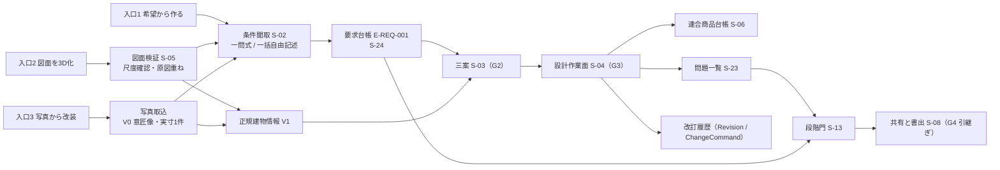

### 1.3 入口別に約束できる範囲（信頼状態）

| 入口と入力 | 初回成果で示す信頼状態 | 自動で到達できる最大 | 利用者確認後に到達できる最大（P0） | 根拠 |
|---|---|---|---|---|
| 希望から作る（自然文、段階式質問） | V0 の構想案（文章から作った意匠像と室構成の概略。寸法値は表示しない）または不足情報一覧。建物情報（V1）は G2 の三案で初めて生成する（七段階門 第2節: G0 の最大は V0。文章からの V0 は第6章 第2.1節の許される信頼状態に含める。U-08-004 は解決、第6章 U-06-018） | V1（G2 の三案） | V2（G3 完了条件を満たした案） | 指示文 G「自動はV1まで」、七段階門 G0、G1【推定】 |
| 図面を3D化（明瞭な単一縮尺の PDF、PNG、JPEG） | V1 編集案（尺度確認前は寸法値を表示しない） | V1 | V2 | 指示文 9.3、七段階門 G1【推定】 |
| 写真から改装（一枚写真） | V0 視覚案。「寸法未確認」「実在商品ではない」の注記 | V0 | 実寸1件以上の入力で V1。V2 は現況確認（P1）後 | 指示文 9.3「なければV0限定」【推定】 |
| 写真から改装（複数写真または走査、P1） | V0 | V1 | V2 | 指示文 9.3【推定】 |

いずれの入口でも、V0 または V1 の案を V2 以上と表示した件数（M-G-13）は 0 件でなければならない【推定】。

## 2. 利用場面ごとの最初から最後までの利用導線

### 2.0 表の読み方と共通規則

| 規則 | 内容 | 区分 |
|---|---|---|
| 手順番号 | 各導線の手順は通し番号で書く。番号は本章内の参照用であり識別子ではない | 【仮定】 |
| 段階門 | 各手順が属する段階 G0〜G6。門の通過は `七段階門.md` の完了条件による。本章は完了条件を再定義しない | 【推定】 |
| 画面 | 主に使う画面 S-（画面指標試験骨格 v1.2）。補助画面 S-15〜S-27 は P0 と P1 の別を画面骨格 第1.2節に従う | 【推定】 |
| 優先 | P0 で提供する手順を無印、P1 と P2 の手順は「P1」「P2」と明記する。P1 の手順は P0 では省略され、導線は次の P0 手順へ進む | 【推定】 |
| 生成される実体 | 手順の結果として作られる、または更新される実体（E-）と、要素値状態または信頼状態 | 【推定】 |
| 電子連絡先 | 全導線で、初回成果（用語集 280）の表示より前に電子連絡先の入力欄を出さない（F-C01-025）。連絡先の任意登録は S-15 で、初回成果の後に行う | 【推定】 |
| 進行禁止 | 各導線で働く進行禁止条件は `七段階門.md` の I-00-101〜I-00-126 を参照し、本章は導線上の位置だけを示す | 【推定】 |
| 重要判断の雛形（源1） | 各導線で M-N-01 の分母に入る源1 の雛形は第2章 第4.3節の雛形表の「利用目的別の生成」列（正本。G2(d)、G3(f) は源1 対象外）に従う。生成しない雛形は「非該当」とし、承認を要する「除外」と区別して M-N-01 と M-G-17 の分子と分母に数えない。家具配置、図面3D化、売却または賃貸資料の生成と非該当は各導線の冒頭に示す（JR-001） | 【推定】 |
| 待機状態 | 短期非同期の時間（第23章 N-PF-05）を超える処理（三案生成、図面読込、3D構築）は S-30-02 で実際の状態名と待ち時間の見込を出し、架空の進捗率を出さない（F-C02-028、画面骨格 第1.5節） | 【推定】 |

### 2.1 新築（入口: 希望から作る）

利用者像: 土地を所有、候補あり、または探索中で、家族の希望から住宅案を作り、建築士へ渡したい家族。P0 の主導線である【推定】。

| 手順 | 段階 | 画面 | 利用者の操作と製品の応答 | 生成される実体と状態 | 機能 | 進行禁止の位置 |
|---:|---|---|---|---|---|---|
| 1 | G0 | S-01 | 入口「希望から作る」と利用目的「新築」を選ぶ。非対象と責任境界（S-30-06）が表示される。電子連絡先は求めない | E-BLD-001（PJ- 発行、entryType、useType）。E-REQ-010 Gate の G0 が「進行中」 | F-C01-001、F-C01-025 | I-00-104（利用目的が非対象） |
| 2 | G0 | S-02 | 質問群A〜Cの G0 必要情報（第3.1節: 都道府県、土地状況、建築費の帯、家族の概略、納期希望）に一問式または一括自由記述で答える。残り項目数が常時表示される | E-REQ-001（G0 分の要求候補）、E-BLD-001.region、budgetRange、landStatus | F-C01-002、F-C01-003、F-C01-004、F-C01-005、F-C01-006、F-C01-012 | I-00-101、I-00-102、I-00-103 |
| 3 | G0 | S-02 | 主要危険の初期一覧（土地、費用、期間、災害）と初期予算の幅が表示される。目的文の候補が提示され、利用者が確認する | E-SRV-007 Risk（kind=主要危険）、E-BLD-001.purpose（VS-USR） | F-C01-022、F-C01-021（第5章） | — |
| 4 | G0 | S-02 | 初回成果の提示。G0 の必要情報から「一件の構想案」（無料枠、V0 視覚案、透かし付き。寸法値は表示せず「寸法未確認」「実在商品ではない」を注記）または不足情報一覧を表示する。建物情報は生成しない（七段階門 第2節: G0 の最大信頼状態は V0。文章からの V0 は第6章 第2.1節に含める。U-08-004 は解決）。室構成の概略は第12章の雛形からの決定的な合成、意匠像は画像生成処理先の生成物であり、第14章 AP-039 が返す（未契約時は意匠像なし。第6.1節）。ここで初めて「保存」「三案比較へ進む」の選択肢が出る。保存を選ぶと S-15 で電子連絡先の任意登録 | 初回成果（M-P-04 の分子）。E-REQ-005 Option（kind=分岐案、V0、透かし） | F-C01-025、F-C01-024（意匠像の説明文。第12章 F-C03-019 は G2 で呼ぶ） | — |
| 5 | G0→G1 | S-13 | G0 の完了条件（目的文確認、決定権を持つ関係者1名以上、非対象表示、主要危険、初期予算）の充足が表示され、門を通過する | E-REQ-010 Gate G0 = 通過 | F-C15-003（第6章） | S-13-04 に該当条件を表示 |
| 6 | G1 | S-02 | 質問群D〜J（家族と関係者、空間要件、生活行動と動線、性能優先度、好み、共有と書出、生活場面の四群）に答える。既知情報は聞き直さない。代理入力があれば当事者参画の方法を提案する。空間要件の E9 で構造形式の希望を聞き、「P0 で構造の初期注意を判定できるのは在来木造だけ」を注記する（JR-014） | E-ORG-008 Stakeholder、E-REQ-009 LifeScene（33 場面）、E-REQ-001（要求候補） | F-C01-007〜011、F-C01-013、014（第5章）、F-C01-015〜018 | — |
| 7 | G1 | S-09 | 敷地の初期確認。住所または概略地域から公的地理情報を重ね、法規条件を版付きで収集し、不足調査を登録する。境界線は法的境界ではないと表示する | E-BLD-002 Site、E-SRV-011 SiteRegulation、E-SRV-012 HazardInfo、E-SRV-001 Survey（status=必要） | F-C09-001〜004、007〜010、015（第18章） | I-00-105、I-00-106、I-00-107 |
| 8 | G1 | S-24 | 要求台帳への変換結果を確認する。各要求の優先度、数値範囲、出典、決定者、確認者、期限、確認状態が表示され、利用者が確認（VS-USR）する。要求衝突が全件表示され、解決候補と代償を見て決定者が判断する | E-REQ-001（confirmState=VS-USR）、E-REQ-004 Decision（衝突の解決）、E-REQ-002 Constraint（変更できない条件） | F-C01-019、F-C01-020 | I-00-109、I-00-110 |
| 9 | G1 | S-02、S-13 | 目的文、成功条件、非対象、変更できない条件を家族（P0 では利用者のみ可）が承認する | E-REQ-007 Approval（scopeKind=目的文、AS-VALID） | F-C01-021（第5章） | 完了条件(5) |
| 10 | G1→G2 | S-13 | G1 の完了条件（必須要求の出典、決定者、確認者。衝突の表示。境界、接道、用途地域の解消または不足調査登録。承認）を判定し、門を通過する | Gate G1 = 通過 | F-C15-003 | S-13-04 |
| 11 | G2 | S-03 | 三案（生活動線重視、費用重視、意匠重視。P0 は雛形三案 F-C03-019-01。生成規則は第12章 第7.8節「三案生成の生成規則」と第14章 AP-038 であり、本章は G2 でそれを呼ぶ）が V1 で生成され、同一評価軸（生活、空間、技術、費用、性能）で並ぶ。案別の要求適合表と捨てた条件、生活場面ごとの動線比較、簡易な日照比較、工種別概算幅、性能目標（EL-TGT）、家族変化群の場面ごとの「試行未実施」（P0。七段階門 G2 完了条件(7)、F-C01-023 手順(8)）が表示される | E-REQ-005 Option ×3（V1）、E-SRV-005 Estimate、E-SRV-013 PerformanceTarget（EL-TGT）、E-SRV-004 Calculation（kind=動線、日照） | F-C03-019、020（第12章）、F-C01-023、F-C04-016、F-C04-009（第11章）、F-C13-001（第20章）、F-C12-007（第19章） | I-00-111〜I-00-114 |
| 12 | G2 | S-03 | 要求衝突の再表示（案ごとの捨てた条件に基づく）。決定者が進める案を選び、理由、代償、未解決点を選定記録に残す | E-REQ-004 Decision（isKeyDecision=true）、選定記録 | F-C03-021（第12章）、F-C01-020 | I-00-115 |
| 13 | G2→G3 | S-13 | G2 の完了条件を判定し、門を通過する | Gate G2 = 通過 | F-C15-003 | S-13-04 |
| 14 | G3 | S-04 | 選定案を設計作業面で編集する。自然文の変更命令は対象、操作、量、方向、固定条件、目的を抽出し、影響予測と差分の仮表示の後に確定する。商品は S-06 で実在品優先で選ぶ | E-REQ-011 ChangeCommand、E-REQ-012 Impact、E-REQ-006 Revision、E-ELM-013 Furniture（productRef） | F-C03-009〜014（第12章）、F-C01-024、F-C05-003〜009（第16章） | — |
| 15 | G3 | S-10、S-11、S-12 | 主要断面、構造形式と通り芯の仮定、主要設備置場と経路帯、外皮方針、干渉、性能目標、費用更新を確認する。P1 では構造、外皮、設備の詳細調整 | 調整模型（V2 の条件を満たす建物情報）、E-SRV-004（EL-CAL、P0 は簡易な日照と動線） | F-C04-005（第11章）、F-C11-001〜003（第13章）、F-C12-001、002、009（第13章、第19章）、F-C13-003（第20章） | I-00-116〜I-00-121 |
| 16 | G3 | S-04、S-13 | 尺度、外周、開口、室、階段、主要寸法を利用者が確認（VS-USR）し、低確信度要素と VS-DEF の主要寸法を解消する。V2 の昇格条件を満たすと V2 と表示される | 案の信頼状態 V2、E-REQ-007 Approval（scopeKind=間取り 等） | F-C15-004（第6章）、F-C10-004（第17章） | I-00-119、I-00-120 |
| 17 | G3→G4 | S-13 | G3 の完了条件を判定し、門を通過する | Gate G3 = 通過 | F-C15-003 | S-13-04 |
| 18 | G4 | S-08 | 引継ぎ一式（GLB、PDF平面、要求台帳、問題一覧、判断記録。P1 で IFC、SVG、DXF、BCF）を生成し、標準の必要情報要求で検査し、例外承認を付けて発行（CDE-PUB）する。透かしに V2 が入る | E-EXC-002 Delivery、E-REQ-007 Approval（scopeKind=書出）、E-REQ-006（cdeState=CDE-PUB） | F-C15-006、007、011〜013、017（第22章）、F-C04-012、014（第11章） | I-00-122〜I-00-124、I-00-126 |
| 19 | G4 | S-07、S-20（P1） | 相談先を三社以上で比較し、送信先ごとに送信内容を確認して個別に同意する。P0 では所有者自身が期限付き共有URL（S-08）で建築士へ渡す | E-ORG-006 Consent（送信先ごと）、E-EXC-006 Share | F-C08-001〜005、007（第17章）、F-C10-009（第22章） | I-00-125 |
| 20 | G4 | S-22（P1）、S-13 | 有資格者が確認範囲を明示して承認し、範囲内が V3 になる。受取側が元図、要求、問題へ戻れることを確認する | E-REQ-007（qualification 付き、AS-VALID）、案の信頼状態 V3（範囲内） | F-C08-008（第17章）、F-C15-009（第6章） | 完了条件(6) |
| 21 | G5、G6（P2） | S-14 | 施工中の変更記録、検査、竣工時建物情報、機器台帳、入居後確認、学び一覧。P0 では情報構造だけを保持する | E-OPS-006 AsBuiltDelta、E-PRD-004 Asset、E-OPS-007 PostOccupancyRecord | F-C14-007〜012（第21章） | I-00-127〜I-00-133 |

### 2.2 改装（入口: 図面を3D化、写真から改装、希望から作る）

利用者像: 既存住宅の所有者または賃借人が、室単位または全体の改装を検討し、現況差と必要調査を把握したうえで建築士または施工者へ渡したい【推定】。改装は入口により三つに分岐し、手順 8 以降で合流する【仮定】。

| 手順 | 段階 | 画面 | 分岐 | 利用者の操作と製品の応答 | 生成される実体と状態 | 機能 | 進行禁止の位置 |
|---:|---|---|---|---|---|---|---|
| 1 | G0 | S-01 | 共通 | 入口を選び、利用目的「改装」を選ぶ。改装の範囲（室単位、階、全体）と解体を伴うかを質問群K で聞く | E-BLD-001（useType=改装） | F-C01-001 | I-00-104 |
| 2 | G0 | S-02 | 共通 | G0 必要情報（都道府県、土地状況=所有または賃借の別、改装費の帯、家族の概略、希望時期）に答える。賃借の場合は「所有」ではなく「その他」を選び、貸主の同意を関係者表へ登録する | E-REQ-001、E-ORG-008（貸主） | F-C01-002〜006、012、013（第5章） | I-00-101〜I-00-103 |
| 3a | G1 | S-05 | a 図面を3D化 | 既存図面（設計時図面または竣工図）を読み込む。図種、縮尺、改訂日を判定し、尺度と重要寸法1件以上を利用者が確認する。原図重ねと確信度が表示される | E-PRD-006 Source（kind=図面、isMasterCandidate）、V1 編集案、E-SRV-009 Overlay | F-C02-001、005〜016、028（第11章） | I-00-108 |
| 3b | G1 | S-02 | b 希望から作る（図面なし） | 既存の室の寸法を手入力する（各室の内法、開口位置、階高）。入力値は VS-USR。未入力の値は VS-DEF と表示され確認依頼が付く | E-SPC-001 Space（VS-USR）、既定値の適用箇所一覧 | F-C01-008、F-C03-016（第12章） | I-00-120（G3 で） |
| 3c | G0→G1 | S-02 | c 写真から改装 | 室内写真を取り込み、利用権を確認する。V0 視覚案（意匠像）を初回成果として表示し、「寸法未確認」「実在商品ではない」を注記する。実寸1件以上（扉幅等の基準寸法）を入力すると室単位の V1 になる | E-PRD-006（kind=写真、RS-OWN）、V0 → V1（実寸入力後）、写真内の物品は PT-GEN | F-C10-014（第22章）、F-C02-014（第11章）、F-C05-014（第16章） | I-00-108 |
| 4 | G1 | S-02 | 共通 | 初回成果（a: V1 の縮小表示、b: 不足情報一覧、c: V0 意匠像）の後に、質問群D〜J に答える。改装では生活場面「維持」群の「改装」場面を必ず確認し、E9 で既存建物の構造を申告させて「P0 で構造の初期注意を判定できるのは在来木造だけ」を注記する（JR-014） | E-ORG-008、E-REQ-009、E-REQ-001 | F-C01-007〜018 | — |
| 5 | G1 | S-27（P1）、S-05（P0） | 共通 | 要素ごとに現況状態 CS- を付ける。P0 は F-C02-024-01: 図面由来の要素を CS-DRW、図面にない隠れ部分を CS-EST として初期付与し、S-05 に記号と文字で表示する（3D で CS-EST を空洞に描かず「無い」と描かない）。P1 は F-C02-024-02: 現況資料（写真、採寸、既存住宅状況調査、耐震診断、修繕履歴）を結んで CS-SITE、CS-OPEN へ遷移させ、差異（存在差、寸法差、位置差）を重ね表示する。解体を伴う場合の石綿事前調査の要否判定（F-C02-026）は P1 であり、P0 では S-05-07 に固定注記（石綿事前調査の義務と、既存の壁の撤去と移動での耐震診断、大規模の修繕または模様替での確認申請の可能性。文は第21章 第1.2節）を表示し、問題は登録しない | 要素.conditionState（P0 は CS-DRW、CS-EST）。P1: E-SRV-002 Observation、E-SRV-001 Survey（kind=石綿事前調査、status=必要） | F-C02-024-01（P0）、F-C02-024-02、025、026（P1。第11章、第21章） | 固定注記（P0）。警告（P1）。I-00-130（G5、P2） |
| 6 | G1 | S-09 | 共通 | 敷地と法規の初期確認。改装では用途地域、防火、接道を版付きで確認し、行政照会を不足調査へ登録する | E-SRV-011、E-SRV-001 | F-C09-002、007、008（第18章） | I-00-107 |
| 7 | G1 | S-24 | 共通 | 要求台帳の確認と衝突の解決。改装では「残す」要素の要求（RP-MUST または RP-FORBID として「撤去しない」）を要求台帳に持つ | E-REQ-001、E-REQ-004 | F-C01-019、020 | I-00-109、I-00-110 |
| 8 | G1→G2 | S-13 | 合流 | G1 の完了条件を判定し、門を通過する | Gate G1 = 通過 | F-C15-003 | S-13-04 |
| 9 | G2 | S-03 | 合流 | 三案を生成し、改装前後比較（P1）と動線比較で並べる。要素ごとの改装区分の指定（残す、撤去、補修、補強、移設、新設。S-27-03）は P1。P0 では三案の差を要素の追加と削除で示し、改装案件で現況要素を削除、移動または寸法変更した場合（案の変更命令に限り、図面読解の修正は除く）は撤去、移設、または撤去と新設の組（寸法変更）が自動で付く（第21章 第2.1節 規則(7)。要素は消さずに保持）。耐力壁候補線、外周壁、上下階連続壁とその上の要素（外壁開口を含む）は三案の派生の対象にしない（第12章 第7.8節 P0 の範囲 (a)、(f)。統括の決定 D37）。目録の外の利用者の編集で既存の外周壁または上下階連続壁を撤去、移設または寸法変更した場合（移設は移設元を、寸法変更は変更前の要素を撤去として数える）と、耐力壁候補線上に開口を新設した場合は、第13章 第5.5節 式(5)が P0 から働き G3 で SEV-0（I-00-116。P0 の解除は元に戻す変更だけ。統括の決定 D34、D36）になる | E-REQ-005 ×3、要素.renovationAction（P0 は撤去と移設の自動付与だけ。指定は P1） | F-C03-019〜021（第12章。P0 は図面入力が F-C03-019-03、希望入力が F-C03-019-01）、F-C14-001（P0 は自動付与だけ）、F-C14-005（P1。第21章）、F-C04-016 | I-00-111〜I-00-115 |
| 10 | G3 | S-04、S-10、S-12 | 合流 | 選定案の調整。改装では予備費を隠れた不具合の判断と結び（P1）、解体後判明時の判断者、費用予備、代替案、承認手順を定義する（P1）。P0 では予備費を工種別費用幅の一項目として持つ | E-SRV-014 CostItem（予備費）、E-REQ-004（解体後判明の手順、P1） | F-C14-003、004（第21章）、F-C13-001（第20章） | I-00-116〜I-00-121 |
| 11 | G3→G4 | S-13、S-08 | 合流 | V2 判定と引継ぎ一式の発行。改装では現況状態 CS- と必要調査一覧を引継ぎ一式に含める。P0 の改装の未確認事項は第6章 第2.5節 欠落の自動記録 (vii) として載る | E-EXC-002（CS- を含む） | F-C15-013（第22章） | I-00-122〜I-00-126 |
| 12 | G4〜G6 | S-07、S-22、S-14 | 合流 | 2.1 の手順 19〜21 と同じ。改装では G5 で石綿事前調査の未了が進行禁止（P2） | 同上 | 同上 | I-00-130 |

### 2.3 家具配置（入口: 図面を3D化、希望から作る、写真から改装）

利用者像: 新築または既存の室に、所有家具と購入候補の家具を実寸で置き、通路、扉開閉、搬入経路を確かめたい利用者。段階は G0〜G3 で完結し、G4 の引継ぎは任意である【推定】。

源1 の雛形（第2.0節）: G0(a)(c)、G1(a)、G2(a)（家具配置三案の選定）、G3(a)(e) を生成し、G0(b) は家具費の大枠と読み替えて生成する。G1(c)(d) は図面入力のある案件、G2(e) は該当する将来場面（E-REQ-009.isFuture=true）がある案件だけで生成する（条件付き）。G1(b)(e)(f)、G2(b)(c)、G3(b)〜(d)、G4(c) は「非該当」とする。G4(a)(b) は任意の G4 を開始した案件だけで生成する（第2章 第4.3節の雛形表。生 7、条 3、任 2、非 9）【推定】。

| 手順 | 段階 | 画面 | 分岐 | 利用者の操作と製品の応答 | 生成される実体と状態 | 機能 | 進行禁止の位置 |
|---:|---|---|---|---|---|---|---|
| 1 | G0 | S-01 | 共通 | 入口を選び、利用目的「家具配置」を選ぶ。対象が室単位か家全体かを質問群K で聞く | E-BLD-001（useType=家具配置） | F-C01-001 | I-00-104 |
| 2 | G0 | S-02 | 共通 | G0 必要情報のうち、都道府県（商品の供給地域の判定に使う）、家具費の帯、家族の概略に答える。土地状況は「所有」を既定とし、建築費と納期の質問は出さない（分岐規則 第3.2節） | E-REQ-001、E-BLD-001.budgetRange（家具費） | F-C01-002、005、006 | I-00-101、I-00-102 |
| 3a | G1 | S-05 | a 図面を3D化 | 平面図を読み込み、尺度を確認し、V1 の室を得る | V1、E-SPC-001 | F-C02-001〜016（第11章） | I-00-108 |
| 3b | G1 | S-02 | b 希望から作る | 室の内法寸法、開口の位置と幅、天井高を手入力する（VS-USR） | E-SPC-001、E-ELM-007 Door、E-ELM-008 Window | F-C01-008 | — |
| 3c | G0→G1 | S-02 | c 写真から改装 | 写真から V0 を表示し、実寸1件以上の入力で室単位の V1 にする | V0 → V1 | F-C02-014（第11章）、F-C05-014（第16章） | I-00-108 |
| 4 | G1 | S-02 | 共通 | 初回成果（V1 の室、または V0）の後に、所有家具の一覧（種類、幅、奥行、高さ。写真だけで実寸を断定せず寸法入力または基準物による確認）と、生活行動のうち家具に関わる項目（食事の人数、在宅勤務の場所、来客の滞在場所）、生活場面「維持」群の「家具搬入」を確認する | E-ELM-013 Furniture（isOwned=true、ownedDimensionSource）、E-REQ-001 | F-C05-014（第16章）、F-C01-009、F-C01-018 | — |
| 5 | G1 | S-24 | 共通 | 要求台帳の確認。家具配置では通路幅、椅子を引く余白、搬入経路の要求を数値範囲で持つ | E-REQ-001（valueRange 付き） | F-C01-019、020 | I-00-109 |
| 6 | G1→G2 | S-13 | 共通 | G1 の完了条件を判定する。判定は第6章 第2.2節の完了条件だけで行い、導線側で完了条件を定義しない。敷地の項目（境界、接道、用途地域）は同節 完了条件(3)の利用目的による適用除外で非該当となり、I-00-105〜107 は登録されない（第2章 第4.3節の G1(b) が非。統括の決定 D30。JM-030） | Gate G1 = 通過 | F-C15-003（第6章） | — |
| 7 | G2 | S-03 | 共通 | 家具配置の三案（生活動線重視、費用重視、意匠重視）を生成し、動線比較（距離、通過扉数、交差）と費用幅で比較する。G2 の通過条件は第6章 第2.3節の完了条件と「利用目的による適用除外」（家具配置は完了条件(4)(5) が非該当、(7) が条件）に従い、導線側で条件を定義しない（統括の決定 D30b。JM-030） | E-REQ-005 ×3 | F-C03-019〜021（第12章）、F-C04-016 | I-00-111、I-00-113 |
| 8 | G3 | S-04、S-06 | 共通 | 商品を実在品優先で検索し、配置検査（衝突、扉開閉、椅子を引く余白、通路、搬入経路）を通して置く。生活場面の3D再生（P1）で家具余白の不足を見る | E-ELM-013（productRef、PT-、RS-）、E-REQ-003（余白不足） | F-C05-003〜009、015、018（第16章）、F-C04-010（第11章）、F-C04-017 | I-00-121 |
| 9 | G3 | S-04、S-13 | 共通 | 室の寸法、開口、家具の実寸が利用者確認済み（VS-USR）で、干渉に SEV-0 がなければ V2。「施工可能」は表示しない | V2 | F-C15-004（第6章） | I-00-119、I-00-120 |
| 10 | G3→G4（任意） | S-08 | 共通 | GLB 共有と PDF 平面の書出、購入導線（P1、個別同意付き）、人への相談（P1） | E-EXC-002、E-EXC-006、E-ORG-006 | F-C04-012、014（第11章）、F-C05-017（第16章） | I-00-125 |

### 2.4 図面3D化（入口: 図面を3D化）

利用者像: 既存図面（新築計画中の図面、竣工図、販売図面）を持ち、寸法と関係を持つ 3D にして確認、共有、または専門家へ渡したい利用者。利用目的「図面3D化」は建物情報の生成と検証を主眼とし、要求聞取は最小にする【推定】。

源1 の雛形（第2.0節）: RP-MUST が 0 件の間は G0(a)(c)、G1(a)(c)(d)、G2(a)（「読み込んだ案」と「分岐案」の選定。手順9）、G3(a)、G4(a)(b) を生成し、他の雛形は「非該当」とする。G2(b)(c)、G3(b)〜(e)、G4(c) は RP-MUST が 1 件以上になった時点（第2章 第4.3節の記号「追」）で生成する【推定】。

| 手順 | 段階 | 画面 | 利用者の操作と製品の応答 | 生成される実体と状態 | 機能 | 進行禁止の位置 |
|---:|---|---|---|---|---|---|
| 1 | G0 | S-01 | 入口「図面を3D化」と利用目的「図面3D化」を選ぶ。入力見本（明瞭な単一縮尺の平面図）と対象外（手描き、写真撮影、低解像度、三階建以上は P0 対象外）を表示する | E-BLD-001 | F-C01-001、F-C02-001（第11章） | I-00-104 |
| 2 | G0 | S-02 | G0 必要情報のうち都道府県（法規と災害の初期確認に使う）と建物の階数の概略に答える。予算と納期は「未定」を既定にして質問を出さない | E-BLD-001.region | F-C01-002、005 | I-00-101 |
| 3 | G1 | S-05 | 図面を読み込む。利用権を確認する。処理状態（読込、尺度判定、壁抽出、開口抽出、関係検査、3D構築）が実際の状態名で表示される。図面一式（P1）では正本候補を判定する | E-PRD-006（RS-OWN）、E-SRV-009 | F-C10-014（第22章）、F-C02-005〜013、019、028（第11章） | — |
| 4 | G1 | S-05 | 初回成果として V1 編集案の縮小表示（同期2Dと3D、透かし付き、寸法値は非表示）と認識結果の要約（要素数、低確信度要素数、問題数）を表示する。ここで「保存」「尺度を確認して続ける」を選ぶ | 初回成果、V1 | F-C01-025、F-C02-016（第11章） | — |
| 5 | G1 | S-05 | 尺度と重要寸法1件以上を確認する（基準寸法の指定）。複数寸法の整合検査で矛盾があれば警告する。確認前は寸法値を表示しない | 尺度.valueState=VS-USR、E-REQ-007（scopeKind=尺度） | F-C02-014、011（第11章） | I-00-108 |
| 6 | G1 | S-05 | 原図重ねで低確信度要素を修正し、閉領域、隣接、扉接続、上下階接続の検査結果を確認する。階高、屋根形状、開口高さは立面と断面の補助入力または既定値（VS-DEF と表示） | 要素.valueStates、E-REQ-003（閉領域不成立等） | F-C02-010〜013、015、023（第11章）、F-C03-016（第12章） | — |
| 7 | G1 | S-02 | 要求聞取は「共有相手」「必要な書出形式」「相談希望」（質問群I）だけを必須とし、他の質問群は「後で答える」を既定にする。図面から取得した階数、室数、面積は既知情報として表示し聞き直さない | E-REQ-001（最小）、既知情報の確認記録 | F-C01-002、F-C01-012 | — |
| 8 | G1→G2 | S-13 | G1 の完了条件を判定する。必須要求（RP-MUST）が 0 件の案件を含め、判定は第6章 第2.2節の完了条件だけで行い、導線側で完了条件を定義しない（U-08-005 は解決。v1.2 で初稿の仮判断「『要求なし』を決定者が明示する」を除いた。第6章の完了条件にない条件であるため。JM-030） | Gate G1 = 通過 | F-C15-003（第6章） | I-00-109 |
| 9 | G2 | S-03 | G2 の通過条件は第6章 第2.3節の完了条件と「利用目的による適用除外」（U-06-018）に従い、導線側で条件を定義しない。適用除外に当たる案件では、G2(a) の選択肢を「読み込んだ案」と「分岐案」の 2 件とし（第2章 第4.2節の項目2 を満たす。F-C15-014 例外(c) の除外。第6章 第2.3節と同文）、2 件の比較を選定記録に残し、S-03 に「三案比較なし（利用目的による）」を表示する。適用除外の条件を外れた時点（同節の「RP-MUST が 1 件以上になった時点」と、利用目的を新築または改装へ変更した時点（住み替えの検討への移行等）。利用目的の変更時の再生成規則は U-06-018 により本章が持つ）で三案を要し、図面入口では読み込んだ V1 案（尺度が VS-USR 済み）から目録（DV-GE-22）の変更命令の組合せで三案を決定的に派生する（第12章 第7.8節 (f)。図面派生三案 F-C03-019-03。目録は耐力壁候補線、外周壁、上下階連続壁とその上の要素〔外壁開口を含む〕を移動、撤去、拡大の対象にしない。改装案件の既存の壁と開口も同じ。統括の決定 D37）。通過済みの G2 は完了条件の不成立により「再確認中」に戻る（第6章 第1.2節。JM-030） | E-REQ-005（kind=分岐案。派生した三案は generationBasis.method=図面派生）、選定記録 | F-C03-019-03、F-C03-021（第12章）、F-C15-003（第6章） | I-00-115 |
| 10 | G3 | S-04、S-10 | 主要寸法（尺度、外周、開口、室、階段、階高）を確認し、主要断面を保存し、V2 の昇格条件を満たす | V2 | F-C04-005（第11章）、F-C15-004（第6章） | I-00-119、I-00-120 |
| 11 | G4 | S-08 | GLB、PDF平面、要求台帳（最小）、問題一覧、判断記録を引継ぎ一式として発行する。P1 で IFC、SVG、DXF | E-EXC-002（CDE-PUB） | F-C15-013（第22章）、F-C04-012〜015（第11章、第22章） | I-00-122〜I-00-124、I-00-126 |
| 12 | G4 | S-08、S-22（P1） | 期限付き共有URL で建築士へ渡す。P1 で有資格者確認により範囲内が V3 | E-EXC-006、E-REQ-007 | F-C10-009（第22章）、F-C08-008（第17章） | I-00-125 |

### 2.5 売却または賃貸資料（入口: 図面を3D化。写真から改装は P1）

利用者像: 所有する住宅を売却または賃貸するために、図面から 3D と平面の資料を作り、住所や図面番号を伏せて掲載または内見に使いたい所有者、または仲介業者（RL-PART）。案件の信頼状態は V1 または V2 に留まり、資料には「寸法未確認」または「幾何確認済み（登記面積や実測ではない）」を表示する【推定】。源1 の雛形の生成と「非該当」は 2.4 と同じとする（第2.0節。JR-001）【推定】。

| 手順 | 段階 | 画面 | 利用者の操作と製品の応答 | 生成される実体と状態 | 機能 | 進行禁止の位置 |
|---:|---|---|---|---|---|---|
| 1 | G0 | S-01 | 入口「図面を3D化」と利用目的「売却または賃貸資料」を選ぶ。資料の用途（掲載、内見、契約前説明）と掲載先の有無を質問群K で聞く。「登記面積」「実測」「法規適合」を資料に表示しない旨を非対象として表示する | E-BLD-001（useType=売却賃貸資料） | F-C01-001 | I-00-104 |
| 2 | G0 | S-02 | 都道府県、土地状況「売却移転」、家族の概略（居住中か空き家か）に答える。予算と納期は「未定」既定 | E-BLD-001.landStatus=売却移転 | F-C01-002、005 | I-00-101、I-00-103 |
| 3 | G1 | S-05 | 図面（販売図面、竣工図）を読み込み、利用権を確認する。図面に含まれる住所、氏名、図面番号、位置情報を自動検出し、伏せ字候補を提示する | E-PRD-006（RS-OWN）、伏せ字候補 | F-C10-014、F-C10-017（第22章）、F-C02-005〜013（第11章） | — |
| 4 | G1 | S-05 | 初回成果（V1 の縮小表示、透かし付き）の後、尺度と重要寸法1件以上を確認する | V1、尺度 VS-USR | F-C01-025、F-C02-014（第11章） | I-00-108 |
| 5 | G1 | S-02 | 要求聞取は「共有相手（仲介業者、購入検討者）」「書出形式」「伏せ字の範囲」「資料に含めない項目（RP-FORBID）」だけを必須とする。例示 R-08-012 | E-REQ-001（RP-FORBID） | F-C01-012、F-C01-019 | — |
| 6 | G1 | S-27（P1）、S-05（P0） | P0 は図面由来の要素を CS-DRW、図面にない隠れ部分を CS-EST として初期付与し、S-05 に表示する（F-C02-024-01）。現況写真があれば CS-SITE へ遷移させる（P1。F-C02-024-02）。図面と現況の差は「図面上（CS-DRW）」として資料に明記し、「図面上」を確認済みと読める語で表示しない（T-S-003） | 要素.conditionState | F-C02-024-01（P0）、F-C02-024-02（P1。第11章、第21章） | — |
| 7 | G1→G3 | S-13、S-04 | G1 の完了条件と G2 の通過条件は第6章 第2.2節、第2.3節の完了条件と「利用目的による適用除外」（U-06-018）に従い、導線側で条件を定義しない（扱いは 2.4 の手順 8〜9 と同じ。JM-030）。G3 で主要寸法を確認して V2 に昇格する。V2 でも「幾何確認済み」以外の語（実測、登記、法規適合）を表示しない | V2 | F-C15-004、005（第6章、第22章） | I-00-119、I-00-120 |
| 8 | G4 | S-08 | 資料一式（GLB、PDF平面）を透かし付き、伏せ字適用済みで書き出す。共有は期限、閲覧回数、取得可否を設定した期限付き共有URL とし、初期値は非公開 | E-EXC-002（V2 転記）、E-EXC-006（redactions） | F-C04-012、014（第11章）、F-C10-009、017（第22章） | I-00-122、I-00-124 |
| 9 | G4 | S-20（P1） | 仲介業者へ送る場合は送信先ごとに送信内容（伏せ字後）を確認し個別同意する。連絡先は設計情報と論理分離され資料に含まれない | E-ORG-006 Consent | F-C08-005（第17章）、F-C10-013（第22章） | I-00-125 |
| 10 | 完了 | S-16、S-19 | 案件を「完了」または「保管」にし、不要になれば一括削除する。削除は原本、派生画像、3D、索引、予備複製を含む | E-BLD-001.status=保管、E-EXC-007 AuditLog（削除） | F-C10-012（第22章） | — |

注: 写真から改装の入口で室内写真だけから V0 の意匠像を資料に使う場合、「寸法未確認」「実在商品ではない」の注記付きでのみ許容し、P1 とする（仮判断。未決 U-08-011）。V0 を表示できる範囲は第6章 第2.1節の許される信頼状態（写真から改装の入口の意匠像と、文章からの構想案）に従い、本章で範囲を広げない（JM-030）【仮定】。

### 2.6 五つの利用導線の合流図

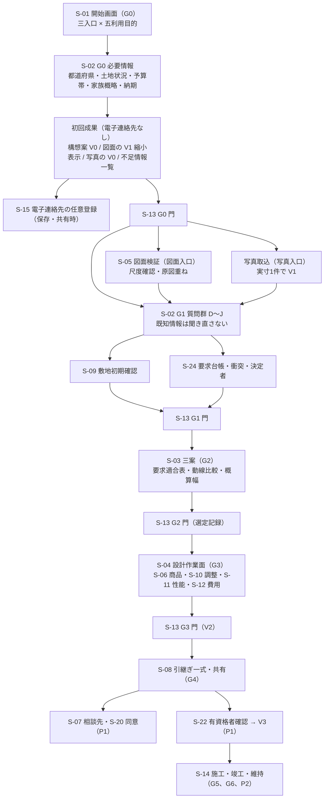

### 2.7 導線上で働く進行禁止条件の位置（要約）

| 段階 | 進行禁止条件（`七段階門.md`） | 本章の導線で該当する手順 | 検出する機能 |
|---|---|---|---|
| G0 | I-00-101 都道府県不明、I-00-102 予算帯未入力、I-00-103 土地状況未選択、I-00-104 目的が非対象 | 2.1 手順 1〜2、2.2 手順 1〜2、2.3 手順 2、2.4 手順 2、2.5 手順 2 | F-C01-001、005、006 が入力欄の必須判定で検出し、F-C15-002 が SEV-0 として登録 |
| G1 | I-00-105〜107 境界、接道、用途地域の不明 | 2.1 手順 7、2.2 手順 6 | F-C09-007（第18章） |
| G1 | I-00-108 尺度未確認のまま寸法表示 | 2.2 手順 3a、3c、2.3 手順 3a、3c、2.4 手順 5、2.5 手順 4 | F-C02-014（第11章） |
| G1 | I-00-109 必須要求に決定者なし、I-00-110 要求衝突が未表示 | 2.1 手順 8、2.2 手順 7、2.3 手順 5 | F-C01-019、F-C01-020 |
| G2 | I-00-110 要求衝突が未表示（案の生成時に新たに検出された衝突。第6章 G2 完了条件(8)。JR-038） | 2.1 手順 11〜12、2.2 手順 9、2.3 手順 7 | F-C01-020 |
| G2 | I-00-111〜115 必須要求を満たす案なし、重大危険未表示、同一評価軸でない、概算が単一額、選定記録に決定者なし | 2.1 手順 11〜12、2.2 手順 9、2.3 手順 7 | F-C01-023、F-C03-019〜021（第12章）、F-C13-002（第20章） |
| G3 | I-00-116〜121 | 2.1 手順 15〜16 | 第13章、第6章 |
| G4 | I-00-122〜126 | 2.1 手順 18〜19 | 第22章、第17章 |

## 3. 対話設計（C01）の質問項目と分岐規則

### 3.0 共通規則

| 規則 | 内容 | 区分 |
|---|---|---|
| 質問の番号 | 質問群 A〜K と番号（例: B1）は本章内の参照用であり識別子ではない。第15章が S-02 の部品を採番する際に対応付ける | 【仮定】 |
| 必須区分 | 「G0必須」は G0 の門を通過するために回答または「未定」の明示が要る項目。「G1必須」は G1 の門を通過するために要る項目。「任意」は未回答でも門を通過でき、残り項目として表示し続ける | 【推定】 |
| 「未定」と「対象外」 | 数値と選択肢の質問は常に「未定」を選べる。生活場面の質問は「対象外」を選べる。「未定」「対象外」は回答済みとして数え、聞き直さない | 【推定】 |
| 書込先 | 回答は要求台帳（E-REQ-001）または案件と関係者の実体属性へ書く。要求へ書く場合の変換規則は第5節 | 【推定】 |
| 回答の出典 | 各回答に回答者（E-ORG-001）、日時、画面、回答方式（一問式、一括自由記述、既知情報の確認）を持たせ、要求の出典（sourceRef、kind=利用者入力）にする | 【推定】 |
| 言語模型の役割 | 質問文の言い換え、自由記述からの抽出、矛盾候補の提示、生活場面の提示は言語模型が行う。数値、選択肢、要求の優先度、決定者は利用者の確認（VS-USR）なしに確定しない（F-C01-024、指示文 10.6） | 【推定】 |
| 到達性 | 全質問は鍵盤だけで回答でき、選択肢は色だけに意味を依存しない（第23章 N-AC-） | 【推定】 |

### 3.1 質問項目の全一覧

#### 質問群A 入口と目的（S-01、G0）

| 番号 | 質問項目 | 取得する値（型と選択肢） | 必須区分 | 機能 | 書込先 | 既知情報の出所（該当時は聞き直さない） |
|---|---|---|---|---|---|---|
| A1 | 入口 | enum{希望から作る, 図面を3D化, 写真から改装} | G0必須 | F-C01-001 | E-BLD-001.entryType | なし（常に選ぶ） |
| A2 | 利用目的 | enum{新築, 改装, 家具配置, 図面3D化, 売却または賃貸資料}。第1.1節の許容組合せだけを表示 | G0必須 | F-C01-001 | E-BLD-001.useType | 案件一覧（S-16）から複製した案件では前案件の値を既知とする |
| A3 | 対象建物の階数の概略 | enum{平屋, 二階建, 三階建以上, 不明}。三階建以上は P0 対象外と表示し案件は作れる | G0必須 | F-C01-001、F-C01-008 | E-BLD-003.storeys（VS-USR、概略） | 図面入口では図面から取得（VS-SRC または VS-AI）した階数を「確認」として出す |

#### 質問群B 建設地域と土地（S-02、G0→G1。F-C01-005）

| 番号 | 質問項目 | 取得する値 | 必須区分 | 機能 | 書込先 | 既知情報の出所 |
|---|---|---|---|---|---|---|
| B1 | 都道府県 | enum{47都道府県} | G0必須（I-00-101） | F-C01-005 | E-BLD-001.region | 図面の表題欄、写真の位置情報（利用者が許可した場合のみ）、案件一覧の前案件 |
| B2 | 市区町村 | str | G1必須（敷地確認に使う）。家具配置では任意 | F-C01-005 | E-BLD-001.region（詳細） | 同上 |
| B3 | 土地状況 | enum{所有, 候補あり, 探索中, 建替え, 売却移転, その他（賃借等）} | G0必須（I-00-103） | F-C01-005 | E-BLD-001.landStatus | 利用目的が「売却または賃貸資料」なら「売却移転」を既定表示し確認だけ求める |
| B4 | 敷地住所または地番 | str（機密。分離保存） | 任意（所有、候補あり、建替えで表示） | F-C01-005 | E-BLD-002.address、lotNumbers | 図面の配置図から取得した地番（VS-AI）は確認として出す |
| B5 | 敷地面積 | num(m2) または 坪入力（換算は第5.2節）、または未定 | G1必須（新築、改装。家具配置と図面3D化では任意） | F-C01-005 | E-BLD-002.area（VS-USR） | 図面の面積表（VS-SRC）、境界資料 |
| B6 | 敷地形状 | enum{整形, 不整形, 旗竿, 不明} | 任意 | F-C01-005 | E-BLD-002.boundary（概略） | 境界資料、配置図 |
| B7 | 方位（接道の向き） | enum{北, 東, 南, 西, 複数, 不明} | G1必須（新築） | F-C01-005 | E-BLD-002.roadAccess | 配置図の方位記号 |
| B8 | 接道（幅員、接道長、種別） | json{幅員:num(m), 接道長:num(m), 種別:str} または不明 | G1必須（新築。不明は不足調査へ。I-00-106） | F-C01-005 | E-BLD-002.roadAccess | 配置図、公的地理情報 |
| B9 | 高低差 | enum{なし, あり（概略 mm）, 不明} | 任意（あり、不明は主要危険候補） | F-C01-005 | E-BLD-002.terrain | 公的地理情報（標高） |
| B10 | 境界資料の有無 | enum{測量図あり, 公図のみ, なし, 不明} | G1必須（新築。なし、不明は不足調査へ。I-00-105） | F-C01-005 | E-BLD-002.boundarySourceRef | 図面一式に測量図が含まれる場合 |

#### 質問群C 予算と費用の優先順位（S-02、G0→G1。F-C01-006）

| 番号 | 質問項目 | 取得する値 | 必須区分 | 機能 | 書込先 | 既知情報の出所 |
|---|---|---|---|---|---|---|
| C1 | 建築費の帯（改装では改装費） | range(JPY)（下限と上限）または未定 | G0必須（I-00-102）。家具配置、図面3D化、売却賃貸では「未定」を既定にして質問を出さない | F-C01-006 | E-BLD-001.budgetRange、E-REQ-002 Constraint（変更できない条件、利用者が「上限厳守」を選んだ場合） | 案件一覧の前案件 |
| C2 | 土地費の帯 | range(JPY) または未定 | 任意（B3 が候補あり、探索中で表示） | F-C01-006 | E-REQ-001（A09 影響先） | — |
| C3 | 家具費の帯 | range(JPY) または未定 | 任意（家具配置では G0必須） | F-C01-006 | E-REQ-001 | — |
| C4 | 予備費 | num(JPY) または率(%) または未定 | 任意（改装では G1必須。既定は第20章が置く） | F-C01-006 | E-SRV-014 CostItem（予備費） | — |
| C5 | 借入希望 | enum{あり, なし, 未定}。あり→range(JPY) | 任意 | F-C01-006 | E-REQ-001 | — |
| C6 | 費用の優先順位 | 順位付け{建築費上限厳守, 性能, 意匠, 期間, 維持費} | G1必須（新築、改装） | F-C01-006 | E-REQ-001（priority の初期割当に使う） | — |

#### 質問群D 家族構成と関係者（S-02、G1。F-C01-007。関係者表と当事者参画は第5章）

| 番号 | 質問項目 | 取得する値 | 必須区分 | 機能 | 書込先 | 既知情報の出所 |
|---|---|---|---|---|---|---|
| D1 | 成人の人数 | int | G0必須（家族の概略として G0 で聞く） | F-C01-007 | E-ORG-008 Stakeholder（category=家族） | 案件一覧の前案件 |
| D2 | 子供の人数と年齢帯 | list[enum{乳幼児, 学齢, 中高, 大学以上}] | G0必須（0 人を含む） | F-C01-007 | E-ORG-008 | — |
| D3 | 高齢者の人数と支援の要否 | int、enum{支援不要, 一部支援, 介護} | G1必須 | F-C01-007 | E-ORG-008（needsParticipationSupport） | — |
| D4 | 在宅勤務者の人数と頻度 | int、enum{毎日, 週2〜4日, 週1日以下} | G1必須 | F-C01-007 | E-ORG-008、E-REQ-009（在宅勤務） | — |
| D5 | 来客の頻度と宿泊の有無 | enum{月1回以上, 年数回, ほぼなし}、bool | G1必須 | F-C01-007 | E-REQ-009（来客） | — |
| D6 | 将来の家族変化 | list[enum{増える, 減る（独立）, 二世帯化, 在宅介護, 車椅子利用, 在宅勤務増加, なし}]、時期（年） | G1必須（「なし」を含め1件以上） | F-C01-007、F-C01-016 | E-REQ-009（family 群、isFuture=true） | — |
| D7 | 家族以外の関係者 | list[enum{設計者, 施工者, 維持管理者, 介護者, 来訪者, 近隣, 将来の居住者, 貸主, その他}] | G0必須（決定権を持つ者1名以上。第5章 F-C01-013） | F-C01-013（第5章） | E-ORG-008 | — |
| D8 | 本人の声が抜けやすい人 | list[人] と参画方法 | G1必須（D2 に乳幼児または学齢、D3 が一部支援または介護、D9 あり、D7 に介護者、のいずれかで表示。第5章 F-C01-014） | F-C01-014（第5章） | E-ORG-008.participationMethod、isProxyInput | — |
| D9 | 障害や配慮が必要な家族の有無と内容（車椅子、視覚、聴覚、認知、その他）と本人の年齢帯 | list[json{kind:enum{車椅子, 視覚, 聴覚, 認知, その他}, ageBand:enum{乳幼児, 学齢, 中高, 大学以上, 成人, 高齢}, note:str}] または「なし」 | G1必須（「なし」を含め 1 件以上） | F-C01-007 | 該当者の E-ORG-008.needsParticipationSupport=true。車椅子は E-ORG-008.bodyMetrics.usesWheelchair=true。本人が操作する場合の表示の配慮は E-ORG-001.accessibilityNeeds（本人の Person がある場合）。種別（車椅子、視覚、聴覚、認知、その他）、本人の年齢帯と内容は E-ORG-008.careNeeds（list[json{kind, ageBand, note}]。第12章 v1.3。「なし」の場合は空）に保持する。要配慮属性として機密に分離保存し非共有（第12章 第1.7節、第22章） | — |

#### 質問群E 空間要件（S-02、G1。F-C01-008）

| 番号 | 質問項目 | 取得する値 | 必須区分 | 機能 | 書込先 | 既知情報の出所 |
|---|---|---|---|---|---|---|
| E1 | 希望階数 | enum{平屋, 二階建, 三階建以上, 案に任せる} | G1必須（新築） | F-C01-008 | E-REQ-001（A03） | A3 の回答 |
| E2 | 延床面積の帯 | range(m2)（坪入力可）または未定 | G1必須（新築） | F-C01-008 | E-REQ-001（valueRange） | 図面の面積表 |
| E3 | 部屋数 | LDK 表記（enum{2LDK, 3LDK, 4LDK, 5LDK以上}）または室の一覧 | G1必須（新築、改装） | F-C01-008 | E-REQ-001、室ごとの E-REQ-001 | 図面から取得した室名一覧 |
| E4 | 各室の最低寸法 | 室ごとに range(mm)（畳数入力可。換算は第5.2節）または未定 | 任意（入力した室だけ RP-MUST 候補） | F-C01-008 | E-REQ-001（valueRange、A03）、E-SPC-001.minClearWidth | 図面から取得した室の内法 |
| E5 | 収納 | enum{面積帯(m2), 延床に対する率(%), 未定} | 任意 | F-C01-008 | E-REQ-001 | — |
| E6 | 駐車と自転車 | int（台数）、enum{屋根あり, なし, 未定} | G1必須（新築） | F-C01-008 | E-REQ-001（A03、影響 A02、A09）、E-ELM-016.vehicleCount | 配置図 |
| E7 | 庭 | enum{必須, 希望, 不要}、用途 str | 任意 | F-C01-008 | E-REQ-001 | — |
| E8 | 外構 | list[enum{門, 塀, アプローチ, 物置, 擁壁}] | 任意 | F-C01-008 | E-REQ-001、E-ELM-016 | 配置図 |
| E9 | 構造形式（新築は希望、改装は既存建物の構造の申告） | enum{在来木造, 大断面木造, 枠組壁工法, プレハブ, 鉄骨, RC, その他, 分からない} | 任意（新築、改装。回答の直後に P0 の判定範囲を注記する。JR-014） | F-C01-008 | E-BLD-003.structureType（新築は希望の VS-USR。改装は CS-EST、VS-USR の申告。「分からない」は未定） | 図面の特記（P1） |

#### 質問群F 生活行動と動線（S-02、G1。F-C01-009）

| 番号 | 質問項目 | 取得する値 | 必須区分 | 機能 | 書込先 | 既知情報の出所 |
|---|---|---|---|---|---|---|
| F1 | 起床から就寝までの行動 | list[json{時間帯, 行動, 使う室, 人}]。言語模型が典型の一日を提示し利用者が修正する | G1必須（新築、改装） | F-C01-009 | E-REQ-009（日常群の sequence） | — |
| F2 | 洗濯の動線 | json{洗う, 干す, 畳む, しまう の場所と階} | G1必須（新築） | F-C01-009 | E-REQ-009（洗濯）、E-REQ-001（同一階完結等） | — |
| F3 | 調理と買物収納の動線 | json{玄関から台所までの経路の希望, 食品庫の要否} | G1必須（新築） | F-C01-009 | E-REQ-009（買物収納、調理） | — |
| F4 | 育児の動線 | json{見守りの場所, 授乳や着替えの場所, 沐浴} | D2 に乳幼児または学齢がある場合に G1必須 | F-C01-009 | E-REQ-009（育児） | D2 |
| F5 | 介護の動線 | json{被介護者の寝室, 便所と浴室までの経路, 介助者の動線} | D3 に介護がある場合に G1必須 | F-C01-009 | E-REQ-009（在宅介護）、E-REQ-001（A07 利用円滑性） | D3 |
| F6 | 仕事の場所と時間 | json{場所, 時間帯, 通話の有無} | D4 に在宅勤務者がいる場合に G1必須 | F-C01-009 | E-REQ-009（在宅勤務） | D4 |
| F7 | 趣味の場所と必要な空間 | list[json{趣味, 場所, 必要な寸法や設備}] | 任意 | F-C01-009 | E-REQ-001 | — |
| F8 | 来客の動線と滞在場所 | json{玄関から滞在場所までの経路, 家族の私的空間との分離, 宿泊室} | D5 が「ほぼなし」以外で G1必須 | F-C01-009 | E-REQ-009（来客） | D5 |

#### 質問群G 性能優先度（S-02、G1。F-C01-010。性能目標の値は第19章）

| 番号 | 質問項目 | 取得する値 | 必須区分 | 機能 | 書込先 | 既知情報の出所 |
|---|---|---|---|---|---|---|
| G1 | 採光、通風、眺望、音、温熱、耐震、防災、防犯、省エネ、保守の優先度 | 10 項目それぞれに順位（1〜10）または重み（合計 100）。方式は未決 U-08-013 | G1必須（新築、改装。10 項目すべてに値） | F-C01-010 | E-REQ-001（A07。性能目標 E-SRV-013 の requirementRef になる） | — |

#### 質問群H 好みと避けたい様式（S-02、G1。F-C01-011。写真の利用権確認は第22章）

| 番号 | 質問項目 | 取得する値 | 必須区分 | 機能 | 書込先 | 既知情報の出所 |
|---|---|---|---|---|---|---|
| H1 | 好きな写真 | list[画像]。各画像に利用権確認（RS-OWN または出典と許諾）を付ける | 任意 | F-C01-011、F-C10-014（第22章） | E-PRD-006 Source（kind=写真）、E-REQ-001（A08） | 写真入口で取り込んだ写真 |
| H2 | 住宅事例 | list[str または URL]。住宅会社の商品名は公式表記で保持し、正規商品と着想案を区別する（第16章） | 任意 | F-C01-011 | E-REQ-001、E-ORG-003 Portfolio 参照 | — |
| H3 | 樹種、色、素材、触感 | list[str]。樹種は公式表記 | 任意 | F-C01-011 | E-REQ-001（A08） | — |
| H4 | 避けたい様式 | list[str] | 任意（回答は RP-FORBID） | F-C01-011 | E-REQ-001（priority=RP-FORBID） | — |

#### 質問群I 納期、相談希望、共有相手、書出形式（S-02、G0→G1。F-C01-012）

| 番号 | 質問項目 | 取得する値 | 必須区分 | 機能 | 書込先 | 既知情報の出所 |
|---|---|---|---|---|---|---|
| I1 | 納期（居住開始の希望） | date または 未定 | G0必須（新築、改装。他は「未定」既定） | F-C01-012 | E-REQ-002 Constraint（変更できない条件、利用者が「変更不可」を選んだ場合）、E-SRV-015 Schedule | — |
| I2 | 相談希望 | enum{建築士の確認を希望, 相談先の紹介を希望, いまは不要} | G1必須 | F-C01-012 | E-REQ-001（A09 影響 A12）。「希望」は G4 の導線を有効にするだけで送信ではない | — |
| I3 | 共有相手 | list[enum{家族, 建築士, 施工者, 仲介業者, なし}] | G1必須 | F-C01-012 | E-ORG-008、E-EXC-006 Share（候補） | — |
| I4 | 必要な書出形式 | list[enum{GLB, PDF平面, 要求台帳, 問題一覧, 判断記録, IFC（P1）, SVG（P1）, DXF（P1）}] | G1必須（1 件以上） | F-C01-012 | E-EXC-002 Delivery.formats（予定） | — |
| I5 | 着工予定（年月） | 年月 または 未定 | 任意（新築、改装。法規条件の適用版の判定に使う。第18章 F-C09-012） | F-C01-012 | E-BLD-001.plannedStartDate（既定 null。null の場合は第18章が法規条件を新版で判定し「着工予定日未入力のため新版で判定」を S-09-04 に表示） | — |

#### 質問群J 生活場面（S-02、G1。F-C01-015〜018。場面の内容は第4節）

| 番号 | 質問項目 | 取得する値 | 必須区分 | 機能 | 書込先 | 既知情報の出所 |
|---|---|---|---|---|---|---|
| J1 | 日常の 10 場面 | 各場面に enum{該当あり, 対象外} と要求の自由記述 | G1必須（10 場面すべて） | F-C01-015 | E-REQ-009（group=日常） | F1〜F8 の回答で該当する場面は「該当あり」を既定表示 |
| J2 | 家族変化の 7 場面 | 各場面に enum{該当あり, 対象外} と時期 | G1必須（7 場面すべて） | F-C01-016 | E-REQ-009（group=家族変化、isFuture=true） | D6 の回答 |
| J3 | 非常時の 10 場面 | 各場面に要求の自由記述 または 対象外 | G1必須（10 場面すべて） | F-C01-017 | E-REQ-009（group=非常時） | 公的地理情報の災害区分（浸水、土砂）が該当する場面は「該当あり」を既定表示 |
| J4 | 維持の 6 場面 | 各場面に要求の自由記述 または 対象外 | G1必須（6 場面すべて） | F-C01-018 | E-REQ-009（group=維持） | 利用目的が改装なら「改装」場面、売却賃貸なら「売却または賃貸」場面を「該当あり」を既定表示 |

#### 質問群K 入口別の追加質問（S-01、S-02、S-05）

| 番号 | 質問項目 | 取得する値 | 表示条件 | 機能 | 書込先 |
|---|---|---|---|---|---|
| K1 | 図面の種類と枚数 | enum{平面図1枚, 図面一式（P1）}、階ごとの頁 | 入口が図面を3D化 | F-C02-001、005（第11章） | E-PRD-006 |
| K2 | 写真の枚数と撮影した室 | int、室名 | 入口が写真から改装 | F-C10-014（第22章） | E-PRD-006 |
| K3 | 所有家具 | list[json{種類, 幅, 奥行, 高さ, 寸法の確認方法}] | 利用目的が家具配置、改装 | F-C05-014（第16章） | E-ELM-013（isOwned） |
| K4 | 改装の範囲と解体の有無 | enum{室単位, 階, 全体}、bool（解体を伴う） | 利用目的が改装 | F-C01-001、F-C02-026（第11章） | E-BLD-001.nonScope（範囲外の室）、E-SRV-001（石綿事前調査の要否） |
| K5 | 資料の用途、掲載先、伏せ字の範囲 | enum{掲載, 内見, 契約前説明}、str、list[enum{住所, 氏名, 図面番号, 位置情報}] | 利用目的が売却または賃貸資料 | F-C10-017（第22章） | E-EXC-006.redactions、E-REQ-001（RP-FORBID） |

質問数の合計: A 3、B 10、C 6、D 9、E 9、F 8、G 1（10 項目）、H 4、I 5、J 4（33 場面）、K 5 の 64 問（v1.1 で D9 と I5、v1.3 で E9 を追加）【推定】。G0必須は A1〜A3、B1、B3、C1、D1、D2、D7、I1 の 10 問であり、この 10 問への回答または「未定」の明示だけで初回成果に到達できる【仮定】。

### 3.2 分岐規則

分岐は決定的規則で行い、言語模型は分岐を決めない【推定】。規則は「条件」が真のときに「出す質問」を表示し、「出さない質問」を表示せず「未定」または「該当なし」を既定値として記録する【仮定】。

| 番号 | 条件 | 出す質問 | 出さない質問（既定値） | 区分 |
|---|---|---|---|---|
| R1 | A2 = 新築 | 全質問群 | K2、K4、K5 | 【推定】 |
| R2 | A2 = 改装 | B、C（C1 は改装費）、D、E3、E4、F、G、H、I、J、K3、K4 | E1、E2、E6、E7、E8（既存を既定）、K5 | 【推定】 |
| R3 | A2 = 家具配置 | B1（供給地域）、C3、D1、D2、D4、D5、F1、F6、F8、H、I2〜I4、J1、J4（家具搬入）、K3 | B2〜B10（B3 は「所有」既定）、C1、C2、C4〜C6（未定）、E、G、J2、J3、K4、K5 | 【推定】 |
| R4 | A2 = 図面3D化 | A3、B1、I2〜I4、K1 | 他の全質問（「後で答える」を既定にし残り項目に表示） | 【推定】 |
| R5 | A2 = 売却または賃貸資料 | B1、B3（売却移転を既定）、D1（居住中か空き家か）、I3、I4、K1、K5 | 他の全質問（未定） | 【推定】 |
| R6 | B3 ∈ {候補あり, 探索中} | C2（土地費） | B4（住所。探索中は出さない） | 【推定】 |
| R7 | B3 = 建替え | B4、B10、K1（既存図面があれば） | — | 【推定】 |
| R8 | B3 = その他（賃借） | D7 に「貸主」を既定追加 | — | 【仮定】 |
| R9 | B8 = 不明 または B10 ∈ {なし, 不明} | 不足調査（測量、行政照会）を S-09 に登録する旨を表示 | — | 【推定】 |
| R10 | B9 = あり または 公的地理情報で傾斜 | 主要危険「擁壁と地盤」を F-C01-022 の一覧へ追加 | — | 【推定】 |
| R11 | D2 に乳幼児または学齢 | F4、D8、J1「育児」場面を該当ありに既定 | — | 【推定】 |
| R12 | D3 ∈ {一部支援, 介護} または D6 に在宅介護、車椅子利用 または D9 あり または D7 に介護者 | F5、D8（高齢者は D8-d〜f、D9 ありは D8-g〜i、介護者は D8-j〜k。いずれも避難の D8-l を加える。第7.0.1節）、J2「在宅介護」「車椅子利用」を該当ありに既定（D9 に車椅子がある場合は時期=現在）、G1 の「保守」と利用円滑性の要求を RP-WANT 以上で提案 | — | 【推定】 |
| R13 | D4 ≥ 1 | F6、J1「在宅勤務」を該当ありに既定 | — | 【推定】 |
| R14 | D5 ≠ ほぼなし | F8、J1「来客」を該当ありに既定 | — | 【推定】 |
| R15 | D6 に「なし」以外 | J2 の該当場面を既定表示し時期を聞く | — | 【推定】 |
| R16 | 公的地理情報（S-09）で浸水、土砂、津波の区域に該当 | J3「豪雨」「浸水」「避難」「在宅避難」を該当ありに既定し、要求の自由記述を求める | — | 【推定】 |
| R17 | K4 = 解体を伴う | P0: 石綿事前調査の義務の固定注記（S-05-07。第21章 第1.2節）を表示する。P1: 要否の判定と問題一覧への登録（F-C02-026、第11章） | — | 【推定】 |
| R18 | 既知情報がある質問（第3.4節） | 質問の代わりに「確認」を出す | 質問 | 【推定】 |
| R19 | 入口 = 図面を3D化 かつ A2 ∈ {新築, 改装, 家具配置} | 図面から取得した階数、室名、面積を既知情報として質問群E に反映 | E1、E3（確認のみ） | 【推定】 |
| R20 | 一括自由記述で必須項目が抽出できない | 該当項目だけを一問式で出す | 抽出済みの項目 | 【推定】 |

### 3.3 一問式と一括自由記述の切替（F-C01-004）

| 規則 | 内容 | 区分 |
|---|---|---|
| 切替の位置 | 質問群ごとの先頭と、任意の質問の途中で切り替えられる。切替は S-02 の常設操作で、鍵盤操作でも行える | 【推定】 |
| 一問式 | 一度に一つの質問を出す。回答済み項目と残り項目数を常時表示する（F-C01-002）。戻る操作で前の回答を修正できる | 【推定】 |
| 一括自由記述 | 自由記述（文字数の上限は初期仮説 4,000 字。未決 U-08-006）を受け付け、F-C01-003 が条件項目を抽出し、各質問項目へ写す。抽出した項目は元の文言（出典）へ戻れる。未抽出の必須項目は残り項目に表示し、規則 R20 で一問式へ落ちる | 【推定】 |
| 抽出結果の確認 | 抽出値は VS-AI として表示し、利用者が確認して VS-USR にする。確認前の抽出値で門を通過しない | 【推定】 |
| 回答の保持 | 切替前後で回答済み項目数が減らない（機能一覧骨格の合格条件）。自由記述から抽出した値と一問式の回答が同じ項目で異なる場合、後に確認した方を採り、前の値を改訂履歴に残す | 【推定】 |
| 混在 | 一部の質問群を一括、他を一問式で答えてもよい。方式は回答ごとに記録し、M-G-05（重要判断までの時間）の層別「回答方式」に使う | 【推定】 |
| 見本 | 一括自由記述の入力欄には見本文（家族構成、予算、土地、希望を含む 200 字程度）を表示する。見本は送信されない | 【仮定】 |

### 3.4 既知情報を聞き直さない規則（F-C01-002）

| 規則 | 内容 | 区分 |
|---|---|---|
| 既知情報の定義 | 同じ書込先（実体の属性または要求台帳の項目）に値が存在し、その値の要素値状態が VS-SRC、VS-AI、VS-USR、VS-PRO のいずれかである状態。VS-DEF（既定値）は既知情報ではない | 【推定】 |
| 出所 | (1) 同一案件の先行回答（一問式、一括自由記述）。(2) 入口の入力資料から取得した値（図面の階数、室名、面積、写真の室用途）。(3) 公的地理情報（S-09）から得た値（標高、災害区分）。(4) 案件一覧（S-16）で複製元にした案件の値（利用者が複製時に「引き継ぐ」を選んだ項目のみ）。(5) 利用者台帳（E-ORG-001）の表示名。連絡先は既知情報として扱わず、質問にも使わない | 【推定】 |
| VS-USR 以上の既知情報 | 質問を出さない。回答済み項目に値と出所を表示し、「変更」操作だけを出す | 【推定】 |
| VS-SRC、VS-AI の既知情報 | 質問の代わりに「確認」を出す。確認は値と出所（頁、座標、または抽出元の文言）と確信度を示し、「そのとおり」「修正」の二択にする。確認で VS-USR になる | 【推定】 |
| 再質問の禁止 | 一つの案件で同一書込先への質問が二回以上出た件数（M-P-08 の補助計測。再質問数）は 0 件でなければならない。「変更」操作による利用者主導の再入力は再質問に数えない | 【推定】 |
| 上書きの禁止 | 既知情報の値を新しい回答で上書きする場合は改訂（E-REQ-006）として前の値を残す。利用者確認済み（VS-USR）の値を AI 抽出値で上書きしない | 【推定】 |
| 残り項目 | 残り項目数は「必須区分ごとの未回答数」で表示し、既知情報の「確認待ち」は別に数える | 【推定】 |

### 3.5 対話の意図解釈と説明の境界（F-C01-024）

| 場面 | 言語模型が行うこと | 決定的処理または人が行うこと | 区分 |
|---|---|---|---|
| 質問の提示 | 質問文の言い換え、利用者の語彙に合わせた補足、見本の提示 | 質問の順序と分岐（第3.2節の規則） | 【推定】 |
| 自由記述の抽出 | 条件項目の候補と元の文言の対応の抽出、確信度の付与 | 数値の単位正規化（第5.2節）、書込先への登録は利用者確認後 | 【推定】 |
| 矛盾候補 | 要求衝突の候補の提示、解決候補の文章化 | 衝突の検出は決定的規則（第5.3節）。決定は決定者 | 【推定】 |
| 生活場面 | 場面の提示、行動の順序の候補 | 該当有無と要求の確定は利用者 | 【推定】 |
| 設計作業面の対話（S-04-06） | 自然文の変更命令から対象、操作、量、方向、固定条件、目的を抽出（F-C03-009、第12章） | 幾何の確定は拘束解決と決定的検査（F-C03-006、第12章） | 【推定】 |
| 説明 | 案の採用理由、捨てた条件、影響の説明文の生成 | 説明文に「施工可能」「法規適合」「完全正確」等の禁止表示語を含めない文言検査（F-C15-005） | 【推定】 |
| 責任境界の表示 | — | 対話欄に「AI は建築士ではない」旨（S-30-06）を常時表示し、応答に「建築士として」等の表現を含めない（T-S-010） | 【推定】 |
| 設計と無関係な雑談 | 応答しない（削除候補 8） | 対話を設計対話に限定する旨を表示 | 【推定】 |

## 4. 生活場面の一覧と要求台帳の項目

### 4.0 共通規則

| 規則 | 内容 | 区分 |
|---|---|---|
| 実体 | 各場面は E-REQ-009 LifeScene の一件。group（日常、家族変化、非常時、維持）と name を持ち、関係者（actorRefs）、行動の順序（sequence）、動線（routeRefs）、生む要求（requirementRefs）を持つ | 【推定】 |
| 件数 | 四群 33 場面（日常 10、家族変化 7、非常時 10、維持 6）を全案件に既定で作り、該当有無を利用者が確認する。案件固有の場面は利用者が追加できる（name は自由。group は四群のいずれか） | 【推定】 |
| 生む要求 | 場面の回答から生成する要求候補は「要求の例」列の形式を初期値とし、数値範囲は利用者が確認して VS-USR にする。例の数値は初期仮説であり、値の根拠は第19章と第12章の既定値表による | 【仮定】 |
| 主担当 | 各場面の主担当は A01（生活場面は要求の判断）。場面が生む要求の主担当は要求ごとに一つ（表の「要求の主担当」列）。影響先は設計判断の受け手 | 【推定】 |
| 比較と検査 | G2 で動線比較（F-C04-016）が対象にする場面は日常群の 10 場面と家族変化群の在宅介護、車椅子利用。在宅介護では被介護者の経路（寝室→便所、寝室→浴室）に加え、介護者の夜間経路「介護者寝室→被介護者寝室→便所（夜間）」を比較区間に含める。非常時群は災害耐性の比較（F-C12-014、P1）と避難経路の初期注意（F-C12-009）。維持群は搬入経路と交換経路の検査（F-C05-009、F-C05-010） | 【推定】 |
| 将来場面 | 家族変化群、維持群の「改装」「売却または賃貸」「交換」、非常時群の「浸水」「停電」「断水」は将来場面（用語集 47。E-REQ-009.isFuture=true）である。第21章 第6節の 8 試行場面との対応（可変間仕切←学齢期、独立、改装、寝室分割←学齢期、二世帯化←二世帯化、介護←在宅介護と車椅子利用、在宅勤務←在宅勤務増加、設備更新←交換、災害復旧←浸水と停電と断水、売却←売却または賃貸。乳幼児期と設備点検は試行対象外で trialScene=なし。JR-097）は第21章 第6節の表を正本とし、E-REQ-009.trialScene に持つ。変更費と壊す範囲の試行（F-C14-006）は P1。P0 では該当有無と時期の記録と案別の「試行未実施」の表示までを行い、試行で判定する将来場面の要求（可変性、増設や分割の可能性等）は案別要求適合表（F-C01-023）で「未判定（P1）」とし、売却または賃貸の汎用性の要求は P0、P1 とも「未判定（P2）」とする（JR-097）。案の現在の要素値と比べられる数値要求（車椅子利用の三項目。第4.2節）は P0 でも G2 で判定する（JM-051）。P1 では試行結果（trialResult.requirementResults）の適合、不適合、未判定を要求ごとに適合表へ反映する（F-C01-023 正常手順(8)。JM-156。未決 U-08-008） | 【仮定】 |
| A11 の要求 | A11 が主担当となる機能は P0 にない。A11 が主担当となる判断は、P0 では源1 の G2(e)（将来場面への対応の採否。該当場面がある案件のみ）に限り、根拠は場面の該当有無と時期とし、試行結果は P1 で加える。要求の主担当としての A11 は記録と「未判定（P1）」の表示に留める（第7章 第6.4節と同文。JR-033）。A11 が主担当の要求は独立、改装、売却または賃貸の場面が生む要求で、売却または賃貸の汎用性の要求は「未判定（P2）」とする（JR-097） | 【推定】 |

### 4.1 日常（時系列。F-C01-015。動線比較 F-C04-016 の対象）

| 場面 | 確認する内容 | 生む要求の例（例示識別子） | 要求の主担当 | 影響先 | 対応する比較や検査 |
|---|---|---|---|---|---|
| 朝の混雑 | 起床時刻の重なり、洗面と便所の同時利用人数、朝食と身支度の順序 | 洗面台の同時利用 2 人以上（R-08-013、RP-WANT）。便所 2 か所（RP-WANT） | A03 | A06、A09 | 動線比較（寝室→洗面→玄関の距離と交差） |
| 帰宅 | 帰宅時刻の分散、手洗いまでの経路、荷物と上着の置場、子供の帰宅時の見守り | 玄関から洗面までの通過扉数 1 以下（RP-WANT） | A03 | A08 | 動線比較（玄関→洗面→居間） |
| 買物収納 | 買物の頻度と量、車から台所までの経路、食品庫と冷蔵庫の位置 | 駐車から台所までの経路に段差なし（RP-WANT）。食品庫 1.5 m2 以上（RP-NICE） | A03 | A08、A09 | 動線比較（駐車→玄関→台所）、搬入経路検査 |
| 調理 | 調理する人数、同時作業、配膳の経路、換気と音 | 台所の通路幅 900 mm 以上（R-08-006、RP-MUST） | A03 | A06、A08 | 通路余白検出（M-Q-22）、動線比較 |
| 食事 | 食事の人数と時間帯、食卓の寸法、来客時の増席 | 食卓周囲の椅子を引く余白 600 mm 以上（RP-MUST。初期仮説。DV-FN-01）。食卓の席数 N 以上（N は D1＋D2 の人数。来客時は N＋2。RP-WANT） | A08 | A03 | 家具余白検査（F-C05-009。席数は食卓の寸法と椅子を引く余白から判定） |
| 入浴 | 入浴の順序と時間帯、脱衣と洗濯の同居、高齢者の入浴介助 | 脱衣室の介助空間（DV-FN-01 の介助空間の値以上。D3 該当時、RP-WANT） | A03 | A07、A06 | 利用円滑性（F-C12-011、P1。介助空間の対象に脱衣室を含める） |
| 洗濯 | 洗う、干す、畳む、しまう の場所、天候時の室内干し | 洗濯動線を同一階で完結（R-08-014、RP-WANT）。室内干し空間 2 m 以上 | A03 | A06、A11 | 動線比較（洗濯機→物干し→収納） |
| 在宅勤務 | 勤務者数、時間帯、通話の有無、居間との音の分離 | 執務室を寝室と居間から扉 2 枚以上で分離（RP-WANT）。通信の配線位置 | A03 | A07（音）、A06 | 動線比較、音の目標（第19章） |
| 来客 | 頻度、滞在場所、宿泊、家族の私的空間との分離 | 玄関から客間までの経路が寝室前を通らない（RP-WANT） | A03 | A08 | 動線比較（玄関→客間） |
| 就寝 | 就寝時刻の差、寝室の分離、夜間の便所への経路、子供の夜泣き対応 | 寝室から便所までの経路に段差なし、照明の足元灯（RP-WANT） | A03 | A06、A07 | 動線比較（寝室→便所）、利用円滑性 |

### 4.2 家族変化（時系列。F-C01-016。将来場面の試行 F-C14-006 は P1）

| 場面 | 確認する内容 | 生む要求の例 | 要求の主担当 | 影響先 | 対応する比較や検査 |
|---|---|---|---|---|---|
| 乳幼児期 | 時期、見守りの場所、沐浴、昼寝、ベビーカーの置場、安全（段差、階段からの転落、指詰め、浴室、窓からの転落）、養育動線（寝室→台所→浴室） | 台所から見える遊び場（RP-WANT）。玄関にベビーカー置場 0.8 m2（RP-NICE）。階段の上下に柵を設置できる幅（RP-WANT）。浴室扉を施錠可能（RP-WANT）。2 階の窓台高さ 1,100 mm 以上または転落防止（RP-WANT。初期仮説） | A03 | A08、A07（安全） | 動線比較（養育動線）。安全の要求は利用円滑性の検査の対象外で P1 でも記録のみ（第19章 第2.3節「乳幼児安全（記録のみ）」の行。S-11-05 に「製品で判定しない（記録のみ）」と表示。判定区分の七区分の語）。要求は案別要求適合表（F-C01-023）に載り、2 階の窓台高さの要求は E-ELM-008.sillHeight と比べて G2 で判定し、案の値と比べられない要求（柵、施錠等）は「製品で判定しない（記録のみ）」と表示して G4 の引継ぎ一式で受取側の建築士へ一覧として渡す（JR-055） |
| 学齢期 | 時期、学習の場所、荷物の置場、個室の要否と時期 | 子供室を将来 2 室に分割可能（可変間仕切、RP-WANT） | A03 | A11、A05（窓） | 将来場面の試行（P1）。I-00-032 参照 |
| 独立 | 時期、空く室の転用（趣味、客間、賃貸） | 子供室を寝室または貸室に転用できる（RP-NICE） | A11 | A03、A06 | 将来場面の試行（P1） |
| 在宅介護 | 時期、被介護者、介助者、寝室と便所と浴室の位置、介助空間、介護者の寝室位置と夜間動線、入浴と排泄の介助手順 | 被介護者の寝室を 1 階に確保（RP-WANT）。寝室から便所まで 5 m 以内（RP-WANT）。介護者の寝室から被介護者の寝室まで扉 2 枚以内（RP-WANT。要求元=介護者）。便所と浴室の介助空間 DV-FN-01 の値以上（RP-WANT。要求元=介護者） | A03 | A07、A06、A11 | 動線比較（被介護者の経路と介護者の夜間経路）、利用円滑性（P1）、当事者参画（第5章）。介護者の要求と本人の要求の衝突は X3 で検出 |
| 車椅子利用 | 時期、玄関段差、廊下幅、扉幅、回転空間、昇降 | 玄関段差 20 mm 以下（R-08-015）、廊下有効幅 850 mm 以上（R-08-008）、便所と浴室の扉有効幅 800 mm 以上（R-08-016）。いずれも RP-WANT、初期仮説で、条件ごとに一要求とする（第5.1節。JR-089）。照合先は E-REQ-001.checkTarget に持つ（幅は measureBasis=有効）: 玄関段差 → E-ELM-002.levelDelta、廊下有効幅 → E-SYS-003.metrics.minWidthMm（kind=動線。第11章 F-C04-010 が書き込む。JR-051）、扉有効幅 → E-ELM-007 の有効開口（width から枠と戸の厚みを引いた値。算出は第11章 F-C04-010）。この三項目は G2 で判定する（第7.20節 (1)） | A07 | A03、A09、A11 | 三項目の案別判定（F-C01-023、G2、P0）。回転と移乗は利用円滑性（F-C12-011、P1）。昇降は第19章 第2.3節の昇降項目（2 階以上に主要室がある場合の昇降手段の有無と空間。三値。P1）。性能目標の候補生成（第19章 第1.5節「高齢者等への配慮」）。T-R-008（P0 版と P1 版） |
| 二世帯化 | 時期、分離の程度（玄関、台所、浴室の共用と分離）、音とプライバシー | 台所を 2 か所に増設可能な給排水経路（RP-WANT）。玄関の分離は RP-NICE | A03 | A06、A04、A09 | 将来場面の試行（P1）、E-SPC-002 Zone（kind=二世帯） |
| 在宅勤務増加 | 時期、勤務者数の増加、執務室の増設、通信 | 執務室 2 室目を可変間仕切で確保（RP-NICE） | A03 | A06、A07 | 将来場面の試行（P1） |

注: R-08-008（廊下有効幅 850 mm 以上）、R-08-016（扉有効幅 800 mm 以上）と第5章 R-05-011（廊下幅 900 mm 以上。有効幅）の値は要求の例であり、検査の既定閾値ではない。R-08-008 の 850 mm と R-08-016 の 800 mm は、評価方法基準 9-1 高齢者等配慮対策等級5 の通路の有効な幅員 850 mm（柱等の箇所は 800 mm）と出入口の幅員 800 mm と同じ値である（評価方法基準〔平成13年国土交通省告示第1347号、令和7年国土交通省告示第845号改正〕 https://www.mlit.go.jp/jutakukentiku/house/content/001907911.pdf （SRC-318）、確認日 2026-10-07。01_調査 08 第4節）【事実】。R-05-011 の 900 mm は住宅の公的基準（評価方法基準 9-1、障害者の居住にも対応した住宅の設計ハンドブック）の値ではない（建築設計標準の小規模建築物の屋内の通路 90 cm は公共的な建築物の値）【事実】。利用円滑性の検査閾値は、要求台帳に同一対象（室、経路）の RP-MUST または RP-WANT の valueRange があればその値、なければ既定値表 DV-FN-01（通路 780 mm、扉 750 mm は評価方法基準 9-1 等級3 の値で、介助用車いすの基本的な水準。第12章）を使い、使った閾値の出所（R- または DV-）を表示する（第19章 F-C12-011 正常手順(1)）。同一対象に複数の要求がある場合の採り方（RP-MUST を優先し、同じ優先度では最も厳しい値）は第19章「閾値の出所」に従う（JR-089）。要求値が既定閾値より厳しい案件では要求値で不合格が判定され、要求のない案件では使った既定閾値の出典名（例: 評価方法基準 9-1 等級3）を表示する（2026-10-07 の外部確認で、等級3 の値を「車椅子利用の閾値ではない」と表示するのは不正確と確認された。01_調査 08 第4.6節）【推定】。

### 4.3 非常時（F-C01-017。災害耐性の比較 F-C12-014 は P1。P0 では要求の記録と「未確認」の表示。主担当 A07 の非常時要求は P0 の案別要求適合表で判定区分「未確認（P1で判定）」とし適合とも不適合とも数えない。RP-MUST は「未確認の必須要求」として案別に件数表示し G4 の未確認事項に含める。室温や継続時間のまま残る要求は表の後の注。第7.20節 (3)）

| 場面 | 確認する内容 | 生む要求の例 | 要求の主担当 | 影響先 | 対応する比較や検査 |
|---|---|---|---|---|---|
| 停電 | 停電時に必要な機能（照明、通信、冷蔵、医療機器）、継続時間の目標、太陽光と蓄電の希望 | 停電時に照明と通信を 24 時間確保（R-08-007、RP-WANT）。医療機器がある場合は RP-MUST | A07 | A06、A09 | 災害耐性の比較（F-C12-014、P1。停電行と「寒波×停電」「猛暑×停電」の複合行）。P0 は「未確認（P1で判定）」、医療機器の RP-MUST は「未確認の必須要求」として G4 の未確認事項へ。継続時間のまま残る要求（医療機器の電源を除く）は「製品で判定しない（記録のみ）」（下の注）。T-R-011（P0 版と P1 版） |
| 断水 | 断水時の飲用水と生活用水、便所の使用、貯水の希望 | 飲用水 3 日分の備蓄空間 0.5 m2（RP-WANT） | A07 | A06、A08 | 災害耐性の比較（P1）、T-R-011 |
| 猛暑 | 冷房の停止時の暑さへの備え（通風、日射遮蔽、高齢者の在室）。室温の値で答えた要求には方策型の候補を示す（下の注） | 主寝室と居間に日射遮蔽（RP-WANT）。通風経路 2 方向（RP-WANT） | A07 | A05、A06、A03 | 環境比較（P1）、性能目標（第19章）。室温のまま残る要求は「製品で判定しない（記録のみ）」 |
| 寒波 | 暖房停止時の寒さへの備え（断熱、電源不要の暖房、凍結）。室温の値で答えた要求には方策型の候補を示す（下の注） | 温熱の目標を性能優先度 G1 に反映（EL-TGT） | A07 | A05、A06 | 性能目標（第19章）。室温のまま残る要求は「製品で判定しない（記録のみ）」 |
| 豪雨 | 雨水の排水、浸水の経路、雨戸 | 敷地内の雨水放流先の確認（不足調査） | A02 | A06、A05 | 敷地確認（第18章）、R16 |
| 浸水 | 公的地理情報の想定浸水深、床高、電気設備の高さ、避難 | 想定浸水深がある場合、分電盤を想定深より上（RP-WANT）。床高の要求 | A07 | A02、A06、A04 | 敷地確認（F-C09-003、010）、R16 |
| 地震 | 家具の転倒、避難経路、耐震の優先度、備蓄 | 寝室の背の高い家具を固定または置かない（RP-WANT）。耐震の目標を EL-TGT に | A07 | A04、A08 | 性能目標（第19章）。家具の固定と転倒は P0 記録のみ。P1 F-C05-009 項目8（寝室で高さ 1,200 mm 超かつ固定属性がない家具を寝台からの距離付きで警告） |
| 火災 | 出火源、警報器、2 階からの避難、防火区分 | 2 階の各寝室から避難経路 2 方向（RP-WANT） | A07 | A03、A05 | 避難経路の初期注意（F-C12-009）、I-00-118 |
| 避難 | 避難先、避難経路、要配慮者の移動、持出品の置場 | 玄関付近に持出品の収納 0.3 m2（RP-NICE）。要配慮者の避難は当事者確認 | A07 | A03、A01 | 当事者参画（第5章。避難の当事者向け質問 D8-l）、要配慮者の避難経路（F-C12-009。P0 は初期注意の表示、判定は P1）、災害耐性の比較（P1） |
| 在宅避難 | 在宅避難の可否、備蓄、通信、便所、暑さ寒さ | 在宅避難 3 日分の備蓄空間と換気（RP-WANT） | A07 | A06、A08 | 災害耐性の比較の在宅避難行（F-C12-014、S-11-04。備蓄空間の面積、便所の非常用処理、換気経路 2 方向、暑さ寒さの三値判定。P1）。P0 は「在宅避難の居住性は比較しない」を課金前表示 P10 で示す |

注: 室温や継続時間で書かれた非常時の要求（例: 暖房停止時も主寝室 10 ℃以上）は F-C01-019 正常手順(4)で方策型の候補への置換を選ばせ、元の文言のまま残る要求は「製品で判定しない（記録のみ）」とし「P1で判定」と表示しない（F-C01-023 正常手順(3)。第19章 第5.2節「室温の推定を出さない」）。消費電力と継続時間を持つ医療機器の電源の要求は第19章 第5.1節の規則で P1 に判定する（JR-039）【推定】。

### 4.4 維持（F-C01-018。搬入と交換経路の検査は第16章、改装と売却は第21章）

| 場面 | 確認する内容 | 生む要求の例 | 要求の主担当 | 影響先 | 対応する比較や検査 |
|---|---|---|---|---|---|
| 家具搬入 | 搬入する大型家具と機器（冷蔵庫、洗濯機、ソファ、ピアノ）の寸法、搬入経路、階段の幅 | 冷蔵庫（幅 700 mm、奥行 700 mm、高さ 1,850 mm）の搬入経路を玄関から台所まで確保（R-08-011、RP-MUST） | A03 | A08、A10 | 搬入経路検査（F-C05-009）、階段幅 |
| 設備点検 | 点検口、外部機器の位置、点検の頻度 | 天井点検口 450 mm 角以上（RP-WANT。初期仮説）。外部機器の周囲余白 | A06 | A11、A03 | 設備属性（F-C12-004、P1）、交換経路 |
| 清掃 | 清掃しにくい場所、窓の清掃、床材の手入れ | 高窓の清掃方法を指定（RP-NICE）。床仕上の清掃方法 | A08 | A11 | 仕上の清掃方法（E-MAT-002.cleaningMethod） |
| 交換 | 給湯機、空調、便器等の交換周期と交換経路 | 給湯機の交換搬出経路 700 mm 以上（RP-WANT）。I-00-031 参照 | A06 | A11、A03 | 交換経路検査（F-C05-010、P1） |
| 改装 | 将来の改装範囲、間仕切の可変性、配線配管の更新性 | 間仕切壁を非耐力とし将来撤去可能（RP-NICE）。配管の更新経路 | A11 | A03、A04、A06 | 将来場面の試行（P1。可変間仕切の試行で扱う。JR-097）、改装区分（第21章） |
| 売却または賃貸 | 将来の売却や賃貸の可能性、汎用性、資料の要件 | 資料に住所と図面番号を含めない（R-08-012、RP-FORBID）。個室数の汎用性 | A11 | A12、A03 | 伏せ字候補（F-C10-017、第22章）、導線 2.5。汎用性の要求は「未判定（P2）」（第21章 第6節。JR-097） |

## 5. 要求台帳への変換規則と要求衝突の表示

### 5.1 変換規則（F-C01-019）

質問の回答、自由記述の抽出値、生活場面の回答は、次の規則で要求（E-REQ-001 Requirement）へ変換する。変換は決定的規則で行い、言語模型は文言の整形だけを行う【推定】。

| 属性（E-REQ-001） | 変換規則 | 初期値 | 利用者の確認 | 区分 |
|---|---|---|---|---|
| text | 回答を「対象＋条件」の一文に整形する。例「台所の通路幅を 900 mm 以上にする」 | 言語模型の整形案 | 必須（VS-USR にする） | 【推定】 |
| priority（RP-） | (1) 質問群C6 の順位 1 位に関わる項目、変更できない条件（予算上限、居住開始時期、敷地）、各室の最低寸法（E4）、搬入経路（維持群）、医療機器の停電対応は RP-MUST。(2) 避けたい様式（H4）、売却賃貸の非掲載項目（K5）、「撤去しない」要素は RP-FORBID。(3) 利用者が明示しない希望は RP-WANT。(4) 「あれば良い」と明示した項目は RP-NICE | RP-WANT | 必須。RP-MUST と RP-FORBID は決定者の確認を要する | 【仮定】 |
| valueRange | 数値回答は単位付きの下限と上限。片側だけの場合は他方を null。第5.2節の正規化を通す。一つの回答に複数の数値条件がある場合は条件ごとに要求を分ける（一要求に valueRange 一つ。例: 車椅子利用の回答を R-08-015、R-08-008、R-08-016 の三要求にし、照合先を E-REQ-001.checkTarget に持つ。JR-089） | 回答値 | 必須 | 【推定】 |
| primaryDomain | 質問項目ごとに固定（第3.1節、第4節の「要求の主担当」列）。一つだけ | 表の値 | 変更可（改訂として記録） | 【推定】 |
| affectedDomains | 主担当以外で第4節の影響先。零個以上 | 表の値 | 不要 | 【推定】 |
| stakeholderRef | 回答者に対応する関係者。代理入力の場合は本人の関係者を置き、isProxyInput=true を関係者側に記録 | 回答者 | 代理入力の場合は本人の確認機会（第5章 F-C01-014） | 【推定】 |
| deciderRef | 関係者表（第5章）の決定権に従う。決定権が未設定の領域は所有者（RL-OWN）を初期値 | 所有者 | RP-MUST と RP-FORBID は必須 | 【推定】 |
| verifierRef | P0 は利用者（所有者または編集者）。建築士の確認（VS-PRO）は P1 | 所有者 | 必須 | 【推定】 |
| deadline | 要求が確定していなければならない段階の門。RP-MUST は G1 門、案別の適合判定は G2 門、商品と数値の詳細は G3 門 | G1 門 | 変更可 | 【仮定】 |
| confirmState | 未確認 → VS-USR（利用者確認）→ VS-PRO（有資格者確認、P1） | 未確認 | — | 【推定】 |
| sourceRef | 出典（E-PRD-006、kind=利用者入力）。回答者、日時、画面、回答方式、自由記述の場合は該当文言の位置 | 自動 | 不要 | 【推定】 |
| requiredStage | 要求を使い始める段階。G0 必要情報は G0、他は G1 | 自動 | 不要 | 【推定】 |
| 生活場面との関係 | 場面から生成した要求は E-REQ-009.requirementRefs で場面へ戻れる | 自動 | 不要 | 【推定】 |
| valueAttribute、polarity、targetSpaceRefs | 価値の衝突（X3）の判定対象にする要求に付ける。価値属性（開放性、静音、視線遮蔽、通風、採光、収納量、面積、距離、その他）、極性（高める、抑える）、対象の室。言語模型は回答の文言から候補を示すだけ（VS-AI）で、利用者確認（VS-USR）後の値だけを X3 の検出（第5.3節）に使う。属性名と値の正本は第12章 項目辞書（v1.2 追補） | 言語模型の候補（VS-AI） | 必須（X3 の判定対象にする要求） | 【推定】 |
| 生活場面の時間帯と行動（E-REQ-009.timeBand、activities） | F1 の回答（時間帯、行動、使う室、人）と質問群J の回答から、場面ごとの時間帯（早朝、日中、夕方、夜間、深夜）と行動（会話、調理、在宅勤務、通話、学習、就寝、来客、入浴、視聴、楽器、その他）を候補にする。行動の主体（actorRefs）と使う室を持たせ、X3 の (b) の判定（両立しない行動の対応表）に使う | 場面の雛形の既定値と F1 からの候補（VS-AI） | 必須（X3 の判定に使う場面） | 【推定】 |

要求台帳画面（S-24）は要求ごとに上記の属性を列で表示し、案、要素、判断、承認への双方向追跡（F-C03-005、第12章）を持つ。必須要求（RP-MUST）の全件に出典、決定者、確認者がそろわない限り G1 の門は通過しない（七段階門 G1 完了条件(1)）【推定】。

要求と予算の変更の入口（JM-050）: 一括自由記述（F-C01-003）と設計作業面の対話欄（S-04-06）の自然文に第12章 DV-CF-12（要求と予算の変更の検出語。版付き）の語が含まれる場合（文字列の一致による決定的な検出。言語模型の分類に頼らない。JR-065）、その文を変更命令（F-C03-009、第12章）として解析せず、「要求台帳（S-24）で変更する」の導線を出す。予算の引下げと引上げは C1 と変更できない条件（E-REQ-002）の改訂として F-C01-006 の手順(7)で扱い、改訂後に X4 を再判定する（F-C01-020）。S-04-06 側の振り分けの部品は第15章、費用低減候補との順序は第20章 第8.2節「予算削減の入口」が定める【推定】。

### 5.2 数値範囲の正規化

| 入力 | 正規化 | 区分 |
|---|---|---|
| 長さ | mm に統一。cm、m の入力は換算し、元の入力値と単位を出典に残す | 【推定】 |
| 面積（m2） | m2 に統一。小数第 2 位まで保持 | 【推定】 |
| 面積（坪） | 1 坪 = 400/121 m2（約 3.3058 m2）で換算する。この換算値の法令上の定義（計量法における坪の扱い）は本章で公式情報を再確認していないため、出典確認を 01_調査へ依頼する（未決 U-08-002）。画面には換算前の坪数も併記する | 【未確認】 |
| 畳数 | 地域と畳の種類で寸法が異なるため、畳数入力は「面積帯の目安」として扱い、要求の valueRange には既定の畳寸法（第12章の既定値表）で換算した値を VS-DEF 相当の注記付きで置く。利用者が mm で確認した時点で VS-USR にする（未決 U-08-012） | 【仮定】 |
| 費用 | JPY。税込か税別を回答で選び、既定は税込。帯は下限と上限 | 【推定】 |
| 人数、台数 | 整数 | 【推定】 |
| 日付 | 年月日。「未定」を許す | 【推定】 |
| 順位と重み | 順位は 1〜n の整数。重みは合計 100 の整数。方式は未決 U-08-013 | 【仮定】 |
| LDK 表記 | 「3LDK」は居間、食堂、台所の一体空間 1 と個室 3 として室の一覧へ展開し、利用者が室名を確認する | 【仮定】 |

### 5.3 要求衝突の検出と表示（F-C01-020）

衝突は決定的規則で検出し、検出した衝突は全件を決定者へ表示する。言語模型は衝突の有無を判定しない。規則の判定には利用者確認済み（VS-USR）の値だけを使う。M-G-11（要求衝突の未表示件数）の母集団は「規則で検出した衝突 ＋ 利用者が登録した衝突」とし（第23章 第2.5節と同じ定義。JM-043）、表示されなかった件数は 0 件でなければならない【推定】。

| 番号 | 衝突の種類 | 検出規則 | 例（例示識別子） | 区分 |
|---|---|---|---|---|
| X1 | 同一対象への数値範囲の不交差 | 同じ書込先または同じ室の同じ属性に、交差しない valueRange を持つ要求が二つ以上 | 「居間 20 畳以上」と「延床 90 m2 以下」で各室の最低寸法の合計が延床上限を超える（I-08-007） | 【推定】 |
| X2 | 敷地面積と配置要求の両立不能 | 次のいずれか。(a) 面積: 駐車台数 × 駐車 1 台の寸法（第12章 DV-GE-18。車椅子利用の場面が該当する場合は車椅子対応の寸法）、庭、建物の最小面積の合計が、敷地面積と建蔽率の上限面積（第18章 E-SRV-004.margin の limit。第18章 第7.13節）から求めた配置可能な面積を上回る。(b) 間口: 接道側の敷地幅（E-BLD-002.roadAccess.frontageLength）が駐車幅（DV-GE-18）未満のとき。または、並列配置（frontageLength − 台数 × 駐車幅 − 建物の最小間口 DV-GE-19）が負で、かつ縦列配置（接道からの奥行 − 台数 × 駐車の奥行〔DV-GE-18〕− 前面の後退）× frontageLength が建物の最小面積（DV-GE-24）を下回るとき（第18章 F-C09-013 例外(d)と同じ式。縦列配置で成立する駐車は案の未解決点に「駐車: 縦列配置（間口 n mm）」を残す。ビルトインの車庫は P0 の雛形三案の候補に含めない〔第12章 第7.8節〕。JR-040）。(c) 延べ面積: RP-MUST の延床下限 > 敷地面積（42条2項の後退控除後）× min(指定容積率, 幅員(m) × 係数)（第18章 第4.2節 容積率の式。対象外地域では判定しない。係数と緩和は条文未確認〔第18章 U-18-004〕のため判定は助言に留める。JR-041）。42条2項の後退候補がある場合は (a)〜(c) とも後退の控除後の面積と敷地幅を使い、「後退候補による」を注記する（第18章 第2.2節。JM-049） | 「駐車 2 台」（R-08-001、RP-MUST）と「庭」（R-08-002）が敷地面積上両立しない（I-00-003 と同型）。間口 4 m 未満で奥行も足りない狭小地で「駐車 2 台」が両立しない。間口 4 m 未満でも奥行が足り縦列配置で成立する敷地は X2 にしない（誤検出の確認。T-R-001）。(c) は延床 95 m2 以上（RP-MUST）と後退控除後の敷地 77.24 m2 × 容積率 100%（T-R-001） | 【推定】 |
| X3 | 関係者間の価値の衝突 | 同一室または隣接室（E-SYS-005 kind=隣接）について時間帯（E-REQ-009.timeBand）が重なり、(a) 同じ価値属性（E-REQ-001.valueAttribute）で極性（polarity）が逆の要求、または (b) 両立しない行動の対応表（下表。正本は第12章 既定値表 DV-CF-10）で両立不可の行動（E-REQ-009.activities）を含む生活場面の要求が、異なる関係者から RP-MUST または RP-WANT で出されている。判定に使う値は VS-USR に限る。隣接室の判定は案（V1 以上）に E-SYS-005 kind=隣接 がある時点から行う。希望入力の G1 では同一室の組と、targetSpaceRefs に二室を持つ要求（隣接の希望）の組だけを判定し、隣接が未確定の組と入力が VS-USR 未満の組は「判定待ち（案の生成後、または確認待ち n 件）」として S-24 に件数表示し「衝突なし」と表示しない。案の生成時に隣接室を再検出し、E-REQ-001.conflictRecords に optionRefs を記録する（G2 で新たに検出された衝突は第6章 第2.3節 G2 完了条件(8)。JR-038）。対応表にない組合せは衝突候補（未検証）として別に扱う（下記）。第5章 第4.2.2節の価値の衝突の検出方法は本行と同文にする（JM-043） | 「開放的な居間」（R-08-005。居間で夜間に会話と視聴、成人）と「個室の静けさ」（R-08-004。居間に隣接する子供室で夜間に学習と就寝、子）が音の軸で両立しない（(b)）。決定者が未定（I-00-001 と同型。T-R-012）。(a) の例は「居間を開放的にする（開放性を高める）」と「居間を仕切れるようにする（開放性を抑える）」が別の成人から出される場合 | 【推定】 |
| X4 | 予算と性能または規模の衝突 | 二段階で判定する。(a) SEV-1: 案の概算（第20章）の費用幅の下限が、建築費の上限（変更できない条件）を上回る（P0 は工種別費用幅の下限で判定する。P0 の概算は数量と工種別の単価幅から求め、性能目標では変わらない。性能目標と仕様区分の対応 DV-CO-21 は P1。JR-037）。(b) SEV-2: 下限は上限以下だが、概算幅の中央値が上限を上回る。問題「予算超過の可能性（概算幅 a〜b 万円、中央値 n 万円、上限 m 万円）」を E-REQ-003 に登録し S-24 と S-12-01 に表示する。中央値は幅と併記し単独で示さない。「衝突なし」の語は下限、中央値、上限のすべてが予算上限以下の場合だけ使う（第20章 第1.7節と同文。JM-146） | 「建築費上限 3,000 万円」（R-08-003）と「温熱等級の目標」（RP-MUST）で概算幅の下限が上限を超える（(a)。T-R-007。P0 では目標を下げても概算は変わらず、費用差は「未算出」）。下限 2,800 万円、中央値 3,100 万円で中央値だけが上限を超える（(b)） | 【推定】 |
| X5 | 禁止と希望の抵触 | RP-FORBID の要求と、同じ対象を求める RP-WANT 以上の要求 | 「光沢の強い白色仕上を避ける」（R-08-009、RP-FORBID）と「住宅事例 H2 の白い内装」 | 【推定】 |
| X6 | 期限と工程の衝突 | 居住開始の希望日（R-08-010）と、土地状況（探索中）や調査の期間から算出した最短工程（第20章）が両立しない。P0 では土地状況が「探索中」で納期が 12 か月以内の場合に警告（初期仮説） | 「2027 年 4 月居住開始」と「土地探索中」 | 【仮定】 |
| X7 | 将来場面と現在の要求の衝突 | 家族変化群の要求（車椅子利用の廊下幅）と現在の要求（延床面積の上限）が X1 の規則で不交差 | 廊下有効幅 850 mm（R-08-008）と延床 80 m2 以下 | 【推定】 |

両立しない行動の対応表（X3 の (b)）: 行動の組の正本は第12章 既定値表 DV-CF-10 であり、本表はその要約である。DV-CF-10 の版が上がった場合は DV-CF-10 に従う。各軸とも、同一室または隣接室で時間帯が重なり、異なる関係者の行動である場合に限って両立不可とする【仮定】。

| 軸 | 両立しない行動の組（DV-CF-10） | 追加の条件 | 例 | 区分 |
|---|---|---|---|---|
| 音 | {就寝、学習、在宅勤務、通話} と {楽器、視聴、来客、会話} | なし | 夜間の居間の会話と視聴（成人）と、隣接する子供室の学習と就寝（子）。R-08-004 と R-08-005、第5章 R-05-001 と R-05-002（T-R-012 の試験情報） | 【仮定】 |
| 視線 | {入浴、就寝} と {来客} | なし | 夕方の来客と同じ時間帯の入浴（脱衣室が玄関や客間に隣接） | 【仮定】 |
| 動線 | {入浴} と {来客}、{在宅勤務、通話} と {来客} | 二つの行動が同じ経路（E-SYS-003 kind=動線）を共有する | 日中の在宅勤務の通話と、玄関から客間への来客の経路の共有 | 【仮定】 |

衝突候補（未検証）: 対応表にない行動の組や、価値属性が異なる要求の組を、言語模型が「衝突候補（未検証）」として提示する。衝突候補は S-24-03 で検出した衝突と別の欄に表示し、検出した衝突に数えない。決定者または編集者が「衝突として登録」を選ぶと利用者登録の衝突（種類 X3、登録者、日時、理由を記録。E-REQ-001.conflictRecords の origin=利用者登録。第12章 v1.3）になり、以後は検出した衝突と同じ表示項目と判断を要し、M-G-11 の母集団に入る。「衝突ではない」を選んだ候補は理由と共に記録し、同じ組を再提示しない。候補と採否は E-REQ-001.conflictCandidates（decision=未判断／衝突として登録／衝突ではない、decidedByRef、decidedAt、reason。第12章 v1.3）に残す。候補の採用率（登録された候補数 ÷ 提示した候補数）を衝突の種類と入口で層別して計測し、採用の多い組合せは DV-CF-10 の改訂候補として第12章へ渡す（JM-043）【仮定】。

衝突の表示は次の項目をすべて持つ。項目が欠けた衝突は表示済みと数えない【推定】。

| 表示項目 | 内容 | 区分 |
|---|---|---|
| 衝突している要求 | 二つ以上の要求の識別子、文言、優先度、誰の要求か（関係者） | 【推定】 |
| 衝突している価値 | 「誰のどの価値」を一文で示す。例「親の静けさと子の開放感」。平均化した折衷案を初期表示にしない | 【推定】 |
| 解決候補 | 2 件以上。各候補に、どの要求をどう変えるか（優先度の変更、数値範囲の変更、要求の取下げ、案での両立方法）と、その候補が影響する領域。候補の型は下表「解決候補の生成規則」で衝突の種類ごとに決定的に作り、言語模型は候補の文章化だけを行う | 【推定】 |
| 代償 | 各解決候補で失う条件や価値（用語集 15）。項目と出所は下表「代償の算出規則」に従い、失う条件は全候補に必須とする。費用差が分かる場合は幅で示す | 【推定】 |
| 決定者 | 関係者表の決定権に基づく決定者。未定の場合は「決定者を指定」の操作を出し、指定まで G1 の門は閉じる（I-00-109） | 【推定】 |
| 判断の記録 | 決定者が候補を選ぶと判断（E-REQ-004、isKeyDecision=true）を作り、選んだ候補、理由、代償、影響先、版を記録する。例 D-08-001。保留も判断（選択肢=保留、理由必須、期限=G2 の門）として記録する。双方 RP-MUST の衝突は保留できない（F-C01-020 手順(6)。JM-047） | 【推定】 |
| 再表示 | G2 で三案の要求適合表（F-C01-023）が捨てた条件を示すたびに、関係する衝突を再表示する | 【推定】 |

解決候補の生成規則（JM-046）: 衝突の種類ごとに次の型の候補を決定的に作る。各型から少なくとも 1 件、合計 2 件以上を出す。候補は要求の値と優先度の変更案であり、製品は決定者の選択なしに要求台帳を書き換えない【仮定】。

| 衝突の種類 | 候補の型 | 型ごとの必須項目 | 区分 |
|---|---|---|---|
| X1 数値範囲の不交差 | (1) 数値範囲の変更（一方の valueRange を交差する値へ）。(2) 優先度の変更（一方を RP-WANT 以下へ） | 変更する要求、変更前後の値、失う条件、面積差 | 【仮定】 |
| X2 敷地面積と配置要求 | (1) 台数や面積の変更（駐車台数、庭の面積、建物の最小面積。(c) は延床の変更）。(2) 要求の取下げ（(c) は延床の要求の取下げ）。(3) 配置の変更（縦列。台数の変更と併せて縦列配置が成立する場合。(b) のみ。JR-040） | 変更または取り下げる要求、失う条件、面積差（(a) の計算値。(c) は延床下限と上限延べ面積の差。JR-041）または間口の不足幅（(b) の計算値） | 【仮定】 |
| X3 価値の衝突 | (1) 案での両立方法（室の配置の分離、遮音や視線の遮り、時間帯の分離。DV-CF-10 の軸ごと）。(2) 優先度の変更 | 両立の方法と対象の室、失う条件、費用差（G1 は「G2 で算出」） | 【仮定】 |
| X4 予算と性能または規模 | (1) 予算の変更（上限の引上げ。変更できない条件の改訂は F-C01-006）。(2) 目標の引下げ（延床の引下げ、性能目標 EL-TGT の引下げ）。P0 では性能目標の引下げを候補の並びで費用の解決策として先頭に置かず（予算の変更と延床の引下げの後に置く）、「P0 の概算は性能目標で変わりません。目標を下げても予算上限との衝突は解けません（仕様と費用の対応は P1）」を添える（第15章 S-24-04。JR-037） | 変更する目標または予算、失う条件、費用差（型ごとの定めは下表「代償の算出規則」の費用差の行） | 【仮定】 |
| X5 禁止と希望の抵触 | 取下げ（禁止側の取下げ、希望側の取下げの 2 件） | 取り下げる要求、失う条件 | 【仮定】 |
| X6 期限と工程 | (1) 納期の変更。(2) 土地探索の期限の設定 | 変更後の納期または探索の期限、失う条件、期間（G1 は「未算出」） | 【仮定】 |
| X7 将来と現在 | (1) 現在の要求の変更。(2) 将来対応の先送り（将来の改修で対応する前提として記録し、将来場面の試行（P1）へ渡す） | 変更する要求、失う条件、面積差 | 【仮定】 |
| X8 本人と代理者 | (1) 本人回答の採用。(2) 代理回答の採用 | 採用しない側の回答（失う条件）、本人確認機会の記録の有無 | 【仮定】 |

代償の算出規則（JM-046）: 代償の各項目は次の出所で算出し、算出できない項目は「未算出」または「G2 で算出」と表示して空欄や推測値を出さない【仮定】。

| 項目 | 出所 | G1（案なし）の表示 | G2 以降の表示 | 区分 |
|---|---|---|---|---|
| 失う条件 | 候補が変える要求の文言と値（全候補で必須） | 必須 | 必須 | 【推定】 |
| 面積差 | X1、X2、X7 の判定に使った計算値（valueRange の合計と延床上限、敷地面積と建蔽率の差、延床下限と上限延べ面積の差） | 計算値（m2） | 案ごとの値 | 【推定】 |
| 費用差 | 第20章の概算（E-SRV-005 Estimate）の候補ごとの差。幅で示し単一額にしない。X4 は型ごとに定める: 予算の変更は必要な引上げ幅（建築費の下限−上限 〜 中央値−上限。負の値は 0）、延床の引下げは面積に比例する工種の単価幅 × 減らす面積、性能目標の引下げは P0 では「未算出（P0 の概算は性能目標で変わらない）」、P1 では仕様区分の対応（第12章 DV-CO-21、第20章）で再計算した概算との差（JR-037）。将来対応（X7 の候補(2)と G2(e)）の費用差は P0 では「未算出（試行は P1）」（JR-114） | 「G2 で算出」 | 幅（下限、上限）。X4 と将来対応は左の定めに従う | 【推定】 |
| 採光 | 案の簡易日照（F-C04-009）の比較 | 「未算出」 | 簡易比較（性能値ではない旨を併記） | 【推定】 |
| 期間 | 第20章の工程の算出（最短工程との差） | 「未算出」 | 第20章の算出がある場合はその差、ない場合は「未算出」 | 【推定】 |

### 5.4 目的文、成功条件、非対象、変更できない条件の承認（第5章 F-C01-021 を参照）

本章の導線では、G0 の手順 3 で目的文の候補を確認し、G1 の手順 9 で目的文、成功条件、非対象、変更できない条件を承認する。承認は E-REQ-007 Approval（scopeKind=目的文）として記録し、G1 完了条件(5)に反映する（例 D-08-002）。P0 では家族（利用者）だけの承認で可とし、専門家の承認は P1 とする（七段階門 G1 完了条件(5)）【推定】。変更できない条件は E-REQ-002 Constraint（kind=変更できない条件、isHard=true）としても持ち、要求衝突 X4、X6 の検出に使う【推定】。

## 6. 初回価値到達と課金前に示す事項

### 6.1 初回成果の定義と到達手順（F-C01-025）

| 項目 | 内容 | 区分 |
|---|---|---|
| 初回成果 | 電子連絡先を入力せずに到達できる最初の成果（用語集 280）。入口別に次のいずれか。(a) 希望から作る: G0 必要情報 10 問への回答後の「一件の構想案」（V0 視覚案。室構成の概略と意匠の像。透かし付き。寸法値は表示せず「寸法未確認」「実在商品ではない」を注記。第6章 第2.1節の許される信頼状態 V0 に含まれる。U-06-018 により U-08-004 は解決）または不足情報一覧。室構成の概略は第12章の雛形からの決定的な合成（生成模型を使わない。寸法値を持たない）、意匠像は外部の画像生成処理先の生成物であり、いずれも第14章 AP-039「V0 構想案生成」（長期非同期。定義は第14章）が返す。画像生成処理先が未契約または停止の場合は意匠像なしで室構成の概略だけを返す（第24章 第5.1節、U-24-016）。意匠像には透かし、禁止表示語の検査、PT-AI の表示規則（「実在商品ではない」）を適用し、画像生成処理先への送信は第22章 第1.8節の契約条件と最小送信（F-C10-018）に従う。送る内容は G0 の回答から決定的に組み立てた意匠の指示文だけで、送信の前に種別「画像生成」の個別同意（E-ORG-006）を求める。この同意は外部送信の同意であり電子連絡先を求めない。同意がない場合は画像生成を呼ばず室構成の概略だけを返す（第14章 AP-039。JM-178）。(b) 図面を3D化: 図面 1 頁の読込後の V1 編集案の縮小表示（透かし付き、尺度確認前は寸法値非表示）と認識結果の要約。(c) 写真から改装: V0 視覚案（透かし付き、「寸法未確認」「実在商品ではない」の注記） | 【推定】 |
| 到達までの入力 | (a) は 10 問（第3.1節の G0必須）、(b) は図面 1 頁と利用権確認と都道府県、(c) は写真 1 枚と利用権確認と都道府県。これ以上の入力を初回成果の前に求めない | 【仮定】 |
| 到達時間 | 入力完了から初回成果表示までの時間は M-P-01（初回3D案までの時間）で計測し、閾値と層別の正本は第23章 N-PF-01 とする。図面入口で外部認識の同意がなく手修正中心の V1 を返す場合は M-P-01 の対象外として別掲する（第24章 D-24-022。JR-119）。(a) の構想案の時間の正本は第23章 N-PF-05（V0 構想案生成 AP-039）で、受入条件は AC-C01-025-04 とする（JR-108）。その根拠は AP-039 の雛形合成（決定的処理）と画像生成処理先の処理時間の和であり、写実生成 AP-011（P1）の処理枠ではない（第24章 第1.1節 補足規則(4)。JM-178）。閾値は本章に再掲しない（JR-052）。画像生成処理先が未契約の場合は雛形合成の時間だけになる。値の確認は第24章 U-24-012 で行う（U-08-003 は解決） | 【仮定】 |
| 電子連絡先の位置 | 初回成果の表示後、利用者が「保存」「共有」「三案比較へ進む」「引継ぎ」のいずれかを選んだ時点で、S-15 が電子連絡先の任意登録を出す。登録しない場合も同一端末での続行（案件の一時保持。期間は第22章の保存期間に従う）を許す | 【推定】 |
| 計測 | 初回価値到達率（M-P-04）の分子は初回成果に到達した利用者数、分母は開始画面から先へ進んだ利用者数。閾値は画面指標試験骨格 M-P-04（JR-052）。外部処理の同意の有無で別掲する（第23章 第2.3節。JR-119）。試験 T-S-002。外部AI処理先の契約が未成立の期間（常時退避）は層別「退避（契約未成立）」で計測し、G0必須 10 問と構造化質問だけで初回成果に到達できることを確かめる。退避状態の合格値は通常時と同じ M-P-04 の閾値で、未達の場合は退避状態で公開しない（第23章 N-AV-02、第6.1節。JM-052） | 【推定】 |
| 参照した事実 | タウンライフ家づくりの公開導線は会話式で条件を絞り込み、最終段階で氏名、ふりがな、年齢、電子連絡先、電話番号、住所を入力する構造である（https://www.town-life.jp/home/main/chatform.php 、SRC-014、確認日 2026-09-15）【事実】。まどりLABO の公開 FAQ には「営業電話がたくさんかかってこないか不安です」「個人情報が外部に漏れることはありませんか？」の質問文がある（https://madori-labo.com/#question 、SRC-072、確認日 2026-09-15）【事実】。本製品は連絡先を初回成果の後に置くことでこの懸念に応える【推定】 | — |

### 6.2 課金前に示す事項

有料化の境界は指示文 H 節に従い、無料枠は「一件の構想案、低解像度共有、限定商品」、個人有料は「三案比較、図面検証、詳細3D、要求と問題の追跡、費用と性能の比較、改訂履歴、専門家引継ぎ書出」とする【推定】。値（利用量の単位、金額、返金条件の期限）は第24章が定める。本章は「何を、いつ、どこに示すか」を固定する【推定】。

| 番号 | 示す事項 | 内容（観察可能な条件） | 表示時点 | 表示場所 | 区分 |
|---|---|---|---|---|---|
| P1 | 編集可能な3Dと動画の区別 | 有料操作の説明に、成果物が「V1 以上の建物情報（壁、室、開口、家具を編集できる）」か「派生表示（写実画像、動画、GLB の低解像度共有）」かを一件ごとに明記する。派生表示だけの成果に「3D」の語を単独で使わない | 各有料操作の開始前 | S-02、S-03、S-08 の操作欄。S-15 | 【推定】 |
| P2 | 消費する利用量 | 各操作（三案生成、再生成、図面 1 頁の読込、詳細3D、書出）が消費する利用量の単位と数量を操作前に表示する。数量は第24章 | 各操作の開始前 | 同上 | 【推定】 |
| P3 | 追加費用 | 定額の範囲外で追加費用が発生する操作を、発生前に金額幅付きで表示し、利用者の明示操作なしに課金しない | 発生前 | 同上 | 【推定】 |
| P4 | 失敗時の再実行または返金 | 処理が失敗した場合（S-30-02 の失敗状態）に、利用量を消費しない、または再実行できる条件と、返金の条件を表示する。条件は第24章 | 有料操作の開始前と失敗時 | S-30-02、S-15 | 【推定】 |
| P5 | 無料と有料の境界 | 現在の操作が無料枠か有料かを、操作欄に文字で表示する（色だけに依存しない） | 常時 | 全画面の操作欄 | 【推定】 |
| P6 | 保存期間、削除、複製先、処理地域 | E 節の項目を利用開始時と設定画面で表示する（F-C10-012、第22章） | 利用開始時（S-15）と常時（S-18） | S-15、S-18 | 【推定】 |
| P7 | 学習利用が既定で無効 | 学習同意は初期状態で無効であり、別同意が要ることを表示する（F-C10-011、第22章） | 利用開始時 | S-15、S-18 | 【推定】 |
| P8 | 紹介料、広告料、有料掲載の開示 | 相談先と商品の表示で、紹介料と広告の有無を推薦点と分けて表示する（F-C05-008、F-C08-004、009。第16章、第17章） | 相談先と商品の表示時 | S-06、S-07 | 【推定】 |
| P9 | 数値主張の計測方法 | 利用者数、提携数、所要時間の主張を出す場合は、計測方法と時点を併記する | 主張の表示時 | S-01 | 【推定】 |
| P10 | P0 で行わない比較と検査 | P0 では次の四つを行わないことを、有料操作（三案比較、費用と性能の比較）の説明に文字で示す。(1) 費用低減案の性能と維持費への影響表示（F-C13-013、P1）。P0 の概算は性能目標で変わらないため、P0 の利用者は性能と費用の釣り合いを製品で探れない（修正計画 第5節 JR-037 の開示）。(2) 利用円滑性の検査（段差、幅、回転、移乗等。F-C12-011、P1。車椅子利用の三項目の案別判定は P0 の F-C01-023 で行う）。(3) 在宅避難の居住性と災害耐性の比較（F-C12-014、P1）。(4) 販売終了の自動検知は日次同期の対象の正規商品だけで、公開頁参照の商品は利用者の申告で扱う。代替候補（F-C05-012）と購入確定前の再確認（F-C05-011）は P1（JR-043）。該当する生活場面（予算の引下げ、車椅子利用と在宅介護、非常時群）が「該当あり」の案件では、結果の欄にも「比較は P1。P0 では未確認」を案別に併記し、「対応済み」「災害耐性あり」「利用しやすい」と表示しない。P0 の公開判定を T-R-007、T-R-008、T-R-011 の P0 版で行うことに対応する表示である（JM-171） | 三案比較の開始前と、比較結果の表示時 | S-02（初回成果の後の操作欄）、S-03、S-11、S-12、S-06（S-06-05。(4)） | 【推定】 |

参照した事実: Renovo（AI Home Design - Renovo）の App Store 掲載頁では、課金が定期購入（週、月、3 か月）と利用量（Credits 100、250、500）の二重構造であり、掲載レビュー 4 件の要旨は広告と実物の差、支払後の追加課金、3D の実体がないという不満である（https://apps.apple.com/us/app/ai-home-design-renovo/id6747351118 、SRC-002、確認日 2026-09-15）【事実】。少数標本のため製品全体は断定できないが、成果の定義、利用量、追加費用の不一致が離脱要因になり得ると判断し、P1〜P4 を課金前の必須表示とする【推定】。

### 6.3 透かし付き試作の規則

| 項目 | 内容 | 区分 |
|---|---|---|
| 透かしの内容 | 信頼状態（V0、V1）、「試作」の語、案件識別子の末尾（例「#00042」）、生成日時、「寸法未確認」（尺度未確認時）、「実在商品ではない」（PT-GEN、PT-AI を含む場合） | 【推定】 |
| 適用範囲 | 初回成果の画面表示、無料枠の低解像度共有（GLB、画像）、有料化前の全書出 | 【推定】 |
| 解像度 | 無料枠の共有は低解像度（値は第24章）。画面表示の 3D は操作可能な建物情報であり、映像ではない | 【推定】 |
| 禁止表示 | 透かし付き試作の画面と共有物に「施工可能」「法規適合」「完全正確」「原図完全一致」「検証済み」を表示しない（F-C15-005、T-S-003） | 【推定】 |
| 除去 | 有料化しても V0、V1 の透かし（信頼状態）は残る。「試作」の語だけが有料化で消える。信頼状態の透かしは V2 以上でも書出に付く（信頼状態と証拠段階 第10節） | 【推定】 |

## 7. 機能要件（本章が主章の24機能）

### 7.0 共通事項

| 規則 | 内容 | 区分 |
|---|---|---|
| 対象 | 機能一覧骨格 v1.2 で本章が主章の24機能。F-C01-001〜012、F-C01-015〜020、F-C01-022〜025（C01 対話設計）、F-C04-016、F-C04-017（C04 3D表示のうち動線比較と生活場面の3D再生）。F-C01-013、014、021 は第5章が主章であり本章は参照だけを行う | 【推定】 |
| 10項目 | 各機能に識別子、目的、利用者、前提、正常手順、例外、情報入出力、権限、計測方法、受入条件を表で書く。識別子の行に版、優先、主担当領域、影響先、六因果、段階、画面を併記する（機能一覧骨格の必須属性） | 【推定】 |
| 受入条件 | `AC-C{区分}-{連番}-{2桁}` で本章が採番する。各受入条件に観察可能な合格条件と、対応する試験（画面指標試験骨格 v1.2 の T-）を書く。単体試験は第23章 第4.3節 付表 4.3-A が採番した T-U-001（F-C01-002〜F-C01-018）、T-U-002（F-C01-019、020、022、023）、T-U-003（F-C01-001、024、025、F-C04-016、017）を書く（JM-173。本章は T-U- を採番しない。U-08-018 は解決）。本章 v1.1 で新設した AC-C01-003-04、AC-C01-006-03、AC-C01-020-05、AC-C01-023-04、AC-C01-024-04 も同じ対応で各 T-U- の対象に含める | 【仮定】 |
| 利用者と権限 | 役割符号 RL-OWN、RL-EDT、RL-CHK、RL-VIEW、RL-PART で書く。匿名利用者（S-15 の登録前）は RL-OWN 相当として扱う | 【推定】 |
| 区分 | 各表の末尾行「区分」に、指示文からの導出【推定】と本章の裁量【仮定】を分けて書く。数値は全て初期仮説 | 【推定】 |
| 言語模型の境界 | 全機能で、言語模型の出力は VS-AI または「提案」として扱い、決定的検査または利用者確認（VS-USR）を経ずに正本へ書かない（F-C01-024、指示文 10.6） | 【推定】 |
| 画面の仮判断 | 機能一覧骨格の「関連画面（仮）」に加え、未決 U-00-057 の候補に従い F-C01-019 と F-C01-020 の画面に S-24（要求台帳画面）を含める（仮判断。U-08-014 は 2026-10-06 に解決。機能一覧骨格 v1.2 追補の関連画面列で F-C01-019 は S-24、S-02、S-04、F-C01-020 は S-24、S-02、S-03） | 【仮定】 |
| 段階門の状態表記 | E-REQ-010 Gate の状態は「未開始」「進行中」「通過」「再確認中」の文字で表記し、符号 GS- は使わない（U-00-046 は 2026-10-06 に「符号を設けず日本語値を正とする」で解決。U-08-015 は解決） | 【仮定】 |

#### 7.0.1 当事者向け質問の文言と分岐（第5章からの依頼への対応）

第5章 第3.2節の当事者向け質問（対象者ごとに 3 問以内）を、質問群D の D8 の派生質問として S-02 に置く。番号は本章内の参照用であり識別子ではない。質問文の正本は本節とし、第5章 第3.2節は項目名と本節への参照に改めた（統合判断。第5章 v1.1 で対応済みと 2026-10-06 に確認。JM-048）。本節は質問文、表示条件、書込先を固定する。対象は子供（D8-a〜c）、高齢者（D8-d〜f）、障害のある人（D8-g〜i）、介護者（D8-j〜k）であり、避難の D8-l は要配慮者の安全に関わる共通の 1 問として、対象者ごとの 3 問とは別に数える（JM-137）【仮定】。

| 番号 | 対象 | 質問文（利用者向けの文言） | 取得する値 | 表示条件（第3.2節の分岐規則） | 書込先 | 区分 |
|---|---|---|---|---|---|---|
| D8-a | 子供（学齢期） | 自分の部屋でしたいことは何ですか | list[str]（自由記述。本人回答） | R11（D2 に学齢）かつ D8 で本人回答を選択 | E-REQ-001（stakeholderRef=本人、A01）、E-REQ-009（学齢期） | 【仮定】 |
| D8-b | 子供（学齢期） | 遊ぶ場所と勉強する場所はどこがいいですか | enum{自分の部屋, 居間, 食堂, その他}＋str | 同上 | 同上 | 【仮定】 |
| D8-c | 子供（学齢期） | 友だちが来たときに一緒に過ごす場所はどこがいいですか | enum{自分の部屋, 居間, その他}＋str | 同上 | 同上（来客場面） | 【仮定】 |
| D8-d | 高齢者 | 寝室とトイレは同じ階にしたいですか | enum{はい, いいえ, どちらでも} | R12（D3 が一部支援または介護、または D6 に在宅介護、車椅子利用）かつ D8 で本人回答または同席読み上げを選択 | E-REQ-001（stakeholderRef=本人、RP-MUST 候補、A01） | 【仮定】 |
| D8-e | 高齢者 | 段差や手すりで困っていることはありますか | list[str]（自由記述） | 同上 | E-REQ-001（利用円滑性。A01、影響 A07） | 【仮定】 |
| D8-f | 高齢者 | 暑さ寒さで困っていることはありますか | list[str]（自由記述） | 同上 | E-REQ-001（温熱。A01、影響 A07） | 【仮定】 |
| D8-g | 障害のある人 | 家の中で移動しにくい場所や、使いにくい設備はありますか | list[str]（自由記述。本人回答） | R12 のうち D9 があり、かつ D8 で本人回答または同席読み上げを選択（文字の拡大と読み上げを使える。第23章 N-AC-） | E-REQ-001（stakeholderRef=本人、利用円滑性。A01、影響 A07）、E-REQ-009（D9 の kind=車椅子 の場合は車椅子利用） | 【仮定】 |
| D8-h | 障害のある人 | 呼び出しや来客、警報を知るために必要な方法はありますか（例: 光で知らせる、振動、文字表示） | list[str]（自由記述） | 同上 | E-REQ-001（利用円滑性の視認と聴覚情報。A01、影響 A06、A07） | 【仮定】 |
| D8-i | 障害のある人 | 一人で過ごす場所と、手伝ってほしい場面を教えてください | list[json{場所または場面:str, 手伝いの要否:enum{一人でできる, 手伝いが要る}}] | 同上 | E-REQ-001（A01、影響 A03）、E-REQ-009（在宅介護。手伝いが要る場面がある場合） | 【仮定】 |
| D8-j | 介護者 | 夜に介助で通る道すじと回数を教えてください（例: 自分の寝室→本人の寝室→トイレ） | json{経路:list[室], 回数:int, 時間帯:enum{夜間, 深夜}} | R12 のうち D7 に介護者、D3 が介護、または D6 に在宅介護があり、介護者本人が回答（家族以外の介護者は同席で回答） | E-REQ-009（在宅介護。介護者の夜間経路、timeBand、actorRefs=介護者。F-C04-016 の比較区間）、E-REQ-001（stakeholderRef=介護者、A01、影響 A03） | 【仮定】 |
| D8-k | 介護者 | 入浴、トイレ、着替えの介助で、立つ場所や器具を置く場所が足りないところはありますか | list[str]（自由記述） | 同上 | E-REQ-001（介助空間。stakeholderRef=介護者、A01、影響 A07。値の既定は DV-FN-01） | 【仮定】 |
| D8-l | 高齢者、障害のある人、介護者（共通） | 災害のとき、どこへどうやって避難しますか（一人で避難できるか、手伝う人、通る道すじ） | json{避難先:enum{屋外, 2階以上, 自宅にとどまる, 未定}, 自力:enum{一人でできる, 手伝いが要る, 未定}, 手伝う人:str, 経路:str} | R12 に該当し、D8-d〜k のいずれかを表示する案件。本人、または同席の介護者が回答 | E-REQ-009（避難、在宅避難）、E-REQ-001（要配慮者の避難経路。主担当 A07。F-C12-009 の初期注意の入力。JM-137） | 【仮定】 |

- 回答は要求元を本人（E-ORG-008.personRef または label）として要求台帳へ登録し、回答方法（本人操作、同席、読み上げ）、立会者、日時を記録する（第5章 F-C01-014）【推定】。
- 代理回答（D 群、E 群、F 群の親または子の回答）と本人回答の差分は、要求衝突の種類 X8「本人と代理者の衝突」として F-C01-020 が検出し、S-24 に表示する。X8 は第5.3節の X1〜X7 への補足であり、検出規則は「同一対象に対する本人回答の要求と代理入力（isProxyInput=true）の要求の valueRange または選択値が異なる」とする【仮定】。
- 表示言語は本人の言語（対応言語は第5章 未決 U-05-007）。翻訳の有無を回答記録に残す【仮定】。
- 質問群の合計は第3.1節の 64 問に D8-a〜l の 12 問を加えた 76 問となるが、D8-a〜l は対象者がいる案件でのみ表示される。一人の対象者に表示する質問は対象者ごとの 3 問以内と避難の D8-l の計 4 問以内である【推定】。
- 障害の種別と内容（D9）、介護の有無と内容は要配慮の属性として非共有を既定とし、共有と書出に含めない（第22章）。外部の言語模型へ送る場合は F-C10-018 の最小送信に従い、障害の種別を送らない（第5章 第3.3節）【推定】。

#### 7.0.2 要求衝突の規則の対応（第5章 第4.2節との整合）

| 第5章 第4.2.2節の種類 | 本章 第5.3節の番号 | 検出規則の出所（JM-043） | 備考 | 区分 |
|---|---|---|---|---|
| 排他的な必須要求 | X1、X5 | 本章 第5.3節 X1（同じ書込先の valueRange の不交差）、X5（RP-FORBID と同じ対象の RP-WANT 以上） | 数値範囲の不交差（X1）と禁止と希望の抵触（X5） | 【推定】 |
| 価値の衝突 | X3 | 本章 第5.3節 X3 の (a)(b)。属性は第12章 項目辞書 v1.2（E-REQ-001.valueAttribute、polarity、targetSpaceRefs、E-REQ-009.timeBand、activities）、行動の組は第12章 既定値表 DV-CF-10、隣接は E-SYS-005（kind=隣接）。表にない組合せは衝突候補（未検証）と利用者登録 | 関係者間の価値の衝突。第5章 第4.2.2節の文言は本章 X3 と同文（第5章 v1.1 で対応済みと 2026-10-06 に確認。JM-043） | 【推定】 |
| 資源の衝突 | X2、X4 | X2: 第18章の建蔽率と容積率（E-SRV-011、E-SRV-004.margin の limit。容積率は (c)）と第12章 DV-GE-18、DV-GE-19、DV-GE-24。X4: 第20章 第1.7節の概算幅の下限と中央値 | 敷地面積、間口と奥行、延べ面積（X2。JR-040、JR-041）、予算と性能または規模（X4） | 【推定】 |
| 本人と代理者の衝突 | X8（本節で追加） | 本章 第7.0.1節（isProxyInput=true の要求と本人回答の要求の差） | 第7.0.1節 | 【仮定】 |
| 現在と将来の衝突 | X7 | 本章 第5.3節 X1 の規則を家族変化群の要求に適用 | 家族変化群と現在の要求 | 【推定】 |
| （本章独自） | X6 | 第20章 第3.2節の最短工程。P0 は本章の初期仮説の規則（U-08-010） | 期限と工程の衝突。第5章にはない種類。判定条件は初期仮説（未決 U-08-010） | 【仮定】 |

第5章 第4.2.1節の規則（平均化の禁止、衝突の可視化、解決候補と代償、決定者の指定、保留、再検出、助言の禁止）は F-C01-020 の正常手順と例外にそのまま採る【推定】。ただし保留の効果は第6章 第2.2節 G1 完了条件(2)の統合判断（保留は決定者の判断として記録し G1 完了条件(2)を満たす。双方 RP-MUST の衝突は保留不可〔X4 を含む。JR-026〕。RP-MUST を含む保留は G2 の門で SEV-1 とし、決定者の「保留の期限の延長」の判断で G3 の門まで一回持ち越せる〔JR-016〕。RP-WANT 同士は SEV-2）に従う。第5章 第4.2.1節も v1.1 で同じ統合判断の文に改められ、初稿の「保留は SEV-0 の解除にならない」は削除された（JM-047。2026-10-06 に確認）【推定】。

### 7.1 F-C01-001 三入口と利用目的の取得 v1.0

| 項目 | 内容 |
|---|---|
| 識別子 | F-C01-001 三入口と利用目的の取得 v1.0。優先 P0。主担当 A01。影響先 A12。六因果 (1)。段階 G0。画面 S-01（S-30-06 を含む） |
| 目的 | 開始画面で三入口と利用目的を取得して案件（E-BLD-001、PJ-）を作り、案件開始前に非対象と責任境界を表示し、電子連絡先を求めない状態で導線を開始する |
| 利用者 | RL-OWN（未登録の匿名利用者を含む） |
| 前提 | S-01 が表示できる。第1.1節の入口と利用目的の許容組合せ表。第2章 第2.6節の非対象文言（層A の要旨と層B の五文書）が版付きで用意されている。責任境界表示 S-30-06 が実装されている |
| 正常手順 | (1) S-01 を開くと三入口、S-30-06、非対象の要旨が表示され、表示記録（表示日時、利用者または匿名端末の識別子、文言の版）を E-EXC-007 AuditLog に残す。(2) 利用者が入口（A1）を選ぶ。(3) 第1.1節で許容する利用目的（A2）だけを表示し、利用者が選ぶ。(4) 対象建物の階数の概略（A3）を選ぶ。(5) E-BLD-001 を生成し PJ- を発行する。entryType、useType、nonScope（表示した非対象文言の版）、status=進行中、ownerRef（匿名の場合は端末識別子で仮置き）を記録し、E-REQ-010 Gate を G0〜G6 の 7 個作る（G0 は進行中、他は未開始）。(6) 入口別に遷移する。希望から作るは S-02、図面を3D化は S-05、写真から改装は S-02 の写真取込欄（P0。S-27 は P1）。(7) 案件作成後の入口変更は判断（例 D-08-003）として記録し、取得済みの回答と資料を保持する |
| 例外 | (a) 利用目的が非対象（例: 確認申請図の自動作成を目的とする旨を自由記述で入力）: I-00-104（SEV-0）を登録し、理由と代替（人への引継ぎの案内）を表示して案件を作らない。(b) A3 が三階建以上: 「P0 対象外」を表示したうえで案件は作り、A3 に記録し、G2 の三案生成時に SEV-1 の問題を登録する。(c) 通信または保存の失敗: S-01 の失敗状態を表示し、選択値を端末に保持して再試行を出す。(d) 案件一覧（S-16）からの複製: 前案件の A2 を既知情報として「確認」で出す（R18）。(e) 許容しない組合せを外部から要求（URL 引数等）: 拒否して S-01 の初期状態に戻す |
| 情報入出力 | 入力: A1、A2、A3、（複製元の PJ-）。出力: E-BLD-001（projectId、entryType、useType、nonScope、status）、E-REQ-010×7、E-EXC-007（非対象表示の記録）、E-BLD-003.storeys（概略、VS-USR） |
| 権限 | 案件の作成は匿名利用者を含む RL-OWN。作成者が案件の RL-OWN になる。入口変更は RL-OWN のみ |
| 計測方法 | M-P-04 初回価値到達率の分母（開始画面から先へ進んだ利用者数）を本機能で計数する。案件作成数を入口別、利用目的別に層別する。I-00-104 の発生件数を月次で集計する |
| 受入条件 | AC-C01-001-01: 電子連絡先の入力欄なしで A1〜A3 の選択だけで PJ- が発行され、entryType と useType が記録される（T-S-002）。AC-C01-001-02: S-01 に S-30-06 と非対象の要旨が案件作成前に表示され、表示記録（日時、版）が残る（T-S-010、T-A-013）。AC-C01-001-03: 第1.1節で「不可」とした 5 組の組合せが選択肢に出ず、非対象の目的で I-00-104 が S-13-04 に表示される（T-A-013） |
| 区分 | 目的、手順、非対象表示は指示文 3.2、B、D、第2章 第2.6節からの導出【推定】。三階建以上を案件として作る扱いと組合せの拒否は本章の裁量【仮定】 |

### 7.2 F-C01-002 一問式の分岐質問 v1.1

| 項目 | 内容 |
|---|---|
| 識別子 | F-C01-002 一問式の分岐質問 v1.1（本章 v1.1 の再修正で試験 T-U-001 を明記した。JM-173）。優先 P0。主担当 A01。影響先なし。六因果 (1)。段階 G0、G1。画面 S-02 |
| 目的 | 回答に応じて次の質問を決定的規則で分岐し、既知情報を聞き直さず、回答済み項目と残り項目数を常時表示する |
| 利用者 | RL-OWN、RL-EDT |
| 前提 | 案件（E-BLD-001）がある。第3.1節の質問一覧（64 問と第7.0.1節の 12 問 D8-a〜l）、第3.2節の分岐規則 R1〜R20、第3.4節の既知情報の定義が版付きで実装されている |
| 正常手順 | (1) 利用目的と入口から R1〜R5 で質問集合を決める。(2) 必須区分の順（G0必須、G1必須、任意）に一問ずつ提示する。質問文の言い換えと補足は言語模型が行うが順序と分岐は規則に従う。(3) 回答を書込先へ VS-USR で保存し、回答記録（回答者、日時、画面、方式=一問式）を残す。(4) 回答のたびに R6〜R20 を再評価し、質問集合を更新する。(5) 書込先に既知情報がある質問は、VS-USR 以上なら出さず回答済み欄に値と出所を表示し、VS-SRC または VS-AI なら「確認」（値、出所、確信度、「そのとおり」「修正」）を出す。(6) 残り項目数を必須区分別に表示し、既知情報の確認待ちを別に数える。(7) G0必須の全項目が回答または「未定」になった時点で F-C01-025 の初回成果へ進む。(8) 戻る操作で前の回答を修正でき、修正は改訂（E-REQ-006）として前の値を残す |
| 例外 | (a) 分岐の再評価で回答済みの書込先への質問が候補に戻った: 出さず回答済み表示のままにする。(b) 既知情報が複数の出所で異なる値を持つ: 「確認」で全ての値と出所を表示し利用者が一つを選ぶ。(c) 質問集合の評価に失敗: 直前の集合を保持し S-02 の失敗状態を表示する。(d) 利用者が「後で答える」を選ぶ: 残り項目に残し、門の判定で必須区分に応じて扱う。(e) 回答の保存失敗: 回答を端末に保持し再試行を出す |
| 情報入出力 | 入力: 回答値、既知情報（E-BLD-001、E-BLD-002、E-BLD-003、E-ORG-008、E-PRD-006 由来の値と要素値状態）、分岐規則。出力: 各実体の属性（VS-USR）、E-REQ-001 の候補、回答記録（E-REQ-001.sourceRef の元）、残り項目数 |
| 権限 | RL-OWN と RL-EDT は回答と修正ができる。RL-CHK と RL-VIEW は閲覧のみ |
| 計測方法 | 再質問数（同一案件で同一書込先への質問が 2 回以上出た件数。M-P-08 の補助計測）。質問あたりの回答時間の中央値（M-G-05 の層別「回答方式」）。「未定」の選択率を質問別に集計する |
| 受入条件 | AC-C01-002-01: 既知情報 10 件を持つ試験案件で再質問数が 0 件（T-U-001）。AC-C01-002-02: 残り項目数が必須区分別に常時表示され、回答のたびに減る（T-S-009 の画面検査、T-U-001）。AC-C01-002-03: R1〜R20 の各条件で「出さない質問」が表示されない（試験情報 20 件。T-U-001） |
| 区分 | 分岐と聞き直しの禁止は指示文 C1 からの導出【推定】。必須区分の順序、確認待ちの別計数は本章の裁量【仮定】 |

### 7.3 F-C01-003 一括自由記述の構造化 v2.0

| 項目 | 内容 |
|---|---|
| 識別子 | F-C01-003 一括自由記述の構造化 v2.0（本章 v1.1 の再修正で退避状態の例外と受入条件を加えた。JM-052）。優先 P0。主担当 A01。影響先なし。六因果 (1)。段階 G1（G0 の必要情報も抽出対象）。画面 S-02 |
| 目的 | 自由記述から条件項目を抽出して要求候補と残り項目へ分け、抽出した各項目が元の文言へ戻れる状態を保つ |
| 利用者 | RL-OWN、RL-EDT |
| 前提 | 自由記述の上限（初期仮説 4,000 字。未決 U-08-006）。外部の言語模型へ送る場合は F-C10-018（最小送信、処理地域の表示）に従う。要配慮の属性（年齢、障害、介護）は送らない（第5章 第3.3節） |
| 正常手順 | (1) 見本文（200 字程度。送信されない）を表示し入力を受ける。(2) 言語模型が第3.1節の質問項目ごとに候補値、該当文言の位置（文字範囲）、確信度を返す。(3) 数値を第5.2節で正規化し、抽出値を VS-AI として各質問項目へ写す。確信度は E-SRV-010 に記録する。(4) 利用者が項目ごとに「そのとおり」「修正」で確認し VS-USR にする。(5) 未抽出の必須項目を残り項目に表示し、R20 で一問式へ落とす。(6) 確認済みの値から要求候補（E-REQ-001。sourceRef に文言位置）を作り F-C01-019 へ渡す。(7) 同じ項目に二つ以上の値が抽出された場合は両方を表示し利用者が選ぶ |
| 例外 | (a) 上限超過: 超過分を受け付けず分割入力を案内する。(b) 抽出結果が 0 件: 全項目を残り項目にし一問式へ切り替える。(c) 言語模型の応答失敗または短期非同期の時間（第23章 N-PF-05）の超過: S-30-02 で状態を表示し再試行を出す。入力文は保持する。(d) 記述に住所、氏名、電話番号が含まれる: 該当部分を質問項目の抽出対象から外し、住所は E-BLD-002.address（機密、分離保存）へ、氏名と電話番号は保存せず入力者に削除を案内する。(e) 記述に命令形式の文（製品や AI への指示）が含まれる: 質問項目の抽出だけを行い、命令として実行しない（共通指示 第8節）。(f) 退避状態（外部AI処理先の契約が未成立の常時退避、または接続停止時の一時退避。第23章 N-AV-02）: 自由記述を抽出せず、入力文を保持したまま一問式の構造化質問（第3.1節の選択肢と数値入力）へ切り替え、「自由記述の読み取りは現在使えません」と表示する。G0必須 10 問と構造化質問だけで初回成果に到達できる（JM-052） |
| 情報入出力 | 入力: 自由記述、質問項目の定義。出力: 抽出値（VS-AI から VS-USR へ）、文言位置、E-SRV-010、残り項目、E-REQ-001 の候補、回答記録（方式=一括自由記述。退避状態では退避の種別） |
| 権限 | RL-OWN、RL-EDT |
| 計測方法 | 抽出率（必須項目のうち抽出できた割合）。抽出値の修正率（VS-AI が利用者に修正された割合。M-G-04 確信度校正の入力）。処理時間（M-G-05 の層別「回答方式=一括」）。退避状態での M-P-04（層別「退避（契約未成立）」。第23章 N-AV-02、第6.1節） |
| 受入条件 | AC-C01-003-01: 抽出した各項目から元の文言位置（文字範囲）が開ける（T-U-001）。AC-C01-003-02: 未抽出の必須項目が残り項目に表示され、確認前の VS-AI 値で門を通過しない（T-A-013）。AC-C01-003-03: 命令形式の文を含む試験文で命令が実行されず質問項目の抽出だけが行われる（T-S-012 の派生。T-U-001）。AC-C01-003-04: 退避状態（外部AI処理先なし）の試験案件で、自由記述の入力が保持されたまま一問式の構造化質問へ切り替わり、G0必須 10 問と構造化質問だけで初回成果に到達でき、M-P-04 が層別「退避（契約未成立）」で記録される（T-U-001。外部依存の停止時挙動は T-I-008。JM-052） |
| 区分 | 抽出と出典への遡りは指示文 C1、機能一覧骨格の合格条件からの導出【推定】。上限、見本文、命令文の扱いは本章の裁量【仮定】 |

### 7.4 F-C01-004 一問式と一括入力の切替 v1.1

| 項目 | 内容 |
|---|---|
| 識別子 | F-C01-004 一問式と一括入力の切替 v1.1（本章 v1.1 の再修正で試験 T-U-001 を明記した。JM-173）。優先 P0。主担当 A01。影響先なし。六因果 (1)。段階 G1（G0 でも可）。画面 S-02（部品の採番は第15章） |
| 目的 | 質問の途中で一問式と一括自由記述を切り替えても回答を失わない |
| 利用者 | RL-OWN、RL-EDT |
| 前提 | F-C01-002 と F-C01-003 が動作している。第3.3節の切替規則 |
| 正常手順 | (1) S-02 の常設操作（鍵盤操作可）で切り替える。(2) 切替時に回答済み項目数と残り項目数を保持する。(3) 一括から一問式へ: 確認済み（VS-USR）は回答済みとし、未確認の抽出値（VS-AI）は「確認」として一問式に出す。(4) 一問式から一括へ: 回答済み項目は抽出結果で上書きせず、同一項目で値が異なる場合は後に確認した方を採り前の値を改訂に残す。(5) 方式を回答ごとに記録する |
| 例外 | (a) 切替中の保存失敗: 切替を中止し直前の方式に戻す。(b) 未確認の抽出値が残ったまま一問式へ: 確認待ちとして別計数し門の判定では未回答扱い |
| 情報入出力 | 入力: 切替操作。出力: 回答方式の記録、回答状態の保持（項目数の前後値を監査記録に残す） |
| 権限 | RL-OWN、RL-EDT |
| 計測方法 | 切替前後の回答済み項目数の差（0 でなければ不合格）。切替回数（M-G-05 の層別） |
| 受入条件 | AC-C01-004-01: 各方式で 10 項目回答後に切り替えても回答済み項目数が減らない（T-U-001）。AC-C01-004-02: 鍵盤だけで切替が完了する（T-S-009） |
| 区分 | 指示文 C1、D 節からの導出【推定】。後に確認した方を採る規則は本章の裁量【仮定】 |

### 7.5 F-C01-005 建設地域と土地状況の聞取 v1.0

| 項目 | 内容 |
|---|---|
| 識別子 | F-C01-005 建設地域と土地状況の聞取 v1.0。優先 P0。主担当 A01。影響先 A02。六因果 (1)。段階 G0、G1。画面 S-02（値は S-09 へ渡す） |
| 目的 | 質問群B（都道府県、市区町村、土地状況、住所または地番、敷地面積、形状、方位、接道、高低差、境界資料）を取得し、都道府県と土地状況が未入力のまま G1 へ進めない状態を作る |
| 利用者 | RL-OWN、RL-EDT |
| 前提 | 質問群B と分岐規則 R6〜R10。E-BLD-002 Site の属性。住所は機密として分離保存する（第22章） |
| 正常手順 | (1) B1 と B3 を G0必須で聞く。(2) 新築と改装では B2、B5、B7、B8、B10 を G1必須で聞く。家具配置と図面3D化では任意。(3) B4 住所または地番は E-BLD-002.address、lotNumbers に分離保存し、画面には末尾を伏せて表示する。(4) B8 が不明、または B10 が「なし」「不明」の場合、不足調査（E-SRV-001。kind=測量または行政照会、status=必要）を S-09 に登録する旨を表示する（R9）。(5) B9 が「あり」または公的地理情報で傾斜の場合、主要危険「擁壁と地盤」を F-C01-022 へ渡す（R10）。(6) 図面入口では表題欄と配置図から取得した値（VS-SRC、VS-AI）を「確認」で出す。(7) 取得値を S-09（第18章）へ渡す |
| 例外 | (a) B1 未入力で G0 の門判定: I-00-101（SEV-0）。(b) B3 未選択: I-00-103（SEV-0）。(c) 坪入力: 第5.2節で m2 へ換算し坪数を併記する（未決 U-08-002）。(d) 写真の位置情報: 利用者が許可した場合だけ B1 の既知情報に使い、許可がなければ読み取らず破棄する。(e) 賃借: B3「その他」を選び、D7 に貸主を既定で追加する（R8）。(f) 下限と上限を持つ面積帯の入力: range として保存し単一値にしない |
| 情報入出力 | 入力: B1〜B10。出力: E-BLD-001.region、landStatus、E-BLD-002（address、lotNumbers、area、boundary の概略、roadAccess、terrain、boundarySourceRef）、E-SRV-001（status=必要）、E-SRV-007 の候補 |
| 権限 | 回答は RL-OWN、RL-EDT。住所と地番の閲覧は RL-OWN、RL-EDT に限り、RL-PART への共有と書出では非共有項目とする（第22章 F-C10-007） |
| 計測方法 | I-00-101 と I-00-103 の発生件数。不足調査の登録率（B8 不明または B10 なし・不明の案件のうち E-SRV-001 が登録された割合。目標 100%） |
| 受入条件 | AC-C01-005-01: 都道府県と土地状況が未入力のまま G1 へ進めず、S-13-04 に I-00-101 または I-00-103 が表示される（T-A-013）。AC-C01-005-02: B8 不明または B10 なし・不明の案件で不足調査が S-09 に登録される（T-A-008）。AC-C01-005-03: 住所と地番が RL-PART の共有と書出に含まれない（T-S-013） |
| 区分 | 取得項目と進行禁止は指示文 C1、七段階門 G0 からの導出【推定】。位置情報の扱いと末尾伏せ表示は本章の裁量【仮定】 |

### 7.6 F-C01-006 予算と費用優先順位の聞取 v2.1

| 項目 | 内容 |
|---|---|
| 識別子 | F-C01-006 予算と費用優先順位の聞取 v2.1（本章 v1.1 の再修正で変更できない条件の改訂を入出力と権限に加えた。JM-050。v2.1 で例外(f)の検出語を第12章 DV-CF-12 の参照にした。JR-065）。優先 P0。主担当 A01。影響先 A09。六因果 (1)。段階 G0、G1（予算上限の改訂は G1 以降の各段階）。画面 S-02、S-24 |
| 目的 | 質問群C（建築費または改装費、土地費、家具費、予備費、借入希望、費用の優先順位）を取得し、予算帯を下限と上限または「未定」で記録する。変更できない条件（予算上限）の改訂を、決定者の判断と目的文の再承認を伴う記録として扱う |
| 利用者 | RL-OWN、RL-EDT。予算上限の改訂は決定権「予算上限」の決定者 |
| 前提 | 質問群C と分岐規則 R3〜R6。予備費の既定は第20章。税込と税別の別（既定は税込、第5.2節）。第5.1節「要求と予算の変更の入口」。関係者表の決定権の判断種「予算上限」（第5章 第2.3節、E-ORG-008.decisionAuthority） |
| 正常手順 | (1) C1 を G0必須で聞く（家具配置、図面3D化、売却賃貸では「未定」を既定にして出さない）。(2) 下限と上限の入力、または「未定」を受ける。上限だけの入力は下限を null にする。(3) 「上限厳守」が選ばれた場合 E-REQ-002 Constraint（kind=変更できない条件、isHard=true）を作る。(4) C2 は R6、C3 は家具配置で G0必須、C4 は改装で G1必須、C5 は任意で聞く。(5) C6 の順位付け（建築費上限厳守、性能、意匠、期間、維持費）を新築と改装で G1必須で聞き、F-C01-019 の priority 初期割当に渡す。(6) 税込か税別を選ばせる。(7) 変更できない条件（E-REQ-002。予算上限）の改訂は、S-24 で決定権「予算上限」の決定者が行う。改訂（E-REQ-006）と判断（E-REQ-004。理由、代償、影響先）を記録し、目的文の承認（E-REQ-007 scopeKind=目的文）を AS-VOID にして再承認を求める。改訂後に X4 を再判定し（F-C01-020）、費用低減候補（第20章 第8.2節）へ渡す（JM-050） |
| 例外 | (a) C1 未入力で「未定」の選択もない: I-00-102（SEV-0）。(b) 下限が上限を超える: 保存せず警告する。(c) 単一額の入力: 「上限」か「目安」かを選ばせ、目安の場合は ±10%（初期仮説）の幅として保存する。単一額を概算の表示に使わない（G2 の I-00-114 は第20章）。(d) 借入希望「あり」で金額未定: 金額を null にして記録する。(e) 決定者以外が予算上限を改訂しようとする: 改訂を受け付けず、決定者への確認依頼を出す。(f) 第12章 DV-CF-12（要求と予算の変更の検出語。版付き）の語を含む自然文が対話欄（S-04-06）や自由記述に入力される: 変更命令として解析せず、S-24 で改訂する導線を出す（第5.1節。JR-065） |
| 情報入出力 | 入力: C1〜C6、S-24 での予算上限の改訂操作。出力: E-BLD-001.budgetRange、E-REQ-002、E-REQ-001（土地費、家具費、借入。A01、影響 A09）、E-SRV-014（予備費。isProvisional=true）、priority 初期割当の順位、予算上限の改訂時は E-REQ-006（改訂）、E-REQ-004（判断）、E-REQ-007（目的文の承認の AS-VOID と再承認の依頼） |
| 権限 | RL-OWN、RL-EDT。予算上限の改訂は決定権「予算上限」の決定者のみ。費用は RL-PART への非共有項目の既定（第22章） |
| 計測方法 | I-00-102 の発生件数。「未定」の選択率。X4（予算と性能または規模の衝突）の発生率。予算上限の改訂件数と目的文の再承認までの時間 |
| 受入条件 | AC-C01-006-01: 予算帯が range（下限、上限）または「未定」で記録され、単一額のままでは保存されない（T-U-001）。AC-C01-006-02: C1 未入力で「未定」もない案件が G0 を通過しない（T-A-013）。AC-C01-006-03: 予算上限の改訂で改訂記録と判断（理由、代償）が残り、目的文の承認が AS-VOID になって再承認が求められ、決定者以外の改訂が受け付けられない（T-U-001、T-R-007 の P0 版。JM-050） |
| 区分 | 取得項目と「未定」の許容は指示文 C1、七段階門 G0 からの導出【推定】。目安 ±10% は初期仮説【仮定】 |

### 7.7 F-C01-007 家族構成と将来変化の聞取 v2.0

| 項目 | 内容 |
|---|---|
| 識別子 | F-C01-007 家族構成と将来変化の聞取 v2.0（本章 v1.1 の再修正で D9 を入出力と受入条件に加えた。JM-048）。優先 P0。主担当 A01。影響先 A11。六因果 (1)。段階 G1（D1、D2 は G0）。画面 S-02 |
| 目的 | 質問群D のうち D1〜D6（成人、子供、高齢者、在宅勤務者、来客、将来の家族変化）と D9（障害や配慮が必要な家族）を取得し、関係者表の家族行と家族変化群の生活場面の初期値を作る。D7、D8 は第5章 F-C01-013、014 |
| 利用者 | RL-OWN、RL-EDT |
| 前提 | 質問群D と分岐規則 R11〜R15。E-ORG-008 Stakeholder。要配慮の属性（年齢帯、支援の要否、障害の種別と内容）の非共有既定（第5章 第3.3節、第22章）。D9 の種別、年齢帯と内容の格納先は E-ORG-008.careNeeds（第12章 v1.3。群Bの申し送りで依頼中の注記を改めた） |
| 正常手順 | (1) D1、D2 を G0必須で聞く（家族の概略）。(2) D3〜D6 と D9 を G1必須で聞く（D9 は「なし」を含め 1 件以上）。(3) 回答から E-ORG-008（category=家族、label は「成人A」等の匿名役割、needsParticipationSupport）を人数分作る。氏名は聞かない。D9 に該当する家族は needsParticipationSupport=true とし、車椅子の場合は bodyMetrics.usesWheelchair=true とする。(4) D6 の回答から家族変化群の生活場面（E-REQ-009、isFuture=true）の該当を既定表示し時期を聞く（R15）。D9 に車椅子がある場合は車椅子利用の場面を時期=現在で既定表示する（R12）。(5) D2 に乳幼児または学齢、D3 に支援あり、D6 に在宅介護または車椅子利用、D9 あり、D7 に介護者のいずれかがある場合、F4、F5、D8 と第7.0.1節の当事者向け質問（D8-a〜l）を出す（R11、R12）。(6) 回答を F-C01-019 へ渡す |
| 例外 | (a) D6 で場面の選択も「なし」もない: G1 の残り項目に残し門を通過しない。(b) D1 が 0: 単身として成人 1 を既定にし確認を求める。(c) 要配慮の属性（障害の種別と内容を含む）は RL-PART への共有と書出で非共有項目とし、学習利用の対象外（既定無効）とする。外部の言語模型へ送らない（F-C10-018）。(d) 案件一覧からの複製: 前案件の D1、D2 を「確認」で出す。(e) D9 の本人が意思表示できない（認知等）: 本人回答を求めず、代理回答と立会者を記録し、意思表示不可の扱いは第5章 F-C01-014 例外(a) に従う |
| 情報入出力 | 入力: D1〜D6、D9。出力: E-ORG-008（家族。needsParticipationSupport、bodyMetrics.usesWheelchair、careNeeds（D9 の種別、年齢帯、内容。第12章 v1.3））、E-REQ-009（家族変化群の該当と時期）、E-REQ-001 の候補、当事者向け質問の表示条件 |
| 権限 | RL-OWN、RL-EDT |
| 計測方法 | M-P-09 関係者確認率の分母（関係者数）の元。D6 と D9 の記録率（G1 通過案件の 100%）。当事者向け質問の表示率と本人回答率（対象者の種別で層別） |
| 受入条件 | AC-C01-007-01: 人数と属性が E-ORG-008 に記録され、将来変化と D9 がそれぞれ 1 件以上または「なし」と明示されるまで G1 の残り項目に残る（T-R-012、T-R-008 の前提作成、T-U-004 の試験情報）。AC-C01-007-02: 年齢帯、支援の要否、障害の種別と内容が RL-PART の共有と書出に含まれない（T-S-013） |
| 区分 | 取得項目は指示文 C1 からの導出【推定】。匿名役割の付け方と既定は本章の裁量【仮定】 |

### 7.8 F-C01-008 空間要件の聞取 v2.0

| 項目 | 内容 |
|---|---|
| 識別子 | F-C01-008 空間要件の聞取 v2.0（本章 v1.1 の再修正で試験 T-U-001 を明記した。JM-173。v2.0 で構造形式の質問 E9 と P0 の判定範囲の注記を加えた。JR-014）。優先 P0。主担当 A01。影響先 A03。六因果 (1)。段階 G1。画面 S-02 |
| 目的 | 質問群E（希望階数、延床面積、部屋数、各室の最低寸法、収納、駐車と自転車、庭、外構、構造形式）を取得し、各室の最低寸法を単位 mm の数値範囲で記録する |
| 利用者 | RL-OWN、RL-EDT |
| 前提 | 質問群E と分岐規則 R2、R19。第5.2節の正規化（坪、畳、LDK 表記）。図面入口では図面から取得した階数、室名、内法（VS-SRC、VS-AI） |
| 正常手順 | (1) 新築では E1、E2、E3、E6 を G1必須、改装では E3、E4 を G1必須で聞く。(2) E3 の LDK 表記は室の一覧へ展開し、室名を利用者が確認する。(3) E4 は室ごとに range(mm) を受け、cm、m、畳の入力は換算して元の入力と単位を出典に残す。(4) E5〜E8 を任意で聞く。E6 の台数を E-ELM-016.vehicleCount に、E8 を E-ELM-016 の候補にする。(5) 図面入口では図面の階数、室名、内法を「確認」で出し、確認後 VS-USR にする（R19）。(6) 改装と家具配置の分岐 b では各室の内法、開口の位置と幅、天井高を手入力（VS-USR）で受け、未入力を VS-DEF と表示する。(7) 回答を F-C01-019 へ渡す。(8) E9 で構造形式（新築は希望、改装は既存建物の構造の申告）を聞き、回答の直後に「P0 で構造の初期注意を判定できるのは在来木造だけです。他の構法は『判定不能（P0 対象外の構法）』と表示し、受取側の構造設計者の確認範囲として引継ぎに記録します」を表示する（第13章 第1.3節、第6章 第1.1節 規則6 (b)、第2.5節 欠落の自動記録 (i)。JR-014）。改装の申告は CS-EST、VS-USR で受け（第13章 F-C11-001 例外(e)）、「分からない」は未定とする |
| 例外 | (a) E4 の各室最低寸法の合計が E2 の上限を超える: X1 の衝突として F-C01-020 へ渡す（例 I-08-007）。(b) A3 が三階建以上: 「P0 対象外」を表示し記録は行う。(c) 畳数だけの入力: 既定の畳寸法で換算した値を VS-DEF 相当の注記付きで置く（未決 U-08-012）。(d) 室名が図面と回答で異なる: 両方を表示し利用者が選ぶ |
| 情報入出力 | 入力: E1〜E9。出力: E-REQ-001（A03。valueRange は mm、m2）、E-SPC-001（室一覧、minClearWidth）、E-ELM-016.vehicleCount、E-BLD-003.structureType（E9）、既定値の適用箇所一覧 |
| 権限 | RL-OWN、RL-EDT |
| 計測方法 | E4 の mm 記録率（入力した室の 100%）。X1 の発生率。畳数入力の割合 |
| 受入条件 | AC-C01-008-01: 各室の最低寸法が単位 mm の range で記録され、cm、m、畳の入力が換算されて元の入力と単位が出典に残る（T-U-001）。AC-C01-008-02: 図面入口で図面から取得した室名が質問ではなく「確認」として表示される（T-A-001 の派生。T-U-001） |
| 区分 | 取得項目と mm 記録は指示文 C1、機能一覧骨格の合格条件からの導出【推定】。LDK 展開と畳の扱いは本章の裁量【仮定】 |

### 7.9 F-C01-009 生活行動と動線の聞取 v1.1

| 項目 | 内容 |
|---|---|
| 識別子 | F-C01-009 生活行動と動線の聞取 v1.1（本章 v1.1 の再修正で試験 T-U-001 を明記した。JM-173）。優先 P0。主担当 A01。影響先 A03。六因果 (1)。段階 G1。画面 S-02 |
| 目的 | 質問群F（起床から就寝までの行動、洗濯、調理と買物収納、育児、介護、仕事、趣味、来客の動線）を取得し、各行動を室と時間帯に結び付けて記録する |
| 利用者 | RL-OWN、RL-EDT |
| 前提 | 質問群F と分岐規則 R3、R11〜R14。E-REQ-009 の sequence。動線比較（F-C04-016）が使う起点と終点の定義（室の組） |
| 正常手順 | (1) F1 で言語模型が家族構成（D 群）から典型の一日（時間帯、行動、使う室、人）を提示し、利用者が修正して確認する（提示値は VS-AI、確認後 VS-USR）。(2) F2〜F8 を分岐に従って聞く。(3) 各回答を E-REQ-009（日常群）の sequence と、要求候補（同一階完結、通過扉数等。第4.1節の例）へ写す。(4) 各場面の動線の起点と終点（室の組）を回答から決め、F-C04-016 の入力にする。(5) 家具配置では F1、F6、F8 だけを聞く（R3）。(6) 回答を F-C01-019 へ渡す |
| 例外 | (a) 行動に室が結び付かない: 「未定」で保存し、G2 の動線比較の対象外と表示する。(b) 提示した典型の一日を利用者が全て削除: 空の sequence を許し、日常群の場面は「対象外」を既定にしない（利用者が個別に選ぶ）。(c) 介護と育児の回答に要配慮の内容: 非共有項目の既定に従う |
| 情報入出力 | 入力: F1〜F8。出力: E-REQ-009.sequence（日常群）、E-REQ-001（A03）、動線の起点と終点（E-SYS-003 Route の候補） |
| 権限 | RL-OWN、RL-EDT |
| 計測方法 | 行動と室の結び付き率（sequence の各行が室を持つ割合。目標 100%）。動線比較の対象になった場面数（案件あたり） |
| 受入条件 | AC-C01-009-01: 各行動が室と時間帯を持って E-REQ-009.sequence に記録される（T-U-001）。AC-C01-009-02: F1 の言語模型の提示値が確認前に VS-AI と表示され、確認で VS-USR になる（T-U-001） |
| 区分 | 取得項目は指示文 C1 からの導出【推定】。典型の一日の提示と起点終点の決め方は本章の裁量【仮定】 |

### 7.10 F-C01-010 性能優先度の聞取 v1.0

| 項目 | 内容 |
|---|---|
| 識別子 | F-C01-010 性能優先度の聞取 v1.0。優先 P0。主担当 A01。影響先 A07。六因果 (1)。段階 G1。画面 S-02（値は S-11 へ渡す） |
| 目的 | 採光、通風、眺望、音、温熱、耐震、防災、防犯、省エネ、保守の 10 項目に順位または重みを付け、性能目標（E-SRV-013）の要求元を作る |
| 利用者 | RL-OWN、RL-EDT |
| 前提 | 質問群G。順位方式か重み方式かは未決 U-08-013（P0 は順位方式を既定とする）。性能目標の値と基準は第19章が G2 で EL-TGT として置く |
| 正常手順 | (1) 10 項目を一覧で表示し、順位（1〜10、同順位なし）または重み（合計 100）を付ける。(2) 全項目に値が付くまで G1 の残り項目に表示する。(3) 項目ごとに E-REQ-001（A01、影響 A07。text は「〜を優先する」）を作り、E-SRV-013.requirementRef の元にする。(4) R12 に該当する場合、保守と利用円滑性を RP-WANT 以上にする提案を出し、利用者が確認する。(5) 家具配置、図面3D化、売却賃貸では出さない（R3〜R5） |
| 例外 | (a) 順位方式で同順位: 保存せず再入力を求める。(b) 重み方式で合計が 100 でない: 警告し保存しない。(c) 「全部大事」の自由記述: 順位付けを求め、付けられない場合は「未定」で保存し G1 の残り項目に残す |
| 情報入出力 | 入力: 10 項目の順位または重み。出力: E-REQ-001×10（A01、影響 A07）、優先度の記録（E-SRV-013 の requirementRef の元） |
| 権限 | RL-OWN、RL-EDT |
| 計測方法 | 10 項目の記録率（G1 通過案件の 100%）。順位分布の集計（月次、地域別） |
| 受入条件 | AC-C01-010-01: 10 項目すべてに順位または重みが付くまで G1 の残り項目に残る（T-A-013）。AC-C01-010-02: 優先度の記録と表示に「達成」「適合」「評価済み」の語がない（T-S-003、T-A-011 の前提） |
| 区分 | 10 項目は指示文 C1 からの導出【推定】。順位方式の既定は本章の裁量【仮定】 |

### 7.11 F-C01-011 好みと避けたい様式の聞取 v1.1

| 項目 | 内容 |
|---|---|
| 識別子 | F-C01-011 好みと避けたい様式の聞取 v1.1（本章 v1.1 の再修正で試験 T-U-001 を明記した。JM-173）。優先 P0。主担当 A01。影響先 A08、A12。六因果 (1)。段階 G1。画面 S-02（写真は S-06 の着想に使う） |
| 目的 | 好きな写真、住宅事例、樹種、色、素材、触感、避けたい様式を取得し、登録した写真に利用権確認（RS-）を付ける |
| 利用者 | RL-OWN、RL-EDT |
| 前提 | 質問群H。入力資料の利用権確認 F-C10-014（第22章）。住宅会社の商品名の公式表記と正規商品と着想案の区別（第16章）。写真の位置情報は既定で除去する |
| 正常手順 | (1) H1 の写真を取り込む際に利用権（RS-OWN、または出典と許諾）を確認し E-PRD-006（kind=写真）に RS- を付ける。(2) H2 の住宅事例は公式表記で保持し、正規商品ではなく参照（PR-REF）であることを表示する。(3) H3 を list で保存する。樹種は公式表記。(4) H4 の回答を RP-FORBID の要求候補にする。(5) 回答を F-C01-019 へ渡す。(6) 写真は三案の意匠重視案の着想と S-06 の類似検索にだけ使い、写真内の物品を正規商品と表示しない |
| 例外 | (a) 利用権が不明: RS-PEND として保存し着想生成に使わない。(b) 写真に人物、住所、車両番号が写る: 学習利用の対象外（既定無効）とし、外部送信の非共有項目にする。伏せ字候補（F-C10-017）の適用を案内する。(c) 画像が上限（値は第22章）を超える: 縮小して保存し原寸は保持しない旨を表示する |
| 情報入出力 | 入力: 画像、事例、素材、避けたい様式。出力: E-PRD-006（kind=写真、RS-）、E-REQ-001（A08。H4 は RP-FORBID）、E-ORG-003 への参照（事例） |
| 権限 | RL-OWN、RL-EDT。写真の閲覧は共有範囲に従う |
| 計測方法 | 利用権確認の付与率（登録写真の 100%）。RS-PEND の件数。H4 の登録率 |
| 受入条件 | AC-C01-011-01: 登録した全写真に RS- が付き、RS-OWN 以外は着想生成に使われない（T-S-008 の派生。T-U-001）。AC-C01-011-02: H4 の回答が RP-FORBID として要求台帳に載り、X5 の検出に使われる（T-U-001） |
| 区分 | 取得項目と利用権確認は指示文 C1、E 節からの導出【推定】。位置情報の除去と縮小保存は本章の裁量【仮定】 |

### 7.12 F-C01-012 納期、相談希望、共有相手、書出形式の聞取 v2.0

| 項目 | 内容 |
|---|---|
| 識別子 | F-C01-012 納期、相談希望、共有相手、書出形式の聞取 v2.0（本章 v1.1 の再修正で着工予定 I5 を入出力に加えた。JM-073）。優先 P0。主担当 A01。影響先 A09、A12。六因果 (1)。段階 G0（I1）、G1（I2〜I5）。画面 S-02 |
| 目的 | 納期（居住開始の希望）、着工予定（任意）、相談希望、共有相手、必要な書出形式を取得し、納期が日付または「未定」、書出形式が 1 件以上で記録され、着工予定が年月または未入力（null）で記録された状態を作る |
| 利用者 | RL-OWN、RL-EDT |
| 前提 | 質問群I。I2 の「希望」は G4 の導線を有効にするだけであり送信ではない（I-00-125）。P1 の書出形式（IFC、SVG、DXF）は選べるが P0 の G4 では P0 形式に置換して発行する。I5 の書込先 E-BLD-001.plannedStartDate（date、任意、既定 null）は第12章 項目辞書 v1.2 の属性で、法規条件の適用版の判定（第18章 F-C09-012）に使う |
| 正常手順 | (1) I1 を新築と改装で G0必須として聞く。「変更不可」を選ぶと E-REQ-002（変更できない条件）を作る。(2) I2 を G1必須で聞き、「建築士の確認を希望」「相談先の紹介を希望」は G4 の導線（S-07、S-22）を有効にする記録だけを作る。(3) I3 の共有相手を E-ORG-008 に役割名で追加する。連絡先は聞かない。(4) I4 を 1 件以上選ばせ、E-EXC-002.formats の予定に記録する。P1 形式には「P1」と表示する。(5) I1 と B3 から X6（期限と工程の衝突）の判定を F-C01-020 へ渡す。(6) I5 着工予定（年月）を新築と改装で任意として聞き、E-BLD-001.plannedStartDate に書く。年月の入力はその月の初日の date として保存し、入力の精度（年月）を出典に残す。値の変更は第18章へ影響の種類「時点」の再判定として渡す（JM-073）。(7) 回答を F-C01-019 へ渡す |
| 例外 | (a) I1 が「未定」: 許容し E-SRV-015 に記録しない。(b) I2 で「希望」を選んでも相談先へ自動送信しない。送信は G4 で送信先ごとの個別同意（F-C08-005、P1）または所有者自身の共有（F-C10-009）だけで行う。(c) I4 未選択: G1 の残り項目に残す。(d) I3 に「なし」と他の相手が同時に選ばれる: 保存せず再選択を求める。(e) I5 が未入力または「未定」: plannedStartDate を null のまま許容する。法規条件は新版で判定され、S-09-04 に「着工予定日未入力のため新版で判定」が表示される（第18章 F-C09-012 例外(a)） |
| 情報入出力 | 入力: I1〜I5。出力: E-REQ-002、E-SRV-015（居住開始希望の期日）、E-BLD-001.plannedStartDate（着工予定。任意）、E-REQ-001（A01。影響 A09、A12）、E-ORG-008（共有相手）、E-EXC-002.formats（予定） |
| 権限 | RL-OWN、RL-EDT |
| 計測方法 | I2 の分布（M-B-06 相談先送信率の前提。目標値は置かない）。I4 の選択分布。X6 の発生率 |
| 受入条件 | AC-C01-012-01: 納期が date または「未定」で、書出形式が 1 件以上選択されて記録される（T-U-001）。AC-C01-012-02: I2 で「希望」を選んでも相談先への送信が起きない（T-S-001、T-A-006） |
| 区分 | 取得項目は指示文 C1 からの導出【推定】。I2 を導線の有効化に限る扱いは指示文 B 節と七段階門 G4 からの導出【推定】 |

### 7.13 F-C01-015 生活場面の確認（日常） v1.1

| 項目 | 内容 |
|---|---|
| 識別子 | F-C01-015 生活場面の確認（日常） v1.1（本章 v1.1 の再修正で席数の候補生成と時間帯と行動の候補を手順に加え、試験 T-U-001 を明記した。JM-045、JM-043、JM-173）。優先 P0。主担当 A01。影響先 A03。六因果 (1)。段階 G1。画面 S-02 |
| 目的 | 日常群の 10 場面（朝の混雑、帰宅、買物収納、調理、食事、入浴、洗濯、在宅勤務、来客、就寝）を時系列で確認し、各場面に該当有無と要求を記録して動線比較の対象を確定する |
| 利用者 | RL-OWN、RL-EDT |
| 前提 | 第4.0節の共通規則と第4.1節の場面表。質問群J の J1。F-C01-009 の回答 |
| 正常手順 | (1) 案件作成時に日常群の 10 場面を E-REQ-009（group=日常）として既定生成する。(2) F1〜F8 の回答から該当する場面（例: D4≥1 なら在宅勤務）を「該当あり」で既定表示する。(3) 各場面に「該当あり」「対象外」と要求の自由記述を受ける。言語模型は場面の説明と行動の順序の候補を提示するだけで該当有無は利用者が確定する。(4) 第4.1節の「生む要求の例」を初期値として要求候補を作り F-C01-019 へ渡す。数値は利用者が確認して VS-USR にする。食事の場面では食卓の席数の候補を「N 以上（N は D1 と D2 の人数の和。来客ありの場合は来客時 N＋2）、RP-WANT」として生成し、利用者が確認する（JM-045）。各場面の時間帯（timeBand）と行動（activities）の候補も示し、利用者の確認で VS-USR にする（第5.1節。X3 の判定に使う）。(5) 「該当あり」の場面を動線比較（F-C04-016）の対象にし、家具余白の検査（F-C05-009）へ食事、調理の場面を渡す。席数の要求は食卓の寸法と椅子を引く余白の検査（F-C05-009）の入力にする。(6) 利用者は案件固有の場面を追加できる（group は四群のいずれか） |
| 例外 | (a) 全場面が「対象外」: 許容するが G2 の動線比較が対象なしになる旨を表示する。(b) 場面に要求の自由記述がなく「該当あり」だけ: 要求候補を作らず場面の記録だけを残す。(c) 要求例の数値が既定値表と異なる: 既定値表（第12章）を優先し、本章の例示値は初期仮説として表示しない |
| 情報入出力 | 入力: J1 の回答、F 群の回答。出力: E-REQ-009×10（group=日常、actorRefs、sequence、requirementRefs）、E-REQ-001 の候補、動線比較の対象場面一覧 |
| 権限 | RL-OWN、RL-EDT |
| 計測方法 | 10 場面の記録率（G1 通過案件の 100%）。場面あたりの要求数の分布。「該当あり」率（場面別） |
| 受入条件 | AC-C01-015-01: 10 場面それぞれに該当有無と要求（または対象外）が記録される（T-U-001）。AC-C01-015-02: 場面から要求へ、要求から場面へ双方向にたどれる（M-G-01 の対象。T-U-001） |
| 区分 | 10 場面は指示文 C1 からの導出【推定】。既定表示の規則と要求例は本章の裁量【仮定】 |

### 7.14 F-C01-016 生活場面の確認（家族変化） v1.1

| 項目 | 内容 |
|---|---|
| 識別子 | F-C01-016 生活場面の確認（家族変化） v1.1（本章 v1.1 の再修正で介護者を要求元とする要求と X3 の検出を手順に加え、試験 T-U-001 を明記した。JM-045、JM-173）。優先 P0。主担当 A01。影響先 A11。六因果 (1)。段階 G1。画面 S-02 |
| 目的 | 家族変化群の 7 場面（乳幼児期、学齢期、独立、在宅介護、車椅子利用、二世帯化、在宅勤務増加）に該当有無と時期を記録し、将来場面の要求を要求台帳に持つ |
| 利用者 | RL-OWN、RL-EDT |
| 前提 | 第4.2節の場面表。D6 の回答と R15。将来場面の試行（F-C14-006）は P1 であり、P0 では記録までを行う（未決 U-08-008、U-00-027） |
| 正常手順 | (1) 7 場面を E-REQ-009（group=家族変化、isFuture=true）として既定生成する。(2) D6 の回答で該当する場面を「該当あり」で既定表示し、時期（年）を聞く。(3) 各場面に該当有無、時期、要求の自由記述を受ける。(4) 第4.2節の要求例を初期値に要求候補を作り F-C01-019 へ渡す。車椅子利用の数値（玄関段差、廊下有効幅、扉有効幅）は初期仮説と表示し利用者が確認する。(5) 在宅介護と車椅子利用は動線比較（F-C04-016）の対象にし、当事者参画（第5章 F-C01-014）を出す。在宅介護では介護者（D7 の介護者、または家族の介助者）を要求元とする要求（介護者の寝室から被介護者の寝室まで扉 2 枚以内、便所と浴室の介助空間 DV-FN-01 の値以上）を介護者の関係者行に結び、本人（被介護者）の要求と同じ室または隣接室で両立しない場合は X3 として F-C01-020 で検出する（JM-045）。(6) P0 では「対応済み」を表示せず、将来場面の試行は P1 と表示する |
| 例外 | (a) 時期が未定: 許容し「未定」で記録する。(b) 現在の要求と将来の要求が両立しない: X7 として F-C01-020 へ渡す。(c) D6「なし」だが利用者が場面を「該当あり」にした: D6 を改訂として更新する |
| 情報入出力 | 入力: J2 の回答、D6。出力: E-REQ-009×7（isFuture=true、時期）、E-REQ-001 の候補（A03、A07、A11） |
| 権限 | RL-OWN、RL-EDT |
| 計測方法 | 7 場面の記録率（100%）。将来場面の要求が G2 の要求適合表に載った割合 |
| 受入条件 | AC-C01-016-01: 7 場面それぞれに該当有無と時期（または未定）が記録される（T-U-001）。AC-C01-016-02: P0 で将来場面に「対応済み」「利用しやすい」の表示がなく、数値基準への適合だけで断定しない（T-R-008 の P0 版） |
| 区分 | 7 場面は指示文 C1 からの導出【推定】。P0 を記録までとする扱いは本章の裁量【仮定】 |

### 7.15 F-C01-017 生活場面の確認（非常時） v1.2

| 項目 | 内容 |
|---|---|
| 識別子 | F-C01-017 生活場面の確認（非常時） v1.2（本章 v1.1 の再修正で非常時要求の判定区分と避難、在宅避難の受渡しを手順に加え、試験 T-U-001 を明記した。JM-044、JM-137、JM-138、JM-173。v1.2 で室温や継続時間で書かれた要求の扱いを F-C01-019 の参照で加えた。JR-039）。優先 P0。主担当 A01。影響先 A07。六因果 (1)。段階 G1。画面 S-02（災害区分は S-09 から受ける） |
| 目的 | 非常時群の 10 場面（停電、断水、猛暑、寒波、豪雨、浸水、地震、火災、避難、在宅避難）に要求または「対象外」を記録し、災害耐性の比較（P1）と性能目標の要求元を作る |
| 利用者 | RL-OWN、RL-EDT |
| 前提 | 第4.3節の場面表。S-09 の災害情報（E-SRV-012）と R16。災害耐性の比較（F-C12-014）は P1。P0 では要求の記録と「未確認」の表示 |
| 正常手順 | (1) 10 場面を E-REQ-009（group=非常時）として既定生成する。(2) E-SRV-012 で浸水、土砂、津波の区域に該当する場合、豪雨、浸水、避難、在宅避難を「該当あり」で既定表示する（R16）。(3) 各場面に要求の自由記述または「対象外」を受ける。停電で医療機器がある場合は RP-MUST の候補にする。(4) 第4.3節の要求例を初期値に要求候補を作り F-C01-019 へ渡す。温熱、耐震の要求は F-C01-010 の優先度と結び、性能目標（EL-TGT、第19章）の要求元にする。(5) P0 では S-03 と S-11-04 に「非常時の対応は未確認（比較は P1）」を案別に表示し、「災害耐性あり」等の断定を出さない。非常時要求の案別の判定区分は「未確認（P1で判定）」とし、RP-MUST は「未確認の必須要求」として G4 の未確認事項へ渡す（F-C01-023 正常手順(3)。JM-044）。室温や継続時間で書かれた要求は F-C01-019 正常手順(4)で方策型の候補を示し、元の文言のまま残る要求は「製品で判定しない（記録のみ）」とする（第4.3節 注。JR-039）。(6) 火災の要求は避難経路の初期注意（F-C12-009）へ渡す。避難と在宅避難の要求のうち要配慮者の避難経路は F-C12-009（P0 は初期注意の表示、判定は P1）、在宅避難の居住性は災害耐性の比較の在宅避難行（F-C12-014、P1）へ渡す（第4.3節） |
| 例外 | (a) E-SRV-012 が未取得（住所未入力）: 既定表示なしで全場面を聞き、「敷地確認後に再表示」と記す。(b) 全場面「対象外」: 許容し、性能目標の要求元は F-C01-010 だけになる |
| 情報入出力 | 入力: J3 の回答、E-SRV-012。出力: E-REQ-009×10、E-REQ-001 の候補（A07、A02）、E-SRV-007（災害の主要危険。F-C01-022 と連携） |
| 権限 | RL-OWN、RL-EDT |
| 計測方法 | 10 場面の記録率（100%）。停電と断水の要求が案別比較（P1）に渡った割合。M-G-10 証拠段階の誤表示件数（「災害耐性あり」の断定検出） |
| 受入条件 | AC-C01-017-01: 10 場面それぞれに要求または「対象外」が記録される（T-U-001）。AC-C01-017-02: P0 で「災害耐性あり」「安全」の断定表示がなく、未対応が「未確認」または問題として残る（T-R-011 の P0 版） |
| 区分 | 10 場面は指示文 C1 からの導出【推定】。既定表示と P0 の表示文言は本章の裁量【仮定】 |

### 7.16 F-C01-018 生活場面の確認（維持） v1.1

| 項目 | 内容 |
|---|---|
| 識別子 | F-C01-018 生活場面の確認（維持） v1.1（本章 v1.1 の再修正で試験 T-U-001 を明記した。JM-173）。優先 P0。主担当 A01。影響先 A11。六因果 (1)。段階 G1。画面 S-02 |
| 目的 | 維持群の 6 場面（家具搬入、設備点検、清掃、交換、改装、売却または賃貸）に要求または「対象外」を記録し、搬入経路と交換経路の検査、改装と売却の導線の要求元を作る |
| 利用者 | RL-OWN、RL-EDT |
| 前提 | 第4.4節の場面表。K3 所有家具の回答（第16章 F-C05-014）。搬入経路検査 F-C05-009（P0）、交換経路検査 F-C05-010（P1） |
| 正常手順 | (1) 6 場面を E-REQ-009（group=維持）として既定生成する。(2) 利用目的が改装なら「改装」場面、売却または賃貸資料なら「売却または賃貸」場面を「該当あり」で既定表示する。(3) 家具搬入では K3 の所有家具と大型機器（冷蔵庫、洗濯機、ソファ、ピアノ）の寸法を受け、搬入経路の要求（RP-MUST。例 R-08-011）を作る。(4) 設備点検、清掃、交換の回答を要求候補（A06、A08、A11）にする。(5) 売却または賃貸の回答から資料に含めない項目（RP-FORBID。例 R-08-012）を作る。(6) 回答を F-C01-019 へ渡し、家具搬入の要求を F-C05-009 の入力にする |
| 例外 | (a) 搬入対象の寸法が不明: 分類別の既定寸法（既定値表）を VS-DEF として置き、確認依頼を付ける。(b) 交換周期の回答: P0 では記録だけを行い、交換経路検査は P1 と表示する |
| 情報入出力 | 入力: J4 の回答、K3。出力: E-REQ-009×6、E-REQ-001 の候補（A03、A06、A08、A11。RP-MUST、RP-FORBID を含む） |
| 権限 | RL-OWN、RL-EDT |
| 計測方法 | 6 場面の記録率（100%）。家具搬入の要求が搬入経路検査へ渡った割合（100%） |
| 受入条件 | AC-C01-018-01: 6 場面それぞれに要求または「対象外」が記録される（T-U-001）。AC-C01-018-02: 家具搬入場面の要求（寸法付き）が搬入経路検査 F-C05-009 の入力として渡り、検査結果から要求へ戻れる（T-A-004） |
| 区分 | 6 場面は指示文 C1 からの導出【推定】。既定寸法の扱いは本章の裁量【仮定】 |

### 7.17 F-C01-019 要求台帳への変換 v2.0

| 項目 | 内容 |
|---|---|
| 識別子 | F-C01-019 要求台帳への変換 v2.0（本章 v1.1 の再修正で価値属性と極性の候補付与を手順に加え、試験 T-U-002 を明記した。JM-043、JM-173。v2.0 は二回目の修正で、一つの回答の複数の数値条件の分割と、室温や継続時間で書かれた非常時の要求の方策型への置換の選択を加えた。JR-089、JR-039）。優先 P0。主担当 A01。影響先 A12。六因果 (1)、(4)。段階 G1（G0 の必要情報も対象）。画面 S-02、S-04、S-24（第7.0節の仮判断） |
| 目的 | 質問の回答、自由記述の抽出値、生活場面の回答を要求（E-REQ-001）へ変換し、優先度、数値範囲、出典、決定者、確認者、期限、確認状態を持たせ、必須要求の全件に出典、決定者、確認者がある状態を作る |
| 利用者 | RL-OWN、RL-EDT（作成と確認）、決定者（E-ORG-008 の決定権保持者。RP-MUST と RP-FORBID の確認）、RL-CHK（VS-PRO は P1） |
| 前提 | 第5.1節の変換規則、第5.2節の正規化。関係者表の決定権（第5章 第2.3節）。E-REQ-001 の属性（情報実体骨格 群3） |
| 正常手順 | (1) 回答記録、抽出値、E-REQ-009 の回答を受ける。(2) text を「対象＋条件」の一文に整形する（言語模型の整形案、利用者確認必須）。(3) priority を第5.1節の規則で初期割当する（RP-MUST: C6 の 1 位、変更できない条件、E4、搬入経路、医療機器の停電対応。RP-FORBID: H4、K5、「撤去しない」要素。他は RP-WANT、明示があれば RP-NICE）。(4) valueRange を正規化する。一つの回答に複数の数値条件がある場合は条件ごとに要求を分ける（一要求に valueRange 一つ。第5.1節。JR-089）。室温や継続時間で書かれた非常時の要求には方策型の候補（断熱等級の目標、電源不要の暖房、日射遮蔽、通風 2 方向、蓄電容量）を示し、利用者確認で方策型の要求に置き換えるか元の文言のまま残すかを選ばせ、置換の前後を判断記録（E-REQ-004）に残す。元の文言のまま残る要求の判定区分と G4 への受渡しは F-C01-023 正常手順(3)による（第4.3節 注。JR-039）。(5) primaryDomain を質問項目ごとに一つ固定し、affectedDomains を第4節の影響先から置く。価値の衝突（X3）の判定対象になる要求には valueAttribute、polarity、targetSpaceRefs の候補（VS-AI）を付け、利用者確認で VS-USR にする（第5.1節。JM-043）。(6) stakeholderRef を回答者に、deciderRef を関係者表の決定権に（未設定は所有者）、verifierRef を所有者または編集者に置く。(7) deadline（RP-MUST は G1 門、案別適合は G2 門、詳細は G3 門）と requiredStage を置く。(8) sourceRef（回答記録。回答者、日時、画面、方式、文言位置）を置く。(9) S-24 で利用者が確認し confirmState=VS-USR にする。RP-MUST と RP-FORBID は決定者の確認を要する。(10) 案、要素、判断、承認への双方向追跡（第12章 F-C03-005）に登録し、E-REQ-009.requirementRefs を更新する |
| 例外 | (a) RP-MUST に決定者の確認がない状態で G1 の門判定: I-00-109（SEV-0）。(b) 数値に単位がない: 単位を聞き、確定まで valueRange を null にする。(c) 同一書込先へ二人以上から異なる要求: 一件に統合せず要求元ごとに別個体で残し、F-C01-020 へ渡す（平均化の禁止）。(d) 言語模型の整形文に禁止表示語: F-C15-005 で抑止し再整形する。(e) 出典（回答記録）が欠ける: 保存を拒否する。(f) 利用者確認済み（VS-USR）の要求を AI 抽出値で上書きしようとする: 拒否し改訂として提案だけを残す |
| 情報入出力 | 入力: 回答記録、抽出値、E-REQ-009、E-ORG-008、質問項目ごとの主担当と影響先の定義。出力: E-REQ-001（全属性）、E-REQ-002（変更できない条件）、E-SRV-010（整形と抽出の確信度）、E-REQ-006（改訂）、E-REQ-004（方策型への置換の前後。JR-039） |
| 権限 | 作成は RL-OWN、RL-EDT。確認は RL-OWN と決定者。VS-PRO の付与は資格登録済みの RL-CHK（P1）。RL-VIEW は閲覧のみ。RL-PART は共有範囲内の要求だけを閲覧 |
| 計測方法 | M-G-01 要求追跡率（重要要求のうち出典と確認者があり双方向にたどれる割合。閾値は画面指標試験骨格 M-G-01）。M-P-08 要求確認率（RP-MUST は 100%）。要求あたりの確認までの時間（M-G-05 の内訳） |
| 受入条件 | AC-C01-019-01: RP-MUST の全件に出典、決定者、確認者があり、欠ける場合は G1 の門が閉じて S-13-04 に I-00-109 が表示される（T-R-012、T-A-013）。AC-C01-019-02: 数値要求が mm、m2、JPY に正規化され、元の入力値と単位が出典に残る（T-U-002）。AC-C01-019-03: 各要求から生活場面、案、要素、判断へ双方向にたどれ、M-G-01 が閾値（画面指標試験骨格 M-G-01）以上（T-A-003 の要求参照、T-U-002） |
| 区分 | 属性と必須要求の条件は指示文 C1、七段階門 G1 からの導出【推定】。priority の初期割当規則と deadline の段階は本章の裁量（未決 U-08-009）【仮定】 |

### 7.18 F-C01-020 要求衝突の検出と解決候補・代償の提示 v3.0

| 項目 | 内容 |
|---|---|
| 識別子 | F-C01-020 要求衝突の検出と解決候補・代償の提示 v3.0（本章 v1.1 の再修正で X3 の検出規則、候補の型、保留の効果、代理記録の権限、受入条件を改めた。JM-043、JM-046、JM-047、JM-015。v3.0 は二回目の修正で X2 (b)(c)、X3 の判定時点、X4 の費用差、保留の期限の延長、双方 RP-MUST の X4、AC-C01-020-06 を加えた。JR-037、JR-038、JR-040、JR-041、JR-016、JR-026、JR-117）。優先 P0。主担当 A01。影響先なし（解決候補の影響領域は候補ごとに属性で持つ）。六因果 (1)、(3)。段階 G1、G2、G3（G3 は概算の更新による X4 の再判定。第20章 第8.2節「予算削減の入口」(2)。JR-117）。画面 S-02、S-03、S-24（第7.0節の仮判断） |
| 目的 | 矛盾する要求を平均化せず、誰のどの価値が衝突しているかを示し、解決候補と代償を決定者に提示して判断を記録する |
| 利用者 | RL-OWN、RL-EDT、RL-CHK（表示）。決定者（判断。RL-VIEW の決定者は同席の記録者を介する） |
| 前提 | 第5.3節の衝突の種類 X1〜X7 と第7.0.2節の X8。第5章 第4.2.1節の規則（保留の効果は第6章 第2.2節 G1 完了条件(2)に従う）。E-BLD-002.area と建蔽率の上限面積（E-SRV-011、E-SRV-004.margin の limit。X2 の (a) に使う）、E-BLD-002.roadAccess.frontageLength と DV-GE-18、DV-GE-19、DV-GE-24（X2 の (b) に使う。JM-049、JR-040）。指定容積率と前面道路の幅員（X2 の (c) に使う。第18章 第4.2節。JR-041）。G2 の概算（E-SRV-005。X4 の費用差に使う）。関係者表の決定権。X3 の判定に使う E-REQ-001.valueAttribute、polarity、targetSpaceRefs と E-REQ-009.timeBand、activities（第12章 項目辞書 v1.2）、両立しない行動の対応表（第12章 既定値表 DV-CF-10）、室の隣接関係（E-SYS-005 kind=隣接） |
| 正常手順 | (1) 要求の追加、数値範囲の変更、敷地制約の確定、案の生成の各時点で X1〜X8 を決定的規則で検出する（再検出）。X3 は第5.3節の (a)(b) の規則で、VS-USR の値だけを使って判定する。隣接室の判定は案（V1 以上）に E-SYS-005 kind=隣接 がある時点から行い、希望入力の G1 では同一室の組と隣接の希望（targetSpaceRefs に二室）の組だけを判定する。案の生成時に再検出した衝突は E-REQ-001.conflictRecords に optionRefs を記録し、G2 の門で決定者へ表示して判断（保留を含む）を記録させる（第6章 第2.3節 G2 完了条件(8)。JR-038）。対応表にない組合せは言語模型の衝突候補（未検証）として S-24-03 の別欄に出し、決定者または編集者が「衝突として登録」を選んだものを利用者登録の衝突として以後の手順に載せる（第5.3節。JM-043）。(2) 衝突ごとに「誰の（要求元）」「どの価値が（文言と優先度）」「何と（相手の要求）」「なぜ両立しないか（検出規則）」を表示する。(3) 第5.3節「解決候補の生成規則」で衝突の種類ごとの型から解決候補を 2 件以上作り、「代償の算出規則」で候補ごとの代償（失う条件は必須。面積差、費用差の幅、採光、期間）を付けて提示する。G1 では費用差を「G2 で算出」、採光と期間を「未算出」と表示する。X4 の費用差は型ごとに定める（予算の変更は必要な引上げ幅〔建築費の下限−上限 〜 中央値−上限〕、延床の引下げは面積に比例する工種の単価幅 × 減らす面積、性能目標の引下げは P0 では「未算出（P0 の概算は性能目標で変わらない）」、P1 では仕様区分の対応〔第12章 DV-CO-21、第20章〕で再計算した差）。P0 では性能目標の引下げを候補の並びで費用の解決策として先頭に置かない（第5.3節と同文。JR-037）。言語模型は候補の文章化だけを行う（JM-046）。(4) 検出した衝突を決定者へ全件表示し、新しい衝突は S-17 で通知する。(5) 決定者が候補を採用すると判断（E-REQ-004。要求、選択肢、選定理由、代償、影響先、決定者、確認者、版、isKeyDecision=true。例 D-08-001）を作り、要求台帳を改訂し、E-REQ-007（scopeKind=要求）を記録する。操作した者を記録者（E-REQ-004.recordedByRef）として残し、決定者本人が操作しない場合は決定者の確認の記録（deciderConfirmation。方法、日時、立会者）を付ける（JM-015）。(6) 決定者が「保留」を選ぶと、保留を決定者の判断（E-REQ-004、選択肢=保留、理由必須、期限=G2 の門）として記録し、I-00-110 の解除条件と G1 完了条件(2)を満たす。ただし双方が RP-MUST の衝突（X1、X2 で双方 RP-MUST）は保留できず、G1 で優先度の変更か取下げを要する（G2 で I-00-111 に該当するため）。双方が RP-MUST の X4（予算上限と RP-MUST の性能目標または規模）も同じく保留できず、検出した段階の門で優先度の変更か予算または目標の変更を要する（JR-026）。RP-MUST と RP-WANT 以下の衝突の保留は G2 の門で SEV-1 の問題とし（決定者の「保留の期限の延長」の判断〔E-REQ-004、判断種=衝突の解決、scopeKind=要求、mode に従い合議は全員の coApprovalRefs。G3 の門までの一回、理由必須〕で G3 へ持ち越せる。JR-016）、RP-WANT 同士の保留は SEV-2 とする（第5章 第4.2.1節、第6章 第2.2節 G1 完了条件(2)と同文。JM-047）。保留の期限の延長は例外承認と利用者判断に含めない（第6章 第1.1節 規則6 (e)。JR-016）。保留した衝突は G2 の案別要求適合表（F-C01-023）に「未解決」として案ごとに表示する。(7) G2 で案ごとの捨てた条件を示すたびに関係する衝突を再表示する。(8) 言語模型は衝突の言い換え、質問、解決候補の文章化だけを行い、「どちらの家族が正しいか」を示さない |
| 例外 | (a) 決定者が未指定: 「決定者を指定」の操作を出し、指定まで G1 の門を閉じる（I-00-109）。(b) 検出した衝突が未表示のまま門判定: I-00-110（SEV-0。G1 と G2 で判定し、G2 では案の生成時に新たに検出された衝突を含む。第6章 第8.2節。JR-038）。(c) X8（本人と代理者）: 本人確認機会の記録（第5章 F-C01-014）が残るまで解決済みにしない。(d) 双方が RP-MUST の衝突（X1、X2、X4）で「保留」が選ばれた: 保留を受け付けず、優先度の変更か取下げの候補だけを示し、判断が記録されるまで当該段階の門（X1、X2 は G1）を閉じたままにする（手順(6)。JM-047、JR-026）。(e) 衝突する数値範囲の中間値や折衷案を製品が自動で要求台帳に書かない。(f) 検出規則の入力（建蔽率、容積率と前面道路の幅員、接道側の敷地幅と奥行、概算）が未取得: 「判定待ち（敷地確認後、G2 概算後）」と表示し「衝突なし」と表示しない。X3 で隣接が未確定の組と入力が VS-USR 未満の組は「判定待ち（案の生成後、または確認待ち n 件）」として S-24 に件数表示し「衝突なし」と表示しない（JR-038）。(g) X6 の判定条件（土地状況が探索中かつ納期が 12 か月以内）は初期仮説であり、警告（SEV-1）に留める（未決 U-08-010）。(h) 代理記録で立会者（deciderConfirmation.witnessRef）がない、または確認の方法と日時がない: 判断を保存せず、立会者の指定を求める（JM-015）。(i) 衝突の解決が合議（mode=合議）の案件で、決定者の一人だけが保留の期限の延長を登録しようとする: 全員の coApprovalRefs がそろうまで延長を登録しない。二回目の延長は受け付けない（JR-016） |
| 情報入出力 | 入力: E-REQ-001、E-REQ-002、E-BLD-002、E-SRV-011、E-SRV-005（G2 以降）、E-ORG-008、E-REQ-009。出力: 衝突（E-REQ-001.conflictRecords。相手の要求、種類 X1〜X8、origin=規則検出 は検出規則と版 ruleRef、origin=利用者登録 は登録者、日時、理由を持つ。案の生成時に検出した衝突は optionRefs を持つ。第12章 v1.3、JR-038）、衝突候補（未検証）とその採否の記録（E-REQ-001.conflictCandidates。第12章 v1.3）、E-REQ-004（保留は選択肢=保留、理由、期限=G2 の門。recordedByRef、代理記録では deciderConfirmation）、E-REQ-007、E-REQ-003（I-00-109、I-00-110、X4 の SEV-1 と中央値超過の SEV-2、X6 の警告、G2 の門での保留の SEV-1 と SEV-2）、S-17 の通知、要求適合表の「未解決」 |
| 権限 | 表示は RL-OWN、RL-EDT、RL-CHK。判断は deciderRef の関係者（本人が RL-OWN または RL-EDT として操作）。保留と保留の期限の延長も決定者のみ（衝突の解決の決定権。mode=合議は全員の coApprovalRefs。例外承認ではない。JR-016）。RL-VIEW の決定者（本人が操作できない高齢者等）は、同席の RL-OWN または RL-EDT を介して判断を記録できる。記録者と決定者が異なる判断は S-25 に「代理記録」と表示し、立会者を必須とする（第12章 E-REQ-004.recordedByRef、deciderConfirmation。JM-015） |
| 計測方法 | M-G-11 要求衝突の未表示件数（0 件。母集団は規則で検出した衝突と利用者が登録した衝突の和。第5.3節）。衝突候補（未検証）の採用率（登録された候補数 ÷ 提示した候補数。衝突の種類と入口で層別）。衝突あたりの解決候補数（2 件以上）。保留率（保留の判断件数 ÷ 表示した衝突件数。RP-MUST を含む保留と RP-WANT 同士の保留で層別）と保留の G2 での解消率、双方 RP-MUST の保留を受け付けなかった件数（JM-047）。X2 の誤検出の件数（縦列配置で成立する狭小地の試験情報で X2 が出た件数。0 件。T-R-001。JR-040）。衝突の判断が M-N-01 の分子と分母に含まれる件数 |
| 受入条件 | AC-C01-020-01: 試験情報の全衝突（X1〜X8 各 1 件以上）が決定者へ表示され、規則で検出した衝突の件数が試験情報の期待件数と一致し（X3 は価値属性、極性、timeBand、activities を持つ試験情報で検出し、第5章 R-05-001 と R-05-002 の組が対応表で検出される。X3 の期待件数は入口と段階ごとに固定する: 希望入力の G1 では同一室の組と隣接の希望の組だけが検出され、隣接が未確定の組は「判定待ち」の件数として表示されて「衝突なし」が出ず、G2 の案の生成時に案ごとに検出されて optionRefs が付き、G2 の門で判断が記録される。図面入力では隣接室の組も G1 で検出される。JR-038）、各衝突に解決候補 2 件以上と、衝突の種類ごとの型の必須項目（第5.3節「解決候補の生成規則」と「代償の算出規則」。失う条件は全候補に必須）がある（T-R-001、T-R-007 の P0 版、T-R-012）。AC-C01-020-02: 衝突する数値範囲の中間値や折衷案が要求台帳に自動で書かれず、要求元ごとの個体が残る（T-R-012）。AC-C01-020-03: 決定者未指定または衝突未表示の状態で G1 の門が通過しない（T-A-013、T-R-012）。AC-C01-020-04: 保留した衝突が G2 の要求適合表に案ごとに「未解決」と表示される（T-R-007 の派生。T-U-002）。AC-C01-020-05: RP-MUST を含む保留が G2 の門で SEV-1 の問題として S-13-02 に表示され、双方 RP-MUST の衝突（X4 を含む）では保留が受け付けられない（T-U-002、T-R-012。JM-047、JR-026）。AC-C01-020-06: 衝突の解決が合議の案件で、決定者の一人だけでは保留の延長が登録されず、全員の承認（coApprovalRefs）で登録され、延長は G3 の門までの一回に限られる（T-R-012。JR-016） |
| 区分 | 平均化の禁止、可視化、代償、決定者、保留、再検出、助言の禁止は指示文 C1 と第5章 第4.2.1節からの導出【推定】。保留の効果（判断としての記録、双方 RP-MUST の保留不可、SEV-1 と SEV-2）は第6章 第2.2節の統合判断（JM-047）の転記【推定】。解決候補 2 件以上、候補の型、X6 の判定条件は本章の裁量【仮定】 |

### 7.19 F-C01-022 主要危険の初期一覧 v1.0

| 項目 | 内容 |
|---|---|
| 識別子 | F-C01-022 主要危険の初期一覧 v1.0。優先 P0。主担当 A01。影響先 A02、A09。六因果 (1)。段階 G0。画面 S-02、S-13 |
| 目的 | G0 の必要情報から土地、費用、期間、災害の主要危険を一覧化し、G0 の完了条件(4)「主要危険が一覧化」を満たす |
| 利用者 | RL-OWN |
| 前提 | G0 の回答（質問群B、C、I1、A3）。公的地理情報（E-SRV-012）は S-09 で住所入力後に取得されるため、G0 では都道府県から取得できる範囲、または「敷地確認後に判定」とする |
| 正常手順 | (1) G0 の回答から決定的規則で候補を作る。土地: B3 が探索中または候補あり、B9 が「あり」、B10 が「なし」「不明」（R9、R10）。費用: C1 が「未定」、C2 が未定で B3 が探索中。期間: I1 が入力日から 12 か月以内かつ B3 が探索中または建替え（初期仮説）。災害: E-SRV-012 が取得済みなら該当区分、未取得なら「敷地確認後に判定」。(2) 候補を E-SRV-007 Risk（kind=主要危険、primaryDomain を土地は A02、費用と期間は A09、災害は A07、likelihood は「不明」を許す、gate=G0、status=監視中）として登録する。(3) S-02 の初回成果の前後と S-13 の G0 必要成果に一覧を表示する。(4) 候補がない場合は「なし」と理由（例: 所有地、測量図あり、予算帯入力済み、納期未定）を記録する。(5) G1 で敷地確認（S-09）が進むと災害の危険を E-SRV-012 で更新する |
| 例外 | (a) 公的地理情報が未取得: 災害の危険を「不明（敷地確認後に判定）」で登録し、「安全」「該当なし」と表示しない。(b) 三階建以上（A3）: 「P0 対象外」を主要危険ではなく非対象の表示として扱う。(c) 危険の表示に「安全」「問題なし」の語を使わない（F-C15-005 の検査対象に加える） |
| 情報入出力 | 入力: A3、B3、B9、B10、C1、C2、I1、E-SRV-012（あれば）。出力: E-SRV-007（主要危険）、「なし」の理由の記録、S-13 の G0 必要成果への表示 |
| 権限 | RL-OWN。閲覧は RL-EDT、RL-CHK |
| 計測方法 | 主要危険の登録率（G0 通過案件の 100%。「なし（理由）」を含む）。後の段階で顕在化した危険（E-SRV-007.status=顕在化）のうち G0 で登録されていた割合（初期仮説は未設定。月次） |
| 受入条件 | AC-C01-022-01: G0 通過時に E-SRV-007（主要危険）が 1 件以上、または「なし」と理由が記録されている（T-A-013）。AC-C01-022-02: 災害の危険が「該当なし」と表示されるのは E-SRV-012 の取得後に限り、未取得では「不明（敷地確認後に判定）」と表示される（T-A-008） |
| 区分 | 四種の危険と G0 の完了条件は指示文 C1、七段階門 G0 からの導出【推定】。判定規則（12 か月等）は初期仮説【仮定】 |

### 7.20 F-C01-023 案別の要求適合表 v3.0

| 項目 | 内容 |
|---|---|
| 識別子 | F-C01-023 案別の要求適合表 v3.0（本章 v1.1 の再修正で判定区分「未確認（P1で判定）」「未判定（P1）」、車椅子利用の三項目の G2 判定、将来場面の試行結果、I-00-111 の式、AC-C01-023-04 を加えた。JM-044、JM-051、JM-156、JM-036。v3.0 は二回目の修正で判定区分を七区分〔第12章 complianceByOption と同文〕にし、照合先、予算上限の案別判定、性能目標と室温の要求の扱い、承知の操作、AC-C01-023-05、06 を加えた。JR-055、JR-039、JR-051、JR-026、JR-025、JR-024、JR-097）。優先 P0。主担当 A01。影響先 A03。六因果 (3)、(4)。段階 G2、G3。画面 S-03（S-03-03） |
| 目的 | 三案それぞれが各要求を満たすかを判定し、捨てた条件を案ごとに表示して、必須要求×案の適合が全て判定され未適合に理由がある状態を作る |
| 利用者 | RL-OWN、RL-EDT、RL-CHK（閲覧）。決定者（選定の判断は F-C03-021、第12章） |
| 前提 | 三案（E-REQ-005×3、V1。第12章 F-C03-019。P0 は雛形三案 F-C03-019-01。生成規則は第12章 第7.8節と第14章 AP-038。図面入口は図面派生三案 F-C03-019-03〔V1 案からの目録の変更命令の組合せ〕）。要求台帳の要求が VS-USR。要求の valueRange と案の要素値（室の内法、通路幅、台数等）を比較できる。G3 の変更で再判定する（F-C03-014） |
| 正常手順 | (1) 三案の生成後、各要求（RP-MUST、RP-FORBID、RP-WANT、RP-NICE）について案ごとに判定区分を決定的検査で付ける。判定区分は七つで、意味は第12章 E-REQ-001.complianceByOption と同文とする（JR-055）: 適合と不適合は案の値と要求の決定的な比較の結果（不適合は reason に案の値、対象要素、差）。G3で判定は数値範囲のない要求、商品と詳細寸法に依存する要求、尺度未確認の案の数値要求で、G3 の確定後に再判定する。未確認（P1で判定）は P1 の機能で判定する要求（P0 の非常時要求、回転、移乗、昇降の要求）。未判定（P1）は将来場面の試行で判定する要求と主担当 A11 の要求。未判定（P2）は P2 の機能で判定する要求（売却、賃貸の汎用性等）。製品で判定しない（記録のみ）は案の値と比べられない要求、製品が推定しない量（室温、継続時間）で書かれた要求で、reason に理由を書き G4 の引継ぎ一式で受取側へ一覧として渡す。数値要求は valueRange と案の要素値の比較（照合先は E-REQ-001.checkTarget）、RP-FORBID は対象要素の存在検査、動線の要求は F-C04-016 の結果を使う。車椅子利用の三項目は G2 で判定する（P0）: 玄関段差（R-08-015）→ E-ELM-002.levelDelta、廊下有効幅（R-08-008）→ E-SYS-003.metrics.minWidthMm（kind=動線。第11章 F-C04-010 が書き込んだ値を読むだけで本機能は算出しない。JR-051）、扉有効幅（R-08-016）→ E-ELM-007 の有効開口（算出は第11章 F-C04-010）。2 階の窓台高さの要求は E-ELM-008.sillHeight と比べて G2 で判定する（JR-055）。回転、移乗、昇降の要求は利用円滑性（F-C12-011、P1）で判定し、P0 では「未確認（P1で判定）」と表示する（第4.2節。JM-051）。変更できない条件（予算上限）の案別判定は X4 と同じ値で行う（建築費の下限が上限を超える案を不適合、中央値だけが超える案は適合〔注記「予算超過の可能性」〕。JR-026）。(2) 不適合に理由（案の値、対象要素、差）を付ける。(3) 数値範囲がない要求や商品と詳細寸法に依存する要求は「G3で判定」とし、G3 の確定後に再判定する。主担当 A07 の非常時要求（E-REQ-009 group=非常時 を出典とする要求）と、P0 で計算予測を持たない性能項目（第19章 第1.3節で P0 の計算予測が「なし」の項目）に結ぶ要求は、非常時に限らず P0 では「未確認（P1で判定）」として適合とも不適合とも数えず、RP-MUST は「未確認の必須要求」に数える（JR-025）。未確認の必須要求は案ごとに S-03-03 と S-13-01 に件数を表示し、G4 の引継ぎ一式の未確認事項（第6章 第2.5節 欠落の自動記録 (iv)。性能の目標は (viii)）に含める。P1 では災害耐性の比較（F-C12-014）と性能の計算予測（第19章）の結果で判定する（JM-044）。室温や継続時間で書かれ元の文言のまま残る非常時の要求（F-C01-019 正常手順(4)）は「製品で判定しない（記録のみ）」（reason: 室温を推定しないため。設備設計者の確認対象）とし「P1で判定」と表示せず、RP-MUST は G4 の未確認事項と責任表の確認対象（受取側の設備設計者）へ結ぶ（JR-039）。乳幼児安全の要求のうち数値で比べられないもの（階段上下の柵、浴室扉の施錠等）も「製品で判定しない（記録のみ）」とする（第4.2節。JR-055）。(4) 案ごとの捨てた条件を E-REQ-005.droppedRequirementRefs に置き（result=不適合 の要求だけ。第12章）、S-03 の同一評価軸（生活、空間、技術、費用、性能）の「生活」と「空間」の列に要求適合を表示する。(5) F-C01-020 で保留した衝突を「未解決」として案ごとに表示する。(6) 捨てた条件を表示するたびに関係する衝突を再表示する（F-C01-020 の手順 7）。(7) G3 の変更命令の確定後に影響する要求だけを再判定する。(8) 将来場面（E-REQ-009.isFuture=true）の要求は、将来場面の試行（第21章 F-C14-006、P1）の結果 trialResult.requirementResults の適合、不適合、未判定と理由を案ごとの行として表示し、S-24-05 の追跡に反映する。P0 では家族変化群の場面ごとに「試行未実施」を案別に表示し（七段階門 G2 完了条件(7)）、試行で判定する要求と主担当 A11 の要求（第4.0節）を判定区分「未判定（P1）」として適合とも不適合とも数えない。売却または賃貸の汎用性の要求は P0、P1 とも「未判定（P2）」とする（第21章 第6節。JR-097）。案の現在の要素値と比べられる数値要求は (1) で判定する。試行結果の変更費の幅の下限が予算上限を超える場合は X4 として F-C01-020 へ渡す（第21章 F-C14-006 手順(6)。JM-156、JM-054）。(9) 未確認の必須要求（第6章 第2.3節 G2 完了条件(9)の対象）の各件について、決定者が S-03-03 の「承知する」操作で理由（20 字以上）、判定する者（P1 または受取側の設備設計者）、日時を記録する（E-REQ-007 scopeKind=要求 の acknowledgedWarnings）。承知のない件が残る間は G2 の門を通過しない（SEV-1。例外承認ではなく承知の記録で解決する）。承知者と日時は G4 の未確認事項に併記する（JR-024） |
| 例外 | (a) 必須要求を満たす案が一つもない: I-00-111（SEV-0）を登録し、要求の見直し（S-24）へ導く。I-00-111 の式（第6章 第2.3節と同文）: RP-MUST（変更できない条件 E-REQ-002 isHard=true を含む）の各要求について、適合する案が0件の要求が1件以上ある（三案の droppedRequirementRefs の積集合に RP-MUST が含まれる）とき SEV-0 を登録する。G2 の完了条件(1)より優先して判定する。判定区分が「未確認（P1で判定）」の RP-MUST（P0 の非常時要求等）は不適合に数えない（JM-044）。判定区分が「未判定（P1）」の要求（将来場面の試行で判定する要求と主担当 A11 の要求。正常手順(8)）も droppedRequirementRefs に入れず不適合に数えない（JM-156）。予算上限（E-REQ-002 isHard=true）の案別判定は X4 と同じ値で行う（建築費の下限が上限を超える案を不適合、中央値だけが超える案は適合〔注記「予算超過の可能性」〕）。全案が不適合のときは I-00-111（SEV-0）だけを登録し、X4 は I-00-111 の解除のための解決候補と代償の表示に使う。一案でも適合するときは X4 の規則だけで扱う（JR-026）。解除は、決定者の要求変更（priority を RP-WANT 以下へ、または valueRange の変更）の判断記録（E-REQ-004 gate=G2）と三案の再生成とする（JM-036）。補足（式の外）: droppedRequirementRefs は result=不適合 の要求だけから作るため（第12章 E-REQ-001.complianceByOption）、不適合以外の区分（G3で判定、未判定（P2）、製品で判定しない（記録のみ）を含む）の要求は式の積集合に含まれない（JR-055）。(b) 要求が VS-USR 未満: 判定対象外とし「要求の確認へ」の導線を出す。(c) 言語模型による適合判定は行わない。説明文の生成だけに使う。(d) 尺度未確認の案（図面入口）: 数値要求を「G3で判定」にし、mm 値を表示しない（I-00-108）。(e) 「承知する」の理由が 20 字未満、または判定する者が空: 承知を保存しない（JR-024） |
| 情報入出力 | 入力: E-REQ-001（checkTarget を含む）、E-REQ-002、E-REQ-005×3、案の要素値（E-SPC-001、E-ELM-002、E-ELM-007、E-ELM-008.sillHeight、E-ELM-016、E-SYS-003.metrics.minWidthMm 等）、E-SRV-005（予算上限の判定）、F-C04-016 の結果、保留した衝突、E-REQ-009.trialResult.requirementResults（P1）。出力: 要求適合表（E-REQ-001.complianceByOption。result は七区分、reason、basis。第12章 v1.4）、将来場面ごとの「試行未実施」（P0）または試行結果（P1）の行、案ごとの「未確認の必須要求」の件数と承知の記録（E-REQ-007 scopeKind=要求 の acknowledgedWarnings。S-03-03、S-13-01、S-13-02、G4 の未確認事項へ）、「製品で判定しない（記録のみ）」の要求の一覧（G4 の引継ぎ一式へ）、E-REQ-005.droppedRequirementRefs、E-REQ-003（I-00-111、承知の欠けの SEV-1） |
| 権限 | 閲覧は RL-OWN、RL-EDT、RL-CHK。RL-PART は共有範囲内の要求だけ。「承知する」は当該要求の決定者だけが行う（RL-VIEW の決定者は F-C01-020 と同じ代理記録。JR-024） |
| 計測方法 | M-P-10 比較完了率の構成要素（案別の採用理由と捨てた条件がそろった案件の割合。閾値は画面指標試験骨格 M-P-10）。適合判定と人の照合の一致率（試験時。初期仮説は未設定）。未確認の必須要求の承知率と、受取側が当該要求を再設計範囲に入れた割合（入口と場面で層別。JR-024） |
| 受入条件 | AC-C01-023-01: 必須要求×案の全組合せに七区分（適合、不適合、G3で判定、未確認（P1で判定）、未判定（P1）、未判定（P2）、製品で判定しない（記録のみ））のいずれかと reason があり、不適合に理由がある。試験情報に車椅子利用の三項目（玄関段差 R-08-015、廊下有効幅 R-08-008、扉有効幅 R-08-016）の要求を含め、G2 で適合または不適合と理由が出る（T-U-002、T-R-008 の P0 版 (b)。JM-051、JR-055、JR-089）。AC-C01-023-02: 必須要求を満たす案がない場合に G2 の門が閉じ、要求の見直しへ導く（T-R-001）。AC-C01-023-03: 保留した衝突が案ごとに「未解決」と表示される（T-R-007 の派生。T-U-002）。AC-C01-023-04: 非常時の RP-MUST（例: 医療機器の停電対応）が P0 で判定区分「未確認（P1で判定）」として案別に残り、S-03-03 と S-13-01 に件数が表示され、G4 の引継ぎ一式の未確認事項に含まれ、I-00-111 の判定で不適合に数えられない（T-R-011 の P0 版、T-U-002。JM-044）。AC-C01-023-05: 室温や継続時間で書かれた非常時の要求（例: 暖房停止時も主寝室 10 ℃以上、RP-MUST）を元の文言のまま残した試験情報で、判定区分が「製品で判定しない（記録のみ）」（reason: 室温を推定しないため。設備設計者の確認対象）と表示されて P0、P1 とも「P1で判定」と表示されず、G4 の未確認事項と責任表の確認対象（受取側の設備設計者）に載る。方策型の候補を選んだ場合は置換の前後が判断記録に残る（T-U-002、T-R-011 P1 版。JR-039）。AC-C01-023-06: 未確認の必須要求の承知なしで G2 の門が通過しない。非常時の RP-MUST を含む試験情報で、決定者の承知（理由 20 字以上、判定する者、日時）がない間は G2 の門が閉じて S-13-02 に件数が表示され、承知の後に通過し、承知者と日時が G4 の未確認事項に載る（T-R-011 P0 版 (4)。JR-024） |
| 区分 | 案別の適合と捨てた条件は指示文 B、C1、七段階門 G2 からの導出【推定】。判定区分の七区分と意味は修正計画 第0.3節の統一と第12章 complianceByOption の転記【推定】。I-00-111 の式は第6章 第2.3節の転記【推定】。承知の記録と理由の字数は第6章 G2 完了条件(9)の転記【推定】 |

### 7.21 F-C01-024 対話の意図解釈と説明 v2.0

| 項目 | 内容 |
|---|---|
| 識別子 | F-C01-024 対話の意図解釈と説明 v2.0（本章 v1.1 の再修正で退避状態の例外と受入条件、検査層の五段を加えた。JM-052、第14章の依頼）。優先 P0。主担当 A01。影響先 A12。六因果 (1)。段階 G0〜G4。画面 S-02、S-04（S-04-06 対話欄、S-30-06） |
| 目的 | 言語模型が要求理解、操作意図の抽出、説明を担当し、幾何と数値の確定は決定的処理と人の確認に委ね、言語模型の出力が検査なしで正本へ書かれた件数を 0 にする |
| 利用者 | RL-OWN、RL-EDT（対話）。RL-CHK（閲覧） |
| 前提 | 第3.5節の境界表。禁止表示語の文言検査 F-C15-005（第6章、第22章）。外部の言語模型処理先への最小送信 F-C10-018（第22章）。自然文の変更命令の抽出は第12章 F-C03-009。言語模型の出力は第14章 第4.2節の検査層の五段（構文、参照、値域、禁止内容、決定的処理への引渡し）を通す。外部AI処理先の契約が未成立の期間は常時退避とする（第23章 N-AV-02、第24章 第5.1節） |
| 正常手順 | (1) 言語模型の役割を、質問文の言い換えと補足、自由記述からの抽出、矛盾候補の提示、生活場面の提示、変更命令の意図（対象、操作、量、方向、固定条件、目的）の抽出、案の採用理由と捨てた条件と影響の説明文の生成に限る。(2) 言語模型の出力は常に VS-AI または「提案」として扱い、決定的検査（拘束解決、衝突検出、適合判定）または利用者確認（VS-USR）を経てから正本へ書く。(3) 対話欄に S-30-06（AI は建築士ではない旨）を常時表示し、応答に「建築士として」等の表現を含めない。(4) 説明文を表示前に F-C15-005 の文言検査に通す。(5) 設計と無関係な対話には応答せず、設計対話に限定する旨を返す。(6) 外部処理先へ送る内容は必要最小限（該当室、該当要求）に縮小し、処理地域を表示する。(7) 言語模型の出力の確信度を E-SRV-010 に記録する |
| 例外 | (a) 文言検査で禁止表示語を検出: 表示を抑止して再生成し、検出件数を M-G-10 と M-G-13 に計上する。(b) 言語模型が数値を「確定」として返す: 破棄し VS-AI の候補として再提示する。(c) 応答失敗または短期非同期の時間（第23章 N-PF-05）の超過: S-30-02 で状態を表示し再試行を出す。(d) 利用者が「建築士として判断して」「これで施工できるか」と求める: 責任境界の表示と人への引継ぎ（G4、S-07）の導線を返し、断定しない。(e) 入力に命令形式の文（製品の設定変更や他利用者の情報取得の指示）が含まれる: 実行せず設計対話に限定する旨を返す。(f) 退避状態（外部AI処理先の契約が未成立の常時退避、または接続停止時の一時退避）: 言語模型による言い換え、抽出、説明文の生成を行わず、質問の順序と分岐（第3.2節の決定的規則）、固定の質問文、固定の説明文だけで聞取と初回成果の提示を続け、S-02 に退避中である旨を表示する。退避は正本を変えない（JM-052） |
| 情報入出力 | 入力: 利用者の自然文、対象の建物情報と要求の要約（最小送信）。出力: 提案（VS-AI）、説明文（文言検査済み）、抽出値、E-SRV-010、監査記録（正本への書込は決定的処理または利用者確認の記録を伴う）、退避の種別と期間の記録 |
| 権限 | 対話は RL-OWN、RL-EDT。RL-CHK は閲覧。RL-VIEW と RL-PART は対話欄を使えない |
| 計測方法 | 言語模型の出力が検査なしで正本へ書かれた件数（監査記録で検証。0 件）。禁止表示語の検出件数（M-G-10、M-G-13）。抽出値の修正率（M-G-04 確信度校正誤差の入力）。退避状態での M-P-04 と M-P-05（層別「退避（契約未成立）」。第23章 N-AV-02、第6.1節） |
| 受入条件 | AC-C01-024-01: 言語模型の出力が決定的検査または利用者確認を経ずに正本へ書かれた件数が 0 で、第14章 第4.2節の検査層の五段を通らない出力の書込も 0（監査記録の検証。T-S-010、T-I-004、T-U-003）。AC-C01-024-02: 応答に「建築士として」等の表現がなく、S-30-06 が対話欄に常時表示される（T-S-010）。AC-C01-024-03: 設計と無関係な入力と命令形式の入力に対し、設計対話に限定する旨が返り汎用応答をしない（T-U-003）。AC-C01-024-04: 退避状態（外部AI処理先なし）で、G0必須 10 問と構造化質問だけで聞取が完了して初回成果に到達でき、退避中の表示があり、M-P-04 が層別「退避（契約未成立）」で記録される（T-U-003。外部依存の停止時挙動は T-I-008。JM-052） |
| 区分 | 言語模型と決定的処理の分担は指示文 B、10.6 からの導出【推定】。無関係な対話の扱いは機能一覧骨格の削除候補 8 からの導出【推定】 |

### 7.22 F-C01-025 電子連絡先なしの初回価値提示 v3.0

| 項目 | 内容 |
|---|---|
| 識別子 | F-C01-025 電子連絡先なしの初回価値提示 v3.0（本章 v1.1 の再修正で課金前表示 P10 を受入条件に加え、構想案の生成手段と到達時間の根拠、退避の層別、基盤機能の区分を加えた。JM-171、JM-178、JM-052、JM-010。v3.0 は二回目の修正で AC-C01-025-04、外部認識の同意がない図面の扱い、時間の閾値の参照化を加えた。JR-108、JR-119、JR-052）。優先 P0。主担当 A12。影響先 A01。六因果 (1)。段階 G0、G1。画面 S-01、S-02（S-05 の縮小表示、S-15 の任意登録を含む） |
| 目的 | 最初の成果（初回案または不足情報一覧）まで電子連絡先を要求せず、透かし付き試作を見せたうえで課金前に示す事項を表示する。区分: 因果の全体を支える基盤機能（特定の因果の入力や出力ではなく、全因果に共通する利用者保護（連絡先の要求時期）を担う。六因果列の割当は先頭の因果 (1)。第2章 第3.5節。JM-010） |
| 利用者 | 匿名利用者（RL-OWN 相当）、RL-OWN |
| 前提 | 第6.1〜6.3節。S-15 の任意登録（第22章）。案件の一時保持の期間（第22章の保存期間）。無料枠と個人有料の境界の値（第24章）。希望入力の構想案は第14章 AP-039（V0 構想案生成。定義は第14章）が返し、室構成の概略は第12章の雛形から決定的に合成し、意匠像は画像生成処理先（第24章 第5.1節。未契約時は意匠像なし。U-24-016）が作る。画像生成処理先への送信は第22章 第1.8節の契約条件と最小送信（F-C10-018）に従い、送信前に種別「画像生成」の個別同意（E-ORG-006。電子連絡先は求めない）を要する（第14章 AP-039） |
| 正常手順 | (1) S-15 の登録なしで S-01 から開始し、案件を端末に結び付けて一時保持する。(2) 入口別の初回成果を提示する。希望から作るは G0 必要情報 10 問の後の V0 の構想案（室構成の概略は雛形からの決定的な合成、意匠像は画像生成処理先の生成物。寸法値なし。AP-039。JM-178）または不足情報一覧、図面を3D化は図面 1 頁の読込後の V1 編集案の縮小表示（尺度確認前は寸法値なし）と認識結果の要約、写真から改装は V0 視覚案。(3) 第6.3節の透かし（信頼状態、「試作」、案件識別子の末尾、生成日時、「寸法未確認」、「実在商品ではない」）を付ける。(4) 初回成果の表示後に「保存」「共有」「三案比較へ進む」「引継ぎ」のいずれかが選ばれた時点で S-15 の電子連絡先の任意登録を出す。登録しない場合も同一端末で続行できる。(5) 初回成果の表示を M-P-04 の分子として計上する。(6) 有料操作の開始前に第6.2節の P1〜P10（編集可能な 3D と派生表示の区別、消費する利用量、追加費用、失敗時の再実行または返金、無料と有料の境界、P0 で行わない比較と検査等）を表示する |
| 例外 | (a) 初回成果の生成に失敗: 不足情報一覧（入力で解消できる場合）または失敗理由と再試行を表示する。失敗は M-P-04 の分子に数えない。(b) 一時保持の期限切れ: 登録済みなら S-17 で事前通知、未登録なら端末上の通知だけを出し、期限後は一括削除する（第22章）。(c) 利用者が自発的に連絡先を入力する操作: S-15 へ導くが必須にしない。(d) 有料操作を利用量不足で開始: 開始前に不足を表示し課金しない。(e) 画像生成処理先が未契約、種別「画像生成」の同意がない、停止、または AP-039 の時間（第23章 N-PF-05）を超えても応答しない（自動再試行 1 回の後）: 意匠像なしで室構成の概略だけを初回成果として返し、「意匠像は表示していません（画像生成処理先なし）」と表示する。室構成の概略の表示を M-P-04 の分子に数え、意匠像の有無を層別に記録する（JM-178）。(f) 図面入口で、図面認識を外部認識 API で行い種別「図面認識」の同意がない: 図面は受け付け、認識候補なしの手修正中心の V1（原図重ねの上で利用者が外周、壁、開口をなぞる）を初回成果として返し、M-P-01 の対象外として別掲する（第24章 D-24-022。JR-119） |
| 情報入出力 | 入力: G0 必要情報（10 問）、図面 1 頁と利用権確認と都道府県、写真 1 枚と利用権確認と都道府県。出力: 初回成果（E-REQ-005。kind=分岐案、V0 または V1、透かし。希望入力は AP-039 の室構成の概略と意匠像）、M-P-04 の計測記録、課金前表示の表示記録（E-EXC-007） |
| 権限 | 匿名利用者と RL-OWN。S-15 の登録は本人のみ |
| 計測方法 | M-P-04 初回価値到達率（閾値は画面指標試験骨格 M-P-04。層別「退避（契約未成立）」も同じ閾値。第23章 第6.1節）。M-P-01 初回3D案までの時間（図面入口。閾値は第23章 N-PF-01。外部処理の同意の有無で別掲し、手修正中心の V1 を返す案件は対象外。第24章 D-24-022。JR-119）。構想案の表示時間（希望入口。閾値は第23章 N-PF-05 の AP-039。根拠は AP-039 の雛形合成と画像生成処理先の処理時間の和。第24章 第1.1節 補足規則(4)、U-24-012。受入条件は AC-C01-025-04）と意匠像を返せた割合。閾値は本章に再掲しない（JR-052）。M-B-05 有料転換率（目標値は置かない） |
| 受入条件 | AC-C01-025-01: 初回成果の表示前に電子連絡先の入力欄が出ず、初回成果の後も必須にならない（T-S-002）。AC-C01-025-02: 初回成果の画面と共有物に第6.3節の透かしが付き、禁止表示語がない（T-S-003）。AC-C01-025-03: 有料操作の開始前に P1〜P4（3D と派生表示の区別、利用量、追加費用、失敗時の扱い）と P10（P0 で行わない比較と検査）が表示される（T-U-003。値の検証は第24章。P10 は JM-171）。AC-C01-025-04: 希望入力の G0 必須 10 問の回答完了から構想案または不足情報一覧の表示まで、中央値と 95 百分位が 120 秒以内（値の正本は第23章 N-PF-05。初期仮説。意匠像の有無で層別。T-P-007。JR-108） |
| 区分 | 連絡先の時期と課金前表示は指示文 B、2.1、H 節からの導出【推定】。一時保持と任意登録の位置は本章の裁量【仮定】 |

### 7.23 F-C04-016 動線比較 v2.0

| 項目 | 内容 |
|---|---|
| 識別子 | F-C04-016 動線比較 v2.0（本章 v1.1 の再修正で介護者の夜間経路を前提と手順に加え、試験 T-U-003 を明記した。JM-045、JM-173。v2.0 で家族変化群の経路の受入条件 AC-C04-016-04 を加えた。JR-042）。優先 P0。主担当 A03。影響先 A01。六因果 (3)。段階 G2、G3。画面 S-03（G3 では S-04 の再計算結果を S-03 に反映） |
| 目的 | 生活場面の動線を案の間で距離、通過扉数、交差で比較し、主要生活場面ごとに動線長が案別に表示される状態を作る（簡易） |
| 利用者 | RL-OWN、RL-EDT、RL-CHK（閲覧） |
| 前提 | 三案（V1）。E-REQ-009 の日常群 10 場面と家族変化群の在宅介護、車椅子利用の起点と終点（F-C01-009、015、016）。在宅介護では被介護者の経路（寝室→便所、寝室→浴室）に加え、介護者の夜間経路「介護者寝室→被介護者寝室→便所（夜間）」を比較区間に含める（第4.0節。JM-045）。案の室（E-SPC-001）、扉（E-ELM-007）、扉接続と上下階接続（E-SYS-005）。尺度が確認済みまたは V1 の概略寸法 |
| 正常手順 | (1) 各場面の起点と終点（室の組。複数区間の場合は順序付き。介護者の夜間経路は三点を順に結ぶ）を確定する。(2) 案ごとに、扉接続の関係から扉中心と室の重心を結ぶ経路の最短経路を決定的に算出し、距離（mm）、通過扉数、階段の段数（階段は水平距離に段数×既定の踏面を加える。既定値表）を出す。(3) 同一時間帯の場面同士で経路の共有区間を交差として数える。(4) S-03 に場面×案の表で距離、通過扉数、交差数を表示し、最短の案を強調しない（同一評価軸の一部。第12章 F-C03-020）。値には「簡易算出（V1 の概略寸法に基づく）」と注記する。(5) 結果を E-SRV-004（kind=動線）と E-SYS-003 Route に記録し、E-REQ-009.routeRefs を更新する。(6) G3 の変更命令の確定後に影響する場面だけを再計算する（F-C03-014） |
| 例外 | (a) 起点または終点の室が案にない: 「該当室なし」で比較不能と表示し、要求適合表で「G3で判定」にする。(b) 経路が存在しない（扉接続なし）: 接続不成立の問題（SEV-1、主担当 A03）を登録する。(c) 尺度未確認（図面入口）: 距離を表示せず通過扉数と交差数だけを表示する（I-00-108）。(d) 場面が「対象外」: 比較表に載せない |
| 情報入出力 | 入力: E-REQ-009、E-REQ-005×3、E-SPC-001、E-ELM-007、E-ELM-009 Stair、E-SYS-005。出力: E-SRV-004（kind=動線、engine と版、isDeterministic=true）、E-SYS-003 Route、S-03 の比較表、E-REQ-003（接続不成立） |
| 権限 | 閲覧は RL-OWN、RL-EDT、RL-CHK。再計算の起動は RL-OWN、RL-EDT |
| 計測方法 | M-P-10 比較完了率の「生活」軸の充足。算出時間（案あたり。初期仮説 5 秒以内）。距離の算出値と人の計測値の差（試験時。初期仮説 ±5% 以内。未決 U-08-016） |
| 受入条件 | AC-C04-016-01: 日常群 10 場面のうち「該当あり」の場面それぞれに案別の距離（mm）、通過扉数、交差数が表示される（T-U-003）。AC-C04-016-02: 尺度未確認の案で距離が表示されず、通過扉数と交差数だけが表示される（T-A-002 の派生。T-U-003）。AC-C04-016-03: 同じ建物情報から算出し、2D または 3D の変更後に影響する場面が再計算される（T-P-009）。AC-C04-016-04: 家族変化群の在宅介護または車椅子利用が「該当あり」の案件で、被介護者の経路（寝室→便所、寝室→浴室）と介護者の夜間経路（三点を順に結ぶ）の距離と通過扉数が案別に表示される（T-U-003。試験情報に在宅介護の場面〔介護者の関係者行と D8-j の回答〕を含める。JR-042） |
| 区分 | 距離、通過扉数、交差の比較は指示文 C4、機能一覧骨格の合格条件からの導出【推定】。算出方法（扉中心と重心、階段の換算）は本章の裁量（未決 U-08-016）【仮定】 |

### 7.24 F-C04-017 生活場面の3D再生 v1.1（P1）

| 項目 | 内容 |
|---|---|
| 識別子 | F-C04-017 生活場面の3D再生 v1.1（本章 v1.1 の再修正で視点高さの既定値 DV-FN-03 を前提に加え、試験 T-U-003 を明記した。第12章の依頼、JM-173）。優先 P1。主担当 A03。影響先 A08。六因果 (3)。段階 G2、G3。画面 S-04（S-04-03 同期3D） |
| 目的 | 家具、人体寸法、時間帯を含めて生活場面を 3D で再生し、場面ごとに家具余白の不足を表示する |
| 利用者 | RL-OWN、RL-EDT、RL-CHK。当事者（RL-VIEW。第5章の実物尺度の歩行） |
| 前提 | V1 以上の案。家具（E-ELM-013）の実寸と配置。人体寸法: 視点高さは第12章 既定値表 DV-FN-03（立位、座位、子供、車椅子の既定値と身長からの換算）を使い、当事者別の値は E-ORG-008.bodyMetrics から取る（S-04-09 で当事者を選ぶと当事者別の値を既定にする）。DV-FN-03 の既定値は人体寸法と身長の公的統計からの換算による【推定】で、子供の眼高の換算と車椅子使用者の実測統計は【未確認】（U-88-007。第12章 U-12-019 は 2026-10-07 の外部確認〔01_調査 08 第9節〕で一部解決。基盤 U-00-031 も同じ確認の対象。値の正本は第12章 DV-FN-03 で、本章は参照だけを持つ）。年齢から子供の視点高さを換算する案は第12章 U-12-019 で検討中。E-REQ-009 の sequence。配置検査 F-C05-009 と空間側検査 F-C04-010（第16章、第11章）。P0 では提供せず、S-04 に「P1」と表示する |
| 正常手順 | (1) 場面を選ぶ。(2) sequence の順に視点を室間で移動し（walkthrough、F-C04-002）、時間帯に応じた簡易な日照（F-C04-009）を反映する。(3) 各室で家具周囲余白、通路幅、扉開閉域を検査し、不足を室と数値付きで表示する。(4) 視点高さを当事者ごとに設定できる（子供、車椅子利用者。既定値の場合は「既定値」と表示）。(5) 不足を問題（SEV-2、主担当 A08）として登録できる。(6) 再生の記録（場面、日時、視点設定）を残す |
| 例外 | (a) 家具未配置: 余白検査を「未検査」と表示し、「指摘なし」と区別する。(b) 人体寸法が既定値: 「既定値」と表示し、当事者確認を促す。(c) 「利用しやすい」「対応済み」と断定しない。(d) 写実画像を再生の正本にしない（派生表示） |
| 情報入出力 | 入力: E-REQ-009、E-ELM-013、E-SPC-001、E-ELM-007、人体寸法（既定値表）。出力: 再生記録、E-REQ-003（余白不足）、場面別の検査結果 |
| 権限 | 再生は RL-OWN、RL-EDT、RL-CHK、当事者（RL-VIEW）。問題の登録は RL-OWN、RL-EDT |
| 計測方法 | 場面あたりの検出した余白不足件数。M-Q-22 通路余白検出率（閾値は画面指標試験骨格 M-Q-22）。当事者の視点設定の利用率 |
| 受入条件 | AC-C04-017-01: 場面ごとに家具余白の不足が室と数値付きで表示される（T-P-010）。AC-C04-017-02: 視点高さが当事者ごとに設定でき、既定値の場合に「既定値」と表示される（T-R-008 の派生。T-U-003） |
| 区分 | 家具、人体寸法、時間帯を含む再生は指示文 C4、C1 からの導出【推定】。P1 の位置付けは機能一覧骨格【推定】 |

## 章要約

本章は、三入口が同じ要求台帳、正規建物情報、連合商品台帳、問題一覧、改訂履歴へ合流する構造と、五つの利用場面の利用導線を段階門 G0〜G6 と画面 S- 付きで時系列に固定し、源1 の雛形の利用目的別の生成と非該当、図面入力の図面派生三案と改装の撤去と移設の自動付与を示した（第1、2節）。対話設計は質問群 A〜K の 64 問（構造形式 E9 を含む）、当事者向け質問 D8-a〜l、分岐規則 R1〜R20、既知情報を聞き直さない規則で定め、質問文の正本を本章とした（第3節、第7.0.1節）。生活場面は四群 33 場面とし、生む要求と判定区分を表にした（第4節）。要求衝突 X1〜X8 は決定的規則で検出し、X2 の縦列配置と延べ面積、X3 の判定時点、X4 の型ごとの費用差、保留の期限の延長を定めた（第5節）。要求適合は七区分で判定する。初回価値は電子連絡先の前に透かし付き試作を見せ、課金前表示 P1〜P10 を固定した（第6節）。主章の 24 機能に必須 10 項目と受入条件 AC- 69 件を記述した（第7節）。

## 他章への依頼または前提

| 章 | 内容 | 種別（依頼/前提） |
|---|---|---|
| 第5章 | (1) 当事者向け質問の質問文の正本を本章 第7.0.1節（D8-a〜l）とする統合判断に合わせ、第3.2節を項目名と本章への参照に改めること。対象者ごとの 3 問以内に避難の D8-l（共通の 1 問）を別に数える規則を第3.2節に合わせること（JM-048、JM-137。U-08-019）。(2) 第4.2.2節の価値の衝突の検出方法を本章 第5.3節 X3（同一室または隣接室、timeBand の重なり、valueAttribute の極性の逆、DV-CF-10 の両立しない行動）と同文にすること（JM-043）。(3) 第4.2.1節の「保留は SEV-0 の解除にならない」を削り、保留の統合判断（第6章 第2.2節 G1 完了条件(2)、本章 F-C01-020 手順(6)と同文）を書くこと（JM-047）。(4) 要求衝突の種類 X8「本人と代理者の衝突」を第4.2.2節の「本人と代理者の衝突」と同一とすること。(5) 合議と代理記録（E-REQ-004.coDeciderRefs、recordedByRef、deciderConfirmation）の導線は第5章が主章で、本章 F-C01-020 は権限と記録だけを持つ（JM-015） | 依頼（第5章 v1.1 の第3.2節、第4.2.1節、第4.2.2節、第2.3節、第5.3節で (1)〜(5) とも対応済みと 2026-10-06 に確認。本章 第7.0.1節、第7.0.2節の注記も更新した） |
| 第6章 | 「希望から作る」の初回成果を V0 の構想案とした仮判断（U-08-004）と、図面3D化と売却賃貸資料で RP-MUST が 0 件の案件を分岐案一つで G2 を通過させる仮判断（U-08-005）の判断。対応済み（2026-10-06 確認）: 第6章 第2.1節の許される信頼状態 V0 に文章からの構想案を含め、第2.3節「利用目的による適用除外」で確定した（U-06-018。JM-030、JM-178）。本章の導線 2.4、2.5 は第6章 第2.2節と第2.3節の参照に改め、導線側で完了条件を定義しない（第6章の依頼への対応） | 依頼（対応済み） |
| 第6章（v1.1 の依頼への対応） | 第6章の依頼（導線側で新たな完了条件を定義しない。第2.4〜2.5節を第6章 第2.1節と第2.3節の参照に改める。F-C01-023 例外(a)へ I-00-111 の式を転記する。F-C01-020 に保留の統合判断を同文で書き例外(d)「保留は SEV-0 の解除にならない」を削る。JM-030、JM-036、JM-047）は、導線 2.4 手順 8、9 と 2.5 手順 7（v1.2 で初稿の仮判断「『要求なし』を決定者が明示する」と条件の言い換えを除き、第6章 第2.2節、第2.3節「利用目的による適用除外」、第1.2節の参照だけにした）、2.5 の注（V0 の範囲は第6章 第2.1節）、F-C01-023 例外(a)（式は第6章 第2.3節と同文。「未判定（P1）」の扱いは式の外の補足に分けた）、F-C01-020 手順(6)と例外(d)（v1.1 で同文化済み）で対応した（2026-10-06）。新たな依頼: 第2.3節「I-00-111 の判定式」と第8.2節の要旨に「判定区分『未判定（P1）』の要求（将来場面の試行で判定する要求と主担当 A11 の要求）も不適合に数えない」を明記すること（JM-156。本章 F-C01-023 例外(a)の補足と同じ結果を式に書く）。新たな依頼は対応済み（2026-10-06、相互依頼 群A）: 第6章 第2.3節「I-00-111 の判定式」と第8.2節の I-00-111 の行に「未判定（P1）」の要求を不適合に数えない旨を明記した（式の結果は変わらないため version は v1.0 のまま） | 前提（依頼への対応）、依頼（対応済み） |
| 第9章 | 本章が P0 とした 23 機能と P1 とした F-C04-017 の優先が機能一覧と一致すること。将来場面の試行（F-C14-006）を P1 とした前提（U-08-008、U-00-027）。導線で参照する副番 F-C02-024-01（P0）と F-C02-024-02（P1）、F-C03-019-01（P0）、F-C03-019-03（P0。図面派生三案。JR-095）と F-C03-019-02（P1）の優先（機能一覧骨格 v1.2、v1.3） | 前提 |
| 第11章 | 写真入口の V0 意匠像の生成と実寸 1 件以上での V1 化（F-C02-014）、図面入口の縮小表示（F-C02-016）の処理を本章の導線 2.2〜2.5 の手順どおりに呼べること。F-C04-016 が使う扉接続と上下階接続（E-SYS-005）の生成。F-C02-024-01（P0）の CS-DRW と CS-EST の初期付与と S-05 での表示を導線 2.2 手順 5、2.5 手順 6 から呼べること（JM-152）。扉の有効開口（width から枠と戸の厚みを引いた値）を F-C04-010 が算出し、F-C01-023 の扉有効幅の判定に使えること（JM-051） | 前提 |
| 第12章 | E-REQ-005 Option の kind=分岐案で V0 を持てること（構想案）。E-SYS-003 Route への動線比較結果の記録。既定値表に畳の寸法と階段の踏面を含めること。三案は第12章 第7.8節「三案生成の生成規則」を G2 で呼び、F-C01-023 の適合表と F-C03-020 の同一評価軸に本章の結果を組み込むこと（第12章の依頼への対応。JM-077）。本章は v1.2 追補の属性と既定値（valueAttribute、polarity、targetSpaceRefs、timeBand、activities、trialScene、trialResult.requirementResults、recordedByRef、deciderConfirmation、plannedStartDate、DV-CF-10、DV-GE-18、DV-GE-19、DV-FN-01、DV-FN-03）を前提として使う。新たな依頼: D9 の障害の種別と内容（車椅子、視覚、聴覚、認知、その他）を保持する関係者の属性（要配慮属性。非共有）を項目辞書に追加すること（JM-048）。衝突候補（未検証）の採否と利用者登録の衝突（登録者、理由）を保持する属性を置き、採用の多い組合せを DV-CF-10 の改訂候補として受けること（JM-043）。DV-FN-03 の値は初期仮説として本章 F-C04-017 で参照した（値の確認は U-00-031、U-12-019） | 依頼、前提（新たな依頼の D9 の格納先と衝突の記録は第12章 v1.3 で対応済みと 2026-10-06 に確認: E-ORG-008.careNeeds、E-REQ-001.conflictRecords、conflictCandidates。本章の D9 の行、F-C01-007、第5.3節、F-C01-020 を属性名に改めた。群Bの申し送り） |
| 第12章（v1.2 の依頼への対応） | 第12章の依頼（DV-FN-03 視点高さの値の確認（U-00-031）。質問群I に着工予定（年月）を任意で加え F-C01-012 の書込先を E-BLD-001.plannedStartDate にする（JM-073）。X2 と X3 の判定に DV-GE-18、DV-GE-19、DV-CF-10 と E-REQ-001、E-REQ-009 の v1.2 属性を使う。三案の生成は第12章 第7.8節の規則を G2 で呼ぶ）は、質問群I の I5 と F-C01-012 v2.0、第5.3節 X2、X3 と F-C01-020 の前提、第0.2節、導線 2.1 手順 11（v1.2 で第7.8節を明記）、2.4 手順 9、F-C01-023 の前提で対応した（2026-10-06）。DV-FN-03 の値の確認は人体寸法の公的統計の確認を要し、本章では行えない（01_調査に出典がなく、今回は外部情報を確認しない）。本章は値を F-C04-017 で参照するだけとし、確認は第12章 U-12-019 で継続する。二回目の依頼（U-12-019 の確認者候補に 01_調査担当を加え、01_調査で人体寸法の出典を記録すること）への対応状況（2026-10-07）: 01_調査 08 第9節で出典が記録され、第12章 DV-FN-03 と U-12-019（一部解決）が改訂されたため、F-C04-017 の前提の根拠区分を統計からの換算による【推定】と残る【未確認】（U-88-007）に改めた（値は書かない） | 前提（依頼への対応） |
| 第14章 | AP-038「三案生成（雛形）」と AP-039「V0 構想案生成」の採番（整合修正指示 第8章、JM-077、JM-178）。対応済み（2026-10-06 確認）: 第14章が両 API を採番し、AP-039 の処理時間（雛形合成と画像生成処理先の和で初期仮説 120 秒）、種別「画像生成」の同意、画像生成処理先が未契約、同意なし、失敗、時間超過の場合に室構成の概略だけを返す扱いを定めた。本章の参照（第0.2節、導線 2.1 手順 4 と手順 11、第6.1節、F-C01-023、F-C01-025）は同じ名称と扱いに合わせた。F-C01-024 の受入条件に第4.2節の検査層の五段を含めた（第14章の依頼への対応） | 依頼（対応済み） |
| 第15章 | S-02 の質問部品（質問群 A〜K、D8-a〜l、切替操作、残り項目数、確認待ちの別計数、退避中の表示）、S-24 の列（第5.1節の属性と衝突の表示項目）、S-24-03 の衝突候補（未検証）の別欄と「衝突として登録」「衝突ではない」の操作（JM-043）、S-04-06 で第12章 DV-CF-12 の検出語を含む文を S-24 への導線に振り分けること（JM-050、JR-065）、S-25 の「代理記録」の表示（JM-015）、S-02-07 の課金前表示を P1〜P4 と P10 にすること（JM-171）、S-03-03 と S-13-01 の「未確認の必須要求」の件数表示（JM-044）、S-15 の任意登録の位置（初回成果の後）、S-01 の非対象表示と表示記録を部品として採番すること | 依頼 |
| 第16章 | K3 所有家具の実寸確認（F-C05-014）と、維持群「家具搬入」の要求を搬入経路検査（F-C05-009）の入力として受けること。写真内の物品を PT-GEN として仮置きし正規商品と表示しないこと。食事の席数の要求（N 以上）を食卓の寸法と椅子を引く余白の検査の入力として受けること（JM-045）。寝室の背の高い家具の転倒注意は P0 で記録のみ、P1 で F-C05-009 の項目8 とすること（JM-120） | 前提 |
| 第17章 | I2 相談希望の「希望」が G4 の導線を有効にするだけであり送信ではないこと。送信は個別同意（F-C08-005、P1）に限ること | 前提 |
| 第18章 | 質問群B の値を S-09 が受け、不足調査（測量、行政照会）の登録と E-SRV-012 の取得を行うこと。X2 の判定に建蔽率の上限面積（E-SRV-004.margin の limit）を渡すこと。対応済み（第18章 第1.1節、第7.1節、第7.13節）。I5 着工予定（plannedStartDate）が null の場合の新版判定と S-09-04 の表示（F-C09-012 例外(a)。JM-073）、42条2項の後退候補の控除と間口の式（F-C09-013 例外(d)。JM-049）を本章 X2 と同じ式で持つこと（記載あり。第18章の依頼への対応） | 依頼（対応済み）、前提（依頼への対応。第18章の依頼（X2 に建蔽率の上限面積 E-SRV-004.margin の limit を使う、42条2項の後退候補では控除後の面積と敷地幅を使い「後退候補による」を注記、間口の式を F-C09-013 例外(d)と同一にする。JM-049）は第5.3節 X2 の (a)(b) で対応済み。第18章 F-C09-013 例外(d)の式と一致することを 2026-10-06 に再確認） |
| 第19章 | 質問群G の 10 項目を性能目標（E-SRV-013、EL-TGT）の要求元として G2 で受けること。非常時群の温熱、耐震の要求を目標へ結ぶこと。家族変化群（F-C01-016。在宅介護、車椅子利用）の要求を「高齢者等への配慮」の目標候補（第1.5節 手順6）へ結ぶこと（JM-141。第19章 v1.1 で記載あり）。第4.2節 車椅子利用行の昇降、回転、移乗と乳幼児安全（記録のみ）を第2.3節の項目として持つこと（JM-135、JM-045。記載あり）。第4.3節 避難行の要配慮者の避難経路（F-C12-009。P0 は初期注意、判定は P1。当事者向け質問 D8-l を入力に使う）と、在宅避難行の比較先として S-11-04 と第5.1節に「在宅避難」の行（備蓄空間の面積、便所の非常用処理、換気経路 2 方向、暑さ寒さの三値判定）を置くこと（JM-137、JM-138。第19章 第5節の横断項目の記述と合わせること） | 依頼（第19章 第1.5節 手順6、第2.3節（昇降、回転、移乗と乳幼児安全（記録のみ））、F-C12-009 正常手順(6)（D8-l を入力に P0 は初期注意、判定は P1）、第5.1節と F-C12-014（在宅避難と複合行）で対応済みと 2026-10-06 に確認。第19章 章末の「依頼への対応」の行と一致） |
| 第20章 | X4（予算と性能または規模）と X6（期限と工程）の判定に使う概算幅の下限、中央値と最短工程の算出。予備費の既定値。第6.2節 P2、P3 の利用量と追加費用の表示に使う値。第1.7節に X4 の二段階（下限超過は SEV-1、中央値超過は SEV-2「予算超過の可能性」。「衝突なし」は下限、中央値、上限がすべて予算上限以下の場合だけ）を本章 第5.3節 X4 と同文で置き、第8.1節に候補一覧の集計行と F-C01-020 の解決候補への導線を置くこと（JM-146）。第8.2節「予算削減の入口」に本章 第5.1節「要求と予算の変更の入口」と F-C01-006 手順(7)、X4 の再判定までの順序を参照として加えること（JM-050）。費用低減案の影響表示（F-C13-013）は P1 であることを課金前表示 P10 で示す（JM-171） | 依頼 |
| 第21章 | 家族変化群と維持群の将来場面の試行（F-C14-006、P1）、改装区分、売却または賃貸資料の導線 2.5 の受け。試行結果（trialResult.requirementResults）を F-C01-023 の案別要求適合表へ書き戻すこと（JM-156。記載あり）。依頼: 入居後確認（F-C14-011）に「設計時に気付かなかった家族間の不満」の項目を加え、X3 の見逃しを M-O- で計測すること（JM-043 の残る危険への対応。P2） | 前提、依頼 |
| 第22章 | 案件の一時保持の期間（未登録利用者）、写真の位置情報の既定除去、要配慮の属性（年齢帯、支援の要否、障害の種別と内容（D9）、介護）の非共有既定、住所の分離保存と末尾伏せ表示、伏せ字候補（F-C10-017）、自由記述の外部処理先への最小送信（F-C10-018）を仕様化すること。画像生成処理先（V0 意匠像）への送信に第1.8節の契約条件と最小送信を適用すること（JM-178。記載あり） | 依頼 |
| 第23章 | 対応済み: 第7節の受入条件の単体試験は第4.3節 付表 4.3-A の T-U-001〜T-U-003 に置換した（JM-173。U-08-018 は解決）。M-G-11 の母集団（規則で検出した衝突＋利用者が登録した衝突）は第2.5節と一致させた（JM-043）。依頼: 本章 v1.1 で新設した AC-C01-003-04、AC-C01-006-03（T-U-001）、AC-C01-020-05、AC-C01-023-04（T-U-002）、AC-C01-024-04（T-U-003）を付表 4.3-A の再生成で各 T-U- の対象に含めること。T-U-004 の試験情報に避難の D8-l の回答を含めること（JM-137）。M-P-04、M-G-01、M-P-08 の計測方法の詳細 | 依頼 |
| 第24章 | 第6.2節の P1〜P4 の値（利用量の単位と数量、追加費用の金額幅、失敗時の再実行と返金の条件）、無料枠の低解像度共有の解像度。構想案の到達時間 120 秒は第1.1節 補足規則(4)が初期仮説として採用済み（U-08-003 は解決。値の確認は U-24-012）。画像生成処理先の契約の要否と費用（U-24-016）と、外部AI処理先が未契約の退避状態で公開するかの判断（JM-052）を経営判断に含めること | 依頼 |
| 第24章（依頼への対応） | 第24章の依頼（第6.1節に、希望入力の構想案の室構成は雛形からの決定的な合成であること、120 秒の根拠は AP-039 の雛形合成と画像生成の処理時間であること、画像生成処理先が未成立の場合は意匠像なしで室構成の概略だけを返すことを明記する。JM-178）は、第6.1節「初回成果」(a)（雛形からの決定的な合成、未契約または停止の場合は室構成の概略だけ）と「到達時間」（120 秒の根拠は AP-039 の雛形合成と画像生成処理先の処理時間の和で、写実生成 AP-011 の処理枠ではない）、F-C01-025 例外(e)と計測方法で対応済み（2026-10-06 確認） | 前提（依頼への対応） |
| 01_調査 | 坪と m2 の換算値（1 坪 = 400/121 m2）の公的定義の確認（U-08-002） | 依頼 |
| 01_調査（`01_調査/08_外部確認_段階7後.md` の依頼への対応状況。2026-10-07） | 第5章と第8章あての依頼（R-08-008 の値が評価方法基準 9-1 等級5 と同じであること、R-05-011 の 900 mm が公的基準の値ではないことの注記。同ファイル 第4.7節）は第4.2節の注で対応した（R-08-016 の 800 mm も等級5 の出入口の値と同じであることを併記）。同じ確認で DV-FN-01 の通路 780 mm、扉 750 mm が評価方法基準 9-1 等級3（介助用車いすの基本的な水準）の値と分かったため、要求のない案件の表示を「車椅子利用の閾値ではない」から既定閾値の出典名の表示に改めた（DV-FN-01 の改定は第12章、表示の正本は第19章 第2.3節。記録は `05_審査/再修正記録_2回目_仕上げ_群R4.md`） | 前提（対応済み） |
| 02_基盤定義（用語集） | 用語集 310「保留（衝突）」の「SEV-0 の解除にはならない」を保留の統合判断（決定者の判断として記録し G1 完了条件(2)を満たす。双方 RP-MUST は保留不可。RP-MUST を含む保留は G2 の門で SEV-1、RP-WANT 同士は SEV-2）に改めること（JM-047）。用語集 468「課金前表示」を P1〜P10 に、用語集 421「構想案」を解決後の定義（室構成は雛形からの決定的な合成、意匠像は画像生成処理先。AP-039）に、用語集 379「当事者向け質問」に避難の 1 問を別に数える旨を加えること（本章 用語追加提案） | 依頼（対応済み（2026-10-06、相互依頼 群A）: 310、468、421、379 を本章の提案どおり改訂した） |
| 04_必須表 | 本章の AC- 69 件と例示識別子（R-08-001〜016、I-08-007、D-08-001〜003）を識別子台帳へ登録すること（R-08-014〜016 の定義元は本章。台帳 第5節。R-08-015、016 は修正計画 第0.4節の割当）。未決 U-08-001〜020 を未決事項一覧へ統合し、解決した U-08-003、004、005、017、018 を「解決」とすること。表2 A01-4（X3 を区分 A の決定的検査とする行）の根拠を本章 第5.3節 X3 の規則と DV-CF-10 に改めること（JM-043） | 依頼 |
| 二回目の修正（2026-10-07）の整合の前提 | 修正計画 第0.3節、第0.4節の固定文と番号で書いた。第6章（G2 完了条件(8)(9)、I-00-110 の G1 と G2、I-00-111 と X4 の関係、保留の期限の延長、利用目的による適用除外の 2 件比較）、第12章 v1.4（F-C03-019-03、DV-GE-22、DV-GE-24、DV-CF-12、DV-CO-21、checkTarget、complianceByOption の七区分、conflictRecords.optionRefs）、第18章（F-C09-013 例外(d)の X2 (b) の式、F-C09-007 例外(c)の X2 (c)）、第19章（第1.5節 手順2 の方策型の置換）、第20章（X4 の費用差と仕様区分）、第21章 v1.3（撤去と移設の自動付与、試行場面の対応）、第23章（T-R-001、T-R-007、T-R-011、T-R-012、T-P-007、T-U-002、T-U-003 の試験情報と対象）、第24章（D-24-022）、第7章（第6.4節 A11）、第2章（雛形表の利用目的別の生成）、第5章（第4.2.2節 X3 の同文）が同時に整合する前提とした。作業開始時点で未改訂だった第2章と第7章は修正計画と指摘一覧の文に従い、異なる場合は正本の章を正とする（段階8 で突合）。本章から新しい依頼は出さない | 前提 |
| 章要約集 A1 の本章あて依頼（17 件）への対応状況 | 第2章（F-C01-001 の非対象表示）、第4章（三入口と合流、連絡先の位置）、第5章（衝突の規則、当事者向け質問）、第6章（完了条件を導線で定義しない）、第7章（主担当一つ、A11）、第10章（F-C01-009、F-C01-015 の試験の参照は T-U-001。K-04 の機能の情報入出力の E- は各機能の情報入出力行に記載済みで、追跡表の再生成で確認する）、第11章（図面の初回成果）、第12章（三案の生成手順の相互参照は第12章 第7.8節を正本として解消。DV-FN-03 は参照）、第14章（検査層の五段）、第15〜第21章（前提）は対応済み。第3章（URL への SRC-nnn の併記）は v1.3 で対応した（第6.1節、第6.2節、U-08-007 の URL 4 箇所に SRC-014、SRC-072、SRC-002 と確認日を併記。`01_調査/00_出典一覧.md` の採番と照合し、外部 Web にはアクセスしていない。JR-010）。第20章の X6 の最短工程への置換（U-08-010）は第20章 第3.2節の算出を前提として未決に残す | 前提（対応記録） |

## 未決事項

| 識別子 | 内容 | 区分（事実/推定/仮定/未確認） | 影響 | 確認者候補 |
|---|---|---|---|---|
| U-08-001 | 第1.1節の入口と利用目的の許容組合せ表で「不可」とした 5 組（希望から作る×図面3D化、希望から作る×売却賃貸、写真から改装×新築、写真から改装×図面3D化 等）の妥当性 | 仮定 | S-01、F-C01-001 | 製品責任者、UX設計者 |
| U-08-002 | 坪の換算値（1 坪 = 400/121 m2）の法令上の定義を公式情報で未確認 | 未確認 | 第5.2節、F-C01-005、008 | 01_調査担当 |
| U-08-003 | 「希望から作る」の構想案の到達時間 120 秒以内は初期仮説。解決（2026-10-06、JM-178）: 根拠を AP-039 の雛形合成と画像生成処理先の処理時間の和に置き換え、第24章 第1.1節 補足規則(4)が初期仮説として採用した。値の確認は第24章 U-24-012 へ移した | 仮定 | M-P-01 の層別、第24章 | 実装責任者、公開判定会議 |
| U-08-004 | 「希望から作る」の初回成果を V0 の構想案（文章から作った意匠像。建物情報なし）とした仮判断。七段階門 G0 の許される信頼状態 V0 の括弧書きは写真入口だけを挙げており、文章からの V0 を含めるかの明示が要る。V1 相当（壁と室が編集できる）を G0 で出す場合は七段階門 G0、G1 の変更が要る。解決（2026-10-06、第6章 U-06-018。JM-030、JM-178）: 第6章 第2.1節の許される信頼状態 V0 に文章からの構想案を含めた。室構成は雛形からの決定的な合成、意匠像は画像生成処理先（第14章 AP-039）とした | 仮定 | 第1.3節、2.1 手順 4、第6.1節、F-C01-025、第6章、第12章 | 第6章担当、製品責任者、一級建築士 |
| U-08-005 | 図面3D化と売却賃貸資料で、必須要求がない場合に「要求なし」を決定者が明示して G1 完了条件(1)を満たし、G2 を分岐案一つで通過する仮判断。解決（2026-10-06、第6章 U-06-018。JM-030）: 第6章 第2.3節「利用目的による適用除外」で、RP-MUST が 0 件の案件は分岐案一つで G2 を通過でき、I-00-113 は適用除外、要求が追加された時点で三案を要すると確定した。導線 2.4、2.5 は同節の参照に改めた。初稿の「『要求なし』を決定者が明示する」は第6章の完了条件にないため、v1.2（2026-10-06）で導線から除いた | 仮定 | 導線 2.4、2.5、七段階門 G1、G2 | 第6章担当、製品責任者 |
| U-08-006 | 一括自由記述の上限 4,000 字は初期仮説 | 仮定 | F-C01-003、第15章 | UX設計者、実装責任者 |
| U-08-007 | G0必須 10 問（A1〜A3、B1、B3、C1、D1、D2、D7、I1）だけで初回成果に到達できる設計の妥当性。タウンライフの公開導線は 13 段階の絞り込みの後に連絡先を求める（https://www.town-life.jp/home/main/chatform.php 、SRC-014、確認日 2026-09-15）【事実】が、本製品は 10 問で連絡先なしの初回成果を出す | 仮定 | 第3.1節、F-C01-002、025、M-P-04 | 製品責任者、UX設計者 |
| U-08-008 | 将来場面（家族変化群、維持群の改装と売却）の P0 の範囲を該当有無と時期の記録までとし、試行（F-C14-006）を P1 とした仮判断。U-00-027（G2 の可変性比較）と関連 | 仮定 | F-C01-016、018、第21章、七段階門 G2 | 製品責任者、一級建築士 |
| U-08-009 | 要求優先度 RP- の初期割当規則（C6 の 1 位を RP-MUST、明示なしを RP-WANT 等）と、deadline を段階の門で置く規則 | 仮定 | F-C01-019、第5.1節 | 一級建築士、UX設計者 |
| U-08-010 | 要求衝突 X6（期限と工程）の判定条件「土地状況が探索中かつ納期が 12 か月以内」は初期仮説。第20章の最短工程の算出で置き換える | 仮定 | F-C01-020、F-C01-022、第20章 | 第20章担当、一級建築士 |
| U-08-011 | 写真から改装の入口で室内写真だけの V0 意匠像を売却または賃貸資料に使う扱いを P1 とし、注記付きに限る仮判断 | 仮定 | 導線 2.5、第21章、第22章 | 製品責任者、知的財産審査担当 |
| U-08-012 | 畳数入力を面積帯の目安として扱い、既定の畳寸法で換算した値を VS-DEF 相当の注記付きで置く仮判断 | 仮定 | 第5.2節、F-C01-008、既定値表（第12章） | 一級建築士、第12章担当 |
| U-08-013 | 性能優先度の入力方式（順位 1〜10 か重み合計 100 か）。P0 は順位方式を既定とした | 仮定 | F-C01-010、第19章 | 第19章担当、UX設計者 |
| U-08-014 | 未決 U-00-057 への仮判断。F-C01-019 と F-C01-020 の関連画面に S-24 を含める。解決（2026-10-06、根拠: U-00-057 が解決し、機能一覧骨格 v1.2 追補の関連画面列で F-C01-019 は S-24、S-02、S-04、F-C01-020 は S-24、S-02、S-03 となった〔第15章 第1.4節の確定〕。相互依頼 群A） | 仮定 | 第7.0節、第15章、追跡表 | 画面設計担当、機能骨格担当 |
| U-08-015 | 未決 U-00-046 への仮判断。E-REQ-010 Gate の状態を「未開始」「進行中」「通過」「再確認中」の文字で表記し、符号 GS- を本章では使わない。解決（2026-10-06、根拠: 基盤が U-00-046 を「符号を設けず日本語値を正とする」で解決し、仮判断のとおりになった。相互依頼 群A） | 仮定 | 第2節の導線表、第7.0節 | 識別子規則担当、画面設計担当 |
| U-08-016 | 動線比較（F-C04-016）の算出方法（扉中心と室の重心を結ぶ最短経路、階段の段数×踏面の換算）と、人の計測との差 ±5% 以内の初期仮説 | 仮定 | F-C04-016、第11章、第12章 | 3D幾何処理技術者、一級建築士 |
| U-08-017 | 当事者向け質問（D8-a〜f）の表示文言が第5章 第3.2節の正本と一致すること、および対応言語（第5章 U-05-007）の P0 範囲。解決（2026-10-06、JM-048 の統合判断）: 質問文の正本を本章 第7.0.1節（D8-a〜l）とし、照合先を本章に改めた。第5章 第3.2節は項目名と本章への参照に改められた（第5章 v1.1。2026-10-06 に確認）。対応言語の P0 範囲は第5章 U-05-007 で扱う | 仮定 | 第7.0.1節、第5章、第15章、第23章 N-AC- | 第5章担当、UX設計者 |
| U-08-018 | 本章が単体試験 T-U- を採番せず第23章へ依頼する扱い。識別子規則 第2.5節では各章が採番できるが、章をまたぐ連番の衝突を避けるため一箇所で採番する方が整合検査に適すると判断した。解決（2026-10-06、JM-173）: 第23章 第4.3節 付表 4.3-A が T-U-001〜T-U-003 を採番し、本章の受入条件の「T-U- 採番依頼」を置換した | 仮定 | 第7節の受入条件、第23章、識別子台帳 | 第23章担当、識別子規則担当 |
| U-08-019 | 当事者向け質問を対象者ごとに 3 問以内とし、避難の D8-l を共通の 1 問として別に数える規則（一人に最大 4 問）の妥当性。第5章 第3.2節と用語集 379 は「3 問以内」と定めており、改訂の要否と本人の回答負担の確認が要る（v1.1 で追加。JM-048、JM-137）。一部解決（2026-10-06）: 第5章 第3.2節は v1.1 で同じ規則（D8-l を別に数え、一人に計 4 問以内）に改められた。用語集 379 の改訂（第8章から 02_基盤定義へ依頼済み）と本人の回答負担の確認は継続 | 仮定 | 第7.0.1節、第5章 第3.2節、用語集 379、第15章 S-02-05、第23章 T-U-004 | 第5章担当（介護と福祉の専門家）、UX設計者 |
| U-08-020 | 室温や継続時間で書かれた非常時の要求を置き換える方策型の候補（断熱等級の目標、電源不要の暖房、日射遮蔽、通風 2 方向、蓄電容量）で、本来の意図（高齢者の低体温や熱中症の回避、医療機器以外の停電時の生活維持）を保てるか。置換で要求が薄まる危険と、元の文言のまま残る要求の受取側での扱い（v1.3 で追加。JR-039） | 仮定 | F-C01-019、F-C01-023、第4.3節、第19章 第1.5節 | 第19章担当、設備設計者、介護と福祉の専門家 |

## 用語追加提案

| 用語 | 定義 | 理由 |
|---|---|---|
| 既知情報 | 同じ書込先に値が存在し、その要素値状態が VS-SRC、VS-AI、VS-USR、VS-PRO のいずれかである状態。VS-DEF は含まない。既知情報のある質問は出さず、VS-SRC と VS-AI は「確認」として出す | 用語集 408 へ統合済み（2026-09-24） |
| 残り項目 | 必須区分（G0必須、G1必須、任意）ごとの未回答の質問数。既知情報の確認待ちは別に数える | 用語集 432 へ統合済み（2026-09-24） |
| 一問式、一括自由記述 | 質問の提示方式。一問式は一度に一つの質問を出す方式、一括自由記述は自由記述から条件項目を抽出する方式。回答ごとに方式を記録する | 用語集 293 へ統合済み（2026-09-24） |
| G0必須、G1必須 | 質問の必須区分。当該段階の門を通過するために回答または「未定」の明示が要る質問 | 用語集 290 へ統合済み（2026-09-24） |
| 構想案 | 無料枠で提示する一件の案。「希望から作る」では V0 の意匠像と室構成の概略であり、建物情報を持たない。室構成の概略は雛形からの決定的な合成、意匠像は画像生成処理先の生成物で、第14章 AP-039 が返す。画像生成処理先が未契約の場合は室構成の概略だけを返す（v1.1 で定義を更新。U-08-004 は解決） | 用語集 421 へ統合済み（2026-09-24）。定義の更新を提案（JM-178）。用語集 421 を本定義に改訂済み（2026-10-06、相互依頼 群A） |
| 課金前表示 | 有料操作の開始前に表示する事項（第6.2節 P1〜P10）。編集可能な 3D と派生表示の区別、消費する利用量、追加費用、失敗時の再実行または返金の条件、P0 で行わない比較と検査（P10）を含む | 用語集 468 へ統合済み（2026-09-24）。P1〜P9 を P1〜P10 に改める更新を提案（JM-171）。用語集 468 を P1〜P10 に改訂済み（2026-10-06、相互依頼 群A） |
| 透かし付き試作 | 初回成果と無料枠の共有物に付ける表示。信頼状態、「試作」、案件識別子の末尾、生成日時、「寸法未確認」、「実在商品ではない」を含む | 用語集 474 へ統合済み（2026-09-24） |
| 動線比較 | 生活場面の起点と終点の間の経路を案の間で距離、通過扉数、交差で比較する機能（F-C04-016）。簡易算出であり性能の証拠段階を持たない | 用語集 336 へ統合済み（2026-09-24） |
| 当事者向け質問 | 本人の声が抜けやすい関係者（子供、高齢者、障害のある人、介護者）に本人の言語で表示する、対象者ごとに 3 問以内の質問。要配慮者の避難の 1 問（D8-l）は別に数える。質問文の正本は第8章 第7.0.1節。回答は要求元を本人として要求台帳に載る | 用語集 379 へ統合済み（2026-09-24）。避難の 1 問と正本の章の更新を提案（JM-048、JM-137。U-08-019）。用語集 379 を改訂済み（2026-10-06、相互依頼 群A） |
| 保留（衝突） | 決定者が要求衝突の解決を先送りする判断。E-REQ-004（選択肢=保留、理由必須、期限=G2 の門）として記録し、G1 完了条件(2)を満たす。双方が RP-MUST の衝突（X4 を含む）は保留できない。RP-MUST を含む保留は G2 の門で SEV-1 となり、決定者の「保留の期限の延長」の判断で G3 の門まで一回持ち越せる。RP-WANT 同士は SEV-2 の問題になり、G2 の案別要求適合表で「未解決」と表示される | 用語集 310 へ統合済み（2026-09-24）。用語集 310 の定義（「SEV-0 の解除にはならない」）の更新を提案（JM-047。第6章 第2.2節と同じ統合判断）。用語集 310 を本定義と同じ統合判断に改訂済み（2026-10-06、相互依頼 群A）。持ち越しは用語集 562「保留の期限の延長」へ統合済み（2026-10-07、JR-016） |
| 衝突候補（未検証） | 規則（第5.3節）で検出されない組合せについて言語模型が示す要求衝突の候補。検出した衝突に数えず、決定者または編集者が登録した場合だけ衝突（利用者登録）になり M-G-11 の母集団に入る | 規則による検出と言語模型の提示を区別するため（JM-043）。用語集 510 へ統合済み（2026-10-06） |
| 両立しない行動の対応表 | 音、視線、動線の三軸で、同一室または隣接室で時間帯が重なると両立しない行動の組の表。価値の衝突 X3 の決定的な検出に使う。正本は第12章 既定値表 DV-CF-10 | X3 の検出規則の語を固定するため（JM-043）。用語集 509 へ統合済み（2026-10-06） |
| 未確認の必須要求 | 案別要求適合表で判定区分が「未確認（P1で判定）」の RP-MUST（P0 の非常時要求等）。適合とも不適合とも数えず、案ごとの件数を S-03-03 と S-13-01 に示し、G4 の引継ぎ一式の未確認事項に含める | 第6章 第2.5節と本章で同じ語を使うため（JM-044）。用語集 508 へ統合済み（2026-10-06） |
| 代理記録 | 記録者（E-REQ-004.recordedByRef）と決定者が異なる判断。同席の RL-OWN または RL-EDT が記録し、決定者の確認の方法、日時、立会者（deciderConfirmation）を必須とし、S-25 に「代理記録」と表示する | 本人が操作できない決定者の判断の記録を区別するため（JM-015）。用語集 507 へ統合済み（2026-10-06） |
| 退避状態 | 外部AI処理先（言語模型、画像生成）を使えない状態。契約未成立の期間の常時退避と、接続停止時の一時退避がある。決定的な分岐と固定の文言だけで聞取と初回成果を続け、M-P-04 を層別「退避（契約未成立）」で計測する | 第23章 N-AV-02 と本章で同じ語を使うため（JM-052）。用語集 511 へ統合済み（2026-10-06） |
| 非該当（源1 の雛形） | 利用目的別の生成（第2章 第4.3節）で生成しない源1 の雛形の状態。承認を要する「除外」と区別し、M-N-01 と M-G-17 の分子と分母に数えない | 導線ごとの雛形の扱いを除外と区別して示すため（JR-001。定義の正本は第2章で、同じ語の重複提案）。用語集 577 へ統合済み（2026-10-07） |
| 方策型の要求 | 室温や継続時間のように製品が推定しない量で書かれた非常時の要求を、製品が判定できる方策（断熱等級の目標、電源不要の暖房、日射遮蔽、通風 2 方向、蓄電容量）で書き直した要求。置換は利用者が選び、前後を判断記録に残す（F-C01-019 正常手順(4)） | 置換の選択と「製品で判定しない（記録のみ）」（用語集 563）を区別して参照するため（JR-039）。用語集 572 へ統合済み（2026-10-07） |

## 本章で定義した識別子一覧

| 種別（機能/情報実体/画面/指標/試験/API/非機能/受入条件） | 識別子 | 名称 |
|---|---|---|
| 機能（骨格の採番を継承し、本章が必須 10 項目を記述） | F-C01-001〜F-C01-012、F-C01-015〜F-C01-020、F-C01-022〜F-C01-025、F-C04-016、F-C04-017 | 対話設計 22 機能、動線比較、生活場面の3D再生（名称は第7節の各見出し） |
| 受入条件 | AC-C01-001-01、AC-C01-001-02、AC-C01-001-03 | 連絡先なしの案件作成、非対象と責任境界の表示記録、不可組合せの非表示と I-00-104 |
| 受入条件 | AC-C01-002-01、AC-C01-002-02、AC-C01-002-03 | 再質問数 0、残り項目数の常時表示、分岐規則の非表示質問 |
| 受入条件 | AC-C01-003-01、AC-C01-003-02、AC-C01-003-03、AC-C01-003-04 | 抽出値から文言位置へ、未抽出必須項目の残り項目化、命令文の非実行、退避状態での構造化質問への切替と初回成果（04 は v1.1 で新設。JM-052） |
| 受入条件 | AC-C01-004-01、AC-C01-004-02 | 切替で回答済み項目数が減らない、鍵盤だけで切替 |
| 受入条件 | AC-C01-005-01、AC-C01-005-02、AC-C01-005-03 | 都道府県と土地状況の必須、不足調査の登録、住所の非共有 |
| 受入条件 | AC-C01-006-01、AC-C01-006-02、AC-C01-006-03 | 予算帯の range または未定、C1 未入力での G0 不通過、予算上限の改訂の記録と目的文の再承認（03 は v1.1 で新設。JM-050） |
| 受入条件 | AC-C01-007-01、AC-C01-007-02 | 家族の人数と属性と将来変化と D9 の記録、要配慮属性（障害の種別と内容を含む）の非共有 |
| 受入条件 | AC-C01-008-01、AC-C01-008-02 | 各室最低寸法の mm 記録と換算元の保持、図面由来の室名の確認表示 |
| 受入条件 | AC-C01-009-01、AC-C01-009-02 | 行動と室と時間帯の結び付き、提示値の VS-AI 表示と確認 |
| 受入条件 | AC-C01-010-01、AC-C01-010-02 | 10 項目の順位または重み、達成と適合の語の不使用 |
| 受入条件 | AC-C01-011-01、AC-C01-011-02 | 写真の RS- 付与と RS-OWN 以外の不使用、避けたい様式の RP-FORBID |
| 受入条件 | AC-C01-012-01、AC-C01-012-02 | 納期と書出形式の記録、相談希望での非送信 |
| 受入条件 | AC-C01-015-01、AC-C01-015-02 | 日常 10 場面の記録、場面と要求の双方向追跡 |
| 受入条件 | AC-C01-016-01、AC-C01-016-02 | 家族変化 7 場面の記録と時期、P0 での非断定 |
| 受入条件 | AC-C01-017-01、AC-C01-017-02 | 非常時 10 場面の記録、災害耐性の非断定 |
| 受入条件 | AC-C01-018-01、AC-C01-018-02 | 維持 6 場面の記録、家具搬入要求の検査への受渡し |
| 受入条件 | AC-C01-019-01、AC-C01-019-02、AC-C01-019-03 | 必須要求の出典と決定者と確認者、数値の正規化と出典、双方向追跡 95% |
| 受入条件 | AC-C01-020-01、AC-C01-020-02、AC-C01-020-03、AC-C01-020-04、AC-C01-020-05、AC-C01-020-06 | 全衝突の表示と検出件数の一致（X3 は入口と段階ごとの期待件数）と候補 2 件以上と型の必須項目、平均化の禁止、決定者未指定での G1 不通過、保留の未解決表示、RP-MUST を含む保留の SEV-1 と双方 RP-MUST（X4 を含む）の保留不可、合議の案件で一人の決定者だけでは保留の延長が登録されない（05 は v1.1 で新設。JM-047。06 は v1.3 で新設。JR-016） |
| 受入条件 | AC-C01-022-01、AC-C01-022-02 | 主要危険の登録または「なし（理由）」、災害の非断定 |
| 受入条件 | AC-C01-023-01、AC-C01-023-02、AC-C01-023-03、AC-C01-023-04、AC-C01-023-05、AC-C01-023-06 | 必須要求×案の七区分の判定と理由（車椅子利用の三項目の G2 判定を含む）、満たす案なしでの G2 不通過、保留の未解決表示、非常時の RP-MUST の「未確認」と G4 の未確認事項、室温や時間で書かれた要求の「製品で判定しない（記録のみ）」、未確認の必須要求の承知なしでの G2 不通過（04 は v1.1 で新設。JM-044。05、06 は v1.3 で新設。JR-039、JR-024） |
| 受入条件 | AC-C01-024-01、AC-C01-024-02、AC-C01-024-03、AC-C01-024-04 | 言語模型出力の検査なし書込 0（検査層の五段を含む）、責任境界の表示、無関係な対話の非応答、退避状態での聞取と初回成果（04 は v1.1 で新設。JM-052） |
| 受入条件 | AC-C01-025-01、AC-C01-025-02、AC-C01-025-03、AC-C01-025-04 | 連絡先欄の非表示、透かしと禁止表示語なし、課金前表示 P1〜P4 と P10、希望入力の初回成果の時間（04 は v1.3 で新設。JR-108） |
| 受入条件 | AC-C04-016-01、AC-C04-016-02、AC-C04-016-03、AC-C04-016-04 | 場面別の距離と扉数と交差、尺度未確認での距離非表示、変更後の再計算、家族変化群の経路（被介護者、介護者の夜間経路）の案別表示（04 は v1.3 で新設。JR-042） |
| 受入条件 | AC-C04-017-01、AC-C04-017-02 | 場面別の余白不足の表示、当事者別の視点高さ |
| 例示識別子（要求） | R-08-001〜R-08-016 | 駐車 2 台（001）、庭（002）、建築費上限 3,000 万円（003）、個室の静けさ（004）、開放的な居間（005）、台所の通路幅 900 mm 以上（006）、停電時の照明と通信 24 時間（007）、車椅子利用の廊下有効幅 850 mm 以上（008）、光沢の強い白色仕上を避ける（009）、居住開始の希望日（010）、冷蔵庫の搬入経路（011）、資料に住所と図面番号を含めない（012）、洗面台の同時利用 2 人以上（013）、洗濯動線を同一階で完結（014。v1.1 で採番。JM-053）、車椅子利用の玄関段差 20 mm 以下（015）、車椅子利用の便所と浴室の扉有効幅 800 mm 以上（016。015 と 016 は v1.3 で R-08-008 から分割して採番。R-08-008 は廊下有効幅だけを持つ。JR-089） |
| 例示識別子（問題） | I-08-007 | 各室の最低寸法の合計が延床面積の上限を超える（X1） |
| 例示識別子（判断） | D-08-001〜D-08-003 | 要求衝突の解決候補の選択（001）、目的文と成功条件と非対象と変更できない条件の承認（002）、案件作成後の入口変更（003） |
| 未決事項 | U-08-001〜U-08-020 | 本章の未決事項表（U-08-003、004、005、017、018 は v1.1 で解決。U-08-019 は v1.1、U-08-020 は v1.3 で追加） |

注: 画面 S-、指標 M-、試験 T-、API AP-、非機能 N-、既定値 DV- は本章では採番しない（API は第14章、既定値は第12章、単体試験は第23章 付表 4.3-A の採番を参照する）。受入条件 AC- は 24 機能で計 69 件（v1.3 で 5 件を新設）。質問番号（A1〜K5、D8-a〜l）、分岐規則番号（R1〜R20）、衝突の種類（X1〜X8）、課金前表示の番号（P1〜P10）は本章内の参照用であり識別子ではない。


---

<!-- 09_機能一覧をP0_P1_P2で分類.md -->

# 第09章 機能一覧をP0、P1、P2で分類

作成日: 2026-09-15　版: v1.4　担当: 段階3 仕様書 第09章（製品責任者、計算機科学者、一級建築士の合議を想定）。v1.4 は 2026-10-08 の段階8 の最終仕上げ（再々確認 主2-01、主2-03〜主2-05、主4-01、主4-02。統括の決定 D34、D36〜D38）。F-C14-001 の P0 範囲（第2.2節の行と第2.14節の行）を式(5)の参照の形「自動付与した撤去と移設は第13章 第5.5節 式(5)で判定する（移設は移設元を、寸法変更は変更前の要素を撤去として数える）」にし、契機を削除、移動、寸法変更（案の変更命令に限る）にそろえた。F-C03-019-03 と第2.14節の目録の範囲を、外周壁の上の要素（外壁開口を含む）を対象外とする第12章 第7.8節 (f) に合わせた（機能一覧骨格 v1.4 と同文）。記録は `05_審査/再修正記録_最終仕上げ_群G2.md`。v1.3 は 2026-10-08 の段階8前の持ち越し仕上げ（既定値の識別子の併記 2 行）。F-C09-012-01、F-C09-012-02 の行の法規条件の確認期限 90 日に DV-CO-15 を併記した。共通の決定 D6（EL-LAW の証明書の発行者）は本章に該当の文がなく変更なし。記録は `05_審査/再修正記録_段階8前_仕上げ_群F2.md`。v1.2 は 2026-10-07 の段階6 二回目の修正（段階7 再審査の後）。修正計画 第1.9節の 3 件（整合 JR-095〔極高〕、JR-078、JR-018）と、機能一覧骨格 v1.3（F-C03-019-03 の採番、F-C14-001 の P0 範囲の注記、F-C09-012 の六因果）への追従、第3節の索引への新設受入条件（修正計画 第0.4節）の反映。記録は `05_審査/再修正記録_2回目_第5_7_9章.md`。同日の二回目の修正の仕上げ〔群R1〕で、第5.7節の S-13、S-23、S-24、S-25、S-28 を骨格の関連画面列から再集計し、骨格への依頼（変更提案7、14、第0.4節、S-28）の対応済みと受けた依頼の対応状況を章末に記した〔版は v1.2 のまま。記録は `05_審査/再修正記録_2回目_仕上げ_群R1.md`〕。v1.1 は 2026-10-06 の段階6 初稿審査の再修正（主担当 JM-055〜JM-057、整合 JM-077、JM-127、JM-128、JM-150、JM-152、JM-173、JM-185、JM-191 と整合修正指示の第9章 2 件。機能一覧骨格 v1.2 の追補への追従を含む）。反映内容は `05_審査/再修正記録_第9_10章.md`
根拠: 指示文 G（段階的な開発範囲）、9.10（初期公開範囲の推奨）、10.7（初期公開の優先順位）、C1〜C15（必須機能区分）、A1（六段の因果と十二領域）、I節（成果物の形式）。基盤定義 `02_基盤定義/機能一覧骨格.md` v1.3（2026-10-07 の二回目の修正を含む。本章の正本）、`識別子規則.md` v1.3、`用語集.md` v1.3（558、559）、`十二判断領域.md` v1.4、`七段階門.md` v1.3、`信頼状態と証拠段階.md` v1.3、`情報実体骨格.md` v1.3、`画面指標試験骨格.md` v1.3、`整合検査報告.md` v1.2（第5節、第5.1節 識別子変更一覧）。修正計画 `05_審査/再審査/00_修正計画.md` 第0.3節、第0.4節、第1.9節。仕様書 第02章（非対象、六因果）、第04章（到達目標、暫定表）、第06章（段階門）、第08章（利用導線）、各主章の要件ブロック、第23章 付表 4.3-A（索引の受入条件と試験）、第24章 第4.2節（P0 内の開発順序）。

## 0. 冒頭

### 0.1 本章の目的

- 機能一覧骨格 v1.3 の249機能と副番8件を P0（初期公開）、P1（拡張一）、P2（拡張二）、非対象に分類した一覧として固定し、各機能に識別子、名称、目的、利用者、主担当領域、影響領域、六因果、段階門、優先、詳細を書く章を付ける【推定】。
- P0 の145機能と副番の P0 4件について、主章の要件ブロックの節番号、受入条件 AC- の範囲、対応する単体試験と統合試験（T-U-、T-I-）、段階群を1機能1行の索引にする（第3節）。必須10項目の本文は各主章だけに置き、本章は要約を持たない（v1.1。審査 JM-055）【推定】。
- 初期公開から外すもの（非対象7機能）と削除候補10件を識別子付き（削除候補は仮番号）で示し、「初期公開から外す」「後続範囲」「恒久の非対象」の境界を観察可能にする【推定】。
- 区分、優先、主担当領域、段階門、六因果、主章ごとの集計表を示し、公開判定（第24章）と追跡表（第10章）の分母にする【推定】。
- 骨格との差分と変更提案を第6節に記録し、骨格 v1.2 で反映済みの事項と依頼中の事項を区別する【推定】。
- 整合検査報告の未決事項のうち本章に関係する U-00-057（解決済み）、U-00-058、U-00-060 と、機能一覧骨格の未決 U-00-027（解決済み）〜U-00-029、U-00-033〜U-00-035 に本章の判断を置く（第6.4節）【仮定】。

本章が答える問いは次の四つである。(1) どの機能が初期公開に含まれ、どの機能が後続範囲か。(2) P0 の各機能の仕様（必須10項目）、受入条件、試験はどの章のどこにあるか。(3) 何を作らないか。(4) 優先の分布はどの領域と段階に偏り、それは設計上の意図か欠落か【推定】。

### 0.2 本章の範囲と非対象

| 区分 | 内容 | 区分 |
|---|---|---|
| 範囲 | 249機能と副番8件の優先分類表（第2節）。P0 145機能と副番の P0 4件の索引（第3節）。非対象7機能と削除候補10件（第4節）。区分、優先、領域、段階門、因果、主章の集計（第5節）。骨格との差分と未決事項への仮の判断（第6節） | 【推定】 |
| 本章で扱わないもの | 各機能の必須10項目と受入条件 AC- の採番（各主章。本章に担当機能はない。第7節）。追跡表そのもの（第10章）。画面の部品と状態（第15章）。API の対応（第14章）。開発順序、工数帯、依存関係（第24章）。指標の初期仮説値の確定（公開判定会議、第23章） | 【推定】 |
| 本章が新しく決めないもの | 機能 F- の追加、廃止、優先の変更、主担当領域の変更、六因果の変更、章割当の変更は行わない。骨格 v1.2 を正本として転記し、変更が必要と判断した事項は「変更提案」として第6節に記録し、骨格担当と識別子台帳担当へ依頼する。用語、識別子体系、領域、段階、状態符号は基盤定義に従う | 【仮定】 |
| 非対象（製品として） | 施工図の完全自動作成、構造安全の自動保証、全世界法規の完全対応、無許諾商品3Dの複製、単写真からの実寸完全復元、確定見積、第三者性能評価の自動発行（第4.1節）。建築士等の法的責任の代替、連絡先の一括送信（第02章 層A〜層C） | 【推定】 |

### 0.3 前提とする章

| 章または文書 | 本章が前提とする内容 | 種別 |
|---|---|---|
| 基盤 機能一覧骨格 v1.3（v1.2 の追補と 2026-10-07 の二回目の修正を含む） | 249機能と副番8件の識別子、名称、一行説明、区分、優先、主担当領域、影響領域、六因果、段階門、詳細を書く章、関連画面、観察可能な合格条件、根拠区分。非対象7機能（第2節）、削除候補10件（第3節）、集計（第4節。副番は数えない）、未決 U-00-026〜035 | 前提 |
| 基盤 識別子規則 v1.3 | F-C{区分}-{連番} と副番の書式、必須属性、廃止時の扱い、版の付け方、未決 U-{章}-{連番}、役割符号 RL-、非対象事項 NS-（v1.3 で登録） | 前提 |
| 基盤 用語集 v1.2 | 用語 4 六段の因果、5 非対象、234〜236 P0〜P2、237 機能要件、261 削除候補、262 非対象機能、263 主章と副章、264 代替形状のみ配置、385 後続範囲、387 情報構造の先行保持、428 横断機能、477 運営側役割、494 情報管理担当 | 前提 |
| 基盤 十二判断領域 v1.3 | 主担当領域を一つだけ置く規則、判定例辞書（第3.3節、第3.4節。F-C03-004 の判定例を含む） | 前提 |
| 基盤 七段階門 v1.2 | G0〜G6 の実装優先（第1節、第2節）、進行禁止条件 I-00-101〜133 と第6章の I-06-003〜006 の転記 | 前提 |
| 基盤 信頼状態と証拠段階 v1.2 | V0〜V3、VS-、EL-、CS-、PT-、RS-、PR-、CDE-、IS-、AS-、SUP- の符号と表示規則 | 前提 |
| 基盤 情報実体骨格 v1.2 | E- の識別子（第4.4節の情報構造の先行保持で参照する） | 前提 |
| 基盤 画面指標試験骨格 v1.2 | 指標 M-、試験 T- と関連機能の対応、補助画面 S-15〜S-29、反証試験の P0 版と P1 版 | 前提 |
| 基盤 整合検査報告 v1.2 | 第5節 識別子変更一覧（副番7件、六因果の付け替え、F-C14-003 の範囲、関連画面列と F-C10-018 の段階門）。第5.1節 二回目の修正の識別子変更一覧（F-C03-019-03 の採番、F-C14-001 の P0 範囲の注記、F-C09-012 の六因果）。未決 U-00-057〜061 | 前提 |
| 各主章（第5、6、8、11〜13、15〜23章）、第23章 付表 4.3-A | 第3節の索引の主章と節番号、受入条件 AC- の範囲、対応する T-U-、T-I-。食い違う場合は主章と付表を正本とする | 前提 |
| 第24章 第4.2節 | P0 内の開発順序（群0〜群6）。本章 第5.8節の段階群を入力とする（U-09-005） | 前提 |
| 第02章 | 非対象の四層（NS-02-001〜015 は第02章 第2.2〜2.4節が定義し、識別子規則 v1.3 が接頭辞 NS- を登録。層D は F- 7件）、六因果と機能群の対応（第3.3節）、削除候補の扱い（第3.5節）、U-00-058 と U-00-060 への仮の判断 | 前提 |
| 第04章 | 到達目標（第3.4節）が骨格の優先に従うこと。暫定表A〜C の機能を削除候補と混同しないこと | 前提 |
| 第06章 | 段階 G0〜G4 の必須成果と機能の対応、G4 の P0 最小引継ぎ（GLB、PDF平面、要求台帳、問題一覧、判断記録）と P1（IFC、SVG、DXF、BCF、V3） | 前提 |
| 第08章 | 利用導線で P1 と表記した手順が本章の優先に従うこと | 前提（第8章側の依頼） |

## 1. 分類の規則

### 1.1 優先の定義と判定基準

優先は「機能の提供時期」であり、情報実体の準備時期ではない。P1、P2 の機能が扱う実体、識別子、版、出典、責任、状態は P0 から情報実体骨格に含める（指示文G「後で情報構造を作り直さない」）【推定】。

| 優先 | 定義（用語集234〜236） | 判定基準（機能一覧骨格 第0.3節） | 対応する段階と信頼状態（七段階門 第2節） | 区分 |
|---|---|---|---|---|
| P0 初期公開 | 段階 G0〜G3 と G4 への引継ぎ最小成果。日本の平屋または二階建戸建住宅、明瞭な単一縮尺の PDF、PNG、JPEG、三案（希望入力は雛形三案 F-C03-019-01、図面入力は図面派生三案 F-C03-019-03。JR-095）、同期2Dと3D、限定した正規商品、GLB 共有。自動昇格は V1 まで。V2 は利用者の尺度確認と決定的検査で到達し P0 に含む（第11章 第4.1節、第24章 第4.1節と同じ。JM-191） | 指示文G節「初期公開 P0」の項目、または G0〜G3 と G4 への最小引継ぎ（GLB、PDF平面、要求台帳、問題一覧、判断記録、標準の必要情報要求）に直接必要な機能。V2 は尺度、外周、開口、室、階段、主要寸法の確認後に限る | G0（V0）、G1（V1）、G2（V1）、G3（V2）、G4（V2。最小引継ぎ） | 【推定】（出典: 指示文 G、9.10、10.7。確認日 2026-09-15） |
| P1 拡張一 | ベクトル PDF、DXF、SVG、IFC、図面一式、複数階、改装前後比較、構造・外皮・設備の調整、詳細な性能計算、IFC 交換、IDS 検査、BCF 交換、商品拡大、独自家具生成、有資格者確認、提携先比較、同意付き外部送信、既存住宅状況調査、工事前調査 | G節「拡張一 P1」の項目 | G1〜G4 の詳細化、G4 の V3（有資格者確認） | 【推定】 |
| P2 拡張二 | 施工中変更、製作図、検査、竣工時建物情報、試運転、引渡し、機器台帳、保証、点検、交換、入居後確認、法人用商品登録、組織標準、監査、費用履歴、供給網、対象拡張 | G節「拡張二 P2」の項目 | G5、G6 | 【推定】 |
| 非対象 | 指示文G節末尾の7項目。識別子 F- を持つが仕様化しない。識別子台帳では「非対象」状態で保持する（用語集262 非対象機能） | G節末尾の列挙に該当する | — | 【推定】 |
| 削除候補 | 六段の因果にひも付かない機能。識別子 F- を付けず仕様化しない（用語集261） | 指示文A1「ひも付かない機能は削除候補」 | — | 【推定】 |

P0 の公開判断の要点は指示文10.7 のとおり「重要判断が根拠付きで比較でき、重大不明を止め、専門家が元資料へ戻れる」ことであり、P0 の集合はこの一続きの仕事（要求を整理し、三案を比較し、検証した建物情報を建築士へ渡す）に直接必要な機能に限る【推定】（出典: 指示文 10.7、確認日 2026-09-15）。

### 1.2 優先の判定手順

骨格の判定を本章が再検証した手順を図に示す。本章 v1.0 は249機能すべてをこの手順で再判定し、骨格 v1.1 の優先と異なる結果になった機能は0件であった【推定】（骨格 v1.1 の優先列と本章第1.1節の基準を一件ずつ突合した本章の判断。確認日 2026-09-15）。v1.1 では骨格 v1.2 の優先列（副番7件を含む）と第2節を機械照合し差 0 件を確認した【事実】（照合 2026-10-06）。v1.2 では骨格 v1.3 の優先列（副番8件を含む）と第2節を機械照合し差 0 件を確認した【事実】（照合 2026-10-07）。副番の P0 4件は、親の機能のうち「G0〜G3 と G4 への最小引継ぎに直接必要」かつ「自動昇格は V1 まで」の条件を満たす範囲を切り出したものである【推定】。判定に迷った機能は第6.4節の未決事項に記す【仮定】。

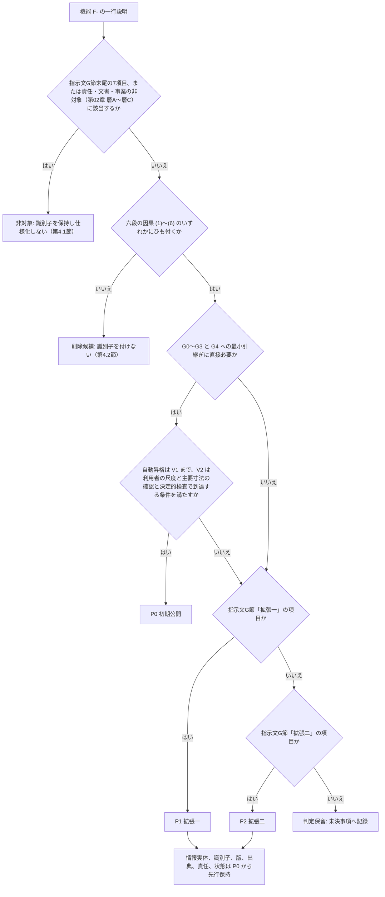

### 1.3 表の列の定義

| 列 | 内容 | 出典 |
|---|---|---|
| 識別子 | `F-C{区分2桁}-{連番3桁}` と副番 `F-C{区分2桁}-{連番3桁}-{副番2桁}`。骨格 v1.2 と同一。本章は追加、廃止、再採番を行わない | 識別子規則 第2.1節 |
| 名称 | 骨格の機能名と同一 | 機能一覧骨格 第1節 |
| 目的 | 骨格の一行説明。何を取得、判定、表示、禁止するか | 機能一覧骨格 第1節 |
| 利用者 | 機能を起動または直接利用する役割。役割符号 RL-OWN 所有者、RL-EDT 編集者、RL-CHK 確認者、RL-VIEW 閲覧者、RL-PART 提携事業者。製品が自動で実行する機能は「製品（自動）」と書き、結果を見る役割を併記する。本章が付けた属性であり識別子には含めない | 識別子規則 第2.8節（RL-）、本章【仮定】 |
| 主担当領域 | A01〜A12 のうち一つ。骨格と同一 | 十二判断領域 第3節 |
| 影響領域 | 主担当以外の影響先。「—」は影響先なし | 十二判断領域 第2節 |
| 六因果 | (1) 要求と現況の把握、(2) 実行可能な複数案、(3) 差の比較、(4) 家族と専門家の承認、(5) 承認済み情報の引継ぎ、(6) 実績差の取得と改善。複数可 | 指示文 A1、用語集4 |
| 段階門 | 機能を利用する段階 G0〜G6。「G1〜G3」は連続範囲 | 七段階門 |
| 優先 | P0、P1、P2、非対象 | 第1.1節 |
| 詳細章 | 主章（必須10項目と AC- を書く章）と副章（参照する章）。「主 11、副 22」の形で書く | 機能一覧骨格 第0.4節、用語集263 |

### 1.4 利用者の表記規則

| 表記 | 意味 | 区分 |
|---|---|---|
| RL-OWN | 所有者。案件の家族側の代表。決定権者を含む | 【推定】 |
| RL-EDT | 編集者。家族の他の成員、または所有者が委任した設計担当 | 【推定】 |
| RL-CHK | 確認者。建築士等。有資格者確認（V3）は RL-CHK かつ資格あり（P1） | 【推定】 |
| RL-VIEW | 閲覧者。共有URL の受取側を含む | 【推定】 |
| RL-PART | 提携事業者。提携先、施工者、製造元と販売元（法人）を含む | 【推定】 |
| 製品（自動） | 利用者の操作なしに製品が決定的検査、生成、記録を行う機能。結果の閲覧者を併記する | 【仮定】 |
| 運営側役割（情報管理者、運用担当者、監査）と運営の職務（製品責任者、法規担当、積算担当、正解付与者等） | 製品を運営する側の役割と職務。RL- を拡張せず語で書く。運営側役割（用語集 477）は組織の権限で持ち、案件の役割 RL- とは別に判定する。組織案件で案件側に置く担当は「RL-EDT（情報管理担当。用語集 494）」と書き分け、運営側の情報管理者とは別の者とする（U-09-003 の解決。第22章 第1.3節、表4 第3節 C-02。JM-185） | 【推定】 |

### 1.5 索引の読み方（第3節）

本章は P0 機能の要約版を持たない（v1.1。審査 JM-055）。各機能の目的、利用者、前提、正常手順、例外、情報入出力、権限、計測方法、受入条件の本文は主章の要件ブロックだけに置き、本章は第2節の一覧（一行の目的と利用者）と第3節の索引だけを持つ。本章と主章の記述が食い違う場合は主章を正本とする（U-09-006 の解決）【推定】。

| 列 | 内容 | 出典（正本） |
|---|---|---|
| 機能ID、名称 | 機能一覧骨格 v1.3 の P0 機能 145件と、副番の P0 4件（F-C02-024-01、F-C03-019-01、F-C03-019-03、F-C09-012-01）。副番は親の直後に置き、親が P1 の副番（F-C02-024、F-C09-012 の -01）は親の行を載せない | 機能一覧骨格 第1節 |
| 主章と節番号 | 必須10項目を書いた要件ブロックの節。見出しに節番号のない章（第22章、第23章）は直上の番号付きの見出しの節を書く | 機能一覧骨格 第0.4節の「詳細を書く章」の先頭（主章） |
| 受入条件（AC- の範囲） | 主章が採番した AC- の範囲（例: AC-C03-005-01〜03）。末尾 11 は第15章が画面側で採番した受入条件。副番の受入条件は AC-C{区分}-{連番}-{副番}-{2桁}。本章は AC- を採番しない | 第23章 付表 4.3-A（各主章の受入条件行から抽出） |
| 対応する T-U-／T-I- | 各 AC- を判定する単体試験 T-U- と統合試験 T-I-。受入、反証、安全、性能の試験（T-A-、T-R-、T-S-、T-P-）は第10章 第3節と第4.1節で追う。「—」はない | 第23章 付表 4.3-A |
| 段階群（第24章の群） | 第5.8節の P0 段階群（G0〜G4、横断）と、第24章 第4.2節の開発の群（群0〜群6）。P0 内の開発順序の正本は第24章 | 第5.8節、第24章 第4.2節 |

索引の値は 2026-10-06 時点の機械抽出である（本担当の補助スクリプトで主章の見出しと第23章 付表 4.3-A を照合した）。148行すべてで主章に10項目のうち9以上を含む要件ブロックがあり、要件ブロックの AC- と付表の AC- は148行すべてで一致し（第15章の画面側の末尾 11 を除く）、全ての AC- に T-U- がある。付表の T-U-、T-I- と機能の対応 176 組を `04_必須表/受入条件と試験の対応_機械生成.md`（2026-10-06 22:56 生成）と照合し 175 組が一致した。残る1組（F-C03-021 の AC-C03-021-01〜03 と T-U-008）は、機械生成物が同じ行に現れる AC- と T- を対応とみなす規則のため拾えなかったもので、付表を正とした。機械生成物は副番の AC-（AC-C02-024-01-01 等）を親の AC- と区別しないため、副番の行は付表と主章から取った【事実】（出典: `03_仕様書/23_非機能要件_品質指標_試験情報_受入条件.md` 第4.3節 付表 4.3-A、各主章の要件ブロック、確認日 2026-09-15）。主章が要件ブロックの節や AC- を改めた場合は同じ方法で再生成し、食い違いは機械整合検査（`04_必須表/00_機械整合検査.md` 第3節、第7節）で検出する【推定】。2026-10-07 の二回目の修正で、索引に F-C03-019-03 の行を加えて 149 行とし、修正計画 第0.4節で新設された受入条件のうち親が P0 の機能のもの（F-C03-019-03 の新設行を含む 22 行。AC-C01-013-06、AC-C01-014-07、AC-C01-020-06、AC-C01-023-05〜06、AC-C01-025-04、AC-C02-014-06、AC-C03-019-01-03、AC-C03-019-03-01〜03、AC-C04-016-04、AC-C09-007-04、AC-C09-012-01-03〜05、AC-C10-009-05、AC-C10-011-05、AC-C11-002-07、AC-C12-007-04、AC-C15-001-07、AC-C15-002-08〜09、AC-C15-003-07〜08、AC-C15-007-04、AC-C15-013-04〜05、AC-C15-014-07〜08、AC-C15-017-03）を AC- の範囲に加え、試験は付表 4.3-A の新設予定の列に従って T-I-006（F-C15-003）、T-I-018（F-C15-014）、T-I-024（F-C03-019-03）を加えた。並行して修正中の主章（第11章、第13章、第18章、第19章、第22章。2026-10-07 の確認で AC-C12-007-04 は第19章に未記載）の定義は修正計画 第0.4節の割当を前提とし、機械生成物の再生成（統括）の後に段階8 で照合する【推定】。

## 2. 機能一覧（P0、P1、P2、非対象）

本節は機能一覧骨格 v1.3（v1.2 の追補と 2026-10-07 の二回目の修正を含む）第1節の249機能と副番8件を区分順に転記し、優先列を明示し、利用者列（第1.4節）を加えた。副番（F-C02-024-01、-02、F-C03-019-01、-02、-03、F-C09-012-01、-02、F-C14-003-01）は親の直後の行に置き、骨格 第4.1節の注に従って区分の機能数と第5節の集計に含めない（親の内訳）。識別子、名称、目的（一行説明）、主担当領域、影響領域、六因果、段階門、優先、詳細章は骨格と同一である【事実】（出典: `02_基盤定義/機能一覧骨格.md` v1.3 との機械照合で、名称、優先、主担当、影響、六因果、段階は全 257 行で差 0 件、目的の差 4 件。照合 2026-10-07、確認日 2026-09-15）。目的の差の4件は本章が加えた注記と字句の置換であり、F-C09-008 の目的の末尾に P0 の高さの範囲の注記（JM-128）を加え、F-C07-005 の目的の曖昧語を主章（第16章 第8.5節）の語へ置換した（骨格への置換の依頼は第6.3節 変更提案7）。二回目の修正で F-C15-014 に主担当判定記録と辞書改善の範囲（JR-018）、F-C15-015 に関連画面 S-28-01〜03（JR-078。骨格への追記は章末の依頼）を加えた。v1.2 で骨格に合わせて改めた値は、六因果（JM-056 の商品系9機能と F-C02-016）、目的（F-C02-024、F-C03-019、F-C09-012、F-C14-003）、段階門（F-C10-018 を G0〜G4、F-C14-003 を G3、G4）である（第6.3節）。利用者列は本章が付けた属性で【仮定】、各機能の利用者の正本は主章の要件ブロックの「利用者」とし、食い違う場合は主章に従う（未決 U-09-001）。非対象の行は第4.1節で詳述する。

### 2.1 C01 対話設計（25機能: P0 25）

| 識別子 | 名称 | 目的 | 利用者 | 主担当 | 影響領域 | 六因果 | 段階門 | 優先 | 詳細章 | 根拠（骨格） |
|---|---|---|---|---|---|---|---|---|---|---|
| F-C01-001 | 三入口と利用目的の取得 | 開始画面の三入口（希望から作る、図面を3D化、写真から改装）と利用目的（新築、改装、家具配置、図面3D化、売却または賃貸資料）を取得し案件を作る | RL-OWN、RL-EDT | A01 | A12 | 1 | G0 | P0 | 主 8、副 15 | 【推定】 |
| F-C01-002 | 一問式の分岐質問 | 回答に応じて次の質問を分岐し、既知情報を聞き直さない | RL-OWN、RL-EDT | A01 | — | 1 | G0、G1 | P0 | 主 8 | 【推定】 |
| F-C01-003 | 一括自由記述の構造化 | 自由記述から条件項目を抽出し、要求候補と残り項目へ分ける | RL-OWN、RL-EDT | A01 | — | 1 | G1 | P0 | 主 8 | 【推定】 |
| F-C01-004 | 一問式と一括入力の切替 | 途中で切り替えても回答を失わない | RL-OWN、RL-EDT | A01 | — | 1 | G1 | P0 | 主 8、副 15 | 【推定】 |
| F-C01-005 | 建設地域と土地状況の聞取 | 建設地域、敷地住所または概略地域、敷地面積、形状、方位、接道、高低差、土地の所有区分（所有、候補あり、探索中、建替え、売却移転）を取得 | RL-OWN、RL-EDT | A01 | A02 | 1 | G0、G1 | P0 | 主 8 | 【推定】 |
| F-C01-006 | 予算と費用優先順位の聞取 | 建築費、土地費、家具費、予備費、借入希望、費用の優先順位を取得 | RL-OWN、RL-EDT | A01 | A09 | 1 | G0、G1 | P0 | 主 8 | 【推定】 |
| F-C01-007 | 家族構成と将来変化の聞取 | 成人、子供、乳幼児、高齢者、在宅勤務者、来客、将来の家族変化を取得 | RL-OWN、RL-EDT | A01 | A11 | 1 | G1 | P0 | 主 8 | 【推定】 |
| F-C01-008 | 空間要件の聞取 | 階数、延床面積、部屋数、各室の最低寸法、収納、駐車、庭、外構を取得 | RL-OWN、RL-EDT | A01 | A03 | 1 | G1 | P0 | 主 8 | 【推定】 |
| F-C01-009 | 生活行動と動線の聞取 | 起床から就寝までの行動、洗濯、調理、育児、介護、仕事、趣味、来客の動線を取得 | RL-OWN、RL-EDT | A01 | A03 | 1 | G1 | P0 | 主 8 | 【推定】 |
| F-C01-010 | 性能優先度の聞取 | 採光、通風、眺望、音、温熱、耐震、防災、防犯、省エネ、保守の優先度を取得 | RL-OWN、RL-EDT | A01 | A07 | 1 | G1 | P0 | 主 8、副 19 | 【推定】 |
| F-C01-011 | 好みと避けたい様式の聞取 | 好きな写真、住宅事例、樹種、色、素材、触感、避けたい様式を取得 | RL-OWN、RL-EDT | A01 | A08、A12 | 1 | G1 | P0 | 主 8、副 16 | 【推定】 |
| F-C01-012 | 納期、相談希望、共有相手、書出形式の聞取 | 納期、相談希望、共有相手、必要な書出形式を取得 | RL-OWN、RL-EDT | A01 | A09、A12 | 1 | G0、G1 | P0 | 主 8 | 【推定】 |
| F-C01-013 | 関係者表の作成 | 家族、設計者、施工者、維持管理者、介護者、来訪者、近隣、将来の居住者等を洗い出し、利益、不利益、発言機会、決定権、確認対象を持たせる | RL-OWN、RL-EDT、RL-CHK | A01 | A12 | 1、4 | G0、G1 | P0 | 主 5、副 8 | 【推定】 |
| F-C01-014 | 当事者参画の提案 | 子供、高齢者、障害のある人、介護者等の本人の声が抜けやすい場合に、代理決定だけで終えない参画方法を提案 | RL-OWN、RL-EDT、RL-CHK | A01 | A07 | 1、4 | G1 | P0 | 主 5、副 8 | 【推定】 |
| F-C01-015 | 生活場面の確認（日常） | 朝の混雑、帰宅、買物収納、調理、食事、入浴、洗濯、在宅勤務、来客、就寝を時系列で確認 | RL-OWN、RL-EDT | A01 | A03 | 1 | G1 | P0 | 主 8 | 【推定】 |
| F-C01-016 | 生活場面の確認（家族変化） | 乳幼児期、学齢期、独立、在宅介護、車椅子利用、二世帯化、在宅勤務増加を確認 | RL-OWN、RL-EDT | A01 | A11 | 1 | G1 | P0 | 主 8、副 21 | 【推定】 |
| F-C01-017 | 生活場面の確認（非常時） | 停電、断水、猛暑、寒波、豪雨、浸水、地震、火災、避難、在宅避難を確認 | RL-OWN、RL-EDT | A01 | A07 | 1 | G1 | P0 | 主 8、副 19 | 【推定】 |
| F-C01-018 | 生活場面の確認（維持） | 家具搬入、設備点検、清掃、交換、改装、売却または賃貸を確認 | RL-OWN、RL-EDT | A01 | A11 | 1 | G1 | P0 | 主 8、副 21 | 【推定】 |
| F-C01-019 | 要求台帳への変換 | 入力を要求へ変換し、優先度 RP-、数値範囲、出典、決定者、確認者、期限、確認状態を持たせる | RL-OWN、RL-EDT | A01 | A12 | 1、4 | G1 | P0 | 主 8、副 12 | 【推定】 |
| F-C01-020 | 要求衝突の検出と解決候補・代償の提示 | 矛盾する要求を平均化せず、誰のどの価値が衝突しているか、解決候補と代償を示す | 製品（自動）。決定 RL-OWN | A01 | — | 1、3 | G1、G2 | P0 | 主 8 | 【推定】 |
| F-C01-021 | 目的文、成功条件、非対象、変更できない条件の承認 | 最初に目的文、成功条件、非対象、変更できない条件を家族と専門家が承認する工程 | RL-OWN、RL-EDT、RL-CHK | A01 | A12 | 1、4 | G0、G1 | P0 | 主 5、副 8 | 【推定】 |
| F-C01-022 | 主要危険の初期一覧 | 土地、費用、期間、災害の主要危険を G0 で一覧化 | 製品（自動）。決定 RL-OWN | A01 | A02、A09 | 1 | G0 | P0 | 主 8 | 【仮定】 |
| F-C01-023 | 案別の要求適合表 | 三案それぞれが各要求を満たすか、捨てた条件を案ごとに表示 | RL-OWN、RL-EDT、RL-CHK | A01 | A03 | 3、4 | G2、G3 | P0 | 主 8 | 【推定】 |
| F-C01-024 | 対話の意図解釈と説明 | 言語模型が要求理解、操作意図、説明を担当し、幾何は確定しない | 全役割（対話利用者） | A01 | A12 | 1 | G0〜G4 | P0 | 主 8、副 12 | 【推定】 |
| F-C01-025 | 電子連絡先なしの初回価値提示 | 最初の成果（初回案または不足情報一覧）まで電子連絡先を要求しない | RL-OWN（未登録者を含む） | A12 | A01 | 1 | G0、G1 | P0 | 主 8 | 【推定】 |

### 2.2 C02 図面読解と3D変換（28機能: P0 16、P1 11、P2 1。副番 2: P0 1、P1 1）

| 識別子 | 名称 | 目的 | 利用者 | 主担当 | 影響領域 | 六因果 | 段階門 | 優先 | 詳細章 | 根拠（骨格） |
|---|---|---|---|---|---|---|---|---|---|---|
| F-C02-001 | 画像形式の図面受付 | PDF（画像）、PNG、JPEG の明瞭な単一縮尺図面を受け付ける | RL-OWN、RL-EDT | A12 | A03 | 1 | G1 | P0 | 主 11 | 【推定】 |
| F-C02-002 | ベクトル形式の受付とベクトル情報の保持 | ベクトルPDF、SVG、DXF を受け付け、ベクトル情報を保持して画像化だけに依存しない | RL-OWN、RL-EDT | A12 | A03 | 1 | G1 | P1 | 主 11 | 【推定】 |
| F-C02-003 | IFC入力の受付 | IFC を受け付け、要素を固有ID対応表付きで正規建物情報へ取り込む | RL-OWN、RL-EDT | A12 | A03 | 1、5 | G1 | P1 | 主 11、副 22 | 【推定】 |
| F-C02-004 | DWG、RVT の正規許諾変換接点 | 正規許諾を持つ変換接点が利用できる場合だけ DWG、RVT を追加する | RL-OWN、RL-EDT | A12 | — | 1 | G1 | P2 | 主 11 | 【未確認】 |
| F-C02-005 | 入力種別、頁、図種、方位、単位、縮尺、改訂番号の判定 | 頁ごとに7項目を判定し、利用者が修正できる | RL-OWN、RL-EDT | A12 | A03 | 1 | G1 | P0 | 主 11 | 【推定】 |
| F-C02-006 | 画像補正と傾き補正 | 画像を補正し傾きを直す。原図は不変 | 製品（自動）。結果は RL-OWN、RL-EDT、RL-CHK | A03 | — | 1 | G1 | P0 | 主 11 | 【推定】 |
| F-C02-007 | 線分、円弧、文字、寸法線、記号の抽出 | 線分と円弧の抽出、文字認識、寸法線解析、記号認識 | 製品（自動）。結果は RL-OWN、RL-EDT、RL-CHK | A03 | A12 | 1 | G1 | P0 | 主 11 | 【推定】 |
| F-C02-008 | 建築要素の分類 | 外壁、内壁、柱、扉、窓、階段、床、室、主要設備、造付家具、可動家具、通り芯を分類 | 製品（自動）。結果は RL-OWN、RL-EDT、RL-CHK | A03 | A12 | 1 | G1 | P0 | 主 11 | 【推定】 |
| F-C02-009 | 構造、電気、給排水、換気空調記号の図種別分類 | 図種に応じて記号を分類し、意匠図から構造や設備を創作しない | 製品（自動）。結果は RL-OWN、RL-EDT、RL-CHK | A03 | A04、A06 | 1 | G1 | P1 | 主 11 | 【推定】 |
| F-C02-010 | 建物関係図の構成 | 室の閉領域、隣接、扉による接続、上下階接続、外部との接続を構成 | 製品（自動）。結果は RL-OWN、RL-EDT、RL-CHK | A03 | — | 1 | G1、G3 | P0 | 主 11 | 【推定】 |
| F-C02-011 | 拘束解決と矛盾検出 | 寸法拘束、平行、直角、同一直線、壁厚、開口位置、階高を解き、矛盾を検出 | 製品（自動）。結果は RL-OWN、RL-EDT、RL-CHK | A03 | A12 | 1 | G1、G3 | P0 | 主 11 | 【推定】 |
| F-C02-012 | 推定値の分離 | 不明な高さ、厚さ、建具種、屋根、床段差を VS-AI または VS-DEF として分離 | 製品（自動）。結果は RL-OWN、RL-EDT、RL-CHK | A03 | A12 | 1 | G1 | P0 | 主 11、副 12 | 【推定】 |
| F-C02-013 | 原図重ねと確信度の色表示 | 原図と抽出線を重ね、確信度を色と文字と記号で示す | RL-OWN、RL-EDT、RL-CHK | A12 | A03 | 1、4 | G1 | P0 | 主 11、副 15 | 【推定】 |
| F-C02-014 | 尺度確認と基準寸法の指定 | 利用者が尺度と重要寸法を最低一つ確認する。尺度不明画像では寸法を断定せず基準寸法を求める | RL-OWN、RL-EDT | A12 | A03 | 1、4 | G1 | P0 | 主 11 | 【推定】 |
| F-C02-015 | 曖昧箇所の手修正 | 壁、開口、室名、寸法を利用者が修正し、履歴を残す | RL-OWN、RL-EDT | A03 | A12 | 1 | G1 | P0 | 主 11 | 【推定】 |
| F-C02-016 | 承認済み2Dからの3D組立 | 利用者が承認した2D建物情報から3Dを組み立てる | 製品（自動）。結果は RL-OWN、RL-EDT、RL-CHK | A03 | — | 1、2 | G1、G2 | P0 | 主 11 | 【推定】 |
| F-C02-017 | 要素の出典属性の保持 | 各要素に元頁、元座標、認識方法、確信度、推定理由、変更履歴を持たせる | 製品（自動）。RL-CHK、RL-PART が参照 | A12 | — | 1、5 | G1〜G4 | P0 | 主 11、副 12 | 【推定】 |
| F-C02-018 | 低確信度残存時の検証済み書出禁止 | 低確信度の壁や開口が残る場合、検証済み書出を禁止し修正依頼を示す | 製品（自動）。RL-OWN、RL-CHK | A12 | A03 | 4、5 | G3、G4 | P0 | 主 11、副 22 | 【推定】 |
| F-C02-019 | 図面一式の正本候補判定と差替え漏れ検出 | 図面一覧と改訂日から正本候補を判定し、古い頁、差替え漏れ、同一記号の不一致を検出 | 製品（自動）。確定 RL-OWN、RL-EDT | A12 | A03 | 1 | G1 | P1 | 主 11 | 【推定】 |
| F-C02-020 | 図面間照合 | 通り芯、階、室、建具記号、詳細参照、改訂雲、寸法を複数図面間で照合し、矛盾を問題一覧へ出す | 製品（自動）。確定 RL-OWN、RL-EDT | A12 | A03 | 1 | G1 | P1 | 主 11 | 【推定】 |
| F-C02-021 | 複数頁、複数階、異なる縮尺、回転の一括処理 | 図面一式を頁ごとに独立した縮尺と回転で処理し、階へ割り当てる | 製品（自動）。結果は RL-OWN、RL-EDT、RL-CHK | A03 | A12 | 1 | G1 | P1 | 主 11 | 【推定】 |
| F-C02-022 | 薄い線と手書き注記の対応 | 薄い線と手書き注記を認識対象にし、層別に品質を公開 | 製品（自動）。結果は RL-OWN、RL-EDT、RL-CHK | A03 | — | 1 | G1 | P1 | 主 11 | 【推定】 |
| F-C02-023 | 立面図と断面図の補助入力 | 階高、屋根形状、開口高さを立面と断面の補助入力から取得 | RL-OWN、RL-EDT | A03 | A12 | 1 | G1 | P0 | 主 11 | 【推定】 |
| F-C02-024 | 現況状態の付与と差異の重ね表示 | 設計時図面、竣工図、現況の差を要素ごとに CS- で持ち、重ねて表示。v1.2 で副番に分けた（-01 初期付与と表示は P0、-02 遷移と差異の重ね表示は P1。JM-152） | RL-OWN、RL-EDT、RL-CHK | A12 | A04、A05、A06、A10、A11 | 1 | G1、G3 | P1 | 主 11、副 21 | 【推定】 |
| F-C02-024-01 | 現況状態の初期付与と表示 | 図面由来の要素に CS-DRW、図面にない隠れ部分に CS-EST を初期付与し、S-05 で記号と文字で表示する。3D で CS-EST の隠れ部分を空洞に描かない。工事前調査の要否は P0 では判定せず固定注記だけを出し、問題を登録しない（第21章 第1.2節。v1.2、JM-152） | 製品（自動）。結果は RL-OWN、RL-EDT が閲覧 | A12 | A04、A05、A06、A10、A11 | 1 | G1、G3 | P0 | 主 11、副 21 | 【推定】 |
| F-C02-024-02 | 現況資料による遷移と差異の重ね表示 | 現況資料（写真、採寸、三次元走査、既存住宅状況調査、開口調査）の登録で CS-SITE、CS-OPEN へ遷移させ、設計時図面、竣工図、現況の差（存在差、寸法差、位置差）を要素ごとに重ねて表示する（v1.2、JM-152） | RL-OWN、RL-EDT、RL-CHK | A12 | A04、A05、A06、A10、A11 | 1 | G1、G3 | P1 | 主 11、副 21 | 【推定】 |
| F-C02-025 | 現況資料の結合 | 現況写真、採寸、三次元走査、既存住宅状況調査、耐震診断、地盤資料、設備点検、修繕履歴を別資料として要素へ結ぶ | RL-OWN、RL-EDT、RL-CHK | A12 | A04、A11 | 1 | G1 | P1 | 主 11、副 21 | 【推定】 |
| F-C02-026 | 隠れ部分と工事前専門調査の問題化 | 下地、基礎、配管、配線、劣化、漏水、腐朽、蟻害、石綿等を図面だけで「無い」と判定せず、解体等を伴う場合は石綿事前調査等を問題一覧へ出す | 製品（自動）。RL-OWN、RL-CHK | A10 | A04、A06、A11 | 1 | G1 | P1 | 主 11、副 21 | 【推定】 |
| F-C02-027 | 新しい現況資料による差分更新 | 新資料の取込で影響する3D要素、数量、費用、判断、承認を差分更新 | RL-OWN、RL-EDT、RL-CHK | A12 | A09 | 1、4 | G1〜G3 | P1 | 主 11、副 13 | 【推定】 |
| F-C02-028 | 処理状態の表示 | 読込、尺度判定、壁抽出、開口抽出、関係検査、3D構築の実際の状態、待ち時間見込、部分結果、失敗箇所、再試行を示す | RL-OWN、RL-EDT、RL-VIEW | A12 | — | 1 | G1 | P0 | 主 11、副 15 | 【推定】 |

### 2.3 C03 建物情報と編集（21機能: P0 20、P1 1。副番 3: P0 2、P1 1）

| 識別子 | 名称 | 目的 | 利用者 | 主担当 | 影響領域 | 六因果 | 段階門 | 優先 | 詳細章 | 根拠（骨格） |
|---|---|---|---|---|---|---|---|---|---|---|
| F-C03-001 | 正規建物情報の保持 | 指示文C3に列挙された全実体（11群）を一つの正本として保持 | 製品（正本管理）。全役割が参照 | A12 | — | 1、5 | G1〜G6 | P0 | 主 12 | 【推定】 |
| F-C03-002 | 建築要素の必須属性 | 固有ID、幾何、寸法、親子関係、接続関係、材質、分類、費用範囲、出典、確信度、現況状態、責任者、必要段階、改訂を持たせる | 製品（正本管理）。全役割が参照 | A12 | — | 1、5 | G1〜G6 | P0 | 主 12 | 【推定】 |
| F-C03-003 | 履歴付き変更命令 | 変更を履歴付き命令として扱い、差分確認、取消、やり直しを可能にする | RL-OWN、RL-EDT | A12 | — | 1、4 | G1〜G5 | P0 | 主 12 | 【推定】 |
| F-C03-004 | 分岐案の作成と比較 | 同じ建物情報から派生した案を履歴共有で作り、差分を比較 | RL-OWN、RL-EDT | A12 | A03 | 2、3 | G2、G3 | P0 | 主 12 | 【推定】 |
| F-C03-005 | 双方向追跡 | 要求→案→建築要素→計算→商品→問題→判断→承認→書出を双方向にたどれる | 製品（正本管理）。全役割が参照 | A12 | — | 1、4、5 | G1〜G6 | P0 | 主 12、副 10 | 【推定】 |
| F-C03-006 | 言語模型出力の未検査書込禁止 | 座標や3D頂点をパラメトリック規則、拘束解決、決定的検査を通さずに正本へ書かない | 製品（正本管理）。全役割が参照 | A12 | A03 | 1 | G1〜G4 | P0 | 主 12 | 【推定】 |
| F-C03-007 | 2D直接編集 | 壁、開口、室の移動、追加、削除を2Dで行い3Dへ同時反映 | RL-OWN、RL-EDT | A03 | A12 | 2 | G1〜G3 | P0 | 主 12、副 15 | 【推定】 |
| F-C03-008 | 3D直接編集 | 要素の移動、追加、削除を3Dで行い2Dへ同時反映 | RL-OWN、RL-EDT | A03 | A12 | 2 | G1〜G3 | P0 | 主 12、副 15 | 【推定】 |
| F-C03-009 | 自然文変更の抽出 | 対象、操作、量、方向、固定条件、目的を抽出 | RL-OWN、RL-EDT | A03 | A01 | 2 | G2、G3 | P0 | 主 12 | 【推定】 |
| F-C03-010 | 相対表現の座標系確認 | 「右」等の相対表現を平面座標か視点座標か確認 | RL-OWN、RL-EDT | A03 | — | 2 | G2、G3 | P0 | 主 12 | 【推定】 |
| F-C03-011 | 変更前の影響予測 | 寸法、干渉、避難、採光、構造、外皮、設備、費用、工程、維持管理への影響を予測（P0は影響先の列挙と注意、P1は再計算） | 製品（自動）。RL-OWN、RL-EDT、RL-CHK | A12 | A03〜A11 | 3、4 | G2、G3 | P0 | 主 12、副 13 | 【推定】 |
| F-C03-012 | 影響要素の一覧表示 | 変更が影響する要素を識別子付きで一覧化 | 製品（自動）。RL-OWN、RL-EDT、RL-CHK | A12 | — | 3 | G2、G3 | P0 | 主 12、副 13 | 【推定】 |
| F-C03-013 | 変更差分の仮表示 | 2Dと3Dの差分を確定前に仮表示 | RL-OWN、RL-EDT | A03 | A12 | 3、4 | G2、G3 | P0 | 主 12 | 【推定】 |
| F-C03-014 | 承認後の確定と再計算 | 利用者承認後に確定し、要求台帳と問題一覧を再計算 | RL-OWN（承認）、RL-EDT | A12 | A01 | 4 | G2、G3 | P0 | 主 12 | 【推定】 |
| F-C03-015 | 写実生成（派生表示） | 正規建物情報から写実画像を派生し、正本にしない | RL-OWN、RL-EDT、RL-VIEW | A03 | A12 | 3 | G2、G3 | P1 | 主 11、副 15 | 【推定】 |
| F-C03-016 | 既定値表の管理 | 階高、壁厚、建具高さ等の既定値を識別子付きで公開し VS-DEF で表示 | 製品（正本管理）。全役割が参照 | A12 | A03 | 1 | G1〜G3 | P0 | 主 12 | 【推定】 |
| F-C03-017 | 要素値状態の管理 | 五状態 VS- の遷移と表示 | 製品（正本管理）。全役割が参照 | A12 | — | 1、4 | G1〜G5 | P0 | 主 12 | 【推定】 |
| F-C03-018 | 案の版と共通情報環境状態の管理 | CDE-WIP、CDE-SHR、CDE-PUB、CDE-ARC と発行済み版の一意性を管理 | 製品（正本管理）。全役割が参照 | A12 | — | 4、5 | G1〜G6 | P0 | 主 12、副 22 | 【推定】 |
| F-C03-019 | 三案の生成 | 生活動線重視、費用重視、意匠重視の三案を要求台帳と敷地制約から生成（V1）。P0 の範囲は、図面入力では V1 案に対する決定的な変更命令の組合せで三案を派生し（図面派生三案 -03）、希望入力では雛形三案（-01）とする。雛形にない自由形状の生成は P1（-02）。生成規則の正本は第12章（v1.2、JM-077。v1.3 で -03 を採番、JR-095） | 製品（生成）。RL-OWN、RL-EDT、RL-CHK が比較 | A03 | A01、A02、A09 | 2 | G2 | P0 | 主 12、副 8 | 【推定】 |
| F-C03-019-01 | 雛形三案 | 希望入力の案件で、要求台帳の必須要求、延床、階数、敷地の形状と方位、接道、既定値表を入力に、室数と階数ごとの配置型（雛形。既定値表と同じ版管理）から選択規則で選び、三案の差の付け方（生活動線重視は動線距離と交差の最小化、費用重視は外周長と水回り集約、意匠重視は開口と吹抜けの配置）で決定的に生成する。外部の生成模型を使わない。閉領域、接続、法規4項目の決定的検査を通し、案が作れない場合は I-00-111 と不足情報一覧へ退避する（v1.2、JM-077） | 製品（生成）。RL-OWN、RL-EDT が実行を要求し、RL-CHK が比較 | A03 | A01、A02、A09 | 2 | G2 | P0 | 主 12、副 8 | 【推定】 |
| F-C03-019-02 | 自由形状生成 | 雛形にない平面形状の三案を生成する。生成した案も雛形三案と同じ決定的検査を通す（v1.2、JM-077） | 製品（生成）。RL-OWN、RL-EDT が実行を要求し、RL-CHK が比較 | A03 | A01、A02、A09 | 2 | G2 | P1 | 主 12、副 8 | 【推定】 |
| F-C03-019-03 | 図面派生三案 | 図面入力の案件で、読み込んだ V1 案（尺度が VS-USR 済み）と承認済み要求台帳を入力に、目録の変更命令（室の用途の入替え、構造上重要な壁を除く間仕切の移動、耐力壁候補線、外周壁、上下階連続壁の上の開口を除く内壁の開口の拡大。刻みと上限は DV-GE-22）を組み合わせ、三観点の目的関数で決定的に三案を派生する。耐力壁候補線、外周壁、上下階連続壁とその上の要素（外壁開口を含む）は目録の対象外とする（改装案件の既存の壁と開口も同じ。安全側。統括の決定 D37）。検査は雛形三案と同じ。生成規則と目録の正本は第12章 第7.8節 (f)、必須10項目は第12章 第12.18節（v1.3、JR-095） | 製品（生成）。RL-OWN、RL-EDT が実行を要求し、RL-CHK が比較 | A03 | A01、A02、A04、A09 | 2 | G2 | P0 | 主 12、副 8 | 【推定】 |
| F-C03-020 | 同一評価軸の比較 | 各案に採用理由、捨てた条件、未解決点、概算範囲、確信度を、生活、空間、技術、費用、性能の同一軸で表示 | 製品（生成）。RL-OWN、RL-EDT、RL-CHK が比較 | A03 | A07、A09 | 3 | G2 | P0 | 主 12、副 8 | 【推定】 |
| F-C03-021 | 選定記録 | 決定者、理由、代償、未解決点を持つ選定記録を作る | RL-OWN（決定者）、RL-CHK | A03 | A12 | 4 | G2 | P0 | 主 12、副 8 | 【推定】 |

### 2.4 C04 3D表示（17機能: P0 12、P1 5）

| 識別子 | 名称 | 目的 | 利用者 | 主担当 | 影響領域 | 六因果 | 段階門 | 優先 | 詳細章 | 根拠（骨格） |
|---|---|---|---|---|---|---|---|---|---|---|
| F-C04-001 | 軌道回転、俯瞰、建物模型表示 | 3Dの軌道回転、俯瞰、建物模型表示 | RL-OWN、RL-EDT、RL-CHK、RL-VIEW | A03 | — | 3 | G2、G3 | P0 | 主 11、副 15 | 【推定】 |
| F-C04-002 | 室内walkthrough | 実寸の視点高さで室内を移動 | RL-OWN、RL-EDT、RL-CHK、RL-VIEW | A03 | — | 3 | G2、G3 | P0 | 主 11、副 15 | 【仮定】 |
| F-C04-003 | flyover | 建物外周と上空の経路を飛行して表示 | RL-OWN、RL-EDT、RL-CHK、RL-VIEW | A03 | — | 3 | G2、G3 | P1 | 主 11、副 15 | 【推定】 |
| F-C04-004 | 階別表示と屋根非表示 | 階ごとの表示切替と屋根の非表示 | RL-OWN、RL-EDT、RL-CHK、RL-VIEW | A03 | — | 3 | G2、G3 | P0 | 主 11、副 15 | 【推定】 |
| F-C04-005 | 断面表示と主要断面 | 任意位置の断面と、階高、天井高、梁下、屋根勾配、設備経路を示す主要断面 | RL-OWN、RL-EDT、RL-CHK、RL-VIEW | A03 | A04、A06 | 3 | G3 | P0 | 主 11、副 13 | 【推定】 |
| F-C04-006 | 透過表示 | 壁や床を透過して内部を表示 | RL-OWN、RL-EDT、RL-CHK、RL-VIEW | A03 | — | 3 | G3 | P1 | 主 11、副 15 | 【推定】 |
| F-C04-007 | 計測 | 3D上で距離、面積、高さを実寸で計測 | RL-OWN、RL-EDT、RL-CHK、RL-VIEW | A03 | — | 3 | G1〜G3 | P0 | 主 11、副 15 | 【推定】 |
| F-C04-008 | 注記の3D固定表示 | C10 の注記と問題を3D要素上に表示し、対象要素へ遷移 | RL-OWN、RL-EDT、RL-CHK、RL-PART | A12 | A03 | 4 | G1〜G4 | P0 | 主 15、副 17 | 【推定】 |
| F-C04-009 | 日照表示 | 日時を指定した日照を3Dで表示し、案の間で並べて比較（簡易） | RL-OWN、RL-EDT、RL-CHK、RL-VIEW | A03 | A07 | 3 | G2、G3 | P0 | 主 11、副 19 | 【推定】 |
| F-C04-010 | 実寸保持と空間側検査 | 実寸、衝突判定、扉の開閉域、家具周囲余白、通路幅を保持し検査 | 製品（自動）。RL-OWN、RL-EDT | A03 | A08 | 3 | G2、G3 | P0 | 主 11、副 13 | 【推定】 |
| F-C04-011 | 信頼状態と未確認項目数の常時表示 | V0〜V3 と未確認項目数を建物情報を表示する全画面と全書出に表示 | 全役割（常時表示） | A12 | — | 4 | G0〜G6 | P0 | 主 15 | 【推定】 |
| F-C04-012 | GLB書出 | 共有用の軽量 GLB を書き出す | 書出 RL-OWN、RL-EDT。受取 RL-CHK、RL-PART | A12 | A03 | 5 | G2〜G4 | P0 | 主 11、副 22 | 【推定】 |
| F-C04-013 | IFC書出 | 設計交換用の IFC を書き出す | 書出 RL-OWN、RL-EDT。受取 RL-CHK、RL-PART | A12 | — | 5 | G4 | P1 | 主 22 | 【推定】 |
| F-C04-014 | PDF平面書出 | 平面図を PDF で書き出す | 書出 RL-OWN、RL-EDT。受取 RL-CHK、RL-PART | A12 | A03 | 5 | G2〜G4 | P0 | 主 11、副 22 | 【推定】 |
| F-C04-015 | SVG と DXF 書出 | 平面を SVG、CAD交換を DXF で書き出す | 書出 RL-OWN、RL-EDT。受取 RL-CHK、RL-PART | A12 | — | 5 | G4 | P1 | 主 22 | 【推定】 |
| F-C04-016 | 動線比較 | 生活場面の動線を案の間で距離、通過扉数、交差で比較（簡易） | RL-OWN、RL-EDT、RL-CHK、RL-VIEW | A03 | A01 | 3 | G2、G3 | P0 | 主 8、副 11 | 【推定】 |
| F-C04-017 | 生活場面の3D再生 | 家具、人体寸法、時間帯を含めて生活場面を3Dで再生 | RL-OWN、RL-EDT、RL-CHK、RL-VIEW | A03 | A08 | 3 | G2、G3 | P1 | 主 8、副 11 | 【推定】 |

### 2.5 C05 家具、設備、建材の検索と推薦（20機能: P0 12、P1 6、P2 1、非対象 1）

| 識別子 | 名称 | 目的 | 利用者 | 主担当 | 影響領域 | 六因果 | 段階門 | 優先 | 詳細章 | 根拠（骨格） |
|---|---|---|---|---|---|---|---|---|---|---|
| F-C05-001 | 連合商品台帳 | 製造元ごとの接続部品で取得した商品を四層と権利状態付きで統合し、収録企業数、収録品数、最終更新日、正規3D割合、未収録分野を公開（P0は限定した正規商品） | 製品（台帳）。検索 RL-OWN、RL-EDT。供給 RL-PART（製造元） | A08 | A12 | 2 | G2〜G4 | P0 | 主 16 | 【推定】 |
| F-C05-002 | 商品項目の属性 | 企業、銘柄、系列、品番、分類、寸法、可動範囲、必要余白、重量、素材、価格範囲、在庫、納期、最終確認日時、保証、点検周期、交換周期、対応室、2D記号、3D情報、当たり判定形状、公式URL、利用許諾、帰属表示、使用期限を持たせる | 製品（台帳）。検索 RL-OWN、RL-EDT。供給 RL-PART（製造元） | A08 | A12 | 2 | G2〜G4 | P0 | 主 16 | 【推定】 |
| F-C05-003 | 実在品優先の二段階導線 | 実在品を優先し、見つからない場合だけAI生成へ移る。「実在品のみ」「実在品優先」「独自案のみ」を選べる | RL-OWN、RL-EDT | A08 | — | 2 | G2、G3 | P0 | 主 16 | 【推定】 |
| F-C05-004 | 絞込検索 | 分類、寸法、価格、素材、樹種、色、地域、供給状態で絞り込む | RL-OWN、RL-EDT | A08 | — | 2 | G2、G3 | P0 | 主 16 | 【推定】 |
| F-C05-005 | 絶対条件による除外 | 寸法、扉開閉、通路、地域、費用上限、供給状態、権利を満たさない品を除外 | RL-OWN、RL-EDT | A08 | A03 | 2 | G2、G3 | P0 | 主 16 | 【推定】 |
| F-C05-006 | 推奨点の計算と重み変更 | 機能適合30、寸法と余白20、予算15、意匠10、素材と樹種10、地域と供給10、環境性5の初期値で計算し、重みを利用者が変更 | RL-OWN、RL-EDT | A08 | — | 3 | G2、G3 | P0 | 主 16 | 【推定】 |
| F-C05-007 | 適合理由等の表示 | 「なぜ合うか」「何が合わないか」「代替案」「価格と在庫の確認日時」を候補ごとに表示 | RL-OWN、RL-EDT | A08 | — | 3 | G2、G3 | P0 | 主 16 | 【推定】 |
| F-C05-008 | 広告と紹介料の分離表示 | 広告料や紹介料を点数に含めず、広告枠として別表示 | 製品（自動）。RL-OWN | A08 | A12 | 3 | G2、G3 | P0 | 主 16 | 【推定】 |
| F-C05-009 | 基本配置検査 | 壁や家具との衝突、扉の開閉、椅子を引く余白、通路、視線、窓、搬入経路を検査 | RL-OWN、RL-EDT | A08 | A03 | 3 | G2、G3 | P0 | 主 16 | 【推定】 |
| F-C05-010 | 設備系配置検査 | 電源、給排水、換気、発熱、点検空間、交換経路を検査 | RL-OWN、RL-EDT、RL-CHK | A08 | A06 | 3 | G3 | P1 | 主 16 | 【推定】 |
| F-C05-011 | 購入確定前の製造元再確認 | 購入確定前に製造元情報を再確認 | RL-OWN | A08 | — | 4 | G3、G4 | P1 | 主 16 | 【推定】 |
| F-C05-012 | 代替品の提示 | 販売終了、納期超過、価格超過時に設計意図と絶対条件を保った代替品を提示し、自動置換しない | RL-OWN、RL-EDT | A08 | A09 | 2、3 | G3、G4 | P1 | 主 16 | 【推定】 |
| F-C05-013 | 複数企業横断の正規化 | 分類、寸法、価格時点、供給地域、許諾状態を同一基準へ正規化 | 製品（台帳）。RL-PART（製造元） | A08 | A12 | 2 | G2〜G4 | P1 | 主 16 | 【推定】 |
| F-C05-014 | 利用者所有家具の実寸確認 | 写真だけで実寸を断定せず、寸法入力または基準物による確認を求める | RL-OWN | A08 | — | 1 | G1 | P0 | 主 16 | 【推定】 |
| F-C05-015 | 商品層と権利状態の常時表示 | PT-、RS-、SUP- を商品に常に添えて表示 | 全役割（常時表示） | A12 | A08 | 3、4 | G2〜G4 | P0 | 主 16 | 【推定】 |
| F-C05-016 | 価格、在庫、納期の更新 | 表示直前に再確認し、公式接続停止時は SUP-UNKNOWN とする | 製品（自動）。RL-OWN | A08 | — | 3 | G2〜G4 | P1 | 主 16 | 【推定】 |
| F-C05-017 | 保存、購入導線、人への相談 | 配置案の保存、購入導線、人への相談の導線 | RL-OWN | A08 | A12 | 4 | G3、G4 | P1 | 主 16 | 【推定】 |
| F-C05-018 | 分類別一般品の配置 | 特定品番ではない一般形状（PT-GEN）を配置 | RL-OWN、RL-EDT | A08 | — | 2 | G2、G3 | P0 | 主 16 | 【推定】 |
| F-C05-019 | 法人用商品登録 | 法人が自社商品を登録し、権利状態と検証日を持たせる | RL-PART（製造元、販売元の法人） | A12 | A08 | 1 | G2〜G4 | P2 | 主 16、副 22 | 【推定】 |
| F-C05-020 | 無許諾商品3Dの複製 | 許諾のない商品3Dを複製して配置する（非対象、第2節） | 非対象 | A12 | A08 | — | — | 非対象 | 主 16、副 22 | 【推定】 |

### 2.6 C06 住友林業参照機能（9機能: P0 5、P1 4）

| 識別子 | 名称 | 目的 | 利用者 | 主担当 | 影響領域 | 六因果 | 段階門 | 優先 | 詳細章 | 根拠（骨格） |
|---|---|---|---|---|---|---|---|---|---|---|
| F-C06-001 | 公式情報の検索対象化 | 住友林業公式の現行商品、生活提案、BF構法、PRIME WOOD、樹種図鑑、Interior Style、実例、住友林業クレストの床、建具、階段、収納、壁、造作を権利順守で検索対象にする（P0は限定） | 製品（台帳）。RL-OWN、RL-EDT | A08 | A12 | 2 | G2、G3 | P0 | 主 16 | 【推定】 |
| F-C06-002 | 住宅商品と生活提案の解釈 | MyForest、GRAND LIFE、PLUSKY、PROUDIO、BF耐火、Forest Selection、Premal 等の特徴を設計条件へ解釈 | RL-OWN、RL-EDT | A08 | A03 | 2 | G2 | P1 | 主 16 | 【推定】 |
| F-C06-003 | Interior Style の正規化 | 七木質系統と二十三案を床、建具、壁、天井、差し色、家具素材、照明、印象語の組として正規化 | RL-OWN、RL-EDT | A08 | A12 | 2 | G2、G3 | P1 | 主 16 | 【推定】 |
| F-C06-004 | 掲載家具と照明の事例関係保持 | 各案に掲載された家具と照明を事例関係（PR-CASE）として保持し、掲載年月と改廃注記を付ける | 製品（台帳）。情報管理者 | A12 | A08 | 2 | G2、G3 | P1 | 主 16 | 【推定】 |
| F-C06-005 | 掲載実績、販売状態、正規3D利用権の分離判定 | 推薦時に3者を別々に判定し、古い掲載実績だけで購入可能と表示しない | 製品（自動）。全役割に表示 | A12 | A08 | 3 | G2〜G4 | P0 | 主 16 | 【推定】 |
| F-C06-006 | 企業と品物の関係区分の管理 | 住宅商品、内装案、事例採用、製造、販売、正規3D提供、参照（PR-）を別根拠で登録 | 製品（台帳）。情報管理者 | A12 | A08 | 2 | G2〜G4 | P0 | 主 16 | 【推定】 |
| F-C06-007 | 正規商品と概念案の表示区別 | 正式な商品情報がない案に「住友林業の商品そのものではない」「公開特徴から着想を得た概念案」と表示 | 製品（自動）。全役割に表示 | A12 | A08 | 3、4 | G2〜G4 | P0 | 主 16 | 【推定】 |
| F-C06-008 | 樹種と色調の組合せ提示 | ASH、OAK、CHERRY、WALNUT、TEAK 等の樹種と色調の組合せを提示 | RL-OWN、RL-EDT | A08 | — | 2、3 | G2、G3 | P1 | 主 16 | 【推定】 |
| F-C06-009 | 商標と提携誤認の回避 | 商標を一般様式名として扱わず、比較広告や提携誤認を避ける表示 | 製品（自動）。全役割に表示 | A12 | A08 | 4 | G2〜G4 | P0 | 主 16、副 22 | 【推定】 |

### 2.7 C07 独自家具の3D生成（11機能: P0 2、P1 8、非対象 1）

| 識別子 | 名称 | 目的 | 利用者 | 主担当 | 影響領域 | 六因果 | 段階門 | 優先 | 詳細章 | 根拠（骨格） |
|---|---|---|---|---|---|---|---|---|---|---|
| F-C07-001 | 独自家具の入力受付 | 文章、参考写真、一方向または複数方向の写真、手描き、寸法表を受け付ける | RL-OWN、RL-EDT | A08 | A12 | 2 | G2、G3 | P1 | 主 16 | 【推定】 |
| F-C07-002 | 実在品の先行探索 | 画像類似検索と条件検索で実在品を先に探す | RL-OWN、RL-EDT | A08 | — | 2 | G2、G3 | P1 | 主 16 | 【推定】 |
| F-C07-003 | 必要条件の確認 | 必要寸法、用途、人体寸法、素材、樹種、色、費用、製作方法を確認 | RL-OWN、RL-EDT | A08 | A01 | 1 | G2、G3 | P1 | 主 16 | 【推定】 |
| F-C07-004 | 独自家具の三案生成 | 条件を満たす独自案を三案生成 | RL-OWN、RL-EDT | A08 | — | 2 | G2、G3 | P1 | 主 16 | 【推定】 |
| F-C07-005 | 見えない部分の推定表示 | 一枚写真で見えない背面や内部を推定状態にし、利用者の実寸入力 1 件以上と確認（VS-USR）がない寸法を「実寸で復元」「寸法確定」「完全正確」と表示しない（第16章 第8.5節の語に合わせた。第6.3節 変更提案7） | 製品（自動）。RL-OWN、家具設計者または製造者（RL-PART） | A12 | A08 | 1 | G2、G3 | P1 | 主 16 | 【推定】 |
| F-C07-006 | 生成物の属性 | GLB、低詳細と高詳細、PBR材質、正しい原点、境界寸法、当たり判定形状、部品構成、生成履歴、権利条件を持たせる | 製品（自動）。RL-PART（製造元）、RL-OWN | A08 | A12 | 2、5 | G2〜G4 | P1 | 主 16 | 【推定】 |
| F-C07-007 | 製作可否未確認の表示 | 「製作可能」と自動表示せず、強度、接合、転倒、難燃、乳幼児安全、製造費、加工公差を家具設計者または製造者の確認対象として列挙 | 製品（自動）。RL-OWN、家具設計者または製造者（RL-PART） | A12 | A08 | 4 | G2〜G4 | P1 | 主 16 | 【推定】 |
| F-C07-008 | 挿入前の寸法と余白提示 | 3D挿入前に寸法と周囲余白を利用者へ見せる | RL-OWN、RL-EDT | A08 | A03 | 3 | G2、G3 | P1 | 主 16 | 【推定】 |
| F-C07-009 | 3D物品の自動検査 | 単位、軸方向、尺度、原点、表裏、法線、閉じた形状、UV、材質、画像解像度、三角形数、詳細段階、境界寸法、当たり判定、可動部範囲を検査（P0は正規商品の受入にも使う） | 製品（自動）。RL-PART（製造元）、RL-OWN | A08 | A12 | 2 | G2〜G4 | P0 | 主 16 | 【仮定】 |
| F-C07-010 | 寸法不一致物品の自動配置禁止 | 要求寸法と境界寸法が合わない物品を自動配置しない | 製品（自動）。RL-OWN | A08 | — | 3 | G2、G3 | P0 | 主 16 | 【推定】 |
| F-C07-011 | 単写真からの実寸完全復元 | 一枚の写真から実寸を完全に復元する（非対象、第2節） | 非対象 | A08 | A12 | — | — | 非対象 | 主 16 | 【推定】 |

### 2.8 C08 提携先推薦と人への引継ぎ（9機能: P1 9）

| 識別子 | 名称 | 目的 | 利用者 | 主担当 | 影響領域 | 六因果 | 段階門 | 優先 | 詳細章 | 根拠（骨格） |
|---|---|---|---|---|---|---|---|---|---|---|
| F-C08-001 | 提携先台帳 | 建築家、施工会社、造作、外構、土地、資金相談の提携先に資格、対応地域、得意分野、予算帯、構法、性能、作品事例、担当余力、返答時間、料金、紹介料、検証日を持たせる | 製品（台帳）。RL-PART（提携先）、RL-OWN | A09 | A12 | 5 | G4 | P1 | 主 17 | 【推定】 |
| F-C08-002 | 適合理由と点数内訳 | 適合理由を文章と点数内訳で示す | RL-OWN、RL-EDT | A09 | — | 3、5 | G4 | P1 | 主 17 | 【推定】 |
| F-C08-003 | 三社以上の比較 | 三社以上を同一項目で比較 | RL-OWN、RL-EDT | A09 | — | 3、5 | G4 | P1 | 主 17 | 【推定】 |
| F-C08-004 | 掲載料企業の広告表示 | 掲載料を払った企業を「広告」と表示 | 製品（自動）。RL-OWN | A12 | A09 | 3 | G4 | P1 | 主 17 | 【推定】 |
| F-C08-005 | 送信先ごとの送信内容確認と個別同意 | 図面、予算、連絡先を外部へ送る前に、送信先ごとに送信内容を示して選択と同意を得る | RL-OWN（同意者） | A12 | A01 | 4、5 | G4 | P1 | 主 17、副 22 | 【推定】 |
| F-C08-006 | 問題一覧からの人への引継ぎ開始 | AIで解決できない箇所に対し、建築士確認、図面修正、相談予約を同じ問題一覧から開始 | RL-OWN、RL-EDT、RL-CHK | A12 | A09 | 4、5 | G3、G4 | P1 | 主 17 | 【推定】 |
| F-C08-007 | 相談予約 | 提携先との相談を予約 | RL-OWN、RL-PART | A09 | A12 | 5 | G4 | P1 | 主 17 | 【推定】 |
| F-C08-008 | 有資格者確認の依頼と記録 | 有資格者へ確認範囲を明示して依頼し、氏名、資格、範囲、日付を記録して V3 へ昇格 | RL-OWN（依頼）、RL-CHK（有資格者） | A12 | A04、A05、A06、A07 | 4、5 | G4 | P1 | 主 17 | 【推定】 |
| F-C08-009 | 紹介料と推薦の分離 | 紹介料を推薦の点数に含めず別表示 | 製品（自動）。RL-OWN | A12 | A09 | 3 | G4 | P1 | 主 17 | 【推定】 |

### 2.9 C09 敷地、法規、周辺環境（15機能: P0 10、P1 4、非対象 1。副番 2: P0 1、P1 1）

| 識別子 | 名称 | 目的 | 利用者 | 主担当 | 影響領域 | 六因果 | 段階門 | 優先 | 詳細章 | 根拠（骨格） |
|---|---|---|---|---|---|---|---|---|---|---|
| F-C09-001 | 敷地の基礎資料確認 | 住所、地番候補、座標系、境界資料、測量日、資料作成者を確認 | RL-OWN、RL-EDT、RL-CHK | A02 | A12 | 1 | G1 | P0 | 主 18 | 【推定】 |
| F-C09-002 | 法規条件の版付き収集 | 用途地域、建蔽率、容積率、高さ、斜線、日影、防火、景観、地区計画、条例、接道を版付きで収集 | RL-OWN、RL-EDT、RL-CHK | A02 | A12 | 1 | G1 | P0 | 主 18 | 【推定】 |
| F-C09-003 | 公的地理情報の重ね | 標高、傾斜、土地利用、洪水、内水、高潮、津波、土砂、液状化を重ねる | RL-OWN、RL-EDT、RL-CHK | A02 | — | 1 | G1 | P0 | 主 18 | 【推定】 |
| F-C09-004 | 公的地理情報の属性 | 出典、取得日、対象時点、解像度、座標系、適用範囲、訂正履歴を持たせる | 製品（自動）。情報管理者 | A12 | A02 | 1 | G1 | P0 | 主 18、副 22 | 【推定】 |
| F-C09-005 | 周辺環境の現地資料補完 | 隣家の窓、日影、眺望、騒音源、卓越風、樹木、公共空間との関係を現地資料で補う | RL-OWN、RL-EDT、RL-CHK | A02 | A03、A07 | 1 | G1、G2 | P1 | 主 18 | 【推定】 |
| F-C09-006 | 供給条件の確認 | 給排水、電気、通信、雨水放流、工事車両進入を確認 | RL-OWN、RL-EDT、RL-CHK | A02 | A06、A10 | 1 | G1 | P1 | 主 18 | 【推定】 |
| F-C09-007 | 不足調査、制約、余裕量の一覧化 | 不足資料、必要な調査（測量、地盤調査、行政照会、供給事業者確認）、設計への制約、余裕量を一覧化 | 製品（自動）。RL-OWN、RL-CHK | A02 | — | 1、5 | G1 | P0 | 主 18 | 【推定】 |
| F-C09-008 | 法規判定 | 法令名、自治体、版、施行日、取得日、該当根拠、入力値、計算、余裕量を保存（P0は建蔽率、容積率、高さ、接道の初期判定）。注: P0 の高さは絶対高さ制限と高度地区の高さに限り、斜線制限と日影は P1（P0 では「未判定（P1）」と表示。第18章 第4.3節、第7.8節。JM-128） | 製品（自動）。RL-OWN、RL-CHK | A02 | A03、A12 | 1、3 | G1〜G3 | P0 | 主 18 | 【推定】 |
| F-C09-009 | 法的境界断定の禁止と現地調査の明示 | 地図上の線を法的境界と断定せず、測量等の必要な現地調査を明示 | 製品（表示）。全役割 | A02 | A12 | 1 | G1 | P0 | 主 18 | 【推定】 |
| F-C09-010 | 災害情報の安全保証禁止表示 | 災害情報を個別敷地の安全保証に使わないことを表示 | 製品（表示）。全役割 | A02 | A07 | 1 | G1 | P0 | 主 18 | 【推定】 |
| F-C09-011 | 法規判定の助言表示と有資格者確認 | AI判定を助言と表示し、対象地域の有資格者が明示範囲を確認した状態だけを専門家確認済みにする | RL-CHK（有資格者）、RL-OWN | A12 | A02 | 4 | G3、G4 | P1 | 主 18 | 【推定】 |
| F-C09-012 | 法令版更新の検出と再判定 | 法改正または版更新を検出し、再判定して差分を表示。v1.2 で副番に分けた（-01 期限管理と手動再取得は P0、-02 法改正の検出と再判定は P1。JM-127）。v1.3 で六因果を「1」に改めた（法令版の更新の検出は現況〔法規条件〕の把握であり、因果(6) の入力〔竣工時建物情報、入居後確認、学習同意〕に当たらない。JR-006） | 製品（自動）。情報管理者、RL-CHK | A12 | A02 | 1 | G1〜G5 | P1 | 主 18、副 22 | 【推定】 |
| F-C09-012-01 | 法規条件の期限管理と手動再取得 | 法規条件（E-SRV-011）と法令版台帳に確認期限（確認日＋確認周期。P0 は 90 日、初期仮説。DV-CO-15）を持たせ、超過時は法規条件を「確認期限切れ」、法規判定（E-SRV-004）を「再計算要」とし、S-09 に「版の確認期限切れ（年月日）。再取得または行政照会が必要」を表示する。利用者操作で版を再取得できる。期限内に施行された改正は検出できないため、建築士の確認に依存する旨を表示する（v1.2、JM-127） | 製品（自動）。RL-OWN、RL-EDT（版の再取得） | A12 | A02 | 1 | G1〜G4 | P0 | 主 18、副 22 | 【推定】 |
| F-C09-012-02 | 法改正の検出と再判定 | 法改正または版更新を検出し、影響する法規判定を再判定して差分を表示する（親の当初の範囲。v1.2、JM-127。v1.3 で六因果を「1」に改めた、JR-006） | 製品（自動）。運営側の情報管理者（法令版台帳）、RL-OWN（確定）、RL-CHK（条項単位の承認） | A12 | A02 | 1 | G1〜G5 | P1 | 主 18、副 22 | 【推定】 |
| F-C09-013 | 敷地条件の提案への反映 | 日照、方位、接道、高低差、排水、災害、庭、駐車、周辺視線、騒音、風を配置と外構へ反映 | 製品（生成）。RL-OWN、RL-EDT | A03 | A02 | 2 | G2 | P0 | 主 18、副 8 | 【推定】 |
| F-C09-014 | 全世界法規の完全対応 | 日本以外を含む全法規への完全対応（非対象、第2節） | 非対象 | A02 | A12 | — | — | 非対象 | 主 18 | 【推定】 |
| F-C09-015 | 敷地確認項目の登録 | 土地境界、道路種別、権利、地役、越境、上下水、電力、通信、擁壁、地盤、既存埋設物の11項目を、確認済み、仮定、不足調査のいずれかで登録する（指示文C9「確認項目」） | RL-OWN、RL-EDT、RL-CHK | A02 | A04、A06、A10 | 1 | G1 | P0 | 主 18 | 【推定】 |

### 2.10 C10 共同作業と承認（19機能: P0 15、P1 3、P2 1）

| 識別子 | 名称 | 目的 | 利用者 | 主担当 | 影響領域 | 六因果 | 段階門 | 優先 | 詳細章 | 根拠（骨格） |
|---|---|---|---|---|---|---|---|---|---|---|
| F-C10-001 | 役割権限 | 所有者、編集者、確認者、閲覧者、提携事業者（RL-）の五役割で権限を分ける | RL-OWN（設定）。全役割が対象 | A12 | — | 4 | G0〜G6 | P0 | 主 22 | 【推定】 |
| F-C10-002 | 注記と問題の固定 | 注記と問題を3D要素、2D位置、図面頁のいずれにも固定できる | RL-OWN、RL-EDT、RL-CHK、RL-PART | A12 | — | 4 | G1〜G5 | P0 | 主 17 | 【推定】 |
| F-C10-003 | 問題の属性と状態 | 担当、期限、重大度 SEV-、状態 IS-、解決証拠、主担当領域、影響先、固定先、発見段階、進行禁止該当を持たせる | RL-OWN、RL-EDT、RL-CHK、RL-PART | A12 | — | 1、4 | G0〜G6 | P0 | 主 17、副 12 | 【推定】 |
| F-C10-004 | 確認範囲ごとの承認 | 図面一式ではなく、尺度、間取り、商品、法規、構造等の確認範囲ごとに承認 | RL-OWN、RL-CHK（承認者） | A12 | — | 4 | G1〜G5 | P0 | 主 17、副 22 | 【推定】 |
| F-C10-005 | 承認の自動失効 | 後の変更で影響範囲の承認だけを自動失効（AS-VOID）させる | 製品（自動）。承認者へ通知 | A12 | — | 4 | G1〜G5 | P0 | 主 17、副 22 | 【推定】 |
| F-C10-006 | 同時編集の表示 | 他者の選択位置、未確定変更、衝突を表示 | RL-OWN、RL-EDT、RL-CHK | A12 | — | 4 | G1〜G4 | P1 | 主 17 | 【推定】 |
| F-C10-007 | 外部事業者への部分共有 | 必要な階、室、問題だけを共有し、住所や費用等の非共有項目を保持 | RL-OWN（共有元）、RL-PART | A12 | — | 5 | G3、G4 | P1 | 主 17、副 22 | 【推定】 |
| F-C10-008 | BCF交換 | 問題の視点、対象要素、状態、担当を失わず BCF で交換 | RL-EDT、RL-CHK、RL-PART | A12 | — | 5 | G4 | P1 | 主 22 | 【推定】 |
| F-C10-009 | 期限付き共有URL | 期限、閲覧回数、透かし、取得可否を設定できる共有URL。初期値は非公開 | RL-OWN | A12 | — | 4、5 | G1〜G4 | P0 | 主 22 | 【推定】 |
| F-C10-010 | 監査記録 | 閲覧、変更、送信、削除を記録し、運用担当者の閲覧は申請と記録を必要とする | 製品（記録）。RL-OWN、情報管理者、監査 | A12 | — | 4 | G0〜G6 | P0 | 主 22 | 【推定】 |
| F-C10-011 | 学習同意の管理 | 学習利用を初期状態で無効とし、別同意と撤回を管理 | RL-OWN | A12 | — | 6 | G0〜G6 | P0 | 主 22 | 【推定】 |
| F-C10-012 | 保存期間、削除、複製先、処理地域の表示と一括削除 | 保存期間、即時削除、複製先、処理地域を利用者が確認でき、削除要求で原本、派生画像、3D、索引、予備複製を一括削除 | RL-OWN | A12 | — | 4 | G0〜G6 | P0 | 主 22 | 【推定】 |
| F-C10-013 | 個人連絡先と設計情報の論理分離 | 個人連絡先と設計情報を別の保管領域で管理し、結合には権限を要する | 製品（保管設計）。情報管理者 | A12 | — | 4 | G0〜G6 | P0 | 主 22 | 【推定】 |
| F-C10-014 | 入力資料の利用権確認 | 入力時に利用権を確認し、第三者の図面、写真、商品3Dの権利侵害を防ぐ | RL-OWN | A12 | — | 1 | G0、G1 | P0 | 主 22 | 【推定】 |
| F-C10-015 | 生成物への出典と許諾の引継ぎ | 生成物に入力、模型、商品、材質ごとの出典と許諾を引き継ぐ | 製品（自動）。受取側が参照 | A12 | — | 5 | G2〜G4 | P0 | 主 22 | 【推定】 |
| F-C10-016 | 組織標準と法人監査 | 組織ごとの標準、監査、費用履歴、供給網情報を管理 | RL-PART（法人管理者）、監査 | A12 | — | 4、6 | G0〜G6 | P2 | 主 22 | 【推定】 |
| F-C10-017 | 公開共有時の伏せ字候補の提示 | 公開共有の前に住所、氏名、図面番号、位置情報を自動検出し、伏せ字候補を提示する。未処理の公開には警告を出す（指示文9.8） | RL-OWN | A12 | — | 5 | G2〜G4 | P0 | 主 22 | 【推定】 |
| F-C10-018 | 外部AI処理先への最小送信と処理地域の表示 | 外部の言語模型や認識処理へ送る前に必要最小限の頁または切出しへ縮小し、処理先と保存地域を表示する（指示文9.8、E節） | 製品（自動）。RL-OWN に表示 | A12 | — | 1 | G0〜G4 | P0 | 主 22 | 【推定】 |
| F-C10-019 | 障害調査用複製の期限管理 | 障害調査用の複製に期限を設け、期限超過の複製を削除証跡付きで消す（指示文9.8） | 運用担当者、情報管理者 | A12 | — | 4 | G0〜G6 | P0 | 主 22 | 【推定】 |

### 2.11 C11 構造と外皮（11機能: P0 4、P1 6、非対象 1）

| 識別子 | 名称 | 目的 | 利用者 | 主担当 | 影響領域 | 六因果 | 段階門 | 優先 | 詳細章 | 根拠（骨格） |
|---|---|---|---|---|---|---|---|---|---|---|
| F-C11-001 | 構造形式と通り芯の仮定 | 構想段階で構造形式と通り芯を空間案と同時に仮定 | 製品（生成）。RL-CHK（建築士）、RL-OWN | A04 | A03 | 2 | G2、G3 | P0 | 主 13 | 【推定】 |
| F-C11-002 | 構造への影響の問題化 | 最大跨度、大開口、吹抜け、片持ち、上下階のずれ、屋根形状、重い設備、階段開口、地盤仮定が構造へ与える影響を問題として示す | 製品（自動）。RL-CHK（建築士、構造設計者）、RL-OWN | A04 | A03、A06 | 1、3 | G2、G3 | P0 | 主 13 | 【推定】 |
| F-C11-003 | 構造図なし時の非確定と必要資料 | 構造図がない場合は部材寸法や安全性を確定せず、初期注意と必要資料だけを出す | 製品（自動）。RL-CHK（建築士、構造設計者）、RL-OWN | A04 | A12 | 1、5 | G2〜G4 | P0 | 主 13 | 【推定】 |
| F-C11-004 | 柱梁配置、耐力要素、荷重の流れ、基礎仮定の調整 | 柱梁配置、耐力要素、荷重の流れ、基礎仮定を空間、外皮、設備と調整 | RL-CHK（構造設計者、建築士） | A04 | A03、A05、A06 | 3 | G3 | P1 | 主 13 | 【推定】 |
| F-C11-005 | 構造資料の受入 | 構造図、計算書、耐震診断、地盤資料を受け入れ要素へ結ぶ | RL-EDT、RL-CHK | A04 | A12 | 1 | G1、G3、G4 | P1 | 主 13、副 11 | 【推定】 |
| F-C11-006 | 外皮方針の初期確認 | 屋根形状、断熱区分、窓の方針、防火を案ごとに初期確認 | 製品（生成）。RL-CHK（建築士）、RL-OWN | A05 | A02、A07 | 2 | G2 | P0 | 主 13 | 【推定】 |
| F-C11-007 | 外皮の層構成 | 壁、屋根、床、基礎、窓を層構成として持ち、各層に構造、防水、雨仕舞、気密、断熱、防湿、耐火、仕上、通気の役割を割り当てる | RL-CHK（建築士）、RL-EDT | A05 | A07 | 1、3 | G3 | P1 | 主 13 | 【推定】 |
| F-C11-008 | 接合部検査 | 屋根と壁、壁と基礎、窓周囲、出隅、貫通部の接合部を検査 | RL-CHK（建築士）、RL-EDT | A05 | A06 | 3 | G3 | P1 | 主 13 | 【推定】 |
| F-C11-009 | 熱橋、結露、雨水侵入、排水、保守交換の危険指摘 | 危険を平面、断面、3Dで指摘 | RL-CHK（建築士）、RL-EDT | A05 | A07、A11 | 3 | G3 | P1 | 主 13 | 【推定】 |
| F-C11-010 | 構造と外皮の確認記録 | 確認者、確認範囲、使用基準、計算書、版を承認記録へ結ぶ | RL-CHK（有資格者） | A12 | A04、A05 | 4 | G3、G4 | P1 | 主 13、副 22 | 【推定】 |
| F-C11-011 | 構造安全の自動保証 | 製品が構造安全を自動で保証する（非対象、第2節） | 非対象 | A04 | A12 | — | — | 非対象 | 主 13 | 【推定】 |

### 2.12 C12 設備、環境、住宅性能（17機能: P0 6、P1 9、P2 1、非対象 1）

| 識別子 | 名称 | 目的 | 利用者 | 主担当 | 影響領域 | 六因果 | 段階門 | 優先 | 詳細章 | 根拠（骨格） |
|---|---|---|---|---|---|---|---|---|---|---|
| F-C12-001 | 主要設備置場と経路帯の仮定 | 主要設備の置場と経路帯を空間案と同時に仮定 | 製品（自動）。RL-CHK、RL-OWN | A06 | A03 | 2 | G2、G3 | P0 | 主 13 | 【推定】 |
| F-C12-002 | 排水勾配と立管の初期注意 | 排水勾配と立管位置の成立性を初期注意として示す | 製品（自動）。RL-CHK、RL-OWN | A06 | A04 | 3 | G2、G3 | P0 | 主 13 | 【推定】 |
| F-C12-003 | 設備系統の保持 | 給水、給湯、排水、換気、冷暖房、電気、照明、通信、防災、防犯、太陽光発電、蓄電、電気自動車充電の系統を持つ | RL-EDT、RL-CHK（設備設計者） | A06 | — | 1 | G3 | P1 | 主 13 | 【推定】 |
| F-C12-004 | 設備属性 | 機器置場、維持空間、配管立管、排水勾配、天井内経路、外部機器、貫通、点検口、交換搬出、騒音、振動、結露を持たせる | RL-EDT、RL-CHK（設備設計者） | A06 | A05、A11 | 1 | G3 | P1 | 主 13 | 【推定】 |
| F-C12-005 | 設備干渉検出 | 構造、建具、家具、天井高との干渉を検出し、根拠図へ戻れる | 製品（自動）。RL-CHK | A06 | A04、A03、A08 | 3 | G3 | P1 | 主 13 | 【推定】 |
| F-C12-006 | 意匠図だけからの設備経路確定禁止 | 意匠図だけから設備経路を確定しない | 製品（自動）。RL-CHK | A06 | A12 | 1 | G1〜G3 | P0 | 主 13 | 【推定】 |
| F-C12-007 | 住宅性能十領域の目標設定 | 構造安定、火災時安全、劣化軽減、維持管理と更新、温熱と省エネ、空気環境、光と視環境、音、高齢者等への配慮、防犯の目標（EL-TGT）を設定 | RL-OWN、RL-EDT、RL-CHK | A07 | A01 | 1、3 | G2 | P0 | 主 19 | 【推定】 |
| F-C12-008 | 十領域の証拠段階別記録と表示 | 各領域に要求、目標、計算予測、現場確認、第三者評価、法的適合を別々に記録し表示 | 全役割（表示）。登録 RL-CHK | A07 | A12 | 3、4 | G2〜G6 | P0 | 主 19 | 【推定】 |
| F-C12-009 | 避難経路の初期注意 | 2階からの避難経路と出口の初期注意を示す | 製品（自動）。RL-CHK、RL-OWN | A07 | A03 | 3 | G2、G3 | P0 | 主 19 | 【推定】 |
| F-C12-010 | 火災時安全の詳細検討 | 出火危険、警報、避難経路、出口、階段、区画、延焼、消防活動条件を対象建物に応じて扱う | RL-CHK（建築士等）、RL-OWN | A07 | A03、A05 | 3 | G3 | P1 | 主 19 | 【推定】 |
| F-C12-011 | 利用円滑性の検討 | 玄関から各主要室までの経路、段差、幅、回転、移乗、手掛かり、視認、聴覚情報、介助空間を生活場面と結び、当事者確認を残す | RL-CHK（建築士等）、RL-OWN | A07 | A03、A01 | 3、4 | G2、G3 | P1 | 主 19 | 【推定】 |
| F-C12-012 | 環境比較 | 日照、昼光、眺望、熱、空気質、通風、音、水使用、運用時排出、材料由来排出、生物環境を案の間で比較 | RL-CHK（建築士等）、RL-OWN | A07 | A03、A05 | 3 | G2、G3 | P1 | 主 19 | 【推定】 |
| F-C12-013 | 省エネ、ZEH 等の基準定義の管理 | 基準に定義、版、地域、計算条件を持たせ、名称だけで達成と表示しない | RL-CHK（建築士等）、RL-OWN | A07 | A12 | 3、4 | G2〜G4 | P1 | 主 19 | 【推定】 |
| F-C12-014 | 災害耐性の比較 | 停電、断水、猛暑、寒波、豪雨、浸水、地震後の最低限の安全と居住性、避難方法、復旧しやすさを比較 | RL-CHK（建築士等）、RL-OWN | A07 | A06、A02 | 3 | G2、G3 | P1 | 主 19 | 【推定】 |
| F-C12-015 | 性能計算 | 温熱、通風、音、日照の詳細計算（EL-CAL）を計算条件、版、入力値付きで実行 | RL-CHK（建築士等）、RL-OWN | A07 | — | 3 | G3 | P1 | 主 19 | 【推定】 |
| F-C12-016 | 現場確認、第三者評価、法的適合の証拠登録 | EL-SITE、EL-3RD、EL-LAW の証拠を識別子、日付、版付きで登録 | RL-CHK（有資格者）、情報管理者 | A07 | A12 | 6 | G5、G6 | P2 | 主 19 | 【推定】 |
| F-C12-017 | 第三者性能評価の自動発行 | 製品が第三者性能評価を自動で発行する（非対象、第2節） | 非対象 | A07 | A12 | — | — | 非対象 | 主 19 | 【推定】 |

### 2.13 C13 費用、期間、調達、施工成立性（16機能: P0 4、P1 7、P2 3、非対象 2）

| 識別子 | 名称 | 目的 | 利用者 | 主担当 | 影響領域 | 六因果 | 段階門 | 優先 | 詳細章 | 根拠（骨格） |
|---|---|---|---|---|---|---|---|---|---|---|
| F-C13-001 | 工種別費用幅 | 土地、調査、設計、申請、仮設、基礎、躯体、外皮、内装、設備、外構、家具、税、予備費等に分け、数量根拠、単価時点、地域、物価変動、除外事項、確信幅を付ける | 製品（自動）。RL-OWN、RL-EDT、RL-CHK | A09 | — | 3 | G2〜G4 | P0 | 主 20 | 【推定】 |
| F-C13-002 | 単一額断定の禁止 | 費用を単一額で断定せず、概念段階では幅を狭く見せない | 製品（自動）。RL-OWN、RL-EDT、RL-CHK | A09 | A12 | 3、4 | G0〜G4 | P0 | 主 20 | 【推定】 |
| F-C13-003 | 変更の数量と費用波及の追跡 | 面積、形状、開口、仕上、設備、商品変更が数量と費用へどう波及したかを追跡 | 製品（自動）。RL-OWN、RL-EDT、RL-CHK | A09 | A03、A08 | 3 | G2、G3 | P0 | 主 20 | 【推定】 |
| F-C13-004 | 期間の保持 | 調査、設計判断、専門家確認、行政協議、申請、調達、製作、施工、試運転、引渡しの期間を持つ | RL-OWN、RL-CHK（建築士、施工者） | A09 | — | 3 | G2〜G5 | P1 | 主 20 | 【推定】 |
| F-C13-005 | 期間の危険 | 長納期品、季節、職人、乾燥養生、現場制約を危険として持つ | RL-OWN、RL-CHK（建築士、施工者） | A09 | A10 | 3 | G2〜G4 | P1 | 主 20 | 【推定】 |
| F-C13-006 | 納期と代替可能性の比較 | 商品推薦時に価格だけでなく納期と代替可能性を比較 | RL-OWN、RL-CHK（建築士、施工者） | A09 | A08 | 3 | G2、G3 | P1 | 主 20、副 16 | 【推定】 |
| F-C13-007 | 調達方式の比較 | 設計施工分離、一括発注、工務店、住宅会社について費用確定時期、設計自由度、責任、変更方法、比較可能性を示す | RL-OWN、RL-CHK（建築士、施工者） | A09 | A12 | 3 | G2、G4 | P1 | 主 20 | 【推定】 |
| F-C13-008 | 見積比較の項目そろえ | 工事範囲、数量、仮定、除外、支給品、暫定金額、予備費、税、保証を同じ項目へそろえる | RL-OWN、RL-CHK（建築士、施工者） | A09 | — | 3 | G4 | P1 | 主 20 | 【推定】 |
| F-C13-009 | 契約後変更の記録 | 理由、提案者、金額、期間、設計意図、承認を記録 | RL-PART（施工者）、RL-OWN | A09 | A10 | 4、6 | G5 | P2 | 主 20、副 21 | 【推定】 |
| F-C13-010 | 施工成立性の初期注意 | 搬入、傾斜地、仮設の初期注意を案ごとに示す | 製品（自動）。RL-OWN、RL-EDT、RL-CHK | A10 | A03 | 3 | G2、G3 | P0 | 主 20 | 【推定】 |
| F-C13-011 | 施工成立性の詳細検討 | 標準寸法、割付、加工、公差、作業空間、搬入、揚重、施工順序、仮設、雨仕舞、検査可能性、交換可能性を検討 | RL-CHK、RL-PART（施工者） | A10 | A03、A05 | 3 | G3、G4 | P1 | 主 20 | 【推定】 |
| F-C13-012 | 施工資料の要素結合 | 試作品、現物見本、施工図、製作図、質疑、承認、検査記録を建物要素へ結ぶ | RL-CHK、RL-PART（施工者） | A10 | A12 | 5、6 | G5 | P2 | 主 20、副 21 | 【推定】 |
| F-C13-013 | 費用低減案の影響表示 | 守るべき要求と設計意図、性能、維持費への影響を示し、単価だけで自動採用しない | RL-OWN（決定者）、RL-CHK | A09 | A01、A07、A11 | 3、4 | G3、G4 | P1 | 主 20 | 【推定】 |
| F-C13-014 | 概算と後工程見積の差の集計 | 設計段階、工種、確信幅ごとに差を集計 | 製品（集計）。製品責任者、RL-CHK | A09 | — | 6 | G4〜G6 | P2 | 主 20 | 【推定】 |
| F-C13-015 | 施工図の完全自動作成 | 製品が施工図を完全に自動作成する（非対象、第2節） | 非対象 | A10 | A12 | — | — | 非対象 | 主 20 | 【推定】 |
| F-C13-016 | 確定見積 | 製品が見積確定額を提示する（非対象、第2節） | 非対象 | A09 | A12 | — | — | 非対象 | 主 20 | 【推定】 |

### 2.14 C14 改装、引渡し、維持、将来変更（14機能: P1 6、P2 8。副番 1: P2 1）

| 識別子 | 名称 | 目的 | 利用者 | 主担当 | 影響領域 | 六因果 | 段階門 | 優先 | 詳細章 | 根拠（骨格） |
|---|---|---|---|---|---|---|---|---|---|---|
| F-C14-001 | 改装区分の要素別管理 | 残す、撤去、補修、補強、移設、新設を要素ごとに分ける。P0 範囲: 改装案件の現況要素の削除、移動、寸法変更（案の変更命令に限り、図面読解の修正は除く）への撤去と移設の自動付与（寸法変更は撤去と新設の組。自動付与した撤去と移設は第13章 第5.5節 式(5)で判定し〔移設は移設元を、寸法変更は変更前の要素を撤去として数える〕、解除は元に戻す変更だけ）。指定画面（S-27-03）と、残す、補修、補強の指定は P1（v1.3、JR-095。骨格 v1.4、統括の決定 D34、D36、D38） | RL-OWN、RL-EDT、RL-CHK | A03 | A10、A09 | 1、2 | G2、G3 | P1 | 主 21 | 【推定】 |
| F-C14-002 | 現況、解体後判明、設計、施工後の状態重ね管理 | 4状態を重ねて管理し差を表示 | RL-CHK、RL-PART（施工者）、RL-OWN | A10 | A12 | 1 | G3〜G5 | P1 | 主 21 | 【推定】 |
| F-C14-003 | 解体後判明時の手順 | 隠れた不具合が見つかった場合の判断者、費用予備、代替案の型、承認手順の4項目を工事前（G3 の完了まで）に定義し、未定義の改装案件を G4 で止める（進行禁止条件 I-06-005）。v1.2 で範囲を工事前の定義に限り、発見時の処理を副番 -01（P2）へ分けた（JM-150） | RL-CHK、RL-PART（施工者）、RL-OWN | A10 | A09、A12 | 4 | G3、G4 | P1 | 主 21 | 【推定】 |
| F-C14-003-01 | 解体後判明時の発見時の処理 | 工事中に隠れた不具合が見つかった場合に、発見の登録から、工事前に定義した判断者による判断記録、変更命令、承認、予備費の消費までを一つの変更識別子で結ぶ（v1.2、JM-150） | RL-PART（施工者。発見の報告）、RL-OWN（決定）、RL-CHK（確認） | A10 | A09、A12 | 4 | G5 | P2 | 主 21 | 【推定】 |
| F-C14-004 | 改装時の予備費管理 | 改装案件の予備費を隠れた不具合の判断と結び付けて管理 | RL-CHK、RL-PART（施工者）、RL-OWN | A09 | A10 | 3 | G2〜G5 | P1 | 主 21、副 20 | 【推定】 |
| F-C14-005 | 改装前後比較 | 改装前と改装後の建物情報を並べて比較 | RL-OWN、RL-EDT、RL-CHK | A03 | A09 | 3 | G2、G3 | P1 | 主 21 | 【推定】 |
| F-C14-006 | 将来場面の試行 | 可変間仕切、寝室分割、二世帯化、介護、在宅勤務、設備更新、災害復旧、売却を試し、変更費と壊す範囲を比較 | RL-OWN、RL-EDT、RL-CHK | A11 | A03、A09 | 3 | G2、G3 | P1 | 主 21 | 【推定】 |
| F-C14-007 | 引渡し一式 | 竣工時建物情報、機器台帳、品番、保証、取扱説明、試運転結果、検査記録、清掃方法、点検周期、交換周期、交換経路、連絡先をまとめる | RL-OWN、RL-PART（施工者、維持管理者） | A11 | A12 | 5 | G5 | P2 | 主 21 | 【推定】 |
| F-C14-008 | 設計案と竣工状態の差分 | 設計案と竣工状態の差を残し、未反映の現場変更を見つける | 製品（自動）。RL-CHK、RL-PART | A12 | A10 | 5、6 | G5 | P2 | 主 21 | 【推定】 |
| F-C14-009 | 機器台帳 | 設備機器と品番、保証、取扱説明、試運転結果、検査記録、点検周期、交換周期、交換経路、連絡先の台帳 | RL-OWN、RL-PART（施工者、維持管理者） | A11 | A06 | 5、6 | G5、G6 | P2 | 主 21 | 【推定】 |
| F-C14-010 | 維持計画 | 点検、交換、修繕の周期と担当を定める | RL-OWN、RL-PART（施工者、維持管理者） | A11 | — | 6 | G6 | P2 | 主 21 | 【推定】 |
| F-C14-011 | 入居後確認の取得 | 温熱、光、音、空気、動線、収納、費用、保守の実感を取得 | RL-OWN（居住者） | A11 | A07 | 6 | G6 | P2 | 主 21 | 【推定】 |
| F-C14-012 | 目標と実績の差と学びの記録 | 設計目標と実績の差、原因、次案件への学びを匿名化して記録し、学習利用には別同意を要する | RL-OWN（居住者） | A11 | A12 | 6 | G6 | P2 | 主 21 | 【推定】 |
| F-C14-013 | 施工中変更の記録と承認 | 施工中の変更を理由、提案者、金額、期間、設計意図、承認付きで記録 | RL-PART（施工者）、RL-CHK | A10 | A09、A12 | 4 | G5 | P2 | 主 21 | 【推定】 |
| F-C14-014 | 検査記録と試運転結果 | 検査記録と試運転結果を要素と機器へ結ぶ | RL-PART（施工者）、RL-CHK | A10 | A06 | 4、6 | G5 | P2 | 主 21 | 【推定】 |

### 2.15 C15 段階門と情報引継ぎ（17機能: P0 14、P1 3）

| 識別子 | 名称 | 目的 | 利用者 | 主担当 | 影響領域 | 六因果 | 段階門 | 優先 | 詳細章 | 根拠（骨格） |
|---|---|---|---|---|---|---|---|---|---|---|
| F-C15-001 | 案件の段階管理 | G0〜G6 の開始条件、必要情報、主要判断、成果、確認者、完了条件、進行禁止条件を案件ごとに管理 | 製品（自動）。全役割が参照 | A12 | — | 4 | G0〜G6 | P0 | 主 6 | 【推定】 |
| F-C15-002 | 進行禁止条件の判定 | 決定的検査で SEV-0 を検出し、例外承認では解除しない | 製品（自動）。全役割が参照 | A12 | — | 4 | G0〜G6 | P0 | 主 6 | 【推定】 |
| F-C15-003 | 完了条件の判定と必要成果の表示 | 段階の完了条件を判定し、必要成果、未解決問題、承認者を表示 | 製品（自動）。全役割が参照 | A12 | — | 4 | G0〜G6 | P0 | 主 6 | 【推定】 |
| F-C15-004 | 信頼状態の判定と昇格降格 | V0〜V3 の昇格条件と降格条件を判定 | 製品（自動）。全役割が参照 | A12 | — | 4 | G0〜G6 | P0 | 主 6、副 12 | 【推定】 |
| F-C15-005 | 禁止表示語の文言検査 | 「施工可能」「法規適合」「完全正確」「原図完全一致」「構造安全」「確認申請可能」「評価済み」「製作可能」等を状態が許さない場面で使っていないか検査 | 製品（自動）。全役割が参照 | A12 | — | 4 | G0〜G6 | P0 | 主 6、副 22 | 【推定】 |
| F-C15-006 | 標準の必要情報要求 | P0 で本製品が定める受取側向けの必須属性一覧を保持 | 製品（公開）。受取側 RL-CHK | A12 | — | 5 | G4 | P0 | 主 22、副 6 | 【推定】 |
| F-C15-007 | 情報要求適合表 | 書出が必要情報要求を満たすかを合否、欠落、不一致、例外承認で示す | 製品（自動）。RL-OWN、受取側 | A12 | — | 5 | G4 | P0 | 主 22 | 【推定】 |
| F-C15-008 | IDS検査 | IDS で必要属性を機械検査 | 製品（自動）。受取側 | A12 | — | 5 | G4 | P1 | 主 22 | 【推定】 |
| F-C15-009 | 責任表 | 役割ごとに作成、確認、承認、通知を割り当て、要素別責任表を含む | RL-OWN、RL-CHK | A12 | — | 4、5 | G0〜G6 | P0 | 主 6、副 22 | 【推定】 |
| F-C15-010 | 命名、分類、辞書 | 命名規則、分類、辞書（bSDD 等）で用語を統一 | 情報管理者、RL-EDT | A12 | — | 5 | G3、G4 | P1 | 主 22 | 【推定】 |
| F-C15-011 | 書出時の自動検査 | 欠落属性、分類不一致、単位、座標、参照切れ、権利条件を自動検査し合否を報告 | 製品（自動）。RL-OWN、受取側 | A12 | — | 5 | G2〜G4 | P0 | 主 22 | 【推定】 |
| F-C15-012 | 例外承認 | 書出検査の不合格項目を理由と承認者付きで許容 | RL-CHK（承認者）、RL-OWN | A12 | — | 4、5 | G4 | P0 | 主 22 | 【推定】 |
| F-C15-013 | 引継ぎ一式の生成 | GLB、PDF平面、要求台帳、問題一覧、判断記録（P0）、IFC、SVG、DXF、BCF（P1）を一式として生成 | RL-OWN（発行）、受取側 RL-CHK、RL-PART | A12 | — | 5 | G4 | P0 | 主 22、副 17 | 【推定】 |
| F-C15-014 | 判断記録 | 要求、選択肢、選定理由、影響先、決定者、確認者、版を持つ判断を記録。主担当判定記録の登録と判定例辞書の改善の候補の集約（第7章 第4.4節、第4.5節。正常手順(10)、AC-C15-014-07。JR-018） | RL-OWN（決定者）、RL-CHK | A12 | A01 | 4 | G0〜G6 | P0 | 主 6、副 12 | 【推定】 |
| F-C15-015 | 指標の計測 | 北極星指標と防護指標を案件ごとに計測。関連画面は S-13 と S-28-01〜03（P0。S-28-04 は P2。第15章 第7.26.1節。JR-078） | 製品（自動）。製品責任者、RL-OWN | A12 | — | 4、6 | G0〜G6 | P0 | 主 23 | 【推定】 |
| F-C15-016 | 組織別情報要求 | 受取側の組織ごとの必要情報要求を登録し検査に使う | RL-PART（受取側組織） | A12 | — | 5 | G4 | P1 | 主 22 | 【推定】 |
| F-C15-017 | 承認された版の識別と交換時点 | 最新版と承認された版を区別し、交換時点を記録 | 製品（自動）。RL-OWN、受取側 | A12 | — | 5 | G4 | P0 | 主 22 | 【推定】 |
## 3. P0 機能の索引（145機能と副番の P0 4件）

本節は P0 機能の必須10項目の要約を持たず、主章の要件ブロックへの索引だけを置く（v1.1。審査 JM-055。v1.0 の「P0 機能の要約版要件」は廃止した）。1 機能 1 行で、列の意味、出典、照合の結果は第1.5節に記す。区分ごとの機能数は第5.1節、副番は親の直後の行に置き件数に含めない【推定】。

### 3.1 C01 対話設計（P0 25機能）

| 機能ID | 名称 | 主章と節番号 | 受入条件（AC- の範囲） | 対応する T-U-／T-I- | 段階群（第24章の群） |
|---|---|---|---|---|---|
| F-C01-001 | 三入口と利用目的の取得 | 第8章 第7.1節 | AC-C01-001-01〜03 | T-U-003 | G0（群1） |
| F-C01-002 | 一問式の分岐質問 | 第8章 第7.2節 | AC-C01-002-01〜03 | T-U-001 | G1（群1） |
| F-C01-003 | 一括自由記述の構造化 | 第8章 第7.3節 | AC-C01-003-01〜04 | T-U-001 | G1（群1） |
| F-C01-004 | 一問式と一括入力の切替 | 第8章 第7.4節 | AC-C01-004-01〜02、AC-C01-004-11（第15章。画面側） | T-U-001 | G1（群1） |
| F-C01-005 | 建設地域と土地状況の聞取 | 第8章 第7.5節 | AC-C01-005-01〜03 | T-U-001 | G0（群1） |
| F-C01-006 | 予算と費用優先順位の聞取 | 第8章 第7.6節 | AC-C01-006-01〜03 | T-U-001 | G0（群1） |
| F-C01-007 | 家族構成と将来変化の聞取 | 第8章 第7.7節 | AC-C01-007-01〜02 | T-U-001 | G1（群1） |
| F-C01-008 | 空間要件の聞取 | 第8章 第7.8節 | AC-C01-008-01〜02 | T-U-001 | G1（群1） |
| F-C01-009 | 生活行動と動線の聞取 | 第8章 第7.9節 | AC-C01-009-01〜02 | T-U-001 | G1（群1） |
| F-C01-010 | 性能優先度の聞取 | 第8章 第7.10節 | AC-C01-010-01〜02 | T-U-001 | G1（群1） |
| F-C01-011 | 好みと避けたい様式の聞取 | 第8章 第7.11節 | AC-C01-011-01〜02 | T-U-001 | G1（群1） |
| F-C01-012 | 納期、相談希望、共有相手、書出形式の聞取 | 第8章 第7.12節 | AC-C01-012-01〜02 | T-U-001 | G0（群1） |
| F-C01-013 | 関係者表の作成 | 第5章 第6.1節 | AC-C01-013-01〜06 | T-U-004 | G0（群1） |
| F-C01-014 | 当事者参画の提案 | 第5章 第6.2節 | AC-C01-014-01〜07 | T-U-004 | G1（群1） |
| F-C01-015 | 生活場面の確認（日常） | 第8章 第7.13節 | AC-C01-015-01〜02 | T-U-001 | G1（群1） |
| F-C01-016 | 生活場面の確認（家族変化） | 第8章 第7.14節 | AC-C01-016-01〜02 | T-U-001 | G1（群1） |
| F-C01-017 | 生活場面の確認（非常時） | 第8章 第7.15節 | AC-C01-017-01〜02 | T-U-001 | G1（群1） |
| F-C01-018 | 生活場面の確認（維持） | 第8章 第7.16節 | AC-C01-018-01〜02 | T-U-001 | G1（群1） |
| F-C01-019 | 要求台帳への変換 | 第8章 第7.17節 | AC-C01-019-01〜03 | T-U-002 | G1（群1） |
| F-C01-020 | 要求衝突の検出と解決候補・代償の提示 | 第8章 第7.18節 | AC-C01-020-01〜06 | T-U-002 | G1（群1） |
| F-C01-021 | 目的文、成功条件、非対象、変更できない条件の承認 | 第5章 第6.3節 | AC-C01-021-01〜05 | T-U-004 | G0（群1） |
| F-C01-022 | 主要危険の初期一覧 | 第8章 第7.19節 | AC-C01-022-01〜02 | T-U-002 | G0（群1） |
| F-C01-023 | 案別の要求適合表 | 第8章 第7.20節 | AC-C01-023-01〜06 | T-U-002 | G2（群4） |
| F-C01-024 | 対話の意図解釈と説明 | 第8章 第7.21節 | AC-C01-024-01〜04 | T-U-003 | G1（群1） |
| F-C01-025 | 電子連絡先なしの初回価値提示 | 第8章 第7.22節 | AC-C01-025-01〜04 | T-U-003 | G0（群1） |

### 3.2 C02 図面読解と3D変換（P0 16機能。副番 1）

| 機能ID | 名称 | 主章と節番号 | 受入条件（AC- の範囲） | 対応する T-U-／T-I- | 段階群（第24章の群） |
|---|---|---|---|---|---|
| F-C02-001 | 画像形式の図面受付 | 第11章 第12.1節 | AC-C02-001-01〜04 | T-U-005 | G1（群2） |
| F-C02-005 | 入力種別、頁、図種、方位、単位、縮尺、改訂番号の判定 | 第11章 第12.5節 | AC-C02-005-01〜05 | T-U-005 | G1（群2） |
| F-C02-006 | 画像補正と傾き補正 | 第11章 第12.6節 | AC-C02-006-01〜03 | T-U-005 | G1（群2） |
| F-C02-007 | 線分、円弧、文字、寸法線、記号の抽出 | 第11章 第12.7節 | AC-C02-007-01〜04 | T-U-005 | G1（群2） |
| F-C02-008 | 建築要素の分類 | 第11章 第12.8節 | AC-C02-008-01〜04 | T-U-005 | G1（群2） |
| F-C02-010 | 建物関係図の構成 | 第11章 第12.10節 | AC-C02-010-01〜05 | T-U-005 | G1（群2） |
| F-C02-011 | 拘束解決と矛盾検出 | 第11章 第12.11節 | AC-C02-011-01〜05 | T-U-005 | G1（群2） |
| F-C02-012 | 推定値の分離 | 第11章 第12.12節 | AC-C02-012-01〜03 | T-U-005 | G1（群2） |
| F-C02-013 | 原図重ねと確信度の色表示 | 第11章 第12.13節 | AC-C02-013-01〜04、AC-C02-013-11（第15章。画面側） | T-U-006 | G1（群2） |
| F-C02-014 | 尺度確認と基準寸法の指定 | 第11章 第12.14節 | AC-C02-014-01〜06 | T-U-006 | G1（群2） |
| F-C02-015 | 曖昧箇所の手修正 | 第11章 第12.15節 | AC-C02-015-01〜04 | T-U-006 | G1（群2） |
| F-C02-016 | 承認済み2Dからの3D組立 | 第11章 第12.16節 | AC-C02-016-01〜05 | T-U-006 | G1（群2） |
| F-C02-017 | 要素の出典属性の保持 | 第11章 第12.17節 | AC-C02-017-01〜03 | T-U-006 | G1（群2） |
| F-C02-018 | 低確信度残存時の検証済み書出禁止 | 第11章 第12.18節 | AC-C02-018-01〜03 | T-U-006 | G1（群2） |
| F-C02-023 | 立面図と断面図の補助入力 | 第11章 第12.23節 | AC-C02-023-01〜03 | T-U-006 | G1（群2） |
| F-C02-024-01 | 現況状態の初期付与と表示 | 第11章 第12.24.1節 | AC-C02-024-01-01〜02、AC-C02-024-02（親の受入条件を本副番の範囲で判定） | T-U-006 | G1（群2） |
| F-C02-028 | 処理状態の表示 | 第11章 第12.28節 | AC-C02-028-01〜03、AC-C02-028-11（第15章。画面側） | T-U-006 | G1（群2） |

### 3.3 C03 建物情報と編集（P0 20機能。副番 2）

P0 の三案の生成は、希望入力は副番 F-C03-019-01、図面入力は F-C03-019-03 が担う（骨格 v1.3。JR-095）。

| 機能ID | 名称 | 主章と節番号 | 受入条件（AC- の範囲） | 対応する T-U-／T-I- | 段階群（第24章の群） |
|---|---|---|---|---|---|
| F-C03-001 | 正規建物情報の保持 | 第12章 第12.1節 | AC-C03-001-01〜03 | T-U-008 | 横断（群0） |
| F-C03-002 | 建築要素の必須属性 | 第12章 第12.2節 | AC-C03-002-01〜03 | T-U-008 | 横断（群0） |
| F-C03-003 | 履歴付き変更命令 | 第12章 第12.3節 | AC-C03-003-01〜03 | T-I-003、T-U-008 | 横断（群0） |
| F-C03-004 | 分岐案の作成と比較 | 第12章 第12.4節 | AC-C03-004-01〜03 | T-I-003、T-U-008 | 横断（群0） |
| F-C03-005 | 双方向追跡 | 第12章 第12.5節 | AC-C03-005-01〜03 | T-U-008 | 横断（群0） |
| F-C03-006 | 言語模型出力の未検査書込禁止 | 第12章 第12.6節 | AC-C03-006-01〜03 | T-I-004、T-U-008 | 横断（群0） |
| F-C03-007 | 2D直接編集 | 第12章 第12.7節 | AC-C03-007-01〜02、AC-C03-007-11（第15章。画面側） | T-U-008 | G3（群5） |
| F-C03-008 | 3D直接編集 | 第12章 第12.8節 | AC-C03-008-01〜02、AC-C03-008-11（第15章。画面側） | T-U-008 | G3（群5） |
| F-C03-009 | 自然文変更の抽出 | 第12章 第12.9節 | AC-C03-009-01〜02 | T-U-008 | G3（群5） |
| F-C03-010 | 相対表現の座標系確認 | 第12章 第12.10節 | AC-C03-010-01〜02 | T-U-008 | G3（群5） |
| F-C03-011 | 変更前の影響予測 | 第12章 第12.11節 | AC-C03-011-01〜03 | T-U-008 | G3（群5） |
| F-C03-012 | 影響要素の一覧表示 | 第12章 第12.12節 | AC-C03-012-01〜03 | T-U-008 | G3（群5） |
| F-C03-013 | 変更差分の仮表示 | 第12章 第12.13節 | AC-C03-013-01〜02 | T-U-008 | G3（群5） |
| F-C03-014 | 承認後の確定と再計算 | 第12章 第12.14節 | AC-C03-014-01〜03 | T-U-008 | G3（群5） |
| F-C03-016 | 既定値表の管理 | 第12章 第12.15節 | AC-C03-016-01〜03 | T-U-008 | 横断（群0） |
| F-C03-017 | 要素値状態の管理 | 第12章 第12.16節 | AC-C03-017-01〜03 | T-I-003、T-U-008 | 横断（群0） |
| F-C03-018 | 案の版と共通情報環境状態の管理 | 第12章 第12.17節 | AC-C03-018-01〜03 | T-I-005、T-U-008 | 横断（群0） |
| F-C03-019 | 三案の生成 | 第12章 第12.18節 | AC-C03-019-01〜03 | T-U-008 | G2（群4） |
| F-C03-019-01 | 雛形三案 | 第12章 第12.18.1節 | AC-C03-019-01-01〜03 | T-U-008 | G2（群4） |
| F-C03-019-03 | 図面派生三案（P0 の図面入力。JR-095） | 第12章 第12.18.3節 | AC-C03-019-03-01〜03 | T-I-024、T-U-008 | G2（群4） |
| F-C03-020 | 同一評価軸の比較 | 第12章 第12.19節 | AC-C03-020-01〜03 | T-I-005、T-U-008 | G2（群4） |
| F-C03-021 | 選定記録 | 第12章 第12.20節 | AC-C03-021-01〜03 | T-U-008 | G2（群4） |

### 3.4 C04 3D表示（P0 12機能）

| 機能ID | 名称 | 主章と節番号 | 受入条件（AC- の範囲） | 対応する T-U-／T-I- | 段階群（第24章の群） |
|---|---|---|---|---|---|
| F-C04-001 | 軌道回転、俯瞰、建物模型表示 | 第11章 第12.29節 | AC-C04-001-01〜03、AC-C04-001-11（第15章。画面側） | T-U-007 | G3（群5） |
| F-C04-002 | 室内walkthrough | 第11章 第12.30節 | AC-C04-002-01〜04、AC-C04-002-11（第15章。画面側） | T-U-007 | G3（群5） |
| F-C04-004 | 階別表示と屋根非表示 | 第11章 第12.32節 | AC-C04-004-01〜02、AC-C04-004-11（第15章。画面側） | T-U-007 | G3（群5） |
| F-C04-005 | 断面表示と主要断面 | 第11章 第12.33節 | AC-C04-005-01〜03、AC-C04-005-11（第15章。画面側） | T-U-007 | G3（群5） |
| F-C04-007 | 計測 | 第11章 第12.35節 | AC-C04-007-01〜03、AC-C04-007-11（第15章。画面側） | T-U-007 | G3（群5） |
| F-C04-008 | 注記の3D固定表示 | 第15章 第8.1節 | AC-C04-008-01〜05 | T-U-016 | G3（群5） |
| F-C04-009 | 日照表示 | 第11章 第12.36節 | AC-C04-009-01〜04 | T-U-007 | G2（群4） |
| F-C04-010 | 実寸保持と空間側検査 | 第11章 第12.37節 | AC-C04-010-01〜03 | T-U-007 | G3（群5） |
| F-C04-011 | 信頼状態と未確認項目数の常時表示 | 第15章 第8.2節 | AC-C04-011-01〜05 | T-U-016 | 横断（群0） |
| F-C04-012 | GLB書出 | 第11章 第12.38節 | AC-C04-012-01〜03 | T-U-007 | G4（群6） |
| F-C04-014 | PDF平面書出 | 第11章 第12.39節 | AC-C04-014-01〜03 | T-U-007 | G4（群6） |
| F-C04-016 | 動線比較 | 第8章 第7.23節 | AC-C04-016-01〜04 | T-U-003 | G2（群4） |

### 3.5 C05 家具、設備、建材の検索と推薦（P0 12機能）

| 機能ID | 名称 | 主章と節番号 | 受入条件（AC- の範囲） | 対応する T-U-／T-I- | 段階群（第24章の群） |
|---|---|---|---|---|---|
| F-C05-001 | 連合商品台帳 | 第16章 第10.1.1節 | AC-C05-001-01〜03 | T-U-010 | G3（群5） |
| F-C05-002 | 商品項目の属性 | 第16章 第10.1.2節 | AC-C05-002-01〜02 | T-U-010 | G3（群5） |
| F-C05-003 | 実在品優先の二段階導線 | 第16章 第10.1.3節 | AC-C05-003-01〜02 | T-U-010 | G3（群5） |
| F-C05-004 | 絞込検索 | 第16章 第10.1.4節 | AC-C05-004-01〜02 | T-U-010 | G3（群5） |
| F-C05-005 | 絶対条件による除外 | 第16章 第10.1.5節 | AC-C05-005-01〜02 | T-U-010 | G3（群5） |
| F-C05-006 | 推奨点の計算と重み変更 | 第16章 第10.1.6節 | AC-C05-006-01〜03 | T-U-010 | G3（群5） |
| F-C05-007 | 適合理由等の表示 | 第16章 第10.1.7節 | AC-C05-007-01〜02 | T-U-010 | G3（群5） |
| F-C05-008 | 広告と紹介料の分離表示 | 第16章 第10.1.8節 | AC-C05-008-01〜02 | T-U-010 | G3（群5） |
| F-C05-009 | 基本配置検査 | 第16章 第10.1.9節 | AC-C05-009-01〜04 | T-U-010 | G3（群5） |
| F-C05-014 | 利用者所有家具の実寸確認 | 第16章 第10.1.14節 | AC-C05-014-01〜02 | T-U-010 | G3（群5） |
| F-C05-015 | 商品層と権利状態の常時表示 | 第16章 第10.1.15節 | AC-C05-015-01〜03 | T-U-010 | 横断（群0） |
| F-C05-018 | 分類別一般品の配置 | 第16章 第10.1.18節 | AC-C05-018-01〜02 | T-U-010 | G3（群5） |

### 3.6 C06 住友林業参照機能（P0 5機能）

| 機能ID | 名称 | 主章と節番号 | 受入条件（AC- の範囲） | 対応する T-U-／T-I- | 段階群（第24章の群） |
|---|---|---|---|---|---|
| F-C06-001 | 公式情報の検索対象化 | 第16章 第10.2.1節 | AC-C06-001-01〜02 | T-U-010 | G3（群5） |
| F-C06-005 | 掲載実績、販売状態、正規3D利用権の分離判定 | 第16章 第10.2.5節 | AC-C06-005-01〜02 | T-U-010 | G3（群5） |
| F-C06-006 | 企業と品物の関係区分の管理 | 第16章 第10.2.6節 | AC-C06-006-01〜02 | T-U-010 | G3（群5） |
| F-C06-007 | 正規商品と概念案の表示区別 | 第16章 第10.2.7節 | AC-C06-007-01〜02 | T-U-010 | G3（群5） |
| F-C06-009 | 商標と提携誤認の回避 | 第16章 第10.2.9節 | AC-C06-009-01〜02 | T-U-010 | G3（群5） |

### 3.7 C07 独自家具の3D生成（P0 2機能）

| 機能ID | 名称 | 主章と節番号 | 受入条件（AC- の範囲） | 対応する T-U-／T-I- | 段階群（第24章の群） |
|---|---|---|---|---|---|
| F-C07-009 | 3D物品の自動検査 | 第16章 第10.3.9節 | AC-C07-009-01〜02 | T-U-010 | G3（群5） |
| F-C07-010 | 寸法不一致物品の自動配置禁止 | 第16章 第10.3.10節 | AC-C07-010-01〜02 | T-U-010 | G3（群5） |

### 3.8 C09 敷地、法規、周辺環境（P0 10機能。副番 1）

| 機能ID | 名称 | 主章と節番号 | 受入条件（AC- の範囲） | 対応する T-U-／T-I- | 段階群（第24章の群） |
|---|---|---|---|---|---|
| F-C09-001 | 敷地の基礎資料確認 | 第18章 第7.1節 | AC-C09-001-01〜03 | T-U-012 | G1（群3） |
| F-C09-002 | 法規条件の版付き収集 | 第18章 第7.2節 | AC-C09-002-01〜04 | T-I-014、T-U-012 | G1（群3） |
| F-C09-003 | 公的地理情報の重ね | 第18章 第7.3節 | AC-C09-003-01〜03 | T-U-012 | G1（群3） |
| F-C09-004 | 公的地理情報の属性 | 第18章 第7.4節 | AC-C09-004-01〜03 | T-U-012 | G1（群3） |
| F-C09-007 | 不足調査、制約、余裕量の一覧化 | 第18章 第7.7節 | AC-C09-007-01〜04 | T-U-012 | G1（群3） |
| F-C09-008 | 法規判定 | 第18章 第7.8節 | AC-C09-008-01〜04 | T-I-023、T-U-012 | G1（群3） |
| F-C09-009 | 法的境界断定の禁止と現地調査の明示 | 第18章 第7.9節 | AC-C09-009-01〜03 | T-U-012 | G1（群3） |
| F-C09-010 | 災害情報の安全保証禁止表示 | 第18章 第7.10節 | AC-C09-010-01〜03 | T-U-012 | G1（群3） |
| F-C09-012-01 | 法規条件の期限管理と手動再取得 | 第18章 第7.12.1節 | AC-C09-012-01-01〜05 | T-U-012 | G1（群3） |
| F-C09-013 | 敷地条件の提案への反映 | 第18章 第7.13節 | AC-C09-013-01〜03 | T-I-023、T-U-012 | G2（群4） |
| F-C09-015 | 敷地確認項目の登録 | 第18章 第7.14節 | AC-C09-015-01〜03 | T-U-012 | G1（群3） |

### 3.9 C10 共同作業と承認（P0 15機能）

| 機能ID | 名称 | 主章と節番号 | 受入条件（AC- の範囲） | 対応する T-U-／T-I- | 段階群（第24章の群） |
|---|---|---|---|---|---|
| F-C10-001 | 役割権限 | 第22章 第8.1節 | AC-C10-001-01〜04 | T-U-015 | 横断（群0） |
| F-C10-002 | 注記と問題の固定 | 第17章 第9.11節 | AC-C10-002-01〜03 | T-U-011 | 横断（群0） |
| F-C10-003 | 問題の属性と状態 | 第17章 第9.12節 | AC-C10-003-01〜05 | T-U-011 | 横断（群0） |
| F-C10-004 | 確認範囲ごとの承認 | 第17章 第9.13節 | AC-C10-004-01〜06 | T-U-011 | 横断（群0） |
| F-C10-005 | 承認の自動失効 | 第17章 第9.14節 | AC-C10-005-01〜04 | T-U-011 | 横断（群0） |
| F-C10-009 | 期限付き共有URL | 第22章 第8.1節 | AC-C10-009-01〜05 | T-U-015 | G4（群6） |
| F-C10-010 | 監査記録 | 第22章 第8.1節 | AC-C10-010-01〜04 | T-U-015 | 横断（群0） |
| F-C10-011 | 学習同意の管理 | 第22章 第8.1節 | AC-C10-011-01〜05 | T-U-015 | 横断（群0） |
| F-C10-012 | 保存期間、削除、複製先、処理地域の表示と一括削除 | 第22章 第8.1節 | AC-C10-012-01〜04 | T-I-017、T-U-015 | 横断（群0） |
| F-C10-013 | 個人連絡先と設計情報の論理分離 | 第22章 第8.1節 | AC-C10-013-01〜02 | T-U-015 | 横断（群0） |
| F-C10-014 | 入力資料の利用権確認 | 第22章 第8.1節 | AC-C10-014-01〜02 | T-U-015 | 横断（群0） |
| F-C10-015 | 生成物への出典と許諾の引継ぎ | 第22章 第8.1節 | AC-C10-015-01〜02 | T-U-015 | G4（群6） |
| F-C10-017 | 公開共有時の伏せ字候補の提示 | 第22章 第8.1節 | AC-C10-017-01〜02 | T-U-015 | G4（群6） |
| F-C10-018 | 外部AI処理先への最小送信と処理地域の表示 | 第22章 第8.1節 | AC-C10-018-01〜03 | T-U-015 | 横断（群0） |
| F-C10-019 | 障害調査用複製の期限管理 | 第22章 第8.1節 | AC-C10-019-01〜02 | T-U-015 | 横断（群0） |

### 3.10 C11 構造と外皮（P0 4機能）

| 機能ID | 名称 | 主章と節番号 | 受入条件（AC- の範囲） | 対応する T-U-／T-I- | 段階群（第24章の群） |
|---|---|---|---|---|---|
| F-C11-001 | 構造形式と通り芯の仮定 | 第13章 第10.1節 | AC-C11-001-01〜04 | T-I-006、T-U-009 | G2（群4） |
| F-C11-002 | 構造への影響の問題化 | 第13章 第10.2節 | AC-C11-002-01〜07（-07 は P1） | T-I-006、T-U-009 | G3（群5） |
| F-C11-003 | 構造図なし時の非確定と必要資料 | 第13章 第10.3節 | AC-C11-003-01〜04 | T-I-006、T-U-009 | G3（群5） |
| F-C11-006 | 外皮方針の初期確認 | 第13章 第10.6節 | AC-C11-006-01〜03 | T-I-020、T-U-009 | G2（群4） |

### 3.11 C12 設備、環境、住宅性能（P0 6機能）

| 機能ID | 名称 | 主章と節番号 | 受入条件（AC- の範囲） | 対応する T-U-／T-I- | 段階群（第24章の群） |
|---|---|---|---|---|---|
| F-C12-001 | 主要設備置場と経路帯の仮定 | 第13章 第10.12節 | AC-C12-001-01〜04 | T-I-021、T-U-009 | G2（群4） |
| F-C12-002 | 排水勾配と立管の初期注意 | 第13章 第10.13節 | AC-C12-002-01〜04 | T-I-007、T-U-009 | G3（群5） |
| F-C12-006 | 意匠図だけからの設備経路確定禁止 | 第13章 第10.17節 | AC-C12-006-01〜04 | T-I-021、T-U-009 | G3（群5） |
| F-C12-007 | 住宅性能十領域の目標設定 | 第19章 第8.1節 | AC-C12-007-01〜04 | T-I-015、T-U-013 | G2（群4） |
| F-C12-008 | 十領域の証拠段階別記録と表示 | 第19章 第8.2節 | AC-C12-008-01〜03 | T-I-015、T-U-013 | 横断（群0） |
| F-C12-009 | 避難経路の初期注意 | 第19章 第8.3節 | AC-C12-009-01〜04 | T-I-001、T-U-013 | G3（群5） |

### 3.12 C13 費用、期間、調達、施工成立性（P0 4機能）

| 機能ID | 名称 | 主章と節番号 | 受入条件（AC- の範囲） | 対応する T-U-／T-I- | 段階群（第24章の群） |
|---|---|---|---|---|---|
| F-C13-001 | 工種別費用幅 | 第20章 第12.1節 | AC-C13-001-01〜03 | T-U-014 | G2（群4） |
| F-C13-002 | 単一額断定の禁止 | 第20章 第12.2節 | AC-C13-002-01〜03 | T-U-014 | G2（群4） |
| F-C13-003 | 変更の数量と費用波及の追跡 | 第20章 第12.3節 | AC-C13-003-01〜03 | T-U-014 | G3（群5） |
| F-C13-010 | 施工成立性の初期注意 | 第20章 第12.10節 | AC-C13-010-01〜03 | T-I-016、T-U-014 | G3（群5） |

### 3.13 C15 段階門と情報引継ぎ（P0 14機能）

| 機能ID | 名称 | 主章と節番号 | 受入条件（AC- の範囲） | 対応する T-U-／T-I- | 段階群（第24章の群） |
|---|---|---|---|---|---|
| F-C15-001 | 案件の段階管理 | 第6章 第9.1節 | AC-C15-001-01〜07（-07 は P1） | T-I-001、T-U-016 | 横断（群0） |
| F-C15-002 | 進行禁止条件の判定 | 第6章 第9.2節 | AC-C15-002-01〜09（-08 は P1） | T-I-001、T-U-016 | 横断（群0） |
| F-C15-003 | 完了条件の判定と必要成果の表示 | 第6章 第9.3節 | AC-C15-003-01〜08（-07 は P1） | T-I-001、T-I-006、T-U-016 | 横断（群0） |
| F-C15-004 | 信頼状態の判定と昇格降格 | 第6章 第9.4節 | AC-C15-004-01〜06 | T-U-016 | 横断（群0） |
| F-C15-005 | 禁止表示語の文言検査 | 第6章 第9.5節 | AC-C15-005-01〜06 | T-U-016 | 横断（群0） |
| F-C15-006 | 標準の必要情報要求 | 第22章 第8.2節 | AC-C15-006-01〜03 | T-U-015 | G4（群6） |
| F-C15-007 | 情報要求適合表 | 第22章 第8.2節 | AC-C15-007-01〜04 | T-U-015 | G4（群6） |
| F-C15-009 | 責任表 | 第6章 第9.6節 | AC-C15-009-01〜06 | T-I-002、T-U-016 | 横断（群0） |
| F-C15-011 | 書出時の自動検査 | 第22章 第8.2節 | AC-C15-011-01〜04 | T-U-015 | G4（群6） |
| F-C15-012 | 例外承認 | 第22章 第8.2節 | AC-C15-012-01〜04 | T-U-015 | G4（群6） |
| F-C15-013 | 引継ぎ一式の生成 | 第22章 第8.2節 | AC-C15-013-01〜05 | T-U-015 | G4（群6） |
| F-C15-014 | 判断記録 | 第6章 第9.7節 | AC-C15-014-01〜08 | T-I-002、T-I-018、T-U-016 | 横断（群0） |
| F-C15-015 | 指標の計測 | 第23章 第7節 | AC-C15-015-01〜08 | T-I-019、T-U-016 | 横断（群0） |
| F-C15-017 | 承認された版の識別と交換時点 | 第22章 第8.2節 | AC-C15-017-01〜03 | T-I-005、T-U-015 | G4（群6） |

## 4. 初期公開から外すもの（非対象）と削除候補

### 4.1 非対象7機能（識別子付き。仕様化しない）

指示文G節末尾の7項目に骨格が付けた識別子を保持する。識別子台帳では「非対象」状態で保持し、後続章は機能として仕様化しない（用語集262）。第02章 第2.5節の層A〜層C との対応（非対象事項 NS-02-001〜015 は第02章 第2.2〜2.4節が定義し、識別子規則 v1.3 が接頭辞 NS- を登録した）と、P1、P2 でも解除しない判断を転記する。禁止表示語の列は第02章 第2.5節と同じ語にした（v1.1。F-C07-011 は主章 第16章 第8.5節の語）【推定】。

| 機能ID | 非対象の内容 | 区分 | 主担当 | 対応する層（第02章） | 代わりに製品が行うこと（優先） | 禁止表示語（文言検査 F-C15-005 の対象） | P1、P2 で解除されるか | 根拠 |
|---|---|---|---|---|---|---|---|---|
| F-C13-015 | 施工図の完全自動作成 | C13 | A10 | NS-02-004、NS-02-012 | 施工成立性の初期注意 F-C13-010（P0）、詳細検討 F-C13-011（P1）、施工資料の要素結合 F-C13-012（P2）。施工図は人が作成し要素へ結ぶ | 「施工図」「施工可能」 | 解除しない（恒久の非対象） | 【推定】（指示文 G、9.1） |
| F-C11-011 | 構造安全の自動保証 | C11 | A04 | NS-02-002、NS-02-010 | 構造への影響の問題化 F-C11-002（P0）、必要資料の提示 F-C11-003（P0）、確認記録 F-C11-010（P1） | 「構造安全」「構造安全証明」 | 解除しない | 【推定】（指示文 G、C11） |
| F-C09-014 | 全世界法規の完全対応 | C09 | A02 | NS-02-005、NS-02-009 | 日本の対象地域の法規判定 F-C09-008（P0）。対象外地域は「対象外」と表示 | 「法規適合」「確認申請可能」（いずれも表示禁止） | 対象地域の段階拡張は P2 だが「完全対応」は恒久の非対象 | 【推定】（指示文 G、9.10） |
| F-C05-020 | 無許諾商品3Dの複製 | C05 | A12 | NS-02-014 | 商品層と権利状態の常時表示 F-C05-015（P0）。RS-NG は代替形状のみ配置（用語集264） | 「実在商品」（PT-REF、PT-GEN、PT-AI に対して） | 解除しない | 【推定】（指示文 G、C6） |
| F-C07-011 | 単写真からの実寸完全復元 | C07 | A08 | NS-02-008（間接） | 見えない部分の推定表示 F-C07-005（P1）、所有家具の実寸確認 F-C05-014（P0）、基準寸法の指定 F-C02-014（P0） | 「実寸で復元」「寸法確定」「完全正確」（利用者が与えた実寸1件以上と VS-USR の確認がない寸法に対して） | 解除しない（写真一枚は実寸1件以上の入力が常に必要） | 【推定】（指示文 G、9.3） |
| F-C13-016 | 確定見積 | C13 | A09 | NS-02-011 | 工種別費用幅 F-C13-001（P0）、単一額断定の禁止 F-C13-002（P0）、見積比較の項目そろえ F-C13-008（P1） | 「見積確定額」「確定見積」 | 解除しない | 【推定】（指示文 G、9.1） |
| F-C12-017 | 第三者性能評価の自動発行 | C12 | A07 | NS-02-013 | 証拠段階別の記録 F-C12-008（P0）、評価書の登録 F-C12-016（P2） | 「評価済み」「性能評価書」 | 解除しない | 【推定】（指示文 G、B） |

非対象に準じて製品が代替しないもの（識別子 F- は付けない。第02章 層A〜層C の NS-02-001〜015 が正本）: 建築士、構造設計者、設備設計者、施工者、確認検査機関の法的責任、確認申請の代行、工事監理、連絡先の一括販売【推定】（指示文 A1、10.6）。

### 4.2 削除候補10件（識別子を付けない）

指示文A1「ひも付かない機能は削除候補とする」に従い、骨格 第3節の10件を転記する。本章の仮の判断（U-00-033）: 識別子 F- を付けず、識別子台帳には「削除候補」区分の注記として仮番号を登録する（識別子ではない）。審査での参照は「機能一覧骨格 第3節 削除候補n」と書く【仮定】。

| 仮番号 | 候補機能 | 由来 | 六段の因果との照合 | 判定 | 代わりに採る機能（優先） | 根拠 |
|---|---|---|---|---|---|---|
| 削除候補1 | 生成した3D件数や画像枚数の表示 | 一般的な生成系製品の成果表示 | (1)〜(6)のいずれにも寄与しない。指示文1章「三次元生成数が目的化」を招く | 削除 | 北極星指標の表示 F-C15-015（P0） | 【推定】 |
| 削除候補2 | 架空の進捗率（%）の表示 | 一般的な待機画面 | 因果なし。指示文D節で禁止 | 削除 | 実際の処理状態の表示 F-C02-028（P0） | 【推定】 |
| 削除候補3 | 成果閲覧前の電子連絡先入力（見込客獲得頁） | 指示文2.3 タウンライフの棚卸し | 因果なし。指示文B節で禁止 | 削除 | 電子連絡先なしの初回価値提示 F-C01-025（P0） | 【推定】 |
| 削除候補4 | 写実画像を正本とした直接編集 | 画像生成系製品 | (2)に見えるが建物情報を持たず、(4)(5)へ接続しない。指示文C3、C4で禁止 | 削除 | 派生表示としての写実生成 F-C03-015（P1）、2D・3D直接編集 F-C03-007、F-C03-008（P0） | 【推定】 |
| 削除候補5 | 提携先への連絡先一括送信と一括同意 | 指示文2.3 一括資料請求 | (5)に見えるが同意事故（M-G-07）を生む。指示文B、C8、E で禁止 | 削除 | 送信先ごとの個別同意 F-C08-005（P1）。P0 は期限付き共有URL F-C10-009 | 【推定】 |
| 削除候補6 | 外観だけが似た商品への自動置換 | 商品配置系製品 | (2)に見えるが絶対条件と設計意図を失う。指示文C5で禁止 | 削除 | 代替品の提示 F-C05-012（P1） | 【推定】 |
| 削除候補7 | 案件情報と切り離した画像の外部投稿導線 | 一般的な共有機能 | 因果なし。信頼状態の透かしと権利情報が失われる | 削除 | 期限付き共有URL F-C10-009（P0）、GLB書出 F-C04-012（P0） | 【仮定】 |
| 削除候補8 | 設計と無関係な汎用雑談応答 | 対話系製品 | 因果なし。AI人格を建築士と誤認させる危険（J節 7） | 削除 | 意図解釈と説明を設計対話に限定 F-C01-024（P0） | 【仮定】 |
| 削除候補9 | 操作を促す達成表示（記章、連続利用日数等） | 一般的な利用促進 | 因果なし。重要判断の完了と無関係 | 削除 | 段階門の必要成果と未達項目の表示 F-C15-003（P0） | 【仮定】 |
| 削除候補10 | 商品の人気順、閲覧数順の並び替え | 商品検索系製品 | (3)にひも付かない。広告偏り（M-G-16）の温床 | 削除 | 推奨点と重み変更 F-C05-006（P0）、広告の分離表示 F-C05-008（P0） | 【仮定】 |

第04章 第5.2節の表A「競合の模倣で終わる機能」は六段の因果にひも付く必要機能であり、削除候補と混同しない（第04章 第5.5節）【推定】。

### 4.3 「初期公開から外す」「後続範囲」「恒久の非対象」の区別

| 区分 | 定義 | 例 | 識別子台帳の状態 | 画面での扱い | 区分 |
|---|---|---|---|---|---|
| 恒久の非対象 | 責任、文書、事業として製品が行わないもの。P1、P2 でも解除しない | 第4.1節の7機能、第02章 層A〜層C | 「非対象」 | 開始画面 S-01 と段階門画面 S-13 に表示。禁止表示語を文言検査 | 【推定】 |
| 後続範囲（P1、P2） | 提供時期が初期公開より後の機能。非対象ではない（用語集 385。G5、G6 の段階の表示語に加え、P1、P2 の機能を P0 の画面で示す表示語としての用法を 2026-10-07 に用語集へ加えた） | IFC 入力（F-C02-003、P1）、有資格者確認（F-C08-008、P1）、竣工反映（F-C14-008、P2） | 「P1」「P2」 | P0 の画面では「後続範囲」と表示し、対応する情報実体は保持する（第4.4節） | 【推定】 |
| P0 で対象外の入力 | P0 の入力範囲（明瞭な単一縮尺 PDF、PNG、JPEG、平屋または二階建）に含まれない入力 | 図面一式、三階建以上、手書き注記、写真撮影した図面 | （入力範囲の属性。機能の優先とは別） | 「対象外または要確認」と理由を表示し、案件は作れる（第8章 第2.4節） | 【推定】 |
| 削除候補 | 六段の因果にひも付かない機能 | 第4.2節の10件 | 識別子なし（注記のみ） | 提供しない | 【推定】 |

### 4.4 P0 で情報構造だけを先行保持する後続機能（代表例）

指示文G「後続範囲の項目でも、初期から固有ID、版、出典、責任、状態を保持し、後で情報構造を作り直さない」に従い、後続機能が扱う実体と属性を P0 から情報実体骨格に含める。代表例を示す。網羅は第12章と情報実体骨格が担う【推定】。

| 後続機能 | 優先 | P0 から保持する実体と属性 | P0 で行う最小の扱い（対応する P0 機能） | 区分 |
|---|---|---|---|---|
| F-C02-003 IFC入力、F-C04-013 IFC書出 | P1 | 個体 UUID と ifcGuid の対応表（E-BLD-001 ごと） | 全個体に UUID を付与し対応表の枠を持つ（F-C03-001） | 【推定】 |
| F-C02-024-02 現況資料による遷移と差異の重ね表示（親 F-C02-024） | P1 | 要素共通属性の現況状態 CS- | CS-DRW と CS-EST の初期付与と S-05 での記号と文字の表示は副番 F-C02-024-01（P0）が行い、3D で隠れ部分を空洞に描かない。工事前調査の要否は P0 では S-05-07 の固定注記だけで問題を登録しない（第21章 第1.2節、第8章 手順5。JM-152） | 【推定】 |
| F-C14-001 改装区分の要素別管理 | P1 | 要素共通属性の改装区分（残す、撤去、補修、補強、移設、新設） | 属性を保持し、P0 は改装案件の現況要素を削除、移動または寸法変更する案の変更命令に撤去と移設（寸法変更は撤去と新設の組）を自動付与する（図面読解の修正は除く。F-C14-001 の P0 範囲。指定画面 S-27-03 と、残す、補修、補強の指定は P1）。自動付与した撤去と移設は第13章 第5.5節 式(5)で P0 から判定し（移設は移設元を、寸法変更は変更前の要素を撤去として数える。統括の決定 D34、D36、D38）、解除は元に戻す変更だけとする。図面派生三案（F-C03-019-03）の目録は耐力壁候補線、外周壁、上下階連続壁とその上の要素（外壁開口を含む）を移動、撤去、拡大の対象にしない（改装案件の既存の壁と開口も同じ。第21章 第2.1節、第12章 第7.8節。JR-095、統括の決定 D37） | 【推定】 |
| F-C08-005 送信先ごとの個別同意 | P1 | E-ORG-006 Consent（送信先、送信項目、目的、時点、撤回） | 学習同意（F-C10-011）と外部AI処理先の表示（F-C10-018）で同じ実体を使う | 【推定】 |
| F-C12-015 性能計算、F-C12-016 証拠登録 | P1、P2 | E-SRV-013 PerformanceTarget の五段階記録（EL-TGT〜EL-LAW） | 目標（EL-TGT）と簡易な日照、動線だけを記録し、他は「未確認」と表示（F-C12-007、F-C12-008） | 【推定】 |
| F-C13-004 期間の保持、F-C13-005 期間の危険 | P1 | E-SRV-015 Schedule、E-SRV-016 LeadTimeRisk | 納期希望を Schedule に保持（F-C01-012） | 【推定】 |
| F-C05-016 価格、在庫、納期の更新 | P1 | E-PRD-007 Availability の最終確認日時、SUP- | 限定した正規商品に最終確認日時を持たせ表示（F-C05-002、F-C05-007）。有効期限（DV-CO-03）を超えた商品は SUP-UNKNOWN と表示して「供給中」と表示せず、RL-OWN が S-06-05 で申告した販売終了で推薦を止める（F-C05-015。JM-117 の P0 範囲） | 【推定】 |
| F-C09-012-02 法改正の検出と再判定（親 F-C09-012） | P1 | E-SRV-011 SiteRegulation の版、施行日、取得日、確認期限 | 版付きで収集し保存（F-C09-002、F-C09-008）。確認期限（P0 は 90 日、初期仮説。DV-CO-15）を超えた法規条件の「確認期限切れ」表示と利用者操作の再取得は副番 F-C09-012-01（P0）が行う（第18章 第7.12.1節。JM-127） | 【推定】 |
| F-C03-019-02 自由形状生成（親 F-C03-019） | P1 | E-REQ-005 Option と生成根拠（generationBasis） | 希望入力の三案は雛形三案 F-C03-019-01、図面入力の三案は図面派生三案 F-C03-019-03（いずれも P0。第12章 第7.8節、AP-038）が同じ Option と生成根拠で作る（JM-077、JR-095） | 【推定】 |
| F-C14-003-01 解体後判明時の発見時の処理（親 F-C14-003） | P2 | 判断記録（E-REQ-004）、変更命令（E-REQ-011）、予備費の消費を結ぶ変更識別子 | P0 では扱わない。4 項目の工事前定義と G4 での停止は F-C14-003（P1。進行禁止条件 I-06-005）（JM-150） | 【推定】 |
| F-C10-008 BCF交換 | P1 | E-REQ-003 Issue の視点、対象要素、状態、担当 | 問題の10属性を保持（F-C10-003） | 【推定】 |
| F-C14-007〜F-C14-012 引渡し、機器台帳、維持計画、入居後確認 | P2 | E-PRD-004 Asset、E-OPS-001〜007、E-REQ-005 の竣工反映版 | 実体の定義と識別子だけを保持し、画面 S-14 は「後続範囲」と表示 | 【推定】 |
| F-C05-019 法人用商品登録、F-C10-016 組織標準と法人監査 | P2 | 案件横断台帳（用語集271）、E-ORG-002 Organization | 限定した正規商品の受入に 3D 物品の自動検査（F-C07-009）を使う | 【推定】 |

## 5. 集計

集計の数値は骨格 v1.2 第4節と一致することを機械検査で確認した【事実】（出典: `02_基盤定義/機能一覧骨格.md` v1.2（追補を含む）の第1節の全行を解析し第4節と突合。照合 2026-10-06、確認日 2026-09-15）。骨格 v1.3 で変わった集計は第5.4節の因果(6)（14 から 13）だけで、他の表の値は変わらない（照合 2026-10-07）。骨格 第4.1節の注に従い、副番8件（P0 4: F-C02-024-01、F-C03-019-01、F-C03-019-03、F-C09-012-01。P1 3: F-C02-024-02、F-C03-019-02、F-C09-012-02。P2 1: F-C14-003-01）は親の内訳として各表の機能数に含めない。親の優先は変えない（F-C02-024 と F-C09-012 は P1 のまま、P0 の範囲は副番で示す）。

### 5.1 区分ごとの機能数（優先別）

| 区分 | 区分名 | P0 | P1 | P2 | 非対象 | 計 | P0 の割合 |
|---|---|---:|---:|---:|---:|---:|---:|
| C01 | 対話設計 | 25 | 0 | 0 | 0 | 25 | 100% |
| C02 | 図面読解と3D変換 | 16 | 11 | 1 | 0 | 28 | 57% |
| C03 | 建物情報と編集 | 20 | 1 | 0 | 0 | 21 | 95% |
| C04 | 3D表示 | 12 | 5 | 0 | 0 | 17 | 71% |
| C05 | 家具、設備、建材の検索と推薦 | 12 | 6 | 1 | 1 | 20 | 60% |
| C06 | 住友林業参照機能 | 5 | 4 | 0 | 0 | 9 | 56% |
| C07 | 独自家具の3D生成 | 2 | 8 | 0 | 1 | 11 | 18% |
| C08 | 提携先推薦と人への引継ぎ | 0 | 9 | 0 | 0 | 9 | 0% |
| C09 | 敷地、法規、周辺環境 | 10 | 4 | 0 | 1 | 15 | 67% |
| C10 | 共同作業と承認 | 15 | 3 | 1 | 0 | 19 | 79% |
| C11 | 構造と外皮 | 4 | 6 | 0 | 1 | 11 | 36% |
| C12 | 設備、環境、住宅性能 | 6 | 9 | 1 | 1 | 17 | 35% |
| C13 | 費用、期間、調達、施工成立性 | 4 | 7 | 3 | 2 | 16 | 25% |
| C14 | 改装、引渡し、維持、将来変更 | 0 | 6 | 8 | 0 | 14 | 0% |
| C15 | 段階門と情報引継ぎ | 14 | 3 | 0 | 0 | 17 | 82% |
| 計 | | 145 | 82 | 15 | 7 | 249 | 58.2% |

観察: P0 は要求の把握（C01）、建物情報（C03）、段階門と承認（C10、C15）に集中し、技術検討（C07、C11、C12、C13）は初期注意と目標設定に限る。C08 と C14 に P0 がない点は U-00-035 と U-00-027 の仮の判断（第6.4節）で扱う【推定】。

### 5.2 優先ごとの機能数と対応する段階、信頼状態

| 優先 | 機能数 | 割合 | 対応する段階（七段階門 第2節） | 表示できる最大の信頼状態 | 公開判断の要点（指示文10.7） | 区分 |
|---|---:|---:|---|---|---|---|
| P0 | 145 | 58.2% | G0〜G3、G4 への最小引継ぎ | V2（G3 完了後）。自動昇格は V1 まで。V2 は利用者の尺度確認と決定的検査で到達し P0 に含む（第11章 第4.1節、第24章 第4.1節と同じ。JM-191） | 重要判断が根拠付きで比較でき、重大不明を止め、専門家が元資料へ戻れる | 【推定】 |
| P1 | 82 | 32.9% | G1〜G4 の詳細化 | V3（有資格者確認、範囲内） | 建築士、構造、設備が同じ情報で協働し、書出検査ができる | 【推定】 |
| P2 | 15 | 6.0% | G5、G6 | V3（竣工反映版、実績付き） | 設計目標と建物実績が結ばれ、次案件へ学びが戻る | 【推定】 |
| 非対象 | 7 | 2.8% | — | — | — | 【推定】 |
| 計 | 249 | 100% | | | | |

### 5.3 主担当領域ごとの機能数（優先別）

| 領域 | 領域名 | P0 | P1 | P2 | 非対象 | 計 | P0 の割合 |
|---|---|---:|---:|---:|---:|---:|---:|
| A01 | 目的、関係者、要求 | 24 | 0 | 0 | 0 | 24 | 100% |
| A02 | 敷地、法規、周辺 | 8 | 2 | 0 | 1 | 11 | 73% |
| A03 | 空間、形、体験 | 26 | 9 | 0 | 0 | 35 | 74% |
| A04 | 構造 | 3 | 2 | 0 | 1 | 6 | 50% |
| A05 | 外皮 | 1 | 3 | 0 | 0 | 4 | 25% |
| A06 | 設備 | 3 | 3 | 0 | 0 | 6 | 50% |
| A07 | 環境、健康、性能 | 3 | 6 | 1 | 1 | 11 | 27% |
| A08 | 内装、家具、商品 | 14 | 15 | 0 | 1 | 30 | 47% |
| A09 | 費用、期間、調達 | 3 | 11 | 2 | 1 | 17 | 18% |
| A10 | 施工、品質 | 1 | 4 | 3 | 1 | 9 | 11% |
| A11 | 維持、運用、将来変更 | 0 | 1 | 5 | 0 | 6 | 0% |
| A12 | 情報、権利、責任 | 59 | 26 | 4 | 1 | 90 | 66% |
| 計 | | 145 | 82 | 15 | 7 | 249 | 58.2% |

観察: (1) A12 が90機能（36.1%）、P0 でも59機能（40.7%）で最多。出典、版、確信度、承認、同意、交換を扱う機能が情報領域に集中する構造は指示文10.2 の五成果のうち「根拠付き合意」「情報を失わない引継ぎ」を反映し、欠落ではない。責任表での情報管理者の負荷は U-00-026 の判断に委ねる。(2) A11 の P0 が0件である点は、将来場面の試行（F-C14-006）を P1 とした結果であり、P0 では家族変化の記録（F-C01-016）と維持場面の記録（F-C01-018）で要求として保持する（U-00-027 の仮の判断）。(3) A05 の P0 は外皮方針の初期確認（F-C11-006）の1件であり、層構成と接合部検査は P1 である。G3 の P0 完了条件は「外皮方針の初期確認」までで足りるとする七段階門 第1節の実装優先と一致する【推定】。

### 5.4 六段の因果ごとの機能数（延べ。非対象7件を除く242機能。複数ひも付けを含む）

| 因果 | 内容 | P0 | P1 | P2 | 計（延べ） | 主な区分 | 区分 |
|---|---|---:|---:|---:|---:|---|---|
| (1) | 要求と現況を正しく把握する | 63 | 22 | 2 | 87 | C01、C02、C09、C03 | 【事実】（同上） |
| (2) | 実行可能な複数案を作る | 20 | 11 | 0 | 31 | C03、C05、C06、C07、C11、C12 | 【事実】 |
| (3) | 生活、空間、技術、費用、環境の差を比較する | 33 | 34 | 0 | 67 | C04、C05、C12、C13 | 【事実】 |
| (4) | 家族と専門家が重要判断を承認する | 42 | 14 | 4 | 60 | C10、C15、C03 | 【事実】 |
| (5) | 承認済み情報を次工程へ引き渡す | 20 | 16 | 4 | 40 | C15、C04、C08、C10 | 【事実】 |
| (6) | 実績との差を取得し、次案件の判断を改善する | 2 | 0 | 11 | 13 | C14、C12、C13 | 【事実】 |

延べの合計は 298（本章 v1.1 は 299、v1.0 は 300。v1.0 の (1) 95、(2) 25、(3) 66）。本章 v1.2 で骨格 v1.3 に従い F-C09-012 の六因果を「1、6」から「1」に改め、(6) の P1 を 1 から 0 にした（法令版の更新の検出は因果(6) の入力に当たらない。JR-006。第2節の表から機械で再計算し、骨格 v1.3 の全 257 行〔主機能 249、副番 8〕と名称、優先、主担当、影響、六因果、段階の差 0 件を確認。照合 2026-10-07）。v1.2 で骨格は審査 JM-056 に従い、商品台帳と商品属性を因果(2)の入力「商品候補」に当たるとして F-C05-002、F-C05-013、F-C06-004、F-C06-006、F-C07-001、F-C07-009 を「1」から「2」へ、F-C05-001 と F-C06-001 を「1、2」から「2」へ、F-C05-016 を「1」から「3」へ改め、F-C02-016 を「2」から「1、2」へ改めた（図面3D化の入口では 3D 組立が現況把握の出力（V1 編集案）であり、希望入力では案の生成に当たる）。本表はその転記である（第6.3節 変更提案8）【事実】（同上）。

観察: (1) 非対象以外の242機能すべてが一つ以上の因果にひも付く（未ひも付け0件）。(2) 因果(6) の P0 は F-C15-015 指標の計測と F-C10-011 学習同意の管理の2件に留まり、いずれも因果(6) の前提（計測の仕組みと同意の既定値）であって、実績差を取得して改善する中核の P0 機能は 0 件である（第02章 第3.3節、骨格 v1.3 第4.4節と同じ判断。JR-006）。成果5「建物全期間の改善」は P2 で到達する。第02章 第3.3節はこれを「計測と同意の仕組みだけを先行させる設計であり欠落ではない」と判断しており、本章もそれに従う。(3) 因果(3) は P0 33件、P1 34件で、P0 の比較は簡易な日照と動線、工種別費用幅、要求適合表、同一評価軸に限られ、詳細な性能計算と環境比較は P1 である。P0 の比較が指示文10.7「重要判断が根拠付きで比較できる」を満たすかは公開判定会議で試験結果（T-A-003、T-A-009、T-A-011、T-R-007）と併せて確認する（未決 U-09-004）【推定】。

### 5.5 段階ごとの機能数（延べ。範囲表記を展開。非対象を除く）

| 段階 | G0 | G1 | G2 | G3 | G4 | G5 | G6 | 区分 |
|---|---:|---:|---:|---:|---:|---:|---:|---|
| P0 | 29 | 83 | 93 | 89 | 54 | 26 | 21 | 【事実】（同上） |
| P1 | 0 | 16 | 33 | 55 | 38 | 4 | 0 | 【事実】 |
| P2 | 1 | 2 | 2 | 2 | 3 | 10 | 7 | 【事実】 |
| 計 | 30 | 101 | 128 | 146 | 95 | 40 | 28 | 【事実】 |

v1.2 で F-C10-018 の段階門が G0〜G4 になり（G0 の V0 構想案の画像生成 AP-039 と種別ごとの同意。骨格 v1.2 追補）P0 の G0 が 29 に、F-C14-003 の段階門が G3、G4 になり（発見時の処理は副番 F-C14-003-01 の G5。JM-150）P1 の G5 が 4 になった。副番は数えない【事実】（同上）。

観察: (1) P0 の G5、G6 の件数（26、21）は G0〜G6 の全段階で働く横断機能（役割権限 F-C10-001、監査記録 F-C10-010、段階管理 F-C15-001〜005、判断記録 F-C15-014、指標の計測 F-C15-015、信頼状態帯 F-C04-011 等）であり、G5、G6 固有の機能（施工中変更、竣工反映、入居後確認）は全て P2 である。(2) P1 は G3（55）に最も多く、構造、外皮、設備の詳細調整と性能計算が G3 の詳細化であることと一致する。(3) P2 の G0〜G4 の件数（1〜3）は F-C10-016 組織標準と法人監査、F-C05-019 法人用商品登録、F-C02-004 DWG と RVT の変換接点、F-C13-014 概算と見積の差の集計であり、いずれも案件横断または G4 以降の集計である【推定】。

### 5.6 詳細を書く章（主章）ごとの機能数（優先別）

| 主章 | 章名（要旨） | P0 | P1 | P2 | 非対象 | 計 | 区分 |
|---|---|---:|---:|---:|---:|---:|---|
| 5 | 狙う利用者、関係者、決定権 | 3 | 0 | 0 | 0 | 3 | 【事実】（同上） |
| 6 | 七つの設計段階門 | 7 | 0 | 0 | 0 | 7 | 【事実】 |
| 8 | 利用場面、生活場面、利用導線 | 23 | 1 | 0 | 0 | 24 | 【事実】 |
| 11 | 図面読解、現況差分、3D構築 | 25 | 14 | 1 | 0 | 40 | 【事実】 |
| 12 | 正規建物情報 | 20 | 0 | 0 | 0 | 20 | 【事実】 |
| 13 | 空間、構造、外皮、設備の調整 | 7 | 9 | 0 | 1 | 17 | 【事実】 |
| 15 | 画面 | 2 | 0 | 0 | 0 | 2 | 【事実】 |
| 16 | 商品推薦、住友林業参照、独自家具 | 19 | 18 | 1 | 2 | 40 | 【事実】 |
| 17 | 提携先推薦、人への引継ぎ、同意管理 | 4 | 11 | 0 | 0 | 15 | 【事実】 |
| 18 | 敷地、法規、公的地理情報 | 10 | 4 | 0 | 1 | 15 | 【事実】 |
| 19 | 住宅性能、環境、災害耐性 | 3 | 6 | 1 | 1 | 11 | 【事実】 |
| 20 | 費用、期間、調達、施工成立性 | 4 | 7 | 3 | 2 | 16 | 【事実】 |
| 21 | 改装、竣工反映、引渡し、維持 | 0 | 6 | 8 | 0 | 14 | 【事実】 |
| 22 | 個人情報、権利、責任、情報交換 | 17 | 6 | 1 | 0 | 24 | 【事実】 |
| 23 | 非機能、品質指標、試験 | 1 | 0 | 0 | 0 | 1 | 【事実】 |
| 計 | | 145 | 82 | 15 | 7 | 249 | |

第2章、第7章、第9章（本章）、第10章、第14章は主章にも副章にも現れない転記章または横断章であり、機能の10項目を書かない（骨格 第0.4節、第4.6節）【事実】（同上）。第11章と第16章の P0 がそれぞれ25、19件で最多であり、P0 の詳細仕様の負荷がこの2章に集中する【推定】。

### 5.7 関連画面ごとの機能数（骨格の関連画面列。複数画面は各画面で数え、部品は親画面に含める）

| 画面 | 機能数（延べ） | うち P0 | うち P1 | うち P2 | うち非対象 |
|---|---:|---:|---:|---:|---:|
| S-01 | 2 | 2 | 0 | 0 | 0 |
| S-02 | 25 | 25 | 0 | 0 | 0 |
| S-03 | 15 | 11 | 4 | 0 | 0 |
| S-04 | 47 | 36 | 11 | 0 | 0 |
| S-05 | 32 | 20 | 11 | 1 | 0 |
| S-06 | 38 | 18 | 17 | 1 | 2 |
| S-07 | 9 | 0 | 9 | 0 | 0 |
| S-08 | 31 | 21 | 8 | 1 | 1 |
| S-09 | 15 | 10 | 4 | 0 | 1 |
| S-10 | 25 | 11 | 13 | 0 | 1 |
| S-11 | 11 | 3 | 6 | 1 | 1 |
| S-12 | 14 | 3 | 8 | 2 | 1 |
| S-13 | 21 | 16 | 5 | 0 | 0 |
| S-14 | 11 | 1 | 1 | 9 | 0 |
| S-15 | 4 | 4 | 0 | 0 | 0 |
| S-16 | 4 | 4 | 0 | 0 | 0 |
| S-17 | 6 | 5 | 1 | 0 | 0 |
| S-18 | 3 | 3 | 0 | 0 | 0 |
| S-19 | 2 | 2 | 0 | 0 | 0 |
| S-20 | 3 | 2 | 1 | 0 | 0 |
| S-21 | 2 | 1 | 0 | 1 | 0 |
| S-22 | 5 | 2 | 3 | 0 | 0 |
| S-23 | 10 | 5 | 5 | 0 | 0 |
| S-24 | 5 | 5 | 0 | 0 | 0 |
| S-25 | 4 | 3 | 1 | 0 | 0 |
| S-26 | 2 | 2 | 0 | 0 | 0 |
| S-27 | 6 | 0 | 6 | 0 | 0 |
| S-28 | 1 | 1 | 0 | 0 | 0 |
| S-29 | 3 | 0 | 3 | 0 | 0 |
| S-30 | 12 | 12 | 0 | 0 | 0 |
| 全画面 | 3 | 3 | 0 | 0 | 0 |

骨格 v1.2 追補（2026-10-06）は関連画面列を第15章 第1.4節の確定（補助画面 S-15〜S-29 と共通部品群 S-30 への割当）に合わせて 46 行を改め、列名から「（仮）」を外した（U-00-057 の解決。本章 第6.3節 変更提案1 の反映）。本表はその列の再集計であり、v1.1 の値（S-04 44、S-05 30、S-08 30、補助画面は S-19、S-20、S-26 の3画面だけ）から改めた。二回目の修正で P0 の F-C15-015 の出力先 S-28-01〜03 が P0 になった（第15章 v1.3 第7.26.1節。JR-078）。2026-10-07 の二回目の修正の仕上げで骨格 v1.3 の F-C15-015 の関連画面列に S-28 が加わり（本章の依頼）、相互依頼 基盤仕上げ（2026-10-07）で F-C03-005、F-C03-014、F-C03-021 の関連画面列が第15章 第1.4節と第12章 U-12-017 に合わせて改められたため（F-C03-005 は S-24、S-23、S-25、S-04、F-C03-014 は S-04、S-24、S-23、S-13、F-C03-021 は S-03、S-13、S-25）、S-13、S-23、S-24、S-25、S-28 の値を骨格の列から再集計した。同日の仕上げで骨格の F-C01-014 の関連画面列が主章 第5章 第6.2節の画面（S-02、S-04〔S-04-09〕、S-24）に合わせて改められたため、S-04 と S-24 にも 1 件ずつ加えた（第10章 K-11 の解消）。副番を除く 249 機能で骨格の関連画面列との差 0 件を機械で照合した【事実】（出典: `02_基盤定義/機能一覧骨格.md` v1.3 の関連画面列、照合 2026-10-07、確認日 2026-09-15）。設計作業面 S-04（47）、商品検索画面 S-06（38）、図面検証画面 S-05（32）、共有と書出画面 S-08（31）に機能が集中し、第15章の部品設計の負荷がこの4画面に偏ることを第15章への前提として記す【推定】。

### 5.8 P0 の段階順の機能群と依存（概略）

P0 145機能を、案件が進む段階順の機能群と、全段階で働く横断機能群に分けて示す。各機能は最初に必要となる群へ一度だけ数えた（骨格の段階門列の延べ数とは異なる）。矢印は「前の群の成果を前提とする」関係であり、機能間の詳細な依存と開発順序は第24章が定める【仮定】。

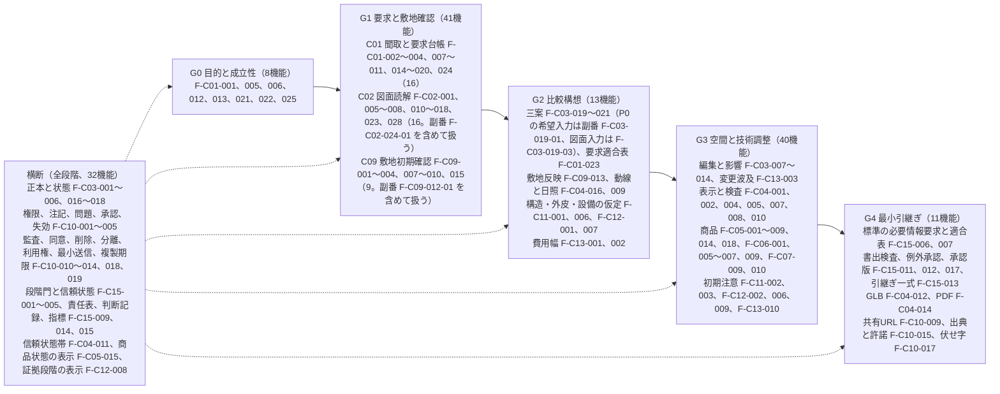

段階群の機能数: G0 8、G1 41、G2 13、G3 40、G4 11、横断 32、計 145【事実】（本章の割当表を機械的に集計。確認日 2026-09-15）。副番の P0 4件は親の内訳として図に括弧で示し、件数に含めない（F-C02-024-01 と F-C09-012-01 は G1、F-C03-019-01 と F-C03-019-03 は G2。F-C03-019-03 は骨格 v1.3 の採番で群4。JR-095。本章の割当【仮定】）。第24章 第4.2節は本節を入力として開発の群0〜群6 を定めた（群0 = 横断 32、群1 = G0 の 8 と G1 の C01 16、群2 = G1 の C02 16、群3 = G1 の C09 9、群4 = G2 13、群5 = G3 40、群6 = G4 11）。両者の割当は群ごとの機能と件数で一致する（群5 は第24章が分類名で記すため件数 40 で照合。照合 2026-10-06）【事実】（出典: 第24章 第4.2節、確認日 2026-09-15）。P0 内の開発順序の正本は第24章 第4.2節とし、第3節の索引の「段階群」列に第24章の群番号を併記した（U-09-005 の解決）【推定】。

## 6. 骨格との差分（追加、削除、変更）

### 6.1 追加

| 種別 | 内容 | 骨格への反映 | 区分 |
|---|---|---|---|
| 機能 F- | 本章が追加した機能はない。骨格 v1.2 が副番7件（F-C02-024-01、-02、F-C03-019-01、-02、F-C09-012-01、-02、F-C14-003-01）を、骨格 v1.3 が副番 F-C03-019-03 図面派生三案（P0）を採番し、本章は第2節の親の直後の行へ転記した（機能数に含めない。骨格 第4.1節の注） | 骨格 v1.2 で採番済み（JM-077、JM-127、JM-150、JM-152）。F-C03-019-03 は骨格 v1.3 で採番済み（JR-095） | 【事実】（第2節の機械照合、照合 2026-10-07） |
| 属性「利用者」 | 各機能に利用者（役割符号 RL- または「製品（自動）」）を付けた（第2節） | 骨格 v1.2 追補は利用者を骨格の列にしないと判断した（骨格の他章への依頼の表）。各機能の利用者の正本は主章の要件ブロックであり、本章の列はその要約とする（U-09-001） | 【仮定】 |
| 属性「P0 の段階群」 | P0 145機能を最初に必要となる段階群へ一度だけ割り当てた（第5.8節、第3節の索引の「段階群」列） | 第24章 第4.2節が開発の群0〜群6 の入力に採った（U-09-005 の解決）。骨格へは反映しない | 【仮定】 |

### 6.2 削除

削除、廃止、再採番はない【事実】（同上）。削除候補10件は骨格 v1.2 と同じく識別子を持たない（第4.2節）。骨格 v1.2 は F-C14-003 の範囲を工事前の定義と G4 での停止に限り、発見時の処理を副番 F-C14-003-01（P2）へ分けたが、F-C14-003 は親として残り廃止ではない（JM-150）【事実】（同上）。

### 6.3 変更

v1.0 の時点で本章が骨格 v1.1 から変えた値はなかった。v1.1（2026-10-06）では、骨格 v1.2（追補を含む）が初稿審査の再修正と相互依頼で改めた値を第2節と第5節へ転記した（変更提案8〜13 の記録）。v1.0 の変更提案1〜6 は骨格 v1.2 とその追補、画面指標試験骨格 v1.2 追補、第22章で反映済みである。v1.1 で加えた変更提案7 と 14 は骨格へ依頼中である【事実】（出典: 骨格 v1.2 の「他章への依頼または前提」の表、`02_基盤定義/整合検査報告.md` 第5節、確認日 2026-09-15）。

| 番号 | 対象 | 現状（提案時） | 提案 | 理由 | 反映先と状態 |
|---|---|---|---|---|---|
| 変更提案1 | 関連画面（仮）列 | S-01〜S-14 と S-19、S-20、S-26 のみ | U-00-057 の候補を採用し、補助画面への割当を追加（既存の画面は残す） | 第04章、第06章、第08章が補助画面を前提に参照していた | 反映済み: 骨格 v1.2 追補が第15章 第1.4節の確定を 46 行に反映し列名から「（仮）」を外した（U-00-057 解決）。第5.7節を再集計 |
| 変更提案2 | 未決 U-00-026 の本文 | 「主担当 A12 が87機能（35.5%）」 | 「90機能（36.1%）。P0 では59機能（40.7%）」へ更新 | v1.1 の追加（F-C10-017〜019）で数値が変わった | 反映済み（骨格 v1.2 の U-00-026） |
| 変更提案3 | F-C10-018 の六因果 (1) | 因果 (1) のみで割当が弱いと指摘（U-00-060） | 因果 (1) を維持し、根拠列に第02章 第2.7節の判定基準を注記 | 第02章の仮の判断に従う | 反映済み（骨格 v1.2 追補の F-C10-018 の根拠列） |
| 変更提案4 | 画面指標試験骨格 S-03 の詳細を書く章 | 第9章、第13章、第15章 | 第9章を外し、第12章、第8章、第13章、第15章とする | 本章は機能の主章ではない | 反映済み（画面指標試験骨格 v1.2 追補） |
| 変更提案5 | F-C15-013 の一行説明 | P0 と P1 の形式が同居 | 一行説明は変えず、P0 の受入条件を5形式に限ることを第22章の AC- で明示 | AC- の範囲を明示する | 反映済み（第22章 第8.1節。第22章の他章への依頼の表で対応済み） |
| 変更提案6 | 骨格 第0.4節 章割当の指針 | 第9章と第10章の記載なし | 「いずれも主章にしない」を追記 | 転記章の位置付けを一箇所で示す | 反映済み（骨格 v1.2 追補）。同節は第9章を「P0 機能の要約」と書くが、本版で第3節を索引に改めた（JM-055）ため「P0 機能の索引」への字句修正を依頼した。反映済み（骨格 v1.3 第0.4節。2026-10-07 の二回目の修正の仕上げ） |
| 変更提案7（v1.1） | F-C07-005 の一行説明と合格条件、F-C07-011 の禁止表示語 | 復元の精度を形容する曖昧語（共通指示 第4節。整合修正指示の第9章 2 の対象）を含む | 主章 第16章 第8.5節と第2章 第2.5節の語「実寸で復元」「寸法確定」「完全正確」と条件「利用者の実寸入力 1 件以上と確認（VS-USR）がない寸法に対して」へ置換する | 主章と第2章は v1.1 で語を整理済みで、骨格と本章だけが旧い語を持っていた | 反映済み（骨格 v1.3。2026-10-07 の二回目の修正の仕上げ）。本章は第2節 F-C07-005 と第4.1節 F-C07-011 を先に置換していた |
| 変更提案8（v1.1） | 商品系9機能と F-C02-016 の六因果 | 商品台帳と商品属性が因果(1)、F-C02-016 が因果 2 のみ | F-C05-001、002、013、F-C06-001、004、006、F-C07-001、009 を (2) へ、F-C05-016 を (3) へ付け替え、因果(1)の定義は広げない。F-C02-016 を「1、2」に改める | 商品候補は因果(2)の入力。3D 組立は図面3D化の入口では現況把握の出力（V1 編集案）、希望入口では案の生成に当たる（JM-056。統合判断は (a) 付け替え） | 採用済み（骨格 v1.2 第4.4節）。第2.2節、第2.5〜2.7節、第5.4節へ転記 |
| 変更提案9（v1.1） | F-C03-019 の P0 範囲 | 三案の生成の生成規則がどの章にもなかった | 副番 F-C03-019-01 雛形三案（P0）と F-C03-019-02 自由形状生成（P1）に分ける。生成規則の正本は第12章 第7.8節、API は AP-038 | 希望入力の自由形状生成を P0 に置いたままでは三案の決定的生成が成立しない（JM-077） | 採用済み（骨格 v1.2）。第2.3節へ転記 |
| 変更提案10（v1.1） | F-C09-012 の P0 範囲 | 法規条件に期限も再取得もない | 副番 F-C09-012-01 法規条件の期限管理と手動再取得（P0）と F-C09-012-02 法改正の検出と再判定（P1）に分ける | 古い法規の断定を P0 で防ぐ（JM-127） | 採用済み（骨格 v1.2）。第2.9節へ転記 |
| 変更提案11（v1.1） | F-C14-003 の範囲 | 工事前定義と発見時の処理が一つの機能（P1、G3〜G5） | F-C14-003（P1、G3、G4）は 4 項目の工事前定義と G4 での停止（I-06-005）に限り、副番 F-C14-003-01（P2、G5）を発見時の処理とする | 発見時の処理は P1 では試験できない（JM-150） | 採用済み（骨格 v1.2）。第2.14節、第5.5節へ転記 |
| 変更提案12（v1.1） | F-C02-024 の P0 範囲 | CS- の付与と表示を担う機能が P1 だけ | 副番 F-C02-024-01（P0。CS-DRW と CS-EST の初期付与と S-05 での表示、3D で隠れ部分を空洞に描かない）と F-C02-024-02（P1。現況資料による遷移と差異の重ね表示）に分ける。工事前調査の要否は P0 では固定注記だけ | 改装案件の P0 の記述（第21章 第1.2節、第8章 手順5）と機能の優先が食い違っていた（JM-152） | 採用済み（骨格 v1.2）。第2.2節、第4.4節へ転記 |
| 変更提案13（v1.1） | F-C03-004 の主担当 | 主担当 A12 の理由が判定例にない | A12 を維持し、十二判断領域 第3.4節に判定例「分岐案の作成と比較 → A12。履歴の分岐は版（Revision）の操作であり、案の内容は編集機能（A03）が担う」を加える | 第7章 規則8（A12 は操作対象が正本、版、出典等の場合だけ）との整合を判定例で示す（JM-057） | 反映済み（十二判断領域 v1.2 第3.4節、骨格 v1.2 第5節）。本章の主担当は A12 のまま（第2.3節） |
| 変更提案14（v1.1） | F-C09-008 の一行説明 | P0 の「高さ」の範囲が一行説明から読めない | 一行説明の P0 の範囲に「高さは絶対高さ制限と高度地区の高さ。斜線と日影は P1」を加える | 斜線を含む適合と誤読される危険（JM-128）。主章 第18章 第4.3節、第7.8節は明記済み | 反映済み（骨格 v1.3。2026-10-07 の二回目の修正の仕上げ）。本章は第2.9節の目的に注記していた |

### 6.4 未決事項への本章の仮の判断

| 未決 | 内容 | 本章の仮の判断 | 区分 |
|---|---|---|---|
| U-00-027 | G2 の交差表で A11 の必須成果「可変性比較、将来場面の試行結果」があるが F-C14-006 は P1 | 骨格 v1.2 で解決（2026-10-06、JM-037）: P0 は将来場面の該当有無と時期の記録と案別の「試行未実施」の表示で G2×A11 の必須成果を満たす（七段階門 v1.2 第3.3節、第6章 第2.3節 完了条件(6)）。本章 v1.0 の仮の判断（F-C01-016、F-C01-018 の記録まで、F-C14-006 は P1）と一致する | 【推定】 |
| U-00-028 | G4 完了条件(5)「送信先ごとの同意」に対し P0 は期限付き共有URL で代替し F-C08-005 を P1 | P0 では所有者自身が共有URL（F-C10-009）で建築士へ渡す運用とし、製品からの外部送信を行わないため同意事故（M-G-07）の発生源がない。F-C08-005 は P1 のまま。第6章 第3.5節（G4 の行19）と一致する | 【仮定】 |
| U-00-029 | F-C07-009 を P0 へ前倒しし限定した正規商品の受入検査に使う | 妥当とする。P0 の連合商品台帳（F-C05-001）に登録する正規商品は運営側が受け入れるため、15項目の自動検査は台帳品質の前提になる。法人用登録画面 S-21 は P2 のまま | 【仮定】 |
| U-00-033 | 削除候補10件を識別子なしで台帳外に置く扱い | 識別子を付けず、識別子台帳に「削除候補」区分の注記として仮番号を登録する（第4.2節） | 【仮定】 |
| U-00-034 | P0 の「簡易な日照」の計算をどの機能が担うか | F-C04-009（表示側）が太陽位置と影の幾何計算だけを行い、性能値（EL-）を付けない。日照時間や採光の性能計算は F-C12-015（P1）。S-11 では日照の証拠段階を「目標のみ、計算予測なし」と表示する | 【仮定】 |
| U-00-035 | C08 に P0 機能が0件で、指示文10.7「専門家が元資料へ戻れる」を P0 で満たせるか | P0 は F-C15-013 引継ぎ一式（元図、要求、問題へ戻れる）と F-C10-009 共有URL で満たす。提携先の比較と相談予約（C08）は P1。公開判定では T-A-014 の P0 代替（T-A-017。U-00-052）と、試験時の代替計測（建築士二重確認 100 件で受取側の役を建築士が担い M-G-02、M-G-06 を実測。第23章 第6.1節、JM-004）で確認する。運用での M-G-02 の計測は P1 | 【仮定】 |
| U-00-057 | 関連画面列への補助画面 S-15〜S-27 の割当 | 解決（2026-10-06、骨格 v1.2 追補が第15章 第1.4節の確定を 46 行に反映。S-28、S-29 を含む）。本章は第5.7節を再集計した | 【事実】 |
| U-00-058 | 非対象7機能の台帳上の扱いと完成像審査での除外条件 | 第02章 第2.7節の仮の判断に従う。審査対象は優先が P0、P1、P2 の242機能（副番は親に含める）に限り、非対象7機能は「代わりに製品が行うこと」の機能が因果にひも付いていることを確認する（第4.1節） | 【推定】 |
| U-00-060 | F-C10-018 の六因果の割当 | 第02章の仮の判断に従い因果 (1) を維持する。骨格 v1.2 追補は根拠列に判定基準を注記した（第6.3節 変更提案3）。未決としては骨格に残る | 【仮定】 |
| U-00-046、U-00-059、U-00-061 | 状態符号 GS-、CC-、CN- の追加。暗号化と組織分離の非機能扱い。補助状態符号の版 | U-00-046 は解決（2026-10-06。符号を設けず日本語の enum 値を正とする。情報実体骨格、第12章 U-12-005）。U-00-059、U-00-061 は本章の分類と集計に影響しないため仮の判断を置かない | 【推定】 |

## 7. 機能要件

本章に担当機能なし。機能一覧骨格 v1.3 の「詳細を書く章」列に第9章を主章または副章とする機能は存在しない（副番8件を含む。骨格 第0.4節は第9章を主章にしないと明記する）【事実】（出典: `02_基盤定義/機能一覧骨格.md` v1.2 の詳細を書く章列の機械検査で該当0件。照合 2026-10-06。v1.3 で加わった F-C03-019-03 の詳細を書く章は第12章と第8章。確認日 2026-09-15）。本章は第3節に P0 機能の索引を置くだけで必須10項目の要約を持たず、各機能の必須10項目と受入条件 AC- の採番と正本は各主章が担う（JM-055）【推定】。

## 章要約

本章は機能一覧骨格 v1.3 の249機能を P0 145、P1 82、P2 15、非対象 7 に分類した一覧として固定し、副番8件（P0 4、P1 3、P2 1）を親の直後に置いた（機能数に含めない）。各機能に識別子、名称、目的、利用者（本章の属性。正本は主章）、主担当、影響領域、六因果、段階門、優先、詳細章を付けた。P0 の三案は希望入力が F-C03-019-01、図面入力が F-C03-019-03（v1.2 で追加）で、F-C14-001（P1）の P0 範囲は撤去と移設の自動付与とした。P0 の索引（149行）は主章の節番号、AC- の範囲、T-U-／T-I-、段階群と第24章の群を示し、v1.2 で二回目の修正の新設受入条件を反映した。非対象7機能は第02章の層A〜層C に対応する恒久の非対象とし、削除候補10件は識別子なしの注記とした。集計では A12 が P0 の40.7%を占め、因果(6) の P0 は前提の2件、A11、C08、C14 の P0 は0件で、いずれも設計上の意図として扱う。本章に担当機能はない。

## 他章への依頼または前提

| 章 | 内容 | 種別（依頼/前提） |
|---|---|---|
| 02_基盤定義 機能一覧骨格 | v1.0 の変更提案1、2、3、6 は v1.2 とその追補で反映済み（第6.3節）。v1.1 の変更提案7（F-C07-005 の一行説明と合格条件、F-C07-011 の禁止表示語を主章 第16章 第8.5節と第02章 第2.5節の語へ置換）と変更提案14（F-C09-008 の一行説明に P0 の高さの範囲を注記。JM-128）を反映すること。第0.4節の第9章の説明「P0 機能の要約」を「P0 機能の索引」に改めること（JM-055） | 依頼（対応済み。2026-10-07 の二回目の修正の仕上げで骨格 v1.3 に変更提案7、14 と第0.4節の「P0 機能の索引」を反映した） |
| 02_基盤定義 用語集 | 用語 385 後続範囲の定義に「P1、P2 の機能を P0 の画面で示す表示語にも使う」を加えること（本章 第4.3節の用法。用語追加提案） | 依頼（対応済み。2026-10-07 の二回目の修正の仕上げで用語集 385 を改訂した） |
| 02_基盤定義 画面指標試験骨格 | 変更提案4（S-03 の詳細を書く章から第9章を外す）は v1.2 追補で反映済み | 前提（対応済み） |
| 第5、6、8、11〜13、15〜23章（主章） | 各 P0 機能の必須10項目と AC- の正本は主章であり、本章は要約を持たない（JM-055）。要件ブロックの節番号または AC- を改めた場合は、本章 第3節の索引を第1.5節の方法で再生成するよう依頼すること | 前提 |
| 第10章 | 第2節の優先列と第5.4節の因果別集計、第5.6節の主章別集計を追跡表の分母に使うこと。非対象7機能は「非対象」状態のまま持ち、副番の P0 4件（F-C02-024-01、F-C03-019-01、F-C03-019-03、F-C09-012-01。F-C03-019-03 は骨格 v1.3 の採番。JR-095）を追跡表の行に含めること | 前提 |
| 第14章 | P0 の「製品（自動）」を利用者とする機能の AP- を優先して採番すること。外部送信を伴う機能（F-C08-005、F-C08-007、F-C05-017）は P1 であり、P0 の API に外部送信を含めないこと | 前提 |
| 第15章 | 変更提案1 の補助画面の割当は第15章 第1.4節の確定と骨格 v1.2 追補で反映済み。S-04、S-06、S-05、S-08 に機能が集中する点（第5.7節）を部品設計の前提にすること | 前提 |
| 第22章 | F-C15-013 の P0 受入条件を5形式に限ること（変更提案5）と F-C10-017〜019 の10項目は第22章 第8.1節、第8.2節で対応済み | 前提（対応済み） |
| 第23章 | 「専用の T- なし」の計測方法欄の依頼（JM-055、JM-173）には、要約版の廃止と第3節の索引の T-U-／T-I- 列（出典は付表 4.3-A）で対応した。第5.4節の観察(3)（P0 の比較の十分性）を公開判定の確認項目に含めること | 前提（対応済み）、依頼 |
| 第24章 | P0 内の開発順序は第24章 第4.2節を正本とする（U-09-005 の解決。第5.8節、第3節の段階群の列に群を併記）。JM-191 は第1.1節と第5.2節、JM-185（U-09-003 の確定）は第1.4節と未決事項で対応した。第24章 第5.2節の運用人員の役割は、運営側役割（用語集 477）と職務名を語で書けばよい | 前提（対応済み） |
| 04_必須表 | 識別子台帳と表3 に本章の未決 U-09-001〜006 の状態（U-09-003、U-09-005、U-09-006 は解決、U-09-001 は一部解決）を反映すること。削除候補10件を「削除候補」区分の注記として登録すること（識別子ではない）。表2 の「第9章 第3節の利用者欄」の参照を「第9章 第2節の利用者列（正本は主章の要件ブロック）」に改めること（第3節を索引に改めたため）。機械整合検査（integrity_report.py）の AC- の抽出で、副番の AC-（AC-C02-024-01-01 等）を親の AC- と区別すること（第1.5節） | 依頼 |
| 05_審査（完成像審査、MECE審査） | 審査対象を優先 P0、P1、P2 の242機能（副番は親に含める）とし、非対象7機能を除外条件にすること（U-00-058）。第6.4節の判断を審査対象に含めること | 依頼 |
| 第2章、第4章、第5章、第8章、第18章、第21章（本章への依頼の対応状況。2026-10-06） | 第2章（六因果と機能群、非対象機能、削除候補の転記）: 第2節、第4.1節、第4.2節、第5.4節で対応し、非対象の禁止表示語を第02章 第2.5節と同じ語にした。第4章（到達目標と優先、表A と削除候補の区別）: 第4章 第3.4節が挙げる57機能の優先が本章と一致することを機械照合し、表A は第4.2節の注記で区別した。第5章（F-C01-013、014、021 の要約の追従）: 要約版の廃止（JM-055）で食い違いの元を除き、索引に主章 第5章 第6.1〜6.3節と T-U-004 を載せた。第8章（P0 23機能と F-C04-017 の P1、副番の優先）: 第2節、第5.6節で一致を確認。第18章（F-C09-012-01、-02）: 第2.9節。第21章（F-C14-003 と F-C14-003-01）: 第2.14節。P1、P2 の機能数は骨格 第4.1節の注に従い副番を数えず、区分の見出しに副番の内訳を付けた | 前提（対応記録） |
| 02_基盤定義 機能一覧骨格（本章への依頼の対応状況。2026-10-06） | 六因果の付け替えと副番7件の転記（第2節、第5.4節）、第1節と第4節の転記（第2節、第4節、第5節）、v1.2 追補（関連画面列 46 行、F-C10-018 の G0〜G4）への追従（第2.10節、第5.5節、第5.7節）。利用者を骨格の列にしない判断に従い、本章の列は主章の要約とした（U-09-001） | 前提（対応記録） |
| 02_基盤定義 機能一覧骨格、第5章、第6章、第7章、第12章、第15章、第21章、第23章（二回目の修正。前提。2026-10-07） | 修正計画 第0.3節、第0.4節と骨格 v1.3 を前提に、F-C03-019-03 図面派生三案（第12章 第12.18.3節、AC-C03-019-03-01〜03、T-I-024）、F-C14-001 の P0 範囲（第21章 第2.1節）、F-C09-012 の六因果「1」（延べ 298）、S-28-01〜03 の P0（第15章 第7.26.1節）、F-C15-014 の正常手順(10)と AC-C15-014-07（第6章、第7章 第4.4節、第4.5節）、索引の新設受入条件（第23章 付表 4.3-A の新設予定）を転記した。骨格の依頼「第4.4節の六因果と副番の転記（v1.3 で延べ 298、副番 8 件）」は第2節、第5.4節で対応済み | 前提（依頼への対応） |
| 02_基盤定義 機能一覧骨格（二回目の修正。修正計画にない依頼で、記録だけを残し段階8 で処理する） | F-C15-015 の関連画面列（S-13）に S-28（S-28-01〜03 は P0、S-28-04 は P2。第15章 v1.3 第7.26.1節）を加えること。本章は JR-078 で第2.15節と第5.7節に追記した | 依頼（対応済み。2026-10-07 の二回目の修正の仕上げで骨格の関連画面列に S-28 を加えた。第5.7節の S-28 の行は骨格の列の再集計になった） |
| 第5章、02_基盤定義 機能一覧骨格（二回目の依頼への対応状況。2026-10-07、二回目の修正の仕上げ 群R1） | 第5章（第3節の F-C01-013、014、021 の要約を第5章 v1.1 に追従し、試験を T-U-004 にする）: 対応済み（確認のみ）。第3節は索引で要約を持たず（JM-055）、索引は AC-C01-013-01〜06、AC-C01-014-01〜07、AC-C01-021-01〜05 と T-U-004 を載せ、「P0 では利用者のみ可」「専門家（任意）」「専用の T- なし」の記述は本章にない。骨格（第4.4節の六因果と副番の転記）: 対応済み（確認のみ。第5.4節 延べ 298、副番 8 件）。骨格（U-12-017 による F-C03-005、014、021 の関連画面の転記）: 反映（第5.7節の S-13、S-23、S-24、S-25 を骨格の列から再集計し、副番を除く 249 機能で差 0 件を機械照合した） | 前提（対応済み） |

## 未決事項

| 識別子 | 内容 | 区分（事実/推定/仮定/未確認） | 影響 | 確認者候補 |
|---|---|---|---|---|
| U-09-001 | 第2節の利用者列（役割符号 RL- と「製品（自動）」の割当）は本章の仮定であり、各主章が確定する。特に RL-EDT を家族の他の成員と委任した設計担当の両方に用いてよいか。一部解決（2026-10-06）: RL-EDT は両方に用いる（第22章 第1.3節、表3 UM-083）。骨格 v1.2 追補は利用者を骨格の列にせず、各機能の利用者の正本は主章の要件ブロックとし、本章の列はその要約とする。主章と本章の列の機械照合は未実施 | 仮定 | 第15章の役割別表示、第22章の権限、責任表 | 各主章担当、製品責任者 |
| U-09-002 | P0 145機能の集合が指示文10.7 の三条件（根拠付き比較、重大不明の停止、元資料への遡り）を満たすかは公開判定会議で試験結果と併せて確定する。本章の分類は試行前の判断である | 推定 | 公開判定、第24章 | 製品責任者、建築士、公開判定会議 |
| U-09-003 | 運営側の役割（情報管理者、運用担当者、監査、製品責任者）に役割符号を追加するか（RL- の拡張は識別子規則の主番号変更）。解決（2026-10-06、JM-185）: RL- を拡張しない。運営側役割（情報管理者、運用担当者、監査。用語集 477）は組織の権限で持ち、案件の役割 RL- とは別に判定する（第22章 第1.3節、表4 第3節 C-02 の裁定、U-22-008 の解決）。製品責任者、法規担当、積算担当、正解付与者等は運営の職務名として語で書く。組織案件で案件側に置く担当は RL-EDT（情報管理担当、用語集 494）と書き分ける（第1.4節） | 推定 | 識別子規則、第22章、第23章、第24章 第5.2節、責任表 | 識別子規則担当、情報保護責任者 |
| U-09-004 | 因果(3)「差の比較」の P0 が33件（P1 34件）で、P0 の比較が簡易な日照と動線、費用幅、要求適合表に限られる。これが「重要判断が根拠付きで比較できる」に足りるか | 仮定 | 公開判定、第19章、第20章 | 製品責任者、建築士 |
| U-09-005 | 第5.8節の P0 段階群の割当と第24章の開発順序の関係。解決（2026-10-06）: 第24章 第4.2節が本節を入力として群0〜群6 を定め、群ごとの機能と件数が一致する（第5.8節）。P0 内の開発順序の正本は第24章とし、第3節の索引に群を併記した | 推定 | 第24章 | 第24章担当 |
| U-09-006 | 第3節の要約版と各主章の必須10項目が食い違った場合の追従手順。解決（2026-10-06、JM-055）: 本章は要約版を持たず索引だけを置くため、食い違いが生じない。索引の値（節番号、AC- の範囲、T-U-／T-I-）は第1.5節の方法で再生成し、機械整合検査で検出する | 推定 | 本章の版管理、識別子台帳 | 仕様統合担当、04_必須表担当 |

## 用語追加提案

| 用語 | 定義 | 理由 |
|---|---|---|
| 後続範囲 | 用語集 385 へ統合済み。385 は G5、G6 の段階の表示語として定義するため、「P1、P2 の機能を P0 の画面で示す表示語にも使う」の追記を提案した。用語集 385 を改訂済み（2026-10-07、二回目の修正の仕上げ） | 本章 第4.3節は P1、P2 の機能に同じ表示語を使い、非対象（用語集5）との区別に用いるため |
| 情報構造の先行保持 | 用語集 387 へ統合済み | 第4.4節で使う |
| 横断機能 | 用語集 428 へ統合済み | 第5.5節、第5.8節、第3節の段階群で使う |
| 図面派生三案 | 用語集 558 へ統合済み（2026-10-07、基盤定義の二回目の修正） | 第1.1節、第2.3節、第3.3節、第5.8節で F-C03-019-03 を指して使う（JR-095） |
| 撤去と移設の自動付与 | 用語集 559 へ統合済み（2026-10-07、基盤定義の二回目の修正） | 第2.14節、第4.4節で F-C14-001 の P0 範囲を指して使う（JR-095） |

## 本章で定義した識別子一覧

| 種別（機能/情報実体/画面/指標/試験/API/非機能/受入条件） | 識別子 | 名称 |
|---|---|---|
| なし | なし | 本章は機能、情報実体、画面、指標、試験、API、非機能、受入条件の識別子を定義しない。249機能と副番8件の識別子は機能一覧骨格 v1.3 が定義し（F-C03-019-03 は v1.3 で採番）、本章は転記した。未決事項 U-09-001〜U-09-006 は本章が採番した |


---

<!-- 10_完成像_必要成果_機能_情報_画面_指標_試験の追跡表.md -->

# 第10章 完成像、必要成果、機能、情報、画面、指標、試験の追跡表

作成日: 2026-09-15　版: v1.3　担当: 段階3 第10章（追跡表）。v1.3 は 2026-10-08 の段階8前の持ち越し仕上げ（共通の決定 D18、統括の決定 D26、既定値の識別子の併記 0 行）。第2.4節「3D処理費が収益を超える」の行の「抜け」列を K-06 (b) の解消（M-B-13 は F-C03-014 と F-C02-016 の計測方法。JR-122）に合わせた。統括の決定 D26 により第4.4節 例2 の I-07-002 の領域を第7章 v1.3 に合わせて A06 とした。転記値と件数は変えていない（段階8 の再生成で再更新）。記録は `05_審査/再修正記録_段階8前_仕上げ_群F2.md`。v1.2 は 2026-10-07 の段階6 二回目の修正（段階7 再審査の後）。再審査 修正計画 第1.10節の 13 件（主担当 JR-044〜JR-046、整合 JR-017、JR-018、JR-035、JR-053、JR-054、JR-077、JR-078、JR-104、JR-116、JR-122）を同計画 第0.3節、第0.4節の固定文と番号で反映し、二回目の修正で各章が新設、変更した識別子（副番 F-C03-019-03、T-I-024、M-G-25、I-06-006〜009 の段階、受入条件 36件ほか）を各章の識別子一覧と第23章 付表 4.3-A から追跡表へ転記した（転記の時点〔2026-10-07 09:45〕で二回目の修正が未完了の章はない）。記録は `05_審査/再修正記録_2回目_第2_10章.md`。同日の二回目の修正の仕上げ〔群R1。群内の最後に実施〕で、第1.3節 規則2 と K-12 の転記値を機械整合検査（2026-10-07 09:54）の値に更新し、骨格の関連画面列の改訂（F-C03-005、014、021、F-C01-014、F-C15-015）に合わせて第3.1節と第4.3節を再計算し（K-11 は解消）、第2.3節の I-06-003 と I-06-004 の行を第11章 v1.3 と第6章に合わせた〔版は v1.2 のまま。記録は `05_審査/再修正記録_2回目_仕上げ_群R1.md`〕。v1.1 は 2026-10-06 の段階6 初稿審査の再修正（主担当 JM-058〜JM-062、整合 JM-004、JM-025、JM-077、JM-091、JM-110、JM-117、JM-133、JM-171、JM-173）と、各章の修正後の機械抽出による再生成（修正計画 第0.2節 順5）。反映内容は `05_審査/再修正記録_第9_10章.md`
根拠: 指示文 I節（成果物10）、10.2（完成像、五成果、指標の木）、10.5（完成像から機能への逆算）、A1（六段の因果）。基盤定義（機能一覧骨格 v1.3、画面指標試験骨格 v1.3、情報実体骨格 v1.3、識別子規則 v1.3、七段階門 v1.3、整合検査報告 v1.2 第5節と第5.1節。v1.1 は各 v1.2 と追補、整合検査報告 v1.1 を前提とした）。機械生成物（`04_必須表/00_機械整合検査.md`、`04_必須表/識別子台帳_機械生成.md`、`04_必須表/受入条件と試験の対応_機械生成.md`、`03_仕様書/00_章要約集.md`。転記の起点は 2026-10-06 22:56 の生成物。段階6 の最終値は 2026-10-07 01:27 の再生成。二回目の修正の後の再生成は 2026-10-07 09:54 で、第1.3節 規則2 と K-12 の転記値はこの値）。各章の要件ブロック、識別子一覧と対応表。確認日はすべて 2026-09-15。

## 0. 本章の目的、範囲と非対象、前提とする章

### 0.1 本章の目的

- 完成像 → 五成果 → 完成像に必要な能力 → 機能 → 情報実体 → 画面 → 指標 → 試験 → API → 受入条件 の対応を一つの表に固定し、P0 の 145機能と副番の P0 4件を全件網羅する（副番 F-C03-019-03 は v1.2 で追加）。
- 試験、指標、画面から機能へ戻る逆引き表と、非機能（N-）→ 受入条件（AC-N-）→ 試験の対応を置き、追跡が切れている箇所を「抜け」として一覧化して担当章へ依頼し、完成像審査（指示文J節1）、第23章、04_必須表の起点にする。
- 第1章 第7節の失敗と第7章 第3.1節の影響連鎖の六例を、防護指標、機能、問題、試験へ照合する（v1.1。JM-060）。

### 0.2 本章の範囲と非対象

| 項目 | 内容 |
|---|---|
| 範囲 | 仕様識別子（F-、E-、S-、M-、T-、AP-、N-、AC-）の間の対応。P0 は全機能（副番を含む）、P1 と P2 は逆引きの注記と集計、非対象7機能は識別子台帳の「非対象」状態で保持 |
| 非対象 | 実行時個体（要求、案、要素、問題、判断、承認、書出）の間の追跡（第12章 第8節が正本）。機能、指標、試験、画面の定義や採番の変更（各主章、第23章、基盤定義が行う）。新しい仕様識別子の採番（本章は未決 U-10- だけを採番する）。領域と主章の対応表そのもの（第7章 第6.1節が正本で、本章は参照だけを置く） |
| 転記の原則 | 各対応は出典の記述を機械的に転記する。判断を要する箇所は「本章の仮の判断」として【仮定】を付け、第5節と未決事項に記す |

### 0.3 前提とする章

- 基盤定義: 機能一覧骨格 v1.3（249機能と副番8件の優先、主担当、六因果、段階、主章、関連画面、第6.2節）、画面指標試験骨格 v1.3（S-01〜S-30、指標、試験 50件の関連指標と関連機能の列、反証試験の P0 版と P1 版〔T-R-010 は P0、P1、P2 版〕、第4.1節、第4.2節）、情報実体骨格 v1.3（E- 94件。E-EXC-008〜010 を含む）、七段階門 v1.3（交差表。影響先の値と源1 対象外）、整合検査報告 v1.2 第5節と第5.1節（識別子変更一覧。二回目の修正）。v1.1 は各 v1.2 と追補を前提とした。
- 仕様書: 第1章（第7節）、第2章（第1.3節、第1.4節、第3.4節、第6.2節）、第6章（第3節、第8.2節、第9.8節）、第7章（第3.1節、第5.7節、第6.1節、第6.2節）、第9章（優先、集計、第3節の索引）、第12章（第8.2節、表11.2-A）、第14章（第2.1節）、第15章（第1.4節）、第23章（第1節の非機能、第4節の試験と付表 4.3-A）、主章（第5、6、8、11〜13、15〜23章）の要件ブロック。表6-1a（`04_必須表/表6_最終審査表_暫定.md`。能力から必要情報と指標への暫定の対応。v1.1 で正本を本章 第2.2節へ移した）。
- 機械生成物（第1.3節 規則2）と章要約集（本章あての依頼 18件と基盤定義からの依頼）。

## 1. 追跡の構造と規則

### 1.1 追跡の階層

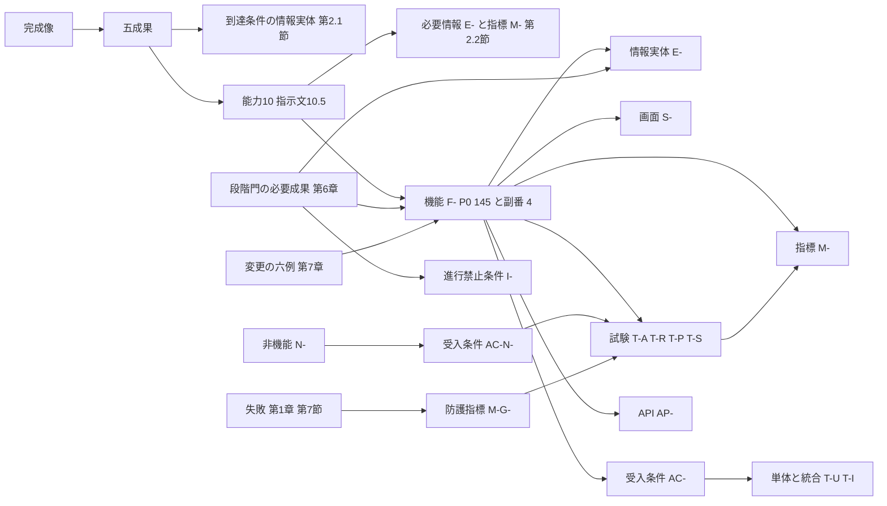

### 1.2 列の意味と出典

| 対応 | 出典（正本） | 補助の出典 | 区分 |
|---|---|---|---|
| 完成像 → 五成果 → 指標、画面、試験 | 指示文10.2、第2章 第6.2節、画面指標試験骨格 第2.2節、第4.1節 | — | 【推定】 |
| 五成果 → 到達条件を判定する情報実体 | 第2章 第1.3節（観察可能な到達条件）、第12章 項目辞書（属性名） | 情報実体骨格 | 【推定】 |
| 能力 → 機能 | 本章 第2.2節（v1.2 で必須機能の集合の正本。JR-044） | 機能一覧骨格 第6.2節、第2章 第3.4節（同じ集合の写し） | 【推定】 |
| 能力 → 画面、試験 | 画面は必須機能の骨格の関連画面列（機械転記）、試験は第2章 第3.4節（v1.2、JR-044） | — | 【推定】 |
| 能力 → 必要情報（E-）、指標（M-） | 本章 第2.2節（v1.1 で表6-1a から移した正本。第2章 第3.4節はここを参照する。JM-058） | 表6-1a、第12章 表11.2-A | 【推定】 |
| 機能 → 情報実体 | 主章の要件ブロック「情報入出力」の出力側の先頭の E-（属性名を含む） | 第6章 第3節、第12章 第8.2節 | 【推定】 |
| 機能 → 画面 | 機能一覧骨格 v1.2 追補の関連画面列（第15章 第1.4節の確定を反映済み）の先頭 | 第15章 第1.4節、主章の要件ブロック | 【推定】 |
| 機能 → 指標 | 主章の要件ブロック「計測方法」の先頭の M-（第6章の機能は第9.8節も見る） | 画面指標試験骨格の関連指標（試験経由。第4.2節） | 【推定】 |
| 機能 → 試験（受入、反証、性能、安全） | 画面指標試験骨格 第3節の関連機能列（第6章の機能は第9.8節を併せる） | 主章の要件ブロックの T- | 【推定】 |
| 機能 → 単体試験と統合試験、受入条件 | 第23章 付表 4.3-A（T-U-、T-I- ごとの対象 AC-） | `受入条件と試験の対応_機械生成.md`（照合に使う） | 【推定】 |
| 機能 → API | 第14章 第2.1節の対応機能列（先頭が主となる機能） | — | 【推定】 |
| 非機能 → 受入条件 → 試験 | 第23章 第1節 | 機械生成物 | 【推定】 |
| 段階 → 必要成果、進行禁止条件 → 機能 | 第6章 第3節（必須成果、源1 対象、確認者）、第8.2節（進行禁止条件と testRef） | 七段階門 第3節、機能一覧骨格の段階列 | 【推定】 |
| 領域 × 主章 | 第7章 第6.1節を正本とし、本章は転記しない（第7章 第6.2節の章の側からの逆引きも同じ。JM-060） | — | 【推定】 |

### 1.3 規則

1. 一機能に主章は一つ（機能一覧骨格 第0.4節）。情報実体、指標、受入条件は主章の要件ブロックから取る【推定】。
2. 転記は機械抽出で行い、2026-10-06 時点の各章ファイルを対象にした。抽出の起点にした機械整合検査（`99_作業道具/integrity_report.py`）の生成日時は 2026-10-06 22:56 である。二回目の修正の後の再生成（2026-10-07 09:54。作業道具の修正 JR-125 の後）の値は、参照切れ 0 件、重複定義 0 件（承認済みの二段構え 2 件〔M-G-17、M-G-25〕を除く）、P0 要件 あり 145／不足 0／なし 0（P0 145 件）、T- のない AC- 0 件、「第23章へ採番依頼」の残存 0 行である（JM-062）【事実】（出典: `04_必須表/00_機械整合検査.md` の「第10章 転記用」の行〔生成日時 2026-10-07 09:54〕、`識別子台帳_機械生成.md`、`受入条件と試験の対応_機械生成.md`、確認日 2026-09-15）。段階6 の最終値（2026-10-07 01:27）の参照切れ 2 件（U-81-003、AC-C14-003-01-01）は、01_調査の番号置換と作業道具の定義元の拡張、第21章の AC-C14-003-01-01 の定義（JR-100）で解消した。単体と統合試験の対象は付表 4.3-A を正とする（機械生成物は同じ行の AC- と T- を対応とみなすため対象が多い）（第5.1節 K-12。v1.2、JR-045）。本規則と K-12 の転記値は 2026-10-07 の二回目の修正の仕上げで 09:54 の再生成の値に更新した（持ち越し 17、JR-045）。09:54 の再生成は仕上げ（群R1〜R4。SRC-305〜SRC-337、U-88-001〜U-88-012 ほか）より前の状態であり、仕上げの後の再生成（段階8）で再び更新する。段階8 の最終の再生成（2026-10-08 13:20。段階8前の持ち越し仕上げと段階8 の最終仕上げの後）の値も、参照切れ 0 件、重複定義 0 件（承認済みの二段構え 2 件を除く）、P0 要件 あり 145／不足 0／なし 0（P0 145 件）、T- のない AC- 0 件、「第23章へ採番依頼」の残存 0 行で、09:54 の値と同じである（再々確認 01_突合.md K5-26。統括が 2026-10-08 に転記）。v1.2 で二回目の修正（2026-10-07）の新設識別子と受入条件は、機械生成物に入っていないため、各章の「本章で定義した識別子一覧」と第23章 付表 4.3-A（新設予定の列を含む）を正として転記した【推定】。
3. P0 145機能と副番の P0 4件（F-C02-024-01、F-C03-019-01、F-C03-019-03、F-C09-012-01。F-C03-019-03 図面派生三案は v1.2 で追加。JR-095）を全件載せる。副番は親の内訳であり、機能数は 145 のまま数える（機能一覧骨格 第4.1節の注）。P1 82機能と P2 15機能（副番の P1 3件、P2 1件を併せて追う）は逆引き表の注記と第5.2節で追い、非対象7機能は「非対象」状態のまま追跡の分母に含めない（U-00-058 への本章の仮の判断）【仮定】。
4. 機能一覧骨格 第6.2節の能力に割り当てられていない P0 機能は、六因果の先頭値で五成果へ対応付けて「横断機能」（用語集 428）と呼ぶ。対応は (1)→成果1、(2)(3)→成果2、(4)→成果3、(5)→成果4、(6)→成果5（第2章 第6.2節）。副番は親の能力に従う。v1.1 で骨格 v1.2 の六因果の付け替え（JM-056）を反映し、F-C05-002、F-C06-001、F-C07-009 は横1 から横2 へ移った。v1.2 で第2.2節の必須機能の追加（JR-044）により F-C03-001、F-C04-009、F-C05-006、F-C05-007、F-C11-006、F-C15-002 の 6件が横断から能力へ移った【仮定】。
5. 対応が一つもない欄は「—」とし、第5節で抜けとして種類、対象、仮の扱い、依頼先を記す。判定は「P0 機能に直接の試験、指標、情報実体、要件ブロックがない」「試験、指標、画面、API にどの P0 機能も結ばれない」の観察可能な条件で行う【推定】。
6. 追跡表は識別子だけを載せ、名称は識別子台帳と第9章で引く。情報実体列の「†」は情報入出力の行に E- がなく要件ブロックの他の行から取った値、「（入力）」は出力側に E- がなく入力側の先頭を取った値を示す【推定】。
7. 主章の要件ブロック、第14章 第2.1節、第23章 付表 4.3-A、骨格の関連機能列が改まった場合は、本節の規則で第3節と第4節を再生成する（第7章、第12章、各主章の前提）【推定】。

## 2. 完成像から五成果、能力、段階門の必要成果への対応

### 2.1 完成像 → 五成果 → 到達条件の情報実体 → 指標 → 画面 → 試験

完成像の一文は指示文10.2。表は第2章 第1.3節、第6.2節と画面指標試験骨格 第2.2節、第4.1節の転記である。「到達条件を判定する情報実体」の列は、第2章 第1.3節の観察可能な到達条件が参照する実体を第12章 項目辞書の属性名で書いた（v1.1。JM-058）【推定】。

| 成果 | 到達条件を判定する情報実体（第2章 第1.3節） | 主要指標 | 防護指標 | 因果 | 主な画面 | 主な試験 | P0 で計測 |
|---|---|---|---|---|---|---|---|
| 成果1 正しい問題設定 | E-BLD-001.purpose（目的文）、E-BLD-001.nonScope（非対象の表示）、E-ORG-008.decisionAuthority（決定権）、E-REQ-001（priority=RP-MUST、sourceRef、deciderRef、確認者）、E-REQ-001.conflictRecords と E-REQ-003（要求衝突、解決候補と代償） | M-P-08、M-P-09 | M-G-11 | (1) | S-02、S-24、S-05、S-09 | T-R-012、T-A-003、T-A-001、T-A-008 | 可 |
| 成果2 比較可能な成立案 | E-REQ-005（三案。generationBasis、droppedRequirementRefs）、E-SRV-005（概算範囲）、E-SRV-010（確信度）、E-REQ-003（構造 A04、避難 A07、排水 A06 の初期注意） | M-P-10、M-G-05 | M-G-12 | (2)(3) | S-03、S-10、S-11、S-12 | T-R-001〜T-R-003、T-R-007、T-A-009〜T-A-011 | 可（詳細調整は P1。T-R-002、003、007 は P0 版で判定） |
| 成果3 根拠付き合意 | E-REQ-004（七項目。isKeyDecision、deciderRef）、E-REQ-007（確認範囲ごとの承認。scopeKind、baseRevisionRef）、E-REQ-006（版） | M-N-01 | M-G-13、M-G-17、M-G-25（M-G-17 と M-G-25 は採番が第23章、定義が第2章 第5.1節の二段構え。M-G-25 は v1.2 で転記。JR-003） | (4) | S-13、S-25、S-23、S-30-01 | T-A-007、T-A-013、T-S-003、T-S-011 | 可 |
| 成果4 情報を失わない引継ぎ | E-EXC-002（引継ぎ一式。validationResult）、E-EXC-001（標準の必要情報要求）、E-REQ-006.cdeState（発行済み CDE-PUB が一つ） | M-G-02、M-G-06 | M-G-14 | (5) | S-08、S-20 | T-A-006（P1）、T-A-014（P0 は T-A-017）、T-S-001、T-S-013 | 主要指標は試験時の代替計測のみ（第23章 第6.1節の建築士二重確認 100 件で受取側役を建築士が担い、M-G-02 と M-G-06 を T-A-017 で実測）。運用計測は P1（F-C08-008）で、P0 の運用時は監視のみ。防護指標 M-G-14 は P0 から計測（JM-004） |
| 成果5 建物全期間の改善 | E-OPS-006（竣工差分）、E-OPS-007（入居後確認）、E-SRV-013（目標 EL-TGT）、E-ORG-006（学習利用の別同意） | M-O-05、M-O-06 | M-G-07、M-G-15 | (6) | S-14 | T-A-015、T-S-006 | 不可（P2。「未計測」と表示）。M-G-07 は P0 から計測し合否に使う |

注（JM-061）: 成果1 の画面 S-05、S-09 と試験 T-A-001、T-A-008 は、能力2（元資料を失わず建物化する）と横断機能（F-C09-）由来の追加であり、正本は画面指標試験骨格 第2.2節と第2章 第6.2節である（表6 矛盾候補7 は矛盾ではない）【推定】。横断の防護指標は M-G-01、M-G-03、M-G-04、M-G-08〜M-G-10、M-G-16、M-G-18〜M-G-24（画面指標試験骨格 第2.1節、第23章 第2.5節）【推定】。

### 2.2 能力（指示文10.5）→ 成果 → 機能 → 必要情報 → 指標

機能は機能一覧骨格 第6.2節の転記、成果は第1.3節 規則4 による。「必要情報（指示文10.5 の語 → E-）」と「指標（M-）」の二列は表6-1a（暫定）の対応を転記して本表を正本とした（v1.1。JM-058。第2章 第3.4節はここを参照する）。能力5 の「人体」は第12章が新しい実体を作らず E-ORG-008.bodyMetrics に置いた（第12章 表11.2-A。K-14）。各能力の観察可能な合格条件と検査する試験は第2章 第3.4節を正本とする【推定】。

v1.2（二回目の修正。JR-044）で、指示文10.5 の必須機能の語に当たる機能を能力の行へ加えた（P1、P2 の機能は「（P1）」「（P2）」を付け、範囲表記の内訳は除く）。必須機能の集合の正本は本表であり、機能一覧骨格 v1.3 第6.2節と第2章 第3.4節は同じ集合の写しである。「画面（S-）」列は必須機能の骨格 v1.3 の関連画面列から親画面を機械転記し（P0 機能の画面を先に、P1、P2 の機能だけの画面に「（P1）」「（P2）」）、「試験」列は第2章 第3.4節の「検査する試験」の転記である【推定】。

| 番号 | 能力 | 成果 | 因果 | 必須機能 | 画面（S-） | 必要情報（指示文10.5 の語 → E-） | 指標（M-。閾値は初期仮説） | 試験（第2章 第3.4節） |
|---|---|---|---|---|---|---|---|---|
| 1 | 曖昧な希望を設計条件へ変える | 1 | (1) | F-C01-002〜F-C01-020 | S-02、S-03、S-04、S-24 | 要求、関係者、優先度、決定権 → E-REQ-001（優先度は属性 priority）、E-REQ-002、E-REQ-009、E-ORG-008（decisionAuthority）、E-ORG-001 | 主要 M-P-08、M-P-09。防護 M-G-11、横断 M-G-01、M-G-24 | T-R-012、T-A-003 |
| 2 | 元資料を失わず建物化する | 1 | (1) | F-C02-005〜F-C02-017、F-C02-028 | S-04、S-05、S-30 | 元頁、座標、尺度、確信度、改訂 → E-PRD-006、E-SRV-009、E-SRV-010、E-REQ-006、E-BLD-004、E-ELM-001〜E-ELM-009 | M-Q-01〜M-Q-18、M-Q-30、M-Q-32。重大失敗 M-Q-25〜M-Q-28。防護 M-G-04 | T-A-001、T-A-002、T-P-005、T-P-006 |
| 3 | 一案への早過ぎる固定を防ぐ | 2 | (2)(3) | F-C03-019〜F-C03-021（P0 の希望入力は副番 F-C03-019-01、図面入力は F-C03-019-03）、F-C01-023、F-C03-004 | S-03、S-04、S-13、S-25 | 目的、制約、費用、性能 → E-REQ-005、E-REQ-002、E-SRV-005、E-SRV-013、E-REQ-004 | 主要 M-P-10、M-P-05。M-G-05（閾値未設定、監視のみ） | T-R-001、T-R-007 |
| 4 | 建築として成立性を高める | 2 | (3) | F-C11-001〜F-C11-003、F-C11-006、F-C12-001、F-C12-002、F-C12-009、F-C04-005、F-C13-010、F-C12-005（P1） | S-04、S-10、S-11、S-13、S-23 | 系統、層、経路、接合、責任 → E-SYS-001、E-SYS-002、E-SYS-003、E-MAT-003、E-MAT-004、E-MAT-005、E-ORG-007、E-REQ-003 | 防護 M-G-12、M-G-08、M-G-21。品質 M-Q-35〜M-Q-38 | T-R-002、T-R-003、T-A-010 |
| 5 | 家族が実物尺度で選ぶ | 2 | (3) | F-C04-002、F-C04-009、F-C04-010、F-C04-016、F-C05-009、F-C05-018、F-C04-017（P1） | S-03、S-04、S-06 | 人体、商品、室、時間帯 → E-ORG-008.bodyMetrics（人体寸法。視点高さ DV-FN-03）、E-ELM-013、E-PRD-001、E-SPC-001、E-REQ-009（時間帯） | M-Q-20〜M-Q-22、M-P-01（N-PF-01）、N-PF-07 | T-A-004、T-P-010 |
| 6 | 費用と期間を伴う判断にする | 2 | (3) | F-C13-001〜F-C13-003、F-C13-005（P1）、F-C13-006（P1） | S-12、S-06（P1） | 数量、単価時点、地域、確信幅 → E-SRV-006、E-SRV-014、E-SRV-005、E-SRV-015、E-SRV-016 | M-Q-24、M-Q-44、M-Q-39 | T-A-003、T-R-007 |
| 7 | 誇大な確実性を防ぐ | 3 | (4) | F-C15-002、F-C15-004、F-C15-005、F-C02-018、F-C12-008、F-C13-002 | S-03、S-05、S-08、S-11〜S-14、S-16、S-17、S-30 | 根拠、確認、版、資格 → E-REQ-008、E-REQ-007、E-REQ-006、E-REQ-010、E-ORG-001（資格） | 防護 M-G-13、M-G-10、M-G-08、M-G-20 | T-A-007、T-S-003、T-A-011 |
| 8 | 実在商品を安全に使う | 2 | (2)(3) | F-C05-001、F-C05-006、F-C05-007、F-C05-015、F-C06-005〜F-C06-007、F-C05-012（P1） | S-04、S-06、S-21、S-30 | 寸法、供給、許諾、保証、維持 → E-PRD-001、E-PRD-005、E-PRD-007、E-PRD-002、E-PRD-003、E-OPS-003、E-OPS-005 | M-B-09、M-B-10、M-G-22、M-G-23、M-G-16、M-Q-23、M-Q-39 | T-A-005、T-S-008、T-R-009 |
| 9 | 専門家へ再入力なく渡す | 4 | (5) | F-C03-001、F-C15-006、F-C15-007、F-C15-011、F-C15-013、F-C04-012、F-C04-014、F-C15-009、F-C04-013（P1）、F-C15-008（P1）、F-C10-008（P1） | S-04、S-08、S-13 | 属性、分類、問題、承認 → E-EXC-001、E-EXC-002、E-EXC-003、E-EXC-005、E-REQ-003、E-REQ-007、E-ORG-007 | 主要 M-G-02、M-G-06（いずれも P0 は試験時の代替計測。JM-004）。防護 M-G-14、M-G-18、M-G-19、M-P-07 | T-A-014、T-S-013 |
| 10 | 建物を長く使い改善する | 5 | (6) | F-C14-007〜F-C14-012（P2） | S-14（P2） | 施工後状態、保証、点検、実測 → E-OPS-001〜E-OPS-007、E-PRD-004、E-SRV-003、E-SRV-002 | 主要 M-O-05、M-O-06（P0 は「未計測」）。防護 M-G-07、M-G-15 | T-A-015、T-S-006 |

能力に割り当てられた P0 機能は 75件、横断機能は 70件（第5.2節。v1.1 の 69件、76件から、JR-044 で F-C03-001、F-C04-009、F-C05-006、F-C05-007、F-C11-006、F-C15-002 の 6件を横断から能力へ移した）【推定】（第3節の能力列の計数）。

### 2.3 段階門 → 必要成果（情報実体）→ 進行禁止条件 → 主な P0 機能

第6章 第3節の交差表の必須成果（情報実体ID）と三列（源1 対象、確認者（P0）、確認者（P1））を段階ごとに集約し、第8.2節の進行禁止条件（E-EXC-005 の testRef）と機能一覧骨格の段階列で主な P0 機能を対応付けた。交差ごとの主要判断、必須成果、確認者（P1 を含む）は第6章 第3節を正本とし、本表は段階ごとの集約に留める（二重記述の一元化。修正計画 第0.3節）【推定】。v1.2 で第6章 v1.2 第3節の有無の値「影響先（記号）」（G0×A02、G0×A09、G2×A01、G4×A04〜A06 の 6 交差。判断記録 E-REQ-004 を作らず、記号の源1 の判断の Impact〔E-REQ-012〕として記録し、確認者列は成果の受領確認者。JR-017）、G2(d) と G3(f) の源1 対象外（JR-005）、G4 の専門家未割当の交差数（JR-035）、第8.2節の I-06-006〜I-06-009 と I-00-110 の段階に同期した【推定】。

| 段階 | 必要成果（情報実体） | 源1 対象（第6章 第2節の主要判断） | 確認者（P0）の要点 | 進行禁止条件（I-）と試験 | 主な P0 機能 |
|---|---|---|---|---|---|
| G0 | E-BLD-001、E-ORG-008、E-SRV-012、E-SRV-015、E-ORG-006、E-EXC-006 | G0(a)〜(c) | RL-OWN。専門家未割当の交差 1（G0×A02）。影響先の交差 2（G0×A02、G0×A09。G0(b) の影響先で受領確認） | I-00-101〜I-00-104（T-A-013）、I-06-001（T-S-014） | F-C01-001、F-C01-005、F-C01-006、F-C01-012、F-C01-013、F-C01-021、F-C01-022、F-C01-025、F-C10-014、F-C15-001〜F-C15-003 |
| G1 | E-REQ-001、E-REQ-009、E-REQ-004、E-BLD-002、E-SRV-011、E-SRV-004、E-SRV-001、E-REQ-005（V1）、E-SRV-009、E-SYS-005、E-SPC-001、E-ELM-001、E-ELM-012、E-ELM-013、E-SRV-014、E-PRD-006、E-REQ-007、E-PRD-005 | G1(a)〜(f)（G2(b) を参照する交差を含む） | 専門家未割当の交差 5。RL-CHK 建築士の資格は本人申告（未照合） | I-00-105〜I-00-107（T-R-001、T-A-008）、I-00-108（T-A-002、T-R-005）、I-00-109、I-00-110（T-R-012）、I-06-003（G1 で停止、G4 で再検査。T-R-004。図面一式は P1）、I-05-001（SEV-1。T-R-012） | F-C01-002〜F-C01-020、F-C02-001、F-C02-005〜F-C02-008、F-C02-010〜F-C02-018、F-C02-023、F-C02-028、F-C02-024-01（副番）、F-C09-001〜F-C09-004、F-C09-007〜F-C09-010、F-C09-015、F-C09-012-01（副番）、F-C05-014 |
| G2 | E-REQ-005（三案）、E-REQ-001、E-SRV-004、E-SYS-003、E-REQ-004、E-SYS-001、E-BLD-005、E-MAT-003、E-ELM-012、E-SRV-013、E-ELM-013、E-SRV-005、E-SRV-016、E-REQ-003、E-REQ-009、E-REQ-007、E-REQ-006 | G2(a)〜(c)、G2(e)（G2(d) は源1 対象外。選定記録の承認範囲と版の固定は F-C15-014 と門の判定 F-C15-003。JR-005） | 専門家未割当の交差 6。影響先の交差 1（G2×A01。G2(a) の影響先で受領確認） | I-00-110（G2 は案の生成時に新たに検出した衝突。T-R-012）、I-00-111（T-R-001、T-R-007）、I-00-112（T-R-001）、I-00-113（T-A-013、T-I-005）、I-00-114（T-R-007、T-I-016）、I-00-115（T-A-013）、I-18-002（SEV-1。G2、G3。T-R-001、T-R-010、T-I-023）、I-06-009（SEV-1。改装区分の未指定。P1。T-A-012、T-R-006） | F-C03-019〜F-C03-021、F-C03-019-01（副番。雛形三案）、F-C03-019-03（副番。図面派生三案）、F-C01-023、F-C09-013、F-C11-001、F-C11-006、F-C12-001、F-C12-007、F-C13-001、F-C13-002、F-C04-009、F-C04-016 |
| G3 | E-REQ-005（V2）、E-SRV-004、E-BLD-005、E-ELM-005、E-ELM-006、E-SYS-001、E-REQ-003、E-MAT-003、E-MAT-005、E-SYS-002、E-SYS-003、E-SRV-013、E-PRD-001、E-SRV-005、E-REQ-012、E-SRV-016、E-SRV-015、E-REQ-010、E-REQ-007、E-REQ-011 | G3(a)〜(e)（G3(f) は源1 対象外。V2 の判定は F-C15-004。JR-005） | 専門家未割当の交差 5。G3×A10、G3×A11 は「初期注意の表示のみ。確認者なし」 | I-00-116（T-R-002、T-R-006 の P1 版、T-I-006）、I-00-117（T-R-003、T-I-007）、I-00-118（T-I-001）、I-00-119、I-00-120（T-A-007）、I-00-121（T-A-005、T-R-009）、I-06-006（SEV-0。負の余裕量が未解決なら G3 の門を止める。T-R-010）、I-06-007（P1。所見の種別による重大度付与。T-R-006）、I-06-008（SEV-1。現況未確認の改装要素。P1。T-R-006） | F-C03-009〜F-C03-014、F-C04-005、F-C04-010、F-C11-002、F-C11-003、F-C12-002、F-C12-006、F-C12-009、F-C13-003、F-C13-010、F-C10-003〜F-C10-005、F-C15-004 |
| G4 | E-REQ-001、E-SRV-001、E-REQ-004、E-EXC-002、E-ORG-007、E-SRV-008、E-SRV-013、E-PRD-001、E-SRV-005、E-REQ-003、E-ORG-006、E-REQ-006（CDE-PUB）、E-REQ-007 | G4(a)〜(c) | 受取側 RL-CHK 建築士の受領確認（資格は本人申告、未照合）。未登録なら専門家未割当（7 交差: G4×A02〜A07、G4×A10。JR-035）。影響先の交差 3（G4×A04〜A06。G4(c) の影響先で受領確認）。組織案件は情報管理担当（案件側 RL-EDT） | I-06-006（G4 で再検査。発行と引継ぎ一式の生成も止める。T-R-010）、I-06-007（P1。T-R-006）、I-18-004、I-18-005（SEV-1。T-U-012）、I-00-122〜I-00-124（T-A-014。P0 は T-A-017、T-I-005）、I-00-125（T-S-001）、I-00-126（T-A-007、T-A-014）、I-06-002（T-A-013、T-I-002）、I-06-003（再検査。T-R-004）、I-06-005（T-R-006） | F-C15-006、F-C15-007、F-C15-009、F-C15-011〜F-C15-013、F-C15-017、F-C04-012、F-C04-014、F-C10-009、F-C10-015、F-C10-017、F-C02-018、F-C09-012-01（確認期限切れのまま G3→G4 で SEV-1） |
| G5、G6（P2） | G5: E-REQ-011、E-REQ-001、E-SRV-003、E-REQ-005、E-REQ-007、E-OPS-001、E-REQ-008、E-PRD-004、E-OPS-006。G6: E-OPS-007、E-OPS-004、E-OPS-005、E-SRV-013、E-OPS-003、E-ORG-006 | G5(a)(b)、G6(a)(b) | —（P2。確認者は第6章 第2.6節、第2.7節） | I-00-127〜I-00-130（T-R-006、T-A-012、T-I-017）、I-06-004（T-R-006）、I-00-129、I-00-131、I-21-004（T-R-006）、I-00-131〜I-00-133（T-A-015） | P0 の固有機能は F-C10-011、F-C15-015 だけ（横断の F-C10-001、F-C10-010、F-C15-001〜F-C15-005 が働く） |

修正計画 第0.4節で新設した進行禁止条件の追跡を次に示す（JM-025 ほか）。I-06-005 は改装案件の工事前定義（F-C14-003、P1）の受入条件 AC-C14-003-01 と結ぶ【推定】。v1.2 で再審査の修正計画 第0.4節の I-06-007〜I-06-009（JR-013、JR-021、JR-022）を加え、I-06-006 の段階を第6章 v1.2 第8.2節（appliesTo を G3、G4。JR-011）に合わせた【推定】。

| 進行禁止条件 | 段階 | 検査規則（第6章 第8.2節） | 機能（* は P1） | 受入条件（主章） | 試験 |
|---|---|---|---|---|---|
| I-06-003 正本未確定（図面一式） | G1（停止）、G4（再検査） | 正本未確定（第11章 第7.1節） | F-C02-019*、F-C15-002 | AC-C02-019-01〜05（第11章。-05 は混入頁の除外と欠落の確定判断。v1.3、JR-048）、AC-C15-002-01〜07（第6章） | T-R-004（P1） |
| I-06-004 石綿含有判明後の記録（作業結果の報告書面の未登録。2026-10-07 に第6章で特定） | G5（P0、P1 は警告） | 石綿含有判明後の記録（第21章 第2.4節） | F-C15-002、第21章の記録の受入（P2） | AC-C15-002-01〜07（第6章） | T-R-006（P1 版で警告の表示） |
| I-06-005 解体後判明時の 4 項目の未定義 | G4 | 解体後判明時の 4 項目（第21章 第3節） | F-C14-003*（工事前定義と G4 での停止）、F-C15-002 | AC-C14-003-01（第21章。4 項目のいずれかが欠ける改装案件で G4 の門が通過せず、欠ける項目が S-13-01 に名指しで表示される） | T-R-006（P1 版）、T-U-014 |
| I-06-006 負の余裕量の持ち越し | G3（SEV-0 で G3 の門の通過を止める）、G4（再検査。発行と引継ぎ一式の生成も止める） | 負の余裕量の持ち越し禁止（第6章 第2.5節、第18章 第4.4節） | F-C09-008、F-C15-002、F-C15-013、F-C15-017 | AC-C09-008-01〜04（第18章）、AC-C15-002-01〜07、AC-C15-002-09（却下後の再登録。第6章）、AC-C15-013-04、AC-C15-017-03（引継ぎ一式の生成と発行の拒否。第22章） | T-R-010（P0 版） |
| I-06-007 所見の種別による重大度付与（発見の問題。P1） | G3、G4（P1） | 所見の種別による重大度付与（第11章 F-C02-026 (6)。報告種別への対応表は第12章 DV-CF-13） | F-C02-026*、F-C15-002 | AC-C02-026-05（第11章） | T-R-006（P1 版） |
| I-06-008 現況未確認の改装要素（SEV-1。進行禁止ではない。P1） | G3（P1） | 現況未確認の改装要素（第21章 第2.1節 規則(5)） | F-C14-001*、F-C15-002 | AC-C14-001-05（第21章） | T-R-006（P1 版） |
| I-06-009 改装区分の未指定（SEV-1。欠落属性。P1） | G2（P1。完了条件(10)） | 改装区分の未指定（第6章 第2.3節 完了条件(10)。区分の正本は第21章 F-C14-001） | F-C14-001*、F-C15-003 | AC-C14-001-01（第21章） | T-A-012、T-R-006 |

### 2.4 第1章 第7節の失敗 → 防護指標 → 試験（v1.1 新設。JM-060）

第1章 第7節の主要な危険10件を防護指標と試験へ照合した。第1章の表で試験欄が空の2件（広告偏り、人確認の滞留）に試験を割り当て、防護指標が空の1件（知財侵害）に指標を対応付けた。割当は画面指標試験骨格 v1.2 と第23章の試験の合否条件に基づき、試験の定義は変えない。割当のない失敗は K-15 とした【推定】。

| 失敗（第1章 第7節） | 重大度 | 防護指標（第1章） | 試験（第1章） | 本章の照合（v1.1） | 抜け |
|---|---|---|---|---|---|
| 尺度を誤ったまま3D化 | 極高 | M-G-03 | T-A-002、T-R-005 | 重大失敗の指標 M-Q-25 尺度誤認率と T-P-001 を加える | なし |
| 外壁や階段接続の欠落 | 極高 | M-G-03、M-G-08 | T-P-002、T-P-003 | 重大失敗の指標 M-Q-26、M-Q-27 と T-A-001 を加える | なし |
| 構想画像を施工案と誤認 | 極高 | M-G-13 | T-A-007、T-S-003 | 誤抑止の指標 M-G-20 を併記する | なし |
| 図面流出 | 極高 | M-G-07 | T-S-004、T-S-005、T-S-012 | T-S-007（伏せ字）と T-S-015（暗号化と分離。N-SC-01〜N-SC-03）を加える | なし |
| 特定企業の知財侵害 | 高 | — | T-S-008、T-A-005 | 防護指標に M-G-23 商用不可データの混入件数（P0）、M-B-10 許諾確認済み率、M-G-22 参照画像の権利確認実施率（P1）を対応付ける | なし（第1章の防護指標欄の追記を依頼） |
| 古い商品や法規を断定 | 高 | M-G-10 | T-R-009、T-R-010 | T-R-009 は P0 版（有効期限超過の SUP-UNKNOWN 表示、利用者申告の販売終了。JM-117）、T-R-010 は P0 版と P1 版に分けて判定する（JR-116）。P0 版: 確認期限切れ（checkedAt 91 日前。F-C09-012-01）の表示と I-18-005、手動再取得による再判定と I-18-002、期限内の改正を検出しない固定注記、負の余裕量が未解決のまま G3 を通過しない、または発行と引継ぎ一式の生成が 0 件（JR-011）、判定不能の条項の必要入力付きの引継ぎ。P1 版: 自動検出、差分表示、承認の自動失効。EL-LAW の自動維持の否定は P2 版。M-Q-39、M-Q-42、M-P-16（P1）を併記する | なし |
| 広告企業へ推薦が偏る | 高 | M-G-16 | — | T-S-008 の合否(5)（推奨点と順位の算定規則が isSponsored と Fee を参照しない静的検査。骨格 v1.2 追補）と T-S-017（P1。提携先の広告表示）を割り当てる。M-G-16 の月次の値は F-C15-015 が計測する | なし（第1章の試験欄の追記を依頼） |
| 無断で複数社へ送信 | 高 | M-G-07、M-B-03 | T-S-001、T-A-006 | T-A-006 は P1。P0 は製品から外部送信しないため（U-00-028）、共有と外部 AI 処理先の安全を T-S-004、T-S-012 で判定する | なし |
| 3D処理費が収益を超える | 中 | M-B-08 | T-P-007 | M-B-12〜M-B-15（写実生成の処理費、部分再生成率、GLB 容量超過率、外部 AI 処理費）を併記し、T-P-013（GLB 容量。M-B-14）を加える | M-B-08 は機能の計測方法に現れない（K-06 (b)）。M-B-13 は F-C03-014 と F-C02-016 の計測方法に加わり解消した（第12章 v1.4、第11章。K-06 (b) の解消。JR-122） |
| 人確認が滞留する | 中 | M-G-06 | — | P0 は T-I-002（責任表の空欄または未受諾で G4 が止まり、M-G-18、M-G-19 が目標内で通過する）を割り当てる。P1 の専門家確認の滞留時間 M-P-11（S-22）の試験は採番されていない | K-15 |

## 3. 機能追跡表（P0 145機能と副番の P0 4件）

列の意味と出典は第1.2節。各列は先頭の識別子だけ（試験と API は2件まで）を載せ、残りは第4節と各主章で追う。「能n」は第2.2節の能力番号、「横k」は横断機能の五成果k（第1.3節 規則4【仮定】）。「—」は対応なし（第5節）。「単体、統合」と「受入条件」の列は第23章 付表 4.3-A と第9章 第3節の索引と同じ値で、149行すべてに T-U- と AC- がある。末尾 11 の受入条件は第15章が画面側で採番したもの。画面列は骨格の関連画面列の先頭で、F-C01-014 だけは主章（第5章）が定める S-04-09 を、F-C15-015 は運用指標画面 S-28（S-28-01〜03 は P0。JR-078）を併記した（K-11）。情報実体列の E-EXC-008 は AP-029 の通知の保持先として F-C02-028、F-C10-005、F-C15-002 に併記した（JR-053）。表全体は【推定】（機械転記。抽出 2026-10-06、確認日 2026-09-15）。v1.2 で二回目の修正（2026-10-07）の新設と変更（副番 F-C03-019-03 の行、受入条件の追加、能力列、試験列、画面列）を各章の識別子一覧と第23章 付表 4.3-A から転記した【推定】。

### 3.1 C01 対話設計（P0 25機能）

|機能ID|能力|主章|情報実体|画面|指標|試験（受入、反証、性能、安全）|単体、統合（T-U-、T-I-）|API|受入条件（AC-）|
|---|---|---|---|---|---|---|---|---|---|
|F-C01-001|横1|8|E-BLD-001|S-01|M-P-04|T-S-002|T-U-003|—|AC-C01-001-01〜03|
|F-C01-002|能1|8|E-REQ-001|S-02|M-P-08|T-S-009|T-U-001|—|AC-C01-002-01〜03|
|F-C01-003|能1|8|E-SRV-010|S-02|M-G-04|T-A-013、T-S-012|T-U-001|AP-034|AC-C01-003-01〜04|
|F-C01-004|能1|8|—|S-02|M-G-05|T-S-009|T-U-001|—|AC-C01-004-01〜02、AC-C01-004-11（第15章）|
|F-C01-005|能1|8|E-BLD-001.region|S-02|—|T-A-013、T-A-008|T-U-001|—|AC-C01-005-01〜03|
|F-C01-006|能1|8|E-BLD-001.budgetRange|S-02|—|T-A-013、T-R-007|T-U-001|—|AC-C01-006-01〜03|
|F-C01-007|能1|8|E-ORG-008|S-02|M-P-09|T-R-012、T-R-008|T-U-001|—|AC-C01-007-01〜02|
|F-C01-008|能1|8|E-REQ-001|S-02|—|T-A-001|T-U-001|—|AC-C01-008-01〜02|
|F-C01-009|能1|8|E-REQ-009.sequence|S-02|—|—|T-U-001|—|AC-C01-009-01〜02|
|F-C01-010|能1|8|E-REQ-001|S-02|—|T-A-013、T-S-003|T-U-001|—|AC-C01-010-01〜02|
|F-C01-011|能1|8|E-PRD-006|S-02|—|T-S-008|T-U-001|—|AC-C01-011-01〜02|
|F-C01-012|能1|8|E-REQ-002|S-02|M-B-06|T-S-001、T-A-006|T-U-001|—|AC-C01-012-01〜02|
|F-C01-013|能1|5|E-ORG-008|S-02|M-P-09|T-R-012|T-U-004|—|AC-C01-013-01〜06|
|F-C01-014|能1|5|E-ORG-008.participationMethod|S-02、S-04-09、S-24|M-P-09|T-R-008、T-R-012|T-U-004|—|AC-C01-014-01〜07|
|F-C01-015|能1|8|E-REQ-009|S-02|—|—|T-U-001|—|AC-C01-015-01〜02|
|F-C01-016|能1|8|E-REQ-009|S-02|—|T-R-008|T-U-001|—|AC-C01-016-01〜02|
|F-C01-017|能1|8|E-REQ-009|S-02|M-G-10|T-R-011|T-U-001|—|AC-C01-017-01〜02|
|F-C01-018|能1|8|E-REQ-009|S-02|—|T-A-004|T-U-001|—|AC-C01-018-01〜02|
|F-C01-019|能1|8|E-REQ-001|S-24|M-G-01|T-R-012、T-A-013|T-U-002|—|AC-C01-019-01〜03|
|F-C01-020|能1|8|E-REQ-001.conflictRecords|S-24|M-G-11|T-R-001、T-R-007|T-U-002|—|AC-C01-020-01〜06|
|F-C01-021|横1|5|E-BLD-001.purpose|S-02|M-N-01|T-A-013|T-U-004|—|AC-C01-021-01〜05|
|F-C01-022|横1|8|E-SRV-007|S-02|—|T-A-013、T-A-008|T-U-002|—|AC-C01-022-01〜02|
|F-C01-023|能3|8|E-REQ-005.droppedRequirementRefs|S-03|M-P-10|T-R-008、T-R-011|T-U-002|—|AC-C01-023-01〜06|
|F-C01-024|横1|8|E-SRV-010|S-02|M-G-10|T-S-010|T-U-003|AP-034、AP-007|AC-C01-024-01〜04|
|F-C01-025|横1|8|E-REQ-005|S-01|M-P-04|T-S-002、T-P-007|T-U-003|AP-039|AC-C01-025-01〜04|

### 3.2 C02〜C04 図面読解と3D変換、建物情報と編集、3D表示（P0 48機能。副番 3）

|機能ID|能力|主章|情報実体|画面|指標|試験（受入、反証、性能、安全）|単体、統合（T-U-、T-I-）|API|受入条件（AC-）|
|---|---|---|---|---|---|---|---|---|---|
|F-C02-001|横1|11|E-PRD-006|S-05|M-P-04|T-A-001、T-S-002|T-U-005|AP-001|AC-C02-001-01〜04|
|F-C02-005|能2|11|E-PRD-006|S-05|M-Q-30|T-A-001|T-U-005|AP-002|AC-C02-005-01〜05|
|F-C02-006|能2|11|—|S-05|M-Q-01|T-P-005|T-U-005|AP-003|AC-C02-006-01〜03|
|F-C02-007|能2|11|E-SRV-010|S-05|M-Q-01|T-A-001、T-P-004|T-U-005|AP-003|AC-C02-007-01〜04|
|F-C02-008|能2|11|E-SPC-001|S-05|M-Q-01|T-A-001、T-P-004|T-U-005|AP-003|AC-C02-008-01〜04|
|F-C02-010|能2|11|E-SPC-001|S-05|M-Q-13|T-P-002、T-P-003|T-U-005|AP-003|AC-C02-010-01〜05|
|F-C02-011|能2|11|E-REQ-002|S-05|M-Q-10|T-A-002、T-R-005|T-U-005|AP-003|AC-C02-011-01〜05|
|F-C02-012|能2|11|E-SRV-008|S-05|M-Q-16|T-A-007|T-U-005|AP-003|AC-C02-012-01〜03|
|F-C02-013|能2|11|E-PRD-006|S-05|M-G-04|T-A-001、T-P-006|T-U-006|AP-003|AC-C02-013-01〜04、AC-C02-013-11（第15章）|
|F-C02-014|能2|11|E-PRD-006.scale|S-05|M-Q-25|T-A-001、T-A-002|T-U-006|AP-004|AC-C02-014-01〜06|
|F-C02-015|能2|11|E-REQ-011|S-05|M-P-06|T-A-001、T-P-009|T-U-006|AP-004|AC-C02-015-01〜04|
|F-C02-016|能2|11|E-ELM-*.geometry|S-04|M-Q-19|T-P-007、T-P-009|T-U-006|AP-010|AC-C02-016-01〜05|
|F-C02-017|能2|11|E-SRV-009|S-04|M-Q-32|T-A-010|T-U-006|AP-003、AP-005|AC-C02-017-01〜03|
|F-C02-018|能7|11|E-EXC-002|S-05|M-G-13|T-A-007|T-U-006|AP-023|AC-C02-018-01〜03|
|F-C02-023|横1|11|E-SRV-009|S-05|M-Q-16|T-A-001|T-U-006|AP-003|AC-C02-023-01〜03|
|F-C02-024-01|横1|11|—|S-05-07|M-G-12|T-A-012、T-R-006|T-U-006|—|AC-C02-024-01-01〜02、AC-C02-024-02（親。本副番で判定）|
|F-C02-028|能2|11|E-EXC-007、E-EXC-008（AP-029 の通知）|S-05-05|M-P-01|T-P-008|T-U-006|AP-031、AP-003|AC-C02-028-01〜03、AC-C02-028-11（第15章）|
|F-C03-001|能9|12|E-REQ-006|S-04|M-G-14|T-A-014、T-A-003|T-U-008|AP-005|AC-C03-001-01〜03|
|F-C03-002|横1|12|E-SRV-008|S-04|M-G-14|T-A-014、T-S-011|T-U-008|AP-005|AC-C03-002-01〜03|
|F-C03-003|横1|12|E-REQ-011|S-04|M-P-02|—|T-I-003、T-U-008|AP-006、AP-009|AC-C03-003-01〜03|
|F-C03-004|能3|12|E-REQ-005|S-03|—|—|T-I-003、T-U-008|AP-009|AC-C03-004-01〜03|
|F-C03-005|横1|12|E-REQ-001|S-24、S-23、S-25、S-04|M-G-01|T-A-003|T-U-008|AP-005|AC-C03-005-01〜03|
|F-C03-006|横1|12|E-SRV-004|S-04|—|T-A-003|T-I-004、T-U-008|AP-007、AP-034|AC-C03-006-01〜03|
|F-C03-007|横2|12|E-REQ-011|S-04|M-Q-19|T-P-009|T-U-008|AP-006|AC-C03-007-01〜02、AC-C03-007-11（第15章）|
|F-C03-008|横2|12|E-REQ-011|S-04|M-Q-19|T-P-009|T-U-008|AP-006|AC-C03-008-01〜02、AC-C03-008-11（第15章）|
|F-C03-009|横2|12|E-REQ-011|S-04|M-P-06|T-A-003|T-U-008|AP-007、AP-034|AC-C03-009-01〜02|
|F-C03-010|横2|12|E-REQ-011.coordinateFrame|S-04|—|T-A-003|T-U-008|AP-007|AC-C03-010-01〜02|
|F-C03-011|横2|12|E-REQ-012|S-04|M-G-12|T-A-003、T-A-009|T-U-008|AP-008|AC-C03-011-01〜03|
|F-C03-012|横2|12|E-REQ-011.previewDelta|S-04|—|T-A-003、T-A-009|T-U-008|AP-008|AC-C03-012-01〜03|
|F-C03-013|横2|12|E-REQ-011.status|S-04|—|T-A-003|T-U-008|AP-008|AC-C03-013-01〜02|
|F-C03-014|横3|12|E-REQ-006|S-04、S-24、S-23、S-13|M-P-02|T-A-003、T-P-007|T-U-008|AP-009|AC-C03-014-01〜03|
|F-C03-016|横1|12|E-SRV-008|S-04|—|T-A-007|T-U-008|AP-006|AC-C03-016-01〜03|
|F-C03-017|横1|12|要素共通属性 valueStates|S-04|—|T-S-010|T-I-003、T-U-008|AP-005|AC-C03-017-01〜03|
|F-C03-018|横3|12|E-REQ-006.cdeState|S-08|—|T-A-014|T-I-005、T-U-008|AP-022、AP-032|AC-C03-018-01〜03|
|F-C03-019|能3|12|E-REQ-005|S-03|M-G-05|T-R-001|T-U-008|AP-038|AC-C03-019-01〜03|
|F-C03-019-01|能3|12|E-REQ-005|S-03|M-P-10|T-R-001|T-U-008|AP-038|AC-C03-019-01-01〜03|
|F-C03-019-03|能3|12|E-REQ-005|S-03|M-P-10|T-R-006|T-I-024、T-U-008|AP-038|AC-C03-019-03-01〜03|
|F-C03-020|能3|12|E-REQ-005（入力）|S-03|M-P-10|—|T-I-005、T-U-008|AP-005、AP-009|AC-C03-020-01〜03|
|F-C03-021|能3|12|E-REQ-004|S-03、S-13、S-25|M-N-01|T-A-013|T-U-008|AP-032|AC-C03-021-01〜03|
|F-C04-001|横2|11|—|S-04|—|T-S-009|T-U-007|—|AC-C04-001-01〜03、AC-C04-001-11（第15章）|
|F-C04-002|能5|11|E-ORG-008.selfConfirmation|S-04|M-P-09|T-R-008|T-U-007|—|AC-C04-002-01〜04、AC-C04-002-11（第15章）|
|F-C04-004|横2|11|E-BLD-004†|S-04|—|T-P-003|T-U-007|—|AC-C04-004-01〜02、AC-C04-004-11（第15章）|
|F-C04-005|能4|11|E-REQ-010|S-04|—|T-A-013|T-U-007|—|AC-C04-005-01〜03、AC-C04-005-11（第15章）|
|F-C04-007|横2|11|—|S-04|—|T-P-009|T-U-007|—|AC-C04-007-01〜03、AC-C04-007-11（第15章）|
|F-C04-008|横3|15|E-EXC-007|S-04-03|M-G-09|T-A-010、T-S-009|T-U-016|—|AC-C04-008-01〜05|
|F-C04-009|能5|11|E-SRV-004|S-03|M-G-10|T-A-011|T-U-007|AP-020|AC-C04-009-01〜04|
|F-C04-010|能5|11|E-REQ-003|S-04|M-Q-21|T-A-004、T-P-010|T-U-007|AP-010、AP-014|AC-C04-010-01〜03|
|F-C04-011|横3|15|E-EXC-002|S-30-01|M-G-13|T-S-003|T-U-016|AP-005|AC-C04-011-01〜05|
|F-C04-012|能9|11|E-EXC-002|S-08|M-P-03|T-P-007、T-S-003|T-U-007|AP-010、AP-023|AC-C04-012-01〜03|
|F-C04-014|能9|11|E-EXC-002|S-08|M-G-13|T-S-003|T-U-007|AP-023|AC-C04-014-01〜03|
|F-C04-016|能5|8|E-SRV-004|S-03|M-P-10|T-A-002、T-P-009|T-U-003|—|AC-C04-016-01〜04|

第3.2節の情報実体と API の詳細（JM-091、JM-110 の対象。主章 第12章の情報入出力の出力側の転記）【推定】:

| 機能 | 情報入出力（出力側）の要点 | API |
|---|---|---|
| F-C03-005 | 追跡索引（正本外。第12章 第11.3節）と E-REQ-001 を起点とする到達結果。経路1〜16 は第12章 第8.2節。入力に E-REQ-006（diff、memberRefs） | AP-005（includeTrace） |
| F-C03-010 | E-REQ-011.coordinateFrame、E-REQ-011.intent.direction（入力は E-REQ-011.viewpointAtCommand） | AP-007 |
| F-C03-012 | E-REQ-011.previewDelta の各項目と一覧（入力は E-REQ-012、E-REQ-007） | AP-008 |
| F-C03-013 | 仮表示の派生表示（正本外）と E-REQ-011.status（入力は E-REQ-011.previewDelta、resolvedGeometry） | AP-008 |
| F-C03-017 | 要素共通属性 valueStates、valueStateMeta（第12章 第3.3節。入力は E-SRV-009、E-SRV-008、E-REQ-007、E-REQ-011） | AP-005 |
| F-C03-018 | E-REQ-006.cdeState、E-REQ-005.cdeState、E-EXC-002.cdeState、E-EXC-006（共有）、E-SPC-002（kind=共有範囲） | AP-022（共有）、AP-032（発行） |
| F-C03-019〜F-C03-021 | 三案は E-REQ-005 ×3 と generationBasis（雛形三案は副番 F-C03-019-01）、比較は evaluationAxes、選定記録は E-REQ-004 | AP-038、AP-005、AP-032（JM-077） |

### 3.3 C05〜C07 商品の検索と推薦、住友林業参照、独自家具（P0 19機能）

|機能ID|能力|主章|情報実体|画面|指標|試験（受入、反証、性能、安全）|単体、統合（T-U-、T-I-）|API|受入条件（AC-）|
|---|---|---|---|---|---|---|---|---|---|
|F-C05-001|能8|16|E-PRD-001|S-06|M-B-09|T-A-005|T-U-010|AP-036|AC-C05-001-01〜03|
|F-C05-002|横2|16|E-PRD-001†|S-06|—|T-A-004|T-U-010|AP-036|AC-C05-002-01〜02|
|F-C05-003|横2|16|E-PRD-001|S-06|—|—|T-U-010|AP-012|AC-C05-003-01〜02|
|F-C05-004|横2|16|E-PRD-001|S-06|—|T-A-004|T-U-010|AP-012|AC-C05-004-01〜02|
|F-C05-005|横2|16|E-PRD-001（入力）|S-06|M-Q-23|T-A-004|T-U-010|AP-012|AC-C05-005-01〜02|
|F-C05-006|能8|16|E-REQ-004|S-06|M-B-01|T-A-004|T-U-010|AP-013|AC-C05-006-01〜03|
|F-C05-007|能8|16|E-PRD-001（入力）|S-06|M-Q-23|T-A-004、T-R-009|T-U-010|AP-013|AC-C05-007-01〜02|
|F-C05-008|横2|16|E-EXC-007|S-06|M-G-16|T-A-005、T-S-008|T-U-010|AP-013|AC-C05-008-01〜02|
|F-C05-009|能5|16|E-SRV-004|S-04|M-Q-20|T-A-004、T-P-010|T-U-010|AP-014|AC-C05-009-01〜04|
|F-C05-014|横1|16|E-ELM-013|S-02|—|T-A-004、T-R-005|T-U-010|—|AC-C05-014-01〜02|
|F-C05-015|能8|16|E-REQ-011|S-30-04|—|T-A-005、T-R-009|T-U-010|AP-017|AC-C05-015-01〜03|
|F-C05-018|能5|16|E-PRD-001|S-04|—|T-A-005|T-U-010|—|AC-C05-018-01〜02|
|F-C06-001|横2|16|E-PRD-006|S-06|—|T-A-005|T-U-010|AP-012|AC-C06-001-01〜02|
|F-C06-005|能8|16|E-PRD-003.relations（入力）|S-06|—|T-A-005|T-U-010|AP-013、AP-017|AC-C06-005-01〜02|
|F-C06-006|能8|16|E-PRD-003.relations|S-06|—|T-A-005、T-S-008|T-U-010|—|AC-C06-006-01〜02|
|F-C06-007|能8|16|E-PRD-001（入力）|S-04|—|T-A-005|T-U-010|—|AC-C06-007-01〜02|
|F-C06-009|横3|16|E-EXC-005（入力）|S-06|—|T-A-005、T-S-008、T-S-003|T-U-010|—|AC-C06-009-01〜02|
|F-C07-009|横2|16|E-SRV-003†|S-06|—|T-S-008|T-U-010|AP-016|AC-C07-009-01〜02|
|F-C07-010|横2|16|E-SRV-004|S-04|—|T-A-004|T-U-010|AP-014|AC-C07-010-01〜02|

### 3.4 C09、C10 敷地と法規、共同作業と承認（P0 25機能。副番 1）

|機能ID|能力|主章|情報実体|画面|指標|試験（受入、反証、性能、安全）|単体、統合（T-U-、T-I-）|API|受入条件（AC-）|
|---|---|---|---|---|---|---|---|---|---|
|F-C09-001|横1|18|E-BLD-002|S-09|—|T-A-013、T-A-008|T-U-012|AP-018|AC-C09-001-01〜03|
|F-C09-002|横1|18|E-SRV-011|S-09|M-Q-42|T-R-010|T-I-014、T-U-012|AP-018、AP-037|AC-C09-002-01〜04|
|F-C09-003|横1|18|E-SRV-012|S-09|M-G-10|T-A-008|T-U-012|AP-037、AP-018|AC-C09-003-01〜03|
|F-C09-004|横1|18|E-SRV-012|S-09|M-G-23|T-A-008|T-U-012|AP-018、AP-037|AC-C09-004-01〜03|
|F-C09-007|横1|18|E-SRV-001|S-09|M-G-08|T-A-008、T-R-001|T-U-012|—|AC-C09-007-01〜04|
|F-C09-008|横1|18|E-SRV-004|S-09|M-G-10|T-R-001、T-R-010|T-I-023、T-U-012|AP-019|AC-C09-008-01〜04|
|F-C09-009|横1|18|E-BLD-002.boundary（入力）|S-09|—|T-A-008|T-U-012|AP-018|AC-C09-009-01〜03|
|F-C09-010|横1|18|E-SRV-007|S-09|—|T-A-008|T-U-012|AP-018|AC-C09-010-01〜03|
|F-C09-012-01|横1|18|E-REQ-003|S-09-04|—|T-R-010|T-U-012|AP-018、AP-037|AC-C09-012-01-01〜05|
|F-C09-013|横2|18|E-REQ-005|S-03|—|T-R-001|T-I-023、T-U-012|AP-038|AC-C09-013-01〜03|
|F-C09-015|横1|18|E-BLD-002.confirmationItems|S-09|—|T-A-008、T-R-001|T-U-012|AP-018|AC-C09-015-01〜03|
|F-C10-001|横3|22|E-EXC-007|S-08|—|T-S-013|T-U-015|—|AC-C10-001-01〜04|
|F-C10-002|横3|17|E-REQ-003.anchor|S-30-03|—|T-A-010|T-U-011|—|AC-C10-002-01〜03|
|F-C10-003|横1|17|E-REQ-003|S-23|M-G-09|T-A-009、T-A-010|T-U-011|—|AC-C10-003-01〜05|
|F-C10-004|横3|17|E-REQ-007|S-22|M-G-13|T-S-010、T-R-012|T-U-011|AP-032|AC-C10-004-01〜06|
|F-C10-005|横3|17|E-REQ-007、E-EXC-008（AP-029 の通知）|S-22|M-P-02|T-A-009、T-R-010|T-U-011|AP-029、AP-009|AC-C10-005-01〜04|
|F-C10-009|横3|22|E-EXC-006|S-08|M-G-07|T-S-004、T-S-007|T-U-015|AP-022|AC-C10-009-01〜05|
|F-C10-010|横3|22|E-EXC-007|S-26|—|T-S-001、T-S-012|T-U-015|AP-030|AC-C10-010-01〜04|
|F-C10-011|横5|22|E-ORG-006|S-18|M-G-15|T-A-015、T-S-006|T-U-015|AP-026|AC-C10-011-01〜05|
|F-C10-012|横3|22|E-EXC-007|S-19|—|T-S-005|T-I-017、T-U-015|AP-033|AC-C10-012-01〜04|
|F-C10-013|横3|22|E-EXC-007|S-18|—|T-S-015、T-S-013|T-U-015|—|AC-C10-013-01〜02|
|F-C10-014|横1|22|E-PRD-006|S-02|—|T-S-016|T-U-015|AP-001|AC-C10-014-01〜02|
|F-C10-015|横4|22|E-EXC-002|S-08|—|T-S-003、T-S-008|T-U-015|AP-023|AC-C10-015-01〜02|
|F-C10-017|横4|22|E-EXC-006.redactions|S-08|—|T-S-007|T-U-015|AP-022|AC-C10-017-01〜02|
|F-C10-018|横1|22|E-EXC-007|S-20|M-G-07|T-S-012|T-U-015|AP-026、AP-034|AC-C10-018-01〜03|
|F-C10-019|横3|22|E-EXC-010|S-19|—|T-S-005|T-U-015|AP-030、AP-033|AC-C10-019-01〜02|

第3.4節の情報実体の詳細（JM-133 の対象。主章 第18章の情報入出力の出力側の転記）【推定】:

| 機能 | 情報入出力（出力側）の要点 |
|---|---|
| F-C09-007 | E-SRV-001（不足調査。作成は本機能に一本化）、E-REQ-002（制約）、E-SRV-007（kind=敷地）、余裕量の一覧、E-REQ-003（I-00-105〜I-00-107、I-00-112）、E-REQ-010（G1）の必要成果 |
| F-C09-015 | E-BLD-002.confirmationItems（state、sourceRef、valueState、assumptionRef）と E-SRV-008（仮定）。E-SRV-001 は作らない（F-C09-007） |
| F-C09-012-01 | 法規条件（E-SRV-011）の確認期限切れの表示と SEV-1 の問題（E-REQ-003）。版の再取得は AP-018、AP-037（JM-127） |

### 3.5 C11〜C15 構造と外皮、設備と性能、費用と施工、段階門と引継ぎ（P0 28機能）

|機能ID|能力|主章|情報実体|画面|指標|試験（受入、反証、性能、安全）|単体、統合（T-U-、T-I-）|API|受入条件（AC-）|
|---|---|---|---|---|---|---|---|---|---|
|F-C11-001|能4|13|E-SYS-001|S-10|M-P-01|T-A-009、T-R-002|T-I-006、T-U-009|—|AC-C11-001-01〜04|
|F-C11-002|能4|13|E-REQ-003|S-10|M-G-12|T-A-009、T-R-002|T-I-006、T-U-009|AP-008|AC-C11-002-01〜07|
|F-C11-003|能4|13|E-SYS-001.requiredDocuments|S-10|M-G-13|T-R-002|T-I-006、T-U-009|—|AC-C11-003-01〜04|
|F-C11-006|能4|13|E-REQ-004|S-10|M-G-09|T-A-011|T-I-020、T-U-009|—|AC-C11-006-01〜03|
|F-C12-001|能4|13|E-SYS-002|S-10|M-P-01|T-A-010、T-A-008|T-I-021、T-U-009|—|AC-C12-001-01〜04|
|F-C12-002|能4|13|E-REQ-003|S-10|M-G-12|T-A-010、T-R-003|T-I-007、T-U-009|—|AC-C12-002-01〜04|
|F-C12-006|横1|13|E-SYS-002|S-10|M-G-13|T-S-003、T-R-004|T-I-021、T-U-009|—|AC-C12-006-01〜04|
|F-C12-007|横1|19|E-SRV-013|S-11|M-G-10|T-A-011|T-I-015、T-U-013|—|AC-C12-007-01〜04|
|F-C12-008|能7|19|E-SRV-013|S-11|M-G-10|T-A-011|T-I-015、T-U-013|AP-020|AC-C12-008-01〜03|
|F-C12-009|能4|19|E-SYS-003|S-10|M-G-12|T-S-003|T-I-001、T-U-013|—|AC-C12-009-01〜04|
|F-C13-001|能6|20|E-SRV-005|S-12|M-Q-24|—|T-U-014|AP-021|AC-C13-001-01〜03|
|F-C13-002|能6,7|20|E-REQ-003|S-12|M-G-03|—|T-U-014|AP-021|AC-C13-002-01〜03|
|F-C13-003|能6|20|E-SRV-006|S-12|M-Q-19|T-A-003|T-U-014|AP-008、AP-021|AC-C13-003-01〜03|
|F-C13-010|能4|20|E-REQ-003|S-10|M-G-12|T-R-001|T-I-016、T-U-014|—|AC-C13-010-01〜03|
|F-C15-001|横3|6|E-REQ-010|S-16|M-G-08|T-A-013、T-A-009|T-I-001、T-U-016|AP-032|AC-C15-001-01〜07|
|F-C15-002|能7|6|E-REQ-003、E-EXC-008（AP-029 の通知）|S-13|M-G-08|T-A-002、T-A-007|T-I-001、T-U-016|AP-029、AP-032|AC-C15-002-01〜09|
|F-C15-003|横3|6|E-REQ-010.completionChecks|S-13|M-G-08|T-A-013、T-S-011|T-I-001、T-I-006、T-U-016|AP-032|AC-C15-003-01〜08|
|F-C15-004|能7|6|E-REQ-005.verificationState|S-13|M-G-13|T-A-007、T-A-013|T-U-016|AP-032|AC-C15-004-01〜06|
|F-C15-005|能7|6|E-EXC-002|全画面|M-G-10|T-A-007、T-S-003|T-U-016|AP-039|AC-C15-005-01〜06|
|F-C15-006|能9|22|E-EXC-001|S-08|M-G-14|T-A-017、T-A-014|T-U-015|AP-024|AC-C15-006-01〜03|
|F-C15-007|能9|22|E-EXC-001（入力）|S-08|M-G-14|T-A-014、T-R-001|T-U-015|AP-023|AC-C15-007-01〜04|
|F-C15-009|能9|6|E-ORG-007|S-13|M-G-18|T-A-013、T-S-010|T-I-002、T-U-016|—|AC-C15-009-01〜06|
|F-C15-011|能9|22|E-EXC-002.validationResult|S-08|M-G-13|T-A-014|T-U-015|AP-023|AC-C15-011-01〜04|
|F-C15-012|横3|22|E-REQ-007|S-08|—|T-A-014|T-U-015|—|AC-C15-012-01〜04|
|F-C15-013|能9|22|E-EXC-002|S-08|M-G-02|T-A-014、T-A-017|T-U-015|AP-023|AC-C15-013-01〜05|
|F-C15-014|横3|6|E-REQ-004|S-25|M-N-01|T-R-007、T-A-013|T-I-002、T-I-018、T-U-016|—|AC-C15-014-01〜08|
|F-C15-015|横3|23|E-REQ-001（入力）|S-13、S-28|全指標（計測の実施）|T-P-006|T-I-019、T-U-016|—|AC-C15-015-01〜08|
|F-C15-017|横4|22|E-EXC-002|S-08|—|T-A-017、T-A-014|T-I-005、T-U-015|AP-023、AP-032|AC-C15-017-01〜03|

## 4. 逆引き表

### 4.1 試験ID → 機能ID、非機能 → 受入条件 → 試験

骨格の試験 50件の関連機能は画面指標試験骨格 v1.3 第3節の関連機能列（正本。v1.2 で T-A-005、T-R-001、T-R-006、T-R-008〜T-R-012、T-P-007、T-S-003 の関連機能を v1.3 の列に合わせた）、第23章が採番した T-A-016〜T-A-018、T-S-014〜T-S-017、T-P-011〜T-P-015 は第23章 第4.2節の「関連」列からの転記である。「対象 AC- の数（機械生成）」は `受入条件と試験の対応_機械生成.md` の値で、同じ行に現れる AC- を数えるため参考値とする。「P0 と P1 の別」は画面指標試験骨格 v1.2 第3.2節と第24章 第4.1節の P0 完了条件に従い、P0 の公開判定は P0 版の合格条件で行う（JM-023、JM-117、JM-171）【推定】。

|試験ID|関連機能（P0 は無印、P1 は *、P2 は **）|対象 AC- の数（機械生成）|P0 と P1 の別|
|---|---|---:|---|
|T-A-001|F-C02-005、F-C02-007、F-C02-008、F-C02-013、F-C02-014|46|P0|
|T-A-002|F-C02-014、F-C02-011、F-C15-002|32|P0|
|T-A-003|F-C03-009、F-C03-010、F-C03-011、F-C03-012、F-C03-013、F-C03-014 ほか 1件|38|P0|
|T-A-004|F-C05-009、F-C04-010、F-C05-004、F-C07-010|29|P0|
|T-A-005|F-C06-005、F-C06-006、F-C06-007、F-C05-015、F-C06-009|36|P0|
|T-A-006|F-C08-005*、F-C10-007*|26|P1（送信先ごとの同意）|
|T-A-007|F-C15-004、F-C15-005、F-C02-018、F-C15-002|38|P0|
|T-A-008|F-C09-003、F-C09-004、F-C09-009、F-C09-010、F-C09-007|37|P0|
|T-A-009|F-C03-011、F-C03-012、F-C11-002、F-C10-005|65|P0|
|T-A-010|F-C12-005*、F-C12-002、F-C10-002、F-C02-017|50|P0|
|T-A-011|F-C12-008、F-C12-013*|30|P0|
|T-A-012|F-C02-024-01、F-C02-024-02*、F-C02-025*、F-C02-026*、F-C14-002*|28|P0 版と P1 版（P0 は CS- の表示と固定注記。骨格 v1.2 追補）|
|T-A-013|F-C15-002、F-C15-003、F-C15-004|120|P0|
|T-A-014|F-C04-013*、F-C15-007、F-C15-008*、F-C15-011、F-C15-012|64|P0 は T-A-017 で代替（IFC、IDS は P1。U-00-052）|
|T-A-015|F-C14-011**、F-C14-012**、F-C10-011|9|P0 は F-C10-011 の学習同意の部分。入居後確認は P2|
|T-A-016|F-C14-007**、F-C14-009**、F-C14-010**|15|P2|
|T-A-017|F-C15-006、F-C15-007、F-C15-011、F-C15-012|37|P0|
|T-A-018|F-C14-013**、F-C14-014**|11|P2|
|T-R-001|F-C09-007、F-C01-020、F-C03-019、F-C03-019-01、F-C09-008、F-C09-013 ほか 4件|65|P0|
|T-R-002|F-C11-002、F-C11-003、F-C15-002|30|P0 版と P1 版（JM-023）|
|T-R-003|F-C12-005*、F-C12-002、F-C03-011|19|P0 版と P1 版（JM-023）|
|T-R-004|F-C02-019*、F-C02-020*、F-C02-027*、F-C15-002|28|P1（図面一式）。G1 の停止と G4 の再検査は I-06-003|
|T-R-005|F-C02-014、F-C02-011|32|P0|
|T-R-006|F-C02-024-01、F-C14-001*、F-C03-019-03、F-C02-024-02*、F-C02-025*、F-C02-026* ほか 3件|49|P0 版と P1 版（P0 は CS- の表示と固定注記、改装の上下階連続壁の削除の SEV-0 と元に戻す変更での解決〔JR-095〕。P1 版は AC-C11-002-07、I-06-007、I-06-008。G5 の I-00-130、I-06-004 は P2）|
|T-R-007|F-C13-013*、F-C01-020、F-C15-014|27|P0 版と P1 版（JM-171）|
|T-R-008|F-C12-011*、F-C14-006*、F-C01-014、F-C01-023、F-C15-014|65|P0 版と P1 版（JM-171）|
|T-R-009|F-C05-015、F-C05-012*、F-C05-016*、F-C05-011*、F-C10-005、F-C15-005|37|P0 版と P1 版（JM-117）|
|T-R-010|F-C09-008、F-C09-012-01、F-C09-012-02*、F-C10-005、F-C15-002、F-C15-013 ほか 1件|50|P0 版、P1 版、P2 版に分割（JR-116）。P0 版は確認期限、手動再取得、固定注記、G3 の門の二経路と発行と引継ぎ一式の停止（I-06-006。JR-011）、判定不能。P1 版は自動検出、差分表示、承認の自動失効。P2 版は EL-LAW の自動維持の否定|
|T-R-011|F-C12-014*、F-C01-017、F-C01-023|52|P0 版と P1 版（JM-171）|
|T-R-012|F-C01-020、F-C01-014、F-C01-013、F-C15-002、F-C10-004|61|P0|
|T-P-001|F-C02-014|7|P0|
|T-P-002|F-C02-010、F-C02-011|12|P0|
|T-P-003|F-C02-010、F-C02-011|18|P0|
|T-P-004|F-C02-007、F-C02-008、F-C02-022*|13|P0|
|T-P-005|F-C02-007、F-C02-008、F-C02-022*|20|P0|
|T-P-006|F-C02-008、F-C02-013、F-C15-015|18|P0|
|T-P-007|F-C02-016、F-C03-014、F-C04-012、F-C01-025|16|P0|
|T-P-008|F-C02-028|9|P0|
|T-P-009|F-C03-007、F-C03-008、F-C02-016|30|P0|
|T-P-010|F-C05-009、F-C04-010|10|P0|
|T-P-011|非機能 N-OP-05（決定性。AC-C03-019-01-01 の再現を含む。第23章 付表 4.3-B）|41|P0（非機能）|
|T-P-012|非機能 N-PF-04〜N-PF-06、N-PF-08、N-OP-06（第14章の全 API）|7|P0（非機能）|
|T-P-013|非機能 N-PF-07、N-CP-02。F-C04-012 の共有用 GLB の容量（M-B-14）|5|P0（非機能）|
|T-P-014|非機能 N-PF-05。F-C02-028 の待ち時間の見込（M-P-15）|3|P0（非機能）|
|T-P-015|非機能 N-AV-01、N-AV-03|5|P0（非機能）|
|T-S-001|F-C08-005*、F-C10-010|11|P0|
|T-S-002|F-C01-001、F-C01-025|56|P0|
|T-S-003|F-C04-011、F-C15-005、F-C04-012、F-C04-014、F-C02-024-01、F-C06-009|117|P0|
|T-S-004|F-C10-009|10|P0|
|T-S-005|F-C10-012、F-C10-019|13|P0|
|T-S-006|F-C10-011、F-C14-012**|13|P0|
|T-S-007|F-C10-017、F-C10-009|12|P0|
|T-S-008|F-C05-015、F-C06-006、F-C07-007*|38|P0|
|T-S-009|F-C04-001、F-C02-013|37|P0|
|T-S-010|F-C10-004、F-C08-008*、F-C01-024|58|P0|
|T-S-011|F-C15-003|31|P0|
|T-S-012|F-C10-010、F-C10-018|33|P0|
|T-S-013|F-C10-001、F-C10-007*|45|P0|
|T-S-014|F-C15-002（I-06-001。G0 の利用条件の同意）|8|P0|
|T-S-015|非機能 N-SC-01〜N-SC-03（F-C10-013 の論理分離を含む）|14|P0（非機能）|
|T-S-016|非機能 N-DP-02、N-DP-03、N-LG-03。F-C10-012、F-C10-014、F-C10-018、F-C09-004（M-G-23）|30|P0（非機能）|
|T-S-017|F-C08-004*、F-C08-009*、F-C08-002*（M-Q-41）|15|P1|

単体試験 T-U- と統合試験 T-I- の対象機能は、第23章 付表 4.3-A の各試験の対象 AC- から機能を引いた（JM-059、JM-173）。T-U- と T-I- の合否は付表の AC- 全件の合格であり、P0 の公開判定は P0 機能の AC- で行う（第23章 第4.3節、N-OP-01）【推定】。v1.2 で付表の「新設予定」列（二回目の修正で主章が定義した AC- 36件。主章の定義を確認済み）を対象機能に加え、付表の件数の後に「（新設 n）」と併記した。付表の件数の列は各主章の定義の後の再生成で新設分を含む値へ移る（第23章 U-23-018）。T-I-024 は第23章 v1.3 の採番で、機械生成物（2026-10-07 01:27）の後のため機械生成の件数はない【推定】。

|試験ID|対象機能（第23章 付表 4.3-A の対象 AC- から）|付表の対象 AC- の数|対象 AC- の数（機械生成）|
|---|---|---:|---:|
|T-I-001|F-C12-009、F-C15-001、F-C15-002、F-C15-003|5|32|
|T-I-002|F-C15-009、F-C15-014|2|13|
|T-I-003|F-C03-003、F-C03-004、F-C03-017、F-C10-006*|7|29|
|T-I-004|F-C03-006|2|25|
|T-I-005|F-C03-018、F-C03-020、F-C15-017|5|23|
|T-I-006|F-C11-001、F-C11-002、F-C11-003、F-C11-004*、F-C11-005*、F-C15-003|6（新設 1: AC-C15-003-08）|14|
|T-I-007|F-C11-008*、F-C11-009*、F-C12-002、F-C12-004*、F-C12-005*|13|19|
|T-I-008|— 機能をまたぐ観察条件のみ（非同期ジョブの状態遷移、部分結果、再試行、取消、返金条件、外部依存の停止時挙動、。主章 第14章）|0|12|
|T-I-009|— 機能をまたぐ観察条件のみ（BCF 往復と書出の九項目検査と合否報告の構造。主章 第14章、第22章）|0|1|
|T-I-010|— 機能をまたぐ観察条件のみ（画面遷移と三状態、処理状態の段階表示（第15章の AC-、S-04、S-05、S。主章 第15章）|0|1|
|T-I-011|— 機能をまたぐ観察条件のみ（商品情報の更新、失効、販売終了、接続停止、生成3Dの外部処理先呼出と自動検査、写。主章 第16章）|0|5|
|T-I-012|F-C08-006*|3|9|
|T-I-013|F-C11-010*|2|5|
|T-I-014|F-C09-002、F-C12-013*|2|26|
|T-I-015|F-C12-007、F-C12-008、F-C12-015*|3|17|
|T-I-016|F-C13-010|1|4|
|T-I-017|F-C10-012|3|39|
|T-I-018|F-C15-014（AC-C15-014-07。判定例辞書の改善の候補の集約と版の追加。JR-018）。ほかは機能をまたぐ観察条件（主担当判定の推定表示、九条件の検査、迷い記録。主章 第7章）|0（新設 1）|1|
|T-I-019|F-C15-015|8|17|
|T-I-020|F-C11-006、F-C11-007*、F-C11-009*|6|9|
|T-I-021|F-C12-001、F-C12-003*、F-C12-004*、F-C12-006|7|10|
|T-I-022|F-C14-004*、F-C14-005*、F-C14-006*|5|15|
|T-I-023|F-C09-005*、F-C09-006*、F-C09-008、F-C09-013|4|20|
|T-I-024|F-C03-019-03（図面派生三案の決定性と目録外の変更の不在。JR-095）|3|—（機械生成物の後に採番）|
|T-U-001|F-C01-002、F-C01-003、F-C01-004、F-C01-005、F-C01-006、F-C01-007、F-C01-008、F-C01-009 ほか 7件|36|55|
|T-U-002|F-C01-019、F-C01-020、F-C01-022、F-C01-023|14（新設 3）|28|
|T-U-003|F-C01-001、F-C01-024、F-C01-025、F-C04-016、F-C04-017*|15（新設 2）|31|
|T-U-004|F-C01-013、F-C01-014、F-C01-021|16（新設 2）|33|
|T-U-005|F-C02-001、F-C02-002*、F-C02-003*、F-C02-004**、F-C02-005、F-C02-006、F-C02-007、F-C02-008 ほか 4件|47|52|
|T-U-006|F-C02-013、F-C02-014、F-C02-015、F-C02-016、F-C02-017、F-C02-018、F-C02-019*、F-C02-020* ほか 10件|62（新設 3）|61|
|T-U-007|F-C04-001、F-C04-002、F-C04-003*、F-C04-004、F-C04-005、F-C04-006*、F-C04-007、F-C04-009 ほか 3件|39|50|
|T-U-008|F-C03-001、F-C03-002、F-C03-003、F-C03-004、F-C03-005、F-C03-006、F-C03-007、F-C03-008 ほか 16件（F-C03-019-03 を含む）|66（新設 4）|78|
|T-U-009|F-C11-001、F-C11-002、F-C11-003、F-C11-004*、F-C11-005*、F-C11-006、F-C11-007*、F-C11-008* ほか 8件|60（新設 1）|62|
|T-U-010|F-C05-001、F-C05-002、F-C05-003、F-C05-004、F-C05-005、F-C05-006、F-C05-007、F-C05-008 ほか 30件|83|92|
|T-U-011|F-C08-001*、F-C08-002*、F-C08-003*、F-C08-004*、F-C08-005*、F-C08-006*、F-C08-007*、F-C08-008* ほか 7件|55|66|
|T-U-012|F-C09-001、F-C09-002、F-C09-003、F-C09-004、F-C09-005*、F-C09-006*、F-C09-007、F-C09-008 ほか 7件|46（新設 5）|45|
|T-U-013|F-C12-007、F-C12-008、F-C12-009、F-C12-010*、F-C12-011*、F-C12-012*、F-C12-013*、F-C12-014* ほか 2件|33（新設 2）|43|
|T-U-014|F-C13-001、F-C13-002、F-C13-003、F-C13-004*、F-C13-005*、F-C13-006*、F-C13-007*、F-C13-008* ほか 20件|76（新設 1。廃止の AC-C14-003-02 の後継 AC-C14-003-01-01 で件数は変わらない）|77|
|T-U-015|F-C04-013*、F-C04-015*、F-C10-001、F-C10-008*、F-C10-009、F-C10-010、F-C10-011、F-C10-012 ほか 16件|66（新設 6）|75|
|T-U-016|F-C04-008、F-C04-011、F-C15-001、F-C15-002、F-C15-003、F-C15-004、F-C15-005、F-C15-009 ほか 2件|61（新設 7）|65|

非機能（N-）→ 受入条件（AC-N-）→ 試験の対応を第23章 第1節から転記した（v1.1 新設。JM-059）。非機能 36件の受入条件は 69件で、全件に試験がある【推定】（出典: 第23章 第1.2〜1.9節、確認日 2026-09-15）。

|非機能|受入条件（AC-N-）|試験|
|---|---|---|
|N-PF-01|AC-N-PF-01-01|T-P-007|
|N-PF-02|AC-N-PF-02-01|T-P-007|
|N-PF-03|AC-N-PF-03-01|T-P-007|
|N-PF-04|AC-N-PF-04-01|T-P-012|
|N-PF-05|AC-N-PF-05-01〜02|T-P-008、T-P-012、T-P-014|
|N-PF-06|AC-N-PF-06-01|T-P-012、T-A-013|
|N-PF-07|AC-N-PF-07-01〜02|T-P-013|
|N-PF-08|AC-N-PF-08-01|T-P-012|
|N-AV-01|AC-N-AV-01-01〜02|T-P-015|
|N-AV-02|AC-N-AV-02-01〜02|T-I-008、T-R-009、T-U-003|
|N-AV-03|AC-N-AV-03-01〜02|T-P-015|
|N-SC-01|AC-N-SC-01-01|T-S-015|
|N-SC-02|AC-N-SC-02-01|T-S-015|
|N-SC-03|AC-N-SC-03-01|T-S-013、T-S-015|
|N-SC-04|AC-N-SC-04-01|T-S-004、T-S-013|
|N-SC-05|AC-N-SC-05-01|T-S-012|
|N-AC-01|AC-N-AC-01-01|T-S-009|
|N-AC-02|AC-N-AC-02-01|T-S-009|
|N-AC-03|AC-N-AC-03-01|T-S-009|
|N-AC-04|AC-N-AC-04-01|T-S-009|
|N-AC-05|AC-N-AC-05-01|T-S-009|
|N-OP-01|AC-N-OP-01-01〜27|T-A-001〜T-A-018、T-R-001〜T-R-012（AC-N-OP-01-02 以降は試験ごと。P0 の判定は P0 版）|
|N-OP-02|AC-N-OP-02-01|T-S-012|
|N-OP-03|AC-N-OP-03-01〜02|T-S-005、T-I-017|
|N-OP-04|AC-N-OP-04-01〜02|T-U-016|
|N-OP-05|AC-N-OP-05-01|T-P-011|
|N-OP-06|AC-N-OP-06-01|T-P-012|
|N-CP-01|AC-N-CP-01-01|T-A-014、T-A-017|
|N-CP-02|AC-N-CP-02-01|T-P-013|
|N-DP-01|AC-N-DP-01-01|T-S-006|
|N-DP-02|AC-N-DP-02-01|T-S-012、T-S-016|
|N-DP-03|AC-N-DP-03-01|T-S-012、T-S-016|
|N-DP-04|AC-N-DP-04-01|T-S-007|
|N-LG-01|AC-N-LG-01-01|T-S-008|
|N-LG-02|AC-N-LG-02-01|T-S-010|
|N-LG-03|AC-N-LG-03-01|T-S-016|

### 4.2 指標ID → 機能ID

主章の計測方法に指標を書いた P0 機能（直接）を先に、関連試験の関連指標で結ばれる P0 機能（試験経由。画面指標試験骨格 第3節と第23章 第4.2〜4.4節の試験）を後に並べ、先頭2件と残数（+n）を示す。試験の関連指標の範囲表記（M-Q-01〜M-Q-15 等）は展開して結び、本表では同じ対応が続く指標を範囲でまとめた。名称は識別子台帳で引く（第1.3節 規則6）。P0 機能のない指標は第5節（K-06）【推定】。

|指標ID|P0 機能（直接、試験経由の順。先頭2件と残数）|
|---|---|
|M-B-01|F-C05-006、F-C05-015|
|M-B-02|F-C15-015|
|M-B-03|F-C10-010、F-C15-015|
|M-B-04|—|
|M-B-05|F-C01-025|
|M-B-06|F-C01-012|
|M-B-07〜M-B-08|—|
|M-B-09|F-C05-001|
|M-B-10〜M-B-12|—|
|M-B-13|F-C02-016、F-C03-014（v1.2。JR-122）|
|M-B-14|F-C04-012|
|M-B-15|F-C15-015|
|M-G-01|F-C01-019、F-C03-005+9|
|M-G-02|F-C15-009、F-C15-013+5|
|M-G-03|F-C02-018、F-C10-003+8|
|M-G-04|F-C01-003、F-C01-024+4|
|M-G-05|F-C01-002、F-C01-003+4|
|M-G-06|F-C15-013、F-C15-006+4|
|M-G-07|F-C10-009、F-C10-018+5|
|M-G-08|F-C02-014、F-C09-007+17|
|M-G-09|F-C02-011、F-C04-008+12|
|M-G-10|F-C01-017、F-C01-024+26|
|M-G-11|F-C01-020、F-C09-007+9|
|M-G-12|F-C02-024-01、F-C03-011+18|
|M-G-13|F-C01-024、F-C02-014+16|
|M-G-14|F-C03-001、F-C03-002+5|
|M-G-15|F-C10-011、F-C10-017+1|
|M-G-16|F-C05-006、F-C05-008+4|
|M-G-17|F-C15-014|
|M-G-18〜M-G-19|F-C15-009、F-C15-014|
|M-G-20|F-C15-005、F-C04-011+3|
|M-G-21〜M-G-22|—|
|M-G-23|F-C09-004|
|M-G-24|F-C01-019、F-C01-020+3|
|M-G-25|F-C15-014、F-C15-015（v1.2。採番は第23章、定義と閾値は第2章 第5.1節。JR-003）|
|M-N-01|F-C01-020、F-C01-021+11|
|M-O-01〜M-O-03|—|
|M-O-04〜M-O-05|F-C10-011|
|M-O-06〜M-O-08|—|
|M-P-01|F-C01-025、F-C02-001+12|
|M-P-02|F-C02-016、F-C03-003+13|
|M-P-03|F-C04-012、F-C02-016+1|
|M-P-04|F-C01-001、F-C01-003+4|
|M-P-05|F-C01-024、F-C03-020|
|M-P-06|F-C02-015、F-C03-009+1|
|M-P-07|F-C15-001|
|M-P-08|F-C01-002、F-C01-014+7|
|M-P-09|F-C01-007、F-C01-013+6|
|M-P-10|F-C01-023、F-C03-019-01+4|
|M-P-11|F-C15-004|
|M-P-12|F-C15-001|
|M-P-13|F-C15-014（v1.2。JR-018）|
|M-P-14|F-C11-002、F-C12-002|
|M-P-15|F-C02-028（第14章 第3.5節の指定。計測は AP-031 のジョブ記録。v1.2、JR-077）|
|M-P-16|—|
|M-Q-01〜M-Q-06|F-C02-006、F-C02-007+4|
|M-Q-07〜M-Q-09|F-C02-005、F-C02-007+3|
|M-Q-10〜M-Q-12|F-C02-011、F-C02-005+4|
|M-Q-13|F-C02-010、F-C02-005+4|
|M-Q-14〜M-Q-15|F-C02-010、F-C02-005+5|
|M-Q-16|F-C02-011、F-C02-012+3|
|M-Q-17|F-C02-008、F-C02-013+1|
|M-Q-18|F-C02-008、F-C02-013+2|
|M-Q-19|F-C02-015、F-C02-016+11|
|M-Q-20|F-C05-009、F-C04-010+6|
|M-Q-21〜M-Q-22|F-C04-010、F-C05-009+2|
|M-Q-23|F-C05-005、F-C05-006+9|
|M-Q-24|F-C13-001、F-C01-020+2|
|M-Q-25|F-C02-011、F-C02-014+1|
|M-Q-26〜M-Q-27|F-C02-010、F-C02-011|
|M-Q-28|F-C02-007、F-C02-008|
|M-Q-29|F-C15-014（v1.2。JR-018）|
|M-Q-30|F-C02-005|
|M-Q-31|—|
|M-Q-32|F-C02-017|
|M-Q-33〜M-Q-34|—|
|M-Q-35〜M-Q-38|F-C12-002|
|M-Q-39〜M-Q-41|—|
|M-Q-42〜M-Q-43|F-C09-002|
|M-Q-44|F-C13-001、F-C13-010|
|M-Q-45〜M-Q-47|—|

### 4.3 画面ID → 機能ID

骨格 v1.3 の関連画面列（第15章 第1.4節の確定を反映済み。2026-10-07 の相互依頼 基盤仕上げで F-C03-005、014、021 を、二回目の修正の仕上げで F-C01-014〔主章 第5章の S-02、S-04、S-24〕と F-C15-015〔S-28〕を改めた）から P0 機能（副番を含む）を引き、部品は親画面に含めた。S-04、S-13、S-23、S-24、S-25 の行は 2026-10-07 に骨格から再計算した（K-11 は解消）。「計測に使う主な指標」と「検査する主な試験」は画面指標試験骨格 第4.2節（追跡表の元）の転記である【推定】。

|画面ID|P0 機能（先頭3件と残数。部品は親画面に含める）|計測に使う主な指標（骨格 第4.2節）|検査する主な試験（骨格 第4.2節）|
|---|---|---|---|
|S-01|F-C01-001、F-C01-025|M-P-04|T-S-002|
|S-02|F-C01-002、F-C01-003、F-C01-004+22|M-P-08、M-P-09、M-G-11、M-G-01、M-G-24（優先度の降格。v1.2）|T-R-012、T-A-003|
|S-03|F-C01-020、F-C01-023、F-C03-004+10（F-C03-019-03 を含む）|M-P-05、M-P-10、M-G-05、M-G-12|T-R-001、T-R-007、T-R-011|
|S-04|F-C01-014、F-C01-019、F-C01-024+34|M-Q-19、M-P-02、M-P-06、M-P-09（S-04-09 の当事者確認の記録。v1.2）|T-A-003、T-A-009、T-P-009、T-R-008|
|S-05|F-C02-001、F-C02-005、F-C02-006+18|M-Q-01〜M-Q-18、M-Q-25〜M-Q-28、M-G-04、M-P-01|T-A-001、T-A-002、T-A-012、T-R-004〜T-R-006、T-P-001〜T-P-006、T-P-008|
|S-06|F-C05-001、F-C05-002、F-C05-003+15|M-Q-20〜M-Q-23、M-B-01、M-G-16|T-A-004、T-A-005、T-R-009、T-S-008、T-P-010|
|S-07|—|M-G-07、M-B-02〜M-B-04、M-B-06|T-A-006、T-S-001|
|S-08|F-C02-018、F-C03-018、F-C04-011+18|M-G-14、M-G-02、M-G-13、M-P-03|T-A-014、T-S-003、T-S-004、T-S-007|
|S-09|F-C09-001、F-C09-002、F-C09-003+8|M-G-10（表示の混同）、M-P-08|T-A-008、T-R-010|
|S-10|F-C04-005、F-C10-003、F-C11-001+8|M-G-12、M-G-09、M-Q-20|T-A-010、T-R-002、T-R-003、T-S-011|
|S-11|F-C12-007、F-C12-008、F-C12-009|M-G-10、M-O-01|T-A-011、T-R-008、T-R-011|
|S-12|F-C13-001、F-C13-002、F-C13-003|M-Q-24|T-R-007|
|S-13|F-C01-021、F-C01-022、F-C03-014+13|M-N-01、M-G-08、M-G-13|T-A-007、T-A-013、T-S-011|
|S-14|F-C12-008|M-O-01〜M-O-06、M-G-15|T-A-015、T-S-006|
|S-15|F-C01-025、F-C10-011、F-C10-012+1|M-P-04|T-S-002|
|S-16|F-C15-001、F-C15-002、F-C15-003+1|M-G-07、M-B-08、M-B-12〜M-B-15（集計の表示先は第15章 S-28。v1.2）|T-S-005、T-S-006、T-S-012|
|S-17|F-C09-012-01、F-C10-004、F-C10-005+3|M-G-07、M-B-08、M-B-12〜M-B-15（集計の表示先は第15章 S-28。v1.2）|T-S-005、T-S-006、T-S-012|
|S-18|F-C10-011、F-C10-012、F-C10-013|M-G-07、M-B-08、M-B-12〜M-B-15（集計の表示先は第15章 S-28。v1.2）|T-S-005、T-S-006、T-S-012|
|S-19|F-C10-012、F-C10-019|M-G-07、M-B-08、M-B-12〜M-B-15（集計の表示先は第15章 S-28。v1.2）|T-S-005、T-S-006、T-S-012|
|S-20|F-C10-011、F-C10-018|M-G-07、M-B-02〜M-B-04、M-B-06|T-A-006、T-S-001|
|S-21|F-C05-015|M-Q-20〜M-Q-23、M-B-01、M-G-16|T-A-004、T-A-005、T-R-009、T-S-008、T-P-010|
|S-22|F-C10-004、F-C10-005|M-P-11、M-G-06|T-S-010|
|S-23|F-C03-005、F-C03-014、F-C04-008+2|M-G-12、M-G-09、M-Q-20|T-A-010、T-R-002、T-R-003、T-S-011|
|S-24|F-C01-014、F-C01-019、F-C01-020+2|M-P-08、M-P-09、M-G-11、M-G-01、M-G-24（優先度の降格。v1.2）|T-R-012、T-A-003|
|S-25|F-C03-005、F-C03-021、F-C15-014|M-N-01、M-G-08、M-G-13|T-A-007、T-A-013、T-S-011|
|S-26|F-C10-010、F-C10-019|M-G-07、M-B-08、M-B-12〜M-B-15（集計の表示先は第15章 S-28。v1.2）|T-S-005、T-S-006、T-S-012|
|S-27|—|M-Q-01〜M-Q-18、M-Q-25〜M-Q-28、M-G-04、M-P-01|T-A-001、T-A-002、T-A-012、T-R-004〜T-R-006、T-P-001〜T-P-006、T-P-008|
|S-28|F-C15-015（P0 の出力先。S-28-01〜03 は P0、S-28-04 は P2。第15章 第7.26.1節。JR-078）|—（骨格 第4.2節に行なし。表示する指標は第15章 S-28-01: M-N-01、M-G-01〜M-G-25、M-Q-01〜M-Q-47、M-P-01〜M-P-16、M-B-、M-O-）|—（骨格 第4.2節に行なし。S-28-03 への判定の記録は T-I-019〔AC-C15-015-07〕で観察）|
|S-29|—|—|—|
|S-30|F-C02-024-01、F-C02-028、F-C04-008+10|M-G-13、M-G-10|T-S-003、T-S-009、T-S-010、T-P-008|
|全画面|F-C02-028、F-C04-011、F-C15-005|—|—|

### 4.4 第7章 第3.1節の六例 → 変更元の機能 → 影響先の機能 → 問題 → 試験（v1.1 新設。JM-060）

変更元の機能は origin（自然文、直接操作、商品更新）に対応する変更命令の機能、影響先の機能は第7章 第3.2〜3.7節の影響連鎖が参照する機能（P0 を先に並べ、* は P1、** は P2）、問題は第7章で例示した I-07- と関連する問題、試験は第7章 第3.1節の「対応する試験」に単体試験を加えた。影響の再計算と非複製の仕組み、領域と主章の対応は第7章 第5節と第6.1節が正本である【推定】。

| 例 | 変更（第7章 第3.1節） | 変更元の機能 | 影響先の機能 | 問題 | 試験 |
|---|---|---|---|---|---|
| 例1 | 居間の東側窓を東へ 600 mm 移動（自然文、G3） | F-C03-009、F-C03-010 → F-C03-011〜F-C03-014 | F-C04-009、F-C05-009、F-C10-005、F-C11-002、F-C12-008、F-C13-003、F-C13-010、F-C15-002、F-C09-006*、F-C11-008*、F-C12-005*、F-C14-006* | I-07-001（A04）。関連 I-00-008、I-00-013 | T-A-009（類似）、T-R-002、T-U-008 |
| 例2 | 居間を 600 mm 広げ、廊下幅 900 mm 以上を保持（自然文、G2、G3） | F-C03-009、F-C03-010 → F-C03-011〜F-C03-014 | F-C01-020、F-C05-009、F-C09-008、F-C10-005、F-C11-002、F-C12-001、F-C12-008、F-C13-003、F-C12-005*、F-C14-006* | I-07-009（A03）、I-07-002（A06。判定は F-C12-005〔P1〕）、I-07-010（A04）。関連 I-00-011 | T-A-003、T-U-008 |
| 例3 | 居間南面に幅 3,600 mm の開口を新設（直接操作、G2、G3） | F-C03-007、F-C03-008 → F-C03-011〜F-C03-014 | F-C05-004、F-C05-009、F-C09-008、F-C10-005、F-C11-002、F-C11-006、F-C12-001、F-C12-008、F-C12-009、F-C13-003、F-C13-010、F-C15-002、F-C11-008*、F-C13-005*、F-C14-006* | I-07-003（A04、SEV-0）、I-07-004（A10）。関連 I-00-008、I-00-010、I-00-028 | T-A-009、T-R-002、T-U-008 |
| 例4 | 屋根形状を切妻から片流れへ変更（直接操作、G2） | F-C03-007、F-C03-008 → F-C03-011〜F-C03-014 | F-C05-004、F-C09-008、F-C10-005、F-C11-002、F-C12-001、F-C12-008、F-C13-003、F-C11-007*、F-C11-008*、F-C12-012*、F-C13-011*、F-C14-010** | I-07-005（A02）。関連 I-00-014、I-18-002、I-06-006 | T-R-010（類似）、T-R-001、T-U-008 |
| 例5 | 給湯機を従来型からヒートポンプ式給湯機へ変更（自然文、G3） | F-C03-009、F-C03-010 → F-C03-011〜F-C03-014 | F-C05-004、F-C10-005、F-C11-002、F-C12-001、F-C12-008、F-C13-003、F-C05-010*、F-C09-006*、F-C11-008*、F-C12-015*、F-C13-006*、F-C13-011*、F-C14-009** | I-07-006（A06）、I-07-007（A04）。関連 I-00-017 | T-A-010（類似）、T-R-011、T-U-008 |
| 例6 | 選定した食卓が販売終了となり代替品へ変更（商品更新、G3、G4） | P0: F-C05-015（有効期限超過の SUP-UNKNOWN、利用者申告の販売終了）→ F-C03-011〜F-C03-014（置換は変更命令の提案）。P1: F-C05-016*、F-C05-012* | F-C01-020、F-C05-009、F-C10-005、F-C10-015、F-C12-008、F-C13-003、F-C05-010*、F-C13-006*、F-C14-009** | I-07-008（A08） | T-R-009（P0 版と P1 版）、T-U-010、T-U-008 |
| 共通（影響伝播の仕組み） | 同じ変更識別子から各影響を再計算し、無関係な問題を複製しない（第7章 第5節） | F-C03-011、F-C03-012、F-C10-005（承認の自動失効） | 第7章 第5.4節の主担当判定（F-C10-003） | — | T-A-003、T-A-009、T-R-002、T-R-003、T-R-007、T-R-010、T-R-009（第7章 第5.7節）、T-I-018（主担当判定の推定表示と迷い記録） |

## 5. 抜けの一覧と集計

### 5.1 抜け（追跡が切れている箇所）

判定は第1.3節 規則5。対象は 2026-10-06 時点の機械抽出【事実】（出典: 規則2 と同じ、確認日 2026-09-15）。「本章の仮の扱い」は【仮定】。「状態」は v1.1 の判定であり、v1.2（2026-10-07 の二回目の修正の転記）で K-01〜K-04、K-06、K-08、K-12 を更新した（K-11 の S-04-09 は骨格 v1.3 の関連画面列でも未登録のまま）。

| 番号 | 種類 | 対象 | 本章の仮の扱い | 依頼先 | 状態 |
|---|---|---|---|---|---|
| K-01 | 主章に要件ブロックがない P0 機能 | 0件。初稿の F-C15-015 は第23章 第7節に要件ブロック（AC-C15-015-01〜08。T-I-019、T-U-016）を持つ。機械整合検査 第3節は P0 要件 あり 145／不足 0／なし 0。副番の P0 4件も主章に要件ブロックがある（第11章 第12.24.1節、第12章 第12.18.1節と第12.18.3節〔F-C03-019-03。v1.2 で追加〕、第18章 第7.12.1節） | — | — | 解消 v1.1（JM-062 で「F-C15-015 の受入条件」を K-12 から本行へ移し、解消を確認した） |
| K-02 | 直接の試験がない P0 機能 | 0件。149行すべてに第23章 付表 4.3-A の T-U- がある（v1.2 の F-C03-019-03 は T-U-008 と T-I-024）。初稿の12件は F-C01-009、F-C01-015 が T-U-001、F-C03-003、F-C03-004、F-C03-020 が T-U-008 と T-I-003、T-I-005、F-C05-003 が T-U-010、F-C10-014、F-C15-006、F-C15-013、F-C15-017 が T-U-015、F-C13-001、F-C13-002 が T-U-014 で判定される。骨格の受入、反証、性能、安全の試験を持たない P0 機能は8件（F-C01-009、F-C01-015、F-C03-003、F-C03-004、F-C03-020、F-C05-003、F-C13-001、F-C13-002）で、T-U- と T-I- で判定する | T-U- の合否は付表の AC- 全件の合格とする（第23章 第4.3節）。T-U-008 は合否に AC-C03-003-01、AC-C03-004-02、AC-C03-004-03、AC-C03-020-02 の個別条件を持ち、束ねた単体試験が個別の合格条件を持たない危険（JM-059 の残る危険）を抑える | 第23章（T-U- の手順の維持） | 解消 v1.1（JM-059、JM-173） |
| K-03 | 指標がない P0 機能（要件ブロックの「計測方法」の行に M- がない） | 52件（第3節の指標列「—」）。第8章 10件（F-C01-005、F-C01-006、F-C01-008、F-C01-009、F-C01-010、F-C01-011、F-C01-015、F-C01-016、F-C01-018、F-C01-022）、第11章 4件（F-C04-001、F-C04-004、F-C04-005、F-C04-007）、第12章 8件（F-C03-004、F-C03-006、F-C03-010、F-C03-012、F-C03-013、F-C03-016、F-C03-017、F-C03-018）、第16章 13件（F-C05-002、F-C05-003、F-C05-004、F-C05-014、F-C05-015、F-C05-018、F-C06-001、F-C06-005、F-C06-006、F-C06-007、F-C06-009、F-C07-009、F-C07-010）、第17章 1件（F-C10-002）、第18章 6件（F-C09-001、F-C09-009、F-C09-010、F-C09-012-01、F-C09-013、F-C09-015）、第22章 10件（F-C10-001、F-C10-010、F-C10-012、F-C10-013、F-C10-014、F-C10-015、F-C10-017、F-C10-019、F-C15-012、F-C15-017）。うち21件は試験経由の指標がある（第4.2節） | 主章の計数（記録率、欠落件数等）を計測とみなす。初稿の29件から増えたのは、主章の修正で計測方法が試験と計数の記述に改まった機能があるためである（例: F-C10-001 は初稿の M-G-07 から T-S-013、T-U-015 と計数へ）。計数（記録率、欠落件数）は M- を持たない計測として扱い、F-C15-015 は集計しない（v1.2、JR-046。指標を増やすと月次報告の負荷が増え、値に比べて負担が大きいため、機能群ごとの指標を採番しない） | — | 解決 v1.2（U-10-003 を「採番しない」で解決。JR-046） |
| K-04 | 情報入出力の行に E- がない P0 機能 | 8件: F-C01-004（第8章）、F-C02-006、F-C02-024-01、F-C04-001、F-C04-004、F-C04-007（第11章）、F-C05-002、F-C07-009（第16章）。うち F-C04-001、F-C04-004、F-C04-007 は正本を変えない表示（派生表示）であり、F-C04-004、F-C05-002、F-C07-009 は要件ブロックの他の行に E- がある（第3節の「†」）。v1.1 の F-C10-017 は情報入出力に E-EXC-006.redactions が記載され（第22章 v1.3。JR-104）、F-C10-019 は E-EXC-010（障害調査用複製）の新設で解消した（情報入出力は「出: E-EXC-010、E-EXC-007（action=複製、削除）」。JR-054） | 情報実体列は「†」の値または「—」。候補: F-C02-024-01 は要素共通属性 conditionState（第12章）、F-C05-002 は E-PRD-001、F-C07-009 は E-SRV-003。初稿の24件のうち20件（第12章の F-C03-005、010、013、017、第16章の 13 機能、F-C02-016、F-C04-002、F-C15-015）は主章の追記で解消し、v1.1 で6件（副番 F-C02-024-01 と、他の行にだけ E- がある5件）を新たに数えた | 第8章、第11章、第16章 | 継続（24件から10件、v1.2 で 8件へ。JM-091、JR-054、JR-104） |
| K-05 | 骨格の関連機能に P0 機能がない試験 | 骨格の試験は T-A-006（F-C08-005、F-C10-007 は P1）の1件。初稿の T-A-012、T-R-006、T-R-009 は骨格 v1.2 で P0 の機能（F-C02-024-01、F-C05-015）と P0 版の合格条件を持ち解消した。第23章の試験では T-A-016、T-A-018（P2）、T-S-017（P1）、T-I-012、T-I-013、T-I-022（P1）が P1、P2 の機能だけを持つ | T-A-006 は P0 では製品から外部送信しないため対象外（U-00-028）。共有の安全は T-S-004、T-S-013 で判定する | — | 一部解消 v1.1（JM-117、JM-171、骨格 v1.2） |
| K-06 | P0 機能に結ばれない指標 | 23件（指標 112件から欠番 M-B-11 を除いた111件のうち。v1.2 で M-G-25 を加えた）。(a) P1、P2 の機能にだけ結ばれる19件: M-B-04、M-B-12、M-G-21、M-G-22、M-O-01〜M-O-03、M-O-06〜M-O-08、M-P-16、M-Q-33、M-Q-34、M-Q-39〜M-Q-41、M-Q-45〜M-Q-47。(b) どの機能の計測方法にも現れない4件: M-B-07、M-B-08（骨格。処理費）、M-B-10（第16章）、M-Q-31（第11章）。v1.1 の (b) 8件のうち M-P-13、M-Q-29 は F-C15-014 の計測方法（第6章 v1.2。JR-018）、M-B-13 は F-C03-014 と F-C02-016 の計測方法（第12章 v1.4、第11章。JR-122）、M-P-15 は F-C02-028 の計測方法（第14章 第3.5節の指定。計測は AP-031 のジョブ記録。JR-077）で解消した。別に M-G-06 は P0 では試験時の代替計測（T-A-017 の受取側役。F-C15-006 ほか）だけで結ばれる | (a) は抜けではない。(b) は F-C15-015（指標の計測）が値を出すが、計測の対象とする機能が計測方法に書かれていない。M-G-06 の運用計測は P1 の F-C08-008 の計測方法に置く（JM-004。初稿の「F-C15-013 へ追加する案」は取り下げる） | (b): 第11章（M-B-07、M-B-08 を F-C02-016、F-C04-012 へ、M-Q-31 を F-C02-010 または F-C02-011 へ）、第16章（M-B-10 を F-C05-001 へ）。M-G-06: 第17章（F-C08-008） | 一部解消 v1.2（(b) 8件から4件。JR-018、JR-077、JR-122）。M-G-06 は JM-004 で位置付けを確定 |
| K-07 | 計測方法に直接現れず試験経由だけの指標 | 12件: M-B-02、M-B-03、M-B-15、M-G-24、M-O-05、M-Q-07〜M-Q-09、M-Q-35〜M-Q-37、M-Q-43 | M-G-24 は T-U-002 の合否（優先度の降格の承認記録）で、M-B-02、M-B-15 は F-C15-015 で計測される。初稿の依頼（M-Q-07〜M-Q-09 を F-C02-008、F-C02-010 の計測方法へ）は未反映 | 第11章（M-Q-07〜M-Q-09） | 継続 |
| K-08 | P0 機能に結ばれない画面と API | 画面: S-07、S-27、S-29（P1）。API: AP-011、AP-015、AP-025、AP-027、AP-028、AP-035（いずれも P1）。v1.1 の S-28（運用指標画面）は P0 機能 F-C15-015 の出力先とした（S-28-01〜03 は P0、S-28-04 は P2。第15章 v1.3 第7.26.1節、第23章 F-C15-015 正常手順(4)(6)。JR-078） | いずれも P1 であり抜けではない | — | 継続（抜けではない）。S-28 は v1.2 で除いた（JR-078） |
| K-09 | どの章の要件ブロックにも現れない情報実体 | 2件: E-OPS-003 Warranty、E-PRD-002 Brand。初稿の E-SPC-002 Zone は F-C03-018（kind=共有範囲）に現れ解消した（JM-091）。P0 の要件ブロックに現れない実体は19件で、P1、P2 の先行保持（第9章 第4.4節） | E-OPS-003 は引渡し一式と機器台帳（F-C14-007、F-C14-009。P2）、E-PRD-002 は商品項目の属性の企業と銘柄（F-C05-002）で使う候補 | 第16章、第21章 | 一部解消 v1.1（JM-091） |
| K-10 | 要件10項目のうち「識別子」を欠く機能 | 0件。第21章の機能要件 15件すべてに識別子行がある（第21章 第9節） | — | — | 解消 v1.1（第21章の対応） |
| K-11 | 骨格の関連画面列と主章、第15章の確定の差 | 0件（v1.2 までの 1件 F-C01-014 の S-04-09 は、2026-10-07 の二回目の修正の仕上げで骨格の関連画面列が主章 第5章 第6.2節の画面〔S-02、S-04（S-04-09）、S-24〕に改められて解消した）。初稿の7件（第15章 第1.4節との差）は骨格 v1.2 追補が関連画面列へ46行を反映して解消した（U-00-057 の解決） | 第3.1節と第4.3節は骨格の列（主章と同じ）に従う | — | 解消（2026-10-07 の仕上げ） |
| K-12 | 重複定義と参照切れ（機械整合検査） | 機械整合検査（2026-10-07 09:54。二回目の修正の後の再生成）: 参照切れ 0件。重複定義 0件（承認済みの二段構え M-G-17、M-G-25〔いずれも採番は第23章、定義は第2章〕の 2件は重複に数えない）。段階6 の最終値（2026-10-07 01:27）の参照切れ 2件（U-81-003、AC-C14-003-01-01）は、01_調査の番号置換と作業道具の定義元の拡張、第21章の AC-C14-003-01-01 の定義（JR-100）で解消した。2026-10-06 22:56 時点の AP-032、AP-039 の重複は、第6章の行を「参照（正本: 第14章）」に改めて解消した（相互依頼 仕上げ）。P0 要件 あり 145／不足 0／なし 0。T- のない AC- 0件。「第23章へ採番依頼」の残存 0行。初稿の値（重複定義 27件、未定義参照 2件）と審査時の最終値（重複定義 30件、参照切れ 2件はいずれも AP-038）は、AP-038 の採番（第14章。JM-077）と各章の参照化で解消した。F-C15-015 の受入条件は K-01 へ移した（JM-062） | 重複定義は解消した。副番の AC-（AC-C02-024-01-01 等）を親と区別する検査の修正は 2026-10-07 に行った（統括。U-23-018 の対応）。単体と統合試験の対象は付表 4.3-A を正とする（第1.3節 規則2）。転記値は 2026-10-07 の仕上げで 09:54 の値に更新した。段階8 の最終の再生成（2026-10-08 13:20）の値も同じ（参照切れ 0件、重複定義 0件〔二段構え 2件を除く〕。統括が 2026-10-08 に転記。再々確認 K5-26）（JR-045、持ち越し 17） | 統括（仕上げの後の再生成） | 更新 v1.1（JM-062）。v1.2 で段階8 の更新を注記（JR-045）。2026-10-07 の仕上げで 09:54 の値に更新 |
| K-13 | 非対象7機能 | F-C05-020、F-C07-011、F-C09-014、F-C11-011、F-C12-017、F-C13-015、F-C13-016 | 「非対象」状態で保持し、追跡の分母に含めない。完成像審査で「因果へ寄与しない機能」と扱わない（U-00-058） | 04_必須表、05_審査 | 継続 |
| K-14 | 能力5 の必要情報「人体」に対応する情報実体 | 第12章が新しい実体を作らず E-ORG-008.bodyMetrics（人体寸法。視点高さ DV-FN-03）に置いた（第12章 表11.2-A、第11.1節の第10章あての行） | 第2.2節の必要情報に E-ORG-008.bodyMetrics を書いた | — | v1.1 で登録し同時に解消（JM-058） |
| K-15 | 第1章 第7節の失敗のうち試験の割当がないもの | 1件: 人確認の滞留の P1 部分（専門家確認の滞留時間 M-P-11、S-22 専門家確認作業面） | P0 は責任表の未受諾で G4 が止まることを T-I-002 で判定する（第2.4節）。滞留時間の試験は P1 の範囲とする | 第23章（T-I-002 の拡張または P1 の試験の採番） | 新規 v1.1（JM-060） |

### 5.2 集計

| 集計 | 値 |
|---|---|
| P0 145 のうち能力に割当 / 横断 | 75 / 70（横断の成果別: 成果1 28、成果2 19、成果3 19、成果4 3、成果5 1）。v1.1 の 69 / 76 から、JR-044 で F-C03-001（能9）、F-C04-009（能5）、F-C05-006、F-C05-007（能8）、F-C11-006（能4）、F-C15-002（能7）を能力へ移した。副番の P0 は親に従う（F-C03-019-01、F-C03-019-03 は能3、F-C02-024-01 と F-C09-012-01 は横1） |
| P0 149行（副番を含む）のうち 試験（受入、反証、性能、安全）/ 単体と統合 / 指標 / 情報実体 / 画面 / API / 受入条件 あり | 141 / 149 / 97 / 141（「†」を含めると 144） / 149 / 96 / 149（v1.1 は 148行で 140 / 148 / 96 / 138〔143〕/ 148 / 95 / 148。F-C03-019-03 の行の追加と F-C10-017、F-C10-019 の情報実体の解消による） |
| P1 85（副番 3を含む）と P2 16（副番 1を含む）の受入条件と単体試験あり / 骨格の試験あり | P1: 85（F-C09-012-02 は親の AC-C09-012-01〜03 で判定） / 26（v1.2 で骨格 v1.3 の T-R-006 に F-C14-001 が加わった）。P2: 16（F-C14-003-01 は AC-C14-003-01-01。廃止の AC-C14-003-02 の後継。JR-100） / 2 |
| 試験 102（骨格 50、第23章 52）の内訳 | P0 機能を持つもの 84（骨格 49、T-A-017、T-S-014、T-U- 16、T-I- 17。v1.2 で T-I-024 を加え、T-I-018 が F-C15-014 の AC-C15-014-07 を持った）。P1、P2 の機能だけのもの 7（T-A-006、T-A-016、T-A-018、T-S-017、T-I-012、T-I-013、T-I-022）。非機能を対象とするもの 7（T-P-011〜T-P-015、T-S-015、T-S-016）。機能をまたぐ観察条件だけのもの 4（T-I-008〜T-I-011） |
| 指標 111（欠番 M-B-11 を除く。v1.2 で M-G-25 を加えた）のうち P0 機能を持つもの | 88（残り 23 は K-06。v1.1 は 110 のうち 83） |
| 画面 30（S-01〜S-30）、API 39 のうち P0 機能を持つもの | 画面 27（残り 3 は K-08。S-28 は v1.2 で P0 機能 F-C15-015 の出力先。JR-078）、API 33（残り 6 は K-08） |
| 非機能 / 受入条件（AC-N-）/ 試験のある受入条件 | 36 / 69 / 69（第23章 v1.3 で AC-N- の追加なし。条件の文の改訂だけ） |
| 抜けの状態 | 解消 K-01、K-02、K-03（v1.2。採番しない。JR-046）、K-10、K-11（2026-10-07 の仕上げ）、K-14。ほぼ解消または一部解消 K-05、K-06（v1.2 で 27件から 23件）、K-09。更新 K-12（2026-10-07 09:54 の値）。継続 K-04（v1.2 で 10件から 8件）、K-07、K-08（v1.2 で S-28 を除いた）、K-13。新規 K-15 |

【推定】（v1.2 の値は第3節と第4節の転記を本章の規則で数え直した値。v1.1 の値の出典は規則2 と同じ、確認日 2026-09-15）。

## 6. 機能要件

本章に担当機能なし（機能一覧骨格 第0.4節と第4.6節。第10章は転記章で、副番8件を含めて主章に現れない）【推定】。

## 章要約

本章は完成像 → 五成果（到達条件の情報実体）→ 能力（指示文10.5。必須機能の集合の正本、画面、必要情報、指標、試験）→ 機能 → 情報実体 → 画面 → 指標 → 試験 → 単体と統合試験 → API → 受入条件の追跡表を、基盤定義 v1.3、第14章 第2.1節、第23章 付表 4.3-A、各主章の要件ブロックから転記した。P0 145機能と副番の P0 4件を全件載せ、全行に T-U- と AC- がある（能力 75、横断 70）。段階門ごとの必要成果と影響先の交差、進行禁止条件（I-06-003〜009）、第1章 第7節の失敗と防護指標と試験の照合、第7章の六例、逆引き、非機能から受入条件と試験への対応を置いた。v1.2 で二回目の修正の識別子（F-C03-019-03、T-I-024、M-G-25、受入条件 36件）を転記した。抜けは K-01〜K-15 で、K-01〜K-03、K-10、K-11、K-14 は解消した。K-12 は機械整合検査（2026-10-07 09:54）の値に更新し、仕上げの後の再生成（段階8）で再び更新する。担当機能はない。

## 他章への依頼または前提

| 章 | 内容 | 種別（依頼/前提） |
|---|---|---|
| 第23章 | K-03 の52機能の指標採番の要否（U-10-003）。K-15（人確認の滞留の P1 部分。T-I-002 の拡張または新規の採番）。T-U- の合否を付表 4.3-A の AC- 全件で判定する方式の維持（K-02） | 依頼（K-03 は v1.2 で解決: 採番しない。JR-046。K-15 と K-02 は依頼のまま） |
| 第11章 | M-B-07、M-B-08 を F-C02-016、F-C04-012 の計測方法へ、M-Q-07〜M-Q-09 を F-C02-008、F-C02-010 へ、M-Q-31 を F-C02-010 または F-C02-011 へ書くこと（K-06、K-07。M-P-15 は第14章 第3.5節が F-C02-028 を対象機能と定めたため v1.2 で依頼から外した。JR-077）。F-C02-006、F-C02-024-01（conditionState の格納先）、F-C04-001、F-C04-004、F-C04-007 の情報入出力に E- を書くこと（K-04。表示だけの機能は「派生表示（正本外）」と書けば足りる） | 依頼 |
| 第8章 | F-C01-004 の情報入出力に E- を書くこと（K-04） | 依頼 |
| 第16章 | F-C05-002（E-PRD-001）と F-C07-009（E-SRV-003）の情報入出力の行に E- を書くこと（K-04）。M-B-10 を F-C05-001 の計測方法へ書くこと（K-06）。E-PRD-002 Brand を使う機能を明示すること（K-09） | 依頼 |
| 第22章 | F-C10-017（E-EXC-006.redactions）と F-C10-019（E-EXC-007）の情報入出力の行に E- を書くこと（K-04） | 対応済み（第22章 v1.3: F-C10-017 は E-EXC-006.redactions〔JR-104〕、F-C10-019 は E-EXC-010 と E-EXC-007〔JR-054〕。第3.4節の情報実体列を改めた） |
| 第21章 | E-OPS-003 Warranty を使う機能（F-C14-007、F-C14-009）の情報入出力に明示すること（K-09） | 依頼 |
| 第7章、第14章、第24章 | M-P-13、M-Q-29（第7章）、M-P-15（第14章）、M-B-13（第24章）の計測の対象とする機能を示すこと（K-06） | 対応済み（v1.2 で確認: M-P-13、M-Q-29 は第6章 F-C15-014 の計測方法〔JR-018〕、M-P-15 は第14章 第3.5節の F-C02-028〔AP-031 のジョブ記録。JR-077〕、M-B-13 は第11章 F-C02-016 と第12章 F-C03-014 の計測方法〔JR-122〕） |
| 第6章 | 「本章で定義した識別子一覧」の AP-032、AP-039 を「参照（正本: 第14章）」に改めること（K-12。整合修正指示 第6章） | 対応済み（第6章 識別子一覧、2026-10-07 00:32 の検査の修正。JR-045） |
| 第17章 | M-G-06 の運用計測を P1 の F-C08-008 の計測方法に置くこと（JM-004。K-06） | 依頼 |
| 第1章 | 第7節の表に本章 第2.4節の照合結果（知財侵害の防護指標 M-G-23 ほか、広告偏りの試験 T-S-008、人確認の滞留の試験 T-I-002）を反映すること | 依頼 |
| 02_基盤定義 機能一覧骨格 | F-C01-014 の関連画面列に S-04-09 を加えること（K-11） | 依頼（対応済み。2026-10-07 の二回目の修正の仕上げで骨格の F-C01-014 の関連画面列を主章 第5章 第6.2節の S-02、S-04、S-24 に改めた） |
| 04_必須表、統括 | integrity_report.py の AC- の抽出で副番の AC- を親の AC- と区別し、単体と統合試験の対象を第23章 付表 4.3-A と同じ規則で数えること（K-12、U-10-006、U-23-018）。第3節と第4節を識別子台帳と突合すること。非対象7機能の「非対象」状態を保つこと（K-13） | 副番の区別は対応済み（第6章 識別子一覧、2026-10-07 00:32 の検査の修正。JR-045）。同じ行の規則の統一（U-23-018）、台帳との突合、二回目の修正の後の再生成（段階8。規則2 と K-12 の転記値の更新）は依頼のまま |
| 05_審査 | 完成像審査で第2.1〜2.4節と第3節を使い、K-03〜K-09、K-13、K-15 を審査対象にすること。反証審査で第4.1節の P0 版と P1 版の別と「*」「**」付きの機能を P0 の範囲外とすること | 依頼 |
| 各章、基盤定義、04_必須表、統括（二回目の修正の転記。2026-10-07、記録は `05_審査/再修正記録_2回目_第2_10章.md`） | 本章 v1.2 は再審査 修正計画 第1.10節、第0.3節、第0.4節の文と番号で書き、新しい依頼は出さない。二回目の修正の新設識別子と受入条件は機械生成物（2026-10-07 01:27）に入っていないため、各章の「本章で定義した識別子一覧」と第23章 付表 4.3-A（新設予定の列）を正として転記した。転記の時点（2026-10-07 09:45）で `05_審査/` の再修正記録_2回目 の第18章、第20章、第5_7_9章、第16_17_19章はそろっており、転記時点で二回目の修正が未完了の章はない。統括は二回目の修正の後の再生成（段階8）で、第1.3節 規則2、K-12、第4.1節の機械生成の件数と付表 4.3-A の件数（新設の併記）を更新し、本章の転記と識別子台帳を突合すること | 前提（段階8 の再生成で更新） |
| 第7章、第12章、各主章 | 第7章 第6.1節の領域と主章の対応と第12章の属性名は正本を参照する。要件ブロックの情報入出力、計測方法、受入条件、第14章 第2.1節、第23章 付表 4.3-A を改めた場合、第3節と第4節を第1.3節 規則7 の方法で再生成する | 前提 |
| 第1、2、5、6、7、8、11、12、14、15、16、18、21、22、23章と基盤定義（本章への依頼の対応状況。2026-10-06） | 第1章（第7節の失敗と試験の照合）: 第2.4節。第2章（初期値、非対象7、第2.2節の二列、K-06 の M-G-06）: 第2.1節、第2.2節、K-06、K-13。第5章（F-C01-013、014、021、受入条件16件、T-U-004 ほか、S-04-09）: 第3.1節、第4.1節、第4.3節。第6章（交差表の必須成果と三列、第9.8節、AC-C14-003-01 と I-06-005）: 第2.3節と新設の進行禁止条件の表、第3.5節（第6章の機能は第9.8節の指標と試験を併せた）。第7章（第6.1節、第6.2節、六例）: 第1.2節（正本の参照）、第4.4節。第8章（F-C01-009、015 の T-U-001、K-04）: 第3.1節、K-04。第11章（40機能、AC-、指標と試験）: 第3.2節（P0 と副番 F-C02-024-01）、第4.1節（P1 は「*」）、第4.2節。I-11-、D-11- の例示個体の追跡は第12章 第8節の範囲（第0.2節）。第12章（E- と属性名、経路1〜16、第3.2節の再生成）: 第3.2節と注記の表。第14章（F- と AP-、AP-038、AP-039、v1.1 の対応機能）: 第3節の API 列。第15章（部品、受入条件、第1.4節）: 画面列（骨格 v1.2 追補が第1.4節を反映）、受入条件列の末尾 11。第16章（K-04 の13機能）: 第3.3節で全件に E- を確認。第18章（JM-133、F-C09-012-01、-02）: 第3.4節と注記の表、第4.1節（T-R-010）。第21章（K-10）: K-10 解消。第22章（F-C15-013 の M-G-06、三機能の T-A-014、T-S-013）: K-06（JM-004 の位置付け）、第3.5節。第23章（N-、T-U-、T-I-、AC-N-、付表 4.3-A）: 第3節、第4.1節。基盤 機能一覧骨格（第6節を初期値、六因果と副番、追補）: 第2.2節、第1.3節 規則3、4。基盤 画面指標試験骨格（第4.1節、第4.2節、第3.2節の P0 版と P1 版）: 第4.1節、第4.3節。基盤 七段階門（交差表の必須成果）: 第2.3節 | 前提（対応記録） |
| 第2章、第7章、第11章、基盤 機能一覧骨格（二回目の依頼への対応状況。2026-10-07、二回目の修正の仕上げ 群R1） | 第2章（第3.4節と第6.2節を追跡表の初期値に、非対象7機能、第2.2節の二列、K-06 の M-G-06）: 第2.2節の二列と正本の扱い、規則3 の非対象、K-06 で対応済み（確認のみ）。第7章（第6.1節、第6.2節、六例と試験）: 第1.2節（正本の参照）と第4.4節で対応済み（確認のみ）。第11章（40機能、AC- 146件、v1.3 の AC-C02-014-06、019-05、026-05 ほか）: 第3.2節（AC-C02-014-01〜06）、第2.3節（I-06-007 の AC-C02-026-05）で対応済み。I-06-003 の行の AC-C02-019-01〜04 を 01〜05 に改めた（反映）。骨格（第4.4節の六因果と副番。延べ 298、副番 8 件）: 規則4 の横断の対応は六因果の先頭値で、F-C09-012 の付け替えの影響はない（確認のみ）。骨格（U-12-017 による F-C03-005、014、021 の関連画面）: 第3.2節は対応済み。第4.3節の S-13、S-23、S-24、S-25 を骨格から再計算した（反映）。あわせて骨格の F-C01-014（S-02、S-04、S-24）と F-C15-015（S-28）の改訂を第3.1節、第4.3節に合わせた。統括（作業一覧 C6）: 第1.3節 規則2 と K-12 を 2026-10-07 09:54 の値に更新した（持ち越し 17）。新しい依頼は出さない | 前提（対応済み） |

## 未決事項

| 識別子 | 内容 | 区分（事実/推定/仮定/未確認） | 影響 | 確認者候補 |
|---|---|---|---|---|
| U-10-001 | 横断機能70件（v1.1 は 76件。v1.2 で JR-044 により 6件が能力へ移った）を六因果の先頭値で五成果へ対応付けた規則4の妥当性。複数因果の機能を複数成果に数えるか | 仮定 | 第3節、完成像審査 | 製品責任者、05_審査担当 |
| U-10-002 | 骨格の関連機能に P0 がない試験（K-05）の P0 での代替を公開判定会議で確定するか。解決（2026-10-06）: 骨格 v1.2 が T-A-012、T-R-006、T-R-009 に P0 版の合格条件と P0 の機能を置いた（JM-117、JM-152、JM-171）。T-A-006 は P0 では製品から外部送信しないため対象外（U-00-028） | 推定 | P0 の受入、公開判定 | 製品責任者、第23章担当 |
| U-10-003 | 指標がない P0 機能（K-03。v1.1 で52件）の計数を指標 M- として採番するか、主章の計測方法のままにするか。解決（2026-10-07、統合 JR-046）: 採番しない。計数（記録率、欠落件数）は M- を持たない計測として扱い、F-C15-015 は集計しない（K-03 に明記。修正計画 第5節で機能群ごとの指標の採番は受け入れない部分とした） | 仮定 | 第23章、指標骨格 | 第23章担当、識別子規則担当 |
| U-10-004 | M-G-06 専門家修正時間の計測元と P0 で計測できる範囲。解決（2026-10-06、JM-004）: P0 は試験時の代替計測（第23章 第6.1節の建築士二重確認 100件。T-A-017）、運用計測は P1 の F-C08-008 | 仮定 | 成果4 の主要指標、第17章、第22章、第23章 | 製品責任者、受取側建築士 |
| U-10-005 | U-00-047、U-00-057、U-00-058、U-00-060 への本章の仮の判断: 成果指標の区分は M-P- のまま、画面は骨格の関連画面列（第15章の確定を反映済み。U-00-057 は 2026-10-06 に解決）、非対象は分母から除外、F-C10-018 は因果 (1) の横断機能 | 仮定 | 第2章、第15章、04_必須表、05_審査 | 識別子規則担当、製品責任者 |
| U-10-006 | 機械生成の対応表（integrity_report.py。同じ行の規則）と第23章 付表 4.3-A（主章の機能範囲で数える）の抽出規則の差。本章は付表を正とし、機械生成物で照合した（176組中175組が一致）。規則の統一は U-23-018 と同じ。副番の AC- を親として数える点は解決（2026-10-07、統合 JR-045。2026-10-07 00:32 の検査の修正で副番の AC- を親と区別して読むようになった）。同じ行の規則による対象の多さは継続（付表を正とする。第1.3節 規則2） | 仮定 | 第3節、第4.1節、識別子台帳 | 04_必須表担当、第23章担当 |

## 用語追加提案

| 用語 | 定義 | 理由 |
|---|---|---|
| 横断機能 | 用語集 428 へ統合済み | 追跡表の能力列で使う |
| 抜け | 用語集 394 へ統合済み | 第5節の対象を一語で参照する |
| 要件ブロック | 用語集 457 へ統合済み | 機械抽出の単位を一語で参照する |

## 本章で定義した識別子一覧

| 種別（機能/情報実体/画面/指標/試験/API/非機能/受入条件） | 識別子 | 名称 |
|---|---|---|
| なし | なし | 本章は機能、情報実体、画面、指標、試験、API、非機能、受入条件の識別子を定義しない。未決事項 U-10-001〜U-10-006 は本章が採番した |


---

<!-- 11_図面読解_現況差分_3D構築の論理構成.md -->

# 第11章 図面読解、現況差分、3D構築の論理構成

作成日: 2026-09-15　版: v1.5　担当: 段階3 仕様書 第11章（画像認識研究者、3D幾何処理技術者、BIM技術者、一級建築士、計算機科学者の視点で作成）。v1.5 は段階8 の最終仕上げ（2026-10-08。再々確認 K3-45、主2-05、主2-17、主4-20。統括の決定 D38、D45）。F-C04-010 正常手順(5)の経路の有効幅の不足の影響先を第7章 判定例辞書と同じ A07、A01 にし、工程9 と F-C02-015 例外(d)（機能の版 v1.1）に図面読解の修正（現況の訂正）を撤去と移設の自動付与の対象外とする規則を置き、第6.4節、第6.5節 条件2（規則の版 v2.1）、F-C02-014（機能の版 v3.1）に基準寸法に使った要素の同じ属性を尺度の承認で確認済みに数える扱いを加え、AC-C02-014-06 の試験の割当を第23章 付表 4.3-A の T-R-005 にそろえた。記録は `05_審査/再修正記録_最終仕上げ_群G3.md`。v1.4 は段階8前の持ち越し仕上げ（2026-10-08。共通の決定 D19、既定値の識別子の併記 6 行）。F-C02-028 の計測方法に M-P-15 を加え（機能の版 v1.3。JR-077）、尺度整合の許容差（DV-CF-03）、寸法連鎖と拘束解決の許容差（DV-CF-07。U-11-003 の行は DV-CF-06、DV-CF-08 も）、上下階接続の公差（DV-CF-04）の直書きに識別子を併記した。既定値表に行のない本章の閾値（図面間照合、現況差分、残差検査の割合、有効開口幅の要確認）は値を変えず段階8 へ送った。同日の統括の追加（共通の決定 D7 の補完）で、第2.1節 図種一覧の構造図の行に E-ELM-001.bearsVerticalLoad と isCompartmentPartition を isLoadBearing と同じ扱いとして並べた。記録は `05_審査/再修正記録_段階8前_仕上げ_群F3.md`。v1.3 は 2026-10-07 の段階6 二回目の修正（段階7 再審査の後。修正計画 第1.11節の 14 件〔主担当 JR-047〜JR-052、整合 JR-013、JR-067、JR-107、JR-079、JR-074、JR-103、JR-109、JR-122〕と 01_調査の番号置換への追従。内容は `05_審査/再修正記録_2回目_第11_13章.md`）。同日の二回目の仕上げ（v1.3 の追補。群R2。内容は `05_審査/再修正記録_2回目_仕上げ_群R2.md`）で、第10章の二回目の依頼（指標の計測方法と情報入出力の E- 表記）と外部確認（`01_調査/08_外部確認_段階7後.md`、確認日 2026-10-07）の既存住宅状況調査と隠れ部分の規則（第8.1節、F-C02-026 v3.1）を反映した。v1.1 は 2026-10-06 の段階6 初稿審査の再修正（内容は `05_審査/再修正記録_第11章.md`）。v1.2 は 2026-10-06 の段階6 仕上げ（相互依頼 群B。第12章、第13章、第14章、第15章、第21章、第23章、第24章、基盤 機能一覧骨格からの依頼 9 件への対応。内容は `05_審査/再修正記録_相互依頼_群B.md`）
根拠: 指示文 C2（図面読解と3D変換）、C3（建物情報と編集。言語模型と決定的検査の責務分離）、C4（3D表示）、9.2（中核となる情報の流れ）、9.3（入力別に約束できる範囲）、9.4（図面認識の評価設計）、9.11（重大な失敗と防止策）、F（品質指標と受入条件）、G（段階的な開発範囲）、10.7（初期公開の優先順位）。基盤定義 `識別子規則.md` v1.2、`信頼状態と証拠段階.md` v1.2、`用語集.md` v1.2、`機能一覧骨格.md` v1.2、`情報実体骨格.md` v1.2、`十二判断領域.md` v1.2、`七段階門.md` v1.2、`画面指標試験骨格.md` v1.2、`整合検査報告.md`（第5節「識別子変更一覧」に追従。v1.3 は第5.1節〔二回目〕と修正計画 第0.3節、第0.4節に追従）。調査 `01_調査/06_研究と標準.md`、`01_調査/03_国内競合.md`。
確認日: 2026-09-15。

## 0. 本章の目的、範囲と非対象、前提とする章

### 0.1 本章の目的

- 入力資料（IFC、ベクトル、画像、手描き、図面一式、写真、走査）ごとに製品が約束できる範囲と必須確認を固定し、入力種別と信頼状態（V0〜V3）の対応を定める【推定】。
- 図種ごとに抽出する要素、画像系とベクトル系を分けた前処理、解析10工程（種別判定〜3D組立）の入力、処理、出力、確信度の付与方法、失敗時の扱い、利用者確認の要否を定める【推定】。
- 記号分類、建物関係図、寸法拘束解決、矛盾検出、原図重ね、尺度確認、V1→V2 の昇格条件、低確信度残存時の書出禁止を、決定的検査として観察可能な条件で定める【推定】。
- 図面一式の照合（正本候補、改訂、差替え漏れ、同一記号の不一致）と、既存住宅の現況差分（CS- の付与、資料の結合、新資料による差分更新）の論理を定める【推定】。
- 承認済み2Dから3Dを組み立てる論理（決定的な拘束解決、言語模型は座標を書かない、写実生成は派生出力）と、3D表示および書出の描画部分を定める【推定】。
- 指示文9.4の評価設計（層別、重大失敗の別集計、確信度校正、建物単位の分離）と、重大失敗の防止策を定める【推定】。
- 担当機能（C02 の28機能、C04 のうち第11章が主章の11機能、C03 の F-C03-015）の必須10項目と受入条件 AC- を定める【推定】。

### 0.2 本章の範囲と非対象

| 区分 | 内容 |
|---|---|
| 範囲 | 入力別の約束範囲、図種と抽出要素、前処理、解析10工程、記号分類、建物関係図、拘束解決と矛盾検出、図面検証画面（S-05）での確認と昇格、図面一式の照合、現況差分、3D構築、3D表示と書出の描画、評価設計、重大失敗の防止、担当40機能の機能要件 |
| 非対象（他章） | 正規建物情報の実体関係図、項目辞書、既定値表の値、状態遷移の転記（第12章）。変更命令の抽出、影響予測、三案の生成（第12章、第13章）。構造、外皮、設備の調整と干渉検査の責任境界（第13章）。API の入出力と非同期処理（第14章）。S-04、S-05、S-27 の部品設計と空状態、待機状態、失敗状態の画面仕様（第15章。本章は表示する内容と条件だけを定める）。商品の3D配置と権利（第16章）。敷地、公的地理情報、座標系の既定（第18章）。改装区分の管理、工事前調査、竣工反映（第21章。本章は現況状態の付与と差分更新の論理まで）。IFC、SVG、DXF の書出検査、必要情報要求、権利情報の添付規則（第22章。本章は GLB と PDF 平面の描画部分まで）。指標の計測手順と試験情報の作成（第23章） |
| 非対象（製品外） | 単写真からの実寸完全復元、施工図の完全自動作成、構造安全の自動保証（指示文G節末尾の非対象）。DWG、RVT の自社変換（正規許諾を持つ変換接点が利用できる場合だけ F-C02-004 で追加）。図面の著作権や利用権の判断そのもの（利用権の確認は第22章。本章は利用権が RS-OK または RS-OWN でない資料を処理しないことだけを定める）【推定】 |

### 0.3 前提とする章

| 章 | 前提として使う内容 |
|---|---|
| 第02章 | 完成像、六段の因果（本章の機能は主に因果(1)要求と現況の把握、(2)実行可能な複数案、(4)承認、(5)引継ぎ）、指標の木 |
| 第06章 | G1 の完了条件(4)（尺度と重要寸法1件以上の利用者確認）と完了条件(7)（正本の確定。修正計画 JM-024 で第6章が追加）、G3 の完了条件(3)(4)(8)、進行禁止条件 I-00-108、I-00-119、I-00-120、I-06-003（正本未確定。G1 で停止、G4 で再検査。v2.0 で混入と契機を改めた。JR-048）。I-00-122 は CDE-PUB の一意性に限定され、本章では使わない。二回目（2026-10-07）: I-06-007（発見の問題の所見の種別による重大度付与。G3、G4、P1）と第2.4節 解除表の I-06-007 の行、第2.5節 欠落の自動記録 (v)（尺度: 残差検査不能、実測照合 n 件）を F-C02-026 と第6.3節で使う（JR-013、JR-047） |
| 第07章 | 主担当領域の判定（図面の認識処理は A03、入力形式、頁、図種、尺度、出典、確信度、正本、版の管理は A12。基盤 十二判断領域 第3.4節） |
| 第08章 | 入口「図面を3D化」「写真から改装」の導線と、初回成果（尺度確認前は寸法値非表示の V1 縮小表示） |
| 第12章 | E-BLD-004 Level、E-BLD-005 Grid、E-SPC-001 Space、E-ELM-001〜016、E-SYS-005 Connection、E-REQ-002 Constraint、E-PRD-006 Source、E-SRV-008 Assumption、E-SRV-009 Overlay、E-SRV-010 Confidence、E-SRV-002 Observation の項目辞書と既定値表。v1.2 の属性（E-PRD-006.drawingStage、valueStateMeta.checkMethod と checkValue、concealedParts、findingKind と detected、E-REQ-007.acknowledgedWarnings と exceptionKind、E-REQ-011.origin=正本確定、E-EXC-002 Delivery formats=写実画像）と既定値（DV-CF-05、DV-CF-11、DV-MT-05、DV-FN-01、DV-FN-03、DV-ST-06）。v1.4 の DV-CF-11 の再指定の閾値（JR-047）、DV-CF-13 所見の種別から報告種別への対応表（JR-013）、DV-GE-21 開口上端の取合い寸法（JR-067）、DV-ST-06 の跨度の区分（JR-068）、E-SYS-003.metrics.minWidthMm の出典（JR-051）、E-ORG-006.purpose=評価利用（JR-103） |
| 第15章 | S-05 図面検証画面（S-05-01〜07）、S-04 設計作業面（S-04-02、S-04-03、S-04-09 当事者確認の記録）、S-24-06 代理入力の差分、S-27 現況差分画面、S-30-01 信頼状態帯、S-30-02 処理状態表示の部品設計。二回目: S-05-03 の重要寸法と主要寸法の一覧と S-05-03-X の未建築の案内（JR-047、JR-050）、改装区分の表示規則（JR-079） |
| 第21章 | 改装区分（renovationAction）、工事前調査、竣工差分（E-OPS-006）の仕様。P0 の固定注記（第1.2節）、改装案件の付帯条件（第2.1節 規則(5)）、隠れ部分と発見の問題化（第2.3節）、工事前調査の自動登録条件（第2.4節） |
| 第22章 | 入力資料の利用権確認、外部AI処理先への最小送信（F-C10-018）、書出検査と透かし、IFC GUID 対応表。評価利用の同意のない案件の図面を評価資料に含めない受入条件 AC-C10-011-05（JR-103） |
| 第13章 | 干渉検査の出力（第5.2節。V1→V2 条件(4)）、主要断面の切断位置 7 種と表示項目 15（第6.1節、第6.2節。v1.3 で「開口上端と梁下、天井」を追加。JR-067）、跨度別の梁せい仮定（JR-068）、候補と抽出物の区別（第1.1節 規則11） |
| 第19章 | F-C12-011（P1）は F-C04-010 が書き込んだ E-SYS-003.metrics.minWidthMm を読み、同じ不足の問題を更新して主担当 A07、SEV-1 にする（新規登録しない。JR-051） |
| 第18章 | 座標系の規則と E-BLD-002.geoPoint（第1.3.2節） |
| 第23章 | 認識品質指標 M-Q-01〜M-Q-28、M-Q-30〜M-Q-34、M-Q-45〜M-Q-47、M-G-21、処理指標 M-P-01〜03（目標は N-PF-01〜N-PF-03）、層別の単位（第2.3節。P0 の層は JR-109）と評価資料の件数（第3.1節）、合格値（第3.4節、第6.1節。JR-052）、N-LG-03（評価資料の条件。JR-103）、試験 T-A-001、002、007、012、T-R-004〜006（T-R-005 の層「1.5 倍」の合格条件(5)、T-R-006 P0 版(1)(2)。JR-047、JR-107）、T-P-001〜009、T-P-011、T-U-005〜T-U-008（付表 4.3-A）の実施手順 |
| 第24章 | 図面認識模型の調達方式と未成立時の代替（第5.1節、U-24-017）、M-B-12〜M-B-14（第3.4節。M-B-13 の計測の対象に F-C02-016 を含む。JR-122） |

## 1. 入力別に約束できる範囲

### 1.1 入力種別と約束の表

指示文9.3の表を、信頼状態、必須確認、五状態の初期値、優先、対応機能で展開した。全入力から3Dは返せるが、信頼状態は入力種別と確認の記録で決まり、一枚写真からの V0 と図面照合後の V2 を同じ見え方にしない（指示文9.3）【推定】。

| 入力 | 強み | 自動では確定できない事項 | 必須確認（利用者または専門家） | 自動処理で到達できる最大の信頼状態 | 要素値の初期状態 | 優先 | 対応機能 | 区分 |
|---|---|---|---|---|---|---|---|---|
| IFC | 要素、階、属性、幾何を保持しやすい | 元模型の誤り、欠落、独自属性、単位と座標の解釈 | 単位、座標原点と方位、IFC版、読めなかった要素と幾何欠落の報告の受入 | V1（幾何検査に合格しても尺度と主要寸法の利用者確認があるまで V2 にしない） | VS-SRC（IFC 属性から取得した値）。独自属性は VS-AI 扱い（未決 U-00-040） | P1 | F-C02-003 | 【推定】 |
| DXF、SVG、ベクトルPDF | 線、円弧、文字、層を保持 | 線の意味（壁か家具か）、重複線、印刷表現（ハッチ、破線） | 縮尺、層と要素種別の対応、壁厚、図種 | V1 | 幾何は VS-SRC、要素種別は VS-AI | P1 | F-C02-002、F-C02-005、F-C02-007 | 【推定】 |
| 画像PDF、PNG、JPEG | 広い資料へ対応 | 細線、文字、記号、尺度の誤認 | 基準寸法（尺度）、重要壁と開口 | V1 | 幾何と種別は VS-AI。寸法文字から読めた値は VS-SRC | P0（明瞭な単一縮尺、平屋または二階建） | F-C02-001、F-C02-005〜F-C02-016 | 【推定】 |
| 手描き平面 | 初期構想を早く入力 | 厳密寸法、壁厚、構造、開口仕様 | 敷地、面積、寸法範囲（各室の幅と奥行の範囲）。手描きは寸法の断定に使わない | V1（寸法は範囲付き。主要寸法は VS-DEF または VS-USR） | 幾何は VS-AI、寸法は VS-DEF | P1（F-C02-022） | F-C02-022、F-C02-015 | 【推定】 |
| 図面一式 | 平面、立面、断面、表を照合できる | 図面間矛盾、最新改訂、詳細不足 | 図面一覧、改訂、優先図（正本の確定は人が行う） | V1。照合合格と正本確定の後に V2 の条件へ進める | 図種と正本候補は VS-AI、人が確定した正本は VS-USR | P1 | F-C02-019、F-C02-020、F-C02-021、F-C02-023 | 【推定】 |
| 一枚写真 | 意匠、素材、見える物品を把握 | 実寸、隠れ面、背面、室の形状 | 少なくとも一つの実寸（基準物の寸法入力）。なければ V0 限定 | V0。実寸1件以上で V1（未決 U-00-024） | VS-AI。実寸は VS-USR | P0（V0 の生成）、V1 化は P1 | F-C02-014（実寸の指定）。V0 の意匠像生成は入口「写真から改装」の機能（第8章） | 【推定】 |
| 複数写真または走査 | 室形状と物品の推定を改善 | 反射面、死角、尺度ずれ | 撮影範囲、尺度、欠落面の一覧 | V1（現況状態 CS-SITE を要素へ与える） | 幾何は VS-AI、走査点群由来の寸法は VS-SRC（走査の尺度が確認済みの場合） | P1 | F-C02-025、F-C02-024-02 | 【推定】 |

### 1.2 入力種別に共通する規則

| 規則 | 内容 | 区分 |
|---|---|---|
| 利用権の確認 | 入力資料（E-PRD-006 Source）の rightsState が RS-OK または RS-OWN でない資料は解析を開始しない。利用者は取込時に「自分の図面または所有する資料である」ことを確認する（第22章）。確認記録は Source と監査記録（E-EXC-007）に残す | 【推定】 |
| 原図の不変性 | 原図（画像、ベクトル、IFC）は変更しない。補正、抽出、修正は全て派生記録（E-SRV-009 Overlay、要素の属性）に持ち、原図へ戻れる | 【推定】 |
| 尺度未確認時の寸法非表示 | 尺度（縮尺または実寸換算係数）が VS-USR になるまで、画面と書出に mm 値を表示しない。相対寸法（頁座標）だけを内部で持つ（I-00-108、T-A-002） | 【推定】 |
| 五状態の初期割当 | 認識方法（E-SRV-009.recognitionMethod）と五状態の対応は次のとおり。ベクトル取得、寸法線解析で得た数値、文字認識で読めた寸法文字、IFC属性 → VS-SRC。画像認識、記号認識、言語模型補完 → VS-AI。根拠なし → VS-DEF（既定値表の識別子付き）。利用者指定 → VS-USR | 【推定】 |
| 外部AI処理先への送信 | 画像認識や文字認識を外部の処理先で行う場合、F-C10-018（第22章）に従い必要最小限の頁または切出しへ縮小し、住所、氏名、図面番号、位置情報を伏せた上で送る。処理地域を表示する | 【推定】 |
| 処理状態の表示 | 30秒を超える処理は S-05-05（処理状態）と S-30-02 に、読込、尺度判定、壁抽出、開口抽出、関係検査、3D構築の実際の状態名、待ち時間の見込、部分結果、失敗箇所、再試行を表示し、架空の進捗率を出さない（F-C02-028、T-P-008） | 【推定】 |
| 単一縮尺と複数縮尺 | P0 は頁内が単一縮尺の資料に限る。頁内に縮尺の異なる図（平面と詳細）が混在する場合、P0 では「対象外または要確認」と表示し、P1（F-C02-021）で頁内の図枠を分割して図ごとに尺度を判定する | 【推定】 |

### 1.3 入力種別と段階、信頼状態の対応（概略）

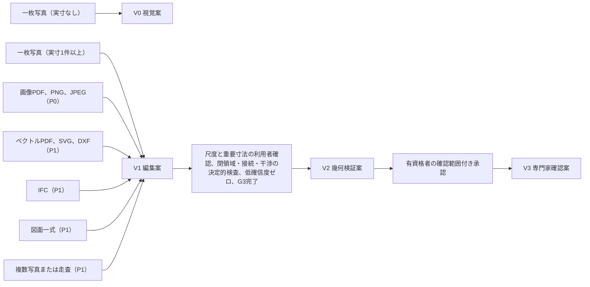

## 2. 図種の一覧と図種ごとに抽出する要素

### 2.1 図種一覧

図種は E-PRD-006 Source.drawingType の enum（表紙〜換気空調図、その他）に従う。図種判定は工程1（第4節）で頁ごとに行い、確信度と共に表示して利用者が修正できる（F-C02-005）。意匠図（配置図、各階平面、屋根伏、天井伏、立面、断面、矩計、詳細、建具表、仕上表）だけから構造要素と設備経路を創作しない（指示文C2、F-C02-009）【推定】。

| 番号 | 図種 | 抽出する要素（正規建物情報の実体） | 抽出しない、または補助にとどめるもの | 主な用途 | 優先 | 区分 |
|---:|---|---|---|---|---|---|
| 1 | 表紙 | 案件名、設計者名、作成日、図面番号体系、改訂番号（E-PRD-006.revisionDate、Project の参照情報） | 幾何 | 正本候補判定の入力（F-C02-019）。氏名と住所は伏せ字候補（第22章） | P1 | 【推定】 |
| 2 | 図面一覧 | 図面番号、図面名、縮尺、改訂記号と改訂日の一覧（各 Source への対応表） | 幾何 | 正本候補判定、差替え漏れ検出（F-C02-019） | P1 | 【推定】 |
| 3 | 特記 | 仕様の文（構造形式、基礎形式、断熱仕様、使用基準）の候補語（E-SRV-008 Assumption の元、VS-AI） | 数値の断定 | 構造形式仮定（E-BLD-003.structureType）、外皮方針の初期値（第13章）。構造や設備の要素は作らない | P1 | 【推定】 |
| 4 | 配置図 | 敷地境界候補（E-BLD-002.boundary。法的境界ではない）、建物外周の位置、方位、道路位置、外構（E-ELM-016）、庭と植栽（E-ELM-015） | 境界の確定、隣地条件の断定 | 敷地確認（第18章）との照合。方位（E-BLD-003.orientation） | P1（P0 は方位記号の読取だけ） | 【推定】 |
| 5 | 各階平面 | 外壁、内壁（E-ELM-001）、柱（E-ELM-005。柱記号がある場合のみ）、扉（E-ELM-007）、窓（E-ELM-008）、階段（E-ELM-009）、室名と閉領域（E-SPC-001）、床段差記号（E-ELM-002.levelDelta）、器具と造付家具（E-ELM-011）、可動家具（E-ELM-013）、通り芯（E-BLD-005）、寸法線と寸法文字、方位記号、縮尺表記、断面記号と詳細参照、改訂雲 | 梁、耐力の別（構造図がない限り null）、設備経路 | 建物情報の主体。P0 の入力の中心 | P0 | 【推定】 |
| 6 | 屋根伏 | 屋根形状、勾配、棟と谷の位置、軒の出（E-ELM-003.shape、pitch、eavesDepth、outline）、樋と放流位置（drainage） | 小屋組（構造） | 3D組立の屋根。なければ既定値表の屋根形状（VS-DEF） | P1 | 【推定】 |
| 7 | 天井伏 | 天井高、勾配天井、下がり天井、吹抜け（E-ELM-004）、点検口（E-ELM-011 kind=点検口）、照明位置（E-ELM-014。電気図がない場合は位置だけ） | 天井懐の内部 | 主要断面（第13章）、設備経路帯の高さ検査 | P1 | 【推定】 |
| 8 | 立面 | 階高と最高高さ（E-BLD-004.elevation、E-BLD-003.maxHeight）、開口の高さと腰高（E-ELM-008.height、sillHeight）、屋根勾配、外壁仕上の区分 | 平面位置の再構成（平面が正本） | 補助入力（F-C02-023）。P0 では階高、屋根形状、開口高さの三項目に限る | P0（補助入力） | 【推定】 |
| 9 | 断面 | 階高、天井高（E-BLD-004.floorToFloor、ceilingHeight）、床段差、梁下（E-ELM-006.bottomHeight。断面に梁が描かれている場合のみ）、屋根勾配、基礎形式の候補 | 梁の断面寸法の断定 | 補助入力（F-C02-023）。主要断面の元 | P0（補助入力） | 【推定】 |
| 10 | 矩計 | 層構成（E-MAT-003 Assembly、E-MAT-004 Layer）の候補、断熱位置、気密線、軒の納まり | 熱性能値（計算は第19章） | 外皮方針（第13章）。P1 | P1 | 【推定】 |
| 11 | 詳細 | 詳細番号と参照元（Source 間の参照関係）、部分の寸法 | 建物全体の再構成 | 図面間照合（F-C02-020）の参照切れ検出 | P1 | 【推定】 |
| 12 | 建具表 | 建具記号、種別、幅、高さ、開閉方式、ガラス仕様、性能区分（E-ELM-007、E-ELM-008 の属性。VS-SRC） | 品番の商品照合（第16章） | 平面図の建具記号との照合（同一記号の不一致検出） | P1 | 【推定】 |
| 13 | 仕上表 | 室ごとの床、壁、天井の仕上（E-MAT-002 Finish。VS-SRC） | 材料の性能値 | 室名との照合。商品照合は第16章 | P1 | 【推定】 |
| 14 | 構造図（伏図、軸組図を含む。第13章の依頼） | 通り芯、柱、梁、耐力要素の位置と記号（E-ELM-005、E-ELM-006、E-SYS-001 の bearingElementRefs）、基礎形式 | 部材寸法の安全性の判定（非対象） | 構造の初期注意（第13章）。構造図がある場合だけ isLoadBearing を true または false にできる。主要構造部の判定に使う E-ELM-001.bearsVerticalLoad と isCompartmentPartition（第12章 第4.3節 v1.5、第21章 第2.4節 (b)）も isLoadBearing と同じ扱いで、構造資料（伏図、軸組図）や区画の資料から建築士等が確認して入力し、AI は true を推定しない（null は「未確定」と表示） | P1 | 【推定】 |
| 15 | 電気図 | 分電盤、コンセント、スイッチ、照明、通信機器の位置と回路記号（E-ELM-012、E-ELM-014、E-SYS-002 kind=電気、照明、通信） | 容量計算 | 設備系統の初期値（第13章） | P1 | 【推定】 |
| 16 | 給排水図 | 給水、給湯、排水の立管、器具接続、勾配矢印、放流点（E-SYS-003 Route kind=配管、排水。E-SYS-002.supplyPoint） | 勾配の成立判定（第13章の干渉検査へ渡す） | 排水経路の初期注意 | P1 | 【推定】 |
| 17 | 換気空調図 | 換気機、ダクト経路、室内機と室外機の位置（E-ELM-012、E-SYS-003 kind=ダクト） | 風量計算 | 設備経路帯 | P1 | 【推定】 |
| 18 | その他 | 図種判定の確信度が閾値未満の頁。利用者が図種を指定するまで抽出しない | 全て | 図種の手動指定を求める | P0 | 【推定】 |

### 2.2 図種の判定方法と確信度

| 項目 | 内容 | 区分 |
|---|---|---|
| 判定の手掛かり | (1) 図面枠の表題欄の文字（「平面図」「1階」「立面」等。文字認識）。(2) 図面一覧の対応。(3) 頁の内容特徴（閉領域の有無、階段記号、通り芯記号、表形式）。(4) ベクトル資料の層名（「WALL」「壁」等）。四つの手掛かりの一致度から確信度（0〜1）を出す | 【推定】 |
| 確信度の閾値 | 図種の確信度が 0.80 未満の頁は「要確認」として S-05 の頁一覧に表示し、利用者の指定（VS-USR）を求める。0.80 以上でも利用者は変更できる。閾値は初期仮説（未決 U-11-001） | 【仮定】 |
| 階の割当 | 各階平面は表題欄の階名と、図面一覧、頁順から E-BLD-004 Level へ割り当てる。同じ階に二頁以上が割り当たった場合は改訂または差替えの候補として F-C02-019 へ渡す（P1）。P0 は一頁一階を前提とし、二頁以上の同一階は利用者が採用する頁を一つ選ぶ（判断として記録し VS-USR）。他の頁は Source に「未使用」として残し、選ぶまで工程3 以降へ進めず、S-05-05 に「採用する頁の選択待ち（入力起因）」を表示する（F-C02-005 例外(d)、AC-C02-005-05。v1.2 で「要確認」の記述を改めた。JM-070） | 【推定】 |
| 記号言語 | 日本語記号、英語記号、混在を頁ごとに判定し、層別の属性として Source に持つ（評価の層別に使う。第10節） | 【推定】 |

## 3. 画像系とベクトル系を分離する理由と、それぞれの前処理

### 3.1 分離する理由

| 理由 | 内容 | 根拠 | 区分 |
|---|---|---|---|
| 情報量の差 | ベクトル資料は線分、円弧、文字、層を座標付きで持ち、幾何は VS-SRC として取得できる。画像は画素しかなく、線の抽出と文字認識を経るため幾何も VS-AI になる。同じ前処理へ潰すと、ベクトルの座標精度を捨てるか、画像に存在しない層情報を仮定することになる | 指示文9.4「画像とベクトルを同じ前処理へ潰すべきでない」 | 【推定】 |
| 研究資料の性質の差 | CubiCasa5K は5,000件の画像に対する画素単位の注釈で、室の平均 IoU 57.5%、多角形化後 49.3%、扉 IoU 69.2%、窓 IoU 53.6% を報告する（https://arxiv.org/abs/1904.01920 、確認日 2026-09-15）【事実】。FloorPlanCAD はベクトル図面の線分単位の注釈で、片開き扉 PQ 0.869、窓 0.577、開口記号 0.481 を報告する（https://arxiv.org/abs/2105.07147 、確認日 2026-09-15）【事実】。画像系は多角形化で精度が明確に落ち、ベクトル系は開口記号の意味付けが弱い。弱点が異なるため検査と確信度の付け方も分ける | 調査06 第2.1節、第2.2節 | 【推定】 |
| 評価の層別 | 指示文9.4と画面指標試験骨格 第2.0節は「ベクトルか画像か」を層別の第一項目とする。前処理を分けることで層別の境界が処理経路と一致し、公開判定を入力種別ごとに行える | 指示文9.4 | 【推定】 |
| 五状態の割当 | ベクトル取得は VS-SRC、画像認識は VS-AI という初期状態の差を、経路の分離で機械的に保証する（第1.2節） | 基盤 信頼状態 第2.2節 | 【推定】 |

両経路は工程4（記号分類）以降で同じ中間表現（線分と円弧の集合＋文字＋記号候補、頁座標系、確信度付き）へ合流する。合流後の処理は経路に依存しないが、確信度と五状態は経路の由来を保持する【推定】。

### 3.2 画像系の前処理（画像PDF、PNG、JPEG、手描き、写真撮影した図面）

| 順 | 処理 | 入力 | 出力 | 失敗時の扱い | 区分 |
|---:|---|---|---|---|---|
| 1 | 画像化と解像度確認 | PDF の各頁、PNG、JPEG | 頁ごとの画像（原図として不変保存）、画素密度（dpi 相当）、画像の長辺画素数 | 長辺が 1,500 画素未満は「低解像度」の層別属性を付け、S-05 に「認識品質が下がる」と表示する。500 画素未満は対象外（初期仮説。未決 U-11-002） | 【仮定】 |
| 2 | 傾き補正と歪み補正 | 頁画像 | 補正角度（度）、補正後画像、補正前後の対応変換（頁座標系→補正座標系）。原図は不変 | 補正角度の推定が 5 度を超える、または長辺の直線群が二方向にまとまらない場合は「傾き大」として利用者に回転の指定を求める（F-C02-006） | 【仮定】 |
| 3 | 二値化とノイズ除去 | 補正後画像 | 線画像、除去したノイズ量 | 汚れ、透過した裏面の線が多い場合は「汚れ」の層別属性 | 【推定】 |
| 4 | 線分と円弧の抽出 | 線画像 | 線分集合（端点、太さ、連続性）、円弧集合（中心、半径、角度）。壁候補は太線、建具の開閉軌跡は円弧 | 抽出線が 0 本、または閉じた領域が 0 個の場合は「認識失敗」（S-05-05-X）として頁の再指定を求める | 【推定】 |
| 5 | 文字認識 | 補正後画像 | 文字列（位置、向き、確信度）。室名、寸法文字、記号文字（建具記号、通り芯記号、階名） | 寸法文字の向きが縦横混在する場合は向きごとに再認識する。認識できない文字は「?」として残し値にしない | 【推定】 |
| 6 | 寸法線解析 | 線分集合、文字列 | 寸法線（端末記号、寸法補助線、寸法文字の対応）。寸法連鎖（隣り合う寸法の並び）と全体寸法 | 寸法文字に対応する寸法線が見つからない場合、その文字を寸法値として使わない | 【推定】 |
| 7 | 縮尺表記の読取 | 文字列 | 縮尺の候補（例「1:100」）と印刷倍率不明の別 | 縮尺表記があっても印刷倍率が不明な画像（写真撮影、拡大縮小した PDF）では尺度を断定せず、基準寸法の指定（F-C02-014）へ渡す | 【推定】 |
| 8 | 原図位置合わせ（下絵） | 補正後画像 | 頁座標系と案件座標系の対応（原点、回転、係数） | 係数は尺度確認（第6.3節）で確定するまで仮値。参照: a.flat 3D My Room は図面画像を下絵とし、2点間を結んで実寸を入力して縮尺を決める手順を公開している（https://aflat.asia/support/myroom/index.html 、確認日 2026-09-15）【事実】。本製品は同じ2点指定を尺度確認の最小操作として採る【推定】 | — |

手描き平面（P1、F-C02-022）は上記に加え、線の揺れの許容（直線とみなす最大偏差 2% の長さ、初期仮説）を広げ、寸法文字は範囲値（例「約 3,600」）として VS-DEF 相当の扱いにし、層別属性「手描き」を付ける【仮定】。

### 3.3 ベクトル系の前処理（ベクトルPDF、SVG、DXF）

| 順 | 処理 | 入力 | 出力 | 失敗時の扱い | 区分 |
|---:|---|---|---|---|---|
| 1 | 構文解析 | ベクトルPDF の描画命令、SVG の要素、DXF のエンティティ | 線分、円弧、折れ線、文字、ブロック参照、層名、線種、線幅の集合（VS-SRC） | 解析できない要素（曲面、外部参照、埋込画像）は「読めなかった要素」として件数と種別を報告する。埋込画像だけの PDF は画像系へ振り分ける | 【推定】 |
| 2 | 単位と座標の判定 | DXF の $INSUNITS、SVG の viewBox と単位、PDF の頁寸法 | 単位（mm、m、inch、不明）、座標原点、上向き | 単位が不明、または図面枠の寸法と寸法文字の比が縮尺候補と一致しない場合は尺度を断定せず、基準寸法の指定へ渡す | 【推定】 |
| 3 | 層と要素種別の対応 | 層名、線種、線幅 | 層ごとの要素種別候補（壁、建具、家具、寸法、文字、通り芯、設備）と確信度。辞書（E-EXC-004）に層名の対応表を持つ | 層名が辞書にない場合は幾何特徴（太さ、閉領域の構成）から推定し VS-AI とする。層対応は S-05 で利用者が確認できる（必須確認「層対応」） | 【推定】 |
| 4 | 重複線と印刷表現の整理 | 線分集合 | 重複線の統合、ハッチ（塗り表現）の壁面化、破線の意味付け（隠れ線、上階の輪郭） | 統合で失われた線は Overlay に記録し原図へ戻れる | 【推定】 |
| 5 | 文字と寸法線の対応 | 文字、線分 | 寸法線（端末、補助線、文字の対応）。ベクトルの寸法文字と実測長の比から縮尺候補 | 文字が図形化（アウトライン化）されている場合は画像系の文字認識を文字部分だけに適用する | 【推定】 |
| 6 | 頁内の図枠分割 | 図面枠、表題欄 | 頁内の図（平面と詳細等）の分割と図ごとの縮尺（P1、F-C02-021） | P0 では分割せず、頁内複数縮尺は「対象外または要確認」 | 【推定】 |

IFC（F-C02-003、P1）はベクトル系の特例として扱う。要素は IfcWall、IfcDoor、IfcWindow、IfcSpace、IfcStair、IfcBuildingStorey、IfcSite 等から正規建物情報の実体へ直接対応付け（第12章の IFC対応列）、IfcGloballyUniqueId と個体 uuid の対応表を案件ごとに保持する（未決 U-00-010）。読めなかった要素と幾何欠落は必ず件数と識別子で報告する（調査06 第4.2節「IFC 取込時に読めなかった要素と幾何欠落を必ず報告する」）【推定】。

## 4. 解析10工程

### 4.1 工程の全体

指示文C2の10工程を、入力、処理、出力、確信度の付与方法、失敗時の扱い、利用者確認の要否で定める。工程1〜8は自動、工程9は利用者、工程10は承認済み2Dからの決定的な組立である。自動処理で到達できる最大の信頼状態は V1 であり、V2 は工程9の確認と第6.5節の昇格条件を満たした時だけ表示する（指示文G「自動はV1までとし、V2は尺度、外周、開口、室、階段、主要寸法の確認後に限る」）【推定】。

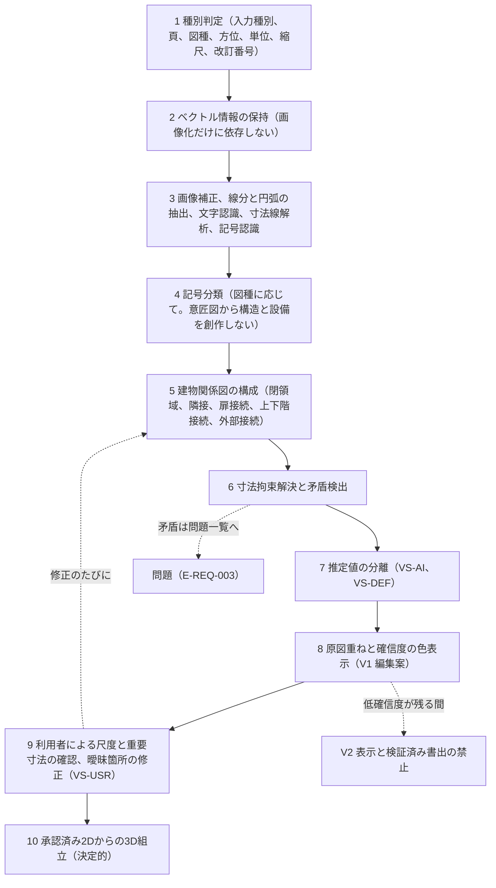

処理状態の表示名と工程の対応（第14章 第3.3節 AP-003 図面解析ジョブの段階と同じ。F-C02-028、S-05-05、S-30-02 はこの表示名だけを使い、百分率を出さない。v1.2、第14章の依頼）【推定】:

| 表示名（AP-003 の段階、順） | 対応する工程 | 段階の完了で表示するもの |
|---|---|---|
| 読込 | 工程1〜2（種別判定、ベクトル保持） | 頁一覧と七項目（S-05-05、S-05-06） |
| 尺度判定 | 工程1 の縮尺候補と工程6 の尺度拘束（候補の提示まで。確定は工程9 の利用者確認で、API は第14章 AP-004） | 尺度候補（S-05-03）。尺度の確定まで mm 値を出さない（第1.2節） |
| 壁抽出 | 工程3〜4 のうち壁、柱、通り芯、室名 | 部分結果（閲覧のみ。正本に入れない） |
| 開口抽出 | 工程3〜4 のうち扉、窓、階段 | 部分結果（閲覧のみ。正本に入れない） |
| 関係検査 | 工程5〜7（建物関係図、拘束解決、推定値の分離） | 閉じていない室と矛盾の一覧（S-05-04）。部分結果の採用はこの段階の完了後に限る（第14章 第3.6節） |
| 3D構築 | 工程8 と、縮尺候補による仮の工程10（原図重ね記録の生成と V1 の3D組立。尺度の確定まで mm 値を出さない） | 原図重ねと確信度（S-05-01、S-05-02）、V1 の3D（S-04-03） |

工程9（利用者確認と修正）はジョブの段階に含めず利用者の操作（AP-004）とし、尺度の確認と修正の後の工程10 は第14章 AP-010（3D構築）のジョブで再実行する。第14章が前提とする本章の値と性質は、低確信度の閾値（既定値表 DV-CF-01。U-11-005）と、工程5、6、10 が同じ入力と同じ既定値表の版で同じ出力を返す決定的処理であること（第5.2節、第5.3節、第9.2節）である。この値または性質、工程と表示名の対応を変える場合は第14章 第3.3節の段階名と時間上限を同時に改める【推定】。

### 4.2 各工程の定義

| 工程 | 入力 | 処理 | 出力 | 確信度の付与方法 | 失敗時の扱い | 利用者確認の要否 | 対応機能 | 区分 |
|---:|---|---|---|---|---|---|---|---|
| 1 種別判定 | 入力ファイル群、利用権確認記録 | 入力種別（IFC、ベクトル、画像、写真、走査）、頁数、頁ごとの図種（第2.2節）、方位（方位記号の文字認識と矢印の角度）、単位（第3.3節）、縮尺候補（第3.2節の7、第3.3節の2）、改訂番号（表題欄と改訂雲の文字）を判定する | E-PRD-006 Source（頁ごと。kind、page、drawingType、scale、revisionDate）、層別属性（入力品質、記号言語、手書きか否か） | 図種は四つの手掛かりの一致数（第2.2節）。方位は記号の検出確信度。縮尺は表記の有無と寸法文字の整合で 0〜1。単位は判定根拠の有無で 1.0（明示）、0.5（推定）、0（不明） | 頁が読めない（破損、暗号化、利用権なし）場合は頁単位で失敗状態を表示し、他の頁は続行する。図種の確信度 0.80 未満は「要確認」 | 要（七項目を頁ごとに表示し、利用者が修正できる。修正値は VS-USR。尺度は工程9で必ず確認） | F-C02-001、F-C02-002、F-C02-003、F-C02-004、F-C02-005、F-C02-021 | 【推定】 |
| 2 ベクトル保持 | 工程1の入力種別 | ベクトル情報があれば保持し（第3.3節）、画像系へは振り分けない。画像系は第3.2節の1〜3 | 中間表現（線分、円弧、文字、層、確信度）。ベクトル由来は VS-SRC | ベクトル取得は 1.0。層対応は辞書一致で 1.0、幾何推定で 0.5〜0.9 | 構文解析不能な要素は件数報告。全要素が解析不能なら画像系へ振り分け、その旨を表示 | 不要（層対応の確認は工程9で任意） | F-C02-002、F-C02-003 | 【推定】 |
| 3 抽出 | 中間表現または補正後画像。前提: 認識模型の出所（自社学習または外部認識 API。第24章 第5.1節、U-24-017）と模型、校正写像（第10.3節）の版が処理の版（第4.3節）として記録されている | 画像補正と傾き補正（第3.2節の2）、線分と円弧の抽出、文字認識、寸法線解析、記号認識（記号候補の検出。分類は工程4） | 線分集合、円弧集合、文字列（位置、向き）、寸法線、記号候補。全てに頁座標系の元座標 | 各要素に認識模型の確率を付ける。文字は文字ごとの確率の最小値。寸法線は端末と文字の対応が取れた場合 0.9 以上、片方だけなら 0.6 以下（初期仮説） | 抽出線 0 本または閉領域 0 個は認識失敗（S-05-05-X）。傾き補正角が 5 度超は回転指定を求める | 不要（結果は工程8で表示） | F-C02-006、F-C02-007、F-C02-022 | 【推定】 |
| 4 記号分類 | 工程3の出力、図種。前提: 分類に使う認識模型の出所（自社学習または外部認識 API。第24章 第5.1節、U-24-017）と版、記号辞書の版、校正写像（第10.3節）の版が処理の版（第4.3節）として記録されている | 図種に応じた記号辞書（第5.1節）で、外壁、内壁、柱、梁、扉、窓、階段、床、天井、室、設備、造付家具、可動家具、通り芯、電気、給水、排水、換気空調へ分類する。意匠図の頁からは構造要素（梁、耐力の別）と設備経路を生成しない | 要素候補（種別、幾何、属性候補、確信度）。E-ELM-、E-SPC-、E-BLD-005 の個体の元 | 種別ごとの分類確率。扉は「存在」「種別」「向き（吊元と開き方向）」の三つの確信度を別に持つ（扉向きは重大失敗の別集計） | 分類確率が全種別で 0.50 未満の候補は「未分類要素」として表示し、利用者が種別を指定するまで建物情報に入れない | 不要（低確信度は工程9で確認） | F-C02-008、F-C02-009 | 【推定】 |
| 5 建物関係図 | 要素候補、階の割当 | 壁の中心線から閉領域を作り室（E-SPC-001）を確定する。隣接（壁を共有）、扉接続（扉が二室を結ぶ）、上下階接続（階段と吹抜けの平面位置の重なり）、外部接続（外壁上の開口と玄関）を E-SYS-005 Connection として構成する（第5.2節） | Space の polygon と isClosed、Connection の集合、閉じていない領域の一覧 | 閉領域の確信度は境界壁の確信度の最小値。接続の確信度は経由要素（扉、階段）の確信度 | 閉じていない領域は問題（I-11-002 相当、SEV-1）として S-05-04 に表示し、外周が閉じない場合は V2 昇格条件(3)の不合格として V2 を阻止する。上下階の位置が一致しない階段は I-11-004 | 要（V2 前に閉領域と接続を確認。P0 は S-05-04 の問題一覧で確認） | F-C02-010 | 【推定】 |
| 6 拘束解決 | 要素候補、寸法線、通り芯、階高候補 | 尺度、通り芯への吸着、平行、直角、同一直線、壁厚、開口位置、階高の拘束を第5.3節の順で決定的に解き、寸法文字との残差と寸法連鎖の不一致を矛盾として検出する | 拘束解決後の幾何（案件座標系、mm。尺度未確認時は係数未定の相対座標）、E-REQ-002 Constraint（kind=寸法拘束、幾何拘束。solverStatus）、矛盾の一覧 | 決定的処理のため計算自体の確信度は 1.0。要素の確信度は「認識確率 × 拘束整合係数」で更新する。拘束整合係数は残差が許容差内で 1.0、許容差の2倍まで 0.7、それ以上 0.4（初期仮説） | 矛盾は E-REQ-003 Issue（SEV-1 または SEV-2、第5.4節）として登録。解が収束しない場合は拘束を弱い順に外し、外した拘束を表示する（S-04-07-X に準ずる失敗状態） | 要（矛盾の解決は利用者または専門家。工程9） | F-C02-011 | 【推定】 |
| 7 推定値の分離 | 拘束解決後の幾何、立面と断面の補助入力（F-C02-023）、既定値表 | 不明な高さ（階高、天井高、開口高さ、腰高）、厚さ（壁厚、床厚）、建具種、屋根形状、床段差を、補助入力があれば VS-SRC、認識できれば VS-AI（推定理由付き）、根拠がなければ VS-DEF（既定値表の識別子と版付き。E-SRV-008 Assumption）として値と別に持つ | 各要素の valueStates（属性ごと）、Assumption の個体、推定理由（E-SRV-009.reason） | VS-AI は推定模型の確率。VS-DEF は確信度を持たず「既定値」と表示する（確信度の色に混ぜない） | 補助入力の値と平面の値が矛盾する場合（例: 立面の開口高さが階高を超える）は矛盾として登録 | 要（主要寸法に VS-DEF が残る限り V2 にしない。I-00-120） | F-C02-012、F-C02-023 | 【推定】 |
| 8 原図重ねと確信度表示 | 原図、抽出線、要素、確信度 | 原図と抽出線を重ね（S-05-01）、要素ごとの確信度を色と文字と記号で表示する（S-05-02）。低確信度要素の一覧と修正依頼を出す。信頼状態帯に V1 と未確認項目数を表示する | E-SRV-009 Overlay（要素、属性、元頁、元座標、抽出幾何、認識方法、確信度、推定理由）、V1 編集案 | 第6.2節の帯（高、中、低）。低確信度の閾値は既定値表 DV-CF-01（初期仮説。未決 U-00-003 への本章の仮判断。JR-052） | 表示に必要な Overlay が欠ける要素は「出典欠落」の問題（SEV-1）とし、書出を止める（F-C02-017） | 要（次の工程9へ） | F-C02-013、F-C02-017、F-C02-018、F-C02-028 | 【推定】 |
| 9 利用者確認と修正 | V1 編集案、S-05 | 利用者が尺度（基準寸法）と重要寸法を最低一つ確認し（第6.3節、第6.4節）、低確信度要素、閉じていない室、矛盾を修正する。修正は履歴付き（E-REQ-011 ChangeCommand origin=直接操作）で、修正値は VS-USR。改装案件でも本工程の修正は図面読解の修正（現況の訂正）で案の変更命令ではないため、撤去と移設の自動付与（第21章 第2.1節 規則(7)）の対象外とし、訂正で消した要素は撤去にしない（統括の決定 D38。改装案件の手修正は S-05 で行う。F-C02-015 例外(d)） | 尺度確認記録（E-REQ-007 Approval scopeKind=尺度）、修正済み要素、未確認項目数の更新。修正のたびに工程5と6を再実行する | 利用者確認済みの値は確信度表示の対象外（VS-USR の記号を表示） | 誤った基準寸法（実寸の2倍等）は複数寸法の整合検査で異常値を警告し、確認しない限り V2 判定を拒否する（T-R-005） | 要（本工程が確認そのもの） | F-C02-014、F-C02-015 | 【推定】 |
| 10 3D組立 | 承認済み2D建物情報（尺度確認済み、閉領域と接続の検査合格）、階高、屋根、開口高さ | 第9節の規則で、壁の押出し、床と天井の生成、開口の切欠き、階段の生成、屋根の生成を決定的に行う。2Dと3Dは同じ建物情報から描画する | 3D形状（E-ELM-*.geometry の3D部分）、同期2Dと3D（S-04-02、S-04-03）。信頼状態は工程9の結果に従い V1 または V2 | 3D組立は決定的で確信度を変えない。要素の確信度と五状態を3D表示へ引き継ぐ | 組立不能（壁の高さが 0、階段の階が存在しない等）は要素単位で失敗を表示し、他の要素は組み立てる（S-04-03-X） | 不要（承認済み2Dが入力） | F-C02-016 | 【推定】 |

工程3、4 の認識模型（線分、文字、寸法線、記号の抽出、要素分類、図種判定）は、出所が自社学習か外部認識 API かを第24章 第5.1節が定め、本章はどちらの場合も同じ出力形式（頁座標系の元座標、認識方法、確信度、模型の版）を前提とする。外部の場合は F-C10-018 の最小送信と伏せ字（第1.2節）に従う。模型の出所と、模型、記号辞書、校正写像の版は E-SRV-010 Confidence に記録する（AC-C02-007-03。JM-177）。調達方式の選択と未成立時の代替（手修正中心の V1、または図面入力を入力種別ごとに非公開とする条件付き公開）は第24章 第5.1節と U-24-017 が定め、本章はどちらの場合も工程5〜10 を変えない【推定】。

### 4.3 工程の再実行と差分

| 規則 | 内容 | 区分 |
|---|---|---|
| 再実行の単位 | 工程9の修正は影響する要素だけについて工程5〜8を再実行する。頁全体の再認識は利用者が明示した場合だけ行う | 【推定】 |
| 決定性 | 工程5、6、10 は同じ入力（要素、拘束、既定値表の版、処理の版）に対して同じ出力を返す。乱数や実行順序依存を持たない。同一入力での再実行結果の一致を T-P-011（決定性。N-OP-05）で確認する | 【推定】 |
| 言語模型の位置 | 言語模型は工程4の室名の正規化（例「LDK」→ 居間、食堂、台所）と、工程8の推定理由の文章化、工程9の修正意図の解釈に限って使う。座標、寸法、接続を言語模型の出力から直接書き込まない（第9.3節） | 【推定】 |
| 処理の版 | 認識模型、記号辞書、拘束解決、既定値表の版を Overlay と Confidence に記録し、版の更新時は同意済み案件の再評価（M-Q- の月次）に使う | 【推定】 |

## 5. 記号分類、建物関係図、寸法拘束解決、矛盾検出

### 5.1 記号分類の一覧

記号辞書は E-EXC-004 Dictionary の分類（E-EXC-003 Classification classType=要素、属性群）として版付きで持ち、日本語記号と英語記号の両方を登録する。図種ごとに「生成してよい要素」を制限し、意匠図から構造と設備を創作しない（F-C02-009）【推定】。

| 分類群 | 記号（例） | 生成する実体と属性 | 生成を許す図種 | 確信度の別集計 | 区分 |
|---|---|---|---|---|---|
| 壁 | 二重線（太線）、塗り、ハッチ。外壁は外周を構成する壁、内壁は外周内 | E-ELM-001 Wall（kind、centerline、thickness）。耐力の別（isLoadBearing）は構造図がない限り null | 各階平面（意匠図）、構造図 | 外壁欠落は M-Q-26 で別集計 | 【推定】 |
| 柱 | 塗りつぶし矩形、×印付き矩形、通り芯交点の記号 | E-ELM-005 Column（section、gridPositionRef）。isStructural は構造図がある場合のみ true/false | 各階平面（独立柱の記号がある場合）、構造図 | — | 【推定】 |
| 梁 | 破線の矩形（上階梁）、梁記号（G、B 等） | E-ELM-006 Beam。意匠図の破線からは生成しない | 構造図、断面（描かれている場合の梁下高さのみ） | — | 【推定】 |
| 扉 | 開き（円弧＋扉線）、引き、引違い、折れ、親子、両開き、玄関、勝手口、シャッター。建具記号（WD1、AW2 等） | E-ELM-007 Door（kind、width、swing、swingArea、hostWallRef）。建具記号は建具表と照合 | 各階平面、建具表 | 扉向き誤りは M-Q-28 で別集計 | 【推定】 |
| 窓 | 壁上の細線区間（三本線、二本線）、FIX、引違い、縦すべり、出窓 | E-ELM-008 Window（width、operation、sillHeight は立面か建具表から） | 各階平面、立面、建具表 | — | 【推定】 |
| 階段 | 段の平行線、昇り矢印（UP、DN）、踊り場 | E-ELM-009 Stair（kind、width、stepCount、fromLevelRef、toLevelRef、opening） | 各階平面、断面 | 階段接続誤りは M-Q-27 で別集計 | 【推定】 |
| 床と床段差 | 畳の目地、段差記号（▽、数値）、土間 | E-ELM-002 Slab（kind、levelDelta） | 各階平面、断面 | — | 【推定】 |
| 天井 | 勾配記号、吹抜け表記、点検口記号 | E-ELM-004 Ceiling、E-ELM-011（kind=点検口） | 天井伏、断面 | — | 【推定】 |
| 室名 | 文字（居間、LDK、洋室、和室、玄関、廊下、階段室、収納、WIC、浴室、UB、洗面、トイレ、WC 等）と畳数 | E-SPC-001 Space（name、usage、area の照合） | 各階平面 | 室認識は M-Q-04 | 【推定】 |
| 設備器具 | 便器、洗面、浴槽、流し、給湯機、換気扇、室内機、室外機、分電盤 | E-ELM-011 Fixture（意匠図の器具記号は位置と種別のみ）、E-ELM-012 Equipment | 各階平面（器具の位置と種別）、電気図、給排水図、換気空調図（系統と経路） | — | 【推定】 |
| 造付家具、可動家具 | 造付収納、造作台所の矩形、机、寝台、ソファ、食卓の記号 | E-ELM-011（kind=造付収納、造作台所）、E-ELM-013 Furniture（配置の初期値。商品ではない。PT-GEN） | 各階平面 | — | 【推定】 |
| 通り芯 | 一点鎖線、端部の円と記号（X1、Y1、A、1 等） | E-BLD-005 Grid（axes、module、matchedSourceRefs） | 各階平面、構造図、配置図 | — | 【推定】 |
| 寸法 | 寸法線、端末記号（斜線、矢印、丸）、寸法補助線、寸法文字、寸法連鎖 | 拘束（E-REQ-002 kind=寸法拘束）と VS-SRC の寸法値 | 全図種 | 寸法文字は M-Q-06 | 【推定】 |
| 図面情報 | 方位記号、縮尺表記、表題欄、改訂雲、改訂記号（△1 等）、断面記号（A-A）、詳細参照番号 | E-PRD-006 Source の属性、図面間参照 | 全図種 | — | 【推定】 |
| 電気 | コンセント、スイッチ、照明、分電盤、通信端子 | E-ELM-014 Light、E-ELM-012、E-SYS-002（kind=電気、照明、通信） | 電気図（意匠図の照明記号は位置のみ） | — | 【推定】 |
| 給水、給湯、排水 | 立管記号、勾配矢印、器具接続、放流点、雨水桝 | E-SYS-003 Route（kind=配管、排水、slope）、E-SYS-002.supplyPoint | 給排水図、配置図（桝と放流点） | — | 【推定】 |
| 換気空調 | ダクト、換気扇、給気口、室内機、室外機 | E-SYS-003（kind=ダクト）、E-ELM-012 | 換気空調図 | — | 【推定】 |

意匠図しかない案件で構造要素（梁、耐力の別）と設備経路の自動生成が 0 件であることを受入条件 AC-C02-009-01 とする（F-C02-009 の観察可能な合格条件）【推定】。

### 5.2 建物関係図の構成

建物関係図（用語集 212）は、節（室、階、外部）と辺（E-SYS-005 Connection の kind）から成る。室の閉領域（用語集 213）は壁の中心線で囲まれた領域として作る【推定】。

| 関係 | 定義（観察可能な条件） | 構成方法 | 検査（決定的） | 不合格時の問題 | 区分 |
|---|---|---|---|---|---|
| 閉領域 | 壁の中心線を辺とする平面グラフで、面（閉路）として囲まれた領域。外周は最外の閉路 | 中心線の端点を許容距離（壁厚の 1/2 または 60 mm の小さい方、初期仮説）で結合し、面を列挙する。室名文字を含む面を Space とする | (1) 外周が一つの閉路である。(2) 各室名文字が一つの面に含まれる。(3) 面の面積が 1.0 m2 以上（初期仮説。収納は 0.3 m2） | 外周が閉じない: I-11-002（SEV-1。V2 阻止）。室名のない面: SEV-2。面のない室名: SEV-2 | 【仮定】 |
| 隣接 | 二つの室が同じ壁（区間）を共有する | 面の共有辺から生成 | 隣接は対称（A→B があれば B→A） | 非対称は内部矛盾として自動修正し記録 | 【推定】 |
| 扉接続 | 扉（E-ELM-007）の hostWallRef が隣接壁上にあり、connectsSpaceRefs が壁の両側の室（または室と外部）を指す | 扉の位置を壁区間へ投影し、両側の面を取る | (1) 扉の両側に面または外部がある。(2) 開き勝手の側の室に開閉域が収まる（家具との干渉は第13章の検査） | 片側に面がない扉: SEV-2（「扉が壁上にない」） | 【推定】 |
| 上下階接続 | 階段（E-ELM-009）の fromLevelRef と toLevelRef の階が存在し、下階の階段開口と上階の階段開口が平面上で重なる | 下階と上階の階段多角形の重なり率（IoU）を計算する | IoU が 0.5 以上（初期仮説）、かつ昇り矢印の向きが一致 | I-11-004 階段接続の不整合（SEV-1。二階建以上で V2 阻止条件。M-Q-27） | 【仮定】 |
| 吹抜け | 上階に床のない領域が下階の室の上にある | 天井伏または上階平面の吹抜け表記から | 上階の吹抜け多角形が下階の面に含まれる | 含まれない: SEV-2 | 【推定】 |
| 外部接続 | 玄関、勝手口、掃出し窓が外周壁上にあり、片側が外部である | 外周閉路上の開口から | 玄関扉が 1 以上ある（住宅の場合） | 玄関扉 0: SEV-2（「玄関が認識できない」） | 【推定】 |

```mermaid
flowchart LR
    EXT["外部"] -- "玄関扉（扉接続）" --> HALL["玄関（1階）"]
    HALL -- "扉接続" --> LDK["居間・食堂・台所（1階）"]
    HALL -- "隣接" --> WC1["便所（1階）"]
    LDK -- "扉接続" --> WASH["洗面（1階）"]
    WASH -- "扉接続" --> BATH["浴室（1階）"]
    HALL -- "階段（上下階接続）" --> HALL2["廊下（2階）"]
    HALL2 -- "扉接続" --> BR1["寝室（2階）"]
    HALL2 -- "扉接続" --> BR2["子供室（2階）"]
    LDK -. "吹抜け（上下階接続）" .-> VOID["吹抜け（2階）"]
```

### 5.3 寸法拘束解決

拘束解決（用語集 214）は決定的検査であり、同一入力に同一結果を返す。P0 の拘束は次の順で解く。順序を固定するのは、後段の拘束が前段の結果に依存するためである【推定】。

| 順 | 拘束 | 内容 | 許容差（初期仮説） | 入力の五状態 | 区分 |
|---:|---|---|---|---|---|
| 1 | 尺度 | 頁座標から案件座標（mm）への係数。縮尺表記、寸法文字と寸法線長の比、基準寸法（利用者指定）の三つの候補を持ち、利用者が確認した値を採用する（第6.3節）。確認前は係数未定 | 候補間の差が 2%（DV-CF-03）以内なら整合。超えれば矛盾（I-11-001） | VS-USR（確認後）。それまで表示しない | 【仮定】 |
| 2 | 通り芯への吸着 | 壁の中心線と柱を最寄りの通り芯へ吸着する。通り芯がない場合は壁の中心線の位置を格子（module の候補 910 mm、1,000 mm、955 mm、その他。DV-CF-08）で推定し、格子は VS-AI | 中心線と通り芯の距離が壁厚の 1/2 以内なら吸着。超えれば吸着せず「通り芯外」の属性 | 通り芯は VS-SRC（ベクトル）または VS-AI | 【仮定】 |
| 3 | 平行と直角 | 壁の方向をクラスタ化し、主方向（二方向）から 1 度以内の壁を平行または直角へ補正する。斜め壁は主方向から 5 度以上離れたものとし補正しない | 1 度（補正）、1〜5 度（矛盾候補、SEV-2） | 幾何は元の五状態を維持 | 【仮定】 |
| 4 | 同一直線 | 同じ方向で中心線の距離が許容差内の壁区間を一つの直線上へ揃える | 実寸 15 mm または壁厚の 1/4 の小さい方 | 同上 | 【仮定】 |
| 5 | 壁厚 | 壁の二重線の間隔をクラスタ化し、代表値へ丸める。クラスタの代表値は既定値表の壁厚候補 DV-GE-16（在来木造の 105、120、150、180 mm。他構法は未確認〔U-88-008〕で、枠組壁工法の壁厚の候補を加えるかは本章担当と一級建築士が決める。値の正本は第12章）に近いものへ寄せ、寄せた場合は VS-AI、寄せられない場合は元の測定値を VS-AI（推定理由「クラスタ外」） | クラスタ幅 ±10 mm | VS-AI（画像）、VS-SRC（ベクトルで層に壁厚がある場合） | 【仮定】 |
| 6 | 開口位置 | 扉と窓の中心と幅を、ホスト壁の中心線上へ投影する。建具表の幅（VS-SRC）があれば幅を建具表に合わせ、平面図の幅との差を矛盾候補にする | 平面図の幅と建具表の幅の差が 50 mm 超で SEV-2 | 幅は建具表 > 寸法文字 > 認識の優先で五状態を決める | 【仮定】 |
| 7 | 階高 | 立面または断面の補助入力（VS-SRC）、なければ既定値表 DV-GE-01（VS-DEF）。階ごとに一つ | 補助入力の階高と最高高さの和の整合 ±50 mm | VS-SRC または VS-DEF | 【仮定】 |
| 8 | 寸法文字との整合 | 寸法線の両端が指す要素間の距離と寸法文字の値の残差を求め、残差が許容差内なら寸法文字を拘束（強い重み）として幾何を最小二乗で補正する。寸法連鎖の和と全体寸法の差も検査する | 残差 20 mm 以内で整合。20〜100 mm は補正しつつ SEV-2。100 mm 超は補正せず矛盾（SEV-1）。連鎖の和の差は 10 mm 以内（DV-CF-07） | 寸法文字は VS-SRC | 【仮定】 |

解法は、順1〜7 で得た初期解に対し、順8 の寸法文字を強い重み（1.0）、認識した幾何を弱い重み（0.1）とした線形最小二乗を一回だけ実行する。反復はしない（決定性と応答時間のため。M-P-01 の目標は第23章 N-PF-01）。重み（DV-CF-06）、許容差（DV-CF-07）、格子候補（DV-CF-08）は既定値表（第12章）の行として版管理し、公開判定会議で固定する（未決 U-11-003）。本節の値は 2026-10-06 に既定値表の値と一致することを確認した【仮定】。

### 5.4 矛盾検出と問題への登録

| 矛盾の種類 | 検出条件 | 重大度 | 固定先 | 例示 | 区分 |
|---|---|---|---|---|---|
| 尺度候補の不一致 | 縮尺表記、寸法文字比、基準寸法の候補間の差が 2%（DV-CF-03）超 | SEV-1（確認まで V2 阻止。未確認のまま寸法表示や V2 判定へ進む場合は I-00-108 の SEV-0） | 図面頁（寸法線） | I-11-001 基準寸法（扉幅 800 mm）から求めた係数と縮尺表記 1:100 から求めた係数が 1.9 倍異なる | 【仮定】 |
| 外周不閉合 | 外周閉路が一つに閉じない | SEV-1（V2 阻止） | 2D位置（隙間） | I-11-002 一階平面の北側外壁に 300 mm の隙間があり閉領域が外部と連続する | 【仮定】 |
| 寸法文字と幾何の残差 | 残差 100 mm 超 | SEV-1 | 図面頁（寸法線） | — | 【仮定】 |
| 寸法連鎖の不一致 | 連鎖の和と全体寸法の差が 10 mm（DV-CF-07）超 | SEV-2 | 図面頁 | — | 【仮定】 |
| 建具表との不一致 | 平面図の建具記号の種別または幅が建具表と異なる | SEV-2（P1） | 図面頁（両頁） | I-11-003 平面図の建具記号 WD3 が建具表では引違いだが平面図では開き扉として描かれている（図面間矛盾。F-C02-020） | 【仮定】 |
| 階段の上下階不整合 | 階段開口の IoU が 0.5 未満、または昇降方向が不一致 | SEV-1（V2 阻止） | 3D要素（階段） | I-11-004 二階平面の階段開口が一階の階段位置から 1,200 mm ずれている | 【仮定】 |
| 階高の不整合 | 立面の階高の和と最高高さの差が 50 mm 超、または開口高さが階高を超える | SEV-2 | 図面頁（立面） | — | 【仮定】 |
| 通り芯記号の不一致 | 同じ記号の通り芯が図面間で位置または間隔が異なる（P1） | SEV-2 | 図面頁 | — | 【仮定】 |
| 要素の重なり | 二つの壁が同じ区間を占める、扉が二つの壁にまたがる | SEV-2 | 2D位置 | — | 【仮定】 |

矛盾は E-REQ-003 Issue として一件ずつ登録し、主担当領域は A03（幾何の矛盾）または A12（図面間、改訂、正本の矛盾）を一つだけ付ける。同じ矛盾を複数の要素に複製しない。解決は利用者の修正（VS-USR）、資料の差替え、または確認者の却下（IS-REJECTED、M-G-09 の分子）で行う。V2 を阻止する矛盾（外周不閉合、階段の上下階不整合）は第6.5節 条件3 の検査規則（E-EXC-005 kind=閉領域、接続）で、尺度候補の不一致は条件1 と I-00-108 の規則で判定し、規則の版を検査結果に記録する（JM-068）【推定】。

## 6. 図面検証画面（S-05）での確認と V1→V2 の昇格

### 6.1 原図重ね

| 項目 | 内容 | 区分 |
|---|---|---|
| 表示 | S-05-01 に原図（補正後画像またはベクトル描画）と抽出線（壁中心線、壁面線、開口、階段、室の閉領域）を重ねる。透過率（0〜100%）、頁と階の切替、抽出線の種別ごとの表示切替を持つ | 【推定】 |
| 戻れること | 全要素と全属性値から E-SRV-009 Overlay を通じて元頁と元座標へ戻れる。要素を選ぶと原図上の元座標が強調表示される。Overlay のない要素は「出典欠落」（例示 I-11-005）として問題（SEV-1）になり書出を止める（F-C02-017） | 【推定】 |
| 差分一覧 | 原図と抽出線の差（欠落: 原図に線があるが要素がない。余分: 要素があるが原図に線がない。位置ずれ: 一致度 matchScore が 0.8 未満）を一覧化し、各行から原図上の位置へ導く（T-A-001 合否(4)） | 【推定】 |
| 一致度 | E-SRV-009.matchScore は、抽出線の周囲（壁厚の 1/2 の帯）に原図の画素または線分が存在する割合（0〜1） | 【仮定】 |

### 6.2 確信度の色表示

| 帯 | 確信度の範囲 | 表示（色に加えて文字と記号） | 扱い | 区分 |
|---|---|---|---|---|
| 高 | 0.90 以上（帯の境界は本節が正本。初期仮説） | 「高」＋実線＋確信度の%表示 | 確認は任意。確信度校正（M-G-04。合格値は第23章 第3.4節）で 0.9 帯を試験する | 【仮定】 |
| 中 | DV-CF-01 の閾値以上 0.90 未満 | 「中」＋破線＋% | 確認を推奨。V2 昇格の妨げにはならない | 【仮定】 |
| 低 | DV-CF-01 の閾値未満 | 「低」＋点線＋%＋警告記号 | 低確信度要素（用語集 107）。壁と開口と階段は S-05-02 の一覧に載り、修正または確認（VS-USR）するまで V2 表示と検証済み書出を禁止する（F-C02-018、I-00-119）。閾値は既定値表 DV-CF-01（初期仮説。未決 U-00-003 への本章の仮判断。JR-052） | 【仮定】 |
| 既定値 | 確信度なし | 「既定値」＋既定値表の識別子 | 主要寸法（尺度、外周、開口、室、階段、階高）に残る限り V2 にしない（I-00-120） | 【推定】 |
| 確認済み | 確信度表示なし | 「確認済み」＋確認者と日時（VS-USR）、「専門家確認」＋氏名、資格（VS-PRO） | 確信度の色に混ぜない | 【推定】 |

色は画面指標試験骨格 第1.5節の視覚方針に従い、色だけに依存せず文字と線種を併用する。対比 4.5 対 1 以上（第23章 N-AC）【推定】。

### 6.3 尺度確認（F-C02-014）

| 項目 | 内容 | 区分 |
|---|---|---|
| 対象 | 頁ごとの尺度（頁座標から mm への係数）。P0 は頁内単一尺度 | 【推定】 |
| 操作 | S-05-03 で次のいずれかを行う。(a) 原図上の二点を結び実寸を入力する（基準寸法。例: 扉幅 800 mm、畳の長辺 1,820 mm）。(b) 縮尺表記の候補（例 1:100）と印刷倍率の確認（「この PDF は原寸で印刷されたか」の確認ではなく、寸法文字と一致するかの検査結果を見て採用する）。(c) 寸法文字の候補（寸法線が指す二点の実寸として採用） | 【推定】 |
| 整合検査 | 採用した係数で、頁内の全寸法文字（M-Q-06 で読めた文字）について寸法線長との残差を計算し、残差 2% 超の寸法文字の件数と一覧を表示する。件数が寸法文字数の 20% を超える場合は「尺度が誤っている可能性」の警告を出し、確認を求める（T-R-005）。基準寸法から計算した扉幅が 500 mm 未満または 1,500 mm 超、階段幅が 600 mm 未満等の異常値も警告する（値は既定値表 DV-CF-05 の異常値範囲、初期仮説）。異常値範囲には室の面積 60 m2 超、廊下幅 1,500 mm 超、階段幅 1,500 mm 超を加える（第12章 v1.2 の DV-CF-05 に追加済み。U-11-017）。寸法文字が 0 件の頁（写真撮影した図面、手描き）では残差検査を「検査不能（寸法文字なし）」と表示して合格とみなさず、第6.4節の重要寸法の確認で利用者の実測値（mm）の入力を必須とし、基準寸法から算出した値との差が DV-CF-11 の許容を超えると警告する（T-R-005 の層「寸法文字なし」「1.5 倍」。JM-071） | 【仮定】 |
| 記録 | 確認は E-REQ-007 Approval（scopeKind=尺度、approverRef=利用者、approvedAt）として記録し、尺度の五状態を VS-USR にする。整合検査に警告がある場合は、各警告について利用者が理由（自由記述 20 字以上。尺度の正しさを何で確かめたかを書く。例: 玄関の親子扉を現地で実測し幅 1,600 mm を確認した）を付けて承知した記録を E-REQ-007.acknowledgedWarnings（anomalyRef、reason、acknowledgedAt。第12章 v1.2 で定義済み）に持ち、理由のない承知は受け付けない。S-05-03 の理由の入力欄の既定文には例示を入れず「何で確かめたか（実測、図面の記載、既知の寸法）を書いてください」と表示する（第6章 第2.2節、第12章、第15章と同文。JR-049）。I-00-108 の解除に必要な成果は「基準寸法 1 件以上の指定、整合検査の実行、警告がある場合は各警告への理由付きの承知の記録、尺度の承認（AS-VALID）」の四つで、第6章 第2.2節、第14章 AP-004 と同じ文言にする（JM-064）。承知の件数は確認範囲「尺度」の内訳「警告承知 n 件」として S-30-01 の詳細、S-13-03、書出の透かしと GLB・PDF の注記、G4 の情報要求適合表へ渡し、警告承知ありの V2 案を警告なしの V2 案と同じ見え方にしない。寸法文字が 0 件の頁で承認した尺度の案は、同じ経路（S-30-01 の「尺度」行、透かし、第6章 第2.5節 欠落の自動記録 (v)）に「尺度: 残差検査不能（寸法文字なし）、実測照合 n 件」を出す（JR-047）。確認前は寸法値を画面と書出に出さない（AC-C02-014-01） | 【推定】 |
| 失効 | 頁の再認識、原図の差替え、基準寸法の変更、照合差が再指定の閾値（DV-CF-11 に併記。第6.4節）を超えた照合で尺度の承認は AS-VOID になり、依存する主要寸法の VS-USR は VS-AI へ戻る（基盤 信頼状態 第2.2節。JR-047） | 【推定】 |

### 6.4 重要寸法の確認

| 項目 | 内容 | 区分 |
|---|---|---|
| 重要寸法 | 利用者が尺度と共に最低一つ確認する代表寸法。候補は外周の一辺、居間の内法幅、廊下幅、階段幅、玄関扉幅から製品が提示し、利用者が選んで実測または図面の寸法文字と照合する。確認記録は照合方法（実測、寸法文字、既知寸法）と照合値（mm）を必須属性として持ち（S-05-03 の入力欄は第15章が定める。属性は第12章の valueStateMeta.checkMethod と checkValue）、画面の値を見て確認操作を押すだけでは VS-USR にしない。尺度の基準寸法に使った要素と区間は照合の対象から除き、同じ要素の同じ属性を選ぶ操作は受け付けない（AC-C02-014-06）。寸法文字が 0 件の頁では照合方法を実測に限り（第6.3節。JM-071）、照合する寸法に外周の一辺を少なくとも一つ含める。照合値と製品の算出値の差が DV-CF-11 の許容（初期仮説。U-11-017）を超える確認は受け付けず修正（F-C02-015）へ導き、DV-CF-11 に併記した再指定の閾値（初期仮説）を超える照合は手修正ではなく基準寸法の再指定（S-05-03 の二点の再指定）へ導いて尺度の承認を AS-VOID にする（JR-047）。対象の建物が未建築で実測できない場合は照合方法に「実測不能（未建築）」を選べ、選んだ案は照合値を持たないため V2 の条件に数えず「V2 の対象外（寸法の根拠なし）」と表示する（案内の画面は第15章 S-05-03-X。F-C02-014 例外(e)。JR-050） | 【推定】 |
| 主要寸法 | V2 昇格までに VS-USR 以上が必要な六種（尺度、外周、開口、室、階段、階高）。基盤 信頼状態 第2.2節の主要寸法と同じ集合。六種の確認にも重要寸法と同じ照合方法と照合値を必須とする（尺度は第6.3節の基準寸法の実寸が照合値に当たる。JR-047）。基準寸法に使った要素の同じ属性（例: 基準寸法に使った扉の幅）は、尺度の承認（E-REQ-007 scopeKind=尺度。AS-VALID）で確認済みに数える（独立の照合には数えず、条件1 の重要寸法にも数えない。第6.5節 条件2。統括の決定 D45） | 【推定】 |
| 確認の粒度 | P0 では外周の各辺、各室の代表内法、各開口の幅、各階段の幅、各階の階高を一覧（S-05-03 の「重要寸法と主要寸法の一覧」。第15章）で示し、利用者は「一括確認」ではなく項目ごとに確認する。一括確認の操作は提供しない（確認の形骸化を防ぐ）。各行に照合方法と照合値の入力欄を置き、valueStateMeta.checkMethod と checkValue のない VS-USR は第6.5節 条件1、条件2 で数えない（JR-047。基準寸法に使った要素の同じ属性は尺度の承認〔AS-VALID〕で条件2 の確認済みに数える。D45） | 【仮定】 |
| 修正 | 値の修正は F-C02-015 の手修正として履歴を残し、工程5と6を再実行する | 【推定】 |

### 6.5 V1→V2 の昇格条件（基盤 信頼状態 第1.2節の展開）

| 番号 | 条件 | 本章で検査する方法 | 検査の種類 | 検査規則（E-EXC-005: kind、expression の要旨、version、testRef） | 不足時の表示 | 区分 |
|---:|---|---|---|---|---|---|
| 1 | 尺度と重要寸法1件以上が VS-USR 以上 | 尺度の Approval（scopeKind=尺度）が AS-VALID、重要寸法の valueStates が VS-USR 以上で照合方法と照合値を持つ | 決定的 | kind=寸法拘束。count(頁 where scale.valueState < VS-USR or Approval(scopeKind=尺度).status ≠ AS-VALID) > 0 or count(重要寸法 where valueState ≥ VS-USR and valueStateMeta.checkMethod ≠ null and checkValue ≠ null) = 0 → 不合格。checkMethod と checkValue のない VS-USR、照合方法「実測不能（未建築）」の確認、基準寸法に使った要素の同じ属性の確認は数えない（JR-047、JR-050）。I-00-108 は同じ kind で「尺度未確認、または acknowledgedWarnings に理由のない警告が残るまま寸法表示または V2 判定へ進む」を式にする（I-00-108 の式は変えない）。version v2.0、testRef T-A-002、T-R-005 | S-13-05「尺度未確認」「重要寸法未確認」 | 【推定】 |
| 2 | 外周、室、開口、階段、主要寸法が VS-USR 以上 | 第6.4節の一覧の全項目が VS-USR 以上で照合方法と照合値を持つ。既定値（VS-DEF）が主要寸法に残らない。基準寸法に使った要素の同じ属性は、尺度の承認（AS-VALID）で確認済みに数える（独立の照合には数えない。統括の決定 D45） | 決定的 | kind=欠落属性。count(主要寸法 where not (基準寸法に使った要素の同じ属性 and Approval(scopeKind=尺度).status = AS-VALID) and (valueState < VS-USR or (valueState = VS-USR and (valueStateMeta.checkMethod = null or checkValue = null)))) > 0 → 不合格。checkMethod と checkValue のない VS-USR は数えない（JR-047）。基準寸法に使った要素の同じ属性は尺度の承認が AS-VALID なら確認済みとする（D45）。version v2.1（v2.1 で D45 の除外を式に加えた）、testRef T-A-007 | 未確認項目数と一覧 | 【推定】 |
| 3 | 閉領域、隣接、扉接続、上下階接続の決定的検査に合格 | 第5.2節の検査で SEV-1 以上の問題が IS-RESOLVED | 決定的 | kind=閉領域、接続。count(Space where isClosed=false) + count(Issue where 種類∈{外周不閉合, 階段の上下階不整合} and status ∉ {IS-RESOLVED, IS-REJECTED}) > 0 → 不合格。version v1.0、testRef T-A-001、T-P-002、T-P-003 | 該当問題の一覧（S-05-04） | 【推定】 |
| 4 | 干渉検査で SEV-0 がない | 第13章の干渉検査（F-C12-005、F-C04-010）の結果を参照 | 決定的 | kind=干渉。第13章 第5.2節、第5.5節の検査記録 E-SRV-004（kind=干渉検査）.outputs.values（conditionNo=4、pass、sev0IssueRefs、checkedAt、ruleVersion。項目の正本は第12章）の最新の記録を参照し、pass=false または count(sev0IssueRefs) > 0 → 不合格。version は第13章の ruleVersion、testRef は第13章 第5.2節の規則（T-A-010。反証は T-R-002、T-R-003） | 該当問題（S-10） | 【推定】 |
| 5 | 低確信度要素がゼロ | lowConfidence=true の壁、開口、階段が 0 件（修正または VS-USR で解消） | 決定的 | kind=欠落属性。I-00-119 = count(要素 where kind∈{壁,開口,階段} and lowConfidence=true) > 0。version v1.0、testRef T-A-007 | 低確信度要素数（S-05-02） | 【推定】 |
| 6 | 主要寸法に VS-DEF が残らない | 条件2に含む | 決定的 | kind=欠落属性。I-00-120 = count(主要寸法 where valueState=VS-DEF) > 0。version v1.0、testRef T-A-007 | 既定値の一覧 | 【推定】 |
| 7 | G3 の完了条件を満たす | 第6章 G3 の完了条件(1)〜(8)。本章の条件1〜6は G3 の(3)(4)(8)に対応 | 段階門の判定 | 第6章 第8.2節の一覧が正本。本章の規則は行 G1 I-00-108（第11章 第6.5節 条件1）、G3 I-00-119、I-00-120（同 条件5、条件6）として規則名と版 v1.0 付きで登録済み（第6章 v1.2）。式の版を変える場合は第6章へ通知する | S-13-01 | 【推定】 |

昇格の判定は F-C15-004（第6章）が行い、本章の機能は条件1〜6 の検査結果（条件番号、pass、version、対象識別子）と未確認項目数を E-REQ-010.completionChecks の形で渡す。言語模型の出力だけで昇格しない（基盤 信頼状態 第0節。JM-068）【推定】。

改装案件の付帯条件: 工事範囲（撤去、補修、補強、移設）の要素が CS-DRW または CS-EST のままの案は、条件1〜7 を満たしても信頼状態帯（S-30-01）に「現況未確認（n 要素）」を併記し、G3 の門で問題 I-06-008（現況未確認の改装要素。主担当 A10、影響先 A04、A06、SEV-1。P1。第6章 第8.2節）を登録する（第21章 第2.1節 規則(5)、基盤 信頼状態 v1.3 第1.2節。JM-155、JR-021）。資格を登録した RL-CHK（P1 は照合済みの資格。第6章 第5.2節）の例外承認で持ち越せる（JR-012）。P0 は問題を登録せず、「現況未確認（n 要素）」の表示と G4 の欠落の自動記録 (vii)（第6章 第2.5節）だけを行い、n は第21章 第2.1節 規則(7)で自動付与した撤去と移設の要素のうち CS-DRW または CS-EST の要素数とする。表示は書出の透かしと GLB、PDF の注記にも含める（JR-095）。P1 の問題の登録は F-C02-024-02 と第21章 F-C14-001 で行い、受入条件は第21章 AC-C14-001-05（T-R-006 P1 版）とする【推定】。

### 6.6 低確信度が残る場合の書出禁止（F-C02-018）

| 項目 | 内容 | 区分 |
|---|---|---|
| 禁止の対象 | 低確信度の壁、開口、階段が 1 件でも残る案について、V2 表示、「検証済み」「幾何確認済み」の語、透かしが V2 以上の書出（GLB、PDF、SVG、DXF、IFC）を禁止する | 【推定】 |
| 許す書出 | V1 の透かし付き書出（GLB、PDF 平面）は許す。書出には未確認項目数と低確信度要素数を添付する | 【推定】 |
| 修正依頼 | S-05-02 に低確信度要素の一覧と「修正または確認」の操作を出す。S-08 の書出画面では禁止理由として該当要素数と一覧への導線を表示する（T-A-007） | 【推定】 |
| 降格 | 新資料の再認識や修正で低確信度要素が新たに生じた場合、V2 の案は V1 へ降格し、理由を記録する（基盤 信頼状態 第1.3節） | 【推定】 |

## 7. 図面一式の照合（P1）

### 7.1 正本候補の判定（F-C02-019）

| 手順 | 内容 | 区分 |
|---:|---|---|
| 1 | 図面一覧（図種2）を読み、図面番号、図面名、縮尺、改訂記号、改訂日の対応表を作る。図面一覧がない場合は各頁の表題欄から同じ表を作り、確信度を下げる（0.6 以下） | 【推定】 |
| 2 | 各頁の表題欄の図面番号と改訂記号を対応表と照合し、(a) 一覧にあるが頁がない（欠落）、(b) 頁があるが一覧にない（追加または別一式の混入）、(c) 同じ図面番号の頁が二つ以上（改訂版の重複）、(d) 一覧の改訂記号より古い改訂の頁（差替え漏れ）を検出する | 【推定】 |
| 3 | 同じ図面番号の頁が複数ある場合、改訂日が最新で改訂雲の記載が一覧と一致する頁を正本候補（E-PRD-006.isMasterCandidate=true）とし、他を「旧版候補」とする。判定理由（改訂日、改訂記号、改訂雲の一致）を記録する | 【推定】 |
| 4 | 正本候補、旧版候補、欠落、混入を S-05-06 に表示し、人（RL-OWN、RL-EDT または RL-CHK）が正本を確定する。確定は判断（E-REQ-004。例 D-11-001）として決定者、理由、版を記録する。差替え漏れの図面番号（新版頁が一式に存在しないもの）は、(i) 新版頁の追加取込（F-C02-021 の頁追加）、(ii) 旧版を正本として採用する判断（E-REQ-004、理由必須、RL-OWN または RL-CHK）、(iii) 当該図面を引継ぎ資料（E-EXC-002）から除外し情報要求適合表の欠落として出す、のいずれかを要し、未選択の図面番号は正本未確定として手順5 の I-06-003 に含める。差替え漏れの頁に由来する要素値は VS-AI に戻し S-05-02 の低確信度一覧に載せる（JM-063）。混入の頁（手順2 (b) で一覧にない頁）は案件からの除外か採用の確定判断（E-REQ-004。除外は理由必須）を要し、確定まで工程3 以降の抽出の対象から外す。欠落の図面番号は、頁の追加取込、または欠落のまま進める判断（E-REQ-004、理由必須）と情報要求適合表（E-EXC-002）への欠落の記録のいずれかで確定する（JR-048） | 【推定】 |
| 5 | 正本、混入、欠落の確定判断のない図面番号が残るまま、G1→G2 の門の通過要求（三案生成の有無を問わない。第6章 第2.3節の利用目的による適用除外で分岐案一つの案件を含む）または V2 判定の要求が行われた場合は I-06-003（SEV-0。第6章 第2.2節）で止め、G4 の引継ぎでは I-06-003 を再検査する（T-R-004。段階門 G1 停止、G4 再検査。JR-048）。I-00-122 は CDE-PUB の一意性に限定し本章では使わない（JM-024） | 【推定】 |

I-06-003 の検査規則は E-EXC-005（kind=欠落属性、isDeterministic=true、version v2.0、testRef T-R-004、appliesTo.gates={G1, G4}）とし、式は count(図面番号 where 候補頁数 ≥ 2 or 差替え漏れ or 欠落 or 混入, 確定判断なし) > 0（確定判断は E-PRD-006.isMasterCandidate と E-REQ-004 の結合で判定する。混入は除外か採用、欠落は追加取込か欠落のまま進める判断を確定判断とする）。契機は G1→G2 の門の通過要求と V2 判定の要求（JR-048）。判定結果は F-C02-019 の出力として返す。第6章 第8.2節の一覧に行 G1、G4 I-06-003（規則名「正本未確定（第11章 第7.1節）」、v2.0、T-R-004）として登録済みである（JM-024、JM-068。v2.0 は 2026-10-07 に混入と契機を改めた版で第6章と同じ）。正本の確定時は E-REQ-011 ChangeCommand（origin=正本確定、targetRefs=旧版由来の要素）を一件作り、第8.4節の差分更新を呼ぶ（JM-069。origin の追加は第12章、確定操作は第14章 AP-032 operation=正本確定 へ依頼）【推定】。

### 7.2 図面間照合（F-C02-020）

| 照合対象 | 照合方法 | 不一致の問題 | 区分 |
|---|---|---|---|
| 通り芯 | 各図面の通り芯記号と位置（間隔）を照合する | 同じ記号で間隔が 10 mm 超異なる: SEV-2（構造図と平面図の不一致は SEV-1） | 【仮定】 |
| 階 | 各階平面、立面、断面、構造図の階名と階高を照合する | 階数または階高が異なる: SEV-1 | 【仮定】 |
| 室 | 平面図の室名と仕上表、天井伏の室名を照合する | 一方にしかない室: SEV-2 | 【仮定】 |
| 建具記号 | 平面図の建具記号と建具表の種別、幅、高さを照合する | 種別または幅の不一致: SEV-2（I-11-003） | 【仮定】 |
| 詳細参照 | 平面図と断面図の断面記号、詳細番号が詳細図に存在するか | 参照先がない: SEV-3（参照切れ） | 【仮定】 |
| 改訂雲 | 改訂雲で囲まれた範囲の内容が、一覧の改訂記号と改訂日に対応するか | 改訂雲があるのに一覧の改訂記号が古い: 差替え漏れ SEV-1 | 【仮定】 |
| 寸法 | 平面図の外周寸法と配置図、立面図の寸法を照合する | 50 mm 超の差: SEV-2 | 【仮定】 |

不一致は E-REQ-003 Issue として図面頁に固定し（固定先=図面頁、両頁の参照）、主担当領域 A12、影響先 A03 または A08 を付ける。優先した資料と理由（E-PRD-006 の資料優先順）を残し、後から新しい資料が入った場合は第8.4節の差分更新へ渡す【推定】。

## 8. 現況差分（既存住宅、改装。P1）

### 8.1 現況状態の付与規則（F-C02-024-01、F-C02-024-02）

P0 は F-C02-024-01（CS-DRW と CS-EST の初期付与と S-05 での記号と文字の表示。改装の部位〔壁、床、天井、屋根、基礎〕の内部を 2D と 3D で「未確認」の表現で描き空洞に描かない。JR-107）、P1 は F-C02-024-02（現況資料による CS-SITE、CS-OPEN への遷移と第8.2節の差異の重ね表示）が担う（JM-152。機能一覧骨格 v1.2 の副番）。P0 の改装案件では工事前調査の要否を問題として登録せず、S-05-07 の固定注記（第21章 第1.2節）で義務を伝える【推定】。

| 契機 | 付与する現況状態 | 条件 | 区分 |
|---|---|---|---|
| 設計時図面または竣工図から要素を取得（F-C02-024-01、P0） | CS-DRW | 図面（E-PRD-006 kind=図面）が出典。図面の時点（設計時図面、施工図、竣工図、不明）は E-PRD-006.drawingStage（第12章 v1.2。取込時に F-C02-005 が判定）で区別し、改装案件では竣工図を設計時図面より優先する | 【推定】 |
| 現況写真、採寸、三次元走査、既存住宅状況調査の記録を要素へ結合（F-C02-024-02、P1） | CS-SITE | E-SRV-002 Observation（kind=現地目視、採寸、写真、走査点群）が要素を参照し、observedAt と observerRef がある。既存住宅状況調査（既存住宅状況調査方法基準。非破壊で劣化事象等を調べ、調べられない部位は「調査できない」とする。SRC-319、確認日 2026-10-07【事実】）の記録で CS-SITE にするのは目視できる部位の要素だけとし、concealedParts（隠れ部分）は CS-SITE にも CS-OPEN にもしない。部位ごとの結果（劣化事象等あり、なし、調査できない）は E-SRV-001（kind=既存住宅状況調査）.findings.values[] の value に記録して隠れ部分の推定の根拠とし、「調査できない」部位の要素の CS- は上げない（01_調査 08 第6節。第12章 第6.5節と同じ規則。v1.3 の追補） | 【推定】 |
| 開口調査、石綿事前調査、耐震診断の記録を結合（F-C02-024-02、P1） | CS-OPEN | E-SRV-001 Survey（kind=石綿事前調査、耐震診断）または Observation（開口調査）が要素を参照し、調査者と資格（該当時）がある | 【推定】 |
| 図面にも現地確認にもない要素、隠れ部分（F-C02-024-01、P0） | CS-EST | 下地、基礎、配管、配線、劣化、漏水、腐朽、蟻害、石綿の有無は、CS-OPEN または該当する専門調査の記録がない限り「無い」と表示しない。2D と 3D では部位の内部を空洞として描かず、「未確認」の表現（斜線塗り等。第15章 S-27-01 と同じ図案）で描く | 【推定】 |
| 工事で対象部位が変更または撤去（F-C02-024-02、P1） | CS-EST へ戻す | 竣工反映（第21章）で再び CS-SITE | 【推定】 |

改装案件で工事範囲（renovationAction が撤去、補修、補強、移設）に入る壁、床、天井、屋根、基礎の要素には、隠れ部分を表す要素共通属性 concealedParts（kind: 下地、配管、配線、劣化、漏水、腐朽、蟻害、石綿。conditionState: CS-EST または CS-OPEN。surveyRef、note。第12章 v1.2 で定義済み）を要素種別ごとの既定集合 DV-MT-05（第12章）で CS-EST として生成し、「残す」要素には生成しない（U-21-017 の仮判断）。改装区分の指定（S-27-03）を持たない P0（撤去と移設の自動付与だけ。第21章 第2.1節 規則(7)）では concealedParts を生成せず、壁、床、天井、屋根、基礎の内部を「未確認」の表現で描く（F-C02-024-01）。開口調査と石綿事前調査の記録は該当する kind だけを CS-OPEN にし、要素本体の CS- は変えない。S-27-04 の一覧と T-R-006 の「無い」と描かない判定は concealedParts を単位とする（第21章 第2.3節。JM-153）【推定】。

### 8.2 差異の種類と重ね表示

| 差異の種類 | 検出条件 | 表示（S-05、S-10、S-27） | 区分 |
|---|---|---|---|
| 存在差 | 図面にある要素が現況資料にない、または現況資料にある要素が図面にない | 「図面のみ」「現況のみ」の記号で重ね表示 | 【推定】 |
| 寸法差 | 同じ要素の寸法が図面と現況で 30 mm 超異なる（初期仮説） | 差の値と両方の出典 | 【仮定】 |
| 位置差 | 同じ要素の位置が 50 mm 超異なる | 同上 | 【仮定】 |
| 仕上と設備の差 | 仕上表と現況写真、設備点検記録の不一致 | 該当要素に「差異あり」 | 【推定】 |
| 設計時図面と竣工図の差 | 二種の図面の間の差 | 設計時、竣工、現況の三層を切り替えて重ねる | 【推定】 |

重ね表示の優先は「現況（CS-SITE、CS-OPEN） > 竣工図 > 設計時図面」とし、正規建物情報の値は優先の高い出典から取り、他は Overlay に保持する。CS-EST の隠れ部分は「無い」と描かない（基盤 信頼状態 第10節）【推定】。

### 8.3 現況資料の結合（F-C02-025）と隠れ部分の問題化（F-C02-026）

| 項目 | 内容 | 区分 |
|---|---|---|
| 資料の種類 | 現況写真、採寸、三次元走査、既存住宅状況調査、耐震診断、地盤資料、設備点検、修繕履歴。E-PRD-006（kind=写真、走査、調査報告）と E-SRV-001 Survey、E-SRV-002 Observation として別資料のまま保持し、要素から資料へ戻れる | 【推定】 |
| 結合の方法 | 写真は撮影位置と向き（利用者指定または画像の情報）で室へ結ぶ。走査点群は尺度確認済みの場合に壁面へ最近傍で結ぶ（許容 50 mm、初期仮説）。調査報告は対象要素または室を利用者が指定する | 【仮定】 |
| 問題化 | 解体、改造、補修を伴う改装案件（renovationAction に撤去、補修、補強、移設がある）では、石綿事前調査等の工事前調査の要否を E-REQ-003 Issue（主担当 A10。I-00-029 相当、例示 I-11-006）として自動登録し、不足調査一覧（E-SRV-001 status=必要）へ入れる。隠れ部分（CS-EST）の要素には必要な調査（開口調査、耐震診断等）を表示する。既存住宅状況調査、耐震診断、開口調査の要否は第21章 第2.4節の自動登録条件に従って登録する（JM-151）。(a) 既存住宅状況調査: 現況資料（E-SRV-002）が 0 件、または構造耐力上主要な部分と雨水の浸入を防止する部分に CS-SITE 以上の要素が一つもない場合（主担当 A11、SEV-2。利用目的が売却または賃貸資料なら SEV-1）。(b) 耐震診断: 着工年（E-BLD-003.constructionStartYear）が旧耐震の閾値 DV-ST-10 に当たる、外周壁または耐力壁候補線上の壁の撤去または移設がある、増築を伴う、のいずれか（主担当 A04、SEV-1）。(c) 開口調査: 工事範囲の壁、床、天井、屋根、基礎の concealedParts に CS-EST の項目が残る場合（主担当は項目の領域、SEV-1）。調査記録の findings または Observation.value が劣化（腐朽、蟻害、漏水）、石綿含有、想定外の配管・配線を示す場合は、要否の問題の解決と同じ変更識別子で「発見の問題」を要素ごとに一件だけ登録する（F-C02-026 手順(6)。JM-065）。発見の問題の重大度は第6章 第8.2節 I-06-007（報告種別は第12章 DV-CF-13 で導く。G3、G4。P1）が付ける（JR-013）。P0 では要否の問題を登録せず S-05-07 の固定注記にとどめる（JM-152） | 【推定】 |
| 現況の写真からの3D | 一枚写真からの V0、実寸1件以上での V1（第1.1節）。写真から隠れ面と背面を推定した要素は VS-AI かつ CS-EST | 【推定】 |

### 8.4 新しい現況資料が入った場合の差分更新（F-C02-027）

```mermaid
flowchart TD
    N["新しい現況資料の取込（写真、採寸、走査、調査報告、新しい図面）"] --> C["変更命令 E-REQ-011（origin=新資料取込）を一件作成"]
    C --> R["影響する要素の再認識または再取得（工程5〜7を影響範囲だけ再実行）"]
    R --> I["影響 E-REQ-012 を影響先領域ごとに一件ずつ作成"]
    I --> E1["3D要素の更新（幾何、五状態、現況状態）"]
    I --> E2["数量 E-SRV-006 の再計算"]
    I --> E3["費用項目 E-SRV-014 の再計算（第20章）"]
    I --> E4["判断 E-REQ-004 への影響表示（再判断の要否）"]
    I --> E5["承認 E-REQ-007 の自動失効（AS-VOID、理由付き）"]
    E1 --> V["信頼状態の降格判定（V2→V1 の条件に該当すれば降格）"]
```

| 規則 | 内容 | 区分 |
|---|---|---|
| 一つの変更識別子 | 新資料の取込は一つの変更命令（E-REQ-011 origin=新資料取込）として扱い、全ての影響（E-REQ-012）と派生問題がこれを参照する。同じ事象を複製しない | 【推定】 |
| 影響範囲 | 資料が結ばれた要素と、その要素を参照する接続、数量、費用項目、判断、承認だけを更新する。案件全体を再認識しない | 【推定】 |
| 承認の失効 | 影響範囲内の承認（尺度、間取り、構造、設備等の確認範囲）だけを AS-VOID にし、失効理由（変更命令の識別子と日時）を記録する（第6章 第5.3節、T-R-004 合否(4)） | 【推定】 |
| 資料の優先 | 新資料が既存の出典より優先の高い現況状態（CS-SITE > CS-DRW）を与える場合は値を置き換え、旧値を Overlay に残す。同じ現況状態の資料が矛盾する場合は問題（SEV-2）とし、利用者または確認者が優先を決める（例示 D-11-002） | 【推定】 |
| 記録 | 差分更新の前後値は E-REQ-006 Revision.diff に残し、S-04-07 と同じ形式で仮表示してから確定する（第12章の変更命令の手順） | 【推定】 |

## 9. 3D構築の論理

### 9.1 承認済み2Dからの組立（F-C02-016）

3D は承認済み2D建物情報（尺度確認済み、閉領域と接続の検査合格、または V1 でも工程9の途中で利用者が組立を要求した場合は透かし付き）から決定的に組み立てる。2D と 3D は同じ建物情報から描画し、どちらで変更しても他方へ反映される（同期2Dと3D、M-Q-19 = 100%）【推定】。

| 順 | 要素 | 組立規則 | 使う値と五状態 | 区分 |
|---:|---|---|---|---|
| 1 | 階（E-BLD-004） | elevation を基準高さとし、floorToFloor で上階の elevation を決める | 階高: VS-SRC（断面、立面）または VS-DEF | 【推定】 |
| 2 | 床（E-ELM-002） | 階の外周閉路を outline とし、thickness で押し出す。levelDelta の室は床面を段差分ずらす | 床厚: VS-DEF（既定値表）または VS-SRC | 【推定】 |
| 3 | 壁（E-ELM-001） | centerline を thickness で両側へ広げ、height（既定は階高から床厚を引いた値）で押し出す。外壁と内壁の接合は中心線の交点で結合する | 壁厚、高さ | 【推定】 |
| 4 | 開口（E-ELM-007、E-ELM-008） | ホスト壁に、幅 × 高さ（扉は床から height、窓は sillHeight から height）の切欠きを作り、建具の形状（PT-GEN の一般形状。商品は第16章）を置く。扉の swingArea を平面に描く | 幅: VS-SRC/VS-AI/VS-USR。高さと腰高: VS-SRC（立面、建具表）または VS-DEF | 【推定】 |
| 5 | 階段（E-ELM-009） | fromLevel と toLevel の高さ差を riser で割った段数と tread で段を生成し、opening を上階の床から切り欠く | 蹴上と踏面: VS-SRC（断面）または VS-DEF。段数は整合検査（高さ差 = 蹴上 × 段数 ±20 mm。DV-CF-04） | 【推定】 |
| 6 | 天井（E-ELM-004） | 室の polygon を ceilingHeight に置く。吹抜けは天井を作らない | 天井高: VS-SRC または VS-DEF | 【推定】 |
| 7 | 屋根（E-ELM-003） | shape（切妻、寄棟、片流れ、陸屋根）と pitch、eavesDepth から最上階の外周に生成する。屋根伏または立面がない場合は既定値表の形状（DV-GE-17。切妻）と勾配（DV-GE-13）で VS-DEF とし、「屋根形状は既定値」と表示する | 形状と勾配 | 【推定】 |
| 8 | 器具と家具（E-ELM-011、E-ELM-013） | footprint と既定の高さで一般形状（PT-GEN）を置く。実商品は第16章 | 高さ: VS-DEF | 【推定】 |
| 9 | 通り芯（E-BLD-005） | 3D では表示切替可能な補助線として描く | — | 【推定】 |

### 9.2 決定的な拘束解決と組立の性質

| 性質 | 内容 | 検査 | 区分 |
|---|---|---|---|
| 決定性 | 同じ建物情報の版と同じ処理の版に対し、同じ頂点列と同じ面を生成する（頂点の順序、分割方法を固定する） | T-P-011（決定性。同一入力の 3 回の再実行で checksum が一致。N-OP-05。第23章 第4.2節） | 【推定】 |
| 整合 | 3D の計測値（F-C04-007）は建物情報の寸法値と誤差 0 で一致する | AC-C04-007-01 | 【推定】 |
| 変更の反映 | 2D、3D、自然文のいずれで変更しても、変更命令の確定後に他方が再描画される。反映時間は M-P-02（目標は第23章 N-PF-02） | T-P-009、T-P-007 | 【推定】 |
| 部分再生成 | 変更した要素と接合する要素だけを再生成する（3D処理費の抑制。指示文9.11「変更部分だけ再生成」） | 再生成した要素数の記録 | 【推定】 |
| 段階詳細 | 共有用 GLB は表示に必要な詳細（面の分割数、質感）に落とし、正本の幾何は保持する | GLB の容量と M-P-03 | 【推定】 |

### 9.3 言語模型は座標を書かない

| 規則 | 内容 | 区分 |
|---|---|---|
| 責務 | 言語模型は要求理解、操作意図（対象、操作、量、方向、固定条件、目的）、説明、室名の正規化、推定理由の文章化を担当する（用語集 216） | 【推定】 |
| 禁止 | 言語模型の出力から得た座標、寸法、頂点、接続を未検査で正本へ書き込まない。言語模型が数値を含む出力をした場合でも、その数値は変更命令の intent.amount として扱い、幾何は拘束解決（第5.3節）と決定的検査（第5.2節、第13章の干渉検査）を通してから確定する | 【推定】 |
| 記録 | 言語模型補完（E-SRV-009.recognitionMethod=言語模型補完）で得た値は VS-AI とし、推定理由と模型の版を Confidence に記録する | 【推定】 |
| 参照した事実 | FloorplanVLM は画像から壁、開口、室の構造化 JSON 列を生成するが、座標を [0,1024] の整数格子へ量子化し、壁接続の隙間や構造幻覚を限界として報告している（https://arxiv.org/abs/2602.06507 、確認日 2026-09-15）【事実】。本製品は言語模型系の出力を候補として受け取り、mm 単位の幾何は拘束解決で与える【推定】 | — |

### 9.4 写実生成は派生出力（F-C03-015）

| 規則 | 内容 | 区分 |
|---|---|---|
| 一方向 | 写実画像は正規建物情報（案の版）から生成する派生表示（用語集 35）であり、写実画像から正本へ書き戻す経路を持たない。保存は書出と同じ E-EXC-002 Delivery（formats=写実画像、revisionRef=派生元の版、viewpoint、generatorRef。第12章 v1.2、U-12-003）とし、書出検査の対象に含める | 【推定】 |
| 表示 | 写実画像には信頼状態の透かし、生成日時、案の版、「派生表示（編集は建物情報で行う）」の注記を付ける。V0 の意匠像も同じ扱い | 【推定】 |
| 商品 | 写実画像に含まれる商品は PT- と RS- の状態に従う。PT-REF の代替形状と PT-AI の独自案を正規商品と同じ見え方にしない（第16章） | 【推定】 |
| 参照した事実 | HouseCrafter は間取りを条件として多視点画像を生成しメッシュを再構成するが、出力は壁厚や開口幅の寸法や要素の意味を持たない（https://arxiv.org/abs/2406.20077 、確認日 2026-09-15）【事実】。この種の生成物を建築モデルと呼ばず V0 の派生表示に限定する（共通指示 第7節）【推定】 | — |

### 9.5 3D表示と書出の描画部分（C04 のうち本章が主章の機能）

| 機能 | 描画の規則（本章） | 画面設計（第15章）と書出検査（第22章）へ渡す事項 | 区分 |
|---|---|---|---|
| F-C04-001 軌道回転、俯瞰、建物模型表示 | 案件座標系の原点を建物外周の重心とし、俯瞰は真上、建物模型表示は屋根を含む全体。鍵盤操作でも同じ視点へ到達できる | 操作の割当、焦点表示 | 【推定】 |
| F-C04-002 室内walkthrough | 視点高さの初期値と当事者別の値（立位、座位、子供、車椅子）は既定値表 DV-FN-03（立位 1,500 mm 等。初期仮説。未決 U-00-031）、衝突判定は壁と閉じた扉に対して行い、開いた扉と開口は通過できる。段差は levelDelta に従う | 視点高さの変更操作、当事者確認の記録（S-04-09。第5章の実物尺度の歩行。記録は S-24-06 に表示） | 【推定】 |
| F-C04-003 flyover（P1） | 建物外周から 5 m 外側、屋根最高点＋5 m の経路を既定とし、経路を保存して再生できる | 経路の編集 | 【仮定】 |
| F-C04-004 階別表示と屋根非表示 | 階の切替で上下階接続（階段、吹抜け）の情報を失わず、非表示の階の接続を輪郭で示す | 切替部品 | 【推定】 |
| F-C04-005 断面表示と主要断面 | 任意位置の切断面と、階高、天井高、梁下、屋根勾配、設備経路を示す主要断面（用語集 149）を建物情報から描く。切断位置は第13章 第6.1節の 7 種を自動選定し（P0 は 3〜6 本）、表示項目は第13章 第6.2節の表示項目（第13章 v1.3 で 15 項目。開口上端と梁下、天井の照合を含む。JR-067）に従う。構造図がない案件の梁下は跨度別の梁せい仮定（DV-ST-06）から算出した値を「仮定（既定値）」の記号と「既定値による判定（跨度 n mm の区分）」の文字付きで描き、確定値として描かない（JM-066、JR-068）。主要断面は G3 の必須成果として版付きで保存する | S-10 の表示 | 【推定】 |
| F-C04-006 透過表示（P1） | 透過率を変えても選択要素の輪郭と識別を保つ | 透過部品 | 【推定】 |
| F-C04-007 計測 | 距離、面積、高さを建物情報の値から計算し、描画上の近似値を使わない（誤差 0） | 計測部品 | 【推定】 |
| F-C04-009 日照表示（簡易） | 日時、緯度経度（E-BLD-002.geoPoint。第18章 第1.3.2節）、方位（northAngle）から太陽位置を決定的に計算し、影を描く。計算条件を表示し、性能値（EL-）と混同しない。計算の担い手は未決 U-00-034（本章は表示側で簡易計算する案を仮採用） | S-03 の並列比較 | 【仮定】 |
| F-C04-010 実寸保持と空間側検査 | 空間側の寸法保持と検査（実寸、通路幅と扉の有効開口幅の要求値との照合、扉の開閉域 swingArea の空間確保、室寸法）を建物情報上で決定的に検査し、不足を問題として登録する（検出率 M-Q-21、M-Q-22）。経路の最小有効幅（E-SYS-003.metrics.minWidthMm）の算出は本機能だけが行う（JR-051）。商品側の当たり判定（商品の必要余白、可動範囲、搬入経路）は第16章 F-C05-009 が担い（M-Q-20）、検査規則 E-EXC-005（kind=干渉、余白）を両機能で共用する（JM-067） | S-04 の問題表示 | 【推定】 |
| F-C04-012 GLB書出 | 共有用の軽量 GLB。単位（mm）、座標原点、改訂（版）、要素ごとの確信度と五状態、権利情報、信頼状態の透かしを添付する。書出検査は第22章 | 書出検査、透かしの描画 | 【推定】 |
| F-C04-014 PDF平面書出 | 平面図を PDF で描き、縮尺、方位、改訂、V 状態、未確認項目数を図面上に印字する。低確信度要素は図面上でも点線と「低」で示す | 書出検査 | 【推定】 |

改装案件の改装区分（renovationAction）の表示は、2D、3D、主要断面（F-C04-005）、PDF 書出（F-C04-014）のいずれも第15章の表示規則（撤去、新設、補強、補修、移設、残すの線種、記号、凡例）に従い、本章では線種と記号を別に定めない（第21章 第2.1節。JR-079）【推定】。

## 10. 評価設計（指示文9.4）

### 10.1 評価の区分（層別）

| 区分 | 値 | 判定方法 | 区分 |
|---|---|---|---|
| ベクトルか画像か | ベクトル（DXF、SVG、ベクトルPDF、IFC）、画像（画像PDF、PNG、JPEG） | 工程1の入力種別 | 【推定】 |
| 入力品質 | 明瞭、低解像度（長辺 1,500 画素未満）、傾き（補正角 2 度超）、汚れ（ノイズ除去量が画素の 3% 超）、手描き（P1。F-C02-022。P0 の公開判定には算入しない。JM-175） | 第3.2節の前処理で付ける層別属性（閾値は初期仮説） | 【仮定】 |
| 構法 | 在来木造、大断面木造（BF 等）、枠組壁工法、プレハブ、鉄骨、RC。P0 の層は在来木造。大断面木造、枠組壁工法、プレハブ、鉄骨、RC は各 10 件を「P0 対象外の構法の検出」の試験情報として持ち、認識精度の合格値は置かない（第23章 第2.3節。JR-109） | 特記または利用者入力（E-BLD-003.structureType） | 【推定】 |
| 階数 | 平屋、二階、三階以上 | 階の割当 | 【推定】 |
| 壁形状 | 直交壁のみ、斜め壁あり、曲面あり | 第5.3節の順3で主方向から 5 度以上離れた壁の有無、円弧壁の有無 | 【推定】 |
| 図種 | 意匠図のみ、図面一式 | 図種判定 | 【推定】 |
| 記号言語 | 日本語、英語、混在 | 文字認識の言語判定 | 【推定】 |
| 規模 | 延床面積帯（80 m2 未満、80〜120、120〜160、160 以上。初期仮説） | 閉領域の面積合計 | 【仮定】 |

高い総合値だけで公開判断をしない。層別ごとの合格値は試験前に固定し、下回る層別は入力種別ごとの公開対象から外す（T-P-005、公開判定会議）【推定】。

層別の集計単位は第23章 第2.3節の定義に従う。一軸ごとの周辺集計を基本とし（各層 50 件以上を調達目標、30 件未満は件数不足。調達目標は第23章 第2.3節「P0 の層」だけに掛け、P1 の層は対象拡張時に同じ規則で調達する。JR-109）、公開判定で合格値を固定する組合せ層別は第23章 第2.3節が列挙した入力品質 × 階数 × 規模の 6 組（初期仮説。U-23-016）に限る。組合せ層別の必要件数 6 組 × 30 件 = 180 件以上は、第23章 第3.1節の評価側 1,000 件以上（学習と調整は評価の外で別に確保）の内数として併記する。本章の 8 区分を全て掛け合わせた組合せに合格値を置かない（JM-170）【推定】。

### 10.2 指標と重大失敗の別集計

| 指標群 | 指標（画面指標試験骨格 第2.3節） | 本章での計測単位 | 区分 |
|---|---|---|---|
| 要素認識 | M-Q-01〜M-Q-06（壁、扉、窓、室、階段、寸法文字の適合率、再現率、F1） | 生の分割（画素または線分）と多角形化後（要素として成立した後）を分けて報告する。CubiCasa5K が室の平均 IoU 57.5% に対し多角形化後 49.3% と報告している（https://arxiv.org/abs/1904.01920 、確認日 2026-09-15）【事実】ため、要素としての値を公開判断に使う【推定】 | — |
| 幾何 | M-Q-07〜M-Q-12（外周、室領域、開口位置の IoU と実寸誤差）、M-Q-16（尺度確認後の主要寸法誤差） | 尺度確認後の案件座標で計測。一致条件（IoU 閾値、位置許容差）は未決 U-00-049 | 【推定】 |
| 関係 | M-Q-13〜M-Q-15（室接続、上下階接続、閉領域の正解率） | 建物関係図の辺と面の単位 | 【推定】 |
| 妥当性 | M-Q-31 妥当性率（外周閉合、室と壁の参照整合、扉が二面を結ぶ、の三条件を満たす案数 / 生成した案数。第23章 第2.2節） | 幾何精度と分けて「V2 の検査へ進める前提条件」として報告する。FloorplanVLM の妥当性率 96.10%（https://arxiv.org/abs/2602.06507 、確認日 2026-09-15）【事実】は日本図面の値ではなく、参照値としてだけ示す | 【推定】 |
| 重大失敗（別集計） | M-Q-25 尺度誤認率、M-Q-26 外壁欠落率、M-Q-27 階段接続誤り率、M-Q-28 扉向き誤り率 | 案単位（M-Q-25〜27）と扉単位（M-Q-28）。試験時の合格値は第23章 第6.1節「重大失敗と校正」（M-Q-25〜27 は V2 前に停止する前提）。M-Q-28 は加えて誤りの扉が高確信度で表示されていないこと。0% の保証可能性は未決 U-00-053 | 【推定】 |
| 確信度 | M-G-04 確信度校正誤差、M-Q-17 低確信度要素の検出率、M-Q-18 高確信度誤り率 | 第10.3節 | 【推定】 |
| 処理 | M-P-01 初回3D案までの時間、M-P-02 変更反映時間、M-P-03 共有読込時間、M-P-06 修正回数 | 案件単位 | 【推定】 |

参照値（CubiCasa5K の IoU、FloorplanVLM の妥当性率）は日本の戸建図面の値ではなく利用条件も未確認のため、目標値（合格値）の根拠にしない。合格値は第23章 第3.4節と第6.1節が根拠区分付きで定め、本章は値を転記しない。公開判定会議で固定する（JM-175、JR-052）【推定】。

### 10.3 確信度の校正

| 項目 | 内容 | 区分 |
|---|---|---|
| 記録 | 全ての AI 推定値に E-SRV-010 Confidence（value、method、features、thresholdVersion、isLow）を持ち、利用者確認または専門家確認で outcome（正、誤）を判定する | 【推定】 |
| 帯 | 確信度を 0.1 刻みの帯（0.5〜0.6、…、0.9〜1.0）に分け、帯ごとの実測正答率と表示確信度の差の絶対値の最大を M-G-04 とする。帯ごとの最小要素数は第23章 第2.6節 M-G-04 の行（未決 U-00-056 への仮判断。JR-052） | 【仮定】 |
| 合格 | M-G-04 の合格値（0.9 帯の実測正答率の範囲）は第23章 第3.4節と第6.1節「重大失敗と校正」。層別（要素種別、入力種別）ごとに報告する（JR-052） | 【仮定】 |
| 校正の方法 | 認識模型の確率をそのまま表示せず、試験情報上で帯ごとの実測正答率に合わせて写像した値を表示確信度とする。写像は処理の版として管理し、写像後の値を Confidence.value とし、写像前の値を features に残す | 【仮定】 |
| 低確信度の閾値 | 既定値表 DV-CF-01（初期仮説、未決 U-00-003）。M-Q-17（実際に誤っている要素のうち低確信度と表示された割合）と M-Q-18（高確信度と表示した要素のうち誤っていた割合）で閾値の妥当性を検証し（合格値は第23章 第3.4節）、公開判定会議で固定する（JR-052） | 【仮定】 |

### 10.4 試験情報の建物単位の分離

| 規則 | 内容 | 区分 |
|---|---|---|
| 出所 | 評価情報は、RS-OK（E-PRD-005.grantKinds の評価への利用、または学習への利用が可）の日本の戸建住宅図面、または purpose=評価利用 の同意（第12章 E-ORG-006。学習は purpose=学習利用 かつ learningScope=図面を含む）が有効な利用者の図面に限って別途作り、RS-OWN の申告だけでは使わない（第23章 N-LG-03。JR-103）。FloorPlanCAD は CC BY-NC 4.0（非商用）であり商用製品の学習と評価に使わない（https://floorplancad.github.io/ 、確認日 2026-09-15）【事実】。CubiCasa5K の利用条件は未確認（調査06 U-86-002） | 【推定】 |
| 分離の単位 | 学習、調整、試験の物件を建物単位（案件または物件識別子）で分離する。同じ建物の別頁（各階平面、立面）や同じ設計雛形の別物件が試験側へ漏れないよう、(a) 物件識別子、(b) 設計者または提供元、(c) 外周多角形を正規化した形状の要約値と室数の組、の三つが一致する物件を同じ群として同じ側に置く | 【仮定】 |
| 正解情報 | 人が付けた正解（壁、扉、窓、室、階段、寸法文字、接続）。付与者と付与日、確認者を持つ。付与規則は第23章 | 【推定】 |
| 個人情報 | 評価情報の図面から住所、氏名、図面番号、位置情報を伏せる（第22章の伏せ字候補と同じ規則） | 【推定】 |
| 再評価 | 認識模型や辞書の版を更新した場合、purpose=評価利用 の同意（第12章 E-ORG-006。学習利用とは別の同意で既定は無効、撤回は即時で撤回後 30 日以内に評価資料から除く）が有効な案件だけで月次に再評価し、層別の M-Q- を公開する。評価利用の同意のない案件の図面は評価資料と再評価の対象に含めない（第22章 AC-C10-011-05。JR-103） | 【推定】 |

## 11. 重大失敗の防止策

| 失敗 | 重大度 | 発生要因 | 本章の防止策（検査、表示、停止） | 検査する試験 | 区分 |
|---|---|---|---|---|---|
| 尺度誤認のまま3D化 | 極高 | 寸法線の誤読、印刷倍率、誤った基準寸法 | (1) 尺度確認前は mm 値を表示しない。(2) 尺度候補三種の整合検査（差 2% 超で警告。DV-CF-03）。(3) 基準寸法指定後の全寸法文字との残差検査（残差 2% 超が 20% 超で警告）と異常値検査（扉幅、階段幅）。(4) 警告に理由付きの承知記録（acknowledgedWarnings）がないまま V2 判定を拒否（I-00-108。第6.3節）。寸法文字 0 件の頁では実測値の入力を必須にする。(5) M-Q-25 を別集計し試験時 0% | T-A-002、T-R-005、T-P-001 | 【推定】 |
| 外壁欠落 | 極高 | 線の薄さ、頁間分離、ハッチの誤認 | (1) 外周閉路の検査（閉じない場合 I-11-002、V2 阻止）。(2) 薄い線の層別属性と低解像度の警告。(3) 原図重ねの差分一覧で「欠落」を原図位置へ導く。(4) M-Q-26 を別集計し試験時 0% | T-A-001、T-P-002 | 【推定】 |
| 階段接続誤り | 極高 | 頁間分離、階の割当誤り、昇降方向の誤読 | (1) 上下階接続の検査（開口の IoU 0.5 以上、昇降方向一致。I-11-004、V2 阻止）。(2) 階の割当を頁ごとに表示し修正可能にする。(3) 階別表示で接続情報を失わない（F-C04-004）。(4) M-Q-27 を別集計し試験時 0% | T-P-003 | 【推定】 |
| 扉向き誤り | 高 | 建具記号の種類、手書き、円弧の欠け | (1) 扉の向きの確信度を存在と別に持ち、低確信度は一覧に載せる。(2) 扉開閉域の検査（F-C04-010）と家具との干渉の検査（第16章 F-C05-009。同じ検査規則）に反映し、干渉の表示で気付ける。(3) 建具表との照合（P1）。(4) M-Q-28 を別集計し（合格値は第23章 第6.1節）、誤りの扉が高確信度でないこと | T-P-004 | 【推定】 |
| 構想画像を施工案と誤認 | 極高 | 状態表示不足 | (1) 全画面と全書出に信頼状態帯（S-30-01）と透かし。(2) 写実生成は派生出力で書戻し経路なし。(3) 禁止表示語の文言検査（F-C15-005） | T-A-007、T-S-003 | 【推定】 |
| 意匠図からの構造と設備の創作 | 高 | 破線や記号の過剰解釈 | 図種ごとの生成許可（第5.1節）。意匠図のみの案件で図面読解工程を出典とする梁、耐力の別、設備経路の自動生成 0 件（M-G-21。第13章が生成する構造仮定の候補は Overlay を持たず計数から除く） | T-U-005（AC-C02-009-01） | 【推定】 |
| 改訂の異なる図面の混用 | 高 | 差替え漏れ、旧版の混入 | 正本候補判定と人による確定、差替え漏れの三択（追加取込、旧版採用の判断、引継ぎからの除外）、混入と欠落の確定判断、未確定のまま G1→G2 の門と V2 判定へ進めない（I-06-003。G1 停止、G4 再検査。JR-048） | T-R-004 | 【推定】 |
| 隠れ部分を「無い」と描く | 高 | 図面だけからの推定 | CS-EST の要素を空洞として描かず、必要調査を表示。工事前調査の問題化 | T-A-012、T-R-006 | 【推定】 |
| 図面流出 | 極高 | 公開共有、外部AI | 外部処理先への最小送信と伏せ字（第1.2節、第22章）。本章の範囲では原図の保存先を暗号化し（E-PRD-006.fileRef）、共有は第22章の規則 | T-S-005、T-S-007、T-S-012 | 【推定】 |
| 3D処理費が収益を超える | 中 | 高詳細生成の乱用 | 部分再生成、段階詳細、写実生成は明示操作時のみ（第9.2節、第9.4節） | 第24章の費用指標 | 【推定】 |

## 12. 機能要件

機能一覧骨格（v1.1。v1.2 で F-C02-024 を副番 F-C02-024-01、F-C02-024-02 に分割）で本章を主章とする機能は、C02 の28機能（F-C02-001〜F-C02-028）、C04 のうち F-C04-001〜007、F-C04-009、F-C04-010、F-C04-012、F-C04-014 の11機能、C03 の F-C03-015 の計40機能である【推定】機能一覧骨格 第1.2節、第1.4節、第1.3節、第4.6節。F-C04-008、F-C04-011、F-C04-013、F-C04-015 は第15章または第22章が主章、F-C04-016、F-C04-017 は第8章が主章であり本章は副章として参照する。各機能の識別子行には主担当領域、影響先、段階、画面、指標、試験を機能一覧骨格と画面指標試験骨格から転記した。受入条件 AC- は本章が採番した。試験は第23章 第4.3節が T-U-005（F-C02-001〜012）、T-U-006（F-C02-013〜028）、T-U-007（F-C04-001〜014 のうち本章の11機能）、T-U-008（F-C03-015 を含む）として採番済みで、対象の AC- は付表 4.3-A が固定する。各機能の識別子行に試験を記した（JM-173）。

利用者の役割は RL-OWN 所有者、RL-EDT 編集者、RL-CHK 確認者、RL-VIEW 閲覧者、RL-PART 提携事業者で書く。

### 12.1 F-C02-001 画像形式の図面受付 v1.0

| 項目 | 内容 |
|---|---|
| 識別子 | F-C02-001 画像形式の図面受付。主担当 A12、影響先 A03。段階 G1。画面 S-05（S-01 の入口「図面を3D化」から遷移）。指標 M-P-01、M-P-04。試験 T-A-001 |
| 目的 | PDF（画像）、PNG、JPEG の明瞭な単一縮尺の平面図を受け付け、P0 の対象外（複数縮尺、不明瞭、三階以上）を受付時点で「対象外または要確認」と表示し、対象内の資料だけを解析へ渡す【推定】 |
| 利用者 | RL-OWN、RL-EDT（取込）。RL-CHK は取込結果の閲覧【推定】 |
| 前提 | 案件（PJ-）が発行されている。利用者が資料の利用権（自分の図面または所有する資料）を確認している（第22章）。電子連絡先は不要（第8章 初回成果）【推定】 |
| 正常手順 | (1) 利用者がファイルを選ぶ（PDF は頁単位に分割）。(2) 形式、頁数、頁ごとの長辺画素数を判定する。(3) 利用権の確認記録を E-PRD-006 Source（kind=図面、rightsState=RS-OWN）に残す。(4) 各頁について長辺 1,500 画素未満は「低解像度」を、500 画素未満は「対象外」を表示する。(5) 対象内の頁を工程1（F-C02-005）へ渡し、S-05-05 に処理状態を表示する【推定】 |
| 例外 | (a) PDF が暗号化または破損: 頁単位で失敗状態（S-05-05-X）を表示し、他の頁は続行。(b) 利用権の確認がない: 解析を開始せず確認を求める。(c) 頁内に複数縮尺の図が混在（P0）: 「対象外または要確認」と表示し、P1 の F-C02-021 で対応する旨を示す。(d) 三階以上または非住宅と判定: 「P0 対象外」と表示し V0 相当の表示にとどめる（未決 U-11-004）【仮定】 |
| 情報入出力 | 入力: ファイル（PDF、PNG、JPEG）、利用権確認。出力: E-PRD-006 Source（頁ごと）、層別属性（入力品質）、監査記録 E-EXC-007（action=変更）。参照: E-BLD-001 Project.entryType【推定】 |
| 権限 | 取込: RL-OWN、RL-EDT。閲覧: RL-CHK、RL-VIEW（共有範囲内）。RL-PART は原図を閲覧できない（非共有項目の既定）【仮定】 |
| 計測方法 | 受付した頁のうち「対象外または要確認」となった頁の割合（層別: 形式、入力品質。月次）。M-P-04 初回価値到達率（連絡先なしで V1 縮小表示まで到達）。M-P-01 の起点（入力完了時刻）を本機能が記録する【仮定】（初期仮説を含む） |
| 受入条件 | AC-C02-001-01: PDF（画像）、PNG、JPEG の3形式が受け付けられ、それ以外の形式は形式名を示して拒否される。AC-C02-001-02: 単一縮尺でない、または長辺 500 画素未満の頁に「対象外または要確認」が表示され、解析へ渡らない。AC-C02-001-03: 利用権の確認記録がない資料の解析が開始されず、確認記録が Source と監査記録に残る。AC-C02-001-04: 開始画面から取込完了までに電子連絡先の入力欄が表示されない（T-S-002）【推定】 |

### 12.2 F-C02-002 ベクトル形式の受付とベクトル情報の保持 v1.0

| 項目 | 内容 |
|---|---|
| 識別子 | F-C02-002 ベクトル形式の受付とベクトル情報の保持。主担当 A12、影響先 A03。段階 G1。画面 S-05。指標 M-Q-01〜M-Q-06（層別: ベクトル）、M-Q-16。試験 T-P-005（層別: ベクトル）。優先 P1 |
| 目的 | ベクトルPDF、SVG、DXF を受け付け、線分、円弧、文字、層を座標付きで保持し、画像化だけに依存せず幾何を VS-SRC として取得する【推定】 |
| 利用者 | RL-OWN、RL-EDT（取込）。RL-CHK（層対応の確認）【推定】 |
| 前提 | F-C02-001 と同じ利用権確認。辞書（E-EXC-004）に層名の対応表がある【推定】 |
| 正常手順 | (1) 構文解析で線分、円弧、折れ線、文字、ブロック参照、層名、線種、線幅を取得する。(2) 単位と座標を判定する（第3.3節の2）。(3) 層名を辞書と照合し要素種別候補と確信度を付ける。(4) 重複線と印刷表現を整理し、統合前の線を Overlay に残す。(5) 文字と寸法線を対応付け、縮尺候補を出す。(6) 読めなかった要素の件数と種別を報告する。(7) 中間表現を工程4へ渡す【推定】 |
| 例外 | (a) 埋込画像だけの PDF: 画像系（F-C02-001）へ振り分け、その旨を表示。(b) 単位不明: 尺度を断定せず F-C02-014 へ。(c) 層名が辞書にない: 幾何特徴から推定し VS-AI とし、S-05 で層対応の確認を求める。(d) 文字がアウトライン化: 文字部分に画像系の文字認識を適用し、その文字は VS-AI【仮定】 |
| 情報入出力 | 入力: ベクトルファイル、辞書の層対応表。出力: 中間表現（線分等。VS-SRC）、E-PRD-006 Source（単位、縮尺候補）、読めなかった要素の報告、E-SRV-009 Overlay（統合前の線）【推定】 |
| 権限 | F-C02-001 と同じ【仮定】 |
| 計測方法 | ベクトル由来の要素のうち幾何が VS-SRC として保持された割合（初期仮説 100%）。読めなかった要素の割合（層別: 形式）。層別「ベクトル」の M-Q-01〜M-Q-06、M-Q-16（初期仮説: VS-SRC で 10 mm 以内）【仮定】 |
| 受入条件 | AC-C02-002-01: ベクトル由来の線分と円弧が要素の幾何として VS-SRC で保持され、画像化した結果だけから幾何を作った要素が 0 件。AC-C02-002-02: 読めなかった要素の件数と種別が取込結果に表示される。AC-C02-002-03: 層名と要素種別の対応が S-05 で表示され、利用者が変更でき、変更値が VS-USR になる。AC-C02-002-04: 単位が判定できない資料で mm 値が表示されず、基準寸法の指定が求められる【推定】 |

### 12.3 F-C02-003 IFC入力の受付 v1.1

| 項目 | 内容 |
|---|---|
| 識別子 | F-C02-003 IFC入力の受付。主担当 A12、影響先 A03。段階 G1。画面 S-05。指標 M-G-02（受取側からの取込として）、M-Q-16。試験 T-U-005（第23章 付表 4.3-A）。IFC 取込を T-A-014（IFC 書出、P1）の逆方向として試す独立の試験は採番されていない。優先 P1。副章 第22章 |
| 目的 | IFC を受け付け、要素を固有ID対応表（IfcGloballyUniqueId と個体 uuid）付きで正規建物情報へ取り込み、読めなかった要素と幾何欠落を必ず報告する【推定】 |
| 利用者 | RL-OWN、RL-EDT、RL-PART（建築士等が自身の IFC を持ち込む場合。共有範囲と同意は第22章）【推定】 |
| 前提 | IFC の版（IFC4 ADD2 TC1 を既定、IFC 4.3 を選択。調査06）が判定できる。単位と座標系の解釈規則（第18章、未決 U-00-042）がある【推定】 |
| 正常手順 | (1) IFC の版、単位（IfcUnitAssignment）、座標原点と方位（IfcSite、IfcBuilding の配置）を読み、S-05 に表示する。(2) IfcBuildingStorey → E-BLD-004、IfcSpace → E-SPC-001、IfcWall → E-ELM-001、IfcDoor → E-ELM-007、IfcWindow → E-ELM-008、IfcStair → E-ELM-009 等（第12章の IFC対応列）へ対応付ける。(3) IfcGloballyUniqueId と uuid の対応表を案件ごとに保存する。(4) 属性から得た値を VS-SRC、独自属性から推定した値を VS-AI とする。(5) 読めなかった要素（対応先のない実体、幾何のない要素）を件数と識別子で報告する。(6) 工程5、6 の検査を実行し、V1 とする【推定】 |
| 例外 | (a) 単位が不明または mm 以外: 換算を表示し、利用者が確認するまで寸法を VS-AI とする。(b) IfcBuildingStorey がない: 階を一つ仮定し VS-DEF。(c) 幾何のない要素が壁、開口、階段に含まれる: 該当要素を低確信度として一覧に載せる。(d) 同じ GUID が重複: 問題（SEV-2）として登録【仮定】 |
| 情報入出力 | 入力: IFC ファイル。出力: 正規建物情報の要素（VS-SRC）、GUID 対応表（E-BLD-001 に紐付く）、読めなかった要素の報告、E-PRD-006 Source（kind=BIM、IFC 版）【推定】 |
| 権限 | 取込: RL-OWN、RL-EDT、RL-PART（同意付き）。GUID 対応表の閲覧: RL-EDT 以上【仮定】 |
| 計測方法 | 取り込めた要素の割合（層別: IFC 版、作成元の名称）。幾何欠落の件数。M-Q-16（VS-SRC で 10 mm 以内）。往復（取込→書出）で GUID が保たれた割合（初期仮説 100%。第22章）。試験: 取込は T-U-005、往復は T-A-014（P1 の実施時。第23章 第4.1節。U-11-018 の判断）【仮定】 |
| 受入条件 | AC-C02-003-01: 取込後に IfcGloballyUniqueId と uuid の対応表が案件ごとに保存され、書出時に同じ GUID が使われる。AC-C02-003-02: 読めなかった要素と幾何欠落が件数と識別子付きで表示される（0 件でも「0 件」と表示）。AC-C02-003-03: 単位、座標原点、方位、IFC 版が取込結果に表示され、利用者が確認できる。AC-C02-003-04: 取込直後の信頼状態が V1 であり、尺度と主要寸法の利用者確認なしに V2 と表示されない【推定】 |

### 12.4 F-C02-004 DWG、RVT の正規許諾変換接点 v1.1

| 項目 | 内容 |
|---|---|
| 識別子 | F-C02-004 DWG、RVT の正規許諾変換接点。主担当 A12、影響先なし。段階 G1。画面 S-05。指標 なし（許諾の有無の表示のみ）。試験 T-U-005（第23章 付表 4.3-A）。T-S- 区分の独立の試験は採番されていない（P2）。優先 P2。根拠区分【未確認】（未決 U-00-030） |
| 目的 | 正規許諾を持つ変換接点が利用できる場合だけ DWG、RVT を受け付け、許諾のない接点を使わず、許諾の有無を画面に表示する【推定】 |
| 利用者 | RL-OWN、RL-EDT【推定】 |
| 前提 | 変換接点の許諾（E-PRD-005 License targetKind=CAD または BIM、rightsState=RS-OK）が製品の台帳に登録されている。接点の利用条件（外部送信の有無、処理地域）が第22章の規則を満たす【未確認】 |
| 正常手順 | (1) 利用者が DWG または RVT を選ぶ。(2) 許諾台帳を照会し、RS-OK の接点がある場合だけ変換を実行する。(3) 変換結果（DXF または IFC）を F-C02-002 または F-C02-003 へ渡す。(4) 変換接点の名称、許諾の版、処理地域を S-05 に表示する【推定】 |
| 例外 | (a) 許諾のある接点がない: 「対応していません（許諾のある変換接点がありません）」と表示し、DXF または IFC での再入力を案内する。(b) 許諾が RS-EXP: 変換を止め、最終確認日を表示。(c) 変換失敗: 失敗状態と再試行【仮定】 |
| 情報入出力 | 入力: DWG、RVT。出力: 変換後の DXF または IFC（E-PRD-006 に元形式と接点を記録）、監査記録（外部送信の場合は同意 E-ORG-006）【推定】 |
| 権限 | 取込: RL-OWN、RL-EDT。許諾台帳の管理: 製品の情報管理者（第22章）【仮定】 |
| 計測方法 | 許諾のない接点の使用件数（0 件）。変換成功率（層別: 元形式、接点）。試験: 単体は T-U-005、許諾と処理地域は T-S-012（第23章 第4.1節。U-11-018 の判断）【仮定】 |
| 受入条件 | AC-C02-004-01: 許諾台帳に RS-OK の接点がない場合、DWG と RVT の変換が実行されず理由が表示される。AC-C02-004-02: 変換を実行した場合、接点の名称、許諾の版、処理地域が画面に表示され監査記録に残る。AC-C02-004-03: 変換結果が F-C02-002 または F-C02-003 と同じ検査を通り、元形式が Source に記録される【推定】 |

### 12.5 F-C02-005 入力種別、頁、図種、方位、単位、縮尺、改訂番号の判定 v1.1

| 項目 | 内容 |
|---|---|
| 識別子 | F-C02-005 入力種別、頁、図種、方位、単位、縮尺、改訂番号の判定。主担当 A12、影響先 A03。段階 G1。画面 S-05（S-05-05、S-05-06）。指標 M-P-01、M-Q-30 図種判定の正解率。試験 T-A-001、T-U-005。v1.1 で P0 の採用頁の選択（例外(d)、AC-C02-005-05）と図面の時点の判定を加えた（JM-070、JM-173） |
| 目的 | 頁ごとに七項目を判定して表示し、利用者が修正でき、修正値が VS-USR になる状態を作る（工程1）【推定】 |
| 利用者 | RL-OWN、RL-EDT（確認と修正）。RL-CHK（閲覧）【推定】 |
| 前提 | F-C02-001〜003 のいずれかで資料が受け付けられている【推定】 |
| 正常手順 | (1) 入力種別を判定する。(2) 頁を分割し頁番号を付ける。(3) 図種を第2.2節の手掛かりで判定し確信度を付ける。判定の対象は第2.1節の18種で、構造図（伏図、軸組図）と設備図（電気図、給排水図、換気空調図）を含む（構造図と設備図の要素の分類は工程4 の F-C02-008 と F-C02-009。第13章の依頼）。(4) 方位記号を検出し北の角度（northAngle。VS-AI）を求める。方位記号が磁北を指す場合は真北への補正を利用者に求める（第18章 第1.3.2節）。(5) 単位を判定する（第3.3節の2。画像は縮尺確認まで不明）。(6) 縮尺候補（表記、寸法文字比）を出す。(7) 表題欄と改訂雲から改訂番号と改訂日を読み、図面の時点（E-PRD-006.drawingStage: 設計時図面、施工図、竣工図、不明。第12章 v1.2）を判定する。(8) 七項目を頁一覧に表示し、確信度 0.80 未満の項目に「要確認」を付ける。(9) 利用者が修正した値を VS-USR とし、以後の工程に使う【推定】 |
| 例外 | (a) 図種の確信度が全候補で 0.50 未満: 「その他」とし、利用者が指定するまで抽出しない。(b) 方位記号なし: 方位を「未確認」とし、日照表示（F-C04-009）を無効にする。(c) 縮尺表記と寸法文字比が 2%（DV-CF-03）超で不一致: I-11-001 相当の警告を出し、F-C02-014 へ。(d) 同一階に二頁以上: P0 では利用者が採用する頁を一つ選び（採用の記録は E-REQ-004 相当、値は VS-USR）、他の頁は E-PRD-006.isMasterCandidate=false の「未使用」として Source に残す（削除しない）。選ぶまで工程3 以降へ進めず、S-05-05 に「採用する頁の選択待ち（入力起因）」を表示する。P1 は F-C02-019 へ【仮定】 |
| 情報入出力 | 入力: 受付済み資料。出力: E-PRD-006 Source（kind、page、drawingType、drawingStage、scale、revisionDate、confidence、isMasterCandidate）、E-BLD-003.orientation（VS-AI または VS-USR）、階の割当（E-BLD-004.sourcePageRef）、採用頁の判断（E-REQ-004 相当。P0 で同一階に二頁以上の場合）【推定】 |
| 権限 | 修正: RL-OWN、RL-EDT。閲覧: RL-CHK、RL-VIEW【仮定】 |
| 計測方法 | M-Q-30 図種判定の正解率（層別: 記号言語、図面一式か否か。初期仮説 95% 以上。第23章 第2.5節）。方位の検出率。七項目のうち利用者が修正した項目の割合（月次）【仮定】 |
| 受入条件 | AC-C02-005-01: 全頁について七項目が頁一覧に表示され、各項目に確信度または「未確認」がある。AC-C02-005-02: 利用者が七項目を修正でき、修正値の要素値状態が VS-USR になり以後の工程が修正値を使う。AC-C02-005-03: 確信度 0.80 未満の項目に「要確認」が表示される。AC-C02-005-04: 方位が未確認の案で日照表示が無効になり理由が表示される。AC-C02-005-05: 同一階に二頁以上ある P0 の資料で、採用頁の選択前に抽出（工程3）が始まらず、S-05-05 に「採用する頁の選択待ち（入力起因）」が表示され、選ばれなかった頁は「未使用」として Source に残る【推定】 |

### 12.6 F-C02-006 画像補正と傾き補正 v1.0

| 項目 | 内容 |
|---|---|
| 識別子 | F-C02-006 画像補正と傾き補正。主担当 A03、影響先なし。段階 G1。画面 S-05。指標 M-Q-01〜M-Q-06（層別: 傾き）。試験 T-P-005 |
| 目的 | 画像を補正し傾きを直して抽出精度を上げる。原図は変更せず、補正前後と補正角度を表示する【推定】 |
| 利用者 | RL-OWN、RL-EDT（補正角度の確認、回転の指定）【推定】 |
| 前提 | 画像系の資料が受け付けられ、頁画像が原図として保存されている【推定】 |
| 正常手順 | (1) 頁画像の主要な直線群から傾き角を推定する。(2) 補正後画像と頁座標系の変換を作る。(3) 二値化とノイズ除去を行う。(4) 補正角度、補正前後の画像、ノイズ除去量を S-05 に表示する。(5) 層別属性（傾き、汚れ、低解像度）を Source に付ける【推定】 |
| 例外 | (a) 補正角が 5 度超または直線群が二方向にまとまらない: 利用者に回転（90 度単位と微調整）の指定を求める。(b) 補正後も直線が検出できない: 認識失敗として頁の再入力を求める【仮定】 |
| 情報入出力 | 入力: 頁画像（E-PRD-006 Source。kind=図面、page）。出力: 補正後画像（派生表示〔正本外〕）、変換（頁座標系→補正座標系。E-SRV-009 Overlay.sourceCoordinates の換算に使う派生値〔正本外〕）、補正角度、層別属性（派生値〔正本外〕。評価の層別に使う）。原図（E-PRD-006.fileRef、fileHash）は不変【推定】 |
| 権限 | 回転の指定: RL-OWN、RL-EDT【仮定】 |
| 計測方法 | 補正後の M-Q-01〜M-Q-06（層別「傾き」）と補正なしの差。補正角の分布（月次）【仮定】 |
| 受入条件 | AC-C02-006-01: 補正後も原図の画素が変更されず、原図の要約値（内容の要約値）が取込時と一致する。AC-C02-006-02: 補正角度と補正前後の画像が S-05 に表示される。AC-C02-006-03: 補正角 5 度超の頁で利用者の回転指定が求められ、指定値が記録される【推定】 |

### 12.7 F-C02-007 線分、円弧、文字、寸法線、記号の抽出 v1.1

| 項目 | 内容 |
|---|---|
| 識別子 | F-C02-007 線分、円弧、文字、寸法線、記号の抽出。主担当 A03、影響先 A12。段階 G1。画面 S-05。指標 M-Q-01〜M-Q-06、M-Q-28。試験 T-A-001、T-P-004、T-P-005 |
| 目的 | 線分と円弧の抽出、文字認識、寸法線解析、記号候補の検出を行い、壁、扉、窓、室、階段、寸法文字の適合率、再現率、F1 を層別に計測できる形で出力する（工程3）【推定】 |
| 利用者 | 自動処理（利用者の直接操作なし）。結果は RL-OWN、RL-EDT が S-05 で見る【推定】 |
| 前提 | 補正後画像（画像系）または中間表現（ベクトル系）がある。認識模型の出所（自社学習または外部認識 API。第24章 第5.1節、U-24-017）と版、記号辞書の版が記録される（v1.1、JM-177）【推定】 |
| 正常手順 | (1) 線分と円弧を抽出し、端点、太さ、連続性を持たせる。(2) 文字を認識し、位置、向き、確信度を付ける。(3) 寸法線（端末、補助線、文字の対応）と寸法連鎖を解析する。(4) 記号候補（建具、階段、器具、通り芯、方位、改訂雲、断面記号）を検出する。(5) 全出力に頁座標系の元座標と認識方法を付け、Overlay の元にする。(6) 認識模型と辞書の版を Confidence に記録する【推定】 |
| 例外 | (a) 抽出線 0 本または閉領域 0 個: 認識失敗（S-05-05-X）。(b) 文字の向きが混在: 向きごとに再認識。(c) 寸法文字に対応する寸法線がない: 寸法値として使わない。(d) 外部処理先を使う場合: F-C10-018 の最小送信と伏せ字を適用【仮定】 |
| 情報入出力 | 入力: 補正後画像または中間表現。出力: 線分集合、円弧集合、文字列、寸法線、記号候補（全て確信度と元座標付き）、E-SRV-010 Confidence（方法と版）【推定】 |
| 権限 | 自動処理。外部処理先の利用は第22章の同意規則【仮定】 |
| 計測方法 | M-Q-01〜M-Q-06（適合率、再現率、F1。層別全部）、M-Q-28（扉向き）。生の分割と多角形化後を分けて報告【推定】 |
| 受入条件 | AC-C02-007-01: 壁、扉、窓、室、階段、寸法文字の適合率、再現率、F1 が第10.1節の層別ごとに計測でき、T-P-005 で全層別の結果が出る。AC-C02-007-02: 全ての抽出結果が頁座標系の元座標と認識方法を持ち、欠落が 0 件。AC-C02-007-03: 認識模型と記号辞書の版が Confidence に記録され、版ごとに結果を分けて集計できる。AC-C02-007-04: 抽出線 0 本の頁で失敗状態と再試行が表示され、架空の進捗率が出ない【推定】 |

### 12.8 F-C02-008 建築要素の分類 v1.2

| 項目 | 内容 |
|---|---|
| 識別子 | F-C02-008 建築要素の分類。主担当 A03、影響先 A12。段階 G1。画面 S-05。指標 M-Q-01〜M-Q-05、M-Q-17、M-Q-18、M-G-04。試験 T-A-001、T-P-004、T-P-006。v1.2 で閾値と合格値の直書きを DV-CF-01 と第23章の参照に改めた（字句。判定は変えない。JR-052） |
| 目的 | 外壁、内壁、柱、扉、窓、階段、床、室、主要設備、造付家具、可動家具、通り芯を分類し、各要素に種別と確信度（0〜1）を付ける（工程4）。構造図（伏図、軸組図）と設備図（電気図、給排水図、換気空調図）の頁も同じ工程4 の対象とし、その頁の記号は F-C02-009 の図種別の規則（第5.1節の生成を許す図種）で柱、梁、耐力要素、設備機器、照明、経路へ分類する（第13章の依頼）【推定】 |
| 利用者 | 自動処理。RL-OWN、RL-EDT が S-05-02 で低確信度要素を確認【推定】 |
| 前提 | F-C02-007 の出力と図種がある。分類に使う認識模型の出所と版（第4.2節 工程4）、記号辞書（第5.1節）の版がある。確信度の校正写像（第10.3節）の版がある（v1.1、JM-177）【推定】 |
| 正常手順 | (1) 記号辞書で要素候補を種別へ分類し、種別ごとの確率を出す。構造図と設備図の頁は F-C02-009 の正常手順(2)〜(5) の図種別の分類を同じ工程で行う。(2) 扉は存在、種別、向きの三つの確信度を別に持つ。(3) 外周を構成する壁を外壁、それ以外を内壁とする。(4) 校正写像を適用して表示確信度を決め、Confidence に写像前後を記録する。(5) 既定値表 DV-CF-01 の閾値未満を低確信度（lowConfidence=true）とする。(6) 要素候補を工程5へ渡す【推定】 |
| 例外 | (a) 全種別で 0.50 未満: 未分類要素として表示し、利用者が指定するまで建物情報に入れない。(b) 一つの候補が二種別で同程度（差 0.1 未満）: 上位の種別で登録し、推定理由に候補を併記して低確信度にする。(c) 図種が意匠図で構造や設備の記号を検出: 位置の注記だけを残し要素を生成しない（F-C02-009）【仮定】 |
| 情報入出力 | 入力: 要素候補、図種、記号辞書。出力: 要素個体（E-ELM-*、E-SPC-001、E-BLD-005。種別、確信度、lowConfidence、valueStates=VS-AI）、E-SRV-010 Confidence【推定】 |
| 権限 | 自動処理【仮定】 |
| 計測方法 | M-Q-01〜M-Q-05、M-Q-17、M-Q-18、M-G-04（合格値は第23章 第3.4節、第6.1節。JR-052）。M-Q-09 開口位置IoU（開口の分類と位置。合格値は未設定で第23章）。層別全部（M-Q-09 は 2026-10-07 に第10章 K-07 の依頼で追記）【仮定】 |
| 受入条件 | AC-C02-008-01: 全要素に種別と 0〜1 の確信度が付き、欠落が 0 件。AC-C02-008-02: 扉の向きの確信度が存在の確信度と別に保持され、向きの低確信度が一覧に載る。AC-C02-008-03: 確信度が DV-CF-01 の閾値未満の壁、開口、階段が lowConfidence=true になり S-05-02 の一覧に表示される。AC-C02-008-04: T-P-006 で 0.9 帯の実測正答率が M-G-04 の合格値（第23章 第3.4節）に入る（層別: 要素種別、入力種別）【推定】 |

### 12.9 F-C02-009 構造、電気、給排水、換気空調記号の図種別分類 v2.0

| 項目 | 内容 |
|---|---|
| 識別子 | F-C02-009 構造、電気、給排水、換気空調記号の図種別分類。主担当 A03、影響先 A04、A06。段階 G1。画面 S-05。指標 M-G-21 意匠図のみでの構造設備自動生成件数、M-Q-45 記号分類の適合率と再現率。試験 T-U-005（AC-C02-009-01 を含む。第23章 付表 4.3-A）。優先 P1。v2.0 で AC-C02-009-01 の計数対象を図面読解工程を出典とするものに限った（JM-066、JM-173） |
| 目的 | 図種に応じて構造記号（通り芯、柱、梁、耐力要素）、電気記号、給排水記号、換気空調記号を分類し、意匠図から構造要素や設備経路を創作しない【推定】 |
| 利用者 | 自動処理。RL-CHK（構造設計者、設備設計者。P1）が分類結果を確認【推定】 |
| 前提 | 図種判定で構造図、電気図、給排水図、換気空調図が識別されている。記号辞書に各図種の記号がある【推定】 |
| 正常手順 | (1) 頁の図種を確認し、第5.1節の「生成を許す図種」に従って生成可能な実体を限定する。(2) 構造図から柱（E-ELM-005）、梁（E-ELM-006）、耐力要素（E-SYS-001.bearingElementRefs）、基礎形式を分類する。(3) 電気図から E-ELM-012、E-ELM-014、E-SYS-002（電気、照明、通信）を分類する。(4) 給排水図から E-SYS-003（配管、排水。勾配矢印）、E-SYS-002.supplyPoint を分類する。(5) 換気空調図から E-SYS-003（ダクト）、E-ELM-012 を分類する。(6) 平面図の通り芯と構造図の通り芯を照合し、記号の不一致を F-C02-020 へ渡す【推定】 |
| 例外 | (a) 意匠図しかない: 構造要素と設備経路を生成せず、「構造図なし」「設備図なし」を建物情報の注記と不足調査（必要資料）に残す（第13章 F-C11-003）。(b) 構造図に耐力要素の記号がない: isLoadBearing を null のまま残す。(c) 設備図の系統記号が辞書にない: 経路を生成せず位置の注記だけ残す【仮定】 |
| 情報入出力 | 入力: 図種付きの記号候補。出力: E-ELM-005、E-ELM-006、E-SYS-001〜003、E-ELM-012、E-ELM-014 の個体（VS-SRC または VS-AI）、「構造図なし」等の注記【推定】 |
| 権限 | 自動処理。分類結果の修正: RL-EDT、RL-CHK（P1）【仮定】 |
| 計測方法 | M-G-21: 意匠図のみの案件で、図面読解工程を出典とする構造要素（梁、耐力の別）と設備経路が自動生成された件数（0 件）。第13章が生成する候補（Overlay を持たない VS-AI の「候補」）は数えない。M-Q-45: 構造図、設備図がある案件での記号分類の適合率と再現率（第23章 第2.5節）【仮定】 |
| 受入条件 | AC-C02-009-01: 意匠図しかない案件で、図面読解工程を出典とする（E-SRV-009 Overlay の recognitionMethod が画像認識、記号認識、ベクトル取得の）梁、耐力の別（isLoadBearing≠null）、設備経路（E-SYS-003）の自動生成が 0 件であり、「構造図なし」「設備図なし」の注記が表示される。第13章が生成する候補（Overlay を持たず VS-AI、「候補」の表示。第13章 第1.1節 規則11）は計数から除く。AC-C02-009-02: 構造図がある案件で、柱、梁、耐力要素が構造図の頁を出典（Overlay）として生成される。AC-C02-009-03: 各設備図種から生成した系統と経路が、その図種の頁だけを出典とし、意匠図の記号から経路が作られない【推定】 |

### 12.10 F-C02-010 建物関係図の構成 v1.1

| 項目 | 内容 |
|---|---|
| 識別子 | F-C02-010 建物関係図の構成。主担当 A03、影響先なし。段階 G1、G3。画面 S-05（S-05-04）。指標 M-Q-13〜M-Q-15、M-Q-26、M-Q-27。試験 T-A-001、T-P-002、T-P-003 |
| 目的 | 室の閉領域、隣接、扉による接続、上下階接続、外部との接続を E-SYS-005 Connection として構成し、閉じていない室を問題として表示し、接続関係の正解率を計測できるようにする（工程5）【推定】 |
| 利用者 | 自動処理。RL-OWN、RL-EDT（閉じていない室と接続の確認、修正）。RL-CHK（V2 前の確認）【推定】 |
| 前提 | 要素個体（壁、扉、階段、室名）と階の割当がある【推定】 |
| 正常手順 | (1) 壁中心線の端点を許容距離で結合し平面グラフを作る。(2) 面を列挙し、室名文字を含む面を Space とし polygon と isClosed を付ける。(3) 外周閉路を判定する。(4) 隣接、扉接続、上下階接続、吹抜け、外部接続の Connection を作る（第5.2節）。(5) 各検査を実行し、不合格を E-REQ-003 Issue として S-05-04 に登録する。(6) 検査結果を Connection.isVerified と checkResult に記録する。(7) 修正のたびに影響範囲を再構成する【推定】 |
| 例外 | (a) 外周が閉じない: I-11-002（SEV-1、V2 阻止）。(b) 室名のない面、面のない室名: SEV-2。(c) 階段開口の IoU 0.5 未満または昇降方向不一致: I-11-004（SEV-1、V2 阻止）。(d) 玄関扉 0: SEV-2。(e) 面の列挙が処理時間上限（30 秒、初期仮説）を超える: 部分結果を表示し続行【仮定】 |
| 情報入出力 | 入力: 要素個体、階。出力: E-SPC-001（polygon、isClosed、boundaryWallRefs）、E-SYS-005 Connection（kind、fromRef、toRef、viaRef、isVerified、checkResult）、E-REQ-003 Issue（固定先: 2D位置または3D要素）【推定】 |
| 権限 | 自動処理。問題の解決（修正）: RL-OWN、RL-EDT。却下: RL-CHK【仮定】 |
| 計測方法 | M-Q-13 室接続関係正解率、M-Q-14 上下階接続正解率、M-Q-15 閉領域正解率（層別全部）。M-Q-07 外周IoU、M-Q-08 室領域IoU（外周と室の閉領域の位置。合格値は未設定で第23章）。M-Q-31 妥当性率（外周閉合、室と壁の参照整合、扉が二面を結ぶの三条件を満たす案の割合。第23章 第2.5節）。M-Q-26、M-Q-27（重大失敗、試験時 0%）。決定性: 同一入力の再実行で同一の Connection 集合（T-P-011）。M-Q-07、M-Q-08、M-Q-31 は 2026-10-07 に第10章 K-06、K-07 の依頼で追記【推定】 |
| 受入条件 | AC-C02-010-01: 閉じていない室（外周不閉合を含む）が問題として S-05-04 に表示され、外周不閉合と階段接続不整合は V2 昇格を阻止する。AC-C02-010-02: 隣接、扉接続、上下階接続、外部接続が Connection として保持され、扉は必ず二つの面（または面と外部）を結ぶ。AC-C02-010-03: M-Q-13〜M-Q-15 が層別に計測できる。AC-C02-010-04: 同一入力の再実行で Connection の集合と検査結果が一致する（差異 0 件）。AC-C02-010-05: 外壁欠落と階段接続誤りのまま V2 になった案が試験時 0 件（T-P-002、T-P-003）【推定】 |

### 12.11 F-C02-011 拘束解決と矛盾検出 v1.0

| 項目 | 内容 |
|---|---|
| 識別子 | F-C02-011 拘束解決と矛盾検出。主担当 A03、影響先 A12。段階 G1、G3。画面 S-05（S-05-03、S-05-04）、S-04（S-04-07-X）。指標 M-Q-10〜M-Q-12、M-Q-16、M-Q-25、M-G-09。試験 T-A-002、T-R-005、T-P-002、T-P-003 |
| 目的 | 寸法拘束、平行、直角、同一直線、壁厚、開口位置、階高を第5.3節の順で決定的に解き、同一入力で同一結果を返し、矛盾を問題一覧へ登録する（工程6）【推定】 |
| 利用者 | 自動処理。RL-OWN、RL-EDT（矛盾の解決）。RL-CHK（誤警告の却下）【推定】 |
| 前提 | 要素個体、寸法線、通り芯（あれば）、階高候補、既定値表（重み、許容差、格子候補）の版がある【推定】 |
| 正常手順 | (1) 尺度候補を集め、確認済みなら係数を確定する（未確認なら相対座標のまま）。(2) 通り芯へ吸着する。(3) 平行と直角へ補正する。(4) 同一直線へ揃える。(5) 壁厚をクラスタ化する。(6) 開口を壁中心線上へ投影し建具表と照合する。(7) 階高を補助入力または既定値から決める。(8) 寸法文字を強い重みとした線形最小二乗を一回実行する。(9) 残差、寸法連鎖、階高、建具表、要素の重なりの矛盾を検出し E-REQ-003 に登録する。(10) 拘束を E-REQ-002 Constraint（kind=寸法拘束、幾何拘束、solverStatus）として保存し、要素の確信度を拘束整合係数で更新する【推定】 |
| 例外 | (a) 解が収束しない（残差が発散）: 弱い拘束から順に外し、外した拘束と理由を表示する（S-04-07-X に準ずる失敗状態）。(b) 尺度未確認: 係数を確定せず相対座標で拘束を解き、mm 値を表示しない。(c) 寸法文字同士が矛盾（連鎖の和≠全体）: 両方を SEV-2 として登録し、どちらも強い重みにしない。(d) 誤警告: RL-CHK が理由を付けて IS-REJECTED にでき、M-G-09 の分子になる【仮定】 |
| 情報入出力 | 入力: 要素個体、寸法線、通り芯、階高候補、既定値表。出力: 拘束解決後の幾何、E-REQ-002 Constraint、E-REQ-003 Issue（第5.4節の種類、重大度、固定先）、E-SRV-004 Calculation（kind=拘束解決。inputs、engine、computedAt）、確信度の更新【推定】 |
| 権限 | 自動処理。矛盾の解決: RL-OWN、RL-EDT。却下: RL-CHK。既定値表の変更: 製品の情報管理者（版を進める）【仮定】 |
| 計測方法 | 同一入力の再実行での出力一致率（100%）。M-Q-10〜M-Q-12、M-Q-16（初期仮説: VS-SRC で 10 mm 以内、VS-AI で 50 mm 以内）。M-Q-25 尺度誤認率（試験時 0%）。M-G-09 誤警告率（初期仮説 SEV-0 の誤警告 5% 以下）。処理時間（M-P-01 の内訳）【仮定】 |
| 受入条件 | AC-C02-011-01: 同一入力（要素、拘束、既定値表の版、処理の版）の再実行で幾何と矛盾一覧が完全に一致する。AC-C02-011-02: 第5.4節の全種類の矛盾が E-REQ-003 として重大度と固定先付きで登録され、S-05-04 から原図上の位置へ導かれる。AC-C02-011-03: 尺度未確認の間は mm 値が画面と書出に出ない。AC-C02-011-04: 誤った基準寸法（実寸の2倍）を与えた場合に残差検査と異常値検査の警告が出て、確認なしの V2 判定が拒否される（T-R-005）。AC-C02-011-05: 収束しない場合に外した拘束が表示され、正本の幾何が黙って変わらない【推定】 |

### 12.12 F-C02-012 推定値の分離 v1.0

| 項目 | 内容 |
|---|---|
| 識別子 | F-C02-012 推定値の分離。主担当 A03、影響先 A12。段階 G1。画面 S-05、S-04（S-04-04 属性欄）。指標 M-Q-16（層別: VS-SRC、VS-AI、VS-DEF）、M-G-13。試験 T-A-007。副章 第12章 |
| 目的 | 不明な高さ、厚さ、建具種、屋根、床段差を VS-AI（推定理由付き）または VS-DEF（既定値表の識別子付き）として分離し、VS-SRC と推定値が表示上混在しない状態にする（工程7）【推定】 |
| 利用者 | 自動処理。RL-OWN、RL-EDT（推定値と既定値の確認、入力）【推定】 |
| 前提 | 拘束解決後の幾何、補助入力（F-C02-023）、既定値表（第12章）の版がある【推定】 |
| 正常手順 | (1) 属性ごとに値の由来（ベクトル取得、寸法文字、補助入力、認識、既定値）を判定する。(2) 由来に応じて valueStates を VS-SRC、VS-AI、VS-DEF に設定する。(3) VS-AI には推定理由（E-SRV-009.reason）と確信度を、VS-DEF には E-SRV-008 Assumption（defaultTableId、valueState=VS-DEF、mustConfirmByGate=G3）を付ける。(4) S-04-04 と S-05 で状態記号と文字を表示し、VS-DEF と VS-AI は確認依頼へ直接遷移できる。(5) 主要寸法に VS-DEF が残る件数を未確認項目数に加える【推定】 |
| 例外 | (a) 既定値表に該当項目がない: 値を null とし「未設定」と表示し、3D組立では要素単位の失敗として扱う。(b) 補助入力と認識が矛盾: 矛盾として登録し、補助入力（VS-SRC）を優先【仮定】 |
| 情報入出力 | 入力: 拘束解決後の幾何、補助入力、既定値表。出力: 要素の valueStates（属性ごと）、E-SRV-008 Assumption、E-SRV-009.reason、未確認項目数【推定】 |
| 権限 | 自動処理。値の入力: RL-OWN、RL-EDT（VS-USR）【仮定】 |
| 計測方法 | 属性のうち VS-DEF の割合（層別: 属性、入力種別。月次）。M-Q-16（層別: 五状態）。VS-SRC と推定値の表示混在件数（0 件。T-A-007 の変形）【仮定】 |
| 受入条件 | AC-C02-012-01: 全ての要素属性に五状態のいずれかが付き、VS-SRC の値と VS-AI または VS-DEF の値が同じ表示（同じ記号、同じ線種）で並ばない。AC-C02-012-02: VS-DEF の値に既定値表の識別子と版が付き、主要寸法に VS-DEF が残る間は V2 と表示されない。AC-C02-012-03: VS-AI の値に推定理由と確信度があり、確認依頼へ一操作で遷移できる【推定】 |

### 12.13 F-C02-013 原図重ねと確信度の色表示 v1.0

| 項目 | 内容 |
|---|---|
| 識別子 | F-C02-013 原図重ねと確信度の色表示。主担当 A12、影響先 A03。段階 G1。画面 S-05（S-05-01、S-05-02）。指標 M-G-04、M-Q-17、M-Q-18。試験 T-A-001、T-P-006、T-S-009。副章 第15章 |
| 目的 | 原図と抽出線を重ね、確信度を色と文字と記号で示し、全要素から元頁と元座標へ戻れる状態を作る（工程8）【推定】 |
| 利用者 | RL-OWN、RL-EDT（確認と修正）。RL-CHK（確認）。RL-VIEW（共有範囲内の閲覧）【推定】 |
| 前提 | E-SRV-009 Overlay が全要素にある。確信度の校正写像がある【推定】 |
| 正常手順 | (1) S-05-01 に原図と抽出線を重ね、透過率、頁と階の切替、種別ごとの表示切替を提供する。(2) 要素を選ぶと原図上の元座標を強調し、Overlay の内容（元頁、元座標、認識方法、確信度、推定理由）を表示する。(3) S-05-02 に第6.2節の帯で確信度を色、文字、線種で表示する。(4) 低確信度要素の一覧と修正依頼を表示する。(5) 差分一覧（欠落、余分、位置ずれ）を表示し、各行から原図位置へ導く。(6) 信頼状態帯（S-30-01）に V1 と未確認項目数を表示する【推定】 |
| 例外 | (a) Overlay のない要素: 「出典欠落」（SEV-1）として一覧に載せ、書出を止める（F-C02-017）。(b) 原図が削除済み（保存期間満了）: 抽出線だけを表示し「原図なし」を明示する。(c) 色覚多様性の設定: 色を使わず文字と線種だけで区別できる（第23章 N-AC）【仮定】 |
| 情報入出力 | 入力: 原図、要素、Overlay、Confidence。出力: 画面表示（S-05-01、S-05-02）、差分一覧。参照: E-PRD-006 Source【推定】 |
| 権限 | 閲覧: RL-OWN、RL-EDT、RL-CHK、RL-VIEW（共有範囲内）。RL-PART は原図を閲覧できない（非共有項目）【仮定】 |
| 計測方法 | 全要素のうち元頁と元座標へ戻れる割合（100%）。M-G-04、M-Q-17、M-Q-18。差分一覧から原図位置へ遷移した回数（月次）【仮定】 |
| 受入条件 | AC-C02-013-01: 全要素と全属性値から元頁と元座標へ戻れ、戻れない要素が 0 件（出典欠落は問題として表示される）。AC-C02-013-02: 確信度が色に加えて文字（高、中、低、既定値、確認済み）と線種で表示され、色なし設定でも区別できる（T-S-009）。AC-C02-013-03: 低確信度要素の一覧と修正依頼が S-05-02 に表示され、件数が信頼状態帯の未確認項目数に含まれる。AC-C02-013-04: 差分一覧（欠落、余分、位置ずれ）の各行から原図上の位置へ導かれる（T-A-001 合否(4)）【推定】 |

### 12.14 F-C02-014 尺度確認と基準寸法の指定 v3.1

| 項目 | 内容 |
|---|---|
| 識別子 | F-C02-014 尺度確認と基準寸法の指定。主担当 A12、影響先 A03。段階 G1。画面 S-05（S-05-03）。指標 M-Q-25、M-G-08、M-G-13、M-Q-16。試験 T-A-001、T-A-002、T-R-005、T-P-001、T-U-006。v2.0 で警告の理由付き承知と I-00-108 の解除条件、寸法文字なしの頁の扱い、重要寸法の照合方法と照合値を加えた（JM-064、JM-071）。v3.0 で主要寸法の照合の必須化、基準寸法に使った要素の照合からの除外、再指定の閾値、未建築の例外(e)、AC-C02-014-06 を加えた（JR-047、JR-050）。v3.1 で基準寸法に使った要素の同じ属性を尺度の承認で確認済みに数える扱い（正常手順(5)、AC-C02-014-02。統括の決定 D45）と、AC-C02-014-06 の試験の割当（第23章 付表 4.3-A の T-R-005。再々確認 主4-20）を改めた |
| 目的 | 利用者が尺度と重要寸法を最低一つ確認し、尺度不明の画像では寸法を断定せず基準寸法の指定を求め、確認記録（利用者、日時、照合方法と照合値、警告の承知）を残す（工程9）【推定】 |
| 利用者 | RL-OWN、RL-EDT（確認）。RL-CHK（P1 で建築士が再確認する場合）【推定】 |
| 前提 | 頁の縮尺候補（F-C02-005）と寸法文字（F-C02-007）がある。案件座標系の規則（第18章 第1.3.2節。U-00-042 への仮判断）がある【推定】 |
| 正常手順 | (1) S-05-03 に尺度候補（縮尺表記、寸法文字比、基準寸法）と、候補間の整合結果を表示する。(2) 利用者が (a) 原図上の二点と実寸の入力、(b) 縮尺表記の採用、(c) 寸法文字の採用、のいずれかを行う。(3) 採用した係数で全寸法文字との残差検査と異常値検査（DV-CF-05）を実行し、結果を表示する。寸法文字が 0 件の頁では残差検査を「検査不能（寸法文字なし）」と表示し合格とみなさない（第6.3節）。(4) 警告がない場合、または各警告に利用者が理由（20 字以上）を付けて承知した記録（E-REQ-007.acknowledgedWarnings）がある場合に、E-REQ-007 Approval（scopeKind=尺度）を記録し尺度を VS-USR にする。理由のない承知は受け付けない。I-00-108 の解除に必要な成果「基準寸法 1 件以上の指定、整合検査の実行、警告がある場合は各警告への理由付きの承知の記録、尺度の承認（AS-VALID）」の四つがそろって I-00-108 が解除される（第6.3節、第6章 第2.2節、第14章 AP-004 の scaleGate と同じ文言。API は AP-004）。(5) 重要寸法の候補（外周の一辺、居間の内法幅、廊下幅、階段幅、玄関扉幅）から利用者が一つ以上を選び、照合方法（実測、寸法文字、既知寸法）と照合値（mm）を入力して確認する（VS-USR）。主要寸法（六種）の各項目の確認にも照合方法と照合値を必須とする。尺度の基準寸法に使った要素と区間は照合の対象から除き、同じ要素の同じ属性の選択は受け付けない（その属性は尺度の承認〔AS-VALID〕で確認済みに数え、独立の照合には数えない。第6.4節。統括の決定 D45）。照合値と算出値の差が DV-CF-11 の許容を超える確認は受け付けず修正（F-C02-015）へ導き、DV-CF-11 に併記した再指定の閾値を超える照合は基準寸法の再指定（S-05-03 の二点の再指定）へ導いて尺度の承認を AS-VOID にする。寸法文字が 0 件の頁では照合方法を実測に限り、照合する寸法に外周の一辺を少なくとも一つ含める（第6.4節。JR-047）。(6) 以後、mm 値の表示を有効にし、拘束解決を再実行する【推定】 |
| 例外 | (a) 尺度候補がない（縮尺表記も寸法文字もない）: 基準寸法の指定だけを提示し、指定前は寸法欄を「未確認」と表示する（T-A-002）。残差検査は「検査不能（寸法文字なし）」とし、(5) で実測値の入力を必須にする（T-R-005 の層「寸法文字なし」）。(b) 残差検査で 20% 超の寸法文字が不整合、または異常値: 警告を表示し、各警告に理由付きの承知の記録がない限り寸法の表示と V2 判定を拒否する（I-00-108、T-R-005）。(c) 頁ごとに尺度が異なる（P1）: 頁ごとに確認する。(d) 尺度の承認後に原図が差し替えられた: 承認を AS-VOID にし再確認を求める。(e) 対象の建物が未建築で実測できない: 照合方法に「実測不能（未建築）」を選べ、選んだ案は「V2 の対象外（寸法の根拠なし）」と表示し、S-05-03-X に寸法の記載された図面（寸法文字あり、または縮尺付きの原図）の取得の案内と、手描きと同じ扱い（寸法は範囲付き、V1 まで。第1.1節）への切替を示す（JR-050）。(f) 照合寸法に基準寸法と同じ要素の同じ属性を選んだ場合は選択を受け付けず別の要素を選ぶよう表示し、照合差が再指定の閾値を超えた場合は尺度の承認を AS-VOID にして基準寸法の再指定へ導く（JR-047）【仮定】 |
| 情報入出力 | 入力: 尺度候補、寸法文字、利用者の指定、警告ごとの承知の理由、重要寸法と主要寸法の照合方法（「実測不能（未建築）」を含む）と照合値。出力: E-PRD-006.scale（VS-USR）、E-REQ-007 Approval（scopeKind=尺度、approverRef、approvedAt、acknowledgedWarnings）、重要寸法の確認記録（対象属性の valueStates=VS-USR、valueStateMeta の確認日時、checkMethod、checkValue）、整合検査の結果（E-SRV-004 kind=拘束解決。寸法文字なしの頁は「検査不能」）、確認範囲「尺度」の内訳「警告承知 n 件」（S-30-01 の詳細、S-13-03、書出の注記、G4 の情報要求適合表へ渡す）【推定】 |
| 権限 | 確認: RL-OWN、RL-EDT。P1 の再確認: RL-CHK。RL-VIEW は確認できない【仮定】 |
| 計測方法 | M-Q-25 尺度誤認率（試験時 0%。層別: 入力種別、印刷倍率の有無、寸法線の有無、寸法文字なし、警告承知あり）。尺度確認までの時間と確認回数（月次）。警告後に基準寸法を修正した割合。照合差が再指定の閾値を超えて基準寸法の再指定へ導いた件数と、照合方法「実測不能（未建築）」の件数（月次。JR-047、JR-050）。M-G-08（I-00-108 の見逃し 0%）、M-G-13【推定】 |
| 受入条件 | AC-C02-014-01: 尺度不明画像では基準寸法の指定前に mm 値が画面と書出に出ず、寸法欄が「未確認」と表示される。AC-C02-014-02: 尺度と重要寸法1件以上の確認記録（利用者、日時、照合方法と照合値）が Approval と要素の valueStates、valueStateMeta に残り、記録がない案は V2 と表示されない。主要寸法（六種）の確認も照合方法と照合値を持ち、持たない VS-USR は V2 の条件に数えられない（基準寸法に使った要素の同じ属性は尺度の承認〔AS-VALID〕で確認済みに数えられる。D45）。照合値と算出値の差が DV-CF-11 の許容を超える確認は受け付けられず、再指定の閾値を超える照合では尺度の承認が AS-VOID になり基準寸法の再指定へ導かれる。照合方法「実測不能（未建築）」を選んだ案は「V2 の対象外（寸法の根拠なし）」と表示される（JR-047、JR-050）。AC-C02-014-03: 基準寸法の指定後に全寸法文字との残差検査と異常値検査が実行され、警告があれば表示される。寸法文字が 0 件の頁では「検査不能（寸法文字なし）」と表示され合格とみなされない。AC-C02-014-04: 警告に理由付きの承知の記録がないまま寸法の表示または V2 判定を試みると I-00-108（SEV-0）が登録され S-13-04 に表示される。理由のない承知では V2 判定が拒否され、承知のある案は「尺度: 警告承知あり（n 件）」と表示される（T-A-002、T-R-005）。AC-C02-014-05: 尺度確認後の主要寸法誤差 M-Q-16 が層別に計測できる。AC-C02-014-06: 照合寸法に尺度の基準寸法と同じ要素の同じ属性を選ぶ操作が受け付けられず、確認記録が作られない（T-R-005 の層「1.5 倍」の合格条件(5)。試験の割当は第23章 付表 4.3-A の T-R-005。JR-047）【推定】 |

### 12.15 F-C02-015 曖昧箇所の手修正 v1.1

| 項目 | 内容 |
|---|---|
| 識別子 | F-C02-015 曖昧箇所の手修正。主担当 A03、影響先 A12。段階 G1。画面 S-05、S-04（S-04-02、S-04-08）。指標 M-P-06 修正回数、M-Q-19。試験 T-A-001、T-P-009。v1.1 で例外(d)（改装案件の手修正は図面読解の修正として撤去と移設の自動付与の対象外。統括の決定 D38）を加えた |
| 目的 | 壁、開口、室名、寸法を利用者が修正し、修正値を VS-USR とし、履歴を残し、修正回数を計測できるようにする（工程9）【推定】 |
| 利用者 | RL-OWN、RL-EDT【推定】 |
| 前提 | V1 編集案がある。変更命令（E-REQ-011 origin=直接操作）の規則（第12章）がある【推定】 |
| 正常手順 | (1) 利用者が S-05 または S-04-02 で要素を選び、追加、削除、移動、寸法変更、種別変更、室名変更、扉の向き変更を行う。(2) 各操作を E-REQ-011 として記録し、修正値を VS-USR にする。(3) 影響範囲について工程5と6を再実行し、閉領域、接続、矛盾を更新する。(4) 低確信度の一覧と未確認項目数を更新する。(5) S-04-08 の履歴で取消とやり直しができる【推定】 |
| 例外 | (a) 修正が閉領域を壊す（壁の削除で外周が開く）: 即時に I-11-002 相当の問題を表示し、修正は許す（V2 阻止で担保）。(b) 修正が拘束解決を収束させない: 修正値を優先し、外した拘束を表示。(c) 専門家確認済み（VS-PRO）の値を修正: VS-USR へ戻し、該当承認を AS-VOID にして理由を記録。(d) 改装案件: 手修正は S-05 で行い、図面読解の修正（現況の訂正）として撤去と移設の自動付与（第21章 第2.1節 規則(7)）の対象外とする（訂正で消した要素は撤去にしない）。S-04-02 での削除、移動、寸法変更は案の変更命令として自動付与の対象とする（第15章 S-04-02。統括の決定 D38）【仮定】 |
| 情報入出力 | 入力: 利用者操作。出力: 要素の更新（valueStates=VS-USR）、E-REQ-011 ChangeCommand、E-REQ-006 Revision、E-REQ-007 の失効（該当時）【推定】 |
| 権限 | 修正: RL-OWN、RL-EDT。RL-CHK は修正せず問題と注記で差し戻す。RL-VIEW は不可【仮定】 |
| 計測方法 | M-P-06 修正回数（V1 から V2 までの手修正回数。層別: 入力種別、入力品質、規模）。修正の種類別の件数（月次）。M-Q-19（2D修正の3D反映 100%）【推定】 |
| 受入条件 | AC-C02-015-01: 壁、開口、室名、寸法の修正が可能で、修正値の要素値状態が VS-USR になり確認者と日時が残る。AC-C02-015-02: 全ての修正が変更命令として履歴に残り、取消とやり直しができる。AC-C02-015-03: 修正後に閉領域、接続、矛盾、低確信度一覧、未確認項目数が再計算される。AC-C02-015-04: 修正回数が案件ごとに計測できる（M-P-06）【推定】 |

### 12.16 F-C02-016 承認済み2Dからの3D組立 v1.1

| 項目 | 内容 |
|---|---|
| 識別子 | F-C02-016 承認済み2Dからの3D組立。主担当 A03、影響先なし。段階 G1、G2。画面 S-04（S-04-02、S-04-03）、S-05。指標 M-Q-19、M-P-01、M-P-02、M-B-13。試験 T-P-007、T-P-009。v1.1 で計測方法に M-B-13 を加え、時間の目標を第23章 N-PF-01、N-PF-02 の参照にした（JR-122、JR-052） |
| 目的 | 利用者が承認した2D建物情報から3Dを決定的に組み立て、2Dと3Dが同じ建物情報から描画され、2D変更と3D反映の整合率が 100% である状態を作る（工程10）【推定】 |
| 利用者 | 自動処理。RL-OWN、RL-EDT、RL-CHK が S-04-03 で見る【推定】 |
| 前提 | 尺度確認済み（または V1 の透かし付き表示）、閉領域と接続の検査結果、階高、屋根、開口高さ（VS-SRC、VS-AI、VS-DEF のいずれか）がある【推定】 |
| 正常手順 | (1) 第9.1節の順で階、床、壁、開口、階段、天井、屋根、器具と家具を生成する。(2) 頂点の順序と面の分割を固定して決定的に生成する。(3) 要素の確信度、五状態、現況状態を3D表示へ引き継ぐ。(4) 変更命令の確定後、変更要素と接合要素だけを再生成する。(5) S-04-03 に表示し、信頼状態帯を更新する。(6) 処理状態を S-04-03-W と S-30-02 に表示する【推定】 |
| 例外 | (a) 要素単位で組立不能（壁高 0、階段の階が存在しない、屋根形状 null）: 該当要素を失敗として表示し、他は組み立てる（S-04-03-X の部分失敗）。(b) 尺度未確認: 相対座標で組み立て、透かし「寸法未確認」を付け、計測を無効にする。(c) 生成時間が 60 秒（初期仮説）を超える: 部分結果を先に表示し残りを続行【仮定】 |
| 情報入出力 | 入力: 承認済み2D建物情報（案の版）。出力: 要素の3D幾何（E-ELM-*.geometry の3D部分）、生成記録（処理の版、生成日時）【推定】 |
| 権限 | 自動処理【仮定】 |
| 計測方法 | M-Q-19 2D変更と3D反映の整合率（100%）。M-P-01 初回3D案までの時間（目標は第23章 N-PF-01）。M-P-02 変更反映時間（目標は第23章 N-PF-02）。同一入力の再生成での頂点列一致率（100%）。M-B-13（部分再生成の記録。集計は F-C15-015。JR-122）。M-B-07 三次元生成回数と M-B-08 案件当たり3D処理費（目標値を置かず処理費の管理に使う。3D 構築と再生成の記録から月次で集計。2026-10-07 に第10章 K-06 の依頼で追記）【仮定】 |
| 受入条件 | AC-C02-016-01: 2Dと3Dが同じ建物情報から描画され、2D、3D、自然文のいずれの変更も他方へ寸法どおり反映され、T-P-009 の 100 件で不整合 0 件。AC-C02-016-02: 同じ建物情報の版と処理の版から同じ頂点列と面が生成される。AC-C02-016-03: 要素単位の組立失敗が要素名と理由付きで表示され、他の要素は表示される。AC-C02-016-04: 3D表示に要素の確信度、五状態、現況状態、信頼状態帯が引き継がれる。AC-C02-016-05: M-P-01 と M-P-02 が計測できる（T-P-007）【推定】 |

### 12.17 F-C02-017 要素の出典属性の保持 v1.1

| 項目 | 内容 |
|---|---|
| 識別子 | F-C02-017 要素の出典属性の保持。主担当 A12、影響先なし。段階 G1〜G4。画面 S-04（S-04-04）、S-05。指標 M-Q-32 出典属性の欠落率（目標 0%）。試験 T-A-010（根拠図へ戻れる）。副章 第12章 |
| 目的 | 各要素に元頁、元座標、認識方法、確信度、推定理由、変更履歴の6属性を持たせ、欠落 0 で保持する【推定】 |
| 利用者 | 自動処理。RL-OWN、RL-EDT、RL-CHK が S-04-04 で見る。RL-PART（引継ぎ先）が根拠図へ戻る【推定】 |
| 前提 | E-SRV-009 Overlay、E-SRV-010 Confidence、E-REQ-011 ChangeCommand、E-REQ-006 Revision の構造（第12章）がある【推定】 |
| 正常手順 | (1) 要素の生成時に Overlay（elementRef、attribute、sourceRef、page、sourceCoordinates、recognitionMethod、reason）と Confidence を作る。(2) 修正や差分更新のたびに Revision と ChangeCommand を追加し、変更履歴を保つ。(3) 書出前に6属性の欠落検査を実行する。(4) S-04-04 の属性欄に出典（元頁、元座標）、確信度、責任者、改訂を表示し、元頁へ遷移できる【推定】 |
| 例外 | (a) 欠落がある要素: 「出典欠落」（SEV-1）として登録し、検証済み書出を止める。(b) 原図の削除後: 元頁と元座標の値は残し「原図なし」を表示。(c) 利用者が新規に描いた要素: sourceRef を利用者入力（kind=利用者入力）とし、recognitionMethod=利用者指定【仮定】 |
| 情報入出力 | 入力: 要素の生成と変更。出力: E-SRV-009、E-SRV-010、E-REQ-011、E-REQ-006 の個体。参照: E-PRD-006【推定】 |
| 権限 | 閲覧: RL-EDT 以上と共有範囲内の RL-VIEW、RL-PART（元頁の閲覧は共有範囲の非共有項目の設定に従う）。出典属性の削除は不可（改訂として残る）【仮定】 |
| 計測方法 | M-Q-32 出典属性の欠落率（0%。全要素のうち6属性がそろう割合の裏返し。書出前検査で計測）。根拠図への遷移の成功率（T-A-010 合否(3)）【推定】 |
| 受入条件 | AC-C02-017-01: 全要素に元頁、元座標、認識方法、確信度、推定理由、変更履歴の6属性があり、書出前検査で欠落 0 件。AC-C02-017-02: 問題（干渉等）から根拠図（平面、断面、原図頁）へ戻れる（T-A-010）。AC-C02-017-03: 利用者が新規に描いた要素も出典（利用者入力）と履歴を持つ【推定】 |

### 12.18 F-C02-018 低確信度残存時の検証済み書出禁止 v1.2

| 項目 | 内容 |
|---|---|
| 識別子 | F-C02-018 低確信度残存時の検証済み書出禁止。主担当 A12、影響先 A03。段階 G3、G4。画面 S-05（S-05-02）、S-08。指標 M-G-13、M-G-03。試験 T-A-007。副章 第22章。v1.2 で前提の閾値を DV-CF-01 の参照に改めた（字句。JR-052） |
| 目的 | 低確信度の壁、開口、階段が残る場合、V2 表示と検証済み書出を禁止し、修正依頼を示す【推定】 |
| 利用者 | RL-OWN、RL-EDT（書出の要求と修正）。RL-CHK（確認）【推定】 |
| 前提 | lowConfidence の判定（F-C02-008、閾値は既定値表 DV-CF-01）と信頼状態の判定（F-C15-004）がある【推定】 |
| 正常手順 | (1) V2 判定または書出の要求時に、lowConfidence=true の壁、開口、階段の件数を数える。(2) 1 件以上なら V2 表示を拒否し、書出は V1 の透かし付きに限定する。(3) S-08 に禁止理由（件数と S-05-02 への導線）を表示する。(4) 修正または確認（VS-USR）で 0 件になれば禁止を解く。(5) 新資料や修正で低確信度が再発した場合は V2 から V1 へ降格し理由を記録する【推定】 |
| 例外 | (a) 低確信度が壁、開口、階段以外（家具、器具）だけ: 禁止しないが未確認項目数に含める。(b) 利用者が「このまま共有」を選ぶ: V1 の透かしと未確認項目数、低確信度要素数を添付した書出だけを許す【仮定】 |
| 情報入出力 | 入力: 要素の lowConfidence、書出要求。出力: 書出の可否と理由、E-EXC-002 Delivery.verificationState（V1）、信頼状態の降格記録【推定】 |
| 権限 | 書出の要求: RL-OWN、RL-EDT。禁止の解除は修正または確認のみで、例外承認では解除しない【仮定】 |
| 計測方法 | M-G-13 未確認案の誤表示件数（0 件）。M-G-03 重大誤り流出率。低確信度 1 件以上で書出を拒否した件数と、修正後に書出できた件数（月次）【推定】 |
| 受入条件 | AC-C02-018-01: 低確信度の壁、開口、階段が 1 件でもあれば V2 表示と、透かしが V2 以上の書出（GLB、PDF、SVG、DXF、IFC）が不可であり、理由と件数が S-08 に表示される。AC-C02-018-02: 低確信度要素が残る案の画面と書出に、禁止表示語「検証済み」「幾何確認済み」「施工可能」（基盤 信頼状態 第10節）が表示されない（T-A-007、T-S-003）。AC-C02-018-03: 修正または確認で 0 件になった後に V2 判定が可能になり、再発時に V1 へ降格し理由が記録される【推定】 |

### 12.19 F-C02-019 図面一式の正本候補判定と差替え漏れ検出 v3.0

| 項目 | 内容 |
|---|---|
| 識別子 | F-C02-019 図面一式の正本候補判定と差替え漏れ検出。主担当 A12、影響先 A03。段階 G1。画面 S-05（S-05-06）。指標 M-G-03、M-G-13、M-Q-33 正本候補判定の正解率。試験 T-R-004、T-U-006。優先 P1。v2.0 で正本未確定の進行禁止を I-06-003 に改め、差替え漏れの三択と正本確定の変更命令を加えた（JM-063、JM-024、JM-069）。v3.0 で混入と欠落の確定判断、I-06-003 の契機（G1→G2 の門の通過要求と V2 判定の要求）、masterDecision の入力、AC-C02-019-05 を加えた（JR-048、JR-074） |
| 目的 | 図面一覧と改訂日から正本候補を判定し、古い頁、差替え漏れ、欠落、混入、同一記号の不一致を検出し、判定理由と優先した資料を記録して人が確定する。正本、混入、欠落が未確定のまま G1→G2 の門と V2 判定へ進ませない【推定】 |
| 利用者 | RL-OWN、RL-EDT（確定）。RL-CHK（建築士が確定する場合）【推定】 |
| 前提 | 図面一式が受け付けられ、頁ごとの図面番号、改訂記号、改訂日（F-C02-005）がある【推定】 |
| 正常手順 | 第7.1節の手順1〜5。(1) 図面一覧から対応表を作る。(2) 頁と照合し欠落、混入、重複、差替え漏れを検出する。(3) 正本候補を判定し理由を記録する。(4) S-05-06 に表示し人が確定する（D-11-001）。差替え漏れの図面番号は (i) 新版頁の追加取込（F-C02-021 の頁追加）、(ii) 旧版を正本とする判断（E-REQ-004、理由必須）、(iii) 引継ぎ資料（E-EXC-002）からの除外と情報要求適合表への欠落記録、のいずれかを選ぶ（第7.1節 手順4）。未選択の図面番号は正本未確定として扱い、差替え漏れの頁に由来する要素値は VS-AI に戻して S-05-02 の低確信度一覧に載せる。混入の頁は案件からの除外か採用、欠落の図面番号は頁の追加取込か欠落のまま進める判断（理由必須。情報要求適合表へ欠落を記録）で確定する（第7.1節 手順4。JR-048）。(5) 確定は第14章 AP-032（operation=正本確定）で図面番号ごとに行い、その出力 changeCommandRef の E-REQ-011（origin=正本確定、targetRefs=旧版由来の要素）を一件作り、第8.4節の差分更新を呼ぶ。(6) 正本、混入、欠落の確定判断のない図面番号が残るまま G1→G2 の門の通過要求（三案生成の有無を問わない）または V2 判定の要求が行われた場合は I-06-003（SEV-0）で G1 に止め、G4 の引継ぎで I-06-003 を再検査する（第7.1節 手順5。JR-048）【推定】 |
| 例外 | (a) 図面一覧がない: 表題欄から対応表を作り確信度を 0.6 以下にし、確定を必須にする。差替え漏れは検出できないため S-05-06 に「差替え漏れ未検査（図面一覧なし）」と表示する。(b) 改訂日が読めない: 頁順と改訂記号だけで候補を出し「改訂日不明」を表示。(c) 二つの一式が混在（別案件の頁）: 混入として一覧に出し、案件から除外する操作を提供する。混入の頁は除外か採用の確定まで工程3 以降の抽出の対象から外す（JR-048）。(d) 差替え漏れの新版頁が入手できない: (ii) または (iii) を選ぶまで I-06-003 の対象に数える。差替え漏れ（A12）の問題の例外承認は (ii) の判断記録がある場合に限る（第6章 第1.1節 規則6(c)）【仮定】 |
| 情報入出力 | 入力: Source（頁ごと）、図面一覧。出力: E-PRD-006.isMasterCandidate と資料優先順、E-REQ-003 Issue（差替え漏れ、欠落、混入。固定先=図面頁）、E-REQ-004 Decision（正本の確定と差替え漏れの選択 (i)〜(iii)、混入と欠落の確定判断）、E-REQ-011 ChangeCommand（origin=正本確定）、E-EXC-002 の情報要求適合表への欠落の記録（引継ぎから除外、欠落のまま進める）、E-EXC-005（kind=欠落属性、I-06-003、isDeterministic=true、version v2.0）の判定結果（第7.1節の式）。確定操作の API は第14章 AP-032（operation=正本確定。入力 masterDecision:{drawingNumber, choice: enum{正本の確定, 新版の追加, 旧版採用, 引継ぎから除外, 案件から除外（混入）, 欠落のまま進める}, sourceRefs, reason（旧版採用、除外、欠落のまま進めるで必須）, deciderRef}、出力 changeCommandRef。JR-074）。正本候補の判定結果は AP-002 の masterCandidates で受ける【推定】 |
| 権限 | 確定: RL-OWN、RL-EDT、RL-CHK。旧版を正本とする判断 (ii) は RL-OWN または RL-CHK に限り理由を必須とする。権限外の確定は AP-032 が失敗区分 2 で拒否する（JR-074）。確定の取消は改訂として残る【仮定】 |
| 計測方法 | M-Q-33 正本候補判定の正解率（試験情報の正解との一致。初期仮説 95% 以上。第23章 第2.5節）。差替え漏れの検出率（試験情報に埋め込んだ漏れの検出割合。初期仮説 100%。M-Q-33 の層「差替え漏れ」（第23章 第2.5節）で報告し、T-R-004 の合否(2)(3)で判定。U-11-018 の判断）。M-G-03、M-G-13【仮定】 |
| 受入条件 | AC-C02-019-01: 正本候補と旧版候補、欠落、混入、差替え漏れが S-05-06 に判定理由付きで表示され、差替え漏れの頁に由来する要素値は VS-AI として S-05-02 に載る。AC-C02-019-02: 正本の確定が判断（決定者、理由、版）として記録され、優先した資料が Source に残る。AC-C02-019-03: 正本、混入、欠落が未確定（差替え漏れの (i)〜(iii) が未選択の図面番号を含む）のまま G1→G2 の門の通過要求（三案生成の有無を問わない）または V2 判定の要求をすると I-06-003（SEV-0）が登録されて G1 で止まり S-13-04 に表示され、G4 の引継ぎでは I-06-003 が再検査される（T-R-004。JR-048 で契機を改めた）。AC-C02-019-04: 確定時に E-REQ-011（origin=正本確定）が一件作られ、影響する要素、数量、費用、承認が差分更新される（F-C02-027）。AC-C02-019-05: 混入と判定した頁は除外か採用の確定まで工程3 以降の抽出の対象にならず（その頁に由来する要素 0 件）、案件からの除外の確定判断（理由付き）で一式から外れる。欠落の図面番号は頁の追加取込、または欠落のまま進める判断（理由必須）と情報要求適合表への欠落の記録で確定し、確定判断がないまま G1→G2 の門の通過を要求すると I-06-003 が登録される（T-R-004、T-U-006。JR-048）【推定】 |

### 12.20 F-C02-020 図面間照合 v1.1

| 項目 | 内容 |
|---|---|
| 識別子 | F-C02-020 図面間照合。主担当 A12、影響先 A03。段階 G1。画面 S-05（S-05-04）。指標 M-Q-46 図面間不一致の検出率、M-G-09。試験 T-R-004。優先 P1 |
| 目的 | 通り芯、階、室、建具記号、詳細参照、改訂雲、寸法の7種を複数図面間で照合し、不一致を問題一覧へ出す【推定】 |
| 利用者 | 自動処理。RL-OWN、RL-EDT、RL-CHK（不一致の解決と却下）【推定】 |
| 前提 | 図面一式の頁が図種付きで受け付けられ、正本候補（F-C02-019）がある【推定】 |
| 正常手順 | (1) 第7.2節の7種について正本候補の頁間で照合する。(2) 不一致を E-REQ-003 Issue（固定先=図面頁。両頁の参照。主担当 A12、影響先 A03 または A08）として登録する。(3) 建具記号の不一致は該当する扉や窓を低確信度にする。(4) S-05-04 に一覧表示し、各行から両頁の該当位置へ導く。(5) 解決（資料の差替え、値の確定）または却下を記録する【推定】 |
| 例外 | (a) 照合対象の図種がない（建具表なし等）: 照合をせず「照合不能（建具表なし）」を注記に残す。(b) 同じ記号が三頁以上で異なる: 一件の問題に全頁の参照を持たせ、複製しない【仮定】 |
| 情報入出力 | 入力: 正本候補の頁、要素、通り芯、建具記号。出力: E-REQ-003 Issue（7種）、要素の lowConfidence 更新、E-BLD-005.mismatchIssueRefs【推定】 |
| 権限 | 自動処理。解決: RL-OWN、RL-EDT。却下: RL-CHK【仮定】 |
| 計測方法 | M-Q-46 図面間不一致の検出率（7種。試験情報に埋め込んだ不一致の検出割合。初期仮説 100%。第23章 第2.5節）と誤警告率（M-G-09）。案件当たりの不一致件数（月次）【仮定】 |
| 受入条件 | AC-C02-020-01: 7種の照合対象の不一致が問題として登録され、固定先が両頁を参照する（T-R-004 合否(2)）。AC-C02-020-02: 建具記号の不一致で該当する扉または窓が低確信度になる。AC-C02-020-03: 同じ不一致が複数の問題に複製されない（一事象一問題）【推定】 |

### 12.21 F-C02-021 複数頁、複数階、異なる縮尺、回転の一括処理 v1.0

| 項目 | 内容 |
|---|---|
| 識別子 | F-C02-021 複数頁、複数階、異なる縮尺、回転の一括処理。主担当 A03、影響先 A12。段階 G1。画面 S-05。指標 M-P-01（層別: 頁数）、M-Q-14。試験 T-P-003、T-P-005。優先 P1 |
| 目的 | 図面一式を頁ごとに独立した縮尺と回転で処理し、階へ割り当て、頁ごとの縮尺と回転と階割当を表示する【推定】 |
| 利用者 | RL-OWN、RL-EDT（階割当と縮尺の確認）【推定】 |
| 前提 | 図面一式が受け付けられ、頁ごとに F-C02-005 の判定がある【推定】 |
| 正常手順 | (1) 頁ごとに縮尺候補と回転（傾き補正角と 90 度単位の向き）を独立に判定する。(2) 頁内の図枠を分割し、図ごとに縮尺を持たせる（第3.3節の6）。(3) 各階平面を階名と図面一覧から E-BLD-004 へ割り当てる。(4) 階ごとの外周を重ね、上下階の外周の一致度（IoU）から回転と位置の整合を確認する。(5) 頁ごとの縮尺、回転、階割当を S-05 の頁一覧に表示し、利用者が修正できる。(6) 尺度の確認（F-C02-014）は頁ごとに行う【推定】 |
| 例外 | (a) 同一階に二頁: 正本候補判定（F-C02-019）へ。(b) 上下階の外周 IoU が 0.5 未満: 回転または階割当の誤りとして警告し、修正を求める。(c) 頁内に三つ以上の縮尺: 図枠ごとに分割できない場合は「要確認」【仮定】 |
| 情報入出力 | 入力: 図面一式の頁。出力: 頁ごとの scale、回転、E-BLD-004.sourcePageRef、外周整合の結果【推定】 |
| 権限 | 修正: RL-OWN、RL-EDT【仮定】 |
| 計測方法 | 階割当の正解率（初期仮説 98% 以上）。頁ごとの縮尺判定の正解率。M-P-01（層別: 頁数）。M-Q-14【仮定】 |
| 受入条件 | AC-C02-021-01: 頁ごとの縮尺と回転が独立に判定され頁一覧に表示される。AC-C02-021-02: 各階平面の階割当が表示され、利用者が修正でき修正値が VS-USR になる。AC-C02-021-03: 上下階の外周の一致度が 0.5 未満の場合に警告が表示される【推定】 |

### 12.22 F-C02-022 薄い線と手書き注記の対応 v1.0

| 項目 | 内容 |
|---|---|
| 識別子 | F-C02-022 薄い線と手書き注記の対応。主担当 A03、影響先なし。段階 G1。画面 S-05。指標 M-Q-01〜M-Q-06、M-Q-28（層別: 手書きか否か、薄い線）。試験 T-P-004、T-P-005。優先 P1 |
| 目的 | 薄い線と手書き注記を認識対象にし、手書きか否かで層別した認識品質を公開する【推定】 |
| 利用者 | 自動処理。RL-OWN、RL-EDT（手描き図面の寸法範囲の入力）【推定】 |
| 前提 | 画像系の前処理（F-C02-006）に薄い線の強調と手書き判定がある。層別「手書き」の試験情報がある【推定】 |
| 正常手順 | (1) 線の太さの分布から薄い線を検出し、強調して抽出する（層別属性「薄い線」）。(2) 手書きを判定し層別属性「手書き」を付ける。(3) 手書きの寸法文字は範囲値として VS-DEF 相当で扱い、断定しない（第3.2節）。(4) 手書き注記（文字）は注記として要素に固定し、値には使わない。(5) 層別ごとの M-Q- を公開判定会議へ報告し、合格値を下回る層別は公開対象から外す【推定】 |
| 例外 | (a) 手描き平面で壁厚が判別できない: 既定値表の壁厚（VS-DEF）。(b) 手書き注記が寸法の修正を意味する（例「→3,800」）: 注記として表示し、利用者が採用するまで値にしない【仮定】 |
| 情報入出力 | 入力: 画像。出力: 層別属性、要素（VS-AI）、寸法の範囲値（VS-DEF）、注記（S-30-03 の固定注記）【推定】 |
| 権限 | 自動処理【仮定】 |
| 計測方法 | M-Q-01〜M-Q-06、M-Q-28 を層別「手書きか否か」「薄い線」で報告。手書き層別の公開可否の判定記録【推定】 |
| 受入条件 | AC-C02-022-01: 手書きか否かで層別した認識品質指標（M-Q-01〜M-Q-06、M-Q-28）が公開される。AC-C02-022-02: 手書きの寸法文字が断定値として表示されず範囲値または既定値として扱われる。AC-C02-022-03: 手書き注記が要素に固定された注記として表示され、値へ自動反映されない【推定】 |

### 12.23 F-C02-023 立面図と断面図の補助入力 v1.1

| 項目 | 内容 |
|---|---|
| 識別子 | F-C02-023 立面図と断面図の補助入力。主担当 A03、影響先 A12。段階 G1。画面 S-05。指標 M-Q-16（層別: 階高、開口高さ）。試験 T-A-001（第23章 第4.1節で補助入力の案件と M-Q-16 の層別を追加済み）、T-U-006 |
| 目的 | 階高、屋根形状、開口高さを立面と断面の補助入力から取得し、VS-SRC として階高等に反映する【推定】 |
| 利用者 | RL-OWN、RL-EDT（補助入力の頁指定と確認）【推定】 |
| 前提 | 平面図が受け付けられている。立面または断面の頁が図種判定されている（P0 は補助入力の三項目に限る）【推定】 |
| 正常手順 | (1) 立面と断面の頁から、階高（階の基準線間の寸法文字）、最高高さ、屋根形状と勾配、開口の高さと腰高を読む。(2) 読めた値を対応する要素の属性（E-BLD-004.floorToFloor、E-ELM-003.shape、pitch、E-ELM-008.height、sillHeight）へ VS-SRC で反映し、Overlay に元頁と元座標を残す。(3) 平面の値との整合（階高の和と最高高さ、開口高さ<階高）を検査する。(4) 立面と断面がない場合は既定値表（VS-DEF）を使い、その旨を表示する【推定】 |
| 例外 | (a) 立面の縮尺が平面と異なる: 頁ごとの尺度確認（P1）。P0 では立面の寸法文字の数値だけを使い、幾何からの計測はしない。(b) 階高の和と最高高さの差が 50 mm 超: 矛盾（SEV-2）。(c) 開口の高さが建具表と異なる: 建具表を優先し SEV-2【仮定】 |
| 情報入出力 | 入力: 立面と断面の頁。出力: 階高、屋根形状と勾配、開口高さと腰高（VS-SRC）、E-SRV-009 Overlay、矛盾の Issue【推定】 |
| 権限 | 頁指定と確認: RL-OWN、RL-EDT【仮定】 |
| 計測方法 | 補助入力から得た値の割合（VS-SRC の階高、開口高さの割合。層別: 図面一式か否か）。M-Q-16（階高、開口高さ）【推定】 |
| 受入条件 | AC-C02-023-01: 立面または断面から得た階高、屋根形状、開口高さが VS-SRC として要素に反映され、元頁と元座標へ戻れる。AC-C02-023-02: 立面と断面がない場合、階高と屋根形状が VS-DEF として表示され既定値表の識別子が付く。AC-C02-023-03: 階高の和と最高高さ、開口高さと階高の整合検査が実行され、不整合が問題として登録される【推定】 |

### 12.24 F-C02-024 現況状態の付与と差異の重ね表示 v3.0（親。P1）

機能一覧骨格 v1.2 で F-C02-024 を副番に分けた（JM-152）。親 F-C02-024 は P1 のまま分割の親とし（v3.0 は 2026-10-07 に AC-C02-024-02 の文を第23章 T-R-006 P0 版(1)(2)と同文に改めた版。JR-107）、範囲は F-C02-024-01（現況状態の初期付与と表示。P0）と F-C02-024-02（現況資料による遷移と差異の重ね表示。P1）の和とする。主担当 A12、影響先 A04、A05、A06、A10、A11、段階 G1、G3、副章 第21章は副番に共通で、必須10項目は第12.24.1節と第12.24.2節に書く。v1.0 の受入条件は副番ごとに振り分ける。AC-C02-024-01（P0 の表示と P1 の重ね表示を併せ持つ）は廃止 v2.0 とし、後継を AC-C02-024-01-01 と AC-C02-024-02-02 とする。AC-C02-024-02 は F-C02-024-01、AC-C02-024-03 は F-C02-024-02 の範囲で識別子を維持して判定する（試験 T-U-006、T-A-012、T-R-006）【推定】。

#### 12.24.1 F-C02-024-01 現況状態の初期付与と表示（P0） v2.0

| 項目 | 内容 |
|---|---|
| 識別子 | F-C02-024-01 v2.0（骨格 v1.2 の副番。P0。試験 T-A-012、T-R-006 の P0 版、T-U-006。v2.0 で部位の内部の「未確認」の描画と AC-C02-024-02 の文を第23章 T-R-006 P0 版(1)(2)と同文にした。JR-107） |
| 目的 | 改装案件の要素に現況状態を初期付与し隠れ部分を「無い」と描かない（第8.1節）【推定】 |
| 利用者 | 自動。RL-OWN、RL-EDT が閲覧【推定】 |
| 前提 | 改装案件で図面がある【推定】 |
| 正常手順 | (1) 図面由来の要素に CS-DRW、図面にない要素に CS-EST を付ける。(2) S-05、S-04 で記号と文字で示す。(3) 改装の部位（壁、床、天井、屋根、基礎）の内部を 2D と 3D で「未確認」の表現（斜線塗り等。第15章 S-27-01 と同じ図案）で描き、空洞に描かない。(4) S-05-07 に件数と必要な調査の固定注記（第21章 第1.2節の文）を出す（JR-107）【推定】 |
| 例外 | P0 は改装区分の指定を持たない（撤去と移設の自動付与だけ。第21章 第2.1節 規則(7)）ため concealedParts を作らず、部位の内部を「未確認」と描く。工事前調査の問題を登録しない【仮定】 |
| 情報入出力 | 入: 図面（E-PRD-006 Source。kind=図面、drawingStage）。出: 要素共通属性 conditionState（第12章 第3.3節。建築要素 E-ELM-001〜016 ほか要素系の群の各要素に CS-DRW または CS-EST を保持）、S-05-07 の表示（派生表示〔正本外〕）【推定】 |
| 権限 | 自動付与（CS-SITE 以上は -02）【仮定】 |
| 計測方法 | CS- のない要素 0 件。M-G-12【推定】 |
| 受入条件 | AC-C02-024-01-01: 全要素に CS-DRW か CS-EST が付き記号と文字で示される（T-A-012 (1)、T-S-003）。AC-C02-024-02（親）: 改装案件で図面由来の壁、床、天井、屋根、基礎の要素に CS-DRW が、図面にない要素に CS-EST が記号と文字で表示され、これらの部位の内部が 2D と 3D で「未確認」の表現（斜線塗り等。第15章 S-27-01 と同じ図案）で描かれ、S-05-07 に必要な調査の固定注記（第21章 第1.2節の文）が出る。部位の内部が空洞として描かれない（「未確認」の表現が欠ける部位 0 件）（T-R-006 P0 版(1)(2)、AC-N-OP-01-21 の P0 版と同文。JR-107）。AC-C02-024-01-02: S-05-07 に固定注記が出て問題が登録されない（T-A-012 (3)）【推定】 |

#### 12.24.2 F-C02-024-02 現況資料による遷移と差異の重ね表示（P1） v1.0

| 項目 | 内容 |
|---|---|
| 識別子 | F-C02-024-02 v1.0（骨格 v1.2 の副番。P1。試験 T-A-012、T-R-006 の P1 版、T-U-006） |
| 目的 | 現況資料で現況状態を遷移させ、図面と現況の差を重ねて示す（第8.1節、第8.2節）【推定】 |
| 利用者 | RL-OWN、RL-EDT、RL-CHK【推定】 |
| 前提 | F-C02-024-01 の付与と F-C02-025 の結合がある【推定】 |
| 正常手順 | (1) 観察記録の資料が結ばれた要素を CS-SITE、調査記録が結ばれた項目を CS-OPEN にする。(2) 第8.2節の差異を検出する。(3) 三層を重ね差異を両方の出典で示す。(4) 必要なら問題にする【推定】 |
| 例外 | 資料の矛盾は問題（SEV-2）とし人が優先を決める（D-11-002）【仮定】 |
| 情報入出力 | 入: 現況資料。出: conditionState、差異の一覧、E-REQ-003【推定】 |
| 権限 | 資料の指定は RL-OWN、RL-EDT【仮定】 |
| 計測方法 | M-Q-34 現況差異の検出率（95% 以上）。M-G-12、M-G-09【仮定】 |
| 受入条件 | AC-C02-024-02-01: 資料の登録で CS-SITE または CS-OPEN へ遷移し旧値が Overlay に残る。AC-C02-024-02-02: 三層が重なり存在差、寸法差、位置差が要素ごとに示される（T-A-012 P1 版）。AC-C02-024-03（親）: CS-OPEN は調査記録なしに付かない【推定】 |

### 12.25 F-C02-025 現況資料の結合 v1.1

| 項目 | 内容 |
|---|---|
| 識別子 | F-C02-025 現況資料の結合。主担当 A12、影響先 A04、A11。段階 G1。画面 S-05、S-27。指標 M-Q-32 出典属性の欠落率（資料種別「現況資料」の層で、資料から要素へ戻れる割合を計測）。試験 T-A-012、T-R-006、T-U-006。優先 P1。副章 第21章。v1.1 で所見の構造化を第12章 v1.2 の findingKind と detected に合わせた（JM-065、JM-173） |
| 目的 | 現況写真、採寸、三次元走査、既存住宅状況調査、耐震診断、地盤資料、設備点検、修繕履歴を別資料として要素へ結び、各資料に出典、日付、作成者があり、要素から資料へ戻れる状態を作る【推定】 |
| 利用者 | RL-OWN、RL-EDT（資料の取込と対象の指定）。RL-PART（調査者が報告書を登録する場合。同意付き）【推定】 |
| 前提 | 資料の利用権（RS-OWN または RS-OK）と、資料の種類ごとの構造（E-PRD-006、E-SRV-001、E-SRV-002）がある【推定】 |
| 正常手順 | (1) 資料を取り込み、種類（kind）と出典、日付、作成者を記録する。(2) 写真は撮影位置と向きで室へ、走査点群は尺度確認済みの場合に壁面へ最近傍（許容 50 mm）で、調査報告は利用者が指定した要素または室へ結ぶ。(3) 結合した要素の conditionState を第8.1節の規則で更新する（F-C02-024-02）。(4) 要素の属性欄から資料へ、資料から要素へ双方向に遷移できる。(5) 資料の所見（劣化、配管の有無等）を E-SRV-001.findings と E-SRV-002.value の findingKind（concealedParts.kind と同じ 8 値）と detected として構造化し、F-C02-026 の要否の問題の解決と発見の問題化（正常手順(6)）へ渡す【推定】 |
| 例外 | (a) 出典、日付、作成者のいずれかがない資料: 取込は許すが「記録不備」を表示し、conditionState の更新（CS-SITE 以上）に使わない。(b) 走査の尺度が未確認: 点群を表示だけに使い、寸法に使わない。(c) 個人情報（顔、表札）を含む写真: 伏せ字候補を出す（第22章）【仮定】 |
| 情報入出力 | 入力: 現況資料。出力: E-PRD-006 Source（kind=写真、走査、調査報告）、E-SRV-001 Survey、E-SRV-002 Observation（targetRef、resultingConditionState）、要素との双方向参照【推定】 |
| 権限 | 取込: RL-OWN、RL-EDT。調査者の登録: RL-PART（同意と共有範囲内）。閲覧: 共有範囲内【仮定】 |
| 計測方法 | 資料のうち出典、日付、作成者がそろう割合（100%）。要素から資料へ戻れる割合（100%。M-Q-32 を資料種別「現況資料」で層別して計測。第23章 付表 4.3-B）。結合に要した利用者操作数（月次）【仮定】 |
| 受入条件 | AC-C02-025-01: 全ての現況資料に出典、日付、作成者があり、欠ける資料は「記録不備」と表示され現況状態の更新に使われない。AC-C02-025-02: 要素から結合した資料へ、資料から要素へ双方向に遷移できる。AC-C02-025-03: 走査の尺度が未確認の場合に点群由来の寸法が要素に入らない【推定】 |

### 12.26 F-C02-026 隠れ部分と工事前専門調査の問題化 v3.1

| 項目 | 内容 |
|---|---|
| 識別子 | F-C02-026 隠れ部分と工事前専門調査の問題化。主担当 A10、影響先 A04、A06、A11。段階 G1。画面 S-05、S-23（問題一覧）。指標 M-G-12、M-G-09。試験 T-A-012、T-R-006、T-U-006。優先 P1。副章 第21章。v2.0 で発見の問題化（正常手順(6)、AC-C02-026-04）と利用者判断の例外承認を加えた（JM-065、JM-072）。v3.0 で発見の問題の重大度を第6章 I-06-007 の規則に、設計段階の解決を第6章の解除表に結び、AC-C02-026-05 を加えた（JR-013）。v3.1（2026-10-07、外部確認の反映）で、既存住宅状況調査の記録では隠れ部分（concealedParts）を CS-SITE にも CS-OPEN にもしない規則を正常手順(4)と AC-C02-026-03 に明記した（01_調査 08 第6.6節） |
| 目的 | 下地、基礎、配管、配線、劣化、漏水、腐朽、蟻害、石綿等を図面だけで「無い」と判定せず、解体等を伴う場合の工事前調査の要否を問題一覧へ出し（要否の問題化）、調査で判明した劣化、石綿含有、想定外の配管と配線を要素ごとの問題として登録する（発見の問題化）【推定】 |
| 利用者 | 自動処理。RL-OWN、RL-EDT（工事範囲の指定）。RL-CHK（建築士、調査者）【推定】 |
| 前提 | 改装案件で改装区分（renovationAction。第21章）または工事範囲が指定されている。隠れ部分が要素共通属性 concealedParts（既定集合 DV-MT-05、CS-EST。第8.1節）で保持されている。調査所見は E-SRV-001.findings と E-SRV-002.value の findingKind と detected（第12章 v1.2）で構造化されている【推定】 |
| 正常手順 | (1) 隠れ部分（concealedParts の各項目）を CS-EST として列挙し、「無い」と表示しない。(2) 改装区分に撤去、補修、補強、移設が含まれる要素を工事範囲とする。(3) 工事範囲に対し、石綿事前調査（I-11-006。主担当 A10）、開口調査、耐震診断、既存住宅状況調査、設備点検の要否を E-REQ-003 Issue として登録し、E-SRV-001 Survey（status=必要、qualificationRequired）を不足調査一覧へ入れる。登録条件、主担当、重大度は第8.3節と第21章 第2.4節の自動登録条件に従う。(4) 隠れ部分を確かめる調査（開口調査、石綿事前調査、耐震診断等）の記録の登録で該当する concealedParts の項目を CS-OPEN へ遷移させ、要否の問題を解決する。既存住宅状況調査（非破壊の劣化事象等の調査）の記録では concealedParts を CS-SITE にも CS-OPEN にもせず、部位ごとの結果（劣化事象等あり、なし、調査できない）を E-SRV-001.findings.values[] の value に隠れ部分の推定の根拠として記録する（目視できる部位の要素は CS-SITE まで。第8.1節。01_調査 08 第6節、SRC-319、確認日 2026-10-07）。(5) G5 の進行禁止（I-00-130）は P2 で働き、P0 と P1 では警告に留める（画面指標試験骨格 第3.5節）。(6) 所見（E-SRV-001.findings.values[] と E-SRV-002.value の findingKind。第12章 v1.2）が detected=true で劣化（腐朽、蟻害、漏水）、石綿含有、想定外の配管や配線を示す場合、要素ごとに発見の問題を一件だけ登録する（第21章 第2.3節「隠れ部分の単位と発見の問題化」(3)）。主担当は対象の領域（例: 腐朽と蟻害は A04、石綿は A10、配管と配線は A06）。重大度は第6章 第8.2節 I-06-007 の規則（所見の種別と要素種別から第12章 DV-CF-13 で報告種別を導く。G3、G4。P1）が付ける。設計段階の解決は第6章 第2.4節 解除表の I-06-007（発見の問題）の行（石綿含有は (a)〜(c)、構造部材の腐朽と蟻害は補強または交換の設計変更と構造の確認記録）に従い、G5 の I-06-004 は同じ発見を参照する別の条件（記録の未登録）として、発見の問題を G5 で再登録しない（JR-013）。第21章 第3節の代替案の型を提示し、要否の問題の解決と発見の問題の登録を同じ変更識別子（E-REQ-011）で結ぶ【推定】 |
| 例外 | (a) 工事範囲が未指定: 全ての隠れ部分に「工事範囲の指定で調査要否を判定」の注記を出す。(b) 調査記録が有資格者の記録を要する種類（石綿事前調査等）で資格の記録がない: CS-OPEN にせず「資格記録なし」を表示。(c) 利用者が任意の調査（既存住宅状況調査等）を「調査不要」とする: IS-EXC（E-REQ-007 scopeKind=例外、exceptionKind=利用者判断、approverRef=決定者 RL-OWN、理由必須）として記録し、施工安全に関わる仮定を確定扱いにしない旨を表示する。法令で義務の調査（石綿事前調査等）の未了は利用者判断の対象にしない（第6章 第1.1節 規則6(e)）。(d) P0: 本機能は P1 のため要否の問題を登録せず、S-05-07 の固定注記（F-C02-024-01、第21章 第1.2節）にとどめる。(e) 同じ要素の同じ findingKind が複数の調査記録にある: 発見の問題は一件のまま所見の参照を加える【仮定】 |
| 情報入出力 | 入力: concealedParts、改装区分、工事範囲、調査記録（findingKind、detected）、所見の種別から報告種別への対応表（第12章 DV-CF-13）。出力: E-REQ-003 Issue（要否の問題、発見の問題。発見の問題は reportKind に DV-CF-13 で導いた種別を写す）、E-SRV-001 Survey、concealedParts の conditionState、E-REQ-011（要否の解決と発見の登録を結ぶ変更識別子）、E-REQ-007（exceptionKind=利用者判断）【推定】 |
| 権限 | 自動登録。調査記録の登録: RL-OWN、RL-EDT、RL-PART（調査者、同意付き）。「調査不要」の判断（利用者判断の例外承認）: 決定者（RL-OWN）、理由必須【仮定】 |
| 計測方法 | 解体を伴う改装案件で石綿事前調査の問題が自動登録された割合（100%）。隠れ部分を「無い」と表示した件数（0 件）。detected=true の所見のうち発見の問題が要素ごとに一件だけ登録された割合（100%）。M-G-12、M-G-09【推定】 |
| 受入条件 | AC-C02-026-01: 解体を伴う改装案件で石綿事前調査の問題が主担当 A10 で自動登録され、G5 の進行禁止条件（I-00-130）に結ばれる（T-A-012 合否(3)）。AC-C02-026-02: 隠れ部分の要素が CS-OPEN または専門調査の記録なしに「無い」と表示されず、3D で空洞として描かれない。AC-C02-026-03: 隠れ部分を確かめる調査の記録の登録で該当する concealedParts の項目が CS-OPEN へ遷移し、要否の問題が解決する。既存住宅状況調査の記録だけでは concealedParts が CS-SITE、CS-OPEN にならない（T-R-006 合否(3)）。AC-C02-026-04: 調査結果に劣化（腐朽、蟻害、漏水）または石綿含有がある場合（detected=true）に発見の問題が要素ごとに一件だけ登録され、G4 の引継ぎ一式の問題一覧に載る（T-R-006 合否(4)）。AC-C02-026-05: 石綿含有の発見（findingKind=石綿、detected=true）に第6章 I-06-007 で SEV-0 が付き（報告種別は DV-CF-13 で導く）、第6章 第2.4節 解除表の (a)〜(c)（費用幅と工程の更新、製品外である旨と I-06-004 の予告の引継ぎ、決定者の判断と資格を登録した RL-CHK〔P1 は照合済み〕の確認）がそろうと IS-RESOLVED になる。同じ発見の問題は G5 で再登録されない（T-R-006 P1 版の合格条件(6)、T-U-006。JR-013）【推定】 |

### 12.27 F-C02-027 新しい現況資料による差分更新 v1.1

| 項目 | 内容 |
|---|---|
| 識別子 | F-C02-027 新しい現況資料による差分更新。主担当 A12、影響先 A09。段階 G1〜G3。画面 S-05、S-04（S-04-07）。指標 M-G-13、M-Q-47 承認失効の記録率。試験 T-R-004、T-R-006。優先 P1。副章 第13章 |
| 目的 | 新資料の取込で影響する3D要素、数量、費用、判断、承認を差分更新し、影響した承認が AS-VOID になり理由が記録される状態を作る【推定】 |
| 利用者 | RL-OWN、RL-EDT（取込と確定）。RL-CHK（影響の確認）【推定】 |
| 前提 | 変更命令と影響の構造（E-REQ-011、E-REQ-012。第12章）、承認の自動失効の規則（第6章 第5.3節）がある【推定】 |
| 正常手順 | 第8.4節。(1) 新資料の取込で E-REQ-011（origin=新資料取込）を一件作る。(2) 影響範囲の要素だけ工程5〜7を再実行する。(3) 影響先領域ごとに E-REQ-012 を作り、3D要素、数量、費用項目、判断、承認を再計算または失効させる。(4) 前後値を仮表示し、利用者が確定する。(5) 影響範囲の承認を AS-VOID にし理由（変更命令の識別子と日時）を記録する。(6) 信頼状態の降格判定を行う【推定】 |
| 例外 | (a) 新資料が既存より優先の低い出典（CS-DRW が CS-SITE の要素に入る）: 値を置き換えず Overlay に追加する。(b) 影響範囲が案件の要素の 50% 超（初期仮説）: 「大規模な差分」として確定前に一覧の確認を必須にする。(c) 確定前に取消: 変更命令を取消状態にし正本を変えない【仮定】 |
| 情報入出力 | 入力: 新資料。出力: E-REQ-011、E-REQ-012、更新された要素、E-SRV-006 Quantity、E-SRV-014 CostItem の再計算要求（第20章）、E-REQ-004 への影響表示、E-REQ-007.status=AS-VOID と voidReason、E-REQ-006 Revision.diff【推定】 |
| 権限 | 取込と確定: RL-OWN、RL-EDT。承認の失効は自動で、人が止められない【仮定】 |
| 計測方法 | M-Q-47 承認失効の記録率（差分更新で影響した承認のうち AS-VOID と理由が記録された割合。100%。第23章 第2.5節）。差分更新の所要時間（M-P-02 に準ずる）。M-G-13【推定】 |
| 受入条件 | AC-C02-027-01: 新資料の取込が一つの変更命令として記録され、全ての影響と派生問題がそれを参照する。AC-C02-027-02: 影響した承認が AS-VOID になり理由（変更命令の識別子と日時）が記録される（T-R-004 合否(4)）。AC-C02-027-03: 影響範囲外の要素、数量、費用、承認が変更されない。AC-C02-027-04: 差分の前後値が確定前に仮表示され、取消で正本が変わらない【推定】 |

### 12.28 F-C02-028 処理状態の表示 v1.3

| 項目 | 内容 |
|---|---|
| 識別子 | F-C02-028 処理状態の表示。主担当 A12、影響先なし。段階 G1。画面 S-05（S-05-05）、S-30-02。指標 M-P-01。試験 T-P-008。副章 第15章。v1.2 で表示名と工程の対応（第4.1節）と待ち時間の見込、見込超過の扱いを第14章 第3.3節〜第3.5節に合わせた（第14章の依頼）。v1.3 で計測方法に M-P-15 を加えた（段階8前の持ち越し仕上げ。JR-077） |
| 目的 | 読込、尺度判定、壁抽出、開口抽出、関係検査、3D構築の実際の状態、待ち時間の見込、部分結果、失敗箇所、再試行を示し、架空の進捗率を出さない。区分: 因果の全体を支える基盤機能（第2章 第3.5節。全因果に共通する利用者保護を担い、六因果列の割当は先頭の因果(1)。v1.1、JM-010）【推定】 |
| 利用者 | RL-OWN、RL-EDT、RL-CHK（待機中の利用者）【推定】 |
| 前提 | 各工程が第4.1節の表示名と工程の対応（読込、尺度判定、壁抽出、開口抽出、関係検査、3D構築。第14章 第3.3節 AP-003 の段階と同じ）で状態名を報告する。待ち時間の見込は第14章 第3.5節の算出（直近 90 日の同じ層別の所要時間の 50 百分位を min、95 百分位を max。実績 30 件未満の段階は固定値。U-00-055 への第14章の仮判断）に従う（v1.2、第14章の依頼）【推定】 |
| 正常手順 | (1) 処理の開始時に状態名を「読込」とし、工程の進行に合わせて実際の状態名へ更新する（第4.1節の対応表。AP-031 の stages[].status が「実行中」の段階だけを実行中と表示する）。(2) 各状態で待ち時間の見込を幅（「見込 a〜b 分」と根拠の別〔実績、固定値〕）で表示し、段階の完了ごとに更新する（第14章 第3.4節、第3.5節）。(3) 部分結果（抽出済みの階、要素数、完了した段階名）を表示する。(4) 失敗時に失敗箇所（頁、工程、段階名）と、失敗した段階からの再試行と最初からの再試行の操作を表示する。(5) 百分率の進捗表示を使わない【推定】 |
| 例外 | (a) 同じ層別の実績が 30 件未満: 第14章 第3.5節の固定値で見込を出し、根拠を「固定値」と表示する。(b) 段階の見込の上限（max）を超えた: 「見込を超えています。処理は続いています」を表示し、取消と継続を選べる操作を出す。残り時間を断定しない。段階の時間上限（第14章 第3.3節）を超えた場合はジョブの失敗（失敗区分5）を受けて失敗状態へ移し、画面側の別の閾値で失敗にしない。(c) 外部処理先の応答待ち: 処理地域と共に「外部処理待ち」を表示【仮定】 |
| 情報入出力 | 入力: 各工程の状態報告。出力: S-05-05、S-30-02 の表示、失敗記録（E-EXC-007 result=失敗）【推定】 |
| 権限 | 閲覧: 全役割（自分の案件）。再試行: RL-OWN、RL-EDT【仮定】 |
| 計測方法 | 状態名と実際の処理段階の一致率（T-P-008。100%）。百分率表示の検出件数（0 件）。M-P-01。M-P-15（待ち時間の見込と実績の差。定義と目標は第23章、試験は T-P-014。本機能を対象機能とする指定は第14章 第3.5節で、計測は AP-031 のジョブ記録〔stages と waitRecord〕。v1.3、JR-077）【推定】 |
| 受入条件 | AC-C02-028-01: 表示される状態名が実際の処理段階と一致する（T-P-008 合否(1)）。AC-C02-028-02: 百分率の進捗表示が画面に存在しない。AC-C02-028-03: 失敗時に失敗箇所（頁、工程）と再試行の操作が表示され、部分結果が失われない【推定】 |

### 12.29 F-C04-001 軌道回転、俯瞰、建物模型表示 v1.0

| 項目 | 内容 |
|---|---|
| 識別子 | F-C04-001 軌道回転、俯瞰、建物模型表示。主担当 A03、影響先なし。段階 G2、G3。画面 S-04（S-04-03）。指標 M-P-03（共有時の操作可能まで）。試験 T-S-009（鍵盤操作）。副章 第15章 |
| 目的 | 3D の軌道回転、俯瞰、建物模型表示を提供し、3操作が鍵盤操作でも実行できる状態にする【推定】 |
| 利用者 | RL-OWN、RL-EDT、RL-CHK、RL-VIEW（共有範囲内）、RL-PART（共有 GLB）【推定】 |
| 前提 | 3D幾何（F-C02-016）がある。案件座標系の原点と方位がある【推定】 |
| 正常手順 | (1) 軌道回転の中心を建物外周の重心とし、指示装置と鍵盤（矢印、＋−）で回転、拡大縮小、平行移動を行う。(2) 俯瞰は真上からの正射影とし、方位を表示する。(3) 建物模型表示は屋根を含む全体を、敷地（あれば）と共に表示する。(4) 視点の切替は一操作で行え、現在の視点名を表示する。(5) 信頼状態帯（S-30-01）を常時表示する【推定】 |
| 例外 | (a) 3D幾何がない（尺度未確認で相対座標）: 相対座標で表示し「寸法未確認」の透かしを付ける。(b) 端末性能が不足（描画が 10 fps 未満、初期仮説）: 段階詳細を下げ、その旨を表示【仮定】 |
| 情報入出力 | 入力: 3D幾何（要素共通属性 geometry。E-ELM-001〜016、E-SPC-001、E-BLD-004）、視点操作。出力: 画面描画（派生表示〔正本外〕。正本を変えない）【推定】 |
| 権限 | 閲覧の全役割。表示操作は正本を変えない【仮定】 |
| 計測方法 | 3操作の鍵盤操作での到達率（100%。T-S-009）。描画の応答（初期仮説: 操作から 100 ms 以内に再描画開始）【仮定】 |
| 受入条件 | AC-C04-001-01: 軌道回転、俯瞰、建物模型表示の3操作が指示装置と鍵盤の両方で実行でき、焦点表示がある。AC-C04-001-02: 全ての視点で信頼状態帯が表示される。AC-C04-001-03: 表示操作が正本の建物情報を変更しない（変更命令が生成されない）【推定】 |

### 12.30 F-C04-002 室内walkthrough v1.1

| 項目 | 内容 |
|---|---|
| 識別子 | F-C04-002 室内walkthrough。主担当 A03、影響先なし。段階 G2、G3。画面 S-04（S-04-03、S-04-09）、S-24（S-24-06）。指標 M-P-09（当事者確認の方法として。第5章）。試験 T-R-008（実物尺度の歩行）、T-U-007。副章 第15章。根拠区分【仮定】（視点高さの値は第12章 既定値表 DV-FN-03。未決 U-00-031）。v1.1 で当事者確認の記録（S-04-09、AC-C04-002-04）を加え、視点高さの例示値を DV-FN-03 の参照に改めた（JM-114、JM-093） |
| 目的 | 実寸の視点高さで室内を移動し、視点高さを人体寸法に合わせて変更でき、本人が経路を見たことを当事者確認として記録できる状態にする【推定】 |
| 利用者 | RL-OWN、RL-EDT、RL-CHK、当事者参画の対象本人（RL-VIEW。第5章 実物尺度の歩行）【推定】 |
| 前提 | 3D幾何、扉の接続、床段差（levelDelta）、視点高さの既定値（DV-FN-03）、関係者表（E-ORG-008）がある【推定】 |
| 正常手順 | (1) 視点高さの初期値と当事者別の値（立位、座位、子供、車椅子）は DV-FN-03 の値（初期仮説）とし、利用者が 900〜1,900 mm の範囲（初期仮説）で変更できる。身長または座位眼高（E-ORG-008.bodyMetrics）があれば DV-FN-03 の換算値を使う。(2) 移動は壁と閉じた扉で止まり、開口と開いた扉は通過できる。(3) 段差は levelDelta に従って視点高さを変え、段差の値を表示する。(4) 通路幅と扉の有効開口幅（F-C04-010）を視点位置で表示できる。(5) S-04-09 で対象の関係者行を選ぶと視点高さをその当事者の値に切り替え、歩行の記録（見た経路 E-SYS-003、立会者、日時、結果）を E-ORG-008.selfConfirmation（method=実物尺度の歩行）と E-SRV-013.stakeholderCheck（当事者ごとの一覧。第12章 v1.3）の当該当事者の行へ保存する（第5章 F-C01-014）【推定】 |
| 例外 | (a) 扉の向きが低確信度: 開閉域を点線で示し「向き未確認」を表示。(b) 3D の一部が組立失敗: 該当要素を透過して表示し「未生成」を表示。(c) 本人が未登録で代理記録する: method と立会者を必須とし、代理の別を残す（第12章 stakeholderCheck）【仮定】 |
| 情報入出力 | 入力: 3D幾何、視点高さ（DV-FN-03、bodyMetrics）、移動操作、関係者行。出力: 画面描画、歩行の記録（E-ORG-008.selfConfirmation、E-SRV-013.stakeholderCheck）【推定】 |
| 権限 | 閲覧の全役割。歩行の記録の保存: 本人（RL-VIEW）、または RL-OWN と RL-EDT の代理記録【仮定】 |
| 計測方法 | 視点高さの変更操作の利用率（月次）。衝突判定の正しさ（壁を通過した回数 0）。代理入力の要求のうち歩行の記録がある割合（M-P-09 の内訳）【仮定】 |
| 受入条件 | AC-C04-002-01: 視点高さが DV-FN-03 の立位の値（初期仮説 1,500 mm）で表示され、利用者が範囲内で変更でき、変更値が表示される。AC-C04-002-02: 壁と閉じた扉を通過できず、開口と開いた扉を通過できる。AC-C04-002-03: 段差の位置で視点高さが変わり段差の値が表示される。AC-C04-002-04: 歩行の記録が selfConfirmation（method=実物尺度の歩行、日時、立会者）として保存され、S-24-06 に表示される（試験は第23章 付表 4.3-A の T-U-007 の新設予定の対象。実物尺度の歩行の場面は T-R-008）【推定】 |

### 12.31 F-C04-003 flyover v1.1

| 項目 | 内容 |
|---|---|
| 識別子 | F-C04-003 flyover。主担当 A03、影響先なし。段階 G2、G3。画面 S-04（S-04-03）。指標 なし（利用率のみ）。試験 T-U-007（第23章 付表 4.3-A）。優先 P1。副章 第15章 |
| 目的 | 建物外周と上空の経路を飛行して表示し、経路を保存して再生できる【推定】 |
| 利用者 | RL-OWN、RL-EDT、RL-VIEW【推定】 |
| 前提 | 3D幾何、屋根（VS-DEF でも可）がある【推定】 |
| 正常手順 | (1) 既定経路（外周から 5 m 外側、屋根最高点＋5 m。初期仮説）を生成する。(2) 利用者が経路の点を編集できる。(3) 経路を案の版に紐付けて保存し、再生できる。(4) 再生中も信頼状態帯を表示する【推定】 |
| 例外 | (a) 屋根が VS-DEF: 再生画面に「屋根形状は既定値」を表示。(b) 敷地情報がない: 建物だけを表示【仮定】 |
| 情報入出力 | 入力: 3D幾何、経路の編集。出力: 経路（案の版に紐付く派生情報）、画面描画【推定】 |
| 権限 | 経路の保存: RL-OWN、RL-EDT。再生: 閲覧の全役割【仮定】 |
| 計測方法 | 経路の保存と再生の成功率（100%）【仮定】 |
| 受入条件 | AC-C04-003-01: 経路が保存され、同じ案の版で再生できる。AC-C04-003-02: 再生中に信頼状態帯と、屋根が既定値の場合の注記が表示される【推定】 |

### 12.32 F-C04-004 階別表示と屋根非表示 v1.0

| 項目 | 内容 |
|---|---|
| 識別子 | F-C04-004 階別表示と屋根非表示。主担当 A03、影響先なし。段階 G2、G3。画面 S-04（S-04-01、S-04-03）。指標 M-Q-14。試験 T-P-003。副章 第15章 |
| 目的 | 階ごとの表示切替と屋根の非表示を提供し、階の切替で上下階接続の情報を失わない【推定】 |
| 利用者 | RL-OWN、RL-EDT、RL-CHK、RL-VIEW【推定】 |
| 前提 | 階（E-BLD-004）、上下階接続（E-SYS-005 kind=上下階接続）がある【推定】 |
| 正常手順 | (1) S-04-01 の階の木から表示する階を選ぶ。(2) 非表示の階の階段と吹抜けの接続を、表示中の階に輪郭と記号で示す。(3) 屋根の非表示を切り替える。(4) 切替は正本を変えない【推定】 |
| 例外 | (a) 上下階接続に不整合（I-11-004）: 接続記号に警告を付ける【仮定】 |
| 情報入出力 | 入力: 階の選択（E-BLD-004 Level）、屋根の表示切替（E-ELM-003 Roof）。出力: 画面描画（派生表示〔正本外〕。正本を変えない）【推定】 |
| 権限 | 閲覧の全役割【仮定】 |
| 計測方法 | 階切替後に上下階接続の輪郭が表示される割合（100%）【推定】 |
| 受入条件 | AC-C04-004-01: 階を切り替えても上下階接続（階段、吹抜け）の情報が輪郭と記号で表示され失われない。AC-C04-004-02: 屋根の非表示が切り替えられ、正本が変わらない【推定】 |

### 12.33 F-C04-005 断面表示と主要断面 v3.0

| 項目 | 内容 |
|---|---|
| 識別子 | F-C04-005 断面表示と主要断面。主担当 A03、影響先 A04、A06。段階 G3。画面 S-04（S-04-02、S-04-03）、S-10。指標 M-N-01（G3 の必須成果として）。試験 T-A-013（G3 の必須成果の欠落）、T-I-006（開口上端と梁下の照合の試験情報）、T-U-007。副章 第13章。v2.0 で切断位置と表示項目を第13章 第6.1節、第6.2節に合わせ、構造図がない案件の梁下を仮定値で描く規則に改めた（JM-066）。v3.0 で表示項目を 15 項目（開口上端と梁下、天井の照合を追加）とし、梁下を跨度別の梁せい仮定で描く規則に改めた（JR-067、JR-068） |
| 目的 | 任意位置の断面と、階高、天井高、梁下、屋根勾配、設備経路、開口上端を示す主要断面を建物情報から描き、主要断面を G3 の必須成果として保存する【推定】 |
| 利用者 | RL-EDT、RL-CHK（建築士、構造設計者、設備設計者）。RL-OWN（閲覧）【推定】 |
| 前提 | 3D幾何、階高、天井高（VS-SRC または VS-DEF）、梁候補（第13章 F-C11-001。構造図がある場合は VS-SRC の梁）、開口の腰高と高さ（E-ELM-007、E-ELM-008）と取合い寸法（第12章 DV-GE-21）、設備経路帯（第13章）がある【推定】 |
| 正常手順 | (1) 利用者が平面上で切断線を引き、断面を描く。(2) 主要断面の切断位置を第13章 第6.1節の 7 種の規則で自動選定し（P0 は 3〜6 本）、利用者と建築士が追加、移動できる。自動選定した断面は削除せず非表示にとどめる。(3) 主要断面に第13章 第6.2節の表示項目（15 項目。開口上端と梁下、天井の照合を含む。JR-067）を寸法付きで描き、各値の五状態を表示する。構造図がない案件の梁下は跨度別の梁せい仮定（DV-ST-06）から算出した値を「仮定（既定値）」の記号と「既定値による判定（跨度 n mm の区分）」の文字付きで描き、確定値として描かない（JR-068）。(4) 主要断面を案の版に紐付けて保存し、G3 の必要成果として E-REQ-010.requiredDeliverables に登録する。(5) 変更で影響を受けた場合は再生成し版を進める【推定】 |
| 例外 | (a) 構造図がない（意匠図のみ）: 梁下は (3) の仮定値で描き、「構造図なし」と「仮定（既定値）」を表示する。梁候補もない場合は梁下を描かず「梁候補なし」を表示する。(b) 階高が VS-DEF: 断面に「既定値」を表示し、G3 完了前の確認を求める【仮定】 |
| 情報入出力 | 入力: 3D幾何、切断線、梁候補と梁せい（構造図、または跨度別の梁せい仮定 DV-ST-06）、開口の腰高と高さ、取合い寸法（DV-GE-21）。出力: 断面図（派生表示）、主要断面（E-REQ-010 の必要成果、E-EXC-002 に含められる PDF）【推定】 |
| 権限 | 主要断面の確定と保存: RL-EDT、RL-CHK。閲覧: 全役割【仮定】 |
| 計測方法 | G3 通過案件で主要断面が保存されている割合（100%）。主要断面の値のうち VS-USR 以上の割合【推定】 |
| 受入条件 | AC-C04-005-01: 任意位置の断面が描け、主要断面に第13章 第6.2節の表示項目（15 項目。階高、天井高、梁下、屋根勾配、設備経路、開口上端と梁下、天井を含む）が五状態付きで表示される（JR-067）。AC-C04-005-02: 主要断面が案の版に紐付いて保存され、G3 の必要成果として S-13-01 に表示される。AC-C04-005-03: 構造図がない案件では梁下を跨度別の梁せい仮定（DV-ST-06）から算出した値として「仮定（既定値）」の記号と「既定値による判定（跨度 n mm の区分）」の文字付きで描き、確定値として描かない（JR-068）。構造図がある案件は VS-SRC の梁せいで描き出典頁へ戻れる【推定】 |

### 12.34 F-C04-006 透過表示 v1.0

| 項目 | 内容 |
|---|---|
| 識別子 | F-C04-006 透過表示。主担当 A03、影響先なし。段階 G3。画面 S-04（S-04-03）。指標 なし。試験 T-S-009。優先 P1。副章 第15章 |
| 目的 | 壁や床を透過して内部を表示し、透過率の変更で選択要素の識別が保たれる【推定】 |
| 利用者 | RL-EDT、RL-CHK【推定】 |
| 前提 | 3D幾何、設備経路（P1）がある【推定】 |
| 正常手順 | (1) 要素種別ごとに透過率（0〜90%）を設定する。(2) 選択要素は透過率にかかわらず輪郭を強調する。(3) CS-EST の隠れ部分は透過しても空洞として描かず「未確認」の表現を保つ【推定】 |
| 例外 | (a) 透過率 100% は不可（要素の存在を隠さない）【仮定】 |
| 情報入出力 | 入力: 透過率。出力: 画面描画【推定】 |
| 権限 | 閲覧の全役割【仮定】 |
| 計測方法 | 透過状態での要素選択の成功率（100%）【仮定】 |
| 受入条件 | AC-C04-006-01: 透過率を変えても選択要素の輪郭と識別が保たれる。AC-C04-006-02: 透過表示でも CS-EST の隠れ部分が空洞として描かれない【推定】 |

### 12.35 F-C04-007 計測 v1.0

| 項目 | 内容 |
|---|---|
| 識別子 | F-C04-007 計測。主担当 A03、影響先なし。段階 G1〜G3。画面 S-04（S-04-03）。指標 M-Q-19、計測誤差（0）。試験 T-P-009。副章 第15章 |
| 目的 | 3D 上で距離、面積、高さを実寸で計測し、計測値が建物情報の寸法値と一致する（誤差 0）【推定】 |
| 利用者 | RL-OWN、RL-EDT、RL-CHK、RL-VIEW【推定】 |
| 前提 | 尺度が確認済み（VS-USR）。未確認の場合は計測を無効にする【推定】 |
| 正常手順 | (1) 二点間の距離、面の面積、床からの高さを、建物情報の頂点座標から計算する（描画上の近似を使わない）。(2) 計測値に単位（mm、m2）と、計測に使った要素の五状態の最低状態を表示する（例: 既定値の階高を含む高さは「既定値を含む」）。(3) 計測結果を注記として要素に固定できる【推定】 |
| 例外 | (a) 尺度未確認: 計測を無効にし「尺度未確認」を表示。(b) 計測点が要素上にない: 最寄りの要素へ吸着し、吸着したことを表示【仮定】 |
| 情報入出力 | 入力: 計測点（要素共通属性 geometry の頂点。E-ELM-001〜016、E-SPC-001）と各値の valueStates。出力: 計測値と五状態の最低状態（派生表示〔正本外〕）、注記（任意。表示用に要素へ固定する注記で正本の属性を変えない。派生表示〔正本外〕）【推定】 |
| 権限 | 閲覧の全役割。注記の保存: RL-OWN、RL-EDT、RL-CHK【仮定】 |
| 計測方法 | 計測値と建物情報の寸法値の差（0）。尺度未確認での計測表示件数（0 件）【推定】 |
| 受入条件 | AC-C04-007-01: 計測値が建物情報の寸法値と誤差 0 で一致する。AC-C04-007-02: 尺度未確認の案で計測が無効になり理由が表示される。AC-C04-007-03: 計測値に使用した値の五状態の最低状態が表示される【推定】 |

### 12.36 F-C04-009 日照表示 v1.1

| 項目 | 内容 |
|---|---|
| 識別子 | F-C04-009 日照表示。主担当 A03、影響先 A07。段階 G2、G3。画面 S-03、S-04。指標 M-G-10（証拠段階の誤表示 0 件）。試験 T-A-011（混同の検査）。副章 第19章。根拠区分【仮定】（計算の担い手は未決 U-00-034） |
| 目的 | 日時を指定した日照を3Dで表示し、案の間で並べて比較し、日時と計算条件を表示して性能値（EL-）と混同しない【推定】 |
| 利用者 | RL-OWN、RL-EDT、RL-CHK【推定】 |
| 前提 | 方位（northAngle。VS-USR または VS-AI。配置図の方位記号から VS-AI で置き、磁北は真北へ補正）、敷地の緯度経度（E-BLD-002.geoPoint。JGD2011。なければ都道府県の代表値で VS-DEF）、3D幾何がある。座標系の規則は第18章 第1.3.2節に従う（v1.1）【推定】 |
| 正常手順 | (1) 日時（既定: 冬至、春秋分、夏至の 9、12、15 時）を選ぶ。(2) 太陽位置を決定的に計算し影を描く。(3) 計算条件（日時、緯度経度の出所、方位の五状態、隣地建物の考慮なし）を表示する。(4) S-03 で三案を同じ日時で並べる。(5) 「日照表示（簡易）」と明記し、採光や日影の性能値、法規判定と混同する語（「日影規制適合」等）を使わない【推定】 |
| 例外 | (a) 方位未確認: 日照表示を無効にし理由を表示（F-C02-005）。(b) 隣地建物の情報がない: 「隣地の影は未考慮」を常時表示【仮定】 |
| 情報入出力 | 入力: 日時、方位、緯度経度、3D幾何。出力: 画面描画、計算条件の表示（E-SRV-004 kind=日照。evidenceLevel は付けない。表示用の派生計算）【推定】 |
| 権限 | 閲覧の全役割【仮定】 |
| 計測方法 | M-G-10（日照表示と性能値の混同 0 件）。日照表示の利用率（月次）【推定】 |
| 受入条件 | AC-C04-009-01: 日時と計算条件が表示され、性能項目（EL-）の表示と同じ部品に置かれない。AC-C04-009-02: 三案が同じ日時で並べて比較できる。AC-C04-009-03: 方位未確認の案で日照表示が無効になる。AC-C04-009-04: 「日影規制適合」「採光確保」等の断定語が表示されない【推定】 |

### 12.37 F-C04-010 実寸保持と空間側検査 v3.0

| 項目 | 内容 |
|---|---|
| 識別子 | F-C04-010 実寸保持と空間側検査。主担当 A03、影響先 A08（機能の分類で機能一覧骨格と同じ。登録する問題の影響先は正常手順(5)）。段階 G2、G3。画面 S-04。指標 M-Q-21、M-Q-22（家具衝突の M-Q-20 は第16章 F-C05-009）。試験 T-A-004、T-P-010（扉開閉域と通路の部分）、T-U-007。副章 第13章。v2.0 で目的と受入条件を空間側の検査に限り、検査規則を第16章 F-C05-009 と共用し、扉の有効開口幅の算出を加えた（JM-067、JM-051）。v3.0 で経路の最小有効幅（E-SYS-003.metrics.minWidthMm）の算出を本機能に一本化し、P1 の F-C12-011 による同じ問題の更新を加えた（JR-051） |
| 目的 | 空間側の寸法保持と検査（実寸、通路幅と扉の有効開口幅、扉の開閉域の空間確保、室寸法）を建物情報上で決定的に行い、不足を問題として登録する。商品側の当たり判定（商品の必要余白、可動範囲、搬入経路、視線、窓）は第16章 F-C05-009 が担う【推定】 |
| 利用者 | 自動処理。RL-OWN、RL-EDT（配置の修正）【推定】 |
| 前提 | 尺度確認済みの建物情報、扉（E-ELM-007）の幅、枠、戸の厚みと swingArea、要求台帳の通路幅と有効幅（例 R-05-011 廊下幅 900 mm 以上）、検査規則 E-EXC-005（kind=干渉、余白。第16章 F-C05-009 と共用。既定閾値は DV-FN-01）がある【推定】 |
| 正常手順 | (1) 室寸法（内法）と実寸を保持し、要素の寸法変更で再計算する。(2) 扉の有効開口幅を、開口幅から枠の見込みと戸の厚み（開き戸は開いた戸の厚み）を除いて算出する。(3) 扉の開閉域（swingArea）を確保すべき空間として保持し、壁、他の扉、造付家具（E-ELM-011）との干渉を検査する。可動家具と開閉域の干渉は第16章 F-C05-009 が同じ規則で検査する。(4) 動線と避難の経路（E-SYS-003）が通る室と開口ごとの有効幅の最小値（扉は有効開口、廊下は対向する壁の内法の最小値）を E-SYS-003.metrics.minWidthMm に書き込む（経路の最小有効幅の算出は本機能に一本化し、第8章 F-C01-023 と第19章 F-C12-011 はこの値を読むだけ。JR-051）。通路幅（室の最小有効幅、廊下の有効幅）と扉の有効開口幅を要求値（車椅子利用等。第8章 F-C01-023）と照合する。(5) 不足を E-REQ-003 Issue（主担当 A03。固定先=3D要素。SEV-2）として登録し、S-04 に表示する。影響先は、経路の有効幅（通路幅と扉の有効開口幅）の不足では A07、A01（第7章 第4.3節 判定例辞書と基盤 十二判断領域 第3.4節の「経路の有効幅の不足」と同じ。再々確認 K3-45）、扉の開閉域の不足では A08 とする。家具余白の不足の問題は商品側（第16章、主担当 A08）に一本化し、本機能は影響先として参照する（第7章 判定例辞書）。(6) 配置や変更のたびに影響範囲を再検査する【推定】 |
| 例外 | (a) 扉の向きが低確信度: 開閉域の検査結果に「向き未確認」を付け、SEV-3 に留める。(b) 家具の寸法が未確認（所有家具で ownedDimensionSource=未確認）: 空間側の検査でもその家具を対象にせず「寸法未確認」を表示する（商品側の扱いは第16章）。(c) 枠の見込みまたは戸の厚みが VS-DEF: 有効開口幅を「既定値から算出」と表示し、要求値との差が 50 mm（初期仮説）以内なら「要確認」とする。(d) P1 で車椅子利用の要求または利用円滑性の項目に当たる不足は、第19章 F-C12-011 が本機能の登録した同じ問題を更新して主担当を A07、重大度を SEV-1 にする（新規登録しない。基盤 十二判断領域 第2.2節「既存の問題があれば更新」、第7章 判定例辞書。JR-051）【仮定】 |
| 情報入出力 | 入力: 建物情報（室、扉、開口、廊下）、動線と避難の経路（E-SYS-003）、要求（通路幅、有効幅）、検査規則 E-EXC-005。出力: E-REQ-003 Issue、検査結果（E-SRV-004 kind=干渉検査。扉の有効開口幅の算出値を含む）、E-SYS-003.metrics.minWidthMm（経路ごとの最小有効幅。第8章 F-C01-023、第19章 F-C12-011 が読む。JR-051）、開閉域（swingArea。第16章 F-C05-009 の検査対象）【推定】 |
| 権限 | 自動処理。修正: RL-OWN、RL-EDT【仮定】 |
| 計測方法 | M-Q-21 扉開閉域検出率（初期仮説 100%）、M-Q-22 通路余白検出率（100%）。扉の有効開口幅の算出値と人の実測値の差（試験情報。初期仮説 10 mm 以内）【仮定】 |
| 受入条件 | AC-C04-010-01: 通路幅、扉の有効開口幅（枠と戸の厚みを除く）、扉開閉域の空間確保の不足が問題として登録され、3D要素に固定される（T-A-004 合否(1)）。経路ごとの最小有効幅が E-SYS-003.metrics.minWidthMm に書き込まれ、F-C12-011 の判定後も同じ不足の問題が 1 件である（JR-051）。家具余白の不足は本機能では登録されず、第16章 F-C05-009 の問題の影響先として表示される。AC-C04-010-02: T-P-010 で扉開閉域と通路の検出率が固定した合格値以上で誤検出率が固定値以下。AC-C04-010-03: 検査が決定的で、同じ配置の再検査で同じ結果を返し、第16章 F-C05-009 と同じ版の検査規則（E-EXC-005）を使う【推定】 |

### 12.38 F-C04-012 GLB書出 v1.2

| 項目 | 内容 |
|---|---|
| 識別子 | F-C04-012 GLB書出。主担当 A12、影響先 A03。段階 G2〜G4。画面 S-08。指標 M-P-03、M-G-13、M-B-14。試験 T-P-007、T-S-003、T-U-007。副章 第22章。v1.1 で尺度の警告承知の注記と M-B-14 を加えた（JM-064）。v1.2 で M-P-03 の目標を第23章 N-PF-03 の参照に改めた（字句。JR-052） |
| 目的 | 共有用の軽量 GLB を書き出し、単位、座標、改訂、確信度、権利情報、透かしを添付する【推定】 |
| 利用者 | RL-OWN、RL-EDT（書出）。RL-VIEW、RL-PART（閲覧）【推定】 |
| 前提 | 3D幾何、案の版、信頼状態、含まれる商品の権利状態、書出検査の規則（第22章）がある【推定】 |
| 正常手順 | (1) 案の版から3D幾何を段階詳細（表示用の分割数と質感）で GLB に変換する。(2) 単位（mm）、座標原点と方位、改訂（版）、要素ごとの確信度と五状態、現況状態（改装時）、信頼状態、未確認項目数、尺度の警告承知（「尺度: 警告承知あり（n 件）」。第6.3節）を GLB の拡張属性に添付する。(3) 含まれる商品の権利情報（PT-、RS-、帰属表示）を添付し、RS-OK でない商品は代替形状で書き出す（第16章）。(4) 信頼状態の透かしを幾何と属性の両方に付ける。(5) 書出検査（第22章）を通し、合格または例外承認で E-EXC-002 Delivery を発行する【推定】 |
| 例外 | (a) 低確信度残存: V2 以上の透かしを付けず V1 として書き出す（F-C02-018）。(b) 権利条件で書出不可の商品: 代替形状へ置換し理由を添付。(c) 容量が上限（第24章。初期仮説 20 MB）を超える: 段階詳細を下げ、その旨を添付【仮定】 |
| 情報入出力 | 入力: 案の版。出力: GLB（派生出力）、E-EXC-002 Delivery（formats=GLB、verificationState、validationResult）【推定】 |
| 権限 | 書出: RL-OWN、RL-EDT。共有の規則は第22章【仮定】 |
| 計測方法 | M-P-03 共有読込時間（目標は第23章 N-PF-03）。添付属性の欠落件数（0 件）。M-B-14 GLB 容量超過率（第24章 第3.4節。初期仮説 5% 以下）。M-G-13。M-B-07 三次元生成回数と M-B-08 案件当たり3D処理費（GLB 書出に伴う生成の回数と処理費。目標値を置かない。2026-10-07 に第10章 K-06 の依頼で追記）【推定】 |
| 受入条件 | AC-C04-012-01: GLB に単位、座標、改訂、確信度、権利情報、透かしが添付され、欠落が 0 件。AC-C04-012-02: 信頼状態が案の状態を転記し、V1 の案が V2 以上として書き出されない。AC-C04-012-03: RS-OK でない商品が代替形状で書き出され理由が添付される【推定】 |

### 12.39 F-C04-014 PDF平面書出 v1.1

| 項目 | 内容 |
|---|---|
| 識別子 | F-C04-014 PDF平面書出。主担当 A12、影響先 A03。段階 G2〜G4。画面 S-08。指標 M-G-13、M-G-10。試験 T-S-003、T-A-007、T-U-007。副章 第22章。v1.1 で尺度の警告承知の印字を加えた（JM-064） |
| 目的 | 平面図を PDF で書き出し、縮尺、方位、改訂、V 状態を図面上に印字する【推定】 |
| 利用者 | RL-OWN、RL-EDT（書出）。RL-PART（受取）【推定】 |
| 前提 | 尺度確認済み（未確認の場合は縮尺なしの「寸法未確認」図として書き出す）、案の版がある【推定】 |
| 正常手順 | (1) 階ごとの平面を、壁、開口、階段、室名、寸法（VS-USR 以上は実線、VS-AI は括弧付き、VS-DEF は「既定値」表記）で描く。(2) 図面枠に縮尺、方位、改訂（版）、信頼状態、未確認項目数、尺度の警告承知（「尺度: 警告承知あり（n 件）」。第6.3節）、生成日時、案件識別子の末尾を印字する。(3) 低確信度要素を点線と「低」で描く。(4) 透かし（信頼状態）を全頁に入れる。(5) 書出検査を通し Delivery を発行する【推定】 |
| 例外 | (a) 尺度未確認: 縮尺を印字せず「寸法未確認」とし、寸法値を描かない。(b) 用紙と縮尺の組合せで図が収まらない: 分割または縮尺の選択を求める【仮定】 |
| 情報入出力 | 入力: 案の版。出力: PDF（派生出力）、E-EXC-002 Delivery（formats=PDF）【推定】 |
| 権限 | 書出: RL-OWN、RL-EDT【仮定】 |
| 計測方法 | 印字項目の欠落件数（0 件）。M-G-13、M-G-10（禁止表示語の検出 0 件）【推定】 |
| 受入条件 | AC-C04-014-01: 縮尺、方位、改訂、V 状態、未確認項目数が図面上に印字される。AC-C04-014-02: 五状態が表記で区別され、低確信度要素が点線と「低」で描かれる。AC-C04-014-03: 尺度未確認の案で寸法値と縮尺が印字されず「寸法未確認」が印字される【推定】 |

### 12.40 F-C03-015 写実生成（派生表示） v1.1

| 項目 | 内容 |
|---|---|
| 識別子 | F-C03-015 写実生成（派生表示）。主担当 A03、影響先 A12。段階 G2、G3。画面 S-03、S-04。指標 M-G-13、M-B-12 写実生成一件当たりの処理費（第24章 第3.4節）。試験 T-S-003、T-A-005（商品の表示区別）、T-U-008（第23章 付表 4.3-A）。優先 P1。副章 第15章。v1.1 で写実画像を E-EXC-002 Delivery として保持し、処理費を M-B-12 とした（第12章の依頼、JM-173） |
| 目的 | 正規建物情報から写実画像を派生し、正本にせず、写実画像から正本への書戻し経路を持たない【推定】 |
| 利用者 | RL-OWN、RL-EDT（生成の要求）。RL-VIEW（閲覧）【推定】 |
| 前提 | 案の版（V0 の意匠像を除き V1 以上）、視点、商品の PT- と RS- がある。生成に外部処理先を使う場合は第22章の最小送信と処理地域の規則がある【推定】 |
| 正常手順 | (1) 利用者が視点と時間帯を選び生成を要求する（自動では生成しない）。(2) 建物情報の幾何、材質、商品の形状（RS-OK は正規形状、それ以外は代替形状または一般形状）を条件として写実画像を生成する。(3) 画像に信頼状態の透かし、生成日時、案の版、「派生表示（編集は建物情報で行う）」の注記、含まれる商品の PT- を付ける。(4) 画像を E-EXC-002 Delivery として案の版に紐付けて保存し、書出検査（第22章）の対象にする。(5) 画像上の操作（編集、寸法の読取）を提供しない【推定】 |
| 例外 | (a) V0 の案: 「寸法未確認」「実在商品ではない」を注記。(b) 生成失敗: 失敗状態と再試行。(c) 生成結果に建物情報と異なる要素（幻覚）が含まれる: 生成物は派生表示であり正本に影響しないが、利用者が報告でき、報告件数を記録【仮定】 |
| 情報入出力 | 入力: 案の版、視点、時間帯。出力: 写実画像（派生出力）を E-EXC-002 Delivery（formats=写実画像、revisionRef、viewpoint、generatorRef。第12章 v1.2、U-12-003）として登録する。API は第14章 AP-011（出力に deliveryRef。第14章へ依頼）【推定】 |
| 権限 | 生成: RL-OWN、RL-EDT。閲覧: 共有範囲内【仮定】 |
| 計測方法 | 写実画像から正本への書戻し経路の存在（0 件）。M-B-12 写実生成一件当たりの処理費（第24章 第3.4節）。M-G-13【推定】 |
| 受入条件 | AC-C03-015-01: 写実画像から正本（建物情報）へ書き戻す操作や経路が存在しない。AC-C03-015-02: 全ての写実画像に信頼状態の透かし、生成日時、案の版、派生表示の注記が付く。AC-C03-015-03: PT-REF の代替形状と PT-AI の独自案が正規商品と同じ見え方で描かれず、商品層の表示が付く（T-A-005）。AC-C03-015-04: 生成は利用者の明示操作でのみ実行される【推定】 |

## 13. 自動化してよい判断と必ず人が承認すべき判断（本章の範囲。04_必須表への入力）

| 判断 | 自動化の可否 | 理由（観察可能な条件） | 対応機能 | 区分 |
|---|---|---|---|---|
| 図種、方位、単位、縮尺候補、改訂番号の判定 | 自動（人が修正可） | 決定的検査と辞書照合で確信度を出せる。誤りは工程9で修正できる | F-C02-005 | 【推定】 |
| 線分、文字、寸法線、記号の抽出と要素の分類 | 自動 | 確信度と Overlay を持ち、低確信度は人の確認へ回る | F-C02-007、F-C02-008 | 【推定】 |
| 建物関係図の構成と閉領域、接続の検査 | 自動 | 決定的検査。不合格は問題として人へ | F-C02-010 | 【推定】 |
| 拘束解決と矛盾検出 | 自動 | 決定的。矛盾は問題として人へ | F-C02-011 | 【推定】 |
| 推定値と既定値の分離 | 自動 | 五状態の割当規則で機械的に決まる | F-C02-012 | 【推定】 |
| 3D組立、2Dと3Dの同期、書出の生成 | 自動 | 承認済み2Dからの決定的な変換 | F-C02-016、F-C04-012、F-C04-014 | 【推定】 |
| 正本候補の判定、差替え漏れの検出、図面間の不一致検出 | 自動（候補まで） | 判定理由を出せるが、正本の確定は責任を伴う | F-C02-019、F-C02-020 | 【推定】 |
| 現況状態の付与と差異の検出、新資料による差分更新の計算 | 自動 | 資料の種類と記録の有無で機械的に決まる。承認の失効は自動。P0 は初期付与と表示だけ（F-C02-024-01） | F-C02-024-01、F-C02-024-02、F-C02-027 | 【推定】 |
| 尺度の確認と重要寸法の確認 | 必ず人（利用者） | 尺度誤認は極高の重大失敗であり、製品は候補と整合検査までを担う | F-C02-014 | 【推定】 |
| 低確信度の壁、開口、階段の確認または修正 | 必ず人（利用者） | V2 昇格条件(5)。自動で高確信度に書き換えない | F-C02-013、F-C02-015、F-C02-018 | 【推定】 |
| 正本の確定 | 必ず人（利用者または建築士） | 引継ぎと契約の根拠になる。正本、混入、欠落が未確定のまま G1→G2 の門の通過または V2 判定を求めると I-06-003（G1 停止、G4 再検査。JR-048）。差替え漏れの旧版採用は RL-OWN または RL-CHK が、混入の除外と欠落のまま進める判断は確定者が理由を付けて行う | F-C02-019 | 【推定】 |
| 現況資料が矛盾する場合の優先 | 必ず人 | 現況の事実認定 | F-C02-024-02、F-C02-027 | 【推定】 |
| 工事前調査を「不要」とする判断 | 必ず人（決定者 RL-OWN、理由付き） | 施工安全に関わる仮定は確定扱いにしない（共通指示 第4節）。任意の調査に限り IS-EXC の一種（exceptionKind=利用者判断）として記録し、法令で義務の調査には使わない（第6章 第1.1節 規則6(e)） | F-C02-026 | 【推定】 |
| V1→V2 の昇格 | 段階門の決定的判定＋人の確認記録 | 言語模型の出力だけで昇格しない | F-C15-004（第6章） | 【推定】 |
| 写実生成の実行 | 人の明示操作 | 3D処理費と派生表示の誤認を防ぐ | F-C03-015 | 【推定】 |

## 章要約

本章は図面読解、現況差分、3D構築の論理を定めた。入力7種の約束範囲と五状態の初期割当、図種18種の抽出要素、画像系とベクトル系の前処理、解析10工程、記号分類、建物関係図、拘束解決、矛盾検出、確信度三帯、尺度確認、V1→V2 昇格条件7項目と E-EXC-005 の式、書出禁止、正本候補判定、現況状態 CS- の付与と差分更新を置いた。3D は承認済み2Dから決定的に組み立て、写実生成は書戻し経路のない派生出力とする。評価は層別、重大失敗4種の別集計、確信度校正、建物単位の分離とした。v1.1〜v1.2 で尺度警告の理由付き承知、重要寸法の照合、I-06-003、発見の問題化、F-C02-024 の副番分割、処理状態の表示名を加えた。v1.3 で主要寸法の照合と基準寸法の除外と再指定、未建築の例外、混入と欠落の確定、発見の問題の重大度（I-06-007）、経路の最小有効幅の一本化、閾値の参照化を加えた。担当40機能、AC- 146件（廃止1件）、I-11-001〜006、D-11-001〜002、U-11-001〜020。

## 他章への依頼または前提

| 章 | 内容 | 種別（依頼/前提） |
|---|---|---|
| 第06章 | 対応済みを確認（2026-10-06）: F-C15-004 は第6.5節の条件1〜6 の検査結果（E-REQ-010.completionChecks）と未確認項目数を入力に使い、I-00-108、I-00-119、I-00-120、I-06-003 の式は第6章 第8.2節に規則名と版付きで登録済み（I-00-122 は CDE-PUB の一意性に限定し本章では使わない）。第6章の前提への回答として、本章の式（第6.5節 条件1、5、6、第7.1節）の版を変える場合は第6章へ通知する。差替え漏れの例外承認の制限（第1.1節 規則6(c)）と利用者判断（規則6(e)）を F-C02-019、F-C02-026 で使う | 前提 |
| 第07章 | 第4.3節の判定例辞書に「家具余白の不足: 室側の寸法変更で解く場合は A03、商品の変更で解く場合は A08。問題の登録は商品側（A08）に一本化し A03 は影響先」を加えること（JM-067）。二回目（2026-10-07）: 経路の有効幅の不足の判定例（P0 は F-C04-010 の問題〔A03、SEV-2〕、P1 で車椅子利用の要求または利用円滑性の項目に当たる場合は F-C12-011 が同じ問題を更新し A07、SEV-1）は修正計画 第1.7節で第7章が加える（JR-051。新しい依頼ではない） | 依頼、前提 |
| 第08章 | 入口「図面を3D化」の初回成果を、尺度確認前は寸法値非表示の V1 縮小表示とする本章の規則（第1.2節）と整合させること。P0 の改装案件で S-05 に CS-DRW と CS-EST を表示する根拠機能は F-C02-024-01（P0）である（JM-152） | 前提 |
| 第10章 | 追跡表に本章の40機能（副番 F-C02-024-01、F-C02-024-02 を含む）、AC- 146件（廃止 AC-C02-024-01 を除く。v1.3 で AC-C02-014-06、AC-C02-019-05、AC-C02-026-05 を新設）、I-11-、D-11-、関連する M-Q-01〜28、M-Q-30〜34、M-Q-45〜47、M-P-01〜03、M-P-06、M-G-03、04、08、09、13、21、T-A-001、002、007、012、T-R-004〜006、T-P-001〜009、T-P-011、T-U-005〜T-U-008 の対応を載せること | 依頼 |
| 第12章 | 対応済みを確認（2026-10-06。第12章 v1.2 第11.1節と項目辞書）: 既定値表（DV-GE-16、17、DV-CF-05〜08、DV-CF-11、DV-MT-05、DV-FN-01、DV-FN-03）、recognitionMethod の enum、写実画像の格納先（E-EXC-002 Delivery formats=写実画像）、E-PRD-006.drawingStage、E-REQ-007.acknowledgedWarnings と exceptionKind、valueStateMeta.checkMethod と checkValue、concealedParts、findingKind と detected、E-REQ-011.origin=正本確定。第12章から本章への依頼（値の確認、drawingStage の判定、写実画像の Delivery 登録、照合記録、DV-MT-05 での concealedParts の生成、視点高さの DV-FN-03）は v1.1 で対応した（DV-CF-05〜08、DV-GE-16、17 の値は本章の値と一致）。第12章からの依頼への対応（2026-10-06、v1.2）: 値を再確認して一致を確かめ、第5.3節と第9.1節の使用箇所に DV-CF-03、DV-CF-06〜08、DV-GE-01、DV-GE-13、DV-GE-16、DV-GE-17 を併記し、第9.4節の Delivery に revisionRef、viewpoint、generatorRef を併記した。第6.5節 条件4 は E-SRV-004（kind=干渉検査）.outputs.values の項目（第12章 v1.3）を、F-C04-010 は E-EXC-005.kind=余白（第12章 v1.3）を前提とする。新たな依頼: E-PRD-006.isMasterCandidate の必須条件に「P0 で同一階に二頁以上ある場合」を加え、採用した頁を true、選ばれなかった頁を false（表示は「未使用」）とすること（F-C02-005 例外(d)、AC-C02-005-05） | 前提、依頼 |
| 第13章 | 対応状況（2026-10-06 確認。第13章は修正中）: 干渉検査の出力（第5.2節 E-SRV-004.outputs の conditionNo=4、pass、sev0IssueRefs、checkedAt、ruleVersion）、主要断面の切断位置 7 種と表示項目 15（第6.1節、第6.2節。第13章の依頼により 12 項目から 14 項目へ改め、v1.3 で「開口上端と梁下、天井」を加え 15 項目。JR-067）、候補と抽出物の区別（第1.1節 規則11）を本章の第6.5節 条件4、F-C04-005、AC-C02-009-01 で使い、構造図（伏図、軸組図）と設備図の図種判定と要素抽出を F-C02-005、F-C02-008、F-C02-009 の対象とする（第2.1節）。第13章からの依頼への対応（2026-10-06、v1.2）: F-C04-005 の表示項目は 15（第13章 v1.3 第6.2節の表が 15 行であることを 2026-10-07 に確認）。構造図と設備図を F-C02-005 正常手順(3) の判定対象と、F-C02-008 の目的と正常手順(1)（同じ工程4 で F-C02-009 の図種別の規則により分類）に明記した。第6.5節 条件4 を第13章 第5.5節の検査記録（outputs.values、pass=false または sev0IssueRefs が 1 件以上で不合格）に合わせた。引き続き「構造図なし」「設備図なし」の注記を構造と設備の初期注意（F-C11-003）の入力に使うこと | 依頼（一部対応済み） |
| 第14章 | 対応済みを確認（2026-10-06。第14章 v1.1）: 本章の依頼（図面読込、差分更新、3D組立、書出の非同期処理と部分失敗は AP-003、AP-010、AP-023 と第3.6節、第3.7節。正本確定は AP-032 operation=正本確定〔masterDecision、出力 changeCommandRef〕。I-00-108 の解除成果は AP-004 の scaleGate。写実画像は AP-011 の deliveryRef。JM-069、JM-064、JM-112）。第14章からの依頼への対応（2026-10-06、v1.2）: AP-003 の段階と工程1〜10 の対応を第4.1節の表と F-C02-028 に反映し、待ち時間の見込と見込超過、時間上限超過の扱いを第14章 第3.3節〜第3.5節に合わせた。第14章の前提（低確信度の閾値〔DV-CF-01〕、工程5、6、10 の決定性）を第4.1節に明記した。F-C02-014 (4) の I-00-108 の解除成果を AP-004 の scaleGate と同じ四成果の文言にし、F-C02-019 の確定を AP-032 operation=正本確定 で行うと明記した。第4.1節の対応表を変える場合は第14章 第3.3節を同時に改める | 前提 |
| 第15章 | S-05 の頁一覧（七項目、要確認）、重要寸法と主要寸法の一覧部品、差分一覧（欠落、余分、位置ずれ）、確信度の三帯の文字と線種、CS-EST の「未確認」の描画表現、S-27 現況差分画面（U-00-057 の候補に従い F-C02-024、025 を仮置き。U-00-057 は 2026-10-06 に解決し、F-C02-024-02 は S-27、S-05、S-10、F-C02-025 は S-27、S-05、S-23 に確定）、S-04-03 の部分失敗の表示を設計すること。S-05-03 に重要寸法の照合方法と照合値、警告ごとの承知の理由（20 字以上）の入力欄を置き、S-30-01 の詳細に「尺度: 警告承知あり（n 件）」を出すこと（JM-071、JM-064）。S-05-06 の P0 の採用頁の選択と「未使用」の表示、S-05-07 の F-C02-024-01 の表示、S-04-09 と S-24-06 の当事者確認の記録は第15章 v1.1 の記述と一致することを確認した。第15章からの依頼への対応（2026-10-06、v1.2）: AC-C04-002-04 は v1.1 で新設済みで、試験を第23章 付表 4.3-A の T-U-007 の新設予定と併記した（JM-114 (4)）。F-C02-005 例外(d) と AC-C02-005-05 は v1.1 で反映済みで、残っていた第2.2節「階の割当」の「要確認」を同じ規則に改めた（JM-070） | 依頼 |
| 第16章 | GLB 書出と写実生成で RS-OK でない商品を代替形状または一般形状に置換する規則（第9.4節、第12.38節）を商品仕様に含めること。F-C05-009 の目的と受入条件を商品側の当たり判定（商品の必要余白、可動範囲、搬入経路、視線、窓）に限り、検査規則 E-EXC-005（kind=干渉、余白）を F-C04-010 と共用し、家具余白の不足の問題を商品側（A08）に一本化すること（JM-067） | 依頼 |
| 第18章 | 対応済みを確認（2026-10-06）: 案件座標系と Site.crs、E-BLD-002.geoPoint、northAngle の既定と磁北の補正は第18章 第1.3.2節（U-00-042 への仮判断）。第18章の前提（座標系の規則と geoPoint を日照表示と配置図の照合に使う）に対し、本章は F-C02-005 (4)、F-C02-014 の前提、F-C04-009 の前提、第9.5節で使う | 前提 |
| 第19章 | 日照表示（簡易）と採光や日影の性能値（EL-）を同じ部品に置かない表示規則を採ること。簡易日照の計算の担い手（U-00-034）を確定すること | 依頼 |
| 第20章 | 差分更新（F-C02-027）で数量（E-SRV-006）と費用項目（E-SRV-014）を再計算する接点を定めること | 依頼 |
| 第21章 | 対応済みを確認（2026-10-06。第21章 v1.1）: 改装区分と工事範囲の指定（第2.1節）、CS-OPEN を与える調査記録の要件（第2.3節、第2.4節）、P0 の固定注記（第1.2節）、改装案件の付帯条件（第2.1節 規則(5)）、工事前調査の自動登録条件（第2.4節）。第21章の依頼（F-C02-026 正常手順(6) と AC-C02-026-04、F-C02-024-01、concealedParts の既定集合、第6.5節の付帯条件、第8.3節の自動登録条件の参照）は v1.1 で対応し、v1.2（2026-10-06）で F-C02-026 正常手順(6) に第21章 第2.3節「隠れ部分の単位と発見の問題化」(3) の参照と所見の属性（findings.values[] と Observation.value の findingKind、detected）を加えた。第21章の前提（現況状態の付与と差異の閾値。U-11-015）は変更していない。引き続き I-00-130 の P2 での運用と竣工差分（E-OPS-006）への現況状態の引継ぎを定めること | 前提、依頼 |
| 第22章 | 入力資料の利用権確認の操作と記録、外部処理先への最小送信と伏せ字（F-C10-018）、GLB と PDF の書出検査と透かしの規則、IFC GUID 対応表（U-00-010）、原図の暗号化保存と保存期間、RL-PART が原図を閲覧できない既定を定めること。F-C02-019 の除外 (iii) を情報要求適合表の欠落として出す運用と、写実画像の Delivery（formats=写実画像）を書出検査の対象に含めること | 依頼 |
| 第23章 | 対応済みを確認（2026-10-06）: T-U-005〜T-U-008 と付表 4.3-A、4.3-B、T-P-011、指標 M-Q-30〜M-Q-34、M-Q-45〜M-Q-47、M-G-21、層別の単位（第2.3節）と評価資料の件数（第3.1節）。第23章の依頼（採番依頼の置換。JM-173）は v1.1 で対応し、2026-10-06 に「第23章へ（採番）依頼」の語が 0 件で付表 4.3-B の置換先がすべて本文で使われていることを再確認した。新設の AC-C02-005-05、AC-C02-026-04、AC-C04-002-04、AC-C02-024-01-01〜02、AC-C02-024-02-01〜02 と廃止の AC-C02-024-01 を付表 4.3-A に反映し、採番されていない試験（F-C02-003 の IFC 取込、F-C02-004 の T-S- 区分）と差替え漏れの検出率の要否を判断すること（U-11-018） | 依頼 |
| 第24章 | 対応済みを確認（2026-10-06）: GLB の容量上限 20 MB と M-B-12〜M-B-14（第3.4節）、図面認識模型の調達方式と未成立時の代替（第5.1節、U-24-017）。第24章の依頼（第4.2節 工程3、4 の前提に出所と模型、記号辞書、校正写像の版）は v1.1 で対応し、v1.2（2026-10-06）で工程4 の出所の表記を工程3 と同じ「自社学習または外部認識 API」に揃えた | 前提 |
| 04_必須表 | 第13節を「自動化してよい判断」「必ず人が承認すべき判断」の表に写すこと。識別子台帳へ本章の AC-、I-11-、D-11-、U-11- を登録し、AC-C02-024-01 の廃止 v2.0（後継 AC-C02-024-01-01、AC-C02-024-02-02）と新設の AC- を記録すること。F-C03-015 は台帳 第1節の判定どおり本章の識別子一覧を「参照（正本: 基盤定義）」に改めた | 依頼 |
| 02_基盤定義 | 用語集 v1.2、識別子規則 v1.2、機能一覧骨格 v1.2（本章を主章とする40機能と副番 F-C02-024-01、F-C02-024-02）、情報実体骨格 v1.2、七段階門 v1.2（I-00-108 の文言、I-06-003）、画面指標試験骨格 v1.2（S-04-09、T-R-004〜006、T-S-003）、信頼状態と証拠段階 v1.2（第1.2節の昇格条件と改装案件の付帯条件、第2.2節の五状態遷移、第4節の CS- 遷移）、整合検査報告 第5節の識別子変更一覧。機能一覧骨格からの依頼（副番 F-C02-024-01〜02 の必須10項目と受入条件の副番ごとの振り分け。v1.2）は第12.24.1節、第12.24.2節で対応済み（2026-10-06 確認） | 前提 |
| 第6章、第12章、第14章、第15章、第19章、第22章、第23章、第24章、02_基盤定義（段階6 二回目の修正の対応状況。2026-10-07） | 修正計画 第0.3節と第0.4節で固定された番号と文を前提に、担当どうしで依頼を出さずに並行して書いた。前提とした各章の文は第0.3節の各行（二回目の追記）のとおり。第14章 AP-032 の masterDecision（JR-074）と AP-004 の keyDimensionChecks（JR-047）、第19章 F-C12-011（JR-051）、第22章 AC-C10-011-05（JR-103）は各章が並行して改める。並行修正の章と語が揃っているかは段階8 の突合で確かめる | 前提 |
| 01_調査 | CubiCasa5K の利用条件（U-86-002）、日本の戸建図面に対する各研究の精度（U-86-010）を確認できた場合に本章の参照値を更新すること（識別子は 2026-10-07 に 01_調査の正式番号へ置換。文意は変えない） | 依頼 |
| 第15章（整合修正指示 第15章 1 への対応。群C の申し送り、2026-10-06） | S-05-07 の正本は第15章 第6.2節とし、本章の「本章で定義した識別子一覧」の AC-C02-024-01-01〜02 の名称から S-05-07 の言及を外した（「図面検証画面の現況差分への入口」と記し、部品の正本は第15章と注記）。本文の S-05-07 は参照として残す | 前提（依頼への対応） |
| 第10章、第13章、第14章、01_調査（二回目の仕上げ。2026-10-07、群R2。記録は `05_審査/再修正記録_2回目_仕上げ_群R2.md`） | 第10章の二回目の依頼（K-06、K-07、K-04）に対応した: M-Q-09 を F-C02-008、M-Q-07、M-Q-08、M-Q-31 を F-C02-010、M-B-07、M-B-08 を F-C02-016、F-C04-012 の計測方法に書き、F-C02-006、F-C02-024-01、F-C04-001、F-C04-004、F-C04-007 の情報入出力を E- と「派生表示〔正本外〕」で書いた。第13章と第14章の二回目の行は対応済みを確認した（F-C04-005 の 15 項目、masterDecision、AC-C02-014-06）。外部確認（`01_調査/08_外部確認_段階7後.md`）の反映: 既存住宅状況調査の記録では隠れ部分を CS-SITE にも CS-OPEN にもしない規則を第8.1節と F-C02-026（v3.1）に置いた（第12章 第6.5節と同じ）。DV-GE-16 の他構法の候補は一級建築士との決定待ちで未確認のまま（U-88-008） | 前提（依頼への対応） |

## 未決事項

| 識別子 | 内容 | 区分（事実/推定/仮定/未確認） | 影響 | 確認者候補 |
|---|---|---|---|---|
| U-11-001 | 図種判定の確信度閾値 0.80（未満を「要確認」）の妥当性 | 仮定 | F-C02-005、S-05 の頁一覧 | 図面認識担当、公開判定会議 |
| U-11-002 | 画像の長辺画素数の閾値（1,500 画素未満を低解像度、500 画素未満を対象外）の妥当性 | 仮定 | F-C02-001、層別「低解像度」 | 図面認識担当 |
| U-11-003 | 拘束解決の順序、重み（寸法文字 1.0、幾何 0.1。DV-CF-06）、許容差（残差 20 mm、連鎖 10 mm。DV-CF-07。同一直線 15 mm、平行 1 度は第5.3節）、格子候補（910、1,000、955 mm。DV-CF-08）、一回だけの最小二乗という設計の妥当性 | 仮定 | F-C02-011、M-Q-10〜12、M-Q-16 | 3D幾何処理担当、建築士 |
| U-11-004 | 三階以上または非住宅と判定した資料を P0 で「対象外」とし V0 相当の表示にとどめる扱い | 仮定 | F-C02-001、P0 の公開範囲 | 製品責任者 |
| U-11-005 | 低確信度要素の閾値（既定値表 DV-CF-01。U-00-003 への本章の仮判断）の妥当性。M-Q-17 と M-Q-18（合格値は第23章 第3.4節）で検証して固定する（2026-10-07 に値の直書きを参照に改めた。JR-052） | 仮定 | V2 昇格条件、書出禁止、S-05-02 | 図面認識担当、公開判定会議 |
| U-11-006 | 確信度の帯（0.1 刻み）と帯ごとの最小要素数（第23章 第2.6節。U-00-056 への本章の仮判断）、校正写像を表示確信度に使う方式。高の帯の境界 0.90 は既定値表に行がなく第6.2節が正本（2026-10-07 の閾値の参照化で残した。JR-052） | 仮定 | M-G-04、T-P-006 | 図面認識担当 |
| U-11-007 | 試験情報の建物単位の分離で「同じ設計雛形」を物件識別子、提供元、外周形状の要約値と室数の組で判定する方法の妥当性 | 仮定 | 第10.4節、T-P-005 | 図面認識担当、公開判定会議 |
| U-11-008 | U-00-057 への本章の仮判断: F-C02-024 と F-C02-025 の画面を S-05 と S-27 の両方に置き、S-27 を独立画面として扱う。S-27 を S-05 の部品にする案（U-00-048）との整合は第15章が確定する。v1.1: P0 の F-C02-024-01 は S-05（S-05-07）と S-04、P1 の F-C02-024-02 と F-C02-025 は S-05、S-10、S-27 とした（第15章 v1.1 の記述と一致）。解決（2026-10-06、根拠: U-00-057 が解決し、機能一覧骨格 v1.2 追補の関連画面列が第15章 第1.4節の確定を反映した〔F-C02-024-01 は S-05-07、S-04、S-30-01、F-C02-024-02 は S-27、S-05、S-10、F-C02-025 は S-27、S-05、S-23〕。S-27 は独立の補助画面。画面の割当の正本は第15章 第1.4節。相互依頼 群A） | 仮定 | 第15章、第10章の追跡表 | 画面設計担当 |
| U-11-009 | U-00-046 への本章の仮判断: 変更命令の状態（提案、仮表示、確定、取消、やり直し）を本章では語で参照し、CC- 等の符号を使わない。符号化が決まれば第8.4節と第12.27節を字句修正する（副番号）。解決（2026-10-06、根拠: 基盤が U-00-046 を「符号を設けず日本語値を正とする」で解決した〔相互依頼 群A〕。状態の値の正本は第12章 第6.8節の「提案、仮表示、確定、取消、却下」で、やり直しは状態ではなく操作〔JM-080〕） | 仮定 | 識別子規則、第12章 | 識別子規則担当 |
| U-11-010 | U-00-034 への本章の仮判断: 簡易な日照は表示側（F-C04-009）で太陽位置を決定的に計算し、性能値としては扱わない。第19章の性能計算（F-C12-015）との切り分け | 仮定 | F-C04-009、第19章 | 実装責任者、建築士 |
| U-11-011 | U-00-024 への本章の仮判断: 一枚写真は実寸1件以上で V1 とし、複数写真または走査は撮影範囲、尺度、欠落面の一覧の確認を V1 の条件に加える。走査の尺度確認の方法（基準物か走査機器の校正記録か） | 仮定 | 第1.1節、F-C02-025 | 図面認識担当、3D幾何処理担当 |
| U-11-012 | 妥当性率（建物関係図が構造として成立した割合）と多角形化後精度の指標識別子の採番。M-Q- の既存指標との重複の有無。解決（2026-10-06、第23章 第2.5節が妥当性率を M-Q-31 として採番。多角形化後精度は新しい識別子を採らず、M-Q-01〜M-Q-06 を生の分割と多角形化後に分けて記録する（第23章 第3.3節(5)、本章 第10.2節）。既存指標との重複はない） | 仮定 | 第10.2節、M-Q-15 | 指標骨格担当、第23章担当 |
| U-11-013 | IFC 入力の既定版（IFC4 ADD2 TC1）と IFC 4.3 の選択、実体名の対応（U-00-001）。IFC 4.3.2.0 = ISO 16739-1:2024 が現行であること（調査06 D-03）は検索結果経由の確認である | 未確認 | F-C02-003、第12章の IFC対応列 | 01_調査担当、BIM技術者 |
| U-11-014 | 建物関係図の閾値: 端点結合の許容距離（壁厚の 1/2 または 60 mm）、閉領域の面積下限（1.0 m2、収納 0.3 m2）、上下階接続の IoU 0.5 | 仮定 | F-C02-010、M-Q-13〜15、M-Q-27 | 3D幾何処理担当、建築士 |
| U-11-015 | 現況差分の閾値: 走査点群の結合許容 50 mm、寸法差 30 mm、位置差 50 mm、大規模な差分の判定（要素の 50% 超） | 仮定 | F-C02-024、025、027 | 建築士、既存住宅状況調査技術者 |
| U-11-016 | 第3.2節と第10.1節の入力品質の層別閾値（傾き 2 度超、汚れ 3% 超、手描き判定の方法）の妥当性 | 仮定 | 層別評価、T-P-005 | 図面認識担当 |
| U-11-017 | 尺度確認の残差検査の閾値（残差 2% 超の寸法文字が 20% 超で警告）と異常値範囲（扉幅 500〜1,500 mm 等。v1.1 で室の面積 60 m2 超、廊下幅 1,500 mm 超、階段幅 1,500 mm 超を追加し DV-CF-05 に登録済み）の妥当性。寸法文字が 0 件の頁の実測値と算出値の差、重要寸法の照合値と算出値の差の閾値 5%（DV-CF-11）の妥当性（JM-071）。2026-10-07 追記: 基準寸法の再指定へ導く照合差 20%（DV-CF-11 に併記。初期仮説）の妥当性と、主要寸法の照合の必須化で確認の項目が増える影響（M-P-04。U-95-784）（JR-047） | 仮定 | F-C02-014、T-R-005、M-Q-25 | 建築士、図面認識担当 |
| U-11-018 | 第23章で採番されていない試験の要否: F-C02-003 の IFC 取込（T-A-014 の逆方向）、F-C02-004 の T-S- 区分の独立の試験、F-C02-019 の差替え漏れの検出率。現在は T-U-005 と T-R-004 の合否(2)(3)で判定する（v1.1、JM-173）。解決（2026-10-06、第23章 v1.2 の判断）: 独立の試験と指標は採番しない。F-C02-003 は T-U-005（取込）と T-A-014（往復。P1）、F-C02-004 は T-U-005 と T-S-012、F-C02-019 は M-Q-33 の層「差替え漏れ」と T-R-004 の合否(2)(3)。各機能の計測方法に併記した | 仮定 | F-C02-003、F-C02-004、F-C02-019、公開判定の試験範囲 | 第23章担当、公開判定会議 |
| U-11-019 | 扉の有効開口幅の算出（開口幅から枠の見込みと戸の厚みを除く）で、枠や戸の厚みが既定値の場合に要求値との差 50 mm 以内を「要確認」とする閾値と、算出値と実測値の差 10 mm 以内という初期仮説の妥当性（v1.1、JM-051） | 仮定 | F-C04-010、第8章の車椅子利用の照合 | 建築士、第8章担当 |
| U-11-020 | 工事範囲を持たない P0 の改装案件で、「現況未確認（n 要素）」の n を現況要素のうち CS-DRW または CS-EST の要素数とする扱い（件数が多く見える）の妥当性。P1 は工事範囲の要素数に限る（v1.1、JM-155）。解決（2026-10-07、根拠: 統合 JR-095 の撤去と移設の自動付与〔第21章 v1.3 第2.1節 規則(7)〕で P0 も自動付与の要素を工事範囲として持ち、第21章 規則(5)が P0 の n を自動付与した撤去と移設の要素に限った。第6.5節を同じ定義に改めた） | 仮定 | 第6.5節、S-30-01、S-05-07 | 製品責任者、画面設計担当、建築士 |

整合検査報告の残る未決事項のうち U-00-046 と U-00-057 は上記 U-11-009、U-11-008 で仮判断を置いた（両者は 2026-10-06 の相互依頼 群A で基盤が解決し、U-11-009、U-11-008 も解決とした）。U-00-058〜U-00-061（非対象機能の審査上の扱い、暗号化の非機能扱い、F-C10-018 の因果、補助状態符号の版）は本章の範囲に直接関係しないため仮判断を置かない【推定】。

## 用語追加提案

| 用語 | 定義 | 理由 |
|---|---|---|
| 意匠図 | 配置図、各階平面、屋根伏、天井伏、立面、断面、矩計、詳細、建具表、仕上表の図種の総称。構造図、電気図、給排水図、換気空調図を含まない | 「意匠図だけから構造や設備を創作しない」の対象を図種で固定するため（用語集 v1.2 の 388 へ統合済み） |
| 主要寸法 | V2 昇格までに VS-USR 以上が必要な六種の寸法（尺度、外周、開口、室、階段、階高）。基盤 信頼状態 第2.2節の集合 | 昇格条件と既定値の禁止条件を同じ語で参照するため（用語集 v1.2 の 300 へ統合済み） |
| 重要寸法 | 利用者が尺度と共に最低一つ確認する代表寸法（外周の一辺、居間の内法幅、廊下幅、階段幅、玄関扉幅から選ぶ） | 指示文C2「尺度と重要寸法を最低一つ確認」の対象を観察可能にするため（用語集 v1.2 の 485 へ統合済み） |
| 三次元走査 | 現地を走査して点群を得る計測。尺度確認済みの場合に寸法（VS-SRC）と現況状態（CS-SITE）の根拠になる | 指示文C2の現況資料の一つで用語集に未定義（用語集 v1.2 の 296 へ統合済み） |
| 妥当性率 | 図面認識の出力が構造として成立している割合（外周閉合、室と壁の参照整合、扉が二面を結ぶ）。幾何精度と分けて計測する | 調査06 の提案と同じ。V2 の検査へ進める前提条件の指標（用語集 v1.2 の 364 へ統合済み） |
| 多角形化後精度 | 画素または線分の認識結果を、寸法と関係を持つ要素へ変換した後の精度。生の分割精度と分けて報告する | 調査06 の提案と同じ。公開判断に使う値を要素単位にするため（用語集 v1.2 の 360 へ統合済み） |
| 寸法連鎖 | 隣り合う寸法線の並びと、その和に対応する全体寸法の組。和と全体の差が矛盾検出の対象 | 拘束解決の順8と矛盾の種類を参照するため（用語集 v1.2 の 366 へ統合済み） |
| 記号辞書 | 図種ごとに記号と生成する実体を対応付けた辞書（E-EXC-004 の分類）。版を持つ | 記号分類の一覧と生成の制限を一語で参照するため（用語集 v1.2 の 462 へ統合済み） |
| 頁座標系、案件座標系 | 頁座標系は原図の頁内の座標（画素または資料の単位）。案件座標系は案件の原点と方位を持つ mm 単位の座標。尺度確認で対応が確定する | 尺度未確認時の「相対座標」と確認後の「mm 値」を区別するため（用語集 v1.2 の 490 へ統合済み） |
| 差替え漏れ | 図面一式で、図面一覧の改訂記号より古い改訂の頁が残っている状態。正本候補判定で検出する | 指示文C2の語を観察可能な条件で固定するため（用語集 v1.2 の 376 へ統合済み） |
| 耐力要素 | 構造系統（E-SYS-001）の bearingElementRefs に登録された、荷重経路を構成する壁、柱、梁。構造図がない限り確定しない | 「耐力壁」を含む語として基盤の実体名に合わせるため（用語集 139 と同語。本章の定義は登録条件の補足であり、統合の要否は用語集担当が判断する） |
| 原図位置合わせ | 原図画像を下絵として取り込み、二点間の実寸入力等で頁座標系と案件座標系の対応を決める操作 | 調査03 の提案と同じ。尺度確認の最小操作（用語集 v1.2 の 341 へ統合済み） |
| 派生出力 | 派生表示（用語集 35）のうち、ファイルとして書き出すもの（GLB、PDF、SVG、DXF、写実画像）。正本へ書き戻さない | 書出物を指す場合の語を派生表示と区別するため（用語集 v1.2 の 438 へ統合済み） |
| 要否の問題 | 改装案件の工事範囲に対し、石綿事前調査、開口調査、耐震診断、既存住宅状況調査、設備点検の実施の要否を示す問題（E-REQ-003）。調査記録の登録で解決する | 発見の問題と区別して参照するため（v1.1、JM-065）。用語集 514 へ統合済み（2026-10-06） |
| 発見の問題 | 調査記録の所見（findingKind、detected=true）が劣化（腐朽、蟻害、漏水）、石綿含有、想定外の配管と配線を示す場合に、要素ごとに一件だけ登録する問題。要否の問題の解決と同じ変更識別子で結ぶ | 要否の問題の解決で発見が埋もれないようにするため（v1.1、JM-065）。用語集 513 へ統合済み（2026-10-06） |
| 有効開口幅 | 扉の開口幅から枠の見込みと戸の厚み（開き戸は開いた戸の厚み）を除いた、通行できる幅。F-C04-010 が算出し、車椅子利用等の要求値と照合する | 扉の幅と通行できる幅を区別するため（v1.1、JM-051）。用語集 512 へ統合済み（2026-10-06） |

## 本章で定義した識別子一覧

| 種別（機能/情報実体/画面/指標/試験/API/非機能/受入条件） | 識別子 | 名称 |
|---|---|---|
| 受入条件 | AC-C02-001-01〜04 | 画像形式の図面受付（3形式、対象外表示、利用権確認、連絡先なし） |
| 受入条件 | AC-C02-002-01〜04 | ベクトル形式の受付（VS-SRC 保持、読めなかった要素、層対応、単位不明） |
| 受入条件 | AC-C02-003-01〜04 | IFC入力（GUID 対応表、欠落報告、単位と版の表示、V1 のまま） |
| 受入条件 | AC-C02-004-01〜03 | DWG、RVT 変換接点（許諾なしで不実行、接点と処理地域の表示、同じ検査） |
| 受入条件 | AC-C02-005-01〜05 | 七項目の判定（頁ごと表示、VS-USR、要確認、方位未確認時の日照無効、P0 の採用頁の選択前に抽出しない。AC-C02-005-05 は v1.1 で新設。修正計画 第0.4節、JM-070） |
| 受入条件 | AC-C02-006-01〜03 | 画像補正（原図不変、補正前後の表示、回転指定） |
| 受入条件 | AC-C02-007-01〜04 | 抽出（層別計測、元座標、模型の版、失敗表示） |
| 受入条件 | AC-C02-008-01〜04 | 分類（種別と確信度、扉向きの別保持、低確信度一覧、校正） |
| 受入条件 | AC-C02-009-01〜03 | 図種別分類（意匠図のみで図面読解工程を出典とする自動生成 0。第13章の候補は除く。構造図の出典、設備図の出典） |
| 受入条件 | AC-C02-010-01〜05 | 建物関係図（閉じない室の表示と V2 阻止、Connection、M-Q-13〜15、決定性、重大失敗 0） |
| 受入条件 | AC-C02-011-01〜05 | 拘束解決（決定性、矛盾登録、尺度未確認時の非表示、誤基準寸法の警告、非収束時の表示） |
| 受入条件 | AC-C02-012-01〜03 | 推定値の分離（五状態の表示区別、既定値の識別子、推定理由） |
| 受入条件 | AC-C02-013-01〜04 | 原図重ねと確信度（元座標へ戻れる、色以外の表示、低確信度一覧、差分一覧） |
| 受入条件 | AC-C02-014-01〜06 | 尺度確認（指定前の非表示、照合方法と照合値を含む確認記録〔主要寸法を含む、再指定、実測不能（未建築）〕、寸法文字なしの検査不能を含む整合検査、理由のない承知の拒否と I-00-108、M-Q-16、照合寸法に基準寸法と同じ要素を選ぶ操作の不受理。v2.0 で改訂。JM-064、JM-071。AC-C02-014-06 は v3.0 で新設。修正計画 第0.4節、JR-047） |
| 受入条件 | AC-C02-015-01〜04 | 手修正（VS-USR、履歴、再計算、修正回数） |
| 受入条件 | AC-C02-016-01〜05 | 3D組立（整合 100%、決定性、部分失敗、状態の引継ぎ、時間計測） |
| 受入条件 | AC-C02-017-01〜03 | 出典属性（6属性欠落 0、根拠図へ戻れる、利用者入力の出典） |
| 受入条件 | AC-C02-018-01〜03 | 書出禁止（V2 と検証済み書出の不可、禁止表示語なし、解除と降格） |
| 受入条件 | AC-C02-019-01〜05 | 正本候補判定（表示と VS-AI への戻し、確定の記録、I-06-003 による G1 停止と G4 再検査〔契機は G1→G2 の門と V2 判定〕、正本確定の変更命令と差分更新、混入頁の除外と欠落の確定判断。v2.0 で改訂。JM-063、JM-024、JM-069。AC-C02-019-05 は v3.0 で新設。修正計画 第0.4節、JR-048） |
| 受入条件 | AC-C02-020-01〜03 | 図面間照合（7種の登録、建具の低確信度化、非複製） |
| 受入条件 | AC-C02-021-01〜03 | 一括処理（頁ごとの縮尺と回転、階割当の修正、外周整合の警告） |
| 受入条件 | AC-C02-022-01〜03 | 薄い線と手書き（層別公開、範囲値、注記の非反映） |
| 受入条件 | AC-C02-023-01〜03 | 補助入力（VS-SRC 反映、既定値表示、整合検査） |
| 受入条件 | AC-C02-024-02〜03 | 現況状態（部位の内部を「未確認」の表現で描き空洞にしない（F-C02-024-01 の範囲で判定。2026-10-07 に第23章 T-R-006 P0 版(1)(2)と同文に改めた。JR-107）、CS-OPEN の条件（F-C02-024-02 の範囲で判定）） |
| 受入条件 | AC-C02-024-01-01〜02 | 現況状態の初期付与と表示（P0。CS-DRW と CS-EST の表示、図面検証画面の現況差分への入口（部品の正本は第15章 第6.2節）の固定注記と問題を登録しないこと。v2.0 で新設。JM-152） |
| 受入条件 | AC-C02-024-02-01〜02 | 現況資料による遷移と差異の重ね表示（P1。CS-SITE と CS-OPEN への遷移、三層の重ね表示。v2.0 で新設。JM-152） |
| 受入条件（廃止） | AC-C02-024-01 | 廃止 v2.0（P0 の表示と P1 の重ね表示を併せ持つため副番ごとに分割。後継 AC-C02-024-01-01、AC-C02-024-02-02。JM-152） |
| 受入条件 | AC-C02-025-01〜03 | 現況資料の結合（記録不備、双方向遷移、走査尺度未確認） |
| 受入条件 | AC-C02-026-01〜05 | 隠れ部分の問題化（石綿事前調査の自動登録、「無い」と表示しない、CS-OPEN への遷移、発見の問題化、発見の問題の重大度付与〔I-06-007〕と設計段階の解決。AC-C02-026-04 は v2.0 で新設。修正計画 第0.4節、JM-065。AC-C02-026-05 は v3.0 で新設。JR-013） |
| 受入条件 | AC-C02-027-01〜04 | 差分更新（一つの変更識別子、AS-VOID と理由、範囲外の不変、仮表示と取消） |
| 受入条件 | AC-C02-028-01〜03 | 処理状態（状態名の一致、百分率なし、失敗箇所と再試行） |
| 受入条件 | AC-C04-001-01〜03 | 軌道回転等（鍵盤操作、信頼状態帯、正本不変） |
| 受入条件 | AC-C04-002-01〜04 | walkthrough（視点高さ、衝突、段差、当事者確認の記録。AC-C04-002-04 は v1.1 で新設。修正計画 第0.4節、JM-114） |
| 受入条件 | AC-C04-003-01〜02 | flyover（保存と再生、注記） |
| 受入条件 | AC-C04-004-01〜02 | 階別表示（接続情報の保持、屋根非表示） |
| 受入条件 | AC-C04-005-01〜03 | 断面と主要断面（15 項目の五状態付き表示、必要成果の保存、構造図なしの梁下を跨度別の梁せい仮定の値で描く。AC-C04-005-03 は v2.0 で置換。JM-066。v3.0 で 15 項目と跨度別に改めた。JR-067、JR-068） |
| 受入条件 | AC-C04-006-01〜02 | 透過表示（識別の保持、CS-EST） |
| 受入条件 | AC-C04-007-01〜03 | 計測（誤差 0、尺度未確認時の無効、五状態） |
| 受入条件 | AC-C04-009-01〜04 | 日照表示（条件の表示、三案比較、方位未確認、断定語なし） |
| 受入条件 | AC-C04-010-01〜03 | 空間側検査（通路幅、扉の有効開口幅、開閉域の問題登録、経路の最小有効幅の書込みと F-C12-011 の判定後も問題 1 件、検出率、決定性と規則の共用。v2.0 で空間側に限定。JM-067、JM-051。v3.0 で最小有効幅を加えた。JR-051） |
| 受入条件 | AC-C04-012-01〜03 | GLB書出（添付属性、信頼状態の転記、代替形状） |
| 受入条件 | AC-C04-014-01〜03 | PDF平面書出（印字項目、五状態の表記、尺度未確認） |
| 受入条件 | AC-C03-015-01〜04 | 写実生成（書戻し経路なし、透かしと注記、商品層の区別、明示操作） |
| 例示識別子（問題） | I-11-001〜I-11-006 | 尺度候補の不一致、外周不閉合、図面間矛盾（建具記号）、階段の上下階不整合、出典欠落、石綿事前調査の要否 |
| 例示識別子（判断） | D-11-001〜D-11-002 | 正本の確定、現況資料の優先 |
| 未決事項 | U-11-001〜U-11-020 | 本章の未決事項（U-11-008、009、012、018 は 2026-10-06、U-11-020 は 2026-10-07 に解決。U-11-018〜020 は v1.1 で追加） |
| 参照（正本: 基盤定義 機能一覧骨格 v1.2） | F-C02-024-01、F-C02-024-02 | 現況状態の初期付与と表示（P0）、現況資料による遷移と差異の重ね表示（P1）。本章 第12.24.1節、第12.24.2節が必須10項目と受入条件を記述する（JM-152） |
| 参照（正本: 基盤定義） | F-C03-015 | 写実生成（派生表示）。機能一覧骨格が定義する（識別子台帳 第1節の判定）。本章 第12.40節が必須10項目と受入条件（上の受入条件の行）を記述する（整合修正指示 第11章 1） |

注: 機能 F-C02-001〜028、F-C04-001〜007、009、010、012、014 は機能一覧骨格（v1.2）が定義し（副番は上の参照の行）、本章は必須10項目と受入条件を記述した。F-C03-015 は上の参照の行のとおり。受入条件は有効 146 件（v1.1 で AC-C02-005-05、AC-C02-026-04、AC-C04-002-04、AC-C02-024-01-01〜02、AC-C02-024-02-01〜02 の 7 件を新設し、AC-C02-024-01 を廃止。v1.3 で AC-C02-014-06、AC-C02-019-05、AC-C02-026-05 の 3 件を新設。修正計画 第0.4節）。画面、指標、試験、API、非機能の識別子は本章では定義せず、採番は第14章、第15章、第23章、第24章が行った（試験と指標は第23章 付表 4.3-A、4.3-B と第2.5節の識別子を各機能に記した）。


---

<!-- 12_正規建物情報の実体関係図_項目辞書_状態遷移.md -->

# 第12章 正規建物情報の実体関係図、項目辞書、状態遷移

作成日: 2026-09-15　版: v1.6（v1.6 は段階8 の最終仕上げ（2026-10-08。再々確認の番号 K1-01、K1-02、K1-04、K2-01、K2-04、K3-29、K4-22、K6-03、主2-01、主2-03、主2-04、主2-05、主2-09、主2-12、主2-15、主2-17、主4-01、主4-02、主4-07、主4-13、主4-19。統括の決定 D32、D33、D34、D36、D37、D38、D41、D42、D43、D45、同日の追加の決定 D46、D47、共通の決定 D1、D28）。E-REQ-007.acknowledgedWarnings に scopeKind=要求 の承知（未確認の必須要求ごと。judgedBy を加えた）を加えて書出の表示語を書き分け、要素共通属性 renovationAction の既定を P1 の改装案件の現況要素で null（未指定）とし、P0 の自動付与に寸法変更の撤去と新設の組を加え、契機を案の変更命令に限り（図面読解の修正は対象外）、式(5)の文を参照の形にした。第7.8節 (f) と F-C03-019-03 の目録から外周壁の上の要素（外壁開口を含む）を外した。valueStateMeta.checkMethod に「実測不能（未建築）」を統合し、基準寸法に使った要素の同じ属性を尺度の承認で確認済みに数えると書いた。E-REQ-003 に rejectionScopeKind と rejectionQualificationSnapshot を加え、resolutionEvidenceRef の型を ref[E-REQ-004 または E-REQ-007 または E-REQ-008 または E-REQ-011] に改め、発見の問題の解除成果 (a)(b)(c) を E-REQ-004.resolvesIssueRefs に、根拠の区別 basis を E-SRV-001.findings に書いた。M-B-04 の分子を E-EXC-009.spamReported に一本化し（E-ORG-009.spamReported は写し）、E-ORG-006.expiresAt に外部送信の既定（completedAt ＋ 90 日）を書き、E-EXC-005.appliesTo の実行の契機を第6章 規則4 にそろえ、構造形式の表示名と DV-FN-01 の語をそろえた。同日の統括の追加の決定（群G1 の残る危険への決定）で、外部送信の同意の期限の既定を、登録 ＋ 90 日を仮置きし相談予約の completedAt の記録で completedAt ＋ 90 日に更新する形に改め（D46。第17章 第5.1節と同文）、E-REQ-007 に evidenceRefs（根拠資料。計算書等を E-REQ-008 として添付する。D41）を第4.6節の表に直接加えた（D47。第2.4節の実体関係図に関係線を加えた）。表11.2-C と第11.2.1節に記録した。既定値表の値、行数、版（v1.5）は変えていない。記録は `05_審査/再修正記録_最終仕上げ_群G1.md`。v1.5 は段階8前の持ち越し仕上げ（2026-10-08。共通の決定 D4、D6、D7、D9、D14、D25、D28、D29、既定値の識別子の併記 4 行）。E-ORG-002.kind に値「判定機関」を加えて E-REQ-008.issuedByRef と isProductExternalAuthority に反映し（持ち越し 12）、E-ELM-001 Wall に bearsVerticalLoad と isCompartmentPartition を加え（持ち越し 18。第21章 第2.4節 (b) が参照）、表11.2-B、表11.2-C、第11.2.1節に記録した。E-SRV-004.outputs.checks の扉の把手側の側方の空きの表示語を「未検査（住宅の公的な値なし）」にそろえ（JR-091）、用語追加提案に用語集 569、576 への統合を記し、決定的検査の公差（DV-CF-02、DV-CF-03、DV-CF-04）と U-12-015 の折りたたみ件数（DV-CO-18）に識別子を併記した。統括の決定 D25 により E-EXC-006.expiresAt の既定を受け手の役割で書き分け（提携先への部分共有は第17章 第7.6節の相談の完了 ＋ 30 日）、既定値表の DV-CO-05（期限を共有URL に限る）と DV-CO-13（第20章 第7.2節 作業空間でも使う）の適用条件を書き足した。同日の統括の決定 D28 で E-ORG-009 に completedAt（完了日時）を加え、部分共有の期限を作成時は scheduledAt ＋ 30 日の仮置き、completedAt の記録で completedAt ＋ 30 日に更新とし、統括の判断で DV-EQ-04 の適用条件と E-ELM-012.weight の境界を安全側の「以上」に改めた（第13章 第2.3節 項目7 にそろえた）。統括の決定 D29 で E-EXC-006 に reservationRef（相談予約）を加え、部分共有の期限の起点をその予約の scheduledAt と completedAt にした（第2.6節の実体関係図にも関係線を加えた）。既定値表の値、行数、版（v1.5）は変えていない。記録は `05_審査/再修正記録_段階8前_仕上げ_群F3.md`。v1.4 は 2026-10-07 の段階6 二回目の修正。再審査の統合指摘 JR-053〜JR-065 と `05_審査/再審査/00_修正計画.md` 第1.12節の整合の指示 27 件、持ち越し 2〔E-EXC-008 の転記〕を反映し、E-EXC-008〜010 の項目辞書、図面派生三案 F-C03-019-03、既定値 9 行を加えた。記録は `05_審査/再修正記録_2回目_第12章.md`。同日の二回目の仕上げ（v1.4 の追補。群R2。記録は `05_審査/再修正記録_2回目_仕上げ_群R2.md`）で、外部確認（`01_調査/08_外部確認_段階7後.md`、確認日 2026-10-07）の結果を DV-ST-10、DV-FN-01、DV-FN-03、DV-GE-16（既定値表 v1.5）、E-BLD-003.confirmationCertificateDate、U-12-019 に反映し、第6.10節 連動7 の承認の失効の範囲を第18章 v1.2 と突合した。v1.2 は 2026-09-15 段階6 再修正。統合指摘 JM-073〜JM-093 と第1.12節の整合指示、項目辞書と既定値表への追加一覧、整合修正指示を反映。記録は `05_審査/再修正記録_第12章.md`。v1.3 は 2026-10-06 の段階6 仕上げ（相互依頼 群B。他章の段階6 の依頼 29 行と残課題 R9c、R12、R16、R17、R23〜R25。記録は `05_審査/再修正記録_相互依頼_群B.md`）。同日の相互依頼 仕上げ（v1.3 の追補。記録は `05_審査/再修正記録_相互依頼_仕上げ.md`）で、基盤 情報実体骨格 v1.2 追補が採番した E-ORG-009 Reservation 予約記録を転記し（第0節、第1.2節、第2.6節、第3.2節、第4.8節、第6.1節、第10.2節、第10.4節、表11.2-A、表11.2-C）、群Aあての依頼行に対応状況を記した）　担当: 段階3 仕様書 第12章（計算機科学者、BIM技術者、3D幾何処理技術者、一級建築士の合議）
根拠: 指示文 C3（建物情報と編集。実体一覧、要素属性、変更命令、双方向追跡、自然文変更の7手順）、B（中心原則）、9.1（V0〜V3）、9.6（商品情報の更新と消失）、I節（成果物の章立て）。基盤定義 `情報実体骨格.md` v1.1（90実体の正本。v1.2 追補で E-ORG-009、2026-10-07 の追補で E-EXC-008 を加え92実体。二回目の修正で E-EXC-009、E-EXC-010 を加え94実体〔修正計画 第0.4節〕）、`識別子規則.md` v1.1、`信頼状態と証拠段階.md` v1.1、`十二判断領域.md` v1.1、`七段階門.md` v1.1、`機能一覧骨格.md` v1.1（C03 の20機能）、`画面指標試験骨格.md` v1.1、`用語集.md` v1.1、`整合検査報告.md` v1.0。調査 `01_調査/06_研究と標準.md`（IFC 4.3.2.0、IDS 1.0、BCF 3.0、bSDD、glTF 2.0、web-ifc、国土交通省 標準属性項目リスト Ver2.0）。確認日は全て 2026-09-15。

## 0. 本章の位置付け

### 0.1 本章の目的

本章は、基盤 情報実体骨格 が定めた94実体（v1.2 追補の E-ORG-009 予約記録、2026-10-07 の追補の E-EXC-008 通知、段階6 二回目の修正の E-EXC-009 送信記録と E-EXC-010 障害調査用複製を含む。本章は v1.3 と v1.4 の追補で転記）を正本として、次の四つを実装可能な水準まで展開する【推定】。

1. 実体関係図: 群ごとの実体と関係（多重度付き）を mermaid の erDiagram で固定する。
2. 項目辞書: 全実体の全属性について、名称、型、必須、既定値、単位、取り得る値、状態、出典を定める。他章（第02章、第05章、第06章、第07章）から依頼された属性の追加を含む。
3. 状態遷移: 信頼状態、五状態、証拠段階、現況状態、権利状態、共通情報環境状態と、本章が正本となる変更命令の状態を mermaid の stateDiagram で固定し、状態間の連動規則を定める。
4. 変更、追跡、交換の構造: 履歴付き変更命令（差分確認、取消、やり直し、分岐案の比較）、要求から書出までの双方向追跡、自然文変更の7手順の情報処理、IFC、IDS、BCF、bSDD への対応表。

本章の到達点は「他章の情報入出力が本章の識別子と属性名だけで書けること」「書出検査（第22章）と整合検査（04_必須表）が本章の必須、型、取り得る値をそのまま検査条件にできること」である【推定】。

### 0.2 本章の範囲と非対象

| 区分 | 内容 | 区分 |
|---|---|---|
| 範囲 | 94実体（E-BLD、E-SPC、E-ELM、E-MAT、E-SYS、E-REQ、E-PRD、E-ORG、E-SRV、E-EXC、E-OPS。E-ORG-009 は v1.3、E-EXC-008〜010 は v1.4 の追補で転記）の関係図、項目辞書、既定値表、状態遷移、変更命令の構造、双方向追跡、自然文変更の情報処理、IFC・IDS・BCF・bSDD 対応表。三案生成の生成規則（第7.8節。v1.2）。機能 F-C03-001〜014、F-C03-016〜021（20機能）と副番 F-C03-019-01、F-C03-019-02（v1.2）、F-C03-019-03（v1.4）の必須10項目と受入条件 | 【推定】 |
| 非対象（他章が主章） | 図面の認識処理と3D構築の手順（第11章）。空間、構造、外皮、設備の調整手順と責任境界、Junction、Route、Penetration の検査定義（第13章）。API の入出力（第14章）。画面の部品、遷移、空状態、待機状態、失敗状態（第15章）。商品台帳の更新と失効の運用（第16章）。同意、共有、承認の機能仕様（第17章、第22章）。敷地と法規の値（第18章）。性能計算（第19章）。費用と期間の算出（第20章）。竣工反映と維持の運用（第21章）。IFC 書出の実行手順と情報要求適合表の運用（第22章）。非機能要件と試験手順（第23章）。写実生成 F-C03-015（第11章が主章） | 【推定】 |
| 非対象（製品として） | 用語集5の非対象（確認申請図、構造安全証明、見積確定額、施工図、性能評価書の作成、無許諾商品複製、連絡先一括送信）。本章の実体はこれらの「結果を証拠として登録する」ためにあり、製品が生成することを意味しない | 【推定】 |

### 0.3 前提とする章

| 章 | 前提とする内容 |
|---|---|
| 第02章 | 判断の七項目（第4.2節）、重要判断の分母の三つの源と変更履歴（第4.3節、第4.4節）。本章の E-REQ-004 Decision の属性追加はこの依頼への回答 |
| 第05章 | 関係者表の五属性、決定権の判断種、当事者参画の記録。本章の E-ORG-008 Stakeholder の属性追加はこの依頼への回答 |
| 第06章 | 段階門 E-REQ-010 の状態と判定属性、承認の自動失効と「再確認中」の規則 |
| 第07章 | 領域間の影響関係表と伝播規則、主担当判定記録の項目（第4.4節）。本章の E-REQ-004 kind=主担当判定 の属性はこの依頼への回答 |
| 第08章 | 利用導線の各手順が参照する実体と機能。三案の生成（F-C03-019〜021）の入出力。三案の生成規則の正本は本章 第7.8節で、第08章の導線は G2 でこれを呼ぶ（v1.2） |
| 基盤定義 8ファイル | 用語、識別子、領域、段階、状態、機能、実体、画面・指標・試験の全て（v1.1 を正本とする） |
| 01_調査 06 | IFC、IDS、BCF、bSDD、glTF、国土交通省 標準属性項目の確認結果と未確認事項 |

## 1. 正規建物情報の構造の総則

### 1.1 正本と派生表示

| 規則 | 内容 | 区分 |
|---|---|---|
| 正本の定義 | 案件（E-BLD-001 Project）を根とし、案（E-REQ-005 Option）ごとの改訂（E-REQ-006 Revision）が指す実体の版の集合を正本とする。正本は本章の項目辞書に定めた属性だけで構成され、画像、動画、写実画像、GLB を含まない（指示文B、用語集32、35） | 【推定】 |
| 派生表示 | 2D図（平面、断面、立面）、3D、写実画像、GLB、PDF、SVG、DXF は正本の版から一方向に生成する。派生表示から正本への書戻し経路を持たない（F-C03-015 の合格条件、第11章） | 【推定】 |
| 同期2Dと3D | 要素共通属性 geometry の同じ値から2Dと3Dを描画する。2D、3D、自然文のどの操作面で変更しても、変更命令（E-REQ-011）を経て同じ geometry を更新するため、他方は再描画で追随する（M-Q-19 の整合率 100% の根拠） | 【推定】 |
| 言語模型の境界 | 言語模型は E-REQ-011.intent（意図）と説明文だけを生成する。geometry、dimensions、座標、3D頂点は、拘束解決（E-SRV-004 Calculation kind=拘束解決）と決定的検査（E-EXC-005 ValidationRule isDeterministic=true）を通した値だけを正本へ書く（指示文C3、F-C03-006） | 【推定】 |

### 1.2 実体の群と識別子

基盤 情報実体骨格 第0.2節のとおり、識別子群は11群（BLD、SPC、ELM、MAT、SYS、REQ、PRD、ORG、SRV、EXC、OPS）、章の群は8群である。本章は識別子群を単位に項目辞書を書き、関係図は8群を単位に描く【推定】。実体の追加は行わない。属性の追加は第4節の各表で「本章追加」と出典列に明記し、末尾で基盤 情報実体骨格 への追記提案として一覧化する【仮定】。実体の識別子、名称、群と採番の正本は基盤 情報実体骨格、属性名、型、enum の正本は本章の項目辞書（v1.2 追補を含む）であり、骨格の属性は v1.1 時点の写しとして次版で転記される（情報実体骨格 v1.2 第0.1節、整合検査報告 第5節。v1.2）【推定】。

| 識別子群 | 実体数 | 実体 |
|---|---:|---|
| BLD | 5 | Project、Site、Building、Level、Grid |
| SPC | 2 | Space、Zone |
| ELM | 16 | Wall、Slab、Roof、Ceiling、Column、Beam、Door、Window、Stair、Railing、Fixture、Equipment、Furniture、Light、Landscape、ExternalWork |
| MAT | 5 | Material、Finish、Assembly、Layer、Junction |
| SYS | 5 | StructuralSystem、ServiceSystem、Route、Penetration、Connection |
| REQ | 12 | Requirement、Constraint、Issue、Decision、Option、Revision、Approval、Evidence、LifeScene、Gate、ChangeCommand、Impact |
| PRD | 7 | Product、Brand、Supplier、Asset、License、Source、Availability |
| ORG | 9 | Person、Organization、Portfolio、ServiceArea、Fee、Consent、Responsibility、Stakeholder、Reservation（E-ORG-009。骨格 v1.2 追補、本章 v1.3 の追補で転記） |
| SRV | 16 | Survey、Observation、Test、Calculation、Estimate、Quantity、Risk、Assumption、Overlay、Confidence、SiteRegulation、HazardInfo、PerformanceTarget、CostItem、Schedule、LeadTimeRisk |
| EXC | 10 | InformationRequirement、Delivery、Classification、Dictionary、ValidationRule、Share、AuditLog、Notification（E-EXC-008）、Transmission（E-EXC-009）、DebugCopy（E-EXC-010）（三つは v1.4 の追補で転記） |
| OPS | 7 | Commissioning、Manual、Warranty、MaintenanceTask、ReplacementCycle、AsBuiltDelta、PostOccupancyRecord |
| 合計 | 94 | 【事実】（基盤 情報実体骨格 v1.1 第0.2節の 90、確認日 2026-09-15。v1.2 追補で ORG に Reservation を加えた 91、2026-10-06 に骨格 第0.2節で照合。2026-10-07 の追補で EXC に Notification を加えた 92 を骨格 第0.2節で照合）。Transmission と DebugCopy を加えた 94 は修正計画 第0.4節の割当で、骨格への採番は基盤定義の担当が同時に行う【推定】 |

### 1.3 個体識別子

| 規則 | 内容 | 区分 |
|---|---|---|
| uuid | 全実体の個体は共通属性 uuid（UUID 版4、36文字の16進とハイフン表記）を持つ。付与後不変、削除後も再利用しない | 【推定】（基盤 識別子規則 第2.2節） |
| ifcGuid | IFC 書出対象の実体（第10.2節で IFC クラスを持つもの）は、uuid を IfcGloballyUniqueId（22文字）へ変換した ifcGuid を持ち、案件ごとの対応表（Project.guidMap）で往復する。変換方式の確定は未決 U-00-010 | 【未確認】 |
| 実行時識別子 | Project は PJ-{年4桁}-{連番5桁}、Requirement は R-{案件}-{連番5桁}、Issue は I-{案件}-{連番5桁}、Decision は D-{案件}-{連番5桁} を人が読む識別子として uuid と併せて持つ（属性 humanId）。連番は案件内で一意、削除しても再利用しない | 【推定】（基盤 識別子規則 第2.6節、第2.9節） |
| 変更命令の表示 | ChangeCommand は人が読む接頭辞を持たない（U-00-037）。本章の仮判断: 画面では「変更 #」に uuid の末尾8文字を付けて表示し、詳細で uuid 全体を見せる。接頭辞 CC- の要否は識別子規則担当の判断に委ね、本章は uuid だけを正本とする | 【仮定】 |
| 画面表示 | 実行時識別子は画面で末尾連番と種別だけを表示し（例「問題 #00017」）、詳細で全体を見せる | 【推定】（基盤 識別子規則 第3節） |

### 1.4 案件と案件横断台帳

| 区分 | 実体 | projectRef | requiredStage | 権限の境界 | 区分 |
|---|---|---|---|---|---|
| 案件に属する実体 | 上記以外の全実体 | 必須 | 必須 | 案件の役割権限（RL-）に従う | 【推定】 |
| 案件横断台帳 | Product、Brand、Supplier、Availability、License（商品の）、Organization、Portfolio、ServiceArea、Fee、Material、Dictionary、Classification、ValidationRule（標準規則）、InformationRequirement（標準）、Source（公式頁、公的地理情報、製造元接続）、Person（利用者台帳） | null（案件内では参照側が projectRef を持つ） | null | 製品の台帳管理者と製造元自身（Supplier.selfManaged）が管理。案件の役割権限では編集不可 | 【仮定】 |
| 案件へ複製する配置記録 | 案件内に商品を配置した時点の価格時点、指紋値、権利状態、供給状態は、配置した要素側（Furniture 等）の placementSnapshot に複製し、台帳の現在値と併せて表示する（U-00-044 の仮判断。第4.1節 Furniture、Equipment、Fixture、Door、Window、Light、Finish に本章追加） | — | — | 配置記録は案件側、現在値は台帳側 | 【仮定】 |

案件横断台帳の実体が共通属性 requiredStage と projectRef を持たない例外は、整合検査（04_必須表）で「案件横断台帳の例外表」として本表を参照する（U-00-038 の仮判断）【仮定】。

### 1.5 版と改訂の単位

| 規則 | 内容 | 区分 |
|---|---|---|
| 版の単位 | 版は実体の個体ごと（共通属性 version）と、案の建物情報全体（E-REQ-006 Revision）の二層で持つ。個体の version は属性が変わるたびに副番号が進み、互換性のない変更（型、参照先の実体種の変更）で主番号が進む | 【仮定】 |
| 改訂の単位 | 一つの ChangeCommand が確定（status=確定）した時点で一つの Revision を生成する。Revision.diff は変更した個体の属性ごとの前後値を持つ | 【推定】（基盤 情報実体骨格 第3.1節 規則6） |
| 承認された版 | Approval.baseRevisionRef が指す Revision を承認された版とし、最新の Revision と区別する。案の表示信頼状態は最新版の状態であり、承認された版が古い場合は「承認後に変更あり（再確認要）」を表示する | 【推定】 |
| 発行済み版の一意性 | 同じ案（Option）について cdeState=CDE-PUB の Revision は同時に一つだけ。新しい版を発行すると旧版は CDE-ARC へ移る | 【推定】（基盤 信頼状態 第7節） |
| 台帳単位の版 | 要求台帳、判断記録、責任表、関係者表の版は Revision（targetRef=Project、kind=台帳の種別）として、門の通過操作、承認操作、台帳行の追加と変更の確定の各時点で生成する。diff は台帳行の個体の version の前後を持ち、ChangeCommand を要しない（ChangeCommand.optionRef は建物情報の変更に限る）。第6章 第6.2節が門の通過時に固定する「要求台帳の版、判断記録の版、責任表の版」はこの Revision を指す（v1.2、JM-084） | 【推定】 |
| 案と要素の所属（copy-on-write） | 分岐案（三案を含む）の作成時は要素の個体を複製しない。分岐点以降に分岐案で変更した要素だけ新しい個体（新しい uuid、optionRef=分岐案、variantOfRef=分岐元の個体）を作り、未変更の要素は分岐元の個体を共有参照する。案ごとに異なる属性値（例: 壁の thickness）は分岐案の新しい個体だけが持ち、分岐元の個体は変えない。ある版が指す要素の集合は Revision.memberRefs（索引、正本外）で持つため、同じ壁の値が案の間で混ざらない。分岐案の削除または CDE-ARC で、その案だけが参照する個体も保管扱いにする（v1.2、JM-074） | 【仮定】 |

### 1.6 型、単位、座標系

| 項目 | 規則 | 区分 |
|---|---|---|
| 型の表記 | 基盤 情報実体骨格 第0.1節の表記（id、str、int、num(単位)、range(単位)、bool、date、datetime、enum{...}、ref[E-...]、list[...]、map[...]、json、geom）を使う。本章は json 型の内部項目を第4節で展開する | 【推定】 |
| 長さの単位 | mm。整数を基本とし、小数は拘束解決の内部でのみ使い、正本へは 1 mm 単位へ丸めて書く。面積は m2（小数2桁）、角度は deg（小数1桁）、費用は JPY（整数） | 【仮定】 |
| 座標系 | 案件原点は敷地内の一点（利用者が確認、VS-USR）。X 軸は東、Y 軸は北、Z 軸は上、右手系。方位は真北からの時計回り deg。公的地理情報との重ねは Site.crs（平面直角座標系の系番号と測地系）で変換する。既定値は未決 U-00-042 のため、本章は「案件原点＋真北」を既定とし、Site.crs は null を許す | 【仮定】 |
| geom の内部 | `{kind: enum{point,polyline,polygon,solid}, coords: list[list[num]], z: num, height: num, transform: json}`。2D は polygon または polyline、3D は solid（押出し、または三角形網）を持つ。同じ geom から2Dと3Dを描画する | 【仮定】 |
| range の内部 | `{min: num, max: num, unit: str, basis: str}`。min = max を許す。単一額で断定しない項目（費用、期間）は min < max を書出検査で要求する | 【仮定】 |
| 日時 | datetime は UTC の ISO 8601、date は暦日。画面では利用者の時間帯で表示する | 【仮定】 |
| 空値 | null は「値がない」、既定値の適用は VS-DEF として値を持つ。「未定」は enum に明示的に置く | 【推定】 |

### 1.7 機密属性の分離

Site.address、Site.lotNumbers、Site.geoPoint（v1.2）、Person.contact、Stakeholder.bodyMetrics（v1.2）、Stakeholder.careNeeds（v1.3）、Asset.contact、Warranty.contact、Consent.evidenceRef が指す画面記録は、正本の本体から論理分離した保存領域に置き、本体は参照（secretRef）だけを持つ。共有（Share）と書出（Delivery）の既定で非共有項目にし、伏せ字候補（F-C10-017）の対象にする（指示文E、9.8）。分離の方式（保存領域、暗号鍵、権限）は第22章と非機能 N-DP、N-SC に委ねる（U-00-039）【仮定】。

## 2. 実体関係図（群ごと）

各図は基盤 情報実体骨格 第2節を正本として転記し、本章で追加した属性が関係を生む場合は図に加えた【推定】。実体名は英大文字と下線、多重度は crow's foot 記法（`||` 1、`|o` 0..1、`}|` 1..*、`}o` 0..*）。`ELEMENT` は ELM 群の建築要素の代表を指す。図に載せない関係は第4節の各実体の参照属性が正本である。

### 2.0 全体俯瞰（群間の主要関係）

```mermaid
erDiagram
    PROJECT ||--|{ OPTION : "案（三案・分岐案・竣工反映版）"
    OPTION ||--|{ REVISION : "建物情報の版"
    REVISION }o--o{ ELEMENT : "版が指す要素（群1・群2）"
    PROJECT ||--o{ REQUIREMENT : "要求台帳（群3）"
    OPTION ||--o{ CHANGE_COMMAND : "変更命令の履歴（群3）"
    CHANGE_COMMAND ||--o{ IMPACT : "影響（群3）"
    IMPACT |o--o| ISSUE : "問題化（群3）"
    ISSUE }o--o{ DECISION : "解決する判断（群3）"
    DECISION ||--o{ APPROVAL : "承認（群3。合議は決定者ごとに 1 件）"
    OPTION ||--o{ ELEMENT : "作成した案（optionRef）。所属は Revision.memberRefs"
    ELEMENT }o--o| PRODUCT : "配置した商品（群4）"
    PROJECT ||--|{ STAKEHOLDER : "関係者表（群5）"
    PERSON ||--o{ CONSENT : "同意（群5）"
    ELEMENT ||--o{ OVERLAY : "原図重ね記録（群6）"
    OPTION ||--o{ PERFORMANCE_TARGET : "性能項目（群6）"
    OPTION ||--o| ESTIMATE : "概算（群6）"
    OPTION ||--o{ DELIVERY : "書出（群7）"
    DELIVERY }o--|| CONSENT : "外部送信の同意"
    REVISION ||--o{ AS_BUILT_DELTA : "竣工差分（群8）"
    ELEMENT ||--o{ ASSET : "機器台帳（群8）"
```

### 2.1 群1 建物幾何（空間構成）

```mermaid
erDiagram
    PROJECT ||--o| SITE : "敷地を持つ"
    SITE ||--|{ BUILDING : "建物を持つ"
    BUILDING ||--|{ LEVEL : "階を持つ"
    BUILDING ||--o| GRID : "通り芯を持つ"
    BUILDING ||--o{ ZONE : "領域を持つ"
    BUILDING ||--|{ ROOF : "屋根を持つ"
    LEVEL ||--|{ SPACE : "室を持つ"
    LEVEL ||--o{ WALL : "壁を持つ"
    LEVEL ||--o{ SLAB : "床・基礎を持つ"
    LEVEL ||--o{ CEILING : "天井を持つ"
    LEVEL ||--o{ COLUMN : "柱を持つ"
    LEVEL ||--o{ BEAM : "梁を持つ"
    ZONE }o--|{ SPACE : "室をまとめる"
    WALL ||--o{ DOOR : "扉の開口を持つ"
    WALL ||--o{ WINDOW : "窓の開口を持つ"
    GRID }o--o{ COLUMN : "軸上に置く"
    GRID }o--o{ WALL : "軸上に置く"
    SPACE }o--o{ WALL : "境界とする"
    COLUMN }o--o{ BEAM : "支持する"
```

### 2.2 群1 建物幾何（要素と材料）

```mermaid
erDiagram
    LEVEL ||--o{ STAIR : "階段を持つ（下階）"
    LEVEL ||--o{ EQUIPMENT : "設備機器を持つ"
    SPACE ||--o{ FURNITURE : "家具を置く"
    SPACE ||--o{ FIXTURE : "器具・造付を置く"
    SPACE ||--o{ LIGHT : "照明器具を置く"
    SPACE ||--o{ FINISH : "仕上を持つ（床・壁・天井）"
    STAIR ||--o{ RAILING : "手摺を持つ"
    ASSEMBLY ||--|{ LAYER : "層を順序付きで持つ"
    LAYER }o--|| MATERIAL : "材料を参照"
    FINISH }o--|| MATERIAL : "材料を参照"
    ELEMENT }o--o| ASSEMBLY : "層構成を参照（壁・屋根・床・窓）"
    ELEMENT }o--o| MATERIAL : "単一材料を参照"
    EQUIPMENT }o--o| FURNITURE : "電源・発熱の関係を検査"
    ELEMENT }o--o| PRODUCT : "配置した商品（placementSnapshot を持つ。本章追加）"
```

### 2.3 群2 関係と系統

```mermaid
erDiagram
    SPACE ||--o{ CONNECTION : "隣接・扉接続・上下階接続・外部接続"
    CONNECTION }o--o| DOOR : "扉を経由"
    CONNECTION }o--o| STAIR : "階段を経由"
    WALL }o--o{ JUNCTION : "接合部を構成（2要素以上）"
    JUNCTION }o--|{ ASSEMBLY : "層の連続を検査"
    JUNCTION ||--o{ PENETRATION : "貫通部の接合を持つ"
    STRUCTURAL_SYSTEM ||--o{ COLUMN : "耐力要素として含む"
    STRUCTURAL_SYSTEM ||--o{ BEAM : "耐力要素として含む"
    STRUCTURAL_SYSTEM ||--o{ WALL : "耐力壁として含む（null可）"
    SERVICE_SYSTEM ||--o{ EQUIPMENT : "機器を持つ"
    SERVICE_SYSTEM ||--o{ ROUTE : "経路を持つ"
    ROUTE ||--o{ PENETRATION : "貫通を生む"
    PENETRATION }o--|| WALL : "壁を貫通"
    PENETRATION }o--o| BEAM : "梁を貫通（構造の影響先）"
    ROUTE }o--o{ BEAM : "干渉を検査"
    ROUTE }o--o| EQUIPMENT : "交換搬出の対象"
```

### 2.4 群3 要求と判断

```mermaid
erDiagram
    PROJECT ||--o{ REQUIREMENT : "要求台帳"
    PROJECT ||--|{ OPTION : "案（三案・分岐案）"
    PROJECT ||--o{ ISSUE : "問題一覧"
    PROJECT ||--o{ DECISION : "判断記録"
    PROJECT ||--|{ GATE : "段階門 G0〜G6（7件）"
    PROJECT ||--o{ LIFE_SCENE : "生活場面"
    STAKEHOLDER ||--o{ REQUIREMENT : "要求元・決定者"
    REQUIREMENT ||--o{ CONSTRAINT : "制約を生む"
    REQUIREMENT }o--o{ OPTION : "適合を判定（要求適合表）"
    LIFE_SCENE }o--o{ REQUIREMENT : "場面から要求"
    DECISION }|--|{ OPTION : "選択肢を比較・選定"
    DECISION }o--o{ ISSUE : "問題を解決"
    DECISION ||--o{ APPROVAL : "決定者の承認（合議は決定者ごとに 1 件。coApprovalRefs）"
    DECISION }o--o| DECISION : "分母変更の元判断（本章追加）"
    OPTION ||--o{ CHANGE_COMMAND : "変更の履歴"
    OPTION }o--o| OPTION : "分岐元"
    CHANGE_COMMAND ||--o{ IMPACT : "影響先領域ごとに1件"
    IMPACT |o--o| ISSUE : "問題化（0..1）"
    IMPACT }o--o{ APPROVAL : "承認を自動失効"
    CHANGE_COMMAND ||--o| REVISION : "確定で版を生成"
    REVISION }o--o| REVISION : "前版"
    APPROVAL }o--|| REVISION : "承認した版"
    ISSUE }o--o| EVIDENCE : "解決証拠"
    ISSUE }o--o| APPROVAL : "解決証拠（AS-VALID の構造の確認記録。v1.6）"
    APPROVAL ||--o{ EVIDENCE : "根拠資料（evidenceRefs。計算書等。v1.6）"
    GATE ||--o{ ISSUE : "進行禁止に該当する問題"
```

### 2.5 群4 商品と権利

```mermaid
erDiagram
    BRAND ||--o{ PRODUCT : "銘柄の商品"
    BRAND }o--|| ORGANIZATION : "企業"
    SUPPLIER }o--|| ORGANIZATION : "企業"
    SUPPLIER }o--o{ PRODUCT : "関係区分 PR-（製造・販売・正規3D提供・事例採用・参照）"
    PRODUCT ||--o{ AVAILABILITY : "地域別の在庫・納期・価格時点"
    AVAILABILITY }o--|| SUPPLIER : "確認元"
    PRODUCT }o--o| LICENSE : "利用許諾（3D・写真）"
    LICENSE }o--|| ORGANIZATION : "権利者"
    PRODUCT }o--|{ SOURCE : "公式URL・3D情報・2D記号"
    PRODUCT }o--o{ MATERIAL : "素材・樹種"
    PRODUCT }o--|| CLASSIFICATION : "分類"
    PRODUCT }o--o{ PRODUCT : "代替品"
    FURNITURE }o--o| PRODUCT : "配置した商品"
    EQUIPMENT }o--o| PRODUCT : "配置した商品"
    ASSET }o--o| PRODUCT : "機器台帳の商品"
    ASSET }o--|| EQUIPMENT : "対象要素"
```

### 2.6 群5 人と組織

```mermaid
erDiagram
    PERSON }o--o| ORGANIZATION : "所属"
    PERSON ||--o{ STAKEHOLDER : "案件ごとの関係者役割"
    PROJECT ||--|{ STAKEHOLDER : "関係者表"
    STAKEHOLDER ||--o{ REQUIREMENT : "要求元・決定者"
    STAKEHOLDER ||--o{ DECISION : "決定者"
    ORGANIZATION ||--o| PORTFOLIO : "作品事例"
    ORGANIZATION ||--o| SERVICE_AREA : "対応地域"
    ORGANIZATION ||--o{ FEE : "料金（設計料・紹介料・掲載料）"
    PERSON ||--o{ CONSENT : "同意（送信先ごと）"
    CONSENT }o--o| ORGANIZATION : "送信先"
    CONSENT ||--o{ DELIVERY : "同意に基づく書出"
    CONSENT ||--o{ SHARE : "同意に基づく共有"
    PERSON ||--o{ APPROVAL : "承認者（資格付き）"
    PROJECT ||--o{ RESPONSIBILITY : "責任表"
    RESPONSIBILITY }o--|| PERSON : "担う人"
    RESPONSIBILITY ||--o{ APPROVAL : "承認の根拠行"
    RESPONSIBILITY }o--o| STAKEHOLDER : "G4 で関係者表から転記した元（本章追加）"
    PROJECT ||--o{ RESERVATION : "相談予約（E-ORG-009。v1.3 の追補）"
    CONSENT ||--o{ RESERVATION : "予約の根拠の同意（予約ごとに一件）"
    RESERVATION }o--|| ORGANIZATION : "予約先"
    RESERVATION }o--o{ ISSUE : "相談の主題の問題"
    RESERVATION |o--o{ SHARE : "部分共有の期限の起点（reservationRef。v1.5）"
```

### 2.7 群6 調査と計算（敷地と調査）

```mermaid
erDiagram
    SITE ||--o{ SITE_REGULATION : "法規条件（版付き）"
    SITE ||--o{ HAZARD_INFO : "災害情報（出典・時点付き）"
    SITE ||--o{ SURVEY : "調査（測量・地盤・行政照会・供給確認）"
    SITE ||--o{ LANDSCAPE : "庭・植栽を持つ"
    SITE ||--o{ EXTERNAL_WORK : "外構を持つ"
    SURVEY ||--o{ OBSERVATION : "観察値"
    SURVEY }o--o| SOURCE : "報告書"
    OBSERVATION }o--|| SOURCE : "出典"
    OBSERVATION }o--|| ELEMENT : "対象要素（現況状態を与える）"
    HAZARD_INFO }o--|| SOURCE : "公的地理情報"
    SITE_REGULATION ||--o{ CONSTRAINT : "法規制約"
    SURVEY ||--o{ CONSTRAINT : "調査結果から制約"
    SURVEY ||--o{ ASSUMPTION : "仮定を置換"
    ASSUMPTION }o--|| ELEMENT : "仮定の対象"
    ELEMENT ||--o{ OVERLAY : "属性ごとの原図対応"
    OVERLAY }o--|| SOURCE : "元頁・元座標"
    OVERLAY }o--o| CONFIDENCE : "確信度記録"
    RISK }o--o| HAZARD_INFO : "災害の危険"
```

### 2.8 群6 調査と計算（計算と費用）

```mermaid
erDiagram
    OPTION ||--o{ PERFORMANCE_TARGET : "十領域の性能項目"
    REQUIREMENT ||--o{ PERFORMANCE_TARGET : "要求から目標"
    PERFORMANCE_TARGET ||--o{ CALCULATION : "計算予測 EL-CAL"
    PERFORMANCE_TARGET ||--o{ TEST : "現場確認 EL-SITE"
    PERFORMANCE_TARGET ||--o{ EVIDENCE : "第三者評価 EL-3RD・法的適合 EL-LAW"
    CALCULATION }o--o| EVIDENCE : "計算書として登録"
    TEST }o--o| EVIDENCE : "検査記録として登録"
    OPTION ||--o| ESTIMATE : "概算"
    ESTIMATE ||--|{ COST_ITEM : "工種別費用項目"
    COST_ITEM ||--o{ QUANTITY : "数量根拠"
    QUANTITY }o--|| ELEMENT : "算出元の要素"
    OPTION ||--o| SCHEDULE : "期間"
    SCHEDULE ||--o{ LEAD_TIME_RISK : "長納期危険"
    LEAD_TIME_RISK }o--o| PRODUCT : "対象商品"
    LEAD_TIME_RISK }o--o| AVAILABILITY : "納期の確認元"
```

### 2.9 群7 情報要求と交換

```mermaid
erDiagram
    INFORMATION_REQUIREMENT ||--|{ VALIDATION_RULE : "検査規則へ展開"
    INFORMATION_REQUIREMENT }o--o| DICTIONARY : "辞書を参照"
    DICTIONARY ||--o{ CLASSIFICATION : "分類を持つ"
    OPTION ||--o{ DELIVERY : "案から書出"
    DELIVERY }o--|| REVISION : "発行済み版"
    DELIVERY }o--o| INFORMATION_REQUIREMENT : "情報要求適合表の基準"
    DELIVERY }o--|{ VALIDATION_RULE : "実行した検査"
    DELIVERY }o--o{ APPROVAL : "例外承認・発行の承認"
    DELIVERY }o--|| CONSENT : "外部送信の同意"
    DELIVERY ||--|| AUDIT_LOG : "送信の記録"
    SHARE }o--|| REVISION : "共有する版"
    SHARE }o--|| PERSON : "受け手"
    SHARE ||--|{ AUDIT_LOG : "閲覧の記録"
    PERSON ||--o{ AUDIT_LOG : "行為者"
    ELEMENT }o--o| CLASSIFICATION : "分類を参照"
    NOTIFICATION }o--|{ PERSON : "宛先（受取側の組織を含む。E-EXC-008。v1.4）"
    NOTIFICATION }o--o| ISSUE : "対象（承認、商品、交換資料、共有、同意、ジョブも対象）"
    NOTIFICATION ||--o{ AUDIT_LOG : "受取側への配信失敗の記録"
    TRANSMISSION }o--|| CONSENT : "送信先一件の同意（E-EXC-009。v1.4）"
    TRANSMISSION }o--|| ORGANIZATION : "送信先（組織または人）"
    RESERVATION |o--o| TRANSMISSION : "予約の送信"
    DEBUG_COPY }o--|| PERSON : "承認者（E-EXC-010。v1.4）"
    DEBUG_COPY ||--|{ AUDIT_LOG : "申請、複製、削除の記録"
```

### 2.10 群8 施工と維持

```mermaid
erDiagram
    OPTION ||--o{ REVISION : "設計版・竣工反映版"
    REVISION ||--o{ AS_BUILT_DELTA : "設計版と竣工版の差"
    AS_BUILT_DELTA }o--o| CHANGE_COMMAND : "承認済み変更記録（nullなら未承認）"
    AS_BUILT_DELTA }o--o| TEST : "検査記録"
    AS_BUILT_DELTA }o--|| ELEMENT : "対象要素"
    ASSET }o--|| ELEMENT : "機器・器具・家具・仕上"
    ASSET ||--o| COMMISSIONING : "試運転"
    ASSET ||--o| MANUAL : "取扱説明"
    ASSET ||--o| WARRANTY : "保証"
    ASSET ||--o{ MAINTENANCE_TASK : "点検・清掃・交換・修繕"
    ASSET ||--o| REPLACEMENT_CYCLE : "交換周期"
    MAINTENANCE_TASK }o--o| ROUTE : "点検・交換の経路"
    COMMISSIONING }o--o{ PERFORMANCE_TARGET : "現場確認 EL-SITE"
    POST_OCCUPANCY_RECORD }o--o| PERFORMANCE_TARGET : "目標と実績の差"
    POST_OCCUPANCY_RECORD }o--o{ MAINTENANCE_TASK : "保守の実感"
```

### 2.11 変更命令、影響、問題、承認の構造

```mermaid
erDiagram
    CHANGE_COMMAND ||--o{ IMPACT : "変更識別子から影響先領域ごとに1件"
    CHANGE_COMMAND ||--o| REVISION : "確定で版を生成"
    CHANGE_COMMAND }o--o| CHANGE_COMMAND : "取消・やり直しの対象"
    CHANGE_COMMAND }o--o| DECISION : "主担当判定の理由を記録（kind=主担当判定）"
    IMPACT |o--o| ISSUE : "問題化は0..1（既存があれば更新）"
    IMPACT }o--o{ APPROVAL : "範囲内の承認だけを自動失効"
    IMPACT }o--o{ QUANTITY : "再計算対象"
    IMPACT }o--o{ CALCULATION : "再計算対象"
    IMPACT }o--o{ PERFORMANCE_TARGET : "再判定要"
    IMPACT }o--o{ ESTIMATE : "費用更新"
    IMPACT }o--o{ ROUTE : "干渉再検査"
    IMPACT }o--o{ CONNECTION : "接続再検査"
    ISSUE }o--o| ISSUE : "派生元（複製しない）"
    ISSUE }o--o{ DECISION : "解決する判断"
    ISSUE }o--o| APPROVAL : "例外承認（SEV-1以下）"
    APPROVAL }o--o{ GATE : "必要承認（Gate.requiredApprovalRefs。導出）。失効で門を再確認中にする"
```

## 3. 建築要素の共通属性（指示文C3の14属性の実装）

### 3.1 指示文C3の14属性と本章の属性の対応

指示文C3「各建築要素は固有ID、幾何、寸法、親子関係、接続関係、材質、分類、費用範囲、出典、確信度、現況状態、責任者、必要段階、改訂を持つ」を、全実体が持つ共通属性（第3.2節）と、建築要素（BLD、SPC、ELM、MAT、SYS 群）が持つ要素共通属性（第3.3節）へ次のとおり割り当てる【推定】。書出検査（E-EXC-005 kind=欠落属性）は本表の「必須」列を検査条件にする。

| 番号 | C3の属性 | 本章の属性 | 種別 | 必須 | 区分 |
|---:|---|---|---|---|---|
| 1 | 固有ID | uuid（＋ ifcGuid、humanId） | 共通 | 必須 | 【推定】 |
| 2 | 幾何 | geometry | 要素共通 | 必須（Material、Assembly、Layer、StructuralSystem、ServiceSystem は任意） | 【推定】 |
| 3 | 寸法 | dimensions | 要素共通 | 必須（実体ごとの項目は第4節） | 【推定】 |
| 4 | 親子関係 | parentRef（子は索引 childRefs） | 要素共通 | 必須（Project、案件横断台帳は null） | 【推定】 |
| 5 | 接続関係 | connectionRefs | 要素共通 | 任意（Space、Door、Stair、Wall は V2 判定時に1件以上） | 【推定】 |
| 6 | 材質 | materialRef または assemblyRef | 要素共通 | 条件付き（Wall、Slab、Roof、Window、Ceiling、Finish、Layer は V2 判定時に必須。VS-DEF 可） | 【推定】 |
| 7 | 分類 | classificationRef | 要素共通 | 必須（書出時。Dictionary の Active な分類） | 【推定】 |
| 8 | 費用範囲 | costRange | 要素共通 | 任意（導出値。第3.4節） | 【仮定】 |
| 9 | 出典 | sourceRef（複数は Overlay） | 共通 | 必須 | 【推定】 |
| 10 | 確信度 | confidence（校正記録は Confidence） | 共通 | 必須（決定的計算の結果は 1.0。持たない実体は第3.2節に列挙） | 【推定】 |
| 11 | 現況状態 | conditionState | 要素共通 | 条件付き（改装案件の既存要素は必須。新設要素は null） | 【推定】 |
| 12 | 責任者 | responsibleRef | 共通 | 必須 | 【推定】 |
| 13 | 必要段階 | requiredStage | 共通 | 必須（案件横断台帳は null） | 【推定】 |
| 14 | 改訂 | revisionRef（＋ version） | 共通 | 必須 | 【推定】 |

### 3.2 共通属性辞書（全実体）

| 属性名 | 日本語名 | 型 | 必須 | 既定値 | 単位 | 取り得る値 | 状態 | 出典 |
|---|---|---|---|---|---|---|---|---|
| uuid | 固有ID | id | 必須 | 生成時に付与 | — | UUID 版4 | なし（不変） | C3、識別子規則 第2.2節 |
| ifcGuid | IFC識別子 | str | 条件付き（IFC 書出対象実体） | uuid から変換 | — | 22文字の IfcGloballyUniqueId | なし | 識別子規則 第2.2節、U-00-010 |
| humanId | 人が読む識別子 | str | 条件付き（Project、Requirement、Issue、Decision） | 案件内連番で付与 | — | PJ-、R-、I-、D- の書式 | なし | 識別子規則 第2.6節、第2.9節 |
| version | 版 | str | 必須 | v1.0 | — | `v主.副` | なし | 識別子規則 第4節 |
| sourceRef | 出典 | ref[E-PRD-006] | 必須（AuditLog、Notification、Transmission、DebugCopy は発生元の行為、処理、送信、申請） | — | — | 存在する Source | RS（出典側） | C3、基盤 情報実体骨格 第0.3節 |
| confidence | 確信度 | num | 必須（例外: Gate、License、Consent、Person、Stakeholder、ServiceArea、Fee、Availability、HazardInfo、InformationRequirement、Dictionary、Classification、ValidationRule、Share、AuditLog、Manual、Reservation、Notification、Transmission、DebugCopy は持たない。Reservation は v1.3、後三つは v1.4 の追補で骨格の共通属性の欄に合わせて加えた） | 決定的処理の結果は 1.0 | 0..1 | 0.00〜1.00（小数2桁） | Confidence 記録で校正 | C3、指示文1章 |
| responsibleRef | 責任者 | ref[E-ORG-001 または E-ORG-002] | 必須（Notification、Transmission、DebugCopy は持たない。v1.4） | 作成者 | — | 責任表（E-ORG-007）の該当行と整合 | RL（人側） | C3、C15 |
| requiredStage | 必要段階 | enum | 必須（案件横断台帳は null。Reservation は持たない〔骨格 E-ORG-009。v1.3 の追補〕。Notification、Transmission、DebugCopy も持たない〔v1.4〕） | 生成した段階 | — | G0、G1、G2、G3、G4、G5、G6 | なし | C3、七段階門 |
| revisionRef | 改訂 | ref[E-REQ-006] | 必須（AuditLog、Notification、Transmission、DebugCopy は持たない。後三つは v1.4） | 生成時の Revision | — | 存在する Revision | CDE（Revision 側） | C3 |
| projectRef | 案件 | ref[E-BLD-001] | 必須（案件横断台帳は null） | — | — | 存在する Project | なし | 基盤 情報実体骨格 第0.3節 |
| createdAt | 作成日時 | datetime | 必須 | 生成時刻 | UTC | ISO 8601 | なし | 同上 |
| createdByRef | 作成者 | ref[E-ORG-001] | 必須（製品の自動生成は「製品」を表す Person 個体） | — | — | 存在する Person | なし | 同上 |
| updatedAt | 更新日時 | datetime | 必須 | 生成時刻 | UTC | ISO 8601 | なし | 同上 |
| deletedAt | 削除日時 | datetime | 任意 | null | UTC | ISO 8601。削除要求後に設定し、一括削除（第6.7節）まで保持 | なし | 指示文9.8。本章追加 |

「本章追加」の属性は基盤 情報実体骨格 に未記載の属性であり、末尾の他章への依頼で基盤への追記を提案する【仮定】。

### 3.3 要素共通属性辞書（BLD、SPC、ELM、MAT、SYS 群）

| 属性名 | 日本語名 | 型 | 必須 | 既定値 | 単位 | 取り得る値 | 状態 | 出典 |
|---|---|---|---|---|---|---|---|---|
| geometry | 幾何 | geom | 必須（第3.1節の例外を除く） | — | mm、案件原点 | 第1.6節の geom 内部。2D と 3D を同じ値から描画 | VS（valueStates.geometry） | C3、指示文B |
| dimensions | 寸法 | json | 必須 | 実体ごとの既定値表（第5節） | mm | 実体ごとの項目（第4節の各表に展開） | VS（項目ごと） | C3 |
| parentRef | 親 | ref | 必須（根と案件横断台帳は null） | — | — | 第2節の親実体 | なし | C3 |
| optionRef | 作成した案 | ref[E-REQ-005] | 必須（案件横断台帳は null） | 個体を作った命令の optionRef | — | 存在する Option。共有参照される個体は作成した案を指し、所属する案の集合は Revision.memberRefs（索引）で引く（第1.5節 copy-on-write） | なし | 本章追加（v1.2、JM-074） |
| variantOfRef | 分岐元の個体 | ref | 条件付き（分岐案で copy-on-write により作った個体） | null | — | 同じ実体種の分岐元の個体。分岐案の差分を要素単位で「変更」と分類する根拠（第7.3節） | なし | 本章追加（v1.2、JM-074） |
| childRefs | 子（索引） | list[ref] | 導出（正本外） | 空 | — | parentRef の逆参照 | なし | 本章追加（第8.1節の索引） |
| connectionRefs | 接続関係 | list[ref[E-SYS-005]] | 任意（V2 判定時は Space、Door、Stair、Wall に1件以上） | 空 | — | 存在する Connection | Connection.isVerified | C3、C2 |
| materialRef | 材料 | ref[E-MAT-001] | 条件付き（assemblyRef と排他ではない。単一材料の要素） | 既定値表 | — | 存在する Material | VS | C3 |
| assemblyRef | 層構成 | ref[E-MAT-003] | 条件付き（Wall、Slab、Roof、Window、Ceiling） | 既定値表（構法別の標準層構成） | — | 存在する Assembly | VS | C3、C11 |
| classificationRef | 分類 | ref[E-EXC-003] | 必須（書出時） | 実体種の既定分類 | — | Dictionary の Active な Classification | なし | C3、C15 |
| costRange | 費用範囲 | range(JPY) | 導出（正本外。第3.4節） | null | JPY | min ≤ max。単一額は概算では不可 | なし（導出元の Quantity と CostItem の状態） | C3、C13 |
| conditionState | 現況状態 | enum | 条件付き（改装案件の既存要素は必須） | CS-DRW（図面から取得時）、CS-EST（記載なし） | — | CS-DRW、CS-SITE、CS-OPEN、CS-EST | CS | C2、信頼状態 第4節 |
| valueStates | 要素値状態 | map[str, enum] | 必須（値を持つ属性ごと） | 取得経路で決まる（第6.3節） | — | VS-SRC、VS-AI、VS-DEF、VS-USR、VS-PRO | VS | 指示文B、信頼状態 第2節 |
| valueStateMeta | 要素値状態の記録 | map[str, json{byRef:ref, at:datetime, approvalRef:ref, overlayRef:ref, checkMethod:enum{実測, 寸法文字, 既知寸法, 実測不能（未建築）}, checkValue:num}] | 条件付き（VS-USR、VS-PRO の属性） | — | mm（checkValue） | 確認者、日時、承認、原図重ね記録への参照。重要寸法（第11章 第6.4節）の確認は照合方法 checkMethod と照合値 checkValue を必須とし、照合値と製品の算出値の差が DV-CF-11 を超える場合は確認を受け付けない。寸法文字が 0 件の頁では checkMethod=実測 に限る（v1.2、JM-071）。checkMethod=実測不能（未建築）は対象の建物が未建築で実測できない場合に選び、checkValue は null とし、その確認は重要寸法と主要寸法の確認に数えない（V2 の条件に数えない。第11章 F-C02-014 例外(e)。実測不能（未建築）は v1.6 で本行に直接加えた〔再々確認 K3-29、主4-19〕。値の説明は表11.2-B。他の追加の値は表11.2-B）。checkMethod と checkValue のない VS-USR は重要寸法と主要寸法（六種）の確認に数えない（次の基準寸法の属性を除く）。尺度の基準寸法に使った要素の同じ属性は照合寸法に選べない（不受理。v1.4、JR-047）。基準寸法に使った要素の同じ属性は、尺度の承認（AS-VALID）で確認済みに数える（独立の照合には数えない）。尺度の承認が AS-VOID になればこの扱いも外れる（第11章 第6.4節「主要寸法」、第6.5節 条件2 と同文。v1.6、再々確認 主2-17、統括の決定 D45） | なし | 信頼状態 第2.1節。本章追加（「確認者と日時は Overlay または Approval に持つ」を属性化） |
| renovationAction | 改装区分 | enum | 条件付き（改装案件） | 残す（P1 の改装案件の現況要素〔conditionState が null でない要素〕は null〔未指定〕。v1.6） | — | 残す、撤去、補修、補強、移設、新設。null は未指定を表す。P1 の改装案件の現況要素の既定を null とし、利用者が指定していない要素と「残す」を指定した要素を区別する。G2 完了条件(10)と I-06-009（第6章 第8.2節。P1）の「未指定」は renovationAction が null の現況要素を数える（v1.6、再々確認 K1-02、統括の決定 D33。新築案件と新設要素の既定は変えない）。P0 の改装案件では、現況要素（conditionState が null でない要素）を削除、移動または寸法変更する案の変更命令（origin=自然文、直接操作の変更命令。三案の派生を含む）は要素を消さずに、削除には撤去（isRemoved=true）、移動には移設を自動で付ける。寸法変更（短縮、延長、既存開口の拡大と縮小、回転）は、変更前の要素に撤去（isRemoved=true）、変更後の形の要素に新設を自動で付ける（撤去と新設の組。v1.6、再々確認 主2-01、統括の決定 D34）。寸法変更の撤去の側は削除と同じく、第13章 第5.5節 式(5)、解体撤去の費用への算入（第20章 第2.3節）、欠落の自動記録 (vii) の件数（第6章 第2.5節）、過半の判定の分子（第21章 第2.4節。P1）に数える。図面読解の修正（現況の訂正。第11章 工程9、F-C02-015 の手修正）は自動付与の対象外とする（v1.6、再々確認 主2-05、統括の決定 D38）。自動付与した撤去（寸法変更の撤去の側を含む）と移設は第13章 第5.5節 式(5)で判定する（移設は移設元を撤去として数える。v1.6、再々確認 主2-03、主4-01、統括の決定 D36）。P0 の解除は元に戻す変更（残すに戻す。変更命令の取消と連続取消。第7.4節）だけ。指定画面 S-27-03 と、残す、補修、補強の指定は P1（正本は第21章 第2.1節 規則(7)。v1.4、JR-095） | なし | C14 |
| isRemoved | 撤去の別 | bool | 条件付き（改装案件） | false | — | renovationAction=撤去 の要素は設計版で true にし、要素を消さずに保持する。数量は工種「解体撤去」へ渡す（第20章、第21章 第2.1節） | なし | 第21章 依頼、JM-073。本章追加（v1.2） |
| concealedParts | 隠れ部分 | list[json{kind:enum{下地, 配管, 配線, 劣化, 漏水, 腐朽, 蟻害, 石綿}, conditionState:enum{CS-EST, CS-OPEN}, surveyRef:ref[E-SRV-001 または E-SRV-002], note:str}] | 条件付き（改装案件で工事範囲に入る壁、床、天井、屋根、基礎） | 要素種別ごとの既定集合（DV-MT-05）を CS-EST で生成 | — | kind は隠れ部分と調査所見の共通語彙であり、E-SRV-001.findings と E-SRV-002.value の findingKind も同じ値を使う。開口調査と石綿事前調査の記録は該当 kind の conditionState だけを CS-OPEN にし、要素本体の conditionState は変えない。CS-EST の項目を「無い」と表示しない | CS | 第21章 依頼、JM-153、JM-065。本章追加（v1.2） |
| lowConfidence | 低確信度 | bool | 必須（AI 認識した要素） | confidence < 閾値（U-00-003） | — | true、false。版の作成時に E-SRV-010.isLow（thresholdVersion 付き）を写す値で、diff と checksum に含める（第11.3節。v1.4、JR-064） | なし | C2 |
| placementSnapshot | 配置時点の商品記録 | json{productVersion:str, fingerprint:str, priceAtTime:num, priceDate:datetime, tier:enum{PT-CERT,PT-REF,PT-GEN,PT-AI}, rightsState:enum, supplyState:enum, placedAt:datetime} | 条件付き（productRef を持つ Furniture、Equipment、Fixture、Door、Window、Light、Railing、Finish） | 配置時に台帳から複製 | JPY、UTC | 台帳の現在値と併せて表示。相違があれば警告。複製する 8 項目は第16章 第6.1節「配置時点の記録」と同じで、配置した形状の層は配置時点の tier で示す（正規形状か代替形状かを要素ごとに示すため）。配置と置換（代替品の確定、形状の差替え）の確定のたびに更新し、移動では更新しない（第6.6節「配置記録」と同じ。v1.3 で tier を型に加えた。U-12-009 の解決） | PT、RS、SUP（複製値） | 指示文9.6、U-00-044。本章追加 |

### 3.4 費用範囲の扱い（U-00-043 の仮判断）

costRange は要素自身の正本値ではなく、Quantity（E-SRV-006）と CostItem（E-SRV-014）の単価から導出した値を要素側へ写した表示用の値（導出値）とする【仮定】。導出値は Impact（費用）の再計算のたびに更新し、導出元の Revision（Quantity.derivedFromRevisionRef）より要素の revisionRef が新しい場合は「再計算要」と表示する。二重管理を避けるため、costRange を直接編集する機能は置かない。第20章がこの扱いを採るか確認する。

### 3.5 幾何の内部構造と決定的検査の対象

| 検査 | 対象属性 | 決定的検査の内容 | 不合格時 | 区分 |
|---|---|---|---|---|
| 閉領域 | Space.polygon、Wall.centerline、Wall.thickness | 室の境界壁が閉じているか（公差 5 mm、初期仮説。DV-CF-02） | Space.isClosed=false、Issue（SEV-1。V2 昇格を阻止） | 【仮定】 |
| 隣接と扉接続 | Connection（kind=隣接、扉接続）、Door.connectsSpaceRefs | 扉の両側の室が存在し、hostWallRef が両室の境界壁か | Connection.isVerified=false、Issue（SEV-1） | 【推定】 |
| 上下階接続 | Connection（kind=上下階接続）、Stair.fromLevelRef、toLevelRef、Stair.opening | 階段の開口が上階の Slab に存在し、階高と段数と蹴上の積が整合するか（公差 20 mm、初期仮説。DV-CF-04） | Issue（SEV-0。重大失敗「階段接続誤り」） | 【仮定】 |
| 干渉 | Route.path と Beam、Furniture.collisionShape と Door.swingArea 等 | 当たり判定形状の重なり | Issue（重大度は影響先の規則。梁と排水は SEV-0） | 【推定】 |
| 寸法拘束 | Constraint（kind=寸法拘束、幾何拘束） | 平行、直角、同一直線、壁厚、開口位置、階高の拘束式の充足 | Constraint.solverStatus=矛盾、Issue（SEV-1） | 【推定】 |
| 尺度整合 | Source.scale、Overlay.sourceCoordinates、利用者指定の基準寸法 | 複数寸法の換算係数の相違が 2% 以内（初期仮説。DV-CF-03） | Issue（SEV-0。重大失敗「尺度誤認」） | 【仮定】 |

公差の値は初期仮説であり、第11章と公開判定会議で固定する【仮定】。

## 4. 項目辞書

### 4.0 列の定義と読み方

| 列 | 内容 |
|---|---|
| 属性名 | 英字、先頭小文字。参照は末尾 Ref または Refs。`E-XXX-nnn.属性名` で章をまたいで参照できる |
| 日本語名 | 画面と書出の表示名の既定 |
| 型 | 第1.6節の表記。json は内部項目を `{}` で展開 |
| 必須 | 必須、任意、条件付き（条件を括弧に書く）。「必須（書出時）」は書出検査でのみ必須 |
| 既定値 | 生成時の値。「既定値表」は第5節の DV- 識別子を参照。「—」は既定値なし（入力が要る） |
| 単位 | mm、m2、deg、JPY、日、年、%、UTC、または — |
| 取り得る値 | enum の値、範囲、参照先の実体 |
| 状態 | この属性値に付く状態の種類（VS、CS、EL、PT、RS、SUP、PR、CDE、IS、AS、SEV、RP、RL、独自、なし）。「独自」は enum で値を明記した実体固有の状態 |
| 出典 | 指示文の節、基盤定義（骨格）、他章の依頼、本章追加 |
| IFC 書出（v1.2） | 各実体の表には列を設けず、第10.3節の対応表と包括規則（DDI_{群名}.{属性名}、除外の三種）で決める。主要実体の Pset 名、DDI_ 名、除外は表11.2-E に置く（JM-085） |
| v1.2 と v1.3 の追補 | 他章の依頼で加えた属性と enum の値は第11.2.2節以降の表（表11.2-A、表11.2-B）にあり、本節の各表には加えていない（例外は第11.2.1節の規則による）。既存属性の型や必須を改めた行は出典列または取り得る値の列に「v1.2」「v1.3」を付し、一覧を表11.2-C に置く。v1.3 は 2026-10-06 の相互依頼による |

各表は実体固有の属性だけを載せる。共通属性（第3.2節）と要素共通属性（第3.3節）は全実体または全建築要素が持つものとして省略する。主要属性の名称と型は基盤 情報実体骨格 v1.1 第1節を正本とし、本章は既定値、単位、取り得る値、状態、json の内部項目を補い、他章の依頼に基づく属性を「本章追加」として加えた【推定】。

### 4.1 群 BLD（建物構成）

#### E-BLD-001 Project 案件

| 属性名 | 日本語名 | 型 | 必須 | 既定値 | 単位 | 取り得る値 | 状態 | 出典 |
|---|---|---|---|---|---|---|---|---|
| projectId | 案件識別子 | str | 必須 | 生成時に採番 | — | PJ-{年4桁}-{連番5桁} | なし | 識別子規則 第2.9節 |
| purpose | 目的文 | str | 必須（G0 完了時） | null | — | 200字以内。「誰の何を解決するか」の一文 | VS（VS-USR 以上で承認可） | C1、第05章依頼 |
| successCriteria | 成功条件 | list[json{text:str, measure:str, targetValue:json}] | 必須（G0 完了時） | 空 | — | 観察可能な条件。1件以上 | VS | C1、第05章依頼。本章追加 |
| entryType | 入口 | enum | 必須 | — | — | 希望から作る、図面を3D化、写真から改装 | なし | 指示文3.2、用語集12 |
| useType | 利用目的 | enum | 必須 | — | — | 新築、改装、家具配置、図面3D化、売却賃貸資料 | VS | C1 |
| region | 地域 | str | 必須 | — | — | 都道府県以上の粒度（機密ではない） | VS | C1 |
| budgetRange | 予算幅 | range(JPY) | 必須（「未定」可） | 未定（null） | JPY | min ≤ max、または null（未定） | VS | C1、C13 |
| landStatus | 土地の状態 | enum | 必須 | — | — | 所有、候補あり、探索中、建替え、売却移転 | VS | C1 |
| currentGateRef | 現段階 | ref[E-REQ-010] | 必須 | G0 の Gate | — | 存在する Gate（status=進行中） | 独自（Gate 側） | C15 |
| ownerRef | 所有者 | ref[E-ORG-001] | 必須 | 作成者 | — | roles に RL-OWN を持つ Person | RL | C10 |
| nonScope | 非対象 | list[str] | 必須（G0 完了時） | 製品の非対象の既定一覧（版付き） | — | 用語集5 の項目と案件固有の追加 | なし | C1、G |
| nonScopeAcknowledged | 非対象の表示記録 | json{version:str, displayedAt:datetime, acknowledgedByRef:ref[E-ORG-001]} | 必須（G0 完了条件(3)） | null | UTC | 表示した非対象文の版と確認者 | なし | 第02章 第2.6節、第06章。本章追加 |
| status | 案件状態 | enum | 必須 | 進行中 | — | 進行中、完了、保管、削除待ち | 独自 | 基盤 情報実体骨格 |
| cdeState | 共通情報環境状態（案件全体） | enum | 必須 | CDE-WIP | — | CDE-WIP、CDE-SHR、CDE-PUB、CDE-ARC | CDE | C15 |
| guidMap | uuid と ifcGuid の対応表 | map[id, str] | 条件付き（IFC 入出力後） | 空 | — | uuid → 22文字 | なし | 識別子規則 第2.2節。本章追加 |
| originPoint | 案件原点 | geom（point） | 必須（V2 判定時） | 敷地境界の基準点（VS-DEF） | mm | Site.boundary 上または内部の一点 | VS | U-00-042。本章追加 |
| keyDecisionDenominator | 重要判断の分母 | list[ref[E-REQ-004]] | 必須（G1 以降） | 段階門の主要判断の雛形から生成。雛形は第6章 第2.1〜2.7節の各段階の主要判断（第2章 第4.3節の雛形と同じ。各判断は雛形の記号 E-REQ-004.templateSymbol を持つ。v1.3）であり、第6章 第3節の交差表の「有」は主担当領域の割当であって分母の生成元ではない（v1.2、JM-001） | — | isKeyDecision=true の Decision。源2、源3 の追加と除外は E-REQ-004.denominatorHistory に記録 | なし | 第02章 第4.3節、第6章 第2.1〜2.7節。本章追加 |
| retentionUntil | 保存期限 | date | 必須 | 完了から製品既定の期間（第22章） | — | 暦日 | なし | 指示文9.8。本章追加 |

#### E-BLD-002 Site 敷地

| 属性名 | 日本語名 | 型 | 必須 | 既定値 | 単位 | 取り得る値 | 状態 | 出典 |
|---|---|---|---|---|---|---|---|---|
| address | 住所 | str（機密、分離保存） | 条件付き（landStatus=所有、候補あり、建替え） | null | — | 分離保存領域の参照 secretRef を本体に持つ | VS | C9、指示文E |
| lotNumbers | 地番候補 | list[str]（機密） | 任意 | 空 | — | 地番の文字列 | VS | C9 |
| crs | 座標系 | str | 任意 | null（案件原点のみ） | — | 平面直角座標系の系番号と測地系（例「JGD2011 / 9系」）。値の規則は第18章 | なし | U-00-042 |
| boundary | 敷地境界 | geom（polygon） | 必須（G1 完了時） | — | mm | 閉じた多角形。VS-AI または VS-DEF の場合は「法的境界ではない」を表示 | VS | C9 |
| boundarySourceRef | 境界資料 | ref[E-PRD-006] | 必須（boundary を持つ場合） | — | — | kind=図面、公的地理情報、調査報告 | RS | C9 |
| surveyDate | 測量日 | date | 任意 | null | — | 暦日 | VS | C9 |
| area | 敷地面積 | num | 必須（G1 完了時） | boundary から算出 | m2 | > 0 | VS | C9 |
| roadAccess | 接道 | json{width:num(mm), kind:str, frontageLength:num(mm), sideOfRoad:str} | 必須（G1 完了時） | — | mm | 幅員、道路種別（第18章の enum）、接道長 | VS | C9 |
| terrain | 地形 | json{elevationRange:range(mm), slopePercent:num, heightDiffToRoad:num(mm), designGroundLevel:num(mm), groundLevelNote:str} | 任意 | null | mm、% | 標高幅、勾配、道路との高低差。designGroundLevel は設計地盤面の高さ（案件座標系の Z）で、初期値は接道面の平均（VS-AI）、建築士の確認で VS-PRO。高さの判定の入力は「棟の高さ − designGroundLevel」とし、高低差 2 m 超では判定出力に「地盤面は仮定」を付す（第18章 第4.2節）。groundLevelNote の既定は「平均地盤面の算定は建築士。条文未確認（U-18-004）」（v1.2、JM-129） | VS | C9 |
| utilities | 供給条件 | json{water:str, sewer:str, electricity:str, telecom:str, rainDischarge:str, vehicleAccess:str} | 任意 | 未確認 | — | 各項目「確認済み」「未確認」「なし」と出典 | VS | C9 |
| northAngle | 真北角 | num | 必須（V2 判定時） | 0（VS-DEF） | deg | 0〜359.9。案件Y軸から真北への角 | VS | 本章追加（U-00-042） |

#### E-BLD-003 Building 建物

| 属性名 | 日本語名 | 型 | 必須 | 既定値 | 単位 | 取り得る値 | 状態 | 出典 |
|---|---|---|---|---|---|---|---|---|
| name | 名称 | str | 必須 | 「主屋」 | — | 50字以内 | なし | C3 |
| structureType | 構造形式（仮定） | enum | 必須 | 未定（VS-DEF） | — | 在来木造、大断面木造、鉄骨、RC、その他、未定 | VS | C11 |
| storeys | 地上階数 | int | 必須 | 1 | 階 | 1〜3（三階建以上は層別「三階以上」） | VS | C3 |
| basementStoreys | 地階数 | int | 必須 | 0 | 階 | 0〜1 | VS | C3 |
| grossFloorArea | 延床面積 | num | 必須（G2 以降） | Level.area の合計 | m2 | > 0 | VS | C13 |
| buildingArea | 建築面積 | num | 必須（G2 以降） | footprint から算出 | m2 | > 0 | VS | C9 |
| maxHeight | 最高高さ | num | 必須（G2 以降） | 既定値表 DV-GE-01 階高 × 階数 ＋ 屋根 | mm | > 0 | VS | C9 |
| fireCategory | 防火区分 | str | 任意 | null | — | SiteRegulation（item=防火）の値の参照 | VS | C9 |
| footprint | 建物外形 | geom（polygon） | 必須 | 1階の外壁中心線から生成 | mm | 閉じた多角形 | VS | C3 |
| orientation | 向き | num | 必須 | 0 | deg | 建物の基準辺の案件X軸からの角 | VS | C3 |

#### E-BLD-004 Level 階

| 属性名 | 日本語名 | 型 | 必須 | 既定値 | 単位 | 取り得る値 | 状態 | 出典 |
|---|---|---|---|---|---|---|---|---|
| name | 階名 | str | 必須 | 「1階」等 index から生成 | — | 20字以内 | なし | C3 |
| index | 階番号 | int | 必須 | — | — | 地階は負。1階は 1 | なし | C3 |
| elevation | 基準高さ | num | 必須 | 下階の elevation ＋ floorToFloor | mm | 案件原点 Z からの高さ。1階は 0 を既定（VS-DEF） | VS | C3 |
| floorToFloor | 階高 | num | 必須 | 既定値表 DV-GE-01 | mm | 2,100〜4,000（範囲外は警告） | VS（VS-DEF は V2 昇格を阻止） | C2、C3 |
| ceilingHeight | 天井高 | num | 必須 | 既定値表 DV-GE-02 | mm | 2,100〜3,500 | VS | C3 |
| sourcePageRef | 元頁 | ref[E-PRD-006] | 条件付き（図面入力） | — | — | kind=図面の Source（page 付き） | RS | C2 |
| isMezzanine | 中間階 | bool | 必須 | false | — | true、false | なし | C3 |
| area | 床面積 | num | 必須（G2 以降） | Space.area の合計 | m2 | ≥ 0 | VS | C13 |

#### E-BLD-005 Grid 通り芯

| 属性名 | 日本語名 | 型 | 必須 | 既定値 | 単位 | 取り得る値 | 状態 | 出典 |
|---|---|---|---|---|---|---|---|---|
| name | 名称 | str | 必須 | 「通り芯」 | — | 50字以内 | なし | C3 |
| axes | 軸 | list[json{label:str, line:geom(polyline), direction:enum{X,Y,斜め}}] | 必須 | 外壁中心線から生成 | mm | 軸記号（X1、Y1、A、B…）と直線 | VS（軸ごと） | C2 |
| module | 基準寸法 | num | 必須 | 既定値表 DV-GE-05 | mm | 910、1,000、その他（正の整数） | VS | C2 |
| origin | 原点 | geom（point） | 必須 | 案件原点 | mm | 点 | VS | C2 |
| rotation | 回転 | num | 必須 | 0 | deg | 0〜359.9 | VS | C2 |
| matchedSourceRefs | 照合した図面 | list[ref[E-PRD-006]] | 条件付き（図面一式） | 空 | — | kind=図面 | RS | C2 |
| mismatchIssueRefs | 不一致の問題 | list[ref[E-REQ-003]] | 任意 | 空 | — | 図面間で軸記号が一致しない問題 | IS（問題側） | C2 |

### 4.2 群 SPC（空間）

#### E-SPC-001 Space 室

| 属性名 | 日本語名 | 型 | 必須 | 既定値 | 単位 | 取り得る値 | 状態 | 出典 |
|---|---|---|---|---|---|---|---|---|
| name | 室名 | str | 必須 | usage の日本語名 | — | 30字以内 | VS | C3 |
| usage | 用途 | enum | 必須 | その他（VS-AI で推定） | — | 居間、食堂、台所、寝室、子供室、和室、浴室、洗面、便所、玄関、廊下、階段室、収納、書斎、その他 | VS | C3 |
| polygon | 室の平面 | geom（polygon） | 必須 | 境界壁の内法から生成 | mm | 閉じた多角形（isClosed=true の場合） | VS | C2 |
| area | 面積 | num | 必須 | polygon から算出 | m2 | > 0 | VS（polygon に従う） | C3 |
| ceilingHeight | 天井高 | num | 必須 | Level.ceilingHeight | mm | 2,100〜3,500 | VS | C3 |
| isClosed | 閉領域 | bool | 必須 | 決定的検査の結果 | — | true、false。false の場合は Issue | 独自（検査結果） | C2 |
| boundaryWallRefs | 境界壁 | list[ref[E-ELM-001]] | 必須 | 決定的検査で列挙 | — | 存在する Wall | なし | C2 |
| minClearWidth | 最小有効幅 | num | 任意 | polygon から算出 | mm | > 0。要求（廊下幅等）との照合に使う | VS（導出） | C1、F節 |
| daylightOpeningRefs | 採光開口 | list[ref[E-ELM-008]] | 任意 | 面する Window を列挙 | — | 存在する Window | なし | C12 |
| requirementRefs | 実現する要求 | list[ref[E-REQ-001]] | 任意 | 空 | — | 存在する Requirement | RP（要求側） | C3（双方向追跡） |
| floorFinishRef | 床仕上 | ref[E-MAT-002] | 任意 | 既定値表 DV-MT-01 | — | target=床 の Finish | VS | C5。本章追加（仕上表の元） |
| tatamiEquivalent | 畳数目安 | num | 導出（正本外） | area ÷ 既定値表 DV-GE-08 の畳面積 | 畳 | 小数1桁。表示用の目安であり要求の valueRange は mm で持つ | なし（導出） | 第08章 U-08-012。本章追加 |

#### E-SPC-002 Zone 領域

| 属性名 | 日本語名 | 型 | 必須 | 既定値 | 単位 | 取り得る値 | 状態 | 出典 |
|---|---|---|---|---|---|---|---|---|
| name | 名称 | str | 必須 | kind の日本語名 | — | 50字以内 | なし | C3 |
| kind | 種別 | enum | 必須 | 用途 | — | 用途、防火区画、空調、換気、共有範囲、避難区画、将来分割、二世帯 | なし | C3、C10、C14 |
| spaceRefs | 含む室 | list[ref[E-SPC-001]] | 必須（1件以上） | 空 | — | 存在する Space | なし | C3 |
| elementRefs | 含む要素 | list[ref] | 任意 | 空 | — | ELM 群の要素 | なし | C3 |
| rule | 区画条件 | json{condition:str, nonSharedItems:list[str], regulationRef:ref[E-SRV-011]} | 条件付き（防火区画、共有範囲） | null | — | 区画条件、共有範囲の非共有項目（住所、費用、連絡先等） | なし | C10、C9 |
| lifeSceneRef | 将来場面 | ref[E-REQ-009] | 条件付き（将来分割、二世帯） | null | — | isFuture=true の LifeScene | 独自（LifeScene 側） | C14 |

### 4.3 群 ELM（建築要素）

ELM 群の全実体は要素共通属性（第3.3節）を持つ。表は固有属性のみ。dimensions の項目は各表の「dimensions の内部」行に展開する【推定】。

#### E-ELM-001 Wall 壁

| 属性名 | 日本語名 | 型 | 必須 | 既定値 | 単位 | 取り得る値 | 状態 | 出典 |
|---|---|---|---|---|---|---|---|---|
| kind | 種別 | enum | 必須 | 内壁（VS-AI） | — | 外壁、内壁、間仕切、塀、基礎立上り | VS | C3 |
| centerline | 中心線 | geom（polyline） | 必須 | — | mm | 2点以上の折れ線 | VS | C2 |
| thickness | 厚さ | num | 必須 | 既定値表 DV-GE-03（外壁）、DV-GE-04（内壁） | mm | 30〜600 | VS | C2 |
| height | 高さ | num | 必須 | Level.floorToFloor | mm | 300〜6,000 | VS | C2 |
| isLoadBearing | 耐力壁 | bool | 任意（null 可） | null（構造資料なし） | — | true、false、null。null は「未確定」と表示し、AI が true を推定しない | VS | C11 |
| bearsVerticalLoad | 鉛直荷重の負担 | bool | 任意（null 可） | null（構造資料なし） | — | true、false、null。null は「未確定」と表示し、AI が true を推定しない。外壁以外の壁が主要構造部（建築基準法 第2条第5号）に当たるかの判定に使う（第21章 第2.4節 (b)）。isLoadBearing（耐力壁）とは別の概念 | VS | 持ち越し 18、第21章 第2.4節。本章追加（v1.5）。【推定】（主要構造部の定義は 01_調査 08 第2節で【事実】） |
| isCompartmentPartition | 区画の間仕切壁 | bool | 任意（null 可） | null | — | true、false、null。防火上または避難上の区画をする間仕切壁なら true。null は「未確定」と表示し、AI が true を推定しない。bearsVerticalLoad と同じく外壁以外の壁が主要構造部に当たるかの判定に使う（第21章 第2.4節 (b)） | VS | 持ち越し 18、第21章 第2.4節。本章追加（v1.5）。【推定】（主要構造部の定義は 01_調査 08 第2節で【事実】） |
| gridAxisRef | 通り芯 | ref[E-BLD-005] | 任意 | 最寄りの軸（VS-AI） | — | Grid.axes の label | VS | C2 |
| openingRefs | 開口 | list[ref[E-ELM-007 または E-ELM-008]] | 任意 | 空 | — | この壁を hostWallRef とする Door、Window | なし | C3 |
| fireRating | 防火性能 | str | 任意 | null | — | 第19章の区分 | VS | C12 |
| airtightLine | 気密線上 | bool | 必須 | kind=外壁 なら true | — | true、false | VS | C11 |
| dimensions の内部 | — | json{length:num, thickness:num, height:num} | 必須 | centerline と thickness、height から生成 | mm | length は centerline の長さ | VS | C3 |

#### E-ELM-002 Slab 床・基礎

| 属性名 | 日本語名 | 型 | 必須 | 既定値 | 単位 | 取り得る値 | 状態 | 出典 |
|---|---|---|---|---|---|---|---|---|
| kind | 種別 | enum | 必須 | 床 | — | 床、基礎、土間、バルコニー、屋上 | VS | C3 |
| outline | 外形 | geom（polygon） | 必須 | Level の外壁中心線から生成 | mm | 閉じた多角形 | VS | C2 |
| thickness | 厚さ | num | 必須 | 既定値表 DV-GE-12 | mm | 50〜1,000 | VS | C3 |
| levelDelta | 床段差 | num | 必須 | 0（DV-GE-10） | mm | −500〜500。利用円滑性の照合対象 | VS | C12 |
| foundationType | 基礎形式 | enum | 条件付き（kind=基礎） | 既定値表 DV-ST-01（VS-DEF、確定扱い禁止） | — | 布基礎、べた基礎、杭、未定 | VS | C11 |
| insulationPosition | 断熱位置 | enum | 条件付き（kind=床、基礎） | 既定値表 DV-ST-04 | — | 床断熱、基礎断熱、なし、未定 | VS | C11 |
| dimensions の内部 | — | json{area:num(m2), thickness:num, levelDelta:num} | 必須 | outline から生成 | m2、mm | — | VS | C3 |

#### E-ELM-003 Roof 屋根

| 属性名 | 日本語名 | 型 | 必須 | 既定値 | 単位 | 取り得る値 | 状態 | 出典 |
|---|---|---|---|---|---|---|---|---|
| shape | 形状 | enum | 必須 | 切妻（VS-DEF） | — | 切妻、寄棟、片流れ、陸屋根、入母屋、その他 | VS | C2 |
| pitch | 勾配 | num | 必須 | 既定値表 DV-GE-13 | deg | 0〜60 | VS | C2 |
| eavesDepth | 軒の出 | num | 必須 | 既定値表 DV-GE-14 | mm | 0〜2,000 | VS | C2 |
| outline | 外形 | geom（polygon） | 必須 | Building.footprint ＋ eavesDepth | mm | 閉じた多角形 | VS | C2 |
| ridgeHeight | 棟高 | num | 必須 | 最上階 elevation ＋ 階高 ＋ 勾配から算出 | mm | > 0 | VS | C9 |
| drainage | 排水 | json{gutter:bool, downspoutRefs:list[ref[E-SYS-003]], dischargeTo:str} | 任意 | null | — | 樋の有無、竪樋経路、放流先 | VS | C11 |
| solarReady | 太陽光載荷仮定 | bool | 必須 | false | — | true の場合 StructuralSystem の荷重仮定へ反映 | VS | C12 |
| dimensions の内部 | — | json{area:num(m2), pitch:num, eavesDepth:num, ridgeHeight:num} | 必須 | — | m2、deg、mm | — | VS | C3 |

#### E-ELM-004 Ceiling 天井

| 属性名 | 日本語名 | 型 | 必須 | 既定値 | 単位 | 取り得る値 | 状態 | 出典 |
|---|---|---|---|---|---|---|---|---|
| kind | 種別 | enum | 必須 | 平 | — | 平、勾配、下がり天井、吹抜け | VS | C3 |
| height | 高さ | num | 必須 | Space.ceilingHeight | mm | 2,100〜6,000 | VS | C3 |
| outline | 外形 | geom（polygon） | 必須 | Space.polygon | mm | 閉じた多角形 | VS | C3 |
| plenumDepth | 天井懐 | num | 必須 | 既定値表 DV-GE-11 | mm | 0〜1,500。梁下と経路帯の干渉検査に使う | VS | C12 |
| accessPanelRefs | 点検口 | list[ref[E-ELM-011]] | 任意 | 空 | — | kind=点検口 の Fixture | なし | C14 |
| dimensions の内部 | — | json{area:num(m2), height:num, plenumDepth:num} | 必須 | — | m2、mm | — | VS | C3 |

#### E-ELM-005 Column 柱

| 属性名 | 日本語名 | 型 | 必須 | 既定値 | 単位 | 取り得る値 | 状態 | 出典 |
|---|---|---|---|---|---|---|---|---|
| section | 断面 | json{width:num, depth:num, shape:enum{矩形,円形,H形,その他}} | 必須 | 既定値表 DV-ST-05 | mm | width、depth > 0 | VS | C11 |
| height | 高さ | num | 必須 | Level.floorToFloor | mm | > 0 | VS | C3 |
| gridPositionRef | 通り芯交点 | ref[E-BLD-005] | 任意 | 最寄りの交点（VS-AI） | — | Grid.axes の交点 | VS | C2 |
| isStructural | 構造柱 | bool | 任意（null 可） | null | — | true、false、null。意匠図だけから true にしない | VS | C2、C11 |
| isIndependent | 独立柱 | bool | 必須 | false | — | true、false | VS | C3 |
| loadFromRefs | 受ける梁 | list[ref[E-ELM-006]] | 任意 | 空 | — | 存在する Beam | なし | C11 |
| dimensions の内部 | — | json{width:num, depth:num, height:num} | 必須 | section から生成 | mm | — | VS | C3 |

#### E-ELM-006 Beam 梁

| 属性名 | 日本語名 | 型 | 必須 | 既定値 | 単位 | 取り得る値 | 状態 | 出典 |
|---|---|---|---|---|---|---|---|---|
| span | 跨度 | num | 必須 | supportRefs 間の距離 | mm | > 0。standardSpanLimit 超過は Issue（構造注意） | VS | C11 |
| section | 断面 | json{width:num, depth:num} | 必須 | 既定値表 DV-ST-06 | mm | width、depth > 0 | VS | C11 |
| bottomHeight | 梁下高さ | num | 必須 | Level.floorToFloor − depth − 床厚 | mm | > 0。Route と Ceiling の干渉検査に使う | VS | C12 |
| supportRefs | 支持要素 | list[ref[E-ELM-005 または E-ELM-001]] | 必須（2件。片持ちは1件） | 両端の柱または壁（VS-AI） | — | 存在する Column、Wall | なし | C11 |
| isCantilever | 片持ち | bool | 必須 | false | — | true の場合 Issue（構造注意） | VS | C11 |
| isStructural | 構造梁 | bool | 任意（null 可） | null | — | true、false、null | VS | C11 |
| standardSpanLimit | 標準跨度上限 | num | 必須 | 既定値表 DV-ST-03（構法別） | mm | > 0 | VS（VS-DEF） | C11 |
| dimensions の内部 | — | json{span:num, width:num, depth:num} | 必須 | — | mm | — | VS | C3 |

#### E-ELM-007 Door 扉

| 属性名 | 日本語名 | 型 | 必須 | 既定値 | 単位 | 取り得る値 | 状態 | 出典 |
|---|---|---|---|---|---|---|---|---|
| kind | 種別 | enum | 必須 | 開き（VS-AI） | — | 開き、引き、引違い、折れ、親子、両開き、玄関、勝手口、シャッター | VS | C3 |
| width | 幅 | num | 必須 | 既定値表 DV-GE-06 | mm | 500〜3,000 | VS | C2 |
| height | 高さ | num | 必須 | 既定値表 DV-GE-06 | mm | 1,500〜2,700 | VS | C2 |
| swing | 開き勝手 | enum | 必須（kind=開き、親子、両開き、玄関、勝手口） | VS-AI（重大失敗「扉向き誤り」の対象。低確信度表示） | — | 内開き、外開き、左、右、引込 | VS | C2、9.4 |
| swingArea | 開閉域 | geom（polygon） | 必須 | width と swing から生成 | mm | 扇形または矩形 | VS（導出） | C5 |
| hostWallRef | 取付壁 | ref[E-ELM-001] | 必須 | — | — | 存在する Wall | なし | C3 |
| connectsSpaceRefs | 接続する室 | list[ref[E-SPC-001]] | 必須（2件。外部は1件＋外部） | 決定的検査で列挙 | — | 存在する Space | なし | C2 |
| isEvacuationRoute | 避難経路上 | bool | 必須 | false | — | true、false | VS | C12 |
| fireRating | 防火性能 | str | 任意 | null | — | 第19章の区分 | VS | C12 |
| productRef | 商品 | ref[E-PRD-001] | 任意 | null | — | 存在する Product（PT- と RS- は Product 側） | PT、RS（商品側）、placementSnapshot | C5 |
| dimensions の内部 | — | json{width:num, height:num, sillHeight:num} | 必須 | sillHeight は 0 | mm | — | VS | C3 |

#### E-ELM-008 Window 窓

| 属性名 | 日本語名 | 型 | 必須 | 既定値 | 単位 | 取り得る値 | 状態 | 出典 |
|---|---|---|---|---|---|---|---|---|
| width | 幅 | num | 必須 | 既定値表 DV-GE-07 | mm | 300〜5,000 | VS | C2 |
| height | 高さ | num | 必須 | 既定値表 DV-GE-07 | mm | 300〜3,000 | VS | C2 |
| sillHeight | 腰高 | num | 必須 | 既定値表 DV-GE-07 | mm | 0〜2,000 | VS | C2 |
| operation | 開閉方式 | enum | 必須 | 引違い（VS-AI） | — | 引違い、縦すべり、横すべり、FIX、上げ下げ、その他 | VS | C3 |
| glazing | ガラス仕様 | json{layers:int, lowE:bool, gas:enum{なし,アルゴン,クリプトン,不明}} | 任意 | 既定値表 DV-MT-04 | — | layers 1〜3 | VS | C11 |
| performanceClass | 性能区分 | str | 任意 | null | — | 断熱、遮音、防火の区分（第19章の enum） | VS | C12 |
| hostWallRef | 取付壁 | ref[E-ELM-001] | 必須 | — | — | 存在する Wall | なし | C3 |
| orientation | 方位 | num | 必須 | hostWallRef の法線から算出 | deg | 0〜359.9（真北基準） | VS（導出） | C12 |
| productRef | 商品 | ref[E-PRD-001] | 任意 | null | — | 存在する Product | PT、RS（商品側）、placementSnapshot | C5 |
| daylightRole | 採光の役割 | enum | 必須 | 主採光（VS-AI） | — | 主採光、補助、換気のみ | VS | C12 |
| dimensions の内部 | — | json{width:num, height:num, sillHeight:num} | 必須 | — | mm | — | VS | C3 |

#### E-ELM-009 Stair 階段

| 属性名 | 日本語名 | 型 | 必須 | 既定値 | 単位 | 取り得る値 | 状態 | 出典 |
|---|---|---|---|---|---|---|---|---|
| kind | 形式 | enum | 必須 | 直階段（VS-AI） | — | 直階段、折返し、回り、螺旋、その他 | VS | C3 |
| width | 幅 | num | 必須 | 既定値表 DV-GE-09 | mm | 500〜2,000 | VS | C2 |
| riser | 蹴上 | num | 必須 | 既定値表 DV-GE-09 | mm | 100〜300 | VS | C2 |
| tread | 踏面 | num | 必須 | 既定値表 DV-GE-09 | mm | 150〜400 | VS | C2 |
| stepCount | 段数 | int | 必須 | 階高 ÷ 蹴上（整数） | 段 | 1〜30。riser × stepCount と階高の差が公差内でなければ Issue | VS | C2 |
| fromLevelRef | 下階 | ref[E-BLD-004] | 必須 | — | — | 存在する Level | なし | C2 |
| toLevelRef | 上階 | ref[E-BLD-004] | 必須 | fromLevelRef の index ＋ 1 | — | 存在する Level | なし | C2 |
| opening | 階段開口 | geom（polygon） | 必須 | 平面形状から生成 | mm | 上階の Slab に対応する開口 | VS | C2、C11 |
| headroom | 頭上高さ | num | 必須 | 計算値 | mm | > 0。既定値表 DV-GE-09 の下限未満は Issue | VS（導出） | C12 |
| railingRefs | 手摺 | list[ref[E-ELM-010]] | 任意 | 空 | — | 存在する Railing | なし | C3 |
| dimensions の内部 | — | json{width:num, riser:num, tread:num, stepCount:int, totalRise:num, totalRun:num} | 必須 | — | mm | — | VS | C3 |

#### E-ELM-010 Railing 手摺

| 属性名 | 日本語名 | 型 | 必須 | 既定値 | 単位 | 取り得る値 | 状態 | 出典 |
|---|---|---|---|---|---|---|---|---|
| height | 高さ | num | 必須 | 既定値表 DV-GE-15 | mm | 600〜1,500 | VS | C3 |
| length | 長さ | num | 必須 | hostRef から算出 | mm | > 0 | VS | C3 |
| hostRef | 取付先 | ref[E-ELM-009 または E-ELM-002 または E-ELM-001] | 必須 | — | — | 存在する Stair、Slab、Wall | なし | C3 |
| balusterGap | 格子間隔 | num | 任意 | 既定値表 DV-GE-15 | mm | 0〜300。高齢者等と乳幼児の配慮の照合対象 | VS | C12 |
| side | 側 | enum | 必須 | 左 | — | 左、右、両側 | VS | C3 |
| productRef | 商品 | ref[E-PRD-001] | 任意 | null | — | 存在する Product | PT、RS、placementSnapshot | C5 |
| dimensions の内部 | — | json{height:num, length:num} | 必須 | — | mm | — | VS | C3 |

#### E-ELM-011 Fixture 器具・造付

| 属性名 | 日本語名 | 型 | 必須 | 既定値 | 単位 | 取り得る値 | 状態 | 出典 |
|---|---|---|---|---|---|---|---|---|
| kind | 種別 | enum | 必須 | その他 | — | 便器、洗面、浴槽、流し、造付収納、造作台所、点検口、その他 | VS | C3 |
| footprint | 設置面 | geom（polygon） | 必須 | 商品または既定値表 DV-EQ-02 の外形 | mm | 閉じた多角形 | VS | C5 |
| mountHeight | 取付高さ | num | 必須 | 0 | mm | ≥ 0 | VS | C3 |
| clearance | 必要余白 | json{front:num, side:num, top:num} | 必須 | 商品または既定値表 DV-EQ-03 | mm | ≥ 0。配置検査の入力 | VS | C5 |
| supplyRouteRefs | 給排水経路 | list[ref[E-SYS-003]] | 条件付き（便器、洗面、浴槽、流し） | 空 | — | kind=配管、排水 の Route | なし | C12 |
| spaceRef | 設置室 | ref[E-SPC-001] | 必須 | 親 | — | 存在する Space | なし | C3 |
| productRef | 商品 | ref[E-PRD-001] | 任意 | null | — | 存在する Product | PT、RS、SUP、placementSnapshot | C5 |
| assetRef | 機器台帳項目 | ref[E-PRD-004] | 条件付き（G5 以降） | null | — | 存在する Asset | なし | C14 |
| dimensions の内部 | — | json{width:num, depth:num, height:num} | 必須 | — | mm | — | VS | C3 |

#### E-ELM-012 Equipment 設備機器

| 属性名 | 日本語名 | 型 | 必須 | 既定値 | 単位 | 取り得る値 | 状態 | 出典 |
|---|---|---|---|---|---|---|---|---|
| kind | 種別 | enum | 必須 | その他 | — | 給湯機、空調室内機、空調室外機、換気機、分電盤、通信機器、警報器、太陽光、蓄電池、EV充電、給水ポンプ、その他 | VS | C12 |
| footprint | 設置面 | geom（polygon） | 必須 | 商品または既定値表 DV-EQ-01 | mm | 閉じた多角形 | VS | C12 |
| serviceSpace | 維持空間 | geom（polygon） | 必須 | 既定値表 DV-EQ-03 | mm | 点検と交換に要る空間 | VS | C12、C14 |
| replacementRouteRef | 交換搬出経路 | ref[E-SYS-003] | 条件付き（G3 完了時。給湯機、室外機、蓄電池） | null | — | kind=交換搬出 の Route | なし | C12、C14 |
| weight | 重量 | num | 任意 | 商品の値 | kg | ≥ 0。既定値表 DV-EQ-04 以上は Beam の荷重仮定へ影響（v1.5 で「超」から「以上」に改めた。第13章 第2.3節 項目7） | VS | C11 |
| noiseLevel | 騒音 | num | 任意 | 商品の値 | dB | ≥ 0。隣地境界との距離の照合 | VS | C12 |
| heatOutput | 発熱 | num | 任意 | 商品の値 | W | ≥ 0 | VS | C12 |
| systemRef | 系統 | ref[E-SYS-002] | 必須 | kind から推定 | — | 存在する ServiceSystem | なし | C12 |
| productRef | 商品 | ref[E-PRD-001] | 任意 | null | — | 存在する Product | PT、RS、SUP、placementSnapshot | C5 |
| assetRef | 機器台帳項目 | ref[E-PRD-004] | 条件付き（G5 以降） | null | — | 存在する Asset | なし | C14 |
| dimensions の内部 | — | json{width:num, depth:num, height:num} | 必須 | — | mm | — | VS | C3 |

#### E-ELM-013 Furniture 家具

| 属性名 | 日本語名 | 型 | 必須 | 既定値 | 単位 | 取り得る値 | 状態 | 出典 |
|---|---|---|---|---|---|---|---|---|
| kind | 種別 | enum | 必須 | その他 | — | 机、椅子、収納、寝台、食卓、ソファ、棚、その他 | VS | C3 |
| placement | 配置 | geom（point ＋ transform） | 必須 | — | mm、deg | 位置と向き | VS | C5 |
| clearance | 必要余白 | json{chairPull:num, passage:num, doorSwing:bool} | 必須 | 商品または既定値表 DV-FN-01 | mm | 椅子を引く余白、通路、扉開閉域の考慮 | VS | C5 |
| collisionShape | 当たり判定形状 | geom（solid） | 必須 | dimensions の直方体 | mm | 商品の当たり判定形状または直方体 | VS | C5、用語集133 |
| isOwned | 利用者所有 | bool | 必須 | false | — | true、false | なし | C5 |
| ownedDimensionSource | 所有家具の寸法根拠 | enum | 条件付き（isOwned=true） | 未確認 | — | 寸法入力、基準物確認、未確認。未確認のまま配置検査を「合格」と表示しない | VS（未確認は VS-AI 止まり） | C5、9.3 |
| productRef | 商品 | ref[E-PRD-001] | 任意 | null | — | 存在する Product | PT、RS、SUP、placementSnapshot | C5 |
| deliveryRouteRef | 搬入経路 | ref[E-SYS-003] | 任意 | null | — | kind=搬入 の Route | なし | C5 |
| spaceRef | 設置室 | ref[E-SPC-001] | 必須 | 親 | — | 存在する Space | なし | C3 |
| dimensions の内部 | — | json{width:num, depth:num, height:num, movableRange:json} | 必須 | 商品の値または既定値表 DV-FN-02 | mm | 可動範囲を含む | VS | C5 |

#### E-ELM-014 Light 照明器具

| 属性名 | 日本語名 | 型 | 必須 | 既定値 | 単位 | 取り得る値 | 状態 | 出典 |
|---|---|---|---|---|---|---|---|---|
| kind | 種別 | enum | 必須 | 天井直付 | — | 天井直付、埋込、ペンダント、ブラケット、スタンド、屋外、その他 | VS | C3 |
| lumen | 光束 | num | 任意 | 商品の値 | lm | ≥ 0 | VS | C12 |
| colorTemperature | 色温度 | num | 任意 | 商品の値 | K | 2,000〜7,000 | VS | C12 |
| mountType | 取付方式 | str | 任意 | null | — | 引掛シーリング等（第16章の enum） | VS | C3 |
| circuitRef | 回路 | ref[E-SYS-002] | 必須 | kind=照明 の ServiceSystem | — | 存在する ServiceSystem | なし | C12 |
| controlType | 制御 | enum | 必須 | 壁スイッチ | — | 壁スイッチ、調光、センサ、その他 | VS | C12 |
| productRef | 商品 | ref[E-PRD-001] | 任意 | null | — | 存在する Product | PT、RS、SUP、placementSnapshot | C5 |
| dimensions の内部 | — | json{width:num, depth:num, height:num, mountHeight:num} | 必須 | — | mm | — | VS | C3 |

#### E-ELM-015 Landscape 庭・植栽

| 属性名 | 日本語名 | 型 | 必須 | 既定値 | 単位 | 取り得る値 | 状態 | 出典 |
|---|---|---|---|---|---|---|---|---|
| kind | 種別 | enum | 必須 | 庭 | — | 庭、植栽、樹木、芝、菜園、地形、水景 | VS | C3 |
| outline | 外形 | geom（polygon） | 必須 | — | mm | 閉じた多角形 | VS | C3 |
| height | 高さ | num | 任意 | 0 | mm | ≥ 0 | VS | C3 |
| species | 樹種 | str | 任意 | null | — | 公式表記 | VS | C3 |
| maintenanceNote | 維持の注意 | str | 任意 | null | — | 200字以内 | なし | C14 |
| shadeEffect | 日影への影響 | json{shadowPolygonByHour:list[geom]} | 導出（正本外） | null | mm | 日照計算（Calculation kind=日照）の出力 | なし（導出） | C12 |
| isExisting | 既存 | bool | 必須 | false | — | true の場合 conditionState を持つ | CS | C2 |
| dimensions の内部 | — | json{area:num(m2), height:num} | 必須 | — | m2、mm | — | VS | C3 |

#### E-ELM-016 ExternalWork 外構

| 属性名 | 日本語名 | 型 | 必須 | 既定値 | 単位 | 取り得る値 | 状態 | 出典 |
|---|---|---|---|---|---|---|---|---|
| kind | 種別 | enum | 必須 | その他 | — | 駐車、アプローチ、門、塀、擁壁、舗装、雨水設備、物置、その他 | VS | C3 |
| outline | 外形 | geom（polygon） | 必須 | — | mm | 閉じた多角形 | VS | C3 |
| height | 高さ | num | 任意 | 0 | mm | ≥ 0 | VS | C3 |
| vehicleCount | 駐車台数 | int | 条件付き（kind=駐車） | 0 | 台 | 0〜5。要求（駐車台数）との照合 | VS | C1、J節 |
| retainingWall | 擁壁 | json{height:num(mm), isExisting:bool, needsCheck:bool, documentRef:ref[E-PRD-006]} | 条件付き（kind=擁壁） | needsCheck=true | mm | 高さ、既存か新設か、確認要否、資料。needsCheck=true で資料なしは主要危険（Risk） | VS | C9、J節 |
| drainageRef | 雨水放流 | ref[E-SYS-002] | 任意 | null | — | kind=雨水 の ServiceSystem | なし | C9 |
| isExisting | 既存 | bool | 必須 | false | — | true の場合 conditionState を持つ | CS | C2 |
| dimensions の内部 | — | json{area:num(m2), height:num, length:num} | 必須 | — | m2、mm | — | VS | C3 |

### 4.4 群 MAT（材料と構成）

#### E-MAT-001 Material 材料（案件横断台帳）

| 属性名 | 日本語名 | 型 | 必須 | 既定値 | 単位 | 取り得る値 | 状態 | 出典 |
|---|---|---|---|---|---|---|---|---|
| name | 名称 | str | 必須 | — | — | 100字以内 | なし | C3 |
| category | 分類 | enum | 必須 | その他 | — | 木材、金属、石、タイル、樹脂、断熱材、防水材、ガラス、塗料、布、その他 | なし | C3 |
| species | 樹種 | str | 任意 | null | — | 公式表記（ASH、OAK 等） | VS | C5 |
| color | 色 | str | 任意 | null | — | 色名または色番号 | VS | C5 |
| texture | 質感 | str | 任意 | null | — | 50字以内 | VS | C5 |
| thermalConductivity | 熱伝導率 | num | 条件付き（断熱材、構造材） | 出典の値 | W/mK | > 0 | VS（VS-SRC は出典あり） | C12 |
| fireClass | 防火区分 | str | 任意 | null | — | 第19章の区分 | VS | C12 |
| emissions | 環境情報 | json{voc:str, embodied:num, unit:str, sourceRef:ref} | 任意 | null | — | VOC 区分、材料由来排出と単位 | VS | C12 |
| durabilityYears | 耐久年数 | num | 任意 | null | 年 | > 0 | VS | C14 |
| density | 密度 | num | 任意 | null | kg/m3 | > 0 | VS | C11 |

#### E-MAT-002 Finish 仕上

| 属性名 | 日本語名 | 型 | 必須 | 既定値 | 単位 | 取り得る値 | 状態 | 出典 |
|---|---|---|---|---|---|---|---|---|
| target | 部位 | enum | 必須 | — | — | 床、壁、天井、外壁、屋根、建具、造作 | なし | C3 |
| materialRef | 材料 | ref[E-MAT-001] | 必須 | 既定値表 DV-MT-01（部位別） | — | 存在する Material | VS | C3 |
| thickness | 厚さ | num | 必須 | 既定値表 DV-MT-01 | mm | 0〜100 | VS | C3 |
| color | 色 | str | 任意 | materialRef の色 | — | — | VS | C5 |
| cleaningMethod | 清掃方法 | str | 任意 | null | — | 200字以内 | なし | C14 |
| replacementCycleRef | 交換周期 | ref[E-OPS-005] | 任意 | null | — | 存在する ReplacementCycle | VS（周期側） | C14 |
| spaceRefs | 対応室 | list[ref[E-SPC-001]] | 条件付き（床、壁、天井） | 空 | — | 存在する Space | なし | C3 |
| elementRefs | 対応要素 | list[ref] | 条件付き（外壁、屋根、建具、造作） | 空 | — | Wall、Roof、Door、Window、Fixture | なし | C3 |
| productRef | 商品 | ref[E-PRD-001] | 任意 | null | — | 存在する Product | PT、RS、SUP、placementSnapshot | C5 |
| interiorStyleRef | 内装案の参照 | json{organizationRef:ref[E-ORG-002], styleName:str, publishedAt:date, revisionNote:str, sourceRef:ref[E-PRD-006]} | 任意 | null | — | 掲載年月と改廃注記を必ず持つ。製造や現行販売を含意しない | PR（PR-INT） | C6 |

#### E-MAT-003 Assembly 層構成

| 属性名 | 日本語名 | 型 | 必須 | 既定値 | 単位 | 取り得る値 | 状態 | 出典 |
|---|---|---|---|---|---|---|---|---|
| name | 名称 | str | 必須 | target ＋ 構法名 | — | 100字以内 | なし | C11 |
| target | 部位 | enum | 必須 | — | — | 外壁、内壁、屋根、床、基礎、窓、天井 | なし | C11 |
| layerRefs | 層 | list[ref[E-MAT-004]] | 必須（1件以上） | 既定値表 DV-MT-02（外壁）、DV-MT-03（屋根） | — | 外から内への順序 | VS | C11 |
| totalThickness | 総厚 | num | 必須 | layerRefs の厚さの合計 | mm | > 0 | VS（導出） | C11 |
| uValue | 熱貫流率（計算予測） | num | 任意 | null | W/m2K | > 0。Calculation（kind=性能計算、EL-CAL）の出力を写す。目標や評価と混同表示しない | EL（EL-CAL） | C12 |
| airtightLayerIndex | 気密層の位置 | int | 任意 | null | — | layerRefs の添字 | VS | C11 |
| vaporBarrierIndex | 防湿層の位置 | int | 任意 | null | — | layerRefs の添字 | VS | C11 |
| fireRating | 防火性能 | str | 任意 | null | — | 第19章の区分 | VS | C12 |
| ventilationLayer | 通気層の有無 | bool | 必須 | 既定値表 DV-MT-02 | — | true、false | VS | C11 |
| sourceStandard | 仕様の出典 | str | 任意 | null | — | 仕様書名と版 | VS | C11 |

#### E-MAT-004 Layer 層

| 属性名 | 日本語名 | 型 | 必須 | 既定値 | 単位 | 取り得る値 | 状態 | 出典 |
|---|---|---|---|---|---|---|---|---|
| order | 順序 | int | 必須 | — | — | 1 から（外側が 1） | なし | C11 |
| materialRef | 材料 | ref[E-MAT-001] | 必須 | 既定値表の材料 | — | 存在する Material | VS | C11 |
| thickness | 厚さ | num | 必須 | 既定値表 | mm | > 0 | VS | C11 |
| roles | 役割 | list[enum] | 必須（1件以上） | 既定値表 | — | 構造、防水、雨仕舞、気密、断熱、防湿、耐火、仕上、通気 | VS | C11 |
| isContinuous | 連続性 | bool | 必須 | true | — | 接合部（Junction）の検査で false に更新 | 独自（検査結果） | C11 |
| note | 注記 | str | 任意 | null | — | 200字以内 | なし | C11 |

#### E-MAT-005 Junction 接合部

| 属性名 | 日本語名 | 型 | 必須 | 既定値 | 単位 | 取り得る値 | 状態 | 出典 |
|---|---|---|---|---|---|---|---|---|
| kind | 種別 | enum | 必須 | — | — | 屋根壁、壁基礎、窓周囲、出隅、入隅、貫通部、床壁、バルコニー、その他 | なし | C11 |
| elementRefs | 構成要素 | list[ref] | 必須（2件以上） | 決定的検査で列挙 | — | Wall、Roof、Slab、Window、Door | なし | C11 |
| assemblyRefs | 層構成 | list[ref[E-MAT-003]] | 必須（1件以上） | elementRefs の assemblyRef | — | 存在する Assembly | VS | C11 |
| continuity | 層の連続 | json{waterproof:bool, airtight:bool, insulation:bool, vaporBarrier:bool} | 必須 | 未検査（null） | — | 各層の連続の有無。検査前は「未検査」と表示 | 独自 | C11 |
| risks | 危険 | list[enum] | 任意 | 空 | — | 熱橋、結露、雨水侵入、排水不良、通気出口なし、保守交換困難 | なし | C11 |
| detailSourceRef | 納まり図 | ref[E-PRD-006] | 任意 | null | — | kind=図面（drawingType=詳細、矩計） | RS | C11 |
| position | 位置 | geom（point または polyline） | 必須 | elementRefs の交線 | mm | — | VS | C11 |
| checkResult | 検査結果 | enum | 必須 | 未検査 | — | 合格、指摘あり、未検査。「未検査」は「指摘なし」と別の文言で表示 | 独自 | C11、用語集281 |

### 4.5 群 SYS（系統と経路）

#### E-SYS-001 StructuralSystem 構造系統

| 属性名 | 日本語名 | 型 | 必須 | 既定値 | 単位 | 取り得る値 | 状態 | 出典 |
|---|---|---|---|---|---|---|---|---|
| structureType | 構造形式 | enum | 必須 | Building.structureType（既定値表 DV-ST-02） | — | 在来木造、大断面木造、鉄骨、RC、その他、未定 | VS | C11 |
| gridRef | 通り芯 | ref[E-BLD-005] | 任意 | Building の Grid | — | 存在する Grid | なし | C11 |
| loadPath | 荷重の流れ | json{chain:list[json{fromRef:ref, toRef:ref, kind:enum{鉛直,水平}}], unresolvedRefs:list[ref]} | 必須（G3 完了時） | 屋根→梁→柱→壁→基礎→地盤の経路を自動生成（VS-AI） | — | unresolvedRefs が空でない場合は SEV-0（I-00-116） | VS | C11 |
| bearingElementRefs | 耐力要素 | list[ref] | 必須（G3 完了時） | isLoadBearing=true または isStructural=true の要素 | — | Wall、Column、Beam、Slab | なし | C11 |
| foundationAssumptionRef | 基礎仮定 | ref[E-SRV-008] | 必須 | kind=構造、isSafetyRelated=true の Assumption | — | 存在する Assumption | VS（VS-DEF） | C11 |
| groundAssumptionRef | 地盤仮定 | ref[E-SRV-008] | 必須 | kind=地盤、isSafetyRelated=true | — | 存在する Assumption | VS（VS-DEF） | C9、C11 |
| structuralNoteRefs | 構造注意 | list[ref[E-REQ-003]] | 任意 | 決定的検査で生成 | — | 跨度、大開口、吹抜け、片持ち、ずれ、屋根、重い設備、階段開口の Issue | IS、SEV（問題側） | C11 |
| requiredDocuments | 必要資料 | list[str] | 必須 | 構法別の既定一覧 | — | 構造図、地盤調査報告、耐震診断等 | なし | C11 |
| calculationRefs | 計算書 | list[ref[E-SRV-004]] | 任意 | 空 | — | 人（有資格者）が登録した Calculation。製品は構造計算を行わない | EL | C11 |
| seismicDiagnosisRef | 耐震診断 | ref[E-SRV-001] | 条件付き（既存住宅） | null | — | kind=耐震診断 の Survey | 独自（Survey.status） | C14 |

#### E-SYS-002 ServiceSystem 設備系統

| 属性名 | 日本語名 | 型 | 必須 | 既定値 | 単位 | 取り得る値 | 状態 | 出典 |
|---|---|---|---|---|---|---|---|---|
| kind | 系統種別 | enum | 必須 | — | — | 給水、給湯、排水、雨水、換気、冷暖房、電気、照明、通信、防災、防犯、太陽光、蓄電、EV充電 | なし | C12 |
| equipmentRefs | 機器 | list[ref[E-ELM-012]] | 任意 | 空 | — | 存在する Equipment | なし | C12 |
| routeRefs | 経路 | list[ref[E-SYS-003]] | 任意 | 空 | — | 存在する Route | なし | C12 |
| supplyPoint | 引込点・放流点 | geom（point） | 必須（G3 完了時） | Site.utilities から推定（VS-AI） | mm | 敷地境界上または内部 | VS | C9、C12 |
| supplyConditionRef | 供給事業者確認 | ref[E-SRV-001] | 任意 | null | — | kind=供給事業者確認 の Survey | 独自（Survey.status） | C9 |
| capacityEstimate | 容量の初期推定 | json{value:num, unit:str, basis:str} | 任意 | null | 系統別 | VS-AI。確定値と表示しない | VS | C12 |
| loadEstimate | 負荷の初期推定 | json{value:num, unit:str, basis:str} | 任意 | null | 系統別 | VS-AI | VS | C12 |
| zoneRef | 対象領域 | ref[E-SPC-002] | 任意 | null | — | kind=空調、換気 の Zone | なし | C12 |
| existingCapacityNote | 既存余力の注記 | str | 任意 | null | — | 200字以内。補足の注記だけを書き、検査に使う値は existingCapacity（表11.2-A）に持つ（v1.2、JM-095） | VS | C14 |

#### E-SYS-003 Route 経路

| 属性名 | 日本語名 | 型 | 必須 | 既定値 | 単位 | 取り得る値 | 状態 | 出典 |
|---|---|---|---|---|---|---|---|---|
| kind | 種別 | enum | 必須 | — | — | 配管、配線、ダクト、排水、交換搬出、搬入、動線、避難、点検 | なし | C12、C5、C14 |
| primaryDomain | 主担当領域（個体） | enum | 必須 | kind から既定（配管、配線、ダクト、排水、交換搬出、点検は A06。動線、搬入は A03。避難は A07） | — | A01〜A12 のうち一つ | なし | 基盤 情報実体骨格（U-00-045）。本章追加 |
| path | 経路 | geom（polyline、3D） | 必須 | — | mm | 2点以上 | VS | C12 |
| zone | 経路帯 | geom（solid） | 必須 | path と minClearance から生成 | mm | 必要断面の帯 | VS（導出） | C12 |
| slope | 勾配 | num | 条件付き（kind=排水） | 既定値表 DV-EQ-05 | % | > 0。成立しない場合 SEV-0（I-00-117） | VS | C12 |
| minClearance | 必要幅と高さ | json{width:num, height:num} | 必須 | kind 別の既定値表 DV-FN-01（動線）、DV-EQ-03（交換搬出） | mm | > 0 | VS | C5、C12 |
| systemRef | 系統 | ref[E-SYS-002] | 条件付き（配管、配線、ダクト、排水） | null | — | 存在する ServiceSystem | なし | C12 |
| penetrationRefs | 貫通 | list[ref[E-SYS-004]] | 任意 | 決定的検査で生成 | — | 存在する Penetration | なし | C11 |
| clashIssueRefs | 干渉の問題 | list[ref[E-REQ-003]] | 任意 | 決定的検査で生成 | — | 存在する Issue | IS、SEV | C12 |
| endpoints | 起点と終点 | json{fromRef:ref, toRef:ref} | 必須 | — | — | 要素、Space、supplyPoint | なし | C12 |
| lifeSceneRef | 生活場面 | ref[E-REQ-009] | 条件付き（動線、避難） | null | — | 存在する LifeScene | 独自 | C1 |
| metrics | 動線の計測値 | json{lengthMm:num, doorCount:int, crossings:int, minWidthMm:num} | 導出（正本外。動線、避難） | 決定的計算で生成 | mm、個 | 三案比較の動線比較に使う。minWidthMm（廊下の有効幅）は F-C04-010（第11章）が算出して書き込み、車椅子利用の要求の照合（F-C01-023。checkTarget）に使う（v1.4、JR-051） | なし（導出） | C4。本章追加 |

#### E-SYS-004 Penetration 貫通

| 属性名 | 日本語名 | 型 | 必須 | 既定値 | 単位 | 取り得る値 | 状態 | 出典 |
|---|---|---|---|---|---|---|---|---|
| hostElementRef | 貫通される要素 | ref[E-ELM-001 または E-ELM-002 または E-ELM-003 または E-ELM-006] | 必須 | 決定的検査で特定 | — | Wall、Slab、Roof、Beam | なし | C11 |
| routeRef | 経路 | ref[E-SYS-003] | 必須 | — | — | 存在する Route | なし | C11 |
| position | 位置 | geom（point） | 必須 | path と要素の交点 | mm | — | VS（導出） | C11 |
| size | 大きさ | json{width:num, height:num, diameter:num} | 必須 | Route.minClearance | mm | > 0 | VS | C11 |
| fireStop | 防火処理 | enum | 必須 | 未定 | — | 要、処理済み、不要、未定 | 独自 | C11 |
| waterproof | 防水処理 | enum | 必須 | 未定（外皮は「要」） | — | 要、処理済み、不要、未定 | 独自 | C11 |
| airtight | 気密処理 | enum | 必須 | 未定（気密線上は「要」） | — | 要、処理済み、不要、未定 | 独自 | C11 |
| junctionRef | 接合部 | ref[E-MAT-005] | 任意 | kind=貫通部 の Junction を生成 | — | 存在する Junction | 独自（checkResult） | C11 |
| isStructuralConcern | 構造上の懸念 | bool | 必須 | hostElementRef が Beam なら true | — | true の場合 A04 の影響先 Issue | なし | C11 |

#### E-SYS-005 Connection 接続関係

| 属性名 | 日本語名 | 型 | 必須 | 既定値 | 単位 | 取り得る値 | 状態 | 出典 |
|---|---|---|---|---|---|---|---|---|
| kind | 種別 | enum | 必須 | — | — | 隣接、扉接続、上下階接続、外部接続、要素接合 | なし | C2 |
| fromRef | 起点 | ref | 必須 | — | — | Space、Wall、Level | なし | C2 |
| toRef | 終点 | ref | 必須 | — | — | Space、Wall、Level、外部（null で外部接続） | なし | C2 |
| viaRef | 経由要素 | ref[E-ELM-007 または E-ELM-009] | 条件付き（扉接続、上下階接続） | — | — | 存在する Door、Stair | なし | C2 |
| isVerified | 検証済み | bool | 必須 | false | — | 決定的検査の合格で true。V2 昇格条件 | 独自 | C2、信頼状態 第1.2節 |
| checkResult | 検査結果 | json{rule:str, passed:bool, detail:str, checkedAt:datetime} | 必須 | 未検査 | — | 不整合の内容 | 独自 | C2 |
| verifiedAt | 検証日時 | datetime | 条件付き（isVerified=true） | null | UTC | — | なし | C2 |
| sourceRefs | 根拠資料 | list[ref[E-PRD-006]] | 任意 | 空 | — | kind=図面 | RS | C2 |

### 4.6 群 REQ（要求と判断）

#### E-REQ-001 Requirement 要求

| 属性名 | 日本語名 | 型 | 必須 | 既定値 | 単位 | 取り得る値 | 状態 | 出典 |
|---|---|---|---|---|---|---|---|---|
| text | 要求文 | str | 必須 | — | — | 300字以内 | VS | C1 |
| kind | 種別 | enum | 必須 | その他 | — | 空間、寸法、性能、費用、期間、商品、生活場面、禁止、その他 | なし | C1。本章追加 |
| priority | 優先度 | enum | 必須 | RP-WANT | — | RP-MUST、RP-WANT、RP-NICE、RP-FORBID | RP | 指示文B |
| valueRange | 数値範囲 | json{min:num, max:num, unit:str, operator:enum{以上,以下,範囲,等しい}} | 条件付き（寸法、性能、費用、期間） | null | 項目の単位（mm、m2、JPY、日、dB 等） | 例: 廊下幅 {min:900, unit:mm, operator:以上} | VS | C1 |
| primaryDomain | 主担当領域 | enum | 必須 | A01 | — | A01〜A12 のうち一つ | なし | 指示文B、十二判断領域 |
| affectedDomains | 影響先領域 | list[enum] | 必須（空可） | 空 | — | A01〜A12（primaryDomain を除く） | なし | 十二判断領域 |
| stakeholderRef | 要求元 | ref[E-ORG-008] | 必須 | 入力者の関係者行 | — | 存在する Stakeholder | なし | C1 |
| deciderRef | 決定者 | ref[E-ORG-008] | 必須（RP-MUST、RP-FORBID は G1 完了時） | decisionAuthority を持つ関係者 | — | 存在する Stakeholder | なし | A1 |
| verifierRef | 確認者 | ref[E-ORG-001] | 必須（RP-MUST、RP-FORBID は G1 完了時） | null | — | roles に RL-CHK を持つ Person | RL | A1 |
| deadline | 期限 | date | 任意 | null | — | 暦日 | なし | C1 |
| confirmState | 確認状態 | enum | 必須 | 未確認 | — | VS-USR、VS-PRO、未確認 | VS | C1 |
| isProxyInput | 代理入力 | bool | 必須 | false | — | true の場合 Stakeholder.selfConfirmation が必要 | なし | C1、第05章 |
| lifeSceneRefs | 生活場面 | list[ref[E-REQ-009]] | 任意 | 空 | — | 存在する LifeScene | 独自 | C1 |
| conflictRefs | 衝突する要求 | list[ref[E-REQ-001]] | 導出（正本外） | conflictRecords の counterpartRef の一覧 | — | 存在する Requirement。規則で検出した衝突と利用者登録の衝突の相手（v1.3 で conflictRecords からの導出に改めた）。衝突の種類、検出規則、登録者と理由は conflictRecords（表11.2-A）。解決候補と代償は Decision（kind=要求衝突解決） | なし | C1 |
| realizedByRefs | 実現する要素（索引） | list[ref] | 導出（正本外） | 空 | — | Space、要素、PerformanceTarget、Product | なし | C3（双方向追跡）。本章追加 |
| complianceByOption | 案別の適合（導出） | map[ref[E-REQ-005], json{result:enum{適合, 不適合, G3で判定, 未確認（P1で判定）, 未判定（P1）, 未判定（P2）, 製品で判定しない（記録のみ）}, reason:str, basis:str}] | 導出（正本外） | 三案の生成時に決定的検査で算出 | — | 要求適合表の元。区分の意味（F-C01-023 と同文）: 適合と不適合は案の値と要求の決定的な比較の結果（不適合は reason に案の値、対象要素、差）。G3で判定は数値範囲のない要求、商品と詳細寸法に依存する要求、尺度未確認の案の数値要求で、G3 の確定後に再判定する。未確認（P1で判定）は P1 の機能で判定する要求（P0 の非常時要求、回転、移乗、昇降の要求）。未判定（P1）は将来場面の試行で判定する要求と主担当 A11 の要求。未判定（P2）は P2 の機能で判定する要求（売却、賃貸の汎用性等）。製品で判定しない（記録のみ）は案の値と比べられない要求、製品が推定しない量（室温、継続時間）で書かれた要求で、reason に理由を書き G4 の引継ぎ一式で受取側へ一覧として渡す。Option.droppedRequirementRefs は result=不適合 の要求だけから、G4 の未確認事項（第6章 第2.5節 欠落の自動記録 (iv)）は result=未確認（P1で判定）かつ priority=RP-MUST の要求から導出する。basis は照合した要素と属性（checkTarget）と規則の版 | なし | C15、用語集286。本章追加（v1.4 で型と区分を改めた。JR-055） |

#### E-REQ-002 Constraint 制約

| 属性名 | 日本語名 | 型 | 必須 | 既定値 | 単位 | 取り得る値 | 状態 | 出典 |
|---|---|---|---|---|---|---|---|---|
| kind | 種別 | enum | 必須 | — | — | 変更できない条件、敷地制約、法規制約、寸法拘束、幾何拘束、商品絶対条件 | なし | C1、C3、C9 |
| expression | 拘束式 | json{targets:list[ref], operator:enum{等しい,以上,以下,平行,直角,同一直線,距離,含む,含まない}, value:num または str, tolerance:num} | 必須 | — | mm | 拘束解決の入力 | なし | C3 |
| targetRefs | 対象 | list[ref] | 必須 | — | — | 要素、Space、Product | なし | C3 |
| value | 値 | num または str | 条件付き | null | 項目の単位 | — | VS | C3 |
| tolerance | 公差 | num | 条件付き（寸法拘束、幾何拘束） | 既定値表 DV-CF-02 | mm | ≥ 0 | VS | C3 |
| originRef | 由来 | ref[E-REQ-001 または E-SRV-011 または E-SRV-001] | 必須 | — | — | Requirement、SiteRegulation、Survey | なし | C3 |
| primaryDomain | 主担当領域 | enum | 必須 | kind 別（変更できない条件は A01、敷地制約と法規制約は A02、寸法拘束と幾何拘束は A03、商品絶対条件は A08） | — | A01〜A12 のうち一つ | なし | 十二判断領域。本章追加 |
| isHard | 厳格 | bool | 必須 | true | — | false の場合は警告のみ | なし | C3 |
| solverStatus | 解決状態 | enum | 必須 | 未解決 | — | 充足、矛盾、未解決 | 独自 | C3 |
| marginRef | 余裕量 | ref[E-SRV-004] | 条件付き（法規制約） | null | — | kind=法規判定 の Calculation | EL | C9 |

#### E-REQ-003 Issue 問題

| 属性名 | 日本語名 | 型 | 必須 | 既定値 | 単位 | 取り得る値 | 状態 | 出典 |
|---|---|---|---|---|---|---|---|---|
| title | 題名 | str | 必須 | 検証規則の message | — | 100字以内 | なし | C10 |
| description | 内容 | str | 任意 | null | — | 1,000字以内 | なし | C10。本章追加 |
| primaryDomain | 主担当領域 | enum | 必須（一つ。null と複数は登録不可、SEV-0） | Impact.affectedDomain または検証規則の既定 | — | A01〜A12 | なし | 指示文B、十二判断領域 第3.1節 |
| affectedDomains | 影響先領域 | list[enum] | 必須（空可） | 空 | — | A01〜A12 | なし | 同上 |
| severity | 重大度 | enum | 必須 | 検証規則の severity | — | SEV-0、SEV-1、SEV-2、SEV-3。人の報告は reportKind（表11.2-A）と対象要素と写真を入力に、検証規則（E-EXC-005 kind=進行禁止、isDeterministic=true）が種別から重大度を付け、構造、避難、防火、石綿含有は SEV-0。人が直接選べる重大度は SEV-1〜3 に限る（v1.2、JM-033） | SEV | C10 |
| status | 状態 | enum | 必須 | IS-OPEN | — | IS-OPEN、IS-WIP、IS-RESOLVED、IS-REJECTED、IS-EXC（SEV-0 は IS-EXC 不可） | IS | 信頼状態 第8節 |
| assigneeRef | 担当 | ref[E-ORG-001 または E-ORG-002] | 必須（SEV-0、SEV-1）、任意（SEV-2、SEV-3） | 責任表の該当領域の確認者 | — | 存在する Person、Organization | RL | C10 |
| verifierRef | 確認者 | ref[E-ORG-001] | 必須 | 責任表 | — | roles に RL-CHK | RL | C10 |
| deadline | 期限 | date | 必須（SEV-1、SEV-2） | 段階の完了予定 | — | 暦日 | なし | C10 |
| anchor | 固定先 | json{kind:enum{3D要素,2D位置,図面頁,台帳行}, ref:ref, position:geom, page:int, viewpoint:json{camera:json, components:list[str], clipping:json}} | 必須 | 検出元の要素 | mm | 台帳行は関係者表、判断記録等の行を指す（U-05-008 の仮判断で追加）。viewpoint は BCF Viewpoint に対応 | なし | C10、用語集289、第05章 |
| detectedGate | 発見した段階 | enum | 必須 | 現段階 | — | G0〜G6 | なし | C15 |
| isBlocking | 進行禁止該当 | bool | 必須 | severity=SEV-0 なら true | — | true の場合 Gate.blockingIssueRefs に含める | なし | C15。本章追加（識別子規則の必須属性） |
| resolutionEvidenceRef | 解決証拠 | ref[E-REQ-004 または E-REQ-007 または E-REQ-008 または E-REQ-011] | 必須（IS-RESOLVED 時） | null | — | 存在する Evidence（E-REQ-008）、Approval（E-REQ-007）、Decision（E-REQ-004）、ChangeCommand（E-REQ-011）。構造の確認記録による解決は AS-VALID の E-REQ-007（scopeKind=構造）を指し、計算書等は E-REQ-008（targetRef=その承認）として承認の evidenceRefs に添付する（第6章 第8.1節、F-C15-002 正常手順(5)、第13章 F-C11-002 正常手順(6)。evidenceRefs は統括の決定 D47）。発見の問題の解除成果 (c) は E-REQ-004（resolvesIssueRefs に当該の発見の問題を持ち、判断者は照合済みの資格の RL-CHK）を指す（v1.6、再々確認 主2-12、主4-07、統括の決定 D41、D43）。変更命令の取消で該当が消えた問題は、取消の変更命令（E-REQ-011、intent.operation=取消、status=確定）を解決証拠にできる（F-C03-014 例外(e)。v1.2、JM-086） | EL（証拠側） | C10 |
| rejectReason | 却下理由 | str | 必須（IS-REJECTED 時） | null | — | 200字以内。誤警告率（M-G-09）の分子 | なし | 信頼状態 第8節。本章追加 |
| originChangeRef | 変更元 | ref[E-REQ-011] | 条件付き（Impact から生じた問題） | null | — | 存在する ChangeCommand | 独自 | 十二判断領域 第2.2節 |
| parentIssueRef | 派生元 | ref[E-REQ-003] | 任意 | null | — | 存在する Issue | IS | 同上 |
| validationRuleRef | 検出した規則 | ref[E-EXC-005] | 条件付き（自動検出） | — | — | 存在する ValidationRule | なし | C15。本章追加 |
| resolvedByDecisionRefs | 解決する判断（索引） | list[ref[E-REQ-004]] | 導出（正本外） | 空 | — | Decision.resolvesIssueRefs の逆参照 | なし | C10 |
| bcfTopicGuid | BCF Topic 識別子 | str | 条件付き（BCF 書出後） | uuid から生成 | — | BCF 3.0 Topic.Guid | なし | 調査06 2.7。本章追加 |

#### E-REQ-004 Decision 判断

| 属性名 | 日本語名 | 型 | 必須 | 既定値 | 単位 | 取り得る値 | 状態 | 出典 |
|---|---|---|---|---|---|---|---|---|
| title | 題名 | str | 必須 | — | — | 100字以内 | なし | A1 |
| kind | 種別 | enum | 必須 | 重要判断 | — | 重要判断、選定記録、要求衝突解決、主担当判定、分母変更、解体後判明の工事前定義（v1.4、JR-058。unforeseenPlan を持つ）、その他 | なし | 第02章、第07章 第4.4節。本章追加 |
| status | 判断の状態 | enum | 必須 | 未着手 | — | 未着手、進行中、完了、再確認要、除外（符号は設けず日本語名を正とする。U-02-003、U-00-046 は 2026-10-06 に同じ判断で解決） | 独自 | 第02章 依頼。本章追加 |
| source | 源 | enum | 必須（kind=重要判断） | 段階門の主要判断 | — | 段階門の主要判断（源1。第6章 第2.1〜2.7節の主要判断と一対一で、第2章 第4.3節の雛形の記号を templateSymbol（表11.2-A）に持つ。v1.3）、問題または要求衝突から生じた判断（源2）、利用者または確認者が追加した判断（源3） | なし | 第02章 第4.3節。本章追加（源1 の生成元は v1.2、JM-001） |
| primaryDomain | 主担当領域 | enum | 必須（一つ） | — | — | A01〜A12 | なし | 指示文B |
| affectedDomains | 影響先領域 | list[enum] | 必須（空可。空は「影響先なし」と明示） | 空 | — | A01〜A12 | なし | 十二判断領域 |
| requirementRefs | 対象要求 | list[ref[E-REQ-001]] | 必須（1件以上。七項目1） | — | — | 存在する Requirement | RP | A1、第02章 4.2 |
| optionRefs | 比較した選択肢 | list[ref[E-REQ-005]] | 必須（2件以上。七項目2） | — | — | 存在する Option（kind=判断内選択肢 または 三案） | V | A1 |
| selectedOptionRef | 採用した選択肢 | ref[E-REQ-005] | 必須（status=完了） | null | — | optionRefs のいずれか | なし | A1 |
| optionVerdicts | 選択肢ごとの判定 | list[json{optionRef:ref, verdict:enum{採用,不採用,保留}, reason:str}] | 必須（status=完了） | 空 | — | 各選択肢に理由 | なし | 用語集54。本章追加 |
| rationale | 選定理由 | str | 必須（status=完了。七項目3） | null | — | 1,000字以内。「総合的に判断」だけは不可（文言検査） | なし | A1、B |
| tradeOffs | 代償 | list[str] | 必須（1件以上、または「なし」） | 空 | — | 用語集15 | なし | B、第02章 4.2 |
| droppedRequirementRefs | 捨てた条件 | list[ref[E-REQ-001]] | 必須（空可、「なし」を明示） | 空 | — | 存在する Requirement | なし | B |
| deciderRef | 決定者 | ref[E-ORG-008] | 必須（七項目5） | decisionAuthority を持つ関係者 | — | 存在する Stakeholder | なし | A1 |
| decidedAt | 決定日時 | datetime | 必須（status=完了） | null | UTC | — | なし | 第02章 4.2。本章追加 |
| verifierRef | 確認者 | ref[E-ORG-001] | 必須（七項目6） | — | — | roles に RL-CHK。P0 で利用者が兼ねる場合は expertUnverified=true | RL | A1 |
| approvalRef | 決定者の承認 | ref[E-REQ-007] | 必須（status=完了） | null | — | scopeKind=選定 等の Approval。AS-VOID になると status=再確認要。decisionAuthority の mode=合議 の判断では deciderRef 本人の承認個体を置き、coApprovalRefs（表11.2-A）の全件が AS-VALID のときだけ有効とする（一件でも AS-PENDING または AS-VOID なら status=完了 にしない。v1.3、JM-161） | AS | A1 |
| expertUnverified | 専門家未確認 | bool | 必須 | true | — | 有資格者の VS-PRO 承認があれば false。true は「専門家未確認」と表示 | なし | 第02章 U-02-005。本章追加 |
| baseRevisionRef | 依拠する案の版 | ref[E-REQ-006] | 必須（七項目7） | 判断時の最新 Revision | — | 存在する Revision | CDE | A1 |
| gate | 段階 | enum | 必須 | 現段階 | — | G0〜G6 | なし | A1 |
| isKeyDecision | 重要判断（分母） | bool | 必須 | source=段階門の主要判断 なら true | — | 追加と除外は denominatorHistory に理由と承認者を要する | なし | 用語集13 |
| denominatorHistory | 分母変更の履歴 | list[json{action:enum{追加,除外,再追加}, reason:str, requestedByRef:ref[E-ORG-001], approverRef:ref[E-ORG-001], approvalRef:ref[E-REQ-007], at:datetime}] | 必須（isKeyDecision の変更時） | 空 | UTC | 除外の承認者は RL-CHK（1名の案件は所有者。U-02-002） | AS | 第02章 第4.4節。本章追加 |
| sevenItemsCheck | 七項目の充足（導出） | json{requirement:bool, options:bool, rationale:bool, impact:bool, decider:bool, verifier:bool, version:bool, allMet:bool} | 導出（正本外） | 全て false | — | M-N-01 の分子判定。判定元の属性（v1.4、JR-029）: requirement は requirementRefs（1件以上）、options は optionRefs（2件以上）、rationale は rationale（文言検査に合格）、impact は affectedDomains（空は「影響先なし」の明示で充足）、decider は deciderRef、verifier は verifierRef、version（項目7）は baseRevisionRef。allMet は七つが全て true | なし | 第02章 第4.2節。本章追加 |
| resolvesIssueRefs | 解決する問題 | list[ref[E-REQ-003]] | 任意 | 空 | — | 存在する Issue。用法に発見の問題（I-06-007 で重大度が付いた石綿含有、構造の腐朽等）の設計段階の解決を含む（P1。v1.4、JR-013）。石綿含有の発見の問題（含有とみなす判断を含む）は、第6章 第2.4節、第2.5節の解除表「発見の問題」の行の (a) 該当要素の renovationAction と処分区分（DV-CO-07 の「含有あり」）による解体撤去の費用幅と期間の更新（工程の規則は足さない）と、(c) 本実体の判断（resolvesIssueRefs に当該の発見の問題を持ち、判断者は照合済みの資格の RL-CHK〔確認者 verifierRef〕）がそろって IS-RESOLVED にし、当該問題の resolutionEvidenceRef に本判断を置く。(b)「除去等の作業と報告は元請業者等が行い製品外」、I-06-004 の予告、届出対象特定工事の作業開始の 14 日前までの届出の義務（大気汚染防止法 第18条の17）は、製品が引継ぎ一式の未確認事項に自動で記載し、G3 の門は (a)(c) で判定する（v1.6、再々確認 主2-12、統括の決定 D41、D43）。構造部材の腐朽と蟻害は、補強または交換の設計変更と AS-VALID の構造の確認記録（E-REQ-007 scopeKind=構造）で解決する（第6章 解除表） | IS | C10 |
| evidenceRefs | 証拠 | list[ref[E-REQ-008]] | 任意 | 空 | — | 存在する Evidence | EL | C3 |
| impactRefs | 判断が生む影響 | list[ref[E-REQ-012]] | 任意 | 空 | — | 存在する Impact | 独自 | 十二判断領域 |
| conflictResolution | 要求衝突の解決 | json{conflictRequirementRefs:list[ref], candidates:list[json{text:str, tradeOff:str}], chosenIndex:int, whoseValue:str} | 必須（kind=要求衝突解決） | null | — | 誰のどの価値が衝突しているかを示し、平均化しない | なし | C1、第05章 第4.2節。本章追加 |
| domainJudgement | 主担当判定記録 | json{targetRef:ref, directObject:str, candidates:list[enum], decidedAtStep:enum{1, 2, 3, 4, 4.5, 5}, dictionaryMatchRef:str, isProvisional:bool, dictionaryProposal:bool} | 必須（kind=主担当判定） | null | — | 第07章 第4.4節の項目。decidedAtStep は判定手順の段階で、手順4.5（判定例辞書との照合。基盤 十二判断領域 第3.2節）を含む（v1.3 で int の 1〜5 から改めた。JM-041） | なし | 第07章 依頼。本章追加 |
| humanId | 判断識別子 | str | 必須 | 採番 | — | D-{案件}-{連番5桁} | なし | 識別子規則 |

#### E-REQ-005 Option 案

| 属性名 | 日本語名 | 型 | 必須 | 既定値 | 単位 | 取り得る値 | 状態 | 出典 |
|---|---|---|---|---|---|---|---|---|
| kind | 種別 | enum | 必須 | 分岐案 | — | 三案_生活動線重視、三案_費用重視、三案_意匠重視、分岐案、判断内選択肢、竣工反映版 | なし | B、C14 |
| name | 名称 | str | 必須 | kind の日本語名 | — | 50字以内 | なし | B |
| verificationState | 信頼状態 | enum | 必須 | V1（図面または希望から生成）、V0（写真または文章から意匠像のみ） | — | V0、V1、V2、V3。確認範囲ごとの状態のうち最低 | V | 指示文B、9.1 |
| verificationByScope | 確認範囲ごとの信頼状態 | map[enum{尺度,間取り,商品,法規,構造,外皮,設備,性能,費用}, enum{V0,V1,V2,V3}] | 必須 | 全て verificationState と同じ | — | V3 は Approval（VS-PRO）がある範囲のみ | V | 信頼状態 第1.1節。本章追加 |
| unverifiedItemCount | 未確認項目数 | int | 導出（正本外） | 決定的検査で算出 | 件 | VS-AI、VS-DEF の主要属性数 ＋ 未解決 Issue 数 | なし（導出） | 9.1、用語集109 |
| cdeState | 共通情報環境状態 | enum | 必須 | CDE-WIP | — | CDE-WIP、CDE-SHR、CDE-PUB、CDE-ARC | CDE | C15 |
| buildingRevisionRef | 建物情報の版 | ref[E-REQ-006] | 必須 | 生成時の Revision | — | 存在する Revision | CDE | C3 |
| branchFromRef | 分岐元 | ref[E-REQ-005] | 条件付き（分岐案） | null | — | 存在する Option | なし | C3 |
| branchPointRevisionRef | 分岐点の版 | ref[E-REQ-006] | 条件付き（分岐案） | 分岐時の buildingRevisionRef | — | 分岐元との差分計算の基点 | CDE | C3。本章追加 |
| adoptionReason | 採用理由 | str | 必須（三案） | — | — | 500字以内 | なし | B |
| droppedRequirementRefs | 捨てた条件 | list[ref[E-REQ-001]] | 必須（三案。空は「なし」） | 決定的判定 | — | complianceByOption.result=不適合 の要求だけ（他の六区分は入れない。v1.4、JR-055） | RP | B |
| openItems | 未解決点 | list[json{text:str, issueRef:ref}] | 必須（三案） | 未解決 Issue から生成 | — | 件数を openItemCount に写す | IS | B |
| openItemCount | 未解決点の件数 | int | 導出（正本外） | openItems の数 | 件 | ≥ 0 | なし（導出） | B |
| costRange | 概算範囲 | range(JPY) | 導出（正本外。G2 以降） | Estimate.totalRange | JPY | min < max（単一額は不可） | なし（導出） | B、C13 |
| evaluationAxes | 同一評価軸の値 | json{life:json, space:json, technical:json, cost:json, performance:json} | 導出（正本外。三案） | 決定的計算で生成 | 軸ごと | 生活（動線距離、通過扉数）、空間（面積、天井高）、技術（構造注意数、干渉数）、費用（costRange）、性能（EL-TGT の達成見込） | なし（導出） | B、F-C03-020。本章追加 |
| watermarkText | 透かし文言 | str | 導出（正本外。派生表示と書出） | 「V{n} {状態名} 未確認 {n} 件」 | — | 信頼状態帯（S-30-01）と同じ | なし（導出） | 指示文B、用語集233。本章追加 |
| selectionDecisionRef | 選定記録 | ref[E-REQ-004] | 条件付き（G2 通過時） | null | — | kind=選定記録 の Decision | AS | C15。本章追加 |

#### E-REQ-006 Revision 改訂

| 属性名 | 日本語名 | 型 | 必須 | 既定値 | 単位 | 取り得る値 | 状態 | 出典 |
|---|---|---|---|---|---|---|---|---|
| targetRef | 対象 | ref | 必須 | — | — | Option（kind=建物情報の版）、Project（kind=要求台帳、判断記録、責任表、関係者表の台帳単位の版。第1.5節） | なし | C3（台帳単位の版は v1.2、JM-084） |
| sequence | 連番 | int | 必須 | 前版 ＋ 1 | — | 案ごとに 1 から独立に採番する（分岐案も 1 から。分岐点は Option.branchPointRevisionRef で結ぶ。v1.2、JM-089） | なし | 本章追加 |
| versionLabel | 版名 | str | 必須 | `v主.副` | — | 識別子規則 第4節。表示名は「案名 v主.副」とし、案名を含めて一意にする（第7.2節。v1.2、JM-089） | なし | C3 |
| previousRef | 前版 | ref[E-REQ-006] | 条件付き（初版以外） | null | — | 存在する Revision | CDE | C3 |
| changeCommandRefs | 変更命令 | list[ref[E-REQ-011]] | 条件付き（kind=建物情報 は1件以上。初版は生成命令。台帳単位の版は空） | — | — | status=確定 の ChangeCommand | 独自 | C3（条件は v1.2、JM-084） |
| authorRef | 作成者 | ref[E-ORG-001] | 必須 | 命令の approvedByRef | — | 存在する Person | RL | C3 |
| reason | 理由 | str | 必須 | ChangeCommand.intent.purpose | — | 200字以内 | なし | C3 |
| diff | 差分 | json{entries:list[json{targetRef:ref, attribute:str, before:json, after:json, valueStateBefore:enum, valueStateAfter:enum}], addedRefs:list[ref], removedRefs:list[ref]} | 必須 | 命令の適用結果から生成 | — | 属性単位の前後値。要素の追加と削除を含む | VS | C3 |
| cdeState | 共通情報環境状態 | enum | 必須 | CDE-WIP | — | CDE-WIP、CDE-SHR、CDE-PUB、CDE-ARC | CDE | C15 |
| isApprovedVersion | 承認された版（導出） | list[enum] | 導出（正本外） | 空 | — | その版を baseRevisionRef に持つ AS-VALID の Approval の scopeKind の一覧。確認範囲ごとに区別し、範囲ごとに異なる版が同時に承認済みになることを表せる（v1.4 で bool から改めた。JR-060） | AS（承認側） | C10 |
| branchRef | 分岐案 | ref[E-REQ-005] | 条件付き（分岐案の版） | null | — | 存在する Option | なし | C3 |
| snapshotRef | 版の完全複製 | str | 任意 | 一定間隔（DV-CO-02）で保持 | — | 保存先の参照。差分の連鎖再生を短縮する | なし | 本章追加 |
| checksum | 要約値 | str | 必須 | 版の内容から算出 | — | 改ざん検出と分岐比較に使う | なし | 本章追加 |

#### E-REQ-007 Approval 承認

| 属性名 | 日本語名 | 型 | 必須 | 既定値 | 単位 | 取り得る値 | 状態 | 出典 |
|---|---|---|---|---|---|---|---|---|
| scopeKind | 確認範囲の種別 | enum | 必須 | — | — | 尺度、間取り、商品、法規、構造、外皮、設備、性能、費用、要求、目的文、選定、書出、例外、関係者表、分母変更 | なし | C10、第02章、第05章（関係者表と分母変更は本章追加） |
| scope | 確認範囲 | json{refs:list[json{ref:ref, entityKind:str}], attributes:list[str]} | 必須（refs 1件以上） | scopeKind から候補生成 | — | refs に許す entityKind（E- 識別子。例外の findings は「E-EXC-002.findings」で ref に findingId）は scopeKind ごとに表11.2-D で定める（例: 要求は E-REQ-001 のみ）。attributes は任意の属性集合で、ある場合はその属性の変更だけが失効を起こす。refs が空、または「案全体」のように参照集合を持たない承認は登録できない（第6章 第5.2節）。範囲外の保証をしない | なし | C10、用語集62（型は v1.2、JM-075） |
| approverRef | 承認者 | ref[E-ORG-001] | 必須 | — | — | roles に RL-CHK、RL-OWN の自己承認、または decisionAuthority を持つ RL-EDT。RL-EDT は personRef で結ばれた関係者行（E-ORG-008）の decisionAuthority の判断種に対応する scopeKind に限る（目的文←目的文、要求←要求優先度と衝突の解決、選定←選定、費用←予算上限と変更の確定、関係者表←いずれかの判断種。商品の採用、共有と同意は承認権を与えない）。この場合 authorityStakeholderRef を必須とし、isSelfApproval=true（第5章、第17章 第7.4節 規則8、第22章 第1.3節。v1.3、JM-161） | RL | C10 |
| qualification | 資格 | json{name:str, number:str, region:str, validUntil:date, sourceRef:ref, verificationStatus:enum{未照合, 照合済み, 失効}} | 条件付き（VS-PRO、V3 の承認） | Person.qualifications から承認時点の値を複製 | — | verificationStatus=照合済み の資格による承認だけが V3 と VS-PRO を与える（P1）。未照合の資格の承認は「資格未照合（本人申告）」を併記し（第06章、第15章、第17章と同じ表示語。自己承認と資格情報のない承認に併記する「専門家未確認」と区別する。v1.3）、V2 以下のまま扱う（v1.2、JM-122）。資格を要する scopeKind（法規、構造、外皮、設備、性能）で、承認者の資格が未登録、または validUntil を過ぎた（verificationStatus=失効を含む）承認は登録しない（AS-PENDING も生成しない。第17章 第6.3.2節 (a)、第14章 AP-032。v1.3、JM-121） | なし | 10.6 |
| approvedAt | 承認日時 | datetime | 必須（AS-VALID） | null | UTC | — | なし | C10 |
| status | 承認の状態 | enum | 必須 | AS-PENDING | — | AS-PENDING、AS-VALID、AS-VOID | AS | 信頼状態 第8節 |
| baseRevisionRef | 承認した版 | ref[E-REQ-006] | 必須 | 承認時の最新 Revision（版の種類は表11.2-D の「baseRevisionRef の版の種類」の列による） | — | 存在する Revision。scopeKind ごとに指す版の種類（E-REQ-006.kind）が決まる（v1.4、JR-060） | CDE | C10 |
| standardsUsed | 使用基準 | list[json{name:str, version:str}] | 条件付き（法規、構造、外皮、設備、性能） | 空 | — | 基準名と版 | なし | C10、C11 |
| calculationRefs | 計算書 | list[ref[E-SRV-004]] | 任意 | 空 | — | 存在する Calculation | EL | C11 |
| evidenceRefs | 根拠資料 | list[ref[E-REQ-008]] | 任意 | 空 | — | 存在する Evidence（E-REQ-008.targetRef はこの承認を指す）。構造の確認記録（scopeKind=構造）などに計算書等を添付する（統括の決定 D41）。耐震診断の記録（E-SRV-001 kind=耐震診断）は報告書を E-REQ-008 として本属性に添付して確認記録の入力にし、単独では I-00-116 の該当を妨げず解決にもしない（E-SRV-001.evaluatedRevisionRef の行、第13章 第5.5節 式(5)。v1.6、統括の決定 D47） | EL | C11、D41。本章追加（v1.6） |
| voidReason | 失効理由 | json{kind:enum{変更, 承認者取消, 商品更新, 単価改定, 法改正}, changeRef:ref[E-REQ-011], impactRef:ref[E-REQ-012], ruleRef:ref[E-EXC-005], ruleVersion:str, at:datetime, detail:str} | 必須（AS-VOID） | null | UTC | changeRef は kind=変更、商品更新、単価改定、法改正 の場合に必須で、失効を起こした命令を指す（外部起因の三つは製品が状態の変化を検出して生成した status=提案 の命令でよく、確定を待たずに失効させる）。「規則版更新」は失効の理由に使わない（v1.4、JR-019）。承認者自身の取消は changeRef=null で detail に理由を必須とする。ruleRef と ruleVersion は失効の判定に使った規則とその版（第6章 第5.3節 規則11）（v1.2、JM-083、JM-090） | 独自 | C10、基盤 情報実体骨格 第3.1節 |
| isSelfApproval | 自己承認 | bool | 必須 | approverRef = 所有者 なら true | — | true は「専門家未確認」を伴う | なし | 第02章 U-02-005。本章追加 |
| responsibilityRef | 責任表の行 | ref[E-ORG-007] | 必須 | scopeKind と approverRef から特定 | — | 存在する Responsibility | RL | C15 |
| comment | 注記 | str | 任意 | null | — | 500字以内 | なし | C10 |

#### E-REQ-008 Evidence 証拠

| 属性名 | 日本語名 | 型 | 必須 | 既定値 | 単位 | 取り得る値 | 状態 | 出典 |
|---|---|---|---|---|---|---|---|---|
| kind | 種別 | enum | 必須 | — | — | 計算、観察、試験、出典、写真、評価書、証明書、確認記録 | なし | C3 |
| targetRef | 対象 | ref | 必須 | — | — | Decision、Approval、PerformanceTarget、Issue | なし | C3 |
| documentRef | 資料 | ref[E-PRD-006] | 必須 | — | — | 存在する Source | RS | C3 |
| evidenceLevel | 証拠段階 | enum | 条件付き（性能の証拠） | kind 別（計算は EL-CAL、試験は EL-SITE、評価書は EL-3RD、証明書は EL-LAW。観察、出典、写真、確認記録は証拠段階を進めず evidenceLevel=null とし、性能項目は直前の段階のまま、確認記録だけの項目は EL-TGT のまま。v1.4、JR-063） | — | EL-TGT、EL-CAL、EL-SITE、EL-3RD、EL-LAW、null | EL | C12 |
| issuedByRef | 発行者 | ref[E-ORG-002] | 条件付き（評価書、証明書） | null | — | kind=評価機関、行政、確認検査機関、判定機関 の Organization（判定機関は適合判定通知書の交付者。v1.5、持ち越し 12） | なし | C12 |
| issuedAt | 発行日 | date | 条件付き（評価書、証明書） | null | — | 暦日 | なし | C12 |
| validUntil | 有効期限 | date | 任意 | null | — | 暦日。超過で isExpired=true | なし | 9.7 |
| identifier | 番号 | str | 条件付き（評価書、証明書） | null | — | 評価書番号、証明書番号 | なし | C12 |
| lawVersion | 法令の版 | str | 条件付き（EL-LAW） | null | — | 法令名と版、施行日 | なし | C12、9.7。本章追加 |
| documentVersion | 資料の版 | str | 条件付き（kind=評価書、証明書で版の表記がある場合） | null | — | 評価書または証明書自体の版（基盤 信頼状態 第3.1節「EL-3RD は評価書の版を持つ」） | なし | 本章追加（v1.2、JM-092） |
| summary | 要約 | str | 任意 | null | — | 500字以内 | なし | C3 |
| isExpired | 失効 | bool | 必須 | false | — | validUntil 超過または法改正で true。「再判定要」表示 | EL（失効） | 9.7 |

#### E-REQ-009 LifeScene 生活場面

| 属性名 | 日本語名 | 型 | 必須 | 既定値 | 単位 | 取り得る値 | 状態 | 出典 |
|---|---|---|---|---|---|---|---|---|
| group | 群 | enum | 必須 | — | — | 日常、家族変化、非常時、維持 | なし | C1、用語集46 |
| name | 場面名 | str | 必須 | 第08章の既定場面名 | — | 50字以内 | なし | C1 |
| actorRefs | 登場する関係者 | list[ref[E-ORG-008]] | 必須（1件以上） | — | — | 存在する Stakeholder | なし | C1 |
| sequence | 行動の順序 | list[json{time:str, action:str, spaceRef:ref, items:list[str]}] | 必須 | 第08章の雛形 | — | 時刻、行動、使う室、持ち物 | なし | C1 |
| routeRefs | 動線 | list[ref[E-SYS-003]] | 任意 | 案ごとに決定的計算で生成 | — | kind=動線、避難 の Route | なし | C4 |
| requirementRefs | 生む要求 | list[ref[E-REQ-001]] | 任意 | 空 | — | 存在する Requirement | RP | C1 |
| isFuture | 将来場面 | bool | 必須 | group=家族変化、または維持群の改装、売却、交換と、非常時群の浸水、停電、断水の場面なら true（v1.2、JM-156）。維持群の設備点検は false（試行しない。trialScene=なし。v1.4、JR-097） | — | true、false | なし | C14 |
| changeCostRange | 変更費 | range(JPY) | 条件付き（isFuture） | null | JPY | 案ごとの試行結果 | なし | C14 |
| demolitionScopeRefs | 壊す範囲 | list[ref] | 条件付き（isFuture） | 空 | — | 要素 | なし | C14 |
| trialResult | 試行結果 | map[ref[E-REQ-005], json{status:enum{未試行,試行済み,不成立}, metrics:json, issueRefs:list[ref], requirementResults:list[json{requirementRef:ref[E-REQ-001], result:enum{適合,不適合,未判定}, reason:str}]}] | 任意 | 未試行 | — | 案ごと。requirementResults は将来場面の requirementRefs の各要求への試行結果で、F-C01-023 の案別要求適合表（S-03-03）と S-24-05 の追跡に写す（v1.2、JM-156）。P1 の試行後に result=適合、不適合 は Requirement.complianceByOption の「未判定（P1）」をその値へ置き換え、result=未判定 は「未判定（P1）」のまま reason に試行の理由を写す（v1.4、JR-055） | 独自 trialStatus | C14 |

#### E-REQ-010 Gate 段階門

| 属性名 | 日本語名 | 型 | 必須 | 既定値 | 単位 | 取り得る値 | 状態 | 出典 |
|---|---|---|---|---|---|---|---|---|
| stage | 段階 | enum | 必須 | — | — | G0〜G6（案件作成時に7件生成） | なし | C15 |
| status | 段階門の状態 | enum | 必須 | 未開始（G0 は 進行中） | — | 未開始、進行中、通過、再確認中（符号は設けず日本語名を正とする。U-00-046 は 2026-10-06 に解決） | 独自 | 七段階門 第0節、第06章 |
| startConditionResults | 開始条件の判定 | list[json{condition:str, passed:bool, checkedAt:datetime, ruleRef:ref[E-EXC-005]}] | 必須 | 空 | UTC | 決定的検査のみ | なし | C15 |
| requiredDeliverables | 必要成果 | list[json{name:str, entityRef:ref, requiredState:str, done:bool}] | 必須 | 第06章の段階別一覧 | — | 情報実体と到達すべき状態 | なし | C15 |
| completionChecks | 完了条件の判定 | list[json{condition:str, passed:bool, checkedAt:datetime, ruleRef:ref[E-EXC-005], evidenceRef:ref}] | 必須 | 空 | UTC | 全て passed で通過 | なし | C15 |
| blockingIssueRefs | 進行禁止の問題 | list[ref[E-REQ-003]] | 必須（空可） | 空 | — | severity=SEV-0 かつ status が IS-RESOLVED でも IS-REJECTED（資格を登録した RL-CHK による誤警告の却下）でもない問題（v1.2、JM-033） | IS、SEV | C15 |
| verifierRefs | 確認者 | list[ref[E-ORG-001]] | 必須 | 責任表 | — | roles に RL-CHK | RL | C15 |
| passedAt | 通過日時 | datetime | 条件付き（通過） | null | UTC | — | なし | C15 |
| maxVerificationState | 表示できる最大の信頼状態 | enum | 必須 | 七段階門 第2節の値 | — | V0〜V3 | V | 七段階門 第2節 |
| exceptionApprovalRefs | 例外承認 | list[ref[E-REQ-007]] | 任意 | 空 | — | scopeKind=例外（SEV-1 以下のみ） | AS | C15 |
| reVerificationReason | 再確認中の理由 | json{voidedApprovalRefs:list[ref], changeRef:ref[E-REQ-011], since:datetime} | 必須（status=再確認中） | null | UTC | 失効した承認と変更元 | AS | 第06章。本章追加 |
| keyDecisionRefs | 段階の主要判断 | list[ref[E-REQ-004]] | 必須 | 段階門の主要判断の雛形（第6章 第2.1〜2.7節の当該段階の主要判断。第2章 第4.3節の雛形の記号 G{段階}({項番}) で対応付ける）から生成（v1.2、JM-001。記号は v1.3） | — | kind=重要判断 | 独自（Decision.status） | 第02章 第4.3節。本章追加 |
| keyDecisionCompletionRate | 門の検証付き重要判断完了率（導出） | num | 導出（正本外） | 0 | % | sevenItemsCheck.allMet の割合 | なし | M-N-01。本章追加 |

#### E-REQ-011 ChangeCommand 変更命令（本章が正本）

| 属性名 | 日本語名 | 型 | 必須 | 既定値 | 単位 | 取り得る値 | 状態 | 出典 |
|---|---|---|---|---|---|---|---|---|
| origin | 由来 | enum | 必須 | — | — | 自然文、直接操作、現場変更、新資料取込、商品更新、法改正、承認失効、生成（案の初回生成） | なし | C3（「生成」は本章追加） |
| optionRef | 対象の案 | ref[E-REQ-005] | 必須 | 現在の案 | — | 存在する Option | V | C3 |
| sequence | 連番 | int | 必須 | 案内で 1 から | — | 履歴の順序 | なし | 本章追加 |
| intent | 意図 | json{targetRefs:list[ref], operation:enum{移動,寸法変更,追加,削除,置換,回転,属性変更,分岐,取消,やり直し}, amount:num, unit:str, direction:str, fixedRefs:list[ref], fixedConstraints:list[str], purpose:str, missing:list[enum{対象,操作,量,方向,固定条件,目的}], rawText:str} | 必須 | 言語模型が抽出（origin=自然文）、操作面が生成（直接操作） | mm、deg | missing が空でない場合は質問で補う。rawText は利用者の原文 | なし（正本の値ではない） | C3 手順1 |
| coordinateFrame | 座標系 | enum | 必須（direction を含む場合） | 未確認 | — | 平面座標、視点座標、未確認。未確認のまま手順3へ進めない | なし | C3 手順2 |
| viewpointAtCommand | 命令時の視点 | json{camera:json, activeLevelRef:ref, mode:enum{2D,3D}} | 条件付き（視点座標） | 操作時の画面状態 | — | 相対表現の解釈に使う | なし | C3 手順2。本章追加 |
| targetRefs | 対象要素 | list[ref] | 必須（1件以上） | intent.targetRefs | — | 要素、Space、Product 等 | なし | C3 |
| primaryDomain | 変更元の主担当領域 | enum | 必須（一つ） | 判定例辞書から仮置き | — | A01〜A12 | なし | 十二判断領域 第2.2節 |
| domainCandidates | 主担当の候補 | list[enum] | 任意 | 空 | — | 2件以上なら kind=主担当判定 の Decision を生成 | なし | 第07章 第4.4節。本章追加 |
| status | 変更命令の状態 | enum | 必須 | 提案 | — | 提案、仮表示、確定、取消、却下（符号は設けず日本語名を正とする。U-00-046 は 2026-10-06 に解決）。「やり直し」は状態ではなく intent.operation の値で表す。status は現在状態として書き換えを許し、checksum に含めない（第7.2節。v1.2、JM-080） | 独自 | C3 手順5、6（「却下」は本章追加） |
| resolvedGeometry | 解決後の幾何 | json{entries:list[json{targetRef:ref, attribute:str, value:json}], solverRef:ref[E-SRV-004], passedRuleRefs:list[ref[E-EXC-005]]} | 必須（仮表示以降） | 拘束解決の出力 | mm | 決定的検査に合格した値だけを持つ。言語模型の値を直接入れない | なし | C3、F-C03-006。本章追加 |
| previewDelta | 仮表示の差分 | json{geometry2d:list[json], geometry3d:list[json], affectedElementRefs:list[ref], costDelta:range(JPY), issueDelta:json{added:list[ref], resolved:list[ref], worsened:list[ref]}, approvalDelta:list[ref[E-REQ-007]], performanceDelta:list[json], scheduleDeltaDays:range} | 必須（仮表示） | Impact の集約 | mm、JPY、日 | 確定前に表示する全差分 | なし | C3 手順4、5 |
| impactRefs | 影響 | list[ref[E-REQ-012]] | 必須（仮表示以降。影響先領域ごとに1件） | 影響関係表から生成 | — | 存在する Impact | 独自 | 十二判断領域 |
| approvedByRef | 承認者 | ref[E-ORG-001] | 必須（確定） | null | — | roles に RL-OWN または RL-EDT（変更の確定の決定権） | RL | C3 手順6 |
| approvedAt | 承認日時 | datetime | 必須（確定） | null | UTC | — | なし | C3 手順6 |
| appliedRevisionRef | 生成した版 | ref[E-REQ-006] | 必須（確定） | null | — | 存在する Revision | CDE | C3 |
| inverse | 逆操作 | json{entries:list[json{targetRef:ref, attribute:str, restoreValue:json, restoreValueState:enum}], restoreRefs:list[ref], removeRefs:list[ref]} | 必須（確定） | 適用時に生成 | — | 取消命令の元 | なし | C3。本章追加 |
| undoOfRef | 取消の対象 | ref[E-REQ-011] | 必須（intent.operation=取消 の命令） | null | — | 取消を指示した時点で status=確定 の ChangeCommand（v1.2、JM-080） | 独自 | C3 |
| redoOfRef | やり直しの対象 | ref[E-REQ-011] | 必須（intent.operation=やり直し の命令） | null | — | intent.operation=取消 で status=確定 の ChangeCommand（取消命令）。やり直しが確定すると、その取消命令の status を「取消」にし、元の命令の status を「確定」へ戻す（v1.2、JM-080） | 独自 | C3 |
| siteChangeInfo | 現場変更の記録 | json{proposerRef:ref, costDelta:range(JPY), timeDeltaDays:num, designIntentCheck:str, structuralCheckRef:ref[E-REQ-007]} | 必須（origin=現場変更） | null | JPY、日 | G5 の変更記録 | AS | C14 |
| rejectReason | 却下理由 | str | 必須（status=却下） | null | — | 200字以内 | なし | 本章追加 |
| processingLog | 処理記録 | list[json{step:int, at:datetime, engine:str, engineVersion:str, durationMs:int, result:str}] | 必須 | 空 | UTC、ms | 7手順のどこまで進んだか。M-P-02 の計測元。engineVersion は処理の版（第23章の層別と再現に使う。v1.2）。ジョブの参照 jobRef は第11.2節（v1.1 追補）の行で定める | なし | 本章追加 |

#### E-REQ-012 Impact 影響

| 属性名 | 日本語名 | 型 | 必須 | 既定値 | 単位 | 取り得る値 | 状態 | 出典 |
|---|---|---|---|---|---|---|---|---|
| changeRef | 変更命令 | ref[E-REQ-011] | 必須 | — | — | 存在する ChangeCommand | 独自 | 十二判断領域 |
| affectedDomain | 影響先領域 | enum | 必須（一つ） | — | — | A01〜A12（changeRef.primaryDomain を除く） | なし | 十二判断領域 第2節 |
| impactKind | 影響の種類 | str | 必須 | 影響関係表の該当語 | — | 荷重、開口、経路、性能、配置、数量、施工、可変、改訂 等（十二判断領域 第2.1節） | なし | 十二判断領域 第2.1節 |
| recalcTargetRefs | 再計算対象 | list[ref] | 必須（空可） | 影響の種類から列挙 | — | 第07章 第2.2節の群語ごとの実体候補（群語と実体の対応の正本は第07章）。E-REQ-001 Requirement、E-REQ-002 Constraint、E-REQ-006 Revision、E-REQ-008 Evidence、E-REQ-009 LifeScene、E-REQ-010 Gate、E-SPC-001 Space、E-ELM-012 Equipment、E-ELM-013 Furniture、E-MAT-003 Assembly、E-MAT-005 Junction、E-SYS-001〜E-SYS-005（影響先系統を含む）、E-PRD-005 License、E-PRD-006 Source、E-PRD-007 Availability、E-ORG-006 Consent、E-ORG-008 Stakeholder、E-SRV-003 Test、E-SRV-004 Calculation、E-SRV-005 Estimate、E-SRV-006 Quantity、E-SRV-007 Risk、E-SRV-008 Assumption、E-SRV-011 SiteRegulation、E-SRV-012 HazardInfo、E-SRV-013 PerformanceTarget、E-SRV-014 CostItem、E-SRV-015 Schedule、E-SRV-016 LeadTimeRisk、E-OPS-005 ReplacementCycle、E-OPS-007 PostOccupancyRecord。承認の失効判定（第6.10節 連動1）で要求、関係者表、費用等の確認範囲（表11.2-D の entityKind）と照合できるよう v1.3 で広げた（U-07-012）。Approval は含めない（承認は判定の結果であり入力ではない。失効した承認は voidedApprovalRefs に持つ）。Impact、ChangeCommand、AuditLog も含めない | なし | 十二判断領域 第2.1節（v1.2、JM-021）。取り得る値の拡大は第07章 U-07-012 の依頼（v1.3） |
| status | 状態 | enum | 必須 | 未再計算 | — | 未再計算、再計算済み、影響なし（処理の段階に限る。問題化と承認失効は issueRef と voidedApprovalRefs の有無で表し、同時に起きてもよい。v1.4、JR-061） | 独自 | 基盤 情報実体骨格 |
| delta | 再計算の差分 | json{entries:list[json{targetRef:ref, before:json, after:json}]} | 必須（再計算済み以降） | null | 対象の単位 | — | なし | C3 手順3 |
| issueRef | 問題化 | ref[E-REQ-003] | 条件付き（問題を生成または更新した場合。v1.4、JR-061） | null | — | 既存の未解決 Issue の更新、または新規1件 | IS | 基盤 情報実体骨格 第3.1節 規則4 |
| voidedApprovalRefs | 失効させた承認 | list[ref[E-REQ-007]] | 条件付き（承認を失効させた場合。v1.4、JR-061） | 空 | — | 第6.10節 連動1 の和集合（変更した要素と属性 ∪ recalcTargetRefs）が expandedScopeRefs と scope.attributes に交差した AS-VALID の Approval（v1.2、JM-021） | AS | 同 規則5 |
| computedAt | 計算日時 | datetime | 必須（再計算済み以降） | null | UTC | — | なし | C3 |
| isDeterministic | 決定的 | bool | 必須 | true | — | false の影響は仮表示に「推定」と表示し、昇格判定に使わない | なし | C3 |
| isPreview | 仮表示段階 | bool | 必須 | true | — | 確定後 false。P0 は影響先の列挙と注意（F-C03-011）、P1 は再計算 | なし | F-C03-011。本章追加 |

### 4.7 群 PRD（商品と権利）

#### E-PRD-001 Product 商品（案件横断台帳）

| 属性名 | 日本語名 | 型 | 必須 | 既定値 | 単位 | 取り得る値 | 状態 | 出典 |
|---|---|---|---|---|---|---|---|---|
| brandRef | 銘柄 | ref[E-PRD-002] | 必須（PT-CERT、PT-REF） | null（PT-GEN、PT-AI） | — | 存在する Brand | PR | C5 |
| series | 系列 | str | 任意 | null | — | 公式表記 | なし | C5 |
| modelNumber | 品番 | str | 必須（PT-CERT、PT-REF） | null | — | 公式表記 | なし | C5 |
| name | 商品名 | str | 必須 | — | — | 公式表記（PT-GEN は分類名、PT-AI は生成名＋「AI独自案」） | なし | C5。本章追加 |
| classificationRef | 分類 | ref[E-EXC-003] | 必須 | — | — | classType=商品 の Classification | なし | C5 |
| dimensions | 寸法 | json{width:num, depth:num, height:num, movableRange:json, clearance:json{front:num, sideLeft:num, sideRight:num, back:num, top:num}, weight:num(kg)} | 必須 | — | mm、kg | PT-CERT と PT-REF は公式値（VS-SRC）、PT-GEN は既定値表 DV-FN-02（VS-DEF）、PT-AI は生成値（VS-AI）。clearance は側方の左右と後方を分ける（v1.2、第16章 第2.1節） | VS | C5 |
| priceRange | 価格範囲 | json{min:num, max:num, currency:str, taxIncluded:bool, region:str, asOf:datetime} | 条件付き（PT-CERT、PT-REF） | null | JPY | 表示直前に Availability で再確認 | SUP | C5、9.6 |
| tier | 商品層 | enum | 必須 | PT-REF（公式頁から取得）、PT-GEN、PT-AI | — | PT-CERT、PT-REF、PT-GEN、PT-AI | PT | 4.1 |
| rightsState | 権利状態 | enum | 必須 | RS-NG（PT-REF）、RS-OWN（PT-GEN、PT-AI） | — | RS-OK、RS-PEND、RS-EXP、RS-NG、RS-OWN | RS | 信頼状態 第5.2節 |
| supplyState | 供給状態 | enum | 必須 | SUP-UNKNOWN | — | SUP-AVAIL、SUP-LEAD、SUP-DISC、SUP-UNKNOWN | SUP | 信頼状態 第8節 |
| fingerprint | 指紋値 | str | 必須（3D 情報を持つ場合） | 寸法と3Dから算出 | — | 改訂ごとに再計算。相違で形状変更を検出 | なし | 9.6 |
| geometryRefs | 3D と 2D 記号 | json{model3dSourceRef:ref[E-PRD-006], symbol2dSourceRef:ref[E-PRD-006], collisionShape:geom, placeholderShape:geom} | 必須 | PT-REF は placeholderShape のみ | mm | RS-OK でない場合 model3dSourceRef を配置に使わない | RS | 4.1、C5 |
| materialRefs | 素材 | list[ref[E-MAT-001]] | 任意 | 空 | — | 存在する Material | なし | C5 |
| applicableSpaces | 対応室 | list[enum] | 任意 | 空 | — | Space.usage の値 | なし | C5 |
| warrantyRef | 保証 | ref[E-OPS-003] | 任意 | null | — | 存在する Warranty | 独自 | C5 |
| replacementCycleRef | 交換周期 | ref[E-OPS-005] | 任意 | null | — | 存在する ReplacementCycle | VS | C5 |
| maintenanceTaskRefs | 点検周期 | list[ref[E-OPS-004]] | 任意 | 空 | — | 存在する MaintenanceTask | 独自 | C5 |
| substituteRefs | 代替品 | list[ref[E-PRD-001]] | 任意 | 空 | — | 設計意図と絶対条件を保つ代替。自動置換しない | PT、RS | C5、9.6 |
| officialUrl | 公式URL | str | 必須（PT-CERT、PT-REF） | null | — | Source（kind=公式頁）と同じ | RS | C5 |
| attributionText | 帰属表示 | str | 条件付き（RS-OK） | License.attributionText | — | 表示と書出に添える | RS | C5 |
| usageExpiry | 使用期限 | date | 任意 | License.validUntil | — | 暦日 | RS | C5 |
| aiGenerationInfo | 生成履歴 | json{generatedAt:datetime, inputRequirementRefs:list[ref], inputRefs:list[ref[E-PRD-006]], engine:str, generatorApi:str, modelVersion:str, plan:str, consumedCredits:num, externalTaskId:str, rightsCondition:str, referenceImageRightsCheck:json{result:enum{確認済み,確認不能,権利なし}, checkedAt:datetime}, inspectionRef:ref[E-SRV-003], estimatedParts:list[json{partName:str, reason:str}], manufacturabilityChecked:bool, rightsNote:str} | 必須（PT-AI） | null | UTC | 「製作可否は未確認」を manufacturabilityChecked=false で表す。estimatedParts は写真に写らない部品（背面、底面、内部）で、3D 表示で網掛け、寸法に「推定」を付ける（第16章 第8.6節。v1.2） | なし | 4.1、C7、第16章 |
| lastVerifiedAt | 最終確認日時 | datetime | 必須（PT-CERT、PT-REF） | null | UTC | 公式接続停止時は目立たせる | SUP | 9.6 |

#### E-PRD-002 Brand 銘柄（案件横断台帳）

| 属性名 | 日本語名 | 型 | 必須 | 既定値 | 単位 | 取り得る値 | 状態 | 出典 |
|---|---|---|---|---|---|---|---|---|
| name | 名称 | str | 必須 | — | — | 公式表記 | なし | C6 |
| organizationRef | 企業 | ref[E-ORG-002] | 必須 | — | — | 存在する Organization | なし | C6 |
| officialUrl | 公式URL | str | 必須 | — | — | — | RS | C6 |
| trademarkNotice | 商標表示の注意 | str | 必須 | 「商標を一般様式名として扱わない」の既定文 | — | 200字以内 | なし | C6 |
| seriesList | 系列一覧 | list[str] | 任意 | 空 | — | 公式表記 | なし | C6 |
| registeredAt | 登録日時 | datetime | 必須 | 登録時刻 | UTC | — | なし | 9.6 |
| lastVerifiedAt | 最終確認日時 | datetime | 必須 | 登録時刻 | UTC | — | なし | 9.6 |

#### E-PRD-003 Supplier 供給元（案件横断台帳）

| 属性名 | 日本語名 | 型 | 必須 | 既定値 | 単位 | 取り得る値 | 状態 | 出典 |
|---|---|---|---|---|---|---|---|---|
| organizationRef | 企業 | ref[E-ORG-002] | 必須 | — | — | 存在する Organization | なし | 9.6 |
| serviceAreaRef | 対応地域 | ref[E-ORG-004] | 任意 | null | — | 存在する ServiceArea | なし | C5 |
| relations | 関係区分 | list[json{productRef:ref[E-PRD-001], relation:enum{PR-HOUSE,PR-INT,PR-CASE,PR-MFG,PR-SELL,PR-3D,PR-REF}, featuredName:str, sourceRef:ref[E-PRD-006], publishedAt:date, revisionNote:str, verifiedAt:datetime}] | 必須（1件以上） | PR-REF | — | featuredName は掲載頁での企業名の表記（v1.2、第16章）。 一組は複数区分を持てる。PR-CASE や PR-INT から PR-MFG や PR-3D を推定しない。PR-3D は Product.rightsState=RS-OK を要する | PR | C6、4.3 |
| connectorType | 接続方式 | enum | 必須 | 公開頁参照 | — | 公式接続、一括提供、手動登録、公開頁参照 | なし | 4.1 |
| lastSyncAt | 最終同期 | datetime | 条件付き（公式接続、一括提供） | null | UTC | — | なし | 9.6 |
| connectionStatus | 接続状態 | enum | 必須 | 未接続 | — | 稼働、停止、未接続。停止中は在庫ありと推定しない | 独自 | 9.6 |
| reviewHistory | 審査履歴 | list[json{at:datetime, reviewerRef:ref, result:enum{承認,差戻し,却下}, note:str}] | 必須（selfManaged） | 空 | UTC | 製造元登録の審査 | なし | 9.6 |
| selfManaged | 製造元自身の管理 | bool | 必須 | false | — | true、false | なし | 9.6 |

#### E-PRD-004 Asset 機器台帳項目

| 属性名 | 日本語名 | 型 | 必須 | 既定値 | 単位 | 取り得る値 | 状態 | 出典 |
|---|---|---|---|---|---|---|---|---|
| elementRef | 対象要素 | ref[E-ELM-012 または E-ELM-011 または E-ELM-013 または E-MAT-002] | 必須 | — | — | Equipment、Fixture、Furniture、Finish | CS | C14 |
| productRef | 商品 | ref[E-PRD-001] | 任意 | 要素の productRef | — | 存在する Product | PT、RS、SUP | C14 |
| serialNumber | 製造番号 | str | 任意 | null | — | — | VS | C14 |
| installedAt | 設置日 | date | 必須（G5） | null | — | 暦日 | VS | C14 |
| locationRef | 設置室 | ref[E-SPC-001] | 必須 | 要素の spaceRef | — | 存在する Space | なし | C14 |
| warrantyRef | 保証 | ref[E-OPS-003] | 任意 | null | — | 存在する Warranty | 独自 | C14 |
| manualRef | 取扱説明 | ref[E-OPS-002] | 任意 | null | — | 存在する Manual | RS | C14 |
| commissioningRef | 試運転 | ref[E-OPS-001] | 任意 | null | — | 存在する Commissioning | EL | C14 |
| replacementCycleRef | 交換周期 | ref[E-OPS-005] | 任意 | Product.replacementCycleRef | — | 存在する ReplacementCycle | VS | C14 |
| replacementRouteRef | 交換経路 | ref[E-SYS-003] | 任意 | 要素の replacementRouteRef | — | kind=交換搬出 | なし | C14 |
| contact | 連絡先 | json（機密、分離保存） | 任意 | null | — | 保守窓口。secretRef を本体に持つ | なし | C14、指示文E |

#### E-PRD-005 License 利用許諾

| 属性名 | 日本語名 | 型 | 必須 | 既定値 | 単位 | 取り得る値 | 状態 | 出典 |
|---|---|---|---|---|---|---|---|---|
| licensorRefs | 権利者 | list[ref[E-ORG-002]] | 必須（1件以上） | — | — | 存在する Organization。権利者が複数の資料（制作会社と広告代理店にも帰属する等）を表す（利用者所有資料は所有者の Person を Organization 経由で表す。第22章 第3.2節）。v1.2 で licensorRef から複数化 | なし | C5、第16章、第22章 |
| targetKind | 対象の種別 | enum | 必須 | — | — | 商品3D、図面、写真、CAD、BIM、辞書、地理情報、内装案 | なし | 9.6、C9 |
| targetRef | 対象 | ref | 必須 | — | — | Product、Source、Dictionary、HazardInfo | なし | 9.6 |
| scope | 許諾範囲 | json{uses:list[enum{配置,表示,書出,複製,派生}], regions:list[str], copyAllowed:bool, displayConditions:str, derivativeAllowed:bool} | 必須 | — | — | 対象情報、地域、複製可否、表示条件 | なし | C5、用語集118 |
| licenseVersion | 許諾版 | str | 必須 | — | — | 権利者の版表記 | なし | 9.6 |
| validFrom | 有効開始 | date | 必須 | — | — | 暦日 | なし | 9.6 |
| validUntil | 有効期限 | date | 任意 | null（無期限） | — | 暦日 | RS | 9.6 |
| rightsState | 権利状態 | enum | 必須 | RS-PEND | — | RS-OK、RS-PEND、RS-EXP、RS-NG、RS-OWN | RS | 信頼状態 第5.2節 |
| attributionText | 帰属表示 | str | 条件付き（scope.displayConditions） | null | — | 表示と書出に添える文言 | なし | C5 |
| revokedAt | 取消日時 | datetime | 条件付き（RS-EXP） | null | UTC | 取消時に既存案件の扱い（existingProjectPolicy）を適用 | RS | 9.6 |
| existingProjectPolicy | 既存案件の扱い | enum | 必須 | 表示継続 | — | 表示継続、代替形状へ置換、削除（U-00-021 の判断まで契約ごとに設定） | なし | 9.6、U-00-021。本章追加 |

#### E-PRD-006 Source 出典

| 属性名 | 日本語名 | 型 | 必須 | 既定値 | 単位 | 取り得る値 | 状態 | 出典 |
|---|---|---|---|---|---|---|---|---|
| kind | 種別 | enum | 必須 | — | — | 図面、写真、CAD、BIM、走査、公式頁、公的地理情報、製造元接続、調査報告、計算書、評価書、証明書、利用者入力、内装案 | なし | C2、C9、C12 |
| fileRef | 保存先 | str | 必須（資料を持つ場合） | — | — | 暗号化した保存領域の参照 | なし | 指示文E |
| fileHash | 資料の要約値 | str | 必須（資料を持つ場合） | 取込時に算出 | — | 改ざん検出と重複取込の検出 | なし | 本章追加 |
| page | 頁 | int | 条件付き（図面、PDF） | 1 | 頁 | ≥ 1 | なし | C2 |
| drawingType | 図種 | enum | 条件付き（図面） | その他（VS-AI） | — | 表紙、図面一覧、特記、配置図、平面、屋根伏、天井伏、立面、断面、矩計、詳細、建具表、仕上表、構造図、電気図、給排水図、換気空調図、その他 | VS | C2、用語集209 |
| levelRef | 対応する階 | ref[E-BLD-004] | 条件付き（平面、天井伏） | VS-AI | — | 存在する Level | VS | C2。本章追加 |
| scale | 尺度 | json{kind:enum{縮尺,実寸換算係数,不明}, value:num, referenceDimensionRef:ref, confirmedByRef:ref} | 必須（図面、写真） | 不明 | — | 不明のまま mm 値を表示しない（F-C02-014）。基準寸法で確定した場合 VS-USR | VS | C2、9.3 |
| revisionDate | 改訂日 | date | 条件付き（図面） | null | — | 図面枠の改訂日。改訂雲の有無を revisionCloud に持つ | VS | C2 |
| revisionCloud | 改訂雲 | json{detected:bool, regions:list[geom]} | 任意 | null | — | 差替え漏れの検出に使う | VS | C2、用語集211。本章追加 |
| acquiredAt | 取得日時 | datetime | 必須 | 取込時刻 | UTC | — | なし | C9 |
| asOfDate | 対象時点 | date | 条件付き（公的地理情報、公式頁、製造元接続） | acquiredAt の日付 | — | 情報が有効な時点 | なし | C9 |
| rightsState | 権利状態 | enum | 必須 | RS-OWN（利用者入力）、RS-PEND（その他） | — | RS-OK、RS-PEND、RS-EXP、RS-NG、RS-OWN | RS | 9.8 |
| isMasterCandidate | 正本候補 | bool | 条件付き（図面一式。または P0 で同じ階に二頁以上の図面がある場合） | false | — | 図面一覧と改訂日から判定。人の確認で正本。P0 で同じ階に二頁以上ある場合は、利用者が採用した頁を true、選ばれなかった頁を false とし、S-05-05、S-05-06 に「未使用」と表示する。頁は削除しない（採用の記録は判断として残し値は VS-USR。第11章 F-C02-005 例外(d)、AC-C02-005-05。v1.3、JM-070） | 独自 | C2、用語集59 |
| masterPriority | 資料の優先順 | int | 条件付き（図面一式） | 図種と改訂日から算出 | — | 1 が最優先 | なし | C2 |
| providerRef | 提供元 | ref[E-ORG-001 または E-ORG-002] | 必須 | 取込者 | — | 存在する Person、Organization | なし | C2 |
| relatedSourceRefs | 図面一式の他頁 | list[ref[E-PRD-006]] | 任意 | 同一取込の他頁 | — | 存在する Source | なし | C2 |
| processingRegion | 処理地域 | str | 必須（外部 AI 処理に送った場合） | null | — | 送信先の処理地域（F-C10-018） | なし | 9.8、指示文E。本章追加 |
| cdeState | 版の状態 | enum | 必須 | CDE-WIP | — | CDE-WIP、CDE-SHR、CDE-PUB、CDE-ARC | CDE | C15 |

#### E-PRD-007 Availability 供給状況

| 属性名 | 日本語名 | 型 | 必須 | 既定値 | 単位 | 取り得る値 | 状態 | 出典 |
|---|---|---|---|---|---|---|---|---|
| productRef | 商品 | ref[E-PRD-001] | 必須 | — | — | 存在する Product | なし | 9.6 |
| supplierRef | 確認元 | ref[E-PRD-003] | 必須 | — | — | 存在する Supplier | PR | 9.6 |
| region | 地域 | str | 必須 | 全国 | — | 都道府県または「全国」 | なし | C5 |
| stockState | 在庫状態 | enum | 必須 | 不明 | — | 在庫あり、取寄せ、欠品、不明 | SUP | C5 |
| leadTimeDays | 納期 | range(日) | 任意 | null | 日 | min ≤ max | SUP | C13 |
| priceAtTime | 価格時点の価格 | num | 任意 | null | JPY | ≥ 0 | SUP | 9.6 |
| priceDate | 価格時点 | datetime | 条件付き（priceAtTime） | null | UTC | — | なし | 9.6 |
| supplyState | 供給状態 | enum | 必須 | SUP-UNKNOWN | — | SUP-AVAIL、SUP-LEAD、SUP-DISC、SUP-UNKNOWN | SUP | 信頼状態 第8節 |
| lastVerifiedAt | 最終確認日時 | datetime | 必須 | 登録時刻 | UTC | 表示直前に再確認 | SUP | 9.6 |
| lastSuccessAt | 最終成功時刻 | datetime | 必須 | 登録時刻 | UTC | 公式接続が成功した最後の時刻 | SUP | 9.6 |
| validUntil | 有効期限 | datetime | 必須 | lastVerifiedAt ＋ 既定値表 DV-CO-03 | UTC | 超過で supplyState=SUP-UNKNOWN に戻す | SUP | 9.6 |

### 4.8 群 ORG（人と組織）

#### E-ORG-001 Person 人（利用者台帳）

| 属性名 | 日本語名 | 型 | 必須 | 既定値 | 単位 | 取り得る値 | 状態 | 出典 |
|---|---|---|---|---|---|---|---|---|
| displayName | 表示名 | str | 必須 | 「利用者」 | — | 50字以内。氏名でなくてよい | なし | 指示文B |
| contact | 連絡先 | json（機密、分離保存） | 任意 | null | — | 電子連絡先、電話。最初の価値を見せる前に要求しない（M-P-04） | なし | 指示文B、E |
| roles | 案件ごとの役割 | list[json{projectRef:ref[E-BLD-001], role:enum{RL-OWN,RL-EDT,RL-CHK,RL-VIEW,RL-PART}, grantedAt:datetime, grantedByRef:ref}] | 必須（案件に関わる場合） | 作成した案件の RL-OWN | UTC | 一案件に複数役割は不可（最上位を持つ） | RL | C10 |
| qualifications | 資格 | list[json{name:str, number:str, region:str, validUntil:date, sourceRef:ref[E-PRD-006], verificationStatus:enum{未照合, 照合済み, 失効}, verifiedAt:datetime}] | 条件付き（RL-CHK が承認または責任表の受諾を行う場合） | 空 | — | 建築士等。照合状態の三値（未照合、照合済み、失効）は P0 から持つ。登録（本人申告、verificationStatus=未照合）は P0 で、有効期限（validUntil）の経過による失効は P0 から製品が日ごとに判定する（未照合の本人申告の資格を含む）。公開名簿との照合（照合済み、名簿で確認できない場合の失効）は P1（第17章 第1.2節、第6.3.4節、第06章 第5.2節、第22章 F-C10-001 例外の「失効なら拒否」と同じ。v1.3、JM-122）。未照合の資格は「資格未照合（本人申告）」と表示する。未照合と照合済みの効力は第6章 第5.2節「資格の照合状態」の一文に従う（P0 は未照合でも資格を要する範囲の例外承認、SEV-0 の誤警告の却下、isLegalDuty=true の受諾を行える。V3、VS-PRO、「専門家確認済み」、EL-LAW の「法的適合」の表示に使える承認は照合済みの資格を持つ RL-CHK の AS-VALID に限る。P1 は却下、資格を要する SEV-1 の例外承認、受諾、建築士の承認を要する確認範囲、門の必要承認を照合済みに限り、未照合の AS-VALID は必要承認の判定で AS-PENDING と同じに扱い、未照合の資格は照合の申請から 30 日〔初期仮説〕の間だけ受諾と承認の登録に使える。v1.4、JR-012）。資格のない確認者は V3 昇格を行えない（v1.2、JM-122） | なし | 10.6 |
| organizationRef | 所属 | ref[E-ORG-002] | 任意 | null | — | 存在する Organization | なし | C8 |
| needsParticipationSupport | 当事者参画の要否 | bool | 必須 | false | — | true、false | なし | C1 |
| locale | 言語 | str | 必須 | ja-JP | — | BCP 47 | なし | 指示文E |
| accessibilityNeeds | 利用上の配慮 | json{largeText:bool, screenReader:bool, colorVision:str, other:str} | 任意 | null | — | — | なし | N-AC |
| isSystemActor | 製品の自動処理 | bool | 必須 | false | — | true は「製品」を表す唯一の個体 | なし | 本章追加（createdByRef の既定） |
| accountStatus | 利用者状態 | enum | 必須 | 有効 | — | 有効、停止、削除待ち、削除済み | 独自 | 9.8 |
| deletedAt | 削除要求日時 | datetime | 条件付き（削除待ち） | null | UTC | 一括削除の起点 | 独自 | 9.8 |
| retentionUntil | 保存期限 | date | 必須 | 製品既定（第22章） | — | 暦日 | なし | 9.8 |

#### E-ORG-002 Organization 組織（案件横断台帳）

| 属性名 | 日本語名 | 型 | 必須 | 既定値 | 単位 | 取り得る値 | 状態 | 出典 |
|---|---|---|---|---|---|---|---|---|
| name | 名称 | str | 必須 | — | — | 公式表記 | なし | C8 |
| kind | 種別 | enum | 必須 | — | — | 住宅会社、設計事務所、施工会社、造作、外構、土地、資金相談、製造元、販売店、評価機関、行政、確認検査機関、判定機関、その他。判定機関は登録建築物エネルギー消費性能判定機関（建築物省エネ法 第12条）で、適合判定通知書の交付者。所管行政庁が交付する場合は kind=行政（判定機関は v1.5 で本行に直接加えた。他の追加の値は表11.2-B） | なし | C8。判定機関は持ち越し 12（v1.5） |
| officialUrl | 公式URL | str | 必須（製品外の組織は任意） | null | — | — | なし | C8 |
| serviceAreaRef | 対応地域 | ref[E-ORG-004] | 条件付き（提携先） | null | — | 存在する ServiceArea | なし | C8 |
| specialties | 得意分野 | list[str] | 条件付き（提携先） | 空 | — | 構法、性能、用途等（第17章の語彙） | なし | C8 |
| budgetRange | 対応予算帯 | range(JPY) | 条件付き（提携先） | null | JPY | — | なし | C8 |
| capacity | 担当余力 | json{acceptingNew:bool, slotsPerMonth:int, asOf:date} | 条件付き（提携先） | null | — | — | なし | C8 |
| responseTimeHours | 返答時間 | num | 条件付き（提携先） | null | 時間 | > 0 | なし | C8 |
| verifiedAt | 検証日 | date | 条件付き（提携先） | null | — | 資格、所在、実績の検証日 | なし | C8 |
| isSponsored | 有償掲載 | bool | 必須 | false | — | true は「広告」と表示し推奨点に含めない | なし | 9.5、用語集128 |
| qualificationsHeld | 保有資格 | list[json{name:str, number:str, region:str, sourceRef:ref}] | 条件付き（設計事務所、施工会社） | 空 | — | 建築士事務所登録等 | なし | C8。本章追加 |
| partnerStatus | 提携状態 | enum | 必須 | 候補 | — | 候補、提携中、停止 | 独自 | C8 |
| isProductExternalAuthority | 製品外権限 | bool | 必須 | kind=行政、確認検査機関、評価機関、判定機関 なら true | — | true の組織は製品内の決定権を持たない | なし | 第05章 用語追加提案。本章追加。判定機関は v1.5（持ち越し 12） |

#### E-ORG-003 Portfolio 作品事例

| 属性名 | 日本語名 | 型 | 必須 | 既定値 | 単位 | 取り得る値 | 状態 | 出典 |
|---|---|---|---|---|---|---|---|---|
| organizationRef | 組織 | ref[E-ORG-002] | 必須 | — | — | 存在する Organization | なし | C8 |
| works | 作品 | list[json{title:str, year:int, region:str, structureType:str, performance:json, siteArea:num(m2), floorArea:num(m2), costBand:range(JPY), requirementsSummary:str, proposalSummary:str, imageSourceRefs:list[ref[E-PRD-006]], rightsState:enum{RS-OK,RS-PEND,RS-EXP,RS-NG,RS-OWN}}] | 必須（1件以上） | 空 | — | 概略地域（市区町村以上）。写真の権利状態を持つ。siteArea、floorArea、costBand は作品事例の近さ（第17章 第3.2節 項目5）に使い、要望と提案の要約は各 200 字以内（v1.2、第17章 第2.2節 項目7） | RS | C8、C6、第17章 |
| sourceRef | 出典 | ref[E-PRD-006] | 必須 | — | — | kind=公式頁 | RS | C6 |
| verifiedAt | 検証日 | date | 必須 | — | — | 暦日 | なし | C8 |
| featuredProductRefs | 紹介された品物 | list[json{productRef:ref[E-PRD-001], relation:enum{PR-CASE}, publishedAt:date, revisionNote:str}] | 任意 | 空 | — | 製造品と誤表示しない | PR | C6 |
| matchReasonTemplate | 適合理由の雛形 | json{criteria:list[json{name:str, weight:num}]} | 任意 | 第17章の既定 | — | 点数内訳の元 | なし | C8 |

#### E-ORG-004 ServiceArea 対応地域

| 属性名 | 日本語名 | 型 | 必須 | 既定値 | 単位 | 取り得る値 | 状態 | 出典 |
|---|---|---|---|---|---|---|---|---|
| organizationRef | 組織 | ref[E-ORG-002] | 必須 | — | — | 存在する Organization | なし | C8 |
| regions | 地域 | list[str] | 必須（1件以上） | — | — | 都道府県、市区町村（第18章の地域符号） | なし | C8 |
| travelLimitKm | 移動上限 | num | 任意 | null | km | > 0 | なし | C8 |
| remoteOk | 遠隔対応 | bool | 必須 | false | — | true、false | なし | C8 |
| validUntil | 有効期限 | date | 任意 | null | — | 暦日 | なし | C8 |
| note | 注記 | str | 任意 | null | — | 200字以内 | なし | C8 |

#### E-ORG-005 Fee 料金

| 属性名 | 日本語名 | 型 | 必須 | 既定値 | 単位 | 取り得る値 | 状態 | 出典 |
|---|---|---|---|---|---|---|---|---|
| organizationRef | 組織 | ref[E-ORG-002] | 必須 | — | — | 存在する Organization | なし | C8 |
| feeType | 種別 | enum | 必須 | — | — | 設計料、相談料、紹介料、掲載料、工事費目安、その他 | なし | C8、C5 |
| amountRange | 金額幅 | range(JPY) | 必須 | — | JPY | min ≤ max | なし | C8 |
| basis | 算定基準 | enum | 必須 | 固定 | — | 固定、率、時間、面積 | なし | C8 |
| includes | 含む範囲 | list[str] | 任意 | 空 | — | — | なし | C8 |
| excludes | 除外 | list[str] | 任意 | 空 | — | — | なし | C8 |
| taxTreatment | 税 | enum | 必須 | 税込 | — | 税込、税別 | なし | C8 |
| isDisclosed | 利用者への開示 | bool | 必須 | true（紹介料と掲載料は必ず true。推奨点に含めず別表示） | — | true、false | なし | C5、C8 |
| verifiedAt | 検証日 | date | 必須 | — | — | 暦日 | なし | C8 |
| sourceRef | 出典 | ref[E-PRD-006] | 必須 | — | — | 存在する Source | RS | C8 |

#### E-ORG-006 Consent 同意

| 属性名 | 日本語名 | 型 | 必須 | 既定値 | 単位 | 取り得る値 | 状態 | 出典 |
|---|---|---|---|---|---|---|---|---|
| personRef | 同意者 | ref[E-ORG-001] | 必須 | — | — | RL-OWN の Person | RL | 指示文B、E |
| purpose | 目的 | enum | 必須 | — | — | 外部送信、学習利用、入居後確認、共有、商品情報照会、運用閲覧、利用条件（追加値は表11.2-B: 外部処理〔v1.3〕、評価利用〔v1.4、JR-103〕） | なし | C14、E |
| recipientRef | 送信先 | ref[E-ORG-002] | 必須（外部送信、外部処理。一件のみ） | null | — | 存在する Organization。外部処理では処理先の組織。複数送信先の一括同意は登録不可（検証規則 kind=同意、SEV-0） | なし | 指示文B。外部処理は v1.3（JM-164） |
| contentScope | 送信内容 | json{levelRefs:list[ref], spaceRefs:list[ref], issueRefs:list[ref], sourceRefs:list[ref], nonSharedItems:list[str], formats:list[str], learningScope:enum{匿名化統計のみ, 図面を含む}} | 必須（外部送信、共有、学習利用。学習利用は learningScope だけを使う） | 非共有項目は住所、費用、連絡先を既定 | — | 送信する階、室、問題、資料と非共有項目。learningScope は purpose=学習利用 の学習範囲で、既定は「匿名化統計のみ」。P0 は「匿名化統計のみ」だけを選択肢に出し、「図面を含む」は第22章 U-22-009 の判断後に提供する（第21章、第22章 F-C10-011。v1.3） | なし | C10、E |
| grantedAt | 同意日時 | datetime | 必須 | — | UTC | — | なし | E |
| status | 同意の状態 | enum | 必須 | 有効 | — | 有効、撤回、期限切れ（符号は設けず日本語名を正とする。U-00-046 は 2026-10-06 に解決） | 独自 | E |
| revokedAt | 撤回日時 | datetime | 条件付き（撤回） | null | UTC | 撤回後の送信は同意事故（M-G-07） | 独自 | E |
| expiresAt | 期限 | datetime | 任意 | null（purpose=外部送信 は登録 ＋ 90 日を仮置きし、相談の完了〔E-ORG-009.completedAt〕の記録で completedAt ＋ 90 日に更新。初期仮説。v1.6） | UTC | 超過で status=期限切れ。purpose=外部送信 の既定は、同意の登録時は登録 ＋ 90 日を仮置きし、その同意を consentRef に持つ相談予約（E-ORG-009）の completedAt が記録された時点で completedAt ＋ 90 日に更新する（複数の予約がある場合は最後に記録された completedAt。初期仮説。第17章 第5.1節、U-17-018）。相談が完了していない同意にも期限を置く（統括の決定 D28、D46。v1.6、再々確認 K2-04）。期限切れ後の再送信は新しい同意を要する（第17章 第5.1節） | 独自 | E。本章追加 |
| consentTextVersion | 同意文の版 | str | 必須 | 表示した同意文の版 | — | 第22章の版管理 | なし | E |
| processingRegion | 処理地域 | str | 必須（外部送信、外部処理、学習利用） | null | — | 送信先または処理先の処理地域（国名）。送信前に表示する | なし | E、9.8。外部処理は v1.3（JM-164） |
| evidenceRef | 画面記録 | ref[E-PRD-006] | 必須 | 同意画面の記録 | — | kind=利用者入力 | なし | E |
| trainingDefaultOff | 学習利用の初期無効 | bool | 必須（purpose=学習利用） | true | — | 初期状態は無効（N-DP-01） | なし | 用語集229 |

#### E-ORG-007 Responsibility 責任

| 属性名 | 日本語名 | 型 | 必須 | 既定値 | 単位 | 取り得る値 | 状態 | 出典 |
|---|---|---|---|---|---|---|---|---|
| targetRef | 対象 | ref | 必須 | — | — | 要素、Approval の scope、Delivery、Gate の必要成果 | なし | C15 |
| actorRef | 担う人または組織 | ref[E-ORG-001 または E-ORG-002] | 必須 | — | — | 存在する Person、Organization | RL | C15 |
| role | 役割 | enum | 必須 | — | — | RL-OWN、RL-EDT、RL-CHK、RL-VIEW、RL-PART | RL | C10 |
| duty | 責務 | enum | 必須 | — | — | 作成、確認、承認、通知 | なし | C15 |
| gate | 段階 | enum | 必須 | 現段階 | — | G0〜G6 | なし | C15 |
| domain | 領域 | enum | 必須 | — | — | A01〜A12 | なし | C15 |
| isLegalDuty | 法的義務 | bool | 必須 | false | — | true は建築士法等の義務。AI は代替しない | なし | 10.6 |
| accepted | 受諾 | bool | 必須 | false | — | true、false | なし | C15 |
| acceptedAt | 受諾日時 | datetime | 条件付き（accepted） | null | UTC | — | なし | C15 |
| stakeholderRef | 転記元の関係者行 | ref[E-ORG-008] | 条件付き（G4 で関係者表から転記） | null | — | 存在する Stakeholder。二重管理を避けるため転記元を保持（U-05-004 の仮判断） | なし | 第05章。本章追加 |
| note | 注記 | str | 任意 | null | — | 200字以内 | なし | C15 |

#### E-ORG-008 Stakeholder 関係者

| 属性名 | 日本語名 | 型 | 必須 | 既定値 | 単位 | 取り得る値 | 状態 | 出典 |
|---|---|---|---|---|---|---|---|---|
| personRef | 本人 | ref[E-ORG-001] | 任意（本人未登録は null） | null | — | 存在する Person | なし | C1 |
| label | 役割名 | str | 必須 | category の日本語名 | — | 「高齢の親」「隣家」等の匿名役割。氏名を要しない | なし | C1、第05章 |
| category | 区分 | enum | 必須 | — | — | 家族、設計者、施工者、維持管理者、介護者、来訪者、近隣、将来の居住者、その他。立会者の行（v1.4、JR-056）: 立会者は selfConfirmation、E-SRV-013.stakeholderCheck、E-REQ-004.deciderConfirmation、responseDeclined の witnessRef でいずれも ref[E-ORG-008] として参照し、未登録の立会者は personRef=null、category=その他、label=「立会者（役割名）」の行を追加する。この行の五属性（利益、不利益、発言機会、決定権、確認対象）は既定で「なし（理由: 立会者）」とする。四属性の記録者（recordedByRef）は操作した利用者 ref[E-ORG-001]（AuditLog の操作者と同じ） | なし | C1 |
| subCategory | 細区分 | enum | 条件付き（家族） | null | — | 成人、子供、乳幼児、高齢者、在宅勤務者、その他 | なし | 第05章。本章追加 |
| interests | 利益と不利益 | json{benefits:list[str], harms:list[str]} | 必須（空は「なし（理由）」） | — | — | 各1件以上、または「なし（理由）」 | なし | C1、第05章 |
| voiceOpportunity | 発言機会 | json{screens:list[str], gates:list[enum]} | 必須 | — | — | 画面（S-）と段階（G） | なし | C1 |
| decisionAuthority | 決定権 | list[json{domain:enum{A01..A12}, decisionKind:enum{目的文,要求優先度,衝突の解決,選定,予算上限,商品の採用,共有と同意,変更の確定}, mode:enum{単独,優先順位,合議}, priority:int}] | 必須（空は「なし（理由）」または「製品外」） | 第05章の雛形 | — | 同一判断種に二名以上は mode を必ず記録（I-05-001） | なし | 第05章 第2.3節（判断種の enum を本章で確定） |
| externalAuthority | 製品外権限 | bool | 必須 | category=その他 で Organization.isProductExternalAuthority | — | true の場合 decisionAuthority を空にする | なし | 第05章。本章追加 |
| verificationTargets | 確認対象 | list[ref] | 必須（空は「なし（理由）」） | 空 | — | 影響を受ける成果や要素 | なし | C1 |
| participationMethod | 当事者参画の方法 | str | 条件付き（needsParticipationSupport） | null | — | 200字以内 | なし | C1 |
| needsParticipationSupport | 当事者参画の要否 | bool | 必須 | personRef があれば Person の値、なければ所有者が指定 | — | true、false（U-05-012 の仮判断で本章追加） | なし | 第05章。本章追加 |
| isProxyInput | 代理入力 | bool | 必須 | false | — | true の場合 selfConfirmation が必要 | なし | C1 |
| selfConfirmation | 本人確認の記録 | json{method:enum{本人回答,同席,読み上げ,実物尺度の歩行,生活場面の確認,画面での確認,代理,その他}, at:datetime, witnessRef:ref[E-ORG-008], note:str} | 条件付き（isProxyInput=true かつ本人が意思表示可能） | null | UTC | 方法、日時、立会者（関係者行。未登録は category の行の規則で追加。v1.4 で ref[E-ORG-001] から改めた。JR-056） | なし | 第05章 依頼。本章追加 |
| cannotExpressReason | 意思表示不可の理由 | str | 条件付き（本人が意思表示できない場合） | null | — | 200字以内。この場合 selfConfirmation は代理者の生活場面の確認で代替（U-05-003） | なし | 第05章 依頼。本章追加 |
| confirmedBySelf | 本人の確認済み | bool | 必須 | false | — | selfConfirmation がある、cannotExpressReason がある（cannotExpressApprovalRef が AS-VALID）、または responseDeclined がある（responseDeclined.approvalRef が AS-VALID）場合 true。三つのいずれもない当事者の行は「本人未確認」と表示する（第15章 S-02-05。辞退は v1.3） | なし | C1 |

#### E-ORG-009 Reservation 予約記録（v1.3 の追補）

基盤 情報実体骨格 v1.2 追補（2026-10-06）が第17章の依頼（U-17-005）で採番した実体である。親は Project、Consent 1 件と Organization 1 件に結び、主担当は A09（F-C08-007 と同じ）。共通属性のうち confidence と requiredStage は持たない（第3.2節）。属性は全て v1.3 で加えたため、第11.2.1節の規則により表11.2-A の「E-ORG-009 Reservation」の行に置き、本節には再掲しない。状態の遷移（要求、受付待ち、確定、変更、取消、完了、不成立）の正本は第17章 第6.2節、属性名と型の正本は本章（表11.2-A）とする【推定】。

### 4.9 群 SRV（調査と計算）

#### E-SRV-001 Survey 調査

| 属性名 | 日本語名 | 型 | 必須 | 既定値 | 単位 | 取り得る値 | 状態 | 出典 |
|---|---|---|---|---|---|---|---|---|
| kind | 種別 | enum | 必須 | — | — | 測量、地盤調査、行政照会、供給事業者確認、既存住宅状況調査、耐震診断、石綿事前調査、現況採寸、三次元走査、設備点検、修繕履歴、近隣確認 | なし | C9、C2、C14 |
| primaryDomain | 主担当領域（個体） | enum | 必須 | kind 別（既定 A02。既存住宅状況調査は A11、石綿事前調査は A10、耐震診断は A04） | — | A01〜A12 | なし | 基盤 情報実体骨格。本章追加 |
| status | 状態 | enum | 必須 | 必要 | — | 必要、依頼済み、実施済み、受入済み、不要 | 独自 | C15 |
| targetRef | 対象 | ref | 必須 | Site | — | Site、Building、要素 | なし | C9 |
| requestedGate | 必要な段階 | enum | 必須 | G1 | — | G0〜G6。未実施のままその段階を越える場合 Issue | なし | C15 |
| surveyorRef | 調査者 | ref[E-ORG-001 または E-ORG-002] | 条件付き（依頼済み以降） | null | — | 存在する Person、Organization | なし | C9 |
| qualificationRequired | 必要資格 | str | 条件付き（既存住宅状況調査、石綿事前調査、耐震診断） | kind 別の既定文 | — | 資格名 | なし | C14 |
| performedAt | 実施日 | date | 条件付き（実施済み以降） | null | — | 暦日 | なし | C9 |
| reportRef | 報告書 | ref[E-PRD-006] | 条件付き（受入済み） | null | — | kind=調査報告 | RS | C9 |
| findings | 結果 | json{summary:str, values:list[json{name:str, value:json, unit:str, targetRef:ref, findingKind:enum{下地, 配管, 配線, 劣化, 漏水, 腐朽, 蟻害, 石綿}, detected:bool, basis:enum{分析, みなし}}]} | 条件付き（受入済み） | null | 項目別 | 構造化値は Observation へ展開。basis は findingKind=石綿 で detected=true の項目の根拠の区別（分析: 試料の分析で含有を確認、みなし: 分析を行わず含有とみなす判断）で、その項目では必須、他の項目は null とする。みなしも分析と同じく発見の問題（I-06-007）の対象で、第6章 解除表の「含有とみなす判断を含む」に当たる（v1.6、再々確認 主2-15、統括の決定 D43）。findingKind は要素共通属性 concealedParts.kind と同じ語彙で、detected=true の腐朽、蟻害、漏水、劣化、石綿、想定外の配管と配線は要素ごとに問題を1件だけ登録する（報告種別は DV-CF-13 で findingKind と要素種別から導き、重大度は第6章 第8.2節 I-06-007〔G3、G4。P1〕と報告種別による SEV-0 付与〔G5、G6〕の規則が付ける。第11章 F-C02-026、第21章 第2.3節）（v1.2、JM-065。v1.4、JR-013） | VS（VS-SRC） | C9 |
| costRange | 費用 | range(JPY) | 任意 | null | JPY | — | なし | C13 |
| requestedByIssueRef | 依頼元の問題 | ref[E-REQ-003] | 任意 | null | — | 調査依頼へ変換した Issue | IS | C10。本章追加 |

#### E-SRV-002 Observation 観察

| 属性名 | 日本語名 | 型 | 必須 | 既定値 | 単位 | 取り得る値 | 状態 | 出典 |
|---|---|---|---|---|---|---|---|---|
| kind | 種別 | enum | 必須 | — | — | 現地目視、採寸、写真、走査点群、周辺観察、地理情報、設備点検値 | なし | C2、C9 |
| targetRef | 対象 | ref | 必須 | — | — | 要素、Site、Space | なし | C2 |
| value | 値 | json{value:num または str, unit:str, attribute:str, findingKind:enum{下地, 配管, 配線, 劣化, 漏水, 腐朽, 蟻害, 石綿}, detected:bool} | 必須 | — | 項目別 | 対象属性名を attribute に持つ。findingKind と detected は所見を表す場合だけ持ち、語彙と問題の登録規則（報告種別は DV-CF-13）は E-SRV-001.findings と同じ（v1.2、JM-065。v1.4、JR-013） | VS（VS-SRC） | C2 |
| position | 位置 | geom（point） | 任意 | targetRef の位置 | mm | — | なし | C2 |
| observedAt | 観察日時 | datetime | 必須 | — | UTC | — | なし | C2 |
| observerRef | 観察者 | ref[E-ORG-001] | 必須 | — | — | 存在する Person | なし | C2 |
| method | 方法 | str | 必須 | kind の日本語名 | — | 100字以内 | なし | C2 |
| resultingConditionState | 与える現況状態 | enum | 必須 | kind 別（採寸、写真、走査は CS-SITE。設備点検値は CS-OPEN 相当は調査者の記録による） | — | CS-SITE、CS-OPEN、CS-EST | CS | C2 |
| surveyRef | 調査 | ref[E-SRV-001] | 任意 | null | — | 存在する Survey | 独自 | C2 |
| hazardInfoRef | 災害情報 | ref[E-SRV-012] | 条件付き（地理情報） | null | — | 存在する HazardInfo | RS | C9 |

#### E-SRV-003 Test 試験・検査

| 属性名 | 日本語名 | 型 | 必須 | 既定値 | 単位 | 取り得る値 | 状態 | 出典 |
|---|---|---|---|---|---|---|---|---|
| kind | 種別 | enum | 必須 | — | — | 現場検査、性能測定、試運転、3D物品自動検査、現物見本、試作品、質疑、行政検査 | なし | C13、C7 |
| targetRef | 対象 | ref | 必須 | — | — | 要素、Product、Equipment | なし | C13 |
| plan | 計画 | json{items:list[str], scheduledAt:date, assigneeRef:ref} | 必須 | — | — | 項目、時期、担当 | なし | C13 |
| criteria | 合格条件 | json{items:list[json{name:str, operator:str, value:json, unit:str}]} | 必須 | — | 項目別 | 観察可能な条件 | なし | C13 |
| result | 結果 | enum | 必須 | 未実施 | — | 合格、不合格、条件付き、未実施 | 独自 | C13 |
| measured | 測定値 | json{items:list[json{name:str, value:json, unit:str}]} | 条件付き（実施後） | null | 項目別 | — | EL（EL-SITE） | C13 |
| performedAt | 実施日時 | datetime | 条件付き（実施後） | null | UTC | — | なし | C13 |
| testerRef | 実施者 | ref[E-ORG-001 または E-ORG-002] | 条件付き（実施後） | null | — | — | なし | C13 |
| reportRef | 報告 | ref[E-PRD-006] | 任意 | null | — | kind=調査報告 | RS | C13 |
| evidenceRef | 証拠 | ref[E-REQ-008] | 条件付き（結果を性能項目へ与える） | null | — | kind=試験、evidenceLevel=EL-SITE | EL | C12 |
| gateRef | 検査記録の段階 | ref[E-REQ-010] | 任意 | G5 | — | 存在する Gate | 独自 | C15 |

#### E-SRV-004 Calculation 計算

| 属性名 | 日本語名 | 型 | 必須 | 既定値 | 単位 | 取り得る値 | 状態 | 出典 |
|---|---|---|---|---|---|---|---|---|
| kind | 種別 | enum | 必須 | — | — | 性能計算、法規判定、構造初期注意、日照、通風、動線、数量、費用、拘束解決、干渉検査、熱橋結露 | なし | C3、C9、C12 |
| primaryDomain | 主担当領域（個体） | enum | 必須 | kind 別（既定 A07。法規判定は A02、構造初期注意は A04、拘束解決、干渉検査、動線は A03、数量と費用は A09） | — | A01〜A12 | なし | 基盤 情報実体骨格。本章追加 |
| inputs | 入力 | json{elementRefs:list[ref], values:map[str, json], assumptionRefs:list[ref[E-SRV-008]], revisionRef:ref[E-REQ-006]} | 必須 | — | 項目別 | 入力の版を持つ。入力の VS-DEF は出力に「既定値を含む」を付ける | VS（入力側） | C12 |
| standard | 使用基準 | json{name:str, version:str, effectiveDate:date, region:str, conditions:json} | 必須（性能計算、法規判定） | null | — | 法令名、自治体、版、施行日、計算条件 | なし | C9、C12 |
| outputs | 出力 | json{values:map[str, json], geometry:geom, issueRefs:list[ref]} | 必須（実行後） | null | 項目別 | — | EL（EL-CAL） | C12 |
| margin | 余裕量 | json{items:list[json{name:str, limit:num, value:num, margin:num, unit:str}]} | 条件付き（法規判定、性能計算） | null | 項目別 | 負の余裕は Issue | なし | C9、用語集162 |
| evidenceLevel | 証拠段階 | enum | 必須 | EL-CAL | — | EL-CAL のみ（評価書や法的適合と表示しない） | EL | C12 |
| computedAt | 計算日時 | datetime | 必須（実行後） | null | UTC | — | なし | C12 |
| engine | 計算処理 | str | 必須 | 決定的処理の名称と版 | — | 言語模型を engine にできない（検証規則） | なし | C3 |
| validity | 有効性 | enum | 必須 | 有効 | — | 有効、再計算要、失効 | 独自 | 9.7 |
| invalidatedByRef | 再計算要にした変更 | ref[E-REQ-011] | 条件付き（再計算要） | null | — | 存在する ChangeCommand | 独自 | C3 |
| durationMs | 処理時間 | int | 必須（実行後） | 計測値 | ms | M-P-01〜03 の計測元 | なし | 9.4。本章追加 |

#### E-SRV-005 Estimate 概算

| 属性名 | 日本語名 | 型 | 必須 | 既定値 | 単位 | 取り得る値 | 状態 | 出典 |
|---|---|---|---|---|---|---|---|---|
| optionRef | 案 | ref[E-REQ-005] | 必須 | — | — | 存在する Option | V | C13 |
| costItemRefs | 費用項目 | list[ref[E-SRV-014]] | 必須（1件以上） | 工種の既定一覧 | — | 存在する CostItem | なし | C13 |
| totalRange | 総額の幅 | range(JPY) | 導出（正本外） | costItemRefs の合計 | JPY | min < max。単一額は検証規則で不可 | なし（導出） | C13 |
| confidenceRange | 確信幅 | json{level:enum{広い,中,狭い}, basis:str, percent:num} | 必須 | 段階別の既定（G2 は広い） | % | 概念段階では狭く見せない | なし | C13、用語集154 |
| unitPriceDate | 単価時点 | date | 必須 | 単価表の時点 | — | 暦日 | なし | C13 |
| region | 地域 | str | 必須 | Project.region | — | 都道府県 | なし | C13 |
| priceIndexNote | 物価変動の注記 | str | 任意 | null | — | 200字以内 | なし | C13 |
| exclusions | 除外事項 | list[str] | 必須 | 既定の除外一覧（土地、外構等。第20章） | — | — | なし | C13 |
| contingency | 予備費 | json{range:range(JPY), unforeseenPlanRef:ref[E-REQ-004]} | 必須（改装） | 既定値表 DV-CO-04 | JPY | 判断者、代替案の型、承認手順は E-REQ-004（kind=解体後判明の工事前定義）の unforeseenPlan を参照し、重ねて持たない（v1.4 で decisionMakerRef と procedure を参照に置き換えた。JR-058）。既定値で埋まる range は工事前定義の充足に数えない | なし | A1、用語集157 |
| procurementRoute | 調達方式 | enum | 必須 | 未定 | — | 設計施工分離、一括発注、工務店、住宅会社、未定 | なし | C13 |
| changeDeltaRefs | 変更影響 | list[ref[E-REQ-012]] | 任意 | 空 | — | 存在する Impact | 独自 | C13 |
| basis | 根拠の段階 | enum | 必須 | 概算 | — | 概算、見積比較、契約、精算。「概算」は見積確定額と表示しない | 独自 | C13 |

#### E-SRV-006 Quantity 数量

| 属性名 | 日本語名 | 型 | 必須 | 既定値 | 単位 | 取り得る値 | 状態 | 出典 |
|---|---|---|---|---|---|---|---|---|
| elementRef | 算出元の要素 | ref | 必須 | — | — | 要素、Assembly、Finish | VS（元要素を継承） | C13 |
| quantityKind | 数量の種別 | enum | 必須 | — | — | 長さ、面積、体積、個数、重量 | なし | C13 |
| value | 値 | num | 導出（正本外） | 決定的計算 | unit | ≥ 0 | なし（導出） | C13 |
| unit | 単位 | str | 必須 | 種別の既定（mm、m2、m3、個、kg） | — | — | なし | C13 |
| method | 数量根拠 | str | 必須 | 計算式の名称 | — | 100字以内 | なし | C13 |
| derivedFromRevisionRef | 元の版 | ref[E-REQ-006] | 必須 | 計算時の Revision | — | 存在する Revision | CDE | C13 |
| costItemRef | 費用項目 | ref[E-SRV-014] | 任意 | null | — | 存在する CostItem | なし | C13 |
| changedByRef | 数量を変えた影響 | ref[E-REQ-012] | 任意 | null | — | 存在する Impact | 独自 | C13 |
| isDeterministic | 決定的 | bool | 必須 | true | — | true のみ正本に書く | なし | C3 |

#### E-SRV-007 Risk 危険

| 属性名 | 日本語名 | 型 | 必須 | 既定値 | 単位 | 取り得る値 | 状態 | 出典 |
|---|---|---|---|---|---|---|---|---|
| kind | 種別 | enum | 必須 | — | — | 主要危険、敷地、施工、調達、災害、法規、権利、情報、費用、期間 | なし | C15、C13 |
| description | 内容 | str | 必須 | — | — | 500字以内 | なし | C15 |
| primaryDomain | 主担当領域 | enum | 必須 | kind 別（既定 A09。敷地と災害は A02、施工は A10、権利と情報は A12） | — | A01〜A12 | なし | 十二判断領域 |
| likelihood | 可能性 | enum | 必須 | 不明 | — | 高、中、低、不明 | なし | C15 |
| impactLevel | 影響度 | enum | 必須 | 中 | — | 高、中、低 | なし | C15 |
| mitigation | 対策 | str | 必須（G0 完了時の主要危険） | null | — | 500字以内 | なし | C15 |
| ownerRef | 担当 | ref[E-ORG-001 または E-ORG-002] | 必須 | 所有者 | — | — | RL | C15 |
| gate | 段階 | enum | 必須 | 現段階 | — | G0〜G6 | なし | C15 |
| status | 状態 | enum | 必須 | 監視中 | — | 監視中、顕在化、解消、受容 | 独自 | C15 |
| relatedIssueRef | 関連問題 | ref[E-REQ-003] | 任意 | null | — | 顕在化した場合に登録 | IS | C10 |
| surveyRefs | 対策としての調査 | list[ref[E-SRV-001]] | 任意 | 空 | — | 存在する Survey | 独自 | C9 |

#### E-SRV-008 Assumption 仮定

| 属性名 | 日本語名 | 型 | 必須 | 既定値 | 単位 | 取り得る値 | 状態 | 出典 |
|---|---|---|---|---|---|---|---|---|
| text | 仮定文 | str | 必須 | 既定値表の説明文 | — | 300字以内 | なし | 共通指示 第4節 |
| kind | 種別 | enum | 必須 | — | — | 既定値、地盤、構造、外皮、設備、単価、法規、現況、寸法、権利 | なし | C11、C9 |
| primaryDomain | 主担当領域（個体） | enum | 必須 | kind 別（既定 A12。地盤は A02、構造は A04、外皮は A05、設備は A06、単価は A09、法規は A02、現況は A10） | — | A01〜A12 | なし | 基盤 情報実体骨格。本章追加 |
| targetRef | 対象 | ref | 必須 | — | — | 要素、StructuralSystem、Site | なし | C3 |
| attribute | 対象属性 | str | 必須 | — | — | 対象実体の属性名 | なし | 本章追加 |
| value | 値 | json | 必須 | 既定値表の値 | 属性の単位 | — | VS | C3 |
| defaultTableId | 既定値表の識別子 | str | 条件付き（kind=既定値） | — | — | DV-（第5節）と版 | なし | F-C03-016 |
| valueState | 要素値状態 | enum | 必須 | VS-DEF | — | VS-DEF、VS-AI | VS | 指示文B |
| mustConfirmByGate | 確認期限の段階 | enum | 必須 | 既定値表の値（主要寸法は G3） | — | G0〜G6。超過で Issue（I-00-120 相当） | なし | 七段階門 |
| confirmedByRef | 置換した調査または承認 | ref[E-SRV-001 または E-REQ-007] | 条件付き（置換済み） | null | — | — | 独自 | C9 |
| replacedAt | 置換日時 | datetime | 条件付き（置換済み） | null | UTC | — | 独自 | C9 |
| isSafetyRelated | 安全関連 | bool | 必須 | kind=地盤、構造、法規、権利 は true | — | true は確定扱いにできない（書出の注記） | なし | 共通指示 第4節 |
| status | 状態 | enum | 必須 | 有効 | — | 有効、置換済み、失効 | 独自 | 基盤 情報実体骨格 |

#### E-SRV-009 Overlay 原図重ね記録

| 属性名 | 日本語名 | 型 | 必須 | 既定値 | 単位 | 取り得る値 | 状態 | 出典 |
|---|---|---|---|---|---|---|---|---|
| elementRef | 要素 | ref | 必須 | — | — | 要素、Space、Level | なし | C2 |
| attribute | 属性名 | str | 必須 | geometry | — | 対象実体の属性名 | なし | C2 |
| sourceRef | 出典 | ref[E-PRD-006] | 必須 | — | — | kind=図面、写真、CAD、BIM、走査 | RS | C2 |
| page | 頁 | int | 必須 | Source.page | 頁 | ≥ 1 | なし | C2 |
| sourceCoordinates | 元座標 | geom（頁座標系） | 必須 | — | 画素または頁 mm | 元頁上の位置 | なし | C2 |
| extractedGeometry | 抽出した幾何 | geom | 必須 | — | mm | 案件座標系 | なし | C2 |
| recognitionMethod | 認識方法 | enum | 必須 | — | — | ベクトル取得、画像認識、文字認識、寸法線解析、記号認識、言語模型補完、利用者指定 | なし | C2 |
| resultingValueState | 与える要素値状態 | enum | 必須 | ベクトル取得と寸法線解析は VS-SRC、認識と補完は VS-AI、利用者指定は VS-USR | — | VS-SRC、VS-AI、VS-USR | VS | 信頼状態 第2.2節。本章追加 |
| confidenceRef | 確信度記録 | ref[E-SRV-010] | 条件付き（VS-AI） | — | — | 存在する Confidence | なし | C2 |
| reason | 推定理由 | str | 条件付き（VS-AI） | null | — | 300字以内 | なし | C2 |
| matchScore | 原図との一致度 | num | 必須 | 決定的計算 | 0..1 | 抽出線と原図線の重なり | なし | C2 |

#### E-SRV-010 Confidence 確信度記録

| 属性名 | 日本語名 | 型 | 必須 | 既定値 | 単位 | 取り得る値 | 状態 | 出典 |
|---|---|---|---|---|---|---|---|---|
| targetRef | 対象 | ref | 必須 | — | — | 要素、Option、Product | なし | 指示文1章 |
| attribute | 属性名 | str | 必須 | — | — | — | なし | 同上 |
| value | 確信度 | num | 必須 | — | 0..1 | 小数2桁 | なし | 同上 |
| method | 算出方法 | str | 必須 | 模型名と版 | — | — | なし | 同上 |
| features | 特徴 | json | 任意 | null | — | 算出に使った特徴量の要約 | なし | 同上 |
| thresholdVersion | 閾値の版 | str | 必須 | 既定値表 DV-CF-01 の版 | — | U-00-003 | なし | C2 |
| isLow | 低確信度 | bool | 必須 | value < 閾値 | — | true、false | なし | C2 |
| band | 確信度帯 | enum | 導出（正本外） | value から算出 | — | 0.5未満、0.5〜0.6、0.6〜0.7、0.7〜0.8、0.8〜0.9、0.9〜1.0 | なし（導出） | M-G-04。本章追加 |
| outcome | 正否 | enum | 必須 | 未判定 | — | 正、誤、未判定 | なし | M-G-04 |
| judgedByRef | 判定者 | ref[E-ORG-001] | 条件付き（正、誤） | null | — | 利用者または専門家 | なし | M-G-04 |
| judgedAt | 判定日時 | datetime | 条件付き（正、誤） | null | UTC | — | なし | M-G-04 |

#### E-SRV-011 SiteRegulation 法規条件

| 属性名 | 日本語名 | 型 | 必須 | 既定値 | 単位 | 取り得る値 | 状態 | 出典 |
|---|---|---|---|---|---|---|---|---|
| siteRef | 敷地 | ref[E-BLD-002] | 必須 | — | — | 存在する Site | なし | C9 |
| item | 項目 | enum | 必須 | — | — | 用途地域、建蔽率、容積率、高さ、斜線、日影、防火、景観、地区計画、条例、接道、その他 | なし | C9 |
| lawName | 法令名 | str | 必須 | — | — | 公式名称 | なし | C9 |
| municipality | 自治体 | str | 必須 | Project.region | — | 都道府県、市区町村 | なし | C9 |
| article | 該当根拠 | str | 必須 | — | — | 条項 | なし | C9、用語集164 |
| version | 法令の版 | str | 必須 | — | — | 版または改正日 | なし | C9 |
| effectiveDate | 施行日 | date | 必須 | — | — | 暦日 | なし | C9 |
| acquiredAt | 取得日 | date | 必須 | — | — | 暦日 | なし | C9 |
| value | 値 | json{value:num または str, unit:str} | 必須 | — | 項目別（%、m 等） | — | VS | C9 |
| isConfirmedByAuthority | 行政確認済み | bool | 必須 | false | — | true は Survey（行政照会）の受入済みを要する | VS（VS-PRO 相当） | C9 |
| validity | 有効性 | enum | 必須 | 有効 | — | 有効、改正あり再判定要 | 独自 | 9.7 |

#### E-SRV-012 HazardInfo 災害情報

| 属性名 | 日本語名 | 型 | 必須 | 既定値 | 単位 | 取り得る値 | 状態 | 出典 |
|---|---|---|---|---|---|---|---|---|
| siteRef | 敷地 | ref[E-BLD-002] | 必須 | — | — | 存在する Site | なし | C9 |
| hazardKind | 災害種別 | enum | 必須 | — | — | 洪水、内水、高潮、津波、土砂、液状化、地震動、その他 | なし | C9 |
| level | 想定 | json{depth:num(mm), zone:str, category:str} | 必須 | — | mm | 想定深さ、区域区分 | なし | C9 |
| sourceRef | 出典 | ref[E-PRD-006] | 必須 | — | — | kind=公的地理情報 | RS | C9 |
| acquiredAt | 取得日 | date | 必須 | — | — | 暦日 | なし | C9 |
| asOfDate | 対象時点 | date | 必須 | — | — | 暦日 | なし | C9 |
| resolution | 解像度 | str | 必須 | — | — | 格子間隔等 | なし | C9 |
| crs | 座標系 | str | 必須 | — | — | 測地系と投影 | なし | C9 |
| applicability | 適用範囲 | str | 必須 | 「個別敷地の安全保証には使わない」の既定文 | — | 200字以内 | なし | C9 |
| correctionHistory | 訂正履歴 | list[json{at:date, note:str}] | 任意 | 空 | — | — | なし | C9 |

#### E-SRV-013 PerformanceTarget 性能項目

| 属性名 | 日本語名 | 型 | 必須 | 既定値 | 単位 | 取り得る値 | 状態 | 出典 |
|---|---|---|---|---|---|---|---|---|
| area | 性能領域 | enum | 必須 | — | — | 構造安定、火災時安全、劣化軽減、維持管理と更新、温熱と省エネ、空気環境、光と視環境、音、高齢者等への配慮、防犯 | なし | C12、用語集159 |
| item | 項目名 | str | 必須 | 第19章 第1.3節の初期項目集合から案ごとに既定生成（v1.2） | — | 例: 外皮平均熱貫流率 | なし | C12、第19章 |
| requirementRef | 要求 | ref[E-REQ-001] | 任意 | null | — | 存在する Requirement | RP | C12 |
| optionRef | 案 | ref[E-REQ-005] | 必須 | — | — | 存在する Option | V | C12 |
| targetState | 目標の設定状態 | enum | 必須 | 未設定 | — | 未設定、設定済み、対象外。G2 完了条件の「未設定の明示」に使い、未設定を「目標なし」や空欄で表さない（v1.2、JM-092） | なし | 第19章、表5 C-04。本章追加 |
| targetValue | 目標値 | json{value:num, unit:str, operator:enum{以上,以下,範囲}, max:num} | 条件付き（targetState=設定済み） | null | 項目別 | — | EL（EL-TGT） | C12（必須の条件は v1.2、JM-092） |
| standard | 基準 | json{name:str, version:str, region:str, conditions:json, definitionSourceRef:ref} | 必須（基準名を表示する場合） | null | — | 省エネ基準、ZEH 等の定義、版、地域、計算条件 | なし | C12 |
| evidenceRecords | 証拠段階ごとの記録 | map[enum{EL-TGT,EL-CAL,EL-SITE,EL-3RD,EL-LAW}, list[ref[E-REQ-008 または E-SRV-004 または E-SRV-003]]] | 必須 | EL-TGT のみ | — | 五段階を別々の記録として持つ。合成した「達成」を作らない | EL | C12、信頼状態 第3.1節 |
| highestValidLevel | 有効な最高段階 | enum | 必須 | EL-TGT | — | EL-TGT〜EL-LAW。失効した証拠は含めない | EL（導出） | 信頼状態 第3.1節 |
| needsRejudge | 再判定要 | bool | 必須 | false | — | 入力変更、法改正、証拠失効で true | EL | 9.7 |
| requiresStakeholderCheck | 当事者確認の要否 | bool | 必須 | area=高齢者等への配慮 なら true | — | 数値適合だけで断定しない | なし | C12、用語集160 |
| stakeholderCheck | 当事者確認の記録 | list[json{stakeholderRef:ref[E-ORG-008], at:datetime, result:enum{確認済み,懸念あり,未確認}, note:str, recordedByRef:ref[E-ORG-001], method:enum{本人回答,同席,読み上げ,実物尺度の歩行,生活場面の確認,画面での確認,代理,その他}, witnessRef:ref[E-ORG-008]}]（v1.4 で記録者と立会者の型を改めた。JR-056） | 条件付き（requiresStakeholderCheck。割り当てた当事者ごとに1件） | 当事者ごとに result=未確認 | UTC | 当事者が2名以上の項目は当事者ごとに1件を持ち、一人でも未確認または懸念ありなら項目を「当事者確認待ち」と表示する（v1.3 で単数から一覧に改めた。U-05-013 (a)。割当の元は E-BLD-001.stakeholderCheckItems。表11.2-A）。数値の検査結果と別記録で、承認（E-REQ-007）ではない。本人（RL-VIEW 以上）は本人操作、未登録の本人は RL-OWN または RL-EDT の代理記録とし、代理は method と witnessRef を必須にし「代理」と記録者の役割名を表示する。method の値は E-ORG-008.selfConfirmation.method と同じ（v1.2、JM-163） | なし | 第05章、第19章、第22章。本章追加 |

#### E-SRV-014 CostItem 費用項目

| 属性名 | 日本語名 | 型 | 必須 | 既定値 | 単位 | 取り得る値 | 状態 | 出典 |
|---|---|---|---|---|---|---|---|---|
| estimateRef | 概算 | ref[E-SRV-005] | 必須 | — | — | 存在する Estimate | なし | C13 |
| workCategory | 工種 | enum | 必須 | — | — | 土地、調査、設計、申請、仮設、基礎、躯体、外皮、内装、設備、外構、家具、税、予備費、その他 | なし | C13、用語集153 |
| amountRange | 金額幅 | range(JPY) | 導出（正本外） | 数量 × 単価の幅 | JPY | min ≤ max | なし（導出） | C13 |
| quantityRefs | 数量根拠 | list[ref[E-SRV-006]] | 条件付き（数量に基づく工種） | 空 | — | 存在する Quantity | なし | C13 |
| unitPrice | 単価 | json{value:num, unit:str, sourceRef:ref[E-PRD-006]} | 条件付き | null | JPY/単位 | 単価の出典を持つ | なし | C13 |
| unitPriceDate | 単価時点 | date | 必須 | Estimate.unitPriceDate | — | 暦日 | なし | C13 |
| region | 地域 | str | 必須 | Estimate.region | — | — | なし | C13 |
| exclusions | 除外 | list[str] | 任意 | 空 | — | — | なし | C13 |
| confidenceRange | 確信幅 | json{percent:num, basis:str} | 必須 | Estimate.confidenceRange | % | — | 独自 | C13 |
| isProvisional | 暫定金額 | bool | 必須 | false | — | true は「暫定」と表示 | なし | C13 |
| isOwnerSupplied | 支給品 | bool | 必須 | false | — | true、false | なし | C13 |
| productRefs | 商品費用 | list[ref[E-PRD-001]] | 任意 | 空 | — | 存在する Product | PT、SUP | C5 |

#### E-SRV-015 Schedule 期間

| 属性名 | 日本語名 | 型 | 必須 | 既定値 | 単位 | 取り得る値 | 状態 | 出典 |
|---|---|---|---|---|---|---|---|---|
| optionRef | 案 | ref[E-REQ-005] | 必須 | — | — | 存在する Option | V | C13 |
| phases | 工程 | list[json{kind:enum{調査,設計判断,専門家確認,行政協議,申請,調達,製作,施工,試運転,引渡し}, startRange:range(date), endRange:range(date), dependsOn:list[str], note:str}] | 必須 | 既定の工程雛形（第20章） | — | 依存を持つ | なし | C13 |
| totalDurationRange | 総期間 | range(日) | 導出（正本外） | phases から算出 | 日 | min < max | なし（導出） | C13 |
| seasonNote | 季節の注記 | str | 任意 | null | — | 200字以内 | なし | C13 |
| constraints | 制約 | json{craftsman:str, curing:str, siteAccess:str} | 任意 | null | — | 職人、養生、現場制約 | なし | C13 |
| leadTimeRiskRefs | 長納期危険 | list[ref[E-SRV-016]] | 任意 | 空 | — | 存在する LeadTimeRisk | SUP | C13 |
| milestones | 節目 | list[json{name:str, dateRange:range(date), gate:enum}] | 任意 | 段階門の予定 | — | — | なし | C15 |
| asOfDate | 時点 | date | 必須 | 作成日 | — | 暦日 | なし | C13 |
| changeDeltaRefs | 変更影響 | list[ref[E-REQ-012]] | 任意 | 空 | — | 存在する Impact | 独自 | C13 |
| basis | 根拠の段階 | enum | 必須 | 概算 | — | 概算、契約、実績 | 独自 | C13 |

#### E-SRV-016 LeadTimeRisk 長納期危険

| 属性名 | 日本語名 | 型 | 必須 | 既定値 | 単位 | 取り得る値 | 状態 | 出典 |
|---|---|---|---|---|---|---|---|---|
| targetRef | 対象 | ref[E-PRD-001 または要素] | 必須 | — | — | Product または要素 | PT、SUP | C13 |
| leadTimeDays | 納期 | range(日) | 必須 | Availability.leadTimeDays | 日 | — | SUP | C13 |
| requiredByDate | 必要期日 | date | 必須 | Schedule の該当工程の開始 | — | 暦日 | なし | C13 |
| scheduleRef | 期間 | ref[E-SRV-015] | 必須 | — | — | 存在する Schedule | なし | C13 |
| slackDays | 余裕日数 | num | 導出（正本外） | requiredByDate − 今日 − leadTimeDays.max | 日 | 負なら顕在化 | なし（導出） | C13 |
| substituteRefs | 代替品 | list[ref[E-PRD-001]] | 任意 | Product.substituteRefs | — | 存在する Product | PT、RS | C5 |
| severity | 重大度 | enum | 必須 | slackDays < 0 なら SEV-1 | — | SEV-1、SEV-2、SEV-3 | SEV | C13 |
| status | 状態 | enum | 必須 | 監視中 | — | 監視中、顕在化、解消 | 独自 | C13 |
| lastVerifiedAt | 最終確認日時 | datetime | 必須 | Availability.lastVerifiedAt | UTC | — | SUP | 9.6 |
| availabilityRef | 納期の確認元 | ref[E-PRD-007] | 任意 | null | — | 存在する Availability | SUP | C13 |

### 4.10 群 EXC（情報要求と交換）

#### E-EXC-001 InformationRequirement 必要情報要求

| 属性名 | 日本語名 | 型 | 必須 | 既定値 | 単位 | 取り得る値 | 状態 | 出典 |
|---|---|---|---|---|---|---|---|---|
| name | 名称 | str | 必須 | — | — | 100字以内 | なし | C15 |
| recipientRole | 受取側の役割 | str | 必須 | — | — | 建築士、構造設計者、設備設計者、施工者、施主 等 | なし | C15 |
| recipientOrgRef | 受取側の組織 | ref[E-ORG-002] | 任意（組織固有の要求） | null | — | 存在する Organization | なし | C15 |
| gate | 段階 | enum | 必須 | G4 | — | G0〜G6 | なし | C15 |
| format | 形式 | enum | 必須 | 標準の必要情報要求 | — | 標準の必要情報要求（P0）、IDS（P1） | なし | C15、用語集255 |
| idsFileRef | .ids 資料 | ref[E-PRD-006] | 条件付き（IDS） | null | — | IDS 1.0 の XML | RS | 調査06 2.6 |
| ifcVersion | IFC 版 | str | 必須 | IFC4 ADD2 TC1 | — | IFC4 ADD2 TC1、IFC4X3_ADD2（IFC 4.3.2.0）。名称の正式表記は U-00-001 | なし | 調査06 2.5 |
| specifications | 仕様 | list[json{name:str, applicability:json{entity:str, predefinedType:str, classification:str}, requirements:list[json{facet:enum{Entity,Attribute,Classification,Property,Material,PartOf}, cardinality:enum{required,optional,prohibited}, name:str, value:json, propertySet:str}]}] | 必須（1件以上） | 第22章の標準一覧 | — | IDS 1.0 の specification に対応 | なし | 調査06 2.6 |
| requiredValueState | 要求する要素値状態 | enum | 任意 | VS-USR | — | VS-USR、VS-PRO。五状態を Property として要求（独自属性集合 第10.3節） | VS | 調査06 2.6 |
| version | 版 | str | 必須 | v1.0 | — | — | なし | C15 |
| status | 状態 | enum | 必須 | Preview | — | Preview、Active、Inactive（bSDD に準じる） | 独自 | 調査06 2.8 |

#### E-EXC-002 Delivery 書出・交換資料

| 属性名 | 日本語名 | 型 | 必須 | 既定値 | 単位 | 取り得る値 | 状態 | 出典 |
|---|---|---|---|---|---|---|---|---|
| optionRef | 案 | ref[E-REQ-005] | 必須 | — | — | 存在する Option | V | C15 |
| revisionRef | 書き出す版 | ref[E-REQ-006] | 必須 | 最新の CDE-PUB、なければ最新 | — | 存在する Revision | CDE | C15 |
| formats | 形式 | list[enum] | 必須（1件以上） | — | — | IFC、GLB、PDF、SVG、DXF、BCF、JSON、写実画像（形式だけ。文書の種類は documentKinds〔表11.2-A〕に分けた。v1.4、JR-102） | なし | C15、G |
| exportSettings | 書出設定 | json{ifcVersion:str, unit:str, originPoint:geom, northAngle:num, includeDerivedGeometry:bool, includeProvenancePset:bool, watermark:bool} | 必須 | IFC4 ADD2 TC1、mm、案件原点、真北、true、true、true | mm、deg | — | なし | 9.3、C15 |
| verificationState | 信頼状態の転記 | enum | 必須 | Option.verificationState | — | V0〜V3。透かしに使う | V | 指示文B |
| unverifiedItemCount | 未確認項目数の転記 | int | 必須 | Option.unverifiedItemCount | 件 | ≥ 0 | なし | 9.1 |
| validationResult | 検査結果（合否報告） | json{deliveryRef:ref[E-EXC-002], revisionRef:ref[E-REQ-006], ranAt:datetime, engineVersion:str, ruleSetVersion:str, executedRules:list[json{ruleRef:ref[E-EXC-005], kind:enum, version:str}], findings:list[json{findingId:id, ruleRef:ref[E-EXC-005], kind:enum, targetRef:ref, targetHumanId:str, format:enum, severity:enum{SEV-0,SEV-1,SEV-2,SEV-3}, message:str, fixHint:str, exceptionAllowed:bool, exceptionApprovalRef:ref[E-REQ-007], status:enum{未対応,例外承認済み,修正済み}}], summary:json{pass:bool, sev0:int, sev1:int, sev2:int, sev3:int, exceptionApproved:int, byFormat:map[enum, json{pass:bool, counts:json}]}, publishAllowed:bool, notChecked:list[json{kind:enum, reason:str}], informationRequirementRef:ref[E-EXC-001], idsResultRef:ref} | 必須（書出前） | null | — | 第14章 第6.3節（AP-023 の応答）と同一の構造で、正本は本属性。executedRules.kind と findings.kind は E-EXC-005.kind の値（欠落属性、分類不一致、単位、座標、参照切れ、権利条件、禁止表示語、信頼状態、発行済み版の九項目を含む）。publishAllowed は sev0=0 かつ SEV-1 の全件が例外承認済みのときだけ true。未実行の規則は notChecked に理由付きで残し「検査済み、指摘なし」と区別する（T-S-011、第22章 F-C15-007） | なし | C15、9.3、第14章 第6.3節（構造は v1.2、JM-076） |
| exceptionApprovalRefs | 例外承認 | list[ref[E-REQ-007]] | 条件付き（validationResult.findings に exceptionAllowed=true の SEV-1 がある） | 空 | — | scopeKind=例外。理由、承認者、期限を持つ。findings.exceptionApprovalRef と一致させる | AS | C15 |
| cdeState | 共通情報環境状態 | enum | 必須 | CDE-WIP | — | CDE-WIP、CDE-SHR、CDE-PUB、CDE-ARC。validationResult.publishAllowed=false の版は CDE-PUB にしない | CDE | C15 |
| recipientRef | 受取側 | ref[E-ORG-002 または E-ORG-001] | 必須（外部送信） | null | — | 存在する Organization、Person | なし | C15 |
| consentRef | 同意 | ref[E-ORG-006] | 必須（外部送信） | null | — | purpose=外部送信、recipientRef が一致、status=有効 | 独自 | 指示文B |
| sentAt | 送信日時 | datetime | 条件付き（送信後） | null | UTC | — | なし | C15 |
| fileRefs | 生成した資料 | list[json{format:enum, fileRef:str, hash:str, sizeBytes:int}] | 必須（生成後） | 空 | — | 形式ごとの保存先と要約値 | なし | 本章追加 |
| licenseRefs | 含まれる権利条件 | list[ref[E-PRD-005]] | 必須（商品3Dを含む場合） | 配置商品の License | — | RS-OK 以外の3Dは代替形状で書き出す | RS | 9.6 |
| notScopeStatement | 非対象の明示 | str | 必須 | 「確認申請図、構造安全証明、見積確定額、施工図、性能評価書ではない」の既定文 | — | 表紙と透かしに印字 | なし | 第02章 依頼。本章追加 |

#### E-EXC-003 Classification 分類（案件横断台帳）

| 属性名 | 日本語名 | 型 | 必須 | 既定値 | 単位 | 取り得る値 | 状態 | 出典 |
|---|---|---|---|---|---|---|---|---|
| dictionaryRef | 辞書 | ref[E-EXC-004] | 必須 | — | — | 存在する Dictionary | なし | C15 |
| code | コード | str | 必須 | — | — | 辞書内で一意 | なし | C15 |
| name | 名称 | str | 必須 | — | — | 日本語名 | なし | C15 |
| parentCode | 親コード | str | 任意 | null | — | 同じ辞書のコード | なし | C15 |
| relatedIfcEntities | 対応 IFC 実体 | list[str] | 任意 | 第10.2節の対応 | — | IfcWall 等 | なし | 調査06 2.8 |
| domain | 領域 | enum | 必須 | — | — | A01〜A12 | なし | C15 |
| classType | 分類の種類 | enum | 必須 | 要素 | — | 要素、材料、商品、空間、属性群 | なし | C15 |
| version | 版 | str | 必須 | 辞書の版 | — | — | なし | C15 |
| status | 状態 | enum | 必須 | Preview | — | Preview、Active、Inactive | 独自 | 調査06 2.8 |
| externalUri | 外部 URI | str | 任意 | null | — | bSDD の URI。Active 化後は不変 | なし | 調査06 2.8 |

#### E-EXC-004 Dictionary 辞書（案件横断台帳）

| 属性名 | 日本語名 | 型 | 必須 | 既定値 | 単位 | 取り得る値 | 状態 | 出典 |
|---|---|---|---|---|---|---|---|---|
| organizationCode | 組織コード | str | 必須 | 製品の組織コード | — | bSDD の OrganizationCode に対応 | なし | 調査06 2.8 |
| dictionaryCode | 辞書コード | str | 必須 | — | — | — | なし | 同上 |
| kind | 辞書の種類 | enum | 必須 | 要素分類 | — | 要素分類、属性名辞書、用語集、判定例辞書、既定値表、禁止表示語 | なし | 第07章 第4.5節（判定例辞書）。本章追加 |
| version | 版 | str | 必須 | 1.0.0 | — | 三段階（主.副.修正） | なし | 同上 |
| language | 言語 | str | 必須 | ja | — | ISO 639-1 | なし | 同上 |
| status | 状態 | enum | 必須 | Preview | — | Preview、Active、Inactive | 独自 | 同上 |
| license | 利用許諾 | str | 必須 | — | — | SPDX 識別子 | RS | 同上 |
| releaseDate | 公開日 | date | 条件付き（Active） | null | — | 暦日 | なし | 同上 |
| propertyDefinitions | 属性定義 | list[json{code:str, name:str, dataType:str, unit:str, allowedValues:list, min:num, max:num, sourceStandard:str}] | 必須（属性名辞書） | 本章第4節の属性から生成 | — | 国土交通省 標準属性項目リスト Ver2.0 を候補の基礎辞書にする | なし | 基盤 情報実体骨格 第7節、調査06 2.13 |
| entries | 項目 | list[json] | 必須（用語集、判定例辞書、既定値表、禁止表示語） | 各正本から生成 | — | 種類ごとの構造（第5節の既定値表は entries の一種） | なし | 本章追加 |
| externalRef | 外部参照 | str | 任意 | null | — | bSDD URI | なし | 調査06 2.8 |
| baseStandard | 依拠した標準 | str | 任意 | null | — | 標準名と版 | なし | 同上 |

#### E-EXC-005 ValidationRule 検証規則（案件横断台帳。案件用の追加規則は案件に属す）

| 属性名 | 日本語名 | 型 | 必須 | 既定値 | 単位 | 取り得る値 | 状態 | 出典 |
|---|---|---|---|---|---|---|---|---|
| kind | 種別 | enum | 必須 | — | — | 欠落属性、分類不一致、単位、座標、参照切れ、権利条件、禁止表示語、閉領域、接続、干渉、寸法拘束、進行禁止、3D物品、商品絶対条件、同意、主担当一意、影響一意、問題非複製 | なし | C15、C7、基盤 情報実体骨格 第3.4節（後三つは本章追加） |
| expression | 式 | json{target:str, condition:str, parameters:json} | 必須 | — | — | 決定的に評価できる式。kind=禁止表示語 は語の集合に加え、状態を条件にした規則を持つ: (1) 商品の tier（E-PRD-001.tier、要素の placementSnapshot.tier）が PT-CERT 以外なら「実在商品」「正規商品」「購入可能」を禁止。(2) supplyState が SUP-DISC か SUP-UNKNOWN、または案件の E-BLD-001.userSupplyReports に status=有効 の行があれば「購入可能」「在庫あり」「供給中」を禁止。語と規則の集合と版の正本は第22章 第6.3節（v1.4、JR-101） | なし | C15 |
| severity | 重大度 | enum | 必須 | SEV-2 | — | SEV-0〜SEV-3 | SEV | C10 |
| appliesTo | 適用対象 | json{entities:list[str], gates:list[enum], formats:list[enum], screens:list[str], events:list[enum{入力,編集,昇格,書出,共有,同意}]} | 必須 | — | — | 実体、段階、書出形式、画面、契機。gates は規則を実行する段階の列挙で、第6章 第1.1節 規則4 の判定契機（(a) 次の段階へ進む操作、(b) 信頼状態の昇格要求、(c) 書出または共有の発行要求、(d)〜(f) 変更命令の確定、承認の失効、新資料の取込による通過済みの門の再判定）で、現段階と再確認中の段階に gates が一致する規則を実行する（第6章 F-C15-002 正常手順(1)と同じ。G4 での発行要求時の再検査を含む。v1.6、再々確認 主4-13）。「G{n}→G{n+1} の門で判定」の語は使わず段階を列挙する（例: I-06-006 は [G3, G4]。第6.10節。v1.4、JR-011） | なし | C15 |
| isDeterministic | 決定的 | bool | 必須 | true | — | false の規則は昇格判定と進行禁止に使わない | なし | C3 |
| message | 通知文 | str | 必須 | — | — | 200字以内。禁止表示語を含まない | なし | C15 |
| fixHint | 修正の手掛かり | str | 必須 | — | — | 200字以内。解除に必要な成果 | なし | C15 |
| version | 版 | str | 必須 | v1.0 | — | — | なし | C15 |
| informationRequirementRef | 必要情報要求 | ref[E-EXC-001] | 任意 | null | — | 存在する InformationRequirement | なし | C15 |
| testRef | 対応する試験 | str | 任意 | null | — | T- 識別子 | なし | 画面指標試験骨格 |
| status | 状態 | enum | 必須 | 有効 | — | 有効、無効 | 独自 | 基盤 情報実体骨格 |

#### E-EXC-006 Share 共有

| 属性名 | 日本語名 | 型 | 必須 | 既定値 | 単位 | 取り得る値 | 状態 | 出典 |
|---|---|---|---|---|---|---|---|---|
| targetRef | 対象 | ref[E-REQ-006 または E-EXC-002 または E-REQ-003] | 必須 | — | — | Revision、Delivery、Issue | CDE | 9.8 |
| recipientRef | 受け手 | ref[E-ORG-001 または E-ORG-002] | 必須 | — | — | 存在する Person、Organization | なし | C10 |
| recipientRole | 受け手の役割 | enum | 必須 | RL-VIEW | — | RL-CHK、RL-VIEW、RL-PART | RL | C10 |
| scope | 共有範囲 | json{levelRefs:list[ref], spaceRefs:list[ref], issueRefs:list[ref], sourceRefs:list[ref[E-PRD-006]], zoneRef:ref[E-SPC-002], nonSharedItems:list[str]} | 必須 | 非共有項目は住所、費用、連絡先 | — | 階、室、問題、資料（sourceRefs。図面、写真等の共有する資料。E-ORG-006.contentScope.sourceRefs と同じ型。v1.3、第17章 第7.6節、第7.7節 規則5） | なし | C10 |
| url | 共有URL | str | 必須 | 推測不能な識別子で生成 | — | 初期値は非公開 | なし | 9.8 |
| expiresAt | 有効期限 | datetime | 必須 | recipientRole=RL-PART（提携先への部分共有）は、reservationRef の予約の scheduledAt ＋ 30 日（scheduledAt が null の間は作成 ＋ 30 日）を仮置きし、その予約の completedAt が記録された時点で completedAt ＋ 30 日に更新する（初期仮説。第17章 第7.6節、U-17-018）。それ以外（共有URL）は作成 ＋ 既定値表 DV-CO-05（14 日） | UTC | — | 独自 | E。受け手の役割による既定の書き分けは v1.5（第17章 第7.6節。統括の決定 D25、D28） |
| viewQuota | 閲覧上限と回数 | json{limit:int, count:int} | 必須 | limit は既定値表 DV-CO-05 | 回 | count ≥ limit で status=期限切れ | 独自 | E |
| protection | 保護 | json{watermark:bool, downloadAllowed:bool, watermarkText:str} | 必須 | watermark=true、downloadAllowed=false | — | 信頼状態の透かし | V（透かし） | E、用語集233 |
| redactions | 伏せ字 | list[json{kind:enum{住所,氏名,図面番号,位置情報,その他}, location:str, applied:bool}] | 必須（公開共有） | 自動検出した候補 | — | F-C10-017 の候補 | なし | 9.8 |
| consentRef | 同意 | ref[E-ORG-006] | 条件付き（RL-PART への共有） | null | — | purpose=共有 | 独自 | 指示文B |
| reservationRef | 相談予約 | ref[E-ORG-009] | 条件付き（recipientRole=RL-PART） | null | — | 部分共有の対象の相談予約で、expiresAt の起点。参照する予約は consentRef と同じ同意（E-ORG-009.consentRef）、recipientRef と同じ予約先（E-ORG-009.organizationRef）を持つものに限る | なし | 第17章 第7.6節。統括の決定 D29（v1.5。第11.2.1節の例外として本表に直接加えた） |
| status | 状態 | enum | 必須 | 有効 | — | 有効、期限切れ、取消 | 独自 | E |

#### E-EXC-007 AuditLog 監査記録（追記のみ）

| 属性名 | 日本語名 | 型 | 必須 | 既定値 | 単位 | 取り得る値 | 状態 | 出典 |
|---|---|---|---|---|---|---|---|---|
| actorRef | 行為者 | ref[E-ORG-001] | 必須 | — | — | 運用担当者と「製品」を含む | RL | E |
| action | 行為 | enum | 必須 | — | — | 閲覧、変更、送信、削除、共有、同意、同意撤回、承認、承認失効、書出、運用閲覧、学習利用、複製、分母変更、取消、やり直し | なし | E、9.8（分母変更、取消、やり直しは本章追加） |
| targetRef | 対象 | ref | 必須 | — | — | 任意の実体 | なし | E |
| at | 日時 | datetime | 必須 | 発生時刻 | UTC | — | なし | E |
| requestRef | 申請識別子 | str | 必須（運用閲覧） | null | — | 運用担当者の申請 | なし | 9.8 |
| processingRegion | 処理地域 | str | 必須（送信、学習利用、複製） | null | — | — | なし | E |
| result | 結果 | enum | 必須 | — | — | 成功、失敗、拒否 | なし | E |
| detailsHash | 内容の要約値 | str | 必須 | — | — | 本文は保持しない | なし | E |
| retentionUntil | 保存期限 | date | 必須 | 製品既定（第22章） | — | 暦日 | なし | 9.8 |
| relatedConsentRef | 関連同意 | ref[E-ORG-006] | 条件付き（送信、共有、学習利用） | null | — | — | 独自 | E |
| changeCommandRef | 関連変更命令 | ref[E-REQ-011] | 条件付き（変更、取消、やり直し） | null | — | — | 独自 | C3。本章追加 |

#### E-EXC-008 Notification 通知（v1.4 の追補）

基盤 情報実体骨格（2026-10-07 の追補。第15章 U-15-018）が採番した実体で、製品が自動で登録する（第14章 AP-029、第15章 S-17）。親は Project、主担当 A12。共通属性のうち confidence、responsibleRef、requiredStage、revisionRef は持たず、version は配信状態と既読の更新で進む（第3.2節）。属性名と型の正本は本節とする（JR-053）【推定】。

| 属性名 | 日本語名 | 型 | 必須 | 既定値 | 単位 | 取り得る値 | 状態 | 出典 |
|---|---|---|---|---|---|---|---|---|
| kind | 種別 | enum | 必須 | — | — | 承認依頼、承認失効、差戻し、進行禁止、問題期限超過、権利失効、販売終了、版更新、共有期限、同意撤回、一時保持期限、削除完了、ジョブ完了、ジョブ失敗（第14章 AP-029 の 14 種と同じ） | なし | 骨格 E-EXC-008 |
| targetRef | 対象 | ref | 必須 | — | — | kind ごとの対象（Approval、Issue、Product、Delivery、Share、Consent、ジョブ等） | なし | 同上 |
| recipientRefs | 宛先 | list[ref[E-ORG-001 または E-ORG-002]] | 必須（1件以上） | — | — | 案件の利用者。kind=版更新 と 販売終了 は発行済み版の受取側を含む | なし | 同上 |
| summary | 要約 | str | 必須 | — | — | 非共有項目と禁止表示語を含めない | なし | 同上 |
| deliveryState | 配信状態 | list[json{recipientRef:ref, state:enum{未配信, 配信済み, 配信失敗, 未配信（同意なし）}, attempts:int, readAt:datetime}] | 必須（宛先ごとに1件） | state=未配信、attempts=0 | 回、UTC | 配信は非同期で自動再試行 3 回。案件の利用者以外の宛先へは有効な同意（E-ORG-006）または有効な共有（E-EXC-006）がある場合だけ配信し、同意の撤回後、共有の取消後、期限切れの宛先は「未配信（同意なし）」と記録する（JR-072） | 独自（宛先ごと） | 骨格 E-EXC-008、第14章 AP-029 |
| registeredAt | 登録日時 | datetime | 必須 | 登録時刻 | UTC | — | なし | 同上 |
| retentionUntil | 保持期限 | date | 必須 | 製品既定（第15章 U-15-017） | — | 既読でも保持期限までは消さない | なし | 同上 |

#### E-EXC-009 Transmission 送信記録（v1.4 の追補）

外部送信（第14章 AP-027、第17章 第5.4節）の一件ごとの記録で、受領状態、連絡停止の応答、迷惑連絡の報告を更新するため、追記のみの AuditLog とは別の実体とする（修正計画 第0.4節の割当。採番は基盤 情報実体骨格。JR-054）。親は Project、主担当 A12。共通属性のうち confidence、responsibleRef、requiredStage、revisionRef は持たない。AP-027 は登録と更新の API で、送信と状態の変更は AuditLog（action=送信）にも残す【推定】。

| 属性名 | 日本語名 | 型 | 必須 | 既定値 | 単位 | 取り得る値 | 状態 | 出典 |
|---|---|---|---|---|---|---|---|---|
| recipientRef | 送信先 | ref[E-ORG-002 または E-ORG-001] | 必須（一件） | — | — | 存在する Organization、Person | なし | 第17章 第5.4節、AP-027 |
| sentAt | 送信日時 | datetime | 必須 | 送信時刻 | UTC | — | なし | 同上 |
| purpose | 目的 | enum | 必須 | — | — | 相談、相談予約、購入導線、連絡停止要求（AP-027 と同じ） | なし | 同上 |
| contentSummaryHash | 内容の要約値 | str | 必須 | — | — | 本文は保持しない | なし | 同上 |
| consentRef | 同意 | ref[E-ORG-006] | 必須 | — | — | 送信先一件の同意。purpose=連絡停止要求 は撤回済みの同意を指す | 独自 | 同上 |
| consentTextVersion | 同意文の版 | str | 必須 | 同意時の版 | — | — | なし | 同上 |
| receiptState | 受領状態 | enum | 必須 | 受領未確認 | — | 受領確認済み、受領未確認、失敗 | 独自 | 同上 |
| contactStop | 連絡停止 | json{requestedAt:datetime, recipientResponse:enum{未応答, 受領確認, 削除完了の申告}, respondedAt:datetime} | 条件付き（同意の撤回後） | null | UTC | 撤回を契機に製品が要求し、送信先の応答で更新する | 独自 | 同上 |
| spamReported | 迷惑連絡の報告 | bool | 必須 | false | — | true は M-B-04 迷惑連絡報告件数の分子。M-B-04 の分子は本属性に一本化する（AP-027 operation=迷惑連絡の報告で transmissionRef を指定して更新する。E-ORG-009.spamReported は本属性の写しで M-B-04 に数えない。第17章 第5.4節。v1.6、再々確認 K4-22、統括の決定 D32） | なし | 同上 |
| bcfFiltering | BCF の除外と伏せ字 | json{excludedTopicCount:int, excludedCommentCount:int, redactedCount:int} | 条件付き（BCF を含む送信） | null | 件 | 第17章 第7.7節 規則2、規則6 の件数（送信前に表示） | なし | 同上 |
| retentionUntil | 保存期限 | date | 必須 | 製品既定（第22章） | — | 暦日 | なし | 同上 |

#### E-EXC-010 DebugCopy 障害調査用複製（v1.4 の追補）

障害調査のための複製の申請、承認、期限、延長、削除を一件ごとに持つ（第22章 第5節、F-C10-019。P0。修正計画 第0.4節の割当。採番は基盤 情報実体骨格。JR-054）。親は Project、主担当 A12。共通属性のうち confidence、responsibleRef、requiredStage、revisionRef は持たない。申請、複製、削除は AuditLog（第14章 AP-030）にも残す【推定】。

| 属性名 | 日本語名 | 型 | 必須 | 既定値 | 単位 | 取り得る値 | 状態 | 出典 |
|---|---|---|---|---|---|---|---|---|
| requestRef | 申請 | str | 必須 | — | — | 運用担当者の申請識別子（E-EXC-007.requestRef と同じ） | なし | 第22章 第5節、AP-030 |
| purpose | 目的 | str | 必須 | — | — | 調査する障害の内容 | なし | 同上 |
| targetRefs | 複製の対象 | list[ref] | 必須（1件以上） | — | — | 申請範囲の個体と資料（分離領域の結合は不可） | なし | 同上 |
| approvedByRef | 承認者 | ref[E-ORG-001] | 必須 | — | — | 所有者（RL-OWN）。所有者の未応答時の情報管理者の単独承認は第22章 第5節の条件に限る | RL | 同上 |
| expiresAt | 期限 | datetime | 必須 | 承認 ＋ 14 日（第22章 第1.4節） | UTC | 超過で自動削除 | 独自 | 同上 |
| extensionCount | 延長回数 | int | 必須 | 0 | 回 | 0 または 1（上限 1） | なし | 同上 |
| deletedAt | 削除日時 | datetime | 条件付き（削除後） | null | UTC | — | なし | 同上 |
| deletionEvidenceRef | 削除の証跡 | ref[E-EXC-007] | 条件付き（削除後） | null | — | action=削除 の AuditLog | なし | 同上 |

### 4.11 群 OPS（施工と維持）

#### E-OPS-001 Commissioning 試運転

| 属性名 | 日本語名 | 型 | 必須 | 既定値 | 単位 | 取り得る値 | 状態 | 出典 |
|---|---|---|---|---|---|---|---|---|
| assetRef | 機器台帳項目 | ref[E-PRD-004] | 必須 | — | — | 存在する Asset | なし | C14 |
| performedAt | 実施日 | date | 必須 | — | — | 暦日 | なし | C14 |
| performerRef | 実施者 | ref[E-ORG-001 または E-ORG-002] | 必須 | — | — | — | なし | C14 |
| items | 測定項目 | list[json{name:str, measured:json, criteria:json, pass:bool, unit:str}] | 必須（1件以上） | 機器種別の既定項目（既定値表 DV-EQ-10。第21章 第4節） | 項目別 | — | EL（EL-SITE） | C14 |
| result | 合否 | enum | 必須 | — | — | 合格、不合格、条件付き | 独自 | C14 |
| evidenceRef | 証拠 | ref[E-REQ-008] | 必須 | 生成 | — | kind=試験、EL-SITE | EL | C14 |
| evidenceLevel | 証拠段階 | enum | 必須 | EL-SITE | — | EL-SITE のみ | EL | C12 |
| issueRefs | 見つかった問題 | list[ref[E-REQ-003]] | 任意 | 空 | — | — | IS | C14 |
| testRef | 検査記録 | ref[E-SRV-003] | 任意 | null | — | kind=試運転 | 独自 | C14 |

#### E-OPS-002 Manual 取扱説明

| 属性名 | 日本語名 | 型 | 必須 | 既定値 | 単位 | 取り得る値 | 状態 | 出典 |
|---|---|---|---|---|---|---|---|---|
| assetRef | 機器台帳項目 | ref[E-PRD-004] | 条件付き（elementRef と排他） | null | — | — | なし | C14 |
| elementRef | 対象要素 | ref | 条件付き | null | — | 要素、Finish | なし | C14 |
| documentRef | 資料 | ref[E-PRD-006] | 必須 | — | — | 存在する Source | RS | C14 |
| cleaningMethod | 清掃方法 | str | 任意 | null | — | 500字以内 | なし | C14 |
| operatingNotes | 運用上の注意 | str | 任意 | null | — | 500字以内 | なし | C14 |
| language | 言語 | str | 必須 | ja | — | ISO 639-1 | なし | C14 |
| documentVersion | 資料の版 | str | 任意 | null | — | — | なし | C14 |
| officialUrl | 公式URL | str | 任意 | null | — | — | RS | C14 |
| rightsState | 権利状態 | enum | 必須 | RS-PEND | — | RS-OK、RS-PEND、RS-EXP、RS-NG、RS-OWN | RS | 9.6 |
| productRef | 商品 | ref[E-PRD-001] | 任意 | Asset.productRef | — | — | PT | C14 |

#### E-OPS-003 Warranty 保証

| 属性名 | 日本語名 | 型 | 必須 | 既定値 | 単位 | 取り得る値 | 状態 | 出典 |
|---|---|---|---|---|---|---|---|---|
| assetRef | 機器台帳項目 | ref[E-PRD-004] | 条件付き（elementRef と排他） | null | — | — | なし | C14 |
| elementRef | 対象要素 | ref | 条件付き | null | — | 要素、Assembly | なし | C14 |
| warrantorRef | 保証者 | ref[E-ORG-002] | 必須 | — | — | 存在する Organization | なし | C14 |
| startDate | 開始日 | date | 必須 | Asset.installedAt | — | 暦日 | なし | C14 |
| endDate | 終了日 | date | 必須 | — | — | 暦日 | 独自 | C14 |
| scope | 範囲 | str | 必須 | — | — | 500字以内 | なし | C14 |
| conditions | 条件 | str | 任意 | null | — | 500字以内 | なし | C14 |
| contact | 連絡先 | json（機密、分離保存） | 任意 | null | — | secretRef | なし | 指示文E |
| documentRef | 資料 | ref[E-PRD-006] | 任意 | null | — | — | RS | C14 |
| claims | 請求履歴 | list[json{date:date, content:str, result:str}] | 任意 | 空 | — | — | なし | C14 |
| status | 状態 | enum | 必須 | 有効 | — | 有効、期限切れ、無効 | 独自 | C14 |

#### E-OPS-004 MaintenanceTask 維持作業

| 属性名 | 日本語名 | 型 | 必須 | 既定値 | 単位 | 取り得る値 | 状態 | 出典 |
|---|---|---|---|---|---|---|---|---|
| assetRef | 機器台帳項目 | ref[E-PRD-004] | 条件付き（elementRef と排他） | null | — | — | なし | C14 |
| elementRef | 対象要素 | ref | 条件付き | null | — | 要素、Finish、Landscape | なし | C14 |
| kind | 種別 | enum | 必須 | 点検 | — | 点検、清掃、交換、修繕、更新 | なし | C14 |
| intervalMonths | 周期 | int | 必須 | 商品または ReplacementCycle の値 | 月 | > 0 | VS | C14 |
| nextDueDate | 次回期日 | date | 必須 | 前回 ＋ 周期 | — | 暦日 | 独自 | C14 |
| responsibleRef | 担当 | ref[E-ORG-001 または E-ORG-002] | 必須 | 所有者 | — | — | RL | C14 |
| method | 方法 | str | 任意 | null | — | 500字以内 | なし | C14 |
| accessRouteRef | 点検交換の経路 | ref[E-SYS-003] | 条件付き（交換、修繕） | null | — | kind=点検、交換搬出 | なし | C14 |
| estimatedCostRange | 見込み費用 | range(JPY) | 任意 | null | JPY | — | なし | C13 |
| history | 履歴 | list[json{date:date, performerRef:ref, result:str, costActual:num}] | 任意 | 空 | JPY | — | なし | C14 |
| status | 状態 | enum | 必須 | 予定 | — | 予定、期限超過、完了、不要 | 独自 | C14 |

#### E-OPS-005 ReplacementCycle 交換周期

| 属性名 | 日本語名 | 型 | 必須 | 既定値 | 単位 | 取り得る値 | 状態 | 出典 |
|---|---|---|---|---|---|---|---|---|
| targetRef | 対象 | ref[E-PRD-004 または E-MAT-002 または E-PRD-001] | 必須 | — | — | Asset、Finish、Product | なし | C14 |
| expectedLifeYears | 想定寿命 | range(年) | 必須 | 既定値表 DV-CO-06（分類別） | 年 | min ≤ max | VS（basis=仮定 は VS-DEF） | C14 |
| basis | 根拠 | enum | 必須 | 仮定 | — | 製造元、統計、仮定 | VS | C14 |
| replacementRouteRef | 交換経路 | ref[E-SYS-003] | 任意 | null | — | kind=交換搬出 | なし | C14 |
| replacementCostRange | 交換費用 | range(JPY) | 任意 | null | JPY | — | なし | C13 |
| partsAvailability | 部品の入手性 | enum | 必須 | 不明 | — | 入手可、限定、終了、不明 | SUP | C5 |
| isRepairable | 修理可否 | bool | 任意 | null | — | — | なし | C5 |
| disposalMethod | 廃棄と再利用 | str | 任意 | null | — | 200字以内 | なし | C14 |
| sourceRef | 出典 | ref[E-PRD-006] | 条件付き（製造元、統計） | null | — | — | RS | C14 |
| lastVerifiedAt | 最終確認日時 | datetime | 必須 | 登録時刻 | UTC | — | なし | 9.6 |

#### E-OPS-006 AsBuiltDelta 竣工差分

| 属性名 | 日本語名 | 型 | 必須 | 既定値 | 単位 | 取り得る値 | 状態 | 出典 |
|---|---|---|---|---|---|---|---|---|
| designRevisionRef | 設計版 | ref[E-REQ-006] | 必須 | 発行済み設計版 | — | cdeState=CDE-PUB | CDE | C14 |
| asBuiltRevisionRef | 竣工版 | ref[E-REQ-006] | 必須 | 竣工反映版 | — | Option.kind=竣工反映版 の版 | CDE | C14 |
| elementRef | 対象要素 | ref | 必須 | — | — | 要素 | CS | C14 |
| deltaKind | 差の種別 | enum | 必須 | — | — | 寸法、位置、品番、仕上、追加、撤去、経路、層構成、その他 | なし | C14 |
| designValue | 設計値 | json | 必須 | — | 属性の単位 | 対象要素の属性値。現況状態 conditionState（設計版の値）を含める（第21章 v1.2 第4節「現況状態の引継ぎ」。v1.3、2026-10-06 相互依頼） | VS | C14 |
| asBuiltValue | 竣工値 | json | 必須 | — | 属性の単位 | 対象要素の属性値。現況状態 conditionState（竣工時の値）を含める（第21章 v1.2 第4節「現況状態の引継ぎ」。v1.3、2026-10-06 相互依頼） | VS（CS-SITE 以上） | C14 |
| changeRecordRef | 変更記録 | ref[E-REQ-011] | 任意 | null | — | origin=現場変更 の ChangeCommand。null は未承認の現場変更 | 独自 | C14 |
| isApproved | 承認済み | bool | 必須 | changeRecordRef があれば true | — | false は Issue（未承認変更） | AS | C14 |
| evidenceRef | 証拠 | ref[E-REQ-008] | 必須 | — | — | kind=写真、確認記録 | EL | C14 |
| reflectedAt | 反映日時 | datetime | 条件付き（反映済み） | null | UTC | — | 独自 | C14 |
| status | 状態 | enum | 必須 | 未反映 | — | 未反映、反映済み、未承認 | 独自 | 基盤 情報実体骨格 |

#### E-OPS-007 PostOccupancyRecord 入居後記録

| 属性名 | 日本語名 | 型 | 必須 | 既定値 | 単位 | 取り得る値 | 状態 | 出典 |
|---|---|---|---|---|---|---|---|---|
| area | 領域 | enum | 必須 | — | — | 温熱、光、音、空気、動線、収納、費用、保守、その他 | なし | C14 |
| targetRef | 対象 | ref[E-SRV-013 または E-REQ-001] | 必須 | — | — | PerformanceTarget、Requirement | EL、RP | C14 |
| observation | 実測または実感 | json{measured:json{value:num, unit:str}, felt:json{scale:int, text:str}} | 必須 | — | 項目別 | 実測は EL-SITE、実感は尺度 1〜5 と自由記述 | EL | C14 |
| recordedAt | 記録日 | date | 必須 | — | — | 暦日 | なし | C14 |
| respondentRef | 回答者 | ref[E-ORG-008] | 必須 | — | — | 存在する Stakeholder | なし | C14 |
| gap | 目標と実績の差 | json{target:json, actual:json, diff:json} | 導出（正本外。targetRef が PerformanceTarget） | 決定的計算 | 項目別 | — | なし（導出） | C14 |
| cause | 原因 | str | 任意 | null | — | 500字以内 | なし | C14 |
| lesson | 学び | str | 任意 | null | — | 500字以内。学び一覧の元 | なし | C14 |
| decisionRef | 元の判断 | ref[E-REQ-004] | 任意 | null | — | 存在する Decision | なし | C14 |
| isAnonymized | 匿名化済み | bool | 必須 | false | — | 学び一覧への登録は true を要する | 独自 | C14 |
| trainingConsentRef | 学習同意 | ref[E-ORG-006] | 条件付き（学習利用） | null | — | purpose=学習利用、status=有効 | 独自 | C14 |
| status | 状態 | enum | 必須 | 取得済み | — | 取得済み、匿名化済み、学習利用可 | 独自 | 基盤 情報実体骨格 |

## 5. 既定値表（VS-DEF の値。初期仮説）

### 5.1 規則

| 規則 | 内容 | 区分 |
|---|---|---|
| 位置付け | 既定値表は E-EXC-004 Dictionary（kind=既定値表）の entries として製品が保持し、版を付けて仕様で公開する（F-C03-016）。要素の値に既定値を適用した時、要素の valueStates を VS-DEF にし、E-SRV-008 Assumption（kind=既定値、defaultTableId=本表の識別子と版）を一件生成する | 【推定】 |
| 識別子 | 本章は既定値の行を `DV-{分類2字}-{連番2桁}` で識別する。分類は GE 幾何、ST 構造、MT 材料、EQ 設備と器具、FN 家具と余白、CF 検査の閾値と公差、CO 運用。接頭辞 DV- は本章の依頼（U-12-001）により識別子規則 v1.3 第1節、第2.9節に登録された（2026-10-06。U-12-001 は解決。分類の追加は本章が行い識別子規則へ追記する） | 【仮定】 |
| 値の性質 | 値は初期仮説である。ただし既定値表 v1.5（2026-10-07）で外部確認（`01_調査/08_外部確認_段階7後.md`）により公的な出典を確かめた値（DV-ST-10、DV-FN-01 の通路、出入口、段差、玄関、回転、移乗、スロープ、曲がり角、DV-FN-03 の換算と統計値、DV-GE-16 の製材寸法）は、区分の列に出典と【事実】の範囲を記した。出典の値を既定に採る判断は【仮定】のままとする。法令の下限値や上限値（階段の蹴上、踏面、手摺高さ、廊下幅等）は本表の既定値ではなく、第18章と第19章が法規判定（E-SRV-004 kind=法規判定）として扱う。本表の値が法令値と矛盾する場合は法規判定が優先し Issue を登録する | 【仮定】 |
| 確認期限 | 各行の mustConfirmByGate までに利用者確認（VS-USR）へ置換されない場合、Assumption から Issue を生成する。主要寸法（階高、壁厚、開口、階段）は G3 完了時に VS-DEF が残ると SEV-0（I-00-120） | 【推定】 |
| 確定扱いの禁止 | isSafetyRelated=true の行（基礎形式、構造形式、標準跨度、断熱位置、排水勾配）は、利用者確認でも「専門家確認済み」にならず、書出に「仮定に基づく」を注記する | 【推定】（共通指示 第4節） |
| 改定 | 値の変更は既定値表の版を進め、既存案件の VS-DEF の値は変更しない（案件は適用時の版を defaultTableId に持つ） | 【仮定】 |

### 5.2 既定値の一覧

既定値表 v1.5: v1.0 の 42 行に v1.2 で 20 行、v1.3（2026-10-06 の相互依頼）で 14 行、v1.4（2026-10-07 の二回目の修正）で 9 行を加え（区分の列に「v1.2 追加」「v1.3 追加」「v1.4 追加」と記す）、値を改めた行は区分の列に版と理由を記した。v1.5（2026-10-07 の二回目の仕上げ。章の版は v1.4 の追補）は行を加えず、外部確認の結果で DV-ST-10、DV-FN-01、DV-FN-03 の値と区分を改め、DV-GE-16 の区分に出典を付けた（第5.1節「改定」。区分の列では「v1.4 の追補」と記す。出典の URL は本節末尾の表）。v1.3 の 14 行は第13章 第1.5節で「未登録」だった閾値（DV-GE-20、DV-ST-11〜17、DV-MT-06、DV-EQ-11〜14、DV-CO-19）である。v1.4 の 9 行は DV-GE-21〜24、DV-EQ-15、DV-CF-12、13、DV-CO-20、21 で、DV-ST-06 を跨度の区分に改め、DV-GE-19、DV-CF-10、DV-CF-11、DV-FN-01 の説明を改めた（修正計画 第0.4節）。v1.1 の追補 14 行（DV-GE-16、17、DV-ST-07〜09、DV-EQ-06〜08、DV-FN-03、DV-CF-05〜09）は第11.2節にある。全 99 行【仮定】。2026-10-08（章の版 v1.5）に DV-CO-05 と DV-CO-13 の適用条件を書き足し、DV-EQ-04 の適用条件を「超過」から安全側の「以上」に改めた（第13章 第2.3節 項目7 にそろえた統括の判断。値は変えないため既定値表の版は v1.5 のまま）。2026-10-08 の段階8 の最終仕上げ（章の版 v1.6）で DV-FN-01 の「扉の把手側の空き」を第19章 第2.3節 項目3 の語「扉の把手側の側方の空き」にそろえた（字句。値は変えないため既定値表の版は v1.5 のまま。再々確認 K6-03）。

| 識別子 | 項目 | 対象実体.属性 | 既定値 | 単位 | 適用条件 | 確認期限 | 安全関連 | 区分 |
|---|---|---|---|---|---|---|---|---|
| DV-GE-01 | 階高 | E-BLD-004.floorToFloor | 2,900 | mm | 図面に階高がない、または希望から作る | G3 | いいえ | 【仮定】初期仮説 |
| DV-GE-02 | 天井高 | E-BLD-004.ceilingHeight、E-SPC-001.ceilingHeight | 2,400 | mm | 同上 | G3 | いいえ | 【仮定】初期仮説 |
| DV-GE-03 | 外壁厚 | E-ELM-001.thickness（kind=外壁） | 180 | mm | 図面から壁厚を取得できない | G3 | いいえ | 【仮定】初期仮説 |
| DV-GE-04 | 内壁厚 | E-ELM-001.thickness（kind=内壁、間仕切） | 130 | mm | 同上 | G3 | いいえ | 【仮定】初期仮説 |
| DV-GE-05 | 通り芯の基準寸法 | E-BLD-005.module | 在来木造と未定 910。大断面木造 1,000、枠組壁工法 910 または 1,000（図面または利用者の指定で選ぶ。指定がなければ 910）、鉄骨と RC 1,000。プレハブは未定（住宅会社の基準。module を置かず「未定」と表示） | mm | 構法（E-BLD-003.structureType）別。構法が未定の場合は在来木造の値 | G3 | いいえ | 【仮定】初期仮説。他構法の値は v1.3 追加（第13章 第2.1節の構造形式別の表を転記。JM-098、JM-099） |
| DV-GE-06 | 内部扉の幅と高さ | E-ELM-007.width、height | 780、2,000（玄関は 900、2,300） | mm | 建具表がない | G3 | いいえ | 【仮定】初期仮説 |
| DV-GE-07 | 窓の幅、高さ、腰高 | E-ELM-008.width、height、sillHeight | 1,650、1,100、900（引違い） | mm | 建具表と立面がない | G3 | いいえ | 【仮定】初期仮説 |
| DV-GE-08 | 畳一枚の面積 | E-SPC-001.tatamiEquivalent の換算 | 1.6562（1,820 × 910） | m2 | 畳数の目安表示 | — | いいえ | 【仮定】初期仮説。地域差は第08章 U-08-012 |
| DV-GE-09 | 階段の幅、蹴上、踏面、頭上高さ下限 | E-ELM-009.width、riser、tread、headroom | 780、200、240、2,000 | mm | 階段の詳細がない | G3 | いいえ | 【仮定】初期仮説。法令の限度は第18章の法規判定 |
| DV-GE-10 | 床段差 | E-ELM-002.levelDelta | 0 | mm | 段差の記載がない | G3 | いいえ | 【仮定】初期仮説 |
| DV-GE-11 | 天井懐 | E-ELM-004.plenumDepth | 300 | mm | 断面がない | G3 | いいえ | 【仮定】初期仮説 |
| DV-GE-12 | 床厚と基礎スラブ厚 | E-ELM-002.thickness | 床 250、基礎 150 | mm | 断面がない | G3 | 基礎は はい | 【仮定】初期仮説 |
| DV-GE-13 | 屋根勾配 | E-ELM-003.pitch | 21.8（4寸勾配相当） | deg | 立面と屋根伏がない | G3 | いいえ | 【仮定】初期仮説 |
| DV-GE-14 | 軒の出 | E-ELM-003.eavesDepth | 600 | mm | 同上 | G3 | いいえ | 【仮定】初期仮説 |
| DV-GE-15 | 手摺の高さと格子間隔 | E-ELM-010.height、balusterGap | 階段 800、バルコニー 1,100、格子 110 | mm | 記載がない | G3 | いいえ | 【仮定】初期仮説。法令の限度は法規判定 |
| DV-GE-18 | 駐車 1 台の寸法 | E-ELM-016（kind=駐車）、価値の衝突 X2 の判定 | 2,500 × 5,000（車椅子対応は 3,500 × 5,000） | mm | 敷地と配置要求の両立判定（第8章 第5.3節 X2、第18章 F-C09-013） | G1 | いいえ | 【仮定】初期仮説（v1.2 追加、JM-049） |
| DV-GE-19 | 建物の最小間口 | X2 の判定 | 3,640 | mm | 並列配置の判定: 接道側の敷地幅（roadAccess.frontageLength）から駐車台数 × 駐車幅（DV-GE-18）と本値の和を引いた値が負。X2 は frontageLength が駐車幅未満のとき、または並列配置が負で縦列配置の判定（DV-GE-24）も不成立のとき（第8章 第5.3節 X2 (b)。v1.4、JR-040） | G1 | いいえ | 【仮定】初期仮説（v1.2 追加、JM-049） |
| DV-GE-20 | 局所断面の長さ | 主要断面（切断位置「干渉位置ごとの局所断面」）の範囲 | 交差点の前後 1,820 | mm | 干渉の問題の固定先ごとに生成する局所断面（第13章 第6.1節 切断位置7） | — | いいえ | 【仮定】初期仮説（v1.3 追加。第13章の値を転記。JM-098） |
| DV-GE-21 | 開口上端の取合い寸法 | 開口上端（E-ELM-008.sillHeight ＋ height、E-ELM-007.height）と開口上の梁候補の梁下（E-ELM-006.bottomHeight）の照合（第13章 第6.2節） | 105（まぐさ等） | mm | 開口上端 ＋ 本値 ≤ 梁下 で照合し、不合格は問題（主担当 A03、SEV-1） | G3 | いいえ | 【仮定】初期仮説の 1 値（v1.4 追加、JR-067。一級建築士の確認対象。U-12-025） |
| DV-GE-22 | 図面派生の変更命令の目録の量（刻みと上限） | 図面派生の候補列挙（第7.8節 (f)、F-C03-019-03） | 用途の入替え: 面積差 ±20% 以内の室の組。間仕切の移動: DV-GE-05 の 1 単位刻みで最大 2 単位。開口の拡大: 1 単位刻みで幅 1,820 まで。1 案の変更命令 5 件以内 | %、単位、mm、件 | 図面入力の三案。耐力壁候補線、外周壁、上下階連続壁の上の要素は目録の対象外 | — | いいえ | 【仮定】初期仮説（v1.4 追加、JR-095。目録の確定は群4 の着手前。U-12-026） |
| DV-GE-23 | 雛形の寸法の調整の許容 | 三案雛形の伸縮（第7.8節 (b2)）、E-REQ-005.generationBasis.scale | 延床の要求値の ±5%。伸縮は X、Y 各方向 3 単位（DV-GE-05）まで | %、単位 | 希望入力の雛形三案（F-C03-019-01） | — | いいえ | 【仮定】初期仮説（v1.4 追加、JR-057。U-12-026） |
| DV-GE-24 | 縦列配置の判定に使う建物の最小面積 | 価値の衝突 X2 (b) の縦列配置の判定（第8章 第5.3節、第18章 F-C09-013） | 30 | m2 | （接道からの奥行 − 台数 × 駐車の奥行〔DV-GE-18 の 5,000〕− 前面の後退）× frontageLength が本値未満なら縦列配置も不成立。ビルトインの車庫は P0 の雛形三案の候補に含めない（第7.8節） | G1 | いいえ | 【仮定】初期仮説（v1.4 追加、JR-040。U-12-022 と同じ確認者。U-12-026） |
| DV-ST-01 | 基礎形式 | E-ELM-002.foundationType、E-SYS-001.foundationAssumptionRef | べた基礎 | — | 地盤資料がない | G4 | はい | 【仮定】初期仮説。地盤調査で置換 |
| DV-ST-02 | 構造形式 | E-BLD-003.structureType、E-SYS-001.structureType | 在来木造 | — | 利用者が未指定 | G2 | はい | 【仮定】初期仮説 |
| DV-ST-03 | 標準跨度上限 | E-ELM-006.standardSpanLimit | 在来木造 3,640、大断面木造 5,460、枠組壁工法 3,640、鉄骨 6,000、RC 6,000。プレハブは未定（住宅会社の基準） | mm | 構法別 | G3 | はい | 【仮定】初期仮説。構造設計者の確認対象。大断面木造は構造設計者の確認まで 5,460 で第13章と統一（v1.2、JM-098、JM-099） |
| DV-ST-04 | 断熱位置 | E-ELM-002.insulationPosition | 床断熱 | — | 外皮方針が未定 | G3 | はい（外皮） | 【仮定】初期仮説 |
| DV-ST-05 | 柱断面 | E-ELM-005.section | 105 × 105 | mm | 在来木造 | G3 | はい | 【仮定】初期仮説 |
| DV-ST-06 | 梁断面（跨度の区分） | E-ELM-006.section（span による区分） | 跨度 1,820 以下 105 × 180、2,730 以下 105 × 240、3,640 以下 105 × 300、3,640 超 105 × 360。上階の壁を受ける梁と吹抜けに面する梁は一つ上の区分 | mm | 在来木造。梁せいは跨度の 1/12 程度を目安とする。梁下と落差の判定に使う場合は「既定値による判定（跨度 n mm の区分）」と表示する（第13章） | G3 | はい | 【仮定】初期仮説（v1.4 で単一値 105 × 240 から跨度の区分に改めた。識別子は変えない。JR-068。構造設計者の確認対象。U-12-026） |
| DV-ST-10 | 旧耐震の着工年閾値 | E-BLD-003.constructionStartYear、constructionStartDate との比較 | 全構造: 1981-05-31 以前に新築の工事に着手したもの（耐震改修促進法施行令 第3条。平成7年政令第429号、令和6年政令第312号改正時点）。ただし 1981-06-01 以後に増築、改築、大規模の修繕または大規模の模様替の工事に着手し検査済証の交付を受けたもの（独立部分が二以上ある場合はその全部）を除く。木造: 構造形式が在来木造（在来軸組構法、基礎がコンクリート造）で地上階数が 2 以下のものは、1981-06-01〜2000-05-31 に建築されたものも「新耐震基準の木造住宅の耐震性能検証法」（平成29年5月）の対象（法令の要件ではない）。枠組壁工法、プレハブ（木質系工業化住宅を含む）、3 階建て以上の木造には 2000 年の閾値を当てない。いずれも根拠の名称と版を併記して保持する | 年月日 | 改装案件で耐震診断の要否を判定する（第21章 第2.4節、第13章 F-C11-002）。着工年が null の場合は判定不能。ただし書の除外は後の工事の検査済証（E-PRD-006 kind=証明書）の登録で判定する。2000 年の閾値は「建築された」時点で定められているため着工日で代用する【推定】。一般の戸建住宅の耐震診断は努力義務（耐震改修促進法 第16条第1項）で、判定の表示に「義務」「必須」を使わない。確認済証の交付日による既存住宅状況調査方法基準 第11条の判定（1981-06-01 以降の交付）は本行と別の判定とし、E-BLD-003.confirmationCertificateDate を使う（表11.2-A） | G2 | はい | 【事実】1981 年の閾値と判定の語（新築の工事に着手）、ただし書、2000 年の閾値の対象（SRC-305〜SRC-308。01_調査 08 第1節、確認日 2026-10-07。URL は本節末尾の表）。2000 年の閾値が法令の要件でないことと着工日での代用は【推定】。改正政令の附則（施行期日）の原文は【未確認】（U-88-001）。安全関連のため確定扱いにしない（第5.1節）。v1.2 追加（JM-094）。v1.4 の追補（2026-10-07）で外部確認を反映し【未確認】から改めた（U-21-014 の値の部分） |
| DV-ST-11 | 大開口の閾値 | E-SYS-001 の耐力壁候補線上の開口（E-ELM-007、E-ELM-008）の幅の和と連続開口幅 | 開口率（開口幅の和 ÷ 壁長）50% 超、または連続開口幅 2,730 以上 | %、mm | 構造注意 項目2（第13章 第2.3節）。壁長は候補線上で連続する壁要素の長さの和（開口を含み、通り芯の交点で区切る）。超過だけなら SEV-1、開口上の梁候補に受け要素がない場合の SEV-0 は第13章の規則 | G3 | はい | 【仮定】初期仮説（v1.3 追加。第13章の値を転記。JM-098、JM-100） |
| DV-ST-12 | 耐力壁候補線の選定 | E-SYS-001.bearingElementRefs の候補（VS-AI） | 外周壁: 方位ごとに壁長の最も長い壁線。内壁: 上下階で連続する壁と、通り芯上で長さ 1,820 以上の壁。各階で X、Y 方向に各 2 本以上（不足する方向は壁長の長い壁線から順に加える） | mm、本 | 構造仮定の生成（第13章 第2.1節）。在来木造に限る（他構法は第13章 第2.1節の構造形式別の表） | G3 | はい | 【仮定】初期仮説（v1.3 追加。第13章の値を転記。JM-098、JM-100） |
| DV-ST-13 | 屋根の軒高と屋根材の最小勾配 | E-ELM-003（shape、pitch。片流れの高軒側の軒高は ridgeHeight と outline から導出）、屋根材（E-MAT-003 target=屋根 の最外層の材料） | 片流れの高軒側の軒高 6,000 超で注意。屋根材の最小勾配は製造元の指定値（商品項目）を使い、指定値がない場合は粘土瓦 4/10、化粧スレート 3/10、金属板 1/10 | mm、勾配 | 構造注意 項目6（第13章 第2.3節。SEV-2）。製造元の指定値がない勾配の判定には「既定値による判定」を付ける | G3 | いいえ | 【仮定】初期仮説（v1.3 追加。軒高は第13章の値を転記、屋根材の勾配は本章の初期仮説で出典未確認。JM-098） |
| DV-ST-14 | 太陽光発電の載荷 | E-ELM-012（kind=太陽光）の荷重の算出 | 15 | kg/m2 | 構造注意 項目7（第13章 第2.3節。面積 × 本値。商品項目に重量がある場合は商品の値） | G3 | はい | 【仮定】初期仮説（v1.3 追加。第13章の値を転記。JM-098） |
| DV-ST-15 | 通り芯外の壁の割合 | 「通り芯外」の属性を持つ壁の数 ÷ 案の壁の数 | 30 | % | 超過で「通り芯の再設定」を提案し、自動では再設定しない（第13章 F-C11-001 例外(d)） | G3 | いいえ | 【仮定】初期仮説（v1.3 追加。第13章の値を転記。JM-098） |
| DV-ST-16 | 構造図と案の位置の差 | 構造資料（E-PRD-006 drawingType=構造図）の部材位置と案の壁、柱、梁の位置の差 | 150 | mm | 超過で問題（主担当 A12、影響先 A04、A03）。正本の判定は人（第13章 第2.6節、F-C11-005） | G3 | はい | 【仮定】初期仮説（v1.3 追加。第13章の値を転記。JM-098） |
| DV-ST-17 | 梁貫通の径の上限 | E-SYS-004（梁を貫通する Penetration）の径と E-ELM-006 の梁せい | 梁せいの 1/3 以下 | 比 | 設備属性と干渉 種別1（第13章 第4.1節、第5.1節）。超過は SEV-1。梁の補強の要否は構造設計者 | G3 | はい | 【仮定】初期仮説（v1.3 追加。第13章の値を転記。JM-098） |
| DV-MT-01 | 仕上の既定 | E-MAT-002（床、壁、天井） | 床 フローリング 12、壁 石膏ボード 12.5＋クロス、天井 石膏ボード 9.5＋クロス（いずれも PT-GEN） | mm | 仕上表がない | G3 | いいえ | 【仮定】初期仮説 |
| DV-MT-02 | 外壁の標準層構成 | E-MAT-003（target=外壁） | 外装材 15、通気層 18、透湿防水シート、構造用面材 9、柱間断熱材 105、防湿シート、石膏ボード 12.5（外から内へ。通気層あり） | mm | 在来木造、層構成の記載がない | G3 | はい（外皮） | 【仮定】初期仮説 |
| DV-MT-03 | 屋根の標準層構成 | E-MAT-003（target=屋根） | 屋根材、下葺材、野地板 12、通気層 30、断熱材 200、防湿シート、天井仕上 | mm | 同上 | G3 | はい（外皮） | 【仮定】初期仮説 |
| DV-MT-04 | ガラス仕様 | E-ELM-008.glazing | 複層 2層、Low-E なし、ガス なし | — | 建具表がない | G3 | いいえ | 【仮定】初期仮説 |
| DV-MT-05 | 隠れ部分の既定集合（要素種別ごと） | 要素共通属性 concealedParts | 外壁: 下地、配線、劣化、漏水、腐朽、蟻害（蟻害は 1 階のみ）。内壁と間仕切: 下地、配線（水回り室に面する壁は配管を加える）。床: 下地、腐朽、蟻害（1 階のみ）、配管（水回り室のみ）。天井: 下地、配線、漏水（上階に水回り室がある場合）。屋根: 下地、漏水、劣化。基礎: 劣化、蟻害。石綿: E-BLD-003.constructionStartYear が 2006 年以前または null の場合に全要素へ加える | — | 改装案件で工事範囲（renovationAction が撤去、補修、補強、移設）に入る要素だけに CS-EST で生成し、「残す」要素には生成しない（U-21-017 の仮判断） | G2 | はい | 【仮定】初期仮説。石綿の年の閾値は【未確認】（v1.2 追加、JM-153、JM-065） |
| DV-MT-06 | バルコニーの防水と排水 | E-ELM-002（kind=バルコニー）と外壁との E-MAT-005 Junction の検査項目（防水層の立上り高さ、排水勾配、排水口の数） | 防水層の立上り 250 以上、排水勾配 1/100 以上、排水口 2 か所以上 | mm、勾配、か所 | 接合部検査（第13章 第3.3節、F-C11-008。P1）。未満または未定義は SEV-1 | G3 | はい（外皮） | 【仮定】初期仮説（v1.3 追加。第13章の値を転記。JM-098） |
| DV-EQ-01 | 設備機器の外形 | E-ELM-012.footprint | 給湯機 600 × 300、空調室外機 800 × 300、換気機 300 × 300、分電盤 400 × 120 | mm | 商品未選定 | G3 | いいえ | 【仮定】初期仮説 |
| DV-EQ-02 | 衛生器具の外形 | E-ELM-011.footprint | 便器 400 × 700、洗面 750 × 550、浴槽 1,600 × 800、流し 2,550 × 650 | mm | 商品未選定 | G3 | いいえ | 【仮定】初期仮説 |
| DV-EQ-03 | 維持空間と交換搬出経路の必要幅 | E-ELM-012.serviceSpace、E-ELM-011.clearance、E-SYS-003.minClearance（交換搬出） | 前方 600、側方 100。交換搬出: 機器寸法 ＋ 100（ただし下限 幅 700 × 高さ 1,800）。第16章の「梱包寸法 ＋ 50」は梱包寸法基準の商品側検査として併記する | mm | 商品未選定 | G3 | いいえ | 【仮定】初期仮説。v1.2 で第13章の値に統一（JM-098。U-21-003 の解決） |
| DV-EQ-04 | 重い設備の閾値 | E-ELM-012.weight の判定 | 100 | kg | 以上で構造の影響先（第13章 第2.3節 項目7） | G3 | はい | 【仮定】初期仮説。適用条件は 2026-10-08 に「超過」から安全側の「以上」に改めた（第13章 第2.3節 項目7 と第7.4節 例5 にそろえた。値は変えない） |
| DV-EQ-05 | 排水勾配 | E-SYS-003.slope（kind=排水） | 2（1/50。管径 65 mm 以下）、1（1/100。管径 75〜100 mm）。100 mm 超は未設定（設備設計者の確認） | % | 排水経路の生成 | G3 | はい | 【仮定】初期仮説。設備設計者の確認対象。v1.2 で第13章 第4.3節の区分に統一（JM-098。基準名と版は U-13-002） |
| DV-EQ-09 | 室の用途別の電源端点の既定配置 | E-ELM-011（kind=コンセント、スイッチ）の候補（VS-AI） | コンセント: 居室は各壁に 1 か所（2 口）、台所は調理台上 2 か所と冷蔵庫用 1 か所と電子レンジ用 1 か所、洗面と脱衣は 2 か所（洗濯機用を含む）、便所は 1 か所、玄関と廊下は 1 か所、屋外は 1 か所（防水型）。スイッチ: 各室の出入口の脇に 1 か所 | か所 | 電気図がない案件（電気図がある場合は図の値を VS-SRC で使う）。配置検査（第16章 第5.1節 項目7）の電源端点 | G3 | いいえ | 【仮定】初期仮説（v1.2 追加、JM-103） |
| DV-EQ-10 | 試運転の既定項目（機器種別ごと） | E-OPS-001.items | 給湯機: 出湯温度、操作器の動作。空調: 冷房と暖房の運転、排水。換気: 風量。給排水: 漏水、排水の流れ。電気: 絶縁、分電盤の表示 | — | 試運転の記録（第21章 第4節）。合格条件の数値は製造元の指定を使い、ない場合は「条件未設定」と表示する | G5 | いいえ | 【仮定】初期仮説（v1.2 追加、JM-073） |
| DV-EQ-11 | 排水の余裕不足の倍率 | 排水経路（E-SYS-003 kind=排水）の利用可能な落差と必要落差の比 | 1.2 | 倍 | 利用可能な落差が必要落差の本値倍未満で余裕不足（SEV-1）。必要落差未満の不成立（SEV-0）は DV-EQ-05、DV-EQ-06 の判定式（第13章 第4.3節） | G3 | はい | 【仮定】初期仮説（v1.3 追加。第13章の値を転記。JM-098） |
| DV-EQ-12 | 水回りの立管候補への集約距離 | 水回り室（浴室、洗面、便所、台所）と排水立管の候補位置の水平距離 | 1,820 以内 | mm | 主要設備置場と経路帯の仮定（第13章 第4.2節、F-C12-001）。本値以内に収まる案を優先候補として表示し、案の生成条件にはしない | G3 | いいえ | 【仮定】初期仮説（v1.3 追加。第13章の値を転記。JM-098） |
| DV-EQ-13 | 外部機器の境界距離と搬入経路幅 | 屋外の E-ELM-012 と隣地境界（E-BLD-002.boundary）の距離、E-SYS-003（kind=交換搬出）の幅 | 境界から 500 以上。搬入経路幅は機器幅 ＋ 200 以上 | mm | 設備属性の検査（第13章 第4.1節）。未満は SEV-2 | G3 | いいえ | 【仮定】初期仮説（v1.3 追加。第13章の値を転記。JM-098） |
| DV-EQ-14 | 外部機器の騒音の距離 | 室外機、給湯機、EV充電の中心と寝室の窓中心、隣地境界、隣家の窓（E-SRV-002 kind=周辺観察 で判明している場合）の距離 | 寝室の窓中心まで 2,000、隣地境界まで 500、隣家の窓まで 3,000 | mm | 騒音の指摘（第13章 第4.5節）。未満は SEV-2 | G3 | いいえ | 【仮定】初期仮説（v1.3 追加。第13章の値を転記。JM-098） |
| DV-EQ-15 | 蓄電の実効率 | 蓄電池（E-ELM-012、E-PRD-001.homePowerSupply）の容量から停電時に使える電力量の概算 | 0.8 | 比 | 放電深度と変換損失を含む。医療機器と必須負荷の概算（第19章 第5.1節、S-11-04）に使い、太陽光の再充電は算入しない | G3 | いいえ | 【仮定】初期仮説（v1.4 追加、JR-090。U-12-026） |
| DV-FN-01 | 家具余白、通路と利用円滑性の既定閾値 | E-ELM-013.clearance、E-SYS-003.minClearance（動線）、E-SRV-004（kind=利用円滑性）の既定閾値 | 椅子を引く余白 600。通路 780（柱等の箇所 750）、扉の有効開口 750（浴室 600）（介助用車いすの通行を想定した基本的な水準。自走用車椅子の基本レベルは出入口 780、トイレと浴室 700）、扉開閉域は Door.swingArea。利用円滑性: 段差 5 以下（段差のない構造）、回転円の直径 1,500（電動車椅子の要求がある場合は 1,800 を要求値に使う）、移乗空間: 寝台と浴槽の側面の空き 800、便器はアプローチの方向別（正面: 室の短辺 800 かつ便器前 500、直角: 短辺 800 かつ便器前 600、側方: 便器横 600 かつ便器前 800）、介助空間（介助者が並ぶ幅）600、玄関の出入口: くつずりと玄関外側の高低差 20 以下かつくつずりと玄関土間の高低差 5 以下、上がりかまち 110 以下（接地階の玄関 180、奥行 300 以上かつ幅 600 以上の踏み段 1 段を設ける場合 360。自走の車椅子利用の要求がある場合は段差なし〔5 以下〕または昇降の手段）、段差解消のスロープの勾配 1/12 以下（屋外の敷地内の通路は 1/15 以下を推奨として併記）、曲がり角: 直角路は一方の有効幅 800 以上なら他方 850 以上、直角の経路の出入口は通路 780 以上で出入口 850 以上または通路 800 以上で出入口 800 以上（出入口の前に直径 1,500 の転回スペースがある場合は出入口 780 以上、トイレと浴室は 700 以上）、扉の把手側の側方の空き: 閾値未定義（住宅の公的な値なし）。家具の転倒注意: 寝室で高さ 1,200 超かつ E-ELM-013.isAnchored=false（P1）。食卓の一人当たりの幅 600（食卓の席数の判定。第16章 第5.1節 項目3） | mm、勾配 | 商品に余白情報がない。利用円滑性は要求台帳に同一対象の RP-MUST、RP-WANT の値がない場合だけ使う（第19章 第2.3節）。閾値の出所（評価方法基準 9-1 等級3、ハンドブックの基本レベル、建築設計標準）を E-SRV-004.outputs.checks に記録する | G3 | いいえ | 【事実】値の出典: 通路 780/750、出入口 750/600、段差 5、玄関の出入口 20/5、上がりかまち 110/180/360 は評価方法基準 9-1（等級3。上がりかまちは等級5、4。SRC-318）。自走用の出入口 780/700、便器のアプローチ方向別の値、曲がり角の値は障害者の居住にも対応した住宅の設計ハンドブック 基本レベル（SRC-317）。回転円 1,500 と電動車椅子 1,600〜1,800、寝台と浴槽の側面 800、スロープ 1/12（屋外の誘導基準相当 1/15）は建築設計標準 令和7年5月（SRC-316）。01_調査 08 第4節、第5節、確認日 2026-10-07。URL は本節末尾の表。既定として等級3 と基本レベルの値を採ることと、公共的な建築物の値（回転円、寝台、浴槽）を住宅に当てることは【仮定】。介助空間 600 は公的な根拠が見つからず【仮定】のまま（評価方法基準の便所の介助の空間は 500。改めるかは第19章担当と一級建築士が決める。U-88-004）。扉の把手側の側方の空きは住宅の公的な値がなく【未確認】（公共的な建築物の客室は 450 程度以上。U-88-005）。椅子を引く余白、家具の転倒注意、食卓の一人当たりの幅は【仮定】初期仮説。v1.2 で扉、利用円滑性、転倒注意の値を追加（JM-134、JM-135、JM-120）。v1.3 で玄関段差とスロープ勾配（JM-135）と食卓の一人当たりの幅（JM-045、JM-120）を追加。v1.4 の追補（2026-10-07）で外部確認により出典を付け、玄関段差を玄関の出入口と上がりかまちに分け、曲がり角の値を加えた（JR-091 の閾値。RC-18 の確認後。U-19-006 の値の部分） |
| DV-FN-02 | 分類別一般品の寸法 | E-PRD-001.dimensions（PT-GEN） | 机 1,200 × 700 × 720、椅子 450 × 500 × 800、寝台 1,000 × 2,000 × 450、食卓 1,500 × 850 × 720、ソファ 1,800 × 850 × 800、収納 900 × 450 × 1,800、棚 900 × 300 × 1,800 | mm | 実在品未選定 | G3 | いいえ | 【仮定】初期仮説 |
| DV-CF-01 | 低確信度の閾値 | E-SRV-010.isLow、要素.lowConfidence | 0.70 未満 | — | AI 認識した要素 | 公開判定会議で固定 | いいえ | 【仮定】初期仮説（U-00-003） |
| DV-CF-02 | 寸法拘束と閉領域の公差 | E-REQ-002.tolerance、閉領域検査 | 5 | mm | 拘束解決 | 同上 | いいえ | 【仮定】初期仮説 |
| DV-CF-03 | 尺度整合の許容差 | 尺度整合検査 | 2 | % | 複数寸法の換算係数 | 同上 | いいえ | 【仮定】初期仮説 |
| DV-CF-04 | 上下階接続の公差 | 上下階接続検査 | 20 | mm | 階段と階高 | 同上 | いいえ | 【仮定】初期仮説 |
| DV-CF-10 | 両立しない行動の対応表（価値の衝突 X3） | E-REQ-009.activities、timeBand と E-REQ-001.valueAttribute、polarity、targetSpaceRefs | 音: {就寝, 学習, 在宅勤務, 通話} と {楽器, 視聴, 来客, 会話} は両立しない。視線: {入浴, 就寝} と {来客} は両立しない。動線: {入浴} と {来客}、{在宅勤務, 通話} と {来客} は同じ経路を共有すると両立しない。いずれも同一室または隣接室で timeBand が重なり、異なる関係者の行動である場合に限る | — | 要求衝突の決定的検出（第8章 第5.3節 X3）。表にない組合せは「衝突候補（未検証）」として利用者が衝突を登録する経路で扱う。G2 では三案の室配置で再検出し conflictRecords.optionRefs に案を記録する（v1.4、JR-038） | G1、G2 | いいえ | 【仮定】初期仮説（v1.2 追加、JM-043）。衝突候補の採否（E-REQ-001.conflictCandidates）で採用の多い組合せを第8章から改訂候補として受け、既定値表の版を進めて加える（v1.3） |
| DV-CF-11 | 重要寸法の照合差の許容 | valueStateMeta.checkValue と製品の算出値の差 | 5（再指定への誘導は 20） | % | 重要寸法の利用者確認（第11章 第6.4節）。5% 超は確認を受け付けず修正へ導く。20% 超は手修正ではなく基準寸法の再指定（S-05-03）へ導き、尺度の承認を AS-VOID にする（v1.4、JR-047） | 公開判定会議で固定 | いいえ | 【仮定】初期仮説（U-11-017。v1.2 追加、JM-071。20% は v1.4、U-12-026） |
| DV-CF-12 | 要求と予算の変更の検出語（版付き） | 自然文（E-REQ-011.intent.rawText）を要求台帳の変更（S-24）へ回すかの決定的な検出（第8章 第5.1節、F-C01-006 例外(f)、第15章 S-04-06） | 単独で検出する語: 「予算」「上限」「総額」「費用を」「安く」「コスト」。共起で検出する語: 「万円」と「下げ」「減らし」「抑え」のいずれかが同じ文にある場合。「万円」単独は入れない（商品の変更文と区別できないため） | — | 一致した文は S-24 への導線を示し、一致しない文は変更命令の解析に回す（確定前の仮表示で止まる）。語の追加は本表の版を進める | — | いいえ | 【仮定】初期仮説（v1.4 追加、JR-065。U-12-026） |
| DV-CF-13 | 所見の種別と要素種別から報告種別への対応表 | E-SRV-001.findings.values[]、E-SRV-002.value の findingKind と targetRef の要素種別 → E-REQ-003.reportKind | 石綿 → 石綿含有。腐朽、蟻害 × 構造部材（土台〔梁 E-ELM-006 として登録〕、柱、梁、耐力壁候補線上の壁、基礎）→ 構造。漏水 → 漏水。その他（下地、配管、配線、劣化と、構造部材以外の腐朽、蟻害）→ その他 | — | 発見の問題の重大度付与（第6章 第8.2節 I-06-007。G3、G4、P1）と報告種別による SEV-0 付与（G5、G6）の入力 | — | はい | 【仮定】初期仮説（v1.4 追加、JR-013。U-12-026） |
| DV-CO-01 | 座標系 | E-BLD-001.originPoint、E-BLD-002.northAngle、crs | 案件原点（利用者確認）、真北角 0、crs null | mm、deg | 全案件 | G1 | いいえ | 【仮定】初期仮説（U-00-042） |
| DV-CO-02 | 版の完全複製の間隔 | E-REQ-006.snapshotRef | 50 改訂ごと | 改訂 | 履歴の再生時間の短縮 | — | いいえ | 【仮定】初期仮説 |
| DV-CO-03 | 供給状況の有効期限 | E-PRD-007.validUntil、法人登録品（E-PRD-003.selfManaged=true の供給元の商品）の自己申告 | 価格と在庫 24 時間、納期 7 日。法人登録品の自己申告: 製造元の最終更新（lastVerifiedAt）から 24 時間超は「再確認前（製造元申告 ○月○日）」と表示し「在庫あり」を付けない。30 日更新がなければ supplyState を SUP-UNKNOWN へ自動で戻す | 時間、日 | 表示直前の再確認。法人登録品の行は第16章 第6.7節（AC-C05-019-03） | — | いいえ | 【仮定】初期仮説。法人登録品の 30 日は v1.3 追加（第16章の依頼、JM-118） |
| DV-CO-04 | 予備費 | E-SRV-005.contingency、E-SRV-014（workCategory=予備費） | 新築 5（幅 5〜10）、改装 10（幅 10〜20） | % | 概算 | G2 | いいえ | 【仮定】初期仮説。v1.2 で第20章 第1.6節の値に更新（JM-073） |
| DV-CO-05 | 共有の既定期限と閲覧上限 | E-EXC-006.expiresAt、viewQuota | 14 日、閲覧 20 回 | 日、回 | 期限付き共有。期限（14 日）は共有URL に限る。提携先への部分共有（E-EXC-006.recipientRole=RL-PART）の期限は第17章 第7.6節と E-EXC-006.expiresAt（reservationRef の予約の相談の完了〔completedAt〕から 30 日。完了の記録までは実施日時から 30 日を仮置き。初期仮説。U-17-018）。閲覧上限（20 回）は第17章 第7.6節に部分共有の既定がないため両方に使う（適用条件の書き分けは 2026-10-08。値は変えない） | — | いいえ | 【仮定】初期仮説。第22章で確定（共有URLの期限と閲覧回数。第22章 第1.4節） |
| DV-CO-06 | 想定寿命（分類別） | E-OPS-005.expectedLifeYears | 給湯機 10〜15、空調 10〜15、換気機 10〜15、床仕上 15〜30、外壁仕上 10〜20、屋根材 20〜40 | 年 | 製造元と統計の値がない | G6 | いいえ | 【仮定】初期仮説。第21章 第5節が本値を採用した（v1.2、JM-073）。出典の確認は U-21-002 |
| DV-CO-07 | 確信幅の段階別既定と最小幅 | E-SRV-005.confidenceRange、E-SRV-014.confidenceRange | G0 ±30（最小 ±25）、G2 ±25（最小 ±20）、G3 ±15（最小 ±10）、G4 は各社見積の min〜max（見積 1 社のみは最小 ±10）。改装の工種「解体撤去」で石綿含有の調査前（工事前調査の記録がない）の要素を含む場合は、当該工種の幅の下側を処分区分「含有なし」、上側を「含有あり」の単価で算出する（上側への拡大量を固定の率で置かず単価の差で決める）。単価表に「含有あり」の単価がない場合は「石綿含有の処分費: 未算入（要見積）」を除外事項に立てる | % | 概算（第20章 第1.3節）。表示する幅は算出幅と最小幅の広い方 | 公開判定会議で固定 | いいえ | 【仮定】初期仮説（U-20-002。v1.2 追加、JM-073）。改装の解体撤去の扱いは v1.3 追加（第20章 U-20-016 への判断、JM-144）。処分区分ごとの単価の出所は U-20-016 に残る |
| DV-CO-08 | 税率 | E-SRV-014（workCategory=税） | 値と適用範囲は未確認。法令の版を E-SRV-011 と同じ方式で記録する | % | 概算（第20章 第1.5節） | — | いいえ | 【未確認】（U-20-006。v1.2 追加、JM-073） |
| DV-CO-09 | 単価表の更新周期と失効 | E-EXC-004（kind=単価表）、E-SRV-005.unitPriceDate | 更新は四半期ごと。単価時点から 6 か月超で失効を表示 | 月 | 概算（第20章 第1.5節）。失効は第6.10節 連動11 の契機 | — | いいえ | 【仮定】初期仮説（v1.2 追加、JM-073） |
| DV-CO-10 | 工程の雛形 | E-SRV-015.phases | 新築（在来木造、二階建）: 調査 1〜2、設計判断 2〜4、専門家確認 1〜2、行政協議 0.5〜1、申請 1〜2、調達 1〜3、製作 1〜3、施工 4〜6、試運転 0.25〜0.5、引渡し 0.25（依存は第20章 第3.1節。最短 9.5）。改装: 調査（既存住宅状況調査、工事前調査）→ 解体 → 解体後判明の対応（予備）→ 施工 → 試運転 → 引渡し。期間幅は新築の同名工程の値を使い、解体 0.5〜1、解体後判明の対応 0〜1 を加える。居ながら工事の可否: 工事範囲が階または全体なら仮住まい要 | 月 | 期間（第20章 第3.1節、第21章） | G2 | いいえ | 【仮定】初期仮説。改装版は v1.2 追加（JM-144）。在来木造以外は未定（U-20-004） |
| DV-CO-11 | 期間の危険の検出条件と期間差 | E-SRV-007（kind=期間）、E-SRV-016 | 長納期品: slackDays < 0 または余裕 30 日未満。季節: 施工が 12〜2 月、6〜7 月、8 月を含むと ＋0.5 か月。職人: 左官、造作、石、瓦の工種がある、または施工成立性の注意（第20章 第7.2節）の「加工」「施工順序」が 1 件以上ある（P1）と ＋0.5〜1 か月。乾燥養生: 基礎 ＋7〜14 日、塗装 ＋3〜7 日。現場制約: 前面道路 4 m 未満、傾斜地、隣地離れ 600 mm 未満、搬入の注意があると ＋0.5〜1 か月。解体後判明による停止（改装）: 開口調査等の観察（E-SRV-002）を契機に登録された解体後判明の問題（E-REQ-003）が IS-OPEN のまま残ると、発見から判断記録（E-REQ-004）まで 3〜10 営業日の停止（SEV-1。石綿含有が疑われる発見では必ず該当） | 日、営業日、月 | 期間（第20章 第3.3節）。決定的検査だけで登録する | — | いいえ | 【仮定】初期仮説（U-20-007。v1.2 追加、JM-073）。職人の追加条件と解体後判明による停止は v1.3 追加（第20章の依頼、JM-147、JM-154） |
| DV-CO-12 | 長納期部材の既定一覧 | E-SRV-016 の登録契機 | 納期 30 日超の商品。部材: 幅 2,000 mm 超のサッシ、造作台所、特注階段、大断面梁、輸入建材、太陽光と蓄電池、昇降機 | 日 | 調達（第20章 第3.4節） | — | いいえ | 【仮定】初期仮説（v1.2 追加、JM-073） |
| DV-CO-13 | 施工成立性の初期注意の閾値 | E-REQ-003（primaryDomain=A10）の登録 | 前面道路幅員 4 m 未満。部材の最小断面が玄関開口または階段の最小幅 − 50 を超える: サッシ幅 2,000 超、梁長 4,000 超、造作台所幅 2,700 超。傾斜地: 高低差 2 m 超。足場: 隣地離れ 600 未満。揚重: 二階以上に梁せい 450 超または機器 200 kg 超 | mm、m、kg | 施工成立性（第20章 第7.1節）。足場の隣地離れ 600 は外壁と隣地境界の離れとして第20章 第7.2節 作業空間（F-C13-011。P1）でも使う（適用条件の追記は 2026-10-08。値は変えない） | G3 | いいえ | 【仮定】初期仮説（U-20-003。v1.2 追加、JM-073） |
| DV-CO-14 | 予備費の使途承認の閾値 | E-SRV-014（workCategory=予備費）の使途 | 一件の使途が予備費残高の 30% 超または 30 万円超で決定権「予算上限」の決定者の承認。通知は 3 営業日以内、代替案の提示は 5 営業日以内 | %、JPY、営業日 | 契約後変更（第20章 第6.3節、第21章） | G5 | いいえ | 【仮定】初期仮説（U-20-009。v1.2 追加、JM-073） |
| DV-CO-15 | 法規条件の確認周期 | E-SRV-011.validUntil、E-EXC-004（kind=法令版）entries.validUntil | 90 | 日 | 法規条件と法令版の確認期限（checkedAt ＋ 本値）。P0 は利用者操作の再取得で更新 | — | はい | 【仮定】初期仮説（v1.2 追加、JM-127） |
| DV-CO-16 | 施工成立性の注意による数量の補正 | E-SRV-006（Quantity）、E-SRV-014（仮設、躯体、外皮） | 加工係数: 加工、割付の注意がある部位の数量に 1.05〜1.15 を乗じる。足場面積: 外壁の外周長 ×（最高高さ ＋ 1,000）。揚重回数: 揚重の注意の対象部材 1 件につき 1 回。いずれも該当工種の確信幅を上側へ広げる | 係数、m2、回 | 変更の波及（第20章 第2.1節）。注意の件数は第20章 第7.2節 | G3 | いいえ | 【仮定】初期仮説（v1.2 追加、JM-147） |
| DV-CO-17 | 汎用性の範囲（P2） | 売却または賃貸の資料の汎用性の三値判定 | 個室数 2〜4、各個室の面積 7.0 m2 以上、各個室に収納あり。範囲内、範囲外、判定不能の三値で表示し、市場性を断定する語は使わない | 室、m2 | 売却または賃貸の将来場面（第21章 第6節。P2） | G6 | いいえ | 【仮定】初期仮説（v1.2 追加、JM-160） |
| DV-CO-18 | 影響要素の一覧の折りたたみ件数 | S-04-07 の影響要素一覧（F-C03-012） | 200 | 件 | 件数が本値を超えると影響先領域ごとに折りたたむ | — | いいえ | 【仮定】初期仮説（U-12-015。v1.2 追加、JM-087） |
| DV-CO-19 | 干渉の一覧を重大度順に表示する件数 | 一度の干渉検査（E-SRV-004 kind=干渉検査）で登録した問題の件数 | 50 | 件 | 本値を超えると重大度の高い順に表示し、件数を先頭に置く（第13章 F-C12-005 例外(e)） | — | いいえ | 【仮定】初期仮説（v1.3 追加。第13章の値を転記。JM-098） |
| DV-CO-20 | 公開頁参照（PT-REF）の掲載確認の有効期限 | E-PRD-007.validUntil（tier=PT-REF の商品の公式頁の掲載確認） | 30 | 日 | 最終の掲載確認から本値を超えると supplyState=SUP-UNKNOWN とし「供給状態 不明（最終確認 ○）」を表示する（第16章 第3.2節、第6.1節） | — | いいえ | 【仮定】初期仮説（v1.4 追加、JR-084。U-12-026） |
| DV-CO-21 | 性能目標と外皮、設備の既定の仕様区分の対応 | E-SRV-013（断熱等性能等級など EL-TGT の等級）→ E-EXC-004（kind=単価表）entries.specClass | 目標の等級ごとに、断熱の等級帯（同じ等級の帯）、サッシの性能区分（等級が一つ上がるごとに一段上の区分）、設備機器の等級（等級 6 以上は高効率）を既定の grade として対応させる。区分の名称と単価は第20章の単価表の specClass の値による | — | P1（F-C13-013、X4 の候補「目標の引下げ」の費用差の再計算）。P0 では使わない | — | いいえ | 【仮定】初期仮説（v1.4 追加、JR-037。地域区分と形状で変わる。U-12-026） |

外部確認の出典（既定値表 v1.5。DV-ST-10、DV-FN-01、DV-FN-03、DV-GE-16 と表11.2-A の E-BLD-003.confirmationCertificateDate の区分が引く出典）: SRC- の番号は `01_調査/00_出典一覧.md` 第2節（2026-10-07 登録）の番号で、括弧内は `01_調査/08_外部確認_段階7後.md` 第12節の出典候補の番号。確認日はいずれも 2026-10-07【事実】。

| 出典（出典候補） | 名称 | URL | 使う行 |
|---|---|---|---|
| SRC-305（08-01） | 建築物の耐震改修の促進に関する法律（平成7年法律第123号。令和7年法律第47号改正時点）第5条第3項第1号、第16条第1項 | https://laws.e-gov.go.jp/law/407AC0000000123 | DV-ST-10 |
| SRC-306（08-02） | 同 施行令（平成7年政令第429号。令和6年政令第312号改正時点）第3条 | https://laws.e-gov.go.jp/law/407CO0000000429 | DV-ST-10、confirmationCertificateDate |
| SRC-307（08-03） | 新耐震基準の木造住宅の耐震性能検証法（平成29年5月、日本建築防災協会。国土交通省掲載） | https://www.mlit.go.jp/common/001184898.pdf | DV-ST-10 |
| SRC-308（08-04） | 国土交通省住宅局「熊本地震における建築物被害の原因分析を行う委員会」報告書のポイント | https://www.mlit.go.jp/common/001155087.pdf | DV-ST-10 |
| SRC-316（08-12） | 国土交通省「高齢者、障害者等の円滑な移動等に配慮した建築設計標準」令和7（2025）年5月 本編 | https://www.mlit.go.jp/jutakukentiku/content/001904154.docx | DV-FN-01、DV-FN-03 |
| SRC-317（08-13） | 国土交通省住宅局「障害者の居住にも対応した住宅の設計ハンドブック」令和6年6月 | https://www.mlit.go.jp/jutakukentiku/house/content/001751893.pdf | DV-FN-01 |
| SRC-318（08-14） | 評価方法基準（平成13年国土交通省告示第1347号。令和7年国土交通省告示第845号改正時点）9-1 | https://www.mlit.go.jp/jutakukentiku/house/content/001907911.pdf | DV-FN-01 |
| SRC-319（08-15） | 国土交通省「既存住宅状況調査方法基準の解説」令和6年10月25日（第11条） | https://www.mlit.go.jp/jutakukentiku/house/content/001840201.pdf | confirmationCertificateDate |
| SRC-328（08-28） | 産業技術総合研究所「AIST 人体寸法データベース 1991-92 解説書」 | https://www.airc.aist.go.jp/dhrt/91-92/fig/91-92_anthrop_manual.pdf | DV-FN-03 |
| SRC-330（08-30） | 文部科学省「令和７年度学校保健統計」令和8年2月13日 | https://www.mext.go.jp/content/20260213-mxt_chousa01-000046876_1.pdf | DV-FN-03 |
| SRC-331（08-31） | 厚生労働省「平成28年国民健康・栄養調査 身長の平均値」 | https://www.mhlw.go.jp/bunya/kenkou/dl/kenkou_eiyou_chousa_tokubetsushuukei_h28.pdf | DV-FN-03 |
| SRC-332（08-32） | 農林水産省「枠組壁工法構造用製材及び枠組壁工法構造用たて継ぎ材の日本農林規格」（平成27年3月9日改正の版） | https://www.maff.go.jp/j/jas/jas_kikaku/pdf/kikaku_46_270309-2.pdf | DV-GE-16 |

## 6. 状態遷移

### 6.1 状態の一覧と保持する属性

| 状態の種類 | 符号 | 正本の定義 | 保持する実体.属性 | 遷移を起こす機能（主なもの） | 区分 |
|---|---|---|---|---|---|
| 信頼状態 | V0〜V3 | 基盤 信頼状態 第1節 | E-REQ-005.verificationState、verificationByScope。転記: E-EXC-002.verificationState | F-C15-004（昇格降格判定）、F-C03-014（確定と再計算）、F-C10-005（承認の自動失効） | 【推定】 |
| 要素値の五状態 | VS- | 同 第2節 | 要素共通属性 valueStates（属性ごと）、E-REQ-001.confirmState、E-SRV-008.valueState | F-C03-017（管理）、F-C03-016（既定値）、F-C02 系（取得と認識）、F-C10-004（確認範囲ごとの承認） | 【推定】 |
| 性能の証拠段階 | EL- | 同 第3節 | E-SRV-013.evidenceRecords、highestValidLevel、needsRejudge、E-SRV-004.evidenceLevel、E-REQ-008.evidenceLevel | F-C12-008（第19章）、F-C03-014（再計算） | 【推定】 |
| 現況状態 | CS- | 同 第4節 | 要素共通属性 conditionState、E-SRV-002.resultingConditionState | F-C02 系と F-C14 系（第11章、第21章） | 【推定】 |
| 商品層、権利状態、供給状態 | PT-、RS-、SUP- | 同 第5節、第8節 | E-PRD-001.tier、rightsState、supplyState、E-PRD-005.rightsState、E-PRD-007.supplyState、E-PRD-006.rightsState、要素.placementSnapshot | F-C05 系、F-C06 系（第16章）、F-C10 系（第22章） | 【推定】 |
| 企業と品物の関係区分 | PR- | 同 第6節 | E-PRD-003.relations[].relation、E-ORG-003.featuredProductRefs | F-C06-006（第16章） | 【推定】 |
| 共通情報環境の状態 | CDE- | 同 第7節 | E-REQ-006.cdeState、E-REQ-005.cdeState（配下の版から導出）、E-EXC-002.cdeState、E-PRD-006.cdeState、E-BLD-001.cdeState、E-REQ-004.cdeState（v1.2） | F-C03-018（本章）、F-C10 系（第22章） | 【推定】 |
| 問題の状態と重大度 | IS-、SEV- | 同 第8節 | E-REQ-003.status、severity | F-C10 系（第22章）、F-C03-014 | 【推定】 |
| 承認の状態 | AS- | 同 第8節 | E-REQ-007.status | F-C10-004、F-C10-005 | 【推定】 |
| 変更命令の状態 | 独自（提案、仮表示、確定、取消、却下。v1.2 で「やり直し」を除いた） | 本章 第6.8節 | E-REQ-011.status | F-C03-003、F-C03-009〜014 | 【仮定】 |
| 段階門の状態 | 独自（未開始、進行中、通過、再確認中） | 基盤 七段階門、第06章 | E-REQ-010.status | F-C15-001〜003（第06章） | 【仮定】 |
| 同意の状態 | 独自（有効、撤回、期限切れ） | 本章 第6.9節 | E-ORG-006.status | F-C10 系（第17章、第22章） | 【仮定】 |
| 判断の状態 | 独自（未着手、進行中、完了、再確認要、除外） | 第02章、本章 第6.9節 | E-REQ-004.status | F-C15-014（第06章） | 【仮定】 |
| 予約の状態 | 独自（要求、受付待ち、確定、変更、取消、完了、不成立） | 第17章 第6.2節（v1.3 の追補で転記） | E-ORG-009.status | F-C08-007（第17章） | 【仮定】 |
| 通知の配信状態 | 独自（未配信、配信済み、配信失敗、未配信（同意なし）。宛先ごと） | 基盤 情報実体骨格 E-EXC-008、第14章 AP-029（v1.4 の追補で転記） | E-EXC-008.deliveryState | F-C10-005、F-C15-002、F-C02-028（AP-029） | 【推定】 |
| 送信の受領状態 | 独自（受領確認済み、受領未確認、失敗。連絡停止の応答は未応答、受領確認、削除完了の申告） | 第17章 第5.4節（v1.4 の追補で転記） | E-EXC-009.receiptState、contactStop.recipientResponse | F-C08-005、F-C08-007（AP-027） | 【推定】 |

独自状態の符号化（GS-、CC-、CN- と判断の状態）は、U-00-046 と U-02-003 で「符号を設けず日本語の enum 値を正とする」と決まった（2026-10-06 の相互依頼 群A。識別子規則 v1.3 の他章への依頼、情報実体骨格 U-00-046。本章 U-12-005 の判断と一致）。将来、符号で表示する要件が出た場合は識別子規則 第4節により主番号の変更として扱い、本節に日本語値との対応表を置く（属性名は変えない）【仮定】。

### 6.2 信頼状態 V0〜V3（E-REQ-005.verificationState）

基盤 信頼状態 第1節を正本として転記し、遷移を判定する属性を付す。案の表示信頼状態は verificationByScope の全範囲のうち最低の状態とする【推定】。

```mermaid
stateDiagram-v2
    [*] --> V0 : 写真または文章から意匠像を生成（origin=生成、entryType=写真から改装 等）
    [*] --> V1 : 図面または希望から建物情報を生成（要素が uuid・geometry・dimensions・parentRef・connectionRefs を持つ）
    V0 --> V1 : 壁・室・開口が識別可能な建物情報を生成。写真一枚は実寸1件以上（Source.scale.referenceDimensionRef）
    V1 --> V2 : 尺度と主要寸法が VS-USR 以上、Connection.isVerified 全件 true、SEV-0 の Issue 0件、lowConfidence 0件、主要寸法に VS-DEF なし、Gate G3 通過
    V2 --> V3 : 照合済みの資格（qualification.verificationStatus=照合済み。P1）を持つ承認者の Approval が AS-VALID で確認範囲を明示（範囲内だけ V3）
    V3 --> V2 : 確認範囲内の変更で Approval が AS-VOID（Impact.voidedApprovalRefs）
    V2 --> V1 : 幾何検査対象の変更、現況差分、新たな干渉等の SEV-0（法規の SEV-0 を除く）、lowConfidence の再発
    V3 --> [*] : 案の廃止（Option を削除せず status で保持）
    state "V0 視覚案" as V0
    state "V1 編集案" as V1
    state "V2 幾何検証案" as V2
    state "V3 専門家確認案" as V3
```

| 遷移 | 判定する属性（決定的検査） | 表示に写す属性 | 区分 |
|---|---|---|---|
| V1 → V2 | E-PRD-006.scale.confirmedByRef ≠ null、Wall（外壁）、Space、Door、Window、Stair、Level.floorToFloor の valueStates が VS-USR 以上、E-SYS-005.isVerified 全件 true、E-REQ-003（severity=SEV-0、status≠IS-RESOLVED）が 0 件、要素.lowConfidence=true が 0 件、E-REQ-010（G3）.status=通過 | Option.verificationState、unverifiedItemCount、watermarkText、S-30-01 信頼状態帯 | 【推定】 |
| V2 → V3 | E-REQ-007（status=AS-VALID、qualification.verificationStatus=照合済み）.scope に含まれる範囲を verificationByScope で V3 にする。未照合（本人申告）の資格による承認では V3 にしない（P0 は V3 なし。v1.2、JM-122） | verificationByScope、「誰が何をいつ確認したか」 | 【推定】 |
| 降格 | E-REQ-012.voidedApprovalRefs が非空、または E-REQ-012.issueRef が基盤 信頼状態 第1.3節の対象（幾何検査の対象の変更、干渉等）の SEV-0 を指す、または新資料取込で Overlay が更新され lowConfidence が再発。法規の SEV-0（I-06-006）では信頼状態を下げない（発行と引継ぎは第6.10節 連動9 と第22章 F-C15-013 で止める。v1.4、JR-011、JR-061） | 降格理由を Revision.reason と AuditLog に記録 | 【推定】 |
| 信頼状態に連動する確認範囲 | 信頼状態（verificationByScope）に連動する scopeKind は verificationByScope の 9 種（尺度、間取り、商品、法規、構造、外皮、設備、性能、費用）と敷地の計 10 種に限る。他の scopeKind（要求、目的文、選定、書出、例外、関係者表、分母変更）の承認の失効は Gate.status=再確認中 と Decision.status=再確認要 にだけ連動し、V は変えない（第6章 第5.3節 規則5 と同文。v1.2、JM-082） | 失効の理由を Gate.reVerificationReason に記録 | 【推定】 |

### 6.3 要素値の五状態 VS-（valueStates の各属性）

```mermaid
stateDiagram-v2
    [*] --> VS_SRC : ベクトル・寸法文字から取得（Overlay.recognitionMethod=ベクトル取得、寸法線解析）
    [*] --> VS_AI : 認識・補完・推定（Overlay.recognitionMethod=画像認識、記号認識、言語模型補完）
    [*] --> VS_DEF : 根拠なし、既定値表 DV- を適用（Assumption kind=既定値）
    VS_SRC --> VS_USR : 利用者が確認（valueStateMeta.byRef、at）
    VS_AI --> VS_USR : 利用者が確認・修正
    VS_DEF --> VS_USR : 利用者が入力（Assumption.status=置換済み）
    VS_SRC --> VS_PRO : 有資格者が確認（Approval AS-VALID、qualification.verificationStatus=照合済み）
    VS_AI --> VS_PRO : 有資格者が確認
    VS_USR --> VS_PRO : 有資格者が確認
    VS_PRO --> VS_USR : 利用者が編集（Approval → AS-VOID）
    VS_USR --> VS_AI : 新資料で再認識（origin=新資料取込）
    VS_PRO --> VS_AI : 新資料で再認識
    VS_USR --> VS_SRC : 新資料から再取得
    state "VS-SRC 原図から取得" as VS_SRC
    state "VS-AI AI推定" as VS_AI
    state "VS-DEF 既定値" as VS_DEF
    state "VS-USR 利用者確認済み" as VS_USR
    state "VS-PRO 専門家確認済み" as VS_PRO
```

| 規則 | 内容 | 区分 |
|---|---|---|
| 確定時の昇格 | ChangeCommand が確定した時、resolvedGeometry.entries に含まれる属性の valueStates を VS-USR にする（承認者が利用者の場合）。照合済みの資格（qualification.verificationStatus=照合済み。P1）を持つ承認者が承認した確認範囲の属性は VS-PRO。未照合の資格の承認者は VS-USR とする（v1.2、JM-122） | 【推定】 |
| 影響先の扱い | 変更命令の影響で再計算された属性（Quantity、導出値）は元の状態を継承し、VS-USR にはならない | 【仮定】 |
| 言語模型補完 | recognitionMethod=言語模型補完 の値は必ず VS-AI とし、決定的検査に合格した場合でも VS-SRC にはしない | 【推定】 |
| 表示 | VS- は記号と文字で表示し色だけに依存しない。VS-DEF と VS-AI は確認依頼へ直接遷移できる（S-04-04） | 【推定】（基盤 信頼状態 第10節） |

### 6.4 性能の証拠段階 EL-（E-SRV-013.evidenceRecords）

```mermaid
stateDiagram-v2
    [*] --> TGT : 要求から目標設定（G2。Requirement → targetValue）
    TGT --> CAL : Calculation 実行（kind=性能計算、standard 付き、G3）
    CAL --> SITE : Test または Commissioning を登録（G5）
    CAL --> THIRD : Evidence kind=評価書 を登録
    SITE --> THIRD : Evidence kind=評価書 を登録
    THIRD --> LAW : Evidence kind=証明書 を登録（製品外の手続の結果）
    CAL --> LAW : Evidence kind=証明書 を登録
    TGT --> LAW : Evidence kind=証明書 を登録（計算予測の有無に関わらない）
    SITE --> LAW : Evidence kind=証明書 を登録
    CAL --> TGT : Impact（impactKind=性能）で Calculation.validity=再計算要
    SITE --> CAL : 対象部位の変更で再確認要
    THIRD --> CAL : Evidence.isExpired=true（期限切れ、範囲変更）
    LAW --> CAL : 法改正（SiteRegulation.validity=改正あり再判定要）で needsRejudge=true
    state "EL-TGT 目標" as TGT
    state "EL-CAL 計算予測" as CAL
    state "EL-SITE 現場確認" as SITE
    state "EL-3RD 第三者評価" as THIRD
    state "EL-LAW 法的適合" as LAW
```

五段階は evidenceRecords に別々の記録として同時に持ち、highestValidLevel は有効な記録のうち最高の段階を示す。失効した記録は「再判定要」と表示し、合成した一つの「達成」表示を作らない（M-G-10）【推定】。

EL-LAW は計算予測の有無に関わらず、証明書（E-REQ-008 kind=証明書）の登録で任意の段階から追加できる（基盤 信頼状態 第3.2節「任意 → EL-LAW」）。ただし「法的適合」の表示は、証明書の登録と、照合済みの資格を持つ RL-CHK による scopeKind=法規 の承認（scope=証明書と対応する法規判定の条項。第6.10節 連動7）の AS-VALID がそろった性能項目だけに行い、それまでは「法的適合（確認待ち）」と表示する。未照合（本人申告）の資格による承認では表示しない（第6章 第5.2節「資格の照合状態」。U-19-003。v1.2、JM-142。v1.4、JR-012）。EL-3RD は certificateKind で設計住宅性能評価書（G4）と建設住宅性能評価書（G5、G6）を分ける【推定】。

### 6.5 現況状態 CS-（要素共通属性 conditionState）

```mermaid
stateDiagram-v2
    [*] --> DRW : 図面から取得（Source kind=図面）
    [*] --> EST : 図面に記載なし、隠れ部分を含む推定
    DRW --> SITE : Observation（現地目視・採寸・写真・走査・既存住宅状況調査）を登録
    EST --> SITE : Observation を登録
    DRW --> OPEN : Survey（開口調査・石綿事前調査・耐震診断）の受入
    EST --> OPEN : Survey の受入
    SITE --> OPEN : Survey の受入
    SITE --> EST : 工事で変更・撤去（ChangeCommand origin=現場変更）、再確認要
    OPEN --> EST : 工事で変更・撤去、再確認要
    state "CS-DRW 図面上" as DRW
    state "CS-SITE 現地確認済み" as SITE
    state "CS-OPEN 開口調査済み" as OPEN
    state "CS-EST 推定" as EST
```

隠れ部分（下地、基礎、配管、配線、劣化、石綿等）は CS-OPEN または該当する専門調査の記録がない限り「無い」と表示しない。派生表示は CS-EST の要素を「推定」の表現（破線等。第15章）で描く【推定】。

既存住宅状況調査（既存住宅状況調査方法基準。非破壊で劣化事象等を調べ、調べられない部位は「調査できない」とする。SRC-319、確認日 2026-10-07【事実】）の記録で CS-SITE に上げてよいのは目視できる部位の要素だけとし、concealedParts（隠れ部分）は CS-SITE にも CS-OPEN にもしない。部位ごとの結果（劣化事象等あり、なし、調査できない）は E-SRV-001（kind=既存住宅状況調査）.findings.values[] の部位ごとの value に記録し（「調査できない」の部位は detected を持たない）、隠れ部分の推定の根拠とする。「調査できない」部位の要素の CS- は上げない（第11章 F-C02-026 と同じ規則。第21章 第2.3節と基盤 信頼状態と証拠段階 第4.2節への同じ規則の反映は 01_調査 08 第6.6節と章末の反映案による。v1.4 の追補）【推定】。

### 6.6 商品層 PT-、権利状態 RS-、供給状態 SUP-（E-PRD-001、E-PRD-005、E-PRD-007）

```mermaid
stateDiagram-v2
    [*] --> REF_NG : 公式頁から寸法・材質を取得（tier=PT-REF、rightsState=RS-NG）
    [*] --> GEN_OWN : 分類別一般形状を生成（PT-GEN、RS-OWN、DV-FN-02）
    [*] --> AI_OWN : 実在品なし、独自案を生成（PT-AI、RS-OWN、aiGenerationInfo）
    REF_NG --> REF_PEND : 権利者と許諾を協議（License.rightsState=RS-PEND）
    REF_PEND --> CERT_OK : 許諾契約成立、正規形状を取得（PT-CERT、RS-OK、geometryRefs.model3dSourceRef）
    REF_PEND --> REF_NG : 許諾不成立
    CERT_OK --> REF_EXP : 許諾期限切れ・取消（RS-EXP。新規配置停止、既存案件は License.existingProjectPolicy）
    REF_EXP --> CERT_OK : 許諾更新
    CERT_OK --> CERT_DISC : 製造元が供給終了（supplyState=SUP-DISC。層は不変、代替候補 substituteRefs）
    AI_OWN --> AI_OWN : 実在品が見つかっても自動置換しない
    state "PT-REF + RS-NG 公式情報参照・許諾なし" as REF_NG
    state "PT-REF + RS-PEND 公式情報参照・確認中" as REF_PEND
    state "PT-CERT + RS-OK 正規商品・許諾済み" as CERT_OK
    state "PT-REF + RS-EXP 代替形状・失効" as REF_EXP
    state "PT-CERT + SUP-DISC 販売終了" as CERT_DISC
    state "PT-GEN + RS-OWN 分類別一般品" as GEN_OWN
    state "PT-AI + RS-OWN AI独自案" as AI_OWN
```

| 規則 | 内容 | 区分 |
|---|---|---|
| 供給状態の独立 | SUP- は PT- と RS- から独立に Availability.supplyState で持つ。validUntil 超過で SUP-UNKNOWN へ戻し、在庫ありと推定しない | 【推定】 |
| 配置記録 | 要素の placementSnapshot は配置時点の tier、rightsState、supplyState、fingerprint、価格時点を複製し、台帳の現在値と相違があれば「配置後に変化」を表示する | 【仮定】（U-00-044） |
| 指紋値 | Product.fingerprint が変わった場合、配置済み要素に「形状変更あり」を表示し、自動で形状を差し替えない | 【推定】（9.6） |

### 6.7 共通情報環境の状態 CDE-（E-REQ-006、E-REQ-005、E-EXC-002、E-PRD-006、E-BLD-001）

```mermaid
stateDiagram-v2
    [*] --> WIP : 版を新規作成（Revision 生成）
    WIP --> SHR : 共有範囲を指定して共有（Share 生成、Zone kind=共有範囲）
    SHR --> WIP : 共有を取消（Share.status=取消）
    SHR --> PUB : 確認範囲の承認がそろい、Delivery.validationResult.publishAllowed=true（SEV-1 は例外承認済み）、現段階と再確認中の段階の Gate.blockingIssueRefs が空、所有者が発行
    WIP --> PUB : 家族内のみの案件で直接発行（承認条件は同じ）
    PUB --> WIP2 : 改訂開始（新 Revision を CDE-WIP で生成。発行済み版は不変）
    WIP2 --> SHR : 新版を共有
    PUB --> ARC : 新版が発行された、または Project.status=完了
    ARC --> [*] : 削除要求（Person.deletedAt、Project.status=削除待ち）または retentionUntil 満了で一括削除
    state "CDE-WIP 作業中" as WIP
    state "CDE-SHR 共有" as SHR
    state "CDE-PUB 発行済み" as PUB
    state "CDE-WIP 作業中（新版）" as WIP2
    state "CDE-ARC 保管" as ARC
```

| 規則 | 内容 | 区分 |
|---|---|---|
| 発行済み版の不変 | cdeState=CDE-PUB の Revision が指す個体の属性は変更できない。変更は新しい Revision（CDE-WIP）で行う（検証規則） | 【推定】 |
| 一意性 | 同じ Option で CDE-PUB は同時に一つ（F-C03-018 の合格条件） | 【推定】 |
| 案の状態の導出 | Option.cdeState は配下の Revision の最高状態（CDE-PUB ＞ CDE-SHR ＞ CDE-WIP。全版が CDE-ARC なら CDE-ARC）から導出し、直接は書き換えない。Option を CDE-ARC にする操作（不採用案の保管等）は配下の全 Revision を CDE-ARC にし、以後のその案への ChangeCommand を拒否する（v1.2、JM-089） | 【推定】 |
| 一括削除 | 削除は Project 配下の全個体、派生表示、Source.fileRef の資料、索引、予備複製を対象にし、AuditLog（action=削除）だけを retentionUntil まで残す。障害調査用複製（E-EXC-010）の期限と期限超過の自動削除は F-C10-019（第22章）。通知（E-EXC-008）と送信記録（E-EXC-009）は Project 配下の個体として一括削除の対象に含める（v1.4） | 【推定】（9.8） |

### 6.8 変更命令の状態（E-REQ-011.status。本章が正本）

```mermaid
stateDiagram-v2
    [*] --> PROPOSED : 自然文・直接操作・現場変更・新資料取込・商品更新・法改正・承認失効から命令を生成（intent 抽出）
    PROPOSED --> PROPOSED : intent.missing が非空、または coordinateFrame=未確認 → 質問で補う
    PROPOSED --> PREVIEW : 拘束解決と決定的検査に合格（resolvedGeometry）、Impact を生成、previewDelta を表示
    PROPOSED --> REJECTED : 拘束解決が矛盾（Constraint.solverStatus=矛盾）、または利用者が取りやめ
    PREVIEW --> COMMITTED : 利用者承認（approvedByRef、approvedAt）→ Revision 生成、valueStates 更新、再計算
    PREVIEW --> REJECTED : 利用者が取りやめ（rejectReason）
    COMMITTED --> UNDONE : 取消命令（新しい ChangeCommand、undoOfRef=本命令）が確定
    UNDONE --> COMMITTED : やり直し命令（intent.operation=やり直し、redoOfRef=取消命令）が確定。取消命令の status は取消になる
    REJECTED --> [*]
    state "提案" as PROPOSED
    state "仮表示" as PREVIEW
    state "確定" as COMMITTED
    state "取消" as UNDONE
    state "却下" as REJECTED
```

| 規則 | 内容 | 区分 |
|---|---|---|
| 正本の不変 | status が「確定」になるまで正本（Revision が指す個体）は変わらない。仮表示は previewDelta と resolvedGeometry にだけ存在する（T-A-003 合格条件(2)） | 【推定】 |
| 取消の記録 | 取消は元の命令の status を「取消」に変えると同時に、origin が元と同じで intent.operation=取消 の新しい命令を生成し確定する。履歴から命令を消さない | 【推定】（基盤 情報実体骨格 第3.1節 規則6） |
| やり直し | やり直しは取消命令を対象とする新しい命令（intent.operation=やり直し、redoOfRef=取消命令）として記録し、確定時に元命令の status を「確定」へ戻し、対象の取消命令の status を「取消」にする。status の値に「やり直し」は持たない（v1.2、JM-080） | 【推定】 |
| 分岐後の取消 | 分岐案（Option.branchFromRef）が分岐点以降に確定した命令は、分岐元の履歴に影響しない。分岐点以前の命令を取り消すと、両方の案に影響するため、分岐案がある命令の取消は「分岐案にも適用」「分岐元のみ（分岐案は分岐点の版を複製して独立させる）」の選択を利用者に求める | 【仮定】 |
| 承認への影響 | 取消とやり直しも通常の確定と同じく Impact を生成し、範囲内の承認を AS-VOID にする | 【推定】 |

### 6.9 補助状態（段階門、承認、問題、同意、判断）

```mermaid
stateDiagram-v2
    state "段階門 E-REQ-010.status" as GATE {
        [*] --> 未開始
        未開始 --> 進行中 : 前段階の門を通過、開始条件を満たす
        進行中 --> 通過 : completionChecks 全合格、blockingIssueRefs 空、通過操作（AP-032 operation=通過。RL-OWN または verifierRefs の RL-CHK。操作者を passedByRef に記録）
        通過 --> 再確認中 : 必要承認が AS-VOID（reVerificationReason）
        再確認中 --> 通過 : 再承認で完了条件を再び満たし、通過操作（同上）
    }
    state "承認 E-REQ-007.status" as APPR {
        [*] --> AS_PENDING
        AS_PENDING --> AS_VALID : 承認者が範囲・日付を付けて承認
        AS_PENDING --> AS_PENDING : 差戻し（returnReason、returnedAt、returnCount）
        AS_VALID --> AS_VOID : 範囲内の変更（Impact.voidedApprovalRefs、voidReason.kind=変更）
        AS_VALID --> AS_VOID : 承認者の取消（voidReason.kind=承認者取消、changeRef=null、理由必須）
        AS_VALID --> AS_VOID : 外部起因（商品更新、単価改定、法改正）。status=提案 の変更命令の生成時点で失効し voidReason.changeRef はその命令
        AS_VOID --> AS_PENDING : 再承認依頼
        state "AS-PENDING" as AS_PENDING
        state "AS-VALID" as AS_VALID
        state "AS-VOID" as AS_VOID
    }
    state "問題 E-REQ-003.status" as ISS {
        [*] --> IS_OPEN
        IS_OPEN --> IS_WIP : 担当が着手
        IS_WIP --> IS_RESOLVED : 解決証拠を登録
        IS_OPEN --> IS_REJECTED : 確認者が理由付きで却下（誤警告。rejectedByRef、rejectReason、却下の確認範囲 rejectionScopeKind、却下時点の資格 rejectionQualificationSnapshot。v1.6）。SEV-0 の却下は Person.qualifications を登録した RL-CHK だけ（P0 は本人申告の未照合を含み、P1 は照合済みに限る）。却下は解決ではなく blockingIssueRefs から除き、M-G-09 の分子に数え監査記録に残す
        IS_OPEN --> IS_EXC : 例外承認（SEV-1 以下のみ）
        IS_RESOLVED --> IS_OPEN : 再発（同じ固定先・主担当で再検出）
        state "IS-OPEN" as IS_OPEN
        state "IS-WIP" as IS_WIP
        state "IS-RESOLVED" as IS_RESOLVED
        state "IS-REJECTED" as IS_REJECTED
        state "IS-EXC" as IS_EXC
    }
```

```mermaid
stateDiagram-v2
    state "同意 E-ORG-006.status" as CONS {
        [*] --> 有効 : 目的・送信先・内容を示して同意（evidenceRef）
        有効 --> 撤回 : 同意者が撤回（revokedAt。以後の送信は同意事故）
        有効 --> 期限切れ : expiresAt 超過
    }
    state "判断 E-REQ-004.status" as DEC {
        [*] --> 未着手 : 段階門の主要判断の雛形から生成（source=段階門の主要判断）
        未着手 --> 進行中 : 選択肢または要求が登録された
        進行中 --> 完了 : 七項目がそろい approvalRef が AS-VALID
        完了 --> 再確認要 : approvalRef が AS-VOID、または baseRevisionRef より新しい版で依拠要素が変更
        再確認要 --> 完了 : 再承認
        未着手 --> 除外 : denominatorHistory に理由と承認者を記録して分母から除外
        進行中 --> 除外 : 同上
        除外 --> 未着手 : 再追加（理由と承認者）
    }
```

### 6.10 状態間の連動規則

| 番号 | 契機 | 連動して変わる状態 | 検証規則 | 区分 |
|---:|---|---|---|---|
| 1 | ChangeCommand 確定 | 対象属性の VS → VS-USR（または VS-PRO）。Impact 生成（Impact.status は処理の段階だけを表し、問題化は Impact.issueRef、承認失効は Impact.voidedApprovalRefs に記録する。v1.4、JR-061）。範囲内 Approval → AS-VOID（失効の判定の入力は「変更した要素と属性（resolvedGeometry.entries の targetRef と attribute）∪ Impact.recalcTargetRefs（影響先の再計算対象）」の和集合とし、承認側は expandedScopeRefs（scope を要素へ展開したもの。表11.2-D）と scope.attributes（属性集合）で照合する。積集合が空でない AS-VALID の承認だけを AS-VOID にする。第6章 第5.3節 規則1 と同文。v1.2、JM-021）。Gate（通過済み）→ 再確認中。Decision（依拠版が古い）→ 再確認要。Calculation → 再計算要。PerformanceTarget.needsRejudge=true。Option.verificationState を再判定（降格） | kind=影響一意、主担当一意 | 【推定】 |
| 2 | Approval → AS-VALID（照合済みの資格を持つ承認者） | 範囲内の VS → VS-PRO。verificationByScope の該当範囲 → V3。Decision（該当）→ 完了 | 資格の存在（T-S-010） | 【推定】 |
| 3 | Approval → AS-VOID | verificationByScope の該当範囲 → V2（または V1）。V の降格は信頼状態に連動する 10 種の scopeKind に限る（第6.2節）。Decision → 再確認要。Gate → 再確認中。Delivery（CDE-PUB の版は不変。新版が必要と表示） | 承認失効の整合（基盤 情報実体骨格 第3.4節） | 【推定】 |
| 4 | Issue（SEV-0）登録 | Gate.blockingIssueRefs に追加。Option の V2 昇格を阻止。V2 から V1 への降格は基盤 信頼状態 第1.3節の対象（干渉等の SEV-0）に限り、法規の SEV-0（I-06-006）では信頼状態を下げない（発行と引継ぎ一式の生成は連動9 と第22章 F-C15-013 で止める。v1.4、JR-011） | 進行禁止の整合 | 【推定】 |
| 5 | Issue → IS-RESOLVED | Gate.blockingIssueRefs から除外。resolutionEvidenceRef 必須 | 解決証拠の存在 | 【推定】 |
| 6 | 新資料取込（origin=新資料取込） | Overlay 更新、VS → VS-SRC または VS-AI（確認は失効）、CS → CS-DRW 更新、Approval → AS-VOID、V 降格 | 参照切れ | 【推定】 |
| 7 | 法改正（origin=法改正） | SiteRegulation.validity → 改正あり再判定要。Calculation（法規判定）→ 再計算要。PerformanceTarget（EL-LAW）→ needsRejudge。製品が origin=法改正、status=提案 の変更命令を生成した時点で、影響範囲の Approval（scopeKind=法規）→ AS-VOID（voidReason.changeRef はその命令。v1.4、JR-019）。影響範囲は、新しい法令版で適用版が変わる条項の判定（E-SRV-004 kind=法規判定 の条項）をその命令の Impact.recalcTargetRefs とし、連動1 と同じ照合（expandedScopeRefs と scope.attributes との積集合が空でない AS-VALID）で決める。施行日が着工予定日（E-BLD-001.plannedStartDate）より後の新版は適用版が変わらないため影響範囲に入れず、承認を維持する（第6章 第5.3節 規則1、規則9、第18章 第4.7節と同じ範囲。v1.4 の追補、2026-10-07）。影響範囲の条項と対応する PerformanceTarget.evidenceRecords[EL-LAW] の証明書（E-REQ-008 kind=証明書）を scope に含む承認も AS-VOID にする。「法的適合」の表示に使う承認は scopeKind=法規（scope=証明書と対応する E-SRV-004 の条項。表11.2-D）に統一し、scopeKind=性能 の承認で「法的適合」を表示しない（v1.2、JM-136） | — | 【推定】 |
| 8 | 商品更新（origin=商品更新）、または販売終了の利用者申告の登録（E-BLD-001.userSupplyReports に status=有効 の行を追加。P0） | placementSnapshot と台帳の相違を表示。SUP-DISC で代替候補提示、RS-EXP で新規配置停止と existingProjectPolicy の適用。配置済み要素の placementSnapshot と台帳の rightsState が RS-EXP へ変わった場合、supplyState が SUP-DISC へ変わった場合、または当該案件で販売終了の利用者申告が登録された場合に限り、製品が origin=商品更新、status=提案 の変更命令を生成し、当該要素を scope に含む scopeKind=商品 の Approval → AS-VOID、G3 の門 → 再確認中（代替品の確定、「販売終了のまま維持」の判断、または申告の取消の後に再承認。v1.2、JM-081）。supplyState の SUP-UNKNOWN（接続停止、有効期限超過）と SUP-LEAD（納期超過）への変化では承認を失効させず、相違の表示だけを行う（毎日の期限切れや接続の障害で承認が失効し続けるのを避ける。第16章 第6.8節。v1.3、JM-081）。利用者申告は当該案件の推薦と表示にだけ効き、案件横断台帳の supplyState は書き換えない（第16章 第6.4節。v1.3、JM-117） | 権利条件 | 【推定】 |
| 9 | Revision → CDE-PUB | Delivery.validationResult.publishAllowed=true（SEV-0 が 0 件、SEV-1 は全件が例外承認済み）、かつ当該案の現段階と再確認中の段階の Gate.blockingIssueRefs が空であること（引継ぎ一式の生成も同じ前提。共有URL〔AP-022〕は止めず、共有の閲覧画面に未解決の進行禁止条件の一覧を表示する。v1.4、JR-011）。同じ Option の他の CDE-PUB → CDE-ARC | 欠落属性、分類不一致、単位、座標、参照切れ、権利条件、禁止表示語、信頼状態、発行済み版の九項目（E-EXC-005.kind。第14章 第6.1節と一対一） | 【推定】（v1.2、JM-076） |
| 10 | Consent → 撤回 | 該当 recipientRef への Delivery、Share を停止（status=取消）。以後の送信は AuditLog（result=拒否） | kind=同意 | 【推定】 |
| 11 | 単価改定（origin=単価改定） | Estimate.unitPriceDate が単価表（E-EXC-004 kind=単価表）の時点より古くなった時、または単価時点が DV-CO-09 の失効期間を超えた時、製品が origin=単価改定 の変更命令を生成し、Calculation（kind=費用）.validity → 再計算要、scopeKind=費用 の Approval → AS-VOID | — | 【推定】（v1.2、JM-081） |
| 12 | 法規条件の確認期限切れ（SiteRegulation.validUntil 超過） | SiteRegulation.validity → 確認期限切れ。これを参照する Calculation（法規判定）→ 再計算要。S-09-04 に期限切れを表示。G4 で判定する SEV-1 の問題（I-18-005。引継ぎの前提。v1.4、JR-011）。承認（scopeKind=法規）は失効させない（版は変わっていない） | 欠落属性（validUntil） | 【推定】（v1.2、JM-127） |

進行禁止条件の登録（v1.2、JM-019）: 第6章 第8.2節の進行禁止条件は、E-EXC-005（kind=進行禁止、expression、severity=SEV-0、appliesTo.gates、version、testRef）として登録する。連動4 の Issue（SEV-0）はこの規則が生成し、Issue.validationRuleRef に規則を持つ。例: I-06-006（法規判定の余裕量が負で未解決）は kind=進行禁止、expression={target: E-SRV-004（kind=法規判定）, condition: margin.items[].margin が負、かつ対応する I-18-002 の status が IS-RESOLVED でない}、appliesTo.gates=[G3, G4]（G3 では SEV-0 として G3 の門の通過を止め、G4 では再検査とする。I-06-003 の G1、G4 と同じ型。v1.4、JR-011）、testRef=T-R-010 とし、識別子は第18章 第4.4節と同じ I-06-006 を使う。式の正本は第6章 第8.2節に置き、本章は登録の形だけを定める【推定】。

## 7. 履歴付き変更命令の構造

### 7.1 命令の構造

| 部分 | 内容 | 属性 | 区分 |
|---|---|---|---|
| 意図 | 何を、どう、どれだけ、どの向きに、何を固定して、何のために変えるか。言語模型または操作面が生成する。正本の値ではない | intent、coordinateFrame、viewpointAtCommand | 【推定】 |
| 解決 | 意図を拘束解決と決定的検査で幾何と属性の値に落としたもの。正本へ書く唯一の経路 | resolvedGeometry（entries、solverRef、passedRuleRefs） | 【推定】 |
| 前方操作 | 確定時に正本へ適用する属性単位の書込み | resolvedGeometry.entries（targetRef、attribute、value） | 【推定】 |
| 逆操作 | 前方操作を打ち消す書込み。確定時に前の値から生成し、取消命令が使う | inverse（entries、restoreRefs、removeRefs） | 【仮定】 |
| 影響 | 影響先領域ごとの再計算対象と結果 | impactRefs → Impact | 【推定】 |
| 差分 | 確定前の仮表示（previewDelta）と確定後の版の差分（Revision.diff）。同じ構造（属性ごとの前後値）を使う | previewDelta、Revision.diff | 【推定】 |
| 承認 | 誰がいつ確定したか | approvedByRef、approvedAt | 【推定】 |
| 処理記録 | 7手順の各段階の時刻と処理名 | processingLog | 【仮定】 |

### 7.2 履歴の構造

```mermaid
erDiagram
    OPTION ||--|{ REVISION : "版の列（sequence 順）"
    REVISION }o--o| REVISION : "前版（previousRef）"
    REVISION ||--o{ CHANGE_COMMAND : "この版を生んだ命令（changeCommandRefs。kind=建物情報は 1 件以上、台帳単位の版は 0 件）"
    CHANGE_COMMAND }o--o| CHANGE_COMMAND : "取消の対象（undoOfRef）"
    CHANGE_COMMAND }o--o| CHANGE_COMMAND : "やり直しの対象（redoOfRef）"
    OPTION }o--o| OPTION : "分岐元（branchFromRef）"
    OPTION }o--o| REVISION : "分岐点の版（branchPointRevisionRef）"
    REVISION }o--o| SNAPSHOT : "完全複製（snapshotRef。DV-CO-02 の間隔）"
```

| 規則 | 内容 | 区分 |
|---|---|---|
| 線形の履歴 | 一つの案の Revision は sequence の順に一本の列をなす。分岐は新しい Option を作り、分岐点の Revision を branchPointRevisionRef に持つ。sequence は案ごとに 1 から独立に採番し（分岐案も 1 から）、分岐元との関係は branchPointRevisionRef だけで結ぶ（v1.2、JM-089） | 【仮定】 |
| 版の表示名 | 版の表示名は「案名 v主.副」とし（例: 「生活動線重視 v1.3」）、分岐案は branchRef の案名を含むため分岐元と同じ v主.副 でも一意になる。台帳単位の版は「台帳の種別 v主.副」とする（v1.2、JM-089） | 【仮定】 |
| 再生 | 任意の版の状態は、最寄りの snapshot から changeCommandRefs の前方操作を順に適用して再生する。snapshot の間隔は DV-CO-02 | 【仮定】 |
| 不変 | 確定した命令の intent、resolvedGeometry、inverse、approvedAt、appliedRevisionRef と版の diff は変更しない。status だけは現在状態として書き換えを許し、履歴は undoOfRef、redoOfRef と AuditLog から復元する。checksum に status を含めない。誤りの訂正も新しい命令として記録する（v1.2、JM-080） | 【推定】 |
| 案件横断台帳 | 台帳の実体（Product 等）の版は案件の Revision に含めない。案件側は placementSnapshot で配置時点を持つ | 【仮定】 |

### 7.3 差分確認

| 差分の種類 | 起点 | 終点 | 算出 | 表示（第15章） | 区分 |
|---|---|---|---|---|---|
| 仮表示の差分 | 現在の版 | resolvedGeometry を適用した仮の状態 | previewDelta | S-04-07（影響要素、費用差、問題の増減、2D と 3D の仮表示） | 【推定】 |
| 版間の差分 | 任意の版 | 任意の後の版 | 両版の間の Revision.diff を属性単位で合成（同じ属性は最後の値） | S-04-08 履歴欄、S-08 共有と書出（版の比較） | 【推定】 |
| 分岐案の差分 | 分岐点の版 | 各分岐案の最新版 | 分岐点からの diff を案ごとに合成し、要素単位で「追加」「削除」「変更」「同一」に分類。copy-on-write で作った個体は variantOfRef で分岐元の個体に対応付けて「変更」とする | S-03 提案比較画面（F-C03-004） | 【推定】 |
| 三方向の差分 | 分岐点の版 | 分岐元の最新版と分岐案の最新版 | 両方で変わった属性を「競合」として表示。合流は P0 では行わない（第9節 未決 U-12-004） | S-03 | 【仮定】 |
| 設計版と竣工版の差分 | 発行済み設計版 | 竣工反映版 | E-OPS-006 AsBuiltDelta（第21章） | S-14 | 【推定】 |

差分の粒度は「要素の追加、削除」と「属性の変更」の二段で、属性の変更は前後値、単位、要素値状態の前後を持つ【推定】。

### 7.4 取消とやり直し

| 手順 | 内容 | 区分 |
|---:|---|---|
| 1 | 利用者が履歴欄（S-04-08）で確定済みの命令を選び「取消」を指示する。P0 では最新の確定命令から遡る連続した範囲だけを取消可とし、途中の命令だけの取消は拒否する。依存判定による途中取消は U-12-014 の確定後に P1 で扱う（v1.2、JM-080） | 【仮定】 |
| 2 | 製品は intent.operation=取消、undoOfRef=元命令 の新しい命令を生成し、元命令の inverse を resolvedGeometry として決定的検査を通す（後続の変更で inverse が適用不能なら却下し理由を表示） | 【推定】 |
| 3 | 通常の命令と同じく Impact を生成し、previewDelta を仮表示し、利用者承認で確定する。元命令の status を「取消」にする | 【推定】 |
| 4 | やり直しは取消命令を対象に同じ流れで行い（intent.operation=やり直し、redoOfRef=取消命令）、確定時に元命令の status を「確定」へ戻し、取消命令の status を「取消」にする（第6.8節。v1.2、JM-080） | 【推定】 |
| 5 | 取消とやり直しは AuditLog（action=取消、やり直し）に記録する | 【推定】 |

受入条件（F-C03-003）: 任意の確定命令を取り消した後の版の checksum が、その命令の直前の版の checksum と一致する【推定】。

### 7.5 分岐案の作成と比較

| 手順 | 内容 | 使う属性 | 区分 |
|---:|---|---|---|
| 1 | 利用者が現在の案から「分岐案を作る」を選ぶ。三案生成（F-C03-019）も同じ仕組みで、要求台帳と敷地制約から三つの分岐案を製品が作る（生成規則は第7.8節） | Option（kind=分岐案 または 三案_*）、branchFromRef、branchPointRevisionRef | 【推定】 |
| 2 | 分岐案は分岐点までの履歴（Revision と ChangeCommand）を分岐元と共有し、分岐点以降の命令だけを自身の列に持つ。要素の個体は複製せず、分岐案で変更した要素だけ新しい個体（optionRef=分岐案、variantOfRef=分岐元の個体）を確定時に作り、未変更の要素は分岐元の個体を共有参照する（第1.5節 copy-on-write）。分岐案の版の memberRefs は分岐点の版の memberRefs から、置き換えた個体と追加、削除した個体だけを差し替えて作る | Revision.branchRef、sequence、memberRefs、要素の optionRef、variantOfRef | 【推定】 |
| 3 | 比較は分岐点からの差分を要素単位で一覧化し（追加、削除、変更、同一）、同一評価軸（evaluationAxes）の値を並べる | Revision.diff の合成、Option.evaluationAxes | 【推定】 |
| 4 | 選定は Decision（kind=選定記録）で行い、採用した分岐案が以後の主案になる。不採用案は削除せず CDE-ARC へ移す | Option.selectionDecisionRef、cdeState | 【推定】 |
| 5 | 分岐案の合流（二案の変更を一つに統合）は P0 の非対象とし、三方向差分の表示までを行う | — | 【仮定】（U-12-004） |

### 7.6 言語模型出力の未検査書込禁止の構造（F-C03-006）

| 経路 | 正本への書込み | 検査 | 区分 |
|---|---|---|---|
| 自然文 → intent | 書かない（intent は正本の値ではない） | — | 【推定】 |
| intent → resolvedGeometry | 拘束解決（Calculation kind=拘束解決、engine は決定的処理）と検証規則（isDeterministic=true）に合格した entries だけ | passedRuleRefs が空でないこと。engine に言語模型名を指定できない | 【推定】 |
| resolvedGeometry → 正本 | 確定時に前方操作として適用 | status=確定、approvedByRef ≠ null | 【推定】 |
| 言語模型補完（認識） | Overlay.recognitionMethod=言語模型補完 の値は VS-AI として正本に入るが、V2 判定では利用者確認（VS-USR）を要する | V1 → V2 の条件 | 【推定】 |
| 写実生成 | 正本へ書かない（派生表示） | 書戻し経路なし（F-C03-015、第11章） | 【推定】 |

試験（T-P- または T-S-、第23章）は「正本の書込み処理が resolvedGeometry.passedRuleRefs の空を拒否する」ことと「engine の値に言語模型名を与えた Calculation が登録を拒否される」ことを検査する【仮定】。

### 7.7 同期2Dと3D

| 規則 | 内容 | 区分 |
|---|---|---|
| 単一の幾何 | 2D の描画（平面、断面、立面）と 3D の描画は同じ geometry と dimensions から生成する。2D 専用の座標や 3D 専用の頂点を正本に持たない | 【推定】 |
| 操作面の違い | 2D 直接編集（F-C03-007）、3D 直接編集（F-C03-008）、自然文（F-C03-009〜014）は intent の生成方法が異なるだけで、resolvedGeometry 以降は同じ経路を通る | 【推定】 |
| 再描画 | 確定後、変更した要素と影響要素（Impact.recalcTargetRefs）だけを再描画する。M-P-02（変更反映時間）は approvedAt から再描画完了までを processingLog で計測する | 【推定】 |
| 整合検査 | T-P-009 は 2D、3D、自然文の各操作面で 100 件の変更を行い、他方の描画が寸法どおりであることを M-Q-19=100% で確認する | 【推定】 |

### 7.8 三案生成の生成規則（F-C03-019-01、F-C03-019-03、AP-038）

本節は三案（生活動線重視、費用重視、意匠重視）を生成する規則の正本である（第8章 第0.2節、第14章 AP-038、第24章 前提(d)はここを参照する）。言語模型は座標を担わない（第1.1節）ため、雛形の集合と規則による決定的生成とし、外部の生成模型は使わない（用語集 496 雛形三案。v1.2、JM-077）【推定】。

| 項目 | 規則 | 区分 |
|---|---|---|
| (a) 入力 | 要求台帳の必須要求（RP-MUST、RP-FORBID。G1 で承認済み）、延床面積、階数、室構成の要求値（E-REQ-001）、敷地の形状と方位（E-BLD-002.boundary、northAngle）、接道（roadAccess）、法規条件（E-SRV-011 の建蔽率、容積率、高さ。接道は roadAccess で判定する。斜線と日影の条件は P1 の判定で使い、P0 の三案生成の判定には使わない。v1.3）、既定値表の版、雛形集合の版。図面入力の案件は読み込んだ V1 案を加える | 【推定】 |
| (b) 雛形の集合と選択規則 | 雛形は E-EXC-004（kind=三案雛形）の entries として既定値表と同じ版管理で持つ。各雛形は階数（1、2）、室構成（例: 2LDK〜5LDK）、外形の型（矩形、L字）、玄関と水回りの位置の型を持つ。選択は (1) 階数と室構成が要求に一致する雛形、(2) 建築可能範囲（敷地境界から後退距離と建蔽率で縮めた多角形）に外形が収まる雛形、(3) 接道と真北に合わせた 4 方向の回転と左右反転（8 通り）の配置、の順に候補を絞る | 【仮定】 |
| (b2) 寸法の調整（v1.4、JR-057） | 候補の雛形を通り芯の単位（DV-GE-05）で X、Y 方向に伸縮し、延床面積を要求値の許容内に合わせる。各室の最小寸法（雛形の entries の室ごとの最小幅と最小面積）と建築可能範囲を下回らない範囲に限り、伸縮が 1 方向の上限を超える候補は外す（許容と上限は DV-GE-23）。伸縮量は延床の要求値との差が最小の組を選び、同点は伸縮の小さい方、次に X 方向を先とする。伸縮量は Option.generationBasis.scale に記録し、同じ入力と版で同じ寸法を再現する | 【仮定】許容は初期仮説 |
| (c) 三案の差の付け方 | 同じ候補集合から観点ごとの目的関数の最良を選ぶ。生活動線重視: 主要な生活場面（E-REQ-009）の動線距離の和と交差数の最小化。費用重視: 外周長と水回りの集約（立管候補数、水回り室の隣接）の最小化。意匠重視: 南面の開口長、吹抜けの有無、眺望側への居間の配置の最大化。三案が同じ雛形と同じ向きになった場合は次点を採り、それでも同一なら「差がない（理由）」を表示する（F-C03-019 例外(c)） | 【仮定】 |
| (d) 決定的検査の順 | 閉領域 → 接続（扉接続、上下階接続）→ 法規 4 項目（建蔽率、容積率、高さ、接道。第18章 第4.2節の P0 の項目。斜線と日影は P1 で、三案の出力には「未判定（P1）」と表示し合否に使わない。T-R-001 と同じ扱い。v1.3）→ 要求適合（complianceByOption）。不合格の候補は次点の候補で置き換え、合格した候補だけを Option（kind=三案_*、verificationState=V1）にする | 【推定】 |
| (e) 案が作れない場合 | 必須要求を満たす候補が一つもない場合は I-00-111（G2 の進行禁止）を登録し、満たせない要求と敷地の不適合の理由（狭小、旗竿、傾斜等で雛形が収まらない）を不足情報一覧として S-03 に示し、要求の変更（S-24）、図面入力、建築士の招待（P0 は S-08 の共有URL、P1 は S-07。v1.4、JR-041）へ導く。必須要求の一部を満たさない案は「必須要求 n 件を満たさない案」として表示してよいが G2 を通過させない | 【推定】 |
| (f) 図面派生の規則（F-C03-019-03。v1.4、JR-095） | 入力は V1 案（尺度が VS-USR 済み）と承認済み要求台帳。変更命令の目録は次の三種に限る: 室の用途の入替え（面積差 ±20% 以内の室の組）、間仕切の移動（耐力壁候補線、外周壁、上下階連続壁を除く内壁を DV-GE-05 の 1 単位ずつ最大 2 単位）、開口の拡大（耐力壁候補線、外周壁、上下階連続壁の上の開口を除く内壁の開口の幅を 1 単位ずつ最大 1,820 mm）。耐力壁候補線、外周壁、上下階連続壁の上の要素（外壁開口を含む）は目録の対象外とする（DV-GE-22 の適用条件と同じ。安全側。v1.6、再々確認 主2-04、主4-02、統括の決定 D37）。改装案件で目録の変更が現況要素に当たる場合は、間仕切の移動に移設を、開口の拡大に撤去と新設の組を自動で付ける（第3.3節 renovationAction、第21章 第2.1節 規則(7)。v1.6、統括の決定 D34）。目録の量は DV-GE-22。1 案当たりの変更命令は 5 件以内とし、候補は目録の順と要素の uuid の辞書順で列挙して同点も同じ順で決める。三観点の目的関数は (c)、検査は (d) と同じ。派生の命令は origin=生成 の E-REQ-011 として分岐の初版の Revision.changeCommandRefs に残し、generationBasis は method=図面派生（templateCode、templateSetVersion、orientation、scale は null）、派生元の版は Option.branchPointRevisionRef とする。目録の変更で差のある合格候補が作れない観点は (c) の「差がない（理由）」を表示する | 【仮定】目録の量は初期仮説 |
| P0 の範囲 | (a) 図面入力: 読み込んだ V1 案から (f) の目録の変更命令の組合せで三案を派生する（F-C03-019-03）。目録は耐力壁候補線、外周壁、上下階連続壁とその上の要素（外壁開口を含む）を移動、撤去、拡大の対象にしない（改装案件〔E-BLD-001.useType=改装〕の既存の壁と開口も同じ。v1.6、統括の決定 D37）。目録の外の利用者の変更命令で現況要素を削除、移動または寸法変更した場合は、撤去と移設の自動付与（寸法変更は撤去と新設の組。第3.3節 renovationAction。正本は第21章 第2.1節 規則(7)）を行い、第13章 第5.5節 式(5)で判定する（移設は移設元を、寸法変更は変更前の要素を撤去として数える。P0 の解除は元に戻す変更だけ。v1.6、再々確認 主2-03、主4-01、統括の決定 D34、D36）。(b) 希望入力: 雛形三案（F-C03-019-01）。雛形にない自由形状の生成は P1（F-C03-019-02）。ビルトインの車庫は P0 の雛形三案の候補に含めない（P1 で判断。JR-040） | 【推定】 |
| API と再現性 | AP-038「三案生成（雛形）」（長期非同期）。失敗時は I-00-111 と不足情報一覧へ退避し、部分結果を正本に書かない。使った雛形、版、向き、目的関数の値は Option.generationBasis（表11.2-A）に記録し、同じ入力と版で同じ三案を再現する | 【推定】 |

## 8. 双方向追跡の実現方法

### 8.1 順方向の参照と逆方向の索引

| 規則 | 内容 | 区分 |
|---|---|---|
| 順方向が正本 | 追跡の順方向は各実体の参照属性（末尾 Ref、Refs）が正本である。順方向の参照は確定した Revision に含まれ、版管理される | 【推定】 |
| 逆方向は索引 | 逆方向は製品が保持する追跡索引（traceIndex）で実現する。索引は `{fromRef, toRef, relation, viaAttribute, revisionRef}` の組の集合で、Revision の確定ごとに差分更新する。索引は正本ではなく、正本から再構築できる | 【仮定】 |
| 到達の定義 | 起点から終点へ「たどれる」とは、順方向の参照または索引を 1 回以上たどって終点の個体に到達し、その経路上の全個体が参照切れでないこと | 【推定】 |
| 案件横断の境界 | 案件から台帳（Product 等）への参照は順方向のみ版管理し、台帳から案件への逆参照は案件を限定した索引でだけ提供する（他案件の情報を露出しない） | 【仮定】 |

### 8.2 追跡経路表

基盤 情報実体骨格 第4節を正本として転記し、本章の属性名で経路を確定した【推定】。

| 番号 | 起点 → 終点 | 順方向の参照（正本） | 逆方向（索引の relation） | 区分 |
|---:|---|---|---|---|
| 1 | 要求 → 案 | Option.droppedRequirementRefs（result=不適合 だけ）、Decision.requirementRefs、Requirement.complianceByOption | 要求から Option の一覧（complianceByOption.result の七区分と reason。v1.4、JR-055） | 【推定】 |
| 2 | 要求 → 建築要素 | Space.requirementRefs、Requirement.realizedByRefs（索引を属性へ写す） | 要素から Requirement | 【推定】 |
| 3 | 建築要素 → 計算（→ 問題） | Calculation.inputs.elementRefs、Calculation.outputs.issueRefs | 要素から Calculation、Issue から Calculation | 【推定】（「計算 → 問題」は v1.2、JM-078） |
| 4 | 計算 → 性能項目 → 要求 | PerformanceTarget.evidenceRecords、PerformanceTarget.requirementRef | Requirement から PerformanceTarget | 【推定】 |
| 5 | 建築要素 → 商品 | 要素.productRef、placementSnapshot | Product から配置した要素（案件内） | 【推定】 |
| 6 | 商品 → 問題 | Issue.anchor.ref（商品を配置した要素）、LeadTimeRisk → Issue | Product から Issue | 【推定】 |
| 7 | 問題 → 判断 | Decision.resolvesIssueRefs、Issue.resolvedByDecisionRefs（索引） | Issue から Decision | 【推定】 |
| 8 | 判断 → 承認 | Decision.approvalRef、Decision.coApprovalRefs（合議。v1.4、JR-059）、Approval.scope | Approval から Decision | 【推定】 |
| 9 | 承認 → 書出 | Delivery.approvalRefs、Delivery.exceptionApprovalRefs（版の一致 Delivery.revisionRef = Approval.baseRevisionRef は検査に使い、経路の正本にしない） | Approval から Delivery | 【推定】（v1.2、JM-079） |
| 10 | 書出 → 建築要素 → 出典 | Delivery.revisionRef → Revision.diff.entries.targetRef → 要素 → Overlay → Source（page、sourceCoordinates） | Source から要素、Delivery | 【推定】 |
| 11 | 変更 → 影響 → 問題 → 承認失効 | ChangeCommand.impactRefs → Impact.issueRef（問題を生成または更新した場合）、Impact.voidedApprovalRefs（承認を失効させた場合） | Issue.originChangeRef、Approval.voidReason.changeRef（商品更新、単価改定、法改正の失効も status=提案 の命令を指す同じ属性に統一。v1.4、JR-019、JR-061） | 【推定】 |
| 12 | 実績 → 判断 → 要求 | PostOccupancyRecord.decisionRef、targetRef | Requirement から PostOccupancyRecord | 【推定】 |
| 13 | 要求 → 生活場面 | Requirement.lifeSceneRefs、LifeScene.requirementRefs | 双方向の属性を持つ（整合検査で一致を要求） | 【推定】 |
| 14 | 判断 → 段階門 | Gate.keyDecisionRefs、Decision.gate | Decision から Gate | 【推定】 |
| 15 | 案 → 建築要素 | Option.buildingRevisionRef → Revision.memberRefs（索引） | 要素から所属する Option の一覧（要素の optionRef と、memberRefs を逆にたどる索引） | 【推定】（v1.2、JM-074） |
| 16 | 建築要素 → 数量 → 費用項目 → 概算（→ 問題） | Quantity.elementRef、CostItem.quantityRefs、Estimate.costItemRefs、Estimate.issueRefs | 概算から費用項目、数量、要素（どの要素の数量から出た額か）、Issue から Estimate | 【推定】（v1.2、JM-078） |

### 8.3 追跡の完全性検査と要求追跡率の計測

| 項目 | 内容 | 区分 |
|---|---|---|
| 完全性検査 | 検証規則（kind=参照切れ）は、全参照属性の参照先が同じ案件または台帳に存在し deletedAt が null であることを、Revision 確定時と書出時に検査する | 【推定】 |
| 双方向一致 | 双方向の属性を持つ組（Requirement.lifeSceneRefs ↔ LifeScene.requirementRefs、Issue.resolvedByDecisionRefs ↔ Decision.resolvesIssueRefs、要素.childRefs ↔ parentRef）は、索引更新時に一致を検査し、不一致は SEV-2 の Issue にする | 【仮定】 |
| M-G-01 の計測 | 起点は Requirement（要求）。分母: priority が RP-MUST または RP-FORBID の Requirement 数。分子: そのうち sourceRef と verifierRef が非 null で、経路1（案）、経路2（要素）、経路1 の Decision.requirementRefs（判断）と経路8（判断 → 承認）を順方向と逆方向の両方でたどれた数。kind=費用 の要求は経路2（要素）の代わりに経路16 の終点（概算。Estimate と要求の照合記録）への到達で判定し、他の kind の要求には費用への到達を課さない。計測時点は G1 以降の各門通過時と G4。層別は段階、入口、優先度。初期仮説 95% 以上 | 【推定】（基盤 画面指標試験骨格 M-G-01。判断の経路と費用の扱いは v1.2、JM-078） |
| 計測の出力 | 案件ごとに `{requirementRef, reachable:{option:bool, element:bool, decision:bool, approval:bool, cost:bool}, missing:list[str]}` を要求台帳画面（S-24）に表示する。cost は kind=費用 の要求だけが持つ | 【仮定】 |

### 8.4 追跡表（第10章）との関係

第10章の追跡表は仕様識別子（完成像、必要成果、機能、情報、画面、指標、試験）の間の対応であり、本節の追跡は実行時個体の間の参照である。第10章は本章の実体識別子 E- と属性名を「情報」列に使い、本節の経路番号を「双方向追跡の根拠」として参照する【推定】。

## 9. 自然文変更の7手順の情報処理

### 9.1 手順ごとの入力、処理主体、出力

指示文C3の順序を、処理主体（言語模型か決定的処理か）と実体の属性で固定する【推定】。言語模型が担当するのは手順1の抽出と各手順の説明文の生成だけであり、手順2以降の判定と値の生成は決定的処理が行う。

| 手順 | 内容 | 入力 | 処理主体 | 出力（実体.属性） | 失敗時の扱い | 画面部品 | 区分 |
|---:|---|---|---|---|---|---|---|
| 1 | 対象、操作、量、方向、固定条件、目的を抽出 | 自然文（intent.rawText）、現在の案の要素一覧、選択中の要素、要求台帳 | 言語模型（抽出）＋ 決定的処理（対象名から uuid への解決、単位の正規化） | ChangeCommand（status=提案）、intent.targetRefs、operation、amount、unit、direction、fixedRefs、fixedConstraints、purpose、missing | missing が非空: 不足要素ごとに一問ずつ質問（例「どの室の壁ですか」）。対象が複数候補: 候補を列挙して選択を求める。対象が存在しない: 却下せず「追加」の意図か確認 | S-04-06 対話欄（抽出結果の確認表示） | 【推定】 |
| 2 | 相対表現を平面座標か視点座標か確認 | intent.direction（右、左、奥、手前、東 等）、viewpointAtCommand | 決定的処理（方位語は平面座標、視点語は未確認とする規則） | coordinateFrame（平面座標 または 視点座標）、direction を案件座標系の方向ベクトルへ変換 | coordinateFrame=未確認 のまま手順3へ進めない（検証規則）。「右」等は必ず確認質問を出す（F-C03-010 の合格条件）。方位語（東、南）は確認なしで平面座標 | S-04-06（座標系の確認） | 【推定】 |
| 3 | 寸法、干渉、避難、採光、構造、外皮、設備、費用、工程、維持管理への影響を予測 | intent、coordinateFrame、現在の版、影響関係表（十二判断領域 第2節）、primaryDomain | 決定的処理（拘束解決 → resolvedGeometry、影響先領域ごとの Impact 生成、再計算対象の列挙。P0 は影響先の列挙と注意、P1 は再計算） | resolvedGeometry、impactRefs（affectedDomain ごとに1件、影響なしも1件）、Impact.recalcTargetRefs、delta、Calculation（kind=拘束解決、干渉検査）、primaryDomain（候補が複数なら Decision kind=主担当判定 を仮置き） | 拘束が矛盾: status=却下、矛盾した Constraint を表示。干渉が SEV-0: 仮表示に SEV-0 を表示し確定を止めない（確定後に進行禁止） | S-04-07（影響計算中の待機状態 -W、拘束解決失敗 -X） | 【推定】 |
| 4 | 影響する要素を一覧表示 | Impact.recalcTargetRefs、delta | 決定的処理（要素単位の集約） | previewDelta.affectedElementRefs、issueDelta、approvalDelta、costDelta、performanceDelta、scheduleDeltaDays | 影響要素が 0 件: 「影響先なし」と明示 | S-04-07（一覧。選択で 2D と 3D の該当要素を強調） | 【推定】 |
| 5 | 3D と 2D の差分を仮表示 | resolvedGeometry、previewDelta | 決定的処理（派生表示の仮生成。正本は不変） | previewDelta.geometry2d、geometry3d、status=仮表示 | 再描画失敗: 一覧のみ表示し「仮表示不可」を出す | S-04-02、S-04-03（仮表示の重ね）、S-30-01（信頼状態帯は現状のまま） | 【推定】 |
| 6 | 利用者承認後に確定 | 承認操作（決定権「変更の確定」を持つ関係者） | 決定的処理（前方操作の適用、Revision 生成、inverse 生成、valueStates 更新） | status=確定、approvedByRef、approvedAt、appliedRevisionRef、Revision.diff、要素.valueStates → VS-USR、AuditLog | 決定権のない利用者: 承認不可、決定者へ通知。承認前の離脱: status=提案 または 仮表示 のまま履歴に残す | S-04-07（確定と取消）、S-04-08 | 【推定】 |
| 7 | 要求台帳と問題一覧を再計算 | Revision、Impact | 決定的処理（要求適合の再判定、Issue の更新または新規、Approval の自動失効、Gate の再確認中、Calculation の再計算要、V の再判定） | Requirement.complianceByOption、Issue（更新または新規1件）、Approval.status、Gate.status、Option.verificationState、unverifiedItemCount、Estimate.totalRange | 再計算が既定時間（M-P-02 の 95 百分位）を超える: 部分結果を表示し「再計算中」を出す | S-24 要求台帳、S-23 問題一覧、S-13 段階門、S-30-01 | 【推定】 |

### 9.2 intent の抽出規則

| 要素 | 抽出の規則 | 正規化 | 区分 |
|---|---|---|---|
| 対象 | 室名、要素種別と位置（「居間の南の窓」）、選択中の要素、直前の対話の対象。複数候補は候補一覧を返す | uuid の一覧（targetRefs） | 【推定】 |
| 操作 | 移動、寸法変更（広げる、狭める、高くする）、追加、削除、置換（別の商品に）、回転、属性変更（色、材料） | operation の enum | 【推定】 |
| 量 | 数値と単位（600 mm、60 cm、2 畳、1 間）。単位なしは mm と仮定せず質問する | amount（mm、deg、個）。畳と間は既定値表 DV-GE-05、DV-GE-08 で換算し「換算値」と表示 | 【推定】 |
| 方向 | 東西南北、上下、右左奥手前、「〜側へ」 | direction（案件座標系のベクトル。手順2で確定） | 【推定】 |
| 固定条件 | 「〜は保持」「〜を変えずに」「〜以上を保つ」 | fixedRefs（要素）、fixedConstraints（Constraint の式へ変換。例: 廊下幅 900 mm 以上 → Requirement R-12-001 との適合を検査） | 【推定】 |
| 目的 | 「明るくしたい」「家具を置きたい」 | purpose（文字列。Requirement の候補として提示） | 【推定】 |

### 9.3 例示: 「居間を 600 mm 広げ、廊下幅は 900 mm 以上を保持」（T-A-003）

| 手順 | 値 | 区分 |
|---:|---|---|
| 前提 | 要求台帳に R-12-001「廊下幅 900 mm 以上」（priority=RP-MUST、valueRange={min:900, unit:mm, operator:以上}、primaryDomain=A03）。V1 の案。居間（Space 例示 uuid A）、廊下（Space B）、両室の境界壁（Wall W1、内壁、厚さ 130 VS-DEF） | 【推定】 |
| 1 | intent={targetRefs:[A], operation:寸法変更, amount:600, unit:mm, direction:未指定, fixedRefs:[B], fixedConstraints:["B.minClearWidth ≥ 900"], purpose:null, missing:[方向], rawText:"居間を600 mm広げ、廊下幅は900 mm以上を保持"}。質問「どちら側へ広げますか（北側の廊下側、南側の庭側）」 | 【推定】 |
| 2 | 利用者「廊下側」→ direction=北（平面座標。方位語に変換）、coordinateFrame=平面座標 | 【推定】 |
| 3 | 拘束解決: W1.centerline を北へ 600 移動。B.polygon を再計算 → B.minClearWidth=850 → fixedConstraints 違反。解決候補: (a) 600 → 550 に減らす（B=900）、(b) 廊下の反対側の壁 W2 を 50 北へ移動（隣室 C が 50 縮む）。Impact: A03（適合。要求 R-12-001 不適合）、A04（荷重。W1.isLoadBearing=null → 構造注意 Issue の候補）、A06（経路。W1 内の配線 Route を再検査）、A09（数量。壁面積、床仕上面積の Quantity 更新 → costDelta）、A12（改訂。scopeKind=間取り の Approval を失効対象に列挙）。他の領域は status=影響なし で1件ずつ | 【推定】 |
| 4 | affectedElementRefs=[W1, A, B, Door D1（W1 上の扉）, Route R1]、issueDelta.added=[I-12-001「廊下幅 850 mm が要求 R-12-001（900 mm 以上）を満たさない」（primaryDomain=A03、severity=SEV-1、anchor=B）]、costDelta={min:+40,000, max:+120,000, unit:JPY}（初期仮説の例示値）、approvalDelta=[間取りの承認] | 【推定】 |
| 5 | 2D と 3D に W1 の新旧位置、A と B の新旧輪郭を重ねて仮表示。信頼状態帯は V1 のまま | 【推定】 |
| 6 | 利用者が候補 (a) を選び承認 → status=確定、Revision v1.4 生成、W1.centerline と A.polygon、B.polygon の valueStates → VS-USR、I-12-001 は生成されない（候補 (a) で解消）。候補なしで 600 のまま確定した場合は I-12-001 を登録 | 【推定】 |
| 7 | R-12-001 の complianceByOption を再判定（適合）。間取りの Approval → AS-VOID（存在した場合）。G2 が通過済みなら 再確認中。Estimate.totalRange 更新。unverifiedItemCount 再計算 | 【推定】 |

合格条件（T-A-003）との対応: (1) 手順4と5が確定前に表示される。(2) 手順6まで正本が変わらない。(3) 900 mm 未満で確定した場合に I-12-001 が登録される。(4) 手順7で要求台帳と問題一覧が再計算される【推定】。

## 10. IFC、IDS、BCF、bSDD への対応表

### 10.1 前提

| 項目 | 内容 | 区分 |
|---|---|---|
| IFC の版 | 書出の既定は IFC4 ADD2 TC1（ISO 16739-1:2018）、選択で IFC 4.3.2.0（ISO 16739-1:2024。2024年1月に ISO 最終標準として承認と buildingSMART が告知） | 【事実】（検索結果経由。https://www.buildingsmart.org/ifc-4-3-approved-as-a-final-standard/ 、https://api.github.com/repos/buildingSMART/IFC/releases 、確認日 2026-09-15。公式頁本文は HTTP 403 のため未確認 U-00-001） |
| IDS の版 | IDS 1.0（2024-06-03 に v1.0.0「Final buildingSMART Standard」）。.ids は metadata と specification（applicability と requirements）から成り、facet は Entity、Attribute、Classification、Property、Material、PartOf の6種、cardinality は required、optional、prohibited | 【事実】（https://api.github.com/repos/buildingSMART/IDS/releases 、https://raw.githubusercontent.com/buildingSMART/IDS/master/Documentation/UserManual/README.md 、確認日 2026-09-15） |
| BCF の版 | BCF-XML 3.0（2021-06-18）。Topic の必須属性は Guid、TopicType、TopicStatus、Title、CreationDate、CreationAuthor。任意は Priority、DueDate、AssignedTo、Labels、Stage、Description 等。Viewpoint は Components、Camera、ClippingPlanes、Lines。IFC 参照は IfcGuid | 【事実】（https://github.com/buildingSMART/BCF-XML/blob/release_3_0/Documentation/README.md 、https://api.github.com/repos/buildingSMART/BCF-XML/releases 、確認日 2026-09-15） |
| bSDD の構造 | Dictionary（OrganizationCode、DictionaryCode、DictionaryVersion、LanguageIsoCode、Status Preview/Active/Inactive、License SPDX、ReleaseDate）、Class（Code、Name、ClassType、Definition、ParentClassCode、RelatedIfcEntityNamesList、ClassProperties）、Property（Code、Name、DataType、Units、AllowedValues、MinInclusive/MaxInclusive）。Active 化後は URI 不変 | 【事実】（https://github.com/buildingSMART/bSDD/blob/master/Documentation/bSDD%20JSON%20import%20model.md 、確認日 2026-09-15。不変性は検索結果経由） |
| glTF | glTF 2.0（ISO/IEC 12113:2022）。表示専用の派生形式とし、保存形式にしない | 【事実】（https://www.khronos.org/gltf/ 、確認日 2026-09-15） |
| IFC クラス名 | 本節の IFC クラス名は IFC4 系の一般名称であり、IFC 4.3.2.0 の正式名称との照合は未確認（U-00-001）。「近似」は意味が完全に一致しない対応 | 【未確認】 |
| 独自属性集合 | 五状態、確信度、現況状態、信頼状態、主担当領域は IFC の標準属性集合にないため独自の属性集合として書き出す。名称は本章の仮案（第10.3節）であり U-00-040 の判断待ち。標準の Pset_ 接頭辞は buildingSMART が定義する属性集合に使われるため、独自集合には別の接頭辞を使う | 【推定】 |

### 10.2 実体 → IFC クラスの対応表（94実体。E-ORG-009 は v1.3、E-EXC-008〜010 は v1.4 の追補）

| 実体 | IFC クラス（IFC4 系） | 対応の種類 | 対応しない場合の運び方 | 区分 |
|---|---|---|---|---|
| E-BLD-001 Project | IfcProject | 直接 | — | 【推定】 |
| E-BLD-002 Site | IfcSite（Pset_SiteCommon で一部属性） | 直接 | address は書出既定で除外（機密） | 【推定】 |
| E-BLD-003 Building | IfcBuilding | 直接 | — | 【推定】 |
| E-BLD-004 Level | IfcBuildingStorey（Elevation） | 直接 | — | 【推定】 |
| E-BLD-005 Grid | IfcGrid、IfcGridAxis | 直接 | — | 【推定】 |
| E-SPC-001 Space | IfcSpace（Qto_SpaceBaseQuantities） | 直接 | — | 【推定】 |
| E-SPC-002 Zone | IfcZone | 直接 | — | 【推定】 |
| E-ELM-001 Wall | IfcWall（Pset_WallCommon） | 直接 | — | 【推定】 |
| E-ELM-002 Slab | IfcSlab（基礎は IfcFooting） | 直接 | — | 【推定】 |
| E-ELM-003 Roof | IfcRoof | 直接 | — | 【推定】 |
| E-ELM-004 Ceiling | IfcCovering（PredefinedType=CEILING） | 直接 | — | 【推定】 |
| E-ELM-005 Column | IfcColumn | 直接 | — | 【推定】 |
| E-ELM-006 Beam | IfcBeam | 直接 | — | 【推定】 |
| E-ELM-007 Door | IfcDoor（Pset_DoorCommon） | 直接 | swing は IfcDoor の OperationType で近似 | 【推定】 |
| E-ELM-008 Window | IfcWindow（Pset_WindowCommon） | 直接 | — | 【推定】 |
| E-ELM-009 Stair | IfcStair、IfcStairFlight | 直接 | — | 【推定】 |
| E-ELM-010 Railing | IfcRailing | 直接 | — | 【推定】 |
| E-ELM-011 Fixture | IfcSanitaryTerminal（衛生器具）、IfcFurnishingElement（造付） | 近似 | 点検口は IfcBuildingElementProxy | 【推定】 |
| E-ELM-012 Equipment | IfcDistributionElement 系（IfcEnergyConversionDevice、IfcFlowTerminal 等） | 近似 | 種別ごとの下位クラスは第13章 | 【推定】 |
| E-ELM-013 Furniture | IfcFurniture | 直接 | placementSnapshot は独自属性集合 | 【推定】 |
| E-ELM-014 Light | IfcLightFixture | 直接 | — | 【推定】 |
| E-ELM-015 Landscape | IfcGeographicElement | 近似 | — | 【推定】 |
| E-ELM-016 ExternalWork | IfcCivilElement、IfcPavement（IFC 4.3） | 近似 | 擁壁は IfcWall（PredefinedType=RETAININGWALL）近似 | 【推定】 |
| E-MAT-001 Material | IfcMaterial | 直接 | — | 【推定】 |
| E-MAT-002 Finish | IfcCovering（FLOORING、CLADDING 等） | 直接 | — | 【推定】 |
| E-MAT-003 Assembly | IfcMaterialLayerSet | 直接 | — | 【推定】 |
| E-MAT-004 Layer | IfcMaterialLayer | 直接 | roles は独自属性集合 | 【推定】 |
| E-MAT-005 Junction | なし（IfcRelConnectsPathElements で近似） | 近似 | 不合格の検査結果は Issue を生成して BCF で運ぶ（第10.6節。v1.4、JR-062） | 【推定】 |
| E-SYS-001 StructuralSystem | IfcSystem（IFC 4.3 では IfcBuildingSystem）、IfcStructuralAnalysisModel 近似 | 近似 | loadPath は独自属性集合 | 【推定】 |
| E-SYS-002 ServiceSystem | IfcDistributionSystem | 直接 | — | 【推定】 |
| E-SYS-003 Route | なし（IfcFlowSegment の集合と IfcDistributionPort で近似） | 近似 | 動線と避難は IFC に書き出さず、要求台帳（JSON）と PDF に運ぶ | 【推定】 |
| E-SYS-004 Penetration | IfcOpeningElement（IfcRelVoidsElement） | 直接 | 処理状態は独自属性集合 | 【推定】 |
| E-SYS-005 Connection | IfcRelSpaceBoundary、IfcRelConnectsElements | 直接 | isVerified は独自属性集合 | 【推定】 |
| E-REQ-001 Requirement | IfcConstraint（IfcObjective）近似 | 近似 | 要求台帳（JSON、PDF）が正本の運び方 | 【推定】 |
| E-REQ-002 Constraint | IfcConstraint（IfcMetric） | 近似 | 同上 | 【推定】 |
| E-REQ-003 Issue | なし | 対応しない | BCF 3.0 Topic（第10.6節） | 【推定】 |
| E-REQ-004 Decision | なし | 対応しない | 判断記録（JSON、PDF） | 【推定】 |
| E-REQ-005 Option | なし（案ごとに別の IFC ファイル。IfcProject 単位） | 対応しない | 案ごとに書出。信頼状態は独自属性集合 | 【推定】 |
| E-REQ-006 Revision | IfcOwnerHistory（部分） | 近似 | 版名と発行状態は IfcOwnerHistory と独自属性集合 | 【推定】 |
| E-REQ-007 Approval | IfcApproval | 直接 | 確認範囲は独自属性集合 | 【推定】 |
| E-REQ-008 Evidence | IfcDocumentReference 近似 | 近似 | 証拠段階は独自属性集合 | 【推定】 |
| E-REQ-009 LifeScene | なし | 対応しない | 要求台帳の付属（JSON） | 【推定】 |
| E-REQ-010 Gate | なし | 対応しない | 情報要求適合表と責任表（JSON、PDF） | 【推定】 |
| E-REQ-011 ChangeCommand | なし | 対応しない | 変更記録（JSON。G5 の変更記録は PDF） | 【推定】 |
| E-REQ-012 Impact | なし | 対応しない | 問題一覧（BCF）と変更記録（JSON） | 【推定】 |
| E-PRD-001 Product | IfcTypeProduct（IfcFurnitureType 等）近似 | 近似 | 層と権利状態は独自属性集合。RS-OK 以外の形状は代替形状で書出 | 【推定】 |
| E-PRD-002 Brand | IfcOrganization 近似 | 近似 | — | 【推定】 |
| E-PRD-003 Supplier | IfcOrganization ＋ IfcActorRole（SUPPLIER）近似 | 近似 | 関係区分は独自属性集合 | 【推定】 |
| E-PRD-004 Asset | IfcAsset | 直接 | 機器台帳（JSON、PDF） | 【推定】 |
| E-PRD-005 License | なし | 対応しない | 書出の権利条件一覧（JSON、PDF） | 【推定】 |
| E-PRD-006 Source | IfcDocumentInformation、IfcDocumentReference | 直接 | 資料本体は書出に含めない（参照のみ） | 【推定】 |
| E-PRD-007 Availability | なし | 対応しない | 商品一覧（JSON、PDF） | 【推定】 |
| E-ORG-001 Person | IfcPerson | 直接 | contact は書出既定で除外 | 【推定】 |
| E-ORG-002 Organization | IfcOrganization | 直接 | — | 【推定】 |
| E-ORG-003 Portfolio | なし | 対応しない | 書出対象外 | 【推定】 |
| E-ORG-004 ServiceArea | なし（IfcPostalAddress 近似） | 対応しない | 書出対象外 | 【推定】 |
| E-ORG-005 Fee | なし（IfcCostItem 近似） | 対応しない | 書出対象外 | 【推定】 |
| E-ORG-006 Consent | なし | 対応しない | 書出対象外（AuditLog に記録） | 【推定】 |
| E-ORG-007 Responsibility | IfcActorRole 近似 | 近似 | 責任表（JSON、PDF） | 【推定】 |
| E-ORG-008 Stakeholder | IfcActor | 近似 | 関係者表（JSON、PDF。label のみ、個人情報は除外） | 【推定】 |
| E-ORG-009 Reservation | なし | 対応しない | 書出対象外（送信と状態の変更は AuditLog に記録。v1.3 の追補） | 【推定】 |
| E-SRV-001 Survey | なし（IfcDocumentInformation 近似） | 近似 | 不足調査一覧（JSON、PDF） | 【推定】 |
| E-SRV-002 Observation | なし | 対応しない | 現況状態を独自属性集合で運ぶ | 【推定】 |
| E-SRV-003 Test | なし（IfcTask 近似） | 近似 | 検査記録（JSON、PDF） | 【推定】 |
| E-SRV-004 Calculation | なし（結果は IfcPropertySet） | 近似 | 計算条件と版は独自属性集合 | 【推定】 |
| E-SRV-005 Estimate | IfcCostSchedule | 直接 | 概算（JSON、PDF） | 【推定】 |
| E-SRV-006 Quantity | IfcElementQuantity（IfcQuantityLength、IfcQuantityArea 等） | 直接 | — | 【推定】 |
| E-SRV-007 Risk | Pset_Risk（属性集合、近似） | 近似 | 主要危険一覧（PDF） | 【推定】 |
| E-SRV-008 Assumption | なし | 対応しない | 独自属性集合（既定値の別）と仮定一覧（PDF） | 【推定】 |
| E-SRV-009 Overlay | なし | 対応しない | 独自属性集合（元頁、元座標） | 【推定】 |
| E-SRV-010 Confidence | なし | 対応しない | 独自属性集合（確信度） | 【推定】 |
| E-SRV-011 SiteRegulation | なし（Pset_SiteCommon の BuildableArea、SiteCoverageRatio、FloorAreaRatio で一部近似） | 近似 | 敷地根拠（PDF） | 【推定】 |
| E-SRV-012 HazardInfo | なし | 対応しない | 敷地根拠（PDF）、出典一覧 | 【推定】 |
| E-SRV-013 PerformanceTarget | なし（各 Pset_ の計算値で一部近似。例: Pset_WallCommon.ThermalTransmittance） | 近似 | 性能比較（PDF）。証拠段階は独自属性集合 | 【推定】 |
| E-SRV-014 CostItem | IfcCostItem | 直接 | — | 【推定】 |
| E-SRV-015 Schedule | IfcWorkSchedule、IfcTask | 直接 | — | 【推定】 |
| E-SRV-016 LeadTimeRisk | なし | 対応しない | 期間（PDF）、商品一覧 | 【推定】 |
| E-EXC-001 InformationRequirement | なし（IDS 1.0 の specification に対応） | IDS | .ids ファイル | 【推定】 |
| E-EXC-002 Delivery | なし（IFC ファイル自体。IfcDocumentInformation 近似） | 対応しない | 交換資料一式の目録（JSON） | 【推定】 |
| E-EXC-003 Classification | IfcClassification、IfcClassificationReference | 直接 | — | 【推定】 |
| E-EXC-004 Dictionary | なし（bSDD Dictionary に対応） | bSDD | 辞書の公開（bSDD JSON） | 【推定】 |
| E-EXC-005 ValidationRule | なし（IDS 1.0 の specification に一部対応） | IDS | 検査結果は情報要求適合表 | 【推定】 |
| E-EXC-006 Share | なし | 対応しない | 書出対象外 | 【推定】 |
| E-EXC-007 AuditLog | なし | 対応しない | 書出対象外 | 【推定】 |
| E-EXC-008 Notification | なし | 対応しない | 書出対象外（v1.4） | 【推定】 |
| E-EXC-009 Transmission | なし | 対応しない | 書出対象外（v1.4） | 【推定】 |
| E-EXC-010 DebugCopy | なし | 対応しない | 書出対象外（v1.4） | 【推定】 |
| E-OPS-001 Commissioning | なし | 対応しない | 機器台帳（JSON、PDF） | 【推定】 |
| E-OPS-002 Manual | IfcDocumentInformation 近似 | 近似 | — | 【推定】 |
| E-OPS-003 Warranty | Pset_Warranty（属性集合、近似） | 近似 | — | 【推定】 |
| E-OPS-004 MaintenanceTask | IfcTask（IfcWorkSchedule） | 直接 | — | 【推定】 |
| E-OPS-005 ReplacementCycle | Pset_ServiceLife（属性集合、近似） | 近似 | — | 【推定】 |
| E-OPS-006 AsBuiltDelta | なし | 対応しない | 竣工差分（BCF Topic と JSON） | 【推定】 |
| E-OPS-007 PostOccupancyRecord | なし | 対応しない | 書出対象外（匿名化した学び一覧は別） | 【推定】 |

### 10.3 属性 → 属性集合（Pset）の対応と独自属性集合

| 本章の属性 | 標準の属性集合と属性（IFC4 系） | 独自属性集合（仮案、U-00-040） | 区分 |
|---|---|---|---|
| uuid、ifcGuid | IfcRoot.GlobalId（ifcGuid） | DDI_Identity.Uuid、HumanId、ProjectId | 【推定】 |
| version、revisionRef | IfcOwnerHistory（ChangeAction、LastModifiedDate） | DDI_Identity.Version、RevisionSequence、CdeState | 【推定】 |
| sourceRef、Overlay.page、sourceCoordinates | IfcDocumentReference（Location、Identification） | DDI_Provenance.SourceId、Page、SourceCoordinates、RecognitionMethod | 【推定】 |
| confidence、lowConfidence | なし | DDI_Provenance.Confidence、IsLowConfidence | 【推定】 |
| valueStates（属性ごと） | なし | DDI_Provenance.ValueState_{属性名}（値は VS-SRC〜VS-PRO）。IDS の Property facet で `DDI_Provenance.ValueState_Thickness = VS-USR` のように要求できる | 【推定】 |
| conditionState、renovationAction | なし | DDI_Condition.ConditionState、RenovationAction | 【推定】 |
| Option.verificationState、verificationByScope、unverifiedItemCount | なし | DDI_Verification.VerificationState、VerificationByScope、UnverifiedItemCount、WatermarkText（IfcProject に付す） | 【推定】 |
| Approval.scopeKind、scope、qualification | IfcApproval（Identifier、Status、Level、Qualifier） | DDI_Verification.ApprovalScope、ApproverQualification | 【推定】 |
| primaryDomain、affectedDomains | なし | DDI_Domain.PrimaryDomain、AffectedDomains | 【推定】 |
| Wall.isLoadBearing | Pset_WallCommon.LoadBearing | — | 【推定】 |
| Wall.fireRating、Door.fireRating | Pset_WallCommon.FireRating、Pset_DoorCommon.FireRating | — | 【推定】 |
| Wall.kind=外壁 | Pset_WallCommon.IsExternal | — | 【推定】 |
| Assembly.uValue | Pset_WallCommon.ThermalTransmittance（該当要素の Pset） | DDI_Evidence.EvidenceLevel（EL-CAL）、CalculationStandard、CalculationVersion | 【推定】 |
| Level.elevation、floorToFloor | IfcBuildingStorey.Elevation、Qto_BuildingStoreyBaseQuantities.GrossHeight | — | 【推定】 |
| Space.area、ceilingHeight | Qto_SpaceBaseQuantities.NetFloorArea、Height | — | 【推定】 |
| Site.area、boundary | Pset_SiteCommon.TotalArea、IfcSite の形状表現 | DDI_Provenance.ValueState_Boundary（VS-AI の場合「法的境界ではない」） | 【推定】 |
| Product.tier、rightsState、supplyState、placementSnapshot | なし | DDI_Product.Tier、RightsState、SupplyState、Fingerprint、PriceDate、Attribution | 【推定】 |
| PerformanceTarget.evidenceRecords | なし | DDI_Evidence.{Target,Calculated,Site,ThirdParty,Legal}Value と各 EvidenceId | 【推定】 |
| Assumption（既定値） | なし | DDI_Provenance.DefaultTableId | 【推定】 |
| Quantity | IfcElementQuantity | — | 【推定】 |
| CostItem、Estimate | IfcCostItem、IfcCostSchedule | DDI_Cost.ConfidenceRange、UnitPriceDate | 【推定】 |

独自属性集合の名称 DDI_（設計意思決定基盤の略）は本章の仮案であり、標準の Pset_ 接頭辞を使わない。国土交通省 標準属性項目リスト Ver2.0 との対応付けは E-EXC-004（kind=属性名辞書）の propertyDefinitions.sourceStandard に記録し、第22章が確定する【仮定】。

包括規則（v1.2、JM-085）: 上表に列挙しない属性は、書出対象実体（第10.2節で IFC クラスを持つ実体）では DDI_{群名}.{属性名}（属性名は先頭を大文字にする。例: DDI_ELM.RenovationAction、DDI_SYS.ExistingCapacity）として書き出す。除外するのは (1) 機密属性（第1.7節）、(2) 導出属性（「導出（正本外）」の属性。第11.3節）、(3) json 型の内部項目のうち画面表示用の値（viewpoint の camera、previewDelta の描画用幾何等）の三種だけである。主要実体の対応は表11.2-E に置く。DDI_Cost は第22章 第6.2節の独自属性集合の一覧への追加を依頼する【仮定】。

### 10.4 対応しない実体の扱い

本表は第10.2節で「対応しない」「近似」とした実体の運び方の完全な一覧であり、第10.2節の「対応しない場合の運び方」の列と一致させる（v1.4、JR-062）【推定】。

| 扱い | 対象実体 | 形式 | 区分 |
|---|---|---|---|
| BCF で運ぶ | Issue（Junction.checkResult の不合格と AsBuiltDelta の未承認変更は、Issue を生成してから Topic 化する。第10.6節） | BCF 3.0（.bcfzip または BCF API） | 【推定】 |
| 構造化文書（JSON）で運ぶ | Requirement、Constraint、LifeScene、Decision、Gate、ChangeCommand、Impact、Responsibility、Stakeholder（label のみ）、Survey、Test、Calculation の条件、Estimate、Schedule、LeadTimeRisk、Asset、License の条件、Availability、Commissioning、AsBuiltDelta（承認済みの差）、Delivery の目録（v1.4 で Availability、Commissioning、AsBuiltDelta を加えた。JR-062） | 本製品の交換形式（版付き JSON。項目名と型は本章の項目辞書、対象実体は本節。交換形式の定義と版は第22章 第6.1節。v1.4、JR-102） | 【推定】 |
| 人が読む文書（PDF）で運ぶ | 要求台帳、問題一覧、判断記録、責任表、関係者表、情報要求適合表、性能比較、概算、期間、敷地根拠（出典一覧を含む）、仮定一覧、主要危険一覧、機器台帳、商品一覧、権利条件一覧、竣工差分、不足調査一覧、検査記録、変更記録（G5）（v1.4 で商品一覧以降を加えた。JR-062。文書の種類の値は E-EXC-002.documentKinds と一致させる） | PDF（透かし付き。信頼状態と非対象の明示を印字） | 【推定】 |
| 書き出さない | Portfolio、ServiceArea、Fee、Consent、Reservation（v1.3 の追補）、Share、AuditLog、Notification、Transmission、DebugCopy（三つは v1.4 の追補）、PostOccupancyRecord（匿名化前）、Person.contact、Site.address | — | 【推定】 |
| 独自属性集合で運ぶ | Overlay、Confidence、Assumption、Observation の現況状態、Option の信頼状態 | IFC の独自属性集合 | 【推定】 |

### 10.5 IDS への対応（標準の必要情報要求）

| 項目 | 内容 | 区分 |
|---|---|---|
| P0 | 標準の必要情報要求（E-EXC-001 format=標準の必要情報要求）を本章の必須列から生成し、書出検査（E-EXC-005 kind=欠落属性 等）で検査する。IDS ファイルは生成しない | 【推定】 |
| P1 | 同じ specifications を IDS 1.0 の XML へ変換する。applicability は Entity facet（例: IfcWall）と Classification facet、requirements は Attribute facet（Name）、Property facet（Pset_WallCommon.LoadBearing、DDI_Provenance.ValueState_Thickness = VS-USR）、Material facet（IfcMaterialLayerSet）、PartOf facet（IfcBuildingStorey に属する） | 【推定】 |
| 段階ごとの .ids | G4 の受取側ごとに一つの .ids を持つ（建築士向け、構造設計者向け、設備設計者向け、施工者向け）。段階 G1〜G3 の必要情報も同じ構造で持つが、P0 では標準の必要情報要求として扱う | 【推定】 |
| 検査結果 | 情報要求適合表は Delivery.validationResult の findings を specification と要素の単位に並べ替えた表で、合否、欠落した要素の ifcGuid、例外承認の参照（findings.exceptionApprovalRef）、未検査（notChecked）を持つ（v1.2、JM-076） | 【推定】 |

### 10.6 BCF への対応（Issue → Topic）

Topic 化の単位は Issue だけとする。Junction.checkResult=指摘あり（不合格）と AsBuiltDelta（changeRecordRef が null の未承認変更）は、書出時に Issue（E-REQ-003。主担当は Junction が A05、AsBuiltDelta が A10。parentIssueRef で重複を防ぐ）を生成してから Topic 化し、直接の Topic 化はしない（v1.2、JM-085。第21章の依頼）【推定】。v1.3 で第17章 初稿第7.7節の対応（2D位置と図面頁の固定先、RelatedTopics、変更と解決の記録、DocumentReference）を加えた（JM-123）。Viewpoint と documents.xml は `01_調査/06_研究と標準.md` で確認した構成だが、Comment、RelatedTopics、DocumentReference の要素名は今回確認していない【未確認】。

| BCF 3.0 Topic の属性 | 本章の属性 | 変換規則 | 区分 |
|---|---|---|---|
| Guid | Issue.bcfTopicGuid（uuid から生成） | 往復で同一 | 【推定】 |
| TopicType | Issue.validationRuleRef.kind または「利用者指摘」 | extensions.xml に語彙を登録 | 【推定】 |
| TopicStatus | Issue.status（IS-OPEN 等） | extensions.xml に IS- の五値を登録 | 【推定】 |
| Title、Description | Issue.title、description | そのまま | 【推定】 |
| Priority | Issue.severity（SEV-0〜3） | extensions.xml に SEV- の四値を登録 | 【推定】 |
| CreationDate、CreationAuthor | createdAt、createdByRef.displayName | 個人情報は displayName のみ | 【推定】 |
| DueDate | Issue.deadline | — | 【推定】 |
| AssignedTo | Issue.assigneeRef.displayName | 主担当領域とは別。一意性の原則は Labels の運用規則で保証 | 【推定】 |
| Labels | primaryDomain（「主担当:A04」を先頭に一つ）、affectedDomains（「影響先:A03」）、detectedGate | 主担当のラベルは必ず一つ | 【推定】 |
| Stage | Issue.detectedGate（G0〜G6） | extensions.xml に登録 | 【推定】 |
| Viewpoint（Components、Camera、ClippingPlanes） | Issue.anchor.viewpoint、anchor.ref の ifcGuid | Components.Selection に固定先の ifcGuid。台帳行の固定先は Viewpoint なし | 【推定】 |
| Comment（固定先が 2D位置、図面頁、台帳行、概算の問題） | Issue.anchor（kind、図面の Source と頁、座標 mm、台帳行） | Viewpoint で表せない固定先は、Comment に定型文「固定先: 図面 {図面番号} 頁 {頁}、座標 ({x}, {y}) mm」（台帳行と概算は「固定先: {台帳の種別} {行の表示名}」）で書き、取込時に定型文から anchor を復元する。復元できない Topic は固定先未設定の問題として確認者が設定する（v1.3、JM-123） | 【推定】 |
| RelatedTopics | Issue.parentIssueRef（親の bcfTopicGuid） | 親の問題の Topic の Guid を書く。同じ書出に親が含まれない場合も Guid を書き、取込時は未解決の参照として保持する（v1.3、JM-123） | 【推定】 |
| Comment（変更と解決の記録） | Issue.originChangeRef、resolutionEvidenceRef | 定型文「発生元の変更: {変更命令の表示用識別子}」「解決証拠: {証拠の表示用識別子}」で書く。正本の uuid と変更の内容（intent）は送らない（v1.3、JM-123） | 【推定】 |
| DocumentReference（documents.xml） | Issue.anchor が指す図面の Source（E-PRD-006）と resolutionEvidenceRef の Evidence が持つ文書 | 共有範囲（E-EXC-006.scope.sourceRefs、E-ORG-006.contentScope.sourceRefs）に含まれる資料だけを参照し、非共有項目（第17章 第5.5節、第22章）は除く。範囲外の資料は参照を書かず Comment に「資料: 共有範囲外」と書く（v1.3、JM-123） | 【推定】 |
| 取込 | 受取側が BCF で返した Topic は、Guid が一致すれば既存 Issue を更新し、一致しなければ新規 Issue（primaryDomain は Labels から、なければ確認者が判定） | 主担当一意の検証規則を通す | 【推定】 |

### 10.7 bSDD への対応（Dictionary、Classification）

| bSDD | 本章 | 区分 |
|---|---|---|
| Dictionary（OrganizationCode、DictionaryCode、DictionaryVersion、LanguageIsoCode、Status、License、ReleaseDate） | E-EXC-004（organizationCode、dictionaryCode、version、language、status、license、releaseDate） | 【推定】 |
| Class（Code、Name、ClassType、ParentClassCode、RelatedIfcEntityNamesList） | E-EXC-003（code、name、classType、parentCode、relatedIfcEntities） | 【推定】 |
| Property（Code、Name、DataType、Units、AllowedValues、Min/Max） | E-EXC-004.propertyDefinitions | 【推定】 |
| 状態の運用 | 新版は Preview から始め、Active 化後は URI と内容を変えない。本章の用語集、判定例辞書、既定値表も同じ運用にする | 【推定】 |
| 日本の戸建語彙 | 畳、和室、引戸、真壁、大壁等の公開辞書の有無は未確認（調査06 U-86-008）。本製品側で辞書を作り、将来 bSDD へ登録できる形にする | 【未確認】 |

### 10.8 uuid と ifcGuid の往復

| 規則 | 内容 | 区分 |
|---|---|---|
| 変換 | uuid（128 bit）を IfcGloballyUniqueId（22文字）へ変換し、Project.guidMap に対応を保持する。変換方式（buildingSMART の GUID 圧縮）の確定は U-00-010 | 【未確認】 |
| 取込 | IFC 取込時は ifcGuid を guidMap で照合し、一致すれば既存個体を更新（新資料取込の変更命令）、一致しなければ新規個体を生成して uuid を付与する | 【推定】 |
| 欠落報告 | 取込で読めなかった要素と幾何を生成できなかった要素は、Issue（kind=参照切れ相当、SEV-2）として必ず報告する（調査06 2.10 の含意） | 【推定】 |


## 11. 他章からの依頼への対応と追補（項目辞書 v1.1 候補、v1.2 追補）

本節は `00_章要約集.md` A1 の第12章宛て依頼（8件）と、第15章〜第18章が本章を前提とした事項への対応を記録する。第4節と第5節の既存表は書き換えず、追加分は本節の表を v1.1 の追加行として扱う【仮定】。v1.2（2026-09-15 の初稿審査の再修正）では、章要約集 A1 の第12章宛て依頼 19 件のうち初稿で対応を記録していなかった第10、16、17、18、19、20、21、22、23 章の依頼を第11.1節に記録し、追補の置き場所を第11.2.1節の規則で定めた。v1.3（2026-10-06 の相互依頼）では、他章が段階6 で追加した第12章あての依頼 29 行と統括の残課題 7 件への対応を第11.1節の「v1.3」の行に記録した（JM-073）【推定】。

### 11.1 依頼への対応状況

| 依頼元 | 依頼の要点 | 対応（本章の箇所） | 区分 |
|---|---|---|---|
| 第02章 | Decision に七項目、判断の状態、源、分母変更の履歴 | 対応済み。E-REQ-004 の kind、status、source、denominatorHistory、sevenItemsCheck（第4.6節）。状態の符号化は日本語値を正とし U-00-046 と併せて未決（第6.1節）。U-00-046 と U-02-003 は 2026-10-06 に「符号を設けず日本語値を正」で解決（相互依頼 群A。第6.1節を改めた） | 【推定】 |
| 第05章 | 本人確認の記録、意思表示不可、当事者参画の要否の格納先、目的文と成功条件、決定権の判断種 | 対応済み。E-ORG-008 の selfConfirmation、cannotExpressReason、needsParticipationSupport（U-05-012 の仮判断）、E-BLD-001 の purpose と successCriteria、E-ORG-008.decisionAuthority の decisionKind の enum（第4.8節、第4.1節） | 【推定】 |
| 第06章 | Gate、Decision、Approval、Responsibility の追加属性、符号 | 対応済み。E-REQ-010 の startConditionResults、completionChecks、blockingIssueRefs、maxVerificationState、reVerificationReason、E-REQ-005.verificationByScope、降格の規則（第6.2節）。符号 GS- は未決（第6.1節） | 【推定】 |
| 第07章 | (1) 主担当判定記録 (2) Impact.status に取消 (3) 判定例辞書 (4) ChangeCommand.status の日本語値 (5) 承認範囲の展開規則 | (1) E-REQ-004 kind=主担当判定、domainJudgement で対応済み。(3) E-EXC-004 kind=判定例辞書 で対応済み。(4) 対応済み（第6.8節）。(2) と (5) は本節 第11.2節で追補 | 【推定】 |
| 第08章 | 構想案（V0 の分岐案）、動線比較結果の記録、畳と踏面と視点高さの既定値、三案の生成と適合表と評価軸 | 構想案は Option.kind=分岐案 かつ verificationState=V0 で表現（新しい enum 値は設けない）。動線比較は E-SYS-003.metrics。畳は DV-GE-08、踏面は DV-GE-09、視点高さは DV-FN-03（第11.2節で追補）。三案は F-C03-019〜021（第12節） | 【推定】 |
| 第11章 | 既定値表の項目、Overlay と Confidence の属性、写実画像の格納先、設計時図面と竣工図の区別 | 階高、天井高、床厚、建具、勾配、蹴上と踏面は第5.2節で対応済み。recognitionMethod は「言語模型補完」「利用者指定」を含む（E-SRV-009）。壁厚候補、屋根形状、異常値範囲、重み、許容差、格子候補は DV-GE-16、17、DV-CF-05〜08 で追補。写実画像は E-EXC-002 Delivery（formats=写実画像）で保持（U-12-003 で確定。v1.2）。E-PRD-006.drawingStage を追補 | 【仮定】 |
| 第13章 | 既定値表の初期仮説の登録、Space.usage の配管空間、人の構造計算の扱い、F-C03-011 と 012 での再計算対象の参照 | module、標準跨度、重い設備、層構成、排水勾配、維持空間、頭上高さは第5.2節で対応済み。片持ち、上下階ずれ、吹抜け、支持余裕、配管空間、点検口、干渉許容差は DV-ST-07〜09、DV-EQ-06〜08、DV-CF-09 で追補。usage に「配管空間」を追加（U-13-012 の仮判断）。E-SRV-004.kind に「構造計算（人）」を追加（U-13-003 の仮判断）。再計算対象は F-C03-011 の情報入出力で第13章 第7.2節を参照 | 【仮定】 |
| 第14章 | ChangeCommand.status の値、Delivery.validationResult の構造、ジョブが正本外にあること | status は第6.8節（v1.2 で「やり直し」を除いた。JM-080）。validationResult は初稿で「対応済み」と記したが構造が第14章 第6.3節と異なっていたため、v1.2 で第14章 第6.3節の構造に置換した（E-EXC-002。正本は本章。JM-076）。ジョブは第11.3節で正本外の保持領域として明記し、processingLog[].jobRef を追補 | 【推定】 |
| 第15章〜第18章（前提） | 実体と属性名、変更命令の状態、E-PRD 群と placementSnapshot、Issue と Approval と ORG 群の属性、Site と SRV 群の属性、crs と roadAccess.kind と regions | 第15章〜第18章が挙げた属性名（interiorStyleRef、originChangeRef、parentIssueRef、isBlocking、bcfTopicGuid、isSelfApproval、responsibilityRef、capacity、qualificationsHeld、partnerStatus、matchReasonTemplate、isDisclosed、contentScope、expiresAt、roadAccess、regions、crs、anchor）は第4節に存在することを確認した。Site.crs の値の規則（系番号と測地系）と roadAccess.kind、ServiceArea.regions の地域符号は第18章の定義を正とする | 【推定】 |
| 第10章 | K-04（F-C03-005、010、013、017 の情報入出力が E- 表記でない）、K-09（F-C03-018 に共有範囲の明示がない）、能力5「人体」の格納先（K-14） | v1.2 で対応。四機能の情報入出力を E- と属性名で書き直し、F-C03-018 に E-SPC-002（kind=共有範囲）と E-EXC-006 を追記（第12節。JM-091）。人体寸法は新しい実体を作らず E-ORG-008.bodyMetrics に置いた（表11.2-A。JM-058）。第10章 第3.2節の再生成は第10章担当 | 【推定】 |
| 第16章 | Product の requiresPower、plumbingConnection、heatOutput、serviceSpace、packagedDimensions、searchKey、clearance の分離、detailLevel。License.licensorRef の複数化。aiGenerationInfo の拡張。Supplier.relations.featuredName。E-SRV-004.kind=配置検査。E-ELM-013.isAnchored | v1.2 で対応。新しい属性は表11.2-A、clearance、aiGenerationInfo、licensorRefs、relations.featuredName は第4.7節の型を改めた（表11.2-C）、kind=配置検査 は表11.2-B | 【推定】 |
| 第17章 | E-ORG-002.notSuitedFor、E-ORG-003.works の siteArea、floorArea、costBand、requirementsSummary、proposalSummary、E-ORG-006.expiresAt、Issue.anchor.kind の台帳行、予約記録の採番（U-17-005） | v1.2 で対応。notSuitedFor は表11.2-A、works の5項目は第4.8節の型を改めた。expiresAt と anchor.kind=台帳行 は初稿で対応済み。予約記録は実体の追加であり、本章は実体を増やさない（第1.2節）ため情報実体骨格の採番を待つ（U-17-005 のまま。第17章 第6.2.1節の仮の属性を使う）。追記（v1.3 の追補、2026-10-06 相互依頼 仕上げ）: 骨格 v1.2 追補が E-ORG-009 Reservation として採番したため、属性を表11.2-A に転記した | 【推定】 |
| 第18章 | E-BLD-002.confirmationItems と geoPoint、E-BLD-001.plannedStartDate、roadAccess.kind の転記、E-SRV-001.kind=権利確認、E-SRV-004.outputs の法規判定の項目、E-EXC-004 kind=法令版、地盤面、確認期限と判定不能 | v1.2 で対応。表11.2-A（confirmationItems、geoPoint、plannedStartDate、法規判定の出力、法令版台帳の項目、checkedAt、validUntil）、表11.2-B（roadAccess.kind、権利確認、法令版、確認期限切れ、判定不能）、第4.1節 terrain の designGroundLevel（JM-129） | 【推定】 |
| 第19章 | E-SRV-013.item の初期項目集合、評価書の区別、E-EXC-004 kind=性能基準、日照の簡易と詳細、利用円滑性の既定閾値、目標の未設定 | v1.2 で対応。E-SRV-013.item の既定と targetState（第4.9節）、certificateKind と measuredStage（表11.2-A）、kind=性能基準 と日照簡易、日照詳細、音、利用円滑性（表11.2-B）、DV-FN-01（第5.2節） | 【推定】 |
| 第20章 | E-PRD-006.kind の単価表と見積書、drawingType の施工図と製作図、E-SRV-004.kind の期間と施工成立性、E-SRV-005.quotedByRef、E-SRV-003（kind=質疑）の4項目、DV-CO-04 の更新と DV-CO-07〜14 の登録 | v1.2 で対応。表11.2-A、表11.2-B、第5.2節（DV-CO-04 の更新、DV-CO-07〜14、DV-CO-16 の登録） | 【推定】 |
| 第21章 | isRemoved、concealedParts と既定集合、着工年、confirmationItems の改装項目、existingCapacity、trialScene と requirementResults と isFuture の既定、measuredStage、E-EXC-002.kind=引渡し一式、試運転の既定項目、DV-CO-06 の採用、汎用性の範囲、AsBuiltDelta の Topic 化 | v1.2 で対応。第3.3節（isRemoved、concealedParts）、第5.2節（DV-MT-05、DV-ST-10、DV-EQ-10、DV-CO-06、DV-CO-17）、表11.2-A（constructionStartYear、existingCapacity、trialScene、measuredStage、E-EXC-002.kind）、第4.6節（isFuture、trialResult）、第10.6節（Issue を経由した Topic 化） | 【推定】 |
| 第22章 | E-PRD-005 の地理情報の権利属性、許諾種別、licensorRef の複数化、existingProjectPolicy、E-PRD-006 の申告文の版 | v1.2 で対応。表11.2-A（geoTerms、grantKinds、licenseCategory、rightsDeclaration）、第4.7節（licensorRefs）。existingProjectPolicy は初稿で対応済み | 【推定】 |
| 第23章 | E-SRV-010 の outcome と写像前の値、processingLog の処理の版、変更命令の checksum | v1.2 で対応。rawValue（表11.2-A）、processingLog.engineVersion（第4.6節）。outcome と Revision.checksum は初稿で対応済み | 【推定】 |
| 第02章（v1.3） | 源1 の生成元の節番号と雛形の記号の保持、Gate の初回の通過要求の日時と M-N-01 の分子と分母（JM-001、JM-002） | v1.3 で対応。E-REQ-004.source と E-REQ-010.keyDecisionRefs、E-BLD-001.keyDecisionDenominator の説明を「第6章 第2.1〜2.7節の主要判断と一対一（第2章 第4.3節の雛形）」に改め、E-REQ-004.templateSymbol と E-REQ-010.passRequestRecords（追記のみ、初回の値を固定）を新設（表11.2-A） | 【推定】 |
| 第05章（v1.3） | U-05-012（確認のみ）、U-05-013（辞退の記録、決定権の根拠の関係者行、当事者確認の複数化と G1 の格納先。JM-013、JM-014、JM-114、JM-161） | U-05-012 は v1.2 で対応済み。U-05-013 は v1.3 で対応: E-ORG-008.responseDeclined、E-REQ-007.authorityStakeholderRef と approverRef の取り得る値、E-REQ-004.coApprovalRefs、E-SRV-013.stakeholderCheck の一覧化、E-BLD-001.stakeholderCheckItems（表11.2-A、表11.2-C） | 【推定】 |
| 第06章（v1.3） | 項目辞書の属性群（JM-075、029、064、072、083、033、084）、E-EXC-005 の規則名と例示識別子（JM-068）、連動1 と規則1、第6.2節と規則5 の同文（JM-021、JM-082）、Gate.status と判断の状態の符号（U-06-001、U-06-011） | 属性群と同文化は v1.2 で対応済みと確認。v1.3 で E-EXC-005.ruleName と exampleIssueIds を新設（表11.2-A）。符号は設けず日本語値を正とする判断を U-12-005 に記録 | 【推定】 |
| 第07章（v1.3） | (6) decidedAtStep の手順4.5、(7) recalcTargetRefs の取り得る値と第07章 第2.2節の実体候補の差（U-07-012。JM-041、JM-021） | v1.3 で対応。decidedAtStep を enum{1, 2, 3, 4, 4.5, 5} に、recalcTargetRefs の取り得る値を第07章 第2.2節の実体候補まで広げた（Approval、Impact、ChangeCommand、AuditLog は除く。表11.2-C）。(1)〜(5) は v1.2 で対応済み | 【推定】 |
| 第08章（v1.3） | D9 の障害の種別と内容の保持（JM-048）、衝突候補（未検証）の採否と利用者登録の衝突（JM-043） | v1.3 で対応。E-ORG-008.careNeeds（要配慮の機密属性。第1.7節）、E-REQ-001.conflictRecords と conflictCandidates を新設し、conflictRefs を導出に改め、DV-CF-10 に改訂候補の受け方を記した | 【推定】 |
| 第11章（v1.3） | DV- の値の確認、drawingStage、写実画像の Delivery、checkMethod と checkValue、concealedParts と DV-MT-05、F-C04-002 の DV-FN-03（第11章が使用）。第11章 v1.2 からの依頼: P0 で同じ階に二頁以上ある場合の採用頁の記録（JM-070） | 前者は本章の既存の定義で、第11章 v1.2 が値と属性名を確認して使用した。後者は v1.3 で E-PRD-006.isMasterCandidate の条件と値に加えた（表11.2-C） | 【推定】 |
| 第13章（v1.3） | (1) 未登録の閾値 14 行と他構法の module、(2) 干渉検査の outputs.values、(3) 基礎立上り高さ、(4) 材料の透湿抵抗の区分、(5) E-ELM-012.kind の受水槽、雨水タンク、燃焼式暖房機、(6) F-C03-011、012 の再計算対象の参照（JM-098、068、101、102、107、138） | v1.3 で対応。DV-GE-05 の改訂と DV-GE-20、DV-ST-11〜17、DV-MT-06、DV-EQ-11〜14、DV-CO-19（第5.2節）、表11.2-A（outputs.values の干渉検査の項目、foundationRiseHeight、vaporResistanceClass）、表11.2-B（E-ELM-012.kind）、F-C03-012 の前提。第13章 v1.2 の使用名と一致 | 【推定】 |
| 第14章（v1.3） | (1) E-ORG-006.purpose=外部処理（JM-164）、(2) 第7.8節 (d) の法規 4 項目、(3) AP-039 の roomLayout の保持先と generationBasis、第14章 v1.2 からの viewerVerification（JM-165） | v1.3 で対応。purpose=外部処理 と processorKind、recipientRef と processingRegion の必須化。第7.8節 (a)(d) を建蔽率、容積率、高さ、接道に改め斜線を P1。roomLayout を Option の属性として正本に持ち（第11.3節）、generationBasis に method=構想案合成。E-EXC-006.viewerVerification | 【推定】 |
| 第15章（v1.3） | E-ORG-008 の本人の回答辞退の記録、S-02-05 の入力(3)の格納先（JM-114 (2)） | v1.3 で対応。E-ORG-008.responseDeclined（第05章の行と同じ） | 【推定】 |
| 第16章（v1.3） | 販売終了の利用者申告の保持先と連動8 の契機、連動8 の失効の範囲、DV-CO-03 の法人登録品、DV-FN-01 の食卓の幅、E-EXC-005.kind の余白（JM-117、081、118、045、120、067） | v1.3 で対応。E-BLD-001.userSupplyReports、連動8（利用者申告の契機、失効を RS-EXP、SUP-DISC、利用者申告に限る）、DV-CO-03、DV-FN-01、E-EXC-005.kind=余白（表11.2-B） | 【推定】 |
| 第17章（v1.3） | (a) 予約記録の採番、(b) partnerContract、(c) 家具設計者、(d) 決定権者の承認と合議、(e) BCF の対応の追加、(f) 資格の表示語と失効の拒否、(g) E-EXC-006.scope.sourceRefs（U-17-005、JM-125、124、161、123、121、122） | (a) は実体の採番で基盤 情報実体骨格の判断（本章は実体を増やさない）のため未対応のまま申し送り。(b)〜(g) は v1.3 で対応（表11.2-A、表11.2-B、第4.6節、第4.10節、第10.6節）。(a) は骨格 v1.2 追補で E-ORG-009 Reservation として採番され、本章は v1.3 の追補で属性を表11.2-A に転記し、第1.2節、第2.6節、第4.8節、第6.1節、第10.2節、第10.4節に加えた（2026-10-06 相互依頼 仕上げ） | 【推定】 |
| 第19章（v1.3） | 玄関段差とスロープ勾配の既定、災害耐性の方策の判定に使う属性、E-ELM-012.kind（JM-135、JM-138）。v1.2 の依頼は確認のみ | v1.3 で対応。DV-FN-01、E-ELM-008.shadingDevices、E-PRD-001.storageCapacityL、emergencyWaterOutlet、homePowerSupply、E-ELM-012.kind | 【推定】 |
| 第20章（v1.3） | confirmationItems の値の欄、DV-CO-07 の石綿、procurementRoute、DV-CO-11 の追加（JM-145、144、154、147）。v1.1 の依頼は確認のみ | v1.3 で対応。confirmationItems.value（擁壁 4 値）、DV-CO-07 に石綿の処分区分による幅の算出、DV-CO-11 に解体後判明による停止と職人の追加条件。procurementRoute は第4.9節 E-SRV-005 に既にある（対応済み） | 【推定】 |
| 第22章（v1.3） | (1) 外部処理、(2) 決定権者の承認と合議、(3) 閲覧時の本人確認、(4) grantKinds の評価と学習、(5) 学習範囲（JM-164、161、165、175） | v1.3 で対応。(1) は第14章の行、(2) は第05章の行と同じ。E-EXC-006.viewerVerification、grantKinds のキーの追加、E-ORG-006.contentScope.learningScope | 【推定】 |
| 第21章、第23章、基盤 信頼状態と証拠段階、基盤 機能一覧骨格（v1.3 の確認） | 段階6 の依頼の対応状況の確認と、副番 F-C03-019-01、02 の受入条件の振り分け | 第21章、第23章、基盤 信頼状態の依頼は v1.2 で対応済みと確認。F-C03-019 の受入条件に副番への振り分けを v1.3 で明記（第12.18節） | 【推定】 |
| 群C の申し送り（v1.3、2026-10-06。第16章、第17章、第22章、第08章の処理で検出） | placementSnapshot の型と第6.6節「配置記録」の不一致（tier）と U-12-009、E-ORG-001.qualifications の P0 と P1 の書き分け（JM-122）、U-12-019 の確認者候補 | v1.3 で対応。第3.3節 placementSnapshot に tier を加え U-12-009 を解決、第4.8節 qualifications の注記を第17章 v1.2 と同文化、U-12-019 に 01_調査担当を追加（表11.2-C） | 【推定】 |
| 再審査の統合指摘（v1.4、2026-10-07。`05_審査/再審査/00_修正計画.md` 第1.12節） | 主担当 JR-053〜JR-065 と整合 27 件（極高 JR-095、高 JR-011、012、013、037、047、066 を含む） | v1.4 で対応。新設は E-EXC-008〜010 の項目辞書（第4.10節）、F-C03-019-03 と AC-C03-019-03-01〜03（第12.18.3節）、AC-C03-019-01-03、第7.8節 (b2)(f)、DV-GE-21〜24、DV-EQ-15、DV-CF-12、13、DV-CO-20、21（第5.2節）、表11.2-A の v1.4 の行（checkTarget、rejectionFingerprint、unforeseenPlan、documentKinds、passedByRef、単価表の entries、耐震診断の 4 属性）。反映の一覧は `05_審査/再修正記録_2回目_第12章.md` | 【推定】 |

### 11.2 項目辞書と既定値表の追補

項目辞書の追加行（列は第4.0節と同じ。先頭に実体を付す）。「enum 追加」は既存の取り得る値に値を加える変更であり、識別子規則 第4節により項目辞書の主番号は上げない（意味の変更ではない）【仮定】。

| 実体 | 属性名 | 日本語名 | 型 | 必須 | 既定値 | 単位 | 取り得る値 | 状態 | 出典 |
|---|---|---|---|---|---|---|---|---|---|
| E-PRD-006 Source | drawingStage | 図面の時点 | enum | 条件付き（kind=図面、CAD、BIM） | 不明 | — | 設計時図面、施工図、竣工図、不明。改装案件では竣工図を現況の正本候補として設計時図面より優先し、両方ある場合は差分を Overlay に記録する | VS | 第11章 依頼。本章追加 |
| E-SPC-001 Space | usage（enum 追加） | 用途 | enum | 必須 | — | — | 既存の値に「配管空間」を追加。既定寸法は DV-EQ-07。閉領域と家具余白の検査対象 | VS | 第13章 U-13-012 の仮判断 |
| E-SRV-004 Calculation | kind（enum 追加） | 種別 | enum | 必須 | — | — | 既存の値に「構造計算（人）」を追加。engine は「人」を許すが、responsibleRef が qualification を持つ有資格者で、E-REQ-008 Evidence（kind=計算書）を1件以上参照する場合だけ登録できる。製品は構造計算を行わず、evidenceLevel は EL-CAL のまま | EL | 第13章 U-13-003 の仮判断 |
| E-REQ-012 Impact | status（enum 追加） | 状態 | enum | 必須 | — | — | 既存の値に「取消」を追加。changeRef.status が取消になった時に当該命令の全 Impact を「取消」にし、再計算は取消命令が生む新しい Impact で行う | 独自 | 第07章 第5.6節 依頼 |
| E-REQ-007 Approval | expandedScopeRefs | 展開した確認範囲（導出） | list[ref] | 導出（正本外） | scope から展開 | — | scope が Level なら parentRef がその階の全要素、Space なら境界壁、床、天井、開口と室内の器具家具、要素ならその要素と子（childRefs）。v1.2 で scope.refs の entityKind ごとの展開規則を表11.2-D に置いた。確定時に第6.10節 連動1 の和集合（変更した要素と属性 ∪ Impact.recalcTargetRefs）と本属性および scope.attributes を照合し、交差した AS-VALID の承認を AS-VOID にする（v1.2、JM-021） | AS | 第07章 第5.5節 依頼。本章追加 |
| E-REQ-011 ChangeCommand | processingLog[].jobRef | ジョブ識別子 | str | 任意 | null | — | 第14章のジョブ識別子。ジョブ本体は正本外（第11.3節） | なし | 第14章 依頼。本章追加 |
| E-EXC-002 Delivery | formats（enum 追加） | 形式 | list[enum] | 必須 | — | — | 既存の値に「写実画像」を追加。写実画像は正本の版から一方向に生成した派生表示であり、fileRefs に保存先、revisionRef に派生元の版、verificationState に透かしの信頼状態を持つ | なし | 第11章 依頼。U-12-003 で確定（v1.2、JM-112） |
| E-EXC-002 Delivery | viewpoint | 視点 | json{camera:json, dateTime:datetime, levelRef:ref[E-BLD-004]} | 条件付き（写実画像、GLB） | 生成時の画面状態 | — | 派生元の版と併せて再生成に必要な条件 | なし | 第11章 依頼。本章追加 |
| E-EXC-002 Delivery | generatorRef | 生成処理 | json{name:str, version:str, isExternal:bool, consentRef:ref[E-ORG-006]} | 条件付き（写実画像、独自家具の3D） | — | — | isExternal=true の場合 consentRef 必須（AP-011、AP-035） | なし | 第11章、第14章。本章追加 |

既定値表の追加行（列は第5.2節と同じ。値は初期仮説。DV-GE-16 と DV-FN-03 の区分の列には v1.4 の追補〔2026-10-07〕で外部確認の出典と【事実】の範囲を記した）。

| 識別子 | 項目 | 対象実体.属性 | 既定値 | 単位 | 適用条件 | 確認期限 | 安全関連 | 区分 |
|---|---|---|---|---|---|---|---|---|
| DV-GE-16 | 壁厚候補（構法別） | E-ELM-001.thickness のクラスタ代表値 | 在来木造 105、120、150、180。他構法は未確認 | mm | 壁厚のクラスタ化（第11章 第5.3節） | G3 | いいえ | 【仮定】初期仮説。他構法は【未確認】（U-88-008）。枠組壁工法の縦枠の製材寸法（204 乾燥材 38 × 89、206 乾燥材 38 × 140）は日本農林規格で【事実】（SRC-332。01_調査 08 第9節、確認日 2026-10-07。URL は第5.2節末尾の表）だが、規格は壁厚を定めない。面材と仕上げを加えた壁厚の候補（204 で約 110〜115、206 で約 160〜165。【推定】）を初期仮説として本行に加えるかは第11章担当と一級建築士が決める（v1.4 の追補） |
| DV-GE-17 | 屋根形状 | E-ELM-003.shape | 切妻 | — | 屋根伏と立面がない | G3 | いいえ | 【仮定】初期仮説 |
| DV-ST-07 | 片持ち限度 | E-ELM-006.isCantilever、上階外周の張出し | 455（SEV-1）、1,365 超（SEV-0） | mm | 構造注意 項目4（第13章 第2.3節） | G3 | はい | 【仮定】第13章の値を転記 |
| DV-ST-08 | 上下階のずれの許容 | E-SYS-001 の耐力壁候補線 | ±150 | mm | 構造注意 項目5 | G3 | はい | 【仮定】第13章の値を転記 |
| DV-ST-09 | 吹抜けの面積比の閾値 | 吹抜けの面積 ÷ 当該階の床面積 | 20 | % | 構造注意 項目3 | G3 | はい | 【仮定】第13章 第2.3節の値に統一（v1.2、JM-098。U-12-002 の解決）。構法別の妥当性は U-13-001 |
| DV-EQ-06 | 支持余裕 | 排水経路の落差計算 | 50 | mm | 排水勾配の判定式（第13章 第4.2節） | G3 | はい | 【仮定】第13章の値を転記 |
| DV-EQ-07 | 配管空間の寸法 | E-SPC-001（usage=配管空間） | 450 × 450 | mm | 立管候補ごとの仮置き | G3 | いいえ | 【仮定】第13章の値を転記 |
| DV-EQ-08 | 点検口の距離と寸法 | E-ELM-011（kind=点検口）、E-ELM-004.accessPanelRefs、E-ELM-002.accessOpenings | 天井点検口: 機器から 1,000 以内、450 × 450 以上。床下点検口: 水回りから 2,000 以内、600 × 600 以上。人通口: 幅 500 × 高さ 600 以上（耐力壁候補線の直下は不可） | mm | 天井埋込機器、床下の配管経路 | G3 | いいえ | 【仮定】第13章の値を転記。床下点検口と人通口は v1.2 追加（JM-101） |
| DV-FN-03 | 視点高さ（人体寸法） | 生活場面の再生と walkthrough の視点（F-C04-017）、E-ORG-008.bodyMetrics | 立位 1,500、座位 1,150、子供 1,050（6 歳相当）、車椅子 1,100。身長が入力された場合の換算: 立位の視点高さ = 身長 − 115。座位は座面の高さが分かる場合は座面の高さ ＋ 800（座面から内眼角まで）、分からない場合は 1,150。車椅子は座位眼高（bodyMetrics.seatedEyeHeightMm）の入力、なければ 1,100 | mm | 当事者別の設定がない。S-04-09 で当事者の関係者行を選ぶと当事者別の値を既定にする | — | いいえ | 【事実】統計値: 身長 − 内眼角高は青年の女 115.0、男 117.6、座位内眼角高は青年男性 800.4（AIST 人体寸法データベース 1991-92。SRC-328）。成人の眼高は身長 − 11〜12 cm、車椅子使用者の眼高は男性 1,150、女性 1,050（建築設計標準の引用。SRC-316）。成人の身長の平均（平成28年国民健康・栄養調査。SRC-331）、6 歳の平均身長 男 116.6 cm、女 115.6 cm（令和7年度学校保健統計。SRC-330）。01_調査 08 第9節、確認日 2026-10-07。URL は第5.2節末尾の表。既定値は統計からの【推定】: 立位 1,500 は成人の平均身長からの換算（約 1,490）、子供 1,050 は 6 歳の平均身長 − 110〜115、車椅子 1,100 は引用値の男女の中間（性別を bodyMetrics に持たないため一つの値にした）。子供の頭頂から眼までの距離、車椅子使用者の実測統計、女性の座位眼高は【未確認】（U-88-007）。換算は v1.2 追加（JM-093）。v1.4 の追補（2026-10-07）で換算を − 110 から − 115 に、車椅子を 1,200 から 1,100 に改め、座位の式を加えた（U-12-019 の一部解決）。第11章と第15章の例示値は本行の値を参照する |
| DV-CF-05 | 異常値範囲 | 尺度整合検査（第11章 第6.3節） | 扉幅 500 未満または 1,500 超、階段幅 600 未満または 1,500 超、廊下幅 1,500 超、室の面積 60 m2 超 | mm、m2 | 基準寸法の採用時 | 公開判定会議で固定 | いいえ | 【仮定】第11章の値を転記。廊下幅、階段幅の上限、室の面積は v1.2 追加（JM-071、U-11-017） |
| DV-CF-06 | 拘束解決の重み | 線形最小二乗（第11章 第5.3節） | 寸法文字 1.0、認識した幾何 0.1 | — | 拘束解決 | 同上 | いいえ | 【仮定】第11章の値を転記（U-11-003） |
| DV-CF-07 | 寸法文字との残差の許容差 | 同上 | 20 以内は整合、20〜100 は補正して SEV-2、100 超は矛盾（SEV-1）。寸法連鎖の和の差は 10 以内 | mm | 同上 | 同上 | いいえ | 【仮定】第11章の値を転記 |
| DV-CF-08 | 格子候補 | 通り芯がない場合の module 推定 | 910、1,000、955 | mm | 通り芯への吸着 | 同上 | いいえ | 【仮定】第11章の値を転記 |
| DV-CF-09 | 干渉の許容差 | 当たり判定形状の交差 | 10 | mm | 干渉検査（第13章 第5.2節） | 同上 | いいえ | 【仮定】第13章の値を転記 |

#### 11.2.1 v1.2 追補の規則

v1.2 は 2026-09-15 の初稿審査の再修正（統合指摘 JM-073〜JM-093、`00_修正計画.md` 第1.12節の整合指示と「項目辞書と既定値表への追加一覧」）である。変更の種類ごとに次の場所へ書き、同じ定義を二か所に置かない【仮定】。

| 変更の種類 | 置き場所 | 版の扱い（識別子規則 第4節） |
|---|---|---|
| 新しい属性 | 表11.2-A（列は第4.0節と同じ）。ただし要素共通属性（optionRef、variantOfRef、isRemoved、concealedParts）と、既存属性の必須の条件を改めるのに伴う属性（E-SRV-013.targetState、E-REQ-008.documentVersion）は該当表に直接置き、表11.2-C に記録する | 副番号（追記） |
| enum の値の追加 | 表11.2-B | 副番号（本節冒頭の規則と同じ） |
| 既存属性の型、必須、取り得る値の変更 | 第3節、第4節の該当行を直接改め、表11.2-C に変更の要点だけを記録する | 主番号（入出力の変更） |
| 既定値の追加と値の変更 | 第5.2節に直接書く（v1.1 追補分は本節 既定値表の既存行を改める）。既定値表の版を v1.2 とする | 既定値表の版 |

v1.3 は 2026-10-06 の段階6 仕上げ（相互依頼 群B。記録は `05_審査/再修正記録_相互依頼_群B.md`）で、他章が段階6 で追加した依頼と統括の残課題（R9c、R12、R16、R17、R23〜R25）を反映した。置き場所は上表と同じ規則に従い、表11.2-A〜C の v1.3 の行は出典の列に「v1.3」と記す。既定値表は v1.3（第5.2節）とした【仮定】。

v1.4 は 2026-10-07 の段階6 二回目の修正（再審査の統合指摘。`05_審査/再審査/00_修正計画.md` 第1.12節。記録は `05_審査/再修正記録_2回目_第12章.md`）である。置き場所は上表と同じ規則に従い、v1.4 の行は出典の列に「v1.4」と統合指摘ID（JR-）を記す。新しい実体 E-EXC-008〜010 の属性は第4.10節に直接置いた（修正計画の指示）。既定値表は v1.4（第5.2節）とした【仮定】。

v1.5 は 2026-10-08 の段階8前の持ち越し仕上げ（`99_作業道具/prompts/t8_01_持ち越し仕上げ.md` の共通の決定。記録は `05_審査/再修正記録_段階8前_仕上げ_群F3.md`）である。共通の決定 D6 により E-ORG-002.kind の値「判定機関」を第4.8節の行に直接加え、表11.2-B と表11.2-C に記録した。共通の決定 D7 により E-ELM-001 Wall の新しい属性 bearsVerticalLoad、isCompartmentPartition を第4.3節の表に直接加え、表11.2-C に記録した（いずれも上表の規則の例外）。統括の決定 D25 により E-EXC-006.expiresAt の既定を受け手の役割で書き分け（表11.2-C）、既定値表の DV-CO-05（期限を共有URL に限る）と DV-CO-13（第20章 第7.2節 作業空間でも使う）の適用条件を書き足した。統括の決定 D28 により E-ORG-009 に completedAt を加え（表11.2-A）、部分共有の期限の起点を書いた（表11.2-C）。統括の決定 D29 により E-EXC-006 の新しい属性 reservationRef を第4.10節の表に直接加え（上表の規則の例外）、表11.2-C に記録した。統括の判断により DV-EQ-04 の適用条件と E-ELM-012.weight の境界を「超過」から安全側の「以上」に改めた（表11.2-C）。既定値表の値は変えないため既定値表の版は v1.5 のままとする（第5.1節「改定」は値の変更で版を進める）【仮定】。

v1.6 は 2026-10-08 の段階8 の最終仕上げ（`99_作業道具/prompts/t8_03_最終仕上げ.md` の統括の決定 D30〜D45。記録は `05_審査/再修正記録_最終仕上げ_群G1.md`）である。統括の決定 D42 の E-REQ-003.rejectionScopeKind、rejectionQualificationSnapshot は上表の規則どおり表11.2-A に置いた。同日の統括の追加の決定 D47 の E-REQ-007.evidenceRefs は、既存の参照（E-SRV-001.evaluatedRevisionRef の行、第13章 第5.5節 式(5)）が属性名で指していたため第4.6節の表に直接加え（上表の規則の例外）、表11.2-C に記録し、第2.4節の実体関係図に関係線を加えた。既存属性の型、必須、既定、取り得る値の変更（E-REQ-007.acknowledgedWarnings〔表11.2-A の行を直接改めた〕、要素共通属性 renovationAction と valueStateMeta、E-REQ-003.resolutionEvidenceRef、E-REQ-004.resolvesIssueRefs、E-SRV-001.findings〔values[] に basis を加えた〕、E-ORG-006.expiresAt、E-ORG-009.completedAt と spamReported、E-EXC-009.spamReported、E-EXC-005.appliesTo）は該当の行を直接改め、表11.2-C に記録した。表11.2-B の checkMethod の値「実測不能（未建築）」は第3.3節の行に統合し、値の説明の正本として表11.2-B の行を残した。既定値表は DV-FN-01 の語だけを改め（字句）、値を変えないため版は v1.5 のままとする【仮定】。

#### 11.2.2 表11.2-A 追加属性（v1.2）

| 実体 | 属性名 | 日本語名 | 型 | 必須 | 既定値 | 単位 | 取り得る値 | 状態 | 出典 |
|---|---|---|---|---|---|---|---|---|---|
| E-BLD-003 Building | constructionStartYear | 着工年（既存建物） | int | 条件付き（useType=改装、または既存建物を含む案件） | null | 年 | 西暦4桁。出典は確認済証、検査済証、建築計画概要書、登記事項、利用者の申告の順に優先する。旧耐震の閾値（DV-ST-10）と比べて耐震診断の要否、石綿事前調査の判定に使う。null は「着工年未入力」と表示し、要否を「判定不能」として不足調査の候補にする（第21章 I-21-001 と同型） | VS | 第21章 依頼、JM-094、JM-073。本章追加 |
| E-BLD-003 Building | constructionStartDate | 着工日（既存建物） | date | 任意 | null | — | 閾値の年（1981 年、2000 年）で月日の比較が要る場合に使う。constructionStartYear が閾値の年と同じで本属性が null の場合は「閾値以前の可能性あり」とし、要否の問題を登録する側に倒す | VS | JM-094。本章追加 |
| E-BLD-003 Building | confirmationCertificateDate | 確認済証の交付日（既存建物） | date | 任意 | null | — | 確認済証に記載された交付の日。既存住宅状況調査方法基準 第11条の耐震性に関する書類の確認（1981-06-01 以降に確認済証の交付を受けた既存住宅か）に使い、着工日で判定する DV-ST-10（耐震改修促進法施行令 第3条）と別の判定として扱う。交付日を着工日（constructionStartYear、constructionStartDate）へ転記しない。着工日と交付日がどちらも null の場合は両方の判定を「判定不能」とする。出典の確認済証は E-PRD-006（kind=証明書）に登録し valueStateMeta に持つ | VS | 01_調査 08 第1節、第6節（SRC-306、SRC-319。確認日 2026-10-07）。v1.4 の追補（2026-10-07、外部確認）。本章追加 |
| E-REQ-001 Requirement | valueAttribute | 価値属性 | enum | 条件付き（価値の衝突 X3 の判定対象にする要求） | null | — | 開放性、静音、視線遮蔽、通風、採光、収納量、面積、距離、その他。言語模型は回答から候補を示すだけ（VS-AI）で、利用者確認（VS-USR）後の値だけを X3 の決定的検出（第8章 第5.3節）に使う | VS | 第8章、JM-043。本章追加 |
| E-REQ-001 Requirement | polarity | 極性 | enum | 条件付き（valueAttribute あり） | null | — | 高める、抑える。同じ valueAttribute で極性が逆の要求が、異なる関係者から同一室または隣接室（E-SYS-005 kind=隣接）について出されると X3 | VS | JM-043。本章追加 |
| E-REQ-001 Requirement | targetSpaceRefs | 対象の室 | list[ref[E-SPC-001]] | 条件付き（valueAttribute あり） | 空 | — | 存在する Space。案ごとに室が異なる場合は Space.requirementRefs の逆参照で引く | VS | JM-043。本章追加 |
| E-REQ-009 LifeScene | timeBand | 時間帯 | list[enum] | 必須（1件以上。第8章の雛形が既定を持つ） | sequence[].time から導出（VS-AI） | — | 早朝（5〜7時）、日中（7〜17時）、夕方（17〜20時）、夜間（20〜23時）、深夜（23〜5時）。境界の時刻は初期仮説 | VS | JM-043。本章追加 |
| E-REQ-009 LifeScene | activities | 行動 | list[enum] | 必須（1件以上） | sequence[].action から候補（VS-AI） | — | 会話、調理、在宅勤務、通話、学習、就寝、来客、入浴、視聴、楽器、その他。両立の可否は DV-CF-10 で引く | VS | JM-043。本章追加 |
| E-REQ-003 Issue | rejectedByRef | 却下した確認者 | ref[E-ORG-001] | 必須（IS-REJECTED 時） | null | — | roles に RL-CHK を持つ Person。SEV-0 の却下は qualifications を登録した者に限り、P0 は本人申告（未照合）の資格を持つ RL-CHK、P1 は照合済みの資格を持つ RL-CHK（第6章 第5.2節「資格の照合状態」。v1.4、JR-012）。却下件数は M-G-09 の分子 | RL | 第6章、JM-033。本章追加 |
| E-REQ-003 Issue | reportKind | 人の報告の種別 | enum | 条件付き（人が報告した問題） | null | — | 構造、避難、防火、漏水、石綿含有、その他。検証規則が種別から重大度を付ける（severity の行）。調査の所見（E-SRV-001.findings、E-SRV-002.value）から登録する発見の問題は、DV-CF-13 で findingKind と要素種別から導いた種別を写す（v1.4、JR-013）。監理者（RL-CHK）による再分類を許し、再分類は E-EXC-007 に記録する | なし | 第6章、第21章、JM-033。本章追加 |
| E-REQ-007 Approval | exceptionKind | 例外の種類 | enum | 条件付き（scopeKind=例外） | 通常 | — | 通常、利用者判断。利用者判断は「利用者の判断で調査等を実施しない」を IS-EXC の一種として記録するもので、approverRef=決定者（RL-OWN）、理由必須、施工安全に関わる仮定を確定扱いにしない旨を表示する。新しい状態符号は作らない（基盤 信頼状態 第8節） | なし | 第11章、JM-072。本章追加 |
| E-REQ-007 Approval | returnReason | 差戻しの理由 | str | 条件付き（差し戻した場合） | null | — | 200字以内。差戻しは status を AS-PENDING のまま保ち、理由と日時と回数を本属性と returnedAt、returnCount に残す（AP-032 operation=差戻し） | AS | 第14章、第17章、JM-083。本章追加 |
| E-REQ-007 Approval | returnedAt | 差戻しの日時 | datetime | 条件付き（差し戻した場合） | null | UTC | 最後に差し戻した日時 | AS | JM-083。本章追加 |
| E-REQ-007 Approval | returnCount | 差戻しの回数 | int | 必須 | 0 | 回 | ≥ 0 | AS | JM-083。本章追加 |
| E-REQ-007 Approval | acknowledgedWarnings | 警告の承知記録 | list[json{anomalyRef:str, reason:str, acknowledgedAt:datetime, judgedBy:enum{P1, 受取側の設備設計者}}] | 条件付き（scopeKind=尺度 で整合検査の警告がある場合、警告ごとに1件。scopeKind=要求 で未確認の必須要求〔非常時の RP-MUST〕がある場合、要求ごとに1件。G2 完了条件(9)、JR-024） | 空 | UTC | anomalyRef は、scopeKind=尺度 では整合検査（第11章 第6.3節）の警告の識別子、scopeKind=要求 では承知する未確認の必須要求（E-REQ-001。priority=RP-MUST で判定区分が「未確認（P1で判定）」の非常時の要求）の識別子。judgedBy は判定する者（P1 または受取側の設備設計者）で、scopeKind=要求 では必須、scopeKind=尺度 では null。scopeKind=要求 の承知は要求の決定者（E-REQ-001.deciderRef）が S-03-03 の「承知する」操作で記録する承知の記録で、承認ではない（第8章 F-C01-023 正常手順(9)）。承知のない未確認の必須要求が 1 件以上ある間は G2 の門で SEV-1 の問題とし（第6章 第8.2節）、例外承認ではなく承知の記録の登録だけで解決する。承知者と日時は G4 の未確認事項（第6章 第2.5節 欠落の自動記録 (iv)）に併記する（第6章 第2.3節 完了条件(9)。v1.6、再々確認 K1-01）。reason は 20 字以上の自由記述（例: 「玄関の親子扉を現地で実測し幅 1,600 mm を確認した」。第11章 第6.3節と同文。入力欄の既定文には例示を入れない。v1.4、JR-049）で、理由のない承知は受け付けない。scopeKind=尺度 では、基準寸法 1 件以上の指定、整合検査の実行、全警告の承知、尺度の承認（AS-VALID）がそろって I-00-108 を解除する。承知の件数は確認範囲「尺度」の内訳「警告承知 n 件」として S-30-01 の詳細と S-13-03 に写し、信頼状態の帯と書出の透かし、GLB、PDF の注記には「尺度: 警告承知あり（n 件）」と表示する（導出。正本外。第6章 F-C15-004 正常手順(3)、第15章 第3.2節の書き分け。v1.6、再々確認 K1-04） | AS | 第11章、第6章、第8章、JM-064、JR-024（v1.6）。本章追加 |
| E-REQ-010 Gate | requiredApprovalRefs | 門の必要承認 | list[ref[E-REQ-007]] | 導出（正本外） | 第6章 第5.1節の「必要な段階」から導出 | — | 当該の門で必要な確認範囲の承認。いずれかが AS-VOID になると status=再確認中（第2.11節の APPROVAL と GATE の関係に対応） | AS | 本章追加（v1.2、JM-090） |
| E-REQ-006 Revision | kind | 版の種類 | enum | 必須 | 建物情報 | — | 建物情報、要求台帳、判断記録、責任表、関係者表。建物情報以外は targetRef=Project の台帳単位の版（第1.5節） | なし | 第6章 第6.2節、JM-084。本章追加 |
| E-REQ-004 Decision | cdeState | 共通情報環境状態（判断記録） | enum | 必須 | CDE-WIP | — | CDE-WIP、CDE-SHR、CDE-PUB、CDE-ARC。判断記録の台帳単位の版は E-REQ-006（kind=判断記録）が持ち、本属性は個々の判断の状態を示す（基盤 信頼状態 第9節） | CDE | 基盤 信頼状態 第9節、JM-084。本章追加 |
| E-REQ-006 Revision | memberRefs | 版を構成する個体（索引） | list[ref] | 導出（正本外。targetRef=Option の版） | 前版の memberRefs ＋ diff の addedRefs − removedRefs、copy-on-write で置き換えた個体の差し替え | — | 版が指す要素の個体の集合。正本外の索引で、履歴から再構築でき、diff と checksum の対象にしない（第11.3節）。経路15（案 → 要素）の順方向 | なし | 本章追加（v1.2、JM-074） |
| E-REQ-005 Option | generationBasis | 生成の記録 | json{method:enum{雛形三案, 図面派生, 自由形状, 構想案合成}, templateCode:str, templateSetVersion:str, orientation:json{rotationDeg:int, mirrored:bool}, scale:json{xUnits:int, yUnits:int, floorArea:num}, objective:enum{生活動線重視, 費用重視, 意匠重視}, score:num, defaultTableVersion:str, jobRef:str}（scale は v1.4、JR-057。第7.8節 (b2) の伸縮量〔通り芯の単位数。縮小は負〕と調整後の延床面積〔m2〕。method=図面派生 は templateCode、templateSetVersion、orientation、scale を null とし、派生元の版は Option.branchPointRevisionRef、派生の命令は分岐の初版の Revision.changeCommandRefs で再現する。v1.4、JR-095） | 条件付き（kind=三案_*、または AP-039 で生成した V0 構想案） | 生成時に記録 | — | 第7.8節の規則で使った雛形、版、向き、目的関数の値。同じ入力と版で同じ三案を再現する根拠。jobRef は AP-038 または AP-039 のジョブ（正本外）。V0 構想案（method=構想案合成）は templateCode、templateSetVersion、jobRef を記録し、orientation、objective、score、defaultTableVersion は null とする（同じ G0 回答と雛形集合の版で同じ室構成を再現する根拠。v1.3） | なし | 本章追加（v1.2、JM-077）。V0 構想案への拡張は第14章の依頼（v1.3、JM-178） |
| E-REQ-005 Option | roomLayout | 室構成の概略 | json{rooms:list[json{name:str, levelNo:int, adjacentRoomNames:list[str], relativeSize:enum{大,中,小}}], templateCode:str, templateSetVersion:str} | 条件付き（AP-039 で生成した V0 構想案。kind=分岐案、verificationState=V0） | 生成時に記録 | — | 雛形からの決定的な合成（第14章 AP-039）。寸法値、座標、面積を持たず、建物情報の要素（Space 等）を生成しない。正本外の保持領域には置かず Option の属性として正本に持つ（初回成果として利用者に示した内容を再現し監査するため。第11.3節）。V1 以上の案の生成（AP-038）の入力にはせず、利用者が確認した要求（E-REQ-001）だけを入力にする。意匠像は E-EXC-002 Delivery（formats=写実画像、verificationState=V0、generatorRef）で持つ | VS（全項目 VS-AI） | 第14章の依頼（v1.3、JM-178）。本章追加 |
| E-SYS-002 ServiceSystem | existingCapacity | 既存余力 | list[json{item:str, value:num, unit:str, sourceRef:ref[E-PRD-006 または E-SRV-001], conditionState:enum{CS-DRW, CS-SITE, CS-OPEN, CS-EST}}] | 条件付き（改装案件の既存系統） | 空（未確認） | 項目別 | item は系統ごとに、電気: 契約容量（kVA）、分電盤の空き回路数、幹線。給水: 引込口径（mm）と水圧（MPa）。排水: 管径（mm）と放流先。換気: 24 時間換気の有無。給湯: 号数。改装案の loadEstimate と決定的に比べ、超過は問題（主担当 A06、影響先 A09、A10、SEV-1、固定先=系統）、CS-EST の項目は「余力未確認」と表示し不足調査（E-SRV-001 kind=設備点検、requestedGate=G2）を登録する（第13章 第4.1節、F-C12-003。P1） | CS、VS | 第13章、第21章 依頼、JM-095。本章追加 |
| E-SRV-004 Calculation | outputs.checks | 項目ごとの判定（kind=利用円滑性） | list[json{item:str, targetRef:ref, thresholdValue:num, unit:str, thresholdSource:enum{要求, 既定値}, thresholdRef:str, result:enum{合格, 不足, 未検査}, shortfall:num}] | 条件付き（kind=利用円滑性） | 空 | mm 等 | 第19章 第2.3節の12項目。要求台帳に同一対象（室、経路）の RP-MUST、RP-WANT の valueRange があればその値（thresholdRef=R- の識別子）、なければ DV-FN-01 を使う。家具と器具が未配置の室は「未検査」とし「合格」と区別する。S-11-05 に出所を表示する。既定値（DV-FN-01）は thresholdRef に DV-FN-01 と項目ごとの出典名（評価方法基準 9-1 等級3、住宅の設計ハンドブック 基本レベル、建築設計標準）を持ち、出典のない値（介助空間ほか）と閾値未定義の項目（扉の把手側の側方の空き）は「閾値は初期仮説」「未検査（住宅の公的な値なし）」と表示する（既定値表 v1.5。2026-10-07 の追補。表示語は v1.5 で第19章 第2.3節と S-11-05 にそろえた。JR-091） | EL（EL-CAL） | 第19章、JM-134、JM-135。本章追加 |
| E-ELM-013 Furniture | isAnchored | 固定の有無 | bool | 任意 | false | — | 壁や床への固定（転倒防止）の有無。P0 は記録のみ、P1 で寝室の高さ 1,200 mm 超（DV-FN-01）の非固定家具を寝台からの距離付きで警告（第16章 F-C05-009 項目8） | VS | 第16章、JM-120。本章追加 |
| E-SRV-011 SiteRegulation | checkedAt | 最終確認日 | date | 必須 | acquiredAt | — | 版の再取得または行政照会で確認した最後の日。validUntil の起点 | なし | JM-127。本章追加 |
| E-SRV-011 SiteRegulation | validUntil | 確認期限 | date | 必須 | checkedAt ＋ DV-CO-15（P0 は 90 日） | — | 超過で validity=確認期限切れ とし、これを参照する E-SRV-004（kind=法規判定）の validity=再計算要。S-09-04 に「版の確認期限切れ（yyyy-mm-dd）。再取得または行政照会が必要」を表示する。利用者操作の再取得（AP-037 asOfPolicy=最新。P0）で checkedAt を更新する | 独自 | 第18章、JM-127。本章追加 |
| E-EXC-004 Dictionary | entries（kind=法令版の項目） | 法令版台帳の項目 | list[json{lawId:str, lawName:str, level:enum{国, 都道府県, 市区町村}, municipality:str, version:str, effectiveDate:date, publishedAt:date, sourceRef:ref[E-PRD-006], changeSummary:str, supersedes:str, status:enum{有効, 改正あり, 施行予定, 廃止}, checkedAt:date, checkPolicy:str, validUntil:date}] | 必須（kind=法令版） | 第18章 第4.6節の初期一覧 | — | 法令名と版の正本（新しい実体は作らない。U-18-008）。validUntil は checkedAt ＋ DV-CO-15。status=廃止 は判定の参照から外す | 独自 | 第18章、JM-073、JM-127。本章追加 |
| E-EXC-004 Dictionary | entries（kind=単価表の項目） | 単価表の行 | list[json{workCategory:enum, specClass:json{class:enum{外壁仕上の種別, 屋根材, サッシの性能区分, 断熱の等級帯, 設備機器の等級, 造作の別}, grade:str}, region:str, unitPriceDate:date, unit:str, priceMin:num, priceMax:num, sourceRef:ref[E-PRD-006], version:str}] | 必須（kind=単価表） | 第20章 第1.5節の初期単価表 | JPY/unit | workCategory は E-SRV-014.workCategory と同じ値。specClass は P1 で使う（F-C13-013 の代替仕様行と、X4 の候補「目標の引下げ」の費用差を DV-CO-21 で再計算する）。P0 の概算は specClass を使わず specClass=null の行（工種 × 地域 × 時点）だけを使い、性能目標の引下げの費用差は「未算出（P0 の概算は性能目標で変わらない）」と表示する（第8章 第5.3節） | 独自 | 第20章、第8章、JR-037。本章追加（v1.4） |
| E-SRV-005 Estimate | issueRefs | 概算から生じた問題 | list[ref[E-REQ-003]] | 任意 | 空 | — | 単一額の断定、予備費超過、単価時点の失効等で登録した Issue（anchor.kind=概算）。経路16 の終点 | IS | 本章追加（v1.2、JM-078） |
| E-BLD-001 Project | plannedStartDate | 着工予定日 | date | 任意 | null | — | 第8章 質問群I「着工予定（年月）」の書込先（F-C01-012）。法規判定で施行日との前後により適用する版を選ぶ。null の場合は新版を適用し「着工予定日未入力のため新版で判定」を S-09-04 に表示する。変更は影響の種類「時点」で再判定する（第18章 F-C09-012 例外(a)） | VS | 第8章、第18章、JM-073。本章追加 |
| E-BLD-002 Site | confirmationItems | 敷地の確認項目 | list[json{item:enum, state:enum{確認済み,仮定,不足調査}, value:str, sourceRef:ref[E-PRD-006], valueState:enum{VS-SRC,VS-AI,VS-DEF,VS-USR,VS-PRO}, surveyRef:ref[E-SRV-001], assumptionRef:ref[E-SRV-008], note:str, updatedAt:datetime}] | 必須（G1 完了時に11項目を登録） | 未登録 | UTC | item は土地境界、道路種別、権利、地役、越境、上下水、電力、通信、擁壁、地盤、既存埋設物の11項目（指示文 C9）。value は項目ごとの確認結果の値で、state（確かさ）と別に持つ。擁壁は「あり」「あり（詳細不明）」「なし」「未確認」の4値とし、第18章 第2.1節 項目9、第20章 第1.5節（擁壁・造成の未算入表示）と第7.1節（傾斜地の注意）が参照する。他の項目の値の語彙は第18章 第2.1節の「確認内容」が正本（v1.3、JM-145）。改装案件は石綿事前調査、既存住宅状況調査、耐震診断、既存建物の確認済証と検査済証を加えて表示する（JM-151）。三状態の意味と遷移は第18章 第2.1節、第2.3節が正本 | VS | 第18章、JM-073、JM-151。本章追加 |
| E-BLD-002 Site | geoPoint | 地理座標 | json{lat:num, lon:num, method:str, valueState:enum{VS-SRC,VS-AI,VS-DEF,VS-USR,VS-PRO}} | 任意 | null | deg | JGD2011 の緯度経度（小数第6位まで）。公的地理情報の照会と日照に使う（第18章 第1.3.2節）。位置情報のため住所と同じく共有と書出の既定で非共有とする（第1.7節） | VS | 第18章、JM-073。本章追加 |
| E-REQ-004 Decision | coDeciderRefs | 合議の決定者 | list[ref[E-ORG-008]] | 条件付き（decisionAuthority の mode=合議） | 空 | — | 合議に加わる決定者。deciderRef を含めて2名以上 | なし | 第5章、JM-015。本章追加 |
| E-REQ-004 Decision | deciderSelections | 決定者ごとの選択 | list[json{deciderRef:ref[E-ORG-008], selectedOptionRef:ref[E-REQ-005], at:datetime}] | 条件付き（coDeciderRefs あり） | 空 | UTC | 選択が割れた場合は「未合意（案A: 成人A、案B: 成人B）」として S-03-07 に表示し、G2 完了前を期限に分岐案の作成、優先順位への切替、建築士への相談（P1）のいずれかへ導く。selectedOptionRef（判断全体の採用）は合意後に設定する | なし | 第5章、JM-015。本章追加 |
| E-REQ-004 Decision | recordedByRef | 記録者 | ref[E-ORG-001] | 必須 | 操作した Person | — | 決定者と記録者が異なる判断は S-25 に「代理記録」と表示する | RL | 第5章、第8章、JM-015。本章追加 |
| E-REQ-004 Decision | deciderConfirmation | 決定者の確認の記録 | json{method:enum, at:datetime, witnessRef:ref[E-ORG-008]}（v1.4 で立会者を関係者行に改めた。JR-056） | 条件付き（recordedByRef が決定者本人でない場合） | null | UTC | method は E-ORG-008.selfConfirmation.method と同じ値。代理記録では立会者（witnessRef）を必須とする | なし | 第5章、JM-015。本章追加 |
| E-ORG-008 Stakeholder | cannotExpressApprovalRef | 意思表示不可の承認 | ref[E-REQ-007] | 条件付き（cannotExpressReason あり） | null | — | scopeKind=関係者表、approverRef=決定者、AS-VALID の承認（第5章 F-C01-014 例外(a)） | AS | 第5章、JM-017。本章追加 |
| E-ELM-002 Slab | floorHeightAboveGL | 1 階の床高（地盤面から） | num | 条件付き（kind=床 で 1 階） | null | mm | 設計地盤面（E-BLD-002.terrain.designGroundLevel）からの床仕上面の高さ（第13章 第6.2節） | VS | 第13章、JM-101。本章追加 |
| E-ELM-002 Slab | crawlSpaceHeight | 床下高さ | num | 条件付き（kind=基礎） | null | mm | 基礎の内側の土間から床下端までの高さ。床下経路の経路帯と点検の可否の判定に使う | VS | 第13章、JM-101。本章追加 |
| E-ELM-002 Slab | accessOpenings | 床下点検口と人通口 | list[json{kind:enum{床下点検口, 人通口}, position:geom, width:num, height:num}] | 条件付き（kind=床、基礎） | 空 | mm | 寸法と位置の既定は DV-EQ-08。人通口は構造注意の対象で、耐力壁候補線の直下に置かない（第13章 第4.2節） | VS | 第13章、JM-101。本章追加 |
| E-MAT-005 Junction | layerSequence | 層の重ね順序 | list[json{layerRef:ref[E-MAT-004], order:int, overlapMm:num}] | 任意（P2） | 空 | mm | 雨水侵入の決定的判定（P2）に使う重ね順序と重ね幅。P1 は存在検査（continuity.waterproof と detailSourceRef の有無）に限る（第13章 第3.4節） | なし | 第13章、JM-102。本章追加 |
| E-EXC-006 Share | recipientLabel | 発行先の表示名 | str | 必須 | — | — | 発行先の役割と表示名または組織名。発行時に目的、送信する情報、送信しない情報、期限と取消の方法と並べて表示する（第22章 F-C10-009） | なし | 第22章、JM-165。本章追加 |
| E-EXC-006 Share | evidenceRef | 発行の確認記録 | ref[E-PRD-006] | 必須 | 確認画面の記録 | — | 発行者が表示内容を確認した操作の記録（kind=利用者入力）。G4 完了条件(5)と I-00-125 の判定に使う | なし | 第22章、JM-165。本章追加 |
| E-ORG-008 Stakeholder | bodyMetrics | 人体寸法 | json{heightMm:num, seatedEyeHeightMm:num, reachHeightMm:num, usesWheelchair:bool, source:enum{本人入力, 代理入力, 既定値}} | 任意 | null（未入力の場合は DV-FN-03 の既定値を使う） | mm | 指示文 10.5 の能力5「人体」の格納先で、新しい実体は作らない。視点高さは DV-FN-03 の換算で求め、S-04-09 で当事者の関係者行を選ぶと当事者別の値を既定にする。身体に関わる情報のため機密として分離保存し（第1.7節）、共有と書出の既定で非共有、学習利用しない | VS | 第10章 K-14、JM-058。本章追加 |
| E-ORG-002 Organization | notSuitedFor | 合わない類型 | list[json{kind:enum{予算上限,工期,構法,用途,地域,設計関与度,規模}, condition:json, reasonText:str}] | 任意（提携先） | 空 | — | 提携先が申告する合わない条件と理由文（80 字以内）。要求台帳、制約、敷地の地域、期間と照合して「合わない理由」を表示する（第17章 第2.3節） | なし | 第17章、JM-073。本章追加 |
| E-PRD-001 Product | requiresPower | 電源の要否 | bool | 必須（設備と家電に当たる分類） | 分類辞書の既定 | — | true の商品は最寄りの電源端点（E-ELM-011 kind=コンセント）までの距離を配置検査で確かめる（第16章 第5.1節 項目7） | VS | 第16章、JM-073。本章追加 |
| E-PRD-001 Product | plumbingConnection | 給排水の接続点 | json{water:bool, hotWater:bool, drain:bool, points:list[geom]} | 条件付き（水回りの商品） | null | mm | 接続点の位置は商品の原点からの相対座標 | VS | 第16章、JM-073。本章追加 |
| E-PRD-001 Product | heatOutput | 発熱量 | num | 任意 | null | W | 正の値の機器は製造元指定の離隔を配置検査で確かめる（第16章 第5.1節 項目10） | VS | 第16章、JM-073。本章追加 |
| E-PRD-001 Product | serviceSpace | 維持空間 | json{front:num, side:num, top:num} | 条件付き（設備機器） | 既定値表 DV-EQ-03 | mm | 製造元指定の維持と交換の空間 | VS | 第16章、JM-073。本章追加 |
| E-PRD-001 Product | packagedDimensions | 梱包寸法 | json{width:num, depth:num, height:num, weight:num(kg)} | 任意 | null | mm、kg | 搬入と交換搬出の商品側検査に使う（梱包寸法 ＋ 50。DV-EQ-03 の注記） | VS | 第16章、JM-073。本章追加 |
| E-PRD-001 Product | searchKey | 品番の検索用正規化キー | str | 条件付き（modelNumber あり） | modelNumber から生成 | — | 半角、大文字へ正規化した品番。modelNumber は公式表記のまま保持する | なし | 第16章、JM-073。本章追加 |
| E-PRD-001 Product | detailLevel | 詳細度 | enum | 必須（3D 情報を持つ場合） | 外形のみ | — | 外形のみ、簡略、詳細、MEP情報付き（第16章 第2.1節） | なし | 第16章、JM-073。本章追加 |
| E-PRD-005 License | licenseCategory | 許諾の区分 | enum | 必須（PT-CERT） | null | — | 設計提案、社内利用、第三者表示可、組込可、再配布可（権利者の許諾文言の区分。第16章 第2.1節） | RS | 第16章、JM-073。本章追加 |
| E-PRD-005 License | grantKinds | 許諾種別ごとの可否 | map[enum{配置表示, 施主への表示, 製品サーバーでの保管, 書出への同梱, 写実画像への利用, 再配布, 評価への利用, 学習への利用}, enum{可, 不可, 確認中}] | 必須（PT-CERT） | 全て確認中 | — | 確認中または不可の種別に当たる利用は行わない。「設計と提案業務」「社内利用」の文言が施主表示と保管を含むかは確認まで確認中（第22章 第3.2節、U-16-009） 評価への利用、学習への利用は試験資料（targetKind=評価資料、図面、写真）の許諾で使い、評価は「評価への利用」が可で RS-OK の資料だけ、学習は「学習への利用」が可の資料だけに使う（第22章 第3.2節、N-LG-03。v1.3、JM-175） | RS | 第22章、JM-073。本章追加。評価と学習のキーは v1.3（JM-175） |
| E-PRD-005 License | geoTerms | 地理情報の利用条件 | json{licenseName:str, termsVersion:str, termsRevisedAt:date, commercialUse:enum{可,不可,条件付き}, attributionText:str, modificationNotice:str, apiRequiredNotice:str, surveyActApproval:enum{要,不要,未確認}, apiMapVersionGap:str, thirdPartyRights:str} | 条件付き（targetKind=地理情報） | null | — | 規約名、規約の版と改定日、商用可否、出典表示と加工表示の文言、API 利用時の必須文言、測量法の承認の要否、API 版と地図版の差、第三者の権利（第22章 第3.1節、第18章 第3.1節） | RS | 第18章、第22章、JM-073。本章追加 |
| E-PRD-006 Source | rightsDeclaration | 権利の申告 | json{textVersion:str, declaredByRef:ref[E-ORG-001], declaredAt:datetime} | 条件付き（利用者が RS-OWN を申告した資料） | null | UTC | 申告文の版（v主.副）、申告者、日時。申告は資料ごとに行い一括の申告操作は置かない（第22章） | RS | 第22章、JM-073。本章追加 |
| E-SRV-003 Test | plan、measured の内部項目（kind=質疑） | 質疑の項目 | plan.items: list[json{question:str, dueDate:date}]。measured.items: list[json{answer:str, answeredByRef:ref[E-ORG-001 または E-ORG-002], answeredAt:datetime}] | 条件付き（kind=質疑） | — | UTC | 質問、期限、回答、回答者の4項目（見積と施工の質疑。第20章） | なし | 第20章、JM-073。本章追加 |
| E-SRV-004 Calculation | outputs.values の項目（kind=法規判定） | 法規判定の追加出力 | json{exemptionReason:str, transitionalMeasure:enum{あり,なし}, category:json, advisoryNotice:bool, exposedElementRefs:list[ref]} | 条件付き（kind=法規判定） | advisoryNotice=true | — | 適用除外理由、経過措置の適用有無、判定区分（確認申請区分と省エネ適判の要否。P1）、助言表示（全判定で true に固定）、延焼のおそれのある部分に含まれる外壁と開口（P1。第18章 第4.5節、第13章 第3.2節） | EL（EL-CAL） | 第18章 第4.1節、JM-073。本章追加 |
| E-SRV-005 Estimate | quotedByRef | 見積の提出者 | ref[E-ORG-002] | 条件付き（basis=見積比較） | null | — | 見積を提出した施工者等。見積書は E-PRD-006（kind=見積書） | なし | 第20章、JM-073。本章追加 |
| E-SRV-010 Confidence | rawValue | 写像前の値 | num | 必須 | 模型の出力 | 0..1 | 校正写像（第11章）を適用する前の確信度。value は写像後の値。写像と処理の版は thresholdVersion と processingLog.engineVersion で追う | なし | 第23章、JM-073。本章追加 |
| E-REQ-009 LifeScene | trialScene | 試行の型 | enum | 条件付き（isFuture=true） | なし | — | 可変間仕切、寝室分割、二世帯化、介護、在宅勤務、設備更新、災害復旧、売却、なし。「なし」以外の場面ごとに F-C14-006 が案別に試行する（乳幼児期は試行対象外。第21章 第6節）。設備更新は維持群の交換の場面に対応させ、設備点検の場面は設備更新に対応させず trialScene=なし（isFuture の既定も false）とする（v1.4、JR-097） | なし | 第21章、JM-156。本章追加 |
| E-REQ-008 Evidence | measuredStage | 実測の段階 | enum | 条件付き（kind=試験 で EL-SITE の証拠） | null | — | G5（竣工時の検査、試運転）、G6（入居後の実測。E-OPS-007 の実測値を targetRef に結ぶ）。M-O-01 の分子は G6 の記録から計測する（第19章 F-C12-016、第21章 F-C14-011） | EL | 第19章、第21章、JM-139。本章追加 |
| E-REQ-008 Evidence | measuredByRef | 検査者 | ref[E-ORG-001 または E-ORG-002] | 条件付き（measuredStage あり） | null | — | 実測または検査を行った人または組織 | なし | JM-139。本章追加 |
| E-REQ-008 Evidence | measurementMethod | 測定方法 | str | 条件付き（measuredStage あり） | null | — | 測定機器、条件、時期（200字以内） | なし | JM-139。本章追加 |
| E-REQ-008 Evidence | certificateKind | 評価書の区分 | enum | 条件付き（kind=評価書） | null | — | 設計住宅性能評価書（G4）、建設住宅性能評価書（G5、G6）、その他の評価書。EL-3RD の取得段階を分ける（第19章 第1.2節） | EL | 第19章、JM-073、JM-142。本章追加 |
| E-EXC-002 Delivery | approvalRefs | 発行の根拠とした承認 | list[ref[E-REQ-007]] | 必須（cdeState=CDE-PUB の発行時） | 発行時点で AS-VALID の必要承認 | — | 発行時に AS-VALID であった承認の一覧（交換資料は AS-VALID の承認一覧を持つ。第22章 第6.2節、AC-C15-017-01）。経路9 の順方向 | AS | 本章追加（v1.2、JM-079） |
| E-EXC-002 Delivery | exchangedAt | 交換時点 | datetime | 必須（cdeState=CDE-PUB 時） | 発行操作の時刻 | UTC | 版を発行し交換資料として確定した時点。送信の時刻 sentAt（受取側ごと）と区別する | なし | 本章追加（v1.2、JM-079） |
| E-EXC-002 Delivery | kind | 書出の種類 | enum | 必須 | 通常 | — | 通常、引渡し一式。引渡し一式は G5 の成果で、竣工時建物情報、機器台帳、品番、保証、取扱説明、試運転結果、検査記録、清掃方法、点検周期、交換周期、交換経路、連絡先の12項目を欠落一覧付きで版付きで発行する（第21章） | なし | 第21章、JM-073。本章追加 |
| E-ORG-006 Consent | processorKind | 処理先の種別 | enum | 条件付き（purpose=外部処理） | null | — | 言語模型、図面認識、生成3D、画像生成。種別ごとに一件の同意とし（recipientRef は処理先の組織）、複数種別の一括同意は登録しない。同意のない種別の処理先は呼ばず、内部処理または構造化質問へ退避する（第22章 第1.8節、第14章 第1.2節 consentRef (b)） | なし | 第14章、第22章、第15章 S-15-04 の依頼（JM-164）。本章追加（v1.3） |
| E-ORG-008 Stakeholder | responseDeclined | 本人の回答辞退の記録 | json{at:datetime, recordedByRef:ref[E-ORG-001], witnessRef:ref[E-ORG-008], approvalRef:ref[E-REQ-007], note:str}（v1.4 で記録者を操作した利用者に改めた。JR-056） | 条件付き（isProxyInput=true で本人が回答を辞退した場合） | null | UTC | 第15章 S-02-05 の入力(3)の格納先。日時、記録者、立会者（必須。関係者行を参照し役割名で表示するため Person 未登録でもよい）、決定者の承認（E-REQ-007 scopeKind=関係者表、approverRef=決定者、AS-VALID）を持つ。承認が AS-VALID でない辞退の記録は「本人未確認」の解除と G1 の SEV-1 の解決に使わない（第5章 F-C01-014 例外(b)(e)）。辞退は本人の判断として尊重し、辞退の理由の入力を求めない（note は任意） | AS | 第5章 U-05-013 (c)、第15章の依頼（JM-013、JM-114）。本章追加（v1.3） |
| E-REQ-007 Approval | authorityStakeholderRef | 決定権の根拠の関係者行 | ref[E-ORG-008] | 条件付き（approverRef が decisionAuthority に基づいて承認する場合。RL-EDT の承認では必須） | null | — | approverRef の personRef で結ばれた関係者行。承認時に decisionAuthority の判断種と scopeKind の対応（approverRef の行）と mode を検査し、合わなければ承認を登録しない（AS-PENDING も生成しない）。監査記録（E-EXC-007）に判断種と mode を残す | なし | 第5章、第17章 第7.4節 規則8、第22章 第1.3節の依頼（JM-161）。本章追加（v1.3） |
| E-REQ-004 Decision | coApprovalRefs | 合議の承認個体 | list[ref[E-REQ-007]] | 条件付き（coDeciderRefs あり。mode=合議） | 空 | — | 合議の決定者（deciderRef と coDeciderRefs）ごとに1件の承認個体（authorityStakeholderRef=当該決定者の関係者行）。全件が AS-VALID のときだけ approvalRef を有効とし判断を完了にする。一件でも AS-PENDING または AS-VOID なら完了にせず、G1 完了前にそろわない場合は優先順位への切替（関係者表の改訂と I-05-002 の再承認）へ導く（S-13-03、S-25） | AS | 第17章 第7.4節 規則8、第22章 第1.3節の依頼（JM-161）。本章追加（v1.3） |
| E-BLD-001 Project | stakeholderCheckItems | 当事者確認の項目一覧と割当 | list[json{itemKey:str, area:enum, item:str, assigneeRefs:list[ref[E-ORG-008]], status:enum{当事者未割当, 割当済み, 対象外}, note:str}] | 条件付き（当事者参画の対象（needsParticipationSupport または isProxyInput が true の関係者）が1名以上） | G1 で第19章 第2.3節の 12 項目を status=当事者未割当 で生成 | — | 案の生成前（G1）の当事者確認の項目の格納先。area は E-SRV-013.area と同じ値（既定は高齢者等への配慮）。関係者表の版（E-REQ-006 kind=関係者表）に含めて版を付ける。案の生成時に各案の E-SRV-013（item、requiresStakeholderCheck=true）へ写し、assigneeRefs の当事者ごとに stakeholderCheck を result=未確認 で1件ずつ作る。割当のない項目は S-02-05 と S-11-05 に「当事者未割当」と表示する | なし | 第5章 U-05-013 (b)（JM-014）。本章追加（v1.3） |
| E-BLD-001 Project | userSupplyReports | 利用者申告の供給状態 | list[json{productRef:ref[E-PRD-001], kind:enum{販売終了}, reportedByRef:ref[E-ORG-001], reportedAt:datetime, reason:str, status:enum{有効, 取消}, revokedAt:datetime, revokedByRef:ref[E-ORG-001], revokeReason:str}] | 任意（P0） | 空 | UTC | 販売終了の利用者申告（第16章 第6.4節、F-C05-015。S-06-05）の案件側の保持先。申告者は RL-OWN。申告は当該案件の推薦と表示にだけ効き、案件横断台帳（E-PRD-001、E-PRD-007）の supplyState は書き換えない。status=有効 の追加は第6.10節 連動8 の契機（変更命令 origin=商品更新、status=提案 と scopeKind=商品 の承認の失効）。取消は行を消さず status=取消 と取消の記録を残し、失効した承認は戻さない（再承認）。申告は商品ごとに集計し、製品運用者が製造元の公式情報で確かめた場合だけ台帳を SUP-DISC に改める（AP-036） | SUP | 第16章の依頼（JM-117）。本章追加（v1.3） |
| E-REQ-004 Decision | templateSymbol | 雛形の記号 | str | 条件付き（source=段階門の主要判断） | 雛形から生成 | — | G{段階}({項番})（例 G2(e)）。第2章 第4.3節の源1 の雛形の記号で、第6章 第2.1〜2.7節の項番と一対一。基盤 七段階門 第3節の「源1 対象（雛形の記号）」列と照合し、記号のない交差の判断は源1 として分母に入れない | なし | 第2章の依頼（JM-001）。本章追加（v1.3） |
| E-REQ-010 Gate | passRequestRecords | 通過要求の記録 | list[json{requestedAt:datetime, requestedByRef:ref[E-ORG-001], isFirst:bool, numerator:int, denominator:int, rate:num}] | 条件付き（通過要求があった門。追記のみ） | 空 | UTC、件、% | 利用者が S-13 で「次の段階へ進む」を押した時点の M-N-01 の分子と分母を、要求ごとに追記のみで保持する（更新と削除をしない）。isFirst=true の行（初回の要求）の値をその門の値として固定し、差戻し後の再要求で上書きしない。公開判定と月次判定は G2、G3、G4 の初回の値を使い、門通過時の値（keyDecisionCompletionRate）は通過記録の確認に限る（第2章 第4.5節） | なし | 第2章の依頼（JM-002）。本章追加（v1.3） |
| E-EXC-005 ValidationRule | ruleName | 規則名 | str | 必須（kind=進行禁止、および門の判定に関わる SEV-1 の検査） | — | — | 規則名と式の正本を書く主章の節（例「G0 必須属性（第6章 第2.1節）」「排水勾配と迂回候補（第13章 第4.3節）」）。第6章 第8.2節の「規則名（式の正本）」列と一対一。100字以内 | なし | 第6章の依頼（JM-068）。本章追加（v1.3） |
| E-EXC-005 ValidationRule | exampleIssueIds | 対象の例示識別子 | list[str] | 条件付き（ruleName あり） | 空 | — | 規則が生成する問題の例示識別子（識別子規則 第3節。I-{章2桁}-{連番3桁}。例 I-00-101〜I-00-104、I-06-003、I-18-004）。第6章 第8.2節の「条件」列と同期し、試験情報（testRef）と規則を結ぶ。実行時の問題は Issue.validationRuleRef で規則を参照する | なし | 第6章の依頼（JM-068）。本章追加（v1.3） |
| E-REQ-001 Requirement | conflictRecords | 衝突の記録 | list[json{counterpartRef:ref[E-REQ-001], conflictKind:enum{X1,X2,X3,X4,X5,X6,X7,X8}, origin:enum{規則検出, 利用者登録}, ruleRef:ref[E-EXC-005], registeredByRef:ref[E-ORG-001], registeredAt:datetime, reason:str, optionRefs:list[ref[E-REQ-005]]}] | 条件付き（衝突がある要求） | 空 | UTC | conflictKind は第8章 第5.3節の衝突の種類。origin=規則検出 は ruleRef（検出規則と版）を必須とし、origin=利用者登録 は登録者（決定者または編集者）、日時、理由を必須とする。両方とも M-G-11 の母集団に入り、同じ表示項目と判断を要する。optionRefs は衝突が生じた案（G2 で三案の室配置から再検出した衝突。空は要求台帳の段階〔G1〕の衝突。v1.4、JR-038）。隣接の意図を表す新しい属性は設けない | なし | 第8章の依頼（JM-043）。本章追加（v1.3） |
| E-REQ-001 Requirement | conflictCandidates | 衝突候補（未検証）の採否 | list[json{counterpartRef:ref[E-REQ-001], conflictKind:enum{X1,X2,X3,X4,X5,X6,X7,X8}, axis:str, proposedAt:datetime, decision:enum{未判断, 衝突として登録, 衝突ではない}, decidedByRef:ref[E-ORG-001], decidedAt:datetime, reason:str}] | 任意 | 空 | UTC | 言語模型が提示した衝突候補（DV-CF-10 の対応表にない行動の組、価値属性が異なる要求の組）。検出した衝突に数えず S-24-03 の別欄に表示する。「衝突として登録」は conflictRecords（origin=利用者登録）を作り、「衝突ではない」は理由を必須とし同じ組を再提示しない。採否は第8章が採用率として層別に計測し、採用の多い組合せは DV-CF-10 の改訂候補として既定値表の版を進めて加える | なし | 第8章の依頼（JM-043）。本章追加（v1.3） |
| E-ORG-008 Stakeholder | careNeeds | 要配慮の内容 | list[json{kind:enum{車椅子, 視覚, 聴覚, 認知, その他}, ageBand:enum{乳幼児, 学齢, 中高, 大学以上, 成人, 高齢}, note:str}] | 任意（第8章 D9 の回答がある関係者） | 空（D9 が「なし」の場合も空） | — | 第8章 質問群D の D9（障害や配慮が必要な家族の有無と内容）の格納先。該当者は needsParticipationSupport=true、車椅子は bodyMetrics.usesWheelchair=true を既定にする。要配慮の情報として機密に分離保存し（第1.7節）、RL-PART への共有と書出で非共有、学習利用しない、外部の言語模型へ送らない（第22章、F-C10-018） | なし | 第8章の依頼（JM-048）。本章追加（v1.3） |
| E-SRV-004 Calculation | outputs.values の項目（kind=干渉検査） | 干渉検査の判定記録 | json{conditionNo:int, pass:bool, sev0IssueRefs:list[ref[E-REQ-003]], checkedAt:datetime, ruleVersion:str} | 条件付き（kind=干渉検査） | 実行時に記録 | UTC | conditionNo は V1→V2 の昇格条件の番号（基盤 信頼状態 第1.2節。干渉検査は (4)）。pass は SEV-0 が 0 件のとき true。sev0IssueRefs は検出した SEV-0 の問題。ruleVersion は検査規則（E-EXC-005。第13章 第5.5節）の版。第11章 第6.5節 条件4 と F-C15-004 が参照する | EL | 第13章の依頼（JM-068）。本章追加（v1.3） |
| E-ELM-002 Slab | foundationRiseHeight | 基礎立上り高さ | num | 条件付き（kind=基礎） | null（「未設定」と表示） | mm | ≥ 0。設計地盤面（E-BLD-002.terrain.designGroundLevel）から基礎天端までの高さ。1 階床高（floorHeightAboveGL）、床下高さ（crawlSpaceHeight）と並べて主要断面に表示し（第13章 第6.2節）、床下経路と点検の可否、想定浸水深との比較（第19章 第5.1節）の入力にする | VS | 第13章の依頼（JM-101）。本章追加（v1.3） |
| E-MAT-001 Material | vaporResistanceClass | 透湿抵抗の区分 | enum | 任意 | 未設定 | — | 低、中、高、未設定。地域区分 5〜7 で防湿層が室内側にあり、外装側の材料が「高」の層構成は夏型結露の確認要（SEV-3）として記録し第19章の結露計算の対象に含める（第13章 第3.4節）。「未設定」の材料を含む層構成は「未判定」と表示する。区分の境界値は U-12-024 | VS | 第13章の依頼（JM-102）。本章追加（v1.3） |
| E-ELM-008 Window | shadingDevices | 庇と外付け遮蔽 | json{canopy:enum{有,無,未確認}, canopyDepth:num, externalShading:enum{有,無,未確認}, note:str} | 任意 | 両方とも未確認 | mm | 窓ごとの庇と外付け遮蔽（外付けブラインド、外付けの日除け等の固定具）の有無。軒の出（E-ELM-003.eavesDepth）とは別に持つ。日射遮蔽の方策の判定（第19章 第5.1節）で、未確認の窓がある場合は方策を「未確認」とする | VS | 第19章の依頼（JM-138）。本章追加（v1.3） |
| E-PRD-001 Product | storageCapacityL | 貯湯容量 | num | 条件付き（分類が給湯機） | null | L | ≥ 0。0 は瞬間式。null は「未確認」。貯湯式の非常時取水の方策（第19章 第5.1節）の判定に使う | VS | 第19章の依頼（JM-138）。本章追加（v1.3） |
| E-PRD-001 Product | emergencyWaterOutlet | 非常時取水口 | enum | 条件付き（分類が給湯機で storageCapacityL > 0） | 未確認 | — | 有、無、未確認。製造元の公式情報で確認した値だけを「有」にする | VS | 第19章の依頼（JM-138）。本章追加（v1.3） |
| E-PRD-001 Product | homePowerSupply | 住宅への給電対応 | enum | 条件付き（分類が EV充電、蓄電池） | 未確認 | — | 対応、非対応、未確認。電気自動車または蓄電池から住宅へ給電できるか（製造元の表記による）。照明と通信の非常用電源の方策（第19章 第5.1節）で「有」を出す条件で、未確認の間は「有」を出さない | VS | 第19章の依頼（JM-138）。本章追加（v1.3） |
| E-ORG-002 Organization | partnerContract | 提携契約の記録 | json{version:str, signedAt:date, validUntil:date, clauses:list[json{topic:enum{営業目的の再利用の禁止, 送信先での保存期間, 撤回時の削除と連絡停止, 紹介料, 掲載料, その他}, clauseNo:str, summary:str}], sourceRef:ref[E-PRD-006]} | 条件付き（提携先。partnerStatus=提携中 にする場合は必須） | null | — | 契約の版（v主.副）、締結日、有効期限、条番号の対応、契約書の出典。未登録または validUntil を過ぎた提携先は partnerStatus=提携中 にできない。送信内容の確認（保存期間等）と紹介料、掲載料、isSponsored の表示はこの記録の版と条番号を参照する（第17章 第2.1節、第5.2節 項目6）。登録は運用担当者、提携先は閲覧のみ | なし | 第17章の依頼（JM-125）。本章追加（v1.3） |
| E-EXC-006 Share | viewerVerification | 閲覧時の本人確認 | json{method:enum{なし, 電子連絡先, 合言葉}, verifierHash:str, secretRef:ref} | 必須 | method=なし | — | 共有URL の転送対策の任意機能（P0。U-22-012）。電子連絡先の照合値は分離領域に置き secretRef だけを持つ（第1.7節）。合言葉は要約値（verifierHash）だけを保持し平文を保持しない。方式の選択は RL-OWN。第14章 AP-022 の入力 viewerVerification と同じ名前と型 | なし | 第22章、第14章の依頼（JM-165）。本章追加（v1.3） |
| E-ORG-009 Reservation | consentRef | 根拠の同意 | ref[E-ORG-006] | 必須 | — | — | 予約先（organizationRef）を recipientRef に持つ有効な同意（送信先ごとに一件）。同意が有効でない、または recipientRef が予約先と一致しない予約要求は登録しない（第17章 AC-C08-007-01） | なし | 骨格 v1.2 追補 E-ORG-009、第17章 第6.2.1節（U-17-005）。v1.3 の追補（相互依頼 仕上げ） |
| E-ORG-009 Reservation | organizationRef | 予約先 | ref[E-ORG-002] | 必須 | — | — | 存在する Organization（提携先）。consentRef の recipientRef と同じ組織 | なし | 同上 |
| E-ORG-009 Reservation | issueRefs | 相談の主題の問題 | list[ref[E-REQ-003]] | 任意 | 空 | — | 問題一覧から選んだ問題（第17章 第6.2節 段階1。自由記述の主題を選んだ場合は空） | なし | 同上 |
| E-ORG-009 Reservation | method | 方式 | enum | 必須 | — | — | Web面談、対面、電話 | なし | 同上 |
| E-ORG-009 Reservation | slotMinutes | 枠 | int | 必須 | 60 | — | 30、60、90（分）。提携先が選ぶ（初期仮説。第17章 U-17-004） | なし | 同上 |
| E-ORG-009 Reservation | requestedAt | 要求日時 | datetime | 必須 | 登録時刻 | UTC | ISO 8601 | なし | 同上 |
| E-ORG-009 Reservation | candidates | 候補日時 | list[datetime] | 必須 | — | UTC | 利用者の希望日時 1〜3 件（第17章 第6.2節 段階1） | なし | 同上 |
| E-ORG-009 Reservation | confirmedAt | 確定日時 | datetime | 条件付き（status=確定、変更、完了） | null | UTC | 提携先の受付と利用者の確認がそろった日時 | なし | 同上 |
| E-ORG-009 Reservation | scheduledAt | 実施日時 | datetime | 条件付き（status=確定、変更、完了） | null | UTC | 確定した相談の開始日時。変更と取消はこの 24 時間前まで（初期仮説。第17章 第6.2節 段階5） | なし | 同上 |
| E-ORG-009 Reservation | completedAt | 完了日時 | datetime | 条件付き（status=完了） | null | UTC | status を完了にした時刻。reservationRef でこの予約に結ばれた部分共有（E-EXC-006 recipientRole=RL-PART）の期限の起点（E-EXC-006.expiresAt。第17章 第7.6節）と、consentRef の同意（purpose=外部送信）の期限の更新の起点（E-ORG-006.expiresAt は登録 ＋ 90 日の仮置きを、この時刻の記録で completedAt ＋ 90 日に更新する。複数の予約がある場合は最後に記録された completedAt。第17章 第5.1節。v1.6、再々確認 K2-04、統括の決定 D46） | なし | 第17章 第7.6節、第5.1節。統括の決定 D28（v1.5）、D46（v1.6） |
| E-ORG-009 Reservation | status | 状態 | enum | 必須 | 要求 | — | 要求、受付待ち、確定、変更、取消、完了、不成立。遷移、実行者、返答期限（提携先の返答時間の申告値の 2 倍。初期仮説）の正本は第17章 第6.2節（段階1〜7） | 独自 | 同上 |
| E-ORG-009 Reservation | transmissionRef | 送信記録 | ref[E-EXC-009] | 条件付き（送信後） | null | — | AP-027（purpose=相談予約）で登録した送信記録 E-EXC-009（v1.4 で str から改めた。JR-054）。送信と状態の変更は E-EXC-007 AuditLog にも記録する | なし | 同上 |
| E-ORG-009 Reservation | satisfaction | 紹介後満足 | int | 任意 | null | — | 1〜5。完了後 30 日で利用者へ 1 回だけ尋ねる（M-B-02） | なし | 同上 |
| E-ORG-009 Reservation | spamReported | 迷惑連絡の報告 | bool | 必須 | false | — | E-EXC-009.spamReported の写し（予約の画面の表示用。M-B-04 の分子には数えない）。M-B-04 の分子は transmissionRef の E-EXC-009.spamReported に一本化する（AP-027 operation=迷惑連絡の報告は transmissionRef の E-EXC-009 を更新し、本属性はその値を写す。第17章 第5.4節、第6.2.1節。v1.6、再々確認 K4-22、統括の決定 D32） | なし | 同上 |
| E-SRV-001 Survey | evaluatedRevisionRef | 評価した案の版 | ref[E-REQ-006] | 条件付き（kind=耐震診断、受入済み） | null | — | 診断が評価した案の建物情報の版。撤去を指定した確定命令（renovationAction=撤去）の appliedRevisionRef より前の版を指す診断は、撤去後の計画を評価していないものとして扱う。耐震診断の記録は構造の確認記録（E-REQ-007 scopeKind=構造。撤去後の計画の版を baseRevisionRef に持ち撤去する壁を scope に含む）の入力（evidenceRefs）に限り、単独では I-00-116 の SEV-0 の登録を妨げず解決にもしない（第13章 第5.5節 式(5)） | なし | 第13章、第21章、JR-066。本章追加（v1.4） |
| E-SRV-001 Survey | diagnosisMethod | 診断法 | str | 条件付き（kind=耐震診断、受入済み） | null | — | 報告書に記載の診断法の名称と版を写す | なし | 同上 |
| E-SRV-001 Survey | score | 評点 | num | 条件付き（kind=耐震診断、受入済み） | null | — | 報告書の評点を写す。評点の閾値による判定は製品が行わない（U-95-783） | なし | 同上 |
| E-SRV-001 Survey | diagnoserQualification | 診断者の資格 | json{name:str, number:str, verificationStatus:enum{未照合, 照合済み, 失効}} | 条件付き（kind=耐震診断、受入済み） | null | — | qualificationRequired の資格の記録。照合状態の効力は第6章 第5.2節 | なし | 同上 |
| E-REQ-001 Requirement | checkTarget | 照合先 | json{itemKey:str, targetRefs:list[ref[E-SPC-001 または E-SYS-003 または E-ELM-007]], measureBasis:enum{有効, 心々, 仕上}} | 条件付き（利用円滑性と車椅子利用の数値要求で必須） | null | — | itemKey は第19章 第2.3節の項目番号、または F-C01-023 の照合先の属性名（例: E-SYS-003.metrics.minWidthMm、E-ELM-008.sillHeight）。targetRefs は照合する室、経路、扉。measureBasis は寸法の測り方（有効寸法、心々、仕上面）。complianceByOption.basis と F-C12-011 の正常手順(1)はこの属性で照合する | なし | 第19章、第8章、JR-089。本章追加（v1.4） |
| E-EXC-002 Delivery | documentKinds | 文書の種類 | list[enum{要求台帳, 問題一覧, 判断記録, 責任表, 関係者表, 情報要求適合表, 性能比較, 概算, 期間, 敷地根拠, 仮定一覧, 主要危険一覧, 機器台帳, 竣工差分, 権利条件一覧, 交換資料目録, 商品一覧, 不足調査一覧, 検査記録, 変更記録}] | 条件付き（formats に PDF または JSON を含む場合） | 空 | — | 書き出す文書の種類（第10.4節の PDF と JSON の対象）。形式（formats）と分けて持ち、第14章 AP-023 の入力と同じ値。商品一覧、不足調査一覧、検査記録、変更記録の 4 値は第10.2節と第10.4節の運び方に合わせて加えた（JR-062） | なし | 第22章、第14章、JR-102。本章追加（v1.4） |
| E-REQ-004 Decision | unforeseenPlan | 解体後判明の工事前定義 | json{deciderRef:ref[E-ORG-007], verifierRef:ref[E-ORG-007], reporterRef:ref[E-ORG-007], contingencyRef:ref[E-SRV-014], alternativeTypes:list[enum{残す→補修, 補修→補強, 補強→撤去と新設, 工事範囲の縮小, 工期延長, 工事停止と追加調査}], approvalProcedureVersion:str} | 条件付き（kind=解体後判明の工事前定義。gate=G3、isKeyDecision=true） | null | — | 4 項目（判断者、費用予備、代替案の型、承認手順）の格納先（第21章 第3節。判断者の三つは責任表の行）。contingencyRef は workCategory=予備費 の CostItem。第6章 I-06-005 の式は「kind=解体後判明の工事前定義 の E-REQ-004 が無い、または unforeseenPlan のいずれかが空」。既定値（DV-CO-04）で埋まる予備費の range は定義済みに数えない | なし | 第6章、第21章、JR-058。本章追加（v1.4） |
| E-REQ-003 Issue | rejectionFingerprint | 却下の指紋 | json{ruleId:ref[E-EXC-005], ruleVersion:str, anchorRef:ref, inputRefs:list[ref], standardVersion:str, marginValue:num, optionRevisionRef:ref[E-REQ-006]} | 条件付き（IS-REJECTED 時） | 却下時の値を複製 | marginValue は対象の単位 | 再登録の抑止の単位。I-06-006 は anchorRef を E-SRV-004 の条項単位、inputRefs を E-SRV-004 とする。却下後に (a) 余裕量が marginValue より小さくなった、(b) 別の条項が負になった（anchorRef が異なる）、(c) 法令版（standardVersion）が更新された、のいずれかで同じ規則の問題を再登録し、それ以外は再登録しない（第6章 第8.1節、F-C15-002 例外(a)、AC-C15-002-09） | なし | 第6章、JR-023。本章追加（v1.4） |
| E-REQ-003 Issue | rejectionScopeKind | 却下の確認範囲 | enum | 条件付き必須（status=IS-REJECTED） | null | — | E-REQ-007.scopeKind と同じ値（第4.6節の行と表11.2-B の追加値）。資格を登録した RL-CHK が S-23-06 の却下の操作で必須として入力した確認範囲を残す。入力のない却下は登録しない（第6章 F-C15-002、第15章 S-23-06。v1.6、再々確認 主2-09、統括の決定 D42） | なし | 第6章、第17章 第7.3節、第22章 F-C15-013。本章追加（v1.6） |
| E-REQ-003 Issue | rejectionQualificationSnapshot | 却下時点の資格 | json{qualificationRef:str, verificationStatus:enum{未照合, 照合済み, 失効}, checkedAt:datetime} | 条件付き必須（status=IS-REJECTED） | 却下時の値を複製 | UTC | 却下者（rejectedByRef）の資格の却下時点の写し。qualificationRef は却下に使った資格（却下者の E-ORG-001.qualifications の項目。name と number の組で特定する）、verificationStatus はその時点の照合状態、checkedAt は照合状態を写した日時（却下の時刻）。後の照合や失効で書き換えない。S-23-01 と引継ぎ一式（第22章 F-C15-013 正常手順(4)）の照合状態はこの写しを表示し、P1 へ移った後も P0 の本人申告による却下は却下時点の「資格未照合（本人申告）」のまま表示する（第6章 第5.2節。v1.6、再々確認 主2-09、統括の決定 D42） | なし | 第6章、第17章 第7.3節、第22章 F-C15-013。本章追加（v1.6） |
| E-REQ-010 Gate | passedByRef | 通過操作者 | ref[E-ORG-001] | 条件付き（status=通過） | null | — | 通過記録の操作者（actorRef）。通過可能の判定は製品が自動で行い、通過は RL-OWN または verifierRefs の RL-CHK の通過操作（AP-032 operation=通過）で行う。操作の監査記録（E-EXC-007 の actorRef）と同じ者で、passedAt と組で残す | RL | 第6章 第6.2節、表2 A12-2、JR-020。本章追加（v1.4） |

#### 11.2.3 表11.2-B enum の値の追加（v1.2）

| 実体.属性 | 追加する値 | 意味と規則 | 出典 |
|---|---|---|---|
| E-REQ-011.origin | 単価改定、正本確定 | 単価改定: 単価表の時点の更新または失効による費用の再計算（第6.10節 連動11）。正本確定: 図面一式の正本候補を確定した操作（第11章 F-C02-019、第14章 AP-032 operation=正本確定）で、targetRefs は旧版由来の要素 | JM-081、JM-069 |
| E-REQ-003.anchor.kind | 概算 | 固定先を概算（E-SRV-005）またはその費用項目（E-SRV-014）にする。3D要素を持たない費用の問題を経路16 で概算へ戻す | JM-078 |
| E-REQ-007.scopeKind | 敷地 | E-BLD-002（boundary、roadAccess、terrain、confirmationItems）と E-SRV-011（条項単位）の確認。必要な段階は G1→G2、G4。承認者は RL-OWN、P1 で RL-CHK 建築士。失効の契機は境界資料、道路種別、地形の変更、新資料取込、法令版の更新。P1 で使い、P0 は RL-OWN の G1 通過操作で代替する（第6章 U-06-016） | JM-029 |
| E-REQ-005.verificationByScope のキー | 敷地 | scopeKind=敷地 と同期する。信頼状態に連動する確認範囲は本キーを含めて 10 種（第6.2節） | JM-029、JM-082 |
| E-EXC-005.kind | 信頼状態、発行済み版 | 信頼状態: V1 以下の案を検証済みとして、または V2 以上の透かしで書き出す、低確信度要素が残る案の検証済み書出、V3 の確認範囲外を V3 と表示する（SEV-0、例外承認不可。I-00-126）。発行済み版: 同じ案の CDE-PUB が二つになる（SEV-0、例外承認不可。I-00-122）。第6.10節 連動9 の九項目がこれで全て規則として登録できる | JM-076 |
| E-SRV-004.kind | 配置検査、期間、施工成立性、音、日照簡易、日照詳細、利用円滑性 | 配置検査: 商品配置の決定的検査（第16章、AP-014）。期間: 工程の最短経路と危険（第20章、AP-021）。施工成立性: 初期注意と詳細検討（第20章）。音、日照簡易、日照詳細: 第19章 AP-020 の kind と一対一（日照簡易は P0 の表示用で evidenceLevel を付けない。既存の「日照」は日照簡易と同じに扱い、新規登録は二つのどちらかを使う。温熱は既存の「性能計算」で表す）。利用円滑性: 第19章 F-C12-011（実装する API は第14章が決める） | JM-073、JM-134 |
| E-SRV-014.workCategory | 解体撤去、既存補強 | 解体撤去: renovationAction=撤去、移設の要素（isRemoved=true）の面積、長さ、個数と処分量を数量根拠にし、石綿含有の有無で処分区分を分けて確信幅を広げる。既存補強: renovationAction=補強 の子要素数を数量根拠にする（第20章 第1.1節、第21章 第2.1節） | JM-144 |
| E-SRV-015.phases.kind | 解体、解体後判明の対応 | 改装の工程雛形（DV-CO-10 の改装版）の工程。解体後判明の対応は予備の工程で、発見がなければ 0 日 | JM-144 |
| E-BLD-003.structureType、E-SYS-001.structureType | 枠組壁工法、プレハブ | 枠組壁工法: module 910 または 1,000。プレハブ: 鉄骨系、木質系、ユニットを note に区別し、標準跨度と module は「未定（住宅会社の基準）」とする。P0 で構造注意の9項目を判定する構造形式は在来木造だけで、他構法は「判定不能（P0 対象外の構法）」と表示する（構法別基準の登録は P1。第13章 第2.1節、第1.3節。v1.6、再々確認 K2-01、共通の決定 D1） | JM-099 |
| E-ELM-011.kind | コンセント、スイッチ | 電源端点。電気図がない案件では室の用途ごとの既定配置（DV-EQ-09）で VS-AI の候補を置き、商品の requiresPower と結ぶ。点検口は既存の値を使う | JM-103 |
| E-BLD-002.roadAccess.kind | 42条1項1号〜5号（5値）、42条2項、43条2項許可等、道路でない、未確認 | 取り得る値の転記。意味と接道判定での扱いは第18章 第2.2節が正本（条文原文は未確認） | JM-073 |
| E-SRV-001.kind | 権利確認 | 越境、地役、通行等の権利関係の確認（第18章 U-18-010 の判断として追加） | JM-073 |
| E-PRD-006.kind | 単価表、見積書 | 単価表: E-EXC-004（kind=単価表）の各単価の出典。見積書: 施工者等の見積（E-SRV-005.quotedByRef） | JM-073 |
| E-PRD-006.drawingType | 施工図、製作図 | 施工資料の要素結合（第20章 第7.3節。P2）に使う。製品はこれらを作成しない | JM-073 |
| E-PRD-005.targetKind | 評価資料 | 試験資料（図面、写真）を評価または学習に使うための許諾（第22章 第3.2節） | JM-073 |
| E-SRV-004.validity | 判定不能 | 必要な入力が欠けて判定できない条項（例: 43条2項許可等の接道、新条項の必要入力の欠落）。outputs.values.requiredInputs（必要入力の一覧）を必ず持ち、G4 で判定する SEV-1 の問題（I-18-004。引継ぎの前提。v1.4、JR-011）とし、引継ぎ一式の問題一覧に必要入力を付けて含める（第18章 第4.7節、第22章 F-C15-013） | JM-131 |
| E-SRV-011.validity | 確認期限切れ | validUntil を超えた。改正の有無は未確認であり「改正あり再判定要」と区別して表示し、G4 で判定する SEV-1（I-18-005。引継ぎの前提。v1.4、JR-011）とする（第18章 F-C09-012-01） | JM-127 |
| E-EXC-004.kind | 法令版、性能基準、単価表 | 法令版: 法令名と版の台帳（項目は表11.2-A）。性能基準: 名称、版、定義文書、地域区分の有無、計算条件、再エネ控除の有無（第19章）。単価表: 工種 × 地域 × 時点の単価の集合（第20章 第1.5節。項目は表11.2-A。P1 は仕様区分 specClass の行を加える。v1.4、JR-037） | JM-073 |
| E-EXC-004.kind | 三案雛形 | 三案生成（第7.8節）の雛形の集合。entries は雛形ごとに階数、室構成、外形の型、玄関と水回りの位置の型、室の多角形と、室ごとの最小幅と最小面積（第7.8節 (b2) の伸縮の下限。v1.4、JR-057）を持ち、既定値表と同じ版管理（改定は版を進め既存案件の案は変えない） | JM-077 |
| E-ORG-006.purpose | 外部処理 | 外部の処理先（言語模型、図面認識、生成3D、画像生成）に資料を送って処理させることへの同意。処理先の種別（processorKind）ごとに一件とし、recipientRef（処理先の組織）、processingRegion、consentTextVersion を必須とする。提携先への外部送信（purpose=外部送信）とは別の値で、同意文の版規則は第22章 第1.6節に従う（処理先の追加と変更は主番号の更新で再同意） | 第14章、第22章、第15章 S-15-04 の依頼（JM-164。v1.3） |
| E-ORG-006.purpose | 評価利用 | 案件の図面と案を製品の精度評価の資料（第11章 第10.4節）に使うことへの同意。既定は無効で、学習利用とは別の同意とする。範囲は案件と期間（contentScope と expiresAt）で持ち、撤回は即時に効き、撤回後 30 日以内に評価資料から除く（除いた記録は AuditLog）。同意のない案件の図面は評価資料に含めない（第22章 AC-C10-011-05） | 第22章、第11章、JR-103（v1.4） |
| E-EXC-005.kind | 余白 | 必要な空き（椅子を引く余白、通路幅、扉開閉域、維持空間）が確保されているかを寸法で検査する規則。物どうしの交差を検査する「干渉」と別の値とし、第11章 F-C04-010（空間側）と第16章 F-C05-009（商品側）が同じ版の規則を共用する（既定閾値 DV-FN-01、DV-EQ-03） | 第16章、第11章の依頼（JM-067。v1.3） |
| E-ELM-012.kind | 受水槽、雨水タンク、燃焼式暖房機 | 受水槽と雨水タンクは貯水機器で、weight は満水時の重量（商品項目にない場合は乾燥重量 ＋ 容量（L）× 1 kg/L）とし、重い設備の判定（第13章 第2.3節 項目7、DV-EQ-04）と断水時の貯水の方策（第19章 第5.1節）に使う。燃焼式暖房機は灯油、ガス等の燃焼式の暖房機で、設置室の防火と換気の判定（第13章 第4.1節。有、無、未確認の三値）と停電時の暖房の方策（第19章 第5.1節）の対象 | 第13章、第19章の依頼（JM-107、JM-138。v1.3） |
| E-ORG-002.kind | 家具設計者 | 独自家具（PT-AI の案を含む）の設計を担う個人または組織。製作する者は既存の「製造元」を使い、設計と製作の別を種別で分ける（第17章 第2.1節） | 第17章の依頼（JM-124。v1.3） |
| E-REQ-001.complianceByOption（変更） | 値を enum{適合,不適合,未判定} から json{result, reason, basis} に改め、result を七区分（適合、不適合、G3で判定、未確認（P1で判定）、未判定（P1）、未判定（P2）、製品で判定しない（記録のみ））にした | 区分の意味と導出（droppedRequirementRefs、G4 の未確認事項 (iv)、trialResult との対応）は第4.6節の行。旧値「未判定」は区分の理由に応じて「G3で判定」「未判定（P1）」へ移す | JR-055（v1.4。修正計画 第0.3節） |
| E-EXC-002.formats（変更） | 値を形式（IFC、GLB、PDF、SVG、DXF、BCF、JSON、写実画像）に限った | 旧値の文書の種類（情報要求適合表、要求台帳、問題一覧、判断記録、責任表、機器台帳）は documentKinds（表11.2-A）へ移した。交換形式の定義は第22章 第6.1節 | JR-102（v1.4） |
| 要素共通属性 valueStateMeta.checkMethod | 実測不能（未建築） | 対象の建物が未建築で実測できない場合に選ぶ（第11章 第6.4節、F-C02-014 例外(e)）。checkValue は null とし、この確認は重要寸法と主要寸法の確認に数えない（V2 の条件に数えない）。案に「V2 の対象外（寸法の根拠なし）」を表示する。寸法文字が 0 件の頁の「実測に限る」規則の例外ではなく、その頁の案は V1 にとどまる | JR-050（第11章 v1.3 の値への追従。v1.4 の追補、2026-10-07 の仕上げ） |
| E-ORG-002.kind | 判定機関 | 登録建築物エネルギー消費性能判定機関（建築物省エネ法 第12条）。適合判定通知書（用語集 586）の交付者で、所管行政庁が交付する場合は kind=行政。E-REQ-008.issuedByRef（kind=証明書。EL-LAW）の発行者に使え、isProductExternalAuthority=true とする（表11.2-C）。EL-LAW の証明書の発行者は行政、確認検査機関、判定機関の三者。第19章 第4.3節の【仮定】（専用の値がないため確認検査機関の区分で登録）を置き換える。本値は第11.2.1節の例外として第4.8節の行にも直接加えた | 持ち越し 12（第19章 群R3 の申し送り。v1.5、段階8前の仕上げ 2026-10-08、共通の決定 D6） |

#### 11.2.4 表11.2-C 既存属性の変更（v1.2。第3節、第4節の該当行を改めた）

| 実体.属性 | 変更の要点 | 出典 |
|---|---|---|
| E-BLD-001.keyDecisionDenominator、E-REQ-010.keyDecisionRefs、E-REQ-004.source | 源1 の生成元を「第6章 第2.1〜2.7節の主要判断(a)〜(d)（第2章 第4.3節の雛形）」と節番号で明記し、第6章 第3節の交差表は分母ではないと書いた | JM-001 |
| E-REQ-012.recalcTargetRefs、voidedApprovalRefs、E-REQ-007.expandedScopeRefs | 取り得る値から Approval を除き、影響先系統（E-SYS-001、E-SYS-002、E-MAT-003）を加えた。承認失効の判定入力を「変更した要素と属性 ∪ recalcTargetRefs」の和集合とし、expandedScopeRefs と scope.attributes で照合する（第6.10節 連動1） | JM-021 |
| E-REQ-007.scope | 型を json{refs:list[json{ref, entityKind}], attributes:list[str]} の汎用構造に置換した（旧: elementRefs、levelRefs、spaceRefs、performanceTargetRefs、regulationRefs の固定5種）。scopeKind ごとの entityKind と展開規則は表11.2-D | JM-075 |
| E-EXC-002.validationResult、exceptionApprovalRefs、cdeState | validationResult を第14章 第6.3節の構造（executedRules、findings、summary、publishAllowed、notChecked 等）に置換し、正本を本章とした（旧: ruleResults、missingAttributes 等と passed）。例外承認の条件と発行の条件を publishAllowed で書き直し、第6.7節と第6.10節 連動9 も publishAllowed=true に改めた | JM-076 |
| E-SYS-002.existingCapacityNote | 必須を「条件付き（改装）」から「任意」に改め、補足の注記に限った。検査に使う値は existingCapacity（表11.2-A）に構造化した | JM-095 |
| E-ORG-001.qualifications、E-REQ-007.qualification | 内部項目に verificationStatus（未照合、照合済み、失効）を加えた。登録（本人申告、未照合）は P0、照合は P1。V3 と VS-PRO は照合済みの資格だけが与え、第6.2節、第6.3節、第6.10節 連動2、F-C03-017 の権限を合わせた | JM-122 |
| E-PRD-001.dimensions、aiGenerationInfo、E-PRD-005.licensorRef → licensorRefs、E-PRD-003.relations、E-ORG-003.works、E-REQ-011.processingLog、E-SRV-013.item、E-OPS-001.items | clearance の側方左右と後方の分離、生成履歴の拡張（第16章 第8.6節の項目と estimatedParts）、権利者の複数化、関係区分に featuredName、作品事例に siteArea、floorArea、costBand、requirementsSummary、proposalSummary、処理記録に engineVersion、性能項目の初期項目集合（第19章 第1.3節）からの既定生成、試運転の既定項目を DV-EQ-10 に置いた | JM-073 |
| E-BLD-002.terrain | 内部項目に designGroundLevel（設計地盤面の高さ）と groundLevelNote を加え、高さの判定の入力を「棟の高さ − designGroundLevel」とした | JM-129 |
| E-SRV-013.targetState、targetValue、E-REQ-008.documentVersion | targetState（未設定、設定済み、対象外。必須）を追加し、targetValue を「条件付き（targetState=設定済み）」に改めた。評価書と証明書自体の版 documentVersion を追加した | JM-092 |
| E-REQ-003.severity、resolutionEvidenceRef、E-REQ-010.blockingIssueRefs | 人の報告の重大度は種別から検証規則が付け人は SEV-1〜3 だけを選べると明記。解決証拠に取消の変更命令（E-REQ-011）を許した。blockingIssueRefs から IS-REJECTED（資格を登録した RL-CHK の却下）を除いた | JM-033、JM-086 |
| E-REQ-006.sequence、versionLabel | sequence を案ごとに 1 から独立に採番すると改め（旧: 分岐点の sequence を引き継ぐ）、表示名を「案名 v主.副」にした | JM-089 |
| E-REQ-006.targetRef、changeCommandRefs | 対象に Project（台帳単位の版）を加え、changeCommandRefs を「kind=建物情報 は1件以上、台帳単位の版は空」の条件付きに改めた | JM-084 |
| E-REQ-007.voidReason | 内部項目に kind（変更、承認者取消、規則版更新、商品更新、単価改定、法改正）、ruleRef、ruleVersion を加え、changeRef の必須条件を kind=変更 に限った | JM-083、JM-090 |
| E-REQ-011.status、undoOfRef、redoOfRef | status から「やり直し」を除き（5 値）、status は現在状態として書換えを許し checksum に含めないと明記した。undoOfRef と redoOfRef の必須条件を intent.operation=取消、やり直し の命令に改め、redoOfRef の対象を取消命令にした | JM-080 |
| 要素共通属性 valueStateMeta | 内部項目に checkMethod（実測、寸法文字、既知寸法）と checkValue（照合値 mm）を加え、重要寸法の確認では必須とした（差の許容は DV-CF-11） | JM-071 |
| E-SRV-013.stakeholderCheck、E-ORG-008.selfConfirmation | stakeholderCheck に recordedByRef、method、witnessRef を加え、両属性の method を同じ8値（本人回答、同席、読み上げ、実物尺度の歩行、生活場面の確認、画面での確認、代理、その他）にそろえた。代理記録は method と witnessRef を必須とした | JM-163 |
| E-REQ-009.isFuture、trialResult | isFuture の既定を維持群（改装、売却、交換）と非常時群（浸水、停電、断水）の場面へ広げ、trialResult に requirementResults（要求ごとの適合、不適合、未判定と理由）を加えた | JM-156 |
| 要素共通属性（第3.3節）、E-SRV-001.findings、E-SRV-002.value | 第3.3節に isRemoved と concealedParts を追加し、findings.values[] と Observation.value に findingKind（concealedParts.kind と同じ 8 値）と detected を加えた。detected=true の所見は要素ごとに問題を1件だけ登録する | JM-065、JM-153、JM-073 |
| E-ORG-006.recipientRef、processingRegion | 必須の条件に purpose=外部処理 を加えた（recipientRef は処理先の組織、processingRegion は処理先の国名を送信前に表示） | JM-164（v1.3） |
| E-ORG-008.confirmedBySelf、E-REQ-007.approverRef、E-REQ-004.approvalRef、E-SRV-013.stakeholderCheck | confirmedBySelf の真の条件に承認済みの辞退（responseDeclined）を加えた。approverRef の取り得る値に「decisionAuthority を持つ RL-EDT（判断種に対応する scopeKind に限る）」を加えた。approvalRef に合議の規則（coApprovalRefs の全件が AS-VALID のときだけ有効）を加えた。stakeholderCheck の型を単数から当事者ごとの一覧に改めた（主番号の変更） | JM-013、JM-014、JM-114、JM-161（v1.3。U-05-013） |
| E-REQ-004.domainJudgement.decidedAtStep、E-REQ-012.recalcTargetRefs | decidedAtStep の型を int（1〜5）から enum{1, 2, 3, 4, 4.5, 5} に改めた（手順4.5 を含む）。recalcTargetRefs の取り得る値を第07章 第2.2節の実体候補（要求、制約、生活場面、関係者、費用項目、期間、版、許諾、同意、出典、段階門 等）まで広げ、Approval、Impact、ChangeCommand、AuditLog を除くと明記した（主番号の変更） | JM-041、JM-021（v1.3。第07章 U-07-012） |
| E-BLD-002.confirmationItems | 内部項目に value（確認結果の値。擁壁は あり、あり（詳細不明）、なし、未確認）を加え、state（確かさ）と分けた | JM-145（v1.3。第20章の依頼） |
| E-REQ-004.source、E-REQ-010.keyDecisionRefs、E-BLD-001.keyDecisionDenominator | 源1 の説明の「主要判断(a)〜(d)」を「第6章 第2.1〜2.7節の主要判断と一対一（第2章 第4.3節の雛形の記号 templateSymbol で対応付ける）」に改めた（G2(e)、G3(f) 等の (e) 以降の項番を含めるため） | JM-001（v1.3。第2章の依頼） |
| E-REQ-001.conflictRefs | 必須を「任意（決定的検査で生成）」から「導出（正本外。conflictRecords の counterpartRef の一覧）」に改め、衝突の種類、検出規則、利用者登録の登録者と理由を conflictRecords に持たせた | JM-043（v1.3。第8章の依頼） |
| E-REQ-007.qualification、E-EXC-006.scope | qualification の表示語を「資格未照合（本人申告）」に改め、資格を要する scopeKind で資格が未登録または失効の承認を登録しないと加えた。E-EXC-006.scope に資料の参照 sourceRefs を加えた | JM-121、JM-122（v1.3。第17章の依頼） |
| E-PRD-005.grantKinds、E-ORG-006.contentScope | grantKinds のキーに「評価への利用」「学習への利用」を加えた。contentScope に学習範囲 learningScope（匿名化統計のみ、図面を含む。既定は匿名化統計のみ）を加え、必須の条件に学習利用を加えた | JM-175（v1.3。第22章、第21章の依頼） |
| E-ORG-001.qualifications | 注記に「照合状態の三値は P0 から持ち、有効期限の経過による失効は P0 から製品が判定する。名簿で確認できない場合の失効は P1」を加え、P0 と P1 の書き分けを第17章 v1.2 にそろえた | JM-122（v1.3。群C の申し送り） |
| 要素共通属性 placementSnapshot | 型に tier（PT-CERT、PT-REF、PT-GEN、PT-AI）を加え、複製項目を第16章 第6.1節の 8 項目（productVersion、fingerprint、priceAtTime、priceDate、tier、rightsState、supplyState、placedAt）にそろえた（第6.6節「配置記録」と一致） | U-12-009、U-00-044（v1.3。群C の申し送り、第16章 v1.2） |
| E-PRD-006.isMasterCandidate | 必須の条件に「P0 で同じ階に二頁以上の図面がある場合」を加え、採用した頁を true、選ばれなかった頁を false（表示は「未使用」、頁は削除しない）とした | JM-070（v1.3。第11章の依頼） |
| 共通属性 confidence、requiredStage（第3.2節） | 必須の例外に Reservation（E-ORG-009）を加えた。基盤 情報実体骨格 v1.2 追補で実体が加わったことに伴う追記で、既存の実体の必須は変えない（識別子規則 第4節の副番号の扱い） | 骨格 v1.2 追補 E-ORG-009 の共通属性の欄（v1.3 の追補、相互依頼 仕上げ） |
| 共通属性 sourceRef、confidence、responsibleRef、requiredStage、revisionRef（第3.2節） | 例外に Notification、Transmission、DebugCopy（E-EXC-008〜010）を加えた。既存の実体の必須は変えない | JR-053、JR-054（v1.4） |
| E-ORG-009.transmissionRef | 型を str から ref[E-EXC-009] に改めた | JR-054（v1.4） |
| 要素共通属性 renovationAction | P0 の改装案件の撤去と移設の自動付与（解除は元に戻す変更だけ。正本は第21章 第2.1節）を注記した | JR-095（v1.4） |
| 要素共通属性 valueStateMeta | checkMethod と checkValue のない VS-USR を重要寸法と主要寸法の確認に数えないこと、基準寸法と同じ要素の同じ属性の照合の不受理を加えた | JR-047（v1.4） |
| E-EXC-005.appliesTo | gates は規則を実行する段階の列挙とし「G{n}→G{n+1} の門で判定」の語を使わないと書いた（I-06-006 は [G3, G4]） | JR-011（v1.4） |
| E-REQ-003.rejectedByRef、E-ORG-001.qualifications | 却下者を P0 は未照合を含む RL-CHK、P1 は照合済みの RL-CHK とし、資格の効力を第6章 第5.2節「資格の照合状態」の参照にした | JR-012（v1.4） |
| E-SRV-001.findings、E-SRV-002.value、E-REQ-003.reportKind、E-REQ-004.resolvesIssueRefs | 報告種別を DV-CF-13 で導くこと、重大度は第6章 I-06-007 と報告種別による SEV-0 付与が付けること、発見の問題の設計段階の解決の用法を加えた | JR-013（v1.4） |
| E-ORG-008.selfConfirmation、E-SRV-013.stakeholderCheck、E-REQ-004.deciderConfirmation、E-ORG-008.responseDeclined、E-ORG-008.category | 立会者（witnessRef）を四属性とも ref[E-ORG-008]、記録者（recordedByRef）を ref[E-ORG-001] に統一し、未登録の立会者は category=その他、label=「立会者（役割名）」の行を追加して五属性を「なし（理由: 立会者）」にすると書いた | JR-056（v1.4） |
| E-REQ-005.generationBasis、E-EXC-004.kind=三案雛形 の entries | generationBasis に scale（伸縮量と調整後の延床）を加え、method=図面派生 の null の項目と再現の根拠を書いた。雛形の entries に室ごとの最小幅と最小面積を加えた | JR-057、JR-095（v1.4） |
| E-REQ-004.kind、E-SRV-005.contingency | kind に「解体後判明の工事前定義」を加え、contingency の decisionMakerRef と procedure を unforeseenPlanRef（その判断への参照）に置き換えた | JR-058（v1.4） |
| E-REQ-007.voidReason | kind から「規則版更新」を除き、changeRef の必須条件を kind=変更、商品更新、単価改定、法改正（status=提案 の命令でよい）に広げた | JR-019（v1.4） |
| E-REQ-012.status、issueRef、voidedApprovalRefs | status を処理の段階（未再計算、再計算済み、影響なし）に限り、問題化と承認失効は参照の有無で表すとした | JR-061（v1.4） |
| E-REQ-006.isApprovedVersion、E-REQ-007.baseRevisionRef | isApprovedVersion を導出（正本外）の list[enum]（承認した確認範囲の種類）に改め、baseRevisionRef の版の種類を表11.2-D の列で定めた | JR-060（v1.4） |
| E-REQ-001.conflictRecords | 要素に optionRefs（G2 で案ごとに再検出した衝突）を加えた | JR-038（v1.4） |
| E-REQ-004.sevenItemsCheck | 七項目の判定元の属性を書いた | JR-029（v1.4） |
| E-REQ-008.evidenceLevel | 観察、出典、写真、確認記録の既定を evidenceLevel=null（段階を進めない）とし、取り得る値に null を加えた | JR-063（v1.4） |
| E-REQ-009.isFuture、trialScene | 設備点検を設備更新に対応させず trialScene=なし、isFuture=false とした | JR-097（v1.4） |
| E-SYS-003.metrics、E-EXC-005.expression | metrics.minWidthMm の出典（F-C04-010 が書き込む）を書いた。kind=禁止表示語 に状態を条件にした規則を加えた | JR-051、JR-101（v1.4） |
| 状態列が「なし（導出）」の 15 属性、E-REQ-003.resolvedByDecisionRefs、要素共通属性 costRange、lowConfidence | 必須列を「導出（正本外）」に統一し、lowConfidence は版の作成時に E-SRV-010.isLow を写す値とした（一覧は第11.3節） | JR-064（v1.4） |
| E-ELM-001.bearsVerticalLoad、isCompartmentPartition | 外壁以外の壁が主要構造部（建築基準法 第2条第5号）に当たるかを判定する2属性（鉛直荷重の負担、区画の間仕切壁。bool、任意〔null 可〕、既定 null、null は「未確定」と表示し AI は true を推定しない）を第4.3節の Wall の表に直接加えた（isLoadBearing の次）。isLoadBearing（耐力壁）とは別の概念で、第21章 第2.4節 (b) の主要構造部の壁の数え方が参照する。IFC 書出は第10.3節の包括規則（DDI_ELM.{属性名}） | 持ち越し 18（v1.5、共通の決定 D7） |
| E-ORG-002.kind、E-REQ-008.issuedByRef、E-ORG-002.isProductExternalAuthority | kind に判定機関を加え（表11.2-B。第4.8節の行にも直接記した）、issuedByRef の取り得る値と isProductExternalAuthority の既定値の条件に判定機関を加えた（EL-LAW の証明書の発行者は行政、確認検査機関、判定機関） | 持ち越し 12（v1.5、共通の決定 D6） |
| E-EXC-006.expiresAt | 既定を受け手の役割で書き分けた。recipientRole=RL-PART（提携先への部分共有）は相談の完了 ＋ 30 日（初期仮説。第17章 第7.6節、F-C10-007、U-17-018）、それ以外（共有URL）は作成 ＋ DV-CO-05（14 日）。DV-CO-05 の適用条件の期限を共有URL に限った（閲覧上限 20 回は第17章に部分共有の既定がないため両方に使う。値は変えない） | 統括の決定 D25（群F4 の申し送り。v1.5） |
| E-ORG-009.completedAt、E-EXC-006.expiresAt | E-ORG-009 に completedAt（完了日時。status を完了にした時刻）を加え（表11.2-A の scheduledAt の次）、部分共有（recipientRole=RL-PART）の expiresAt の既定を、作成時は E-ORG-009.scheduledAt ＋ 30 日（scheduledAt が null の間は作成 ＋ 30 日）の仮置き、completedAt の記録の時点で completedAt ＋ 30 日に更新とした（第17章 第7.6節、U-17-018。閲覧上限 viewQuota は部分共有も DV-CO-05） | 統括の決定 D28（v1.5） |
| E-EXC-006.reservationRef、E-EXC-006.expiresAt、E-ORG-009.completedAt | E-EXC-006 に reservationRef（相談予約。ref[E-ORG-009]。条件付き〔recipientRole=RL-PART〕。null）を第4.10節の表の consentRef の次に直接加えた（参照する予約は consentRef と同じ同意、recipientRef と同じ予約先〔E-ORG-009.organizationRef〕を持つものに限る）。部分共有の expiresAt の既定の起点を reservationRef の予約の scheduledAt と completedAt にし、completedAt の説明を reservationRef で結ばれた共有の期限の起点とした。予約の取消や不成立のときの規則は足さない（仮置きの期限で失効する）。第2.6節の実体関係図に予約と共有の関係線を加えた | 統括の決定 D29（v1.5） |
| E-ELM-012.weight、既定値表 DV-EQ-04 の適用条件 | 重い設備の判定の境界を「超過（超）」から安全側の「以上」に改めた（第13章 第2.3節 項目7 と第7.4節 例5 にそろえた。値 100 kg は変えない） | 統括の判断（群F3 の段階8 へ B42。v1.5） |
| E-REQ-007.acknowledgedWarnings | 必須の条件に scopeKind=要求（未確認の必須要求〔非常時の RP-MUST〕ごとに1件。G2 完了条件(9)）を加え、内部項目に judgedBy（判定する者。P1、受取側の設備設計者。scopeKind=要求 では必須）を加えた。anomalyRef は scopeKind=要求 では承知する要求（E-REQ-001）の識別子とし、承知は承認ではなく承知の記録で、欠けは G2 の門で SEV-1、承知の記録の登録だけで解決すると書いた（第6章 第2.3節 完了条件(9)、第8.2節、第8章 F-C01-023 正常手順(9)を正とした） | 再々確認 K1-01（JR-024。v1.6） |
| 要素共通属性 renovationAction | 既定を書き分け、P1 の改装案件の現況要素は null（未指定）とし、G2 完了条件(10)と I-06-009 の「未指定」は null を数えると書いた（新築案件と新設要素の既定は残すのまま。D33）。P0 の自動付与の契機を案の変更命令（origin=自然文、直接操作。三案の派生を含む）に限り、図面読解の修正（第11章 工程9）を対象外とした（D38）。寸法変更（短縮、延長、既存開口の拡大と縮小、回転）に撤去と新設の組の自動付与を加え、撤去の側を式(5)、解体撤去の費用、欠落の自動記録 (vii) の件数、過半の判定の分子に数えるとした（D34）。式(5)の文を参照の形にし、移設は移設元を撤去として数えるとした（D36）。第7.8節 (f) と「P0 の範囲」、F-C03-019-03 も同じ範囲に改め、目録から外周壁の上の要素（外壁開口を含む）を外した（D37） | 再々確認 K1-02、主2-01、主2-03、主2-04、主2-05、主4-01、主4-02（統括の決定 D33、D34、D36、D37、D38。v1.6） |
| 要素共通属性 valueStateMeta | checkMethod の列挙に表11.2-B の値「実測不能（未建築）」を本行へ統合し、他の追加の値は表11.2-B と注記した。基準寸法に使った要素の同じ属性は尺度の承認（AS-VALID）で確認済みに数え、独立の照合には数えないと書いた（第11章 第6.4節「主要寸法」、第6.5節 条件2 と同文） | 再々確認 K3-29、主4-19、主2-17（統括の決定 D45。v1.6） |
| E-ORG-006.expiresAt、E-ORG-009.completedAt | purpose=外部送信 の同意の期限の既定を、同意の登録時は登録 ＋ 90 日を仮置きし、この同意を consentRef に持つ相談予約の completedAt が記録された時点で completedAt ＋ 90 日に更新する（複数の予約がある場合は最後に記録された completedAt。初期仮説）とし、completedAt の説明にこの更新の起点の用途を加えた（第17章 第5.1節、U-17-018 を正とした。相談が完了しない同意も期限を持つ） | 再々確認 K2-04（統括の決定 D28、D46。v1.6） |
| E-EXC-009.spamReported、E-ORG-009.spamReported | M-B-04 迷惑連絡報告件数の分子を E-EXC-009.spamReported に一本化した。E-ORG-009.spamReported は廃止せず、transmissionRef の E-EXC-009.spamReported の写し（予約の画面の表示用。M-B-04 の分子には数えない）と明記した（第17章 第5.4節、第6.2.1節、第14章 AP-027 を正とした） | 再々確認 K4-22（統括の決定 D32。v1.6） |
| E-REQ-003.resolutionEvidenceRef、E-REQ-004.resolvesIssueRefs | resolutionEvidenceRef の型を ref[E-REQ-004 または E-REQ-007 または E-REQ-008 または E-REQ-011] に改め、構造の確認記録による解決は AS-VALID の E-REQ-007（scopeKind=構造）を指し、計算書等は E-REQ-008（targetRef=その承認）として添付すると書いた（D41）。石綿含有の発見の問題の解除成果を、(a) 解体撤去の費用幅と期間の更新、(b) 製品が引継ぎ一式の未確認事項に自動で記載（門の判定に使わない）、(c) E-REQ-004 の判断（判断者は照合済みの資格の RL-CHK）とし、G3 の門は (a)(c) で判定すると書いた（D43）。第2.4節の実体関係図に問題と承認の解決証拠の関係線を加えた | 再々確認 主2-12、主4-07（統括の決定 D41、D43。v1.6） |
| E-SRV-001.findings | values[] に根拠の区別 basis（enum{分析, みなし}。findingKind=石綿 で detected=true の項目は必須、他は null）を加えた。みなしも I-06-007 の対象（解除表の「含有とみなす判断を含む」）と書いた | 再々確認 主2-15（統括の決定 D43。v1.6） |
| E-REQ-007.evidenceRefs | 新しい属性 evidenceRefs（根拠資料。list[ref[E-REQ-008]]。任意。既定は空）を第4.6節の表の calculationRefs の次に直接加えた（第11.2.1節の規則の例外。E-SRV-001.evaluatedRevisionRef の行と第13章 第5.5節 式(5)が「確認記録の入力（evidenceRefs）」と参照していたため）。構造の確認記録（scopeKind=構造）などに計算書等を E-REQ-008（targetRef=その承認）として添付する（D41） | 統括の決定 D47（v1.6） |
| E-EXC-005.appliesTo | 規則を実行する契機を「その段階の通過操作と再確認中の再検査」から第6章 第1.1節 規則4 の判定契機（(a) 次の段階へ進む操作、(b) 昇格要求、(c) 書出または共有の発行要求、(d)〜(f) 通過済みの門の再判定）に改め、現段階と再確認中の段階に gates が一致する規則を実行すると書いた（第6章 F-C15-002 正常手順(1)を正とした） | 再々確認 主4-13（v1.6） |

#### 11.2.5 表11.2-D 確認範囲の種別ごとの参照の種類と展開規則（E-REQ-007.scope、expandedScopeRefs）

scopeKind ごとに scope.refs に許す entityKind と、失効判定（第6.10節 連動1）で照合する expandedScopeRefs への展開を定める。第6章 第5.1節の「scope に含める参照」列と一対一に対応させ、表にない entityKind の参照は登録を拒否する（v1.2、JM-075、JM-029）。「baseRevisionRef の版の種類」の列は、承認が指す E-REQ-006 の kind を確認範囲ごとに定める（目的文、要求は要求台帳、関係者表は関係者表、分母変更は判断記録、選定は選定した案の建物情報の版、他は建物情報。v1.4、JR-060）【推定】。

| scopeKind | refs に許す entityKind | expandedScopeRefs への展開 | baseRevisionRef の版の種類 | 優先 |
|---|---|---|---|---|
| 目的文 | E-BLD-001（attributes: purpose、successCriteria、nonScope）、E-REQ-002（kind=変更できない条件） | 参照した個体そのもの（要素へは展開しない） | 要求台帳 | P0 |
| 要求 | E-REQ-001（priority=RP-MUST、RP-FORBID） | 参照した要求そのもの。新規 RP-MUST の追加は要求台帳の版（E-REQ-006 kind=要求台帳）の変更として扱う | 要求台帳 | P0 |
| 尺度 | E-PRD-006（attributes: scale）、E-SRV-009、E-ELM-001（kind=外壁） | Source: 自身と、それを sourceRef に持つ Overlay の elementRef。外壁: 自身と子 | 建物情報 | P0 |
| 選定 | E-REQ-005、E-REQ-004（kind=選定記録） | 参照した個体そのもの | 選定した案の建物情報 | P0 |
| 間取り | E-BLD-004、E-SPC-001、E-ELM-001、E-ELM-002、E-ELM-007、E-ELM-008、E-ELM-009 | Level: parentRef がその階の全要素。Space: 境界壁、床、天井、開口と室内の器具と家具。要素: 自身と子（childRefs） | 建物情報 | P0 |
| 商品 | E-PRD-001 と、それを配置した要素（E-ELM-007、E-ELM-008、E-ELM-010、E-ELM-011、E-ELM-012、E-ELM-013、E-ELM-014、E-MAT-002） | 商品: 案件内で productRef にその商品を持つ要素。要素: 自身（placementSnapshot を含む） | 建物情報 | P0 |
| 費用 | E-SRV-005、E-SRV-014 | Estimate: costItemRefs、各 CostItem の quantityRefs、Quantity.elementRef（経路16）。CostItem: 同じ順に展開 | 建物情報 | P0 |
| 法規 | E-SRV-004（kind=法規判定。条項単位）、E-SRV-011、E-REQ-008（kind=証明書） | 法規判定: 自身、inputs.elementRefs、参照した E-SRV-011。証明書: 自身と、それを evidenceRecords[EL-LAW] に持つ E-SRV-013 | 建物情報 | P1 |
| 構造 | E-SYS-001、E-ELM-001、E-ELM-002、E-ELM-003、E-ELM-005、E-ELM-006 | StructuralSystem: bearingElementRefs と loadPath の全要素。要素: 自身と子 | 建物情報 | P1 |
| 外皮 | E-MAT-003、E-MAT-005、E-ELM-001、E-ELM-003、E-ELM-008 | Assembly: assemblyRef にそれを持つ要素と Layer。Junction: elementRefs。要素: 自身と子 | 建物情報 | P1 |
| 設備 | E-SYS-002、E-SYS-003、E-SYS-004、E-ELM-012 | ServiceSystem: equipmentRefs、routeRefs、各 Route の penetrationRefs。Route: 自身と penetrationRefs。要素: 自身 | 建物情報 | P1 |
| 性能 | E-SRV-013 | 自身と、evidenceRecords の Calculation の inputs.elementRefs | 建物情報 | P1 |
| 書出 | E-REQ-006、E-EXC-002 | 参照した個体そのもの。CDE-PUB の版は不変のため失効の対象外（第6章 第5.3節 規則8） | 建物情報 | P0 |
| 例外 | E-REQ-003、E-EXC-002.findings（ref に findingId） | Issue: 自身と anchor.ref。finding: その targetRef | 建物情報 | P0 |
| 関係者表 | E-ORG-008、E-REQ-006（kind=関係者表） | 参照した個体そのもの | 関係者表 | P0 |
| 分母変更 | E-REQ-004（isKeyDecision を変える判断） | 参照した判断そのもの | 判断記録 | P0 |
| 敷地 | E-BLD-002（attributes: boundary、roadAccess、terrain、confirmationItems）、E-SRV-011（条項単位） | Site: 自身（attributes の属性の変更だけが失効を起こす）。SiteRegulation: 自身と、それを参照する E-SRV-004（kind=法規判定） | 建物情報 | P1（P0 は RL-OWN の G1 通過操作で代替） |

#### 11.2.6 表11.2-E 主要実体の IFC 書出（第4.0節の「IFC 書出」列の内容）

第10.3節の対応表と包括規則を主要実体に当てはめた結果である。表にない実体と属性は包括規則に従う（v1.2、JM-085）【推定】。

| 実体 | 標準の属性集合と属性 | DDI_ で運ぶ属性 | 除外（理由） |
|---|---|---|---|
| E-ELM-001 Wall | Pset_WallCommon（LoadBearing←isLoadBearing、FireRating、IsExternal←kind=外壁、ThermalTransmittance）、Qto_WallBaseQuantities | DDI_Provenance（ValueState_*、Confidence、SourceId）、DDI_Condition（ConditionState、RenovationAction）、DDI_ELM.IsRemoved、ConcealedParts（kind と conditionState の一覧） | childRefs（導出）、costRange（導出） |
| E-ELM-002 Slab | Pset_SlabCommon（LoadBearing、IsExternal）、Qto_SlabBaseQuantities | DDI_ELM.FoundationType、InsulationPosition、LevelDelta、DDI_Condition | costRange（導出） |
| E-ELM-007 Door、E-ELM-008 Window | Pset_DoorCommon、Pset_WindowCommon（FireRating、IsExternal、ThermalTransmittance） | DDI_Product（Tier、RightsState、SupplyState、Fingerprint、PriceDate）、DDI_ELM.SwingArea | placementSnapshot の価格（費用は DDI_Cost へ） |
| E-SPC-001 Space | Pset_SpaceCommon、Qto_SpaceBaseQuantities（NetFloorArea、Height） | DDI_SPC.Usage、RequirementRefs（要求の humanId） | tatamiEquivalent（導出） |
| E-BLD-002 Site | Pset_SiteCommon.TotalArea、IfcSite の形状 | DDI_BLD.RoadAccess、Terrain、ConfirmationItems（item と state） | address、lotNumbers、geoPoint（機密） |
| E-SYS-002 ServiceSystem、E-SYS-003 Route | IfcDistributionSystem（PredefinedType）、経路は IfcFlowSegment | DDI_SYS.CapacityEstimate、LoadEstimate、ExistingCapacity、Slope、MinClearance、Metrics | zone（経路帯。導出） |
| E-REQ-005 Option（IfcProject に付す） | なし | DDI_Verification（VerificationState、VerificationByScope、UnverifiedItemCount、WatermarkText）、DDI_REQ.Kind、GenerationBasis | evaluationAxes、costRange（導出） |
| E-SRV-005 Estimate、E-SRV-014 CostItem | IfcCostSchedule、IfcCostItem（金額は幅の上下を IfcCostValue に入れ単一額にしない） | DDI_Cost（ConfidenceRange、UnitPriceDate、Region、WorkCategory、IsProvisional、Exclusions） | なし |
| E-PRD-001 Product（配置した要素の型） | IfcTypeProduct（ModelReference←modelNumber） | DDI_Product（Tier、RightsState、SupplyState、Fingerprint、PriceDate、Attribution、DetailLevel） | aiGenerationInfo の externalTaskId と consumedCredits（運用情報） |
| E-REQ-003 Issue | BCF Topic（第10.6節） | — | IFC には書き出さない |

### 11.3 正本外の保持領域

正本（第1.1節）に含めず、製品が正本と別の保持領域に持つものを固定する。実体関係図（第2節）は書き換えず、本表を第2.11節の補足とする【仮定】。

| 対象 | 内容 | 正本との関係 | 区分 |
|---|---|---|---|
| ジョブ | 第14章の非同期処理の実行記録（受付、進行、完了、失敗） | 正本の版に含めない。ChangeCommand.processingLog[].jobRef と AuditLog から参照する。ジョブの削除や再実行は正本を変えない | 【推定】（第14章 依頼） |
| 追跡索引 | 第8.1節の traceIndex | 正本から再構築できる。版管理しない | 【仮定】 |
| 導出属性 | 項目辞書で必須の列が「導出（正本外）」の属性。一覧（v1.4 の機械抽出、27 件）: 要素共通属性 childRefs、costRange、E-SPC-001.tatamiEquivalent、E-ELM-015.shadeEffect、E-SYS-003.metrics、E-REQ-001.conflictRefs、realizedByRefs、complianceByOption、E-REQ-003.resolvedByDecisionRefs、E-REQ-004.sevenItemsCheck、E-REQ-005.unverifiedItemCount、openItemCount、costRange、evaluationAxes、watermarkText、E-REQ-006.isApprovedVersion、memberRefs、E-REQ-007.expandedScopeRefs、E-REQ-010.keyDecisionCompletionRate、requiredApprovalRefs、E-SRV-005.totalRange、E-SRV-006.value、E-SRV-010.band、E-SRV-014.amountRange、E-SRV-015.totalDurationRange、E-SRV-016.slackDays、E-OPS-007.gap | 正本の値から製品が算出する導出値であり、Revision.diff と checksum の対象にしない。正本が変わるたびに再算出する（v1.2、JM-088）。状態列が「なし（導出）」の属性、isApprovedVersion、costRange、resolvedByDecisionRefs は v1.4 で必須列をこの表記に統一した（JR-064） | 【推定】 |
| 版に写す導出値 | (a) 状態列が「VS（導出）」「EL（導出）」の属性（E-SPC-001.minClearWidth、E-ELM-007.swingArea、E-ELM-008.orientation、E-ELM-009.headroom、E-MAT-003.totalThickness、E-SYS-003.zone、E-SYS-004.position、E-SRV-013.highestValidLevel）。正本の幾何と証拠から決定的に算出し、要素値状態とともに版に写す。(b) 書出時の写し（E-EXC-002.verificationState、unverifiedItemCount）。書出の版に固定する。(c) 要素の lowConfidence は版の作成時に E-SRV-010.isLow（thresholdVersion 付き）を写す値とし、閾値の版（DV-CF-01。U-00-003）の改定は既存の版を変えず次の版の作成時から適用する | (a)(c) は Revision.diff と checksum に含め、(b) は Delivery の要約値に含める。取消後の版の checksum の一致（AC-C03-003-01）は (a)(c) を含めて判定し、導出（正本外）の値は含めない（v1.4、JR-064） | 【推定】 |
| 版の構成索引 | Revision.memberRefs（第1.5節 copy-on-write） | 履歴（diff の追加、削除と copy-on-write の置換）から再構築できる。diff と checksum の対象にしない | 【仮定】（v1.2、JM-074） |
| 派生表示 | 2D 図、3D、写実画像、GLB、PDF、SVG、DXF | Delivery.fileRefs に保存先と要約値、revisionRef に派生元の版。書戻し経路を持たない | 【推定】 |
| 版の完全複製 | Revision.snapshotRef | 再生の短縮用。正本の値と同一であることを checksum で検査し、相違は障害として扱う | 【仮定】 |
| 機密属性 | 第1.7節の分離保存 | 正本は secretRef だけを持つ | 【仮定】 |
| 承認範囲の展開結果 | Approval.expandedScopeRefs | 導出値。scope または要素の親子関係が変わると再展開する | 【仮定】 |
| 言語模型の入出力記録 | AP-034 の context と structuredOutput、inspection 記録 | 正本外。幾何の直接値は破棄し記録だけを残す（第7.6節）。学習利用は既定で無効（第22章、第23章 N-DP） | 【推定】 |
| V0 構想案の意匠像 | AP-039 の designImage | 派生表示として扱い、Delivery（formats=写実画像、verificationState=V0、generatorRef）に保存先と生成処理の記録を持つ。室構成の概略（Option.roomLayout）は正本外に置かず、Option の属性として正本に持つ（寸法と座標を持たず要素を生成しないため正本の幾何を汚さず、初回成果として示した内容の再現と監査に要るため。表11.2-A。v1.3） | 【推定】（第14章 依頼、JM-178） |

## 12. 機能要件（C03 建物情報と編集。20機能と副番3）

機能一覧骨格 v1.1 で本章を主章とする F-C03-001〜014、F-C03-016〜021 の必須10項目を書く。F-C03-015 写実生成は第11章が主章であり、本章は第1.1節と第11.2節で派生表示の構造だけを定める【推定】。主担当領域、影響領域、優先、段階は機能一覧骨格 第1.3節の値を正とし繰り返さない。手順の詳細は本文の節を参照し、ここでは要点だけを書く。受入条件は既存の試験 T- を括弧内に示し、示していない受入条件の試験は第23章へ採番を依頼する【仮定】。数値の目標値は全て初期仮説である。v1.2 では二重記述をなくすため、正常手順、例外、受入条件は本文の節番号と識別子を参照し、閾値は既定値表（第5.2節）、規則は本文の表、指標の初期仮説は第8.3節または第23章の一か所に置いた（JM-087）【推定】。

### 12.1 F-C03-001 正規建物情報の保持

| 項目 | 内容 |
|---|---|
| 識別子 | F-C03-001 v1.0 |
| 目的 | 11群94実体（E-ORG-009 と v1.4 の追補の E-EXC-008〜010 を含む）を一つの正本（第1.1節）として保持し、全個体に uuid、IFC 書出対象に ifcGuid を持たせる |
| 利用者 | 製品。全役割が共有範囲内で参照 |
| 前提 | 案件がある。項目辞書と既定値表の版がある |
| 正常手順 | (1) 案件生成時に Project、初回 Option、生成命令、Revision v1.0 を作る。(2) 個体生成時に共通属性と uuid を付与。(3) IFC 書出対象は ifcGuid を guidMap に登録。(4) 全書込みは命令の確定を経る |
| 例外 | (a) 派生表示からの書戻しは拒否。(b) uuid 重複は生成を拒否し記録。(c) 案件の役割権限による台帳編集は拒否 |
| 情報入出力 | 入: 生成契機（図面読解、三案生成、直接操作、取込）。出: 全群の個体、E-REQ-006。API: AP-005 |
| 権限 | 保持は製品。参照は全役割。編集は F-C03-003 に従う |
| 計測方法 | Revision 確定時と書出時の uuid 欠落と参照切れの件数（M-G-14） |
| 受入条件 | AC-C03-001-01 全個体が uuid を持ち重複 0 件。AC-C03-001-02 IFC 書出対象が ifcGuid を持ち往復できる（T-A-014 の派生）。AC-C03-001-03 派生表示から正本へ書く経路がない（T-A-003 (2)）【推定】 |

### 12.2 F-C03-002 建築要素の必須属性

| 項目 | 内容 |
|---|---|
| 識別子 | F-C03-002 v1.0 |
| 目的 | 指示文C3の14属性（第3.1節）を要素に持たせ、欠落を V2 判定と書出検査で検出する |
| 利用者 | 製品。全役割が S-04-04 で参照 |
| 前提 | 要素がある。第3.1節の必須列と第3.2節、第3.3節の辞書 |
| 正常手順 | (1) 生成時に共通属性と要素共通属性を付与し、根拠のない値は VS-DEF、既定値もなければ null。(2) 必要段階前は「未設定」として欠落と区別。(3) V2 判定時と書出時に必須列を検査し欠落を列挙。(4) costRange は導出して写す（第3.4節） |
| 例外 | (a) 案件横断台帳は projectRef と requiredStage を持たない。(b) costRange の直接編集は拒否。(c) 例外承認のある欠落は書出を止めない |
| 情報入出力 | 入: 生成契機、既定値表、Quantity、CostItem。出: 要素の属性、E-SRV-008、E-EXC-002.validationResult.findings（kind=欠落属性。v1.2 の構造） |
| 権限 | 製品。値の編集は F-C03-003 の権限 |
| 計測方法 | 書出時の欠落属性件数（M-G-14）。V2 判定時の必須欠落件数 |
| 受入条件 | AC-C03-002-01 必須属性が欠落した要素が属性名付きで一覧化される（T-A-014）。AC-C03-002-02 「未設定」と「欠落」が異なる文言で表示される（T-S-011 の派生）。AC-C03-002-03 導出元より版が古い costRange に「再計算要」が出る【推定】 |

### 12.3 F-C03-003 履歴付き変更命令

| 項目 | 内容 |
|---|---|
| 識別子 | F-C03-003 v1.1（v1.2 追補で例外(a)を P0 の連続範囲に限り、試験 T-U-008 を明記した） |
| 目的 | 全ての変更を履歴付きの命令 E-REQ-011 として扱い、差分確認、取消、やり直しを可能にする（第7節） |
| 利用者 | RL-OWN、RL-EDT。RL-CHK は閲覧と却下 |
| 前提 | Revision がある。第6.8節の状態遷移 |
| 正常手順 | (1) 契機から提案状態の命令を生成。(2) 拘束解決で resolvedGeometry を作り仮表示。(3) 承認で確定し Revision、diff、inverse を生成（第7.1節）。(4) 二版の差分を属性単位で表示（第7.3節）。(5) 取消とやり直しは新しい命令として記録（第7.4節） |
| 例外 | (a) P0 では最新の確定命令から遡る連続した範囲だけを取消可とし、途中の命令だけの取消は拒否する（依存判定による途中取消は U-12-014 の確定後に P1。第7.4節 手順1）。(b) inverse が適用不能なら却下。(c) 失効した承認は復活しない。(d) 分岐案がある命令の取消は適用範囲を選ばせる |
| 情報入出力 | 入: intent、承認、取消、やり直しの操作。出: E-REQ-011、E-REQ-006。API: AP-006、AP-009 |
| 権限 | 確定、取消、やり直しは決定権「変更の確定」を持つ RL-OWN または RL-EDT |
| 計測方法 | 取消後の版の checksum 一致率（100%）。M-P-02 |
| 受入条件 | AC-C03-003-01 取消後の版の checksum が直前の版と一致（T-U-008 で個別に判定）。AC-C03-003-02 取消とやり直しが新しい命令として残り既存命令が消えない。AC-C03-003-03 二版の差分が属性単位で前後値と VS の前後を伴う。いずれも T-U-008 の手順に含める【推定】 |

### 12.4 F-C03-004 分岐案の作成と比較

| 項目 | 内容 |
|---|---|
| 識別子 | F-C03-004 v1.1（v1.2 追補で試験 T-U-008 を明記した） |
| 目的 | 履歴を共有する分岐案を作り、分岐点からの差分を要素単位で比較する（第7.5節） |
| 利用者 | RL-OWN、RL-EDT（作成）。他役割は閲覧 |
| 前提 | 案が1件以上あり分岐点の版が確定している |
| 正常手順 | (1) S-04-08 で分岐案を作ると branchFromRef と branchPointRevisionRef を持つ Option を生成。(2) 分岐点以後の命令だけを持つ。(3) 分岐点からの差分を要素単位で追加、削除、変更、同一に分類し S-03 に表示。(4) 三方向の差分で競合を表示 |
| 例外 | (a) 分岐案と分岐元を同時に CDE-PUB にする要求は拒否。(b) 合流は P0 非対象（U-12-004）。(c) 分岐点の版の削除は分岐案も対象 |
| 情報入出力 | 入: 分岐元の Option と Revision。出: E-REQ-005、E-REQ-006（branchRef）、差分一覧。API: AP-009 |
| 権限 | 作成は RL-OWN、RL-EDT。比較は共有範囲内の全役割 |
| 計測方法 | 分岐案を作った案件で差分一覧が表示された割合 |
| 受入条件 | AC-C03-004-01 差分が要素単位で四分類される。AC-C03-004-02 同じ案の系統で CDE-PUB が同時に二つ存在しない（F-C03-018 と共通。T-U-008 で個別に判定）。AC-C03-004-03 競合が表示され自動で合流されない（T-U-008 で個別に判定）【推定】 |

### 12.5 F-C03-005 双方向追跡

| 項目 | 内容 |
|---|---|
| 識別子 | F-C03-005 v2.0（v1.2 追補で経路1〜16 と受入条件を改めた） |
| 目的 | 要求から書出までを順方向の参照と逆方向の索引で双方向にたどる（第8節） |
| 利用者 | 製品（索引）。全役割が S-24、S-23、S-25 から参照 |
| 前提 | 参照属性が第4節どおりに保持されている |
| 正常手順 | (1) Revision 確定ごとに追跡索引を差分更新（第8.1節）。(2) 経路1〜16 を順逆で提供（第8.2節）。(3) 双方向属性の一致を検査（第8.3節）。(4) 門通過時と G4 に M-G-01 を計測し S-24 に表示 |
| 例外 | (a) 参照切れは SEV-2 の Issue にし書出検査で止める。(b) 追跡不能な要求は M-G-01 の分母に残す。(c) 台帳から案件への逆参照は案件を限定した索引だけ |
| 情報入出力 | 入: 全実体の参照属性（第8.2節 経路1〜16 の順方向の属性）、E-REQ-006（diff、memberRefs）。出: 追跡索引（第11.3節。正本外）、E-REQ-001 を起点とする到達結果 {requirementRef, reachable, missing}（第8.3節）。API: AP-005（includeTrace） |
| 権限 | 索引は製品。参照は共有範囲内の全役割 |
| 計測方法 | M-G-01 要求追跡率（分母、分子、計測時点、初期仮説は第8.3節）。参照切れ件数 |
| 受入条件 | AC-C03-005-01 経路1〜16 が順逆でたどれ参照切れがない（v1.2 で経路15 案→要素、経路16 要素→数量→費用項目→概算を追加）。AC-C03-005-02 M-G-01 が案件ごとに計測され S-24 に出る（T-A-003）。AC-C03-005-03 双方向属性の不一致が SEV-2 の Issue になる【推定】 |

### 12.6 F-C03-006 言語模型出力の未検査書込禁止

| 項目 | 内容 |
|---|---|
| 識別子 | F-C03-006 v1.0 |
| 目的 | 言語模型の座標、寸法、3D頂点を拘束解決と決定的検査なしに正本へ書く経路をなくす（第7.6節） |
| 利用者 | 製品（正本管理） |
| 前提 | AP-034 が intent と説明文だけを返す。isDeterministic=true の規則がある |
| 正常手順 | (1) 言語模型の出力を intent（正本外）に格納。(2) 拘束解決で resolvedGeometry.entries を作り合格規則を passedRuleRefs に記録。(3) passedRuleRefs が空の entries の書込みを拒否。(4) 言語模型補完の認識値は VS-AI |
| 例外 | (a) 幾何の直接値は破棄し inspection 記録に残して質問。(b) engine に言語模型名を持つ Calculation の登録を拒否。(c) 拘束が矛盾なら却下 |
| 情報入出力 | 入: AP-034 の structuredOutput、intent。出: resolvedGeometry、E-SRV-004、却下理由。API: AP-007 |
| 権限 | 製品（自動）。規則の版の変更は台帳の運用担当 |
| 計測方法 | 検査を経ずに正本へ書かれた件数（0 件）。破棄した直接値の件数 |
| 受入条件 | AC-C03-006-01 passedRuleRefs が空の書込みが拒否される。AC-C03-006-02 engine に言語模型名を与えた Calculation の登録が拒否される。AC-C03-006-03 検査層を経ずに書かれた件数が 0（T-A-003、第14章 AP-007）【推定】 |

### 12.7 F-C03-007 2D直接編集

| 項目 | 内容 |
|---|---|
| 識別子 | F-C03-007 v1.0 |
| 目的 | 壁、開口、室の移動、追加、削除を同期2D（S-04-02）で行い、同じ geometry から描画する3Dへ確定後に反映する（第7.7節） |
| 利用者 | RL-OWN、RL-EDT |
| 前提 | V1 以上の案。第1.6節の座標系。拘束解決（第3.5節） |
| 正常手順 | (1) 操作面が直接操作の intent を生成。(2) 自然文と同じ経路（拘束解決、仮表示、確定）を通る。(3) 確定後に変更要素と影響要素だけを再描画し3Dが追随。(4) 寸法の直接入力は寸法拘束として解く |
| 例外 | (a) 拘束違反は確定前に警告。(b) 承認済み範囲の変更は確定時に AS-VOID にし事前に表示。(c) 尺度未確認の案は mm 値の入力を受け付けない |
| 情報入出力 | 入: 2D の操作、寸法入力。出: E-REQ-011、geometry と dimensions の更新。API: AP-006 |
| 権限 | RL-OWN、RL-EDT。RL-CHK は閲覧と却下 |
| 計測方法 | M-Q-19 整合率（100%）。M-P-02 |
| 受入条件 | AC-C03-007-01 第7.7節の整合検査（T-P-009）で 2D の変更が3Dへ寸法どおり反映され M-Q-19 が 100%。AC-C03-007-02 拘束違反が確定前に警告される【推定】 |

### 12.8 F-C03-008 3D直接編集

| 項目 | 内容 |
|---|---|
| 識別子 | F-C03-008 v1.0 |
| 目的 | 要素の移動、追加、削除を同期3D（S-04-03）で行い、同じ geometry から描画する2Dへ確定後に反映する |
| 利用者 | RL-OWN、RL-EDT |
| 前提 | V1 以上の案。3D 操作が案件座標系へ決定的に変換できる |
| 正常手順 | (1) 3D 操作から直接操作の intent を生成し viewpointAtCommand を記録。(2) F-C03-007 と同じ経路を通る。(3) 確定後に2Dが追随。(4) 商品の配置は placementSnapshot を複製（第3.3節） |
| 例外 | (a) 写実画像の上では編集を受け付けない。(b) 3D 頂点の直接入力は受け付けず拘束として解く。(c) RS-OK でない商品3Dの新規配置は拒否（第6.6節） |
| 情報入出力 | 入: 3D の操作、視点。出: E-REQ-011、要素の更新、placementSnapshot。API: AP-006 |
| 権限 | RL-OWN、RL-EDT |
| 計測方法 | M-Q-19（3D 操作面の層別）。M-P-02 |
| 受入条件 | AC-C03-008-01 第7.7節の整合検査（T-P-009）で 3D の変更が2Dへ寸法どおり反映され M-Q-19 が 100%。AC-C03-008-02 写実画像上の編集が受け付けられず建物情報の3Dへ導かれる【推定】 |

### 12.9 F-C03-009 自然文変更の抽出

| 項目 | 内容 |
|---|---|
| 識別子 | F-C03-009 v1.0 |
| 目的 | 自然文から対象、操作、量、方向、固定条件、目的を抽出し、不足を質問で補って提案状態の命令にする（第9.1節 手順1、第9.2節） |
| 利用者 | RL-OWN、RL-EDT |
| 前提 | V1 以上の案。F-C01-024。AP-034 の task=意図抽出 |
| 正常手順 | (1) 原文を intent.rawText に保持し言語模型が6要素を抽出。(2) 決定的処理で対象名を uuid へ解決し単位を正規化（畳と間は既定値表で換算）。(3) missing が非空なら一問ずつ質問。(4) 抽出結果を S-04-06 に表で示し訂正できる |
| 例外 | (a) 対象が複数候補なら候補を列挙し選択を求める。(b) 対象が存在しなければ「追加」の意図か確認。(c) 単位のない量は mm と仮定せず質問 |
| 情報入出力 | 入: 自然文、選択中の要素、要求台帳。出: E-REQ-011（提案、intent）。API: AP-007、AP-034 |
| 権限 | RL-OWN、RL-EDT |
| 計測方法 | 6要素が抽出表示された命令の割合。質問で補った要素数。訂正率（M-P-06 の層別） |
| 受入条件 | AC-C03-009-01 T-A-003 の文で対象、操作、量、固定条件が抽出表示され方向が質問で補われる（T-A-003）。AC-C03-009-02 複数候補で候補一覧が出て選択前に手順3へ進まない【推定】 |

### 12.10 F-C03-010 相対表現の座標系確認

| 項目 | 内容 |
|---|---|
| 識別子 | F-C03-010 v1.1（v1.2 追補で情報入出力を E- 表記にした） |
| 目的 | 「右」「奥」等の相対表現を平面座標か視点座標かを確認してから方向ベクトルへ変換する（第9.1節 手順2） |
| 利用者 | RL-OWN、RL-EDT |
| 前提 | intent.direction と viewpointAtCommand がある |
| 正常手順 | (1) direction を方位語（東西南北、上下）と視点語（右左奥手前）に分類。(2) 方位語は確認なしで平面座標。(3) 視点語は S-04-06 で「画面の向き」か「図面の方位」かを必ず確認。(4) 確定した座標系で方向ベクトルへ変換し確認記録を残す |
| 例外 | (a) 未確認のまま手順3へ進む要求は検証規則で拒否。(b) 北が上の2D表示でも確認は省略しない。(c) 「廊下側へ」等は隣接関係から方位語へ変換し結果を表示 |
| 情報入出力 | 入: E-REQ-011.intent.direction、E-REQ-011.viewpointAtCommand。出: E-REQ-011.coordinateFrame、E-REQ-011.intent.direction（変換後の方向ベクトル）、確認記録（E-EXC-007 action=変更、changeCommandRef） |
| 権限 | RL-OWN、RL-EDT |
| 計測方法 | 視点語を含む命令で確認が表示された割合（100%） |
| 受入条件 | AC-C03-010-01 視点語を含む全命令で確認が表示され、未確認のまま影響予測へ進まない（T-A-003）。AC-C03-010-02 方位語だけの命令では確認が出ず平面座標で処理される【推定】 |

### 12.11 F-C03-011 変更前の影響予測

| 項目 | 内容 |
|---|---|
| 識別子 | F-C03-011 v1.0 |
| 目的 | 確定前に寸法から維持管理までの影響を影響先領域ごとの Impact として生成する（第9.1節 手順3） |
| 利用者 | 製品（自動）。RL-OWN、RL-EDT、RL-CHK が参照 |
| 前提 | 座標系確認済みの提案命令。影響関係表と判定例辞書。再計算対象は第13章 第7.2節と第20章 |
| 正常手順 | (1) 拘束解決で resolvedGeometry を作る。(2) primaryDomain を判定例辞書から仮置きし、候補が複数なら主担当判定の Decision を生成。(3) affectedDomain ごとに Impact を1件（影響なしも1件）生成し再計算対象を列挙。(4) P0 は注意の列挙、P1 は delta の再計算 |
| 例外 | (a) 拘束の矛盾は却下。(b) isDeterministic=false の影響は「推定」と表示し昇格判定に使わない。(c) 影響関係表にない組は「未判定」として提示 |
| 情報入出力 | 入: E-REQ-011、影響関係表、E-EXC-005。出: E-REQ-012、E-SRV-004。API: AP-008 |
| 権限 | 製品（自動）。実行要求は RL-OWN、RL-EDT、RL-CHK |
| 計測方法 | M-G-12（試験情報で 0%）。影響先の複製件数（0 件）。M-P-02 |
| 受入条件 | AC-C03-011-01 「居間の開口を広げる」で六種の影響が確定前に表示される（T-A-009 (1)）。AC-C03-011-02 影響先の問題が主担当付きで一つずつ登録され複製がない（T-A-009 (2)）。AC-C03-011-03 影響先領域ごとの Impact が影響なしを含め1件ずつある【推定】 |

### 12.12 F-C03-012 影響要素の一覧表示

| 項目 | 内容 |
|---|---|
| 識別子 | F-C03-012 v1.0 |
| 目的 | Impact を要素単位に集約して識別子付きで一覧化し、選択で 2D と 3D の該当要素を強調する（第9.1節 手順4） |
| 利用者 | 製品（自動）。RL-OWN、RL-EDT、RL-CHK |
| 前提 | F-C03-011 の Impact がある。再計算対象の正本は第13章 第7.2節（A04〜A06）、第20章（A09、A10）と第07章 第2.2節で、F-C03-011 と同じ（v1.3） |
| 正常手順 | (1) recalcTargetRefs を要素単位に集約し affectedElementRefs にする（要求、費用項目等の要素でない対象は実体の種別ごとの行に集約する。v1.3）。(2) 問題、費用（幅）、承認失効等の差分を集約。(3) S-04-07 に一覧を表示し行の選択で 2D と 3D の要素を強調。(4) 影響先領域と再計算の状態を併記 |
| 例外 | (a) 0 件は「検査済み、該当なし」と表示し「未検査」と分ける。(b) 失効対象は第6.10節 連動1 の判定（変更した要素と属性 ∪ recalcTargetRefs を expandedScopeRefs と scope.attributes で照合）による承認だけ。(c) 件数が DV-CO-18 を超える場合は領域別に折りたたむ |
| 情報入出力 | 入: E-REQ-012、E-REQ-007。出: previewDelta の各項目、一覧。API: AP-008 |
| 権限 | 閲覧は共有範囲内の全役割。実行要求は RL-OWN、RL-EDT、RL-CHK |
| 計測方法 | 一覧の要素数と recalcTargetRefs の和集合の一致率（100%） |
| 受入条件 | AC-C03-012-01 影響要素が識別子付きで一覧化され選択で強調される（T-A-003 (1)）。AC-C03-012-02 影響範囲の承認だけが失効対象になる（T-A-009 (3)）。AC-C03-012-03 0 件で「検査済み、該当なし」と「未検査」が異なる文言になる（T-S-011 の派生）【推定】 |

### 12.13 F-C03-013 変更差分の仮表示

| 項目 | 内容 |
|---|---|
| 識別子 | F-C03-013 v1.1（v1.2 追補で情報入出力を E- 表記にした） |
| 目的 | 解決後の幾何を適用した仮の状態を 2D と 3D に重ね、費用差と問題の増減を併記して確定前に示す（第9.1節 手順5） |
| 利用者 | RL-OWN、RL-EDT。RL-CHK は閲覧 |
| 前提 | previewDelta がある。正本は現在の版のまま |
| 正常手順 | (1) 2D と 3D の仮表示を派生表示として生成（正本は不変）。(2) 変更前後を重ねて S-04-02 と S-04-03 に表示し信頼状態帯は現状のまま。(3) 「確定」「取消」「仮表示のまま保持」を提示し、保持は履歴に未確定として残す |
| 例外 | (a) 再描画失敗は一覧のみ表示し「仮表示不可」（S-04-07-X）。(b) 仮表示中に別命令が確定したら仮表示を無効にする。(c) 禁止表示語を出さない（F-C15-005） |
| 情報入出力 | 入: E-REQ-011.previewDelta、E-REQ-011.resolvedGeometry。出: 仮表示の派生表示（正本外）、E-REQ-011.status（仮表示）。API: AP-008 |
| 権限 | RL-OWN、RL-EDT |
| 計測方法 | 仮表示中の正本の checksum が不変である割合（100%） |
| 受入条件 | AC-C03-013-01 影響壁、扉、隣室、費用差が確定前に 2D と 3D で仮表示される（T-A-003 (1)）。AC-C03-013-02 承認まで正本の版と checksum が変わらず、破棄した仮表示が履歴に残る（T-A-003 (2)）【推定】 |

### 12.14 F-C03-014 承認後の確定と再計算

| 項目 | 内容 |
|---|---|
| 識別子 | F-C03-014 v1.1（v1.2 追補で例外(d)(e)を加えた） |
| 目的 | 承認後に命令を確定して Revision を生成し、要求台帳、問題一覧、承認、段階門、信頼状態を再計算する（第9.1節 手順6、7） |
| 利用者 | RL-OWN（承認）、決定権「変更の確定」を持つ RL-EDT |
| 前提 | 仮表示状態の命令。承認者の決定権に「変更の確定」がある |
| 正常手順 | (1) approvedByRef と approvedAt を記録。(2) 前方操作を適用し Revision、diff、inverse、checksum を生成。(3) 対象属性を VS-USR（有資格者は VS-PRO）に。(4) 第6.10節 連動1 の再計算を行う。(5) 変更要素と影響要素だけを再描画 |
| 例外 | (a) 決定権のない承認は拒否し決定者へ通知。(b) 再計算の失敗は Revision を生成せず仮表示へ戻す。(c) 既定時間超は部分結果と「再計算中」。(d) SEV-0 を新規に生じる変更は確定できるが、S-04-07 に「確定すると G3 の門が閉じます（I-00-116／I-00-117）」の定型文を出し、確定の操作を E-EXC-007 に記録する。(e) 取消（status=取消）で SEV-0 の該当が消えた場合は問題を IS-RESOLVED（解決証拠=取消の変更命令）にし、失効した承認は戻さない（第7章 第5.6節）（(d)(e) は v1.2、JM-086） |
| 情報入出力 | 入: 承認操作、E-REQ-011。出: E-REQ-006、要素の valueStates、E-REQ-001、003、005、007、010。API: AP-009 |
| 権限 | 決定権「変更の確定」を持つ RL-OWN または RL-EDT |
| 計測方法 | 承認前の確定件数（0 件）。M-P-02（計測の起点と終点は第7.7節、初期仮説の値は第23章が固定。U-12-015）。M-B-13 部分再生成率（承認後の確定と再計算の再生成の記録。集計は F-C15-015。v1.4、JR-122） |
| 受入条件 | AC-C03-014-01 承認前の確定が 0 件で確定後に要求適合と問題一覧が更新される（T-A-003 (3)(4)）。AC-C03-014-02 影響範囲の承認だけが AS-VOID になる（T-A-009 (3)）。AC-C03-014-03 M-P-02 の中央値と 95 百分位が固定値以内（T-P-007）【推定】 |

### 12.15 F-C03-016 既定値表の管理

| 項目 | 内容 |
|---|---|
| 識別子 | F-C03-016 v1.0 |
| 目的 | 既定値表を識別子と版付きで公開し、適用箇所を VS-DEF で表示して確認依頼へ直接遷移させる（第5節、第11.2節） |
| 利用者 | 製品。全役割が参照。改定は台帳の運用担当 |
| 前提 | E-EXC-004（kind=既定値表）の版。DV- は識別子規則 v1.3 で登録済み（U-12-001 は解決） |
| 正常手順 | 第5.1節の規則（位置付け、確認期限、改定）の順に、(1) 根拠のない値に該当行を適用し VS-DEF に、(2) E-SRV-008（kind=既定値、defaultTableId）を生成、(3) S-04-04 の VS-DEF に確認依頼を付け適用箇所を一覧化、(4) 確認期限の超過を Issue に、(5) 改定は版を進め既存案件の値は変えない |
| 例外 | 第5.1節の「確定扱いの禁止」「値の性質」「確認期限」の各規則に従う: (a) 安全関連の行は利用者確認でも VS-PRO にならない。(b) 法令の限度値は法規判定が優先。(c) 主要寸法の VS-DEF の扱いは I-00-120 |
| 情報入出力 | 入: E-EXC-004、生成契機。出: valueStates=VS-DEF、E-SRV-008、E-REQ-003。API: AP-006 |
| 権限 | 適用は製品。改定は台帳の運用担当のみ |
| 計測方法 | VS-DEF の残存件数を門ごとに集計。識別子を持たない既定値の使用件数（0 件） |
| 受入条件 | AC-C03-016-01 適用箇所が一覧でき各箇所から確認依頼へ直接遷移できる。AC-C03-016-02 全 VS-DEF が defaultTableId 付きの Assumption を伴う。AC-C03-016-03 主要寸法が VS-DEF の案が V2 と表示されない（T-A-007）。他は T- 採番依頼【推定】 |

### 12.16 F-C03-017 要素値状態の管理

| 項目 | 内容 |
|---|---|
| 識別子 | F-C03-017 v2.0（v1.2 追補で VS-PRO の権限を照合済みの資格に改め、情報入出力を E- 表記にした） |
| 目的 | 五状態 VS- の遷移を第6.3節の図に限定して管理し、記号と文字で表示する |
| 利用者 | 製品。全役割が S-04-01、S-04-04 で参照 |
| 前提 | 属性ごとの valueStates と valueStateMeta がある |
| 正常手順 | (1) 取得経路で初期状態を決める。(2) 確定、承認、新資料取込の契機で第6.3節の遷移を適用。(3) 変更ごとに valueStateMeta を更新。(4) 記号と文字で表示し、VS-DEF と VS-AI から確認依頼へ遷移 |
| 例外 | (a) 図にない遷移は拒否。(b) 言語模型補完の値は検査合格でも VS-SRC にしない。(c) 新資料取込で確認済みの状態が戻る場合は理由を記録。(d) 導出値は元の状態を継承 |
| 情報入出力 | 入: E-SRV-009（recognitionMethod、resultingValueState）、E-SRV-008、E-REQ-007、E-REQ-011。出: 要素共通属性 valueStates、valueStateMeta（第3.3節）。API: AP-005 |
| 権限 | 遷移は製品。VS-USR は RL-OWN、RL-EDT の確認。VS-PRO は照合済みの資格を持つ RL-CHK の承認（P1。未照合の資格は VS-USR 止まり） |
| 計測方法 | VS- が付いた属性値の割合（100%）。図外遷移の件数（0 件） |
| 受入条件 | AC-C03-017-01 値を持つ全属性に VS- が付き記号と文字で表示される。AC-C03-017-02 図にない遷移が拒否される。AC-C03-017-03 有資格者の承認のない値が VS-PRO にならない（T-S-010）。他は T- 採番依頼【推定】 |

### 12.17 F-C03-018 案の版と共通情報環境状態の管理

| 項目 | 内容 |
|---|---|
| 識別子 | F-C03-018 v2.0（v1.2 追補で情報入出力に E-SPC-002、E-EXC-006、API を加えた） |
| 目的 | Revision と Option の CDE- 状態を第6.7節の図で管理し、同じ案で発行済み版を同時に一つに保つ（第1.5節） |
| 利用者 | 製品。発行は RL-OWN。共有は RL-OWN、RL-EDT |
| 前提 | Revision がある。書出検査（第22章）が validationResult を返す |
| 正常手順 | (1) 新版は CDE-WIP で生成。(2) 共有範囲の指定で CDE-SHR にし Share を生成。(3) 承認がそろい検査合格または例外承認のある版を所有者が発行し CDE-PUB に。(4) 先行する CDE-PUB を CDE-ARC へ。(5) 改訂は新版を CDE-WIP で作る |
| 例外 | (a) CDE-PUB の版が指す個体の属性変更は拒否。(b) 未承認の欠落がある版の発行は拒否。(c) 承認された版より新しい版があれば「承認後に変更あり」を表示 |
| 情報入出力 | 入: E-REQ-006、E-REQ-007、E-EXC-002.validationResult（publishAllowed）、発行操作。出: E-REQ-006.cdeState、E-REQ-005.cdeState、E-EXC-002.cdeState、E-EXC-006（共有）、E-SPC-002（kind=共有範囲）。API: AP-022（共有）、AP-032（発行） |
| 権限 | 発行は RL-OWN。共有は RL-OWN、RL-EDT。閲覧は共有範囲内 |
| 計測方法 | 同じ Option で CDE-PUB が二つ以上存在した件数（0 件） |
| 受入条件 | AC-C03-018-01 二つ目の発行で先行版が CDE-ARC へ移り CDE-PUB が一つだけになる。AC-C03-018-02 CDE-PUB の版の属性変更が拒否される。AC-C03-018-03 未承認の欠落がある版が CDE-PUB にならない（T-A-014 (3)）。他は T- 採番依頼【推定】 |

### 12.18 F-C03-019 三案の生成

| 項目 | 内容 |
|---|---|
| 識別子 | F-C03-019 v2.0（v1.2 追補で P0 範囲を限定し入出力を改めた。副番 F-C03-019-01 P0、F-C03-019-02 P1 に分割。v1.4 で副番 F-C03-019-03 P0 を加えた。JR-095） |
| 目的 | G2 で要求台帳と敷地制約から三案を V1 の分岐案として生成し、案ごとに必須要求の適合を付ける（第7.5節、生成規則は第7.8節） |
| 利用者 | 製品（生成）。RL-OWN、RL-EDT、RL-CHK が比較 |
| 前提 | G1 の完了（承認済み要求台帳と敷地根拠）。雛形の集合（E-EXC-004 kind=三案雛形。既定値表と同じ版管理）。生成規則は第7.8節に従い、第8章の導線は G2 でこれを呼ぶだけとする。P0 の範囲は図面入力の派生（F-C03-019-03）と雛形三案（F-C03-019-01）に限り、自由形状は P1（F-C03-019-02） |
| 正常手順 | (1) 第7.8節の規則で三つの Option（kind=三案_*）を分岐案として生成。(2) 各案を生成命令で作り決定的検査を通す。(3) 要求適合を判定し droppedRequirementRefs と openItems を埋める（F-C01-023 と同じ判定）。(4) V1 と透かしを設定し F-C03-020 の評価軸を計算 |
| 例外 | (a) 必須要求を満たす案がなければ G2 を停止（I-00-111）し不足情報一覧を示す。(b) 敷地制約が未確認なら「敷地未確認」を表示。(c) 三案が同一に収束したら「差がない」と理由を明示。(d) 禁止表示語を出さない。(e) 雛形が敷地に収まらない場合は「敷地不適合（雛形なし）」を表示し、要求の変更（S-24）、図面入力、建築士の招待（P0 は S-08 の共有URL、P1 は S-07）へ導く |
| 情報入出力 | 入: 要求台帳、敷地、法規条件、制約、既定値表、雛形の集合。出: E-REQ-005 ×3（generationBasis）、E-REQ-011、E-REQ-006。API: AP-038（三案生成。長期非同期）、AP-009（分岐の記録） |
| 権限 | 実行要求は RL-OWN、RL-EDT。閲覧は共有範囲内 |
| 計測方法 | M-G-05。必須要求を満たす案がない案件の割合 |
| 受入条件 | AC-C03-019-01 三案が必須要求を満たすか、満たさない要求を案ごとに明示する（T-R-001 (3)）。AC-C03-019-02 満たす案がない場合に G2 が閉じ要求変更後に再生成される（T-R-001 (4)）。AC-C03-019-03 三案が V1 と表示され禁止表示語を含まない（T-A-007 の派生）。副番への振り分け（v1.3。基盤 機能一覧骨格 v1.2 の依頼）: AC-C03-019-01〜03 は副番に共通の条件とし、P0 の公開判定では希望入力は F-C03-019-01（雛形三案）、図面入力は F-C03-019-03（図面派生三案）の出力で判定し、F-C03-019-02（自由形状生成）は P1 の提供時に同じ条件で判定する。副番に固有の条件は AC-C03-019-01-01〜03、AC-C03-019-02-01、02、AC-C03-019-03-01〜03 に置く【推定】 |

#### 12.18.1 F-C03-019-01 雛形三案（P0）

| 項目 | 内容 |
|---|---|
| 識別子 | F-C03-019-01 v1.0（P0。主担当 A03、段階 G2、画面 S-03） |
| 目的 | 希望入力の案件で、雛形の集合から三案を決定的に生成する（第7.8節） |
| 利用者 | 製品（生成）。RL-OWN、RL-EDT が実行を要求 |
| 前提 | F-C03-019 の前提。雛形集合の版が公開されている |
| 正常手順 | 第7.8節 (a)〜(d) の順（(b2) の寸法の調整を含む）に候補を絞り、観点ごとに最良の候補を Option にして generationBasis（scale を含む）を記録する |
| 例外 | 第7.8節 (e)。雛形が敷地に収まらない場合は「敷地不適合（雛形なし）」 |
| 情報入出力 | 入: 第7.8節 (a)。出: E-REQ-005 ×3、generationBasis。API: AP-038 |
| 権限 | 実行要求は RL-OWN、RL-EDT。雛形集合の改定は台帳の運用担当 |
| 計測方法 | M-P-10。I-00-111 が登録された案件の割合（敷地の型で層別） |
| 受入条件 | AC-C03-019-01-01 同じ入力と雛形集合の版で再実行すると同じ三案と generationBasis になる。AC-C03-019-01-02 雛形が収まらない敷地（T-R-001 の狭小、傾斜）で「敷地不適合（雛形なし）」と不足情報一覧が表示され、G2 が通過しない。AC-C03-019-01-03 延床の要求値 n m2 の試験情報で三案の延床が n ±5%（DV-GE-23）に入り、最小寸法を下回る室がない（T-U-008。v1.4、JR-057）【推定】 |

#### 12.18.2 F-C03-019-02 自由形状生成（P1）

| 項目 | 内容 |
|---|---|
| 識別子 | F-C03-019-02 v1.0（P1。主担当 A03、段階 G2、画面 S-03） |
| 目的 | 雛形にない外形と室配置の三案を、拘束解決と決定的検査を通した生成で作る |
| 利用者 | 製品（生成）。RL-OWN、RL-EDT が実行を要求 |
| 前提 | F-C03-019-01 が運用され、雛形不適合の案件の記録がある。生成方式は未決（U-12-021） |
| 正常手順 | 建築可能範囲と要求から室配置の候補を拘束式で作り、第7.8節 (c)(d) と同じ目的関数と検査を通す。P0 では起動せず「P1 で提供」と表示する |
| 例外 | 検査に合格する候補がない場合は第7.8節 (e)。言語模型の座標を直接使わない（F-C03-006） |
| 情報入出力 | 入: 第7.8節 (a)。出: E-REQ-005 ×3（generationBasis.method=自由形状）。API: AP-038（生成方式の拡張は第14章） |
| 権限 | 実行要求は RL-OWN、RL-EDT |
| 計測方法 | 雛形不適合の案件で三案を生成できた割合。M-P-10 |
| 受入条件 | AC-C03-019-02-01 P0 の公開版では自由形状生成が起動せず「P1 で提供」と表示される。AC-C03-019-02-02 雛形にない平面形状の三案が決定的検査（閉領域、接続、法規4項目）の結果付きで表示され、全幾何が passedRuleRefs を持つ【推定】 |

#### 12.18.3 F-C03-019-03 図面派生三案（P0。v1.4、JR-095）

| 項目 | 内容 |
|---|---|
| 識別子 | F-C03-019-03 v1.0（P0。主担当 A03、G2、S-03） |
| 目的 | 図面入力で V1 案から目録の変更命令を組み合わせ三案を決定的に派生する（第7.8節 (f)） |
| 利用者 | 製品（生成）。実行の要求は RL-OWN、RL-EDT |
| 前提 | F-C03-019 の前提。尺度が VS-USR 済みの V1 案 |
| 正常手順 | (f) の目録の候補で (d) に合格したものから観点ごとに (c) の最良を Option にし generationBasis を記録する。目録は耐力壁候補線、外周壁、上下階連続壁とその上の要素（外壁開口を含む）を対象にしない（v1.6、D37）。改装の現況要素の移動には移設を、開口の拡大（寸法変更）には撤去と新設の組を自動で付ける（第21章 第2.1節 規則(7)。v1.6、D34） |
| 例外 | (a) 差のある合格候補がない観点は「差がない（理由）」。(b) 必須要求を満たす候補がなければ (e)。(c) 尺度が未確認なら起動しない |
| 情報入出力 | 入: V1 案、要求台帳、DV-GE-22。出: E-REQ-005 ×3、E-REQ-011。API: AP-038 |
| 権限 | 要求は RL-OWN、RL-EDT。目録の改定は運用担当 |
| 計測方法 | M-P-10（図面入口の層）。「差がない」の割合 |
| 受入条件 | AC-C03-019-03-01 同じ V1 案と版で同じ三案と generationBasis になる。AC-C03-019-03-02 目録外の変更（耐力壁候補線、外周壁、上下階連続壁とその上の要素〔外壁開口を含む〕の移動、撤去、拡大、上限超、1 案 6 件以上）は候補に入らない（v1.6、D37）。AC-C03-019-03-03 差がなければ「差がない（理由）」を表示する（いずれも T-I-024）【推定】 |

### 12.19 F-C03-020 同一評価軸の比較

| 項目 | 内容 |
|---|---|
| 識別子 | F-C03-020 v1.1（v1.2 追補で試験 T-U-008 を明記した） |
| 目的 | 各案の採用理由、捨てた条件、未解決点、概算範囲、確信度を、生活、空間、技術、費用、性能の同一の五軸で表示する |
| 利用者 | 製品（生成）。RL-OWN、RL-EDT、RL-CHK が比較 |
| 前提 | 三案（または分岐案2件以上）。動線、数量、概算、EL-TGT が案ごとに計算できる |
| 正常手順 | (1) 五軸の値を決定的計算で生成し evaluationAxes に格納（内訳は第4.6節）。(2) 五項目を案ごとに表示。(3) S-03-02 に同じ軸と単位で並べる。(4) 確信度は Confidence 記録の校正対象 |
| 例外 | (a) 比較できない案は「比較不能（理由）」と表示し順位付けしない。(b) 概算は幅で表示。(c) 性能は目標の達成見込であり評価書と表示しない。(d) 広告や商品推薦を評価軸に混ぜない |
| 情報入出力 | 入: E-REQ-005、E-SYS-003.metrics、E-SRV-005、006、013、E-REQ-003。出: evaluationAxes、比較表 |
| 権限 | 閲覧は共有範囲内の全役割。再計算の要求は RL-OWN、RL-EDT、RL-CHK |
| 計測方法 | M-P-10 比較完了率（初期仮説の値は第23章）。M-P-05。M-G-04 |
| 受入条件 | AC-C03-020-01 三案が同一軸で並び五項目が案ごとに表示される。AC-C03-020-02 比較不能な案が「比較不能（理由）」と表示され順位付けされない（T-U-008 で個別に判定）。AC-C03-020-03 概算が幅で表示され単一額が出ない【推定】 |

### 12.20 F-C03-021 選定記録

| 項目 | 内容 |
|---|---|
| 識別子 | F-C03-021 v1.0 |
| 目的 | G2 で進める案の選定を、決定者、理由、代償、未解決点を持つ Decision（kind=選定記録）として記録し、G2 の完了条件へ反映する |
| 利用者 | RL-OWN（決定者）、RL-CHK（確認者） |
| 前提 | F-C03-020 の比較表。決定者が decisionKind=選定 の決定権を持つ |
| 正常手順 | (1) S-03-07 で進める案、決定者、理由、代償、未解決点を入力。(2) Decision（kind=選定記録、gate=G2）を生成。(3) Approval（scopeKind=選定）を記録し Option.selectionDecisionRef を設定。(4) 不採用案を CDE-ARC へ移し段階門を更新 |
| 例外 | (a) 決定者のない記録は保存できるが G2 を通過させない（I-00-115）。(b) 「総合的に判断」だけの理由は差し戻す。(c) 依拠版より新しい版が生じたら再確認要 |
| 情報入出力 | 入: 比較表、決定者の入力。出: E-REQ-004、E-REQ-007、E-REQ-005 と E-REQ-010 の参照属性 |
| 権限 | 決定は decisionKind=選定 の決定権を持つ RL-OWN。確認は RL-CHK |
| 計測方法 | M-N-01。決定者のない選定記録で門が通過した件数（0 件） |
| 受入条件 | AC-C03-021-01 決定者がないと G2 の完了条件を満たさず、補うと門が通過する（T-A-013）。AC-C03-021-02 代償と未解決点を1件以上（または「なし」）持つ。AC-C03-021-03 不採用案が削除されず CDE-ARC で閲覧できる【推定】 |

## 章要約

本章は基盤 情報実体骨格の94実体（v1.4 で通知、送信記録、障害調査用複製 E-EXC-008〜010 を転記）を正本とし、実体関係図（第2節）、項目辞書（第3節、第4節、第11.2節）、既定値表 DV-（第5節。99行、初期仮説。v1.5 で一部に公的な出典）、状態遷移と連動規則（第6節。連動1〜12）を固定した。変更は履歴付き命令で扱う（第7節）。三案は雛形の伸縮と、図面入力では目録の変更命令による派生（構造上重要な壁とその上の開口を除く）で決定的に生成する（第7.8節、F-C03-019-01、-03）。v1.4 で、要求適合の七区分、門の通過操作、外部起因の承認失効、法規の SEV-0 では信頼状態を下げず発行と引継ぎを止める規則、資格の照合状態の効力、改装の撤去の自動付与、立会者の型、解体後判明の工事前定義の格納先を整えた。双方向追跡は経路1〜16（第8節）、IFC 等の対応と対応しない実体の完全な一覧は第10節。C03 の20機能と副番3の必須10項目を書いた（第12節）。ifcGuid の変換方式、自由形状生成の方式、v1.4 の初期仮説の根拠は未決である【推定】。

## 他章への依頼または前提

| 章 | 内容 | 種別（依頼/前提） |
|---|---|---|
| 02_基盤定義 情報実体骨格 | 第3.2節、第3.3節、第4節の「本章追加」属性（98箇所）と第11.2節の追補（v1.1 分と v1.2 の表11.2-A〜C）を次版で骨格へ転記すること。属性の正本は本章の項目辞書とする（修正計画 第2節）。ChangeCommand.status の「却下」（v1.2 で「やり直し」を除いた）、Option.kind の三案_* を含む | 依頼（次版で転記。2026-10-06 の相互依頼 群A は修正計画 第2節「本計画では骨格の属性は変更しない」により今回は骨格の属性を変えず、骨格 第0.1節と他章への依頼の行に属性の正本は本章の項目辞書と明記した） |
| 02_基盤定義 識別子規則 | DV- 接頭辞の登録（U-12-001。v1.3 で90行）。CC-、GS-、CN- と判断の状態の符号化（U-00-046）。AC-C03-001-01〜AC-C03-021-03 と AC-C03-019-01-01、02、AC-C03-019-02-01、02 の識別子台帳への登録 | 依頼（DV- は識別子規則 v1.3 で登録〔U-12-001 は解決〕、符号化は U-00-046 で「符号を設けず日本語値を正」と決定〔U-12-005 と一致〕。2026-10-06、相互依頼 群A。AC-C03- の台帳への登録は 04_必須表と統括の作業として継続） |
| 02_基盤定義 機能一覧骨格 | 副番 F-C03-019-01（雛形三案、P0）と F-C03-019-02（自由形状生成、P1）を v1.2 で採番すること。必須10項目は本章 第12.18.1節、第12.18.2節 | 依頼（対応済み。機能一覧骨格 v1.2 で副番 F-C03-019-01、-02 を採番済みと 2026-10-06 に確認。相互依頼 群A） |
| 02_基盤定義 用語集 | 末尾の用語追加提案（v1.0 の9語と v1.2 の4語）の採否 | 依頼（対応済み。v1.0 の 9 語は段階4 で統合済み〔追跡索引 472 ほか〕、v1.2 の 4 語は用語集 515、516、518、519 に統合された。2026-10-06、相互依頼 群A） |
| 第02章、第06章 | 判断の状態と段階門の状態は符号を設けず日本語値を正とする（第6.1節。U-00-046、U-02-003 は 2026-10-06 に同じ判断で解決） | 前提 |
| 第06章 | (1) 第5.3節 規則1 と第5.4節 手順3 を第6.10節 連動1 と同じ文にすること（JM-021）。(2) 第5.1節に「Approval.scope.refs の entityKind」列（表11.2-D と一対一）と敷地の行を加えること（JM-075、JM-029）。(3) 第5.3節 規則5 に信頼状態へ連動する10種の限定を同文で加えること（JM-082）。(4) 第9.0節に自分の承認の取消（理由付き）、第5.3節に承認者の取消を AS-VOID の契機として加えること（JM-083）。(5) 第6.2節の版の行を E-REQ-006（kind 別）に改めること（JM-084）。(6) 第8.2節の進行禁止条件を E-EXC-005 の形で登録すること（I-06-006 等。JM-019） | 依頼（対応済み（2026-10-06、相互依頼 群A）: (1)(3) は第6章 第5.3節 規則1、規則5、第5.4節 手順3 を本章と同文にした。(2) は第5.1節の entityKind を表11.2-D に合わせた。(4)〜(6) は第9.0節、第5.3節 規則12、第6.2節、第8.2節で対応済みを確認） |
| 第08章 | DV-FN-03 視点高さの値の確認（U-00-031）。質問群I に「着工予定（年月）」を任意で加え F-C01-012 の書込先を E-BLD-001.plannedStartDate にすること（JM-073）。X2 と X3 の判定に DV-GE-18、DV-GE-19、DV-CF-10 と E-REQ-001、E-REQ-009 の v1.2 属性を使うこと。三案の生成は本章 第7.8節の規則を G2 で呼ぶこと | 依頼、前提 |
| 第10章 | 追跡表の「情報」列に本章の E- と属性名、第8.2節の経路番号（1〜16）を使い、第3.2節を再生成すること（JM-091） | 依頼、前提 |
| 第11章 | DV-GE-16、DV-GE-17、DV-CF-05〜08、DV-CF-11 の値の確認。取込時に Source.drawingStage を判定すること。写実画像を Delivery（formats=写実画像、revisionRef、viewpoint、generatorRef）として登録すること。重要寸法の確認記録に valueStateMeta.checkMethod と checkValue を使い、改装案件の concealedParts を DV-MT-05 で生成すること。F-C04-002 の視点高さの例示値を DV-FN-03 にすること（JM-093） | 依頼 |
| 第13章 | DV-ST-07〜10、DV-EQ-06〜09、DV-CF-09 の値の確認。各閾値に DV- 識別子を併記し、大断面木造 5,460、吹抜け 20%、排水勾配の区分、交換搬出（機器寸法 ＋ 100）を本章の値と一致させること（JM-098。U-12-002 は解決）。Space.usage=配管空間 と Calculation.kind=構造計算（人）の採用。F-C03-011 が参照する第7.2節の再計算対象の維持 | 依頼 |
| 第14章 | ジョブを正本外に置き processingLog[].jobRef を返すこと。AP-038「三案生成（雛形）」（入力: 要求台帳、敷地、既定値表と雛形集合の版。出力: 三つの Option、検査結果、generationBasis。長期非同期。失敗時: I-00-111 と不足情報一覧へ退避）を採番し U-14-009 を解決にすること（第7.8節。U-12-016 は解決）。第6.3節に「正本は第12章 E-EXC-002.validationResult」と書き第6.1節に E-EXC-005.kind の列を加えること（JM-076）。AP-009 の changeCommandRef の値域を status の5値にすること（JM-080）。AP-032 の出力に returnedApprovalRef を加え、operation に正本確定と発行を加えること（JM-083、JM-069、JM-110）。AP-005 の trace に費用（経路16）を加えること（JM-078）。AP-011 の出力に deliveryRef を加えること（JM-112）。利用円滑性（E-SRV-004 kind=利用円滑性）の実装先を決めること（JM-135）。AP-005〜AP-009 の入出力は本章の属性名に従う | 依頼、前提 |
| 第15章 | S-04-07 で「検査済み、該当なし」と「未検査」の文言を分け、SEV-0 を新規に生じる確定に定型文を出すこと（JM-086）。S-04-08 と S-03 で三方向差分の「競合」と合議の「未合意」を表示すること。S-04-04 で「未設定」と「欠落」を区別すること。S-30-01 の詳細に「尺度: 警告承知あり（n 件）」を出すこと（JM-064）。S-04-03 の視点高さの例示を DV-FN-03 にすること（JM-093） | 依頼 |
| 第16章 | placementSnapshot（U-00-044 の仮判断）と RS-OK 以外の商品3Dの新規配置停止（第6.6節）。第6.4節、第6.8節、第9.3節に商品更新による承認の AS-VOID と再承認を書くこと（JM-081）。商品の属性は表11.2-A と第4.7節の名前を使うこと | 依頼、前提 |
| 第17章 | 予約記録は骨格 v1.2 追補の E-ORG-009 Reservation とし（U-17-005 は第17章で解決）、属性名と型は本章 表11.2-A（v1.3 の追補）を使うこと。notSuitedFor と works の追加項目は表11.2-A と第4.8節の属性名を使うこと | 前提 |
| 第18章 | Site.crs、roadAccess.kind、ServiceArea.regions の地域符号は第18章の定義を正とする。F-C09-012 例外(a)に plannedStartDate が null の場合の扱いを加え、確認期限（E-SRV-011.validUntil、確認期限切れ）と判定不能（I-18-004）を本章の属性で書くこと（JM-073、JM-127、JM-131） | 依頼、前提 |
| 第19章 | 利用円滑性の閾値の出所を E-SRV-004.outputs.checks に記録し、既定閾値は DV-FN-01 を参照すること（JM-134、JM-135）。EL-LAW の表示の承認を scopeKind=法規 に統一すること（JM-136） | 依頼 |
| 第20章 | costRange を導出値とし直接編集を置かない扱い（第3.4節、U-00-043）の採否。DV-CO-04、DV-CO-07〜17 を参照し、工種「解体撤去」「既存補強」を本章の enum で使うこと | 依頼 |
| 第21章 | v1.2 の concealedParts、isRemoved、constructionStartYear、existingCapacity、trialScene、measuredStage、E-EXC-002.kind の属性名と DV-MT-05、DV-ST-10、DV-EQ-10、DV-CO-06、DV-CO-17 を使うこと（U-21-011 の解決） | 依頼 |
| 第22章 | 機密属性の分離保存の方式（第1.7節。v1.2 で bodyMetrics と geoPoint を追加。U-00-039）。独自属性集合 DDI_ の確定と第6.2節の一覧への DDI_Cost の追加（第10.3節の包括規則。U-00-040、JM-085）。第6.2節の属性名を approvalRefs、exchangedAt にすること（JM-079）。発行（CDE-PUB）時の書出検査と例外承認、削除の一括処理（第6.7節）の運用 | 依頼 |
| 第23章 | 第12節で試験 T- を示していない受入条件と v1.2 の AC-C03-019-01-01、02、AC-C03-019-02-01、02 への試験の採番。M-P-02、M-P-10 の初期仮説の固定 | 依頼 |
| 04_必須表 | 案件横断台帳の例外表（第1.4節）、第3.1節の必須列、第11.2節の追補（v1.1、v1.2）を整合検査の条件に使うこと。台帳に F-C03-019-01、02 と新設の AC-、DV- の v1.2 行を載せること | 依頼、前提 |
| 05_審査 | 第11.2節の enum 追加と v1.2 追補が既存章の記述と矛盾しないこと、追補した属性名を依頼元章が使っていることの再審査 | 依頼 |
| 各章（段階6 の依頼への対応状況。v1.3、2026-10-06 の相互依頼。記録は `05_審査/再修正記録_相互依頼_群B.md`） | 第02、05、06、07、08、11、13、14、15、16、17、19、20、22 章の第12章あての依頼は第11.1節の「v1.3」の行のとおり対応した（第17章 (a) の予約記録は基盤 情報実体骨格 v1.2 追補が E-ORG-009 として採番し、本章は v1.3 の追補で転記した。2026-10-06 相互依頼 仕上げ）。第21、23 章と基盤 信頼状態と証拠段階、基盤 機能一覧骨格の依頼は v1.2 で対応済みと確認した | 前提（依頼への対応） |
| 02_基盤定義 情報実体骨格（v1.3） | 表11.2-A〜C の v1.3 の行（processorKind、responseDeclined、authorityStakeholderRef、coApprovalRefs、stakeholderCheckItems、userSupplyReports、templateSymbol、passRequestRecords、ruleName、exampleIssueIds、conflictRecords、conflictCandidates、careNeeds、partnerContract、viewerVerification、roomLayout ほか）を次版で骨格へ転記すること。第17章の予約記録（第17章 第6.2.1節）の実体を採番すること（群 ORG を推奨。U-17-005） | 依頼（予約記録は骨格 v1.2 追補で E-ORG-009 Reservation〔群 ORG〕として採番され、本章は v1.3 の追補で属性を表11.2-A に転記した〔2026-10-06、相互依頼 群A と仕上げ〕。表11.2-A〜C の v1.3 の行の骨格への転記は修正計画 第2節により次版） |
| 第05章、第15章（v1.3） | U-05-013 と S-02-05 の入力(3)の格納先は E-ORG-008.responseDeclined、決定権者の承認は E-REQ-007.authorityStakeholderRef、合議は E-REQ-004.coApprovalRefs、G1 の当事者確認の項目一覧は E-BLD-001.stakeholderCheckItems とした。E-SRV-013.stakeholderCheck は当事者ごとの一覧になったため、S-11-05 は当事者ごとの行を表示し、一人でも未確認または懸念ありなら「当事者確認待ち」とすること | 依頼、前提 |
| 第07章（v1.3） | decidedAtStep は enum{1, 2, 3, 4, 4.5, 5}、recalcTargetRefs の取り得る値は第07章 第2.2節の実体候補（群語と実体の対応の正本は第07章）。U-07-012 を解決にすること | 依頼、前提 |
| 第08章、第16章、第19章、第20章、第22章（v1.3） | 各章の「第12章へ依頼」「仮称」の注記を v1.3 の属性名と DV- に改めること（第08章: careNeeds、conflictRecords、conflictCandidates。第16章: userSupplyReports、連動8、DV-CO-03、DV-FN-01、E-EXC-005.kind=余白。第19章: DV-FN-01、shadingDevices、storageCapacityL、emergencyWaterOutlet、homePowerSupply、E-ELM-012.kind。第20章: confirmationItems.value、DV-CO-07、DV-CO-11、procurementRoute は既存。第22章: purpose=外部処理、processorKind、viewerVerification、grantKinds、learningScope） | 依頼 |
| 第06章（v1.3） | E-EXC-005.ruleName と exampleIssueIds を第8.2節の列と一対一で使うこと。Gate.status と Decision.status は符号を設けず日本語値を正とする（U-12-005）。U-06-001、U-06-011 にこの判断を記すこと | 依頼（対応済み（2026-10-06、相互依頼 群A）: 第6章 第1.1節 規則2 と第8.2節 前文が ruleName と exampleIssueIds を使い、U-06-001、U-06-011 を解決とした）、前提 |
| 第08章、第16章、第17章、第22章（群C の申し送りへの対応。v1.3、2026-10-06） | 第16章 v1.2 第6.1節の複製 8 項目に合わせ placementSnapshot の型に tier を加え U-12-009 を解決とした（第3.3節）。E-ORG-001.qualifications の注記を第17章 v1.2 第1.2節、第6.3.4節と同じ P0 と P1 の書き分け（照合状態の三値と期限の経過による失効は P0、名簿による失効は P1）に改めた（JM-122）。U-12-019 の確認者候補に 01_調査担当を加え、人体寸法の公的統計の確認が要ると記した。01_調査で人体寸法の出典を記録すること | 前提（依頼への対応）、依頼 |
| 二回目の修正の各担当（第6、8、11、13〜23章、基盤定義。v1.4、2026-10-07） | 本章 v1.4 の属性名、enum、既定値の識別子は修正計画 第0.3節と第0.4節の名称と文のとおりで、他章は依頼を出さずにこの名称で参照する（complianceByOption の七区分と区分の意味、checkTarget、rejectionFingerprint、unforeseenPlan、generationBasis.scale、documentKinds、evaluatedRevisionRef ほか耐震診断の 4 属性、passedByRef、E-EXC-008〜010、DV-GE-21〜24、DV-EQ-15、DV-CF-12、13、DV-CO-20、21、DV-ST-06 の区分）。F-C01-023 の区分の意味は本章 E-REQ-001.complianceByOption の行と同文とする（第8章の整合の行） | 前提 |
| 第14章（AP-023）、第22章（第6.1節） | E-EXC-002.documentKinds の値に、第10.4節と一致させるため修正計画の列挙に 4 値（商品一覧、不足調査一覧、検査記録、変更記録）を加えた（JR-062 と JR-102 の整合）。AP-023 の documentKinds と第22章の交換資料の一覧に同じ 4 値を含めること | 依頼（対応済み。第14章 v1.3 の AP-023 と第22章 第6.1節の本製品の交換形式の行が同じ 20 値を持つことを 2026-10-07 の二回目の仕上げで確認した） |
| 02_基盤定義 情報実体骨格（v1.4） | 表11.2-A〜C の v1.4 の行と第4.10節の E-EXC-008〜010 の属性を、修正計画 第6節 持ち越し 3（段階8 の後の次版）の一括転記に含めること | 依頼（持ち越し） |
| 第23章 | AC-C03-019-01-03 は T-U-008、AC-C03-019-03-01〜03 は T-I-024（付表 4.3-A）で判定する（修正計画 第0.4節。第23章の採番を確認済み） | 前提 |
| 二回目の仕上げ（2026-10-07、群R2。記録は `05_審査/再修正記録_2回目_仕上げ_群R2.md`） | 他章の二回目の依頼 31 行（第05、06、07、08、09、11、13、14、15、16、17、19、20、22 章、基盤 情報実体骨格、基盤 機能一覧骨格）は v1.3、v1.4 で対応済みであることを属性名ごとに確認した（第11.1節の各行）。外部確認（`01_調査/08_外部確認_段階7後.md`）の反映: DV-ST-10、DV-FN-01、DV-FN-03 の値と区分、DV-GE-16 の区分（既定値表 v1.5、第5.2節末尾の出典表）、E-BLD-003.confirmationCertificateDate（表11.2-A）、U-12-019 の一部解決。第18章 v1.2 第4.7節との突合で第6.10節 連動7 の失効の範囲を適用版が変わる条項に限った。第08、11、15 章は DV-FN-03 を参照だけで使い本文の変更は要らない。第19章は DV-FN-01 の分割した玄関段差と曲がり角の値を、第21章は confirmationCertificateDate と DV-ST-10 の構法の条件を使う（外部確認の各章の反映案。新しい依頼ではない） | 前提（依頼への対応） |

## 未決事項

| 識別子 | 内容 | 区分（事実/推定/仮定/未確認） | 影響 | 確認者候補 |
|---|---|---|---|---|
| U-12-001 | 既定値表の行を DV-{分類2字}-{連番2桁} で識別する接頭辞の登録（第5.1節）。解決（2026-10-06、根拠: 識別子規則 v1.3 第1節と第2.9節が DV- を登録した。相互依頼 群A。整合検査報告 第5節） | 仮定 | 既定値表の参照、識別子台帳、第11章と第13章 | 識別子規則担当 |
| U-12-002 | 吹抜けの面積比の閾値（DV-ST-09）。第13章が値を未提示のため暫定 25%。解決（2026-09-15、JM-098）: 第13章 第2.3節の 20% に統一した。構法別の妥当性は U-13-001 に残る | 未確認 | 構造注意 項目3 の判定 | 第13章担当、構造設計者 |
| U-12-003 | 写実画像の格納先を E-EXC-002 Delivery（formats=写実画像）とした仮判断。派生表示の別実体を設ける案との比較。解決（2026-09-15、JM-112）: 書出検査の禁止表示語と信頼状態の対象に含めるため Delivery（formats=写実画像、revisionRef=派生元の版、generatorRef）で確定した。AP-011 の出力 deliveryRef は第14章 | 仮定 | 第11章、第14章 AP-011、第22章の書出検査 | 第11章担当、BIM技術者 |
| U-12-004 | 分岐案の合流を P0 の非対象とし、三方向差分の表示までを行う | 仮定 | F-C03-004、S-03、S-04-08 | 製品責任者 |
| U-12-005 | 変更命令、段階門、同意、判断の状態符号（CC-、GS-、CN- と判断の状態）の登録（U-00-046）。本章は日本語値を正とする。判断（2026-10-06、第6章 U-06-001、U-06-011 への回答）: 本章は Gate.status と Decision.status に符号を設けず日本語の enum 値を正とする（値は章をまたいで同じ語で一意であり、状態符号の新設は識別子規則 第4節により主番号の変更と全章の追従を要するため、P0 では利点が費用を上回らない）。基盤 識別子規則が U-00-046 で符号を採る場合は、本章 第6.1節に日本語値との対応表を追記する。解決（2026-10-06、根拠: 基盤が U-00-046 を「符号を設けず日本語値を正とする」で解決し、本章の判断と一致した。識別子規則 v1.3 の他章への依頼、情報実体骨格 U-00-046。相互依頼 群A） | 仮定 | E-REQ-011.status、E-REQ-010.status、E-ORG-006.status、E-REQ-004.status、画面、試験 | 識別子規則担当、画面設計担当 |
| U-12-006 | uuid と ifcGuid の変換方式（U-00-010） | 未確認 | 第10.8節、IFC 書出と取込 | BIM技術者 |
| U-12-007 | 座標系の既定を案件原点と真北、crs null とした仮判断（U-00-042、DV-CO-01） | 仮定 | 第18章、公的地理情報の重ね | 第18章担当 |
| U-12-008 | costRange を導出値とし直接編集を置かない仮判断（U-00-043） | 仮定 | 第20章、S-04-04 | 第20章担当 |
| U-12-009 | placementSnapshot の複製項目（U-00-044）。解決（2026-10-06、第16章 v1.2 第6.1節「配置時点の記録」が複製 8 項目〔productVersion、fingerprint、priceAtTime、priceDate、tier、rightsState、supplyState、placedAt〕で回答し、本章 v1.3 で第3.3節の型に tier を加えて第6.6節「配置記録」とそろえた） | 仮定 | 第16章、商品更新の連動（第6.10節 連動8） | 第16章担当 |
| U-12-010 | 変更命令の人が読む識別子（接頭辞 CC- の要否。U-00-037）。本章は uuid 末尾8文字の表示 | 仮定 | 画面、監査記録 | 識別子規則担当 |
| U-12-011 | 案件横断台帳が projectRef と requiredStage を持たない例外表（U-00-038） | 仮定 | 04_必須表の整合検査 | 04_必須表担当 |
| U-12-012 | 機密属性の分離保存の方式（U-00-039） | 仮定 | 第22章、N-DP、N-SC | 情報保護責任者 |
| U-12-013 | 独自属性集合 DDI_ の名称と項目、国土交通省 標準属性項目リスト Ver2.0 との対応（U-00-040） | 仮定 | 第22章、IFC 書出、IDS | BIM技術者 |
| U-12-014 | 途中の命令だけの取消を「後続命令に依存がなければ可」とする判定の可否と依存の定義。v1.2 で P0 は最新の確定命令から遡る連続した範囲だけを取消可とし途中取消を拒否すると決めた（JM-080）。依存判定による途中取消を P1 で扱うかは未決のまま | 仮定 | F-C03-003（P1）、拘束解決 | 計算機科学者 |
| U-12-015 | M-P-02 中央値 3 秒、一覧の折りたたみ 200 件（DV-CO-18）、自然文 2,000 字等の数値は初期仮説 | 仮定 | 第23章 N-PF、受入条件 | 第23章担当 |
| U-12-016 | 三案生成の専用 API の要否。解決（2026-09-15、JM-077）: 固有の同期区分と失敗時の扱いを要するため、第14章が AP-038「三案生成（雛形）」（長期非同期）を採番し、生成規則を第7.8節に置いた | 仮定 | 第14章 | 第14章担当 |
| U-12-017 | 補助画面の割当（U-00-057）。本章は F-C03-005 → S-23、S-24、S-25、F-C03-014 → S-13、S-23、S-24、F-C03-021 → S-13、S-25 を使う。2026-10-06 時点: U-00-057 は解決したが、第15章 第1.4節の確定と機能一覧骨格 v1.2 追補の関連画面列は F-C03-005 を S-04、F-C03-014 を S-04、F-C03-021 を S-03、S-13 としており、本章の補助画面の割当は採られていない（第15章 S-24 の部品表は F-C03-005 を機能に挙げる）。割当の正本は第15章 第1.4節のため、第15章と骨格の判断まで継続（相互依頼 仕上げで統括へ申し送った）。解決（2026-10-07、第15章 第1.4節に 3 行を追記し機能一覧骨格の関連画面列を同じにした。相互依頼 基盤仕上げ）: 主の画面は第15章の操作の部品がある画面とし、本章の補助画面は副として採った。F-C03-005 は S-24（S-24-05）→ S-23、S-25、S-04、F-C03-014 は S-04（S-04-07 の確定）→ S-24、S-23、S-13、F-C03-021 は S-03（S-03-07）→ S-13、S-25 | 仮定 | 第15章、追跡表 | 画面設計担当 |
| U-12-018 | 第11.2節の enum 追加を項目辞書の主番号を上げない変更とした解釈（識別子規則 第4節。U-00-061 と同種の判断） | 仮定 | 識別子台帳、版管理 | 識別子規則担当 |
| U-12-019 | DV-FN-03 視点高さの値（U-00-031）と DV-GE-16 の他構法の壁厚候補。v1.2 で身長からの換算（身長 − 110 mm）を加えたが、値の根拠は未確認のまま（JM-093）。値の根拠には人体寸法（立位眼高、座位眼高、子供、車椅子使用者の眼高）の公的統計の出典と確認日が要り、導線の章（第08章は F-C04-017 で値を参照するだけ）では確認できないため、01_調査で確認して記録する（2026-10-06、群C の申し送り。本章は 01_調査のファイルを書き換えない）。一部解決（2026-10-07、根拠: 01_調査 08 第9節の外部確認。立位と座位〔男性〕の眼高、成人と子供の身長、車椅子使用者の眼高〔建築設計標準の引用〕の出典と確認日がそろい、DV-FN-03 を身長 − 115、車椅子 1,100、座位の式に改め区分に出典を付けた。既定値表 v1.5）。未確認のまま残る: 子供の眼高の換算（頭頂から眼までの距離）と車椅子使用者の実測統計、女性の座位眼高（U-88-007）、DV-GE-16 の他構法の壁厚（枠組壁工法の製材寸法だけ【事実】。U-88-008）。年齢から子供の視点高さを換算する案は第08章担当と検討する | 未確認 | 第08章、第11章 | 01_調査担当（子供と車椅子使用者の実測統計）、第08章担当、第11章担当と一級建築士（他構法の壁厚） |
| U-12-020 | E-SRV-004.kind=構造計算（人）の登録条件（有資格者の responsibleRef と計算書の Evidence）の妥当性（U-13-003） | 仮定 | 第13章、第22章の責任表 | 一級建築士 |
| U-12-021 | 雛形集合の初期の網羅範囲（階数、室構成、外形の型）と、自由形状生成（F-C03-019-02、P1）の方式（拘束式による室配置の探索範囲と計算時間の上限） | 仮定 | 第7.8節、第24章 群4 の工数、T-R-001 | 一級建築士、計算機科学者、実装責任者 |
| U-12-022 | v1.2 で追加した既定値の初期仮説（DV-CF-10 両立しない行動の対応表、DV-MT-05 隠れ部分の既定集合と石綿の年、DV-EQ-09 電源端点の既定配置、DV-GE-18、DV-GE-19、DV-CO-16 数量の補正、DV-CO-17 汎用性の範囲、DV-CO-15 確認周期）の根拠。v1.3 で追加した DV-GE-20、DV-ST-11〜17、DV-MT-06、DV-EQ-11〜14、DV-CO-19（第13章の値の転記。屋根材の最小勾配は本章の初期仮説）と、DV-CO-03 の法人登録品、DV-FN-01 の玄関段差、スロープ、食卓の幅、DV-CO-07 の石綿の処分区分、DV-CO-11 の解体後判明の停止も同じく根拠が未確認。2026-10-07 追記: DV-FN-01 の玄関段差（玄関の出入口と上がりかまちに分けた）とスロープの勾配は外部確認で出典を確かめた（01_調査 08 第4節。既定値表 v1.5）。食卓の幅ほかは未確認のまま | 仮定 | 第8章 X2、X3、第13章、第20章、第21章、誤警告率 M-G-09 | 一級建築士、積算担当、既存住宅状況調査技術者、公開判定会議 |
| U-12-023 | E-ORG-008.bodyMetrics（身長、車椅子利用の別等）を要配慮の情報として扱う範囲と、入力時の同意の要否 | 未確認 | 第1.7節、第22章、N-DP | 情報保護責任者、法務 |
| U-12-024 | E-MAT-001.vaporResistanceClass（透湿抵抗の区分 低、中、高）の境界値と出典。区分の値は材料の公式情報から登録するが、境界値は未確認で、未設定の材料が多いと夏型結露が「未判定」のまま残る（v1.3 で追加） | 未確認 | 第13章 第3.4節、第19章 第6.2節 | 外皮の専門家（建築士、断熱材の製造元の技術資料）、01_調査担当 |
| U-12-025 | DV-GE-21 開口上端の取合い寸法（初期仮説の 1 値 105 mm）の妥当性。構法、梁の種類、サッシの納まりで差があり、1 値では過検出と見落しが生じる（v1.4 で追加、JR-067） | 仮定 | 第13章 第6.2節の開口上端と梁下の照合、第11章 F-C04-005 | 一級建築士 |
| U-12-026 | v1.4 で追加、改訂した既定値の初期仮説（DV-GE-22 図面派生の目録の量〔目録の確定は群4 の着手前〕、DV-GE-23 雛形の寸法の調整の許容、DV-GE-24 縦列配置の最小面積、DV-ST-06 の跨度の区分、DV-EQ-15 蓄電の実効率、DV-CF-11 の再指定への誘導 20%、DV-CF-12 の検出語、DV-CF-13 の対応表、DV-CO-20 掲載確認の有効期限、DV-CO-21 仕様区分の対応）の根拠。修正計画 U-95-904 の本章の行（v1.4 で追加） | 仮定 | 第7.8節、第8章 X2、第13章、第16章、第19章、第20章、誤警告率 M-G-09 | 一級建築士、構造設計者、積算担当、設備設計者、公開判定会議（DV-GE-24 は U-12-022 と同じ確認者） |

## 用語追加提案

| 用語 | 定義 | 理由 |
|---|---|---|
| 追跡索引 | 順方向の参照から製品が構築する逆方向の索引。`{fromRef, toRef, relation, viaAttribute, revisionRef}` の組の集合で、正本ではなく再構築できる | 第8.1節で使用。用語集にない。用語集 472 へ統合済み（段階4） |
| 前方操作と逆操作 | 確定時に正本へ適用する属性単位の書込み（resolvedGeometry.entries）と、それを打ち消す書込み（inverse） | 第7.1節と取消の定義に必要。用語集 334 へ統合済み（段階4） |
| 分岐点の版 | 分岐案が分岐元と履歴を共有する最後の版（Option.branchPointRevisionRef） | 第7.5節の差分の基点。用語集 324 へ統合済み（段階4） |
| 三方向の差分 | 分岐点の版、分岐元の最新版、分岐案の最新版の間の差分。両方で変わった属性を「競合」と呼ぶ | 第7.3節。合流を非対象とする境界の説明に必要。用語集 295 へ統合済み（段階4） |
| 配置時点の商品記録 | 商品を配置した時点の価格時点、指紋値、権利状態、供給状態の複製（placementSnapshot） | 第3.3節。指示文9.6 の実装。用語集 483 へ統合済み（段階4） |
| 独自属性集合 | 標準の Pset_ にない本製品の属性を IFC へ運ぶ属性集合（仮称 DDI_） | 第10.3節。第22章と共有。用語集 440 へ統合済み（段階4） |
| 解決後の幾何 | 拘束解決と決定的検査に合格した属性値の集合（resolvedGeometry）。正本へ書く唯一の経路 | 第7.1節、第7.6節。用語集 459 へ統合済み（段階4） |
| 正本外の保持領域 | ジョブ、追跡索引、派生表示、版の完全複製、機密属性など、正本の版に含めない保持領域 | 第11.3節。第14章と第22章で共有。用語集 429 へ統合済み（段階4） |
| 承認範囲の展開 | Approval.scope が指す階や室を要素へ展開し、確定時の承認失効の判定に使う処理（expandedScopeRefs） | 第11.2節。第07章 第5.5節の依頼。用語集 392 へ統合済み（段階4） |
| 変更時複製（copy-on-write） | 分岐案で変更した要素だけ新しい個体を作り、未変更の要素は分岐元の個体を共有参照する版管理の方式（v1.2） | 第1.5節。案の間で値が混ざらない根拠を一語で示すため。用語集 516 へ統合済み（2026-10-06） |
| 台帳単位の版 | 要求台帳、判断記録、責任表、関係者表の版。Revision（targetRef=Project、kind=台帳の種別）で持つ（v1.2） | 第1.5節。第6章 第6.2節と共有。用語集 515 へ統合済み（2026-10-06） |
| 確認期限切れ | 法規条件と法令版の確認期限（validUntil）を超えた状態。改正の有無は未確認であり「改正あり再判定要」と区別する（v1.2） | 第6.10節 連動12。第18章と共有。用語集 518 へ統合済み（2026-10-06） |
| 資格の照合状態 | 登録した資格が本人申告のままか（未照合）、公開名簿と照合したか（照合済み、失効）の別（v1.2） | 第4.8節。P0 と P1 の境界を一語で示すため。用語集 519 へ統合済み（2026-10-06） |
| 却下の指紋 | 誤警告として却下した問題の再登録を抑止する単位（規則と版、固定先、入力、法令版、余裕量、案の版。E-REQ-003.rejectionFingerprint）。余裕量の悪化、別の条項の負、法令版の更新で再登録する（v1.4） | 表11.2-A。第6章 第8.1節と同じ語で再登録の条件を示すため。用語集 569 へ統合済み（2026-10-07） |
| 版に写す導出値 | 正本の幾何や証拠から決定的に算出し、版に写して差分と要約値（checksum）に含める値（VS（導出）と EL（導出）の属性、lowConfidence）。導出（正本外）の値と区別する（v1.4） | 第11.3節。取消後の checksum の一致の判定範囲を一語で示すため。用語集 576 へ統合済み（2026-10-07）。v1.4 の他の語（図面派生三案、撤去と移設の自動付与、仕様区分、評価利用、製品で判定しない（記録のみ）、送信記録、障害調査用複製）は修正計画 第2節により基盤 用語集が登録するため本章からは提案しない |

## 本章で定義した識別子一覧

| 種別（機能/情報実体/画面/指標/試験/API/非機能/受入条件） | 識別子 | 名称 |
|---|---|---|
| 受入条件 | AC-C03-001-01〜03 | 正規建物情報の保持（uuid 一意、ifcGuid 往復、派生表示からの書戻し経路なし） |
| 受入条件 | AC-C03-002-01〜03 | 建築要素の必須属性（欠落の一覧化、未設定と欠落の区別、costRange の再導出） |
| 受入条件 | AC-C03-003-01〜03 | 履歴付き変更命令（取消後の checksum 一致、命令の不削除、版間差分の属性単位表示） |
| 受入条件 | AC-C03-004-01〜03 | 分岐案の作成と比較（要素単位の分類、CDE-PUB の一意、競合の非自動合流） |
| 受入条件 | AC-C03-005-01〜03 | 双方向追跡（経路1〜16 の到達、M-G-01 の計測、双方向属性の不一致検出） |
| 受入条件 | AC-C03-006-01〜03 | 言語模型出力の未検査書込禁止（passedRuleRefs 空の拒否、engine の言語模型名の拒否、直接値の破棄） |
| 受入条件 | AC-C03-007-01〜02 | 2D直接編集（M-Q-19 100%、拘束違反の確定前警告） |
| 受入条件 | AC-C03-008-01〜02 | 3D直接編集（M-Q-19 100%、写実画像上の編集不可） |
| 受入条件 | AC-C03-009-01〜02 | 自然文変更の抽出（6要素の抽出と質問、複数候補の選択） |
| 受入条件 | AC-C03-010-01〜02 | 相対表現の座標系確認（視点語の確認必須、方位語の確認不要） |
| 受入条件 | AC-C03-011-01〜03 | 変更前の影響予測（六種の影響、主担当付き問題の非複製、領域ごとの Impact） |
| 受入条件 | AC-C03-012-01〜03 | 影響要素の一覧表示（識別子付き一覧と強調、失効対象の限定、該当なしと未検査の区別） |
| 受入条件 | AC-C03-013-01〜02 | 変更差分の仮表示（確定前の仮表示、正本の不変） |
| 受入条件 | AC-C03-014-01〜03 | 承認後の確定と再計算（承認前確定 0 件、承認失効の限定、M-P-02） |
| 受入条件 | AC-C03-016-01〜03 | 既定値表の管理（適用箇所と確認依頼、Assumption の識別子と版、主要寸法の V2 禁止） |
| 受入条件 | AC-C03-017-01〜03 | 要素値状態の管理（全属性の VS- 表示、図外遷移の拒否、VS-PRO の資格） |
| 受入条件 | AC-C03-018-01〜03 | 案の版と共通情報環境状態の管理（CDE-PUB の一意、発行済み版の不変、未承認欠落の発行禁止） |
| 受入条件 | AC-C03-019-01〜03 | 三案の生成（必須要求の適合明示、G2 の進行停止と再生成、V1 表示と禁止表示語なし） |
| 受入条件 | AC-C03-019-01-01、AC-C03-019-01-02 | 雛形三案（同じ入力と版での再現、雛形が収まらない敷地での「敷地不適合（雛形なし）」と G2 停止）。v1.2 |
| 受入条件 | AC-C03-019-02-01、AC-C03-019-02-02 | 自由形状生成（P0 の公開版で起動しない、全幾何が passedRuleRefs を持つ）。v1.2 |
| 受入条件 | AC-C03-019-01-03 | 雛形三案の延床が要求値の ±5% に入り最小寸法を下回らない（T-U-008）。v1.4、JR-057 |
| 受入条件 | AC-C03-019-03-01〜03 | 図面派生三案（同じ V1 案と版での三案と generationBasis の再現、目録外の変更の不在、差がない場合の理由。T-I-024）。v1.4、JR-095 |
| 受入条件 | AC-C03-020-01〜03 | 同一評価軸の比較（五軸と五項目、比較不能の表示、概算の幅表示） |
| 受入条件 | AC-C03-021-01〜03 | 選定記録（決定者なしの門不通過、代償と未解決点、不採用案の保持） |
| 参照（正本: 基盤定義） | F-C03-001〜021 | 機能一覧骨格 v1.1 が定義。本章は F-C03-015 以外の詳細要件を書いた（F-C03-015 は参照（正本: 基盤定義）で、詳細要件の主章は第11章） |
| 参照（正本: 基盤定義） | F-C03-019-01、F-C03-019-02 | 機能一覧骨格 v1.2 が採番する副番（修正計画 第0.4節）。本章は必須10項目の詳細要件を書いた（第12.18.1節、第12.18.2節） |
| 参照（正本: 基盤定義） | F-C03-019-03 | 機能一覧骨格が採番する副番（修正計画 第0.4節。v1.4、JR-095）。本章は必須10項目の詳細要件を書いた（第12.18.3節） |
| 参照（正本: 基盤定義） | E-BLD-001〜E-OPS-007 | 基盤 情報実体骨格 v1.1 が定義した90実体（E-OPS-007 PostOccupancyRecord を含む）と v1.2 追補の E-ORG-009 Reservation、2026-10-07 の追補の E-EXC-008 Notification、二回目の修正の E-EXC-009 Transmission と E-EXC-010 DebugCopy の計94実体。本章は属性の追加（「本章追加」と第11.2節）と E-EXC-008〜010 の項目辞書（第4.10節。v1.4）を書いた |
| 参照（正本: 基盤定義） | E-EXC-008〜E-EXC-010 | 通知、送信記録、障害調査用複製。採番と群の正本は情報実体骨格 第1.7節、属性名と型の正本は本章 第4.10節（v1.4、JR-053、JR-054） |
| （注記）既定値表の行（接頭辞 DV- は識別子規則 v1.3 で登録済み。U-12-001 は解決） | DV-GE-01〜24、DV-ST-01〜17、DV-MT-01〜06、DV-EQ-01〜15、DV-FN-01〜03、DV-CF-01〜13、DV-CO-01〜21 | 既定値表 v1.5（第5.2節 85行と第11.2節 14行の計 99行。v1.2 で 20行、v1.3 で 14行（DV-GE-20、DV-ST-11〜17、DV-MT-06、DV-EQ-11〜14、DV-CO-19）、v1.4 で 9行（DV-GE-21〜24、DV-EQ-15、DV-CF-12、13、DV-CO-20、21。修正計画 第0.4節）を追加。DV-ST-06 は v1.4 で跨度の区分に改訂。v1.5 は行を加えず、外部確認で DV-ST-10、DV-FN-01、DV-FN-03 の値と区分、DV-GE-16 の区分を改めた〔2026-10-07〕） |
| （注記）例示識別子 | R-12-001、I-12-001 | 第9.3節の例示（識別子規則 第3節。実行時識別子ではない） |
| （注記）未決事項 | U-12-001〜U-12-026 | 本章の未決事項（U-12-002、003、016 は v1.2 で解決。U-12-024 は v1.3 で追加。U-12-005 は v1.3 で判断を記録。U-12-001 と U-12-005 は 2026-10-06 の相互依頼 群A の基盤の改訂で解決。U-12-025、026 は v1.4 で追加） |


---

<!-- 13_空間_構造_外皮_設備の調整方法と責任境界.md -->

# 第13章 空間、構造、外皮、設備の調整方法と責任境界

作成日: 2026-09-15　版: v1.5（v1.5 は段階8 の最終仕上げ（2026-10-08。再々確認 主2-01、主2-03、主2-06、主4-01、主4-06、主4-07、主4-08、主4-10。統括の決定 D34、D36、D38、D39、D41、D49）。第5.5節 式(5)と F-C11-002（機能の版 v3.1）に寸法変更の撤去と新設の組と、既存外周壁と上下階連続壁の移設元を撤去として数える扱いを加え（U-13-014 は解決）、P0 の句を「撤去後の版を対象とする構造の確認記録による解除は P1」に、解決証拠の型と「AS-VALID の」を書き、第5.5節の version 列の同期の注記を現状に改め、式(5)（I-00-116）の version を v3.1 とし（D34、D36、D38 で規則の中身が変わったため。統括の決定 D49。第6章 第8.2節の version 列は群G2 が同時に v3.1 にする）、第2.1節に上下階連続壁の判定を定義した。記録は `05_審査/再修正記録_最終仕上げ_群G3.md`。v1.4 は段階8前の持ち越し仕上げ（2026-10-08。共通の決定 D1 と D6 は確認のみ〔第1.3節の表示名は正本どおり、EL-LAW の証明書の発行者を列挙する文はない〕、既定値の識別子の併記 10 行）。構造形式別の標準跨度と例示の比較の基準（DV-ST-03）、上下階のずれの許容（DV-ST-08）、構造資料と案の位置の差（DV-ST-16）、維持空間の前方（DV-EQ-03）、人通口の寸法（DV-EQ-08）、重い設備の閾値（DV-EQ-04）、排水勾配と支持余裕（DV-EQ-05、DV-EQ-06）、干渉の許容差（DV-CF-09）の直書きに識別子を併記した。重い設備の閾値の比較（第2.3節 項目7 の「以上」と既定値表の「超過」）の食い違いは、同日の統括の判断で既定値表 DV-EQ-04 を「以上」に改めて解消した（第12章 v1.5。本章の「以上」は変えていない）。同日の統括の追加（共通の決定 D7 の補完）で、第2.5節「非確定の属性」に Wall.bearsVerticalLoad と Wall.isCompartmentPartition を isLoadBearing と同じ扱いとして並べた。記録は `05_審査/再修正記録_段階8前_仕上げ_群F3.md`。v1.3 は 2026-10-07 の段階6 二回目の修正（段階7 再審査の後。修正計画 第1.13節の 11 件〔主担当 JR-066〜JR-071、整合 JR-095（極高）、JR-011、JR-012、JR-106、JR-014〕と 01_調査の番号置換への追従。内容は `05_審査/再修正記録_2回目_第11_13章.md`）。同日の二回目の仕上げ（v1.3 の追補。群R2。内容は `05_審査/再修正記録_2回目_仕上げ_群R2.md`）で、外部確認（`01_調査/08_外部確認_段階7後.md`、確認日 2026-10-07）の DV-ST-10 の値と構法の条件（第1.5節、F-C11-002 例外(e)）と国住指第517号 記2(3) の判断例（第8.2節末尾）を反映した。v1.2 は 2026-10-06 の段階6 仕上げ（相互依頼 群B。内容は `05_審査/再修正記録_相互依頼_群B.md`）。v1.1 は 2026-10-06 段階6 再修正。初稿審査の統合指摘 26 件（主担当 JM-094〜JM-107 の 14 件、整合 11 件、横断 JM-087）と整合修正指示 第13章 2 件、修正済みの章から本章あての依頼を反映。記録は `05_審査/再修正記録_第13章.md`）　担当: 段階3 仕様書 第13章（一級建築士、3D幾何処理技術者、BIM技術者、製品責任者の視点で作成）
根拠: 指示文 C11（構造と外皮）、C12（設備、環境、住宅性能。本章は設備部分）、C3（建物情報と編集。影響予測）、10.3（十二判断領域と窓位置変更の波及）、10.6（人とAIの責任境界）、B（中心原則）、9.1（V0〜V3）、C15（主要断面、調整模型）。基盤定義 `用語集.md` v1.2、`識別子規則.md` v1.2、`十二判断領域.md` v1.2（A03〜A06、影響関係表、判定例）、`七段階門.md` v1.2（G2、G3、G4、交差表）、`信頼状態と証拠段階.md` v1.2、`機能一覧骨格.md` v1.2（C11、C12）、`情報実体骨格.md` v1.2（群1、群2、群3、群6）、`画面指標試験骨格.md` v1.2（S-10、S-10-08、S-23、M-G-12、T-A-009、T-A-010、T-R-002、T-R-003、T-R-006）、`整合検査報告.md` v1.1（第5節 識別子変更一覧）。修正計画 `05_審査/初稿審査/00_修正計画.md` 第1.13節、第0.3節、第0.4節。v1.3 は `05_審査/再審査/00_修正計画.md` 第1.13節、第0.3節、第0.4節と `05_審査/再審査/00_指摘一覧.md`。調査 `01_調査/07_法規と個人情報と権利.md`。仕様書 第06章（確認範囲別承認）、第07章（八規則、九段階、六例）。
確認日: 2026-09-15。

## 0. 本章の目的、範囲と非対象、前提とする章

### 0.1 本章の目的

- 構想段階（G2）から構造、外皮、設備を空間案と同時に検討し、段階 G3 で空間、構造、外皮、設備、内装、商品が大枠で共存する調整模型と主要断面を作る方法を定める（指示文 C11、C12、C15）【推定】。
- 構造へ影響する9項目（最大跨度、大開口、吹抜け、片持ち、上下階のずれ、屋根形状、重い設備、階段開口、地盤仮定）、外皮の接合部5種以上、設備の12属性、干渉7種の検出規則を、決定的検査の条件、重大度、主担当領域、固定先、表示の形で固定する【推定】。
- AIが行えること（候補、注意、矛盾、影響予測）と必ず人が担うこと（計算、部材設計、仕様選定、安全確認、署名）の責任境界表を構造、外皮、設備、法規、施工ごとに定め、確認者、確認範囲、使用基準、計算書、版を承認記録（E-REQ-007）へ結ぶ手順を定める（指示文 10.6）【推定】。
- 第07章の影響伝播八規則と処理の九段階を、構造、外皮、設備の再計算対象（recalcTargetRefs）として本章の調整手順へ組み込む（第07章の依頼）【推定】。
- 担当機能 F-C11-001〜F-C11-010、F-C12-001〜F-C12-006 の必須10項目と受入条件 AC- を定め、F-C11-011（非対象）の扱いを明記する【推定】。

### 0.2 本章の範囲と非対象

| 区分 | 内容 |
|---|---|
| 範囲 | 構造仮定（構造形式、通り芯、柱梁配置、耐力要素、荷重の流れ、基礎仮定、地盤仮定）の空間案への同時反映。構造注意9項目の検出規則と表示。構造図なし時の非確定と必要資料。外皮の層構成（壁、屋根、床、基礎、窓）と九役割、接合部検査、熱橋、結露、雨水侵入、排水、保守交換の危険指摘。設備13系統の機器置場、維持空間、立管、排水勾配、天井内経路、外部機器、貫通、点検口、交換搬出、騒音、振動、結露。干渉検出と根拠図へ戻る方法。主要断面の自動生成と確認項目。責任境界表と承認記録への結び付け。担当17機能の機能要件【推定】 |
| 非対象（他章） | 変更命令、影響、変更差分の実体と機能要件（F-C03-011、F-C03-012。第12章が主章、本章は副章として再計算対象を定める）。断面表示の描画（F-C04-005。第11章が主章、本章は主要断面の切断位置と確認項目を定める）。住宅性能十領域の目標、計算予測、証拠段階（F-C12-007〜F-C12-016。第19章）。法規判定と敷地（第18章）。費用、期間、施工成立性（第20章）。商品の選定と配置検査（第16章）。確認範囲ごとの承認と自動失効の機能要件（F-C10-004、F-C10-005。第17章、第22章）。段階門の開始条件と完了条件（第06章）。画面部品の採番と空状態、待機状態、失敗状態の設計（第15章）。改装案件の現況調査と工事前調査（第21章）【推定】 |
| 非対象（製品外） | 構造計算、部材設計、構造安全の確認と署名。層構成と納まりの最終設計。設備の容量、系統、施工条件の最終確認。確認申請と行政協議。工事監理。本製品は F-C11-011「構造安全の自動保証」を非対象として保持し、仕様化しない（機能一覧骨格 第2節、指示文 G）【推定】 |

### 0.3 前提とする章

| 章 | 前提として使う内容 |
|---|---|
| 第02章 | 完成像、六段の因果（本章の機能は因果(1)(2)(3)(4)(5)）、非対象の一覧 |
| 第05章 | 関係者表と決定権（構造、外皮、設備の判断の決定者と確認者の元） |
| 第06章 | G2、G3、G4 の完了条件と進行禁止条件（I-00-116〜I-00-121）、確認範囲別の承認（第5.1節。構造、外皮、設備は P1 で資格あり RL-CHK）、自動失効の規則。二回目: 第1.1節 規則6 (a)(b)（持ち越しの五つの対象と期限の意味。JR-014）、第5.2節「資格の照合状態」（JR-012）、第2.5節 欠落の自動記録 (i)、第8.2節 I-00-116 の式の要旨（JR-066、JR-095） |
| 第07章 | 影響関係表、八規則（第2.3節）、九段階（第5.2節）、六例（第3節）、問題化時の主担当の決め方（第5.4節）、試験の合否を recalcTargetRefs で判定する仮判断（U-07-008） |
| 第08章 | G3 の利用導線（手順15〜16）と生活場面（動線、避難、非常時）。G1 の質問 E9（構造形式と既存構造の申告。JR-014、JR-095） |
| 第11章 | 図面読解による要素の生成、原図重ね記録（E-SRV-009）、断面表示（F-C04-005。表示項目 15。JR-067） |
| 第12章 | 情報実体の項目辞書、既定値表（VS-DEF の値と版）、変更命令と影響の機能要件（F-C03-011、F-C03-012）。v1.4 の DV-ST-06（跨度の区分。JR-068）、DV-GE-21（JR-067）、E-SRV-001（kind=耐震診断）の evaluatedRevisionRef ほか（JR-066） |
| 第21章 | 改装区分と P0 の撤去と移設の自動付与（第2.1節 規則(7)。JR-095）、耐震診断の要否（第2.4節）、AC-C14-001-03 が本章 AC-C11-002-07 を参照すること（JR-066） |
| 第23章 | T-R-006（P0 版 (4)、P1 版の (a)〜(g) と変種E1）、T-I-006（屋根の太陽光、2 階の浴槽、掃き出し窓と梁下）、T-A-012 P1 版、T-R-002 P0 版 (5) の試験情報（JR-095、JR-066、JR-014、JR-067、JR-069、JR-106） |
| 基盤定義 | 用語集、識別子規則、十二判断領域、七段階門、信頼状態と証拠段階、機能一覧骨格、情報実体骨格、画面指標試験骨格（v1.2。二回目は識別子規則と信頼状態と証拠段階 v1.3）を正本とし、本章はこれらに従う。識別子の変更は整合検査報告 第5節、第5.1節「識別子変更一覧」に追従する |

## 1. 調整の総則

### 1.1 規則

| 番号 | 規則 | 観察可能な条件 | 区分 |
|---:|---|---|---|
| 1 | 同時反映: 構造仮定、外皮方針、設備の置場と経路帯は、空間案（三案）の生成と同じ変更命令の中で生成し、案ごとに分岐する。空間案だけを先に作り、後から構造と設備を「載せる」流れを作らない | 三案の各 E-BLD-003 Building が E-SYS-001、E-SYS-002（1件以上）、E-MAT-003（外皮方針の参照先）を持つ。欠落 0 件 | 【推定】 |
| 2 | 主担当の一意性: 本章が登録する問題（E-REQ-003）と判断（E-REQ-004）の主担当領域は、構造の成立は A04、層構成と接合部は A05、系統と機器と経路は A06、空間としての階高、天井高、開口位置は A03 のうち一つだけとし、他は影響先として列挙する（基盤 十二判断領域 第3節） | primaryDomain が null または複数の登録が 0 件 | 【推定】 |
| 3 | 決定的検査: 構造注意、接合部検査、干渉検出、排水勾配の判定は決定的検査（E-EXC-005、isDeterministic=true）だけで行う。言語模型は説明文、解決候補の文章化、質問の生成に限り、判定、重大度、昇格に使わない（指示文 C3、9.1） | 判定に使った規則の一覧に isDeterministic=false が 0 件 | 【推定】 |
| 4 | 非確定: 構造図、構造計算書、設備図がない案件では、部材寸法（Beam.section、Column.section）、耐力の別（Wall.isLoadBearing）、設備の容量（ServiceSystem.capacityEstimate）を確定値として表示せず、要素値状態 VS-AI または VS-DEF と「未確定」の文言を添える（指示文 C11、C12） | 資料なしの案件で VS-USR 以上の部材寸法と容量が 0 件。確定表示が 0 件 | 【推定】 |
| 5 | 信頼状態: 本章の検査に合格しても案の信頼状態は V2（幾何検証案）までであり、「構造安全」「施工可能」「性能評価済み」を表示しない。V3 は有資格者が確認範囲（構造、外皮、設備）を明示して承認した範囲だけ（基盤 信頼状態 第1節） | 禁止表示語の検出が 0 件（T-S-003） | 【推定】 |
| 6 | 進行禁止: 荷重経路の未解決の重大問題（I-00-116）、排水勾配不成立（I-00-117）、避難経路未解決（I-00-118。第19章）は SEV-0 とし、例外承認では解除しない。SEV-1 の構造、外皮、設備、法規判定（負の余裕量 I-18-002）の問題の例外承認は、資格を登録した RL-CHK（P0 は本人申告で未照合の資格を含み「資格未照合（本人申告）」を表示する。P1 は照合済みの資格。第06章 第5.2節。JR-012）だけが行える。対象の領域集合は第06章 第1.1節 規則6 (a) と第9.3節 F-C15-003 例外(b)を正本とし、本章の問題では A04 の荷重経路と構造注意 9 項目（第2.3節。JR-106）、A05 の防火（第3.2節）、A06 の排水勾配（第4.3節）が該当する（JM-028）。P0 で該当する RL-CHK が不在の案件は持ち越せず G3 で止まり、導線と定型文は第06章 第2.0節 項目8 に従う。例外として、第06章 規則6 (b) の五つの SEV-1 は P0 で担当（RL-OWN）と期限（G4 の門）を付けて持ち越し、G4 の欠落の自動記録 (i) に記録する。本章の対象は地盤仮定（第2.3節 項目9）、重い設備の載荷（同 項目7）、P0 対象外の構法による構造注意の判定不能（既存構造が未定の改装を含む。既存壁の撤去と移動を含む改装案は除き I-00-116 と第21章の規則に従う。第1.3節）で、他の二つは第18章（擁壁と地盤調査、測量と道路種別の不足調査）。期限の意味は第06章 規則6 (b)（JM-022、JR-014） | SEV-0 の IS-EXC が 0 件。資格を登録していない RL-CHK（P1 は照合済みでない RL-CHK）による対象領域の SEV-1 例外承認が 0 件 | 【推定】 |
| 7 | 根拠へ戻る: 本章が登録する問題は固定先（3D要素、2D位置、図面頁のいずれか）を必ず持ち、問題から平面、断面、原図頁（図面入力時）へ 2 操作以内で戻れる | anchor が空の問題 0 件。遷移操作数の計測（第9節） | 【推定】 |
| 8 | 非複製: 同じ固定先と同じ主担当領域の未解決問題は一件だけ。影響先で生じた派生問題は元の変更識別子（originChangeRef）と元問題（parentIssueRef）を参照する（第07章 第2.3節 規則4、7） | 第07章 第5.3節の検査条件3、4、8 に合格 | 【推定】 |
| 9 | 既定値の明示: 構造、外皮、設備の仮定と判定に使う標準値と閾値（標準跨度、片持ち限度、最小排水勾配、点検口寸法、維持空間等）は既定値表（第12章）に識別子（DV-）と版付きで置き、本章は第1.5節の対応表で値と DV- を一覧にして、本文と機能要件は DV- で参照する。値の正本は既定値表であり、食い違いは既定値表の版に合わせて本章を追従させる。既定値を使った判定結果は「既定値による判定」と表示する（JM-098） | 既定値表の識別子を持たない標準値の使用が 0 件。本章の閾値の全件が DV- を持つ（文言検査。本文の数値の閾値が第1.5節に載り、第1.5節の全行に DV- がある。v1.1 時点の未登録 14 行は第12章 v1.3 で登録済み。v1.2） | 【仮定】 |
| 10 | 責任表との整合: 構造、外皮、設備の確認範囲ごとに責任表（E-ORG-007、duty=確認または承認）の行がない案件では、G4 の引継ぎで「確認者未定」を情報要求適合表の欠落として出す | G4 で確認者未定の確認範囲が 0 件、または例外承認あり | 【推定】 |
| 11 | 候補と抽出物の区別: 本章の候補（柱梁候補、耐力壁候補線、経路帯）は図面の抽出物ではなく仮定であり、E-SRV-009 Overlay を持たず原図重ね（S-05-01）に描かない。S-10 と S-04 では「候補」「仮定」の記号と文字で表示し、図面に描かれた構造や設備と誤認させない。第11章の意匠図のみの自動生成件数（AC-C02-009-01、M-G-21）の計数から除かれる（JM-066） | 本章が生成した候補で Overlay を持つものが 0 件。S-05-01 に候補が描かれない | 【推定】 |

### 1.2 調整の対象となる情報実体

| 対象 | 実体（情報実体骨格 v1.2。属性名の正本は第12章 項目辞書） | 本章が使う主要属性 | 主担当 | 区分 |
|---|---|---|---|---|
| 構造系統 | E-SYS-001 StructuralSystem | structureType、gridRef、loadPath、bearingElementRefs、foundationAssumptionRef、groundAssumptionRef、structuralNoteRefs、requiredDocuments、calculationRefs、seismicDiagnosisRef | A04 | 【推定】 |
| 通り芯 | E-BLD-005 Grid | axes、module、origin、rotation、matchedSourceRefs | A04 | 【推定】 |
| 柱、梁 | E-ELM-005 Column、E-ELM-006 Beam | section（null 可）、isStructural（null 可）、span、bottomHeight、supportRefs、isCantilever、standardSpanLimit | A04 | 【推定】 |
| 壁、床と基礎、屋根、天井 | E-ELM-001 Wall、E-ELM-002 Slab、E-ELM-003 Roof、E-ELM-004 Ceiling | isLoadBearing（null 可）、gridAxisRef、airtightLine、foundationType、insulationPosition、levelDelta、floorHeightAboveGL、crawlSpaceHeight、accessOpenings（床下点検口と人通口。第12章 v1.2）、foundationRiseHeight（基礎立上り高さ。第12章 v1.3）、shape、pitch、solarReady、height、plenumDepth、accessPanelRefs | A03（耐力は A04、層は A05） | 【推定】 |
| 層構成と層 | E-MAT-003 Assembly、E-MAT-004 Layer | target、layerRefs、totalThickness、uValue、airtightLayerIndex、vaporBarrierIndex、fireRating、ventilationLayer、roles、isContinuous | A05 | 【推定】 |
| 接合部 | E-MAT-005 Junction | kind、elementRefs、assemblyRefs、continuity、risks、detailSourceRef、position、checkResult | A05 | 【推定】 |
| 設備系統 | E-SYS-002 ServiceSystem | kind、equipmentRefs、routeRefs、supplyPoint、supplyConditionRef、capacityEstimate、loadEstimate、zoneRef、existingCapacity（改装案件。第12章 v1.2） | A06 | 【推定】 |
| 機器 | E-ELM-012 Equipment、E-ELM-011 Fixture | kind、footprint、serviceSpace、replacementRouteRef、weight、noiseLevel、heatOutput、systemRef、clearance、supplyRouteRefs | A06 | 【推定】 |
| 経路 | E-SYS-003 Route | kind、path、zone、slope、minClearance、systemRef、penetrationRefs、clashIssueRefs、endpoints | 個体ごと（既定 A06。動線 A03、避難 A07） | 【推定】 |
| 貫通 | E-SYS-004 Penetration | hostElementRef、routeRef、size、fireStop、waterproof、airtight、junctionRef、isStructuralConcern | A06（処理は A05、梁貫通は A04 が影響先） | 【推定】 |
| 仮定 | E-SRV-008 Assumption | kind（地盤、構造、外皮、設備、既定値）、value、defaultTableId、valueState、mustConfirmByGate、isSafetyRelated | 個体ごと | 【推定】 |
| 計算 | E-SRV-004 Calculation | kind（構造初期注意、干渉検査、熱橋結露）、inputs、standard、outputs（干渉検査は outputs.values の conditionNo、pass、sev0IssueRefs、checkedAt、ruleVersion。第12章 v1.3）、margin、validity | 個体ごと | 【推定】 |
| 法規判定の出力（第18章 第4.5節の出力形式。本章は受け手） | E-SRV-004 Calculation（kind=法規判定、条項=延焼のおそれのある部分）、E-REQ-012 Impact | 要素参照の集合 outputs.values.exposedElementRefs（外壁、窓、外部に面する扉と該当範囲の区分。P1）。判定の版（E-SRV-004 の識別子、inputs.revisionRef、standard.version、validity。validity=有効 の判定だけを必須対象の根拠にする）。未判定の扱い（未実行または validity≠有効 の間は空集合ではなく「未判定」として受ける）。E-REQ-012.targetDomain=A05（JM-103） | A02（判定は第18章） | 【推定】 |
| 問題、判断、承認 | E-REQ-003 Issue、E-REQ-004 Decision、E-REQ-007 Approval | primaryDomain、affectedDomains、severity、status、anchor、originChangeRef、parentIssueRef / scopeKind、scope、qualification、standardsUsed、calculationRefs、baseRevisionRef | 個体ごと / A12 | 【推定】 |
| 責任 | E-ORG-007 Responsibility | targetRef、actorRef、role、duty、gate、domain、isLegalDuty、accepted | A12 | 【推定】 |

### 1.3 段階ごとの調整の深さと実装優先

| 領域 | G2 比較構想（P0） | G3 空間と技術調整（P0） | G3（P1 で追加） | G4 専門設計引継ぎ | 区分 |
|---|---|---|---|---|---|
| A03 空間 | 三案の平面、断面（階高、天井高）、開口位置、階段位置 | 調整模型（V2 の条件）、主要断面、扉開閉域、通路幅、家具余白 | 透過表示、詳細断面 | 再設計範囲の明示 | 【推定】 |
| A04 構造 | 構造形式仮定、通り芯仮定、構造注意（跨度、大開口、吹抜け、上下階のずれ）（F-C11-001、F-C11-002、F-C11-003） | 構造注意9項目の全件、必要資料一覧、荷重経路に SEV-0 なし | 柱梁配置、耐力要素、荷重の流れ、基礎仮定の調整（F-C11-004）、構造資料の受入（F-C11-005） | 構造の必要資料、確認範囲、責任表の該当行（F-C11-010） | 【推定】 |
| A05 外皮 | 外皮方針（屋根形状、断熱区分、窓の方針、防火）（F-C11-006） | 外皮方針の案間差の表示、防火地域との整合 | 層構成（F-C11-007）、接合部検査（F-C11-008）、危険指摘（F-C11-009） | 層構成と接合部の引継ぎ、性能仮定の明示 | 【推定】 |
| A06 設備 | 主要設備置場と経路帯の仮定、外部機器の位置（F-C12-001）、排水勾配と立管の初期注意（F-C12-002）、意匠図だけからの経路確定禁止（F-C12-006） | 排水勾配に SEV-0 なし、点検口と交換搬出の初期注意 | 13系統の保持（F-C12-003）、12属性（F-C12-004）、干渉検出（F-C12-005） | 系統と経路帯の引継ぎ、干渉一覧 | 【推定】 |

P0 の範囲は指示文 G「基本の構造形式と通り芯の仮定、主要設備置場と経路帯、外皮方針」と基盤 七段階門 G3 の実装優先に従う。P1 で追加する機能が扱う実体と属性は P0 から情報実体に含める（機能一覧骨格 第0.3節「情報構造の先行保持」）【推定】。

P0 で構造注意の9項目を判定する構造形式は在来木造だけとする（第24章 U-24-006 の P0 対象構法と規模。延床 200 m2 以下）。大断面木造、枠組壁工法、プレハブ、鉄骨、RC の案（構造形式が未定の案と、既存構造が未定の改装案を含む）は9項目を「判定不能（P0 対象外の構法）」と表示したうえで、第06章 第1.1節 規則6 (b) により担当（RL-OWN）と期限（G4 の門）を付けて持ち越し、G4 の欠落の自動記録 (i)「構造: P0 対象外の構法（受取側の構造設計者の再設計範囲）」に記録する（既存壁の撤去と移動を含む改装案は第21章の規則と第5.5節 式(5)を優先）。S-13-04 には P0 の対象外の構法であることと持ち越しの定型文を表示し、構造形式の質問と「P0 で構造の初期注意を判定できるのは在来木造だけ」の注記は第8章 G1（質問 E9）と第15章 S-01、S-02 が出す。P1 は構法別基準を登録して判定する（U-13-013 を解決。JM-099、JR-014）【仮定】。

### 1.4 調整の流れ

```mermaid
flowchart TD
    A["G2 三案の生成（A03）<br/>同じ変更命令で構造仮定・外皮方針・設備仮定を生成"] --> B["構造仮定（A04）<br/>構造形式・通り芯・耐力壁候補線・基礎と地盤の仮定（VS-AI/VS-DEF）"]
    A --> C["外皮方針（A05）<br/>屋根形状・断熱区分・窓の方針・防火"]
    A --> D["設備仮定（A06）<br/>機器置場・経路帯・立管・外部機器・引込点"]
    B --> E["決定的検査<br/>構造注意9項目・接合部検査・排水勾配・干渉7種"]
    C --> E
    D --> E
    E --> F{"SEV-0 があるか"}
    F -- はい --> G["問題を登録（主担当一つ、固定先付き）<br/>G3 の門を閉じる（I-00-116、I-00-117）"]
    F -- いいえ --> H["主要断面の自動生成<br/>干渉一覧（解決済みまたは担当付き）"]
    G --> I["解決候補の提示（空間側・構造側・設備側）<br/>解決は新しい変更命令（第07章 規則7）"]
    I --> E
    H --> J["調整模型（V2 の条件）<br/>必要資料一覧・仮定一覧・未確認項目数"]
    J --> K["G4 引継ぎ<br/>確認範囲（構造・外皮・設備）ごとの承認記録（P1）<br/>確認者・範囲・使用基準・計算書・版"]
```

図の各段は本章第2〜8節が定める。G3 の完了条件と門の判定は第06章 F-C15-002、F-C15-003 が行い、本章は判定に使う問題と成果を供給する【推定】。調整模型は建築調整画面 S-10 の 8 部品に分けて表示する。重ね合わせは S-10-01、主要断面は S-10-02、問題一覧（干渉、構造注意、施工成立性の注意）は S-10-03、責任者は S-10-04、変更影響は S-10-05、構造と設備の仮定（外皮方針と層構成を含む）は S-10-06、現況差分への入口は S-10-07、経路帯と立管の編集は S-10-08 である（部品と節の対応は第9.1節。JM-115）【推定】。

### 1.5 本章の閾値と既定値表（DV-）の対応

本章の判定に使う標準値と閾値の正本は既定値表（第12章 第5.2節と第11.2節。E-EXC-004 kind=既定値表）であり、本表はその対応の一覧である。本文と機能要件は数値に DV- を併記し、値を変える場合は既定値表の版を進めてから本表と本文を追従させる（第1.1節 規則9。JM-098）。v1.1 時点で「未登録」とした 14 行と他構法の module は、第12章 v1.3 の既定値表（v1.3。2026-10-06）に DV-GE-05、DV-GE-20、DV-ST-11〜DV-ST-17、DV-MT-06、DV-EQ-11〜DV-EQ-14、DV-CO-19 として登録され、本表の全行が DV- を持つ（v1.2。R9c、JM-098）。値はすべて初期仮説【仮定】。ただし旧耐震の着工年閾値（DV-ST-10）は外部確認で法令と国の資料の文言を確かめた値である（2026-10-07。第12章 既定値表 v1.5）。

| 項目 | 値（初期仮説） | 既定値表の識別子 | 使う節 |
|---|---|---|---|
| 構造形式の既定候補 | 在来木造（木造2階建以下、延床 200 m2 以下） | DV-ST-02 | 第2.1節 |
| 通り芯の基準寸法 | 在来木造と未定 910 mm、大断面木造 1,000 mm、枠組壁工法 910 mm または 1,000 mm、鉄骨と RC 1,000 mm。プレハブは未定（住宅会社の基準） | DV-GE-05（他構法の値は v1.3 で登録） | 第2.1節 |
| 標準跨度上限 | 在来木造 3,640、大断面木造 5,460、枠組壁工法 3,640、鉄骨 6,000、RC 6,000 mm。プレハブは未定 | DV-ST-03 | 第2.3節 項目1、3、8 |
| 跨度別の梁せい仮定 | 在来木造の梁断面を跨度の区分で持つ: 1,820 mm 以下 105 × 180、2,730 mm 以下 105 × 240、3,640 mm 以下 105 × 300、3,640 mm 超 105 × 360。上階の壁を受ける梁と吹抜けに面する梁は一つ上の区分（初期仮説。梁せいは跨度の 1/12 程度を目安。構造設計者の確認対象 U-13-001。v1.3 で単一値 105 × 240 から改めた。JR-068） | DV-ST-06 | 第2.2節、第4.3節、第6.2節 |
| 基礎形式 | べた基礎 | DV-ST-01 | 第2.1節 |
| 旧耐震の着工年閾値 | 1981-05-31 以前に新築の工事に着手したもの（耐震改修促進法施行令 第3条。後の増改築等で検査済証を受けたものを除く）。構造形式が在来木造で地上 2 階以下は 1981-06-01〜2000-05-31 の建築も国の検証法の対象（法令の要件ではない）。枠組壁工法、プレハブ、3 階建て以上の木造には 2000 年の閾値を当てない。値の出典は【事実】（01_調査 08 第1節、確認日 2026-10-07。第12章 既定値表 v1.5） | DV-ST-10 | 第10.2節 例外(e)（耐震診断の要否の判定は第21章 第2.4節） |
| 耐力壁候補線の選定 | 外周壁は方位ごとに壁長の最も長い壁線。内壁は上下階で連続する壁と、通り芯上で長さ 1,820 mm 以上の壁。各階で X、Y 方向に 2 本以上 | DV-ST-12 | 第2.1節 |
| 大開口 | 開口率 50%、連続開口幅 2,730 mm | DV-ST-11 | 第2.3節 項目2 |
| 吹抜けの面積比 | 20% | DV-ST-09 | 第2.3節 項目3 |
| 片持ち限度 | 455 mm（SEV-1）、1,365 mm 超（SEV-0） | DV-ST-07 | 第2.3節 項目4 |
| 上下階のずれの許容 | ±150 mm | DV-ST-08 | 第2.3節 項目5、第2.1節（上下階連続壁の判定。D39） |
| 屋根の高軒側の軒高、屋根材の最小勾配 | 片流れの高軒側の軒高 6,000 mm。屋根材の最小勾配は製造元の指定値、指定値がない場合は粘土瓦 4/10、化粧スレート 3/10、金属板 1/10（「既定値による判定」を付ける） | DV-ST-13 | 第2.3節 項目6 |
| 重い設備の閾値 | 100 kg | DV-EQ-04 | 第2.3節 項目7 |
| 太陽光発電の載荷 | 15 kg/m2 | DV-ST-14 | 第2.3節 項目7 |
| 通り芯外の壁の割合 | 30% | DV-ST-15 | 第10.1節 例外(d) |
| 構造図と案の位置の差 | 150 mm | DV-ST-16 | 第2.6節、第10.5節 |
| 最小排水勾配 | 管径 65 mm 以下 1/50、75〜100 mm 1/100、100 mm 超は未設定 | DV-EQ-05 | 第4.3節 |
| 支持余裕 | 50 mm | DV-EQ-06 | 第4.3節、第6.2節 |
| 余裕不足の倍率 | 必要落差の 1.2 倍未満 | DV-EQ-11 | 第4.3節 |
| 天井懐 | 300 mm | DV-GE-11 | 第4.3節、第6.2節 |
| 床構成厚 | 床 250 mm | DV-GE-12 | 第6.2節 |
| 階段の頭上高さ | 2,000 mm 以上 | DV-GE-09 | 第6.2節 |
| 開口上端の取合い寸法 | 105 mm（まぐさ等。初期仮説の 1 値。一級建築士の確認対象。第12章 U-12-025。v1.3 で追加。JR-067） | DV-GE-21 | 第6.2節 |
| 配管空間の寸法 | 450 × 450 mm | DV-EQ-07 | 第4.2節 |
| 水回りの立管候補への集約距離 | 1,820 mm 以内 | DV-EQ-12 | 第4.2節 |
| 維持空間 | 前面 600 mm、側面 100 mm | DV-EQ-03 | 第4.1節 |
| 交換搬出経路 | 機器寸法 ＋ 100 mm（下限 幅 700 × 高さ 1,800 mm） | DV-EQ-03 | 第4.1節、第5.1節 種別7 |
| 点検口と人通口 | 天井点検口: 機器から 1,000 mm 以内、450 × 450 mm 以上。床下点検口: 水回りから 2,000 mm 以内、600 × 600 mm 以上。人通口: 幅 500 × 高さ 600 mm 以上 | DV-EQ-08 | 第4.1節、第4.2節、第5.1節 種別6 |
| 電源端点の既定配置 | 室の用途ごとのコンセントとスイッチの位置と数（電気図がない案件の候補） | DV-EQ-09 | 第4.1節 電気、第4.2節 AP-014 への値 |
| 外部機器の境界距離と搬入経路幅 | 境界から 500 mm 以上、搬入経路幅 機器幅 ＋ 200 mm 以上 | DV-EQ-13 | 第4.1節 |
| 騒音の距離 | 寝室の窓中心まで 2,000 mm、隣地境界 500 mm、隣家の窓 3,000 mm | DV-EQ-14 | 第4.5節 |
| 梁貫通の径 | 梁せいの 1/3 以下 | DV-ST-17 | 第4.1節、第5.1節 種別1 |
| 干渉の許容差 | 10 mm | DV-CF-09 | 第5.1節、第5.2節 |
| 局所断面の長さ | 交差点の前後 1,820 mm | DV-GE-20 | 第6.1節 |
| バルコニーの防水と排水 | 立上り 250 mm 以上、勾配 1/100 以上、排水口 2 か所以上 | DV-MT-06 | 第3.3節 |
| 干渉の一覧の重大度順表示 | 一度の検査で 50 件超 | DV-CO-19 | 第10.16節 例外(e) |

## 2. 構想段階からの構造検討と空間案への同時反映

### 2.1 構造仮定の項目

構造仮定は E-SYS-001 StructuralSystem と E-SRV-008 Assumption（kind=構造、地盤、既定値）で持つ。G2 では全項目を仮定として置き、確定は人（構造設計者、建築士）が行う。部材寸法と安全性は本章のどの機能でも確定しない（指示文 C11）【推定】。

| 項目 | 実体と属性 | G2 での値の由来 | 既定値表の初期仮説（値は例。確定は U-13-001） | 確定できる者 | 区分 |
|---|---|---|---|---|---|
| 構造形式 | E-SYS-001.structureType、E-BLD-003.structureType | 利用者の希望（VS-USR）または地域と規模からの推定（VS-AI）。未指定は「未定」 | 木造2階建以下、延床 200 m2 以下（第24章 U-24-006 と同じ値）は在来木造を既定候補とする（DV-ST-02）。構法ごとの既定は下の構造形式別の表（JM-099） | 建築士、構造設計者 | 【仮定】 |
| 通り芯 | E-BLD-005 Grid（axes、module、origin） | 図面入力時は図面から取得（VS-SRC）、希望入力時は基準寸法で生成（VS-AI） | module: 構造形式別の表による（在来木造 910 mm は DV-GE-05） | 建築士 | 【仮定】 |
| 柱梁配置 | E-ELM-005 Column、E-ELM-006 Beam（section=null、isStructural=null） | 通り芯の交点と外周、室の境界に候補を生成（VS-AI）。図面に構造図がある場合は取得（VS-SRC） | 柱は通り芯交点のうち外周と主要内壁の交点。梁は通り芯上の壁線と床の境界 | 構造設計者 | 【仮定】 |
| 耐力要素 | E-SYS-001.bearingElementRefs、E-ELM-001.isLoadBearing（null 可） | 耐力壁候補線（本章の用語追加提案）上の壁を候補（VS-AI）。確定は null のまま | 候補線: 外周壁は方位ごとに壁長の最も長い壁線を候補線とし、全外周壁を候補線にしない。内壁は上下階で連続する壁と、通り芯上で長さ 1,820 mm 以上の壁。候補線は各階で X 方向と Y 方向に 2 本以上とし、満たさない方向は壁長の長い壁線から順に加える（DV-ST-12。初期仮説。JM-100） | 構造設計者 | 【仮定】 |
| 荷重の流れ | E-SYS-001.loadPath（屋根→梁→柱または壁→基礎→地盤） | 候補要素の接続関係（E-SYS-005 kind=要素接合）から決定的に構成（VS-AI） | 各階の各スパンで受け要素が一つ以上見つかること | 構造設計者 | 【推定】 |
| 基礎仮定 | E-ELM-002.foundationType、E-SYS-001.foundationAssumptionRef | 地盤資料がなければ VS-DEF | 既定: べた基礎（在来木造）。地盤調査なしの場合は「地盤調査で確定」の注記 | 構造設計者、建築士 | 【仮定】 |
| 地盤仮定 | E-SYS-001.groundAssumptionRef、E-SRV-008（kind=地盤、isSafetyRelated=true） | 公的地理情報（液状化、大規模盛土）は参考として結ぶ（第18章）。地耐力は仮定しない | 地耐力の既定値は置かない（安全に関わる仮定を確定扱いにしない。共通指示 第4節） | 地盤調査、構造設計者 | 【推定】 |

上下階連続壁の判定（統括の決定 D39）: 2 階の壁の中心線（E-ELM-001.centerline）から水平距離 DV-ST-08（上下階のずれの許容）以内に中心線がある 1 階の壁は、重なる長さにかかわらず上下階連続壁とみなす（安全側。重なりの最小長は設けない）。耐力要素の行の候補線の選定、第2.3節 項目2、第5.5節 式(2)(5)、F-C11-002 例外(e)、AC-C11-002-07 の「上下階連続壁」はこの判定による（新しい既定値は置かない）【仮定】。

構造形式別の既定（JM-099。値は初期仮説。enum の正本は第12章 v1.2 の E-BLD-003.structureType、E-SYS-001.structureType）【仮定】:

| 構造形式 | module（DV-GE-05） | 標準跨度（DV-ST-03） | 耐力壁候補線 | P0 での9項目の判定 |
|---|---|---|---|---|
| 在来木造 | 910 mm（DV-GE-05） | 3,640 mm | 耐力要素の行と第2.3節の候補線の規則 | 全9項目を判定 |
| 大断面木造 | 1,000 mm | 5,460 mm（構造設計者の確認まで） | 構法別基準の登録待ち（P1） | 判定不能（P0 対象外の構法）。第06章 規則6 (b) で持ち越し G4 の欠落 (i) に記録（構法別基準の登録は P1。JR-014） |
| 枠組壁工法 | 910 mm または 1,000 mm | 3,640 mm（DV-ST-03） | 外周の壁線と、耐力壁線間距離が 12 m 以下となる内部の壁線 | 同上 |
| プレハブ（鉄骨系、木質系、ユニット） | 未定（住宅会社の基準） | 未定（住宅会社の基準） | 未定（住宅会社の基準） | 同上 |
| 鉄骨、RC | 1,000 mm | 6,000 mm | 構造図による（P1） | 同上 |

構造形式の候補には、木造2階建の戸建住宅が令和7年4月1日施行の改正建築基準法で構造関係規定等の審査対象（新2号建築物）となったことを注記として添える（`01_調査/07_法規と個人情報と権利.md` 第2.1節。出典 https://www.mlit.go.jp/common/001627103.pdf p.10〜11、確認日 2026-09-15）【事実】。壁量基準と柱の小径の算定式も同日に見直されたため、本章の構造注意は壁量計算を代替せず「壁量計算は改正後の基準で構造設計者が行う」と表示する（同 p.27、確認日 2026-09-15）【事実】。壁量基準の経過措置は令和8年3月31日着工分で終了しているため、2026-09-15 時点の新規案件に改正前基準の選択肢を出さない【推定】。

### 2.2 空間案への同時反映の方法

| 方法 | 内容 | 観察可能な条件 | 区分 |
|---|---|---|---|
| 通り芯への吸着 | 三案の生成と直接編集で、壁の中心線を通り芯（module の格子）へ吸着させる。吸着を外す場合は「通り芯外」の属性を壁に付け、構造注意の対象にする | 通り芯外の壁の数が案ごとに表示される | 【仮定】 |
| 耐力壁候補線の表示 | S-10 と S-04-02 に耐力壁候補線を平面へ重ねて表示し、候補線上の開口を強調する。候補線は VS-AI であり「候補」の語を常に付ける。候補線の編集は資格を登録した RL-CHK だけが F-C11-004（P1）で行える（JM-096） | 候補線の表示に「候補（AI推定）」の記号と文字がある。RL-OWN、RL-EDT に候補線の編集操作がない | 【推定】 |
| 柱梁配置の仮生成 | 通り芯の交点と外周から柱候補、通り芯上の壁線から梁候補を生成する。断面は持たず、跨度と梁下高さ（既定値表の跨度別の梁せい仮定 DV-ST-06 から算出し、「既定値による判定（跨度 n mm の区分）」と表示する。上階の壁を受ける梁と吹抜けに面する梁は一つ上の区分。JR-068）だけを持つ | 生成した柱梁の section が全件 null | 【仮定】 |
| 案ごとの分岐 | 三案の各 Building が独立した E-SYS-001 を持ち、構造形式が異なる案（例: 意匠重視案だけ大断面木造）を比較できる。構造形式の変更は判断（D-13-002）として記録する | 案ごとの E-SYS-001 が 1 件ずつ存在する | 【推定】 |
| 変更時の追従 | 壁、開口、階高、屋根、階段の変更命令（主担当 A03）に対し、影響 A04（荷重）を必ず生成し、構造注意を再判定する（第07章 規則2、3） | 変更命令ごとに A04 の Impact が 1 件ある | 【推定】 |
| 空間への逆提案 | 構造注意の解決候補として空間側の変更（開口幅を戻す、壁位置を候補線へ寄せる、吹抜けを縮める）を提示する。提示は候補であり自動確定しない（第07章 規則7） | 自動確定した二次変更が 0 件 | 【推定】 |

### 2.3 構造へ影響する問題の検出規則（9項目）

全項目を決定的検査（E-EXC-005 kind=進行禁止 または 干渉、isDeterministic=true）で判定し、問題（E-REQ-003）を主担当 A04、影響先 A03（必要に応じ A05、A06、A10）で登録する。閾値は既定値表の初期仮説であり、公開判定会議と構造設計者の確認で固定する（未決 U-13-001）【仮定】。

| 番号 | 項目 | 検出条件（既定値表の初期仮説） | 重大度 | 影響先 | 固定先 | 表示（平面、断面、3D） | 解決候補（自動確定しない） | 例示問題 | 対応する試験 | 区分 |
|---:|---|---|---|---|---|---|---|---|---|---|
| 1 | 最大跨度 | Beam.span が standardSpanLimit（DV-ST-03。在来木造 3,640 mm、大断面木造 5,460 mm、枠組壁工法 3,640 mm、鉄骨 6,000 mm、RC 6,000 mm。プレハブは未定）を超える | SEV-1。吹抜け上の梁が超える場合は SEV-0（I-00-116） | A03、A09 | 3D要素（梁） | 平面: 梁線を強調。断面: 跨度と梁下を寸法表示。3D: 梁を強調 | P0: 跨度を縮める空間側の変更（壁の追加、室や吹抜けの縮小。A03）。P1: 柱候補の追加（F-C11-004）、構造形式の変更（D-13-002）、有資格者の確認記録（scopeKind=構造） | I-00-010、I-13-001 | T-R-002、T-A-009 | 【仮定】 |
| 2 | 大開口 | 耐力壁候補線上で開口幅の合計が壁長の 50% を超える、または連続開口幅が 2,730 mm 以上（DV-ST-11）。壁長は当該耐力壁候補線上で連続する壁要素の長さの和（開口を含む。通り芯の交点で区切る） | SEV-0 は、開口上の梁候補に受け要素（柱候補または直交壁候補）がない場合、または上下階連続壁の直下が全面開口で受け梁候補もなく loadPath が構成できない場合に限る（I-00-116）。開口率の超過と連続開口幅の超過だけなら SEV-1（JM-100） | A03、A05、A08 | 3D要素（壁と開口） | 平面: 候補線と開口を重ね表示。断面: 開口上の梁跨度。3D: 開口周辺 | P0: 開口幅を戻す、壁位置を候補線へ寄せる（A03 の変更命令）。P1: 耐力要素の移動（F-C11-004）、有資格者の確認記録（scopeKind=構造。S-22）（JM-023） | I-00-008、I-07-003 | T-R-002 | 【仮定】 |
| 3 | 吹抜け | Ceiling.kind=吹抜け の面積が階床面積の 20%（DV-ST-09）を超える、または吹抜けに面する梁が項目1に該当 | SEV-1（跨度超過は SEV-0） | A03、A07 | 3D要素（吹抜けの天井） | 平面: 吹抜け範囲を網掛け。断面: 上下階の接続。3D: 床の欠損 | P0: 吹抜けを縮める（A03）。P1: 受け梁の追加（F-C11-004） | I-00-010 | T-R-002 | 【仮定】 |
| 4 | 片持ち | Beam.isCantilever=true、または上階の外周が下階の外周から 455 mm（DV-ST-07）を超えて張り出す。張出しが 1,365 mm（DV-ST-07）を超える場合は上位の重大度 | SEV-1。1,365 mm 超は SEV-0 | A03、A05、A09 | 3D要素（梁または床） | 平面: 張出し範囲。断面: 張出し長さを寸法表示。3D: 張出し部 | P0: 張出しを縮める（A03）。P1: 受け柱の追加（F-C11-004） | I-13-002 | T-I-006（項目4） | 【仮定】 |
| 5 | 上下階のずれ | 2階の外周壁または耐力壁候補が、1階の壁または梁候補の直上（許容ずれ ±150 mm。DV-ST-08）にない | SEV-1。直下に壁も梁もない外周壁は SEV-0 | A03 | 3D要素（2階の壁） | 平面: 1階壁線を2階平面へ透過表示。断面: 上下の壁位置。3D: 透過 | P0: 壁位置を直上へ寄せる（A03）。P1: 受け梁の追加（F-C11-004） | I-00-011、I-07-010 | T-A-003（類似） | 【仮定】 |
| 6 | 屋根形状 | Roof.shape の変更、勾配が屋根材の既定最小勾配（DV-ST-13）未満、片流れの高軒側の軒高が 6,000 mm（DV-ST-13）超、屋根の平面が矩形でない | SEV-2（構造設計者へ再確認要） | A05、A02、A07 | 3D要素（屋根） | 断面: 勾配と最高高さ。3D: 屋根形状 | 形状の再選定（判断として記録） | I-13-003 | T-R-010（類似）、T-I-006（項目6） | 【仮定】 |
| 7 | 重い設備 | Equipment.weight が 100 kg（DV-EQ-04）以上で床または屋根に載る、太陽光発電の載荷（面積 × 15 kg/m2。DV-ST-14）、蓄電池、水張り時の浴槽、受水槽、貯湯タンク（満水時）、雨水タンク（E-ELM-012 kind=受水槽、給湯機（貯湯式）、雨水タンク。受水槽と雨水タンクの種別は第12章 v1.3）。水を貯める機器の weight は満水時の重量で判定し、商品項目に満水時の重量がない場合は乾燥重量 ＋ 貯水容量（L）× 1 kg/L で算出する。第19章 F-C12-014 で断水時の貯水を「有」とした案では、その貯水機器を判定の契機に含める（JM-107） | SEV-1。P0 では第06章 第1.1節 規則6 (b) により担当（RL-OWN）と期限（G4 の門）を付けて G3 を通過でき、G4 の欠落の自動記録 (i) に「構造: 重量物の載荷の確認未了（太陽光 n m2、浴槽、蓄電池等。受取側の構造設計者の確認範囲）」を記録する。S-13-04 に定型文「重量物の載荷は受取側の構造設計者が確認します。建築士の登録を推奨します」を表示する（JR-014） | A06、A03 | 3D要素（機器） | 平面: 機器位置。断面: 載る床と受け梁。3D: 機器 | P0: 置場を1階へ移す（A06。床置きの機器に限る）。太陽光は屋根の載荷の仮定（Roof.solarReady、DV-ST-14）を置いたまま第06章 規則6 (b) で持ち越す（JR-014）。P1: 受け梁上へ移す（F-C11-004 の受け梁の追加） | I-13-004 | T-A-010（類似）、T-I-006（項目7） | 【仮定】 |
| 8 | 階段開口 | Stair.opening が耐力壁候補線または梁候補を切る、開口の長辺が項目1の標準跨度を超える | SEV-1 | A03 | 3D要素（階段） | 平面: 開口と梁線。断面: 階段と梁下、headroom | P0: 階段位置の変更（A03）。P1: 受け梁の追加（F-C11-004） | I-13-005 | T-I-006（項目8） | 【仮定】 |
| 9 | 地盤仮定 | E-SRV-001（kind=地盤調査）の status が実施済みまたは受入済みでなく、foundationType が VS-DEF または VS-AI | SEV-1（G3）。P0 では担当（RL-OWN）と期限（G4 の門）を付けて G3 を通過でき、G4 の情報要求適合表に「地盤: 調査未実施（受取側の構造設計者の再設計範囲）」を欠落として自動記録する。S-13-04 に定型文「地盤調査未実施のまま次の段階へ進みます。受取側の構造設計者の再設計範囲になります。建築士の登録（S-15、S-18）を推奨します」を表示する（第06章 第1.1節 規則6 (b)。JM-022） | A02 | 3D要素（基礎） | 平面: 基礎範囲。断面: 基礎形式に「仮定」の表示 | 不足調査（地盤調査）へ登録（第18章 第2.3節、第7.14節の経路） | I-00-012 | T-R-001、T-I-006（項目9） | 【推定】 |

補足規則【仮定】:
- 判定は P0 で全9項目を行うが、P0 の入力（構造図なし）では項目1〜5、8 が候補線と既定値に依存するため、問題の説明文に「既定値による判定」を必ず付け、誤警告の却下（IS-REJECTED）を RL-CHK に許す。却下は M-G-09 の分子に数える。
- SEV-0 の判定が VS-AI の候補線に依存することによる誤警告の危険は未決 U-13-011 に記す。
- P0 で資格を登録した RL-CHK がいない案件で担当（RL-OWN）と期限（G4 の門）を付けて持ち越せる SEV-1 は第06章 第1.1節 規則6 (b) の五つで、本章では項目7（重い設備の載荷）、項目9（地盤仮定）、第1.3節の P0 対象外の構法による判定不能に限る。項目1〜6、8 の SEV-1（A04）は同条 (a) により資格を登録した RL-CHK（P1 は照合済み）の例外承認か解決でしか G3 を越えない（第1.1節 規則6。JR-014、JR-106）。
- 解決候補の列は、P0 で実行できる候補（空間側または設備側の変更命令）と、P1 の機能に依存する候補（F-C11-004 の候補の編集、有資格者の確認記録 S-22）を分けて書く。P0 では P1 の候補を提示だけ行い実行の導線を出さない。P0 で資格を登録した RL-CHK が未登録の案件の復旧導線（S-13-04 の「建築士へ相談する」、S-08 の共有URL、S-15 の資格登録、S-23-06 の却下）と定型文は第06章 第2.4節に従う（JM-023）。
- 同じ要素に複数項目が該当する場合、固定先と主担当が同じなら一つの問題に項目を列挙し、複製しない（第1.1節 規則8）。
- 改装案件で本章の対象外とするのは既存構造の劣化（腐朽、蟻害）の判定だけであり、判定例「既存構造の腐朽が疑われる → A04、影響先 A10、A11」に従い第21章が耐震診断と結ぶ。撤去、移設、補強、新設開口を持つ要素とその要素が属する耐力壁候補線は9項目の対象とし、重大度と解決証拠は第10.2節 例外(e)に従う（I-00-116 の範囲は基盤 七段階門 v1.2。JM-094）。

### 2.4 荷重の流れの構成と検査点

```mermaid
flowchart TD
    R["屋根（E-ELM-003）<br/>形状・勾配・太陽光の載荷"] --> B2["2階の梁候補（E-ELM-006）<br/>跨度・片持ち"]
    B2 --> W2["2階の壁候補・柱候補<br/>耐力壁候補線"]
    W2 --> CHK1{"直下に1階の壁または梁があるか<br/>（上下階のずれ ±150 mm。DV-ST-08）"}
    CHK1 -- いいえ --> ISS1["問題 A04（SEV-1 または SEV-0）"]
    CHK1 -- はい --> B1["1階の梁候補<br/>吹抜け・階段開口・大開口"]
    B1 --> W1["1階の壁候補・柱候補"]
    W1 --> F["基礎（E-ELM-002）<br/>foundationType（VS-DEF なら仮定）"]
    F --> CHK2{"地盤調査があるか"}
    CHK2 -- いいえ --> ISS2["問題 A04（SEV-1）＋不足調査（A02）"]
    CHK2 -- はい --> G["地盤（E-SRV-001 kind=地盤調査）"]
```

loadPath は各階の各スパン（隣接する通り芯間）について、上階の受け要素から下階の受け要素への参照の連鎖として持つ。連鎖が途切れるスパンは項目5または項目2の問題になる。連鎖は接続関係（E-SYS-005 kind=要素接合）から決定的に構成し、言語模型で補完しない【推定】。

### 2.5 構造図がない場合の非確定と必要資料（F-C11-003）

| 規則 | 内容 | 区分 |
|---|---|---|
| 非確定の属性 | 構造図（E-PRD-006 drawingType=構造図）または構造計算書（kind=計算書）が案件にない場合、Beam.section、Column.section、Wall.isLoadBearing、Wall.bearsVerticalLoad、Wall.isCompartmentPartition（主要構造部の判定に使う2属性。第12章 第4.3節 v1.5、第21章 第2.4節 (b)。isLoadBearing と同じ扱いで、値は構造資料〔伏図、軸組図〕や区画の資料から建築士等が確認して入力し、AI は true を推定しない。null は「未確定」と表示）、Slab.foundationType（地盤資料なし）、E-SYS-001.bearingElementRefs は VS-AI または VS-DEF のままとし、属性欄（S-04-04）に「未確定（構造資料なし）」を表示する | 【推定】 |
| 表示できる語 | 「構造成立性の初期注意」「候補」「仮定」「要確認」。表示できない語: 「構造安全」「構造確認済み」「部材寸法確定」「壁量適合」 | 【推定】 |
| 必要資料一覧 | E-SYS-001.requiredDocuments に次を登録し S-10-03（問題から辿る必要資料一覧）と情報要求適合表（G4）に表示する: 構造図（伏図、軸組図）、構造計算書または壁量計算書（改正後基準）、地盤調査報告、既存建物では耐震診断結果。確認申請に必要な図書の構成の原文は【未確認】（調査 U-87-003）であり、一覧は「本製品が引継ぎに必要とする資料」と表示し「申請に必要な図書」と表示しない | 【推定】【未確認】 |
| 依頼先 | 必要資料は責任表（E-ORG-007 duty=作成、domain=A04）の担当（構造設計者または建築士）へ依頼として結び、相談先比較（S-07、第17章）へ導線を置く | 【推定】 |
| 引継ぎ時 | G4 で構造資料がないまま引き継ぐ場合、情報要求適合表に「構造: 資料なし（初期注意のみ）」を欠落として記録し、受取側の構造設計者が再設計範囲とする（第06章 第3.5節 A04） | 【推定】 |

### 2.6 構造資料の受入と要素への結び付け（F-C11-005、P1）

| 資料 | 受入形式 | 結び先 | 要素値状態の遷移 | 区分 |
|---|---|---|---|---|
| 構造図（伏図、軸組図） | PDF、DXF、IFC（第11章の図面読解） | 柱、梁、耐力壁の要素と E-SYS-001.bearingElementRefs | section、isLoadBearing が VS-SRC。図面間で通り芯記号を照合し不一致は問題（A12、図面一式） | 【推定】 |
| 構造計算書、壁量計算書 | PDF（E-PRD-006 kind=計算書） | E-SRV-004（kind=構造計算（人）。計算書を包む E-REQ-008 kind=計算 を参照）として登録し、E-SYS-001.calculationRefs と Approval.calculationRefs から参照（第8.2節。U-13-003 の解決） | 計算書の版と作成者を必須にする。値の転記は行わず、資料として結ぶ | 【推定】 |
| 地盤調査報告 | PDF | E-SRV-001（kind=地盤調査、status=受入済み）、E-SYS-001.groundAssumptionRef の置換 | Assumption.status=置換済み。foundationType は構造設計者の確認で VS-PRO | 【推定】 |
| 耐震診断 | PDF | E-SYS-001.seismicDiagnosisRef、E-SRV-001（kind=耐震診断） | 既存要素の CS- は第21章 | 【推定】 |

受け入れた資料には版と作成者を必須とし、要素の属性欄から資料の頁へ戻れる（機能一覧骨格の合格条件）。資料の値と現在の案が矛盾する場合（例: 構造図の梁位置と案の壁位置の差 150 mm（DV-ST-16）超）は問題（主担当 A12、影響先 A04、A03）とし、正本の判定は人が行う【推定】。

## 3. 外皮の層構成と接合部

### 3.1 層構成と九役割の割当規則（F-C11-007、P1。実体は P0 から保持）

外皮要素（壁、屋根、床、基礎、窓）は単一面ではなく層構成（E-MAT-003 Assembly）と層（E-MAT-004 Layer）で持ち、各層に構造、防水、雨仕舞、気密、断熱、防湿、耐火、仕上、通気の九役割のいずれかを割り当てる（指示文 C11）。割当の欠落は書出検査（第22章）と本節の検査で検出する【推定】。

| 外皮要素（Assembly.target） | 必須役割（欠落は SEV-1） | 条件付き必須（欠落は SEV-2 で確認要） | 既定の層構成（既定値表。VS-DEF） | 区分 |
|---|---|---|---|---|
| 外壁 | 構造、防水、気密、断熱、仕上 | 通気（通気工法を選んだ場合）、防湿（断熱区分と地域による）、耐火（防火地域、準防火地域、延焼のおそれのある部分） | 外から: 仕上、通気、防水、構造（面材）、断熱、防湿、気密、仕上（内） | 【仮定】 |
| 屋根 | 構造、防水、雨仕舞、気密、断熱、仕上 | 通気（屋根断熱の場合）、防湿、耐火 | 仕上（屋根材）、防水（下葺）、構造（野地）、通気、断熱、防湿、気密、仕上（天井） | 【仮定】 |
| 床（1階） | 構造、仕上 | 断熱と気密（床断熱を選んだ場合。基礎断熱なら不要）、防湿 | 仕上、構造（床板）、断熱、気密 | 【仮定】 |
| 基礎 | 構造、防水（防湿） | 断熱と気密（基礎断熱を選んだ場合）、防蟻の注記 | 構造（RC）、防湿（防湿フィルム）、断熱（基礎断熱時） | 【仮定】 |
| 窓 | 防水、雨仕舞、気密、断熱、仕上 | 耐火（防火設備を要する場合）、遮音 | ガラスと枠の性能区分（E-ELM-008.performanceClass）を層として持つ | 【仮定】 |

規則【推定】:
- 一つの層は複数の役割を持てる（例: 面材が構造と気密）。Layer.roles は 1 件以上を必須とし、空の層は「役割未割当」の問題（主担当 A05、SEV-1）。
- 気密線（Assembly.airtightLayerIndex）と防湿層（vaporBarrierIndex）は建物全体で連続する一本の線として持ち、床断熱と基礎断熱の混在（I-00-015）のように線が途切れる箇所を接合部検査で検出する。
- 層構成の仕様（材料、厚さ）の選定は人（建築士、外皮専門家）が行う。製品は既定値表の層構成を VS-DEF で置き、「既定値」の明示と確認依頼を表示する。
- 熱貫流率（uValue）は計算予測（EL-CAL）の Calculation を参照するだけで、本章は値を評価しない（第19章 F-C12-015）。

### 3.2 外皮方針の初期確認（F-C11-006、P0）

| 方針項目 | 選択肢（案ごとに持つ） | 整合判定（決定的検査） | 区分 |
|---|---|---|---|
| 屋根形状 | E-ELM-003.shape（切妻、寄棟、片流れ、陸屋根、入母屋、その他）、勾配 | 第2.3節 項目6（構造）、高さと斜線の法規判定（第18章）へ影響を生成 | 【推定】 |
| 断熱区分 | 断熱等性能等級の区分（等級4、5、6、7）を目標（EL-TGT）として第19章の性能項目へ結ぶ。等級には定義、版、地域区分、計算条件を添える | 等級5の外皮平均熱貫流率の基準値は地域区分により 0.4〜0.6 W/m2K（8地域は基準なし）（出典 https://www.mlit.go.jp/jutakukentiku/house/content/001424534.pdf p.3、確認日 2026-09-15）【事実】。ZEH の強化外皮基準は 1・2地域 0.4、3地域 0.5、4〜7地域 0.6 以下（資源エネルギー庁の定義文書。検索抜粋のみで原文未確認。調査 U-87-001）【事実（検索抜粋）】【未確認】。本章は等級名だけで「達成」と表示せず、目標として記録する | 【推定】 |
| 窓の方針 | 主採光窓の方位と大きさの方針、窓の性能区分（ガラス層数、枠）の方針 | 大開口は第2.3節 項目2、採光は第19章 | 【推定】 |
| 防火 | 防火地域、準防火地域、法22条区域、指定なし（E-SRV-011 item=防火 の値）に応じた外壁、軒裏、開口部（防火設備）の方針 | E-SRV-011（防火）の値と Assembly.fireRating、Window.performanceClass の整合を判定し、不整合は問題（主担当 A05、影響先 A02、SEV-1）。部位単位の判定: E-SRV-004（kind=法規判定）.outputs.values.exposedElementRefs（延焼のおそれのある部分に含まれる外壁と開口。第18章 第4.5節、P1）に含まれる要素だけを耐火区分と防火設備の必須対象とし（validity=有効 の判定に限る）、判定が未実行または validity≠有効 の間は「延焼のおそれ未判定」として SEV-2 の注意を置く（JM-103）。防火未確認の不足調査（行政照会）の登録は第18章 第2.3節と第7.14節の経路を使う。法規条項の適用判断は建築士（第18章） | 【推定】 |

G2 の必須成果として各案に4項目の方針が表示され、未選択は「未設定」と明示する（機能一覧骨格の合格条件）。方針は判断（E-REQ-004 gate=G2、主担当 A05）として記録し、G3 で層構成へ展開する（P1）【推定】。

### 3.3 接合部検査（F-C11-008、P1）

接合部（E-MAT-005 Junction）は層構成が出会う部位で、防水、気密、断熱、防湿の各層の連続の有無（continuity）と危険（risks）を持つ。検査は決定的検査（E-EXC-005 kind=干渉 の派生。isDeterministic=true）で行い、結果を checkResult（合格、指摘あり、未検査）に記録する。「未検査」と「合格」は異なる文言で表示する（基盤 画面指標試験骨格 第1.5節）【推定】。

| 接合部（Junction.kind） | 生成条件（自動） | 検査する連続性 | 検出条件（指摘あり） | 危険（risks） | 重大度 | 影響先 | 区分 |
|---|---|---|---|---|---|---|---|
| 屋根壁 | Roof と外壁 Wall の接触線ごと | 防水、気密、断熱、通気の出口 | 屋根と外壁の気密線の index が接続しない。通気層（ventilationLayer=true）に出口がない | 雨水侵入、結露、通気出口なし | SEV-1 | A04、A07 | 【仮定】 |
| 壁基礎 | 外壁 Wall と Slab（kind=基礎）の接触線ごと | 防水（水切り）、気密、断熱（床断熱か基礎断熱か） | insulationPosition が床断熱と基礎断熱で混在（I-00-015）。気密線が床と基礎の間で途切れる | 熱橋、結露、雨水侵入 | SEV-1 | A04、A07 | 【仮定】 |
| 窓周囲 | Window ごと（→Junction 1） | 防水（先張り）、気密、断熱。上下左右の重ね順序は納まり図の人の確認事項（P2 で layerSequence により判定。JM-102） | continuity.waterproof が null または false、または detailSourceRef が null（I-00-013）。窓枠と断熱層の間に断熱なし | 雨水侵入、熱橋、結露 | SEV-1 | A03、A08 | 【仮定】 |
| 出隅、入隅 | 外壁同士が交わる角ごと | 防水、気密、断熱、通気 | 断熱層が角で途切れる。通気層が角で塞がる | 熱橋、通気出口なし | SEV-2 | A04 | 【仮定】 |
| 貫通部 | Penetration ごと（E-SYS-004.junctionRef） | 防火、防水、気密 | Penetration の fireStop、waterproof、airtight のいずれかが「要」または「未定」（I-00-018） | 雨水侵入、結露、熱橋 | SEV-1（防火が未定の場合。延焼のおそれのある部分では SEV-1、それ以外 SEV-2） | A06、A02 | 【仮定】 |
| 床壁 | 2階床 Slab と外壁の接触線 | 気密、断熱 | 胴差部で気密線が途切れる | 熱橋、結露 | SEV-2 | A04 | 【仮定】 |
| バルコニー | Slab（kind=バルコニー）と外壁、手摺壁 | 防水の立上り、排水勾配、排水口 | 防水層の立上り高さが既定値（250 mm）未満または未定義。勾配が 1/100 未満。排水口が 1 か所以下（初期仮説。DV-MT-06） | 雨水侵入、排水不良、保守交換困難 | SEV-1 | A03、A11 | 【仮定】 |

例示問題【仮定】: I-13-006 バルコニーと外壁の取合いで防水層の立上り高さが未定義（主担当 A05、影響先 A03、A11、SEV-1）。I-13-007 換気ダクトの貫通部で防火、防水、気密の処理が未定（主担当 A05、影響先 A06、A02、SEV-1。I-00-018 型）。

補足規則【推定】:
- 接合部は要素の幾何から自動生成し、生成漏れ（外壁に対し屋根壁と壁基礎の接合部がない）を「未検査」として表示する。5種（屋根壁、壁基礎、窓周囲、出隅、貫通部）は必ず生成する。
- 納まり図（detailSourceRef）がある場合は資料として結ぶだけで、納まりの妥当性は判定しない。
- 検査結果は部位ごとに記録し、S-10-06 と S-10-03 の一覧から平面、断面、3D の該当部位へ遷移できる（機能一覧骨格の合格条件）。

### 3.4 熱橋、結露、雨水侵入、排水、保守交換の危険指摘（F-C11-009、P1）

| 危険 | 指摘の根拠（決定的検査） | 平面での表示 | 断面での表示 | 3D での表示 | 計算との区別 | 区分 |
|---|---|---|---|---|---|---|
| 熱橋 | 断熱層（roles に断熱を含む層）の連続が接合部で途切れる。金属の梁、柱、手摺が断熱層を貫通する | 該当する外壁線を記号付きで強調 | 断熱層の途切れを層の色分けで表示 | 該当部位を強調 | 熱橋の計算（線熱貫流率）は第19章の EL-CAL。本章は「危険あり」の指摘のみ | 【推定】 |
| 結露 | 防湿層が断熱層の室内側にない。気密線の途切れ。天井懐内の冷媒管、給水管に断熱がない。換気経路が気密線を貫通し処理未定。夏型結露: 地域区分 5〜7 で防湿層が室内側にあり、外装側の材料の透湿抵抗の区分（E-MAT-001.vaporResistanceClass。第12章 v1.3）が「高」の層構成は「夏型結露の確認要（SEV-3）」を記録し、第19章の結露計算の対象に含める。区分が「未設定」の材料を含む層構成は「未判定」と表示する（JM-102） | 部位を記号で表示 | 層の順序を表示 | 配管を強調 | 結露計算は第19章。本章は指摘のみ | 【推定】 |
| 雨水侵入（表示語「防水の連続と納まり図の有無を検査」。P1） | 窓周囲、貫通部、バルコニーの Junction で continuity.waterproof が null または false、または detailSourceRef が null（存在検査に限る）。軒の出が 0 で外壁上部の防水処理が未定義。防水層の重ね順序は決定的に判定せず納まり図の人の確認事項として表示し、Junction.layerSequence による判定は P2（JM-102） | 該当開口と貫通部 | 防水層の経路 | 部位を強調 | 雨仕舞の設計は人。本章は指摘のみで、検査の合格を防水の妥当性として表示しない | 【推定】 |
| 排水 | 屋根の樋と放流先（Roof.drainage）が未定義。バルコニーの勾配と排水口。外壁足元の水切り。外部機器の排水（給湯機、室外機のドレン）の放流先がない | 放流先と経路 | 勾配 | 樋と経路 | 雨水系統（ServiceSystem kind=雨水）と結ぶ | 【推定】 |
| 保守交換 | 窓、樋、外壁、屋根材、外部機器の交換と点検の経路（Route kind=点検、交換搬出）が確保されない。交換周期（E-OPS-005）が短い部材へ足場なしで到達できない | 点検経路 | 高さと到達可否 | 経路を表示 | 維持計画は第21章。本章は空間確保の指摘 | 【推定】 |

指摘は問題（主担当 A05、影響先 A07、A11、SEV-1 または SEV-2）として登録し、3表示のいずれからも対象部位へ遷移できる（機能一覧骨格の合格条件）。指摘の解決は仕様と納まりの人の設計であり、解決証拠は納まり図（E-PRD-006）または有資格者の確認記録（E-REQ-007 scopeKind=外皮）とする【推定】。

### 3.5 外皮の責任境界

| 判断 | AIが行えること | 必ず人が担うこと | 区分 |
|---|---|---|---|
| 層構成 | 既定の層構成の提示（VS-DEF）、九役割の欠落検出、案間の方針の差の表示 | 材料と厚さの選定、仕様の決定、性能値の確認 | 【推定】 |
| 接合部 | 接合部の自動生成、連続性の途切れの検出、納まり図の未登録の指摘 | 納まりの設計、施工性の確認 | 【推定】 |
| 防火 | 防火の区分と層の耐火区分の不整合の検出 | 法規の適用判断（建築士）、防火設備の選定 | 【推定】 |
| 危険 | 熱橋、結露、雨水侵入、排水、保守交換の危険部位の指摘 | 計算（第19章）、対策の設計、現場検査（G5、EL-SITE） | 【推定】 |

## 4. 設備の系統、機器置場、経路帯

### 4.1 十三系統と設備属性（F-C12-003、F-C12-004。P1。実体は P0 から保持）

設備系統（E-SYS-002 ServiceSystem）は給水、給湯、排水、換気、冷暖房、電気、照明、通信、防災、防犯、太陽光発電、蓄電、電気自動車充電の13系統を持つ（指示文 C12）。情報実体骨格の kind には雨水を含む14区分があり、雨水は外皮の排水（第3.4節）と結ぶ補助系統として扱う。未使用の系統は「なし」と明示し、空欄にしない（機能一覧骨格の合格条件）【推定】。

| 系統（kind） | 主な機器（Equipment.kind、Fixture.kind） | 置場と経路の要件（初期仮説） | 外部機器と引込点 | P0 で仮定する項目 | 区分 |
|---|---|---|---|---|---|
| 給水 | 給水ポンプ（必要時）、衛生器具 | 立管は配管空間または壁内。凍結地域では外壁内を避ける注記 | 引込点（水道メーター位置） | 引込点、立管位置 | 【仮定】 |
| 給湯 | 給湯機（従来型、ヒートポンプ式） | 屋外置場、維持空間 前面 600 mm（DV-EQ-03）、隣地境界からの距離、浴室と台所からの配管長 | 給湯機（外部機器） | 置場 | 【仮定】 |
| 排水 | 衛生器具、排水立管、桝 | 排水勾配（第4.3節）、立管位置、桝と放流先 | 放流点（公共下水または浄化槽） | 立管位置、放流点 | 【仮定】 |
| 換気 | 換気機（第1種、第3種）、給気口、排気口 | 天井懐の経路、外皮の貫通処理、機器の点検口 | 給排気口（外壁面） | 換気方式 | 【仮定】 |
| 冷暖房 | 空調室内機、室外機、床暖房 | 室外機の置場（騒音、搬入、維持空間）、冷媒管の経路と貫通 | 室外機 | 室外機置場 | 【仮定】 |
| 電気 | 分電盤、配線、電源端点（E-ELM-011 kind=コンセント、スイッチ。第12章 v1.2） | 分電盤の位置（点検可能、避難経路上でない）、天井懐と壁内の経路。電源端点は、電気図がない案件では室の用途ごとの既定配置（DV-EQ-09）で VS-AI の候補を置き「候補に基づく」と表示する（JM-103） | 引込点（電柱側） | 分電盤位置、引込点 | 【仮定】 |
| 照明 | 照明器具 | 回路と天井懐 | なし | なし（第16章、第19章） | 【推定】 |
| 通信 | 通信機器 | 引込と配線 | 引込点 | 引込点 | 【仮定】 |
| 防災 | 警報器（住宅用火災警報器） | 設置室と位置（第19章の火災時安全と結ぶ） | なし | なし（第19章） | 【推定】 |
| 防犯 | 防犯設備 | 電源と配線 | なし | なし（第19章） | 【推定】 |
| 太陽光発電 | 太陽光（屋根）、パワーコンディショナ | 屋根面と載荷（第2.3節 項目7）、機器の置場 | 屋根面 | 屋根の載荷仮定（Roof.solarReady） | 【仮定】 |
| 蓄電 | 蓄電池 | 重量（第2.3節 項目7）、置場（屋内外）、維持空間、発熱 | 屋外置場の場合 | 置場 | 【仮定】 |
| 電気自動車充電 | EV充電 | 駐車位置からの距離、電源容量、屋外の維持空間 | 充電器 | 置場 | 【仮定】 |

設備属性（F-C12-004）の12項目は次の実体属性で持ち、欠落は書出検査（第22章、必要情報要求）で検出する【推定】。

| 属性（指示文 C12） | 実体と属性 | 検査条件（初期仮説） | 重大度 | 区分 |
|---|---|---|---|---|
| 機器置場 | Equipment.footprint、parentRef（Level または Space） | 置場が室または屋外に確保され、他の要素と当たり判定形状が重ならない | SEV-1 | 【仮定】 |
| 維持空間 | Equipment.serviceSpace | 前面 600 mm、側面 100 mm 以上（DV-EQ-03。機器の公式仕様があれば優先） | SEV-1 | 【仮定】 |
| 配管立管 | Route（kind=配管、排水。path が鉛直） | 立管が壁内または配管空間にあり、梁と干渉しない | SEV-1 | 【仮定】 |
| 排水勾配 | Route.slope（kind=排水） | 第4.3節の最小勾配以上 | SEV-0（不成立） | 【推定】 |
| 天井内経路 | Route.zone と Ceiling.plenumDepth | 経路帯の高さが天井懐以下で、梁下と干渉しない | SEV-1 | 【仮定】 |
| 外部機器 | Equipment（屋外）、Observation（隣地境界との距離） | 境界から 500 mm 以上、搬入経路幅 機器幅＋200 mm 以上（DV-EQ-13） | SEV-2（騒音は第4.5節） | 【仮定】 |
| 貫通 | Penetration（fireStop、waterproof、airtight） | 三属性が「処理済み」または「不要」。梁貫通は径が梁せいの 1/3 以下（DV-ST-17。初期仮説） | SEV-1 | 【仮定】 |
| 点検口 | Fixture（kind=点検口）、Ceiling.accessPanelRefs、Slab.accessOpenings（kind=床下点検口） | 天井点検口: 天井埋込機器から 1,000 mm 以内に 450×450 mm 以上。床下点検口: 水回りから 2,000 mm 以内に 600×600 mm 以上（DV-EQ-08。JM-101） | SEV-1 | 【仮定】 |
| 交換搬出 | Route（kind=交換搬出）、Equipment.replacementRouteRef | 置場から屋外までの経路の最小幅と高さが機器寸法＋100 mm 以上、ただし下限 幅 700 × 高さ 1,800 mm（DV-EQ-03。I-00-031）。第16章の「梱包寸法 ＋ 50 mm」は梱包寸法基準の商品側検査として併記する（JM-098） | SEV-1 | 【仮定】 |
| 騒音 | Equipment.noiseLevel、寝室と隣地境界からの距離 | 第4.5節 | SEV-2 | 【仮定】 |
| 振動 | Equipment.kind（洗濯機置場、ポンプ）、載る床 | 2階床に載る振動源に防振の注記 | SEV-2 | 【仮定】 |
| 結露 | Route（冷媒管、給水管）の断熱の有無、機器のドレン | 第3.4節と第4.5節 | SEV-2 | 【仮定】 |

改装案件の既存余力検査（F-C12-003 正常手順(5)。P1。JM-095）は次の規則で行う。既存余力は E-SYS-002.existingCapacity（list[json{item, value, unit, sourceRef:ref[E-PRD-006 または E-SRV-001], conditionState:CS-}]。型と item の正本は第12章 v1.2）で持つ【推定】。

| 規則 | 内容 | 区分 |
|---|---|---|
| 対象 | 電気（契約容量 kVA、分電盤の空き回路数、幹線）、給水（引込口径と水圧）、排水（管径と放流先）、換気（24 時間換気の有無）、給湯（号数） | 【推定】 |
| 比較 | 改装案が系統の方式変更または機器の追加（IH 調理器、ヒートポンプ給湯、EV 充電、二世帯化の台所増設等）を含む場合、同じ item と単位で改装案の loadEstimate（VS-AI、算出根拠付き）と existingCapacity.value を決定的に比較する。有無の item は既存が「なし」で改装案が要する場合を超過とする | 【推定】 |
| 超過 | 問題（主担当 A06、影響先 A09、A10、SEV-1、固定先=系統）を登録する | 【推定】 |
| 余力未確認 | existingCapacity が空、または conditionState=CS-EST の item は「余力未確認」と表示して比較結果を出さず、不足調査（E-SRV-001 kind=設備点検、requestedGate=G2）を登録する。第21章 第2.4節「設備点検（既存余力）」が登録済みの不足調査があればそれに結び、重複登録しない（第1.1節 規則8） | 【推定】 |
| 人が担うこと | 供給事業者の契約容量の確認、設備の改修設計と容量の確定は人（設備設計者、供給事業者）。製品は比較と問題化だけを行う | 【推定】 |

電源不要の暖房（灯油、ガスの燃焼式。第19章 第5.1節の停電と寒波の方策）の可否に関わる防火と換気の判定は、次を参照先とする（JM-138）。判定は有、無、未確認の三値で第19章へ渡し、比較の表示は第19章が行う【仮定】。

| 判定 | 内容 |
|---|---|
| 防火 | 燃焼式の暖房機（E-ELM-012 kind=燃焼式暖房機。第12章 v1.3）の設置室で、商品項目（E-PRD-001）の必要離隔が可燃物（家具、カーテン）との間に確保され、設置室の内装の防火区分が登録されている。必要離隔が商品項目にない場合は「未確認」 |
| 換気 | 燃焼機器のある室に給気口と排気の経路（E-SYS-002 kind=換気 の routeRefs）があり、第一種換気の停止時にも開口 2 方向の自然換気経路がある。いずれもない場合は「無」 |
| 人が担うこと | 設置の可否、燃焼空気と換気量の確定は人（設備設計者、建築士）。本章は判定の参照先と三値の規則を示す |

### 4.2 主要設備置場と経路帯の仮定（F-C12-001、P0）

| 規則 | 内容 | 観察可能な条件 | 区分 |
|---|---|---|---|
| 水回りの集約 | 浴室、洗面、便所、台所の位置から排水立管の候補位置を生成し、上下階の水回りが立管候補の 1,820 mm（DV-EQ-12）以内に収まる案を優先候補として表示する。優先は候補の並びであり、案の生成条件にはしない | 各案に立管候補が 1 件以上表示される | 【仮定】 |
| 配管空間 | 立管候補ごとに配管空間（Space usage=配管空間。第12章 v1.2 で enum に追加）を 450×450 mm（DV-EQ-07）で仮置きし、家具余白と扉開閉域の検査対象にする | 配管空間が閉領域検査の対象になる | 【仮定】 |
| 経路帯 | 立管から各器具までの経路帯（Route.zone）を天井懐または床下に仮生成し、梁候補との干渉を第5節で検査する | 経路帯が要素として存在し、干渉検査の入力になる | 【推定】 |
| 床下経路と人通口（JM-101） | 1 階の給排水の経路帯を床下に置く場合（在来木造で標準）、経路帯は基礎の人通口（E-ELM-002.accessOpenings kind=人通口。幅 500 × 高さ 600 mm 以上。DV-EQ-08）を通す。人通口は構造注意の対象とし、耐力壁候補線の直下に置かない（置いた場合は問題。主担当 A04、影響先 A06、SEV-1）。床下高さ（crawlSpaceHeight）が経路帯の必要高さ（管径 ＋ 勾配の落差 ＋ 支持余裕。第4.3節）に満たない場合は SEV-1 | 床下の各経路帯が人通口を通り、候補線直下の人通口が 0 件 | 【仮定】 |
| 外部機器の位置 | 給湯機、室外機、EV充電、蓄電池（屋外）を敷地の余白、隣地境界からの距離、搬入経路、寝室窓からの距離で候補位置に置く | 各外部機器に位置と、境界からの距離が表示される | 【仮定】 |
| 引込点と放流点 | 敷地の供給条件（E-BLD-002.utilities、第18章）から引込点（水道、電気、通信）と放流点（下水）を仮置きし、未確認は不足調査（供給事業者確認）へ登録する | 供給条件が未確認の案件で不足調査が 1 件以上登録される | 【推定】 |
| 分電盤と換気機 | 分電盤は玄関または廊下の壁面、換気機は点検口を確保できる天井位置に候補を置く | 候補が表示される | 【仮定】 |
| 値の状態 | 仮定した置場と経路は VS-AI、既定値による配管空間の寸法は VS-DEF とし、設備図の取り込みで VS-SRC、利用者の確認で VS-USR、設備設計者の確認で VS-PRO へ遷移する | 各値に VS- が表示される | 【推定】 |

配置検査 AP-014（checkSet=設備系。第14章、第16章 F-C05-010。P1）へは、本章が持つ次の建物側の値を渡す（第16章の依頼への回答。JM-103）【推定】。

| AP-014 の検査（設備系） | 渡す建物側の値（実体と属性） | 値の状態 |
|---|---|---|
| 電源 | 電源端点（E-ELM-011 kind=コンセント、スイッチの位置と systemRef）。電気図がない案件は DV-EQ-09 の既定配置による候補 | VS-SRC（電気図）、VS-AI（候補）、VS-USR |
| 給排水 | 給水、給湯、排水の端点（E-SYS-003 kind=配管、排水 の endpoints と E-ELM-011.supplyRouteRefs） | 経路帯と同じ VS- |
| 換気 | 換気端点（換気機、給気口、排気口の位置。E-SYS-003 kind=ダクト の endpoints） | 経路帯と同じ VS- |
| 発熱 | 機器の発熱（E-ELM-012.heatOutput）と維持空間（serviceSpace） | 商品の値（VS-SRC）または既定値（VS-DEF） |
| 点検空間 | 点検口（E-ELM-011 kind=点検口、E-ELM-004.accessPanelRefs、E-ELM-002.accessOpenings）と第4.1節の距離と寸法（DV-EQ-08） | 要素の VS- |
| 交換経路 | 交換搬出経路（E-SYS-003 kind=交換搬出、E-ELM-012.replacementRouteRef）と最小幅、高さ（DV-EQ-03） | 要素の VS- |

### 4.3 排水勾配と立管の初期注意（F-C12-002、P0）

| 規則 | 内容 | 区分 |
|---|---|---|
| 最小勾配（既定値表の初期仮説。DV-EQ-05） | 管径 65 mm 以下: 1/50。管径 75〜100 mm: 1/100。100 mm 超は未設定（設備設計者の確認）。値は一般的な設備設計基準に基づく仮置きであり、基準名と版の確認は未決 U-13-002 | 【仮定】【未確認】 |
| 判定式 | 排水経路（Route kind=排水）の水平区間ごとに、利用可能な落差 = 起点の器具排水高さ − 終点の立管接続高さ − 管径 − 支持余裕（50 mm。DV-EQ-06）。必要落差 = 水平長 × 最小勾配。利用可能な落差 < 必要落差 なら不成立 | 【仮定】 |
| 天井懐との照合 | 2階の水回りから1階天井懐を通る経路では、利用可能な落差の上限を Ceiling.plenumDepth − 跨度別の梁せい仮定（DV-ST-06。梁下を通る場合）とし、「既定値による判定（跨度 n mm の区分）」と表示する（JR-068）。天井懐が既定値（VS-DEF。DV-GE-11）の場合も「既定値による判定」と表示する | 【仮定】 |
| 迂回候補の生成（JM-097） | 梁と交差する排水経路（第5.1節 種別1）は、製品が迂回経路を決定的に 2 候補生成して判定する。候補1: 梁下を通る（利用可能な落差の上限 = plenumDepth − 跨度別の梁せい仮定）。候補2: 梁を避けて水平に迂回する（梁の端部または梁が途切れる位置を回る最短の平行経路で経路長を延長し、必要落差を再計算する）。両候補で不成立なら SEV-0、一方でも成立すれば成立する候補（両方なら経路長の短い方）を経路帯の仮定（VS-AI）として採用し、採用した候補が余裕不足なら SEV-1。候補1 を採用した区間のうち、梁せいを DV-ST-06 の一つ上の区分にすると不成立になる区間は「余裕不足（梁せい次第）」として SEV-1 で示す（JR-068）。利用者が VS-USR にした経路帯は自動で置き換えず、候補を S-10-08 に提示して採用は変更命令とする。梁の途切れる位置がなく候補2 を生成できない場合は候補1 だけで判定し、その旨を検査記録に残す。生成規則の版を E-EXC-005.version に持つ（規則名「排水勾配と迂回候補（第13章 第4.3節）」） | 【仮定】 |
| 不成立時の数値表示（JM-097） | 不成立の区間ごとに、不足落差（必要落差 − 利用可能な落差）、成立に必要な最小天井懐（跨度別の梁せい仮定 ＋ 管径 ＋ 支持余裕 ＋ 必要落差）、最大水平長（利用可能な落差 ÷ 最小勾配）を mm で表示し、S-13-04 項目4（解除に必要な成果。E-EXC-005.fixHint の雛形に区間ごとの数値を入れる）に同じ数値を出す。既定値に依存する数値には「既定値による」の注記を付ける | 【仮定】 |
| 重大度 | 不成立の経路（梁と交差する経路は迂回候補の両方で不成立）は SEV-0（I-00-117、G3 進行禁止）。落差が必要落差の 1.2 倍（DV-EQ-11）未満（余裕不足）と、候補1 の「余裕不足（梁せい次第）」（JR-068）は SEV-1 | 【推定】 |
| 主担当と影響先 | 主担当 A06。経路変更が第一の解決候補。梁の変更は A04 の影響先、床の下がり天井は A03 の影響先（判定例「排水立管が梁と干渉 → A06、影響先 A04、A03、A10」） | 【推定】 |
| 立管の初期注意 | 立管候補が外壁内（凍結、外皮貫通）、耐力壁候補線上（欠損）、寝室に接する壁内（騒音）にある場合、SEV-2 の注意 | 【仮定】 |
| 表示 | 断面（主要断面の切断位置「水回り立管」）に経路、勾配、落差、天井懐を寸法付きで表示する | 【推定】 |

### 4.4 意匠図だけからの設備経路確定禁止（F-C12-006、P0）

| 規則 | 内容 | 区分 |
|---|---|---|
| 判定 | 案件に設備図（E-PRD-006 drawingType が電気図、給排水図、換気空調図のいずれか）がない場合、Route と Equipment の位置は VS-AI または VS-DEF のままとし、確定表示（「経路確定」「配管ルート決定」）をしない | 【推定】 |
| 表示文言 | 「経路帯は候補です。設備図または設備設計者の確認で確定します」を S-10 と S-04-04 に表示する | 【推定】 |
| 書出 | GLB、PDF、IFC の書出で経路帯を含める場合、要素属性に valueState を付け、透かしの信頼状態と共に「候補」の注記を付ける | 【推定】 |
| 昇格の条件 | 経路の VS-USR への遷移は利用者の確認で可能だが、VS-PRO は資格を登録した設備設計者または建築士（RL-CHK）だけが行える。資格のない専門家の確認は責任表 duty=確認 の記録に留め、承認にしない（JM-121）。V3 の確認範囲「設備」は P1 | 【推定】 |
| 改装案件 | 既存の隠れた配管（壁内、床下）は CS-EST とし「無い」と描かない（判定例「既存壁の内部に配管があるか不明 → A06、影響先 A10、A11」）。開口調査の要否は第21章 | 【推定】 |

### 4.5 騒音、振動、結露の指摘規則

| 項目 | 検出条件（初期仮説） | 重大度 | 主担当 | 影響先 | 例示問題 | 区分 |
|---|---|---|---|---|---|---|
| 騒音（外部機器） | 室外機、給湯機、EV充電の中心から寝室の窓中心まで 2,000 mm 未満、または隣地境界から 500 mm 未満（Observation kind=周辺観察 で隣家の窓が判明している場合は隣家の窓から 3,000 mm 未満。DV-EQ-14） | SEV-2 | A06 | A02、A03 | I-00-017、I-13-010 | 【仮定】 |
| 騒音（屋内機器） | 換気機、給水ポンプが寝室の天井懐または隣接壁内にある | SEV-2 | A06 | A03 | — | 【仮定】 |
| 振動 | 洗濯機置場、給水ポンプ、蓄電池が2階床に載り、直下が寝室 | SEV-2 | A06 | A04、A03 | — | 【仮定】 |
| 結露（配管） | 給水管、冷媒管が天井懐または外皮の断熱層の外側を通り、Route に断熱の属性がない | SEV-2 | A06 | A05、A07 | — | 【仮定】 |
| 結露（機器） | 室内機と換気機のドレン経路がない、または勾配が不成立 | SEV-1 | A06 | A05 | — | 【仮定】 |

指摘の解決（機器の移動、防振、断熱の追加）は新しい変更命令として登録し、主担当 A06 の判断（例: D-13-004 給湯機の置場を隣地境界から離す判断）として記録する。数値の閾値は機器の公式仕様（騒音値、必要離隔）が商品項目（E-PRD-001）にある場合はそれを優先し、既定値は使わない【推定】。

### 4.6 設備の責任境界

| 判断 | AIが行えること | 必ず人が担うこと | 区分 |
|---|---|---|---|
| 系統と機器 | 系統の候補、機器置場の候補、負荷と容量の初期推定（VS-AI） | 容量、系統方式、機器の最終選定、施工条件の確認（設備設計者、施工者） | 【推定】 |
| 経路 | 経路帯の候補、排水勾配の成立性、梁と天井高との干渉、貫通の位置と処理の未定の指摘 | 配管と配線の設計、貫通の処理設計、供給事業者との協議 | 【推定】 |
| 維持 | 点検口、維持空間、交換搬出経路の空間確保の指摘 | 維持計画、機器台帳（第21章） | 【推定】 |
| 安全 | 騒音、振動、結露の危険部位の指摘 | 防振、断熱、防音の設計と確認 | 【推定】 |

## 5. 干渉検出と根拠図へ戻る方法

### 5.1 干渉の種別

干渉は二つ以上の要素が同じ空間を占める、または必要余白を侵す状態（用語集 148）。本章は構造、建具、家具、天井高、梁と排水、点検空間、交換搬出の7種を扱い、家具同士と家具と扉の干渉（F-C05-009、第16章）と動線の余白（第08章）は対象外とする。判定は当たり判定形状（要素の geometry または collisionShape）と余白（clearance、minClearance、serviceSpace）の交差を決定的検査で行う。交差の許容差は 10 mm（DV-CF-09。初期仮説。未決 U-13-006）【仮定】。

| 番号 | 種別 | 検査する組（実体） | 判定条件 | 重大度 | 主担当 | 影響先 | 例示問題 | 区分 |
|---:|---|---|---|---|---|---|---|---|
| 1 | 設備経路と構造 | Route.zone × Beam、Column、耐力壁候補（Wall） | 経路帯の断面が梁または柱の幾何と交差する。梁貫通（Penetration.isStructuralConcern=true）は径が跨度別の梁せい仮定（DV-ST-06）の 1/3（DV-ST-17）超で該当 | SEV-1 | A06 | A04、A03、A10 | I-00-016 | 【仮定】 |
| 2 | 梁と排水 | Route（kind=排水）× Beam、Ceiling.plenumDepth | 種別1に該当し、第4.3節の迂回候補（候補1、候補2）のいずれでも勾配が不成立（JM-097） | SEV-0（I-00-117） | A06 | A04、A03 | I-00-016、I-13-009 | 【推定】 |
| 3 | 設備と天井高 | Route.zone、Equipment（天井埋込）× Ceiling.height、要求（R-13-001 天井高） | 経路帯または機器の下端が要求天井高（RP-MUST）を下回る。下がり天井が必要になる | SEV-1 | A06 | A03、A01 | — | 【仮定】 |
| 4 | 設備と建具 | Equipment、Fixture、Route × Door.swingArea、Window の開口 | 機器または経路が扉開閉域または窓の開口と交差する | SEV-1 | A06 | A03、A08 | — | 【仮定】 |
| 5 | 設備と家具 | Equipment.serviceSpace、Fixture.clearance × Furniture.collisionShape | 維持空間または器具の必要余白に家具が入る | SEV-2 | A06 | A08 | — | 【仮定】 |
| 6 | 点検空間 | Equipment（天井埋込）× Fixture（kind=点検口）、Beam | 点検口が第4.1節の距離と寸法（DV-EQ-08）を満たさない、点検口と機器の間に梁がある | SEV-1 | A06 | A03、A11 | I-13-008 | 【仮定】 |
| 7 | 交換搬出 | Route（kind=交換搬出）× Door.width、Stair.width、ExternalWork（門）、Window | 経路上の最小幅または高さが機器寸法＋100 mm（下限 幅 700 × 高さ 1,800 mm。DV-EQ-03）未満 | SEV-1 | A06 | A03、A11 | I-00-031、I-13-011 | 【仮定】 |
| 8 | 構造と建具（参考） | Column × Door、Window。耐力壁候補線 × 開口 | 第2.3節 項目2、8 で扱う。本節では重複登録しない | （第2.3節） | A04 | A03 | I-00-008 | 【推定】 |

### 5.2 検出手順

```mermaid
flowchart TD
    A["契機: 三案生成、要素の変更命令の仮表示、設備仮定の生成、資料の取込"] --> B["対象の抽出<br/>Route・Equipment・Fixture と、Beam・Column・Wall・Ceiling・Door・Window・Furniture・Stair・ExternalWork"]
    B --> C["当たり判定形状と余白の展開<br/>zone、serviceSpace、clearance、swingArea、minClearance"]
    C --> D["交差の決定的検査（許容差 10 mm。DV-CF-09）<br/>E-EXC-005 kind=干渉、E-SRV-004 kind=干渉検査"]
    D --> E{"交差あり"}
    E -- いいえ --> F["検査記録: 検査済み、指摘なし<br/>（未検査と別の文言）"]
    E -- はい --> G["排水経路なら迂回候補を生成し勾配を再判定（第4.3節）"]
    G --> H["同じ固定先・同じ主担当の未解決問題を検索<br/>あれば更新、なければ 1 件だけ登録"]
    H --> I["固定先を 3D 要素（交差する要素の組）に設定<br/>影響先の領域を列挙"]
    I --> J["問題一覧（S-10-03、S-23）に表示<br/>SEV-0 は S-13-04 へ"]
    J --> K["解決候補: 経路変更（A06）／梁変更（A04 影響先）／下がり天井（A03 影響先）<br/>新しい変更命令として登録"]
```

補足規則【推定】:
- 検査は変更命令の仮表示（第07章 九段階の段階4）で実行し、確定前に干渉の増減を変更差分（S-04-07）へ表示する。
- 検査記録（E-SRV-004 kind=干渉検査 の outputs.values と E-REQ-010.completionChecks）の形式と、I-00-116、I-00-117、昇格条件(4)の式は第5.5節に従う（JM-068）。
- 検査に失敗した場合（幾何の不整合、閉じていない形状）は S-10 の失敗状態（S-10-X）に失敗箇所を表示し、未検査の要素を一覧にする。失敗を「指摘なし」と表示しない。
- P0 では種別2（梁と排水の勾配不成立）、種別1のうち排水経路の梁交差、種別6のうち点検口と機器の間の梁（種別1 と同じ交差検査）、種別3のうち経路帯の下端が要求天井高を下回る（寸法比較のみ）を判定し、種別4、5、7 と種別3、6 の残りは P1 で追加する。P0 で未検査の種別は G4 の情報要求適合表に「設備干渉: 未検査（P1）」を欠落として自動記録し、受取側の設備設計者の再設計範囲に含める（第06章 第2.5節 欠落の自動記録 (ii)。JM-105）。P0 でも家具と機器の当たり判定形状は保持する。

### 5.3 根拠図へ戻る方法

| 起点 | 経路 | 到達先 | 操作数 | 区分 |
|---|---|---|---|---|
| 問題一覧の行（S-10-03、S-23） | Issue.anchor（kind=3D要素、ref=交差する要素の組、position=交差点、viewpoint） | 同期3D（S-04-03）の該当視点、同期2D（S-04-02）の該当階の平面 | 1 | 【推定】 |
| 同上 | 交差点を通る自動切断の断面（第6.1節の局所断面） | 断面表示（F-C04-005）で梁下、天井懐、経路、勾配を寸法付きで表示 | 1 | 【推定】 |
| 同上（図面入力の案件） | 要素の原図重ね記録（E-SRV-009。elementRef、sourceRef、page、sourceCoordinates） | 原図重ね（S-05-01）の該当頁と座標。梁が構造図から取得された場合は構造図の頁 | 2 | 【推定】 |
| 同上（設備図がある案件） | Route.sourceRef → E-PRD-006（drawingType=給排水図、換気空調図、電気図） | 設備図の該当頁 | 2 | 【推定】 |
| 問題の詳細 | Issue.originChangeRef → E-REQ-011 | 干渉を生じさせた変更命令と変更差分の履歴（S-04-08） | 1 | 【推定】 |

根拠図への到達は「問題から根拠図へ戻れる」（T-A-010 合否条件(3)）で検査する。図面入力でない案件（希望から作る）では原図がないため、「根拠: 製品が生成した候補（VS-AI）」と表示し、原図への導線を出さない【推定】。

### 5.4 干渉一覧の表示

干渉一覧は S-10-03 問題一覧（干渉、構造注意、施工成立性の注意）のうち種別=干渉 の行として表示し、問題から主要断面（S-10-02）と経路帯と立管の編集（S-10-08）へ遷移できる（部品の対応は第9.1節。JM-115）【推定】。

| 項目 | 内容 | 区分 |
|---|---|---|
| 列 | 問題の識別子（末尾）、種別（第5.1節）、交差する要素の組、主担当領域、影響先、重大度（SEV-）、状態（IS-）、担当、期限、固定先への導線、解決候補、変更元の変更識別子 | 【推定】 |
| 空状態 | 「検査済み、指摘なし（検査日時、規則の版）」と「未検査（未検査の要素数）」を異なる文言で表示する（T-S-011） | 【推定】 |
| 待機状態 | 「干渉検査中（対象要素数、部分結果）」。架空の進捗率を出さない（S-30-02） | 【推定】 |
| 失敗状態 | 「検査失敗（失敗した要素、理由、再試行）」 | 【推定】 |
| 並び | SEV-0、SEV-1、SEV-2、SEV-3 の順、同じ重大度では階と室の順 | 【仮定】 |
| 案間比較 | 三案の干渉件数（重大度別）を提案比較画面（S-03）の技術軸へ写す（第08章、第12章） | 【推定】 |

### 5.5 検査規則（E-EXC-005）の式と検査記録（第06章 第8.2節との同期。JM-068）

本章は進行禁止条件 I-00-116、I-00-117 と V1→V2 の昇格条件(4)（基盤 信頼状態 第1.2節「干渉検査で SEV-0 がない」）の式の全文を書く主章である。第06章 第8.2節は規則名、kind、式の要旨、version、testRef を同期して持つ。全規則は isDeterministic=true、閾値は第1.5節の DV- を parameters に持つ。v1.1 で I-00-116 と I-00-117 の式を改めたため version を v2.0 とした。v1.3（2026-10-07）で I-00-116 の (5) を改めたため version を v3.0 とした（第06章 第8.2節の I-00-116 の行は 2026-10-07 の二回目の修正の仕上げで v3.0 に同期済み。2026-10-08 に確認）。v1.5 の段階8 の最終仕上げ（2026-10-08。D34、D36、D38）で (5) の規則の中身（寸法変更の撤去と新設の組、移設元を撤去として数える扱い、図面読解の修正の除外）を改めたため version を v3.1 とする（あわせて AS-VALID と添付の型を明記した。D41。第06章 第8.2節の version 列は群G2 が同時に v3.1 にする。統括の決定 D49）【推定】。

| 規則名（式の正本） | 対象 | kind | expression（全文） | severity | appliesTo | version | testRef |
|---|---|---|---|---|---|---|---|
| 構造注意の荷重経路（第13章 第2.3節、第10.2節 例外(e)） | I-00-116 | 進行禁止、干渉 | 次のいずれかに当たる問題（主担当 A04）が IS-RESOLVED でなく 1 件以上ある: (1) 吹抜けに面する梁の span > standardSpanLimit（DV-ST-03）。(2) 耐力壁候補線上の開口で、開口上の梁候補の受け要素（柱候補、直交壁候補）が 0、または上下階連続壁の直下が全面開口で受け梁候補が 0。(3) 張出し > 1,365 mm（DV-ST-07）。(4) 2階の外周壁の直下に 1階の壁も梁候補もない（許容ずれ DV-ST-08）。(5) 改装案件で renovationAction=撤去 の既存外周壁か上下階連続壁（renovationAction=移設 の既存外周壁と上下階連続壁は移設元を、寸法変更で撤去と新設の組が付いた要素は変更前の要素を撤去として数える。統括の決定 D34、D36）、または耐力壁候補線上の新設開口（寸法変更で変更後の形に付いた新設の開口を含む。D34）があり、撤去または開口を維持したまま、撤去後の計画の版（baseRevisionRef）を対象とし撤去する壁（新設開口は開口を設ける壁）を scope に含む AS-VALID の構造の確認記録（E-REQ-007 scopeKind=構造。資格を登録した RL-CHK、P1 は照合済みの資格。計算書等は E-REQ-008 として添付する。統括の決定 D41）がない。耐震診断（E-SRV-001 kind=耐震診断）の記録は確認記録の入力（evidenceRefs）に限り、単独では本式の該当を妨げず解決にもしない（撤去の指定より前の診断は撤去後の計画を評価していないものとして扱う。第12章 E-SRV-001.evaluatedRevisionRef。JR-066）。P0 では、改装案件で現況要素の削除、移動または寸法変更の案の変更命令に自動で付いた renovationAction（撤去、移設、撤去と新設の組。第21章 第2.1節 規則(7)。図面読解の修正は対象外）にも適用し、P0 の解除経路は元に戻す変更（「残す」に戻す）だけとする（撤去後の版を対象とする構造の確認記録による解除は P1。JR-095）（範囲は基盤 七段階門 v1.2 の I-00-116。2026-10-06 に指摘一覧 JM-094 (1) の範囲へ訂正された基盤に合わせた。候補線上のその他の壁の撤去、移設、補強は SEV-1 の構造注意で本式の対象外。既存外周壁と上下階連続壁の移設〔P0 の自動付与の移設を含む〕は移設元を撤去として本式で数え SEV-0 とする〔安全側。統括の決定 D36。U-13-014 は解決〕） | SEV-0 | G3（G3→G4 の門の判定と V1→V2 の昇格要求。JR-011） | v3.1（段階8 の最終仕上げ〔2026-10-08。D34、D36、D38〕で (5) に寸法変更の撤去と新設の組、移設元を撤去として数える扱い、図面読解の修正の除外を加え、AS-VALID と添付の型を明記した〔D41〕。第06章 第8.2節の version 列は群G2 が同時に v3.1 にする〔統括の決定 D49〕。v3.0〔JM-100、JM-094〕は 2026-10-07 に (5) の除外条件を撤去後の計画の版を対象とする構造の確認記録に改め〔JR-066〕、P0 の自動付与への適用を加えた〔JR-095〕） | T-R-002、T-R-006（P0 版 (4)、P1 版）、T-I-006 |
| 排水勾配と迂回候補（第13章 第4.3節、第5.1節 種別2） | I-00-117 | 干渉 | 排水経路（E-SYS-003 kind=排水）の水平区間のいずれかで、利用可能な落差 < 水平長 × 最小勾配（DV-EQ-05）。梁と交差する区間は迂回候補1、候補2 のいずれでも不成立。天井懐が「整合待ち」の階の区間は判定せず未検査とする | SEV-0 | G3 | v2.0（JM-097、JM-105） | T-R-003、T-I-007 |
| 干渉検査の昇格条件（第13章 第5.1節、第5.2節） | V1→V2 条件(4) | 干渉 | 最新の E-SRV-004（kind=干渉検査）で outputs.values.pass=true かつ sev0IssueRefs が空。P0 は第5.2節の P0 範囲の種別だけを対象とし、未検査の種別は G4 の欠落として記録する | —（判定） | 昇格（V1→V2）、G3 完了条件(8) | v1.0（新設。JM-068、JM-105） | T-A-010 |

検査記録: 干渉検査（F-C12-005、P0 は F-C12-002 と共に実行する範囲）の結果は E-SRV-004（kind=干渉検査）.outputs.values に conditionNo=4、pass、sev0IssueRefs、checkedAt、ruleVersion を持ち、F-C15-004（第06章）が昇格条件(4)の判定に参照する。同じ結果を E-REQ-010.completionChecks（condition=V1→V2 条件(4)、passed、checkedAt、ruleRef=上表の規則）へ書く。outputs.values の 5 項目（conditionNo、pass、sev0IssueRefs、checkedAt、ruleVersion）は第12章 v1.3 の項目辞書（E-SRV-004 kind=干渉検査 の outputs.values）に登録された（2026-10-06）【推定】。

## 6. 主要断面の自動生成と確認項目

主要断面は階高、天井高、梁下、屋根勾配、設備経路を示す代表断面で G3 の必須成果（用語集 149、基盤 七段階門 G3）。描画は F-C04-005（第11章が主章）が行い、本章は切断位置の自動選定規則、表示項目、確認項目を定める【推定】。

### 6.1 切断位置の自動選定規則

| 優先 | 切断位置 | 選定の根拠（決定的） | 方向 | P0/P1 | 区分 |
|---:|---|---|---|---|---|
| 1 | 階段を通る断面 | Stair.opening の中心を通り、階段の登り方向に平行 | 階段に平行 | P0 | 【推定】 |
| 2 | 水回り立管を通る断面 | 排水立管候補（Route kind=排水、鉛直）と2階水回り（浴室、便所）の器具を通る。1階天井懐の横引き区間を含む | 横引きに平行 | P0 | 【推定】 |
| 3 | 最大跨度の梁に直交する断面 | 第2.3節 項目1で跨度が最大の梁の中央 | 梁に直交 | P0 | 【推定】 |
| 4 | 大開口と吹抜けを通る断面 | 第2.3節 項目2、3 の該当要素の中心。断面には開口上端と開口上の梁候補の梁下の寸法を表示する（第6.2節「開口上端と梁下、天井」。JR-067） | 開口に直交 | P0 | 【推定】 |
| 5 | 屋根の最高高さと軒を通る断面 | Roof.ridgeHeight の位置と軒先を通り、勾配方向に平行 | 勾配に平行 | P0 | 【推定】 |
| 6 | 建物の長手と短手の中央 | 外周の長辺と短辺の中央 | 長手、短手 | P0 | 【推定】 |
| 7 | 干渉位置ごとの局所断面 | 第5節で登録した問題の固定先の交差点。長さは交差点の前後 1,820 mm（DV-GE-20） | 経路に平行 | P0（種別1、2 と種別3、6 の P0 範囲。第5.2節）、P1（他） | 【仮定】 |

同じ位置に重なる断面（優先1と6 が同一線上等）は一つに統合し、P0 の主要断面は 3〜6 本とする。切断位置は利用者と建築士が追加、移動できるが、自動選定した断面は削除せず「非表示」にする（G3 の必須成果の欠落を防ぐ）【仮定】。

### 6.2 主要断面に表示する項目と確認項目

| 項目 | 実体と属性 | 表示 | 確認項目（合格条件） | 確認者 | 区分 |
|---|---|---|---|---|---|
| 階高 | E-BLD-004.floorToFloor | 寸法と VS- | VS-DEF が残らない（V2 の条件。I-00-120） | 利用者、建築士 | 【推定】 |
| 天井高 | E-ELM-004.height、E-SPC-001.ceilingHeight | 室ごとの寸法 | 要求（R-13-001 等）以上。下がり天井の範囲が表示される | 利用者、建築士 | 【推定】 |
| 梁下 | E-ELM-006.bottomHeight（跨度別の梁せい仮定 DV-ST-06 から算出） | 寸法と「仮定」の表示。構造図がない案件は「既定値による判定（跨度 n mm の区分）」を出す（JR-068） | 梁下 ≥ 天井高（天井内に梁が納まる）。納まらない場合は下がり天井または梁せいの再確認（A04） | 建築士、構造設計者 | 【仮定】 |
| 天井懐 | E-ELM-004.plenumDepth | 寸法 | 天井懐 ≥ 経路帯の必要高さ（管径＋勾配落差＋支持余裕 50 mm。DV-EQ-06） | 建築士、設備設計者 | 【仮定】 |
| 天井懐の整合（JM-105） | E-ELM-004.plenumDepth、E-SPC-001.ceilingHeight、床構成厚（上階の E-ELM-002.thickness）、E-BLD-004.floorToFloor | 入力時に上限（floorToFloor − ceilingHeight − 床構成厚）を S-04-04 に表示 | plenumDepth ＋ ceilingHeight ＋ 床構成厚 ≤ floorToFloor。超える場合は SEV-1（主担当 A03、固定先=該当階）とし、その天井懐を F-C12-002 の判定入力に使わず「整合待ち」と表示する | 利用者、建築士 | 【仮定】 |
| 屋根勾配と最高高さ | E-ELM-003.pitch、ridgeHeight、eavesDepth。最高高さは設計地盤面（E-BLD-002.terrain.designGroundLevel）からの高さ（ridgeHeight − designGroundLevel。JM-129） | 角度（寸勾配）と高さ。敷地の高低差が 2 m を超える場合は「地盤面は仮定」を付す | 法規判定（高さ、斜線）の入力と一致（第18章 第4.2節） | 建築士 | 【推定】 |
| 床段差 | E-ELM-002.levelDelta | 段差の位置と寸法 | 利用円滑性の要求（第19章）と照合 | 利用者、建築士 | 【推定】 |
| 1 階床高、基礎立上り高さ、床下高さ（JM-101） | E-ELM-002.floorHeightAboveGL（設計地盤面 E-BLD-002.terrain.designGroundLevel から床仕上面まで）、E-ELM-002.foundationRiseHeight（基礎立上り高さ。kind=基礎。第12章 v1.3。値がない場合は「未設定」と表示）、E-ELM-002.crawlSpaceHeight | 寸法と VS- | 床下経路と点検の可否（第4.2節）、想定浸水深との比較（第19章 第5.1節）の入力がそろう | 建築士、設備設計者 | 【仮定】 |
| 設備経路と排水勾配 | E-SYS-003（path、slope） | 経路、勾配、落差 | 第4.3節の判定に合格 | 設備設計者 | 【推定】 |
| 基礎形式と断熱位置 | E-ELM-002.foundationType、insulationPosition | 形式と「仮定」の表示 | 床断熱と基礎断熱の混在なし（I-00-015） | 建築士、構造設計者 | 【推定】 |
| 気密線と断熱層 | E-MAT-003.airtightLayerIndex、Layer.roles | 線として連続表示（P1） | 接合部で途切れない（第3.3節） | 建築士 | 【推定】 |
| 階段の頭上高さ | E-ELM-009.headroom | 寸法 | 2,000 mm 以上（DV-GE-09。初期仮説）。未満は問題（主担当 A03、SEV-1。I-13-012） | 建築士 | 【仮定】 |
| 通り芯 | E-BLD-005.axes | 記号と寸法 | 図面入力時は原図の記号と一致 | 建築士 | 【推定】 |
| 窓の腰高と高さ | E-ELM-008.sillHeight、height | 寸法 | 手摺と転落防止の要求（第19章）と照合 | 建築士 | 【推定】 |
| 開口上端と梁下、天井（JR-067） | E-ELM-008 の sillHeight と height（窓）、E-ELM-007 の height（扉）、開口上の梁候補 E-ELM-006.bottomHeight（跨度別の梁せい仮定 DV-ST-06 から算出）、E-ELM-004 の height と下がり天井の範囲 | 開口上端（窓は sillHeight ＋ height、扉は height）、梁下、天井高の寸法 | 開口上端 ＋ 取合い寸法（まぐさ等。DV-GE-21）≤ 梁下、かつ 開口上端 ≤ 天井高（下がり天井の範囲では下がり天井の高さ）。不合格は問題（主担当 A03、影響先 A04、A05、SEV-1）。構造図がない案件は「既定値による判定」と表示する | 建築士、構造設計者 | 【仮定】 |

### 6.3 主要断面の保存と版

| 規則 | 内容 | 区分 |
|---|---|---|
| 保存 | 主要断面は派生表示であり正本ではないが、切断位置（案の版に属する属性）と表示項目の設定を案（E-REQ-005）に保存し、G3 の必要成果として Gate.requiredDeliverables に参照を置く | 【推定】 |
| 版 | 切断位置は変更命令で変更し、Revision に記録する。要素の変更で断面の内容が変わった場合、断面は自動で再描画され、確認項目の合否を再判定する | 【推定】 |
| 書出 | PDF 書出（第22章）に主要断面を含め、透かしに信頼状態を付ける。断面上の「仮定」「既定値」の表示は書出でも保つ | 【推定】 |
| 確認 | 確認項目の合否は S-10-02（主要断面）に一覧で表示し、不合格は問題として登録する。合否を人が手で書き換える操作は提供しない | 【推定】 |

## 7. 変更差分の処理と影響伝播（第07章の依頼への回答）

### 7.1 八規則と九段階の本章への組み込み

第07章 第2.3節の八規則と第5.2節の九段階をそのまま採用し、本章は九段階の段階4（再計算）で構造、外皮、設備の再計算対象を決定的に列挙する側を定める。試験の合否は impactKind ではなく recalcTargetRefs で判定する（第07章 U-07-008 の仮判断に従う）【推定】。P0 の F-C03-011 は影響先の列挙と注意まで、P1 で再計算とする（第07章の依頼）。これは第14章 AP-008 の recalcLevel=列挙のみ（P0）と再計算（P1）の境界に当たり、影響先領域ごとの再計算内容は第7.2節が定める（第14章の依頼への回答）。SEV-0 を新規に生じる変更の確定と取消の扱いは第12章 F-C03-014 例外(d)(e)に従う。確定はできるが S-04-07 に「確定すると G3 の門が閉じます（I-00-116／I-00-117）」の定型文を出して確定の操作を E-EXC-007 に記録し、取消で該当が消えた場合は問題を IS-RESOLVED（解決証拠=取消の変更命令）にして、失効した承認は戻さない（第07章 第5.6節。JM-086）。本章の検査のうち P0 で実行するものは第2.3節（9項目）、第4.3節（排水勾配）、第5.1節 種別1と2 と種別3、6 の一部（第5.2節。JM-105）、第6.2節の確認項目であり、これらは P0 でも「注意」として再計算する【推定】。

### 7.2 変更元と再計算対象の対応

| 変更元（主担当）と変更内容 | 影響先 A04（構造）の recalcTargetRefs | 影響先 A05（外皮）の recalcTargetRefs | 影響先 A06（設備）の recalcTargetRefs | 影響先 A03（空間）の recalcTargetRefs | 区分 |
|---|---|---|---|---|---|
| A03: 壁の移動、追加、削除 | E-SYS-001（耐力壁候補線、上下階のずれ、loadPath）、該当スパンの Beam.span | E-MAT-005（該当壁の出隅、壁基礎、屋根壁） | E-SYS-003（壁内の経路）、配管空間 | — | 【推定】 |
| A03: 開口の位置と大きさ | E-SYS-001（候補線上の開口率）、開口上の Beam | E-MAT-005（窓周囲）、E-MAT-003（窓の性能区分の要否） | E-SYS-002（冷暖房の負荷推定） | — | 【推定】 |
| A03: 階高、天井高 | Beam.bottomHeight との関係 | E-MAT-003（外壁面積は A09） | E-SYS-003（天井懐、排水勾配） | — | 【推定】 |
| A03: 屋根形状 | 第2.3節 項目6 | E-MAT-005（屋根壁）、E-MAT-003（屋根）、Roof.drainage | E-ELM-012（太陽光の設置面）、雨水の Route | — | 【推定】 |
| A03: 階段の位置と幅 | 第2.3節 項目8 | — | E-SYS-003（交換搬出、搬入） | — | 【推定】 |
| A04: 構造形式の変更（D-13-002） | E-BLD-005.module、全 Beam.standardSpanLimit、全 Column | E-MAT-003（外壁の構造層）、E-MAT-005 | E-SYS-003（梁貫通の可否） | 通り芯の再吸着（壁位置） | 【推定】 |
| A04: 梁、柱の追加と移動 | loadPath | E-MAT-005（該当部） | E-SYS-003（干渉再検査）、Ceiling.plenumDepth | Ceiling（下がり天井） | 【推定】 |
| A05: 層構成の変更 | 外壁の重量（構造設計者へ再確認要） | E-MAT-005（全接合部の連続性）、E-MAT-003.uValue（第19章で再計算要） | E-SYS-004（貫通の処理） | Wall.thickness（内法寸法） | 【推定】 |
| A05: 断熱位置（床断熱と基礎断熱） | Slab.foundationType との整合 | E-MAT-005（壁基礎） | E-SYS-003（床下経路の断熱） | — | 【推定】 |
| A06: 機器の種別と置場（D-07-002 等） | 第2.3節 項目7（重い設備） | E-SYS-004（貫通） | E-SYS-002（容量）、E-SYS-003（経路、交換搬出、点検）、第4.5節 | 配管空間、家具余白（A08） | 【推定】 |
| A06: 経路の変更（D-13-003） | 梁貫通の可否 | E-SYS-004、E-MAT-005（貫通部） | 第4.3節、第5.1節 | Ceiling（下がり天井） | 【推定】 |
| A02: 防火の区分の変更（法令版の更新） | — | E-MAT-003.fireRating、Window.performanceClass、E-SYS-004.fireStop | — | — | 【推定】 |
| A02: 延焼のおそれのある部分の判定の更新（第18章 第4.5節。E-REQ-012 targetDomain=A05 で受ける。JM-103） | — | exposedElementRefs に含まれる外壁と開口の E-MAT-003.fireRating、Window.performanceClass、E-SYS-004.fireStop（第3.2節の部位単位の判定） | — | — | 【推定】 |
| A08: 商品の置換（機器、窓） | 第2.3節 項目7（重量） | E-MAT-005（窓周囲）、性能区分 | E-ELM-012（寸法、維持空間、騒音値）、交換搬出 | 余白 | 【推定】 |

各行の影響は第07章 規則2により 11 領域すべてに Impact を置く。上表は本章が定める再計算対象だけを示し、A01、A02、A07〜A12 の再計算対象は各章が定める【推定】。屋根、開口、配置、境界の変更は第18章の法規判定（高さ、斜線、延焼のおそれのある部分）の再実行を再計算対象に含め、判定の更新を上表の A02 の行で A05 が受ける（第18章の依頼への回答。JM-103）【推定】。

### 7.3 承認の失効との連動

構造、外皮、設備の確認範囲（E-REQ-007 scopeKind=構造、外皮、設備。P1）の scope に含まれる要素が上表の recalcTargetRefs に含まれる場合、その承認だけを AS-VOID にし、G3 または G4 の門を再確認中にする（第06章 第5.3節）。失効した承認の再承認は新しい版に対する新しい承認個体として登録し、確認者、確認範囲、使用基準、計算書、版を再度結ぶ（第8.2節）【推定】。

### 7.4 例示（第07章 例3 と例5 を本章の手順で処理した要点）

| 例 | 本章の検査 | 結果 | 登録する問題と判断 | 区分 |
|---|---|---|---|---|
| 例3 居間南面に幅 3,600 mm の開口を新設（A03） | 第2.3節 項目2（連続開口幅 2,730 mm 以上で、南面の最長の外周壁線である候補線上。開口上の梁候補に受け要素がなければ SEV-0、あれば SEV-1。JM-100）、項目1（開口上の梁跨度 3,600 mm は在来木造の標準跨度 3,640 mm〔DV-ST-03〕以下のため非該当）。第3.3節 窓周囲の接合部を未検査として生成。第7.2節 A06 の負荷推定を再確認要 | 受け要素がない場合 SEV-0（I-07-003）で G3 進行禁止（ある場合は SEV-1）。承認（間取り、構造）が失効 | 解決の判断候補: P0 は開口幅を戻す変更。P1 は D-13-001（開口を維持し耐力要素を隣接壁へ移す。F-C11-004）、構造設計者の確認記録（JM-023）。いずれも新しい変更命令 | 【推定】 |
| 例5 給湯機をヒートポンプ式へ変更（A06） | 第4.1節 外部機器の位置と維持空間、第4.5節 騒音（寝室窓からの距離）、第2.3節 項目7（貯湯槽の重量 ≥ 100 kg〔DV-EQ-04〕。屋外基礎上なら床載荷は非該当）、第5.1節 種別7（交換搬出）、第7.2節 A02 供給条件（電気容量）を再確認要 | SEV-2（騒音）、必要に応じ SEV-1（交換搬出）。承認（設備、性能）が失効 | D-13-004（給湯機の置場を隣地境界から離す判断）。供給事業者確認を不足調査へ | 【推定】 |

## 8. 責任境界表と承認記録

### 8.1 責任境界表

指示文 10.6 の表を構造、外皮、設備、法規、施工に展開し、確認者の役割と資格、対応する確認範囲（E-REQ-007 scopeKind）を結ぶ。AI人格を建築士と誤認させる表示はどの画面でも行わない（S-30-06、T-S-010）。資格の閾値は法令の版付きで保持し、建築士法3条の改正後条文の原文は未確認（調査 U-87-002、本章 U-13-004）【推定】。

| 領域 | AIが行えること（本章の機能） | 必ず人が担うこと | 確認者（役割、資格） | 確認範囲（scopeKind） | 使用基準と計算書の扱い | 区分 |
|---|---|---|---|---|---|---|
| 構造 | 構法候補と通り芯の仮定、耐力壁候補線、荷重の流れの構成、構造注意9項目の検出、必要資料の提示、資料の受入と要素への結び付け、変更影響の予測（F-C11-001〜005） | 構造計算（壁量計算を含む）、部材設計、基礎設計、安全確認、署名、構造図の作成、確認申請の構造関係図書 | RL-CHK。構造設計者または建築士（有資格者。資格区分と登録番号の有無を記録）。構造計算適合性判定が必要な規模は製品の対象外の注記 | 構造 | 使用基準（法令名、告示、版、施行日）と計算書（E-PRD-006 kind=計算書）を必須 | 【推定】 |
| 外皮 | 外皮方針の初期確認、既定の層構成の提示、九役割の欠落検出、接合部の生成と連続性検査、熱橋、結露、雨水侵入、排水、保守交換の危険指摘（F-C11-006〜009） | 材料と厚さの選定、納まりの設計、防火の適用判断、温熱と結露の計算確認（第19章）、現場検査 | RL-CHK。建築士（有資格者）または外皮専門家。資格が未登録の確認者の確認は責任表 duty=確認 の記録（E-ORG-007）に留め、承認（E-REQ-007）にしない（第06章 第5.2節。JM-121） | 外皮 | 使用基準（断熱等級の定義と版、防火の条項）。計算書は温熱計算がある場合に必須、ない場合は「該当なし（理由）」を明記 | 【推定】 |
| 設備 | 系統と機器と経路の候補、負荷と容量の初期推定、排水勾配の成立性、干渉検出、貫通の未定の指摘、点検口と交換搬出の指摘、騒音、振動、結露の指摘（F-C12-001〜006） | 容量、系統方式、機器選定、配管と配線の設計、施工条件、供給事業者との協議、試運転（G5） | RL-CHK。設備設計者または建築士。資格区分は設備設計一級建築士を含む場合があるが対象規模との関係は未確認 | 設備 | 使用基準（設備設計基準の名称と版）。計算書は負荷計算がある場合に必須 | 【推定】【未確認】 |
| 法規 | 条項候補、入力不足、計算、余裕量（第18章） | 適用判断、行政協議、確認申請、省エネ適判の経路選択 | RL-CHK。建築士（有資格者） | 法規 | 法令名、自治体、版、施行日 | 【推定】 |
| 施工 | 成立性注意（搬入、揚重、仮設、公差）、検査項目、変更影響（第20章、第21章） | 施工方法、仮設、安全、品質、工事監理、現場変更の提案。現場変更の承認は影響先の確認範囲の承認者が行う（構造、避難、防火は資格を登録した RL-CHK。工事監理は建築士）（JM-104） | 施工者（提案、検査記録の登録）、監理者（建築士 RL-CHK。承認） | 例外（SEV-1 の持ち越し）、書出（受領確認） | 施工図、製作図、検査記録 | 【推定】 |

責任境界の表示は共通部品 S-30-06 に「AIが行えること」「人が担うこと」の区分を常時表示し、構造、外皮、設備の問題の解決候補に「構造設計者の確認」等の人の行為が含まれる場合は、その行為が製品外であることを文言で示す【推定】。

### 8.2 確認者、確認範囲、使用基準、計算書、版を承認記録へ結ぶ方法（F-C11-010、P1）

承認記録は E-REQ-007 Approval を実体とし、責任表（E-ORG-007）の該当行と対応する。5項目（確認者、確認範囲、使用基準、計算書、版）のいずれかを欠く確認は承認として扱わず、AS-PENDING のまま「記録不備」と表示する（機能一覧骨格の合格条件）【推定】。

| 項目 | 実体と属性 | 登録の条件 | 欠落時の扱い | 区分 |
|---|---|---|---|---|
| 確認者 | Approval.approverRef → E-ORG-001（roles に RL-CHK、qualifications に資格名、番号、地域、有効期限） | 資格が有効期限内。責任表に duty=承認、domain=A04、A05、A06 の行がある | 登録不可。承認依頼の時点で確認者の資格が未登録または期限切れなら AS-PENDING も生成せず、「確認者の資格未登録」を表示し S-22 の失敗状態（資格未登録で承認不可）へ。その確認は責任表 duty=確認 の記録に留める（JM-121） | 【推定】 |
| 確認範囲 | Approval.scopeKind（構造、外皮、設備）、scope（要素、系統、接合部の参照集合。任意で属性集合） | 参照集合が空でない。「案全体」「図面一式」は不可（第06章 第5.2節） | 登録不可 | 【推定】 |
| 使用基準 | Approval.standardsUsed（名称、版、施行日、自治体の一覧） | 1 件以上。構造では法令と告示の版、外皮では等級の定義と版、設備では設計基準の名称と版 | 登録不可。「使用基準未記入」を表示 | 【推定】 |
| 計算書 | Approval.calculationRefs → E-SRV-004。人の計算書は E-PRD-006（kind=計算書）を E-REQ-008（kind=計算）で包み、E-SRV-004（kind=構造計算（人）、engine=人、responsibleRef=有資格者）から参照して、E-SYS-001.calculationRefs と Approval.calculationRefs に登録する（第12章 v1.2 の仮判断。U-13-003 の解決） | 計算を伴う確認は 1 件以上。計算を伴わない確認は「該当なし（理由）」を明示 | 「該当なし」の理由がない場合は登録不可 | 【推定】【仮定】 |
| 版 | Approval.baseRevisionRef → E-REQ-006（承認した案の版） | 現在の最新版または指定した版。版の CDE- が CDE-PUB でない（発行済み版への承認は新版に対して行う） | 登録不可 | 【推定】 |

手順【推定】:
1. RL-OWN または RL-EDT が S-13-03 または S-22 から確認範囲（構造、外皮、設備）の承認依頼を作り、確認者（責任表の行）を指定する。依頼時に AS-PENDING の Approval を生成し、baseRevisionRef に依頼時点の版を置く。
2. 確認者は S-22 で scope の要素を選び、standardsUsed と calculationRefs（または「該当なし」と理由）を登録し、問題への回答と修正依頼を行う。修正依頼は問題（E-REQ-003）または新しい変更命令として記録する。
3. 確認者の承認操作で approvedAt と status=AS-VALID を記録し、照合済みの資格の場合（未照合は F-C11-010 例外(a)。第06章 第5.2節「資格の照合状態」。JR-012）に scope 内の要素の該当属性を VS-PRO へ遷移させ、案の確認範囲「構造」等の状態を V3 とする。案全体の表示は全確認範囲の最低状態（基盤 信頼状態 第1.1節）。
4. 承認と同時に監査記録（E-EXC-007 action=承認）、責任表の accepted=true、Gate.verifierRefs の更新を行う。
5. 後の変更で scope と recalcTargetRefs が交わる場合は第7.3節により AS-VOID とし、再承認は新しい Approval 個体で行う。

```mermaid
flowchart LR
    REQ["承認依頼（S-13-03 / S-22）<br/>scopeKind=構造・外皮・設備"] --> AP["Approval AS-PENDING<br/>baseRevisionRef=依頼時の版"]
    AP --> CHK{"5項目がそろうか<br/>確認者（資格）・範囲・使用基準・計算書（または該当なし＋理由）・版"}
    CHK -- いいえ --> NG["記録不備（AS-PENDING のまま）<br/>欠落項目を名指しで表示"]
    CHK -- はい --> OK["AS-VALID<br/>照合済みの資格なら scope の要素を VS-PRO<br/>確認範囲の状態 V3"]
    OK --> LOG["監査記録 action=承認<br/>責任表 accepted=true<br/>Gate.verifierRefs 更新"]
    OK --> VOID["後の変更で scope ∩ recalcTargetRefs ≠ 空<br/>→ AS-VOID、再承認は新しい個体"]
```

撤去後の計画の構造の確認記録（P1）の確認項目（参考。改装案件で撤去や開口を維持したまま SEV-0 を解決する場合。第10.2節 例外(e)、第5.5節 式(5)）: 確認者が scope と standardsUsed とともに記す確認の観点として、国住指第517号（令和7年3月26日。既存建築物の増築等に係る建築基準法上の取扱いについて〔技術的助言〕）記2(3) の、構造耐力上の危険性を増大させない判断例を示す。(i) 屋根を従前より重いものに葺き替えない。(ii) 木造で、間取りの変更に伴い耐力壁（準耐力壁等を除く）を改修する場合は、令第46条第4項等に適合し四分割法（昭和56年建設省告示第1100号 第4）の検証結果が変わらず存在壁量が減らないように位置と量を変更するか、耐震診断（平成18年国土交通省告示第184号 別添）の Iw 値が工事着工前以上か 1.0 以上。柱の増設。柱を取り除く場合は梁の強度や周辺の柱の配置等を考慮して構造安全性が確保されている。階段の付替え。(iii) 応力度、保有水平耐力、Is 値（着工前以上か 0.6 以上）、層間変形角等による検証。出典は国土交通省住宅局建築指導課「建築物の改修における建築基準法のポイント説明会」令和7年11月更新（国住指第517号を収録。https://www.mlit.go.jp/jutakukentiku/content/001911322.pdf 。SRC-313。01_調査 08 第2節、確認日 2026-10-07）【事実】。製品はこれらの充足を判定せず、確認記録の項目（確認した観点と確認者の所見）にとどめる。判断例は大規模の修繕と模様替の既存不適格の緩和（建築基準法 第86条の7）の説明に置かれたもので、確認申請の要否や法令への適否を製品が示すものではない。旧耐震の閾値は DV-ST-10 の構法の条件（2000 年の閾値は在来木造で地上 2 階以下だけ）を前提とする（v1.3 の追補。外部確認の反映）【推定】。

### 8.3 責任表（E-ORG-007）との対応

| 領域（domain） | 作成（duty=作成） | 確認（duty=確認） | 承認（duty=承認） | 通知（duty=通知） | 法的義務（isLegalDuty） | 区分 |
|---|---|---|---|---|---|---|
| A04 構造 | 製品（構造仮定、構造注意）、構造設計者（構造図、計算書） | 建築士（G3 の成立性）、構造設計者（G4） | 構造設計者または建築士（有資格者。P1） | 所有者、編集者（問題の発生と承認の失効） | 構造設計と署名は true | 【推定】 |
| A05 外皮 | 製品（方針、既定の層構成、接合部検査）、建築士（仕様、納まり） | 建築士、外皮専門家 | 建築士（有資格者。P1） | 同上 | 設計は true | 【推定】 |
| A06 設備 | 製品（系統、置場、経路帯の候補、干渉一覧）、設備設計者（設備図） | 設備設計者、施工者 | 設備設計者または建築士（P1） | 同上 | 設計は true | 【推定】 |
| A03 空間（本章の調整） | 製品（調整模型、主要断面）、建築士 | 建築士、利用者 | 所有者（間取り。P1 で建築士） | 同上 | 設計は true | 【推定】 |

責任表に A04、A05、A06 の duty=承認 の行がない案件では、G4 の完了条件(4)「責任表に空欄がない」により門が通過しない（第06章）。P0 では A04〜A06 の duty=承認 行は actorRef を空欄のまま「専門家未割当（P0）」と表示し、G4 で受取側 RL-CHK が埋まるまで I-06-002 に該当する（第06章 F-C15-009 例外(f)。用語集 493）。「専門家未確認」（用語集 370）は承認個体の表示語に限り、責任表の行の空欄には使わない（JM-104）【仮定】。

### 8.4 禁止表示と許される表示（本章の範囲）

| 場面 | 許される表示 | 禁止表示 | 検査 | 区分 |
|---|---|---|---|---|
| 構造注意に該当なし | 「構造成立性の初期注意: 該当なし（既定値による判定、検査日時、規則の版）」 | 「構造安全」「構造確認済み」「壁量適合」 | T-S-003、F-C15-005 | 【推定】 |
| 接合部検査に合格 | 「接合部検査: 合格（防水の連続と納まり図の有無を検査した範囲で。納まりの妥当性は未判定）」（JM-102） | 「防水保証」「結露なし」 | 同上 | 【推定】 |
| 干渉検査に指摘なし | 「干渉検査済み、指摘なし（検査した種別の一覧。P0 は種別1、2 と種別3、6 の一部。第5.2節）」 | 「施工可能」「設備経路確定」（禁止表示。どの場面でも表示しない） | 同上、T-S-011 | 【推定】 |
| 有資格者が確認範囲「構造」を承認（照合済みの資格の場合。未照合は F-C11-010 例外(a)。JR-012） | 「構造: 専門家確認済み（氏名、資格、範囲、日付）。範囲外は V2」 | 「構造安全証明」「確認申請可能」 | T-S-010 | 【推定】 |
| 資料なしの部材 | 「未確定（構造資料なし）」「候補（AI推定）」 | 寸法値の確定表示 | AC-C11-003-01 | 【推定】 |

### 8.5 資格区分の助言

専門家確認（V3）の確認者に必要な資格区分は建物の規模と構造から助言する。二級建築士等の業務範囲は令和7年4月1日施行の建築士法3条の改正で「階数3（木造建築士は2）以下かつ高さ16 m 以下」へ見直された（`01_調査/07_法規と個人情報と権利.md` 第2.4節。出典 https://www.mlit.go.jp/common/001627103.pdf p.27、確認日 2026-09-15）【事実】。一級建築士は国土交通大臣の免許を受け設計と工事監理等を行う（出典 https://www.mlit.go.jp/jutakukentiku/build/architect.html、確認日 2026-09-15）【事実】。改正後の条文の原文は未確認であり、製品は助言に法令の版を付け「資格区分の確定は本人と所属事務所の確認による」と表示する（U-13-004）【未確認】。

## 9. 画面、指標、試験との対応

### 9.1 建築調整画面（S-10）の部品との対応

S-10 は空間、構造、外皮、設備の重ね合わせ、主要断面、問題一覧（干渉、構造注意、施工成立性の注意）、責任者、変更影響、経路帯と立管の編集を表示する（画面指標試験骨格 v1.2 第1.1節。利用者 RL-EDT、RL-CHK、段階 G3、主担当 A03、空状態: 構造仮定未設定、待機状態: 干渉検査中、失敗状態: 検査失敗）。部品 S-10-01〜S-10-07 は第15章 第7.8節が採番し、S-10-08 は基盤 画面指標試験骨格 v1.2 第1.3節が採番した（JM-115）。本章は各部品に載せる表示内容と対応する節を定め、操作と空状態、待機状態、失敗状態の文言は第15章が書く。初稿の8部品候補は次の対応で統合した（未決 U-13-005 の解決）【推定】。

| 部品 | 本章の表示内容（括弧は初稿の部品候補） | 対応する節と機能 | 空、待機、失敗（本章の要件） | 区分 |
|---|---|---|---|---|
| S-10-01 重ね合わせ切替 | 同期2Dと3Dに空間、構造（通り芯、耐力壁候補線、柱梁候補）、外皮（層構成、接合部）、設備（機器、経路帯、貫通）の層を切り替えて重ね、各要素に VS- と「候補」「仮定」を表示する（第1.1節 規則11）（重ね合わせ表示） | 第2.2節、第3節、第4.2節。F-C11-001、F-C12-001 | 空: 構造仮定未設定。待: 再描画中 | 【推定】 |
| S-10-02 主要断面 | 第6.1節の切断位置の一覧と断面表示（F-C04-005 の部品を再利用）、第6.2節の確認項目の合否（主要断面） | 第6節 | 待: 断面生成中 | 【推定】 |
| S-10-03 問題一覧（干渉、構造注意、施工成立性の注意） | 種別の列で第5.1節の干渉種別、第2.3節の構造注意9項目、第20章 第7.1節の施工成立性の注意5種を区別し、第5.4節の列と「既定値による判定」を表示する。必要資料一覧（E-SYS-001.requiredDocuments と受入状態、依頼先）は問題から辿る（構造注意一覧、干渉一覧、必要資料一覧） | 第2.3節、第2.5節、第5節。F-C11-002、F-C11-003、F-C11-005、F-C12-002、F-C12-005 | 空: 「検査済み、指摘なし」と「未検査」を別の文言。待: 干渉検査中。失: 検査失敗 | 【推定】 |
| S-10-04 責任者 | 確認範囲（構造、外皮、設備）ごとの確認者、資格、承認状態（AS-）、5項目の充足。P0 は承認行に「専門家未割当（P0）」（責任者と承認状態） | 第8.2節、第8.3節。F-C11-010 | 空: 確認者未設定 | 【推定】 |
| S-10-05 変更影響 | 仮表示中の変更命令の影響（A04、A05、A06 の recalcTargetRefs と結果）（変更影響） | 第7節、F-C03-011（第12章） | 空: 仮表示なし | 【推定】 |
| S-10-06 構造と設備の仮定 | 構造形式、通り芯、基礎仮定、設備置場、経路帯の値と VS-。外皮方針と層構成も本部品に含め、案ごとの4方針、層構成と九役割、接合部検査結果を表示する（外皮方針と層構成） | 第2.1節、第3節、第4.2節。F-C11-001、F-C11-006〜009、F-C12-001 | 空: 方針未設定 | 【推定】 |
| S-10-07 現況差分への入口 | 改装案件の現況状態の集計と S-27 への導線（P1）。本章の改装案件の構造注意（第10.2節 例外(e)）と既存余力の「余力未確認」（第4.1節末尾）を集計に含める | 第10.2節、第10.14節。第21章 | 第15章が書く | 【推定】 |
| S-10-08 経路帯と立管の編集 | 立管候補の選択、経路帯の移動と迂回候補（第4.3節）の採用、配管空間の位置、下がり天井の範囲指定。操作は変更命令（primaryDomain=A06）として登録し S-04-07 の仮表示へ送る。I-00-117 を解く操作の導線 | 第4.2節、第4.3節。F-C12-001、F-C12-002 | 空: 経路帯なし（設備仮定未設定）。待: 影響計算中。失: 拘束解決失敗 | 【推定】 |

### 9.2 指標と試験の対応

| 対象 | 指標（画面指標試験骨格 v1.2、第23章 第2.5節） | 試験 | 本章の受入条件 | 区分 |
|---|---|---|---|---|
| 構造注意の見落し | M-G-12 構造設備上の重大見落し率（初期仮説 0%）、M-G-03 重大誤り流出率 | T-R-002、T-A-009 | AC-C11-002-xx | 【推定】 |
| 誤警告 | M-G-09 誤警告率（SEV-0 で 5% 以下の初期仮説） | T-A-010、T-R-002 | AC-C11-002-xx、AC-C12-005-xx | 【推定】 |
| 改装の撤去と開口の構造注意 | M-G-12、M-G-08（I-00-116 の見逃し） | T-R-006（P0 版 (4)、P1 版。変種E1） | AC-C11-002-07（P1）。P0 は第23章 AC-N-OP-01-21 の P0 版（JR-066、JR-095） | 【推定】 |
| 排水勾配と干渉 | M-G-12、M-Q-20（家具衝突）、M-Q-35 設備干渉検出率、M-Q-36 設備干渉誤検出率、M-Q-38 排水勾配不成立の検出率 | T-A-010、T-R-003、T-I-007 | AC-C12-002-xx、AC-C12-005-xx | 【推定】 |
| 接合部検査 | M-Q-37 接合部検査網羅率 | T-I-007 | AC-C11-008-xx | 【推定】 |
| 根拠図への遡り | M-P-14 問題から根拠図へ戻る操作数（2 以内の割合 100%） | T-A-010、T-I-007 | AC-C11-002-04、AC-C12-005-02 | 【推定】 |
| 非確定と禁止表示 | M-G-13 未確認案の誤表示件数（0件）、M-G-10 証拠段階の誤表示件数 | T-S-003、T-A-007 | AC-C11-003-xx、AC-C12-006-xx | 【推定】 |
| 承認記録 | M-N-01（構造、外皮、設備の重要判断の完了）、M-P-11 専門家確認の滞留時間、M-G-06 専門家修正時間 | T-S-010 | AC-C11-010-xx | 【推定】 |
| 変更影響 | M-P-02 変更反映時間、M-Q-19 2D変更と3D反映の整合率 | T-A-009、T-A-003 | 第12章の AC | 【推定】 |
| 引継ぎ | M-G-02 再入力なし引継ぎ率（構造、設備の情報項目） | T-A-014 | AC-C11-005-xx | 【推定】 |

第23章は本章の依頼に対し、指標 M-Q-35〜M-Q-38、M-P-14 と、統合試験 T-I-006（構造）、T-I-007（設備干渉、排水勾配、接合部）、T-I-013（確認記録）、T-I-020（外皮）、T-I-021（設備の仮定と系統）を採番した（第23章 付表 4.3-A、4.3-B。JM-173）。本章の全受入条件は単体試験 T-U-009 で一件ずつ判定し、各受入条件の試験列には T-U-009 以外の試験を書く【推定】。

## 10. 機能要件（本章が主章の17機能）

### 10.0 共通事項

| 項目 | 内容 | 区分 |
|---|---|---|
| 対象機能 | 機能一覧骨格 v1.2 が本章を主章とする F-C11-001〜F-C11-010（C11 構造と外皮）、F-C11-011（非対象。第10.11節に扱いだけを書く）、F-C12-001〜F-C12-006（C12 の設備部分）。副章として参照する機能: F-C03-011、F-C03-012（第12章が主章。本章は第7節で再計算対象を定める）、F-C04-005（第11章が主章。本章は第6節で切断位置と確認項目を定める）、F-C11-005 の副章は第11章、F-C11-010 の副章は第22章 | 【推定】 |
| 記述形式 | 各機能に識別子、目的、利用者、前提、正常手順、例外、情報入出力、権限、計測方法、受入条件の10項目を表で書く。受入条件は `AC-C11-{連番3桁}-{連番2桁}`、`AC-C12-{連番3桁}-{連番2桁}` で採番し、対応する試験（T-）を付ける。全受入条件は第23章 T-U-009 で一件ずつ判定し（付表 4.3-A）、試験列には T-U-009 以外の受入、反証、安全、統合の試験を書く。統合試験は付表 4.3-A の割当（T-I-006、T-I-007、T-I-013、T-I-020、T-I-021）に従う（JM-173） | 【推定】 |
| 判定の主体 | 全機能の判定（構造注意、接合部、勾配、干渉、非確定、承認の5項目）は決定的検査（E-EXC-005 isDeterministic=true、E-SRV-004 kind=構造初期注意、干渉検査、熱橋結露）だけで行う。言語模型は説明文、解決候補の文章化、質問に限る（第1.1節 規則3） | 【推定】 |
| 利用者の表記 | 役割符号 RL-OWN、RL-EDT、RL-CHK、RL-VIEW、RL-PART（識別子規則 第2.8節）。「製品」は自動処理。「有資格者」は E-ORG-001.qualifications に有効期限内の資格を持つ RL-CHK | 【推定】 |
| 権限の原則 | 重大度、判定結果、要素値状態（VS-PRO）、承認状態を人が直接書き換える操作は提供しない。人が行えるのは、判定の実行要求、仮定と値の入力と確認、資料の登録、問題の却下（RL-CHK、理由必須）、承認、例外承認（SEV-1 以下。第1.1節 規則6 の対象領域は資格を登録した RL-CHK）に限る | 【仮定】 |
| 計測の実行 | 計測は F-C15-015（第23章）が行い、本章は各機能の計測方法（指標、分子、分母、層別）を定める | 【推定】 |
| 版 | 各機能の初版は v1.0。第2.3節の検出条件、第4.3節の判定式、第8.2節の5項目の変更は識別子規則 第4節により主番号を上げる。2026-10-06 の段階6 再修正で、検出条件、判定式、入出力、権限、受入条件を改めた F-C11-001、F-C11-002、F-C11-004〜F-C11-006、F-C12-002〜F-C12-005 を v2.0、字句と試験の対応だけを改めた F-C11-003、F-C11-007〜F-C11-010、F-C12-001、F-C12-006 を v1.1 とした | 【推定】 |

### 10.1 F-C11-001 構造形式と通り芯の仮定

| 項目 | 内容 |
|---|---|
| 識別子 | F-C11-001 v3.0 構造形式と通り芯の仮定（P0、A04、影響先 A03、六因果(2)、G2、G3、S-10。v2.0 で候補の編集権限と改装案件の既存構造不明時の扱いを追加。JM-096、JM-094。v3.0 で改装案件の既存構造の申告の受入れ（入力の追加）と、申告もない場合と P0 対象外の構法の持ち越しを加えた。JR-095、JR-014）【推定】 |
| 目的 | 三案の生成と同じ変更命令の中で、案ごとに構造形式（E-SYS-001.structureType、E-BLD-003.structureType）と通り芯（E-BLD-005）を仮定として生成し、壁を通り芯へ吸着させ、耐力壁候補線と柱梁候補を VS-AI または VS-DEF で持たせる。仮定は第2.1節の項目を全て持ち、確定は人が行う【推定】 |
| 利用者 | 製品（生成）。RL-OWN、RL-EDT（構造形式の希望入力、仮定の確認、通り芯の module の変更）。RL-CHK（仮定の確認、判断 D- の記録）。RL-VIEW（表示のみ）【推定】 |
| 前提 | 要求台帳に構造形式の希望（あれば）、敷地の地域（E-BLD-001.region）、三案の生成（F-C03-019、第12章）または図面入力の V1 案（第11章）がある。既定値表（第12章）に module、標準跨度、跨度別の梁せい仮定（DV-ST-06）、基礎形式の既定値が版付きで登録されている【推定】 |
| 正常手順 | (1) 案の生成契機で、希望（VS-USR）があればその構造形式、なければ既定候補（在来木造）を VS-AI で E-SYS-001.structureType と E-BLD-003.structureType に置く。(2) 図面入力なら原図の通り芯（VS-SRC）、希望入力なら既定 module（DV-GE-05。在来木造 910 mm 等）で E-BLD-005 を生成し、原点と回転を外周から決める。(3) 壁の中心線を通り芯へ吸着し、吸着できない壁に「通り芯外」を付ける。(4) 第2.1節の規則で耐力壁候補線、柱候補、梁候補（section=null、跨度と梁下だけ）を生成し、bearingElementRefs と loadPath を構成する。(5) 基礎仮定を VS-DEF（地盤資料なし）で置き、E-SRV-008（kind=構造、地盤。isSafetyRelated=true、mustConfirmByGate=G4）を登録する。(6) S-10 の重ね合わせ表示に構造形式、通り芯、候補線、柱梁候補を VS- 付きで表示し、S-03 の技術軸に案ごとの構造形式を写す。(7) 構造形式の変更は判断（例: D-13-002）として記録し、第7.2節の再計算対象を再計算する【推定】 |
| 例外 | (a) 外周が閉じていない案（閉領域不成立）では通り芯を生成せず「外周未確定」を表示し、F-C02-011 の矛盾検出へ導く。(b) 希望の構造形式が既定値表にない（その他）場合、標準跨度と module を「未定」とし、構造注意の項目1、2、5 を「判定不能（構造形式未定）」と表示する。P0 で在来木造以外の構造形式は第1.3節により9項目を「判定不能（P0 対象外の構法）」と表示し、第06章 規則6 (b) で持ち越す（JM-099、JR-014）。(c) 図面入力で通り芯記号が図面間で不一致の場合は問題（主担当 A12、図面一式）とし、仮定は正本候補の図面で生成する。(d) 通り芯外の壁が案の壁の 30%（DV-ST-15）を超える場合（初期仮説）は「通り芯の再設定」を提案し、自動では再設定しない。(e) 改装案件では既存の構造形式を CS- 付きで受け入れ、変更しない。利用者が申告した既存の構造形式（第8章 質問 E9）は CS-EST、VS-USR として受け入れて 9 項目を判定し（P0 は在来木造の場合。他の構法は (b) と第1.3節）、「既存構造は申告による」を表示する。図面にも現況資料にもなく申告もない場合は「未定」とし、第06章 第1.1節 規則6 (b) の持ち越し（P0 対象外の構法と同じ型。第1.3節）に従い、P1 は耐震診断の不足調査（E-SRV-001 kind=耐震診断。第21章 第2.4節）へ導く（P0 は S-05-07 の固定注記と欠落の自動記録 (vii)）。既存壁の撤去と移動を含む改装案は第5.5節 式(5)と第21章の規則を優先する（JM-094、JR-095、JR-014）【仮定】 |
| 情報入出力 | 入力: E-REQ-001（構造形式の希望）、改装案件の既存構造の申告（E-BLD-003.structureType。CS-EST、VS-USR。JR-095）、E-BLD-001.region、E-BLD-003.footprint、E-ELM-001（centerline）、E-SPC-001（polygon）、E-BLD-004（floorToFloor）、E-PRD-006（図面の通り芯）、既定値表（module、標準跨度、跨度別の梁せい仮定、基礎形式）。出力: E-SYS-001（structureType、gridRef、loadPath、bearingElementRefs、foundationAssumptionRef、groundAssumptionRef）、E-BLD-005（axes、module、origin、rotation）、E-ELM-005、E-ELM-006（候補。section=null、span、bottomHeight、standardSpanLimit）、E-ELM-001.gridAxisRef、E-SRV-008（kind=構造、地盤、既定値）、E-REQ-004（構造形式の判断）、S-10、S-03【推定】 |
| 権限 | 生成: 製品。構造形式の希望入力と仮定の確認（VS-USR）: RL-OWN、RL-EDT。module の変更: RL-EDT、RL-CHK。耐力壁候補線と柱梁候補の編集は F-C11-004（P1）に限り、資格を登録した RL-CHK だけが行える。RL-OWN、RL-EDT は候補線と柱梁候補を編集できず、壁と開口の変更命令（A03）に伴う候補の自動の再生成だけが起きる（JM-096）。VS-PRO への遷移: 有資格者の RL-CHK（F-C11-010）。表示: 全役割（RL-PART は共有範囲内）。全操作を E-EXC-007 に記録【仮定】 |
| 計測方法 | 各案に構造形式と通り芯の仮定が表示され VS- で区別される割合（案数を分母。初期仮説 100%）。通り芯外の壁の割合（案ごと。層別: 入口、構法）。M-P-01 初回3D案までの時間に含める。M-G-12 の内訳（構造形式未定のまま G3 へ進んだ案件 0 件）【推定】 |
| 受入条件 | 下表【推定】 |

| 受入条件 | 観察可能な合格条件 | 対応する試験 |
|---|---|---|
| AC-C11-001-01 | 三案の各案に構造形式と通り芯の仮定が表示され、値ごとに VS-AI または VS-DEF（希望があれば VS-USR）の記号と文字が付く。欠落する案が 0 件 | T-A-009（前提の確認）、T-I-006 |
| AC-C11-001-02 | 生成した柱候補と梁候補の section が全件 null で、属性欄に「未確定（構造資料なし）」が表示される | T-R-002 |
| AC-C11-001-03 | 図面入力の案件で通り芯が原図の記号と一致し（VS-SRC）、原図重ね記録から元頁へ戻れる | T-A-001 |
| AC-C11-001-04 | 構造形式の変更が判断（E-REQ-004、主担当 A04）として記録され、第7.2節の再計算対象（module、標準跨度、柱梁候補）が再計算される | T-A-009（類似）、T-I-006 |

### 10.2 F-C11-002 構造への影響の問題化

| 項目 | 内容 |
|---|---|
| 識別子 | F-C11-002 v3.1 構造への影響の問題化（P0、A04、影響先 A03、A06、六因果(1)(3)、G2、G3、S-10、S-23、S-13-04。v3.1 で判定契機に寸法変更の撤去と新設の組を加え（図面読解の修正は除く）、既存外周壁と上下階連続壁の移設は移設元を撤去として SEV-0 とし、解決証拠の型と AS-VALID を正常手順(6)、例外(e)に書いた〔統括の決定 D34、D36、D38、D41〕。式(5)〔I-00-116〕の version も v3.1 とした〔段階8 の最終仕上げ。2026-10-08。D34、D36、D38。統括の決定 D49〕。v2.0 で大開口の SEV-0 の限定、改装案件の判定、候補線の変更時の解決証拠、受入条件の P0 版と P1 版を反映。JM-100、JM-094、JM-096、JM-023。v2.1 で改装案件の SEV-0 の範囲を 2026-10-06 に訂正された基盤 七段階門 v1.2 の I-00-116（指摘一覧 JM-094 (1)）に合わせた。v3.0 で改装の撤去を維持する場合の解決証拠を撤去後の計画の版を対象とする構造の確認記録に限り〔耐震診断の記録は入力〕、P0 の撤去と移設の自動付与への式(5)の適用、候補線の再生成時の P0 の解き方、P0 対象外の構法の持ち越し、照合済みの資格の条件、AC-C11-002-07 を加え、AC-C11-002-02 を改めた。JR-066、JR-095、JR-070、JR-014、JR-012、JR-106）【推定】 |
| 目的 | 第2.3節の9項目（最大跨度、大開口、吹抜け、片持ち、上下階のずれ、屋根形状、重い設備、階段開口、地盤仮定）を決定的検査で判定し、該当を問題（E-REQ-003、主担当 A04）として固定先と解決候補付きで登録し、平面、断面、3D で表示する。第2.3節で SEV-0 とする該当（受け要素のない大開口、吹抜け上の梁跨度超過、1,365 mm 超の片持ち、直下に壁も梁もない外周壁、改装案件の既存外周壁または上下階連続壁の撤去と耐力壁候補線上の新設開口）は G3 の進行を止める（I-00-116）【推定】 |
| 利用者 | 製品（判定）。RL-OWN、RL-EDT（判定の実行要求、解決候補の選択）。RL-CHK（誤警告の却下、SEV-1 の例外承認、解決証拠の登録）。RL-VIEW（表示のみ）【推定】 |
| 前提 | F-C11-001 が構造仮定を保持している。既定値表に閾値（標準跨度、片持ち限度、上下階ずれの許容、重い設備の重量、吹抜けの面積比）が版付きである。E-EXC-005（kind=進行禁止 または 干渉、severity、isDeterministic=true、version、testRef）が項目ごとに 1 件以上ある。F-C10-003（問題の属性と状態、第17章）が登録と状態遷移を提供する。F-C15-002（第06章）が SEV-0 を Gate.blockingIssueRefs へ加える【推定】 |
| 正常手順 | (1) 契機（案の生成、壁、開口、階高、屋根、階段、機器、基礎の変更命令の仮表示、資料の取込、改装区分（P0 は現況要素の削除、移動、寸法変更の案の変更命令に自動で付いた撤去、移設、撤去と新設の組〔第21章 第2.1節 規則(7)〕、P1 は S-27-03 の指定。第21章 F-C14-001 から受ける撤去と移設の要素集合。JR-095）、第19章 F-C12-014 で断水時の貯水を「有」とした時（項目7。JM-107））で9項目の規則を実行する。(2) 該当ごとに、同じ固定先と主担当 A04 の未解決問題（IS-OPEN、IS-WIP）を検索し、あれば項目を追記して更新、なければ 1 件だけ登録する（severity、primaryDomain=A04、affectedDomains、anchor=3D要素、detectedGate、originChangeRef、説明文に「既定値による判定」と閾値と版）。(3) 解決候補（空間側、構造側、資料側）を問題に付け、いずれも新しい変更命令として実行できる導線を置く。(4) S-10-03 の問題一覧（種別=構造注意）、S-23、平面（候補線と要素の強調）、断面（跨度、梁下、張出しの寸法）、3D（要素の強調）に表示する。SEV-0 は S-13-04 へ。(5) 案ごとの構造注意の件数（重大度別）を S-03 の技術軸へ写す。(6) 該当が消えた場合（変更の確定または解決証拠の登録）は問題を IS-RESOLVED にし、解決証拠を E-REQ-003.resolutionEvidenceRef（型は ref[E-REQ-004 または E-REQ-007 または E-REQ-008 または E-REQ-011]）に記録する。変更による解決は変更命令（E-REQ-011）、構造の確認記録は AS-VALID の承認（E-REQ-007 scopeKind=構造）とし、計算書等は E-REQ-008 として添付する（統括の決定 D41）。ただし候補線の変更（VS-AI → VS-USR を含む）で該当が消えた場合と、壁と開口の変更命令に伴う候補線の自動の再生成で開口の位置と幅を変えずに該当が消えた場合は IS-RESOLVED にせず、有資格者の確認記録（scopeKind=構造）を解決証拠として要求する（JM-096。P0 の解き方は例外(g)）。改装の撤去と新設開口を維持したまま解決する場合（P1）の解決証拠は、撤去後の計画の版（baseRevisionRef）を対象とし撤去する壁（新設開口は開口を設ける壁）を scope に含む AS-VALID の構造の確認記録（E-REQ-007 scopeKind=構造。P1 は照合済みの資格）とし、耐震診断の記録は確認記録の入力（evidenceRefs）に限り、単独では SEV-0 の登録を妨げず解決にもしない（第5.5節 式(5)。JR-066）。(7) 検査記録（検査日時、規則の版、結果）を残し、「検査済み、該当なし」と「未検査」を異なる文言で表示する【推定】 |
| 例外 | (a) 構造形式が未定の案では項目1、2、5 を「判定不能」として表示する。P0 で在来木造以外の構造形式の案（構造形式が未定の案と、既存構造が未定の改装案を含む）は9項目を「判定不能（P0 対象外の構法）」と表示したうえで、第06章 第1.1節 規則6 (b) により担当（RL-OWN）と期限（G4 の門）を付けて G3 を通過でき、G4 の欠落の自動記録 (i)「構造: P0 対象外の構法」に記録する。既存壁の撤去と移動を含む改装案は (e)、第5.5節 式(5)、第21章の規則を優先する（第1.3節。JM-099、JR-014）。P1 で構造形式が未定の案は G3 の門を通過させない。(b) 誤警告: RL-CHK が理由を付けて IS-REJECTED にできる。SEV-0 の却下は資格を登録した RL-CHK（P0 は本人申告で未照合の資格を含み、却下に「資格未照合（本人申告）」を表示する。P1 は照合済みの資格に限る。第06章 第5.2節。JR-012）だけが行え、却下理由に確認範囲を要する（未決 U-13-011）。P0 で資格を登録した RL-CHK が未登録の案件では、S-13-04 に「建築士へ相談する」の操作を置き、共有URL（S-08）で案件を建築士へ共有し、建築士が S-15 で RL-CHK として資格を登録した後に、誤警告であれば S-23-06 で理由付きの却下を行える。確認記録（scopeKind=構造）による解除は P1（S-22）。定型文は「P0 では有資格者の確認による解除はできません。開口を戻すか、建築士に相談してください」（第06章 第2.4節。JM-023）。(c) 規則の実行に失敗した場合は「未検査」を表示し、未検査が残る案は G3 を通過させない。(d) 一つの要素に複数項目が該当する場合は一つの問題に列挙し、重大度は最上位を採る。(e) 既存構造の劣化（腐朽、蟻害）の判定は対象外。改装案件でも renovationAction=撤去、移設、補強、および新設開口を持つ要素と、その要素が属する耐力壁候補線に対して 9 項目を判定する。既存壁の isLoadBearing が null（CS-DRW または CS-EST）の場合は候補線を「既存壁（耐力の別は未確認）」として扱い、既存外周壁または上下階連続壁の撤去（移設は移設元を撤去として数える。統括の決定 D36）と候補線上の新設開口は SEV-0（I-00-116）、候補線上のその他の壁の撤去、移設、補強は SEV-1 とし（範囲は基盤 七段階門 v1.2 の I-00-116。2026-10-06 に指摘一覧 JM-094 (1) の範囲へ訂正された基盤に一致させた。v1.2）、撤去または開口を維持したまま解決する場合（P1）の解決証拠は、撤去後の計画の版（baseRevisionRef）を対象とし撤去する壁（新設開口は開口を設ける壁）を scope に含む AS-VALID の構造の確認記録（E-REQ-007 scopeKind=構造。資格を登録した RL-CHK、P1 は照合済み）に限る（確認項目の参考は第8.2節末尾の国住指第517号 記2(3) の判断例）。耐震診断（E-SRV-001 kind=耐震診断）の記録は確認記録の入力（evidenceRefs）に限り、単独では SEV-0 の登録を妨げず解決にもしない（撤去の指定より前の診断は撤去後の計画を評価していないものとして扱う。第12章 E-SRV-001.evaluatedRevisionRef。JR-066）。撤去の指定を「残す」に戻す変更命令は元に戻す変更として解決になる（P0 の解除経路はこれだけ。JR-095）。改装区分は、P0 は現況要素の削除、移動、寸法変更の案の変更命令に自動で付く撤去、移設、撤去と新設の組（第21章 第2.1節 規則(7)。寸法変更は変更前の要素を撤去、変更後の形の開口を新設開口として判定する。統括の決定 D34）、P1 は S-27-03 の指定（第21章 F-C14-001）とし、撤去と移設の要素集合を本機能の判定契機として渡す（JM-094、JR-095）。着工年が旧耐震の閾値（DV-ST-10。耐震改修促進法施行令 第3条の着工の日。在来木造で地上 2 階以下は 2000-05-31 以前の建築も対象。01_調査 08 第1節で確認）以前の既存建物では第21章 第2.4節が耐震診断の不足調査を登録するため（P1）、本機能は同じ不足調査を重複登録せず、その診断の記録は構造の確認記録の入力（evidenceRefs）として結ぶ（単独では解決にしない。JR-066）。(f) 検出した問題を IS-EXC にする操作は SEV-0 には提供しない。SEV-1 の例外承認は資格を登録した RL-CHK だけ（P1 は照合済みの資格。第06章 第5.2節。JR-012）。P0 の第06章 規則6 (b) の対象（重い設備の載荷、地盤仮定、P0 対象外の構法）は担当と期限（G4 の門）で持ち越せる（JR-014）。(g) P0 で正常手順(6) ただし書き（候補線の自動の再生成で開口の位置と幅を変えずに該当が消えた場合）に当たる場合は、S-13-04 項目4 に「候補線の再生成で該当が消えたため解決にできません。壁の変更を取り消して候補線を戻し、開口を戻すか、建築士に相談してください」を表示し、取消の変更命令と開口の変更命令の組を解決証拠として受け付ける（JR-070）【仮定】 |
| 情報入出力 | 入力: E-SYS-001（structureType、bearingElementRefs、loadPath）、E-BLD-005、E-ELM-001（centerline、openingRefs、gridAxisRef、isLoadBearing。改装案件は renovationAction、conditionState）、E-ELM-006（span、isCantilever、standardSpanLimit）、E-ELM-004（kind=吹抜け）、E-ELM-003（shape、pitch、ridgeHeight、solarReady）、E-ELM-012（weight、parentRef）、E-ELM-009（opening）、E-ELM-002（foundationType、valueStates）、E-SRV-001（kind=地盤調査、status。kind=耐震診断 は evaluatedRevisionRef ほか〔確認記録の入力〕）、E-REQ-007（scopeKind=構造、AS-VALID。baseRevisionRef、scope、evidenceRefs、承認者の資格の照合状態）、E-REQ-008（計算書等の添付）、E-EXC-005、既定値表。出力: E-REQ-003（登録と更新。resolutionEvidenceRef。D41）、E-SRV-004（kind=構造初期注意。inputs、outputs、validity）、E-REQ-010.blockingIssueRefs（F-C15-002 経由）、E-EXC-007、S-10、S-23、S-13-04、S-03【推定】 |
| 権限 | 判定の実行: 製品と RL-OWN、RL-EDT、RL-CHK の実行要求。却下: RL-CHK（SEV-0 は資格を登録した RL-CHK。P1 は照合済み）。例外承認: 資格を登録した RL-CHK（SEV-1 以下。P1 は照合済み。JR-012）。閾値の編集: 案件横断台帳の運用担当（既定値表の版を進める）。表示: 全役割【仮定】 |
| 計測方法 | M-G-12 構造設備上の重大見落し率（試験情報に埋め込んだ重大問題のうち提示されなかった数 / 埋め込んだ数。初期仮説 0%。層別: 項目、構法、階数）。M-G-09 誤警告率（却下数 / 提示数。初期仮説 SEV-0 で 5% 以下）。M-G-08 進行禁止条件の見逃し率（I-00-116）。M-P-14 問題から根拠図へ戻る操作数（2 以内の割合）。改装案件の撤去と開口の SEV-0、SEV-1 の範囲と解決は AC-C11-002-07（T-R-006 の P1 版と変種E1、T-U-009）で、P0 の撤去と移設の自動付与への式(5)の適用は第23章 T-R-006 の P0 版 (4)（AC-N-OP-01-21 の P0 版）で検査する（JM-094、JR-066、JR-095）【推定】 |
| 受入条件 | 下表【推定】 |

| 受入条件 | 観察可能な合格条件 | 対応する試験 |
|---|---|---|
| AC-C11-002-01 | 試験情報に埋め込んだ9項目の該当（各項目 1 件以上）が全て問題として登録され、主担当 A04、固定先（3D要素）、重大度、解決候補、「既定値による判定」の文言を持つ | T-R-002、T-A-009、T-I-006（項目4、6、7、8、9） |
| AC-C11-002-02 | 在来木造の案で耐力壁候補線上の開口を 3,600 mm 以上へ広げ、かつ開口上の梁候補に受け要素（柱候補または直交壁候補）がない試験情報で、SEV-0 の問題が 1 件だけ登録され、V2 判定が拒否され、「構造安全」の語が表示されない。受け要素がある試験情報では SEV-1 で登録され、進行禁止（I-00-116）にならない。G3 の完了は第06章 第1.1節 規則6 (a) に従う（JM-100、JR-106）。P0 版: 開口を戻す等の元に戻す変更で問題が解決し門が通過し、S-13-04 に「建築士へ相談する」の操作と定型文が出る。P1 版: 耐力要素の移動または有資格者の確認記録（scopeKind=構造）でも解決し門が通過する（JM-023） | T-R-002（P0 版、P1 版） |
| AC-C11-002-03 | 同じ要素に複数項目が該当しても問題が 1 件であり、影響先 A03 の一覧から同じ問題へたどれる（複製 0 件） | T-R-002、T-A-009 |
| AC-C11-002-04 | 問題の行から平面、断面、3D の該当要素へ 1 操作で遷移し、図面入力の案件では原図頁へ 2 操作以内で遷移する | T-A-010（同じ検査） |
| AC-C11-002-05 | 「検査済み、該当なし」と「未検査」が異なる文言で表示され、未検査が残る案で G3 が通過しない | T-S-011 |
| AC-C11-002-06 | SEV-0 の問題を IS-EXC にする操作が存在せず、SEV-1 の例外承認を資格未登録の RL-CHK が行えない | T-A-013、T-S-010 |
| AC-C11-002-07 | （P1）改装案件で、(a) 既存の上下階連続壁の撤去、(b) 耐力壁候補線上の既存壁への新設開口、(c) 既存外周壁の撤去、がそれぞれ SEV-0（I-00-116）で 1 件ずつ登録され、(d) 候補線上の上下階に連続しない既存内壁の撤去が SEV-1 で登録されて進行禁止にならず、(e) (a) の撤去を「残す」に戻す変更命令で IS-RESOLVED になり、(f) (c) の撤去を維持したまま、撤去後の計画の版を対象とする構造の確認記録（scopeKind=構造。照合済みの資格）を登録すると IS-RESOLVED になり、撤去指定より前の耐震診断の記録だけでは解決しない、(g) isLoadBearing が null の既存壁に「既存壁（耐力の別は未確認）」が表示される（JR-066） | T-R-006（P1 版。変種E1 を含む）、T-U-009 |

### 10.3 F-C11-003 構造図なし時の非確定と必要資料

| 項目 | 内容 |
|---|---|
| 識別子 | F-C11-003 v1.1 構造図なし時の非確定と必要資料（P0、A04、影響先 A12、六因果(1)(5)、G2〜G4、S-10、S-04-04、S-08）【推定】 |
| 目的 | 構造図と構造計算書がない案件で、部材寸法、耐力の別、基礎形式を確定値として表示せず、要素値状態と「未確定」の文言を保ち、構造成立性の初期注意と必要資料一覧（E-SYS-001.requiredDocuments）だけを出す。G4 の引継ぎで必要資料の欠落を情報要求適合表に記録する【推定】 |
| 利用者 | 製品（判定と表示）。RL-OWN、RL-EDT（必要資料の依頼、資料の登録）。RL-CHK（資料の確認）。受取側の構造設計者（G4 で一覧を受領）【推定】 |
| 前提 | E-PRD-006 の drawingType と kind が判定できる（第11章 F-C02-005）。意匠図だけの案件では第11章 F-C02-009 例外(a) が「構造図なし」の注記と不足調査（必要資料）を建物情報に残しており、本機能はその注記を正常手順(1)の入力に使う（v1.2。第11章の依頼）。F-C11-001 が仮定を保持している。標準の必要情報要求（F-C15-006、第22章）に「構造: 資料の有無」の項目がある【推定】 |
| 正常手順 | (1) 第11章 F-C02-009 の「構造図なし」の注記と、案件の入力資料に drawingType=構造図 または kind=計算書 があるかを照合し、注記があるか資料がなければ「構造資料なし」の状態を E-SYS-001 に記録する。注記と資料の有無が食い違う場合（注記があるのに構造図の頁がある等）は図種判定（F-C02-005）の再確認へ導き、判定までは「構造資料なし」として扱う。(2) 状態が「なし」の間、Beam.section、Column.section、Wall.isLoadBearing、Slab.foundationType（地盤資料なし）、bearingElementRefs を VS-AI または VS-DEF に固定し、属性欄と主要断面に「未確定（構造資料なし）」を表示する。(3) 第2.5節の必要資料一覧を requiredDocuments に登録し、S-10-03 から辿る必要資料一覧と S-08 の情報要求適合表に表示する。(4) 各資料に依頼先（責任表 duty=作成、domain=A04）と相談先比較（S-07）への導線を置く。(5) 資料が登録された場合は F-C11-005 へ渡し、状態を「あり」にして VS-SRC への遷移を許す。(6) G4 の書出時、状態が「なし」なら情報要求適合表に「構造: 資料なし（初期注意のみ）」を欠落として記録し、例外承認（受取側の構造設計者が再設計範囲として受領）がなければ発行を止める【推定】 |
| 例外 | (a) 利用者が部材寸法を手入力した場合は VS-USR にするが「利用者入力（未確認）」と表示し、VS-PRO と混同させない。(b) 確認申請に必要な図書の構成は【未確認】のため、必要資料一覧に「申請に必要な図書」と表示しない。(c) 改装案件で竣工図に構造図が含まれる場合は CS-DRW で受け入れ、現況確認は第21章。(d) 禁止表示語（構造安全、部材寸法確定、壁量適合）が説明文に含まれた場合は F-C15-005 が抑止する【仮定】 |
| 情報入出力 | 入力: E-PRD-006（kind、drawingType）、第11章 F-C02-009 の「構造図なし」の注記、E-SYS-001、要素の valueStates、E-EXC-001（標準の必要情報要求）、E-ORG-007。出力: E-SYS-001.requiredDocuments、要素の valueStates（VS-AI、VS-DEF の維持）、S-10、S-04-04 の表示文言、E-EXC-002.validationResult（G4 の欠落）、S-07 への導線【推定】 |
| 権限 | 判定: 製品。資料の登録: RL-OWN、RL-EDT、RL-CHK。部材寸法の手入力: RL-EDT（VS-USR まで）。VS-PRO: 有資格者の RL-CHK のみ。表示: 全役割【仮定】 |
| 計測方法 | 資料なしの案件で部材寸法と耐力の別の確定表示（VS-USR 以上または「確定」の文言）が出た件数（0 件）。必要資料一覧が表示された案件の割合（100%）。M-G-13、M-G-10。G4 で「構造: 資料なし」の欠落に例外承認がない発行 0 件（M-G-14 の内訳）【推定】 |
| 受入条件 | 下表【推定】 |

| 受入条件 | 観察可能な合格条件 | 対応する試験 |
|---|---|---|
| AC-C11-003-01 | 構造資料のない案件で、部材寸法と耐力の別の確定表示が画面と書出で 0 件であり、属性欄に「未確定（構造資料なし）」が表示される | T-R-002、T-S-003 |
| AC-C11-003-02 | 必要資料一覧（構造図、計算書、地盤調査報告、既存建物では耐震診断）が S-10-03 から辿る必要資料一覧と情報要求適合表に表示され、各資料に依頼先と導線がある | T-A-014、T-I-006 |
| AC-C11-003-03 | 資料なしのまま G4 の発行を要求すると欠落が記録され、受取側の例外承認がない限り CDE-PUB にならない | T-A-014 |
| AC-C11-003-04 | 「申請に必要な図書」の表示が 0 件で、一覧の名称が「本製品が引継ぎに必要とする資料」である | T-S-003 |

### 10.4 F-C11-004 柱梁配置、耐力要素、荷重の流れ、基礎仮定の調整

| 項目 | 内容 |
|---|---|
| 識別子 | F-C11-004 v2.0 柱梁配置、耐力要素、荷重の流れ、基礎仮定の調整（P1、A04、影響先 A03、A05、A06、六因果(3)、G3、S-10。v2.0 で候補の編集を資格を登録した RL-CHK に限定。JM-096）【推定】 |
| 目的 | G3 で柱梁候補、耐力壁候補、荷重の流れ、基礎仮定を空間（階高、天井高、開口）、外皮（層構成、貫通）、設備（経路帯、機器）と調整し、荷重経路に SEV-0 の問題がない状態を判定できるようにする。部材設計は行わず、候補の配置と経路の連続だけを扱う【推定】 |
| 利用者 | 資格を登録した RL-CHK（建築士、構造設計者。候補の移動、追加、削除、耐力壁候補の指定）。製品（再判定）。RL-OWN、RL-EDT（表示と仮表示の確認。候補は編集できない。JM-096）【推定】 |
| 前提 | F-C11-001 の仮定、F-C11-002 の判定、F-C12-001 の経路帯、F-C11-007 の層構成（あれば）がある。案が G3 進行中【推定】 |
| 正常手順 | (1) S-10-01（重ね合わせ切替）で柱梁候補、耐力壁候補線、経路帯、貫通を同時に表示する。(2) 資格を登録した RL-CHK が候補を移動、追加、削除する操作は変更命令（主担当 A04）として登録し、第7.2節の再計算対象（loadPath、外皮の接合部、設備の干渉、天井懐）を仮表示する。(3) 耐力壁候補の指定（isLoadBearing=true の候補）は VS-USR とし、確定（VS-PRO）は F-C11-010 の承認で行う。(4) loadPath を再構成し、各階各スパンで受け要素が連続することを判定し、途切れを問題（第2.3節 項目5）にする。(5) 基礎仮定を地盤調査の結果（E-SRV-001 status=受入済み）で置換し、Assumption.status=置換済み にする。(6) 荷重経路に SEV-0 がない状態を Gate G3 の完了条件(1) の入力として F-C15-003 へ返す【推定】 |
| 例外 | (a) 候補の変更で設備の排水勾配が不成立になる場合は仮表示で SEV-0 の増加を示し、確定を止めない（利用者の判断）が、確定後は G3 の門が閉じる。確定時の定型文と取消時の扱いは第12章 F-C03-014 例外(d)(e)（第7.1節。JM-086）。(b) 資格を登録していない RL-CHK と RL-OWN、RL-EDT には候補の編集操作を提供しない（JM-096）。有資格者の候補変更が承認済み範囲（AS-VALID）に触れた場合は承認を失効させる。(c) 地盤調査の結果が基礎仮定と矛盾する場合（例: 杭が必要）は問題（主担当 A04、SEV-1）とし、基礎形式の変更は判断として記録する【仮定】 |
| 情報入出力 | 入力: E-SYS-001、E-ELM-005、E-ELM-006、E-ELM-001、E-ELM-002、E-SYS-003、E-SYS-004、E-MAT-003、E-SRV-001（地盤調査）、E-REQ-011。出力: E-SYS-001（loadPath、bearingElementRefs、foundationAssumptionRef）、要素の valueStates、E-REQ-011、E-REQ-012（A03、A05、A06）、E-REQ-003、E-SRV-008.status、S-10【推定】 |
| 権限 | 候補の変更と耐力壁候補の指定: 資格を登録した RL-CHK（建築士、構造設計者）だけ。RL-OWN、RL-EDT: 不可（表示と仮表示の確認のみ。JM-096）。VS-PRO: 有資格者（F-C11-010）。表示: 全役割【仮定】 |
| 計測方法 | 荷重経路に SEV-0 がない状態が判定できた案件の割合（G3 完了案件を分母。100%）。M-G-12。候補変更 1 回当たりの変更反映時間（M-P-02）。M-G-06 専門家修正時間（構造設計者の修正時間を層別）【推定】 |
| 受入条件 | 下表【推定】 |

| 受入条件 | 観察可能な合格条件 | 対応する試験 |
|---|---|---|
| AC-C11-004-01 | 資格を登録した RL-CHK による柱梁候補の移動が変更命令として記録され、確定前に外皮の接合部、設備の干渉、天井懐への影響が仮表示される。RL-OWN と RL-EDT には候補の編集操作が表示されない（JM-096） | T-A-009 |
| AC-C11-004-02 | loadPath の途切れが問題（主担当 A04）として登録され、受け要素の追加で解決し、荷重経路に SEV-0 がない状態が S-13-01 に表示される | T-R-002 |
| AC-C11-004-03 | 地盤調査の受入で基礎仮定の Assumption が置換済みになり、foundationType の VS-DEF が消える | T-R-001、T-I-006 |

### 10.5 F-C11-005 構造資料の受入

| 項目 | 内容 |
|---|---|
| 識別子 | F-C11-005 v2.0 構造資料の受入（P1、A04、影響先 A12、六因果(1)、G1、G3、G4、S-10、S-05。副章 第11章）【推定】 |
| 目的 | 構造図、構造計算書、耐震診断、地盤資料を受け入れ、版と作成者を必須として要素と E-SYS-001 へ結び、要素から資料の頁へ戻れるようにする。資料の値と案の矛盾は問題にし、正本の判定は人が行う【推定】 |
| 利用者 | RL-OWN、RL-EDT、RL-CHK（資料の登録）。製品（図面読解、結び付け、矛盾検出）。受取側の構造設計者（G4 で資料を確認）【推定】 |
| 前提 | 第11章の図面読解（F-C02-005、F-C02-019、F-C02-020）が構造図の図種判定と図面間照合を提供する。E-PRD-006 の kind に構造図、計算書、調査報告がある【推定】 |
| 正常手順 | (1) 資料を E-PRD-006 として登録し、kind、drawingType、revisionDate、作成者（Person または Organization）、版を必須にする。(2) 構造図は第11章の読解で柱、梁、耐力壁を抽出し、通り芯記号で案の要素と照合して結ぶ（VS-SRC）。(3) 計算書は読解せず、E-REQ-008（kind=計算、documentRef）で包み、E-SRV-004（kind=構造計算（人）。第12章 v1.2）として E-SYS-001.calculationRefs に登録する。(4) 地盤調査報告は E-SRV-001（kind=地盤調査、status=受入済み、reportRef）に結び、F-C11-004 へ基礎仮定の置換を渡す。(5) 耐震診断は E-SYS-001.seismicDiagnosisRef に結ぶ。(6) 資料の値と案の差（梁位置 150 mm〔DV-ST-16〕超、耐力壁の有無）を問題（主担当 A12、影響先 A04、A03）にし、正本候補の判定（F-C02-019）へ導く。(7) 要素の属性欄から資料の頁と座標へ戻る導線（E-SRV-009）を置く【推定】 |
| 例外 | (a) 版または作成者が欠ける資料は登録できず、欠落項目を表示する。(b) 資料の権利状態（RS-）が RS-OWN または RS-OK でない場合は表示だけを許し、要素へ結ばない。(c) 構造図の通り芯記号が案と一致しない場合は結び付けを保留し、問題（図面一式）にする。(d) 計算書の値を製品が転記しない。転記が必要な場合は人が入力し VS-USR とする【仮定】 |
| 情報入出力 | 入力: E-PRD-006（kind、drawingType、revisionDate、rightsState、作成者）、第11章の抽出結果、E-BLD-005。出力: E-ELM-005、E-ELM-006、E-ELM-001（section、isLoadBearing の VS-SRC）、E-SYS-001（calculationRefs、seismicDiagnosisRef、bearingElementRefs）、E-SRV-001、E-REQ-008、E-SRV-004（kind=構造計算（人）。U-13-003 の解決）、E-SRV-009、E-REQ-003（矛盾）【推定】 |
| 権限 | 登録: RL-OWN、RL-EDT、RL-CHK。結び付けの確認: RL-CHK。表示: 全役割（RL-PART は共有範囲内）【仮定】 |
| 計測方法 | 受け入れた資料のうち版と作成者を持つ割合（100%）。要素から資料へ戻れる割合（結んだ要素を分母。100%）。M-G-02 再入力なし引継ぎ率（構造の情報項目）。矛盾の検出数と却下率（M-G-09 の層別）【推定】 |
| 受入条件 | 下表【推定】 |

| 受入条件 | 観察可能な合格条件 | 対応する試験 |
|---|---|---|
| AC-C11-005-01 | 版または作成者のない資料が登録できず、登録した各資料に版と作成者が表示される | T-R-004（類似）、T-I-006 |
| AC-C11-005-02 | 構造図から結んだ梁と柱の属性欄から、資料の頁と座標へ 2 操作以内で戻れる | T-A-001（原図重ね） |
| AC-C11-005-03 | 構造図の梁位置と案の壁位置が 150 mm（DV-ST-16）を超えて異なる場合、問題（主担当 A12）が 1 件登録され、正本候補の判定へ導かれる | T-R-004 |

### 10.6 F-C11-006 外皮方針の初期確認

| 項目 | 内容 |
|---|---|
| 識別子 | F-C11-006 v2.0 外皮方針の初期確認（P0、A05、影響先 A02、A07、六因果(2)、G2、S-10、S-03。v2.0 で延焼のおそれのある部分の判定結果を入力に追加。JM-103）【推定】 |
| 目的 | G2 で案ごとに屋根形状、断熱区分、窓の方針、防火の4項目の外皮方針を持たせ、防火地域の区分（E-SRV-011 item=防火）との整合を決定的検査で判定し、未選択を「未設定」と明示する。方針は判断（E-REQ-004 gate=G2、主担当 A05）として記録し、G3 の層構成（P1）へ展開する【推定】 |
| 利用者 | 製品（候補の生成、整合判定）。RL-OWN、RL-EDT（方針の選択）。RL-CHK（建築士。防火の適用判断は製品外）【推定】 |
| 前提 | 三案が生成されている。敷地の法規条件（E-SRV-011、第18章）に防火の区分がある、または「未確認」が記録されている。断熱等級の定義と版が第19章の性能項目（E-SRV-013.standard）に登録されている【推定】 |
| 正常手順 | (1) 案の生成時に、屋根形状は E-ELM-003.shape、断熱区分は性能目標（EL-TGT）の等級、窓の方針は主採光窓の方位と性能区分、防火は E-SRV-011 の区分から候補を置く（VS-AI）。(2) S-10-06（外皮方針を含む）と S-03 の技術軸に4項目を案ごとに表示し、未選択は「未設定」と表示する。(3) 利用者の選択で VS-USR にし、判断 E-REQ-004 に記録する。(4) 防火の区分と Assembly.fireRating、Window.performanceClass の整合を判定し、不整合を問題（主担当 A05、影響先 A02、SEV-1）にする。延焼のおそれのある部分の判定（第18章、P1）がある案件は第3.2節の部位単位の判定とし、未実行の間は「延焼のおそれ未判定」（SEV-2）を置く（JM-103）。(5) 断熱区分の等級名には定義、版、地域区分、計算条件を添え、「達成」と表示しない（第19章 F-C12-013）。(6) G3 で層構成（F-C11-007、P1）の既定値表を方針から選ぶ【推定】 |
| 例外 | (a) 防火の区分が未確認の案件では整合判定を「判定不能（防火地域未確認）」とし、不足調査（行政照会）へ導く。(b) 屋根形状の変更は主担当 A03 の変更命令（第07章 例4）であり、本機能は方針の表示と影響先 A05 の再検査を行う。(c) 等級の定義文書が未確認（ZEH の原文。調査 U-87-001）の項目は「定義の原文未確認」を表示する【仮定】 |
| 情報入出力 | 入力: E-ELM-003、E-ELM-008、E-SRV-011（item=防火）、E-SRV-013（standard）、E-MAT-003（fireRating）、E-SRV-004（kind=法規判定）.outputs.values.exposedElementRefs と E-REQ-012（targetDomain=A05。P1。JM-103）、既定値表。出力: E-REQ-004（gate=G2、主担当 A05）、E-SYS-001 との整合（屋根形状は第2.3節 項目6）、E-REQ-003（不整合）、S-10、S-03【推定】 |
| 権限 | 選択: RL-OWN、RL-EDT。判定: 製品。防火の適用判断と等級の確認: 建築士（製品外。VS-PRO は F-C11-010）。表示: 全役割【仮定】 |
| 計測方法 | 各案に4項目が表示され「未設定」を含めて空欄がない割合（100%）。防火の不整合の検出数と却下率（M-G-09 の層別）。M-G-10（等級名だけの「達成」表示 0 件）【推定】 |
| 受入条件 | 下表【推定】 |

| 受入条件 | 観察可能な合格条件 | 対応する試験 |
|---|---|---|
| AC-C11-006-01 | 三案の各案に屋根形状、断熱区分、窓の方針、防火の4項目が表示され、未選択が「未設定」と明示される。空欄 0 件 | T-A-011（等級の表示）、T-I-020 |
| AC-C11-006-02 | 防火地域の案件で外壁の耐火区分と開口部の防火設備の方針が未設定の場合、問題（主担当 A05、SEV-1）が登録される | T-I-020 |
| AC-C11-006-03 | 断熱区分の等級名に定義、版、地域区分、計算条件が付き、「達成」の語が付かない | T-A-011 |

### 10.7 F-C11-007 外皮の層構成

| 項目 | 内容 |
|---|---|
| 識別子 | F-C11-007 v1.1 外皮の層構成（P1、A05、影響先 A07、六因果(1)(3)、G3、S-10）【推定】 |
| 目的 | 壁、屋根、床、基礎、窓を層構成（E-MAT-003）と層（E-MAT-004）で持ち、各層に九役割のいずれかを割り当て、必須役割の欠落と気密線、防湿層の途切れを検出する。層構成の仕様は人が選定し、製品は既定値表の層構成を VS-DEF で置く【推定】 |
| 利用者 | 製品（既定の生成、欠落検出）。RL-EDT、RL-CHK（建築士、外皮専門家。層の追加、変更、役割の割当）。RL-OWN（確認）【推定】 |
| 前提 | F-C11-006 の方針がある。既定値表に外皮要素ごとの既定の層構成（材料、厚さ、役割）が版付きである。E-MAT-001 Material が案件横断台帳にある【推定】 |
| 正常手順 | (1) G3 の開始時に、方針に応じた既定の層構成を外壁、屋根、床、基礎、窓に VS-DEF で生成し、要素の assemblyRef に結ぶ。(2) 各 Layer.roles を検査し、第3.1節の必須役割の欠落を問題（主担当 A05、SEV-1）、条件付き必須の欠落を SEV-2 にする。(3) airtightLayerIndex と vaporBarrierIndex を建物全体で連続する線として構成し、途切れを接合部検査（F-C11-008）へ渡す。(4) S-10-06（構造と設備の仮定。外皮方針と層構成を含む）に、要素ごとの層と役割、VS-、既定値の明示を表示し、確認依頼の導線を置く。(5) 層の変更は変更命令（主担当 A05）とし、第7.2節の再計算対象（接合部、uValue の再計算要、貫通、内法寸法）を仮表示する。(6) uValue は第19章の Calculation を参照し、本機能は評価しない【推定】 |
| 例外 | (a) 既定の層構成が方針（例: 屋根断熱か天井断熱か）に対応しない場合は「層構成未設定」を表示し、生成しない。(b) 役割が空の層は登録できない。(c) 材料が案件横断台帳にない場合は「その他」の材料を仮置きし VS-DEF とする。(d) 改装案件の既存外皮は CS- を持ち、隠れた層は CS-EST として「無い」と描かない【仮定】 |
| 情報入出力 | 入力: F-C11-006 の方針、既定値表、E-MAT-001、E-ELM-001、E-ELM-002、E-ELM-003、E-ELM-008、E-SRV-011（防火）。出力: E-MAT-003（target、layerRefs、totalThickness、airtightLayerIndex、vaporBarrierIndex、fireRating、ventilationLayer、sourceStandard）、E-MAT-004（order、materialRef、thickness、roles、isContinuous）、要素の assemblyRef、E-REQ-003、E-REQ-011、E-REQ-012、S-10【推定】 |
| 権限 | 生成と検査: 製品。層の編集と役割の割当: RL-EDT、RL-CHK。VS-PRO: 有資格者（F-C11-010）。表示: 全役割【仮定】 |
| 計測方法 | 各外皮要素の層に九役割のいずれかが割り当てられ未割当が 0 の割合（100%）。必須役割の欠落の検出数と却下率。M-G-02（外皮の情報項目の引継ぎ）【推定】 |
| 受入条件 | 下表【推定】 |

| 受入条件 | 観察可能な合格条件 | 対応する試験 |
|---|---|---|
| AC-C11-007-01 | 壁、屋根、床、基礎、窓の各外皮要素が層構成を持ち、全層に九役割のいずれかがあり未割当が 0 | T-I-020 |
| AC-C11-007-02 | 必須役割（例: 外壁の防水）を持つ層を削除すると問題（主担当 A05、SEV-1）が登録され、既定値の層には「既定値」と確認依頼が表示される | T-I-020 |
| AC-C11-007-03 | 層の変更が変更命令として記録され、接合部の再検査と温熱の再判定要（第19章）が影響として仮表示される | T-A-009（類似） |

### 10.8 F-C11-008 接合部検査

| 項目 | 内容 |
|---|---|
| 識別子 | F-C11-008 v1.1 接合部検査（P1、A05、影響先 A06、六因果(3)、G3、S-10）【推定】 |
| 目的 | 屋根壁、壁基礎、窓周囲、出隅、貫通部の接合部（E-MAT-005）を要素の幾何から自動生成し、防水、気密、断熱、防湿の連続性を決定的検査で判定して部位ごとに記録する。第3.3節の7種を扱い、5種は必ず生成する【推定】 |
| 利用者 | 製品（生成、検査）。RL-EDT、RL-CHK（建築士。納まり図の登録、検査結果の確認、却下）。RL-OWN（表示）【推定】 |
| 前提 | F-C11-007 の層構成、F-C12-001 の貫通（E-SYS-004）、要素の幾何がある。E-EXC-005（kind=干渉の派生、isDeterministic=true）が接合部の種類ごとにある【推定】 |
| 正常手順 | (1) 外皮要素の接触線と Window、Penetration、Slab（バルコニー）から Junction を生成し、kind、elementRefs、assemblyRefs、position を設定する。(2) 各 Junction について continuity（防水、気密、断熱、防湿の連続の有無）を層構成の index と要素の接続から判定し、通気層の出口、防水の連続と納まり図（detailSourceRef）の有無（重ね順序は納まり図の人の確認事項。JM-102）、立上り高さ、勾配、排水口の数（DV-MT-06）を検査する。(3) 指摘を risks に記録し、checkResult を合格、指摘あり、未検査のいずれかにする。(4) 指摘は問題（主担当 A05、影響先は第3.3節、固定先=3D要素の接合部）として登録し、F-C11-009 の危険指摘へ渡す。(5) S-10-06 に部位ごとの結果（指摘は S-10-03 の問題一覧）を表示し、平面、断面、3D の部位へ遷移する導線を置く。(6) 納まり図（detailSourceRef）の登録を受け付け、資料として結ぶ（妥当性は判定しない）。(7) 検査記録（検査日時、規則の版）を残す【推定】 |
| 例外 | (a) 要素の幾何が閉じていない場合は該当部位を「未検査（幾何不整合）」とし、F-C02-011 へ導く。(b) 5種の接合部が生成されない外皮要素（例: 屋根に接しない外壁）は「該当なし」と記録し「未検査」と区別する。(c) 有資格者の RL-CHK は理由を付けて指摘を却下できる（M-G-09 の分子）。(d) 改装案件の既存接合部は CS-EST として「合格」にしない【仮定】 |
| 情報入出力 | 入力: E-ELM-001、E-ELM-002、E-ELM-003、E-ELM-008、E-SYS-004、E-MAT-003、E-MAT-004、E-PRD-006（納まり図）、E-EXC-005。出力: E-MAT-005（kind、elementRefs、assemblyRefs、continuity、risks、position、checkResult、detailSourceRef）、E-REQ-003、E-SRV-004（kind=干渉検査）、E-EXC-007、S-10【推定】 |
| 権限 | 生成と検査: 製品。納まり図の登録: RL-EDT、RL-CHK。却下: RL-CHK（有資格者）。表示: 全役割【仮定】 |
| 計測方法 | 5種の接合部の生成漏れ（外皮要素を分母。0 件）。検査結果が部位ごとに記録された割合（100%）。指摘の検出率と誤警告率（試験情報の埋め込み。M-G-12 の内訳と M-G-09）。M-Q-37 接合部検査網羅率（第23章 第2.5節。JM-173）【推定】 |
| 受入条件 | 下表【推定】 |

| 受入条件 | 観察可能な合格条件 | 対応する試験 |
|---|---|---|
| AC-C11-008-01 | 屋根壁、壁基礎、窓周囲、出隅、貫通部の5種の接合部が該当する要素ごとに生成され、検査結果（合格、指摘あり、未検査）が部位ごとに記録される | T-I-007 |
| AC-C11-008-02 | 試験情報の I-00-013（窓周囲の防水層未定義）、I-00-014（通気層の出口なし）、I-00-015（床断熱と基礎断熱の混在）相当が全て指摘され、問題が固定先を持つ | T-I-007 |
| AC-C11-008-03 | 「未検査」「該当なし」「合格」が異なる文言で表示される | T-S-011 |

### 10.9 F-C11-009 熱橋、結露、雨水侵入、排水、保守交換の危険指摘

| 項目 | 内容 |
|---|---|
| 識別子 | F-C11-009 v1.1 熱橋、結露、雨水侵入、排水、保守交換の危険指摘（P1、A05、影響先 A07、A11、六因果(3)、G3、S-10、S-04-02、S-04-03）【推定】 |
| 目的 | 第3.4節の5種の危険を接合部検査、層構成、設備の貫通と経路、交換周期から決定的に指摘し、平面、断面、3D の三表示のいずれからも対象部位へ遷移できる問題として登録する。計算（熱橋、結露）は第19章に委ね、本機能は指摘だけを行う【推定】 |
| 利用者 | 製品（指摘）。RL-EDT、RL-CHK（建築士、外皮専門家。対策の設計、解決証拠の登録）。RL-OWN（表示）。維持担当（G6 で参照）【推定】 |
| 前提 | F-C11-007、F-C11-008、F-C12-001（貫通、経路）、E-OPS-005（交換周期。P2 だが実体は保持）がある【推定】 |
| 正常手順 | (1) 第3.4節の根拠条件を接合部の risks、層の roles と isContinuous、Route の断熱の有無、Roof.drainage、Route（kind=点検、交換搬出）から判定する。(2) 該当ごとに問題（主担当 A05、影響先 A07 または A11、SEV-1 または SEV-2、固定先=3D要素）を 1 件だけ登録する。(3) 平面（記号）、断面（層と経路）、3D（部位の強調）に表示し、各表示から問題へ、問題から各表示へ 1 操作で遷移できるようにする。(4) 解決証拠は納まり図、対策の変更命令、または有資格者の確認記録とし、登録で IS-RESOLVED にする。(5) 危険の一覧を G4 の引継ぎ（外皮の性能仮定の明示）に含める【推定】 |
| 例外 | (a) 交換周期が未登録の部材は「保守交換: 交換周期未登録」を SEV-3 で記録する。(b) 熱橋と結露の計算結果（第19章、EL-CAL）がある場合は本機能の指摘と並記し、計算結果で指摘を自動で消さない（有資格者の却下または解決証拠が必要）。(c) 三表示のいずれかが生成できない（断面の切断位置が部位を通らない）場合は局所断面（第6.1節 優先7）を自動追加する【仮定】 |
| 情報入出力 | 入力: E-MAT-005（risks、continuity）、E-MAT-003、E-MAT-004、E-SYS-003（断熱の有無、kind=点検、交換搬出）、E-SYS-004、E-ELM-003.drainage、E-OPS-005、E-SRV-004（kind=熱橋結露。第19章）。出力: E-REQ-003（5種の危険）、S-10、S-04-02、S-04-03 の表示、G4 の交換資料への一覧【推定】 |
| 権限 | 指摘: 製品。解決証拠の登録: RL-EDT、RL-CHK。却下: RL-CHK（有資格者）。表示: 全役割【仮定】 |
| 計測方法 | 指摘から三表示への遷移操作数（1 の割合。100%）。試験情報の危険の検出率（M-G-12 の内訳）と誤警告率（M-G-09）。G6 の入居後記録（漏水、結露の実績。第21章）との対応率は M-O-08 外皮の危険指摘と入居後不具合の対応率（第23章 v1.2 第2.5節。P2）で計測する【推定】 |
| 受入条件 | 下表【推定】 |

| 受入条件 | 観察可能な合格条件 | 対応する試験 |
|---|---|---|
| AC-C11-009-01 | 5種の危険の指摘が平面、断面、3D の三表示のいずれからも対象部位へ 1 操作で遷移でき、問題が固定先を持つ | T-I-007 |
| AC-C11-009-02 | 計算結果（EL-CAL）の登録で指摘が自動で消えず、解決証拠または有資格者の却下でだけ IS-RESOLVED または IS-REJECTED になる | T-A-011（類似）、T-I-007 |
| AC-C11-009-03 | 交換周期が未登録の外皮部材に「交換周期未登録」の記録（SEV-3）が残る | T-I-020 |

### 10.10 F-C11-010 構造と外皮の確認記録

| 項目 | 内容 |
|---|---|
| 識別子 | F-C11-010 v1.2 構造と外皮の確認記録（P1、A12、影響先 A04、A05、六因果(4)、G3、G4、S-10、S-13-03、S-22。副章 第22章。v1.1 で資格未登録の確認の記録先と P0 の表示語を改めた。JM-121、JM-104。v1.2 で照合済みの資格の条件〔第06章 第5.2節の参照〕を例外(a)に書いた。JR-012）【推定】 |
| 目的 | 構造、外皮（および設備。第8.2節）の確認を、確認者、確認範囲、使用基準、計算書、版の5項目を持つ承認記録（E-REQ-007）として登録し、5項目のない確認を承認として扱わない。承認で確認範囲内の要素値を VS-PRO、確認範囲の状態を V3 にし、後の変更で自動失効（F-C10-005）と連動する【推定】 |
| 利用者 | 有資格者の RL-CHK（承認、差戻し）。RL-OWN、RL-EDT（承認依頼、資料の登録）。製品（5項目の検査、状態遷移）。RL-VIEW（承認状態の表示）【推定】 |
| 前提 | F-C10-004（確認範囲ごとの承認）と F-C10-005（自動失効）が第17章で定義されている。責任表（E-ORG-007）に domain=A04、A05、A06 の duty=承認 の行がある。確認者の資格が E-ORG-001.qualifications に登録されている。F-C11-005 で計算書が登録されている（計算を伴う場合）【推定】 |
| 正常手順 | 第8.2節の手順1〜5。(1) 承認依頼で AS-PENDING の Approval を生成し baseRevisionRef を置く。(2) 確認者が S-22 で scope、standardsUsed、calculationRefs（または「該当なし」と理由）を登録する。(3) 製品が5項目を検査し、欠落があれば「記録不備」として承認操作を無効にし欠落項目を名指しで表示する。(4) 承認操作で AS-VALID、approvedAt、qualification を記録し、scope 内の要素値を VS-PRO、確認範囲の状態を V3 にし、案全体の表示は最低状態とする。(5) 監査記録（action=承認）、責任表 accepted=true、Gate.verifierRefs を更新する。(6) 後の変更で scope ∩ recalcTargetRefs が空でなければ AS-VOID とし（F-C10-005）、再承認は新しい Approval 個体で行う【推定】 |
| 例外 | (a) 資格が未登録または期限切れの確認者は承認操作を行えず（AS-PENDING も生成しない）、S-22 の失敗状態（資格未登録で承認不可）を表示する。その確認は責任表 duty=確認 の記録（E-ORG-007）に留め、承認（E-REQ-007）にしない（第06章 第5.2節。JM-121）。未照合（本人申告）の資格による承認は登録できるが「資格未照合（本人申告）」を表示し、V3、VS-PRO、「専門家確認済み」に使わない（JM-122）。P1 では未照合の AS-VALID を門の必要承認の判定で AS-PENDING と同じに扱い、未照合の資格は照合の申請から 30 日（初期仮説）の間だけ承認の登録に使える（第06章 第5.2節「資格の照合状態」。JR-012）。(b) scope が案全体や図面一式の承認は登録できない（第06章 第5.2節）。(c) 発行済み版（CDE-PUB）への承認は登録できず、新版への承認を求める。(d) 人の計算書は E-SRV-004（kind=構造計算（人）。有資格者の responsibleRef と E-REQ-008 kind=計算 の参照が登録条件）として Approval.calculationRefs から参照する（第12章 v1.2。U-13-003 の解決）。(e) P0 では構造、外皮、設備の確認範囲に承認個体を作らず、承認操作を提供しない。責任表の承認行は「専門家未割当（P0）」と表示する（第8.3節。JM-104）【仮定】 |
| 情報入出力 | 入力: E-ORG-001（roles、qualifications）、E-ORG-007、E-REQ-006（版）、E-SYS-001、E-MAT-003、E-MAT-005、E-SYS-002、E-SYS-003（scope の候補）、E-PRD-006（計算書）、E-REQ-008、E-SRV-004。出力: E-REQ-007（scopeKind、scope、approverRef、qualification、approvedAt、status、baseRevisionRef、standardsUsed、calculationRefs、voidReason）、要素の valueStates（VS-PRO）、E-REQ-005.verificationState（確認範囲の V3）、E-EXC-007、E-ORG-007.accepted、E-REQ-010.verifierRefs、S-13-03、S-22、S-10【推定】 |
| 権限 | 承認と差戻し: 有資格者の RL-CHK（責任表の該当行の者）。承認依頼: RL-OWN、RL-EDT。5項目の検査と状態遷移: 製品。承認状態の直接編集: 全役割に対して提供しない。表示: 全役割【仮定】 |
| 計測方法 | 5項目のいずれかが欠けた確認が承認として扱われた件数（0 件）。M-N-01（構造、外皮、設備の重要判断で確認者と版がそろった割合）。M-P-11 専門家確認の滞留時間（確認範囲別）。M-G-06 専門家修正時間。M-G-13（資格情報のない承認で V3 になった件数 0）【推定】 |
| 受入条件 | 下表【推定】 |

| 受入条件 | 観察可能な合格条件 | 対応する試験 |
|---|---|---|
| AC-C11-010-01 | 確認者、確認範囲、使用基準、計算書（または該当なしと理由）、版のいずれかが欠ける確認が AS-VALID にならず、「記録不備」と欠落項目が表示される | T-S-010、T-I-013 |
| AC-C11-010-02 | 資格情報のない確認者の承認で V3 にならず、承認後の確認範囲外が V2 と表示される | T-S-010 |
| AC-C11-010-03 | 承認した scope 内の要素（例: 梁）を変更すると、その承認だけが AS-VOID になり voidReason に変更識別子があり、他の確認範囲の承認は失効しない | T-A-009 |
| AC-C11-010-04 | 承認と同時に監査記録（action=承認）、責任表の accepted、Gate.verifierRefs が更新される | T-A-013、T-I-013 |

### 10.11 F-C11-011 構造安全の自動保証（非対象）

| 項目 | 内容 |
|---|---|
| 識別子 | F-C11-011 構造安全の自動保証（非対象、A04、影響先 A12。機能一覧骨格 第2節）【推定】 |
| 扱い | 本機能は仕様化しない。識別子台帳で「非対象」状態で保持し（未決 U-00-058 の扱いに従う）、製品は構造安全を自動で保証する機能、表示、書出を持たない。本章の F-C11-002、F-C11-003、F-C11-010 が「構造安全」の禁止表示を検査し（F-C15-005）、構造安全の確認は有資格者の確認範囲「構造」の承認記録として人が担う。観察可能な条件: 「構造安全」「構造安全証明」の表示が画面と書出で 0 件（T-S-003）【推定】 |
| 必須10項目 | 非対象のため目的、利用者、前提、正常手順、例外、情報入出力、権限、計測方法、受入条件は定義しない。計測は T-S-003 の文言検査で代替する【推定】 |

### 10.12 F-C12-001 主要設備置場と経路帯の仮定

| 項目 | 内容 |
|---|---|
| 識別子 | F-C12-001 v1.1 主要設備置場と経路帯の仮定（P0、A06、影響先 A03、六因果(2)、G2、G3、S-10、S-03。v1.1 で正常手順を第4.2節の参照に置き換えた。JM-087）【推定】 |
| 目的 | 三案の生成と同じ変更命令の中で、案ごとに主要設備（給湯機、空調室外機、換気機、分電盤、排水立管、太陽光、蓄電池、EV充電）の置場と経路帯（E-SYS-003）、配管空間、外部機器の位置、引込点と放流点を VS-AI または VS-DEF で仮定し、S-10 と S-03 に表示する。第4.2節の規則に従う【推定】 |
| 利用者 | 製品（生成）。RL-OWN、RL-EDT（置場の希望、仮定の確認、移動）。RL-CHK（設備設計者、建築士。確認）。RL-VIEW（表示）【推定】 |
| 前提 | 三案または V1 案がある。敷地の供給条件（E-BLD-002.utilities、第18章）または「未確認」がある。既定値表に配管空間の寸法、維持空間、機器の概略寸法と重量が版付きである。水回りの室（浴室、洗面、便所、台所）が E-SPC-001.usage で識別できる【推定】 |
| 正常手順 | (1) 案の生成契機で第4.2節の規則（水回りの集約、配管空間、経路帯、床下経路と人通口、外部機器の位置、引込点と放流点、分電盤と換気機、値の状態）を順に適用し、立管候補、配管空間、経路帯（Route.kind=配管、排水、ダクト。zone、endpoints）、外部機器、引込点と放流点、分電盤と換気機の候補を置く。閾値と規則の本文は第4.2節と第1.5節に置き、ここでは繰り返さない（JM-087）。(2) 供給条件が未確認の引込点と放流点は不足調査（供給事業者確認）へ登録する。(3) 13系統のうち案で使う系統を E-SYS-002 に生成し、未使用は「なし」と明示する。(4) S-10-01（重ね合わせ切替）と S-03 の技術軸に機器置場、経路帯、外部機器を VS- 付きで表示する。(5) F-C12-002（排水勾配）、F-C11-002 項目7（重い設備）、第5節の干渉検査へ渡す【推定】 |
| 例外 | (a) 水回りの室が識別できない案（用途未設定）では立管候補を生成せず「用途未設定」を表示する。(b) 敷地情報がない案件では外部機器を建物の外周に仮置きし、境界からの距離を「未判定（敷地未設定）」とする。(c) 改装案件の既存設備は CS- を持ち、既存の立管位置を優先候補にする。既存配管の有無が不明な壁は CS-EST。(d) 利用者が置場を移動した場合は VS-USR にし、干渉検査を再実行する。(e) 設備図がある案件では F-C12-006 により設備図の値（VS-SRC）を優先し、仮定を置かない【仮定】 |
| 情報入出力 | 入力: E-SPC-001（usage、polygon）、E-BLD-004、E-BLD-002（utilities、boundary）、E-ELM-004（plenumDepth）、E-ELM-006（候補）、既定値表、E-SRV-002（隣家の窓）。出力: E-SYS-002（kind、equipmentRefs、routeRefs、supplyPoint、supplyConditionRef）、E-ELM-012（kind、footprint、serviceSpace、weight、parentRef）、E-SYS-003（kind、path、zone、endpoints）、配管空間（E-SPC-001 usage=配管空間）、E-SRV-001（kind=供給事業者確認、status=必要）、E-SRV-008（kind=設備、既定値）、S-10、S-03【推定】 |
| 権限 | 生成: 製品。置場の希望入力と移動: RL-OWN、RL-EDT。確認（VS-USR）: RL-OWN、RL-EDT。VS-PRO: 設備設計者または建築士の RL-CHK（F-C11-010 の手順）。表示: 全役割【仮定】 |
| 計測方法 | 各案に機器置場と経路帯が表示される割合（100%）。立管候補への集約距離（DV-EQ-12。第4.2節、第1.5節）以内に水回りが収まる案の割合（層別: 入口、階数）。供給条件が未確認の案件で不足調査が登録された割合（100%）。M-P-01 に含める【推定】 |
| 受入条件 | 下表【推定】 |

| 受入条件 | 観察可能な合格条件 | 対応する試験 |
|---|---|---|
| AC-C12-001-01 | 三案の各案に機器置場、経路帯、外部機器の位置が表示され、各値に VS-AI または VS-DEF の記号と文字が付く。欠落する案が 0 件 | T-A-010（前提の確認）、T-I-021 |
| AC-C12-001-02 | 使う系統と使わない系統が E-SYS-002 に区別され、未使用が「なし」と表示される | T-I-021 |
| AC-C12-001-03 | 供給条件が未確認の案件で不足調査（供給事業者確認）が 1 件以上登録され、引込点に「未確認」が表示される | T-A-008 |
| AC-C12-001-04 | 外部機器に隣地境界からの距離と搬入経路幅が表示され、既定値表の閾値未満で注意（SEV-2）が登録される | T-I-021 |

### 10.13 F-C12-002 排水勾配と立管の初期注意

| 項目 | 内容 |
|---|---|
| 識別子 | F-C12-002 v2.0 排水勾配と立管の初期注意（P0、A06、影響先 A04、六因果(3)、G2、G3、S-10、S-10-08、S-13-04。v2.0 で迂回候補の生成と不足量の数値表示を判定式に加え、受入条件を P0 版と P1 版に分けた。JM-097、JM-023）【推定】 |
| 目的 | 排水経路（Route kind=排水）の水平区間ごとに第4.3節の判定式で勾配の成立性を決定的に判定し、不成立の経路を SEV-0（I-00-117）で登録して G3 の進行を止める。立管の位置（外壁内、耐力壁候補線上、寝室に接する壁内）に SEV-2 の注意を出す【推定】 |
| 利用者 | 製品（判定）。RL-OWN、RL-EDT（経路の変更、解決候補の選択）。RL-CHK（設備設計者。却下、解決証拠の登録）。RL-VIEW（表示）【推定】 |
| 前提 | F-C12-001 の経路帯と立管、E-ELM-004.plenumDepth、E-ELM-006 の跨度別の梁せい仮定（DV-ST-06。JR-068）、既定値表の最小勾配（U-13-002）がある。F-C15-002 が SEV-0 を Gate へ加える【推定】 |
| 正常手順 | (1) 契機（経路帯の生成、経路、階高、天井高、梁、器具の変更命令の仮表示）で全排水経路の水平区間について、利用可能な落差と必要落差を算出し、梁と交差する区間は第4.3節の迂回候補（候補1、候補2）を生成して判定する（JM-097）。(2) 不成立の区間を問題（主担当 A06、影響先 A04、A03、SEV-0、固定先=3D要素の経路）として 1 件だけ登録し、余裕不足（1.2 倍未満。DV-EQ-11）を SEV-1 にする。(3) 解決候補（P0: 経路変更、立管の追加と移動、階高と天井高の変更、下がり天井は A03 の影響先。P1: 梁の変更（F-C11-004。A04 の影響先）、設備設計者の確認記録（scopeKind=設備。S-22））を付け、経路帯と立管の編集の導線を S-10-08 に置く（JM-023、JM-115）。(4) 立管の位置の注意（SEV-2）を登録する。(5) 主要断面（切断位置「水回り立管」）に経路、勾配、落差、天井懐を寸法付きで表示し、S-10、S-23、S-13-04（SEV-0）に表示する。不成立の区間は第4.3節の不足落差、最小天井懐、最大水平長を数値で表示し、S-13-04 項目4 に同じ数値を出す（JM-097）。(6) 天井懐が既定値の場合「既定値による判定」を説明文に付ける。(7) 解決（経路変更の確定。P1 は設備設計者の確認記録も可）で IS-RESOLVED にし、門の再判定を F-C15-002 へ渡す【推定】 |
| 例外 | (a) 器具の排水高さが未設定の場合は既定値表の値（VS-DEF）で判定し「既定値による判定」を付ける。(b) 排水経路が生成できない（立管候補なし）場合は「未検査（立管未設定）」とし、G3 を通過させない。(c) 誤警告の却下は設備設計者または建築士の RL-CHK が理由付きで行い、SEV-0 の却下は確認範囲を要する（資格の条件は F-C11-002 例外(b)と同じ。P1 は照合済みの資格。JR-012）。P0 で資格を登録した RL-CHK が未登録の案件の復旧導線は F-C11-002 例外(b)と同じで、定型文は「P0 では有資格者の確認による解除はできません。経路を戻すか、建築士に相談してください」とする（JM-023）。(d) SEV-0 を IS-EXC にする操作は提供しない。(e) 改装案件で既存の排水経路が CS-EST の場合は判定を「未検査（現況未確認）」とし、開口調査へ導く。(f) 天井懐の整合が不成立の階（第6.2節）では、その天井懐を判定に使わず「整合待ち」とし、未検査として扱う（JM-105）【仮定】 |
| 情報入出力 | 入力: E-SYS-003（kind=排水、path、slope、endpoints）、E-ELM-011（mountHeight、supplyRouteRefs）、E-ELM-004（plenumDepth）、E-ELM-006（bottomHeight、跨度別の梁せい仮定）、E-BLD-004、既定値表（最小勾配、管径、支持余裕）、E-EXC-005。出力: E-REQ-003（SEV-0、SEV-1、SEV-2）、E-SRV-004（kind=干渉検査。inputs、outputs、margin）、E-REQ-010.blockingIssueRefs（F-C15-002 経由）、主要断面の表示、S-10、S-23、S-13-04【推定】 |
| 権限 | 判定: 製品。経路の変更: RL-EDT、RL-CHK。却下: RL-CHK（設備設計者、建築士）。閾値の編集: 案件横断台帳の運用担当。表示: 全役割【仮定】 |
| 計測方法 | M-G-12（梁と排水経路の重大問題の見落し。初期仮説 0%）。M-G-08（I-00-117 の見逃し 0%）。M-G-09（SEV-0 の誤警告 5% 以下）。M-Q-38 排水勾配不成立の検出率（100%。JM-173）【推定】 |
| 受入条件 | 下表【推定】 |

| 受入条件 | 観察可能な合格条件 | 対応する試験 |
|---|---|---|
| AC-C12-002-01 | 二階浴室からの横引き排水管が一階居間の天井懐で梁と干渉し、迂回候補のいずれでも勾配が不成立の試験情報（I-00-016、I-13-009 相当。JM-106）で、SEV-0 の問題が 1 件登録され、G3 の門が閉じ、S-13-04 に理由と解除に必要な成果（不足落差、成立に必要な最小天井懐、最大水平長の数値。JM-097）が表示される | T-R-003、T-A-010、T-I-007 |
| AC-C12-002-02 | P0 版: 経路変更、立管の追加と移動、階高と天井高の変更の確定で干渉と勾配不成立が消え、問題が IS-RESOLVED になり門が通過する。P1 版: 梁の変更（F-C11-004）または設備設計者の確認記録（scopeKind=設備）でも通過し、梁変更を選んだ場合に A04 の影響先の問題が元の変更識別子を参照する（JM-023） | T-R-003（P0 版、P1 版）、T-I-007 |
| AC-C12-002-03 | 主要断面に経路、勾配、落差、天井懐が寸法付きで表示され、天井懐が既定値の場合「既定値による判定」が付く | T-I-007 |
| AC-C12-002-04 | SEV-0 を IS-EXC にする操作が存在しない | T-A-013 |

### 10.14 F-C12-003 設備系統の保持

| 項目 | 内容 |
|---|---|
| 識別子 | F-C12-003 v2.0 設備系統の保持（P1、A06、影響先なし、六因果(1)、G3、S-10。v2.0 で改装案件の既存余力検査と AC-C12-003-04 を追加。JM-095）【推定】 |
| 目的 | 給水、給湯、排水、換気、冷暖房、電気、照明、通信、防災、防犯、太陽光発電、蓄電、電気自動車充電の13系統を E-SYS-002 の実体として案ごとに保持し、各系統に機器、経路、引込点、容量と負荷の初期推定（VS-AI）、供給条件の参照を持たせる。未使用の系統は「なし」と明示する【推定】 |
| 利用者 | 製品（生成、保持）。RL-EDT、RL-CHK（設備設計者。系統の追加、方式の変更、容量の入力）。RL-OWN（確認）。受取側の設備設計者（G4）【推定】 |
| 前提 | F-C12-001 の仮定がある。E-SYS-002 の項目辞書（第12章）と、13系統の既定の方式（既定値表）がある【推定】 |
| 正常手順 | (1) G3 の開始時に13系統の E-SYS-002 を案ごとに生成し、F-C12-001 で使うと判定した系統に機器と経路を結び、他は「なし」とする。(2) 各系統に supplyPoint、supplyConditionRef、capacityEstimate、loadEstimate（VS-AI。算出根拠を記録）、zoneRef を置く。(3) 系統の方式の変更（例: 給湯を従来型からヒートポンプ式へ。D-07-002）は変更命令（主担当 A06）として記録し、第7.2節の再計算対象を仮表示する。(4) 系統ごとに機器、経路、貫通、点検口、交換搬出の一覧を S-10 に表示する。(5) 改装案件では第4.1節末尾の既存余力検査を行い、超過を問題（SEV-1）、CS-EST の item を「余力未確認」と不足調査（設備点検）にする（P1。JM-095）。(6) G4 の引継ぎで系統と経路帯の一覧を交換資料に含め、標準の必要情報要求の設備項目と照合する【推定】 |
| 例外 | (a) 容量と負荷の推定は初期推定であり、確定は設備設計者（VS-PRO は F-C11-010 の手順）。推定の根拠がない系統は「未推定」とする。(b) 改装案件の既存系統の余力は existingCapacity（item ごとに CS- 付き）で持ち、正常手順(5)で比較する。空または CS-EST の item は「余力未確認」として設備点検（E-SRV-001 kind=設備点検）へ導く。(c) 太陽光発電、蓄電、EV充電が「なし」の案では、災害耐性の比較（第19章 F-C12-014）に「なし」を渡す【仮定】 |
| 情報入出力 | 入力: F-C12-001 の出力、E-BLD-002.utilities、既定値表、E-REQ-011、改装案件は E-SYS-002.existingCapacity と E-SRV-001（kind=設備点検）。出力: E-SYS-002 ×13（kind、equipmentRefs、routeRefs、supplyPoint、supplyConditionRef、capacityEstimate、loadEstimate、zoneRef、existingCapacity）、E-REQ-004（方式の判断）、E-REQ-003（既存余力の超過）、E-SRV-001（kind=設備点検の不足調査）、E-REQ-012、S-10、E-EXC-002（G4 の交換資料）【推定】 |
| 権限 | 生成: 製品。系統の編集と容量の入力: RL-EDT、RL-CHK。VS-PRO: 設備設計者または建築士の RL-CHK。表示: 全役割（RL-PART は共有範囲内）【仮定】 |
| 計測方法 | 13系統が実体として保持され未使用が「なし」と明示された案の割合（100%）。改装案件で空または CS-EST の既存余力の item に「余力未確認」と設備点検の不足調査が付いた割合（100%）。M-G-02（設備の情報項目の引継ぎ率）。M-G-06（設備設計者の修正時間）【推定】 |
| 受入条件 | 下表【推定】 |

| 受入条件 | 観察可能な合格条件 | 対応する試験 |
|---|---|---|
| AC-C12-003-01 | 各案に13系統の E-SYS-002 が存在し、未使用の系統が「なし」と表示され、空欄が 0 | T-I-021 |
| AC-C12-003-02 | 系統の方式の変更が変更命令と判断（主担当 A06）として記録され、確定前に構造（重量）、外皮（貫通）、性能、費用への影響が仮表示される | T-A-010（類似）、T-A-009（類似） |
| AC-C12-003-03 | G4 の交換資料に系統と経路帯の一覧が含まれ、標準の必要情報要求の設備項目の欠落が情報要求適合表に出る | T-A-014 |
| AC-C12-003-04 | 改装案件で既存容量が CS-EST のまま機器を追加した案に「余力未確認」が表示され、設備点検の不足調査が 1 件以上登録される（P1。JM-095） | T-A-012（P1 版。改装案件の IH とヒートポンプ給湯の追加で既存容量が CS-EST）、T-I-021（JR-069。試験情報は第23章） |

### 10.15 F-C12-004 設備属性

| 項目 | 内容 |
|---|---|
| 識別子 | F-C12-004 v2.0 設備属性（P1、A06、影響先 A05、A11、六因果(1)、G3、S-10、S-04-04。v2.0 で電源端点と AP-014 への出力を追加。JM-103）【推定】 |
| 目的 | 機器置場、維持空間、配管立管、排水勾配、天井内経路、外部機器、貫通、点検口、交換搬出、騒音、振動、結露の12属性を第4.1節の実体属性で持たせ、欠落を書出検査（第22章）と本機能の検査で検出する。属性の検査条件は第4.1節の初期仮説に従う【推定】 |
| 利用者 | 製品（保持、検査）。RL-EDT、RL-CHK（設備設計者。属性の入力）。RL-OWN（確認）。受取側の設備設計者と施工者（G4）【推定】 |
| 前提 | F-C12-001、F-C12-003 の実体がある。商品項目（E-PRD-001、第16章）に機器の寸法、重量、騒音値、必要離隔がある場合はそれを優先する。標準の必要情報要求（F-C15-006）に12属性がある【推定】 |
| 正常手順 | (1) 機器（E-ELM-012、E-ELM-011）と経路（E-SYS-003）、貫通（E-SYS-004）、点検口（E-ELM-011 kind=点検口）の生成時に12属性の値を既定値表または商品項目から置く（VS-DEF、VS-SRC）。(2) 第4.1節の検査条件で各属性を判定し、欠落と不足を問題（主担当 A06、影響先 A05 または A11、重大度は第4.1節）にする。(3) S-04-04 の属性欄に12属性と VS- を表示し、S-10 の一覧に機器ごとの充足状態を表示する。(4) 書出時に12属性の欠落を情報要求適合表に出す（第22章 F-C15-007）。(5) 商品の置換（第16章）で属性を再取得し、差分を影響（A06）として仮表示する【推定】 |
| 例外 | (a) 商品未選定の機器は既定値表の概略寸法で判定し「既定値による判定」を付ける。(b) 騒音、振動、結露は第4.5節の指摘規則で判定し、値がない場合は「未判定」とする。(c) 12属性の欠落に例外承認がない書出は発行を止める（F-C15-012、第22章）【仮定】 |
| 情報入出力 | 入力: E-ELM-012、E-ELM-011、E-SYS-003、E-SYS-004、E-ELM-004、E-PRD-001（寸法、重量、騒音値、必要離隔）、既定値表、E-EXC-001。出力: 12属性の値（第4.1節の実体属性）、E-REQ-003、E-EXC-002.validationResult、S-04-04、S-10、AP-014（checkSet=設備系）へ渡す建物側の値（電源端点、給排水と換気の端点、発熱、点検口、交換経路。第4.2節末尾の表。JM-103）【推定】 |
| 権限 | 保持と検査: 製品。属性の入力: RL-EDT、RL-CHK。VS-PRO: 設備設計者または建築士の RL-CHK。表示: 全役割【仮定】 |
| 計測方法 | 12属性の欠落が書出検査で検出された割合（試験情報の欠落を分母。100%）。M-G-14 書出属性欠落率（設備の内訳）。M-G-02【推定】 |
| 受入条件 | 下表【推定】 |

| 受入条件 | 観察可能な合格条件 | 対応する試験 |
|---|---|---|
| AC-C12-004-01 | 12属性のいずれかが欠けた機器を含む案の IFC 書出で、欠落が要素単位で情報要求適合表に一覧化され、例外承認のない欠落がある版は CDE-PUB にならない | T-A-014 |
| AC-C12-004-02 | 天井埋込機器の点検口が第4.1節の距離と寸法を満たさない場合、問題（主担当 A06、SEV-1）が登録される（I-13-008 相当） | T-A-010、T-I-007 |
| AC-C12-004-03 | 商品項目に騒音値と必要離隔がある機器では既定値ではなく商品項目の値で判定され、判定文言に「既定値による判定」が付かない | T-I-021 |

### 10.16 F-C12-005 設備干渉検出

| 項目 | 内容 |
|---|---|
| 識別子 | F-C12-005 v2.0 設備干渉検出（P1、A06、影響先 A04、A03、A08、六因果(3)、G3、S-10、S-23。U-00-057 への仮判断として関連画面に S-23 を副として追加。v2.0 で検査記録と completionChecks の出力、P0 範囲、受入条件の P0 版と P1 版を反映。JM-068、JM-105、JM-023）【推定】 |
| 目的 | 第5.1節の7種（設備経路と構造、梁と排水、設備と天井高、設備と建具、設備と家具、点検空間、交換搬出）の干渉を当たり判定形状と余白の交差で決定的に検出し、主担当 A06 の問題として固定先付きで登録し、問題から根拠図（平面、断面、原図頁）へ戻れるようにする。P0 では第5.2節の P0 範囲（種別1 の排水経路、種別2、種別3 と種別6 の一部）を F-C12-002 と共に実行する（JM-105）【推定】 |
| 利用者 | 製品（検出）。RL-EDT、RL-CHK（設備設計者、建築士。解決候補の選択、却下）。RL-OWN（表示）。受取側の設備設計者（G4 で干渉一覧を受領）【推定】 |
| 前提 | F-C12-001、F-C12-003、F-C12-004 の実体、F-C11-001 の柱梁候補、E-ELM-013 の collisionShape（第16章）、E-ELM-007.swingArea、E-ELM-009、E-ELM-016（門）がある。E-EXC-005（kind=干渉、isDeterministic=true）が種別ごとにある。E-SRV-009（原図重ね記録）がある（図面入力時）【推定】 |
| 正常手順 | 第5.2節の手順。(1) 契機で対象を抽出し、当たり判定形状と余白を展開する。(2) 交差の決定的検査（許容差 10 mm。DV-CF-09）を種別ごとに行う。(3) 排水経路の交差は F-C12-002 で勾配を再判定する。(4) 同じ固定先と主担当 A06 の未解決問題を検索し、あれば更新、なければ 1 件だけ登録する（anchor=交差する要素の組と交差点、affectedDomains、originChangeRef）。(5) 問題一覧（S-10-03、S-23）に第5.4節の列で表示し、SEV-0 は S-13-04 へ。(6) 問題から同期3D、同期2D、局所断面、原図頁、変更命令の履歴へ第5.3節の操作数で遷移する導線を置く。(7) 解決候補（経路変更、梁変更は A04 の影響先、下がり天井は A03 の影響先、家具移動は A08 の影響先）を新しい変更命令として登録できるようにする。(8) 検査記録（検査日時、規則の版、対象要素数）を残す【推定】 |
| 例外 | (a) 幾何の不整合で検査できない要素は「未検査」とし、S-10 の失敗状態に失敗箇所を表示する。(b) 却下は RL-CHK が理由付きで行い、M-G-09 の分子に数える。(c) 種別5（家具）の問題は主担当 A06 だが、家具の移動が解決候補の場合は A08 の影響先として家具配置検査（F-C05-009）へ導く。(d) 図面入力でない案件では原図頁への導線を出さず「製品が生成した候補」と表示する。(e) 一度の検査で問題が 50 件（DV-CO-19）を超える場合（初期仮説）は重大度の高い順に表示し、件数を先頭に置く【仮定】 |
| 情報入出力 | 入力: E-SYS-003（zone、minClearance、kind）、E-ELM-012（footprint、serviceSpace）、E-ELM-011（clearance）、E-SYS-004、E-ELM-006、E-ELM-005、E-ELM-001（耐力壁候補）、E-ELM-004（height、plenumDepth、accessPanelRefs）、E-ELM-007（swingArea）、E-ELM-008、E-ELM-013（collisionShape）、E-ELM-009（width）、E-ELM-016、E-REQ-001（天井高の要求）、E-EXC-005、E-SRV-009。出力: E-REQ-003（種別、固定先、影響先）、E-SRV-004（kind=干渉検査。outputs.values に conditionNo=4、pass、sev0IssueRefs、checkedAt、ruleVersion）、E-REQ-010.completionChecks（V1→V2 条件(4)。F-C15-004 が参照。第5.5節。JM-068）、E-SYS-003.clashIssueRefs、E-EXC-007、S-10、S-23、S-13-04、局所断面の切断位置【推定】 |
| 権限 | 検出: 製品と RL-OWN、RL-EDT、RL-CHK の実行要求。却下: RL-CHK（理由必須）。解決候補の実行: RL-EDT、RL-CHK（変更命令として）。許容差と閾値の編集: 案件横断台帳の運用担当。表示: 全役割（RL-PART は共有範囲内）【仮定】 |
| 計測方法 | M-Q-35 設備干渉検出率（試験情報の全干渉。100%）と M-Q-36 設備干渉誤検出率（初期仮説 5% 以下）。M-G-12。M-G-09。M-P-14 問題から根拠図へ戻る操作数（2 以内の割合 100%。JM-173）。M-P-02（干渉検査を含む変更反映時間）。層別: 種別、構法、階数、入口【推定】 |
| 受入条件 | 下表【推定】 |

| 受入条件 | 観察可能な合格条件 | 対応する試験 |
|---|---|---|
| AC-C12-005-01 | 排水経路、天井内設備、点検空間と梁、開口、家具の干渉を埋め込んだ試験情報で、全干渉が検出され、問題が 3D 要素または 2D 位置に固定され、主担当 A06 と影響先（A04、A03、A08）が付く | T-A-010、T-I-007 |
| AC-C12-005-02 | 問題の行から同期3D と同期2D へ 1 操作、局所断面へ 1 操作、図面入力の案件では原図頁へ 2 操作以内で遷移する | T-A-010、T-I-007 |
| AC-C12-005-03 | 排水勾配不成立を伴う干渉が SEV-0 として G3 の進行を止め、経路変更後に干渉が消え門が通過する | T-R-003、T-A-010、T-I-007 |
| AC-C12-005-04 | 同じ固定先と主担当の未解決問題が二件以上存在しない。P0 版: 経路変更で干渉が解決し門が通過する。P1 版: 梁変更を選んだ場合の A04 の派生問題が元の変更識別子を参照し、設備設計者の確認記録でも門が通過する（JM-023） | T-R-003（P0 版、P1 版）、T-I-007 |
| AC-C12-005-05 | 「検査済み、指摘なし」「未検査」「検査失敗」が異なる文言で表示され、未検査が残る案で G3 が通過しない | T-S-011、T-I-007 |

### 10.17 F-C12-006 意匠図だけからの設備経路確定禁止

| 項目 | 内容 |
|---|---|
| 識別子 | F-C12-006 v1.1 意匠図だけからの設備経路確定禁止（P0、A06、影響先 A12、六因果(1)、G1〜G3、S-10、S-04-04、S-08）【推定】 |
| 目的 | 設備図（電気図、給排水図、換気空調図）がない案件で、経路と機器の位置を VS-AI または VS-DEF のままとし、確定表示をしない。書出でも「候補」の注記と信頼状態の透かしを保つ。VS-PRO への遷移は設備設計者の確認に限る（指示文 C12）【推定】 |
| 利用者 | 製品（判定と表示）。RL-OWN、RL-EDT（設備図の登録、利用者確認）。RL-CHK（設備設計者。確認）。受取側の設備設計者（G4）【推定】 |
| 前提 | E-PRD-006.drawingType の判定（第11章 F-C02-005）と、意匠図だけの案件で第11章 F-C02-009 例外(a) が残す「設備図なし」の注記（正常手順(1)の入力。v1.2。第11章の依頼）。F-C12-001 の仮定。F-C15-005（禁止表示語の文言検査）。書出（第22章）が要素属性に valueState を含められる【推定】 |
| 正常手順 | (1) 第11章 F-C02-009 の「設備図なし」の注記と、案件の入力資料に drawingType が電気図、給排水図、換気空調図のいずれかがあるかを照合し、注記があるか設備図がなければ「設備図なし」の状態を E-SYS-002 に記録する（食い違いは図種判定 F-C02-005 の再確認へ導く）。(2) 状態が「なし」の間、Route と Equipment の位置と経路の valueState を VS-AI または VS-DEF に固定し（利用者確認で VS-USR まで）、S-10 と S-04-04 に「経路帯は候補です。設備図または設備設計者の確認で確定します」を表示する。(3) 「経路確定」「配管ルート決定」等の確定表示を文言検査（F-C15-005 と同じ機構）で抑止する。(4) 書出で経路帯と機器を含める場合、要素属性に valueState を付け、透かしと共に「候補」の注記を付ける。(5) 設備図が登録された場合は第11章の読解で経路と機器を取得し VS-SRC とし、仮定と差がある箇所を問題（主担当 A12、影響先 A06）にする。(6) 設備設計者の確認（F-C11-010 の手順、scopeKind=設備）で VS-PRO とする【推定】 |
| 例外 | (a) 利用者が経路を手で描いた場合は VS-USR とし「利用者入力（未確認）」と表示し、VS-PRO と混同させない。(b) 改装案件の既存配管は CS-EST または CS-DRW を持ち、現況未確認のまま「経路確定」としない。(c) 設備図の版が意匠図と一致しない場合は正本候補の判定（F-C02-019）へ導き、判定まで VS-SRC にしない【仮定】 |
| 情報入出力 | 入力: E-PRD-006（drawingType、revisionDate）、第11章 F-C02-009 の「設備図なし」の注記、E-SYS-002、E-SYS-003、E-ELM-012（valueStates）、E-EXC-005（kind=禁止表示語）。出力: E-SYS-002 の「設備図なし」の状態、要素の valueStates、S-10、S-04-04 の表示文言、E-EXC-002（書出の注記と valueState）、E-REQ-003（設備図との差）【推定】 |
| 権限 | 判定: 製品。設備図の登録: RL-OWN、RL-EDT、RL-CHK。利用者確認（VS-USR）: RL-OWN、RL-EDT。VS-PRO: 設備設計者または建築士の RL-CHK。表示: 全役割【仮定】 |
| 計測方法 | 設備図のない案件で経路の確定表示（「経路確定」等の文言、または VS-PRO）が出た件数（0 件）。M-G-13、M-G-10。書出に valueState と「候補」の注記が付いた割合（100%）【推定】 |
| 受入条件 | 下表【推定】 |

| 受入条件 | 観察可能な合格条件 | 対応する試験 |
|---|---|---|
| AC-C12-006-01 | 設備図のない案件で全経路と機器の位置が VS-AI、VS-DEF または VS-USR のままで、確定表示が画面と書出で 0 件 | T-S-003、T-I-021 |
| AC-C12-006-02 | GLB と PDF の書出に経路帯を含めた場合、要素属性に valueState と「候補」の注記があり、透かしに信頼状態がある | T-S-003 |
| AC-C12-006-03 | 設備図の登録で経路が VS-SRC になり、仮定との差が問題（主担当 A12）として登録される | T-R-004（類似）、T-I-021 |
| AC-C12-006-04 | 資格未登録の確認者による経路の確認が VS-PRO にならない | T-S-010 |

## 11. 例示識別子の一覧（試験情報の元）

識別子規則 第2.6節に従い、本章で例示した問題、判断、要求を一覧にする。数値は影響連鎖と検出条件を示すための例であり初期仮説である【仮定】。

| 識別子 | 内容 | 主担当 | 影響先 | 重大度 | 使う節と試験 |
|---|---|---|---|---|---|
| I-13-001 | 居間の梁跨度 4,550 mm が在来木造の標準跨度 3,640 mm（DV-ST-03）を超える（吹抜けでない一般梁） | A04 | A03、A09 | SEV-1 | 第2.3節 項目1、T-R-002 |
| I-13-002 | 2階バルコニーの張出し 1,365 mm で受け柱がない | A04 | A03、A05、A09 | SEV-1 | 第2.3節 項目4 |
| I-13-003 | 片流れ屋根の高軒側の軒高が 6,000 mm を超え、屋根架構の再確認が必要 | A04 | A05、A02、A07 | SEV-2 | 第2.3節 項目6 |
| I-13-004 | 屋根に太陽光発電（約 20 m2、載荷 300 kg）と2階床に蓄電池 150 kg が載る | A04 | A06、A03 | SEV-1 | 第2.3節 項目7 |
| I-13-005 | 階段開口が通り芯 Y3 の梁候補を切る | A04 | A03 | SEV-1 | 第2.3節 項目8 |
| I-13-006 | バルコニーと外壁の取合いで防水層の立上り高さが未定義 | A05 | A03、A11 | SEV-1 | 第3.3節 |
| I-13-007 | 換気ダクトの貫通部で防火、防水、気密の処理が未定 | A05 | A06、A02 | SEV-1 | 第3.3節 |
| I-13-008 | 天井埋込換気機から 1,000 mm 以内に点検口がない | A06 | A03、A11 | SEV-1 | 第4.1節、第5.1節 種別6、AC-C12-004-02 |
| I-13-009 | 2階便所の排水横引きが1階天井懐 250 mm で梁を迂回すると勾配 1/100 が確保できない | A06 | A04、A03 | SEV-0 | 第4.3節、第5.1節 種別2、T-R-003、AC-C12-002-01 |
| I-13-010 | 空調室外機が寝室窓から 1,200 mm、隣地境界から 500 mm 未満 | A06 | A02、A03 | SEV-2 | 第4.5節 |
| I-13-011 | 給湯機の交換搬出経路上の門扉幅が 700 mm で機器幅 750 mm を通せない | A06 | A03、A11 | SEV-1 | 第5.1節 種別7 |
| I-13-012 | 階段の頭上高さが 1,950 mm で初期仮説 2,000 mm 未満 | A03 | A04 | SEV-1 | 第6.2節 |
| D-13-001 | 居間南面の大開口（I-07-003）を維持し、耐力要素を隣接壁へ移す判断 | A04 | A03、A05、A09 | — | 第7.4節 例3 |
| D-13-002 | 構造形式を在来木造から大断面木造へ変更した判断（識別子規則 第2.6節の例） | A04 | A03、A05、A06、A09、A10 | — | 第2.2節、第7.2節、AC-C11-001-04 |
| D-13-003 | 排水立管の位置を変更し梁を変えない判断（I-00-016 の解決） | A06 | A03、A10 | — | 第7.2節、T-R-003 |
| D-13-004 | 給湯機の置場を隣地境界から離す判断（I-13-010、第07章 例5） | A06 | A02、A03 | — | 第4.5節、第7.4節 例5 |
| R-13-001 | 居間の天井高 2,400 mm 以上（RP-MUST、決定者=所有者） | A03 | A04、A06 | — | 第5.1節 種別3、第6.2節 |

## 章要約

本章は指示文 C11、C12（設備部分）、10.6 を仕様化し、三案生成と同じ変更命令で構造仮定、外皮方針、設備の置場と経路帯を案ごとに生成して G3 の調整模型と主要断面（7種の切断位置、15項目）へ至る総則（11規則）を定めた。構造注意9項目、接合部7種、設備12属性、干渉7種、排水勾配を、DV- 付きの閾値（第1.5節）、重大度、主担当、固定先、P0 と P1 の解決候補で固定し、I-00-116、I-00-117 と V2 昇格条件(4)の式を第5.5節に置いた。v1.1〜v1.2 で大開口の SEV-0 の限定、改装の撤去と既存余力、排水の迂回候補、閾値の DV- 参照を加えた。v1.3 で改装の撤去の解決証拠を撤去後の計画の版を対象とする構造の確認記録に限り、式(5)を P0 の撤去と移設の自動付与に適用し、開口上端と梁下の照合、跨度別の梁せい仮定、重い設備と P0 対象外の構法の持ち越し、照合済みの資格を加えた。資料のない部材は確定表示をせず、責任境界表と承認記録で人の責任を分ける。17機能、受入条件61件、例示 I-13、D-13、R-13 を定義した。

## 他章への依頼または前提

| 章 | 内容 | 種別（依頼/前提） |
|---|---|---|
| 第12章 | 対応状況（v1.1）: 既定値表の登録（DV-ST-01〜09、DV-EQ-03〜09、DV-CF-09、DV-GE-05、09、11、12）、usage=配管空間（U-13-012）、E-SRV-004.kind=構造計算（人）（U-13-003）、existingCapacity、floorHeightAboveGL、crawlSpaceHeight、accessOpenings、layerSequence、exposedElementRefs、構法の enum、designGroundLevel、Fixture.kind=コンセント、スイッチは第12章 v1.2 で対応済みで、本章が採用した。U-12-002（吹抜けの面積比）は本章の 20% で解決（DV-ST-09）。v1.1 の新たな依頼 (1)〜(6) は第12章 v1.3 で対応（2026-10-06）: (1) 第1.5節の「未登録」14 行と他構法の module を DV-GE-05（改訂）、DV-GE-20、DV-ST-11〜DV-ST-17、DV-MT-06、DV-EQ-11〜DV-EQ-14、DV-CO-19 で登録（JM-098。本章 v1.2 で第1.5節と本文の DV- 併記を追従）。(2) E-SRV-004（kind=干渉検査）の outputs.values の conditionNo、pass、sev0IssueRefs、checkedAt、ruleVersion（JM-068）。(3) E-ELM-002.foundationRiseHeight（JM-101）。(4) E-MAT-001.vaporResistanceClass（JM-102）。(5) E-ELM-012.kind の受水槽、雨水タンク、燃焼式暖房機（JM-107、JM-138）。(6) F-C03-011、F-C03-012 で本章第7.2節の再計算対象を参照すること（第12章で確認）。本章 v1.2 はこれらの属性名を第1.2節、第2.3節 項目7、第3.4節、第4.1節、第5.5節、第6.2節で使う | 依頼（第12章 v1.3 で対応済み） |
| 第11章 | F-C04-005 の必須10項目で本章第6.1節の切断位置と第6.2節の表示項目を参照し、「12 項目」を 14 項目（v1.1 で 1 階床高等と天井懐の整合を追加。JM-101、JM-105）に改めること。構造図（伏図、軸組図）と設備図（電気図、給排水図、換気空調図）の図種判定と要素抽出を F-C02-005、F-C02-008 の対象に含めること。第11章からの依頼（V2 昇格条件(4)の干渉検査の結果の受け渡し）は本章第5.5節の検査記録で回答した。対応状況（2026-10-06 確認）: 本行の依頼は第11章 v1.1 で対応済み（F-C04-005 の 14 項目、F-C02-005、F-C02-008、F-C02-009 の図種判定と要素抽出、AC-C02-009-01）。第11章からの新しい依頼（「構造図なし」「設備図なし」の注記を初期注意の入力に使うこと）は本章 v1.2 の F-C11-003 と F-C12-006 の前提と正常手順(1)で対応した。二回目（2026-10-07）: 第6.2節の「開口上端と梁下、天井」の追加で表示項目を 15 とし（JR-067）、跨度別の梁せい仮定（JR-068）と合わせて第11章 v1.3 の F-C04-005 に反映した（同じ担当） | 依頼（対応済み） |
| 第15章 | S-10-03 を「問題一覧（干渉、構造注意、施工成立性の注意）」に改名し、S-10-06 に外皮方針と層構成を含め、S-10-08（経路帯と立管の編集。迂回候補の採用を含む）の操作と三状態の文言を本章第9.1節の表示内容に合わせて書くこと（JM-115。U-13-005 は解決）。S-04-04 に天井懐の上限と「整合待ち」を表示すること（JM-105）。S-13-04 に「建築士へ相談する」の操作と定型文（JM-023）、地盤調査未実施の定型文（JM-022）、P0 の対象外構法の表示（JM-099）、不足落差等の数値（JM-097）を置くこと。S-04-07 に SEV-0 を新規に生じる確定の定型文を置くこと（JM-086）。F-C12-005 の関連画面に S-23 を副として追加すること（U-13-009）。第15章からの依頼（S-10 の 8 部品を調整模型と問題一覧の仕様から参照し、第9.1節を対応表にして U-13-005 を解決すること。JM-115）は第9.1節の対応表と、v1.2 で加えた第1.4節末尾と第5.4節冒頭の参照で対応した（2026-10-06） | 依頼 |
| 第17章、第22章 | F-C10-004、F-C10-005 の必須10項目で、scopeKind=構造、外皮、設備の承認に本章第8.2節の5項目（確認者、確認範囲、使用基準、計算書、版）を必須とし、資格未登録の確認者の承認を登録できないこと（資格を要する範囲では AS-PENDING も生成せず、確認は責任表 duty=確認 の記録に留める。第6章 第5.2節、本章第8.1節。JM-121）。S-22 に5項目の入力と「記録不備」の表示を置くこと。標準の必要情報要求（F-C15-006）に構造の資料の有無、設備の12属性、13系統を含めること | 依頼 |
| 第18章 | 地盤調査、供給事業者確認、行政照会（防火地域）の不足調査を本章の問題（第2.3節 項目9、第4.2節、第10.6節 例外(a)）から登録できること。第4.2節 高さの判定の入力を ridgeHeight − designGroundLevel とすること（本章第6.2節と同じ。JM-129）。第18章からの依頼（延焼のおそれのある部分の判定結果を E-REQ-012（A05）で受けること、屋根、開口、配置、境界の変更で法規判定を再実行させること）は本章第3.2節、第7.2節、F-C11-006 で回答した（JM-103）。第18章 v1.1 の依頼（exposedElementRefs の受け方、第1.2節の出力形式、「延焼のおそれ未判定」SEV-2、法規判定の再実行、不足調査の経路）は第1.2節、第3.2節、第7.2節、第2.3節 項目9 で対応済み（2026-10-06 確認） | 依頼 |
| 第19章 | 熱橋、結露、温熱の計算（EL-CAL）と本章の危険指摘（F-C11-009）を並記し、計算結果で指摘を自動で消さないこと。断熱区分の等級の定義、版、地域区分、計算条件を性能項目に持ち、本章第3.2節が参照できること。避難経路（I-00-118）と火災時安全の問題は第19章が主担当 A07 で登録すること。電源不要の暖房の防火と換気は本章第4.1節の三値の判定を参照すること（JM-138）。夏型結露の確認要（SEV-3）を結露計算の対象に含めること（JM-102）。F-C12-014 で断水時の貯水を「有」とした案を本章 第2.3節 項目7 の判定契機に渡すこと（JM-107）。1 階床高（本章第6.2節）を浸水との比較の入力に使うこと（JM-101）。対応状況（2026-10-06 確認）: JM-138、JM-102、JM-107、JM-101 の 4 件は第19章 第5.1節、第6.1節、第6.2節、F-C12-014 正常手順(1)で対応済み | 依頼（4 件は対応済み） |
| 第20章 | 構造、外皮、設備の変更の費用波及（F-C13-003）と施工成立性の初期注意（F-C13-010。搬入、揚重、足場）を本章第7.2節の影響先 A09、A10 として受けること。第7.1節の施工成立性の注意5種は S-10-03 の問題一覧に種別として表示する（本章第9.1節。JM-115） | 依頼 |
| 第21章 | 改装案件の既存構造、既存配管、既存外皮の CS- と隠れ部分の扱い、耐震診断と開口調査への導線を定めること。機器台帳、交換周期、維持計画と本章の交換搬出、点検口の空間確保を結ぶこと。第21章からの依頼（F-C11-002 の判定契機に撤去と移設の要素集合を受け SEV-0 にすること、F-C12-003 正常手順(5)の既存余力検査と AC-C12-003-04）は本章第10.2節 例外(e)、第4.1節末尾、第10.14節で回答した（JM-094、JM-095）。SEV-0 の範囲は 2026-10-06 に訂正された基盤 七段階門 v1.2 の I-00-116（指摘一覧 JM-094 (1)。既存外周壁または上下階連続壁の撤去と候補線上の新設開口が SEV-0、候補線上のその他の壁の撤去、移設、補強は SEV-1）に合わせた（本章 v1.2、F-C11-002 v2.1、第5.5節 式(5)）。第21章 第2.4節の「既存の外周壁または耐力壁候補線上の壁の撤去と候補線上の新設開口」の文を同じ範囲に改めること。U-21-003（交換搬出の閾値）は DV-EQ-03 の統一で解決したため、第21章で解決と記すこと。対応状況（2026-10-07 確認）: 第21章 v1.3 で、U-21-003 の解決と第5節への反映、撤去と移設の自動付与（第2.1節 規則(7)。P0）と式(5)の P0 適用、耐震診断の要件(2)と第2.4節の解決証拠（撤去後の計画の版を対象とする構造の確認記録）、AC-C14-001-03 の AC-C11-002-07 への参照が反映された（JR-095、JR-066、JR-098） | 依頼（対応済み） |
| 第23章 | 対応状況（v1.1。2026-10-06 再確認）: 本章の試験と指標の依頼は付表 4.3-A、4.3-B の採番（T-U-009、T-I-006、T-I-007、T-I-013、T-I-020、T-I-021、M-Q-35〜M-Q-38、M-P-14）に置換した（JM-173）。本文に「第23章へ採番依頼」の文言は残っていない。F-C11-009 の入居後記録（漏水、結露の実績）との対応率の指標は第23章 v1.2 が M-O-08 として採番した（対応済み、2026-10-06 相互依頼）。残る依頼:反証試験 T-R-002、T-R-003 の試験情報に I-13-001〜I-13-012 を含めること。AC-N-OP-01-18 の用語を「横引き排水管」に統一すること（JM-106）。付表 4.3-A の T-U-009 の AC-C12-003-04 を「新設予定」から本章の定義済みに改めること（第23章で対応済み。本章の試験列も 2026-10-07 に T-A-012〔P1 版〕、T-I-021 に改めた。JR-069）。二回目（2026-10-07 確認）: AC-C11-002-07 を T-R-006（P1 版。変種E1）と T-U-009 で付表 4.3-A に登録、T-I-006 に屋根の太陽光 30 m2、2 階の浴槽、掃き出し窓と梁下の試験情報、T-R-002 P0 版(5)の改訂、T-A-012 P1 版の IH 追加の試験情報は第23章 v1.3 で反映済み（JR-066、JR-014、JR-067、JR-106、JR-069） | 依頼（一部対応済み） |
| 第06章 | G3 の完了条件(1)「荷重経路、排水、避難に SEV-0 の問題がない」の判定に本章 F-C11-002、F-C12-002 の問題を使うこと。第1.1節 規則6 (a)(b)（資格制限の領域集合、地盤仮定の例外）と第2.4節の P0 の解除表と復旧導線、第5.2節（資格未登録の承認の扱い）を本章第1.1節 規則6、第2.3節、第8.1節、第10.2節、第10.13節が前提とする | 前提 |
| 第06章 | 第8.2節の I-00-116 の行を本章第5.5節に同期すること（規則名「構造注意の荷重経路（第13章 第2.3節、第10.2節 例外(e)）」、式の要旨「吹抜けに面する梁の跨度超過、受け要素のない候補線上の開口、1,365 mm 超の張出し、直下に壁も梁もない外周壁、改装案件の既存外周壁等の撤去」、version v2.0、testRef に T-R-006（P1 版）を追加）。I-00-117 の行の規則名を「排水勾配と迂回候補（第13章 第4.3節、第5.1節 種別2）」、version を v2.0 にすること。これは E-EXC-005 への停止条件の式の登録に当たる（JM-068、JM-097、JM-100）。第2.5節 欠落の自動記録 (ii) に種別3、6 の P0 範囲外の部分を含めること（JM-105）。対応状況（2026-10-06 確認）: 第8.2節の I-00-116、I-00-117 の行は v2.0 に同期済み（I-00-116 の改装範囲は訂正後の基盤 七段階門 v1.2 と本章 第5.5節 式(5)に一致）。第2.5節 (ii) にも種別3、6 の P0 範囲外の部分（種別3 は経路帯の下端と要求天井高の寸法比較、種別6 は点検口と機器の間の梁の交差検査に限る。本章 第5.2節）が加えられ、依頼は全て対応済み（2026-10-06、相互依頼 群A）。第06章からの依頼（第2.3節 項目9 の同文、I-00-116、I-00-117 の解決候補の P0 と P1 の書き分け、U-13-011 の確認者、規則名と版の同期）は本章で対応済み（確認のみ）。二回目（2026-10-07）: 本章 第5.5節の I-00-116 の version を v3.0 とした（式(5)の除外条件と P0 適用。JR-066、JR-095）。式の要旨は第6章 第8.2節に二回目で同じ内容が反映済みのため、version 列（v2.0）の同期は段階8 の突合で行う（新しい依頼ではない）。段階8（2026-10-08）: 第6章 第8.2節の version 列は二回目の修正の仕上げで v3.0 に同期済みを確認した。段階8 の最終仕上げで本章の I-00-116 の version を v3.1 とし（D34、D36、D38）、第6章 第8.2節の version 列は群G2 が同時に v3.1 にする（統括の決定 D49。新しい依頼ではない） | 依頼（対応済み（2026-10-06、相互依頼 群A）。version 列の v3.1 への同期は群G2 が同時に行う（2026-10-08、統括の決定 D49）） |
| 第07章 | 八規則、九段階、六例、問題化時の主担当の決め方、試験の合否を recalcTargetRefs で判定する仮判断（U-07-008）を本章第7節が前提とすること | 前提 |
| 04_必須表 | 本章の受入条件 AC-C11-001-01〜AC-C12-006-04（61件。AC-C12-003-04 を v1.1、AC-C11-002-07 を v1.3 で新設）、例示識別子 I-13-001〜012、D-13-001〜004、R-13-001、未決 U-13-001〜014 を識別子台帳へ登録すること。F-C11-011 は「参照（正本: 基盤定義、非対象）」とした（JR-071）。責任表の A04、A05、A06 の行を本章第8.3節から写し、P0 の承認行は「専門家未割当（P0）」とすること（JM-104）。表2-4 A04-1 の上書き欄を「構造設計者（P1、F-C11-004）」に改めること（JM-096）。表2-4 A04-7 に地盤仮定の例外を加えること（JM-022） | 依頼 |
| 第14章 | 第14章からの依頼（AP-008 の recalcLevel の境界と影響先領域ごとの再計算内容）は本章第7.1節（P0 は列挙と注意、P1 で再計算）と第7.2節で回答した。AP-014 checkSet=設備系 の建物側の入力は本章第4.2節末尾の表とする（JM-103） | 前提 |
| 第16章 | U-16-017（電源端点の実体の所在）は本章第4.1節と第4.2節末尾で解決した（E-ELM-011 kind=コンセント、スイッチ。既定配置 DV-EQ-09）。第16章で解決と記し、F-C05-010 の前提に本章第4.2節末尾の表を参照すること（JM-103）。対応状況（2026-10-06 確認）: 第16章 v1.1 で U-16-017 を解決とし F-C05-010 の前提から参照済み | 依頼（対応済み） |
| 第24章 | P0 の対象構法と規模（U-24-006。在来木造、延床 200 m2 以下）を本章第1.3節と第2.1節が前提とする（JM-099）。第24章からの依頼（第2.1節の P0 の規模閾値を U-24-006 で参照し、P0 で初期注意を判定する構造形式を在来木造だけにすること）は第1.3節、第2.1節で対応済み（2026-10-06 確認） | 前提 |
| 基盤定義（画面指標試験骨格、用語集、七段階門） | S-10-08 の採番、T-R-002、T-R-003、T-R-006 の P0 版と P1 版、用語集 370、422、453、493、I-00-116 の範囲変更（v1.2。2026-10-06 の訂正で指摘一覧 JM-094 (1) の範囲）を前提とする。本章の新しい語は用語追加提案に載せた。用語集からの依頼（370、493、494、422、453、495 の定義への整合）は本章 v1.2 の用語追加提案で対応した。用語集 453 の冒頭の例示「上下階で連続する外周壁」を本章 第2.1節の選定規則（DV-ST-12）と一致させること（2026-10-06）。対応済み（2026-10-06、相互依頼 群A）: 用語集 453 を「耐力要素の候補として VS-AI で生成する壁の中心線」に改め、選定規則は本章 第2.1節（DV-ST-12）の参照だけにした。本章 v1.1 の新しい語 10 語は用語集 520〜529 に統合された | 前提、依頼（対応済み） |
| 第6章、第8章、第12章、第15章、第18章、第21章、第23章、第24章、02_基盤定義（段階6 二回目の修正の対応状況。2026-10-07） | 修正計画 第0.3節と第0.4節で固定された番号と文を前提に、担当どうしで依頼を出さずに並行して書いた。前提とした各章の文は第0.3節の各行（二回目の追記）のとおり。第15章 S-13-04 の定型文（候補線の再生成〔JR-070〕、重量物の載荷と P0 対象外の構法〔JR-014〕）と S-01、S-02 の注記、第18章 第2.1節 項目1、2 の確認期限、第24章 第4.1節 P0 の行（JR-014）は各章が並行して改める。並行修正の章と語が揃っているかは段階8 の突合で確かめる | 前提 |
| 01_調査 | 排水勾配の最小値と天井懐の必要寸法の根拠となる設備設計基準の名称と版（U-13-002）、建築士法3条の改正後条文（U-13-004）、設備設計一級建築士の対象規模を公式情報で確認すること | 依頼 |
| 第11章、01_調査（二回目の仕上げ。2026-10-07、群R2。記録は `05_審査/再修正記録_2回目_仕上げ_群R2.md`） | 第11章の二回目の行（「構造図なし」「設備図なし」の注記の利用）は F-C11-003、F-C12-006 で対応済みを確認した。外部確認（`01_調査/08_外部確認_段階7後.md`、確認日 2026-10-07）の本章あての反映案に対応した: DV-ST-10 の構法の条件（第1.5節。第12章 既定値表 v1.5）を前提とし、撤去後の計画の構造の確認記録（P1）の確認項目の参考に国住指第517号 記2(3) の判断例を第8.2節末尾に置いた（F-C11-002 例外(e) から参照）。U-13-002、U-13-004 は外部確認の対象外で未確認のまま | 前提（依頼への対応） |

## 未決事項

| 識別子 | 内容 | 区分（事実/推定/仮定/未確認） | 影響 | 確認者候補 |
|---|---|---|---|---|
| U-13-001 | 構造注意の閾値（標準跨度 DV-ST-03: 在来木造 3,640 mm、大断面木造 5,460 mm、枠組壁工法 3,640 mm 等、片持ち限度 455 mm と 1,365 mm、上下階ずれの許容 ±150 mm、吹抜けの面積比 20%、大開口の連続幅 2,730 mm と開口率 50%（DV-ST-11。v1.1 で SEV-1 の閾値。JM-100）、耐力壁候補線の選定（DV-ST-12。各階 X、Y 方向に 2 本以上））は初期仮説であり、構法別の妥当性が未確認。2026-10-07 追記: 跨度別の梁せい仮定の区分の値（DV-ST-06: 1,820 mm 以下 105 × 180、2,730 mm 以下 105 × 240、3,640 mm 以下 105 × 300、3,640 mm 超 105 × 360、上階の壁を受ける梁と吹抜けに面する梁は一つ上の区分。第12章 U-12-026）と開口上端の取合い寸法（DV-GE-21 105 mm。第12章 U-12-025）を構造設計者と一級建築士の確認対象に加えた（JR-068、JR-067） | 仮定 | 第2.3節、既定値表、M-G-09、M-G-12 | 構造設計者、公開判定会議 |
| U-13-002 | 排水勾配の最小値（1/50、1/100。DV-EQ-05）と支持余裕 50 mm（DV-EQ-06）の根拠となる設備設計基準の名称と版 | 未確認 | 第4.3節、F-C12-002、既定値表 | 設備設計者、01_調査担当 |
| U-13-003 | 人の計算書を承認記録の calculationRefs へ結ぶ方法（E-SRV-004.kind に「構造計算（人）」を追加するか、E-REQ-008 kind=計算 を参照可能にするか）。解決（2026-10-06、第12章 v1.2 の仮判断で E-SRV-004.kind=構造計算（人）を採用。有資格者の responsibleRef と計算書の Evidence を登録条件とし、条件の妥当性は第12章の未決で扱う。本章第8.2節、F-C11-005、F-C11-010 を追従） | 仮定 | 第8.2節、F-C11-005、F-C11-010、第12章の項目辞書 | 第12章担当、情報管理者 |
| U-13-004 | 建築士法3条の改正後条文の原文（一級建築士の独占範囲、二級と木造の範囲）と、設備設計一級建築士の対象規模。資格区分の助言の閾値 | 未確認 | 第8.1節、第8.5節、F-C11-010 | 法規担当、01_調査担当 |
| U-13-005 | S-10 の部品の採番と、本章第9.1節の8部品候補の統合または分割。解決（2026-10-06、JM-115 の統合判断。S-10-01〜S-10-07 は第15章、S-10-08 は画面指標試験骨格 v1.2 が採番し、第9.1節を対応表に書き換えた） | 仮定 | 第9.1節、第15章 | 画面設計担当 |
| U-13-006 | 干渉判定の許容差 10 mm（DV-CF-09）と、当たり判定形状の精度（経路帯の断面寸法、機器の概略形状）。誤検出率への影響 | 仮定 | 第5.1節、F-C12-005、M-G-09 | 3D幾何処理担当、公開判定会議 |
| U-13-007 | P0 で層構成（E-MAT-003）を既定値表の VS-DEF で保持するか、方針（F-C11-006）だけを持ち層構成は P1 で生成するか。情報構造の先行保持の範囲 | 仮定 | 第3.1節、F-C11-006、F-C11-007、書出 | 製品責任者、第12章担当 |
| U-13-008 | 基盤 U-00-046（GS-、CC-、CN- の符号化）への本章の仮判断: 変更命令の状態（提案、仮表示、確定、取消、やり直し）を本章では符号化せず日本語の状態名で書く。符号化が決まれば字句修正（副番号）で追従する。解決（2026-10-06、根拠: 基盤が U-00-046 を「符号を設けず日本語値を正とする」で解決した〔相互依頼 群A〕。状態の値の正本は第12章 第6.8節の「提案、仮表示、確定、取消、却下」で、やり直しは状態ではなく操作〔JM-080〕） | 仮定 | 第7節、第10節 | 識別子規則担当 |
| U-13-009 | 基盤 U-00-057（補助画面の割当）への本章の仮判断: F-C12-005 と F-C11-002 の関連画面に S-23 を副として追加し、SEV-0 は S-13-04 に表示する。解決（2026-10-06、根拠: U-00-057 が解決し、第15章 第1.4節と機能一覧骨格 v1.2 追補の関連画面列で F-C11-002、F-C12-005 は S-10（S-10-03）→ S-23、S-13-04（SEV-0）となり仮判断と一致した。相互依頼 群A） | 仮定 | 第9.1節、F-C11-002、F-C12-005、追跡表 | 画面設計担当、機能骨格担当 |
| U-13-010 | 重い設備の閾値 100 kg、太陽光発電の載荷 15 kg/m2（DV-ST-14）、外部機器の維持空間 600 mm（DV-EQ-03）、隣地境界からの距離 500 mm（DV-EQ-13、DV-EQ-14）、寝室窓からの距離 2,000 mm（DV-EQ-14）、点検口 450×450 mm と距離 1,000 mm（DV-EQ-08）、階段の頭上高さ 2,000 mm（DV-GE-09）は初期仮説 | 仮定 | 第2.3節 項目7、第4.1節、第4.5節、第6.2節 | 構造設計者、設備設計者、公開判定会議 |
| U-13-011 | SEV-0 の判定（大開口と耐力壁候補線の衝突）が VS-AI の候補線に依存するため、誤警告で G3 の門が閉じる危険。候補線の生成規則の精度と、SEV-0 の却下を有資格者に限る運用で足りるか。v1.1 で SEV-0 を受け要素のない開口に限定し、開口率と連続開口幅の超過は SEV-1 とし、外周壁は方位ごとの最長の壁線だけを候補線にした（JM-100）。閾値の確定は公開判定会議 | 仮定 | 第2.3節 項目2、F-C11-002、M-G-08、M-G-09 | 構造設計者、製品責任者 |
| U-13-012 | 配管空間を E-SPC-001.usage の区分として追加するか、Zone または Fixture で表すか。解決（2026-10-06、第12章 v1.2 で E-SPC-001.usage に「配管空間」を追加。既定寸法は DV-EQ-07。本章第4.2節を追従） | 仮定 | 第4.2節、F-C12-001、第12章 | 第12章担当 |
| U-13-013 | P0 で在来木造以外の構造形式（大断面木造、枠組壁工法、プレハブ、鉄骨、RC）の案を、構造注意の判定不能により G3 で止めるか、「構造: 判定不能（P0 対象外の構法）」を G4 の情報要求適合表の欠落として記録して引き継ぐか（v1.1 で追加。JM-099）。解決（2026-10-07、統合 JR-014。判定不能を表示したうえで第6章 第1.1節 規則6 (b) により担当〔RL-OWN〕と期限〔G4 の門〕を付けて持ち越し、G4 の欠落の自動記録 (i) に記録する。既存構造が未定の改装を含み、既存壁の撤去と移動を含む改装案は第21章の規則と式(5)を優先する。製品と経営の確認で異なる判断が出た場合は段階8 で差し替える〔U-95-903〕。本章 第1.3節、F-C11-001 例外(b)(e)、F-C11-002 例外(a)） | 仮定 | 第1.3節、F-C11-002 例外(a)、P0 の対象範囲 | 製品責任者、構造設計者 |
| U-13-014 | 既存外周壁と上下階連続壁の移設（P0 の撤去と移設の自動付与を含む）は基盤 七段階門 v1.2 の I-00-116 の範囲外で SEV-1（A04）とし、P0 で資格を登録した RL-CHK がいなければ規則6 (a) により G3 を越えない。移設元の撤去と同じ SEV-0 として扱うかの判断（2026-10-07、JR-095 の反映で検出）。解決（2026-10-08、統括の決定 D36。既存外周壁と上下階連続壁の移設は移設元を撤去として式(5)に数え SEV-0〔安全側〕とし、候補線上のその他の壁の移設はその撤去と同じ SEV-1 とする。第5.5節 式(5)、F-C11-002 例外(e)、第21章 第2.1節 規則(7)を同じ文にした） | 仮定 | 第5.5節 式(5)、F-C11-002 例外(e)、第21章 第2.1節 規則(7)、T-R-006 | 構造設計者、製品責任者 |

## 用語追加提案

初稿で提案した次表の 21 語はすべて用語集 第12群へ統合済みである（責任境界表 469、構造仮定 422、構造注意 423、耐力壁候補線 453、標準跨度 424、気密線 434、天井懐 361、排水勾配 395、立管 447、配管空間 482、点検口 439、維持空間 451、外部機器 359、層役割 372、接合部検査 397、干渉一覧 377、切断位置 327、必要資料一覧 386、使用基準 309、計算書 461、既定値による判定 407）。v1.1 で構造仮定と耐力壁候補線を用語集 v1.2 と同じく図面読解の抽出物と区別する定義に、配管空間を usage=配管空間 の定義に改め、表の末尾（壁長以降）に v1.1 の新しい語を加えた。v1.1 の 10 語は用語集 第14群（520〜529）へ統合された（2026-10-06 の相互依頼 群A。各行の理由に番号を記した）。「専門家未割当」は用語集 493 にあるため提案しない。v1.3（二回目）では新しい語を提案しない（撤去と移設の自動付与は用語集 559 に登録済み。「跨度別の梁せい仮定」「余裕不足（梁せい次第）」は既定値表 DV-ST-06 と第4.3節の表示語として本章と第12章で定義する）。

| 用語 | 定義 | 理由 |
|---|---|---|
| 責任境界表 | 構造、外皮、設備、法規、施工ごとに、AIが行えること、必ず人が担うこと、確認者の役割と資格、対応する確認範囲を並べた表（本章第8.1節） | 指示文 10.6 の表を製品仕様として参照する一語が必要 |
| 構造仮定 | 構造形式、通り芯、柱梁配置、耐力要素、荷重の流れ、基礎仮定、地盤仮定を、資料や計算の代わりに置いた前提の集合。E-SYS-001 と E-SRV-008（kind=構造、地盤）で持つ。第13章が置く仮定であり、図面読解の抽出物（原図の線や寸法文字から得た VS-SRC の値、E-SRV-009 Overlay を持つ認識結果）とは区別する。原図重ね（S-05-01）に描かず、「仮定」の記号と文字で表示する（JM-066） | C11 の「仮定」を一語で参照するため。用語集 422 へ統合済み（v1.2 で定義文を用語集 422 と同じにした） |
| 構造注意 | 最大跨度、大開口、吹抜け、片持ち、上下階のずれ、屋根形状、重い設備、階段開口、地盤仮定の9項目が構造へ与える影響を、決定的検査で判定して登録した問題（主担当 A04）。部材寸法や安全性を確定しない | 十二判断領域 A04 の中心成果「構造注意（問題）」の定義が用語集にない |
| 耐力壁候補線 | 耐力要素の候補として VS-AI で生成する壁の中心線。大開口と上下階のずれの判定に使い、耐力壁の確定ではない。どの壁線を候補線にするか（外周壁の扱い、最小長さ）の選定規則は本章 第2.1節（DV-ST-12）を正本とする。第13章が生成する候補であり、図面読解の抽出物（E-SRV-009 Overlay を持つ認識結果）ではないため、原図重ね（S-05-01）に描かず「候補」の記号と文字で表示し、図面に描かれた構造と誤認させない（JM-066、JM-100） | 判定の対象を「候補」と明示する語が必要。用語集 453 へ統合済み（v1.2 で定義文を用語集 453 に合わせ、選定規則の記述は本章 第2.1節の参照にした。用語集 453 の冒頭の例示「上下階で連続する外周壁」は第2.1節の選定規則と異なるため、基盤へ調整を申し送った） |
| 標準跨度 | 構造形式ごとに既定値表が持つ梁の跨度の目安。超過を構造注意の項目1で判定する。E-ELM-006.standardSpanLimit | 情報実体骨格の属性名に対応する日本語が用語集にない |
| 気密線 | 建物全体で連続する気密層の位置を示す線。E-MAT-003.airtightLayerIndex と E-ELM-001.airtightLine で持ち、接合部で途切れないことを検査する | 接合部検査の対象を示す語が必要 |
| 天井懐 | 天井面と上階床または屋根の間の空間。E-ELM-004.plenumDepth。設備経路帯と梁下の干渉、排水勾配の判定に使う | 情報実体骨格の属性の日本語名が用語集にない |
| 排水勾配 | 排水経路の水平区間の勾配。E-SYS-003.slope。最小勾配は既定値表の初期仮説で、不成立は SEV-0 | C12 の語を判定条件付きで固定するため |
| 立管 | 給水、給湯、排水の鉛直な経路。E-SYS-003 の path が鉛直な個体。壁内または配管空間に置く | C12 の「配管立管」を一語で参照するため |
| 配管空間 | 立管と経路を通すために確保する空間。閉領域、家具余白、扉開閉域の検査対象。E-SPC-001（usage=配管空間。第12章 v1.2）で仮置き（U-13-012 の解決） | 空間側の確保を要素として持つため |
| 点検口 | 天井、床、壁に設ける点検用の開口。E-ELM-011（kind=点検口）。天井埋込機器からの距離と寸法を検査する | C12 の語を要素として固定するため |
| 維持空間 | 機器の点検と操作に必要な前面と側面の空間。E-ELM-012.serviceSpace。家具と経路との干渉を検査する | 機器置場（146）と区別するため |
| 外部機器 | 屋外に置く設備機器（給湯機、空調室外機、EV充電、屋外蓄電池、太陽光発電の架台）。隣地境界、寝室窓、搬入経路との距離を持つ | C12 の語を判定条件付きで固定するため |
| 層役割 | 層構成の各層に割り当てる九つの役割（構造、防水、雨仕舞、気密、断熱、防湿、耐火、仕上、通気）。E-MAT-004.roles | 層構成（140）の役割集合を一語で参照するため |
| 接合部検査 | 接合部ごとに防水、気密、断熱、防湿の連続性と危険を決定的検査で判定し、合格、指摘あり、未検査を記録すること。E-MAT-005.checkResult | 機能 F-C11-008 の名称を用語として固定するため |
| 干渉一覧 | 案件の干渉の問題を種別、交差する要素、主担当、影響先、重大度、状態、固定先で一覧にした表示。G3 の必須成果 | 七段階門 G3 の必須成果の語が用語集にない |
| 切断位置 | 主要断面を切る位置と方向。第6.1節の規則で自動選定し、案の版に保存する | 主要断面（149）の生成規則を参照するため |
| 必要資料一覧 | 構造図、計算書、地盤調査報告、耐震診断等、本製品が引継ぎに必要とする資料の一覧。E-SYS-001.requiredDocuments。確認申請に必要な図書とは区別する | C11 の「必要資料」を一語で固定するため |
| 使用基準 | 確認や計算に使った法令、告示、設計基準、等級の定義の名称、版、施行日。E-REQ-007.standardsUsed、E-SRV-004.standard | 承認記録（61）の必須項目を一語で参照するため |
| 計算書 | 人が作成した構造計算書、壁量計算書、負荷計算書、温熱計算書等の資料。E-PRD-006（kind=計算書）で受け入れ、承認記録へ結ぶ。製品の計算（E-SRV-004）と区別する | 承認記録の必須項目を一語で参照するため |
| 既定値による判定 | 閾値または入力値に既定値表の値（VS-DEF）を使った判定であることを示す表示。誤警告の却下の根拠になる | 判定の根拠の状態を利用者に示す語が必要 |
| 壁長 | 耐力壁候補線上で連続する壁要素の長さの和（開口を含み、通り芯の交点で区切る）。大開口の開口率の分母（第2.3節 項目2） | 判定の分母を一意にするため（v1.1、JM-100）。用語集 524 へ統合済み（2026-10-06） |
| 受け要素 | 開口上の梁候補や上階の壁の荷重を受ける柱候補または直交壁候補。開口上の梁候補に受け要素がない大開口を SEV-0 とする（第2.3節 項目2） | SEV-0 の条件を観察可能にするため（v1.1、JM-100）。用語集 523 へ統合済み（2026-10-06） |
| 迂回候補 | 梁と交差する排水経路に対し製品が決定的に生成する 2 つの経路（梁下を通る候補1、梁を避けて水平に迂回する候補2）。両方で勾配が不成立なら SEV-0（第4.3節） | 生成規則を一語で参照するため（v1.1、JM-097）。用語集 528 へ統合済み（2026-10-06） |
| 不足落差 | 排水経路の区間で、必要落差から利用可能な落差を引いた値（mm）。解除に必要な成果として S-13-04 に表示する（第4.3節） | 復旧に要る量を数値で示す語が必要（v1.1、JM-097）。用語集 520 へ統合済み（2026-10-06） |
| 既存余力 | 改装案件の既存設備系統が持つ容量の余り（契約容量、空き回路数、引込口径、管径、24 時間換気の有無、号数）。E-SYS-002.existingCapacity（第4.1節） | 既存余力検査の対象を一語で参照するため（v1.1、JM-095）。用語集 527 へ統合済み（2026-10-06） |
| 余力未確認 | 既存余力が空または CS-EST で比較の結果を出せない状態の表示語。設備点検の不足調査へ導く（第4.1節） | 表示語を固定するため（v1.1、JM-095）。用語集 522 へ統合済み（2026-10-06） |
| 電源端点 | コンセントとスイッチ。E-ELM-011（kind=コンセント、スイッチ）。電気図がない案件は DV-EQ-09 の既定配置で候補を置く（第4.1節） | 第16章の配置検査と共通の語が必要（v1.1、JM-103）。用語集 529 へ統合済み（2026-10-06） |
| 人通口 | 基礎の立上りに設ける点検と配管のための開口。E-ELM-002.accessOpenings（kind=人通口）。耐力壁候補線の直下に置かない（第4.2節） | 床下経路の検査対象を示す語が必要（v1.1、JM-101）。用語集 521 へ統合済み（2026-10-06） |
| 整合待ち | 天井懐、天井高、床構成厚の和が階高を超え、その天井懐を排水勾配の判定に使えない状態の表示語（第6.2節） | 表示語を固定するため（v1.1、JM-105）。用語集 526 へ統合済み（2026-10-06） |
| 夏型結露 | 夏期に外気や日射で温められた外装側から室内側へ移動した水蒸気が、冷房で冷えた室内側の防湿層付近で結露する現象（逆転結露）。地域区分 5〜7 の該当する層構成に「夏型結露の確認要」を記録する（第3.4節） | 指摘の語を固定するため（v1.1、JM-102）。用語集 525 へ統合済み（2026-10-06） |

## 本章で定義した識別子一覧

| 種別（機能/情報実体/画面/指標/試験/API/非機能/受入条件） | 識別子 | 名称 |
|---|---|---|
| 機能（骨格定義済み。本章が必須10項目を定義） | F-C11-001 | 構造形式と通り芯の仮定 |
| 機能 | F-C11-002 | 構造への影響の問題化 |
| 機能 | F-C11-003 | 構造図なし時の非確定と必要資料 |
| 機能 | F-C11-004 | 柱梁配置、耐力要素、荷重の流れ、基礎仮定の調整 |
| 機能 | F-C11-005 | 構造資料の受入 |
| 機能 | F-C11-006 | 外皮方針の初期確認 |
| 機能 | F-C11-007 | 外皮の層構成 |
| 機能 | F-C11-008 | 接合部検査 |
| 機能 | F-C11-009 | 熱橋、結露、雨水侵入、排水、保守交換の危険指摘 |
| 機能 | F-C11-010 | 構造と外皮の確認記録 |
| 参照（正本: 基盤定義、非対象） | F-C11-011 | 構造安全の自動保証（機能一覧骨格が非対象として定義する。本章 第10.11節は非対象の扱いと禁止表示の検査だけを記す。JR-071） |
| 機能 | F-C12-001 | 主要設備置場と経路帯の仮定 |
| 機能 | F-C12-002 | 排水勾配と立管の初期注意 |
| 機能 | F-C12-003 | 設備系統の保持 |
| 機能 | F-C12-004 | 設備属性 |
| 機能 | F-C12-005 | 設備干渉検出 |
| 機能 | F-C12-006 | 意匠図だけからの設備経路確定禁止 |
| 受入条件 | AC-C11-001-01〜AC-C11-001-04 | F-C11-001 の受入条件（4件） |
| 受入条件 | AC-C11-002-01〜AC-C11-002-07 | F-C11-002 の受入条件（7件。07 は v1.3 で新設。修正計画 第0.4節、JR-066） |
| 受入条件 | AC-C11-003-01〜AC-C11-003-04 | F-C11-003 の受入条件（4件） |
| 受入条件 | AC-C11-004-01〜AC-C11-004-03 | F-C11-004 の受入条件（3件） |
| 受入条件 | AC-C11-005-01〜AC-C11-005-03 | F-C11-005 の受入条件（3件） |
| 受入条件 | AC-C11-006-01〜AC-C11-006-03 | F-C11-006 の受入条件（3件） |
| 受入条件 | AC-C11-007-01〜AC-C11-007-03 | F-C11-007 の受入条件（3件） |
| 受入条件 | AC-C11-008-01〜AC-C11-008-03 | F-C11-008 の受入条件（3件） |
| 受入条件 | AC-C11-009-01〜AC-C11-009-03 | F-C11-009 の受入条件（3件） |
| 受入条件 | AC-C11-010-01〜AC-C11-010-04 | F-C11-010 の受入条件（4件） |
| 受入条件 | AC-C12-001-01〜AC-C12-001-04 | F-C12-001 の受入条件（4件） |
| 受入条件 | AC-C12-002-01〜AC-C12-002-04 | F-C12-002 の受入条件（4件） |
| 受入条件 | AC-C12-003-01〜AC-C12-003-04 | F-C12-003 の受入条件（4件。04 は v1.1 で新設。JM-095） |
| 受入条件 | AC-C12-004-01〜AC-C12-004-03 | F-C12-004 の受入条件（3件） |
| 受入条件 | AC-C12-005-01〜AC-C12-005-05 | F-C12-005 の受入条件（5件） |
| 受入条件 | AC-C12-006-01〜AC-C12-006-04 | F-C12-006 の受入条件（4件） |
| 例示（問題） | I-13-001〜I-13-012 | 第11節の例示問題（12件） |
| 例示（判断） | D-13-001〜D-13-004 | 第11節の例示判断（4件。D-13-002 は識別子規則 第2.6節の例と一致） |
| 例示（要求） | R-13-001 | 居間の天井高 2,400 mm 以上 |
| 未決事項 | U-13-001〜U-13-014 | 本章の未決事項（14件。U-13-013 は v1.1 で追加し v1.3 で解決、U-13-014 は v1.3 で追加） |

| 画面（参照） | S-10、S-10-01〜S-10-08 | 参照（正本: 基盤定義。S-10 と S-10-08 は画面指標試験骨格 v1.2、S-10-01〜S-10-07 は第15章 第7.8節。本章は第9.1節で表示内容を定める） |
| 指標、試験（参照） | M-Q-35〜M-Q-38、M-P-14、T-U-009、T-I-006、T-I-007、T-I-013、T-I-020、T-I-021 | 参照（正本: 第23章 第2.5節、付表 4.3-A。本章の依頼で採番済み） |

注: 情報実体、画面、指標、試験、API、非機能の識別子は本章では定義しない（上の参照の行は参照（正本: 基盤定義、第15章、第23章））。進行禁止条件の例示識別子は参照（正本: 基盤定義 七段階門）であり、本章は I-00-116、I-00-117 の式（第5.5節）の正本である。


---

<!-- 14_主要APIの入出力_非同期処理_失敗時の扱い.md -->

# 第14章 主要APIの入出力、非同期処理、失敗時の扱い

作成日: 2026-09-15　版: v1.5　担当: 段階3 第14章（計算機科学者、BIM技術者、3D幾何処理技術者、個人情報保護と知的財産の審査担当）。v1.5 は段階8 の最終仕上げ（2026-10-08。再々確認の番号 K2-05、主2-01、主2-04、主2-05、主2-17、主4-02。統括の決定 D34、D37、D38、D45、同日の追加の決定 D48、共通の決定 D28、D29）。AP-022 の入力に reservationRef（対象の相談予約。recipientRole=RL-PART のとき必須の条件付き）を加え、運用属性の失敗の扱いと第8節の合格条件の候補に反映した。AP-038 の出力と第3.3節の図面派生の候補列挙で、耐力壁候補線、外周壁、上下階連続壁とその上の要素（外壁開口を含む）を目録の対象外と明示し、改装案件の自動付与（移動に移設、開口の拡大と寸法変更に撤去と新設の組。図面読解の修正は対象外）を第2.3節と AP-038 に写した。AP-004 に基準寸法に使った要素の同じ属性を尺度の承認（AS-VALID）で確認済みに数える扱いを加えた（第12章 v1.6 に追従）。同日の統括の追加の決定 D48（群G1 の残る危険への決定）で、AP-032 の承認の入力に acknowledgedWarnings（scopeKind=要求 の未確認の必須要求ごとの決定者の承知。anomalyRef、reason、judgedBy。第12章 v1.6 の E-REQ-007.acknowledgedWarnings と同じ型）を加え、運用属性の失敗区分1 と第8節の合格条件の候補に反映した（新しい API は作っていない）。記録は `05_審査/再修正記録_最終仕上げ_群G1.md`。v1.4 は段階8前の持ち越し仕上げ（2026-10-08。共通の決定 D14、既定値の識別子の併記 0 行）。用語追加提案の手修正中心の V1 と外部AI処理費の三段の上限に用語集 571、570 への統合を記した。第2.1.1節 AP-036 の対応機能で F-C05-016 の注記から購入確定前の再確認を除き、購入確定前の再確認を F-C05-011（P1。AP-017 purpose=購入確定前）と書き分けた（第16章 第6.4節「P0 の扱い」、F-C05-011、F-C05-016 の識別子の行を正とした。統括の追加の項目）。共通の決定 D6 は本章に EL-LAW の証明書の発行者を列挙する文がなく変更なし。既定値の直書きの候補 17 行はいずれも既定値表の値と別の量（レート制限、契約の保持期限、待ち時間の見込の集計期間、例示）または表に行のない値域検査の範囲で、本文は変えていない。記録は `05_審査/再修正記録_段階8前_仕上げ_群F3.md`。v1.3 は 2026-10-07 の段階6 二回目の修正（段階7 再審査の後。`05_審査/再審査/00_修正計画.md` 第1.14節の 17 件〔主担当 JR-072〜JR-077、整合 JR-095、JR-011、JR-047 ほか〕と第0.3節の横断方針。第12章 v1.4 に追従。内容は `05_審査/再修正記録_2回目_第14章.md`）。同日の二回目の仕上げ（v1.3 の追補。群R2。内容は `05_審査/再修正記録_2回目_仕上げ_群R2.md`）で、二回目の修正を終えた第11章 v1.3、第16章 v1.3、第18章 v1.2 と突合し、AP-004、AP-029、AP-036、AP-037 と第8節の行を合わせた。v1.1 は 2026-10-06 の段階6 初稿審査の再修正（統合指摘 19 件と他章依頼。内容は `05_審査/再修正記録_第14章.md`）。v1.2 は 2026-10-06 の段階6 仕上げ（相互依頼 群B。第14章あての依頼 15 行と第12章 v1.3 の回答への追従。内容は `05_審査/再修正記録_相互依頼_群B.md`）
根拠: 指示文 C2（解析工程と処理状態）、C3（言語模型と幾何の責務分離、自然文変更の順序）、C4（書出形式と添付情報）、C5（商品項目、購入確定前の再確認）、C7（独自家具の生成と3D物品の自動検査）、C8（送信先ごとの同意）、C9（公的地理情報の属性）、C10（役割権限、BCF）、C15（IFC、IDS、BCF、書出時の自動検査）、D（長い処理の状態表示）、E（監査記録、処理地域）、9.2（中核となる情報の流れ）、9.6（商品情報の更新と消失）、9.8（外部AI処理先、最小送信、障害調査用複製）、9.11（重大な失敗と防止策）。基盤定義は `識別子規則.md` 第2.9節（AP-）、`情報実体骨格.md` 第3節と群7、`信頼状態と証拠段階.md`、`機能一覧骨格.md`、`画面指標試験骨格.md`（S-30-02、T-P-008、M-P-01〜03）に従う。v1.1 は基盤定義 v1.2 と `整合検査報告.md` 第5節の識別子変更一覧（I-00-108、F-C03-019-01、F-C09-012-01 ほか）、修正計画 第0.4節（AP-038、AP-039）、第12章 v1.2 の項目辞書（表11.2-A〜C）に従う。v1.2 は第12章 v1.3（2026-10-06 の相互依頼の追補）に従う。調査は `01_調査/05_商品情報基盤と3D生成.md`（BIMobject、Meshy、Tripo、LIXIL）、`01_調査/06_研究と標準.md`（IFC、IDS、BCF、bSDD、glTF、web-ifc）を参照した。

## 0. 本章の位置付け

### 0.1 本章の目的

| 項目 | 内容 | 区分 |
|---|---|---|
| 目的1 | 製品の主要API（識別子 AP-）を採番し、各APIの入力、出力、権限、同期か非同期か、想定処理時間、失敗時の扱い、監査記録、レート制限、版を固定して、機能 F- と API の対応を一箇所に集める（`識別子規則.md` 第2.9節と `機能一覧骨格.md` の依頼への回答） | 【推定】 |
| 目的2 | 長い処理をジョブとして設計し、実際の処理段階（読込、尺度判定、壁抽出、開口抽出、関係検査、3D構築等）、待ち時間の見込、部分結果、失敗箇所、再試行、取消の規則を定め、架空の進捗率を出さない表示規則を画面（S-30-02、S-05-05）へ渡す（指示文D、F-C02-028、T-P-008） | 【推定】 |
| 目的3 | 言語模型の呼び出し境界（意図抽出、説明生成）と幾何処理（決定的な拘束解決と検査）の境界を定め、言語模型の出力を未検査で正本へ書かない検査層を仕様として置く（指示文C3、9.2、F-C03-006） | 【推定】 |
| 目的4 | 外部接続（商品情報、公的地理情報と法規情報、生成3D、外部AI、画像生成）を接続部品として抽象化し、更新頻度、失敗、有効期限、最終確認時刻の扱いを共通化する（指示文9.6、9.8、E） | 【推定】 |
| 目的5 | 書出時の自動検査（欠落属性、分類不一致、単位、座標、参照切れ、権利条件、禁止表示語、信頼状態、発行済み版の九項目。E-EXC-005.kind と一対一）と合否報告の構造（正本は第12章 E-EXC-002.validationResult）を定め、第22章の情報要求適合表と例外承認の入力にする（指示文C15、F-C15-011） | 【推定】 |

### 0.2 本章の範囲と非対象

| 区分 | 内容 | 区分 |
|---|---|---|
| 範囲 | AP-001〜AP-039 の採番と属性（AP-038、AP-039 は v1.1 で追加。JM-077、JM-178）。共通の要求と応答、同期と非同期の区分、失敗の区分、権限と同意と監査の共通規則、レート制限。ジョブの構造、状態遷移、処理段階、進捗表示、待ち時間の見込、部分結果、再試行、取消、返金条件。言語模型の呼び出し境界と検査層。外部接続の抽象化。書出時の自動検査と合否報告。図面解析、自然文変更、商品配置、書出の四つの流れの図示 | 【推定】 |
| 非対象（他章が主章） | 図面の認識処理の内容と確信度の付与方法（第11章）。正規建物情報の実体、属性名、型、座標系、状態遷移（第12章。本章は第12章の型と属性名で入出力を書く）。影響予測の領域別の再計算内容と責任境界（第13章）。画面の部品設計と待機状態、失敗状態の見え方（第15章。本章は表示に必要な情報と条件を渡す）。商品推薦の点数、住友林業参照、独自家具の設計条件、代替品の選定規則（第16章）。提携先の点数、同意画面、有資格者確認の運用（第17章）。敷地と法規の値と判定式（第18章）。性能計算の式と基準（第19章）。費用の算出方法（第20章）。竣工反映と維持（第21章）。権限、同意、監査、削除、IFC・IDS・BCF の運用と情報要求適合表の運用、権利情報の添付規則（第22章。本章は API とジョブと検査の構造まで）。応答時間、暗号化、可用性、到達性の非機能要件と受入条件 AC-、試験手順（第23章）。課金単位と料金（第24章。本章は処理枠の消費と返金の条件まで） | 【推定】 |
| 実装しないこと | 実装コード、経路（URL）の具体的な文字列、通信規約の選定、認証方式の実装。本章は入出力の情報項目と挙動を定める | 【仮定】 |

### 0.3 前提とする章

| 章 | 前提とする内容 |
|---|---|
| 第6章 | 段階門 G0〜G6 の完了条件と進行禁止条件（AP-032 の判定内容） |
| 第7章 | 十二判断領域と影響関係（AP-008 の影響先の列挙順） |
| 第9章、第10章 | 機能一覧と追跡表（本章の F- と AP- の対応を追跡表へ転記） |
| 第11章 | 解析10工程、確信度の付与、V1→V2 の昇格条件（AP-003、AP-004 のジョブ段階と第11章 第4節の工程の対応） |
| 第12章 | 実体 E- の属性名、型（id、str、num(単位)、range、enum、ref、list、map、json、geom）、単位（mm、m2、deg、JPY）、座標系（案件原点＋真北）、版と改訂の単位、機密属性の分離、変更命令の状態。v1.2 の追補（表11.2-A〜C）、三案生成の生成規則（第7.8節。AP-038）、合否報告の構造の正本（E-EXC-002.validationResult）。v1.3 の E-ORG-006.purpose=外部処理 と processorKind、E-REQ-005.roomLayout と generationBasis（method=構想案合成）、E-EXC-005.kind=余白、第7.8節の P0 の法規 4 項目（本章 v1.2 で追従）。v1.4 の E-EXC-008〜010 の項目辞書、E-EXC-002.formats と documentKinds、generationBasis.scale、第7.8節 (b2)(f) と図面派生三案、valueStateMeta の照合、E-ORG-006.purpose=評価利用（本章 v1.3 で追従） |
| 第13章 | 影響予測と干渉検査の責任境界（AP-008、AP-014 の検査内容）。再計算対象（第7.1節、第7.2節）と設備系の建物側の値（第4.2節末尾の表） |
| 第16章、第18章〜第20章、第22章〜第24章 | 判定値と規則の正本（第16章 AP-012〜AP-017、第18章 AP-018 と AP-019、第19章 AP-020、第20章 AP-021、第22章 外部処理先の契約条件と伏せ字、第23章 N-PF-、第24章 処理枠と外部契約）。依頼への対応は第9節 |
| 基盤 識別子規則 | AP-{連番3桁}、必須属性（対応する機能、入力、出力、同期または非同期、失敗時の扱い、権限、外部送信の有無と同意）、版は識別子の版で表す |
| 基盤 情報実体骨格 | E-EXC-002 Delivery、E-EXC-005 ValidationRule、E-EXC-007 AuditLog、E-EXC-008 Notification、E-EXC-009 Transmission、E-EXC-010 DebugCopy（v1.3）、E-REQ-011 ChangeCommand、E-REQ-012 Impact、E-PRD-003 Supplier、E-PRD-007 Availability、E-ORG-006 Consent |
| 基盤 信頼状態と証拠段階 | V0〜V3、VS-、EL-、CS-、PT-、RS-、SUP-、CDE-、IS-、AS-、SEV- の符号と禁止表示語 |
| 基盤 画面指標試験骨格 | S-30-02 処理状態表示、S-05-05、S-04-06-W、S-04-07-W、T-P-007、T-P-008、M-P-01〜M-P-03 |

## 1. API 設計の総則

### 1.1 API 識別子と版

| 規則 | 内容 | 区分 |
|---|---|---|
| 書式 | `AP-{連番3桁}`。本章が AP-001〜AP-039 を採番する（AP-038、AP-039 は修正計画 第0.4節の割当。v1.1）。連番は工程順を意味しない。欠番は詰めない（`識別子規則.md` 第2.9節） | 【推定】 |
| 必須属性 | 対応する機能（F-）、入力、出力、同期または非同期、想定処理時間、失敗時の扱い、権限（RL-）、監査記録、レート制限、外部送信の有無と同意（E-ORG-006 Consent）、版、優先（P0〜P2） | 【推定】 |
| 版 | 版は API の経路に含めず、識別子の版 `AP-003 v1.0` で表す。互換性のない変更（入力の必須項目の追加、出力項目の削除または意味変更、失敗区分の変更、権限の変更）で主番号を上げ、互換の追記（任意項目の追加、説明の修正）で副番号を上げる。主番号を上げた版は旧版と 180 日間並行提供する（初期仮説） | 【仮定】 |
| 内部境界API | AP-034〜AP-037 は外部接続先を呼ぶ内部の境界であり、利用者や提携先へ公開しない。公開しない API にも同じ属性と監査を課す | 【仮定】 |
| 分類 | 利用者向け（RL-OWN、RL-EDT、RL-CHK、RL-VIEW が呼ぶ）、提携先向け（RL-PART が呼ぶ。共有範囲内のみ）、製造元向け（法人の RL-PART が AP-016 と商品登録に使う）、内部境界（製品が外部接続先へ呼ぶ）の四分類 | 【仮定】 |

### 1.2 共通の要求と応答

全 API の要求と応答は次の共通項目を持つ。項目名は第12章の属性名の規則（英字、先頭小文字）に合わせる【仮定】。要求と応答の項目のうち第12章の実体の属性に当たるものは、第12章の属性名と構造（例: E-REQ-011.intent、previewDelta、E-REQ-005.unverifiedItemCount）をそのまま使い、別名を置かない。第12章に対応する属性がない API 固有の項目（failure、jobRef、questions 等）は本章で定義し、第12章の属性名と同じ綴りで別の意味の項目を置かない（v1.1、JM-109）【推定】。

| 項目 | 方向 | 型 | 内容 | 区分 |
|---|---|---|---|---|
| requestId | 要求 | id | 要求ごとの固有ID（UUID 版4）。監査記録（E-EXC-007）の requestRef と対応する | 【仮定】 |
| idempotencyKey | 要求 | str | 冪等鍵。正本を変える API（AP-001、AP-004、AP-006、AP-007、AP-009、AP-015、AP-022、AP-023、AP-026、AP-027、AP-032、AP-033、AP-038、AP-039）で必須。同じ鍵の再送は同じ結果を返し、二重実行しない。保持期間 24 時間（初期仮説） | 【仮定】 |
| projectRef | 要求 | ref[E-BLD-001] | 案件。案件横断台帳を扱う API（AP-012、AP-013、AP-017、AP-028、AP-036、AP-037）では任意 | 【推定】 |
| actorRef | 要求 | ref[E-ORG-001] | 呼出者。役割（RL-）は案件ごとに Person.roles から解決する。運用担当者は申請識別子（AuditLog.requestRef）を必須にする | 【推定】 |
| baseRevisionRef | 要求 | ref[E-REQ-006] | 正本を変える API で、呼出者が見ていた版。正本の最新版と異なる場合は競合として拒否し、差分を返す（F-C10-006 の黙って上書きしない規則） | 【推定】 |
| consentRef | 要求 | ref[E-ORG-006] | 次の場合に必須。(a) 外部送信（AP-027）と外部組織への共有（AP-022 の RL-PART 宛）: 送信先一件ごとの同意（purpose=外部送信 または 共有、recipientRef、contentScope）。(b) 外部処理先を使う API（AP-002 と AP-003 の図面認識、AP-007 と AP-034 の言語模型、AP-011 と AP-039 の画像生成、AP-015 と AP-035 の生成3D）: 処理先の種別ごとの同意（purpose=外部処理、processorKind=処理先の種別（言語模型、図面認識、生成3D、画像生成）、recipientRef=処理先の組織、consentTextVersion、processingRegion。利用開始時に S-15 で一種別ずつ取る。第22章 第1.8節。v1.1、JM-164。processorKind は第12章 v1.3 で E-ORG-006 に登録された属性で、本章の「種別「X」の同意」は purpose=外部処理 かつ processorKind=X の同意を指す。v1.2）。(c) AP-017 の製造元照会に送信内容を含む場合。送信先と内容が同意の recipientRef と contentScope に含まれない場合は拒否し、同意のない種別の外部処理先は使わず種別ごとの退避先へ切り替える（言語模型は構造化質問、図面認識は内部の模型〔自社学習の場合〕または手修正中心の V1、画像生成は意匠像なし、生成3D は内部生成または独自案なし。v1.3、JR-119） | 【推定】 |
| result | 応答 | enum{成功,部分成功,失敗,拒否,受付} | 「受付」は非同期ジョブの登録だけが完了した状態。「部分成功」は部分結果を返す同期 API（AP-005 の共有範囲外を除いた取得等） | 【仮定】 |
| verificationState | 応答 | enum{V0,V1,V2,V3} | 建物情報を返す全 API に付ける（F-C04-011 の常時表示の元）。未確認項目数（unverifiedItemCount。E-REQ-005.unverifiedItemCount）を併記する。未解決点の件数 openItemCount（E-REQ-005.openItemCount）は別の項目であり、未確認項目数の意味で使わない（v1.1、JM-109） | 【推定】 |
| jobRef | 応答 | id | 非同期の場合のジョブ識別子（第3節）。同期の場合は null | 【仮定】 |
| failure | 応答 | json | 失敗時の構造。{category: 失敗区分（第1.4節の1〜7）, stage: 失敗した段階名, targetRefs: 対象, message: 利用者向け文, fixHint: 修正の手掛かり, retryable: bool, retryAfterSeconds: int} | 【仮定】 |
| auditRef | 応答 | ref[E-EXC-007] | 監査記録を残した場合の参照 | 【推定】 |
| processingRegion | 応答 | str | 外部処理先を使った場合の処理地域（F-C10-018）。使わない場合は製品の保存地域 | 【推定】 |
| engineVersion | 応答 | str | 決定的処理（拘束解決、干渉検査、書出検査、3D組立）の名称と版。同じ入力と同じ版で同じ結果を返す根拠 | 【推定】 |

### 1.3 同期と非同期の区分

| 区分 | 定義（観察可能な条件） | 応答 | 画面の状態 | 区分 |
|---|---|---|---|---|
| 同期 | 想定処理時間の 95 百分位が 3 秒以内（M-P-02 の初期仮説と同じ値）。決定的検査、取得、登録、判定 | 結果を同じ応答で返す | 待機状態を出さない、または 1 秒超で短い待機表示 | 【仮定】 |
| 短期非同期 | 3 秒超 30 秒以内。言語模型の意図抽出、影響予測、3D構築、3D物品検査、商品再確認、敷地法規照会 | 「受付」と jobRef を返し、利用者は同じ画面で待つ。画面は部品の待機状態（例: S-04-06-W 意図解析中、S-04-07-W 影響計算中） | 部品の待機状態。段階名を表示 | 【仮定】 |
| 長期非同期 | 30 秒超。図面解析、写実生成、独自家具生成、書出、IDS 検査、外部送信、一括削除、性能の詳細計算 | 「受付」と jobRef を返す。利用者は画面を離れてよく、完了は通知（AP-029）で知らせる。処理状態は S-30-02 と S-05-05 に表示 | 段階名、待ち時間の見込、部分結果、失敗箇所、再試行を表示（第3.4節） | 【推定】 |
| 判定 | 区分は API ごとに固定する（第2.2節）が、入力の規模（頁数、要素数）で見込が閾値を超える場合は上位の区分へ切り替え、応答の result=受付 で知らせる | — | — | 【仮定】 |

30 秒の閾値は第11章 第1.2節「30秒を超える処理は S-05-05 と S-30-02 に表示」と T-P-008 の前提（30 秒以上かかる図面読込）に合わせた【推定】。

### 1.4 失敗の区分と共通の扱い

| 番号 | 失敗区分 | 観察可能な条件 | 応答と扱い | 部分結果 | 再試行 | 監査記録 | 区分 |
|---:|---|---|---|---|---|---|---|
| 1 | 入力不備 | 必須項目の欠落、型と単位の不一致、対象外の形式（DWG を P0 で受け付けない等）、利用権未確認の資料 | 同期で「失敗」。fixHint に修正方法。正本は変えない | なし | 利用者が修正して再要求 | 記録しない（拒否ではないため）。ただし利用権未確認は F-C10-014 の記録を残す | 【推定】 |
| 2 | 権限または同意なし | 役割外の操作、共有範囲外の取得、同意のない送信先、撤回済み同意、運用担当者の申請なし | 「拒否」。拒否理由を返し、正本は変えない | なし | なし（権限や同意が得られた後に再要求） | 必ず残す（AuditLog.result=拒否）。F-C10-001 | 【推定】 |
| 3 | 決定的検査の不合格 | 拘束解決の矛盾、閉領域不成立、干渉 SEV-0、書出検査の SEV-0、進行禁止条件の該当、寸法不一致物品の配置 | 「失敗」または「部分成功」。検出した問題を E-REQ-003 Issue として登録し（複製しない）、正本の対象属性は変えない | あり（検査結果そのものが結果） | 入力を直してから | 変更を伴う場合は「変更」の失敗として残す | 【推定】 |
| 4 | 外部接続の失敗 | 接続先の応答なし、応答の構造不一致、認証失効、接続先のレート制限、出力URLの期限切れ | 自動再試行の後に「失敗」。接続先の状態を「停止」とし、最終成功時刻と最終確認日時を保持。商品は SUP-UNKNOWN、在庫ありと推定しない | 直前までの取得値（時点付き） | 自動 2 回（間隔 10 秒、60 秒。初期仮説）。その後は利用者の手動再試行 | 外部送信を伴う場合は「送信」の失敗として残す | 【推定】 |
| 5 | 処理内部の失敗 | 例外、資源不足、時間超過（段階ごとの上限）、模型の応答なし | ジョブを「失敗」とし、失敗した段階名、部分結果、再試行可否を返す | あり（完了した段階まで） | 自動 1 回、手動は失敗した段階から | 「変更」の失敗として残す（正本を変える処理の場合） | 【推定】 |
| 6 | 期限切れまたは取消 | ジョブの待機が上限（24 時間。初期仮説）を超えた、利用者が取消した、案件が削除された | 「取消」または「期限切れ」。部分結果の保持は第3.8節 | 利用者の選択で保持 | 手動で最初から、または保持した段階から | 取消は「変更」として残す | 【仮定】 |
| 7 | レート制限超過 | 第1.6節の上限を超えた | 「受付」せず待機列へ、または「失敗」で retryAfterSeconds を返す。外部AI処理費の三段の上限（第1.6節）の超過は、言語模型を構造化質問へ、画像生成を意匠像なしへ、外部認識を内部の模型または手修正中心の V1 へ退避する（v1.3、JR-075） | なし | retryAfterSeconds 後 | 記録しない | 【仮定】 |

共通規則: どの失敗区分でも、正本（正規建物情報）は「全て反映」か「全く反映しない」のいずれかであり、途中まで反映した状態を残さない。ジョブの部分結果は正本と分けて保持し、利用者が採用操作をしたときだけ正本へ反映する【推定】。

### 1.5 権限、同意、監査の共通規則

| 規則 | 内容 | 区分 |
|---|---|---|
| 役割の解決 | 権限は役割 RL-OWN、RL-EDT、RL-CHK、RL-VIEW、RL-PART（`識別子規則.md` 第2.8節）で判定する。RL-PART は共有（E-EXC-006 Share）の scope 内だけを取得でき、非共有項目（住所、費用、連絡先等）は API の応答にも含めない（F-C10-007、T-S-013） | 【推定】 |
| 正本を変える操作 | RL-OWN と RL-EDT に限る。RL-CHK は承認（AP-032）と注記、問題の登録だけ。RL-VIEW は取得のみ。RL-PART は共有範囲内の注記と問題（E-EXC-006 の規則） | 【推定】 |
| 同意 | 外部送信（送信先が E-ORG-002 の組織、または外部AI処理先）を伴う API は consentRef を必須にし、Consent.purpose、recipientRef、contentScope、status=有効 を検査する。一括同意の登録操作を API に置かない（T-S-001）。撤回後の送信は失敗区分2。外部処理先（言語模型、図面認識、生成3D、画像生成）は処理先の種別ごとに purpose=外部処理 の同意を一件ずつ取り、利用条件の同意に含めない。全種別へ一度で同意する操作を置かず、処理先の追加と変更は同意文の主番号の更新として再同意を求める。同意のない種別、または契約条件（学習利用の禁止、保持期間、処理地域）を満たさない処理先の接続部品は無効にし、種別ごとの退避先（第1.2節 consentRef (b)）へ切り替えて処理時間の増加を注記する（第22章 第1.8節、第15章 S-15-04。v1.1、JM-164。退避先は v1.3、JR-119） | 【推定】 |
| 電子連絡先 | 初回成果（初回案または不足情報一覧）までの API（AP-001〜AP-005、AP-018、AP-039）は電子連絡先を要求しない。匿名の利用者識別子で案件を作れる（F-C01-025、T-S-002）。無料枠の案件の作成の上限は第1.6節 | 【推定】 |
| 監査記録 | AuditLog.action の enum（閲覧、変更、送信、削除、共有、同意、同意撤回、承認、承認失効、書出、運用閲覧、学習利用、複製、分母変更、取消、やり直し。値の正本は第12章 E-EXC-007）に対応する API 呼出を必ず記録する。記録は追記のみ。本文は保持せず detailsHash を持つ（E-EXC-007）。運用担当者の閲覧は requestRef なしで拒否 | 【推定】 |
| 外部AI処理先 | 外部の言語模型や認識処理へ送る前に必要最小限の頁または切出しへ縮小し、処理先と保存地域を応答の processingRegion で返す（F-C10-018、T-S-012） | 【推定】 |
| 暗号化と組織分離 | 通信時と保存時の暗号化、組織分離は本章の前提とし、要件は第23章の非機能 N-SC- に置く（U-00-059 の判断に従う） | 【仮定】 |

### 1.6 レート制限（初期仮説）

数値は全て初期仮説であり、公開判定会議で固定する【仮定】。上限に達した要求は失敗区分7として retryAfterSeconds を返すか、ジョブの待機列へ入れる。外部AI処理費（M-B-15。言語模型、外部認識、画像生成の合計）は、案件の 1 日の上限、案件の累計上限、製品全体の無料枠の日次上限の三段で抑え、各段の発動を記録する（第24章 第5.2節、第23章 N-PF-08、T-I-019。v1.3、JR-075）【仮定】。

| 対象 | 単位 | 上限（初期仮説） | 超過時 | 根拠 |
|---|---|---|---|---|
| 同期 API 全般 | 利用者ごと | 10 要求/秒、600 要求/分 | retryAfterSeconds を返す | 画面操作の連打を吸収する値【仮定】 |
| 図面解析ジョブ（AP-003） | 利用者ごと | 同時 2 件、待機列 10 件 | 待機列へ。見込を返す | 3D処理費の抑制（指示文9.11「3D処理費が収益を超える」）【仮定】 |
| 3D構築（AP-010）、影響予測（AP-008） | 案件ごと | 同時 1 件（後着が先着を置き換える） | 先着を取消し最新だけ実行 | 変更部分だけ再生成する方針【仮定】 |
| 写実生成（AP-011） | 案件ごと | 1 日 20 枚（無料枠は 3 枚） | 失敗区分7。枠は第24章 | 処理費の管理（M-B-07、M-B-08）【仮定】 |
| 独自家具生成（AP-015） | 利用者ごと | 同時 1 件、1 日 10 件 | 待機列へ | 外部生成3Dの同時実行枠（Meshy Pro は同時 10 タスク。https://www.meshy.ai/pricing 確認日 2026-09-15【事実】）を利用者へ分配【仮定】 |
| 言語模型呼出（AP-034） | 利用者ごと | 30 回/分 | retryAfterSeconds | 対話の頻度【仮定】 |
| 言語模型呼出（AP-034）の費用上限（三段の一段目） | 案件ごと | 1 日 200,000 トークン（入力と出力の合計。無料枠の案件は 50,000 トークン。初期仮説） | 失敗区分7 とし、その日の残りは言語模型を呼ばず構造化質問（一問式）へ退避する。退避中である旨と再開の時刻を表示する（v1.1、JM-183） | M-B-15（案件当たり外部AI処理費）の上限（第24章 第5.2節: 案件定額の案件は案件定額の 15% 以下、無料枠は 3% 相当以下）を守るための値。最小送信の 1 回当たり約 2,000 トークン × 1 日 100 回を目安にした初期仮説で、usage の実績と単価から公開判定会議で固定する。退避が M-P-04 を下げていないかは第23章 N-AV-02 の層別「退避」で監視する【仮定】 |
| 外部AI処理費の案件の累計上限（二段目。v1.3、JR-075） | 案件ごと（案件の全期間） | 言語模型（AP-034 の usage.cost）、画像生成（AP-039 の usage.cost と AP-011）、外部認識（AP-002、AP-003 のジョブの externalTaskRefs の消費量を単価表で換算した額）の累計が、案件定額の案件は案件定額の 15%、無料枠の案件は 3% 相当（言語模型の上限はこの額を単価表で換算したトークン数。単価表は版を持つ） | 失敗区分7 とし、案件の残りの期間は言語模型を構造化質問へ、画像生成を意匠像なしへ、外部認識を内部の模型（自社学習の場合）または手修正中心の V1 へ退避し、退避中である旨を表示する | 1 日の上限だけでは一時保持 30 日の無料枠の案件で 150 万トークンまで使えるため、M-B-15 の上限（第24章 第5.2節）を累計で守る【仮定】 |
| 画像生成と外部認識の回数上限（v1.3、JR-075） | 案件ごと（案件の全期間） | 画像生成（外部処理先を使う AP-039 と AP-011）は 60 枚（無料枠の案件は 3 枚）。外部認識（種別「図面認識」の処理先を使う AP-002、AP-003）は 200 頁（無料枠の案件は 30 頁） | 失敗区分7。AP-039 は意匠像なし（omittedReason=上限超過）、外部認識は累計上限と同じ退避 | 処理費の案件ごとの歯止め（M-B-15）【仮定】 |
| 無料枠の案件の作成（v1.3、JR-075） | 匿名の利用者識別子ごと | 同時 1 件、30 日に 3 件 | 失敗区分7 とし、作成済みの無料枠の案件を続けるか有料の案件で作るかを示す。電子連絡先は要求しない | 無料枠の繰返し利用で処理費が収益に先行しない（第24章 第7節）。識別子の消去や変更で回避でき、完全には守れない（U-14-016）【仮定】 |
| 製品全体の無料枠の外部処理費の日次上限（三段目。v1.3、JR-075） | 製品全体、暦日ごと | 無料枠の案件の外部AI処理費（二段目と同じ集計）の 1 日の合計の上限額（無料枠の費用予算から定め、版を持つ。U-14-016） | その日の残りは無料枠の案件の言語模型を構造化質問へ、画像生成を意匠像なしへ、外部認識を累計上限と同じく退避する。有料の案件は退避しない。発動を日別に記録する（T-I-019） | 無料枠の総量の歯止め【仮定】 |
| 商品情報の再確認（AP-017、AP-036） | 接続先ごと | 5 要求/秒。製造元との契約値が優先 | 直前の取得値を時点付きで返し SUP- を据え置く | 接続先の負荷【仮定】 |
| 外部送信（AP-027） | 送信先ごと、案件ごと | 1 日 3 回 | 失敗区分7 | 迷惑連絡の抑止（M-B-04）【仮定】 |
| 書出（AP-023）、IDS 検査（AP-024） | 案件ごと | 同時 2 件 | 待機列へ | 処理費【仮定】 |
| 三案生成（AP-038） | 案件ごと | 同時 1 件。1 回で処理枠 1 枠（個人有料の定額に 3 回を含む。第24章 第1.1節） | 待機列へ。処理枠の不足は失敗区分7 | 処理費と再生成の抑制【仮定】 |
| 構想案生成（AP-039） | 案件ごと | 同時 1 件。無料枠は 1 件、再生成は 1 回 1 枠（個人有料の定額に 3 回を含む。第24章 第1.1節） | 待機列へ。処理枠の不足は失敗区分7 | 画像生成の処理費（M-B-15）の抑制【仮定】 |
| 共有URL の閲覧 | 共有ごと | Share.viewQuota に従う | 拒否 | F-C10-009【推定】 |

## 2. 主要 API 一覧

### 2.1 一覧（識別子、名称、対応機能、入力、出力）

入力と出力は第12章の属性名と型で書く。第1.2節の共通項目（requestId、idempotencyKey、projectRef、actorRef、baseRevisionRef、consentRef、result、verificationState、jobRef、failure、auditRef、processingRegion、engineVersion）は各行から省く。対応機能の先頭が主となる機能【推定】。AP-012〜AP-017 は識別子、名称、入出力の型を本章が正本とし、判定値、閾値、合格条件、生成履歴の項目は第16章（第5.1節、第8.6節、第8.8節。重みは第3.4節、有効期限は第6.1節）が正本である。各行に書いた値は第16章の写しで、食い違う場合は第16章に従い、本章の初期値で第16章を上書きしない（識別子台帳 第1節。v1.1、JM-193）【推定】。

#### 2.1.1 利用者向けと提携先向けの API（AP-001〜AP-033、AP-038、AP-039）

| 識別子 | 名称 | 対応機能（F-） | 入力 | 出力 | 区分 |
|---|---|---|---|---|---|
| AP-001 | 入力取込 | F-C02-001、F-C10-014、F-C02-002（P1）、F-C02-003（P1）、F-C07-001（P1）、F-C02-004（P2） | files: list[{name, mediaType, content, declaredKind: enum{図面,写真,CAD,BIM,走査,寸法表,手描き}}]; rightsConfirmation: {rightsState: enum{RS-OWN,RS-OK}, holderNote, confirmedByRef}; purpose: enum{図面3D化,写真から改装,家具入力,現況資料} | sourceRefs: list[ref[E-PRD-006]]（頁ごとに分割。kind、page、rightsState、acquiredAt）; rejectedFiles: list[{name, reason}]（対象外形式、破損、上限超過、利用権未確認）; jobRef（頁分割と検査） | 【推定】 |
| AP-002 | 図種判定 | F-C02-005、F-C02-021（P1）、F-C02-019（P1） | sourceRefs; userOverrides: list[{sourceRef, field: enum{入力種別,頁,図種,方位,単位,縮尺,改訂番号}, value}] | pages: list[{sourceRef, inputKind, page, drawingType, orientation, unit, scaleCandidates: list[{scale, confidence}], revisionDate, confidence, valueStates}]（修正値は VS-USR）; levelAssignment（頁と階の対応。P1）; masterCandidates（正本候補と判定理由。P1） | 【推定】 |
| AP-003 | 図面解析ジョブ | F-C02-006、F-C02-007、F-C02-008、F-C02-010、F-C02-011、F-C02-012、F-C02-013、F-C02-017、F-C02-023、F-C02-028、F-C02-009（P1）、F-C02-020（P1）、F-C02-022（P1）、F-C02-027（P1。差分更新） | sourceRefs（図種判定済み）; options: {targetLevels, useAuxiliaryElevation: bool, reanalyzeScope: enum{全頁,影響要素のみ}}（影響要素のみ は新しい現況資料による差分更新に使い、sourceRefs は AP-001 で取り込んだ新資料。第11章 第8.4節。P1）; defaultTableVersion（既定値表の版） | buildingRevisionRef（V1 の版）; elementSummary: {walls, doors, windows, spaces, stairs, lowConfidenceCount}; overlayRefs: list[ref[E-SRV-009]]; issueRefs（矛盾、閉領域不成立、上下階不整合）; assumptionRefs: list[ref[E-SRV-008]]; unverifiedItemCount（E-REQ-005.unverifiedItemCount。v1.1、JM-109）; changeCommandRef（reanalyzeScope=影響要素のみ の場合だけ。E-REQ-011 を origin=新資料取込、status=仮表示 で一件だけ作り、影響する要素だけ工程5〜7 を再実行した結果を resolvedGeometry に入れる。影響と承認失効の対象は AP-008、確定は AP-009 で行い、確定まで正本の版を作らない。この場合 buildingRevisionRef は返さない）; affectedElementRatio（影響する要素の数 ÷ 案の要素数。50% 超（初期仮説）は largeDiff=true を返し、確定前に影響要素の一覧の確認を必須にする。第11章 F-C02-027 例外(b)）（v1.2、第11章の依頼）。処理段階は第3.3節 | 【推定】 |
| AP-004 | 尺度確認と手修正 | F-C02-014、F-C02-015 | buildingRevisionRef; referenceDimensions: list[{elementRef または points: geom, value: num(mm)}]（1 件以上）; acknowledgedWarnings: list[{anomalyRef, reason}]（整合検査の警告ごとの承知。reason は 20 字以上で、理由のない承知は受け付けない。E-REQ-007.acknowledgedWarnings）; keyDimensionChecks: list[{elementRef, attribute, checkMethod: enum{実測,寸法文字,既知寸法,実測不能（未建築）}, checkValue: num(mm)}]（重要寸法の確認 1 件以上と、主要寸法〔六種〕を利用者確認済みにする各件。どちらも checkMethod と checkValue を必須とし、両方のない確認は VS-USR に数えない〔第12章 valueStateMeta〕。寸法文字が 0 件の頁では実測に限り外周の一辺を 1 件以上含める。referenceDimensions に使った要素の同じ属性と区間を照合に指定した要求は失敗区分1 で拒否する〔AC-C02-014-06〕。v1.3、JR-047。基準寸法に使った要素の同じ属性は、尺度の承認（AS-VALID）で確認済みに数える（独立の照合には数えない。keyDimensionChecks に指定しなくても主要寸法の確認に数える。第11章 第6.4節「主要寸法」、第6.5節 条件2、第12章 valueStateMeta と同文。v1.5、再々確認 主2-17、統括の決定 D45）。checkMethod=実測不能（未建築）は checkValue を null で受け付け、V2 の条件に数えず「V2 の対象外（寸法の根拠なし）」を返す〔第11章 F-C02-014 例外(e)、第12章 表11.2-B。JR-050。v1.3 の追補〕）; corrections: list[intent]（origin=直接操作の変更命令） | consistencyCheck: {pass: bool, anomalies: list[{anomalyRef, elementRef, expected, actual, message}], residualCheck: enum{実施,検査不能（寸法文字なし）}}（複数寸法の整合検査と残差検査。検査不能を合格とみなさない）; approvalRef（scopeKind=尺度、AS-VALID、利用者と日時、acknowledgedWarnings。警告がない場合、または全警告に理由付きの承知がある場合だけ記録する）; scaleGate: {resolved: bool, missingDeliverables: list[str]}（I-00-108 の解除に必要な成果「基準寸法 1 件以上の指定、整合検査の実行、警告がある場合は各警告への理由付きの承知の記録、尺度の承認（AS-VALID）」のうち欠けているもの。第11章 F-C02-014、第6章 第2.2節と同じ文言。v1.1、I-00-108 の範囲変更への追従）; rerunJobRef（影響要素の工程5〜8の再実行）; verificationState（V1 のまま。V2 判定は AP-032） | 【推定】 |
| AP-005 | 建物情報の取得 | F-C03-001、F-C03-002、F-C03-005、F-C03-017、F-C02-017、F-C04-011、F-C03-020 | optionRef または revisionRef（省略時は最新の作業中版）; scope: {levelRefs, spaceRefs, entityKinds, includeOverlay: bool, includeTrace: bool}（levelRefs、spaceRefs は E-EXC-006.scope と同じ名前。v1.3、JR-073）; asOf: datetime | entities（第12章の属性名。各属性の valueStates、confidence、conditionState）; overlays（元頁、元座標、認識方法、推定理由）; verificationState; unverifiedItemCount（未確認項目数）; openItemCount（未解決点の件数。未確認項目数とは別。v1.1、JM-109）; cdeState; approvedRevisionRef（承認された版と最新版の差の有無）; trace（includeTrace 時。第12章 第8.2節の経路の索引。要求→案→要素→計算→商品→問題→判断→承認→書出に、要素→数量→費用項目→概算（経路16）と計算・概算→問題（経路3、経路16）を加える。kind=費用 の要求は経路16 の終点への到達を reachable.cost で返す。v1.1、JM-078）。entityKinds に Option を含む場合は evaluationAxes、adoptionReason、droppedRequirementRefs、openItems、costRange を返す（三案の同一評価軸の比較。F-C03-020）; blockingIssueRefs（当該案の現段階と再確認中の段階の Gate.blockingIssueRefs。共有の役割にも問題の識別子と進行禁止条件の名称だけを返し、共有の閲覧画面に表示する。v1.3、JR-011）。RL-PART と RL-VIEW には共有範囲外を含めない | 【推定】 |
| AP-006 | 建物情報の直接更新 | F-C03-007、F-C03-008、F-C03-003、F-C03-016 | commands: list[{intent: {targetRefs, operation, amount, unit, direction, fixedRefs, fixedConstraints, purpose}}]（E-REQ-011.intent と同じ構造。origin=直接操作 では missing は空、rawText は null。v1.1、JM-109） | changeCommandRefs; appliedRevisionRef; deterministicCheck: {constraints: solverStatus, connections: isVerified, clashes: list}; issueRefs（新規または更新。複製しない）; voidedApprovalRefs; verificationStateChange（降格時は理由） | 【推定】 |
| AP-007 | 変更命令の登録（自然文） | F-C03-009、F-C03-010、F-C01-024、F-C03-006 | optionRef; rawText: str（2,000 字以内。初期仮説。E-REQ-011.intent.rawText に保存）; viewpointAtCommand: {camera, activeLevelRef, mode: enum{2D,3D}}（E-REQ-011.viewpointAtCommand）; selectedRefs; locale | changeCommandRef（status=提案）; intent（E-REQ-011.intent と同じ構造: targetRefs, operation, amount, unit, direction, fixedRefs, fixedConstraints, purpose, missing, rawText）; extractionConfidence: map[enum{対象,操作,量,方向,固定条件,目的}, num]（項目ごとの抽出の確信度。応答だけの項目で正本に保存しない）; questions: list[{item: enum{対象,操作,量,方向,固定条件,目的}, text: str}]（intent.missing の各値への質問。応答だけの項目）; coordinateFrame: enum{平面座標,視点座標,未確認}（E-REQ-011.coordinateFrame。direction を含み未確認なら座標系の確認を求め、未確認のまま AP-008 へ進めない）; inspection（検査層の五段の結果。第4.2節）（項目名は v1.1、JM-109） | 【推定】 |
| AP-008 | 影響予測と仮表示 | F-C03-011、F-C03-012、F-C03-013、F-C13-003、F-C11-002、F-C12-005（P1） | changeCommandRef（status=提案、coordinateFrame が確認済み）; recalcLevel: enum{列挙のみ,再計算}（P0 は列挙と注意のみ、P1 で再計算。影響先領域ごとの再計算対象は第13章 第7.1節、第7.2節が正本） | impactRefs: list[ref[E-REQ-012]]（影響先領域ごとに 1 件。影響なしも 1 件）; resolvedGeometry（E-REQ-011.resolvedGeometry。拘束解決の出力）; previewDelta（E-REQ-011.previewDelta と同じ構造: geometry2d, geometry3d, affectedElementRefs, costDelta: range(JPY), issueDelta: {added, resolved, worsened}, approvalDelta: list[ref[E-REQ-007]], performanceDelta, scheduleDeltaDays: range）。recalcLevel=列挙のみ（P0）では performanceDelta と scheduleDeltaDays を再計算せず影響先の列挙と「未再計算（P1）」を返す; changeCommandRef（status=仮表示）（項目名は v1.1、JM-109） | 【推定】 |
| AP-009 | 変更命令の確定、取消、やり直し、分岐 | F-C03-014、F-C03-003、F-C03-004、F-C10-005、F-C03-020 | changeCommandRef; operation: enum{確定,取消,やり直し,分岐,却下}; branchName（分岐時）; rejectReason（却下時に必須。200 字以内。E-REQ-011.rejectReason） | appliedRevisionRef（確定時）; changeCommandRef と status（値域は E-REQ-011.status の 5 値: 提案、仮表示、確定、取消、却下。「やり直し」は状態ではなく intent.operation の値。v1.1、JM-080）。取消とやり直しは新しい変更命令（intent.operation=取消 または やり直し、undoOfRef または redoOfRef）を status=仮表示 で返し、AP-009 operation=確定 で確定する。確定時に元命令の status を「取消」（取消）または「確定」（やり直し。対象の取消命令は「取消」）にする（第12章 第6.8節、第7.4節）。P0 の取消は最新の確定命令から遡る連続した範囲に限る（第12章 第7.4節 手順1）。却下は status=提案 または 仮表示 の命令を status=却下 にし rejectReason を記録して正本を変えない（第12章 第6.8節 PREVIEW → REJECTED。v1.1、JM-108）; voidedApprovalRefs（voidReason に変更識別子）; gateStatusChanges（再確認中になった門）; requirementCompliance（要求適合表の再計算）; issueDelta: {added, resolved, worsened}（E-REQ-011.previewDelta.issueDelta と同じ構造）; optionRef（分岐時の新しい案） | 【推定】 |
| AP-010 | 3D構築（GLB 派生） | F-C02-016、F-C04-012、F-C04-010 | revisionRef; detailLevel: enum{外形のみ,簡略,詳細}; scope: {levelRefs, spaceRefs}; purpose: enum{編集表示,共有,書出} | glbAssetRef（描画専用の派生。保存形式にしない）; geometryCheck: {closedSolids: bool, clashSev0: int, invalidElements: list[{elementRef, reason}]}; triangleCount; watermark（AP-023 と同じ項目。glTF の extras に格納。v1.1、JM-109。項目は v1.3、JR-047、JR-095） | 【推定】 |
| AP-011 | 写実生成 | F-C03-015 | revisionRef; viewpoint: camera; scene: {dateTime, materialRefs}; consentRef（外部処理先を使う場合） | deliveryRef（E-EXC-002。formats=写実画像、revisionRef=derivedFromRevisionRef、verificationState、viewpoint、generatorRef。書出検査の禁止表示語と信頼状態の対象にする。第12章 U-12-003 の確定に合わせた。v1.1、JM-112）; imageAssetRef（透かし付き。Delivery.fileRefs の保存先）; derivedFromRevisionRef; prohibitedTermCheck: pass; 正本への書戻し経路を持たない | 【推定】 |
| AP-012 | 商品検索 | F-C05-004、F-C05-005、F-C05-003、F-C06-001、F-C05-013（P1） | filters: {classificationRef, dimensions: range, priceRange, materials, woodSpecies, colors, region, supplyState}; hardConstraints: {spaceRef, requiredClearance, doorSwing, corridorWidth, budgetCap, rightsRequired: bool}; mode: enum{実在品のみ,実在品優先,独自案のみ}; page | products: list[{productRef, tier: PT-, rightsState: RS-, supplyState: SUP-, relations: list[PR-], lastVerifiedAt, exclusionReasons}]; totalCount; excludedCount; catalogStats: {収録企業数, 収録品数, 最終更新日, 正規3D割合, 未収録分野} | 【推定】 |
| AP-013 | 商品推薦 | F-C05-006、F-C05-007、F-C05-008、F-C06-005、F-C05-012（P1）、F-C13-006（P1） | candidateProductRefs または filters; spaceRef; requirementRefs; weights: {機能適合: 30, 寸法と余白: 20, 予算: 15, 意匠: 10, 素材と樹種: 10, 地域と供給: 10, 環境性: 5}（合計 100。利用者が変更可） | ranked: list[{productRef, score, breakdown（7 項目）, fitReasons, misfitReasons, alternatives, priceAndStockVerifiedAt, leadTimeDays, slackDays, substituteCount, explorationSlot: bool（探索枠の札）}]; sponsored: list（推奨点の並びから分離し「広告」を明示）。判定値は第16章（重みの初期値、範囲 0〜50 と正規化は第3.4節、多様化と探索枠は第3.5節が正本。本行の重みはその写し。v1.1、JM-193） | 【推定】 |
| AP-014 | 配置検査 | F-C05-009、F-C04-010、F-C07-010、F-C07-008、F-C05-010（P1） | revisionRef; placements: list[{productRef または assetRef, spaceRef, position: geom, rotation: num(deg)}]; checkSet: enum{基本,設備系}（基本: 衝突、扉開閉、椅子余白と席数、通路、視線、窓、搬入経路、転倒注意（P1）。設備系: 電源、給排水、換気、発熱、点検空間、交換経路）; requirementRefs: list[ref[E-REQ-001]]（任意。椅子余白と席数の判定に使う食卓の席数 N の要求（来客時 N＋2）を渡す。要求がない場合は席数を判定せず椅子余白だけを判定する。第16章 第5.1節 項目3。v1.2、JM-045） | results: list[{placement, checks: list[{kind, pass, detail, issueRef}], clearancePreview: {boundingDimensions, requiredClearance}, autoPlaceAllowed: bool}]（要求寸法と境界寸法が合わない物品は autoPlaceAllowed=false）。席数の detail は座れる席の数と要求の席数（N、来客時 N＋2）。転倒注意（第16章 第5.1節 項目14、F-C05-009 の項目8。P1）は、寝室に配置した家具の高さが DV-FN-01 の閾値を超え E-ELM-013.isAnchored=false の場合に、寝台（E-ELM-013 kind=寝台）からの水平距離を detail に付けて警告を返す。P0 では判定せず checks に含めない（isAnchored の記録だけ。JM-120）。検査規則は E-EXC-005（kind=干渉、余白。第12章 v1.3）で、空間側検査 F-C04-010 と同じ版を使う（JM-067）。判定値は第16章（13 項目と転倒注意の判定方法、閾値、重大度は第5.1節が正本。設備系の建物側の値は第13章 第4.2節末尾の表。v1.1、JM-193。席数と転倒注意は v1.2） | 【推定】 |
| AP-015 | 独自家具生成ジョブ | F-C07-002、F-C07-003、F-C07-004、F-C07-005、F-C07-006、F-C07-007 | inputs: {text, photoSourceRefs（利用権確認済み）, sketchSourceRefs, dimensionTable}; conditions: {requiredDimensions, use, bodyDimensions, materials, woodSpecies, colors, costRange, fabricationMethod}（8 項目。未指定は「指定なし」）; consentRef（外部生成処理先） | realProductCandidates（実在品探索の結果。0 件のときだけ生成へ進む）; options: list[3]{glbLowRef, glbHighRef, pbrMaterials, origin, boundingDimensions, collisionShape, parts, generationHistory: {generatorApi, modelVersion, plan, consumedCredits, externalTaskId, rightsCondition, referenceImageRightsCheck}, estimatedParts（見えない部分の推定範囲）, inspectionRef}; tier=PT-AI; rightsState=RS-OWN; notice「製作可否は未確認」と確認対象 7 項目。判定値は第16章（条件 8 項目は第8.3節、GLB の仕様と生成履歴の項目（generatedAt、inputRefs、inspectionRef を含む）は第8.6節が正本。v1.1、JM-193） | 【推定】 |
| AP-016 | 3D物品の自動検査 | F-C07-009、F-C05-019（P2） | assetRef; expected: {unit, boundingDimensions, origin, upAxis, maxTriangles} | checks: 15 項目 {単位, 軸方向, 尺度, 原点, 表裏, 法線, 閉じた形状, UV, 材質, 画像解像度, 三角形数, 詳細段階, 境界寸法, 当たり判定, 可動部範囲} の各 {pass, measured, expected, fixHint}; overallPass; testRef（E-SRV-003 kind=3D物品自動検査）。判定値は第16章（15 項目の合格条件と不合格時の扱いは第8.8節が正本。v1.1、JM-193） | 【推定】 |
| AP-017 | 商品情報の再確認 | F-C05-015、F-C05-016（P1）、F-C05-011（P1）、F-C06-005 | productRefs; region; purpose: enum{表示直前,購入確定前} | availability: list[{productRef, stockState, leadTimeDays, priceAtTime, priceDate, supplyState: SUP-, lastVerifiedAt, lastSuccessAt, connectionStatus, fingerprintChanged: bool}]（接続停止時は SUP-UNKNOWN と最終確認日時を返し在庫ありと推定しない）; confirmAllowed: bool（購入確定前の再確認に失敗した場合と、supplyState=SUP-DISC の場合は false）; substituteLink（SUP-DISC の商品では代替品 S-06-06 への導線を返す。公式頁への接続は「参考（販売終了）」として返し購入導線と呼ばない）。SUP-DISC と SUP-UNKNOWN の商品に「購入可能」「在庫あり」「供給中」の表示語を付けない（第16章 第4.2節、第4.3節、F-C05-011 からの転記。v1.1、JM-119）。判定値は第16章（有効期限 DV-CO-03 の価格と在庫 24 時間、納期 7 日は第6.1節が正本。v1.1、JM-193） | 【推定】 |
| AP-018 | 敷地法規照会 | F-C09-001、F-C09-002、F-C09-003、F-C09-004、F-C09-009、F-C09-010、F-C09-015、F-C09-012-01（P0。利用者操作の再取得）、F-C09-012-02（P1） | siteRef; address または lotNumbers（機密。分離保存へ）; items: {regulations: list[enum], hazards: list[enum]}; asOfPolicy: enum{最新,取得済み}（最新は P0 の利用者操作による版の再取得にも使い、checkedAt と validUntil を更新する。第18章 第1.4.2節） | siteRegulationRefs: list[ref[E-SRV-011]]（法令名、自治体、条項、版、施行日、取得日、値、出典）; hazardInfoRefs: list[ref[E-SRV-012]]（出典、取得日、対象時点、解像度、座標系、適用範囲、訂正履歴）; notices: {notLegalBoundary: true, noSafetyGuarantee: true}; requiredSurveys（測量、地盤調査、行政照会、供給事業者確認）; confirmationItems: list[{item, state: enum{確認済み,仮定,不足調査}, sourceRef, valueState, surveyRef, assumptionRef}]（E-BLD-002.confirmationItems。第18章 第2.1節の 11 項目と三状態）; coverageClass: enum{対象地域,部分対象地域,対象外地域}（地域符号による対象区分。第18章 第5.1節）; versionChanges（版更新の検出。P1）（v1.1、第18章の依頼） | 【推定】 |
| AP-019 | 法規判定 | F-C09-008、F-C09-011（P1） | optionRef; siteRegulationRefs; items: list[enum{建蔽率,容積率,高さ,接道}]（P0）; inputRefs（計算に使う要素） | calculationRefs: list[ref[E-SRV-004]]（kind=法規判定。法令名、自治体、版、施行日、取得日、該当根拠、入力値、計算、余裕量と、第18章 第4.1節の追加項目: 着工予定日 plannedStartDate による適用版の選択、exemptionReason、transitionalMeasure、category（P1））; advisoryNotice（助言であり適合を保証しない）; evidenceLevel=EL-CAL; validity: enum{有効,再計算要,失効,判定不能}（判定不能は outputs.values.requiredInputs に必要入力の一覧を必ず持ち I-18-004 の対象。第18章 第4.2節）; regulationValidity（参照した E-SRV-011 が validUntil を超えた条項は「確認期限切れ」と返し、改正あり再判定要と区別する。F-C09-012-01）; expertCheckState（有資格者確認の有無と確認範囲）（v1.1、第18章の依頼） | 【推定】 |
| AP-020 | 性能計算 | F-C04-009、F-C12-008、F-C12-015（P1）、F-C12-013（P1）、F-C12-011（P1。kind=利用円滑性） | optionRef; kind: enum{日照簡易,日照詳細,性能計算,通風,音,熱橋結露,利用円滑性}（E-SRV-004.kind と一対一。温熱は kind=性能計算〔standard で温熱の基準を指定〕として登録する。熱橋結露は第19章 第6.1節、利用円滑性は第19章 第2.3節。v1.1、JM-111、JM-135。温熱の扱いは v1.3、JR-073）; conditions: {dateTime, standard: {name, version, region, conditions}, inputRefs}。kind=利用円滑性 の inputRefs は E-SPC-001（polygon）、E-ELM-011（footprint）、E-ELM-013（collisionShape。寝台を含む）、E-ELM-007.swingArea、E-ELM-002.levelDelta、E-SYS-003（kind=動線）、E-ELM-016、E-BLD-002（高低差）、E-ELM-010 と、同一対象の要求値（E-REQ-001）; targetSpaceRefs（省略時は便所、浴室、脱衣室、寝室、玄関） | calculationRef（E-SRV-004。inputs、standard、outputs、margin、engine、validity）; performanceTargetUpdates（EL-CAL の記録を別列に追加。合成した「達成」を作らない）; needsRejudge。kind=利用円滑性 では outputs.values に第19章 第2.3節の 12 項目 × 室ごとの {result（合格、不合格、有、無、未検査、未確認のいずれか）, shortfallMm（回転は最大内接円の直径、移乗と介助空間は空きの幅）, thresholdSource（R- または DV-FN-01）, thresholdValue} を持ち、不合格は問題（主担当 A07）として outputs.issueRefs に返す。家具、器具、寝台が未配置の室は「未検査」、高低差が現地調査前の屋外経路は「未確認」とし、「指摘なし」と異なる値で返す。当事者確認（E-SRV-013.stakeholderCheck）は書かない。判定式と閾値の正本は第19章 第2.3節 | 【推定】 |
| AP-021 | 費用計算 | F-C13-001、F-C13-002、F-C13-003、F-C13-004（P1。kind=期間）、F-C13-005（P1。kind=期間） | optionRef; revisionRef; kind: enum{費用,期間}（既定は費用。期間は v1.1 で追加。第20章 U-20-011 への判断）; unitPriceDate; region; changeRef（変更差を求める場合） | kind=費用: estimateRef（E-SRV-005。totalRange は min < max を必須、confidenceRange、exclusions、priceIndexNote）; costItems: list[{workCategory, amountRange, quantityRefs, unitPriceDate, region, isProvisional}]; costDelta: {range, causeChangeRef}（changeRef 指定時）。kind=期間: scheduleRef（E-SRV-015。工程ごとの期間の幅）と calculationRef（E-SRV-004 kind=期間。工程の最短経路と危険）。数量、単価幅、確信幅、総額、単価時点と地域、物価変動の注記、変更差の計算式の正本は第20章 第10.1節（v1.1、第20章の依頼） | 【推定】 |
| AP-022 | 共有 | F-C10-009、F-C10-017、F-C03-018、F-C10-007（P1） | targetRef（Revision、Delivery、Issue）; recipientRef（E-ORG-001 または E-ORG-002）; recipientRole: enum{RL-CHK,RL-VIEW,RL-PART}; scope: {levelRefs, spaceRefs, issueRefs, sourceRefs, zoneRef, nonSharedItems}（E-EXC-006.scope と同じ構造。sourceRefs は共有する資料で、BCF の DocumentReference の判定にも使う。第17章 第7.6節、第7.7節 規則5。v1.3、JR-073）; reservationRef（対象の相談予約。ref[E-ORG-009]。recipientRole=RL-PART のとき必須の条件付き。consentRef と同じ同意、recipientRef と同じ予約先〔E-ORG-009.organizationRef〕を持つ予約に限り、欠落と不一致の要求は失敗区分1 で受け付けない。E-EXC-006.reservationRef に記録し、部分共有の expiresAt の既定の起点〔予約の scheduledAt ＋ 30 日の仮置き、completedAt の記録で completedAt ＋ 30 日に更新〕に使う。第12章 E-EXC-006、第17章 第7.6節、F-C10-007、U-17-018。v1.5、再々確認 K2-05、共通の決定 D29）; expiresAt; viewQuota; protection: {watermark: true, downloadAllowed: bool}; redactionDecisions（既定で適用する伏せ字候補のうち RL-OWN が明示して外すもの）; recipientLabel（発行先の役割と表示名または組織名。必須。E-EXC-006.recipientLabel）; confirmation: {confirmedAt: datetime, displayedItemsHash: str}（必須。発行先、目的、送信する情報、送信しない情報、期限と取消の方法を第17章 第5.2節と同じ順で示した確認表示への確認操作。表示内容の要約値と時刻を送る）; viewerVerification（閲覧時の本人確認。任意で P0 の任意機能。method: enum{なし,電子連絡先,合言葉}、既定は なし。電子連絡先の照合値は分離領域の secretRef、合言葉は要約値だけを保持する。E-EXC-006 の属性。第22章 第1.4節、F-C10-009）（recipientLabel、confirmation、viewerVerification は v1.2、JM-165） | shareRef（E-EXC-006。scope は E-EXC-006.scope に保存し、recipientRef、recipientRole、recipientLabel、evidenceRef、viewerVerification を記録する）; evidenceRef（confirmation から作った確認操作の記録。E-PRD-006 kind=利用者入力。E-EXC-006.evidenceRef。G4 完了条件(5)と I-00-125 の発行先ごとの判定に使う。v1.2、JM-165）; url（推測不能な識別子。初期値は非公開）; detectedSensitiveItems（住所、氏名、図面番号、位置情報の検出と伏せ字候補。公開共有と RL-PART への共有では既定で適用。第22章 第1.6節）; revisionCdeState（targetRef が Revision の場合、CDE-WIP の版を CDE-SHR にした結果。共有の取消で CDE-WIP へ戻す。第12章 第6.7節。v1.1、JM-110）; warnings（伏せ字を外した公開への警告） | 【推定】 |
| AP-023 | 書出ジョブ | F-C15-011、F-C15-007、F-C15-013、F-C15-017、F-C10-015、F-C02-018、F-C04-012、F-C04-014、F-C04-013（P1）、F-C04-015（P1） | optionRef; revisionRef（承認された版を推奨。最新版が承認後に変わっていれば透かしに「承認後に変更あり」）; formats: list[enum{IFC,GLB,PDF,SVG,DXF,BCF,JSON,写実画像}]（E-EXC-002.formats と同じ値で、形式だけを持つ。JSON は本製品の交換形式〔版付き。定義は第22章 第6.1節。P1〕。写実画像は AP-011 が同じ版から生成した画像を一式に含め、本 API は生成しない。v1.3、JR-102）; documentKinds: list[enum{要求台帳,問題一覧,判断記録,責任表,関係者表,情報要求適合表,性能比較,概算,期間,敷地根拠,仮定一覧,主要危険一覧,機器台帳,竣工差分,権利条件一覧,交換資料目録,商品一覧,不足調査一覧,検査記録,変更記録}]（E-EXC-002.documentKinds と同じ 20 値。formats に PDF または JSON を含む場合に必須。v1.3、JR-102）; kind: enum{通常,引渡し一式}（E-EXC-002.kind。引渡し一式は G5 の成果で P2。第21章）; ruleSetVersion（受付時に固定する検査規則集合の版。validationResult.ruleSetVersion に記録する。第22章）; exportSettings: {ifcVersion（IFC4 ADD2 TC1 既定、IFC 4.3 選択）, unit, origin, orientation, scale, sheetSize}; informationRequirementRef; recipientRef; consentRef（外部へ渡す場合） | deliveryRef（E-EXC-002）; validationResult（第6.3節）; files（応答の項目。保存先は E-EXC-002.fileRefs）: list[{format, assetRef, sizeBytes, watermark: {verificationState, unverifiedItemCount, scaleNotice, unconfirmedConditionCount}（v1.1、JM-109。scaleNotice は「尺度: 警告承知あり（n 件）」または寸法文字 0 件の頁で承認した尺度の「尺度: 残差検査不能（寸法文字なし）、実測照合 n 件」、unconfirmedConditionCount は S-30-01 の「現況未確認（n 要素）」の n で、0 件と非該当は表示しない。項目の正本は第22章 第1.4節「透かし」で、GLB と PDF は注記にも載せる。v1.3、JR-047、JR-095）, attachments: {unit, origin, revision, confidenceSummary, rights}}]; cdeState; publishAllowed: bool（SEV-0 が 0 件、かつ SEV-1 の全件が例外承認済みの場合だけ true。第6.3節） | 【推定】 |
| AP-024 | IDS 検査 | F-C15-008、F-C15-006、F-C15-016 | deliveryRef（IFC を含む）または revisionRef; informationRequirementRef（format=IDS、idsFileRef） | idsResult: {specifications: list[{name, applicability, requirements: list[{facet: enum{Entity,Attribute,Classification,Property,Material,PartOf}, cardinality, pass, failingEntities: list[ifcGuid]}]}], pass: bool}; findings（第6.3節の構造へ変換） | 【推定】 |
| AP-025 | BCF 交換 | F-C10-008 | 書出: issueRefs; revisionRef。取込: bcfAssetRef; statusMapping（TopicStatus と IS- の対応表） | 書出: bcfAssetRef; topicMap: list[{issueRef, topicGuid}]。取込: issueRefs（更新または新規。複製しない）; unmappedTopics; lostAttributes（視点、対象要素、状態、担当の欠落。1 件でもあれば失敗） | 【推定】 |
| AP-026 | 同意管理 | F-C10-011、F-C08-005（同意部分。P1）、F-C10-018（表示部分） | personRef; purpose: enum{外部送信,外部処理,学習利用,評価利用,入居後確認,共有,商品情報照会,運用閲覧,利用条件}（外部処理は処理先の種別ごとの同意。v1.1、JM-164。評価利用は第12章 v1.4 の E-ORG-006.purpose への追従で、既定は無効、学習利用とは別の同意。第22章 F-C10-011。v1.3）; processorKind: enum{言語模型,図面認識,生成3D,画像生成}（purpose=外部処理 で必須。一要求で一種別だけ。E-ORG-006.processorKind。v1.2）; recipientRef（外部送信と外部処理では必須、一件。外部処理では処理先の組織）; contentScope; consentTextVersion; operation: enum{付与,撤回,照会} | consentRef; status: enum{有効,撤回,期限切れ}; processingRegion; evidenceRef（画面記録）; history。一括同意（recipientRef が複数）は拒否 | 【推定】 |
| AP-027 | 外部送信 | F-C08-005、F-C08-007、F-C05-017、F-C10-007 | recipientRef（一件）; consentRef; payload: {deliveryRef または shareRef, contentScope, redactions}; purpose: enum{相談,相談予約,購入導線,連絡停止要求}; operation: enum{送信,迷惑連絡の報告}（迷惑連絡の報告は transmissionRef を指定） | transmissionRecord: ref[E-EXC-009]（送信記録。AP-027 は E-EXC-009 の登録と更新の API で、受領状態 receiptState、連絡停止の応答 contactStop、迷惑連絡の報告 spamReported の更新もここで行う。属性名と型の正本は第12章 第4.10節〔recipientRef、sentAt、purpose、contentSummaryHash、consentRef、consentTextVersion、receiptState、contactStop、spamReported、bcfFiltering、retentionUntil〕。第17章 第5.4節。v1.3、JR-054。bcfFiltering は BCF を含む送信の場合だけ持ち、第17章 第7.7節 規則2 と規則6 の除外と伏せ字の件数を送信前に S-20 または S-08 に表示し、監査記録 action=送信 にも残す。v1.2）; auditRef。同意なし、撤回済み、contentScope 外の内容と、第17章 第7.7節の規則1〜5 に反する Topic を含む BCF は送信前に拒否する。ただし purpose=連絡停止要求 は同意の撤回（AP-026）を契機に製品が送るもので、撤回済みの同意の送信先へ先行送信の識別子と連絡停止と受領情報の削除の要求だけを送る（新たな個人情報を含めない） | 【推定】 |
| AP-028 | 提携先照会 | F-C08-001、F-C08-002、F-C08-003、F-C08-004、F-C08-009 | criteria: {region, specialties, budgetRange, structureType, performance, capacity, responseTimeHours}; projectRef（案件条件との照合）; compareRefs（3 社以上） | organizations: list[{organizationRef, verifiedAt, attributes（資格、対応地域、得意分野、予算帯、構法、性能、作品事例、担当余力、返答時間、料金、紹介料、検証日）, matchReasonText, scoreBreakdown, isSponsored, referralFee}]; comparisonTable（同一項目。欠落を明示）; notSuitedForMatches: list[{organizationRef, kind, reasonText, result: enum{該当,近接}}]（提携先の notSuitedFor と案件の要求台帳の照合。該当した提携先は organizations から除き、近接（閾値の 20% 以内）は合わない理由として表示する。第17章 第2.3節）; excludedCandidates: {count, reasons: list[{reason, count}]}（除外した候補の件数と理由。notSuitedFor 該当、verifiedAt なし、対応地域外 等。v1.1、JM-111）。verifiedAt のない提携先は返さない | 【推定】 |
| AP-029 | 通知 | F-C10-005、F-C15-002、F-C09-012-01（P0。手動再取得の版更新。JR-086）、F-C09-012-02（P1）、F-C05-015（販売終了の通知は P0。第16章 第6.4節 第2箇条。JR-083）、F-C02-028 | 登録: kind: enum{承認依頼,承認失効,差戻し,進行禁止,問題期限超過,権利失効,販売終了,版更新,共有期限,同意撤回,一時保持期限,削除完了,ジョブ完了,ジョブ失敗}（差戻し、問題期限超過、一時保持期限、削除完了は v1.1。第15章 S-17-02、JM-111、JM-157）; targetRef; recipientRefs; summary。取得: personRef; since | notificationRefs: list[ref[E-EXC-008]]（通知の保持先。属性名と型の正本は第12章 第4.10節。v1.3、JR-053）; deliveryState（E-EXC-008.deliveryState。宛先ごとの state、attempts、readAt。配信は非同期）。kind=版更新 と kind=販売終了 は、案件の利用者に加え、対象を含む発行済み版（CDE-PUB）の交換資料の受取側（E-EXC-002.recipientRef。RL-CHK、RL-PART）にも送る（第6章 第5.3節 規則9、第18章 第4.7節。JM-038）。kind=版更新 は週次の検知（P1）に加え、P0 の手動再取得で台帳の版が進んだ時点でも、旧版を参照する全案件の利用者と発行済み版の受取側へ送る（AP-037。JR-086）。案件の利用者以外の宛先（E-EXC-002.recipientRef の RL-PART と、共有URL で渡した受取側）への配信は、当該宛先への同意（E-ORG-006 purpose=外部送信 または 共有、status=有効）または有効な共有（E-EXC-006 の期限内で取消なし）がある場合だけ行う。撤回後、取消後、期限切れの宛先には配信せず deliveryState.state=未配信（同意なし）と記録し、所有者の S-17 に「受取側へ通知していません（同意撤回済み）」を出す（第22章 AC-C10-009-05。v1.3、JR-072）。通知本文に非共有項目と禁止表示語を含めない | 【推定】 |
| AP-030 | 監査記録 | F-C10-010、F-C10-019 | 追記: AuditLog の属性（actorRef、action、targetRef、at、requestRef、processingRegion、result、detailsHash、retentionUntil、relatedConsentRef）。抽出: projectRef; range; filters; requestRef（運用担当者は必須） | auditRefs; records（追記のみ。改訂不可）; debugCopies: list[ref[E-EXC-010]]（障害調査用複製。申請、目的、対象、承認者、期限、延長回数〔上限 1〕、削除日時と削除の証跡を持つ。属性の正本は第12章 第4.10節、用語集 565。v1.3、JR-054） | 【推定】 |
| AP-031 | ジョブ状態の取得と操作 | F-C02-028 | jobRef; operation: enum{取得,取消,再試行,部分結果の採用,部分結果の破棄}; retryFromStage | job（第3.1節の構造。status、stages、currentStage、estimatedWait、partialResults、failure、retryable、cancelable、billing） | 【推定】 |
| AP-032 | 承認と段階門判定 | F-C10-004、F-C15-002、F-C15-003、F-C15-004、F-C15-001、F-C03-021、F-C03-018、F-C15-017、F-C02-019（P1。正本確定）、F-C08-008（P1）、F-C11-010（P1） | 承認: scopeKind; scope（E-REQ-007.scope の refs と entityKind、attributes）; approverRef; qualification（有資格者の場合。氏名、資格、番号、地域、verificationStatus）; standardsUsed; calculationRefs; acknowledgedWarnings: list[{anomalyRef, reason, judgedBy: enum{P1,受取側の設備設計者}}]（scopeKind=要求 で未確認の必須要求〔非常時の RP-MUST で判定区分が「未確認（P1で判定）」の要求〕がある場合に、要求ごとの決定者の承知を受ける。S-03-03 の「承知する」の操作の入力。anomalyRef は承知する要求〔E-REQ-001〕の識別子〔要求の参照。承知の欠けで登録した SEV-1 の問題は要求ごとの承知がそろうと解決する。第6章 第8.2節〕、reason は 20 字以上、judgedBy は判定する者。第12章 v1.6 の E-REQ-007.acknowledgedWarnings と同じ型。承認ではなく承知の記録で、例外承認では代えない。G2 完了条件(9)、JR-024。v1.5、統括の決定 D48）; exceptionKind（例外承認の場合。通常、利用者判断）; operation: enum{承認,差戻し,例外承認,承認者の取消}; returnReason（差戻し時に必須。200 字以内）; voidDetail（承認者の取消時に必須の理由。voidReason.detail に記録）。門判定: gate: enum{G0..G6}; operation: enum{完了条件判定,信頼状態判定,進行禁止判定,通過}。版の操作: operation: enum{発行,正本確定}。発行は revisionRef（発行する版）と deliveryRef（交換資料）、正本確定は masterDecision: {drawingNumber, choice: enum{正本の確定,新版の追加,旧版採用,引継ぎから除外,案件から除外（混入）,欠落のまま進める}, sourceRefs, reason, deciderRef}（P1。JM-069。drawingNumber と choice は第11章 F-C02-019 の三択と例外(c)に合わせた。reason は旧版採用、二つの除外、欠落のまま進める で必須。choice=引継ぎから除外 は E-EXC-002 の情報要求適合表へ欠落として記録する。v1.3、JR-074） | 承認: approvalRef（AS-VALID）; verificationStateChange（V2→V3 は照合済みの資格がそろう場合だけ。範囲外は V2 のまま）; returnedApprovalRef（差戻し。status は AS-PENDING のまま returnReason、returnedAt、returnCount を記録。JM-083）; voidedApprovalRef（承認者の取消。AS-VOID、voidReason.kind=承認者取消、changeRef=null。第6章 第5.3節 規則12）。門判定: gateRef（status）; completionChecks; requiredDeliverables; blockingIssueRefs（SEV-0。例外承認で解除しない）; maxVerificationState; missingConditions（昇格に不足する条件の一覧）。通過は完了条件が全て合格で blockingIssueRefs が空の場合だけ Gate.status=通過 と passedAt、passedByRef（操作者。第12章 v1.4、JR-020）を記録する（第6章 S-13-06）。発行: revisionCdeState（CDE-PUB）; archivedRevisionRefs（同じ案の先行 CDE-PUB を CDE-ARC にした版）; Delivery.approvalRefs と exchangedAt の記録（F-C15-017）。発行の前提は deliveryRef の validationResult.publishAllowed=true と、その門の必要承認（Gate.requiredApprovalRefs）が全件 AS-VALID であること（JM-110）、および発行の時点で同じ案に status=仮表示 の変更命令がないこと（JM-166。v1.2）、当該案の現段階と再確認中の段階の Gate.blockingIssueRefs が空であること（第6.4節。v1.3、JR-011）。正本確定: decisionRef（E-REQ-004。図面番号ごとの choice、reason、決定者。v1.3）と、正本が変わる choice（正本の確定、旧版採用）では changeCommandRef（E-REQ-011。origin=正本確定、targetRefs=旧版由来の要素。第11章 F-C02-019 から差分更新 F-C02-027 を呼ぶ）と I-06-003 の解除（JM-069） | 【推定】 |
| AP-033 | 一括削除 | F-C10-012、F-C10-019 | target: {projectRef または personRef}; confirmationToken（所有者の二段階確認） | deletionPlan: list[enum{原本,派生画像,3D,索引,予備複製,障害調査用複製,共有URL,外部処理先保持分}]; estimatedCompletionAt（本製品の管理下）; progressByTarget: list[{target, scope: enum{管理下,外部処理先}, state, ...}]。管理下の複製先は state: enum{未着手,完了,一部失敗} と completedAt（24 時間以内。AC-N-OP-03-01）。外部処理先は処理先ごとに state: enum{要求済み,応答済み,未応答}（未応答は要求から 24 時間を超えて応答がない状態で、後で応答があれば応答済みに移す。S-19 と第22章 F-C10-012 の三状態と同じ値。v1.2、JM-174）、requestedAt、respondedAt、completionDeclaredAt（処理先が削除の完了を申告した時刻。製品は外部処理先での削除の完了を検証できないため状態の値にせず、申告の記録として持つ。v1.2）、retentionUntil（契約の保持期限。最大 30 日）、escalatedAt（未応答が 30 日続き情報管理者へ通知した時刻）を持つ（要求の送信と応答の記録は 24 時間以内、完了の申告は保持期限以内。AC-N-OP-03-02。v1.1、JM-174）; deletionEvidenceRef（監査記録） | 【推定】 |
| AP-038 | 三案生成（雛形） | F-C03-019、F-C03-019-01、F-C03-019-03（図面派生。v1.3、JR-095）、F-C09-013、F-C03-019-02（P1。生成方式の拡張） | 入力は第12章 第7.8節 (a) と同じ。requirementRefs: list[ref[E-REQ-001]]（G1 で承認済みの要求台帳。必須要求 RP-MUST と RP-FORBID、延床面積、階数、室構成の要求値を含む）; siteRef（E-BLD-002 の boundary、northAngle、roadAccess）; siteRegulationRefs: list[ref[E-SRV-011]]（P0 の法規 4 項目のうち建蔽率、容積率、高さの条件。接道は siteRef の roadAccess で判定する。斜線と日影は P1 で、入力に含めても判定せず「未判定（P1）」と返す。第12章 v1.3 第7.8節 (a)(d)、第18章 第4.2節。v1.2）; defaultTableVersion（既定値表の版。図面派生の目録の量 DV-GE-22 を含む）; templateSetVersion（雛形集合 E-EXC-004 kind=三案雛形 の版。図面派生では使わない）; branchFromRef（派生元の V1 案。method=図面派生 で必須で、尺度が VS-USR 済みであること。各案の E-REQ-005.branchFromRef になり、派生元の版は Option.branchPointRevisionRef に残す。希望入力では省略）; method: enum{雛形三案,図面派生,自由形状}（P0 は希望入力が雛形三案 F-C03-019-01、図面入力が図面派生 F-C03-019-03。自由形状は P1） | optionRefs: list[ref[E-REQ-005]]（3 件。kind=三案_生活動線重視、三案_費用重視、三案_意匠重視、verificationState=V1。各案に generationBasis、evaluationAxes、droppedRequirementRefs、openItems。generationBasis は雛形三案では scale〔第12章 第7.8節 (b2) の伸縮量と調整後の延床。JR-057〕を含み、図面派生では method=図面派生 で templateCode、templateSetVersion、orientation、scale を null とする）; changeCommandRefs（案ごとの origin=生成 の E-REQ-011。図面派生では第12章 第7.8節 (f) の目録〔室の用途の入替え、間仕切の移動、開口の拡大。1 案 5 件以内〕の変更命令だけで、耐力壁候補線、外周壁、上下階連続壁とその上の要素〔外壁開口を含む〕を移動、撤去、拡大の対象にしない〔v1.5、統括の決定 D37〕。改装案件の現況要素の移動には移設を、開口の拡大〔寸法変更〕には撤去と新設の組を自動で付ける〔第21章 第2.1節 規則(7)、用語集 559。v1.5、統括の決定 D34〕）と初版の revisionRefs（E-REQ-006）; checkResults: list[{optionRef, closedRegion, connection, legalItems, compliance, replacedCandidateCount}]（第12章 第7.8節 (d) の順の決定的検査の結果と、不合格で次点に置き換えた候補の数。legalItems は P0 の法規 4 項目（第18章 第4.2節の建蔽率、容積率、高さ、接道）を AP-019 と同じ判定式で判定し、斜線は「未判定（P1）」と返す）; noDifferenceReason（同じ雛形と向きの案しか作れない観点、または目録の変更で差のある合格候補が作れない観点の「差がない（理由）」）; missingItems（案が作れない場合の不足情報一覧。満たせない要求と敷地の不適合の理由）と issueRef（I-00-111）。三案がそろうまで Option を正本に登録しない。生成規則と判定の正本は第12章 第7.8節（JM-077） | 【推定】 |
| AP-039 | V0 構想案生成 | F-C01-025、F-C10-018、F-C15-005 | projectRef の G0 必要情報（E-BLD-001 の purpose、entryType、useType、region、budgetRange、landStatus）と G0 必須 10 問（第8章 第3.1節の A1〜A3、B1、B3、C1、D1、D2、D7、I1）の回答（「未定」の明示を含む）; siteRef（敷地の概略。未入力可）; templateSetVersion（雛形集合 E-EXC-004 kind=三案雛形 の版）; consentRef（画像生成処理先を使う場合。種別「画像生成」の E-ORG-006 purpose=外部処理、processorKind=画像生成） | optionRef（E-REQ-005。kind=分岐案、verificationState=V0。建物情報の要素を作らない。生成は origin=生成 の E-REQ-011 で記録。第6章 第2.1節、第12章 第6.2節）; roomLayout（E-REQ-005.roomLayout と同じ構造: {rooms: list[{name, levelNo, adjacentRoomNames, relativeSize: enum{大,中,小}}], templateCode, templateSetVersion}。雛形からの決定的な合成。寸法値、座標、面積の値を持たず要素を作らない。正本外の保持領域ではなく Option の属性として正本に持つ。第12章 v1.3 表11.2-A、第11.3節。v1.2）; generationBasis（E-REQ-005.generationBasis。method=構想案合成、templateCode、templateSetVersion、jobRef を記録し、orientation、objective、score は null。同じ G0 の回答と雛形集合の版で同じ roomLayout を再現する根拠。v1.2）; designImage: {deliveryRef: ref[E-EXC-002]（formats=写実画像、verificationState=V0、generatorRef: {name, version, isExternal, consentRef}）, watermark: {verificationState: V0, notices: list[str]（「寸法未確認」「実在商品ではない」）}, prohibitedTermCheck, omittedReason: enum{なし,未契約,同意なし,停止,時間超過,上限超過}}（上限超過は第1.6節の画像生成の回数上限と三段の上限。v1.3、JR-075）（意匠像を返せない場合は deliveryRef=null と理由。PT-AI の表示規則を適用）; missingItems（不足情報一覧。未回答の G0 必須の問と雛形を選べない理由）; usage: {images, cost}（M-B-15 の分子）。言語模型は使わない（説明文を付ける場合は AP-034 task=説明生成 と第4.2節の検査層を通す）（JM-178） | 【推定】 |

#### 2.1.2 内部境界の API（AP-034〜AP-037。外部接続先を呼ぶ境界）

| 識別子 | 名称 | 対応機能（F-） | 入力 | 出力 | 区分 |
|---|---|---|---|---|---|
| AP-034 | 言語模型呼出 | F-C01-024、F-C03-006、F-C10-018、F-C01-003、F-C03-009 | task: enum{要求構造化,質問生成,意図抽出,説明生成,室名正規化}; context（最小化済み。必要な頁または切出し、対象要素の識別子と名称と寸法だけ）; schemaRef（応答の構造）; modelVersion; processingRegion; consentRef（E-ORG-006 purpose=外部処理、processorKind=言語模型。図面認識に使う場合は processorKind=図面認識。v1.1、JM-164。processorKind は v1.2） | structuredOutput（スキーマ適合の構造）; rawText（説明生成の場合）; inspection（第4.2節の五段の結果）; usage: {tokens, cost}（案件ごとに日次で集計し、第1.6節の上限の判定と M-B-15 の分子に使う。v1.1、JM-183）; processingRegion; modelVersion | 【推定】 |
| AP-035 | 外部生成3D呼出 | F-C07-004、F-C07-006、F-C03-015 | generator: enum{Meshy,Tripo,内部}; task: enum{text-to-3d,image-to-3d,multi-image-to-3d,refine,retexture}; params: {prompt, imageRefs（利用権確認済み）, targetPolycount, enablePbr, textureResolution, modelVersion}; consentRef（E-ORG-006 purpose=外部処理、processorKind=生成3D。generator が Meshy または Tripo の場合は必須。v1.2、JM-164） | externalTaskId; status（接続先の状態を第3.2節のジョブ状態へ写像）; modelUrls（期限付き。取得後に即時保存し指紋値を取る）; consumedCredits; refunded: bool; rightsCondition（プランに依存） | 【推定】 |
| AP-036 | 商品情報接続 | F-C05-001、F-C05-002、F-C05-015（P0: 同期結果 discontinued と台帳操作による SUP-DISC と第16章 第6.4節 第1〜3箇条の適用。受入条件は F-C05-015 の AC-C05-015-03 で判定）、F-C05-016（P1: 表示直前の再確認、納期超過と価格の更新。骨格の優先は P1 のまま。第16章 F-C05-016 の識別子の行と同じ範囲。JR-083）、F-C05-011（P1: 購入確定前の再確認〔AP-017 purpose=購入確定前〕。第16章 第6.4節「P0 の扱い」と F-C05-011。v1.4）、F-C05-013（P1） | supplierRef; connectorType: enum{公式接続,一括提供,手動登録,公開頁参照}; operation: enum{同期,再確認,更新検知,台帳操作}（台帳操作は運営側が手動登録の値と供給状態を書き換える操作で、監査記録 action=変更 を残す。試験環境では T-R-009 の P0 版 (6) と P1 版の前提に使う。v1.1、第23章の依頼、JM-176。P0 版は v1.3、JR-083）; productRefs | syncResult: {updated, added, discontinued, fingerprintChanged, siteChanged, formatChanged}; lastSyncAt; lastSuccessAt; connectionStatus: enum{稼働,停止,未接続}; licenseRefs。P0 でも同期結果 discontinued と運用者の台帳操作（監査記録 action=変更）で台帳の supplyState を SUP-DISC にし、第16章 第6.4節 第1〜3箇条（販売終了の表示と代替候補、配置済みの案件への変更命令〔status=提案〕と通知、承認の失効〔提案の生成時点。voidReason.changeRef はその命令〕）を適用する。自動置換はしない（v1.3、JR-083、JR-019） | 【推定】 |
| AP-037 | 公的地理情報と法規情報接続 | F-C09-003、F-C09-004、F-C09-002、F-C09-012-01（P0）、F-C09-012-02（P1） | sourceKind: enum{公的地理情報,法規情報}; query: {location（座標系付き）, items}; asOfPolicy（最新は週次の版更新の検知と P0 の利用者操作の再取得に使う。第18章 第1.4.2節） | records（出典、取得日、対象時点、解像度、座標系、適用範囲、訂正履歴、利用条件 License）; versionInfo（法規の版と施行日）; changesDetected。P0 の手動再取得（asOfPolicy=最新）で法令版台帳の版が進んだ時点で、旧版を参照する全案件の E-SRV-011 を「改正あり再判定要」（参照する E-SRV-004 は再計算要）にし、各案件の S-09-04 と S-17 で知らせ（週次照会を待たない）、発行済み版がある案件は受取側へ通知する（同意は AP-029 の規則。第18章 F-C09-012-01。v1.3、JR-086）。他案件の内容は再取得した利用者への応答に含めない（第18章 第1.4.2節「手動再取得」。v1.3 の追補） | 【推定】 |

### 2.2 運用属性（権限、同期区分、想定処理時間、失敗時の扱い、監査記録、レート制限、外部送信と同意、優先、版）

想定処理時間は 95 百分位の初期仮説であり、試験（T-P-007）で層別に計測して公開判定会議で固定する【仮定】。同じ列の末尾の識別子は値を受入条件にした第23章の非機能要件である（同期は N-PF-04、短期と長期の非同期は N-PF-05、門判定は N-PF-06、図面解析は N-PF-01、変更の反映は N-PF-02、一括削除は N-OP-03）。値を改める場合は本表と第23章を同時に改める（v1.1、JM-111）【推定】。「失敗時の扱い」の番号は第1.4節の失敗区分。「返金」は処理枠（利用者に割り当てた処理回数または処理費の枠。第24章で課金単位を定める）の消費に関する条件で、失敗した処理は処理枠を消費しないことを原則とする【仮定】。版は第1.1節の規則で付ける。v1.1 の改訂で入出力の項目名、必須項目、失敗区分、権限または同意の条件を変えた API は v2.0（AP-002〜AP-011、AP-015、AP-020〜AP-023、AP-032〜AP-035）、任意項目の追加と参照の追記だけの API は v1.1（AP-013、AP-014、AP-016〜AP-019、AP-026〜AP-029、AP-031、AP-036、AP-037）、変更のない API と新設の AP-038、AP-039 は v1.0 とする。v1.0 は公開前のため、第1.1節の旧版の 180 日並行提供は本改訂に適用しない（v1.1）【仮定】。章の v1.2（2026-10-06、相互依頼）の改訂では、必須の入力の追加、出力の値の意味の変更、拒否条件の追加を行った API の主番号を一つ上げ（AP-022、AP-023、AP-032、AP-033 は v3.0、AP-026、AP-027 は v2.0）、任意項目の追加と説明の追記だけの API の副番号を一つ上げる（AP-003、AP-034、AP-035 は v2.1、AP-014 は v1.2、AP-038、AP-039 は v1.1）。公開前のため旧版の 180 日並行提供はこの改訂にも適用しない【仮定】。章の v1.3（2026-10-07、二回目の修正）も同じ規則で、項目名と型の変更、必須の入力、拒否または同意の条件、結果の意味を変えた API の主番号を上げ（AP-002〜AP-006、AP-009〜AP-011、AP-020、AP-027、AP-034 は v3.0、AP-022、AP-023、AP-032 は v4.0、AP-029、AP-030、AP-038 は v2.0）、enum の値の追加と説明の追記だけの API の副番号を上げる（AP-026 は v2.1、AP-036、AP-037、AP-039 は v1.2）。並行提供は適用しない【仮定】。

| 識別子 | 権限（RL-） | 同期区分 | 想定処理時間（95 百分位） | 失敗時の扱い（部分結果、再試行、取消、返金） | 監査記録（action） | レート制限 | 外部送信と同意 | 優先 |
|---|---|---|---|---|---|---|---|---|
| AP-001 | RL-OWN、RL-EDT | 受付は同期、頁分割と検査は短期非同期 | 1 ファイル 20 MB で 10 秒。N-PF-04、N-PF-05 | 1（形式、破損）と 2（利用権未確認は登録しない）。部分結果: 読めた頁だけ登録し、読めない頁は頁単位で失敗。再試行: 利用者が差し替え。返金: 消費なし | 変更 | 利用者 1 日 50 ファイル | なし（取込時に外部処理先へ送らない） | P0 |
| AP-002 | RL-OWN、RL-EDT | 短期非同期。10 頁超は長期非同期へ切り替え、result=受付 を返して S-30-02 に段階を表示する（第1.3節の判定。v1.1、JM-113） | 頁当たり 3 秒、10 頁で 30 秒。N-PF-05 | 5。部分結果: 判定済み頁。確信度 0.80 未満は「要確認」で利用者へ。再試行: 頁単位 | 変更（修正値の登録時） | AP-003 の枠に含む | 図種判定に外部認識処理を使う場合は、種別「図面認識」の同意（E-ORG-006 purpose=外部処理、recipientRef=処理先の組織）を必須とし、最小送信（頁画像の縮小）と処理先と処理地域を送信前に表示する（v1.1、JM-164）。同意がない場合は、(a) 自社学習の場合は内部の模型で判定し、(b) 外部認識 API だけの場合は判定候補を返さず全頁を「要確認」として利用者の指定（userOverrides）を求め、AP-003 は手修正中心の V1 を返す（失敗区分2 にしない。第24章 D-24-022。v1.3、JR-119） | P0 |
| AP-003 | RL-OWN、RL-EDT | 長期非同期 | 明瞭な単一縮尺の一階平面図で中央値 180 秒、95 百分位 600 秒（M-P-01 の初期仮説）。N-PF-01、N-PF-05 | 3（矛盾は問題化し正本の値は変えない）、4（外部認識 API の失敗は自動 2 回の後に手修正中心の V1 を返す。構造化質問へは退避しない。第5.2節。JR-119）、5（段階名付きで失敗）。部分結果: 完了段階まで（第3.6節）。再試行: 自動 1 回、手動は失敗段階から。取消: 完了段階の部分結果を保持可。返金: 失敗と取消は消費なし（3D構築段階に入った後の取消は消費） | 変更 | 利用者当たり同時 2 件、待機列 10 件。外部認識を使う場合は案件の累計頁数の上限（第1.6節） | 認識処理に外部処理先を使う場合は AP-002 と同じ（種別「図面認識」の同意）。同意がない場合は、(a) 自社学習の場合は内部の模型で処理し、(b) 外部認識 API だけの場合は認識候補なしの手修正中心の V1（原図重ねの上で利用者が外周、壁、開口をなぞる）を部分結果として返す（失敗区分2 にしない。M-P-01 の 180 秒は適用せず同意の有無で別掲する。第24章 D-24-022。v1.3、JR-119） | P0 |
| AP-004 | RL-OWN、RL-EDT | 整合検査は同期、再実行は短期非同期 | 2 秒、再実行 30 秒。N-PF-04、N-PF-05 | 3（異常値は警告。全警告に理由付きの承知がない限り尺度の承認を記録せず、寸法の表示と V2 判定を拒否する（I-00-108）。照合値と算出値の差が DV-CF-11 の許容（5%）を超える確認は受け付けず修正 F-C02-015 へ導き、20% を超える場合は手修正ではなく基準寸法の再指定（S-05-03）へ導いて尺度の承認を AS-VOID にする。T-R-005）、1（20 字未満の理由の承知、照合方法か照合値のない確認、基準寸法に使った要素の同じ属性と区間を照合に指定した要求は受け付けない。JR-047）。返金: 消費なし | 承認（scopeKind=尺度）、変更 | 同期上限 | なし | P0 |
| AP-005 | 全役割（RL-PART、RL-VIEW は共有範囲内） | 同期 | 1 秒（要素 5,000 件まで）。N-PF-04 | 2（範囲外は除外して「部分成功」）。返金: 消費なし | 閲覧（RL-VIEW、RL-PART、運用担当者の取得時） | 同期上限 | なし | P0 |
| AP-006 | RL-OWN、RL-EDT | 同期 | 3 秒（M-P-02）。N-PF-02、N-PF-04 | 3（拘束解決の失敗は S-04-07-X。正本は変えない）、baseRevisionRef 不一致は競合として拒否し差分を返す。返金: 消費なし | 変更 | 同期上限 | なし | P0 |
| AP-007 | RL-OWN、RL-EDT | 短期非同期 | 10 秒。N-PF-05 | 4（言語模型の失敗は自動 2 回、その後は構造化質問へ退避）。検査層不合格は status=提案 に留め正本を変えない。返金: 消費なし | 変更（提案の登録） | 利用者 30 回/分 | 外部AI処理先へ最小送信（文と対象要素の識別子と名称と寸法だけ。図面画像は送らない）、処理地域を表示。種別「言語模型」の同意（purpose=外部処理）がない場合は AP-034 を呼ばず構造化質問へ退避（JM-164） | P0 |
| AP-008 | RL-OWN、RL-EDT | 短期非同期 | 列挙 5 秒、再計算 30 秒。N-PF-05 | 5。部分結果: 完了した影響先領域まで。後着の要求が先着を置き換える。返金: 消費なし | 記録しない（仮表示は正本を変えない） | 案件当たり同時 1 件 | なし | P0（列挙）、P1（再計算） |
| AP-009 | RL-OWN、RL-EDT | 確定と却下は同期、要求適合と問題一覧の再計算は短期非同期 | 3 秒、再計算 30 秒。N-PF-02、N-PF-04、N-PF-05 | 1（rejectReason のない却下、200 字超、P0 で途中の命令だけの取消は拒否）、3（確定時の決定的検査に不合格なら確定しない。取消の inverse が後続の変更で適用できない場合は取消命令を却下し理由を返す）、競合は拒否。返金: 消費なし | 変更（確定、分岐、却下。changeCommandRef を付ける）、取消、やり直し、承認失効 | 同期上限 | なし | P0 |
| AP-010 | RL-OWN、RL-EDT、RL-CHK | 短期非同期 | 30 秒（要素 5,000 件まで）。N-PF-05 | 5。部分結果: 組立不能の要素を要素単位で失敗表示し他は組み立てる（S-04-03-X）。再試行: 自動 1 回。返金: 消費なし | 記録しない | 案件当たり同時 1 件（後着が先着を置き換え） | なし | P0 |
| AP-011 | RL-OWN、RL-EDT | 長期非同期 | 1 画像 120 秒。N-PF-05 | 4、5。返金: 失敗は消費なし。取消: 描画開始後は消費 | 複製（外部処理先へ送る場合は送信） | 案件当たり 1 日 20 枚（無料枠 3 枚） | 外部生成処理先を使う場合は種別「画像生成」の同意（purpose=外部処理）を必須とし、最小送信（建物情報の派生形状だけ。住所と連絡先を含めない）と処理地域の表示（JM-164） | P1 |
| AP-012 | 全役割 | 同期 | 2 秒。N-PF-04 | 4（台帳接続の停止時は最終同期時点の値と SUP-UNKNOWN を返す）。返金: 消費なし | 記録しない | 同期上限 | なし | P0 |
| AP-013 | 全役割 | 同期 | 3 秒。N-PF-04 | 4（同上）。返金: 消費なし | 記録しない | 同期上限 | なし | P0 |
| AP-014 | RL-OWN、RL-EDT | 同期 | 3 秒（配置 20 件まで）。N-PF-04 | 3（不合格は結果そのもの。autoPlaceAllowed=false）。返金: 消費なし | 記録しない | 同期上限 | なし | P0 |
| AP-015 | RL-OWN、RL-EDT | 長期非同期 | 低詳細 300 秒、高詳細 600 秒（接続先は生成時間の数値を公表していない。https://developers.tripo3d.ai/en 確認日 2026-09-15【事実】）。N-PF-05 | 4（接続先の失敗は接続先の返金規則に従う。Meshy と Tripo は失敗時にクレジットを返金する。https://docs.meshy.ai/en/api/text-to-3d 、https://developers.tripo3d.ai/en 確認日 2026-09-15【事実】）、3（自動検査 AP-016 の不合格は案を返さず理由を返す）。再試行: 接続先失敗は自動 1 回。取消: 呼出前は消費なし、呼出後は接続先の規則。返金: 本製品の処理枠は失敗時に消費しない | 送信（外部生成処理先）、変更 | 利用者当たり同時 1 件、1 日 10 件 | 外部生成処理先へ送る（文、寸法表、利用権確認済みの参照画像）。種別「生成3D」の同意（purpose=外部処理）を必須とし、参照画像の送信前に S-20-06 で送信先、送信内容、権利条件を表示して確認操作の後だけ送る（第22章 第1.8節。JM-164）。参照画像の利用権確認なしでは呼び出さない | P1 |
| AP-016 | RL-OWN、RL-EDT、製造元（法人の RL-PART） | 短期非同期 | 30 秒（三角形 100 万まで）。N-PF-05 | 3（不合格は結果そのもの）。返金: 消費なし | 記録しない（製造元登録では変更） | 同時 2 件 | なし | P0 |
| AP-017 | 全役割 | 短期非同期 | 10 秒（商品 50 件まで）。N-PF-05 | 4（SUP-UNKNOWN と最終確認日時を返す。purpose=購入確定前 では confirmAllowed=false）。supplyState=SUP-DISC は失敗ではなく結果として confirmAllowed=false と代替品への導線を返す（JM-119）。再試行: 自動 2 回。返金: 消費なし | 記録しない | 接続先当たり 5 要求/秒 | 製造元への照会には品番と地域だけを送り、案件情報と連絡先を含めない | P1（最終確認日時の表示は P0） |
| AP-018 | RL-OWN、RL-EDT | 短期非同期 | 30 秒。N-PF-05 | 4（取得済みの値を対象時点付きで返し、再取得の予定を返す）。返金: 消費なし | 変更 | 案件当たり 1 日 20 回 | 公的接続先へ住所または座標を送る（利用条件の同意に含める。住所は分離保存の値を一時的に使い、応答後に保持しない） | P0 |
| AP-019 | RL-OWN、RL-EDT、RL-CHK | 同期 | 3 秒。N-PF-04 | 3（入力不足は「必要情報の欠落」として返し、判定しない。条項は validity=判定不能 と requiredInputs を付けて保存する。第18章 第4.2節）。返金: 消費なし | 記録しない（判定は E-SRV-004 に保存） | 同期上限 | なし | P0 |
| AP-020 | RL-OWN、RL-EDT | 簡易日照と利用円滑性は短期非同期、詳細（日照詳細、性能計算〔温熱〕、通風、音、熱橋結露）は長期非同期 | 30 秒（利用円滑性は対象 20 室まで）、詳細 600 秒。N-PF-05 | 3（入力不足は「必要情報の欠落」として計算しない。第19章 第6.1節 共通規則(2)。余裕量が負の項目は問題を登録）、5。部分結果: 完了した項目。返金: 失敗は消費なし | 記録しない（計算は E-SRV-004 に保存） | 案件当たり同時 2 件 | なし | P0（簡易日照）、P1（詳細、利用円滑性） |
| AP-021 | RL-OWN、RL-EDT、RL-CHK | 同期 | 3 秒。N-PF-04 | 1（単価時点と地域の欠落、changeRef 指定で前の版がない場合は拒否し概算を返さない）、3（数量根拠のない数量工種は I-20-002。min = max は検証規則で SEV-1、basis=概算 では I-00-114（SEV-0））、5（再計算 1 回）。失敗区分の割当の正本は第20章 第10.1節。返金: 消費なし（決定的計算のため処理枠を消費しない） | 記録しない | 同期上限 | なし | P0（費用）、P1（期間） |
| AP-022 | RL-OWN | 同期 | 2 秒。N-PF-04 | 2（RL-OWN 以外は拒否）。1（recipientLabel または確認操作 confirmation のない発行は受け付けない。JM-165。recipientRole=RL-PART で reservationRef がない発行、または consentRef と同じ同意と recipientRef と同じ予約先を持たない予約を指す発行も受け付けない。v1.5、D29）。3（targetRef の案に status=仮表示 の変更命令（E-REQ-011。その影響は E-REQ-012.isPreview=true）が 1 件以上ある場合は共有を発行せず、該当の変更命令を failure.targetRefs に返し「仮表示中の変更があります。確定または取消してください」を返す。E-EXC-005 kind=進行禁止、appliesTo.events=共有。第22章 F-C15-011。JM-166）。Gate.blockingIssueRefs が空でない案でも共有は止めない（P0 の復旧導線で建築士を招くため。第6.4節、JR-011）。伏せ字候補は既定で適用し、RL-OWN が明示して外した公開は警告付きで成功（第22章 F-C10-017）。本人確認を付けた URL は照合できない閲覧を拒否し、閲覧の記録に残す。返金: 消費なし（v1.2） | 共有 | 案件当たり 1 日 50 件 | 共有先が外部組織（RL-PART）の場合は Consent（purpose=共有）を必須 | P0 |
| AP-023 | RL-OWN、RL-EDT | 長期非同期 | GLB 30 秒、PDF 30 秒、IFC 120 秒、一式 300 秒（要素 5,000 件まで）。N-PF-05 | 3（SEV-0 は発行不可、SEV-1 は例外承認待ちで「部分成功」。仮表示中の変更命令（E-REQ-011.status=仮表示。その影響は E-REQ-012.isPreview=true）が 1 件以上ある案は「版固定」の段階で止めて書き出さず、該当の変更命令を failure.targetRefs に返す。E-EXC-005 kind=進行禁止、appliesTo.events=書出。第22章 F-C15-011 (2)。v1.2、JM-166。受取側〔recipientRef〕を指定する引継ぎ一式は、当該案の現段階と再確認中の段階の Gate.blockingIssueRefs が空でない場合も同じ段階で止め、該当の問題を返す。第6.4節、JR-011）、5（形式単位で失敗し他形式は完了）。再試行: 失敗形式だけ。返金: 失敗形式と仮表示または進行禁止による停止は消費なし | 書出 | 案件当たり同時 2 件 | 受取側へ渡す場合は Consent（purpose=外部送信）。書出自体は送信を含まない | P0（GLB、PDF〔台帳類の documentKinds を含む〕）、P1（IFC、SVG、DXF、BCF、JSON）、P2（documentKinds の機器台帳、引渡し一式。第21章 F-C14-009） |
| AP-024 | RL-OWN、RL-EDT、RL-CHK | 長期非同期 | 60 秒。N-PF-05 | 1（.ids の構文不正）、3。返金: 消費なし | 記録しない（結果は Delivery に保持） | 同時 2 件 | なし | P1 |
| AP-025 | RL-OWN、RL-EDT、RL-CHK、RL-PART（共有範囲の問題だけ） | 短期非同期 | 30 秒。N-PF-05 | 3（視点、対象要素、状態、担当の欠落が 1 件でもあれば失敗）。返金: 消費なし | 書出（書出時）、変更（取込時） | 同時 2 件 | 外部へ渡す場合は Consent | P1 |
| AP-026 | RL-OWN | 同期 | 1 秒。N-PF-04 | 1（recipientRef が複数の一括同意は拒否）。返金: 消費なし | 同意、同意撤回 | 同期上限 | 同意そのもの。外部処理の同意の撤回は以後の送信を止め、該当する種別を第1.2節 consentRef (b) の退避先へ切り替える | P0（利用条件、学習同意、外部処理）、P1（外部送信） |
| AP-027 | RL-OWN | 長期非同期（受領確認まで） | 送信 60 秒。受領確認は送信先に依存。N-PF-05 | 2（同意なし、撤回済み、contentScope 外は送信前に拒否し監査記録に残す）、3（第17章 第7.7節の規則1〜5 に反する Topic を含む BCF の送信は送信前に拒否する。v1.2）、4（送信失敗は自動 2 回、その後は利用者へ通知）。取消: 送信前だけ可。返金: 消費なし | 送信 | 送信先当たり、案件当たり 1 日 3 回（連絡停止要求は数えない） | 必須（Consent purpose=外部送信、recipientRef と contentScope の一致）。連絡停止要求だけは撤回済みの同意で送り、送信先の応答を contactStop に追記する（応答がない間は「未応答」を S-20 に表示） | P1 |
| AP-028 | RL-OWN、RL-EDT | 同期 | 2 秒。N-PF-04 | 1。返金: 消費なし | 記録しない | 同期上限 | なし（照会に案件情報を送らない） | P1 |
| AP-029 | 全役割（自分宛だけ取得） | 登録は同期、配信は非同期 | 1 秒。N-PF-04 | 5（配信失敗は自動 3 回、画面に未配信を表示）。同意または有効な共有のない受取側へは配信せず、失敗にせず未配信（同意なし）と記録する（JR-072）。返金: 消費なし | 記録しない。ただし版更新と販売終了の受取側への配信の失敗と未配信（同意なし）は監査記録に残す（第6章 第5.3節 規則9） | 同期上限 | 必須（受取側への配信。案件の利用者以外の宛先ごとに有効な同意〔purpose=外部送信 または 共有〕か有効な共有。案件の利用者への通知には要しない。通知本文に非共有項目を含めない。v1.3、JR-072） | P0 |
| AP-030 | RL-OWN（自案件）、情報管理者、監査、運用担当者（申請必須） | 追記は同期、抽出は短期非同期 | 1 秒、抽出 30 秒。N-PF-04、N-PF-05 | 2（申請なしの抽出は拒否し、拒否も記録）。返金: 消費なし | 運用閲覧（抽出時） | 同期上限 | なし | P0 |
| AP-031 | ジョブ登録者と同じ案件の RL-OWN、RL-EDT | 同期 | 1 秒。N-PF-04 | 1（存在しない jobRef）。返金: 消費なし | 変更（取消、部分結果の採用） | 同期上限 | なし | P0 |
| AP-032 | 承認と差戻しと例外承認は E-REQ-007.approverRef の条件（第12章、第6章 第5.1節の承認者）、承認者の取消は承認者本人だけ、門判定の実行は RL-OWN と RL-EDT、通過は RL-OWN と RL-CHK（第6章 第9.0節）、発行は RL-OWN、正本確定は RL-OWN、RL-EDT、RL-CHK（choice=旧版採用 は RL-OWN と RL-CHK だけ。deciderRef は決定者。第11章 F-C02-019。v1.3、JR-074） | 承認、差戻し、承認者の取消、通過、発行、正本確定は同期、門判定は短期非同期 | 3 秒、門判定 30 秒。N-PF-06 | 1（差戻しの returnReason なし、承認者の取消の理由なし、reason が必須の choice で理由のない正本確定。scopeKind=要求 の acknowledgedWarnings で reason が 20 字未満、judgedBy がない、または anomalyRef が未確認の必須要求を指さない承知。v1.5、D48）、2（資格情報のない V3 昇格は拒否。T-S-010。承認者以外による取消は拒否。権限外の正本確定（RL-EDT の旧版採用を含む）は拒否（JR-074）。資格を要する scopeKind（法規、構造、外皮、設備、性能。P1）で承認者の資格が未登録または失効（validUntil 超過を含む）の承認要求は拒否し、AS-PENDING も生成しない。その確認は責任表 duty=確認 の記録（E-ORG-007）に留める（第17章 第6.3.2節 (a)、第6章 第5.2節。v1.2、JM-121）。資格が未照合（本人申告）の承認は登録し「資格未照合（本人申告）」を併記して V3 と VS-PRO に使わない（JM-122）。P1 では未照合の資格の AS-VALID を門の必要承認の判定で AS-PENDING と同じに扱い、SEV-0 の却下と資格を要する SEV-1 の例外承認は照合済みに限る（第6章 第5.2節「資格の照合状態」。v1.3、JR-012））、3（進行禁止の該当は判定結果。例外承認で解除しない。発行は publishAllowed=false、必要承認に AS-VALID でないものがある場合、同じ案に仮表示中の変更命令がある場合（JM-166。v1.2）、または当該案の現段階と再確認中の段階の Gate.blockingIssueRefs が空でない場合（該当の問題と S-08、S-13-04 への導線を返す。JR-011）は行わず、同じ案に二つ目の CDE-PUB を作らない（I-00-122）。通過は完了条件の不合格または blockingIssueRefs が空でない場合に行わない）。返金: 消費なし | 承認（承認、差戻し、例外承認、通過）、承認失効（承認者の取消）、書出（発行）、変更（正本確定。changeCommandRef 付き） | 同期上限 | なし | P0（V3 昇格と正本確定は P1） |
| AP-033 | RL-OWN | 長期非同期 | 本製品の管理下は 24 時間以内。外部処理先は削除要求の送信と応答の記録を 24 時間以内、完了は契約の保持期限（最大 30 日）以内（v1.1、JM-174）。N-PF-05、N-OP-03 | 5（管理下の一部失敗を複製先ごとに明示し、完了まで再試行を継続）。外部処理先の未応答は失敗とせず「未応答」と表示し、30 日続けば情報管理者へ通知する。取消: 開始後は不可（削除は不可逆。開始前に二段階確認）。返金: 消費なし | 削除 | 案件当たり 1 回 | 外部処理先の保持分は契約に従い削除要求を送り、応答と完了の申告を記録する。製品が検証できるのは要求と応答の記録までで、完了の確認手段は契約に依存する（第22章 第1.5節、第23章 U-23-015） | P0 |
| AP-034 | 内部境界 | 短期非同期 | 10 秒。N-PF-05 | 4（自動 2 回、その後は構造化質問へ）。返金: 消費なし | 送信（外部処理先へ） | 利用者 30 回/分、案件の 1 日と累計の上限、製品全体の無料枠の日次上限（第1.6節） | 最小送信と処理地域（F-C10-018）。種別「言語模型」（図面認識に使う場合は「図面認識」）の同意（purpose=外部処理）がない場合は呼ばず、種別ごとの退避先（第1.2節 consentRef (b)。言語模型は構造化質問、図面認識は手修正中心の V1 等）へ切り替える。契約条件（学習利用の禁止、保持期間、処理地域）を満たさない処理先の接続部品は無効にする（第22章 第1.8節。JM-164） | P0 |
| AP-035 | 内部境界 | 長期非同期 | 接続先依存。N-PF-05 | 4（接続先の返金規則）。出力 URL は期限付きのため取得後に即時保存し、期限切れは再生成として扱う（https://docs.meshy.ai/en/api/text-to-3d 確認日 2026-09-15【事実】） | 送信 | 製品全体で同時 3 件 | 種別「生成3D」の同意（purpose=外部処理、processorKind=生成3D）と参照画像の利用権確認が必須。同意がない場合は外部の生成処理先を呼ばず、generator=内部 があれば内部で生成し、なければ AP-015 は独自案を生成せず理由「外部処理の同意なし」を返す（第22章 F-C10-018。v1.2）。契約条件を満たさない処理先と無料プランは使わない（第22章 第1.8節。JM-164）。生成元 API、モデル版、プラン、消費クレジット、権利条件を生成履歴に記録 | P1 |
| AP-036 | 内部境界 | 同期処理は長期非同期（日次）、再確認は短期非同期 | 日次同期、再確認 10 秒。N-PF-05 | 4（connectionStatus=停止、最終成功時刻の保持、商品は SUP-UNKNOWN）。サイト更新と形式変更の検知を失敗と区別して記録 | 記録しない（台帳の変更は Product.version と Supplier.reviewHistory）。台帳操作は変更として記録する | 接続先の契約値 | 案件情報を送らない | P0（限定した正規商品。discontinued と台帳操作による SUP-DISC と第16章 第6.4節 第1〜3箇条の適用を含む。JR-083） |
| AP-037 | 内部境界 | 短期非同期 | 30 秒。N-PF-05 | 4（取得済み値を対象時点付きで維持） | 記録しない | 接続先の利用条件 | 住所または座標だけを送る | P0 |
| AP-038 | RL-OWN、RL-EDT | 長期非同期 | 60 秒（三案。method=雛形三案 と 図面派生 のどちらも、候補の抽出または列挙と決定的検査を含む。段階は第3.3節。初期仮説）。N-PF-05 | 3（必須要求を満たす候補が一つもない場合は I-00-111 を登録し missingItems を返す。図面一式の正本候補が未確定（I-06-003）の案件と、method=図面派生 で派生元の V1 案の尺度が VS-USR でない案件（I-00-108 の該当）では生成しない。正本は変えない）、5（段階名付きで失敗）。部分結果: 検査を終えた案は閲覧のみで、三案がそろうまで正本に登録しない（全て反映か全く反映しない）。再試行: 自動 1 回、手動は失敗段階から。返金: 失敗と I-00-111 の場合は消費なし | 変更（三案の登録） | 案件当たり同時 1 件。三案生成 1 回で処理枠 1 枠（第24章 第1.1節） | なし（外部の生成模型と外部処理先を使わない。第12章 第7.8節） | P0（雛形三案 F-C03-019-01、図面派生 F-C03-019-03）、P1（自由形状） |
| AP-039 | RL-OWN、RL-EDT（匿名の利用者識別子で可。電子連絡先を要求しない） | 長期非同期 | 120 秒（雛形からの室構成の合成と画像生成処理先の処理時間の和。初期仮説。第8章 第6.1節、第24章 第1.1節 補足規則(4)）。N-PF-05 | 入力不足（G0 必須 10 問の未回答、雛形を選べない）は失敗区分1 とせず不足情報一覧（missingItems）を初回成果として返す（F-C01-025）。4（画像生成処理先の失敗、停止、時間超過は自動 1 回の後、意匠像なしで室構成の概略だけを返し「部分完了」とし omittedReason を付ける）、5。画像生成処理先が未契約、または種別「画像生成」の同意がない場合は画像生成を呼ばず室構成の概略だけを返す（失敗にしない）。返金: 意匠像を返せなかった再生成は処理枠を消費しない | 変更（構想案の登録）、送信（画像生成処理先へ送る場合） | 案件当たり同時 1 件。無料枠は 1 件、再生成は 1 回 1 枠（第24章 第1.1節）。画像生成の回数上限と三段の上限（第1.6節） | 画像生成処理先を使う場合だけ送信し、種別「画像生成」の同意（E-ORG-006 purpose=外部処理）を必須とする。送るのは G0 必須 10 問の回答の選択肢から決定的に組み立てた意匠の指示文だけで、住所、氏名、図面、自由記述を送らない（F-C10-018）。処理先と処理地域を送信前に表示する。契約条件は第22章 第1.8節と第24章 第5.1節（学習利用の禁止、保持は応答後の即時削除を既定に最大 30 日、無料プランの生成物を使わない。未成立の間は接続を無効にする。U-24-016） | P0 |

### 2.3 機能区分（C01〜C15）と API の対応

| 区分 | 主に対応する API | 本章が扱わない機能（画面または内部処理だけで API を持たないもの） | 区分 |
|---|---|---|---|
| C01 対話設計 | AP-007（意図抽出）、AP-034（要求構造化、質問生成）、AP-026（利用条件の同意）、AP-039（希望入力の初回成果。V0 構想案または不足情報一覧。JM-178） | 聞取項目の内容（F-C01-005〜F-C01-018）は AP-005 と AP-006 の要求台帳の更新として扱い、個別 API を置かない | 【仮定】 |
| C02 図面読解と3D変換 | AP-001、AP-002、AP-003、AP-004、AP-010、AP-031 | F-C02-024〜F-C02-026（現況状態）は AP-001（現況資料の取込）と AP-006（現況状態の更新）で扱う。差分更新 F-C02-027（P1）は AP-001（新資料の取込）→ AP-003（reanalyzeScope=影響要素のみ。長期非同期。origin=新資料取込 の変更命令を status=仮表示 で一件返す）→ AP-008（影響と承認失効の対象の仮表示）→ AP-009（確定または取消）の順で扱い、部分失敗は頁単位と要素単位で返す（第3.6節、第3.7節。v1.2、第11章の依頼）。図面一式の正本候補（F-C02-019。P1）は AP-002 が masterCandidates を返し、人の確定は AP-032 operation=正本確定（v1.1、JM-069） | 【推定】 |
| C03 建物情報と編集 | AP-005、AP-006、AP-007、AP-008、AP-009、AP-011、AP-038 | 三案生成は AP-038（生成規則の正本は第12章 第7.8節。P0 は希望入力の雛形三案 F-C03-019-01 と図面入力の図面派生三案 F-C03-019-03〔method=図面派生。用語集 558〕、雛形にない自由形状 F-C03-019-02 は P1）、同一評価軸の比較は AP-005（evaluationAxes）、選定記録は AP-032 operation=承認（scopeKind=選定）で扱う。利用者が作る分岐案は AP-009 operation=分岐（v1.1、JM-077） | 【推定】 |
| C04 3D表示 | AP-010、AP-020（簡易日照）、AP-023（書出）、AP-014（空間側検査） | 表示操作（F-C04-001〜F-C04-008、F-C04-016、F-C04-017）は画面側の処理で API を持たない | 【推定】 |
| C05 商品検索と推薦 | AP-012、AP-013、AP-014、AP-017、AP-036、AP-016 | F-C05-014（所有家具の実寸確認）は AP-001 と AP-004 の規則を流用 | 【推定】 |
| C06 住友林業参照 | AP-012（F-C06-001）、AP-013（F-C06-005）、AP-036（関係区分 PR- の同期） | 表示区別（F-C06-007、F-C06-009）は応答の PT-、PR- を画面が表示する | 【推定】 |
| C07 独自家具の3D生成 | AP-015、AP-016、AP-035、AP-014（挿入前の余白提示） | — | 【推定】 |
| C08 提携先推薦と人への引継ぎ | AP-028、AP-026、AP-027、AP-032（有資格者確認）、AP-029 | F-C08-006（問題一覧からの開始）は画面遷移で、開始先は AP-027 と AP-032 | 【推定】 |
| C09 敷地、法規、周辺環境 | AP-018、AP-019、AP-037 | F-C09-005、F-C09-006（現地資料、供給条件）は AP-001 と AP-006。F-C09-013（提案への反映）は AP-038 の内部処理（第12章 第7.8節 (b) の接道と真北に合わせた配置） | 【推定】 |
| C10 共同作業と承認 | AP-022、AP-025、AP-026、AP-029、AP-030、AP-032、AP-033、AP-005 | F-C10-002、F-C10-003（注記と問題の固定と属性）は AP-006 の対象実体（Issue）の更新として扱う。F-C10-006（同時編集の表示）は baseRevisionRef の競合検出と画面の表示 | 【推定】 |
| C11 構造と外皮 | AP-008（構造と外皮への影響）、AP-032（確認記録） | 調整の内容は第13章 | 【推定】 |
| C12 設備、環境、住宅性能 | AP-008（設備干渉）、AP-020、AP-014（設備系検査） | 目標設定（F-C12-007）は AP-006 の PerformanceTarget の更新。利用円滑性（F-C12-011。P1）は AP-020 kind=利用円滑性 で判定し、AP-014 の checkSet には置かない。判定の対象が商品の配置ではなく室と経路であり、結果を E-SRV-004 と S-11-05 に持つため（v1.1、JM-135）。配置のたびの副次検査は第16章 第5.2節「利用円滑性との分担」と同じく、P1 で配置または移動の確定後に配置先の室だけを対象に AP-020（kind=利用円滑性）を呼び、回転（項目4）は車椅子利用の場面の案件で配置先が便所、浴室、脱衣室、寝室、玄関の場合、移乗（項目5）は在宅介護の場面の案件で配置先の室に便器、浴槽、寝台がある場合に判定し、結果を S-04-05 に併記する。P0 は呼ばない（v1.2。移乗の契機は第16章 v1.2 に合わせた。v1.3、JR-076） | 【推定】 |
| C13 費用、期間、調達、施工成立性 | AP-021、AP-013（納期と代替可能性）、AP-017 | 期間（F-C13-004、F-C13-005。P1）は AP-021 kind=期間 で扱う。費用と同じ案の版と工種を入力にし、第12章 表11.2-B が E-SRV-004.kind=期間 を AP-021 に対応させているため別の API を置かない（第20章 U-20-011 への判断。v1.1） | 【推定】 |
| C14 改装、引渡し、維持、将来変更 | AP-001（現況資料）、AP-023（機器台帳の書出）、AP-026（入居後確認の同意） | P2 の機能は情報構造だけを保持し API は P2 で追加。F-C14-001 の P0 範囲（改装案件の現況要素の削除と移動への撤去と移設の自動付与と、寸法変更〔短縮、延長、既存開口の拡大と縮小、回転〕への撤去と新設の組の自動付与〔v1.5、統括の決定 D34〕。契機は案の変更命令〔三案の派生を含む〕で、図面読解の修正〔現況の訂正。第11章 工程9〕には付けない〔v1.5、統括の決定 D38〕。第13章 第5.5節 式(5)を P0 から適用し、解除は元に戻す変更だけ）は AP-006 と AP-009（確定）、AP-038（図面派生）の中で行い、要素を消さず renovationAction を付ける（第21章 第2.1節、用語集 559。v1.3、JR-095） | 【推定】 |
| C15 段階門と情報引継ぎ | AP-032、AP-023、AP-024、AP-025、AP-029、AP-022 | F-C15-015（指標の計測）は AP-030 の記録と第23章の計測手順。版の発行（CDE-PUB。F-C03-018、F-C15-017）は AP-032 operation=発行、共有（CDE-SHR）は AP-022、門の通過（F-C15-001）は AP-032 operation=通過（v1.1、JM-110） | 【推定】 |

## 3. 非同期処理の設計

### 3.1 ジョブの構造

短期非同期と長期非同期の処理は全てジョブとして登録し、AP-031 で状態を取得する。ジョブは正本（正規建物情報）とは別の保持領域（第12章 第11.3節）に置き、正本へは利用者の採用操作または確定操作でだけ反映する（第1.4節の共通規則）【推定】。変更命令（E-REQ-011）を生むジョブ（AP-003、AP-007、AP-008、AP-038、AP-039 等）は ChangeCommand.processingLog[].jobRef にジョブの参照を記録し、応答の jobRef と一致させる。ジョブを削除または再実行しても正本は変わらない（第12章の依頼。v1.1）【推定】。

| 項目 | 型 | 内容 | 区分 |
|---|---|---|---|
| jobId | id | UUID 版4。人が読む接頭辞は置かない（第12章 第1.3節の変更命令と同じ扱い。画面では「処理 #」に末尾 8 文字を付ける） | 【仮定】 |
| kind | enum{入力取込,図種判定,図面解析,3D構築,写実生成,独自家具生成,3D物品検査,商品再確認,敷地法規照会,影響予測,性能計算,書出,IDS検査,BCF交換,外部送信,一括削除,監査抽出,門判定,三案生成,構想案生成} | ジョブ種別。第3.3節の処理段階を決める（三案生成と構想案生成は v1.1。JM-077、JM-178） | 【仮定】 |
| apiRef | str | 登録した API の識別子（AP-） | 【仮定】 |
| projectRef、actorRef、requestId、idempotencyKey | ref、ref、id、str | 第1.2節の共通項目を写す | 【仮定】 |
| status | enum{受付,待機,実行中,部分完了,完了,失敗,取消,期限切れ} | 第3.2節の状態 | 【仮定】 |
| stages | list[{name: str, order: int, status: enum{未開始,実行中,完了,失敗,省略}, startedAt, endedAt, estimatedWait: {min: num, max: num, unit: str, basis: enum{実績,固定値}}, actualDuration: num（秒。endedAt − startedAt）, partialResultRef: ref, failure: json}] | 実際の処理段階。名称は第3.3節に固定し、処理していない段階を「実行中」にしない。見込（estimatedWait）と実績（actualDuration）を段階ごとに残す（v1.1、JM-111） | 【推定】 |
| waitRecord | {estimatedMaxAtAccept: num, actualTotal: num, unit: str} | 受付時に返した見込の上限の合計と、受付から完了または失敗までの実績（秒）。M-P-15（待ち時間の見込と実績の差）と T-P-014 の計測元（第23章 N-PF-05。v1.1、JM-111） | 【推定】 |
| currentStage | str | 実行中の段階名。画面（S-30-02、S-05-05）が表示する | 【推定】 |
| inputRefs、outputRefs | list[ref] | 入力と出力の参照。出力は完了時に確定 | 【仮定】 |
| retry | {autoCount: int, autoMax: int, manualCount: int, manualMax: int, retryableFromStage: str} | 再試行の記録と可否（第3.7節） | 【仮定】 |
| cancelable、cancelRequestedAt | bool、datetime | 取消の可否と要求時刻（第3.8節） | 【仮定】 |
| billing | {processingUnits: num, consumed: bool, refundReason: str} | 処理枠の消費と非消費の理由 | 【仮定】 |
| externalTaskRefs | list[{connector: str, externalTaskId: str, status: str, consumedCredits: num, refunded: bool}] | 外部接続先のタスク（AP-035 等）。二重要求の防止に使う。外部認識（AP-002、AP-003）の消費量も記録し、第1.6節の累計上限の集計に使う（v1.3、JR-075） | 【推定】 |
| processingRegion、engineVersion、modelVersions | str、str、list[str] | 処理地域、決定的処理の版、使用した模型の版 | 【推定】 |
| createdAt、queuedAt、startedAt、endedAt、expiresAt | datetime | 時刻。expiresAt は待機の上限（受付から 24 時間。初期仮説） | 【仮定】 |
| notificationRefs | list[ref[E-EXC-008]] | 完了と失敗の通知（AP-029。kind=ジョブ完了、ジョブ失敗。v1.3、JR-053） | 【仮定】 |

### 3.2 ジョブの状態遷移

```mermaid
stateDiagram-v2
    [*] --> 受付 : API が受付（result=受付、jobRef）
    受付 --> 待機 : レート制限または枠の空き待ち
    受付 --> 実行中 : 枠に空きあり
    待機 --> 実行中 : 枠が空いた
    待機 --> 期限切れ : 受付から24時間（初期仮説）
    実行中 --> 完了 : 全段階が完了
    実行中 --> 部分完了 : 一部の段階または単位（頁、形式、案）が失敗し他は完了
    実行中 --> 失敗 : 段階が失敗し自動再試行も失敗
    失敗 --> 実行中 : 手動再試行（失敗段階から）
    部分完了 --> 実行中 : 失敗単位だけ再試行
    部分完了 --> 完了 : 再試行で全単位が完了、または利用者が部分結果を採用
    受付 --> 取消 : 利用者の取消
    待機 --> 取消 : 利用者の取消
    実行中 --> 取消 : 利用者の取消（外部呼出後は接続先へ取消要求）
    完了 --> [*]
    取消 --> [*]
    期限切れ --> [*]
```

接続先のタスク状態（例: Meshy の PENDING、IN_PROGRESS、SUCCEEDED、FAILED、CANCELED。https://docs.meshy.ai/en/api/text-to-3d 確認日 2026-09-15【事実】）は externalTaskRefs.status に原文で保持し、本章の状態へは「PENDING→待機、IN_PROGRESS→実行中、SUCCEEDED→当該段階の完了、FAILED→失敗、CANCELED→取消」と写像する【仮定】。

### 3.3 ジョブ種別ごとの処理段階

段階名は画面に表示する名称であり、実際の処理と一致させる。時間上限は段階ごとの打切り閾値（初期仮説）で、超過は失敗区分5として扱う【仮定】。

| 種別 | 段階（順） | 対応する工程または機能 | 段階ごとの時間上限（初期仮説） | 区分 |
|---|---|---|---|---|
| 図面解析（AP-003） | 読込 → 尺度判定 → 壁抽出 → 開口抽出 → 関係検査 → 3D構築 | 読込=第11章 工程1〜2。尺度判定=工程1の縮尺候補と工程6の尺度拘束（候補の提示まで。確定は利用者の AP-004）。壁抽出=工程3〜4のうち壁、柱、通り芯、室名。開口抽出=工程3〜4のうち扉、窓、階段。関係検査=工程5〜7（建物関係図、拘束解決、推定値の分離）。3D構築=工程8と工程10（原図重ね記録の生成と、縮尺候補による V1 の3D組立） | 60 秒、30 秒、180 秒、120 秒、60 秒、60 秒（合計 510 秒は AP-003 の 95 百分位 600 秒の内側。中央値 180 秒は上限の合計の約 1/3 を初期値とし、T-P-007 の実測で固定する。v1.1、JM-113） | 【推定】 |
| 入力取込（AP-001） | 受付 → 検査（形式、破損、上限、利用権記録） → 頁分割 → 保存 | F-C02-001、F-C10-014 | 10 秒、30 秒、60 秒、30 秒 | 【仮定】 |
| 図種判定（AP-002） | 読込 → 判定 → 要確認の抽出 | F-C02-005 | 10 秒、30 秒、5 秒 | 【仮定】 |
| 3D構築（AP-010） | 幾何検査 → 押出し → 開口切欠き → 階段と屋根 → GLB生成 | 第11章 工程10、F-C04-012 | 10 秒、10 秒、10 秒、10 秒、20 秒 | 【仮定】 |
| 写実生成（AP-011） | 場面準備 → 描画 → 検査（透かし、禁止表示語） → 保存 | F-C03-015 | 10 秒、100 秒、5 秒、10 秒 | 【仮定】 |
| 独自家具生成（AP-015） | 実在品探索 → 条件確認 → 低詳細生成 → 自動検査（低詳細） → 高詳細生成 → 自動検査（高詳細） → 保存 | F-C07-002〜F-C07-007。低詳細と高詳細は接続先の preview と refine の二段階に対応（https://docs.meshy.ai/en/api/text-to-3d 確認日 2026-09-15【事実】） | 10 秒、利用者入力待ち、300 秒、30 秒、600 秒、30 秒、30 秒 | 【推定】 |
| 3D物品検査（AP-016） | 読込 → 幾何検査（単位、軸、尺度、原点、表裏、法線、閉じた形状、三角形数、詳細段階） → 材質検査（UV、材質、画像解像度） → 寸法照合（境界寸法、当たり判定、可動部範囲） | F-C07-009 | 10 秒、15 秒、5 秒、5 秒 | 【仮定】 |
| 商品再確認（AP-017） | 接続先照会 → 指紋値比較 → 供給状態更新 | F-C05-016、指示文9.6 | 8 秒、1 秒、1 秒 | 【仮定】 |
| 敷地法規照会（AP-018） | 住所解決 → 法規条件 → 公的地理情報 → 重ね | F-C09-001〜F-C09-004 | 5 秒、10 秒、10 秒、5 秒 | 【仮定】 |
| 影響予測（AP-008） | 影響先列挙 → 再計算（P1） → 差分生成 | F-C03-011〜F-C03-013、第13章 | 5 秒、25 秒、5 秒 | 【仮定】 |
| 性能計算（AP-020） | 条件読込 → 計算 → 余裕量（EL-CAL の証拠記録を含む） | F-C12-015、F-C04-009、F-C12-011（kind=利用円滑性）。段階名は第19章 第6.1節 共通規則(6) と同じ | 10 秒、580 秒、10 秒（短期非同期の kind は合計 30 秒以内） | 【仮定】 |
| 書出（AP-023） | 版固定（仮表示中の変更命令の有無と、引継ぎ一式では Gate.blockingIssueRefs の検査を含む。第6.1節の前提、第6.4節） → 変換（形式ごと） → 自動検査 → 透かしと添付 → 保存 | F-C15-011、F-C15-013、第6節 | 5 秒、形式ごと 120 秒、60 秒、10 秒、30 秒 | 【推定】 |
| IDS 検査（AP-024） | .ids 読込 → 適用対象抽出 → 要求検査 → 報告 | F-C15-008 | 5 秒、20 秒、30 秒、5 秒 | 【仮定】 |
| BCF 交換（AP-025） | 読込 → 対応付け → 属性検査 → 登録または生成 | F-C10-008 | 5 秒、10 秒、5 秒、10 秒 | 【仮定】 |
| 外部送信（AP-027） | 同意確認 → 送信内容の生成（非共有項目の除外、伏せ字） → 送信 → 受領確認 | F-C08-005、F-C10-007、F-C10-017 | 2 秒、30 秒、30 秒、送信先依存（上限 72 時間で「受領未確認」を確定） | 【推定】 |
| 一括削除（AP-033） | 原本 → 派生画像 → 3D → 索引 → 予備複製 → 障害調査用複製 → 共有URL → 外部処理先 → 証跡 | F-C10-012、F-C10-019、指示文9.8、第23章 N-OP-03 | 管理下の各段階 4 時間、全体 24 時間。段階「外部処理先」は削除要求の送信 4 時間（要求と応答の記録は受付から 24 時間以内）で、完了は契約の保持期限（最大 30 日）。ジョブは管理下の削除と外部処理先への要求の送信で完了とし、外部処理先の応答と完了の申告は progressByTarget に追記する（v1.1、JM-174。三状態と完了の申告の分離は v1.2） | 【仮定】 |
| 門判定（AP-032） | 必要成果 → 完了条件 → 進行禁止 → 信頼状態 | F-C15-002〜F-C15-004、第6章 | 5 秒、10 秒、10 秒、5 秒 | 【仮定】 |
| 監査抽出（AP-030） | 申請確認 → 抽出 → 要約 | F-C10-010 | 1 秒、25 秒、4 秒 | 【仮定】 |
| 三案生成（AP-038、method=雛形三案） | 入力検査（承認済みの必須要求、敷地、既定値表と雛形集合の版、I-06-003 の該当） → 候補抽出（雛形の選択と 8 通りの向き） → 寸法の調整（雛形の伸縮。第12章 第7.8節 (b2)。延床を要求値の許容内に合わせ、許容と上限は DV-GE-23、伸縮量は generationBasis.scale。v1.3、JR-057） → 決定的検査（閉領域 → 接続 → 法規 4 項目 → 要求適合） → 三案の選定（観点ごとの目的関数） → 登録（Option、変更命令、初版の版） | 第12章 第7.8節 (a)〜(e)、F-C03-019-01 | 5 秒、10 秒、5 秒、25 秒、5 秒、10 秒（合計 60 秒） | 【仮定】 |
| 三案生成（AP-038、method=図面派生。v1.3、JR-095） | 入力検査（派生元の V1 案の尺度が VS-USR、承認済みの必須要求、既定値表の版、I-06-003 の該当、改装案件か） → 変更命令の候補列挙（第12章 第7.8節 (f) の目録の三種だけを目録の順と要素の uuid の辞書順で列挙。量は DV-GE-22、1 案 5 件以内。耐力壁候補線、外周壁、上下階連続壁の上の要素〔外壁開口を含む〕は対象外。v1.5、再々確認 主2-04、主4-02、統括の決定 D37） → 決定的検査（閉領域 → 接続 → 法規 4 項目 → 要求適合） → 選定（観点ごとの目的関数。差のある合格候補がない観点は「差がない（理由）」） → 登録（Option、origin=生成 の変更命令、分岐の初版の版。改装案件は現況要素の移動に移設を、開口の拡大に撤去と新設の組を自動で付ける。第21章 第2.1節 規則(7)。v1.5、統括の決定 D34） | 第12章 第7.8節 (f)、F-C03-019-03 | 5 秒、10 秒、30 秒、5 秒、10 秒（合計 60 秒は AP-038 の 60 秒の内数） | 【仮定】 |
| 構想案生成（AP-039） | 入力検査（G0 必須 10 問、画像生成の契約と同意の有無） → 室構成の合成（雛形の選択。寸法値なし） → 画像生成（画像生成処理先。未契約と同意なしは「省略」） → 検査（透かし、禁止表示語、PT-AI の表示規則） → 保存 | F-C01-025、第12章 第7.8節 (b) の雛形、第24章 第5.1節 | 2 秒、10 秒、90 秒、8 秒、10 秒 | 【仮定】 |

### 3.4 進捗の表示規則（画面へ渡す条件）

| 規則 | 内容 | 検査する試験 | 区分 |
|---|---|---|---|
| 百分率を出さない | API は百分率の進捗値を返さない。画面（S-30-02、S-05-05）は百分率、伸び続ける進捗棒、残り秒数の断定を表示しない | T-P-008 (2) | 【推定】 |
| 段階名は実際の処理段階 | 表示名は第3.3節の段階名と一致し、stages[].status が「実行中」の段階だけを実行中と表示する | T-P-008 (1) | 【推定】 |
| 待ち時間の見込は幅で | estimatedWait の {min, max} を「見込 2〜5 分」の形で表示し、basis（実績、固定値）を併記する | T-P-008 | 【仮定】 |
| 部分結果の明示 | 完了段階の partialResultRef を「解析中の部分結果（壁抽出まで完了）」のように、完了した段階名を付けて表示する。信頼状態帯には V を付けず「解析中」と表示する | T-P-008 (3) | 【推定】 |
| 失敗箇所の名指し | failure.stage と targetRefs を返し、画面は失敗した段階名と対象（頁、要素、形式、複製先）を表示する | T-P-008 (3) | 【推定】 |
| 再試行の導線 | retry.retryableFromStage を返し、画面は「失敗した段階から再試行」と「最初から再試行」を分けて出す | T-P-008 (3) | 【推定】 |
| 完了の通知 | 長期非同期は完了と失敗を AP-029 で通知し、画面を離れた利用者が戻れるようにする | — | 【推定】 |
| 未検査との区別 | ジョブが未実行または未完了の案は「未検査」、完了して指摘がない場合は「検査済み、指摘なし」と異なる文言で返す（結果の空配列だけで表さない） | T-S-011 | 【推定】 |

### 3.5 待ち時間の見込（未決 U-00-055 への本章の仮判断）

| 規則 | 内容 | 区分 |
|---|---|---|
| 算出 | 段階ごとに、直近 90 日の同種ジョブのうち層別（入力種別、頁数帯、要素数帯、詳細度、形式）が同じものの所要時間の 50 百分位（中央値）を min、95 百分位を max とする。max を 95 百分位にするのは、第2.2節の想定処理時間（95 百分位）と M-P-15 の超過割合 5% 以下の判定にそろえるため（v1.1 で第15章 第3.4節と統一。U-15-005） | 【仮定】 |
| 実績不足 | 層別内の実績が 30 件未満の段階は固定値を使い basis=固定値 とする。図面解析の min は第15章 第3.4節の固定値（読込 5 秒、尺度判定 10 秒、壁抽出 40 秒、開口抽出 30 秒、関係検査 15 秒、3D構築 30 秒。合計 130 秒で M-P-01 の 180 秒以内）、max は第3.3節の段階ごとの時間上限とする。他の種別は min を時間上限の 1/4、max を時間上限とする（初期仮説） | 【仮定】 |
| 待機列 | 待機中のジョブは、列の前にあるジョブの見込の合計を加える | 【仮定】 |
| 更新 | 段階の完了ごとに残り段階の見込を再計算し、AP-031 の応答に反映する | 【仮定】 |
| 超過 | max を超えた場合は「見込を超えています。処理は続いています」と返し、画面は取消と継続を選べる操作を出す。「あと 1 分」のような断定はしない。段階の時間上限（第3.3節）を超えた場合は失敗区分5 としてジョブを失敗にし、画面はこの失敗を受けて失敗状態へ移す（画面側の別の閾値で失敗にしない） | 【仮定】 |
| 記録 | 段階ごとの見込と実績（stages[].estimatedWait、actualDuration）とジョブ全体の waitRecord を残し、差を月次で集計して M-P-15 と T-P-014 の計測元にし、固定値と層別の見直しに使う（第23章 N-PF-05）。M-P-15 の対象機能は F-C02-028（処理状態の表示）で、計測は AP-031 のジョブ記録とする（第10章 K-06。v1.3、JR-077） | 【仮定】 |

### 3.6 部分結果

| 種別 | 単位 | 表示 | 正本への反映 | 区分 |
|---|---|---|---|---|
| 図面解析 | 頁、階、段階 | 「解析中（壁抽出まで完了）」。信頼状態帯は「解析中」 | 利用者が AP-031 で「部分結果の採用」を選べるのは関係検査が完了している場合だけ。関係検査前の部分結果は閲覧のみで正本に入れない（建物関係図と拘束解決を経ない要素を正本にしない） | 【推定】 |
| 3D構築 | 要素 | 組立不能の要素を失敗表示し、他は表示（S-04-03-X） | 派生表示のため正本の幾何を変えない | 【推定】 |
| 差分更新（AP-003 reanalyzeScope=影響要素のみ。P1） | 要素、頁 | 再認識または再取得に失敗した要素と頁を失敗表示し、他の要素の差分を仮表示する（S-05-05、S-04-07） | 確定（AP-009）まで正本を変えない。失敗した要素は旧値のまま変更命令の対象から外し、一覧に「再認識失敗」と示す（第11章 第8.4節。v1.2） | 【推定】 |
| 書出 | 形式 | 完了形式は取得可、失敗形式は失敗表示 | Delivery.fileRefs は完了した形式の保存先を持ち、形式ごとの合否は validationResult.summary.byFormat に持つ（v1.3 で属性名を第12章に合わせた。JR-073）。発行（CDE-PUB）は全形式の検査合格または例外承認がそろうまで行わない | 【推定】 |
| 影響予測 | 影響先領域 | 完了した領域の影響を表示 | 仮表示のみ | 【推定】 |
| 独自家具生成 | 案 | 完了した案だけ表示、未完了は「生成中」 | 利用者が採用した案だけ配置対象 | 【推定】 |
| 構想案生成 | 室構成の概略、意匠像 | 意匠像の段階が失敗、停止、時間超過の場合も室構成の概略を表示し「意匠像なし（理由）」を添える | 正本の要素を作らない。構想案の Option（V0。roomLayout と generationBasis を属性に持つ。第12章 v1.3）と意匠像の Delivery だけを登録する | 【推定】 |
| 三案生成 | 案 | 検査を終えた案を閲覧のみで表示し、残りは「生成中」 | 三案がそろった時点で一括して登録する。一部の案だけを正本に登録しない（第12章 第7.8節「API と再現性」） | 【推定】 |
| 一括削除 | 複製先、外部処理先 | 管理下は複製先ごとに完了と失敗。外部処理先は三状態「要求済み」「応答済み」「未応答」（progressByTarget.state）と完了の申告の日時（completionDeclaredAt）を管理下の完了と別の行に表示（S-19。第22章 第1.5節、F-C10-012。v1.2） | — | 【推定】 |
| 外部送信 | 送信先（一件） | 「受領未確認」 | — | 【推定】 |
| 性能計算、IDS 検査、BCF 交換 | 項目、規則、Topic | 完了した項目だけ表示 | 計算記録と検査結果として保持 | 【仮定】 |

### 3.7 失敗箇所と再試行

| 規則 | 内容 | 区分 |
|---|---|---|
| 失敗の記録 | failure: {category（第1.4節の番号）, stage, targetRefs, message, fixHint, retryable, retryAfterSeconds, externalErrorId}。接続先の誤り本文は保持せず識別子だけを持つ | 【仮定】 |
| 自動再試行 | 失敗区分4は 2 回（間隔 10 秒、60 秒）、区分5は 1 回。同じ段階から、先行段階の結果を再利用する | 【仮定】 |
| 手動再試行 | 利用者が AP-031 で retryFromStage を指定する。既定は失敗段階。先行段階からのやり直しは利用者が明示する | 【仮定】 |
| 冪等 | 再試行は同じ idempotencyKey と jobId で行い、外部接続先への二重要求を externalTaskRefs で防ぐ | 【推定】 |
| 上限 | 手動再試行は 5 回まで（初期仮説）。超えた場合は問題（SEV-2、主担当 A12）として登録し、運用担当者へ通知する | 【仮定】 |
| 決定性 | 決定的処理（拘束解決、干渉検査、書出検査、3D組立、門判定）の再試行は同じ入力と同じ engineVersion で同じ結果を返す。結果が異なる場合は不具合として監査記録（action=変更、result=失敗）に残す | 【推定】 |
| 部分失敗の表示 | 要素単位、頁単位、形式単位、複製先単位で「失敗」と「完了」を分けて表示する（S-05-05-X、S-04-03-X、S-19 の一部失敗の明示） | 【推定】 |

### 3.8 取消と返金条件

「返金」は本章では処理枠の非消費または戻しを指す。金銭の返金と課金単位は第24章が定める【仮定】。

| 状況 | 取消 | 部分結果 | 処理枠の消費 | 外部接続先 | 区分 |
|---|---|---|---|---|---|
| 受付、待機 | 可 | なし | なし | 呼出前 | 【仮定】 |
| 実行中（外部呼出前） | 可 | 完了段階を保持または破棄（利用者が選択） | なし | — | 【仮定】 |
| 実行中（外部呼出後） | 可。接続先へ取消要求を送る | 同上 | 接続先の規則に従う。Meshy は Text to 3D に DELETE の端点を持ち失敗時は返金する（https://docs.meshy.ai/en/api/text-to-3d 確認日 2026-09-15【事実】）。利用者取消時の接続先の課金は【未確認】 | 取消要求と応答を externalTaskRefs に記録 | 【推定】 |
| 図面解析で3D構築段階に入った後 | 可 | 保持 | 消費（初期仮説） | — | 【仮定】 |
| 書出で変換完了後 | 可 | 完了形式を保持 | 完了形式は消費 | — | 【仮定】 |
| 一括削除の開始後 | 不可（削除は不可逆。開始前に二段階確認） | — | なし | 削除要求は送る | 【推定】 |
| 外部送信の送信後 | 不可（撤回は AP-026 の同意撤回として別に記録し、以後の送信を止める） | — | なし | — | 【推定】 |
| 失敗（区分4、5、7） | — | 保持 | 消費なし | 接続先の返金を refunded に記録 | 【仮定】 |
| 期限切れ | — | なし | 消費なし | — | 【仮定】 |

## 4. 言語模型の呼び出し境界と検査層

### 4.1 責務の境界

指示文C3と9.2の責務分離を API の境界として固定する。言語模型は AP-034 を通してだけ呼び、その出力は第4.2節の検査層を通らない限り正本のどの属性にも書かれない（F-C03-006、F-C01-024）【推定】。

| 処理 | 言語模型が担う（AP-034） | 決定的処理が担う | 人が担う | 区分 |
|---|---|---|---|---|
| 要求理解（F-C01-003） | 自由記述の言い換え、条件項目の抽出、要求候補の生成、残り項目の質問生成 | 要求台帳の構造検査（優先度 RP- の型、数値範囲の単位、出典の参照） | 本人の価値判断、決定権の合意 | 【推定】 |
| 自然文変更（F-C03-009、F-C03-010） | 対象、操作、量、方向、固定条件、目的の抽出。相対表現（右、手前等）の検出 | 座標系の適用、拘束解決、干渉検査、影響予測、差分生成 | 座標系の確認、仮表示の承認 | 【推定】 |
| 説明生成 | 推定理由、適合理由と不適合理由、影響の説明、変更差分の要約の文章化 | 文章中の数値が正本の値と一致するかの照合、禁止表示語の検査、非共有項目の混入検査 | — | 【推定】 |
| 室名の正規化（第11章 第4.3節） | 「LDK」を居間、食堂、台所へ分ける等の語の正規化 | 辞書（E-EXC-004）との照合 | 利用者の確認（VS-USR） | 【推定】 |
| 担わない | 座標、寸法、3D頂点、接続関係、確信度の値、法規判定の結論、費用の額、性能値、信頼状態の判定、進行禁止の解除、承認、商品の権利状態、供給状態 | 左の全て（決定的処理または外部の正規情報） | 承認、確認、署名 | 【推定】 |

### 4.2 検査層の五段

AP-034 の出力は次の五段を順に通す。どの段で不合格になっても正本は変えず、ChangeCommand は status=提案 のまま留まる【推定】。

| 段 | 検査 | 合格条件（観察可能） | 不合格時の扱い | 区分 |
|---:|---|---|---|---|
| 1 | 構文検査 | 出力が schemaRef の構造に一致し、必須項目が埋まっている | 同じ文脈で再要求 1 回。再失敗は「意図を解釈できませんでした」と構造化質問（対象、操作、量、方向、固定条件、目的を一問ずつ）へ退避 | 【仮定】 |
| 2 | 参照検査 | intent.targetRefs と intent.fixedRefs の識別子が案件の正本に存在し、呼出者の役割で操作可能で、共有範囲内である | 対象の再指定を求める。存在しない識別子を含む出力は破棄 | 【推定】 |
| 3 | 値域検査 | intent.amount に intent.unit があり範囲内（移動量は 0 mm 超 10,000 mm 以下、開口幅は 300〜6,000 mm、階高は 2,100〜4,000 mm。初期仮説）。operation が対象実体に定義された操作集合（移動、追加、削除、寸法変更、置換、回転）に含まれる | 値の確認を求める。範囲外の値は正本へ渡さない | 【仮定】 |
| 4 | 禁止内容検査 | 出力に座標、頂点、幾何の直接値を含まない。説明文に禁止表示語（施工可能、法規適合、完全正確、原図完全一致、構造安全、確認申請可能、評価済み、製作可能）、非共有項目、他案件の情報を含まない | 該当部分を除去し、除去した事実を inspection に記録。幾何の直接値は破棄 | 【推定】 |
| 5 | 決定的処理への引渡し | 検査済みの intent を ChangeCommand.intent に保存（status=提案、coordinateFrame は未確認なら質問）。幾何の変更は拘束解決（AP-006 と同じ経路）、影響予測（AP-008）、仮表示の順で決定的に行う | — | 【推定】 |

検査層の結果は AP-007 の応答 inspection に段ごとの合否として返し、監査記録には残さない（提案は正本を変えないため）【仮定】。試験は T-A-003 と、F-C03-006 の受入条件（検査を経ずに正本へ書く経路が存在しないこと）で確認する。

### 4.3 境界の図

```mermaid
flowchart LR
    U["利用者の自然文（S-04-06）"] --> M["言語模型呼出 AP-034（最小送信、処理地域を表示）"]
    M --> C1["1 構文検査"]
    C1 --> C2["2 参照検査"]
    C2 --> C3["3 値域検査"]
    C3 --> C4["4 禁止内容検査"]
    C4 --> C5["5 決定的処理へ引渡し（ChangeCommand status=提案）"]
    C5 --> G1["拘束解決（決定的）"]
    G1 --> G2["影響予測 AP-008（決定的。Impact を領域ごとに1件）"]
    G2 --> G3["仮表示（previewDelta。status=仮表示）"]
    G3 --> H["利用者承認 AP-009"]
    G3 -. 利用者の取りやめ .-> R["却下 AP-009（status=却下、rejectReason。正本は変えない）"]
    H --> S["正本（正規建物情報）へ確定。Revision 生成"]
    C1 -. 不合格 .-> Q["構造化質問へ退避（正本は変えない）"]
    C2 -. 不合格 .-> Q
    C3 -. 不合格 .-> Q
    C4 -. 幾何の直接値は破棄 .-> Q
    M -. 座標・頂点・寸法の直接書込 .-x S
```

### 4.4 送信の最小化と記録

| 規則 | 内容 | 区分 |
|---|---|---|
| 送る情報 | 意図抽出: 利用者の文、対象候補の要素の識別子と名称と主要寸法、室名、視点の種別（平面か3D）。説明生成: 説明対象の値と単位と出典の種別。認識処理: 必要な頁または切出しの画像（縮小）。画像生成（AP-039）: G0 必須 10 問の回答の選択肢から決定的に組み立てた意匠の指示文だけ（自由記述は送らない。v1.1、JM-178） | 【推定】 |
| 送らない情報 | 図面画像（意図抽出では不要）、住所、地番、連絡先、費用の額、他案件の情報、利用者の氏名 | 【推定】 |
| 記録 | AuditLog に action=送信、targetRef（送信内容の要約値 detailsHash）、processingRegion、modelVersion、relatedConsentRef を残す。送信本文は保持しない | 【推定】 |
| 表示 | 送信前に処理先と保存地域を画面（S-20 の外部AI処理先表示、S-04-06-W）に出す（F-C10-018、T-S-012） | 【推定】 |
| 学習利用 | 外部処理先での学習利用を契約で禁止する条件を接続部品の licenseRef に持ち、確認できない処理先は使わない。契約条件は法規、権利に関わるため確定扱いにしない | 【仮定】 |
| 参照 | 生成AI利用時の個人情報の注意は指示文9.8が示す個人情報保護委員会の頁（https://www.ppc.go.jp/news/careful_information/230602_AI_utilize_alert/ ）に基づく。本章では頁本文を再確認していない | 【未確認】 |

## 5. 外部接続の抽象化

### 5.1 接続部品の共通構造

外部接続は接続部品（用語集 111 の「製造元ごとの接続部品」を全接続先へ一般化した語。用語集 398）として抽象化し、AP-034〜AP-037 はこの構造を通して呼ぶ【仮定】。V0 意匠像の画像生成処理先は AP-039 のジョブが接続部品（kind=画像生成）を通して呼び、内部境界API と同じ規則（同意の検査、最小送信、処理地域の表示、監査記録 action=送信、契約条件を満たさない処理先の無効化）を課す（v1.1、JM-178）【推定】。

| 属性 | 型 | 内容 | 区分 |
|---|---|---|---|
| connectorId | id | 接続部品の固有ID | 【仮定】 |
| kind | enum{商品情報,公的地理情報,法規情報,生成3D,外部AI,画像生成} | 接続先の種別（画像生成は V0 意匠像の画像生成処理先。AP-039。v1.1、JM-178） | 【仮定】 |
| connectorType | enum{公式接続,一括提供,手動登録,公開頁参照} | E-PRD-003 Supplier.connectorType と同じ区分 | 【推定】 |
| endpointVersion | str | 接続先の API または資料の版（例: Meshy は openapi v2、Tripo は v3.1-20260211 の日付付き版文字列。https://docs.meshy.ai/en/api/text-to-3d 、https://docs.tripo3d.ai/model-generation/image-to-model-v3-0-v3-1.html 確認日 2026-09-15【事実】） | 【推定】 |
| authState | enum{有効,失効,未設定} | 認証の状態。失効は失敗区分4 | 【仮定】 |
| updatePolicy | {mode: enum{都度,表示直前,日次,週次,月次}, trigger: list[str]} | 更新頻度と契機（第5.2節） | 【仮定】 |
| rateLimit | {perSecond, perDay, concurrent} | 契約値または公表値 | 【仮定】 |
| timeoutSeconds、retryPolicy | int、{count, intervals} | 打切りと再試行（第3.7節の区分4） | 【仮定】 |
| lastSyncAt、lastSuccessAt、lastVerifiedAt | datetime | 最終同期、最終成功、最終確認の時刻（指示文9.6） | 【推定】 |
| connectionStatus | enum{稼働,停止,未接続} | E-PRD-003 と同じ区分 | 【推定】 |
| validUntil、licenseRef | date、ref[E-PRD-005] | 許諾の期限と利用許諾 | 【推定】 |
| processingRegion | str | 処理と保存の地域 | 【推定】 |
| changeDetection | list[enum{サイト更新,形式変更,版更新,販売終了,価格変更,指紋値変更}] | 検知する変化の種類 | 【推定】 |
| healthCheck | {intervalSeconds, consecutiveFailuresToStop: 3} | 停止判定（初期仮説 3 回連続失敗） | 【仮定】 |

### 5.2 接続先ごとの規則

| 接続先 | 更新頻度と契機 | 失敗時 | 有効期限 | 最終確認時刻の表示 | 権利と送信内容 | 区分 |
|---|---|---|---|---|---|---|
| 商品情報（製造元接続、正規基盤、手動登録） | 寸法、3D、指紋値は日次同期。価格、在庫、納期は表示直前と購入確定前に再確認（AP-017）。サイト更新、形式変更、販売終了を検知 | connectionStatus=停止。商品は SUP-UNKNOWN、最終同期時点の値を表示し在庫ありと推定しない（指示文9.6） | Availability の有効期限は既定値表 DV-CO-03（価格と在庫 24 時間、納期 7 日。正本は第16章 第6.1節。v1.1、JM-193）。3D の許諾は License.validUntil。失効で新規配置停止（RS-EXP） | S-30-04 商品状態表示に lastVerifiedAt と lastSuccessAt | 正規基盤からの自動取得は行わず、製造元との直接許諾か基盤との事業契約に限る（BIMobject の規約は第三者製品への組込と再配布を禁止。https://business.bimobject.com/terms-of-service-eula 確認日 2026-09-15【事実】検索経由。契約条件は【未確認】）。照会に案件情報を送らない | 【推定】 |
| 公的地理情報 | 敷地確認の開始時に取得。対象時点の更新と訂正履歴の検知は月次（初期仮説） | 取得済みの値を対象時点付きで維持し、再取得の予定を表示 | 訂正履歴に従う。期限を持たない情報は取得日を表示 | S-09 に出典、取得日、対象時点、解像度、座標系、適用範囲 | License（出典の利用条件）。送るのは座標または住所だけ | 【推定】 |
| 法規情報（国、自治体） | 版更新の検知は週次（初期仮説）。判定（AP-019）は都度 | 取得済みの版で判定し、版の確認日を表示。「再判定要」の判定は版更新の検知後 | 施行日と改正日 | 法令名、自治体、版、施行日、取得日（E-SRV-011） | 送るのは自治体と項目だけ | 【推定】 |
| 生成3D（Meshy、Tripo、内部） | 都度（AP-035） | 接続先の返金規則に従い、自動再試行 1 回。出力 URL の期限切れは再生成として扱う | 出力 URL は署名付きで期限を持つ（期限値は【未確認】）。取得後に即時保存し指紋値を取る | 生成履歴に生成元 API、モデル版、プラン、消費クレジット、タスク識別子、権利条件 | プランに依存（Meshy の Free は CC BY 4.0、有料は利用者所有。Tripo の無料プランは非商用。https://www.meshy.ai/pricing 、https://www.tripo3d.ai/blog/illustration-to-stl-free-plan-limits 確認日 2026-09-15【事実】）。無料プランの生成物は製品内で使わない。参照画像の利用権確認が必須 | 【推定】 |
| 外部AI（言語模型） | 都度（AP-034） | 自動再試行 2 回、その後は構造化質問へ退避 | — | modelVersion と processingRegion を応答に付ける | 最小送信（第4.4節）。学習利用の禁止を契約条件に持つ | 【推定】 |
| 図面認識（外部認識 API。AP-002、AP-003。v1.3、JR-119） | 都度 | 自動再試行 2 回の後に認識候補なしの手修正中心の V1 を部分結果として返す。構造化質問へは退避しない | — | 模型の版と processingRegion を応答に付ける | 最小送信（頁画像の縮小。第4.4節）。種別「図面認識」の同意がない利用者には呼ばず同じ V1 を返す（第24章 D-24-022）。学習利用の禁止を契約条件に持つ | 【推定】 |
| 試験環境（T-R-009 の P0 版 (6) と P1 版。P0 版は v1.3、JR-083） | 試験ごと | 試験情報で接続停止と販売終了を再現する | — | 試験用の時刻を表示 | 製造元接続の模擬応答（kind=商品情報、endpointVersion=試験）と AP-036 operation=台帳操作で供給状態を SUP-DISC に書き換えられる。本番の案件情報を使わず、本番環境には模擬応答の接続部品を登録できない（第23章 T-R-009。v1.1、JM-176） | 【推定】 |
| 画像生成（V0 意匠像） | 都度（AP-039） | 自動再試行 1 回、その後は意匠像なしで室構成の概略だけを返す | 契約の有効期限。未成立の間は接続を無効にする（U-24-016） | generatorRef（名称、版）と processingRegion を応答に付ける | 送るのは意匠の指示文だけ（第4.4節）。学習利用の禁止、保持は応答後の即時削除を既定に最大 30 日、無料プランの生成物を使わない（第22章 第1.8節、第24章 第5.1節）。生成物は透かし、禁止表示語の検査、PT-AI の表示規則（「実在商品ではない」）を通す | 【推定】 |

### 5.3 接続停止時の表示と復旧

| 規則 | 内容 | 区分 |
|---|---|---|
| 停止の判定 | healthCheck の連続失敗 3 回、または authState=失効 で connectionStatus=停止 とする | 【仮定】 |
| 表示 | 「公式接続が停止しています。最後の確認: {lastSuccessAt}」を商品状態表示（S-30-04）と敷地確認画面（S-09）で目立たせる。停止中は SUP-UNKNOWN とし在庫ありと推定しない（指示文9.6） | 【推定】 |
| 復旧 | 成功で稼働へ戻し、停止期間中に表示した商品を再確認の対象に登録する | 【仮定】 |
| サイト更新と形式変更 | 接続先のサイト更新で既存データが引き継がれない事例（LIXIL の CAD・BIM サイトは 2026-03-10 に更新し既存のストックデータを新サイトへ引き継がない。https://www.biz-lixil.com/service/cad/ 確認日 2026-09-15【事実】検索経由）と、CAD 形式の変更（YKK AP、調査05 D6）を検知し、接続部品の endpointVersion と手順を更新するまで stop とする | 【推定】 |
| 通知 | 権利失効、販売終了、版更新、停止は AP-029 で所有者と編集者へ通知する | 【推定】 |

## 6. 書出時の自動検査と合否報告

### 6.1 検査項目と判定規則

書出ジョブ（AP-023）の「自動検査」段階は、E-EXC-005 ValidationRule の kind ごとに次の判定を決定的に行う。検査規則の集合には版（ruleSetVersion）を付け、同じ版と同じ入力で同じ結果を返す（F-C15-011）【推定】。九項目は E-EXC-005.kind の値と一対一であり（「信頼状態」「発行済み版」は第12章 v1.2 表11.2-B で追加済み）、各検査を検証規則として登録して executedRules と findings の kind に同じ値を入れる。enum の正本は第12章 E-EXC-005.kind（v1.1、JM-076）【推定】。

九項目の前提として、仮表示中（E-REQ-011.status=仮表示。その影響は E-REQ-012.isPreview=true）の変更命令が 1 件以上ある案は書出と共有の発行を行わない。失効の判定は確定時に行うため、仮表示中の案を書き出すと実状態と異なる透かしが付き得るからである。この検査は E-EXC-005（kind=進行禁止、appliesTo.events=書出、共有）として登録し、AP-023 は「版固定」の段階、AP-022 は受付時、AP-032 operation=発行 は実行時に判定する。画面（S-08）は「仮表示中の変更があります。確定または取消してください」を表示する（第22章 F-C15-011、第6章 第1.1節 規則4 (c)。v1.2、JM-166）【推定】。

| 検査（kind） | E-EXC-005.kind の値 | 判定（観察可能な条件） | 重大度 | 例外承認 | 自動修正 | 区分 |
|---|---|---|---|---|---|---|
| 欠落属性 | 欠落属性 | 必要情報要求（P0 は標準の必要情報要求、P1 は IDS または組織別要求）の必須属性が null。主要寸法（尺度、外周、開口、室、階段、階高）が VS-DEF | SEV-1。主要寸法の VS-DEF は SEV-0（V2 阻止条件と同じ） | SEV-1 は可 | 不可 | 【推定】 |
| 分類不一致 | 分類不一致 | classificationRef が辞書（E-EXC-004）に存在しない、または要素の IFC 実体が Classification.relatedIfcEntities に含まれない | SEV-2 | 可 | 辞書の候補を fixHint に提示 | 【推定】 |
| 単位 | 単位 | 長さ mm、面積 m2、角度 deg、費用 JPY 以外の単位。range の min が max を超える。費用と期間の range で min = max（単一額の断定） | SEV-1 | 不可（修正して再書出） | 単位換算は可。min = max は不可 | 【推定】 |
| 座標 | 座標 | 案件原点が VS-USR でない。Site.crs が null なのに公的地理情報を含む。IFC の IfcSite 座標と案件原点の変換が未定義 | SEV-1 | 可（原点の確認記録がある場合） | 不可 | 【推定】 |
| 参照切れ | 参照切れ | ref の先が存在しない、削除済み、他案件を指す | SEV-1 | 不可 | 不可 | 【推定】 |
| 権利条件 | 権利条件 | RS-NG または RS-EXP の商品3Dの固有形状を含む（SEV-0）。入力資料の rightsState が RS-OWN、RS-OK 以外（SEV-0）。帰属表示の欠落（SEV-1）。PT-AI に「製作可否は未確認」の注記がない（SEV-1） | SEV-0 または SEV-1 | SEV-0 は不可、SEV-1 は可 | 代替形状への置換は利用者の選択（自動置換しない） | 【推定】 |
| 禁止表示語 | 禁止表示語 | 注記、透かし、書出文書に禁止表示語（施工可能、法規適合、完全正確、原図完全一致、構造安全、確認申請可能、評価済み、製作可能） | SEV-0 | 不可 | 語の除去 | 【推定】 |
| 信頼状態 | 信頼状態（第12章 表11.2-B で追加。JM-076） | V1 以下の案を「検証済み」として、または V2 以上の透かしで書き出す。低確信度要素が残る案の検証済み書出（F-C02-018）。V3 の確認範囲外を V3 と表示 | SEV-0 | 不可（G4 の進行禁止条件 I-00-126 と同じ） | 透かしを実状態へ | 【推定】 |
| 発行済み版 | 発行済み版（同） | 同じ案の CDE-PUB が二つになる | SEV-0 | 不可（I-00-122） | — | 【推定】 |

### 6.2 形式別の付加検査

| 形式 | 付加検査 | 根拠 | 区分 |
|---|---|---|---|
| IFC | IFC 版（既定は IFC4 ADD2 TC1 = ISO 16739-1:2018、選択で IFC 4.3.2.0 = ISO 16739-1:2024）。IfcGloballyUniqueId の一意性と uuid との対応表の保持（U-00-010）。IfcSIUnit の単位。IfcSite の座標参照。独自属性集合（五状態、確信度、現況状態、信頼状態、主担当領域。名称は U-00-040）。読み戻し検査（書き出した IFC を再読込し要素数と GUID が一致） | IFC4 ADD2 TC1 は GitHub タグ IFC4.0.2.1（https://api.github.com/repos/buildingSMART/IFC/releases 確認日 2026-09-15【事実】）。IFC 4.3 の ISO 承認（https://www.buildingsmart.org/ifc-4-3-approved-as-a-final-standard/ 確認日 2026-09-15【事実】検索経由） | 【推定】 |
| GLB | glTF 2.0 の構造検証。三角形数の上限（100 万。初期仮説）。材質の帰属表示。extras に信頼状態、未確認項目数（unverifiedItemCount）、改訂、権利情報。保存形式にしない（描画専用） | glTF 2.0 は ISO/IEC 12113:2022（https://www.khronos.org/gltf/ 確認日 2026-09-15【事実】） | 【推定】 |
| PDF | 縮尺、方位、改訂、信頼状態の印字。伏せ字の適用。通常文字の可読性（第23章 N-AC-） | F-C04-014 | 【推定】 |
| SVG | 単位 mm、viewBox、層の保持、参照切れ 0 | F-C04-015 | 【推定】 |
| DXF | 層の保持、単位（$INSUNITS が mm）、ブロック参照の解決、文字の符号化 | F-C04-015 | 【仮定】 |
| BCF | Topic の必須属性（Guid、TopicType、TopicStatus、Title、CreationDate、CreationAuthor）。視点、対象要素、状態、担当の欠落 0 | BCF-XML 3.0（https://github.com/buildingSMART/BCF-XML/blob/release_3_0/Documentation/README.md 確認日 2026-09-15【事実】） | 【推定】 |
| 要求台帳、問題一覧、判断記録、責任表（documentKinds） | 必須属性の欠落（`識別子規則.md` 第2.6節）。主担当領域の一意性。責任表の空欄 0 | 第6章、第22章 | 【推定】 |
| JSON（本製品の交換形式。P1） | 項目名と型が第12章の項目辞書と一致し、交換形式の版と項目辞書の版、ifcGuid と uuid の対応を持つ。対象実体は第12章 第10.4節 | 第22章 第6.1節（v1.3、JR-102） | 【推定】 |
| 写実画像（AP-011）、V0 意匠像（AP-039） | 透かし（信頼状態と未確認項目数）、禁止表示語、PT-AI の表示規則（「実在商品ではない」）、派生元の版（revisionRef）と generatorRef の記録 | 第12章 U-12-003、E-EXC-002.generatorRef（v1.1、JM-112、JM-178） | 【推定】 |
| 機器台帳（documentKinds。P2） | 品番未登録の機器の欠落一覧、連絡先を本体に含めない（分離保存）、SUP-UNKNOWN の機器に「在庫あり」を付けない | 第21章 F-C14-009（v1.1、JM-112） | 【推定】 |

### 6.3 合否報告の構造

AP-023 の応答 validationResult と E-EXC-002 Delivery.validationResult は次の構造を持つ。構造の正本は第12章 E-EXC-002.validationResult（v1.2 で本節の構造に置換済み）であり、本節は API の応答の項目としてその写しを示す。項目名と型が食い違う場合は第12章に合わせる（v1.1、JM-076）。情報要求適合表（F-C15-007）は findings を要素単位に並べ替えた表であり、第22章が運用を定める【推定】。

| 項目 | 型 | 内容 | 区分 |
|---|---|---|---|
| deliveryRef、revisionRef | ref | 検査対象の書出と版 | 【推定】 |
| ranAt、engineVersion、ruleSetVersion | datetime、str、str | 実行時刻、検査処理の版、規則集合の版 | 【推定】 |
| executedRules | list[{ruleRef: ref[E-EXC-005], kind, version}] | 実行した規則（未実行の規則は notChecked へ） | 【推定】 |
| findings | list[{findingId: id, ruleRef, kind, targetRef, targetHumanId, format, severity: SEV-, message, fixHint, exceptionAllowed: bool, exceptionApprovalRef: ref[E-REQ-007], status: enum{未対応,例外承認済み,修正済み}}] | 検出項目。要素単位、形式単位 | 【推定】 |
| summary | {pass: bool, sev0: int, sev1: int, sev2: int, sev3: int, exceptionApproved: int, byFormat: map[format, {pass, counts}]} | 集計 | 【推定】 |
| publishAllowed | bool | sev0 = 0 かつ SEV-1 の全件が例外承認済みのときだけ true | 【推定】 |
| notChecked | list[{kind, reason}] | 未検査の規則と理由（「検査済み、指摘なし」と区別する。T-S-011） | 【推定】 |
| informationRequirementRef、idsResultRef | ref | 使った必要情報要求と IDS 検査の結果（AP-024） | 【推定】 |

### 6.4 例外承認との関係

| 規則 | 内容 | 区分 |
|---|---|---|
| SEV-0 | 例外承認できない。修正して再書出する（進行禁止条件と同じ扱い） | 【推定】 |
| SEV-1 | RL-CHK が理由、承認者、期限を付けて例外承認（AP-032 operation=例外承認、Approval.scopeKind=例外）した場合に発行できる。理由と承認者のない例外承認は 0 件（F-C15-012） | 【推定】 |
| SEV-2、SEV-3 | 記録のみで発行できる。findings に残し受取側へ渡す | 【推定】 |
| 発行と引継ぎ一式 | 発行（CDE-PUB）は AP-032 operation=発行で、publishAllowed=true、門の必要承認が全件 AS-VALID、かつ当該案の現段階と再確認中の段階の Gate.blockingIssueRefs が空のときだけ行い、発行時に Delivery.exceptionApprovalRefs へ例外承認を、Delivery.approvalRefs へ発行の根拠とした承認を結ぶ（v1.1、JM-110）。受取側（recipientRef）を指定する AP-023 の書出（引継ぎ一式。第22章 F-C15-013）も、同じ Gate.blockingIssueRefs が空のときだけ生成する。blockingIssueRefs が空でない場合は失敗区分3 とし、failure.targetRefs に該当する進行禁止の問題、fixHint に S-08 と S-13-04 への導線を返す（AC-C15-017-03、AC-C15-013-04）。共有URL（AP-022）は止めず、共有の閲覧画面に未解決の進行禁止条件を表示する（AP-005 の blockingIssueRefs）。法規の SEV-0 では信頼状態を下げない（第6章 第8.1節「発行と引継ぎ」。v1.3、JR-011） | 【推定】 |
| 失効 | 例外承認は Approval として範囲内の変更で自動失効し（AS-VOID）、失効後の再書出では再び findings に現れる | 【推定】 |

## 7. 主要な流れ

### 7.1 図面解析

```mermaid
sequenceDiagram
    actor U as 利用者（RL-OWN）
    participant S as 図面検証画面 S-05
    participant A as API
    participant J as ジョブ（AP-003）
    participant D as 決定的処理（関係図、拘束解決、3D組立）
    participant X as 外部認識処理（任意。最小送信）
    participant B as 正本（正規建物情報）
    participant L as 監査記録
    U->>S: 図面PDFを選び利用権を確認
    S->>A: AP-001 入力取込（rightsConfirmation）
    A->>L: 変更（取込）
    A-->>S: sourceRefs（頁ごと）
    S->>A: AP-002 図種判定
    A-->>S: 頁ごとの7項目と確信度（0.80未満は要確認）
    U->>S: 要確認の頁を修正（VS-USR）
    S->>A: AP-003 図面解析ジョブ
    A-->>S: result=受付、jobRef
    loop 段階ごと（読込→尺度判定→壁抽出→開口抽出→関係検査→3D構築）
        J->>X: 必要な頁だけ縮小して送信（処理地域を表示）
        X-->>J: 要素候補と確信度
        J->>D: 関係検査、拘束解決（決定的）
        D-->>J: 閉領域、接続、矛盾、推定値の分離
        S->>A: AP-031 ジョブ状態
        A-->>S: 段階名、見込（幅）、部分結果、失敗箇所（百分率なし）
    end
    J->>B: V1 の版を登録（低確信度要素と VS-DEF を保持）
    A-->>S: AP-029 完了通知
    U->>S: 基準寸法を1件指定
    S->>A: AP-004 尺度確認
    A->>D: 複数寸法の整合検査と残差検査
    D-->>A: 異常値があれば警告（anomalyRef）
    U->>S: 警告ごとに理由（20 字以上）を付けて承知し、重要寸法を1件以上確認
    S->>A: AP-004（acknowledgedWarnings、keyDimensionChecks）
    A->>B: Approval（scopeKind=尺度、AS-VALID、acknowledgedWarnings）。I-00-108 を解除
    A->>L: 承認
    S->>A: AP-032 信頼状態判定（V2）
    A->>D: 閉領域、接続、干渉、低確信度ゼロ、VS-DEF なしの検査
    D-->>A: 不足条件の一覧（あれば V1 のまま）
    A-->>S: verificationState と missingConditions
```

### 7.2 自然文変更

```mermaid
sequenceDiagram
    actor U as 利用者（RL-EDT）
    participant S as 設計作業面 S-04（対話欄 S-04-06、仮表示 S-04-07）
    participant A as API
    participant M as 言語模型（AP-034。最小送信）
    participant C as 検査層（五段）
    participant D as 決定的処理（拘束解決、影響予測）
    participant B as 正本
    participant L as 監査記録
    U->>S: 「居間を600 mm広げ、廊下幅は900 mm以上を保持」
    S->>A: AP-007 変更命令の登録
    A->>M: 文と対象要素の識別子・名称・寸法だけを送信
    M-->>A: 構造化された intent
    A->>C: 構文、参照、値域、禁止内容の検査
    C-->>A: 合格（幾何の直接値は破棄）
    A->>B: ChangeCommand（status=提案）
    A-->>S: intent（missing を含む）、questions、coordinateFrame
    U->>S: 相対表現の座標系を確認
    S->>A: AP-008 影響予測
    A->>D: 拘束解決、影響先領域ごとの Impact 生成、費用差
    D-->>A: previewDelta（壁、扉、隣室、費用差、問題の増減、失効対象の承認）
    A->>B: ChangeCommand（status=仮表示）
    A-->>S: 2D と 3D の仮表示（正本は未変更）
    alt 利用者が承認
        U->>S: 承認
        S->>A: AP-009 確定（baseRevisionRef）
        A->>D: 確定時の決定的検査（廊下幅 900 mm 未満なら要求違反の問題）
        A->>B: Revision 生成、影響範囲の Approval を AS-VOID、Gate を再確認中
        A->>L: 変更、承認失効
        A-->>S: appliedRevisionRef、要求適合表と問題一覧の再計算結果
        A-->>S: AP-029 承認失効の通知（確認者へ）
    else 利用者が取りやめ（JM-108）
        U->>S: 取りやめと理由（200 字以内）
        S->>A: AP-009 却下（rejectReason）
        A->>B: ChangeCommand（status=却下、rejectReason）。正本は未変更
        A->>L: 変更（却下。changeCommandRef）
        A-->>S: changeCommandRef（status=却下）
    end
```

### 7.3 商品配置

```mermaid
sequenceDiagram
    actor U as 利用者（RL-EDT）
    participant S as 商品検索画面 S-06 と設計作業面 S-04
    participant A as API
    participant K as 接続部品（商品情報 AP-036）
    participant D as 決定的処理（配置検査）
    participant B as 正本
    participant L as 監査記録
    U->>S: 室、寸法、予算、実在品優先を指定
    S->>A: AP-012 商品検索（絶対条件）
    A-->>S: 候補（PT-、RS-、SUP-、PR-、除外理由、最終確認日時）
    S->>A: AP-013 商品推薦（重み）
    A-->>S: 推奨点と内訳、適合理由、不適合理由、代替案。広告枠は分離
    S->>A: AP-017 再確認（表示直前）
    A->>K: 価格、在庫、納期の照会（品番と地域だけ）
    K-->>A: 値と時刻。停止時は SUP-UNKNOWN
    A-->>S: lastVerifiedAt を表示
    U->>S: 机を居間へ置く
    S->>A: AP-014 配置検査（基本）
    A->>D: 衝突、扉開閉、椅子余白と席数、通路、視線、窓、搬入経路（転倒注意は P1）。境界寸法と要求寸法の照合
    D-->>A: 合否と理由。不一致なら autoPlaceAllowed=false
    A-->>S: 境界寸法と必要余白を挿入前に表示
    U->>S: 配置を承認
    S->>A: AP-006 直接更新（Furniture.productRef、placementSnapshot）
    A->>B: 版を進める
    A->>L: 変更
    U->>S: 購入導線へ
    S->>A: AP-017 再確認（購入確定前）
    A->>K: 製造元情報の再確認
    K-->>A: 失敗なら confirmAllowed=false
    S->>A: AP-027 外部送信（consentRef 必須）
    A->>L: 送信（同意なしは拒否として記録）
```

### 7.4 書出

```mermaid
sequenceDiagram
    actor U as 利用者（RL-OWN）
    actor V as 確認者（RL-CHK）
    participant S as 共有と書出画面 S-08
    participant A as API
    participant J as 書出ジョブ（AP-023）
    participant D as 決定的処理（自動検査）
    participant B as 正本
    participant L as 監査記録
    U->>S: 承認された版、形式（GLB、PDF、要求台帳、問題一覧、判断記録）、受取側を指定
    S->>A: AP-023 書出ジョブ
    A-->>S: result=受付、jobRef
    J->>B: 版固定（revisionRef。承認後の変更があれば透かしへ）
    J->>J: 変換（形式ごと。失敗形式は他形式と分けて記録）
    J->>D: 自動検査（E-EXC-005.kind の九項目: 欠落属性、分類不一致、単位、座標、参照切れ、権利条件、禁止表示語、信頼状態、発行済み版）
    D-->>J: findings（SEV-、fixHint、exceptionAllowed）と notChecked
    J->>J: 透かし（verificationState、unverifiedItemCount）と添付（単位、座標、改訂、確信度、権利情報）
    J->>B: Delivery（validationResult、files、cdeState=CDE-SHR）
    A-->>S: AP-029 完了通知。publishAllowed
    alt SEV-0 あり
        S-->>U: 発行不可。修正して再書出
    else SEV-1 あり
        S->>A: AP-032 例外承認の依頼
        V->>A: 理由、承認者、期限を付けて例外承認
        A->>B: Approval（scopeKind=例外、AS-VALID）
        A->>L: 承認
    end
    U->>S: 発行
    S->>A: AP-032 門判定（G4 完了条件）
    S->>A: AP-032 operation=発行（revisionRef、deliveryRef。publishAllowed=true と必要承認の全件 AS-VALID が前提）
    A->>B: 版の cdeState=CDE-PUB、同じ案の先行 CDE-PUB は CDE-ARC（CDE-PUB は一つだけ）。Delivery.approvalRefs と exchangedAt を記録
    A-->>S: revisionCdeState、archivedRevisionRefs
    A->>L: 書出（発行）
    U->>S: 受取側へ渡す
    S->>A: AP-022 共有（期限、閲覧回数、透かし、伏せ字）または AP-027 外部送信（consentRef）
    A->>L: 共有 または 送信
```

## 8. 機能要件

本章に担当機能なし。`機能一覧骨格.md` 第0.4節と第4.6節のとおり第14章は機能 F- の主章ではなく、各機能の必須10項目（識別子、目的、利用者、前提、正常手順、例外、情報入出力、権限、計測方法、受入条件）は主章が記述する。受入条件 AC- の親は F- または N- に限られ AP- には付けない（`識別子規則.md` 第2.9節）。本章は、各 API に対する観察可能な合格条件を、主章が AC- を書き第23章が N- と T- を採番するための候補として次に示す【推定】。

| API | 合格条件の候補（観察可能） | 受入条件を書く章と親 | 対応する試験 | 区分 |
|---|---|---|---|---|
| AP-003、AP-031 | 返す状態名が第3.3節の段階名と一致し、百分率の進捗値を返さず、失敗時に段階名、対象、再試行可否が返る | 第11章 F-C02-028 | T-P-008 | 【推定】 |
| AP-003、AP-010 | 明瞭な単一縮尺の一階平面図で初回 V1 表示までの時間の中央値が固定値以内（初期仮説 180 秒） | 第11章 F-C02-016、第23章 N-PF- | T-P-007 | 【仮定】 |
| AP-004 | 誤った基準寸法（実寸の 2 倍）で異常値の警告が返り、警告に理由付きの承知がないまま寸法の表示と V2 判定が拒否される（I-00-108）。寸法文字のない頁で残差検査が「検査不能」と返り合格とみなされない。照合方法か照合値のない確認と、基準寸法に使った要素の同じ属性を照合に選ぶ要求が受け付けられない（v1.3、JR-047） | 第11章 F-C02-014（AC-C02-014-06） | T-R-005、T-A-002 | 【推定】 |
| AP-007、AP-034 | 言語模型の出力が検査層を経ずに正本へ書かれた件数が 0。幾何の直接値が破棄され inspection に記録される | 第12章 F-C03-006、第8章 F-C01-024 | T-A-003 | 【推定】 |
| AP-008、AP-009 | 確定前に影響要素一覧、費用差、問題の増減、失効対象の承認が返り、承認（AP-009）まで正本の版が変わらない | 第12章 F-C03-011〜F-C03-014、第13章 | T-A-003、T-A-009 | 【推定】 |
| AP-039 | 電子連絡先なしで構想案または不足情報一覧が返る。室構成の概略に寸法値がなく、意匠像に透かしと「寸法未確認」「実在商品ではない」が付き、禁止表示語の検出が 0 件。画像生成処理先が未契約または同意なしの案件で、意匠像なしの室構成の概略が返り、外部への送信が 0 件。同じ G0 の回答と雛形集合の版で再実行すると同じ roomLayout と generationBasis（method=構想案合成）が返る（v1.2） | 第8章 F-C01-025、第22章 F-C10-018 | T-S-002、T-S-003、T-S-012 | 【推定】 |
| AP-038 | 同じ入力と同じ既定値表、雛形集合の版で generationBasis が一致する同じ三案が返る。必須要求を満たす候補がない場合は I-00-111 と不足情報一覧が返り Option が登録されない。三案の一部だけが正本に登録された案件が 0 件。延床の要求値 n m2 の試験情報で三案の延床が n ±5% に入り、最小寸法を下回る室がない（AC-C03-019-01-03、T-U-008。JR-057）。method=図面派生 では同じ V1 案と版で同じ三案が返り、目録外の変更（耐力壁候補線、外周壁、上下階連続壁とその上の要素〔外壁開口を含む〕の移動、撤去、拡大、上限超、1 案 6 件以上）が候補に入らず、差のない観点に理由が返る（v1.3、JR-095。外壁開口は v1.5、統括の決定 D37。第12章 AC-C03-019-03-02 と同じ範囲） | 第12章 F-C03-019-01、F-C03-019-03（AC-C03-019-03-01〜03） | T-R-001、T-R-007、T-R-011（P0 版。M-P-10 は入口で層別）、T-U-008、T-I-024（図面派生） | 【推定】 |
| AP-014 | 要求寸法と境界寸法が合わない物品の autoPlaceAllowed が false で、自動配置が 0 件。席数の要求（requirementRefs）がある食卓で、座れる席の数と要求の席数が detail に返る。P1 で、寝室の高さ閾値超えかつ固定なしの家具に寝台からの水平距離付きの転倒注意が返り、P0 では転倒注意を返さない（v1.2） | 第16章 F-C07-010、F-C05-009 | T-A-004、T-P-010 | 【推定】 |
| AP-015、AP-016 | 15 項目の合否が物品ごとに記録され、PT-AI の応答に「製作可否は未確認」が常時付く。参照画像の利用権確認なしに AP-035 が呼ばれない | 第16章 F-C07-007、F-C07-009 | T-S-008 | 【推定】 |
| AP-017、AP-036 | 接続停止時に SUP-UNKNOWN と最終確認日時が返り、在庫ありの値を返さない。購入確定前の再確認失敗と SUP-DISC の商品で confirmAllowed=false となり、SUP-DISC では代替品への導線が返る。P0 でも台帳操作で SUP-DISC にした商品の配置済みの案件に変更命令（提案）と承認の失効が起き、自動置換が 0 件（v1.3、JR-083） | 第16章 F-C05-016、F-C05-011（P0 の販売終了の部分は F-C05-015 の AC-C05-015-03） | T-R-009（P0 版 (6)） | 【推定】 |
| AP-020（kind=利用円滑性） | 回転と移乗の判定結果が室ごとに合否と不足寸法付きで返り、家具と器具が未配置の室は「未検査」として「指摘なし」と異なる値で返る | 第19章 F-C12-011（AC-C12-011-05） | T-U-013 | 【推定】 |
| AP-018 | 公的地理情報の各件に出典、取得日、対象時点、解像度、座標系が付き、notLegalBoundary と noSafetyGuarantee が true で返る | 第18章 F-C09-004、F-C09-009、F-C09-010 | T-A-008 | 【推定】 |
| AP-022 | 共有の初期値が非公開。期限切れと閲覧回数超過の URL が拒否される。四種の機密情報が検出され伏せ字候補が返る。recipientLabel と確認操作の記録（evidenceRef）のない共有URL の発行が 0 件。本人確認を付けた URL で照合できない閲覧が拒否される。仮表示中の変更命令がある案の共有の発行が 0 件（v1.2、JM-165、JM-166）。recipientRole=RL-PART の共有で、reservationRef のない発行と、consentRef と同じ同意、recipientRef と同じ予約先を持たない予約を指す発行が 0 件で、発行した E-EXC-006 の expiresAt が reservationRef の予約の scheduledAt ＋ 30 日（scheduledAt が null の間は作成 ＋ 30 日。completedAt の記録の後は completedAt ＋ 30 日）になる（v1.5、再々確認 K2-05、共通の決定 D28、D29） | 第22章 F-C10-009、F-C10-017、F-C15-011。第17章 F-C10-007（部分共有） | T-S-004、T-S-007、T-U-015、T-S-003 | 【推定】 |
| AP-023、AP-024 | 欠落と不一致が要素単位で findings に一覧化され、SEV-0 がある版と例外承認のない SEV-1 がある版は CDE-PUB にならない。書出に単位、座標、改訂、確信度、権利情報と透かしが添付される。仮表示中の変更命令がある案の書出と発行が 0 件（v1.2、JM-166） | 第22章 F-C15-011、F-C15-007、F-C15-012、F-C04-013 | T-A-014、T-S-003 | 【推定】 |
| AP-025 | 往復交換後に視点、対象要素、状態、担当の欠落が 0 | 第22章 F-C10-008 | T-I-009（第23章 第8節で割当） | 【推定】 |
| AP-026、AP-027 | 一括同意の登録が拒否され、同意なし送信が 0 件、撤回後の送信が止まり、拒否が監査記録に残る。BCF を含む送信で除外と伏せ字の件数（bcfFiltering）が送信前の表示と監査記録に残り、除外規則に反する Topic を含む送信が 0 件（v1.2） | 第17章 F-C08-005、第22章 F-C10-010 | T-S-001、T-A-006 | 【推定】 |
| AP-029 | 同意の撤回後、共有の取消後、期限切れ後の受取側への通知の配信が 0 件で、宛先ごとに deliveryState.state=未配信（同意なし）が記録され、所有者の S-17 に表示が出る（v1.3、JR-072） | 第22章 F-C10-009（AC-C10-009-05） | T-S-001 | 【推定】 |
| AP-005 | 非共有項目が RL-PART と RL-VIEW の応答に含まれず、閲覧者の更新要求が拒否される | 第22章 F-C10-001、F-C10-007 | T-S-013 | 【推定】 |
| AP-030 | 申請なしの運用閲覧が拒否され、拒否を含む記録が残る。障害調査用複製の全件に期限がある | 第22章 F-C10-010、F-C10-019 | T-S-012、T-S-005 | 【推定】 |
| AP-032 | 資格情報のない承認で V3 にならない。資格を要する scopeKind で資格が未登録または失効の承認者による承認要求が拒否され、AS-PENDING が 0 件（v1.2、JM-121）。SEV-0 が例外承認で解除されない。必要成果と承認者が欠ける場合に次の信頼状態へ進めず、不足条件が返る。publishAllowed=false の版の発行と同じ案の二つ目の CDE-PUB が 0 件。差戻しで承認が AS-PENDING のまま returnCount が増え、承認者の取消で AS-VOID と理由が残る。当該案の現段階と再確認中の段階の Gate.blockingIssueRefs が空でない案（例: I-06-006 が未解決）で発行と引継ぎ一式の生成が 0 件で、失敗区分3 と S-08、S-13-04 への導線が返り、共有URL は発行される（v1.3、JR-011）。scopeKind=要求 の承知（acknowledgedWarnings）が未確認の必須要求ごとに reason（20 字以上）、judgedBy、日時とともに記録され、理由または判定する者のない承知が 0 件で、承知のない要求が残る間は G2 の門を通過しない（v1.5、統括の決定 D48。第8章 AC-C01-023-06） | 第6章 F-C15-002〜F-C15-004、第17章 F-C08-008、第22章 F-C15-017（AC-C15-017-03）、F-C15-013（AC-C15-013-04）。第8章 F-C01-023（AC-C01-023-06） | T-A-013、T-S-010、T-R-010、T-R-011（承知。AC-C01-023-06 の試験） | 【推定】 |
| AP-033 | 本製品の管理下の全複製先から 24 時間以内に取得できなくなる（AC-N-OP-03-01）。外部処理先には削除要求の送信と応答が 24 時間以内に記録され、完了の申告が契約の保持期限以内に記録される（AC-N-OP-03-02。製品は外部処理先での完了を検証しない）。削除証跡が残り、一部失敗と、外部処理先の三状態（要求済み、応答済み、未応答）が複製先と処理先ごとに明示される（v1.2） | 第22章 F-C10-012、第23章 N-OP-03 | T-S-005、T-I-017 | 【推定】 |
| AP-034 | 送信データが必要な頁または切出しと対象識別子に限定され、処理先と保存地域が送信前に画面へ渡る | 第22章 F-C10-018 | T-S-012 | 【推定】 |
| 全 API | 決定的処理は同じ入力と同じ engineVersion で同じ結果を返す（再実行 10 回で差が 0） | 第23章 N-CP- または N-PF- | T-P-011（第23章 第8節で割当） | 【推定】 |
| 全 API | 応答時間の 95 百分位が第2.2節の想定処理時間以内。レート制限超過時に retryAfterSeconds が返る | 第23章 N-PF- | T-P-007 | 【仮定】 |

## 9. 他章からの依頼への対応（v1.1〜v1.3）

本節は、他章の章末「他章への依頼または前提」と章要約集 A1 にある第14章宛ての依頼への対応状況である。初稿（v1.0）の後に届いた依頼を v1.1 で反映した（修正計画 第0.3節「他章依頼の対応記録」、JM-111）。v1.2（2026-10-06、相互依頼 群B）では段階6 で追加、更新された第14章あての依頼 15 行を確認し、未反映だった差分更新の API 経路（第11章）、AP-038 の入力の法規 4 項目（第12章）、AP-014 の席数と転倒注意（第16章）、AP-027 の BCF の除外件数と AP-032 の資格による拒否（第17章）、共有の発行先の記録と本人確認、仮表示中の発行停止、外部処理先の三状態（第22章）を反映し、他の 10 行は対応済みを確認した。記録は `05_審査/再修正記録_相互依頼_群B.md`【推定】。v1.3（2026-10-07、二回目の修正）では、第10章の M-P-15 の対象機能（JR-077）と第16章の移乗の契機（JR-076）を反映し、第23章への依頼の対応済み（JR-108）を章末に記し、第2.1.1節の項目名を第12章 v1.4 と機械照合した（表の後。JR-073）【推定】。

| 依頼元 | 依頼の要旨 | 対応 | 本章の箇所 |
|---|---|---|---|
| 第6章 | V0 構想案生成と三案生成の API を採番し、AP-032 の出力に差戻しを加える。AP-032 の門判定は第6章の定義に従う（前提） | 対応済み。AP-039 と AP-038 を採番し、差戻しは returnedApprovalRef とした。第5.3節 規則12 の承認者の取消と第9.0節の通過操作を AP-032 の operation に加えた | 第2.1.1節、第2.2節 AP-032、AP-038、AP-039 |
| 第8章 | 希望入力の構想案（V0）を返す API と三案生成の API を第14章が採番する（本文の参照） | 対応済み。第8章 第6.1節の 120 秒の根拠（雛形合成と画像生成の和）と AP-039 の想定処理時間を一致させた | 第2.1.1節、第2.2節 AP-038、AP-039 |
| 第9章 | P0 の「製品（自動）」機能の AP- を優先して採番し、外部送信を伴う機能（P1）を P0 の API に含めない | 対応済み。提携先への外部送信（AP-027）は P1。P0 の外部処理（AP-034 言語模型、AP-039 画像生成、AP-002 と AP-003 の図面認識）は処理先の種別ごとの同意（purpose=外部処理）を要する外部処理として外部送信と分けた | 第1.2節 consentRef、第1.5節、第2.2節 |
| 第10章 | M-P-15（第14章）の計測の対象とする機能を示すこと（K-06） | 対応済み（v1.3、JR-077）。対象機能は F-C02-028（処理状態の表示）、計測は AP-031 のジョブ記録（stages と waitRecord） | 第3.5節 |
| 第11章 | 図面読込（工程1〜8）、差分更新、3D組立、GLB と PDF の書出を非同期処理とし、頁単位、要素単位の部分失敗を第11章の例外に合わせる。AP-032 operation=正本確定、AP-004 の I-00-108 の解除条件の文言、AP-011 の deliveryRef | 初稿で対応（AP-003、AP-010、AP-023、第3.6節、第3.7節）。v1.1 で AP-004 を I-00-108 の範囲変更と警告の承知に合わせ、正本確定を AP-032 に置いた。v1.2 で差分更新（F-C02-027。P1）を AP-003 reanalyzeScope=影響要素のみ（origin=新資料取込 の変更命令を status=仮表示 で返し、affectedElementRatio と largeDiff を返す）→ AP-008 → AP-009 の経路とし、第3.6節に要素と頁単位の部分結果を加えた（2026-10-06） | 第2.1.1節 AP-003、AP-004、AP-032、第2.3節 C02、第3節 |
| 第12章 | ジョブを正本外に置き processingLog[].jobRef を返す。AP-038 の採番。第6.3節の正本の参照と第6.1節の E-EXC-005.kind の列。AP-009 の値域。AP-032 の returnedApprovalRef、正本確定、発行。AP-005 の trace に費用。AP-011 の deliveryRef。利用円滑性の実装先。AP-005〜AP-009 の入出力は第12章の属性名に従う | 対応済み（JM-077、JM-076、JM-080、JM-083、JM-069、JM-110、JM-078、JM-112、JM-135、JM-109）。v1.2 で AP-038 の入力 siteRegulationRefs の「斜線」を第12章 v1.3 第7.8節と第18章 第4.2節の P0 の 4 項目（建蔽率、容積率、高さ、接道）に合わせ、第12章 v1.3 の回答（E-ORG-006 の外部処理と processorKind、E-REQ-005.roomLayout と generationBasis の構想案合成）を第1.2節、AP-026、AP-034、AP-035、AP-039 に反映した（2026-10-06） | 第1.2節、第2.1.1節、第3.1節、第3.6節、第6節 |
| 第13章 | AP-008 の recalcLevel の境界と再計算内容は第13章 第7.1節、第7.2節で回答。AP-014 checkSet=設備系 の建物側の入力は第13章 第4.2節末尾の表（前提） | 前提として採用し、AP-008 と AP-014 の行から参照した | 第2.1.1節 AP-008、AP-014 |
| 第15章 | AP-029 の通知種別に差戻し、共有期限、同意撤回、削除完了、一時保持の期限、問題の期限超過、受取側への版更新を含める。待ち時間の見込の算出を統一する（U-15-005） | 対応済み。見込は直近 90 日の 50 と 95 百分位、30 件未満は固定値に統一し、失敗の判定は段階の時間上限によるとした | 第2.1.1節 AP-029、第3.5節 |
| 第16章 | AP-012〜AP-017 の判定値は第16章を正本とする（重み 0〜50 と探索枠の札、配置検査の閾値、独自家具の 8 項目と生成履歴、3D物品の 15 項目、有効期限 DV-CO-03） | 対応済み（JM-193）。各行に判定値の正本の節を記し、探索枠の札を AP-013 に加えた。v1.2 で AP-014 checkSet=基本 に「椅子余白と席数」と「転倒注意（P1）」を加え、入力に席数の要求（requirementRefs）を加えた（JM-045、JM-120）。回転と移乗の副次検査は第16章 第5.2節の決定（P1 で配置先の室だけ AP-020 kind=利用円滑性 を呼ぶ。回転は車椅子利用、移乗は在宅介護の場面の案件）を第2.3節 C12 に写した（2026-10-06。移乗の契機は 2026-10-07、JR-076） | 第2.1節 前文、AP-013〜AP-017、第2.3節 C12、第5.2節 |
| 第17章 | AP-027 の transmissionRecord に同意文の版、連絡停止要求の状態、迷惑連絡の報告。AP-028 に notSuitedFor の照合結果と除外した候補の件数と理由。AP-027 に BCF の送信時に除いた件数と伏せ字の件数（第7.7節 規則6）。AP-032 で資格を要する scopeKind の資格が未登録または失効の承認を AS-PENDING も作らずに拒否（第6.3.2節 (a)。JM-121） | 対応済み。v1.2 で AP-027 に bcfFiltering と BCF の除外規則に反する送信の拒否、AP-032 の失敗区分2 に資格による拒否と未照合の扱い（JM-122）を加えた（2026-10-06） | 第2.1.1節 AP-027、AP-028、第2.2節 AP-027、AP-032 |
| 第18章 | AP-018 に confirmationItems の三状態と対象区分。AP-019 に第4.1節の追加項目、validity=判定不能と requiredInputs、確認期限切れ。AP-037 の利用者操作の再取得（P0）。AP-029（版更新）の宛先に発行済み版の受取側 | 対応済み | 第2.1.1節 AP-018、AP-019、AP-029、AP-037、第2.2節 AP-019 |
| 第19章 | AP-020 の kind に熱橋結露。失敗区分3（必要情報の欠落）、長期非同期 600 秒、案件当たり同時 2 件を前提にする。AP-021 の規則は第20章 | 対応済み（JM-111）。利用円滑性も AP-020 kind=利用円滑性 に置いた（JM-135） | 第2.1.1節、第2.2節 AP-020 |
| 第20章 | AP-021 に第10.1節の計算式、単価時点、min < max、失敗区分を採る。期間計算を AP-021 の拡張とするか別 API とするか（U-20-011） | 対応済み。期間は AP-021 kind=期間（P1）とし、別の API を置かない | 第2.1.1節、第2.2節 AP-021、第2.3節 C13 |
| 第22章 | AP-022 の伏せ字の既定適用、AP-023 の規則集合の版の固定、AP-025 の四属性欠落時の失敗、AP-033 の削除要求の応答記録、AP-034 と AP-035 の契約条件を満たさない処理先の無効化。段階6 の依頼: AP-034、AP-035 の処理先の種別ごとの同意の必須化、AP-022 の recipientLabel、evidenceRef、閲覧時の本人確認、AP-033 の外部処理先の三状態と「要求 4 時間、完了は契約」、AP-023 で仮表示中の変更命令がある案の発行の拒否 | 対応済み（AP-025 は初稿で対応。AP-033 は JM-174、AP-034 と AP-035 は JM-164）。v1.2 で AP-035 の consentRef を processorKind=生成3D の同意として必須にし、AP-022 に recipientLabel、confirmation、viewerVerification と evidenceRef、AP-033 の外部処理先の state を三状態（要求済み、応答済み、未応答）と完了の申告（completionDeclaredAt）に分け、仮表示中の変更命令がある案の書出、共有、発行を AP-023、AP-022、AP-032 で止めた（第6.1節 前文。JM-164、JM-165、JM-166、JM-174。2026-10-06） | 第2.1.1節、第2.2節、第3.6節、第6.1節 |
| 第23章 | N-PF-04〜N-PF-08 の値を第2.2節と第1.6節に同期し、ジョブに見込と実績を持たせる。T-R-009 の P1 版で台帳操作または製造元接続の模擬応答を使えるようにする | 対応済み（JM-111、JM-176）。値の一致を照合し、第2.2節に N-PF- を併記した | 第2.2節、第3.1節、第5.2節、AP-036 |
| 第24章 | AP-038 と AP-039 を修正計画 第0.4節の番号で採番する。第1.6節に言語模型のトークン上限と退避を置く。処理枠の消費条件は本章 第3.8節を正本とする（前提） | 対応済み（JM-077、JM-178、JM-183） | 第1.6節、第2.1.1節、第2.2節、第3.8節 |

項目名の機械照合（v1.3、JR-073）: 第1.2節の「第12章の属性名をそのまま使う」規則を、本章と第12章の改訂のたびに次の手順で確かめ、結果を再修正記録に残す【推定】。

| 手順 | 内容 |
|---|---|
| 1 | 第12章の項目辞書（第4節の各表の第1列）、表11.2-A の追加属性、第3.2節の共通属性、json{} の内部項目から、実体ごとの属性名の一覧を作る |
| 2 | 第2.1.1節と第2.1.2節の全行の入力と出力から、「E-xxx-nnn.属性名」と「実体の英名.属性名」の参照、英字の項目名、enum の値を抜き出す |
| 3 | 参照は手順1の一覧にあるかを照合する。項目名は単数と複数、Ref と Refs の違いだけで第12章の属性名と重なるもの（levels と levelRefs 等）を別名の候補とし、第12章の名前に改めるか、第12章に対応する属性がない API 固有の項目（failure、jobRef、questions 等）であることを確かめる |
| 4 | enum の値（purpose、kind、formats、documentKinds、recipientRole、state 等）は第12章の取り得る値と集合が一致するかを照合する |
| 5 | 不一致 0 件（誤りの例として引用する文を除く）を合格とする。2026-10-07 の実行では、AP-022 の項目名、AP-005 と AP-010 の scope の levels と spaces、第3.6節の Delivery の files（正しくは fileRefs）、AP-020 の「温熱」、AP-026 の purpose の「評価利用」の欠落、AP-023 の formats（JR-102）を直し、不一致は 0 件になった |

## 章要約

本章は主要 API を AP-001〜AP-039 として採番し、対応機能、入出力（第12章の属性名をそのまま使い、v1.3 で機械照合の手順を置いた）、権限、同期区分、想定処理時間（第23章 N-PF- と同値）、七つの失敗区分、監査記録、レート制限（外部AI処理費は案件の 1 日、累計、製品全体の無料枠の三段）、同意（送信先ごと、処理先の種別ごと。受取側への通知は同意か有効な共有がある宛先だけ）、版を定めた。長い処理はジョブとし、実際の処理段階、幅の見込と実績、部分結果、再試行、取消を定めた。言語模型は AP-034 だけで呼び五段の検査層を通す。AP-038 は P0 で雛形三案と図面派生三案を作り、AP-032 は承認、差戻し、通過、発行、正本確定を持つ。発行と引継ぎ一式は進行禁止の問題が残る案で止め、共有URL は止めない。書出検査は九項目で判定し、合否報告の正本は第12章、AP-012〜AP-017 の判定値の正本は第16章とした。

## 他章への依頼または前提

| 章 | 内容 | 種別（依頼/前提） |
|---|---|---|
| 第6章 | AP-032 の門判定（完了条件、進行禁止条件、信頼状態）の判定内容は第6章の定義に従う。第2.1節の「V0 構想案生成の処理」を AP-039 に置き換え、S-13-06 の門の通過操作の API を AP-032 operation=通過、第5.3節 規則12 の承認者の取消を AP-032 operation=承認者の取消 として参照すること（v1.1）。対応済み（2026-10-06、相互依頼 群A）: 第6章 第2.1節を AP-039、第6.1節 S-13-06 の通過操作を AP-032 operation=通過、第5.3節 規則12 を AP-032 operation=承認者の取消（voidDetail 必須）に置き換え、識別子一覧で AP-032、AP-039 を「参照（正本: 第14章）」とした（相互依頼 仕上げ） | 前提、依頼（対応済み） |
| 第8章 | F-C01-024 の受入条件に検査層（第4.2節）の五段を含める（第8章 AC-C01-024-01 で対応済み）。初回成果の構想案は AP-039 の定義（第2.1.1節、第2.2節）に従う | 前提 |
| 第10章 | 第2.1節と第2.3節の F- と AP- の対応を追跡表へ転記すること。第3.2節の API 列の再生成で AP-038、AP-039 と v1.1 で加えた対応機能（F-C03-018、F-C15-017、F-C15-001、F-C03-020、F-C03-021、F-C02-019、F-C12-011、F-C13-004、F-C13-005、F-C09-012-01、F-C09-012-02）を反映すること | 依頼 |
| 第11章 | AP-003 のジョブ段階と第11章 工程1〜10 の対応（第3.3節）を処理状態の表示規則に反映すること。低確信度の閾値 0.70 と工程5、6、10 の決定性を前提とする。F-C02-014 と AP-004 の I-00-108 の解除条件の文言を一致させ、F-C02-019 の正本の確定に AP-032 operation=正本確定 を使うこと（v1.1）。v1.3 の前提: AP-032 の masterDecision は drawingNumber、choice（六値）、sourceRefs、reason、deciderRef で、旧版採用は RL-OWN と RL-CHK だけ（JR-074）。AP-004 は照合寸法に基準寸法と同じ要素の同じ属性を選ぶ要求を拒否する（AC-C02-014-06。JR-047）。第11章は修正計画 第1.11節の整合の行で同じ名前を書く前提とし、新しい依頼は出さない | 依頼、前提 |
| 第12章 | 型と属性名、座標系、版の規則は第12章に従う。v1.1 と v1.2 の依頼（(1) E-ORG-006.purpose に「外部処理」、(2) 第7.8節 (d) の法規 4 項目を建蔽率、容積率、高さ、接道にし斜線を P1、(3) V0 構想案の roomLayout の保持先と generationBasis、(4) E-EXC-006.viewerVerification）は第12章 v1.3 で対応済み（processorKind の登録、roomLayout を E-REQ-005 の属性に、generationBasis に method=構想案合成。本章は v1.2 で合わせ U-14-017、U-14-018 を解決。JM-164、JM-165）。v1.3（2026-10-07）: 第12章 v1.4 の E-EXC-008〜010、E-EXC-002.formats と documentKinds（第12章の第14章あての依頼の 4 値を含む 20 値）、generationBasis.scale と method=図面派生、第7.8節 (b2)(f)、valueStateMeta の照合、E-ORG-006.purpose=評価利用、E-REQ-010.passedByRef に追従し、第2.1.1節の項目名を機械照合した（第9節。JR-073）。新しい依頼はない | 前提（依頼は対応済み） |
| 第13章 | AP-008 の再計算対象は第13章 第7.1節、第7.2節、AP-014 checkSet=設備系 の建物側の値は第4.2節末尾の表を正本とする（第13章の回答を採用） | 前提 |
| 第15章 | S-30-02、S-05-05、S-04-06-W、S-04-07-W、S-19、S-20 の表示内容に第3.4節と第5.3節を反映すること。第3.4節の待ち時間の見込の「超過」を本章 第3.5節（見込の上限超過は表示だけ、段階の時間上限の超過で失敗区分5 のジョブ失敗）に合わせ U-15-005 を解決とすること。AP-039 の部分完了（意匠像なし、omittedReason）、AP-038 の生成中、S-17 の通知種別（差戻し、問題期限超過、一時保持期限、削除完了）を部品に反映すること（v1.1）。S-19 に外部処理先の三状態（要求済み、応答済み、未応答）と完了の申告の日時（AP-033 の completionDeclaredAt）を別行で、S-08 に共有の発行前の確認表示（recipientLabel、confirmation）、閲覧時の本人確認の選択（viewerVerification）、仮表示中の変更命令による書出と共有の停止の表示を置くこと（v1.2。JM-165、JM-166、JM-174） | 依頼 |
| 第16章 | AP-012〜AP-017 の判定値、閾値、合格条件、生成履歴の項目の正本は第16章（第3.4節、第3.5節、第5.1節、第6.1節、第8.3節、第8.6節、第8.8節）であり本章は写しを持つ（JM-193）。識別子一覧の当該行を「参照（正本: 第14章。判定値は本章）」とし、F-C05-009 に回転円の副次検査を置くかを決めること（JM-135）。対応状況（2026-10-06 確認。2026-10-07 に更新）: 識別子一覧の書き分けと副次検査の決定（第16章 第5.2節。P1 で配置先の室だけ AP-020 kind=利用円滑性 を呼び、回転は車椅子利用の場面の案件で配置先が便所、浴室、脱衣室、寝室、玄関の場合、移乗は在宅介護の場面の案件で配置先の室に便器、浴槽、寝台がある場合。第16章 v1.2）は本章 第2.3節 C12 に写した（JR-076）。AP-014 の席数と転倒注意（P1）は v1.2 で第5.1節 項目3、項目14 に合わせた | 前提、依頼 |
| 第17章 | AP-026〜AP-028 の同意画面、送信内容の確認、相談予約、AP-032 の有資格者確認の運用を定めること。AP-027 の連絡停止要求と迷惑連絡の報告、AP-028 の notSuitedForMatches と excludedCandidates を第5.4節と第2.3節から参照すること（v1.1） | 依頼 |
| 第18章 | AP-018、AP-019、AP-037 の法規項目、公的地理情報の出典と利用条件、座標系の既定、判定式、確認項目の三状態、対象区分の正本は第18章（第1.3.2節、第1.4節、第2.1節、第3節、第4.1節、第4.2節、第5.1節） | 前提 |
| 第19章 | AP-020 の計算式と基準の正本は第19章 第6節。第2.3節「別記録」の数値検査の記録先 E-SRV-004（kind=動線）を第12章 表11.2-B の kind=利用円滑性 に改め、実装先を AP-020 kind=利用円滑性 と記すこと（JM-135） | 前提、依頼 |
| 第20章 | AP-021 の計算式、単価時点、min < max、失敗区分の正本は第20章 第10.1節。U-20-011 を「解決: AP-021 kind=期間（P1）」とし、期間の工程雛形と式を定めること（v1.1） | 前提、依頼 |
| 第21章 | AP-023 の kind=引渡し一式 と documentKinds=機器台帳（P2。v1.3 で formats から移した。JR-102）を F-C14-009 と引渡し一式の書出に使うこと | 前提 |
| 第22章 | AP-022〜AP-025、AP-030、AP-033 の運用、情報要求適合表、例外承認、IFC 独自属性集合の名称（U-00-040）、IFC GUID の往復（U-00-010）、外部処理先の契約条件（第1.8節。画像生成処理先を含む）、AuditLog の保存期間を定めること。第1.8節の処理先の種別と本章 第1.2節 consentRef (b) の API の対応、第6.1節の重大度割当を確認すること。v1.2 の依頼（仮表示の表記を「E-REQ-011.status=仮表示（その影響は E-REQ-012.isPreview=true）」に、外部処理先の「完了」を完了の申告 completionDeclaredAt に改めること。JM-166、JM-174）は第22章で対応済み（2026-10-07 確認）。v1.3 の前提: 発行と引継ぎ一式の生成の拒否（AC-C15-017-03、AC-C15-013-04）、受取側への通知の同意（AC-C10-009-05）、透かしの項目（第1.4節）、本製品の交換形式（JSON。第6.1節）、障害調査用複製（E-EXC-010）は第22章の文を正本とし、本章の AP-032、AP-023、AP-029、AP-030 を合わせた（JR-011、JR-072、JR-047、JR-102、JR-054） | 依頼、前提 |
| 第23章 | N-PF-05 に AP-038（60 秒）と AP-039（120 秒）を、N-PF-08 に言語模型の案件当たり 1 日のトークン上限（第1.6節）を加えること。第8節の AP-038、AP-039、AP-020（kind=利用円滑性）の合格条件候補に試験を割り当てること。決定性の試験、BCF 往復の T-I-、暗号化と組織分離（U-00-059）の N-SC- を置くこと。対応済み（第23章 第1.2節、第8節。2026-10-07、JR-108）: N-PF-05 に AP-038 60 秒と AP-039 120 秒、N-PF-08 にトークン上限と第1.6節の三段の上限（JR-075）が入り、試験は第8節の候補どおり（図面派生は T-I-024）、決定性は T-P-011、BCF 往復は T-I-009、暗号化と組織分離は N-SC-01〜03（T-S-015）に割り当てられた | 依頼（対応済み） |
| 第24章 | 処理枠の課金単位、無料枠、金銭の返金規則は第24章、処理枠の消費条件は本章 第3.8節と第2.2節（AP-038 は 1 回 1 枠、AP-039 は無料枠 1 件で再生成 1 枠）。第1.6節のトークン上限を M-B-15 の上限の検討に使い、画像生成処理先の契約（U-24-016）が成立するまで AP-039 は意匠像を返さない。v1.3 の前提: 第1.6節に外部AI処理費の三段の上限、画像生成と外部認識の回数上限、無料枠の案件の作成の上限を置いた（JR-075。第24章 第5.2節と第7節は修正計画 第1.24節の文で同じ三段を書く前提）。外部認識 API の同意がない利用者の図面は D-24-022 のとおり手修正中心の V1 とした（JR-119） | 前提、依頼 |
| 04_必須表 | 識別子台帳 第5節の AP-038、AP-039 を定義済みとして機械判定で更新すること（統括の再生成）。「自動化してよい判断」の表に AP-038（雛形からの決定的生成）と AP-039（室構成の決定的合成。意匠像は外部処理）を、第4.1節の責務境界とともに反映すること | 依頼 |
| 05_審査 | 再審査で AP-038（60 秒）、AP-039（120 秒）、言語模型のトークン上限、待ち時間の見込の算出の初期仮説を審査対象にすること（再審査で JR-075、JR-108 として扱われ v1.3 で対応）。段階8 と再々確認では、AP-038 の図面派生（T-I-024）、進行禁止の問題が残る案の発行と引継ぎ一式の停止（T-R-010）、照合寸法の不受理（T-R-005）を同じ入力で試験し直すこと（修正計画 第7節） | 依頼 |
| 二回目の修正の各担当（第6、10〜12、16〜18、22〜24章、基盤定義。2026-10-07） | 本章 v1.3 は修正計画 第0.3節と第0.4節の文と識別子で直した。参照する他章の新設識別子は F-C03-019-03、AC-C03-019-03-01〜03、AC-C03-019-01-03（第12章）、AC-C15-013-04、AC-C15-017-03、AC-C10-009-05（第22章）、AC-C02-014-06（第11章）、T-I-024（第23章）、D-24-022（第24章）、E-EXC-009、E-EXC-010（基盤 情報実体骨格）。新しい依頼は出さない | 前提 |
| 第6章〜第24章（本章宛て依頼の対応状況） | 第6、8、9、11〜13、15〜20、22〜24章の本章宛て依頼に v1.1 で対応した。v1.2（2026-10-06、相互依頼 群B）で段階6 の依頼 15 行（第6、8、11、12、15、16（2 行）、17（2 行）、19（2 行）、20、22、23、24章）を確認し、第11、12、16、17、22章の 5 行の未反映分を反映し、他の 10 行は対応済みを確認した。内訳は第9節と `05_審査/再修正記録_相互依頼_群B.md` | 前提（回答） |
| 第11章、第12章、第15章、第16章、第17章、第18章、第20章、第22〜24章、基盤 情報実体骨格（二回目の仕上げ。2026-10-07、群R2。記録は `05_審査/再修正記録_2回目_仕上げ_群R2.md`） | 二回目に追加された本章あての依頼 8 行（第12、15、17、20、22、23、24章、基盤 情報実体骨格）は v1.1〜v1.3 で対応済みであることを確かめた（documentKinds の 20 値は第22章 第6.1節とも一致）。二回目の修正を終えた各章との突合で次を改めた（新しい依頼ではない）: AP-036 と AP-029 の対応機能を第16章 v1.3 に合わせ、P0 の販売終了の部分を F-C05-015（AC-C05-015-03）、P1 部分を F-C05-016 と書き分けた。AP-037 に第18章 v1.2 第1.4.2節の手動再取得の知らせ方と他案件の内容を応答に含めない規則を加えた。AP-004 の checkMethod に第11章 v1.3 F-C02-014 例外(e) の「実測不能（未建築）」を加えた（第12章 表11.2-B と同じ値。JR-050）。AP-032 の masterDecision は第11章 F-C02-019 と一致を確認した | 前提（回答） |

## 未決事項

| 識別子 | 内容 | 区分（事実/推定/仮定/未確認） | 影響 | 確認者候補 |
|---|---|---|---|---|
| U-14-001 | ジョブの人が読む識別子の接頭辞（例: JB-）を識別子規則へ追加するか、uuid の末尾表示で足りるか（U-00-037 の変更命令と同じ論点） | 仮定 | 識別子規則、S-30-02 の表示 | 識別子規則担当、画面設計担当 |
| U-14-002 | 同期と非同期の閾値（3 秒、30 秒）、第2.2節の想定処理時間、第1.6節のレート制限、第3.3節の段階ごとの時間上限は全て初期仮説 | 仮定 | N-PF-、公開判定 | 実装責任者、公開判定会議 |
| U-14-003 | 外部AI処理先と外部生成3D処理先の契約条件（学習利用の禁止、保持期間、処理地域、利用者取消時の課金、出力 URL の期限値、レート制限の数値、利用規約原文）。法規と権利に関わるため確定扱いにしない | 未確認 | AP-034、AP-035、第22章 | 法務、権利担当、事業提携担当 |
| U-14-004 | 図面解析と意図抽出で外部処理先を使う場合の同意を「利用条件の同意」に含め、個別同意を提携先等への外部送信に限る境界が、指示文B「外部送信は送信先ごとの個別同意」と整合するか。解決（2026-10-06、JM-164）: 利用条件の同意に含めず、処理先の種別（言語模型、図面認識、生成3D、画像生成）ごとの同意（E-ORG-006 purpose=外部処理）を利用開始時に S-15 で取る（第1.2節 consentRef、第1.5節、第22章 第1.8節）。E-ORG-006.purpose の値「外部処理」の追加は第12章へ依頼（第12章 v1.3 で登録済み。2026-10-06。U-14-017） | 仮定 | AP-002、AP-003、AP-007、AP-034、M-G-07 | 法務、情報保護責任者、製品責任者 |
| U-14-005 | 処理枠の定義（回数か費用か）と、図面解析の3D構築段階以降の取消を「消費」とする境界 | 仮定 | AP-003、AP-031、第24章 | 製品責任者、事業担当 |
| U-14-006 | 待ち時間の見込の算出（層別の直近 90 日の実績の 50 と 95 百分位、実績 30 件未満は固定値。v1.1 で第15章 第3.4節と統一し、第15章 U-15-005 の算出の不一致は解消）。U-00-055 への本章の仮判断で、値は T-P-014 の実測で固定する | 仮定 | S-30-02、T-P-008 | 実装責任者 |
| U-14-007 | 部分結果の採用を関係検査の完了後に限る規則が、頁数の多い図面一式（P1）で待ち時間を過大にしないか | 仮定 | AP-003、AP-031 | 図面認識担当、画面設計担当 |
| U-14-008 | GS-、CC-、CN- の符号化（U-00-046）。本章は API 応答で Gate.status、ChangeCommand.status、Consent.status を日本語の enum 値のまま返す仮判断を置いた。符号化された場合は応答の値を符号へ置き換え、AP-007〜AP-009、AP-026、AP-032 の主番号を上げる。解決（2026-10-06、根拠: 基盤が U-00-046 を「符号を設けず日本語値を正とする」で解決し〔相互依頼 群A〕、応答は日本語の enum 値のままとなった。主番号の変更は不要） | 仮定 | AP-007〜AP-009、AP-026、AP-032 | 識別子規則担当 |
| U-14-009 | 三案生成の専用 API の要否。解決（2026-10-06、JM-077）: 固有の同期区分（長期非同期）と失敗時の扱い（I-00-111 と不足情報一覧への退避）を要するため AP-038「三案生成（雛形）」を採番した（第2.1.1節、第2.2節、第3.3節）。生成規則の正本は第12章 第7.8節、比較は AP-005、選定記録は AP-032 | 仮定 | 第12章、第8章、追跡表 | 第12章担当、製品責任者 |
| U-14-010 | 書出検査の重大度の割当（主要寸法の VS-DEF を SEV-0、帰属表示の欠落を SEV-1 等）と例外承認の可否 | 仮定 | AP-023、第22章 | 建築士、情報管理者、法務 |
| U-14-011 | 検査層の値域（移動量 10,000 mm 以下、開口幅 300〜6,000 mm、階高 2,100〜4,000 mm）は初期仮説 | 仮定 | AP-007 | 建築士 |
| U-14-012 | 暗号化と組織分離を非機能に置く判断（U-00-059）に従い本章は API の前提とした。判断が変われば AP- の権限属性へ追記する | 仮定 | 第22章、第23章 | 第23章担当、情報保護責任者 |
| U-14-013 | 正規基盤（BIMobject、Archiproducts）との事業契約の有無で AP-036 の connectorType=公式接続 の対象が変わる。契約前は製造元との直接許諾と手動登録に限る | 未確認 | AP-036、第16章 | 事業提携担当、権利担当 |
| U-14-014 | AP-038 の想定処理時間 60 秒と候補数の上限（雛形数 × 向き 8 通り。図面派生は目録 DV-GE-22 の組合せで 1 案 5 件以内）、第3.3節の段階ごとの時間上限（寸法の調整と図面派生の段階を含む）、P1 の自由形状生成（F-C03-019-02）の方式と AP-038 の method=自由形状 の入出力（v1.1 で追加。v1.3 で図面派生と寸法の調整を加えた。JR-095、JR-057） | 仮定 | AP-038、T-P-007、T-I-024、第24章 群4 | 実装責任者、一級建築士、構造設計者 |
| U-14-015 | AP-039 の画像生成処理先の選定と契約（U-24-016）と、意匠像に実在商品や他者の意匠が混入していないかを確かめる方法。禁止表示語の検査と PT-AI の表示規則は文言の検査であり、画像の内容を検査しない（v1.1 で追加） | 未確認 | AP-039、第22章 第1.8節、第16章 | 製品責任者、法務、知財担当 |
| U-14-016 | 外部AI処理費の三段の上限の値（言語模型の案件当たり 1 日 200,000 トークン〔無料枠 50,000〕、案件の累計上限の単価換算、製品全体の無料枠の日次上限額）と、画像生成 60 枚（無料枠 3 枚）、外部認識 200 頁（無料枠 30 頁）、無料枠の案件の作成（同時 1 件、30 日に 3 件）。単価と案件定額（U-24-001）の確定後に M-B-15 の上限から逆算して固定する。匿名の利用者識別子は消去や変更で回避でき、無料案件の上限は完全には守れない（v1.1 で追加。v1.3 で三段、回数、作成の上限を加えた。JR-075） | 仮定 | AP-002、AP-003、AP-034、AP-039、M-B-15、M-P-04 | 製品責任者、事業担当、情報保護責任者（端末識別子の扱い） |
| U-14-017 | E-ORG-006.purpose の値「外部処理」が第12章の項目辞書に未登録（第22章、第15章、本章が使用）。登録までは第22章 第1.8節の定義に従う（v1.1 で追加）。解決（2026-10-06、第12章 v1.3 が E-ORG-006.purpose に「外部処理」を、処理先の種別 processorKind（言語模型、図面認識、生成3D、画像生成）を追加し、recipientRef と processingRegion を外部処理で必須にした。本章は第1.2節 consentRef (b) と AP-026 に processorKind を書いた） | 推定 | AP-002、AP-003、AP-007、AP-011、AP-015、AP-026、AP-034、AP-035、AP-039 | 第12章担当、第22章担当 |
| U-14-018 | 第12章 第7.8節 (d) は三案の法規 4 項目に斜線を含めるが、第18章 第4.2節と T-R-001 の P0 は斜線を「未判定（P1）」とする。AP-038 は第18章の 4 項目（建蔽率、容積率、高さ、接道）で判定する仮判断を置いた（v1.1 で追加）。解決（2026-10-06、第12章 v1.3 が第7.8節 (a)(d) を建蔽率、容積率、高さ、接道に改め斜線を P1 とした。本章は AP-038 の入力 siteRegulationRefs の説明を同じ 4 項目に合わせた） | 推定 | AP-038、T-R-001 | 第12章担当、第18章担当 |

## 用語追加提案

| 用語 | 定義 | 理由 |
|---|---|---|
| ジョブ、処理段階、部分結果、失敗区分、冪等鍵、検査層、内部境界API、処理枠、合否報告、短期非同期、長期非同期 | 初稿の提案のとおり（用語集 292、322、481、363、320、418、315、321、348、443 へ統合済み） | 統合済みのため再提案しない（v1.1） |
| 待ち時間の見込（用語集 384 の定義の更新） | 段階ごとの所要時間の直近 90 日の実績（50 と 95 百分位）、または実績 30 件未満の場合の固定値から求めた幅。百分率の進捗の代わりに表示する | v1.1 で第15章 第3.4節と算出を統一したため（U-15-005。旧定義は 50 と 90 百分位）。用語集 384 を本定義に改訂済み（2026-10-06、相互依頼 群A） |
| 接続部品（用語集 398 の定義の更新） | 外部接続先（商品情報、公的地理情報、法規情報、生成3D、外部AI、画像生成）を抽象化した部品。更新頻度、失敗時の扱い、有効期限、最終確認時刻、権利条件を持つ | v1.1 で V0 意匠像の画像生成処理先（AP-039）を加えたため。用語集 398 を本定義に改訂済み（2026-10-06、相互依頼 群A） |
| 図面派生三案、撤去と移設の自動付与、障害調査用複製、送信記録 | 用語集 558、559、565、473 の定義のとおり | 用語集 558〜565 へ統合済み（2026-10-07）のため再提案しない（v1.3） |
| 手修正中心の V1 | 認識候補なしの V1。外部認識 API の同意がない利用者、外部認識の失敗、外部AI処理費の上限の超過の場合に、原図重ねの上で利用者が外周、壁、開口をなぞって作る。初回成果の時間（M-P-01）を適用せず、同意の有無で別掲する | 本章 AP-002、AP-003、第1.6節と第24章 D-24-022、第23章 第2.3節で使い用語集にないため（v1.3。第24章に同じ提案があれば統合する）。用語集 571 へ統合済み（2026-10-07） |
| 外部AI処理費の三段の上限 | 外部AI処理費（M-B-15。言語模型、外部認識、画像生成の合計）を抑える、案件の 1 日の上限、案件の累計上限、製品全体の無料枠の日次上限。各段の発動を記録する | 本章 第1.6節、第23章 N-PF-08、第24章 第5.2節が同じ語で参照するため（v1.3）。用語集 570 へ統合済み（2026-10-07） |
| 外部処理（同意の目的） | 外部の言語模型、図面認識、生成3D、画像生成の処理先へ案件の情報を送り処理させること。提携先への外部送信と区別し、処理先の種別ごとに同意（E-ORG-006 purpose=外部処理）を取る | 第22章 第1.8節と本章 第1.2節の同意の区分を一語で指すため（第22章に同じ提案があれば統合する）。用語集 530 へ統合済み（2026-10-06） |

## 本章で定義した識別子一覧

| 種別（機能/情報実体/画面/指標/試験/API/非機能/受入条件） | 識別子 | 名称 |
|---|---|---|
| API | AP-001 | 入力取込 |
| API | AP-002 | 図種判定 |
| API | AP-003 | 図面解析ジョブ |
| API | AP-004 | 尺度確認と手修正 |
| API | AP-005 | 建物情報の取得 |
| API | AP-006 | 建物情報の直接更新 |
| API | AP-007 | 変更命令の登録（自然文） |
| API | AP-008 | 影響予測と仮表示 |
| API | AP-009 | 変更命令の確定、取消、やり直し、分岐 |
| API | AP-010 | 3D構築（GLB 派生） |
| API | AP-011 | 写実生成 |
| API | AP-012 | 商品検索 |
| API | AP-013 | 商品推薦 |
| API | AP-014 | 配置検査 |
| API | AP-015 | 独自家具生成ジョブ |
| API | AP-016 | 3D物品の自動検査 |
| API | AP-017 | 商品情報の再確認 |
| API | AP-018 | 敷地法規照会 |
| API | AP-019 | 法規判定 |
| API | AP-020 | 性能計算 |
| API | AP-021 | 費用計算 |
| API | AP-022 | 共有 |
| API | AP-023 | 書出ジョブ |
| API | AP-024 | IDS 検査 |
| API | AP-025 | BCF 交換 |
| API | AP-026 | 同意管理 |
| API | AP-027 | 外部送信 |
| API | AP-028 | 提携先照会 |
| API | AP-029 | 通知 |
| API | AP-030 | 監査記録 |
| API | AP-031 | ジョブ状態の取得と操作 |
| API | AP-032 | 承認と段階門判定 |
| API | AP-033 | 一括削除 |
| API | AP-034 | 言語模型呼出（内部境界） |
| API | AP-035 | 外部生成3D呼出（内部境界） |
| API | AP-036 | 商品情報接続（内部境界） |
| API | AP-037 | 公的地理情報と法規情報接続（内部境界） |
| API | AP-038 | 三案生成（雛形） |
| API | AP-039 | V0 構想案生成 |

注: 機能 F-、情報実体 E-、画面 S-、指標 M-、試験 T-、非機能 N-、受入条件 AC- は本章では定義しない。AP-038、AP-039 は v1.1 で修正計画 第0.4節の割当により採番した。章の v1.2 と v1.3 で新設した識別子はない（v1.3 で AP-038 は図面派生三案 F-C03-019-03 も扱うが、名称「三案生成（雛形）」は他章の参照を保つため変えない）。API の版は第2.2節の前文のとおり（v1.1 の改訂で v2.0、v1.1、v1.0。章の v1.2 で AP-022、AP-023、AP-032、AP-033 は v3.0、AP-026、AP-027 は v2.0、AP-003、AP-034、AP-035 は v2.1、AP-014 は v1.2、AP-038、AP-039 は v1.1。章の v1.3 で AP-002〜AP-006、AP-009〜AP-011、AP-020、AP-027、AP-034 は v3.0、AP-022、AP-023、AP-032 は v4.0、AP-029、AP-030、AP-038 は v2.0、AP-026 は v2.1、AP-036、AP-037、AP-039 は v1.2）。未決事項 U-14-001〜U-14-018 は本章が採番した（U-14-014〜U-14-018 は v1.1）。


---

<!-- 15_画面一覧_画面遷移_各画面の部品_空状態_待機状態_失敗状態.md -->

# 第15章 画面一覧、画面遷移、各画面の部品、空状態、待機状態、失敗状態

作成日: 2026-09-15　版: v1.6（v1.6 は段階8 の最終仕上げ（2026-10-08。最終仕上げの後に統括が S-23-06 の解決証拠の列挙の「修正した要素の版」を「修正の変更命令〔E-REQ-011〕」に改めた〔再々確認 K11-04〕。再々確認 K3-35、K6-03、主2-03、主2-04、主2-09、主2-13、主2-17、主3-01、主4-01、主4-09、主4-15。統括の決定 D36、D37、D40、D42、D43、D45 と、正本の改訂に合わせた同期 D30b、D33、D34、D35、D38、D41）〔群G4〕。S-06-08 の P10 (4) の文の識別子の対応（代替候補は F-C05-012、購入確定前の再確認は F-C05-011）、S-11-05 の「扉の把手側の側方の空き」、S-13-04 の式(5)の参照の形と P0 の解除は元に戻す変更（取消と連続取消）だけであることと図面派生による I-00-116 は 0 件であること、S-23-01 と S-23-06 の却下の記録（rejectionScopeKind、rejectionQualificationSnapshot）、S-27-04 と S-25-02 の発見の問題の解除成果 (a)(b)(c) の表示と判断を問題に結ぶ操作（「発見時の処理は P2」は G5 の処理）、S-05-03 の基準寸法に使った要素の属性、S-04-04 と S-10-01 の「既存壁（耐力の別は未確認）」、S-09-04 の「（VS-PRO）」の削除を改め、自動付与の契機（寸法変更、図面読解の修正の除外）、S-08-04 の (vii) の見出し、S-27-03 の未指定、S-03-03 の将来場面の空状態、解決証拠の型を正本の章に同期した。記録は `05_審査/再修正記録_最終仕上げ_群G4.md`。v1.5 は段階8前の持ち越し仕上げ（2026-10-08。共通の決定 D1、D3、D7、D14、既定値の識別子の併記 1 行）〔群F4〕。S-13-04 の表示名を「判定不能（P0 対象外の構法）」に、S-02-05 の立会者の関係者行を第12章 E-ORG-008.category の形に改め、用語追加提案「共有の閲覧画面」に用語集 567 への統合済みを記し、S-09 の法規条件の確認周期に DV-CO-15 を併記した。同日の統括の追加の項目（D7 の補完）で S-04-04 に壁の isLoadBearing、bearsVerticalLoad、isCompartmentPartition の「未確定」の表示を並べて書いた。記録は `05_審査/再修正記録_段階8前_仕上げ_群F4.md`。v1.4 は 2026-10-07 の二回目の修正の仕上げ〔群R3〕。正本の章の改訂後の突合〔第8章 P10 (4)、第11章 F-C02-014、第18章、第2章、第22章 第6.3節、第21章 第1.2節の固定注記。S-05-03、S-05-07、S-06-05、S-30-04〕、第20章 v1.3 の依頼〔S-12-01、S-12-03、S-04-07〕、第12章の属性〔S-25-02、S-17 の E-EXC-008〕、外部確認の第19章への反映に合わせた S-11-05 の出典名の表示、群R2 からの連絡〔S-05-03 の「実測不能（未建築）」、DV-FN-01 と DV-FN-03 の参照〕と、二回目の依頼の対応状況の確認。記録は `05_審査/再修正記録_2回目_仕上げ_群R3.md`。v1.3 は 2026-10-07 の段階6 二回目の修正（段階7 再審査の後）。修正計画 第1.15節の 32 件（主担当 JR-078〜JR-082、整合 JR-095〔極高〕、JR-011、JR-012、JR-037、JR-047 ほか）と、整合検査報告 第5.1節の識別子変更（I-06-009、DV-CF-12、DV-EQ-15、AC-C01-014-07、基盤 信頼状態と証拠段階 v1.3 の到達条件）への追従を反映。記録は `05_審査/再修正記録_2回目_第15章.md`。v1.2 は 2026-10-06 の段階6 の仕上げ（相互依頼と残課題の処理。群C）。他章の段階6 の依頼 26 行、残課題 R9b と R14b（S-29 の登録）、整合修正指示 第15章 1、群Bの申し送り（第12章 v1.3、第14章 v1.2 への追従）を処理。記録は `05_審査/再修正記録_相互依頼_群C.md`。v1.1 は 2026-10-06 段階6 再修正。初稿審査の統合指摘 31 件（主担当 JM-114〜JM-116、整合 27 件、横断 JM-087）、整合修正指示 第15章 17 件、試験の採番の置換、修正済みの章（第2、6、12、18、21、23、24章）からの依頼と章要約集 A1 の残りの依頼を反映。記録は `05_審査/再修正記録_第15章.md`）　担当: 段階3 仕様書 第15章（UX設計者、3D幾何処理技術者、一級建築士、製品責任者、個人情報保護と知的財産の審査担当の視点で作成）
根拠: 指示文 D（主要画面、視覚方針、長い処理の表示）、C1（一問式と一括入力の切替）、C3（自然文変更の処理順）、C4（3D表示の最低限の操作）、C10（注記と問題の固定、同時編集）、9.1（V0〜V3の許される表示と禁止する表示）、2.1（Renovo の導線の棚卸し）、I（成果物の章立て）。基盤定義 `識別子規則.md` v1.2、`信頼状態と証拠段階.md` v1.2、`用語集.md` v1.2、`機能一覧骨格.md` v1.2、`情報実体骨格.md` v1.2、`十二判断領域.md` v1.2、`七段階門.md` v1.2、`画面指標試験骨格.md` v1.2、`整合検査報告.md` v1.1（第5節 識別子変更一覧）。v1.3 では `識別子規則.md` v1.3、`信頼状態と証拠段階.md` v1.3、整合検査報告 第5.1節（二回目の修正の識別子変更一覧）と `05_審査/再審査/00_修正計画.md` 第0.3節、第0.4節、第1.15節に追従した。調査 `01_調査/01_指定参照三社.md`。仕様書 第6章（S-13 の部品と門の状態）、第8章（導線、初回成果、課金前表示）、第11章（S-05 の確認手順、3D構築と描画規則）、第12章（正規建物情報）。v1.1 で第2、13、17〜24章の記述（各指摘の行に節を記す）を加えた。
確認日: 2026-09-15。

## 0. 本章の目的、範囲と非対象、前提とする章

### 0.1 本章の目的

- 画面指標試験骨格 v1.2 の画面骨格（主要画面 S-01〜S-14、補助画面 S-15〜S-27、共通部品群 S-30）を基に、全画面の一覧、画面遷移の全体、各画面の目的、利用者、対応段階門、部品、表示する状態符号、空状態、待機状態、失敗状態、主要操作、鍵盤操作を固定する【推定】。
- 設計作業面（S-04）と図面検証画面（S-05）を、部品の配置、3D表示の操作、幅別の配置まで詳細化する【推定】。
- 信頼状態（V0〜V3）、要素値の五状態（VS-）、証拠段階（EL-）、商品四層（PT-）、権利状態（RS-）、供給状態（SUP-）、問題の重大度（SEV-）と状態（IS-）、承認の状態（AS-）、共通情報環境の状態（CDE-）を、全画面と全書出で常時表示する規則を、色だけに依存しない符号化と共に定める【推定】。
- 指示文D節の視覚方針（色、書体、対比、鍵盤操作、焦点表示、動きを減らす設定、375、768、1024、1440 px）を、観察可能な条件へ変換する【推定】。
- 機能一覧骨格で本章が主章の機能（F-C04-008、F-C04-011）に必須10項目と受入条件 AC- を記述し、3D表示の操作（F-C04-001〜007）と画面に関する副章機能（F-C02-013、F-C02-028、F-C03-007、F-C03-008）に画面側の要件を記述する【推定】。
- 整合検査報告の残る未決事項のうち本章に関係する U-00-046（状態符号 GS-/CC-/CN-）、U-00-057（機能と補助画面の対応）と、画面指標試験骨格の U-00-048（補助画面の優先と S-27）、U-00-054（相談予約の画面）、U-00-055（待ち時間の見込）、注記2（S-21 の段階外）に仮の判断を置く【推定】。

### 0.2 本章の範囲と非対象

| 区分 | 内容 | 区分 |
|---|---|---|
| 範囲 | 29 画面（S-01〜S-27、本章が追加した S-28、第17章 第2.5節が採番した S-29。S-29 の部品と三状態の文言の正本は第17章で、本章は一覧、遷移、主要操作、鍵盤操作を書く。v1.2）と共通部品群（S-30）の部品採番（S-04-01〜09、S-05-01〜06、S-10-08、S-13-01〜05、S-30-01〜06 は画面指標試験骨格 v1.2 の採番、S-13-06 は第6章が正本。v1.1）、画面遷移の全体、三状態（空状態 -E、待機状態 -W、失敗状態 -X）の文言と操作、主要操作と鍵盤操作、視覚方針、状態符号の表示規則、3D表示の操作、本章が主章の機能要件 | 【推定】 |
| 非対象（他章が主章） | 図面の認識処理と V1→V2 の昇格判定の中身（第11章）。正規建物情報の属性と状態遷移（第12章）。段階門の完了条件と S-13 に表示する内容の定義（第6章）。対話の質問群と導線の時系列（第8章）。商品の推薦と権利の運用（第16章）。同意、共有、承認の機能仕様（第17章、第22章）。敷地と法規の値（第18章）。性能計算（第19章）。費用と期間の算出（第20章）。竣工反映と維持（第21章）。API（第14章）。非機能要件（応答時間、対比の検査手順、鍵盤操作の試験手順）と指標の計測手順（第23章）。事業方式と料金の値（第24章） | 【推定】 |
| 非対象（製品として） | 次の表示、画面、操作は提供しない（共通指示 第8節の禁止。v1.1 で否定であることを明記）: 画像生成物を建築モデルと呼ぶ表示。未確認案を「施工可能」「法規適合」「完全正確」と表示する画面。電子連絡先を初回成果より前に必須にする画面。一括同意の操作。無許諾商品3Dの表示 | 【推定】 |

### 0.3 前提とする章

| 章 | 前提とする内容 |
|---|---|
| 第6章 | 段階門画面（S-13）の部品 S-13-01〜05 に表示する内容、門の状態（未開始、進行中、通過、再確認中）、進行禁止理由の9項目、承認の自動失効の通知 |
| 第8章 | 五つの利用場面の導線（画面の順序）、初回成果（V0 の構想案は S-02 で表示）、課金前表示 P1〜P9、透かし付き試作の規則、F-C01-001 と F-C01-004 の必須10項目 |
| 第11章 | S-05 の原図重ね、確信度の三帯（高 0.90 以上、中 0.70 以上 0.90 未満、低 0.70 未満）と線種、尺度確認の操作、重要寸法の一覧、3D構築の描画規則（F-C04-001〜007、009、010、012、014） |
| 第12章 | 正規建物情報の実体と属性名、変更命令の状態（提案、仮表示、確定、取消、却下。第12章 v1.2 第6.8節で「やり直し」は状態から除かれ intent.operation の値になった。JM-080） |
| 第2章、第13章、第17章〜第24章（v1.1 で追加） | M-N-01 の計測時点と確認者の役割の層別（第2章）、S-10 の問題の種別と経路帯の迂回候補（第13章）、提携先の比較と同意（第17章）、法規の確認期限、未判定、判定不能と対象区分（第18章）、利用円滑性と災害耐性の表示（第19章）、予算との比較、見積比較と費用低減案（第20章）、隠れ部分と解体後判明の P2 の区分（第21章）、外部処理先の同意と書出検査（第22章）、指標と試験と到達性（第23章）、課金前表示と収益操作の事前承認（第24章）。各部品の行に章と節を記す |
| 基盤定義 | 識別子（S-、F-、AC-、M-、T-、E-）、状態符号、段階、領域、用語（v1.2。識別子規則と信頼状態と証拠段階は v1.3。識別子の変更は整合検査報告 第5節と第5.1節に従う） |

### 0.4 本章の採番と判断の規則

| 規則 | 内容 | 区分 |
|---|---|---|
| 部品の採番 | S-04-01〜09、S-05-01〜06、S-10-08、S-13-01〜05、S-30-01〜06 は画面指標試験骨格 v1.2 の採番を参照する（S-04-09 と S-10-08 は v1.2 の追加で、本章は内容、操作、三状態の文言を書く）。S-13-06 は第6章が正本。残りの画面の部品と、共通部品 S-30-07〜S-30-12 は本章が採番する（識別子規則 第1節「部品は画面骨格担当と第15章」。v1.1 で更新） | 【推定】 |
| 状態接尾辞 | 空状態 -E、待機状態 -W、失敗状態 -X を画面または部品の末尾に付ける（識別子規則 第2.3節）。通常状態 -N は本文では省略する | 【推定】 |
| 受入条件の採番 | 本章が主章の F-C04-008、F-C04-011 は AC-C04-008-01〜、AC-C04-011-01〜 を採番する。主章が他章の機能（F-C04-001〜007、F-C02-013、F-C02-028、F-C03-007、F-C03-008）に本章が画面側の受入条件を書く場合、主章の連番（01〜09）と衝突しないよう連番 11〜19 を使う（第11章は AC-C04-007-01 を採番済み）。この扱いは未決 U-15-006 | 【仮定】 |
| 段階門の状態の表記 | E-REQ-010 Gate の状態は「未開始」「進行中」「通過」「再確認中」、E-REQ-011 ChangeCommand の状態は「提案」「仮表示」「確定」「取消」「却下」（やり直しは状態ではなく S-04-08 の操作。第12章 第6.8節、JM-080）、E-ORG-006 Consent の状態は「有効」「撤回」「期限切れ」の文字で画面に表示し、符号 GS-、CC-、CN- は画面に出さない（U-00-046 への仮判断。第8章 U-08-015 と同じ。U-15-002 は 2026-10-06 に基盤 U-00-046 の解決〔符号を設けず日本語値を正〕で解決） | 【仮定】 |
| 段階外の画面 | S-21 製造元登録画面の対応段階門「段階外（商品台帳）」と S-29 提携先管理画面の「段階外（案件横断の提携先台帳）」（第17章 第2.5節。v1.2）は画面の属性値として許容し、識別子規則には追記しない（整合検査報告 注記2 への仮判断。未決 U-15-010） | 【仮定】 |
| 曖昧語の置換 | 「迷わない」は「主要操作が1画面内で2操作以内、部品間の焦点移動が F6 で5領域を巡回」、「高密度」は「1440 px で5領域を同時表示」のように観察可能な条件で書く | 【推定】 |
| 数値の性質 | 幅、寸法、秒数、件数の値は全て初期仮説であり、実機検証（T-S-009）と公開判定会議で固定する | 【推定】 |

## 1. 画面一覧

### 1.1 主要画面（指示文D節の14画面）

主な利用者は役割符号（RL-OWN 所有者、RL-EDT 編集者、RL-CHK 確認者、RL-VIEW 閲覧者、RL-PART 提携事業者）で書く。優先は機能一覧骨格と画面指標試験骨格の割当に従う【推定】。

| 画面ID | 画面名 | 目的（一文） | 主な利用者 | 対応段階門 | 主担当領域 | 優先 | 本章の詳細節 |
|---|---|---|---|---|---|---|---|
| S-01 | 開始画面 | 三入口と利用目的を選び、非対象と責任境界を見て、電子連絡先なしで案件を始める | RL-OWN（未登録者を含む） | G0 | A01 | P0 | 7.1 |
| S-02 | 条件聞取画面 | 一問式と一括入力を切り替えて条件を答え、回答済みと残り項目を見て、初回成果（V0 の構想案または不足情報一覧）へ到達する | RL-OWN、RL-EDT | G0、G1 | A01 | P0 | 7.2 |
| S-03 | 提案比較画面 | 三案を同一評価軸（生活、空間、技術、費用、性能）で比較し、選定記録を残す | RL-OWN、RL-EDT、RL-CHK | G2 | A03 | P0 | 7.3 |
| S-04 | 設計作業面 | 左に階と要素、中央に同期2Dと3D、右に属性と商品、下に対話と履歴を置き、変更差分の仮表示を経て確定する | RL-OWN、RL-EDT、RL-CHK | G1〜G4 | A03 | P0 | 5 |
| S-05 | 図面検証画面 | 原図重ね、確信度の色表示、尺度確認、図面由来の問題一覧、処理状態を見て、V1 の案を確認する | RL-OWN、RL-EDT、RL-CHK | G1 | A12 | P0 | 6 |
| S-06 | 商品検索画面 | 実在品と独自案を切り替え、絞込、比較、適合理由と不適合理由、点数内訳、代替品を見て配置候補を選ぶ | RL-OWN、RL-EDT | G2、G3 | A08 | P0 | 7.4 |
| S-07 | 相談先比較画面 | 三社以上の作品、対応地域、予算帯、適合理由と点数内訳、料金、紹介料を比較し、相談を予約する | RL-OWN | G3、G4 | A12 | P1 | 7.5 |
| S-08 | 共有と書出画面 | 権限、期限、透かし、注記、改訂、書出形式、承認状態、書出検査の合否と例外承認を扱う | RL-OWN、RL-EDT | G2〜G4 | A12 | P0 | 7.6 |
| S-09 | 敷地確認画面 | 地図、境界資料、法規（版付き）、災害、供給条件、出典時点、不足調査を見て敷地根拠を作る | RL-OWN、RL-EDT、RL-CHK | G0、G1 | A02 | P0 | 7.7 |
| S-10 | 建築調整画面 | 空間、構造、外皮、設備の重ね合わせ、主要断面、問題一覧（干渉、構造注意、施工成立性の注意）、責任者、変更影響を見て、経路帯と立管を編集して調整する | RL-EDT、RL-CHK | G3 | A03 | P0（詳細は P1） | 7.8 |
| S-11 | 性能比較画面 | 住宅性能十領域の目標、計算予測、現場確認、第三者評価、法的適合を別列で見る | RL-OWN、RL-EDT、RL-CHK | G2、G3 | A07 | P0 | 7.9 |
| S-12 | 費用と期間画面 | 工種別範囲、数量根拠、単価時点、確信幅、変更差、長納期品、期間を見る | RL-OWN、RL-EDT | G2、G3 | A09 | P0 | 7.10 |
| S-13 | 段階門画面 | 段階ごとの必要成果、未解決問題、承認者、進行禁止理由、信頼状態の対応を見て門を通過する | RL-OWN、RL-EDT、RL-CHK | G0〜G6 | A12 | P0 | 7.11 |
| S-14 | 引渡しと維持画面 | 竣工差分、機器台帳、保証、点検、交換、入居後確認、学び一覧を扱う | RL-OWN、RL-CHK、RL-PART（施工者） | G5、G6 | A11 | P2（情報構造は P0） | 7.12 |

### 1.2 補助画面（画面指標試験骨格が追加した13画面）

| 画面ID | 画面名 | 目的（一文） | 主な利用者 | 対応段階門 | 主担当領域 | 優先（U-00-048 への仮判断） | 本章の詳細節 |
|---|---|---|---|---|---|---|---|
| S-15 | 登録と利用開始画面 | 匿名での利用開始と、初回成果の後の電子連絡先の任意登録、利用規約、個人情報方針、処理地域、学習利用が既定で無効であることの表示 | RL-OWN | G0 | A12 | P0 | 7.13 |
| S-16 | 案件一覧画面 | 所有と共有された案件の一覧、段階、信頼状態、未解決問題数、承認待ち数、最終更新 | 全役割 | 全段階 | A12 | P0 | 7.14 |
| S-17 | 通知画面 | 承認依頼、承認の自動失効、進行禁止の発生、商品の権利失効と販売終了、法規や単価の版更新、共有期限、同意撤回の通知 | 全役割 | 全段階 | A12 | P0 | 7.15 |
| S-18 | 設定画面 | 役割と権限、共有の既定（非公開）、保存期間、処理地域、学習同意、通知、表示（動きを減らす、対比、文字寸法）、鍵盤操作 | RL-OWN | 全段階 | A12 | P0 | 7.16 |
| S-19 | 削除画面 | 案件または利用者情報の一括削除と削除証跡 | RL-OWN | 全段階 | A12 | P0 | 7.17 |
| S-20 | 同意管理画面 | 送信先ごとの送信内容、目的、同意または除外、撤回、履歴。学習同意の別管理。外部AI処理先の表示 | RL-OWN | G3、G4（外部送信）、全段階（学習同意、処理先表示） | A12 | P0（学習同意、外部AI処理先の表示）、P1（外部送信の個別同意） | 7.18 |
| S-21 | 製造元登録画面 | 法人が正規商品を登録し、権利状態と供給状態を更新する | 製造元と販売元（RL-PART、法人） | 段階外（商品台帳） | A12 | P2 | 7.19 |
| S-22 | 専門家確認作業面 | 有資格者が確認範囲を指定し、氏名、資格、範囲、日付を付けて承認または差戻し | RL-CHK（有資格者） | G1、G3、G4 | A12 | P1 | 7.20 |
| S-23 | 問題一覧画面 | 案件横断の問題一覧と、問題からの人への引継ぎの開始 | RL-OWN、RL-EDT、RL-CHK、RL-PART（共有範囲内） | 全段階 | A12 | P0 | 7.21 |
| S-24 | 要求台帳画面 | 要求の一覧と編集、双方向追跡、衝突と解決候補と代償 | RL-OWN、RL-EDT、RL-CHK | G1〜G4 | A01 | P0 | 7.22 |
| S-25 | 判断記録画面 | 重要判断の一覧、分母の管理、検証付き重要判断完了率の案件内表示 | RL-OWN、RL-EDT、RL-CHK | G0〜G6 | A12 | P0 | 7.23 |
| S-26 | 監査記録画面 | 閲覧、変更、送信、削除、運用担当者の閲覧申請と承認の記録、障害調査用複製の期限 | RL-OWN、情報管理者、監査 | 全段階 | A12 | P0（所有者向け閲覧）、P2（法人監査） | 7.24 |
| S-27 | 現況差分画面 | 改装案件で設計時図面、竣工図、現況の差を重ね、改装区分を指定し、隠れ部分と必要調査を一覧する | RL-OWN、RL-EDT、RL-CHK | G1、G3 | A10 | P1 | 7.25 |

S-27 は S-05 の部品ではなく独立画面とし、S-05 と S-10 には現況差分への入口部品だけを置く（U-00-048 への仮判断。未決 U-15-003）。理由は、改装区分の指定（残す、撤去、補修、補強、移設、新設）が図面認識の確認（S-05）と操作の目的も主担当領域（A10）も異なるためである【仮定】。

S-28 以降の補助画面は、本章が追加した S-28 と第17章 第2.5節が採番した S-29 の2画面である（識別子規則 第2.3節「以後の補助画面は S-28 以降（S-30 を除く）」。同節 v1.3 で次の補助画面は S-31 と追記された。画面指標試験骨格 v1.2 追補 第1.2節は両画面を一覧に登録し、採番と内容の正本を各章とした）。いずれも案件横断の運用画面で、案件の利用者（RL-OWN、RL-EDT、RL-CHK、RL-VIEW）の画面からは遷移しない（v1.2。S-29 は第17章の依頼 (a)、未決 U-15-020 の解決）【推定】。

| 画面ID | 画面名 | 目的（一文） | 主な利用者 | 対応段階門 | 主担当領域 | 優先 | 本章の詳細節 |
|---|---|---|---|---|---|---|---|
| S-28 | 運用指標画面 | 指標の月次値を初期仮説の目標値と層別と併せて表示し、公開判定会議と収益操作の事前承認を記録する | 製品責任者、運用担当者 | 全段階（案件横断） | A12（F-C15-015） | P0（S-28-01〜03。S-28-04 は P2。v1.3、JR-078） | 7.26.1 |
| S-29 | 提携先管理画面 | 提携先台帳の登録、申告の更新、検証、提携状態の変更と、提携契約に基づく紹介料、掲載料、isSponsored の登録を、入力者ごとに権限を分けて行う（第17章 第2.5節が正本） | 運用担当者（検証は二人確認）、提携先の法人利用者（RL-PART の一種。自社の行だけ） | 段階外（案件横断の提携先台帳） | A09（F-C08-001） | P1 | 7.26.3 |

### 1.3 画面と段階門、許される信頼状態の対応

七段階門 第2節（段階ごとの最大信頼状態）に従い、各画面の信頼状態帯（S-30-01）が表示し得る範囲を固定する。表示は案の実際の状態であり、画面が状態を上げることはない【推定】。

| 段階 | 主に使う画面 | 表示し得る最大の信頼状態 | 備考 |
|---|---|---|---|
| G0 | S-01、S-02、S-09、S-13、S-15 | V0（S-02 の構想案、写真から改装の意匠像） | 建物情報の表示部は S-02 の構想案表示だけ。寸法値を出さない |
| G1 | S-02、S-05、S-09、S-24、S-27、S-13 | V1 | 図面入力時の編集案。尺度確認前は寸法値を出さない |
| G2 | S-03、S-04、S-06、S-11、S-12、S-13 | V1 | 三案は案別に V1。概算は幅で表示 |
| G3 | S-04、S-06、S-10、S-11、S-12、S-23、S-13 | V2（完了条件を満たした時点） | V2 の判定は F-C15-004。画面は判定結果を表示するだけ |
| G4 | S-08、S-07、S-20、S-22、S-13、S-25 | V2、確認範囲内は V3 | V3 は氏名、資格、範囲、日付がある承認だけ |
| G5、G6 | S-14、S-13、S-25 | V3（竣工反映版、実績付き） | P2 |
| 全段階 | S-16、S-17、S-18、S-19、S-23、S-24、S-25、S-26 | 参照先の案の状態を転記 | 案を持たない画面は「建物情報なし」の帯 |
| 案件横断（段階外を含む） | S-28、S-29 | 表示しない | 案件を開かない運用画面で、建物情報表示部と信頼状態帯（S-30-01）を持たない。S-29 は提携状態（候補、提携中、停止）、項目ごとの検証日と「未検証」、提携契約の版を文字で表示する（第17章 第2.5節。v1.2） |

### 1.4 機能と画面の対応（U-00-057 の確定）

機能一覧骨格 v1.1 の「関連画面（仮）」は S-01〜S-14 に限られていた。整合検査報告 U-00-057 の候補と第8章の仮判断（U-08-014）に従い、補助画面 S-15〜S-27 と共通部品への割当を次のとおり確定する。機能一覧骨格の列の更新は機能骨格担当と識別子台帳（04_必須表）へ依頼する（未決 U-15-001。機能一覧骨格 v1.2 でも未反映であることを本章 v1.1 で確認した。v1.1 で副番の機能の行を追加）。機能一覧骨格 v1.2 追補（2026-10-06）が本節の確定（S-28、S-29 を含む）を「関連画面」列へ反映し、U-00-057 と U-15-001 は解決した（v1.2 で確認）【仮定】。2026-10-07 の相互依頼 基盤仕上げで、第12章 U-12-017 と本章 S-24 の機能欄が骨格の割当と食い違っていた F-C03-005、F-C03-014、F-C03-021 の 3 行を加え（主の画面は操作の部品がある画面）、機能一覧骨格の関連画面列も同じにした【推定】。

| 機能 | 機能名 | 確定した画面（主 → 副） | 根拠 |
|---|---|---|---|
| F-C15-001 | 案件の段階管理 | S-16 → S-13、S-30-07 | U-00-057 候補。案件見出し帯（S-30-07）に段階と門の状態を出す |
| F-C10-011 | 学習同意の管理 | S-18 → S-15、S-20 | U-00-057 候補。学習同意は S-20 でも別管理 |
| F-C10-013 | 個人連絡先と設計情報の論理分離 | S-18 → S-15 | U-00-057 候補 |
| F-C10-012 | 保存期間、削除、複製先、処理地域の表示と一括削除 | S-19 → S-18、S-15 | U-00-057 候補 |
| F-C08-005 | 送信先ごとの送信内容確認と個別同意 | S-20 → S-07、S-08 | U-00-057 候補 |
| F-C08-001、F-C08-004、F-C08-009（P1） | 提携先台帳、掲載料企業の広告表示、紹介料と推薦の分離 | S-29（S-29-01〜S-29-05）→ S-07-01、S-07-04 | 第17章 第2.5節（v1.2、第17章の依頼 (a)）。登録と検証は S-29、案件の利用者への開示は S-07 |
| F-C05-019 | 法人用商品登録 | S-21 → S-06 | U-00-057 候補 |
| F-C08-008 | 有資格者確認の依頼と記録 | S-22 → S-13-03、S-07 | U-00-057 候補 |
| F-C10-003 | 問題の属性と状態 | S-23 → S-04、S-05-04、S-10、S-13-02 | U-00-057 候補 |
| F-C01-019 | 要求台帳への変換 | S-24 → S-02、S-04 | U-00-057 候補、第8章 U-08-014 |
| F-C01-020 | 要求衝突の検出と解決候補・代償の提示 | S-24 → S-02、S-03 | 第8章 U-08-014 |
| F-C15-014 | 判断記録 | S-25 → S-13、S-03 | U-00-057 候補 |
| F-C03-005 | 双方向追跡 | S-24（S-24-05 と M-G-01 の表示）→ S-23（S-23-03 の変更元と派生元への移動）、S-25（S-25-02 の要求）、S-04（追跡先の要素の選択） | 第12章 F-C03-005（利用者、正常手順(4)、AC-C03-005-02）、第12章 U-12-017。骨格 v1.1 の S-04 だけの割当を、本章 S-24 の機能欄と部品に合わせて改めた（2026-10-07 の相互依頼 基盤仕上げ） |
| F-C03-014 | 承認後の確定と再計算 | S-04（S-04-07 の「確定」。第5.6節 手順6）→ S-24（要求適合の更新）、S-23（S-23-W の再計算）、S-13（門の再判定） | 第12章 F-C03-014（正常手順(4)、例外(d)）、第12章 U-12-017。同上 |
| F-C03-021 | 選定記録 | S-03（S-03-07）→ S-13（G2 の門。I-00-115）、S-25（判断記録の一覧。kind=選定記録） | 第12章 F-C03-021（正常手順(1)〜(3)）、第12章 U-12-017。同上 |
| F-C10-010 | 監査記録 | S-26 → S-08 | U-00-057 候補 |
| F-C02-024-01（P0） | CS-DRW と CS-EST の初期付与と表示（機能一覧骨格 v1.2 の副番） | S-05-07 → S-04-01、S-04-02（CS- の線種）、S-30-01（現況未確認の併記） | 識別子変更一覧（JM-152）。v1.1 で追加 |
| F-C02-024-02（P1） | 現況資料による遷移と差異の重ね表示（同上） | S-27 → S-05、S-10 | U-00-057 候補、本章 U-15-003。v1.1 で副番に改めた |
| F-C09-012-01（P0）、F-C09-012-02（P1） | 法規条件の期限管理と手動再取得、法改正の検出と再判定（同上） | S-09-04 → S-17。P1 は S-09-10 | 識別子変更一覧（JM-127）。v1.1 で追加 |
| F-C14-003（P1）、F-C14-003-01（P2） | 解体後判明時の 4 項目の工事前定義、発見時の処理（同上） | S-25、S-12 → S-13-04、S-13-02、S-13-03、S-23-01、S-12-01、S-17。S-27-04 に「発見時の処理は P2」（G5 の施工中の発見の処理を指す。設計段階の発見の問題 I-06-007 は S-27-04 と S-25-02 で解決する。v1.6、統括の決定 D43） | 識別子変更一覧（JM-150）、第21章 第8節。v1.1 で追加 |
| F-C02-025、F-C02-026 | 現況資料の結合、隠れ部分と工事前専門調査の問題化 | S-27 → S-05、S-23 | 本章の追加 |
| F-C14-001、F-C14-002 | 改装区分の要素別管理、4状態の重ね管理 | S-27 → S-04、S-10 | 本章の追加 |
| F-C10-004、F-C10-005 | 確認範囲ごとの承認、承認の自動失効 | S-22、S-13-03 → S-08、S-17 | 本章の追加。失効の通知は S-17 |
| F-C11-002（P0）、F-C12-005（P1） | 構造への影響の問題化、設備干渉検出 | S-10（S-10-03）→ S-23、S-13-04（SEV-0） | 第13章 U-13-009 の仮判断への対応（v1.2、第13章の依頼）。問題は S-23 でも一覧し、SEV-0 は S-13-04 に複製表示する |
| F-C10-002 | 注記と問題の固定 | S-30-03 → S-04、S-05 | 本章の追加。固定注記は共通部品 |
| F-C04-008 | 注記の3D固定表示 | S-04-03 → S-30-03、S-23 | 本章が主章 |
| F-C04-011 | 信頼状態と未確認項目数の常時表示 | S-30-01 → 全画面、S-08（書出） | 本章が主章 |
| F-C15-002、F-C15-003、F-C15-004 | 進行禁止条件の判定、完了条件の判定、信頼状態の判定 | S-13 → S-30-01、S-17、S-16 | 本章の追加。判定結果の通知と一覧 |
| F-C15-005 | 禁止表示語の文言検査 | 全画面 → S-08、S-30-01 | 骨格どおり |
| F-C05-015 | 商品層と権利状態の常時表示 | S-30-04 → S-04-05、S-06、S-21 | 本章の追加。商品状態表示は共通部品 |
| F-C12-008 | 十領域の証拠段階別記録と表示 | S-11 → S-30-05、S-03、S-14 | 本章の追加 |
| F-C10-006 | 同時編集の表示 | S-04 → S-22 | 骨格どおり。S-22 でも他者の未確定変更を表示 |
| F-C10-009、F-C10-017 | 期限付き共有URL、公開共有時の伏せ字候補の提示 | S-08 | 骨格どおり |
| F-C10-018 | 外部AI処理先への最小送信と処理地域の表示 | S-20 → S-05-05、S-30-02 | 骨格どおり。処理状態表示に処理先を添える |
| F-C10-019 | 障害調査用複製の期限管理 | S-19、S-26 | 骨格どおり |
| F-C08-006 | 問題一覧からの人への引継ぎ開始 | S-23 → S-04、S-07、S-22 | 骨格 S-04、S-07 に S-23 と S-22 を追加 |
| F-C08-007 | 相談予約 | S-07（部品 S-07-06） | U-00-054 への仮判断（未決 U-15-004） |
| F-C14-006 | 将来場面の試行 | S-03（S-03-03 の将来場面の行。P0 は「試行未実施」の表示まで）、S-14 → S-04 | 骨格どおり。v1.3 で部品を明記（JR-080） |
| F-C02-028 | 処理状態の表示 | S-05-05 → S-30-02（全画面の長い処理） | 骨格どおり |
| F-C01-025 | 電子連絡先なしの初回価値提示 | S-01、S-02 → S-15 | 骨格に S-15 を追加 |

## 2. 画面遷移

### 2.1 全体遷移図

実線は主導線（段階の順に進む経路）、点線は補助導線（どの段階からも開ける経路と、失敗や通知からの復帰）、二重線は段階門の通過を伴う遷移を示す。全画面から S-16（案件一覧）、S-17（通知）、S-18（設定）、S-13（段階門）へは案件見出し帯（S-30-07）と信頼状態帯（S-30-01）から常に遷移できるため、図では省略する【推定】。

```mermaid
flowchart TD
    S15[S-15 登録と利用開始] -.任意登録.-> S01[S-01 開始画面]
    S16[S-16 案件一覧] --> S01
    S16 -.既存案件を開く.-> S04
    S01 -->|希望から作る| S02[S-02 条件聞取]
    S01 -->|図面を3D化| S05[S-05 図面検証]
    S01 -->|写真から改装| S27[S-27 現況差分]
    S02 -.初回成果の後に任意登録.-> S15
    S02 --> S09[S-09 敷地確認]
    S02 --> S24[S-24 要求台帳]
    S05 -.任意登録.-> S15
    S27 --> S05
    S05 --> S04[S-04 設計作業面]
    S09 ==>|G1 通過| S13[S-13 段階門]
    S24 ==>|G1 通過| S13
    S13 ==>|G1→G2| S03[S-03 提案比較]
    S03 ==>|G2 通過 選定記録| S13
    S13 ==>|G2→G3| S04
    S04 <--> S06[S-06 商品検索]
    S04 <--> S10[S-10 建築調整]
    S04 <--> S11[S-11 性能比較]
    S04 <--> S12[S-12 費用と期間]
    S03 -.案別の詳細.-> S11
    S03 -.案別の概算.-> S12
    S10 --> S23[S-23 問題一覧]
    S04 -.注記から.-> S23
    S05 -.図面の問題から.-> S23
    S23 -.建築士確認.-> S22[S-22 専門家確認作業面]
    S23 -.相談予約.-> S07[S-07 相談先比較]
    S23 -.図面修正.-> S04
    S22 --> S13
    S07 --> S20[S-20 同意管理]
    S04 ==>|G3 通過 V2| S13
    S13 ==>|G3→G4| S08[S-08 共有と書出]
    S08 --> S20
    S08 -.発行後.-> S14[S-14 引渡しと維持]
    S25[S-25 判断記録] -.-> S13
    S13 -.判断の一覧.-> S25
    S17[S-17 通知] -.失効 進行禁止.-> S13
    S17 -.承認依頼.-> S22
    S17 -.権利失効 販売終了.-> S06
    S18[S-18 設定] --> S19[S-19 削除]
    S18 --> S26[S-26 監査記録]
    S18 --> S20
    S21[S-21 製造元登録] -.商品台帳.-> S06
    S28[S-28 運用指標] -.提携先別の集計.-> S29[S-29 提携先管理]
    S29 -.提携先台帳 検証済みの項目.-> S07
```

S-28 と S-29 は運用担当者と提携先の法人利用者が案件を開かずに使う画面であり、案件の画面からの遷移はない。S-29 から S-07 への点線は画面の遷移ではなく、検証済みの項目だけが S-07-01 の候補表示に使われる情報の流れを示す（v1.2）【推定】。

### 2.2 遷移の規則

| 規則 | 内容 | 区分 |
|---|---|---|
| 常時導線 | 案件を開いている全画面は、案件見出し帯（S-30-07）から S-16、S-17、S-18、S-23、S-24、S-25 へ、信頼状態帯（S-30-01）から S-13 へ、それぞれ1操作で遷移できる。遷移先から「戻る」で直前の画面の同じ位置（選択要素、表示階、視点）へ戻る | 【推定】 |
| 段階門の通過 | G の門を伴う遷移（二重線）は S-13 を経由する。S-13 を経ずに次段階の画面（例: G1 未通過で S-03）を開いた場合、画面は開くが建物情報表示部に「G1 未通過。表示は V0 のまま」の帯を出し、生成操作（三案生成等）を無効にする（F-C15-002、七段階門 第0節） | 【推定】 |
| 入口別の主経路 | 希望から作る: S-01 → S-02 → S-09 → S-24 → S-13 → S-03 → S-13 → S-04 → S-13 → S-08。図面を3D化: S-01 → S-05 → S-04 → S-13 → S-08（G2 の三案を省略できるのは利用目的による適用除外〔第6章 第2.3節、U-06-018〕の案件だけで、それ以外は S-13 → S-03 で図面派生三案〔F-C03-019-03〕を比較する。第8章 第2.4節。v1.3、JR-095）。写真から改装: S-01 → S-27 → S-05 → S-04 → S-13 → S-08。第8章 第2節の導線表を正本とする | 【推定】 |
| 失敗からの復帰 | 失敗状態（-X）の部品は「再試行」と「代替経路」の2操作を必ず持つ。代替経路は失敗の原因区分に応じて固定する（第3.3節）。失敗状態から他画面へ遷移しても、失敗した処理は自動で再実行しない | 【推定】 |
| 通知からの遷移 | S-17 の各通知は通知種別ごとに遷移先を固定する（承認依頼 → S-22 または S-13-03、自動失効 → S-13-03、進行禁止 → S-13-04、権利失効と販売終了 → S-06 の該当商品（販売終了は S-06-06 の代替品と「販売終了のまま維持」）、法規と単価の版更新 → S-09 または S-12（発行済み版の受取側は S-08-07）、共有期限 → S-08、同意撤回 → S-20、差戻し → S-23、問題の期限超過 → S-13-02 または S-23-01 の該当行、一時保持の期限 → S-15、削除完了 → S-19-05、長い処理の完了と失敗 → 元の画面。AP-029 の通知種別と一致させる。v1.2、第14章、第16章の依頼） | 【推定】 |
| 権限別の遷移 | RL-VIEW は S-03、S-04（閲覧）、S-11、S-12、S-23、S-25 を開けるが編集操作が表示されない。RL-PART は共有範囲内の階、室、問題だけを S-04、S-23 で見る。役割外の遷移要求は「権限がありません」の失敗状態（原因区分: 権限）を出し、監査記録に残す（F-C10-001）。S-28 は製品責任者と運用担当者、S-29 は運用担当者と提携先の法人利用者（自社の行だけ）が開き、案件の役割（RL-OWN、RL-EDT、RL-CHK、RL-VIEW）には表示しない（v1.2） | 【推定】 |
| 共有の閲覧画面 | 共有URL（S-08-02）または共有先の役割（S-08-01）で RL-CHK、RL-VIEW、RL-PART が共有範囲内で開く各画面を「共有の閲覧画面」と呼ぶ。共有の閲覧画面は、案件見出し帯（S-30-07）の直下に、当該案の現段階と再確認中の段階の未解決の進行禁止条件の一覧（識別子、定型文の見出し、固定先。共有範囲外の固定先は件数だけ）を必ず表示し、閉じる操作を出さない。0 件の場合は「未解決の進行禁止条件はありません（検査日時）」と表示する。進行禁止条件が残っても共有URL の閲覧は止めない（P0 の復旧導線で建築士を招くため。第6章 第8.1節「発行と引継ぎ」。v1.3、JR-011） | 【推定】 |
| 未保存の変更 | 変更命令が「仮表示」のまま他画面へ遷移しようとした場合、確定、取消、仮表示のまま保持の三択を出す。仮表示のまま保持を選ぶと S-04-07 に「未確定 1 件」の標識が残る。仮表示中の変更命令がある案は、S-08 で書出、共有URL の発行、版の発行を行えない（v1.1、JM-166） | 【仮定】 |
| 同一端末での続行 | S-15 の登録なしでも、初回成果までの画面は同一端末で続行できる（第8章 第6.1節）。端末を変えると案件は開けず、S-01 に「登録すると他の端末でも開けます」の案内を出す | 【推定】 |
| 遷移の禁止 | (1) 初回成果の前に S-15 の電子連絡先入力を必須にする遷移。(2) S-13 を経ない V2 以上の表示への遷移。(3) 同意管理（S-20）を経ない外部送信の完了。(4) 削除画面（S-19）からの削除を確認なしに完了させる遷移。(5) S-21 で未検証の商品を S-06 の配置候補にする遷移。(6) S-29 で保存した未検証の申告（料金、対応地域、作品事例、担当余力、返答時間）を S-07 の候補表示に使う遷移（第17章 第2.4節、第2.5節。v1.2） | 【推定】 |

### 2.3 遷移の起点と終点の一覧

| 起点 | 操作 | 終点 | 条件 |
|---|---|---|---|
| S-01 | 入口と利用目的を選ぶ | S-02、S-05、S-27 | 電子連絡先不要。利用目的が非対象なら I-00-104 を表示し遷移しない |
| S-02 | 初回成果の後に保存、共有、三案比較へ進む、引継ぎを選ぶ | S-15（任意登録）→ 元の画面 | 登録しない場合も続行 |
| S-02 | 敷地の初期確認へ | S-09 | 都道府県が入力済み |
| S-02 | 要求台帳を確認 | S-24 | G1 分の回答がある |
| S-05 | 尺度と重要寸法を確認して3Dへ | S-04 | 尺度の承認（scopeKind=尺度）が AS-VALID |
| S-05 | 図面の問題を開く | S-23 | 問題が 1 件以上 |
| S-05 | 現況差分へ | S-27 | 利用目的が改装で現況資料がある（P1） |
| S-03 | 案を選び選定記録を作る | S-13（G2 の門） | 決定者、理由、代償、未解決点が入力済み |
| S-03 | 案を設計作業面で開く | S-04 | G2 未通過では閲覧のみ |
| S-04 | 商品を探す | S-06 | 選択要素が室または家具 |
| S-04 | 断面、問題一覧（干渉、構造注意、施工成立性の注意）、責任者を見る | S-10 | G3 以降 |
| S-04 | 性能、費用を見る | S-11、S-12 | 案がある |
| S-04 | 注記から問題一覧へ | S-23 | 注記が 1 件以上 |
| S-04 | 段階門へ | S-13 | 常時 |
| S-10 | 問題一覧（S-10-03）の行から問題一覧画面へ | S-23 | 問題が 1 件以上 |
| S-10、S-13-04 | 排水勾配の問題（I-00-117）から経路帯と立管の編集へ | S-10-08 | G3 以降。編集は変更命令として S-04-07 の仮表示へ送る |
| S-23 | 建築士確認、図面修正、相談予約 | S-22、S-04、S-07 | 役割が RL-OWN または RL-EDT。S-22 は P1、S-07 は P1 |
| S-07 | 相談を予約する | S-20 → S-07 | 送信先ごとの同意の後にだけ予約が成立 |
| S-13 | 書出へ | S-08 | G3 通過（V2）。V1 の書出は透かし付きで S-04 からも可 |
| S-08 | 外部送信を伴う共有 | S-20 → S-08 | 送信先ごとの同意 |
| S-08 | 発行後に引渡しへ | S-14 | CDE-PUB の版がある（P2） |
| S-17 | 通知を開く | 第2.2節の遷移先 | 通知種別ごとに固定 |
| S-18 | 削除、監査記録、同意 | S-19、S-26、S-20 | 役割が RL-OWN |
| S-16 | 案件を開く | 案件の現段階の主画面（G0: S-02、G1: S-05 または S-24、G2: S-03、G3: S-04、G4: S-08、G5〜G6: S-14） | 共有された案件は共有範囲内の画面 |
| S-21 | 登録した商品を確認 | S-06（検索結果の該当商品） | 3D物品の自動検査に合格 |
| S-28 | 提携先別の集計を開く | S-29（S-29-05） | 運用担当者（P1。v1.2） |
| S-29 | 照合と二人確認を終え、提携契約を記録して提携中にする | なし（検証済みの項目が S-07-01 の候補表示に使われる） | 十二項目の照合結果と提携契約の記録がある（P1。第17章 第2.1節、第2.5節。v1.2） |

## 3. 全画面に共通する表示規則と共通部品（S-30）

### 3.1 状態符号の表示規則（全画面と書出）

信頼状態と証拠段階 第10節の表示規則を画面の部品へ割り当てる。全ての状態は「記号＋文字」を主とし、色は補助とする。色だけで区別する表示を作らない【推定】。

| 状態体系 | 表示する部品 | 表示形式（記号＋文字） | 補助の色 | 常時表示の範囲 | 禁止 | 区分 |
|---|---|---|---|---|---|---|
| 信頼状態 V0〜V3 | S-30-01 信頼状態帯 | 「V1 編集案」のように符号と名称を併記。未確認項目数を「未確認 12 件」と併記。書出には透かし | V0、V1: 副色。V2: 主色。V3: 主色＋確認者記号 | 建物情報を表示する全画面と全書出（GLB、PDF、SVG、DXF、IFC） | 状態が許さない語（第3.6節）。V の省略。案件内の複数案で帯を共用すること | 【推定】 |
| 要素値の五状態 VS- | S-04-04 属性欄、S-05-02、S-05-03、S-24 | 記号と文字: 「◆ 原図」「◇ AI推定 82%」「□ 既定値 DEF-…」「● 確認済み 氏名 日時」「◎ 専門家確認 氏名 資格 日時」 | 原図: 主色。AI推定: 確信度の帯色。既定値: 注意色。確認済み: 主色。専門家確認: 主色 | 属性値を表示する全ての欄 | VS-DEF と VS-AI を確認済みと同じ見え方にすること。未照合（本人申告）の資格による確認を「専門家確認」と表示すること（「資格未照合（本人申告）の確認あり」を併記する。第6章 第5.2節。v1.3、JR-012） | 【推定】 |
| 性能の証拠段階 EL- | S-30-05 証拠段階表示（S-11、S-03、S-14） | 五段階を別の列に「目標」「計算予測」「現場確認」「第三者評価」「法的適合」の見出しで表示。失効は「再判定要」。法的適合の値は証明書と照合済みの資格による scopeKind=法規 の承認がそろうまで「法的適合（確認待ち）」（S-11-01。v1.3、JR-012） | 列見出しは副色。値は主色 | 性能値を表示する全ての欄 | 合成した「達成」「適合」表示。列の統合。証明書の登録だけでの「法的適合」 | 【推定】 |
| 現況状態 CS- | S-05-01、S-10、S-27 | 「図面上」「現地確認済み」「開口調査済み」「推定」の文字と線種（実線、二重線、太線、点線） | 推定: 注意色 | 既存住宅の要素 | CS-EST の隠れ部分を空洞や「無い」と描くこと | 【推定】 |
| 商品四層 PT- と権利状態 RS-、供給状態 SUP- | S-30-04 商品状態表示（S-04-05、S-06、S-21） | 「正規商品」「公式情報参照（形状は代替）」「一般品（実商品ではない）」「AI独自案（製作可否は未確認）」と、「許諾済み」「確認中」「失効」「許諾なし」「利用者所有」、「供給中」「納期超過」「販売終了」「不明」、最終確認日時 | 正規商品: 主色。それ以外: 副色＋枠線の種別 | 商品を表示する全ての欄と 3D 上の商品標識 | PT-REF の代替形状と PT-AI を正規商品と同じ見え方にすること。SUP-UNKNOWN を在庫ありと表示すること | 【推定】 |
| 企業と品物の関係区分 PR- | S-30-04、S-06 | 「住宅商品」「内装案」「事例採用（掲載年月）」「製造」「販売」「正規3D提供」「参照」を関係ごとに列挙 | 副色 | 商品の詳細 | PR-CASE を製造や正規3D提供と誤認させる表示 | 【推定】 |
| 問題の重大度 SEV- と状態 IS- | S-30-03、S-23、S-05-04、S-10、S-13-02 | 重大度: 「禁止」（八角形）、「重大」（三角形）、「通常」（円）、「軽微」（四角形）。状態: 「未対応」「対応中」「解決」「却下」「例外承認」 | 禁止: 危険色。重大: 注意色。通常と軽微: 副色 | 問題を表示する全ての欄 | SEV-0 を「解決」と「却下」（誤警告。却下者の役割と資格の照合状態を併記。S-23-01。v1.3、JR-012）以外で閉じた表示。未検査を「指摘なし」と表示すること | 【推定】 |
| 承認の状態 AS- | S-13-03、S-08、S-22、S-25 | 「承認待ち」「有効（承認者 範囲 日付）」「失効（変更識別子 理由）」。未照合（本人申告）の資格による承認は「有効（資格未照合〔本人申告〕）」とし、P1 では門の必要承認の判定で承認待ちと同じに扱う（第6章 第5.2節。v1.3、JR-012） | 失効: 注意色 | 承認を表示する全ての欄 | 失効した承認を有効と同じ見え方にすること | 【推定】 |
| 共通情報環境の状態 CDE- | S-08、S-16、S-19、S-25 | 「作業中」「共有」「発行済み v1.2」「保管」 | 発行済み: 主色＋錠の図案 | 版を表示する全ての欄 | 発行済みの版と最新の作業中版を混同する表示 | 【推定】 |
| 役割 RL- | S-30-07、S-08、S-18 | 「所有者」「編集者」「確認者」「閲覧者」「提携事業者」 | 副色 | 案件見出し帯 | — | 【推定】 |
| 段階門の状態 | S-30-07、S-13-01、S-16 | 「G2 進行中」「G1 通過 2026-09-15」「G3 再確認中」 | 再確認中: 注意色 | 案件見出し帯 | 符号 GS- の表示（U-15-002） | 【仮定】 |

### 3.2 信頼状態帯（S-30-01）の詳細

| 項目 | 内容 | 区分 |
|---|---|---|
| 位置 | 建物情報表示部の直上に固定し、巻き取り（スクロール）で隠れない。375 px では表示部の上端 1 行 | 【推定】 |
| 表示内容 | (1) 符号と名称（例「V2 幾何検証案」）。(2) 未確認項目数（要素、値、問題の合計と内訳）。(3) 確認範囲別の内訳への導線（1操作）。(4) 降格が起きた場合は「V2→V1 降格: 理由」を 1 行追加し、閉じるまで残す。降格の契機は基盤 信頼状態 v1.3 第1.3節の事象に限り、法規の SEV-0（I-06-006）では降格せず、進行禁止は S-13-04、発行と引継ぎ一式の停止は S-08-07 で示す（v1.3、JR-011）。(5) 案が複数表示される画面（S-03、S-16）は案ごとに帯を持つ。(6) 尺度の整合検査の警告を理由付きで承知して尺度を承認した案（E-REQ-007.acknowledgedWarnings が 1 件以上）は、確認範囲別の内訳の「尺度」行に「警告承知 n 件」を、帯の未確認項目数の横に「尺度: 警告承知あり（n 件）」を表示し、警告承知のない同じ信頼状態の案と同じ見え方にしない。0 件なら表示しない（第6章 F-C15-004 手順(3)、AC-C15-004-05。v1.1、JM-064）。寸法文字 0 件の頁で尺度を承認した案は、同じ「尺度」行と帯に「尺度: 残差検査不能（寸法文字なし）、実測照合 n 件」を表示する（n は照合方法=実測の確認件数。第6章 第2.5節 欠落の自動記録 (v)。v1.3、JR-047）。照合方法「実測不能（未建築）」の確認を含む案は、同じ「尺度」行と帯に「V2 の対象外（寸法の根拠なし）」を表示する（その確認は重要寸法と主要寸法の確認に数えない。第12章 valueStateMeta.checkMethod、第11章 F-C02-014 例外(e)。JR-050）。(7) 確認範囲別の内訳で、資格が本人申告（未照合）の RL-CHK による承認の行には「資格未照合（本人申告）」を併記し、その承認を V3 の根拠に数えない（第6章 第5.2節。v1.1、第6章の依頼、JM-122） | 【推定】 |
| 案の表示状態 | 案の全確認範囲のうち最も低い状態を表示し、内訳で確認範囲ごとの状態を表示する（信頼状態と証拠段階 第1.1節、未決 U-00-020） | 【推定】 |
| 現況未確認の併記 | 改装案件で工事範囲（撤去、補修、補強、移設。P0 は案の変更命令で現況要素を削除、移動、寸法変更したときに自動で付く撤去と移設〔寸法変更は変更前の要素の撤去〕。第21章 第2.1節 規則(7)。統括の決定 D34）の要素が CS-DRW または CS-EST のままの案は、V2 の条件を満たしても帯に「現況未確認（n 要素）」を併記し、併記のない V2 の案と同じ見え方にしない。n は該当要素数で、選ぶと S-27-04（P0 は S-05-07）の該当要素の一覧へ移る。P0 は問題を登録せず、P1 は G3 の門で I-06-008（SEV-1）が登録される。併記は本節「書出への転記」のとおり透かしと GLB、PDF の注記にも含める（信頼状態と証拠段階 v1.3 第1.2節、第21章 第2.1節 規則(5)。v1.1 で基盤定義の変更に追従。JM-155。v1.3、JR-095） | 【推定】 |
| 建物情報のない画面 | S-01、S-09、S-07、S-15、S-17、S-18、S-19、S-20、S-21、S-26 は帯を出さない。S-02 は構想案の表示中だけ V0 の帯を出す | 【推定】 |
| 取得失敗 | 信頼状態が取得できない場合、帯に「信頼状態を取得できません。再試行」を表示し、建物情報の表示部を空状態（対象なし）にする。状態不明のまま建物情報を表示しない（安全側） | 【仮定】 |
| 書出への転記 | 全書出に V と未確認項目数を透かしとして描く。透かしの文言は第8章 第6.3節（信頼状態、「試作」、案件識別子の末尾、生成日時、「寸法未確認」、「実在商品ではない」）に従う。表示内容 (6) の案は「尺度: 警告承知あり（n 件）」（寸法文字 0 件の頁で承認した尺度の案は「尺度: 残差検査不能（寸法文字なし）、実測照合 n 件」）を、「現況未確認の併記」の案は「現況未確認（n 要素）」を、透かしと GLB、PDF の注記に含め、G4 の情報要求適合表（S-08-04）にも同じ項目を載せる（第22章 第1.4節 透かし、第6章 第2.5節 欠落の自動記録 (v)、(vii)。v1.1、JM-064。v1.3、JR-095、JR-047） | 【推定】 |

### 3.3 三状態（空状態、待機状態、失敗状態）の共通規則

| 状態 | 規則 | 観察可能な条件 | 区分 |
|---|---|---|---|
| 空状態 -E | 三種の文言を区別する。(a) 「対象なし」: まだ作られていない（例「要素がありません」）。(b) 「未検査」: 決定的検査が実行されていない。(c) 「検査済み、指摘なし」: 検査が実行され該当がない。(b) と (c) を同じ文言や同じ図案で表示しない（T-S-011、T-A-013）。各空状態は次の操作への導線を 1 つ以上持つ | 空状態の文言が三種のいずれかに一致し、(b) と (c) の文言が異なる。導線が 1 つ以上ある | 【推定】 |
| 待機状態 -W | (1) 実際の処理段階名を表示し、架空の進捗率（%）を出さない。(2) 待ち時間の見込を「約 N 秒〜最大 M 秒」の幅（N は同種入力の過去実績の中央値、M は 95 百分位）と根拠（実績、固定値）で表示する（第3.4節、第14章 第3.4節。v1.2）。(3) 部分結果があれば表示する（例: 壁抽出が終わった頁の原図重ね）。(4) 取消操作を持つ。(5) 3 秒未満で終わる見込の処理は段階名を出さず、部品の輪郭を待機の図案にするだけとし、焦点を移さない。(6) 30 秒を超える見込の処理は S-30-02 を全幅で出す | 状態名が処理段階と一対一（T-P-008）。百分率表示がない。取消が働く | 【推定】 |
| 失敗状態 -X | (1) 失敗箇所（処理段階名と対象の頁、要素、送信先）を表示する。(2) 原因区分を「入力起因」「製品起因」「外部接続起因」「権限起因」の四つから表示する。(3) 「再試行」と「代替経路」の 2 操作を持つ。(4) 利用量の扱い（消費しない、または再実行可）を表示する（第8章 P4）。(5) 失敗によって正本を変更しない。(6) 失敗は監査記録に残る（F-C10-010） | 4 項目（箇所、原因区分、再試行、代替経路）が表示される。失敗前後で正本の版が同じ | 【推定】 |
| 通常状態 -N | 三状態のいずれでもない状態。接尾辞は本文で省略する | — | 【推定】 |

原因区分ごとの代替経路の既定は次のとおり【仮定】。

| 原因区分 | 例 | 代替経路 |
|---|---|---|
| 入力起因 | 尺度判定不能、認識失敗、必須項目未入力、利用権未確認 | 入力の修正（該当欄へ焦点を移す）、基準寸法の指定、別の頁の指定 |
| 製品起因 | 拘束解決失敗、3D構築失敗、検査規則の読込失敗 | 直前の確定版へ戻す、変更を小さく分ける、問合せ（障害調査用複製の同意付き） |
| 外部接続起因 | 公的地理情報の取得失敗、公式商品情報の接続停止、外部AI処理先の停止 | 最終確認日時の情報で続行（在庫ありと推定しない）、後で再試行、手入力 |
| 権限起因 | 役割外の操作、共有範囲外、期限切れの共有URL | 所有者へ依頼、案件一覧へ戻る |

### 3.4 待ち時間の見込の算出（U-00-055 への仮判断）

| 項目 | 内容 | 区分 |
|---|---|---|
| 算出 | 処理段階ごとに、同種の入力（入力種別、頁数、要素数の帯）の直近 90 日の実績から中央値と 95 百分位を算出し、「約 N 秒」に中央値、「最大」に 95 百分位を表示する。算出は第14章 第3.5節と同じ規則であり、API の estimatedWait の {min, max} をそのまま表示する（v1.2 で確認） | 【仮定】 |
| 実績不足 | 実績が 30 件未満の段階は、段階ごとの固定値（初期仮説: 読込 5 秒、尺度判定 10 秒、壁抽出 40 秒、開口抽出 30 秒、関係検査 15 秒、3D構築 30 秒。合計は M-P-01 の初期仮説 180 秒以内と整合）を「約 N 秒」に、第14章 第3.3節の段階ごとの時間上限を「最大」に表示し、「見込は初期値」と注記する | 【仮定】 |
| 超過 | 見込の最大（95 百分位）を超えた場合、「見込を超えています。処理は続いています」を表示し、取消と継続を選べる操作を出す。「あと 1 分」のような断定はしない。画面側の閾値では失敗にしない。段階の時間上限（第14章 第3.3節）の超過で API がジョブを失敗区分5 として失敗にした場合だけ失敗状態（製品起因）へ移し、「失敗した段階から再試行」と「最初から再試行」を出す（第14章 第3.5節。v1.2、第14章の依頼。初稿の「二倍を超えたら失敗」は削った） | 【仮定】 |
| 未決 | 算出方法は未決 U-00-055 を継承する。本章の仮判断 U-15-005 は v1.2 で解決した（第14章 第3.5節と算出、表示、超過の扱いが一致） | 【仮定】 |

### 3.5 共通部品（S-30）の一覧

S-30-01〜06 は画面指標試験骨格の採番を継承し、S-30-07〜12 を本章が追加する【推定】。

| 部品ID | 部品名 | 内容 | 使う画面 | 三状態 | 区分 |
|---|---|---|---|---|---|
| S-30-01 | 信頼状態帯 | 第3.2節 | 建物情報を表示する全画面 | 常時表示。取得失敗時は第3.2節 | 【推定】 |
| S-30-02 | 処理状態表示 | 長い処理の共通部品。実際の状態名、待ち時間の見込、部分結果、失敗箇所、再試行、取消、外部AI処理先と保存地域（F-C10-018）。処理名は「処理 #」に識別子の末尾 8 文字。見込は「約 N 秒〜最大 M 秒」の幅と根拠（実績、固定値）で示す。再試行は「失敗した段階から」と「最初から」を分ける（第14章の依頼。v1.1 で第7.26.2節から移した。JM-087） | 全画面 | S-30-02-W、S-30-02-X | 【推定】 |
| S-30-03 | 問題固定注記 | 3D要素、2D位置、図面頁に固定する注記と問題の標識と詳細（重大度の形、状態、担当、期限、対象へ移動、注記一覧へ戻る） | S-04、S-05、S-10、S-27 | S-30-03-E 注記なし（未検査と指摘なしを区別） | 【推定】 |
| S-30-04 | 商品状態表示 | PT-、RS-、SUP-、PR-、最終確認日時、広告表示。公式接続の停止、許諾の失効（RS-EXP）、販売終了（SUP-DISC）の場合は、最終確認日時を本文の 1.2 倍以上の文字寸法で強調し「最後の確認: 日時」と表示する（v1.1、第16章の依頼）。SUP-DISC の商品は「販売終了」の札を層の札と同じ大きさで表示する（JM-119）。P0 の利用者申告は「販売終了（利用者申告、○月○日）」、有効期限（DV-CO-03。公開頁参照の商品は掲載確認の有効期限 DV-CO-20）を超えた商品は「供給状態 不明（最終確認 ○）」と表示し、いずれも「購入可能」「在庫あり」「供給中」を付けない（第16章 第4.2節、第6.1節、第6.4節。v1.2、第16章の依頼、JM-117。DV-CO-20 は第16章 v1.3 の第6.1節に合わせた。JR-084） | S-04-05、S-06、S-21、S-14 | 常時表示 | 【推定】 |
| S-30-05 | 証拠段階表示 | EL- 五段階の別列表示。失効は「再判定要」 | S-11、S-03、S-14 | 常時表示 | 【推定】 |
| S-30-06 | 責任境界表示 | AI が行えること（候補、確信度、矛盾、影響予測）と人が担うこと（価値判断、確認、計算、承認、署名）の区分。「AI は建築士ではありません」の一文 | S-01、S-04-06、S-22、S-07 | 常時表示 | 【推定】 |
| S-30-07 | 案件見出し帯 | 案件識別子の末尾（例「#00042」）、利用目的、現段階と門の状態、役割、S-16、S-17（未読件数）、S-18、S-23（未解決件数）、S-24、S-25 への導線、有料境界の表示（第8章 P5。値は第24章 第1.3節の「無料枠」「有料（定額内）」「有料（追加枠）」の三値を文字で表示し、色だけに依存しない。v1.1、第24章の依頼） | 案件を開いている全画面 | 常時表示 | 【仮定】 |
| S-30-08 | 鍵盤操作一覧 | 「?」または「Shift+/」で開く、現在の画面と部品で使える鍵盤操作の一覧。第4.4節と第5.4節の割当を表示 | 全画面 | 常時開ける | 【仮定】 |
| S-30-09 | 確認依頼 | VS-DEF と VS-AI の値に付く「確認する」操作。値の根拠（既定値表の識別子、推定理由、確信度）と、確認または修正の入力欄。確認で VS-USR へ遷移し、確認者と日時を記録 | S-04-04、S-05-02、S-05-03、S-24 | S-30-09-E 確認対象なし | 【推定】 |
| S-30-10 | 空状態表示 | 第3.3節の三種の文言と導線の共通部品 | 全画面 | — | 【仮定】 |
| S-30-11 | 失敗表示 | 処理以外の失敗（読込失敗、権限拒否、接続停止、保存失敗）の共通部品。失敗箇所、原因区分、再試行、代替経路、利用量の扱い | 全画面 | — | 【仮定】 |
| S-30-12 | 同時編集表示 | 他者の選択位置、未確定変更、同一要素への衝突の表示（F-C10-006、P1） | S-04、S-22 | S-30-12-E 他者なし | 【推定】 |

### 3.6 禁止表示語の検査（画面側）

| 項目 | 内容 | 区分 |
|---|---|---|
| 対象語 | 状態が許さない場面で表示しない語と、商品の状態を条件にした規則（E-EXC-005 kind=禁止表示語）は、第22章 第6.3節「語集合と規則集合の版」の一つの版を使い、本章では語を重ねて書かない（v1.1、JM-116。v1.3 で v1.2 までの (a)〜(g) の列挙を参照に改めた。JR-101）。同じ版を F-C15-005（第6章）、書出検査 F-C15-011（第22章）、試験 T-S-003（骨格、第23章）が参照し、片方だけの追加は整合検査で検出する。本章が画面の定型文の検査のために加えた語（旧 (f)）は同節の語集合の「第15章 第3.6節 (f) の語」の行を正本とし、追加と変更は同じ版で行う。注記語の検査（「図面上」の注記〔現地未確認〕の欠落と「確認済み」「現地確認済み」の併記）も同じ版に含む（T-S-003 合格条件(4)）。S-06-02 の製品自身の推奨点の表示名は提携誤認語の対象外とする（第22章 第3.3節） | 【推定】 |
| 検査の時点 | (1) 画面の定型文は設計時に文言表へ登録し、F-C15-005 の検査を通す。(2) 言語模型が生成する説明文（S-04-06 の応答、案の説明）は表示前に検査し、検出時は該当語を「（表示できない語）」へ置換して表示し、監査記録に残す。(3) 書出は S-08 の書出検査で検査する | 【推定】 |
| 利用者の入力 | 利用者が注記に「施工可能」と書くことは禁止しない。ただし製品の判定として表示せず、注記の欄に利用者名を付けて表示する | 【仮定】 |
| 計測 | M-G-10 証拠段階の誤表示件数、M-G-13 未確認案の誤表示件数。試験 T-S-003、T-A-007 | 【推定】 |

## 4. 視覚方針と到達性

### 4.1 色

指示文D節の初期値を採用し、背景に対する対比を本章で計算した。対比の値は相対輝度の算式（WCAG 2.x の定義として広く用いられる式）による本章の計算値であり、公式頁の再確認は第23章と 01_調査 へ依頼する【推定】。

| 用途 | 値 | 背景 #F8FAFC との対比（計算値） | 使い方 | 制限 | 区分 |
|---|---|---|---|---|---|
| 背景 | #F8FAFC | — | 全画面の地。3D 表示部の背景も同じ | — | 【推定】 |
| 主色 | #0F172A | 17.06 | 本文、見出し、主要な値、V2 以上の帯 | — | 【推定】 |
| 副色 | #334155 | 9.90 | 補助の文字、列見出し、V0 と V1 の帯、通常と軽微の問題 | — | 【推定】 |
| 主要操作 | #0369A1 | 5.67（白文字の場合 5.93） | 主要操作の釦の地または文字、焦点表示の輪郭、選択要素の強調 | 1 画面に主要操作の釦は 1 つ | 【推定】 |
| 境界 | #E2E8F0 | 1.18 | 領域の境界線、表の罫線、部品の枠 | 文字色に使わない（対比不足） | 【推定】 |
| 危険 | #DC2626 | 4.62（白文字の場合 4.83） | 進行禁止（SEV-0）、削除、失敗状態の見出し | 通常文字の対比 4.5 以上を満たすが下限に近い。実機検証で 4.5 を下回る場合は代替色 #B91C1C（背景 #F8FAFC に対する第23章の計算値 6.2）へ置き換える（第23章 N-AC-03。実機検証は U-23-002。U-15-008 の解決 v1.1）。面の塗りには使わず文字と輪郭に限る | 【仮定】 |
| 注意色（本章の追加） | #92400E | 6.78 | 中確信度、既定値、再確認中、承認の失効、SEV-1 | 指示文にない色。初期仮説 | 【仮定】 |
| 確信度の帯色 | 高: 副色、中: 注意色、低: 危険 | 上記 | 第11章 第6.2節の三帯に線種（実線、破線、点線）と文字（高、中、低）を併用 | 色だけで帯を区別しない | 【推定】 |

紫色系の色と、光沢、粒子、脈動などの生成AI風の演出は使わない（指示文D）【推定】。

### 4.2 書体

| 用途 | 候補 | 文字寸法（初期仮説） | 行送り | 検証 | 区分 |
|---|---|---|---|---|---|
| 英数字の見出し | Outfit | 20 px（画面見出し）、16 px（部品見出し） | 1.3 | 実機で可読性を検証。利用許諾（配布形態、商用利用）は未確認（未決 U-15-011） | 【未確認】 |
| 本文（英数字） | Work Sans | 14 px（通常文字）、12 px（補助。対比は 4.5 以上を維持） | 1.5 | 同上 | 【未確認】 |
| 日本語 | Noto Sans JP | 14 px（通常文字）、12 px（補助） | 1.6 | 同上。英数字書体との混植で基線を合わせる | 【未確認】 |
| 数値（寸法、費用） | 等幅の数字（各書体の等幅数字機能） | 14 px | 1.5 | 桁がそろうこと | 【仮定】 |
| 代替 | 端末の標準の無襯線体 | 同上 | 同上 | 候補書体が読み込めない場合。表示は崩れない | 【推定】 |

利用者は S-18 で文字寸法を 100%、125%、150%、200% に変更でき、200% でも 375 px で横方向の頁全体の巻き取りが起きない（第23章 N-AC-04 に合わせて v1.1 で 200% を追加）【推定】。

本節から第4.5節までの到達性の観察条件は、第23章の非機能要件 N-AC-01（鍵盤操作と焦点表示）、N-AC-02（通常文字の対比 4.5 対 1 以上）、N-AC-03（色以外の併用と危険色の代替）、N-AC-04（表示幅と文字拡大）、N-AC-05（動きを減らす設定）と、その受入条件 AC-N-AC-01-01〜AC-N-AC-05-01（試験 T-S-009）を正本とし、本章は画面ごとの割当を定める（v1.1、第23章の依頼）【推定】。

### 4.3 格子と幅

| 幅 | 列数（格子） | 余白 | 領域の構成 | 確認する試験 | 区分 |
|---|---|---|---|---|---|
| 375 px | 4 列、間隔 8 px | 16 px | 単一列。領域は上部の切替（要素、2D、3D、属性、対話、履歴）で一つずつ表示。3D は全幅 | T-S-009 | 【推定】 |
| 768 px | 8 列、間隔 12 px | 24 px | 二列。左と右の領域は引き出し（画面端から重ねて開く欄）。中央は 2D と 3D の切替。下は折畳欄 | T-S-009 | 【推定】 |
| 1024 px | 12 列、間隔 16 px | 24 px | 三列。左 200 px、右 280 px、中央は 2D と 3D の切替。下 200 px | T-S-009 | 【推定】 |
| 1440 px | 12 列、間隔 24 px | 32 px | 三列。左 240 px、右 320 px、中央は 2D と 3D を並列。下 240 px。5 領域を同時表示 | T-S-009 | 【推定】 |

格子の基本単位は 8 px、部品の最小の押下領域は 44×44 px、表の行高は 36 px（通常）と 28 px（密）とする（初期仮説）【仮定】。

### 4.4 焦点、鍵盤、動き

| 項目 | 内容 | 観察可能な条件 | 区分 |
|---|---|---|---|
| 焦点表示 | 焦点のある部品に主要操作色の 2 px の輪郭と 2 px の外側余白を描く。3D 表示部に焦点がある場合は表示部の枠全体に輪郭を描く | 全ての操作可能な部品で焦点が視認できる | 【推定】 |
| 焦点の順序 | Tab で部品内の要素を順に巡り、F6 で領域（左、中央2D、中央3D、右、下、見出し帯）を巡回する。Shift で逆順 | 5 領域を F6 で巡回できる | 【仮定】 |
| 単キーの割当 | 3D 操作の単キー（第5.4節）は 3D 表示部に焦点がある時だけ有効。文字入力欄（対話欄、属性欄）に焦点がある時は無効にし、日本語入力との競合を避ける | 対話欄で「w」を打っても視点が動かない | 【仮定】 |
| 鍵盤操作一覧 | 「?」で S-30-08 を開く | 全画面で開ける | 【仮定】 |
| 案件横断の補助画面 | S-28 は第7.26.1節、S-29 は第7.26.3節の鍵盤操作に従う。いずれも Tab で部品を巡回し、↑ ↓ で行、Enter で行の詳細を開く（v1.2） | S-28 と S-29 の全操作を鍵盤だけで完了できる | 【仮定】 |
| 動きを減らす設定 | S-18 の設定または端末の設定で有効にすると、軌道回転の慣性、視点移動の補間、待機状態の回転図案、flyover の自動再生を止め、状態変化は即時の切替にする | 設定有効時に 1 秒を超える連続的な動きがない | 【推定】 |
| 通知の割込 | 通知（S-17）は焦点を奪わず、見出し帯の未読件数を更新するだけ。進行禁止の発生は例外として帯を 1 行追加する | 入力中に焦点が移動しない | 【仮定】 |
| 鼠と触操作 | 全操作は鼠、触操作、鍵盤のいずれでも完了できる。触操作の押下領域は 44×44 px 以上 | T-S-009 | 【推定】 |

### 4.5 色に依存しない符号化の一覧

| 対象 | 文字 | 形または線種 | 色（補助） |
|---|---|---|---|
| 確信度 高、中、低 | 「高 95%」「中 80%」「低 55%」 | 実線、破線、点線＋警告記号（低） | 副色、注意色、危険 |
| 要素値の五状態 | 原図、AI推定、既定値、確認済み、専門家確認 | ◆、◇、□、●、◎ | 主色、帯色、注意色、主色、主色 |
| 問題の重大度 | 禁止、重大、通常、軽微 | 八角形、三角形、円、四角形 | 危険、注意色、副色、副色 |
| 信頼状態 | V0 視覚案〜V3 専門家確認案 | 帯の左端に段数の目盛（0〜3 段） | 副色（V0、V1）、主色（V2、V3） |
| 現況状態 | 図面上、現地確認済み、開口調査済み、推定 | 実線、二重線、太線、点線 | 主色、主色、主色、注意色 |
| 商品四層 | 正規商品、公式情報参照、一般品、AI独自案 | 実線枠、破線枠、点線枠、二重破線枠 | 主色、副色、副色、副色 |
| 承認の状態 | 承認待ち、有効、失効 | 空の印、確認印、取消線付きの印 | 副色、主色、注意色 |
| 段階門の状態 | 未開始、進行中、通過、再確認中 | 空の円、半円、塗りの円、円と矢印 | 副色、主色、主色、注意色 |
| 空状態の三種 | 対象なし、未検査、検査済み指摘なし | 空の枠、疑問符、確認印 | 副色 |
| 方策の三値（S-11-04。v1.1、JM-116） | 有、無、未確認 | 確認印、×、疑問符 | 主色、副色、注意色 |
| 証拠の失効と承認の失効（S-11-01。v1.1、JM-116） | 再判定要（変更 # または法令の版 vX→vY）、承認失効（再承認待ち） | 円と矢印、取消線付きの印（別の列） | 注意色、注意色 |
| 当事者確認（S-11-05、S-04-09。v1.1、JM-116） | 確認済み、懸念あり、未確認、当事者未割当、代理（記録者の役割名） | 確認印、吹き出し記号、疑問符、空の枠、括弧書き | 主色、注意色、副色、副色、副色 |
| 要求適合の判定区分（S-03-03、S-11-05。v1.3、JR-055） | 適合、不適合、G3で判定、未確認（P1で判定）、未判定（P1）、未判定（P2）、製品で判定しない（記録のみ）。理由（reason）を行の補足に出す | 確認印、×、砂時計、疑問符、空の円と「P1」、空の円と「P2」、斜線入りの円 | 主色、注意色、副色、注意色、副色、副色、副色 |
| 改装区分（第4.6節。v1.3、JR-079） | 残す、撤去、補修、補強、移設、新設 | 既存の線、破線と ×、網掛け、「補強」の記号、破線と矢印、「新」の記号 | 既存の色、注意色、副色、主色、主色、主色 |

### 4.6 改装区分の表示規則（P1。P0 は自動付与の撤去と移設〔寸法変更の撤去と新設の組を含む〕。v1.3、JR-079。v1.6、D34）

改装案件の設計版で要素共通属性 renovationAction（第21章 第2.1節）を 2D、3D、PDF で描き分ける。適用先は S-04-02、S-04-03、S-27-01、S-03-01（改装案件の案の縮小と F-C14-005 の改装前後比較）と、PDF 書出、主要断面（S-10 と同じ切断線）である。P0 は案の変更命令で現況要素を削除、移動、寸法変更したときに自動で付いた区分（撤去、移設と、寸法変更の撤去と新設の組。第21章 第2.1節 規則(7)。v1.6、統括の決定 D34）だけを描き、残す、補修、補強の記号と、指定による新設の記号は S-27-03 の指定（P1）と同時に出す。図面読解の修正（現況の訂正。第11章 工程9）には区分を付けない（統括の決定 D38）【推定】。

| 区分 | 2D（平面、断面、立面） | 3D | 文字と記号 | 色（補助） |
|---|---|---|---|---|
| 残す | 既存の線のまま | 既存の色 | 凡例「残す（既存）」 | 既存の色 |
| 撤去 | 破線と要素の中央の × 記号。要素は消さずに描く（isRemoved=true） | 半透明（透過率 70%。初期仮説）。切替で非表示 | 「撤去」 | 注意色 |
| 新設 | 着色した実線と「新」の記号 | 着色と「新」の標識 | 「新」 | 主色 |
| 補強 | 既存の線に「補強」の記号。補強の子要素は着色した実線 | 「補強」の標識 | 「補強」 | 主色 |
| 補修 | 網掛け（細かい点の網。S-27-01 の「未確認」の斜線塗りと区別する） | 網掛けの質感 | 「補修」 | 副色 |
| 移設 | 移設元を破線、移設先を着色し、元から先へ矢印で結ぶ | 移設元は半透明、移設先は着色、矢印の標識 | 「移設」 | 主色 |

| 規則 | 内容 | 区分 |
|---|---|---|
| 色に依存しない | 各区分は文字または記号を必ず持ち、色だけで区別しない（第4.5節）。撤去の破線は × 記号と「撤去」の文字で確信度の破線（S-05）と区別する | 【推定】 |
| 凡例 | 改装案件の設計版を表示する部品は、使っている区分の凡例（区分ごとの要素数を併記）を常時表示し、PDF 書出と主要断面にも同じ凡例を出す | 【推定】 |
| 現況状態との重なり | 改装区分は記号、塗り、破線で表し、CS- の線種（実線、二重線、太線、点線。第3.1節）と重ならない。S-04-02、S-04-03、S-27-01 に「改装区分」と「現況状態」の表示切替を置き（改装案件の設計版の既定は「改装区分」）、二つを同時に重ねない。「改装区分」の表示でも、撤去と移設の要素で CS-DRW または CS-EST のもの（第3.2節「現況未確認の併記」の n）には疑問符の小記号を付ける | 【推定】 |
| 試験 | 第23章 T-A-012 の P1 版（撤去 3 件、新設 2 件、移設 1 件の改装案で 2D、3D、PDF に区分ごとの表示と凡例が出る）と T-R-006 の P0 版（自動付与の撤去と移設の表示）で確かめる | 【推定】 |

## 5. 設計作業面（S-04）の詳細

### 5.1 配置（1440 px の基準配置）

指示文D節「左に階と要素、中央に2Dと3D、右に属性と商品、下に対話と履歴」を 5 領域に分け、1440 px で同時表示する。各領域の幅は初期仮説であり、利用者は境界を引いて変えられる（最小幅は左 160 px、右 240 px、下 120 px）【仮定】。

| 領域 | 位置と幅 | 部品 | 焦点の巡回順（F6） |
|---|---|---|---|
| 見出し帯 | 上端、全幅、高さ 48 px | S-30-07 案件見出し帯、S-30-01 信頼状態帯（建物情報表示部の直上に固定） | 1 |
| 左 | 幅 240 px | S-04-01 階と要素の木 | 2 |
| 中央左 | 残り幅の 50% | S-04-02 同期2D | 3 |
| 中央右 | 残り幅の 50% | S-04-03 同期3D。walkthrough 中は S-04-09 当事者確認の記録を表示部の右端に重ねて開く（幅 320 px。375 px と 768 px では下端の引き出し） | 4 |
| 右 | 幅 320 px | S-04-04 属性欄（上）、S-04-05 商品欄（下） | 5 |
| 下 | 高さ 240 px、全幅 | S-04-06 対話欄（左 50%）、S-04-07 変更差分の仮表示（対話欄の上に重ねて開く）、S-04-08 履歴欄（右 50%） | 6 |

### 5.2 部品の詳細

| 部品ID | 部品名 | 表示する内容 | 表示する状態符号 | 主要操作 | 空状態 -E | 待機状態 -W | 失敗状態 -X | 区分 |
|---|---|---|---|---|---|---|---|---|
| S-04-01 | 階と要素の木 | 案件 → 建物（E-BLD-003）→ 階（E-BLD-004）→ 室（E-SPC-001）→ 要素（E-ELM-）の親子関係。各行に要素名、要素値状態の記号（属性のうち最も低い状態）、低確信度の警告記号、問題件数、改装区分（改装案件） | VS-、SEV- の件数、CS-（改装） | 行の選択（2D、3D、属性欄と同期）、階の表示切替、種別ごとの表示切替、検索（要素名、識別子末尾）、複数選択（Shift、Ctrl） | 「要素がありません。図面を読み込むか、2D で壁を描いてください」（対象なし） | 「木を再構成中」（変更確定後、3 秒未満は輪郭のみ） | 「要素の取得に失敗（製品起因）。再試行／直前の確定版を開く」 | 【推定】 |
| S-04-02 | 同期2D | 平面（階別）、断面（S-10 の主要断面と同じ切断線）、立面。寸法、扉開閉域、通路幅、家具余白、室名、通り芯、原図の重ね（S-05-01 の透過を引き継ぐ）。選択要素の強調 | VS-（寸法値の記号）、低確信度の線種、SEV- の標識（S-30-03）、CS- の線種、改装区分（第4.6節。CS- と表示切替。v1.3、JR-079） | 要素の選択、移動、追加（壁、開口、室、家具）、削除（改装案件の現況要素の削除と移動は要素を消さずに撤去と移設を自動で付ける。第21章 第2.1節 規則(7)。v1.3、JR-095）、寸法の直接入力（改装案件の現況要素の寸法変更は、変更前の要素に撤去、変更後の形の要素に新設を自動で付ける。v1.6、統括の決定 D34）、図種の切替（平面、断面、立面）、階の切替、拡大縮小、平行移動、原図の重ね切替 | 「2D に描く要素がありません」（対象なし） | 「再描画中」（3 秒未満は輪郭のみ。M-P-02 の初期仮説 中央値 3 秒以内） | 「再描画に失敗（製品起因）。再試行／直前の確定版を開く」 | 【推定】 |
| S-04-03 | 同期3D | 建物情報から描画した 3D。軌道回転、俯瞰、建物模型表示、walkthrough、flyover（P1）、階別表示、屋根非表示、断面、透過（P1）、計測、注記、日照比較。選択要素の強調。商品の標識（S-30-04）、問題の標識（S-30-03）、透かし（V0、V1、試作） | V（帯）、PT-/RS-（商品標識）、SEV-（問題標識）、CS-（改装）、改装区分（第4.6節。撤去は半透明で切替により非表示。v1.3、JR-079） | 第5.3節 | 「3D に描く要素がありません」（対象なし）。V0 の意匠像だけの場合は「V0 視覚案。寸法未確認。編集は建物情報の生成後」 | 「3D構築中（変更部分だけ再生成）」「差分計算中」。段階名と見込を表示（30 秒超は S-30-02 を全幅） | 「3D構築に失敗（製品起因: 拘束解決失敗）。失敗した要素: 壁 #0032。再試行／該当要素を 2D で確認／直前の確定版を開く」 | 【推定】 |
| S-04-04 | 属性欄 | 選択要素の属性（寸法、材質、分類、費用範囲、親子、接続）、属性値ごとの要素値状態、出典（元頁、元座標。選ぶと S-05-01 の該当位置へ）、確信度、推定理由、責任者、改訂、必要段階、現況状態、改装区分。VS-DEF と VS-AI の値には S-30-09 確認依頼。値のない属性は、必要段階の前なら「未設定（必要段階 G{n}）」、必要段階に達して値がない場合は「欠落」と別の文言と記号で表示する（第12章 F-C03-002 正常手順(2)、AC-C03-002-02。v1.1、第12章の依頼）。壁（E-ELM-001）の isLoadBearing（耐力壁）、bearsVerticalLoad（鉛直荷重の負担）、isCompartmentPartition（区画の間仕切壁）は、値が null の間「未確定」と表示し、AI は true を推定しない（第12章 E-ELM-001。後の二つは外壁以外の壁が主要構造部に当たるかの判定に使う。第21章 第2.4節 (b)。v1.5、D7）。ただし改装案件の既存壁（現況要素。conditionState が CS-DRW または CS-EST）で isLoadBearing が null のものは、「未確定」に代えて第13章の表示語「既存壁（耐力の別は未確認）」を表示する（第13章 F-C11-002 例外(e)、AC-C11-002-07 (g)。v1.6、主4-09）。天井懐（E-ELM-004.plenumDepth）の入力時は、階高から算出した上限（floorToFloor − ceilingHeight − 床構成厚。床構成厚は既定値表）を入力欄の横に表示する。上限を超える値は保存できるが SEV-1（主担当 A03、固定先=該当階）の問題になり、その天井懐は排水勾配の判定に使わず「整合待ち」と表示する（第13章 第6.2節。v1.1、JM-105） | VS-、CS-、AS-（要素に関わる承認） | 値の編集（履歴付き変更命令になる）、確認（VS-USR）、出典へ戻る、要素に固定された注記一覧を開く | 「要素を選ぶと属性を表示します」（未選択） | 「属性を取得中」 | 「属性の取得に失敗。再試行」 | 【推定】 |
| S-04-05 | 商品欄 | 選択した室または家具に対する配置候補の上位（初期値 5 件）。各候補に S-30-04（層、権利、供給、最終確認日時）、適合理由と不適合理由の要約、推奨点、広告枠の分離表示。「S-06 で詳しく探す」。配置した家具の配置検査（F-C05-009）の結果と別の行に、利用円滑性の副次検査（P1。AP-020 kind=利用円滑性）の結果（合否、不足寸法、家具と器具が未配置の室は「未検査」）を併記する。対象は、車椅子利用の場面が該当する案件で配置先が便所、浴室、脱衣室、寝室、玄関の室の回転（第19章 第2.3節 項目4）と、在宅介護の場面が該当する案件で配置先の室に移乗の対象（便器、浴槽、寝台）がある場合の移乗（項目5）。P0 の該当案件では「回転と移乗は未検査（P1）」を表示する（第16章 第5.2節。v1.2、第16章の依頼、JM-135） | PT-、RS-、SUP-、PR- | 候補の配置（挿入前に寸法と余白を表示。F-C07-008）、代替品の表示、S-06 へ | 「候補がありません。実在品優先で探す／独自案を作る（P1）」（対象なし） | 「候補を検索中（公式情報を再確認中）」 | 「公式接続停止（外部接続起因）。最終確認日時 の情報で表示中。在庫は不明」 | 【推定】 |
| S-04-06 | 対話欄 | 自然文の変更命令の入力と応答。抽出結果（対象、操作、量、方向、固定条件、目的）の確認表。確認表に「主担当: A06（推定）。候補: A08」の形式の行を置き、候補の選択で確定する。未選択のまま進めた場合は推定のまま問題に isProvisional=true を付ける（第7章の依頼。v1.1 で第7.26.2節から移した。JM-087）。相対表現の座標系確認（平面座標か視点座標か）。S-30-06 責任境界表示（「AI は建築士ではありません」）。無料と有料の境界（S-30-07 の表示と連動）。要求や予算に関する自然文（第12章 既定値表 DV-CF-12「要求と予算の変更の検出語」〔版付き〕の語の決定的な検出。言語模型の分類には頼らない。v1.3、JR-065）は変更命令として解析せず、「要求台帳（S-24）で変更する」の導線を出す。予算上限（変更できない条件）の改訂は S-24 で決定権「予算上限」の決定者が行い、改訂と判断（理由、代償）を記録する（第8章 F-C01-006、第20章 第8.2節 予算削減の入口。v1.1、JM-050） | — | 命令の入力、抽出結果の訂正、座標系の選択、仮表示の要求、質問への回答 | 「変更したい内容を書いてください。例: 居間を 600 mm 広げ、廊下幅は 900 mm 以上を保つ」 | 「意図解析中」（言語模型の応答待ち。見込を表示） | 「意図を解析できません（入力起因: 対象が特定できない）。対象を 2D または 3D で選んでから再入力／操作を分けて入力／要求や予算の変更なら要求台帳（S-24）へ」 | 【推定】 |
| S-04-07 | 変更差分の仮表示 | 影響要素の一覧（識別子付き。選ぶと 2D と 3D で強調）、費用差（幅。P0 で数量の変わらない仕様だけの変更〔A05 の仕上と層構成、A06 の機器の種別〕は「未算出（P0 の概算は仕様で変わらない）」と表示し「差ゼロ」と表示しない。第20章 第2.1節、F-C13-003 例外(d)。JR-037）、問題の増減（新規、解決、変化なし）、影響先領域（A04、A05、A06、A09 等）と再計算の状態、承認の失効対象（失効候補の承認の件数と一覧（確認範囲、承認者、日付）。確定の操作で「n 件の承認が失効します」の確認を出す）。「影響なし」の領域は P0 で折り畳み、集計行「影響あり n 領域、再確認要 m 領域、影響なし k 領域」を初期表示にし、展開で 11 領域を表示する（U-15-015）（第7章の依頼。v1.1 で第7.26.2節から移した。JM-087）。問題の増減は、検査を実行して該当がない領域を「検査済み、該当なし」、検査が未実行または失敗の領域を「未検査」と別の文言で示す（v1.1、第12章の依頼）。SEV-0 を新規に生じる変更は確定できるが、確定の操作の前に定型文「確定すると G3 の門が閉じます（I-00-116／I-00-117）」を該当する条件の識別子付きで表示し、確定の操作を監査記録（E-EXC-007）に残す。取消で SEV-0 の該当が消えた場合は問題が解決（解決証拠=取消の変更命令）になり、失効した承認は戻らない旨を取消の確認に表示する（第12章 F-C03-014 例外(d)(e)。v1.1、JM-086）。2D と 3D の仮表示（変更前後の重ね）。「確定」「取消」「仮表示のまま保持」 | SEV-、AS-（失効対象）、変更命令の状態（提案、仮表示） | 確定（F-C03-014）、取消、要素ごとの採否（P1） | 「仮表示中の変更はありません」 | 「影響計算中（寸法、干渉、避難、採光、構造、外皮、設備、費用、工程、維持管理の順に段階名を表示）」 | 「拘束解決に失敗（製品起因）。矛盾した拘束: 廊下幅 900 mm 以上と居間 600 mm 拡張。固定条件を緩める／量を減らす／取消」 | 【推定】 |
| S-04-08 | 履歴欄 | 変更命令の履歴（時刻、利用者、要約、状態）、取消、やり直し、分岐案の作成と比較、版と共通情報環境の状態（作業中、共有、発行済み）。取消は直近の確定済み変更命令を逆順に取り消し、origin=取消 の新しい変更命令として履歴に残す（削除しない）。やり直しは取り消した命令の再適用。分岐案は分岐ごとに履歴を持つ。他者の確定変更が間に入った場合は取消を拒否し差分を表示する（第17章 第7.5節）（第7章の依頼。v1.1 で第7.26.2節から移した。JM-087）。分岐案の比較では、分岐点の版から分岐元と分岐案の両方で変わった属性を「競合」と表示する（合流は P0 の非対象。第12章 第7.3節、U-12-004。v1.1、第12章の依頼） | CDE-、変更命令の状態 | 取消、やり直し、任意の版を開く（閲覧）、分岐案を作る、分岐案を比較（S-03 の同一評価軸へ） | 「履歴がありません」 | 「履歴を再構成中」 | 「履歴の取得に失敗。再試行」 | 【推定】 |
| S-04-09 | 当事者確認の記録（画面指標試験骨格 v1.2 の採番。v1.1、JM-114） | 実物尺度の歩行（S-04-03 の walkthrough）で本人が経路を見たことの記録欄。(1) 対象の関係者行（E-ORG-008）の選択。選ぶと視点高さをその当事者の値（第12章 既定値表 DV-FN-03 の当事者別値。bodyMetrics があれば DV-FN-03 の換算値）に切り替える。(2) 見た経路（E-SYS-003。歩行の軌跡から経路の候補を示し、利用者が確定）。(3) 立会者（関係者表の行から選ぶ。未登録の立会者は役割名で関係者行を追加して選ぶ。記録者は操作した利用者。第12章 E-SRV-013.stakeholderCheck。v1.3、JR-056）。(4) 日時（保存時刻を既定）。(5) 結果（確認済み、懸念あり。懸念ありは内容の記述を必須とし、S-24 の該当要求に「当事者の懸念あり」を表示）。「記録する」で E-ORG-008.selfConfirmation（method=実物尺度の歩行）と、経路に関わる利用円滑性の項目の E-SRV-013.stakeholderCheck（当事者ごとの一覧。第12章 v1.3）のうち当該当事者の 1 件へ書き込む。記録は S-24-06 と S-11-05 の当事者確認列に表示する | 当事者確認の状態（確認済み、懸念あり、未確認）の文字。記録者が本人でない場合は「代理記録（記録者の役割名）」の文字 | 関係者行の選択、経路の確定、立会者と結果の入力、記録（鍵盤 K で開き Enter で記録）。操作主体は本人（RL-VIEW 以上）、または RL-OWN と RL-EDT による代理記録（第12章 stakeholderCheck の二経路。代理記録は立会者を必須とし代理の別を残す）。RL-CHK と RL-PART は閲覧のみ | S-04-09-E「当事者が登録されていません。関係者表（S-02-05）で当事者を登録すると記録できます」（対象なし） | S-04-09-W「記録を保存中」（3 秒未満は輪郭のみ） | S-04-09-X「記録を保存できません（製品起因）。再試行。入力した内容は保持しています」。代理記録で立会者が未入力の場合は「立会者を入力してください（入力起因）」として保存しない | 【推定】 |

### 5.3 3D表示の操作（S-04-03）

指示文C4の最低限の操作を、機能ID、優先、鼠、触操作、鍵盤、表示中の状態で固定する。描画規則は第11章 第9.5節を正本とし、本章は操作を定める。鍵盤の割当は初期仮説である（未決 U-15-007）【仮定】。

| 操作 | 機能ID | 優先 | 鼠 | 触操作 | 鍵盤（3D 表示部に焦点がある時） | 表示中の状態と制約 | 区分 |
|---|---|---|---|---|---|---|---|
| 軌道回転 | F-C04-001 | P0 | 左押下と移動 | 一本指の移動 | ← → で方位角、↑ ↓ で仰角（1 押下 5 度、Shift で 15 度） | 回転の中心は選択要素の重心、未選択時は建物外周の重心。仰角は −10〜90 度。動きを減らす設定で慣性なし | 【推定】 |
| 平行移動 | F-C04-001 | P0 | 右押下と移動、または中押下と移動 | 二本指の移動 | Shift+矢印 | 建物が表示部の外へ出た場合「全体表示」の釦を出す | 【仮定】 |
| 拡大縮小 | F-C04-001 | P0 | 輪の回転 | 二本指の開閉 | + / −（1 押下 10%） | 最小は建物全体が収まる倍率の 50%、最大は 1 室が表示部に収まる倍率 | 【仮定】 |
| 俯瞰 | F-C04-001 | P0 | 視点の釦「俯瞰」 | 同左 | Home | 真上、平行投影。2D 平面と同じ向き | 【推定】 |
| 建物模型表示 | F-C04-001 | P0 | 視点の釦「全体」 | 同左 | 0（ゼロ） | 屋根を含む全体を透視投影で表示。全階表示に戻す | 【推定】 |
| 室内 walkthrough | F-C04-002 | P0 | 釦「歩く」で切替。左押下と移動で視線、W A S D の代替として画面の方向釦 | 釦「歩く」。左半分の移動で歩行、右半分の移動で視線 | W で切替。W A S D または矢印で移動（1 押下 300 mm、Shift で 900 mm）、Q E で視線の上下、H で視点高さの入力（初期値は第12章 既定値表 DV-FN-03 の立位の値。値は人体寸法の公的統計からの推定で、2026-10-07 の外部確認で根拠が付いた〔第12章 v1.4 の追補〕。値は本章に書かない。未決 U-00-031 継承）、Esc で終了 | 衝突判定は壁と閉じた扉。開いた扉と開口は通過。段差は levelDelta。視点高さの変更で子供や車椅子の視点（DV-FN-03 の当事者別の値。身長の入力がある場合は DV-FN-03 の換算値）を試せる。S-04-09 で関係者行を選ぶと、その当事者の値を既定にする（v1.1、JM-093）。当事者確認の記録は次行の操作で S-04-09 に残す（記録の方法の定義は第5章 F-C01-014） | 【推定】 |
| 当事者確認の記録 | F-C04-002、F-C01-014（第5章） | P0 | walkthrough 中に釦「当事者確認を記録」で S-04-09 を開く | 同左 | K で S-04-09 を開く、Tab で入力欄の巡回、Enter で記録、Esc で閉じる（入力は保持） | walkthrough 中だけ開始できる（歩行の軌跡を経路の候補に使うため）。開いた時点の視点高さと関係者行を記録に含める。記録は関係者表（E-ORG-008）と性能目標（E-SRV-013）の記録であり、建物情報の変更命令にはしない（v1.1、JM-114） | 【推定】 |
| flyover | F-C04-003 | P1 | 釦「飛ぶ」 | 同左 | F で再生と停止、Shift+F で経路の編集 | 既定経路は外周から 5 m 外側、屋根最高点＋5 m（第11章）。経路を保存し再生。動きを減らす設定では静止画の連続（1 秒ごとの切替） | 【仮定】 |
| 階別表示 | F-C04-004 | P0 | 階の釦（S-04-01 と同期） | 同左 | PageUp / PageDown、1〜9 で階の直接指定 | 非表示の階の上下階接続（階段、吹抜け）を輪郭で表示し情報を失わない | 【推定】 |
| 屋根非表示 | F-C04-004 | P0 | 釦「屋根」 | 同左 | R で切替 | 非表示中は「屋根非表示」の標識を表示部の隅に出す。屋根が VS-DEF の場合は標識に「屋根形状は既定値」 | 【推定】 |
| 断面 | F-C04-005 | P0 | 釦「断面」で切断面を出し、面を押下と移動で位置決め | 同左 | C で切替、Shift+矢印で切断面の移動（100 mm）、Ctrl+Shift+S で主要断面として保存（G3 の必須成果） | 切断面の位置を 2D 平面に切断線として同期表示。主要断面は版付きで保存され S-10 で表示 | 【推定】 |
| 透過 | F-C04-006 | P1 | 釦「透過」と透過率の滑動子 | 同左 | T で切替、Shift+T で透過率を 25% ずつ | 選択要素の輪郭と識別を保つ | 【推定】 |
| 計測 | F-C04-007 | P0 | 釦「計測」。2 点の選択で距離、3 点以上で面積、垂直の 2 点で高さ | 同左 | M で切替、Tab で吸着点（頂点、中点、面）を巡回、Enter で確定、Esc で解除 | 計測値は建物情報の値から計算し、誤差 0（AC-C04-007-01、第11章）。V1 で尺度未確認の案では計測値を出さず「尺度未確認」を表示 | 【推定】 |
| 注記 | F-C04-008 | P0 | 釦「注記」。要素または位置を選び本文を入力 | 同左 | N で切替、Enter で確定。標識の巡回は Tab、詳細は Enter、対象要素へ移動は G | 標識は S-30-03。第8.1節 | 【推定】 |
| 日照比較 | F-C04-009 | P0 | 釦「日照」。日時（月日、時刻）を選ぶ。案の並列（S-03）では同じ日時で並べる | 同左 | L で切替、Shift+矢印で時刻（30 分）と月（1 か月） | 表示部に「日照の簡易表示。日時、緯度経度、方位の計算条件」を常時表示し、性能値（EL-）と混同しない。計算の担い手は未決 U-00-034（第11章の仮採用: 表示側で簡易計算） | 【推定】 |
| 要素の選択と編集 | F-C03-008 | P0 | 左押下で選択、Shift で追加選択。押下と移動で移動（軸に吸着） | 長押しで選択、移動 | Tab で要素の巡回、Enter で選択、矢印で移動（100 mm、Shift で 10 mm）、Delete で削除 | 移動と削除は履歴付き変更命令になり、2D へ同時反映（M-Q-19 = 100%） | 【推定】 |
| 全体表示、解除 | — | P0 | 釦「全体」 | 同左 | Esc で現在の操作を解除、0 で全体 | — | 【推定】 |

3D の表示中は、表示部の隅に「現在の操作」「表示階」「屋根非表示」「断面」「透過率」「日照の日時」を文字で表示し、状態を色だけで示さない【推定】。3D 表示の性能条件（端末区分別の要素数上限、描画の応答時間）は第23章 N-PF- に依頼する（未決 U-15-013）【推定】。

### 5.4 設計作業面の鍵盤操作（3D 以外）

| 鍵盤 | 操作 | 有効な領域 |
|---|---|---|
| F6 / Shift+F6 | 領域の巡回（見出し帯、左、中央2D、中央3D、右、下） | 全体 |
| Tab / Shift+Tab | 領域内の部品と要素の巡回 | 全体 |
| Ctrl+Z / Ctrl+Y | 取消、やり直し（S-04-08 と同期） | 全体（文字入力欄では入力の取消） |
| Ctrl+Enter | 対話欄の命令を送る | S-04-06 |
| Ctrl+Shift+Enter | 仮表示中の変更を確定 | S-04-07 |
| Ctrl+B | 分岐案を作る | S-04-08 |
| Ctrl+F | 要素の検索 | S-04-01 |
| Ctrl+1 / Ctrl+2 / Ctrl+3 | 2D の図種（平面、断面、立面） | S-04-02 |
| Ctrl+P | 2D と 3D の並列と切替（1024 px 以下） | 中央 |
| Alt+1〜Alt+6 | 375 px と 768 px で領域の切替（要素、2D、3D、属性、対話、履歴） | 全体 |
| ? | 鍵盤操作一覧（S-30-08） | 全体（文字入力欄を除く） |
| Esc | 現在の操作を解除。仮表示中は「取消するか」の確認 | 全体 |

割当は端末の既定操作（Ctrl+C 等）と競合しない範囲で置き、S-18 で変更できる（P1）【仮定】。

### 5.5 幅別の配置

| 幅 | 配置 | 編集の範囲 | 区分 |
|---|---|---|---|
| 1440 px | 5 領域を同時表示。中央は 2D と 3D の並列 | 全操作 | 【推定】 |
| 1024 px | 左と右を固定幅で表示。中央は 2D と 3D の切替（Ctrl+P）。下は高さ 200 px | 全操作 | 【推定】 |
| 768 px | 左と右は引き出し（開くと中央に重なる）。中央は切替。下は折畳欄 | 全操作。同時に見られる領域は 2 つ | 【推定】 |
| 375 px | 単一列。上部の切替で 1 領域ずつ表示。3D は全幅、対話欄は下端に固定 | 閲覧、注記、対話欄からの変更命令、確認（VS-USR）。壁や開口の直接編集（移動、追加）は 768 px 以上に限る（初期仮説。未決 U-15-009） | 【仮定】 |

### 5.6 自然文変更の流れと部品の対応（指示文C3の7手順）

| 手順 | 内容 | 部品 | 待機状態の段階名 | 失敗時 |
|---:|---|---|---|---|
| 1 | 対象、操作、量、方向、固定条件、目的を抽出 | S-04-06（抽出結果の確認表） | 意図解析 | 対象が特定できない → 2D または 3D で選択を求める。要求や予算の文（「予算」「上限」等の語を決定的に検出）→ 変更命令にせず S-24 への導線を出す（JM-050） |
| 2 | 相対表現の座標系を確認 | S-04-06（平面座標か視点座標かの二択） | — | 未選択のまま進めない |
| 3 | 変更前に影響を予測 | S-04-07（影響先領域と再計算の状態） | 影響計算（寸法、干渉、避難、採光、構造、外皮、設備、費用、工程、維持管理） | 影響計算の一部が失敗 → 失敗した領域を「未計算」と表示し、確定を無効にする |
| 4 | 影響する要素を一覧表示 | S-04-07（識別子付き一覧。選ぶと 2D と 3D で強調） | — | — |
| 5 | 3D と 2D の差分を仮表示 | S-04-02、S-04-03（変更前後の重ね）、S-04-07 | 拘束解決、再描画 | 拘束解決失敗 → 矛盾した拘束を表示し、緩める、減らす、取消 |
| 6 | 利用者承認後に確定 | S-04-07「確定」 | — | 承認前の確定は 0 件（F-C03-014） |
| 7 | 要求台帳と問題一覧を再計算 | S-30-07（S-23、S-24 の件数更新）、S-30-01（未確認項目数の更新） | 再計算 | 再計算失敗 → 確定は保持し、件数に「再計算失敗。再試行」を表示 |

## 6. 図面検証画面（S-05）の詳細

### 6.1 配置

| 領域 | 位置と幅（1440 px） | 部品 |
|---|---|---|
| 見出し帯 | 上端 | S-30-07、S-30-01（V1。尺度確認前は「寸法未確認」を併記） |
| 上 | 全幅、高さ 56 px | S-05-05 処理状態（処理中と失敗時に表示。完了後は 1 行に縮む） |
| 左 | 幅 280 px | S-05-06 正本候補判定（P1。P0 は頁一覧と採用頁の選択）、S-05-07 現況差分への入口（P0 は現況状態の件数と固定注記、P1 は S-27 への導線） |
| 中央 | 残り幅 | S-05-01 原図重ね（頁と階の切替、透過率） |
| 右 | 幅 360 px | S-05-03 尺度確認（上）、S-05-02 確信度表示（中）、S-05-04 問題一覧（下） |

768 px 以下では右の 3 部品を折畳欄にし、375 px では原図重ねを全幅にして右の部品を下の切替で表示する【推定】。

### 6.2 部品の詳細

| 部品ID | 部品名 | 表示する内容 | 表示する状態符号 | 主要操作 | 空状態 -E | 待機状態 -W | 失敗状態 -X | 区分 |
|---|---|---|---|---|---|---|---|---|
| S-05-01 | 原図重ね | 原図（補正後画像またはベクトル描画）と抽出線（壁中心線、壁面線、開口、階段、室の閉領域）の重ね。透過率 0〜100%、頁と階の切替、抽出線の種別ごとの表示切替。差分一覧（欠落、余分、位置ずれ）の各行から原図上の位置へ。要素を選ぶと元座標を強調（第11章 第6.1節） | 確信度の三帯（線種と文字）、VS-、CS-（改装） | 透過率の変更、頁と階の切替、要素の選択（S-05-02、S-05-03 と同期）、手修正（壁、開口、室名、寸法。F-C02-015） | 「図面がありません。PDF、PNG、JPEG の平面図を読み込んでください（P0 は明瞭な単一縮尺の 1 頁）」 | 「壁抽出中」等（S-05-05 と同じ段階名）。抽出済みの部分結果を重ねて表示 | 「認識に失敗（入力起因: 線が薄い、解像度不足）。別の頁または高解像度の画像を読み込む／手描きで壁を指定（P1）」 | 【推定】 |
| S-05-02 | 確信度表示 | 要素ごとの確信度を色、線種、文字で表示。低確信度要素（壁、開口、階段）の一覧と件数、「修正または確認」の操作（S-30-09）。確信度帯の凡例 | 確信度の三帯、VS-AI → VS-USR | 一覧からの要素選択、確認、修正 | 「低確信度の要素はありません（検査済み）」。未検査の場合は「未検査（抽出が完了していません）」 | 「確信度を計算中」 | 「確信度の取得に失敗。再試行」 | 【推定】 |
| S-05-03 | 尺度確認 | 基準寸法の指定（原図上の二点と実寸の入力）、縮尺表記の候補、寸法文字の候補、複数寸法の整合検査結果（残差 2% 超の件数と一覧、異常値の警告）、尺度の要素値状態、重要寸法と主要寸法の一覧（外周の各辺、各室の代表内法、各開口の幅、各階段の幅、各階の階高。項目ごとに確認、一括確認なし。第11章 第6.4節）。各行（重要寸法と主要寸法の六種のどちらも）に照合方法（実測、寸法文字、既知寸法、実測不能（未建築））の選択と照合値（mm）の入力欄を置き、実測不能（未建築）以外は両方の入力なしに確認操作を受け付けない（照合方法と照合値のない VS-USR は V2 の条件に数えない。第11章 第6.5節 条件2。v1.3、JR-047）。実測不能（未建築）を選んだ行は照合値を空（checkValue=null）として記録し、その確認を重要寸法と主要寸法の確認に数えない（V2 の条件に数えない）。寸法文字が 0 件の頁の「実測に限る」規則の例外ではなく、その頁の案は V1 にとどまる（第12章 valueStateMeta.checkMethod の値「実測不能（未建築）」。群R2 の二回目の仕上げで追加。JR-050）。尺度の基準寸法に使った要素と区間は照合の対象に選べず、同じ要素の同じ属性を選ぶ操作は受け付けない（AC-C02-014-06）。基準寸法に使った要素の同じ属性は、尺度の承認（AS-VALID）で確認済みに数える（独立の照合には数えない）。尺度の承認が AS-VOID になればこの扱いも外れる。一覧のその行（主要寸法）には照合方法と照合値の入力欄を置かず、尺度の承認への参照を表示し、重要寸法の確認（第11章 第6.5節 条件1）には数えない（第11章 第6.4節「主要寸法」、第6.5節 条件2、第12章 valueStateMeta と同文。v1.6、統括の決定 D45、主2-17）。寸法文字が 0 件の頁では照合する寸法に外周の一辺を少なくとも一つ含める（v1.3、JR-047）。照合値と製品の算出値の差が 5%（DV-CF-11。初期仮説）を超える場合は確認を受け付けず修正（F-C02-015）へ導き、20%（初期仮説。DV-CF-11 に併記）を超える場合は手修正ではなく基準寸法の再指定（本部品の二点の再指定）へ導いて尺度の承認を AS-VOID にする（第11章 第6.4節。v1.3、JR-047）。寸法文字が 0 件の頁では残差検査を「検査不能（寸法文字なし）」と表示して合格とみなさず、照合方法を実測に限る（第11章 第6.3節、第6.4節。v1.1、JM-071）。対象の建物が未建築で実測できない場合は照合方法に「実測不能（未建築）」を選べ、選んだ案は「V2 の対象外（寸法の根拠なし）」と表示して S-05-03-X の案内を出す（第11章 F-C02-014 例外(e)。v1.3、JR-050）。整合検査の警告ごとに「承知する」の操作と理由の入力欄（自由記述 20 字以上）を置き、理由のない承知は受け付けない。入力欄の既定文には例示を入れず「何で確かめたか（実測、図面の記載、既知の寸法）を書いてください」と表示する（理由の例示は第11章 第6.3節と同文の「玄関の親子扉を現地で実測し幅 1,600 mm を確認した」。v1.3、JR-049）。基準寸法 1 件以上の指定、整合検査の実行、全警告の理由付きの承知、尺度の承認（AS-VALID）がそろうまで寸法値の表示と V2 判定へ進めない（I-00-108。第11章 第6.3節、第12章 E-REQ-007.acknowledgedWarnings。v1.1、JM-064） | VS-（尺度と各寸法）、AS-（scopeKind=尺度）、「警告承知 n 件」、「残差検査不能（寸法文字なし）、実測照合 n 件」、「V2 の対象外（寸法の根拠なし）」（第3.2節 表示内容(6)） | 二点の指定、実寸の入力、候補の採用、警告の承知（理由の入力）、項目ごとの確認、修正 | 「尺度が未確認です。基準寸法を 1 件指定してください。指定まで寸法値は表示されません」（対象なし。これは正常な初期状態） | 「整合検査中」 | 「尺度判定不能（入力起因: 縮尺表記も寸法線もない）。基準寸法を指定してください（例: 扉幅 800 mm）」。誤った基準寸法の場合「異常値: 扉幅 1,600 mm。基準寸法を確認してください」。照合差が 20% を超えた場合「照合値と算出値の差が大きすぎます（入力起因）。基準寸法を指定し直してください。尺度の承認は失効しました」（JR-047）。照合寸法に基準寸法と同じ要素の同じ属性を選んだ場合「基準寸法に使った寸法は照合に使えません。別の要素を選んでください」（第11章 F-C02-014 例外(f)。AC-C02-014-06）。照合方法「実測不能（未建築）」を選んだ場合「この案は V2 の対象外です（寸法の根拠なし）。寸法の記載された図面（寸法文字あり、または縮尺付きの原図）を取得して読み込む／手描きと同じ扱い（寸法は範囲付き、V1 まで。第11章 第1.1節）に切り替える」の二つの導線を出す（第11章 F-C02-014 例外(e)。v1.3、JR-050） | 【推定】 |
| S-05-04 | 問題一覧（図面） | 図面由来の問題（閉領域不成立、上下階不整合、図面間矛盾、改訂不一致、出典欠落）と固定先（図面頁、2D位置）。重大度、状態、担当、期限。各行から原図上の位置へ | SEV-、IS- | 問題の選択（原図上で強調）、S-23 へ、修正へ | 「検査済み、指摘なし」（検査後）。「未検査」（検査前）。二つを別の文言で表示 | 「関係検査中」 | 「検査に失敗（製品起因）。再試行」 | 【推定】 |
| S-05-05 | 処理状態 | 読込、尺度判定、壁抽出、開口抽出、関係検査、3D構築の実際の状態（未着手、処理中、完了、失敗）、現在の段階の待ち時間の見込、部分結果、失敗箇所、再試行、取消。外部AI処理先へ送る場合は処理先と保存地域と送信範囲（頁）を表示（F-C10-018）。架空の進捗率を出さない | — | 取消、再試行、失敗箇所へ移動 | 表示しない（処理前は部品を出さない） | 段階名と見込（第3.4節） | 失敗した段階名、失敗箇所（頁、領域）、原因区分、再試行、代替経路 | 【推定】 |
| S-05-06 | 正本候補判定 | 図面一式の頁一覧、図種、改訂日、正本候補、差替え漏れ、優先した資料の記録（P1）。P0 は頁一覧（1 頁）と図種、方位、単位、縮尺、改訂番号の判定値（F-C02-005）と修正欄。P0 で同一階に二頁以上がある場合は、頁ごとに「この頁を採用する」の操作を置き、利用者が一つを選ぶ（採用は判断として記録し、値は VS-USR）。選ばれなかった頁は入力資料（E-PRD-006）に残し、一覧に「未使用」と表示する。選ぶまで壁抽出（工程3）以降へ進めない（v1.1、JM-070） | VS-（判定値）、「採用」「未使用」の文字 | 判定値の修正（VS-USR）、採用する頁の選択（P0）、正本の確定（P1）、頁の追加（P1） | 「単一図面（正本候補の判定は図面一式で行います）」 | 「正本候補を判定中」 | 「判定に失敗。人が正本を選んでください」 | 【推定】 |
| S-05-07（本章追加） | 現況差分への入口 | P0（F-C02-024-01）: 改装案件で現況状態（図面上 CS-DRW、推定 CS-EST）の件数と、固定注記「解体、改造、補修を伴う工事には石綿事前調査の義務があります（大気汚染防止法、石綿障害予防規則）。既存の壁を撤去、移動する場合は耐震診断、大規模の修繕または模様替に当たる場合は確認申請が必要になることがあります。1981年（昭和56年）5月31日以前に着工した建物は、耐震性が明らかでない建物とされています（耐震改修促進法施行令 第3条）。2000年（平成12年）5月以前に建てた木造軸組の住宅も、国の検証法で耐震性の確認が勧められています。2階建ての木造住宅等で 2025年4月以降に着手する工事のうち、主要構造部（壁、柱、床、はり、屋根、階段）の一種以上の過半（1/2 を超える部分）を修繕または模様替する工事は、建築確認が必要です（建築基準法 第2条第14号、第15号、第6条第1項）。要否の判定は P1 で提供します」を表示し、問題は登録しない（第21章 第1.2節と同文で、文の正本は第21章。年の閾値と過半の文は 2026-10-07 の外部確認〔RC-25、RC-27。01_調査 08 第1節、第2節〕で【事実】になった値で、出典 URL と確認日は第21章 第2.4節に置く。案件の要否を判定した表示ではない。v1.1、第21章の依頼。v1.3、JR-095。v1.4 で第21章の改訂文〔二回目の仕上げ〕に合わせた）。現況要素の削除、移動、寸法変更で自動で付いた撤去と移設（第21章 第2.1節 規則(7)。寸法変更は変更前の要素の撤去。v1.6、統括の決定 D34）のうち CS-DRW または CS-EST の要素の一覧を置き、件数を第3.2節「現況未確認の併記」の n と一致させる。P1: 現況資料の有無、現況状態の集計（図面上、現地確認済み、開口調査済み、推定の件数）、S-27 への導線 | CS- の件数 | S-27 へ（P1） | 「現況資料がありません。写真、採寸、既存住宅状況調査を登録すると差分を表示します」 | — | — | 【仮定】 |

### 6.3 処理状態の段階と文言（S-05-05）

| 段階 | 状態名（表示） | 部分結果 | 失敗時の文言（例） | 原因区分 | 代替経路 |
|---|---|---|---|---|---|
| 1 | 読込 | 頁の画像 | 「読込に失敗。対応形式は PDF、PNG、JPEG（P0）」 | 入力起因 | 形式の変換、別の資料 |
| 2 | 尺度判定 | 縮尺表記と寸法文字の候補 | 「尺度判定不能。基準寸法を指定してください」 | 入力起因 | S-05-03 で基準寸法の指定 |
| 2a（P0。v1.1、JM-070） | 採用する頁の選択待ち | 同じ階の頁の一覧 | 「採用する頁の選択待ち（入力起因）。同じ階に n 頁あります。S-05-06 で採用する頁を選んでください」。選ぶまで工程3 以降を開始しない | 入力起因 | S-05-06 で採用する頁を選ぶ |
| 3 | 壁抽出 | 抽出済みの壁線（原図重ねに表示） | 「壁抽出に失敗（線が薄い）。高解像度の画像または手描きの指定（P1）」 | 入力起因 | 別の画像、手修正 |
| 4 | 開口抽出 | 抽出済みの開口 | 「開口抽出に失敗。壁は使えます。開口を手修正で追加できます」 | 入力起因または製品起因 | 手修正 |
| 5 | 関係検査 | 閉領域と接続の検査結果（問題一覧） | 「関係検査に失敗（製品起因）。再試行」 | 製品起因 | 再試行、問合せ |
| 6 | 3D構築 | 階ごとの 3D | 「3D構築に失敗。失敗した要素: 階段 #0007（段数の整合不能）。2D で階段を確認」 | 製品起因（入力起因の矛盾を含む） | 該当要素の手修正、直前の確定版 |

処理中に利用者が S-05 を離れても処理は続き、完了または失敗は S-17 の通知と S-30-07 の件数で知らせる【推定】。

### 6.4 主要操作と鍵盤操作

| 鍵盤 | 操作 | 有効な領域 |
|---|---|---|
| F6 | 領域の巡回（見出し帯、上、左、中央、右） | 全体 |
| ← → | 頁の切替 | S-05-01（焦点時） |
| PageUp / PageDown | 階の切替 | S-05-01 |
| [ / ] | 透過率を 10% ずつ | S-05-01 |
| S | 基準寸法の指定を開始（二点の指定は矢印で位置、Enter で確定） | S-05-01 |
| Tab / Shift+Tab | 低確信度要素の巡回 | S-05-02 |
| Enter | 選択要素の確認（VS-USR）。修正欄が開いている場合は修正の確定 | S-05-02、S-05-03 |
| Ctrl+Enter | 尺度と重要寸法の確認を記録し、S-04 へ進む（条件を満たす場合） | S-05-03 |
| Ctrl+R | 失敗した段階の再試行 | S-05-05 |
| Esc | 現在の操作の解除。処理中は取消の確認 | 全体 |

### 6.5 画面としての三状態

| 状態 | 文言と操作 |
|---|---|
| S-05-E | 「図面がありません」。読込の入力欄、入力見本（明瞭な単一縮尺の平面図）、対象外の例（手描き、写真撮影、低解像度、三階建以上は P0 対象外）、利用権確認（F-C10-014）の確認欄 |
| S-05-W | S-05-05 が段階名を表示。原図重ねに部分結果。S-30-01 は「V1 構築中（寸法未確認）」 |
| S-05-X | S-05-05 が失敗箇所と原因区分を表示。原図は表示したまま。再試行と代替経路。V の帯は「V1（一部未構築）」または建物情報が無い場合は帯を出さない |

## 7. 各画面の詳細

各画面について、概要（目的、利用者、対応段階門、表示する信頼状態と状態符号）、部品（本章の採番）、三状態と主要操作と鍵盤操作を書く。S-04 と S-05 は第5節と第6節、S-13 の部品は第6章 第6.1節を正本とする。共通の鍵盤（F6、Tab、?、Esc、Ctrl+Z）は第4.4節に従い、各画面では固有の割当だけを書く【推定】。

### 7.1 S-01 開始画面

| 項目 | 内容 |
|---|---|
| 目的 | 三入口（希望から作る、図面を3D化、写真から改装）と利用目的（新築、改装、家具配置、図面3D化、売却または賃貸資料）を選び、案件を作る。非対象と責任境界を最初に見せる。電子連絡先を求めない |
| 利用者 | RL-OWN（未登録者を含む） |
| 対応段階門 | G0 |
| 信頼状態と状態符号 | 建物情報なし。S-30-01 は出さない。S-30-06 責任境界表示を常時 |
| 機能 | F-C01-001（第8章）、F-C01-025（第8章）、F-C15-005 |

| 部品ID | 部品名 | 内容 | 区分 |
|---|---|---|---|
| S-01-01 | 入口選択 | 三入口を同じ大きさの 3 枠で表示。各枠に入口名、一文の説明、入力するもの（図面 1 頁、写真 1 枚、質問への回答）、初回成果の種類（V0 構想案、V1 縮小表示、V0 視覚案）と所要時間の見込（第3.4節） | 【推定】 |
| S-01-02 | 利用目的選択 | 5 目的。入口との許容組合せ（第8章 第1.1節）だけを選択可能にし、非対象に該当する組合せは「対象外」と理由付きで表示（I-00-104） | 【推定】 |
| S-01-03 | 非対象と責任境界 | 非対象（建築士等の法的責任、確認申請図、構造安全証明、見積確定額、施工図、性能評価書、無許諾商品複製、連絡先一括送信、単写真からの実寸完全復元）の一覧と S-30-06。表示記録（表示日時、非対象一覧の版）を残し、S-13-06 の G0 の記録に使う（第8章の依頼。v1.1 で第7.26.2節から移した。JM-087） | 【推定】 |
| S-01-04 | 入力見本と対象外 | 入口に応じた入力見本（明瞭な単一縮尺の平面図、明るい室内写真）と対象外（手描き、写真撮影した図面、低解像度、三階建以上は P0 対象外）。Renovo の導線が入力見本を示す点を採り、対象外の明示を加える（01_調査 2.1）。注記「P0 で構造の初期注意を判定できるのは在来木造（延床 200 m2 以下）だけです。他の構法は判定不能と表示し、受取側の構造設計者の確認へ持ち越します」を置く（第13章 第1.3節、第6章 規則6 (b)。v1.3、JR-014） | 【推定】 |
| S-01-05 | 数値主張の計測方法 | 利用者数、提携数、所要時間の主張を出す場合は計測方法と時点を併記する（第8章 P9）。主張を出さない場合は部品を出さない | 【推定】 |
| S-01-06 | 続行案内 | 同一端末で続行中の案件があれば「続きから」。登録済みなら S-16 へ。「登録すると他の端末でも開けます」の案内 | 【推定】 |

| 状態 | 文言と操作 |
|---|---|
| 空状態 | なし（常に三入口を表示） |
| 待機状態 | なし（案件の作成は 3 秒未満。輪郭のみ） |
| 失敗状態 S-01-X | 「画面の読込に失敗（外部接続起因または製品起因）。再試行」。案件の作成失敗は「案件を作れませんでした。再試行／後で試す」。利用量は消費しない |
| 主要操作 | 入口の選択 → 目的の選択 → 「始める」（主要操作の釦は 1 つ） |
| 鍵盤操作 | 1〜3 で入口、Tab で目的、Enter で開始。責任境界は Tab で到達でき読み上げ順は入口の前 |

参照した事実: Renovo（AI Home Design - Renovo）の App Store 掲載頁は、平面図の写真または室内写真一枚を入力とし、Fly Over、Walkthrough、Room Tour を成果物として説明している（https://apps.apple.com/us/app/ai-home-design-renovo/id6747351118 、確認日 2026-09-15）【事実】。本製品の S-01 は入口ごとに初回成果が「編集可能な建物情報（V1）」か「派生表示（V0）」かを枠内に明記し、映像と建物情報の混同を避ける【推定】。

### 7.2 S-02 条件聞取画面

| 項目 | 内容 |
|---|---|
| 目的 | 一問式と一括入力を切り替えて条件を答え、回答済み条件と残り項目を見て、要求台帳への変換と衝突表示を経て初回成果へ到達する |
| 利用者 | RL-OWN、RL-EDT |
| 対応段階門 | G0、G1 |
| 信頼状態と状態符号 | 構想案の表示中だけ V0 の帯（「寸法未確認」「実在商品ではない」を併記）。要求の確認状態（VS-USR）、優先度（RP-） |
| 機能 | F-C01-002〜012、015〜020、022、024、025（第8章）、F-C01-013、014、021（第5章）、F-C01-004（第8章。切替の画面側要件は第8.4節） |

| 部品ID | 部品名 | 内容 | 区分 |
|---|---|---|---|
| S-02-01 | 回答方式の切替 | 「一問ずつ」と「まとめて書く」の二択。切替前後で回答済み項目数が減らない（AC-C01-004-01、第8章） | 【推定】 |
| S-02-02 | 質問と回答欄（一問式） | 質問文、選択肢または入力欄、「未定」の選択肢（予算、面積等）、前の質問へ戻る。既知情報は聞き直さない。質問の列は第8章の質問群 A〜K に従う（第8章の依頼。v1.1 で第7.26.2節から移した。JM-087）。構造形式の質問（新築は希望する構造形式、改装は既存建物の構造の申告。第8章 G1 の手順と質問群）には S-01-04 と同じ注記「P0 で構造の初期注意を判定できるのは在来木造（延床 200 m2 以下）だけです」を出す（v1.3、JR-014） | 【推定】 |
| S-02-03 | 自由記述欄と抽出結果（一括） | 自由記述の入力と、抽出した項目の一覧（各項目が元の文言へ戻れる）。未抽出の必須項目は残り項目へ。退避状態（外部AI処理先の契約が未成立の常時退避、または接続停止時の一時退避。第23章 N-AV-02）では自由記述を抽出せず、入力文を保持したまま一問式の構造化質問（S-02-02）へ切り替えて「自由記述の読み取りは現在使えません」と表示する。退避中は S-02 の見出しの下に「退避中: 固定の質問文と説明文で聞取を続けています」を常時表示し、G0 必須 10 問と構造化質問だけで初回成果（S-02-07）へ進める（第8章 F-C01-003 例外(f)、F-C01-024 例外(f)。v1.2、第8章の依頼、JM-052） | 【推定】 |
| S-02-04 | 回答済み一覧と残り項目 | 回答済み項目の一覧（編集可）と残り項目数（G0 必須、G1 必須、任意の別）。「確認待ち n 件」を残り項目数と別に数える。常時表示（第8章の依頼。v1.1 で第7.26.2節から移した。JM-087） | 【推定】 |
| S-02-05 | 関係者と生活場面 | 関係者表（利益、不利益、発言機会、決定権、確認対象）と生活場面の四群の該当有無。代理入力には当事者参画の方法の提案。当事者向け質問 D8-a〜l（質問文の正本は第8章 第7.0.1節。子供 D8-a〜c、高齢者 D8-d〜f、障害のある人 D8-g〜i、介護者 D8-j〜k と、避難の共通の 1 問 D8-l。一人の対象者に表示するのは対象者ごとの 3 問以内と D8-l の計 4 問以内）を含む（v1.1 で第7.26.2節から移した。JM-087。v1.2 で D8-g〜l を加えた。第5章、第8章の依頼、JM-048、JM-137）。当事者参画の対象の関係者行ごとに当事者確認の項目一覧を置く: 第19章 第2.3節の 12 項目（経路、段差、幅、回転、移乗、手掛かり、視認、聴覚情報、介助空間、玄関段差、屋外経路、昇降）の項目名、割り当てた当事者（割当前は「当事者未割当」）、状態（確認済み、懸念あり、当事者確認待ち。当事者が2名以上の項目は当事者ごとの状態を並べ、一人でも未確認または懸念ありなら「当事者確認待ち」）、数値検査列（P0 は「未検査（P1）」）。格納先は G1 では E-BLD-001.stakeholderCheckItems、案の生成後は各案の E-SRV-013.stakeholderCheck（当事者ごとに 1 件。第12章 v1.3。群Bの申し送り）。利用円滑性の検査が基準内でも「利用しやすい」「対応済み」の語を出さない（第5章 F-C01-014 正常手順(7)、AC-C01-014-05。v1.2、JM-014）。代理入力された当事者ごとに次の三つの入力欄を置く（v1.1、JM-114）。(1) 本人確認の記録: 方法（本人回答、同席、読み上げ、実物尺度の歩行、生活場面の確認、画面での確認、代理、その他。第12章 E-ORG-008.selfConfirmation.method）、日時、立会者（関係者表の行から選ぶ。未登録の立会者は役割名で関係者行〔personRef=null、category=その他、label=「立会者（役割名）」。第12章 E-ORG-008.category〕を追加して選ぶ。記録者は操作した利用者。第12章 E-ORG-008.selfConfirmation。v1.3、JR-056）。「実物尺度の歩行」を選ぶと S-04 の walkthrough と S-04-09 へ遷移して記録する。(2) 意思表示不可（理由。200 字以内。E-ORG-008.cannotExpressReason）。(3) 本人が回答を辞退（日時、立会者〔(1) と同じ選び方〕。E-ORG-008.responseDeclined。第12章 v1.3。v1.2 で格納先を確認）。(2) と (3) は決定者の承認付きで記録する（第5章 F-C01-014 例外(a)(e)）。三つのいずれもない当事者の行に「本人未確認」を表示する | 【推定】 |
| S-02-06 | 要求衝突の表示 | 検出した衝突（誰のどの価値が衝突しているか）、解決候補と代償、決定者の指定。S-24 へ | 【推定】 |
| S-02-07 | 初回成果 | G0 必要情報の回答後に「一件の構想案」（V0 視覚案、透かし付き、寸法値なし）または不足情報一覧を表示。構想案は室構成の概略（雛形からの決定的な合成）と意匠像（画像生成処理先の生成物）からなり、意匠像を省略した場合は室構成の概略に「意匠像なし（理由: 画像生成処理先が未契約／画像生成の同意なし／画像生成の失敗）」を添える（AP-039 の部分完了。omittedReason。v1.2、JM-178）。「保存」「三案比較へ進む」の選択肢はここで初めて出る（第8章 第6.1節）。有料操作の前に P1〜P4 と P10（P0 で行わない比較と検査: 費用低減案の性能と維持費への影響表示、利用円滑性の検査、在宅避難の居住性と災害耐性の比較。該当する生活場面がある案件では結果の欄に「比較は P1。P0 では未確認」を案別に併記する。第8章 第6.2節）を表示する（v1.2、第8章の依頼、JM-171） | 【推定】 |
| S-02-08 | 主要危険と初期予算 | 土地、費用、期間、災害の主要危険の一覧と初期予算の幅（下限と上限、または未定） | 【推定】 |
| S-02-09（v1.2 で追加） | 目的文と成功条件の承認 | F-C01-021 の4項目の入力欄: 目的文（E-BLD-001.purpose）、成功条件（E-BLD-001.successCriteria）、非対象（E-BLD-001.nonScope。製品の非対象を自動で添える）、変更できない条件（E-REQ-002 kind=変更できない条件）。言語模型の草案には「下書き」の印を付け、所有者が確認または編集する。成功条件の各項目は数値範囲または画面で確認できる状態で書き、曖昧語と禁止表示語を検出した場合は該当語に警告を出す。各項目の横に承認状態（AS-。承認者、日時、版）を表示し、「承認する」は決定権を持つ家族（RL-OWN、または判断種「目的文」の決定権を持つ RL-EDT）だけに出す。合議（mode=合議）は承認者ごとの状態を並べ、全員が AS-VALID になるまで「承認待ち（n/m 名）」と表示する。専門家の承認欄は P0 では「未承認」と表示する（P1 で建築士の確認範囲を明示した承認を必須にする）。4項目のいずれかを変更すると承認が AS-VOID になり「再承認が必要です」と表示する。承認状態と版は S-13-01、S-13-03 と同じ値を参照する（第5章 F-C01-021、第5.3節。第5章の依頼 (b)） | 【推定】 |

| 状態 | 文言と操作 |
|---|---|
| 空状態 S-02-E | 「まだ回答がありません。最初の質問: 建設地域の都道府県」（一問式）。一括では「希望を自由に書いてください。例: …」 |
| 待機状態 S-02-W | 「要求へ変換中」（抽出と要求台帳への変換）、「構想案を生成中」（AP-039 の段階名: 入力検査 → 室構成の合成 → 画像生成 → 検査 → 保存。見込は幅で表示。第14章 第3.3節）。生成中は回答の編集を続けられる |
| 失敗状態 S-02-X | 「抽出に失敗（入力起因: 文が短い）。一問ずつに切り替える／書き直す」。「構想案の生成に失敗（製品起因）。再試行（利用量は消費しません）／不足情報一覧を見る」。画像生成だけの失敗、停止、時間超過と、画像生成処理先が未契約または種別「画像生成」の同意がない場合は失敗状態にせず、S-02-07 に室構成の概略と「意匠像なし（理由）」を表示する（AP-039 の部分完了。omittedReason。意匠像を返せなかった再生成は処理枠を消費しない。第14章 第3.6節。v1.2、第14章の依頼、JM-178） |
| 主要操作 | 回答 → 次へ。一括では書く → 抽出結果を確認。初回成果の後は保存／三案比較へ進む |
| 鍵盤操作 | Enter で次の質問、Shift+Enter で前へ、Ctrl+Enter で自由記述の送信、Ctrl+Tab で回答方式の切替 |

### 7.3 S-03 提案比較画面

| 項目 | 内容 |
|---|---|
| 目的 | 三案（生活動線重視、費用重視、意匠重視）の 2D、3D、費用幅、動線、採光、未解決点を同一評価軸で比較し、選定記録を残す |
| 利用者 | RL-OWN、RL-EDT、RL-CHK |
| 対応段階門 | G2 |
| 信頼状態と状態符号 | V1（案別に S-30-01）。確信度、概算の確信幅と単価時点、性能目標（EL-TGT、S-30-05）、要求優先度（RP-） |
| 機能 | F-C03-019（P0 の副番は F-C03-019-01 雛形三案〔希望入力〕と F-C03-019-03 図面派生三案〔図面入力〕。v1.3、JR-095）、020、021（第12章）、F-C01-023（第8章）、F-C04-016（第8章）、F-C04-009（第11章）、F-C13-001（第20章）、F-C12-007（第19章）、F-C14-005、006（第21章） |

| 部品ID | 部品名 | 内容 | 区分 |
|---|---|---|---|
| S-03-01 | 案の並列表示 | 三案を横に並べ、各案に 2D 平面の縮小、3D の縮小（同じ視点で同期回転）、V1 の帯、案名と一文の考え方。1024 px 以下は二案ずつ、375 px は一案ずつの切替。利用目的が図面3D化または売却賃貸資料で RP-MUST の要求が 0 件の案件は、分岐案一つで G2 を通過でき、「三案比較なし（利用目的による）。要求を追加すると三案が必要になります」と表示する（第6章 第2.3節。U-06-018。v1.1、第6章の依頼、JM-030）。図面派生三案（F-C03-019-03）で差のある合格候補がない観点は、その案の位置に「差がない（理由）」を表示し、同じ案を三案として並べない（第12章 AC-C03-019-03-03。v1.3、JR-095）。改装案件の案の縮小と改装前後比較（F-C14-005。P1。現況と各案を並べる）は第4.6節の改装区分の記号と凡例で描く（v1.3、JR-079） | 【推定】 |
| S-03-02 | 同一評価軸の比較表 | 生活、空間、技術、費用、性能の五軸に、案別の値（動線長、面積、初期注意の件数、工種別概算幅、性能目標）。各案の採用理由、捨てた条件、未解決点、概算範囲、確信度。分岐案を並べる場合は三方向の差分（分岐点の版、分岐元の最新版、分岐案の最新版）で両方が変えた属性に「競合」を表示する（第12章 第7.3節。v1.1、第12章の依頼）。費用軸は案ごとに概算幅を示し、予算上限との比較を S-12-01 と同じ文言（「予算上限との衝突（X4）」SEV-1、「予算超過の可能性（中央値 n 万円、上限 m 万円）」SEV-2、条件を満たす場合だけ「衝突なし」）で示す（v1.1、JM-146）。傾斜地の案の費用軸には S-12-01 と同じ「擁壁・造成: 未算入（要見積）」の注記を付ける（v1.1、JM-145） | 【推定】 |
| S-03-03 | 案別の要求適合表 | 必須要求×案の判定。判定区分は七区分（適合、不適合、G3で判定、未確認（P1で判定）、未判定（P1）、未判定（P2）、製品で判定しない（記録のみ）。第8章 F-C01-023、第12章 E-REQ-001.complianceByOption の result）とし、区分ごとに第4.5節の文字と記号を付け、理由（reason）を行の補足に出す（色だけに頼らない。v1.3、JR-055）。「製品で判定しない（記録のみ）」の行は理由（例: 室温や継続時間で書かれた非常時の要求は「室温を推定しないため。設備設計者の確認対象」）を出し、「P1 で判定」と表示しない（v1.3、JR-039）。捨てた条件を案ごとに一覧。主担当 A07 の非常時要求（E-REQ-009 group=非常時 を出典とする要求）と、P0 で計算予測を持たない性能項目に結ぶ要求は、P0 では「未確認（P1で判定）」とし、適合とも不適合とも数えない。RP-MUST の場合は案ごとに「未確認の必須要求 n 件」を表の見出しに表示し、G4 の引継ぎ一式の未確認事項（S-08-04）へ結ぶ（第8章 F-C01-023 正常手順(3)。v1.2、第8章の依頼、JM-044。v1.3、JR-025）。未確認の必須要求（非常時の RP-MUST）の各件に「承知する」の操作（理由 20 字以上、P1 または受取側の設備設計者が判定することの確認、日時。E-REQ-007 scopeKind=要求 の acknowledgedWarnings）を置き、承知のない件が残る間は G2 の門を通過しない（第6章 第2.3節 完了条件(9)、AC-C01-023-06。v1.3、JR-024）。表の末尾に将来場面の行を置く: 家族変化群の 7 場面ごとに該当有無と時期を示し、該当する場面ごとに場面名、時期、案別の試行の状態（試行未実施（P0）、試行済み、不成立）を表示する。P1 は試行結果（requirementResults の適合、不適合、未判定と理由）、変更費の幅、壊す範囲（要素数、面積）を加える（第6章 第2.3節 完了条件(7)、第21章 F-C14-006。v1.3、JR-080）。表の脚注に、G4 の欠落の自動記録に載る (iv) 未確認の必須要求、(viii) 性能: 計算予測なし（P0）の目標、(ix) 将来場面: 試行未実施、(x) 利用円滑性: 数値検査 未検査（P1）の件数を案ごとに示す（第6章 第2.5節。v1.3、JR-025）。S-03-03-E「必須要求がありません。要求台帳（S-24）で登録してください」。将来場面の行の空状態は「家族変化群の該当有無が未記録です（G2 完了条件(7)）。S-02 で記録してください」。G2 完了条件(7)が非該当の利用目的（図面3D化、売却賃貸資料）と、条件に該当しない家具配置の案件ではこの空状態を出さない（第6章 第2.3節「利用目的による適用除外」。v1.6、統括の決定 D30b）。S-03-03-W「要求適合を判定中（案ごと）」。S-03-03-X「要求適合の判定に失敗（製品起因）。再試行。判定は前回の値（日時付き）」 | 【推定】 |
| S-03-04 | 動線比較 | 生活場面ごとの動線長、通過扉数、交差を案別に表示（F-C04-016）。場面を選ぶと S-03-01 の 2D に経路を描く | 【推定】 |
| S-03-05 | 日照比較 | 同じ日時で三案の日照を並べる（F-C04-009）。計算条件（日時、緯度経度、方位）を常時表示し「簡易表示。性能値ではない」を併記 | 【推定】 |
| S-03-06 | 未解決点と初期注意 | 案ごとの未解決点の件数と内容、構造、避難、排水の初期注意（SEV- 付き）。重大危険の未表示は I-00-112。傾斜地の案（E-BLD-002.terrain.heightDiffToRoad が 2,000 mm 超、slopePercent が 15 超、または confirmationItems の擁壁が確認済み以外）では、主要危険「擁壁と地盤」を全ての案に表示し、表示のない案が残ると G2 で I-00-112（SEV-0）になる（第18章 第1.8.2節。v1.1、第18章の依頼）。法規は P0 の 4 項目（建蔽率、容積率、高さ（絶対高さのみ）、接道）の余裕量だけを示し、斜線、日影、防火、確認申請の区分、省エネ適判は案ごとに「未判定（P1）。建築士の確認が必要」と固定表示して「指摘なし」と表示しない（v1.1、JM-128） | 【推定】 |
| S-03-07 | 選定記録の入力 | 進める案の選択、決定者、理由、代償、未解決点。決定者なしでは G2 の門を通過しない（I-00-115）。要求衝突の再表示（案ごとの捨てた条件に基づく）。合議の判断（E-REQ-004.coDeciderRefs が 2 名以上）では決定者ごとの選択を記録し（deciderSelections）、選択が割れた場合は「未合意（案A: 成人A、案B: 成人B）」と表示して選定を確定させず、期限（G2 完了前）と三つの導線（分岐案の作成 F-C03-004、優先順位への切替を求める操作（変更前の決定権者全員の承認を求める。所有者の単独の切替は出さない。S-13-03。v1.3、JR-008）、建築士への相談（S-07。P1））を置く。RL-VIEW の決定者が同席の RL-OWN または RL-EDT を介して選択する場合は、記録者（recordedByRef）と決定者の確認（方法、日時、立会者。deciderConfirmation。立会者は関係者表の行から選び、未登録の立会者は役割名で行を追加する。v1.3、JR-056）を記録し、立会者がない代理記録は保存しない（第12章 E-REQ-004。v1.1、JM-015） | 【推定】 |

| 状態 | 文言と操作 |
|---|---|
| 空状態 S-03-E | 「案がまだ生成されていません。G1 の要求台帳と敷地確認が完了すると三案を生成できます」（G1 未通過）。「三案を生成する」（G1 通過後） |
| 待機状態 S-03-W | 「三案を生成中」（AP-038 の段階名: 入力検査 → 候補抽出 → 決定的検査（閉領域 → 接続 → 法規 4 項目 → 要求適合）→ 三案の選定 → 登録。続けて「評価軸の計算」）と見込の幅。検査を終えた案は閲覧のみで「生成中」の案と並べて表示し、三案がそろうまで正本に登録しない（第14章 第3.3節、第3.6節。v1.2、第14章の依頼。初稿の「案の生成（1/3、2/3、3/3）」は実際の処理段階と一致しないため改めた）。図面入力（method=図面派生。F-C03-019-03）では「候補抽出」を「変更命令の候補列挙」と表示する（第12章 第7.8節 (f)。v1.3、JR-095） |
| 失敗状態 S-03-X | 「必須要求を満たす案がありません（入力起因: 敷地面積と部屋数の両立不可）。衝突している要求を見る（S-24）／要求を見直す」（I-00-111）。「尺度が未確認のため図面から三案を派生できません（入力起因）。S-05-03 で尺度を確認してください」（F-C03-019-03 例外(c)。v1.3、JR-095）。「生成に失敗（製品起因）。再試行（利用量は消費しません）」 |
| 主要操作 | 案を選ぶ → 選定記録を入力 → 「この案で進める」（S-13 へ） |
| 鍵盤操作 | ← → で案の切替、1〜5 で評価軸の展開、Ctrl+D で動線比較、Ctrl+L で日照比較、Ctrl+Enter で選定記録の確定 |

### 7.4 S-06 商品検索画面

| 項目 | 内容 |
|---|---|
| 目的 | 実在品と独自案を切り替え、絞込、比較、適合理由と不適合理由、点数内訳、代替品を見て、配置候補を選ぶ |
| 利用者 | RL-OWN、RL-EDT |
| 対応段階門 | G2、G3 |
| 信頼状態と状態符号 | 商品層（PT-）、権利状態（RS-）、供給状態（SUP-）、関係区分（PR-）、最終確認日時、広告表示（S-30-04）。配置先の案の V は S-30-01 |
| 機能 | F-C05-001〜009、012、014〜018（第16章）、F-C06-001〜009（第16章）、F-C07-001〜010（第16章）、F-C13-006（第20章） |

| 部品ID | 部品名 | 内容 | 区分 |
|---|---|---|---|
| S-06-01 | 検索条件 | 「実在品のみ」「実在品優先」「独自案のみ」の三択。分類、寸法、価格、素材、樹種、色、地域、供給状態の絞込。配置先の室と必要余白は S-04 から引き継ぐ | 【推定】 |
| S-06-02 | 候補一覧 | 推奨点順。各候補に S-30-04、推奨点と内訳 7 項目、「なぜ合うか」「何が合わないか」「代替案」「価格と在庫の確認日時」。除外された候補は「除外理由」付きで別欄。候補が 0 件の空状態 S-06-02-E は S-06-E と同じ文言とし、一般品と独自案（P1）への導線を必ず置く（v1.1、第16章の依頼）。環境性の適合度が公開主張だけによる候補は、推奨点の内訳の環境性の行に「公開主張（未検証）による加点 n 点」を置き、「未検証」の語を省略せず、第三者評価による加点と同じ行に合算しない（第16章 第4.1節。加点の上限は第16章 U-16-019。v1.2、第16章の依頼、JM-118）。広告枠の商品が候補にも含まれる場合は候補側に「広告掲載あり」を表示する（第16章 第3.6節） | 【推定】 |
| S-06-03 | 広告枠 | 「広告」と明示した枠。推奨点順の並びに混在しない。紹介料の有無。広告枠の中の順序規則（初期仮説: 掲載契約の開始日の古い順）を枠の見出しに文字で開示する。広告料と紹介料は推奨点と順位に入れない（第16章 第3.6節。v1.2、第16章の依頼、JM-118） | 【推定】 |
| S-06-04 | 比較表 | 選んだ候補（最大 4 件）を同一項目（寸法、価格範囲、納期、代替候補数、権利状態、供給状態）で比較 | 【推定】 |
| S-06-05 | 商品詳細 | 商品項目（用語集 130）の属性、公式URL、企業と品物の関係区分（PR-）の一覧、掲載年月と改廃注記、配置検査結果（衝突、扉開閉、余白、通路、搬入経路。P1 で電源等）。住友林業の商品に関する着想案には「住友林業の商品そのものではない」「公開特徴から着想を得た概念案」。P0 の販売終了の利用者申告: RL-OWN が「販売終了として登録（利用者申告）」で日時付きの申告を登録し、同じ部品で取り消せる。申告は当該案件の推薦と表示にだけ効き（案件横断台帳の供給状態は書き換えない）、当該商品を案件内の推薦から除外し、配置済みの要素には変更命令（origin=商品更新、status=提案）と商品の承認の失効を起こす。取消で除外を解き、再承認を依頼する（第16章 第6.4節 (b)、第9.3節 再承認。v1.2、第16章の依頼、JM-117）。供給状態の横に S-06-08 と同じ P10 (4) の文を表示し、公開頁参照（PT-REF）の商品では掲載確認の有効期限（DV-CO-20）を過ぎた値を「供給状態 不明（最終確認 ○）」（S-30-04 と同じ札）と表示する（第8章 第6.2節 P10 (4)。v1.3、JR-043。第16章 第3.2節、第6.1節。JR-084） | 【推定】 |
| S-06-06 | 代替品 | 販売終了、納期超過、価格超過時の代替品。絶対条件の適合判定と不一致点。自動置換しない。販売終了（SUP-DISC。P0 は利用者申告を含む）の商品では、代替品の候補と並べて「販売終了のまま維持」（RL-OWN。理由の選択: 購入済み、在庫確保、直接入手のいずれか。注記を併記可）を置く。維持を選ぶと判断を記録し変更命令を取消で閉じ、商品の承認の再承認を依頼する。発行済み版がある場合は新版の作成（S-04-08）への導線を置く。候補が 0 件の場合は PT-GEN の仮置きと「代替未定」を表示する（第16章 第6.4節、第9.3節。v1.2、第16章の依頼、JM-119） | 【推定】 |
| S-06-07 | 独自家具の生成（P1） | 入力受付（文章、写真、手描き、寸法表）、必要条件の確認、三案、「製作可否は未確認」と確認対象 7 項目、見えない部分の推定表示 | 【推定】 |
| S-06-08（v1.2 で追加） | 台帳指標 | 商品検索画面の常設部に第16章 第1.5節の5指標（収録企業数、層ごとの収録品数（PT-CERT、PT-REF、PT-GEN を分ける）、最終更新日、正規3Dを持つ割合、未収録分野）を常時表示する。「網羅」と表示しない。直接許諾の製造元が 3 社未満で「PT-GEN のみ」の条件付き公開とした期間は「正規商品未収録」を常時表示し、PT-CERT が 0 件であることを併記する（PT-CERT が 1 件以上になった時点で外す）（第16章 第1.5節、F-C05-001、AC-C05-001-01、第24章 第8節。v1.2、第16章と第24章の依頼、JM-184）。課金前表示 P10 (4) の文「販売終了の自動検知は日次同期の対象の正規商品だけで、公開頁参照の商品は利用者の申告で扱います。代替候補（F-C05-012）と購入確定前の再確認（F-C05-011）は P1 で提供します」を常設部に表示する（第8章 第6.2節 P10 (4)。v1.3、JR-043。識別子の対応は機能一覧骨格と第16章 第6.4節に合わせた。v1.6、K3-35） | 【推定】 |

| 状態 | 文言と操作 |
|---|---|
| 空状態 S-06-E | 「条件に合う実在品がありません。条件を緩める／一般品（実商品ではない）を置く／独自案を作る（P1）」。未収録分野は「この分類は未収録です（収録企業数、収録品数、最終更新日）」 |
| 待機状態 S-06-W | 「検索中（公式情報を再確認中）」、「生成中（独自案 1/3）」 |
| 失敗状態 S-06-X | 「公式接続停止（外部接続起因）。最終確認日時 2026-09-14 12:00 の情報で表示。在庫と価格は不明」。「生成に失敗（製品起因）。再試行（利用量は消費しません）」 |
| 主要操作 | 条件を選ぶ → 候補を比較 → 「配置する」（挿入前に寸法と余白を表示） |
| 鍵盤操作 | Ctrl+F で検索条件へ、Tab で候補の巡回、Space で比較へ追加、Enter で詳細、Ctrl+Enter で配置 |

### 7.5 S-07 相談先比較画面（P1）

| 項目 | 内容 |
|---|---|
| 目的 | 三社以上の作品、対応地域、予算帯、適合理由と点数内訳、料金、紹介料の開示を比較し、相談を予約する |
| 利用者 | RL-OWN |
| 対応段階門 | G3、G4 |
| 信頼状態と状態符号 | 建物情報は共有範囲の要約のみ（S-30-01 は出さない）。広告と紹介料の表示。S-30-06 責任境界表示 |
| 機能 | F-C08-001〜007、009（第17章）、F-C08-005（第17章。S-20 と連動） |

| 部品ID | 部品名 | 内容 | 区分 |
|---|---|---|---|
| S-07-01 | 候補一覧 | 三社以上。各社に資格、対応地域、得意分野、予算帯、構法、性能、担当余力、返答時間、検証日。検証日のない提携先は表示しない | 【推定】 |
| S-07-02 | 比較表 | 同一項目で三社以上を並べ、項目の欠落を「未登録」と明示する（第17章の表記に統一。v1.1） | 【推定】 |
| S-07-03 | 適合理由と点数内訳 | 文章と点数内訳（項目と重み）。紹介料は点数に含めない | 【推定】 |
| S-07-04 | 料金と紹介料の開示 | 料金、紹介料または手数料の有無と率、掲載料企業の「広告」表示 | 【推定】 |
| S-07-05 | 作品事例 | 建物種別、所在地（市区町村まで）、敷地面積、延床面積、費用帯、要望、提案、確認状態 | 【推定】 |
| S-07-06 | 相談予約 | 日時候補、相談方法、送る情報の要約。予約は S-20 の送信先ごとの同意の後にだけ成立（U-00-054 への仮判断。未決 U-15-004） | 【仮定】 |
| S-07-07 | 予約容量表示 | 相談先ごとの確認予約容量（受付可能な件数と最短日）と滞留（M-P-11）。S-22 でも同じ部品を参照 | 【仮定】 |

| 状態 | 文言と操作 |
|---|---|
| 空状態 S-07-E | 絶対条件を満たす候補が 2 社以下の場合に表示し、比較表は出さない。「対応地域に該当する提携先が n 社です。条件を緩める（地域、予算帯、遠隔対応）か、提携先以外への共有（S-08）を使えます」（第17章 第3.4節の文言。v1.1） |
| 待機状態 S-07-W | 「適合を計算中」、「予約を送信中（送信先: ○○。同意日時 …）」 |
| 失敗状態 S-07-X | 「送信に失敗（外部接続起因）。再試行／後で試す」。「同意がない送信先があります（権限起因）。S-20 で同意または除外」（送信は遮断） |
| 主要操作 | 候補を比較 → 相談先を選ぶ → 同意（S-20）→ 予約 |
| 鍵盤操作 | Tab で候補の巡回、Space で比較へ追加、Enter で詳細、Ctrl+Enter で予約へ |

### 7.6 S-08 共有と書出画面

| 項目 | 内容 |
|---|---|
| 目的 | 権限、期限、透かし、注記、改訂、書出形式、承認状態、書出検査の合否と例外承認を扱う |
| 利用者 | RL-OWN、RL-EDT |
| 対応段階門 | G2〜G4 |
| 信頼状態と状態符号 | V0〜V3（書出に転記し透かし）。CDE-（版ごと）、AS-（確認範囲別）、RS-（含まれる商品の権利条件）、SEV-（書出検査の不合格） |
| 機能 | F-C04-012、014（第11章）、F-C04-013、015（第22章）、F-C10-001、007、009、015、017（第22章）、F-C15-006、007、011、012、013、017（第22章）、F-C15-008、010、016（P1、第22章）、F-C03-018（第12章）、F-C02-018（第11章）、F-C08-005（第17章） |

| 部品ID | 部品名 | 内容 | 区分 |
|---|---|---|---|
| S-08-01 | 共有先と権限 | 共有先の一覧と役割（RL-）、共有範囲（階、室、問題）、非共有項目（住所、費用等）の保持。初期値は非公開。S-13-04 の「建築士へ相談する」から開いた場合は、役割 RL-CHK、共有範囲は該当問題の固定先を含む階と問題、S-08-02 の期限付き共有URL を既定値にした招待を用意し、所有者の確認で発行する（既定値は変更でき、自動では発行しない。v1.1、JM-023） | 【推定】 |
| S-08-02 | 期限付き共有URL | 期限、閲覧回数、透かし、取得可否の設定と発行。期限切れと回数超過の状態。発行の前に確認表示を出す: 発行先（役割と表示名または組織名。入力必須。E-EXC-006.recipientLabel）、目的、送信する情報、送信しない情報（第17章 第5.5節の非共有項目と粒度）、期限と取消の方法を、第17章 第5.2節と同じ順（項目1、2、3、4、7。期限は項目6 の位置）で表示し、所有者が「確認して発行する」を押した後にだけ URL を発行する（確認の記録は E-EXC-006.evidenceRef。AP-022 の confirmation。G4 完了条件(5)と I-00-125 の発行先ごとの判定に使う）。閲覧時の本人確認（viewerVerification）の選択を置く: なし（既定）、電子連絡先、合言葉（P0 の任意機能。照合できない閲覧は拒否）。仮表示中の変更命令がある案では発行の操作を無効にし、S-08-07 と同じ文言を出す（第17章 第5.6節、第22章 第1.4節、F-C10-009。v1.2、第17章、第22章、第14章の依頼、JM-165、JM-166） | 【推定】 |
| S-08-03 | 書出形式と設定 | GLB、PDF平面（P0）、SVG、DXF、IFC（P1）の選択。単位、座標、改訂、確信度、権利情報の添付内容の確認。必要情報要求（標準、組織別、IDS）の選択 | 【推定】 |
| S-08-04 | 書出検査結果と情報要求適合表 | 書出検査の九項目（欠落属性、分類不一致、単位、座標、参照切れ、権利条件、禁止表示語、信頼状態、発行済み版。第14章 第6.1節）の合否。要素単位の欠落と不一致の一覧。低確信度要素が残る場合の禁止理由（該当要素数と S-05-02 への導線）。G4 の情報要求適合表に自動記録された欠落と未確認事項（第6章 第2.5節 欠落の自動記録 (i)〜(x)。各項目の文は同節が正本で、本部品は見出しを示す: (i) 規則6 (b) の持ち越し〔地盤、重量物の載荷、P0 対象外の構法、境界、道路種別〕、(ii) 設備干渉: 未検査（P1）、(iii) 未確認の初期注意、(iv) 未確認の必須要求〔承知者と日時〕、(v) 尺度〔警告承知あり、残差検査不能（寸法文字なし）、実測照合 n 件〕、(vi) 未解決または保留の要求衝突、(vii) 改装（P0）〔工事前調査の要否 未判定（P1）、解体後判明時の 4 項目 未定義（P1）、現況未確認 n 要素、隠れ部分 未確認、解体撤去の処分区分 石綿含有未確認（撤去 n 要素。数え方は同節。統括の決定 D34、D35、D38）〕、(viii) 性能: 計算予測なし（P0）の目標 n 件、(ix) 将来場面: 試行未実施、(x) 利用円滑性: 数値検査 未検査（P1））と、却下（IS-REJECTED）で閉じた SEV-0 の問題（却下者の役割、却下時点の資格の照合状態、却下の確認範囲、理由、日時。統括の決定 D42。第22章 F-C15-013）を、受取側の責任表の行（再設計範囲または確認対象）と並べ、重大度の順に一覧に表示する（v1.1、JM-064、JM-022、JM-105。v1.3、JR-095、JR-025、JR-014、JR-047、JR-012。適合表への記載の受入条件は第22章 AC-C15-007-04、AC-C15-013-05）。受取側の種別ごとの必要情報要求（F-C15-006）の行として、構造設計者向けに「構造: 資料の有無」、設備設計者向けに13系統（未使用は「なし」）と設備の12属性を置き、P0 では13系統と12属性の行を「設備: 未検査（P1）」と表示して合格に数えない（第22章 第6.3節、AC-C15-006-03。v1.2、第13章と第22章の依頼） | 【推定】 |
| S-08-05 | 例外承認 | 不合格項目に理由、承認者、期限を付けて許容。理由と承認者のない例外承認は登録できない | 【推定】 |
| S-08-06 | 承認状態 | 確認範囲（尺度、間取り、商品、法規、構造等）ごとの承認者、状態（AS-）、日付、版。失効は変更識別子と理由 | 【推定】 |
| S-08-07 | 版と共通情報環境状態 | 版の一覧と状態（作業中、共有、発行済み、保管）。版の表示名と版比較の見出しは「案名 v主.副」（例: 「生活動線重視 v1.3」）とし、分岐案は branchRef の案名を含めて分岐元と同じ v主.副 でも区別する。台帳単位の版は「台帳の種別 v主.副」とする（第12章 第7.2節。v1.1、JM-089）。発行済みの版は同時に一つ。発行の操作（承認がそろい検査合格または例外承認済みで、かつ当該案の現段階と再確認中の段階の Gate.blockingIssueRefs が空の場合だけ有効）。空でない案では発行と引継ぎ一式の生成（第22章 F-C15-017、F-C15-013）の操作を無効にし、止めている進行禁止条件の識別子（例: I-06-006）と定型文の見出し、S-13-04 への導線を表示する。共有URL の発行（S-08-02）は止めない（第6章 第8.1節「発行と引継ぎ」、AC-C15-017-03、AC-C15-013-04。v1.3、JR-011）。発行済みの版（CDE-PUB）の判定に使った法令の版が更新された場合は、その版の行に「法令版更新あり（vX→vY）。新版での再判定は作業中版を参照」を表示する。法令版の更新は発行済み版の承認を失効させない（第6章 第5.3節 規則8、規則9。v1.1、JM-038）。仮表示中の変更命令（E-REQ-011.status=仮表示。その影響は E-REQ-012.isPreview=true。v1.2 で表記を第12章 v1.3、第14章 v1.2 に合わせた。群Bの申し送り）が 1 件以上ある案は、書出、共有URL の発行、版の発行の操作を無効にし、「仮表示中の変更があります。確定または取消してください」と件数、S-04-07 への導線を表示する（書出検査の項目。第6章 第1.1節 規則4、第22章 F-C15-011。v1.1、JM-166） | 【推定】 |
| S-08-08 | 伏せ字候補 | 公開共有の前に住所、氏名、図面番号、位置情報の自動検出と伏せ字候補の適用と確認。未処理の公開には警告 | 【推定】 |
| S-08-09 | 透かしと注記の設定 | 透かしの内容（信頼状態、試作、案件識別子の末尾、生成日時、寸法未確認、実在商品ではない）の確認。書出に含める注記の選択 | 【推定】 |

| 状態 | 文言と操作 |
|---|---|
| 空状態 S-08-E | 「共有先がありません。初期値は非公開です。共有先を追加／共有URLを発行」。版がない場合「書き出せる版がありません」 |
| 待機状態 S-08-W | 「書出生成中（GLB: 幾何の簡略化 → 属性の添付 → 透かし）」「検査中（九項目の順に段階名）」 |
| 失敗状態 S-08-X | 「書出検査に不合格（入力起因: 必須属性の欠落 12 件）。欠落一覧を見る／例外承認を申請／要素を修正」。「発行できません（権限起因: 承認範囲が未設定。I-00-124）」。「発行と引継ぎ一式の生成を止めています（入力起因: 未解決の進行禁止条件 n 件。I-06-006 ほか）。S-13-04 で解除に必要な成果を見る／共有URL で建築士を招待する」（v1.3、JR-011）。「仮表示中の変更があります。確定または取消してください（入力起因: 未確定の変更命令 n 件）。S-04-07 で確定／取消」（v1.1、JM-166）。「発行先が入力されていません（入力起因）。発行先（役割と表示名または組織名）を入力し、確認表示を確かめてから発行してください」（v1.2、JM-165）。「生成に失敗（製品起因）。再試行」 |
| 主要操作 | 形式を選ぶ → 検査 → 合格または例外承認 → 「書き出す」または「発行する」 |
| 鍵盤操作 | Ctrl+E で書出、Ctrl+Shift+P で発行（確認あり）、Tab で不合格項目の巡回、Enter で該当要素へ |

### 7.7 S-09 敷地確認画面

| 項目 | 内容 |
|---|---|
| 目的 | 地図、境界資料、法規（版付き）、災害、供給条件、出典時点、解像度、法的境界ではない旨、不足調査を見て、敷地根拠を作る |
| 利用者 | RL-OWN、RL-EDT、RL-CHK |
| 対応段階門 | G0、G1 |
| 信頼状態と状態符号 | 建物情報の V とは別（S-30-01 は出さない）。公的地理情報の出典と時点、法規判定の版、不足調査の状態、敷地確認項目の状態（確認済み、仮定、不足調査）、VS-（仮定の値） |
| 機能 | F-C09-001〜004、007〜010、013、015、F-C09-012-01（P0。法規条件の期限管理と手動再取得。機能一覧骨格 v1.2）（第18章）、F-C09-005、006、011、F-C09-012-02（P1。法改正の検出と再判定）（第18章） |

| 部品ID | 部品名 | 内容 | 区分 |
|---|---|---|---|
| S-09-01 | 地図と重ね | 敷地の地図と公的地理情報の層（標高、傾斜、土地利用、洪水、内水、高潮、津波、土砂、液状化）の切替。各層に出典と対象時点 | 【推定】 |
| S-09-02 | 出典と時点 | 表示中の各情報の出典、取得日、対象時点、解像度、座標系、適用範囲、訂正履歴。公的情報源への接続が停止している場合は「最後の確認: 日時」を本文より大きな文字で示す（第14章の依頼。v1.1 で第7.26.2節から移した。JM-087） | 【推定】 |
| S-09-03 | 境界資料 | 境界資料（測量図、公図等）の登録と表示。地図上の線に「法的境界ではありません。確定には測量が必要です」を常時併記 | 【推定】 |
| S-09-04 | 法規条件と法規判定 | 用途地域、建蔽率、容積率、高さ、斜線、日影、防火、景観、地区計画、条例、接道の各条件に自治体、版、施行日、取得日。P0 の初期判定（建蔽率、容積率、高さ、接道）と余裕量。高さは絶対高さ制限と高度地区の高さに限り「高さ（絶対高さのみ）」と表示する。P0 で判定しない項目（斜線、日影、防火、確認申請の区分、省エネ適判）の行には「未判定（P1）。建築士の確認が必要」を固定表示し、「指摘なし」「余裕あり」と表示しない（第18章 F-C09-008。v1.1、JM-128）。「助言であり適合を保証しない」の表示。版更新時は「再判定要」。各条件に確認期限（取得日＋確認周期。P0 は 90 日（DV-CO-15）、初期仮説）を表示し、期限を過ぎた条件は「版の確認期限切れ（yyyy-mm-dd）。再取得または行政照会が必要」と表示し、その条件を入力とする法規判定に「再計算要」と「期限切れ」を付ける（期限切れの判定は G4 で判定する SEV-1〔I-18-005。引継ぎの前提〕。第18章 AC-C09-002-04。v1.3 で「G3→G4 の門」の語を改めた。JR-011）。操作「版の再取得」（利用者の操作で最新の版を取得。F-C09-012-01、P0）を条件ごとと一括で置く。どの案件の再取得でも台帳の版が進んだ場合は、旧版を参照する全案件の該当条件に「改正あり再判定要」を表示して S-17 で知らせ、版が変わった条項だけ保存済みの旧版と新版の判定（余裕量）を並べて表示する（全条項の差分は S-09-10。P1）。施行日が着工予定日（E-BLD-001.plannedStartDate）より後の新版は「施行予定」として現行版と新版の両方を表示し、判定は現行版で行う（第18章 F-C09-008、F-C09-012-01、AC-C09-012-01-03〜05。v1.3、JR-086）。法改正の自動検出は P1（F-C09-012-02）のため、「P0 では期限内に施行された法改正を検出しません。建築士の確認が必要です」を常時併記する（v1.1、JM-127）。部品の見出しに対象区分（対象地域、部分対象地域、対象外地域。第18章 第5.1節）を表示する。部分対象地域は「条例未登録。行政照会が必要」と法規判定に「条例未反映」を付け、対象外地域は空状態「対象外地域のため法規判定を提供しません」とする（v1.1、JM-116）。必要な入力が欠けて判定できない条項は「判定不能」と必要な入力の一覧を表示し（G4 で判定する SEV-1〔I-18-004。引継ぎの前提〕。JR-011）、着工予定日が未入力の場合は「着工予定日未入力のため新版で判定」を表示する。P1 では、法令の版の更新後に再判定した条項で条項単位の承認が失効したままのものを「再判定済み（専門家未確認）」と表示し「専門家確認済み」を出さない（第18章 第4.7節。v1.1、第18章の依頼）。条項単位の「専門家確認済み」は、照合済みの資格を持つ RL-CHK の AS-VALID の承認がある条項だけに表示する（法規判定は要素値状態を持たないため VS- の記号を付けない。第18章 第4.3節、JR-087。v1.6、主4-15）。未照合（本人申告）の資格による AS-VALID の承認は判定を「助言」のまま「資格未照合（本人申告）の確認あり（氏名、資格名、日付）」を併記し、「専門家確認済み」を出さない（第6章 第5.2節「資格の照合状態」、第18章 第4.3節、AC-C09-011-04。v1.3、JR-012） | 【推定】 |
| S-09-05 | 災害情報 | 洪水等の情報に「個別敷地の安全を保証しない」を常時併記 | 【推定】 |
| S-09-06 | 供給条件 | 給排水、電気、通信、雨水放流、工事車両進入の確認状態（P1） | 【推定】 |
| S-09-07 | 敷地確認項目 | 土地境界、道路種別、権利、地役、越境、上下水、電力、通信、擁壁、地盤、既存埋設物の 11 項目を、確認済み（出典付き）、仮定（VS-AI または VS-DEF）、不足調査のいずれかで登録（F-C09-015）。改装案件では項目12〜15（石綿事前調査、既存住宅状況調査、耐震診断、既存建物の確認済証と検査済証）を加えて表示する。P0 は項目の表示と利用者の登録だけで、要否の判定と不足調査の自動登録は P1（第21章 第2.4節）。石綿事前調査は法令の義務のため仮定と利用者判断で閉じず、既存住宅状況調査（項目13）だけは決定者の利用者判断（理由必須）で閉じられる。項目12〜15 は G1 の 11 項目の未登録検査に含めない（第18章 第2.1節、第2.3節。v1.1、第18章の依頼） | 【推定】 |
| S-09-08 | 不足調査一覧 | 必要な調査（測量、地盤調査、行政照会、供給事業者確認、既存住宅状況調査）と状態、設計への制約の一覧。S-13 の必要成果と連動。車椅子利用の場面が該当する案件では「玄関までの高低差の実測」（道路と駐車位置から玄関までの高低差。改装案件は現況採寸。SEV-2、G3。P1）を表示し、受入済みになるまで屋外経路の段差を S-11-05 で「未確認」とする。改装案件の確認項目12〜15 の調査も含める（第18章 第1.8.1節、第2.1節。v1.1、第18章の依頼） | 【推定】 |
| S-09-09（P1。v1.1 で追加） | 周辺観察 | 隣家の窓、日影、眺望、騒音源、卓越風、樹木、公共空間との関係の観察を、位置（S-09-01 上で指定）、観察日、観察者、方法を必須として登録し（E-SRV-002 kind=周辺観察）、隣家の窓との距離と正対の有無の算出値と、変換した敷地制約（E-REQ-002 kind=敷地制約）を一覧する。判断は建築士（F-C09-005。第18章 第1節 手順4、第6.1節の部品案 S-09-07 の読み替え先）。S-09-09-E「周辺観察がありません。地図上の位置を選んで登録」 | 【推定】 |
| S-09-10（P1。v1.1 で追加） | 再判定差分 | 法令の版の更新または版の再取得の後に、旧版と新版の法規判定を並べた差分（条項、旧値、新値、余裕量の差、影響する案と要素）。差分は旧版の判定を残したまま表示し、再判定の結果で負の余裕量が生じた条項を先頭に置く（F-C09-011、F-C09-012-02。第18章 第6.1節の部品案 S-09-08 の読み替え先）。S-09-10-E「版の更新はありません（最終確認 日時）」 | 【推定】 |

| 状態 | 文言と操作 |
|---|---|
| 空状態 S-09-E | 「住所または概略地域が未入力です。都道府県から入力してください（地番は任意）」 |
| 待機状態 S-09-W | 「公的地理情報を取得中（層ごとに段階名。処理先と保存地域を表示）」 |
| 失敗状態 S-09-X | 「取得に失敗（外部接続起因: ○○の配信停止）。取得できた層だけ表示。後で再試行／資料を手で登録」。「座標系不明（入力起因）。座標系を選ぶ（未決 U-00-042 の既定値）」。「対象外地域（入力起因）。法規判定と公的地理情報は提供しません。対象区分: 対象外地域（日本国外、または都市計画情報の取得か座標の解決ができない地域）。建築士へ確認してください」。対象外地域でも敷地の基礎資料の手入力、境界資料、敷地確認項目の登録は続けられ、G1 の A02 の成果は「敷地根拠（手入力。法規判定なし。対象外地域）」として S-13 に示す（第18章 第5.2節。v1.1、JM-116） |
| 主要操作 | 住所入力 → 層を確認 → 11 項目を登録 → 不足調査を登録 |
| 鍵盤操作 | 1〜9 で層の切替、Tab で項目の巡回、Enter で状態の変更、Ctrl+Enter で敷地根拠として確認 |

### 7.8 S-10 建築調整画面

| 項目 | 内容 |
|---|---|
| 目的 | 空間、構造、外皮、設備の重ね合わせ、主要断面、問題一覧（干渉、構造注意、施工成立性の注意）、責任者、変更影響を見て、経路帯と立管を編集し、G3 の調整模型を作る |
| 利用者 | RL-EDT、RL-CHK |
| 対応段階門 | G3 |
| 信頼状態と状態符号 | V1、V2（S-30-01）。VS-（構造と設備の仮定）、SEV- と IS-（問題一覧の干渉、構造注意、施工成立性の注意）、AS-（確認範囲別）、CS-（改装） |
| 機能 | F-C04-005（第11章）、F-C11-001〜003、006（第13章）、F-C12-001、002、006、009（第13章、第19章）、F-C13-010（第20章）、F-C11-004、005、007〜010、F-C12-003〜005（P1、第13章）、F-C14-001、002（P1、第21章） |

| 部品ID | 部品名 | 内容 | 区分 |
|---|---|---|---|
| S-10-01 | 重ね合わせ切替 | 空間、構造（通り芯、耐力壁候補線、柱梁候補）、外皮（層構成、接合部）、設備（機器置場、経路帯、立管、貫通）の表示切替。3D と 2D（S-04 と同じ建物情報）に重ね、各要素に VS- と「候補」「仮定」の文字を添える（第13章 第1.1節 規則11、第9.1節）。改装案件で isLoadBearing が null の既存壁とその耐力壁候補線には「既存壁（耐力の別は未確認）」を添える（第13章 F-C11-002 例外(e)。S-04-04 と同じ表示語。v1.6、主4-09）。空: S-10-E と同じ「構造の仮定が未設定です」。待: 「再描画中（層名）」（v1.2、R9b） | 【推定】 |
| S-10-02 | 主要断面 | 階高、天井高、梁下、屋根勾配、設備経路を示す主要断面（F-C04-005）。切断位置の一覧（第13章 第6.1節）と確認項目の合否（第13章 第6.2節）を断面の横に表示する。版付きで保存し G3 の必須成果にする。切断線は 2D と同期。待: 「主要断面を生成中」（v1.2、R9b） | 【推定】 |
| S-10-03 | 問題一覧（干渉、構造注意、施工成立性の注意）（v1.1 で「干渉一覧」から改名。JM-115） | 建築調整に関わる問題の一覧。種別列で三つを区別する: 干渉（第13章 第5.1節の種別 1〜7。一覧の列は第13章 第5.4節。既定値で判定した行には「既定値による判定」を表示する。v1.2、R9b）、構造注意（第13章 第2.3節の 9 項目）、施工成立性の注意（第20章 第7.1節の 5 種: 搬入（敷地進入）、搬入（部材）、傾斜地、仮設（足場）、揚重）。各行に主担当領域、影響先、重大度、状態、担当、期限、固定先、解決候補、変更元の変更識別子。各行から根拠図（平面、断面、原図頁）へ。必要資料（E-SYS-001.requiredDocuments と受入状態、依頼先）は構造注意の行から辿る。排水勾配不成立（I-00-117）と荷重経路の重大問題（I-00-116）は SEV-0 とし、排水勾配の行から S-10-08 へ遷移する。並びは SEV-0 から順。行数が多い場合も SEV-0 の行を先頭に固定し、S-13-04 に同じ問題を複製表示する。P0 で判定する干渉（種別2、種別1 のうち排水経路の梁交差、種別6 のうち点検口と機器の間の梁、種別3 のうち経路帯の下端が要求天井高を下回るもの）と、P1 で追加する干渉（種別4、5、7 と種別3、6 の残り）を分け、後者は「未検査（P1）」と表示して「検査済み、指摘なし」と区別し、G4 の情報要求適合表の欠落「設備干渉: 未検査（P1）」（S-08-04）へ結ぶ（第13章 第5.2節。v1.1、JM-105） | 【推定】 |
| S-10-04 | 責任者 | 要素別責任表（作成、確認、承認、通知）。確認範囲ごとの承認状態と確認者。P0 で建築士がいない案件の G1〜G3 の承認の行の空欄は「専門家未割当」（用語集 493）と表示する。G4 では空欄が進行禁止（I-06-002）。資格が本人申告の確認者は「資格未照合（本人申告）」を併記する（v1.1、JM-122）。確認範囲（構造、外皮、設備）ごとに確認者、資格、承認状態（AS-）と5項目（確認者、確認範囲、使用基準、計算書、版。第13章 第8.2節）の充足を表示し、欠ける承認は「記録不備」と表示する（S-22-04 と同じ語）。空: 「確認者が未設定です。承認者を設定する（S-13-03）」（v1.2、R9b） | 【推定】 |
| S-10-05 | 変更影響 | 直近の変更命令が構造、外皮、設備、費用、期間、承認へ与えた影響の一覧（S-04-07 と同じ内容の履歴）。仮表示中の変更命令がある場合は、その影響（A04、A05、A06 の再計算対象 recalcTargetRefs と結果）を先頭に表示する（第13章 第7節、第9.1節）。空: 「仮表示中の変更はありません」（v1.2、R9b） | 【推定】 |
| S-10-06 | 構造と設備の仮定 | 構造形式、通り芯、基礎仮定、主要設備置場、経路帯、外皮方針（屋根形状、断熱区分、窓の方針、防火）の値と VS-（AI推定か既定値か）。構造図がない場合「部材寸法と安全性は確定しません。必要資料: 構造図、構造設計者の確認」。外皮方針と層構成（案ごとの4方針、層構成と九役割、接合部検査結果。第13章 F-C11-006〜009、第9.1節）は本部品に含め、別部品を置かない（v1.1、JM-115）。空: 「外皮方針が未設定です。方針を選ぶ（AI推定として登録）」（v1.2、R9b） | 【推定】 |
| S-10-07 | 現況差分への入口 | 改装案件で S-27 への導線と現況状態の集計（P1）。集計には改装案件の構造注意（第13章 第10.2節 例外(e)）と既存設備系統の余力の「余力未確認」（第13章 第4.1節末尾。設備点検の不足調査へ導く）の件数を含める（v1.2、R9b） | 【仮定】 |
| S-10-08 | 経路帯と立管の編集（画面指標試験骨格 v1.2 の採番。v1.1、JM-115） | 排水勾配の不成立（I-00-117）を解く操作の部品。(1) 立管候補の選択（候補ごとに位置、横引きの長さ、必要落差）。(2) 経路帯の移動と、製品が決定的に生成した迂回の 2 候補（梁下を通る、梁を避けて水平に迂回する。第13章 第4.3節）の採用。利用者が確認済み（VS-USR）にした経路帯は自動で置き換えず、候補の採用を利用者の操作とする。(3) 配管空間の位置。(4) 下がり天井の範囲指定（天井高の要求との比較を表示）。各操作は変更命令（primaryDomain=A06）として登録し、S-04-07 の仮表示で影響（不足落差、問題の増減、費用差）を確認してから確定する。区間ごとの不足落差、最小天井懐、最大水平長を S-13-04 の項目4 と同じ数値で表示する。P0 の操作（経路変更、立管の追加と移動、階高と天井高の変更）だけで門を通過でき、梁の変更は P1（F-C11-004）として押せない状態で示す。三状態: S-10-08-E「経路帯がありません（設備仮定が未設定）。主要設備置場と経路帯を仮定する（S-10-06）」、S-10-08-W「影響計算中（勾配 → 干渉 → 天井高 → 費用の順に段階名）」、S-10-08-X「拘束解決に失敗（製品起因）。矛盾した拘束: 例 天井高 2,400 mm 以上と下がり天井の範囲。範囲を縮める／取消」 | 【推定】 |

| 状態 | 文言と操作 |
|---|---|
| 空状態 S-10-E | 「構造の仮定が未設定です。構造形式と通り芯を仮定する（AI推定として登録）」。問題一覧（S-10-03）は種別ごとに「未検査」と「検査済み、指摘なし」を区別 |
| 待機状態 S-10-W | 「干渉検査中（構造 → 建具 → 家具 → 天井高の順）」「主要断面を生成中」 |
| 失敗状態 S-10-X | 「干渉検査に失敗（製品起因）。再試行／直前の検査結果を表示（日時付き）」 |
| 主要操作 | 重ねを切り替える → 問題一覧を確認 → 担当と解決（排水勾配の問題は S-10-08 で経路帯と立管を編集）→ 主要断面を保存 |
| 鍵盤操作 | 1〜4 で重ねの切替、C で断面、Tab で問題の巡回、Enter で根拠図へ、E で S-10-08 を開く（排水の問題の行で）、Ctrl+Shift+S で主要断面の保存 |

### 7.9 S-11 性能比較画面

| 項目 | 内容 |
|---|---|
| 目的 | 住宅性能十領域の目標、計算予測、現場確認、第三者評価、法的適合を別列で表示し、未確認の一覧、災害耐性と利用円滑性の比較を見る |
| 利用者 | RL-OWN、RL-EDT、RL-CHK |
| 対応段階門 | G2、G3 |
| 信頼状態と状態符号 | 案の V（S-30-01）。証拠段階（EL-、S-30-05）を列ごとに。合成した「達成」を作らない。基準名には定義、版、地域、計算条件 |
| 機能 | F-C12-007、008、009（第19章）、F-C12-010〜015（P1、第19章）、F-C12-016（P2）、F-C04-009（第11章） |

| 部品ID | 部品名 | 内容 | 区分 |
|---|---|---|---|
| S-11-01 | 十領域の表 | 構造安定、火災時安全、劣化軽減、維持管理と更新、温熱と省エネ、空気環境、光と視環境、音、高齢者等への配慮、防犯の各行に、目標、計算予測、現場確認、第三者評価、法的適合の 5 列（S-30-05）。各値に条件、版、余裕量、証拠の識別子。証拠の失効は「再判定要（変更 #nnnnn）」または「再判定要（法令の版 vX→vY）」と原因付きで表示し、承認の失効（AS-VOID）は「承認失効（再承認待ち）」として別の列と別の記号で表示する（再判定要: 円と矢印、承認失効: 取消線付きの印。第4.5節。v1.1、JM-116）。「専門家確認済み」（VS-PRO）は照合済みの資格を持つ RL-CHK の AS-VALID の承認がある値だけに表示する。法的適合の列は、証明書（E-REQ-008 kind=証明書）の登録と、照合済みの資格を持つ RL-CHK の scopeKind=法規 の承認の AS-VALID がそろった項目だけに「法的適合」と表示し、それまでは「法的適合（確認待ち）」と表示する。未照合（本人申告）の資格による AS-VALID の承認は「資格未照合（本人申告）の確認あり」を併記し、どちらの表示の根拠にもしない（第6章 第5.2節「資格の照合状態」、第19章 第4.3節、AC-C12-016-04。v1.3、JR-012）。証明書は確認済証、検査済証、適合判定通知書に限り、確認済証と適合判定通知書による「法的適合」には「計画段階」を併記し、完成時の適合は検査済証の登録で示す。長期優良住宅等の認定通知書は法的適合の列に置かない（第19章 第4.3節、第22章 第4.1節。2026-10-07 の外部確認。U-88-011） | 【推定】 |
| S-11-02 | 未確認一覧 | 目標未設定（targetState=未設定）、計算未実行、証拠未登録の項目の一覧と、次に必要な行為（計算条件の入力、専門家への依頼。適合の経路に応じた計算）。加えて次を別行で置く（v1.2、第19章の依頼、JM-137、JM-143）: (1) 当事者確認の「当事者未割当」と「当事者未定（将来）」の項目（G4 の未確認事項に残る）。(2) 避難経路の初期注意（I-19-001。SEV-0 で G3 を通過しない。S-10 の経路表示と同じ問題）。(3) 要配慮者の避難経路（I-19-001 と別行。P0 は「要配慮者の避難経路（判定は P1）」の初期注意だけで判定しない。P1 は経路の幅、段差、扉と垂直避難の手段の三値と問題 SEV-1）。いずれの行にも「避難できる」「避難安全」の語を使わない（第19章 第2.2節、第2.3節、第7.1節、第7.2節） | 【推定】 |
| S-11-03 | 案の比較 | 三案または分岐案の性能を同じ領域と証拠段階で並べる。日照と動線の簡易値（P0）、環境比較 11 項目（P1）。日照は性能項目の行と別に「日照表示（簡易。性能値ではない）」の行に置き、計算条件（日時、緯度経度、方位）を併記し、S-30-05 の証拠段階の列に入れない。この行では「日照時間」「日影規制」の語を使わない（第19章 第7.2節。v1.1、JM-116） | 【推定】 |
| S-11-04 | 災害耐性の比較 | 停電、断水、猛暑、寒波、豪雨、浸水、地震後の方策の有無を案別に表示。方策ごとに「有」（確認印と文字）、「無」（× と文字）、「未確認」（？ と文字）の三値を色に依存せず区別し、「無」と「未確認」を同じ見え方にしない（第4.5節。v1.1、JM-116）。「災害耐性あり」「防災対応」と断定しない（P1。P0 は「非常時の対応は未確認（比較は P1）」の表示と要求の記録だけ）。行の構成（v1.1、JM-138）: 7 場面の行に加え、複合行「寒波×停電」「猛暑×停電」と「在宅避難」の行を置く。猛暑と寒波は室温の推定を表示せず、断熱等級（目標）、日射遮蔽の有無、通風経路の方向数、凍結しやすい配管の位置の三値で比べる。停電の行には暖房（電源不要の暖房の有無）、給湯（貯湯式の非常時取水）、給水（直結増圧ポンプの停止の有無）、換気（第一種換気の停止時の自然換気経路）の方策を含める。停電の行の医療機器の電源は第19章 第5.1節の式（蓄電容量に実効率を掛け、医療機器と同じ系統で同時に賄う必須負荷の合計で割る）で判定し、「医療機器と必須負荷の概算（実効率 0.8 の仮定〔第12章 DV-EQ-15〕。太陽光の再充電は算入しない）」の注記を付ける（v1.3、JR-090）。在宅避難の行は備蓄空間（用途が収納の室〔備蓄に充てる室の指定があればその室〕の床面積の合計が要求値以上。第19章 第5.1節。v1.3、JR-082）、便所の非常用処理、換気経路 2 方向、暑さ寒さの対策を三値で示す。便所の非常用処理は要求を方策に数えず、携帯便所の備蓄の置場と数量の要求がある場合は「備蓄計画あり（要求）」と表示して「有」としない。断熱等級の行は「目標あり（EL-TGT）」と表示し、「暑さ寒さ（在宅避難）」の集計では EL-CAL 以上の証拠がある場合だけ「有」、目標だけなら「未確認」とする（第19章 第5.1節。v1.3、JR-090）。復旧しやすさの列は交換部品の入手、点検口と交換搬出、再起動手順の三項目の三値とし、三値にできない項目は「未確認」、自由記述は補助に置く | 【推定】 |
| S-11-05 | 利用円滑性 | 第19章 第2.3節の 12 項目（経路、段差、幅、回転、移乗、手掛かり、視認、聴覚情報、介助空間、玄関段差、屋外経路、昇降）の行と、乳幼児安全の行（判定区分「製品で判定しない（記録のみ）」。区分の文言と記号は第4.5節で S-03-03 と同じ。v1.3、JR-055）。回転と移乗は室ごとに合否と不足寸法（最大内接円の直径、移乗の空きの幅。mm）を表示する。家具、器具、寝台が未配置の室の回転、移乗、介助空間は「未検査（家具、器具が未配置）」、高低差が現地調査前の屋外経路は「未確認（高低差が未確認）」と表示し、「検査済み、指摘なし」と別の文言と記号で表示する（第3.3節）。数値適合だけで「利用しやすい」と表示せず、当事者確認の欄を残す。項目の行と当事者確認の欄は P0（F-C01-014 の既定生成。JM-014）、数値検査は P1（F-C12-011）（v1.1、JM-135）。列は二つに分ける。数値検査列: 合否、不足寸法、使った閾値の値と出所（要求 R- または DV-FN-01）と既定閾値の出典名（評価方法基準 9-1 等級3、ハンドブック 基本レベル〔想定の車椅子の全幅と全長を併記〕、建築設計標準〔公共的な建築物の値〕のいずれか。公的な根拠のない値〔介助空間〕は「初期仮説」。第19章 第2.3節「閾値の出所」。2026-10-07 の外部確認で「閾値は初期仮説」の一律の注記から改めた）。曲がり角（直角路、直角の経路の出入口）は組の値と不足寸法を、住宅の公的な値がない扉の把手側の側方の空きは計測値と「未検査（住宅の公的な値なし）」を表示する（第19章 第2.3節 項目3。語は第19章と共通の決定 D4 に合わせた。v1.6、K6-03）。当事者確認列: 確認済み、懸念あり、未確認の文字と、確認者の役割名、日付、方法、代理の別（代理記録は「代理（記録者の役割名）」）。当事者が2名以上の項目は当事者ごとの行を表示し（E-SRV-013.stakeholderCheck は当事者ごとの一覧。第12章 v1.3）、一人でも未確認または懸念ありなら項目を「当事者確認待ち」と表示する（v1.2、群Bの申し送り）。当事者が割り当てられていない項目は「当事者未割当」、将来の当事者は「当事者未定（将来）」と表示し、G4 の未確認事項に残る旨を示す。記録は S-04-09 または本欄の「当事者確認を記録」から行う（第19章 第2.3節。v1.1、JM-116） | 【推定】 |
| S-11-06 | 基準定義 | 省エネ、ZEH 等の基準名に定義、版、地域、計算条件。名称だけの「達成」表示を作らない（P1） | 【推定】 |

| 状態 | 文言と操作 |
|---|---|
| 空状態 S-11-E | 「性能目標が未設定です。十領域の目標を設定する（要求台帳の優先度から候補を提示）」 |
| 待機状態 S-11-W | 「計算中（温熱: 条件読込 → 計算 → 余裕量）」 |
| 失敗状態 S-11-X | 「計算条件が不足（入力起因: 外皮の層構成が未設定）。S-10 で設定」。「基準の版が未指定（入力起因）。版を選ぶ」。判定に必要な情報が欠ける場合は「必要情報の欠落（入力起因）: 項目名（例: 室の家具配置、敷地の高低差、要求の値）」と欠落した項目を全件列挙し、項目ごとに設定先（S-10、S-24、S-04、S-09）への遷移を置く（v1.1、JM-116） |
| 主要操作 | 目標を設定 → 計算を実行（P1）→ 証拠を登録（P2） |
| 鍵盤操作 | Tab で行の巡回、← → で列の巡回、Enter で値の詳細（条件、版、証拠） |

### 7.10 S-12 費用と期間画面

| 項目 | 内容 |
|---|---|
| 目的 | 工種別範囲、数量根拠、単価時点、確信幅、変更差、長納期品、期間を見る。単一額を表示しない |
| 利用者 | RL-OWN、RL-EDT |
| 対応段階門 | G2、G3 |
| 信頼状態と状態符号 | 案の V（S-30-01）。概算の確信幅と単価時点。SUP-（長納期品）。変更識別子（変更差） |
| 機能 | F-C13-001〜003（第20章）、F-C13-004〜008、013（P1、第20章）、F-C13-009、014（P2）、F-C14-004（P1、第21章） |

| 部品ID | 部品名 | 内容 | 区分 |
|---|---|---|---|
| S-12-01 | 工種別費用幅 | 土地、調査、設計、申請、仮設、基礎、躯体、外皮、内装、設備、外構、家具、税、予備費等の工種ごとに下限と上限。合計も幅。各金額に数量根拠、単価時点、地域、物価変動、除外事項、確信幅。P2 で工種行に「後工程見積との差」列（後工程の見積が概算幅の内側か外側かと差の率。第20章 第9節）を加える（v1.1、第20章の依頼）。合計の幅と予算上限の比較を表の上部に置く。概算の下限が予算上限を超える場合は「予算上限との衝突（X4。差 n〜m 万円）」（SEV-1）、下限は上限以下で中央値が上限を超える場合は「予算超過の可能性（中央値 n 万円、上限 m 万円）」（SEV-2）を表示し、「衝突なし」の語は下限、中央値、上限のすべてが予算上限以下の場合だけ使う（中央値は画面に単独で出さず幅と併記。v1.1、JM-146）。傾斜地の案（E-BLD-002.terrain.heightDiffToRoad が 2,000 mm 超、または confirmationItems の擁壁の値が「あり」〔「あり（詳細不明）」を含む〕。状態を問わない）では、除外事項の行に「擁壁・造成: 未算入（要見積。既存擁壁に検査済証がない場合は作り直しの可能性）」を自動で立て、合計の幅に含まれないことを合計行の横に注記し、X4 の判定結果に「擁壁未算入」の印を併記する。利用者が見積または概算の値を入力した場合は工種「外構」の暫定金額として算入し、注記を「擁壁・造成: 暫定金額で算入」に改める（第20章 第1.5節、第7.1節。v1.1、JM-145。条件の文は第20章 v1.3 第1.5節と同じ）。予備費の行には残高を表示し、改装案件の解体後判明等で消費の申請が残高を超える場合は、不足額の幅と「承認待ち」を表示する。追加予算の判断（E-REQ-004。gate=発見時の段階、primaryDomain=A09、決定者は決定権「予算上限」の決定者）が記録されるまで当該消費を確定せず、判断記録と要求変更（A01）の変更命令を同じ変更識別子で結ぶ（第21章 F-C14-004 例外(b)。v1.1、JM-157）。改装案件では、改装区分が未指定の現況要素を工種へ反映せず「改装区分 未指定 n 要素（費用未算入）」と表示する（P1 は第21章 第2.1節 規則(1) の件数と同じ。P0 は区分の指定〔S-27-03〕を提供しないため、自動付与のない現況要素を数えて「指定は P1」を併記する。第20章 第2.3節）。P0 の改装案件では除外事項の行に「既存補強: 未算入（補強の指定は P1）」を立てる（第20章 第1.1節。JR-095）。P1 で単価を仕様区分（specClass）の行から取る場合、仕様が VS-DEF の要素の行に「仮定に基づく」、specClass の行がない工種と地域の行に「仕様区分の単価なし」を注記する（第20章 第1.1節、第10.1節。JR-037）（v1.3 の仕上げで第20章 v1.3 の依頼に対応） | 【推定】 |
| S-12-02 | 数量根拠と単価時点 | 選んだ工種の数量（要素から算出）と単価の時点と地域。数量から要素へ戻れる | 【推定】 |
| S-12-03 | 変更差 | 変更命令ごとの費用差と原因（変更識別子）。S-04-08 の履歴と同期。P0 で数量の変わらない仕様だけの変更の費用差は S-04-07 と同じく「未算出（P0 の概算は仕様で変わらない）」と表示する（第20章 第2.1節。JR-037） | 【推定】 |
| S-12-04 | 長納期品 | 納期が工程上の危険となる商品と部材、代替可能性、供給状態（P1） | 【推定】 |
| S-12-05 | 期間 | 調査、設計判断、専門家確認、行政協議、申請、調達、製作、施工、試運転、引渡しの期間の幅と危険（P1） | 【推定】 |
| S-12-06 | 調達方式比較 | 設計施工分離、一括発注、工務店、住宅会社について費用確定時期、設計自由度、責任、変更方法、比較可能性（P1） | 【推定】 |
| S-12-07（P1。v1.1 で追加） | 見積比較 | 各社の見積（Estimate basis=見積比較）を本製品の概算（基準列）と並べ、九項目（工事範囲、数量、仮定、除外、支給品、暫定金額、予備費、税、保証）の行で比較する（F-C13-008。第20章 第5節）。総額の行は九項目の行と同時にだけ表示し、総額だけの比較表示をしない。数量の差が ±10% を超える工種に注記。取込は手入力と見積書の添付。三状態: S-12-07-E「見積がありません。見積を追加（手入力または見積書の添付）」、S-12-07-W「項目をそろえ中（工種の対応付け → 差の計算）」、S-12-07-X「工種の対応付けに失敗（入力起因: 内訳のない見積）。工種を手で対応付ける」 | 【推定】 |
| S-12-08（P1。v1.1 で追加） | 費用低減案 | 候補（単価表の代替仕様、面積の縮小、工種の除外または施主支給。第20章 第8.1節）ごとに費用差（幅）と四種の影響（守るべき要求、設計意図、性能、維持費。いずれかが未計算なら「未計算」）を表示する。要求違反の候補は末尾に置き採用操作を無効にする。並びは要求違反なしかつ設計意図に反しない候補を先にし、その中で費用差の順。一覧の上部に集計行「要求違反なしの候補をすべて採用した場合の費用差 −a〜−b 万円。上限までの残り c〜d 万円」を置く。費用差は要求違反の付かない候補の費用差（幅）の和、残りは全候補を採用した後の概算の幅から予算上限を引いた幅とし（正は上限の超過が残ることを示す）、残りの上側（d）が正のときは要求衝突の解決候補（F-C01-020。S-24-04）への導線を出す。性能影響が「未計算」の候補を含む場合は集計行に「未計算 n 件を含む」を併記する。残額に単一額を使わない（集計行の定義は第20章 第8.1節と同文。v1.2、第20章の依頼）。P0 では候補を生成せず、課金前表示 P10 で「費用低減案の性能と維持費への影響表示は P1」を示す（第20章 第8.1節。JM-171）。採用は決定者の判断記録（D-）で行い、製品は自動で採用しない（F-C13-013。第20章 第8.2節。v1.1、JM-146）。三状態: S-12-08-E「費用低減の候補がありません（候補の生成規則に該当する仕様、面積、工種がない）」、S-12-08-W「影響を計算中（要求 → 設計意図 → 性能 → 維持費）」、S-12-08-X「性能の再計算に失敗（製品起因）。該当候補は『性能影響 未計算』のまま採用できません。再試行」 | 【推定】 |

| 状態 | 文言と操作 |
|---|---|
| 空状態 S-12-E | 「数量が未算出です。案が生成されると工種別の幅を表示します」 |
| 待機状態 S-12-W | 「再計算中（数量 → 単価 → 幅）」 |
| 失敗状態 S-12-X | 「単価情報が失効（外部接続起因: 単価時点 2026-03 の情報が更新待ち）。旧単価で表示中（時点を明示）／更新を待つ」 |
| 主要操作 | 工種を開く → 数量根拠を見る → 変更差を確認 |
| 鍵盤操作 | Tab で工種の巡回、Enter で数量根拠、Ctrl+D で変更差、Ctrl+T で期間 |

### 7.11 S-13 段階門画面

| 項目 | 内容 |
|---|---|
| 目的 | 段階ごとの必要成果、未解決問題、承認者、進行禁止理由、解除に必要な成果、再確認中の表示を見て門を通過する |
| 利用者 | RL-OWN、RL-EDT、RL-CHK |
| 対応段階門 | G0〜G6 |
| 信頼状態と状態符号 | 現段階で許される最大の信頼状態と案の現在の状態（S-13-05、S-30-01）。SEV-（SEV-0 は進行禁止）、IS-、AS-、門の状態（未開始、進行中、通過、再確認中） |
| 機能 | F-C15-001〜004、009、014（第6章）、F-C10-004（第17章）、F-C08-008（P1、第17章） |

部品 S-13-01〜06 の内容と三状態は第6章 第6.1節を正本とする（S-13-06 の正本も第6章。識別子台帳 第1節の判定。v1.1）。本章は配置、操作、三状態の文言と、他章の依頼による表示の追加を定める【推定】。

| 部品ID | 部品名 | 内容（第6章の要約と本章の追加） | 区分 |
|---|---|---|---|
| S-13-01 | 必要成果一覧 | 段階ごとの必須成果と充足状態（完了、未完了、再確認中）。成果ごとに対応画面への導線。G2 以降は案ごとに「未確認の必須要求 n 件（うち承知待ち m 件）」（P0 で判定しない非常時の RP-MUST。S-03-03 と同じ値。承知待ちが 1 件以上なら G2 完了条件(9)は未完了。v1.3、JR-024）を表示し、不適合とは数えない（第8章 F-C01-023、第6章 第8.3節 T-R-011 の P0 版。v1.2、第8章の依頼、JM-044）。改装案件の G2 では、P1 は改装区分の未指定の件数（I-06-009。完了条件(10)）を、P0 は「改装区分の指定は P1」を表示する（第6章 第2.3節。v1.3、識別子変更一覧の追従、JR-022）。S-13-01-E 段階未開始、S-13-01-W 判定中、S-13-01-X 判定不能 | 【推定】 |
| S-13-02 | 未解決問題 | SEV-0、SEV-1 と例外承認の状態。「未検査」と「検査済み、指摘なし」を別文言。担当と期限の列を置き、期限を過ぎた問題の期限列に「超過」の文字と記号（期限日付き）を表示し、超過を S-17 に通知する（第21章 F-C14-003-01 正常手順（P2）。v1.1、JM-157。v1.3 で参照先を改めた。JR-081）。例外承認の行には承認者の役割、資格の照合状態（未照合は「資格未照合（本人申告）」）、関係者表（E-ORG-008）に行を持つか否かを表示する（規則6 (d) の例外承認者は関係者表に行を持たない RL-CHK に限り、行を持つ RL-CHK の承認は受け付けない。第6章 第1.1節 規則6 (d)、AC-C01-014-07。v1.3、JR-032）。G2 では未確認の必須要求の承知待ちの件数（完了条件(9)。SEV-1。例外承認ではなく S-03-03 の承知の記録で解決）を表示する（v1.3、JR-024）。S-13-02-E は検査済みの場合のみ | 【推定】 |
| S-13-03 | 承認者 | 確認範囲ごとの承認者、AS-、資格の有無と照合状態、依頼と催促、責任表の該当行。P0 の資格は本人申告（未照合）のため「資格未照合（本人申告）」と表示し、その承認と受諾を V3 と VS-PRO の根拠に使わない（P1 は照合済み。第6章 第2.5節、F-C15-009 例外(f)。v1.1、第6章の依頼、JM-122）。P1 では未照合の資格による AS-VALID を門の必要承認の判定で「承認待ち」と同じに扱い、行に「資格未照合」と表示する（第6章 第5.2節「資格の照合状態」、AC-C15-001-07、AC-C15-003-07）。照合の開始後は、未照合の資格で行った却下、例外承認、受諾、承認の一覧を本部品と S-26 に出す（照合で失効とした資格の扱いは第17章 第6.3.4節。v1.3、JR-012）。P0 で建築士がいない案件の G1〜G3 の承認の行の空欄は「専門家未割当」（用語集 493）と表示し、承認個体の表示語「専門家未確認」（用語集 370）と使い分ける。G4 では受取側の RL-CHK の行が埋まるまで I-06-002 に該当する。確認範囲「尺度」の行に「警告承知 n 件」（0 件なら表示しない。v1.1、JM-064）。合議の判断が「未合意」のまま残る場合は、決定権の優先順位への切替を求める操作と期限（G2 完了前）を置く（v1.1、JM-015）。合議の承認（承認者ごとの承認個体。目的文、要求等）が G1 完了前にそろわない場合も「承認待ち（n/m 名）」と同じ操作を置く（第22章 第1.3節。v1.2、JM-161）。この操作は mode の変更（合議から優先順位、決定者の削除を含む）の申請で、変更前に当該判断種の決定権を持つ全員の承認（scopeKind=関係者表、coApprovalRefs）を求め、全員の承認がそろうまで関係者表を改訂しない。所有者の単独の切替の操作は出さず、合意できない場合の導線は分岐案と建築士への相談（P1）に限る（第5章 第2.3節、F-C01-013、AC-C01-013-06。v1.3、JR-008）。S-13-03-E 承認者未設定: 確認範囲ごとに「有資格者へ依頼」の操作を置く（F-C08-008。P1 は S-22 への依頼の起票、P0 は S-08 の共有URL で建築士を招待し、建築士が S-15 で資格を登録する導線）。依頼中は対象の問題を IS-WIP、担当を依頼先として表示し、当該の変更命令は status=提案 に留める（第17章 F-C08-008 正常手順(1)、第21章 F-C14-003 例外(c)。v1.2、第17章の依頼 (b)、JM-157） | 【推定】 |
| S-13-04 | 進行禁止理由 | 第6章 第2.0節の 9 項目（定型文）。例外承認では解除できない旨。規則6 (b) の対象の SEV-1（地盤仮定、擁壁と地盤調査〔第13章 第2.3節 項目9、第18章 第2.1節 項目9、10〕、重い設備の載荷〔第13章 第2.3節 項目7〕、P0 対象外の構法による構造注意の判定不能〔既存構造が未定の改装を含み、既存壁の撤去と移動を含む改装案を除く〕、不足調査に伴う A02 の SEV-1〔第18章 第2.1節 項目1 測量、項目2 道路種別の行政照会〕）を P0 で担当（RL-OWN）と期限（G4 の門）付きで持ち越して G3 を通過する場合は、S-13-06 の通過操作の前に対象ごとの定型文と操作「建築士を招待する」（S-18-01 の役割と権限、または S-08 の共有URL。建築士は S-15 で資格を登録）を表示し、持ち越しを G4 の情報要求適合表の欠落 (i) として S-08-04 に表示する。定型文は地盤と同じ型とする: 地盤「地盤調査未実施のまま次の段階へ進みます。受取側の構造設計者の再設計範囲になります。建築士の登録（S-15、S-18）を推奨します」、重い設備「重量物の載荷は受取側の構造設計者が確認します。建築士の登録を推奨します」、構法「この構造形式は P0 の構造注意の判定対象外です（P0 は在来木造、延床 200 m2 以下）。受取側の構造設計者の再設計範囲になります。建築士の登録を推奨します」、境界「測量未実施のまま、仮定の境界で次の段階へ進みます。受取側の確認対象になります。建築士の登録を推奨します」、道路種別「道路種別が未確認（行政照会未了）のまま次の段階へ進みます。受取側の確認対象になります。建築士の登録を推奨します」。受取側の RL-CHK が欠落 (i) を例外承認した時点で持ち越した問題は IS-EXC になり、承認がない間は G4 を通過せず発行もしない（第6章 第1.1節 規則6 (b)、第2.5節 欠落の自動記録 (i)、AC-C15-003-08。v1.1、JM-022。v1.3、JR-014）。P0 で資格を登録した RL-CHK がいない案件の I-00-116、I-00-117 では、項目4 に P0 の解除成果（I-00-116: 開口幅を戻す、壁位置を耐力壁候補線へ寄せる、階高と天井高の変更。改装の既存壁の撤去と移設〔P0 は第21章 第2.1節 規則(7)で案の変更命令に自動で付いたもの〕の P0 の解除は元に戻す変更〔変更命令の取消と連続取消。第12章 第7.4節〕だけ。I-00-117: 経路変更、立管の追加と移動、階高と天井高の変更。第6章 第2.4節。v1.3、JR-095）だけを示し、項目8 に定型文「P0 では有資格者の確認による解除はできません。開口（経路）を戻すか、建築士に相談してください」と操作「建築士へ相談する」（S-08 の共有URL で建築士を招待 → 建築士が S-15 で RL-CHK として資格を登録（本人申告、未照合）→ 誤警告であれば S-23-06 で理由付きの却下）を置く。有資格者の確認記録（scopeKind=構造、設備）による解除の導線は P1（S-22）として表示し、P0 では押せない状態で「P1 で提供」と示す（第6章 第2.4節の復旧導線。v1.1、JM-023）。P0 で改装の撤去と移設を戻す操作に新しい部品は置かず、元に戻す変更（S-04-08 の履歴欄からの取消と連続取消）で撤去と移設が外れて「残す」に戻る（v1.6、統括の決定 D40、主3-01）。図面派生三案の目録は外周壁の上の要素（外壁開口を含む）、上下階連続壁、耐力壁候補線上の壁を対象外とする（第12章 DV-GE-22）ため、派生による I-00-116 は 0 件で、改装案件の撤去と移設による I-00-116 は利用者の変更命令（削除、移動、寸法変更）から生じる（派生前の利用者の削除は派生した案ごとに 1 件。試験は資格を登録した RL-CHK のいない改装案件の第23章 T-R-006 P0 版 (4) と T-I-024 (2)。v1.6、統括の決定 D37、主2-04）。P0 で第13章 F-C11-002 正常手順(6) のただし書き（壁と開口の変更命令に伴う候補線の自動の再生成で、開口の位置と幅を変えずに該当が消えた場合）に当たる I-00-116 は、項目4 に「候補線の再生成で該当が消えたため解決にできません。壁の変更を取り消して候補線を戻し、開口を戻すか、建築士に相談してください」を表示し、取消の変更命令と開口の変更命令の組を解決証拠として受け付ける（第13章 F-C11-002 例外。v1.3、JR-070）。源1 の判断が分母の除外申請の保留（承認者未設定。編集者がいて RL-CHK がいない案件）のまま門を止める場合は、項目8 に「確認者を招待して除外の承認を受ける（S-08 の共有URL）」の導線を置く（第6章 F-C15-014 例外。v1.3、JR-002）。資格制限の対象（A04 の荷重経路、A06 の排水勾配、A05 の防火、避難、A10 の石綿と工事前調査、A02 のうち法規判定の負の余裕量 I-18-002）の SEV-1 は、規則6 (b) の対象を除き、P0 で資格を登録した RL-CHK が不在の案件では例外承認で持ち越せず G3 で止まる。この場合は項目8 に定型文「P0 では有資格者の確認による解除はできません。問題を解決するか、建築士に相談してください」と操作「建築士へ相談する」を置く。項目8 の導線には、承認者の設定（S-13-03）、専門家確認作業面（S-22。P1）、誤警告の却下（S-23-06）を明記する（第6章 第1.1節 規則6 (a)、第2.0節 項目8。v1.1、JM-028）。I-00-117（排水勾配の不成立）の項目4 には、不成立の区間ごとに不足落差（mm）、成立に必要な最小天井懐（mm。梁せい仮定＋管径＋支持余裕＋必要落差）、最大水平長（mm。利用可能な落差 ÷ 最小勾配）を E-EXC-005.fixHint の数値として表示し、既定値に依存する数値には「既定値による」を付す。製品が決定的に生成した迂回の 2 候補（梁下を通る、梁を避けて水平に迂回する）の判定（成立、不成立、余裕不足）を併記し、成立する候補を S-10-08 で採用する導線を置く（算出規則は第13章 第4.3節、第10.13節 手順(5)。v1.1、JM-097）。P0 の対象外の構法（在来木造以外の大断面木造、枠組壁工法、プレハブ、鉄骨、RC）の案では、項目2 に構造注意の9項目の「判定不能（P0 対象外の構法）」を列挙し（構法別基準の登録は P1。第13章 第1.3節、第2.3節。JR-014）、項目4 に「この構造形式は P0 の判定対象外です（P0 は在来木造、延床 200 m2 以下）。構造注意を判定できません」と表示し、規則6 (b) の持ち越し（上の構法の定型文）と項目8 の「建築士へ相談する」を置く。既存壁の撤去と移動（移設）を含む改装案は持ち越せず、第13章 第5.5節 式(5)（移設は移設元を撤去として数える。統括の決定 D36 で U-13-014 は解決）の SEV-0 に従う（第13章 第1.3節、F-C11-002 例外(a)。U-13-013 は JR-014 で解決。v1.2、JM-099。v1.3、JR-014。v1.6、主2-03、主4-01）。S-13-04-E 検査済み、該当なし | 【推定】 |
| S-13-05 | 信頼状態の対応 | 現段階の最大の信頼状態、案の現在の状態、昇格に不足する条件（条件番号付き）。S-13-05-W 判定中 | 【推定】 |
| S-13-06（正本は第6章 第6.1節） | 門の通過操作と記録 | 第6章 第6.1節の内容: 「門を通過する」の主要操作（完了条件が全て合格の場合だけ有効）、通過日時と通過者、段階の横断表示（G0〜G6 の帯に状態の図案）、門ごとの M-N-01（通過要求時の初回値と門の通過時の確認記録を別に表示し、S-25-05 と同じ値を参照）、G0 の非対象の表示記録（S-01-03 の表示日時と非対象一覧の版）。前段階への戻りは行わず「再確認中」と表示する（七段階門 第0節）。規則6 (b) の対象（地盤、重い設備、P0 対象外の構法、境界、道路種別）を P0 で持ち越す場合は、通過の操作の前に S-13-04 の対象ごとの定型文を表示する（JM-022。v1.3、JR-014）（v1.1 で第6章の正本と第7.26.2節の第2章の行に合わせた。JM-087） | 【仮定】 |

| 状態 | 文言と操作 |
|---|---|
| 空状態 S-13-E | 「段階 G0 は未開始です。開始画面で入口と目的を選ぶと始まります」 |
| 待機状態 S-13-W | 「門の判定中（完了条件 1/5 … 5/5 の順に段階名）」 |
| 失敗状態 S-13-X | 「判定不能（製品起因: 検査規則の読込失敗）。再試行。判定できるまで門は通過できません」 |
| 主要操作 | 不足する成果の画面へ → 成果を補う → 「門を通過する」 |
| 鍵盤操作 | ← → で段階の切替、Tab で成果と問題の巡回、Enter で対応画面へ、Ctrl+Enter で門の通過（確認あり） |

### 7.12 S-14 引渡しと維持画面（P2。情報構造は P0）

| 項目 | 内容 |
|---|---|
| 目的 | 竣工差分、機器台帳、保証、点検、交換、入居後確認、学び一覧を扱う |
| 利用者 | RL-OWN、RL-CHK、RL-PART（施工者） |
| 対応段階門 | G5、G6 |
| 信頼状態と状態符号 | V3（竣工反映版、S-30-01）。CS-（CS-SITE 以上）、EL-（EL-SITE、EL-3RD、S-30-05）、SUP-（S-30-04）、学習同意の状態（有効、撤回） |
| 機能 | F-C14-007〜014（第21章）、F-C13-009、012（第20章、第21章）、F-C12-016（第19章）、F-C10-011（第22章） |

| 部品ID | 部品名 | 内容 | 区分 |
|---|---|---|---|
| S-14-01 | 竣工差分 | 設計案と竣工状態の差（要素単位）。未反映の現場変更は問題として表示。変更記録（理由、提案者、金額、期間、設計意図、承認） | 【推定】 |
| S-14-02 | 機器台帳 | 機器と品番、保証、取扱説明、試運転結果、検査記録、点検周期、交換周期、交換経路、連絡先。要素へ結ぶ。S-30-04 で供給状態 | 【推定】 |
| S-14-03 | 保証、点検、交換 | 維持計画（点検、交換、修繕の周期と担当）。期限の近い項目の一覧 | 【推定】 |
| S-14-04 | 入居後確認 | 温熱、光、音、空気、動線、収納、費用、保守の実感の入力。目標（EL-TGT）と計算予測（EL-CAL）と並べて表示。利用同意の確認 | 【推定】 |
| S-14-05 | 学び一覧 | 目標と実績の差、原因、次案件への学び。匿名化の状態。学習同意がない場合は登録操作を無効にし理由を表示（I-00-133） | 【推定】 |
| S-14-06 | 引渡し一式の欠落一覧 | 12 項目（F-C14-007）の欠落と登録先。欠落の各行から登録先の部品へ 1 操作で遷移する（機器、保証、取扱説明、試運転、点検周期の欠落は S-14-02 機器台帳の該当行、維持計画の欠落は S-14-03、竣工差分の欠落は S-14-01）。欠落が 1 件以上の引渡し一式は「引渡し一式（欠落あり）」と表示し「完備」と表示しない（第21章 第5節。v1.1、JM-116） | 【推定】 |

| 状態 | 文言と操作 |
|---|---|
| 空状態 S-14-E | 「竣工情報がありません。P0 では情報構造のみを保持し、竣工反映は P2 で提供します」 |
| 待機状態 S-14-W | 「差分を計算中」「実績を目標と照合中」 |
| 失敗状態 S-14-X | 「登録に失敗（権限起因: 学習同意がありません）。S-20 で同意を確認」。「差分計算に失敗（製品起因）。再試行」 |
| 主要操作 | 竣工差分を確認 → 機器台帳を登録 → 入居後確認を入力 |
| 鍵盤操作 | 1〜6 で部品の切替、Tab で行の巡回、Enter で要素へ |

### 7.13 S-15 登録と利用開始画面

| 項目 | 内容 |
|---|---|
| 目的 | 匿名で利用を開始し、初回成果の後に電子連絡先を任意登録する。利用規約、個人情報方針、処理地域、保存期間、学習利用が既定で無効であることを表示する |
| 利用者 | RL-OWN（匿名利用者を含む） |
| 対応段階門 | G0 |
| 信頼状態と状態符号 | 建物情報なし（S-30-01 は出さない）。同意の状態（有効、撤回）の文字表示 |
| 機能 | F-C01-025（第8章）、F-C10-011、F-C10-012、F-C10-013（第22章）。課金前表示 P1〜P7（第8章 第6.2節） |

| 部品ID | 部品名 | 内容 | 区分 |
|---|---|---|---|
| S-15-01 | 匿名開始 | 「登録せずに始める」を主要操作にする。同一端末での一時保持の期間（第22章の保存期間）を表示 | 【推定】 |
| S-15-02 | 任意登録 | 電子連絡先の入力欄。表示は初回成果の後に利用者が保存、共有、三案比較へ進む、引継ぎのいずれかを選んだ時点だけ（第8章 第6.1節）。「登録しない」でも続行できる。設計情報と論理分離して保存する旨（F-C10-013）。共有URL で RL-CHK として招待された建築士等は、ここで資格（資格名、番号、地域、有効期限）を本人申告で登録でき、照合状態は「未照合」として記録される（P0。照合は P1 の S-22-05。第6章 第2.4節の復旧導線、JM-023、JM-122） | 【推定】 |
| S-15-03 | 規約と方針 | 利用規約、個人情報方針の版と要約。同意は「利用条件」の目的で E-ORG-006 に記録 | 【推定】 |
| S-15-04 | 処理地域と保存 | 処理地域、保存期間、複製先、削除方法（S-19 への導線）。F-C10-012。外部処理先の種別（言語模型、図面認識、生成3D、画像生成）ごとに、処理先の組織、送信する内容、目的、処理地域（国外なら「国外で処理」）、同意文の版を示して一種別ずつ同意を取る（E-ORG-006 purpose=外部処理）。全種別へ一度で同意する操作は置かない。同意しない種別は使わず、内部処理または構造化質問へ退避し処理時間が増える旨を表示する。処理先の追加と変更は同意文の主番号の更新として再同意を求める（第22章 第1.8節。v1.1、JM-164） | 【推定】 |
| S-15-05 | 学習利用の既定 | 「学習利用は無効です。有効にするには別の同意が必要です」の一文と S-20 への導線。既定は無効（T-S-006） | 【推定】 |
| S-15-06 | 課金前表示 | 有料操作の前に P1（編集可能な3Dと派生表示の区別）、P4（失敗時の利用量と返金条件）、P5（有料境界）を表示。値は第24章 第1.3節に従う（v1.1、第24章の依頼）: P1 は「編集できる建物情報（V1 以上）」と「派生表示」の二値を操作ごとに表示、P2 は処理枠の単位と消費する操作（同期の決定的処理は消費しない）、P3 は追加購入（10 枠単位）の金額幅を発生前に示し明示操作なしに課金しない、P4 は失敗と期限切れでは処理枠を消費しない旨、P5 は S-30-07 と同じ三値。価格と処理枠の改定日を併記する（第24章 第3.3節） | 【推定】 |

| 状態 | 文言と操作 |
|---|---|
| 空状態 | なし（常に S-15-01 と S-15-03 を表示） |
| 待機状態 S-15-W | 「登録処理中」（3 秒未満は輪郭のみ） |
| 失敗状態 S-15-X | 「登録に失敗（外部接続起因）。再試行／登録せずに続行」。失敗しても案件は端末に保持される |
| 主要操作 | 登録せずに始める。初回成果の後は 登録する／登録しない |
| 鍵盤操作 | Tab で欄の巡回、Enter で登録、Esc で「登録しない」 |

参照した事実: タウンライフ家づくりの申込導線は最終段階で氏名と連絡先を求め（https://www.town-life.jp/home/main/chatform.php 、確認日 2026-09-15）、建築家コンシェルジュは無料相談の申込時に連絡先を求める（https://architect-concierge.com/consultation_meta 、確認日 2026-09-15）【事実】。Renovo の導線内の位置は取得できていない（01_調査 第3節）【未確認】。本製品は連絡先の入力を初回成果の後の任意登録に置く（第4章 第2.4節、M-P-04 初期仮説 95% 以上）【仮定】。

### 7.14 S-16 案件一覧画面

| 項目 | 内容 |
|---|---|
| 目的 | 所有と共有された案件を一覧し、段階、門の状態、信頼状態、未解決問題数、承認待ち数、最終更新を見て案件を開く |
| 利用者 | 全役割（RL-VIEW と RL-PART は共有範囲内） |
| 対応段階門 | 全段階 |
| 信頼状態と状態符号 | 案件ごとの V0〜V3（案ごとに S-30-01 相当の小さな帯）、段階と門の状態（四語）、CDE-、SEV-0 の件数 |
| 機能 | F-C15-001（第6章）、F-C10-001（第22章）、F-C01-001（第8章。複製元の案件からの既知情報） |

| 部品ID | 部品名 | 内容 | 区分 |
|---|---|---|---|
| S-16-01 | 案件行 | 案件識別子の末尾、利用目的、入口、現段階と門の状態（未開始、進行中、通過、再確認中）、案の信頼状態、未解決問題数（SEV-0 は「進行禁止 n 件」と別表示）、承認待ち数、最終更新、役割、版の状態（CDE-）。行を開くと現段階の主画面へ（第2.3節） | 【推定】 |
| S-16-02 | 絞込と並び替え | 段階、役割、状態（進行中、完了、保管）、更新日の絞込。既定は最終更新の降順 | 【仮定】 |
| S-16-03 | 新規作成と複製 | 「新しく始める」（S-01 へ）と「複製」。複製時に引き継ぐ項目（地域、家族構成、好み等）を利用者が選び、引き継いだ項目は既知情報になる（第8章 第3.4節） | 【推定】 |
| S-16-04 | 共有された案件 | 共有元、共有範囲（階、室、問題）、期限、閲覧回数の残り。非共有項目は行にも表示しない（T-S-013） | 【推定】 |
| S-16-05 | 状態の操作 | 「完了」「保管」への変更と一括削除（S-19）への導線。保管中の案件は閲覧のみ | 【推定】 |

| 状態 | 文言と操作 |
|---|---|
| 空状態 S-16-E | 「案件がありません。開始画面で入口を選ぶと案件が作られます」（S-01 へ）。共有された案件がない場合は「共有された案件はありません」 |
| 待機状態 S-16-W | 「案件の一覧を取得中」（3 秒未満は輪郭のみ） |
| 失敗状態 S-16-X | 「一覧の取得に失敗（外部接続起因または製品起因）。再試行／最後に開いた案件を開く」 |
| 主要操作 | 案件を選ぶ → 開く |
| 鍵盤操作 | ↑ ↓ で行の移動、Enter で開く、Ctrl+N で新規、Ctrl+D で複製、/ で絞込 |

### 7.15 S-17 通知画面

| 項目 | 内容 |
|---|---|
| 目的 | 承認依頼、承認の自動失効、進行禁止の発生、商品の権利失効と販売終了、法規と単価の版更新、共有期限、同意撤回、差戻し、長い処理の完了と失敗、一時保持の期限、問題の期限超過（v1.1）、削除完了（v1.2。AP-029、第14章の依頼）を一覧し、通知種別ごとに固定した遷移先（第2.2節「通知からの遷移」）へ移る |
| 利用者 | 全役割 |
| 対応段階門 | 全段階 |
| 信頼状態と状態符号 | 通知対象の信頼状態の変化（例「V2→V1 降格: 変更 #a1b2c3d4 尺度の変更」）、AS-、SEV-、SUP-、RS- を文字で表示 |
| 機能 | F-C10-005、F-C08-008（P1、第17章）、F-C15-002（第6章）、F-C02-028（第11章）、F-C09-012（P1、第18章）、F-C05-016（P1、第16章）。通知の登録と配信は AP-029（第14章）で、通知の記録の実体は E-EXC-008 Notification（種別 kind、対象 targetRef、宛先 recipientRefs、要約 summary、宛先ごとの配信状態 deliveryState、既読、保持期限。情報実体骨格 v1.3、第12章 v1.4 第4.10節。U-15-018 の解決） |

| 部品ID | 部品名 | 内容 | 区分 |
|---|---|---|---|
| S-17-01 | 通知一覧 | 種別、案件、要約（失効した確認範囲、変更識別子、変更の要約等。第6章 第5.3節 規則6）、日時、既読の別。進行禁止と自動失効を最上位に固定 | 【推定】 |
| S-17-02 | 通知詳細と遷移 | 通知の全文と遷移先（第2.2節「通知からの遷移」に差戻し → S-23、処理の完了と失敗 → 元の画面、一時保持の期限 → S-15、問題の期限超過 → S-13-02 または S-23-01 の該当行（v1.1、JM-157）、削除完了 → S-19-05（v1.2）を加える）。遷移先で対象を強調。法令版の更新の通知は案件の利用者に加え、発行済み版の交換資料（E-EXC-002）の受取側（RL-CHK、RL-PART）にも届き（AP-029 kind=版更新）、遷移先は S-08-07 の該当版（P1 は S-09-10 の再判定差分も）とする。配信に失敗した通知は監査記録に残す（第6章 第5.3節 規則9。v1.1、JM-038）。受取側（E-EXC-002.recipientRef の RL-PART と、共有URL で渡した受取側）への配信は、当該宛先への同意（E-ORG-006 purpose=外部送信 または 共有、status=有効）または有効な共有（E-EXC-006 の期限内で取消なし）がある場合だけ行う。撤回後、取消後、期限切れの宛先には配信せず（E-EXC-008.deliveryState.state=未配信（同意なし））、所有者の通知に「受取側へ通知していません（同意撤回済み）」（共有の取消後と期限切れ後は括弧内を「共有取消済み」「共有期限切れ」とする）を表示する（第14章 AP-029、第22章 AC-C10-009-05。v1.3、JR-072）。販売終了の通知は、所有者には S-06-06（代替品と「販売終了のまま維持」の選択肢）へ、当該商品を含む発行済み版の受取側（RL-CHK、RL-PART）には発行済み版を変えずに新版の作成（S-04-08）への導線を置く（第16章 第6.4節。v1.2、第16章の依頼、JM-119） | 【推定】 |
| S-17-03 | 既読と絞込 | 既読、未読、種別、案件で絞込。既読にしても通知は消えない（保持期間は初期仮説 180 日。未決 U-15-017） | 【仮定】 |
| S-17-04 | 通知設定への導線 | S-18-04 へ。進行禁止と自動失効の通知は無効にできない | 【推定】 |

| 状態 | 文言と操作 |
|---|---|
| 空状態 S-17-E | 「通知はありません」（対象なし） |
| 待機状態 | なし（一覧の取得は 3 秒未満、輪郭のみ） |
| 失敗状態 S-17-X | 「通知の取得に失敗（外部接続起因）。再試行」。案件見出し帯（S-30-07）の未読件数は最後に取得した値と時刻を表示 |
| 主要操作 | 通知を選ぶ → 遷移先で対応する |
| 鍵盤操作 | ↑ ↓ で移動、Enter で遷移先へ、R で既読、Shift+R で表示中を全て既読、F で絞込 |

### 7.16 S-18 設定画面

| 項目 | 内容 |
|---|---|
| 目的 | 役割と権限、共有の既定（非公開）、保存期間、処理地域、学習同意（既定無効）、通知、表示（動きを減らす、対比、文字寸法）、鍵盤操作を確認し変更する |
| 利用者 | RL-OWN（役割と権限、共有の既定、学習同意）。表示と通知の設定は全役割が自分の分だけ |
| 対応段階門 | 全段階 |
| 信頼状態と状態符号 | 建物情報なし（S-30-01 は出さない）。RL-、同意の状態の文字表示 |
| 機能 | F-C10-001、F-C10-011、F-C10-012、F-C10-013（第22章）。表示設定の観察条件は第4.2節、第4.4節。到達性の非機能は第23章 N-AC- |

| 部品ID | 部品名 | 内容 | 区分 |
|---|---|---|---|
| S-18-01 | 役割と権限 | 案件ごとの役割（RL-）の一覧と変更。役割外の操作が拒否される旨。有資格者の資格の登録（本人申告、未照合）は P0 では本人が S-15 で行い、照合の状態は S-22-05（P1）に表示する（v1.1、JM-122、JM-023） | 【推定】 |
| S-18-02 | 共有と保存 | 共有の既定（非公開。変更不可の表示）、保存期間、複製先、処理地域の表示と、案件の一時保持の期間。削除は S-19 へ。外部処理先の種別ごとの同意の状態と、選択肢「外部処理先を使わない」（種別ごと。選ぶと構造化質問と内部処理へ退避し、処理時間の増加を注記）、同意の即時撤回の操作を置く。撤回後の当該種別への送信は 0 件（第22章 第1.8節。v1.1、JM-164） | 【推定】 |
| S-18-03 | 学習同意と評価利用の同意 | 学習利用の状態（既定「無効」）と同意した範囲（「匿名化統計のみ」または「図面を含む」。P0 は前者だけ。第22章 F-C10-011、U-22-009）。評価利用（利用者の図面を製品の評価と運用案件の再評価に使うこと。E-ORG-006.purpose=評価利用）の状態（既定「無効」。学習利用とは別の同意）。有効化は S-20-05 の別同意で行い、ここでは状態と範囲の表示と即時撤回だけ（学習利用は撤回後 30 日以内に匿名化済みの学び以外を学習資料から除く、評価利用は撤回後 30 日以内に評価資料から除く旨を表示。v1.2、第22章の依頼。v1.3、JR-103） | 【推定】 |
| S-18-04 | 通知設定 | 種別ごとの通知の有無と方法。進行禁止と自動失効は無効にできない（S-17-04） | 【推定】 |
| S-18-05 | 表示設定 | 動きを減らす（有効時の観察条件は第4.4節）、文字寸法 100%、125%、150%、200%（第4.2節、第23章 N-AC-04）、対比の強調（境界線を副色にする）。端末の設定を初期値として引き継ぐ | 【推定】 |
| S-18-06 | 鍵盤操作の割当 | 第4.4節と第5.4節の一覧の表示（P0）と変更（P1）。競合する割当は保存できない | 【仮定】 |

| 状態 | 文言と操作 |
|---|---|
| 空状態 | なし（常に全部品を表示。案件がない場合は S-18-01 に「案件がありません」） |
| 待機状態 S-18-W | 「保存中」（3 秒未満は輪郭のみ） |
| 失敗状態 S-18-X | 「保存に失敗（外部接続起因）。再試行。変更前の値に戻しました」。学習同意の変更失敗は「無効」のまま |
| 主要操作 | 項目を変更 → 保存 |
| 鍵盤操作 | Tab で項目の巡回、Space で切替、Ctrl+S で保存、Esc で変更の破棄（確認あり） |

### 7.17 S-19 削除画面

| 項目 | 内容 |
|---|---|
| 目的 | 案件または利用者情報を、原本、派生画像、3D、索引、予備複製、障害調査用複製を含めて一括削除し、削除範囲、複製先、完了予定、削除証跡を表示する |
| 利用者 | RL-OWN |
| 対応段階門 | 全段階 |
| 信頼状態と状態符号 | 削除対象の版と CDE-（CDE-PUB の版は「発行済み版を含む」と明示、CDE-ARC を含む）。削除中は対象案件の S-30-01 を「削除処理中」にする |
| 機能 | F-C10-012、F-C10-019（第22章）。実行は AP-033、部分結果は複製先ごと（第14章 第3.6節） |

| 部品ID | 部品名 | 内容 | 区分 |
|---|---|---|---|
| S-19-01 | 削除対象と範囲 | 案件単位または利用者情報単位の選択。含まれるもの（原本、派生画像、3D、索引、予備複製、障害調査用複製、共有URL、送信記録の本製品側複製、案件に結び付く学習資料（匿名化前の記録と抽出中の記録））の一覧と件数。発行済み版が含まれる場合の注意（受取側の複製は削除されない旨）。匿名化済みの学び（元案件への参照を持たない）は削除の対象外として残ることを表示する（第22章 第1.5節、F-C10-012 例外。v1.2、第22章の依頼） | 【推定】 |
| S-19-02 | 複製先と完了予定 | 複製先ごとの処理地域と削除の完了予定（幅で表示。断定しない）。障害調査用複製の期限 | 【推定】 |
| S-19-03 | 二段階確認 | 案件識別子の末尾の入力と確認（AP-033 の confirmationToken）。確認なしに完了しない（第2.2節 遷移の禁止(4)） | 【推定】 |
| S-19-04 | 進行と結果 | 複製先ごとに「削除中」「完了」「失敗」を分けて表示。一部失敗は「一部削除失敗（複製先: ○○）」と明示し、成功分を戻さない。外部処理先は管理下の複製先と別の行に、三状態「要求済み」「応答済み」「未応答」（AP-033 の progressByTarget.state）と完了の申告の日時（completionDeclaredAt）を表示し、「製品が確かめられるのは削除要求と応答の記録までで、完了は契約（保持期限 最大 30 日）に依存します」と注記する。削除は管理下の削除と外部処理先への要求の送信で完了とし、外部処理先の応答と完了の申告は後から追記する。未応答が 30 日続いた行は「未応答（30 日超。情報管理者へ通知済み）」と表示する（第14章 第3.3節、第3.6節、第22章 第1.5節、AC-C10-012-04。v1.2、第14章と第22章の依頼、JM-174） | 【推定】 |
| S-19-05 | 削除証跡 | 削除の要求者、日時、対象、管理下の複製先ごとの完了日時と、外部処理先ごとの削除要求と応答の日時、完了の申告の日時（completionDeclaredAt。状態ではなく処理先の申告で、製品は検証しない）（E-EXC-007 action=削除。第14章 v1.2 AP-033。v1.2、群Bの申し送り）。S-26 でも閲覧できる | 【推定】 |

| 状態 | 文言と操作 |
|---|---|
| 空状態 S-19-E | 「削除できる対象がありません」（案件も利用者情報もない） |
| 待機状態 S-19-W | 「削除実行中（原本 → 派生画像 → 3D → 索引 → 予備複製 → 障害調査用複製 → 共有URL → 外部処理先 → 証跡 の順に段階名。複製先ごとの状態）」。段階名は AP-033 の段階（第14章 第3.3節）と一致させる（v1.2）。処理名は「処理 #」に識別子の末尾 8 文字（第14章 第3.1節） |
| 失敗状態 S-19-X | 「一部削除失敗（外部接続起因: 複製先 ○○）。失敗した複製先だけ再試行／運用担当者へ通知（監査記録付き）」。全体失敗は「削除を開始できません（製品起因）。再試行」 |
| 主要操作 | 対象を選ぶ → 範囲を確認 → 二段階確認 → 「削除する」（危険色の文字と輪郭） |
| 鍵盤操作 | Tab で巡回、確認欄で識別子末尾を入力、Ctrl+Enter で実行（確認の後だけ有効）、Esc で中止 |

### 7.18 S-20 同意管理画面

| 項目 | 内容 |
|---|---|
| 目的 | 送信先ごとに送信内容、目的、送信しない情報、処理地域を示して同意または除外を取り、撤回と履歴を扱う。学習同意を別に管理し、外部AI処理先を表示する |
| 利用者 | RL-OWN |
| 対応段階門 | G3、G4（外部送信）。全段階（学習同意、処理先の表示） |
| 信頼状態と状態符号 | 送信する案の V を送信内容に転記（透かし付き）。同意の状態（有効、撤回、期限切れ）の文字表示。RS-（送信に含む商品の権利条件） |
| 機能 | F-C08-005（P1）、F-C10-007（P1、第17章）、F-C10-011、F-C10-018（第22章）。AP-026、AP-027（第14章） |

| 部品ID | 部品名 | 内容 | 区分 |
|---|---|---|---|
| S-20-01 | 送信先一覧 | 送信先（公式表記、種別、広告の別、紹介料）と同意の状態。送信先は一件ずつ開く。全送信先へ一度で同意する操作は置かない（T-S-001） | 【推定】 |
| S-20-02 | 送信内容の確認 | 第17章 第5.2節の 9 項目（送信先、目的、送信する情報、送信しない情報、伏せ字の適用結果、処理地域と保存、撤回の方法、操作、同意文の版）を同じ順で表示。項目2 の定型文には送信先の提携契約の記録から版と条番号（例「提携契約（版 vX.Y）第n条」）を差し込み、記録のない提携先は送信先に表示しない（JM-125）。項目9 には前回同意時からの同意文の変更点（各版が持つ前版との差分）を示し、主番号が上がった版には「再同意が必要です」を表示して再同意まで送信しない（第22章 第1.6節。JM-169）（内容の正本は第17章 第5.2節。v1.2、第17章の依頼 (e)） | 【推定】 |
| S-20-03 | 同意と除外 | 「この送信先に同意する」「この送信先を除外する」の二択。同意なしの送信先へは送信を遮断し、遮断を監査記録に残す | 【推定】 |
| S-20-04 | 履歴と撤回 | 送信記録（送信先、日時、目的、内容の要約、同意の識別子、同意文の版、受領状態、撤回の有無、連絡停止要求の状態）。撤回は即時、理由は任意。送信記録の各行に「望まない連絡があった」の報告操作を置き、報告は M-B-04 に計上する（第17章 第5.4節。v1.1） | 【推定】 |
| S-20-05 | 学習同意と評価利用の同意 | 学習利用の別同意（既定無効）。同意の範囲（案件、期間）と学習範囲（「匿名化統計のみ」「図面を含む」の二値。P0 は前者だけを選択肢に出す）と撤回。撤回後に学び一覧へ登録されない（T-S-006）。同意時に、匿名化済みの学び（元案件への参照を持たない）は撤回と案件の削除の後も残ることを表示する（第22章 第1.5節、F-C10-011。v1.2、第22章の依頼）。評価利用の別同意（既定無効。学習利用とは別の同意で、一方の同意は他方を含まない）を別の行に置き、範囲（案件、期間）と撤回（即時。撤回後 30 日以内に評価資料と再評価の対象から除く）を示す。評価利用の同意のない案件の図面は評価資料と再評価の対象に含めない（第22章 F-C10-011、AC-C10-011-05。v1.3、JR-103） | 【推定】 |
| S-20-06 | 外部AI処理先 | 図面解析と言語模型の処理先、保存地域、送信範囲（頁または切出し）の表示。送信前に S-30-02 と S-04-06-W にも同じ内容を出す（F-C10-018、T-S-012）。生成3D（AP-035）と画像生成の処理先へは、参照画像または文章の送信前に送信先、送信内容、権利条件（参照画像の利用権、出力の権利条件）を表示し、利用者の確認操作の後だけ送る。同意のない種別へは送らない（第22章 第1.8節。v1.1、JM-164） | 【推定】 |

| 状態 | 文言と操作 |
|---|---|
| 空状態 S-20-E | 「送信先がありません。相談先比較（S-07）または共有（S-08）から送信先を選ぶと表示します」。学習同意は空状態にならず常に状態を表示 |
| 待機状態 S-20-W | 「送信中（送信先: ○○。同意日時 …）」。段階名は AP-027 の段階（同意確認 → 送信内容の生成（非共有項目の除外、伏せ字）→ 送信 → 受領確認。第14章 第3.3節）と一致させる（v1.2）。送信先ごとに「受領未確認」を経て「受領」。72 時間で受領を確認できない送信は「受領未確認」で確定する |
| 失敗状態 S-20-X | 「送信に失敗（外部接続起因）。再試行／後で試す」。「同意がないため送信を遮断しました（権限起因）」は失敗ではなく正常な遮断として表示し、監査記録に残す |
| 主要操作 | 送信先を開く → 9 項目を確認 → 同意する／除外する → 送信 |
| 鍵盤操作 | ↑ ↓ で送信先、Enter で内容の確認、Y で同意、X で除外（いずれも確認表示の後だけ有効）、Ctrl+Enter で送信 |

P0 では F-C08-005 を提供せず、所有者が S-08 の期限付き共有URL を渡す（第17章 第5.6節）。P0 の S-20 は S-20-05 と S-20-06 だけを表示する【推定】。

### 7.19 S-21 製造元登録画面（P2）

| 項目 | 内容 |
|---|---|
| 目的 | 製造元と販売元が正規商品（品番、寸法、価格、供給、CAD、BIM、許諾条件、帰属表示、使用期限）を登録し、3D物品の自動検査を通し、権利状態と供給状態を更新する |
| 利用者 | 製造元と販売元（RL-PART、法人） |
| 対応段階門 | 段階外（商品台帳。第0.4節、U-15-010） |
| 信頼状態と状態符号 | PT-CERT、RS-、SUP-、PR-、最終確認日時（S-30-04）。検査結果（合格、不合格、条件付き、未実施） |
| 機能 | F-C05-019（P2）、F-C07-009、F-C05-015、F-C05-016（P1、第16章）。検査は AP-016（第14章） |

| 部品ID | 部品名 | 内容 | 区分 |
|---|---|---|---|
| S-21-01 | 商品登録表 | 商品項目（第16章 第2.1節）の入力と一覧。品番、分類、寸法、可動範囲、必要余白、価格範囲、公式URL。未入力の必須項目を件数で表示 | 【推定】 |
| S-21-02 | 3D物品の登録と検査 | GLB 等の登録と F-C07-009 の 15 項目（単位、軸方向、尺度、原点、表裏、法線、閉じた形状、UV、材質、画像解像度、三角形数、詳細段階、境界寸法、当たり判定、可動部範囲）の合否を項目ごとに表示。不合格の項目に修正の手掛かり | 【推定】 |
| S-21-03 | 許諾条件と権利状態 | 対象、地域、期限、帰属表示、複製可否、許諾版（E-PRD-005）。登録で RS-OK、期限切れで RS-EXP と新規配置停止の予告 | 【推定】 |
| S-21-04 | 供給状態 | SUP-（供給中、納期超過、販売終了、不明）と最終確認日時。販売終了の登録は代替候補の入力を求める | 【推定】 |
| S-21-05 | 審査履歴 | 登録者、検証日、検査結果、公開の可否、変更履歴（E-PRD-003 の審査履歴） | 【推定】 |

| 状態 | 文言と操作 |
|---|---|
| 空状態 S-21-E | 「登録した商品がありません。商品を追加してください（必須項目の一覧を表示）」 |
| 待機状態 S-21-W | 「3D物品を検査中（15 項目の順に項目名）」。検査済みの項目から順に合否を表示（部分結果） |
| 失敗状態 S-21-X | 「検査不合格（入力起因: 単位が mm でない、閉じていない面 12 箇所）。修正して再登録」。F-C07-009 の 15 項目のうち不合格の項目を全件、項目名、不合格の理由、修正の手掛かり（例: 書出時の単位を mm に設定）の順で列挙する（v1.1、第16章の依頼）。不合格品は S-06 の配置候補にならない（第2.2節 遷移の禁止(5)） |
| 主要操作 | 商品を追加 → 3D を登録して検査 → 許諾条件を登録 → 公開 |
| 鍵盤操作 | Tab で項目の巡回、Ctrl+U で 3D の登録、Enter で検査結果の詳細、Ctrl+Enter で公開の申請 |

### 7.20 S-22 専門家確認作業面（P1）

| 項目 | 内容 |
|---|---|
| 目的 | 有資格者が確認範囲を指定し、氏名、資格、範囲、日付を付けて承認または差戻しを行う。問題への回答、修正依頼、元図と要求への遡り、確認予約の容量を扱う |
| 利用者 | RL-CHK（有資格者。資格未登録の RL-CHK は閲覧と問題の登録のみ） |
| 対応段階門 | G1（敷地根拠、要求実現性）、G3、G4 |
| 信頼状態と状態符号 | V2→V3 の対象範囲と範囲外（V2 のまま）を S-30-01 の内訳で表示。VS-PRO への遷移、AS-（承認待ち、有効、失効）、SEV-、IS- |
| 機能 | F-C08-008（P1）、F-C10-004、F-C10-005（第17章）、F-C10-006（P1、第17章）、F-C15-004（第6章）。AP-032（第14章） |

| 部品ID | 部品名 | 内容 | 区分 |
|---|---|---|---|
| S-22-01 | 確認依頼一覧 | 自分宛の依頼の件数、重大度別の内訳、依頼からの経過時間、滞留（M-P-11）、受付枠の設定（第17章 第6.2.2節）。72 時間超の未応答は強調 | 【推定】 |
| S-22-02 | 確認範囲の指定 | 依頼の 7 項目（第17章 第6.3.1節）の表示。確認範囲の種別（scopeKind）と要素、階、室、性能項目、法規条項の参照。範囲の追加と除外。空の範囲は保存できない | 【推定】 |
| S-22-03 | 正本の閲覧 | 同期2D、同期3D（S-04-02、S-04-03 と同じ部品を閲覧用に配置）、属性欄（S-04-04）。問題、要求、計算、元図の頁へ 1 操作で遡る。他者の未確定変更は S-30-12 | 【推定】 |
| S-22-04 | 承認と差戻し | 承認: 氏名、資格、範囲、日付の四項目の確認表示と、計算を伴う範囲では使用基準と版、計算記録の必須入力。差戻し: 理由（200 字以内）を必須とし、確認範囲を固定先とする問題を 1 件登録して決定者へ通知（第17章 第6.3.3節）。構造、外皮、設備の承認で 5 項目（確認者、確認範囲、使用基準、計算書、版。第13章 第8.2節）のいずれかが欠ける場合は承認待ち（AS-PENDING）のまま「記録不備」と欠落項目名を表示する（第17章 AC-C10-004-03。v1.1） | 【推定】 |
| S-22-05 | 資格の登録状態 | 資格名、番号、地域、有効期限、出典と照合状態（未照合、照合済み、失効）。未登録、期限切れ、未照合は「V3 昇格に使えません」と表示する。P0 の登録（本人申告）は S-15 で行い、本部品（P1）は公開名簿との照合の結果を示す（第6章 第5.2節。v1.1、JM-122） | 【推定】 |
| S-22-06 | 責任境界表示 | S-30-06 に「確認範囲外は保証されません」「確認は確認申請、構造計算書、性能評価書の代わりになりません」を加える | 【推定】 |

| 状態 | 文言と操作 |
|---|---|
| 空状態 S-22-E | 「確認依頼はありません」（対象なし）。資格未登録は「資格を登録すると承認できます（閲覧と問題の登録は可能）」 |
| 待機状態 S-22-W | 「差分を再計算中（依頼後の変更を反映）」「承認を記録中」 |
| 失敗状態 S-22-X | 「承認できません（権限起因: 資格が未登録または期限切れ）。S-22-05 で登録」。資格を要する確認範囲（法規、構造、外皮、設備、性能）では見出しを「確認者の資格未登録」とし、承認待ち（AS-PENDING）も作らず、確認は責任表（duty=確認）の記録に留まる旨を表示する（第17章 F-C10-004 例外(iv)、第13章 第8.1節。v1.2、第17章の申し送り、JM-121）。「記録に失敗（製品起因）。再試行。承認は登録されていません」 |
| 主要操作 | 依頼を開く → 正本を確認 → 承認する／差し戻す |
| 鍵盤操作 | ↑ ↓ で依頼、Enter で開く、G で元図へ、A で承認（四項目の確認表示の後）、D で差戻し、Tab で範囲の巡回 |

P0 では S-22 を提供せず、所有者が S-08 の共有URL で建築士へ渡し、建築士は S-15 で RL-CHK として資格を登録（本人申告、未照合）した後に S-13 と S-23 で確認する（S-13-04 の「建築士へ相談する」。第6章 第2.4節）。この確認は V3 と VS-PRO に使わない。S-13-03、S-08-06、S-25-02 の確認者欄は、資格を登録した RL-CHK の承認に「資格未照合（本人申告）」を、利用者自身の承認（自己承認）と資格を登録していない確認者の承認に「専門家未確認」（用語集 370）を表示する。M-N-01 の層別では前者を資格未照合〔本人申告〕、後者を専門家未確認に数え、有資格者確認〔照合済み〕には照合済みの資格を持つ RL-CHK の承認だけを数える（三層。S-25-01、第2章 第4.5節。v1.3、JR-004）。責任表の承認の行に担当者がいない場合は「専門家未割当」（用語集 493）と表示する（第5章 U-05-002、第17章 第6.4節。v1.1 で用語集 v1.2 と JM-122 に合わせた。未決 U-15-016）【仮定】。

### 7.21 S-23 問題一覧画面

| 項目 | 内容 |
|---|---|
| 目的 | 案件横断の問題を主担当領域、影響先、重大度、状態、担当、期限、固定先、解決証拠付きで一覧し、固定先へ移動し、建築士確認、図面修正、相談予約を開始する |
| 利用者 | RL-OWN、RL-EDT、RL-CHK、RL-PART（共有範囲内）、RL-VIEW（閲覧） |
| 対応段階門 | 全段階 |
| 信頼状態と状態符号 | SEV-（形と文字）、IS-（文字）、関連する案の V（S-30-01）。主担当が仮置きの問題は「主担当（推定）」の文字 |
| 機能 | F-C10-003、F-C10-002、F-C08-006（P1、第17章）、F-C11-002（第13章）、F-C12-005（P1、第13章）、F-C15-002（第6章） |

| 部品ID | 部品名 | 内容 | 区分 |
|---|---|---|---|
| S-23-01 | 問題一覧表 | 第17章 第7.3節の 13 属性（主担当領域、影響先、重大度、状態、担当、期限、固定先、解決証拠、発見段階、進行禁止該当、変更元、派生元、却下理由）を列にした表。却下理由の列には却下者の役割名、資格の照合状態（未照合は「資格未照合（本人申告）」）、却下の確認範囲、却下の日時を併記する（v1.3、JR-012）。照合状態と確認範囲は却下時点の記録（E-REQ-003.rejectionQualificationSnapshot と rejectionScopeKind）を表示し、却下の後の照合や失効で表示を変えない（v1.6、統括の決定 D42、主2-09）。例外承認（IS-EXC）の行には例外承認者の役割、資格の照合状態、関係者表（E-ORG-008）に行を持つか否かを表示する（S-13-02 と同じ。第6章 規則6 (d)。v1.3、JR-032）。SEV-0 を最上位に固定。差戻し由来の問題に「差戻し」の印。期限を過ぎた問題の期限列に「超過」の文字と記号（S-13-02 と同じ。v1.1、JM-157） | 【推定】 |
| S-23-02 | 絞込と並び替え | 重大度、状態、主担当領域、担当、段階、固定先の種類、変更元で絞込。既定は重大度の降順、期限の昇順 | 【仮定】 |
| S-23-03 | 問題詳細 | 全属性、説明文（既定値による判定は閾値と版）、解決候補、根拠図（平面、断面、原図頁）。固定先へ（S-04、S-05、S-10、S-27 の該当位置と視点）、変更元（変更識別子）へ、派生元へ 1 操作で移動。孤立した固定先は最後の位置を表示 | 【推定】 |
| S-23-04 | 三種の開始操作 | 建築士確認（S-22。P0 は担当に RL-CHK を設定）、図面修正（S-04 で対象要素を選択した状態へ）、相談予約（S-07 → S-20。P1）。複数選択で相談の主題にまとめる。三種の操作は問題を閉じず（IS-RESOLVED、IS-REJECTED、IS-EXC にしない）、起票時に IS-OPEN の問題を IS-WIP（対応中）にする。起票した依頼、修正依頼、相談を問題の行に「対応中の経路」（経路の種類、依頼先、起票日時）として表示し、建築士確認では担当を依頼先として表示する。そこから元の問題へ 1 操作で戻れる。経路が不成立（依頼の辞退、未応答の取下げ、相談の不成立、変更命令の取消）になった場合は問題を閉じずに「経路なし」と表示し、担当を元の担当へ戻す（第17章 第6.1節、F-C08-006、AC-C08-006-02、03。v1.2 で初稿の「問題の状態を変えない（IS-OPEN のまま）」を第17章 v1.1 の規則に改めた。第17章の依頼 (c)、JM-157） | 【推定】 |
| S-23-05 | 主担当の変更 | 確認者が主担当領域を変更する時は理由の入力を必須にし、変更履歴（前後の領域、理由、変更者、日時）を残す（第7章 第5.4節）。「主担当（推定）」は確認者の確定で消える | 【推定】 |
| S-23-06 | 状態の操作 | 対応開始（IS-WIP）、解決証拠の登録（IS-RESOLVED。修正の変更命令〔E-REQ-011〕、計算、確認記録〔AS-VALID の E-REQ-007〕、写真、取消の変更命令、判断〔発見の問題の解除成果 (c)。S-25-02〕のいずれか。第12章 E-REQ-003。v1.6、統括の決定 D41）、却下（IS-REJECTED。誤警告。理由必須。M-G-09 の分子）、例外承認の依頼（SEV-1 以下。理由、承認者、期限）。SEV-0 は IS-EXC にする操作を出さない。SEV-0 の却下（IS-REJECTED。誤警告）は、資格を登録した RL-CHK（P0 は本人申告の未照合、P1 は照合済み）にだけ、理由と確認範囲（scopeKind）の入力を必須にして出し、RL-OWN、RL-EDT、資格未登録の RL-CHK には表示しない。確認範囲は E-REQ-003.rejectionScopeKind（E-REQ-007.scopeKind と同じ値）に、却下時点の資格（qualificationRef、verificationStatus、checkedAt）は rejectionQualificationSnapshot に記録する（v1.6、統括の決定 D42）。未照合の資格による却下は「資格未照合（本人申告）」を付けて記録する（第6章 第1.1節 規則5、第5.2節「資格の照合状態」、F-C15-002 例外(a)、AC-C15-002-06、AC-C15-002-08。v1.3、JR-012） | 【推定】 |

| 状態 | 文言と操作 |
|---|---|
| 空状態 S-23-E | 「検査済み、指摘なし（最終検査 日時、検査規則の版）」と「未検査（次の検査は G1 の関係検査）」を別の文言と図案で表示（T-S-011）。絞込で 0 件の場合は「条件に合う問題はありません」 |
| 待機状態 S-23-W | 「問題を再計算中（変更 #… の影響）」。再計算前の一覧を薄い表示のまま残す |
| 失敗状態 S-23-X | 「一覧の取得に失敗（製品起因）。再試行／最後に取得した一覧を表示（日時付き）」 |
| 主要操作 | 問題を選ぶ → 固定先で確認 → 対応（修正、確認依頼、相談、却下） |
| 鍵盤操作 | ↑ ↓ で行、Enter で詳細、G で固定先へ、1 2 3 で三種の開始操作、F で絞込、Ctrl+Enter で状態の操作の確定 |

### 7.22 S-24 要求台帳画面

| 項目 | 内容 |
|---|---|
| 目的 | 要求を優先度、数値範囲、出典、決定者、確認者、期限、確認状態付きで一覧し編集する。案、要素、判断、承認への双方向追跡、衝突と解決候補と代償の表示を行う |
| 利用者 | RL-OWN、RL-EDT、RL-CHK、RL-VIEW（閲覧） |
| 対応段階門 | G1〜G4 |
| 信頼状態と状態符号 | 要求の確認状態（未確認、VS-USR、VS-PRO）、RP-、追跡先の案の V（S-30-01） |
| 機能 | F-C01-019、F-C01-020、F-C01-023（第8章）、F-C01-013、F-C01-014（第5章）、F-C03-005（第12章） |

| 部品ID | 部品名 | 内容 | 区分 |
|---|---|---|---|
| S-24-01 | 要求一覧 | 第8章 第5.1節の属性を列にした表: 文言、優先度（RP-）、数値範囲（単位付き）、主担当領域、影響先、要求元（関係者）、決定者、確認者、期限（段階の門）、確認状態、出典、必要段階、生活場面。要求元と決定者を別列にする（第5章 第5.3節）。RP-MUST で出典、決定者、確認者のいずれかが欠ける行を強調（G1 の完了条件） | 【推定】 |
| S-24-02 | 要求詳細と編集 | 文言の整形案の確認（VS-USR）、数値範囲の修正、優先度の変更（RP-MUST と RP-FORBID は決定者の確認）。変更は改訂として記録 | 【推定】 |
| S-24-03 | 衝突一覧 | 検出した衝突の全件（種類 X1〜X8、誰の、どの価値、何と、なぜ）。未解決の衝突の件数を S-30-07 に表示。表示されなかった衝突は 0 件（M-G-11）。規則（第8章 第5.3節。X3 は価値属性、極性、時間帯と DV-CF-10 の対応表）で検出されない組合せを言語模型が示した「衝突候補（未検証）」は別の欄に置き、検出した衝突の件数に数えない。各候補に「衝突として登録」（決定者または編集者。種類 X3、登録者、日時、理由を記録し、利用者登録の衝突として本欄へ移す。以後は M-G-11 の母集団に入る）と「衝突ではない」（理由を記録し、同じ組を再提示しない）の操作を置く（第8章 第5.3節、F-C01-020 正常手順(1)。v1.2、第8章の依頼、JM-043）。X3 の隣接室の組は、隣接が未確定（希望入力の G1 で案がない）の組と入力が VS-USR 未満の組を「判定待ち（案の生成後、または確認待ち n 件）」として件数を表示し、判定待ちが 1 件以上ある間は「衝突なし」を表示しない。利用者が隣接を希望した室の組（E-REQ-001.targetSpaceRefs に二室を持つ要求）は隣接とみなして判定する。G2 の案の生成時に検出した衝突には対象の案を表示し、決定者への表示と判断（保留を含む）の記録を G2 完了条件(8)に結ぶ（第8章 第5.3節 X3、F-C01-020 例外(f)、第6章 第2.3節。v1.3、JR-038） | 【推定】 |
| S-24-04 | 解決候補と代償 | 候補 2 件以上、各候補の変更内容と影響領域、代償（幅）、決定者の指定（未定なら「決定者を指定」の操作。指定まで G1 の門は閉じる）、保留。決定で判断（E-REQ-004）を作り S-25 へ。予算上限との衝突（X4）の候補「目標の引下げ」には「P0 の概算は性能目標で変わりません。目標を下げても予算上限との衝突は解けません（仕様と費用の対応は P1）」を表示し、費用差の欄を「未算出（P0 の概算は性能目標で変わらない）」として空欄や推測値にせず、候補の並びで費用の解決策として先頭に置かない（第8章 第5.3節、第20章 F-C13-013、第23章 T-R-007 P0 版。v1.3、JR-037） | 【推定】 |
| S-24-05 | 双方向追跡 | 要求から案（要求適合表の判定）、要素、判断、承認、書出へ。各先から要求へ戻る。追跡できない重要要求は「追跡不能」と表示（M-G-01 の分母） | 【推定】 |
| S-24-06 | 代理入力の差分 | 代理入力の要求に「未確認（本人）」の表示と本人の確認機会の記録。本人回答と代理回答の差分を並べて表示し、差分は衝突 X8 として S-24-03 へ | 【推定】 |

| 状態 | 文言と操作 |
|---|---|
| 空状態 S-24-E | 「要求がありません。条件聞取（S-02）の回答から要求台帳を作ります」。衝突一覧は「検査済み、衝突なし」と「未検査」を区別し、隣接や入力が未確定の組は未検査の一種の「判定待ち（案の生成後、または確認待ち n 件）」として件数を示し、判定待ちが残る間は「衝突なし」を出さない（第3.3節の空状態の三種。v1.3、JR-038） |
| 待機状態 S-24-W | 「追跡を再計算中」「衝突を再検出中」 |
| 失敗状態 S-24-X | 「要求への変換に失敗（入力起因: 文が短い）。S-02 で書き直す」。「追跡の再計算に失敗（製品起因）。再試行。追跡は前回の値（日時付き）」 |
| 主要操作 | 要求を確認（VS-USR）→ 衝突を解決 → 決定者が判断 |
| 鍵盤操作 | ↑ ↓ で行、Enter で編集、C で衝突一覧、T で追跡、Ctrl+Enter で確認の記録 |

### 7.23 S-25 判断記録画面

| 項目 | 内容 |
|---|---|
| 目的 | 重要判断の一覧（要求、選択肢、選定理由、影響先、決定者、確認者、版の 7 項目）を扱い、分母（重要判断一覧）の追加、除外、再追加を理由と承認付きで管理し、検証付き重要判断完了率を案件内で表示する |
| 利用者 | RL-OWN、RL-EDT（記録、追加、除外の申請）、RL-CHK（確認、除外の承認）、RL-VIEW（閲覧） |
| 対応段階門 | G0〜G6 |
| 信頼状態と状態符号 | AS-（決定者の承認）、CDE-（判断記録の版）、判断が依拠する案の V（S-30-01）。判断の状態（未着手、進行中、完了、再確認要、除外）の文字表示 |
| 機能 | F-C15-014（第6章）、F-C15-015（第23章）、F-C10-004（第17章）。分母の規則は第2章 第4.3〜4.5節 |

| 部品ID | 部品名 | 内容 | 区分 |
|---|---|---|---|
| S-25-01 | 判断一覧 | 判断ごとに題名、主担当領域、段階、源（源1 雛形、源2 問題由来、源3 案件固有）、状態、確認者の役割の層（有資格者確認〔照合済み〕、資格未照合〔本人申告〕、専門家未確認の三層。照合の状態は第6章 第5.2節「資格の照合状態」）、欠けている項目名。状態別の件数と、案件内の M-N-01。M-N-01 は門の通過要求の前は「暫定」と表示し、G2、G3、G4 の通過要求時の初回値を固定して表示し、門の通過時の値（確認記録）と区別する（第2章 第4.5節。JM-002）。三層で層別した値と件数を併記する。30 件（初期仮説）の判定は有資格者確認〔照合済み〕の層だけで行い、その層が 30 件未満の場合（照合済みがない P0 を含む）は当該層に「件数不足」を付け、M-N-01 の表示名を「専門家未確認の完了率（本人申告の資格による確認 n 件を含む）」とする。照合済みの層が 30 件以上でも、分子に資格未照合または専門家未確認の層の判断が 1 件以上ある場合は表示名に「（専門家未確認を含む）」を付す（v1.1、JM-003。語は用語集 370 と同じ。v1.3 で三層に改めた。第23章 AC-C15-015-06。JR-004）。段階と主担当領域で絞込 | 【推定】 |
| S-25-02 | 判断詳細 | 7 項目の充足表示（要求、選択肢 2 件以上と採否の理由、選定理由と捨てた条件と代償、影響先、決定者と日時、確認者と承認状態、版）。言語模型の下書きは「下書き」の印を付け、決定者の確定まで「そろった」にしない。P0 で確認者を利用者が兼ねる場合は「専門家未確認」。決定者と記録者（E-REQ-004.recordedByRef）が異なる判断は「代理記録」と表示し、記録者の役割名と決定者の確認（方法、日時、立会者。立会者は関係者表の行で、未登録の立会者は役割名で追加した行。第12章 E-REQ-004.deciderConfirmation。v1.3、JR-056）を併記する。合議で選択が割れた判断は「未合意（案A: 成人A、案B: 成人B）」と表示する（v1.1、JM-015）。決定権を持つ RL-EDT の承認には決定権の根拠の関係者行（E-REQ-007.authorityStakeholderRef。第12章 v1.3）を併記する。合議（mode=合議）の承認は承認者ごとの状態（E-REQ-004.coApprovalRefs。第12章 v1.3）を並べ、全員が AS-VALID になるまで判断を完了にしない。G1 完了前に承認がそろわない場合は「承認待ち（n/m 名）」と期限を表示し、優先順位への切替を求める操作（S-13-03。変更前に当該判断種の決定権を持つ全員の承認を求め、所有者の単独の切替は出さない。v1.3、JR-008）への導線を置く（第22章 第1.3節、第17章 F-C10-004 例外。v1.2、第22章の依頼、JM-161）。発見の問題（I-06-007。石綿含有。P1）を解決する判断（E-REQ-004。判断者は照合済みの資格の RL-CHK）では、解除成果 (a)(b)(c) のそろい方（S-27-04 と同じ表示）を併記し、判断を問題に結ぶ操作（resolvesIssueRefs に当該の発見の問題を加え、問題の解決証拠 resolutionEvidenceRef に本判断を入れる。第12章 E-REQ-003、E-REQ-004）を置く。(a)(c) がそろった時に問題は IS-RESOLVED になり、(c) の判断だけでは IS-RESOLVED にしない（第06章 第2.4節 解除表。v1.6、統括の決定 D41、D43、主2-13） | 【推定】 |
| S-25-03 | 分母の操作 | 追加（源3。理由 20 文字以上）、除外の申請（理由と統合先。SEV-0 由来は操作を出さない）、除外の承認（RL-CHK。所有者以外の編集者も確認者もいない 1 名の案件に限り所有者が承認し「自己承認」と記録する。編集者〔RL-EDT〕は除外を承認しない）、再追加（根拠）。編集者がいて RL-CHK がいない案件の除外申請は「承認者未設定」で保留し、「確認者を招待して除外の承認を受ける（S-08 の共有URL）」の導線を置く（第6章 第5.1節 分母変更の行、F-C15-014 権限と例外。v1.3、JR-002）。全操作を監査記録に残し、除外の割合を M-G-17 で表示し、源1 の自己承認による除外件数と、誤警告の却下による SEV-0 由来の自動除外件数（却下者の資格の照合状態の内訳）を併記する（採番の正本は第23章、定義と閾値の正本は第2章 第5.1節。v1.1。v1.3、JR-002） | 【推定】 |
| S-25-04 | 主担当判定記録 | kind=主担当判定 の記録の一覧（対象、既定の領域、確定した領域、理由、判定者、日時。第7章 第5.4節）。S-04-06 の仮置きと S-23-05 の変更がここに集まる | 【推定】 |
| S-25-05 | 門ごとの値 | G2、G3、G4 の通過要求時の初回値（公開判定と月次判定に使う値）と門の通過時の値（確認記録）を別の列に置いた M-N-01 と分母、分子の一覧。確認者の役割の三層（S-25-01 と同じ）ごとの値と件数を併記し、表示名の規則は S-25-01 と同じ（v1.1、JM-002、JM-003。v1.3、JR-004）。S-13-06 と同じ値を参照 | 【推定】 |

| 状態 | 文言と操作 |
|---|---|
| 空状態 S-25-E | 「判断がありません。段階 G0 の開始で主要判断の雛形が入ります」 |
| 待機状態 | なし（一覧と率の計算は 3 秒未満、輪郭のみ） |
| 失敗状態 S-25-X | 「率を計算できません（製品起因: 分母の取得失敗）。再試行。一覧は表示中」。除外の登録失敗は「除外は登録されていません」 |
| 主要操作 | 判断を開く → 欠けている項目を埋める → 決定者が確定 |
| 鍵盤操作 | ↑ ↓ で行、Enter で詳細、+ で追加、- で除外の申請、M で主担当判定記録、Ctrl+Enter で確定 |

### 7.24 S-26 監査記録画面

| 項目 | 内容 |
|---|---|
| 目的 | 閲覧、変更、送信、削除、共有、同意、承認、書出、運用担当者の閲覧の記録を所有者が閲覧し、運用担当者の閲覧申請と承認、障害調査用複製の期限を扱う |
| 利用者 | RL-OWN（自分の案件）、情報管理者、監査（P2 の法人監査） |
| 対応段階門 | 全段階 |
| 信頼状態と状態符号 | 建物情報なし（S-30-01 は出さない）。記録の結果（成功、失敗、拒否）の文字表示 |
| 機能 | F-C10-010、F-C10-019（第22章）、F-C10-016（P2、第22章）。AP-030（第14章） |

| 部品ID | 部品名 | 内容 | 区分 |
|---|---|---|---|
| S-26-01 | 記録一覧 | E-EXC-007 の行為者、行為、対象、日時、申請、処理地域、結果、内容の要約値、保存期限。追記のみで改訂しない旨を表示 | 【推定】 |
| S-26-02 | 絞込 | 行為、行為者、対象、期間、結果（拒否を含む）で絞込。役割外の操作の拒否、同意なし送信の遮断、禁止表示語の置換も行として表示 | 【推定】 |
| S-26-03 | 運用担当者の閲覧申請 | 申請（目的、対象、期間）、所有者または情報管理者の承認、閲覧の記録（閲覧者、対象、時刻）。申請なしの閲覧は拒否される（T-S-012） | 【推定】 |
| S-26-04 | 障害調査用複製の期限 | 複製の対象、作成日時、期限、削除証跡。期限超過の複製が残っていないことの表示 | 【推定】 |
| S-26-05 | 記録の書出 | 期間を指定した書出（P2、法人監査）。書出も監査記録に残る | 【仮定】 |

| 状態 | 文言と操作 |
|---|---|
| 空状態 S-26-E | 「記録がありません」（対象なし。案件の作成直後だけ起こり得る） |
| 待機状態 S-26-W | 「記録を抽出中（期間 …）」 |
| 失敗状態 S-26-X | 「抽出に失敗（製品起因）。再試行。抽出できた範囲（日時まで）を表示」 |
| 主要操作 | 期間と行為で絞込 → 記録を確認 → 必要なら閲覧申請を承認または拒否 |
| 鍵盤操作 | ↑ ↓ で行、F で絞込、Enter で詳細、Ctrl+E で書出（P2） |

### 7.25 S-27 現況差分画面（P1）

| 項目 | 内容 |
|---|---|
| 目的 | 改装案件で設計時図面、竣工図、現況の差を重ね、要素ごとに改装区分（残す、撤去、補修、補強、移設、新設）を指定し、隠れ部分と必要調査を一覧する |
| 利用者 | RL-OWN、RL-EDT、RL-CHK |
| 対応段階門 | G1、G3 |
| 信頼状態と状態符号 | V1、V2（S-30-01）。CS-（文字と線種。第3.1節）、VS-、SEV-（必要調査の問題） |
| 機能 | F-C02-024-02、F-C02-025、F-C02-026（第11章）、F-C14-001、F-C14-002（第21章）。いずれも P1。P0 の F-C02-024-01（CS-DRW と CS-EST の初期付与と表示）の表示先は S-05-07 と S-04 で、本画面ではない（v1.1、識別子変更一覧に追従） |

| 部品ID | 部品名 | 内容 | 区分 |
|---|---|---|---|
| S-27-01 | 三層重ね | 設計時図面、竣工図、現況の三層を切り替えて重ねる（2D と 3D。S-04-02、S-04-03 と同じ描画）。優先は現況 > 竣工図 > 設計時図面（第11章 第8.2節）。CS-EST の隠れ部分は空洞として描かず、斜線塗りと「未確認」の文字で描く。改装区分は第4.6節の記号と凡例で描き、「改装区分」と「現況状態」の表示切替を置く（v1.3、JR-079）。P2 で解体後判明の層と施工後の層を加え、五層（設計時図面、竣工図、現況、解体後判明、施工後）を切り替えて重ねる（F-C14-002。第21章 第2.2節 規則(3)。P1 は三層。v1.1、JM-116） | 【推定】 |
| S-27-02 | 差異一覧 | 存在差（図面のみ、現況のみ）、寸法差（30 mm 超）、位置差（50 mm 超）、仕上と設備の差、設計時と竣工の差。各行から要素と両方の出典へ。差異の問題化（SEV-2 以下） | 【推定】 |
| S-27-03 | 改装区分の指定 | 要素ごとに 6 区分を指定。未指定（renovationAction=null。P1 の改装案件の現況要素の既定。第12章 v1.6、統括の決定 D33）の件数を表示し、未指定 0 件を G2 の完了条件(10)とする（未指定が残る案は G2 の門で I-06-009。第6章 第2.3節、第8.2節。v1.3、識別子変更一覧の追従、JR-022）。P0 は本部品を提供せず、案の変更命令による現況要素の削除、移動、寸法変更に撤去と移設（寸法変更は撤去と新設の組。統括の決定 D34）が自動で付く（第21章 第2.1節 規則(7)、機能一覧骨格 v1.3 の F-C14-001 の P0 範囲の注記。描き方は第4.6節）。P1 の本部品は自動で付いた撤去と移設も一覧に含め、指定の変更は履歴付き変更命令で行う（v1.3、JR-095）。「撤去しない」要求（RP-FORBID）と矛盾する指定は衝突として S-24 へ。区分の指定は履歴付き変更命令 | 【推定】 |
| S-27-04 | 隠れ部分と必要調査 | 隠れ部分の一覧は要素ではなく要素共通属性 concealedParts の項目を単位とする（1 行 = 要素 1 件の kind 1 件。kind: 下地、配管、配線、劣化、漏水、腐朽、蟻害、石綿。conditionState: CS-EST は「未確認」と斜線の図案、CS-OPEN は「開口調査済み」と調査記録 surveyRef への導線。第12章 v1.2 第3.3節、第21章 第2.3節。v1.1、JM-153）。開口調査と石綿事前調査の記録は該当 kind の項目だけを CS-OPEN にし、要素本体の現況状態は変えない。工事範囲の要素だけに既定集合（第12章 DV-MT-05）が生成され、「残す」要素の項目は表示しない。必要な調査（開口調査、耐震診断、石綿事前調査、設備点検。設備点検は既存余力の確認として明示）。解体を伴う範囲に石綿事前調査の問題（主担当 A10、SEV-1）が自動登録される旨と S-13、S-09-08 への導線。部品内に固定の注記「発見時の処理は P2」を置き、P1 の本画面が扱うのは解体後判明時の 4 項目（判断者、費用予備、代替案の型、承認手順。第6章 I-06-005）の工事前の定義（F-C14-003。G3〜G4）までで、発見の登録から判断記録、変更命令、承認、予備費の消費を一つの変更識別子でたどる処理（F-C14-003-01。P2、G5）は提供しないことを示す（第21章 第1.2節。v1.1、JM-150）。この注記の「発見時の処理」は G5（施工中）の発見の処理を指し、設計段階（G3、G4。P1）の調査で登録された発見の問題（I-06-007）の解決は本部品と S-25-02 で扱う（v1.6、統括の決定 D43、主2-13）。発見の問題の行には第06章 第2.4節 解除表の解除成果のそろい方を「済み」「未」で表示する: 石綿含有（含有とみなす判断を含む）は (a) 解体撤去の費用幅と期間の更新（処分区分 DV-CO-07「含有あり」による）、(b) 引継ぎ一式の未確認事項への記載（製品が自動で行い「自動で記載（G4 の引継ぎ一式）」と表示する。第22章 F-C15-013 正常手順(4)）、(c) 判断（E-REQ-004。resolvesIssueRefs に当該の発見の問題、判断者は照合済みの資格の RL-CHK）の記録の三つとし、G3 の門は (a)(c) で判定する。構造部材の腐朽と蟻害は、補強または交換の設計変更と AS-VALID の構造の確認記録（E-REQ-007 scopeKind=構造）の二つを表示する。行から S-25-02 へ移り、判断を問題に結ぶ操作を行う | 【推定】 |
| S-27-05 | 現況資料 | 現況写真、採寸、三次元走査、既存住宅状況調査、耐震診断、地盤資料、設備点検、修繕履歴の一覧と要素への結合（撮影位置と向き、対象要素の指定）。資料から要素へ、要素から資料へ | 【推定】 |

| 状態 | 文言と操作 |
|---|---|
| 空状態 S-27-E | 「現況資料がありません。写真、採寸、既存住宅状況調査を登録すると差分を表示します。図面だけの場合は全要素が『図面上（現地未確認）』です」 |
| 待機状態 S-27-W | 「差分計算中（現況状態の付与 → 存在差 → 寸法差と位置差 → 仕上と設備の差）」 |
| 失敗状態 S-27-X | 「資料の結合に失敗（入力起因: 撮影位置が未指定）。位置を指定」。「差分計算に失敗（製品起因）。再試行／直前の差分（日時付き）」 |
| 主要操作 | 層を切り替えて差を確認 → 改装区分を指定 → 必要調査を不足調査へ登録 |
| 鍵盤操作 | 1 2 3 で層の切替、Tab で差異の巡回、R で改装区分の指定、Enter で要素へ、Ctrl+Enter で指定の確定 |

### 7.26 本章で追加する補助画面（S-28）、第17章が採番した補助画面（S-29）と他章からの依頼への対応

#### 7.26.1 S-28 運用指標画面（本章で追加。P0。S-28-04 は P2）

第2章 第4.5節「運用の月次集計は第23章と第24章の指標画面（第15章が定める）に表示する」に対応し、識別子規則 第2.3節（以後の補助画面は S-28 以降）に従って採番する。案件横断の運用画面であり、案件の信頼状態は表示しない（未決 U-15-014）【仮定】。

| 項目 | 内容 |
|---|---|
| 目的 | 北極星、防護、品質、処理と体験、事業、実績の指標の月次値を、初期仮説の目標値と層別と併せて表示し、公開判定会議の記録を残す |
| 利用者 | 製品責任者、運用担当者（情報管理者）。案件の利用者には表示しない |
| 対応段階門 | 全段階（案件横断） |
| 信頼状態と状態符号 | なし。各指標に種別（北極星、防護、成果、品質、性能、事業、実績）と計測時点の文字 |
| 機能 | F-C15-015（第23章）。事業指標は信頼指標と必ず併記（第24章） |
| 優先 | S-28-01〜03 は P0。P0 の F-C15-015 が値を S-28-01 へ出力し、判定、根拠の指標値、閾値の版を S-28-03 に記録するため（第23章 第7節 F-C15-015 正常手順(4)(6)、第6.2節 (1)、AC-C15-015-07）。S-28-04 は P2（v1.3、JR-078。初稿〜v1.2 の「P1」を改めた） |
| 権限と到達性 | 運営側の画面（表4-2b の運営側役割。RL- を拡張しない）。閲覧は製品責任者と運用担当者（第23章 F-C15-015 の利用者と同じ）。S-28-03 の判定の記録は公開判定会議の判定者が登録し、収益操作の事前承認は実行者と別の承認者が行う。集計値だけを表示し、案件識別子、個人、住所を表示しない（第23章 F-C15-015 権限）。運営側の認証を経た利用者だけが開き、案件の画面と常時導線（S-30-07）からは遷移しない（第2.2節「権限別の遷移」）。到達性は案件の画面と同じ条件（第4節、第23章 N-AC。鍵盤操作、対比 4.5 対 1、375〜1440 px）を適用し、運営側の画面を例外にしない（v1.3、JR-078） |

| 部品ID | 部品名 | 内容 | 区分 |
|---|---|---|---|
| S-28-01 | 指標一覧 | M-N-01、M-G-01〜M-G-25（M-G-25 は v1.3 で追加。JR-003）、M-Q-01〜M-Q-47、M-P-01〜M-P-16、M-B-01〜M-B-10、M-B-12〜M-B-15、M-O-01〜M-O-08（M-O-07、M-O-08 は P2。第23章 v1.2 の採番。v1.3 で範囲を合わせた）の月次値、分子と分母、初期仮説の目標値との差（第23章 第2.5節の追加指標を含む）。M-B-09 は正規3D保有率、M-B-10 は許諾確認済み率（第23章）、M-B-12 写実生成一件当たりの処理費、M-B-13 部分再生成率、M-B-14 GLB 容量超過率、M-B-15 案件当たり外部AI処理費（定義は第24章 第3.4節と第23章 第2.5節、採番は画面指標試験骨格 v1.2）を指し、M-B-11 は再採番による欠番で表示しない（v1.1、JM-179）。M-B- は M-N-01、M-G-02、M-G-03、M-G-06、M-B-02、M-B-03 と同じ行群に並べ、単独で表示しない。事業指標に目標値を表示する場合は同じ行に「単独目標化しない」の注記を置く（第24章 第3節の表示規則。v1.1、第24章の依頼）。M-N-01 は門（G2、G3、G4）の通過要求時の初回値を分子合計と分母合計で集計した値を表示し、確認者の役割の三層（有資格者確認〔照合済み〕、資格未照合〔本人申告〕、専門家未確認）で層別した値と件数を別掲する。「件数不足」と表示名の規則は S-25-01 と同じ（第2章 第5.2節、第23章 第6.1節、AC-C15-015-06。v1.1、JM-003。v1.3、JR-004） | 【仮定】 |
| S-28-02 | 層別と期間 | 入力種別、入力品質、構法、階数、図種、規模、入口、段階での層別。平均値だけの表示を既定にしない | 【仮定】 |
| S-28-03 | 公開判定会議の記録 | 入力種別ごとに固定した合格値、版、判定日、判定者。未固定の指標は「未設定」。試験不能の項目と派生条件の欄を置く: 試験不能の項目（例: PT-CERT かつ RS-OK の商品が 0 件の場合の T-A-004）は「試験不能」と理由を記録して合格に数えず、意思決定記録（D-24-003 の条件付き公開）で派生条件を定めた項目は、派生条件（例: PT-REF の代替形状と PT-GEN の机で AC-N-OP-01-04 の四検査を行う T-A-004 の条件付き版）と、その条件で判定した結果を元の項目と別の行に記録する（第23章 AC-N-OP-01-04、N-OP-01、第6.2節 (3)、第24章 第4.1節 (1)。v1.3、JR-111）。収益操作（価格、処理枠、広告枠、順位規則、公開範囲、有料境界の変更）の事前承認の記録欄（操作、影響を受ける信頼指標の予測値、承認者、承認日、版）を置く。事前承認のない収益操作は登録できず、操作の実行者と承認者を同一人にできない。価格と順位規則の版と改定日もここに置く（承認記録は監査記録の対象。第24章 第3.3節。v1.1、第24章の依頼、JM-189） | 【仮定】 |
| S-28-04（P2。v1.1 で追加） | 概算と後工程見積の差の集計 | 設計段階（G0、G2、G3）、工種（新築 15 区分、改装 17 区分（解体撤去、既存補強を含む）。CostItem.workCategory。第20章 第1.1節、第9節。v1.2、JM-144）、確信幅の三軸で層別した M-Q-24 と、見積が概算幅の内側に入った割合（M-Q-44）の表。地域、単価時点、規模帯、構法、調達方式でも層別できる。案件識別子を含めず、集計結果は既定値の見直し提案として S-28-03 に記録し、既定値を自動で書き換えない（F-C13-014。第20章 第9節。第20章の依頼） | 【仮定】 |

| 状態 | 文言と操作 |
|---|---|
| 空状態 S-28-E | 「集計対象の案件がありません（期間 …）」。指標ごとに「未設定（公開判定会議で固定前）」を区別 |
| 待機状態 S-28-W | 「集計中（指標区分ごとに段階名）」 |
| 失敗状態 S-28-X | 「集計に失敗（製品起因）。再試行。前回の集計（日時付き）を表示」 |
| 主要操作 | 期間と層別を選ぶ → 指標を確認 → 判定会議の記録を残す |
| 鍵盤操作 | Tab で指標区分の巡回、← → で期間、L で層別、Enter で分子と分母の内訳 |

#### 7.26.2 他章からの依頼への対応一覧

00_章要約集 A1 の第15章宛て依頼（20 件。同節の第10章の行は機能骨格と 04_必須表宛て）と、本文中の依頼への対応を示す。v1.1 で、依頼に応じた部品の内容は第3節、第5節〜第7節の部品表を正本とし、本表は依頼と対応した部品の識別子の対応だけを持つ形に改めた（初稿は本表に追記の本文を置き部品表を改訂しない方式で、同じ部品の内容が二か所に分かれていた。JM-087）【推定】。v1.2（2026-10-06 の段階6 の仕上げ）で、修正済みの章が段階6 で追加、更新した第15章あての依頼 26 行と残課題 R9b、R14b への対応を各依頼元の行に追記した（記録は `05_審査/再修正記録_相互依頼_群C.md`）。章末「他章への依頼または前提」の依頼元ごとの対応状況は本表を正本とする【推定】。

| 依頼元 | 依頼の要点 | 本章の対応 | 残り |
|---|---|---|---|
| 第2章 | S-25 の分母操作と案件内 M-N-01、S-13 の門ごとの M-N-01 と非対象の表示記録 | S-25-01、S-25-03、S-25-05、S-13-06、S-01-03。v1.1 で M-N-01 の計測時点（通過要求時の初回値）と確認者の役割の層別（JM-002、JM-003）を反映。v1.2 で第2章 v1.2 の依頼（層別の別掲、件数不足、表示名、通過要求時の初回値）が S-25-01、S-25-05、S-13-06、S-28-01 で対応済みと確認した | なし（M-G-17 は第23章の識別子一覧で採番済み。定義と閾値は第2章 第5.1節） |
| 第4章 | F-C08-005 の画面を S-20 に確定。三社の連絡先入力位置を S-15 の根拠に | 第1.4節、第7.13節 | なし |
| 第5章 | S-02 と S-24 の部品採番、P0 で S-22 なしに確認する経路の状態表示。第5章 v1.1 の追加依頼（S-02-05 の D8-a〜l と当事者確認の項目一覧、F-C01-021 の4項目の入力欄と承認状態） | 第7.2節、第7.22節、第7.20節末尾（v1.1 で「資格未照合（本人申告）」「専門家未確認」「専門家未割当」の三語に改めた。U-15-016）。v1.2 で S-02-05 を D8-a〜l と当事者確認の項目一覧（12 項目、当事者、状態、「未検査（P1）」。JM-014）に改め、S-02-09 目的文と成功条件の承認を新設した（F-C01-021） | 文言の誤解の検証（U-15-016） |
| 第6章 | S-13-01〜05 の三状態、9 項目の配置、S-16、S-17、S-25 の部品採番。第6章 v1.1 の追加依頼（S-13-04 の定型文と項目8 の導線、S-03 の三案比較なし、S-08 の仮表示中と法令版更新あり、S-30-01 と S-13-03 の警告承知と資格未照合） | 第7.11節、第7.14節、第7.15節、第7.23節。追加依頼は S-13-04、S-13-03、S-03-01、S-08-07、S-08-X、第3.2節 表示内容(6)(7)（v1.1。JM-022、JM-023、JM-028、JM-030、JM-166、JM-038、JM-064、JM-122）。v1.2 で第6章 v1.1 の追加依頼の全文言と導線が対応済みと確認した | なし |
| 第7章 | S-04-06 の主担当仮置き表示、S-23 の理由必須、S-25 の主担当判定記録、S-04-07 の失効候補、S-04-08 の取消とやり直し、「影響なし」の折畳み | S-04-06（主担当の仮置き）、S-04-07（失効候補と「影響なし」の折畳み。U-15-015）、S-04-08（取消とやり直し）、S-23-05、S-25-04 | なし |
| 第8章 | S-02 の質問部品（質問群 A〜K、D8-a〜f、切替、残り項目数、確認待ちの別計数）、S-24 の列、S-15 の位置、S-01 の非対象表示と記録。第8章 v1.1 の追加依頼（D8-a〜l、退避中の表示、S-24-03 の衝突候補（未検証）、S-04-06 の予算の振り分け、S-25 の代理記録、S-02-07 の P10、未確認の必須要求の件数） | S-02-02（質問群 A〜K）、S-02-05（D8-a〜l。v1.2）、S-02-04（確認待ちの別計数）、S-24-01、S-15-02、S-01-03（表示記録）。v1.2 で S-02-03（退避中。JM-052）、S-02-07（P10。JM-171）、S-24-03（衝突候補。JM-043）、S-03-03 と S-13-01（未確認の必須要求。JM-044）を加えた。S-04-06（JM-050）と S-25-02（JM-015）は v1.1 で対応済み | なし |
| 第9章 | 変更提案1 の補助画面割当の確定、S-04、S-06、S-05、S-08 への機能集中を前提に | 第1.4節。S-04 は 5 領域 8 部品、S-06 は 7 部品、S-05 は 7 部品、S-08 は 9 部品に機能を分散し、各部品の三状態を個別に定めた | なし |
| 第11章 | S-05 の頁一覧（七項目）、重要寸法一覧、差分一覧、確信度三帯、CS-EST の描画、S-27、S-04-03 の部分失敗 | S-05-06（頁番号、図種、方位、単位、縮尺、改訂番号、要確認の七項目）、S-05-03、S-05-01、第4.1節と第4.5節、S-27-01（斜線塗りと「未確認」）、第5.2節 S-04-03-X。第11章 v1.1 の追加依頼（S-05-03 の照合方法と照合値、承知の理由 20 字以上、S-30-01 の警告承知、S-05-06、S-05-07、S-04-09、S-24-06）も v1.1 で対応済みと v1.2 で確認した | なし |
| 第13章 | S-10 の部品採番と三状態、F-C12-005 の副画面 S-23。第13章 v1.1 の追加依頼（第9.1節の表示内容、S-04-04 の天井懐、S-13-04 の定型文と P0 の対象外構法、S-04-07 の SEV-0 の定型文、U-13-009） | 第7.8節（S-10-01〜07 と、画面指標試験骨格 v1.2 が採番した S-10-08 の文言。S-10-03 は v1.1 で問題一覧に改名。JM-115）、第1.4節。v1.2 で第13章 第9.1節の表示内容と部品ごとの空状態を S-10-01〜S-10-07 に反映し（R9b）、S-13-04 に P0 の対象外構法（JM-099）、第1.4節に F-C11-002 と F-C12-005 の副画面 S-23（U-13-009）を加えた。JM-105、JM-023、JM-022、JM-097、JM-086 は v1.1 で対応済み | なし（第13章 v1.1 第9.1節が S-10-01〜08 との対応表に改められ U-13-005 は解決） |
| 第14章 | S-30-02、S-05-05、S-04-06-W、S-04-07-W、S-19、S-20 への進捗表示規則と接続停止表示の反映、処理名の表示。第14章 v1.1、v1.2 の追加依頼（見込の超過の扱いと U-15-005、AP-039 の部分完了、AP-038 の生成中、S-17 の通知種別、S-19 の外部処理先の三状態、S-08 の共有の確認表示と本人確認と仮表示中の停止） | 第3.3節、第6.3節、第7.17節、第7.18節、S-30-02（処理名、見込の幅、再試行の二種）、S-30-04 と S-09-02（最後の確認: 日時）。v1.2 で第3.3節 (2) と第3.4節（幅の表示、超過は表示だけで画面側の閾値で失敗にしない）、S-02-07 と S-02-W、S-02-X（AP-039 の部分完了「意匠像なし（理由）」）、S-03-W（AP-038 の段階名）、第2.2節と S-17（差戻し、問題の期限超過、一時保持の期限、削除完了）、S-19-01、S-19-04、S-19-W（外部処理先の三状態と完了の申告の日時、段階名）、S-20-W（AP-027 の段階名）、S-08-02（確認表示と viewerVerification） | なし（U-15-005 は v1.2 で解決） |
| 第18章（v1.1 で追加。JM-116） | S-09 の部品案の読み替え（第18章 第6.1節）を正とし、P1 で S-09-09（周辺観察）と S-09-10（再判定差分）を追加。失敗状態に「対象外地域」、対象区分の表示（第18章 第5.1節）。注記文言は第18章 第3.3節を正とする | 読み替えは本章 S-09-01〜S-09-08 と一致。S-09-09、S-09-10 を採番（P1）。S-09-X に対象外地域、S-09-04 に対象区分。注記文言は S-09-03、S-09-05 で第18章 第3.3節の文言を使い、同節の禁止語は第3.6節の参照先（第22章 第6.3節の語集合。v1.3 で (b) の列挙を参照に改めた。JR-101）。第18章 v1.1 の追加依頼（S-09-04 の確認期限、未判定（P1）、判定不能、着工予定日未入力、再判定済み、S-03-06、S-09-07、S-09-08）も v1.1 で対応済みと v1.2 で確認した | なし |
| 第19章（v1.1 で追加。JM-116） | S-11-03 の日照表示（簡易。性能値ではない）の行、S-11-05 の数値検査列と当事者確認列、S-11-04 の三値の見え方、S-11-X の必要情報の欠落と設定先、S-11-01 の再判定要と承認失効の区別 | S-11-01、S-11-03、S-11-04、S-11-05、S-11-X。記号は第4.5節。第19章 第7.2節の禁止語は第3.6節の参照先（第22章 第6.3節の語集合）。v1.2 で第19章 v1.1 の追加依頼（S-11-02 の当事者未割当と当事者未定（将来）、I-19-001、要配慮者の避難経路の別行。JM-137、JM-143）を S-11-02 に、「避難の断定」の語を第3.6節 (c) に加えた（v1.3 で (c) の列挙は第22章 第6.3節の語集合の参照に改めた。JR-101） | なし |
| 第21章（v1.1 で追加。JM-116） | S-14-06 から登録先への導線、S-27-01 の解体後判明と施工後の層（P2） | S-14-06（欠落の各行から S-14-01〜S-14-03 へ）、S-27-01（P2 で五層）。第21章 v1.1 の追加依頼（S-27-04、S-13-04 項目8、S-12-01、S-13-02、S-23-01、S-05-07）は JM-150、JM-153、JM-028、JM-157 と本節の第21章 第1.2節の行で対応。v1.2 で第21章 v1.1 の追加依頼の全項目（S-27-04 の concealedParts の単位と「発見時の処理は P2」、S-05-07 の固定注記、S-13-04 項目8、S-12-01 の予備費、S-13-02 と S-23-01 の「超過」）が対応済みと確認した | なし |
| 第12章（v1.1 で追加。A1 の残り） | S-04-07 の「検査済み、該当なし」と「未検査」、S-04-08 と S-03 の三方向差分の「競合」、S-04-04 の「未設定」と「欠落」の区別。第12章 v1.2 の追加依頼（JM-086、JM-064、JM-093、合議の「未合意」） | 対応: S-04-04、S-04-07、S-04-08、S-03-02（v1.1）。追加依頼は JM-086（S-04-07）、JM-064（S-30-01）、JM-093（S-04-03）、JM-015（S-03-07 の未合意）の各行で対応。v1.2 で全項目（S-04-03 の DV-FN-03 を含む）が対応済みと確認した | なし |
| 第16章（v1.1 で追加。A1 の残り） | S-30-04 の最終確認日時の 1.2 倍以上の強調、S-06-02-E の独自案への導線、S-21-X の 15 項目の不合格理由と修正の手掛かり。第16章 v1.1、v1.2 の追加依頼（販売終了の利用者申告、回転と移乗の副次検査、広告枠の順序規則と公開主張の加点、販売終了の札と「販売終了のまま維持」、台帳指標と「正規商品未収録」） | 対応: S-30-04、S-06-02、S-21-X（v1.1）。v1.2 で S-06-05（利用者申告の登録と取消。JM-117）、S-30-04（販売終了の札、利用者申告、供給状態 不明。JM-117、JM-119）、S-04-05（副次検査。JM-135）、S-06-02 と S-06-03（JM-118）、S-06-06 と S-17-02（販売終了のまま維持と新版作成。JM-119）、S-06-08 台帳指標を新設（JM-184） | なし |
| 第17章（v1.1 で追加。A1 の残り） | S-20 の部品（9 項目、送信記録、撤回、迷惑連絡の報告）、S-22 の部品（依頼 7 項目、5 項目の入力、「記録不備」、受付枠と滞留）、S-23 の三種の開始操作と「対応中の経路」「差戻し」の印、S-07-02 の「未登録」への統一、S-07-E の文言。第17章 v1.1 の追加依頼 (a)〜(e)（S-29 の登録、S-13-03-E の「有資格者へ依頼」、三種の開始操作での IS-WIP、共有URL の確認表示、S-20 の項目2 と項目9） | 対応: S-20-02、S-20-04（迷惑連絡の報告を v1.1 で追加）、S-22-01、S-22-02、S-22-04（記録不備を v1.1 で追加）、S-23-01、S-23-04（対応中の経路を v1.1 で追加）、S-07-02、S-07-E（v1.1）。v1.2 で (a) 第1.2節〜第1.4節、第2節、第4.4節、第7.26.3節、(b) S-13-03-E、(c) S-23-04（IS-OPEN のままの旧規則を IS-WIP に改めた）、(d) S-08-02、(e) S-20-02、S-22-X の「確認者の資格未登録」 | なし |
| 第20章（v1.1 で追加。A1 の残り） | S-12-07（見積比較）と S-12-08（費用低減案）の採番、S-28 の三軸集計表の部品、S-12-01 の「後工程見積との差」列（P2） | 対応: S-12-07（P1）、S-12-08（P1。JM-146 の集計行を含む）、S-28-04（P2）、S-12-01（P2 の列）を採番、記述（v1.1）。v1.2 で第20章 v1.1 の追加依頼に従い、S-28-04 の工種の軸を新築 15 区分と改装 17 区分に（JM-144）、S-12-08 の集計行を第20章 第8.1節と同文に改めた（JM-146） | なし |
| 第22章（v1.1 で追加。A1 の残り） | S-15-04、S-18-02、S-18-03、S-19-02、S-20-02、S-20-05、S-20-06、S-26-03、S-26-04 の実装、S-19 の一部失敗の明示 | 対応済み（v1.0 で各部品と S-19-04、S-19-X の一部削除失敗を記述済み）。JM-164 の処理先種別の同意（S-15、S-18、S-20-06）は同行で対応。v1.2 で第22章 v1.1 の追加依頼に従い S-18-03 と S-20-05（学習範囲、匿名化済みの学びを残す旨）、S-19-01 と S-19-04（外部処理先の三状態の別行）、S-08-02（発行前の確認表示と閲覧時の本人確認。JM-165）、S-13-03 と S-25-02（合議の承認待ちと優先順位への切替。JM-161）を加えた | なし |
| 第23章（v1.1 で追加。A1 の残り） | S-28-01 に第2.5節の指標を追加、危険色の代替 #B91C1C を第4.1節へ、N-AC-01〜05 を第4節の観察条件として参照 | 対応: S-28-01（JM-179 の行）、第4.1節 危険の行、第4.2節の末尾（N-AC-01〜05 の参照、文字拡大 200%）、S-18-05（v1.1）。v1.2 で変更なしと確認した | 実機検証（第23章 U-23-002） |
| 第24章（v1.1 で追加。A1 の残り） | S-15-06 と S-30-07 に第24章 第1.3節の値、提携先向け管理画面（S-28 の次の番号）の採番。第24章 v1.1 の追加依頼: 同画面で紹介料、掲載料、isSponsored を閲覧のみ、S-28-03 に収益操作の事前承認の記録欄（JM-189）、S-28 の事業指標を M-B-12〜M-B-15 に合わせる（JM-179） | 対応: S-15-06、S-30-07、S-28-01（M-B-12〜M-B-15 と単独目標化しない注記）、S-28-03（事前承認の記録欄）（v1.1）。提携先向け管理画面は v1.1 では未採番とし（未決 U-15-020）、第17章 v1.1 が S-29 提携先管理画面として採番したため、v1.2 で第1.2節、第1.3節、第1.4節、第2節、第4.4節、第7.26.3節に登録した。紹介料、掲載料、isSponsored は S-29-04 で運用担当者が登録し、提携先は閲覧だけ（第17章の権限欄が正本） | なし（U-15-020 は v1.2 で解決） |
| 二回目の修正（v1.3。2026-10-07。修正計画 第1.15節の整合の行と、第6章 v1.2、第21章 v1.3、第23章の第15章あての依頼） | 第6章: S-13-04 の規則6 (b) の五対象の定型文と「建築士を招待する」、S-03-03 の将来場面の行（G2 完了条件(7)）。第21章: S-05-07 の P0 の固定注記（第1.2節と同文）、現況未確認の透かしと注記（第3.2節、S-08-04）、改装区分の表示規則（P1）、S-03-03 の将来場面の行。第23章: S-28-01 の M-G-25 と M-N-01 の確認者の三層、S-28-01〜03 の P0 | S-13-04、S-13-06、S-01-04、S-02-02（JR-014）、S-03-03（JR-080）、S-05-07、第3.2節、S-08-04（JR-095）、第4.6節（JR-079）、S-28-01、S-25-01、S-25-05（JR-004）、第1.2節、第7.26.1節（JR-078）。各指摘の反映の記録は `05_審査/再修正記録_2回目_第15章.md` | なし（正本の章の文が改まった後の突合は段階8） |
| 二回目の修正の仕上げ（v1.4。2026-10-07。各章の章末で二回目に追加、更新された第15章あての依頼 14 行と、第20章 v1.3 の依頼、正本の章の改訂後の突合、群R2 からの連絡） | 第2、5、6、8、9、12、20、22、23、24章、基盤 情報実体骨格、機能一覧骨格、画面指標試験骨格の二回目の依頼。第8章、第11章、第18章、第2章、第22章の正本との突合 | 章末「他章への依頼または前提」の仕上げの行が依頼元ごとの対応を示す。本文の変更は S-05-03、S-06-05、S-30-04、S-11-05、S-12-01、S-12-03、S-04-07、S-25-02、S-17 の機能の行、第3.2節 表示内容(6)、S-04-03 の walkthrough の行 | 段階8 の残り: 骨格の「第15章 第3.6節 (g)」の記述（第22章 第6.3節 (g) へ） |

#### 7.26.3 S-29 提携先管理画面（第17章 第2.5節で採番。P1）

目的、利用者、部品 S-29-01〜S-29-05 の内容と操作できる者、三状態（S-29-E、S-29-W、S-29-X）の文言は第17章 第2.5節を正本とする。本節は、画面一覧と遷移への登録（第1.2節〜第1.4節、第2節）、三状態の共通規則の適用、主要操作と鍵盤操作を定める。案件横断の画面であり、案件の信頼状態は表示しない（v1.2。第17章の依頼 (a)、第24章の依頼、未決 U-15-020 の解決）【推定】。

| 項目 | 内容 |
|---|---|
| 利用者と権限 | 運用担当者（全件。検証は二人確認）と提携先の法人利用者（RL-PART の一種。自社の行だけ）。紹介料、掲載料、isSponsored（S-29-04）は運用担当者が提携契約の版を付けて登録し、提携先は閲覧だけ（第17章 F-C08-004、F-C08-009 の権限欄が正本。第24章 第1.4節、JM-189） |
| 部品 | S-29-01 提携先一覧、S-29-02 申告の入力、S-29-03 検証と提携状態の変更、S-29-04 契約と報酬の登録、S-29-05 運用の集計（内容は第17章 第2.5節） |
| 三状態 | 文言は第17章 第2.5節の S-29-E、S-29-W、S-29-X。失敗状態は第3.3節の共通規則（再試行と代替経路の2操作、原因区分）に従い、提携先による S-29-04 の項目の変更の拒否は原因区分「権限」で表示して監査記録（E-EXC-007）に残す |
| 主要操作 | 運用担当者: 提携先を選ぶ → 十二項目を照合して検証日を記録（二人確認）→ 提携契約を記録して提携中へ → 必要なら停止（理由必須）。提携先: 自社の行を開く → 申告を入力（保存後は「未検証」と表示し、検証まで S-07 の候補表示に使わない）→ 照合結果と自社の集計を確認 |
| 鍵盤操作 | Tab で部品（S-29-01〜S-29-05）を巡回、↑ ↓ で提携先の行、Enter で詳細、E で申告の編集（提携先）、V で照合結果の記録（運用担当者）、Esc で編集の取消。単キーは文字入力欄に焦点がある時は無効（第4.4節） |

## 8. 機能要件

### 8.0 共通事項

- 本章が主章の機能は F-C04-008 と F-C04-011 の 2 件（機能一覧骨格 第4.6節）。必須 10 項目と受入条件 AC- を書く【推定】。
- 主章が他章の機能のうち、3D表示の操作（F-C04-001〜007。主章 第11章、第13章）と画面に関する機能（F-C01-004、F-C02-013、F-C02-028、F-C03-007、F-C03-008、F-C03-015）には画面側の受入条件だけを連番 11 で書く（第0.4節、U-15-006）。必須 10 項目は主章を正本とする【仮定】。
- 数値（件数、秒数、閾値）は全て初期仮説であり、公開判定会議で固定する【推定】。

### 8.1 F-C04-008 注記の3D固定表示

| 項目 | 内容 |
|---|---|
| 識別子 | F-C04-008 v1.0 注記の3D固定表示。優先 P0。主担当 A12、影響先 A03。六因果 (4)。段階 G1〜G4。画面 S-04-03 → S-30-03、S-23（第1.4節）。試験 T-A-010、T-S-009、T-S-011。副章 第17章【推定】 |
| 目的 | C10 の注記と問題（E-REQ-003。固定先 anchor）を 3D 要素上に標識として表示し、標識から対象要素へ、要素から注記一覧へ、それぞれ 1 操作で遷移できるようにする。固定先のない注記を作らない【推定】 |
| 利用者 | RL-OWN、RL-EDT、RL-CHK（表示、注記の追加）。RL-VIEW（表示のみ）。RL-PART（共有範囲内の表示と注記の追加）【推定】 |
| 前提 | F-C10-002 が固定先（3D要素、2D位置、図面頁、台帳行）を付けている（第17章 第7.2節）。F-C02-016 が 3D を描画している。S-30-03 の標識（重大度の形、状態、担当、期限）が第3.1節に従う【推定】 |
| 正常手順 | (1) 表示中の案の版に固定された注記と問題を取得する（AP-005）。(2) 3D要素固定は要素の重心付近、2D位置固定は同じ建物情報の対応する 3D 位置、図面頁固定は該当階の平面上の位置に S-30-03 の標識を描き、同一位置の複数件は件数を併記する。(3) 標識の選択で詳細（本文、重大度、状態、担当、期限、固定先、変更元、派生元）を表示する。(4) 「対象へ移動」で視点を固定時の視点（anchor.viewpoint）へ移し、対象要素を強調する。(5) 要素の選択から「注記一覧」で要素に固定された全件を表示し、S-23 へ移れる。(6) 新規注記は N で対象または位置を指定し本文を入力し、固定先を持たせて F-C10-002 へ登録する。(7) 階別表示、屋根非表示、断面、透過で対象が非表示になった標識は輪郭で残し、選択で該当階または全体表示へ切り替える【推定】 |
| 例外 | (a) 固定先のない注記は表示も登録もしない（検証規則 kind=欠落属性）。(b) 固定先の要素が削除された注記は「孤立」の標識を最後の位置に表示し、自動で閉じない。(c) 標識が 1 画面に 50 件（初期仮説。数値の正本は本行、確定は U-15-019）を超える場合は重大度の高い順に表示し、残りを束ねて件数表示する。(d) RL-PART は共有範囲外の標識を取得できない。(e) 取得失敗は S-30-11 で表示し、標識なしの 3D を「注記未取得」の帯付きで表示する【仮定】 |
| 情報入出力 | 入力: E-REQ-003（title、severity、status、assigneeRef、deadline、anchor{kind、ref、position、viewpoint}、primaryDomain、originChangeRef、parentIssueRef）、E-REQ-006（表示中の版）、3D の表示状態（階、切断面、透過率）。出力: 標識の描画、遷移（視点、選択要素）、新規注記の登録要求（F-C10-002）。監査記録は閲覧では残さず、注記の追加で E-EXC-007（action=変更）を残す【推定】 |
| 権限 | 表示: 全役割（RL-PART と RL-VIEW は共有範囲内）。注記の追加: RL-OWN、RL-EDT、RL-CHK、RL-PART（共有範囲内）。問題の状態変更は S-23（F-C10-003）の権限に従う【推定】 |
| 計測方法 | 固定先のない注記の件数（0 件）、標識から対象要素への遷移の失敗件数（0 件）、3D 上の標識の件数と S-23 の該当案の件数の一致。計測は F-C15-015（第23章）。誤警告率 M-G-09 の分母は S-23 で数える【推定】 |
| 受入条件 | 下表【推定】 |

| 受入条件 | 観察可能な合格条件 | 対応する試験 |
|---|---|---|
| AC-C04-008-01 | 3D要素、2D位置、図面頁のいずれかに固定された全ての注記と問題が 3D 上に標識として表示され、固定先のない注記が 0 件である | T-A-010 |
| AC-C04-008-02 | 標識から対象要素へ 1 操作で移動し、要素から注記一覧へ 1 操作で戻れる。鍵盤（Tab、Enter、G）だけで完了する | T-A-010、T-S-009 |
| AC-C04-008-03 | 標識の重大度が形と文字で示され、色だけで区別されていない | T-S-009 |
| AC-C04-008-04 | 固定先の要素が削除された注記が「孤立」として最後の位置に表示され、自動で解決や却下にならない | T-U-016（第23章 付表 4.3-A。v1.1 で採番依頼を置換） |
| AC-C04-008-05 | 注記が 0 件の要素で「未検査」と「検査済み、指摘なし」が異なる文言で表示される（S-30-03-E） | T-S-011 |

### 8.2 F-C04-011 信頼状態と未確認項目数の常時表示

| 項目 | 内容 |
|---|---|
| 識別子 | F-C04-011 v1.1 信頼状態と未確認項目数の常時表示（v1.1 は 2026-10-07 の二回目の修正で正常手順(5)に第3.2節「書出への転記」の印の参照を加えた互換の追記。JR-095、JR-047）。優先 P0。主担当 A12、影響先なし。六因果 (4)。段階 G0〜G6。画面 S-30-01 → 建物情報を表示する全画面、S-08（書出）。指標 M-G-13、M-G-10。試験 T-S-003、T-A-007【推定】 |
| 目的 | 建物情報を表示する全画面と全書出（GLB、PDF、SVG、DXF、IFC）に V0〜V3 と未確認項目数を常時表示し、書出に透かしを付ける。状態が不明なまま建物情報を表示しない【推定】 |
| 利用者 | 全役割（表示）。製品（取得と更新）【推定】 |
| 前提 | F-C15-004 が案の verificationState を判定している。E-REQ-005 が openItemCount と確認範囲別の内訳を持つ。透かしの文言は第8章 第6.3節、帯の詳細は第3.2節【推定】 |
| 正常手順 | (1) 画面を開く時と案の版が変わる時に AP-005 で verificationState、openItemCount、確認範囲別の内訳を取得する。(2) S-30-01 を第3.2節の「位置」と「表示内容」(1)〜(7) のとおり描き、段数の目盛（第4.5節）を付ける。(3) 降格の行は第3.2節 表示内容(4)、複数案の帯は同 (5)、尺度の警告承知は同 (6)、資格未照合の承認は同 (7) に従う（規則の本文は第3.2節だけに置く。v1.1、JM-087）。(4) 改装案件で工事範囲の要素が現況未確認の案は第3.2節「現況未確認の併記」の行に従う。(5) 書出（AP-023）では V と未確認項目数と第3.2節「書出への転記」の印（尺度の警告承知と残差検査不能、現況未確認 n 要素）を透かし文言と注記に含め、GLB は属性と透かし面、PDF と SVG は図面上の印字、DXF は層、IFC は属性として添付する（形式別の実装は第22章）。(6) 表示語は F-C15-005 の文言検査を通す【推定】 |
| 例外 | (a) 取得に失敗した場合は第3.2節「取得失敗」の行に従う。(b) 建物情報のない画面は第3.2節「建物情報のない画面」の一覧に従い帯を出さない（v1.1 で規則の本文を第3.2節へ一元化。JM-087）。(c) V0 では未確認項目数の代わりに「寸法未確認」「実在商品ではない」を表示する。(d) 尺度未確認の V1 は「寸法未確認」を併記する。(e) 透かしを外す設定は所有者にも提供しない【仮定】 |
| 情報入出力 | 入力: E-REQ-005（verificationState、openItemCount、buildingRevisionRef）、E-REQ-007（scopeKind、status。内訳）、F-C15-004 の降格理由と変更識別子、E-BLD-001（projectId の末尾）。出力: S-30-01 の描画、E-EXC-002（信頼状態の転記、透かし）【推定】 |
| 権限 | 表示: 全役割。編集: なし（帯の内容を利用者が変更する操作を置かない）【推定】 |
| 計測方法 | M-G-13 未確認案の誤表示件数（0 件）、M-G-10 証拠段階の誤表示件数（禁止表示語の検出 0 件）、T-S-003 の合否（主要画面 14 と補助画面で帯が表示され、5 形式の書出に透かしがある）。計測は F-C15-015（第23章）【推定】 |
| 受入条件 | 下表【推定】 |

| 受入条件 | 観察可能な合格条件 | 対応する試験 |
|---|---|---|
| AC-C04-011-01 | 建物情報を表示する全画面（S-02 の構想案表示、S-03、S-04、S-05、S-08、S-10、S-11、S-12、S-13、S-14、S-16、S-22、S-23、S-24、S-25、S-27）で S-30-01 が表示され、巻き取りで隠れない | T-S-003 |
| AC-C04-011-02 | GLB、PDF、SVG、DXF、IFC の全書出に V と未確認項目数の透かしがあり、透かしを外す操作が画面と API に存在しない | T-S-003、T-A-007 |
| AC-C04-011-03 | 信頼状態が取得できない時に建物情報が表示されず、「取得できません」と再試行が表示される | T-U-016（第23章 付表 4.3-A。v1.1 で採番依頼を置換） |
| AC-C04-011-04 | 降格が起きた時に理由と変更識別子を含む行が帯に追加され、利用者が閉じるまで残る | T-A-009 |
| AC-C04-011-05 | 帯の表示語が符号と名称の併記であり、状態が許さない禁止表示語（第3.6節）を含まない | T-S-003、T-A-007 |

### 8.3 3D表示の操作の画面側要件（主章 第11章、第13章）

| 受入条件 | 機能 | 観察可能な合格条件 | 対応する試験 |
|---|---|---|---|
| AC-C04-001-11 | F-C04-001 軌道回転、俯瞰、建物模型表示 | 第5.3節の鍵盤だけで軌道回転、平行移動、拡大縮小、俯瞰、建物模型表示が完了し、単キーは 3D 表示部に焦点がある時だけ働く。動きを減らす設定で慣性がない | T-S-009 |
| AC-C04-002-11 | F-C04-002 室内walkthrough | 視点高さの入力欄が表示部の隅にあり、変更後の値が文字で表示される。壁と閉じた扉で止まり、Esc で終了する | T-R-008、T-S-009 |
| AC-C04-003-11 | F-C04-003 flyover（P1） | 動きを減らす設定で第5.3節 flyover 行の静止画の連続（切替の間隔は同行の値）になり、経路の保存と再生が鍵盤で完了する | T-S-009 |
| AC-C04-004-11 | F-C04-004 階別表示と屋根非表示 | 非表示の階の上下階接続が輪郭で表示され、屋根非表示中に標識が出て、屋根が VS-DEF の場合「屋根形状は既定値」が併記される | T-P-003、T-S-009 |
| AC-C04-005-11 | F-C04-005 断面表示と主要断面 | 切断面の位置が 2D 平面に切断線として同期表示され、Ctrl+Shift+S で主要断面が版付きで保存され S-10-02 に表示される | T-A-013 |
| AC-C04-006-11 | F-C04-006 透過表示（P1） | 透過率の変更後も選択要素の輪郭と識別が残る | T-S-009 |
| AC-C04-007-11 | F-C04-007 計測 | 尺度未確認の案で計測値が表示されず「尺度未確認」が出る。吸着点の巡回が Tab で完了する | T-A-002、T-S-009 |

### 8.4 画面に関する副章機能の画面側要件

| 受入条件 | 機能（主章） | 観察可能な合格条件 | 対応する試験 |
|---|---|---|---|
| AC-C01-004-11 | F-C01-004 一問式と一括入力の切替（第8章） | S-02-01 の切替（Ctrl+Tab）の前後で S-02-04 の回答済み件数が減らず、切替後に既知情報の質問が再表示されない | T-S-002、T-U-001（統合試験。第23章 v1.2 付表 4.3-A、4.3-B。画面側の受入条件〔連番 11〕は親機能の T-U- に入る） |
| AC-C02-013-11 | F-C02-013 原図重ねと確信度の色表示（第11章） | S-05-02 で確信度が線種、文字、色の三つで示され、全要素から元頁と元座標へ 1 操作で戻れる | T-A-001 |
| AC-C02-028-11 | F-C02-028 処理状態の表示（第11章） | S-05-05 と S-30-02 の段階名が実際の処理段階と一致し、百分率がなく、失敗時に段階名、対象、原因区分、再試行、代替経路が表示される | T-P-008 |
| AC-C03-007-11 | F-C03-007 2D直接編集（第12章） | S-04-02 の移動、追加、削除が S-04-03 へ反映され、整合率 100%（M-Q-19）、反映時間が M-P-02 の初期仮説（値は第5.2節 S-04-02 の待機状態の欄）以内 | T-P-009 |
| AC-C03-008-11 | F-C03-008 3D直接編集（第12章） | S-04-03 の移動、追加、削除が S-04-02 へ反映され、鍵盤（Tab、Enter、矢印、Delete）だけで完了する | T-P-009、T-S-009 |
| AC-C03-015-11 | F-C03-015 写実生成（P1、第12章） | 写実画像に「派生表示」と V の透かしがあり、画像から正本へ書き戻す操作が画面に存在しない | T-S-003 |

## 章要約

本章は画面指標試験骨格 v1.2 の 27 画面と共通部品群（S-30）に S-28 運用指標画面を加え、全画面の目的、利用者、段階門、部品、状態符号、三状態、主要操作、鍵盤操作を固定した。画面遷移、機能と画面の対応、状態符号の「記号＋文字」の表示規則、三状態の共通規則、視覚方針と到達性を定め、S-04 と S-05 を詳細化した。v1.1、v1.2 で初稿審査と他章の依頼を反映し、S-29 提携先管理画面を登録した。v1.3 で再審査 32 件を反映し、S-28-01〜03 を P0 に上げ、改装区分の表示規則（第4.6節）、S-03-03 の将来場面の行と判定区分の七区分、共有の閲覧画面の進行禁止条件の一覧、発行と引継ぎの停止（S-08）、SEV-0 の却下の操作者（S-23-06）、照合済みの資格による表示条件、照合寸法の規則（S-05-03）、S-05-07 の固定注記、規則6 (b) の五対象の定型文（S-13-04）を加え、禁止表示語は第22章 第6.3節の版の参照にした。部品の内容は部品表を正本とする。

## 他章への依頼または前提

| 章 | 内容 | 種別（依頼/前提） |
|---|---|---|
| 02_基盤定義 機能一覧骨格 | 第1.4節で確定した機能と補助画面の対応（U-00-057）を「関連画面」列へ v1.2 で反映すること | 依頼（機能一覧骨格 v1.2 追補で対応済みと 2026-10-06 に確認。U-15-001 は解決） |
| 02_基盤定義 画面指標試験骨格、第22章、第23章 | 本章 第3.6節は禁止表示語の語集合と規則集合を第22章 第6.3節「語集合と規則集合の版」の一つの版の参照とし、語を列挙しない（v1.3、JR-101）。本章が画面の定型文の検査のために加えた旧 (f) の 5 語（JM-116）は T-S-003 と第22章 第6.3節の語集合に採用済み。T-S-003 と F-C15-005 も同じ版を参照すること（修正計画 第1.22節 JR-101 の主担当は第22章） | 前提（画面指標試験骨格 v1.2 追補で (f) の 5 語と「避難できる」「避難計画適合」が T-S-003 に採用されたと 2026-10-06 に確認。v1.3 で第3.6節を参照に改めた） |
| 02_基盤定義 情報実体骨格、第12章 | 通知（AP-029 の登録内容）に対応する実体がないため、E-EXC-007 の派生か新実体かを判断すること（U-15-018）。段階門、変更命令、同意の状態を文字で表示する扱い（U-15-002）を項目辞書と整合させること | 依頼（U-15-002 は対応済み: 基盤 U-00-046 と第12章 第6.1節が符号を設けず日本語値を正とした〔2026-10-06、相互依頼 群A〕。U-15-018〔通知の実体〕は情報実体骨格の E-EXC-008 Notification で解決（2026-10-07、相互依頼 基盤仕上げ）） |
| 第2章 | S-25-03 で表示する M-G-17（分母変更率）は、採番の正本を第23章、定義と閾値の正本を第2章 第5.1節とする（識別子台帳 第1節。v1.1 で確定を確認）。S-25 と S-28 の M-N-01 の計測時点（門の通過要求時の初回値）と確認者の役割の層別は第2章 第4.5節、第5.2節を前提とする（JM-002、JM-003） | 前提 |
| 第5章 | S-24-06 の代理入力の差分と本人確認の記録の項目は第5章 第3.2節と第5.3節に従う | 前提 |
| 第5章 | F-C01-014 の画面を「S-02、S-04（S-04-09）、S-24」に改め、第5.3節の画面の依頼表に S-04 の行（S-04-09 当事者確認の記録、walkthrough の操作「当事者確認の記録」）を加えること（JM-114 (3)。2026-10-06 時点で第5章は未修正） | 依頼（第5章 v1.1 の第5.3節 S-04 の行と第6.2節 F-C01-014 の画面欄で対応済みと 2026-10-06 に確認） |
| 第6章 | S-13-01〜S-13-06 の内容と第2.0節の 9 項目、S-16、S-17、S-25 の部品の参照は第6章 v1.1 第6.1節を正本とする（初稿の依頼は第6章で対応済み。v1.1 で確認）。S-13-04 の定型文と導線、S-03 の三案比較なし、S-08 の仮表示中と法令版更新あり、S-30-01 と S-13-03 の警告承知と資格未照合は第6章の依頼に従って反映した | 前提 |
| 第7章 | S-04-06 の主担当仮置き、S-04-07 の失効候補と「影響なし」の折畳み、S-04-08 の取消とやり直し、S-23-05、S-25-04 の仕様（第5.2節、第7.21節、第7.23節の部品表。v1.1 で第7.26.2節から移した）を前提にすること | 前提 |
| 第8章 | S-01、S-02、S-15 の部品と質問群の対応（第7.1節、第7.2節、第7.13節の部品表。v1.1 で第7.26.2節から移した）を前提にすること。S-04-06 の要求と予算の自然文の振り分け（JM-050）は第8章 F-C01-006 の要求変更の規則を前提とする | 前提 |
| 第10章 | 本章の部品（S-01〜S-28、S-30-07〜12）、受入条件、第1.4節の対応を追跡表の画面列の元にすること | 依頼 |
| 第11章 | S-04-03-X の部分失敗、S-05 の 7 部品、S-27-01 の CS-EST の描画（斜線塗りと「未確認」）を描画規則の前提にすること | 前提 |
| 第11章 | F-C04-002 に AC-C04-002-04「歩行の記録が selfConfirmation として保存され S-24-06 に表示される」を追加し、試験は付表 4.3-A の T-U-007 の新設予定に従うこと（JM-114 (4)） | 依頼（第11章 F-C04-002 の AC-C04-002-04 で対応済みと 2026-10-06 に確認） |
| 第11章 | F-C02-005 例外(d) を「P0 では利用者が採用する頁を一つ選び（判断として記録し VS-USR）、他の頁を Source に『未使用』として残す。選ぶまで工程3 以降へ進めず、S-05-05 に『採用する頁の選択待ち（入力起因）』を表示する」に改め、AC-C02-005-05 を追加すること。S-05-06 と S-05-05 はこの規則を表示する（JM-070。2026-10-06 の確認時点で第11章の例外(d) は「要確認」のまま） | 依頼（第11章 第2.2節「階の割当」、F-C02-005 例外(d)、AC-C02-005-05 で対応済みと 2026-10-06 に確認） |
| 第12章 | E-ORG-008 に本人の回答辞退の記録（日時、記録者、決定者の承認）を持つ属性を加えること。S-02-05 の入力 (3) の格納先（JM-114 (2)） | 依頼（第12章 v1.3 の E-ORG-008.responseDeclined で対応済みと 2026-10-06 に確認） |
| 第13章 | S-10 の 8 部品（S-10-01〜S-10-07 は本章 第7.8節の採番。S-10-03 は「問題一覧（干渉、構造注意、施工成立性の注意）」に改名し、外皮方針と層構成は S-10-06 に含める。S-10-08 経路帯と立管の編集は画面指標試験骨格 v1.2 の採番）を調整模型と問題一覧の仕様から参照し、第9.1節の部品候補を S-10-01〜S-10-08 との対応表に書き換えて U-13-005 を解決すること（JM-115。2026-10-06 の確認時点で第9.1節は未改訂） | 依頼（第13章 v1.1 第9.1節で対応済みと 2026-10-06 に確認。本章 v1.2 で同節の表示内容を S-10-01〜S-10-07 に反映した） |
| 第13章 | 第4.3節の迂回候補の生成と不成立時の数値表示（不足落差、最小天井懐、最大水平長）、F-C12-002 v2.0 を、S-13-04 の項目4 と S-10-08 の表示の前提とする（JM-097。2026-10-06 の作業中に第13章での反映を確認） | 前提 |
| 第14章 | AP-029 の通知種別に差戻し、共有期限、同意撤回、削除完了、一時保持の期限を含めること。v1.1 で問題の期限超過（S-17-02。JM-157）と、発行済み版の交換資料の受取側への法令版更新（kind=版更新。JM-038）を加えること。待ち時間の見込の算出（本章 第3.4節と第14章 第3.5節）を統一すること（U-15-005） | 依頼（第14章 v1.1 第2.1.1節 AP-029 と第3.5節で対応済みと 2026-10-06 に確認。U-15-005 は解決） |
| 第16章 | S-06 の 8 部品（v1.2 で S-06-08 台帳指標を追加）と S-21 の 5 部品を商品仕様から参照し、F-C07-009 の 15 項目の表示順と修正の手掛かりの文言を定めること | 依頼 |
| 第17章 | S-07-06 相談予約、S-07-07 と S-22-01 の予約容量、S-20-02 の 9 項目、S-22-04 の四項目と差戻し、S-23-01 の 13 属性、S-23-04 の三種の開始操作による状態遷移（IS-OPEN → IS-WIP、経路不成立の「経路なし」）、S-29 提携先管理画面の目的、利用者、部品、三状態の文言（第2.5節）は第17章を正本とする（v1.2 で S-23-04 と S-29 を追加） | 前提 |
| 第18章 | S-09-04 の確認期限、「版の確認期限切れ」、「版の再取得」、法改正を検出しない旨の注記は、第18章 F-C09-002（P0 の手動再取得）、F-C09-012-01、AC-C09-002-04 と E-SRV-011 の確認期限の属性（第12章）を前提とする（JM-127）。S-09-04 と S-03-06 の「高さ（絶対高さのみ）」と、P0 で判定しない項目（斜線、日影、防火、確認申請の区分、省エネ適判）の「未判定（P1）。建築士の確認が必要」は、第18章 F-C09-008 と第4.3節の P0 の範囲の明記を前提とする（JM-128）。第18章 v1.1（2026-10-06）でいずれも反映済みであることを作業の終盤に確認した。同章の第15章あて依頼（第4.7節の判定不能、着工予定日未入力、再判定済み（専門家未確認）、S-03-06 の I-00-112、S-09-07 の改装項目12〜15、S-09-08 の玄関までの高低差の実測）も本章 v1.1 で反映した | 前提 |
| 第19章 | 修正計画 第0.4節の新設 AC-C12-011-04、AC-C12-011-05（回転と移乗の判定結果が室ごとに合否と不足寸法付きで表示される）を F-C12-011 の受入条件に加えること。S-11-05 はこの表示を持つ（JM-135。2026-10-06 の確認時点で第19章 v1.1 の受入条件は AC-C12-011-01〜03） | 依頼（第19章 v1.1 の F-C12-011 受入条件で対応済みと 2026-10-06 に確認） |
| 第19章 | 第5.1節の猛暑と寒波の行から室温の推定を外して三値（断熱等級（目標）、日射遮蔽、通風経路の方向数、凍結しやすい配管）に改め、停電の行に暖房、給湯、給水、換気の方策、複合行「寒波×停電」「猛暑×停電」、在宅避難の行、復旧しやすさの三項目の決定的判定を置くこと。S-11-04 は統合判断（指摘一覧 JM-138）に従ってこの構成を表示する（JM-138。2026-10-06 の確認時点で第19章 第5.1節は「室温の推定」が残り、在宅避難と複合行がない） | 依頼（第19章 v1.1 の第5.1節、第5.2節、F-C12-014 で対応済みと 2026-10-06 に確認） |
| 第20章 | 第7.1節の初期注意（施工成立性の注意 5 種）の表示先は S-10-03 問題一覧（種別列「施工成立性の注意」）とする（JM-115） | 前提 |
| 第20章 | 第1.7節に中央値が予算上限を超える場合の SEV-2「予算超過の可能性」と「衝突なし」の使用条件、第8.1節に費用低減候補の集計行（全採用時の費用差と上限までの残りの幅）と残りが正のときの導線を置くこと。S-12-01、S-03-02、S-12-08 はこの規則を表示する。S-12-07、S-12-08、S-28-04 を本章が採番した（JM-146。2026-10-06 の確認時点で第20章は v1.0 のまま） | 依頼（第20章 v1.1 の第1.7節、第8.1節で対応済みと 2026-10-06 に確認。S-12-08 の集計行は v1.2 で第8.1節と同文にした） |
| 第20章 | Estimate.exclusions の既定一覧に「造成・擁壁工事（傾斜地）」を加え、検出条件を属性名（E-BLD-002.terrain.heightDiffToRoad > 2,000 mm、または confirmationItems の擁壁の値が「あり」）で第7.1節に書くこと。S-12-01 と S-03-02 の「擁壁・造成: 未算入」はこの規則を表示する（JM-145。第20章は v1.0 のまま） | 依頼（第20章 v1.1 の第1.5節、第7.1節で対応済みと 2026-10-06 に確認） |
| 第21章 | S-14 の 6 部品と S-27 の 5 部品（改装区分 6 区分、CS- の遷移）を改装と維持の仕様から参照すること | 依頼 |
| 第22章 | S-15、S-18、S-19、S-20、S-26 の部品を F-C10-010〜013、017〜019 の仕様から参照し、保存期間、処理地域、一時保持の期間、書出形式別の透かしの実装を定めること | 依頼 |
| 第22章 | F-C15-011 の書出検査に「仮表示中（isPreview=true）の変更命令が 1 件以上ある案は書出と共有の発行を行えない」を加えること。S-08-07 と S-08-X はこの検査の結果を表示する（JM-166。2026-10-06 の確認時点で第22章に未反映） | 依頼（第22章 F-C15-011 正常手順(2)と F-C10-009 の例外で対応済みと 2026-10-06 に確認） |
| 第23章 | 3D 表示の性能条件 N-PF-（U-15-013）の値を定めること。到達性の N-AC-01〜N-AC-05、危険色の代替（U-15-008）、S-28 の指標一覧、M-G-17 の採番、本章の AC-C04-008-01〜05 と AC-C04-011-01〜05 の試験（T-U-016）は第23章 v1.1 で対応済み（v1.1 で確認）。付表 4.3-A に採番のない本章の画面側の受入条件（AC-C01-004-11 ほか連番 11 の 13 件）の試験の対応を付表に加えること | 依頼 |
| 第24章 | S-15-06 と S-30-07 の有料境界、利用量、返金条件、改定日の値は第24章 第1.3節、第3.3節を、S-28-01 の事業指標の表示規則（M-B-12〜M-B-15、単独目標化しない）と S-28-03 の収益操作の事前承認の記録欄は第24章 第3節、第3.3節（JM-189）を前提とする（v1.1 で反映）。提携先向け管理画面は第17章 第2.5節が S-29 として採番し、本章 v1.2 が画面一覧と遷移に登録した（U-15-020 は解決。紹介料、掲載料、isSponsored は S-29-04 で閲覧のみ） | 前提（v1.2 で依頼への対応を確認） |
| 第2、5、6、8、11〜14、16〜24章、基盤 画面指標試験骨格（本章への依頼の対応状況。v1.2、2026-10-06 の相互依頼の処理。記録は `05_審査/再修正記録_相互依頼_群C.md`） | 段階6 で追加、更新された本章あての依頼 26 行と残課題 R9b（S-10 の部品と定型文）、R14b（S-29 の登録）への依頼元ごとの対応状況は第7.26.2節の表を正本とする。v1.2 で反映した主な部品: 第1.2節〜第1.4節、第2節、第4.4節、第7.26.3節（S-29）、S-02-03、S-02-05、S-02-07、S-02-09（新設）、S-03-03、S-03-W、S-04-05、S-06-02、S-06-03、S-06-05、S-06-06、S-06-08（新設）、S-08-02、S-08-04、S-10-01〜S-10-07、S-11-02、S-12-08、S-13-01、S-13-03、S-13-04、S-17、S-18-03、S-19、S-20-02、S-20-05、S-22-X、S-23-04、S-24-03、S-25-02、S-28-04、S-30-04、第3.3節、第3.4節、第3.6節。不反映: 整合修正指示 第15章 1（S-05-07 の参照化。正本は本章のため）。S-23-04 は第17章 v1.1 の規則（起票時に IS-WIP）に合わせて旧規則を改めた | 前提（依頼への対応） |
| 第12章、第14章（群Bの申し送り。第12章 v1.3、第14章 v1.2 への追従） | S-02-05、S-04-09、S-11-05 の当事者確認は E-SRV-013.stakeholderCheck（当事者ごとの一覧）と G1 の E-BLD-001.stakeholderCheckItems、S-02-05 の入力(3)は E-ORG-008.responseDeclined、S-08-07 の仮表示中の停止は E-REQ-011.status=仮表示（影響は E-REQ-012.isPreview=true）、S-19-04 と S-19-05 は AP-033 の外部処理先の三状態と完了の申告（completionDeclaredAt）に合わせた（v1.2。記録は `05_審査/再修正記録_相互依頼_群C.md`） | 前提（依頼への対応） |
| 04_必須表 | 識別子台帳に本章の部品 S-、受入条件 AC-、画面 S-28 を登録し、第1.4節の対応を機能一覧骨格と突合すること。v1.1 の変更（S-09-09、S-09-10、S-12-07、S-12-08、S-28-04 の追加、S-10-03 の改名、S-04-09 と S-10-08 と S-15〜S-27 は参照（正本: 基盤定義）、S-13-06 は参照（正本: 第6章））を台帳の再生成に反映すること。v1.2 の変更（S-02-09、S-06-08 の追加、S-29 と S-29-01〜05 は参照（正本: 第17章）、S-05-07 は本章が正本で第11章の識別子一覧の出現は言及）を反映すること。v1.3 の変更（S-28 の優先を P0〔S-28-04 は P2〕、S-18-03 と S-20-05 の部品名を「学習同意と評価利用の同意」、F-C04-011 v1.1。新しい識別子の採番はない）を台帳の再生成に反映すること | 依頼 |
| 01_調査 | 書体候補（Outfit、Work Sans、Noto Sans JP）の利用許諾と配布形態を公式頁で確認すること（U-15-011） | 依頼 |
| 第6章、第8章、第11章、第12章、第14章、第18章、第19章、第21章、第22章、第23章（v1.3。二回目の修正） | v1.3 は修正計画 第0.3節と第0.4節の文と識別子（G2 完了条件(7)〜(10)、欠落の自動記録 (i)〜(x)、判定区分の七区分、資格の照合状態の一文、「法的適合」の表示、発行と引継ぎの前提、規則6 (b) の五対象、F-C03-019-03、AC-C03-019-03-03、DV-CF-12、DV-EQ-15、I-06-009、AC-C01-014-07、AC-C02-014-06、AC-C15-013-04、AC-C15-013-05、AC-C15-017-03 ほか）を前提に、正本の章の改訂を待たずに書いた。作業時点で正本が改訂前だった第8章 P10 (4)、第11章 F-C02-014 例外(e)と照合寸法の規則、第18章 I-18-004、I-18-005 の「G4 で判定」、第2章の確認者の三層は統合判断の文で書いた。正本の文が改まった後に本章の参照と食い違う場合は正本に従い、段階8 で突合する。突合の結果（2026-10-07、二回目の修正の仕上げ 群R3）: 第8章 v1.3 P10 (4)、第18章 v1.3 の「G4 で判定」、第2章 v1.3 の三層、第22章 v1.3 第6.3節の (a)〜(h) と状態条件の規則は本章の文と一致した。第11章 v1.3 F-C02-014 例外(f)の表示を S-05-03-X に加え、第16章 v1.3 の公開頁参照の有効期限（DV-CO-20）を S-06-05 と S-30-04 に合わせた。第21章 第1.2節の固定注記が外部確認で改訂された（年の閾値と過半の文）ため、S-05-07 の固定注記を同文に改めた | 前提（突合済み） |
| 04_必須表 表4 | U-90-409（S-18-04 の通知設定で役割ごとに無効化できる通知種別と表4-1 の N 列の対応付け）は本章の UX の論点として継続する（責任審査の判定。修正計画 第3節）。進行禁止と自動失効の通知は無効にできない（S-17-04） | 前提（継続） |
| 第2章、第5章、第6章、第8章、第9章、第12章、第20章、第22章、第23章、第24章、02_基盤定義 情報実体骨格、機能一覧骨格、画面指標試験骨格（本章への二回目の依頼〔各章の章末で二回目に追加、更新された行〕の対応状況。2026-10-07、二回目の修正の仕上げ 群R3。記録は `05_審査/再修正記録_2回目_仕上げ_群R3.md`） | 対応済み（確認のみ）: 第2章（S-25 の分母操作、案件内 M-N-01、状態別の件数、S-13 の門ごとの M-N-01 と非対象の表示記録、三層と件数不足と表示名〔第2章 v1.3 の三層の表示名に従う〕、通過要求時の初回値）、第5章（S-02-05 の D8-a〜l と当事者確認の項目一覧、F-C01-021 の 4 項目）、第6章（S-13-04 の定型文と項目8 の導線、S-03、S-08、S-30-01、S-13-03 の文言）、第8章（S-02 の質問部品、S-24、S-04-06、S-25 の代理記録、S-02-07、S-15、S-01）、第9章（S-28-01〜03 の P0 の転記。本章の対応は不要）、第22章（S-15-04、S-18-02、S-18-03、S-19-04、S-20-06、S-08-02、S-13-03 と S-25 の導線）、第23章（S-28-01 の指標の範囲と三層、S-28-01〜03 の P0、#B91C1C、N-AC-01〜05）、第24章（S-15-06 と S-30-07 の値は第24章 v1.2 第1.3節と一致、S-29、S-28-03 の事前承認の記録欄、M-B-12〜M-B-15）、機能一覧骨格（第1.4節の F-C03-005、014、021 の 3 行）、画面指標試験骨格（提携誤認語は第3.6節から第22章 第6.3節 (g) の参照で扱い、S-06-02 の除外を明記済み）。反映: 第12章（S-25-02 に E-REQ-007.authorityStakeholderRef と E-REQ-004.coApprovalRefs を併記）、第20章（S-12-01 の改装区分未指定、既存補強の未算入、仕様区分の単価なしと仮定に基づく、S-04-07 と S-12-03 の「未算出（P0 の概算は仕様で変わらない）」、S-12-01 の擁壁の条件の「あり（詳細不明）」と暫定金額）、情報実体骨格（S-17 の機能の行に E-EXC-008 を参照し U-15-018 の記述を更新）。あわせて 01_調査 08 の外部確認の第19章への反映に合わせ、S-11-05 の「閾値は初期仮説」を既定閾値の出典名の表示に改めた（値は第12章 DV-FN-01 を参照し本章に書かない）。群R2 からの連絡（第12章 v1.4 の追補で valueStateMeta.checkMethod に「実測不能（未建築）」が加わった）に従い、S-05-03 の照合方法の選択肢と照合値の扱い、第3.2節 表示内容(6) の「V2 の対象外（寸法の根拠なし）」を改め、S-04-03 の視点高さの注記を DV-FN-03 の改訂に合わせた。新しい依頼は出さない | 前提（対応済み） |

## 未決事項

整合検査報告の残る未決事項のうち U-00-046 と U-00-057 には本章で仮判断を置いた（U-15-002、U-15-001）。両者は 2026-10-06 の相互依頼 群A で基盤が解決し、U-15-001、U-15-002 も解決とした。U-00-058〜U-00-061 は本章の対象外である【推定】。

| 識別子 | 内容 | 区分（事実/推定/仮定/未確認） | 影響 | 確認者候補 |
|---|---|---|---|---|
| U-15-001 | 第1.4節の機能と補助画面の対応（U-00-057 への確定）を機能一覧骨格の関連画面列と識別子台帳へ反映する手順。解決（2026-10-06、機能一覧骨格 v1.2 追補が関連画面列を第1.4節の確定に合わせて 46 行反映し、整合検査報告 U-00-057 も解決。台帳への反映は統括の再生成） | 仮定 | 追跡表、識別子台帳 | 機能骨格担当、04_必須表担当 |
| U-15-002 | 段階門、変更命令、同意の状態を文字で表示し、符号 GS-、CC-、CN- を画面に出さない（U-00-046 への仮判断）。解決（2026-10-06、根拠: 基盤が U-00-046 を「符号を設けず日本語の enum 値を正とする」で解決し、第12章 第6.1節と U-12-005 も同じ判断。仮判断のとおり。相互依頼 群A） | 仮定 | S-16、S-04-08、S-20、第12章 | 識別子規則担当、画面設計担当 |
| U-15-003 | S-27 を独立画面とし、S-05 と S-10 には入口部品（S-05-07、S-10-07）だけを置く（U-00-048 への仮判断） | 仮定 | 第11章、第21章、追跡表 | 画面設計担当、建築士 |
| U-15-004 | 相談予約を S-07 の部品 S-07-06 とし、予約容量の表示を S-07-07 と S-22-01 に置く（U-00-054 への仮判断） | 仮定 | 第17章 | 画面設計担当 |
| U-15-005 | 待ち時間の見込の算出が本章 第3.4節（直近 90 日、中央値と 95 百分位）と第14章 第3.5節（直近 30 日、50 と 90 百分位）で異なる。表示は第14章の幅の形式を採り、算出は統一待ち（U-00-055 への仮判断）。解決（2026-10-06、第14章 第3.5節 v1.1 が直近 90 日、中央値と 95 百分位に統一し、本章 v1.2 が第3.3節と第3.4節の表示と超過の扱い（見込の上限超過は表示だけ、段階の時間上限の超過で失敗区分5 のジョブ失敗）を第14章に合わせた。固定値と時間上限の実測による固定は T-P-008、T-P-014） | 未確認 | S-30-02、T-P-008 | 実装責任者、第14章担当 |
| U-15-006 | 主章が他章の機能に本章が書く画面側の受入条件に連番 11〜19 を使う扱い | 仮定 | AC- の台帳 | 識別子規則担当 |
| U-15-007 | 3D 表示と各画面の鍵盤割当は初期仮説。端末の既定操作と日本語入力との競合を実機で検証する | 仮定 | 第5.3節、第5.4節、第6.4節、第7節、T-S-009 | UX設計者、第23章担当 |
| U-15-008 | 危険色 #DC2626 の対比 4.62（本章の計算値）が実機で 4.5 未満となる場合の代替色。解決（2026-10-06、第23章 N-AC-03 の仮判断）: 代替色 #B91C1C（計算値 6.2）を第4.1節に記した。実機検証は第23章 U-23-002 に移る | 仮定 | 第4.1節、N-AC- | 第23章担当、UX設計者 |
| U-15-009 | 375 px で壁と開口の直接編集を提供しない制限 | 仮定 | S-04、T-S-009 | UX設計者、製品責任者 |
| U-15-010 | S-21 の対応段階門「段階外（商品台帳）」を画面の属性値として許容し、識別子規則へ追記しない（整合検査報告 注記2 への仮判断）。v1.2 で S-29 の「段階外（案件横断の提携先台帳）」にも同じ扱いを適用した | 仮定 | 識別子規則、S-21、S-29 | 識別子規則担当 |
| U-15-011 | 書体候補（Outfit、Work Sans、Noto Sans JP）の利用許諾と配布形態 | 未確認 | 第4.2節 | 01_調査担当、法務 |
| U-15-012 | S-15 の任意登録で電子連絡先のほかに表示名を求めるか | 仮定 | S-15-02、E-ORG-001 | 製品責任者、個人情報保護担当 |
| U-15-013 | 3D 表示の性能条件（端末区分別の要素数上限、描画の応答時間）の値 | 未確認 | N-PF-、S-04-03 | 第23章担当、実装責任者 |
| U-15-014 | S-28 運用指標画面を本章が追加し P1 とした判断と、利用者に見せない範囲。解決（2026-10-07、統合 JR-078）: P0 の F-C15-015 が S-28-01 へ出力し S-28-03 に判定を記録するため、S-28-01〜03 を P0、S-28-04 を P2 とした。利用者に見せない範囲、運営側の権限、到達性は第7.26.1節「権限と到達性」に書いた | 仮定 | 第23章、第24章、識別子台帳 | 製品責任者、画面設計担当 |
| U-15-015 | 「影響なし」の影響を P0 で折り畳み、集計行を初期表示にする（U-07-002 への仮判断） | 仮定 | S-04-07、第7章、第13章 | 画面設計担当、実装責任者 |
| U-15-016 | P0 の確認者欄の三つの表示語「資格未照合（本人申告）」「専門家未確認」「専門家未割当」が利用者に区別して理解されるか（U-05-002 への仮判断。v1.1 で初稿の「専門家未確認（P0 は利用者確認のみ）」を用語集 v1.2 の 370、493 と第6章 JM-122 の語に改めた） | 仮定 | S-13-03、S-08-06、S-25-02 | 建築士、製品責任者 |
| U-15-017 | 通知の保持期間 180 日、S-16 と S-23 の絞込と並び順の既定は初期仮説 | 仮定 | S-17-03、S-16-02、S-23-02 | 製品責任者 |
| U-15-018 | 通知に対応する情報実体が情報実体骨格にない。AP-029 の登録内容を E-EXC-007 の派生とするか新実体とするか。解決（2026-10-07、相互依頼 基盤仕上げ）: 情報実体骨格で E-EXC-008 Notification を新設した（AuditLog の派生にしない）。第12章 項目辞書への転記は修正計画 第2節により次版としていたが、第12章 v1.4 の第4.10節に転記された（二回目の修正。JR-053）。S-17 の機能の行で E-EXC-008 を参照した（2026-10-07、仕上げ 群R3） | 未確認 | S-17、第12章、第14章 | 情報実体骨格担当、第12章担当 |
| U-15-019 | 注記の標識が 1 画面 50 件を超えた場合の束ね表示の閾値 | 仮定 | S-04-03、F-C04-008 | UX設計者 |
| U-15-020 | 第24章の依頼「提携先向け管理画面（S-28 の次の番号）」を v1.1 では採番しない。提携先の登録、検証日、停止、迷惑連絡報告（M-B-04）の集計を扱う部品は第17章の提携先台帳の機能（F-C08 群。P1）の項目を前提とするため、第17章の修正後に S-28 の次の番号の補助画面として採番するか、S-28 の部品で足りるかを決める。採番する場合、提携先が入力するのは料金、対応地域、実績、検証資料に限り、紹介料、掲載料、isSponsored は運用担当者が契約の版付きで登録し提携先は閲覧のみとする（第17章の権限欄が正本。第24章 第1.4節、JM-189）（v1.1 で追加。JM-116、第24章の依頼）。解決（2026-10-06、第17章 v1.1 第2.5節が S-28 の部品とせず補助画面 S-29 提携先管理画面として採番し、本章 v1.2 が第1.2節〜第1.4節、第2節、第4.4節、第7.26.3節に登録した。紹介料、掲載料、isSponsored は S-29-04 で運用担当者が登録し提携先は閲覧だけ） | 仮定 | 第17章、第24章、S-28、識別子台帳 | 製品責任者、画面設計担当、第17章担当 |

## 用語追加提案

| 用語 | 定義 | 理由 |
|---|---|---|
| 案件見出し帯 | 用語集 416 へ統合済み（v1.1 で確認） | 本章の初稿の提案 |
| 原因区分 | 用語集 340 へ統合済み（v1.1 で確認） | 本章の初稿の提案 |
| 主担当（推定） | 用語集 299 へ統合済み（v1.1 で確認） | 本章の初稿の提案 |
| 専門家未確認 | 用語集 370 へ統合済み（用語集 v1.2 で承認個体の表示語に限定された。責任表の行の空欄は 493「専門家未割当」、P0 の本人申告の資格は「資格未照合（本人申告）」を使う。v1.1） | 本章の初稿の提案。統合済みのため新たな定義は置かない |
| 運用指標画面 | 用語集 479 へ統合済み（v1.1 で確認） | 本章の初稿の提案 |
| 資格未照合（本人申告） | P0 で本人申告のまま公開名簿と照合していない資格を持つ RL-CHK の承認と受諾に付ける表示語。V3 と VS-PRO の根拠に使わない（第6章 第5.2節、JM-122） | 「専門家未確認」（370）と「専門家未割当」（493）と並ぶ確認者欄の表示語を固定するため（v1.1。U-15-016）。用語集 506 へ統合済み（2026-10-06） |
| 代理記録 | 決定者または当事者本人と記録者が異なる記録（E-REQ-004.recordedByRef、E-SRV-013.stakeholderCheck.recordedByRef）に付ける表示語。記録者の役割名、確認の方法、日時、立会者を併記する | S-04-09、S-11-05、S-25-02 で同じ語を使うため（v1.1。JM-015、JM-114、JM-163）。用語集 507 へ統合済み（2026-10-06。第8章の提案と一語にまとめた） |
| 未合意 | 合議の判断で決定者ごとの選択が割れた状態の表示語。「未合意（案A: 成人A、案B: 成人B）」の形で示し、期限と三つの導線（分岐案、優先順位への切替を求める操作〔変更前の決定権者全員の承認を求める。v1.3、JR-008〕、建築士への相談）を伴う | S-03-07、S-13-03、S-25-02 で同じ語を使うため（v1.1。JM-015）。用語集 531 へ統合済み（2026-10-06）。v1.3 で導線の語を JR-008 に合わせた（用語集 531 の定義の更新は不要。導線の詳細は本章 S-13-03） |
| 共有の閲覧画面 | 共有URL（S-08-02）または共有先の役割（S-08-01）で RL-CHK、RL-VIEW、RL-PART が共有範囲内で開く各画面。案件見出し帯（S-30-07）の直下に、当該案の現段階と再確認中の段階の未解決の進行禁止条件の一覧を閉じる操作なしで表示する（本章 第2.2節） | 第6章 第8.1節「発行と引継ぎ」と第12章 連動9 が使う語の画面上の範囲を一つに定めるため（v1.3、JR-011）。用語集 567 へ統合済み（2026-10-07） |

## 本章で定義した識別子一覧

| 種別（機能/情報実体/画面/指標/試験/API/非機能/受入条件） | 識別子 | 名称 |
|---|---|---|
| 画面 | S-28 | 運用指標画面（本章で追加。P0。S-28-04 は P2。v1.3 で P1 から改めた。JR-078） |
| 画面 | S-29 | 参照（正本: 第17章 第2.5節）提携先管理画面（P1。画面指標試験骨格の画面一覧への登録は群A）。本章は画面一覧、遷移、主要操作、鍵盤操作を第1.2節〜第1.4節、第2節、第4.4節、第7.26.3節に書く（v1.2） |
| 画面（部品） | S-29-01〜S-29-05 | 参照（正本: 第17章 第2.5節）提携先一覧、申告の入力、検証と提携状態の変更、契約と報酬の登録、運用の集計（v1.2） |
| 画面 | S-15〜S-27 | 補助画面 13 画面（登録と利用開始画面、案件一覧画面、通知画面、設定画面、削除画面、同意管理画面、製造元登録画面、専門家確認作業面、問題一覧画面、要求台帳画面、判断記録画面、監査記録画面、現況差分画面）。参照（正本: 基盤定義。画面指標試験骨格 v1.2 第1.2節）。本章は部品と三状態を第7.13節〜第7.25節に書く（v1.1、整合修正指示 第15章 2〜14） |
| 画面（部品） | S-01-01〜S-01-06 | 開始画面の部品（入口選択、利用目的選択、非対象と責任境界、入力見本と対象外、数値主張の計測方法、続行案内） |
| 画面（部品） | S-02-01〜S-02-09 | 条件聞取画面の部品（回答方式の切替、質問と回答欄、自由記述欄と抽出結果、回答済み一覧と残り項目、関係者と生活場面、要求衝突の表示、初回成果、主要危険と初期予算、目的文と成功条件の承認（v1.2 で追加。第5章の依頼）） |
| 画面（部品） | S-03-01〜S-03-07 | 提案比較画面の部品（案の並列表示、同一評価軸の比較表、案別の要求適合表、動線比較、日照比較、未解決点と初期注意、選定記録の入力） |
| 画面（部品） | S-04-09 | 当事者確認の記録。参照（正本: 基盤定義。画面指標試験骨格 v1.2 の採番）。本章は内容、操作、三状態の文言を第5.2節と第5.3節に書く（JM-114） |
| 画面（部品） | S-05-07 | 図面検証画面の追加部品（現況差分への入口）。正本は本章（第6.2節の部品表。画面の部品の採番は画面骨格と本章、識別子規則 第2.3節）。第11章の識別子一覧での出現は AC-C02-024-01-01〜02 の名称の中の言及であり定義ではない（v1.2、整合修正指示 第15章 1 への判断） |
| 画面（部品） | S-06-01〜S-06-08 | 商品検索画面の部品（検索条件、候補一覧、広告枠、比較表、商品詳細、代替品、独自家具の生成、台帳指標（v1.2 で追加。第16章と第24章の依頼）） |
| 画面（部品） | S-07-01〜S-07-07 | 相談先比較画面の部品（候補一覧、比較表、適合理由と点数内訳、料金と紹介料の開示、作品事例、相談予約、予約容量表示） |
| 画面（部品） | S-08-01〜S-08-09 | 共有と書出画面の部品（共有先と権限、期限付き共有URL、書出形式と設定、書出検査結果と情報要求適合表、例外承認、承認状態、版と共通情報環境状態、伏せ字候補、透かしと注記の設定） |
| 画面（部品） | S-09-01〜S-09-10 | 敷地確認画面の部品（地図と重ね、出典と時点、境界資料、法規条件と法規判定、災害情報、供給条件、敷地確認項目、不足調査一覧、周辺観察（P1。v1.1 で追加）、再判定差分（P1。v1.1 で追加）） |
| 画面（部品） | S-10-01〜S-10-07 | 建築調整画面の部品（重ね合わせ切替、主要断面、問題一覧（干渉、構造注意、施工成立性の注意。v1.1 で「干渉一覧」から改名、JM-115）、責任者、変更影響、構造と設備の仮定、現況差分への入口） |
| 画面（部品） | S-10-08 | 経路帯と立管の編集。参照（正本: 基盤定義。画面指標試験骨格 v1.2 の採番）。本章は操作と三状態の文言を第7.8節に書く（JM-115） |
| 画面（部品） | S-11-01〜S-11-06 | 性能比較画面の部品（十領域の表、未確認一覧、案の比較、災害耐性の比較、利用円滑性、基準定義） |
| 画面（部品） | S-12-01〜S-12-08 | 費用と期間画面の部品（工種別費用幅、数量根拠と単価時点、変更差、長納期品、期間、調達方式比較、見積比較（P1。v1.1 で追加）、費用低減案（P1。v1.1 で追加。JM-146）） |
| 画面（部品） | S-13-06 | 門の通過操作と記録。参照（正本: 第6章 第6.1節。識別子台帳 第1節の判定）。本章は配置と三状態の文言を第7.11節に書く（v1.1、整合修正指示 第15章 1） |
| 画面（部品） | S-14-01〜S-14-06 | 引渡しと維持画面の部品（竣工差分、機器台帳、保証点検交換、入居後確認、学び一覧、引渡し一式の欠落一覧） |
| 画面（部品） | S-15-01〜S-15-06 | 登録と利用開始画面の部品（匿名開始、任意登録、規約と方針、処理地域と保存、学習利用の既定、課金前表示） |
| 画面（部品） | S-16-01〜S-16-05 | 案件一覧画面の部品（案件行、絞込と並び替え、新規作成と複製、共有された案件、状態の操作） |
| 画面（部品） | S-17-01〜S-17-04 | 通知画面の部品（通知一覧、通知詳細と遷移、既読と絞込、通知設定への導線） |
| 画面（部品） | S-18-01〜S-18-06 | 設定画面の部品（役割と権限、共有と保存、学習同意と評価利用の同意（v1.3 で改名。JR-103）、通知設定、表示設定、鍵盤操作の割当） |
| 画面（部品） | S-19-01〜S-19-05 | 削除画面の部品（削除対象と範囲、複製先と完了予定、二段階確認、進行と結果、削除証跡） |
| 画面（部品） | S-20-01〜S-20-06 | 同意管理画面の部品（送信先一覧、送信内容の確認、同意と除外、履歴と撤回、学習同意と評価利用の同意（v1.3 で改名。JR-103）、外部AI処理先） |
| 画面（部品） | S-21-01〜S-21-05 | 製造元登録画面の部品（商品登録表、3D物品の登録と検査、許諾条件と権利状態、供給状態、審査履歴） |
| 画面（部品） | S-22-01〜S-22-06 | 専門家確認作業面の部品（確認依頼一覧、確認範囲の指定、正本の閲覧、承認と差戻し、資格の登録状態、責任境界表示） |
| 画面（部品） | S-23-01〜S-23-06 | 問題一覧画面の部品（問題一覧表、絞込と並び替え、問題詳細、三種の開始操作、主担当の変更、状態の操作） |
| 画面（部品） | S-24-01〜S-24-06 | 要求台帳画面の部品（要求一覧、要求詳細と編集、衝突一覧、解決候補と代償、双方向追跡、代理入力の差分） |
| 画面（部品） | S-25-01〜S-25-05 | 判断記録画面の部品（判断一覧、判断詳細、分母の操作、主担当判定記録、門ごとの値） |
| 画面（部品） | S-26-01〜S-26-05 | 監査記録画面の部品（記録一覧、絞込、運用担当者の閲覧申請、障害調査用複製の期限、記録の書出） |
| 画面（部品） | S-27-01〜S-27-05 | 現況差分画面の部品（三層重ね、差異一覧、改装区分の指定、隠れ部分と必要調査、現況資料） |
| 画面（部品） | S-28-01〜S-28-04 | 運用指標画面の部品（指標一覧、層別と期間、公開判定会議の記録、概算と後工程見積の差の集計（P2。v1.1 で追加）） |
| 画面（共通部品） | S-30-07〜S-30-12 | 共通部品の追加（案件見出し帯、鍵盤操作一覧、確認依頼、空状態表示、失敗表示、同時編集表示） |
| 受入条件 | AC-C04-008-01〜05 | F-C04-008 注記の3D固定表示の受入条件 |
| 受入条件 | AC-C04-011-01〜05 | F-C04-011 信頼状態と未確認項目数の常時表示の受入条件 |
| 受入条件 | AC-C04-001-11、AC-C04-002-11、AC-C04-003-11、AC-C04-004-11、AC-C04-005-11、AC-C04-006-11、AC-C04-007-11 | 3D表示の操作の画面側の受入条件（主章は第11章、第13章） |
| 受入条件 | AC-C01-004-11、AC-C02-013-11、AC-C02-028-11、AC-C03-007-11、AC-C03-008-11、AC-C03-015-11 | 画面に関する副章機能の画面側の受入条件（主章は第8章、第11章、第12章） |

注: 機能 F-C04-008 と F-C04-011 は機能一覧骨格 v1.2 が定義し、本章は必須 10 項目と受入条件を記述した。部品 S-04-01〜09、S-05-01〜06、S-10-08、S-13-01〜05、S-30-01〜06 と画面 S-15〜S-27 は参照（正本: 基盤定義。画面指標試験骨格 v1.2）であり、S-13-06 は参照（正本: 第6章）である（v1.1 で整合修正指示 第15章 1〜14 を反映）。本章が採番した部品は上表の参照でない行に限る（v1.1 で S-09-09、S-09-10、S-12-07、S-12-08、S-28-04 を追加し、S-10-03 を改名。v1.2 で S-02-09、S-06-08 を追加し、S-29 と S-29-01〜05 を参照（正本: 第17章）として載せた。v1.3 は新しい識別子を採番せず、S-28 の優先、S-18-03 と S-20-05 の部品名、F-C04-011 の版〔v1.1〕を改めた）。情報実体、指標、試験、API、非機能の識別子は本章では定義しない。


---

<!-- 16_商品推薦_住友林業参照_独自家具生成_代替品の仕様.md -->

# 第16章 商品推薦、住友林業参照、独自家具生成、代替品の仕様

作成日: 2026-09-15　版: v1.6（v1.6 は段階8 の最終仕上げ（2026-10-08。再々確認 主4-24）〔群G4〕。AC-C05-015-03 の試験の文に、第6.4節「P0 の扱い」に合わせて日次同期の模擬（同期結果 discontinued）で SUP-DISC になった正規商品の経路を加えた。記録は `05_審査/再修正記録_最終仕上げ_群G4.md`。v1.5 は段階8前の持ち越し仕上げ（2026-10-08。共通の決定 D15、D16、既定値の識別子の併記 6 行）〔群F4〕。章末 第12章（群Bの申し送り）の行の placementSnapshot の tier を対応済みに、F-C05-016 の識別子の行の AP-036 の注記を第14章 v1.3 の書き分けと同じ語に改め、第5.1節の交差の許容差に DV-CF-09、F-C05-019 例外(c) に DV-CO-03、章要約の公開頁参照の有効期限に DV-CO-20 を併記した。同日の統括の追加の項目で、F-C05-016 の識別子の行と章末の前提の行の第14章 AP-036 の引用を第14章 v1.4 の書き分け（F-C05-011 の購入確定前の再確認を含む）に合わせた。記録は `05_審査/再修正記録_段階8前_仕上げ_群F4.md`。v1.4 は 2026-10-07 の二回目の修正の仕上げ〔群R3〕。第7.5節の提携誤認語の参照先を第22章 第6.3節 (g) に改め、F-C05-002 の前提の古い依頼注記、U-16-003〔一部解決〕、第14章あての行と章末の二回目の依頼の対応状況を更新した。記録は `05_審査/再修正記録_2回目_仕上げ_群R3.md`）　担当: 段階3 仕様書 第16章（一級建築士、BIM技術者、3D幾何処理技術者、画像認識研究者、UX設計者、個人情報保護と知的財産の審査担当、製品責任者の視点で作成）。v1.1 は 2026-09-15 の初稿審査（統合指摘 JM-117〜120 と整合指摘 JM-045、067、081、098、103、135、193、横断 JM-087、整合修正指示 12 件）の再修正（2026-09-29 と 2026-09-30 の途中停止の後、2026-10-06 に再開して完了。基盤定義 v1.2、第12章 v1.2、第13章、第14章、第19章、第23章 付表 4.3-A への追従と他章の依頼への対応を含む）。内容は `05_審査/再修正記録_第16_20章.md`。v1.2 は 2026-10-06 の段階6 の仕上げ（相互依頼と残課題の処理。群C）。第07、11、12、13、14、19、24章の依頼 7 件を確かめ、第6.1節「配置時点の記録」（U-00-044、U-12-009 への回答）、第5.2節 移乗の副次検査の場面、第9.3節 維持後の G5 の再確認を補った。群Bの申し送り（第12章 v1.3 への追従。userSupplyReports、DV-CO-03、DV-FN-01、E-EXC-005.kind=余白、連動8）を含む。記録は `05_審査/再修正記録_相互依頼_群C.md`。v1.3 は 2026-10-07 の段階6 二回目の修正（段階7 再審査の後）。修正計画 第1.16節の 6 件（主担当 JR-083、JR-084、JR-085、整合 JR-101、JR-118、JR-112）と 01_調査の番号置換への追従（U-84-004、U-84-007、U-85-004、U-85-012）を反映し、第12章 v1.4（DV-CO-20）、第14章 AP-036、第22章 第6.3節、第23章 T-R-009 P0 版、第24章 D-24-023 と第3.3節に揃えた。記録は `05_審査/再修正記録_2回目_第16_17_19章.md`
根拠: 指示文 4（住友林業を参照するための設計原則）、4.1（商品四層）、4.2（権利判断）、4.3（Interior Style と家具推薦）、C5（家具、設備、建材の検索と推薦）、C6（住友林業参照機能）、C7（独自家具の3D生成）、9.5（商品推薦の内部判断）、9.6（商品情報の更新と消失）、B（中心原則）、9.1（V0〜V3）、G（非対象）。基盤定義 `用語集.md` v1.1（第5群 111〜133、第11群）、`識別子規則.md` v1.1、`十二判断領域.md` v1.1（A08、A12、影響関係表、判定例）、`七段階門.md` v1.1（G1〜G4 の A08 行、I-00-121）、`信頼状態と証拠段階.md` v1.1（第5節 PT-/RS-、第6節 PR-、第8節 SUP-、第10節 表示規則）、`機能一覧骨格.md` v1.1（C05、C06、C07）、`情報実体骨格.md` v1.1（群4 PRD、E-ELM-011〜014、E-MAT-001、E-MAT-002、E-SYS-003、E-SRV-016、E-OPS-005、E-EXC-003）、`画面指標試験骨格.md` v1.1（S-06、S-21、S-04-05、S-30-04、M-Q-20〜M-Q-23、M-G-16、M-B-01、T-A-004、T-A-005、T-R-009、T-S-008、T-P-010）、`整合検査報告.md` v1.0。調査 `01_調査/04_住友林業と関連建材.md`、`01_調査/05_商品情報基盤と3D生成.md`、`01_調査/03_国内競合.md`。仕様書 第03章（RC-01〜04、19、20、24、DIF-45〜68）、第04章（U-04-004）、第07章（第3.7節 例6 商品変更）、第08章（手順14、K3 所有家具、J4 家具搬入）、第11章（F-C04-010、F-C04-012、F-C03-015）、第12章（placementSnapshot、interiorStyleRef、既定値表 DV-FN-01、DV-FN-02、DV-CO-03）、第13章（F-C12-005）、第14章（AP-012〜AP-017、AP-035、AP-036）、第15章（S-06-01〜07）。章要約集 A1 の第16章宛て依頼 6 件。v1.1 の追加の根拠: 基盤定義の各ファイル v1.2 と `整合検査報告.md` 第5節（識別子変更一覧）、第12章 v1.2（表11.2-A、DV-FN-01、DV-CO-03、DV-EQ-03、DV-EQ-09、第6.10節 連動8）、第13章 第4.1節と第4.2節末尾、第19章 第2.3節と第4.4節、第23章 第2.5節と第4.3節 付表 4.3-A（T-U-010、T-I-011、M-Q-39、M-Q-40、M-G-22、M-B-09、M-B-10）、第24章 第8節 9.12-3、`04_必須表/識別子台帳.md` 第1節、第5節、`04_必須表/整合修正指示.md` 第16章。
確認日: 2026-09-15。

## 0. 本章の目的、範囲と非対象、前提とする章

### 0.1 本章の目的

- 連合商品台帳の四層（PT-CERT 正規商品、PT-REF 公式情報参照、PT-GEN 分類別一般品、PT-AI AI独自案）、権利状態（RS-）、供給状態（SUP-）、企業と品物の関係区分（PR-）を、商品項目の全一覧と複数企業横断の正規化規則として固定し、第12章の項目辞書（E-PRD-001〜E-PRD-007）の内容を商品の観点から具体化する【推定】。
- 推薦を三段（絶対条件、適合順位、多様化）で行い、推奨点の内訳（機能適合30、寸法と余白20、予算15、意匠10、素材と樹種10、地域と供給10、環境性5）、重み変更、探索枠、広告料と紹介料の分離、偏り監査を、観察可能な算式と合否条件で定める（指示文 C5、9.5）【推定】。
- 配置検査13項目（衝突、扉開閉、椅子余白、通路、視線、窓、電源、給排水、換気、発熱、点検空間、交換経路、搬入経路）の判定方法、閾値の初期仮説、重大度、固定先を定める【推定】。
- 商品情報の更新と消失（取得時刻、有効期限、指紋値、販売終了、許諾失効、接続停止、製造元登録画面）を PT-、RS-、SUP-、PR- の遷移として仕様化する（信頼状態と証拠段階 第5節、第6節、第8節の依頼）【推定】。
- 住友林業参照（解釈対象、Interior Style 七系統二十三案の正規化、掲載家具の事例関係、権利判断、着想案の表示文言、提携誤認の回避）と、独自家具生成（入力、実在品検索の先行、三案、推定部分の表示、GLB仕様、製作可否未確認、3D物品の自動検査）と、代替品の提示規則を定める【推定】。
- 担当機能 F-C05-001〜F-C05-019、F-C06-001〜F-C06-009、F-C07-001〜F-C07-010 の必須10項目と受入条件 AC- を記述し、非対象 F-C05-020 と F-C07-011 の境界を明記する【推定】。

### 0.2 本章の範囲と非対象

| 区分 | 内容 |
|---|---|
| 範囲 | 連合商品台帳の構造と公開指標。商品項目の全一覧と正規化規則。実在品優先の二段階導線。三段推薦と推奨点。候補の表示項目と文言規則。配置検査13項目（商品側の検査）。商品情報の更新と消失、製造元登録画面（S-21）の情報要件。住友林業と住友林業クレストの参照（解釈表、Interior Style の正規化、関係区分、権利判断、表示文言）。独自家具の入力、生成、GLB仕様、自動検査15項目。代替品の提示規則。担当38機能の機能要件と、非対象2機能の境界 |
| 非対象（他章） | 室の寸法と家具余白の空間側の確保と空間側検査 F-C04-010（第11章。本章は商品側の当たり判定と余白）。商品を配置した要素（E-ELM-013 等）の項目辞書と placementSnapshot（第12章）。家具や設備品の荷重（第13章 A04）、設備の系統と容量（第13章 A06）。内装仕上の防火や空気環境の性能目標（第19章）。費用幅、長納期品、工程（第20章。本章は商品の価格範囲と納期の項目定義まで）。清掃と交換周期の計画、機器台帳（第21章）。利用許諾の契約管理、商標表示の規則、外部送信の同意、法人用商品登録の権利審査（第22章。本章は商品に付く権利状態の表示と遷移まで）。画面部品の採番と空状態、待機状態、失敗状態の設計（第15章）。API の入出力（第14章）。提携先推薦と相談予約（第17章） |
| 非対象（製品外、機能一覧骨格 第2節） | F-C05-020 無許諾商品3Dの複製（許諾なし RS-NG の商品は代替形状のみ配置する。第1.2節、第10.0節）。F-C07-011 単写真からの実寸完全復元（写真一枚では実寸1件以上の利用者入力がない限り実寸を断定しない。第8.5節）。生成した家具の強度、接合、転倒、難燃、乳幼児安全、製造費、加工公差の確認（家具設計者または製造者が担う）。購入契約と決済そのもの（本製品は製造元または販売元の公式導線へ個別同意の上で接続する） |

### 0.3 前提とする章

| 章 | 前提として使う内容 |
|---|---|
| 第02章 | 完成像、六段の因果（本章の機能は因果(1)(2)(3)(4)(5)。機能一覧骨格 v1.2 で F-C05-016 は (3)、F-C05-001、F-C05-002、F-C05-013、F-C06-001、F-C06-004、F-C06-006、F-C07-001、F-C07-009 は (2) に付け替えられた。(1) は F-C05-014、F-C05-019、F-C07-003、F-C07-005 に残る。JM-056）、非対象の一覧（無許諾商品3D複製、単写真からの実寸完全復元） |
| 第04章 | 競合の商品3Dが自社商品に閉じている事実、LOWYA の特許出願中の主張と推奨点の抵触評価の依頼（U-04-004） |
| 第05章 | 関係者表と決定権（商品選定の決定者は所有者、確認者は建築士または内装担当） |
| 第06章 | G2（基本家具と内装方針、商品層 PT- の表示）、G3（商品一覧の四層と権利状態の全件表示、完了条件(6)、進行禁止 I-00-121）、G4（商品一覧の権利状態と最終確認日時の引継ぎ） |
| 第07章 | 影響関係表の A08 行（余白、荷重、建具、電源、材料、納期、搬入、交換、権利）、第3.7節 例6（販売終了を origin=商品更新の変更命令として status=提案で登録し、利用者が代替品を選ぶまで仮表示へ進めない） |
| 第08章 | 手順14（S-04 と S-06 で実在品優先で選ぶ）、質問群 K3 所有家具（F-C05-014 の入力）、維持群「家具搬入」の要求（搬入経路検査の入力）、写真内の物品を PT-GEN として仮置きし正規商品と表示しない前提 |
| 第11章 | 空間側検査 F-C04-010（室の寸法、通路幅、扉開閉域の空間側の値）、同期2Dと3Dの描画、GLB書出 F-C04-012 |
| 第12章 | 項目辞書（E-PRD-001〜007、E-ELM-013 Furniture、E-MAT-002 Finish の interiorStyleRef）、配置時点の商品記録 placementSnapshot（U-00-044 の仮判断）、既定値表 |
| 第22章 | 利用許諾（E-PRD-005）の契約管理、商標表示規則、外部送信の個別同意（E-ORG-006）、法人用商品登録の権利審査、禁止表示語の文言検査 F-C15-005 |
| 基盤定義 | 用語集、識別子規則、十二判断領域、七段階門、信頼状態と証拠段階、機能一覧骨格、情報実体骨格、画面指標試験骨格（すべて v1.2）と整合検査報告（第5節 識別子変更一覧）を正本とし、本章はこれらに従う（v1.1 で v1.2 へ追従） |

## 1. 連合商品台帳の構造

### 1.1 四層、権利状態、供給状態の組合せ

商品（E-PRD-001）は商品層 PT-、権利状態 RS-、供給状態 SUP- を互いに独立した属性として持ち、常に三つを添えて表示する（信頼状態と証拠段階 第0節、第10節）【推定】。層と権利状態の許される組合せを次に固定する。

| 層 | 許される権利状態 | 許される供給状態 | 3D の配置形状 | 必須表示（S-30-04） | 検索結果での見え方 | 区分 |
|---|---|---|---|---|---|---|
| PT-CERT 正規商品 | RS-OK のみ（RS-EXP へ落ちた時点で PT-REF へ降格） | SUP-AVAIL、SUP-LEAD、SUP-DISC、SUP-UNKNOWN | 正規形状（製造元または正規基盤から取得した GLB または IFC 変換） | 出典、許諾（許諾版）、帰属表示、最終確認日時 | 正規形状の縮小画像と「正規商品」札 | 【推定】 |
| PT-REF 公式情報参照 | RS-NG、RS-PEND、RS-EXP | 同上 | 代替形状（公式頁の寸法から生成した外形のみ。固有意匠を含まない） | 「公式情報参照」「形状は代替」、公式URL、取得日 | 外形の線画と「形状は代替」札。写真は表示しない | 【推定】 |
| PT-GEN 分類別一般品 | RS-OWN | SUP- を持たない（供給の概念がない。表示は「—」） | 一般形状（分類ごとの標準形状） | 「実商品ではない」 | 灰色の一般形状と「実商品ではない」札 | 【推定】 |
| PT-AI AI独自案 | RS-OWN（生成元の権利条件を生成履歴に持つ） | SUP- を持たない | 独自形状（第8節の GLB 仕様） | 「製作可否は未確認」、生成履歴、権利条件 | 生成形状と「独自案」札。推定部分の網掛け | 【推定】 |

- 表の組合せ以外（例: PT-CERT かつ RS-NG）は台帳検査で不正として登録を拒否する【仮定】。
- PT-REF の代替形状と PT-AI の独自案を PT-CERT と同じ見え方にしない（信頼状態と証拠段階 第10節）。札の文言、縮小画像の種類（写真、線画、灰色形状、生成形状）、枠の図案の三つのうち二つ以上が PT-CERT と同一である表示を「同じ見え方」とし、禁止する（少なくとも二つを異ならせる）。第15章はこの規則で部品を設計し、F-C05-015 の AC-C05-015-01 は本規則で判定する（v1.1 で定義を本節に一本化。JM-087）【仮定】。
- 段階 G3 の進行禁止条件 I-00-121「正規商品以外を実商品として表示している」は、PT-CERT 以外の商品に「実在商品」「正規商品」の札が付く状態、または PT-REF に製造元の商品写真が付く状態を指す（SEV-0）【推定】。

### 1.2 権利状態と配置の規則（F-C05-020 の境界）

| 権利状態 | 新規配置 | 既存案件の配置 | 書出（GLB、PDF、IFC） | 区分 |
|---|---|---|---|---|
| RS-OK | 正規形状を配置できる | 継続 | 許諾範囲（E-PRD-005.scope）に従う。第三者表示不可の許諾では書出に含めず代替形状へ置換し、置換した旨を書出検査（第22章）に記録 | 【仮定】権利に関わるため確定扱いにしない |
| RS-PEND | 代替形状のみ | 既存の正規形状は表示継続し警告 | 代替形状で書出 | 【仮定】同上 |
| RS-NG | 代替形状のみ | 代替形状のみ | 代替形状で書出 | 【推定】 |
| RS-EXP | 不可（新規は代替形状） | 権利条件（E-PRD-005.scope の失効時条項）に従う。条項がない場合は代替形状へ置換し最後の確認日を表示（U-00-021 への仮判断、第6.5節） | 代替形状で書出 | 【仮定】同上 |
| RS-OWN | 一般形状または独自形状、利用者所有の資料 | 継続 | 可。PT-AI は「製作可否は未確認」の注記を書出に転記 | 【推定】 |

無許諾商品3Dの複製（F-C05-020）は非対象であり、RS-OK 以外の商品に製造元の 3D、写真、商品画像を製品内へ複製して配置する機能は存在しない。公式頁からの取得は文章の要約、名称、数値、注記の転記、出典URLの保存に限る（調査04 含意9）【推定】。

### 1.3 企業と品物の関係区分（PR-）の登録根拠

企業（E-PRD-003 Supplier、E-PRD-002 Brand、E-ORG-002 Organization）と商品の組は、関係区分 PR- を一つ以上持つ。各区分は別々の根拠（E-PRD-006 Source）で登録し、PR-CASE や PR-INT から PR-MFG、PR-SELL、PR-3D を推定登録しない（信頼状態と証拠段階 第6節）【推定】。

| 関係区分 | 登録に必要な根拠（Source.kind） | 必須属性 | 含意しないこと（表示で誤認させない） | 区分 |
|---|---|---|---|---|
| PR-HOUSE 住宅商品 | 公式頁（商品一覧頁） | 掲載頁URL、取得日、注文区分、階数区分、用途区分 | 掲載家具の製造、3D提供 | 【推定】 |
| PR-INT 内装案 | 公式頁（内装案頁） | 掲載年月（掲載時点注記）、改廃注記、案の8要素（第7.3節） | 家具の製造、販売、現行品であること | 【推定】 |
| PR-CASE 事例採用 | 公式頁（内装案頁、実例頁） | 掲載年月、掲載した企業、掲載された品物の企業名と品名（公式表記） | 製造、販売、正規3D提供、現行販売 | 【推定】 |
| PR-MFG 製造 | 製造元の公式頁または製造元接続 | 製造元の公式URL、確認日 | 販売、3D提供 | 【推定】 |
| PR-SELL 販売 | 販売頁または製造元接続 | 販売頁URL、価格、在庫、納期の最終確認日時 | 製造、3D提供 | 【推定】 |
| PR-3D 正規3D提供 | 利用許諾（E-PRD-005、RS-OK） | 許諾版、対象、地域、期限、帰属表示、複製可否 | 現行販売、在庫 | 【推定】 |
| PR-REF 参照 | 公式頁 | 出典URL、取得日 | 一切の提携、監修 | 【推定】 |

判定例（十二判断領域 第3.4節）に従い、関係区分と商標の表示の正しさは A12 が主担当、商品の適合判断は A08 が主担当である。

### 1.4 取得経路と製造元ごとの接続部品

| 取得経路 | 内容 | 到達できる層 | 必須の管理項目 | 根拠 | 区分 |
|---|---|---|---|---|---|
| 直接許諾 | 製造元または販売元との契約により品番、寸法、価格、供給、CAD、BIM を受け取る | PT-CERT | 許諾版、対象地域、期限、更新頻度、取得失敗、販売終了、形式変更検知 | 飛騨産業は DWG、3DS、STP を法人審査付きで提供し「プランニング目的のみ」と定める【事実】（https://hidasangyo.com/projects/download-3d/ 、確認日 2026-09-15）。CONDE HOUSE は DXF、DWG、3DS を法人会員に提供し複製、配布、伝送を禁止【事実】（https://www.condehouseglobal.com/contract/download/ 、確認日 2026-09-15） | 【推定】 |
| 基盤契約 | BIMobject の Embed API または開発者 API、Archiproducts との事業契約 | PT-CERT | 同上に加え基盤の規約版 | BIMobject の規約は第三者製品への組込と再配布を禁止（検索経由）【事実】（https://business.bimobject.com/terms-of-service-eula 、確認日 2026-09-15）。Archiproducts の規約は商業的利用、派生物、bot による複製を禁止【事実】（https://bim.archiproducts.com/en/terms-and-conditions 、確認日 2026-09-15）。無契約の自動取得は行わない | 【推定】権利に関わるため確定扱いにしない |
| 手動登録 | 製造元または販売元が製造元登録画面（S-21）で登録し、3D物品の自動検査（F-C07-009）を通す（P2） | PT-CERT | 審査履歴、登録者、検証日、権利状態 | 指示文9.6 | 【推定】 |
| 公開頁参照 | 公式頁の寸法、材質、注記を人が調査して転記し、代替形状を生成する | PT-REF | 公式URL、取得日、掲載時点注記、権利者（複数可） | 指示文4.2、調査04 含意9、11 | 【推定】 |
| 生成 | 分類別一般形状の生成（PT-GEN）、独自案の生成（PT-AI） | PT-GEN、PT-AI | 生成履歴、権利条件 | 指示文4.1、C7 | 【推定】 |

接続部品（E-PRD-003.connectorType、connectionStatus、lastSyncAt）は製造元ごとに分離し、一つの製造元の接続停止が他の製造元の表示に影響しない。接続部品は「サイト更新検知」（取得先URLの応答形式が変わった場合）、「形式変更検知」（CAD形式の版が変わった場合）、「販売終了検知」（品番が一覧から消えた場合。日次同期の対象の商品に限り P0 から。第6.4節。JR-083）を持つ。根拠: LIXIL は 2026-03-10 のサイト更新で既存ストックデータを引き継がない（検索経由）、YKK AP は 2023-11 に CAD 形式を DWG 2010 と DXF 2010 に変更した（調査05 D6）【事実】（確認日 2026-09-15。出典は `01_調査/05_商品情報基盤と3D生成.md` SRC-161、SRC-174）。

### 1.5 公開する台帳指標（F-C05-001）

商品検索画面（S-06）の常設部に次の5指標を表示し、「網羅」と宣伝しない。「網羅」と表示する場合は対象範囲（分類、企業、地域）と測定方法を定義した上で、未取得品を隠さない（指示文4.1）【推定】。

| 指標 | 定義 | 分子 | 分母 | 更新 | 区分 |
|---|---|---|---|---|---|
| 収録企業数 | PT-CERT または PT-REF の商品を1件以上持つ企業（E-PRD-003）の数 | — | — | 日次 | 【推定】 |
| 収録品数 | 層ごとの商品数（PT-CERT、PT-REF、PT-GEN を分けて表示。PT-AI は案件に属すため数えない） | — | — | 日次 | 【推定】 |
| 最終更新日 | 台帳全体で最後に取得または登録に成功した日時。製造元ごとの最終同期日時は詳細で表示 | — | — | 取得ごと | 【推定】 |
| 正規3Dを持つ割合 | PT-CERT かつ RS-OK の商品数 ÷（PT-CERT ＋ PT-REF）の商品数。事業指標 M-B-09 正規3D保有率（第23章）と同じ値として扱う。M-B-09 の分母「台帳の商品数」を本表の分母（品番を持つ商品数。PT-GEN を含めない）に揃えるよう第23章へ依頼した（v1.1、JM-173） | 正規3D商品数 | 品番を持つ商品数 | 日次 | 【推定】 |
| 未収録分野 | 分類辞書（E-EXC-004）の商品分類のうち PT-CERT と PT-REF が0件の分類の一覧 | — | — | 日次 | 【推定】 |

初期公開（P0）は「限定した正規商品」（機能一覧骨格 F-C05-001）であり、正規3Dを持つ割合は低い前提で画面を設計する。調査05 では家具企業の公式3D提供は飛騨産業と CONDE HOUSE のみ確認され、IKEA、ニトリ、MASTERWAL、無印良品は外部提供を確認できなかった【事実】（`01_調査/05_商品情報基盤と3D生成.md` 第3節 D2、確認日 2026-09-15）。したがって P0 の主力は PT-REF と PT-GEN である【推定】。

直接許諾の製造元が 3 社未満（初期仮説）で「PT-GEN のみ」の条件付き公開とした場合（第24章 第8節 9.12-3、D-24-003）は、S-06 の常設部に「正規商品未収録」を常時表示し、収録品数の PT-CERT が 0 件であることを併記する。PT-CERT が 1 件以上登録された時点で表示を外す（F-C05-001。第24章の依頼への回答、JM-184）【推定】。

### 1.6 層と権利の判定の流れ

```mermaid
flowchart TD
    A["商品情報の入手"] --> B{"取得経路は？"}
    B -- 直接許諾・基盤契約・手動登録 --> C{"利用許諾 E-PRD-005 が RS-OK か"}
    C -- はい --> D["PT-CERT（正規形状を配置）<br/>F-C07-009 の自動検査に合格した場合のみ"]
    C -- いいえ（RS-PEND / RS-NG） --> E["PT-REF（代替形状のみ）"]
    B -- 公開頁参照 --> E
    B -- 生成（分類） --> F["PT-GEN + RS-OWN（実商品ではない）"]
    B -- 生成（独自案） --> G["PT-AI + RS-OWN（製作可否は未確認）"]
    D -- 許諾失効 RS-EXP --> E
    D -- 販売終了 --> H["PT-CERT + SUP-DISC（終了表示と代替候補）"]
    E -- 許諾成立 RS-OK --> D
```

## 2. 商品項目の全一覧と複数企業横断の正規化規則

### 2.1 商品項目の全一覧（F-C05-002）

指示文 C5 の8群を最低限の項目とし、調査05 の含意（許諾の区分、許諾範囲、取得経路、元形式、配布形式、変換履歴、指紋値、有効期限、帰属表示文）を追加した。対応する実体は情報実体骨格 群4（E-PRD-001 Product、E-PRD-002 Brand、E-PRD-003 Supplier、E-PRD-005 License、E-PRD-006 Source、E-PRD-007 Availability）、E-MAT-001 Material、E-OPS-005 ReplacementCycle であり、属性名は第12章の項目辞書に従う。本表は「商品として必ず持つ項目」と「正規化後の単位」を固定する【推定】。

| 群 | 項目 | 型（正規化後） | 必須 | 保持する実体 | 正規化単位と規則 | 状態 | 区分 |
|---|---|---|---|---|---|---|---|
| 識別 | 企業 | ref[E-ORG-002] | 必須 | Product→Brand→Organization | 公式表記。法人番号を持てる場合は併記 | PR（Supplier 側） | 【推定】 |
| 識別 | 銘柄 | ref[E-PRD-002] | 必須 | Brand | 公式表記。商標注記（trademarkNotice） | — | 【推定】 |
| 識別 | 系列 | str | 任意 | Product.series | 公式表記 | — | 【推定】 |
| 識別 | 品番 | str | PT-CERT、PT-REF は必須。PT-GEN、PT-AI は null | Product.modelNumber | 製造元の表記そのまま。空白と全角英数は正規化せず保持し、検索用の正規化キー（半角、大文字。Product.searchKey、第12章 表11.2-A）を別に持つ | — | 【推定】 |
| 識別 | 分類 | ref[E-EXC-003] | 必須 | Product.classificationRef | 辞書（E-EXC-004）の商品分類コード。製造元独自の分類名は Source に保持 | — | 【推定】 |
| 寸法 | 幅、奥行、高さ | int（mm） | 必須（PT-GEN は分類の既定値、VS-DEF） | Product.dimensions | mm 整数。幅は正面から見た左右、奥行は前後、高さは床面から最上部。inch は 25.4 倍して整数へ四捨五入し換算元を保持 | VS | 【推定】 |
| 寸法 | 可動範囲 | json{使用状態の幅、奥行、高さ、開閉軌跡} | 扉、引出し、伸長、リクライニングを持つ品は必須 | Product.dimensions.movableRange | 使用状態の最大寸法（mm）と開閉軌跡（2D多角形） | VS | 【推定】 |
| 寸法 | 必要余白 | json{前方、側方左、側方右、後方、上方}（mm） | 必須（不明は分類の既定値、VS-DEF） | Product.dimensions.clearance | 製造元指定値があればそれを VS-SRC、なければ分類既定値を VS-DEF | VS | 【推定】 |
| 寸法 | 重量 | num（kg） | 任意 | Product.dimensions.weight | kg、小数1桁。梱包重量は別項目 | VS | 【推定】 |
| 素材 | 素材、樹種、色、仕上 | ref[E-MAT-001]、str | 素材は必須 | Product→Material、Material.species、color、texture | 樹種は公式表記（ASH、OAK 等）と和名を併記。仕上色は樹種と別項目（調査04 含意6） | VS | 【推定】 |
| 素材 | 耐久、防火、環境情報 | num（年）、str、json | 任意 | Material.durabilityYears、fireClass、emissions | 環境情報は「公開主張」として出典と確認日を付け、第三者評価や法的適合と表示しない | VS | 【推定】 |
| 価格と供給 | 価格範囲、通貨、税、地域 | range(JPY)、str、enum{税込,税別}、list[str] | PT-CERT、PT-REF は必須（公開頁に価格がない場合は「記載なし」） | Product.priceRange、Availability.priceAtTime | JPY 税込へ正規化。税別のみ判明は税率と時点を付けて換算し「換算値」と表示。外貨は換算せず元通貨と「換算なし」を表示。価格時点（priceDate）を必ず持つ | SUP | 【推定】 |
| 価格と供給 | 在庫状態、納期、最終確認日時 | enum{在庫あり,取寄せ,欠品,不明}、range(日)、datetime | 必須（不明は SUP-UNKNOWN） | Availability.stockState、leadTimeDays、lastVerifiedAt | 地域（都道府県コードまたは「全国」）ごとに持つ。最終確認日時は UTC で保存し表示は日本時間 | SUP | 【推定】 |
| 保守 | 保証、清掃方法、点検周期、交換周期、修理可否、交換部品、廃棄または再利用方法 | ref[E-OPS-003]、str、int（月）、range(年)、bool、enum{入手可,限定,終了,不明}、str | 任意（P0 は項目の保持のみ） | Product→Warranty、ReplacementCycle | 交換周期の根拠（製造元、統計、仮定）を持ち、仮定は VS-DEF | VS | 【推定】 |
| 適用 | 対応する室、生活行動、内装様式、組合せ条件 | list[enum]、list[str]、list[ref 内装案]、json | 対応する室は必須 | Product.applicability | 室は E-SPC-001.usage の列挙、生活行動は第08章の質問群Dの語彙、内装様式は第7.3節の正規化案（掲載年月付き） | — | 【推定】 |
| 表現 | 2D記号 | SVG | 必須（分類の既定記号で代替可） | Source（kind=製造元接続または生成） | 平面記号。実寸（mm）で描画 | — | 【推定】 |
| 表現 | 3D情報、IFC または GLB | GLB（glTF 2.0 バイナリ）。IFC は変換元として保持 | PT-CERT は必須、PT-REF は代替形状、PT-GEN は一般形状、PT-AI は独自形状 | Source（kind=製造元接続、生成） | 元形式（RVT、RFA、GSM、DWG、3DS、STP、IFC 等）、配布形式（GLB）、変換履歴、指紋値を持つ。第8.6節の GLB 仕様に従う | RS | 【推定】 |
| 表現 | 詳細度 | enum{外形のみ,簡略,詳細,MEP情報付き} | 必須 | Product.detailLevel（第12章 表11.2-A） | 調査05 含意（YKK AP の簡略化表現、TOTO の MEP 情報、Panasonic の ifc は形状のみ）に基づく四段階 | — | 【推定】 |
| 表現 | 当たり判定形状 | geom（閉多様体、または OBB） | 必須 | Product.geometryRefs.collisionShape | 境界寸法（幅、奥行、高さ）と共に持つ。表示形状と別に持つ | — | 【推定】 |
| 権利 | 公式URL、情報提供元、利用許諾、帰属表示、使用期限 | str、ref[E-PRD-003]、ref[E-PRD-005]、str、date | 公式URL と情報提供元は必須。利用許諾は PT-CERT に必須 | Product.officialUrl（Source kind=公式頁 と同じ）、Supplier.relations（E-PRD-003）、License | 公式URLはトップ頁を併記（住友林業と住友林業クレストの利用条件がトップ頁へのリンクを推奨。第7.1節） | RS | 【推定】 |
| 権利（追加） | 許諾の区分、許諾範囲、権利者（複数可） | enum{設計提案,社内利用,第三者表示可,組込可,再配布可}、json{用途,案件,期間}、list[ref[E-ORG-002]] | PT-CERT に必須 | License.licenseCategory（許諾の区分。用語集 497）、License.scope（許諾範囲）、License.licensorRefs（第12章 v1.2 で複数化）。許諾種別（利用許諾の対象行為の区分。用語集 464）ごとの可否は License.grantKinds（第22章 第3.2節） | 建材各社の許諾は「設計と提案業務」「社内利用」に限る文言が多い（調査05 D3）ため、施主表示と保管の可否を許諾種別ごとに grantKinds で持つ（区分からの決め方は U-16-009 の確認まで確認中） | RS | 【推定】権利に関わるため確定扱いにしない |
| 更新（追加） | 取得時刻、有効期限、最終成功時刻、提供元、許諾版、指紋値 | datetime、datetime、datetime、ref、str、str | 必須 | Availability.lastVerifiedAt、validUntil、lastSuccessAt、License.licenseVersion、Product.fingerprint | 第6節 | SUP、RS | 【推定】 |

### 2.2 複数企業横断の正規化規則（F-C05-013）

企業をまたぐ比較では、分類、寸法、価格時点、供給地域、許諾状態の5項目を同一基準へ正規化し、正規化前の値と換算規則を Source に残す（指示文 C5）【推定】。

| 項目 | 正規化の基準 | 換算できない場合の表示 | 検査（台帳検査） | 区分 |
|---|---|---|---|---|
| 分類 | 辞書 E-EXC-004 の商品分類（住友林業クレストの製品分類「床材、建具、階段、収納、壁材、造作材、化粧造作部材」と家具分類「机、椅子、収納、寝台、食卓、ソファ、棚」を初期候補に含める）へ一つ割り当てる | 「分類未割当」として検索結果の末尾に置き、絞込（F-C05-004）の分類条件では除外する | 未割当率を月次で集計 | 【推定】 |
| 寸法 | mm 整数。軸の定義は第2.1節。可変寸法商品（台所、収納）は最小と最大を range で持つ | 「寸法未取得」。配置検査では分類既定値（VS-DEF）を使い、候補札に「既定値」を表示 | 寸法が null の PT-CERT は登録拒否 | 【推定】 |
| 価格時点 | 表示直前に再確認した priceDate を同一画面の候補全体で揃える。揃えられない候補は個別に時点を表示 | 「価格記載なし」（住友林業と住友林業クレストの公開頁は価格を掲載しない【事実】（https://sfc.jp/ie/lineup/ 、確認日 2026-09-15）） | 24時間を超えた価格には「再確認前」を表示（第6.2節） | 【推定】 |
| 供給地域 | 都道府県コードの集合または「全国」。海外発送のみの品は「国内供給なし」 | 「供給地域不明」として絶対条件の地域判定では除外 | — | 【推定】 |
| 許諾状態 | RS- の五区分（信頼状態と証拠段階 第5.2節） | RS-PEND | PR-3D かつ RS-OK 以外は登録拒否 | 【推定】 |

比較画面（S-06 の比較部品）では、5項目の単位と時点を列の見出しに一度だけ表示し、行ごとに異なる時点や単位がある場合はその欄に個別表示する。これにより「同一単位と同一時点で表示される」（機能一覧骨格の合格条件）を観察可能にする【仮定】。

### 2.3 樹種、仕上色、印象語の語彙

- 樹種は公式表記の英字（ASH、OAK、CHERRY、WALNUT、TEAK 等）と和名（タモ、ナラ、サクラ、クルミ、チーク 等）を Material.species に併記する。住友林業の樹種図鑑は13樹種を掲載する【事実】（https://sfc.jp/ie/tree/primewood/woodguide/ 、確認日 2026-09-15）が、各樹種の個別頁の内容は未確認のため（調査04 U-84-007）、初期収録は英字5樹種と和名の対応だけを置く【未確認】。
- 仕上色（ホワイト、ブラック、グレージュ、ダークグレー 等）は樹種と別項目で持つ。OAK WHITE、OAK BLACK は「樹種 OAK ＋ 仕上色」として持つ（調査04 含意6）【推定】。
- 印象語（明るい、和モダン、ラグジュアリー、北欧、インダストリアル 等）は第7.3節の内装案から抽出した語彙集合を辞書 E-EXC-004 に「印象語」として登録し、利用者の希望語（第08章 質問群H）と照合する【推定】。同義語（例: 和モダンと和の意匠）の対応は辞書の属性として持ち、言語模型は候補提示だけを行い辞書の書換えは人が行う【仮定】。

## 3. 実在品優先の二段階導線と三段推薦

### 3.1 実在品優先の二段階導線（F-C05-003）

| 選択（S-06-01） | 検索対象の層 | PT-AI の生成 | 候補なしの時 | 区分 |
|---|---|---|---|---|
| 実在品のみ | PT-CERT、PT-REF、PT-GEN | 抑止 | 空状態（S-06-02-E）に「候補なし」と独自案への導線を出す。切替は利用者の明示操作 | 【推定】 |
| 実在品優先（既定） | PT-CERT、PT-REF、PT-GEN。実在候補 0 件のときだけ PT-AI | 実在候補 0 件のときだけ許可 | F-C07-002 の先行探索を経て生成（第8節） | 【推定】 |
| 独自案のみ | PT-AI。先行探索の実在候補は「参考」欄に表示 | 許可 | — | 【推定】 |

「実在候補 0 件」とは、絶対条件（第3.3節）を通過した PT-CERT と PT-REF が 0 件の状態を指す。PT-GEN は分類が一致すれば常に 1 件あるため候補数に数えず、実在候補 0 件のとき一般形状を先に提示し、利用者が「合わない」を選んだ場合に生成へ進む【仮定】。

### 3.2 絞込検索（F-C05-004）

| 条件 | 入力形式 | 既定値 | 区分 |
|---|---|---|---|
| 分類 | 辞書 E-EXC-004 の商品分類（第2.2節）。複数選択可 | 配置先の室（S-04 から引継ぎ）に対応する分類 | 【推定】 |
| 寸法 | 幅、奥行、高さの範囲（mm） | 配置先の室の有効寸法から必要余白（DV-FN-01）を引いた上限 | 【推定】 |
| 価格 | 上限（JPY 税込） | 要求台帳の費用上限（該当要求がなければ空） | 【推定】 |
| 素材、樹種、色 | 辞書の語彙（第2.3節）。複数選択可 | 内装方針（G2 の必須成果）の樹種と仕上色 | 【推定】 |
| 地域 | 都道府県 | 案件の敷地の都道府県 | 【推定】 |
| 供給状態 | SUP- の選択 | SUP-AVAIL、SUP-LEAD と SUP-UNKNOWN（有効期限超過、接続停止）を表示し、SUP-UNKNOWN には「供給状態 不明（最終確認 ○）」の札を付ける。SUP-DISC と利用者申告の販売終了（status=有効）は既定で非表示（切替可）（JR-084） | 【推定】 |

条件を変えるたびに結果件数（totalCount）と除外件数（excludedCount）を更新し、除外された候補は除外理由付きで別欄（S-06-02）に置く（AP-012）【推定】。

### 3.3 第一段 絶対条件による除外（F-C05-005）

| 条件 | 除外する判定（決定的） | 除外理由の文言（数値を含む） | 入力元 | 区分 |
|---|---|---|---|---|
| 寸法 | 使用状態の境界寸法＋必要余白が配置先の室の有効寸法を超える。可変寸法品は最小値で判定 | 「幅 ○ mm＋余白 ○ mm が室の有効幅 ○ mm を超える」 | Product.dimensions、E-SPC-001 | 【推定】 |
| 扉開閉 | 配置先の候補位置で Door.swingArea と当たり判定形状が交差する。位置未定なら室内の全候補位置で交差する | 「扉 #○ の開閉域と干渉」 | F-C04-010（第11章） | 【推定】 |
| 通路 | 配置後の通路幅が要求値（既定 780 mm、DV-FN-01。要求台帳の値が優先）未満 | 「通路幅 ○ mm が要求 ○ mm 未満」 | E-REQ-001 | 【推定】 |
| 地域 | Availability.region に案件の都道府県が含まれない。「供給地域不明」も除外 | 「○県への供給なし」「供給地域不明」 | E-PRD-007 | 【推定】 |
| 費用上限 | priceRange.min が費用上限（RP-MUST）を超える。「価格記載なし」は除外せず理由に表示 | 「価格下限 ○ 円が上限 ○ 円を超える」 | E-REQ-001 | 【推定】 |
| 供給状態 | SUP-DISC。SUP-LEAD で納期の上限が必要期日（E-SRV-016.requiredByDate）を超える。P0 は案件内の利用者申告の販売終了（第6.4節。JM-117）も除外する | 「販売終了（最終確認 ○）」「販売終了（利用者申告、○月○日）」「納期 ○ 日が期日 ○ を超える」 | E-PRD-007、利用者申告（案件側） | 【推定】 |
| 権利 | RS-NG、RS-PEND、RS-EXP は正規形状での配置対象から除外し、代替形状の候補として残す（形状の制限であり候補からの除外ではない） | 「正規3Dなし。形状は代替」 | E-PRD-005 | 【推定】 |

指示文 9.5 の「権利を満たさない品を除く」は、正規形状での配置からの除外と解釈する。代替形状の候補まで除くと P0 の主力である PT-REF が全て消えるためである【推定】。

### 3.4 第二段 推奨点の計算と重み変更（F-C05-006）

| 項目 | 初期重み | 算式（0〜1 の適合度 × 重み） | 適合度の判定 | 区分 |
|---|---:|---|---|---|
| 機能適合 | 30 | 一致した要求数 ÷ 対象要求数 | 対象は要求台帳（E-REQ-001）のうち主担当 A08 と生活場面（E-REQ-009）の食事、調理、在宅勤務等が生む要求。対応する室、生活行動、組合せ条件（Product.applicability）との照合 | 【仮定】初期仮説 |
| 寸法と余白 | 20 | 余裕率 r＝(実余白－必要余白)÷必要余白。r≦0 で 0.5、r≧0.2 で 1.0、間は線形 | 絶対条件通過後の余裕。可動範囲の使用状態で判定 | 【仮定】初期仮説 |
| 予算 | 15 | 比 p＝価格範囲の中央値÷費用上限。p≦0.6 で 1.0、p＝1.0 で 0.33、間は線形 | 価格記載なしは 0 とし「価格記載なし」を理由に表示 | 【仮定】初期仮説 |
| 意匠 | 10 | 一致した印象語数 ÷ 希望印象語数 | 内装案（第7.3節）の印象語と質問群H（第08章）の希望語を辞書で照合 | 【仮定】初期仮説 |
| 素材と樹種 | 10 | 素材、樹種、仕上色の全一致 1.0、樹種のみ 0.6、仕上色のみ 0.3、不一致 0 | Material.species、color と内装方針の照合 | 【仮定】初期仮説 |
| 地域と供給 | 10 | SUP-AVAIL 1.0、SUP-LEAD で期日内 0.7、SUP-UNKNOWN 0.3 | SUP-DISC は絶対条件で除外済み | 【仮定】初期仮説 |
| 環境性 | 5 | 第三者評価（EL-3RD 相当の評価書）あり 1.0、公開主張のみ 0.6（未検証の加点。上限は U-16-019 で確定するまでの初期仮説）、情報なし 0 | Material.emissions 等の環境情報の出典種別。公開主張の記録種別は第19章 第4.4節（E-REQ-008 kind=出典、summary に「公開主張」。証拠段階に入れない）を正本とする。公開主張は真偽を保証しない旨を表示し、加点を内訳に明示する（第4.1節。JM-118） | 【仮定】初期仮説 |

- 重みは利用者が各項目 0〜50 の範囲で変更でき、合計が 100 になるよう正規化する。変更は案件ごとに保存し、既定値へ戻せる。重み変更の履歴は判断記録（S-25）に「推薦条件の変更」として残す【仮定】。
- 点数と共に条件ごとの合否と情報源（Source の種別と確認日）を表示する（指示文 9.5）【推定】。
- 閲覧、保存、配置、削除、購入、返品理由からの改善は案件横断の集計に限り、個人ごとの学習は学習許可（第22章 N-DP-01。初期状態は無効）がある利用者の記録だけを使う【推定】。
- LOWYA おくROOM が「特許出願中」と主張する機能（部屋寸法と予算からの自動生成）との抵触は未評価であり、本節の算式は評価が終わるまで確定扱いにしない（U-04-004 の引継ぎ、U-16-004）【未確認】。

### 3.5 第三段 多様化と探索枠

| 規則 | 内容 | 区分 |
|---|---|---|
| 候補数 | 三〜五候補。推奨点の上位から取るが、下記の偏り条件に当たる候補は次点と入れ替える | 【推定】 |
| 企業の偏り | 同一企業（E-ORG-002）の候補は候補数の 40% 以下（五候補で最大 2 件） | 【仮定】初期仮説 |
| 価格帯の偏り | 費用上限を三等分した価格帯のうち一つの帯だけで全候補を占めない | 【仮定】初期仮説 |
| 探索枠 | 五候補のうち 1 枠を、履歴不足の商品（過去 30 日の閲覧、配置、購入の記録が 10 件未満）または収録から 90 日以内の商品に割り当てる。四候補以下では 0 枠。探索枠の候補は「探索枠」札を付け、推奨点を偽らず順位も点数順のまま表示する。法人登録品の露出差の超過時の割当の停止は第6.7節（JR-118） | 【仮定】初期仮説（U-16-002） |
| 入替の記録 | 入れ替えた候補と理由を推薦記録に残し、偏り監査（第3.6節）の入力にする | 【推定】 |

### 3.6 広告料と紹介料の分離、偏り監査（F-C05-008）

| 規則 | 内容 | 区分 |
|---|---|---|
| 点数からの分離 | 広告料と紹介料は推奨点の入力に含めない。算式に該当する項目がない | 【推定】 |
| 広告枠 | 広告枠（S-06-03）は候補一覧（S-06-02）と別の部品に置き、「広告」と紹介料の有無を明示する。広告枠の商品が候補にも含まれる場合、候補側にも「広告掲載あり」を表示する | 【推定】 |
| 順位への影響の禁止 | 広告料と紹介料は P0〜P2 を通じて推奨点と順位に入れない。広告の露出は広告枠（S-06-03）の中の順序に限り、広告枠の中の順序規則（初期仮説: 掲載契約の開始日の古い順）も S-06-03 に開示する（指示文 9.5、指示文 H。v1.1 で「将来持つ場合は重みと理由を開示する」を削除、JM-118）。推奨点と順位の算定規則が参照する属性に E-ORG-002.isSponsored、E-ORG-005（Fee。法人の登録の料金〔審査の手数料を取る場合〕を含む）、E-PRD-003.selfManaged（法人登録品であること）が含まれないことを算定規則の版ごとに静的検査する（T-S-008 合格条件(5)。第17章 AC-C08-009-02 と同じ形。selfManaged と登録の料金は JR-118 で追加）。掲載料は広告枠（S-06-03）への表示の対価に限り、正規商品登録（F-C05-019、S-21）は無償とする（第24章 第1.1節、D-24-023。経営陣の確認を要する仮の判断） | 【推定】 |
| 偏り監査（月次） | 企業集中度（上位 1 社の候補露出割合。初期仮説 30% 以下）、価格帯偏り（三帯の露出割合の最大と最小の差。初期仮説 40 ポイント以内）、地域偏り（供給地域が全国の商品の露出割合を都道府県別に比較）、広告ありと広告なしの露出差（M-G-16。同点数帯を推奨点 10 点幅と定義し、帯ごとの露出回数の差。初期仮説 ±5 ポイント以内。U-00-051 への仮判断）。P2 では法人登録品と非登録品の露出差（第6.7節）を加える | 【仮定】初期仮説（U-16-003） |
| 監査の記録 | 監査結果は監査記録（E-EXC-007 AuditLog）に残し、閾値超過は製品責任者へ通知（S-17） | 【推定】 |

### 3.7 利用者所有家具の実寸確認（F-C05-014）

| 規則 | 内容 | 区分 |
|---|---|---|
| 入力元 | 質問群 K3（第08章）の所有家具一覧（種類、幅、奥行、高さ、寸法の確認方法）と、写真から改装（第08章 3c）で取り込んだ室内写真 | 【推定】 |
| 確認方法 | ownedDimensionSource は「寸法入力」（利用者が mm で入力）、「基準物確認」（同じ写真内の既知寸法物 2 点間の実寸を入力。既知寸法物の例: A4 用紙 210×297 mm、扉幅、畳）、「未確認」の三値 | 【推定】 |
| 写真内の物品 | PT-GEN の一般形状（DV-FN-02）として仮置きし、「実商品ではない」「寸法未確認」を表示する。正規商品と表示しない | 【推定】 |
| 配置の制限 | 「未確認」の所有家具は配置検査を行わず配置できない（F-C04-010 例外(b) と同じ）。基準物確認の値は VS-USR、写真のみの値は VS-AI のまま | 【推定】 |
| 搬入 | 所有家具と大型機器（冷蔵庫、洗濯機、ソファ、ピアノ）の寸法は維持群「家具搬入」の要求（例 R-08-011）として搬入経路検査（第5節）へ渡る | 【推定】 |

### 3.8 推薦の流れ

```mermaid
flowchart LR
    A["S-06-01 条件（層の選択、絞込、配置先の室）"] --> B["第一段 絶対条件（AP-012）<br/>除外理由付きで別欄へ"]
    B --> C["第二段 推奨点（AP-013）<br/>7 項目の内訳と重み"]
    C --> D["第三段 多様化と探索枠<br/>三〜五候補"]
    D --> E["表示直前の再確認（AP-017）<br/>価格・在庫・納期と最終確認日時"]
    E --> F["S-06-02 候補一覧<br/>なぜ合うか・何が合わないか・代替案・確認日時"]
    F --> G["配置（S-04）→ 配置検査（AP-014、第5節）"]
    B -- 実在候補 0 件（実在品優先） --> H["一般形状の提示 → 独自家具生成（第8節）"]
    C -.広告料は入力に含めない.-> I["S-06-03 広告枠（別部品）"]
```

## 4. 候補の表示（F-C05-007、F-C05-015、F-C05-017）

### 4.1 表示項目と文言規則

| 項目 | 内容 | 生成元 | 文言規則 | 区分 |
|---|---|---|---|---|
| なぜ合うか | 一致した要求と希望（要求識別子付き）を適合度の高い順に最大 3 件 | AP-013 fitReasons | 「要求 #○○（食事 6 人）を満たす: 幅 1,800 mm」。事実は条件照合の結果であり、言語模型は文の整形だけを行う | 【推定】 |
| 何が合わないか | 不一致の希望（RP-WANT、RP-NICE）と、既定値（VS-DEF）で判定した項目を全件 | misfitReasons | 「希望 #○○（樹種 OAK）と不一致: WALNUT」「必要余白は分類の既定値で判定」。M-Q-23 の対象 | 【推定】 |
| 代替案 | 不一致点を解消する同分類の候補 1〜3 件 | alternatives、substituteRefs | 候補ごとに PT-、RS-、SUP- と不一致点の差分を付ける | 【推定】 |
| 価格と在庫の確認日時 | lastVerifiedAt と priceDate。24 時間超は「再確認前」、接続停止は「接続停止（最終成功 ○月○日 ○時）」 | AP-017 | 日本時間、分単位。「在庫あり」は lastVerifiedAt が有効期限内のときだけ表示 | 【推定】 |
| 推奨点 | 合計と 7 項目の内訳、適用中の重み、探索枠の札 | AP-013 breakdown | 小数第 1 位まで | 【推定】 |
| 公開主張による加点（JM-118） | 環境性の適合度が公開主張だけによる候補（第3.4節の 0.6）は、内訳の環境性の行に「公開主張（未検証）による加点 n 点」を必ず表示する（n＝適合度 × 環境性の重み。初期の重み 5 では 3.0 点）。加点の上限（0.6 を 0.3 へ下げるか 0 とするか）は U-16-019 で公開判定会議が確定する | AP-013 breakdown | 「未検証」の語を省略しない。第三者評価による加点と同じ行に合算しない | 【推定】 |
| 商品状態 | S-30-04（第4.2節） | AP-012 | 常時表示 | 【推定】 |
| 除外理由 | 第3.3節の文言 | AP-012 exclusionReasons | 候補一覧と別欄 | 【推定】 |

### 4.2 商品状態表示（S-30-04）の規則

| 表示 | 内容 | 区分 |
|---|---|---|
| 四つの状態 | PT-（層の札と縮小画像の種類、第1.1節）、RS-（許諾済み、確認中、失効、許諾なし、利用者所有）、SUP-（供給中、納期超過、販売終了、不明）、PR-（該当する区分を全て。PR-CASE は掲載年月付き） | 【推定】 |
| 記号と文字 | 状態は記号と文字で表示し、色だけに依存しない（信頼状態と証拠段階 第10節） | 【推定】 |
| 強調 | SUP-UNKNOWN、RS-EXP、SUP-DISC は最終確認日時を状態の直後に表示し、通常の候補より大きい文字（1.2 倍以上）で目立たせる | 【仮定】 |
| 禁止表示語 | PT-CERT 以外に「実在商品」「正規商品」「購入可能」を付けない。PT-AI に「製作可能」を付けない。RS-OK 以外に製造元の商品写真を付けない。SUP-DISC と SUP-UNKNOWN の商品（P0 の利用者申告の販売終了〔status=有効〕を含む）に「購入可能」「在庫あり」「供給中」を付けない（JM-119）。文言検査（画面は第6章 F-C15-005、書出は第22章 F-C15-011）の対象。語と商品の状態を条件にした規則は第22章 第6.3節「語集合と規則集合の版」（E-EXC-005 kind=禁止表示語）の一つの版で管理し、本行はその写しとする（JR-101） | 【推定】 |
| 販売終了の札（JM-119） | SUP-DISC の商品は「販売終了」の札を層の札（第1.1節）と同じ大きさで表示し、最終確認日時を併記する（強調の行） | 【推定】 |
| 書出と写実画像 | GLB 書出（第11章 F-C04-012）と写実生成（第11章 F-C03-015）でも同じ状態を転記し、RS-OK でない商品は代替形状または一般形状で描く（第9.3節） | 【推定】 |

### 4.3 保存、購入導線、人への相談（F-C05-017）

| 導線 | 内容 | 外部送信 | 区分 |
|---|---|---|---|
| 保存 | 配置案を案の版（E-REQ-005 Option）へ保存し、配置時点の商品記録（placementSnapshot）を複製する。連絡先を求めない | なし | 【推定】 |
| 購入導線 | 製造元または販売元の公式頁（Source.officialUrl または販売頁）へ「外部へ移動」の表示付きで接続する。案件情報と連絡先を送らない。購入確定前の再確認（第6.2節）を経る。決済は製品外。supplyState=SUP-DISC のときは confirmAllowed=false とし、S-06-06（代替品）への導線を出す。利用者申告の販売終了（E-BLD-001.userSupplyReports の status=有効）の商品も supplyState=SUP-DISC と同じく confirmAllowed=false とする（JR-101）。公式頁への接続は「参考（販売終了）」として残してよいが購入導線と呼ばない（AP-017 の出力規則へ転記済み。JM-119） | 公式頁への移動のみ | 【推定】 |
| 人への相談 | 相談先比較（第17章 S-07）へ、送信内容（配置案、商品一覧）と送信先を個別に表示して同意（E-ORG-006）を得た後に送る。独自案は家具設計者または製造者への相談を既定の導線にする（第8.7節） | 個別同意の上で送信 | 【推定】 |

## 5. 配置検査（F-C05-009、F-C05-010、F-C07-008、F-C07-010）

### 5.1 13 項目と転倒注意（P1）の判定方法と閾値

判定は当たり判定形状（Product.geometryRefs.collisionShape）と余白（clearance）の交差、または経路の断面との照合を決定的に行う。交差の許容差は 10 mm（第13章と同じ初期仮説。DV-CF-09）【仮定】。閾値は商品の製造元指定値（VS-SRC）があればそれを優先し、なければ下表の初期仮説（VS-DEF）を使い、候補札に「既定値」を表示する。

| 番号 | 項目 | 判定（不合格の条件） | 閾値の初期仮説 | 重大度 | 優先 | 主担当／影響先 | 区分 |
|---:|---|---|---|---|---|---|---|
| 1 | 衝突 | 当たり判定形状が壁、柱、他の家具、設備機器と交差 | 交差 > 10 mm（DV-CF-09） | SEV-2（設備機器との衝突は SEV-1） | P0 | A08／A03 | 【仮定】 |
| 2 | 扉開閉 | Door.swingArea と交差 | 交差 > 10 mm（DV-CF-09） | SEV-2 | P0 | A08／A03 | 【仮定】 |
| 3 | 椅子余白と席数 | 椅子を引く余白が要求未満。食卓は、要求台帳の席数 N（第08章 第4.1節 食事の行。RP-WANT。来客時 N＋2）に対し、座れる席の数が N 未満（JM-045）。座れる席の数は、食卓の各辺の長さ ÷ 一人当たりの幅の整数部を、その辺の外側に椅子を引く余白が室と他の要素に当たらずに取れる辺だけ合計した数とする（円形と楕円の食卓は、余白が取れる外周の長さ ÷ 一人当たりの幅の整数部） | 椅子を引く余白 600 mm（DV-FN-01）。一人当たりの幅 600 mm（初期仮説。DV-FN-01 の「食卓の一人当たりの幅」。第12章 v1.3 で登録済み） | SEV-2（来客時 N＋2 の不足は SEV-3 で記録のみ） | P0 | A08／A03 | 【仮定】 |
| 4 | 通路 | 配置後の通路幅が要求未満 | 780 mm（DV-FN-01）。要求台帳が優先 | SEV-2 | P0 | A08／A03 | 【仮定】 |
| 5 | 視線 | 座席の視点（高さは既定値表、U-00-031）から窓または画面への幅 1,200 mm の直線帯に高さ 1,100 mm 超の物品がある。画面と座席の距離が画面高さの 3 倍未満 | 1,100 mm、3 倍 | SEV-3（記録のみ） | P0 | A08／A03 | 【仮定】 |
| 6 | 窓 | 窓の開閉域と交差、または窓台高さより高い物品が窓の幅の 50% 超を覆う | 50% | SEV-2 | P0 | A08／A05 | 【仮定】 |
| 7 | 電源 | 電源を要する商品（分類辞書の requiresPower）の接続点から最寄りの電源端点（E-ELM-011 kind=コンセント。第13章 第4.1節）まで 1,500 mm 超、または電源端点が未配置。電気図がない案件の電源端点は DV-EQ-09 の既定配置による候補（VS-AI）であり、結果に「候補の電源端点に基づく」と表示する（JM-103） | 1,500 mm。未配置は「電源未確認」 | SEV-3（未配置）、SEV-2（超過） | P1 | A08／A06 | 【仮定】（U-16-017 は解決） |
| 8 | 給排水 | 給排水を要する商品の接続点から経路（E-SYS-003 kind=配管、排水）の端点まで 1,000 mm 超、または排水勾配が第13章の条件を満たさない | 1,000 mm | SEV-1 | P1 | A08／A06 | 【仮定】 |
| 9 | 換気 | 燃焼または発熱調理機器の室に換気系統（E-SYS-002 kind=換気）の端点がない | 端点 0 件 | SEV-1 | P1 | A08／A06 | 【仮定】 |
| 10 | 発熱 | 発熱機器（heatOutput > 0）の離隔が製造元指定値未満 | 側方 50 mm、上方 100 mm、背面 50 mm | SEV-2 | P1 | A08／A06 | 【仮定】 |
| 11 | 点検空間 | 商品側の維持空間（serviceSpace）と他要素が交差 | 交差 > 10 mm（DV-CF-09）。点検口との関係は第13章 F-C12-005 | SEV-1 | P1 | A08／A06、A11 | 【仮定】 |
| 12 | 交換経路 | 商品の境界寸法（梱包寸法 packagedDimensions があれば優先）が交換搬出経路（kind=交換搬出）の最小断面を通らない（梱包寸法基準の商品側検査） | 経路の幅と高さ ≧ 梱包寸法（なければ境界寸法）＋50 mm。建物側の経路の必要幅（機器寸法＋100 mm、下限 幅 700 × 高さ 1,800。DV-EQ-03）は第13章の検査であり、本項目はその商品側の検査として併記する（U-21-003 の解決。JM-098） | SEV-2 | P1 | A08／A11 | 【仮定】 |
| 13 | 搬入経路 | 玄関から配置室までの経路（kind=搬入）の各区間の幅、高さ、曲がり角の対角寸法、階段の幅と踊り場の対角が寸法未満 | 寸法＋50 mm。曲がり角は対角で判定 | SEV-2 | P0 | A08／A03、A10 | 【仮定】 |
| 14 | 転倒注意（F-C05-009 の項目8。JM-120） | 寝室に配置した家具の高さが閾値を超え、固定の有無（E-ELM-013.isAnchored）が false。寝台（E-ELM-013 kind=寝台）からの水平距離を付けて S-04-05 に警告として表示する（第08章 第4.3節 地震「寝室の背の高い家具を固定または置かない」の検査） | 高さ 1,200 mm 超（DV-FN-01 の転倒注意） | SEV-3（警告の表示と記録。P0 は isAnchored の記録だけで判定しない） | P1 | A08／A07 | 【仮定】 |

### 5.2 責任境界、固定先、結果の扱い

| 規則 | 内容 | 区分 |
|---|---|---|
| 空間側との分担 | 室の有効寸法、通路幅、扉開閉域、階段幅の値は空間側検査 F-C04-010（第11章、A03）が持つ。本章は商品側の当たり判定形状、必要余白、境界寸法、梱包寸法、可動範囲、電源と給排水の接続点、発熱、維持空間を提供し、同じ検査器（AP-014）と同じ版の検査規則 E-EXC-005（kind=干渉、余白。kind=余白 は必要な空きを寸法で検査する値として第12章 v1.3 の表11.2-B に登録済み。既定閾値 DV-FN-01）で判定する。家具余白の不足（家具と扉開閉域、通路、他の要素との当たり）の問題は商品側（F-C05-009、主担当 A08）に一本化し、A03 は影響先とする。室側の寸法変更で解く場合も問題の主担当は変えない（第07章 第4.3節 判定例辞書、第11章 F-C04-010。JM-067） | 【推定】 |
| 設備側との分担 | 電源、給排水、換気、点検空間の建物側の値（端点、勾配、点検口）は第13章（A06）が持つ。機器と建物の干渉は第13章 F-C12-005、商品を置いた時点の商品側の要求は本章 F-C05-010 | 【推定】 |
| 利用円滑性との分担（JM-135） | 回転と移乗の判定（第19章 第2.3節 項目4、項目5）の処理、閾値（DV-FN-01）、記録（E-SRV-004 kind=利用円滑性）と問題の登録の正本は F-C12-011（第19章、A07。AP-020 kind=利用円滑性）であり、第5.1節の 13 項目には含めない。P1 では、配置または移動の確定のたびに、配置先の室だけを対象に AP-020（kind=利用円滑性）を副次検査として呼ぶ。呼ぶ項目は、車椅子利用の場面（第08章 第4.2節）が該当する案件で配置先の室が便所、浴室、脱衣室、寝室、玄関のいずれかであれば項目4 回転、在宅介護の場面が該当する案件で配置先の室に移乗の対象（便器、浴槽、寝台）があれば項目5 移乗とする（第19章 第2.3節「生活場面との結び」の列と同じ対応。項目5 は項目4 と同じ占有域の控除後に判定するため、寝台以外の家具の配置でも結果が変わる。v1.2 で移乗の契機を寝台の配置と移動から改めた）。結果（合否と不足寸法、家具と器具が未配置の室は「未検査」）を S-04-05 に併記する。P0 は F-C12-011 と AP-020 kind=利用円滑性 が P1 のため呼ばず、該当する案件の S-04-05 に「回転と移乗は未検査（P1）」を表示する | 【推定】 |
| 固定先 | 不合格は E-REQ-003 Issue として登録し、固定先は配置した 3D 要素（E-ELM-013 等）。主担当 A08、影響先は上表 | 【推定】 |
| 挿入前の提示（F-C07-008） | 3D への挿入前に境界寸法、必要余白、使用状態の寸法を S-04-05 に表示し、利用者が確認してから配置する | 【推定】 |
| 自動配置の禁止（F-C07-010） | 要求寸法（配置先の室と要求台帳）と境界寸法が合わない物品は autoPlaceAllowed=false とし自動配置しない。手動配置は不合格の理由を表示した上で許す | 【推定】 |
| 再検査 | 配置、移動、商品の指紋値変更、扉や壁の変更のたびに影響範囲を再検査する。同じ配置の再検査は同じ結果を返す | 【推定】 |
| 計測 | M-Q-20 家具衝突検出率（初期仮説 100%、誤検出 5% 以下）は本章 F-C05-009 の指標。M-Q-21 扉開閉域検出率と M-Q-22 通路余白検出率（100%）は第11章 F-C04-010 の指標で、同じ検査規則で数える（JM-067）。T-A-004、T-P-010 | 【仮定】 |

## 6. 商品情報の更新と消失（F-C05-016、F-C05-011、F-C05-019）

### 6.1 時刻と有効期限

| 項目 | 保持先 | 更新契機 | 有効期限と失効時の状態 | 区分 |
|---|---|---|---|---|
| 取得時刻 | E-PRD-006.acquiredAt | 取得または登録のたび | なし（履歴として残す） | 【推定】 |
| 最終確認日時 | E-PRD-007.lastVerifiedAt | 表示直前と購入確定前の再確認（AP-017。P1）。P0 は表示直前の再確認を行わず、次の取得（AP-036 の同期または台帳操作）まで更新されない | validUntil＝lastVerifiedAt＋DV-CO-03（価格と在庫 24 時間、納期 7 日）。公開頁参照（PT-REF。人の転記で取得し同期を持たない）は validUntil＝lastVerifiedAt（最終の掲載確認）＋DV-CO-20（公開頁参照の掲載確認の有効期限。初期仮説 30 日。JR-084）。超過で SUP-UNKNOWN とし、既定の検索結果から外さない（第3.2節）。超過時の表示規則は P0 から適用し、「供給状態 不明（最終確認 ○）」と表示して「供給中」「在庫あり」と表示しない（F-C05-015。JM-117） | 【推定】 |
| 最終成功時刻 | E-PRD-007.lastSuccessAt | 接続先の応答が成功したとき | 接続停止時に「最終成功 ○」として表示 | 【推定】 |
| 提供元と許諾版 | E-PRD-003、E-PRD-005.licenseVersion | 契約または登録の更新 | License.validUntil 超過で RS-EXP | 【推定】 |
| 使用期限 | E-PRD-001.usageExpiry | License.validUntil の複製 | 超過で新規配置停止 | 【推定】 |
| 指紋値 | E-PRD-001.fingerprint | 寸法または 3D の改訂ごと | 相違で「形状変更あり」（第6.3節） | 【推定】 |
| 配置時点の記録 | 配置した要素（productRef を持つ E-ELM-013 等）の placementSnapshot（第12章 第3.3節、第6.6節「配置記録」。U-00-044 の仮判断） | 商品の配置と置換（代替品の確定、形状の差替え）の確定のたび。移動では更新しない | 期限なし。台帳の現在値と併せて表示し、配置した形状の層は配置時点の tier で示す。相違は第6.2節「配置後に価格変化」、第6.3節「形状変更あり」、第6.8節の表示（「許諾失効」「販売終了」「正規形状に更新可能」）で示し、これらを第12章 第6.6節の「配置後に変化」の文言とする。複製する項目は productVersion、fingerprint、priceAtTime、priceDate、tier、rightsState、supplyState、placedAt（U-12-009 への本章の回答。tier の項目辞書への追加は第12章 v1.3 第3.3節で対応済み＝U-12-009 解決、2026-10-06 相互依頼） | 【仮定】（U-00-044） |

時刻は UTC で保存し、表示は日本時間、分単位とする（第2.1節）。

### 6.2 価格、在庫、納期の再確認（F-C05-016、F-C05-011）

| 場面 | 手順 | 失敗時 | 区分 |
|---|---|---|---|
| 表示直前（P1） | 候補一覧の表示前に AP-017（purpose=表示直前）で公式情報を再確認し、lastVerifiedAt を更新する。24 時間を超えた価格には「再確認前」を表示する。P0 は再確認を行わず、第6.1節の有効期限の表示規則だけを適用する（JM-117） | 直前の取得値を時点付きで表示し SUP- を据え置く。接続停止は第6.6節 | 【推定】 |
| 購入確定前 | 購入導線へ移る前に AP-017（purpose=購入確定前）で製造元情報を再確認する。品番と地域だけを送り、案件情報と連絡先を送らない | confirmAllowed=false とし購入導線へ進めない。「再確認できないため確定できない」と表示し、最終確認日時を示す | 【推定】 |
| 価格の変化 | placementSnapshot.priceAtTime と現在値の差が ±10% を超える場合「配置後に価格変化」を表示し、費用上限を超えたら代替品（第9節）の契機にする | — | 【仮定】初期仮説 |

### 6.3 指紋値と形状変更の検出

- 指紋値は寸法（幅、奥行、高さ、可動範囲、必要余白）の正規化文字列と、配布形式（GLB）のバイト列から算出した固定長の要約値とする。算法は SHA-256（初期仮説）【仮定】。
- 製造元接続の日次同期と手動登録のたびに再計算し、相違があれば「形状変更あり」を台帳と配置済み要素（placementSnapshot.fingerprint との比較）に表示する。形状の自動差替えは行わず、利用者が差替えを選んだときだけ変更命令（origin=商品更新）を仮表示へ進める【推定】。

### 6.4 販売終了

- 販売終了検知（品番が製造元一覧から消えた〔AP-036 の同期結果 discontinued〕、製造元が SUP-DISC を登録、または製品運用者が台帳操作で SUP-DISC にした。P0 から。JR-083）で Availability.supplyState を SUP-DISC にし、層は変えない。既存設計から消さず「販売終了（最終確認 ○）」を表示し、代替候補（第9節）を付ける。○ は lastVerifiedAt（販売終了を確かめた日時）とし、供給中を最後に確かめた日時の目安として公式接続の最終成功時刻 lastSuccessAt を「最終成功 ○」で並記する（JM-119）【推定】。
- 配置済みの案件には変更命令（origin=商品更新、status=提案）を登録し、通知（S-17）を送る。通知の宛先は所有者（RL-OWN）と、当該商品を含む発行済み版（CDE-PUB）の受取側（受取側の RL-CHK、RL-PART）とする。発行済み版は変更せず、通知に新版の作成（S-04-08）への導線を含める（JM-119）。利用者が代替品を選ぶか「販売終了のまま維持」（第9.3節）を選ぶまで仮表示へ進めず、自動置換しない（第07章 第3.7節 例6、T-R-009）【推定】。
- 承認の失効（JM-081）: 当該商品を配置した要素を確認範囲に含む承認（scopeKind=商品）を AS-VOID にし、G3 の門を「再確認中」にする（第12章 第6.10節 連動8、第6章 第5.1節）。代替品の確定または「販売終了のまま維持」の判断の後に再承認を依頼し（第9.3節 再承認の行）、再承認で門の再判定を行う【推定】。
- P0 の扱い（JM-117。v1.3 で JR-083 により改訂）: P0 でも、日次同期（AP-036。対象は限定した正規商品）の同期結果 discontinued と、製品運用者が製造元の公式情報で確かめて行う台帳操作（AP-036 operation=台帳操作。監査記録 action=変更）で台帳の supplyState を SUP-DISC にし、本節の第1〜3箇条（札、変更命令の提案と通知、承認の失効）を P0 から適用する（T-R-009 P0 版 (6)）。P1 は表示直前と購入確定前の再確認（AP-017。F-C05-016、F-C05-011）と納期超過、価格の更新に限る。同期の対象外の商品（公開頁参照の PT-REF ほか）の販売終了は製品が検知できないため、次の二つで古い供給情報の断定を防ぐ。(a) 有効期限（validUntil。DV-CO-03、公開頁参照は DV-CO-20）を超えた商品は SUP-UNKNOWN とし、「供給状態 不明（最終確認 ○）」の札を付けて既定の検索結果に残し（第3.2節）、「供給中」「在庫あり」と表示しない（第6.1節、F-C05-015。JR-084）。(b) 利用者申告: RL-OWN が S-06-05 で「販売終了（利用者申告、日時）」を登録できる。申告は当該案件の推薦と表示にだけ効き、案件横断台帳の supplyState は書き換えない（未確認の申告を他案件へ広げない）。登録で当該商品を案件内の推薦から除外し（第3.3節 供給状態の行）、配置済みの要素には本節の変更命令（origin=商品更新、status=提案）の登録と承認の失効（前の箇条）を起こす。代替品は P1 まで PT-GEN の仮置き（DV-FN-02）と「代替未定」とする（第9.3節 候補ゼロと同じ表示）。PT-GEN の仮置きは変更命令（status=提案）の内容として示し、利用者が確定するまで元の配置を残す（JR-085）。申告は商品ごとに集計し、製品運用者が製造元の公式情報で確かめた場合だけ台帳を SUP-DISC に改める（AP-036 operation=台帳操作。改めた後は本節の第1〜3箇条が当該商品を配置した全案件に働く。JR-083）。申告の保持先は案件側の E-BLD-001.userSupplyReports（productRef、kind=販売終了、reportedByRef、reportedAt、reason、status＝有効または取消、取消の記録 revokedAt、revokedByRef、revokeReason）とし、status=有効 の行の追加が第12章 第6.10節 連動8 の契機になる（第12章 v1.3。群Bの申し送り）【推定】。

### 6.5 許諾失効

| 規則 | 内容 | 区分 |
|---|---|---|
| 検出 | License.validUntil 超過、または権利者の取消（revokedAt）で RS-EXP にし、PT-CERT は PT-REF へ降格する（第1.6節） | 【推定】 |
| 新規配置 | 停止。候補には代替形状のみ | 【推定】 |
| 既存案件 | License.existingProjectPolicy（表示継続、代替形状へ置換、削除）に従う。契約に定めがない場合の既定は「表示継続」とし、最後の確認日と「許諾失効」を表示する。既定の妥当性は U-00-021 の判断まで仮とする | 【仮定】権利に関わるため確定扱いにしない（U-16-013） |
| 書出 | RS-EXP の商品は代替形状で書き出し、置換した旨を書出検査へ記録する（第1.2節、第11章 F-C04-012） | 【推定】 |
| 通知 | 配置済みの案件の所有者（RL-OWN）と、当該商品を含む発行済み版（CDE-PUB）の受取側（受取側の RL-CHK、RL-PART）へ S-17 で通知し、問題（主担当 A12、影響先 A08、SEV-2）を登録する。発行済み版は変更せず、通知に新版の作成（S-04-08）への導線を含める（JM-119） | 【推定】 |

### 6.6 接続停止と検知

| 事象 | 検知方法 | 製品の状態 | 表示 | 区分 |
|---|---|---|---|---|
| 接続停止 | 同期が 3 回連続で失敗（初期仮説） | Supplier.connectionStatus=停止。その製造元の商品の supplyState を SUP-UNKNOWN、stockState を「不明」に戻す | 「接続停止（最終成功 ○）」を強調表示（第4.2節）。在庫ありと推定しない | 【仮定】 |
| サイト更新検知 | 取得先 URL の応答形式（構造、状態符号、転送先）の変化 | 停止と同じ。人が接続部品を更新するまで復旧しない | 同上。根拠: LIXIL の 2026-03-10 サイト更新（第1.4節） | 【推定】 |
| 形式変更検知 | CAD や BIM の形式または版の変化（例: YKK AP の DWG 2010 への変更） | 変換履歴に記録し、変換に失敗した商品の 3D を「変換待ち」にする | 「3D 更新待ち」 | 【推定】 |
| 販売終了検知 | 第6.4節 | SUP-DISC | 「販売終了」 | 【推定】 |
| 復旧 | 同期成功 | connectionStatus=稼働。再確認を経て SUP- を更新 | 通常表示 | 【推定】 |

### 6.7 製造元登録画面 S-21（F-C05-019、P2）

| 項目 | 内容 | 区分 |
|---|---|---|
| 利用者 | 製造元と販売元の法人（RL-PART の一種）。登録者の所属と権限は第22章の法人審査を経る | 【推定】 |
| 登録項目 | 商品項目の全一覧（第2.1節）のうち PT-CERT の必須項目、許諾条件（許諾の区分、許諾範囲: 用途、案件、期間、地域）、帰属表示文、使用期限、責任表示（登録内容の責任は登録者にある旨。根拠: BIMobject と Archiproducts の構造、調査05 D7） | 【推定】 |
| 検証 | 3D は自動検査（F-C07-009、AP-016）に合格したものだけ登録できる。不合格は失敗状態（S-21-X）に 15 項目の不合格理由と修正の手掛かりを表示する | 【推定】 |
| 審査履歴 | Supplier.reviewHistory に審査者、日時、結果（承認、差戻し、却下）、注記を残す。権利審査は第22章。selfManaged=true | 【推定】 |
| 状態の更新 | 製造元自身が価格、在庫、納期、販売終了、許諾の更新を登録できる。更新は lastVerifiedAt と指紋値の再計算を伴う | 【推定】 |
| 未検証品 | 検証日（reviewHistory の承認日時）がない商品は RS-PEND のままとし配置できない（機能一覧骨格の合格条件） | 【推定】 |
| 自己申告の失効（JM-118） | selfManaged=true の商品の在庫と納期は製造元の自己申告であり、製造元の最終更新（lastVerifiedAt）から 24 時間を超えると「再確認前（製造元申告 ○月○日）」を表示して「在庫あり」を付けない。30 日（初期仮説）更新がなければ supplyState を SUP-UNKNOWN へ自動で戻し、地域と供給の適合度は 0.3 で計算する（第3.4節）。自己申告の値は本規則を通ってから推奨点に反映する（AC-C05-019-03）。30 日の値は DV-CO-03 の法人登録品の行（第12章 v1.3 で登録済み）を使う。利用者申告（第6.4節）は法人登録品にも適用し、申告の集計を製品運用者の確認の契機にする | 【仮定】初期仮説 |
| 法人登録品の偏り監査（JM-118） | 月次の偏り監査（第3.6節）に、PT-CERT のうち法人登録品（selfManaged=true）と PT-REF、PT-GEN の同点数帯（推奨点 10 点幅）の露出差を加え、±5 ポイント以内（初期仮説。M-G-16 と同じ）とする。超過時は監査記録（E-EXC-007）に残して製品責任者へ通知（S-17）し、第24章 第3.3節の見直しを発動して、法人登録品に対する探索枠（第3.5節）の割当を停止する（JR-118） | 【仮定】初期仮説（U-16-003） |

### 6.8 遷移の一覧

| 契機 | PT- | RS- | SUP- | 配置済み要素への表示 | 変更命令 | 承認（scopeKind=商品。JM-081） | 区分 |
|---|---|---|---|---|---|---|---|
| 許諾成立 | PT-REF→PT-CERT | RS-PEND→RS-OK | — | 「正規形状に更新可能」（自動差替えしない） | なし | 不変（差替えを確定した場合は範囲内の変更として AS-VOID） | 【推定】 |
| 許諾失効 | PT-CERT→PT-REF | RS-OK→RS-EXP | — | 「許諾失効」と最終確認日 | origin=商品更新、status=提案 | AS-VOID。G3 の門は「再確認中」。置換または existingProjectPolicy の適用の後に再承認 | 【推定】 |
| 販売終了（P0 から。同期結果 discontinued と台帳操作を含む。JR-083） | 不変 | 不変 | →SUP-DISC | 「販売終了」と代替候補 | origin=商品更新、status=提案 | AS-VOID。G3 の門は「再確認中」。代替品の確定または維持の後に再承認 | 【推定】 |
| 納期超過 | 不変 | 不変 | →SUP-LEAD | 「納期超過 ○ 日」 | 必要期日を超える場合のみ提案 | 不変（提案を確定した場合は範囲内の変更として AS-VOID） | 【推定】 |
| 接続停止 | 不変 | 不変 | →SUP-UNKNOWN | 「接続停止（最終成功 ○）」 | なし | 不変（商品の変化ではないため失効させない） | 【推定】 |
| 有効期限超過（P0 から。JM-117） | 不変 | 不変 | →SUP-UNKNOWN（validUntil 超過） | 「供給状態 不明（最終確認 ○）」。「供給中」「在庫あり」を付けない | なし | 不変（同上） | 【推定】 |
| 販売終了の利用者申告（P0。JM-117） | 不変 | 不変 | 台帳は不変（案件内だけ「販売終了（利用者申告、日時）」） | 「販売終了（利用者申告、○月○日）」と「代替未定」（P1 は代替候補） | origin=商品更新、status=提案 | AS-VOID。G3 の門は「再確認中」。代替品の確定、維持、または申告の取消の後に再承認 | 【推定】 |
| 形状変更 | 不変 | 不変 | 不変 | 「形状変更あり」 | 利用者が差替えを選んだときのみ | 不変（差替えを確定した場合は範囲内の変更として AS-VOID） | 【推定】 |
| 実在品の発見（PT-AI） | 不変（独自案は残す） | 不変 | — | 実在品を別項目として提示 | 利用者が置換を選んだときのみ | 不変（置換を確定した場合は範囲内の変更として AS-VOID） | 【推定】 |

第12章 第6.10節 連動8 の「supplyState の相違」による承認の失効は、本表の販売終了（利用者申告を含む）に限る。接続停止、有効期限超過、納期超過の SUP- の変化では承認を失効させない（毎日の期限切れや接続の障害で全案件の承認が失効し、承認の意味が失われるのを避ける）。第12章 v1.3 の連動8 は、契機に利用者申告の登録（E-BLD-001.userSupplyReports）を含め、失効を RS-EXP、SUP-DISC、利用者申告に限ると明記しており、本表と一致する（2026-10-06 に確認。群Bの申し送り）【推定】。

## 7. 住友林業と住友林業クレストの参照（C06）

### 7.1 権利判断と取得の運用規則

| 根拠（事実） | 内容 | 出典（確認日 2026-09-15） |
|---|---|---|
| 住友林業の利用条件 | サイト内の全内容と知的財産は住友林業に帰属。登録商標の複製や不正使用を禁止。著作権法の範囲を超える無断複写、盗用、無断転載を禁止。リンクは個別頁ではなくトップ頁（https://sfc.jp/）を推奨。準拠法と自動収集の明示条項は未確認【事実】 | https://sfc.jp/terms/ |
| 住友林業クレストの利用条件 | 内容、著作権、肖像権は同社および制作会社、広告代理店に帰属。無断の複写、盗用、転載、改変を禁止。トップ頁へのリンクを推奨。CAD と製品画像の利用条件は記載なし【事実】 | https://www.sumirin-crest.co.jp/policy/ |
| データプレイス | CAD、製品画像の提供を法人向けに案内。利用条件は取得失敗（自己署名証明書）【未確認】 | https://www.sumirin-crest.co.jp/professional/ |

| 運用規則 | 内容 | 区分 |
|---|---|---|
| 取得の範囲 | 公式頁からの取得は文章の要約、名称、数値、注記の転記、出典 URL の保存に限る。写真、商品画像、間取り、3D、CAD を複製しない。自動収集（クローラ）を行わず、人が調査して転記する | 【推定】（調査04 含意9） |
| 層と関係区分 | 住友林業の住宅商品は PR-HOUSE、内装案は PR-INT、掲載家具は PR-CASE。住友林業クレストの建材は利用条件の確認（RC-01）まで PT-REF（代替形状）に置き、PT-CERT に入れない | 【仮定】権利に関わるため確定扱いにしない（U-16-008） |
| 出典表示 | 個別頁 URL は確認日付きの参照として保存し、表示のリンク先はトップ頁を併記する | 【推定】 |
| 権利者 | クレストの内容は権利者が複数の可能性があるため、権利者を複数持てる License.licensorRefs（list[ref[E-ORG-002]]。第12章 v1.2 で licensorRef から複数化）で記録する（第2.1節） | 【推定】 |
| 確定扱いにしない仮定 | RC-01（データプレイス）、RC-02（建材各社の許諾範囲）、RC-03（正規基盤の契約）、RC-04（生成 3D の規約と参照画像）、RC-19、RC-20（3D 提供範囲）、RC-24（掲載時点と改廃）は本章の未決事項に確認者付きで記録し、公開判定会議前に権利担当の判断記録を要する | 【仮定】（第3章の依頼） |

### 7.2 解釈対象の解釈表（F-C06-001、F-C06-002）

「MyForest のように木質感を強く」等の指示は、固有商品や部材の複製ではなく、属性語を経て要求候補（R-）へ変換する。解釈結果には必ず「概念案」の表示と出典（公式 URL、取得日）を付ける【推定】。商品名の表記は公式表記に従う（DIF-45〜47）。

| 解釈対象（公式表記） | 公式説明からの属性語 | 変換する設計条件（要求候補の例。値は初期仮説） | 主担当 | 区分 |
|---|---|---|---|---|
| MyForest（商品頁は MyForest BF。2 階） | 木質感、5 樹種対応、自由設計 | 床、建具、天井の木質率の目標（可視面積の 40% 以上）、樹種の連続性 | A08 | 【推定】 |
| GRAND LIFE（平屋） | 平屋、緑、庭との連続 | 階数 1、居間と庭の開口幅 2,700 mm 以上、単一階の生活動線 | A03 | 【推定】 |
| PLUSKY（1.5 階） | 平屋を基礎にした中間階、勾配天井、吹抜け | 中間階の有無、勾配天井、吹抜け面積 | A03 | 【推定】 |
| PROUDIO（3・4 階） | 都市型、耐震、大開口 | 階数 3〜4、開口幅の目標、構法の属性（第13章へ影響） | A03 | 【推定】 |
| BF-耐火（1〜4 階。表記は原頁で再確認要） | 防火地域、木造、間取りの柔軟性 | 防火地域での木造の可否は法規判定（第18章）の要求。本章は要求候補の生成のみ | A02 | 【推定】 |
| 賃貸併用住宅（1〜4 階。指示文にない商品） | 家賃収入、併用 | 用途区分＝賃貸併用、住戸分離の要求 | A01 | 【推定】 |
| Forest Selection（セミオーダー） | 厳選した仕様と案から選び個別調整 | 注文区分＝セミオーダー相当の提案（既定仕様の一括適用と要素単位の上書き） | A01 | 【推定】 |
| Premal（セレクト） | 簡潔、可変性 | 注文区分＝セレクト相当、間仕切りの可変性（第21章の将来場面） | A01 | 【推定】 |
| 暮らし提案 意匠（ISAIPLUS、BF Gran SQUARE、和楽） | 無機質と木の対比、立方体、和 | 印象語（ミニマル、和モダン）と差し色素材の要求 | A08 | 【推定】 |
| 暮らし提案 設備（PRIME AIR、エアドリームハイブリッド、Germoglio＝キッチン名称としても使用） | 全館空調、外気冷房、台所 | 設備方式の要求（第13章）。Germoglio は台所商品として PR-HOUSE ではなく参照（PR-REF） | A06 | 【推定】 |
| 暮らし提案 動線と収納（Seilist（表記は原頁で再確認要）、SENTAKist） | 収納のコツ、洗濯動線 | 洗濯動線の距離目標（脱衣、洗濯、干す、収納の合計 10 m 以内）、収納率 | A03 | 【推定】 |
| 暮らし提案 安全（防災家づくり、防犯設計） | 敷地の危険、防犯 | 災害耐性と防犯の要求（第19章、第18章） | A07 | 【推定】 |
| 暮らし提案 環境と健康（家づくり空気環境設計、NEW ZEH STYLE、LCCM 住宅、涼温房） | 空気環境、ZEH、LCCM、自然利用 | 性能目標（EL-TGT）の候補。数値は公式頁に記載がないため「公開頁に記載なし」と表示し推定しない | A07 | 【推定】 |
| 暮らし提案 家族形態と働き方（ikiki、NEW everyday） | 二世帯、在宅 | 世帯構成と在宅勤務の場面（第08章） | A01 | 【推定】 |
| 樹種と色調（ASH、OAK、CHERRY、WALNUT、TEAK、OAK WHITE、OAK BLACK） | 第2.3節、第7.3節 | 内装方針の樹種と仕上色 | A08 | 【推定】 |
| BF構法 | 梁勝ち、柱幅 560 mm、金属接合、大開口、柱位置の自由 | 固有部材ではなく開口幅の目標と耐力壁配置の自由度へ変換（第13章） | A04 | 【推定】 |
| 実例（226 件） | 階数、延床面積帯、樹種、空間分類、性能表示、掲載年月 | 属性のみ保持し写真と間取りは保持しない。「概念案」の出典 | A08 | 【推定】 |

The Forest BF は現行一覧に含まれず位置づけ未確認のため解釈表に載せない（DIF-48）【未確認】。

### 7.3 Interior Style 七系統二十三案の正規化（F-C06-003、F-C06-008）

各案は内装案（License.targetKind=内装案、Source.kind=内装案、Finish.interiorStyleRef）として、8 要素（床、建具、壁、天井、差し色、家具素材、照明、印象語）、木質系統、案番号、掲載年月（2023 年 9 月）、改廃注記、出典 URL、掲載企業（PR-CASE）を持つ【推定】。下表は公式頁の要約から転記した初期収録値であり、壁、天井、照明の個別品名と OAK WHITE の案別企業は未取得のため「未取得」とする（U-84-004、U-16-012）。企業名の表記は要約に依存し、正式表記は原頁で再確認する（U-16-014）。

| 系統 | 案 | 床 × 建具 | 判明した壁、天井、差し色、家具素材 | 印象語 | 掲載企業（PR-CASE。製造や 3D 提供を含意しない） | 区分 |
|---|---|---|---|---|---|---|
| ASH | 01 | アッシュ × アッシュ | 壁グレー、差し色ブラックとブラウン、低彩度 | 和モダン、シック、落ち着き、明るい | 冨士ファニチア、カールハンセン&サン、飛騨産業、マルニ木工、パナソニック、ルイスポールセン、住友林業オリジナル | 【事実】要約（出典と確認日は表末） |
| ASH | 02 | アッシュ × アッシュ | 北欧と和の混合 | 明るい、ナチュラル、統一感、木質感、リラックス | カンディハウス、カリモクケーススタディ、カールハンセン&サン、ルイスポールセン、ルミナベッラ | 【事実】要約（出典と確認日は表末） |
| ASH | 03 | アッシュ × グレージュ | 大理石、真鍮 | フェミニン、グレージュ、ラグジュアリー | カリモクケーススタディ、カールハンセン&サン、エスティック、YAMAGIWA | 【事実】要約（出典と確認日は表末） |
| ASH | 04 | アッシュ × グレージュ | ニュアンスカラー、アート | 明るい、ナチュラル | カンディハウス、カールハンセン&サン、マスターウォール、ルイスポールセン、住友林業オリジナル | 【事実】要約（出典と確認日は表末） |
| OAK | 01 | オーク × オーク | グリーン、アースカラー | ナチュラル、シンプル、明るい、オーソドックス | マルニ木工、カールハンセン&サン、カンディハウス、ルイスポールセン | 【事実】要約（出典と確認日は表末） |
| OAK | 02 | オーク × オーク | 天井を木で統一、アイアン、タイル | かっこいい、和モダン、木質感、明るい | カリモクケーススタディ、カールハンセン&サン、カンディハウス、ルイスポールセン、日本フィスバ（ラグ）、住友林業オリジナル | 【事実】要約（出典と確認日は表末） |
| OAK | 03 | オーク × ダークグレー | アイアン、観葉植物 | スタイリッシュ、インダストリアル、カフェスタイル、ダークグレー | 冨士ファニチア、マルニ木工、日本フクラ、リッツウェル、ルイスポールセン | 【事実】要約（出典と確認日は表末） |
| CHERRY | 01 | チェリー × チェリー | 真鍮、観葉植物 | 北欧スタイル、ヴィンテージ、落ち着き、ナチュラル | 冨士ファニチア、マルニ木工、ルイスポールセン、カンディハウス | 【事実】要約（出典と確認日は表末） |
| CHERRY | 02 | チェリー × チェリー | ソファを置かずイージーチェアが主役 | オーク、個性的、自分らしく、ラフ、リラックス | マルニ木工、カールハンセン&サン、ルイスポールセン | 【事実】要約（出典と確認日は表末） |
| CHERRY | 03 | チェリー × アッシュ | 真鍮、アンティーク | 落ち着き、リラックス、北欧スタイル | リッツウェル、冨士ファニチア、カンディハウス、飛騨産業、YAMAGIWA、ルイスポールセン | 【事実】要約（出典と確認日は表末） |
| WALNUT | 01 | ウォルナット × ウォルナット | ブラック、障子や白木との相性 | かっこいい、和モダン、オーソドックス、落ち着き | カンディハウス、リッツウェル、YAMAGIWA、ルイスポールセン | 【事実】要約（出典と確認日は表末） |
| WALNUT | 02 | ウォルナット × ウォルナット | グレートーンで統一 | モダン、ラグジュアリー、木質感、高級感、非日常、落ち着き | リッツウェル、カッシーナ、アルフレックス、ルイスポールセン | 【事実】要約（出典と確認日は表末） |
| WALNUT | 03 | ウォルナット × グレージュ | ガラス | ラグジュアリー、グレージュ、フェミニン、モダン、クラシック | リッツウェル、アルフレックス、カッシーナ、日本フクラ、ルミナベッラ | 【事実】要約（出典と確認日は表末） |
| WALNUT | 04 | ウォルナット × グレージュ | ブラック、アート | ナチュラル、オーク、グレージュ | カンディハウス、カールハンセン&サン、エスティック、ルイスポールセン | 【事実】要約（出典と確認日は表末） |
| TEAK | 01 | チーク × チーク | タイル、アイアン、ブラックの差し色、レザー家具 | 光沢、深いブラウン | アルフレックス、カールハンセン&サン、カッシーナ、ルミナベッラ、ルイスポールセン | 【事実】要約（出典と確認日は表末） |
| TEAK | 02 | チーク × チーク | 木質天井、グレー壁、ブラック系の台所 | 和モダン、寒色系ダークトーン | リッツウェル、アルフレックス、DAIKO、YAMAGIWA | 【事実】要約（出典と確認日は表末） |
| TEAK | 03 | チーク × ダークグレー（壁も） | — | インダストリアル、ヴィンテージ | カンディハウス、リッツウェル、カッシーナ、ルイスポールセン | 【事実】要約（出典と確認日は表末） |
| OAK WHITE | 01 | オーク（仕上色ホワイト） × ホワイトグレイン | — | ホワイト、北欧、ミニマル | 系統全体: アルフレックス、ハーマンミラー、ルイスポールセン、カンディハウス、カールハンセン&サン、フリッツハンセン、YAMAGIWA、マルニ木工、エスティック、冨士ファニチア。案別は未取得 | 【事実】要約（出典と確認日は表末）、案別【未確認】 |
| OAK WHITE | 02 | 同 × マットホワイト | ブラック、アイアン | カジュアル | 同上 | 同上 |
| OAK WHITE | 03 | 同 × グレージュ | — | 北欧、フェミニン | 同上 | 同上 |
| OAK WHITE | 04 | 同 × ダークグレー | アイアン | カフェスタイル、モノトーン | 同上 | 同上 |
| OAK BLACK | 01 | オーク（仕上色ブラック） × ブラックグレイン | — | モダン、ブラック、ニュートラルカラー、和モダン、高級感、非日常 | TIME&STYLE、カッシーナ、ルミナベッラ（フォスカリーニ製品を掲載）、ルイスポールセン | 【事実】要約（出典と確認日は表末） |
| OAK BLACK | 02 | 同 × アッシュ | 素材感、グレー | 和モダン、落ち着き | カリモクケーススタディ、TIME&STYLE、YAMAGIWA、ルイスポールセン | 【事実】要約（出典と確認日は表末） |

出典: https://sfc.jp/ie/design/interior/ と各系統頁（/style/ash/、/oak/、/cherry/、/walnut/、/teak/、/oakwhite/、/oakblack/）、確認日 2026-09-15。全系統頁に「掲載情報は 2023 年 9 月時点」「将来、改廃の可能性」の注記がある【事実】。

組合せ提示（F-C06-008）の規則: 木質系統を選ぶと、上表の建具色、壁色、差し色素材（真鍮、鉄、石、革、硝子、タイル）、印象語を提示し、企業非依存の属性として他社の床材や建具にも適用する。一室の選択を家全体へ適用する前に、室ごとの明暗（仕上色の明度差）と木質の連続性（隣接室の床樹種の一致）を確認し、不一致を注記として表示する【推定】。

### 7.4 掲載家具の事例関係と三者分離判定（F-C06-004、F-C06-005、F-C06-006）

| 規則 | 内容 | 区分 |
|---|---|---|
| 事例関係の登録 | 上表の掲載企業と品物を PR-CASE として Supplier.relations に登録し、publishedAt=2023-09、revisionNote=「掲載商品は将来改廃の可能性あり（公式頁の注記）」、sourceRef を必ず持つ | 【推定】 |
| 掲載企業と製造元の分離 | 「掲載された企業名」（表記どおり）と製造元は別属性で持つ。ルミナベッラ／フォスカリーニのように販売者と製造者が異なる例があるため、製造元は製造元の公式情報（別根拠）で PR-MFG を登録するまで null のまま | 【推定】 |
| 推定登録の禁止 | PR-CASE と PR-INT から PR-MFG、PR-SELL、PR-3D を推定登録しない。台帳検査で推定登録が 0 件であることを検査する | 【推定】 |
| 住友林業オリジナル | 「住友林業オリジナル」と掲載された品物は PR-CASE かつ住友林業を掲載企業として持つが、製造元と販売元は未確認のため PR-MFG を付けない | 【未確認】 |

三者分離判定（F-C06-005）は推薦時に次の三つを別々に判定し、表示文言を組み合わせる【推定】。

| 判定 | 根拠 | 「あり」のときの文言 | 「なし」または未確認のときの文言 |
|---|---|---|---|
| 掲載実績 | PR-CASE と publishedAt | 「住友林業の内装案で紹介（2023 年 9 月時点）」 | 表示なし |
| 現在の販売状態 | PR-SELL と SUP-、lastVerifiedAt | 「供給中（最終確認 ○）」 | 「販売状態は未確認」。「購入可能」を表示しない |
| 正規 3D 利用権 | PR-3D と RS-OK | 「正規形状」 | 「形状は代替」 |

掲載実績だけの品物には「購入可能」「在庫あり」「正規形状」のいずれも表示しない（T-A-005 合否(3)、T-S-008）。

### 7.5 着想案の表示文言と提携誤認の回避（F-C06-007、F-C06-009）

| 規則 | 内容 | 区分 |
|---|---|---|
| 着想案の定型文 | 正式な商品情報（PT-CERT）がない案には「住友林業の商品そのものではない」「公開特徴から着想を得た概念案」の二文を定型で付け、出典 URL と取得日を添える。PT-AI と解釈表の出力（第7.2節）が対象 | 【推定】 |
| 商標の扱い | 商標（MyForest、GRAND LIFE、BF構法、Interior Style 等）は企業名付きの固有名（「住友林業の GRAND LIFE」）として表示し、一般様式名（「グランドライフ風」「BF 構法的な」）として使わない。Brand.trademarkNotice の既定文を表示する | 【推定】 |
| 提携誤認の回避 | 正式連携前は「提携」「公式監修」「公認」「推奨」「認定」の語を住友林業と住友林業クレストに関する表示で使わない。対象は両社の提携、監修、公認、推奨、認定を示す表示（例: 「住友林業推奨」）に限り、製品自身の推奨点（S-06-02）の表示名は含めない（骨格 T-S-003 の対象語、第22章 第6.3節「語集合と規則集合の版」の (g) と同じ範囲（2026-10-07、相互依頼 基盤仕上げ。第15章 v1.3 は第3.6節の語の列挙を第22章 第6.3節の参照に改め、旧 (g) は同節の (g) が正本。2026-10-07 の仕上げで参照先を改めた））。関係区分は PR-REF、PR-HOUSE、PR-INT、PR-CASE のいずれかに限る | 【推定】 |
| 比較広告の回避 | 「住友林業より安い」等、特定企業との優劣を述べる文を生成しない | 【推定】 |
| 文言検査 | 上記の語と着想案の定型文の有無を文言検査（画面は第6章 F-C15-005、書出は第22章 F-C15-011）の対象とし、検出 0 件を合格とする（T-A-005）。語の正本は第22章 第6.3節「語集合と規則集合の版」で、本表はその写し（JR-101） | 【推定】 |
| 表記の確認 | 商標の大文字小文字と記号（BF-耐火のハイフン、Seilist）は原頁の目視確認まで「表記は原頁で再確認要」を台帳に付ける | 【未確認】（U-16-014） |

## 8. 独自家具生成（C07。P1、F-C07-009 と F-C07-010 は P0）

### 8.1 入力（F-C07-001）

| 入力種別 | 形式と上限（初期仮説） | 必須の付随情報 | 区分 |
|---|---|---|---|
| 文章 | 800 字以内（外部生成処理先の prompt 上限 800 文字に合わせる。https://docs.meshy.ai/en/api/text-to-3d 確認日 2026-09-15【事実】） | 言語 | 【仮定】 |
| 参考写真、一方向または複数方向の写真 | JPEG または PNG、1 枚 20 MB 以内、最大 6 枚 | 利用権の確認（撮影者または権利者が利用者であることの申告と記録。Source.rightsState=RS-OWN）。被写体が実在商品と一致する場合の扱いは第8.2節 | 【仮定】 |
| 手描き | 画像として受け付ける | 同上 | 【推定】 |
| 寸法表 | 幅、奥行、高さ（mm）と部品寸法の表 | 単位 | 【推定】 |

入力種別と利用権確認の結果は Source（kind=利用者入力）に記録し、利用権確認のない写真は外部生成処理先へ送らない（第14章 AP-015）【推定】。

### 8.2 実在品検索の先行（F-C07-002）

- 生成の前に画像類似検索（写真がある場合）と条件検索（AP-012。絞込は第3.2節）で実在品を探し、絶対条件を通過した PT-CERT と PT-REF の候補が 0 件のときだけ生成へ進む。「実在品のみ」では生成しない（第3.1節）【推定】。
- 写真の被写体が画像類似検索で実在商品と一致（類似度の閾値は初期仮説 0.9）した場合、その写真を生成の参照画像に使わず、実在品候補として提示する。実在商品の写真からの生成は固有意匠の複製に当たる恐れがあるためである【仮定】権利に関わるため確定扱いにしない（U-16-007、RC-04）。

### 8.3 必要条件の確認（F-C07-003）

| 項目 | 入力形式 | 未指定時 | 区分 |
|---|---|---|---|
| 必要寸法 | 幅、奥行、高さの範囲（mm）。配置先の室から上限を既定 | 「指定なし」（配置先の室の上限のみ） | 【推定】 |
| 用途 | 分類（机、椅子、収納、寝台、食卓、ソファ、棚、その他）と生活行動 | 「指定なし」 | 【推定】 |
| 人体寸法 | 使う人の身長または既定値表の座面高、机高（第12章） | 既定値表（VS-DEF） | 【推定】 |
| 素材、樹種、色 | 第2.3節の語彙 | 内装方針の値、なければ「指定なし」 | 【推定】 |
| 費用 | 上限（JPY） | 「指定なし」 | 【推定】 |
| 製作方法 | 無垢材加工、突板、集成材、金属、既製部材の組合せ、指定なし | 「指定なし」 | 【推定】 |

8 項目すべてが入力または「指定なし」で記録されてから生成を要求する（AP-015 conditions）【推定】。

### 8.4 三案の生成（F-C07-004）

- 生活動線重視（必要余白と可動範囲を最小にする）、費用重視（製作方法と材料の費用幅を最小にする）、意匠重視（内装案の印象語と素材に最も合う）の三案を生成する（指示文 B の三案原則）【推定】。
- 各案に境界寸法、費用範囲（材料と製作方法からの概算の幅。「初期仮説」と表示し、製造費の確認は製造者の対象）、素材、推定部分（第8.5節）、自動検査結果（第8.8節）を付ける【推定】。
- 生成は低詳細と高詳細の二段階（外部生成処理先の preview と refine に対応）で行い、低詳細の自動検査に合格した案だけ高詳細へ進める（第14章 AP-015）【推定】。

### 8.5 見えない部分の推定表示（F-C07-005）

- 一枚写真または一方向の写真から生成した場合、写真に写らない背面、底面、内部（引出しの内側等）は部品単位で「推定」区分（estimatedParts）を持ち、3D 表示で網掛け、寸法表示で「推定」を付ける【推定】。
- 「実寸で復元」「寸法確定」「完全正確」の語を、利用者の実寸入力 1 件以上と利用者の確認（VS-USR）がない寸法に対して表示しない（F-C07-011 の境界。v1.1 で語を整理）。写真一枚からの家具は、実寸 1 件以上の利用者入力（寸法表または基準物確認）がない限り寸法値を断定せず VS-AI のままとし、V1 の室へ配置する場合も「寸法未確認」を付ける（指示文 9.3）【推定】。

### 8.6 GLB 仕様と生成履歴（F-C07-006）

| 属性 | 仕様（初期仮説） | 検査（第8.8節） | 区分 |
|---|---|---|---|
| GLB | glTF 2.0 バイナリ。幾何は glTF 規約の m 単位で格納し、拡張属性に元単位 mm と尺度係数を持つ。第11章 F-C04-012 の添付規則（単位、座標、信頼状態、権利情報）に従う。単位の統一は U-16-006 | 単位、尺度 | 【仮定】 |
| 低詳細と高詳細 | 低詳細: 三角形 5,000 以下、質感 1k。高詳細: 三角形 100,000 以下、質感 2k〜4k。両方を持つ | 三角形数、詳細段階 | 【仮定】 |
| PBR 材質 | baseColor、metallic、roughness、normal（必要に応じ emission）。全メッシュに割当 | 材質、UV、画像解像度 | 【推定】 |
| 原点 | 底面（床接地面）の外接矩形の中心。上方向は glTF 規約の +Y、正面は +Z | 原点、軸方向、表裏、法線 | 【仮定】 |
| 境界寸法 | 幅、奥行、高さ（mm）。可動部の使用状態の寸法を別に持つ | 境界寸法、可動部範囲 | 【推定】 |
| 当たり判定形状 | 部品ごとの OBB または凸包の集合。表示形状を内包する閉多様体 | 当たり判定、閉じた形状 | 【推定】 |
| 部品構成 | 部品名、材質、寸法、可動の別、推定区分の一覧 | 可動部範囲 | 【推定】 |
| 生成履歴 | generatorApi（生成元 API）、modelVersion（日付付き版文字列。例 meshy-7、v3.1-20260211）、plan（契約プラン）、consumedCredits、externalTaskId、rightsCondition、referenceImageRightsCheck（参照画像の権利確認結果）、generatedAt、inputRefs、inspectionRef（E-SRV-003）。第12章 Product.aiGenerationInfo の拡張を依頼 | — | 【推定】（調査05 含意） |
| 権利条件 | 生成物は利用者所有（RS-OWN）とするため有料プランの契約を前提にし、無償プランの生成物（Meshy Free は CC BY 4.0、Tripo Free は非商用。https://www.meshy.ai/pricing 、https://www.tripo3d.ai/blog/illustration-to-stl-free-plan-limits 確認日 2026-09-15【事実】）を製品内で使わない。規約原文は未確認（RC-04） | — | 【仮定】権利に関わるため確定扱いにしない |

### 8.7 製作可否未確認の表示（F-C07-007）

- PT-AI には「製作可否は未確認」を常時表示し、「製作可能」を自動表示しない（manufacturabilityChecked=false）。書出にも転記する（第1.2節）【推定】。
- 確認対象 7 項目（強度、接合、転倒、難燃、乳幼児安全、製造費、加工公差）を案ごとに列挙し、家具設計者または製造者への相談導線（第17章）を既定にする。相談で確認記録が登録された項目だけ「確認済み（確認者、日付）」に変わる。7 項目すべてが確認済みでも「製作可能」ではなく「製作可否を確認済み（範囲: ○）」と表示する【推定】。

### 8.8 3D 物品の自動検査 15 項目（F-C07-009、F-C07-010）

P0 では正規商品（PT-CERT）の受入と製造元登録（S-21）にも同じ検査を使う。合否は物品ごとに E-SRV-003（kind=3D物品の自動検査）へ記録し、AP-016 が返す【推定】。

| 番号 | 項目 | 合格条件（初期仮説） | 不合格時 | 区分 |
|---:|---|---|---|---|
| 1 | 単位 | 単位が判別でき、境界寸法が要求寸法の ±5% 以内に収まる単位が一つに定まる | 単位を指定して再変換 | 【仮定】 |
| 2 | 軸方向 | 上方向が +Y（表示形状の最下面が床接地面） | 軸を入れ替えて再検査 | 【仮定】 |
| 3 | 尺度 | 要求寸法との比が 0.95〜1.05（一様拡縮で補正できる場合は補正して合格、補正量を記録。部品ごとの寸法指定が必要な場合は不合格。U-85-004） | 不合格 | 【仮定】 |
| 4 | 原点 | 底面中心からの偏差 10 mm 以内 | 平行移動で補正し記録 | 【仮定】 |
| 5 | 表裏 | 反転面（法線が内向き）が 0% | 不合格 | 【仮定】 |
| 6 | 法線 | 法線の欠落 0、不正な法線 1% 以下 | 再計算 | 【仮定】 |
| 7 | 閉じた形状 | 当たり判定形状が閉多様体。表示形状は開いていてもよい | 当たり判定形状を再生成 | 【仮定】 |
| 8 | UV | UV が 0〜1 の範囲で重なり 5% 以下 | 不合格（高詳細のみ） | 【仮定】 |
| 9 | 材質 | 全メッシュに PBR 材質が割当 | 不合格 | 【推定】 |
| 10 | 画像解像度 | 低詳細 1k、高詳細 2k 以上 8k 以下 | 不合格 | 【仮定】 |
| 11 | 三角形数 | 低詳細 5,000 以下、高詳細 100,000 以下、正規商品の受入 1,000,000 以下 | 減面して再検査 | 【仮定】 |
| 12 | 詳細段階 | 低詳細と高詳細の両方がある（正規商品は詳細度 detailLevel が記録されている） | 不合格 | 【推定】 |
| 13 | 境界寸法 | 要求寸法との差が ±5% かつ ±20 mm 以内 | 自動配置禁止（F-C07-010） | 【仮定】 |
| 14 | 当たり判定 | 当たり判定形状が表示形状を内包し、体積比 1.0〜1.5 | 再生成 | 【仮定】 |
| 15 | 可動部範囲 | 可動部品に開閉軌跡が定義され、使用状態の境界寸法が算出できる。可動部がない物品は「該当なし」で合格 | 不合格 | 【推定】 |

要求寸法と境界寸法が合わない物品（項目 13 不合格）は autoPlaceAllowed=false とし自動配置しない（第5.2節）。

表示順と修正の手掛かり（第15章の依頼への回答。v1.1）: S-21-02（製造元登録）と S-06-07（独自家具の生成）、S-21-X（失敗状態）では 15 項目を上表の番号順で全件表示し、不合格の項目には記号と文字で「不合格」を付ける（色だけに依存しない）。修正の手掛かり（AP-016 の fixHint）は「項目名: 測定値（期待値）。対処」の一文で示し、対処は上表の「不合格時」の列の語を使う（例: 「尺度: 1.12（0.95〜1.05）。一様拡縮で補正できないため、部品ごとの寸法を指定して再生成してください」「三角形数: 182,000（高詳細 100,000 以下）。減面して再検査します」）【推定】。

### 8.9 生成の流れ

```mermaid
flowchart TD
    A["入力（文章、写真、手描き、寸法表）＋利用権確認"] --> B["実在品の先行探索（画像類似＋条件検索）"]
    B -- 実在候補あり --> C["実在品候補を提示（生成しない）"]
    B -- 0 件 --> D["必要条件 8 項目の確認"]
    D --> E["低詳細生成（外部生成処理先。同意と処理地域の表示）"]
    E --> F["自動検査 15 項目（低詳細）"]
    F -- 合格 --> G["高詳細生成 → 自動検査（高詳細）"]
    F -- 不合格 --> H["理由を返し再生成または条件変更"]
    G --> I["三案の表示: 推定部分の網掛け、製作可否は未確認、確認対象 7 項目"]
    I --> J["挿入前の寸法と余白提示 → 配置検査（第5節）"]
```

## 9. 代替品の提示規則（F-C05-012）

### 9.1 契機と入力

| 契機 | 検出 | 変更命令 | 区分 |
|---|---|---|---|
| 販売終了 | SUP-DISC（第6.4節） | origin=商品更新、status=提案 | 【推定】 |
| 納期超過 | SUP-LEAD で必要期日（E-SRV-016）を超える | 同上 | 【推定】 |
| 価格超過 | 再確認後の価格が費用上限を超える、または配置時点比 ±10% 超（第6.2節） | 同上 | 【仮定】 |
| 許諾失効 | RS-EXP で既存案件の扱いが「代替形状へ置換」の契約（第6.5節） | 同上 | 【推定】 |

### 9.2 保つもの

- 設計意図: 配置した要素が結ぶ要求（R-）と生活場面（例: 6 人掛けの食事）。placementSnapshot と変更命令の fixed に固定条件として持つ【推定】。
- 絶対条件（第3.3節）: 寸法、扉開閉、通路、地域、費用上限、供給状態、権利。加えて元商品の素材と樹種、必要余白を「意図固定条件」として既定で保つ。緩和は利用者（A01 の決定者）だけが行い、判断記録に残す【推定】。

### 9.3 手順と禁止

| 規則 | 内容 | 区分 |
|---|---|---|
| 候補生成 | 固定条件を絶対条件として AP-012 → AP-013 を実行し、三〜五候補を S-06-06 に示す。各候補に元商品との不一致点（寸法差、素材差、価格差、納期差）と絶対条件の適合判定を付ける | 【推定】 |
| 自動置換の禁止 | 外観だけが似た不適合品（絶対条件または意図固定条件を満たさない品）へ自動置換しない。利用者が選ぶまで元の配置を残し、status=提案 で止める。自動置換 0 件、承認なしの確定 0 件（第07章 条件 9） | 【推定】 |
| 選択の記録 | 利用者の選択で仮表示へ進み、確定は判断記録（例示 D-07-003）に残す。元商品は「置換済み（元: ○）」として履歴に残す | 【推定】 |
| 販売終了のまま維持（JM-119） | 販売終了（SUP-DISC。P0 は利用者申告の販売終了を含む）の商品について、RL-OWN は理由（購入済み、在庫確保、直接入手のいずれか。注記を併記できる）を必須にして「販売終了のまま維持」を選べる（P0 から）。判断（E-REQ-004。主担当 A08、影響先 A09、A10）を記録し、変更命令を status=取消 で閉じる（Impact は全件 status=取消とし削除しない。第07章 第5.6節）。配置要素は SUP-DISC（または利用者申告）と最終確認日時の表示を保ち、G4 の引継ぎの商品一覧（第6章 第2.5節。E-PRD-001 の RS-、SUP-、最終確認日時）に「販売終了（維持。理由）」を転記する。商品の承認の再承認を依頼する（再承認の行）。維持を選んだ後に入手できなくなる危険は、G5 の納入記録で入手済みかを再確認し、未入手なら本表の候補生成へ戻す（第07章 第3.7節と同じ扱い。v1.2。この再確認の手順は【仮定】） | 【推定】 |
| 再承認（JM-081） | 販売終了または許諾失効で AS-VOID になった承認（scopeKind=商品。第6.4節、第6.8節）は、代替品の確定、「販売終了のまま維持」の判断、または利用者申告の取消の後に、元の承認者へ再承認を依頼する（AS-VOID → AS-PENDING。S-17 で通知）。再承認（AS-VALID）で G3 の門を再判定し、完了条件を満たせば「再確認中」を解く（第6章 第1.1節 規則4(e)、規則7） | 【推定】 |
| 候補ゼロ | 固定条件を満たす候補が 0 件（例示 I-07-008）の場合、PT-GEN の一般形状の仮置きを変更命令（status=提案）の内容として示し「代替未定」を表示する。PT-GEN の仮置きは利用者が確定するまで配置へ適用せず、元の配置を残す（自動置換 0 件と両立する。JR-085）。固定条件の緩和は利用者の判断として提示し、緩和なしに候補を偽らない | 【推定】 |
| 書出と写実画像の置換 | RS-OK でない商品（RS-NG、RS-PEND、RS-EXP）は GLB 書出（第11章 F-C04-012）と写実生成（第11章 F-C03-015）で代替形状または一般形状に置換し、置換した旨と理由を書出に添付する。PT-AI は独自形状のまま「製作可否は未確認」を転記する | 【推定】（第11章の依頼） |
| 計測 | 自動置換件数 0、代替候補の不一致点表示率 100%、M-Q-23（不適合理由の正確性）、M-B-01。T-R-009 | 【推定】 |

## 10. 機能要件

### 10.0 総則と非対象の境界

機能一覧骨格 v1.2 で本章を主章とする機能は C05 の F-C05-001〜F-C05-019（19 機能）、C06 の F-C06-001〜F-C06-009（9 機能）、C07 の F-C07-001〜F-C07-010（10 機能）の計 38 機能である【推定】。各機能の識別子行には主担当領域、影響先、段階、画面、指標、試験、API（第14章）を転記した。受入条件 AC- は本章が採番する。単体と統合の試験は第23章が採番済みで、本章の全受入条件は単体試験 T-U-010 の対象（対象の AC- は第23章 第4.3節 付表 4.3-A で固定）、商品情報の更新、失効、販売終了、接続停止、生成3D の機能をまたぐ観察条件は統合試験 T-I-011 で判定する（v1.1 で「第23章へ依頼」を置換。JM-173、JM-040）。手順の詳細は本文の該当節を参照し、本文と重複して書かない。

非対象 F-C05-020（無許諾商品3Dの複製）と F-C07-011（単写真からの実寸完全復元）は機能として仕様化しない。境界は次のとおり【推定】。

| 非対象 | 製品が行わないこと | 代わりに行うこと（本章の節） | 禁止表示語 |
|---|---|---|---|
| F-C05-020 | RS-OK 以外の商品の 3D、写真、商品画像を製品内へ複製して配置する | 代替形状のみの配置（第1.2節）、権利状態の管理と表示（第4.2節、第6.5節）、書出時の置換（第9.3節） | 「実在商品」「正規商品」（PT-REF、PT-GEN、PT-AI に対して） |
| F-C07-011 | 一枚の写真から実寸を完全に復元する | 推定部分の表示（第8.5節）、所有家具の実寸確認（第3.7節）、基準寸法の指定（第11章 F-C02-014） | 「実寸で復元」「寸法確定」「完全正確」を、利用者の実寸入力 1 件以上と VS-USR の確認がない寸法に対して表示しない |

### 10.1 C05 家具、設備、建材の検索と推薦

#### 10.1.1 F-C05-001 連合商品台帳 v1.1

| 項目 | 内容 |
|---|---|
| 識別子 | F-C05-001 連合商品台帳。主担当 A08、影響先 A12。P0（限定した正規商品）。段階 G2〜G4。画面 S-06。指標 M-B-01（併記）、M-B-09（第1.5節の正規3Dを持つ割合）。試験 T-A-005、T-U-010。API AP-012（catalogStats）、AP-036 |
| 目的 | 製造元ごとの接続部品で取得した商品を四層と権利状態付きで統合し、5 指標を公開する（第1節）【推定】 |
| 利用者 | RL-OWN、RL-EDT（検索）、製品運用者（接続部品の管理）【推定】 |
| 前提 | 取得経路ごとの契約または許諾（第1.4節）、分類辞書 E-EXC-004、状態符号 PT-、RS-、SUP-、PR-【推定】 |
| 正常手順 | (1) 取得経路に応じ Product、Brand、Supplier、License、Source、Availability を登録する。(2) 層と権利状態の組合せを台帳検査で検証し（第1.1節）、不正な組合せを拒否する。(3) 製造元ごとに同期し lastSyncAt を更新する。(4) 5 指標（第1.5節）を日次で集計し S-06 の常設部へ表示する【推定】 |
| 例外 | (a) 接続停止: 第6.6節。(b) 組合せ不正（例 PT-CERT かつ RS-NG）: 登録拒否と理由の記録。(c) 分類未割当: 検索結果の末尾に置く（第2.2節）。(d) PT-CERT が 0 件（「PT-GEN のみ」の条件付き公開）: S-06 の常設部に「正規商品未収録」を常時表示する（第1.5節。JM-184）【推定】 |
| 情報入出力 | 入力: 製造元接続、公開頁参照、手動登録。出力: E-PRD-001〜003、005〜007、5 指標【推定】 |
| 権限 | 閲覧は全役割。登録と接続部品の更新は製品運用者と法人の RL-PART（S-21）【仮定】 |
| 計測方法 | 5 指標の表示有無、正規 3D を持つ割合（M-B-09。初期値は低い前提で第23章は未設定）、組合せ不正の登録拒否件数【推定】 |
| 受入条件 | AC-C05-001-01: 5 指標が S-06 に表示され、日次で更新される。PT-CERT が 0 件の間は「正規商品未収録」が常時表示される（JM-184）。AC-C05-001-02: 許されない組合せの登録が台帳検査で 100% 拒否される。AC-C05-001-03: 「網羅」の語が対象範囲と測定方法の定義なしに表示されない【推定】 |

#### 10.1.2 F-C05-002 商品項目の属性 v1.0

| 項目 | 内容 |
|---|---|
| 識別子 | F-C05-002 商品項目の属性。主担当 A08、影響先 A12。P0。段階 G2〜G4。画面 S-06（S-06-05）。試験 T-A-004（商品寸法の入力）。API AP-012、AP-036。副章 第12章 |
| 目的 | 商品が第2.1節の全項目を正規化後の型と単位で持ち、必須項目の欠落を検出する【推定】 |
| 利用者 | 自動処理（台帳検査）。製品運用者、法人の RL-PART（登録）【推定】 |
| 前提 | 第12章の項目辞書（E-PRD-001〜007。第2.1節の「追加」行の属性 licenseCategory、grantKinds、licensorRefs、scope、licenseVersion、lastVerifiedAt、fingerprint は第12章 v1.2 の表11.2-A と第4.7節で登録済み）【推定】 |
| 正常手順 | (1) 登録または同期のたびに第2.1節の必須列を層ごとに検査する。(2) 寸法を mm 整数、価格を JPY 税込へ正規化し換算元を Source に残す。(3) 必要余白がなければ分類既定値を VS-DEF で入れ「既定値」を表示する。(4) 欠落があれば登録を保留し欠落項目を返す【推定】 |
| 例外 | (a) 価格記載なし: 「記載なし」として登録を許す。(b) 寸法 null の PT-CERT: 登録拒否。(c) 外貨: 換算せず元通貨を表示【推定】 |
| 情報入出力 | 入力: 取得値。出力: 正規化した Product と欠落一覧【推定】 |
| 権限 | 台帳検査は自動。修正は製品運用者と登録者【仮定】 |
| 計測方法 | 必須属性の欠落検出率（試験情報で 100%）、既定値で補った商品の割合（月次）【仮定】 |
| 受入条件 | AC-C05-002-01: 必須項目を欠く試験情報が台帳検査で 100% 検出される。AC-C05-002-02: 寸法と価格が第2.1節の単位で保存され、換算元が Source から追える【推定】 |

#### 10.1.3 F-C05-003 実在品優先の二段階導線 v1.0

| 項目 | 内容 |
|---|---|
| 識別子 | F-C05-003 実在品優先の二段階導線。主担当 A08、影響先なし。P0。段階 G2、G3。画面 S-06（S-06-01）。API AP-012（mode）、AP-015 |
| 目的 | 実在品を先に探し、見つからない場合だけ独自案へ移る（第3.1節）【推定】 |
| 利用者 | RL-OWN、RL-EDT【推定】 |
| 前提 | 連合商品台帳、第8.2節の先行探索【推定】 |
| 正常手順 | (1) S-06-01 で三択を受ける（既定は実在品優先）。(2) 選択に応じ検索対象の層を決め AP-012 を呼ぶ。(3) 実在候補 0 件のとき一般形状を提示し、利用者が「合わない」を選んだら第8節へ進む【推定】 |
| 例外 | (a) 「実在品のみ」で候補 0 件: 空状態に導線を表示し自動では切り替えない。(b) P0 では PT-AI の生成を提供せず、「独自案のみ」は「P1」と表示する【推定】 |
| 情報入出力 | 入力: 三択、絞込条件、要求（E-REQ-001）、配置先の室（E-SPC-001）。出力: 候補一覧（E-PRD-001）、生成の許可状態（K-04 の依頼で E- を追記）【推定】 |
| 権限 | RL-OWN、RL-EDT【推定】 |
| 計測方法 | 選択ごとの PT-AI 生成件数（実在品のみで 0 件）、実在候補 0 件の割合【推定】 |
| 受入条件 | AC-C05-003-01: 「実在品のみ」で PT-AI の生成要求が 0 件。AC-C05-003-02: 「実在品優先」で実在候補 1 件以上のとき生成へ進まない【推定】 |

#### 10.1.4 F-C05-004 絞込検索 v1.0

| 項目 | 内容 |
|---|---|
| 識別子 | F-C05-004 絞込検索。主担当 A08、影響先なし。P0。段階 G2、G3。画面 S-06（S-06-01、S-06-02）。試験 T-A-004。API AP-012 |
| 目的 | 8 条件で絞り込み、条件変更ごとに件数を更新する（第3.2節）【推定】 |
| 利用者 | RL-OWN、RL-EDT【推定】 |
| 前提 | 分類辞書、配置先の室（S-04 から引継ぎ）、樹種と仕上色の語彙【推定】 |
| 正常手順 | (1) 既定値を配置先の室と内装方針から入れる。(2) 条件変更ごとに AP-012 を呼び totalCount と excludedCount を更新する（応答 2 秒以内。第14章）。(3) 除外候補を理由付きで別欄に置く【推定】 |
| 例外 | (a) 分類未割当の商品: 分類条件では除外。(b) 接続停止: 最終同期時点の値で検索し SUP-UNKNOWN を表示【推定】 |
| 情報入出力 | 入力: 8 条件（E-PRD-001 の分類、寸法、価格範囲、素材、樹種、色、E-PRD-007 の region と supplyState）。出力: 候補（E-PRD-001）、件数、除外理由（K-04）【推定】 |
| 権限 | RL-OWN、RL-EDT【推定】 |
| 計測方法 | 条件変更から件数更新までの時間（初期仮説 2 秒以内）、条件の表示率 100%【仮定】 |
| 受入条件 | AC-C05-004-01: 8 条件が表示され、変更ごとに件数が更新される。AC-C05-004-02: 除外候補に第3.3節の理由文言が付く【推定】 |

#### 10.1.5 F-C05-005 絶対条件による除外 v1.0

| 項目 | 内容 |
|---|---|
| 識別子 | F-C05-005 絶対条件による除外。主担当 A08、影響先 A03。P0。段階 G2、G3。画面 S-06。指標 M-Q-23。試験 T-A-004。API AP-012（hardConstraints） |
| 目的 | 7 条件を満たさない品を決定的に除外し、理由を候補ごとに表示する（第3.3節）【推定】 |
| 利用者 | 自動処理。RL-OWN、RL-EDT（結果の閲覧）【推定】 |
| 前提 | 配置先の室の有効寸法と扉開閉域（F-C04-010）、要求台帳の費用上限と通路幅、Availability【推定】 |
| 正常手順 | (1) 第3.3節の判定式を順に適用する。(2) 除外した候補と理由（数値入り）を excludedCount と exclusionReasons に返す。(3) 権利条件は除外ではなく形状制限として扱う【推定】 |
| 例外 | (a) 配置先未指定: 寸法、扉開閉、通路の判定を省き「配置先未指定のため未判定」を表示。(b) 価格記載なし: 除外せず表示【推定】 |
| 情報入出力 | 入力: 候補（E-PRD-001、E-PRD-005、E-PRD-007）、hardConstraints（E-SPC-001、E-ELM-007.swingArea、E-REQ-001、検査規則 E-EXC-005 kind=商品絶対条件）。出力: 通過候補、除外候補と理由（K-04）【推定】 |
| 権限 | 自動処理【推定】 |
| 計測方法 | 除外理由の正確性（M-Q-23 の理由種別「寸法、余白、扉、予算、供給」。初期仮説 95% 以上）【仮定】 |
| 受入条件 | AC-C05-005-01: 試験情報の除外対象が 100% 除外され、理由が数値付きで表示される。AC-C05-005-02: 同じ入力の再実行で同じ結果を返す【推定】 |

#### 10.1.6 F-C05-006 推奨点の計算と重み変更 v1.0

| 項目 | 内容 |
|---|---|
| 識別子 | F-C05-006 推奨点の計算と重み変更。主担当 A08、影響先なし。P0。段階 G2、G3。画面 S-06（S-06-02）。指標 M-B-01、M-G-16。試験 T-A-004。API AP-013（weights、breakdown） |
| 目的 | 7 項目の初期重みで推奨点を計算し、利用者の重み変更で再計算する（第3.4節）【推定】 |
| 利用者 | RL-OWN、RL-EDT【推定】 |
| 前提 | 絶対条件を通過した候補、要求台帳、内装方針、Availability【推定】 |
| 正常手順 | (1) 第3.4節の算式で 7 項目の適合度と点数を求める。(2) 合計と内訳を候補ごとに表示する。(3) 重み変更（各 0〜50、合計 100 へ正規化）で再計算し、変更を案件に保存して判断記録に残す。(4) 広告料と紹介料を入力に含めない【推定】 |
| 例外 | (a) 価格記載なし: 予算の適合度 0 と理由表示。(b) 環境情報なし: 環境性 0【推定】 |
| 情報入出力 | 入力: 候補（E-PRD-001、E-PRD-007）、要求（E-REQ-001、生活場面 E-REQ-009）、重み。出力: 推奨点、内訳、適用した重み、重み変更の判断記録（E-REQ-004）（K-04）【推定】 |
| 権限 | 重み変更は RL-OWN、RL-EDT【推定】 |
| 計測方法 | 内訳 7 項目の表示率 100%、重み変更から再計算までの時間（初期仮説 3 秒以内）、M-B-01 を M-Q-23 と M-G-16 と併記【仮定】 |
| 受入条件 | AC-C05-006-01: 内訳 7 項目と合計が候補ごとに表示され、重み変更で再計算される。AC-C05-006-02: 広告料の有無を変えても推奨点が変わらない。AC-C05-006-03: 算式は U-16-004 の抵触評価が終わるまで確定扱いにしない【推定】 |

#### 10.1.7 F-C05-007 適合理由等の表示 v1.0

| 項目 | 内容 |
|---|---|
| 識別子 | F-C05-007 適合理由等の表示。主担当 A08、影響先なし。P0。段階 G2、G3。画面 S-06（S-06-02）。指標 M-Q-23。試験 T-A-004、T-R-009。API AP-013、AP-017 |
| 目的 | 「なぜ合うか」「何が合わないか」「代替案」「価格と在庫の確認日時」を候補ごとに表示する（第4.1節）【推定】 |
| 利用者 | RL-OWN、RL-EDT、RL-CHK【推定】 |
| 前提 | AP-013 の fitReasons、misfitReasons、alternatives、AP-017 の再確認結果【推定】 |
| 正常手順 | (1) 4 項目を第4.1節の文言規則で整形する。(2) 言語模型は文の整形だけを行い、事実は条件照合の結果から取る。(3) 24 時間超の価格に「再確認前」を付ける【推定】 |
| 例外 | (a) 接続停止: 確認日時の欄に「接続停止（最終成功 ○）」。(b) 代替案 0 件: 「代替案なし」【推定】 |
| 情報入出力 | 入力: 推薦結果（E-PRD-001）、再確認結果（E-PRD-007）、要求（E-REQ-001）。出力: 4 項目の表示（K-04）【推定】 |
| 権限 | 閲覧は全役割【推定】 |
| 計測方法 | M-Q-23 不適合理由の正確性（初期仮説 95% 以上）、4 項目の表示率 100%【仮定】 |
| 受入条件 | AC-C05-007-01: 4 項目が候補ごとに表示される。AC-C05-007-02: 不適合理由に要求識別子と数値が含まれ、人の照合で 95% 以上が正しい【推定】 |

#### 10.1.8 F-C05-008 広告と紹介料の分離表示 v2.0

| 項目 | 内容 |
|---|---|
| 識別子 | F-C05-008 広告と紹介料の分離表示。主担当 A08、影響先 A12。P0。段階 G2、G3。画面 S-06（S-06-03）。指標 M-G-16。試験 T-A-005、T-S-008（合格条件(5)）、T-U-010。API AP-013（sponsored）。v2.0 で静的検査の参照禁止の属性に selfManaged と登録の料金を加えた（正常手順(4)、AC-C05-008-01。JR-118） |
| 目的 | 広告料と紹介料を点数に含めず広告枠で別表示し、偏りを監査する（第3.6節）【推定】 |
| 利用者 | RL-OWN、RL-EDT（閲覧）、製品責任者（監査）【推定】 |
| 前提 | 広告主の契約情報（第22章、第24章）、推薦記録【推定】 |
| 正常手順 | (1) 広告枠を候補一覧と別部品に置き「広告」と紹介料の有無、広告枠の中の順序規則を明示する。(2) 候補にも含まれる広告商品に「広告掲載あり」を付ける。(3) 月次で第3.6節の 4 指標（P2 は法人登録品の露出差を加えた 5 指標。第6.7節）を集計し、閾値超過を通知する。(4) 推奨点と順位の算定規則の版ごとに、参照属性に isSponsored、Fee（登録の料金を含む）、selfManaged が含まれないことを静的検査する（第3.6節。JM-118、JR-118）【推定】 |
| 例外 | (a) 広告主なし: 広告枠を空状態にする。(b) 広告料と紹介料が順位へ影響する設定は P0〜P2 を通じて持たない（第3.6節。JM-118）【推定】 |
| 情報入出力 | 入力: 契約情報、推薦記録、算定規則の版。出力: 広告枠、監査記録（E-EXC-007）、静的検査の結果【推定】 |
| 権限 | 契約情報の閲覧は製品運用者。監査結果は製品責任者【仮定】 |
| 計測方法 | M-G-16 広告偏り指数（初期仮説 ±5 ポイント以内）、企業集中度、価格帯偏り、地域偏り、法人登録品の露出差（P2。±5 ポイント以内）、算定規則の参照属性の静的検査の検出件数（0）【仮定】 |
| 受入条件 | AC-C05-008-01: 広告枠が「広告」と明示され推奨点順の並びに混在せず、推奨点と順位の算定規則の参照属性に isSponsored、Fee（登録の料金を含む）、selfManaged が含まれない（版ごとの静的検査で 0 件。T-S-008 合格条件(5)。JR-118）。AC-C05-008-02: 月次監査の 4 指標（P2 は 5 指標）が記録され、閾値超過が通知される【推定】 |

#### 10.1.9 F-C05-009 基本配置検査 v1.1

| 項目 | 内容 |
|---|---|
| 識別子 | F-C05-009 基本配置検査。主担当 A08、影響先 A03。P0。段階 G2、G3。画面 S-04（S-04-05）、S-06（S-06-05）。指標 M-Q-20（扉開閉域 M-Q-21 と通路余白 M-Q-22 は第11章 F-C04-010）。試験 T-A-004、T-P-010、T-U-010。API AP-014（checkSet=基本）。副章 第11章、第08章 |
| 目的 | 商品側の当たり判定（商品の必要余白、可動範囲、搬入経路、視線、窓）を、第5.1節の項目 1〜6、13 について商品側の値で検査する。P1 で項目8 として第5.1節 項目14 の転倒注意を加える（JM-120）。室寸法、通路幅と扉の有効開口幅、扉開閉域の空間確保の検査は第11章 F-C04-010（A03）が担い、検査規則 E-EXC-005（kind=干渉、余白）を両機能で共用する（第5.2節。JM-067）【推定】 |
| 利用者 | 自動処理。RL-OWN、RL-EDT（配置の修正）【推定】 |
| 前提 | 空間側検査 F-C04-010 の値、検査規則 E-EXC-005（kind=干渉、余白。F-C04-010 と同じ版。既定閾値 DV-FN-01）、商品の当たり判定形状と必要余白、家具搬入の要求（第08章 J4、K3）、食卓の席数の要求（第08章 第4.1節 食事、F-C01-015。JM-045）【推定】 |
| 正常手順 | (1) 配置または移動のたびに第5.1節の項目 1〜6、13 を判定する。(2) 不合格を Issue（主担当 A08、固定先 3D 要素）に登録し S-04-05 に表示する。(3) 不足時に代替品（第9節）を提示する。(4) 車椅子利用または在宅介護の場面が該当する案件では、第5.2節「利用円滑性との分担」の副次検査（車椅子利用は回転円、在宅介護は移乗。P1）を呼び結果を併記する。判定と問題の登録は F-C12-011 が行い、本機能の合否には含めない（JM-135）。(5) P1 では寝室に配置した家具に第5.1節 項目14（本機能の項目8、転倒注意）を判定し、寝台からの距離付きの警告を S-04-05 に表示する。P0 は固定の有無（isAnchored）の記録だけを受け、判定しない（JM-120）【推定】 |
| 例外 | (a) 寸法未確認の所有家具: 検査せず「寸法未確認」。(b) 扉向き低確信度: 「向き未確認」で SEV-3。(c) 搬入経路未定義: 「搬入経路未確認」。(d) 寝台が未配置の寝室: 転倒注意は距離なしで表示する（P1）【推定】 |
| 情報入出力 | 入力: 配置、商品、要求（E-REQ-001。食卓の席数 N と来客時の増席、家具搬入）、検査規則 E-EXC-005、E-ELM-013.isAnchored（P1 の転倒注意）。出力: 検査結果（E-SRV-004）、Issue（主担当 A08、影響先 A03）【推定】 |
| 権限 | 自動処理。修正は RL-OWN、RL-EDT【推定】 |
| 計測方法 | M-Q-20 家具衝突検出率（初期仮説 100%、誤検出 5% 以下）。M-Q-21、M-Q-22 は F-C04-010 の指標（第5.2節。JM-067）【仮定】 |
| 受入条件 | AC-C05-009-01: 実在する机の配置で製品寸法、椅子余白、扉開閉、搬入経路の結果が合否と理由付きで表示される（T-A-004）。家具余白の不足の問題は本機能（主担当 A08）にだけ登録され F-C04-010 は影響先（A03）として表示し、両機能が同じ版の検査規則 E-EXC-005 を使う（JM-067）。AC-C05-009-02: T-P-010 で家具衝突の検出率（M-Q-20）が固定した合格値以上で誤検出率が固定値以下（扉開閉域と通路の検出率は第11章 AC-C04-010-02）。AC-C05-009-03: 家具搬入と食卓の席数の要求から検査結果へ、検査結果から要求へ戻れる。AC-C05-009-04（P1）: 寝室で第5.1節 項目14 の条件に当たる家具に、寝台からの距離付きの転倒注意が表示され、固定の有無を true にした家具には表示されない（JM-120）【推定】 |

#### 10.1.10 F-C05-010 設備系配置検査 v1.1

| 項目 | 内容 |
|---|---|
| 識別子 | F-C05-010 設備系配置検査。主担当 A08、影響先 A06。P1。段階 G3。画面 S-04（S-04-05）。指標 M-Q-20（併記）。試験 T-A-010（間接）。API AP-014（checkSet=設備系）。副章 第13章 |
| 目的 | 電源、給排水、換気、発熱、点検空間、交換経路の 6 項目を商品側の要求値で検査する（第5.1節 項目 7〜12）【推定】 |
| 利用者 | 自動処理。RL-OWN、RL-EDT、RL-CHK【推定】 |
| 前提 | 第13章 第4.2節末尾の表（AP-014 checkSet=設備系 へ渡す建物側の値: 電源端点、給水・給湯・排水端点、換気端点、点検口、交換搬出経路）。電源端点は E-ELM-011（kind=コンセント、スイッチ。第13章 第4.1節。電気図がない案件は DV-EQ-09 の候補）。商品の設備要求属性（第12章 表11.2-A の requiresPower、plumbingConnection、heatOutput、serviceSpace、packagedDimensions）（JM-103）【推定】 |
| 正常手順 | (1) 商品の requiresPower、給排水接続点、heatOutput、serviceSpace、梱包寸法を読む。(2) 第5.1節の閾値で判定する。(3) 不合格を Issue（主担当 A08、影響先 A06）に登録する。P0 では S-04 に「P1」と表示する【推定】 |
| 例外 | (a) 電源端点が未配置: SEV-3「電源未確認」。(b) 経路未定義: 「経路未確認」【推定】 |
| 情報入出力 | 入力: 配置、商品、設備系統。出力: 検査結果、Issue【推定】 |
| 権限 | 自動処理【推定】 |
| 計測方法 | 6 項目の表示率 100%、誤検出率（初期仮説 5% 以下）【仮定】 |
| 受入条件 | AC-C05-010-01: 6 項目の検査結果が配置ごとに表示される。AC-C05-010-02: 給排水と換気の不合格が SEV-1 として登録される【推定】 |

#### 10.1.11 F-C05-011 購入確定前の製造元再確認 v2.0

| 項目 | 内容 |
|---|---|
| 識別子 | F-C05-011 購入確定前の製造元再確認。主担当 A08、影響先なし。P1。段階 G3、G4。画面 S-06（S-06-06 への導線を含む）。試験 T-R-009（P1 版）、T-U-010。API AP-017（purpose=購入確定前）。v2.0 で利用者申告の販売終了（status=有効）を SUP-DISC と同じ扱いにした（例外(c)、情報入出力、AC-C05-011-01。JR-101） |
| 目的 | 購入導線へ移る前に製造元情報を再確認し、失敗時と販売終了時は確定できないようにする（第6.2節、第4.3節）【推定】 |
| 利用者 | RL-OWN【推定】 |
| 前提 | 製造元接続または手動登録の Availability【推定】 |
| 正常手順 | (1) 品番と地域だけを送って再確認する。(2) 価格、在庫、納期、指紋値の変化を表示する。(3) 成功時に confirmAllowed=true とし購入導線へ進める【推定】 |
| 例外 | (a) 再確認失敗: confirmAllowed=false、理由と最終確認日時を表示。(b) 価格超過や販売終了を検出: 代替品の契機（第9.1節）。(c) supplyState=SUP-DISC、または案件の利用者申告の販売終了（E-BLD-001.userSupplyReports の status=有効）: confirmAllowed=false とし S-06-06（代替品）への導線を出す。公式頁は「参考（販売終了）」として表示し購入導線と呼ばない（第4.3節。JM-119、JR-101）【推定】 |
| 情報入出力 | 入力: productRefs、region、案件側の E-BLD-001.userSupplyReports（status=有効の行）。出力: availability、confirmAllowed、substituteLink（SUP-DISC と利用者申告の販売終了のとき）【推定】 |
| 権限 | RL-OWN【推定】 |
| 計測方法 | 再確認日時の表示率 100%、失敗時と SUP-DISC 時の確定阻止率 100%【推定】 |
| 受入条件 | AC-C05-011-01: 再確認日時が表示され、失敗時と SUP-DISC の商品（利用者申告の販売終了〔status=有効〕を含む。JR-101）で購入導線へ進めず、SUP-DISC では S-06-06 への導線が出て「購入可能」「在庫あり」「供給中」が表示されない（JM-119）。AC-C05-011-02: 照会に案件情報と連絡先が含まれない【推定】 |

#### 10.1.12 F-C05-012 代替品の提示 v1.2

| 項目 | 内容 |
|---|---|
| 識別子 | F-C05-012 代替品の提示。主担当 A08、影響先 A09。P1。段階 G3、G4。画面 S-06（S-06-06）、S-17。指標 M-Q-23、M-B-01。試験 T-R-009（P1 版）、T-U-010。API AP-013（substituteCount）。副章 第07章、第20章。v1.2 で例外(a) の仮置きの扱いを明記した（JR-085） |
| 目的 | 販売終了、納期超過、価格超過時に設計意図と絶対条件を保った代替品を提示し、自動置換しない（第9節）【推定】 |
| 利用者 | RL-OWN、RL-EDT【推定】 |
| 前提 | placementSnapshot の固定条件、変更命令（第07章）、E-SRV-016【推定】 |
| 正常手順 | 第9.3節。(1) 契機の検出と変更命令（status=提案）の登録。(2) 固定条件で候補生成。(3) 不一致点と適合判定の表示。(4) 利用者の選択で仮表示へ、確定で判断記録へ。(5) 販売終了では「販売終了のまま維持」も選択肢に示し、選ばれたら第9.3節の規則で判断を記録し変更命令を status=取消 で閉じる（JM-119）【推定】 |
| 例外 | (a) 候補 0 件: 一般形状の仮置きを変更命令（status=提案）の内容として示し「代替未定」。利用者が確定するまで元の配置を残す（第9.3節。JR-085）。(b) 固定条件の緩和は利用者の判断として提示。(c) 維持の理由が未入力: 維持を確定しない【推定】 |
| 情報入出力 | 入力: 契機、固定条件。出力: 候補、不一致点、変更命令、判断記録（E-REQ-004。維持の理由を含む）【推定】 |
| 権限 | 置換と維持の選択は RL-OWN（RL-EDT は提案まで）【仮定】 |
| 計測方法 | 自動置換件数（0）、不一致点の表示率（100%）、M-Q-23、維持の理由の記録率（100%）【推定】 |
| 受入条件 | AC-C05-012-01: 元の配置が自動で置き換わらず、承認なしの確定が 0 件（T-R-009 合否(3)）。AC-C05-012-02: 代替候補に絶対条件の適合判定と不一致点が付く。AC-C05-012-03: 利用者の選択（代替品の採用、または理由付きの「販売終了のまま維持」）が判断記録に残り、維持は G4 の商品一覧に「販売終了（維持。理由）」として転記される（JM-119）【推定】 |

#### 10.1.13 F-C05-013 複数企業横断の正規化 v1.0

| 項目 | 内容 |
|---|---|
| 識別子 | F-C05-013 複数企業横断の正規化。主担当 A08、影響先 A12。P1。段階 G2〜G4。画面 S-06（S-06-04）。API AP-012、AP-036。副章 第12章 |
| 目的 | 分類、寸法、価格時点、供給地域、許諾状態を同一基準へ正規化し、比較を同一単位と同一時点で行う（第2.2節）【推定】 |
| 利用者 | 自動処理。RL-OWN、RL-EDT（比較表の閲覧）【推定】 |
| 前提 | 分類辞書、第2.1節の正規化単位【推定】 |
| 正常手順 | (1) 登録時に 5 項目を正規化し換算規則を Source に残す。(2) 比較表で単位と時点を列見出しに一度だけ表示し、揃わない行に個別表示する。(3) 表示直前に価格時点を揃える【推定】 |
| 例外 | 換算できない場合は第2.2節の表示（分類未割当、寸法未取得、価格記載なし、供給地域不明、RS-PEND）【推定】 |
| 情報入出力 | 入力: 各社の取得値。出力: 正規化値、比較表【推定】 |
| 権限 | 自動処理【推定】 |
| 計測方法 | 分類未割当率（月次）、比較表の時点不一致行の割合【推定】 |
| 受入条件 | AC-C05-013-01: 企業をまたぐ比較で 5 項目が同一単位と同一時点で表示される。AC-C05-013-02: 換算元の値と規則が Source から追える【推定】 |

#### 10.1.14 F-C05-014 利用者所有家具の実寸確認 v1.0

| 項目 | 内容 |
|---|---|
| 識別子 | F-C05-014 利用者所有家具の実寸確認。主担当 A08、影響先なし。P0。段階 G1。画面 S-02、S-06。試験 T-A-004（間接）、T-R-005（写真の尺度）。API AP-001、AP-004 の規則を流用（第14章）。副章 第08章、第11章 |
| 目的 | 写真だけで実寸を断定せず、寸法入力または基準物確認を求める（第3.7節）【推定】 |
| 利用者 | RL-OWN【推定】 |
| 前提 | 質問群 K3、写真の利用権（RS-OWN）【推定】 |
| 正常手順 | (1) K3 の一覧を受ける。(2) 確認方法（寸法入力、基準物確認）を選ばせ、値を VS-USR にする。(3) 写真内の物品は PT-GEN で仮置きし「実商品ではない」「寸法未確認」を付ける。(4) 大型家具の寸法を家具搬入の要求へ渡す【推定】 |
| 例外 | (a) 未確認のまま配置要求: 配置を拒否し確認を求める。(b) 基準物が写真内にない: 寸法入力へ誘導【推定】 |
| 情報入出力 | 入力: K3、写真。出力: E-ELM-013（isOwned=true、ownedDimensionSource）、要求候補【推定】 |
| 権限 | RL-OWN【推定】 |
| 計測方法 | 寸法未確認の所有家具の配置件数（0）、確認方法の記録率 100%【推定】 |
| 受入条件 | AC-C05-014-01: 寸法未確認の所有家具は配置できない。AC-C05-014-02: 写真内の物品が正規商品と表示されない【推定】 |

#### 10.1.15 F-C05-015 商品層と権利状態の常時表示 v2.0

| 項目 | 内容 |
|---|---|
| 識別子 | F-C05-015 商品層と権利状態の常時表示。主担当 A12、影響先 A08。P0。段階 G2〜G4。画面 S-04（S-04-05）、S-06（S-06-05 の販売終了の申告を含む）、共通部品 S-30-04、S-17（通知）。指標 M-G-13（未確認案の誤表示件数）。試験 T-S-008、T-A-005、T-R-009（P0 版）、T-U-010。API AP-012、AP-017（最終確認日時の表示）、AP-036（同期結果 discontinued と台帳操作）。v2.0 で目的、正常手順(6)、情報入出力、権限、AC-C05-015-03 を改めた（JR-083、JR-112） |
| 目的 | PT-、RS-、SUP- を商品に常に添え、PT-REF と PT-AI を正規商品と同じ見え方にしない（第1.1節、第4.2節）。P0 は表示直前の再確認（AP-017）を行わないため、有効期限を超えた商品の SUP-UNKNOWN 表示、日次同期の同期結果 discontinued と製品運用者の台帳操作による SUP-DISC、利用者申告の販売終了の登録で古い供給情報を断定せず、SUP-DISC と利用者申告には第6.4節 第1〜3箇条（札、変更命令の提案と通知、承認の失効）を P0 から適用する（第6.1節、第6.4節。JM-117、JR-083）【推定】 |
| 利用者 | 全役割（閲覧）。販売終了の申告は RL-OWN。台帳操作は製品運用者【推定】 |
| 前提 | 状態符号、S-30-04 の部品設計（第15章）、有効期限 DV-CO-03 と公開頁参照の DV-CO-20（第6.1節。JR-084）【推定】 |
| 正常手順 | (1) 候補、配置、書出の全てに S-30-04 を付ける（第4.2節）。(2) 層ごとの見え方を第1.1節の規則で出し分ける。(3) 接続停止、失効、販売終了を第4.2節の強調規則で表示する。(4) validUntil を超えた商品を SUP-UNKNOWN と表示し「供給中」「在庫あり」を付けない（第6.1節。AC-C05-016-02 の P0 部分）。(5) RL-OWN が S-06-05 で販売終了を申告したら、第6.4節「P0 の扱い」(b) の手順で案件内の推薦から除外し、配置済み要素に変更命令（status=提案）を登録する。(6) AP-036 の同期結果 discontinued または台帳操作で台帳の supplyState が SUP-DISC になった商品を配置した全案件に、第6.4節 第1〜3箇条（「販売終了」の札、変更命令〔status=提案〕と通知、scopeKind=商品 の承認の AS-VOID と G3 の「再確認中」）を適用する（P0 から。JR-083）【推定】 |
| 例外 | (a) 状態が取得できない場合は「状態不明」と表示し、正規商品として扱わない。(b) 申告の取消: RL-OWN が理由を付けて取り消せる。推薦の除外を解き、未確定の変更命令は status=取消 で閉じる（確定済みの置換は戻さない）。(c) 販売終了のまま維持: 申告で登録した変更命令は第9.3節「販売終了のまま維持」の規則（理由必須、判断の記録、status=取消、G4 の商品一覧への転記）で閉じられる（P0 から。JM-119）【推定】 |
| 情報入出力 | 入力: E-PRD-001（tier、rightsState、supplyState）、E-PRD-007（supplyState、lastVerifiedAt、validUntil）、AP-036 の syncResult.discontinued と台帳操作の監査記録（E-EXC-007 action=変更）、利用者申告（案件側の E-BLD-001.userSupplyReports。productRef、reportedByRef、reportedAt、reason、status。第12章 v1.3）。出力: S-30-04 の表示、除外理由、E-REQ-011（origin=商品更新、status=提案）、通知（S-17）、E-REQ-007（scopeKind=商品 の AS-VOID）【推定】 |
| 権限 | 閲覧は全役割。販売終了の申告と取消は RL-OWN。台帳操作は製品運用者（監査記録を残す）【推定】 |
| 計測方法 | 禁止表示語の検出件数（0）、I-00-121 の発生件数（0）、有効期限を超えた商品に「供給中」「在庫あり」が付いた件数（0）、申告の登録件数と推薦から除外した件数の一致（100%）、SUP-DISC の商品を配置した案件のうち変更命令（提案）と承認の失効が起きた割合（100%）と自動置換件数（0）【推定】 |
| 受入条件 | AC-C05-015-01: 第1.1節の「同じ見え方」に当たる PT-REF の代替形状と PT-AI の表示が 0 件（T-S-008、T-A-005。判定規則は第1.1節だけに置く。JM-087）。AC-C05-015-02: 無許諾 3D が配置されず、失効後の新規配置が拒否される（T-S-008）。AC-C05-015-03: RL-OWN の「販売終了（利用者申告、日時）」の登録で当該商品が案件内の推薦から除外され、当該商品に「購入可能」「在庫あり」「供給中」が付かず（T-R-009 P0 版の合否(1) の利用者申告の部分。JR-101）、配置済み要素に変更命令（status=提案）が登録され、自動置換が 0 件（代替は「代替未定」）（T-R-009 P0 版の合否(2)(3)。JM-117）。申告の登録で配置要素に「販売終了（利用者申告、日時）」の札が出て、scopeKind=商品 の承認が AS-VOID、G3 の門が「再確認中」になり、「販売終了のまま維持」（理由必須）または申告の取消の後に再承認を依頼でき、再承認（AS-VALID）で G3 の門が通過する。維持では G4 の引継ぎの商品一覧に「販売終了（維持。理由）」が載る（T-R-009 P0 版の合否(4)(5)。JR-112）。試験環境の台帳操作（AP-036 operation=台帳操作）で SUP-DISC にした商品と、日次同期の模擬（AP-036 の日次同期が対象の正規商品に同期結果 discontinued を返す試験用の同期）で SUP-DISC になった正規商品のそれぞれで、配置済みの案件に変更命令（提案）と承認の失効が起き、自動置換が 0 件（T-R-009 P0 版の合否(6)。JR-083。日次同期の経路は第6.4節「P0 の扱い」に合わせて v1.6 で加えた。主4-24）。AC-C05-016-02 の P0 部分（validUntil 超過の SUP-UNKNOWN 表示と「供給中」の非表示、既定の検索結果に「供給状態 不明」の札付きで残ること。T-R-009 P0 版の合否(1)。JR-084）は本機能で判定する【推定】 |

#### 10.1.16 F-C05-016 価格、在庫、納期の更新 v2.0

| 項目 | 内容 |
|---|---|
| 識別子 | F-C05-016 価格、在庫、納期の更新。主担当 A08、影響先なし。P1。P1 部分は表示直前の再確認（AP-017）、納期超過と価格の更新に限る（JR-083）。P0 から行う部分（最終確認日時の表示、有効期限超過の SUP-UNKNOWN 表示、AP-036 の同期結果 discontinued と製品運用者の台帳操作による SUP-DISC と第6.4節 第1〜3箇条の適用）は F-C05-015 が担い、その受入条件で判定する（JM-117、JR-083。第14章 AP-036 の対応機能の書き分け「F-C05-015（P0: 同期結果 discontinued と台帳操作による SUP-DISC と第16章 第6.4節 第1〜3箇条の適用。受入条件は F-C05-015 の AC-C05-015-03 で判定）、F-C05-016（P1: 表示直前の再確認、納期超過と価格の更新）、F-C05-011（P1: 購入確定前の再確認〔AP-017 purpose=購入確定前〕）」と同じ範囲。第14章 v1.4）。v2.0 で P1 部分の範囲と AC-C05-016-02（公開頁参照の有効期限と既定の検索結果への残置）を改めた（JR-083、JR-084）。段階 G2〜G4。画面 S-06、S-30-04。試験 T-R-009（P1 版）、T-U-010、T-I-011。API AP-017（purpose=表示直前）、AP-036 |
| 目的 | 表示直前に再確認し、接続停止時は SUP-UNKNOWN として在庫ありと推定しない（第6.2節、第6.6節）【推定】 |
| 利用者 | 自動処理【推定】 |
| 前提 | 製造元接続、DV-CO-03、公開頁参照の DV-CO-20（JR-084）【推定】 |
| 正常手順 | (1) 表示前に AP-017 を呼び lastVerifiedAt と validUntil を更新する。(2) 指紋値を比較し形状変更を検出する。(3) 再確認で得た納期超過、価格、販売終了を供給状態と価格に反映する（SUP-DISC の後の札、変更命令の提案と通知、承認の失効は P0 から F-C05-015 と第6.4節 第1〜3箇条で扱う。JR-083）【推定】 |
| 例外 | (a) 接続停止: SUP-UNKNOWN と最終成功時刻。(b) 有効期限超過: SUP-UNKNOWN へ戻す【推定】 |
| 情報入出力 | 入力: productRefs。出力: Availability、fingerprintChanged【推定】 |
| 権限 | 自動処理【推定】 |
| 計測方法 | M-Q-39 価格確認の鮮度（表示前 24 時間以内に再確認した商品表示数 / 商品表示数。初期仮説 95% 以上。定義は第23章）。P0 は表示直前の再確認（AP-017）を行わないため未計測とし、P1 の対象拡張時から計測する（JM-117）【仮定】 |
| 受入条件 | AC-C05-016-01: 最終確認日時が表示され、接続停止時に「在庫あり」が表示されない。AC-C05-016-02: 有効期限超過の商品（公開頁参照は DV-CO-20 の超過）が SUP-UNKNOWN に戻り「供給中」「在庫あり」と表示されず、既定の検索結果に「供給状態 不明（最終確認 ○）」の札付きで残る（JR-084）。P0 部分（表示）は F-C05-015 で判定し、P1 部分（AP-017 の再確認による更新）は本機能で判定する（JM-117）【推定】 |

#### 10.1.17 F-C05-017 保存、購入導線、人への相談 v1.0

| 項目 | 内容 |
|---|---|
| 識別子 | F-C05-017 保存、購入導線、人への相談。主担当 A08、影響先 A12。P1。段階 G3、G4。画面 S-06、S-07。試験 T-S-001（個別同意）。API AP-017、AP-027（第17章）。副章 第17章、第22章 |
| 目的 | 配置案の保存、購入導線、人への相談の導線を外部送信の個別同意の下で提供する（第4.3節）【推定】 |
| 利用者 | RL-OWN【推定】 |
| 前提 | 案の版、同意（E-ORG-006）、相談先比較（第17章）【推定】 |
| 正常手順 | (1) 配置案を版へ保存し placementSnapshot を複製する。(2) 購入導線は再確認（F-C05-011）の後に公式頁へ「外部へ移動」表示付きで接続する。(3) 相談は送信内容と送信先を個別に表示し同意を得てから送る【推定】 |
| 例外 | (a) 同意なし: 送信しない。(b) 再確認失敗: 購入導線を止める【推定】 |
| 情報入出力 | 入力: 配置案、同意。出力: 保存した版、外部移動、相談の送信記録【推定】 |
| 権限 | RL-OWN【推定】 |
| 計測方法 | 同意なしの外部送信件数（0）、M-G-07 同意事故件数【推定】 |
| 受入条件 | AC-C05-017-01: 購入と相談の導線が送信先ごとの個別同意を経る。AC-C05-017-02: 保存に電子連絡先を要しない【推定】 |

#### 10.1.18 F-C05-018 分類別一般品の配置 v1.0

| 項目 | 内容 |
|---|---|
| 識別子 | F-C05-018 分類別一般品の配置。主担当 A08、影響先なし。P0。段階 G2、G3。画面 S-04、S-06。試験 T-A-005（表示区別）。API AP-014 |
| 目的 | 特定品番ではない一般形状（PT-GEN）を配置し、「実商品ではない」を常時表示する（第1.1節）【推定】 |
| 利用者 | RL-OWN、RL-EDT【推定】 |
| 前提 | 分類辞書の商品分類、既定値表 DV-FN-02、DV-FN-01【推定】 |
| 正常手順 | (1) 分類を選ぶと一般形状を既定寸法（VS-DEF）で生成する。(2) 寸法を利用者が変えられる（VS-USR）。(3) 配置検査を行い「実商品ではない」「既定値」を表示する【推定】 |
| 例外 | 分類に既定寸法がない場合は寸法入力を求める【推定】 |
| 情報入出力 | 入力: 分類（E-EXC-003）、寸法（既定値表 DV-FN-02）。出力: PT-GEN の Product（E-PRD-001）と配置（E-ELM-013 等）（K-04）【推定】 |
| 権限 | RL-OWN、RL-EDT【推定】 |
| 計測方法 | 「実商品ではない」の表示率 100%【推定】 |
| 受入条件 | AC-C05-018-01: PT-GEN に「実商品ではない」が常時付く。AC-C05-018-02: 既定寸法の一般品に「既定値」が表示され、変更で VS-USR になる【推定】 |

#### 10.1.19 F-C05-019 法人用商品登録 v1.2

| 項目 | 内容 |
|---|---|
| 識別子 | F-C05-019 法人用商品登録。主担当 A12、影響先 A08。P2。段階 G2〜G4（台帳は段階外）。画面 S-21（U-00-057 の候補を採用）。試験 T-S-008、T-U-010。API AP-016、AP-036。副章 第22章。正規商品登録は無償（第24章 D-24-023）。v1.2 で例外(d) を加えた（JR-118） |
| 目的 | 法人が自社商品を登録し、権利状態と検証日を持たせる。自己申告の供給状態は失効規則を通して推薦へ反映する（第6.7節）【推定】 |
| 利用者 | 製造元と販売元の法人（RL-PART）、権利審査者【推定】 |
| 前提 | 法人審査（第22章）、自動検査 F-C07-009【推定】 |
| 正常手順 | (1) S-21 で商品項目と許諾条件を登録する。(2) 3D を自動検査にかけ合格したものだけ保存する。(3) 権利審査を経て reviewHistory に承認を記録し RS-OK にする。(4) 製造元自身が状態を更新する。(5) 自己申告の在庫と納期に第6.7節「自己申告の失効」を適用してから推奨点を計算し、法人登録品の露出差を月次の偏り監査に含める（JM-118）【推定】 |
| 例外 | (a) 検査不合格: 失敗状態に 15 項目の理由。(b) 未審査: RS-PEND のまま配置不可。(c) 30 日（DV-CO-03）更新なし: SUP-UNKNOWN へ自動で戻し、製造元へ更新を促す通知（S-17）を送る。(d) 法人登録品の露出差の超過: 第24章 第3.3節の見直しを発動し、法人登録品に対する探索枠の割当を停止する（第6.7節。JR-118）【推定】 |
| 情報入出力 | 入力: 登録内容、3D、製造元の状態更新。出力: Product（PT-CERT）、License、reviewHistory、Availability（supplyState、lastVerifiedAt）【推定】 |
| 権限 | 登録は法人の RL-PART。承認は権利審査者【仮定】 |
| 計測方法 | 未検証品の配置件数（0）、登録から承認までの日数、失効規則を通らずに推奨点へ反映された自己申告の件数（0）【推定】 |
| 受入条件 | AC-C05-019-01: 登録品に権利状態と検証日があり、未検証品は配置できない。AC-C05-019-02: 自動検査不合格の 3D が保存されない。AC-C05-019-03: 自己申告の供給状態は第6.7節「自己申告の失効」の規則（期間と適合度は同節だけに置く）を通ってから推奨点に反映され、規則を通らずに反映された件数が 0（JM-118、JM-087）【推定】 |

### 10.2 C06 住友林業参照機能

#### 10.2.1 F-C06-001 公式情報の検索対象化 v1.0

| 項目 | 内容 |
|---|---|
| 識別子 | F-C06-001 公式情報の検索対象化。主担当 A08、影響先 A12。P0（限定）。段階 G2、G3。画面 S-06。試験 T-A-005。API AP-012 |
| 目的 | 住友林業と住友林業クレストの公式情報を権利順守の上で検索対象にし、各項目に公式 URL、取得日、権利状態を付ける（第7.1節、第7.2節）【推定】 |
| 利用者 | RL-OWN、RL-EDT（検索）、商品調査担当（転記）【推定】 |
| 前提 | 第7.1節の運用規則、解釈表、Interior Style の正規化【推定】 |
| 正常手順 | (1) 人が公式頁を調査し、名称、数値、注記を転記して Source（kind=公式頁）を作る。(2) 住宅商品は PR-HOUSE、内装案は PR-INT、建材は PT-REF として登録する。(3) 検索結果に公式 URL、取得日、権利状態、掲載時点注記を表示する【推定】 |
| 例外 | (a) 取得失敗（データプレイス等）: 「利用条件未確認」として PT-CERT に入れない。(b) 表記が要約に依存: 「表記は原頁で再確認要」を付ける【未確認】 |
| 情報入出力 | 入力: 公式頁の転記。出力: Source（E-PRD-006）、Supplier.relations（E-PRD-003）、Product（E-PRD-001、PT-REF）（K-04）【推定】 |
| 権限 | 転記と登録は商品調査担当。閲覧は全役割【仮定】 |
| 計測方法 | 公式 URL、取得日、権利状態の付与率 100%、写真と 3D の複製件数 0【推定】 |
| 受入条件 | AC-C06-001-01: 各項目に公式 URL、取得日、権利状態が付く。AC-C06-001-02: 住友林業クレストの建材が RC-01 の確認まで PT-REF に留まる【推定】 |

#### 10.2.2 F-C06-002 住宅商品と生活提案の解釈 v1.0

| 項目 | 内容 |
|---|---|
| 識別子 | F-C06-002 住宅商品と生活提案の解釈。主担当 A08、影響先 A03。P1。段階 G2。画面 S-03、S-06。試験 T-A-005。API AP-007（変更命令の登録（自然文）。第14章） |
| 目的 | 「GRAND LIFE のような平屋」等の指示を解釈表（第7.2節）で属性語と要求候補へ変換し、「概念案」の表示と出典を付ける【推定】 |
| 利用者 | RL-OWN、RL-EDT【推定】 |
| 前提 | 解釈表、要求台帳（第08章 F-C01-019）【推定】 |
| 正常手順 | (1) 自然文から解釈対象の商標を検出する。(2) 解釈表の属性語と設計条件を要求候補（R-）として提示し、利用者が確認して VS-USR にする。(3) 出力に「住友林業の商品そのものではない」「公開特徴から着想を得た概念案」と出典を付ける【推定】 |
| 例外 | (a) 解釈表にない商標（The Forest BF 等）: 「解釈対象外」と表示し推定しない。(b) 性能の数値要求: 「公開頁に記載なし」【推定】 |
| 情報入出力 | 入力: 自然文。出力: 要求候補、概念案の表示【推定】 |
| 権限 | RL-OWN、RL-EDT【推定】 |
| 計測方法 | 概念案表示の付与率 100%、要求候補の利用者確認率【推定】 |
| 受入条件 | AC-C06-002-01: 解釈結果に「概念案」の表示と出典が付く。AC-C06-002-02: 固有部材や間取りの複製が出力に含まれない（属性語と数値目標のみ）【推定】 |

#### 10.2.3 F-C06-003 Interior Style の正規化 v1.0

| 項目 | 内容 |
|---|---|
| 識別子 | F-C06-003 Interior Style の正規化。主担当 A08、影響先 A12。P1。段階 G2、G3。画面 S-06。試験 T-A-005。API AP-012。副章 第12章 |
| 目的 | 七木質系統二十三案を 8 要素の組として正規化し、掲載年月を持たせる（第7.3節）【推定】 |
| 利用者 | 商品調査担当（登録）、RL-OWN、RL-EDT（利用）【推定】 |
| 前提 | 第7.3節の初期収録表、内装案の実体（Source.kind=内装案、Finish.interiorStyleRef）【推定】 |
| 正常手順 | (1) 各案を 8 要素、木質系統、案番号、掲載年月、改廃注記、出典 URL で登録する。(2) 印象語を辞書へ登録し希望語と照合する。(3) 未取得の要素は「未取得」のまま保持する【推定】 |
| 例外 | OAK WHITE の案別企業が未取得: 系統全体の一覧として保持し「案別は未確認」を付ける【未確認】 |
| 情報入出力 | 入力: 公式頁の転記。出力: 内装案 23 件、印象語の辞書項目【推定】 |
| 権限 | 登録は商品調査担当【仮定】 |
| 計測方法 | 8 要素と掲載年月の保持率（23 案で 100%。未取得は「未取得」の明示を含む）【推定】 |
| 受入条件 | AC-C06-003-01: 各案が 8 要素の組で保持され掲載年月を持つ。AC-C06-003-02: 未取得の要素が空欄ではなく「未取得」と記録される【推定】 |

#### 10.2.4 F-C06-004 掲載家具と照明の事例関係保持 v1.0

| 項目 | 内容 |
|---|---|
| 識別子 | F-C06-004 掲載家具と照明の事例関係保持。主担当 A12、影響先 A08。P1。段階 G2、G3。画面 S-06（S-06-05）。試験 T-A-005。API AP-036 |
| 目的 | 各案の掲載家具と照明を PR-CASE として保持し、掲載年月と改廃注記を付ける（第7.4節）【推定】 |
| 利用者 | 商品調査担当、閲覧は全役割【推定】 |
| 前提 | Supplier.relations、第7.3節の掲載企業【推定】 |
| 正常手順 | (1) 掲載企業と品物を PR-CASE で登録し publishedAt、revisionNote、sourceRef を必ず持たせる。(2) 掲載企業名と製造元を別属性で持ち、製造元は別根拠まで null。(3) 表示に「住友林業の内装案で紹介（2023 年 9 月時点）」を付ける【推定】 |
| 例外 | 販売者と製造者が異なる掲載（ルミナベッラ／フォスカリーニ）: 掲載企業名を表記どおり保持し、製造元を推定しない【推定】 |
| 情報入出力 | 入力: 掲載情報。出力: relations（PR-CASE）【推定】 |
| 権限 | 登録は商品調査担当【仮定】 |
| 計測方法 | 掲載年月と改廃注記の付与率 100%【推定】 |
| 受入条件 | AC-C06-004-01: 事例関係の全件に掲載年月と改廃注記がある。AC-C06-004-02: 掲載企業名から製造元が自動登録されない【推定】 |

#### 10.2.5 F-C06-005 掲載実績、販売状態、正規3D利用権の分離判定 v1.0

| 項目 | 内容 |
|---|---|
| 識別子 | F-C06-005 掲載実績、販売状態、正規3D利用権の分離判定。主担当 A12、影響先 A08。P0。段階 G2〜G4。画面 S-06。指標 M-Q-23、M-G-16。試験 T-A-005。API AP-013、AP-017 |
| 目的 | 推薦時に三者を別々に判定し、古い掲載実績だけで購入可能と表示しない（第7.4節）【推定】 |
| 利用者 | 自動処理。閲覧は全役割【推定】 |
| 前提 | PR-、SUP-、RS- の登録【推定】 |
| 正常手順 | (1) PR-CASE と publishedAt で掲載実績を判定する。(2) PR-SELL と SUP-、lastVerifiedAt で販売状態を判定する。(3) PR-3D と RS-OK で正規 3D 利用権を判定する。(4) 三つの文言を組み合わせて表示する【推定】 |
| 例外 | 販売状態未確認: 「販売状態は未確認」とし「購入可能」「在庫あり」を出さない【推定】 |
| 情報入出力 | 入力: 関係区分（E-PRD-003.relations）、供給状態（E-PRD-007）、権利状態（E-PRD-005）。出力: 三者の判定と文言（K-04）【推定】 |
| 権限 | 自動処理【推定】 |
| 計測方法 | 掲載実績のみの品に「購入可能」が表示された件数（0）【推定】 |
| 受入条件 | AC-C06-005-01: 掲載実績のみの品に「購入可能」「在庫あり」「正規形状」の表示が出ない（T-A-005 合否(3)）。AC-C06-005-02: 三者の判定が別々に表示される【推定】 |

#### 10.2.6 F-C06-006 企業と品物の関係区分の管理 v1.0

| 項目 | 内容 |
|---|---|
| 識別子 | F-C06-006 企業と品物の関係区分の管理。主担当 A12、影響先 A08。P0。段階 G2〜G4。画面 S-06、S-30-04。試験 T-A-005、T-S-008。API AP-036。副章 第12章 |
| 目的 | 七区分（PR-）を別根拠で登録し、推定登録を 0 件にする（第1.3節）【推定】 |
| 利用者 | 商品調査担当、製品運用者。閲覧は全役割【推定】 |
| 前提 | 第1.3節の登録根拠表、Supplier.relations【推定】 |
| 正常手順 | (1) 区分ごとに必要な Source.kind と必須属性を検査して登録する。(2) PR-CASE や PR-INT から PR-MFG、PR-SELL、PR-3D を作る経路を持たない。(3) PR-3D は RS-OK を要する。(4) S-30-04 に該当区分を全て表示する【推定】 |
| 例外 | 根拠不足: 登録を PR-REF に留める【推定】 |
| 情報入出力 | 入力: 根拠（E-PRD-006）。出力: relations（E-PRD-003.relations）（K-04）【推定】 |
| 権限 | 登録は商品調査担当と法人の RL-PART（自社分のみ）【仮定】 |
| 計測方法 | 推定登録件数（台帳検査で 0）、関係区分の誤表示件数（0）【推定】 |
| 受入条件 | AC-C06-006-01: PR-CASE から PR-MFG や PR-3D が推定登録された件数が 0。AC-C06-006-02: PR-3D かつ RS-OK 以外の登録が拒否される【推定】 |

#### 10.2.7 F-C06-007 正規商品と概念案の表示区別 v1.0

| 項目 | 内容 |
|---|---|
| 識別子 | F-C06-007 正規商品と概念案の表示区別。主担当 A12、影響先 A08。P0。段階 G2〜G4。画面 S-04、S-06（S-06-05）。指標 M-G-13。試験 T-A-005。API AP-012（tier、relations） |
| 目的 | 正式な商品情報がない案に定型の二文を表示し、正規商品と表示上区別する（第7.5節）【推定】 |
| 利用者 | 全役割（閲覧）【推定】 |
| 前提 | PT-、PR- の表示（F-C05-015）、文言検査（第22章）【推定】 |
| 正常手順 | (1) 住友林業に関する候補と解釈結果に PT- と PR- を付ける。(2) PT-CERT 以外に「住友林業の商品そのものではない」「公開特徴から着想を得た概念案」と出典を付ける。(3) 札、縮小画像、枠で区別する【推定】 |
| 例外 | 表示部品が定型文を収められない場合は省略せず詳細へ遷移する導線を必須にする【仮定】 |
| 情報入出力 | 入力: 候補の状態（E-PRD-001 の tier と rightsState、E-PRD-003.relations）。出力: 表示（S-30-04、定型二文）（K-04）【推定】 |
| 権限 | 閲覧は全役割【推定】 |
| 計測方法 | 定型文の付与率 100%、T-A-005 合否(2)【推定】 |
| 受入条件 | AC-C06-007-01: 住友林業に関する指示で正規商品と着想案が表示上区別できる（T-A-005）。AC-C06-007-02: 着想案の全件に二文と出典が付く【推定】 |

#### 10.2.8 F-C06-008 樹種と色調の組合せ提示 v1.0

| 項目 | 内容 |
|---|---|
| 識別子 | F-C06-008 樹種と色調の組合せ提示。主担当 A08、影響先なし。P1。段階 G2、G3。画面 S-06。試験 T-A-005（間接）。API AP-013 |
| 目的 | 木質系統を選ぶと相性の良い建具色、壁色、差し色素材、照明色、印象語を提示し、家全体への適用前に室ごとの明暗と木質連続性を確認する（第7.3節）【推定】 |
| 利用者 | RL-OWN、RL-EDT【推定】 |
| 前提 | 第2.3節の語彙、第7.3節の正規化、Finish（E-MAT-002）【推定】 |
| 正常手順 | (1) 木質系統の選択で組合せ候補を提示する。(2) 各組合せに樹種の出典（樹種図鑑の URL）と権利状態を付ける。(3) 家全体へ適用する前に隣接室の床樹種の一致と仕上色の明度差を検査し、不一致を注記する【推定】 |
| 例外 | 樹種図鑑の個別頁が未確認の樹種（ASH 以外 12 樹種）: 英字と和名の対応だけ提示する【未確認】 |
| 情報入出力 | 入力: 木質系統、室の仕上。出力: 組合せ候補、注記【推定】 |
| 権限 | RL-OWN、RL-EDT【推定】 |
| 計測方法 | 出典と権利状態の付与率 100%【推定】 |
| 受入条件 | AC-C06-008-01: 各組合せに樹種の出典と権利状態が付く。AC-C06-008-02: 家全体適用前に室ごとの不一致が注記として表示される【推定】 |

#### 10.2.9 F-C06-009 商標と提携誤認の回避 v1.0

| 項目 | 内容 |
|---|---|
| 識別子 | F-C06-009 商標と提携誤認の回避。主担当 A12、影響先 A08。P0。段階 G2〜G4。画面 S-06。試験 T-A-005、T-S-008、T-S-003（提携誤認語の検出。骨格 T-S-003（2026-10-07、相互依頼 基盤仕上げ））。副章 第22章 |
| 目的 | 商標を一般様式名として扱わず、比較広告と提携誤認を避ける表示にする（第7.5節）【推定】 |
| 利用者 | 全役割（閲覧）、権利担当（文言検査の運用）【推定】 |
| 前提 | Brand.trademarkNotice、文言検査 F-C15-005（第22章）【推定】 |
| 正常手順 | (1) 商標を企業名付きの固有名で表示する。(2) 「提携」「公式監修」「公認」「推奨」「認定」を正式連携前に使わない。(3) 特定企業との優劣を述べる文を生成しない。(4) 文言検査の対象語に登録する【推定】 |
| 例外 | 利用者の入力に様式名としての商標が含まれる場合: 解釈は行うが出力では固有名に置き換える【推定】 |
| 情報入出力 | 入力: 表示文、文言検査の規則（E-EXC-005 kind=禁止表示語）。出力: 検査結果（検出語と位置）（K-04）【推定】 |
| 権限 | 対象語の更新は権利担当【仮定】 |
| 計測方法 | 文言検査の検出件数（0）【推定】 |
| 受入条件 | AC-C06-009-01: 商標が様式名として使われた表示が文言検査で 0 件。AC-C06-009-02: 正式連携前に提携を示す語が 0 件【推定】 |

### 10.3 C07 独自家具の3D生成

#### 10.3.1 F-C07-001 独自家具の入力受付 v1.0

| 項目 | 内容 |
|---|---|
| 識別子 | F-C07-001 独自家具の入力受付。主担当 A08、影響先 A12。P1。段階 G2、G3。画面 S-06（S-06-07）。試験 T-S-008（間接）。API AP-015（inputs）。副章 第22章 |
| 目的 | 文章、写真、手描き、寸法表を受け付け、写真に利用権確認を付ける（第8.1節）【推定】 |
| 利用者 | RL-OWN、RL-EDT【推定】 |
| 前提 | 入力資料の利用権（第22章 F-C10-014）【推定】 |
| 正常手順 | (1) 入力種別を記録する。(2) 写真は利用権の申告を受け Source.rightsState=RS-OWN にする。(3) 上限を検査する【推定】 |
| 例外 | (a) 利用権確認なし: 受け付けるが生成へ送らない。(b) 上限超過: 理由を返す【推定】 |
| 情報入出力 | 入力: 5 種の入力。出力: Source（kind=利用者入力）【推定】 |
| 権限 | RL-OWN、RL-EDT【推定】 |
| 計測方法 | 利用権確認の付与率 100%、M-G-22 参照画像の権利確認実施率（権利確認記録のある参照画像数 / 生成に使った参照画像数。100%。定義は第23章。JM-173）【推定】 |
| 受入条件 | AC-C07-001-01: 写真に利用権確認が付き、入力種別が記録される。AC-C07-001-02: 利用権確認のない写真が外部生成処理先へ送られない【推定】 |

#### 10.3.2 F-C07-002 実在品の先行探索 v1.0

| 項目 | 内容 |
|---|---|
| 識別子 | F-C07-002 実在品の先行探索。主担当 A08、影響先なし。P1。段階 G2、G3。画面 S-06。API AP-012、AP-015（realProductCandidates） |
| 目的 | 画像類似検索と条件検索で実在品を先に探し、0 件のときだけ生成へ進む（第8.2節）【推定】 |
| 利用者 | 自動処理。RL-OWN、RL-EDT【推定】 |
| 前提 | 連合商品台帳、画像類似検索の索引【推定】 |
| 正常手順 | (1) 写真があれば画像類似検索、条件があれば条件検索を行う。(2) 絶対条件を通過した実在候補を提示する。(3) 0 件のときだけ第8.3節へ進む【推定】 |
| 例外 | 写真が実在商品と一致（類似度 0.9 以上）: 参照画像に使わず実在品候補として提示する【仮定】権利に関わるため確定扱いにしない |
| 情報入出力 | 入力: 写真、条件。出力: 実在候補、生成可否【推定】 |
| 権限 | 自動処理【推定】 |
| 計測方法 | 実在候補 1 件以上で生成へ進んだ件数（0）【推定】 |
| 受入条件 | AC-C07-002-01: 実在候補が 0 件の場合だけ生成へ進む。AC-C07-002-02: 実在商品と一致した写真が参照画像に使われない【推定】 |

#### 10.3.3 F-C07-003 必要条件の確認 v1.0

| 項目 | 内容 |
|---|---|
| 識別子 | F-C07-003 必要条件の確認。主担当 A08、影響先 A01。P1。段階 G2、G3。画面 S-06（S-06-07）。API AP-015（conditions） |
| 目的 | 8 項目を入力または「指定なし」で記録してから生成する（第8.3節）【推定】 |
| 利用者 | RL-OWN、RL-EDT【推定】 |
| 前提 | 配置先の室、既定値表（人体寸法）、内装方針【推定】 |
| 正常手順 | (1) 既定値を配置先と内装方針から入れる。(2) 8 項目を順に確認する。(3) 全項目が記録されたら生成要求を許す【推定】 |
| 例外 | 費用上限が要求台帳と矛盾: 要求台帳の値を表示し利用者に選ばせる（A01 の影響先）【推定】 |
| 情報入出力 | 入力: 8 項目。出力: conditions【推定】 |
| 権限 | RL-OWN、RL-EDT【推定】 |
| 計測方法 | 8 項目の記録率 100%【推定】 |
| 受入条件 | AC-C07-003-01: 8 項目が入力または「指定なし」で記録される。AC-C07-003-02: 未記録の項目がある状態で生成要求が送られない【推定】 |

#### 10.3.4 F-C07-004 独自家具の三案生成 v1.0

| 項目 | 内容 |
|---|---|
| 識別子 | F-C07-004 独自家具の三案生成。主担当 A08、影響先なし。P1。段階 G2、G3。画面 S-06（S-06-07）。API AP-015（options）。副章 第14章 |
| 目的 | 生活動線重視、費用重視、意匠重視の三案を寸法と費用範囲付きで生成する（第8.4節）【推定】 |
| 利用者 | RL-OWN、RL-EDT【推定】 |
| 前提 | 8 項目、外部生成処理先の契約（有料プラン）、外部送信の同意と処理地域の表示（第22章）【推定】 |
| 正常手順 | (1) 低詳細を生成し自動検査にかける。(2) 合格した案を高詳細にし再検査する。(3) 三案に寸法、費用範囲（初期仮説と表示）、素材、推定部分、検査結果を付ける【推定】 |
| 例外 | (a) 接続先の失敗: 自動 1 回再試行、失敗時は処理枠を消費しない（第14章）。(b) 検査不合格: 案を返さず理由を返す。(c) 利用者当たり同時 1 件、1 日 10 件を超える: 待機列【推定】 |
| 情報入出力 | 入力: conditions、inputs、consentRef。出力: options（3 件）、生成履歴【推定】 |
| 権限 | RL-OWN、RL-EDT【推定】 |
| 計測方法 | 三案の生成成功率、M-Q-40 生成3D検査合格率（自動検査 15 項目に合格した生成数 / 生成数。合格値は未設定。定義は第23章。JM-173）、低詳細 300 秒と高詳細 600 秒以内の割合【仮定】 |
| 受入条件 | AC-C07-004-01: 三案が寸法と費用範囲付きで表示される。AC-C07-004-02: 費用範囲に「初期仮説」が付き、確定額として表示されない【推定】 |

#### 10.3.5 F-C07-005 見えない部分の推定表示 v1.0

| 項目 | 内容 |
|---|---|
| 識別子 | F-C07-005 見えない部分の推定表示。主担当 A12、影響先 A08。P1。段階 G2、G3。画面 S-06（S-06-07）、S-04。試験 T-S-008（間接）。API AP-015（estimatedParts） |
| 目的 | 写真に写らない部分を推定状態（推定範囲付き）にし、「実寸で復元」「寸法確定」と表示しない（第8.5節）【推定】 |
| 利用者 | 全役割（閲覧）【推定】 |
| 前提 | 部品構成（parts）と推定区分【推定】 |
| 正常手順 | (1) 写真の視点から見えない部品を推定区分にする。(2) 3D で網掛け、寸法に「推定」を付ける。(3) 実寸 1 件以上の入力がない限り寸法値を断定しない【推定】 |
| 例外 | 複数方向の写真で全面が写る場合も内部は推定のまま【推定】 |
| 情報入出力 | 入力: 写真の視点、parts。出力: estimatedParts、表示【推定】 |
| 権限 | 閲覧は全役割【推定】 |
| 計測方法 | 文言検査で検出した「実寸で復元」「寸法確定」「完全正確」の表示件数（0 件。表示しない語の検査）【推定】 |
| 受入条件 | AC-C07-005-01: 推定部分が表示上区別され、「実寸で復元」「寸法確定」の表示が 0 件。AC-C07-005-02: 実寸入力なしの家具に「寸法未確認」が付く【推定】 |

#### 10.3.6 F-C07-006 生成物の属性 v1.0

| 項目 | 内容 |
|---|---|
| 識別子 | F-C07-006 生成物の属性。主担当 A08、影響先 A12。P1。段階 G2〜G4。画面 S-06。試験 T-S-008。API AP-015、AP-016。副章 第12章、第14章 |
| 目的 | GLB、低詳細と高詳細、PBR 材質、原点、境界寸法、当たり判定形状、部品構成、生成履歴、権利条件の 9 属性を持たせる（第8.6節）【推定】 |
| 利用者 | 自動処理【推定】 |
| 前提 | 第8.6節の仕様、Product.aiGenerationInfo（第8.6節の生成履歴項目と estimatedParts を持つ型。第12章 v1.2 で拡張済み）【推定】 |
| 正常手順 | (1) 生成結果を第8.6節の仕様へ変換し保存する（出力 URL は期限付きのため製品側で保存し指紋値を取る）。(2) 生成履歴の全項目を記録する。(3) 9 属性の欠落を自動検査で検出する【推定】 |
| 例外 | 欠落あり: 案を返さず欠落項目を返す【推定】 |
| 情報入出力 | 入力: 生成結果。出力: Product（PT-AI、RS-OWN）、Source（GLB）、aiGenerationInfo【推定】 |
| 権限 | 自動処理【推定】 |
| 計測方法 | 9 属性の欠落検出率（試験情報で 100%）【推定】 |
| 受入条件 | AC-C07-006-01: 9 属性の欠落が自動検査で検出される。AC-C07-006-02: 生成履歴に生成元 API、モデル版、プラン、消費クレジット、タスク識別子、権利条件、参照画像の権利確認結果がそろう【推定】 |

#### 10.3.7 F-C07-007 製作可否未確認の表示 v1.0

| 項目 | 内容 |
|---|---|
| 識別子 | F-C07-007 製作可否未確認の表示。主担当 A12、影響先 A08。P1。段階 G2〜G4。画面 S-06（S-06-07）、S-04、S-07。指標 M-G-13。試験 T-S-008。API AP-015（notice）。副章 第17章 |
| 目的 | 「製作可能」と自動表示せず、7 項目を家具設計者または製造者の確認対象として列挙する（第8.7節）【推定】 |
| 利用者 | 全役割（閲覧）、家具設計者または製造者（確認記録）【推定】 |
| 前提 | manufacturabilityChecked=false の既定、相談導線（第17章）【推定】 |
| 正常手順 | (1) PT-AI に「製作可否は未確認」を常時表示し書出へ転記する。(2) 7 項目を案ごとに列挙する。(3) 相談で確認記録が登録された項目だけ「確認済み（確認者、日付）」にする【推定】 |
| 例外 | 7 項目すべて確認済みでも「製作可能」ではなく「製作可否を確認済み（範囲: ○）」と表示する【推定】 |
| 情報入出力 | 入力: 案、確認記録。出力: 表示、確認状態【推定】 |
| 権限 | 確認記録の登録は家具設計者または製造者（RL-CHK または RL-PART）【仮定】 |
| 計測方法 | 「製作可能」の表示件数（0）、7 項目の表示率 100%【推定】 |
| 受入条件 | AC-C07-007-01: PT-AI に「製作可否は未確認」が常時表示され、7 項目が確認対象に出る（T-S-008 合否(4)）。AC-C07-007-02: 「製作可能」の自動表示が 0 件【推定】 |

#### 10.3.8 F-C07-008 挿入前の寸法と余白提示 v1.0

| 項目 | 内容 |
|---|---|
| 識別子 | F-C07-008 挿入前の寸法と余白提示。主担当 A08、影響先 A03。P1。段階 G2、G3。画面 S-04（S-04-05）。試験 T-A-004（合否(1) の配置前表示）。API AP-014（clearancePreview） |
| 目的 | 3D 挿入前に境界寸法と必要余白を利用者へ見せる（第5.2節）【推定】 |
| 利用者 | RL-OWN、RL-EDT【推定】 |
| 前提 | 境界寸法、必要余白、使用状態の寸法【推定】 |
| 正常手順 | (1) 挿入要求時に境界寸法、必要余白、使用状態の寸法を S-04-05 に表示する。(2) 利用者の確認後に配置し配置検査へ進む【推定】 |
| 例外 | 必要余白が既定値: 「既定値」を表示【推定】 |
| 情報入出力 | 入力: 物品。出力: clearancePreview【推定】 |
| 権限 | RL-OWN、RL-EDT【推定】 |
| 計測方法 | 挿入前表示の実施率 100%【推定】 |
| 受入条件 | AC-C07-008-01: 挿入前に境界寸法と必要余白が表示される。AC-C07-008-02: 利用者の確認前に 3D へ挿入されない【推定】 |

#### 10.3.9 F-C07-009 3D物品の自動検査 v1.0

| 項目 | 内容 |
|---|---|
| 識別子 | F-C07-009 3D物品の自動検査。主担当 A08、影響先 A12。P0（正規商品の受入にも使う）。段階 G2〜G4。画面 S-06、S-21。試験 T-S-008。API AP-016。副章 第14章 |
| 目的 | 15 項目を物品ごとに検査し合否を記録する（第8.8節）【仮定】 |
| 利用者 | 自動処理。製造元と販売元（S-21）、RL-OWN、RL-EDT（結果の閲覧）【推定】 |
| 前提 | 第8.8節の合格条件、expected（単位、境界寸法、原点、上方向、三角形上限）【推定】 |
| 正常手順 | (1) 幾何検査（単位、軸、尺度、原点、表裏、法線、閉じた形状、三角形数、詳細段階）。(2) 材質検査（UV、材質、画像解像度）。(3) 寸法照合（境界寸法、当たり判定、可動部範囲）。(4) 各項目の pass、measured、expected、fixHint と overallPass を E-SRV-003 に記録する（30 秒以内、三角形 100 万まで）【推定】 |
| 例外 | 補正で合格にできる項目（尺度の一様拡縮、原点の平行移動）は補正量を記録して合格とし、それ以外は不合格【仮定】 |
| 情報入出力 | 入力: assetRef、expected。出力: checks（15 項目）、overallPass、testRef【推定】 |
| 権限 | 自動処理【推定】 |
| 計測方法 | 15 項目の合否記録率 100%、生成 3D 検査合格率（初期仮説は未設定）【仮定】 |
| 受入条件 | AC-C07-009-01: 15 項目の合否が物品ごとに記録される。AC-C07-009-02: 不合格の物品が PT-CERT および PT-AI として保存されない【推定】 |

#### 10.3.10 F-C07-010 寸法不一致物品の自動配置禁止 v1.0

| 項目 | 内容 |
|---|---|
| 識別子 | F-C07-010 寸法不一致物品の自動配置禁止。主担当 A08、影響先なし。P0。段階 G2、G3。画面 S-04。試験 T-A-004（合否(3)）。API AP-014（autoPlaceAllowed） |
| 目的 | 要求寸法と境界寸法が合わない物品を自動配置しない（第5.2節、第8.8節 項目 13）【推定】 |
| 利用者 | 自動処理。RL-OWN、RL-EDT（手動配置）【推定】 |
| 前提 | 要求寸法（配置先の室、要求台帳）、境界寸法【推定】 |
| 正常手順 | (1) 差が ±5% かつ ±20 mm 以内かを判定する。(2) 不一致なら autoPlaceAllowed=false とし理由を表示する。(3) 手動配置は理由を表示した上で許し、配置検査へ進む【推定】 |
| 例外 | 境界寸法が未取得: 「寸法未取得」として自動配置しない【推定】 |
| 情報入出力 | 入力: 要求寸法（E-REQ-001、E-SPC-001）、境界寸法（E-PRD-001.dimensions）。出力: autoPlaceAllowed、理由（AP-014 の結果。E-SRV-004）（K-04）【推定】 |
| 権限 | 手動配置は RL-OWN、RL-EDT【推定】 |
| 計測方法 | 不一致物品の自動配置件数（0）【推定】 |
| 受入条件 | AC-C07-010-01: 不一致物品の自動配置が 0 件。AC-C07-010-02: 手動配置時に不一致の理由が表示され配置検査が行われる【推定】 |

## 章要約

本章は連合商品台帳の四層（PT-CERT、PT-REF、PT-GEN、PT-AI）と RS-、SUP-、PR- の組合せ、公開する5指標、商品項目と正規化規則を定めた。推薦は絶対条件、推奨点（7項目、重み0〜50）、多様化の三段とし、広告料、紹介料、法人登録であることは点数と順位に入れず偏り監査を置く。候補に適合理由と確認日時を付け、配置検査13項目と転倒注意（P1）の閾値と他章との分担を定めた。供給情報は有効期限（公開頁参照は30日。DV-CO-20）、販売終了（変更命令は提案、自動置換なし、維持、承認の失効と再承認）、許諾失効、接続停止で扱う。P0 も同期と台帳操作による販売終了に同じ規則を適用し、期限超過は「不明」の札を付けて検索結果に残す。住友林業参照は解釈表、Interior Style の正規化、三者分離判定、提携誤認語の禁止を定め、独自家具は8条件、三案、自動検査15項目とした。v1.1〜v1.2 で初稿審査の指摘と配置時点の記録を、v1.3 で再審査の6件を反映した。

## 他章への依頼または前提

| 章 | 内容 | 種別（依頼/前提） |
|---|---|---|
| 第03章 | RC-01〜RC-04、RC-19、RC-20、RC-24 を確定扱いにしない仮定として未決 U-16-007〜U-16-012 に確認者付きで記録した。DIF-45〜DIF-68 は第1.4節、第2.1節、第6.6節、第7.2節、第7.3節、第8.6節に反映し、住友林業クレストの建材を PT-REF に置いた | 前提 |
| 第04章 | 競合の商品 3D が自社商品に閉じる事実を第1.5節（正規 3D 割合は低い前提）と第4.2節（許諾状態の商品単位管理）に反映した。LOWYA の特許出願中の主張と F-C05-006 の抵触評価は U-16-004 として権利担当へ渡し、評価まで第3.4節の算式を確定扱いにしない | 前提 |
| 第07章 | 販売終了を origin=商品更新、status=提案 の変更命令とし、利用者が代替品を選ぶまで仮表示へ進めない（第6.4節、第9.3節） | 前提 |
| 第08章 | K3 所有家具の実寸確認（第3.7節）と維持群「家具搬入」の要求を搬入経路検査の入力にし、写真内の物品を PT-GEN で仮置きする | 前提 |
| 第11章 | GLB 書出と写実生成で RS-OK でない商品を代替形状または一般形状に置換する規則を第9.3節に含めた。空間側検査 F-C04-010 の値（室の有効寸法、通路幅、扉開閉域、階段幅）を AP-014 へ提供すること。2026-10-06（相互依頼）: 第11章の依頼（置換規則、F-C05-009 を商品側の当たり判定に限る、E-EXC-005 kind=干渉、余白 を F-C04-010 と共用、家具余白の不足の問題を A08 に一本化。JM-067）は第9.3節「書出と写実画像の置換」、第5.2節「空間側との分担」、F-C05-009 の目的、前提、AC-C05-009-01 で対応済みと確認した。kind の値「余白」の登録は第12章への依頼の行（継続） | 前提／依頼 |
| 第12章 | Product に requiresPower、plumbingConnection、heatOutput、serviceSpace、packagedDimensions（梱包寸法）、searchKey（品番の検索用正規化キー）、clearance の側方左右と後方の分離、detailLevel（第2.1節）を追加すること。License.licensorRef を複数化すること。aiGenerationInfo を第8.6節の生成履歴項目と estimatedParts へ拡張すること。Supplier.relations に掲載企業名の表記（featuredName）を持たせること。E-SRV-004.kind に「配置検査」を追加すること（E-SRV-003 の kind「3D物品の自動検査」は骨格で定義済みのため本章はそれを使う）。対応済み（第12章 v1.2 の表11.2-A、表11.2-B、表11.2-C。本章 第2.1節の属性名を第12章 第4.7節と表11.2-A の名前〔movableRange、geometryRefs.collisionShape、searchKey、detailLevel、licenseCategory、licensorRefs、validUntil〕に合わせた。v1.1） | 依頼（対応済み） |
| 第13章 | 電源端点、給排水端点、換気端点、点検口の建物側の値を AP-014 checkSet=設備系 へ提供すること。電源端点（コンセント）の実体の所在を定めること（U-16-017）。対応済み（第13章 第4.1節、第4.2節末尾の表。U-16-017 を解決とし F-C05-010 の前提から参照した。v1.1、JM-103）。2026-10-06（相互依頼）: 第13章の依頼（U-16-017 の解決の記載、F-C05-010 の前提での第13章 第4.2節末尾の表の参照）は未決事項 U-16-017、F-C05-010 の前提、第5.1節 項目7 で対応済みと確認した | 依頼（対応済み） |
| 第14章 | AP-012〜AP-017 の判定値は本章を正本とすること。AP-013 weights の範囲 0〜50 と探索枠の札、AP-014 の閾値表（第5.1節）、AP-015 の 8 項目と生成履歴、AP-016 の 15 項目の合格条件（第8.8節）、AP-017 の有効期限（DV-CO-03）。対応済み（第14章 AP-013〜AP-017 の各行に「判定値は第16章」が追記された。識別子、名称、入出力の型の正本は第14章、判定値の正本は本章と台帳 第1節で書き分け、本章の識別子一覧の当該行を「参照（正本: 第14章。判定値は本章）」とした。v1.1、JM-193）。2026-10-06（相互依頼）: 第14章の依頼（判定値、閾値、合格条件、生成履歴の項目の正本は本章で第14章は写し、識別子一覧の当該行の書き方。JM-193）は識別子一覧の API の行で対応済みと確認した。回転円の副次検査の問いは「第14章、第19章」の行 | 依頼（対応済み） |
| 第15章 | S-30-04 で接続停止、失効、販売終了の最終確認日時を 1.2 倍以上の文字で強調すること。S-06-02-E の空状態に独自案への導線を置くこと。S-21-X に 15 項目の不合格理由と修正の手掛かりを表示すること | 依頼 |
| 第17章 | 家具設計者または製造者への相談導線と確認記録の登録（F-C07-007）、購入と相談の送信先ごとの個別同意（F-C05-017） | 依頼 |
| 第18章 | BF-耐火の解釈（第7.2節）から生じる防火地域での木造の可否は法規判定の要求として受けること | 前提 |
| 第19章 | 環境性の適合度（第3.4節）で使う環境情報を公開主張と第三者評価に区別すること。NEW ZEH STYLE 等の性能目標候補は「公開頁に記載なし」を前提にすること | 依頼 |
| 第20章 | 価格範囲、納期、長納期危険（E-SRV-016）の必要期日と代替可能性を推薦（第3.3節、第9.1節）の入力にすること | 依頼 |
| 第21章 | 配置した商品を機器台帳（E-PRD-004）へ引き継ぎ、交換周期と交換経路（第5.1節 項目 12）を維持計画に使うこと | 依頼 |
| 第22章 | 許諾の契約管理（許諾の区分〔用語集 497〕、許諾種別〔用語集 464〕ごとの可否と範囲、existingProjectPolicy の契約ごとの設定）、商標表示規則と文言検査の対象語（第4.2節、第7.5節）、法人用商品登録の権利審査（S-21）、外部生成処理先への送信同意と処理地域の表示、書出時の代替形状置換の検査 | 依頼 |
| 第23章 | T-U-、T-I- の採番と AC- との対応。指標候補（正規 3D 保有率、許諾確認済み率、価格確認の鮮度、生成 3D 検査合格率、参照画像の権利確認実施率）の採番と初期値。対応済み（T-U-010、T-I-011、付表 4.3-A。M-B-09、M-B-10、M-Q-39、M-Q-40、M-G-22。本章の第10.0節、F-C05-016、F-C07-001、F-C07-004 の計測方法と識別子一覧の参照の行に反映した。v1.1、JM-173） | 依頼（対応済み） |
| 第23章 | M-B-09 正規3D保有率の分母「台帳の商品数」を本章 第1.5節の「品番を持つ商品数（PT-CERT ＋ PT-REF。PT-GEN を含めない）」に揃えること。PT-GEN は一般形状で品番を持たず、分母に含めると保有率が収録の構成で変わるため（v1.1） | 依頼 |
| 第24章 | 正規 3D 保有率の初期値は低い前提。広告枠の事業方式と偏り監査の閾値（第3.6節）。生成 3D の有料プラン契約と処理費 | 依頼 |
| 04_必須表 | AC-C05-、AC-C06-、AC-C07- を識別子台帳へ登録すること。自動化してよい判断（絶対条件の除外、配置検査、表示直前の再確認）と必ず人が承認すべき判断（代替品の置換、製作可否の確認、固定条件の緩和、権利審査）を必須表へ反映すること | 依頼 |
| 02_基盤定義 | 用語追加提案の統合。U-00-051（M-G-16 の算式）と U-00-057（F-C05-019→S-21）への本章の仮判断の反映 | 依頼（一部対応済み（2026-10-06 確認）: 用語追加提案は用語集へ統合済み〔段階4 と 2026-10-06 の 497、532〜534〕。U-00-057 は解決〔機能一覧骨格 v1.2 追補の関連画面列で F-C05-019 は S-21、S-06。相互依頼 群A〕。U-00-051 は一部解決（同点数帯と初期仮説を M-G-16 の定義に反映（2026-10-07、相互依頼 基盤仕上げ））〔同点数帯を推奨点 10 点幅とする本章の仮判断 U-16-003 の反映を、相互依頼 仕上げで統括へ申し送った〕） |
| 第12章 | 販売終了の利用者申告（P0）の保持先を案件側に追加すること（productRef、申告者 RL-OWN、日時、理由、取消の記録。案件横断台帳の supplyState は書き換えない）。第6.10節 連動8 の契機に「利用者申告の登録」を加え、同じ変更命令（origin=商品更新、status=提案）と承認の失効を起こすこと（第6.4節、F-C05-015。v1.1、JM-117） | 依頼（第12章 v1.3 の E-BLD-001.userSupplyReports と第6.10節 連動8 の契機で対応済みと 2026-10-06 に確認） |
| 第15章 | S-06-05 に「販売終了（利用者申告）」の登録と取消の操作（RL-OWN）を置き、S-30-04 に「販売終了（利用者申告、○月○日）」「供給状態 不明（最終確認 ○）」を表示すること（第6.1節、第6.4節。v1.1、JM-117） | 依頼 |
| 第23章 | 新設の AC-C05-015-03 を付表 4.3-A の T-U-010 と T-R-009（P0 版）の対象に加え、AC-C05-016-02 の P0 部分（有効期限超過の表示）を F-C05-015 で判定する扱いを P0 の件数に反映すること（v1.1、JM-117） | 依頼 |
| 第14章、第19章 | 回転円の副次検査（第14章 第9節、第19章 第2.3節の問いへの回答）: F-C05-009 に置く。P1 で車椅子利用の場面が該当する案件に限り、配置または移動の確定のたびに配置先の室（便所、浴室、脱衣室、寝室、玄関）だけを対象に AP-020（kind=利用円滑性、項目4。寝台は項目5 も）を呼ぶ。判定処理、閾値、記録、問題の登録は F-C12-011 が正本で、AP-014 の checkSet には置かない（第5.2節。v1.1、JM-135）。2026-10-06（相互依頼）: 第14章と第19章の依頼（F-C05-009 に置くかの明記、置く場合は第19章 第2.3節 項目4 の判定処理と閾値を対象の室に限って使う。JM-135）は第5.2節と F-C05-009 正常手順(4) で対応済みと確認した。あわせて、項目5 移乗を呼ぶ条件を第19章 第2.3節の場面の対応（移乗は在宅介護）に合わせ、在宅介護の場面が該当する案件で配置先の室に便器、浴槽、寝台がある場合に改めた（v1.2） | 前提（回答） |
| 第15章 | S-04-05 に回転と移乗の副次検査の結果（合否、不足寸法、「未検査」）を配置検査と別の行で併記し、P0 の該当案件では「回転と移乗は未検査（P1）」を表示すること（第5.2節。v1.1、JM-135） | 依頼 |
| 第12章 | DV-CO-03 に法人登録品（selfManaged=true）の自己申告の失効期間 30 日（初期仮説。24 時間超は「再確認前」）の行を加えること（第6.7節。v1.1、JM-118） | 依頼（第12章 v1.3 の DV-CO-03 法人登録品の行で対応済みと 2026-10-06 に確認） |
| 第15章 | S-06-03 に広告枠の中の順序規則（初期仮説: 掲載契約の開始日の古い順）を表示し、S-06-02 の推奨点内訳に「公開主張（未検証）による加点 n 点」の行を置くこと（第3.6節、第4.1節。v1.1、JM-118） | 依頼 |
| 第23章 | AC-C05-019-03（付表 4.3-A の T-U-010 で新設予定とされた受入条件）を本章で定義した。T-S-008 合格条件(5) の静的検査は AC-C05-008-01 に含めた（v1.1、JM-118） | 前提 |
| 第24章 | 公開判定会議の議題に、公開主張（未検証）の環境性加点の上限（U-16-019。0.6 を 0.3 へ下げるか 0 とするか）を加えること（v1.1、JM-118） | 依頼 |
| 第24章 | 第8節 9.12-3（D-24-003）の「PT-GEN のみ」の条件付き公開の場合の「正規商品未収録」の常時表示を第1.5節と F-C05-001 例外(d)、AC-C05-001-01 に、P0 の販売終了の利用者申告と有効期限超過の SUP-UNKNOWN 表示を第6.4節と F-C05-015 に置いた（第24章の依頼への回答。v1.1、JM-184、JM-117）。2026-10-06（相互依頼）: 第24章の依頼は第1.5節、F-C05-001 例外(d)、AC-C05-001-01、第6.1節、第6.4節「P0 の扱い」、第6.8節、F-C05-015（正常手順(4)(5)、AC-C05-015-03）で対応済みと確認した。画面側の部品は第15章への依頼の行（S-06 の台帳指標の常設部、S-06-05、S-30-04） | 前提（回答） |
| 第07章 | 第3.7節 例6 の「販売終了のまま維持」の分岐は本章 第9.3節に置いた（理由必須、判断 E-REQ-004 の記録、変更命令の status=取消、G4 の商品一覧への転記、商品の承認の再依頼。P0 から）。第07章の依頼への回答（v1.1、JM-119）。2026-10-06（相互依頼）: 第07章の依頼（変更命令 status=提案、自動置換なし、維持の分岐）は第6.4節、第6.8節、第9.3節で対応済みと確認し、第07章 第3.7節が本章を出典とする「Impact の全件取消」と「G5 の納入記録での再確認」を第9.3節に加えた（v1.2） | 前提（回答） |
| 第14章 | AP-017 の出力規則（SUP-DISC の confirmAllowed=false、substituteLink、「参考（販売終了）」、SUP-DISC と SUP-UNKNOWN への「購入可能」「在庫あり」「供給中」の不付与）は本章 第4.2節、第4.3節、F-C05-011 例外(c) と同じ（第14章が転記済み。v1.1、JM-119） | 前提 |
| 04_必須表 | 表2-8 A08-6 に「販売終了のまま維持」の分岐（人が承認する判断。RL-OWN、理由必須）を加え、表4-1 行18 の通知先 N を「RL-OWN、受取側 RL-CHK、RL-PART（発行済み版がある場合）」に改めること（第6.4節、第9.3節。v1.1、JM-119） | 依頼 |
| 第15章 | S-30-04 に SUP-DISC の「販売終了」の札を層の札と同じ大きさで表示し、S-06-06 と S-17 の通知に「販売終了のまま維持」の選択肢と新版の作成（S-04-08）への導線を置くこと（第4.2節、第6.4節、第9.3節。v1.1、JM-119） | 依頼 |
| 第12章 | DV-FN-01 に食卓の一人当たりの幅 600 mm（初期仮説。第5.1節 項目3 の席数の判定）を加えること。転倒注意（高さ 1,200 mm 超かつ E-ELM-013.isAnchored=false）は第12章 v1.2 の DV-FN-01 と表11.2-A をそのまま使った（v1.1、JM-045、JM-120） | 依頼（第12章 v1.3 の DV-FN-01「食卓の一人当たりの幅 600」で対応済みと 2026-10-06 に確認） |
| 第12章 | E-EXC-005.kind の値に「余白」がない。第11章 F-C04-010 と本章 F-C05-009 が共用する検査規則を「kind=干渉、余白」と書いているため、kind に「余白」を加えるか、余白の検査を kind=干渉 に含めると明記すること（v1.1、JM-067） | 依頼（第12章 v1.3 の表11.2-B E-EXC-005.kind=余白 で対応済みと 2026-10-06 に確認） |
| 第10章 | K-04（情報入出力に E- がない P0 機能）のうち本章の 13 機能（F-C05-003〜F-C05-007、F-C05-015、F-C05-018、F-C06-001、F-C06-005〜F-C06-007、F-C06-009、F-C07-010）の情報入出力に E- を追記した。追跡表の再生成で反映すること（第10章の依頼への回答。v1.1） | 前提（回答） |
| 第14章 | AP-014 checkSet=基本 の判定項目に転倒注意（P1。第5.1節 項目14、F-C05-009 の項目8）を加え、席数の判定（項目3）の入力に要求台帳の席数を含めること（v1.1、JM-045、JM-120） | 依頼（対応済み（2026-10-07 に確認）: 第14章 v1.2 の AP-014 の checkSet=基本 に転倒注意（P1）と席数が入り、受入の行に席数の detail と P1 の転倒注意が置かれた。第14章の二回目の依頼の行にも「AP-014 の席数と転倒注意（P1）は v1.2 で第5.1節 項目3、項目14 に合わせた」とある） |
| 第23章 | 新設の AC-C05-009-04（P1。転倒注意）を付表 4.3-A の T-U-010 の対象に加えること（v1.1、JM-120） | 依頼 |
| 第08章 | 食事の席数の要求（N 以上、来客時 N＋2）を F-C05-009 の入力とし第5.1節 項目3 で判定する。寝室の背の高い家具の転倒注意は P0 で記録のみ、P1 で F-C05-009 の項目8（第5.1節 項目14）とした。第08章 第4.1節、第4.3節の対応列と一致する（第08章の依頼への回答。v1.1、JM-045、JM-120） | 前提（回答） |
| 第21章 | U-21-003（交換搬出経路の閾値の統一）は、建物側を第13章の機器寸法＋100 mm（下限 幅 700 × 高さ 1,800。DV-EQ-03）、商品側を本章 第5.1節 項目12 の梱包寸法＋50 mm として併記する形で解決した（第12章 DV-EQ-03 v1.2 と同じ）。第21章の未決事項に「解決」を記すこと（v1.1、JM-098） | 依頼 |
| 第12章 | 第6.10節 連動8 の「supplyState の相違」による承認の失効（AS-VOID と G3 の再確認中）を SUP-DISC（利用者申告の販売終了を含む）と RS-EXP に限り、接続停止と有効期限超過（SUP-UNKNOWN）、納期超過（SUP-LEAD）では失効させないと明記すること（本章 第6.8節の承認の列と注記。v1.1、JM-081） | 依頼（第12章 v1.3 の第6.10節 連動8 で対応済みと 2026-10-06 に確認） |
| 第12章 | 第12章の依頼（placementSnapshot〔U-00-044 の仮判断〕、RS-OK 以外の商品3Dの新規配置停止〔第12章 第6.6節〕、商品更新による承認の AS-VOID と再承認〔JM-081〕、商品の属性名は表11.2-A と第4.7節）は、第6.1節「配置時点の記録」（v1.2 で追加。U-12-009 への回答として複製する 8 項目を示した）、第1.2節と第6.5節（新規配置の停止）、第6.4節、第6.8節、第9.3節（AS-VOID と再承認）、第2.1節（属性名）で対応した（2026-10-06、相互依頼）。placementSnapshot の型への tier の追加（第6.6節「配置記録」の行との一致）は第12章 v1.3 第3.3節で対応済み（U-12-009 解決。2026-10-06、相互依頼 群B）。配置された形状が正規形状か代替形状かを要素ごとに示すのに使う | 前提（依頼への対応） |
| 第12章（群Bの申し送り。第12章 v1.3 の属性への追従） | 群B の申し送り（R25-1〜5。利用者申告の保持先 E-BLD-001.userSupplyReports、連動8 の契機と失効の範囲、DV-CO-03 の法人登録品 30 日、DV-FN-01 の食卓の一人当たりの幅 600 mm、E-EXC-005.kind=余白）は、第5.1節 項目3、第5.2節「空間側との分担」、第6.4節 P0 の扱い (b)、第6.7節「自己申告の失効」、第6.8節の注記、F-C05-015 の情報入出力で「第12章へ依頼」の注記を属性名と DV- の参照に改めて対応した（2026-10-06、相互依頼）。同種の古い注記（第7.1節の License.licensorRefs、F-C07-006 の前提の aiGenerationInfo。第12章 v1.2 で対応済み）も参照に改めた。placementSnapshot の型への tier の追加（第6.1節）は対応済み（2026-10-08 に確認。第12章 v1.3 第3.3節 placementSnapshot の型と第6.6節「配置記録」。U-12-009 解決）。第12章の二回目の依頼（「第12章へ依頼」「仮称」の注記を v1.3 の属性名と DV- に改める。第16章: userSupplyReports、連動8、DV-CO-03、DV-FN-01、E-EXC-005.kind=余白）は上記の改訂で対応済みで、F-C05-002 の前提に残っていた「本章の追加依頼」の注記も登録済みの属性名に改めた。tier は第12章 v1.3（第3.3節の placementSnapshot の型と第6.6節「配置記録」）で加えられ U-12-009 が解決したことを確認した（2026-10-07、仕上げ 群R3） | 前提（依頼への対応。対応済み） |
| 第15章 | S-06 の常設部に第1.5節の台帳指標 5 項目（収録企業数、層別の収録品数、最終更新日、正規3Dを持つ割合、未収録分野）を置き、PT-CERT が 0 件の間（第24章 第8節 9.12-3 の「PT-GEN のみ」の条件付き公開）は「正規商品未収録」と PT-CERT 0 件を常時表示し、PT-CERT が 1 件以上になったら外すこと（F-C05-001 例外(d)、AC-C05-001-01。2026-10-06 の確認時点で第15章 S-06 の部品表に台帳指標の常設部がなく、空状態 S-06-E の文言だけが 3 指標を示す。第24章の依頼の画面側。JM-184） | 依頼 |
| 第12章、第14章、第22章、第23章、第24章（二回目の修正。2026-10-07） | 本章 v1.3 は修正計画 第0.3節と第0.4節の文と識別子で書き、各章の二回目の文を前提とする: 第12章 v1.4 の DV-CO-20（公開頁参照の掲載確認の有効期限 30 日）。第14章 AP-036 の operation=台帳操作と syncResult.discontinued（第14章 v1.4 の対応機能の書き分け: F-C05-015 は P0 の同期結果 discontinued と台帳操作、F-C05-016 は P1 の表示直前の再確認と納期超過と価格の更新、F-C05-011 は P1 の購入確定前の再確認。本章は骨格の優先 P1 を保ち、F-C05-016 の P0 から行う部分を F-C05-015 の受入条件で判定する）。第22章 第6.3節「語集合と規則集合の版」（第4.2節、第7.5節はその写し）。第23章 T-R-009 P0 版 (1)〜(6)（(1) は AC-C05-016-02 の P0 部分と AC-C05-015-03 の利用者申告の部分、(2)〜(6) は AC-C05-015-03 で判定する。第23章 第5.1節は (6) の判定先の AC- を書いていないため段階8 で突合する）。第24章 第1.1節、第3.3節、D-24-023（正規商品登録は無償。法人登録品の露出差の超過時は探索枠の割当を停止）。新しい依頼は出さない（JR-083、JR-084、JR-101、JR-112、JR-118） | 前提 |
| 第12章、第14章、第19章、02_基盤定義 画面指標試験骨格（本章への二回目の依頼の対応状況。2026-10-07、二回目の修正の仕上げ 群R3。記録は `05_審査/再修正記録_2回目_仕上げ_群R3.md`） | 第12章（「第12章へ依頼」「仮称」の注記を v1.3 の属性名と DV- に改める。placementSnapshot に tier を加え U-12-009 を解決）: 第12章（群Bの申し送り）の行のとおり対応済みで、F-C05-002 の前提の古い注記も改めた。第14章（AP-012〜AP-017 の判定値の正本は本章、識別子一覧の書き分け、F-C05-009 の回転円の副次検査）: 識別子一覧の API の行、第5.2節「利用円滑性との分担」、F-C05-009 正常手順(4)、第14章あての行で対応済み。第19章（F-C05-009 の副次検査の明記。JM-135）: 「第14章、第19章」の行のとおり対応済み（第19章の章末でも対応済みと記録）。02_基盤定義 画面指標試験骨格（(1) 提携誤認語の「推奨」の対象を両社の関与を示す表示に限り製品自身の推奨点〔S-06-02〕の表示名を除く。(2) U-00-051 への U-16-003 の仮判断の反映）: (1) は第7.5節「提携誤認の回避」に明記済みで、参照先を第22章 第6.3節 (g) に改めた（第15章 v1.3 で第3.6節の列挙が第22章へ移ったため）。(2) は U-16-003 を一部解決とした。新しい依頼は出さない | 前提（対応済み） |

## 未決事項

| 識別子 | 内容 | 区分（事実/推定/仮定/未確認） | 影響 | 確認者候補 |
|---|---|---|---|---|
| U-16-001 | 推奨点 7 項目の算式（第3.4節）の初期仮説の妥当性 | 仮定 | F-C05-006、M-B-01 | 製品責任者、建築士、内装担当 |
| U-16-002 | 探索枠の割当基準（履歴不足 30 日 10 件未満、新商品 90 日、五候補で 1 枠） | 仮定 | F-C05-006、偏り監査 | 製品責任者 |
| U-16-003 | 偏り監査の閾値（企業集中度 30%、価格帯偏り 40 ポイント、M-G-16 ±5 ポイント）と同点数帯の定義（推奨点 10 点幅）。U-00-051 への仮判断。一部解決（2026-10-07、基盤 画面指標試験骨格が M-G-16 の定義の行と U-00-051 に同点数帯〔推奨点 10 点幅〕と初期仮説 ±5 ポイントを仮判断として記した。相互依頼 基盤仕上げ）。閾値の確定と露出の数え方は継続 | 仮定 | F-C05-008、第24章 | 製品責任者、法務 |
| U-16-004 | LOWYA おくROOM が「特許出願中」と主張する機能と F-C05-006 の抵触（U-04-004 の引継ぎ）。評価まで算式を確定扱いにしない | 未確認 | F-C05-006、第3.4節 | 権利担当、弁理士等の専門家 |
| U-16-005 | 配置検査の閾値（視線 1,100 mm と 3 倍、発熱離隔 50/100 mm、給排水 1,000 mm、電源 1,500 mm、搬入 寸法＋50 mm） | 仮定 | F-C05-009、F-C05-010 | 建築士、設備設計者 |
| U-16-006 | GLB の幾何単位（glTF 規約の m か、第11章 F-C04-012 の添付規則との統一）と原点、軸の規約 | 仮定 | F-C07-006、F-C07-009、第11章 | 3D 幾何処理担当、第11章担当 |
| U-16-007 | 実在商品の写真を生成の参照画像に使わない規則（類似度 0.9）と、Meshy と Tripo の規約原文（RC-04、U-85-012） | 仮定／未確認 | F-C07-001、F-C07-002、第22章 | 権利担当、法務 |
| U-16-008 | 住友林業クレスト「データプレイス」の利用条件（RC-01）。確認まで PT-REF | 未確認 | F-C06-001、第1.4節 | 権利・法務担当（正式照会は本仕様では行わない） |
| U-16-009 | 建材各社（TOTO、YKK AP、LIXIL、Daikin）の許諾文言「設計と提案業務」「社内利用」が施主表示と製品サーバー保管を含むか（RC-02） | 未確認 | 第2.1節 許諾の区分と許諾種別ごとの可否、PT-CERT の範囲 | 権利担当、各製造元 |
| U-16-010 | BIMobject の EULA 原文と Archiproducts との事業契約可否（RC-03、U-14-013） | 未確認 | 第1.4節 基盤契約 | 権利担当、事業提携担当 |
| U-16-011 | 住宅用商品の BIM 収録範囲と家具企業の公式 3D 提供（RC-19、RC-20、U-03-009） | 未確認 | 正規 3D を持つ割合の初期値 | 建材担当、家具担当 |
| U-16-012 | 住友林業の掲載時点注記と商品改廃、The Forest BF の位置づけ、MyForest BF の 5 樹種の内訳、OAK WHITE STYLE の案別掲載企業（RC-24、U-84-004） | 未確認 | 第7.2節、第7.3節 | 商品調査担当 |
| U-16-013 | RS-EXP 時の既存案件の既定「表示継続」の妥当性（U-00-021 への仮判断） | 仮定 | 第6.5節、第22章 | 法務、知財担当 |
| U-16-014 | 商標と掲載企業名の表記（BF-耐火のハイフン、Seilist の大文字小文字、片仮名表記）の原頁確認（DIF-46、DIF-50、U-03-010） | 未確認 | 第7.2節、第7.3節、第7.5節 | 権利・法務担当 |
| U-16-015 | 分類辞書 E-EXC-004 の商品分類の初期候補（住友林業クレストの 7 分類と家具 7 分類）と印象語の同義語対応 | 仮定 | 第2.2節、第2.3節、F-C05-004 | 内装担当、辞書担当（第22章） |
| U-16-016 | 推薦改善に使う記録の範囲（案件横断の集計と個人別学習の境界）と学習許可の初期状態 | 仮定 | 第3.4節、第22章 N-DP-01 | 情報保護責任者、製品責任者 |
| U-16-017 | 電源端点（コンセント）の情報実体の所在（E-SYS-002 の端点か新実体か）と電源検査の判定。解決（2026-10-06、第13章 第4.1節と第4.2節末尾、第12章 v1.2: 電源端点は E-ELM-011 Fixture kind=コンセント、スイッチ。電気図がない案件は DV-EQ-09 の既定配置で VS-AI の候補を置き、第5.1節 項目7 の結果に「候補の電源端点に基づく」と表示する。JM-103） | 仮定 | F-C05-010、第12章、第13章 | 第12章担当、設備設計者 |
| U-16-018 | 本章の文字数が固有指針の目安上限を超えた点（機能要件 38 件の必須 10 項目を優先）。審査で本文の圧縮または機能要件の別表化を判断する | 推定 | 本章の体裁 | 05_審査担当、製品責任者 |
| U-16-019 | 公開主張（未検証）の環境性加点の上限。第3.4節の適合度 0.6 を 0.3 へ下げるか 0 とするかを公開判定会議で確定する。確定まで 0.6 を初期仮説として使い、内訳に「公開主張（未検証）による加点 n 点」を表示する（第4.1節。v1.1 で新設、JM-118） | 仮定 | F-C05-006、F-C05-007、第3.4節、第4.1節、第19章 第4.4節（公開主張の記録種別） | 公開判定会議、製品責任者、環境性能の担当 |

## 用語追加提案

| 用語 | 定義 | 理由 |
|---|---|---|
| 木質系統 | Interior Style の分類単位（ASH、OAK、CHERRY、WALNUT、TEAK、OAK WHITE、OAK BLACK）。樹種と仕上色の組合せで定義する | 樹種と区別するため |
| 掲載時点注記 | 公式頁が掲載情報の時点と改廃可能性を示す注記。公式頁由来の情報に必須で保持する | 古い掲載実績を現行品と誤表示しないため |
| 内装案 | 企業が提示する床、建具、壁、天井、差し色、家具素材、照明、印象語の組。掲載年月と改廃注記を持つ（PR-INT） | 用語集にない |
| 内装方針 | G2 の必須成果として案ごとに定める樹種、仕上色、印象語の方針 | 絞込と推奨点の既定値の出所を示すため |
| 印象語 | 内装案から抽出し辞書に登録する雰囲気の語彙（明るい、和モダン等）。希望語との照合に使う | 意匠の適合度の定義に必要 |
| 仕上色 | 樹種と別に持つ仕上の色（ホワイト、ブラック、グレージュ等） | OAK WHITE 等を樹種と分けるため |
| 探索枠 | 履歴不足の商品や新商品を候補に含めるための枠。「探索枠」札を付け点数を偽らない | 指示文 9.5 の語を定義するため |
| 偏り監査 | 企業集中度、価格帯偏り、地域偏り、広告有無の露出差を月次で確認する監査 | 指示文 9.5 の語を定義するため |
| 推薦記録 | 推薦ごとの候補、点数、重み、入替と理由の記録。偏り監査の入力 | 監査の入力を示す語が必要 |
| 台帳検査 | 連合商品台帳の登録時に層と権利の組合せ、必須属性、推定登録の有無を検査する決定的検査 | 本章の合格条件で繰り返し使う |
| 着想案（概念案） | 正式な商品情報がない案に「公開特徴から着想を得た概念案」と表示する PT-AI または解釈結果 | 指示文 4 と C6 の語を定義するため |
| 解釈表 | 商標と暮らし提案を属性語と設計条件へ変換する表（第7.2節） | F-C06-002 の中核 |
| 三者分離判定 | 掲載実績、販売状態、正規 3D 利用権を別々に判定し文言を組み合わせる規則 | F-C06-005 の名称 |
| 意図固定条件 | 代替品の提示で元商品から引き継ぐ素材、樹種、必要余白等の条件。緩和は利用者の判断 | 代替品の規則に必要 |
| 梱包寸法 | 搬入と交換経路の検査に使う梱包状態の寸法。境界寸法より優先 | 搬入経路検査の入力 |
| 基準物確認 | 写真内の既知寸法物の 2 点間の実寸入力で所有家具の寸法を確定する方法 | F-C05-014 の確認方法 |
| 生成履歴 | 生成 3D の生成元 API、モデル版、プラン、消費クレジット、タスク識別子、権利条件、参照画像の権利確認結果、検査結果の記録 | 指示文 C7 の語を具体化するため |
| 詳細度 | 3D 情報の表現段階（外形のみ、簡略、詳細、MEP 情報付き） | 調査05 の提案の再掲 |
| 許諾の区分（初稿の提案語は「許諾種別」） | 権利者の許諾文言の区分（設計提案、社内利用、第三者表示可、組込可、再配布可）。License.licenseCategory | 調査05 の提案の再掲。用語集 497 許諾の区分へ統合済み（用語集 464「許諾種別」は第22章の定義〔利用許諾の対象行為の区分。License.grantKinds〕へ改訂されたため、本章は licenseCategory を「許諾の区分」と呼ぶ。2026-10-06 相互依頼） |
| 取得経路 | 商品情報と 3D を得た経路（直接許諾、基盤契約、手動登録、公開頁参照、生成） | 同上 |
| 一般形状 | 分類別一般品（PT-GEN）に置く標準的な形状。既定値表 DV-FN-02 の寸法 | 代替形状と区別するため |
| 正規3D | 権利者の許諾（RS-OK）付きで取得した正規商品の 3D 情報 | 用語集に語としてない |
| 暮らし提案 | 住友林業が商品とは別に提示する 16 項目の生活価値。六属性群へ分解して扱う | 調査04 の提案の再掲 |
| 公開主張 | 企業が公式頁で示す性能、実績、効果の数値で独立試験を経ていないもの | 環境性の適合度と性能目標で使う |
| 文言検査 | 禁止表示語と定型文の有無を画面と書出で検査する処理（第22章 F-C15-005） | 本章で繰り返し参照 |
| 製品運用者 | 連合商品台帳の接続部品、辞書、広告契約情報を運用する製品側の担当。責任表（第22章）の役割として RL- とは別に持つ | 機能要件の権限行で使う役割名が用語集にない |
| 商品調査担当 | 公式頁を人が調査して名称、数値、注記を転記し、関係区分を登録する製品側の担当 | 同上 |
| 権利審査者 | 法人用商品登録と許諾の権利審査を行い reviewHistory に承認を記録する担当（第22章の権利審査） | 同上 |
| 利用者申告（販売終了） | RL-OWN が S-06-05 で登録する「販売終了（利用者申告、日時）」。当該案件の推薦と表示にだけ効き、案件横断台帳の supplyState は書き換えない（第6.4節） | 同期の対象外の商品（公開頁参照の PT-REF ほか）の販売終了を製品が検知できない間の手段として、台帳の供給状態と区別する語が必要（v1.1、JM-117。v1.3 で JR-083 に合わせて理由の文を改めた）。用語集 532 へ統合済み（2026-10-06） |
| 販売終了のまま維持 | 販売終了の商品を理由（購入済み、在庫確保、直接入手）を付けて設計に残す利用者の判断。変更命令を取消で閉じ、G4 の商品一覧に転記する（第9.3節） | 代替品の採用と並ぶ選択肢の名称が必要（v1.1、JM-119）。用語集 534 へ統合済み（2026-10-06） |
| 自己申告の失効 | 法人登録品（selfManaged=true）の在庫と納期の自己申告を、最終更新からの経過で「再確認前」、SUP-UNKNOWN へ移す規則（第6.7節） | 法人登録品の優遇を防ぐ規則の名称が必要（v1.1、JM-118）。用語集 533 へ統合済み（2026-10-06） |

## 本章で定義した識別子一覧

| 種別（機能/情報実体/画面/指標/試験/API/非機能/受入条件） | 識別子 | 名称 |
|---|---|---|
| 受入条件 | AC-C05-001-01〜03 | 連合商品台帳（5 指標の表示、組合せ不正の拒否、「網羅」の表示条件） |
| 受入条件 | AC-C05-002-01〜02 | 商品項目の属性（欠落検出、単位と換算元） |
| 受入条件 | AC-C05-003-01〜02 | 実在品優先の二段階導線（生成の抑止と許可） |
| 受入条件 | AC-C05-004-01〜02 | 絞込検索（件数更新、除外理由） |
| 受入条件 | AC-C05-005-01〜02 | 絶対条件による除外（除外率、決定性） |
| 受入条件 | AC-C05-006-01〜03 | 推奨点の計算と重み変更（内訳、広告非依存、抵触評価まで仮） |
| 受入条件 | AC-C05-007-01〜02 | 適合理由等の表示（4 項目、不適合理由の正確性） |
| 受入条件 | AC-C05-008-01〜02 | 広告と紹介料の分離表示（広告枠と算定規則の静的検査、月次監査。01 は v1.3 で selfManaged と登録の料金を追加、JR-118） |
| 受入条件 | AC-C05-009-01〜04 | 基本配置検査（机の配置と問題の一本化、検出率、要求との往復、転倒注意。04 は v1.1 で新設、P1、JM-120） |
| 受入条件 | AC-C05-010-01〜02 | 設備系配置検査（6 項目、SEV-1） |
| 受入条件 | AC-C05-011-01〜02 | 購入確定前の製造元再確認（確定阻止と販売終了時の代替品への導線、最小送信。01 は v1.3 で利用者申告の販売終了を追加、JR-101） |
| 受入条件 | AC-C05-012-01〜03 | 代替品の提示（自動置換 0、適合判定、判断記録と販売終了のまま維持） |
| 受入条件 | AC-C05-013-01〜02 | 複数企業横断の正規化（同一単位と時点、換算元） |
| 受入条件 | AC-C05-014-01〜02 | 利用者所有家具の実寸確認（配置制限、表示） |
| 受入条件 | AC-C05-015-01〜03 | 商品層と権利状態の常時表示（見え方の区別、無許諾 3D の非配置、販売終了の利用者申告。03 は v1.1 で新設、JM-117。v1.3 で台帳操作による SUP-DISC、承認の失効と再承認、利用者申告の商品の禁止表示語を追加、JR-083、JR-112、JR-101） |
| 受入条件 | AC-C05-016-01〜02 | 価格、在庫、納期の更新（接続停止、有効期限。02 の P0 部分は F-C05-015 で判定、JM-117。02 は v1.3 で公開頁参照の有効期限と既定の検索結果への残置を追加、JR-084） |
| 受入条件 | AC-C05-017-01〜02 | 保存、購入導線、人への相談（個別同意、連絡先不要） |
| 受入条件 | AC-C05-018-01〜02 | 分類別一般品の配置（表示、既定値） |
| 受入条件 | AC-C05-019-01〜03 | 法人用商品登録（検証日、不合格 3D の非保存、自己申告の失効規則。03 は v1.1 で新設、JM-118） |
| 受入条件 | AC-C06-001-01〜02 | 公式情報の検索対象化（出典と権利状態、クレストの PT-REF） |
| 受入条件 | AC-C06-002-01〜02 | 住宅商品と生活提案の解釈（概念案表示、非複製） |
| 受入条件 | AC-C06-003-01〜02 | Interior Style の正規化（8 要素と掲載年月、未取得の明示） |
| 受入条件 | AC-C06-004-01〜02 | 掲載家具と照明の事例関係保持（掲載年月と改廃注記、製造元の非推定） |
| 受入条件 | AC-C06-005-01〜02 | 三者分離判定（購入可能の非表示、別々の判定） |
| 受入条件 | AC-C06-006-01〜02 | 企業と品物の関係区分の管理（推定登録 0、PR-3D の条件） |
| 受入条件 | AC-C06-007-01〜02 | 正規商品と概念案の表示区別（表示区別、定型二文） |
| 受入条件 | AC-C06-008-01〜02 | 樹種と色調の組合せ提示（出典と権利状態、室ごとの注記） |
| 受入条件 | AC-C06-009-01〜02 | 商標と提携誤認の回避（様式名 0 件、提携語 0 件） |
| 受入条件 | AC-C07-001-01〜02 | 独自家具の入力受付（利用権確認、未確認写真の非送信） |
| 受入条件 | AC-C07-002-01〜02 | 実在品の先行探索（0 件のときのみ生成、一致写真の非使用） |
| 受入条件 | AC-C07-003-01〜02 | 必要条件の確認（8 項目の記録、未記録での非送信） |
| 受入条件 | AC-C07-004-01〜02 | 独自家具の三案生成（三案の表示、費用の初期仮説表示） |
| 受入条件 | AC-C07-005-01〜02 | 見えない部分の推定表示（区別表示、寸法未確認） |
| 受入条件 | AC-C07-006-01〜02 | 生成物の属性（9 属性の欠落検出、生成履歴） |
| 受入条件 | AC-C07-007-01〜02 | 製作可否未確認の表示（常時表示と 7 項目、「製作可能」0 件） |
| 受入条件 | AC-C07-008-01〜02 | 挿入前の寸法と余白提示（挿入前表示、確認前の非挿入） |
| 受入条件 | AC-C07-009-01〜02 | 3D物品の自動検査（15 項目の記録、不合格の非保存） |
| 受入条件 | AC-C07-010-01〜02 | 寸法不一致物品の自動配置禁止（自動配置 0、手動時の理由表示） |
| 未決事項 | U-16-001〜U-16-019 | 本章の未決事項（U-16-019 は v1.1 で新設、JM-118） |
| 機能 | F-C05-001〜F-C05-019、F-C06-001〜F-C06-009、F-C07-001〜F-C07-010 | 本章を主章とする 38 機能。参照（正本: 基盤定義。機能一覧骨格 v1.2。本章は必須 10 項目を記述） |
| 画面 | S-06 | 商品検索画面。参照（正本: 基盤定義） |
| 画面 | S-21 | 製造元登録画面。参照（正本: 基盤定義） |
| 指標 | M-Q-20〜M-Q-23 | 家具衝突検出率、扉開閉域検出率、通路余白検出率、不適合理由の正確性。参照（正本: 基盤定義） |
| 指標 | M-G-16、M-B-01 | 広告偏り指数ほか。参照（正本: 基盤定義） |
| 指標 | M-Q-39、M-Q-40、M-G-22、M-B-09、M-B-10 | 価格確認の鮮度、生成3D検査合格率、参照画像の権利確認実施率、正規3D保有率、許諾確認済み率（本章の依頼で採番）。参照（正本: 第23章） |
| 試験 | T-A-004、T-A-005、T-R-009、T-S-008、T-P-010 | 配置検査、商品表示、販売終了商品、商品権利と関係区分、配置検査の精度。参照（正本: 基盤定義） |
| 試験 | T-U-010、T-I-011 | 本章の受入条件の単体試験、商品情報の更新と生成3Dの統合試験。参照（正本: 第23章） |
| API | AP-012〜AP-017 | 商品検索、商品推薦、配置検査、独自家具生成ジョブ、3D物品の自動検査、商品情報の再確認。参照（正本: 第14章。判定値は本章）。判定値、閾値、合格条件、生成履歴の項目の正本は本章 第3.3節（AP-012 の絶対条件）、第3.4節、第3.5節、第5.1節、第6.1節、第8.3節、第8.6節、第8.8節であり、第14章の初期値で上書きしない（JM-193） |

注: 「参照（正本: …）」の行は他の文書が採番した識別子であり、本章は詳細要件を記述しただけで新規に定義していない（v1.1 で注の列挙を参照の行に改めた。整合修正指示 第16章、JM-193）。本章が定義する識別子は受入条件 AC-C05-、AC-C06-、AC-C07- と未決事項 U-16- の行に限る。


---

<!-- 17_提携先推薦_人への引継ぎ_同意管理の仕様.md -->

# 第17章 提携先推薦、人への引継ぎ、同意管理の仕様

作成日: 2026-09-15　版: v1.6（v1.6 は段階8 の最終仕上げ（2026-10-08。再々確認 K1-03、K4-22、主2-09、主4-16。統括の決定 D32、D42 と、正本の改訂に合わせた同期 D41、D43）〔群G4〕。第0.3節の七段階門の行の版と G3 完了条件(2)の要約を統一文に、E-ORG-009.spamReported を E-EXC-009.spamReported の写しと明記して M-B-04 の分子を E-EXC-009 に一本化し、第7.3節と F-C10-003 に却下の確認範囲と却下時点の資格（rejectionScopeKind、rejectionQualificationSnapshot）を加え、U-17-020 と第6.3.4節の照合の行に承認（AS-VALID）の扱いを加え、第7.3節の解決証拠の型を第12章に同期した。同日の統括の追加の項目（統括の決定 D46）で、第5.1節 expiresAt、第6.2.1節 completedAt、U-17-018 の外部送信の同意の期限を、登録 ＋ 90 日の仮置きと、その同意を consentRef に持つ相談予約の completedAt ＋ 90 日への更新（複数の予約は最後の completedAt）に改めた。記録は `05_審査/再修正記録_最終仕上げ_群G4.md`。v1.5 は段階8前の持ち越し仕上げ（2026-10-08。統括の決定 D28、D29、既定値の識別子の併記 0 行）〔群F4〕。部分共有の期限を、対象の相談予約（作成時に E-EXC-006.reservationRef に記録する）の実施日時 scheduledAt ＋ 30 日の仮置き、その予約の completedAt の記録で completedAt ＋ 30 日に更新とし、閲覧上限の既定を 20 回（DV-CO-05）とし、予約記録の属性に completedAt を加え、外部送信の同意の期限の起点を completedAt と書いた（第5.1節、第6.2.1節、第7.6節、F-C10-007、U-17-018）。記録は `05_審査/再修正記録_段階8前_仕上げ_群F4.md`。v1.4 は 2026-10-07 の二回目の修正の仕上げ〔群R3〕。01_調査 08 の外部確認の反映〔第6.3.4節「照合（P1）」に既存住宅状況調査技術者の建築士の区分と対象建物の規模の組合せ〕と、第5章、第12章、基盤定義の二回目の依頼の確認〔章末の対応状況の行〕。記録は `05_審査/再修正記録_2回目_仕上げ_群R3.md`。v1.3 は 2026-10-07 の段階6 二回目の修正（段階7 再審査の後）。修正計画 第1.17節の整合 7 件（JR-012〔高〕、JR-016、JR-008、JR-019、JR-054、JR-072、JR-032）を第06章 第5.2節「資格の照合状態」、第5.3節 規則1、3、9、第1.1節 規則6 (d)(e)、第05章 第2.3節、第12章 v1.4 の E-EXC-009、第14章 AP-027、AP-029 の文に揃え、U-17-020 を解決とした。記録は `05_審査/再修正記録_2回目_第16_17_19章.md`。v1.1 は 2026-10-06 の段階6 初稿審査の再修正。統合指摘 JM-121〜JM-125 と整合指摘 JM-006、013、021、033、038、075、083、157、161、165、169 の 16 件、整合修正指示 第17章 5 件、試験の採番の置換、第15章 U-15-020 と修正済みの章の依頼を反映。記録は `05_審査/再修正記録_第17章.md`。v1.2 は 2026-10-06 の段階6 の仕上げ（相互依頼と残課題の処理。群C）。第2、6、13、14、21、22章からの依頼 6 件に対応し、F-C10-004 の尺度の警告承知（JM-064）、F-C10-005 の失効の契機と信頼状態の連動範囲（JM-082）、資格の照合状態の P0 からの保持（JM-122）、AP-027、AP-028 の参照を加えた。群Bの申し送り（第12章 v1.3 と情報実体骨格 v1.2 追補への追従。partnerContract、家具設計者、authorityStakeholderRef、coApprovalRefs、scope.sourceRefs、予約記録 E-ORG-009 で U-17-005 を解決）を含む。記録は `05_審査/再修正記録_相互依頼_群C.md`）　担当: 段階3 仕様書 第17章（一級建築士、UX設計者、製品責任者、個人情報保護と知的財産の審査担当の合議）
根拠: 指示文 2.2（建築家コンシェルジュの棚卸し）、2.3（タウンライフの棚卸し）、C8（提携先推薦と人への引継ぎ）、C10（共同作業と承認）、9.9（収益と信頼の衝突）、B（外部送信は送信先ごとの個別同意）、E（個人情報、機密、権利）、H（紹介料、広告料の開示と推薦点からの分離）、10.6（人とAIの責任境界）、C15（引継ぎ一式）。基盤定義 用語集 v1.2、識別子規則 v1.2、十二判断領域 v1.2（A09、A12）、七段階門 v1.2（G3、G4）、信頼状態と証拠段階 v1.2（V2→V3、AS-、IS-）、機能一覧骨格 v1.2（F-C08-001〜009、F-C10-002〜007）、情報実体骨格 v1.2（E-ORG-001〜008、E-REQ-003、E-REQ-004、E-REQ-007、E-REQ-008、E-EXC-002、E-EXC-006、E-EXC-007）、画面指標試験骨格 v1.2（S-07、S-15、S-20、S-22、S-23、S-30-03、M-G-03、M-G-07、M-B-02〜04、M-P-11、T-A-006、T-A-013、T-R-012、T-S-001、T-S-010、T-S-013）、整合検査報告 第5節「識別子変更一覧」。調査 `01_調査/01_指定参照三社.md`。仕様書 第05章、第06章、第07章、第08章、第12章、第13章、第14章、第15章、第18章、第21章、第22章、第23章、第24章。

## 0. 冒頭

### 0.1 本章の目的

本章は、AIで解決できない箇所を人（建築士、施工会社、造作、外構、土地、資金相談の提携先と有資格者）へ、利用者の同意と根拠を失わずに引き継ぐ仕組みを定める。具体的には、(1) 提携先台帳と適合度算定と三社以上の比較、(2) 送信先ごとの同意管理と送信記録、(3) 問題一覧からの相談開始と相談予約と有資格者確認、(4) 注記、問題、承認、同時編集、部分共有の共同作業規則、(5) 受取側の情報要求に適合する引継ぎ一式、の五つを仕様化する【推定】指示文C8、C10。

本章が守る中心原則は次の三つである【推定】指示文B、H、9.9。

- 外部送信は送信先ごとの個別同意の後にだけ行い、一括同意と連絡先の一括送信を提供しない。
- 紹介料、広告料、掲載料は推薦の点数に含めず、候補ごとに別表示する。
- AIは候補、適合理由、点数、送信内容を提示するが、送信先の選択、同意、承認、契約は人が行う。AI人格を建築士と誤認させない。

### 0.2 本章の範囲と非対象

| 区分 | 内容 |
|---|---|
| 本章が主章として書く機能 | F-C08-001 提携先台帳、F-C08-002 適合理由と点数内訳、F-C08-003 三社以上の比較、F-C08-004 掲載料企業の広告表示、F-C08-005 送信先ごとの送信内容確認と個別同意、F-C08-006 問題一覧からの人への引継ぎ開始、F-C08-007 相談予約、F-C08-008 有資格者確認の依頼と記録、F-C08-009 紹介料と推薦の分離、F-C10-002 注記と問題の固定、F-C10-003 問題の属性と状態、F-C10-004 確認範囲ごとの承認、F-C10-005 承認の自動失効、F-C10-006 同時編集の表示、F-C10-007 外部事業者への部分共有（計15機能。基盤 機能一覧骨格 第4.6節の第17章 15 と一致）【事実】機能一覧骨格 v1.2 第1.8節、第1.10節（確認日 2026-09-15） |
| 本章が仕様として定める内容 | 提携先の十二項目と検証日、適合度算定（絶対条件、点数内訳、文章、合わない理由）、三社以上比較、広告と紹介料の開示、同意の実体と状態と画面と撤回と送信記録、非共有項目、問題一覧からの三種の開始操作、相談予約の導線、有資格者確認の依頼と記録、五役割と注記、問題、承認、同時編集、部分共有の規則、BCF へ渡す問題属性の対応、引継ぎ一式の構成と受取側の情報要求への適合 |
| 非対象（他章が主章） | 役割権限の実装、監査記録、学習同意、削除、期限付き共有URL、伏せ字、入力資料の利用権、BCF 交換の実行（F-C10-001、F-C10-008〜019。第22章）。引継ぎ一式の生成と書出検査、情報要求適合表、IDS 検査、例外承認（F-C15-006〜008、F-C15-011〜013、F-C15-016、F-C15-017。第22章。本章は引継ぎ一式の「構成と受取側適合の条件」を定め、生成手順は第22章）。段階門の完了条件と責任表（F-C15-001〜005、F-C15-009、F-C15-014。第06章）。商品推薦の広告分離（F-C05-008。第16章）。関係者表と決定権（第05章）。画面の部品採番、遷移、空状態、待機状態、失敗状態（第15章）。API の入出力（AP-022、AP-026〜028、AP-032。第14章）。指標の計測方法と試験手順（第23章）。事業方式、紹介料の率、有料化の境界（第24章）。提携先管理画面の画面一覧、遷移、鍵盤操作（第15章）と事業方式（第24章）。画面番号 S-29 と目的、部品、三状態は本章 第2.5節が定める（v1.1）【推定】 |
| 製品が代替しないもの | 建築士、構造設計者、設備設計者、施工者、宅地建物取引業者、資金相談者の法的責任と契約行為。相談先の選定そのものの決定（利用者が行う）。連絡先の販売と一括送信（指示文A1、G、用語集5）【推定】 |

### 0.3 前提とする章

| 章 | 前提とする内容 |
|---|---|
| 基盤 用語集 v1.2 | 個別同意（225）、外部送信（226）、提携事業者（224）、承認（60）、確認範囲（62）、自動失効（63）、問題（48）、固定先（289）、引継ぎ一式（196）、交換資料（195）、責任表（194）、有資格者（168）、広告枠（128）、同意の状態（274）、承認の状態（258）、問題の状態（257）、専門家未確認（370。承認個体の表示語）、専門家未割当（493。責任表の行の空欄）、情報管理担当（494）、利用者判断（495）。本章初稿の提案語は予約記録（302）、合わない理由（347）、受領確認（345）、対応中の経路（367）、記録不備（463）、送信記録（473）、運用担当者（478）、非共有項目（488）として統合済み |
| 基盤 識別子規則 v1.2 | F-、E-、S-、M-、T-、AC-、I-（例示 I-17-）、D-（例示 D-17-）、U-（U-17-）の書式。RL-、AS-、IS-、SEV-、V0〜V3 の符号。補助画面は S-28 以降（S-30 を除く）で採番する（第2.3節） |
| 基盤 十二判断領域 v1.2 | 提携先の台帳、適合、比較、予約は A09（「誰に頼むか」の調達判断）。外部送信、同意、有資格者確認の記録、注記、問題、承認、共有は A12（第3.4節 判定例） |
| 基盤 七段階門 v1.5 | G3（完了条件(2) 当該案の未解決の SEV-1〔問題一覧の干渉、構造注意、施工成立性の注意と、不足調査の requestedGate 超過、法規判定 I-18-002 を含む全主担当の SEV-1〕が IS-RESOLVED または IS-EXC。ただし第6章 第1.1節 規則6 (b) の対象の SEV-1 は、P0 では担当〔RL-OWN〕と期限〔G4 の門〕を付けて通過でき、第6章 第2.5節 欠落の自動記録 (i) に記録する〔修正計画 第0.3節の統一文。正本は第6章 第2.4節。段階8 の最終仕上げ、K1-03〕、(8) V2 昇格）、G4（必要情報「送信先ごとの同意」、完了条件(3)(5)(6)、進行禁止条件 I-00-124、I-00-125、I-00-126、I-06-002。確認者は受取側 RL-CHK で、P0 は資格が本人申告（未照合）、P1 は照合済み。組織案件は情報管理担当の RL-EDT） |
| 基盤 信頼状態と証拠段階 v1.2 | V2→V3 は有資格者が確認範囲を明示し氏名、資格、範囲、日付を付けて承認した時だけ。V3→V2 は確認範囲内の変更で自動失効。AS-PENDING、AS-VALID、AS-VOID。IS-OPEN〜IS-EXC（SEV-0 の IS-REJECTED は資格を登録した RL-CHK の誤警告の却下に限る。利用者判断は IS-EXC の一種） |
| 基盤 情報実体骨格 v1.2 | E-ORG-001 Person、E-ORG-002 Organization（提携先の属性）、E-ORG-003 Portfolio、E-ORG-004 ServiceArea、E-ORG-005 Fee、E-ORG-006 Consent、E-ORG-007 Responsibility、E-ORG-008 Stakeholder、E-REQ-003 Issue、E-REQ-004 Decision、E-REQ-007 Approval、E-REQ-008 Evidence、E-EXC-002 Delivery、E-EXC-006 Share、E-EXC-007 AuditLog、E-REQ-011 ChangeCommand、E-REQ-012 Impact。属性名、型、enum の正本は第12章 項目辞書（v1.2 追補） |
| 基盤 画面指標試験骨格 v1.2 | S-07 相談先比較画面（主担当 A12、G3、G4）、S-15 登録と利用開始画面、S-20 同意管理画面、S-22 専門家確認作業面、S-23 問題一覧画面、S-30-03 問題固定注記。M-G-07 同意事故件数、M-B-02 紹介後満足、M-B-03 同意撤回率、M-B-04 迷惑連絡報告件数、M-B-06 相談先送信率、M-G-16 広告偏り指数、M-P-11 専門家確認の滞留時間、M-G-03 重大誤り流出率。T-A-006、T-S-001、T-S-010、T-S-013、T-A-009、T-A-010、T-A-013、T-R-012 |
| 第05章 | 家族は決定者、専門家は確認者（決定と確認の分離）。差戻しは理由付きで問題として登録し決定者へ通知する。S-22 は P1 であり、P0 の専門家確認は S-08 共有と S-13、S-23 に限る（U-05-002）。提携事業者（RL-PART）には関係者表と本人確認の記録を共有しない |
| 第06章 | 第1.1節 規則5（SEV-0 の付与と誤警告の却下）、規則6（例外承認の制限 (a)〜(f)）、第5.1節 確認範囲の 17 種と entityKind と自己承認と承認者、第5.2節 承認の必須属性と登録できない承認と資格の照合状態、第5.3節 自動失効の規則1〜12、第5.4節 影響範囲の判定手順、第6.2節 門通過時の記録、第9.0節 権限の原則（自分の承認の取消）。G4 完了条件(5)の P0 代替（U-06-006: P0 は所有者自身の期限付き共有URL の発行操作を同意の代替とし、RL-PART への送信と個別同意 F-C08-005 は P1） |
| 第07章 | 第2.3節 影響伝播の八規則、第5.4節 問題化した時の主担当の決め方（主担当「推定」表示）、第5.5節 承認の自動失効との連動、第5.6節 取消時に失効した承認を自動で戻さない |
| 第08章 | 質問群I の「相談希望」は G4 の導線を有効にする記録だけを作り送信ではない。送信は個別同意（F-C08-005、P1）または所有者自身の共有（F-C10-009）に限る |
| 第12章 | E-REQ-003 Issue の項目辞書（anchor.kind に台帳行を含む、originChangeRef、parentIssueRef、isBlocking、rejectReason、rejectedByRef、rejectionScopeKind、rejectionQualificationSnapshot〔統括の決定 D42〕、reportKind、bcfTopicGuid）、E-REQ-007 Approval の項目辞書（scope の refs と entityKind と attributes、expandedScopeRefs、qualification.verificationStatus、isSelfApproval、responsibilityRef、returnReason、returnedAt、returnCount、voidReason.kind）と表11.2-D、E-ORG-001.qualifications.verificationStatus、E-ORG-002〜007 の項目辞書（capacity、qualificationsHeld、partnerStatus、notSuitedFor、matchReasonTemplate、isDisclosed、contentScope、expiresAt）、E-EXC-006 の recipientLabel と evidenceRef、第10.6節 BCF への対応（Issue → Topic の正本） |
| 第14章 | AP-022 共有、AP-026 同意管理（一括同意は拒否）、AP-027 外部送信（同意なし、撤回済み、contentScope 外は送信前に拒否）、AP-028 提携先照会（verifiedAt のない提携先は返さない）、AP-029 通知（kind に承認失効、版更新、同意撤回を含む）、AP-032 承認と段階門判定（operation に差戻しを含む） |
| 第13章、第15章、第21章、第22章、第23章（v1.1 で追加） | 第13章 第8.1節、第8.2節（構造、外皮、設備の承認の 5 項目。資格が未登録の確認は責任表 duty=確認 の記録に留める）。第15章 S-13-03、S-15-02（資格の本人申告）、S-22-05（照合状態）と三つの表示語。第21章 第3節 承認手順(2)（人の報告の種別による SEV-0 の付与）と F-C14-003 例外(c)（S-13-03「承認者未設定」からの依頼）。第22章 第1.3節 役割権限表（決定権を持つ RL-EDT の承認）、第1.6節 同意文の版規則、F-C10-001、F-C10-009。第23章 第4.3節 付表 4.3-A、4.3-B（本章の受入条件の試験 T-U-011、T-I-003、T-I-012、T-S-017、指標 M-Q-41） |
| 調査 01_指定参照三社 | 建築家コンシェルジュの預り金、返金、事業者側5%手数料、出張費、並行検討の制限、合わない利用者三類型、事例の情報構造。タウンライフの一問一答、複数社選択の推奨、連絡先が最終段階、規約上の提供情報、連絡停止が利用者側申出、紹介料の非開示（いずれも確認日 2026-09-15） |

## 1. 総則

### 1.1 本章の設計原則

| 番号 | 原則 | 観察可能な条件 | 出典 | 区分 |
|---:|---|---|---|---|
| 1 | 初回価値の後に人へ | 提携先の候補表示（S-07）は初回成果（初回案または不足情報一覧）の表示後にだけ開ける。電子連絡先の入力は候補表示の前提にしない | 指示文B、2.3、用語集26、280 | 【推定】 |
| 2 | 送信は個別同意の後 | 図面、予算、連絡先、問題を外部の組織へ送る操作は、送信先一件ごとの同意（E-ORG-006 purpose=外部送信、recipientRef 一件、status=有効）を持つ場合だけ成功する。一括同意の操作は画面にも API にも存在しない | 指示文B、C8、E、T-S-001 | 【推定】 |
| 3 | 推薦と報酬の分離 | 点数内訳（第3.2節）に紹介料、掲載料、広告料の項目がなく、有償掲載（isSponsored=true）の候補は「広告」と文字で表示され、紹介料の有無と金額幅が候補ごとに表示される | 指示文H、9.5、C8 | 【推定】 |
| 4 | 合わない理由を示す | 各候補に「合う理由」だけでなく「合わない理由」を、利用者の要求台帳との差分（項目名、要求値、提携先の値）で表示する | 指示文2.2、C5 | 【推定】 |
| 5 | 人が決め、人が確認する | 送信先の選択、同意、相談の申込、契約は RL-OWN が行い、承認は第06章 第5.1節の範囲で RL-OWN、決定権を持つ RL-EDT、RL-CHK が行う（第7.1節）。AI は候補と理由と送信内容を提示するに留まる。AI 人格が「建築士として」と名乗る表示をしない | 指示文10.6、T-S-010 | 【推定】 |
| 6 | 主担当を一つに | 提携先の台帳、適合、比較、予約は主担当 A09。同意、送信、有資格者確認の記録、注記、問題、承認、同時編集、共有は主担当 A12。一つの機能に主担当は一つ | 基盤 十二判断領域 第3.4節、第07章 第6.4節 | 【推定】 |
| 7 | 信頼指標を併記 | 相談先送信率（M-B-06）に目標値を置かず、同意事故件数（M-G-07）、同意撤回率（M-B-03）、迷惑連絡報告件数（M-B-04）、紹介後満足（M-B-02）を同じ画面で併記して運用判断する | 指示文9.9、H | 【推定】 |
| 8 | 非共有項目の保持 | 提携先へ渡す情報は共有範囲（階、室、問題、資料）に限り、住所、費用、連絡先、関係者表、本人確認の記録、監査記録は既定で非共有とし、画面、書出、API の三経路で遮断する | 指示文C10、T-S-013、第05章 | 【推定】 |
| 9 | 引継ぎは再入力なし | 引継ぎ一式は受取側の必要情報要求（P0 は標準の必要情報要求、P1 は IDS または組織別要求）に対する適合表を伴い、受取側が元図、要求、問題へ戻れることを G4 完了条件(6)で確認する | 指示文C15、G4 | 【推定】 |

### 1.2 優先と P0 での代替

| 機能 | 優先 | P0 での代替または扱い | 区分 |
|---|---|---|---|
| F-C08-001〜009（提携先、同意、相談予約、有資格者確認、紹介料分離） | P1（指示文G「拡張一: 有資格者確認、提携先比較、相談予約、同意付き情報送信」） | P0 では所有者自身が期限付き共有URL（F-C10-009、S-08）で建築士へ渡し、建築士は RL-CHK として S-13 と S-23 で確認する（第05章 U-05-002、第06章 U-06-006）。P0 の引継ぎ一式は F-C15-013（第22章）が生成する。C08 に P0 機能が 0 件である扱いは基盤 U-00-035 に従う | 【推定】機能一覧骨格 第1.8節 |
| F-C10-002、003、004、005（注記と問題の固定、問題の属性と状態、確認範囲ごとの承認、承認の自動失効） | P0 | 代替なし。G1〜G4 の門の判定に必須 | 【推定】 |
| F-C10-006 同時編集の表示 | P1 | P0 では同一案件の同時編集を許さず、後着の編集者に「他の編集者が作業中」と表示して閲覧のみにする（初期仮説。第7.5節） | 【仮定】 |
| F-C10-007 外部事業者への部分共有 | P1 | P0 では RL-PART の役割を付与せず、共有は RL-CHK と RL-VIEW への期限付き共有URL に限る。非共有項目の既定（第5.5節）は P0 の共有URL にも適用する | 【推定】 |
| 資格の登録と照合（第6.3.4節。F-C08-008 と F-C10-004 の前提） | 登録は P0、照合は P1 | E-ORG-001.qualifications は照合状態（verificationStatus: 未照合、照合済み、失効）を P0 から持つ（第06章 第5.2節「資格の照合状態」。JM-122）。資格の登録（本人申告。verificationStatus=未照合）は P0 で提供し、共有URL で招かれた建築士は S-15（S-15-02）で登録する。有効期限（validUntil）の経過による失効は P0 から製品が判定する。公開名簿との照合（照合済み、名簿で確認できない場合の失効）は P1。未照合の資格は「資格未照合（本人申告）」と表示し、使える用途（P0 は isLegalDuty=true の責任表の行の受諾、SEV-0 の誤警告の却下、資格を要する領域の SEV-1 の例外承認。第06章 第1.1節 規則5、規則6 (a)、F-C15-009 例外(f)）と段階と期限（P1 は照合の申請から 30 日の間の受諾と承認の登録に限る）は第6.3.4節「未照合の扱い」に従う（正本は第06章 第5.2節「資格の照合状態」の一文。JR-012）。「資格を登録した RL-CHK」は P0 では本人申告（未照合）の RL-CHK を含み、P1 では照合済みの資格を持つ RL-CHK に限る（JM-122、JR-012） | 【推定】第06章 第5.2節、第12章 E-ORG-001 |

### 1.3 収益源の順序と本章の位置

指示文9.9 は収益源の順序を (1) 個人向けの検証付き3D化と詳細書出、(2) 専門職向けの共同作業、IFC、承認、組織標準、(3) 正規商品情報の提供と配置後の成果測定、(4) 利用者が明示選択した相談紹介、と定める【推定】指示文9.9。本章の提携先推薦はこの (4) に当たり、紹介収益を最初の中心にしない。したがって、相談先送信率（M-B-06）は目標化せず、送信の前に初回成果と三案比較（第08章）が必ず存在する導線に固定する【推定】。

## 2. 提携先台帳（F-C08-001）

### 2.1 提携先の種別と資格項目

提携先は E-ORG-002 Organization の個体（案件横断台帳、partnerStatus=提携中）で持つ。種別 kind と、種別ごとに台帳へ登録する資格項目は次のとおり【推定】指示文C8、情報実体骨格 E-ORG-002。

| 種別（E-ORG-002.kind） | 資格項目（qualificationsHeld に登録する内容） | 資格の根拠資料（sourceRef の kind） | 区分 |
|---|---|---|---|
| 設計事務所 | 建築士事務所登録（登録番号、登録先の都道府県、有効期限）。所属する建築士の資格区分（一級、二級、木造）と人数 | 登録票の写し、または都道府県の公開名簿の頁 | 【推定】用語集169。建築士事務所登録の制度出典は指示文が示す https://www.mlit.go.jp/jutakukentiku/build/architect.html で本章では再確認していない【未確認】 |
| 施工会社 | 建設業許可（許可番号、許可行政庁、業種、有効期限）。住宅瑕疵担保責任保険の加入の有無 | 許可通知書の写し、または公開名簿の頁 | 【推定】。建設業許可の要否は請負金額により異なるため、許可なしの小規模工事業者の扱いは【未確認】（U-17-009） |
| 造作、外構 | 該当する許可または登録（ある場合）。施工実績 | 公式頁 | 【推定】 |
| 土地 | 宅地建物取引業の免許（免許番号、免許行政庁、有効期限） | 免許証の写し、または公開名簿の頁 | 【推定】。土地の仲介を行う提携先に宅地建物取引業免許を必須とする判断の法的根拠は 01_調査へ確認を依頼する【未確認】（U-17-009） |
| 資金相談 | 該当する登録（ある場合）と、利益相反（特定の金融機関からの報酬）の開示 | 公式頁 | 【推定】 |
| 住宅会社 | 設計事務所と施工会社の両方の項目 | 同上 | 【推定】 |
| 家具設計者、製造者（家具設計者は E-ORG-002.kind=家具設計者、製造者は E-ORG-002.kind=製造元。家具設計者の値は第12章 v1.3 で追加済み） | 該当なし（資格項目を持たない）。代わりに製作実績（作品事例 E-ORG-003）と、独自案（PT-AI）の製作可否の確認の記録（E-REQ-008 kind=確認記録。強度、接合、転倒、難燃、乳幼児安全、製造費、加工公差の 7 項目。第16章 F-C07-007）を登録する | 公式頁、作品事例 | 【推定】第16章の依頼（JM-124） |

資格項目を持つ種別で、資格項目が未登録、または有効期限切れの提携先は partnerStatus=停止 とし、候補表示から除く（第3.1節の絶対条件）【推定】。家具設計者と製造者は資格項目の代わりに製作実績を検証し、確認記録は独自案の製作可否の「確認済み（確認者、日付）」にだけ使い、「製作可能」と表示しない（第16章）【推定】。

提携契約の記録（契約の版 v主.副、締結日、有効期限、条番号の対応〔営業目的の再利用の禁止、送信先での保存期間、撤回時の削除と連絡停止、紹介料、掲載料〕、契約書の出典 sourceRef）が登録されていない提携先は partnerStatus=提携中 にできない。送信内容の確認（第5.2節 項目2、項目6、項目7）と紹介料、掲載料、isSponsored の表示はこの記録の版と条番号を参照する。記録は E-ORG-002.partnerContract（version、signedAt、validUntil、clauses〔topic、clauseNo、summary〕、sourceRef。第12章 v1.3）に持ち、未登録または validUntil を過ぎた提携先は partnerStatus=提携中 にできない。登録は運用担当者が行い、提携先は閲覧だけ（S-29-04。JM-125）【仮定】。

### 2.2 十二項目と検証日

指示文C8 が提携先に持たせる十二項目と検証日を、情報実体の属性、検証方法、失効条件、利用者への開示の別で固定する【推定】指示文C8。全項目は AP-028 提携先照会の attributes として返り、S-07 の比較表の列になる。

| 番号 | 項目 | 実体と属性 | 型と語彙 | 検証方法（検証日 verifiedAt の根拠） | 失効条件 | 利用者への開示 | 区分 |
|---:|---|---|---|---|---|---|---|
| 1 | 資格 | E-ORG-002.qualificationsHeld | 第2.1節の種別別項目 | 公開名簿または写しの目視確認を運用担当者が行い、sourceRef を付ける | 有効期限切れ、名簿からの消除 | 資格名と登録先を開示。番号は詳細で開示 | 【推定】 |
| 2 | 対応地域 | E-ORG-004.regions、travelLimitKm、remoteOk | 都道府県、市区町村（第18章の地域符号）、移動上限 km、遠隔対応の可否 | 提携先の申告と公式頁の照合 | validUntil 超過 | 開示 | 【推定】 |
| 3 | 得意分野 | E-ORG-002.specialties | 語彙: 用途（新築、改装、二世帯、狭小、傾斜地、店舗併用）、意匠の傾向（自由記述は 30 字以内）、生活場面（在宅勤務、介護、子育て） | 作品事例（E-ORG-003）との整合を検証する。事例のない得意分野は「申告のみ」と表示 | 事例との不整合が検出された時 | 開示（「申告のみ」の別を含む） | 【仮定】語彙は本章の初期値 |
| 4 | 予算帯 | E-ORG-002.budgetRange | range(JPY)。工事費または設計監理料の対象範囲を includes に明記 | 作品事例の費用帯との整合 | 検証日から 180 日超（初期仮説） | 開示 | 【仮定】 |
| 5 | 構法 | E-ORG-002.specialties の構法語彙 | 在来木造、大断面木造、枠組壁工法、鉄骨、RC、混構造 | 作品事例の structureType との整合 | 同上 | 開示 | 【推定】 |
| 6 | 性能 | E-ORG-002.specialties の性能語彙と、作品事例の performance | 住宅性能十領域の語彙（第19章）と証拠段階（EL-）。「対応可」の申告と「実績（EL-3RD 以上）」を区別 | 評価書等の sourceRef | 証拠の有効期限切れ | 開示（申告と実績の別を含む） | 【推定】 |
| 7 | 作品事例 | E-ORG-003.works（title、year、region、structureType、performance、imageSourceRefs、rightsState）。第12章 v1.2 で追加済みの項目: siteArea、floorArea、costBand、requirementsSummary、proposalSummary（要約は各 200 字以内） | 敷地面積 m2、延床面積 m2、費用帯（幅）、要望の要約、提案の要約 | 提携先の申告と公式頁の照合。写真は rightsState=RS-OK の場合だけ表示 | 写真の許諾失効（RS-EXP） | 開示。写真は許諾範囲内 | 【推定】調査01 建築家コンシェルジュの事例形式（https://architect-concierge.com/ 、確認日 2026-09-15）【事実】を情報構造として採る |
| 8 | 担当余力 | E-ORG-002.capacity（acceptingNew、slotsPerMonth、asOf） | 新規受付の可否、月当たりの受付枠、時点 | 提携先の月次申告 | asOf から 60 日超（初期仮説） | 開示（「受付可」「受付停止中」「時点」） | 【仮定】 |
| 9 | 返答時間 | E-ORG-002.responseTimeHours | 時間。申告値と、本製品の送信記録から計測した実績中央値を別に持つ | 実績は送信記録 E-EXC-009 の sentAt と receiptState=受領確認済み の時刻差から計測（JR-054） | 実績が申告の 2 倍を超えた時に「申告と実績が異なる」と表示 | 開示（申告と実績の両方） | 【仮定】 |
| 10 | 料金 | E-ORG-005 Fee（feeType=設計料、相談料、工事費目安、その他） | 金額幅、算定基準、含む範囲、除外、税 | 公式頁または提携先の書面 | 検証日から 180 日超 | 開示（isDisclosed=true） | 【推定】 |
| 11 | 紹介料 | E-ORG-005 Fee（feeType=紹介料、掲載料） | 金額幅または率（basis=率の場合は請負額または設計料に対する率）、支払時点（成約時等） | 提携契約書 | 契約更新時 | 必ず開示（isDisclosed=true 固定）。点数に含めない（第3.5節） | 【推定】指示文H |
| 12 | 検証日 | E-ORG-002.verifiedAt、E-ORG-003.verifiedAt、E-ORG-005.verifiedAt | 暦日。項目ごとの検証日と、組織全体の最古の検証日 | 上記の検証を行った日 | 最古の検証日から 180 日超で候補表示から除外（初期仮説） | 開示（「検証日: YYYY-MM-DD」） | 【仮定】 |

検証日の失効期間 180 日と担当余力の 60 日は初期仮説であり、公開判定会議で確定する（U-17-002）【仮定】。

### 2.3 合わない利用者の類型と非推奨条件

建築家コンシェルジュは「土地優先型」「全お任せ型」「最短・最安型」の三類型を非推奨と明示している（https://architect-concierge.com/ 、確認日 2026-09-15）【事実】調査01 第2.2節。本製品はこれを提携先ごとの属性に一般化し、要求台帳との照合で「合わない理由」を機械的に出せるようにする【推定】。

| 属性（E-ORG-002。第12章 表11.2-A で追加済み） | 型 | 内容 | 照合する要求台帳の項目 |
|---|---|---|---|
| notSuitedFor | list[json{kind:enum{予算上限,工期,構法,用途,地域,設計関与度,規模}, condition:json, reasonText:str}] | 提携先が「合わない」と申告する条件と理由文（80 字以内）。例: kind=工期、condition={maxMonths:6}、reasonText=「着工まで 6 か月未満の案件は受けない」 | E-REQ-001（priority、valueRange）、E-REQ-002（変更できない条件）、E-BLD-002 Site の地域、E-SRV-015 Schedule |

属性は第12章 v1.2 の表11.2-A（notSuitedFor）と第4.8節（E-ORG-003.works）で追加済みであり、本章は同じ属性名を使う（U-17-006 は解決。第12章の前提）【推定】。

照合の結果は AP-028（提携先照会）の notSuitedForMatches（organizationRef、kind、reasonText、result: 該当、近接）で返す。該当した提携先は候補（organizations）から除き、第3.1節 絶対条件7 の除外理由として notSuitedFor.reasonText を表示する。近接（閾値の 20% 以内）は第3.3節の合わない理由に表示する。除外した候補の件数と理由（notSuitedFor 該当、検証日なし、対応地域外など第3.1節の絶対条件ごと）は AP-028 の excludedCandidates（count、reasons）で返し、第3.1節の「除外した候補」の表示に使う（第14章 AP-028。2026-10-06 の第14章の依頼に対応）【推定】。

### 2.4 台帳の登録と更新の責任

| 操作 | 実行者 | 記録 | 区分 |
|---|---|---|---|
| 提携先の候補登録（partnerStatus=候補） | 運用担当者（提携先の申込を受けて） | E-EXC-007 action=変更 | 【推定】 |
| 検証と提携中への遷移 | 運用担当者（二人確認。初期仮説）。提携契約の記録（版と条番号。第2.1節）の登録を遷移の条件とする | verifiedAt、sourceRef、提携契約の記録、E-EXC-007 | 【仮定】 |
| 提携先自身による更新（担当余力、返答時間の申告、作品事例の追加） | 提携先の法人利用者（RL-PART の一種。第14章「製造元向け」に準じる提携先向け分類） | 更新は「未検証」として保持し、運用担当者の検証で verifiedAt を更新する | 【推定】 |
| 停止 | 運用担当者（資格失効、迷惑連絡報告 M-B-04 の閾値超過、同意撤回率 M-B-03 の閾値超過） | partnerStatus=停止、理由、E-EXC-007 | 【推定】 |

迷惑連絡報告の停止閾値は引継ぎ 100 件当たり 3 件（初期仮説。M-B-04 の仮説値 1 件の 3 倍）とし、公開判定会議で確定する（U-17-002）【仮定】。

### 2.5 提携先管理画面（S-29。本章で採番。P1）

第24章 第1.4節の依頼「提携先向け管理画面（S-28 の次の番号）」を第15章が本章の修正後の判断に委ねた（第15章 U-15-020）ため、本章が補助画面 S-29 として採番する（基盤 識別子規則 第2.3節「以後の補助画面は S-28 以降（S-30 を除く）」。v1.1）【推定】。S-28 運用指標画面の部品としない理由は、(1) 利用者に提携先の法人利用者を含み S-28 の利用者（製品責任者、運用担当者）と権限が異なる、(2) 提携先ごとの登録、検証、停止の操作を持ち、集計を表示する S-28 と目的が異なる、の二つである【推定】。三状態の共通規則、鍵盤操作、視覚方針は第15章 第3.3節、第4節に従い、画面一覧と遷移図への追加は第15章へ依頼する【仮定】。第15章 v1.2（2026-10-06）が第1.2節〜第1.4節、第2節、第4.4節、第7.26.3節に S-29 を登録し、主要操作と鍵盤操作を定めた。目的、利用者、部品、三状態の文言の正本は本節のままとする【推定】。

| 項目 | 内容 |
|---|---|
| 目的 | 提携先台帳（F-C08-001）の登録、申告の更新、検証、提携状態の変更と、提携契約に基づく報酬と広告の別の登録（F-C08-004、F-C08-009）を、入力者ごとに権限を分けて行う |
| 利用者 | 提携先の法人利用者（RL-PART の一種。自社の行だけ）、運用担当者（運営側役割。検証は二人確認）。案件の利用者（RL-OWN 等）には表示しない |
| 対応段階門 | 段階外（案件横断の提携先台帳） |
| 信頼状態と状態符号 | 案件の信頼状態は表示しない。提携状態（候補、提携中、停止）、項目ごとの検証日と「未検証」、提携契約の版を文字で表示する |
| 機能と指標 | F-C08-001、F-C08-004、F-C08-009（いずれも P1）。M-B-03、M-B-04 の提携先別集計 |

| 部品ID | 部品名 | 内容 | 操作できる者 | 区分 |
|---|---|---|---|---|
| S-29-01 | 提携先一覧 | 提携先ごとの種別、提携状態、最古の検証日と 180 日超の印、提携契約の版、停止の理由 | 運用担当者（全件）、提携先（自社だけ） | 【推定】 |
| S-29-02 | 申告の入力 | 料金（設計料、相談料、出張費等。紹介料と掲載料を除く）、対応地域（E-ORG-004）、作品事例（E-ORG-003）、担当余力、返答時間の申告、検証資料（資格の根拠資料）。保存した値は「未検証」と表示し、検証まで候補表示に使わない（第2.4節） | 提携先 | 【推定】 |
| S-29-03 | 検証と提携状態の変更 | 十二項目ごとの照合結果、verifiedAt、sourceRef、二人確認の記録、提携中への遷移（提携契約の記録が条件。第2.1節）、停止（理由必須） | 運用担当者 | 【推定】 |
| S-29-04 | 契約と報酬の登録 | 提携契約の記録（版、条番号）、紹介料と掲載料（E-ORG-005）、isSponsored。運用担当者が契約の版を付けて登録し、提携先は閲覧だけ（F-C08-004、F-C08-009 の権限。第24章 第1.4節） | 運用担当者（登録）、提携先（閲覧） | 【推定】 |
| S-29-05 | 運用の集計 | 提携先ごとの迷惑連絡報告（M-B-04）、同意撤回率（M-B-03）、返答時間の実績中央値、相談予約の不成立率と停止閾値までの残り（第2.4節）。案件識別子と利用者の情報を含めない | 運用担当者（全件）、提携先（自社の集計だけ） | 【推定】 |

| 状態 | 文言と操作 |
|---|---|
| 空状態 S-29-E | 運用担当者: 「登録された提携先はありません」。提携先: 「自社の登録がありません。申込の受付後に表示されます」 |
| 待機状態 S-29-W | 「照合中（項目名）」「集計中」 |
| 失敗状態 S-29-X | 「保存に失敗しました（製品起因）。入力は保持しています。再試行」。提携先による紹介料、掲載料、isSponsored の変更は「この項目は運用担当者が提携契約に基づいて登録します」と表示して拒否し、監査記録（E-EXC-007）に残す |

## 3. 適合度算定、三社以上の比較、広告と紹介料の開示（F-C08-002、003、004、009）

主担当領域: 適合度算定と比較は A09（「誰に頼むか」の調達判断。基盤 十二判断領域 第3.4節）。広告表示と紹介料の分離は A12（権利と表示の正しさ）【推定】。

### 3.1 第一段: 絶対条件（除外）

商品推薦の絶対条件（用語集127）に倣い、次の条件を満たさない提携先は点数を計算せず候補から除く。除いた提携先と除外理由は「除外した候補」として件数と理由を表示し、利用者が条件を緩めて再検索できるようにする【推定】指示文C5、C8。

| 番号 | 絶対条件 | 照合する情報 | 除外理由の表示文（定型） | 区分 |
|---:|---|---|---|---|
| 1 | 提携状態が「提携中」 | E-ORG-002.partnerStatus | （表示しない。候補に載らない） | 【推定】 |
| 2 | 検証日が 180 日以内（初期仮説） | E-ORG-002.verifiedAt の最古 | 「検証日が古いため表示していません」 | 【仮定】 |
| 3 | 種別に必要な資格が有効（資格項目を持つ種別に限る。家具設計者と製造者は製作実績の検証日。第2.1節） | qualificationsHeld の有効期限、E-ORG-003.verifiedAt | 「資格情報が確認できないため表示していません」 | 【推定】 |
| 4 | 対応地域に案件の建設地が含まれる、または遠隔対応可 | E-ORG-004.regions、remoteOk と E-BLD-002 の地域 | 「対応地域外（○○県）」 | 【推定】 |
| 5 | 予算帯が案件の予算上限（E-REQ-002 変更できない条件、または RP-MUST の予算）と交差する | E-ORG-002.budgetRange | 「予算帯が合いません（提携先: a〜b 万円、案件上限: c 万円）」 | 【推定】 |
| 6 | 担当余力が受付可 | E-ORG-002.capacity.acceptingNew | 「現在新規受付を停止しています（時点: YYYY-MM-DD）」 | 【推定】 |
| 7 | 合わない類型（第2.3節）に該当しない | notSuitedFor と要求台帳 | notSuitedFor.reasonText をそのまま表示 | 【推定】 |
| 8 | 求める役割（設計、施工、造作、外構、土地、資金、家具の設計と製作）に種別が一致。調達方式（E-SRV-005.procurementRoute。第20章 第4節の方式の判断。A09）が決まっている場合は方式に合う種別に絞る（設計施工分離→設計事務所、一括発注→住宅会社と施工会社、工務店→施工会社、住宅会社→住宅会社。未定は絞らない。第20章の依頼） | kind、利用者の相談種別、procurementRoute | 「調達方式（○○）に合わないため表示していません」 | 【推定】 |

### 3.2 第二段: 点数内訳（初期仮説）

絶対条件を満たした候補に、合計 100 点の点数を七項目で付ける。重みの初期値は次のとおりで、利用者は S-07 で重みを変更できる。紹介料、掲載料、広告料、有償掲載の有無、本製品への送客実績は項目に含めない【推定】指示文C8、H、用語集126 の構造を提携先へ適用。

| 番号 | 項目 | 初期重み | 算定（観察可能な条件） | 使う情報 | 区分 |
|---:|---|---:|---|---|---|
| 1 | 要求適合 | 25 | 要求台帳の RP-MUST と RP-WANT のうち、得意分野、用途、生活場面の語彙で一致する要求の割合。RP-MUST の不一致 1 件につき 5 点減点 | E-REQ-001、E-ORG-002.specialties | 【仮定】 |
| 2 | 地域と移動 | 15 | 建設地が市区町村単位で対応地域に含まれれば満点。都道府県単位で 10、遠隔対応のみは 5。移動上限内なら加点なし、超過は 0 | E-ORG-004、E-BLD-002 | 【仮定】 |
| 3 | 予算帯の一致 | 15 | 案件の概算幅（E-SRV-005、G2 以降）または予算希望が提携先の予算帯の中央 50% に入れば満点、端に入れば 8、交差のみは 3 | E-ORG-002.budgetRange、E-SRV-005 | 【仮定】 |
| 4 | 構法と性能の実績 | 15 | 案件の構造形式仮定（E-SYS-001）と性能目標（E-SRV-013、RP-MUST）に対し、作品事例に同じ構法と証拠段階 EL-3RD 以上の実績があれば満点、申告のみは半分 | E-ORG-003.works | 【仮定】 |
| 5 | 作品事例の近さ | 15 | 作品事例のうち、敷地面積、延床面積、費用帯の三つが案件の値の ±30% に入る事例の件数（1 件 5 点、上限 15） | E-ORG-003.works の siteArea、floorArea、costBand | 【仮定】 |
| 6 | 担当余力と返答時間 | 10 | 月当たり受付枠が残っていれば 5。返答時間の実績中央値が 48 時間以内なら 5、96 時間以内なら 3、それ以上は 0 | E-ORG-002.capacity、responseTimeHours の実績 | 【仮定】 |
| 7 | 料金の透明性 | 5 | 設計料、相談料、工事費目安の全てが isDisclosed=true かつ検証日 180 日以内なら満点。一つでも欠ければ 0 | E-ORG-005 | 【仮定】 |

点数の初期重みと算定閾値は初期仮説であり、試行と公開判定会議で確定する（U-17-001）【仮定】。点数は整数で表示し、内訳の七項目と重み、各項目の算定に使った案件側の値と提携先側の値を、候補ごとに展開表示する（F-C08-002 の合格条件「点数内訳の項目と重みが表示される」）【推定】。

### 3.3 適合理由の文章と合わない理由

| 表示 | 内容 | 生成方法 | 検査 | 区分 |
|---|---|---|---|---|
| 適合理由（文章） | 点数の高い上位 3 項目について、「案件の値」と「提携先の値」を含む一文ずつ（各 60 字以内）。例: 「傾斜地の実績が 2 件あり、案件の敷地（高低差 2.1 m）に近い」 | 点数内訳の項目ごとに定型文の雛形（E-ORG-003.matchReasonTemplate）へ値を差し込む。言語模型は語順の整形だけに使い、値と項目名を変えない（第14章 AP-034 の検査層） | 文章中の数値が点数内訳の元の値と一致する（不一致 0 件）。禁止表示語を含まない | 【推定】 |
| 合わない理由 | 点数が重みの半分未満の項目と、第2.3節の notSuitedFor に近い条件（該当はしないが閾値の 20% 以内）を、「項目名: 要求値 / 提携先の値」の形で列挙 | 決定的な差分計算 | 合わない理由の正確性を人の照合で計測（M-Q-41 提携先の合わない理由の正確性。第23章 第2.5節。JM-173） | 【推定】 |
| 申告と実績の別 | 得意分野、性能、返答時間について「申告のみ」「実績あり」「申告と実績が異なる」を文字で表示 | 第2.2節の検証結果 | 表示の欠落 0 件 | 【推定】 |

### 3.4 三社以上の比較（F-C08-003）

| 規則 | 内容 | 区分 |
|---|---|---|
| 最少件数 | 比較表は絶対条件を満たす候補を 3 社以上並べる。候補が 2 社以下の場合は空状態（S-07-E）とし、「対応地域に該当する提携先が n 社です。条件を緩める（地域、予算帯、遠隔対応）か、提携先以外への共有（S-08）を使えます」と表示し、2 社以下のまま比較表を出さない | 【推定】指示文C8 |
| 同一項目 | 列は第2.2節の十二項目と検証日、点数内訳の七項目、適合理由、合わない理由、広告の別、紹介料の 4 群で固定し、候補間で列を変えない | 【推定】 |
| 欠落の明示 | 提携先が項目を持たない場合、空欄にせず「未登録」と表示する。「未登録」の項目数を候補ごとに集計して表示する（F-C08-003 の合格条件「項目の欠落が明示される」） | 【推定】 |
| 並び順 | 既定は点数の降順。有償掲載の候補を点数と無関係に上位へ置かない。利用者は列で並び替えできる。並び替えの根拠列を表頭に表示する | 【推定】指示文H「隠れた順位操作の禁止」 |
| 同点の扱い | 同点は検証日の新しい順。乱数や有償掲載の有無で並べない | 【仮定】 |
| 上限 | 一画面の比較は 6 社まで（初期仮説）。7 社以上は頁送り | 【仮定】 |
| 建物情報の表示 | S-07 には建物情報を表示せず、案件条件の要約（地域、予算帯、構法、延床面積帯、性能目標）だけを表示する（画面骨格 S-07「建物情報の表示は共有範囲の要約のみ」） | 【推定】 |

### 3.5 広告表示と紹介料の分離（F-C08-004、F-C08-009）

| 規則 | 内容 | 検査する試験 | 区分 |
|---|---|---|---|
| 広告の表示 | isSponsored=true の候補は、候補名の直後に「広告」の文字を表示し、色だけで区別しない。比較表、詳細、相談予約画面、送信内容の確認画面の全てで表示する | T-S-017 提携先の広告表示と料金、紹介料の同一画面開示（第23章 第4.2節。JM-173） | 【推定】指示文C8 |
| 広告枠の分離 | 有償掲載の候補を点数順の一覧に混ぜず、一覧の末尾に「広告」の枠を設けて表示する（用語集128 広告枠）。広告枠の候補も絶対条件と点数内訳を持ち、点数を表示する | 同上 | 【推定】指示文9.5 |
| 紹介料の表示 | 候補ごとに、紹介料の有無、金額幅または率、算定基準、支払時点を「紹介料」の列に表示する。「紹介料なし」も明示する。本製品が受け取る紹介料であることを一文で説明する | 同上 | 【推定】指示文H |
| 点数からの分離 | 点数内訳の算定に isSponsored、Fee（紹介料、掲載料）、送客実績を参照しない。算定に使った属性の一覧を点数内訳の展開表示に含め、利用者が確認できる | 同上、M-G-16 | 【推定】 |
| 広告偏り指数の提携先版 | M-G-16 の提携先側の算式（仮）: 月次で、有償掲載の候補が比較表の上位 3 位に入った回数の割合と、同点数帯（点数内訳の合計の 10 点幅の帯。基盤 U-00-051 の仮判断）の無償候補が上位 3 位に入った割合の差（ポイント）。差が ±5 ポイントを超えた場合、順位規則と点数の算定を見直す（指示文H）。算式の確定は U-00-051 の判断に合わせる（U-17-014） | M-G-16 | 【仮定】 |
| 料金と紹介料の同一画面開示 | 利用者が相談予約または送信の同意へ進む画面で、料金（設計料、相談料、出張費等）と紹介料を候補ごとに再掲する。建築家コンシェルジュが料金節と FAQ に集約している開示を、候補ごとの画面へ移す（調査01「本製品が越える点」） | T-A-006（第23章 第4.1節の拡張: 料金と紹介料の候補ごとの同一画面開示、相談予約からの同意導線）、T-S-017（JM-173） | 【推定】 |

## 4. 参照先二社の長所の統合と、避ける点

### 4.1 統合表

本表の【事実】の出典: 建築家コンシェルジュは https://architect-concierge.com/ と https://architect-concierge.com/meta/ 、タウンライフは https://www.town-life.jp/home/ 、 https://www.town-life.jp/home/main/chatform.php 、 https://www.town-life.jp/home/terms.html（いずれも確認日 2026-09-15。調査 `01_調査/01_指定参照三社.md` 第2.2節、第2.3節）。

| 要素 | 建築家コンシェルジュ（確認日 2026-09-15） | タウンライフ（確認日 2026-09-15） | 本製品が採る形 | 本製品が避ける点 | 区分 |
|---|---|---|---|---|---|
| 候補の選定 | 200 社超を調査し約 40 社を厳選と説明。専属の人が要望、予算、設計力、施工力、性能を踏まえて選定（https://architect-concierge.com/meta/ ）【事実】 | 回答条件に合う住宅会社の候補を表示し、複数社選択を推奨（https://www.town-life.jp/home/main/chatform.php ）【事実】 | 絶対条件と点数内訳で候補を機械的に絞り、適合理由と合わない理由を表示する。P1 で有資格者（RL-CHK）が候補の適合を確認した記録を付けられる（第6.3節。人による選定の長所を確認記録として移植） | 人の選定を必須にして対応人数を成長制約にすること（指示文9.9）。「厳選」の語を根拠なく使うこと | 【推定】 |
| 料金の開示 | 預り金 20 万円（住宅）、30 万円（非住宅）、工事請負契約締結の翌々月に全額返金、不成約時は費用充当、事業者側 5% 手数料、出張費 5 万円または 10 万円（税抜）を同一頁で開示【事実】 | 利用者向けは「すべて無料」。紹介料と掲載条件は利用者向け規約と導線に記載なし（https://www.town-life.jp/home/terms.html ）【事実】 | 料金と紹介料を候補ごとの画面に必ず表示する（第3.5節）。事業者側の紹介料が率（請負額比例）の場合も率と基準を開示する | 利用者向けに紹介料を非開示にすること。「無料」だけを表示して事業構造を隠すこと | 【推定】 |
| 預り金と成約時返金 | 預り金は成約時に全額返金、預り金後に同社経由以外の並行検討をすると返金対象外【事実】 | 該当なし | 預り金型は採らない（仮定）。利用者の並行検討を制限する条件を設けない。人による選定を有料の選択肢として提供する場合は Fee（feeType=相談料、返金条件を includes に記載）で開示し、判断は第24章（U-17-003） | 並行検討の制限。返金条件の不開示 | 【仮定】 |
| 事例の表示 | 竣工事例 8 件に建物種別、所在地（一部）、敷地面積、延床面積、費用帯、特徴を付す【事実】 | 該当なし | E-ORG-003.works に敷地面積、延床面積、費用帯、要望要約、提案要約を持ち、案件との差分を数値で示す（第3.2節 項目5） | 写真だけの事例表示。許諾のない写真の表示 | 【推定】 |
| 合わない利用者の提示 | 「土地優先型」「全お任せ型」「最短・最安型」を非推奨と明示【事実】 | 該当なし | notSuitedFor 属性と要求台帳の照合で「合わない理由」を機械的に表示（第2.3節、第3.3節） | 合う理由だけの表示 | 【推定】 |
| 相談予約の導線 | LINE、対面、Web 面談。60 分枠の日付選択、情報入力、完了、変更または取消（指示文2.2。静的取得で未確認）【未確認】調査01 | 該当なし | 60 分枠を初期値とする予約導線（第6.2節）。予約の変更と取消を利用者側から行える | 予約前の連絡先入力を必須にすること | 【仮定】 |
| 複数社送客 | 基本 3 社程度のプラン依頼【事実】 | 「まとめて選択」を推奨し、最終段階で氏名、ふりがな、年齢、電子連絡先、電話、住所を入力。規約上、提携会社からの連絡停止は利用者側申出【事実】 | 三社以上の比較は採る。送信は送信先ごとの個別同意（第5節）。連絡停止は本製品側から送信先へ要求できる経路を持つ（第5.4節） | 「まとめて選択」「一括同意」の操作。連絡先入力を成果閲覧より先にすること。連絡停止を利用者側申出だけに委ねること | 【推定】 |
| 人による翻訳と同席 | 元住宅会社設計責任者（一級建築士）が聞取、会議同席、利用者と事業者の翻訳【事実】 | 該当なし | 引継ぎ一式（第8節）に要求台帳、判断記録、問題一覧を含め、人の翻訳を情報で代替する。有資格者確認（第6.3節）で人の確認記録を残す | AI 人格を「相談員」「建築士」と表示すること | 【推定】 |
| 土地との一体検討 | 希望建物から逆算した土地提案【事実】 | 土地状況と土地予算を質問に含む【事実】 | 提携先の種別に「土地」を持ち、敷地確認（第18章）の不足調査と結ぶ。土地の提携先には宅地建物取引業免許を資格項目にする（第2.1節） | 土地の提携先を資格確認なしに載せること | 【推定】 |

### 4.2 統合後の利用者の流れ（概略）

```mermaid
flowchart LR
    A[初回成果<br>三案比較 G2] --> B[問題一覧 S-23<br>AIで解決できない箇所]
    B -->|建築士確認| C[有資格者確認の依頼<br>S-22 P1]
    B -->|図面修正| D[変更命令の起票<br>S-04]
    B -->|相談予約| E[相談先比較 S-07<br>三社以上・適合理由・合わない理由<br>料金と紹介料・広告]
    E --> F[送信内容の確認 S-20<br>送信先ごとに選択と同意]
    F -->|同意あり| G[外部送信 AP-027<br>送信記録・監査記録]
    F -->|除外| H[送信しない<br>記録のみ]
    G --> I[相談予約の確定<br>60分枠・変更・取消]
    C --> J[承認 V3 範囲内<br>または差戻し→問題]
    I --> K[引継ぎ一式 G4<br>情報要求適合表・責任表]
    J --> K
```

## 5. 同意管理（F-C08-005、F-C10-007 の同意部分）

主担当領域: A12【推定】基盤 十二判断領域 第3.3節「外部三社へ送る情報の範囲 → A12」。

### 5.1 同意の実体と状態

同意は E-ORG-006 Consent の個体で持ち、外部送信では送信先（recipientRef）一件につき一件を登録する。複数送信先を一つの同意に束ねる登録は検証規則（E-EXC-005 kind=同意、SEV-0）で拒否する【推定】情報実体骨格 E-ORG-006、第14章 AP-026。

| 属性（E-ORG-006） | 本章での使い方 | 区分 |
|---|---|---|
| purpose | 外部送信（提携先への相談、相談予約）、共有（RL-PART への部分共有）を本章が扱う。学習利用、入居後確認、運用閲覧、利用条件は第22章 | 【推定】 |
| recipientRef | E-ORG-002 の一件。外部AI処理先への送信（F-C10-018）は第22章 | 【推定】 |
| contentScope | levelRefs、spaceRefs、issueRefs、sourceRefs、formats と nonSharedItems（第5.5節の既定）。送信内容の確認画面（第5.2節）に表示した内容と一致する | 【推定】 |
| consentTextVersion | 表示した同意文の版。同意文の版規則（v主.副、前版との差分）は第22章 第1.6節が定める | 【推定】 |
| processingRegion | 送信先の処理地域（提携先の申告値。日本国内が既定）。表示は第22章の規則に従う | 【推定】 |
| evidenceRef | 同意画面の記録（表示した送信内容、目的、日時、操作者）。改訂しない | 【推定】 |
| status | 有効、撤回、期限切れ。符号は設けず文字で持つ（基盤 U-00-046 は 2026-10-06 に「符号を設けず日本語値を正とする」で解決。U-17-011 は解決） | 【仮定】 |
| expiresAt | 外部送信の同意の期限の既定は、同意の登録時は登録 ＋ 90 日を仮置きし、その同意を consentRef に持つ相談予約（E-ORG-009）の completedAt が記録された時点で completedAt ＋ 90 日に更新する（複数の予約がある場合は最後に記録された completedAt。初期仮説。U-17-018）。相談が完了していない同意にも期限を置く（2026-10-08 の統括の決定 D46 で、起点を completedAt だけとした D28 の文を改めた。第12章 E-ORG-006.expiresAt と同文。v1.6）。期限切れ後の再送信は新しい同意を要する | 【仮定】 |

```mermaid
stateDiagram-v2
    [*] --> 有効 : 送信先ごとに送信内容と目的を確認して同意
    有効 --> 撤回 : 利用者の撤回操作（理由は任意）
    有効 --> 期限切れ : expiresAt 超過
    撤回 --> [*]
    期限切れ --> [*]
    note right of 撤回 : 撤回後の送信は同意事故（M-G-07）。送信先へ連絡停止を要求（第5.4節）
```

### 5.2 送信内容の確認画面（S-20）の表示項目

送信の同意は S-20 同意管理画面で、送信先一件ごとに次の項目を同じ順で表示した後にだけ取れる。部品は第15章が S-20-01〜として採番した（「F-C08-005 → S-20」の割当は第15章 第1.4節が確定。U-17-012 は解決）【推定】画面骨格 S-20。

| 番号 | 表示項目 | 内容（観察可能な条件） | 出典となる実体 | 区分 |
|---:|---|---|---|---|
| 1 | 送信先 | 組織名（公式表記）、種別、対応地域、広告の別、紹介料の有無と金額幅または率 | E-ORG-002、E-ORG-005 | 【推定】 |
| 2 | 目的 | 「相談」「相談予約」「部分共有」のいずれか一つと、送信先がこの情報を使う範囲の定型文（例: 「初回相談の準備と提案の作成に使います。営業目的の再利用は提携契約（版 vX.Y）第n条で禁じています」）。vX.Y と n は送信先の提携契約の記録（第2.1節）から差し込み、記録のない提携先は送信先に表示しない（提携中にできないため。JM-125） | Consent.purpose、提携契約の記録 | 【推定】 |
| 3 | 送信する情報 | 階、室、問題、資料の一覧（件数と名称）。書出形式（GLB、PDF平面、要求台帳の抜粋等）。案の信頼状態（V1 または V2）と透かしの表示 | Consent.contentScope、E-EXC-002 | 【推定】 |
| 4 | 送信しない情報 | 非共有項目の一覧（第5.5節）。「住所（市区町村まで送信、番地以下は送信しない）」のように粒度を示す | Consent.contentScope.nonSharedItems | 【推定】 |
| 5 | 伏せ字の適用結果 | 住所、氏名、図面番号、位置情報の検出と伏せ字の適用状態（F-C10-017、第22章）。未処理があれば警告 | AP-022 detectedSensitiveItems | 【推定】 |
| 6 | 処理地域と保存 | 送信先の処理地域、送信先での保存期間（提携契約の値と版、条番号）、本製品側の送信記録の保存期間 | Consent.processingRegion、第22章 | 【推定】 |
| 7 | 撤回の方法 | 「いつでも S-20 から撤回できます。撤回後は送信先へ連絡停止を要求します」の定型文と、撤回後に送信先が既に受け取った情報の扱い（提携契約に基づく削除要求） | 第5.4節 | 【推定】 |
| 8 | 操作 | 「この送信先に同意する」「この送信先を除外する」の二つ。全送信先に一度で同意する操作を置かない | AP-026 operation=付与 | 【推定】T-S-001 |
| 9 | 同意文の版 | consentTextVersion と、前回同意時からの同意文の変更点。変更点は第22章 第1.6節の同意文の版規則（全 purpose 共通。目的、送信先種別、保存期間、処理地域の変更と送信先種別の追加は主番号を上げて再同意、字句修正は副番号）で各版が持つ前版との差分を元情報とし、主番号が上がった版には「再同意が必要です」を表示して再同意まで送信しない（JM-169） | 第22章 第1.6節 | 【推定】 |

### 5.3 送信先ごとの選択と同意の手順

```mermaid
sequenceDiagram
    participant U as 利用者 RL-OWN
    participant S07 as S-07 相談先比較
    participant S20 as S-20 同意管理
    participant API as AP-026 同意 / AP-027 送信
    participant P as 提携先 RL-PART
    U->>S07: 候補を 3 社以上比較し、相談したい候補を選ぶ（最大 5 社。初期仮説）
    S07->>S20: 選んだ候補ごとに送信内容の確認画面を生成
    loop 送信先ごと
        S20->>U: 第5.2節の 9 項目を表示
        U->>S20: 同意 または 除外
        S20->>API: 同意なら AP-026 付与（recipientRef 一件）
        API-->>S20: consentRef（status=有効）、evidenceRef
    end
    U->>S20: 「同意した送信先へ送る」
    S20->>API: 送信先ごとに AP-027（consentRef 必須）
    API->>P: 共有範囲内の資料（透かし、伏せ字適用済み）
    API-->>S20: transmissionRecord（送信先、日時、内容要約値、受領状態）
    S20->>U: 送信記録の一覧（送信先ごと）。除外した送信先は「送信していません」
```

手順の規則【推定】指示文C8、T-A-006:

1. 同意は送信先ごとに独立し、1 社の除外が他社の送信に影響しない。
2. 同意のない送信先、撤回済みの送信先、contentScope 外の内容を含む送信は AP-027 が送信前に拒否し、拒否を E-EXC-007（action=送信、result=拒否）へ記録する。
3. 送信の前に、送信対象の案が V1 以上であることと、書出の透かしに信頼状態が含まれることを検査する（F-C15-005 の禁止表示語検査を通す）。
4. 一度に同意へ進める送信先は 5 社まで（初期仮説）。6 社以上を選んだ場合は理由（比較のため等）に関わらず 5 社に絞る操作を求める。
5. 送信後に案の版が変わっても、送信済みの内容は変えない。再送信は新しい同意を要する。

### 5.4 撤回、送信記録、連絡停止

| 規則 | 内容 | 区分 |
|---|---|---|
| 撤回 | 利用者は S-20 の履歴から送信先ごとに撤回できる。撤回は即時に status=撤回、revokedAt を記録し、E-EXC-007（action=同意撤回）を追記する。撤回理由の入力は任意で、理由は M-B-03 の層別に使う | 【推定】 |
| 撤回後の送信 | 撤回済みの送信先への送信要求は AP-027 が拒否する。拒否されずに送信された事象は同意事故（M-G-07）として計上し、通知（S-17）と監査記録を残す。受取側（発行済み版の交換資料の受取側と共有URL で渡した受取側）への版更新と販売終了の通知（AP-029 kind=版更新、販売終了）も原則2 の同意の検査を受け、当該宛先への有効な同意または有効な共有（期限内で取消なし）がある場合だけ配信する。撤回後、取消後、期限切れの宛先には配信せず E-EXC-008.deliveryState.state=未配信（同意なし）と記録する（規則の正本は第14章 AP-029、受入条件は第22章 AC-C10-009-05。JR-072） | 【推定】 |
| 連絡停止の要求 | 撤回時に、本製品から送信先へ「連絡停止と受領情報の削除」を提携契約に基づいて要求し、要求日時と送信先の応答（受領確認、削除完了の申告）を送信記録に追記する。タウンライフ規約が連絡停止を利用者側申出に委ねている点（https://www.town-life.jp/home/terms.html 、確認日 2026-09-15）【事実】を本製品は本製品側の経路で補う。特定電子メール等の停止に関する法的位置付けは 01_調査へ確認を依頼する（U-17-010）【未確認】。要求は撤回（AP-026 operation=撤回）を契機に製品が AP-027（purpose=連絡停止要求）で送り、撤回済みの同意の送信先へ先行送信の識別子と、連絡停止と受領情報の削除の要求だけを送る（新たな個人情報を含めない）。送信先の応答は送信記録 E-EXC-009 の contactStop（requestedAt、recipientResponse: 未応答、受領確認、削除完了の申告、respondedAt）に追記し、応答がない間は S-20 に「未応答」を表示する。連絡停止要求は送信先当たり 1 日 3 回の送信上限に数えない（第14章 AP-027） | 【推定】 |
| 送信記録 | 送信先、送信日時、目的、送信内容の要約値（本文は保持しない）、同意の識別子、同意文の版、受領状態、撤回の有無、連絡停止要求の状態を、送信先ごとに一行で保持する。実体は E-EXC-009 Transmission（送信記録。recipientRef、sentAt、purpose、contentSummaryHash、consentRef、consentTextVersion、receiptState、contactStop、spamReported、bcfFiltering、retentionUntil。属性名と型の正本は第12章 第4.10節、採番は基盤 情報実体骨格）とし、AP-027 は登録と更新の API とする（AP-027 の transmissionRecord は ref[E-EXC-009]。第14章。JR-054）。利用者は S-20 で全件を閲覧でき、削除要求（第22章）で一括削除の対象になる | 【推定】 |
| 迷惑連絡の報告 | 利用者は送信記録の各行から「望まない連絡があった」を報告できる。報告は AP-027（operation=迷惑連絡の報告、transmissionRef を指定）で E-EXC-009.spamReported=true として記録し、M-B-04 に計上し、提携先の停止判定（第2.4節）に使う | 【推定】 |
| 同意の期限 | 第5.1節の expiresAt。期限の 14 日前に通知（S-17）し、延長は新しい同意として登録する | 【仮定】 |

### 5.5 非共有項目の保持（F-C10-007 の同意部分）

提携先（RL-PART）へ送る、または共有する情報は共有範囲（階、室、問題、資料）に限り、次の項目を既定で非共有とする。非共有項目は画面（RL-PART の全画面）、書出（E-EXC-002）、API（第14章 第1.5節）の三経路で遮断し、遮断の検査は T-S-013 で行う【推定】指示文C10、第14章。

| 非共有項目（既定） | 粒度 | 共有へ変えられるか | 区分 |
|---|---|---|---|
| 住所 | 番地以下を非共有。市区町村までは送信（対応地域の照合に必要） | 相談予約の確定後に、利用者の追加同意で番地まで共有できる（現地確認のため） | 【推定】 |
| 費用 | 概算幅、予算上限、費用希望を非共有。予算帯（範囲）だけを送信 | 利用者の追加同意で概算幅を共有できる | 【推定】 |
| 連絡先 | 電子連絡先、電話番号を非共有。連絡は本製品の通知（S-17）経由 | 相談予約の確定時に、利用者が選んだ連絡手段だけを追加同意で共有 | 【推定】 |
| 関係者表と本人確認の記録 | 全件非共有（第05章） | 変えられない | 【推定】第05章 |
| 監査記録、同意記録、送信記録 | 全件非共有 | 変えられない | 【推定】 |
| 判断記録の決定者名 | 決定者の表示名を「所有者」等の役割名に置換 | 変えられない | 【仮定】 |
| 共有範囲外の階、室、問題、資料 | 送信しない | 共有範囲の変更は新しい同意 | 【推定】 |
| 図面番号、位置情報（伏せ字候補） | 伏せ字を適用（F-C10-017、第22章） | 利用者の明示操作で伏せ字を外せるが警告を出す | 【推定】 |

### 5.6 P0 での代替と P1 への移行

P0 では F-C08-005 を提供せず、所有者自身が期限付き共有URL（F-C10-009、第22章）を建築士へ渡す。この操作は所有者の共有操作そのものを同意の代替とし、G4 完了条件(5)と I-00-125 は共有URL の発行先ごとに判定する（第06章 U-06-006）【仮定】。共有URL は、発行先（役割と表示名または組織名）、目的、送信する情報、送信しない情報（第5.5節）、期限と取消の方法を第5.2節と同じ順（項目1、2、3、4、7。期限は項目6 の位置）で S-08 に表示し、所有者の確認操作の後にだけ発行する。発行先は E-EXC-006.recipientLabel、確認操作の記録は E-EXC-006.evidenceRef に残し、G4 完了条件(5)と I-00-125 の発行先ごとの判定に使う（第12章、第22章 F-C10-009。JM-165）【推定】。

閲覧時の本人確認（電子連絡先または合言葉）は P0 の任意機能として第22章が定める【仮定】。P0 の共有URL でも第5.5節の非共有項目の既定を適用し、RL-VIEW と RL-CHK が非共有項目を見られないことを T-S-013 で検査する【推定】。P1 で F-C08-005 を提供した後も、共有URL の経路は残し、二つの経路の送信記録を S-20 で同じ一覧に表示する【推定】。

## 6. 問題一覧からの相談開始、相談予約、有資格者確認（F-C08-006、007、008）

### 6.1 問題一覧からの三種の開始操作（F-C08-006）

主担当領域: A12【推定】。問題一覧（S-23、S-04 の問題表示、S-05-04）の各行に、AIで解決できない箇所を人へ渡す三種の操作を置く。「AIで解決できない箇所」とは、問題の検出規則（E-EXC-005）が fixHint に「有資格者の確認」「人の再設計」「現地確認」「相談」のいずれかを持つ問題、または利用者が任意の問題に対して操作を選んだ場合を指す【推定】指示文C8。

| 操作 | 何を作るか | 遷移先 | 優先 | 前提 | 区分 |
|---|---|---|---|---|---|
| 建築士確認 | 有資格者確認の依頼（第6.3節）。問題の固定先を確認範囲（E-REQ-007.scope）の候補にし、問題の主担当領域から確認範囲の種別（scopeKind）を既定する（A04→構造、A05→外皮、A06→設備、A02→法規、A07→性能、A03→間取り） | S-22（P1）。P0 では S-08 の共有URL 発行と S-23 の担当設定（RL-CHK） | P1（P0 は代替） | 責任表（E-ORG-007 duty=確認）に該当領域の RL-CHK が割り当てられている、または割当を同時に行う | 【推定】 |
| 図面修正 | 修正依頼。問題を parentIssueRef に持つ変更命令（E-REQ-011 origin=直接操作または自然文、status=提案）を起票し、担当（RL-EDT。自分または建築士）と期限を付ける。製品は修正を自動で確定しない（第07章 規則7） | S-04（設計作業面。対象要素を選択した状態） | P0 | 問題の固定先が 3D要素または 2D位置 | 【推定】 |
| 相談予約 | 相談の起票。問題（複数選択可）を相談の主題として S-07 へ渡し、比較の絶対条件と点数の「要求適合」に問題の主担当領域を加味する（例: A04 の問題なら構造の実績を重み付け）。独自案（PT-AI）の製作可否が未確認の問題では、送信先の候補の既定を家具設計者と製造者にする（第16章 F-C07-007。JM-124） | S-07 → S-20 → 予約（第6.2節） | P1 | 初回成果が表示済み | 【推定】 |

三種の操作は問題を閉じない（IS-RESOLVED、IS-REJECTED、IS-EXC にしない）。起票時に IS-OPEN の問題は IS-WIP（対応中）にし（第7.3.1節）、依頼、修正依頼、相談の起票を問題に「対応中の経路」（経路の種類、依頼先、起票日時）として表示する。建築士確認では担当を依頼先として表示する（第21章 F-C14-003 例外(c)と同じ。JM-157）。経路の完了（承認、変更命令の確定、相談の完了）で問題の担当が解決証拠を登録して IS-RESOLVED にする。経路が不成立（依頼の辞退、未応答の取下げ、相談の不成立、変更命令の取消）になった場合は問題を閉じずに「経路なし」と表示し、担当を元の担当へ戻す【推定】。

### 6.2 相談予約（F-C08-007）

主担当領域: A09【推定】基盤 十二判断領域 第3.4節。相談予約は送信先ごとの同意（第5節）の後にだけ成立する（F-C08-007 の合格条件）。予約の枠は 60 分を初期値とし、提携先が 30 分、60 分、90 分から選べる（初期仮説。建築家コンシェルジュの 60 分枠は指示文2.2 の記述で、公開頁から未確認。U-17-004）【仮定】。相談予約は S-07 の部品として置き、部品の採番は第15章へ依頼する（U-00-054 への仮判断。U-17-013）【仮定】。

| 段階 | 内容 | 実行者 | 記録 | 区分 |
|---|---|---|---|---|
| 1 予約要求 | 同意済みの送信先を一つ選び、方式（Web 面談、対面、電話）、希望日時（3 候補まで）、相談の主題（問題一覧から選んだ問題、または自由記述 200 字以内）、連絡手段（追加同意）を入力 | RL-OWN | 予約記録（第6.2.1節）status=要求、E-EXC-007 | 【推定】 |
| 2 送信 | AP-027（purpose=相談予約）で送信先へ共有範囲内の資料と予約要求を送る | 製品 | 送信記録 E-EXC-009（AP-027 の transmissionRecord。JR-054） | 【推定】 |
| 3 受付待ち | 提携先が候補日時のいずれかを受け付ける、または別日時を提案する。返答期限は提携先の返答時間（申告値）の 2 倍（初期仮説） | RL-PART | status=受付待ち | 【仮定】 |
| 4 確定 | 提携先の受付と利用者の確認で確定。確定内容（日時、方式、場所または接続先、担当者名、料金の再掲、紹介料の再掲）を通知（S-17） | RL-PART、RL-OWN | status=確定 | 【推定】 |
| 5 変更または取消 | 利用者と提携先の双方が予約開始の 24 時間前まで変更または取消できる（初期仮説）。取消理由は任意 | RL-OWN、RL-PART | status=変更、取消 | 【仮定】 |
| 6 完了 | 予約日時の経過と、利用者または提携先の「実施した」の記録で完了。完了後 30 日で紹介後満足（M-B-02、五段階）を利用者へ 1 回だけ尋ねる | RL-OWN、RL-PART | status=完了、M-B-02 | 【推定】 |
| 7 不成立 | 返答期限までに提携先の返答がない場合は「不成立」とし、利用者へ別候補の提示と、当該提携先の返答時間の実績を更新する | 製品 | status=不成立 | 【推定】 |

#### 6.2.1 予約記録（E-ORG-009 Reservation。情報実体骨格 v1.2 追補で採番）

予約記録は、本章の依頼（U-17-005）により情報実体骨格 v1.2 追補（2026-10-06）で E-ORG-009 Reservation（群 ORG、主担当 A09。親は Project、Consent 1 件と Organization 1 件に結ぶ）として採番された（整合検査報告 第5節）。次の表の属性は骨格の主要属性と一致する。属性は第12章 v1.3 の追補（2026-10-06 の相互依頼 仕上げ）で項目辞書の表11.2-A へ転記され、属性名と型の正本は第12章となった（必須、既定値、取り得る値も同表。U-17-005 は解決）【推定】。

| 属性 | 型 | 内容 |
|---|---|---|
| consentRef | ref[E-ORG-006] | 予約の根拠となる同意（必須、一件） |
| organizationRef | ref[E-ORG-002] | 送信先 |
| issueRefs | list[ref[E-REQ-003]] | 相談の主題となる問題 |
| method | enum{Web面談,対面,電話} | 方式 |
| slotMinutes | int | 枠（30、60、90） |
| requestedAt、candidates、confirmedAt、scheduledAt、completedAt | datetime、list[datetime]、datetime、datetime、datetime | 要求日時、候補日時、確定日時、実施日時、完了日時（予約状態を「完了」にした時点。第6.2節 段階6。外部送信の同意〔第5.1節 expiresAt。登録 ＋ 90 日の仮置きをこの時点で completedAt ＋ 90 日に更新する。統括の決定 D46〕と部分共有〔第7.6節〕の期限の起点。2026-10-08 の統括の決定 D28 で追加し、第12章 E-ORG-009 にも同時に加える） |
| status | enum{要求,受付待ち,確定,変更,取消,完了,不成立} | 状態 |
| transmissionRef | ref[E-EXC-009] | 送信記録（E-EXC-009 Transmission。AP-027 が登録）の参照（情報実体骨格 v1.3 で str から改めた。JR-054） |
| satisfaction | int（1〜5） | 紹介後満足（M-B-02） |
| spamReported | bool | 迷惑連絡の報告。E-EXC-009.spamReported の写し（予約の画面の表示用。M-B-04 の分子には数えない）。M-B-04 の分子は transmissionRef の E-EXC-009.spamReported に一本化する（第5.4節 迷惑連絡の報告。v1.6、統括の決定 D32、K4-22） |

#### 6.2.2 予約容量と滞留の表示

| 表示先 | 内容 | 出典 | 区分 |
|---|---|---|---|
| S-07（利用者側） | 候補ごとの月当たり受付枠の残り（capacity.slotsPerMonth − 確定済み予約数）、返答時間の実績中央値、「受付停止中」の別 | E-ORG-002.capacity、予約記録 | 【推定】 |
| S-22（有資格者側） | 自分に割り当てられた確認依頼の件数と重大度別の内訳、依頼からの経過時間、滞留（M-P-11 の当該者分）、受付枠の設定 | E-REQ-007（AS-PENDING）、M-P-11 | 【推定】第05章の依頼（確認予約の容量表示を S-22 に含める） |
| 通知（S-17） | 依頼から 72 時間（初期仮説）を超えて未応答の確認依頼を、依頼者と有資格者の双方へ通知 | M-P-11 | 【仮定】 |

### 6.3 有資格者確認の依頼と記録（F-C08-008）

主担当領域: A12。影響先: A04、A05、A06、A07【推定】機能一覧骨格。有資格者確認は V2 の案を確認範囲ごとに V3 へ昇格させる唯一の経路であり、氏名、資格、確認範囲、日付の四項目がそろわない確認と、資格が照合済みでない（P0 の本人申告を含む）確認は V3 に反映しない（基盤 信頼状態 第1.2節、T-S-010、第6.3.4節）【推定】。

#### 6.3.1 依頼の項目

| 番号 | 項目 | 内容 | 実体 | 区分 |
|---:|---|---|---|---|
| 1 | 確認範囲の種別 | scopeKind（第06章 第5.1節の種別から一つ。P1 で法規、構造、外皮、設備、性能は資格を要する） | E-REQ-007.scopeKind | 【推定】 |
| 2 | 確認範囲 | 要素、階、室、性能項目、法規条項の参照集合（空は不可）。問題一覧から起票した場合は問題の固定先を初期値にする | E-REQ-007.scope | 【推定】 |
| 3 | 依頼先 | RL-CHK の有資格者（E-ORG-001.qualifications に有効期限内の資格。照合済みを既定とし、未照合は表示語を付ける。第6.3.4節）。有資格者の対応地域（所属組織の E-ORG-004.regions）が敷地の地域符号（E-BLD-001.region。第18章 第5.1節）を含むこと。含まない有資格者と、対象外地域（第18章 第5.2節）の案件では依頼を起票しない。責任表の該当行（duty=確認または承認、domain=該当領域）と対応する | E-ORG-007、E-ORG-004 | 【推定】 |
| 4 | 対象の版 | 依頼時点の案の版（baseRevisionRef）。依頼後の変更は依頼先へ通知し、承認は変更後の版に対して行う | E-REQ-006 | 【推定】 |
| 5 | 添付 | 確認範囲に関わる問題、要求、計算（E-SRV-004）、出典（元図の頁）へ一操作で遡れる参照。書出は不要（有資格者は S-22 で正本を見る） | E-REQ-003、E-REQ-001、E-SRV-004、E-PRD-006 | 【推定】 |
| 6 | 期限 | 依頼者が指定。有資格者の受付枠（第6.2.2節）を表示 | — | 【推定】 |
| 7 | 責任境界の表示 | 「確認範囲外は保証されません」「確認は確認申請、構造計算書、性能評価書の代わりになりません」の定型文 | S-30-06 | 【推定】指示文10.6 |

#### 6.3.2 確認記録の必須四項目と昇格

| 項目 | 必須 | 出典 | 昇格への効果 | 区分 |
|---|---|---|---|---|
| 氏名 | approverRef → E-ORG-001.displayName（本名。表示名が別名の場合は資格登録名） | 有資格者の登録 | 四項目がそろい、資格が照合済み（verificationStatus=照合済み。P1）で AS-VALID になった確認範囲内の要素の valueStates を VS-PRO にし、案の当該確認範囲を V3 にする。範囲外は V2 のまま。案の表示信頼状態は全確認範囲の最低状態 | 【推定】基盤 信頼状態 第1.2節 |
| 資格 | qualification（name、number、region、validUntil、sourceRef、verificationStatus）。Person.qualifications から承認時点の値を複製（第12章 E-REQ-007.qualification） | 資格の登録（第6.3.4節） | (a) 資格を要する scopeKind（法規、構造、外皮、設備、性能。いずれも P1）: 資格が未登録または失効（有効期限切れを含む）の承認者による承認は登録できない（AS-PENDING も生成しない）。その確認は責任表 duty=確認 の記録（E-ORG-007）に留め、承認（E-REQ-007）にしない（第13章 第8.1節と同じ）。資格が未照合（本人申告）の承認は第06章 第5.2節「資格の照合状態」に従い登録できるが「資格未照合（本人申告）」を併記し、V3 と VS-PRO に使わない（P1 は照合の申請から 30 日の間だけ登録でき、門の必要承認の判定では AS-PENDING と同じに扱う。第6.3.4節。JR-012）。(b) 資格を要しない scopeKind: RL-CHK が資格情報なしに承認した場合だけ AS-VALID とし「専門家未確認」（用語集 370）を併記する。未照合の資格による承認は「資格未照合（本人申告）」を併記する。いずれも V3 と VS-PRO にしない。(a)(b) とも照合済みの資格による承認だけが V3 と VS-PRO を与える。自己承認（isSelfApproval=true）は第7.4節 規則1 に従う（JM-121、JM-122） | 【推定】第06章 第5.2節、第12章 E-REQ-007 |
| 確認範囲 | scopeKind と scope | 依頼 | 範囲外の保証をしない表示（S-30-01 の内訳） | 【推定】 |
| 日付 | approvedAt | 承認操作 | 承認した版（baseRevisionRef）と結ぶ | 【推定】 |

計算を伴う確認（法規、構造、外皮、設備、性能）は standardsUsed（使用基準と版）と calculationRefs を必須とする（第06章 第5.2節）【推定】。

#### 6.3.3 差戻しの扱い

| 規則 | 内容 | 区分 |
|---|---|---|
| 差戻しは問題になる | 有資格者が承認せず差し戻す場合、理由（200 字以内）を必須とし、確認範囲を固定先とする問題（E-REQ-003）を一件登録する。主担当領域は確認範囲の種別に対応する領域、重大度は E-REQ-003.reportKind を入力に次の規則で付ける。人の報告は種別（構造、避難、防火、漏水、石綿含有、その他）を入力に、検証規則 E-EXC-005（kind=進行禁止、isDeterministic=true。式と版は第06章 第8.2節「報告種別による SEV-0 付与」）が種別から SEV-0 を付ける。人が直接選べる重大度は SEV-1〜3 に限り、監理者（RL-CHK）は理由付きで種別を再分類できる（第21章 第3節 承認手順(2)と同じ規則。現場の報告では対象要素と写真も入力にする。JM-033） | 【推定】第05章の依頼 |
| 決定者への通知 | 差戻しの問題を、要求の決定者（E-REQ-001.deciderRef または E-REQ-004.deciderRef）と RL-OWN へ通知（S-17）し、問題一覧（S-23）に「差戻し」の印を付けて表示する。決定者は再判断（変更命令の起票、要求の変更、例外承認の依頼）を行う | 【推定】第05章「決定と確認の分離」 |
| 承認の状態 | 差戻し（AP-032 operation=差戻し）では承認個体を AS-PENDING のまま残し、returnReason（理由）、returnedAt（日時）、returnCount（回数）を記録する（第12章 E-REQ-007。JM-083）。差戻しの問題が IS-RESOLVED になった後、再依頼で同じ承認個体を AS-PENDING → AS-VALID にする | 【仮定】 |
| V3 への影響 | 差戻しでは信頼状態を変えない（V2 のまま）。既に V3 の範囲に対する差戻しは、有資格者が自らの承認を取り消す操作（AS-VOID、voidReason.kind=承認者取消、changeRef=null、detail に理由。第7.4節 規則2）として扱い、V3→V2 に降格する | 【仮定】 |

#### 6.3.4 資格の登録（P0）と照合（P1）

| 規則 | 内容 | 区分 |
|---|---|---|
| 登録（P0） | 有資格者（共有URL で RL-CHK として招かれた建築士を含む）は S-15（S-15-02）で E-ORG-001.qualifications に資格名、番号、登録地域、有効期限、根拠資料（登録証の写し、または公開名簿の頁）を本人申告で登録する。照合状態は verificationStatus=未照合 とする。登録時に「氏名は資格登録名で表示される」ことに同意する（第1.2節。JM-122）。P1 で有資格者確認（F-C08-008）の依頼先になる者は、あわせて所属組織（E-ORG-001.organizationRef。個人の建築士事務所を含む）と対応地域（所属組織の E-ORG-004.regions。第18章の地域符号）を登録し（P0 では任意）、第6.3.1節 項目3 と第18章 第4.3節の対象地域の一致検査に使う（第18章の依頼、JM-124。U-17-021） | 【推定】 |
| 未照合の扱い（段階と期限。第06章 第5.2節「資格の照合状態」の一文の参照。JR-012） | 「資格未照合（本人申告）」と表示する。P0 は第1.2節に挙げた用途（責任表の受諾、SEV-0 の誤警告の却下、資格を要する領域の SEV-1 の例外承認）に使え、承認と却下に「資格未照合（本人申告）」を表示する。P1 は照合の申請から 30 日（初期仮説）の間だけ受諾と承認の登録に使え、却下と例外承認には使えない。未照合の AS-VALID は門の必要承認の判定（第06章 F-C15-001、F-C15-003）で AS-PENDING と同じに扱い、G1 完了条件(5)と G3 完了条件(9)の建築士の承認に数えない。P0、P1 とも V3、VS-PRO、「専門家確認済み」、EL-LAW の「法的適合」には使わない。承認での扱いは第6.3.2節 | 【推定】第06章 第5.2節 |
| 照合（P1） | 運用担当者が根拠資料と公開名簿を照合し、verificationStatus=照合済み、照合日（verifiedAt）、照合者を記録する。照合済みの資格だけが V3、VS-PRO、「専門家確認済み」、EL-LAW の「法的適合」の表示を与える。照合の開始時の再確認（U-17-020 の解決。JR-012）: 照合の開始から 30 日以内に、未照合の資格で行った却下、例外承認、受諾、承認の一覧を S-13-03 と S-26 に出し、照合で失効とした資格による却下は IS-OPEN に戻して blockingIssueRefs に再び入れ、例外承認は AS-VOID にし、受諾は空欄に戻して I-06-002 を再判定する。承認（AS-VALID）は状態を変えず、照合済みでない（未照合、または照合で失効とした）資格の AS-VALID として、門の必要承認の判定（第06章 F-C15-001、F-C15-003）で AS-PENDING と同じに扱う（第06章 第5.2節「資格の照合状態」。v1.6、主4-16）。既存住宅状況調査技術者の資格（第21章 第2.3節、第2.4節の調査記録の受入に使う）の照合では、講習の修了と有効期限に加えて建築士の区分（一級、二級、木造）を記録し、案件ごとに対象建物の規模との組合せを確かめる。既存住宅状況調査方法基準 第3条は、建築士法 第3条第1項第2号〜第4号の建築物は一級建築士、第3条の2第1項各号の建築物は一級または二級建築士、その他は一級、二級または木造建築士である既存住宅状況調査技術者が調査すると定める（SRC-319 https://www.mlit.go.jp/jutakukentiku/house/content/001840201.pdf 確認日 2026-10-07。01_調査 08 第6節）。組合せが合わない資格による調査記録の扱いは第21章 第2.3節の受入の規則に従う。公開名簿の URL と照合方法は 01_調査へ確認を依頼する（U-17-009） | 【未確認】（照合方法）。再確認の規則は【推定】。建築士の区分と建物の規模の組合せは【事実】（2026-10-07） |
| 失効（期限の経過は P0、名簿による失効は P1） | 有効期限（validUntil）の経過は P0 から製品が日ごとに判定して verificationStatus=失効 とする（未照合の本人申告の資格を含む）。名簿からの消除、または照合で名簿に確認できない場合（P1）も失効とする。失効した資格では、資格を要する範囲の以後の承認と資格を要する領域の例外承認を登録できず、資格が必要な確認範囲の責任表 duty=承認 の行へ割り当てられない（第6.3.2節 (a)、第06章 F-C15-009 例外(a)、第22章 F-C10-001 例外、F-C15-012 例外）。失効前に照合済みの資格で行った V3 承認は維持する（承認時点で有効だったため）。照合状態の三値（未照合、照合済み、失効）は P0 から持つ（第1.2節。JM-122） | 【仮定】 |
| 表示 | 承認記録の表示は「氏名（資格登録名）、資格名、登録番号の末尾 4 桁、登録地域、照合状態と照合日（未照合は「資格未照合（本人申告）」）」とし、番号全体は詳細で表示する。AI 人格には資格を表示しない | 【仮定】 |

### 6.4 P0 での建築士確認の経路

P0 では S-22 と F-C08-008 を提供しない。所有者が期限付き共有URL で建築士へ RL-CHK として渡し、建築士は S-15（S-15-02）で資格を本人申告で登録した後に S-13 と S-23 で確認する（第6.3.4節）。この確認は責任表の duty=確認 の行を埋め、isLegalDuty=true の行の受諾にも使えるが、V3 昇格には使わず、案は V2 のまま、確認者欄に「資格未照合（本人申告）」を表示する。資格を登録していない確認者の承認は「専門家未確認」（用語集 370）、承認の行に担当者がいない場合は「専門家未割当」（用語集 493）と表示し、三つの語を混用しない（第05章 U-05-002、第06章 第2.5節、第15章 第7.20節。JM-122）。

受取側の建築士は共有範囲内で問題を起票でき、発見段階 G4 以降の SEV-0 は M-G-03 の分子になる（F-C10-003。JM-006）。P0 の差戻しは、建築士が S-23 で問題を登録する操作で代替する【仮定】（U-17-008）。

## 7. 共同作業と権限（F-C10-002〜007）

主担当領域: 本節の全機能は A12【推定】基盤 機能一覧骨格 第0.5節「権限、注記、問題、承認、共有、監査、同意、削除は A12」。役割権限の実装（F-C10-001）は第22章が主章であり、本節は注記、問題、承認、同時編集、部分共有に関する五役割の操作範囲だけを定める。

### 7.1 五役割と本節の操作の対応

| 操作 | RL-OWN 所有者 | RL-EDT 編集者 | RL-CHK 確認者 | RL-VIEW 閲覧者 | RL-PART 提携事業者 | 区分 |
|---|---|---|---|---|---|---|
| 注記の追加、自分の注記の編集と削除 | 可 | 可 | 可 | 不可 | 可（共有範囲内の固定先のみ） | 【推定】 |
| 問題の登録（手動） | 可 | 可 | 可（P0 は共有URL で招かれた受取側を含み、共有範囲内に限る。第7.3節 受取側の起票。JM-006） | 不可 | 可（共有範囲内） | 【推定】 |
| 問題の担当、期限、重大度（SEV-1〜3）の変更 | 可 | 可 | 可（自分が確認者の問題） | 不可 | 不可 | 【推定】 |
| 問題の却下（IS-REJECTED） | 不可 | 不可 | 可（理由必須。SEV-0 の却下は資格を登録した RL-CHK〔P0 は本人申告の未照合を含む〕に限り、rejectedByRef を記録する。第06章 第1.1節 規則5。JM-033） | 不可 | 不可 | 【推定】信頼状態 第8節 |
| 問題の解決（IS-RESOLVED、解決証拠付き） | 可 | 可 | 可 | 不可 | 不可 | 【推定】 |
| 例外承認（IS-EXC、SEV-1 以下） | 不可（exceptionKind=利用者判断 だけは第06章 規則6 (e) の対象に限り理由付きで可。本人確認機会が未記録の RP-MUST は対象外。第7.4節 規則7） | 不可 | 可（資格を要する領域は資格を登録した RL-CHK のみ。P0 は本人申告の未照合を含む。第06章 規則6 (a)） | 不可 | 不可 | 【推定】第06章 第1.1節 規則6 |
| 確認範囲ごとの承認、差戻し | 可（自己承認。isSelfApproval=true。第06章 第5.1節の自己承認列が「可」の目的文、要求、尺度、選定、間取り〔P1 は建築士の承認を要する〕、商品、費用、書出、関係者表、分母変更〔1 名の案件〕） | 決定権（E-ORG-008.decisionAuthority）を持つ者に限り、判断種に対応する scopeKind（目的文←目的文、要求←要求優先度と衝突の解決、選定←選定、費用←予算上限と変更の確定、関係者表←いずれかの判断種）の承認だけ可。自己承認として扱う（isSelfApproval=true。第7.4節 規則8）。それ以外は不可 | 可（資格を要する種別は第6.3.2節の資格の条件を満たす者のみ） | 不可 | 不可 | 【推定】第06章 第5.1節、第22章 第1.3節 |
| 承認の取消（自分の承認。理由必須） | 可 | 可（決定権に基づく自分の承認） | 可 | — | — | 【仮定】第06章 第9.0節、第5.3節 規則12 |
| 共有範囲の指定、部分共有の発行、取消 | 可 | 不可（P0）。組織案件では情報管理担当の RL-EDT に限り可（P2） | 不可 | 不可 | 不可 | 【推定】 |
| 同意の付与、撤回 | 可 | 不可 | 不可 | 不可 | 不可 | 【推定】E-ORG-006.personRef は RL-OWN |
| 同時編集での正本の変更 | 可 | 可 | 不可 | 不可 | 不可 | 【推定】第14章 第1.5節 |
| 他者の選択位置と未確定変更の閲覧 | 可 | 可 | 可 | 可（共有範囲内） | 可（共有範囲内） | 【推定】 |

役割外の操作は拒否し、拒否を監査記録に残す（F-C10-001 の合格条件、第22章）【推定】。

### 7.2 注記と問題の固定先（F-C10-002）

| 規則 | 内容 | 区分 |
|---|---|---|
| 固定先の種類 | 3D要素（要素の uuid）、2D位置（階と平面座標、mm）、図面頁（出典の頁番号と頁内座標）の三種。加えて第12章 E-REQ-003.anchor.kind の「台帳行」（関係者表、要求台帳、判断記録の行。U-05-008 の仮判断）を採る（U-17-015 は解決）。固定先のいずれも持たない注記と問題は登録できない（検証規則 kind=欠落属性、SEV-1） | 【推定】指示文C10、第12章 E-REQ-003.anchor |
| 共通部品 | 固定と表示は共通部品 S-30-03 問題固定注記で行い、S-04（同期2Dと3D）、S-05（原図重ね）、S-10、S-23、S-27 で同じ見え方にする | 【推定】画面骨格 S-30-03 |
| 相互遷移 | 固定先から注記または問題の一覧へ、注記または問題から固定先へ、一操作で遷移できる（F-C04-008 と整合。第15章） | 【推定】 |
| 視点の保存 | 3D要素に固定する場合、固定時の視点（camera、表示中の要素、切断面）を anchor.viewpoint に保存し、BCF Viewpoint へ変換できるようにする（対応は第12章 第10.6節。送信時の除外は第7.7節） | 【推定】 |
| 固定先の消失 | 固定先の要素が削除された、または頁が正本から外れた場合、固定先を「孤立」と表示し、最後の位置（座標、頁）と削除した変更命令（E-REQ-011）への参照を保持する。孤立した問題は自動で閉じない | 【仮定】 |
| 同期 | 2D位置に固定した注記は、同じ建物情報から描画した 3D の対応位置にも表示する（同期2Dと3D） | 【推定】 |
| 権限 | 第7.1節。RL-PART の固定先は共有範囲内の要素、階、室に限る | 【推定】 |

### 7.3 問題の属性と状態（F-C10-003）

問題は E-REQ-003 Issue で持ち、第12章の項目辞書を正本とする。本章は機能一覧骨格の十属性（担当、期限、重大度、状態、解決証拠、主担当領域、影響先、固定先、発見段階、進行禁止該当）に、第07章の依頼に従い originChangeRef、parentIssueRef、主担当の「推定」表示を加えて、機能要件の必須項目にする【推定】第07章 第5.4節。

| 属性 | 必須 | 本章の規則 | 区分 |
|---|---|---|---|
| 主担当領域 primaryDomain | 必須（一つ） | 検出規則または Impact.affectedDomain を既定とし、第07章 第5.4節の手順で上書きする。手順3以降で決めた場合は主担当判定記録（E-REQ-004 kind=主担当判定。domainJudgement.targetRef が当該問題）を domainJudgement.isProvisional=true で登録し（第07章 第5.4節 手順3、第12章 E-REQ-004）、問題一覧に「主担当（推定）」と文字で表示する。確認者の確定で表示が消える | 【推定】 |
| 影響先 affectedDomains | 必須（空可） | Impact.affectedDomain を必ず含める | 【推定】 |
| 重大度 severity | 必須 | SEV-0 は検証規則（E-EXC-005）だけが付ける。人の報告は種別（構造、避難、防火、漏水、石綿含有、その他）を入力に、検証規則 E-EXC-005（kind=進行禁止、isDeterministic=true。式と版は第06章 第8.2節「報告種別による SEV-0 付与」）が種別から SEV-0 を付ける。人が直接選べる重大度は SEV-1〜3 に限り、監理者（RL-CHK）は理由付きで種別を再分類できる（第21章 第3節 承認手順(2)と同じ規則。現場の報告では対象要素と写真も入力にする。JM-033） | 【推定】第06章 第1.1節 規則5 |
| 状態 status | 必須 | 第7.3.1節の遷移に従う。SEV-0 は IS-RESOLVED 以外で閉じない。ただし資格を登録した RL-CHK が理由を付けて行う誤警告の却下（IS-REJECTED）は解除の例外とし、解決ではなく Gate.blockingIssueRefs から除いて M-G-09 の分子に数え、監査記録に残す（第06章 第1.1節 規則5）。却下の確認範囲と却下時点の資格は E-REQ-003.rejectionScopeKind と rejectionQualificationSnapshot に記録する（本表の却下の行。v1.6、統括の決定 D42）。IS-EXC は SEV-1 以下 | 【推定】 |
| 担当 assigneeRef | SEV-0、SEV-1 で必須 | 責任表の該当領域の確認者を既定にする | 【推定】 |
| 期限 deadline | SEV-1、SEV-2 で必須 | 段階の完了予定を既定にする | 【推定】 |
| 固定先 anchor | 必須 | 第7.2節 | 【推定】 |
| 解決証拠 resolutionEvidenceRef | IS-RESOLVED で必須 | 修正した要素の版、計算、確認記録、写真、取消の変更命令、判断（発見の問題の解除成果 (c)）のいずれか。型は ref[E-REQ-004 または E-REQ-007 または E-REQ-008 または E-REQ-011] で、構造の確認記録は AS-VALID の E-REQ-007、計算書等は E-REQ-008 として添付する（第12章 E-REQ-003。v1.6、統括の決定 D41、D43） | 【推定】 |
| 発見段階 detectedGate | 必須 | 現段階。G4 以降に発見された問題も発見時の段階で記録する | 【推定】 |
| 受取側の起票（P0） | — | 共有URL（S-08）で RL-CHK として招かれた受取側の建築士は、共有範囲内の固定先に問題を起票できる（S-23、S-30-03）。起票者（createdByRef）の役割と共有（E-EXC-006）の参照を残し、重大度は第7.3節 重大度の行に従う。発見段階が G4 以降の SEV-0 は M-G-03（重大誤り流出率）の P0 の運用時の分子に数える（第02章 第5.1節、第23章 第2.6節。JM-006） | 【推定】 |
| 進行禁止該当 isBlocking | 必須 | SEV-0 なら true。Gate.blockingIssueRefs と整合 | 【推定】 |
| 変更元 originChangeRef | Impact から生じた問題で必須 | 変更識別子から問題へ、問題から変更識別子へ双方向にたどれる | 【推定】第07章 |
| 派生元 parentIssueRef | 任意 | 派生問題は複製せず元問題を参照する。同じ固定先、同じ主担当、未解決の問題は二件以上登録できない（検証規則） | 【推定】情報実体骨格 第3.4節 |
| 却下理由 rejectReason、却下者 rejectedByRef、却下の確認範囲 rejectionScopeKind、却下時点の資格 rejectionQualificationSnapshot | IS-REJECTED で必須（条件付き必須〔status=IS-REJECTED〕） | 誤警告率（M-G-09）の分子。却下者は roles に RL-CHK を持つ Person で、SEV-0 の却下では qualifications を登録した者に限る（第12章 E-REQ-003）。rejectionScopeKind は S-23-06 で必須にした却下の確認範囲（E-REQ-007.scopeKind と同じ値）、rejectionQualificationSnapshot は却下時点の資格の写し（json{qualificationRef, verificationStatus, checkedAt}）で、後の照合や失効で書き換えない。S-23-01 と引継ぎ一式（第22章 F-C15-013 正常手順(4)）の照合状態はこの写しを表示する（v1.6、統括の決定 D42、主2-09） | 【推定】 |

#### 7.3.1 状態遷移

```mermaid
stateDiagram-v2
    [*] --> IS_OPEN : 検出（決定的検査、AI推定、人の登録、差戻し）
    IS_OPEN --> IS_WIP : 担当が対応開始（三種の開始操作を含む）
    IS_WIP --> IS_RESOLVED : 解決証拠を登録
    IS_OPEN --> IS_RESOLVED : 解決証拠を登録
    IS_OPEN --> IS_REJECTED : 確認者が理由付きで却下（誤警告。SEV-0 は資格を登録した RL-CHK だけ）
    IS_WIP --> IS_REJECTED : 確認者が理由付きで却下（同上）
    IS_OPEN --> IS_EXC : 確認者の例外承認（SEV-1以下、理由、期限）
    IS_WIP --> IS_EXC : 同上
    IS_EXC --> IS_OPEN : 例外承認の期限切れ、対象要素の変更
    IS_RESOLVED --> IS_OPEN : 解決証拠の対象が変更され再発
    state "IS-OPEN 未対応" as IS_OPEN
    state "IS-WIP 対応中" as IS_WIP
    state "IS-RESOLVED 解決" as IS_RESOLVED
    state "IS-REJECTED 却下" as IS_REJECTED
    state "IS-EXC 例外承認" as IS_EXC
```

### 7.4 確認範囲ごとの承認（F-C10-004）と承認の自動失効（F-C10-005）

本章は第06章 第5.1節（確認範囲の 17 種、Approval.scope.refs の entityKind、自己承認の可否、承認者）、第5.2節（必須属性と登録できない承認）、第5.3節（自動失効の規則1〜12）、第5.4節（影響範囲の判定手順）、第07章 第5.5節（承認の照合と失効）、第5.6節（取消時に失効した承認を自動で戻さない）をそのまま採り、機能要件（第9.13節、第9.14節）の正常手順と例外に写す【推定】。第06章が改められた場合は第06章の文言に従い、本章の写しを追従させる（JM-021、JM-075）。

確認範囲の型と失効の判定の入力は次のとおりとし、第06章と第12章の文と同じにする【推定】。

| 項目 | 内容 | 区分 |
|---|---|---|
| 確認範囲の型 | E-REQ-007.scope = json{refs: list[json{ref, entityKind}], attributes: list[str]}（第12章。旧来の要素、階、室等の固定の参照列は使わない）。scopeKind ごとに refs に許す entityKind は第06章 第5.1節「Approval.scope.refs の entityKind」列と第12章 表11.2-D を正本とし、表にない entityKind を含む承認は登録できない（第06章 第5.2節。第9.13節 例外 (i)）。attributes がある承認は、その属性の変更だけが失効を起こす（JM-075） | 【推定】 |
| 失効の判定の入力 | 「変更した要素と属性（resolvedGeometry.entries の targetRef と attribute）∪ Impact.recalcTargetRefs（影響先の再計算対象）」の和集合。承認側は expandedScopeRefs（scope を要素へ展開した参照集合。展開規則は第12章 表11.2-D）と scope.attributes で照合し、照合の結果が空でない AS-VALID の承認だけを AS-VOID にする（第06章 第5.3節 規則1、第12章 第6.10節 連動1 と同文。JM-021）。失効の時点は変更命令の確定時で、origin=商品更新、単価改定、法改正 の失効だけは製品が変更命令（status=提案）を生成した時点とする（規則1 のただし書き。JR-019） | 【推定】 |

本章が追加する規則は次のとおり。

| 番号 | 追加規則 | 内容 | 区分 |
|---:|---|---|---|
| 1 | 自己承認の表示 | RL-OWN と、決定権を持つ RL-EDT の承認（いずれも自己承認。isSelfApproval=true）は AS-VALID になるが、確認範囲の表示に「専門家未確認」を併記し、V3 と VS-PRO にしない（規則8。JM-161） | 【推定】第12章、第22章 第1.3節 |
| 2 | 承認の取消 | 承認者自身は自分の AS-VALID の承認を理由付きで取り消せる（AS-VALID → AS-VOID、voidReason.kind=承認者取消、changeRef=null、detail に理由、at に日時）。取消は失効と同じ記録（Impact を伴わない E-EXC-007 action=承認失効）、門の再確認中、信頼状態の再計算、通知を伴い、F-C15-009 例外(c)の受諾の取消と同じ扱いとする。他者の承認は取り消せない。人が承認の状態を直接書き換える操作は提供せず、取消は第06章 第9.0節の許される操作「自分の承認の取消（理由付き）」に限る（第06章 第5.3節 規則12。JM-083） | 【仮定】 |
| 3 | 失効候補の仮表示 | 変更命令の仮表示（S-04-07）の間は、失効する承認を「失効候補」として件数と一覧で表示し、確定操作で失効させる。件数が 10 件を超える場合は確定前に一覧の確認操作を求める（第06章 規則10）。外部の状態の変化（origin=商品更新、単価改定、法改正）による失効は提案の生成時に起きるため失効候補の段階を持たない（第06章 規則1 のただし書き。JR-019） | 【推定】 |
| 4 | 失効の通知先 | 承認者、RL-OWN、当該確認範囲を含む送信先（RL-PART。送信済みの案の版に失効が生じた旨のみ。内容は送らない）。法令版の更新では発行済み版の交換資料の受取側へも AP-029（kind=版更新）で知らせる（承認は失効させない。第06章 第5.3節 規則9。JM-038）。受取側への通知は当該宛先への有効な同意または有効な共有がある場合だけ行う（第5.4節「撤回後の送信」。JR-072） | 【仮定】 |
| 5 | 再承認依頼の一括化 | 一つの変更で複数の承認が失効した場合、同じ承認者への再承認依頼は一通の通知にまとめ、依頼の個体は確認範囲ごとに分ける | 【仮定】 |
| 6 | 責任表との整合 | 承認の登録時に E-ORG-007（duty=承認）の対応行を検査し、行がない場合は登録を拒否して行の作成操作へ導く（第06章 AC-C15-009-04） | 【推定】 |
| 7 | 例外承認の自己承認の禁止 | scopeKind=例外 で isSelfApproval=true の承認（RL-OWN、決定権を持つ RL-EDT、代理入力者と同一世帯の決定者による承認）は登録できない。exceptionKind=利用者判断 だけは第06章 第1.1節 規則6 (e) の対象（任意の工事前調査を実施しない選択等）に限り RL-OWN が理由を付けて行える。利用者判断の範囲に要求衝突の保留の延長を含めない（保留の延長は第06章 第2.2節 完了条件(2)の「保留の期限の延長」の判断〔E-REQ-004、判断種=衝突の解決、scopeKind=要求。mode に従い合議は全員の coApprovalRefs。G3 の門までの一回、理由必須〕で扱う。JR-016）。本人確認機会が未記録の RP-MUST の SEV-1（第05章 F-C01-014）は利用者判断の対象にならず、例外承認者は関係者表（E-ORG-008）に行を持たない RL-CHK に限る（関係者表に行を持つ RL-CHK の例外承認は登録しない。S-13-02 に承認者の役割、資格の照合状態、関係者表との関係の有無を表示する。第06章 規則6 (d)、第05章 AC-C01-014-07。JR-032）。P0 で RL-CHK が不在の案件では持ち越せず、本人確認機会の記録、または「辞退」「意思表示不可」の記録（決定者の承認付き）で解決する（第06章 規則6 (d)。JM-013） | 【推定】 |
| 8 | 決定権者の承認と合議 | 決定権を持つ RL-EDT は判断種に対応する scopeKind（第7.1節の対応）に限り承認できる。approverRef は本人の Person（E-ORG-001）とし、可否は personRef で結ばれた関係者行（E-ORG-008）の decisionAuthority で判定して、承認個体に関係者行への参照を残す（E-REQ-007.authorityStakeholderRef。第12章 v1.3）。mode=合議 の判断は承認個体を承認者ごとに作り（E-REQ-004.coApprovalRefs。第12章 v1.3）、全員が AS-VALID のときだけ判断（E-REQ-004）の approvalRef を有効とし判断を完了にする。一人でも AS-PENDING または AS-VOID なら判断は完了にならない。G1 完了前に全員の承認がそろわない場合は、分岐案と建築士への相談（P1）の導線を S-13-03 と S-25 に出す。合議から優先順位への切替（mode の変更。決定者の削除を含む）は変更前の決定権者全員の承認（scopeKind=関係者表、coApprovalRefs）を要し、所有者の単独の切替は受け付けない（関係者表の改訂と I-05-002 の再承認はその承認の後。第05章 第2.3節「mode の記録と変更」、第06章 第5.1節 関係者表の行。JR-008）。監査記録（E-EXC-007）に決定権の根拠（判断種と mode）を残す（第22章 第1.3節と同じ。JM-161） | 【推定】 |

### 7.5 同時編集の表示（F-C10-006）

| 規則 | 内容 | 観察可能な条件 | 区分 |
|---|---|---|---|
| 他者の選択位置 | 同じ案件の同じ案を開いている他者が選択中の要素を、その利用者の表示名と役割（RL-）を添えて 2D と 3D の両方で強調表示する。色に加えて名前の札を付ける | 選択から 2 秒以内（初期仮説）に他者の画面へ反映 | 【仮定】 |
| 未確定変更 | 他者が仮表示中（E-REQ-011 status=仮表示）の変更命令を、対象要素の位置に「未確定（○○さん）」として表示する。内容の差分は開かない限り表示しない | 仮表示の開始と取消が 2 秒以内に反映 | 【仮定】 |
| 衝突の定義 | 同一要素（または同一属性）に対する二つ以上の変更命令が、いずれも未確定または一方が確定直後（確定から 60 秒以内。初期仮説）の状態で重なること | 衝突の検出は決定的検査 | 【仮定】 |
| 衝突時の扱い | 後着の変更命令を自動で確定せず、両者の差分（属性ごとの前後値）を表示し、後着の利用者に「相手の変更を取り込んでやり直す」「自分の変更を取り下げる」「相手に確認を依頼する」の三択を求める。黙って上書きしない | 衝突した変更が確認なしに確定した件数 0 件 | 【推定】機能一覧骨格の合格条件 |
| 版の整合 | 変更命令の確定要求は、要求時に前提とした版（Revision）が最新でなければ拒否し、最新版との差分を表示する（第14章 idempotencyKey と版の検査） | 古い版に対する確定が 0 件 | 【推定】 |
| 閲覧者への表示 | RL-VIEW と RL-PART には他者の選択位置と未確定変更を共有範囲内で表示するが、差分の内容は表示しない | — | 【推定】 |
| P0 の代替 | 同一案の同時編集を許さず、後着の編集者に「○○さんが編集中です。閲覧のみ」と表示する。先着の無操作が 15 分（初期仮説）続くと編集権が解放される | 二人が同時に正本を変えた件数 0 件 | 【仮定】 |

### 7.6 外部事業者への部分共有（F-C10-007）

| 規則 | 内容 | 区分 |
|---|---|---|
| 共有の実体 | E-EXC-006 Share（recipientRole=RL-PART、scope に階、室、問題、資料の参照と nonSharedItems、redactions）。資料の参照は E-EXC-006.scope.sourceRefs（list[ref[E-PRD-006]]。E-ORG-006.contentScope.sourceRefs と同じ型。第12章 v1.3）に持つ。同意（E-ORG-006 purpose=共有または外部送信）を必ず参照する。部分共有を作るときは、対象の相談予約（E-ORG-009。consentRef と同じ同意、recipientRef と同じ予約先の予約に限る）を E-EXC-006.reservationRef に記録する（期限の起点。第12章 E-EXC-006。2026-10-08 の統括の決定 D29） | 【推定】 |
| 共有範囲の指定 | RL-OWN が S-08 で階、室、問題、資料を選ぶ。既定は「相談の主題となる問題の固定先を含む階と室」と「問題そのもの」。案全体の共有は明示操作を要し、それでも非共有項目は含まれない | 【推定】 |
| 非共有項目 | 第5.5節の既定。共有範囲外の要素の幾何と属性、住所（番地以下）、費用、連絡先、関係者表、本人確認の記録、監査記録、判断記録の決定者名 | 【推定】 |
| 遮断の三経路 | RL-PART の画面（共有範囲外を描画しない。共有範囲外の階は一覧に出さない）、書出（E-EXC-002 の生成時に共有範囲で切り出す）、API（第14章 第1.5節。応答に非共有項目を含めない） | 【推定】T-S-013 |
| 提携先の操作 | 共有範囲内の閲覧、注記、問題の登録、問題への回答（コメント）。家具設計者と製造者は共有範囲内の独自案について製作可否の確認の記録（E-REQ-008 kind=確認記録。第2.1節）を登録できる。正本の変更、承認、共有範囲の変更は不可 | 【推定】 |
| 期限と取消 | 期限（部分共有の対象の相談予約〔E-EXC-006.reservationRef〕の実施日時 scheduledAt ＋ 30 日〔未確定の間は作成 ＋ 30 日〕を仮置きし、その予約の completedAt が記録された時点で completedAt ＋ 30 日に更新する。初期仮説。U-17-018）、閲覧上限（既定は 20 回〔DV-CO-05〕。DV-CO-05 の期限 14 日は共有URL に限る〔第12章 DV-CO-05 の適用条件〕。期限の起点と閲覧上限は 2026-10-08 の統括の決定 D28、D29）、透かし（V 状態を含む）、取得可否を持つ。RL-OWN はいつでも取り消せ、取消後は RL-PART の画面と API が共有範囲を返さない | 【仮定】 |
| 共有後の変更 | 共有している版が変わっても共有範囲は自動で広がらない。新しい版の共有は新しい共有として登録する | 【推定】 |
| 提携先の注記と問題 | RL-PART が登録した注記と問題は、RL-OWN の画面で「提携先からの指摘」と表示し、主担当領域と担当は RL-OWN または RL-CHK が付ける | 【推定】 |

### 7.7 BCF で送る問題の送信時の除外規則（対応表は第12章 第10.6節の参照）

BCF 交換の実行（機能 F-C10-008）は第22章が、問題（E-REQ-003）の属性と BCF 3.0 の Topic の項目の対応は第12章 第10.6節が正本である。本章は対応表を持たず、提携先（RL-PART）や受取側（共有URL の RL-CHK、RL-VIEW）へ BCF で問題を送る時に非共有項目（第5.5節）を除く規則だけを定める（v1.1。JM-123）【推定】指示文C10、用語集205。往復で失わない条件（視点、対象要素、状態、担当の四属性）と取込の規則は第12章 第10.6節と第22章 F-C10-008 に従う。本章初稿の第7.7節にあった対応（2D位置と図面頁、台帳行の固定先の Comment、parentIssueRef と RelatedTopics、originChangeRef と resolutionEvidenceRef の Comment、共有範囲内の資料だけを指す DocumentReference）は第12章 v1.3 第10.6節に加えられた（2026-10-06 に確認）。BCF 3.0 の項目名は調査 `01_調査/06_研究と標準.md` が確認した名称に依拠し、本章では再確認していない【未確認】。

| 番号 | 送信時の除外規則 | 対象の BCF の項目 | 区分 |
|---:|---|---|---|
| 1 | 共有範囲（E-EXC-006.scope、E-ORG-006.contentScope）の外の固定先を持つ問題は Topic にしない。台帳行（関係者表等）に固定した問題は RL-PART へ送らない（関係者表は全件非共有。第5.5節） | Topic | 【推定】 |
| 2 | Title、Description、Comment の本文に非共有項目（住所の番地以下、電子連絡先と電話番号、概算幅と予算上限、関係者表と本人確認の記録の内容、判断記録の決定者名）が含まれる場合は、伏せ字の検出（F-C10-017）の結果で該当部分を伏せ字にし、伏せ字にできない Comment は送らない。除いた件数と伏せ字の件数を送信前に S-20 または S-08 に表示する | Title、Description、Comment | 【推定】 |
| 3 | AssignedTo、CreationAuthor、Comment の作成者は表示名または組織名だけを写し、連絡先を写さない。判断記録の決定者は役割名（「所有者」等）に置き換える | AssignedTo、CreationAuthor、Comment | 【推定】 |
| 4 | Viewpoint の Components は共有範囲内の要素の ifcGuid だけを含め、範囲外の要素を含めない | Viewpoint | 【推定】 |
| 5 | DocumentReference は共有範囲内の資料（E-EXC-006.scope.sourceRefs、E-ORG-006.contentScope.sourceRefs）だけを参照し、範囲外の資料、監査記録、同意記録、送信記録を参照しない。範囲外の資料は参照を書かず Comment に「資料: 共有範囲外」と書く（第12章 v1.3 第10.6節 DocumentReference の行と同じ） | DocumentReference | 【推定】 |
| 6 | 除外は送信のたびに決定的検査で行い、除外と伏せ字の件数を監査記録（E-EXC-007 action=送信）に残す。規則1〜5 に反する Topic を含む送信は AP-027 が送信前に拒否する | 全項目 | 【推定】 |

## 8. 人への引継ぎ一式と受取側の情報要求への適合

主担当領域: A12【推定】七段階門 G4「何を誰へどこまで送るか」。引継ぎ一式の生成と書出検査は F-C15-013、F-C15-007、F-C15-011（第22章）が主章であり、本節は「何を含め、受取側が何を要求し、何が満たされたら引き継げたと言えるか」を定める。

### 8.1 引継ぎ一式の構成

| 番号 | 構成要素 | 実体と形式 | P0 | P1 | 受取側が戻れる先 | 区分 |
|---:|---|---|---|---|---|---|
| 1 | 要求台帳 | E-REQ-001 の全件（優先度、数値範囲、出典、決定者、確認者、期限、確認状態）。形式: 要求台帳（表）、PDF | 必須 | 必須 | 要求 → 案、要素、判断への追跡（第12章 第4節） | 【推定】 |
| 2 | 建物情報 | 発行済み版（CDE-PUB）の案。形式: GLB、PDF平面（P0）、IFC、SVG、DXF（P1）。信頼状態の透かし、未確認項目数、要素値状態（VS-）、確信度、出典（元頁、元座標） | 必須 | 必須 | 要素 → 出典（元図の頁と座標） | 【推定】 |
| 3 | 商品一覧 | 配置した E-PRD-001（層 PT-、権利状態 RS-、供給状態 SUP-、最終確認日時、公式URL、利用許諾） | 必須 | 必須 | 商品 → 公式頁、配置した要素 | 【推定】 |
| 4 | 問題一覧 | E-REQ-003 の未解決と例外承認（担当、期限、重大度、状態、固定先、主担当、影響先、変更元）。形式: 問題一覧（表）、BCF（P1） | 必須 | 必須 | 問題 → 固定先、根拠図、変更元 | 【推定】 |
| 5 | 判断記録 | E-REQ-004（要求、選択肢、選定理由、影響先、決定者、確認者、版）。決定者名は役割名に置換して RL-PART へ渡す | 必須 | 必須 | 判断 → 要求、案、問題 | 【推定】 |
| 6 | 責任表 | E-ORG-007（役割×作成、確認、承認、通知、受諾状態）。G4 で空欄と未受諾が 0（I-06-002）。受諾者の資格が本人申告の行は「資格未照合（本人申告）」を表示する（第06章 F-C15-009 例外(f)。JM-122） | 必須 | 必須 | 責任 → 承認、要素 | 【推定】第06章 F-C15-009 |
| 7 | 承認記録 | E-REQ-007 の全件（確認範囲、承認者、資格と照合状態、日付、版、状態）。V3 の範囲と V2 の範囲の一覧。表示語「専門家未確認」「資格未照合（本人申告）」を承認ごとに付ける（第6.3.2節） | 必須 | 必須 | 承認 → 版、要素、責任表 | 【推定】 |
| 8 | 交換資料の目録と情報要求適合表 | E-EXC-002（formats、exportSettings、validationResult、exceptionApprovalRefs、verificationState、cdeState、recipientRef、consentRef） | 必須 | 必須 | 目録 → 各資料 | 【推定】 |
| 9 | 同意記録 | 送信先ごとの E-ORG-006（受取側自身に関する同意だけ） | 必須（P0 は共有URL の記録） | 必須 | — | 【推定】 |
| 10 | 敷地根拠と不足調査 | E-SRV-011、E-SRV-012、不足調査の一覧（第18章） | 必須 | 必須 | 敷地根拠 → 出典と時点 | 【推定】 |
| 11 | 性能項目の状態一覧 | E-SRV-013（EL- 五段階を別列）、未確認の一覧（第19章） | 必須 | 必須 | 性能 → 計算、要求 | 【推定】 |
| 12 | 費用幅と前提 | E-SRV-005（工種別、確信幅、単価時点、除外）（第20章） | 必須 | 必須 | 費用 → 数量、要素 | 【推定】 |

### 8.2 受取側の種別と必要とする情報

受取側の種別ごとに、必要情報要求（E-EXC-001。P0 は標準の必要情報要求、P1 は IDS または組織別要求）の初期値として次を置く。標準の必要情報要求の属性一覧そのものは第22章と未決 U-00-017 に従う【推定】七段階門 G4×領域。

| 受取側の種別 | 主に必要とする情報（第8.1節の番号） | 確認範囲の種別（第06章 第5.1節） | 追加で必要な情報 | 区分 |
|---|---|---|---|---|
| 建築士（意匠） | 1〜12 全て | 間取り、法規、要求、選定 | 元図（正本候補の判定記録を含む）、現況差分（改装） | 【推定】 |
| 構造設計者 | 2（IFC、主要断面）、4（A04 の問題）、6、7、10、11（構造安定） | 構造 | 構造形式仮定、通り芯、荷重経路の注意、必要資料一覧（第13章） | 【推定】 |
| 設備設計者 | 2、4（A06 の問題）、6、7、11（温熱、空気、音） | 設備 | 系統、機器置場、経路帯、干渉一覧、点検口と交換搬出（第13章） | 【推定】 |
| 施工会社 | 2、3、4（A10 の問題）、6、12 | 費用、例外（施工上の問題） | 施工成立性の注意、搬入、揚重、順序、公差の検討（第20章）、質疑候補 | 【推定】 |
| 造作、外構 | 2（該当する室または外構の範囲）、3、4（A08 または A03 の該当問題） | 商品 | 家具余白、搬入経路、庭と駐車の配置 | 【推定】 |
| 土地 | 10、1（建設地域と土地状況の要求）、12（土地費の幅） | なし（製品内の承認対象外） | 希望建物の規模と構法（逆算条件）。建物情報は送らない | 【推定】 |
| 資金相談 | 12、1（予算と費用優先順位の要求） | なし | 費用幅と前提だけ。建物情報と図面は送らない | 【推定】 |

### 8.3 引き継げたと判定する条件

| 条件 | 内容 | 計測 | 区分 |
|---|---|---|---|
| 適合表の合格 | 情報要求適合表（E-EXC-002.validationResult）が合格、または不合格項目の全件に例外承認がある（G4 完了条件(1)、I-00-123） | M-G-14 書出属性欠落率 | 【推定】 |
| 正本の一意 | CDE-PUB の版が一つだけ（I-00-122） | — | 【推定】 |
| 承認範囲の明示 | 確認範囲ごとに AS-VALID または「未承認」が明示されている（I-00-124） | — | 【推定】 |
| 責任表の充足 | 空欄と未受諾が 0（I-06-002） | 第06章の空欄率、受諾率 | 【推定】 |
| 同意の存在 | 送信先ごとの同意、または P0 の共有URL の発行先ごとの発行記録（recipientLabel と確認操作の evidenceRef。第5.6節）がある（I-00-125） | M-G-07 | 【推定】 |
| 戻れることの確認 | 受取側が交換資料から元図、要求、問題へ戻れることを確認した記録（E-EXC-007 action=閲覧、受取側の役割）がある（G4 完了条件(6)）。確認は受取側の「受領確認」操作で行い、操作時に元図、要求、問題の三つへの遷移が各 1 回以上あったことを監査記録で検査する | M-G-02 再入力なし引継ぎ率、M-G-06 専門家修正時間 | 【仮定】U-17-007 |
| 再入力なし | 受取側が引継ぎ後 30 日以内に「再入力した項目」を申告し、情報種別（要求、建物、商品、問題）ごとに M-G-02 を計測する。初期仮説は P0 の標準の必要情報要求で 80% 以上 | M-G-02 | 【仮定】画面指標試験骨格 |

### 8.4 引継ぎの流れ

```mermaid
flowchart TD
    A[G3 通過 V2 の案] --> B[受取側の種別と必要情報要求を指定<br>E-EXC-001]
    B --> C[責任表の充足と受諾<br>E-ORG-007 空欄0]
    C --> D[確認範囲ごとの承認の明示<br>AS-VALID または未承認]
    D --> E[引継ぎ一式の生成と書出検査<br>F-C15-013 F-C15-011 第22章]
    E -->|不合格| F[例外承認 F-C15-012<br>理由・承認者・期限]
    F --> E
    E -->|合格または例外承認| G[発行 CDE-PUB 版を一つに固定]
    G --> H{送信先}
    H -->|P0 建築士| I[期限付き共有URL F-C10-009<br>非共有項目の既定を適用]
    H -->|P1 提携先| J[送信先ごとの同意 S-20<br>AP-027 送信記録]
    I --> K[受取側の受領確認<br>元図・要求・問題へ戻れることの記録]
    J --> K
    K --> L[G4 通過<br>M-G-02 M-G-06 の計測開始]
```

## 9. 機能要件（F-C08-001〜009、F-C10-002〜007）

### 9.1 共通事項

本節の 15 機能は機能一覧骨格 v1.2 の区分、優先、主担当領域、影響領域、段階、画面をそのまま採り、規則の本文は第2〜8節を正本として参照する（同じ内容を二重に書かない）【推定】。

| 共通項目 | 内容 | 区分 |
|---|---|---|
| 表の形式 | 各機能を 10 項目（識別子、目的、利用者、前提、正常手順、例外、情報入出力、権限、計測方法、受入条件）の表で書く。識別子の行に優先、主担当、影響先、段階、画面、本文の節を併記する | 【推定】共通指示 第6節 |
| 共通の前提 | 案件（E-BLD-001）が存在し、操作者に役割（RL-）が付与されている。P1 の機能は P0 では第1.2節の代替に従う | 【推定】 |
| 共通の例外 | 役割外の操作は拒否し監査記録（E-EXC-007）に残す（F-C10-001、第22章）。API の失敗区分と再試行は第14章 第1.4節、第2.2節に従う | 【推定】 |
| 受入条件の採番と試験 | AC-C08-001-01 の書式で本章が採番する（基盤 識別子規則 第2.9節）。各受入条件は観察可能な合格条件を持ち、試験は第23章 第4.3節 付表 4.3-A、4.3-B の採番に従う。T-U-011 が本章の全受入条件を対象とし、AC-C08-006 は T-I-012、AC-C10-006 は T-I-003、広告と紹介料の表示は T-S-017、合わない理由の正確性は指標 M-Q-41、料金と紹介料の同一画面開示と相談予約は T-A-006 の拡張（第23章 第4.1節）で検査する。骨格の T-A-、T-R-、T-S- は各受入条件に併記する。v1.1 で追加した AC-C08-001-04、AC-C10-003-05、AC-C10-004-05、AC-C10-004-06 の付表への追加は第23章へ依頼する（JM-173、JM-040） | 【推定】 |
| 計測の実施 | 指標の計測手順と試験手順は第23章が書く。本章は各機能に指標（M-）と試験（T-）の識別子を結ぶ | 【推定】 |
| 版 | 各機能の初版は v1.0。本章 v1.1（段階6 の再修正）で目的、利用者、権限、例外、受入条件を変えた F-C08-001、F-C08-006、F-C08-008、F-C10-003、F-C10-004、F-C10-005 を v2.0 とし、試験の対応、画面の結び、字句の追記だけの F-C08-002〜005、F-C08-007、F-C08-009、F-C10-002、F-C10-006、F-C10-007 を v1.1 とした（基盤 識別子規則 第4節） | 【推定】 |
| 禁止表示 | 本節の全機能の画面と書出で、基盤 信頼状態 第10節の禁止表示語を使わない。AI 人格に「建築士」「相談員」の呼称を付けない（T-S-010） | 【推定】 |

### 9.2 F-C08-001 提携先台帳

| 項目 | 内容 |
|---|---|
| 識別子 | F-C08-001 v2.0。P1、主担当 A09、影響先 A12、G4、S-07-01、S-29（S-29-01〜03、05）。本文 第2節 |
| 目的 | 七種別（第2.1節の表の行。家具設計者と製造者を含む）の提携先に十二項目と検証日を持たせ、検証日のない提携先を候補に出さない |
| 利用者 | 運用担当者（登録、検証、停止）、提携先の法人利用者（申告更新）、RL-OWN と RL-EDT（AP-028 の照会） |
| 前提 | E-ORG-002〜005 の項目辞書（第12章。notSuitedFor と works の追加項目は v1.2 で追加済み）と提携契約の記録（第2.1節。E-ORG-002.partnerContract。第12章 v1.3）。資格の根拠資料（第2.1節） |
| 正常手順 | (1) 候補で登録。(2) 十二項目を根拠資料と照合し項目ごとに verifiedAt と sourceRef を付けて提携中へ（二人確認）。(3) 提携先の申告更新は「未検証」で保持し、再検証で verifiedAt を更新。(4) AP-028 が十二項目と検証日を返す（第2.4節） |
| 例外 | 資格失効→停止。提携契約の記録（版と条番号）が未登録→提携中にできない（JM-125）。最古の検証日 180 日超→除外し理由を集計（第3.1節）。返答時間の実績が申告の 2 倍超→「申告と実績が異なる」。迷惑連絡報告の閾値超過→停止 |
| 情報入出力 | 入: 申告、根拠資料または公開名簿の頁、提携契約の記録（版、条番号）。出: E-ORG-002〜005、AP-028 の attributes、S-07-01、E-EXC-007 |
| 権限 | 登録、検証、停止は運用担当者（S-29-03）。申告更新は当該提携先（S-29-02）。RL-OWN と RL-EDT は照会のみ。RL-VIEW と他社は不可 |
| 計測方法 | 検証日のない、または 180 日超の提携先が候補に出た件数（月次、0 件）。M-B-04 の提携先別集計 |
| 受入条件 | AC-C08-001-01 十二項目のいずれか、または検証日を持たない提携先が候補一覧と比較表に出ない。AC-C08-001-02 資格失効と検証日超過の提携先が除外され、除外件数と理由が表示される。AC-C08-001-03 申告更新が検証まで「未検証」と表示される。AC-C08-001-04 提携契約の記録（版と条番号）のない提携先を提携中にできず、送信内容の確認（S-20 の項目2）の定型文に契約の版と条番号が差し込まれて表示される（JM-125）。試験: T-U-011、T-A-006（前提情報） |

### 9.3 F-C08-002 適合理由と点数内訳

| 項目 | 内容 |
|---|---|
| 識別子 | F-C08-002 v1.1。P1、主担当 A09、G4、S-07-03。本文 第3.1〜3.3節 |
| 目的 | 絶対条件を満たす候補に七項目 100 点の点数内訳、上位 3 項目の適合理由の文章、合わない理由を候補ごとに示す |
| 利用者 | RL-OWN（閲覧、重みの変更）、RL-EDT（閲覧） |
| 前提 | 要求台帳に RP-MUST が 1 件以上。案件の地域がある。F-C08-001 の提携中の候補がある |
| 正常手順 | (1) 絶対条件 8 件で除外し件数と理由を表示。(2) 七項目で点数を整数で算定。(3) 項目、重み、案件側と提携先側の値を展開表示。(4) 上位 3 項目を雛形へ差し込み文章を生成（AP-034 の検査層）。(5) 合わない理由を差分で列挙。(6) 重みの変更時は再算定し変更後の重みを表頭に表示 |
| 例外 | RP-MUST なし→「要求適合」を「未算定」とし合計を換算しない。文章の数値が元値と不一致→文章を出さず内訳だけを表示。概算（E-SRV-005）なし→予算希望だけで算定し「概算前」と表示 |
| 情報入出力 | 入: E-REQ-001、E-REQ-002、E-BLD-002、E-SRV-005、E-SYS-001、E-SRV-013、E-ORG-002〜005。出: AP-028 の scoreBreakdown と matchReasonText、S-07-03 |
| 権限 | 重みの変更は RL-OWN。算定規則の変更は製品側（版付き）。提携先は自社の点数の閲覧のみ |
| 計測方法 | 文章の数値と内訳の元値の不一致件数（0 件）。合わない理由の正確性（M-Q-41）。M-G-16 の提携先版（U-17-014） |
| 受入条件 | AC-C08-002-01 内訳の七項目、重み、案件側と提携先側の値が候補ごとに展開表示される。AC-C08-002-02 文章の数値が内訳の元値と一致する（不一致 0）。AC-C08-002-03 合わない理由が「項目名: 要求値 / 提携先の値」で表示され、notSuitedFor の該当時は理由文がそのまま出る。試験: T-U-011、T-S-017（M-Q-41 の照合） |

### 9.4 F-C08-003 三社以上の比較

| 項目 | 内容 |
|---|---|
| 識別子 | F-C08-003 v1.1。P1、主担当 A09、G4、S-07-02。本文 第3.4節 |
| 目的 | 絶対条件を満たす候補を 3 社以上、同一項目の列で並べ、欠落を「未登録」と明示する |
| 利用者 | RL-OWN、RL-EDT |
| 前提 | F-C08-001、F-C08-002。初回成果が表示済み（第1.1節 原則1） |
| 正常手順 | (1) 点数の降順（同点は検証日の新しい順）。(2) 列を第3.4節の 4 群で固定。(3) 欠落を「未登録」と表示し候補ごとに件数を集計。(4) 並び替え時は根拠列を表頭に表示。(5) 一画面 6 社、7 社以上は頁送り |
| 例外 | 候補 2 社以下→比較表を出さず空状態（S-07-E）とし、条件緩和と S-08 への導線を表示。有償掲載→点数順に混ぜず広告枠へ（F-C08-004） |
| 情報入出力 | 入: AP-028 の organizations（compareRefs 3 社以上）。出: comparisonTable、S-07-02、案件条件の要約（建物情報は表示しない） |
| 権限 | RL-OWN と RL-EDT の閲覧と並び替え。列構成の変更は不可 |
| 計測方法 | 3 社未満で比較表が表示された件数（0 件）。「未登録」の候補別件数。M-B-06（目標化しない） |
| 受入条件 | AC-C08-003-01 3 社以上が同一の列で並ぶ（列の差異 0）。AC-C08-003-02 欠落が「未登録」と表示され件数が集計される。AC-C08-003-03 2 社以下で比較表が出ず、空状態と条件緩和の導線が出る。試験: T-U-011、T-A-006（前提） |

### 9.5 F-C08-004 掲載料企業の広告表示

| 項目 | 内容 |
|---|---|
| 識別子 | F-C08-004 v1.1。P1、主担当 A12、影響先 A09、G4、S-07-04、S-29-04。本文 第3.5節 |
| 目的 | 掲載料を払う提携先（isSponsored=true）を「広告」と文字で表示し、点数順の一覧と分離した広告枠に置く |
| 利用者 | RL-OWN、RL-EDT（閲覧）。運用担当者（isSponsored と掲載料 Fee の登録） |
| 前提 | E-ORG-002.isSponsored と E-ORG-005（掲載料）が提携契約に基づき登録済み |
| 正常手順 | (1) isSponsored=true の候補名の直後に「広告」を付け、比較表、詳細、相談予約（S-07-06）、送信内容の確認（S-20）の全てに表示。(2) 広告枠を一覧の末尾に置き、広告枠の候補にも点数内訳を表示。(3) 掲載料の有無を紹介料の列に併記 |
| 例外 | isSponsored 未設定→「広告の別 未登録」として候補に出さない（U-17-019）。有償候補を点数と無関係に上位へ置く要求→拒否。色だけの区別→禁止 |
| 情報入出力 | 入: E-ORG-002.isSponsored、E-ORG-005。出: AP-028 の isSponsored、S-07-04、S-20 の送信先表示 |
| 権限 | isSponsored の登録と変更は運用担当者（契約の版を付ける。S-29-04）。提携先自身は閲覧だけで変更不可 |
| 計測方法 | 「広告」表示の欠落件数（画面別、月次、0 件）。M-G-16 の提携先版（差 ±5 ポイント以内） |
| 受入条件 | AC-C08-004-01 isSponsored=true の全候補に「広告」の文字が 4 画面で表示される（欠落 0）。AC-C08-004-02 広告枠の候補が点数順の一覧に混ざらず、広告枠にも点数内訳が出る。AC-C08-004-03 広告の別が未登録の提携先が候補に出ない。試験: T-U-011、T-S-017 |

### 9.6 F-C08-005 送信先ごとの送信内容確認と個別同意

| 項目 | 内容 |
|---|---|
| 識別子 | F-C08-005 v1.2。P1、主担当 A12、影響先 A01、G4、S-07、S-08、S-20。本文 第5節。v1.2 で送信記録の実体を E-EXC-009 と書いた（JR-054） |
| 目的 | 図面、予算、連絡先、問題を外部へ送る前に、送信先一件ごとに送信内容と目的を示して個別に同意または除外を得る。一括同意を提供しない |
| 利用者 | RL-OWN（同意、除外、撤回、送信）、RL-PART（受け手） |
| 前提 | 初回成果が表示済み。案が V1 以上。送信先が提携中。同意文の版（第22章）と伏せ字の検出（F-C10-017）が使える |
| 正常手順 | 第5.3節。(1) S-07 で候補を選ぶ（最大 5 社）。(2) 送信先ごとに S-20 で第5.2節の 9 項目を表示。(3) 送信先ごとに同意または除外。(4) 同意は AP-026（recipientRef 一件）で E-ORG-006 と evidenceRef を登録。(5) 「同意した送信先へ送る」で AP-027 を送信先ごとに実行し送信記録を一覧表示。(6) 撤回、連絡停止要求、迷惑連絡の報告は第5.4節 |
| 例外 | recipientRef が複数→AP-026 が拒否。同意なし、撤回済み、期限切れ、contentScope 外→AP-027 が送信前に拒否し監査記録。V0 の案→送信不可。伏せ字未処理→警告し明示操作なしに送らない。6 社以上→5 社に絞る操作（U-17-018）。送信失敗→自動 2 回の再試行後に通知 |
| 情報入出力 | 入: 候補、contentScope（階、室、問題、資料、形式、nonSharedItems）、同意操作、consentTextVersion。出: E-ORG-006、E-EXC-009（送信記録。AP-027 の transmissionRecord。JR-054）、S-20 の履歴、E-EXC-007 |
| 権限 | 同意、除外、撤回、送信は RL-OWN のみ。他の役割は送信記録も閲覧不可。P0 は F-C10-009 の共有URL で代替（第5.6節、U-06-006） |
| 計測方法 | M-G-07（0 件）、M-B-03（撤回理由で層別）、M-B-04、M-B-06（目標化しない） |
| 受入条件 | AC-C08-005-01 3 社への相談で各社に確認画面が出て、除外した社へ送信されない（T-A-006 (1)(2)）。AC-C08-005-02 一括同意の操作が画面と API に存在せず、同意なし送信が 0 件（T-S-001）。AC-C08-005-03 送信記録に送信先、内容要約値、目的、同意日時、同意文の版が残り、撤回後の送信が拒否される（T-A-006 (3)(4)）。AC-C08-005-04 受け手に非共有項目が含まれない（T-S-013）。試験: T-U-011、T-A-006、T-S-001、T-S-013 |

### 9.7 F-C08-006 問題一覧からの人への引継ぎ開始

| 項目 | 内容 |
|---|---|
| 識別子 | F-C08-006 v2.0。P1、主担当 A12、影響先 A09、G3、G4、S-04、S-07、S-23。本文 第6.1節 |
| 目的 | AI で解決できない問題の各行から、建築士確認、図面修正、相談予約の三種の操作を同じ問題一覧で開始できるようにする |
| 利用者 | RL-OWN、RL-EDT（開始）、RL-CHK（建築士確認の受け手） |
| 前提 | 問題が固定先を持つ。建築士確認は責任表に該当領域の RL-CHK がいる、または同時に割り当てる。相談予約は初回成果が表示済み |
| 正常手順 | (1) 問題一覧の各行に三種の操作を表示。(2) 建築士確認: 固定先を scope、主担当領域から scopeKind を既定して依頼（F-C08-008）を起票し S-22 へ。(3) 図面修正: parentIssueRef を持つ変更命令（status=提案）を起票し担当と期限を付けて S-04 へ。(4) 相談予約: 問題を主題として S-07 へ渡す。(5) 三種とも問題を閉じず、IS-OPEN の問題を IS-WIP にして「対応中の経路」を表示し（建築士確認は担当を依頼先に）、完了時に担当が解決証拠を登録（第6.1節） |
| 例外 | 固定先が図面頁のみで図面修正→S-05 の該当頁へ遷移し要素選択後に起票。該当領域の RL-CHK なし→割当操作へ導き、割当なしでは起票しない。初回成果未表示→相談予約を無効表示。P0→図面修正だけを提供し、他は代替経路（S-08、S-23 の担当設定）を案内 |
| 情報入出力 | 入: E-REQ-003（anchor、primaryDomain、fixHint）、E-ORG-007。出: E-REQ-007（AS-PENDING）、E-REQ-011（提案）、S-07 の issueRefs、「対応中の経路」表示 |
| 権限 | 第7.1節の表。RL-PART は三種の操作を開始できない |
| 計測方法 | 起票件数と完了件数（月次、経路別）。起票から完了までの時間（建築士確認分は M-P-11） |
| 受入条件 | AC-C08-006-01 各行から三種の操作が開始できる（P0 は図面修正と代替経路の案内）。AC-C08-006-02 三種の操作で問題が閉じず（IS-RESOLVED、IS-REJECTED、IS-EXC にならない）、IS-OPEN の問題が IS-WIP になり「対応中の経路」（経路の種類、依頼先）が表示される。AC-C08-006-03 起票した依頼、変更命令、相談から元の問題へ一操作で戻れる（T-A-010 (3) と同じ部品）。試験: T-U-011、T-I-012、T-A-010 |

### 9.8 F-C08-007 相談予約

| 項目 | 内容 |
|---|---|
| 識別子 | F-C08-007 v1.2。P1、主担当 A09、影響先 A12、G4、S-07-06、S-07-07。本文 第6.2節。v1.2 で送信記録の実体を E-EXC-009 と書いた（JR-054） |
| 目的 | 送信先ごとの同意の後にだけ提携先との相談を予約し、確定、変更、取消、完了、不成立を記録する |
| 利用者 | RL-OWN（要求、変更、取消、満足の回答）、RL-PART（受付、別日時の提案、変更、取消） |
| 前提 | 当該送信先の同意（purpose=外部送信、status=有効）。提携先の受付枠と枠の長さ（30、60、90 分）が登録済み |
| 正常手順 | 第6.2節の 7 段階。(1) 同意済みの送信先を一つ選び、方式、希望日時 3 候補、主題、連絡手段（追加同意）を入力。(2) AP-027（purpose=相談予約）で送信。(3) 提携先が受付または別日時を提案。(4) 双方の確認で確定し、日時、方式、担当者、料金と紹介料の再掲を通知（S-17）。(5) 完了後 30 日で紹介後満足（M-B-02）を 1 回だけ尋ねる |
| 例外 | 同意なし、撤回済み、recipientRef 不一致→要求を拒否。返答期限（申告値の 2 倍）超過→不成立とし別候補を提示、返答時間の実績を更新。24 時間前を過ぎた変更または取消→記録し、料金の扱いは Fee の includes に従う（製品は課金しない）。受付枠 0→「受付停止中」と表示し要求を受けない。期限と回数の初期仮説は U-17-018 |
| 情報入出力 | 入: consentRef、organizationRef、issueRefs、method、candidates、連絡手段の追加同意。出: 予約記録（E-ORG-009 Reservation。第6.2.1節）、E-EXC-009（送信記録。AP-027 の transmissionRecord。JR-054）、S-17 の通知、M-B-02 の回答、spamReported（E-EXC-009 に記録し M-B-04 に数える。E-ORG-009.spamReported はその写しで M-B-04 に数えない。統括の決定 D32） |
| 権限 | 要求、変更、取消は RL-OWN。受付、提案、変更、取消は当該 RL-PART のみ。他の役割は閲覧のみ |
| 計測方法 | 同意のない予約の成立件数（0 件）。不成立率（提携先別、月次）。返答時間の実績中央値。M-B-02（送信先種別、地域で層別）。M-P-11 の予約容量表示 |
| 受入条件 | AC-C08-007-01 同意（有効、recipientRef 一致）のない予約要求が 0 件成立する。AC-C08-007-02 確定通知に日時、方式、場所または接続先、担当者名、料金、紹介料の再掲がある（欠落 0）。AC-C08-007-03 双方が 24 時間前まで変更と取消を行え、状態遷移が予約記録に残る。試験: T-U-011、T-A-006（第23章 第4.1節の拡張） |

### 9.9 F-C08-008 有資格者確認の依頼と記録

| 項目 | 内容 |
|---|---|
| 識別子 | F-C08-008 v2.1。P1、主担当 A12、影響先 A04、A05、A06、A07、G4、S-22（第15章 第1.4節で確定。U-17-016 は解決）、S-13、S-13-03。本文 第6.3節。v2.1 で例外に未照合の資格の期限と必要承認の扱いを明記した（JR-012） |
| 目的 | 有資格者へ確認範囲を明示して依頼し、氏名、資格、範囲、日付の四項目を記録して確認範囲内だけを V3 へ昇格させる。四項目がそろわない確認は V3 に反映しない |
| 利用者 | RL-OWN、RL-EDT（依頼）、有資格者の RL-CHK（受付、承認、差戻し）、運用担当者（資格の照合。P1） |
| 前提 | 案が V2。依頼先の資格が登録されている（登録は P0 から本人申告、照合は P1。照合済みを既定とし、未照合の依頼先には「資格未照合（本人申告）。照合まで V3 と VS-PRO になりません」を表示する。第6.3.4節）。責任表に該当行がある |
| 正常手順 | (1) 依頼の起点は問題一覧の建築士確認（F-C08-006）、S-13-03 の承認者の部品（S-13-03-E「承認者未設定」の状態に置く「有資格者へ依頼」の操作）、S-22 のいずれか。第6.3.1節の 7 項目で依頼し AS-PENDING の E-REQ-007 を生成。資格記録のある RL-CHK が案件に未登録の場合は、S-13-03「承認者未設定」から本機能（P1）または S-08 の共有で建築士を追加する導線を示し、依頼中は対象の問題を IS-WIP、担当を依頼先として表示し、追加まで当該の変更命令は status=提案 に留める（第21章 F-C14-003 例外(c)。JM-157）。(2) S-22 に受付枠と滞留を表示。(3) 有資格者が範囲を確認し、計算を伴う場合は standardsUsed と calculationRefs を登録。(4) AP-032（承認）で四項目を記録し AS-VALID、scope 内の要素を VS-PRO、当該確認範囲を V3。(5) 監査記録、責任表の accepted、通知 |
| 例外 | 資格を要する範囲で承認者の資格が未登録または失効→承認を登録できず（AS-PENDING も生成しない）S-22 の失敗状態とし、その確認は責任表 duty=確認 の記録に留める（第6.3.2節 (a)）。資格が未照合（本人申告）→承認は登録できるが「資格未照合（本人申告）」を併記し V3 と VS-PRO にしない。照合の申請から 30 日（初期仮説）を過ぎた未照合の資格による承認は登録せず、未照合の AS-VALID は門の必要承認の判定で AS-PENDING と同じに扱う（第6.3.4節。JR-012）。資格を要しない範囲で資格情報がない→AS-VALID だが「専門家未確認」を併記し V3 と VS-PRO にしない（第6.3.2節 (b)）。standardsUsed または calculationRefs の欠落→「記録不備」（第13章 第8.2節）。差戻し→理由必須、確認範囲を固定先とする問題を登録し決定者と RL-OWN へ通知（第6.3.3節）。依頼後に版が変わる→通知し新しい版に対して承認。72 時間未応答→双方へ通知。有資格者の対応地域（所属組織の E-ORG-004.regions）が敷地の地域符号を含まない→承認を登録できず、理由「対応地域外（○○）」を表示する（JM-124）。敷地が対象外地域（第18章 第5.2節）→有資格者確認（V3）へ進めない旨を S-07 と S-22 に表示し依頼を起票しない |
| 情報入出力 | 入: scopeKind、scope、依頼先、baseRevisionRef、添付の参照、期限。出: E-REQ-007（approverRef、qualification、approvedAt、status）、verificationStateChange、差戻し時の E-REQ-003、E-EXC-007 |
| 権限 | 資格を要する scopeKind の承認と差戻しは有資格者の RL-CHK のみ。依頼は RL-OWN と RL-EDT。P0 は提供せず第6.4節の経路で代替し V3 昇格を行わない |
| 計測方法 | M-P-11（重大度、確認範囲、地域で層別）。四項目の欠けた確認が V3 になった件数（0 件）。M-G-13。差戻し件数と決定者の再判断までの時間 |
| 受入条件 | AC-C08-008-01 四項目のいずれかを欠く確認が V3 と VS-PRO に反映されない（T-S-010 (2)）。AC-C08-008-02 資格未登録または失効の確認者の承認が登録できず失敗状態が出る。AC-C08-008-03 差戻しが理由付きの問題として登録され、決定者と RL-OWN へ通知され「差戻し」の印が付く。AC-C08-008-04 確認範囲外が V2 と表示される（T-S-010 (3)）。試験: T-U-011、T-S-010 |

### 9.10 F-C08-009 紹介料と推薦の分離

| 項目 | 内容 |
|---|---|
| 識別子 | F-C08-009 v1.1。P1、主担当 A12、影響先 A09、G4、S-07-04、S-29-04。本文 第3.5節 |
| 目的 | 紹介料を推薦の点数に含めず、候補ごとに有無、金額幅または率、算定基準、支払時点を別表示する |
| 利用者 | RL-OWN、RL-EDT（閲覧）。運用担当者（紹介料 Fee の登録） |
| 前提 | E-ORG-005（紹介料）が提携契約に基づき isDisclosed=true で登録済み。点数の算定規則が参照属性の一覧を版付きで持つ |
| 正常手順 | (1) 算定規則から isSponsored、Fee（紹介料、掲載料）、送客実績を参照属性として除外。(2) 候補ごとに「紹介料」の列に有無、金額幅または率、基準、支払時点を表示し「紹介料なし」も明示。(3) 本製品が受け取る紹介料である旨を一文で表示。(4) 算定に使った属性の一覧を点数内訳の展開表示に含める。(5) 相談予約と送信の同意の画面で料金と紹介料を再掲 |
| 例外 | 紹介料の Fee 未登録→「紹介料 未登録」として候補に出さない（U-17-019）。算定規則の参照属性に除外対象が含まれる版→公開前の静的検査で不合格。率の基準（請負額、設計料）が未記入→表示せず運用担当者へ通知 |
| 情報入出力 | 入: E-ORG-005（amountRange、basis、includes、verifiedAt）、算定規則の版。出: AP-028 の referralFee、S-07-04、S-20 の送信先表示、参照属性の一覧 |
| 権限 | 紹介料の登録と変更は運用担当者（契約の版を付ける。S-29-04）。提携先は閲覧だけ。算定規則の変更は製品側で版を進め変更点を公開 |
| 計測方法 | 算定の参照属性に除外対象が含まれた件数（版ごとの静的検査と月次の実行時検査、0 件）。紹介料の表示が欠けた候補の件数（0 件）。M-G-16 の提携先版（U-17-014） |
| 受入条件 | AC-C08-009-01 候補ごとに紹介料の有無、金額幅または率、算定基準、支払時点が表示され「紹介料なし」も明示される。AC-C08-009-02 算定の参照属性に isSponsored、Fee、送客実績が含まれない（静的検査と実行時検査で 0 件）。AC-C08-009-03 相談予約と同意の画面で料金と紹介料が候補ごとに再掲される。試験: T-U-011、T-S-017 |

### 9.11 F-C10-002 注記と問題の固定

| 項目 | 内容 |
|---|---|
| 識別子 | F-C10-002 v1.1。P0、主担当 A12、G1〜G5、S-04、S-05、S-30-03。本文 第7.2節 |
| 目的 | 注記と問題を 3D要素、2D位置、図面頁（および台帳行。第12章 E-REQ-003.anchor）のいずれかに固定し、固定先を持たない注記と問題を 0 件にする |
| 利用者 | RL-OWN、RL-EDT、RL-CHK（登録）、RL-PART（共有範囲内）、RL-VIEW（閲覧） |
| 前提 | 建物情報が V1 以上、または図面頁（E-PRD-006）が登録済み。共通部品 S-30-03 が S-04、S-05、S-10、S-23、S-27 で使える |
| 正常手順 | (1) 2D、3D、原図の重ね、または台帳の行で固定先を選ぶ。(2) 注記または問題を登録し anchor（kind、ref、position、viewpoint）を保存。3D要素では視点も保存。(3) 2D位置の注記を 3D の対応位置にも表示。(4) 固定先と一覧の間を一操作で相互遷移 |
| 例外 | 固定先のない登録→検証規則（欠落属性、SEV-1）で拒否。固定先の要素の削除または頁の正本外れ→「孤立」と表示し最後の位置と削除した変更命令を保持、自動で閉じない。RL-PART が共有範囲外へ固定→拒否し監査記録。図面頁で 3D の対応位置が定まらない→2D と原図のみ |
| 情報入出力 | 入: 固定先の種類と参照、座標（mm）、頁番号と頁内座標、視点。出: E-REQ-003.anchor、注記、S-30-03 の表示、BCF Viewpoint への変換元（第12章 第10.6節） |
| 権限 | 第7.1節の表。自分の注記の編集と削除は登録者。問題の削除は不可（IS-REJECTED で扱う） |
| 計測方法 | 固定先を持たない注記と問題の件数（登録時の検証で 0 件、月次の整合検査で再確認）。孤立の件数と解消までの時間 |
| 受入条件 | AC-C10-002-01 固定先のいずれも持たない注記と問題が 0 件（登録が拒否される）。AC-C10-002-02 固定先と注記または問題の間を一操作で相互遷移できる（T-A-010 (2)(3)）。AC-C10-002-03 2D位置の注記が 3D の対応位置にも表示され、固定先の消失時に「孤立」と最後の位置が表示される。試験: T-U-011、T-A-010 |

### 9.12 F-C10-003 問題の属性と状態

| 項目 | 内容 |
|---|---|
| 識別子 | F-C10-003 v2.1。P0、主担当 A12、G0〜G6、S-04、S-13、S-23（第15章 第1.4節で確定。U-17-016 は解決）。本文 第7.3節。v2.1 で SEV-0 の却下者の P1 の条件（照合済み）を権限に明記した（JR-012） |
| 目的 | 問題に十属性と変更元（originChangeRef）、派生元（parentIssueRef）を持たせ、SEV-0 が IS-RESOLVED 以外で閉じないようにする |
| 利用者 | RL-OWN、RL-EDT、RL-CHK（登録、変更、解決、却下、例外承認。P0 は共有URL で招かれた受取側の建築士を含む）、RL-PART（共有範囲内の登録）、製品（決定的検査） |
| 前提 | E-REQ-003 の項目辞書（第12章）。検出規則（E-EXC-005）が版を持つ。責任表が領域別の確認者を持つ。P0 の受取側の起票は共有URL（F-C10-009）の共有範囲内に限る |
| 正常手順 | (1) 決定的検査、AI 推定、人の登録、差戻しで IS-OPEN を登録。P0 では共有URL で招かれた受取側の RL-CHK も共有範囲内の固定先に起票でき、起票者の役割、共有の参照、発見段階（G4 以降を含む）を記録する（第7.3節 受取側の起票。JM-006）。(2) 主担当領域を検出規則または Impact.affectedDomain から既定し第07章 第5.4節で上書き。手順3以降なら主担当判定記録を domainJudgement.isProvisional=true で登録し「主担当（推定）」を文字で表示。(3) 担当と期限を責任表と段階の完了予定から既定。(4) 第7.3.1節の遷移に従い解決証拠の登録で IS-RESOLVED。(5) 変更元と派生元を双方向にたどれるようにし S-23 に主担当、影響先、変更元を表示 |
| 例外 | SEV-0 を IS-EXC で閉じる→拒否。SEV-0 の IS-REJECTED→資格を登録した RL-CHK の理由付きの誤警告の却下だけ受け付け（rejectedByRef を記録、解決ではなく blockingIssueRefs から除き M-G-09 に計上）、それ以外は拒否。人が重大度に SEV-0 を直接選ぶ→拒否（種別 reportKind から検証規則が付ける。監理者の再分類は理由付きで記録）。同じ固定先、同じ主担当、未解決の二件目→拒否し parentIssueRef を促す。解決証拠のない IS-RESOLVED、却下理由のない IS-REJECTED→拒否。例外承認の期限切れまたは対象要素の変更→IS-OPEN へ戻す |
| 情報入出力 | 入: 検出規則の結果、Impact（affectedDomain、changeRef）、人の登録と報告の種別（reportKind）、解決証拠、却下理由と却下者と却下の確認範囲。出: E-REQ-003（十属性、originChangeRef、parentIssueRef、reportKind、rejectReason、rejectedByRef、rejectionScopeKind、rejectionQualificationSnapshot〔却下時点の資格の写し。統括の決定 D42〕、bcfTopicGuid）、主担当判定記録（E-REQ-004 kind=主担当判定 の domainJudgement.isProvisional）、S-23、S-13 の進行禁止表示、M-G-09 の分子 |
| 権限 | 第7.1節の表。却下と例外承認は RL-CHK のみ。SEV-0 の却下は資格を登録した RL-CHK のみ（P0 は本人申告の未照合を含み、却下に「資格未照合（本人申告）」を表示する。P1 は照合済みに限る。第1.2節、第6.3.4節。JR-012）。主担当の確定は RL-CHK |
| 計測方法 | 必須属性の欠落件数（0 件）。SEV-0 が IS-RESOLVED 以外で閉じた件数（0 件。資格を登録した RL-CHK の誤警告の却下は M-G-09 の分子として別に数える）。M-G-09、M-G-12。M-G-03（P0 の運用時は受取側が起票した発見段階 G4 以降の SEV-0 を分子にする。JM-006）。主担当（推定）の件数と確定までの時間（U-07-001） |
| 受入条件 | AC-C10-003-01 十属性と条件付き必須の originChangeRef、parentIssueRef、rejectReason、rejectionScopeKind、rejectionQualificationSnapshot（status=IS-REJECTED。統括の決定 D42）、resolutionEvidenceRef の欠落が 0 件。AC-C10-003-02 SEV-0 が IS-EXC で閉じず、IS-RESOLVED 以外で閉じるのは資格を登録した RL-CHK の理由付きの誤警告の却下（rejectedByRef 付き。blockingIssueRefs から除かれ M-G-09 に計上）に限られ、人が SEV-0 を直接選べず種別から規則が付ける。AC-C10-003-03 主担当判定記録が isProvisional=true の問題に「主担当（推定）」が文字で表示され、確認者の確定で消える。AC-C10-003-04 変更識別子と問題を双方向にたどれ、影響先の問題が複製されない（T-A-009 (2)、T-A-010 (2)）。AC-C10-003-05 P0 で共有URL の受取側（RL-CHK）が共有範囲内の固定先に問題を起票でき（範囲外は拒否）、起票者の役割、共有の参照、発見段階が記録され、発見段階 G4 以降の SEV-0 が M-G-03 の分子に計上される（T-U-011）。試験: T-U-011、T-A-009、T-A-010 |

### 9.13 F-C10-004 確認範囲ごとの承認

| 項目 | 内容 |
|---|---|
| 識別子 | F-C10-004 v3.0。P0（V3 昇格と資格を要する種別は P1）、主担当 A12、G1〜G5、S-08、S-13-03、S-22。本文 第7.4節。v3.0 で例外に未照合の資格の P1 の期限と必要承認の扱い（JR-012）、規則7 と規則8 の追記（JR-016、JR-008、JR-032）を写し、AC-C10-004-06 の合議がそろわない場合の導線を分岐案と建築士への相談に改めた（JR-008） |
| 目的 | 図面一式ではなく第06章 第5.1節の 17 種の確認範囲（P0 は 11 種。法規、構造、外皮、設備、性能、敷地は P1 で、敷地は P0 では G1 の通過操作で代替）ごとに承認し、確認範囲、承認者、日付、版の空欄を 0 にする |
| 利用者 | RL-OWN（自己承認。第06章 第5.1節の自己承認列が「可」の目的文、要求、尺度、選定、間取り〔P1 は建築士の承認を要する〕、商品、費用、書出、関係者表、分母変更〔1 名の案件〕）、決定権を持つ RL-EDT（判断種に対応する目的文、要求、選定、費用、関係者表に限る。第7.4節 規則8）、RL-CHK（法規、構造、外皮、設備、性能は有資格者）、RL-EDT（依頼） |
| 前提 | 責任表（duty=承認）に該当行がある。対象の版が CDE-PUB でない。第06章 第5.1節〜第5.4節（第7.4節の写し）の必須属性と entityKind。第12章 E-REQ-007 と表11.2-D |
| 正常手順 | (1) S-13-03 または S-22 から確認範囲を指定して依頼し AS-PENDING を生成（baseRevisionRef に依頼時の版）。(2) 承認者が scope（refs: 参照と entityKind の組。attributes: 任意の属性集合。第7.4節）を確認。構造、外皮、設備は第13章 第8.2節の 5 項目（確認者、確認範囲、使用基準、計算書または該当なしと理由、版）を登録。scopeKind=尺度 は整合検査の警告ごとの承知記録（acknowledgedWarnings: anomalyRef、reason〔20 字以上〕、acknowledgedAt。第12章 E-REQ-007）を登録する（第06章 第5.2節 必須属性。JM-064）。(3) AP-032（承認）で approvedAt と AS-VALID を記録。資格がそろえば scope 内を VS-PRO、当該範囲を V3。(4) 監査記録、責任表の accepted=true、Gate の更新。(5) S-30-01 の内訳と S-13-03 に範囲ごとの状態を表示。(6) 判断（E-REQ-004）の決定者の承認では、mode=合議 なら承認個体を承認者ごとに作り、全員が AS-VALID になった時だけ判断の approvalRef を有効とする（第7.4節 規則8。JM-161） |
| 例外 | 登録できない承認の 6 種（第06章 第5.2節）: (i) 参照集合を持たない scope（案全体、図面一式、全階）、または refs に当該 scopeKind で許されない entityKind を含む scope（第06章 第5.1節、第12章 表11.2-D）、(ii) scopeKind が空、(iii) 承認者が RL-VIEW または RL-PART、(iv) 資格を要する scopeKind（法規、構造、外皮、設備、性能）で承認者の資格が未登録または失効（AS-PENDING も生成せず、S-22 の失敗状態に「確認者の資格未登録」を表示し、その確認は責任表 duty=確認 の記録〔E-ORG-007〕に留める。第6.3.2節 (a)、第13章 第8.1節、第8.2節。JM-121）、(v) 責任表に行なし、(vi) CDE-PUB の版。いずれも拒否し理由を表示。資格が未照合（本人申告）の承認は登録するが「資格未照合（本人申告）」を併記し V3 と VS-PRO にしない（第6.3.2節）。P1 は照合の申請から 30 日（初期仮説）を過ぎた未照合の資格による承認を登録せず、未照合の AS-VALID は門の必要承認の判定（第06章 F-C15-001、F-C15-003）で AS-PENDING と同じに扱う（第6.3.4節。JR-012）。scopeKind=例外 で isSelfApproval=true の承認→拒否（exceptionKind=利用者判断 は第06章 規則6 (e) の対象に限り可で、要求衝突の保留の延長を含めない〔JR-016〕。本人確認機会が未記録の RP-MUST を代理入力者または同一世帯の決定者の承認で持ち越すことは不可で、関係者表に行を持つ RL-CHK の例外承認も拒否〔JR-032〕。第7.4節 規則7）。決定権を持たない RL-EDT、または判断種に対応しない scopeKind での RL-EDT の承認→拒否（第7.4節 規則8）。合議の承認が G1 完了前にそろわない→判断を完了にせず、分岐案と建築士への相談（P1）の導線を S-13-03 と S-25 に表示（優先順位への切替は変更前の決定権者全員の承認を要し、所有者の単独の切替は拒否。第7.4節 規則8。JR-008）。5 項目の欠落→AS-PENDING のまま「記録不備」と欠落項目名を S-22 に表示。scopeKind=尺度 で整合検査の警告に承知記録がない、または理由が 20 字未満→拒否し、警告の一覧と理由の入力欄（S-05-03）へ戻す（第06章 第5.2節 必須属性、第11章 F-C02-014。JM-064）。資格を要しない範囲の自己承認と資格情報のない RL-CHK の承認→AS-VALID だが「専門家未確認」を併記し V3 と VS-PRO にしない。差戻し→F-C08-008 と同じ。取消→承認者自身のみ、理由を必須として AS-VOID（voidReason.kind=承認者取消、changeRef=null。第7.4節 規則2、第06章 第5.3節 規則12） |
| 情報入出力 | 入: scopeKind、scope（refs〔ref、entityKind〕、attributes）、approverRef、qualification、standardsUsed、calculationRefs、acknowledgedWarnings（scopeKind=尺度）、baseRevisionRef、operation。出: E-REQ-007（status、approvedAt、isSelfApproval、responsibilityRef、expandedScopeRefs〔導出〕）、verificationStateChange、VS-PRO への遷移、E-EXC-007、S-13-03 と S-30-01 の表示、「記録不備」の表示 |
| 権限 | 第7.1節の表と第06章 第5.1節の承認者列。決定権を持つ RL-EDT は判断種に対応する scopeKind に限る（第22章 第1.3節）。取消は承認者自身のみ |
| 計測方法 | 4 属性の空欄件数（0 件）。登録できない承認の拒否件数（種類別）。「記録不備」の件数と解消までの時間。M-G-13（自己承認を V3 と表示した件数を含む）。M-N-01 |
| 受入条件 | AC-C10-004-01 承認に確認範囲、承認者、日付、版があり範囲の空欄が 0。AC-C10-004-02 登録できない承認の 6 種（例外欄 (i)〜(vi)。資格を要する範囲で資格が未登録または失効の承認者による承認の拒否を含み、その場合は AS-PENDING も生成されない）が全て拒否され理由が表示される。AC-C10-004-03 構造、外皮、設備の承認で 5 項目のいずれかを欠く場合 AS-PENDING のまま「記録不備」と欠落項目名が表示される。AC-C10-004-04 資格を要しない範囲の自己承認と資格情報のない RL-CHK の承認が V3 と VS-PRO にならず「専門家未確認」が併記され、資格が未照合（本人申告）の承認には「資格未照合（本人申告）」が併記される（T-S-010 (2)(3)）。AC-C10-004-05 scopeKind=例外 で isSelfApproval=true の承認（代理入力者、または代理入力者と同一世帯の決定者による承認を含む）が拒否され、exceptionKind=利用者判断 は第06章 規則6 (e) の対象だけで受け付けられ、本人確認機会が未記録の RP-MUST が自己承認で持ち越された件数が 0（T-R-012）。AC-C10-004-06 決定権を持つ RL-EDT の承認が判断種に対応する scopeKind だけで受け付けられ（対応しない scopeKind と決定権のない RL-EDT は拒否）、mode=合議 の判断は承認者ごとの承認個体が全員 AS-VALID になるまで完了にならず、G1 完了前に全員がそろわない場合に分岐案と建築士への相談（P1）の導線が表示される（T-A-013。所有者の単独の mode の切替の拒否は第05章 AC-C01-013-06〔T-R-012〕で検査し、本章では重ねて置かない。JR-008）。scopeKind=尺度 の理由のない承知の拒否は第11章 AC-C02-014-04（T-A-002、T-R-005）で検査し、本章では受入条件を重ねて置かない。試験: T-U-011、T-S-010、T-A-013、T-R-012 |

### 9.14 F-C10-005 承認の自動失効

| 項目 | 内容 |
|---|---|
| 識別子 | F-C10-005 v3.0。P0、主担当 A12、G1〜G5、S-08、S-04-07、S-17。本文 第7.4節。v3.0 で外部の状態の変化による失効の時点（提案の生成時）と voidReason の記録（JR-019）、受取側への通知の同意の検査（JR-072）を正常手順、例外、AC-C10-005-02、03 に加えた |
| 目的 | 後の変更で影響範囲の承認だけを AS-VOID にし、影響範囲外の承認を失効させず、失効に理由と変更識別子を記録する |
| 利用者 | 製品（決定的検査で自動実行）、RL-OWN と RL-EDT（変更の確定）、承認者（再承認）、RL-PART（失効の事実の通知のみ） |
| 前提 | 第06章 第5.3節の規則1〜12、第5.4節の手順、第07章 第5.5節の照合と第5.6節の取消規則を採る（第7.4節の写し。第06章が正本）。影響（E-REQ-012）の recalcTargetRefs が決定的に列挙される（取り得る値に Approval を含めず、影響先系統を含む。第12章） |
| 正常手順 | 第06章 第5.4節の手順1〜6。(1) 確定要求から変更した要素と属性（E-REQ-011 の resolvedGeometry.entries の targetRef と attribute）と Revision.diff を得る。失効の判定は変更命令の確定時に行う。ただし origin=商品更新、単価改定、法改正 の失効（法令版の更新、単価時点の失効、商品の権利失効と販売終了）は、製品が状態の変化を検出して変更命令（status=提案）を生成した時点で行う（確定を待たない。承認の前提が実在の状態で崩れたため。第06章 第5.3節 規則1 のただし書き、規則9 と同文。JR-019）。影響の種類を版、時点、権利として同じ手順で判定する（第18章の依頼を第22章から転送）。(2) 影響先領域ごとに Impact を生成し recalcTargetRefs を列挙。(3) 判定の入力を「(1) の変更した要素と属性 ∪ (2) の recalcTargetRefs」の和集合とし、AS-VALID の各承認の expandedScopeRefs（scope を要素へ展開。第12章 表11.2-D）と scope.attributes で照合する（第7.4節。JM-021）。(4) 照合の結果が空でない承認を AS-VOID にし、voidReason（kind=変更、商品更新、単価改定、法改正のいずれか。changeRef は失効を起こした変更命令〔status=提案 でもよい〕、impactRef は生成済みの場合、ruleRef と ruleVersion、at）を記録、Impact.voidedApprovalRefs と監査記録（承認失効）を追記。「規則版更新」は失効の理由に使わない（第06章 第5.3節 規則3。JR-019）。(5) 該当する門を「再確認中」、信頼状態を影響範囲だけ降格（V3→V2、幾何検査対象は V2→V1）し S-30-01 と透かしを更新。信頼状態に連動するのは E-REQ-005.verificationByScope の 9 種（尺度、間取り、商品、法規、構造、外皮、設備、性能、費用）と敷地の失効に限り、他の scopeKind（目的文、要求、選定、書出、例外、関係者表、分母変更）の失効は Gate.status=再確認中 と Decision.status=再確認要 にだけ連動し V を変えない（第06章 第5.3節 規則5。JM-082）。(6) 承認者、RL-OWN、当該範囲の送信先へ通知し、再承認依頼を新しい承認個体（AS-PENDING）として登録。同じ承認者への依頼は一通にまとめる。法令版の更新（origin=法改正）では、CDE-PUB の版の承認は失効させず（第06章 第5.3節 規則8）、発行済み版の交換資料（E-EXC-002）の受取側（recipientRef）へ AP-029（kind=版更新）で通知し（当該宛先への有効な同意または有効な共有がある場合だけ。撤回後、取消後、期限切れの宛先には送らず未配信〔同意なし〕と記録する。第5.4節、第14章 AP-029。JR-072）、S-08 の発行済み版に「法令版更新あり（vX→vY）。新版での再判定は作業中版を参照」を表示する。配信失敗は監査記録（E-EXC-007）に残す（第06章 規則9。JM-038） |
| 例外 | 失効させない（第06章 規則8）: 影響範囲外の変更、注記の追加、表示と共有の設定、問題の担当と期限、既に AS-VOID、CDE-PUB の版。仮表示中は「失効候補」として件数と一覧を表示し確定でのみ失効（第07章 第5.5節。origin=商品更新、単価改定、法改正 の失効は提案の生成時で失効候補の段階を持たない。規則1 のただし書き。JR-019）。10 件超→確定前に確認操作（規則10）。確定後の取消→自動で戻さず再承認（第07章 第5.6節）。法令版更新、単価時点、権利失効と販売終了→影響の種類を版、時点、権利として同じ規則（規則9）。言語模型による失効→行わない（規則11） |
| 情報入出力 | 入: E-REQ-011、Revision.diff、E-REQ-012、AS-VALID の E-REQ-007、法令版の更新（法令版台帳の版）、発行済み版の E-EXC-002（recipientRef）。出: E-REQ-007（AS-VOID、voidReason）、Impact.voidedApprovalRefs、Gate.status=再確認中、案の信頼状態、S-04-07 の失効候補、S-17 の通知（AP-029 kind=承認失効、版更新）、S-08 の「法令版更新あり」の表示、配信失敗の E-EXC-007、再承認依頼の E-REQ-007 |
| 権限 | 失効の判定は製品のみ（人による失効は承認者自身の取消に限る）。再承認は元の承認者列の役割 |
| 計測方法 | 影響範囲外の承認が失効した件数（試験で 0 件）。失効の記録の欠落件数（0 件）。M-P-02 変更反映時間。再承認件数と再承認までの時間（U-07-003）。M-G-01 |
| 受入条件 | AC-C10-005-01 影響範囲外の承認が失効せず、影響範囲の承認だけが失効する。壁の移動（変更した要素）で間取りの承認が、影響先系統（recalcTargetRefs）の変更で設備の承認が、それぞれ失効する（T-A-009 (3)、T-R-010 (3)）。AC-C10-005-02 失効の全件に失効の種類（voidReason.kind）、日時、規則の版が記録され、kind=変更、商品更新、単価改定、法改正 では失効を起こした変更命令の識別子（status=提案 でもよい）と、生成済みなら影響の識別子も記録され、監査記録に残る（JR-019）。AC-C10-005-03 仮表示中は失効候補が件数と一覧で表示され、利用者の変更命令による失効は確定でのみ起き、10 件超では確認操作を経る。origin=商品更新、単価改定、法改正 の失効は、製品が状態の変化を検出して変更命令（status=提案）を生成した時点で起き（確定を待たない）、voidReason.changeRef がその命令を指す（第06章 第5.3節 規則1 のただし書きと同文。JR-019）。AC-C10-005-04 通知が承認者と RL-OWN へ届き、再承認が新しい版に対する新しい個体として登録され、取消後に失効した承認が自動で戻らない。試験: T-U-011、T-A-009、T-R-010 |

### 9.15 F-C10-006 同時編集の表示

| 項目 | 内容 |
|---|---|
| 識別子 | F-C10-006 v1.1。P1、主担当 A12、G1〜G4、S-04。本文 第7.5節 |
| 目的 | 同じ案を開く他者の選択位置、未確定変更、衝突を表示し、同一要素への同時変更を黙って上書きしない |
| 利用者 | RL-OWN、RL-EDT（正本の変更）、RL-CHK、RL-VIEW、RL-PART（共有範囲内の閲覧） |
| 前提 | 同じ案を二人以上が開いている。変更命令が status=仮表示 を持ち、確定要求に前提の版を伴う（第14章） |
| 正常手順 | (1) 他者の選択中の要素を表示名と役割を添えて 2D と 3D で強調（色に加えて名前の札）。(2) 他者の仮表示中の変更命令を「未確定（○○さん）」と表示し、差分は開かない限り出さない。(3) 同一要素または属性への二つ以上の変更が未確定、または一方が確定から 60 秒以内で重なる場合を衝突として決定的に検出。(4) 後着に属性ごとの前後値を示し三択（取り込んでやり直す、取り下げる、確認を依頼する）を求める。(5) 前提の版が最新でない確定は拒否し差分を表示 |
| 例外 | 三択を経ない確定→拒否。RL-VIEW と RL-PART→差分の内容を表示しない。通信の途絶→「最終更新 ○秒前」とし 10 秒超で不明表示。P0→同時編集を許さず後着に「○○さんが編集中です。閲覧のみ」と表示し、先着の無操作 15 分で編集権を解放（U-17-017） |
| 情報入出力 | 入: 他者の選択（要素、利用者、役割）、E-REQ-011（仮表示、targetRefs、前提の版）。出: S-04 の強調表示と札、未確定の表示、衝突の差分、三択の記録（E-EXC-007）、確定拒否の応答 |
| 権限 | 正本の変更は RL-OWN と RL-EDT。衝突の解決は後着の利用者。確認の依頼は先着へ通知（S-17） |
| 計測方法 | 衝突が確認なしに確定した件数（0 件）。反映遅延（中央値 2 秒以内。初期仮説）。古い版に対する確定の件数（0 件）。P0 は二人が同時に正本を変えた件数（0 件） |
| 受入条件 | AC-C10-006-01 同一要素への同時変更が衝突として表示され、三択を経ずに確定した件数が 0。AC-C10-006-02 他者の選択位置と未確定変更が表示名と役割付きで 2D と 3D に 2 秒以内に反映される。AC-C10-006-03 前提の版が最新でない確定が拒否され差分が表示される。試験: T-U-011、T-I-003（二者の同時操作） |

### 9.16 F-C10-007 外部事業者への部分共有

| 項目 | 内容 |
|---|---|
| 識別子 | F-C10-007 v1.1。P1、主担当 A12、G3、G4、S-08。本文 第5.5節、第7.6節 |
| 目的 | 提携事業者に必要な階、室、問題、資料だけを共有し、住所、費用、連絡先等の非共有項目を画面、書出、API の三経路で保持する |
| 利用者 | RL-OWN（範囲の指定、発行、取消）、RL-PART（範囲内の閲覧、注記、問題の登録、回答） |
| 前提 | 同意（purpose=共有または外部送信、recipientRef 一件、有効）。案が V1 以上。E-EXC-006、AP-022、伏せ字の検出（第22章）が使える |
| 正常手順 | (1) S-08 で階、室、問題、資料を選ぶ（既定は主題の問題の固定先を含む階と室、および問題）。(2) 第5.5節の非共有項目の既定と粒度を表示。(3) AP-022（RL-PART、consent 必須）で E-EXC-006 を発行し、期限（部分共有の対象の相談予約〔E-EXC-006.reservationRef〕の実施日時 scheduledAt ＋ 30 日〔未確定の間は作成 ＋ 30 日〕を仮置きし、その予約の completedAt が記録された時点で completedAt ＋ 30 日に更新する。初期仮説。U-17-018、D28、D29）、閲覧上限（既定は 20 回〔DV-CO-05〕）、透かし、取得可否を設定。(4) 画面は範囲外を描画せず、書出は範囲で切り出し、API は非共有項目を返さない。(5) RL-PART の注記と問題は「提携先からの指摘」と表示し、主担当と担当は RL-OWN または RL-CHK が付ける。(6) 取消で画面と API が範囲を返さなくなる |
| 例外 | 同意のない共有→AP-022 が拒否。案全体の共有→明示操作を要し非共有項目は含めない。範囲外へのアクセス→拒否し監査記録。期限切れまたは閲覧上限超過→遮断。版が変わる→範囲は広がらず新しい共有として登録。非共有項目を共有へ→第5.5節の可否に従い追加同意を要する。伏せ字を外す操作→警告 |
| 情報入出力 | 入: 共有範囲、excludedItems、期限、閲覧上限、取得可否、consentRef、reservationRef（対象の相談予約。期限の起点。D29）。出: E-EXC-006（scope、nonSharedItems、redactions、status）、shareRef、detectedSensitiveItems、RL-PART 向けの画面と書出、E-EXC-007 |
| 権限 | 指定、発行、取消は RL-OWN（P0 は RL-PART を付与しない。P2 の組織案件は情報管理担当の RL-EDT も可）。RL-PART は正本の変更、承認、範囲の変更が不可 |
| 計測方法 | 非共有項目が三経路のいずれかで取得できた件数（試験と月次で 0 件）。範囲外の要素が書出に含まれた件数（0 件）。M-G-07（漏えいを含める）。取消から遮断までの時間（即時） |
| 受入条件 | AC-C10-007-01 非共有項目が RL-PART の画面、書出、API で取得できない（T-S-013 (1)）。AC-C10-007-02 範囲外の階、室、要素、問題が画面に出ず書出に含まれない（T-S-013 (3)）。AC-C10-007-03 同意のない共有が拒否され、取消後に画面と API が範囲を返さない。AC-C10-007-04 RL-PART の編集、承認、範囲の変更が拒否され監査記録に残る（T-S-013 (2)）。試験: T-U-011、T-S-013、T-A-006 |

## 章要約

本章は C08 と C10 の 15 機能を仕様化した。提携先台帳は七種別に十二項目、検証日、提携契約の記録を持たせ、検証日 180 日超、資格失効、契約未登録の提携先を候補から除く。適合度は絶対条件と七項目 100 点の内訳、合う理由と合わない理由で示し、比較は 3 社以上、広告は文字で分離し、紹介料は点数に含めず開示する。同意は送信先一件につき一件で S-20 の 9 項目の確認後にだけ取り、送信記録は E-EXC-009 に持ち、受取側への通知も同意を検査する。P0 は共有URL で代替する。

資格の登録は P0（本人申告）、照合は P1 で、P1 の未照合の資格は申請から 30 日の間だけ受諾と承認に使え、照合済みの資格の四項目がそろう範囲だけ V3 とする。承認は 17 種の確認範囲ごとに行い、例外承認の自己承認を禁じ、合議は全員の承認を要し単独の切替を認めない。失効は変更要素と影響先の和集合で判定し、外部の状態の変化では提案の生成時に失効させる。S-29 を採番した。v1.1〜v1.2 で初稿審査と相互依頼、v1.3 で再審査 7 件を反映した。

## 他章への依頼または前提

| 章 | 内容 | 種別（依頼/前提） |
|---|---|---|
| 第12章、02_基盤定義 情報実体骨格 | (a) 予約記録（第6.2.1節）を E-ORG または E-EXC 群で採番すること（U-17-005。第12章 v1.2 は情報実体骨格担当の判断待ち）。(b) E-ORG-002 に提携契約の記録（partnerContract: 版、締結日、有効期限、条番号の対応、出典。第12章 v1.3 で同じ名称で登録済み）を追加すること（第2.1節。JM-125）。(c) E-ORG-002.kind に「家具設計者」を追加すること（第2.1節。製造者は既存の「製造元」を使う。JM-124）。(d) E-REQ-007 に決定権の根拠となる関係者行（E-ORG-008）への参照を、E-REQ-004 に合議の承認者ごとの承認個体の一覧と「全員 AS-VALID で approvalRef を有効とする」規則を持たせること（第7.4節 規則8。第22章 第1.3節の依頼と同じ。JM-161）。(e) 第10.6節の BCF 対応に、本章初稿の第7.7節にあった対応（2D位置と図面頁の固定先の Comment への座標と頁、parentIssueRef と RelatedTopics、originChangeRef と resolutionEvidenceRef と Comment、DocumentReference）を加えるか判断すること（JM-123）。(f) E-REQ-007.qualification の注記の表示語を第06章、第15章と同じ「資格未照合（本人申告）」に揃え（第12章 v1.2 の注記の旧表記を改める）、資格を要する scopeKind で資格が失効の承認を登録しないことを加えること（第6.3.2節。JM-121、JM-122）。(g) E-EXC-006.scope に共有する資料の参照（sourceRefs）を加えること（第7.6節の共有範囲「資料」、第7.7節 規則5。E-ORG-006.contentScope には既にある） | 依頼（(a) は情報実体骨格 v1.2 追補の E-ORG-009 Reservation〔第12章 v1.3 の追補で表11.2-A に転記済み〕、(b)〜(g) は第12章 v1.3 の E-ORG-002.partnerContract、kind=家具設計者、E-REQ-007.authorityStakeholderRef と E-REQ-004.coApprovalRefs、第10.6節の Comment、RelatedTopics、DocumentReference、qualification の表示語と失効の拒否、E-EXC-006.scope.sourceRefs で対応済みと 2026-10-06 に確認） |
| 第12章、02_基盤定義 情報実体骨格（群Bの申し送り。第12章 v1.3 の属性への追従） | 群B の申し送り（R23 の第7.4節 規則8、第12章あて-16 (a)〜(g)、qualification の表示語）は次で対応した（2026-10-06、相互依頼）。第2.1節（家具設計者 E-ORG-002.kind=家具設計者、提携契約の記録 E-ORG-002.partnerContract の属性）、第6.2.1節と F-C08-007 の情報入出力（予約記録 E-ORG-009。U-17-005 は解決）、第7.4節 規則8（E-REQ-007.authorityStakeholderRef、E-REQ-004.coApprovalRefs）、第7.6節と第7.7節（E-EXC-006.scope.sourceRefs、第12章 第10.6節の BCF 対応の確認）、F-C08-001 の前提、章末の依頼行 (f) の旧表記の削除。仮の属性名と第12章あての依頼の旧注記は本文に残っていない | 前提（依頼への対応） |
| 第12章（前提） | notSuitedFor（表11.2-A）、E-ORG-003.works の追加 5 項目、E-ORG-006.expiresAt、E-REQ-003.anchor.kind の台帳行、E-REQ-007 の scope（refs、entityKind、attributes）、expandedScopeRefs、qualification.verificationStatus、returnReason、returnedAt、returnCount、voidReason.kind、E-REQ-003 の rejectedByRef と reportKind、E-EXC-006 の recipientLabel と evidenceRef は第12章 v1.2 で追加済みであり、本章は同じ属性名を使う（初稿の依頼は対応済み。U-17-006、U-17-015 は解決） | 前提 |
| 第14章 | AP-027 の transmissionRecord に BCF の送信時に除いた件数と伏せ字の件数（第7.7節 規則6）を持たせること。AP-032 の承認の失敗区分に、資格を要する scopeKind で承認者の資格が未登録または失効の場合は AS-PENDING も生成せずに拒否することを加えること（第6.3.2節 (a)。JM-121） | 依頼（対応済み（2026-10-07 に確認）: 第14章 v1.2 で AP-027 に bcfFiltering〔二回目の修正で E-EXC-009.bcfFiltering。第12章 v1.4〕、AP-032 の失敗区分2 に資格による拒否と未照合の扱いが加わった） |
| 第14章（前提） | 初稿の依頼（AP-027 の transmissionRecord の consentTextVersion、連絡停止要求の状態、spamReported、AP-028 の notSuitedFor の照合結果と除外した候補の件数と理由）は第14章の 2026-10-06 の版で対応済み（同時修正中の版で確認）。AP-032 の operation（承認、差戻し、例外承認、承認者の取消）と returnReason を第6.3.3節と第7.4節 規則2 の前提とする | 前提 |
| 第15章 | (a) 本章が採番した S-29 提携先管理画面（第2.5節。部品 S-29-01〜05、三状態）を第1.2節の補助画面の一覧、第2節の画面遷移、第4.4節の鍵盤操作に加え、U-15-020 を解決とすること。(b) S-13-03-E「承認者未設定」に「有資格者へ依頼」の操作（F-C08-008。第9.9節。JM-157）を置くこと。(c) S-23 の三種の開始操作で IS-OPEN の問題を IS-WIP にし、「対応中の経路」と担当（建築士確認では依頼先）を表示すること（第6.1節）。(d) S-08 の共有URL の発行時に第5.6節の確認表示（発行先、目的、送信する情報、送信しない情報、期限と取消の方法）を置くこと（JM-165）。(e) S-20 の項目2 に提携契約の版と条番号を差し込み（JM-125）、項目9 に前版との差分と再同意の要否を表示すること（JM-169） | 依頼 |
| 第15章（前提） | 初稿の依頼（S-20、S-22、S-23 の部品、S-07-02 の「未登録」、S-07-E の文言）は第15章 v1.1 で対応済み。資格の本人申告の登録（S-15-02。P0）、照合状態（S-22-05。P1）、三つの表示語（S-13-03、S-10-04、第3.2節(7)）も第15章 v1.1 で対応済みであり、JM-122 の「S-15 の資格登録が P0 で行えることの依頼」は不要になった。S-07-06、S-07-07、S-22-01、S-20-02、S-22-04、S-23-01 の内容は本章を正本とする | 前提 |
| 第22章 | (a) F-C10-017 の伏せ字の検出を BCF の送信時の除外（第7.7節 規則2）にも使うこと。(b) 第4.1節の有資格者の行の「第17章 第6.3.2節」（資格の表示）の参照先を第6.3.4節「表示」に改めること | 依頼 |
| 第22章（前提） | 2026-10-06 の版で、初稿の依頼（同意文の版と送信記録の保存期間、F-C10-009 の非共有項目、F-C10-017 の S-20 での利用、F-C10-008 の対応表、F-C15-006 の受取側別、E-EXC-007 の action）と段階6 の整合（F-C10-008 の参照先を第12章 第10.6節へ、F-C10-009 の発行前の確認表示と recipientLabel、evidenceRef）が対応済みであることを確認した。第1.3節 役割権限表（決定権を持つ RL-EDT の承認、合議、資格の照合状態）、第1.6節 同意文の版規則（全 purpose 共通）、F-C10-001 例外（資格が空または失効は拒否、未照合は登録して表示語）を本章 第7.1節、第7.4節、第5.2節 項目9、第6.3.2節の前提とする | 前提 |
| 第23章 | 付表 4.3-A の T-U-011 の対象に本章 v1.1 で新設した AC-C08-001-04、AC-C10-003-05、AC-C10-004-05、AC-C10-004-06 を加え（51 件から 55 件）、AC-C10-004-05 を T-R-012、AC-C10-004-06 を T-A-013 の対象に加えること。第8.3節の M-G-02 の計測（30 日以内の再入力申告）を試験手順にすること | 依頼 |
| 第23章（前提） | 本章の受入条件の試験は付表 4.3-A、4.3-B の採番（T-U-011、T-I-003、T-I-012、T-S-017、T-A-006 の拡張、M-Q-41）に従う（第9.1節） | 前提 |
| 第24章 | 紹介料の率と支払時点、掲載料の額を事業方式として定めること。第1.4節の提携先向け管理画面は本章が S-29 として採番した（第2.5節）。第1.4節の「第17章 第6.3節」（提携先の申告更新の扱い）の参照先は第2.4節である | 依頼 |
| 第24章（前提） | 提携先の停止閾値（U-17-002）を第1.4節が初期仮説として採用し、預り金型を採らず並行検討を制限しない判断と人による選定の有料の選択肢（U-17-003）を第1.2節が採用した | 前提 |
| 01_調査 | 建築家コンシェルジュの予約段階と入力項目（U-04-010、U-17-004）、建築士事務所登録、建設業許可、宅地建物取引業免許の公開名簿の URL と照合方法、建設業許可を要しない小規模工事業者の扱い（U-17-009）、特定電子メール等の停止要求の法的位置付け（U-17-010）を確認すること | 依頼 |
| 04_必須表 | 責任表に RL-PART の行（注記、問題の登録、回答、家具設計者と製造者の確認記録の登録。承認は不可）、同意の主体が RL-OWN であること、決定権を持つ RL-EDT の承認（第7.1節）を反映すること。識別子台帳へ AC-C08-、AC-C10- の 55 件、S-29 と S-29-01〜05、U-17-001〜022 を登録し、整合修正指示 第17章 1〜5 の反映（M-Q-23、S-20、S-22、S-23、T-S-008 を「参照（正本: 基盤定義）」に改めた）を台帳の再生成で確認すること | 依頼 |
| 第06章 | 第1.1節 規則5、規則6、第5.1〜5.4節、第9.0節を F-C10-004、F-C10-005 の正常手順と例外の正本とし、本章 第7.4節の写しを追従させる | 前提 |
| 第06章 | 第5.2節「登録できない承認」の行は資格が「未登録」の承認者だけを挙げるため、本章 第6.3.2節 (a)、第13章 F-C11-010 例外(a)、第22章 F-C10-001 例外と同じく「失効（有効期限切れ）」を加えること（JM-121） | 依頼（対応済み（2026-10-06、相互依頼 群A）: 第6章 第5.2節「登録できない承認」「資格の照合状態」と第9.6節 F-C15-009 例外(a)に資格の失効を加え、本章 第6.3.2節 (a) と同文にした） |
| 第07章 | 第5.4節の主担当の決め方（主担当判定記録の isProvisional）と第5.5〜5.6節の照合と取消の規則を F-C10-003、F-C10-005 の正本とする | 前提 |
| 第08章 | 質問群I の「相談希望」は G4 の導線を有効にする記録だけであり送信ではない | 前提 |
| 第13章 | 第8.2節の 5 項目を scopeKind=構造、外皮、設備の承認の必須条件とし、資格が未登録の確認は責任表 duty=確認 の記録に留める（第8.1節） | 前提 |
| 第16章 | F-C07-007 の製作可否の確認 7 項目の正本は第16章。家具設計者と製造者への相談導線（第6.1節）と確認記録の登録（第2.1節、第7.6節）は本章で対応した | 前提 |
| 第18章 | 地域符号（第5.1節）と対象外地域の扱い（第5.2節）を第6.3.1節と F-C08-008 で使う。第4.3節の対象地域の一致検査は本章 第6.3.4節で登録する所属組織の E-ORG-004.regions を使う | 前提 |
| 第20章 | 第4節の調達方式の判断（E-SRV-005.procurementRoute。A09）を第3.1節 絶対条件8 の種別の絞込みの入力にする（第20章の依頼に対応） | 前提 |
| 第21章 | F-C14-003 例外(c)（S-13-03「承認者未設定」からの依頼、依頼中は IS-WIP）を F-C08-008 と第6.1節に採った | 前提 |
| 02_基盤定義 用語集 | 用語集 367「対応中の経路」の理由欄「三種の開始操作が問題の状態を変えない規則」を、本章 v1.1 の規則（三種の操作は問題を閉じず、IS-OPEN の問題を IS-WIP にする。第6.1節）に合わせて改めること | 依頼（対応済み（2026-10-06、相互依頼 群A）: 用語集 367 の定義と理由を本章 第6.1節の規則に合わせて改訂した） |
| 第2、6、12、15、18、21、23、24章（本章への依頼の対応状況。v1.1） | 第2章（F-C10-003 の P0 の受取側の起票と M-G-03。JM-006）: 第7.3節、F-C10-003。第6章（第5.1〜5.4節の追従、例外承認の自己承認の拒否、承認者の取消、資格の照合状態。JM-013、JM-083、JM-122）: 第7.4節、F-C10-004、F-C10-005、第6.3.4節。第12章（属性名の使用）: 第2.2節、第2.3節。第15章（S-07-06 ほかの正本）: 前提として維持。第18章（資格登録の対象地域と対象外地域の表示）: 第6.3.1節、第6.3.4節、F-C08-008。第21章（S-13-03 からの依頼導線。JM-157）: F-C08-008、第6.1節。第23章: 依頼の行なし（付表の採番を第9.1節で使用）。第24章（U-17-002、U-17-003 の採用）: 前提として確認し U-17-003 を解決とした | 前提 |
| 第2、6、13、14、21、22章（本章への依頼の対応状況。v1.2、2026-10-06 の相互依頼の処理。記録は `05_審査/再修正記録_相互依頼_群C.md`） | 第2章（F-C10-003 の P0 の受取側の起票と M-G-03。JM-006）: 第7.3節と F-C10-003 で対応済みと確認。第6章（第5.1〜5.4節の採用、規則6 (d)、規則12、照合状態。JM-013、JM-083、JM-122）: 対応済みと確認し、写されていなかった scopeKind=尺度 の警告ごとの承知記録（JM-064）を F-C10-004 に、信頼状態に連動する scopeKind の範囲（規則5。JM-082）を F-C10-005 正常手順(5)に加えた。第13章（5 項目の必須化と資格未登録の拒否。JM-121。第22章あてと同文）: F-C10-004 例外 (iv) に「確認者の資格未登録」の表示と責任表 duty=確認 の記録を明記した（S-22 の部品は第15章、F-C15-006 は第22章が扱う）。第14章（AP-026〜AP-028、AP-032 の運用と属性の参照）: 第2.3節に AP-028 の notSuitedForMatches と excludedCandidates、第5.4節に AP-027 の連絡停止要求、transmissionRecord、迷惑連絡の報告を加えた。第21章（S-13-03 からの依頼導線。JM-157）: F-C08-008 正常手順(1)で対応済みと確認。第22章（転送された依頼、合議、自己承認、第7.7節、照合状態、共有URL の記録。JM-161、JM-123、JM-122、JM-165）: 第1.2節と第6.3.4節に照合状態の三値を P0 から持つことと有効期限の経過による失効（P0）を明記し、F-C10-005 正常手順(1)に法令版の更新ほかの失効の契機を明記した。他の部分は v1.1 で対応済みと確認 | 前提（依頼への対応） |
| 第05章、第06章、第12章、第14章、第22章、02_基盤定義 情報実体骨格（二回目の修正。2026-10-07） | 本章 v1.3 は修正計画 第0.3節と第0.4節の文と識別子で書き、各章の二回目の文を前提とする: 第06章 第5.2節「資格の照合状態」（正本の一文。U-17-020 の解決の規則は同節の参照先として本章 第6.3.4節「照合（P1）」に置いた）、第1.1節 規則6 (d)(e)、第2.2節 完了条件(2)（保留の期限の延長）、第5.1節 関係者表の行、第5.3節 規則1、規則3、規則9。第05章 第2.3節「mode の記録と変更」、AC-C01-013-06、AC-C01-014-07。第12章 v1.4 と情報実体骨格 v1.3 の E-EXC-009、E-ORG-009.transmissionRef（ref[E-EXC-009]）、E-EXC-008.deliveryState の「未配信（同意なし）」。第14章 AP-027（E-EXC-009 の登録と更新）、AP-029。第22章 第1.3節、AC-C10-009-05。新しい依頼は出さない（JR-012、JR-016、JR-008、JR-019、JR-054、JR-072、JR-032） | 前提 |
| 第05章、第12章、02_基盤定義 情報実体骨格、02_基盤定義 画面指標試験骨格、01_調査（本章への二回目の依頼と外部確認の対応状況。2026-10-07、二回目の修正の仕上げ 群R3。記録は `05_審査/再修正記録_2回目_仕上げ_群R3.md`） | 第05章（例外承認の自己承認の禁止〔第7.4節 規則7、AC-C10-004-05〕、決定権者の承認と合議〔規則8、AC-C10-004-06〕、記録の二経路〔第22章 第1.3節〕を第5章 第2.3節、F-C01-014、F-C01-021 の前提とする）: 規則7、規則8 と両受入条件は本章 v1.3 の第7.4節と F-C10-004 にあり、第5章の前提と一致する（確認のみ）。第12章（E-ORG-001.qualifications の注記を本章 第1.2節、第6.3.4節の P0 と P1 の書き分けに改めた。JM-122）: 第12章の注記（照合状態の三値と期限の経過による失効は P0、名簿による失効は P1）が本章 第1.2節、第6.3.4節「失効」と同文であることを確認した。02_基盤定義 情報実体骨格（予約記録を E-ORG-009 Reservation として採番。U-17-005 を解決とし E-ORG-009 を参照）: 第6.2.1節、F-C08-007 と U-17-005（解決）で対応済み。02_基盤定義 画面指標試験骨格（第3.5節の同点数帯を 10 点幅に改め U-17-014 を一部解決）: 第3.5節と U-17-014 で対応済み。01_調査（`01_調査/08_外部確認_段階7後.md` 第6.6節。第17章と第22章あての行の本章の部分）: 既存住宅状況調査技術者の照合に建築士の区分と対象建物の規模の組合せ（既存住宅状況調査方法基準 第3条。SRC-319）を第6.3.4節「照合（P1）」に加えた。EL-LAW の文書の範囲と書出の測量法の判定の三値は第22章の部分で、本章では扱わない。新しい依頼は出さない | 前提（対応済み） |

## 未決事項

| 識別子 | 内容 | 区分（事実/推定/仮定/未確認） | 影響 | 確認者候補 |
|---|---|---|---|---|
| U-17-001 | 点数内訳の七項目の初期重みと算定閾値（第3.2節）。試行と公開判定会議で確定する | 仮定 | F-C08-002、S-07-03、M-G-16 | 製品責任者、建築士 |
| U-17-002 | 検証日の失効期間 180 日、担当余力の時点 60 日、迷惑連絡報告の停止閾値（引継ぎ 100 件当たり 3 件）の初期仮説。第24章 第1.4節が初期仮説として採用した（v1.1 で確認）。確定は公開判定会議 | 仮定 | F-C08-001、第24章 | 製品責任者、法務 |
| U-17-003 | 預り金型を採らず並行検討を制限しない判断と、人による選定を有料の選択肢として提供するかの判断（第4.1節）。解決（2026-10-06、第24章 v1.1 第1.2節が預り金型を採らず並行検討を制限しないと定め、人による選定は P1 で有料の選択肢として提供できるとした） | 仮定 | 第24章 | 製品責任者、法務 |
| U-17-004 | 相談枠 60 分の初期値。建築家コンシェルジュの予約段階は公開頁から未確認（U-04-010） | 未確認 | F-C08-007、S-07-06 | 調査担当 |
| U-17-005 | 予約記録の実体の採番（群 ORG または EXC）と属性の確定（第12章 v1.2 も情報実体骨格担当の判断待ちとした）。解決（2026-10-06、情報実体骨格 v1.2 追補が E-ORG-009 Reservation として群 ORG に採番し、整合検査報告 第5節に記録した。属性は本章 第6.2.1節と一致。第12章 項目辞書への転記は第12章の作業。2026-10-06 の相互依頼 仕上げで第12章 v1.3 の追補の表11.2-A に転記済み） | 仮定 | 第12章、情報実体骨格 | 情報実体骨格担当 |
| U-17-006 | E-ORG-002 への notSuitedFor と E-ORG-003.works への 5 項目の追加。解決（2026-10-06、第12章 v1.2 の表11.2-A と第4.8節で追加済み） | 仮定 | 第12章、AP-028 | 情報実体骨格担当 |
| U-17-007 | 引き継げたと判定する「戻れることの確認」（受領確認時に元図、要求、問題への遷移が各 1 回以上）の判定方法と、M-G-02 の 30 日以内の再入力申告の妥当性（第8.3節） | 仮定 | G4 完了条件(6)、M-G-02、第23章 | 受取側建築士、製品責任者 |
| U-17-008 | P0 の差戻しを建築士が S-23 で問題を登録する操作で代替する扱い（第6.4節）。V3 昇格を行わない P0 で、確認者欄の三つの表示語「資格未照合（本人申告）」「専門家未確認」「専門家未割当」が区別して理解されるか（U-05-002、第15章 U-15-016） | 仮定 | 第6.4節、S-23、S-13 | 建築士、画面設計担当 |
| U-17-009 | 提携先の資格項目の法的根拠（建設業許可を要しない小規模工事業者、土地の提携先に宅地建物取引業免許を必須とする判断）と公開名簿の URL と照合方法 | 未確認 | F-C08-001、第2.1節、第6.3.4節 | 調査担当、法務 |
| U-17-010 | 撤回時に本製品から送信先へ行う連絡停止要求の、特定電子メール等に関する法的位置付けと、提携契約の条項（営業目的の再利用の禁止、削除）の法的な効果 | 未確認 | 第5.4節、第5.2節 項目2、提携契約 | 調査担当、法務 |
| U-17-011 | 同意の状態を符号 CN- でなく文字（有効、撤回、期限切れ）で持つ仮判断（基盤 U-00-046 の判断待ち）。解決（2026-10-06、根拠: 基盤が U-00-046 を「符号を設けず日本語値を正とする」で解決し、仮判断のとおりになった。相互依頼 群A） | 仮定 | E-ORG-006、S-20、AP-026 | 識別子規則担当 |
| U-17-012 | F-C08-005 の画面を S-20 とし部品を第15章が採番する仮判断（基盤 U-00-057）。解決（2026-10-06、第15章 第1.4節が割当を確定し S-20-01〜の部品を採番。骨格の列の更新は第15章 U-15-001） | 仮定 | 第15章、追跡表 | 画面設計担当 |
| U-17-013 | 相談予約を S-07 の部品とする仮判断（基盤 U-00-054）。解決（第15章が S-07-06 と S-07-07 を採番済みのため、第15章の判断 U-15-004 に従う） | 仮定 | S-07、S-22 | 画面設計担当 |
| U-17-014 | M-G-16 広告偏り指数の提携先版の算式（第3.5節。基盤 U-00-051）。一部解決（2026-10-07、相互依頼 基盤仕上げ）: 同点数帯を 10 点幅とした（基盤 U-00-051 の仮判断）。露出の数え方は継続 | 仮定 | F-C08-004、F-C08-009、第24章 | 製品責任者、法務 |
| U-17-015 | 注記と問題の固定先に「台帳行」を加える仮判断（第5章 U-05-008）。解決（2026-10-06、第12章 E-REQ-003.anchor.kind に台帳行が含まれる） | 仮定 | F-C10-002、E-REQ-003.anchor | 情報実体骨格担当 |
| U-17-016 | 基盤 U-00-057 の候補のうち F-C08-008→S-22、F-C10-003→S-23 の割当を本章の仮判断として採る。解決（2026-10-06、第15章 第1.4節が確定） | 仮定 | 第15章、追跡表 | 画面設計担当、機能骨格担当 |
| U-17-017 | 同時編集の初期仮説（反映 2 秒、衝突の窓 60 秒、通信途絶の不明表示 10 秒）と P0 の排他（無操作 15 分で編集権を解放） | 仮定 | F-C10-006、第23章 | 実装責任者、UX 設計者 |
| U-17-018 | 同意と共有の期限の初期仮説（外部送信の同意は登録時に登録 ＋ 90 日を仮置きし、その同意を consentRef に持つ相談予約〔E-ORG-009〕の completedAt が記録された時点で completedAt ＋ 90 日に更新〔複数の予約がある場合は最後に記録された completedAt。2026-10-08 の統括の決定 D46〕、部分共有は対象の相談予約〔E-EXC-006.reservationRef〕の scheduledAt ＋ 30 日〔未確定の間は作成 ＋ 30 日〕を仮置きしその予約の completedAt ＋ 30 日に更新、期限通知 14 日前。起点と部分共有の閲覧上限〔DV-CO-05 の 20 回〕は 2026-10-08 の統括の決定 D28、D29）、一度に同意へ進める送信先 5 社、返答期限（申告値の 2 倍）、予約の変更と取消の 24 時間前、確認依頼の未応答通知 72 時間 | 仮定 | F-C08-005、F-C08-007、F-C08-008、F-C10-007 | 製品責任者、法務 |
| U-17-019 | 「広告の別」または紹介料の Fee が未登録の提携先を候補に出さない扱い（第9.5節、第9.10節）が、提携先の登録負担と候補数（3 社以上）の確保に与える影響 | 仮定 | F-C08-003、F-C08-004、F-C08-009 | 製品責任者 |
| U-17-020 | P0 に本人申告（未照合）の資格で行われた責任表の受諾、誤警告の却下、例外承認、承認を、P1 の照合の開始後にどう再確認するか（一覧の作成と再確認の期限、照合で名簿に確認できず失効とした資格による承認の扱いと失効の種類の追加の要否）（v1.1。JM-121、JM-122 の残る危険）。解決（2026-10-07、統合 JR-012。J-SK-022 (2) の文を第6.3.4節「照合（P1）」に置いた: 照合の開始から 30 日以内に、未照合の資格で行った却下、例外承認、受諾、承認の一覧を S-13-03 と S-26 に出し、照合で失効とした資格による却下は IS-OPEN に戻して blockingIssueRefs に再び入れ、例外承認は AS-VOID にし、受諾は空欄に戻して I-06-002 を再判定する。承認（AS-VALID）は状態を変えず、照合済みでない資格の AS-VALID として門の必要承認の判定で AS-PENDING と同じに扱う（第06章 第5.2節「資格の照合状態」の一文。2026-10-08 に追記。主4-16）。既存の状態（IS-OPEN、AS-VOID）で表し、失効の種類は追加しない） | 仮定 | 第6.3.4節、F-C08-008、F-C10-004、G4 | 製品責任者、建築士、第12章担当 |
| U-17-021 | 有資格者の対応地域を所属組織の E-ORG-004.regions とする仮判断（所属組織を持たない有資格者の扱い、全国で業務を行う資格と都道府県で登録する資格の区別、遠隔の確認を認めるか）（v1.1。JM-124、第18章の依頼） | 仮定 | 第6.3.1節、第6.3.4節、F-C08-008、第18章 第4.3節 | 建築士、法務、第18章担当 |
| U-17-022 | 提携先管理画面 S-29 を本章で採番した判断（第15章 U-15-020 への回答）と、部品 S-29-01〜05 の範囲が画面の採番規則と第24章の事業方式に合うか（v1.1） | 仮定 | 第2.5節、第15章、第24章、識別子台帳 | 画面設計担当、製品責任者 |

## 用語追加提案

| 用語 | 定義 | 理由 |
|---|---|---|
| 予約記録 | 用語集 302 へ統合済み（302 に情報実体 E-ORG-009 Reservation を追記済み。2026-10-06 相互依頼） | 本章初稿の提案。統合済みのため新たな定義は置かない |
| 送信記録 | 用語集 473 へ統合済み | 同上 |
| 非共有項目 | 用語集 488 へ統合済み | 同上 |
| 合わない理由 | 用語集 347 へ統合済み | 同上 |
| 対応中の経路 | 用語集 367 へ統合済み。v1.1 で三種の開始操作は問題を閉じず IS-OPEN を IS-WIP にするため、理由欄の改訂を用語集担当へ依頼した。依頼は対応済み（2026-10-06、相互依頼 群A。367 の定義と理由を本章 第6.1節の規則に合わせて改訂） | 同上 |
| 受領確認 | 用語集 345 へ統合済み | 同上 |
| 記録不備 | 用語集 463 へ統合済み | 同上 |
| 運用担当者 | 用語集 478 へ統合済み | 同上 |
| 提携契約の記録 | 提携先ごとの提携契約の版、締結日、有効期限、条番号の対応（営業目的の再利用の禁止、送信先での保存期間、撤回時の削除と連絡停止、紹介料、掲載料）と出典。提携中への遷移の条件で、利用者向けの定型文はこの版と条番号を参照する | 利用者向けの定型文を契約の版と条番号に結ぶための語（v1.1。JM-125）。用語集 536 へ統合済み（2026-10-06） |
| 提携先管理画面 | 提携先の登録、申告、検証、提携状態、契約と報酬、運用の集計を、提携先の法人利用者と運用担当者が権限を分けて扱う補助画面（本章で採番した画面） | 画面名を固定するため（v1.1。第15章 U-15-020）。用語集 535 へ統合済み（2026-10-06） |

## 本章で定義した識別子一覧

| 種別（機能/情報実体/画面/指標/試験/API/非機能/受入条件） | 識別子 | 名称 |
|---|---|---|
| 受入条件 | AC-C08-001-01〜04 | 提携先台帳（十二項目と検証日の欠落 0、除外の集計、未検証の表示、提携契約の記録のない提携先を提携中にしない） |
| 受入条件 | AC-C08-002-01〜03 | 適合理由と点数内訳（内訳の展開表示、数値の一致、合わない理由の形式） |
| 受入条件 | AC-C08-003-01〜03 | 三社以上の比較（同一列、未登録の明示、2 社以下の空状態） |
| 受入条件 | AC-C08-004-01〜03 | 掲載料企業の広告表示（4 画面での文字表示、広告枠の分離、未登録の非表示） |
| 受入条件 | AC-C08-005-01〜04 | 送信先ごとの送信内容確認と個別同意（個別の同意と除外、一括同意の不在、送信記録と撤回、非共有項目） |
| 受入条件 | AC-C08-006-01〜03 | 問題一覧からの人への引継ぎ開始（三種の操作、問題を閉じず対応中にする経路表示、元の問題への遷移） |
| 受入条件 | AC-C08-007-01〜03 | 相談予約（同意のない成立 0、確定通知の項目、変更と取消） |
| 受入条件 | AC-C08-008-01〜04 | 有資格者確認の依頼と記録（四項目の欠落と V3、資格未登録と失効の拒否、差戻しの問題化、範囲外の V2 表示） |
| 受入条件 | AC-C08-009-01〜03 | 紹介料と推薦の分離（紹介料の表示、参照属性の除外、再掲） |
| 受入条件 | AC-C10-002-01〜03 | 注記と問題の固定（固定先なし 0、相互遷移、2D と 3D の同期と孤立表示） |
| 受入条件 | AC-C10-003-01〜05 | 問題の属性と状態（属性の欠落 0、SEV-0 の閉じ方と誤警告の却下、主担当（推定）の表示、変更元との双方向追跡、P0 の受取側の起票と G4 以降の発見の記録） |
| 受入条件 | AC-C10-004-01〜06 | 確認範囲ごとの承認（4 属性の空欄 0、登録できない承認の 6 種の拒否、記録不備の表示、資格を要しない範囲の自己承認と資格未照合の表示、例外承認の自己承認の拒否、決定権を持つ RL-EDT の承認と合議。06 は v1.3 で合議がそろわない場合の導線を分岐案と建築士への相談に改めた、JR-008） |
| 受入条件 | AC-C10-005-01〜04 | 承認の自動失効（影響範囲外の維持、失効の種類と理由の記録、失効候補の仮表示、通知と再承認。02、03 は v1.3 で外部の状態の変化による失効の時点と changeRef を加えた、JR-019） |
| 受入条件 | AC-C10-006-01〜03 | 同時編集の表示（衝突の非上書き、2 秒以内の反映、古い版の拒否） |
| 受入条件 | AC-C10-007-01〜04 | 外部事業者への部分共有（非共有項目の三経路遮断、共有範囲外の非表示、同意と取消、RL-PART の操作制限） |
| 画面 | S-29 | 提携先管理画面（補助画面。P1。第2.5節。第15章の未決への回答として v1.1 で採番） |
| 画面（部品） | S-29-01〜S-29-05 | 提携先一覧、申告の入力、検証と提携状態の変更、契約と報酬の登録、運用の集計（三状態 S-29-E、S-29-W、S-29-X を含む） |
| 参照（正本: 基盤定義 機能一覧骨格 v1.2） | F-C08-001〜F-C08-009、F-C10-002〜F-C10-007 | 本章が主章の 15 機能。必須10項目と受入条件を第9節に記述する |
| 参照（正本: 基盤定義） | S-20、S-22、S-23 | 同意管理画面、専門家確認作業面、問題一覧画面（画面指標試験骨格 v1.2 第1.2節）。部品と三状態は第15章が採番し、S-20-02、S-22-04、S-23-01 等の内容は本章 第5.2節、第6.3節、第7.3節を正本とする（整合修正指示 第17章 2〜4） |
| 参照（正本: 基盤定義） | M-Q-23、T-S-008 | 不適合理由の正確性、商品権利と関係区分（いずれも商品向け。画面指標試験骨格 v1.2）。提携先版は第23章が M-Q-41、T-S-017 として採番した（整合修正指示 第17章 1、5） |
| 参照（正本: 第23章） | M-Q-41、T-S-017、T-U-011、T-I-003、T-I-012 | 提携先の合わない理由の正確性、提携先の広告表示と料金と紹介料の同一画面開示、本章の 15 機能の単体試験、二者の同時操作、相談予約と同意と送信と撤回の統合試験（付表 4.3-A、4.3-B） |
| 参照（正本: 基盤定義 情報実体骨格 v1.2 追補、v1.3。属性名と型は第12章 項目辞書への転記後は第12章） | E-ORG-009、E-ORG-002、E-EXC-009 | 予約記録（Reservation。第6.2.1節、F-C08-007 の出力）、提携先（Organization。提携契約の記録は第12章 v1.3 の E-ORG-002.partnerContract。第2.1節）、送信記録（Transmission。第5.4節。情報実体骨格 v1.3 と第12章 v1.4 第4.10節。JR-054）。本章は参照するだけで情報実体を定義しない（2026-10-06 相互依頼 仕上げで参照の行に分けた） |
| 機能、情報実体、指標、試験、API、非機能 | なし | 本章は機能と情報実体と指標と試験と API と非機能を新たに定義しない（参照する識別子は上の参照の行） |


---

<!-- 18_敷地_法規_公的地理情報_現地調査の仕様.md -->

# 第18章 敷地、法規、公的地理情報、現地調査の仕様

作成日: 2026-09-15　版: v1.5（v1.5 は段階8 の最終仕上げ（2026-10-08。再々確認 主2-07。統括の決定 D30）〔群G4〕。第1.8.2節に、利用目的別の生成で G1(b) が非の利用目的（家具配置、図面3D化、売却賃貸）では敷地の項目を非該当とし I-00-105〜107 を登録しないことを第06章 第2.2節、第8.2節、基盤 七段階門 G1 と同文で加えた。記録は `05_審査/再修正記録_最終仕上げ_群G4.md`。v1.4 は段階8前の持ち越し仕上げ（2026-10-08。共通の決定 D8、D18、既定値の識別子の併記 1 行）〔群F4〕。AC-C09-011-04 の試験を「T-S-010、T-U-012」に（章末の前提の行の T-U-015 も除いた）、第4.7節と AC-C09-012-03 の T-R-010 の参照を「P2 版の合格条件(4)」に改め、章要約の確認期限に DV-CO-15 を併記した。記録は `05_審査/再修正記録_段階8前_仕上げ_群F4.md`。v1.3 は 2026-10-07 の二回目の修正の仕上げ〔群R3〕。01_調査 08 の外部確認の反映〔第3.2節の地理院の規約の版、地理院タイル一覧へのリンク、測量法の判断の流れ、書出の測量法の判定の三値、不動産情報ライブラリの地図画像を取り込まないこと、ゼンリンの規定、第4.2節と第4.6節の過半の判定式、新3号の扱い、2025-04-01 以後の着工〕と、第6章と基盤 用語集の二回目の依頼の確認。記録は `05_審査/再修正記録_2回目_仕上げ_群R3.md`。v1.2 は 2026-10-07 段階6 二回目の修正（段階7 再審査の後）。修正計画 第1.18節の統合指摘 11 件（主担当 JR-086〜JR-088、整合 JR-011、JR-012、JR-014、JR-023、JR-034 の (3)、JR-040、JR-041、JR-072）と識別子変更一覧（JR-006 の六因果）を反映し、横断方針「外部起因の承認の失効」（修正計画 第0.3節。JR-019）を第4.7節に適用。記録は `05_審査/再修正記録_2回目_第18章.md`。v1.1 は 2026-10-06 段階6 再修正で、初稿審査の統合指摘 20 件（主担当 JM-126〜JM-133 の 8 件、整合 12 件）と整合修正指示 第18章 2 件、試験の採番の置換を反映。記録は `05_審査/再修正記録_第18章.md`）　担当: 段階3 仕様書 第18章（一級建築士、BIM技術者、3D幾何処理技術者、製品責任者、個人情報保護と知的財産の審査担当の視点で作成）
根拠: 指示文 C9（敷地、法規、周辺環境。検討6手順、確認項目、公的地理情報の属性、法規判定の保存項目）、9.7（法規機能の境界。版管理、再判定と差分表示、有資格者への最終判断の残置）、B（中心原則）、E（住所の機密扱い）、G（非対象「全世界法規の完全対応」）、9.10（日本の戸建住宅）。基盤定義 `用語集.md` v1.1、`識別子規則.md` v1.1、`十二判断領域.md` v1.1（A02、影響関係表）、`七段階門.md` v1.1（G0、G1、G1×A02、I-00-105〜I-00-107）、`信頼状態と証拠段階.md` v1.1（VS-、EL-、AS-、第9節の法規判定と公的地理情報の状態）、`機能一覧骨格.md` v1.1（C09 の15機能）、`情報実体骨格.md` v1.1（E-BLD-002、E-SRV-001、E-SRV-002、E-SRV-004、E-SRV-011、E-SRV-012、E-REQ-002）、`画面指標試験骨格.md` v1.1（S-09、T-A-008、T-R-001、T-R-010、M-G-10）、`整合検査報告.md` v1.0。v1.1 では基盤定義 v1.2（機能一覧骨格の副番 F-C09-012-01、F-C09-012-02、画面指標試験骨格の T-R-001、T-R-010、T-S-003 の改訂、七段階門の I-06-003〜I-06-006。`整合検査報告.md` 第5節 識別子変更一覧）、第06章 v1.1（規則6、I-06-006、第5.1節 敷地、U-06-016、U-06-019）、第12章 v1.2 追補（表11.2-A、表11.2-B、terrain.designGroundLevel、DV-CO-15、DV-GE-18、DV-GE-19、DV-ST-01）、第21章 第2.4節、第23章 第4.3節 付表 4.3-A、4.3-B に合わせた。調査 `01_調査/07_法規と個人情報と権利.md`（確認日 2026-09-15）。仕様書 第03章（RC-05、RC-07、RC-09、RC-14、DIF-82、DIF-83、DIF-89、DIF-90、DIF-93）、第06章（G1 の必須成果と進行禁止条件、確認範囲別承認）、第07章（I-07-005、U-07-004、延焼のおそれのある部分の連鎖）、第08章（質問群B、F-C01-005）、第09章（C09 の10項目初稿）、第11章（配置図の読取、座標系の前提）、第12章（E-BLD-002 の項目辞書、U-00-042）、第13章（地盤仮定、防火、引込点）、第14章（AP-018、AP-019、AP-029、AP-037）、第15章（S-09 の位置付け）。v1.2 では `05_審査/再審査/00_修正計画.md` 第0.3節、第0.4節、基盤 `信頼状態と証拠段階.md` v1.3、`機能一覧骨格.md` v1.3、`整合検査報告.md` 第5.1節、第06章 v1.2（第5.2節「資格の照合状態」、第8.1節、第8.2節）、第08章 v1.3（X2）、第12章 v1.4 に合わせた。
確認日: 2026-09-15。

## 0. 本章の目的、範囲と非対象、前提とする章

### 0.1 本章の目的

- 敷地と法規の検討6手順（住所と境界資料、法規収集、公的災害情報の重ね、周辺環境、供給条件、不足資料一覧）について、各手順の入力、処理、出力、確認者を固定し、段階 G1 の必須成果「敷地根拠」「不足調査一覧」「法規判定（版付き）」がどの実体と属性で成立するかを定める（指示文 C9、基盤 七段階門 G1×A02）【推定】。
- 確認項目11項目（土地境界、道路種別、権利、地役、越境、上下水、電力、通信、擁壁、地盤、既存埋設物）を、確認済み、仮定、不足調査の三状態で登録する規則を定める（指示文 C9、F-C09-015）【推定】。
- 公的地理情報の属性（出典、取得日、対象時点、解像度、座標系、適用範囲、訂正履歴）と権利属性（規約名、商用可否、出典表示文言、測量法承認の要否）、および表示規則（地図上の線を法的境界と断定しない、災害情報を個別敷地の安全保証に使わない）を定める（指示文 C9、調査07 第2.6〜2.8節）【推定】。
- 法規判定の保存項目（法令名、自治体、版、施行日、取得日、該当根拠、入力値、計算、余裕量）に着工予定日等を加え、AI判定が助言であることの表示、有資格者確認の範囲、法改正時の再判定と差分表示（指示文 9.7）、2025年4月以降の制度変更の扱いを定める【推定】。
- 初期対象地域の絞り込み基準と、対象外地域での表示を定め、非対象 F-C09-014「全世界法規の完全対応」を仕様化しない境界を明示する（指示文 G、9.10）【推定】。
- 敷地確認画面（S-09）に表示する内容と条件を部品案として定め、担当機能 F-C09-001〜F-C09-013、F-C09-015（F-C09-012 は副番 F-C09-012-01、F-C09-012-02 に分けて記述）の必須10項目と受入条件 AC- を記述する【推定】。

### 0.2 本章の範囲と非対象

| 区分 | 内容 |
|---|---|
| 範囲 | 敷地の基礎資料（住所、地番候補、座標系、境界資料、測量日、資料作成者）。法規条件11項目の版付き収集と法令版の管理（P0 の確認期限と手動再取得を含む）。公的地理情報（標高、傾斜、土地利用、洪水、内水、高潮、津波、土砂、液状化、地震動）の取得、属性、権利検査、重ね表示、注記。周辺環境と供給条件の現地資料補完（P1）。不足調査、敷地制約、余裕量の一覧化と G1 の進行禁止条件（I-00-105〜I-00-107）と G2 の I-00-112（擁壁と地盤）の検査規則。改装案件の確認項目（P1 の自動登録は第21章）。法規判定（P0 は建蔽率、容積率、高さ〔絶対高さと高度地区〕、接道の初期判定。P1 で斜線、日影、防火、延焼のおそれのある部分、確認申請と省エネ適判の区分）の保存項目、判定式、余裕量、判定不能、助言表示、有資格者確認、再判定と差分表示。初期対象地域と対象外地域の表示。S-09 の部品案。担当14機能（副番を含む）の機能要件と受入条件 |
| 非対象（他章が主章） | 質問群B の聞取と分岐（F-C01-005。第08章）。敷地条件を受けた建物配置と外構の設計そのもの（F-C09-013 は本章が主章だが、三案の生成 F-C03-019 は第12章、配置図の読取 F-C02-005 は第11章）。地盤に対する基礎の設計と地盤仮定の扱い（第13章。本章は地盤調査の不足調査への登録まで）。防火地域に応じた外皮仕様の選定（第13章。本章は防火の法規条件の値と延焼のおそれのある部分の判定まで）。省エネ基準等の性能計算と証拠段階（第19章。本章は省エネ適判の要否と省略経路の区分まで）。既存住宅状況調査、石綿事前調査、工事前調査（第21章）。法規根拠の版と出典の管理の情報基盤、公的地理情報の利用許諾（E-PRD-005）の権利仕様、承認の自動失効の機能（F-C10-005）、住所の分離保存の実装（第22章）。API の入出力（第14章）。S-09 の部品採番と三状態の設計（第15章。本章は表示する内容と条件を部品案として渡す）。指標の計測手順と試験情報（第23章）。初期対象都道府県の事業判断（第24章、U-24-010） |
| 非対象（製品外） | 確認申請と行政協議、適用判断の代行、法規適合の断定（製品は断定しない。用語集171、非対象5）。測量、地盤調査、行政照会、供給事業者確認の実施（製品は必要箇所の明示と依頼状態の管理まで）。権利、地役、越境の法的判断（製品は資料の有無と記録まで）。日本以外の法規と、対象外地域の法規判定（F-C09-014、非対象。第5節）【推定】 |

### 0.3 前提とする章

| 章 | 前提として使う内容 |
|---|---|
| 第02章 | 完成像、六段の因果（本章の機能は因果(1)(2)(3)(4)(5)。F-C09-012 と F-C09-012-02 は機能一覧骨格 v1.3 で因果(1)に改められた。JR-006）、非対象の一覧、例示判断 D-02-004「敷地制約と不足調査」 |
| 第03章 | 再確認項目 RC-05、RC-07、RC-09、RC-14 を本章で仮定として明記する依頼。DIF-82（施行日と経過措置）、DIF-83（質疑応答集の版）、DIF-89（PDL1.0 とデータ別条件）、DIF-90（不動産情報ライブラリの API）、DIF-93（廃止制度を参照しない） |
| 第06章 | G1 の開始条件、必須成果（敷地根拠 E-BLD-002 と E-SRV-011、不足調査 E-SRV-001）、完了条件(3)、進行禁止条件 I-00-105〜I-00-107 の検出画面（S-09）、確認範囲「法規」の承認（P1 で照合済みの資格を持つ RL-CHK。第5.2節「資格の照合状態」）、進行禁止条件の運用（第8.1節。発行と引継ぎの停止を含む） |
| 第07章 | A02 の影響関係（制約、地盤、防火、供給、気候、災害、進入、出典）、I-07-005（北側斜線の余裕量が負）、U-07-004（負の余裕量の重大度。本章 第4.4節で仮判断）、延焼のおそれのある部分の判定を A05 へ同じ変更識別子で連鎖させる依頼 |
| 第08章 | 質問群B（B1〜B10）の値が S-09 へ渡ること、F-C01-005 の不足調査登録（R9）、主要危険「擁壁と地盤」（R10）、住所の末尾伏せ表示 |
| 第09章 | C09 の各機能の10項目初稿と AC- の採番を第18章が行う前提 |
| 第11章 | 配置図からの境界候補、方位、道路位置の読取（P1）、日照表示の簡易計算（F-C04-009）が緯度経度を本章から受け取ること、案件座標系の規則を本章が定めること |
| 第12章 | E-BLD-002 Site、E-SRV-001 Survey、E-SRV-002 Observation、E-SRV-004 Calculation、E-SRV-011 SiteRegulation、E-SRV-012 HazardInfo、E-REQ-002 Constraint の項目辞書。Site.crs の値の規則、roadAccess.kind の道路種別、ServiceArea.regions の地域符号を本章が定める前提。案件原点と真北角（U-00-042 への仮判断） |
| 第13章 | 地盤仮定（isSafetyRelated=true、地耐力の既定値を置かない）、防火の法規条件と外皮仕様の整合判定（主担当 A05）、引込点と放流点の仮置きと供給事業者確認の登録 |
| 第14章 | AP-018 敷地法規照会、AP-019 法規判定、AP-029 通知（kind=版更新）、AP-037 公的地理情報と法規情報接続の入出力 |
| 第15章 | S-09 の位置付け（G0、G1、A02、P0）、遷移（S-02 → S-09、S-17 の版更新通知 → S-09）、共通部品 S-30-01、S-30-02、S-30-06 |
| 基盤定義 | 用語集、識別子規則、十二判断領域、七段階門、信頼状態と証拠段階、機能一覧骨格、情報実体骨格、画面指標試験骨格（v1.2。整合検査報告 第5節の識別子変更一覧に追従）を正本とし、本章はこれらに従う |

### 0.4 本章の記述規則

| 規則 | 内容 | 区分 |
|---|---|---|
| 根拠区分 | 【事実】は調査07（確認日 2026-09-15）で公式頁または公式PDFの本文を直接読めた事項に限り、出典URLを付ける。調査07で「検索抜粋」だった事項は【事実（検索抜粋）】と書き、再確認対象（第03章 RC-）を併記する。法令の条文原文（建築基準法42条、43条、52条、53条、55条、56条、65条等）は今回確認できていないため、条文に依拠する判定式は【仮定】とし、確定扱いにしない（共通指示 第4節） | 【仮定】 |
| 識別子 | 機能は基盤 機能一覧骨格の F-C09-001〜F-C09-015 と v1.2 の副番 F-C09-012-01、F-C09-012-02 をそのまま使う。受入条件は `AC-C09-{連番3桁}-{連番2桁}`（副番の機能は `AC-C09-012-01-{連番2桁}`。識別子規則 第2.9節）。例示の問題、判断、要求は `I-18-`、`D-18-`、`R-18-`。未決は `U-18-`。S-09 の部品は第15章が採番するため、本章は `S-09-01` 〜 `S-09-10` を「部品案」として提示し、第15章の採番が異なる場合は第15章を正とする | 【仮定】 |
| 試験 | 既存の T-A-008、T-R-001、T-R-010、T-A-013、T-S-003、T-S-013 で検査できる受入条件はそれを付け、できないものは第23章 第4.3節 付表 4.3-A、4.3-B の採番（T-U-012。AC-C09-002-03 は T-I-014、AC-C09-005-02、006-02、008-03、013-03 は T-I-023、AC-C09-004-02 は T-S-016）を付ける（v1.1。JM-173、JM-040） | 【仮定】 |
| 数値目標 | 本章の数値目標は全て初期仮説であり、公開判定会議で固定する（用語集9、287） | 【推定】 |
| 曖昧語の置換 | 「正確」「適切」等を使わず、観察可能な条件（件数、割合、表示の有無、状態符号）で書く | 【推定】 |

## 1. 敷地と法規の検討6手順

### 1.1 手順の全体

指示文 C9 の順序をそのまま6手順とし、各手順の入力、処理、出力、確認者、関連機能、段階、画面を固定する。手順1〜3と6は P0、手順4と5は P1 である（機能一覧骨格 C09 の優先）【推定】。手順は順序を持つが、手順1の6項目のうち住所（または概略地域）と座標系があれば手順2と3を並行して開始できる【仮定】。

| 手順 | 名称 | 入力 | 処理（決定的処理と人の作業の区別） | 出力（実体と属性） | 確認者 | 関連機能 | 段階 | 画面 | 区分 |
|---|---|---|---|---|---|---|---|---|---|
| 1 | 住所、地番候補、座標系、境界資料、測量日、資料作成者の確認 | 質問群B（B1、B2、B4、B5、B6、B7、B8、B9、B10。第08章）、図面入口では表題欄と配置図の読取値（VS-SRC、VS-AI。第11章）、利用者が登録する境界資料（測量図、公図の写し等）、写真の位置情報（利用者が許可した場合のみ） | 製品: 住所の分離保存、地番候補の登録、座標系の決定（第1.3節）、境界多角形の生成と要素値状態の付与、面積の算出、6項目の欠落検査。人: 値の確認（VS-USR）、境界資料の登録 | E-BLD-002（address、lotNumbers、crs、boundary、boundarySourceRef、surveyDate、area、northAngle）、E-PRD-006（kind=図面 または 調査報告。作成者、revisionDate、rightsState）、E-SRV-001（kind=測量、status=必要。境界資料がない場合） | RL-OWN（値の確認）。RL-CHK 建築士（境界資料の妥当性。P1 で必須、P0 で任意。第06章 U-06-003） | F-C09-001、F-C09-009 | G0（概略地域）、G1 | S-09（部品案 S-09-01、S-09-02） | 【推定】 |
| 2 | 法規条件の版付き収集 | E-BLD-002 の位置（crs 付き）と市区町村、着工予定日（第4.1節）、案件横断の法令版台帳（第4.6節） | 製品: AP-037 で公的情報源から用途地域、建蔽率、容積率、高さ、斜線、日影、防火、景観、地区計画、条例、接道の11項目を取得し、各項目に法令名、自治体、該当根拠、版、施行日、取得日、値、出典を付ける。版が取得できない項目を「版不明」にする。人: 自治体の条例や地区計画の追加入力（VS-USR）、行政照会の依頼 | E-SRV-011 × 項目数（isConfirmedByAuthority=false、validity=有効）、E-REQ-002（kind=法規制約、originRef=E-SRV-011）、E-SRV-001（kind=行政照会、status=必要。版不明または用途地域不明の場合） | RL-CHK 建築士（法規条件の妥当性。P1 で必須）。行政（照会先。製品外） | F-C09-002、F-C09-012-01（P0）、F-C09-012-02（P1） | G1 | S-09（S-09-03） | 【推定】 |
| 3 | 公的地理情報（標高、傾斜、土地利用、洪水、内水、高潮、津波、土砂、液状化。加えて地震動、大規模盛土造成地）の重ね | E-BLD-002 の位置と boundary（crs 付き）、災害種別の一覧、出典ごとの利用条件（E-PRD-005） | 製品: AP-037 で取得し、7属性（出典、取得日、対象時点、解像度、座標系、適用範囲、訂正履歴）と権利属性（第3.1節）の欠落を検査し、欠ける情報は取り込まない。座標変換（第1.3節）。重ね表示の生成と注記（法的境界ではない、安全保証ではない、出典表示文言）の固定。標高と傾斜は E-SRV-002（kind=地理情報）として観察値へ展開し、E-BLD-002.terrain を VS-AI で埋める。人: 閲覧、床高等の要求への反映（R-18-001 の例） | E-SRV-012 × 種別数、E-PRD-006（kind=公的地理情報）、E-PRD-005（地理情報の利用条件）、E-SRV-002（kind=地理情報）、E-BLD-002.terrain（VS-AI）、E-SRV-007（kind=災害。主要危険の候補）、E-REQ-001 の候補（床高等） | RL-OWN（閲覧と要求への反映）。情報管理者（属性欠落と権利検査の運用） | F-C09-003、F-C09-004、F-C09-009、F-C09-010 | G0（概略の主要危険）、G1 | S-09（S-09-01、S-09-04） | 【推定】 |
| 4 | 周辺環境の現地資料補完（隣家の窓、日影、眺望、騒音源、卓越風、樹木、公共空間との関係） | 現地写真（利用者所有、RS-OWN）、利用者の観察入力、隣家の窓と樹木の位置指定（S-09-01 上）、日照の簡易計算（F-C04-009。第11章）、風向の公的統計（出典が確認できた場合のみ） | 製品: E-SRV-002（kind=周辺観察）の登録、位置固定、観察日、観察者、方法の必須化。隣家の窓との距離と正対の有無を決定的に算出して表示（判断は建築士）。騒音源、視線、眺望を敷地制約（E-REQ-002 kind=敷地制約）へ変換。人: 観察の入力と確認 | E-SRV-002 × 観察数、E-REQ-002（kind=敷地制約。視線、騒音、眺望、樹木）、E-BLD-002 への参照 | RL-OWN（観察者）。RL-CHK 建築士（制約の妥当性） | F-C09-005（P1） | G1、G2 | S-09（S-09-07） | 【推定】 |
| 5 | 供給条件（給排水、電気、通信、雨水放流、工事車両進入）の確認 | 利用者が入手した供給事業者の資料（水道台帳の写し、下水道台帳の写し等）、E-BLD-002.roadAccess（幅員。工事車両進入の判定に使う）、供給事業者への確認結果 | 製品: utilities の6項目を「確認済み（出典付き）」「未確認」「なし」で登録し、未確認の項目ごとに E-SRV-001（kind=供給事業者確認）を生成。引込点と放流点の仮置きは第13章 F-C12-001 へ渡す。人: 資料の登録、供給事業者への確認（製品外） | E-BLD-002.utilities、E-SRV-001（kind=供給事業者確認、status=必要 または 受入済み）、E-SYS-002.supplyConditionRef（第13章） | RL-OWN。RL-CHK（設備設計者、建築士）。供給事業者（製品外） | F-C09-006（P1） | G1（G3 の設備調整前までに受入済み） | S-09（S-09-06） | 【推定】 |
| 6 | 不足資料、必要な調査、設計への制約、余裕量の一覧化 | 手順1〜5の出力、F-C09-015 の確認項目11項目の状態、F-C09-008 の法規判定の余裕量、案（E-REQ-005。G2 以降） | 製品: 不足資料の抽出、必要な調査の生成（kind、requestedGate、依頼先の候補、重大度）、敷地制約と法規制約の一覧化、余裕量の一覧化、G1 の進行禁止条件 I-00-105〜I-00-107 の決定的検査、敷地根拠の版の固定。人: 一覧の確認、調査の依頼（製品外）、依頼状態の更新 | E-SRV-001（status=必要 → 依頼済み → 実施済み → 受入済み）、E-REQ-002 の一覧、E-SRV-004.margin の一覧、敷地根拠（E-BLD-002、E-SRV-011、E-SRV-012 の版の組。第1.8節）、E-REQ-003（I-00-105〜I-00-107、SEV-0） | RL-OWN（一覧の確認）。RL-CHK 建築士（敷地根拠の確認。P1 で必須、P0 では「専門家未確認」と表示） | F-C09-007、F-C09-015 | G1（G2〜G4 で更新） | S-09（S-09-05、S-09-08）、S-13（G1 の必要成果） | 【推定】 |

### 1.2 手順の流れ

```mermaid
flowchart TD
    B[質問群B の値<br>第08章 F-C01-005] --> S1[手順1 基礎資料<br>F-C09-001]
    D[図面入口: 表題欄と配置図の読取値<br>第11章] --> S1
    S1 -->|位置と座標系| S2[手順2 法規条件の版付き収集<br>F-C09-002]
    S1 -->|位置と境界| S3[手順3 公的地理情報の重ね<br>F-C09-003、004、009、010]
    S1 --> S15[確認項目11項目の登録<br>F-C09-015]
    S2 --> S15
    S3 --> S15
    S3 -.->|P1| S4[手順4 周辺環境<br>F-C09-005]
    S1 -.->|P1| S5[手順5 供給条件<br>F-C09-006]
    S15 --> S6[手順6 不足調査、制約、余裕量の一覧化<br>F-C09-007]
    S4 -.-> S6
    S5 -.-> S6
    S2 --> L[法規判定 P0: 建蔽率、容積率、高さ、接道<br>F-C09-008]
    O[案 E-REQ-005<br>G2 以降] --> L
    L --> S6
    S6 -->|敷地根拠、不足調査一覧、法規判定| G1[S-13 G1 の必要成果<br>I-00-105〜107 の検査]
    S6 --> P[F-C09-013 敷地条件の提案への反映<br>三案の配置と外構]
    T[確認期限と手動再取得 P0<br>F-C09-012-01] -->|期限切れは再計算要| L
    V[法令版の更新検出 P1<br>F-C09-012-02] -.->|再判定要| L
    L -.->|P1 有資格者確認| E[F-C09-011 助言表示と有資格者確認]
```

点線は P1 の経路である【推定】。

### 1.3 手順1の詳細: 住所、地番候補、座標系、境界資料、測量日、資料作成者

#### 1.3.1 6項目の取得元と要素値状態

| 項目 | 実体と属性 | 取得元（優先順） | 要素値状態の付け方 | 欠落時の扱い | 区分 |
|---|---|---|---|---|---|
| 住所 | E-BLD-002.address（機密。分離保存。第22章） | 質問群B の B4、図面の表題欄（VS-SRC）、写真の位置情報（利用者が許可した場合のみ。第08章 F-C01-005 例外(d)） | 利用者入力は VS-USR。図面由来は VS-SRC、写真由来は VS-AI で「確認」を出す | 概略地域（都道府県、市区町村）だけで手順2と3を開始できるが、地番候補と境界は登録できない。画面には末尾を伏せて表示する（第08章） | 【推定】 |
| 地番候補 | E-BLD-002.lotNumbers（機密） | B4、配置図の記載（VS-AI）、境界資料の記載（VS-SRC） | 複数候補を許し、確定は利用者（VS-USR）。地番と住所（住居表示）は別物であることを画面に明示する | 空を許す。境界資料が「公図のみ」の場合は地番が必須 | 【推定】 |
| 座標系 | E-BLD-002.crs、E-BLD-002.originPoint、northAngle（第12章） | 第1.3.2節の規則で製品が決定 | crs は「なし」（状態を持たない属性）。originPoint と northAngle は VS-DEF から始まり、利用者確認で VS-USR | crs が決められない（緯度経度も市区町村も不明）場合は S-09 の失敗状態「座標系不明」 | 【仮定】 |
| 境界資料 | E-BLD-002.boundary、boundarySourceRef、E-PRD-006 | B10（測量図あり、公図のみ、なし、不明）、登録された資料、配置図の敷地境界候補（第11章。P1）、地理院タイルと国土数値情報の筆界を示さない地図情報（参考） | 第1.3.3節の表 | 「なし」「不明」は I-00-105 の候補。仮定（VS-DEF の概略多角形）を置く場合は E-SRV-008（kind=現況、isSafetyRelated=false）と不足調査「測量」を必ず登録する | 【推定】 |
| 測量日 | E-BLD-002.surveyDate | 境界資料の記載（VS-SRC）、利用者入力（VS-USR） | 資料に記載がなければ null。null の境界資料は「測量日不明」と表示する | 測量日から 10 年（初期仮説）を超える確定測量図は「再測量の要否を建築士へ確認」を表示する | 【仮定】 |
| 資料作成者 | E-PRD-006 の作成者（Person または Organization。第12章） | 境界資料の記載、利用者入力 | 作成者が土地家屋調査士、測量士等の資格者であるかは資料の記載を転記するだけで、製品は資格の真偽を確認しない | 作成者不明の資料は登録できるが、境界の要素値状態を VS-AI 止まりにする（VS-SRC にしない） | 【仮定】 |

#### 1.3.2 座標系の規則（U-00-042 への仮判断）

第12章は案件座標系を「案件原点＋真北」とし、Site.crs の値の規則を本章に委ねた。本章は次のとおり定める（U-18-002）【仮定】。

| 規則 | 内容 | 区分 |
|---|---|---|
| 案件座標系 | 第12章 第1.6節のとおり、案件原点は敷地内の一点、X 軸は東、Y 軸は北、Z 軸は上、単位 mm。全ての建物幾何は案件座標系で持つ | 【推定】 |
| Site.crs | 日本測地系2011（JGD2011）の平面直角座標系を用い、表記は「JGD2011 / n系」（n は系番号 1〜19）。系番号は敷地の都道府県から製品が決め、都道府県が複数系にまたがる場合は市区町村で決める。系の割当表は案件横断台帳（辞書 E-EXC-004）に版付きで持つ | 【仮定】 |
| 地理座標 | 公的地理情報との照会には JGD2011 の緯度経度（度、小数第6位まで）を用い、E-BLD-002 の補助属性 `geoPoint`（緯度、経度、取得方法、要素値状態）として保持する（第12章 v1.2 追補 表11.2-A で追加済み）。地理院タイルのタイル座標（XYZ、ズーム 2〜18。調査07 第2.7節【事実】 https://maps.gsi.go.jp/development/ichiran.html 確認日 2026-09-15）への変換は表示側で行う | 【仮定】 |
| 変換 | 案件座標系と Site.crs の間は originPoint（crs 上の座標）と northAngle で変換する。公的地理情報が別の座標系（測地系、投影）で提供される場合は取得時の crs を E-SRV-012.crs に保持し、表示時に変換する。変換後の位置の許容差は初期仮説 0.5 m とし、これを超える可能性がある解像度（格子間隔 5 m 超の標高等）は「位置は概略」と表示する | 【仮定】 |
| 既定 | originPoint は boundary の重心（VS-DEF）、northAngle は 0（案件 Y 軸＝真北。VS-DEF）。図面入口では配置図の方位記号から northAngle を VS-AI で置く（第11章）。V2 判定時に両者が VS-USR 以上であること（第12章の必須条件） | 【推定】 |
| 磁北と真北 | 方位記号が磁北を指す場合は真北への補正を求める。補正値は利用者入力（VS-USR）とし、製品は既定値を置かない | 【仮定】 |
| EPSG 符号 | 平面直角座標系の EPSG 符号との対応は今回確認していないため、書出（IFC、DXF）時の符号表記は第22章と 01_調査へ確認を依頼する（U-18-001） | 【未確認】 |

#### 1.3.3 境界資料の種類と境界多角形の要素値状態

| 境界資料 | boundary の要素値状態 | 画面表示 | 法的境界としての扱い | 必要な不足調査 | 区分 |
|---|---|---|---|---|---|
| 確定測量図（隣地所有者と道路管理者の立会いを経たと資料に記載があるもの） | VS-SRC（資料の座標または辺長から生成） | 「測量図による。測量日 yyyy-mm-dd」 | 製品は「法的境界」と表示しない（資料の記載を転記するだけ）。照合済みの資格を持つ建築士が確認範囲「敷地」で承認すれば VS-PRO（P1。第06章 第5.2節） | なし（測量日が 10 年超の場合は「再測量の要否確認」） | 【仮定】 |
| 現況測量図、地積測量図（立会いの記載なし） | VS-SRC | 「現況測量図による。境界確定ではない」 | 同上 | 測量（境界確定）を「推奨」として登録（status=必要、severity=SEV-2） | 【仮定】 |
| 公図の写しだけ | VS-AI（公図の形状を敷地面積で尺度合わせした概略） | 「公図による概略。寸法と形状は現地と異なる可能性」 | 法的境界ではない | 測量を「必要」として登録（SEV-1。G2 の配置検討は概略で進められる） | 【仮定】 |
| 配置図の敷地境界線（図面入口。P1） | VS-AI | 「図面の境界線による。原図の頁へ戻れる」 | 法的境界ではない | 測量（SEV-1） | 【推定】 |
| 資料なし、不明 | VS-DEF（面積と形状の回答から生成した概略の矩形または四角形） | 「仮定の境界。配置検討用」 | 法的境界ではない | 測量（SEV-0 相当。I-00-105: 仮定も不足調査も登録していない場合だけ進行禁止） | 【推定】 |

地理院タイルと国土数値情報は筆界を示さないため、境界資料として登録しない（地図の背景と災害情報にだけ使う）【推定】。

### 1.4 手順2の詳細: 法規条件の版付き収集

#### 1.4.1 11項目と取得元

| 項目（E-SRV-011.item） | 値の例（E-SRV-011.value） | 取得元の候補（優先順） | 版（version）と施行日（effectiveDate）の定義 | 行政確認（isConfirmedByAuthority）の条件 | 区分 |
|---|---|---|---|---|---|
| 用途地域 | 第一種低層住居専用地域 等 | 不動産情報ライブラリの都市計画情報（都市計画決定GISデータ 令和7年度、API配信、商用可【事実】 https://www.reinfolib.mlit.go.jp/help/contents/ 確認日 2026-09-15）。次に国土数値情報の用途地域（A29。2019年度データ【事実（検索抜粋）】 https://nlftp.mlit.go.jp/ksj/gml/datalist/KsjTmplt-A29.html 確認日 2026-09-15。RC-09）。自治体の都市計画図 | 版は取得元のデータ年度（例「令和7年度」）、施行日は都市計画決定の告示日（取得できない場合は「不明」） | 行政照会（E-SRV-001 kind=行政照会）が受入済みで、照会結果の資料（E-PRD-006 kind=調査報告）が結ばれた時 | 【推定】 |
| 建蔽率 | 60 % | 同上（都市計画情報に含まれる指定値） | 同上 | 同上 | 【推定】 |
| 容積率 | 200 % | 同上。前面道路幅員による制限は接道の値から製品が算出（第4.2節） | 同上 | 同上 | 【推定】 |
| 高さ | 絶対高さ 10 m、高度地区 等 | 都市計画情報（高度地区）、自治体の条例と告示 | 同上 | 同上 | 【推定】 |
| 斜線 | 道路斜線、隣地斜線、北側斜線の適用区分 | 用途地域から製品が候補を導く。値（勾配、立上り）は法令の版に依存する | 建築基準法の版（改正の施行日。第4.6節の法令版台帳） | 同上 | 【仮定】 |
| 日影 | 日影規制の対象と測定面、時間 | 自治体の条例（日影規制の指定） | 条例の版と施行日 | 同上 | 【推定】 |
| 防火 | 防火地域、準防火地域、法22条区域、指定なし | 都市計画情報（防火・準防火地域。令和7年度、API配信【事実】 同上） | 都市計画の版 | 同上 | 【推定】 |
| 景観 | 景観計画区域、景観地区の別と届出の要否 | 自治体の景観計画 | 計画の版 | 同上 | 【推定】 |
| 地区計画 | 地区計画の名称と壁面後退等の制限 | 都市計画情報（地区計画。令和7年度【事実】 同上）、自治体の地区計画書 | 同上 | 同上 | 【推定】 |
| 条例 | がけ条例、緑化条例、建築協定、宅地造成等の区域 等 | 自治体の条例一覧（案件横断の法令版台帳に市区町村ごとに登録。初期対象地域だけ） | 条例の版と施行日 | 同上 | 【仮定】 |
| 接道 | 前面道路の幅員、道路種別（第2.2節）、接道長 | E-BLD-002.roadAccess（質問群B の B8、配置図）、自治体の指定道路図と道路台帳（行政照会） | 道路種別の根拠（建築基準法42条の区分）の版 | 道路種別は行政照会が受入済みになるまで「未確認」。幅員と接道長は利用者入力（VS-USR）または測量図（VS-SRC） | 【仮定】 |
| その他 | 都市計画区域の内外、市街化調整区域、埋蔵文化財包蔵地、宅地造成及び特定盛土等規制法の区域 等 | 都市計画情報、自治体の公開情報 | 同上 | 同上 | 【仮定】 |

#### 1.4.2 版の扱いの規則

| 規則 | 内容 | 区分 |
|---|---|---|
| 版の必須 | 各 E-SRV-011 は lawName、municipality、article、version、effectiveDate、acquiredAt、sourceRef を必須とする（第12章の項目辞書）。version が取得できない項目は version=「版不明」、validity=有効 のまま登録できるが、法規判定（F-C09-008）の入力には使わず、S-09-03 に「版不明。行政照会または資料の登録が必要」を表示し、E-SRV-001（kind=行政照会、SEV-2）を生成する | 【仮定】 |
| 取得日と対象時点の差 | acquiredAt と出典の対象時点（E-PRD-006.asOfDate）の差が 2 年（初期仮説）を超える項目は「時点が古い可能性」を表示する。用途地域を国土数値情報 A29（2019年度）から取った場合は常にこの表示が付き、不動産情報ライブラリ（令和7年度）または行政照会を優先する（調査07 第2.8節の含意【推定】） | 【仮定】 |
| 複数出典の不一致 | 同じ項目を二つ以上の出典から取得して値が異なる場合、両方を E-SRV-011 として登録し、問題（主担当 A02、影響先 A12、SEV-1）を1件登録して行政照会を不足調査へ加える。製品は多数決や新しい方の自動採用をしない | 【仮定】 |
| 利用者入力 | 利用者や建築士が入力した法規条件は VS-USR とし、出典（資料または照会の記録）の登録を求める。出典のない入力は「出典なし」と表示し法規判定の入力には使わない | 【仮定】 |
| 行政確認 | isConfirmedByAuthority=true は行政照会の受入済みだけで立て、値の要素値状態を VS-PRO 相当として扱う（第12章）。行政照会の結果は資料として登録し、口頭確認だけの場合は照会日、窓口名、確認者を必須にする | 【仮定】 |
| 法令の版の正本 | 法令名と版の正本は案件横断の法令版台帳（第4.6節）に置き、各 E-SRV-011 は sourceRef でそれを参照する。改正の検出は台帳側で行う | 【仮定】 |
| 確認期限（v1.1。F-C09-012-01、P0） | 各 E-SRV-011 と法令版台帳の項目は checkedAt（最終確認日。版の再取得または行政照会で更新）と validUntil（checkedAt ＋ 確認周期。第12章 DV-CO-15。P0 は 90 日、初期仮説）を持つ。validUntil を超えた項目は E-SRV-011.validity=確認期限切れ とし、それを参照する E-SRV-004（kind=法規判定）を validity=再計算要 にして、S-09-04 に「版の確認期限切れ（yyyy-mm-dd）。再取得または行政照会が必要」を表示する。「改正あり再判定要」（F-C09-012-02）と区別して表示し、版は変わっていないため承認（scopeKind=法規）は失効させない（第12章 第6.10節 連動12）。確認期限切れの項目が残る案件は G4 で判定して I-18-005（SEV-1。引継ぎの前提）とする（AC-C09-002-04。JM-127。JR-011） | 【仮定】 |
| 手動再取得（v1.1。P0） | 利用者（RL-OWN、RL-EDT）の操作で AP-037（asOfPolicy=最新）を実行し、版と施行日を取り直して checkedAt と validUntil を更新する。版が変わった場合は法令版台帳の版を進め、新版の E-SRV-011 を登録して旧版を版履歴に残し、第4.1節の規則で適用版を選んで F-C09-008 を再実行する。台帳の版が進んだ時点で、旧版を参照する全案件の E-SRV-011 を「改正あり再判定要」（参照する判定は再計算要）にし、各案件の S-09-04 と S-17 で知らせる（週次照会を待たない。他案件の内容は再取得した利用者に見せない）。発行済み版（CDE-PUB）がある案件は AP-029（kind=版更新）で受取側へ通知する（宛先の条件は第4.7節）。版が変わった条項だけ、保存済みの旧版と新版の判定を並べて表示する。全条項の差分表示と週次の検出は P1（F-C09-012-02）。P0 では自動の定期再取得を行わない（v1.2、JR-086） | 【仮定】 |
| 期限内の改正（P0 の限界） | 確認期限の内側で施行された改正は P0 では検出できない。S-09-04 と引継ぎ一式（G4 の問題一覧の注記）に「法令の版は yyyy-mm-dd 時点の確認。以後の改正は検出していない。建築士の確認が必要」を固定表示する | 【仮定】 |

### 1.5 手順3の詳細: 公的地理情報の重ね

#### 1.5.1 重ねる情報の種類と出典候補

| 種別 | E-SRV-012.hazardKind または E-SRV-002.kind | 出典候補（確認できた利用条件） | 対象時点の取り方 | 区分 |
|---|---|---|---|---|
| 標高、傾斜 | E-SRV-002（kind=地理情報。attribute=標高、傾斜）、E-BLD-002.terrain | 地理院タイル（標高タイル、色別標高図、傾斜量図。出典明示で利用可【事実】 https://maps.gsi.go.jp/development/ichiran.html 確認日 2026-09-15） | タイルの整備年度（取得できない場合は「不明」） | 【推定】 |
| 土地利用 | E-SRV-002（kind=地理情報。attribute=土地利用） | 国土数値情報の土地利用細分メッシュ等（データ別に商用可否あり【事実】 https://nlftp.mlit.go.jp/ksj/other/agreement.html 確認日 2026-09-15） | データの年次 | 【推定】 |
| 洪水（浸水想定） | 洪水 | 国土数値情報 洪水浸水想定区域（CC BY 4.0【事実（検索抜粋）】 https://nlftp.mlit.go.jp/ksj/gml/datalist/KsjTmplt-A31-v4_0.html 確認日 2026-09-15）、不動産情報ライブラリ（河川ごとに更新日が異なり商用可【事実】 https://www.reinfolib.mlit.go.jp/help/contents/ 確認日 2026-09-15） | 河川ごとの公表日 | 【推定】 |
| 内水（雨水出水） | 内水 | 国土数値情報 雨水出水浸水想定【事実】 https://nlftp.mlit.go.jp/ 確認日 2026-09-15 | 同上 | 【推定】 |
| 高潮 | 高潮 | 国土数値情報 高潮浸水想定区域【事実】 同上 | 同上 | 【推定】 |
| 津波 | 津波 | 不動産情報ライブラリ 津波浸水想定（令和6年度、一部条件付き商用【事実】 https://www.reinfolib.mlit.go.jp/help/contents/ 確認日 2026-09-15）、国土数値情報 | 同上 | 【推定】 |
| 土砂 | 土砂 | 不動産情報ライブラリ 土砂災害警戒区域（令和4年度、一部地域非商用。API版は令和6年度で地図版と原典が異なる【事実】 同上） | データ年度。API版と地図版の差を表示 | 【推定】 |
| 液状化 | 液状化 | 自治体公開の液状化予測図（出典と利用条件を個別に確認できた場合のみ。全国一律の公的データは今回確認できていない） | 公表日 | 【未確認】 |
| 地震動 | 地震動 | 地理院地図の災害情報（地震）、自治体の揺れやすさ情報（同上） | 公表日 | 【未確認】 |
| 大規模盛土造成地 | その他（level.category=大規模盛土） | 不動産情報ライブラリ（令和5年度、商用可【事実】 同上） | データ年度 | 【推定】 |

液状化と地震動は出典と利用条件が確認できた地域だけ表示し、確認できない地域では「この地域の公的情報は未接続」と表示する（表示しないことを安全と誤認させない。U-18-006）【仮定】。

#### 1.5.2 手順3の処理順

1. E-BLD-002 の位置（geoPoint または boundary）を Site.crs から出典の座標系へ変換して照会する（AP-037）。
2. 返った各情報について 7属性（出典、取得日、対象時点、解像度、座標系、適用範囲、訂正履歴）と権利属性（第3.1節）の欠落を検査し、欠ける情報は取り込まず、S-09-04 に「出典属性不足のため非表示」と種別名だけを表示する（F-C09-004 例外）。
3. 取り込んだ情報を E-SRV-012（災害）または E-SRV-002（標高、傾斜、土地利用）として登録し、E-PRD-006（kind=公的地理情報）と E-PRD-005（利用条件）を結ぶ。
4. 重ね表示を種別ごとに切り替えられる形で生成し、各表示に注記（第3.3節）と出典表示文言を固定する。
5. 標高と傾斜から E-BLD-002.terrain（elevationRange、slopePercent、heightDiffToRoad、designGroundLevel。designGroundLevel の初期値は接道面の平均。第4.2節 高さ）を VS-AI で埋め、高低差が 2 m 超（T-R-001 の条件）または勾配が 15 %（初期仮説）超の場合は、主要危険「擁壁と地盤」（E-SRV-007 kind=敷地）を自動登録して第08章 F-C01-022 の主要危険一覧へ渡し、確認項目「擁壁」「地盤」を「不足調査」で自動登録する（登録は F-C09-007。第2.3節）。候補の提示に留めず、利用者の操作を待たない（JM-126）。
6. 洪水、内水、高潮、津波の想定深さが 0 を超える場合は要求候補（例 R-18-001「1階床高を想定浸水深＋余裕以上」RP-WANT）を要求台帳へ提案し、決定は利用者に残す（I-00-006 の予防）。
7. 取得日から 90 日（初期仮説）を超えた情報は「再取得」の操作を表示し、自動再取得はしない（利用者の操作で asOfPolicy=最新 を指定する）。
上記はすべて【仮定】。

### 1.6 手順4の詳細: 周辺環境の現地資料補完（P1）

| 観察項目 | 登録の形 | 製品が決定的に算出するもの | 製品が判断しないもの | 影響先 | 区分 |
|---|---|---|---|---|---|
| 隣家の窓 | E-SRV-002（kind=周辺観察、attribute=隣家窓、position=窓の位置、写真を sourceRef） | 案の各窓との距離（mm）、正対の有無（窓中心線の角度差 15 度以内を正対とする。初期仮説） | 目隠しの要否、民法上の距離の適用 | A03（配置）、A08（建具） | 【仮定】 |
| 日影 | 周辺建物の高さと位置（E-SRV-002）、第11章 F-C04-009 の簡易日照 | 冬至 9〜15 時（初期仮説）の各室の窓面への日照時間の概算（性能値ではなく表示用。EL- を付けない） | 日影規制の適合（法規判定 P1 で扱う） | A03、A07 | 【仮定】 |
| 眺望 | 写真と方位（E-SRV-002） | 方位ごとの眺望の有無の記録 | 眺望の価値 | A03 | 【推定】 |
| 騒音源 | 道路、鉄道、施設の位置と種別（E-SRV-002） | 敷地境界から騒音源までの距離 | 騒音レベルの推定（実測値がない限り数値を出さない） | A03、A05、A07 | 【仮定】 |
| 卓越風 | 出典が確認できた公的統計の風配図（E-PRD-006 kind=公式頁）または利用者の観察 | 主風向の方位 | 通風性能 | A03、A07 | 【未確認】 |
| 樹木 | 位置、樹種（任意）、高さ（概略）、敷地内外の別（E-SRV-002） | 越境の疑い（樹冠が境界線を越える場合。確認項目「越境」へ）、日影への影響の概略 | 保存か伐採か | A03、A11 | 【仮定】 |
| 公共空間との関係 | 公園、道路、水路、電柱、消火栓の位置（E-SRV-002） | 敷地境界からの距離、車両進入への影響 | 行政協議の要否 | A03、A10 | 【推定】 |

### 1.7 手順5の詳細: 供給条件の確認（P1）

| 項目（E-BLD-002.utilities） | 確認内容 | 出典 | 未確認時の扱い | 影響先 | 区分 |
|---|---|---|---|---|---|
| water 給水 | 引込管の位置と口径、本管の位置、水圧の情報（あれば） | 水道事業者の台帳の写し、供給事業者確認 | E-SRV-001（kind=供給事業者確認）を SEV-2（G1）とし、G3 の設備調整開始時に未受入なら SEV-1 へ上げる | A06 | 【仮定】 |
| sewer 排水 | 公共下水道の有無、放流先、浄化槽の要否、放流点の位置と深さ | 下水道台帳の写し、供給事業者確認 | 同上 | A06、A04（基礎との干渉） | 【仮定】 |
| electricity 電気 | 引込位置、電柱の位置、契約容量の上限、太陽光の逆潮流可否（任意） | 電力会社への確認 | 同上 | A06 | 【仮定】 |
| telecom 通信 | 光回線等の引込可否 | 通信事業者への確認 | SEV-3（記録のみ） | A06 | 【仮定】 |
| rainDischarge 雨水放流 | 放流先（下水、側溝、浸透）、浸透の可否 | 自治体の雨水対策の規定、供給事業者確認 | SEV-2 | A06、A02（条例） | 【仮定】 |
| vehicleAccess 工事車両進入 | 前面道路の幅員（roadAccess.width）、電柱と樹木、一方通行、搬入経路 | roadAccess、現地写真 | 幅員が 4 m 未満または不明の場合は「搬入制約あり」を第20章の施工成立性へ渡す | A10、A09 | 【仮定】 |

### 1.8 手順6の詳細: 不足資料、調査、制約、余裕量の一覧化

#### 1.8.1 一覧の四区分

| 区分 | 元になる実体 | 一覧に載せる項目 | 並び順 | 区分 |
|---|---|---|---|---|
| 不足資料 | E-BLD-002、E-SRV-011、E-SRV-012 の欠落属性、F-C09-015 の状態=不足調査 の項目 | 資料名、必要な理由、どの段階で必要か（requestedGate）、入手先の候補（利用者、自治体、供給事業者、測量者） | 段階の早い順、重大度の高い順 | 【推定】 |
| 必要な調査 | E-SRV-001（status=必要、依頼済み、実施済み）。作成は F-C09-007 に一本化し、F-C09-001、F-C09-002、F-C09-006 の出力の E-SRV-001 は F-C09-007 への作成依頼を指す（v1.1、JM-133） | kind、対象、requestedGate、依頼先の候補、必要資格、状態、費用の幅（あれば）、依頼元の問題 | 同上 | 【推定】 |
| 設計への制約 | E-REQ-002（kind=敷地制約、法規制約） | 制約の文、由来（E-SRV-011、E-SRV-001、E-SRV-002）、主担当 A02、影響先、厳格か警告か、解決状態 | 影響先の多い順 | 【推定】 |
| 余裕量 | E-SRV-004（kind=法規判定）.margin | 項目、上限（limit）、案の値（value）、余裕（margin）、単位、案別、版、有効性 | 余裕の小さい順（負が先頭） | 【推定】 |

利用円滑性の屋外経路（第19章 第2.3節 項目11、F-C12-011。P1）の入力として、車椅子利用の場面（第08章 第4.2節）が該当する案件では、必要な調査に「玄関までの高低差の実測」（E-SRV-001 kind=測量、対象=道路と駐車位置から玄関（予定位置）までの高低差。改装案件は kind=現況採寸。重大度 SEV-2、requestedGate=G3）を登録し、S-09-08 に表示する。受入済みになるまで、標高から推定した高低差（E-BLD-002.terrain.heightDiffToRoad、VS-AI）は「未確認」として扱い、第19章の検査は段差を「未確認」と表示する（JM-135）【仮定】。

#### 1.8.2 G1 と G2 の進行禁止条件の検査規則（第06章の依頼への回答。I-00-112 は v1.1 で追加）

| 条件 | 検査規則（決定的検査。E-EXC-005 kind=欠落属性 または 進行禁止） | 解除に必要な成果 | 表示 | 区分 |
|---|---|---|---|---|
| I-00-105 境界資料も仮定もなく配置検討へ進もうとしている | E-BLD-002.boundary が null、かつ E-SRV-008（kind=現況、targetRef=Site.boundary）が無い、かつ E-SRV-001（kind=測量、status≠不要）が無い。三つとも無い場合に SEV-0 | 境界資料の登録（VS-SRC または VS-AI）、または仮定の登録と不足調査「測量」の登録 | S-09-01 に「境界未設定」、S-13-04 に I-00-105 | 【推定】 |
| I-00-106 接道の有無が不明 | E-BLD-002.roadAccess が null または width と frontageLength の両方が null、かつ E-SRV-001（kind=行政照会、targetRef=roadAccess）が無い | 幅員と接道長の入力（VS-USR 以上）、または不足調査「行政照会」の登録 | S-09-02、S-13-04 | 【推定】 |
| I-00-107 用途地域が不明で法規判定ができない | E-SRV-011（item=用途地域）が無い、または version=「版不明」だけ、かつ E-SRV-001（kind=行政照会、targetRef=用途地域）が無い。対象外地域（第5節）では用途地域の入力があっても法規判定を行わないため、「対象外地域」の表示で代え、I-00-107 は登録しない（G1 完了条件(3)は不足調査「行政照会」の登録で満たす。第5.2節） | 用途地域の登録（出典、版、取得日付き）、または不足調査「行政照会」の登録 | S-09-03、S-13-04 | 【仮定】 |
| I-00-112 重大危険（擁壁と地盤）が案に未表示（G2。避難経路なしの式は第19章 I-19-001） | E-BLD-002.terrain.heightDiffToRoad > 2,000 mm、terrain.slopePercent > 15（初期仮説）、または confirmationItems の item=擁壁 の value が「あり」「あり（詳細不明）」「未確認」のいずれかで state ≠ 確認済み のとき、各案（E-REQ-005）の openItems（未解決点）または S-03-06 の初期注意に、E-SRV-007（kind=敷地、主要危険「擁壁と地盤」）か E-REQ-003（対象=擁壁、主担当 A04。A02 は影響先）の参照が1件もない案があれば SEV-0。E-EXC-005 kind=進行禁止、appliesTo=G2、version v1.1（JR-088、JR-034 (3)）、testRef=T-R-001（AC-C09-007-04） | 各案の openItems または S-03-06 に当該危険を表示する。第2.3節の自動登録で E-SRV-007 と不足調査が登録済みなら、三案の生成時に openItems へ写す。製品側の検査失敗は再試行 | S-03-06、S-09-08、S-13-04 | 【仮定】 |

I-00-105〜I-00-107 は仮定または不足調査の登録で解除できる（調査の完了までは求めない）。これは「境界、接道、用途地域の重大不明が解消しているか、不足調査に登録されている」（七段階門 G1 完了条件(3)）の解釈である【推定】。利用目的別の生成で G1(b) が非の利用目的（家具配置、図面3D化、売却賃貸）では、敷地の項目（境界、接道、用途地域）を非該当とし、I-00-105〜107 を登録しない（第2章 第4.3節。第06章 第2.2節 完了条件(3)、第8.2節、基盤 七段階門 G1 と同文。v1.5、統括の決定 D30、主2-07）【仮定】。I-00-112 は危険の表示で解除でき、擁壁と地盤の調査の完了までは求めない（調査の未了は第2.1節 項目9、10 の SEV-1 として G3 で扱う）。式の要旨と版は第06章 第8.2節 G2 行に登録済みで、式の全文は本節が正本である。平坦地でも擁壁の値が「あり」「あり（詳細不明）」「未確認」で確認済みでない案件は対象とし、擁壁「なし」の仮定は値による条件に入れない。地盤仮定の問題（第13章 第2.3節 項目9。対象=地盤）は擁壁の危険の表示に数えない（v1.1、JR-088。擁壁と地盤の安全の主担当は A04 で A02 は影響先。JR-034 (3)、基盤 十二判断領域 A04）。勾配 15 % と値による判定の誤検出は M-G-09 で計測する（JM-126）【仮定】。

#### 1.8.3 敷地根拠の構成

敷地根拠（用語集285）は次の実体の版の組として固定し、G1 の門を通過した時点の版を E-REQ-010（Gate G1）から参照する【仮定】。

| 構成要素 | 実体 | 版の固定の仕方 |
|---|---|---|
| 敷地の基礎資料 | E-BLD-002（version）、境界資料 E-PRD-006 | Site の version と boundarySourceRef |
| 法規条件 | E-SRV-011 の全項目（各 version、acquiredAt） | 項目ごとの識別子と version の一覧 |
| 公的地理情報 | E-SRV-012、E-SRV-002（kind=地理情報） | 識別子と acquiredAt、asOfDate の一覧 |
| 確認項目 | E-BLD-002.confirmationItems（第2.1節。第12章 v1.2 追補 表11.2-A で追加済み） | 11項目の状態と出典 |
| 不足調査 | E-SRV-001（status） | 識別子と status の一覧 |
| 法規判定（版付き） | E-SRV-004（kind=法規判定。standard.version） | 案ごとの識別子と version |

敷地根拠の構成要素のいずれかが後から変わった（新資料、法令版の更新、境界の修正）場合、G1 の門は「再確認中」となり、影響範囲の承認（scopeKind=法規、要求）だけが自動失効する（第06章 第5.3節）【推定】。

## 2. 確認項目11項目の登録規則（F-C09-015）

### 2.1 11項目の定義と三状態

指示文 C9 の確認項目11項目は、E-BLD-002 の補助属性 `confirmationItems`（list[json{item:enum, state:enum{確認済み,仮定,不足調査}, sourceRef:ref[E-PRD-006], valueState:enum{VS-SRC,VS-AI,VS-DEF,VS-USR,VS-PRO}, surveyRef:ref[E-SRV-001], assumptionRef:ref[E-SRV-008], note:str, updatedAt:datetime}]）として持つ（第12章 v1.2 追補 表11.2-A で追加済み）【仮定】。三状態の意味は次のとおり【推定】。

- 確認済み: 出典（E-PRD-006）または受入済みの調査（E-SRV-001 status=受入済み）が結ばれ、値が VS-SRC、VS-USR、VS-PRO のいずれかである。
- 仮定: 資料がなく VS-AI または VS-DEF の値を置いた状態。E-SRV-008 を必ず結び、mustConfirmByGate を持つ。
- 不足調査: 値を置かず、E-SRV-001（status=必要 以上）を結んだ状態。

| 番号 | 項目 | 確認する内容 | 「確認済み」の条件（出典） | 「仮定」の可否と置き方 | 不足調査の kind（重大度、requestedGate） | 影響先 | 区分 |
|---:|---|---|---|---|---|---|---|
| 1 | 土地境界 | boundary の根拠資料と測量日 | 確定測量図または現況測量図が boundarySourceRef に結ばれ VS-SRC（第1.3.3節） | 可。公図または回答からの概略（VS-AI、VS-DEF）＋E-SRV-008（境界の仮定の確認期限 mustConfirmByGate=G4。JR-014） | 測量（SEV-1、G2。資料も仮定もなければ I-00-105。P0 の G3 通過は表の後の注記） | A03 | 【推定】 |
| 2 | 道路種別 | roadAccess.kind（第2.2節）、幅員、接道長 | 行政照会（E-SRV-001 kind=行政照会）の受入済み、または指定道路図等の資料 | 可。種別は「未確認」のまま幅員と接道長だけ VS-USR＋E-SRV-008（道路種別の仮定の確認期限 mustConfirmByGate=G4。JR-014） | 行政照会（SEV-1、G2。幅員も不明なら I-00-106。P0 の G3 通過は表の後の注記） | A02（接道判定）、A10 | 【仮定】 |
| 3 | 権利 | 所有権、借地権、抵当権等の有無と権利者 | 利用者が登録した登記事項証明書等の写し（E-PRD-006 kind=調査報告） | 可。利用者の申告（VS-USR、出典なし）を「申告のみ」と表示 | 権利確認（kind=権利確認、対象=登記。SEV-2、G2。kind は第12章 表11.2-B で追加済み） | A01、A09 | 【仮定】 |
| 4 | 地役 | 地役権、他人地の通行や引込の利用 | 登記事項証明書、契約書の写し | 可。申告のみ | 同上（SEV-2、G3） | A06（引込経路）、A03 | 【仮定】 |
| 5 | 越境 | 塀、屋根、樹木、配管等の越境の有無 | 測量図の記載、または現地写真（E-SRV-002）と利用者確認 | 不可（権利に関わるため仮定を置かない） | 測量（越境確認を含む）または近隣確認（SEV-2、G3） | A03、A10 | 【仮定】 |
| 6 | 上下水 | 給水引込の位置と口径、下水放流先 | 水道と下水道の台帳の写し、供給事業者確認の受入済み | 可。「未確認」 | 供給事業者確認（SEV-2、G3。第1.7節） | A06 | 【推定】 |
| 7 | 電力 | 引込位置、契約容量の上限 | 電力会社の確認 | 可。「未確認」 | 同上 | A06 | 【推定】 |
| 8 | 通信 | 光回線等の引込可否 | 通信事業者の確認 | 可。「未確認」 | 同上（SEV-3） | A06 | 【推定】 |
| 9 | 擁壁 | 有無、高さ、構造、検査済証の有無 | 現地写真と資料（検査済証、構造図） | 平坦地は可。「あり（詳細不明）」を VS-AI（terrain と写真から）。傾斜地（terrain.heightDiffToRoad > 2,000 mm または slopePercent > 15）では仮定不可（不足調査を自動登録。第2.3節） | 行政照会（対象=がけ条例）と地盤調査（SEV-1、G2。傾斜地は自動登録。P0 の G3 通過は表の後の注記） | A04、A02 | 【仮定】 |
| 10 | 地盤 | 地盤調査の有無と結果 | E-SRV-001（kind=地盤調査）の受入済みと報告書 | 地耐力の値は仮定不可（第13章）。基礎形式の既定値（VS-DEF、第12章 既定値表 DV-ST-01。第13章が使う）は可で、「地盤調査で確定」の注記を付ける（JM-132） | 地盤調査（SEV-1、G3。第13章 第2.3節 項目9。P0 の G3 通過は表の後の注記） | A04 | 【推定】 |
| 11 | 既存埋設物 | 旧基礎、浄化槽、井戸、埋設管、埋蔵文化財包蔵地 | 解体時資料、供給事業者の台帳、自治体の包蔵地図 | 不可（施工安全と費用に関わる） | 現況採寸（敷地内）または行政照会（包蔵地）（SEV-2、G3） | A10、A09 | 【仮定】 |

項目5、11 は「仮定」を選べず、項目10 は地耐力の値を仮定できない（基礎形式の既定値だけを「地盤調査で確定」の注記付きで置ける）。法規、権利、施工安全に関わる仮定を確定扱いにしない（共通指示 第4節）【推定】。製品は権利、地役、越境の法的判断をせず、資料の有無と記載の転記だけを行う【推定】。

項目1（測量）、項目2（道路種別の行政照会）、項目9（擁壁）、項目10（地盤）の不足調査に伴う SEV-1 は、第06章 第1.1節 規則6 (b) の対象であり、P0 では担当（RL-OWN）と期限（G4 の門）を付けて G3 を通過でき、G4 の情報要求適合表に欠落の自動記録 (i)（第06章 第2.5節。「境界: 測量未実施（仮定の境界）」「道路種別: 未確認（行政照会未了）」「地盤: 調査未実施」。受取側の再設計範囲または確認対象）として記録する。期限（G4 の門）は、受取側の RL-CHK が欠落 (i) を例外承認した時点で持ち越した問題を IS-EXC にすることを指し、例外承認がない間は I-00-123 で G4 を通過させず発行もしない。S-13-04 には同規則の定型文（例: 測量未実施、地盤調査未実施のまま次の段階へ進む旨）と「建築士を招待する」（S-08、S-15、S-18）を表示する。P0 のこの例外（第06章 規則6 (b)）以外の持ち越しは、同条 (a) または (f) の RL-CHK の例外承認に従う（第06章 第2.4節 完了条件(2)。JM-022、JR-014）【仮定】。

改装案件（E-BLD-001.useType=改装）では、S-09-07 に次の確認項目を加えて表示する。item の値は第12章 E-BLD-002.confirmationItems に追加済みで、新築案件では表示しない（JM-149、JM-151）【推定】。

| 番号 | 項目 | 確認する内容 | 「確認済み」の条件（出典） | 「仮定」の可否と置き方 | 不足調査の kind（重大度、requestedGate） | 影響先 | 区分 |
|---:|---|---|---|---|---|---|---|
| 12 | 石綿事前調査 | 解体、改造、補修を伴う工事の石綿含有建材の事前調査の有無、着工年、調査者資格の種別、報告要否の仮判定（三値。第21章 第2.4節） | 事前調査の記録の登録（E-SRV-001 kind=石綿事前調査 の受入済みと報告書。調査者の資格を記録）、または着工日が平成18年9月1日以降と設計図書等で明らかな書面の登録 | 不可（法令の義務と施工安全に関わる。利用者判断でも閉じない） | 石綿事前調査（SEV-1、G4。実施者は元請業者等のため G4 とする。第21章 第2.4節で確定し、着工日の書面は G2 から受け入れ、G5 は I-00-130。U-18-011 解決） | A10、A09 | 【推定】 |
| 13 | 既存住宅状況調査 | 調査の有無、調査日、既存住宅状況調査技術者の資格有効期限 | 調査報告の登録（E-SRV-001 kind=既存住宅状況調査 の受入済み。技術者の資格と有効期限を記録） | 不可（現況の仮定を確定扱いにしない）。任意の制度のため、実施しない判断は決定者（RL-OWN）が理由を付けた利用者判断（IS-EXC の一種、exceptionKind=利用者判断）で閉じる | 既存住宅状況調査（SEV-2。利用目的が売却または賃貸資料なら SEV-1。G2） | A11、A04、A05 | 【推定】 |
| 14 | 耐震診断 | 診断の有無と結果（着工年が旧耐震の閾値 DV-ST-10 に当たる、外周壁または耐力壁候補線上の壁の撤去、増築のいずれかの場合） | 診断報告の登録（E-SRV-001 kind=耐震診断 の受入済み）、または構造設計者の確認記録（scopeKind=構造） | 不可（構造安全に関わる） | 耐震診断（SEV-1、G2） | A04、A10、A09 | 【推定】 |
| 15 | 既存建物の確認済証と検査済証 | 既存建物の確認済証、検査済証、既存不適格の資料（建築計画概要書等）の有無 | 写しの登録（E-PRD-006 kind=証明書 または 調査報告）。口頭の確認は照会日、窓口名、確認者を必須にする | 不可（法規の判断に関わる。既存不適格か違反建築かは製品が判断しない） | 行政照会（対象=建築計画概要書。SEV-1、G2） | A02、A09、A12 | 【仮定】 |

項目12〜15 の要否の判定と不足調査の自動登録は第21章 第2.4節の条件で行い P1 とする。P0 では項目の表示と利用者の登録だけを行い、工事前調査の義務は S-05-07 の固定注記（第21章 第1.2節）で伝える。項目12〜15 は G1 の11項目の未登録検査（第2.3節）に含めない【推定】。

### 2.2 道路種別（E-BLD-002.roadAccess.kind）

第12章が本章に委ねた道路種別の区分を次のとおり定める。建築基準法42条、43条の条文原文は今回確認できていないため、区分名と後退の扱いは【仮定】とし、法令版台帳（第4.6節）の版に従って改める【未確認】。

| kind の値 | 意味 | 法規判定（接道）での扱い | 区分 |
|---|---|---|---|
| 42条1項1号〜5号 | 道路法の道路、開発道路等、既存道路、計画道路、位置指定道路（5値） | 建築基準法上の道路として接道長を判定 | 【仮定】 |
| 42条2項 | いわゆるみなし道路 | 道路中心線から 2 m の後退線を「候補」として表示し、後退部分を敷地面積から控除した値で建蔽率と容積率を併記する。要求衝突 X2 の判定（第08章 第5.3節）と配置の拘束（F-C09-013）は控除後の面積を使い、「後退候補による」を注記する（JM-049）。確定は建築士 | 【仮定】 |
| 43条2項許可等 | 接道の特例（許可、認定）が必要な通路 | 「行政の許可または認定が必要」を表示し、接道の判定を「判定不能」（validity=判定不能、requiredInputs=許可または認定の記録。第4.7節の I-18-004）にする | 【仮定】 |
| 道路でない | 通路、未指定の私道 | 接道なしとして I-00-106 相当の問題を登録する | 【仮定】 |
| 未確認 | 行政照会の受入前 | 幅員と接道長だけで暫定判定し、「道路種別未確認」を表示 | 【推定】 |

### 2.3 状態の遷移と G1 との関係

| 遷移 | 契機 | 記録 | 区分 |
|---|---|---|---|
| 未登録 → 三状態のいずれか | S-09-07 での利用者操作。手順1〜5の出力（境界資料、行政照会、供給事業者確認）、第13章の問題（地盤仮定、防火地域未確認、供給条件未確認）からの自動提案 | updatedAt、操作者。自動提案は候補の提示までとし、登録は利用者の操作で行う（傾斜地の擁壁と地盤は次行の自動登録） | 【仮定】 |
| 未登録 または 仮定 → 不足調査（自動登録。傾斜地） | E-BLD-002.terrain.heightDiffToRoad > 2,000 mm または slopePercent > 15（初期仮説。第1.5.2節 手順5） | F-C09-007 が確認項目「擁壁」「地盤」を「不足調査」で登録し、E-SRV-001（kind=行政照会、対象=がけ条例。kind=地盤調査。いずれも status=必要、requestedGate=G2）と E-SRV-007（kind=敷地、主要危険「擁壁と地盤」）を登録する。updatedAt と「自動登録（傾斜地）」を記録する。利用者の操作は「確認済み」への変更（出典または受入済みの調査の登録）に限り、取下げと「仮定」への変更はできない（JM-126） | 【仮定】 |
| 未登録 → 不足調査（第21章 第2.4節からの自動提案。改装案件、P1） | 第21章 第2.4節の自動登録条件（石綿事前調査、既存住宅状況調査、耐震診断、確認申請の要否候補）に該当し、不足調査（E-SRV-001）が登録された | 項目12〜15 の状態を「不足調査」とし surveyRef を結ぶ（第21章の登録の反映）。利用者の操作は「確認済み」への変更と、項目13 に限る利用者判断の記録。石綿事前調査は法令の義務のため利用者判断で閉じない（JM-151） | 【推定】 |
| 仮定 → 確認済み | 調査の受入（E-SRV-001 status=受入済み）または資料の登録 | E-SRV-008.status=置換済み、confirmedByRef | 【推定】 |
| 不足調査 → 確認済み | 同上 | surveyRef の status | 【推定】 |
| 確認済み → 仮定 または 不足調査 | 出典資料の削除、資料の版の失効、新資料との矛盾 | 影響範囲の承認（scopeKind=敷地、法規）を AS-VOID。scopeKind=敷地 は第06章 第5.1節で追加済み（P1。P0 は RL-OWN の G1 通過操作で代替。第06章 U-06-016、第12章 表11.2-B。JM-029） | 【仮定】 |

未登録の項目が残る間は、検証規則 E-EXC-005（kind=欠落属性、severity=SEV-1）が G1 の完了条件を不充足と判定し、敷地根拠を「完了」と表示しない（第06章 第1.1節、機能一覧骨格 F-C09-015 の例外）【推定】。11項目すべてが「不足調査」でも登録としては成立し、G1 を通過できる（調査の完了までは求めない。第1.8.2節）【推定】。

## 3. 公的地理情報の属性、権利、表示規則

### 3.1 7属性と権利属性

| 属性 | 実体と属性 | 必須 | 欠落時の扱い | 区分 |
|---|---|---|---|---|
| 出典 | E-SRV-012.sourceRef → E-PRD-006（kind=公的地理情報。提供元、URL、データ名、製品仕様書の版） | 必須 | 取り込まない | 【推定】 |
| 取得日 | E-SRV-012.acquiredAt | 必須 | 取り込まない | 【推定】 |
| 対象時点 | E-SRV-012.asOfDate、E-PRD-006.asOfDate | 必須 | 出典側が「整備年度不明」等と明示している場合は「不明」を値として持ち欠落と扱わない。ただし表示に「対象時点不明」を常時併記する | 【仮定】 |
| 解像度 | E-SRV-012.resolution（格子間隔、縮尺相当） | 必須 | 取り込まない。格子間隔 5 m 超は「位置は概略」 | 【仮定】 |
| 座標系 | E-SRV-012.crs | 必須 | 取り込まない（変換できない） | 【推定】 |
| 適用範囲 | E-SRV-012.applicability（既定文「個別敷地の安全保証には使わない」を含む） | 必須 | 既定文で補う | 【推定】 |
| 訂正履歴 | E-SRV-012.correctionHistory | 任意（出典に訂正情報がある場合は必須） | 空を許す | 【推定】 |
| 権利属性 | E-PRD-005 License: 規約名（licenseName: PDL1.0、CC BY 4.0、非商用、個別）、規約の版と改定日、商用可否（可、不可、条件付き）、出典表示文言、加工表示文言、API利用時の必須文言、測量法承認の要否（不要、要、未確認）、API版と地図版の差、第三者権利 | 必須（規約名、商用可否、出典表示文言、測量法承認の要否） | 取り込まない | 【推定】（第22章へ属性追加を依頼） |

7属性の欠落検査は F-C09-004 が行い、欠ける情報は取り込まず S-09-01 に種別名だけを「出典属性不足のため非表示」と表示する（第1.5.2節）【推定】。

### 3.2 出典別の利用条件と権利検査（調査07 第2.6〜2.8節。確認日 2026-09-15。地理院タイルと不動産情報ライブラリの行は 2026-10-07 の外部確認〔01_調査 08 第8節。RC-28〕で更新）

| 出典 | 規約 | 出典表示文言と加工表示 | 商用可否 | 測量法 | 本製品の扱い | 区分 |
|---|---|---|---|---|---|---|
| 地理院タイル（国土地理院） | 国土地理院コンテンツ利用規約（令和7年11月20日改正。公共データ利用規約 第1.0版〔PDL1.0〕を適用） | 「出典：国土地理院ウェブサイト（URL）」。加工時は「地理院タイル（標高タイル）を加工して作成」（国土地理院が作成したかのような公表は禁止）。Web でのリアルタイム表示は「国土地理院」または「地理院タイル」の出典明示で申請不要で、地理院タイル一覧ページ（ https://maps.gsi.go.jp/development/ichiran.html ）へのリンクを付ける | 商用禁止の明記なし | 判断の流れ（国土地理院の地図の利用手続フロー Q1 基本測量成果を使うか、Q2 地図としての利用か、Q3 不特定多数への提供か〔特定の者に提出する申請書、報告書等の添付資料や説明資料は提供しない例〕、Q4 正確さを要するか、位置座標があるか、国土の管理に関わる地図情報か、Q5 複製〔29条〕か使用〔30条〕か）で判定する。リアルタイム表示は申請不要。書籍、パンフレット、ウェブサイトへの挿入は出典の記載だけで申請不要（地図帳、折込み地図、地図が主のものを除く。片面の半分以上が地図の1枚ものは折込み地図と同等）。申請は測量成果ワンストップサービスまたは郵送、標準処理期間は 7〜14 日程度、手数料なし | 地図表示は参照（リアルタイム表示）。タイルを取り込んで加工した図を書出（PDF）に含める場合は、下の権利検査 3 の三値で測量法の判定を記録する | 【事実】確認日 2026-10-07（SRC-282、SRC-283、SRC-284、SRC-324〜SRC-326。01_調査 08 第8節） https://www.gsi.go.jp/kikakuchousei/kikakuchousei40182.html 、https://maps.gsi.go.jp/development/ichiran.html 、https://www.gsi.go.jp/LAW/2930-index.html |
| 国土数値情報（国土交通省） | PDL1.0（規約の施行日 2026-03-23） | 「出典：国土交通省国土数値情報ダウンロードサイト（URL）」。加工時は「『国土数値情報（○○データ）』（国土交通省）（URL）をもとに○○作成」。国が作成したかのような公表は禁止 | データごとに「商用可」「非商用」を表示。洪水浸水想定区域は CC BY 4.0（検索抜粋。RC-09） | 背景図は基本測量成果のため複製と使用は国土地理院の承認が必要 | データ単位で商用可否を E-PRD-005 に持ち、非商用データを商用機能へ混入させない検査（DIF-89） | 【事実】 https://nlftp.mlit.go.jp/ksj/other/agreement.html |
| 不動産情報ライブラリ（国土交通省） | PDL1.0。約款の改定 2025-06-18 | 「出典：国土交通省 不動産情報ライブラリ」と URL。API 利用時は「このサービスは国土交通省の不動産情報ライブラリAPIを使用していますが、提供情報の最新性、正確性、完全性等が保証されたものではありません」を必ず表示 | 都市計画情報は商用可。土砂災害警戒区域は一部地域非商用。津波浸水想定は一部条件付き商用 | 地図表示画面の背景地図は株式会社ゼンリン「ZENRIN Maps API」と地理院タイルで、両者の規定に従う。ゼンリンの地図使用規約（2023年8月1日改定）は第1条2項(2)でブラウザの印刷機能による印刷を公開されたウェブサイトまたは不特定多数向けのアプリでない場合に限り認め、第2条1項(2)で地図データ等を譲渡、貸与、使用許諾、送信その他の方法で第三者に利用させることを禁じる | API キーの申請と必須文言の固定表示（DIF-90）。API 版と地図版の差を表示。地図表示画面の地図（ゼンリン、地理院タイル）の画像を本製品に取り込まない（画面、書出、提携先送信のいずれにも使わない）。API のデータだけを使い、背景地図は地理院タイルを本製品が直接読み込む。ゼンリンの規約の上記 2 条項を E-PRD-005 の第三者権利に転記する（権利検査 4） | 【事実】確認日 2026-10-07（SRC-279、SRC-327。01_調査 08 第8節）https://www.reinfolib.mlit.go.jp/help/termsOfUse/ 、https://www.reinfolib.mlit.go.jp/help/contents/ 、https://support.zmaps-api.com/document/Terms_of_Use_for_ZMapsAPI.html 。地図画像を取り込めないとの読みは【推定】 |
| 自治体の公開情報（液状化予測図、揺れやすさ等） | 自治体ごと | 自治体ごと | 自治体ごと | — | 出典と利用条件を個別に確認できた地域だけ接続する（第1.5.1節） | 【未確認】 |

背景地図に使う地図表示基盤の利用条件は、2026-10-07 の外部確認（第03章 RC-28。01_調査 08 第8節）で上表のとおり確かめた【事実】。本製品の書出（PDF）が判断の流れのどこに当たるか（特に Q3 の「特定の者に対して提出する…説明資料」に当たるか）は規定を当てはめた【推定】で、権利担当の確認まで【未確認】のまま残す（01_調査 08 U-88-006）。書出に背景地図を含める場合は下の権利検査の対象にし、既定は書出に地図を含めない（第24章 第5.1節）（v1.1。第03章の依頼への回答）【仮定】。

権利検査（F-C09-004 が実行。第22章の E-PRD-005 の権利仕様に従う）の合格条件は次のとおり【仮定】。

1. 商用不可のデータが有償機能、提携先への送信、書出に含まれない（含めようとした場合は I-18-003 を SEV-1、主担当 A12、影響先 A02 で登録し、操作を止める）。
2. 表示中の各層と書出の敷地図に出典表示文言があり、加工した図には加工表示文言がある。
3. 書出に含める図ごとに測量法の判定を三値（E-PRD-005 の測量法承認の要否: 不要、要、未確認）で記録する。(a) 案件の関係者だけに渡す書出で地図が主でないものは「不要（出典明示）」の候補【推定】、(b) 共有 URL 等で不特定多数が見られる書出、地図が主の書出、位置座標（経緯度、平面直角座標、タイル座標を含む）を記載した書出は「要」または「未確認」、(c) 判断できない場合は「未確認」とする。(a) を採るかは権利担当が国土地理院の「地図の利用手続ナビ」で確かめ、判断記録を E-PRD-005 に結ぶまで既定（書出に地図を含めない）を変えない（01_調査 08 第8.6節、U-88-006）。「要」または「未確認」の図を書出に含めない（承認記録が E-PRD-005 に結ばれた場合を除く）。
4. 第三者権利（ゼンリン、JAXA 等）の記載がある出典は、その規定を E-PRD-005 に転記してから使う（ゼンリンの規定は上表の不動産情報ライブラリの行）。
5. 規約の改定を検出した場合は情報管理者へ通知し、再検査までは新規取得を止める（取得済みの表示は継続）。

### 3.3 表示規則と注記文言

| 場面 | 固定文言（変更不可） | 表示位置 | 禁止する表示 | 検査 | 区分 |
|---|---|---|---|---|---|
| 境界線（VS-SRC、VS-AI、VS-DEF、VS-USR、VS-PRO の全て） | 「法的境界ではありません。確定には測量が必要です」（第15章 S-09-03 の文言）。VS-PRO でも資料名の転記に留める | S-09-01 の線に常時併記、S-09-03、書出の敷地図の欄外 | 「確定境界」「境界確定済み」「法的境界」 | T-A-008 合格条件(2)、T-S-003 | 【推定】 |
| 災害情報の各層と値 | 「個別敷地の安全を保証しない」＋出典＋対象時点 | S-09-05、層の凡例、主要危険一覧（S-13 の G0 成果）、書出 | 「安全」「浸水しない」「該当なしのため安全」 | T-A-008 合格条件(4)、T-S-003 | 【推定】 |
| 該当区域なし | 「出典の対象範囲内で該当区域なし（対象時点 yyyy-mm）」 | 同上 | 「安全」 | T-S-003 | 【仮定】 |
| 出典未接続の地域 | 「この地域の公的情報は未接続」 | 層の凡例 | 「該当なし」 | T-U-012（AC-C09-010-03） | 【仮定】 |
| 出典属性不足 | 「出典属性不足のため非表示」＋種別名 | 層の凡例 | 値の表示 | T-A-008 合格条件(1)、T-U-012（AC-C09-004-01） | 【仮定】 |
| 位置精度 | 「位置は概略（解像度 n m）」 | 格子間隔 5 m 超の層 | — | T-U-012 | 【仮定】 |
| 鮮度 | 取得日から 90 日超「再取得」操作。対象時点と取得日の差が 2 年超「時点が古い可能性」。法規条件の確認期限切れは第1.4.2節 | S-09-02 | 自動再取得 | T-U-012 | 【仮定】 |
| 出典表示 | 第3.2節の文言、API 必須文言 | 地図の隅に常時、書出の欄外 | 出典の省略 | T-A-008 合格条件(1) | 【事実】（文言は第3.2節の出典） |

「安全」「浸水しない」「確定境界」「境界確定済み」は、禁止表示語検査（F-C15-005、T-S-003）の対象に追加済みである（基盤 画面指標試験骨格 v1.2 第3.4節、第23章 第4.1節。v1.1 で依頼の対応を確認）【推定】。

## 4. 法規判定の保存項目、助言の境界、有資格者確認、再判定

### 4.1 保存項目

法規判定は E-SRV-004（kind=法規判定、primaryDomain=A02、evidenceLevel=EL-CAL）として案ごと、条項ごとに保存する。指示文 C9 の9項目と本章の追加項目の対応は次のとおり【推定】。

| 保存項目 | E-SRV-004 の属性 | 内容 | 区分 |
|---|---|---|---|
| 法令名 | standard.name | 公式名称（例: 建築基準法、○○市建築基準条例） | 【推定】 |
| 自治体 | standard.region | 都道府県、市区町村（地域符号。第5.1節） | 【推定】 |
| 版 | standard.version | 法令版台帳（第4.6節）の版。質疑応答集の版を standard.conditions.qaVersion に併記（DIF-83） | 【推定】 |
| 施行日 | standard.effectiveDate | 版の施行日 | 【推定】 |
| 取得日 | inputs.values.acquiredAt | 参照した E-SRV-011.acquiredAt の転記 | 【推定】 |
| 該当根拠 | standard.conditions.article、inputs.values.regulationRefs | 条項と、参照した E-SRV-011 の識別子と版 | 【推定】 |
| 入力値 | inputs（elementRefs、values、assumptionRefs、revisionRef） | 敷地面積、建築面積、延べ面積、最高高さ、幅員、接道長、用途地域等の値と要素値状態。案の版 | 【推定】 |
| 計算 | outputs.values（式と中間値）、engine | 決定的処理の名称と版。言語模型を engine にしない | 【推定】 |
| 余裕量 | margin.items（name、limit、value、margin、unit） | 上限、案の値、余裕。負は問題（第4.4節） | 【推定】 |
| 着工予定日（追加） | inputs.values.plannedStartDate（E-BLD-001.plannedStartDate の転記。第12章 表11.2-A で追加済み。書込先は第08章 質問群I「着工予定（年月）」、F-C01-012） | 施行日との前後で適用する版を選ぶ（調査07 第4節）。施行日が着工予定日より後の新版は「施行予定」として現行版と並べて表示し、判定は現行版で行う（P0 から。F-C09-008、F-C09-012-01。JR-086）。null の場合は新版を適用し、S-09-04 に「着工予定日未入力のため新版で判定」を表示する。着工予定日の変更は影響の種類「時点」で再判定する（JM-073） | 【仮定】 |
| 適用除外理由（追加） | outputs.values.exemptionReason | 例: 10 m2 以下の新築または増改築 | 【推定】 |
| 経過措置の適用有無（追加） | outputs.values.transitionalMeasure | 壁量基準の経過措置は令和8年3月31日着工分で終了しており、2026-09-15 時点の新規着工は「なし」（DIF-82） | 【事実】 https://www.mlit.go.jp/common/001627103.pdf （p.25〜27）【推定】（終了の判断） |
| 判定区分（追加。P1） | outputs.values.category | 確認申請区分（新2号、新3号、区域外で対象外）、省エネ適判の区分（適判要、省略経路〔仕様基準、設計住宅性能評価、長期優良住宅認定〕、対象外。第19章 第4.3節へ渡す） | 【推定】 |
| 助言表示 | outputs.values.advisoryNotice=true | 全判定に固定 | 【推定】 |
| 有効性 | validity、invalidatedByRef | 有効、再計算要、失効、判定不能（v1.1。必要な入力が欠けて判定できない条項。outputs.values.requiredInputs に必要入力の一覧を必ず持つ。第12章 表11.2-B、JM-131）。再計算要にした変更命令 | 【推定】 |

### 4.2 判定式（P0 の4項目と P1 の項目）

条文原文は今回確認できていないため、式は【仮定】であり、法令版台帳の版と有資格者の確認で改める（U-18-004）。入力に VS-DEF が含まれる場合は出力に「既定値を含む」を付け、入力不足は「必要情報の欠落」として判定しない（第14章 AP-019 失敗区分3）。判定しない条項は validity=判定不能 と必要入力の一覧（outputs.values.requiredInputs）を付けて保存し、第4.7節の I-18-004 の対象にする【推定】。緩和規定（角地、耐火建築物、地下室、車庫等）は P0 では適用せず「緩和未適用」と表示する【仮定】。

| 項目 | 入力 | 判定（決定的処理） | 余裕量 | 優先 | 区分 |
|---|---|---|---|---|---|
| 建蔽率 | E-BLD-002.area、案の建築面積（水平投影。第12章）、E-SRV-011（建蔽率）.value | 建築面積 ≤ 敷地面積 × 建蔽率 | 上限面積 − 建築面積（m2）と率の差（%） | P0 | 【仮定】 |
| 容積率 | 延べ面積（E-BLD-004 の床面積の和）、指定容積率、roadAccess.width | 上限 = 指定容積率。幅員 12 m 未満では 幅員(m) × 係数（住居系 0.4、その他 0.6 を初期値）との小さい方 | 上限延べ面積 − 延べ面積 | P0 | 【仮定】（係数は一般理解。原文未確認） |
| 高さ（絶対高さ制限と高度地区の高さに限る。斜線と日影は下の別項目で P1。JM-128） | 最高高さ = E-ELM-003.ridgeHeight（第13章）− E-BLD-002.terrain.designGroundLevel（設計地盤面。案件座標系の Z。初期値は接道面の平均で VS-AI、照合済みの資格を持つ建築士の確認で VS-PRO。第12章）。E-SRV-011（高さ）.value（絶対高さ、高度地区） | 最高高さ ≤ 上限。terrain.heightDiffToRoad が 2,000 mm を超える敷地では判定出力に「地盤面は仮定」を付す（平均地盤面の算定は建築士。条文未確認 U-18-004。JM-129） | mm | P0 | 【仮定】 |
| 接道 | roadAccess（width、frontageLength、kind） | kind が 42条の道路で接道長 ≥ 2,000 mm。42条2項は後退候補を併記。43条2項許可等は判定不能 | 接道長 − 2,000 mm | P0 | 【仮定】 |
| 斜線（道路、隣地、北側） | 用途地域、幅員、建物外形、真北角 | 各斜線面と外形の干渉を検査し最小余裕を出す | mm | P1 | 【仮定】 |
| 日影 | 条例の指定（測定面、時間）、建物外形、真北角、緯度 | 冬至日の等時間日影線 | 時間 | P1 | 【仮定】 |
| 防火と延焼のおそれのある部分 | E-SRV-011（防火）、境界線、道路中心線 | 第4.5節 | — | P1 | 【仮定】 |
| 確認申請区分と省エネ適判 | 都市計画区域等の内外、階数、延べ面積、構造、工事種別（新築、増築、大規模の修繕、模様替、その他。E-BLD-001.useType と要素の renovationAction から候補を作り、利用者が確認する。大規模の修繕と模様替の候補は第21章 第2.4節 (b) の判定式〔主要構造部の種類ごとに改修する部分の量が工事前の総量の 1/2 を超える。壁は面積、柱と梁は本数、床と屋根は水平投影面積、階段は階ごとの数〕で作る）、既存建物の確認済証と検査済証の有無（第2.1節 項目15。改装案件。JM-149）、着工予定日（E-BLD-001.plannedStartDate） | 都市計画区域等内の平屋かつ 200 m2 以下は新3号、それ以外は新2号（1号を除く）。区域外は階数2以上または 200 m2 超で対象。新3号は新築、増築、改築、移転だけが確認の対象で、大規模の修繕と模様替は確認の対象外とする。新2号の大規模の修繕と模様替は 2025-04-01 以後に工事に着手するものから確認の対象とし、着工予定日で分岐する（null は対象として扱う）。キッチン、トイレ、浴室等の水回りだけの改修と、手すり、スロープの設置は確認不要。確認が不要な場合も改修後の建築物は建築基準法に適合している必要がある旨を表示する。省エネ適判は新3号を除き必要で、住宅は仕様基準、設計住宅性能評価、長期優良住宅認定のいずれかで省略。修繕と模様替は省エネ適合義務の対象外。工事種別が大規模の修繕または模様替の候補（第21章 第2.4節が問題 I-21-007 として登録）の案件は「確認申請の要否は建築士が確定」と表示し、「申請不要」と表示しない（撤去、新設、移設、補強の数え方は国の資料に記載がなく【未確認】。01_調査 08 U-88-002） | — | P1 | 【事実】 https://www.mlit.go.jp/common/001627103.pdf （p.10〜11、p.60、p.63、p.67）確認日 2026-09-15。新3号の大規模の修繕と模様替の扱い、2025年4月以降の着工、水回りと手すりの扱い、過半の判定式は確認日 2026-10-07（SRC-310〜SRC-312。建築基準法 第2条第5号、第14号、第15号、第6条第1項。01_調査 08 第2節）。判定への当てはめは【推定】 |

### 4.3 助言表示と有資格者確認の範囲

| 場面 | 表示と状態 | 禁止する表示 | 区分 |
|---|---|---|---|
| 全ての法規判定 | 「助言であり適合を保証しない。確認申請の可否は建築士が判断」を固定。evidenceLevel=EL-CAL。法規判定は要素値状態（VS-）を持たない（入力値の要素値状態は inputs に転記する。第4.1節。JR-087） | 「法規適合」「確認申請可能」「法的適合」（EL-LAW の「法的適合」は証明書（E-REQ-008 kind=証明書）の登録と、照合済みの資格を持つ RL-CHK の scopeKind=法規 の承認の AS-VALID がそろった後だけ。それまでは「法的適合（確認待ち）」。第06章 第5.2節、第19章、第22章。JR-012） | 【推定】 |
| 余裕量 | 「余裕 +n」「不足 −n（要確認）」。「上限内（助言）」の語を使い「適合」を使わない | 「適合」「合格」 | 【仮定】 |
| P0 で判定しない項目（斜線、日影、防火、確認申請区分、省エネ適判。v1.1、JM-128） | S-09-04 と S-03-06 に「未判定（P1）。建築士の確認が必要」を固定表示する。高さの判定には「絶対高さのみ」を併記し、斜線を含む判定と読ませない。七段階門 G3×A02 の必須成果「斜線」も P0 では「未判定（P1）」と表示する（第06章 第3.4節 A02） | 「指摘なし」「該当なし」「余裕あり」（未判定の項目に対して） | 【推定】 |
| 有資格者確認（P1。F-C09-011） | 対象地域の有資格者（RL-CHK で資格が照合済み（P1）、かつ E-ORG-004.regions が敷地の地域符号を含む）が E-REQ-007（scopeKind=法規、scope=条項単位の E-SRV-004、qualification、approvedAt）で承認した項目だけに、確認の表示「○○（一級建築士）が yyyy-mm-dd に条項△△の範囲で確認」（本章の「専門家確認済み」）を出す。法規判定は要素値状態を持たず、有資格者の確認は E-REQ-007 の AS-VALID で表し、判定に VS-PRO の表示は出さない（JR-087。表5 C-19）。未照合（本人申告）の資格による承認は登録するが、判定は「助言」のまま「資格未照合（本人申告）の確認あり（氏名、資格名、日付）」を併記し、門の必要承認の判定では AS-PENDING と同じに扱う（第06章 第5.2節「資格の照合状態」。JR-012） | 確認範囲外への「専門家確認済み」。未照合（本人申告）の資格による承認での「専門家確認済み」 | 【推定】 |
| 承認できない場合 | 資格未登録、資格の照合状態が失効、照合の申請から 30 日（初期仮説）を過ぎた未照合の資格（第06章 第5.2節）、対象地域外、scope が「全条項」、判定が再計算要 | — | 【仮定】 |
| 失効 | 法令版の更新（変更命令 status=提案 の生成時。第4.7節、JR-019）、高さ、配置、用途の変更で scopeKind=法規 の承認が AS-VOID（第06章 第5.1節、F-C10-005） | 失効後の「専門家確認済み」 | 【推定】 |

### 4.4 負の余裕量の重大度（U-07-004 への仮判断。v1.1 で第06章 I-06-006 に整合）

| 段階 | 重大度 | 解除 | 理由 | 区分 |
|---|---|---|---|---|
| G2（比較構想） | SEV-1（I-18-002。主担当 A02、影響先 A03、A12。margin が負の条項ごとに1件） | 形状または配置の変更（A03 の解決候補）の後の再判定で IS-RESOLVED、または資格を登録した RL-CHK の例外承認（第06章 第1.1節 規則6 (a)。P0 では本人申告（未照合）の資格を持つ RL-CHK で、承認に「資格未照合（本人申告）」を表示する。P1 は照合済みの資格に限る。第06章 第5.2節。JR-012） | 案の比較に残し、要求の見直しの材料にする。SEV-0 にすると比較材料が消える | 【仮定】 |
| G3（調整） | SEV-1（I-18-002） | 同上。P0 で該当する RL-CHK が不在の案件は持ち越せず G3 で止まる（第06章 第2.0節 項目8 の導線）。I-18-002 の例外承認は G2→G3 の持ち越しにだけ効き、G3 の門では I-06-006 が SEV-0 で該当する（JR-011） | V2 は幾何の範囲であり法規の判断を含まない | 【仮定】 |
| G3 と G4 で判定（I-06-006。G3 では G3 の門の通過を止め、G4 では再検査） | SEV-0（I-06-006。第06章 第2.5節の進行禁止条件。appliesTo: gates=[G3, G4]）。I-18-002 が IS-RESOLVED でない条項が1件以上あれば該当し、例外承認（IS-EXC）で持ち越した I-18-002 も含む。I-06-006 は I-18-002 と別の問題として登録し、I-18-002 の重大度は変えない | IS-RESOLVED のみ（資格を登録した RL-CHK による誤警告の却下（第06章 第1.1節 規則5）を除く。却下者は P0 は本人申告（未照合）を含み却下に「資格未照合（本人申告）」を表示し、P1 は照合済みに限る。却下した SEV-0 は却下者の照合状態付きで引継ぎ一式に載る。第06章 第5.2節、第22章 F-C15-013。JR-012）。形状または配置の変更の後に法規判定を再実行し、全条項の margin が 0 以上になって I-18-002 が IS-RESOLVED になる。例外承認の有無を問わず、解決と誤警告の却下以外では G3 の門を通過できない。導線は S-09-04、S-10 | 引継ぎ以降へ負の余裕量を持ち越さない。信頼状態は下げず、発行（CDE-PUB）と引継ぎ一式の生成を止める（共有URL は止めない。第06章 第8.1節「発行と引継ぎ」） | 【仮定】 |

I-06-006 の検査式（E-EXC-005 kind=進行禁止、appliesTo: gates=[G3, G4]、expression「E-SRV-004(kind=法規判定).margin.items[].margin<0 の条項が1件以上あり、対応する I-18-002 が IS-RESOLVED でない」、testRef=T-R-010 合格条件(5)）の正本は第06章 第2.5節と第8.2節であり、本章は I-18-002 の登録と再判定（F-C09-008）を受け持つ。T-R-010 合格条件(5)は二経路で確かめる（経路A: P0 で RL-CHK が不在のため I-18-002 で G3 が止まる。経路B: 本人申告の RL-CHK が I-18-002 を例外承認しても、G3 の通過操作で I-06-006 が SEV-0 で登録されて通過せず、発行と引継ぎ一式の生成が 0 件。JR-011）。誤警告の却下（IS-REJECTED）の後も、却下時の指紋（E-REQ-003.rejectionFingerprint）と比べて (a) 余裕量が却下時より小さくなった、(b) 別の条項が負になった、(c) 法令版が更新された、のいずれかに当たれば I-06-006 を再登録する（抑止の単位と指紋の項目は第06章 第8.1節 解除。AC-C15-002-09。JR-023）。第07章の仮置き SEV-0 を上記の段階別へ置き換えた本章の仮判断（U-18-003）は、第06章が規則6 (a) に「A02 のうち法規判定（負の余裕量 I-18-002）」を加え、I-06-006 を置いたことで解決した（第06章 U-06-002。JM-019、JM-028。v1.2 で判定の時点を G3 と G4 に改めた。JR-011）。判定式は条文未確認（U-18-004）であり、誤警告で門が閉じる場合は M-G-09 で層別に監視する【仮定】。

### 4.5 延焼のおそれのある部分の判定と A05 への連鎖（P1）

判定式は「隣地境界線、道路中心線、同一敷地内の他建物の外壁間の中心線から、1階は 3 m 以内、2階以上は 5 m 以内」を初期値とする【仮定】（建築基準法2条6号の一般理解。原文未確認。U-18-004）。出力は該当する外壁と開口の要素識別子の一覧（outputs.values.exposedElementRefs）と防火設備の要否の候補である【推定】。連鎖は、判定を再実行させた変更命令（E-REQ-011）と同じ識別子を参照する E-REQ-012（targetDomain=A05）を生成し、第13章の防火整合判定（主担当 A05）が受ける（第07章 第3.4節の依頼への回答）【推定】。再実行の契機は屋根形状、開口、配置、境界、防火の区分の変更である（第13章の依頼への回答）【推定】。

出力形式（v1.1。第13章 第1.2節の対象実体表へ渡す。JM-103）は次のとおりとする【推定】。

| 項目 | 形式 | 内容 |
|---|---|---|
| 要素参照の集合 | E-SRV-004（kind=法規判定、条項=延焼のおそれのある部分）.outputs.values.exposedElementRefs: list[ref] | 該当する外壁（E-ELM-001、kind=外壁）、窓（E-ELM-008）、外部に面する扉（E-ELM-007）の要素識別子。各要素の該当範囲（1階 3 m、2階以上 5 m の区分）を併記する |
| 判定の版 | E-SRV-004 の識別子、inputs.revisionRef（案の版）、standard.version（法令の版）、validity | 第13章の防火整合判定は、この組で判定を特定し、validity=有効 の判定だけを必須対象の根拠にする |
| 未判定の扱い | 判定が未実行（P0）または validity≠有効 の間は exposedElementRefs を空の集合として渡さず「未判定」とする | 第13章は「延焼のおそれ未判定」として SEV-2 の注意を置く（第13章 第3.2節 防火の行への依頼） |

### 4.6 法令版台帳と 2025年4月以降の制度変更の扱い

法令名と版の正本は案件横断台帳の辞書 E-EXC-004（kind=法令版）の項目として持ち、新しい実体は作らない（U-18-008）【仮定】。項目の属性は lawId、lawName、level（国、都道府県、市区町村）、municipality、version、effectiveDate、publishedAt、sourceRef（公式URL）、changeSummary、supersedes、status（有効、改正あり、施行予定、廃止）、checkedAt、checkPolicy（週次。第14章 第4節。P1 の自動検出 F-C09-012-02 で使う）、validUntil（checkedAt ＋ 第12章 DV-CO-15。P0 は 90 日、初期仮説。v1.1、JM-127）とする【仮定】。validUntil を超えた項目は確認期限切れとして扱い、参照する E-SRV-011 と E-SRV-004 を第1.4.2節「確認期限」の規則で扱う。P0 は週次の自動検出を持たないため、版の鮮度は validUntil と利用者操作の再取得（F-C09-012-01）で保つ【仮定】。廃止した制度は status=廃止 で保持し、判定の参照から外す（DIF-93）【推定】。

| 制度変更 | 施行日 | 本製品の扱い | 出典（確認日 2026-09-15） | 区分 |
|---|---|---|---|---|
| 省エネ基準適合義務の原則全建築物への拡大。10 m2 以下等は除外。修繕と模様替は対象外 | 2025-04-01 以降の着工 | 省エネ適判の要否と省略経路の判定区分（P1）。着工予定日で分岐 | https://www.mlit.go.jp/common/001627103.pdf （p.60、p.63、p.67） | 【事実】 |
| 建築確認と検査対象の見直し（新2号、新3号、都市計画区域等の内外） | 2025-04-01 | 確認申請区分の判定（P1）。区分名は説明資料の語。新2号の大規模の修繕と模様替は 2025-04-01 以後に工事に着手するものから確認の対象で、新3号は対象外（第4.2節。着工予定日で分岐） | 同上（p.10〜12）、https://www.mlit.go.jp/jutakukentiku/build/r4kaisei_kijunhou0001.html 。大規模の修繕と模様替の扱いは SRC-311、SRC-312（確認日 2026-10-07） | 【事実】 |
| 壁量基準と柱の小径の見直し。経過措置は 2026-03-31 着工分まで | 2025-04-01 | 本製品は改正後基準のみを対象（第13章）。transitionalMeasure=なし | 同上（p.25〜27） | 【事実】【推定】（終了の判断） |
| 建築士法3条の業務独占範囲の見直し | 2025-04-01 | 有資格者の資格区分の閾値（第17章、第22章。RC-05） | 同上（p.27） | 【事実】 |
| 質疑応答集の更新 | 令和8年8月6日時点版 | standard.conditions.qaVersion に版を保持（DIF-83、RC-07）。中身は未読 | https://www.mlit.go.jp/common/001890168.pdf | 【事実】（存在）【未確認】（内容） |
| 届出義務制度と説明義務制度の廃止 | 2025-04 以降 | 参照しない（status=廃止） | https://www.mlit.go.jp/common/001627103.pdf （p.60） | 【事実】 |

確認申請用の共通情報環境が受け付ける IFC の版と、BIM 図面審査の対象に戸建住宅が含まれるか（第03章 RC-14）は【未確認】であり、本章の法規判定は確認申請図書を生成しない前提を仮定として置く（第06章、第22章が引継ぎ側で扱う）【仮定】。

第19章の依頼（U-19-008）により、住宅用火災警報器の設置義務の条項（消防法令と自治体の火災予防条例）を法令版台帳の項目（level=国、市区町村）として登録する。条項の原文は未確認のため、確認まで【未確認】として扱う。大規模の修繕と模様替の「過半」の判定式（第4.2節の工事種別。第03章 RC-27）は v1.1 で【未確認】としたが、2026-10-07 の外部確認（01_調査 08 第2節。SRC-310〜SRC-313）で【事実】になった（主要構造部の種類ごとに、壁は面積、柱と梁は本数、床と屋根は水平投影面積、階段は階ごとの数で工事前の総量の 1/2 を超えるか。判定式の正本は第21章 第2.4節 (b)）。撤去、新設、移設、補強の数え方は【未確認】のまま（01_調査 08 U-88-002）。

### 4.7 法改正時の再判定と差分表示（F-C09-012-02、P1。指示文 9.7）

```mermaid
flowchart LR
    A[週次: AP-037 versionInfo 照会] -->|changesDetected| B[法令版台帳の版を進める<br>status=改正あり]
    B --> C[参照する E-SRV-011.validity=改正あり再判定要<br>E-SRV-004.validity=再計算要]
    C --> D[変更命令 E-REQ-011 origin=法改正 status=提案 を生成<br>同時に影響範囲の scopeKind=法規 の承認を AS-VOID<br>AP-029 kind=版更新 で RL-OWN と<br>発行済み版の受取側 E-EXC-002.recipientRef へ通知<br>受取側は同意または有効な共有がある宛先だけ（第14章 AP-029）]
    D --> E[再判定を自動実行<br>旧版と新版を並べて差分表示 S-09-04]
    E --> F[変更命令の確定は人<br>自動確定 0]
```

承認の失効は、製品が法令版の更新を検出して変更命令（status=提案）を生成した時点で行い、確定を待たない（voidReason.changeRef はその命令。第06章 第5.3節 規則1、規則9、第12章 第6.10節 連動7 と同文。JR-019）。影響範囲は適用版が変わる条項の判定を scope に含む承認とする【推定】。

受取側への通知（AP-029 kind=版更新）は、案件の利用者以外の宛先（E-EXC-002.recipientRef の RL-PART と共有URL で渡した受取側）には、同意（E-ORG-006、status=有効）または有効な共有（E-EXC-006 の期限内で取消なし）がある場合だけ配信し、撤回後、取消後、期限切れの宛先は E-EXC-008.deliveryState.state=未配信（同意なし）と記録して所有者の S-17 に知らせる。P0 の手動再取得（F-C09-012-01）も同じとする（正本は第14章 AP-029。第22章 AC-C10-009-05。JR-072）【推定】。

| 差分の種類 | 表示 | 承認と問題 | 区分 |
|---|---|---|---|
| 結論が変わる（上限内 → 不足、不足 → 上限内、判定可 → 判定不能） | 変わった条項を先頭に、旧版と新版の版、施行日、値、余裕量を並べる | 影響範囲の承認だけ AS-VOID。不足へ変わった場合は I-18-002 を登録 | 【推定】 |
| 余裕量だけ変わる | 差（±n）と新旧の値 | 同上 | 【推定】 |
| 変わらない | 「変更なし（新版 yyyy-mm-dd で再判定済み）」 | 適用版が変わった条項の承認は変更命令の生成時に失効している。値が変わらないことを示して再承認を依頼する（JR-019） | 【仮定】 |
| 新条項で入力不足 | 「必要情報の欠落」と必要な入力 | validity=判定不能（requiredInputs 付き）。不足調査または入力を求める | 【推定】 |
| 施行日が着工予定日より後 | 「施行予定」として現行版と新版の両方を表示 | 適用版が変わらないため影響範囲に入れず承認は維持し、着工予定日の変更で再判定（影響の種類「時点」） | 【仮定】 |
| 着工予定日が未入力（E-BLD-001.plannedStartDate が null） | 新版で判定し「着工予定日未入力のため新版で判定」を表示 | 新版の判定として扱う。着工予定日の入力または変更で再判定（影響の種類「時点」。JM-073） | 【仮定】 |
| EL-LAW を持つ項目 | 「再判定要」。自動で維持しない（T-R-010 P2 版の合格条件(4)。F-C12-016。JR-116） | — | 【推定】 |

判定不能の条項（新条項の入力不足、43条2項許可等の接道。第2.2節、第4.2節）は、G4 で判定して SEV-1 の問題 I-18-004（主担当 A02、影響先 A12。引継ぎの前提）とし、引継ぎ一式の問題一覧（第22章 F-C15-013）に必要入力（requiredInputs）を付けて含める。E-EXC-005 は kind=欠落属性、severity=SEV-1、appliesTo=G4、expression「E-SRV-004(kind=法規判定).validity=判定不能 の条項が1件以上ある」とし、第06章 第8.2節に登録済みである（JR-011）。新条項の入力項目が項目辞書にない場合は手入力（VS-USR、出典必須）に頼る（v1.1、JM-131）【仮定】。

再判定後の「採用」は二つの行為に分ける（v1.1、JM-130）【推定】。

| 行為 | 行う者 | 記録 | 区分 |
|---|---|---|---|
| (1) 変更命令（E-REQ-011、origin=法改正）の確定。新版の判定を敷地根拠に採用する操作 | RL-OWN（決定権「変更の確定」を持つ RL-EDT を含む。第12章 E-REQ-011.approvedByRef） | E-REQ-011.approvedByRef、approvedAt。approvedByRef のない自動確定を 0 件とする（第07章 第5.3節 条件9） | 【推定】 |
| (2) 条項単位の承認（E-REQ-007 scopeKind=法規。P1） | 資格を登録した RL-CHK だけ（第06章 第5.1節、第22章 第1.3節。RL-OWN は確認範囲ごとの承認をしない）。「専門家確認済み」の表示と門の必要承認に数えるのは照合済みの資格による AS-VALID に限る（第06章 第5.2節。JR-012） | E-REQ-007（scope=条項単位の E-SRV-004、qualification、approvedAt） | 【推定】 |

(1) の後も照合済みの資格による (2) の AS-VALID がない判定は「専門家確認済み」を出さず、S-09-04 に「再判定済み（専門家未確認）」と表示する（未照合の資格による AS-VALID は「資格未照合（本人申告）の確認あり」を併記する。JR-012）。P0 には (2) の承認がないため (1) だけで進み、表示は「専門家未確認」のままとなる【推定】。

## 5. 初期対象地域の絞り込みと対象外地域での表示

### 5.1 地域符号と対象区分

E-BLD-001.region と E-ORG-004.regions（第12章が本章へ委ねた地域符号）は、都道府県 2 桁＋市区町村 3 桁の 5 桁符号（全国地方公共団体コードから検査数字を除いた形）とする【仮定】。符号の規格名と最新の符号表の出典は今回確認していない（U-18-005）【未確認】。初期対象都道府県の事業判断は第24章（U-24-010）が行い、本章は市区町村単位の対象区分の判定条件だけを定める【推定】。

| 対象区分 | 条件（すべて満たす） | 提供する処理 | 表示 | 区分 |
|---|---|---|---|---|
| 対象地域 | (1) 地域符号が案件横断台帳の初期対象一覧に登録済み。(2) 都市計画情報（用途地域、建蔽率、容積率、防火、高度地区、地区計画）が AP-037 で取得できる。(3) 市区町村の条例（がけ、日影の指定、景観、雨水）が法令版台帳に版付きで登録済み。(4) 住所または地番から座標が解決できる | 検討6手順の全て、法規判定（P0 の4項目）、有資格者確認（P1） | 対象区分の表示なし（通常） | 【仮定】 |
| 部分対象地域 | (1)(2)(4) を満たすが (3) が未登録 | 公的地理情報、国と都道府県の法規条件、建蔽率、容積率、高さ、接道の判定。条例は「未登録」として行政照会（SEV-2）を不足調査へ登録 | S-09 に「条例未登録。行政照会が必要」。法規判定に「条例未反映」 | 【仮定】（U-18-009） |
| 対象外地域 | 日本国外、または (2)(4) を満たさない | 敷地の基礎資料の手入力、境界資料の登録、確認項目の登録（不足調査中心）、周辺観察（P1） | S-09 に「対象外地域。法規判定と公的地理情報は提供しません」。法規判定の部品は空状態で理由を表示 | 【推定】（F-C09-014 非対象） |

### 5.2 対象外地域での段階門と機能の扱い

| 対象 | 扱い | 区分 |
|---|---|---|
| I-00-107（用途地域不明） | 登録しない。代わりに G1 の A02 必須成果を「敷地根拠（手入力。法規判定なし。対象外地域）」と S-13 に明示し、法規判定を「対象外」と表示する。G1 完了条件(3) は不足調査「行政照会」の登録で満たす（第06章 第2.2節、U-06-019 の判断。U-18-007 は解決。JM-029） | 【仮定】 |
| F-C09-008、F-C09-011、F-C09-012 | 実行しない。S-09-04 は空状態「対象外地域のため法規判定を提供しません」 | 【推定】 |
| F-C09-013 | 法規の拘束なしで配置する。三案に「法規未判定（対象外地域）」の注記を固定 | 【仮定】 |
| 提携先推薦（第17章） | 対象地域の有資格者が存在しないため、有資格者確認（V3）へ進めない旨を S-07 に表示 | 【推定】 |
| 対象の拡張 | 市区町村単位で (3) の条例登録と (2) の取得確認が済んだ時点で対象地域へ昇格する。昇格は情報管理者の操作と台帳の版で記録する | 【仮定】 |

## 6. 敷地確認画面（S-09）との対応

### 6.1 本章の部品案と第15章の採番の対応

第15章 第7.7節が S-09-01〜S-09-08 を採番したため、第1節の部品案は第15章の採番へ読み替える（第0.4節）【推定】。

| 本章 第1節の部品案 | 第15章の部品（正） | 表示する内容と条件（本章が定める） | 機能 | 区分 |
|---|---|---|---|---|
| S-09-01 地図と重ね | S-09-01 地図と重ね | 層の切替（第1.5.1節の種別）、各層の凡例に出典と対象時点、注記（第3.3節）。周辺観察（P1）は層として重ねる | F-C09-003、F-C09-009、F-C09-010、F-C09-005 | 【推定】 |
| S-09-02 基礎資料と接道 | S-09-03 境界資料（6項目と境界）、S-09-04（接道の値） | 6項目の値と要素値状態、境界資料の種類と文言（第1.3.3節）、I-00-105 と I-00-106 の表示 | F-C09-001 | 【推定】 |
| S-09-03 法規条件 | S-09-04 法規条件と法規判定 | 11項目の値、自治体、版、施行日、取得日、版不明、時点が古い可能性、複数出典不一致。確認期限切れと再取得の操作、期限内の改正を検出していない旨（第1.4.2節）。P0 で判定しない項目の「未判定（P1）」と高さの「絶対高さのみ」（第4.3節）。判定不能と必要入力（第4.7節）。「着工予定日未入力のため新版で判定」と「再判定済み（専門家未確認）」（第4.7節。P1） | F-C09-002、F-C09-008、F-C09-012-01、F-C09-012-02 | 【推定】 |
| S-09-04 災害情報 | S-09-05 災害情報、S-09-02 出典と時点 | 種別ごとの値、注記、該当なし、未接続、出典属性不足 | F-C09-003、F-C09-004、F-C09-010 | 【推定】 |
| S-09-05 不足調査 | S-09-08 不足調査一覧 | 四区分の一覧（第1.8.1節）のうち不足資料と必要な調査。依頼状態の更新。玄関までの高低差の実測（第1.8.1節の注記。P1）と改装案件の確認項目（第2.1節）の調査を含む | F-C09-007、F-C09-015 | 【推定】 |
| S-09-06 供給条件 | S-09-06 供給条件 | 6項目の状態と出典（P1） | F-C09-006 | 【推定】 |
| S-09-07 周辺観察 | 該当部品なし（S-09-01 の層と S-09-08 の制約で代替。P1 で S-09-09 の追加を第15章へ依頼） | 観察項目、算出値、制約 | F-C09-005 | 【仮定】 |
| S-09-08 制約と余裕量 | S-09-08（制約）、S-09-04（余裕量と助言表示、再判定要、差分表示） | 制約の一覧、余裕量の一覧（負が先頭）、旧版と新版の差分（P0 は手動再取得で版が変わった条項の新旧の判定と「施行予定」を S-09-04 に並べる。全条項の差分は P1 で S-09-10 の追加を第15章へ依頼。JR-086） | F-C09-007、F-C09-008、F-C09-011、F-C09-012-01、F-C09-012-02 | 【推定】 |
| 確認項目 | S-09-07 敷地確認項目 | 11項目と三状態、出典、仮定不可の項目の表示（第2.1節） | F-C09-015 | 【推定】 |
| 出典と時点 | S-09-02 出典と時点 | 7属性と権利属性、出典表示文言、鮮度 | F-C09-004 | 【推定】 |

### 6.2 三状態の条件と S-13 との連動

| 状態 | 本章が定める条件 | 文言 | 区分 |
|---|---|---|---|
| 空状態 S-09-E | 住所も概略地域（都道府県）もない | 第15章の文言 | 【推定】 |
| 待機状態 S-09-W | AP-018（短期非同期 30 秒。第14章）の実行中。層ごとの段階名（住所解決、法規条件、公的地理情報、重ね）と処理先、保存地域 | 第15章の文言 | 【推定】 |
| 失敗状態 S-09-X | (a) 外部接続起因: 取得できた層だけ表示し再試行を提示。(b) 入力起因: 座標系不明（第1.3.2節）。(c) 対象外地域（第5節） | 第15章の文言に (c)「対象外地域」を追加するよう依頼 | 【推定】 |
| S-13 との連動 | G1 の必要成果（敷地根拠、不足調査一覧、法規判定の版）と I-00-105〜I-00-107 を S-13-01 と S-13-04 に表示し、S-09 の該当部品へ戻れる | — | 【推定】 |

## 7. 機能要件（C09。担当14機能）

機能一覧骨格 v1.2 の C09 のうち、本章が主章の14機能（F-C09-001〜F-C09-013、F-C09-015）に必須10項目を書く。F-C09-012 は v1.2 の副番 F-C09-012-01（P0）、F-C09-012-02（P1）ごとに書く（第7.12節）。F-C09-014「全世界法規の完全対応」は非対象機能（用語集262）であり10項目を書かず、対象外地域の表示は第5節で扱う【推定】。本文の規則（第1〜6節）はここで繰り返さず参照する。試験は既存の T- と、第23章 付表 4.3-A、4.3-B が採番した T-U-012（単体。AC-C09- の全件）、T-I-014、T-I-023（統合）、T-S-016 を付ける（v1.1。JM-173）。各表の区分は【推定】（指示文 C9、機能一覧骨格からの導出）、数値は初期仮説【仮定】である。

### 7.1 F-C09-001 敷地の基礎資料確認（P0、主担当 A02、影響先 A12、G1、S-09）

| 項目 | 内容 |
|---|---|
| 識別子 | F-C09-001 v1.0 |
| 目的 | 住所、地番候補、座標系、境界資料、測量日、資料作成者の6項目を要素値状態付きで登録し、欠落を不足調査へ導く（第1.3節） |
| 利用者 | RL-OWN、RL-EDT（登録）。RL-CHK 建築士（境界資料の妥当性。P1） |
| 前提 | 質問群B の値（第08章 F-C01-005）または表題欄と配置図の読取値（第11章）。案件の都道府県が入力済み。住所の分離保存（第22章） |
| 正常手順 | (1) B4 等の値を受け取り address と lotNumbers を分離保存し、画面は末尾を伏せる。(2) 第1.3.2節の規則で crs、originPoint、northAngle を決める。(3) 境界資料を E-PRD-006 として登録し、第1.3.3節の表で boundary の要素値状態を付ける。(4) surveyDate と作成者を転記する。(5) 6項目の欠落を検査し、境界資料なしは不足調査「測量」を提案する。(6) 面積を算出し、質問群B の回答（B5）と 5 % 超の差があれば確認を求める |
| 例外 | (a) 住所も概略地域もない場合は空状態（S-09-E）。(b) 座標系が決まらない場合は失敗状態「座標系不明」で都道府県の選択を求める。(c) 作成者不明の境界資料は VS-AI 止まり。(d) 写真の位置情報は利用者が許可した場合だけ使う |
| 情報入出力 | 入力: 質問群B、E-PRD-006、読取値。出力: E-BLD-002（address、lotNumbers、crs、originPoint、northAngle、boundary、boundarySourceRef、surveyDate、area）、E-SRV-001（kind=測量）、E-SRV-008（仮定の境界） |
| 権限 | 登録 RL-OWN、RL-EDT。閲覧 RL-CHK。RL-PART と RL-VIEW は住所と地番を見られない |
| 計測方法 | 6項目の入力または不足調査登録率（目標 100 %）。境界資料なし案件の測量登録率（100 %）。I-00-105 の発生件数 |
| 受入条件 | AC-C09-001-01: 6項目のいずれかが値も「不足調査」も持たない案件で G1 の敷地根拠が完了と表示されない（T-A-013）。AC-C09-001-02: boundary が VS-AI または VS-DEF の案件で E-SRV-001（測量）が登録され、地図の線に「法的境界ではない」が付く（T-A-008）。AC-C09-001-03: 住所と地番が RL-PART の画面と書出に出ない（T-S-013） |

### 7.2 F-C09-002 法規条件の版付き収集（P0、主担当 A02、影響先 A12、G1、S-09）

| 項目 | 内容 |
|---|---|
| 識別子 | F-C09-002 v2.0（v2.0 で P0 の確認期限の表示と版の再取得、AC-C09-002-04 を追加。JM-127） |
| 目的 | 11項目を法令名、自治体、該当根拠、版、施行日、取得日、確認期限、値、出典付きで E-SRV-011 に登録する（第1.4節） |
| 利用者 | 製品（AP-037 経由の取得）。RL-OWN、RL-EDT（条例等の追加入力）。RL-CHK 建築士（妥当性。P1） |
| 前提 | 位置（crs 付き）と市区町村。法令版台帳（第4.6節）に国の法令と対象地域の条例がある。対象地域または部分対象地域（第5節） |
| 正常手順 | (1) AP-018 から AP-037 で都市計画情報等を照会する。(2) 項目ごとに E-SRV-011 を登録し、sourceRef で台帳を参照する。(3) 版が取れない項目は version=「版不明」とし、法規判定の入力から除外する。(4) 複数出典の不一致は両方登録し、I-18-001（SEV-1、主担当 A02、影響先 A12）と行政照会を登録する。(5) 利用者入力は VS-USR とし出典を必須にする。(6) S-09-04 に表示する。(7) P0: 確認期限（validUntil）を超えた項目は「確認期限切れ」を表示し、利用者の操作で版を再取得する（AP-037 asOfPolicy=最新。F-C09-012-01、第1.4.2節） |
| 例外 | (a) 用途地域が取れない場合は I-00-107 の候補として行政照会を提案する。(b) 対象時点が取得日より 2 年超古い項目は「時点が古い可能性」を表示する。(c) 部分対象地域では条例を「未登録」と表示する。(d) 接続失敗時は取得できた項目だけ登録し失敗状態を出す |
| 情報入出力 | 入力: E-BLD-002（位置、municipality）、法令版台帳、AP-037 の応答。出力: E-SRV-011 × 項目数（checkedAt、validUntil を含む）、E-REQ-002（kind=法規制約）、E-SRV-001（kind=行政照会）、E-REQ-003（I-18-001、I-18-005） |
| 権限 | 取得は製品。追加入力 RL-OWN、RL-EDT。isConfirmedByAuthority の登録は照会資料を結んだ RL-CHK または RL-OWN |
| 計測方法 | 項目ごとの版と取得日の付与率（100 %）。版不明率（M-Q-42。自治体別）。I-18-001 の件数 |
| 受入条件 | AC-C09-002-01: 登録された全 E-SRV-011 に lawName、municipality、article、version、effectiveDate、acquiredAt、sourceRef がある（T-R-010 合格条件(1)）。AC-C09-002-02: version=「版不明」の項目が法規判定の入力に使われず S-09-04 に「版不明」が表示される（T-U-012）。AC-C09-002-03: 同一項目の複数出典不一致で I-18-001 と行政照会が登録される（T-I-014）。AC-C09-002-04: 確認期限切れの項目を入力とする判定の助言表示に「期限切れ（yyyy-mm-dd）」が付き、確認期限切れの項目が残る案を G4 で判定すると SEV-1 の問題（I-18-005）が登録される（T-U-012。判定の時点を「G4 で判定」に統一。JR-011） |

### 7.3 F-C09-003 公的地理情報の重ね（P0、主担当 A02、影響先なし、G0、G1、S-09）

| 項目 | 内容 |
|---|---|
| 識別子 | F-C09-003 v2.0（v2.0 で傾斜地の擁壁と地盤の自動登録と AC-C09-003-03 を改めた。JM-126） |
| 目的 | 標高、傾斜、土地利用、洪水、内水、高潮、津波、土砂、液状化（加えて地震動、大規模盛土造成地）を出典と対象時点付きの層として重ね、切り替えて表示する（第1.5節） |
| 利用者 | RL-OWN、RL-EDT、RL-CHK（閲覧と要求への反映） |
| 前提 | 位置（geoPoint または boundary）。F-C09-004 の属性検査。出典の利用条件（E-PRD-005） |
| 正常手順 | (1) AP-018 から AP-037 で照会する。(2) 7属性と権利属性の検査（F-C09-004）に合格した情報だけ登録する。(3) 出典の座標系から表示座標へ変換する（第1.3.2節）。(4) 層ごとに切替を提供し、凡例に出典、対象時点、注記（第3.3節）を固定する。(5) 標高と傾斜から terrain を VS-AI で埋め、高低差 2 m 超または勾配 15 % 超なら F-C09-007 に E-SRV-007（kind=敷地、主要危険「擁壁と地盤」）と擁壁、地盤の不足調査を自動登録させ（第2.3節）、第08章 F-C01-022 の主要危険一覧へ渡す。(6) 想定浸水深が 0 超なら要求候補 R-18-001 を提案する |
| 例外 | (a) 属性不足は種別名だけ「非表示」。(b) 未接続地域は「未接続」。(c) 取得失敗は取得できた層だけ表示し失敗状態を出す。(d) 取得日から 90 日超は「再取得」操作を出し自動再取得はしない |
| 情報入出力 | 入力: E-BLD-002、E-PRD-005。出力: E-SRV-012 × 種別数、E-SRV-002（kind=地理情報）、E-PRD-006（kind=公的地理情報）、E-BLD-002.terrain、傾斜地の判定結果（F-C09-007 へ。E-SRV-007 と不足調査の登録は F-C09-007）、E-REQ-001 の候補、S-09-01、S-09-02、S-09-05 |
| 権限 | 取得は RL-OWN、RL-EDT の操作で製品が行う。閲覧は RL-CHK を含む。RL-PART は共有範囲内だけ |
| 計測方法 | 層の出典付与率（100 %）。取得完了までの時間（30 秒以内。第14章 AP-018）。M-G-10 |
| 受入条件 | AC-C09-003-01: 表示中の各層に出典、取得日、対象時点、解像度、座標系がある（T-A-008 合格条件(1)）。AC-C09-003-02: 9種の層を個別に切り替えでき、各凡例に注記がある（T-A-008）。AC-C09-003-03: 高低差 2 m 超または勾配 15 % 超の敷地で、利用者の操作なしに擁壁と地盤の不足調査（行政照会（対象=がけ条例）と地盤調査、requestedGate=G2）と E-SRV-007（kind=敷地）が登録される（T-R-001 合格条件(2)、T-U-012） |

### 7.4 F-C09-004 公的地理情報の属性（P0、主担当 A12、影響先 A02、G1、S-09。副章 第22章）

| 項目 | 内容 |
|---|---|
| 識別子 | F-C09-004 v1.1（v1.1 で受入条件に試験の識別子を付けた。JM-173） |
| 目的 | 7属性と権利属性の欠落検査と保持、非商用データの商用機能への混入防止、出典表示文言の固定（第3.1節、第3.2節） |
| 利用者 | 製品（自動）。情報管理者（台帳の運用） |
| 前提 | E-PRD-005 に第3.1節の権利属性がある（第22章）。出典ごとの規約が版付きで案件横断台帳にある |
| 正常手順 | (1) AP-037 の応答の各記録について 7属性を検査する。(2) 権利属性（規約名、商用可否、出典表示文言、測量法承認の要否）を検査する。(3) 合格した記録を E-SRV-012 または E-SRV-002 と E-PRD-006、E-PRD-005 に結ぶ。(4) 出典表示文言と API 必須文言を画面と書出に固定する。(5) 商用不可の記録を有償機能、提携先送信、書出で使わない。(6) 訂正履歴の更新を取り込む |
| 例外 | (a) 欠落は取り込まず E-EXC-005（kind=欠落属性）に記録する。(b) 出典側が「不明」と明示した値は値として持つ（第3.1節）。(c) 規約の改定を検出したら情報管理者へ通知し、再検査までは新規取得を止める。(d) 測量法承認が「要」または「未確認」の図は書出に含めない。(e) 商用不可の記録を商用機能に含めようとした操作は I-18-003（SEV-1、主担当 A12）で止める |
| 情報入出力 | 入力: AP-037 の records、利用条件台帳。出力: E-SRV-012 の 7属性、E-PRD-005、E-EXC-005、表示文言 |
| 権限 | 製品（自動）。台帳の更新は情報管理者（第22章の運用役割） |
| 計測方法 | 7属性の欠落率（0）。商用不可データの商用機能混入件数（M-G-23、0）。出典表示の欠落件数（0） |
| 受入条件 | AC-C09-004-01: 7属性のいずれかが欠ける記録が E-SRV-012 に存在しない（T-A-008 合格条件(1)）。AC-C09-004-02: 商用不可の記録が有償機能、提携先送信、書出に含まれず、含めようとすると I-18-003 が登録される（T-S-016。第22章と共同）。AC-C09-004-03: 各層の凡例と書出に規約の出典表示文言がある（T-A-008） |

### 7.5 F-C09-005 周辺環境の現地資料補完（P1、主担当 A02、影響先 A03、A07、G1、G2、S-09）

| 項目 | 内容 |
|---|---|
| 識別子 | F-C09-005 v1.1（v1.1 で受入条件に試験の識別子を付けた。JM-173） |
| 目的 | 隣家の窓、日影、眺望、騒音源、卓越風、樹木、公共空間との関係を E-SRV-002（kind=周辺観察）として位置固定で登録し、決定的に算出できる量だけを表示する（第1.6節） |
| 利用者 | RL-OWN（観察者）、RL-EDT。RL-CHK 建築士（制約の妥当性） |
| 前提 | 境界（VS-AI 以上）と方位がある。写真の権利状態が RS-OWN。P1 |
| 正常手順 | (1) 観察項目を選び、写真、方位、位置を地図上で指定する。(2) observedAt、observerRef、method を必須にする。(3) 隣家の窓との距離と正対、騒音源までの距離、樹木の越境の疑いを算出する。(4) 視線、騒音、眺望を E-REQ-002（kind=敷地制約）へ変換し RL-CHK が確認する。(5) F-C09-013 と第13章の配置検討へ渡す |
| 例外 | (a) 位置未指定の観察は登録できない。(b) 写真の位置情報は許可時だけ使う。(c) 騒音レベルは実測値がない限り数値化しない。(d) 隣家の写真は住所と同じ非共有項目とし RL-PART へ共有しない |
| 情報入出力 | 入力: 写真、方位、位置、E-BLD-002、F-C04-009 の簡易日照。出力: E-SRV-002 × 観察数、E-REQ-002、確認項目「越境」の候補 |
| 権限 | 登録 RL-OWN、RL-EDT。制約の確定 RL-CHK。共有は RL-PART に隣家写真を含めない |
| 計測方法 | 7項目ごとの現地資料の有無と日付の記録率（100 %）。制約への変換件数 |
| 受入条件 | AC-C09-005-01: 登録された全観察に観察日、観察者、方法、位置がある（T-U-012）。AC-C09-005-02: 隣家の窓の観察から案の各窓との距離と正対の有無が mm で表示され、目隠しの要否は表示されない（T-I-023）。AC-C09-005-03: 隣家の写真が RL-PART の共有と書出に含まれない（T-S-013） |

### 7.6 F-C09-006 供給条件の確認（P1、主担当 A02、影響先 A06、A10、G1、S-09）

| 項目 | 内容 |
|---|---|
| 識別子 | F-C09-006 v1.1（v1.1 で受入条件に試験の識別子を付けた。JM-173） |
| 目的 | 給水、排水、電気、通信、雨水放流、工事車両進入の6項目を確認済み（出典付き）、未確認、なしで登録し、未確認を供給事業者確認へ導く（第1.7節） |
| 利用者 | RL-OWN、RL-EDT。RL-CHK（設備設計者、建築士） |
| 前提 | roadAccess.width がある。供給事業者の資料は利用者が入手する（製品外） |
| 正常手順 | (1) 6項目の状態を登録し、出典を E-PRD-006 に結ぶ。(2) 未確認の項目ごとに E-SRV-001（kind=供給事業者確認、SEV-2、requestedGate=G3）を登録する。(3) 幅員が 4 m 未満または不明なら「搬入制約あり」を第20章の施工成立性へ渡す。(4) 引込点と放流点の仮置きを第13章 F-C12-001 へ渡す。(5) G3 の設備調整開始時に未受入なら SEV-1 へ上げる |
| 例外 | (a) 「なし」（公共下水道なし等）は浄化槽の要否を A06 の影響先へ渡す。(b) 供給事業者の回答が口頭だけの場合は照会日、窓口名、確認者を必須にする。(c) 雨水放流の規定が条例にある場合は A02 の法規制約として登録する |
| 情報入出力 | 入力: 資料、roadAccess。出力: E-BLD-002.utilities、E-SRV-001、E-SYS-002.supplyConditionRef（第13章）、施工成立性への制約（第20章） |
| 権限 | 登録 RL-OWN、RL-EDT。確認 RL-CHK |
| 計測方法 | 6項目の確認済みまたは登録率（100 %）。G3 開始時の未受入率（層別: 地域） |
| 受入条件 | AC-C09-006-01: 未確認の項目ごとに E-SRV-001（供給事業者確認）が登録される（T-A-008 合格条件(3)）。AC-C09-006-02: 幅員 4 m 未満または不明で施工成立性の問題が第20章の機能に渡る（T-I-023）。AC-C09-006-03: 「確認済み」の項目に出典が結ばれている（T-U-012） |

### 7.7 F-C09-007 不足調査、制約、余裕量の一覧化（P0、主担当 A02、影響先なし、G1、S-09、S-13）

| 項目 | 内容 |
|---|---|
| 識別子 | F-C09-007 v3.0（v2.0 で I-00-112 の検査、傾斜地の自動登録、E-SRV-001 の作成の一本化を追加。JM-126、JM-133。v3.0 で I-00-112 の条件を擁壁の値で判定する式に改め、AC-C09-007-04 を追加し、例外(c)に第08章 X2 (c) の参照を加えた。JR-088、JR-041） |
| 目的 | 不足資料、必要な調査、設計への制約、余裕量の四区分を一覧化し（第1.8.1節）、G1 の進行禁止条件と G2 の I-00-112（擁壁と地盤）を決定的に検査し（第1.8.2節）、敷地根拠の版を固定する（第1.8.3節）。確認項目の状態（F-C09-015 の入力）と欠落属性から不足調査（E-SRV-001）と制約（E-REQ-002）を生成する出力を受け持ち、E-SRV-001 の作成を本機能に一本化する（JM-133） |
| 利用者 | 製品（自動）。RL-OWN（確認と依頼状態の更新）。RL-CHK 建築士（敷地根拠の確認。P1） |
| 前提 | 手順1〜3の出力。F-C09-015 の確認項目の状態。F-C09-008 の余裕量（案がある場合） |
| 正常手順 | (1) 欠落属性と不足調査状態の項目から不足資料を抽出する。(2) 確認項目の状態が「不足調査」の項目から E-SRV-001 を kind、requestedGate、依頼先の候補、重大度付きで作成し、確認項目の surveyRef に結ぶ。状態の入力がない調査の候補（欠落属性からの候補）は提示に留め、登録は利用者の操作で行う。ただし傾斜地（第2.3節）の擁壁と地盤の不足調査と E-SRV-007（kind=敷地）は利用者の操作を待たずに登録する。(3) 制約と余裕量を第1.8.1節の並び順で表示する。(4) I-00-105〜I-00-107（G1）と I-00-112 のうち擁壁と地盤（G2）を第1.8.2節の規則で判定し、該当時は SEV-0 を F-C15-002 経由で登録する。(5) 依頼状態（必要、依頼済み、実施済み、受入済み）を更新する。(6) G1 通過時に敷地根拠の版を固定し E-REQ-010 から参照する |
| 例外 | (a) 対象外地域では I-00-107 を登録しない（第5.2節）。(b) 仮定の登録で I-00-105 を解除できる。(c) 案がない G1 では余裕量を「未判定」と表示し「指摘なし」と区別する。G1 の延床と容積率の不交差（RP-MUST の延床下限が第4.2節の容積率の式による上限延べ面積を超える）は第08章 X2 (c) で扱う（JR-041）。(d) 調査費用の幅は出典がある場合だけ表示する |
| 情報入出力 | 入力: E-BLD-002、E-SRV-011、E-SRV-012、confirmationItems、E-SRV-004。出力: E-SRV-001、E-REQ-002、E-SRV-007（kind=敷地。傾斜地）、余裕量の一覧、E-REQ-003（I-00-105〜I-00-107、I-00-112）、E-REQ-010（G1）の必要成果、S-09-08、S-13-04 |
| 権限 | 生成は製品。登録と依頼状態の更新は RL-OWN、RL-EDT。確認 RL-CHK |
| 計測方法 | M-G-08、M-G-09（I-00-105〜I-00-107 と I-00-112 で層別。I-00-112 は平坦地の誤検出を含む）。境界、接道、用途地域の重大不明の解消または登録率（100 %） |
| 受入条件 | AC-C09-007-01: 境界、接道、用途地域のいずれかが不明で不足調査も仮定もない案件で SEV-0 が S-13-04 に表示され G2 へ進めない（T-A-013、T-R-001）。AC-C09-007-02: 境界資料がない案件の不足調査一覧に測量が登録される（T-A-008 合格条件(3)）。AC-C09-007-03: 未判定の余裕量が「指摘なし」と異なる文言で表示される（T-S-011）。AC-C09-007-04: 平坦地で擁壁の値が「あり（詳細不明）」の案件で、案の未解決点に擁壁の危険がない場合に I-00-112 が登録され、表示の後に解除される（T-R-001。JR-088） |

### 7.8 F-C09-008 法規判定（P0、主担当 A02、影響先 A03、A12、G1〜G3、S-09）

| 項目 | 内容 |
|---|---|
| 識別子 | F-C09-008 v3.0（v2.0 で P0 の高さの範囲と未判定（P1）の表示を明記し、高さの基準面を設計地盤面にし、判定不能と AC-C09-008-04 を追加した。JM-128、JM-129、JM-131。v3.0 で入力に E-BLD-001.plannedStartDate を加えて P0 の適用版の選択を正常手順に書き、I-06-006 の判定の時点を G3 と G4 に改めた。JR-086、JR-011） |
| 目的 | 建蔽率、容積率、高さ、接道の初期判定を決定的処理で行い、第4.1節の保存項目と余裕量を案別、条項別に保存する。高さは絶対高さ制限と高度地区の高さ（P0）であり、斜線制限と日影は P1 とし、P0 では「未判定（P1）」と表示する（第4.3節） |
| 利用者 | 製品（AP-019）。RL-OWN、RL-CHK（閲覧） |
| 前提 | version が「版不明」でない E-SRV-011。案（E-REQ-005）の建築面積、延べ面積、最高高さ。E-BLD-001.plannedStartDate（null 可）。対象地域または部分対象地域。P0 の判定項目は建蔽率、容積率、高さ（絶対高さと高度地区）、接道の4項目に限る |
| 正常手順 | (1) 案の版、E-SRV-011、E-BLD-001.plannedStartDate を入力に AP-019 を同期実行し、条項ごとの適用版を第4.1節の規則で選ぶ（施行日が着工予定日より後の新版は「施行予定」として現行版と並べ、判定は現行版。null は新版。P0。JR-086）。(2) 第4.2節の式で判定し margin を算出する。(3) E-SRV-004（kind=法規判定、standard、inputs、outputs、margin、evidenceLevel=EL-CAL、engine、validity=有効）を保存する。(4) 負の余裕量は条項ごとに I-18-002（SEV-1）を登録する。I-18-002 が IS-RESOLVED でない条項が残る案は、G3 と G4 で判定する第06章 I-06-006（SEV-0）により G3 の門を通過できない（誤警告の却下を除く。第4.4節。JR-011）。(5) S-09-04 と S-03 に助言表示付きで表示する。P0 で判定しない項目（斜線、日影、防火、確認申請区分、省エネ適判）は「未判定（P1）。建築士の確認が必要」を表示し「指摘なし」と表示しない（第4.3節）。(6) 案の形状変更で validity=再計算要 とし再実行する |
| 例外 | (a) 入力不足は「必要情報の欠落」を返し判定しない。その条項は validity=判定不能（requiredInputs 付き）で保存し、G4 で判定して I-18-004（SEV-1。引継ぎの前提）とする（第4.7節）。(b) VS-DEF を含む入力は「既定値を含む」を付ける。(c) 緩和規定は「緩和未適用」。(d) 対象外地域では実行しない。(e) 確認期限切れ（第1.4.2節）の E-SRV-011 を入力とする判定は validity=再計算要 とし、助言表示に「期限切れ（yyyy-mm-dd）」を付ける（F-C09-012-01） |
| 情報入出力 | 入力: E-SRV-011、E-REQ-005、E-BLD-001.plannedStartDate、E-BLD-002、E-ELM-003、E-BLD-004、法令版台帳。出力: E-SRV-004（判定不能は outputs.values.requiredInputs 付き。施行予定の新版は現行版と並べて表示）、E-REQ-002.marginRef、E-REQ-003（I-18-002、I-18-004）、S-09-04、S-03 |
| 権限 | 実行は製品。閲覧 RL-OWN、RL-CHK。有資格者の確認の表示は F-C09-011 だけ（法規判定は要素値状態を持たない。第4.3節） |
| 計測方法 | 保存項目の保存率（100 %）。処理時間 3 秒以内（同期。第14章）。M-G-10 |
| 受入条件 | AC-C09-008-01: 各判定に法令名、自治体、版、施行日、取得日、該当根拠、入力値、計算、余裕量がある（T-R-010 合格条件(1)）。AC-C09-008-02: 判定の表示に「助言」があり「法規適合」「確認申請可能」を表示しない。P0 で判定しない項目（斜線、日影、防火、確認申請区分、省エネ適判）に「未判定（P1）。建築士の確認が必要」が表示され、「指摘なし」と表示されない（T-S-003、T-R-001 合格条件(5)。v2.0、JM-128）。AC-C09-008-03: 余裕量が負の項目で I-18-002 が登録され、案の変更で再判定される（T-R-001、T-I-023）。AC-C09-008-04: 必要入力が欠ける条項が validity=判定不能 と必要入力の一覧付きで保存され、判定不能の条項が残る案を G4 で判定すると I-18-004（SEV-1）が登録される（T-U-012。v2.0、JM-131。判定の時点を「G4 で判定」に統一。JR-011） |

### 7.9 F-C09-009 法的境界断定の禁止と現地調査の明示（P0、主担当 A02、影響先 A12、G1、S-09）

| 項目 | 内容 |
|---|---|
| 識別子 | F-C09-009 v1.2（v1.1 で例外(a)に scopeKind=敷地 の注記を付けた。JM-029。v1.2 で例外(a)の VS-PRO を照合済みの資格による確認に限った。JR-012） |
| 目的 | 地図上の境界線に出典時点、解像度、「法的境界ではない」旨、必要な現地調査を常時表示する（第3.3節） |
| 利用者 | 製品（表示）。全役割（閲覧） |
| 前提 | boundary の要素値状態と boundarySourceRef がある |
| 正常手順 | (1) boundary の要素値状態に応じて第1.3.3節の文言を線に併記する。(2) 出典時点と解像度を S-09-02 に表示する。(3) 必要な現地調査（測量等）を S-09-08 から線の近傍へ結ぶ。(4) 書出（PDF の敷地図、GLB の敷地）に同じ注記と透かしを付ける |
| 例外 | (a) VS-PRO（照合済みの資格を持つ建築士が確認範囲「敷地」で確認。scopeKind=敷地 は第06章 第5.1節で追加済みで P1。P0 は RL-OWN の G1 通過操作で代替し VS-PRO にならない。JM-029）でも資料名の転記に留め「法的境界」と表示しない。(b) boundary が null の場合は線を描かず「境界未設定」を表示する |
| 情報入出力 | 入力: E-BLD-002.boundary、valueStates、E-PRD-006。出力: 表示文言、書出の注記 |
| 権限 | 全役割が閲覧。文言は変更不可 |
| 計測方法 | 4項目（出典時点、解像度、法的境界ではない旨、必要な現地調査）の表示率（100 %）。禁止表示語の検出件数（0） |
| 受入条件 | AC-C09-009-01: 境界線に「法的境界ではありません。確定には測量が必要です」がある（T-A-008 合格条件(2)）。AC-C09-009-02: 出典時点、解像度、必要な現地調査が同一画面にある（T-A-008 合格条件(1)(3)）。AC-C09-009-03: PDF 書出の敷地図に同じ注記がある（T-S-003） |

### 7.10 F-C09-010 災害情報の安全保証禁止表示（P0、主担当 A02、影響先 A07、G1、S-09）

| 項目 | 内容 |
|---|---|
| 識別子 | F-C09-010 v1.1（v1.1 で受入条件に試験の識別子を付けた。JM-173） |
| 目的 | 災害情報の表示に「個別敷地の安全を保証しない」を常時付け、該当なしを「安全」と読ませない（第3.3節） |
| 利用者 | 製品（表示）。全役割 |
| 前提 | E-SRV-012 と applicability の既定文 |
| 正常手順 | (1) 各層の凡例と個別の値に注記を固定する。(2) 該当なしは「出典の対象範囲内で該当区域なし（対象時点）」と表示する。(3) 未接続は「未接続」と表示する。(4) 主要危険一覧（F-C01-022）、S-13、書出に同じ注記を付ける。(5) 第19章の災害耐性比較へ渡す際も証拠段階（EL-）を付けない |
| 例外 | (a) 注記を消す設定を提供しない。(b) 通知本文（AP-029）に災害の値を含めない |
| 情報入出力 | 入力: E-SRV-012。出力: 表示文言、E-SRV-007 の注記 |
| 権限 | 全役割が閲覧。変更不可 |
| 計測方法 | 注記の常時表示率（100 %）。禁止語（安全、浸水しない）の検出件数（0） |
| 受入条件 | AC-C09-010-01: 災害情報を表示する全画面と書出に注記がある（T-A-008 合格条件(4)、T-S-003）。AC-C09-010-02: 該当なしの層に「安全」の語がない（T-S-003）。AC-C09-010-03: 未接続地域で「該当なし」と表示されない（T-U-012） |

### 7.11 F-C09-011 法規判定の助言表示と有資格者確認（P1、主担当 A12、影響先 A02、G3、G4、S-09、S-13）

| 項目 | 内容 |
|---|---|
| 識別子 | F-C09-011 v2.0（v2.0 で照合済みの資格の条件、例外(e)、AC-C09-011-04 を追加し、法規判定は要素値状態を持たず確認を E-REQ-007 の AS-VALID で表す記述に改めた。JR-012、JR-087） |
| 目的 | AI判定を助言と表示し、対象地域の照合済みの有資格者が明示した範囲を確認した判定だけに確認の表示（「専門家確認済み」）を出す。法規判定は要素値状態を持たず、確認は E-REQ-007 の AS-VALID で表す（第4.3節） |
| 利用者 | RL-CHK（資格を登録した建築士。「専門家確認済み」に使えるのは照合済みの資格。第06章 第5.2節）。RL-OWN（閲覧） |
| 前提 | E-SRV-004（法規判定）。RL-CHK の資格登録と照合状態（E-ORG-001.qualifications の未照合、照合済み、失効。照合は P1。第17章 F-C08-008）。E-ORG-004.regions |
| 正常手順 | (1) 判定に advisoryNotice を固定する。(2) 有資格者が S-22 で条項単位の scope を選び E-REQ-007（scopeKind=法規、qualification、approvedAt）を登録する。(3) 対象地域の一致と資格の照合状態を検査する。(4) 照合済みの資格による AS-VALID の該当項目に、氏名、資格、範囲、日付付きの確認の表示を出す。(5) 範囲外は助言のまま残す。(6) 入力や版の変更で AS-VOID（F-C10-005） |
| 例外 | (a) 資格未登録は承認できない。(b) 対象地域外の有資格者は承認できず理由を表示する。(c) scope が「全条項」の承認は登録できない（第06章 第5.2節）。(d) validity=再計算要 の判定は承認できない。(e) 未照合（本人申告）の資格による承認は登録するが、VS-PRO と確認の表示（「専門家確認済み」）を出さず「資格未照合（本人申告）」を表示する。判定は「助言」のまま「資格未照合（本人申告）の確認あり（氏名、資格名、日付）」を併記し、門の必要承認の判定では AS-PENDING と同じに扱う。照合の申請から 30 日（初期仮説）を過ぎた未照合の資格と照合状態が失効の資格は承認に使えない（第06章 第5.2節。JR-012） |
| 情報入出力 | 入力: E-SRV-004、E-ORG-001（資格と照合状態）、E-ORG-004。出力: E-REQ-007、表示（照合状態を含む） |
| 権限 | 承認は資格を登録した RL-CHK（「専門家確認済み」と門の必要承認に数えるのは照合済みの資格に限る）。閲覧 RL-OWN |
| 計測方法 | 資格記録のない法規判定、または未照合の資格による承認だけの法規判定に VS-PRO または「専門家確認済み」の表示が付いた件数（0）。M-G-10 |
| 受入条件 | AC-C09-011-01: 資格情報のない承認で判定に VS-PRO と「専門家確認済み」の表示が出ない（T-S-010 合格条件(2)）。AC-C09-011-02: 確認範囲外の条項が助言表示のまま残る（T-S-010 合格条件(3)）。AC-C09-011-03: 法令版の更新で承認が AS-VOID になる（T-R-010 合格条件(3)）。AC-C09-011-04: 未照合（本人申告）の資格による法規の承認では、判定に VS-PRO と「専門家確認済み」が出ず、「資格未照合（本人申告）の確認あり」が表示される（T-S-010、T-U-012。JR-012） |

### 7.12 F-C09-012 法令版の期限管理と更新の検出、再判定（親。P1、主担当 A12、影響先 A02、G1〜G5、S-09。副章 第22章）

機能一覧骨格 v1.2 で F-C09-012 を副番に分けた（JM-127）。親 F-C09-012 v2.0 は P1 のまま分割の親とし、範囲は F-C09-012-01（法規条件の期限管理と手動再取得。P0）と F-C09-012-02（法改正の検出と再判定。P1）の和とする。必須10項目は副番ごとに第7.12.1節と第7.12.2節に書く。v1.0 の受入条件 AC-C09-012-01〜03 は識別子を維持し、F-C09-012-02 の範囲で判定する【推定】。

#### 7.12.1 F-C09-012-01 法規条件の期限管理と手動再取得（P0、副番。主担当 A12、影響先 A02、六因果(1)、G1〜G4、S-09、S-17。副章 第22章）

| 項目 | 内容 |
|---|---|
| 識別子 | F-C09-012-01 v2.0（骨格 v1.2 の副番。v2.0 で再取得の後の適用版の選択、他案件への伝播、受取側への通知、版が変わった条項の並記と AC-C09-012-01-03〜05 を追加した。JR-086） |
| 目的 | 法規条件の確認期限を管理し、期限切れを表示して再取得させる。再取得で版が進んだ場合は、適用版の選択、他案件への伝播、受取側への通知、版が変わった条項の並記を P0 で行う（第1.4.2節） |
| 利用者 | 製品。RL-OWN、RL-EDT（再取得）。旧版を参照する他案件の RL-OWN と発行済み版の受取側（通知の受領） |
| 前提 | E-SRV-011 と法令版台帳が checkedAt と validUntil（DV-CO-15）を持ち、各 E-SRV-011 が sourceRef で台帳を参照する。E-BLD-001.plannedStartDate（null 可） |
| 正常手順 | (1) 表示時と G4 の判定時（引継ぎの前提）に validUntil を検査する。(2) 超過した項目を確認期限切れ、参照する判定を再計算要にし S-09-04 に表示する。(3) 再取得（AP-037 asOfPolicy=最新）で期限を更新する。版が変わった場合は台帳の版を進め、新版の E-SRV-011 を登録し、第4.1節の規則で適用版を選んで F-C09-008 を再実行する。(4) 台帳の版が進んだ時点で、旧版を参照する全案件の E-SRV-011 を「改正あり再判定要」、参照する E-SRV-004 を再計算要にし、各案件の S-09-04 と S-17 に知らせる（週次照会を待たない）。(5) 発行済み版（CDE-PUB）がある案件では AP-029（kind=版更新）で受取側へ通知する。(6) 版が変わった条項だけ、保存済みの旧版と新版の判定を S-09-04 に並べて表示する。(7) 期限切れが残る案は G4 で判定して I-18-005 を登録する（JR-011） |
| 例外 | (a) 再取得の失敗時は期限切れのまま。(b) 期限内の改正を検出しない旨を固定表示する。(c) 自動再取得はしない。(d) 施行日が着工予定日より後の新版は「施行予定」として現行版と並べ判定は現行版、plannedStartDate が null なら新版で判定する（第4.1節）。(e) 受取側への通知は同意または有効な共有がある宛先だけに送り、撤回後、取消後、期限切れの宛先は未配信（同意なし）と記録する（第4.7節。JR-072） |
| 情報入出力 | 入力: E-SRV-011、E-EXC-004（kind=法令版）、AP-037、E-BLD-001.plannedStartDate、E-EXC-002.recipientRef（発行済み版の受取側）。出力: validity（自案件と旧版を参照する他案件）、新版の E-SRV-011、E-SRV-004（新版の判定と旧版の判定の並記）、E-REQ-003（I-18-005）、通知（AP-029、E-EXC-008）、E-EXC-007（配信の記録）、S-09-04、S-17 |
| 権限 | 判定、他案件の状態の更新、通知は製品。再取得は RL-OWN、RL-EDT。他案件の内容は再取得した利用者に見せない |
| 計測方法 | 期限切れ項目の表示率（100 %）。I-18-005 の登録率（100 %）。台帳の版が進んだ後も「改正あり再判定要」にならず旧版を参照している案件の数（0） |
| 受入条件 | AC-C09-012-01-01: 期限を超えた項目に「確認期限切れ」が表示され、判定が再計算要になる（T-U-012）。AC-C09-012-01-02: 再取得で期限が更新され、判定が再実行される（T-U-012）。AC-C09-012-01-03: 手動再取得で施行日が着工予定日より後の新版を得た案件では、新版が「施行予定」として現行版と並べて表示されて判定は現行版で行われ、plannedStartDate が null の案件では新版で判定され、版が変わった条項だけ旧版と新版の判定が並べて表示される（T-U-012。JR-086）。AC-C09-012-01-04: ある案件の手動再取得で台帳の版が進むと、週次照会なしで旧版を参照する他の全案件の E-SRV-011 が「改正あり再判定要」になり、各案件の S-09-04 と S-17 に表示される（T-R-010 の P0 版。JR-086）。AC-C09-012-01-05: 発行済み版がある案件で台帳の版が進むと、同意または有効な共有がある受取側へ AP-029（kind=版更新）の通知が配信され、撤回後、取消後、期限切れの宛先への配信は 0 件である（T-R-010 の P0 版。JR-086、JR-072） |

#### 7.12.2 F-C09-012-02 法改正の検出と再判定（P1、副番。主担当 A12、影響先 A02、六因果(1)、G1〜G5、S-09。副章 第22章）

| 項目 | 内容 |
|---|---|
| 識別子 | F-C09-012-02 v1.1（機能一覧骨格 v1.2 の副番。v1.0 の F-C09-012 の範囲を引き継ぐ。v1.1 で例外(d)(e)の語を照合済みの資格と「G4 で判定」に揃え、正常手順(3)に受取側の宛先の条件（第14章 AP-029 の参照）と、承認の失効を変更命令の生成時に行うこと（修正計画 第0.3節「外部起因の承認の失効」）を加えた。JR-011、JR-012、JR-072、JR-019） |
| 目的 | 法令版台帳の更新を検出し、既存案件を再判定して差分を表示する（第4.7節） |
| 利用者 | 製品（自動）。情報管理者（台帳の版）。RL-OWN（変更命令の確定、通知の受領）。RL-CHK 建築士（条項単位の承認） |
| 前提 | 法令版台帳（第4.6節）。E-SRV-011.sourceRef。AP-037 の versionInfo |
| 正常手順 | (1) 週次に照会し changesDetected を得る。(2) 台帳の版を進め、参照する E-SRV-011.validity=改正あり再判定要、E-SRV-004.validity=再計算要 にする。(3) 変更命令（origin=法改正、status=提案）を生成し、その時点で影響範囲の scopeKind=法規 の承認を AS-VOID にし（確定を待たない。第4.7節、JR-019）、AP-029（kind=版更新）で RL-OWN と発行済み版の交換資料（E-EXC-002）の受取側へ通知する（第06章 第5.3節 規則9。受取側は同意または有効な共有がある宛先だけで、撤回後、取消後、期限切れの宛先は未配信（同意なし）と記録する。第4.7節、JR-072。配信失敗は監査記録 E-EXC-007 に残す）。(4) 再判定を自動実行し、差分を旧版と並べて表示する。値が変わらない条項は「変更なし」と表示して再承認を依頼する。(5) 確定は人が行う（第4.7節の二つの行為） |
| 例外 | (a) 施行日が着工予定日より後は「施行予定」として両方を表示する。plannedStartDate が null の場合は新版を適用し「着工予定日未入力のため新版で判定」を S-09-04 に表示し、着工予定日の変更は影響の種類「時点」で再判定する（JM-073）。(b) 版の取得失敗時は「版の確認日」を表示し再判定要にしない。(c) 廃止制度は参照しない。(d) 変更命令の確定後も照合済みの資格による条項単位の AS-VALID がない判定は「再判定済み（専門家未確認）」と S-09-04 に表示し、「専門家確認済み」を出さない（JM-130。JR-012）。(e) 新条項で入力が不足する条項は validity=判定不能 とし、G4 で判定して I-18-004（SEV-1）とする（第4.7節。JM-131。JR-011） |
| 情報入出力 | 入力: AP-037、法令版台帳、E-BLD-001.plannedStartDate、E-EXC-002.recipientRef（cdeState=CDE-PUB の発行済み版の受取側。通知先。JM-038）。出力: 台帳の新版、E-SRV-011.validity、E-SRV-004（新版）、E-REQ-011、E-REQ-012、E-REQ-003（I-18-002、I-18-004）、通知（AP-029）、E-EXC-007（配信の記録）、S-09-04 の差分表示 |
| 権限 | 検出と再判定は製品。台帳の版更新の確認は情報管理者。変更命令（origin=法改正）の確定は RL-OWN が行える（E-REQ-011.approvedByRef を記録）。条項単位の承認（scopeKind=法規）は資格を登録した RL-CHK だけ（第4.7節。JM-130。照合状態による効力の違いは第06章 第5.2節） |
| 計測方法 | 版更新から「再判定要」表示までの日数（M-P-16、7 日以内）。法令版台帳の未登録件数（M-Q-43）。approvedByRef のない自動確定件数（0） |
| 受入条件 | v1.0 の F-C09-012 の受入条件（識別子を維持し本副番の範囲で判定する）。AC-C09-012-01: 版更新後に該当判定が「再判定要」と表示される（T-R-010 合格条件(2)）。AC-C09-012-02: 影響範囲の承認だけが失効する（T-R-010 合格条件(3)）。AC-C09-012-03: 旧版で EL-LAW だった項目が自動で維持されない（T-R-010 P2 版の合格条件(4)。F-C12-016。JR-116） |

### 7.13 F-C09-013 敷地条件の提案への反映（P0、主担当 A03、影響先 A02、G2、S-03、S-09。副章 第08章）

| 項目 | 内容 |
|---|---|
| 識別子 | F-C09-013 v1.2（v1.1 で地盤面の保存先、後退候補の扱い、間口不足の例外を追記。JM-129、JM-049。v1.2 で例外(d)を第08章 X2 (b) の改訂式にし、縦列配置の未解決点を追記。JR-040） |
| 目的 | 日照、方位、接道、高低差、排水、災害、庭、駐車、周辺視線、騒音、風を三案の配置と外構へ反映する |
| 利用者 | 製品（生成）。RL-OWN、RL-EDT（編集） |
| 前提 | 敷地根拠（G1）。要求台帳。E-REQ-002（敷地制約、法規制約）。三案の生成（F-C03-019。第12章） |
| 正常手順 | (1) 接道と真北角から建物の配置候補と駐車位置を決定的に生成する。(2) 建蔽率、容積率、高さの上限を配置の拘束に入れ、余裕量が負にならない配置を優先する。(3) 高低差と排水方向から地盤面の設定（E-BLD-002.terrain.designGroundLevel に VS-AI で保存し、高さの判定の基準面にする。第4.2節）と雨水経路の候補を置く。(4) 想定浸水深から 1 階床高の候補（R-18-001）を置く。(5) 隣家の窓と騒音源（P1）から開口と寝室の向きの制約を反映する。(6) 庭と駐車を E-ELM-015、E-ELM-016 として置き、反映できない条件は「未反映」として案の未解決点に残す |
| 例外 | (a) 駐車と庭が敷地面積上両立しない場合は要求衝突 X2（第08章）へ返す。42条2項の後退候補がある場合は控除後の面積で判定し「後退候補による」を注記する（第2.2節）。(b) 境界が VS-DEF の場合は配置に「仮定の境界」の注記を付ける。(c) 対象外地域では法規の拘束なしで配置し注記する。(d) 間口: roadAccess.frontageLength が駐車幅（第12章 DV-GE-18）未満のとき、または並列配置（frontageLength − 駐車台数 × 駐車幅 − 建物の最小間口（DV-GE-19））が負で、かつ縦列配置（接道からの奥行 − 駐車台数 × 駐車の奥行（DV-GE-18）− 前面の後退）× frontageLength が建物の最小面積（DV-GE-24）を下回るときは X2 へ返し、案の未解決点に「駐車: 未反映（間口不足）」を残す（第08章 X2 (b) と同じ式。JM-049、JR-040）。並列配置が負でも縦列配置が成立する場合は駐車を縦列で生成し、案の未解決点に「駐車: 縦列配置（間口 n mm）」を残す（成立の確認は建築士。ビルトインの車庫は P0 の雛形三案の候補に含めない。第12章 第7.8節） |
| 情報入出力 | 入力: E-BLD-002、E-REQ-002、E-SRV-012、E-SRV-002、E-REQ-001。出力: E-REQ-005 の配置、E-ELM-015、E-ELM-016、未反映の一覧 |
| 権限 | 生成は製品。編集 RL-EDT、RL-OWN |
| 計測方法 | 三案の接道と方位の反映率（100 %）。未反映件数（案別） |
| 受入条件 | AC-C09-013-01: 三案の配置に接道側と真北が反映され、駐車と庭が置かれる（T-R-001、T-U-012）。AC-C09-013-02: 両立不能時に要求衝突が決定者へ表示される（T-R-001 合格条件(1)）。AC-C09-013-03: 反映できない条件が案の未解決点に残る（T-I-023） |

### 7.14 F-C09-015 敷地確認項目の登録（P0、主担当 A02、影響先 A04、A06、A10、G1、S-09）

| 項目 | 内容 |
|---|---|
| 識別子 | F-C09-015 v2.0（v2.0 で役割を確認項目の状態の入力に限り、E-SRV-001 の作成を F-C09-007 へ移した。傾斜地の自動登録の表示と地盤の仮定の書き分けを追記。JM-133、JM-126、JM-132） |
| 目的 | 11項目を確認済み、仮定、不足調査のいずれかの状態で入力し、未登録を 0 にする（第2節）。不足調査（E-SRV-001）の作成は F-C09-007 が行う |
| 利用者 | RL-OWN、RL-EDT（登録）。RL-CHK（確認） |
| 前提 | 敷地資料がある。第2.1節の表。E-BLD-002.confirmationItems（第12章 v1.2 追補で追加済み） |
| 正常手順 | (1) S-09-07 に 11項目を表示する。(2) 項目ごとに状態を選ぶ。確認済みは出典必須、仮定は VS-AI または VS-DEF と E-SRV-008、不足調査は状態を入力して E-SRV-001 の作成を F-C09-007 に渡す。(3) 越境と既存埋設物は仮定を選べない。地盤は地耐力の値を仮定にできず、基礎形式の既定値（DV-ST-01）だけを「地盤調査で確定」の注記付きで置ける（第2.1節 項目10）。(4) 手順1〜5と第13章の問題（地盤仮定、防火地域未確認、供給条件未確認）から状態を自動提案する。傾斜地の擁壁と地盤は提案ではなく、F-C09-007 が「不足調査」で自動登録した状態を表示し、利用者の変更は「確認済み」への変更だけを受け付ける（第2.3節）。(5) 未登録の項目には「不足調査」の候補を提示し、一括の状態入力は利用者の操作で行う。(6) 敷地根拠に含める |
| 例外 | (a) 権利と地役の法的判断はしない。(b) 道路種別は行政照会の受入前は「未確認」。(c) 確認済みの出典が削除された場合は仮定または不足調査へ戻し、承認を失効させる |
| 情報入出力 | 入力: 資料、E-SRV-001 の状態、第13章の問題。出力: E-BLD-002.confirmationItems（state、sourceRef、valueState、assumptionRef。surveyRef は F-C09-007 が結ぶ）、E-SRV-008（仮定）。E-SRV-001 は作らない（F-C09-007。JM-133） |
| 権限 | 登録 RL-OWN、RL-EDT。確認 RL-CHK。RL-PART には権利の情報を含めない |
| 計測方法 | 未登録件数（0）。G3 開始時に「仮定」のまま残る件数（項目別） |
| 受入条件 | AC-C09-015-01: 11項目すべてに三状態のいずれかが付き未登録が 0（T-A-008 合格条件(3)、T-U-012）。AC-C09-015-02: 越境と既存埋設物に「仮定」を登録できず、地盤には地耐力の値の仮定を登録できない（基礎形式の既定値は「地盤調査で確定」の注記付きでだけ登録できる。JM-132）（T-U-012）。AC-C09-015-03: 第13章の地盤仮定の問題から F-C09-007 が不足調査（地盤調査）を登録し、S-09-07 の地盤の状態が「不足調査」と表示される（T-R-001 合格条件(2)） |

## 章要約

本章は指示文 C9、9.7 を、検討6手順、確認項目11項目（改装案件は4項目追加）の三状態、公的地理情報の7属性と権利と注記、法規判定（保存項目、判定式、助言表示、有資格者確認、負の余裕量、延焼、法令版台帳、再判定）、対象区分、S-09 との対応、C09 の機能要件として固めた。境界は法的境界と表示せず、災害情報を安全保証に使わない。P0 の法規判定は建蔽率、容積率、高さ、接道で、斜線等は「未判定（P1）」と表示する。負の余裕量は G2〜G3 で SEV-1（I-18-002）、G3、G4 では第06章 I-06-006（SEV-0。信頼状態は下げず発行と引継ぎを止める）。擁壁の値か傾斜の条件で危険が案に未表示なら I-00-112。確認期限切れ（P0 は 90 日。DV-CO-15）と判定不能は G4 で SEV-1。v1.2 で手動再取得の後の適用版、他案件への伝播、同意のある受取側への通知を P0 に加え、「専門家確認済み」と「法的適合」を照合済みの資格の承認に限り、法規判定は要素値状態を持たないとした。v1.3 で地図の規約と測量法の判断、過半の式を外部確認で【事実】とした。

## 他章への依頼または前提

| 章 | 内容 | 種別（依頼/前提） |
|---|---|---|
| 第12章 | 対応済み（第12章 v1.2 追補 表11.2-A、表11.2-B、第4.1節 terrain、第5.2節 既定値表）: confirmationItems（改装項目を含む）、geoPoint、plannedStartDate、roadAccess.kind、E-SRV-001.kind=権利確認、E-SRV-004.outputs の法規判定の項目、E-EXC-004 kind=法令版とその項目、checkedAt と validUntil（DV-CO-15）、validity の「確認期限切れ」と「判定不能」、terrain.designGroundLevel、DV-GE-18、DV-GE-19。本章はこれらの属性名を使う。第12章から本章への依頼（F-C09-012 例外(a)、確認期限、判定不能。JM-073、JM-127、JM-131）は第4.1節、第1.4.2節、第4.7節、第7.12節で対応した | 前提（対応済み） |
| 第06章 | 対応済み（第06章 v1.1）: 規則6 (a)(b)、G1 完了条件(3)（U-06-019）、第5.1節 scopeKind=敷地（U-06-016）、第8.2節の I-00-112、I-18-002、I-06-006。第06章から本章への依頼（第4.4節の I-06-006、第1.8.2節の I-00-112 の式、scopeKind=敷地）は第4.4節、第1.8.2節、第2.3節、第7.9節で対応した。新たな依頼: 第8.2節の E-EXC-005 の一覧に I-18-004（判定不能。kind=欠落属性、SEV-1、appliesTo=G4、式は第4.7節）と I-18-005（確認期限切れ。kind=欠落属性、SEV-1、appliesTo=G4、式「E-SRV-011.validity=確認期限切れ の項目を入力とする E-SRV-004 が案に1件以上ある」は第1.4.2節）を登録し、I-00-112（第1.8.2節。v1.0）と I-18-002（第4.4節）の式の要旨と版を本章と同期すること | 依頼（対応済み（2026-10-06、相互依頼 群A）: 第6章 第8.2節の G4 に I-18-004、I-18-005 を登録し、I-00-112 の要旨を本章 第1.8.2節に、I-18-002 を第4.4節と規則6 (a) に同期した。式の版を上げた場合は第6章へ通知する）。第6章の二回目の依頼（第4.4節の負の余裕量の行を I-06-006 に揃え、例外承認の有無を問わず IS-RESOLVED 以外は先へ進めない。2026-10-07 に I-06-006 を G3 と G4 で判定に改めた。JM-019、JR-011。第1.8.2節の I-00-112 の式。scopeKind=敷地 は第5.1節に従う）は対応済み: 第4.4節の I-06-006 の行は「G3 と G4 で判定」で、解除は IS-RESOLVED（資格を登録した RL-CHK による誤警告の却下を除く）に限り、例外承認の有無を問わず G3 の門を通過できないと書かれ、第1.8.2節に I-00-112 の式（v1.1）、第2.3節と第7.9節に scopeKind=敷地 の扱いがある（2026-10-07 に確認。仕上げ 群R3） |
| 第22章 | E-PRD-005 に第3.1節の権利属性を追加し、第3.2節の権利検査の機能仕様と情報管理者の役割を定めること。住所の分離保存の実装。F-C10-005 の失効契機に法令版の更新を含めること。F-C09-004 と F-C09-012-01、F-C09-012-02 の副章として第7.4節と第7.12節の受入条件を参照すること。F-C15-013 の P0 出力（問題一覧）に validity=判定不能 の条項を必要入力付きで含めることを受入条件で明示し（JM-131）、引継ぎ一式に「法令の版は yyyy-mm-dd 時点の確認。以後の改正は検出していない。建築士の確認が必要」の注記を含めること（第1.4.2節。JM-127）。対応済み（2026-10-06 確認）: 権利属性は第22章 第3.1節（E-PRD-005.geoTerms）、権利検査と情報管理者は同 第3.2節、住所の分離は同 第1.7節、副章の参照は同 第0.2節、判定不能の条項と法令版の注記は F-C15-013 正常手順(4)と AC-C15-013-03。F-C10-005 の失効契機（法令版の更新）は主章の第17章 F-C10-005 正常手順(1)に置かれた | 依頼（対応済み） |
| 第15章 | S-09 の部品案の読み替え（第6.1節）を正とし、P1 で S-09-09（周辺観察）と S-09-10（再判定差分）を追加すること。失敗状態に「対象外地域」、対象区分の表示（第5.1節）を加えること。注記文言は第3.3節を正とすること。S-09-04 に第1.4.2節（確認期限切れ、再取得の操作、期限内の改正を検出していない旨）、第4.3節（「未判定（P1）。建築士の確認が必要」「絶対高さのみ」）、第4.7節（判定不能と必要入力、「着工予定日未入力のため新版で判定」「再判定済み（専門家未確認）」）の文言を、S-03-06 に「未判定（P1）」と I-00-112 の危険の表示を、S-09-07 に改装案件の項目12〜15 を、S-09-08 に玄関までの高低差の実測を加えること。第15章の前提（S-09-04 の確認期限。JM-127）は本章 v1.1 で反映した | 依頼 |
| 第23章 | 対応済み: T-U-012、T-I-014、T-I-023、T-S-016（付表 4.3-A、4.3-B）、T-S-003 の語、M-Q-42、M-Q-43、M-G-23、M-P-16。新たな依頼: 付表 4.3-A の T-U-012 の行に AC-C09-002-04（新設予定から定義済みへ）、AC-C09-008-04、AC-C09-012-01-01、AC-C09-012-01-02 を加え、F-C09-012-01 の受入条件を P0 で数えること。対応済み（2026-10-06、第23章 v1.2 付表 4.3-A。T-U-012 は 46 件、P0 34 件で、親の AC-C09-012-01〜03 は F-C09-012-02 の P1 で数える） | 依頼（対応済み） |
| 第07章 | U-07-004 への回答は第4.4節（I-07-005 は I-18-002 と同じ条件で扱い、G3 と G4 は第06章 I-06-006。v1.2、JR-011）、延焼のおそれのある部分の連鎖は第4.5節、着工予定日の変更は影響の種類「時点」で再判定（第4.7節）。第07章から本章への依頼に対応した | 前提（回答） |
| 第13章 | 延焼のおそれのある部分の判定結果（exposedElementRefs）を E-REQ-012（A05）で受けること。第4.5節の出力形式（要素参照の集合と判定の版、未判定の扱い）を第1.2節の対象実体表に加え、未判定の間は「延焼のおそれ未判定」の SEV-2 の注意を置くこと（v1.1、JM-103）。屋根、開口、配置、境界の変更で法規判定の再実行を変更命令の再計算対象に含めること。地盤仮定と防火未確認からの不足調査登録は第2.3節と第7.14節の経路を使うこと。第13章から本章への依頼（不足調査の登録経路、屋根と開口の変更での再実行）は第2.3節、第4.5節で対応している | 依頼 |
| 第17章 | RL-CHK の資格登録に対象地域（E-ORG-004.regions）を持たせ、第4.3節の対象地域の一致検査に使えること。対象外地域では有資格者確認へ進めない表示（第5.2節） | 依頼 |
| 第19章 | 省エネ適判の要否と省略経路（第4.2節、P1）の判定区分を受け、性能計算の証拠段階に結ぶこと。EL-LAW の登録権限（U-00-023）を定めること。第19章からの依頼（U-19-008 警報器の条項の台帳登録、省エネ適判の区分の出力）は第4.6節、第4.1節で対応した。屋外経路の段差は玄関までの高低差の実測（第1.8.1節）の受入まで「未確認」とすること（JM-135）。屋外経路の段差は第19章 第2.3節 項目11 で対応済み（2026-10-06 確認） | 依頼 |
| 第20章 | 幅員 4 m 未満または不明の「搬入制約あり」を施工成立性の問題として受けること（第7.6節） | 依頼 |
| 第06章、第08章、第12章、第13章、第19章、第22章、基盤 機能一覧骨格（段階6 の相互依頼の対応状況。2026-10-06、記録は `05_審査/再修正記録_相互依頼_群D.md`） | 第06章（第4.4節の I-06-006 と IS-RESOLVED 以外の不通過、第1.8.2節の I-00-112 の式、scopeKind=敷地、U-18-003、U-18-007。JM-019、JM-126、JM-029）: 第4.4節、第1.8.2節、第2.3節、第7.9節 例外(a)、未決事項で対応済み。第08章（質問群B の受取、X2 の建蔽率、着工予定日 null の新版判定、42条2項の控除と間口の式。JM-073、JM-049）: 第1.1節、第4.1節（着工予定日の行）、第7.12.2節 例外(a)、第7.13節 例外(a)(d)で対応済み。第12章（属性名、F-C09-012 例外(a)、確認期限、判定不能。JM-073、JM-127、JM-131）: 第4.1節、第1.4.2節、第4.7節、第7.12節で対応済み。第13章（第13章の問題からの不足調査の登録、高さの入力 ridgeHeight − designGroundLevel。JM-129）: 第2.3節、第7.14節 正常手順(4)、第7.7節 正常手順(2)、AC-C09-015-03、第4.2節で対応済み。第19章（U-19-008 の警報器の条項、省エネ適判の区分の出力、災害情報に EL- を付けない前提、屋外経路の段差。JM-135）: 第4.6節、第4.1節（判定区分の行）、第7.10節 正常手順(5)で対応済み、屋外経路は第19章 第2.3節 項目11 の対応を確認。第22章（権利属性、権利検査、住所の分離、F-C10-005、副章）: 上の第22章の行のとおり対応済み。基盤 機能一覧骨格（副番 F-C09-012-01〜02 の必須10項目と受入条件、親の受入条件の振り分け）: 第7.12節（親の受入条件 AC-C09-012-01〜03 は F-C09-012-02 の範囲で判定）、第7.12.1節、第7.12.2節で対応済み | 前提（対応状況） |
| 第21章 | 対応済み（JM-149、JM-151）: 第2.1節に改装案件の項目12〜15、第4.2節に工事種別と既存建物の確認済証と検査済証の有無、第2.3節に第21章 第2.4節からの自動提案を置いた。新たな依頼: 石綿事前調査の requestedGate（本章は G4 と仮定。U-18-011）を第2.4節で定めること。対応済み（2026-10-06）: 第21章 v1.2 第2.4節「石綿事前調査の製品への反映」が G4 と定め、G2 での着工日の書面確認、受入前の費用幅の扱い、G4 での持ち越しの条件、G5 の I-00-130 を書いた | 依頼（対応済み） |
| 第24章 | 初期対象都道府県（U-24-010）と市区町村単位の対象区分（第5.1節）の運用と事業判断。不動産情報ライブラリの API キー申請（DIF-90）。F-C09-012-01（P0）を P0 の機能群と開発順序に含めること（整合検査報告 第5節） | 依頼 |
| 第09章 | F-C09-012-01（P0）と F-C09-012-02（P1）を C09 の一覧に反映すること（整合検査報告 第5節） | 依頼 |
| 第10章 | 第3.4節の情報実体列で E-SRV-001 の出力を F-C09-007 に一本化し、F-C09-015 の出力を confirmationItems と E-SRV-008 にし、F-C09-012-01、F-C09-012-02 の行を加えること（JM-133） | 依頼 |
| 第14章 | AP-018 の応答に confirmationItems の三状態と対象区分を、AP-019 の出力に第4.1節の追加項目を含めること。AP-037（asOfPolicy=最新）を P0 の利用者操作の再取得（F-C09-012-01）にも使い、AP-019 の出力に validity=判定不能 と requiredInputs と確認期限切れの表示を含め、AP-029（kind=版更新）の宛先に発行済み版の受取側（E-EXC-002.recipientRef）を含めること。第14章から本章への依頼（法規項目、出典と利用条件、座標系の既定）は第1.4.1節、第3節、第1.3.2節で対応している | 依頼 |
| 第08章 | X2 の判定には建蔽率の上限面積（E-SRV-004.margin の limit）を渡す（第7.13節）。42条2項の後退候補がある場合は控除後の面積を使い「後退候補による」を注記し、間口の条件（DV-GE-18、DV-GE-19）は X2 と F-C09-013 例外(d)で同じ式を使うこと（JM-049）。第08章から本章への依頼（質問群B の受取、不足調査の登録、X2 への建蔽率）は第1.1節、第7.1節、第7.13節で対応している | 依頼 |
| 第11章 | 座標系の規則（第1.3.2節）と緯度経度（geoPoint）を日照表示と配置図の照合に使うこと | 前提（回答） |
| 第16章 | 防火地域での木造の可否（第16章 BF-耐火）は第4.2節の防火（P1）で判定し、P0 では「未判定（P1）」と表示する（第4.3節） | 前提（回答） |
| 第03章 | 第03章からの依頼（RC-05、RC-07、RC-09、RC-14、RC-27、RC-28 を仮定として明記、DIF-82、83、89、90、93 の反映）は第0.4節、第1.4節、第3.2節、第4.2節、第4.6節で対応した。2026-10-07 の外部確認（01_調査 08 第2節、第8節）で RC-27 の判定式と RC-28 の規約と測量法の判断の流れは【事実】になり、第3.2節、第4.2節、第4.6節を改めた（RC- の行の状態の更新は第3章が行う） | 前提（回答） |
| 04_必須表 | 出典表示文言と加工表示文言（第3.2節）を権利・出典表へ固定すること。責任表に情報管理者の法令版台帳と利用条件台帳の運用を加えること。識別子台帳へ AC-C09-、I-18-、R-18-、U-18- を登録すること。識別子台帳へ I-18-004（第5節の予定を有効に）、I-18-005、AC-C09-002-04、AC-C09-008-04、AC-C09-012-01-01、AC-C09-012-01-02、U-18-011 を登録すること。表4-1 行13 の承認列を「採用（変更命令の確定）は RL-OWN、条項単位の承認は資格を登録した RL-CHK」に二分すること（JM-130）。統括: 副番の機能の受入条件（AC-C09-012-01-01 の書式。第12章の AC-C03-019-01-01 と同じ）が機械抽出の正規表現で AC-C09-012-01 と読まれないよう生成規則を改めること | 依頼 |
| 01_調査、第03章 | RC-07、RC-09 の再確認結果を第4.2節と第3.2節へ反映すること。EPSG 符号（U-18-001）、条文原文（U-18-004）、地域符号の規格（U-18-005）、地図表示基盤の利用条件（RC-28）の確認。対応状況（2026-10-07、`01_調査/08_外部確認_段階7後.md` 第2節、第8節。仕上げ 群R3 が反映）: RC-28 は確認され、第3.2節（地理院の規約の版〔令和7年11月20日改正〕、地理院タイル一覧へのリンク、測量法の判断の流れ Q1〜Q5、不動産情報ライブラリの地図画像を取り込まないこと、ゼンリンの規定の転記）と権利検査 3（書出の測量法の判定の三値）に反映した（SRC-279、SRC-282〜SRC-284、SRC-324〜SRC-327）。大規模の修繕と模様替の判定式、新3号の扱い、2025-04-01 以後の着工は第4.2節と第4.6節に反映した（SRC-310〜SRC-313）。残る未確認は書出への測量法の当てはめ（U-88-006）、撤去と移設の数え方（U-88-002）、U-18-001、U-18-004、U-18-005、RC-07、RC-09 | 依頼（一部対応済み） |
| 第06章、第08章、第12章、第14章、第22章、第23章、04_必須表、基盤定義（二回目の修正。2026-10-07） | 本章 v1.2 の I-06-006 の判定の時点（G3 と G4）と I-18-004、I-18-005 の「G4 で判定」、規則6 (b) の対象と欠落の自動記録 (i)、資格の照合状態と「法的適合」の到達条件、発行と引継ぎの前提、却下の再登録（rejectionFingerprint）、X2 (b)(c)、AP-029 の宛先の条件、I-00-112 の式（v1.1）、AC-C09-007-04、AC-C09-011-04、AC-C09-012-01-03〜05 は、修正計画 第0.3節、第0.4節の文と番号で書いた。第6章 第8.2節 G2 行の I-00-112（v1.1）は本章 第1.8.2節と同文であることを確かめた。新設の受入条件の試験（T-R-001、T-R-010 の P0 版、T-S-010、T-U-012）への登録は第23章と基盤 画面指標試験骨格、表5 C-19 の解決は 04_必須表が修正計画の割当で行う。章の文が異なる場合は正本の章を正とし段階8 で突合する。本章から新しい依頼は出さない | 前提 |

## 未決事項

| 識別子 | 内容 | 区分（事実/推定/仮定/未確認） | 影響 | 確認者候補 |
|---|---|---|---|---|
| U-18-001 | 平面直角座標系と EPSG 符号の対応。IFC、DXF 書出時の座標系の符号表記（第1.3.2節） | 未確認 | 第22章の書出、第12章 Site.crs | 01_調査担当、BIM技術者 |
| U-18-002 | 座標系の既定値（U-00-042 への仮判断）。Site.crs を JGD2011 の平面直角座標系、案件原点を境界の重心、真北角 0 とした規則でよいか。系番号の割当表の出典 | 仮定 | 第11章、第12章、第14章、日照表示 | 第12章担当、BIM技術者、3D幾何処理技術者 |
| U-18-003 | 負の余裕量の重大度（U-07-004 への仮判断）。G2〜G3 で SEV-1、G3 の後と G4 で SEV-0 とし、例外承認を資格ありRL-CHK に限る案でよいか。法規に関わるため確定扱いにしない。解決（2026-10-06、根拠: 第06章 第1.1節 規則6 (a) に「A02 のうち法規判定（負の余裕量 I-18-002）」が加わり、SEV-0 は第06章 I-06-006 とされた。第06章 U-06-002。JM-028、JM-019。本章 第4.4節を同文に改めた。2026-10-07 に I-06-006 の判定を「G3 と G4 で判定」に改めた。JR-011。判定式の条文確認は U-18-004 に残る） | 仮定 | 第06章、第07章、S-13、T-R-001 | 建築士、製品責任者 |
| U-18-004 | 判定式の条文確認。建蔽率と容積率の式、前面道路幅員の係数（0.4、0.6）、接道長 2 m、42条2項の後退 2 m、延焼のおそれのある部分の 3 m と 5 m、43条2項の扱い。いずれも原文未確認（RC-07） | 未確認 | 第4.2節、第4.5節、F-C09-008 | 法規担当、建築士 |
| U-18-005 | 地域符号の規格名（都道府県 2 桁＋市区町村 3 桁）と符号表の公式出典 | 未確認 | 第5.1節、E-BLD-001.region、E-ORG-004.regions | 01_調査担当、第24章担当 |
| U-18-006 | 液状化と地震動の全国一律の公的出典の有無と利用条件。自治体ごとの接続の運用 | 未確認 | 第1.5.1節、F-C09-003 | 情報管理者、01_調査担当 |
| U-18-007 | 対象外地域で G1 完了条件(3) の用途地域を「不問」とし、I-00-107 を登録しない扱いでよいか。解決（2026-10-06、根拠: 第06章 U-06-019 の判断。対象外地域では法規判定を「対象外」と表示し、I-00-107 は登録せず、不足調査「行政照会」の登録で G1 完了条件(3)を満たす。第06章 第2.2節、本章 第5.2節を同文に改めた。JM-029） | 仮定 | 第06章、S-13、F-C09-007 | 第06章担当、製品責任者、建築士 |
| U-18-008 | 法令版台帳を E-EXC-004（kind=法令版）で持つか、新しい実体を採番するか。解決（2026-10-06、根拠: 第12章 v1.2 追補 表11.2-A、表11.2-B が E-EXC-004.kind=法令版 と entries の項目を定義し、新しい実体は作らないとした） | 仮定 | 第12章、第22章、識別子台帳 | 第12章担当、情報実体骨格担当 |
| U-18-009 | 部分対象地域（条例未登録）で建蔽率、容積率、高さ、接道の判定を許すか、対象外と同じ扱いにするか | 仮定 | 第5.1節、F-C09-008、初期公開範囲 | 製品責任者、建築士 |
| U-18-010 | 権利と地役の不足調査 kind（「権利確認」の追加）と、製品が行わない法的判断の境界（登記事項の転記まで）。一部解決（2026-10-06、根拠: 第12章 表11.2-B で E-SRV-001.kind=権利確認 を追加済み。法的判断の境界は未決のまま） | 仮定 | 第2.1節、E-SRV-001、F-C09-015 | 第12章担当、法務担当 |
| U-18-011 | 改装案件の石綿事前調査（第2.1節 項目12）の requestedGate を G4（引継ぎまで）とした仮定でよいか。実施者は元請業者等だが、費用と期間へ反映するには G2 での実施が望ましい場合がある（v1.1 で追加。JM-151）。解決（2026-10-06、根拠: 第21章 v1.2 第2.4節が requestedGate=G4 と定めた。発注先が決まる前は実施できない案件が多いため G4 とし、着工日が平成18年9月1日以降と明らかな書面は G2 から受け入れ、受入前は解体撤去の費用幅を上側へ広げ、G4 での持ち越しは資格ありの RL-CHK の例外承認に限り、G5 は I-00-130 で止める。本章 第2.1節 項目12 は同じ値） | 仮定 | 第2.1節、第21章 第2.4節、S-09-07、S-27-04 | 第21章担当、一級建築士、石綿含有建材調査者 |

## 用語追加提案

| 用語 | 定義 | 理由 |
|---|---|---|
| 確認項目 | 指示文 C9 の土地境界、道路種別、権利、地役、越境、上下水、電力、通信、擁壁、地盤、既存埋設物の11項目。確認済み、仮定、不足調査の三状態で登録する（E-BLD-002.confirmationItems） | F-C09-015 の対象を一語で参照するため。用語集 445 へ統合済み。v1.1 で定義に「改装案件は石綿事前調査、既存住宅状況調査、耐震診断、既存建物の確認済証と検査済証を加えて表示する」の追記を提案（第2.1節、JM-151）。用語集 445 を改訂済み（2026-10-07。改装案件の 4 項目〔項目12〜15〕を追記。相互依頼 基盤仕上げ） |
| 道路種別 | 前面道路の建築基準法上の区分（第2.2節の enum）。行政照会の受入前は「未確認」 | roadAccess.kind の値を固定するため。用語集 480 へ統合済み |
| 法令版台帳 | 法令名、自治体、版、施行日、出典、状態を案件横断で持つ台帳。E-EXC-004（kind=法令版） | 第4.6節の正本を一語で参照するため。用語集 436 へ統合済み |
| 対象区分 | 敷地の市区町村ごとの対象地域、部分対象地域、対象外地域の三区分（第5.1節） | 初期対象地域と非対象 F-C09-014 の境界を表すため。用語集 368 へ統合済み |
| 地域符号 | 都道府県 2 桁と市区町村 3 桁の 5 桁符号。E-BLD-001.region と E-ORG-004.regions に使う | 第12章が本章へ委ねた符号の名称。用語集 352 へ統合済み |
| 助言表示 | 法規判定に固定する「助言であり適合を保証しない」の表示と advisoryNotice 属性 | 指示文 C9 と 9.7 の要件を一語で参照するため。用語集 335 へ統合済み |
| 再判定差分 | 法令版の更新後に旧版と新版の法規判定を並べ、結論、余裕量、判定不能の差を示す表示 | 指示文 9.7 の差分表示を一語で参照するため。用語集 316 へ統合済み |
| 確認期限 | 法規条件（E-SRV-011）と法令版台帳の項目が持つ確認の期限。checkedAt ＋ 確認周期（第12章 DV-CO-15。P0 は 90 日、初期仮説）。超過で「確認期限切れ」とし、利用者操作で版を再取得する（第1.4.2節） | 改正の検出（P1）と別に、P0 の版の鮮度を表す語が要るため（v1.1、JM-127）。用語集 517 へ統合済み（「確認期限切れ」は第12章と共有の 518。2026-10-06） |
| 判定不能 | 必要な入力が欠けて判定できない法規判定の条項の有効性（E-SRV-004.validity）。必要入力の一覧を持ち、G4 で判定して SEV-1 の問題（I-18-004。引継ぎの前提）とする（第4.7節） | 「指摘なし」と区別して引継ぎ一式に載せるため（v1.1、JM-131）。用語集 537 へ統合済み（2026-10-06） |
| 設計地盤面 | 高さの判定の基準面（E-BLD-002.terrain.designGroundLevel）。初期値は接道面の平均（VS-AI）で、照合済みの資格を持つ建築士の確認で VS-PRO（第4.2節） | 第12章、第13章、本章が同じ基準面を参照するため（v1.1、JM-129）。用語集 538 へ統合済み（2026-10-06） |

## 本章で定義した識別子一覧

| 種別（機能/情報実体/画面/指標/試験/API/非機能/受入条件） | 識別子 | 名称 |
|---|---|---|
| 受入条件 | AC-C09-001-01〜AC-C09-001-03 | 敷地の基礎資料確認の受入条件（6項目の登録、仮定境界の測量登録と注記、住所の非共有） |
| 受入条件 | AC-C09-002-01〜AC-C09-002-03 | 法規条件の版付き収集の受入条件（必須属性、版不明の除外、複数出典不一致） |
| 受入条件 | AC-C09-002-04 | 確認期限切れの判定の「期限切れ」表示と、期限切れが残る案を G4 で判定した場合の SEV-1（I-18-005）の登録（v1.1、JM-127。v1.2 で判定の時点を統一。JR-011） |
| 受入条件 | AC-C09-003-01〜AC-C09-003-03 | 公的地理情報の重ねの受入条件（属性表示、層の切替と注記、傾斜地の不足調査と E-SRV-007 の自動登録） |
| 受入条件 | AC-C09-004-01〜AC-C09-004-03 | 公的地理情報の属性の受入条件（欠落ゼロ、商用不可の混入禁止、出典表示） |
| 受入条件 | AC-C09-005-01〜AC-C09-005-03 | 周辺環境の現地資料補完の受入条件（観察の必須属性、距離と正対、隣家写真の非共有） |
| 受入条件 | AC-C09-006-01〜AC-C09-006-03 | 供給条件の確認の受入条件（供給事業者確認の登録、搬入制約、出典） |
| 受入条件 | AC-C09-007-01〜AC-C09-007-03 | 不足調査、制約、余裕量の一覧化の受入条件（進行禁止、測量の登録、未判定の区別） |
| 受入条件 | AC-C09-007-04 | 平坦地で擁壁の値が「あり（詳細不明）」の案件の、擁壁の危険が案に未表示の場合の進行禁止の登録と表示後の解除（v1.2、JR-088） |
| 受入条件 | AC-C09-008-01〜AC-C09-008-04 | 法規判定の受入条件（保存項目、助言表示と P0 で判定しない項目の「未判定（P1）」、負の余裕量の問題化、判定不能の保存と G4 で判定する I-18-004。AC-C09-008-04 は v1.1、JM-131） |
| 受入条件 | AC-C09-009-01〜AC-C09-009-03 | 法的境界断定の禁止と現地調査の明示の受入条件（注記、同一画面、書出） |
| 受入条件 | AC-C09-010-01〜AC-C09-010-03 | 災害情報の安全保証禁止表示の受入条件（注記、該当なし、未接続） |
| 受入条件 | AC-C09-011-01〜AC-C09-011-03 | 法規判定の助言表示と有資格者確認の受入条件（資格なし承認の拒否、範囲外、失効） |
| 受入条件 | AC-C09-011-04 | 未照合（本人申告）の資格による法規の承認で VS-PRO と「専門家確認済み」が出ず「資格未照合（本人申告）の確認あり」が表示される（v1.2、JR-012） |
| 受入条件 | AC-C09-012-01〜AC-C09-012-03 | 法令版更新の検出と再判定の受入条件（再判定要、影響範囲の失効、EL-LAW の非維持）。親 F-C09-012 の v1.0 の受入条件で、v1.1 から副番 F-C09-012-02 の範囲で判定する |
| 受入条件 | AC-C09-012-01-01、AC-C09-012-01-02 | 法規条件の期限管理と手動再取得の受入条件（期限切れの表示と再計算要、再取得による期限の更新と再判定）。親は F-C09-012-01（v1.1、JM-127） |
| 受入条件 | AC-C09-012-01-03〜AC-C09-012-01-05 | P0 の手動再取得の後の適用版（施行予定の並記と版が変わった条項の新旧の並記）、旧版を参照する他案件への伝播、同意または有効な共有がある受取側への通知。親は F-C09-012-01（v1.2、JR-086） |
| 参照（正本: 基盤定義 機能一覧骨格 v1.2） | F-C09-012-01、F-C09-012-02 | 法規条件の期限管理と手動再取得（P0）、法改正の検出と再判定（P1）。本章 第7.12.1節、第7.12.2節が必須10項目を記述する |
| 受入条件 | AC-C09-013-01〜AC-C09-013-03 | 敷地条件の提案への反映の受入条件（接道と方位の反映、要求衝突、未反映） |
| 受入条件 | AC-C09-015-01〜AC-C09-015-03 | 敷地確認項目の登録の受入条件（未登録ゼロ、仮定不可の項目と地盤の書き分け、第13章からの不足調査の F-C09-007 による登録） |
| 問題（例示） | I-18-001 | 同一の法規項目で複数出典の値が不一致（主担当 A02、影響先 A12、SEV-1） |
| 問題（例示） | I-18-002 | 法規判定の余裕量が負（主担当 A02、影響先 A03、A12、SEV-1。G3 と G4 では IS-RESOLVED でない I-18-002 が第06章 I-06-006（SEV-0）に該当し、例外承認は G2→G3 の持ち越しにだけ効く。第4.4節。JR-011） |
| 問題（例示） | I-18-003 | 商用不可または測量法承認要の公的地理情報を商用機能または書出に含めようとした（主担当 A12、影響先 A02、SEV-1） |
| 問題（例示） | I-18-004 | 判定不能の条項（必要入力の一覧付き）が G4 の判定（引継ぎの前提）で残っている（主担当 A02、影響先 A12、SEV-1。引継ぎ一式の問題一覧に必要入力を付けて含める。第4.7節。v1.1、JM-131。修正計画 第0.4節の振り直し） |
| 問題（例示） | I-18-005 | 法規条件の確認期限切れの項目が G4 の判定（引継ぎの前提）で残っている（主担当 A12、影響先 A02、SEV-1。第1.4.2節、F-C09-012-01。v1.1、JM-127。判定の時点は JR-011） |
| 要求（例示） | R-18-001 | 1階床高を想定浸水深＋余裕以上とする（RP-WANT。第1.5.2節） |
| 未決 | U-18-001〜U-18-011 | 本章の未決事項（U-18-003、U-18-007、U-18-008 は解決、U-18-010 は一部解決。U-18-011 は v1.1 で追加） |
| 参照（正本: 基盤定義 機能一覧骨格 v1.2） | F-C09-001〜F-C09-013、F-C09-015 | 本章が主章の14機能。必須10項目と受入条件を第7節に記述する |
| 参照（正本: 基盤定義、非対象） | F-C09-014 | 全世界法規の完全対応（非対象。必須10項目を書かない。対象外地域の表示は第5節。JM-194） |
| 参照（正本: 基盤定義） | S-09 | 敷地確認画面。部品の採番と三状態は第15章が持ち、本章は部品案の読み替え表（第6.1節）と表示する内容だけを持つ（整合修正指示 第18章 1） |

注: 情報実体、画面、指標、試験、API、非機能の識別子は本章で新たに定義していない。機能と画面は上表の「参照」の行の正本に従う。


---

<!-- 19_住宅性能_環境_健康_災害耐性の仕様.md -->

# 第19章 住宅性能、環境、健康、災害耐性の仕様

作成日: 2026-09-15　版: v1.5（v1.5 は段階8 の最終仕上げ（2026-10-08。再々確認 K1-05、K2-02、K6-02 と、正本の改訂に合わせた同期 D30b）〔群G4〕。判定区分の表示語を enum の語「未確認（P1で判定）」に（第8.8節 F-C12-014、第1.4節）、U-19-006 の旧い表示語に共通の決定 D4 で改めた旨を添え、第2.3節 項目3 の「転回の空間」を DV-FN-01 の「転回スペース」に改め、第1.5節 手順4 に G2 完了条件(5)の利用目的による適用除外の参照を加えた。記録は `05_審査/再修正記録_最終仕上げ_群G4.md`。v1.4 は段階8前の持ち越し仕上げ（2026-10-08。共通の決定 D2、D6、D17、D20、既定値の識別子の併記 0 行）〔群F4〕。EL-LAW の証明書の発行者を行政、確認検査機関、判定機関に改め第4.3節の【仮定】を解決とし、F-C12-011 の識別子の行の先頭の版を v3.0 に、乳幼児安全の表示語を「製品で判定しない（記録のみ）」に改め、第1.4節 法改正の行に影響範囲と時点を第12章 連動7、第18章 第4.7節の参照で記した。記録は `05_審査/再修正記録_段階8前_仕上げ_群F4.md`。v1.3 は 2026-10-07 の二回目の修正の仕上げ〔群R3〕。01_調査 08 の外部確認の反映〔第2.3節の既定閾値の出典と曲がり角の判定、第4.1節〜第4.3節の等級6・7、一次エネルギー消費量等級7、8、ZEH の各区分、BELS 評価書と証明書の文書の範囲、F-C12-013、F-C12-016、U-19-006、U-19-009、U-19-012、U-19-013〕と、第12章と基盤 用語集の二回目の依頼の確認。記録は `05_審査/再修正記録_2回目_仕上げ_群R3.md`。v1.2 は 2026-10-07 の段階6 二回目の修正（段階7 再審査の後）。修正計画 第1.19節の 9 件（主担当 JR-089〜JR-093、整合 JR-012〔高〕、JR-051、JR-039、JR-056）と 01_調査の番号置換への追従（U-87-004）を、第0.3節と第0.4節の固定文と識別子（AC-C12-007-04、AC-C12-016-04、DV-EQ-15、R-08-015、R-08-016、E-REQ-001.checkTarget）で反映した。記録は `05_審査/再修正記録_2回目_第16_17_19章.md`。v1.1 は 2026-10-06 段階6 再修正。統合指摘 JM-134〜JM-143、JM-014、JM-031、JM-044、JM-045、JM-087、JM-092、JM-102、JM-107、JM-163、試験の採番の置換（JM-173、JM-040）、整合修正指示 第19章、修正済みの章から本章あての依頼を反映。記録は `05_審査/再修正記録_第19章.md`）　担当: 段階3 仕様書 第19章（一級建築士、計算機科学者、BIM技術者、UX設計者、製品責任者の視点で作成）
根拠: 指示文 C12（住宅性能十領域、火災時安全、利用円滑性、環境比較、基準の版管理、災害耐性）、B（証拠段階の五段階）、10（建築家視点による再監査。住宅性能表示制度の設計時評価と建設後評価の区別、建築設計標準の当事者参画）、G（非対象「第三者性能評価の自動発行」「性能評価書」）、9.7（法改正時の再判定）。基盤定義 `用語集.md` v1.1（83〜88、159〜162、260、267、288）、`識別子規則.md` v1.1、`十二判断領域.md` v1.1（A07、影響関係表、判定例 F-C12-007〜009、U-00-014）、`七段階門.md` v1.1（G2×A07、G3×A07、I-00-118、第2節）、`信頼状態と証拠段階.md` v1.1（第3節 EL-、第9節、第10節、U-00-023）、`機能一覧骨格.md` v1.1（C12 のうち F-C12-007〜F-C12-017、U-00-034）、`情報実体骨格.md` v1.1（E-SRV-013、E-SRV-004、E-SRV-003、E-REQ-008、E-REQ-009、E-SYS-003）、`画面指標試験骨格.md` v1.1（S-11、S-30-05、M-G-10、M-O-01、M-O-05、T-A-011、T-R-007、T-R-008、T-R-011）、`整合検査報告.md` v1.0。本章 v1.1 は基盤定義 v1.2（識別子規則、信頼状態と証拠段階、七段階門、機能一覧骨格、画面指標試験骨格（T-R-008、T-R-011 の P0 版と P1 版、T-S-003 の対象語）、用語集）と整合検査報告 第5節「識別子変更一覧」、第12章 v1.2 の項目辞書（属性名の正本）、第23章 第4.3節 付表 4.3-A、4.3-B に追従した。調査 `01_調査/07_法規と個人情報と権利.md`（第2.1、2.3、2.5、2.11節）、`01_調査/06_研究と標準.md`（第2.12節）。
確認日: 2026-09-15。

## 0. 本章の目的、範囲と非対象、前提とする章

### 0.1 本章の目的

- 住宅性能十領域の各項目（E-SRV-013 PerformanceTarget）に、要求、設計目標（EL-TGT）、計算予測（EL-CAL）、現場確認（EL-SITE）、第三者評価（EL-3RD）、法的適合（EL-LAW）を別々の記録として持たせ、段階 G2 の必須成果「性能目標」と G3 の必須成果「性能予測（P0 は簡易な日照と動線）」がどの実体と属性で成立するかを定める（指示文 C12、基盤 七段階門 G2×A07、G3×A07、第06章の依頼）【推定】。
- 火災時安全の8項目と利用円滑性の12項目（v1.1 で玄関段差、屋外経路、昇降を追加。JM-135）について、P0 の初期注意と P1 の詳細検討の範囲、生活場面との結び、当事者確認を数値検査と別記録にする表示規則を定める（指示文 C12、第05章の依頼）【推定】。
- 環境比較11項目の計算条件、省エネ、ZEH、LCCM 等の基準の定義、版、地域、計算条件の管理、災害耐性の方策比較の表示規則を定め、名称だけで「達成」と表示しない規則を置く（指示文 C12、調査07）【推定】。
- 性能計算（第14章 AP-020）の計算種別ごとの入力、決定的処理、基準、出力、余裕量、失効の規則を定める（第14章の依頼）【推定】。
- 性能比較画面（S-11）との対応と、目標を評価と表示する等の誤表示を防ぐ規則を定め、担当機能 F-C12-007〜F-C12-016 の必須10項目と受入条件 AC- を記述する。F-C12-017 は非対象として境界だけを示す【推定】。

### 0.2 本章の範囲と非対象

| 区分 | 内容 |
|---|---|
| 範囲 | 十領域の名称（正式名称と略称の対応）、領域ごとの記録項目と初期項目集合、証拠段階の遷移と失効の並記規則、性能優先度（質問群G）から目標への変換。火災時安全（出火危険、警報、避難経路、出口、階段、区画、延焼、消防活動条件）、利用円滑性（経路、段差、幅、回転、移乗、手掛かり、視認、聴覚情報、介助空間、当事者確認）。環境比較11項目の計算条件と表示。基準定義の管理（定義、版、地域、計算条件）と公開主張の区別。災害耐性の方策比較。性能計算 AP-020 の規則。S-11 との対応と誤表示の防止。C12 のうち性能部分10機能の機能要件と受入条件 |
| 非対象（他章が主章） | 設備の置場、経路帯、系統、属性、干渉、意匠図だけからの経路確定禁止（F-C12-001〜F-C12-006。第13章）。層構成、接合部検査、熱橋と結露の危険指摘（F-C11-007〜F-C11-009。第13章。本章は計算値との並記規則まで）。法規判定、省エネ適判の要否と省略経路の区分、防火の法規条件、災害情報の取得と注記（第18章。本章は判定区分を証拠段階へ結ぶ規則まで）。簡易な日照の表示と動線の計測（F-C04-009、F-C04-016。第11章、第08章）。性能優先度と非常時場面の聞取（F-C01-010、F-C01-017。第08章）。要求台帳と当事者参画（第05章）。商品の環境情報の適合度（F-C05-006。第16章）。提携先の性能語彙の照合（第17章）。入居後の実測と実感の記録（F-C14-011、F-C14-012。第21章）。証拠資料の権利と保存（第22章）。S-11 の部品採番と三状態の設計（第15章）。指標の計測手順と試験情報（第23章）。API の入出力（第14章）。費用計算 AP-021 の規則（第20章） |
| 非対象（製品外） | 第三者性能評価の自動発行（F-C12-017、指示文 G）。性能評価書、確認済証、検査済証の発行（評価機関、行政、確認検査機関）。法規適合の断定（製品はいかなる案にも「法規適合」と断定しない。第7.2節）。設計住宅性能評価と建設住宅性能評価の申請手続き。性能を実現する層構成、機器、構造の選定（A05、A06、A04 の判断。本章は目標と予測の記録まで）【推定】 |

### 0.3 前提とする章

| 章 | 前提として使う内容 |
|---|---|
| 第02章 | 完成像、六段の因果（本章の機能は因果(1)(3)(4)(6)）、非対象の一覧（性能評価書、第三者性能評価の自動発行） |
| 第03章 | 再確認項目 RC-06（ZEH 定義の原文）、RC-18（建築設計標準 令和7年度改正版の本文、断熱等性能等級6・7の施行日原文）を本章で仮定として明記する依頼。DIF-84〜DIF-88 |
| 第05章 | 要求 R-05-002（自室の扉を閉めた状態で居間の会話が聞き取れない。RP-MUST）、当事者参画の提案（F-C01-014）、関係者表（E-ORG-008） |
| 第06章 | G2 の完了条件(5)「十領域の全項目に EL-TGT の目標値、または『未設定』の明示がある。非常時の RP-MUST に結ぶ目標（温熱、耐震）は『未設定』を許さない」（v1.1 で第6章の改訂に追従）、G4 の欠落の自動記録 (iv)「未確認の必須要求」（第6章 第2.5節）、G3 の必須成果「性能予測（EL-CAL。P0 は簡易な日照と動線）」、進行禁止条件 I-00-118（避難経路が未解決、SEV-0）、避難に関わる SEV-1 の例外承認は資格を登録した RL-CHK だけ（U-06-002）、確認範囲「性能」の承認（P1、項目単位） |
| 第07章 | A07 の影響関係（適合、形状、仕様、容量、材料、費用、検査、実績、証拠）、Impact による証拠段階の降格を「再判定要」として記録する依頼、用語追加提案「再確認要」 |
| 第08章 | 質問群G（F-C01-010。10項目の順位。U-08-013 は順位方式が既定）、非常時群の10場面（F-C01-017）とその要求例（第08章 第4.3節）、P0 では S-03 と S-11 に「非常時の対応は未確認」と表示する規則。v1.1 の追加: 家族変化群の要求例 R-08-008（v1.2 で R-08-015、R-08-016 を分割。JR-089）、要配慮者の避難の当事者向け質問 D8-l（第8章 第7.0.1節）、案別要求適合表の「未確認の必須要求」（F-C01-023 正常手順(3)） |
| 第11章 | F-C04-009 日照表示（簡易）は表示側で太陽位置を決定的に計算し EL- を付けない派生計算とする仮判断（U-11-010）、方位未確認の案では日照表示を無効にする規則 |
| 第12章 | E-SRV-013 PerformanceTarget、E-SRV-004 Calculation、E-REQ-008 Evidence、E-SRV-003 Test、E-SYS-003 Route（kind=避難、主担当 A07）、E-REQ-009 LifeScene の項目辞書。第6.4節の証拠段階の遷移図。既定値表 DV-FN-01（動線の必要幅と利用円滑性の既定閾値）。v1.2 の追補（targetState、measuredStage、certificateKind、stakeholderCheck の記録者、E-SRV-004.kind=利用円滑性 と outputs.checks、E-ELM-002.floorHeightAboveGL）と第6.10節 連動7（法改正で scopeKind=法規 の承認が AS-VOID） |
| 第13章 | 外皮方針の断熱区分（F-C11-006）が本章の性能項目の等級定義を参照する前提、熱橋と結露の危険指摘（F-C11-009）と計算値の並記、警報器の設置室を火災時安全と結ぶ前提、設備系統「なし」を災害耐性の比較へ渡す前提。v1.1 の追加: 電源不要の暖房の防火と換気の三値（第13章 第4.1節）、夏型結露の確認要（第3.4節）、重い設備の項目7（第2.3節。満水時の貯水機器）、1階床高（第6.2節）、点検口と交換搬出の検査（F-C12-004） |
| 第14章 | AP-020 性能計算（kind: 日照簡易、日照詳細、温熱、通風、音、熱橋結露、利用円滑性。conditions、calculationRef、performanceTargetUpdates、needsRejudge。簡易日照と利用円滑性は短期非同期 30 秒、詳細は長期非同期 600 秒）、AP-006 による PerformanceTarget の更新、失敗区分 |
| 第15章 | S-11 の部品 S-11-01〜S-11-06、空状態、待機状態、失敗状態の文言、共通部品 S-30-05 証拠段階表示 |
| 第16章 | 環境情報の「公開主張」の定義、NEW ZEH STYLE 等の性能目標候補は「公開頁に記載なし」を前提とする依頼 |
| 第17章 | 提携先の性能語彙は本章の十領域名を使い「対応可」と「実績（EL-3RD 以上）」を区別する前提 |
| 第18章 | 省エネ適判の要否と省略経路の判定区分（第18章 第4.2節、P1）、災害情報（E-SRV-012）には EL- を付けない前提、法規判定は EL-CAL、EL-LAW は証明書登録時だけ、EL-LAW の登録権限（U-00-023）を本章が定める依頼 |
| 基盤定義 | 用語集、識別子規則、十二判断領域、七段階門、信頼状態と証拠段階、機能一覧骨格、情報実体骨格、画面指標試験骨格（すべて v1.2。本章 v1.1 で追従）を正本とし、本章はこれらに従う |

### 0.4 他章からの依頼への対応

| 依頼元 | 依頼の要旨 | 本章での対応箇所 |
|---|---|---|
| 第03章 | RC-06、RC-18 を仮定として明記。DIF-84〜DIF-88 の反映。住友林業の性能主張を公開主張として区別 | 第1.1節（DIF-84、DIF-85）、第4.1節（DIF-87、RC-06）、第2.3節（DIF-88、RC-18）、第4.4節（公開主張） |
| 第05章 | R-05-002 の遮音の数値範囲。利用円滑性の検査と当事者確認の別記録の表示規則 | 第3.3節、第2.3節 |
| 第06章 | G2 の性能目標と G3 の計算予測を必須成果として満たす仕様 | 第1.2節、第1.5節、第6.1節、F-C12-007、F-C12-008 |
| 第07章 | 降格（EL-CAL → EL-TGT）を「再判定要」として記録し、承認の失効と別記録で並記 | 第1.4節 |
| 第08章 | 質問群G の10項目を目標の要求元として G2 で受ける。非常時群の温熱、耐震の要求を目標へ結ぶ。家族変化群（在宅介護、車椅子利用）の要求を「高齢者等への配慮」の目標候補へ結ぶ（JM-141）。避難行と在宅避難行の比較先（JM-137、JM-138） | 第1.5節 手順2、6、第5.1節、第2.2節 |
| 第11章 | 簡易日照と性能値を同じ部品に置かない。U-00-034 の確定 | 第3.2節、未決 U-19-001 |
| 第13章 | 熱橋、結露、温熱の計算と危険指摘の並記。断熱区分の等級定義を性能項目に持つ。避難経路と火災時安全の問題は A07 で登録 | 第6.2節、第4.1節、第2.2節 |
| 第14章 | AP-020 の計算式、基準、規則（AP-021 は第20章） | 第6節 |
| 第16章 | 環境情報の公開主張と第三者評価の区別。性能目標候補は「公開頁に記載なし」を前提 | 第4.4節 |
| 第18章 | 省エネ適判の判定区分を証拠段階へ結ぶ。EL-LAW の登録権限（U-00-023） | 第4.3節 |
| 第21章 | 入居後の実測（EL-SITE）を E-SRV-013.evidenceRecords へ登録する経路と F-C14-011 との分担（2026-09-15 追加。JM-139。対応済み） | 第1.2節 現場確認の行、F-C12-016 正常手順(5) |
| 第12章、第13章、第14章、第15章、第18章、第22章（段階6 の再修正で追加された依頼。2026-10-06） | 利用円滑性の閾値の出所と kind=利用円滑性、EL-LAW の承認の scopeKind=法規（第12章）。電源不要の暖房、夏型結露、貯水と重い設備、1階床高（第13章）。AP-020 kind=利用円滑性 の記録先と実装先（第14章）。AC-C12-011-04、05 と S-11-04 の行の構成（第15章）。屋外経路の高低差（第18章）。「避難できる」と当事者確認の二経路（第22章） | 章末「他章への依頼または前提」の各章の「依頼への対応」の行 |

整合検査報告 第3節の残る未決事項（U-00-046、U-00-057〜U-00-061）のうち本章に直接関係するものはない。本章の機能の関連画面は S-11 と S-10 であり補助画面の割当（U-00-057）に影響しない【推定】。

### 0.5 本章の記述規則

| 規則 | 内容 | 区分 |
|---|---|---|
| 数値 | 本章の閾値と目安は、出典付きの【事実】を除き初期仮説であり、公開判定会議で固定する | 【仮定】 |
| 証拠段階 | 本章が製品内で到達させるのは EL-TGT と EL-CAL だけ。EL-SITE、EL-3RD、EL-LAW は製品外の記録の登録によってのみ到達する（基盤 七段階門 第2節） | 【推定】 |
| 主担当 | 本章の機能と問題の主担当は A07。性能を実現する要素の変更は A03、A04、A05、A06 の変更命令であり本章は影響先として再判定する | 【推定】 |
| 名称 | 十領域は略称（用語集159）を本文で使い、住宅性能表示制度の正式名称を第1.1節の対応表で併記する | 【推定】 |

## 1. 住宅性能十領域と証拠段階の記録構造

### 1.1 十領域の名称と住宅性能表示制度の対応（DIF-84、DIF-85、U-00-002 への回答）

| 略称（用語集159、E-SRV-013.area） | 住宅性能表示制度の正式名称 | 新築の必須分野 | 区分 |
|---|---|---|---|
| 構造安定 | 構造の安定に関すること | 必須 | 【事実】 |
| 火災時安全 | 火災時の安全に関すること | 選択 | 【事実】 |
| 劣化軽減 | 劣化の軽減に関すること | 必須 | 【事実】 |
| 維持管理と更新 | 維持管理・更新への配慮に関すること | 必須 | 【事実】 |
| 温熱と省エネ | 温熱環境・エネルギー消費量に関すること | 必須（断熱等性能等級と一次エネルギー消費量等級の両方） | 【事実】 |
| 空気環境 | 空気環境に関すること | 選択 | 【事実】 |
| 光と視環境 | 光・視環境に関すること | 選択 | 【事実】 |
| 音 | 音環境に関すること | 選択 | 【事実】 |
| 高齢者等への配慮 | 高齢者等への配慮に関すること | 選択 | 【事実】 |
| 防犯 | 防犯に関すること | 選択 | 【事実】 |

出典: https://www.hkd.mlit.go.jp/ky/jg/tosijyu/ud49g7000000j3pl.html （十分野の正式名称、設計住宅性能評価書と建設住宅性能評価書の区別）、https://www.mlit.go.jp/jutakukentiku/house/content/001424534.pdf （必須分野と省エネ上位等級）、確認日 2026-09-15。必須4分野は検索抜粋による確認であり原文は【未確認】（調査07 第2.3節）。用語集 159 を改訂済み（2026-10-07。本表により「住宅性能表示制度の区分との対応」を【事実】へ更新し U-00-002 を解決。相互依頼 基盤仕上げ）。現行の告示の版（日本住宅性能表示基準と評価方法基準の令和7年9月1日の改正後）は 2026-10-07 に確認した（第4.1節、第4.2節「版の更新」）。制度の利用は任意であり、本製品の十領域は制度の評価を受けない案件でも記録する【推定】。

### 1.2 領域ごとの記録項目（E-SRV-013 の使い方）

| 記録項目 | 実体と属性 | 到達する段階 | 誰が作る | 表示語（S-30-05） | 区分 |
|---|---|---|---|---|---|
| 要求 | E-REQ-001（primaryDomain=A07）→ E-SRV-013.requirementRef | G1 | 利用者（質問群G、非常時群） | 「要求」 | 【推定】 |
| 設計目標 | E-SRV-013.targetValue、standard、evidenceRecords[EL-TGT] | G2 | 利用者と製品（候補提示）、建築士 | 「目標」 | 【推定】 |
| 計算予測 | E-SRV-004（kind=性能計算 等、evidenceLevel=EL-CAL）→ evidenceRecords[EL-CAL] | G3 以降（P0 は簡易な日照と動線、P1 で詳細） | 製品（AP-020）または専門家の計算書登録 | 「計算予測」 | 【推定】 |
| 現場確認 | G5: E-SRV-003（kind=性能測定、現場検査、試運転）→ E-REQ-008（kind=試験、EL-SITE、measuredStage=G5）。G6: 入居後の実測（E-OPS-007 の実測値。取得時期=入居後）→ E-REQ-008（kind=試験、EL-SITE、evidenceRef=E-OPS-007、measuredStage=G6）。measuredStage（enum{G5, G6}）、measuredByRef（検査者または回答者）、measurementMethod（測定方法）は必須（第12章 v1.2 表11.2-A で定義済み。JM-139） | G5、G6（P2） | 施工者、検査者（G5）。居住者（G6。第21章 F-C14-011 が取得し F-C12-016 が登録） | 「現場確認」。G6 の記録は「現場確認（入居後）」 | 【推定】 |
| 第三者評価 | E-REQ-008（kind=評価書、EL-3RD、identifier、issuedByRef、validUntil、certificateKind=設計住宅性能評価書/建設住宅性能評価書。certificateKind は第12章 v1.2 表11.2-A で定義済み。JM-073、JM-142） | G4（設計住宅性能評価書）、G5、G6（建設住宅性能評価書）（P2） | 評価機関の評価書を登録（製品は登録のみ） | 「第三者評価」 | 【推定】 |
| 法的適合 | E-REQ-008（kind=証明書、EL-LAW、lawVersion）。証明書の登録は計算予測や第三者評価の有無に関わらず任意の段階から追加できる（基盤 信頼状態 第3.2節。JM-142）。表示への反映は scopeKind=法規 の承認（第4.3節） | G4 以降の行政手続後（製品外） | 行政、確認検査機関、判定機関の証明書を登録 | 「法的適合」（承認前は「法的適合（確認待ち）」） | 【推定】 |

要約表示は highestValidLevel を示し、失効した記録は「再判定要」と表示する。六つの記録を合成した「達成」「適合」「評価済み」の表示を作らない（基盤 信頼状態 第3.1節、第10節）【推定】。

### 1.3 領域ごとの初期項目集合（P0 で E-SRV-013.item に既定生成する項目）

| 領域 | 初期項目（item）と目標値の形 | 目標の要求元（質問群G の項目） | P0 の計算予測 | 区分 |
|---|---|---|---|---|
| 構造安定 | 耐震等級（1〜3）の目標。地盤仮定は第13章 | 耐震 | なし（構造の初期注意は A04。第13章） | 【推定】 |
| 火災時安全 | 各寝室からの避難経路数（本 ≥ 目標）、警報器の設置室 | 防災 | 避難経路の初期注意（第2.2節。EL- なし） | 【推定】 |
| 劣化軽減 | 劣化対策等級の目標 | 保守 | なし | 【推定】 |
| 維持管理と更新 | 点検口と交換経路の確保（第13章 F-C12-004 の属性を参照） | 保守 | なし | 【推定】 |
| 温熱と省エネ | 断熱等性能等級（4〜7）、外皮平均熱貫流率（W/m2K 以下）、一次エネルギー消費量等級（BEI 以下）、ZEH 区分 | 温熱、省エネ | なし（P1 で AP-020 温熱） | 【推定】 |
| 空気環境 | 換気回数（回/h 以上）、内装材の材料由来排出の区分 | —（要求は生活場面から） | なし | 【推定】 |
| 光と視環境 | 主要室の冬至の日照時間（h 以上）、床面積に対する窓面積比（% 以上） | 採光、眺望 | 簡易な日照（F-C04-009 の表示。EL- なし。第3.2節） | 【推定】 |
| 音 | 室間の遮音（第3.3節）、外部騒音源との距離 | 音 | なし | 【推定】 |
| 高齢者等への配慮 | 利用円滑性12項目（第2.3節）と乳幼児安全（記録のみ）。requiresStakeholderCheck=true。P0 は F-C01-014（第5章）が12項目の名称を当事者確認の項目として既定生成し、数値検査列は「未検査（P1）」と表示する | 家族変化群（F-C01-016。在宅介護、車椅子利用。第1.5節 手順6）、当事者参画 | なし（P0 は目標の記録、当事者の割当、「未検査（P1）」の表示） | 【推定】 |
| 防犯 | 開口部の侵入対策の有無、死角の有無 | 防犯 | なし | 【推定】 |

等級名の項目には standard（定義文書名、版、地域区分、計算条件）が必須であり、standard が空の等級名は目標としても登録できない（第4.2節）【仮定】。

### 1.4 証拠段階の遷移、失効、承認失効の並記（第07章の依頼への回答）

| 契機 | 証拠段階の記録 | 承認の記録（別記録） | S-11-01 の表示 | 区分 |
|---|---|---|---|---|
| 変更命令の Impact（impactKind=性能、熱、空気、材料、形状 等）が性能項目を再計算対象にした | E-SRV-004.validity=再計算要、invalidatedByRef=変更命令。E-SRV-013.needsRejudge=true。evidenceRecords[EL-CAL] は削除せず保持。highestValidLevel は有効な最高段階（多くは EL-TGT）へ下がる | E-REQ-007（scopeKind=性能、当該項目）が AS-VOID。理由に同じ変更識別子 | 計算予測列に「再判定要（変更 #nnnnn）」、承認欄に「承認失効（再承認待ち）」を別の印で表示。目標列は変えない | 【推定】 |
| 再計算を実行し目標を満たす | validity=有効、needsRejudge=false、EL-CAL を再登録 | AS-PENDING → 再承認で AS-VALID | 「計算予測」に戻る。承認欄は再承認まで「承認待ち」 | 【推定】 |
| 再計算で目標未達（余裕量が負） | EL-CAL は登録（値は事実）。問題 E-REQ-003（主担当 A07、SEV-1、固定先=対象要素）を登録 | 変更なし（承認待ちのまま） | 計算予測列に値と「目標未達 −n」。目標の変更は判断 D- として決定者と代償を記録 | 【推定】 |
| 現場確認後に対象部位が変更された | EL-SITE の記録を「再確認要」。EL-CAL へ戻る | scopeKind=性能 が AS-VOID | 現場確認列に「再確認要」 | 【推定】 |
| 評価書の有効期限切れ、範囲変更 | E-REQ-008.isExpired=true、EL-3RD 失効 | — | 第三者評価列に「失効（yyyy-mm-dd）」 | 【推定】 |
| 法改正（E-SRV-011.validity=改正あり再判定要） | EL-LAW の記録に needsRejudge=true。証明書は保持 | 影響範囲の scopeKind=法規 の承認（scope に証明書 E-REQ-008 を含む承認を含む。第18章 第4.3節）が AS-VOID。影響範囲は新しい法令版で適用版が変わる条項の判定と、その条項に対応する証明書を scope に含む承認に限り、時点は製品が変更命令（origin=法改正、status=提案）を生成した時点で確定を待たない。影響範囲と時点の規則（施行日が着工予定日より後の新版の扱いを含む）は第12章 第6.10節 連動7 と第18章 第4.7節を正とし、本表に重ねて書かない（JR-019）。scopeKind=性能 の承認は失効しない | 法的適合列に「再判定要（法令の版 vX → vY）」。「法的適合」の語は出さない | 【推定】 |
| 目標の変更（判断 D-。第1.5節 手順5） | EL-TGT を新値で再登録し旧値を履歴に保持。EL-CAL は保持し余裕量を新目標で再判定。「目標未達」の問題（SEV-1）は余裕量が非負になれば解決証拠＝判断 D- で IS-RESOLVED | 変更なし（scopeKind=性能 の承認は失効しない） | 目標列に新値と「変更（判断 #nnnnn）」、履歴に旧値。計算予測列は再判定後の余裕量 | 【推定】 |

「再判定要」は証拠段階の語（用語集260）、「承認失効」は承認の状態（AS-VOID）であり、片方の表示で他方を代用しない。人の再確認を要する状態の語「再確認要」は第07章の用語追加提案に従う【推定】。

### 1.5 性能優先度（質問群G）から目標への変換（第08章の依頼への回答）

1. G1 で F-C01-010 が記録した10項目の順位（1〜10。U-08-013 の既定方式を本章も採用）を E-REQ-001（primaryDomain=A07）として受け、順位1〜3 の項目に対応する領域（第1.3節の対応）へ「目標の候補」を既定生成する。順位4〜10 の領域は「未設定」（E-SRV-013.targetState=未設定。第12章 v1.2 で定義済み。JM-092）を明示する【仮定】。
2. 非常時群（F-C01-017）の寒波と猛暑の要求は温熱と省エネの目標へ、地震の要求は構造安定の耐震等級の目標へ、火災の要求は火災時安全の避難経路数の目標へ結び、E-SRV-013.requirementRef に記録する。医療機器がある停電の要求（RP-MUST）は災害耐性の比較（第5節）の必須方策にする（P1。P0 は「未確認の必須要求」として G4 の未確認事項へ。第5.2節 P0 行。JM-044）。室温や継続時間で書かれた非常時の要求（例: 「暖房停止時も主寝室 10 ℃以上」「停電時に何時間もつ」）は、第8章 F-C01-019 が方策型の候補（断熱等級の目標、電源不要の暖房、日射遮蔽、通風 2 方向、蓄電容量）を示し、利用者確認で方策型の要求に置き換えるか元の文言のまま残すかを選ぶ。置き換えた要求は本手順で目標と第5節の方策に結ぶ。元の文言のまま残る要求は、室温を推定しない（第5.2節）ため本章で判定せず、案別要求適合表の判定区分「製品で判定しない（記録のみ）」（reason「室温を推定しないため。設備設計者の確認対象」。第8章 F-C01-023、第12章 E-REQ-001.complianceByOption）とし、「未確認（P1で判定）」と表示しない。RP-MUST は G4 の引継ぎ一式で受取側の設備設計者の確認対象（責任表）へ一覧として渡す（修正計画 第0.3節「要求適合の判定区分」。JR-039）【推定】。
3. 候補の目標値は基準台帳（第4.1節）の等級と、既定値表を持たない項目は「値の入力待ち」として提示し、利用者が確認した値だけを EL-TGT として登録する（VS-USR）。製品が値を推定して目標に入れない【仮定】。
4. 全領域に目標（targetState=設定済み）または「未設定」（targetState=未設定。対象外の項目は targetState=対象外）が明示された時点で G2 の完了条件(5)を満たす。非常時の RP-MUST に結ぶ目標（温熱、耐震）は「未設定」を許さない（第6章 第2.3節 完了条件(5)。JM-031）。完了条件(5)が非該当の利用目的（家具配置）と、RP-MUST が 1 件以上になるまで非該当の利用目的（図面3D化、売却賃貸資料）は第6章 第2.3節「利用目的による適用除外」に従う（v1.5、統括の決定 D30b）。「未設定」が残ることは進行禁止ではないが、S-11-02 の未確認一覧と G4 の引継ぎ一式の未確認事項に残る【推定】。
5. 目標の引下げと変更（JM-140）: E-REQ-001（primaryDomain=A07）の valueRange を S-24 要求台帳画面で改訂すると、F-C12-007 が E-SRV-013.targetValue の新値を候補として再提示し、利用者確認（VS-USR）で登録する。判断 D-（主担当 A07、影響先 A09、A05。代償として性能の低下量と維持費差を記録）を S-25 判断記録画面に記録し、旧目標を S-11-01 の目標列の履歴に残す。維持費差の算出は F-C13-013（P1。第20章 第8.1節）のため、P0 では代償の維持費差を「未算出（P1）」と表示し、性能の低下量（旧目標と新目標の差。等級は段階の差）だけを数値で残す（JR-092）。第20章 第8.2節「A07 の要求変更を決定者が代償付きで承認しない限り採用できない」の受け側は本手順である。証拠段階と承認の扱いは第1.4節「目標の変更」行に従う【推定】。
6. 家族変化群からの目標候補（JM-141）: 家族変化群（F-C01-016）の在宅介護と車椅子利用の要求（E-REQ-001 primaryDomain=A07）は「高齢者等への配慮」の目標候補（段差、幅、回転、移乗、手掛かり。requiresStakeholderCheck=true）として既定生成し、値は R-08-008、R-08-015、R-08-016 の要求値（廊下有効幅 850 mm 以上、玄関段差 20 mm 以下、便所と浴室の扉有効幅 800 mm 以上。RP-WANT、初期仮説。一要求に valueRange 一つ。JR-089）を提示して利用者確認で登録する。要求値と既定閾値の使い分けは第2.3節「閾値の出所」の規則に従う【推定】。

## 2. 火災時安全と利用円滑性

### 2.1 火災時安全の8項目（F-C12-009 は P0、F-C12-010 は P1）

| 項目 | 対象建物に応じた扱い | 決定的検査の入力 | 記録の形 | 区分 |
|---|---|---|---|---|
| 出火危険 | 火気使用室（台所、暖房機器の置場）の位置と隣接室 | E-SPC（用途）、E-ELM-012 Equipment（kind） | 検討記録（E-REQ-008 kind=確認記録、EL-TGT のまま） | 【推定】 |
| 警報 | 住宅用火災警報器の設置室（寝室、寝室のある階の階段上部を初期候補）。設置義務の条項と自治体の追加規定は【未確認】であり、法令版台帳（第18章）への登録を依頼した（第18章 第4.6節で対応済みと 2026-10-06 に確認。条項の内容は U-19-008） | E-ELM-012（kind=警報器）の位置（第13章 防災系統） | 設置室一覧と未設置室の問題（SEV-2） | 【推定】【未確認】 |
| 避難経路 | 各寝室から屋外への経路数と経路長。P0 は2階の寝室について経路が1本以下なら初期注意（第2.2節） | E-SYS-003（kind=避難、lifeSceneRef=火災）、E-ELM-007 Door、E-ELM-008 Window、E-ELM-009 Stair | E-SRV-004（kind=動線の避難版、EL-CAL は P1）。P0 は注意（Issue）のみ | 【推定】 |
| 出口 | 玄関以外の出口（掃出窓、勝手口）の有無と2階からの避難に使える開口（バルコニー） | Door、Window（sillHeight、開口寸法） | 出口一覧 | 【推定】 |
| 階段 | 階段の位置と各寝室からの距離、階段が唯一の経路か | Stair、Route | 距離（mm）と唯一経路の別 | 【推定】 |
| 区画 | 3階建、併用住宅、車庫付きで区画の要否が生じる場合に「区画の要否は建築士が判断」と表示。2階建の専用住宅では「該当なし（理由）」 | E-BLD-003（階数、用途） | 要否の表示（判定はしない） | 【推定】 |
| 延焼 | 延焼のおそれのある部分（第18章 第4.5節、P1）にある開口部の防火設備の有無（Window.fireRating。A05） | E-SRV-011（防火）、Window | 該当開口の一覧。仕様の適否は A05 の問題 | 【推定】 |
| 消防活動条件 | 接道と進入口の有無を表示。消防水利の距離は公的地理情報の対象外であり【未確認】 | E-BLD-002.roadAccess | 表示のみ | 【推定】【未確認】 |

8項目の検討結果は「検討済み（根拠付き）」「検討済み（未確認あり）」「未検討」の三値で記録し、「火災に安全」「避難安全」の断定語を使わない。火災時安全の問題は主担当 A07、影響先 A03（経路の幾何）、A05（防火仕様）で登録し、避難に関わる SEV-1 の例外承認は資格を登録した RL-CHK だけが行える（第06章 U-06-002）【推定】。

### 2.2 避難経路の初期注意（F-C12-009、I-00-118、U-00-014 への仮判断）

| 規則 | 内容 | 区分 |
|---|---|---|
| 検査 | G2 の案生成時と G3 の変更確定時に、寝室（E-SPC の用途=寝室）ごとに屋外へ至る経路を E-SYS-003（kind=避難）として決定的に生成する。経路は扉接続（E-SYS-005）と階段接続をたどり、掃出窓と2階のバルコニーを第二経路の候補にする | 【推定】 |
| 初期注意 | 2階の寝室で経路が1本以下、または経路長が初期仮説 20 m を超える場合、問題 I-19-001（主担当 A07、影響先 A03、SEV-0、固定先=当該寝室）を登録し、S-10 と S-11-02 に表示する。この問題が残る案は G3 を通過しない（I-00-118） | 【仮定】（経路長の閾値は初期仮説） |
| 主担当の仮判断 | 避難経路の主担当は A07（火災時安全の性能目標が対象）。経路の幾何（扉、窓、階段の位置）を変える判断は A03 の変更命令であり、A07 は影響先として再検査する。U-00-014 への本章の仮判断として未決 U-19-002 に記録 | 【仮定】 |
| 表示 | 「避難経路の初期注意」と明記し「避難安全」「避難計画適合」「避難できる」の語を使わない。P1 の詳細検討（F-C12-010）で経路長の計算（EL-CAL）へ置き換わる | 【推定】 |
| 要配慮者の避難経路（JM-137） | 関係者表（E-ORG-008）で needsParticipationSupport=true の関係者、または在宅介護と車椅子利用の場面（E-REQ-009）が該当する案件では、当該者の寝室から屋外までの避難経路（E-SYS-003 kind=避難）に第2.3節の幅（項目3）、段差（項目2）、扉の有効開口の判定を適用し、2階以上の寝室は垂直避難の手段（階段の有効幅、避難用開口、介助者の同室）を三値（有、無、未確認）で表示する。「無」または「未確認」は問題（SEV-1、主担当 A07、影響先 A03、固定先=当該寝室）に登録する。S-11-02 と S-10 では初期注意（I-19-001）と別行にする。P0 は S-11-02 に「要配慮者の避難経路（判定は P1）」の初期注意を表示するだけで判定しない。判定は P1（F-C12-009 正常手順(6)） | 【推定】 |
| I-19-001 の決定的検査の式（第6章 第8.2節への登録用。JM-031。第6章 第8.2節の I-00-118 の行に v1.0 で登録済みと 2026-10-06 に確認） | E-EXC-005 として kind=進行禁止、severity=SEV-0、appliesTo=G3 完了条件(1)「避難」、testRef=T-I-001（第23章 付表 4.3-B「避難の進行禁止」。第6章 第8.2節と同じ。JR-093）、version=v1.0。expression: 案の各室 E-SPC-001（usage=寝室、所属する階 E-BLD-004 が2階以上）について、屋外に達する E-SYS-003（kind=避難）の件数が 1 以下、または最短経路長が 20,000 mm（U-19-005 の初期仮説）を超えるならば I-19-001 相当の E-REQ-003（severity=SEV-0、primaryDomain=A07、affectedDomains=A03、固定先=当該室）を生成し、その問題が IS-RESOLVED でない限り G3 を通過させない。SEV-0 のため IS-EXC（例外承認）では閉じない | 【推定】 |

### 2.3 利用円滑性の12項目と当事者確認（F-C12-011、P1。DIF-88、RC-18、第05章の依頼への回答）

初稿の9項目に玄関段差、屋外経路、昇降の3項目を加えて12項目とし、回転と移乗の決定的処理を書いた（2026-09-15、JM-135）。項目の名称は P0 で F-C01-014（第5章）が当事者確認の項目として既定生成し、数値検査は P1 の F-C12-011 が加える（JM-014）。機能要件 F-C12-011 は閾値を持たず本節を参照する（JM-087）。判定は第14章 AP-020（kind=利用円滑性。短期非同期）で行い、AP-014 の checkSet には置かない（第14章の判断）。配置のたびに回転円を判定する副次検査を第16章 F-C05-009 に置くかは第16章が決め、置く場合も本節と同じ判定処理と閾値を対象の室に限って使う【推定】。

| 番号 | 項目 | 検査（決定的処理） | 既定閾値（値の正本は第12章 既定値表 DV-FN-01 で、本表は値を重ねて書かず DV-FN-01 の値の名前と出典を示す。要求台帳に同一対象の値があればそれを優先する。住宅の値は評価方法基準 9-1 とハンドブック、公共的な建築物の値は建築設計標準〔2026-10-07 確認。出典は表の後の「参照する指針」〕。公的な根拠のない値は初期仮説） | 生活場面との結び | 区分 |
|---|---|---|---|---|---|
| 1 | 経路 | 玄関から各主要室（居間、台所、寝室、便所、浴室、脱衣室）への E-SYS-003（kind=動線）の存在と扉数 | 経路が存在し扉数が最小 | 家族変化群（在宅介護、車椅子利用）、日常群 | 【推定】 |
| 2 | 段差 | 経路上の E-ELM-002.levelDelta と敷居 | DV-FN-01 の段差（段差のない構造。評価方法基準 9-1）。玄関の出入口と上がりかまちは項目10 | 同上 | 【事実】（値の出典。2026-10-07）【推定】（検査） |
| 3 | 幅 | 経路の最小有効幅（E-SYS-003.metrics.minWidthMm。第11章 F-C04-010 が算出し本章は読むだけ。JR-051）と扉の有効開口（E-ELM-007.width から枠と開閉方式による控除後の値）。あわせて、経路の曲がり角で曲がる前後の有効幅の組から通過可否を判定する: (i) 直角路（廊下と廊下が直角に接する箇所）は前後の有効幅 W1、W2 の組、(ii) 直角の経路の出入口（廊下から直角に曲がって入る扉）は出入口付近の通路の有効幅 Wc と出入口の有効幅 Wd の組を、DV-FN-01 の曲がり角の値の組（直角路は二つの向き、直角の経路の出入口は二つの組）と照合し、いずれかを満たせば通過可とする。出入口の前に項目4 と同じ回転円が内接する転回スペースがある場合は、DV-FN-01 の転回スペースがある場合の出入口の値で判定する（語は DV-FN-01 に合わせた。K6-02）。組が閾値を満たさない場合は組のうち小さい側の不足量を不足寸法として出力する。扉の把手側の側方の空き（開閉のために車椅子が寄る空間。項目4 と同じ占有域の控除後）は幅を計測して記録する（JR-091） | DV-FN-01 の通路と扉の有効開口（評価方法基準 9-1 等級3。介助用車いすの通行を想定した基本的な水準）と曲がり角（障害者の居住にも対応した住宅の設計ハンドブックの基本レベル。自走・自操の車椅子〔全幅 530〜670 mm、全長 800〜970 mm 程度〕を想定し、想定の寸法を S-11-05 に表示する）。電動車椅子（4輪、6輪）の要求がある場合は同ハンドブックの個別の配慮事項の値（直角路の他方 1,000〜1,050 mm、直角の経路の出入口 900〜1,050 mm）を要求値に使う（DV-FN-01 の既定値ではない）。扉の把手側の側方の空きは DV-FN-01 で閾値未定義（住宅の公的な値なし）のため、S-11-05 に計測値と「未検査（住宅の公的な値なし）」を表示して当事者確認に委ねる（公共的な建築物の客室の値〔内開き戸と引き戸の取っ手側に袖壁の幅 45cm 程度以上〕は参考の表示だけ。01_調査 08 U-88-005）。車椅子利用の要求（R-08-008 廊下有効幅 850 mm 以上〔評価方法基準 9-1 等級5 と同じ値〕、R-08-016 便所と浴室の扉有効幅 800 mm 以上 等。measureBasis=有効。JR-089）が要求台帳にあれば要求値（複数の要求は「閾値の出所」の規則）。要求がない場合は S-11-05 に「既定閾値は介助用車いすの基本的な水準（評価方法基準 9-1 等級3）。自走用車椅子の基本レベルは出入口 ○ mm、トイレと浴室 ○ mm（ハンドブック）」（○ は DV-FN-01 の自走用の出入口の値）を表示する | 車椅子利用 | 【事実】（閾値の出典。2026-10-07）【推定】（検査の組立て）【未確認】（把手側の空き） |
| 4 | 回転 | 便所、浴室、脱衣室、寝室、玄関ごとに、室の多角形（E-SPC-001.polygon）から家具の占有域（E-ELM-013.collisionShape）、器具の占有域（E-ELM-011.footprint）、扉の開閉域（E-ELM-007.swingArea）を除いた領域に、DV-FN-01 の回転円の直径の円が内接する位置が一つ以上あるかを決定的幾何判定する。不足時は最大内接円の直径を不足寸法として出力する。家具と器具が未配置の室は「未検査」とし「指摘なし」と区別する | DV-FN-01 の回転円の直径（建築設計標準の車椅子使用者用客室と便房等の値と同じ。住宅の公的な値はない）。電動車椅子の要求がある場合は DV-FN-01 に併記した電動車椅子の値を要求値に使う（同標準: 電動車椅子の回転は直径約 160〜180cm） | 車椅子利用 | 【事実】（値の出典。2026-10-07）【仮定】（住宅への適用。DV-FN-01 と同じ） |
| 5 | 移乗 | 寝台（E-ELM-013 kind=寝台）は長辺の一方、浴槽は長辺側に、DV-FN-01 の移乗空間の幅 × 寝台または浴槽の長さ以上の空きが、項目4 と同じ占有域の控除後に存在するかを判定する。便器は DV-FN-01 のアプローチの方向別（正面、直角、側方）の空きのいずれかを満たすかを判定し、要求に向きの指定があればその向きだけで判定する。不足時は空きの幅を不足寸法として出力する | DV-FN-01 の移乗空間（寝台と浴槽の側面の空きは建築設計標準のベッド側面と腰掛便座、浴槽への移乗の空間の幅、便器のアプローチの方向別の値はハンドブック〔側方は介助が必要な場合の例〕）。奥行を浴槽の長さとする扱いは初期仮説 | 在宅介護 | 【事実】（値の出典。2026-10-07）【仮定】（浴槽の奥行） |
| 6 | 手掛かり | 手摺の有無と位置（E-ELM-010 Railing、階段、便所、浴室、玄関） | 有無の表示。要否は当事者確認 | 高齢者、乳幼児 | 【推定】 |
| 7 | 視認 | 段差部と階段の踏面の仕上の対比、照明の有無 | 対比比の閾値は【未確認】。有無の表示 | 高齢者 | 【推定】【未確認】 |
| 8 | 聴覚情報 | 警報器と呼出の光による情報（光警報の有無） | 有無の表示 | 聴覚に障害のある人 | 【推定】 |
| 9 | 介助空間 | 便所、浴室、脱衣室で介助者が並んで立てる空間（項目4 と同じ占有域の控除後の、器具または寝台の側方の幅） | DV-FN-01 の介助空間（初期仮説。公的な根拠は見つかっていない〔01_調査 08 U-88-004〕。評価方法基準 9-1 の便所の介助の空間は便器の前方または側方 500 mm〔等級4、3〕） | 在宅介護 | 【仮定】【未確認】（根拠） |
| 10 | 玄関段差 | 玄関の出入口の段差（玄関外側〔ポーチ〕とくつずり、くつずりと玄関土間）と上がりかまちの段差（玄関土間と床の E-ELM-002.levelDelta）を別に判定する | DV-FN-01 の玄関の出入口（くつずりと玄関外側、くつずりと玄関土間の二つの高低差。評価方法基準 9-1 等級5〜3）と上がりかまち（接地階の玄関と踏み段を設ける場合の値を含む。等級5、4。等級3 は制限なし）。自走の車椅子利用の要求がある場合の上がりかまちの扱い（段差なしまたは昇降の手段。ハンドブック）も DV-FN-01 に従う。要求値（R-08-015 玄関段差 20 mm 以下。JR-089）がある場合は二つの段差の両方に使う。段差解消のスロープがある場合は DV-FN-01 のスロープの勾配（建築設計標準の基準相当。屋外の敷地内の通路は推奨の値を併記）とその長さ | 車椅子利用、高齢者 | 【事実】（値の出典。2026-10-07）【推定】（要求の適用） |
| 11 | 屋外経路 | 駐車（E-ELM-016 kind=駐車）と道路から玄関までの屋外の経路（E-SYS-003 kind=動線）の段差と幅。敷地の高低差（E-BLD-002）と外構の高さ（E-ELM-016.height）から段差を求める | 幅は項目3、段差は項目10 の閾値。高低差は不足調査「玄関までの高低差の実測」（第18章 第1.8.1節、S-09-08）が受入済みになるまで「未確認」（CS-EST の案を含む） | 車椅子利用 | 【仮定】 |
| 12 | 昇降 | 2階以上に主要室（寝室、便所、浴室）がある場合の昇降手段の有無と空間（階段昇降機の空間、住宅用昇降機の予約空間、または主要室の1階配置） | 三値（有、無、未確認）。寸法の閾値は置かない | 車椅子利用（第8章 第4.2節 車椅子利用行の「昇降」） | 【仮定】 |
| — | 乳幼児安全（記録のみ） | 検査なし（P1 でも記録のみ）。乳幼児期が該当する案件では要求例（階段上下の柵、浴室扉の施錠、2階の窓台高さ。RP-WANT。第8章 第4.2節）を要求台帳に記録し、S-11-05 に「製品で判定しない（記録のみ）」（判定区分の七区分。修正計画 第0.3節、第15章 S-11-05。JR-055）を表示する（JM-045） | なし | 乳幼児期 | 【推定】 |

| 表示規則（第05章の依頼への回答） | 内容 | 区分 |
|---|---|---|
| 閾値の出所（JM-134。v1.2 で JR-089 により照合と優先の規則を追加） | 各項目の閾値は、要求台帳（E-REQ-001）の要求のうち checkTarget（itemKey=上表の項目番号、targetRefs=当該の室 E-SPC-001、経路 E-SYS-003 または扉 E-ELM-007、measureBasis=検査の計測量。第12章 v1.4）が一致する RP-MUST または RP-WANT の valueRange があればその値、なければ第12章 既定値表 DV-FN-01 の値（上表の既定閾値の欄が指す値。値は本章に重ねて書かない）を使う。同一対象かつ同一項目に複数の要求がある場合は RP-MUST を RP-WANT より優先し、同じ優先度では最も厳しい値を使い、採らなかった要求の識別子を outputs.checks の当該項目に併記する（JR-089）。measureBasis が検査の計測量（項目3 は有効寸法）と異なる要求は換算せず閾値に使わず、S-11-05 に「計測基準の異なる要求（心々 等）。有効寸法で確認してください」と表示して要求の確認（VS-USR）へ導く【仮定】。使った閾値の出所（R- の識別子または DV-FN-01）と値を E-SRV-004（kind=利用円滑性）の outputs.checks（thresholdValue、thresholdSource=要求/既定値、thresholdRef。第12章 v1.2 表11.2-A）に項目ごとに記録し、S-11-05 に既定閾値の出典名（評価方法基準 9-1 等級3、ハンドブック 基本レベル、建築設計標準〔公共的な建築物の値〕、初期仮説〔公的な根拠なし〕のいずれか。2026-10-07 の外部確認による。U-19-006）と併せて表示する。要求値が既定閾値より厳しい案件では要求値で不合格を判定し、問題（E-REQ-003）から要求（R-）へ戻れる。要求のない案件の合否は既定閾値によることを S-11-05 に明示する | 【推定】 |
| 別記録 | 数値検査の結果は E-SRV-004（kind=利用円滑性。outputs.checks に12項目の合否（合格、不足、未検査）、不足寸法 shortfall、閾値の出所。第12章 v1.2）に、当事者確認は E-SRV-013.stakeholderCheck（stakeholderRef、at、result=確認済み/懸念あり/未確認、note、recordedByRef、method、witnessRef。後三者は第12章 v1.2 で定義済み。JM-163）に持つ。stakeholderCheck は第12章 v1.3 で当事者ごとの一覧に改められ、割り当てた当事者ごとに1件を持ち、一人でも未確認または懸念ありなら項目を「当事者確認待ち」と表示する。G1 の項目一覧と割当は E-BLD-001.stakeholderCheckItems に持ち、案の生成時に E-SRV-013 へ写す（第12章 v1.3。2026-10-06、群B の申し送り）。両者を S-11-05 の別の列に表示する。当事者確認は承認（E-REQ-007）とは別の記録であり、承認の状態（AS-）を持たない | 【推定】 |
| 記録の主体（二経路。JM-163） | 当事者本人（stakeholderRef の本人、または介護者行の本人）が RL-VIEW 以上で登録されている場合は本人が操作して記録する（method=本人回答、実物尺度の歩行 等）。本人が未登録の場合は RL-OWN または RL-EDT が代理記録し、method=代理 と witnessRef（立会者）を必須にする。立会者は関係者行（ref[E-ORG-008]）で参照し、未登録の立会者は personRef=null、category=その他、label=「立会者（役割名）」の行を関係者表に追加して参照する（五属性は既定で「なし（理由: 立会者）」）。記録者（recordedByRef）は操作した利用者（ref[E-ORG-001]。監査記録 E-EXC-007 の操作者と同じ）とする（第12章 v1.4 E-ORG-008.category、E-SRV-013.stakeholderCheck。JR-056）。代理記録は S-11-05 に「代理」と記録者の役割名を表示する。子供は養育者の同席で本人が操作する。本規則は第22章 第1.3節 役割権限表の「stakeholderCheck と selfConfirmation の記録」の行と同じである（2026-10-06 に確認） | 【推定】 |
| 断定の禁止 | 数値検査が全項目合格でも、stakeholderCheck の全当事者の result が「確認済み」でない限り「利用しやすい」「バリアフリー対応」「配慮済み」の語を表示しない。両方がそろっても「利用しやすい（当事者確認済み yyyy-mm-dd）」と確認者と日付を付けて表示する | 【推定】 |
| 当事者の割当 | requiresStakeholderCheck=true の項目は、関係者表（E-ORG-008）の当事者（本人または介護者）を stakeholderRef に割り当てるまで「当事者未割当」を表示し、G4 の未確認事項に残す。項目の既定生成と当事者の割当は P0 の F-C01-014（第5章。当事者参画の提案）が行い、F-C12-011（P1）は数値検査を加える（JM-014）。将来場面で当事者が特定できない場合（将来の同居者、未定の被介護者）は「当事者未定（将来）」とし、割当の期限を場面の時期（E-REQ-009 の時期）に置き、G4 の未確認事項に残す。現在の家族が将来の当事者になる場合は本人を割り当て、代理は「代理」を明示する（JM-143。第5章 第3.2節と同文） | 【推定】 |
| 未検査と指摘なしの区別 | 家具、器具、寝台が未配置の室の回転、移乗、介助空間、および高低差が未確認の屋外経路は「未検査」または「未確認」とし、「指摘なし」と同じ見え方にしない。住宅の公的な値がなく既定閾値を置かない判定（項目3 の把手側の側方の空き）も「未検査（住宅の公的な値なし）」とし、「指摘なし」と区別する（JR-091。曲がり角の通過は 2026-10-07 の外部確認で閾値を置いた） | 【推定】 |
| 参照する指針（2026-10-07 の外部確認。01_調査 08 第4節、第5節） | 既定閾値の出典は三つに分けて持つ。(1) 評価方法基準 9-1 高齢者等配慮対策等級（専用部分）（平成13年国土交通省告示第1347号。最終改正 令和7年国土交通省告示第845号。https://www.mlit.go.jp/jutakukentiku/house/content/001907911.pdf ）: 介助用車いすを想定した住宅の値（通路、出入口、段差、玄関の出入口、上がりかまち）。(2) 「障害者の居住にも対応した住宅の設計ハンドブック」（令和6年6月、国土交通省住宅局。https://www.mlit.go.jp/jutakukentiku/house/content/001751893.pdf ）: 自走・自操の車椅子を想定した住宅の値（直角路、直角の経路の出入口、便所の進入の向き）。(3) 「高齢者、障害者等の円滑な移動等に配慮した建築設計標準」（令和7〔2025〕年5月。本編 https://www.mlit.go.jp/jutakukentiku/content/001904154.docx 、掲載頁 https://www.mlit.go.jp/jutakukentiku/jutakukentiku_house_fr_000049.html ）: 一戸建て住宅の節を持たず、公共的な建築物の値（回転、寝台と移乗の空間、スロープの勾配）の出典に限る。確認日はいずれも 2026-10-07（SRC-316〜SRC-318）。S-11-05 に、建築設計標準は法の対象建築物向けで戸建住宅は法の直接対象ではない旨を表示する | 【事実】（出典の値と節の構成）【推定】（住宅への適用） |

## 3. 環境比較の計算条件と表示

### 3.1 11項目の計算条件（F-C12-012、P1）

| 項目 | 決定的処理の入力 | 出力（案別、証拠段階） | 計算条件として必ず表示するもの | 区分 |
|---|---|---|---|---|
| 日照 | 緯度経度、真北角（第18章）、日時、3D幾何、隣地建物（E-SRV-002 kind=周辺観察。なければ「未考慮」） | 主要室の冬至の日照時間（h）。EL-CAL（AP-020 日照詳細） | 日時、隣地の考慮の有無、方位の要素値状態 | 【推定】 |
| 昼光 | 窓面積、室床面積、ガラスの性能区分 | 床面積に対する窓面積比（%）。EL-CAL | 対象室、窓の VS- | 【推定】 |
| 眺望 | 窓の位置と高さ、隣地建物、周辺観察（樹木、道路） | 各窓の視線が遮られる角度の割合（%） | 周辺観察の有無と日付 | 【仮定】 |
| 熱 | 層構成（E-MAT-003.uValue）、外皮面積、地域区分、日射取得 | 外皮平均熱貫流率（W/m2K）、平均日射熱取得率。EL-CAL（AP-020 温熱） | 基準の定義と版、地域区分、既定値を含む旨 | 【推定】 |
| 空気質 | 換気系統（第13章）、内装材の材料由来排出の区分 | 換気回数（回/h）、区分の一覧 | 換気系統の VS- | 【推定】 |
| 通風 | 開口の位置と面積、対向関係 | 通風経路の数、床面積に対する開口面積比（%）。EL-CAL（AP-020 通風） | 卓越風向の有無（周辺観察） | 【仮定】 |
| 音 | 室間の層構成、外部騒音源（周辺観察） | 室間の遮音の推定区分（第3.3節）、騒音源との距離（m）。EL-CAL（AP-020 音） | 材料値の出典 | 【仮定】 |
| 水使用 | 節水機器の有無（E-ELM-011 Fixture）、雨水利用の有無 | 有無の一覧 | — | 【推定】 |
| 運用時排出 | 一次エネルギー消費量（外部計算の登録値）、太陽光発電の有無 | 年間の排出量の推定（kg-CO2/年）。換算係数は【未確認】 | 一次エネルギーの計算処理の名称と版、換算係数の出典 | 【推定】【未確認】 |
| 材料由来排出 | 主要材料の数量（E-SRV-006）と原単位 | 原単位の出典がある材料だけ集計し、ない材料は「未集計」 | 原単位の出典と版 | 【仮定】 |
| 生物環境 | 外構（E-ELM-015 Landscape）の緑地面積、既存樹木 | 敷地面積に対する緑地率（%） | — | 【仮定】 |

11項目は案別に同じ条件で並べ、条件が異なる案の値を並べない（条件差は「比較不可（条件差）」と表示）。P0 では簡易な日照（第3.2節）と動線（第08章）だけを S-11-03 に置き、他の9項目は「未計算（P1）」と表示する【推定】。

### 3.2 簡易な日照と性能値の分離（第11章の依頼への回答。U-00-034 の確定）

| 規則 | 内容 | 区分 |
|---|---|---|
| 担い手 | P0 の簡易な日照は F-C04-009（第11章、主担当 A03）が表示側で太陽位置を決定的に計算する派生表示とし、E-SRV-004（kind=日照）に記録するが evidenceLevel を付けない。本章の F-C12-015（P1、AP-020 日照詳細）が日照時間と日影を EL-CAL として性能項目へ登録する。第11章の仮判断（U-11-010）を本章が採用し、U-00-034 の解決案として未決 U-19-001 に記録する | 【仮定】 |
| 部品の分離 | S-03 と S-04 の日照表示（簡易）は S-30-05 証拠段階表示の部品に置かず、S-11-03 では「日照表示（簡易。性能値ではない）」の見出しで性能項目の行と別の行に置く | 【推定】 |
| 語の禁止 | 簡易な日照の表示に「日影規制適合」「採光確保」「日照時間 n 時間」の語を使わない。日照時間（h）は EL-CAL の値だけに使う | 【推定】 |

### 3.3 遮音の数値範囲（R-05-002 への回答）

| 項目 | 内容 | 区分 |
|---|---|---|
| 公的等級の有無 | 住宅性能表示制度の音環境は共同住宅の界壁と界床が主対象であり、戸建住宅の室間の遮音に適用できる公的等級は本章では確認できていない | 【未確認】 |
| 目標の形 | R-05-002「自室の扉を閉めた状態で居間の会話が聞き取れない」を、性能項目（音、item=室間遮音）の目標として「隣接室間の音圧レベル差 Dr-40 以上（初期仮説）」に置き、観察条件（会話が聞き取れない）を stakeholderCheck 相当の当事者確認（本人回答）として別記録に残す。数値の根拠は【未確認】であり建築士の確認で改める | 【仮定】 |
| 計算予測 | AP-020（kind=音）は界壁と扉の構成から推定区分（Dr-30、35、40、45、50 相当）を出し、EL-CAL として登録する。扉の隙間と欄間は「未考慮」を表示する | 【仮定】 |
| 現場確認 | 竣工時の測定（E-SRV-003 kind=性能測定）で EL-SITE。本人の実感は入居後確認（第21章）へ | 【推定】 |

## 4. 省エネ、ZEH、LCCM 等の基準定義の管理

### 4.1 基準台帳（E-SRV-013.standard の値の正本。DIF-87、RC-06 への回答）

基準は案件横断台帳の辞書（E-EXC-004 Dictionary、kind=性能基準）として名称、版、定義文書（E-PRD-006）、地域区分の有無、計算条件、再エネ控除の有無を持ち、E-SRV-013.standard と E-SRV-004.standard はこの辞書の項目を参照する。辞書項目に識別子体系は設けず名称と版で識別する（未決 U-19-004）【仮定】。

| 基準名 | 版と定義文書 | 地域区分 | 主な閾値（確認できた範囲） | 区分 |
|---|---|---|---|---|
| 断熱等性能等級5（ZEH 水準） | 住宅性能表示制度。資料 https://www.mlit.go.jp/jutakukentiku/house/content/001424534.pdf 。現行の告示は評価方法基準 5-1（平成13年国土交通省告示第1347号。最終改正 令和7年9月1日国土交通省告示第845号。https://www.mlit.go.jp/jutakukentiku/house/content/001907911.pdf ） | 1〜8地域 | 外皮平均熱貫流率: 1・2地域 0.4、3地域 0.5、4〜7地域 0.6 W/m2K 以下、8地域は基準なし。平均日射熱取得率: 5地域 3.0、6地域 2.8、7地域 2.7、8地域 6.7 | 【事実】確認日 2026-09-15（外皮平均熱貫流率と現行の告示の版は 2026-10-07 に再確認。01_調査 08 第7節） |
| 一次エネルギー消費量等級6 | 同上（評価方法基準 5-2） | — | BEI 0.8 以下（評価方法基準 5-2 の係数 R_E 0.8）。太陽光による削減は見込まない | 【事実】確認日 2026-09-15（係数は 2026-10-07 に再確認） |
| 断熱等性能等級6、7（戸建住宅） | 評価方法基準 5-1（令和4年3月25日公布、令和4年10月1日施行。現行は上の令和7年国土交通省告示第845号改正後）。国土交通省「住宅性能表示制度における省エネ性能に係る上位等級の創設」 https://www.mlit.go.jp/common/001585664.pdf | 1〜7地域（8地域は等級7を設定しない） | 外皮平均熱貫流率（W/(m2・K) 以下）: 等級7 は 1〜3地域 0.20、4地域 0.23、5〜7地域 0.26。等級6 は 1〜3地域 0.28、4地域 0.34、5〜7地域 0.46。冷房期の平均日射熱取得率: 等級7 は 5地域 3.0、6地域 2.8、7地域 2.7（8地域は設定なし）、等級6 は 5地域 3.0、6地域 2.8、7地域 2.7、8地域 5.1。暖冷房の一次エネルギー消費量の概ね 30%（等級6）、40%（等級7）の削減を目安とした水準 | 【事実】確認日 2026-10-07（01_調査 08 第7節。SRC-318、SRC-320。調査 U-87-004 の施行日の推定は確認された） |
| 一次エネルギー消費量等級7、8 | 評価方法基準 5-2（令和7年9月1日公布、令和7年12月1日施行）。日本住宅性能表示基準（平成13年国土交通省告示第1346号。最終改正 令和7年9月1日消費者庁・国土交通省告示第1号。https://www.mlit.go.jp/jutakukentiku/house/content/001907813.pdf ）の 5-2 は等級1、4、5、6、7、8。施行の案内 https://www.mlit.go.jp/jutakukentiku/house/jutakukentiku_house_tk4_000016.html | — | 基準一次エネルギー消費量の算定の係数 R_E は等級7 0.7、等級8 0.65（設計一次エネルギー消費量が基準一次エネルギー消費量を上回らないこと）。BEI に直すと等級7 は 0.7 以下、等級8 は 0.65 以下。太陽光による削減を見込むかは告示本文で未確認 | 【事実】確認日 2026-10-07（係数と公布日、施行日。01_調査 08 第7節。SRC-318、SRC-321、SRC-322）【推定】（BEI への読み替え）【未確認】（太陽光の扱い） |
| 省エネ基準（適合義務） | 建築物省エネ法。令和7年4月1日以降着工の原則全ての住宅に適合義務。https://www.mlit.go.jp/common/001627103.pdf （p.60、p.67） | 1〜8地域 | 仕様基準（平成28年国交省告示266号、令和4年国交省告示1106号の誘導基準）または性能基準。適判の省略経路は第18章 | 【事実】確認日 2026-09-15 |
| ZEH（『ZEH』、Nearly ZEH、ZEH Oriented） | 「ZEH の定義（改定版）＜戸建住宅＞」平成31年2月（資源エネルギー庁。https://www.enecho.meti.go.jp/category/saving_and_new/saving/assets/pdf/general/housing/zeh_definition_kodate.pdf は 2026-10-07 も HTTP 403）。要件は環境省「省エネ住宅とは」（SRC-337 https://policies.env.go.jp/earth/zeh/shoene/ ）で確認 | 1〜7地域（Nearly ZEH と ZEH Oriented は対象の地域と敷地に限る） | 強化外皮基準: 1・2地域 0.40、3地域 0.50、4〜7地域 0.60 以下。省エネのみで 20% 以上削減。『ZEH』は再エネを含めて 100% 以上削減。Nearly ZEH は再エネを含めて 75% 以上 100% 未満で、対象は寒冷地（地域区分1・2）、低日射地域（日射区分A1、A2）、多雪地域。ZEH Oriented は省エネのみで 20% 以上（再エネの導入は不要）で、対象は都市部狭小地等（北側斜線制限の対象となる用途地域等〔第一種・第二種低層住居専用地域、第一種・第二種中高層住居専用地域、条例で北側斜線規制が定められている地域〕で敷地面積 85 m2 未満。平屋建ては除く）と多雪地域（建築基準法で規定する垂直積雪量 100 cm 以上） | 【事実】確認日 2026-10-07（環境省の解説。01_調査 08 第11節、SRC-337）【未確認】（資源エネルギー庁の定義の原文。01_調査 08 U-88-009） |
| ZEH+（『ZEH+』、Nearly ZEH+） | 令和7年度（2025年4月）から適用の新定義（資源エネルギー庁 https://www.enecho.meti.go.jp/category/saving_and_new/saving/general/housing/data/r7_zehteigi.pdf は HTTP 403）。要件は環境省の解説（同上）で確認 | 同上 | 外皮は断熱等性能等級6。省エネのみで 30% 以上削減、再エネを含めて 100% 以上削減（Nearly ZEH+ は 75% 以上）。加えて、再生可能エネルギーの自家消費拡大の設備（エコキュート、蓄電池、EV 充電設備、太陽熱利用給湯システムのいずれか一つ以上）と、HEMS による発電量等の把握と住宅内の設備の制御 | 【事実】確認日 2026-10-07（環境省の解説。SRC-337）【未確認】（定義の原文。U-88-009） |
| GX ZEH シリーズ | 経済産業省の定義（令和7年9月。原文は HTTP 403 で未取得）。環境省の解説（同上）は 2027年4月以降の適用予定と記す | — | 定量要件は未確認（01_調査 08 U-88-010）。辞書に「登録保留（定義の原文未確認）」で置き、目標として選べない | 【事実】確認日 2026-10-07（適用予定の時期）【未確認】（定量要件） |
| 長期優良住宅認定 | 省エネ適判の省略経路として言及（同 001627103.pdf p.67）。任意の申請に基づく所管行政庁の認定（長期優良住宅の普及の促進に関する法律 第5条〜第7条。SRC-335 https://laws.e-gov.go.jp/law/420AC0000000087 確認日 2026-10-07） | — | 認定基準の版と閾値は本章では未確認 | 【事実】（認定の法令上の性格）【未確認】（認定基準の版と閾値） |
| LCCM 住宅 | 定義文書を今回確認できていない。辞書に「登録保留（定義文書未確認）」で置き、目標として選べない | — | — | 【未確認】 |

### 4.2 名称だけで達成と表示しない規則（F-C12-013）

| 規則 | 内容 | 区分 |
|---|---|---|
| 登録条件 | 等級名や ZEH 区分を目標に登録するには standard（名称、版、地域区分、計算条件、定義文書、再エネ控除の有無）が全て埋まっていること。地域区分は敷地（E-BLD-002）から導出し、未確定なら「地域区分未確定」で登録を止める。Nearly ZEH と ZEH Oriented は第4.1節の敷地の条件（地域区分、日射区分、用途地域、敷地面積、平屋建てか否か、垂直積雪量）を満たすことも条件とし、条件の値は敷地（E-BLD-002）と第18章の法規の情報から引く。未確定の条件があれば「敷地の条件未確定」で登録を止める（2026-10-07 の外部確認。01_調査 08 第11.6節） | 【推定】 |
| 表示語 | 目標は「目標: 断熱等性能等級5（版、地域）」、計算予測は「計算予測: 外皮平均熱貫流率 0.58（基準 0.60、余裕 +0.02）」の形。「ZEH 達成」「ZEH 住宅」等の ZEH 区分の語は、BELS 評価書（BELS 評価機関が発行する省エネ性能の第三者評価の文書。ZEH マークまたは特記項目「ZEH等に関する情報」に『ZEH』『Nearly ZEH』『ZEH Oriented』等の区分の記載があるもの）を EL-3RD として登録した項目にだけ、評価書の番号と区分と共に許す。ZEH は法令の義務ではないため EL-LAW による経路は置かない（2026-10-07 の外部確認。01_調査 08 第10節。住宅性能評価・表示協会「2024年4月以降のBELS（第三者評価）制度」 SRC-333 https://www.hyoukakyoukai.or.jp/shouene_hyouji/pdf/bels_3rd_party_evaluation2401.pdf 確認日 2026-10-07）。「等級5適合」等の等級の語は住宅性能評価書（設計または建設。EL-3RD）の記録がある項目にだけ、記録の識別子と共に許す | 【事実】（BELS 評価書の記載事項）【推定】（表示の経路への当てはめ） |
| 版の更新 | 辞書の版が更新された場合、旧版を参照する性能項目に needsRejudge=true を立て「基準の版 vX → vY。再判定要」を表示する。自動で新版へ置換しない。辞書の現行の版は日本住宅性能表示基準（令和7年9月1日消費者庁・国土交通省告示第1号改正後）と評価方法基準（令和7年9月1日国土交通省告示第845号改正後）とし、令和6年以前の版を参照する性能項目は本規則の対象とする（2026-10-07 確認。01_調査 08 第7.6節） | 【推定】 |
| 検査 | 版と計算条件のない基準名の「達成」表示件数を M-G-10 に計上し、0 件を受入条件とする（T-A-011 合格条件(3)） | 【推定】 |

### 4.3 省エネ適判の判定区分との結び、EL-LAW の登録権限（第18章の依頼、U-00-023 への仮判断）

| 規則 | 内容 | 区分 |
|---|---|---|
| 判定区分の受入 | 第18章 第4.2節の「確認申請区分と省エネ適判」の出力（適判要、省略経路: 仕様基準/設計住宅性能評価/長期優良住宅認定、対象外: 修繕と模様替）を温熱と省エネの性能項目の standard.conditions に「適合の経路」として記録し、経路に応じて必要な計算（仕様基準なら部位別仕様の照合、性能基準なら外皮と一次エネルギーの計算）を S-11-02 の「次に必要な行為」に表示する | 【推定】 |
| EL-LAW の登録 | 証明書（設計住宅性能評価書ではなく法令適合を示す文書）を E-REQ-008（kind=証明書、identifier、issuedByRef、issuedAt、lawVersion、documentRef）として登録する操作は RL-OWN、RL-EDT、RL-CHK が行える。必須属性が一つでも欠ける登録は失敗区分1で拒否する。証明書に当たる文書は法令の義務の手続で交付される次の三つに限る: 確認済証（計画が建築基準関係規定に適合することの確認。建築基準法 第6条第4項）、検査済証（完成した建築物と敷地の適合。同 第7条第5項）、適合判定通知書（省エネ基準の適合性判定の結果。建築物省エネ法 第11条、第12条。省エネ基準は同法 第10条第2項で建築基準関係規定とみなされる）（SRC-310、SRC-334。確認日 2026-10-07。01_調査 08 第10節）。確認済証と適合判定通知書は計画段階の文書のため、これらによる「法的適合」には S-11-01 で「計画段階」を併記し、完成時の適合は検査済証の登録で示す。長期優良住宅、低炭素建築物、性能向上計画の認定通知書（任意の申請に基づく行政の認定）は EL-LAW に数えず「法的適合」の表示に使わない（証明書として登録しない）。EL-3RD の一種（公的認定）とするか別の区分とするかは未決（01_調査 08 U-88-011。法規担当、建築士、第22章担当が決める）。以上は第22章 第4.1節の「法的適合の証明（EL-LAW）」の行と同じ規則である | 【事実】（文書の法令上の根拠）【仮定】（登録の規則と認定通知書の保留） |
| 表示への反映 | 登録だけでは highestValidLevel を EL-LAW にせず「法的適合（確認待ち）」と表示する。照合済みの資格を持つ RL-CHK（qualification.verificationStatus=照合済み。第6章 第5.2節「資格の照合状態」）が E-REQ-007（scopeKind=法規、scope=証明書 E-REQ-008 と対応する E-SRV-004（kind=法規判定）の条項）で AS-VALID にした時点で「法的適合」と表示する。未照合（本人申告）の資格による AS-VALID では「法的適合（確認待ち）」のまま「資格未照合（本人申告）の確認あり（氏名、資格名、日付）」を併記する（修正計画 第0.3節「法的適合」の表示。JR-012）。scopeKind=性能 の承認では「法的適合」を表示しない。法改正（法令版の更新）では影響範囲（適用版が変わる条項。第1.4節 法改正行）の scopeKind=法規 の承認が AS-VOID になり、この承認に依る「法的適合」の表示も「再判定要」へ戻る（第1.4節 法改正行、第12章 第6.10節 連動7、第6章 第5.1節「法規」行。v1.1、JM-136）。P2 | 【仮定】 |
| 評価書と証明書の区別 | 設計住宅性能評価書と建設住宅性能評価書は EL-3RD（評価機関）であり EL-LAW ではない。BELS 評価書（第4.2節「表示語」）も EL-3RD である。証明書の発行者は行政、確認検査機関、判定機関に限る（E-ORG-002.kind。適合判定通知書を交付する登録建築物エネルギー消費性能判定機関〔建築物省エネ法 第12条〕は kind=判定機関 で登録する〔第12章 E-ORG-002.kind〕。所管行政庁が交付する場合は kind=行政。専用の値がないため確認検査機関の区分で登録するとした【仮定】は解決〔2026-10-08、第12章 v1.5 の E-ORG-002.kind に判定機関が加わった。持ち越し 12〕） | 【推定】 |

### 4.4 公開主張と証拠段階の区別（第03章、第16章の依頼への回答）

| 規則 | 内容 | 区分 |
|---|---|---|
| 公開主張の定義 | 企業が公式頁で示す性能、実績、効果の数値で独立試験を経ていないもの（第16章の用語追加提案）。住友林業の住宅商品や暮らし提案（NEW ZEH STYLE、LCCM 住宅、涼温房 等）の性能記述を含む | 【推定】 |
| 記録の形 | 公開主張は E-REQ-008（kind=出典、evidenceLevel なし、documentRef=公式頁、summary に「公開主張」）として持ち、E-SRV-013.evidenceRecords のどの段階にも入れない。目標の候補として提示する場合は「公開頁に記載なし」（数値がない場合）または「公開主張（数値は未検証）」を付ける | 【推定】 |
| 表示 | S-11 と S-06 で公開主張を「第三者評価」「計算予測」の列に置かず、参考情報の欄に出典と確認日付きで置く。第16章の環境性の適合度（公開主張 0.6）は本規則の記録種別を参照する | 【推定】 |

## 5. 災害耐性の方策比較（F-C12-014、P1）

### 5.1 場面と方策

第08章の非常時群10場面のうち、火災は第2.1節、避難は第2.2節（要配慮者の避難経路を含む）で扱う。S-11-04 の行は機能一覧骨格の7場面（停電、断水、猛暑、寒波、豪雨、浸水、地震後）に、複合行「寒波×停電」「猛暑×停電」と「在宅避難」の行を加えた10行とする（第15章 S-11-04、第8章 第4.3節 在宅避難行と同じ構成）。冷房または暖房の停止時の室温の推定は計算種別（第6.1節）に含めず、表示もしない。猛暑と寒波は断熱等級（目標）、日射遮蔽の有無、通風経路の方向数、凍結しやすい配管の位置の三値で比べる（統合判断。v1.1、JM-138）【推定】。

| 場面 | 比較する方策（有、無、未確認の三値。判定規則は次表。設備系統の「なし」は第13章から受ける） | 継続時間等の要求元 | 区分 |
|---|---|---|---|
| 停電 | 照明と通信の非常用電源（太陽光発電、蓄電、電気自動車からの給電）、医療機器の電源（RP-MUST 時は必須方策）、暖房（電源不要の暖房の有無）、給湯（貯湯式の非常時取水）、給水（直結増圧ポンプの停止の有無）、換気（第一種換気の停止時の自然換気経路） | 停電時に照明と通信を 24 時間確保（R-08-007 等） | 【推定】 |
| 断水 | 貯水（受水槽、給湯機の貯湯）、雨水利用、備蓄空間、便所の非常用処理。貯水を「有」とした案は第13章 F-C11-002 項目7（重い設備）の判定契機に渡す（JM-107） | 飲用水 3 日分の備蓄空間 | 【推定】 |
| 猛暑 | 断熱等級（目標）、日射遮蔽の有無、通風経路の方向数 | 猛暑の要求（主寝室と居間） | 【推定】 |
| 寒波 | 断熱等級（目標）、凍結しやすい配管の位置 | 温熱の目標（EL-TGT） | 【推定】 |
| 寒波×停電（複合行） | 寒波の方策に、停電の暖房、給湯、換気の方策を加えた組 | 寒波と停電の要求の両方 | 【推定】 |
| 猛暑×停電（複合行） | 猛暑の方策に、停電の換気と、照明と通信の非常用電源の方策を加えた組 | 猛暑と停電の要求の両方 | 【推定】 |
| 豪雨 | 雨水の排水経路、雨戸または防水戸、敷地内の放流先（第18章の不足調査） | 豪雨の要求 | 【推定】 |
| 浸水 | 想定浸水深（E-SRV-012。EL- を付けない）に対する1階床高（E-ELM-002.floorHeightAboveGL。第13章 第6.2節）、分電盤と機器の高さ、2階への垂直避難の可否 | 分電盤を想定深より上 | 【推定】 |
| 地震後 | 耐震等級の目標、家具の固定、避難経路の確保、備蓄空間、ガス遮断後の復旧手順の有無 | 耐震の目標（EL-TGT）、家具固定の要求 | 【推定】 |
| 在宅避難 | 備蓄空間、便所の非常用処理、換気経路 2 方向、暑さ寒さ | 在宅避難 3 日分の備蓄空間と換気（第8章 第4.3節、RP-WANT） | 【推定】 |

方策ごとの三値の判定規則（決定的。入力が欠ける場合は「未確認」とし、「無」と同じ扱いにしない。v1.1、JM-138）:

| 方策 | 判定規則 | 入力 | 区分 |
|---|---|---|---|
| 照明と通信の非常用電源 | 太陽光または蓄電の系統（E-SYS-002 kind=太陽光、蓄電）に機器（E-ELM-012 kind=太陽光、蓄電池）がある、または EV充電または蓄電池の系統の商品が住宅への給電に対応する（E-PRD-001.homePowerSupply=対応。第12章 v1.3。未確認の間は EV充電による「有」を出さない）→ 有。第13章から設備系統「なし」を受けた → 無。系統が未登録 → 未確認 | E-SYS-002、E-ELM-012、E-PRD-001 | 【推定】 |
| 医療機器の電源 | 医療機器の要求（RP-MUST）がある案で、非常用電源が「有」かつ（蓄電容量〔商品の kWh〕× 実効率〔DV-EQ-15。初期仮説 0.8〕）÷（医療機器の消費電力 ＋ 同じ系統で同時に賄う必須負荷）≥ 要求の継続時間 → 有。満たさない → 無。容量、消費電力、必須負荷のいずれかが不明 → 未確認。必須負荷は同じ系統の要求（照明と通信 R-08-007 等）の消費電力の要求値と、給水ポンプ（E-ELM-012 kind=給水ポンプ）の商品の消費電力の和とし、太陽光の再充電は算入しない（JR-090） | E-REQ-001、E-PRD-001、E-ELM-012、DV-EQ-15 | 【仮定】 |
| 暖房（電源不要の暖房） | 燃焼式の暖房機（E-ELM-012 kind=燃焼式暖房機。第12章 v1.3）があり、第13章 第4.1節の防火と換気の判定がともに「有」→ 有。冷暖房系統（E-SYS-002 kind=冷暖房）の機器が電気式だけ → 無。燃焼式の機器があり第13章の判定のいずれかが「未確認」→ 未確認 | E-SYS-002、E-ELM-012、第13章 第4.1節 | 【仮定】 |
| 給湯（貯湯式の非常時取水） | 給湯機（E-ELM-012 kind=給湯機）の商品項目の貯湯容量 E-PRD-001.storageCapacityL が 0 より大きく、非常時取水口 emergencyWaterOutlet=有 → 有。storageCapacityL=0（瞬間式）、または emergencyWaterOutlet=無 → 無。商品が未選定、または storageCapacityL が null か emergencyWaterOutlet=未確認 → 未確認（属性は第12章 v1.3 で登録済み） | E-ELM-012、E-PRD-001 | 【仮定】 |
| 給水（直結増圧ポンプ） | 給水系統（E-SYS-002 kind=給水）に給水ポンプ（E-ELM-012 kind=給水ポンプ）がない（直結直圧）→ 有（停電で給水が止まらない。水道側の状況は製品外）。給水ポンプがあり非常用電源に接続されていない → 無。給水方式が供給事業者確認（E-SRV-001）の前 → 未確認 | E-SYS-002、E-ELM-012、E-SRV-001 | 【推定】 |
| 換気（自然換気経路）、換気経路 2 方向 | 在宅避難で使う居室（居間、寝室）ごとに、異なる2面以上の開閉できる開口（E-ELM-008.operation が FIX 以外）による自然換気経路がある（第13章 第4.1節「換気」と同じ判定）→ 有。ない → 無。開口の開閉方式が未登録 → 未確認 | E-SYS-002（kind=換気）、E-ELM-008 | 【推定】 |
| 断熱等級（目標） | 温熱と省エネの性能項目（E-SRV-013、断熱等性能等級）が targetState=設定済み → 「目標あり（EL-TGT）」と表示し（等級と基準の版を併記。EL-CAL 以上の有効な記録があれば証拠段階も併記）、目標の設定だけでは方策の「有」と数えない。対象外 → 無。未設定 → 未確認。室温の推定は出さない（JR-090） | E-SRV-013 | 【推定】 |
| 日射遮蔽 | 東、南、西面の主要室（居間、寝室）の窓（E-ELM-008）のすべてに、軒の出（E-ELM-003.eavesDepth が 0 より大きく窓の上にかかる）、庇または外付け遮蔽がある（E-ELM-008.shadingDevices の canopy または externalShading=有。第12章 v1.3）→ 有。一つでもない → 無。真北角が未確認、または shadingDevices が未確認の窓がある → 未確認 | E-ELM-008、E-ELM-003、E-BLD-002 | 【仮定】 |
| 通風経路の方向数 | 主寝室と居間のそれぞれで、異なる2面以上の外壁の開閉できる窓（E-ELM-008.operation が FIX 以外）による通風経路が 2 方向以上 → 有。1 方向以下 → 無。窓の開閉方式が未登録 → 未確認（経路数の数え方は第3.1節 通風と同じ） | E-ELM-008 | 【推定】 |
| 凍結しやすい配管の位置 | 給水と給湯の経路（E-SYS-003 kind=配管）が外壁の内部、北面の屋外露出部、床下の外周部を通らない → 有。通る → 無。経路帯が仮定のまま（第13章 F-C12-001）→ 未確認。地域区分 8 の案は対象外として行を表示しない | E-SYS-003、E-BLD-002（地域区分） | 【仮定】 |
| 備蓄空間 | 用途が収納の室（E-SPC-001。備蓄に充てる室の指定があればその室だけ。用途に「備蓄」の値はない）の床面積の合計が、在宅避難の備蓄空間の要求値以上 → 有。未満 → 無。要求値がない、または用途が未設定 → 未確認 | E-SPC-001、E-REQ-001 | 【仮定】 |
| 便所の非常用処理 | 断水時の便所の処理手段の設備（雨水設備 E-ELM-016 kind=雨水設備、貯水の機器 E-ELM-012 kind=受水槽 等）が一つ以上ある → 有。設備がないことを確認済み（第13章から系統「なし」を受けた等）→ 無。設備が未登録 → 未確認。要求は方策に数えない。携帯便所の備蓄の置場（収納の指定）と数量の要求がある場合は「備蓄計画あり（要求）」と別の文言で併記し、「有」としない（三値の集計では「未確認」と同じに数える。JR-090） | E-ELM-016、E-ELM-012、E-REQ-001 | 【仮定】 |
| 暑さ寒さ（在宅避難） | 「寒波×停電」と「猛暑×停電」の行の方策がすべて「有」→ 有。一つでも「無」→ 無。それ以外 → 未確認。断熱等級は EL-CAL 以上の有効な証拠がある場合だけ「有」と数え、目標だけ（「目標あり（EL-TGT）」）なら「未確認」と数える（JR-090） | 本表の判定結果、E-SRV-013（evidenceRecords） | 【推定】 |
| 浸水の床高と機器の高さ | 1階床高と分電盤（E-ELM-012 kind=分電盤）の設置高さがともに想定浸水深より高い → 有。いずれかが低い → 無。浸水深の未取得、または床高が未設定 → 未確認 | E-SRV-012、E-ELM-002、E-ELM-012 | 【推定】 |
| 上表にない方策（豪雨、地震後の各方策、雨水利用、貯水） | 対応する要素または系統が案にある → 有。第13章から系統「なし」を受けた、または要素がないことを確認済み → 無。未登録 → 未確認 | 各要素、E-SYS-002 | 【推定】 |
| 復旧しやすさ (a) 交換部品の入手 | 対象機器の商品項目（E-PRD-001）に供給状況（E-PRD-007 が SUP-AVAIL）と交換周期（E-OPS-005 の交換部品の入手性）がある → 有。SUP-DISC → 無。商品が未選定、または SUP-UNKNOWN → 未確認 | E-ELM-012、E-PRD-001、E-PRD-007、E-OPS-005 | 【推定】 |
| 復旧しやすさ (b) 点検口と交換搬出 | 第13章の点検口と交換搬出経路の検査（F-C12-004）の結果が合格 → 有。指摘あり → 無。未検査 → 未確認 | 第13章 F-C12-004 の検査記録 | 【推定】 |
| 復旧しやすさ (c) 再起動手順 | 対象機器に取扱説明（E-OPS-002 Manual）が結ばれている → 有。商品は選定済みで資料がない → 無。商品が未選定 → 未確認 | E-ELM-012、E-OPS-002 | 【推定】 |

### 5.2 表示規則

| 規則 | 内容 | 区分 |
|---|---|---|
| 三値 | 各方策は案別に「有」「無」「未確認」で表示し、「無」と「未確認」を同じ見え方にしない。要求だけの便所の備蓄は「備蓄計画あり（要求）」、断熱等級の目標だけは「目標あり（EL-TGT）」と別の文言で示し、「有」と同じ見え方にしない（第5.1節。JR-090）。「災害耐性あり」「防災対応」の断定語を使わない（T-R-011 の P0 版の合格条件(2)、P1 版の合格条件(2)） | 【推定】 |
| 医療機器と必須負荷の概算 | S-11-04 の医療機器の電源の行に「医療機器と必須負荷の概算（実効率 0.8 の仮定〔DV-EQ-15〕。太陽光の再充電は算入しない）」の注記を付け、計算に使った蓄電容量、実効率、消費電力の和、継続時間を表示する（JR-090） | 【仮定】 |
| 避難方法と復旧しやすさ | 場面ごとに避難方法（在宅避難は「在宅避難」の行、屋外避難の経路は第2.2節）と復旧しやすさを比較表の末尾2列に置く。復旧しやすさは (a) 交換部品の入手、(b) 点検口と交換搬出、(c) 再起動手順の三項目をそれぞれ第5.1節の規則で三値にし、三値にできない項目は「未確認」とする。自由記述は補助欄に置き、比較と問題の判定に使わない（v1.1、JM-138） | 【推定】 |
| 室温の推定を出さない | 猛暑、寒波と複合行に冷房または暖房の停止時の室温（℃）や「何時間もつ」の推定を表示しない。在宅避難の行に「在宅避難できる」「避難できる」の語を使わない（第7.2節）（v1.1、JM-138） | 【推定】 |
| 費用 | 追加方策（蓄電等）は第20章の費用幅と併せて提示し、方策の自動採用をしない | 【推定】 |
| P0 | S-03 と S-11-04 に「非常時の対応は未確認（比較は P1）」を表示し、要求の記録だけを行う（第08章）。非常時の RP-MUST（医療機器の電源等）は適合とも不適合とも数えず「未確認の必須要求」として案別に件数を S-03-03 と S-13-01 に表示し、G4 の未確認事項に含める（第8章 F-C01-023 正常手順(3)、第6章 第2.5節。JM-044）。P1 では F-C12-014 の必須方策の「無」が SEV-1 となり G3 の完了条件(2)で止まる | 【推定】 |

## 6. 性能計算（AP-020）の規則（第14章の依頼への回答。F-C12-015）

### 6.1 計算種別ごとの入力、処理、出力、余裕量

| kind | 入力（E-SRV-004.inputs） | 決定的処理（engine に名称と版） | 出力と単位 | 余裕量（margin） | 優先 | 区分 |
|---|---|---|---|---|---|---|
| 日照簡易 | 日時、緯度経度、真北角、3D幾何 | 太陽位置の天文計算と影の投影 | 影の描画（表示用）。EL- なし | なし | P0（F-C04-009） | 【推定】 |
| 日照詳細 | 上記＋隣地建物、対象室の主採光窓 | 冬至、春秋分、夏至の 8〜16 時を 10 分刻みで日照判定 | 室別日照時間（h）、等時間日影線 | 目標 − 値（h） | P1 | 【仮定】 |
| 温熱 | 層構成の uValue、部位面積、窓の性能区分、地域区分、基準（辞書） | 外皮平均熱貫流率＝Σ(部位面積×熱貫流率×温度差係数)÷外皮面積。平均日射熱取得率は同様の面積加重。一次エネルギー消費量は製品内で計算せず外部の計算プログラムの結果を engine 名と版付きで登録 | W/m2K、—、BEI | 基準値 − 値（以下型は符号反転） | P1 | 【推定】（式は一般理解。告示の原文は【未確認】） |
| 通風 | 開口の位置、面積、対向関係、卓越風向 | 対向開口の組を列挙し経路数と開口面積比を算出 | 経路数、% | 目標 − 値 | P1 | 【仮定】 |
| 音 | 界壁と扉の層構成、材料の透過損失の出典値 | 構成別の推定区分の照合表 | Dr 相当の区分 | 目標区分 − 推定区分 | P1 | 【仮定】 |
| 熱橋結露 | 接合部（E-MAT-005）、層構成、地域の外気温、室内条件（冬型の条件と、第13章で「夏型結露の確認要」とされた層構成に限る夏型の条件。第6.2節） | 線熱貫流率の照合表と室内側表面温度の推定、露点との比較（夏型は防湿層付近の温度と露点の比較） | 部位別の表面温度（℃）、結露の有無の推定 | 表面温度 − 露点（K） | P1 | 【仮定】 |
| 利用円滑性 | F-C12-011 の情報入出力の入力（室の多角形、器具、家具、扉開閉域、段差、経路、外構、敷地の高低差、同一対象の要求値、DV-FN-01） | 第2.3節の12項目の決定的判定（回転は最大内接円、移乗は側方の空き）。閾値は第2.3節「閾値の出所」 | outputs.checks（項目ごとの合否、不足寸法 mm、閾値の値と出所）。短期非同期（第14章） | 不足寸法（shortfall） | P1 | 【仮定】（JM-135） |

共通規則: (1) 入力に VS-DEF または VS-AI を含む場合、outputs に「既定値を含む」「推定値を含む」を付け、入力の五状態の最低状態を併記する。(2) 入力不足は失敗区分3（必要情報の欠落）で計算しない。(3) 言語模型を engine にできない。(4) 余裕量が負の項目は問題（主担当 A07、SEV-1）を登録する。(5) 出力の値は単一値とし、不確かさは入力側の五状態で示す（費用の range の min < max の規則は AP-021、第20章）。(6) computedAt、durationMs、standard を必ず保存し、S-11 の待機状態に処理段階（条件読込、計算、余裕量）を実際の状態で表示する【推定】。

### 6.2 熱橋、結露、温熱の計算と危険指摘の並記（第13章の依頼への回答）

| 規則 | 内容 | 区分 |
|---|---|---|
| 並記 | F-C11-009（第13章）の危険指摘（問題、主担当 A05）と本章の熱橋結露の計算結果（EL-CAL）を S-10 と S-11-01 の同じ部位で並記する。計算で「結露なし」と推定されても指摘の状態（IS-）を製品が変えない。解除は有資格者の却下（IS-REJECTED）または解決証拠（IS-RESOLVED）だけ | 【推定】 |
| 参照 | 断熱区分の等級の定義、版、地域区分、計算条件は第4.1節の辞書項目を E-SRV-013.standard に持ち、第13章 第3.2節はこれを参照する。E-MAT-003.uValue は本章の温熱計算の入力であり評価は本章、選定は A05 | 【推定】 |
| 夏型結露 | 第13章 第3.4節で「夏型結露の確認要（SEV-3）」が記録された層構成（地域区分 5〜7、防湿層が断熱層の室内側、外装側の材料の透湿抵抗の区分が高）を、熱橋結露の計算（第6.1節。P1）の対象に含める。夏期の条件（外気の高温高湿、日射で温められた外装、冷房時の室内温度）で防湿層付近の温度と露点を比べ、EL-CAL として並記する。材料の透湿抵抗の区分がない層構成は「未判定」とし、「結露なし」と表示しない。計算の結果で第13章の指摘の状態（IS-）を変えない（並記の規則）（v1.1、JM-102） | 【仮定】 |

## 7. 性能比較画面（S-11）との対応と誤表示の防止

### 7.1 部品との対応

| 部品（第15章） | 本章の内容 | 機能 | 優先 |
|---|---|---|---|
| S-11-01 十領域の表 | 第1.2節の六記録を別列で表示（S-30-05）。再判定要と承認失効の並記（第1.4節） | F-C12-007、F-C12-008 | P0 |
| S-11-02 未確認一覧 | 目標未設定（targetState=未設定）、計算未実行、証拠未登録、当事者未割当と当事者未定（将来）、避難経路の初期注意（I-19-001）、要配慮者の避難経路（判定は P1。I-19-001 と別行）と、次に必要な行為 | F-C12-007、F-C12-008、F-C12-009 | P0 |
| S-11-03 案の比較 | 簡易な日照（性能値ではない行）と動線（P0）、環境比較11項目（P1） | F-C12-012 | P0、P1 |
| S-11-04 災害耐性の比較 | 第5.1節の10行（7場面、複合行「寒波×停電」「猛暑×停電」、在宅避難）×方策の三値と、復旧しやすさの三項目の三値。室温の推定は表示しない（JM-138） | F-C12-014 | P1（P0 は「非常時の対応は未確認（比較は P1）」） |
| S-11-05 利用円滑性 | 第2.3節の12項目と乳幼児安全（記録のみ）の行。数値検査列（合否、回転と移乗の不足寸法、閾値の値と出所、既定閾値の出典名〔第2.3節「閾値の出所」。公的な根拠のない値は「初期仮説」〕）と当事者確認列（代理の別を含む） | F-C12-011（項目の行と当事者確認列は P0 の F-C01-014） | P1（項目の行は P0） |
| S-11-06 基準定義 | 第4.1節の辞書項目（名称、版、地域、計算条件、定義文書） | F-C12-013 | P1 |

### 7.2 誤表示の防止規則（M-G-10 の対象）

| 誤表示の型 | 検出条件（決定的検査） | 扱い | 区分 |
|---|---|---|---|
| 目標を評価と表示 | evidenceRecords に EL-TGT しかない項目に「達成」「適合」「評価済み」「クリア」の語 | 表示を抑止し「目標」へ置換、検出を記録（F-C15-005） | 【推定】 |
| 計算予測を法的適合と表示 | EL-CAL だけの項目に禁止表示語「法規適合」「確認申請可能」「法的適合」 | 表示を抑止し「計算予測（助言）」へ置換、検出を記録（F-C15-005） | 【推定】 |
| 名称だけの達成 | standard の version または region が空の等級名に「達成」 | 登録を拒否、表示を抑止 | 【推定】 |
| 列の統合 | 五段階の値を一つの欄に合成した表示（書出 PDF を含む） | 書出検査で発行を停止（T-A-011 合格条件(4)） | 【推定】 |
| 失効の未反映 | needsRejudge=true または isExpired=true の記録に旧表示語 | 「再判定要」「失効」へ置換 | 【推定】 |
| 簡易日照の混同 | 日照表示（簡易）の値に「日照時間」「日影規制」の語、または S-30-05 内への配置 | 表示を抑止（AC-C04-009-01、第3.2節） | 【推定】 |
| 利用円滑性の断定 | stakeholderCheck に result≠確認済み の当事者が一人でもある項目に「利用しやすい」「バリアフリー対応」 | 表示を抑止（第2.3節） | 【推定】 |
| 災害耐性の断定 | 方策の三値に「災害耐性あり」「防災対応」 | 表示を抑止（第5.2節） | 【推定】 |
| 避難の断定 | 避難経路の初期注意（I-19-001）、要配慮者の避難経路、在宅避難の行に「避難できる」「避難安全」「避難計画適合」の語 | 表示を抑止し「避難経路の初期注意」「要配慮者の避難経路（判定は P1）」へ置換（第2.2節、第5.1節。v1.1、JM-137） | 【推定】 |

本節の禁止表示語（達成、適合、クリア、利用しやすい、バリアフリー対応、災害耐性あり、防災対応、避難安全、避難できる、日照時間（簡易表示内））を第22章の語集合と第23章の T-S-003 へ追加するよう依頼する。「避難できる」以外は基盤 画面指標試験骨格 v1.2 の T-S-003 と第22章の語集合に追加済みで、「避難できる」は第22章の語集合に先に追加され、T-S-003 への追加は基盤定義への依頼が残る（v1.1、JM-137）【推定】。

### 7.3 証拠段階の並記と降格の流れ

```mermaid
flowchart LR
    R[要求 E-REQ-001<br/>質問群G・非常時群] --> T[目標 EL-TGT<br/>G2 利用者確認]
    T --> C[計算予測 EL-CAL<br/>AP-020 条件・版・余裕量]
    C --> S[現場確認 EL-SITE<br/>G5 検査・試運転、G6 入居後の実測 P2]
    C --> E[第三者評価 EL-3RD<br/>評価書の登録 G4、G5、G6]
    S --> E
    X[証明書 E-REQ-008 kind=証明書<br/>任意の段階から登録] --> L[法的適合 EL-LAW<br/>表示は照合済みの資格の<br/>RL-CHK の scopeKind=法規 の承認]
    CC[変更命令 → Impact<br/>impactKind=性能] -->|validity=再計算要<br/>needsRejudge=true| C
    CC -->|別記録| A[承認 scopeKind=性能<br/>AS-VOID]
    LW[法改正 法令版の更新] -->|needsRejudge=true| L
    LW -->|別記録| B[承認 scopeKind=法規<br/>AS-VOID]
    C -.同じ行で並記.-> D[危険指摘 F-C11-009<br/>IS- は計算で変えない]
```

EL-LAW は計算予測や第三者評価の有無に関わらず、証明書の登録で任意の段階から追加できる（基盤 信頼状態 第3.2節「任意 → EL-LAW」、第12章 第6.4節）。表示への反映は照合済みの資格を持つ RL-CHK による scopeKind=法規 の承認（U-19-003、第4.3節）を要し、登録だけ、または未照合の資格による承認だけでは「法的適合（確認待ち）」と表示する（v1.1、JM-136、JM-142。照合済みの条件は v1.2、JR-012）【推定】。

## 8. 機能要件（C12 の性能部分。担当11機能、うち非対象1）

機能一覧骨格 v1.2 で本章を主章とする機能は F-C12-007〜F-C12-017 の11機能である。主担当領域、影響先、段階、画面は機能一覧骨格から転記し、受入条件 AC- は本章が採番した。受入条件の試験は第23章 第4.3節 付表 4.3-A、4.3-B の採番を使う。全件を T-U-013（F-C12-007〜F-C12-016）が対象とし、AC-C12-009-01 と避難の進行禁止は T-I-001、AC-C12-007-02、008-02、015-03 は T-I-015、AC-C12-013-03 は T-I-014 が対象とする。v1.1 で新設した AC-C12-009-04、AC-C12-011-04、AC-C12-011-05 は付表 4.3-A の T-U-013 の「新設予定」にあり、AC-C12-011-04 は T-R-008 の P1 版の合格条件(1)にも結ぶ（JM-173、JM-040）。v1.2 で新設した AC-C12-007-04（T-R-007 P0 版 (3)、T-U-013）と AC-C12-016-04（T-S-010）は第23章 v1.3 の付表 4.3-A の T-U-013 の行に新設予定として載っている（JR-092、JR-012）【推定】。

### 8.1 F-C12-007 住宅性能十領域の目標設定（P0、主担当 A07、影響先 A01、G2、S-11）

| 項目 | 内容 |
|---|---|
| 識別子 | F-C12-007 v3.0（v2.0 で targetState による未設定の明示、家族変化群からの目標候補、目標の引下げと変更の手順(6)と入出力を加えた。JM-092、JM-141、JM-140。v3.0 で手順(6)の P0 の維持費差の表示と受入条件 AC-C12-007-04 を加え〔JR-092〕、目標候補の要求値を R-08-008、R-08-015、R-08-016 に改めた〔JR-089〕） |
| 目的 | 十領域の各項目に目標（EL-TGT）を設定し、全項目に E-SRV-013.targetState（設定済み、未設定、対象外）を明示して G2 の完了条件(5)を満たす（第1.3節、第1.5節） |
| 利用者 | RL-OWN、RL-EDT（目標の確認と入力）、RL-CHK 建築士（目標の妥当性）、製品（候補の既定生成） |
| 前提 | G1 が通過し、質問群G の順位（F-C01-010）、非常時群の要求（F-C01-017）、家族変化群の要求（F-C01-016。在宅介護、車椅子利用）が E-REQ-001 にある。案（E-REQ-005）が生成されている。基準台帳（第4.1節）が読める |
| 正常手順 | (1) 案ごとに第1.3節の初期項目集合を E-SRV-013 として既定生成する（evidenceRecords は空、highestValidLevel=EL-TGT、targetState=未設定、targetValue は null）。(2) 順位1〜3 の領域に要求と基準台帳から目標候補を提示し、他は targetState=未設定 のまま「未設定」と明示する（対象にしない項目は targetState=対象外。JM-092）。家族変化群の在宅介護と車椅子利用が該当する案件では、高齢者等への配慮に目標候補（requiresStakeholderCheck=true）を既定生成し、R-08-008、R-08-015、R-08-016 の要求値を提示する（第1.5節 手順6。JM-141、JR-089）。(3) 利用者が値を確認または入力した項目だけ targetValue を登録して targetState=設定済み にし、requirementRef を結ぶ（VS-USR）。(4) 等級名の目標は standard が全て埋まる場合だけ登録する。(5) S-11-01 の目標列と S-11-02 に反映し、G2 の完了条件(5)の判定（F-C15-003）へ渡す。(6) 目標の引下げと変更: 要求（E-REQ-001、A07）の valueRange が S-24 で改訂されたら、E-SRV-013.targetValue の新値を候補として再提示し、利用者確認（VS-USR）で登録する。判断 D-（主担当 A07、影響先 A09、A05。代償は性能の低下量と維持費差。維持費差は P0 では「未算出（P1）」。JR-092）を S-25 に記録し、旧目標を S-11-01 の目標列の履歴に残す。証拠段階と承認の扱いは第1.4節「目標の変更」行に従う（第1.5節 手順5。JM-140） |
| 例外 | (a) 順位が未入力: 全項目を targetState=未設定 で生成し S-11-E を表示。(b) 地域区分未確定: 等級の目標を「地域区分未確定」で保留。(c) 要求が RP-FORBID と衝突する目標値: 要求衝突（F-C01-020）へ渡し登録しない |
| 情報入出力 | 入力: E-REQ-001（A07）、E-REQ-009（非常時、家族変化群）、E-REQ-005、基準台帳（E-EXC-004）、E-BLD-002（地域区分）、S-24 での要求の改訂。出力: E-SRV-013（targetState、targetValue、standard、requirementRef、requiresStakeholderCheck、evidenceRecords[EL-TGT]、目標の履歴）、判断 D-（目標の変更。S-25）、S-11-01、S-11-02、AP-006 経由の更新 |
| 権限 | 目標の登録は RL-OWN、RL-EDT。RL-CHK は確認と問題登録。RL-VIEW は閲覧 |
| 計測方法 | 十領域の全項目に targetState（設定済み、未設定、対象外）がある案の割合（100 %）。目標が製品の推定値のまま登録された件数（0 件）。M-G-10 |
| 受入条件 | AC-C12-007-01: 案ごとに十領域の全項目が targetState を持ち（設定済みは目標値あり）、「未設定」が空欄や「目標なし」ではなく S-11-01 に明示される（T-A-011）。AC-C12-007-02: 目標値の要素値状態が VS-USR 以上であり、製品が推定した値が目標として登録されない（T-I-015、T-U-013）。AC-C12-007-03: standard が空の等級名は目標に登録できず、理由が表示される（T-A-011 合格条件(3)）。AC-C12-007-04: S-24 で A07 の要求の valueRange を改訂すると新値が候補として再提示され、利用者確認で登録され、旧値が S-11-01 の履歴に残り、判断 D- に決定者と代償（性能の低下量。維持費差は P0 では「未算出（P1）」）が残る（T-R-007 P0 版 (3)、T-U-013。JR-092） |

### 8.2 F-C12-008 十領域の証拠段階別記録と表示（P0、主担当 A07、影響先 A12、G2〜G6、S-11）

| 項目 | 内容 |
|---|---|
| 識別子 | F-C12-008 v1.1（v1.1 で受入条件と計測方法の試験と指標を第23章の採番に置換した。JM-173） |
| 目的 | 各項目に要求、目標、計算予測、現場確認、第三者評価、法的適合を別々に記録し、S-11-01 と書出で別列に表示し、失効を「再判定要」と表示する（第1.2節、第1.4節、第7.2節） |
| 利用者 | 製品（記録と表示）、RL-OWN、RL-EDT、RL-CHK、RL-VIEW（閲覧）、受取側（G4 の引継ぎ一式） |
| 前提 | F-C12-007 の E-SRV-013 がある。禁止表示語の語集合（F-C15-005）が第7.2節の語を含む |
| 正常手順 | (1) E-SRV-004、E-SRV-003、E-REQ-008 の登録時に evidenceRecords の該当段階へ参照を追加し、他段階の記録を変えない。(2) highestValidLevel を有効な記録から導出する。(3) Impact、期限切れ、法改正で needsRejudge または isExpired を立て、記録を保持したまま「再判定要」「失効」を表示する。(4) 承認の失効（AS-VOID）は別の印で並記する。(5) S-11-01、S-03 の性能軸、S-14、PDF 書出に S-30-05 の五列を同じ区別で出す |
| 例外 | (a) 記録が EL-TGT のみ: 他列は空欄と「未計算」「未登録」を区別して表示。(b) 同一段階に複数記録: 最新の有効な記録を要約に使い、履歴を詳細に出す。(c) 書出で列が合成される形式: 発行を止め S-08 の失敗状態に理由を出す |
| 情報入出力 | 入力: E-SRV-013、E-SRV-004、E-SRV-003、E-REQ-008、E-REQ-012 Impact、E-REQ-007。出力: E-SRV-013（evidenceRecords、highestValidLevel、needsRejudge）、S-11-01、S-30-05、E-EXC-002 書出、M-G-10 の検出記録 |
| 権限 | 記録の追加は各証拠の登録権限に従う（EL-SITE、EL-3RD、EL-LAW は F-C12-016）。表示は全役割 |
| 計測方法 | M-G-10 証拠段階の誤表示件数（0 件）。再判定要の表示までの時間（変更確定から 3 秒以内。第23章 N-PF-02、M-P-02 に準ずる） |
| 受入条件 | AC-C12-008-01: 五段階が別列で表示され合成した「達成」表示が 0 件、書出でも同じ（T-A-011）。AC-C12-008-02: 入力変更で EL-CAL の記録が保持されたまま「再判定要」と承認失効が別の印で表示される（T-A-009 の影響予測と併せ、T-I-015）。AC-C12-008-03: EL-CAL の項目に禁止表示語「評価済み」「法規適合」が出ない（T-S-003、AC-C15-005-04） |

### 8.3 F-C12-009 避難経路の初期注意（P0、主担当 A07、影響先 A03、G2、G3、S-10、S-11）

| 項目 | 内容 |
|---|---|
| 識別子 | F-C12-009 v2.0（v2.0 で要配慮者の避難経路の手順(6)、入出力、AC-C12-009-04 を加えた。JM-137） |
| 目的 | 2階の寝室からの避難経路と出口を決定的に検査し、未解決の案を SEV-0（I-00-118）で G3 に通過させない（第2.2節） |
| 利用者 | 製品（検査）、RL-OWN、RL-EDT（案の修正）、RL-CHK 建築士（確認） |
| 前提 | 案が V1 以上で、室の用途、扉接続、階段接続（E-SYS-005）が生成されている。方位と敷地は不要 |
| 正常手順 | (1) 寝室ごとに E-SYS-003（kind=避難、primaryDomain=A07、lifeSceneRef=火災）を生成し、屋外までの経路数と経路長を求める。(2) 2階の寝室で経路数または経路長が第2.2節「初期注意」の閾値（U-19-005 の初期仮説。数値は第2.2節だけに置く）を外れるなら I-19-001 相当の問題（SEV-0、固定先=寝室）を登録する。(3) S-10 の経路表示と S-11-02 に「避難経路の初期注意」として表示し、S-13 の進行禁止に連動する。(4) 変更命令の確定ごとに再検査し、同じ問題を複製せず更新する。(5) 解決証拠（第二経路の追加等）で IS-RESOLVED にする。(6) 要配慮者の避難経路（第2.2節「要配慮者の避難経路」行。JM-137）: 該当する案件では当事者向け質問 D8-l の回答（第8章 第7.0.1節）を入力に、P0 は S-11-02 に初期注意「要配慮者の避難経路（判定は P1）」を I-19-001 と別行で表示するだけで判定しない。P1 で当該者の寝室から屋外までの経路に第2.3節の幅、段差、扉の判定を適用し、2階以上の寝室の垂直避難の手段を三値で表示し、「無」「未確認」を問題（SEV-1）に登録する |
| 例外 | (a) 寝室の用途が未確認: 「寝室候補」として検査し SEV-1 で登録。(b) バルコニーの避難利用: 掃出窓の開口寸法と手摺高さが既定値表の範囲なら第二経路の候補とし「避難器具の要否は建築士が判断」を表示。(c) 平屋: 経路が1本でも SEV-1 に下げ、掃出窓の有無を表示 |
| 情報入出力 | 入力: E-SPC、E-ELM-007、E-ELM-008、E-ELM-009、E-SYS-005、E-REQ-009（火災、避難、在宅介護、車椅子利用）、E-ORG-008（needsParticipationSupport）、E-REQ-001（D8-l の回答から作る要配慮者の避難経路の要求）。出力: E-SYS-003（避難）、E-REQ-003（I-19-001 相当、要配慮者の避難経路の SEV-1（P1））、S-10、S-11-02、S-13-01 |
| 権限 | 検査は製品。SEV-0 の解除は解決のみ。SEV-1 の例外承認は資格を登録した RL-CHK だけ（U-06-002） |
| 計測方法 | M-G-12 構造設備上の重大見落し率のうち「避難経路なし」（試験情報で 0 %）。M-G-03。誤警告率 M-G-09 |
| 受入条件 | AC-C12-009-01: 2階寝室の経路が1本以下の案に SEV-0 の問題が登録され G3 を通過しない（T-I-001。避難の進行禁止の testRef と同じ）。AC-C12-009-02: 問題の主担当が A07 で影響先 A03 が一つの問題に集約され複製がない。AC-C12-009-03: 表示に「避難安全」「避難計画適合」「避難できる」の語がない（T-S-003）。AC-C12-009-04: 要配慮者の避難経路が初期注意（I-19-001）と別行で S-11-02 と S-10 に表示され、P0 では「判定は P1」の初期注意だけが出て、断定語（第7.2節「避難の断定」）がない。P1 では垂直避難の手段の「無」「未確認」が問題（SEV-1）として登録される（T-U-013、T-S-003） |

### 8.4 F-C12-010 火災時安全の詳細検討（P1、主担当 A07、影響先 A03、A05、G3、S-11）

| 項目 | 内容 |
|---|---|
| 識別子 | F-C12-010 v1.1（v1.1 で受入条件と計測方法の試験と指標を第23章の採番に置換した。JM-173） |
| 目的 | 出火危険、警報、避難経路、出口、階段、区画、延焼、消防活動条件の8項目を対象建物に応じて検討し、結果を証拠段階付き（計算できる項目は EL-CAL、他は検討記録）で記録する（第2.1節） |
| 利用者 | 製品、RL-CHK 建築士（区画と延焼の判断）、RL-OWN（閲覧） |
| 前提 | F-C12-009 の経路がある。防火の法規条件（E-SRV-011）と延焼のおそれのある部分（第18章 P1）、警報器の位置（第13章 防災系統）が登録または「未確認」 |
| 正常手順 | (1) 8項目を項目ごとに検査または表示し、三値（検討済み根拠付き、検討済み未確認あり、未検討）を記録する。(2) 避難経路の経路長を E-SRV-004（kind=動線、EL-CAL）として性能項目（火災時安全）へ登録する。(3) 警報器の未設置室、防火設備のない延焼部分の開口を問題（A07。延焼の仕様は A05 へ影響）として登録する。(4) 区画と消防活動条件は判定せず要否と表示を出す。(5) S-11-01 の火災時安全の行に反映する |
| 例外 | (a) 法令版台帳に警報器の条項がない: 「設置義務の条項は未確認」を表示し SEV-2。(b) 防火の法規条件が未確認: 延焼の検討を「未検討（法規条件待ち）」にする |
| 情報入出力 | 入力: E-SYS-003（避難）、E-ELM-012（警報器）、E-SRV-011（防火）、E-ELM-008.fireRating、E-BLD-003。出力: E-SRV-004、E-REQ-008（kind=確認記録）、E-REQ-003、S-11-01 |
| 権限 | 検討記録の作成は製品と RL-EDT。区画と延焼の判断の確認は資格を登録した RL-CHK |
| 計測方法 | 8項目に三値が付く割合（100 %）。「火災に安全」等の断定語の検出（0 件、M-G-10） |
| 受入条件 | AC-C12-010-01: 8項目の結果が三値と根拠付きで記録され S-11-01 に表示される（T-U-013）。AC-C12-010-02: 計算できない項目が EL-CAL として登録されない。AC-C12-010-03: 断定語が 0 件（T-S-003） |

### 8.5 F-C12-011 利用円滑性の検討（P1、主担当 A07、影響先 A03、A01、G2、G3、S-11）

| 項目 | 内容 |
|---|---|
| 識別子 | F-C12-011 v3.0（v2.0 で目的、前提、正常手順、情報入出力、権限、受入条件を改めた。JM-134、JM-135、JM-014、JM-163、JM-087。v2.1 は 2026-10-06 に第12章 v1.3 の stakeholderCheck の一覧化と stakeholderCheckItems に正常手順(3)(5)の字句を合わせた。入出力の実体は変えない。v3.0 は二回目の修正で、checkTarget による照合と複数要求の優先〔正常手順(1)、情報入出力、AC-C12-011-04。JR-089〕、経路の最小有効幅の読取りと F-C04-010 の問題の更新〔正常手順(2)。JR-051〕、記録の主体の参照の型〔権限。JR-056〕を改めた） |
| 目的 | 第2.3節の12項目（経路、段差、幅、回転、移乗、手掛かり、視認、聴覚情報、介助空間、玄関段差、屋外経路、昇降）を生活場面と結んで決定的に検査し、回転と移乗は室ごとに合否と不足寸法を出し、数値検査と当事者確認を別記録に持ち、数値適合だけで「利用しやすい」と表示しない（第2.3節。v2.0 で9項目から12項目へ。JM-135） |
| 利用者 | 製品（検査）、当事者（本人、介護者。関係者表）、RL-OWN、RL-EDT（代理記録を含む）、RL-CHK 建築士 |
| 前提 | 家族変化群の場面（在宅介護、車椅子利用）または高齢者等への配慮の目標がある。E-SYS-003（動線）と既定値表 DV-FN-01 が読める。項目の既定生成と当事者の割当は P0 の F-C01-014（第5章）が行い、本機能は数値検査を加える（JM-014） |
| 正常手順 | (1) 主要室ごとに経路を生成し、各項目を検査する。各項目の閾値は、要求台帳の要求を E-REQ-001.checkTarget（itemKey、targetRefs、measureBasis。第12章）で当該項目と対象（室、経路、扉）に照合し、一致する RP-MUST または RP-WANT の valueRange があればその値（複数の要求は RP-MUST を優先し、同じ優先度では最も厳しい値を使い、採らなかった要求を併記する）、なければ第2.3節の既定閾値（DV-FN-01）を使い、出所（R- または DV-）と値を E-SRV-004（kind=利用円滑性）の outputs.checks に項目ごとに記録し S-11-05 に表示する（第2.3節「閾値の出所」。閾値の数値は本機能に書かない。JR-089）。(2) 項目3（幅）の経路の最小有効幅は E-SYS-003.metrics.minWidthMm（第11章 F-C04-010 が算出して書き込む。本機能は算出しない）を読む。不足項目を問題（A07、SEV-1、影響先 A03）にする。ただし不足が F-C04-010 の登録した問題（主担当 A03、SEV-2）と同じ固定先の同じ不足の場合は、その問題を更新して主担当を A07、重大度を SEV-1 にし、新規登録しない（基盤 十二判断領域 第2.2節。JR-051）。閾値の出所が要求の場合は問題から当該要求（R-）へ戻る導線を付ける。(3) F-C01-014（P0）が既定生成した性能項目（高齢者等への配慮。requiresStakeholderCheck=true。G1 の項目一覧と割当は E-BLD-001.stakeholderCheckItems にあり、案の生成時に E-SRV-013 へ写される。第12章 v1.3）と当事者ごとの stakeholderCheck を受け、数値検査の結果を同じ項目に結ぶ。割当がない項目は「当事者未割当」のまま残す。(4) 当事者ごとの回答を stakeholderCheck の当該当事者の行に記録する（記録の主体は第2.3節「記録の主体」の二経路）。(5) S-11-05 に数値検査列と当事者確認列を別に表示し、当事者確認列は当事者ごとの行で示し、一人でも未確認または懸念ありなら「当事者確認待ち」とする。数値検査と全当事者の確認がそろった時だけ確認者と日付付きの「利用しやすい（当事者確認済み）」を許す |
| 例外 | (a) 当事者が未割当: 「当事者未割当」を表示し G4 の未確認事項に残す。将来場面で当事者が特定できない場合は「当事者未定（将来）」とし、割当の期限を場面の時期に置く（第2.3節「当事者の割当」。JM-143）。(b) 将来場面（T-R-008）: 目標未定義を問題にし「対応済み」と表示しない。(c) 改装案件の既存段差: CS- を併記し、CS-EST の段差を「無い」と表示しない。(d) 幅の不足が F-C04-010（第11章）の問題として既にある: 同じ問題を更新し（主担当 A07、SEV-1）、二件目を登録しない。主担当の変更は第07章の判定手順で影響先として扱う（JR-051） |
| 情報入出力 | 入力: E-SYS-003（kind=動線）、E-SPC-001（室の多角形 polygon）、E-ELM-011 Fixture（便器、浴槽、洗面の位置と footprint）、E-ELM-013 Furniture（寝台を含む collisionShape）、E-ELM-007（有効開口と swingArea）、E-ELM-002.levelDelta、E-ELM-009 Stair、E-ELM-010、E-ELM-016（駐車、外構の高さ）、E-BLD-002（敷地の高低差）、E-REQ-001（checkTarget と valueRange。JR-089）、既定値表 DV-FN-01、E-REQ-009、E-ORG-008。出力: E-SRV-004（kind=利用円滑性、outputs.checks）、E-SRV-013.stakeholderCheck、E-REQ-003、S-11-05。実装は第14章 AP-020（kind=利用円滑性。短期非同期） |
| 権限 | 数値検査の実行は製品（契機は RL-OWN、RL-EDT の操作と変更の確定）、閲覧は全役割。当事者確認（stakeholderCheck）の記録は二経路（第2.3節「記録の主体」、第22章 第1.3節）: 当事者本人（stakeholderRef の本人、または介護者行の本人。子供は養育者の同席で本人操作）が RL-VIEW 以上で登録されていれば本人が操作する。本人が未登録なら RL-OWN または RL-EDT が代理記録し、method=代理 と witnessRef（関係者行 ref[E-ORG-008]。未登録の立会者は役割名の行を関係者表に追加して参照）を必須にし、記録者は操作した利用者（ref[E-ORG-001]）とする（JR-056）。当事者確認は承認（E-REQ-007）とは別の記録である（JM-163） |
| 計測方法 | M-P-09 関係者確認率（当事者参画の対象）。断定語の検出（0 件、M-G-10）。T-R-008 の P1 版の合格条件(1)〜(3)（P0 の公開判定は P0 版の(c)(d)。基盤 画面指標試験骨格 v1.2 第3.2節） |
| 受入条件 | AC-C12-011-01: 段差と幅の不足が問題になり、目標未定義のまま「対応済み」と表示されない（T-R-008 P1 版の合格条件(1)(2)、T-U-013）。AC-C12-011-02: 数値検査と当事者確認が別列で表示され、当事者確認なしで「利用しやすい」が出ない。代理記録は「代理」と記録者の役割名が表示される（JM-163。T-R-008 P0 版の合格条件(c)、T-S-003、T-U-013）。AC-C12-011-03: 当事者未割当の項目が G4 の未確認事項に残る（T-R-008 P1 版の合格条件(3)、T-U-013）。AC-C12-011-04: 要求値が既定閾値より厳しい案件で、要求値により不合格（不足）が判定され、S-11-05 に使った閾値の値と出所（R- の識別子）が表示され、問題から要求へ戻れる。同一対象かつ同一項目に複数の要求がある場合は RP-MUST の値が採られ、採らなかった要求の識別子が併記される（例: 廊下で R-05-011 の 900 mm が採られ R-08-008 の 850 mm が併記される。JR-089）（第2.3節「閾値の出所」。T-R-008 P1 版の合格条件(1)、T-U-013）。AC-C12-011-05: 回転と移乗の判定結果が室ごとに合否と不足寸法（最大内接円の直径、移乗の空きの幅）付きで S-11-05 に表示され、家具、器具、寝台が未配置の室は「未検査」として「指摘なし」と区別される（第2.3節 項目4、5。T-U-013） |

### 8.6 F-C12-012 環境比較（P1、主担当 A07、影響先 A03、A05、G2、G3、S-11）

| 項目 | 内容 |
|---|---|
| 識別子 | F-C12-012 v1.1（v1.1 で受入条件と計測方法の試験と指標を第23章の採番に置換した。JM-173） |
| 目的 | 日照、昼光、眺望、熱、空気質、通風、音、水使用、運用時排出、材料由来排出、生物環境の11項目を案の間で同じ条件で比較し、証拠段階付きで並べる（第3.1節） |
| 利用者 | RL-OWN、RL-EDT（比較）、RL-CHK（確認）、製品（計算） |
| 前提 | 三案または分岐案が2件以上あり、各案の入力（第3.1節の列）がそろっている、または欠落が判定できる |
| 正常手順 | (1) 11項目ごとに案別の値を AP-020 と決定的処理で求め E-SRV-004 に登録する。(2) 条件が同じ案だけを並べ、条件差は「比較不可（条件差）」にする。(3) S-11-03 に案別、項目別に値と証拠段階（EL-CAL）と計算条件を表示する。(4) 目標（EL-TGT）がある項目は余裕量を併記する。(5) 未計算の項目は「未計算」と理由を表示する |
| 例外 | (a) 隣地建物や周辺観察がない: 日照、眺望、通風に「未考慮」を付ける。(b) 換算係数や原単位の出典がない: 運用時排出と材料由来排出を「未集計」にし推定値を出さない |
| 情報入出力 | 入力: E-REQ-005 ×n、E-MAT-003、E-ELM-008、E-SRV-002、E-SRV-006、E-SYS-002。出力: E-SRV-004 ×11、S-11-03、S-03 の環境軸 |
| 権限 | 実行は RL-OWN、RL-EDT。閲覧は全役割 |
| 計測方法 | M-P-10 比較完了率（環境軸）。11項目に証拠段階と条件が付く割合（100 %） |
| 受入条件 | AC-C12-012-01: 11項目が案別に証拠段階と計算条件付きで並ぶ（T-U-013）。AC-C12-012-02: 条件が異なる案の値が並べて表示されない。AC-C12-012-03: 出典のない換算値が表示されない |

### 8.7 F-C12-013 省エネ、ZEH 等の基準定義の管理（P1、主担当 A07、影響先 A12、G2〜G4、S-11）

| 項目 | 内容 |
|---|---|
| 識別子 | F-C12-013 v1.2（v1.1 で受入条件と計測方法の試験と指標を第23章の採番に置換した。JM-173。v1.2 で 2026-10-07 の外部確認〔01_調査 08 第10節、第11節〕により正常手順(3)の表示語の経路と例外(a)(c) を改めた） |
| 目的 | 基準台帳（第4.1節）を版付きで管理し、standard のない基準名の登録と「達成」表示を防ぎ、版更新時に再判定要を立てる（第4.2節、第4.3節） |
| 利用者 | 運用担当（辞書の更新）、製品（検査）、RL-OWN、RL-CHK（閲覧） |
| 前提 | E-EXC-004（kind=性能基準）に第4.1節の項目が定義文書（E-PRD-006）付きで登録されている |
| 正常手順 | (1) 目標や計算に基準名を使う時、辞書項目を参照して standard を埋める。(2) 埋まらない場合は登録を拒否し理由を表示する。(3) 表示語を第4.2節の形に固定し、「達成」等は第4.2節「表示語」の記録がある項目にだけ許す（ZEH 区分の語は BELS 評価書の EL-3RD、等級の語は住宅性能評価書の EL-3RD。ZEH に EL-LAW の経路は置かない。2026-10-07 の外部確認）。(4) 辞書の版更新で旧版参照の項目に needsRejudge=true を立て「基準の版 vX → vY」を表示する。(5) 第18章の適判の判定区分を conditions に記録する。(6) S-11-06 に辞書項目を表示する |
| 例外 | (a) LCCM、GX ZEH シリーズ（定量要件が未確認。U-88-010）等の定義文書が未確認の基準: 「登録保留」とし目標に選べない。(b) 地域区分が未確定: 登録を保留。(c) Nearly ZEH、ZEH Oriented で敷地の条件が未確定または非該当: 「敷地の条件未確定」または「対象外の敷地」で登録を保留（第4.2節「登録条件」） |
| 情報入出力 | 入力: E-EXC-004、E-PRD-006、E-BLD-002（地域区分）、第18章の判定区分。出力: E-SRV-013.standard、E-SRV-004.standard、S-11-06、M-G-10 の検出記録 |
| 権限 | 辞書の更新は運用担当（案件横断台帳）。案件内の参照は RL-OWN、RL-EDT |
| 計測方法 | 版と計算条件のない基準名の「達成」表示件数（0 件、M-G-10）。版更新から再判定要の表示までの日数（第23章 M-P-16。7 日以内。初期仮説。T-I-014） |
| 受入条件 | AC-C12-013-01: 基準名に定義、版、地域、計算条件が付く（T-A-011 合格条件(3)）。AC-C12-013-02: standard が空の基準名の「達成」表示が 0 件（T-A-011）。AC-C12-013-03: 版更新後に旧版参照の項目が「再判定要」になり自動で新版へ置換されない（T-R-010 と同型。T-I-014） |

### 8.8 F-C12-014 災害耐性の比較（P1、主担当 A07、影響先 A06、A02、G2、G3、S-11）

| 項目 | 内容 |
|---|---|
| 識別子 | F-C12-014 v2.1（v2.0 で比較の行に複合行と在宅避難を加え、室温の推定を外し、方策と復旧しやすさの三値の判定規則を第5.1節に置いた。JM-138、JM-044、JM-107。v2.1 で第5.1節の判定規則の改訂〔医療機器の電源の実効率と必須負荷、便所の要求を方策に数えない、断熱等級の目標だけを「有」と数えない〕に合わせ、入力に DV-EQ-15 と evidenceRecords を追記した。JR-090） |
| 目的 | 停電、断水、猛暑、寒波、豪雨、浸水、地震後の7場面と、複合行「寒波×停電」「猛暑×停電」、「在宅避難」の行の計10行について、方策の有無、避難方法、復旧しやすさ（三項目）を案別に三値で比較し、室温の推定と断定語を出さない（第5節） |
| 利用者 | RL-OWN、RL-EDT（比較と方策の選択）、RL-CHK、製品 |
| 前提 | 非常時群の要求（F-C01-017）がある。設備系統の有無（第13章）、災害情報（E-SRV-012。第18章）、目標（EL-TGT）が登録または「未確認」 |
| 正常手順 | (1) 第5.1節の10行×方策の表を案別に生成し、方策ごとに第5.1節の判定規則で三値（有、無、未確認）を決定的に判定する（電源不要の暖房の防火と換気は第13章 第4.1節の判定を受ける）。断水の貯水（受水槽、貯湯タンク、雨水タンク）を「有」とした案は、その貯水機器を第13章 F-C11-002（第2.3節 項目7 重い設備。満水時の重量で判定）の判定契機として渡す（JM-107）。(2) 要求（継続時間、医療機器の RP-MUST）と照合し、必須方策の「無」を問題（A07、SEV-1）にする。この SEV-1 は P1 では G3 の完了条件(2)（SEV-1 が IS-RESOLVED または IS-EXC）を満たすまで G3 の通過を止める（第6章 第2.4節、第8.3節 T-R-011 行）。P0 では本機能がなく、非常時の RP-MUST は案別要求適合表の判定区分「未確認（P1で判定）」（第12章 E-REQ-001.complianceByOption の enum の語）の「未確認の必須要求」として G4 の未確認事項へ送る（第8章 F-C01-023 正常手順(3)、第6章 第2.5節 欠落の自動記録 (iv)。JM-044）。(3) 避難方法と、復旧しやすさの三項目（交換部品の入手、点検口と交換搬出、再起動手順）を第5.1節の規則で三値にして記録し、自由記述は補助欄に置く。(4) 追加方策を第20章の費用幅と併せて候補に出し、自動採用しない。(5) S-11-04 に表示する |
| 例外 | (a) 災害情報が未取得: 浸水の行を「敷地確認後に再表示」。(b) 全場面が対象外の要求: 表は生成するが問題は登録しない。(c) 複合行の一方の場面が「対象外」: 複合行は表示せず、残る場面の行だけを表示する。(d) 第13章の電源不要の暖房の判定が届かない: 暖房の方策を「未確認」にする |
| 情報入出力 | 入力: E-REQ-009（非常時）、E-REQ-001、E-SYS-002、E-SYS-003（配管）、E-SRV-012、E-SRV-001（給水方式）、E-ELM-002（1階床高 floorHeightAboveGL）、E-ELM-003（軒の出）、E-ELM-008（窓）、E-ELM-012（分電盤、給湯機、給水ポンプ、蓄電池、暖房機）、E-ELM-016（雨水設備）、E-SPC-001（収納の面積）、E-PRD-001、E-PRD-007、E-OPS-002、E-OPS-005、E-SRV-013（温熱、耐震の目標と evidenceRecords）、既定値表 DV-EQ-15（蓄電の実効率。JR-090）、第13章 第4.1節の判定と F-C12-004 の検査記録。出力: 比較表（E-SRV-004 kind=性能計算の outputs）、E-REQ-003、S-11-04 |
| 権限 | 実行と閲覧は RL-OWN、RL-EDT、RL-CHK |
| 計測方法 | T-R-011 の P1 版の合格条件（P0 の公開判定は P0 版。基盤 画面指標試験骨格 v1.2 第3.2節）。断定語の検出（0 件、M-G-10）。M-P-10 |
| 受入条件 | AC-C12-014-01: 第5.1節の10行（7場面、複合行2、在宅避難）それぞれに案別の方策の三値が表示され、室温の推定が表示されない（T-R-011 P1 版の合格条件(1)、T-U-013）。AC-C12-014-02: 対応なしが「未確認」または問題として残り「災害耐性あり」が出ない（T-R-011 P1 版の合格条件(2)、T-U-013）。AC-C12-014-03: 追加方策が費用と併せて提示され自動採用されない（T-R-011 P1 版の合格条件(3)、T-U-013） |

### 8.9 F-C12-015 性能計算（P1、主担当 A07、影響先なし、G3、S-11）

| 項目 | 内容 |
|---|---|
| 識別子 | F-C12-015 v1.1（v1.1 で受入条件と計測方法の試験と指標を第23章の採番に置換した。JM-173） |
| 目的 | 温熱、通風、音、日照詳細、熱橋結露の計算（EL-CAL）を計算条件、版、入力値、余裕量付きで AP-020 として実行し、性能項目へ別記録として登録する（第6節） |
| 利用者 | 製品（AP-020）、RL-OWN、RL-EDT（実行）、RL-CHK 建築士（結果の確認、計算書の登録） |
| 前提 | 案が G3 にあり、層構成（第13章 F-C11-007）、開口、地域区分、基準台帳の項目が登録されている。目標（EL-TGT）がある |
| 正常手順 | (1) kind と conditions を指定して AP-020 を長期非同期（600 秒以内）で実行する。(2) 第6.1節の決定的処理で outputs と margin を求め E-SRV-004（standard、engine、computedAt、validity=有効）を保存する。(3) 入力の VS-DEF、VS-AI を検出し「既定値を含む」等を付ける。(4) evidenceRecords[EL-CAL] へ参照を追加し、余裕量が負なら問題（A07、SEV-1）を登録する。(5) S-11-01 に値、条件、版、余裕量を表示し、待機中は実際の処理段階を S-11-W に出す。(6) 専門家の計算書は E-REQ-008（kind=計算）として EL-CAL に登録できる |
| 例外 | (a) 入力不足: 失敗区分3で計算せず S-11-X に欠落項目と設定先（S-10）を表示。(b) 一次エネルギー消費量: 製品内で計算せず外部の計算処理の結果登録だけを受ける。(c) 変更命令で validity=再計算要: 再実行まで旧値を「再判定要」で保持 |
| 情報入出力 | 入力: E-MAT-003、E-MAT-004、E-MAT-005、E-ELM-008、E-BLD-002、E-EXC-004、E-SRV-002。出力: E-SRV-004、E-SRV-013.evidenceRecords[EL-CAL]、E-REQ-003、S-11-01、S-11-W、S-11-X |
| 権限 | 実行は RL-OWN、RL-EDT（案件当たり同時2件。第14章）。計算書の登録は RL-CHK |
| 計測方法 | 計算結果に条件、版、入力値、余裕量が付く割合（100 %）。処理時間の 95 百分位（600 秒以内。第23章 N-PF-05、T-I-015）。M-G-10 |
| 受入条件 | AC-C12-015-01: 各計算結果に条件、版、入力値、余裕量、engine、computedAt がある（T-U-013）。AC-C12-015-02: 言語模型の出力が計算結果として登録されない（検証規則）。AC-C12-015-03: 入力変更で validity=再計算要 となり旧値が「再判定要」で表示される（T-A-009 と併せて T-I-015） |

### 8.10 F-C12-016 現場確認、第三者評価、法的適合の証拠登録（P2、主担当 A07、影響先 A12、G5、G6、S-11）

| 項目 | 内容 |
|---|---|
| 識別子 | F-C12-016 v3.1（v2.0 で G6 の入居後の実測の登録（手順(5)、入力 E-OPS-007）と、EL-LAW の表示の承認を scopeKind=法規 に改めた。JM-139、JM-136、JM-142。v3.0 で EL-LAW の表示の承認者を照合済みの資格を持つ RL-CHK に限り〔正常手順(3)、権限、AC-C12-016-02〕、AC-C12-016-04 を新設した。JR-012。v3.1 で 2026-10-07 の外部確認〔01_調査 08 第10節〕により正常手順(2)に BELS 評価書、(3)に証明書の文書の範囲〔第4.3節〕を加えた） |
| 目的 | EL-SITE、EL-3RD、EL-LAW の証拠を識別子、日付、版付きで登録し、必須属性のない登録を拒否する（第1.2節、第4.3節） |
| 利用者 | 施工者（RL-PART）、検査者、RL-OWN、RL-EDT、RL-CHK 建築士（確認） |
| 前提 | 竣工反映版（V3）または G5 の案がある。G6 の登録では入居後記録（E-OPS-007。第21章 F-C14-011 が取得）がある。E-REQ-008、E-SRV-003 の項目辞書（第12章）。P0、P1 では情報構造だけを保持する |
| 正常手順 | (1) 現場確認は E-SRV-003（kind=性能測定、現場検査、試運転。measured、testerRef、performedAt、reportRef）を登録し、E-REQ-008（kind=試験、measuredStage=G5）として EL-SITE の記録にする。(2) 第三者評価は E-REQ-008（kind=評価書。identifier、issuedByRef=評価機関、issuedAt、validUntil、documentRef）を登録し EL-3RD にする。設計住宅性能評価書（G4）と建設住宅性能評価書（G5、G6）を certificateKind で区別する（JM-142）。BELS 評価書は certificateKind=その他の評価書 とし、ZEH 等の区分の記載と評価書の番号を記録して第4.2節の ZEH 区分の語の根拠にする。(3) 法的適合は E-REQ-008（kind=証明書。lawVersion を含む。文書は確認済証、検査済証、適合判定通知書に限る。第4.3節）を登録し「法的適合（確認待ち）」とし、照合済みの資格を持つ RL-CHK の承認（E-REQ-007 scopeKind=法規。scope=証明書と対応する法規判定の条項。第4.3節）で「法的適合」にする。未照合（本人申告）の資格による承認では「法的適合（確認待ち）」のまま「資格未照合（本人申告）の確認あり」を併記する（JR-012）。(4) S-11-01 の各列と S-14 に反映する。(5) G6 では、第21章 F-C14-011 が取得した入居後の実測値（E-OPS-007）を E-REQ-008（kind=試験、evidenceRef=E-OPS-007、measuredStage=G6、measuredByRef、measurementMethod）として E-SRV-013.evidenceRecords[EL-SITE] に登録し、S-11-01 に「現場確認（入居後）」と表示する。M-O-01 の分子はこの記録から計測する（第1.2節。JM-139） |
| 例外 | (a) 必須属性の欠落: 失敗区分1で拒否し欠落項目を表示。(b) 評価範囲外の項目への適用: 拒否し「評価範囲外」を表示。(c) 有効期限切れの登録: 登録は許すが直ちに isExpired=true |
| 情報入出力 | 入力: E-SRV-003、E-REQ-008、E-OPS-007（入居後の実測。G6）、E-PRD-006（資料。権利は第22章）、E-ORG-002（発行者）。出力: E-SRV-013.evidenceRecords[EL-SITE（G5、G6）、EL-3RD、EL-LAW]、E-REQ-007（EL-LAW の表示は scopeKind=法規）、S-11-01、S-14 |
| 権限 | 登録は RL-OWN、RL-EDT、RL-CHK、RL-PART（共有範囲内）。EL-LAW の表示反映は照合済みの資格を持つ RL-CHK による scopeKind=法規 の承認だけ（U-19-003。U-00-023 への仮判断。JM-136。照合済みの条件は第6章 第5.2節「資格の照合状態」。JR-012） |
| 計測方法 | 識別子のない登録の成功件数（0 件）。未照合の資格による承認で「法的適合」が表示された件数（0 件。JR-012）。M-O-01、M-O-05（G6 で目標と実績の対応） |
| 受入条件 | AC-C12-016-01: 評価書または証明書の識別子、発行者、日付のない登録ができない（T-U-013）。AC-C12-016-02: 証明書の登録だけでは「法的適合」と表示されず、照合済みの資格を持つ RL-CHK の scopeKind=法規 の承認後に表示され、法令版の更新でこの承認が AS-VOID になると「再判定要」に戻る（T-U-013）。AC-C12-016-03: 評価書が EL-LAW として表示されない（T-A-011）。AC-C12-016-04: 未照合（本人申告）の資格による scopeKind=法規 の承認（AS-VALID）では「法的適合」を表示せず、「法的適合（確認待ち）」と「資格未照合（本人申告）の確認あり」を表示する（T-S-010。JR-012） |

### 8.11 F-C12-017 第三者性能評価の自動発行（非対象）

| 項目 | 内容 |
|---|---|
| 識別子 | F-C12-017 v1.0（非対象。識別子台帳で「非対象」状態） |
| 境界 | 製品は評価書を発行しない。EL-3RD は登録住宅性能評価機関の評価書の登録（F-C12-016）でのみ到達する。製品の計算結果を「評価」「性能評価済み」と表示しない（第7.2節）。10項目は仕様化しない【推定】 |

## 章要約

本章は指示文 C12 の性能部分を、十領域と記録項目（第1節）、火災時安全8項目と利用円滑性12項目（第2節）、環境比較11項目（第3節）、基準台帳（第4節）、災害耐性の方策比較（第5節）、AP-020 の規則（第6節）、S-11 との対応と誤表示の防止（第7節）、10機能の要件（第8節）として定めた。性能項目は五つの証拠段階（現場確認は G5 と G6 の入居後の実測）を別記録に持ち、失効は「再判定要」、承認失効は別の印で示す。EL-LAW は証明書を任意の段階で登録でき、表示は照合済みの資格を持つ RL-CHK の scopeKind=法規 の承認による。利用円滑性の閾値は checkTarget で照合した要求値（複数なら RP-MUST、最も厳しい値）を優先し既定は DV-FN-01 とし、回転と移乗は決定的に判定し、当事者確認は承認と別の記録とする。災害耐性は室温を推定せず10行を決定的な三値で比べ、目標や要求だけを「有」と数えない。要配慮者の避難経路は P0 で初期注意、P1 で判定する。既定閾値は評価方法基準 9-1 等を出典とし、ZEH の語は BELS 評価書に限る。

## 他章への依頼または前提

| 章 | 内容 | 種別（依頼/前提） |
|---|---|---|
| 第12章 | E-SRV-013.item の初期項目集合（第1.3節）を項目辞書の既定生成規則に載せること。E-REQ-008（kind=評価書）に設計住宅性能評価書と建設住宅性能評価書を区別する補助属性を持つこと。E-EXC-004 に kind=性能基準（名称、版、定義文書、地域区分の有無、計算条件、再エネ控除の有無）を持つこと。E-SRV-004.kind の「日照」を簡易と詳細で区別できるようにすること（第6.1節） | 依頼（第12章 v1.2 で対応済みと 2026-10-06 に確認: E-SRV-013.item の既定と targetState、certificateKind、measuredStage、measuredByRef、measurementMethod、kind=性能基準、日照簡易、日照詳細、音、利用円滑性、outputs.checks、stakeholderCheck の記録者、DV-FN-01 の利用円滑性の値。第12章からの依頼（JM-134、JM-135、JM-136）は第2.3節、F-C12-011、第4.3節で対応した） |
| 第12章 | (1) DV-FN-01 に玄関段差の既定 20 mm とスロープ勾配 1/12（第2.3節 項目10。初期仮説）を登録すること（JM-135）。(2) 災害耐性の方策の判定に使う属性を追加すること: 窓の庇と外付け遮蔽の有無（E-ELM-008）、給湯機の貯湯容量と非常時取水口、EV充電の住宅への給電対応（商品項目）。追加までは該当の方策を「未確認」とする（第5.1節。JM-138）。(3) 第13章の依頼（E-ELM-012.kind に受水槽、雨水タンク、燃焼式の暖房機）は本章の第5.1節の判定でも使う。(1)〜(3) は第12章 v1.3 で対応済み（2026-10-06、群B の申し送り）: DV-FN-01（玄関段差 20 以下、スロープ勾配 1/12 以下）、E-ELM-008.shadingDevices、E-PRD-001.storageCapacityL、emergencyWaterOutlet、homePowerSupply、E-ELM-012.kind（受水槽、雨水タンク、燃焼式暖房機）。本章の第2.3節 項目10 と第5.1節の判定規則をこの属性名に改めた。あわせて E-SRV-013.stakeholderCheck が当事者ごとの一覧になり G1 の割当が E-BLD-001.stakeholderCheckItems に置かれた（第12章 v1.3）ため、第2.3節「別記録」「断定の禁止」、第7.2節、F-C12-011 v2.1 の正常手順(3)〜(5)を合わせた。第12章の二回目の依頼（各章の「第12章へ依頼」「仮称」の注記を v1.3 の属性名と DV- に改める。第19章: DV-FN-01、shadingDevices、storageCapacityL、emergencyWaterOutlet、homePowerSupply、E-ELM-012.kind）は対応済み: 本章の第2.3節と第5.1節はこれらの名称で書かれ、「仮称」と「第12章へ依頼」の注記は残っていない（2026-10-07 に検索で確認。仕上げ 群R3）。DV-FN-01 の玄関段差は 2026-10-07 の外部確認で玄関の出入口と上がりかまちに分かれた（第2.3節 項目10） | 依頼（対応済み） |
| 第13章 | 住宅用火災警報器を E-ELM-012（kind=警報器）として設置室と位置を持ち、本章の火災時安全（第2.1節）が参照できること。設備系統「なし」を災害耐性の比較へ渡すこと。F-C11-009 の指摘と本章の計算値の並記（第6.2節） | 前提 |
| 第13章 | 第13章の依頼（電源不要の暖房の防火と換気は第13章 第4.1節の三値の判定を参照する。夏型結露の確認要（SEV-3）を結露計算の対象に含める。F-C12-014 で断水時の貯水を「有」とした案を第13章 第2.3節 項目7 の判定契機に渡す。1階床高を浸水との比較の入力に使う。JM-138、JM-102、JM-107、JM-101）は、第5.1節（停電の暖房、断水、浸水の行と判定規則の表）、第6.1節、第6.2節「夏型結露」、F-C12-014 正常手順(1)で対応した | 前提（依頼への対応） |
| 第14章 | AP-020 の kind に「熱橋結露」を追加すること。失敗区分3（必要情報の欠落）で計算しない扱い、長期非同期 600 秒、案件当たり同時2件を本章の前提とすること。AP-021 の規則は第20章が定める分担とすること | 依頼（第14章の AP-020 の kind に熱橋結露が載ったことを 2026-10-06 に確認） |
| 第14章 | 利用円滑性（F-C12-011、第2.3節の12項目）の実装先は AP-020 kind=利用円滑性（短期非同期、対象 20 室まで。AP-014 の checkSet には置かない）。AP-020 の計算式と基準の正本は本章 第6節。第14章の依頼（第2.3節「別記録」の記録先 E-SRV-004 を kind=動線 から第12章 表11.2-B の kind=利用円滑性 に改め、実装先を AP-020 kind=利用円滑性 と記す。JM-135）は、第2.3節の冒頭と「閾値の出所」「別記録」、第6.1節の利用円滑性の行、F-C12-011 の正常手順と情報入出力で対応した | 前提（依頼への対応） |
| 第16章 | F-C05-009 に、車椅子利用の場面が該当する案件で配置のたびに回転円を判定する副次検査を置くか、F-C12-011 に限るかを明記すること。置く場合は本章 第2.3節 項目4 の判定処理と閾値を対象の室に限って使うこと（JM-135） | 依頼（対応済み（2026-10-07 に確認）: 第16章 第5.2節と F-C05-009 正常手順(4)に置き、判定処理と閾値は本章 第2.3節 項目4、5 を対象の室に限って使う〔第16章の依頼の表「第14章、第19章」の行〕） |
| 第15章 | S-11-03 に「日照表示（簡易。性能値ではない）」の行を性能項目と別に置くこと。S-11-05 に数値検査列と当事者確認列、S-11-04 に三値（有、無、未確認）の見え方の区別を置くこと。S-11-X に「必要情報の欠落」と設定先の遷移を置くこと。S-11-01 で「再判定要」と「承認失効」を別の印にすること | 依頼（第15章 S-11-01、S-11-03〜S-11-05、S-11-X で対応済みと 2026-10-06 に確認） |
| 第15章 | 第15章の依頼（F-C12-011 の受入条件に AC-C12-011-04、05 を加える。第5.1節の猛暑と寒波から室温の推定を外し、停電の方策、複合行、在宅避難の行、復旧しやすさの三項目の決定的判定を置く。JM-135、JM-138）は、F-C12-011 の受入条件と第5.1節、第5.2節、F-C12-014 で対応した。S-11-04 と S-11-05 の行の構成は第15章の記述と一致する | 前提（依頼への対応） |
| 第15章 | S-11-02 未確認一覧の対象に、当事者未割当と当事者未定（将来）、避難経路の初期注意（I-19-001）、要配慮者の避難経路（判定は P1。I-19-001 と別行）を加えること（本章 第2.2節、第2.3節、第7.1節。JM-137、JM-143） | 依頼 |
| 第18章 | 住宅用火災警報器の設置義務の条項（消防法令、自治体条例）を法令版台帳に登録すること（U-19-008）。省エネ適判の判定区分の出力（適判要、省略経路、対象外）を第4.3節の形で渡すこと。災害情報には EL- を付けない前提 | 依頼（第18章 第4.6節、第4.1節で対応済みと 2026-10-06 に確認） |
| 第18章 | 第18章の依頼（屋外経路の段差は玄関までの高低差の実測（第18章 第1.8.1節）の受入まで「未確認」とする。JM-135）は第2.3節 項目11 で対応した。同じ依頼の前半（省エネ適判の要否と省略経路の判定区分を受け性能計算の証拠段階に結ぶ、EL-LAW の登録権限 U-00-023）は第4.3節「判定区分の受入」「EL-LAW の登録」「表示への反映」で対応している（2026-10-06 の相互依頼の処理で確認。記録は `05_審査/再修正記録_相互依頼_群D.md`） | 前提（依頼への対応） |
| 第20章 | AP-021 の計算式、単価時点、range の min < max の規則（第14章の依頼の第20章分）。災害耐性の追加方策（蓄電等）の費用幅の提示（第5.2節） | 前提（第20章 第10.1節、第10.2節で回答済みと 2026-10-06 に確認） |
| 第21章 | 現場確認（E-SRV-003）の登録手順と、入居後確認（E-OPS-007）と目標（EL-TGT）の対応（M-O-01、M-O-05）の計測。改装案件の既存段差の CS- 併記（第8.5節） | 依頼（対応済み。次行） |
| 第21章 | 入居後の実測は第21章 F-C14-011 が E-OPS-007 に取得し、本章 F-C12-016 正常手順(5)が E-REQ-008（kind=試験、measuredStage=G6）として E-SRV-013.evidenceRecords[EL-SITE] に登録する分担（第21章の前提の行と一致。2026-10-06 に確認。JM-139）。既存段差の CS- 併記は第21章 第2.2節で対応済みと確認した | 前提（依頼への対応の確認） |
| 第22章 | 禁止表示語に第7.2節の語（達成、適合、クリア、利用しやすい、バリアフリー対応、災害耐性あり、防災対応、避難安全、避難できる、簡易表示内の日照時間）を追加すること（「避難できる」は第22章 第6.3節の語集合に先に追加済みと確認。第7.2節にも加えた。JM-137）。評価書、証明書、計算書の資料（E-PRD-006）の権利と保存期間。公開主張の出典と確認日の管理 | 依頼（第22章 第6.3節、第2.1節、第2.2節で対応済みと 2026-10-06 に確認） |
| 第22章 | 第22章からの依頼（「避難できる」を第7.2節へ加える。第2.3節と F-C12-011 の当事者確認の記録を第22章 第1.3節の二経路に合わせる。JM-137、JM-163）は、第7.2節「避難の断定」の行、第2.3節「記録の主体」、F-C12-011 の権限と AC-C12-011-02 で対応した | 前提（依頼への対応） |
| 第23章 | AC-C12-007-01〜AC-C12-016-03 のうち専用試験がないものへ T-U-、T-I- を採番すること。T-S-003 に第7.2節の語を追加すること。M-G-10 の計測手順、AP-020 の処理時間（95 百分位 600 秒）、再判定要の表示までの時間を指標化すること | 依頼（第23章で対応済みと 2026-10-06 に確認: 付表 4.3-A、4.3-B の T-U-013、T-I-001、T-I-014、T-I-015、第2.6節 M-G-10、N-PF-05、M-P-16。本章の受入条件と計測方法をこの番号へ置換した。JM-173、JM-040） |
| 第23章 | (1) 付表 4.3-A の再生成で、本章 v1.1 で定義した AC-C12-009-04、AC-C12-011-04、AC-C12-011-05 を T-U-013 の対象に含め、AC-C12-011-04 を T-R-008 の P1 版の合格条件(1)と結ぶこと。(2) 第2.6節 M-G-10 の「第19章 第7.2節の八つの誤表示の型」を九つ（v1.1 で「避難の断定」を追加）に改めること。(3) T-S-003 の第19章の語に「避難できる」を加えること（基盤定義への依頼と同じ）。(4) T-R-011 の P1 版の試験情報に、第5.1節の複合行（寒波×停電、猛暑×停電）と在宅避難の行の三値を含めること（JM-138）。(1)〜(4) は第23章 v1.2 で対応済み（2026-10-06: 付表 4.3-A の T-U-013 と T-R-008（P1 版）の行、第2.6節 M-G-10 の九つの型、第4.1節 T-S-003 の「避難できる」「避難計画適合」、第5.1節 T-R-011 の P1 版の試験情報と合格条件(4)(5)） | 依頼（対応済み） |
| 第05章 | R-05-002 の valueRange に「隣接室間の音圧レベル差 Dr-40 以上（初期仮説）」を転記し、本人の観察条件を当事者確認として持つこと（第3.3節） | 依頼（第5章 v1.1 の R-05-002 で対応済みと 2026-10-06 に確認） |
| 第05章 | 第5章 v1.1 で、F-C01-014 による12項目の当事者確認の項目の既定生成（JM-014）、参画方法の避難経路の実物尺度の歩行（JM-137）、「当事者未定（将来）」の同文（JM-143）、当事者確認の二経路（JM-163）が反映済みと確認した。本章 F-C12-011 はこれを前提に数値検査を加える | 前提 |
| 第06章 | G3 の完了条件(1)の「避難」は本章の I-19-001 相当の問題（SEV-0）が IS-RESOLVED であることで判定すること。G2 の完了条件(5)は「全項目に目標または未設定の明示」で判定すること。第6章 第2.3節、第2.4節、第8.2節（I-00-118 の行に本章 第2.2節の式 v1.0）、第9.3節で対応済みと 2026-10-06 に確認した。式の版を変えた場合は第6章 第8.2節へ通知する（JM-031） | 前提（依頼への対応の確認） |
| 第06章 | 第8.2節 I-00-118 の testRef（T-A-010 設備干渉の受入試験）を、第23章 付表 4.3-B が避難の進行禁止に割り当てた T-I-001 に合わせるか、両方を記すこと（本章 第2.2節の式は T-I-001 とした） | 依頼（対応済み（2026-10-06、相互依頼 群A）: 第6章 第8.2節 I-00-118 の testRef を T-I-001 に改めた） |
| 第08章 | 質問群G は順位方式（U-08-013 の既定）を本章も採用した。順位1〜3 の領域に目標候補を出す規則（第1.5節） | 前提 |
| 第08章 | 第8章の依頼（家族変化群の要求を「高齢者等への配慮」の目標候補へ結ぶ。車椅子利用行の昇降、回転、移乗と乳幼児安全を第2.3節の項目に持つ。要配慮者の避難経路（P0 は初期注意、判定は P1、D8-l を入力）。在宅避難の行を S-11-04 と第5.1節に置く。JM-141、JM-135、JM-045、JM-137、JM-138）は、第1.5節 手順6、第2.3節、F-C12-009 正常手順(6)、第5.1節、F-C12-014 で対応した | 前提（依頼への対応） |
| 第03章 | 第3章の依頼（RC-06、RC-18 を仮定として明記し確認まで S-11-05 に「閾値は初期仮説」を表示、DIF-84〜DIF-88 の反映、住友林業の性能主張を公開主張として区別）は、第1.1節、第2.3節「閾値の出所」、第4.1節、第4.4節、U-19-006、U-19-009 で対応済み。2026-10-07 の外部確認（01_調査 08。RC-06、RC-18 の確認）で、S-11-05 の「閾値は初期仮説」を既定閾値の出典名の表示に改め、第4.1節の ZEH の各区分と等級6・7 を【事実】に改めた（RC-06 と RC-18 の行の状態の更新は第3章が行う） | 前提（依頼への対応の確認） |
| 第11章 | F-C04-009 の仮判断（U-11-010）を本章が採用した。日照表示に「日照時間」の語を使わないこと | 前提 |
| 第16章、第17章 | 公開主張の記録種別（第4.4節）と十領域の語彙を本章の正本とすること | 前提 |
| 02_基盤定義（用語集） | 用語集159「住宅性能表示制度の区分との対応は【未確認】」を第1.1節の対応表により【事実】へ更新すること（U-00-002 の解決案） | 依頼（対応済み: 用語集 159 を第1.1節の対応表により【事実】へ改訂し U-00-002 を解決（2026-10-07、相互依頼 基盤仕上げ））。基盤 用語集の二回目の依頼（各章の注記を「用語集 NNN を改訂済み（2026-10-07）」に改める）に従い、第1.1節の出典の注記を「用語集 159 を改訂済み（2026-10-07）」に改めた（2026-10-07、仕上げ 群R3） |
| 02_基盤定義（画面指標試験骨格） | T-S-003 の対象語（v1.2 で第7.2節の語を追加済み）に「避難できる」を加えること（第7.2節「避難の断定」。JM-137。第22章も同じ依頼を出している）。対応済み（2026-10-06、骨格 v1.2 追補 第3.4節が「避難できる」「避難計画適合」を加えた。整合検査報告 第5節） | 依頼（対応済み） |
| 04_必須表 | 識別子台帳に AC-C12-、U-19-、I-19-001 を登録すること。必須表「目標、計算予測、現場確認、第三者評価、法的適合の状態比較」の元として第1.2節と第1.4節を使うこと。v1.1 で定義した AC-C12-009-04、AC-C12-011-04、AC-C12-011-05（修正計画 第0.4節の新設）と U-19-016 を台帳に反映し、台帳 第5節の状態を再生成で更新すること | 依頼 |
| 04_必須表（表5） | 表5-4 の EL-LAW の承認を scopeKind=法規（scope=証明書と対応する法規判定の条項）に統一し、C-02 と U-90-502 を閉じること（本章 第4.3節、第1.4節、U-19-003。JM-136）。表5-1 と表5-7 の G6 行を「EL-SITE（入居後）」で統一し、C-06 と U-90-507 を閉じること（本章 第1.2節、F-C12-016 正常手順(5)。JM-139）。表5-4 に「目標の変更（判断 D-）」の行（EL-TGT を新値で再登録し旧値を履歴に保持、EL-CAL は保持して余裕量を再判定、scopeKind=性能 の承認は失効しない）を転記すること（本章 第1.4節。JM-140） | 依頼 |
| 第06章、第08章、第11章、第12章、第23章（二回目の修正。2026-10-07） | 本章 v1.2 は修正計画 第0.3節と第0.4節の文と識別子で書き、各章の二回目の文を前提とする: 第06章 第5.2節「資格の照合状態」と修正計画 第0.3節「法的適合」の表示（第4.3節、F-C12-016、AC-C12-016-04）。第08章の R-08-008、R-08-015、R-08-016 と F-C01-019 の方策型の候補、F-C01-023 の判定区分「製品で判定しない（記録のみ）」（第1.5節、第2.3節）。第11章 F-C04-010 が算出する E-SYS-003.metrics.minWidthMm（F-C12-011 正常手順(2)、例外(d)）。第12章 v1.4 の E-REQ-001.checkTarget、DV-EQ-15、E-ORG-008 の立会者の行と stakeholderCheck の型。第23章 T-R-007 P0 版 (3)、T-R-008 P1 版 (1)、T-S-010（AC-C12-007-04、AC-C12-011-04、AC-C12-016-04。新設の 2 件は本章の識別子一覧に載せ、台帳は統括の再生成で反映）。新しい依頼は出さない（JR-012、JR-089、JR-090、JR-051、JR-039、JR-056、JR-092） | 前提 |
| 01_調査（08_外部確認_段階7後。二回目の修正の仕上げ。2026-10-07） | 外部確認の反映案（同ファイル 第4節、第5節、第7節、第10節、第11節）を本章に反映した: 第2.3節の既定閾値の出典（評価方法基準 9-1、ハンドブック、建築設計標準。SRC-316〜SRC-318）、曲がり角の判定、玄関段差の分割、第4.1節の等級6・7（SRC-318、SRC-320）、一次エネルギー消費量等級7、8（SRC-321、SRC-322）、ZEH の各区分と条件、ZEH+、GX ZEH（SRC-337）、第4.2節の ZEH 区分の語は BELS 評価書の EL-3RD に限ること（SRC-333）、第4.3節の証明書の文書の範囲（SRC-310、SRC-334）、U-19-006、U-19-009、U-19-012 の一部解決。【未確認】のまま残るもの: U-88-004（介助空間）、U-88-005（把手側の空き）、U-88-009（ZEH の定義の原文）、U-88-010（GX ZEH の定量要件）、U-88-011（認定通知書の区分）。第2.3節の既定閾値は値を重ねて書かず、第12章 DV-FN-01（群R2 の二回目の仕上げの改訂版。2026-10-07 に照合）の参照とした（群R2 からの連絡）。新しい依頼は出さない | 前提（外部確認の反映） |

## 未決事項

| 識別子 | 内容 | 区分（事実/推定/仮定/未確認） | 影響 | 確認者候補 |
|---|---|---|---|---|
| U-19-001 | U-00-034 の解決案: 簡易な日照は F-C04-009（表示側、A03）で決定的に太陽位置を計算し EL- を付けない。日照時間と日影の性能値は F-C12-015（P1）が EL-CAL で登録する | 仮定 | F-C04-009、F-C12-015、S-03、S-11-03 | 実装責任者、建築士 |
| U-19-002 | U-00-014 への仮判断: 避難経路の主担当は A07、経路の幾何を変える判断は A03 の変更命令で A07 は影響先 | 仮定 | F-C12-009、判定例辞書 | 建築士 |
| U-19-003 | U-00-023 への仮判断: EL-LAW の登録操作は RL-OWN、RL-EDT、RL-CHK が行い、表示への反映は照合済みの資格を持つ RL-CHK の承認（scopeKind=法規、scope=証明書と対応する法規判定の条項。v1.1 で scopeKind=性能 から改めた。JM-136。照合済みの条件は v1.2 で第6章 第5.2節に合わせた。JR-012）だけ。法改正で結論が変わらない場合に再承認を省略できるかは建築士の裁定を要する | 仮定 | F-C12-016、責任表、第22章 | 建築士、情報管理者 |
| U-19-004 | 基準台帳の辞書項目に識別子体系を設けず名称と版で識別する判断 | 仮定 | E-EXC-004、識別子台帳 | 識別子規則担当 |
| U-19-005 | 避難経路の初期注意の閾値（2階寝室の経路 2 本以上、経路長 20 m 以下）は初期仮説 | 仮定 | F-C12-009、I-19-001、M-G-09 | 建築士 |
| U-19-006 | 利用円滑性の閾値（段差 5 mm、玄関段差 20 mm、スロープ勾配 1/12、廊下 780 mm、扉 750 mm、回転円 1,500 mm、移乗 800 mm、介助空間 600 mm）が建築設計標準 令和7年度改正版の本文（RC-18）と整合するか。あわせて家族変化群の要求例 R-08-008（廊下有効幅 850 mm 以上）、R-08-015（玄関段差 20 mm 以下）、R-08-016（便所と浴室の扉有効幅 800 mm 以上）（v1.2 で R-08-008 から分割。JR-089）の根拠を確認する（要求の例であり検査の既定閾値ではない。確認まで S-11-05 に「閾値は初期仮説」を表示する。v1.1、JM-134）。v1.2 追記: 経路の曲がり角の通過（曲がる前後の有効幅の組）と扉の把手側の側方の空きの閾値を同標準の本文（RC-18）で確かめ、確認の後に DV-FN-01 へ登録する。確認まで S-11-05 に「未検査（閾値未定義）」を表示する（第2.3節 項目3。JR-091。外部確認は修正計画 第0.6節の着手前必須判断）。この表示語は 2026-10-08 に共通の決定 D4 で「未検査（住宅の公的な値なし）」（把手側の側方の空きだけ）へ改めた（現行の表示語は第2.3節 項目3 と S-11-05 の語。段階8 の最終仕上げ、K2-02）。一部解決（2026-10-07、01_調査 08 第4節、第5節）: 建築設計標準（令和7年5月）は一戸建て住宅の節を持たず、住宅の値は評価方法基準 9-1（介助用車いす）とハンドブック（自走・自操の車椅子）にあることを確かめ、第2.3節の項目2〜5、10 の閾値と出典、項目3 の曲がり角の判定（値は DV-FN-01）を改めた。R-08-008 は評価方法基準 9-1 等級5 と同じ値、R-05-011 の 900 mm は公的基準の値ではない。残り: 介助空間 600 mm の公的な根拠（01_調査 08 U-88-004）と住宅の扉の把手側の空きの公的な値（同 U-88-005。既定閾値を置かず「未検査（住宅の公的な値なし）」）は【未確認】のまま | 未確認 | F-C12-011、既定値表 DV-FN-01 | 性能担当、建築士 |
| U-19-007 | R-05-002 の遮音の数値範囲（Dr-40 以上）の根拠と、戸建住宅の室間への適用可否 | 未確認 | 第3.3節、AP-020（音） | 建築士 |
| U-19-008 | 住宅用火災警報器の設置義務の条項（消防法令、自治体条例）と設置室の要件 | 未確認 | 第2.1節、F-C12-010、法令版台帳 | 法規担当 |
| U-19-009 | ZEH 定義の原文（RC-06。Nearly ZEH の下限、ZEH Oriented の条件、ZEH+ の追加要件）。資源エネルギー庁の頁が HTTP 403。一部解決（2026-10-07、01_調査 08 第11節）: 環境省の解説（ https://policies.env.go.jp/earth/zeh/shoene/ 確認日 2026-10-07）で各区分の要件、Nearly ZEH の対象地域、ZEH Oriented の条件、ZEH+ の新定義（令和7年度から）、GX ZEH の適用予定（2027年4月以降）を確かめ、第4.1節を改めた。資源エネルギー庁の定義の原文（2026-10-07 も HTTP 403。01_調査 08 U-88-009）と GX ZEH の定量要件（同 U-88-010）は【未確認】のまま | 未確認 | 第4.1節、S-11-06 | 性能担当 |
| U-19-010 | 一次エネルギー消費量を製品内で計算せず外部の計算処理の結果登録に限る判断 | 仮定 | F-C12-015、AP-020 | 実装責任者、建築士 |
| U-19-011 | 運用時排出の換算係数と材料由来排出の原単位の出典 | 未確認 | 第3.1節、F-C12-012 | 性能担当 |
| U-19-012 | 断熱等性能等級6・7の閾値の原文と施行日（調査 U-87-004）。必須4分野の原文（検索抜粋のみ）。一部解決（2026-10-07、01_調査 08 第7節）: 等級6・7（戸建住宅）は令和4年3月25日公布、令和4年10月1日施行で、外皮平均熱貫流率と冷房期の平均日射熱取得率の基準値を評価方法基準 5-1 で確かめ、第4.1節を【事実】に改めた（調査 U-87-004 の施行日の推定は確認された）。一次エネルギー消費量等級7、8 の行を加えた。必須4分野の原文は未確認のまま | 推定 | 第1.1節、第4.1節 | 性能担当 |
| U-19-013 | LCCM 住宅と長期優良住宅の認定基準の定義文書と版。2026-10-07 追記: 長期優良住宅の認定が任意の申請に基づく所管行政庁の認定であること（長期優良住宅の普及の促進に関する法律 第5条〜第7条）は 01_調査 08 第10節で確かめた。認定基準の版と閾値、LCCM の定義文書は未確認のまま | 未確認 | 第4.1節 | 性能担当 |
| U-19-014 | 温熱計算の式（部位面積と温度差係数の加重）が告示の原文と一致するか | 未確認 | 第6.1節、F-C12-015 | 建築士 |
| U-19-015 | 火災時安全の区画と消防活動条件を判定せず要否の表示に留める範囲が、3階建と併用住宅で足りるか | 仮定 | 第2.1節、F-C12-010 | 建築士 |
| U-19-016 | 災害耐性の方策の三値の判定規則（第5.1節。日射遮蔽の対象面、凍結しやすい配管の位置、備蓄空間を収納の面積で代える扱い、自然換気経路の 2 方向）が初期仮説として妥当か。判定に使う属性（庇と外付け遮蔽、貯湯容量と非常時取水口、給電対応、燃焼式の暖房機と受水槽の種別）は第12章への追加依頼中で、追加まで「未確認」が多くなる（v1.1 で追加。JM-138）。一部解決（2026-10-06、根拠: 第12章 v1.3 が E-ELM-008.shadingDevices、E-PRD-001.storageCapacityL、emergencyWaterOutlet、homePowerSupply、E-ELM-012.kind=受水槽、雨水タンク、燃焼式暖房機を登録し、第5.1節の判定規則をこの属性名に改めた。属性の追加待ちは解消した）。判定規則の妥当性（初期仮説）と、商品項目の値が製造元の公式情報の取得まで「未確認」に残る点は継続する | 仮定 | 第5.1節、F-C12-014、S-11-04 | 設備設計者、建築士、第12章担当 |

## 用語追加提案

| 用語 | 定義 | 理由 |
|---|---|---|
| 当事者確認 | 利用円滑性等の性能項目について、当事者本人または介護者が数値検査と別に行う確認の記録（E-SRV-013.stakeholderCheck。結果は確認済み、懸念あり、未確認） | 用語集160 の定義内にある語だが単独の見出しがなく、第05章と本章の表示規則で使う。用語集 380 へ統合済み（段階4。2026-10-06 に当事者ごとの一覧の扱いを追記） |
| 基準台帳 | 省エネ基準、断熱等性能等級、ZEH 区分等の性能基準の名称、版、定義文書、地域区分、計算条件、再エネ控除の有無を案件横断台帳の辞書（E-EXC-004 kind=性能基準）として持つもの | 第4.1節で E-SRV-013.standard の正本として使う。用語集 353 へ統合済み（段階4） |
| 方策（災害耐性の方策） | 非常時の場面で最低限の安全と居住性を保つための設備、外皮、配置上の手段。案別に有、無、未確認の三値で比較する | 第5節と F-C12-014 で使う。用語集 405 へ統合済み（段階4） |
| 検討記録 | 火災時安全の項目のうち計算で予測できない項目の検討結果を三値（検討済み根拠付き、検討済み未確認あり、未検討）で持つ記録（E-REQ-008 kind=確認記録） | 第2.1節で EL-CAL と区別するために使う。用語集 420 へ統合済み（段階4） |
| 公開主張 | 第16章の提案と同じ定義（企業が公式頁で示す性能、実績、効果の数値で独立試験を経ていないもの） | 本章 第4.4節で記録種別として使う。重複提案ではなく第16章の提案の採用。用語集 312 へ統合済み（段階4） |
| 複合行（災害耐性の比較） | 二つの非常時場面が重なる場合（寒波×停電、猛暑×停電）の方策を一行にまとめて三値で比べる S-11-04 の行（v1.1） | 第5.1節と第15章 S-11-04 で同じ語を使うため（JM-138）。用語集 539 へ統合済み（2026-10-06） |
| 当事者未定（将来） | 将来場面（将来の同居者、未定の被介護者）で当事者を現時点で特定できない項目の表示語。割当の期限を場面の時期に置き、G4 の未確認事項に残す（v1.1） | 第2.3節と第15章 S-11-05 で同じ語を使うため（JM-143）。用語集 502 へ統合済み（2026-10-06。第5章の提案と一語） |
| 要配慮者の避難経路 | 関係者表で参画に支援が要る人、または在宅介護と車椅子利用の場面の当事者について、寝室から屋外までの経路の幅、段差、扉と垂直避難の手段を確かめる対象。P0 は初期注意、判定は P1（v1.1） | 第2.2節、F-C12-009、第8章 第4.3節で同じ語を使うため（JM-137）。用語集 540 へ統合済み（2026-10-06） |

## 本章で定義した識別子一覧

| 種別（機能/情報実体/画面/指標/試験/API/非機能/受入条件） | 識別子 | 名称 |
|---|---|---|
| 受入条件 | AC-C12-007-01〜AC-C12-007-03 | 十領域の目標設定の受入条件（全項目に targetState と未設定の明示、VS-USR 以上、standard のない等級名の登録拒否） |
| 受入条件 | AC-C12-007-04 | 目標の引下げと変更の再提示、履歴、判断の記録（P0 の維持費差は「未算出（P1）」。v1.2 で新設。修正計画 第0.4節の割当。JR-092） |
| 受入条件 | AC-C12-008-01〜AC-C12-008-03 | 証拠段階別記録と表示の受入条件（別列表示と合成禁止、再判定要と承認失効の並記、禁止表示語） |
| 受入条件 | AC-C12-009-01〜AC-C12-009-03 | 避難経路の初期注意の受入条件（SEV-0 で G3 停止、主担当一意と非複製、断定語なし） |
| 受入条件 | AC-C12-009-04 | 要配慮者の避難経路の別行表示と断定語なし、P1 の垂直避難の手段の問題化（v1.1 で新設。JM-137） |
| 受入条件 | AC-C12-010-01〜AC-C12-010-03 | 火災時安全の詳細検討の受入条件（8項目の三値記録、計算不能項目の EL-CAL 禁止、断定語なし） |
| 受入条件 | AC-C12-011-01〜AC-C12-011-03 | 利用円滑性の検討の受入条件（不足の問題化、数値検査と当事者確認の別列と代理の表示、当事者未割当の残置） |
| 受入条件 | AC-C12-011-04 | 要求値が既定閾値より厳しい案件で要求値により不合格が判定され、閾値の値と出所が表示され、問題から要求へ戻れる（v1.1 で新設。JM-134。v1.2 で同一対象の複数の要求の RP-MUST の優先と併記を追加。JR-089） |
| 受入条件 | AC-C12-011-05 | 回転と移乗の判定結果が室ごとに合否と不足寸法付きで表示され、未配置の室は「未検査」と区別される（v1.1 で新設。JM-135） |
| 受入条件 | AC-C12-012-01〜AC-C12-012-03 | 環境比較の受入条件（11項目の証拠段階と条件、条件差の非比較、出典なし換算値の非表示） |
| 受入条件 | AC-C12-013-01〜AC-C12-013-03 | 基準定義の管理の受入条件（定義、版、地域、計算条件の付与、名称だけの達成 0 件、版更新の再判定要） |
| 受入条件 | AC-C12-014-01〜AC-C12-014-03 | 災害耐性の比較の受入条件（10行（7場面、複合行2、在宅避難）の三値と室温の推定なし、未確認の残置と断定語なし、追加方策の非自動採用） |
| 受入条件 | AC-C12-015-01〜AC-C12-015-03 | 性能計算の受入条件（条件と版と余裕量の保存、言語模型出力の登録禁止、再計算要の表示） |
| 受入条件 | AC-C12-016-01〜AC-C12-016-03 | 証拠登録の受入条件（識別子なし登録の拒否、証明書登録だけでの法的適合表示の禁止と照合済みの資格による scopeKind=法規 の承認〔v1.2、JR-012〕、評価書の EL-LAW 表示禁止） |
| 受入条件 | AC-C12-016-04 | 未照合（本人申告）の資格による承認では「法的適合」を表示しない（v1.2 で新設。修正計画 第0.4節の割当。JR-012） |
| 問題（例示） | I-19-001 | 2階の寝室から屋外への避難経路が1本以下（SEV-0、主担当 A07、影響先 A03） |


---

<!-- 20_費用_期間_調達_施工成立性の仕様.md -->

# 第20章 費用、期間、調達、施工成立性の仕様

作成日: 2026-09-15　版: v1.6　担当: 第20章（一級建築士、製品責任者、BIM技術者、計算機科学者の合議を想定）。v1.6 は段階8 の最終仕上げ（2026-10-08。再々確認 主2-01、主2-16。統括の決定 D34、D38、D44）で、第2.3節と F-C13-001（機能の版 v1.3）に寸法変更で自動付与された撤去と新設の組の算入と (vii) の n への撤去の側の算入、図面読解の修正の除外を加え、第8.2節の X4 の「未解決」の定義を「最新の再判定で X4 の SEV-1 が IS-RESOLVED でない、または判断が未完了」に改めた。記録は `05_審査/再修正記録_最終仕上げ_群G3.md`。v1.5 は段階8前の持ち越し仕上げ（2026-10-08。既定値の識別子の併記 8 行）〔群F4〕で、第1.6節、第2.1節、第3.3節、第7.1節、第7.2節、F-C13-006 の既定値に DV-CO-04、DV-CO-11、DV-CO-12、DV-CO-13 を併記した（値は変えない）。記録は `05_審査/再修正記録_段階8前_仕上げ_群F4.md`。v1.4 は 2026-10-07 の二回目の修正の仕上げ〔群R3〕で、章末の第12章（群Bの申し送り）の行に第12章の二回目の依頼（属性名と DV- の注記）への対応状況を追記した（本文の変更なし。記録は `05_審査/再修正記録_2回目_仕上げ_群R3.md`）。v1.3 は 2026-10-07 の段階6 二回目の修正（段階7 再審査の後）。修正計画 第1.20節の 3 件（主担当 JR-094、整合 JR-095〔極高〕、JR-037〔高〕）を第0.3節、第0.4節の固定文で反映した（予備費の消費の時点、P0 の撤去と移設の解体撤去への算入、単価表の仕様区分 specClass の行は P1）。記録は `05_審査/再修正記録_2回目_第20章.md`。v1.1 は 2026-09-15 の初稿審査（統合指摘 JM-144〜147 と整合指摘 JM-026、050、078、081、115、150、154、157）の再修正（2026-09-29 と 2026-09-30 の途中停止の後、2026-10-06 に再開して完了。基盤定義 v1.2、第12章 v1.2、第15章 v1.1、第21章 v1.1、第23章 付表 4.3-A への追従と他章の依頼への対応を含む）。内容は `05_審査/再修正記録_第16_20章.md`。v1.2 は 2026-10-06 の段階6 の仕上げ（相互依頼と残課題の処理。群C）。整合修正指示 第20章 1〜6 と第6、8、13、14、15章の依頼を処理した。群Bの申し送り（第12章 v1.3、第14章 v1.2 への追従）を含む。記録は `05_審査/再修正記録_相互依頼_群C.md`
根拠: 指示文 C13（514〜523行）、I節（664〜705行）。基盤定義（識別子規則、信頼状態と証拠段階、十二判断領域 A09・A10、七段階門の A09・A10 行、機能一覧骨格 第1.13節、情報実体骨格 群6・群8、画面指標試験骨格 S-12、M-Q-24、T-A-003、T-R-001、T-R-007）。他章の依頼（第6、7、8、11、12、13、14、16章）。調査 `01_調査/03_国内競合.md`。v1.1 の追加の根拠: 基盤定義の各ファイル v1.2 と `整合検査報告.md` 第5節、第6章 第2.4節 G3 完了条件(10)、第2.5節、第8章 第5.1節、第5.3節 X4、F-C01-006、第12章 v1.2（表11.2-A、表11.2-B、DV-CO-04、DV-CO-07〜16、第6.10節 連動11、第8.2節 経路16）、第15章 S-10-03、S-12-01、S-12-07、S-12-08、S-28-04、第18章 第2.1節 項目9、第21章 第2.1節、第3節、F-C14-004、第23章 第2.5節と第4.3節 付表 4.3-A（T-U-014、T-I-016、M-Q-44）。v1.3 の追加の根拠: `05_審査/再審査/00_修正計画.md` 第0.3節、第1.20節と、二回目の修正を終えた第6章、第8章、第12章、第21章、第23章の該当節（章末「他章への依頼または前提」の v1.3 の行）。

## 0. 本章の目的、範囲と非対象、前提とする章

### 0.1 本章の目的

本章は、案ごとの費用、期間、調達方式、施工成立性を「幅と根拠を持つ情報」として正規建物情報へ結び、家族と専門家が費用と期間を伴う判断を早く安全に行える状態を作る仕様を定める（六段の因果 (3) 差の比較、(4) 承認、(6) 実績差の取得）【推定】。製品は見積確定額と施工図を出さず、概算は幅で、施工成立性は注意と検討結果として持つ【推定】。機能一覧骨格 C13 の16機能のうち非対象2件を除く14機能の必須10項目を第12節に書く。

### 0.2 本章の範囲と非対象

| 区分 | 内容 | 区分 |
|---|---|---|
| 範囲 | 工種別費用幅と六属性、単一額断定の禁止と検査規則、変更の数量と費用への波及、期間の十工程（改装は改装用の雛形）と六種の危険、納期と代替可能性の比較（費用と期間の側）、調達方式の比較、見積比較の同一項目化、契約後変更の記録、施工成立性の初期注意と詳細検討、施工資料の要素結合、費用低減案の影響表示、概算と後工程見積の差の集計。AP-021 の計算式。予備費、確信幅、工程雛形、初期注意の閾値の既定 | 【推定】 |
| 非対象（他章が主章） | 商品の価格範囲、納期の項目定義、代替品の提示（第16章 F-C05-012、016）。提携先の台帳、適合、点数、相談予約（第17章 F-C08）。変更命令の抽出、影響予測、仮表示、確定（第12章 F-C03-009〜014）。構造、外皮、設備の再計算対象（第13章）。敷地の高低差と接道幅員の取得（第18章）。性能の再計算（第19章）。竣工差分、機器台帳、維持計画、解体後判明の手順（第21章）。契約の権利条件、共有範囲、監査（第22章）。試験の詳細と指標の計測手順（第23章）。課金額と利用量の値（第24章）。画面部品の三状態の設計（第15章）。API の非同期と失敗の扱い（第14章） | 【推定】 |
| 恒久の非対象 | 施工図の完全自動作成（F-C13-015）、確定見積（F-C13-016）。画面と書出に「施工図」「施工可能」「見積確定額」「確定見積」を表示しない（第1.4節） | 【推定】指示文 G、9.1 |

### 0.3 前提とする章

| 章 | 前提とする内容 |
|---|---|
| 第5章 | 決定権の判断種「予算上限」「変更の確定」「選定」の決定者（E-ORG-008.decisionAuthority）。施工者の確認権（A10） |
| 第6章 | G2 完了条件(4)、進行禁止 I-00-114、G3 の費用更新（E-SRV-005、E-REQ-012 付き）、G5 の変更記録と I-00-127、第2.5節 欠落の自動記録 (vii)（解体撤去の処分区分） |
| 第7章 | 影響関係表の A09、A10 の行と列。Impact の生成規則（11領域に一件ずつ） |
| 第8章 | 質問群C（予算帯、予備費）、要求衝突 X4、X6、第6.2節 P2、P3 |
| 第11章 | F-C02-027 新しい現況資料による差分更新 |
| 第12章 | E-SRV-005、006、014、015、016、E-REQ-011、012、E-OPS-006 の項目辞書。E-EXC-004（kind=単価表）entries の specClass。既定値表 DV-CO-04、DV-CO-07、DV-CO-21。第3.4節（costRange の導出値） |
| 第13章 | 第7.2節の変更元と再計算対象。A09、A10 を影響先として受ける依頼 |
| 第14章 | AP-021 費用計算、AP-008 影響予測と仮表示、AP-013 商品推薦、AP-017 商品情報の再確認 |
| 第15章 | S-12-01〜S-12-06、S-12-E、S-12-W、S-12-X |
| 第16章 | E-PRD-007 Availability、SUP-、代替品、最終確認日時 |
| 第18章 | E-BLD-002（高低差、擁壁）、E-SRV-011（接道） |
| 第21章 | 改装区分（第2.1節。P0 の撤去と移設の自動付与は規則(7)）、解体後判明時の 4 項目と費用予備（第3節）、F-C14-004 |

### 0.4 他章からの依頼と本章の回答

| 依頼元 | 依頼の要点 | 本章の回答（節） |
|---|---|---|
| 第6章 | G2 の概算（工種別の幅、単価時点、地域）と I-00-114 の検査規則、G3 の費用更新 | 第1.1〜1.4節、第2.2節 |
| 第7章 | F-C13-003 の費用差を変更識別子ごとに表示。長納期危険（E-SRV-016）を Impact から登録 | 第2.2節、第3.4節 |
| 第8章 | X4 の概算幅の下限、X6 の最短工程、予備費の既定、第6.2節 P2、P3 の値 | 第1.6節、第1.7節、第3.2節、第10.3節 |
| 第11章 | F-C02-027 で数量と費用項目を再計算する接点 | 第2.3節 |
| 第12章 | costRange を導出値とし直接編集を置かない扱いの採否（U-00-043、U-12-008） | 第1.8節（採用） |
| 第13章 | 構造、外皮、設備の変更の費用波及と施工成立性の初期注意を A09、A10 の影響先として受ける | 第2.1節、第7.1節 |
| 第14章 | AP-020（第19章）と AP-021 の計算式、基準、単価時点、range の min < max の規則 | 第10.1節（AP-021 のみ） |
| 第16章 | 価格範囲、納期、長納期危険の必要期日と代替可能性を推薦の入力にする | 第3.4節、第3.5節 |
| 段階6 の依頼（v1.1） | 第6章（X4 未解決時の費用の承認の注記。JM-026）、第8章（X4 の二段階と集計行、予算削減の入口。JM-146、JM-050）、第12章（工種の enum、既定値表の登録済みの参照）、第13章と第15章（S-10-03 問題一覧、擁壁・造成の未算入、S-12-07、S-12-08、S-28-04。JM-115、JM-145、JM-146）、第21章（改装の工種と工程、G3 完了までの定義、解体後判明による停止、追加予算の判断記録。JM-144、JM-150、JM-154、JM-157）、第23章（T-U-014、T-I-016、M-Q-44） | 第1.1節、第1.5〜1.7節、第2.1〜2.3節、第3.1節、第3.3節、第6.3節、第7.1節、第8.1〜8.2節、第11節 |
| 段階6 の仕上げ（v1.2、相互依頼） | 第6章（JM-026）、第8章（JM-146、JM-050、JM-171）、第13章（JM-115）、第14章（AP-021 kind=期間 の式、U-20-011）、第15章（JM-146、JM-145）。整合修正指示 第20章 1〜6（他章の識別子の参照化） | 第10.1節（kind=期間 の表を追加）、第8.1節、第8.2節、F-C13-013（P0 と P1 の境界。JM-171）。他は v1.1 で対応済みと確認。対応状況は章末「他章への依頼または前提」、識別子は「本章で定義した識別子一覧」 |
| 段階6 二回目の修正（v1.3、2026-10-07。修正計画 第1.20節） | JR-094（工事前の判明を予備費の消費から外す。主担当）、JR-095（P0 で自動付与された撤去と移設の解体撤去への算入。第21章が主担当）、JR-037（単価表の specClass の行は P1、P0 の概算は変えない。第8章が主担当） | 第6.3節、第1.6節、第2.3節、第1.1節、第1.5節、第1.7節、第2.1節、第8.1節、第10.1節、F-C13-001、F-C13-003、F-C13-013 |

### 0.5 調査結果の反映

Panasonic 間取り図AI積算は「※図面の精度によって、AIが内容を正しく読み取れない場合もあります。見積り内容のご確認をお願いします。」「※建具寸法は、図面寸法では拾われず、当社の標準仕様にて積算されます。」と明記している（https://sumai.panasonic.jp/contents/housing-biz/madorizu-sekisan/ 、確認日 2026-09-15）【事実】。a.flat 3D My Room は配置商品の見積もり金額を表示し、まとめてカートに入れる導線を持つ（https://aflat.asia/support/myroom/index.html 、確認日 2026-09-15）【事実】。本章はこれらを次のように越える。数量は要素から決定的に算出し、既定値（VS-DEF）に基づく数量には「既定値に基づく」を工種ごとに表示する。商品費用は商品層（PT-）と供給状態（SUP-）付きで家具の工種に集約し、単一額でなく幅で示す【推定】。

## 1. 費用の工種分解と六属性（F-C13-001、F-C13-002）

### 1.1 工種の区分と数量根拠

工種は E-SRV-014.workCategory の17区分（初稿の15区分に、改装案件の「解体撤去」「既存補強」を v1.1 で追加。値は第12章 v1.2 表11.2-B。JM-144）を使う。P0 で数量に基づく工種は、要素から決定的に算出した E-SRV-006 Quantity を数量根拠に持つ。数量に基づかない工種は算出方法（率、一式、利用者入力）を Quantity.method 相当の文で持つ【推定】。要素識別子は情報実体骨格 群 ELM の順（E-ELM-001 Wall〜E-ELM-016 ExternalWork）による【推定】。

| 工種 | 数量根拠の元（Quantity.elementRef、quantityKind） | P0 の算出方法 | 既定の除外条件 | 区分 |
|---|---|---|---|---|
| 土地 | なし（利用者入力の土地費） | 利用者入力の幅。未入力は「除外」 | 土地取得を伴わない案件 | 【推定】 |
| 調査 | E-SRV-001.costRange の合計（個数） | 不足調査一覧の各調査の費用幅 | 実施済み調査 | 【推定】 |
| 設計 | なし（率） | 建築費（仮設〜設備の合計）× 率幅 | 設計契約済み | 【仮定】 |
| 申請 | なし（一式） | 確認申請等の手数料と代行費の幅 | — | 【仮定】 |
| 仮設 | 外周長 × 高さ（足場面積、E-ELM-001 kind=外壁、面積） | 足場面積 × 単価、養生と仮設電気水道は一式 | — | 【推定】 |
| 基礎 | 一階床面積（E-ELM-002 Slab kind=基礎、面積） | 面積 × 単価。基礎形式が VS-DEF なら「仮定に基づく」 | — | 【推定】 |
| 躯体 | 延床面積、壁長（E-ELM-001、長さ）、梁柱本数（E-ELM-005、006、個数） | 面積 × 単価 ＋ 部材数 × 単価 | — | 【推定】 |
| 外皮 | 外壁面積（開口控除、面積）、屋根面積（E-ELM-003）、外部開口面積（E-ELM-007、008 kind=外部） | 各面積 × 単価 | — | 【推定】 |
| 内装 | 床、壁、天井面積（E-SPC-001 の内法から算出）、内部建具個数（E-ELM-007） | 面積 × 単価 ＋ 個数 × 単価 | — | 【推定】 |
| 設備 | 機器個数（E-ELM-011 Fixture、E-ELM-012 Equipment）、配管配線は延床面積 | 個数 × 単価 ＋ 面積 × 率 | — | 【推定】 |
| 解体撤去（改装。v1.1、JM-144） | renovationAction=撤去、移設の要素（isRemoved=true。移設は移設元。P0 は自動付与の撤去と移設。第2.3節、JR-095）の面積、長さ、個数（Quantity.elementRef、quantityKind=面積、長さ、個数）と処分量（quantityKind=体積または重量、method=処分量） | 数量 × 単価。処分区分を石綿含有の有無（工事前調査の記録）で分け、調査前の要素を含む場合は工種の幅の下側を処分区分「含有なし」、上側を「含有あり」の単価で算出し、上側への拡大量を固定の率で置かない（第12章 v1.3 DV-CO-07。単価表に「含有あり」の単価がない場合は除外事項「石綿含有の処分費: 未算入（要見積）」を立てる。処分区分ごとの単価の出所は U-20-016） | 新築案件（敷地内の既存建物の解体は第1.5節の除外事項で扱う） | 【推定】 |
| 既存補強（改装。v1.1、JM-144） | renovationAction=補強 の要素に追加した補強の子要素の数（個数）。補強の種類（耐力壁の追加、金物、基礎の補強）ごとに数える | 子要素数 × 種類別の単価。単価が単価表にない種類は暫定金額（isProvisional=true） | 新築案件。P0 の改装案件（補強の指定は P1。除外事項「既存補強: 未算入（補強の指定は P1）」を立てる。JR-095） | 【推定】 |
| 外構 | 敷地面積 − 建築面積（E-ELM-016、面積） | P0 は面積 × 概略単価。詳細は除外 | 外構の詳細（P0） | 【仮定】 |
| 家具 | 配置商品の個数と E-PRD-001.priceRange | PT-CERT、PT-REF は priceRange、PT-GEN、PT-AI は分類別の幅 | 利用者の既存家具 | 【推定】 |
| 税 | 課税対象工種の合計（率） | 合計 × 税率（第1.5節。値は【未確認】） | — | 【推定】 |
| 予備費 | 建築費（率） | 建築費 × DV-CO-04 の率幅（第1.6節） | — | 【推定】 |
| その他 | なし（一式） | 引越し、仮住まい、登記、借入諸費用、火災・地震保険、家電、カーテン | P0 は除外事項一覧に明示。改装案件の引越しと仮住まいは除外にせず算入する（居ながら工事の可否は第3.1節。JM-144） | 【仮定】 |

単価の行（v1.3、JR-037）: P0 の概算は工種 × 地域 × 時点の行（specClass=null）のままとし、要素の仕様と性能目標では変わらない（性能目標の引下げの費用差は「未算出（P0 の概算は性能目標で変わらない）」。第8章 第5.3節）。P1 は単価を要素の仕様属性に対応する specClass の行（仕様区分。外壁仕上の種別、屋根材、サッシの性能区分、断熱の等級帯、設備機器の等級、造作の別。第12章 表11.2-A E-EXC-004 entries、用語集 560）から取り、仕様が VS-DEF の要素は既定の specClass（性能目標との対応は第12章 DV-CO-21。初期仮説）で算出して「仮定に基づく」を注記する。specClass の行がない工種と地域は specClass=null の行で算出し「仕様区分の単価なし」を注記する。X4 の候補「目標の引下げ」の費用差（P1）は、仕様が VS-DEF の要素の specClass を下げた目標で DV-CO-21 から選び直して再計算した概算との差とし、VS-USR 以上の仕様は変えない【仮定】。

### 1.2 各金額の六属性

| 属性 | 実体の属性 | 内容と表示 | 欠落時の扱い | 区分 |
|---|---|---|---|---|
| 数量根拠 | CostItem.quantityRefs → Quantity.method、elementRef | 数量から算出元の要素へ一操作で戻れる（S-12-02）。数量に基づかない工種は算出方法の文 | 数量に基づく工種で空 → I-20-002（SEV-1、第1.4節） | 【推定】 |
| 単価時点 | CostItem.unitPriceDate | 単価表の版の暦日 | 欠落 → AP-021 が拒否（第14章）。概算を表示しない | 【推定】 |
| 地域 | CostItem.region | 都道府県（Project.region） | 欠落 → 拒否 | 【推定】 |
| 物価変動 | Estimate.priceIndexNote | 単価時点から表示時点までの経過月数と注記。P0 は文言、P1 は率 | 経過 6 か月超 → S-12-X「単価情報の失効」（旧単価で表示中と時点を明示）。費用の承認は AS-VOID（第1.5節 単価時点の失効。JM-081） | 【仮定】 |
| 除外事項 | Estimate.exclusions、CostItem.exclusions | 既定の除外一覧（第1.5節）と利用者の切替 | 空 → 既定一覧を自動付与 | 【推定】 |
| 確信幅 | Estimate.confidenceRange、CostItem.confidenceRange | 段階別の既定（第1.3節）と根拠文 | 段階の最小幅未満 → 最小幅へ広げる | 【推定】 |

### 1.3 確信幅の段階別の既定と「幅を狭く見せない」規則

| 段階 | 確信幅の既定（±%） | 最小幅（これより狭く表示しない、±%） | Estimate.basis | 根拠文の例 | 区分 |
|---|---|---|---|---|---|
| G0 初期予算 | 30 | 25 | 概算 | 「面積と地域の単価帯からの初期予算」 | 【仮定】初期仮説 |
| G2 三案 | 25 | 20 | 概算 | 「V1 案の数量と単価表 v○ による概算」 | 【仮定】初期仮説 |
| G3 調整後 | 15 | 10 | 概算 | 「V2 案の数量と商品価格による概算」 | 【仮定】初期仮説 |
| G4 見積比較後 | 各社見積の min〜max | 見積 1 社のみは 10 | 見積比較 | 「○社の見積の幅」 | 【仮定】初期仮説 |
| G5 契約後 | 契約額 ＋ 未確定の変更記録の幅 | — | 契約、精算 | 「契約額と未承認変更の幅」 | 【仮定】 |

規則: (1) 表示する幅は算出幅と段階の最小幅の広い方とする。(2) 幅を狭める操作を利用者に提供しない。狭める根拠は見積（第5節）または契約の入力に限る。(3) 確信幅の根拠文（confidenceRange.basis）を S-12-01 に表示する。(4) G4 の見積が概算幅の外に出た場合は M-Q-24 に記録し、既定の校正に使う（第9節）。(5) 尺度が VS-USR 未満の案は確信幅を最小幅に固定し「尺度未確認」を注記する【仮定】。既定値は第12章 既定値表の DV-CO-07（確信幅の段階別既定。第12章 v1.2 で登録済み。改装の工種「解体撤去」で石綿含有の調査前の要素を含む場合の幅の算出〔下側は処分区分「含有なし」、上側は「含有あり」の単価〕は第12章 v1.3 で追加）とする。

### 1.4 単一額断定の禁止と検査規則（I-00-114 への回答）

| 番号 | 検査 | 条件 | 重大度と処置 | 検出方式 | 区分 |
|---:|---|---|---|---|---|
| 1 | 総額 | Estimate.basis=概算 かつ totalRange.min = max | SEV-0（I-00-114。G2 の進行禁止）。S-13-04 に表示し、S-12 で幅へ再計算 | 決定的（E-EXC-005 検証規則） | 【推定】 |
| 2 | 費用項目 | CostItem.amountRange.min = max かつ isProvisional=false かつ workCategory が税、土地以外 | SEV-1。書出検査でも SEV-1（第14章 AP-021 の規則と一致） | 決定的 | 【仮定】 |
| 3 | 数量根拠 | 数量に基づく工種（仮設、基礎、躯体、外皮、内装、設備、家具）で quantityRefs が空 | SEV-1（I-20-002）。「既定値に基づく」の注記では代替できない | 決定的 | 【仮定】 |
| 4 | 文言 | 画面と書出に「見積確定額」「確定見積」「概算確定」 | SEV-0。書出を止める（F-C15-005、T-S-003） | 文言検査 | 【推定】 |
| 5 | 比較軸 | S-03 の費用軸が単一額 | SEV-0（I-00-114 相当） | 決定的 | 【推定】 |
| 6 | 表示 | S-12-01 で幅を出さず中央値だけを表示 | 画面仕様違反。統合試験 T-I-016 で検査する（第23章が採番。JM-173） | 試験 | 【仮定】 |

中央値は並べ替えと差の集計のために内部で使ってよいが、幅と併記しない限り画面に出さない【仮定】。契約後（basis=契約、精算）の契約額は単一額で表示してよいが、「契約額」「精算額」と表示し「概算」と混同しない【推定】。

### 1.5 単価表と除外事項の既定

- 単価表: 工種 × 地域 × 時点の単価の集合（P1 は仕様区分 specClass の行を加える。項目は第12章 表11.2-A E-EXC-004 entries。第1.1節「単価の行」。v1.3、JR-037）。E-EXC-004 Dictionary（kind=単価表）として製品が版付きで保持し、各単価は E-PRD-006 Source を出典に持つ（E-PRD-006.kind=単価表。第12章 v1.2 で追加済み）【仮定】。初期版の出所（公的統計、業界資料、提携施工者の実績）と仕様区分の grade ごとの単価は【未確認】（U-20-001）。更新周期は四半期ごと、時点から 6 か月超で失効表示（DV-CO-09）【仮定】初期仮説。単価時点の失効（v1.1、JM-081）: 単価時点が DV-CO-09 の失効期間を超えた時、または単価表の版の更新で Estimate.unitPriceDate が単価表の時点より古くなった時、製品が origin=単価改定 の変更命令を生成し、Calculation（kind=費用）を「再計算要」にし、scopeKind=費用 の承認を AS-VOID にする（第12章 第6.10節 連動11、第6章 第5.1節）。G3 の門は「再確認中」になり、再計算の後に費用の承認を元の承認者へ再依頼する。再計算までは S-12-X「単価情報の失効」を表示し、旧単価の値を時点付きで残す【推定】。
- 税率: 「税」の工種の率は既定値表 DV-CO-08 として版付きで持ち、法令の版を E-SRV-011 と同じ方式で記録する。本章で税率の値と適用範囲は確認していない【未確認】（U-20-006）。
- 除外事項の既定一覧（Estimate.exclusions の初期値）: 土地取得費（土地案件以外）、地盤改良費（地盤調査前）、外構の詳細（P0）、引越しと仮住まい費（新築のみ。改装案件では既定で「含む」とし工種「その他」に算入する。仮住まいの要否は第3.1節の居ながら工事の可否による。JM-144）、登記と借入諸費用、火災・地震保険、家電、カーテン、既存建物の解体費（新築で既存建物がある場合は「調査」へ移す。改装案件の撤去と移設は工種「解体撤去」で算入する）、近隣対応費、造成・擁壁工事（傾斜地。下の未算入表示の条件に当たる案件。JM-145）、石綿含有の処分費（改装の解体撤去で石綿含有の調査前の要素があり、単価表に処分区分「含有あり」の単価がない案件。「石綿含有の処分費: 未算入（要見積）」と表示する。第12章 v1.3 DV-CO-07。JM-144）、既存補強（P0 の改装案件。第1.1節。v1.3、JR-095）【仮定】。各項目は「含む」「除外」を切り替えられ、切替は変更命令（origin=直接操作、primaryDomain=A09）として記録する【推定】。
- 擁壁・造成の未算入表示（v1.1、JM-145）: E-BLD-002.terrain.heightDiffToRoad > 2,000 mm、または confirmationItems の item=擁壁 の value が「あり」（「あり（詳細不明）」を含み、state を問わない。擁壁の value は「あり」「あり（詳細不明）」「なし」「未確認」の4値。第12章 v1.3 E-BLD-002.confirmationItems.value、第18章 第2.1節 項目9）のとき、Estimate.exclusions に「擁壁・造成: 未算入（要見積。既存擁壁に検査済証がない場合は作り直しの可能性）」を自動で立て、S-12-01 と S-03-02 の費用軸に同じ注記を出す。利用者が見積または概算の値を入力した場合は工種「外構」に暫定金額（isProvisional=true）として算入し、注記を「擁壁・造成: 暫定金額で算入」に改める。擁壁費の幅の出典は未確認であり、製品は擁壁費の幅を自動で算出しない【仮定】。

### 1.6 予備費の既定（第8章の依頼、DV-CO-04 の確定）

| 案件種別 | 既定の率（建築費に対する） | 幅 | 判断者 | 代替案と承認手順 | 区分 |
|---|---|---|---|---|---|
| 新築 | 5% | 5〜10% | 決定権「予算上限」の関係者 | 予備費の使用は変更命令として記録し、決定者が承認する | 【仮定】初期仮説 |
| 改装 | 10% | 10〜20%（DV-CO-04） | 同上 | 解体後判明時の 4 項目（判断者、費用予備、代替案の型、承認手順）を G3 完了まで（第21章 第3節）に定義し、E-REQ-004（gate=G3、isKeyDecision=true）に記録する。工事前定義と G4 での停止は F-C14-003（P1）、発見時の処理は F-C14-003-01（P2）、予備費の管理は F-C14-004（P1）（v1.1 で「G1 で定義」を改めた。JM-150） | 【仮定】初期仮説 |

予備費は CostItem（workCategory=予備費、isProvisional=true）として総額に含め、除外にしない【推定】。予備費の消費の時点は第6.3節による（G5 に限る。v1.3、JR-094）。値は第12章 DV-CO-04（新築 5〔幅 5〜10〕、改装 10〔幅 10〜20〕。第12章 v1.2 で登録済み）とする。

### 1.7 X4 の判定に使う概算幅の下限（第8章の依頼）

X4（予算と性能または規模の衝突）の判定値は、建築費上限（R-08-003 相当の変更できない条件）と比較する「建築費の下限」とし、仮設、基礎、躯体、外皮、内装、設備、税、予備費の CostItem.amountRange.min の和とする（土地、調査、設計、申請、外構、家具、その他を除く）【仮定】。建築費上限 < 建築費下限 のとき X4 を F-C01-020 へ渡す（SEV-1）。二段階の判定（v1.1、JM-146。第8章 第5.3節 X4 と同文）: (a) SEV-1: 建築費の下限が建築費の上限を上回る（上の規則）。(b) SEV-2: 下限は上限以下だが、建築費の中央値（同じ工種の amountRange の中点の和）が上限を上回る。問題「予算超過の可能性（概算幅 a〜b 万円、中央値 n 万円、上限 m 万円）」を E-REQ-003 に登録し S-24 と S-12-01 に表示する。中央値は幅と併記し単独で示さない（第1.4節 検査6）。「衝突なし」の語は下限、中央値、上限のすべてが予算上限以下の場合だけ使う。概算未算出（G2 前）は「判定待ち」とし「衝突なし」と表示しない。擁壁・造成が未算入（第1.5節）の案件では、X4 の判定結果に「擁壁未算入」の印を併記し、判定が擁壁費を含まない下限によることを示す（JM-145）。質問群C の建築費が「未定」の場合は判定しない【推定】。予算上限に土地費を含める案件は、上限の定義（E-REQ-002.expression）に合わせて土地を加える【仮定】。P0 の概算は性能目標で変わらないため（第1.1節「単価の行」）、性能目標を下げても建築費の下限は動かず、判断の後の X4 の再判定で SEV-1 が残り「解決」と表示しない（第8章 第5.3節 X4 (a)、第23章 T-R-007 P0 版 (3)。v1.3、JR-037）【推定】。

### 1.8 費用範囲 costRange の扱い（U-00-043 への回答）

第12章 第3.4節の仮判断を採用する。要素の costRange は Quantity と CostItem から導出した表示用の値であり、直接編集を置かない。導出の順序は、要素 → Quantity（決定的）→ CostItem（数量 × 単価の幅）→ 要素.costRange（写し）とし、要素の revisionRef が Quantity.derivedFromRevisionRef より新しい場合は「再計算要」と表示する【仮定】。U-00-043 と U-12-008 は本章で「採用」として記録する（末尾の未決事項表）。

## 2. 変更の数量と費用への波及の追跡（F-C13-003）

### 2.1 変更種別と A09 の再計算対象（第13章 第7.2節の受け）

| 変更元（主担当）と内容 | 再計算する Quantity | 更新する CostItem | 長納期危険の候補（第3.4節） | 区分 |
|---|---|---|---|---|
| A03: 面積（室の拡張、階数） | 床面積、壁長、外壁面積、屋根面積、基礎面積 | 基礎、躯体、外皮、内装、仮設、設計（率）、税、予備費 | — | 【推定】 |
| A03: 形状（外周の凹凸、屋根形状） | 外周長、外壁面積、屋根面積、出隅数 | 外皮、躯体、仮設 | — | 【推定】 |
| A03: 開口（位置と大きさ） | 開口面積、外壁面積（控除）、開口個数 | 外皮（サッシ）、躯体（開口上の梁） | 幅 2,000 mm 超のサッシ | 【推定】 |
| A05: 仕上、層構成 | 外壁面積、屋根面積（単価の変更） | 外皮 | 特注仕上材 | 【推定】 |
| A04: 構造形式、梁と柱 | 部材数、断面 | 躯体 | 大断面部材 | 【推定】 |
| A06: 機器の種別と置場、経路 | 機器個数、配管延長 | 設備 | 造作台所、特注機器 | 【推定】 |
| A08: 商品の置換 | 個数、priceRange | 家具、設備、内装 | Availability.leadTimeDays が 30 日（DV-CO-12）超 | 【推定】 |
| A02: 法規（防火区分等の版更新） | 開口個数（性能区分別） | 外皮 | 防火設備 | 【推定】 |
| A09: 予備費率、除外の切替 | — | 予備費、該当工種 | — | 【推定】 |
| A01: 予算上限の変更 | — | 再計算なし。X4 の再判定のみ | — | 【推定】 |
| A10: 施工成立性の注意（加工、割付、仮設、揚重。第7.1節、第7.2節。v1.1、JM-147） | 該当要素の数量に加工係数（加工、割付の注意がある部位に 1.05〜1.15）、足場面積（外壁の外周長 ×（最高高さ ＋ 1,000 mm））、揚重回数（揚重の注意の対象部材 1 件につき 1 回）。係数と算式は DV-CO-16（第12章 v1.2 で登録済み） | 仮設、躯体、外皮。確信幅を上側へ広げる（下限は変えない） | — | 【仮定】初期仮説 |

第7章 規則3 により11領域すべてに Impact を置き、本表は A09 の recalcTargetRefs を定める。A09 に影響がない変更は status=影響なし の Impact を一件置く【推定】。P0 は単価に仕様区分を使わないため（第1.1節「単価の行」）、数量の変わらない仕様だけの変更（A05 の仕上と層構成、A06 の機器の種別）は費用差を「未算出（P0 の概算は仕様で変わらない）」と表示し、「差ゼロ」と表示しない（P1 は specClass の単価で再計算する。v1.3、JR-037）【推定】。

### 2.2 変更識別子ごとの費用差の表示（第6章、第7章の依頼）

| 規則 | 内容 | 区分 |
|---|---|---|
| 差の算出 | Impact（affectedDomain=A09）.delta に前後の amountRange と totalRange を持ち、費用差は min − min、max − max の幅で表す | 【推定】 |
| 表示 | S-12-03 と S-04-07 に費用差（幅）と原因の変更識別子（ChangeCommand.uuid の末尾）を表示する。確定前は previewDelta.costDelta、確定後は Estimate.changeDeltaRefs に Impact を追加し S-04-08 と同期する | 【推定】 |
| 取消 | ChangeCommand.status=取消 で当該 Impact を「取消」にし、費用差を打ち消す新しい Impact を表示する（第12章 第11.2節） | 【推定】 |
| 追跡不能 | 単価未登録の新工種、数量根拠のない要素は「費用影響未評価」と表示し SEV-2 の問題（I-20-003）を登録する。「差ゼロ」と表示しない | 【仮定】 |
| G3 の費用更新 | G3 の必須成果「費用更新」は、G2 以降の全 Impact（A09）を changeDeltaRefs に持つ Estimate の版とし、E-REQ-007（scopeKind=費用）の承認対象にする | 【推定】 |
| 費用差の説明と追跡（v1.1、JM-078） | 費用差と各金額の説明には、算出元の要素一覧を第12章 第8.2節の追跡経路16（建築要素 → 数量 → 費用項目 → 概算。Quantity.elementRef、CostItem.quantityRefs、Estimate.costItemRefs）の逆方向で付け、どの要素の数量から出た額かを S-12-02 と S-12-03 から一操作で示す。費用の問題（I-00-114 の単一額、I-20-002、I-20-003、I-20-004、単価時点の失効）は Issue.anchor.kind=概算 で Estimate または CostItem に固定し、Estimate.issueRefs に結ぶ（経路16 の終点。第12章 v1.2 表11.2-A、表11.2-B）。kind=費用 の要求の M-G-01 の到達判定は経路16 の終点（概算）で行う（第12章 第8.3節） | 【推定】 |

### 2.3 差分更新と改装区分との接点（第11章、第21章の依頼）

新資料取込（origin=新資料取込）で要素が再認識された場合、F-C02-027 が生成する変更命令から Impact（A09）を作り、対象要素の Quantity を再計算して CostItem を更新する【推定】。尺度が VS-USR へ確定した場合は全 Quantity を再計算し、Estimate を「再計算要」とする【推定】。

改装区分（renovationAction。第21章 第2.1節）が指定または変更された要素（現況差分による変更を含む）は、次の対応表で工種と数量へ反映する。表は第21章 第2.1節の「工種と数量」の列と同じ対応である（v1.1。JM-144）【推定】。

| 改装区分 | 工種（第1.1節） | 数量根拠（E-SRV-006 Quantity） | 区分 |
|---|---|---|---|
| 残す | なし（費用差 0。仕上の再塗装等は「補修」） | — | 【推定】 |
| 撤去 | 解体撤去 | 要素の面積、長さ、個数と処分量（体積または重量）。処分区分は石綿含有の有無で分ける | 【推定】 |
| 補修 | 内装または外皮（補修する仕上が室内側なら内装、屋外側なら外皮） | 補修する仕上の面積 | 【推定】 |
| 補強 | 既存補強 | 補強の子要素の数 | 【推定】 |
| 移設 | 解体撤去（移設元）＋新設の該当工種（移設先） | 移設元の面積、長さ、個数と処分量、移設先の要素の数量 | 【推定】 |
| 新設 | 要素種別の該当工種（躯体、外皮、内装、設備、外構） | 第1.1節の各工種の数量根拠 | 【推定】 |

単価表に単価がない補修、補強の種類は暫定金額（isProvisional=true）とし、「暫定」と表示する【仮定】。改装区分が未指定の現況要素は工種へ反映せず、未指定の件数を S-12-01 に「改装区分 未指定 n 要素（費用未算入）」と表示する（P1 は第21章 第2.1節 規則(1) の件数と同じ。P0 は区分の指定〔S-27-03〕を提供しないため、自動付与のない現況要素を数えて「指定は P1」を併記する）【推定】。

P0 の撤去と移設の自動付与（v1.3、JR-095）: P0 で自動付与された撤去と移設（第21章 第2.1節 規則(7)、用語集 559）は、上の表の撤去と移設の行のとおり解体撤去の工種に算入する。現況要素の寸法変更（短縮、延長、既存開口の拡大と縮小、回転）で自動付与された撤去と新設の組は、撤去の側を削除の撤去と同じく上の表の撤去の行で解体撤去に、新設の側を新設の行で該当工種に算入する（v1.6、統括の決定 D34）。図面読解の修正（現況の訂正。第11章 工程9）で消した要素は自動付与の対象外のため算入しない（統括の決定 D38）。処分区分は石綿含有の有無の未確認として幅を上側へ広げる（工事前調査の記録がない要素は第1.1節 解体撤去の行と第12章 DV-CO-07 のとおり、下側を処分区分「含有なし」、上側を「含有あり」の単価で算出する）。算入は変更命令の Impact（A09）で費用差として示し、元に戻す変更（残すに戻す）で取り消す。算入した要素（撤去〔寸法変更の撤去の側を含む〕と移設元）のうち石綿含有が未確認の要素の数を、G4 の欠落の自動記録 (vii)「解体撤去の処分区分 石綿含有未確認（幅の上側。撤去 n 要素）」（第6章 第2.5節）の n とする【推定】。

### 2.4 波及の流れ

```mermaid
flowchart LR
    CC[変更命令 E-REQ-011] --> IMP[影響 E-REQ-012 A09]
    IMP --> Q[数量 E-SRV-006 再計算]
    Q --> CI[費用項目 E-SRV-014 更新]
    CI --> EST[概算 E-SRV-005 totalRange]
    EST --> V1[S-04-07 仮表示 costDelta]
    EST --> V2[S-12-03 変更差 確定後]
    IMP --> LTR[長納期危険 E-SRV-016]
    CI --> EL[要素.costRange 写し]
```

## 3. 期間と危険（F-C13-004、F-C13-005、F-C13-006）

### 3.1 十工程の雛形（Schedule.phases の既定。新築、在来木造、二階建）

| 工程（kind） | 期間幅（月） | 依存（dependsOn） | 主担当 | 危険の主な要因 | 区分 |
|---|---|---|---|---|---|
| 調査 | 1〜2 | 土地確定（土地案件） | A02 | 測量と地盤調査の予約待ち | 【仮定】初期仮説 |
| 設計判断 | 2〜4 | 調査 | A03 | 家族の判断の遅れ（M-G-05） | 【仮定】初期仮説 |
| 専門家確認 | 1〜2 | 設計判断 | A12 | 確認予約の滞留（M-P-11） | 【仮定】初期仮説 |
| 行政協議 | 0.5〜1 | 設計判断（並行可） | A02 | 自治体の回答期間 | 【仮定】初期仮説 |
| 申請 | 1〜2 | 専門家確認、行政協議 | A02 | 審査期間と指摘対応 | 【仮定】初期仮説 |
| 調達 | 1〜3 | 設計判断（申請と並行） | A09 | 長納期品 | 【仮定】初期仮説 |
| 製作 | 1〜3 | 調達 | A10 | 造作、特注 | 【仮定】初期仮説 |
| 施工 | 4〜6 | 申請、製作（部分並行） | A10 | 季節、職人、乾燥養生、現場制約 | 【仮定】初期仮説 |
| 試運転 | 0.25〜0.5 | 施工 | A10 | 機器納入 | 【仮定】初期仮説 |
| 引渡し | 0.25 | 試運転 | A12 | 検査記録の整備 | 【仮定】初期仮説 |

雛形は既定値表 DV-CO-10（第12章 v1.2 で登録済み）とする。在来木造以外の構法の雛形は未定（U-20-004）【仮定】。

改装用の工程雛形（DV-CO-10 の改装版。v1.1、JM-144）: 改装案件（第21章 F-C14-001 の改装区分を持つ案件。P1）は、設計判断、専門家確認、行政協議、申請（確認申請等が要る改装だけ）、調達、製作を新築の行と同じ値で置いたうえで、工事の流れを次の雛形にする【仮定】初期仮説。

| 工程（kind） | 期間幅（月） | 依存（dependsOn） | 主担当 | 危険の主な要因 | 区分 |
|---|---|---|---|---|---|
| 調査（既存住宅状況調査、工事前調査） | 1〜2（新築の調査と同じ） | 改装区分の仮指定 | A10 | 石綿事前調査と開口調査の予約待ち（第11章 F-C02-026） | 【仮定】初期仮説 |
| 解体 | 0.5〜1 | 申請（不要な改装は設計判断）、仮住まいへの移動（仮住まい要の場合） | A10 | 石綿含有の発見による作業の停止（第3.3節） | 【仮定】初期仮説 |
| 解体後判明の対応（予備） | 0〜1 | 解体 | A10 | 判断の遅れ、追加調査（第3.3節、第21章 第3節） | 【仮定】初期仮説 |
| 施工 | 4〜6（新築の施工と同じ。工事範囲が一部の室だけなら利用者が短くできる） | 解体後判明の対応、製作 | A10 | 季節、職人、乾燥養生、現場制約 | 【仮定】初期仮説 |
| 試運転 | 0.25〜0.5 | 施工 | A10 | 機器納入 | 【仮定】初期仮説 |
| 引渡し | 0.25 | 試運転 | A12 | 検査記録の整備 | 【仮定】初期仮説 |

居ながら工事の可否（DV-CO-10 の改装版）: 工事範囲（撤去、補修、補強、移設の要素を持つ範囲。第21章 第2.1節 規則(3)）が一つの階の全室または建物全体に及ぶ場合は「仮住まい要」、それ以外は「居ながら工事可」を既定の判定とし、利用者が変更できる。仮住まい要の場合は引越しと仮住まい費（第1.5節）を算入し、仮住まいの期間を解体から引渡しまでの期間幅とする【仮定】初期仮説。

### 3.2 最短工程の算出と X6（第8章の依頼、U-08-010 の置換）

最短工程は phases の依存グラフの最長経路を各工程の期間幅の min で求めた値とし、決定的計算（E-SRV-004 kind=期間。第12章 v1.2 で追加済み。API は AP-021 kind=期間、P1。第14章 v1.1、U-20-011 の解決）で算出する【仮定】。既定雛形では 調査→設計判断→専門家確認→申請→施工→試運転→引渡し の経路で 9.5 か月となる【仮定】。X6 の判定は「居住開始希望日（R-08-010 相当）− 今日 < 最短工程」のとき SEV-1 の警告を F-C01-020 へ渡す【推定】。土地状況が「探索中」の案件は調査の開始日が未定のため「算出不能（土地確定後に再判定）」と表示し、暫定値 12 か月（最短工程 9.5 か月 ＋ 土地確定から調査開始までの既定 2.5 か月）で判定する。第8章 U-08-010 の初期仮説はこの規則で置き換える【仮定】。

### 3.3 期間の危険の六種（E-SRV-007 kind=期間、E-SRV-016。六種目の「解体後判明による停止」は改装案件だけ。v1.1、JM-154）

| 危険 | 検出条件（決定的） | 影響する工程 | 期間差の既定 | 重大度 | 区分 |
|---|---|---|---|---|---|
| 長納期品 | LeadTimeRisk.slackDays < 0、または余裕 30 日（DV-CO-11）未満 | 調達、製作、施工 | leadTimeDays.max − slackDays | SEV-1（顕在化）、SEV-2（余裕 30 日未満） | 【仮定】初期仮説 |
| 季節 | 施工の startRange が 12〜2 月（基礎の凍結）、6〜7 月（外壁と屋根の雨天）、8 月（猛暑）を含む | 施工 | ＋0.5 か月 | SEV-3 | 【仮定】初期仮説 |
| 職人 | 左官、造作、石、瓦の CostItem が存在する。または第7.2節の「加工」「施工順序」の注意が 1 件以上ある（P1。注意件数を危険の説明に表示する。JM-147） | 施工、製作 | ＋0.5〜1 か月 | SEV-2 | 【仮定】初期仮説 |
| 乾燥養生 | 基礎コンクリート、左官、塗装、無垢床の工程が存在 | 施工 | 基礎 ＋7〜14 日、塗装 ＋3〜7 日 | SEV-3 | 【仮定】初期仮説 |
| 現場制約 | 前面道路幅員 4 m 未満、傾斜地、隣地離れ 600 mm（DV-CO-11）未満、搬入経路の注意（第7.1節） | 仮設、施工 | ＋0.5〜1 か月 | SEV-2 | 【仮定】初期仮説 |
| 解体後判明による停止（改装。JM-154） | 開口調査等の観察（E-SRV-002。resultingConditionState=CS-OPEN）を契機に登録された解体後判明の問題（E-REQ-003）が IS-OPEN のまま残る。石綿含有が疑われる発見では作業を止め分析調査と届出を経るため必ず該当する | 解体後判明の対応、施工 | 発見から判断記録（E-REQ-004）までの日数。初期仮説 3〜10 営業日。第21章 第3節の代替案「工事停止と追加調査」の停止日数（E-REQ-012 A09、期間）を受ける。待機費は予備費の使途候補（第6.3節） | SEV-1 | 【仮定】初期仮説 |

検出条件と期間差は DV-CO-11（第12章 v1.2 で登録済み。v1.1 で加えた「解体後判明による停止」〔発見から判断記録まで 3〜10 営業日、SEV-1〕と「職人」の追加条件〔第7.2節の「加工」「施工順序」の注意が 1 件以上。P1〕は第12章 v1.3 で登録済み）とする。検出は決定的検査で行い、言語模型の推定で危険を登録しない【推定】。

### 3.4 長納期危険の登録（第7章、第16章の依頼）

登録の契機は (a) 商品配置時に Availability.leadTimeDays が 30 日超、(b) 変更命令の Impact（A09、impactKind=納期）で第2.1節の候補に該当、(c) AP-017 の再確認で SUP-LEAD の三つとする【仮定】。requiredByDate は Schedule の該当工程（調達、製作、施工の該当部位）の開始日の min とし、Schedule が未作成の P0 では「必要期日未定」として slackDays を算出せず SEV-2 で登録する【仮定】。対象部材の既定一覧は、幅 2,000 mm 超のサッシ、造作台所、特注階段、大断面梁、輸入建材、太陽光と蓄電池、昇降機とする（DV-CO-12 に含める）【仮定】初期仮説。

### 3.5 納期と代替可能性の比較（F-C13-006。第16章との境界）

第16章（A08）が推薦の点数と代替品を定め、本章（A09）は候補ごとの納期（leadTimeDays）、必要期日との余裕（slackDays）、代替候補数（substituteCount。絶対条件を満たす substituteRefs の件数）を AP-013 の出力に載せ、S-06 と S-12-04 に表示する【推定】。並び替え軸は推奨点、価格、納期、代替候補数の四つとし、既定は推奨点で、価格だけの並び替えを既定にしない【推定】。

## 4. 調達方式の比較（F-C13-007）

### 4.1 4方式 × 5項目

| 方式 | 費用確定時期 | 設計自由度 | 責任（設計と施工の主体） | 変更方法 | 比較可能性 |
|---|---|---|---|---|---|
| 設計施工分離（設計事務所と施工者） | 設計完了後の見積（G4）で確定。設計中は概算 | 高い（設計者が利用者側に立つ） | 設計は設計者、施工は施工者、監理は設計者 | 設計変更は設計者経由。施工中は変更記録と精算 | 同一図面で複数施工者の見積を比較できる |
| 一括発注（設計施工一括） | 契約時（基本設計段階）に概算で契約し、詳細設計で精算 | 中（施工者の標準仕様に依る） | 設計と施工が同一主体 | 契約後の変更は追加契約 | 他社と仕様が異なり、第5節の同一項目化が要る |
| 工務店 | 契約時。標準仕様の範囲で確定 | 中〜高（工務店により幅） | 工務店（設計は所属または外部の建築士） | 現場で柔軟だが記録が残りにくい。本製品の変更記録で補う | 仕様書の粒度が異なる |
| 住宅会社 | 契約時に商品価格で確定。選択仕様で変動 | 低〜中（商品の規格内） | 住宅会社 | 選択仕様の変更。着工後は制限 | 商品資料で比較できるが標準仕様の範囲が各社で異なる |

表の内容は一般的な理解に基づく初期の記述であり、本章で公式情報による確認は行っていない【仮定】。「責任」列は契約と法的責任に関わるため確定扱いにせず、表示に「案件の契約書が優先する」を注記する（共通指示 第4節、U-20-005）。表に空欄を置かない（機能一覧骨格の合格条件）【推定】。

### 4.2 第17章との境界

本章は方式の比較（5項目）までを扱い、具体的な提携先の台帳、適合、点数、相談予約は第17章（F-C08）が扱う。S-12-06 と S-07 は相互に遷移する【推定】。方式の選定は判断（D-、gate=G2 または G4、primaryDomain=A09、影響先 A12）として記録し、E-SRV-005.procurementRoute（調達方式。enum{設計施工分離, 一括発注, 工務店, 住宅会社, 未定}。既定は「未定」。第12章 第4.9節に v1.0 から定義済み）へ写す【推定】。

## 5. 見積比較の同一項目化（F-C13-008）

### 5.1 九項目

| 項目 | 実体の属性 | そろえ方 | 差の表示 | 区分 |
|---|---|---|---|---|
| 工事範囲 | 見積の Estimate.exclusions と CostItem の有無 | 各社の内訳を工種（新築 15、改装 17。第1.1節）へ対応付け（製品が候補を出し、人が確認） | 工種ごとに「含む」「除外」「不明」 | 【推定】 |
| 数量 | CostItem.quantityRefs と各社の数量 | 本製品の決定的な数量と各社の数量を並べる | 差が ±10% 超で注記 | 【仮定】 |
| 仮定 | E-SRV-008 Assumption（kind=単価、地盤） | 各社が置いた前提（地盤改良なし等）を統一語へ | 仮定の有無 | 【推定】 |
| 除外 | Estimate.exclusions | 各社の除外を第1.5節の統一語へ | 除外の差 | 【推定】 |
| 支給品 | CostItem.isOwnerSupplied | 施主支給の別 | 支給の有無 | 【推定】 |
| 暫定金額 | CostItem.isProvisional | 暫定（未確定）の別 | 暫定の合計 | 【推定】 |
| 予備費 | CostItem（workCategory=予備費） | 各社の予備費の率 | 率の差 | 【推定】 |
| 税 | CostItem（workCategory=税） | 税込へ統一（既定は税込。第8章 第5.2節） | 税の扱い | 【推定】 |
| 保証 | E-OPS-003 Warranty の範囲と期間 | 保証の範囲と期間 | 差 | 【推定】 |

### 5.2 比較表の規則

見積は Estimate（basis=見積比較）として各社一件を持ち、提出組織を quotedByRef（第12章 v1.2 で追加済み）で持つ。本製品の概算（basis=概算）を基準列に置く【仮定】。総額だけの比較表示を禁止し、S-12-07（見積比較。第15章が採番、P1）で総額行は九項目の行と同時にしか表示しない【推定】。取込は P1 では手入力（工種と金額）と見積書の添付（Source kind=見積書）とし、見積書の自動読解は【未確認】（U-20-008）。差の集計は第9節へ渡す。

## 6. 契約後の変更記録（F-C13-009）

### 6.1 六項目と第21章との分担（第21章の依頼への回答）

| 項目 | 実体の属性 | 主章 | 本章の規則 | 区分 |
|---|---|---|---|---|
| 理由 | E-REQ-011.intent.purpose | 第21章 | 記録の成立条件は第21章 第4節（六項目のない変更は記録として成立しない） | 【推定】 |
| 提案者 | E-REQ-011.siteChangeInfo.proposer | 第21章 | 同上 | 【推定】 |
| 金額 | siteChangeInfo.costDelta（range(JPY)） | 本章 | 提案時は幅（min ≤ max）。第2.2節の Impact（A09）.delta から算出し、単価未登録なら「費用影響未評価」（I-20-003）で提案を止めない。承認時に承認額へ確定し「承認額」と表示する | 【推定】 |
| 期間 | siteChangeInfo.timeDelta（日） | 本章 | Schedule（basis=契約）の該当工程の endRange に加算し、引渡し予定日への差を S-12-05 に表示する | 【推定】 |
| 設計意図 | siteChangeInfo.designIntent | 第21章 | 第8.1節の「設計意図」判定（選定記録との照合）を流用する | 【推定】 |
| 承認 | E-REQ-007（scopeKind=費用 ほか影響先の確認範囲） | 第21章（手順）、本章（費用側の承認者） | 費用側の承認者は決定権の判断種「変更の確定」の決定者とし、第6.3節の閾値を超える予備費使用は「予算上限」の決定者の承認を加える | 【仮定】 |

F-C14-013 は変更記録の成立、承認手順、既施工の未承認変更（I-21-004）を担い、F-C13-009 は金額と期間の算出、契約額に対する累計、精算を担う。本章は第21章 第4節の規則をそのまま採る【推定】。

### 6.2 累計と精算の規則

| 規則 | 内容 | 区分 |
|---|---|---|
| 総額の表示 | 契約後の Estimate（basis=契約）は「契約額 ＋ 承認済み変更の合計 ＋ 未承認変更の幅」を totalRange に持ち、三つを分けて S-12-01 に表示する（第1.3節 G5 行） | 【推定】 |
| 累計 | 承認済み変更の累計額と契約額に対する率を S-12-03 に表示する。累計が予備費（DV-CO-04 の額）を超えた時点で SEV-1 の問題 I-20-004（予備費超過）を登録し、決定権「予算上限」の決定者へ通知する | 【仮定】 |
| 取消 | 承認前の変更の取消は第2.2節の取消規則に従う。承認後の取消は新しい変更記録（理由に「取消」）として扱い、金額は打消しの幅で記録する | 【推定】 |
| 精算 | G5 の完了時に Estimate（basis=精算）を作り、精算額 ＝ 契約額 ＋ 承認済み変更の合計 とし、単一額で「精算額」と表示する。精算額と G2、G3 の概算幅の差は第9節の集計へ渡す | 【推定】 |
| 主担当 | 変更記録の主担当は A10（現場変更）で、金額と期間は A09 の影響として一件の Impact に持つ。同じ変更を A09 の問題として複製しない | 【推定】 |

### 6.3 予備費の使途承認の閾値（U-21-004 の確定）

第21章の初期仮説「予備費残高の 30% 超または 30 万円超の使用は決定権『予算上限』の決定者の承認、通知は 3 営業日以内、代替案の提示は 5 営業日以内」を本章で採用し、既定値表 DV-CO-14（第12章 v1.2 で登録済み）とする【仮定】初期仮説。閾値未満は「変更の確定」の決定者の承認で足りる。予備費残高 ＝ 予備費 − 承認済み予備費使用の合計 とし、残高が負になる承認は行えず、先に予算上限の要求変更（A01。X4 の再判定）を要する【推定】。新築と改装で同じ閾値を使い、値の妥当性は U-20-009 に残す。

予備費の消費の時点（v1.3、JR-094。第21章 第3節「費用予備」、F-C14-004 と同じ規則）: 予備費の消費（予備費使用の承認）は工事開始後（G5）に限り、改装案件では G5 の解体後判明への対応に限る。工事前（G3、G4）の調査で判明した事項（石綿含有、腐朽、既存の構造や設備の状態）は工種別費用（解体撤去の処分区分、既存補強、設備更新〔工種「設備」〕）へ計上して予備費を消費せず、費用更新（A09。変更影響 E-REQ-012 付きの Estimate の版。第2.2節「G3 の費用更新」）と X4 の再判定（第1.7節）で扱う。工事前の判明で隠れ部分の CS-EST が減った場合は予備費の根拠（第21章 F-C14-004 正常手順(1)）を再計算し、決定権「予算上限」の決定者に予備費の見直しを示す。率の変更は決定者が予備費率の変更命令（第2.1節 A09 の行）で行い、製品は自動で変えない。同じ事項を工種別費用と予備費の両方へ計上しない【推定】。

追加予算の判断記録の型（v1.1、JM-157。第21章 F-C14-004 例外(b)と同じ型）: 予備費残高が負になる消費、または解体後判明の対応で予備費が足りない場合の追加予算の判断は、E-REQ-004（gate=発見時の段階〔G5。工事前の判明は予備費を消費しないため対象外。v1.3、JR-094〕、primaryDomain=A09、isKeyDecision=true、deciderRef=決定権「予算上限」の決定者）として記録する。判断の記録まで当該消費を「承認待ち」とし、S-12-01 の予備費行に不足額の幅（下限〜上限）で表示する。予算上限の引上げを伴う場合は要求変更（A01。第8.2節 予算削減の入口と同じ順序）の変更命令と同じ変更識別子で結び、X4 を再判定する。判断の記録がないまま予備費を超える消費を確定しない【推定】。

## 7. 施工成立性（F-C13-010、F-C13-011、F-C13-012）

### 7.1 初期注意（F-C13-010。P0、G2〜G3、主担当 A10、影響先 A03。第13章、第18章の依頼への回答）

| 注意 | 検出条件（決定的検査） | 入力の実体 | 重大度 | 固定先 | 区分 |
|---|---|---|---|---|---|
| 搬入（敷地進入） | 前面道路幅員 4 m 未満、または不明（第18章 第7.6節「搬入制約あり」を受ける） | E-BLD-002（roadAccess.width）、E-SRV-011（接道） | SEV-2。不明は「未確認」と表示し「制約なし」と表示しない | 敷地（S-09、S-10-03） | 【推定】 |
| 搬入（部材） | 幅 2,000 mm 超のサッシ（E-ELM-008）、長さ 4,000 mm 超の梁（E-ELM-006）、幅 2,700 mm 超の造作台所（E-ELM-011）の最小断面が、玄関開口（E-ELM-007 kind=外部）または階段（E-ELM-009）の最小幅 − 50 mm（DV-CO-13）を超える | 要素の寸法、E-SYS-003（搬入経路） | SEV-2 | 該当要素 | 【仮定】初期仮説 |
| 傾斜地 | E-BLD-002.terrain.heightDiffToRoad > 2,000 mm、または confirmationItems の item=擁壁 の value が「あり」（「あり（詳細不明）」を含み、state を問わない）（v1.1 で属性名に改めた。JM-145。value の4値は第12章 v1.3 E-BLD-002.confirmationItems.value） | E-BLD-002（terrain、confirmationItems） | SEV-2。擁壁未検討の重大危険は第18章の I-00-112（G2 の進行禁止。terrain.slopePercent > 15 も条件に含む）が扱い、本注意と擁壁・造成の未算入表示（第1.5節）は費用と施工の側の扱いである | 敷地 | 【推定】 |
| 仮設（足場） | 外壁（E-ELM-001 kind=外壁）と隣地境界の離れ 600 mm（DV-CO-13）未満の区間がある。足場面積は第1.1節の仮設工種と共有 | E-ELM-001、E-BLD-002 | SEV-2 | 該当外壁 | 【仮定】初期仮説 |
| 揚重 | 二階以上に梁せい 450 mm 超の部材（E-ELM-006）または重量 200 kg 超の機器（E-ELM-012）があり、前面道路幅員 4 m 未満（重機の進入制約） | E-ELM-006、E-ELM-012、E-BLD-002 | SEV-2 | 該当要素 | 【仮定】初期仮説 |

閾値は既定値表 DV-CO-13（第12章 v1.2 で登録済み）とする【仮定】初期仮説。注意は E-REQ-003 Issue（primaryDomain=A10、affectedDomains=A03、detectedGate=G2 または G3）として一件ずつ登録し、S-10-03 問題一覧（種別列「施工成立性の注意」。v1.1 で第15章が「干渉一覧」から改名。干渉、構造注意と同じ一覧に種別で区別して並べる。JM-115）と S-03（案ごとの主要危険）に表示する。第16章の配置検査（商品の搬入、寸法＋50 mm）は Product が対象、本節は建材と部材と敷地進入が対象であり、同じ要素に両方を登録しない【推定】。第3.3節「現場制約」の期間危険は本節の注意から派生させ、Issue を参照して複製しない【推定】。

### 7.2 詳細検討の十二項目（F-C13-011。P1、G3〜G4、主担当 A10、影響先 A03、A05）

| 項目 | 検討内容（観察可能な条件） | 対象 | 閾値の既定（初期仮説） | 区分 |
|---|---|---|---|---|
| 標準寸法 | 壁長、開口幅が基準寸法（910 mm 系または 1,000 mm 系。Project の構法設定）の整数倍でない箇所の数 | E-ELM-001、007、008 | 端数 100 mm 未満を注意 | 【仮定】 |
| 割付 | 外装材、内装仕上、タイルの割付で端部が半端になる箇所 | E-MAT-002、E-MAT-004 | 端部が材の 1/4 未満を注意 | 【仮定】 |
| 加工 | 現場加工を要する要素（曲線壁、斜め切断、特注寸法） | 要素の geom | 曲線または非直交の要素を注意 | 【推定】 |
| 公差 | 寸法拘束の公差（E-REQ-002.tolerance）と施工公差の整合 | E-REQ-002 | 造作 ±3 mm、躯体 ±10 mm を超える要求を注意 | 【仮定】 |
| 作業空間 | 機器置場の作業空間（第13章 設備12属性）、外壁と隣地の離れ | E-ELM-012、E-ELM-001 | 離れ 600 mm（DV-CO-13）未満を注意 | 【推定】 |
| 搬入 | 第7.1節の部材搬入を部材単位で再検査 | 要素、E-SYS-003 | 同上 | 【推定】 |
| 揚重 | 第7.1節の揚重を部材単位で再検査 | 要素 | 同上 | 【推定】 |
| 施工順序 | 工程雛形（第3.1節）の順序（基礎→躯体→外皮→設備→内装）に反する依存（先入れが要る造作等） | E-SRV-015.phases | 順序違反を注意 | 【推定】 |
| 仮設 | 足場、養生、仮設電気水道の要否と範囲 | E-ELM-001、E-BLD-002 | 第7.1節と同じ | 【推定】 |
| 雨仕舞 | 接合部（第13章 接合部7種）の施工手順の注意（先張り防水、水切りの順序） | E-MAT-005 | 接合部ごとに注意の有無 | 【推定】 |
| 検査可能性 | 隠ぺい部（配管、防水、断熱）の検査時期を隠ぺい前として検査計画に登録 | E-SRV-003.plan | 検査計画のない隠ぺい部を注意 | 【推定】 |
| 交換可能性 | 交換周期の短い部材（DV-CO-06）の交換経路（E-SYS-003 kind=交換搬出） | E-OPS-005、E-SYS-003 | 経路のない部材を注意 | 【推定】 |

各項目の結果は「未検査」「注意なし」「注意」「問題（SEV-1〜3）」「質疑候補」の五値で要素へ結び、決定的計算の記録（E-SRV-004 kind=施工成立性。第12章 v1.2 で追加済み。U-20-010 は解決）として保持する【仮定】。「未検査」と「注意なし」を同じ表示にしない（用語集281）。質疑候補は G4 の必須成果「施工者への質疑事項」（基盤 七段階門 G4×A10）へ渡す。検討結果を「施工可能」と表示せず、「施工上の注意 n 件、未検査 m 項目」と表示する【推定】。

### 7.3 施工資料の要素結合（F-C13-012。P2、G5、主担当 A10、影響先 A12。第21章の分担）

| 資料 | 実体 | 結合先 | 承認 | 区分 |
|---|---|---|---|---|
| 試作品 | E-SRV-003（kind=試作品） | 要素、Product（PT-AI の製作可否確認） | E-REQ-007（scopeKind=商品） | 【推定】 |
| 現物見本 | E-SRV-003（kind=現物見本） | E-MAT-002 Finish、E-MAT-001 Material | 同上 | 【推定】 |
| 施工図 | E-PRD-006（kind=図面、drawingType=施工図。第12章 v1.2 で追加済み） | 要素群（E-SPC-002 Zone） | E-REQ-007（影響先の確認範囲。有資格者） | 【仮定】 |
| 製作図 | E-PRD-006（kind=図面、drawingType=製作図。同上） | 要素、Product | 同上 | 【仮定】 |
| 質疑 | E-SRV-003（kind=質疑。plan に質問と期限、result に回答の別、measured に回答文と回答者。生じた変更は E-REQ-011 へ） | 要素、E-REQ-003 | — | 【仮定】 |
| 承認 | E-REQ-007 | 上記の各資料 | — | 【推定】 |
| 検査記録 | E-SRV-003（kind=現場検査。計画と結果は第21章 F-C14-014） | 要素、E-PRD-004 | — | 【推定】 |

規則: (1) 各資料は少なくとも一つの要素または要素群に結ぶ。結ばれていない資料は「未結合」一覧（S-14-02）に出す。(2) 要素の属性欄（S-04-04）から資料一覧へ、資料から要素へ一操作で戻れる（機能一覧骨格の合格条件）。(3) 施工図と製作図は人が作成した資料として保持し、製品が生成した図面（F-C04-014 の PDF 平面等）に「施工図」の名称を付けない（F-C13-015 の非対象、T-S-003）。(4) 施工図の承認は有資格者の確認範囲付き承認であり、製品は承認の有無と版を表示するだけで内容の妥当性を判定しない【推定】。

## 8. 費用低減案の扱い（F-C13-013）

### 8.1 候補の生成と四種の影響

本節と第8.2節の候補の生成、四種の影響、集計行は P1（F-C13-013）である。P0 では候補を生成せず、有料操作の開始前の課金前表示 P10（第8章 第6.2節）が「費用低減案の性能と維持費への影響表示は P1」を示し、予算と目標の衝突は X4（第1.7節）と第8章 F-C01-020 の解決候補（予算の変更、目標の引下げ）と代償で扱い、P0 の性能目標の引下げの費用差は「未算出（P0 の概算は性能目標で変わらない）」とする（v1.2、JM-171。v1.3、JR-037）【推定】。候補は (a) 単価表の specClass の行（第1.1節「単価の行」。同じ工種と仕様区分で現行の grade より単価の低い grade の行。外壁仕上の種別、屋根材、サッシの性能区分、断熱の等級帯、設備機器の等級、造作の別〔既製品化〕。v1.3、JR-037）、(b) 面積の縮小、(c) 工種の除外または施主支給、の三種から決定的に生成する。言語模型の提案は AP-034 の検査層を通り、(a)〜(c) のいずれかへ対応付かない提案は候補にしない【推定】。各候補に費用差（幅）と次の四種の影響を同時に表示し、いずれかが「未計算」なら「未計算」と表示する【推定】。

| 影響 | 判定（決定的） | 表示 | 主担当と影響先 | 区分 |
|---|---|---|---|---|
| 守るべき要求 | RP-MUST または RP-FORBID の要求（E-REQ-001）に触れるかを要求適合表で判定 | 触れる候補は「要求違反」を付け一覧の末尾に置き、採用操作を無効にする | A01 | 【推定】 |
| 設計意図 | 選定記録（E-REQ-004.rationale）と捨てた条件に反するか。反する候補は決定者の確認を要する | 「選定理由に反する: 理由文」 | A03（選定）、A09 | 【推定】 |
| 性能 | 性能項目（E-SRV-013）を AP-020 で再計算し、目標（EL-TGT）未達になるか。再計算前は「性能影響 未計算」 | 目標との差と証拠段階 | A07 | 【推定】 |
| 維持費 | 交換周期（E-OPS-005）と維持作業の見込み費用（E-OPS-004.estimatedCostRange）から 30 年の維持費幅を算出し、現行との差を表示 | 維持費差（幅）。周期の根拠が仮定なら VS-DEF を表示 | A11 | 【仮定】初期仮説 |

候補一覧の集計行（v1.1、JM-146）: S-12-08（費用低減案。第15章が採番）の候補一覧の上部に「要求違反なしの候補をすべて採用した場合の費用差 −a〜−b 万円。上限までの残り c〜d 万円」を表示する。費用差は「要求違反」の付かない候補の費用差（幅）の和、残りは全候補を採用した後の概算の幅から予算上限を引いた幅（正は上限の超過が残ることを示す）とし、いずれも幅で示して単一額を使わない。残りの上側（d）が正のときは、候補の採用だけでは予算上限に収まらない可能性があるため、要求衝突の解決候補（第8章 F-C01-020。予算の変更、目標の引下げ）への導線を出す。性能影響が「未計算」の候補を含む場合は集計行に「未計算 n 件を含む」を併記する【推定】。

### 8.2 採用の規則

| 規則 | 内容 | 区分 |
|---|---|---|
| 自動採用ゼロ | 候補の採用は判断 D-（primaryDomain=A09、影響先 A05、A07、A08、A11 等。基盤 十二判断領域 判定例「費用低減案として外壁仕上を変更」）として決定者が行う。製品が候補を案へ反映するのは採用の判断記録が作られた後に限る | 【推定】 |
| 性能目標の引下げ | 目標未達になる候補は、先に A07 の要求変更（目標の引下げ）を決定者が代償付きで承認しない限り採用できない（T-R-007 合格条件(3)） | 【推定】 |
| 並び順 | 既定の並びは費用差の大きい順とせず、「要求違反なし、設計意図に反しない」候補を先に置き、その中で費用差順とする。単価差だけの並び替えは利用者の明示操作に限る | 【仮定】 |
| 例示 | D-20-001 外壁仕上を窯業系サイディングへ変更する費用低減の判断（主担当 A09、影響先 A05、A07、A11）。R-20-001 温熱等級の目標（RP-MUST）は守るべき要求 | 【仮定】 |
| 予算削減の入口 | 「予算を n 万円下げたい」は A01 の要求変更（第7章）として登録し、本節は影響先 A09 として候補を生成する。X4 の再判定を伴う。入口と順序（v1.1、JM-050）: 対話欄（S-04-06）や自由記述の「予算」「上限」の語を含む自然文は変更命令として解析せず、要求台帳（S-24）での変更の導線を出す（第8章 第5.1節「要求と予算の変更の入口」。文字列の一致による決定的な検出）。(1) 決定権「予算上限」の決定者が S-24 で変更できない条件（E-REQ-002）を改訂し、改訂（E-REQ-006）と判断（E-REQ-004。理由、代償、影響先）を記録する。目的文の承認（scopeKind=目的文）は AS-VOID になり再承認を求める（第8章 F-C01-006 手順(7)）。(2) 改訂後に X4 を再判定する（第1.7節の二段階、第8章 F-C01-020）。(3) X4 または「予算超過の可能性」が残る場合、本節が影響先 A09 として費用低減候補を生成し、第8.1節の集計行で上限までの残りを示す（P1。P0 は候補を生成せず、第8章 F-C01-020 の解決候補と代償の表示で止まる。JM-171）。(4) 候補の採用は本表の「自動採用ゼロ」の規則で行い、採用ごとに X4 を再判定する。予算の引上げも (1)(2) の順で扱う | 【推定】 |
| 費用の承認と未解決の X4（JM-026） | X4（第1.7節。予算上限と概算下限の衝突）が未解決（最新の再判定で X4 の SEV-1 が IS-RESOLVED でない、または衝突解決の判断 E-REQ-004 kind=要求衝突解決 が未完了〔保留を含む〕。判断の後も再判定で SEV-1 が残る場合は未解決に数える。v1.6、統括の決定 D44。第6章 第2.4節 G3 完了条件(10)と第2.5節 G4 完了条件(8)はこの定義を参照する）の案件では、scopeKind=費用 の承認操作（S-13-03、S-12-01）に「予算上限との衝突 未解決（差 n〜m 万円）」を表示し、承認記録（E-REQ-007）の注記に衝突の識別（X4、衝突する要求 R- と問題 I- の識別子）を含める。n〜m は概算の下限と上限からそれぞれ予算上限を引いた幅とする。承認の操作は止めず、衝突を知った上で承認したことを記録する。注記のない費用の承認は G3 完了条件(10)（第6章 第2.4節）を満たさず、未解決の衝突は G4 の交換資料の未確認事項へ転記される（第6章 第2.5節 完了条件(8)、第22章） | 【推定】 |

## 9. 概算と後工程見積の差の集計（F-C13-014）

| 軸 | 値の集合 | 元の属性 | 区分 |
|---|---|---|---|
| 設計段階 | 概算を作成した段階 G0、G2、G3 | Estimate（basis=概算）の requiredStage | 【推定】 |
| 工種 | 新築 15 区分、改装 17 区分（解体撤去、既存補強を含む。第1.1節） | CostItem.workCategory | 【推定】 |
| 確信幅 | 段階別の既定（第1.3節）の percent | CostItem.confidenceRange.percent | 【推定】 |

| 規則 | 内容 | 区分 |
|---|---|---|
| 算式 | M-Q-24 ＝ (見積額 − 概算幅の中央値) ÷ 概算幅の中央値 × 100（%）。見積額は Estimate（basis=見積比較）の各社の工種別金額（第5節で同一項目化した後）と Estimate（basis=契約、精算）の金額。中央値は内部値であり画面で幅と併記する | 【推定】 |
| 併記する合格条件 | 「見積が概算幅の内側に入った割合」を工種別に併記する。初期仮説: G3 概算で 80% 以上、G2 概算で 60% 以上 | 【仮定】初期仮説 |
| 層別 | 地域、単価時点、規模帯（延床 100 m² 未満、100〜150、150 超）、構法、調達方式 | 【仮定】 |
| 校正への反映 | 集計結果は DV-CO-07（確信幅）と単価表の版の見直し提案として公開判定会議へ出し、自動で既定値を書き換えない | 【推定】 |
| 匿名化 | 案件横断の集計は案件識別子を除いて保持し、個別案件の見積書（Source kind=見積書）は集計者へ共有しない（第22章） | 【推定】 |
| 表示 | 三軸で層別した表を運用指標画面の S-28-04（概算と後工程見積の差の集計。第15章が採番、P2）に置く。案件内では S-12-01 の工種行に「後工程見積との差」列を P2 で加える | 【仮定】 |

## 10. 計算と表示の規則

### 10.1 AP-021 費用計算の計算式（第14章、第19章の依頼への回答）

| 段階 | 式または規則 | 失敗の扱い（第14章 第1.4節の区分） | 区分 |
|---|---|---|---|
| 数量 | Quantity.value を要素の幾何から決定的に算出する（第1.1節の quantityKind） | 数量根拠のない数量工種は区分3（I-20-002） | 【推定】 |
| 単価幅 | 単価表（E-EXC-004 kind=単価表）の行から [min, max] を取る。P0 は工種 × 地域 × 時点の行（specClass=null）。P1 は要素の仕様属性に対応する specClass の行（VS-DEF の仕様は DV-CO-21 の既定。第1.1節「単価の行」。v1.3、JR-037）。既定は同一工種（P1 は同一仕様区分）の単価分布の 25〜75 百分位 | 該当行なし → 区分1（地域または時点の欠落として拒否）。P1 で specClass の行だけがない場合は拒否せず第1.1節「単価の行」のとおり算出する | 【仮定】初期仮説 |
| 費用項目 | amountRange.min ＝ Σ(数量 × 単価 min)、max ＝ Σ(数量 × 単価 max)。率の工種（設計、税、予備費）は建築費の幅に率幅を掛ける | — | 【推定】 |
| 確信幅の適用 | 段階の既定 ±p%（第1.3節）を min' ＝ min × (1 − p)、max' ＝ max × (1 + p) で適用し、表示幅は算出幅と最小幅の広い方 | — | 【推定】 |
| 総額 | totalRange.min ＝ Σ min'、max ＝ Σ max'。min < max を必須とし、min ＝ max は検証規則（E-EXC-005）で SEV-1、basis=概算 では I-00-114（SEV-0） | 区分3 | 【推定】 |
| 単価時点と地域 | Estimate.unitPriceDate ＝ 単価表の版の暦日。region ＝ Project.region | 欠落は区分1 で拒否し概算を返さない | 【推定】 |
| 物価変動 | 経過月数 ＝ 表示日 − unitPriceDate。6 か月超で priceIndexNote に注記し S-12-X を出す。P1 では率を掛けず注記に留める | — | 【仮定】 |
| 変更差 | changeRef 指定時は前後の totalRange の差（min − min、max − max）と原因の変更識別子を返す（第2.2節） | 前の版がない → 区分1。P0 で数量の変わらない仕様だけの変更 → 差を返さず「未算出」（第2.1節。JR-037） | 【推定】 |
| 基準 | 単価の出典は Source（kind=単価表）に版付きで持つ。公的統計等の基準名は U-20-001 の確認後に standard 相当の注記へ入れる | — | 【未確認】 |
| 同期区分 | 同期 3 秒以内、決定的計算のため利用量を消費しない。処理時間は 95 百分位の初期仮説 | 区分5 は再計算 1 回 | 【仮定】 |

AP-021 kind=期間（P1。F-C13-004、F-C13-005）の計算式（v1.2。第14章の依頼。U-20-011 の解決に伴い、期間の式の正本も本節とする）: 雛形の値は第3.1節、最短工程と X6 の判定は第3.2節、危険の検出条件と期間差は第3.3節（DV-CO-11）を正本とし、本表はそれらを組み合わせる順序と失敗の扱いだけを定める【推定】。

| 段階 | 式または規則 | 失敗の扱い（第14章 第1.4節の区分） | 区分 |
|---|---|---|---|
| 工程の生成 | E-SRV-015.phases を DV-CO-10 の雛形（新築は第3.1節の十工程、改装案件は同節の改装用の雛形）から生成し、各工程に期間幅 [dMin, dMax] を持たせる。RL-EDT または RL-CHK が編集した工程は編集後の幅を使う。月の値は 1 か月 ＝ 30 日で日に換算する | 在来木造以外の構法 → 区分1（「雛形なし」を返す。U-20-004、F-C13-004 例外(a)） | 【仮定】 |
| 開始と終了の幅 | 依存（dependsOn）の順に、startRange.min ＝ 依存先の endRange.min の最大、startRange.max ＝ 依存先の endRange.max の最大（依存のない工程は起点日）、endRange ＝ [startRange.min ＋ dMin, startRange.max ＋ dMax] とする。「並行可」「部分並行」の工程も依存先の終了を開始とみなし、期間を短く見せない側に倒す。起点日は Schedule.asOfDate とする。土地探索中の案件は第3.2節のとおり「算出不能（土地確定後に再判定）」と表示し、X6 だけを暫定値（最短工程 ＋ 土地確定から調査開始までの 2.5 か月）で判定する | 依存の循環 → 区分1（循環する工程の名称を返す） | 【仮定】 |
| 危険の加算 | 第3.3節の条件で検出した危険の期間差 [a, b] を、影響する工程の endRange に加え（min に a、max に b）、後続の工程の開始へ伝える。長納期品の期間差は第3.4節の requiredByDate と slackDays から求める | 納期が SUP-UNKNOWN の商品は余裕日数を算出せず「納期不明」とする（F-C13-005 例外(b)） | 【仮定】 |
| 総期間 | 危険の加算の後の工程から、totalDurationRange.min ＝ 起点日から最後の工程の endRange.min まで、max ＝ 起点日から最後の工程の endRange.max までの日数とする。min < max を必須とする（AC-C13-004-02）。危険を加える前の min は依存の最長経路の dMin の和であり、X6 の判定に使う最短工程（第3.2節）はこの値とする | min ＝ max → 区分3（幅のない工程を示す問題を SEV-1 で登録し、期間の比較に使わない） | 【推定】 |
| X6 | 居住開始希望日 − 今日 < 最短工程 のとき SEV-1 を F-C01-020 へ渡す（第3.2節） | 居住開始希望日が未入力 → 判定せず「判定待ち」と表示する | 【推定】 |
| 出力と同期区分 | scheduleRef（E-SRV-015。工程ごとの startRange と endRange、totalDurationRange）と calculationRef（E-SRV-004 kind=期間。最長経路と危険）を返す。同期 3 秒以内、決定的計算のため利用量を消費しない（第10.3節） | 区分5 は再計算 1 回 | 【仮定】 |

### 10.2 災害耐性の追加方策の費用幅（第19章の依頼への回答）

追加方策（蓄電池、太陽光発電、貯水、非常用トイレ、雨水利用等）は「設備」工種の CostItem（isProvisional=true、productRefs 付き）として案に仮置きし、PT-CERT と PT-REF は priceRange、PT-GEN は分類別の幅で示す。S-11 の比較表の費用列には S-12 の幅を写し、方策の自動採用をしない（第19章 第5.2節）。太陽光と蓄電池は第3.4節の長納期部材の既定一覧に含まれるため、仮置き時に E-SRV-016 を登録する【推定】。

### 10.3 第8章 第6.2節 P2、P3 に使う値（第8章の依頼への回答）

| 操作 | 利用量（P2） | 追加費用（P3） | 区分 |
|---|---|---|---|
| 概算の再計算（AP-021）、変更差の表示 | 消費しない（同期、決定的） | 発生しない | 【仮定】初期仮説 |
| 三案の費用幅の比較（S-03 の費用軸、S-12-01） | 個人有料の範囲（第8章 第6.2節）。単位と数量は第24章 | 発生しない | 【推定】 |
| 見積比較の取込と同一項目化（P1） | 案件当たり 3 社まで定額の範囲、4 社目以降は第24章の単位 | 4 社目以降は発生前に幅で表示 | 【仮定】初期仮説 |
| 期間と危険の再計算（P1） | 消費しない | 発生しない | 【仮定】初期仮説 |

値（金額、単位）は第24章が定め、本章は表の規則だけを置く【推定】。

## 11. 画面、指標、試験との対応

| 本章の節 | 画面（部品） | 指標 | 試験 | 区分 |
|---|---|---|---|---|
| 第1節 費用幅と六属性 | S-12-01、S-12-02、S-03（費用軸）、S-13-04 | M-Q-24、M-Q-44、M-G-04（確信幅の校正） | T-S-003（文言）、T-R-001（間接）、T-I-016（検査6） | 【推定】 |
| 第2節 波及の追跡 | S-12-03、S-04-07、S-04-08、S-10-05 | M-Q-19、M-G-01 | T-A-003、T-A-009 | 【推定】 |
| 第3節 期間と危険 | S-12-04、S-12-05、S-06 | M-G-11（X6） | T-R-009 | 【推定】 |
| 第4節 調達方式 | S-12-06、S-07 | — | — | 【推定】 |
| 第5節 見積比較 | S-12-07（第15章が採番） | M-Q-24、M-Q-44 | T-I-016 | 【推定】 |
| 第6節 変更記録 | S-14-01、S-12-03 | M-G-08（I-00-127 の層別） | T-A-015（間接） | 【推定】 |
| 第7節 施工成立性 | S-10-03（問題一覧）、S-03、S-04-04、S-14-02 | M-G-12（間接） | T-R-001、T-R-002、T-I-016（AC-C13-010-02） | 【推定】 |
| 第8節 費用低減案 | S-12-08（第15章が採番。集計行を含む。JM-146） | M-N-01、M-G-11 | T-R-007（本節は P1 版。P0 版は X4 と代償の表示で判定し、性能目標の引下げの費用差は「未算出」。JM-171、JR-037） | 【推定】 |
| 第9節 差の集計 | S-28-04 | M-Q-24、M-Q-44 | T-I-016 | 【推定】 |
| 第10.2節 災害耐性の費用 | S-11、S-12-01 | M-P-10 | T-R-011 | 【推定】 |

単体試験と統合試験は第23章が採番済みである。本章の全受入条件（AC-C13-001-01〜AC-C13-014-03）は単体試験 T-U-014（第21章の AC-C14- と共通。対象の AC- は第23章 第4.3節 付表 4.3-A で固定）、第1.4節 検査6 と AC-C13-010-02、M-Q-24、M-Q-44 は統合試験 T-I-016 で判定する。M-Q-24 の計測手順と見積内側割合 M-Q-44 の定義は第23章 第2.5節が正本である（v1.1 で「第23章へ依頼」を置換。JM-173、JM-040）【推定】。

## 12. 機能要件（本章が主章の14機能）

機能一覧骨格 第1.13節の F-C13-001〜014 について必須10項目を書く。F-C13-015、F-C13-016 は非対象であり仕様化しない。優先、主担当、影響先、段階、画面は骨格の値を採る【推定】。

### 12.1 F-C13-001 工種別費用幅 v1.3（P0、A09、G2〜G4、S-12）

| 項目 | 内容 |
|---|---|
| 識別子 | F-C13-001 v1.3（改装案件の工種は P1 の改装区分 F-C14-001 の指定から数量を作り、P0 は自動付与された撤去と移設を解体撤去へ算入する〔既存補強は P1。第2.3節。v1.2、JR-095〕。単価の行は P0 と P1 で分ける〔第1.1節。v1.2、JR-037〕。寸法変更で自動付与された撤去と新設の組は撤去の側を解体撤去へ、新設の側を新設の工種へ算入する〔第2.3節。v1.3、統括の決定 D34〕。試験 T-U-014） |
| 目的 | 費用を工種（新築 15、改装案件は解体撤去と既存補強を加えた 17。v1.1、JM-144）へ分け、各金額に六属性を付けて幅で表示する（第1.1〜1.2節、第2.3節） |
| 利用者 | RL-OWN、RL-EDT（閲覧、除外の切替）。RL-CHK（積算担当、建築士の確認） |
| 前提 | V1 以上の案、Project.region、単価表の版（第1.5節。P0 は specClass=null の行、P1 は specClass の行。第1.1節「単価の行」）。P0 |
| 正常手順 | (1) AP-021 が数量を算出し CostItem を生成する。改装案件は改装区分の対応表（第2.3節。P0 は自動付与の撤去と移設と、寸法変更の撤去と新設の組だけ）で解体撤去、既存補強と該当工種の数量を作る。(2) 六属性を付与する。(3) 総額の幅を算出する。(4) S-12-01 に表示し S-12-02 で数量根拠へ戻る。(5) 除外の切替を変更命令として記録する。(6) X4 が未解決の案件では、scopeKind=費用 の承認操作に第8.2節「費用の承認と未解決の X4」の表示と注記を付ける（JM-026） |
| 例外 | (a) 単価時点または地域の欠落は拒否し概算を表示しない。(b) 数量根拠のない数量工種は I-20-002。(c) 単価の失効は S-12-X で旧単価と時点を明示する。(d) 傾斜地または擁壁ありの案件: 「擁壁・造成: 未算入（要見積）」を除外事項に自動で立て、S-12-01 と S-03-02 に注記し、X4 に「擁壁未算入」を併記する（第1.5節、第1.7節。JM-145） |
| 情報入出力 | 入: E-REQ-005、要素、E-EXC-004（単価表）、E-SRV-001.costRange、E-PRD-001.priceRange。出: E-SRV-005、E-SRV-014、E-SRV-006、S-12-01、S-12-02 |
| 権限 | 算出は製品。除外の切替は RL-OWN、RL-EDT。確認は RL-CHK |
| 計測方法 | 案件種別の工種（新築 15、改装 17）の欠落数（0）、六属性の欠落率、P0 の改装案件で自動付与の撤去と移設のうち解体撤去へ算入されない要素の数（0）、M-Q-24、M-Q-44 |
| 受入条件 | AC-C13-001-01 案件種別の工種（新築 15、改装 17。第1.1節）すべてに幅と六属性が付き欠落が 0 件。AC-C13-001-02 数量に基づく工種の数量から要素へ一操作で戻れる。AC-C13-001-03 単価時点または地域の欠落時に概算が表示されず理由が表示される |

### 12.2 F-C13-002 単一額断定の禁止 v1.0（P0、A09、影響先 A12、G0〜G4、S-12）

| 項目 | 内容 |
|---|---|
| 識別子 | F-C13-002 v1.0 |
| 目的 | 概算を単一額で表示せず、概念段階で幅を狭く見せない（第1.3〜1.4節） |
| 利用者 | 全役割（表示）。RL-CHK（検証結果の確認） |
| 前提 | E-EXC-005 の検証規則、文言検査（F-C15-005） |
| 正常手順 | (1) 表示幅を算出幅と段階の最小幅の広い方にする。(2) 第1.4節の6検査を保存、表示、書出で実行する。(3) 違反を SEV-0 または SEV-1 で登録し S-13-04 へ出す。(4) G4 の見積と G5 の契約で幅を狭めた根拠を記録する |
| 例外 | (a) 契約額と精算額は名称を明示して単一額で表示できる。(b) 中央値は内部利用に限る。(c) 尺度が VS-USR 未満の案は最小幅に固定する |
| 情報入出力 | 入: E-SRV-005、E-SRV-014、E-REQ-010.stage。出: E-REQ-003（I-00-114 等）、S-13-04、書出検査の結果 |
| 権限 | 検証規則の変更は製品運用者。利用者に幅を狭める操作を提供しない |
| 計測方法 | 概算が単一額で表示された件数（0）、禁止語の検出数（0）、M-G-03 |
| 受入条件 | AC-C13-002-01 basis=概算 で min ＝ max の Estimate が I-00-114 で止まる。AC-C13-002-02 「見積確定額」「確定見積」が画面と書出で 0 件。AC-C13-002-03 表示幅が段階の最小幅未満にならない |

### 12.3 F-C13-003 変更の数量と費用波及の追跡 v1.1（P0、A09、影響先 A03、A08、G2、G3、S-12）

| 項目 | 内容 |
|---|---|
| 識別子 | F-C13-003 v1.1（v1.1 で例外(d)を加えた。JR-037） |
| 目的 | 変更命令ごとに数量と費用の差を追跡し、原因の変更識別子と共に表示する（第2節） |
| 利用者 | RL-OWN、RL-EDT、RL-CHK |
| 前提 | E-REQ-011、E-REQ-012 の生成規則（第7章、第12章）。AP-008 の仮表示 |
| 正常手順 | (1) 変更命令から Impact（A09）を生成する。(2) 第2.1節の Quantity を再計算する。(3) CostItem と totalRange を更新する。(4) 確定前は S-04-07 に costDelta、確定後は S-12-03 と changeDeltaRefs に載せる。(5) 長納期候補を第3.4節へ渡す |
| 例外 | (a) 単価未登録は「費用影響未評価」（I-20-003）。(b) 取消は打消しの Impact で表す。(c) 差分更新は第2.3節。(d) P0 で数量の変わらない仕様だけの変更は費用差を「未算出（P0 の概算は仕様で変わらない）」と表示する（第2.1節） |
| 情報入出力 | 入: E-REQ-011、E-REQ-012、要素の版。出: E-SRV-006、E-SRV-014、E-SRV-005.changeDeltaRefs、要素.costRange、S-12-03、S-04-07 |
| 権限 | 自動。表示は全役割 |
| 計測方法 | 変更ごとに費用差と変更識別子が表示された割合（100%）、M-Q-19、M-G-01 |
| 受入条件 | AC-C13-003-01 T-A-003 で確定前に費用差が表示される。AC-C13-003-02 費用差の各行に原因の変更識別子がある。AC-C13-003-03 単価未登録の変更が「差ゼロ」と表示されない |

### 12.4 F-C13-004 期間の保持 v1.1（P1、A09、G2〜G5、S-12-05）

| 項目 | 内容 |
|---|---|
| 識別子 | F-C13-004 v1.1（試験 T-U-014。API AP-021 kind=期間、P1） |
| 目的 | 十工程（改装案件は第3.1節の改装用の雛形。v1.1、JM-144）の期間幅と依存を案ごとに持ち、最短工程と X6 を判定する（第3.1〜3.2節） |
| 利用者 | RL-OWN、RL-EDT。RL-CHK（建築士、施工者） |
| 前提 | DV-CO-10 の雛形、E-SRV-015。P1（P0 は情報構造の保持と「期間の比較は P1」の表示） |
| 正常手順 | (1) 雛形（新築または改装）から phases を生成する。改装案件は居ながら工事の可否（第3.1節）を既定で判定し、仮住まい要なら仮住まいの期間を表示する。(2) 案件種別と構法で期間幅を補正する。(3) 最長経路で totalDurationRange を算出する（式と失敗の扱いは第10.1節の kind=期間 の表）。(4) X6 を判定する。(5) 変更の Impact で更新する |
| 例外 | (a) 在来木造以外は U-20-004 まで「雛形なし」。(b) 土地探索中は暫定 12 か月で判定する。(c) 契約後は basis=契約 の期日を正とする |
| 情報入出力 | 入: E-REQ-005、E-SRV-001（調査の期間）、E-REQ-012。出: E-SRV-015、S-12-05、F-C01-020（X6） |
| 権限 | 期間幅の編集は RL-EDT、RL-CHK。雛形は製品 |
| 計測方法 | 10工程すべてに幅がある案の割合（100%）、実績（basis=実績）との差 |
| 受入条件 | AC-C13-004-01 雛形の各工程（新築は 10 工程、改装は第3.1節の改装用の工程を含む）それぞれに startRange と endRange の幅がある。AC-C13-004-02 totalDurationRange の min < max。AC-C13-004-03 居住開始希望日が最短工程より近い案件で X6 が F-C01-020 へ渡る |

### 12.5 F-C13-005 期間の危険 v1.0（P1、A09、影響先 A10、G2〜G4、S-12-05）

| 項目 | 内容 |
|---|---|
| 識別子 | F-C13-005 v1.0 |
| 目的 | 六種の危険（改装案件の「解体後判明による停止」を含む。JM-154）を決定的に検出し、影響する工程と期間差を付ける（第3.3〜3.4節） |
| 利用者 | RL-OWN、RL-EDT、RL-CHK |
| 前提 | E-SRV-015、E-SRV-016、DV-CO-11、第7.1節の注意 |
| 正常手順 | (1) 第3.3節の条件で検出する。(2) E-SRV-007（kind=期間）に登録し、長納期品は E-SRV-016 に登録する。(3) 影響工程の endRange に期間差を加算する（加算と後続の工程への伝え方は第10.1節の kind=期間 の表）。(4) S-12-05 に表示する |
| 例外 | (a) 言語模型の推定で危険を登録しない。(b) 納期が SUP-UNKNOWN なら「納期不明」とし余裕日数を算出しない。(c) 解消は再確認または要素の変更で記録する |
| 情報入出力 | 入: E-SRV-015、E-PRD-007、E-SRV-014、E-BLD-002、第7.1節の E-REQ-003。出: E-SRV-007、E-SRV-016、S-12-05 |
| 権限 | 検出は自動。受容（status=受容）は RL-OWN |
| 計測方法 | 各危険に影響工程と期間差が付いた割合（100%）、顕在化した危険のうち事前登録されていた割合 |
| 受入条件 | AC-C13-005-01 六種（新築は五種）の各危険に影響工程と期間差がある。AC-C13-005-02 納期不明の商品が「余裕あり」と表示されない。AC-C13-005-03 期間の危険が第7.1節の注意を複製しない |

### 12.6 F-C13-006 納期と代替可能性の比較 v1.0（P1、A09、影響先 A08、G2、G3、S-06、S-12-04）

| 項目 | 内容 |
|---|---|
| 識別子 | F-C13-006 v1.0 |
| 目的 | 推薦候補ごとに納期、余裕、代替候補数を表示し、価格だけの並び替えを既定にしない（第3.5節） |
| 利用者 | RL-OWN、RL-EDT |
| 前提 | AP-013 の出力に leadTimeDays と substituteCount がある（第14章）。第16章の推薦 |
| 正常手順 | (1) AP-017 で納期を再確認する。(2) requiredByDate から slackDays を算出する。(3) substituteRefs の件数を数える。(4) S-06 と S-12-04 に四軸で表示する。(5) 30 日（DV-CO-12）超は E-SRV-016 に登録する |
| 例外 | (a) Schedule 未作成は「必要期日未定」。(b) SUP-UNKNOWN は最終確認日時を目立たせる。(c) 代替候補 0 件は「代替なし」と明示する |
| 情報入出力 | 入: AP-013、E-PRD-007、E-SRV-015。出: S-06、S-12-04、E-SRV-016 |
| 権限 | 表示は全役割。並び替えは利用者の明示操作 |
| 計測方法 | 候補ごとに納期と代替候補数が表示された割合（100%）、既定の並びが推奨点である割合 |
| 受入条件 | AC-C13-006-01 候補ごとに納期と代替候補数がある。AC-C13-006-02 既定の並びが価格順でない。AC-C13-006-03 T-R-009 で販売終了品の代替候補に納期が付く |

### 12.7 F-C13-007 調達方式の比較 v1.0（P1、A09、影響先 A12、G2、G4、S-12-06）

| 項目 | 内容 |
|---|---|
| 識別子 | F-C13-007 v1.0 |
| 目的 | 4方式 × 5項目の比較表を空欄なく示し、選定を判断として記録する（第4節） |
| 利用者 | RL-OWN（決定者）、RL-CHK |
| 前提 | 第4.1節の表。第17章の提携先台帳 |
| 正常手順 | (1) 表を表示する。(2) 案件種別と地域の注記を付ける。(3) 選定を D-（gate=G2 または G4、A09）に記録する。(4) E-SRV-005.procurementRoute（第12章 第4.9節）へ写す。(5) S-07 へ遷移する |
| 例外 | (a) 「責任」列に契約書優先の注記を付ける。(b) 未選定は「未定」。(c) 方式の変更は判断の改訂として残す |
| 情報入出力 | 入: 第4.1節の表、E-BLD-001。出: E-REQ-004、E-SRV-005.procurementRoute、S-12-06 |
| 権限 | 選定は決定権「選定」の決定者 |
| 計測方法 | 4×5 の空欄数（0）、選定記録に決定者がある割合 |
| 受入条件 | AC-C13-007-01 表に空欄がない。AC-C13-007-02 選定が判断記録に決定者付きで残る。AC-C13-007-03 「責任」列に契約書優先の注記が表示される |

### 12.8 F-C13-008 見積比較の項目そろえ v1.0（P1、A09、G4、S-12-07）

| 項目 | 内容 |
|---|---|
| 識別子 | F-C13-008 v1.0 |
| 目的 | 各社の見積を九項目へそろえ、総額だけの比較を表示しない（第5節） |
| 利用者 | RL-OWN、RL-EDT（取込）。RL-CHK（積算担当、建築士） |
| 前提 | Estimate（basis=見積比較）と quotedByRef（第12章 v1.2 で追加済み）、Source（kind=見積書） |
| 正常手順 | (1) 見積を手入力と添付で取り込む。(2) 内訳を工種（新築 15、改装 17）へ対応付ける（製品が候補を出し人が確認）。(3) 九項目の差を算出する。(4) 基準列に概算を置く。(5) 差を第9節へ渡す |
| 例外 | (a) 対応付け不能は「不明」とする。(b) 数量差 ±10% 超は注記する。(c) 見積書の自動読解は U-20-008 まで行わない |
| 情報入出力 | 入: 見積書、E-SRV-005（概算）。出: E-SRV-005（見積比較）、E-SRV-014、S-12-07、M-Q-24 の入力 |
| 権限 | 取込は RL-OWN、RL-EDT。確認は RL-CHK。見積書の共有範囲は第22章 |
| 計測方法 | 総額だけの比較表示の件数（0）、九項目の差が表示された割合 |
| 受入条件 | AC-C13-008-01 総額行が九項目の行と同時にしか表示されない。AC-C13-008-02 九項目の差が各社ごとに表示される。AC-C13-008-03 対応付け不能の工種が「不明」と表示され「含む」と表示されない |

### 12.9 F-C13-009 契約後変更の記録 v1.0（P2、A09、影響先 A10、G5、S-12-03、S-14-01。第21章が副章）

| 項目 | 内容 |
|---|---|
| 識別子 | F-C13-009 v1.0 |
| 目的 | 契約後の変更の金額と期間を算出し、累計と精算を扱う（第6節） |
| 利用者 | RL-PART 施工者（提案）、RL-OWN（費用の承認）、RL-CHK |
| 前提 | F-C14-013 による変更記録の成立。Estimate（basis=契約）。P2（siteChangeInfo は P0 から保持） |
| 正常手順 | (1) 提案の Impact（A09）から costDelta の幅と timeDelta を算出する。(2) 承認で承認額へ確定する。(3) 累計と率を S-12-03 に表示する。(4) 予備費超過で I-20-004 を登録する。(5) G5 完了時に精算する |
| 例外 | (a) 六項目の欠落は第21章の規則で成立させない。(b) 単価未登録は「費用影響未評価」。(c) 予備費残高が負になる承認は行えない |
| 情報入出力 | 入: E-REQ-011（origin=現場変更）、E-REQ-012、E-SRV-005（契約）。出: siteChangeInfo.costDelta、timeDelta、E-SRV-005（精算）、E-SRV-015（契約）、S-12-03 |
| 権限 | 費用の承認は「変更の確定」の決定者。閾値超は「予算上限」の決定者を加える |
| 計測方法 | 六項目のない変更が成立した件数（0）、累計と予備費の差、M-G-08 |
| 受入条件 | AC-C13-009-01 金額（幅）と期間のない変更記録が成立しない。AC-C13-009-02 累計が予備費を超えた時に I-20-004 が登録される。AC-C13-009-03 精算額が契約額と承認済み変更の合計に一致する |

### 12.10 F-C13-010 施工成立性の初期注意 v1.0（P0、A10、影響先 A03、G2、G3、S-10）

| 項目 | 内容 |
|---|---|
| 識別子 | F-C13-010 v1.0 |
| 目的 | 案ごとに搬入、傾斜地、仮設、揚重の注意を決定的に示す（第7.1節） |
| 利用者 | RL-OWN、RL-EDT。RL-CHK（施工者、建築士） |
| 前提 | E-BLD-002（roadAccess.width、terrain.heightDiffToRoad、confirmationItems の擁壁の value。第7.1節。JM-145。value は第12章 v1.3）、要素の寸法、DV-CO-13 |
| 正常手順 | (1) 第7.1節の条件で検出する。(2) Issue（A10）を要素または敷地に固定する。(3) S-10-03 問題一覧（種別列「施工成立性の注意」。JM-115）と S-03 に表示する。(4) 第3.3節の現場制約から参照する。(5) 変更で再検査する |
| 例外 | (a) 幅員不明は「未確認」と表示する。(b) 商品の搬入は第16章の検査を参照する。(c) 擁壁未検討は第18章の I-00-112 が扱う |
| 情報入出力 | 入: E-BLD-002、E-ELM-006、E-ELM-007、E-ELM-008、E-ELM-009、E-ELM-011、E-ELM-012、E-SYS-003。出: E-REQ-003、S-10-03、S-03 |
| 権限 | 検出は自動。却下（IS-REJECTED）は RL-CHK |
| 計測方法 | 各案に主要危険が表示された割合（100%）、M-G-12（施工分）、誤警告率 |
| 受入条件 | AC-C13-010-01 各案に施工上の注意が件数付きで表示される。AC-C13-010-02 幅員 4 m 未満または不明で搬入制約の問題が登録される（第18章 AC-C09-006-02 と対）。AC-C13-010-03 T-R-001 で傾斜地の注意が登録される |

### 12.11 F-C13-011 施工成立性の詳細検討 v1.0（P1、A10、影響先 A03、A05、G3、G4、S-10）

| 項目 | 内容 |
|---|---|
| 識別子 | F-C13-011 v1.0 |
| 目的 | 十二項目の検討結果を要素へ結び、質疑候補を G4 へ渡す（第7.2節） |
| 利用者 | RL-CHK（施工者、建築士）、RL-EDT |
| 前提 | V2 の案、第13章の調整模型、E-SRV-004（kind=施工成立性。第12章 v1.2 で追加済み） |
| 正常手順 | (1) 十二項目を検査する。(2) 五値で要素へ結ぶ。(3) 注意と問題を S-10-03 問題一覧（種別列「施工成立性の注意」。JM-115）に出す。(4) 質疑候補を G4 の必須成果へ渡す。(5) 検査していない項目を「未検査」のまま残す |
| 例外 | (a) 構法設定がない案は標準寸法を未検査とする。(b) 結果を「施工可能」と表示しない。(c) 有資格者の確認は V3 の確認範囲として別に記録する |
| 情報入出力 | 入: 要素、E-REQ-002、E-SRV-015、E-MAT-005、E-OPS-005。出: E-SRV-004、E-REQ-003、質疑候補、S-10-03 |
| 権限 | 検査は自動。結果の確認は RL-CHK |
| 計測方法 | 12項目の結果が要素へ結ばれた割合（100%）、未検査項目数 |
| 受入条件 | AC-C13-011-01 12項目の検討結果が要素に結ばれる。AC-C13-011-02 「未検査」と「注意なし」が別表示になる。AC-C13-011-03 質疑候補が G4 の質疑事項一覧に現れる |

### 12.12 F-C13-012 施工資料の要素結合 v1.0（P2、A10、影響先 A12、G5、S-14。第21章が副章）

| 項目 | 内容 |
|---|---|
| 識別子 | F-C13-012 v1.0 |
| 目的 | 七種の施工資料を建物要素へ双方向に結ぶ（第7.3節） |
| 利用者 | RL-PART 施工者、RL-CHK 監理者、RL-OWN |
| 前提 | G5、E-SRV-003、E-PRD-006、E-REQ-007。P2（実体は P0 から保持） |
| 正常手順 | (1) 資料を登録する。(2) 要素または Zone へ結ぶ。(3) 承認を結ぶ。(4) 未結合一覧を出す。(5) 要素から資料へ、資料から要素へ遷移できるようにする |
| 例外 | (a) 未結合の資料は一覧に残す。(b) 製品が生成した図面に「施工図」の名称を付けない。(c) 承認の内容の妥当性を判定しない |
| 情報入出力 | 入: 資料、要素。出: E-SRV-003、E-PRD-006、E-REQ-007 の結合、S-14-02、S-04-04 |
| 権限 | 登録は RL-PART、RL-EDT。承認は確認範囲の承認者 |
| 計測方法 | 未結合資料の件数（G5 通過時 0）、双方向の到達率（100%） |
| 受入条件 | AC-C13-012-01 各資料から要素へ、要素から資料へ一操作で戻れる。AC-C13-012-02 未結合の資料が一覧に出る。AC-C13-012-03 製品が生成した図面に「施工図」の表示が付かない（T-S-003） |

### 12.13 F-C13-013 費用低減案の影響表示 v1.2（P1、A09、影響先 A01、A07、A11、G3、G4、S-12-08）

| 項目 | 内容 |
|---|---|
| 識別子 | F-C13-013 v1.2（試験 T-U-014、T-R-007 の P1 版。v1.2 で候補 (a) を単価表の specClass の行と明記した。JR-037） |
| 目的 | 候補ごとに費用差と四種の影響を示し、単価だけで自動採用しない（第8節） |
| 利用者 | RL-OWN（決定者）、RL-EDT、RL-CHK |
| 前提 | 単価表の specClass の行（第8.1節 (a)。性能目標との既定の対応は DV-CO-21）、要求台帳、選定記録、性能項目、交換周期。P1（P0 は候補を生成せず、課金前表示 P10（第8章 第6.2節）で「費用低減案の性能と維持費への影響表示は P1」を示す。P0 の予算と目標の衝突は X4 と第8章 F-C01-020 の解決候補と代償で扱い、T-R-007 は P0 版の合格条件で判定する。v1.2、JM-171） |
| 正常手順 | (1) 候補を生成する。(2) 四種の影響を判定する。(3) 一覧に表示し、上部に集計行（要求違反なしの候補の全採用時の費用差と上限までの残りの幅。第8.1節）を置く。残りの上側が正なら要求衝突の解決候補（第8章 F-C01-020）への導線を出す（JM-146）。(4) 採用を判断として記録する。(5) 記録後に案へ反映する |
| 例外 | (a) 要求違反の候補は採用操作が無効。(b) 性能が未計算なら「未計算」と表示する。(c) 目標の引下げは A07 の要求変更を先に要する |
| 情報入出力 | 入: E-EXC-004、E-REQ-001、E-REQ-004、E-SRV-013、E-OPS-005、E-OPS-004。出: 候補一覧（S-12-08）、E-REQ-004（採用）、E-REQ-011 |
| 権限 | 採用は決定権「選定」または「予算上限」の決定者 |
| 計測方法 | 自動採用の件数（0）、各候補に四種の影響がある割合（100%）、M-N-01 |
| 受入条件 | AC-C13-013-01 自動採用が 0 件。AC-C13-013-02 各候補に四種の影響が表示され、一覧の上部の集計行が費用差と上限までの残りを幅（単一額でない）で示す（JM-146）。AC-C13-013-03 T-R-007 で目標を下げる判断が決定者と代償付きで残る |

### 12.14 F-C13-014 概算と後工程見積の差の集計 v1.0（P2、A09、G4〜G6、S-12、S-28）

| 項目 | 内容 |
|---|---|
| 識別子 | F-C13-014 v1.0 |
| 目的 | 設計段階、工種、確信幅の三軸で差を集計し、既定の校正に使う（第9節） |
| 利用者 | 製品運用者（公開判定会議）、RL-CHK。案件内は RL-OWN |
| 前提 | Estimate（basis=見積比較、契約、精算）、M-Q-24 の定義 |
| 正常手順 | (1) 差を算出する。(2) 三軸で層別する。(3) 内側割合を併記する。(4) S-28 に表示する。(5) DV-CO-07 と単価表の見直しを提案する |
| 例外 | (a) 標本 10 件未満の層は表示しない。(b) 既定値を自動で変えない。(c) 個別の見積書は集計者へ共有しない |
| 情報入出力 | 入: E-SRV-005、E-SRV-014。出: 集計表（S-28）、既定値の見直し提案 |
| 権限 | 案件横断の集計の閲覧は製品運用者。案件内の差は RL-OWN |
| 計測方法 | M-Q-24、見積が概算幅の内側に入った割合、標本数 |
| 受入条件 | AC-C13-014-01 集計が三軸で層別表示される。AC-C13-014-02 標本 10 件未満の層が表示されない。AC-C13-014-03 集計後に既定値が自動で変わらない |

## 章要約

本章は費用、期間、調達、施工成立性を幅と根拠を持つ情報として正規建物情報へ結ぶ仕様を定めた。費用は工種（新築15、改装は解体撤去と既存補強を加えた17）の E-SRV-014 に六属性を付け、段階別の確信幅と最小幅で幅を狭く見せず、単一額は六つの検査（I-00-114 は SEV-0）で止める。単価は P0 が工種 × 地域 × 時点の行で仕様と性能目標では変わらず、P1 が仕様区分 specClass の行を使う。改装区分は対応表で工種と数量へ結び、P0 で自動付与された撤去と移設は解体撤去へ石綿含有未確認の幅で算入する。X4 は下限超過を SEV-1、中央値超過を SEV-2 とし、未解決なら費用の承認に注記を付ける。傾斜地は擁壁・造成を未算入と表示し、単価時点の失効で費用の承認を失効させる。期間は工程雛形、最短工程、六種の危険、調達は4方式、見積は九項目でそろえる。契約後変更と予備費（消費は G5 に限り、工事前の判明は工種別費用へ計上）、施工成立性、費用低減案（P1）、後工程見積との差の集計を定めた。v1.3 で再審査の3件を反映した。

## 他章への依頼または前提

| 章 | 内容 | 種別（依頼/前提） |
|---|---|---|
| 第12章 | E-PRD-006.kind に「単価表」「見積書」、E-SRV-004.kind に「期間」「施工成立性」、E-SRV-005 に quotedByRef、E-PRD-006.drawingType に「施工図」「製作図」を追加すること。E-SRV-003（kind=質疑）の plan と measured の項目（質問、期限、回答、回答者）を項目辞書に加えること。DV-CO-04 の値を「新築 5（幅 5〜10）、改装 10（幅 10〜20）」へ更新し、DV-CO-07〜DV-CO-14 を既定値表へ登録すること。対応済み（第12章 v1.2 の表11.2-A、表11.2-B、第5.2節。DV-CO-16 も登録済み。本章の「依頼」「提案」の記述を登録済みの参照に改めた。v1.1） | 依頼（対応済み） |
| 第15章 | S-12-07（見積比較）、S-12-08（費用低減案）の部品採番。S-28 に第9節の三軸集計表の部品を置くこと。S-12-01 に「後工程見積との差」列（P2）を加えること。対応済み（第15章 v1.1 で S-12-07、S-12-08〔集計行を含む〕、S-28-04 を採番し、S-12-01 の列を記述。本章の参照を採番済みの部品に改めた。v1.1） | 依頼（対応済み） |
| 第23章 | 第1.4節 検査6 と AC-C13-010-02 等の T-U-、T-I- の採番。M-Q-24 の計測手順と内側割合の併記。AC-C13-001-01〜AC-C13-014-03 と T- の対応表。M-G-04 に費用の確信幅の校正を含めるか。対応済み（T-U-014、T-I-016、付表 4.3-A、M-Q-44。本章の第1.4節、第11節に反映した。M-G-04 に費用の確信幅の校正を含めるかは第23章の判断を待つ。v1.1） | 依頼（一部対応済み） |
| 第24章 | 第10.3節の利用量と追加費用の値。初期対象地域の単価表の整備方針。公開判定会議で DV-CO-07 と第9節の内側割合を固定すること | 依頼 |
| 第14章 | 第10.1節の計算式、単価時点、min < max、失敗区分を AP-021 の仕様に採ること。期間計算（F-C13-004、005）を AP-021 の拡張とするか別 API とするか（U-20-011）。対応済み（第14章 v1.1 で AP-021 kind=期間〔P1〕を追加。U-20-011 を解決とした。v1.1） | 依頼（対応済み） |
| 第17章 | 調達方式の選定判断（D-、A09、第4.2節）を S-07 の提携先推薦の入力にすること | 依頼 |
| 第22章 | 見積書（Source kind=見積書）、契約額、精算額を非共有項目の既定に含めること。第9節の案件横断集計を匿名化の対象に含めること | 依頼 |
| 01_調査 | 単価表の出所候補（公的統計、業界資料）と税率の公式情報の確認（U-20-001、U-20-006） | 依頼 |
| 04_必須表 | 「自動化してよい判断」に数量算出、概算の再計算、期間の危険検出、施工成立性の初期注意を、「必ず人が承認すべき判断」に費用低減案の採用、調達方式の選定、契約後変更の承認、予備費の使用、施工図の承認を載せること | 依頼 |
| 第6章 | G2 の概算と I-00-114 の検査規則（第1.4節）、G3 の費用更新（第2.2節）、G5 の変更記録の費用側の承認者（第6.1節）を回答した | 前提（回答） |
| 第6章 | 第6章の依頼（X4 が未解決の案件で scopeKind=費用 の承認操作に衝突注記を表示する規定。JM-026）は、第8.2節「費用の承認と未解決の X4」で対応している（v1.1）。表示文「予算上限との衝突 未解決（差 n〜m 万円）」は第6章 第2.4節 G3 完了条件(10) と同じであり、承認の操作は止めず承認記録の注記に X4、R-、I- の識別子を含める（2026-10-06 に確認） | 前提（依頼への対応） |
| 第7章、第11章 | 変更識別子ごとの費用差（第2.2節）、長納期危険の登録（第3.4節）、差分更新の接点（第2.3節）を回答した | 前提（回答） |
| 第8章 | X4 の下限（第1.7節）、X6 と最短工程（第3.2節。U-08-010 を置換）、予備費（第1.6節）、P2、P3（第10.3節）を回答した | 前提（回答） |
| 第13章 | 第7.1節の注意を S-10-03 に表示し、第7.2節の「作業空間」「雨仕舞」は第13章の設備12属性と接合部7種の検査を参照して重複登録しないこと。S-10-03 は v1.1 で「問題一覧（干渉、構造注意、施工成立性の注意）」に改名され、本章の注意 5 種は種別列「施工成立性の注意」で表示する（第13章 第9.1節、第15章 第7.8節と同じ。JM-115） | 前提 |
| 第13章 | 第13章の依頼（構造、外皮、設備の変更の費用波及（F-C13-003）と施工成立性の初期注意（F-C13-010。搬入、揚重、足場）を第13章 第7.2節の影響先 A09、A10 として受ける。注意 5 種を S-10-03 問題一覧に種別で表示する。JM-115）は、第2.1節（A04、A05、A06 の行と A10 の加工係数の行）、F-C13-003 正常手順(1)〜(3)、第7.1節と F-C13-010 正常手順(3)(5) で対応している（v1.1。2026-10-06 に確認） | 前提（依頼への対応） |
| 第16章 | AP-013 の出力に leadTimeDays、slackDays、substituteCount を載せること（第3.5節）。第7.1節の部材搬入と第16章の商品搬入の境界を採ること | 前提 |
| 第18章 | 「搬入制約あり」を第7.1節で受けた（AC-C13-010-02 と AC-C09-006-02 が対） | 前提（回答） |
| 第19章 | AP-021 の規則（第10.1節）と災害耐性の追加方策の費用幅（第10.2節）を回答した | 前提（回答） |
| 第21章 | F-C13-009 と F-C14-013、F-C13-012 と F-C14-014 の分担（第6.1節、第7.3節）。DV-CO-04 の確定値と U-21-004 の採用（第1.6節、第6.3節） | 前提（回答） |
| 第08章 | X4 の二段階（下限超過は SEV-1、中央値超過は SEV-2「予算超過の可能性」、「衝突なし」は下限、中央値、上限のすべてが予算上限以下の場合だけ）を第1.7節に第8章 第5.3節 X4 と同文で置き、第8.1節に候補一覧の集計行と F-C01-020 の解決候補への導線を置いた（第8章の依頼への回答。v1.1、JM-146） | 前提（回答） |
| 第08章、第15章 | 第8章の依頼（X4、X6 の下限、中央値、最短工程、予備費、P2、P3 の値。X4 の二段階と集計行。JM-146。予算削減の入口。JM-050。F-C13-013 が P1 であることの課金前表示 P10。JM-171）と第15章の同じ依頼（JM-146）は、第1.6節、第1.7節、第3.2節、第8.1節、第8.2節「予算削減の入口」、第10.3節で対応している（v1.1。第1.7節の二段階は第8章 第5.3節 X4 と同じ規則であることを 2026-10-06 に確認）。JM-171 は v1.2 で第8.1節の冒頭、第8.2節「予算削減の入口」(3)、F-C13-013 の前提、第11節に P0 では候補を生成しない旨と P10、T-R-007 の P0 版の参照を加えた | 前提（依頼への対応） |
| 第15章 | S-28-04 の工種の軸を「新築 15 区分、改装 17 区分（解体撤去、既存補強を含む）」とすること（第1.1節、第9節。v1.1、JM-144）。S-12-08 の集計行の定義は本章 第8.1節と同じ（JM-146） | 依頼 |
| 第15章 | S-12-01 と S-03-02 の「擁壁・造成: 未算入（要見積）」の表示は本章 第1.5節の条件（E-BLD-002.terrain.heightDiffToRoad > 2,000 mm、または confirmationItems の擁壁の値が「あり」）と同じで、X4 の結果に「擁壁未算入」を併記する（第15章の依頼への回答。v1.1、JM-145）。第15章の依頼（Estimate.exclusions の既定一覧に「造成・擁壁工事（傾斜地）」を加え、検出条件を属性名で第7.1節に書く）は、第1.5節の除外事項の既定一覧と未算入表示、第7.1節「傾斜地」の行で対応しており、第15章 S-12-01 の条件と同じであることを 2026-10-06 に確認した。擁壁の「値」の欄は第12章 v1.3 の E-BLD-002.confirmationItems.value で対応済み（2026-10-06 に確認。下の行） | 前提（依頼への対応） |
| 第12章 | E-BLD-002.confirmationItems の要素に「値」の欄（擁壁の「あり」「あり（詳細不明）」「なし」等）がない。第18章 第2.1節 項目9 と本章 第1.5節、第7.1節の条件が擁壁の値を参照するため、値の欄を明記すること（v1.1、JM-145） | 依頼（第12章 v1.3 の E-BLD-002.confirmationItems.value〔state と別の欄。擁壁は「あり」「あり（詳細不明）」「なし」「未確認」の4値〕で対応済みと 2026-10-06 に確認） |
| 第21章 | 改装区分ごとの工種と数量の対応（第2.3節）は第21章 第2.1節の「工種と数量」の列と同じとした。工種「解体撤去」「既存補強」（第1.1節）、改装用の工程雛形と居ながら工事の可否（第3.1節）を置き、改装案件の引越しと仮住まい費を除外事項から外した。AC-C14-005-03（改装前後比較の工種別の費用幅と壊す範囲の面積）は本章の工種で表示できる（v1.1、JM-144） | 前提（回答） |
| 第12章 | DV-CO-07 に改装案件の解体撤去で石綿含有の調査前の要素の確信幅を広げる行を加えるかを判断すること（U-20-016。v1.1、JM-144） | 依頼（第12章 v1.3 の DV-CO-07 で対応済みと 2026-10-06 に確認: 下側は処分区分「含有なし」、上側は「含有あり」の単価で算出し、固定の率で広げない。処分区分ごとの単価の出所は U-20-016 に残る） |
| 第12章 | E-SRV-005 Estimate の procurementRoute（調達方式。enum{設計施工分離, 一括発注, 工務店, 住宅会社, 未定}）を、本章 第4.2節と F-C13-007 が選定を写す先とし、第17章 第3.1節 絶対条件8 が参照する（v1.1 で「項目辞書にない」として追加を依頼したが、第12章 第4.9節に v1.0 から定義があった。2026-10-06 に群B の申し送りで確認し、依頼文を改めた） | 依頼（対応済み。追加は不要であった） |
| 第12章 | DV-CO-11 に v1.1 で加えた期間の危険「解体後判明による停止」（発見から判断記録まで 3〜10 営業日、SEV-1）と「職人」の追加条件（第7.2節の「加工」「施工順序」の注意が 1 件以上）を登録すること（第3.3節。v1.1、JM-154、JM-147） | 依頼（第12章 v1.3 の DV-CO-11 で対応済みと 2026-10-06 に確認） |
| 第14章 | 第14章の依頼（AP-021 の計算式、単価時点、min < max、失敗区分の正本は本章 第10.1節。U-20-011 を「解決: AP-021 kind=期間（P1）」とし、期間の工程雛形と式を定める。v1.1）は、第10.1節に kind=期間 の計算式（工程の生成、開始と終了の幅、総期間、危険の加算、X6、出力と失敗の扱い）を加えて対応した（v1.2、2026-10-06）。雛形は第3.1節、最短工程と X6 は第3.2節、危険は第3.3節が正本で、U-20-011 は解決とした | 前提（依頼への対応） |
| 第12章、第14章（群Bの申し送り。第12章 v1.3、第14章 v1.2 への追従。2026-10-06。記録は `05_審査/再修正記録_相互依頼_群C.md`） | 群B の申し送り（R25-8）に従い、第12章 v1.3 の E-BLD-002.confirmationItems.value（擁壁の4値）、DV-CO-07（石綿含有の調査前の要素を含む解体撤去の幅を処分区分の単価の差で算出）、DV-CO-11（解体後判明による停止と職人の追加条件）と、v1.0 からある E-SRV-005.procurementRoute を、第1.1節（解体撤去の行）、第1.3節の規則、第1.5節（除外事項の既定一覧に「石綿含有の処分費」、擁壁・造成の未算入表示）、第3.3節、第4.2節、第7.1節「傾斜地」、F-C13-007 正常手順(4)、F-C13-010 の前提と、第12章あての依頼の4行（対応済み）で参照に改め、U-20-016 の判断済み部分を記した。第14章 v1.2 から本章あての申し送りはない。第12章の二回目の依頼（各章の「第12章へ依頼」「仮称」の注記を v1.3 の属性名と DV- に改める。第20章: confirmationItems.value、DV-CO-07、DV-CO-11、procurementRoute は既存）は対応済み: 本章の該当箇所（第1.5節、第3.3節、第4.2節、第7.1節、第10.1節、F-C13-007、F-C13-010）はこれらの名称で書かれ、「仮称」「第12章へ依頼」の注記は残っていない（2026-10-07 に検索で確認。仕上げ 群R3） | 前提（依頼への対応） |
| 第6章、第8章、第12章、第21章、第23章（二回目の修正の整合。2026-10-07。記録は `05_審査/再修正記録_2回目_第20章.md`） | 第21章 v1.3 の第2.1節 規則(7)（P0 の撤去と移設の自動付与）、第3節「費用予備」と F-C14-004（工事前の判明は予備費を消費しない）、第12章 v1.4 の E-EXC-004 entries.specClass と DV-CO-21、第8章 v1.3 第5.3節の費用差（P0 の性能目標の引下げは「未算出」）、第6章 第2.5節 (vii)、第23章 T-R-007 P0 版 (3) を前提に、第1.1節、第1.7節、第2.1節、第2.3節、第6.3節、第8.1節、第10.1節を同じ規則にした（新しい依頼は出さない。修正計画 第0.3節） | 前提 |
| 第15章（記録のみ。段階8 で処理） | S-12-01 に、第2.3節の「改装区分 未指定 n 要素（費用未算入）」（P0 は「指定は P1」を併記）、第1.1節の除外事項「既存補強: 未算入（補強の指定は P1）」、第10.1節の注記「仕様区分の単価なし」（P1）の記述がなく、S-04-07 と S-12-03 に第2.1節の「未算出（P0 の概算は仕様で変わらない）」の記述がない。段階8 で突合すること（v1.3） | 依頼（記録のみ） |

## 未決事項

| 識別子 | 内容 | 区分（事実/推定/仮定/未確認） | 影響 | 確認者候補 |
|---|---|---|---|---|
| U-20-001 | 単価表の初期版の出所（公的統計、業界資料、提携施工者の実績）と利用条件。v1.3 で P1 の仕様区分 specClass の grade ごとの単価の出所を加えた（JR-037。U-95-793 の残り） | 未確認 | 第1.1節、第1.5節、第10.1節、AP-021、F-C13-013 | 01_調査担当、製品責任者、積算担当 |
| U-20-002 | 確信幅の段階別既定（DV-CO-07。G0 ±30%、G2 ±25%、G3 ±15%）と最小幅の値 | 仮定 | 第1.3節、S-12-01、M-Q-24 | 積算担当、一級建築士、公開判定会議 |
| U-20-003 | 施工成立性の初期注意の閾値（DV-CO-13。サッシ幅 2,000 mm、梁長 4,000 mm、離れ 600 mm、梁せい 450 mm、機器 200 kg） | 仮定 | 第7.1節、F-C13-010、誤警告率 | 施工者、一級建築士 |
| U-20-004 | 在来木造以外の構法（枠組壁、鉄骨、RC）の工程雛形 | 仮定 | 第3.1節、F-C13-004 | 一級建築士、施工者 |
| U-20-005 | 調達方式の比較表の「責任」列の記述（契約と法的責任に関わるため確定扱いにしない） | 仮定 | 第4.1節、F-C13-007 | 法務、一級建築士 |
| U-20-006 | 「税」の工種の税率の値と適用範囲（土地、家具、設計料の扱い） | 未確認 | 第1.1節、第1.5節、DV-CO-08 | 01_調査担当、税務の専門家 |
| U-20-007 | 期間の危険の検出条件と期間差（DV-CO-11。季節の月、職人の工種、養生日数） | 仮定 | 第3.3節、F-C13-005 | 施工者、一級建築士 |
| U-20-008 | 見積書の自動読解（PDF からの工種と金額の抽出）を P1 で行うか | 未確認 | 第5.2節、F-C13-008 | 画像認識研究者、製品責任者 |
| U-20-009 | 予備費の使途承認の閾値（DV-CO-14。残高の 30% 超または 30 万円超、通知 3 営業日、代替案 5 営業日）を新築と改装で共通にする妥当性 | 仮定 | 第6.3節、F-C13-009、G5 の運用 | 一級建築士、施工者、製品責任者 |
| U-20-010 | 施工成立性の詳細検討の結果を E-SRV-004（kind=施工成立性）で持つか、E-REQ-003 と E-SRV-007 だけで持つか。解決（2026-10-06、第12章 v1.2 表11.2-B で E-SRV-004.kind=施工成立性 が追加されたため、E-SRV-004 で持つ） | 仮定 | 第7.2節、第12章の項目辞書 | 第12章担当、BIM技術者 |
| U-20-011 | 期間計算を AP-021 の拡張とするか、別 API として第14章が採番するか。解決（2026-10-06、第14章 v1.1: AP-021 の kind=期間〔P1〕として扱う。工程雛形は第3.1節、最短工程の式は第3.2節）。解決: AP-021 kind=期間（P1）（2026-10-06、第14章の依頼。v1.2 で総期間、危険の加算、失敗の扱いの式を第10.1節に置いた） | 仮定 | 第3節、第10.1節、第14章 | 第14章担当 |
| U-20-012 | 見積比較の取込を案件当たり 3 社まで定額の範囲とする初期仮説 | 仮定 | 第10.3節、第24章 | 第24章担当、製品責任者 |
| U-20-013 | 費用低減案の維持費影響を 30 年で算出する根拠と、交換周期が仮定（VS-DEF）の場合の表示 | 仮定 | 第8.1節、F-C13-013 | 一級建築士、第21章担当 |
| U-20-014 | 差の集計の内側割合の初期仮説（G3 で 80%、G2 で 60%）と表示の標本下限 10 件 | 仮定 | 第9節、F-C13-014、M-Q-24 | 公開判定会議、計算機科学者 |
| U-20-015 | 第7.1節の部材搬入と第16章の配置検査（商品の搬入）を同じ要素に二重登録しない境界の運用 | 推定 | 第7.1節、第16章 | 第16章担当、UX設計者 |
| U-20-016 | 改装案件の解体撤去で、石綿含有の調査前の要素の確信幅を上側へ広げる量（DV-CO-07 に改装の行を加えるか）と処分区分ごとの単価の出所。解体費は地域差と処分区分で幅が大きい（v1.1 で新設、JM-144）。一部解決（2026-10-06、第12章 v1.3 DV-CO-07: 石綿含有の調査前の要素を含む解体撤去の幅は、下側を処分区分「含有なし」、上側を「含有あり」の単価で算出し、上側への拡大量を固定の率で置かない。単価表に「含有あり」の単価がない場合は除外事項「石綿含有の処分費: 未算入（要見積）」を立てる。DV-CO-07 に改装の行を加えるかの判断はこれで済んだ。処分区分ごとの単価の出所は未決のまま）。v1.3: P0 で自動付与された撤去と移設も同じ幅で算入する（第2.3節。JR-095） | 仮定 | 第1.1節、第2.3節、F-C13-001、第21章 F-C14-005 | 積算担当、解体工事業者、一級建築士 |
| U-00-043（U-12-008） | costRange を導出値とし直接編集を置かない扱い。本章で「採用」と判断した（第1.8節） | 仮定（採用） | 第12章、S-04-04 | 第12章担当 |
| U-00-046 | GS-、CC-、CN- の符号追加。本章の仮判断: 変更命令の状態は第12章と同じく符号化まで日本語値（提案、仮表示、確定、取消）で参照する | 仮定 | 第2.2節、第6.2節 | 識別子規則担当 |
| U-00-058 | 非対象7機能の台帳扱い。本章の仮判断: F-C13-015、F-C13-016 は「非対象」状態で台帳に残し、本章は第0.2節と第1.4節の禁止表示だけを規定する | 推定 | 第0.2節、04_必須表 | 04_必須表担当、05_審査担当 |
| U-08-010 | 第3.2節の最短工程の算出で置換した（解決） | 仮定（解決） | 第8章 X6 | 第8章担当 |
| U-21-004 | 第6.3節で採用した。値の妥当性は U-20-009 へ引き継ぐ | 仮定（採用） | 第21章 | 第21章担当 |
| U-95-793（05_審査） | 仕様区分（specClass）を P0 の概算に入れるか、P1 の F-C13-013 の着手条件にするか。解決（2026-10-07、統合 JR-037）: P0 では入れず P1 とし、P0 の性能目標の引下げの費用差は「未算出」と表示する（第1.1節「単価の行」）。仕様区分ごとの単価の出所は U-20-001 に残る | 推定（解決） | 第1.1節、第8.1節、第10.1節、T-R-007 | 積算担当、製品責任者 |

## 用語追加提案

| 用語 | 定義 | 理由 |
|---|---|---|
| 単価表 | 工種 × 地域 × 時点の単価の集合。E-EXC-004（kind=単価表）として版付きで持ち、各単価は出典を持つ | 概算の根拠を指す語が用語集にない |
| 見積比較 | 各社の見積を工事範囲、数量、仮定、除外、支給品、暫定金額、予備費、税、保証の九項目へそろえた Estimate（basis=見積比較） | 総額だけの比較と区別する語が必要 |
| 暫定金額 | 確定していない費用項目（CostItem.isProvisional=true）。見積比較と変更記録で「暫定」と表示する | 指示文C13の語を実体の属性へ結ぶため |
| 支給品 | 施主が支給する物品（CostItem.isOwnerSupplied=true） | 同上 |
| 承認額 | 契約後変更で幅から確定した承認済みの金額 | 概算の幅、契約額、精算額と区別するため |
| 精算額 | 契約額と承認済み変更の合計。G5 完了時の Estimate（basis=精算） | 同上 |
| 予備費残高 | 予備費から承認済みの予備費使用を引いた額。使途承認の閾値の分母 | 第6.3節の判定に必要 |
| 最短工程 | 工程の依存グラフの最長経路を各工程の最小期間で求めた総期間。X6 の判定値 | 第8章の X6 を置換する語 |
| 初期注意（施工成立性） | 搬入、傾斜地、仮設、揚重の危険を G2〜G3 で決定的に検出した注意（F-C13-010） | 詳細検討（F-C13-011）と区別するため |
| 施工資料 | 試作品、現物見本、施工図、製作図、質疑、承認、検査記録の総称。建物要素へ結ぶ | 第7.3節の七種を一語で指すため |
| 質疑 | 施工者からの質問と設計者の回答の記録。E-SRV-003（kind=質疑） | 実体との対応を明示するため |
| 費用低減案 | 守るべき要求、設計意図、性能、維持費への影響を付けて提示する費用を下げる候補。単価だけで自動採用しない | 指示文C13の語を定義するため |
| 解体撤去（工種） | 改装案件で撤去と移設（移設元）の要素の面積、長さ、個数と処分量を数量根拠にする工種（E-SRV-014.workCategory。第1.1節） | 改装の費用を工種で比べるため（v1.1、JM-144）。用語集 544 へ統合済み（2026-10-06。工種 153 の列挙にも追記） |
| 既存補強（工種） | 改装案件で補強の子要素の数を数量根拠にする工種（第1.1節） | 同上（v1.1、JM-144）。用語集 545 へ統合済み（2026-10-06。工種 153 の列挙にも追記） |
| 居ながら工事 | 住みながら行う改装工事。工事範囲が一つの階の全室または建物全体に及ぶ場合は仮住まい要とする既定の判定（第3.1節） | 仮住まい費の算入と工程の判定に使う語が必要（v1.1、JM-144）。用語集 542 へ統合済み（2026-10-06） |
| 予算超過の可能性 | 概算の下限は予算上限以下だが中央値が上限を超える状態（SEV-2）。下限超過の X4（SEV-1）と区別する（第1.7節） | 「衝突なし」と読める誤表示を防ぐため（v1.1、JM-146）。用語集 541 へ統合済み（2026-10-06） |
| 擁壁・造成の未算入 | 傾斜地または擁壁ありの案件で、擁壁と造成の費用を概算に含めていないことを示す除外事項の既定の表示（第1.5節） | 未算入を算入済みと誤認させないため（v1.1、JM-145）。用語集 543 へ統合済み（2026-10-06） |
| 仕様区分、撤去と移設の自動付与 | 用語集 560、559 の定義のとおり（本章 第1.1節「単価の行」、第2.3節で使う） | 修正計画 第2節で用語集へ登録済み（2026-10-07）。v1.3 で本章からの新しい提案はない |

## 本章で定義した識別子一覧

| 種別（機能/情報実体/画面/指標/試験/API/非機能/受入条件） | 識別子 | 名称 |
|---|---|---|
| 機能（詳細要件。採番は機能一覧骨格） | F-C13-001 | 工種別費用幅 |
| 機能 | F-C13-002 | 単一額断定の禁止 |
| 機能 | F-C13-003 | 変更の数量と費用波及の追跡 |
| 機能 | F-C13-004 | 期間の保持 |
| 機能 | F-C13-005 | 期間の危険 |
| 機能 | F-C13-006 | 納期と代替可能性の比較 |
| 機能 | F-C13-007 | 調達方式の比較 |
| 機能 | F-C13-008 | 見積比較の項目そろえ |
| 機能 | F-C13-009 | 契約後変更の記録 |
| 機能 | F-C13-010 | 施工成立性の初期注意 |
| 機能 | F-C13-011 | 施工成立性の詳細検討 |
| 機能 | F-C13-012 | 施工資料の要素結合 |
| 機能 | F-C13-013 | 費用低減案の影響表示 |
| 機能 | F-C13-014 | 概算と後工程見積の差の集計 |
| 受入条件 | AC-C13-001-01〜03 | 工種別費用幅の受入条件（3件） |
| 受入条件 | AC-C13-002-01〜03 | 単一額断定の禁止の受入条件（3件） |
| 受入条件 | AC-C13-003-01〜03 | 波及の追跡の受入条件（3件） |
| 受入条件 | AC-C13-004-01〜03 | 期間の保持の受入条件（3件） |
| 受入条件 | AC-C13-005-01〜03 | 期間の危険の受入条件（3件） |
| 受入条件 | AC-C13-006-01〜03 | 納期と代替可能性の受入条件（3件） |
| 受入条件 | AC-C13-007-01〜03 | 調達方式の比較の受入条件（3件） |
| 受入条件 | AC-C13-008-01〜03 | 見積比較の受入条件（3件） |
| 受入条件 | AC-C13-009-01〜03 | 契約後変更の記録の受入条件（3件） |
| 受入条件 | AC-C13-010-01〜03 | 初期注意の受入条件（3件） |
| 受入条件 | AC-C13-011-01〜03 | 詳細検討の受入条件（3件） |
| 受入条件 | AC-C13-012-01〜03 | 施工資料の要素結合の受入条件（3件） |
| 受入条件 | AC-C13-013-01〜03 | 費用低減案の受入条件（3件） |
| 受入条件 | AC-C13-014-01〜03 | 差の集計の受入条件（3件） |
| 例示識別子（問題） | I-20-001 | 欠番（単一額の問題は基盤の I-00-114 で代用。識別子規則により詰めない） |
| 例示識別子（問題） | I-20-002 | 数量に基づく工種に数量根拠がない（SEV-1、A09） |
| 例示識別子（問題） | I-20-003 | 費用影響未評価（単価未登録、SEV-2、A09） |
| 例示識別子（問題） | I-20-004 | 承認済み変更の累計が予備費を超過（SEV-1、A09） |
| 例示識別子（判断） | D-20-001 | 外壁仕上を変更する費用低減の判断（A09。影響先 A05、A07、A11） |
| 例示識別子（要求） | R-20-001 | 温熱等級の目標（RP-MUST。守るべき要求の例） |
| 既定値表の値の出所（登録は第12章 v1.2 で済み） | DV-CO-07〜DV-CO-14、DV-CO-16 | 確信幅の段階別既定、税率、単価表の更新周期と失効、工程雛形（改装版を含む）、期間の危険の検出条件、長納期部材の既定一覧、初期注意の閾値、予備費使途承認の閾値、施工成立性の注意による数量の補正。参照（正本: 第12章 既定値表） |
| 既定値（参照） | DV-CO-21 | 参照（正本: 第12章 第5.2節）性能目標と外皮、設備の既定の仕様区分の対応（P1。本章 第1.1節、第10.1節、F-C13-013 が使う。v1.3、JR-037） |
| 未決事項 | U-20-001〜U-20-016 | 本章の未決事項（16件。U-20-016 は v1.1 で新設、JM-144） |
| 画面（部品） | S-12-07 | 参照（正本: 第15章）見積比較（P1。比較の九項目は本章 第5節） |
| 画面（部品） | S-12-08 | 参照（正本: 第15章）費用低減案（P1。集計行の定義は本章 第8.1節） |
| 画面（部品） | S-28-04 | 参照（正本: 第15章）概算と後工程見積の差の集計（P2。集計の三軸は本章 第9節） |
| 指標 | M-Q-44 | 参照（正本: 第23章）見積内側割合 |
| 試験 | T-U-014 | 参照（正本: 第23章）費用、期間、調達、改装、維持の単体試験（第20章、第21章） |
| 試験 | T-I-016 | 参照（正本: 第23章）概算、見積比較、差の集計の統合試験 |

注: 「参照（正本: …）」の行は他章が採番した識別子の再掲であり、本章は定義しない（v1.1 で「依頼」を置換。JM-173。v1.2 で注記の列挙を参照（正本）の行に改めた。整合修正指示 第20章 1〜6）。情報実体、指標、API、非機能の新規採番はない。v1.3（二回目の修正）でも新しい識別子は採番せず、F-C13-001 と F-C13-013 の版を v1.2、F-C13-003 の版を v1.1 に上げた。


---

<!-- 21_改装_竣工反映_引渡し_維持_入居後確認の仕様.md -->

# 第21章 改装、竣工反映、引渡し、維持、入居後確認の仕様

作成日: 2026-09-15　版: v1.5　担当: 段階3 仕様書 第21章（一級建築士、BIM技術者、製品責任者、個人情報保護審査担当の合議）。v1.1 は 2026-09-15 の初稿審査（統合指摘 JM-148〜160 と整合指摘 10 件、整合修正指示 2 件）の再修正（2026-09-29 の途中停止の後、2026-10-06 に再開して完了。第6章 v1.1、第12章 v1.2、第23章 付表 4.3-A、4.3-B、基盤定義 v1.2 への追従を含む）。内容は `05_審査/再修正記録_第21章.md`。v1.2 は 2026-10-06 の段階6 の相互依頼の処理（石綿事前調査の requestedGate と I-00-130 の運用、竣工差分への現況状態の引継ぎ、入居後確認の家族間の不満と AC-C14-011-03、U-21-003 の解決）。内容は `05_審査/再修正記録_相互依頼_群D.md`。v1.3 は 2026-10-07 の段階6 二回目の修正（再審査の統合指摘 JR-095〔極高。P0 の撤去と移設の自動付与〕、JR-013、JR-066 ほか 16 件。`05_審査/再審査/00_修正計画.md` 第1.21節）。内容は `05_審査/再修正記録_2回目_第21章.md`。同日の二回目の修正の仕上げ（群R4）で、外部確認（`01_調査/08_外部確認_段階7後.md`。確認日 2026-10-07）の結果を第0.3節、第1.2節、第2.3節、第2.4節、第9.1節、章要約、章末の依頼表、未決事項に反映した（版は据え置き。内容は `05_審査/再修正記録_2回目_仕上げ_群R4.md`）。v1.4 は段階8前の持ち越し仕上げ（2026-10-08。共通の決定 D7、D14、D18、既定値の識別子の併記 1 行）。第2.4節「確認申請の要否候補」(b) の外壁以外の壁の数え方を第12章 v1.5 の E-ELM-001.bearsVerticalLoad と isCompartmentPartition の参照に改め（どちらかが true なら数え、両方 false なら数えず、どちらかが null で他方が true でない要素は「主要構造部の判定不能」。持ち越し 18）、章末の第23章あての依頼（T-A-012 の撤去と移設の例）を対応済みにし（JR-099）、用語追加提案に用語集 559、513 への統合を記し、U-21-004 の予備費の使途承認の閾値に DV-CO-14 を併記した。記録は `05_審査/再修正記録_段階8前_仕上げ_群F3.md`。v1.5 は段階8 の最終仕上げ（2026-10-08。再々確認 主2-01、主2-03〜主2-05、主2-10、主2-11、主4-01、主4-11。統括の決定 D34、D36、D37、D38、D43）。第2.1節 規則(7)の契機を案の変更命令（三案の派生を含む）に限って図面読解の修正を除き、寸法変更に撤去と新設の組を自動で付け、式(5)の参照を移設元と寸法変更の撤去の数え方とともに第13章 第5.5節と同じ文にし（目録の対象外は第12章 第7.8節 (f) と同じ）、第1.2節の T-R-006 P0 版の条件を第23章と同じ形にし、第2.3節 (3)(4) の石綿含有の発見の解除成果を (a)(c) で判定し (b) を製品が記載する形に改め、構造の確認記録に照合済みの資格の句を加え、F-C14-001 を v2.1 にした。記録は `05_審査/再修正記録_最終仕上げ_群G3.md`
根拠: 指示文 C14（改装、引渡し、維持、将来変更）、C2（現況状態、現況資料、隠れ部分、工事前調査）、C15（G5、G6）、E（学習同意、匿名化）、G（P1、P2 の範囲）、I節（第21章の位置）。基盤定義 `用語集.md` 第7群、第9群、第11群、495、`識別子規則.md`、`信頼状態と証拠段階.md` 第1.2節、第4節（CS-）、第3節（EL-）、第8節、第9節、`機能一覧骨格.md` v1.2 第1.14節（F-C14-001〜014、副番 F-C14-003-01）、`情報実体骨格.md` 群3、群6、群8、`七段階門.md` G2、G3、G5、G6、`十二判断領域.md` A10、A11、`画面指標試験骨格.md` S-14、S-27、M-O-01〜06、T-A-012、T-A-015、T-R-006、T-S-003、T-S-006、`整合検査報告.md` 第5節（識別子変更一覧）。第23章 第4.3節 付表 4.3-A、4.3-B（T-U-014、T-I-022、T-A-016、T-A-018）。調査 `01_調査/07_法規と個人情報と権利.md` 第2.9節、第2.10節、第2.12節、第4節。

## 0. 本章の目的、範囲と非対象、前提とする章

### 0.1 本章の目的

- 改装案件で、要素ごとの改装区分（残す、撤去、補修、補強、移設、新設）と、現況、解体後判明、設計、施工後の四つの状態を重ねて管理し、図面と現況の差、隠れ部分、工事前調査を問題として扱う規則を定める【推定】。
- 工事中に隠れた不具合が見つかった場合の判断者、費用予備、代替案、承認手順を工事前に定義させ、施工中変更、検査記録、竣工差分を竣工時建物情報へ反映する規則を定める【推定】。
- 引渡し一式（12項目）、機器台帳、維持計画、将来場面の試行、入居後確認、目標と実績の差、学び一覧、匿名化と学習同意の仕様を定め、実績が元案件の要求と判断へ戻る構造を固定する【推定】。
- P0 で保持する情報構造（固有ID、版、出典、責任、状態）と、P1、P2 で実装する機能を区分し、担当14機能（F-C14-001〜014）の必須10項目を記述する【推定】。

### 0.2 本章の範囲と非対象

| 区分 | 内容 | 区分 |
|---|---|---|
| 範囲 | 改装区分と四状態の重ね管理、現況資料と現況調査の結び付け、工事前調査の要件と自動登録条件（石綿事前調査、既存住宅状況調査、耐震診断、開口調査、設備点検〔既存余力〕）、確認申請の要否候補の登録、石綿含有判明後の記録の受入、解体後判明時の手順（工事前定義と発見時の処理）と予備費、施工中変更の記録と承認、検査記録と試運転、竣工差分と未反映の現場変更の検出、引渡し一式、機器台帳、維持計画、将来場面の試行、入居後確認、目標と実績の差と学び、匿名化と学習同意の運用、G5 と G6 の機能化、S-14 と S-27 の部品への対応、担当14機能の機能要件 | 【推定】 |
| 非対象（他章が主章） | 現況状態 CS- の付与処理と差異の重ね表示の描画、現況資料の結合手順、隠れ部分の問題化の検出規則（F-C02-024〜026。第11章。本章は改装区分と工事範囲の指定、CS-OPEN を与える調査記録の要件を定める）。変更命令と影響の実体と状態遷移（第12章。本章は origin=現場変更 の使い方）。構造、外皮、設備の調整と点検口、交換搬出の空間確保の検査（第13章。本章は維持計画との結合）。費用幅と予備費の算出（F-C13-001、第20章。本章は予備費の使途と隠れた不具合の判断の結合）。契約後変更の記録の費用側（F-C13-009、第20章。本章は副章）。施工資料の要素結合（F-C13-012、第20章。本章は副章）。現場確認、第三者評価、法的適合の証拠登録（F-C12-016、第19章）。学習同意の管理、削除、伏せ字候補の機能（F-C10-011、012、017。第22章。本章は入居後確認と学び一覧での使い方）。商品の交換周期の項目定義（第16章）。画面の部品採番と三状態の文言（第15章）。API（第14章。C14 の API は P2 で追加）。指標の計測手順と試験手順（第23章） | 【推定】 |
| 代替しないもの | 工事監理、石綿事前調査、既存住宅状況調査、耐震診断は有資格者または法令に基づく者が行い、本製品は要否の提示、記録の受入、要素への結合、未実施の問題化だけを行う（指示文 A1、10.6。共通指示 第7節） | 【推定】 |

### 0.3 前提とする章

| 章 | 本章が前提とする内容 |
|---|---|
| 第6章 | G5、G6 の開始条件、必須成果、完了条件、進行禁止条件 I-00-127〜I-00-133、G4 完了条件(7)と I-06-005、G5 の I-06-004（本章からの依頼）、承認範囲の種別（第5.1節）、進行禁止時の表示（第2.0節）。再審査の二回目（2026-10-07）で固定された G2 の完了条件(10)と I-06-009、I-06-007（発見の問題の重大度）、I-06-008（現況未確認）、解除表の「発見の問題」の行、欠落の自動記録 (vii)、資格の照合状態（第5.2節）、第2.6節の I-00-130 と I-06-004 の時点の書き分け、I-06-005 の式（unforeseenPlan の空） |
| 第7章 | 現況調査の主担当を対象に応じて分ける規則（U-00-011）、影響関係表の A10、A11 の行、判定例（石綿事前調査→A10、既存構造の腐朽→A04、既存壁内配管→A06、施工中の梁せい変更→A10、入居後の温熱乖離→A11） |
| 第8章 | 改装の利用導線（第2.2節）、売却または賃貸資料の導線（第2.5節）、生活場面の家族変化群と維持群、将来場面の P0 の範囲（U-08-008） |
| 第11章 | 現況状態の付与規則（第8.1節）、差異の種類（寸法差 30 mm 超、位置差 50 mm 超）、現況資料の結合と隠れ部分の問題化（第8.3節）、新資料による差分更新（第8.4節） |
| 第12章 | E-REQ-005 Option（kind=竣工反映版）、E-REQ-011 ChangeCommand（origin=現場変更、siteChangeInfo）、E-SRV-001 Survey、E-SRV-002 Observation、E-SRV-003 Test、E-PRD-004 Asset、E-OPS-001〜007、E-ORG-006 Consent（purpose=入居後確認、学習利用）、既定値表 DV-CO-04（予備費）、DV-CO-06（想定寿命）、DV-MT-05（隠れ部分の既定集合）、DV-ST-10（旧耐震の着工年閾値）、DV-EQ-10（試運転の既定項目）、DV-CO-17（汎用性の範囲）。v1.2 の属性 isRemoved、concealedParts、E-BLD-003.constructionStartYear、E-SYS-002.existingCapacity、E-REQ-009.trialScene、E-REQ-008.measuredStage（属性名、型、enum の正本は第12章）。再審査の二回目で新設の E-REQ-004.unforeseenPlan（kind=解体後判明の工事前定義）、DV-CF-13（所見の種別から報告種別への対応表）、E-SRV-001 の耐震診断の属性（evaluatedRevisionRef ほか）、第7.8節 (a) と (f) と F-C03-019-03（図面派生三案）、E-REQ-009 の説明（設備点検を設備更新の対応から外す） |
| 第13章 | 点検口（天井埋込機器から 1,000 mm 以内に 450×450 mm 以上）と交換搬出経路（機器寸法＋100 mm、下限 幅 700 × 高さ 1,800 mm。DV-EQ-03）の空間確保の指摘、干渉種別6と7、責任境界表の施工と設備の行。第5.5節 式(5)の P0 適用と解決証拠（撤去後の計画の版を対象とする構造の確認記録）、F-C11-001 例外(e)、AC-C11-002-07 |
| 第15章 | S-14 の6部品（S-14-01〜06）、S-27 の5部品（S-27-01〜05）、S-05-07 と S-10-07 の入口部品、三状態の文言。S-05-07 の P0 の固定注記（本章 第1.2節と同文）、現況未確認の透かしと注記（第3.2節、S-08-04）、改装区分の表示規則（P1）、S-03-03 の将来場面の行 |
| 第16章 | 商品項目の保守属性（保証、点検周期、交換周期、修理可否、交換部品、廃棄または再利用方法）、配置検査の交換経路（項目12） |
| 第17章 | 同意の実体と状態、個別同意の手順、有資格者確認の記録の必須四項目 |
| 第2章、第3章 | 成果5 の指標 M-O-05、M-O-06 の P0 の扱い（U-02-008）、雛形 G2(e)（将来場面への対応の採否）、DIF-91（石綿の有資格者調査義務）、RC-18（既存住宅状況調査方法基準の未確認事項）、RC-25〜RC-27（耐震診断の着工年閾値、石綿含有判明後の記録、大規模の修繕と模様替の過半の判定式）。2026-10-07 の外部確認（`01_調査/08_外部確認_段階7後.md`）で RC-18 の告示82号、RC-25、RC-26、RC-27 の判定式は【事実】になり、残る未確認は U-88-001〜U-88-003（改正政令の附則、撤去と移設の数え方、環境省令の保存期間。01_調査 08 の未決事項） |

## 1. 総則

### 1.1 規則

| 番号 | 規則 | 観察可能な条件 | 区分 |
|---|---|---|---|
| 1 | 情報構造の先行保持 | 本章の実体（要素の renovationAction、E-REQ-009 の isFuture と trialStatus、E-REQ-010 の G5 と G6、E-REQ-011 の origin=現場変更、E-SRV-001、E-SRV-003、E-PRD-004、E-OPS-001〜007、E-ORG-006 の purpose=入居後確認と学習利用）は P0 から識別子、版、出典、責任、状態を持つ。P0 で値が空でも実体定義と属性は存在する | 【推定】 |
| 2 | 隠れ部分を「無い」としない | CS-OPEN または該当する専門調査の記録がない隠れ部分は CS-EST のまま保持し、画面と書出で空洞や「無い」と描かない（基盤 信頼状態 第4.1節） | 【推定】 |
| 3 | 人の責任を代替しない | 工事前調査の実施、工事監理、現場変更の承認、竣工検査は人が担う。本製品は要否の提示、記録の受入、未実施の問題化、差分の検出を行う | 【推定】 |
| 4 | 竣工反映版は V3 の版 | 竣工時建物情報は E-REQ-005 kind=竣工反映版 として設計版とは別の版で持ち、信頼状態 V3、現況状態は CS-SITE 以上、共通情報環境状態 CDE-PUB を持つ（基盤 信頼状態 第9節） | 【推定】 |
| 5 | 差は残す | 設計版と竣工反映版の差は E-OPS-006 AsBuiltDelta に要素単位で残し、設計版を上書きしない。変更記録のない差は「未承認の現場変更」として問題にする | 【推定】 |
| 6 | 同意は目的別 | 入居後確認の取得は purpose=入居後確認 の同意、学び一覧への登録と学習利用は purpose=学習利用 の別同意を要する。学習同意の初期状態は無効（用語集229） | 【推定】 |
| 7 | 匿名化は登録の前提 | 学び一覧に登録する記録は isAnonymized=true を要し、住所、氏名、図面番号、位置情報、案件識別子、写真を含まない。M-G-15 の分子は 0 件を目標とする | 【推定】 |
| 8 | 主担当は一つ | 改装区分の指定は A03、四状態の重ね管理と解体後判明、施工中変更、検査記録、竣工差分の検出は A10、予備費は A09、竣工差分の正本化は A12、維持と将来場面と入居後は A11 を主担当とする（機能一覧骨格 第1.14節、十二判断領域 第3.4節） | 【推定】 |

### 1.2 P0、P1、P2 の区分

| 優先 | 本章で提供するもの | 観察可能な条件 | 区分 |
|---|---|---|---|
| P0 | 第1.1節 規則1の情報構造。S-14 は空状態（S-14-E「竣工情報がありません。P0 では情報構造のみを保持し、竣工反映は P2 で提供します」）。改装案件では S-05 で CS-DRW と CS-EST を記号と文字で表示（第11章 F-C02-024-01）。現況要素の削除と移動には撤去と移設を、寸法変更には撤去と新設の組を自動で付け（案の変更命令に限り、図面読解の修正は除く）、第13章 第5.5節 式(5)を P0 から適用する（第2.1節 規則(7)。解除は元に戻す変更だけ）。工事前調査の要否は S-05-07 に固定注記「解体、改造、補修を伴う工事には石綿事前調査の義務があります（大気汚染防止法、石綿障害予防規則）。既存の壁を撤去、移動する場合は耐震診断、大規模の修繕または模様替に当たる場合は確認申請が必要になることがあります。1981年（昭和56年）5月31日以前に着工した建物は、耐震性が明らかでない建物とされています（耐震改修促進法施行令 第3条）。2000年（平成12年）5月以前に建てた木造軸組の住宅も、国の検証法で耐震性の確認が勧められています。2階建ての木造住宅等で 2025年4月以降に着手する工事のうち、主要構造部（壁、柱、床、はり、屋根、階段）の一種以上の過半（1/2 を超える部分）を修繕または模様替する工事は、建築確認が必要です（建築基準法 第2条第14号、第15号、第6条第1項）。要否の判定は P1 で提供します」を表示し、問題は登録しない（要否判定の F-C02-026 と S-27-03 での区分の指定〔F-C14-001〕は P1。年の閾値と過半の文は 2026-10-07 の外部確認で【事実】になった値で、出典 URL と確認日は第2.4節の石綿事前調査、耐震診断、確認申請の要否候補の行に置く〔01_調査 08 第1節〜第3節〕。案件の要否を判定した表示ではなく、耐震診断は努力義務のため注記に「義務」と書かない）。改装の未確認事項は G4 で第6章 第2.5節 欠落の自動記録 (vii) として受取側へ渡す。予備費は工種別費用幅の一項目（E-SRV-014 workCategory=予備費、DV-CO-04 改装 10%）。将来場面は該当有無と時期の記録と案別の「試行未実施」の表示（U-06-007、U-08-008）。M-O-05、M-O-06 は「未計測」と表示し公開判定の合否に使わない（U-02-008） | 実体の属性が識別子台帳と項目辞書に存在し、G5 と G6 の門は「未開始」と表示される。資格を登録した RL-CHK がいない改装案件で、利用者の変更命令による既存の上下階連続壁の削除、既存の外周壁の削除、耐力壁候補線上の既存壁への新設開口で、それぞれ SEV-0（I-00-116）が 1 件ずつ登録され（派生前の変更は案ごとに 1 件）、派生による I-00-116 は 0 件（T-I-024 (2)）で、いずれも元に戻す変更で解決する（T-R-006 P0 版 (4)。第23章 AC-N-OP-01-21 の P0 版。統括の決定 D37） | 【推定】 |
| P1 | F-C14-001 改装区分（S-27-03 での 6 区分の指定。撤去と移設の自動付与は P0）、F-C14-002 四状態の重ね管理、F-C14-003 解体後判明時の手順（判断者、費用予備、代替案、承認手順の工事前定義と G4 での停止まで。発見時の処理は含まない）、F-C14-004 予備費管理、F-C14-005 改装前後比較、F-C14-006 将来場面の試行。S-27 の5部品。第2.4節の自動登録条件と第2.1節 規則(5)の「現況未確認」の問題の登録（I-06-008） | 6機能の受入条件（第9節）を満たし、T-U-014、T-I-022 と T-R-006、T-A-012、T-R-008 の P1 版に合格する（第23章 付表 4.3-A、4.3-B） | 【推定】 |
| P2 | F-C14-003-01 解体後判明時の発見時の処理（第3節 承認手順(1)〜(6)）、F-C14-007 引渡し一式、F-C14-008 竣工差分、F-C14-009 機器台帳、F-C14-010 維持計画、F-C14-011 入居後確認、F-C14-012 学び、F-C14-013 施工中変更、F-C14-014 検査記録。G5 と G6 の門の判定と進行禁止 I-00-127〜I-00-133、I-06-004。S-14 の6部品。S-27-04 に「発見時の処理は P2」の注記を置く | 9機能の受入条件を満たし、T-U-014、T-A-015、T-A-016、T-A-018 と T-S-006 に合格する | 【推定】 |

## 2. 改装の要素別区分と四状態の重ね管理

### 2.1 改装区分（F-C14-001）

改装区分は要素共通属性 renovationAction（enum{残す,撤去,補修,補強,移設,新設}。基盤 情報実体骨格 第0.4節）で持つ。指定は履歴付きの変更命令（E-REQ-011 origin=直接操作）として記録し、取消とやり直しができる。2D、3D、PDF の描き分けは第15章の改装区分の表示規則（P1。S-04-02、S-04-03、S-27-01、S-03。凡例を常時表示し PDF 書出と主要断面にも同じ凡例を出す。CS- の線種と重ならない記号の体系）に従い、表の「表示」列はその要約である（JR-079）【推定】。

| 区分 | 定義（観察可能な条件） | 要素の扱い | 影響先（影響関係表の語） | 工種と数量（第20章 第1.1節） | 表示（第15章） | 区分 |
|---|---|---|---|---|---|---|
| 残す | 幾何、位置、材質を変えない。仕上の再塗装等は「補修」 | 現況の要素をそのまま設計版へ複製。conditionState を保持 | A10（検査）、A11（点検） | なし（費用差 0。再塗装等は「補修」） | 既存の色 | 【推定】 |
| 撤去 | 要素を設計版から除く。撤去後の跡（開口、下地）を新たな要素として持つ | 設計版で isRemoved=true（要素共通属性。第12章 v1.2 第3.3節）とし、要素を消さずに保持する。工事範囲に含む | A04（荷重）、A06（貫通）、A09（数量）、A10（施工） | 解体撤去（要素の面積、長さ、個数と処分量。石綿含有の有無で処分区分を分け、確信幅を広げる） | 2D は破線と × 記号、3D は半透明（切替で非表示） | 【推定】 |
| 補修 | 幾何と位置を変えず、材質または仕上を更新する | 現況の要素を複製し materialRef または finish を変更 | A05（材料）、A09（費用）、A10（施工） | 内装または外皮の該当面積（仕上の面積 × 単価） | 網掛け | 【推定】 |
| 補強 | 幾何を変えずに構造性能を上げる部材を加える | 既存要素を残し、新設の補強要素を子要素として追加。既存要素の CS- は変えない | A04（補強）、A09（費用）、A10（施工） | 既存補強（補強の子要素数） | 「補強」の記号 | 【推定】 |
| 移設 | 既存要素を別位置へ移す。移設前後で同じ uuid | 設計版で geometry を変更し、移設元の跡を撤去と同じ扱いにする | A03（配置）、A06（経路）、A10（順序） | 解体撤去（移設元）＋新設の該当工種 | 移設元を破線、移設先を着色し矢印で結ぶ | 【推定】 |
| 新設 | 現況にない要素を追加する | conditionState は null（新設要素は現況状態を持たない） | A03、A04、A09 | 要素種別の該当工種（躯体、外皮、内装、設備、外構） | 着色と「新」の記号（色だけに頼らない） | 【推定】 |

規則: (1) 改装案件の全要素（新設を除く現況要素）は 6 区分のいずれかを持ち、未指定の件数を S-27-03 に表示する（P1。未指定 0 件は G2 の完了条件(10)）。(2) 「撤去しない」の要求（RP-FORBID。第8章 手順7）と矛盾する「撤去」「移設」の指定は要求衝突として S-24 へ出し、指定を確定させない。(3) 撤去、補修、補強、移設を持つ要素の集合を工事範囲とし、F-C02-026 の工事前調査の要否判定の入力にする。撤去と移設の要素集合は第13章 F-C11-002（構造への影響の問題化）の判定契機と、第20章 第1.1節の解体撤去の数量根拠として渡す。(4) 改装区分の指定は V1 以上の案で行い、V0 では行わない。(5) 工事範囲の要素が CS-DRW または CS-EST のままの案は、V2 の条件（基盤 信頼状態 第1.2節）を満たしても信頼状態帯（S-30-01）に「現況未確認（n 要素）」を併記し、G3 の門で問題（主担当 A10、影響先 A04、A06、SEV-1）を登録する。この SEV-1 は P1 で第6章 第8.2節 I-06-008「現況未確認の改装要素（G3、SEV-1。P1）」が判定し（F-C15-004 の V2 判定の出力に「現況未確認 n 要素」を含める）、資格を登録した RL-CHK（P1 は照合済み）の例外承認で持ち越せる。P0 は問題を登録せず、併記の表示（工事範囲は規則(7)で自動付与した撤去と移設の要素）と G4 の欠落の自動記録 (vii)（第6章 第2.5節）の「現況未確認 n 要素」だけを行い、P0 の撤去と移設には第13章 第5.5節 式(5)を P0 から適用する（規則(7)）。「現況未確認（n 要素）」は書出の透かしと GLB、PDF の注記にも含める（第15章 第3.2節、S-08-04、第22章 第1.4節）。この付帯条件は基盤 信頼状態 v1.2 第1.2節と第11章 第6.5節に追記済みで、受入条件は AC-C14-001-05（T-R-006 P1 版）。(6) 表の「工種と数量」の対応で、区分の指定と変更を第20章 F-C13-001 の工種別費用幅（工種の値 解体撤去、既存補強は第12章 v1.2 の E-SRV-014.workCategory に定義済み）と第3.1節の改装用工程雛形へ渡し、各案の変更費を工種別に、壊す範囲を面積（m2）でも表示する（AC-C14-005-03）。(7) P0 の撤去と移設の自動付与（JR-095）: 改装案件（E-BLD-001.useType=改装）で現況要素（conditionState が null でない要素）を削除、移動または寸法変更する案の変更命令（origin=自然文、直接操作の変更命令。三案の派生〔origin=生成。第12章 第7.8節 (f)〕を含む）は、要素を消さずに、削除には renovationAction=撤去（isRemoved=true）、移動には移設を自動で付ける（P0）。寸法変更（短縮、延長、既存開口の拡大と縮小、回転。E-REQ-011.intent.operation=寸法変更、回転）は、変更前の要素に撤去（isRemoved=true）、変更後の形の要素に新設を自動で付ける（撤去と新設の組。統括の決定 D34）。図面読解の修正（現況の訂正。第11章 工程9、F-C02-015 の手修正）は案の変更命令ではなく自動付与の対象外とし、訂正で消した要素は撤去にせず、解体撤去の費用、式(5)、欠落の自動記録 (vii) に数えない（統括の決定 D38）。指定画面 S-27-03 と、残す、補修、補強の指定は P1。自動で付いた撤去、移設、新設は工事範囲に含めて規則(3)の各章へ渡し、第13章 第5.5節 式(5)を P0 から適用する（既存の外周壁か上下階連続壁の撤去〔移設は移設元を、寸法変更は変更前の要素を撤去として数える。統括の決定 D36〕と、耐力壁候補線上の新設開口〔寸法変更で変更後の形に付いた新設の開口を含む〕は SEV-0〔I-00-116〕。候補線上のその他の壁の撤去、移設、補強は SEV-1。P0 の解除経路は元に戻す変更〔残すに戻す。変更命令の取消と連続取消。第12章 第7.4節〕だけで、撤去後の版を対象とする構造の確認記録による解除は P1。耐震診断の記録は確認記録の入力に限る。第2.4節）。寸法変更の撤去の側は削除の撤去と同じく、式(5)、解体撤去の費用への算入（第20章 第2.3節）、欠落の自動記録 (vii) の撤去の件数（第6章 第2.5節）、確認申請の要否候補の過半の分子（第2.4節 (b)。P1）に数える（D34）。図面派生の三案（第12章 第7.8節 (f)、F-C03-019-03）の変更命令の目録は、耐力壁候補線、外周壁、上下階連続壁とその上の要素（外壁開口を含む）を移動、撤去、拡大の対象にせず（改装案件の既存の壁と開口も同じ。統括の決定 D37）、目録の外の利用者の変更命令でこれらの現況要素を削除、移動または寸法変更した場合は本規則の自動付与を行い、第13章 第5.5節 式(5)で判定する（二重の防護。統括の決定 D36）。自動で付いた撤去と移設は解体撤去の工種へ（寸法変更の新設の側は新設の該当工種へ）算入し、処分区分は石綿含有の有無の未確認として幅の上側を使う（第20章 第2.3節）【推定】。

### 2.2 四状態の重ね管理（F-C14-002）

| 状態 | 保持する実体と版 | 要素の値の由来 | 現況状態 CS- | 段階 | 区分 |
|---|---|---|---|---|---|
| 現況 | 現況の版（E-REQ-006。設計版の分岐元） | 図面（VS-SRC）、現況資料（E-SRV-002 Observation）、推定（VS-AI） | CS-DRW、CS-SITE、CS-OPEN、CS-EST | G1 | 【推定】 |
| 解体後判明 | 現況の版へ E-SRV-002（kind=現地目視、resultingConditionState=CS-OPEN）を追加した新版 | 解体後の目視、採寸、写真（VS-USR または VS-PRO） | CS-OPEN | G5 | 【推定】 |
| 設計 | 設計版（E-REQ-005 三案または選定案の版） | 改装区分と変更命令 | 新設は null、残す等は現況を継承 | G2〜G4 | 【推定】 |
| 施工後 | 竣工反映版（E-REQ-005 kind=竣工反映版） | 竣工差分（E-OPS-006）と変更記録 | CS-SITE 以上 | G5 | 【推定】 |

規則: (1) 四状態は要素の uuid を共有し、状態ごとに別の版で値を持つ。一つの属性に四つの値（現況値、解体後判明値、設計値、竣工値）が別々に保持される。(2) 解体後判明で現況値が変わった場合、影響する設計版の要素と承認を差分更新し（F-C02-027 の手順）、影響範囲の承認だけを AS-VOID にする。(3) S-27-01 で現況、竣工図、設計時図面の三層に加え、P2 で解体後判明と施工後を切り替えて重ねる。(4) 工事で対象部位が変更または撤去された要素は CS-EST へ戻し、竣工反映で CS-SITE へ進める（基盤 信頼状態 第4.2節）【推定】。

既存の床段差（E-ELM-002.levelDelta）と扉幅（E-ELM-007 の有効幅）は現況の版で CS- を持ち、第19章 F-C12-011 の数値検査の結果に CS- を併記する。CS-DRW の段差は「図面上の値」と表示し、現地確認済みと同じ見え方にしない（第19章からの依頼への対応）【推定】。

```mermaid
flowchart LR
    A["現況の版<br/>CS-DRW / SITE / OPEN / EST"] -->|改装区分の指定 F-C14-001| B["設計版（三案、選定案）<br/>renovationAction"]
    A -->|解体後の目視・採寸 E-SRV-002| C["解体後判明の版<br/>CS-OPEN"]
    C -->|差分更新 F-C02-027、承認の自動失効| B
    B -->|変更記録 origin=現場変更 F-C14-013| D["竣工反映版 V3<br/>E-OPS-006 竣工差分"]
    C -->|隠れた不具合 → 判断者・予備費・代替案・承認 F-C14-003| B
```

### 2.3 現況資料と現況調査の主担当

現況資料は E-SRV-001 Survey と E-SRV-002 Observation で要素へ結ぶ（第11章 第8.3節）。現況調査の主担当は対象に応じて分け（第7章 U-00-011 を本章が採る）、確認者は主担当と別に持つ【推定】。

| 資料または調査 | Survey.kind | 主担当領域 | 与える現況状態 | 資格の記録 | 区分 |
|---|---|---|---|---|---|
| 現況写真、採寸、三次元走査 | 現況採寸、三次元走査 | 対象要素の領域（壁は A03、配管は A06） | CS-SITE | 不要（観察者と日時） | 【推定】 |
| 既存住宅状況調査 | 既存住宅状況調査 | A11 | CS-SITE（目視できる調査対象部位で、結果が「劣化事象等あり」または「劣化事象等なし」の要素に限る。「調査できない」部位と concealedParts の項目は上げない。CS-OPEN は与えない。第2.4節） | 既存住宅状況調査技術者の資格と有効期限、建築士の区分（一級、二級、木造）と対象建物の規模の組合せ（既存住宅状況調査方法基準 第3条、建築士法 第3条、第3条の2）、調査方法基準の版（例: 平成29年国土交通省告示第82号〔令和6年国土交通省告示第1235号改正、令和6年11月1日施行〕） | 【推定】 |
| 耐震診断 | 耐震診断 | A04 | CS-SITE または CS-OPEN（開口を伴う場合） | 診断者の資格（diagnoserQualification）。評価した案の版（evaluatedRevisionRef）、診断法、評点（第12章 E-SRV-001。撤去の指定より前の診断は撤去後の計画を評価していないものとして扱う） | 【推定】 |
| 石綿事前調査 | 石綿事前調査 | A10 | CS-OPEN（分析調査を伴う部位） | 調査者資格の種別（第2.4節） | 【推定】 |
| 地盤資料 | 地盤調査 | A02 | 要素ではなく Site へ | 調査者 | 【推定】 |
| 設備点検、修繕履歴 | 設備点検、修繕履歴 | A06（設備）、A11（履歴） | CS-SITE | 点検者 | 【推定】 |
| 開口調査（下地、配管、配線、劣化） | 現況採寸（開口を伴う） | 対象の領域（下地 A05、配管 A06、腐朽 A04） | CS-OPEN | 調査者と日時。有資格者を要する種類は資格 | 【推定】 |

CS-OPEN を与える調査記録の要件（第11章からの依頼への回答）: (1) 調査者（E-ORG-001 または E-ORG-002）、日付、対象要素、方法、写真または報告書（E-PRD-006）を必須とする。(2) 石綿事前調査、既存住宅状況調査、耐震診断は資格の種別と有効期限（期限のない資格は空）を Survey.qualificationRequired と Observation.observerRef の資格属性に持ち、資格記録がない場合は CS-OPEN にせず「資格記録なし」を表示する（第11章 F-C02-026 例外(b)）。既存住宅状況調査は非破壊で劣化事象等を調べる調査（既存住宅状況調査方法基準）のため、その記録は CS-OPEN を与えず、目視できる部位の CS-SITE までとし、concealedParts の項目は CS-EST のまま残す（開口調査の記録と区別し、劣化事象等の有無は隠れ部分の推定の根拠として記録する。01_調査 08 第6節【推定】）。(3) 調査記録の登録で対応する問題（E-REQ-003）を IS-RESOLVED にし、解決証拠に記録を結ぶ【推定】。

隠れ部分の単位と発見の問題化: (1) 隠れ部分は要素共通属性 concealedParts（list[json{kind:enum{下地, 配管, 配線, 劣化, 漏水, 腐朽, 蟻害, 石綿}, conditionState:enum{CS-EST, CS-OPEN}, surveyRef:ref[E-SRV-001 または E-SRV-002], note:str}]。第12章 v1.2 第3.3節で定義済み）で持ち、改装案件の壁、床、天井、屋根、基礎の要素には第11章 第8.1節が要素種別ごとの既定集合 DV-MT-05（第12章。工事範囲の要素だけに生成し、「残す」要素には生成しない）を CS-EST で生成する。(2) 開口調査と石綿事前調査の記録は該当 kind の conditionState だけを CS-OPEN にし、要素本体の CS- は変えない。S-27-04 の隠れ部分の一覧の単位は要素ではなく concealedParts の項目とする（第15章へ依頼）。(3) 調査記録の所見（E-SRV-001.findings.values[] と E-SRV-002.value の findingKind。concealedParts.kind と同じ 8 値。第12章 v1.2）が detected=true で劣化（腐朽、蟻害、漏水）、石綿含有、想定外の配管や配線を示す場合は、第11章 F-C02-026 正常手順(6)（受入条件 AC-C02-026-04 とともに第11章 v1.1 で定義済み。第11章 v1.2 の (6) は本節 (3) を参照する。2026-10-06、群B の申し送り）が要素ごとに発見の問題（E-REQ-003。主担当は対象の領域: 腐朽は A04、石綿は A10、配管は A06）を一件だけ登録し、第3節の代替案の型を提示する。重大度は第6章 第8.2節 I-06-007「発見の問題の所見の種別による重大度付与（G3、G4。P1）」が付ける（種別は E-REQ-003.reportKind、または第12章 DV-CF-13 で導いた種別。石綿含有と構造部材〔土台、柱、梁、耐力壁候補線上の壁、基礎〕の腐朽、蟻害は SEV-0、他の detected=true は SEV-1）。設計段階（G3、G4）で IS-RESOLVED になった同じ発見の問題は、所見が残っても G4 の再検査と G5 で再登録しない（第6章 第8.2節 I-06-007。統括の決定 D43）。要否の問題の解決と発見の問題の登録は同じ変更識別子で結ぶ。(4) 設計段階（G3、G4）の発見の問題は第6章 第2.4節、第2.5節の解除表の「発見の問題（石綿含有、構造）」の行（導線 S-27-04、S-25、S-12）で解決する。石綿含有（含有とみなす判断を含む。所見の根拠の区別は第12章 E-SRV-001.findings の basis〔分析、みなし〕）は、(a) renovationAction と処分区分（DV-CO-07「含有あり」）による解体撤去の費用幅と期間の更新（費用幅と期間の更新に限り、第20章に工程の規則を足さない）と、(c) 照合済みの資格を持つ RL-CHK を判断者とする判断（E-REQ-004。resolvesIssueRefs=当該の発見の問題。問題の解決証拠〔E-REQ-003.resolutionEvidenceRef〕はこの判断。統括の決定 D41）がそろうと IS-RESOLVED とし、G3 の門は (a)(c) で判定する。(b) 除去等は元請業者等が行い製品外である旨と I-06-004 の予告（吹付け石綿、石綿含有断熱材等の除去等を伴う届出対象特定工事では、発注者または自主施工者に作業開始の 14 日前までの届出の義務がある旨〔大気汚染防止法 第18条の17〕を同じ未確認事項に載せる。製品は届出の要否を判定しない。第2.4節）は、製品が引継ぎ一式の未確認事項に自動で記載する（解決済みの発見の問題を含む。第22章 F-C15-013 正常手順(4)。統括の決定 D43）。構造の腐朽、蟻害は補強または交換の設計変更（renovationAction=補強、撤去と新設）と構造の確認記録（E-REQ-007 scopeKind=構造。資格を登録した RL-CHK、P1 は照合済みの資格。第6章 第5.2節）で解決する。G5 の I-06-004 は同じ発見を参照する別の条件（除去等の記録の未登録）で、発見の問題を G5 で再登録しない【推定】。

### 2.4 工事前調査の要件（第3章からの依頼 DIF-91、RC-18、RC-25〜RC-27 への対応）

| 調査 | 製品が提示する確認項目 | 根拠 | 区分 |
|---|---|---|---|
| 石綿事前調査 | (1) 解体、改造、補修を伴う工事では元請業者または自主施工者が石綿含有建材の有無を事前調査する義務がある。(2) 建物の着工日が平成18年9月1日以降と設計図書等で明らかな場合は書面での着工日確認で足りる。(3) 令和5年10月1日以降、建築物の事前調査は一般建築物石綿含有建材調査者、特定建築物石綿含有建材調査者、一戸建て等石綿含有建材調査者（一戸建て住宅と共同住宅の住戸内部のみ）が行う。(4) 令和4年4月1日以降、解体は対象床面積合計 80 m2 以上、改造と補修は請負金額合計 100 万円以上（税込、調査費用を除く）で都道府県等への報告が要る。(5) 事前調査の記録は写しを現場に備え置き、工事終了後3年間保存する | 環境省 https://www.env.go.jp/air/asbestos/litter_ctrl/ 、リーフレット https://www.env.go.jp/air/air/post_48/20210909leaflet.pdf 、報告 https://www.env.go.jp/air/asbestos/post_87.html （確認日 2026-09-15）。(1) の義務者と条文: 大気汚染防止法 第18条の15第1項（元請業者が調査し結果を発注者に書面で説明）、石綿障害予防規則 第3条（事業者の事前調査。第7項で記録を 3 年間保存）。e-Gov https://laws.e-gov.go.jp/law/343AC0000000097 （SRC-314）、 https://laws.e-gov.go.jp/law/417M60000100021 （SRC-315、確認日 2026-10-07。01_調査 08 第3節） | 【事実】 |
| 石綿事前調査の製品への反映 | 改装案件で解体を伴う場合（質問群K の「解体を伴う」または工事範囲に撤去、補修、補強、移設がある場合）、着工年の入力（E-BLD-003.constructionStartYear。日付が分かれば constructionStartDate。第12章 v1.2）、事前調査の要否、報告要否の仮判定、調査者資格の種別を S-27-04 と S-09 の確認項目に表示する。報告要否の仮判定は 80 m2 と 100 万円を概算の数量と費用幅と比べ、「報告要の可能性が高い（概算）」「報告要の可能性あり（概算。確定は元請業者）」「概算では報告基準未満（確定は元請業者）」の三値だけで表示し、費用幅または面積が閾値をまたぐ案件は二番目の値にする。「報告不要」の語は使わない（T-S-003 の禁止表示語と合格条件(5)の三値表示の検査。基盤 画面指標試験骨格 v1.2 第3.4節と第23章 第4.1節で追加済み）。要否の最終判断と実施は元請業者等の責任であり、製品は「義務の有無を判定した」と表示しない。不足調査（E-SRV-001 kind=石綿事前調査、SEV-1）の requestedGate は G4 とする（第18章 第2.1節 項目12 の仮定を採る。U-18-011 への判断、2026-10-06）。理由は、調査の実施者が元請業者等であり、発注先が決まる前の G2、G3 では実施できない案件が多いためである。ただし (a) 着工日が平成18年9月1日以降と設計図書等で明らかな書面は G2 から受け入れて確認済みにできる。(b) 受入済みになるまでは解体撤去の費用幅を「石綿含有の有無は未確認」として上側へ広げる（第2.1節 表の解体撤去、第20章）。工事前の判明は工種別費用（解体撤去の処分区分「含有あり」）へ計上し予備費を消費しない。予備費の使途候補の石綿含有建材の除去は工事開始後（G5）の解体後判明に備えるもので、工事前の判明で CS-EST が減った場合は予備費の根拠を再計算し、決定者に予備費の見直しを示す（第3節「費用予備」、F-C14-004。JR-094）。(c) G4 の門で受入済みでない場合は、資格を登録した RL-CHK（P1 は照合済み。第6章 第5.2節）の例外承認（期限=G5 の開始前、実施予定者=元請業者等）でだけ持ち越せ、引継ぎ一式の未確認事項に載せる。法令の義務のため利用者判断（IS-EXC の一種）では閉じない。(d) G5（P2）では、工事範囲に撤去、補修、補強、移設を持つ案件で、受入済みの調査記録も (a) の書面もない場合に I-00-130（SEV-0。基盤 七段階門 G5）が該当し、G5 の開始後、解体を含む施工中変更と検査記録の登録を受け付けない（段階内の操作の停止。第6章 第2.6節、第1.1節 規則8 の例外）。含有判明後の作業結果の報告書面（大気汚染防止法 第18条の23第1項。自主施工の場合は自主施工者の記録。作業の写真記録は任意の添付。本節「石綿含有判明後の扱い」）の未登録は、I-06-004 が G5→G6 の門（竣工反映版の発行）を止める（第6章 第2.6節。JR-031）。I-00-130 は例外承認でも利用者判断でも閉じず、IS-RESOLVED は調査記録の受入済みか (a) の書面の登録に限る。P0 と P1 では G5 の門が未実装のため、S-27-04 と S-13 の警告表示に留める（第11章の依頼「I-00-130 の P2 での運用」への対応）【仮定】 | 調査07 第4節【推定】、第18章 第2.1節 項目12、基盤 七段階門 G5 | 【推定】 |
| 既存住宅状況調査 | (1) 建築士であって登録講習機関の講習を修了した既存住宅状況調査技術者が「既存住宅状況調査方法基準」（平成29年国土交通省告示第82号）に従って調査する。(2) 資格は取得年度の3年後の年度末まで有効で更新講習で継続する。(3) 平成30年4月1日から既存住宅の取引で重要事項説明の対象。(4) 調査者の建築士の区分は対象建物の規模で分かれる（建築士法 第3条第1項第2号〜第4号の建築物は一級建築士、第3条の2第1項各号の建築物は一級または二級建築士、その他は一級、二級または木造建築士である既存住宅状況調査技術者。告示 第3条）。(5) 告示は令和5年第49号、令和6年第180号、令和6年第1235号（令和6年11月1日施行）で改正されている | 国土交通省 https://www.mlit.go.jp/jutakukentiku/house/kisonjutakuinspection.html （確認日 2026-09-15）。有効期間は検索抜粋（調査07 第2.9節）。(4)(5) は国土交通省「既存住宅状況調査方法基準の解説」令和6年10月25日 https://www.mlit.go.jp/jutakukentiku/house/content/001840201.pdf （SRC-319、確認日 2026-10-07。01_調査 08 第6節） | 【事実】 |
| 既存住宅状況調査の製品への反映 | 調査の有無、調査日、技術者の資格有効期限、建築士の区分と対象建物の規模の組合せ、調査方法基準の版（例: 令和6年国土交通省告示第1235号改正）を E-SRV-001 と専門家確認の記録に持つ。調査対象部位は「告示の対象部位」として一覧にする（木造: 構造耐力上主要な部分の 9 部位〔基礎（立ち上がり部分を含む）、土台及び床組、床、柱及び梁、外壁及び軒裏、バルコニー、内壁、天井、小屋組（下屋部分を含む）〕と各部位の蟻害、腐朽等、基礎の配筋。雨水の浸入を防止する部分の 7 部位〔外壁（開口部を含む）、軒裏、バルコニー、内壁、天井、小屋組、屋根〕。告示 第5条、第6条）。結果は部位ごとに「劣化事象等あり」「劣化事象等なし」「調査できない」の三値で受け入れ（告示が結果の概要に部位ごとの有無と調査できない旨を記載させる扱いに合わせる）、「調査できない」部位と存在しない部位の要素は CS- を上げない。調査は非破壊のため、上げてよいのは目視できる部位の要素の CS-SITE までとし、concealedParts の項目は CS-EST のまま残す（第2.3節）。耐震性に関する書類の確認（告示 第11条。1981-06-01 以降に確認済証の交付を受けた既存住宅か等を確認済証、検査済証、耐震基準適合証明書等で確かめる）は確認済証の交付日による判定で、本節 耐震診断の要否 (a-1) の着工日による判定とは別に扱う | 国土交通省「既存住宅状況調査方法基準の解説」令和6年10月25日（告示本文を収録） https://www.mlit.go.jp/jutakukentiku/house/content/001840201.pdf （SRC-319、確認日 2026-10-07。01_調査 08 第6節）。三値の受入と CS- の扱いは本製品の規則 | 【事実】（部位、方法、版）、【推定】（三値の受入と CS- の扱い） |
| 石綿含有判明後の扱い | 分析結果で含有あり、または含有とみなす判断（石綿障害予防規則 第3条第5項ただし書）が記録された場合、製品は除去等の手続の要否と報告の内容（除去の適否）を判定せず、次の記録の受入と未登録の問題化だけを行う。受け入れる記録（製品外の手続の結果。E-PRD-006 kind=調査報告または証明書）: (1) 事前調査の結果の説明書面（大気汚染防止法 第18条の15第1項。元請業者から発注者へ）、(2) 特定粉じん排出等作業の結果の報告書面（同 第18条の23第1項。元請業者から発注者へ。自主施工の場合は自主施工者の記録〔同条第2項〕）、(3) 届出対象特定工事の届出の控え（同 第18条の17。発注者または自主施工者が作業開始の 14 日前までに都道府県知事へ届け出る）、(4) 事前調査の結果の報告の控え（同 第18条の15第6項、石綿障害予防規則 第4条の2）。作業の写真記録（石綿障害予防規則 第35条の2。事業者が保存する記録で、発注者への交付の定めはない）は任意の添付とする。除去等の作業、記録の作成と保存、都道府県知事と労働基準監督署長への報告の義務は元請業者、自主施工者、事業者にあり、製品はその当事者ではない。未登録の問題化は (2) の未登録を第6章 I-06-004（SEV-0。G5→G6 の門〔竣工反映版の発行〕を止める）で行う。含有の発見は、設計段階（G3、G4。P1）では発見の問題として I-06-007 で、G5 では第3節 承認手順(2)の検証規則で SEV-0 になり、例外承認で持ち越せない。設計段階の解決と G5 で再登録しない扱いは第2.3節 (4)（第6章 解除表の「発見の問題」の行）による。P0 と P1 では G5 の門が未実装のため I-06-004 は警告表示に留まる。環境省令（大気汚染防止法施行規則）の記録の保存期間の原文は未取得で【未確認】（U-88-003。01_調査 08）。U-21-013 は解決 | e-Gov 大気汚染防止法 第18条の15〜第18条の23 https://laws.e-gov.go.jp/law/343AC0000000097 （SRC-314）、石綿障害予防規則 第3条、第4条の2、第35条の2 https://laws.e-gov.go.jp/law/417M60000100021 （SRC-315、確認日 2026-10-07。01_調査 08 第3節）。指示文 C2、第6章 第2.6節、第8.2節 | 【事実】（義務者、書面、条文）、【推定】（受入と問題化の規則） |
| 開口調査の要否（自動登録条件） | 工事範囲（撤去、補修、補強、移設）の壁、床、天井、屋根、基礎の concealedParts に conditionState=CS-EST の項目が残る場合、要否を問題（主担当は項目の領域: 下地と漏水は A05、配管と配線は A06、腐朽と蟻害は A04、石綿は A10。影響先 A10、A11。SEV-1）として登録し、不足調査（E-SRV-001 kind=現況採寸〔開口を伴う〕、requestedGate=G2）へ入れる（第11章 F-C02-026 の手順） | 指示文 C2 | 【推定】 |
| 耐震診断の要否（自動登録条件） | 旧耐震の着工年閾値（値と版の正本は第12章 DV-ST-10）を次の二つに分けて使う。(a-1) E-BLD-003.constructionStartYear（日付が分かる場合は constructionStartDate）が 1981-05-31 以前（耐震改修促進法施行令 第3条「昭和五十六年五月三十一日以前に新築の工事に着手したもの」。耐震性が明らかでない建築物の要件。法令の文言で【事実】）。同条ただし書により、1981-06-01 以後に増築、改築、大規模の修繕または大規模の模様替の工事（同条各号の工事を除く）に着手し検査済証の交付を受けたもの（独立部分が二以上ある場合はその全部）は除かれるため、後の工事の検査済証（E-PRD-006 kind=証明書）の登録で (a-1) の問題を解決とする。(a-2) E-BLD-003.structureType=在来木造（在来軸組構法）かつ E-BLD-003.storeys が 2 以下で、1981-06-01〜2000-05-31 に建築されたもの（国土交通省掲載「新耐震基準の木造住宅の耐震性能検証法」〔平成29年5月〕の対象で、法令の要件ではない【事実】。同検証法の「建築された」時点を着工日で代用するのは【推定】）。枠組壁工法、木質系工業化住宅、3 階建て以上の木造、立面的混構造（structureType=その他を含む）には (a-2) を当てない。着工年が null なら要否を「判定不能」として不足調査の候補にする。(b) 撤去または移設の要素に外周壁または耐力壁候補線上の壁を含む。(c) 増築を伴う。いずれかで問題（主担当 A04、影響先 A10、A09、SEV-1、固定先=該当壁）と不足調査（kind=耐震診断、requestedGate=G2）を登録し、S-27-04 と S-13 に表示する。(a-1)、(a-2) の問題の表示語は「耐震診断の努力義務の対象となる場合があります（耐震改修促進法 第16条）」とし、「義務」「必須」と表示しない（一般の戸建住宅の耐震診断は同条第1項の努力義務【事実】）。P0 では耐震診断の要否の問題を登録せず、S-05-07 の固定注記と G4 の欠落の自動記録 (vii)（工事前調査の要否 未判定〔P1〕）で示す（(b) の撤去と移設は P0 でも第2.1節 規則(7)で自動で付くが、要否の判定は P1）。この要否の問題とは別に、既存の外周壁または上下階連続壁の撤去と、耐力壁候補線上の新設開口は、第13章 F-C11-002 が構造注意 I-00-116（荷重経路の重大問題。SEV-0、G3。基盤 七段階門 v1.2）として登録する（P0 は自動付与の撤去と移設にも適用し、移設は移設元を撤去として数える。第2.1節 規則(7)、第13章 第5.5節 式(5)。統括の決定 D36）。解決は撤去を「残す」に戻す変更（P0 の解除経路はこれだけ）か、撤去後の計画の版（baseRevisionRef）を対象とし撤去する壁を scope に含む AS-VALID の構造の確認記録（E-REQ-007 scopeKind=構造。資格を登録した RL-CHK、P1 は照合済み。計算書等は E-REQ-008 として添付。統括の決定 D41）に限る。耐震診断の記録（E-SRV-001 kind=耐震診断）は確認記録の入力（evidenceRefs）に限り、単独では SEV-0 の登録を妨げず解決にもしない（第13章 第5.5節 式(5)と F-C11-002 例外(e)の改訂。JR-066）。構造の確認記録（P1）の確認項目の参考に、国住指第517号（令和7年3月26日）記2(3) の構造耐力上の危険性を増大させない例（屋根を従前より重いものに葺き替えない、四分割法の検証結果が変わらず存在壁量が減らない、耐震診断の Iw 値が着工前以上か 1.0 以上、柱を取り除く場合に梁の強度や周辺の柱の配置等で構造安全性を確保する等）を示す。製品はこれを判定せず、構造設計者の確認記録の項目にとどめる（01_調査 08 第2節【推定】）。候補線上のその他の壁（上下階に連続しない内壁等）の撤去、移設、補強は SEV-1 の構造注意とする（2026-10-06 の相互依頼で基盤 七段階門 v1.2 の I-00-116 が指摘一覧 JM-094 (1) の範囲に訂正されたことへの追従。整合検査報告 第5節） | 指示文 C2、第12章 DV-ST-10、第13章 第10.2節、基盤 七段階門 G3。(a-1) と表示語: e-Gov 建築物の耐震改修の促進に関する法律施行令 第3条 https://laws.e-gov.go.jp/law/407CO0000000429 （SRC-306）、同法 第16条第1項 https://laws.e-gov.go.jp/law/407AC0000000123 （SRC-305）。(a-2): 国土交通省掲載「新耐震基準の木造住宅の耐震性能検証法」 https://www.mlit.go.jp/common/001184898.pdf （SRC-307）。国住指第517号: 国土交通省「建築物の改修における建築基準法のポイント説明会」 https://www.mlit.go.jp/jutakukentiku/content/001911322.pdf （SRC-313、いずれも確認日 2026-10-07。01_調査 08 第1節、第2節） | 【推定】 |
| 既存住宅状況調査の要否（自動登録条件） | 改装案件で現況資料（E-SRV-002）が 0 件、または構造耐力上主要な部分と雨水の浸入を防止する部分に当たる要素（告示の部位に当たる要素種別: 基礎、土台、床組、床、柱、梁、外壁、軒裏、バルコニー、内壁、天井、小屋組、屋根、開口部の建具。本節「既存住宅状況調査の製品への反映」）に CS-SITE 以上の要素が一つもない場合、不足調査（kind=既存住宅状況調査、requestedGate=G2）と問題（主担当 A11、影響先 A04、A05、SEV-2。利用目的が売却または賃貸資料なら SEV-1）を登録する。任意の制度であるため、実施しない判断は決定者（RL-OWN）が理由を付けた利用者判断（IS-EXC の一種。E-REQ-007 scopeKind=例外、exceptionKind=利用者判断。用語集 495、第6章 第5.1節）で閉じ、施工安全に関わる仮定を確定扱いにしない旨を表示する。法令で義務の調査（石綿事前調査）にはこの閉じ方を使えない。確認項目は E-BLD-002.confirmationItems の改装項目（第12章 v1.2）に持ち、新築案件では表示しない（useType で分岐） | 指示文 C2、第18章 第2.1節 | 【推定】 |
| 設備点検（既存余力） | 改装案が系統の方式変更または機器の追加（IH 調理器、ヒートポンプ給湯、EV 充電、二世帯化の台所増設等）を含む場合、既存余力（E-SYS-002.existingCapacity。電気は契約容量と分電盤の空き回路数と幹線、給水は引込口径と水圧、排水は管径と放流先、換気は 24 時間換気の有無、給湯は号数）の確認を工事前調査として問題（主担当 A06、影響先 A09、A10、SEV-1、固定先=系統）と不足調査（kind=設備点検、requestedGate=G2）に登録する。既存値が CS-EST なら「余力未確認」を表示し、S-27-04 の必要調査に設備点検を明示する。existingCapacity の項目と型は第12章 v1.2（list[json{item, value, unit, sourceRef, conditionState}]）に従う。余力と loadEstimate の決定的な比較は第13章 F-C12-003 正常手順(5)（P1。受入条件 AC-C12-003-04 は第13章が定義済み。第13章 第10.14節。2026-10-06 確認） | 指示文 10.1、第12章 E-SYS-002、第13章 第4.1節 | 【推定】 |
| 確認申請の要否候補 | (a) 増築（E-BLD-003.grossFloorArea の増加）、(b) 主要構造部（建築基準法 第2条第5号。壁は外壁、鉛直荷重を負担する間仕切壁、防火上・避難上の区画をする間仕切壁で、耐力壁かどうかとは別の概念。最下階の床、間柱、付け柱、小ばり、ひさし、局部的な小階段、屋外階段を除く）の種類ごとに、改修する部分の量が工事前の総量の 1/2 を超える（過半）場合。量は壁=面積、柱=本数、梁=本数、床=水平投影面積、屋根=水平投影面積、階段=階ごとの個数で数える【事実】。仕上げ材だけの改修、カバー工法、屋根ふき材のみ、外装材のみ、外壁の内側からの断熱改修、既存の床と階段への仕上げ材の被せは数えない【事実】（これらは renovationAction=補修 で指定し、過半の計算に入れない。第23章 T-A-012 P1 版 (iii)）。改修する部分には renovationAction=撤去、補強、新設、移設（移設は移設元と移設先をそれぞれ数える。JR-099）の要素を含めるが、この数え方は国の資料に記載がない保守側の候補規則で【仮定】（U-88-002。01_調査 08）。分母は工事前の総量とする（減築の屋根と外壁は【事実】、その他は【推定】）。外壁以外の壁は、E-ELM-001.bearsVerticalLoad（鉛直荷重の負担）または isCompartmentPartition（区画の間仕切壁）が true なら主要構造部の壁として過半の計算に数え、両方が false なら数えない。どちらかが null で他方が true でない要素は過半の計算に入れず「主要構造部の判定不能」として行政照会の不足調査に送る（両属性は第12章 第4.3節 v1.5。E-ELM-001.isLoadBearing は耐力壁の区分で鉛直荷重の負担を表さないため、この判定に使わない）。(a) または (b) に当たる場合に、「大規模の修繕または模様替の候補」を問題（主担当 A02、影響先 A09、A10、A12、SEV-1）として登録し、法規判定（第18章 F-C09-008。確認申請区分の判定は P1）と不足調査（行政照会）へ導く。(b) の対象は建築基準法 第6条第1項第2号の建築物（二以上の階数、または延べ面積 200 m2 超。E-BLD-003.storeys、grossFloorArea）で 2025-04-01 以後に工事に着手するもので、平家かつ延べ面積 200 m2 以下の建物では (b) の候補を登録しない。水回りのみの改修、手すりやスロープの設置は対象外【事実】。要否の確定は建築士が行い、判断がつかない場合は特定行政庁に照会する。製品は「申請不要」と表示しない（T-S-003 の禁止表示語。基盤 画面指標試験骨格 v1.2 第3.4節と第23章 第4.1節で追加済み）。既存不適格か違反建築かは製品が判断しない（2階建て木造一戸建て住宅の大規模の修繕・模様替の緩和〔法第86条の7、令第137条の12〕の要点は説明として表示できる）。U-21-012 は一部解決 | 2025 年 4 月施行の改正で新 2 号建築物の大規模の修繕と模様替が確認申請の対象。国土交通省 https://www.mlit.go.jp/common/001627103.pdf （確認日 2026-09-15）【事実】。判定式、主要構造部の壁、数えない改修、適用時期と対象外の工事、緩和: e-Gov 建築基準法 第2条、第6条第1項 https://laws.e-gov.go.jp/law/325AC0000000201 （SRC-310）、国土交通省「木造戸建の大規模なリフォームに関する建築確認手続について【令和7年2月21日時点】」 https://www.mlit.go.jp/common/001766698.pdf （SRC-311）、同「リフォームにおける建築確認要否の解説事例集（木造一戸建て住宅）」 https://www.mlit.go.jp/common/001853472.pdf （SRC-312）、同「建築物の改修における建築基準法のポイント説明会」（国住指第517号を収録） https://www.mlit.go.jp/jutakukentiku/content/001911322.pdf （SRC-313、確認日 2026-10-07。01_調査 08 第2節）【事実】。撤去、新設、移設、補強の数え方は【仮定】 | 【推定】 |

例示問題: I-21-001 解体を伴う改装で着工年が未入力のため石綿事前調査の簡略化可否が判定できない（主担当 A10、影響先 A09、SEV-1）。I-21-002 既存住宅状況調査技術者の資格有効期限が調査日より前（主担当 A11、影響先 A12、SEV-1）。I-21-003 撤去する壁の concealedParts（配管）が CS-EST のまま（主担当 A06、影響先 A10、A11、SEV-1）。I-21-006 既存の外周壁を撤去する指定に対し耐震診断の記録がない（耐震診断の要否の問題。主担当 A04、影響先 A10、A09、SEV-1。撤去そのものの構造注意は第13章 F-C11-002 が I-00-116〔SEV-0〕として別に登録し、耐震診断の記録だけでは解決しない）。I-21-007 主要構造部の過半を撤去する指定で確認申請の要否が未確定（主担当 A02、影響先 A09、A10、A12、SEV-1）【仮定】。

## 3. 解体後判明時の手順（F-C14-003、F-C14-004）

工事前（G3 完了まで）に次の4項目を定義し、定義のない改装案件は G4 を通過させない（機能一覧骨格 F-C14-003 の合格条件）。定義は E-REQ-004 Decision（kind=解体後判明の工事前定義、gate=G3、isKeyDecision=true）の unforeseenPlan（第12章。属性は表の「実体」列）に記録し、第6章 G4 完了条件(7)と進行禁止条件 I-06-005（SEV-0。E-EXC-005 kind=欠落属性。式は「kind=解体後判明の工事前定義 の E-REQ-004 が無い、または unforeseenPlan のいずれかが空」。試験 T-R-006）で判定する（第6章 第2.5節、第8.2節）。既定値（DV-CO-04）で埋まる予備費の range は定義済みに数えない（JR-058）。4 項目の工事前定義は F-C14-003（P1）、発見時の処理（承認手順(1)〜(6)）は F-C14-003-01（P2）が担う。P0 の改装案件では 4 項目を定義せず、G4 の欠落の自動記録 (vii) に「解体後判明時の 4 項目 未定義（P1）」として載せる（第6章 第2.5節。JR-095）。第20章 第1.6節の「G1 で定義」は本節の「G3 完了まで」に合わせる（第20章へ依頼）【推定】。

| 項目 | 工事前に定義する内容（観察可能な条件） | 実体 | 区分 |
|---|---|---|---|
| 判断者 | 決定者（関係者表の決定権を持つ RL-OWN）、確認者（RL-CHK 建築士または監理者）、報告者（施工者 RL-PART）を役割と氏名で指定する。構造、避難、防火、石綿含有に関わる発見は有資格者の RL-CHK を確認者に必須とする。資格記録のある RL-CHK が案件に未登録の場合は、S-13-03「承認者未設定」から F-C08-008（P1）または S-08 の共有で建築士を追加する導線を示す（F-C14-003 例外(c)） | E-REQ-004.unforeseenPlan の deciderRef、verifierRef、reporterRef（E-ORG-007 の行を指す） | 【推定】 |
| 費用予備 | 予備費（E-SRV-014 workCategory=予備費。既定 DV-CO-04 改装 10%、初期仮説）と使途候補（腐朽、蟻害、石綿含有建材の除去、隠れた配管の更新、下地補修、基礎の補修、工事停止中の待機費）ごとの費用幅を持つ。待機費の単価は施工者の契約条件に依存するため幅で示す。一件の使途が予備費残高の 30% 超または 30 万円超の場合は決定者の承認を要する（初期仮説）。予備費の消費は工事開始後（G5）の解体後判明に限る。工事前（G3、G4）の調査で判明した事項は工種別費用（解体撤去の処分区分、既存補強、設備更新）へ計上し予備費を消費しない。工事前の判明で CS-EST が減った場合は予備費の根拠を再計算し、決定者に予備費の見直しを示す（第20章 第6.3節。JR-094） | E-REQ-004.unforeseenPlan.contingencyRef → E-SRV-014（workCategory=予備費）。E-SRV-005.contingency は本判断を参照し、判断者と手順を重ねて持たない | 【仮定】 |
| 代替案 | 発見の種別ごとに代替案の型（残す→補修、補修→補強、補強→撤去と新設、工事範囲の縮小、工期延長、工事停止と追加調査〔石綿の分析調査と届出、構造の再検討、有資格者の再確認〕）を事前に置き、発見時に費用差、期間差、要求適合、影響先を付けて提示する。工事停止の停止日数は E-REQ-012（A09、期間）に、待機費は予備費の使途候補に結び、第20章 第3.3節の期間危険「解体後判明による停止」に渡す。自動採用しない | E-REQ-004.unforeseenPlan.alternativeTypes（型の一覧）。発見時の提示は E-REQ-005 kind=判断内選択肢、E-REQ-012 | 【推定】 |
| 承認手順 | (1) 報告者が E-SRV-002（kind=現地目視、写真必須、resultingConditionState=CS-OPEN）を登録。(2) 報告者が種別（構造、避難、防火、漏水、石綿含有〔分析結果で含有あり、または含有とみなす判断〕、その他）、対象要素、写真を登録し、問題（主担当 A10）の重大度は検証規則 E-EXC-005（kind=進行禁止、isDeterministic=true、appliesTo=E-REQ-003.reportKind、または第12章 DV-CF-13〔所見の種別と要素種別から報告種別への対応表〕で導いた種別、expression: 種別 ∈ {構造, 避難, 防火, 石綿含有} → SEV-0〔G6 の緊急不具合では漏水も SEV-0〕、対象 I-00-129、I-00-131、I-21-004、testRef=T-R-006。式と版は第6章 第8.2節「報告種別による SEV-0 付与」の行に登録済み）が種別から付ける。人が選べる重大度は SEV-1〜3 に限り、監理者（RL-CHK）は理由付きで種別を再分類できる。SEV-0 は例外承認で持ち越せず、IS-RESOLVED 以外で閉じない（誤警告の却下は資格を登録した RL-CHK〔P1 以降は照合済み〕に限る。第6章 規則5）。設計段階に同じ所見で登録した発見の問題（I-06-007）は再登録せず、その解決（第2.3節 (4)）を引き継ぐ。判断者へ通知（発見から 3 営業日以内。初期仮説）。(3) 代替案を提示（5 営業日以内。初期仮説）。(4) 決定者が E-REQ-004 を記録。(5) E-REQ-011（origin=現場変更、siteChangeInfo）を確定し、影響先の確認範囲の承認者が承認。(6) 予備費の消費を CostItem に記録し残高を S-12 に表示 | 工事前の定義は E-REQ-004.unforeseenPlan.approvalProcedureVersion（手順の版）。発見時の実行は E-SRV-002、E-REQ-003、E-REQ-004、E-REQ-011、E-REQ-007 | 【推定】 |

例示判断: D-21-001 撤去予定の間仕切壁の内部に給水管が見つかり、移設（費用幅 8〜12 万円、期間 2 日）と経路変更（15〜20 万円、期間 4 日）を比較して移設を採用した判断（主担当 A10、影響先 A06、A09）【仮定】。

## 4. 施工中変更、検査記録、竣工反映（F-C14-013、F-C14-014、F-C14-008）

| 対象 | 規則（観察可能な条件） | 実体 | 進行禁止（G5） | 区分 |
|---|---|---|---|---|
| 施工中変更 | 理由、提案者、金額（range）、期間（日）、設計意図の確認、承認の6項目を持つ変更命令（origin=現場変更）だけを変更記録として成立させる。承認者は影響先の確認範囲（第6章 第5.1節の構造、設備、間取り、費用等）の承認者とし、構造、避難、防火に関わる変更は有資格者の RL-CHK を必須とする。承認前に施工された変更は I-00-127 と別に問題 I-21-004（既施工の未承認変更）として登録し、重大度は報告者が選ばず第3節 承認手順(2)の検証規則が付ける（既施工の未承認変更は SEV-0） | E-REQ-011.siteChangeInfo、E-REQ-007、E-REQ-012 | I-00-127 未承認の現場変更 | 【推定】 |
| 検査記録 | 計画（項目、時期、担当、合格条件）を G5 開始時に登録し、結果（合格、不合格、条件付き）、測定値、実施者、報告を実施後に登録する。合格した測定値は EL-SITE の証拠として性能項目へ結ぶ。不合格は問題（主担当 A10）にする。「未実施」と「合格」を同じ表示にしない | E-SRV-003、E-REQ-008、E-SRV-013 | I-00-128 検査未了の部位 | 【推定】 |
| 試運転 | 機器台帳項目ごとに測定項目と合否を持つ。機器種別の既定項目（初期仮説）: 給湯機は出湯温度と操作器の動作、空調は冷房と暖房の運転と排水、換気は風量、給排水は漏水と排水の流れ、電気は絶縁と分電盤の表示。既定項目は既定値表 DV-EQ-10（第12章 v1.2。E-OPS-001.items）に登録済みで、合格条件の数値は製造元の指定を使い、ない場合は「条件未設定」と表示する | E-OPS-001 | I-00-128 | 【仮定】 |
| 竣工差分の検出 | 設計版（CDE-PUB）と竣工反映版を要素単位で比較し、寸法差 30 mm 超、位置差 50 mm 超、品番、仕上、追加、撤去、経路、層構成の不一致を E-OPS-006 に登録する（閾値は第11章 第8.2節と同じ）。changeRecordRef が null の差は未承認の現場変更として問題（主担当 A10、影響先 A12）にし、構造、避難、防火に関わる差は第3節の検証規則が SEV-0 を付ける（I-00-129）。竣工差分を BCF の Topic にする場合は Issue を生成してから Topic 化し、E-OPS-006 を直接 Topic 化しない（第12章 第10.6節）。差は設計版を上書きせず、竣工反映版の要素の valueStates を VS-USR または VS-PRO、conditionState を CS-SITE 以上にする | E-OPS-006、E-REQ-003 | I-00-129 危険な相違、I-00-127 | 【推定】 |
| 現況状態の引継ぎ（P2。第11章の依頼） | 竣工差分の登録時に、対象要素の設計版での現況状態（CS-DRW、CS-EST、CS-SITE、CS-OPEN。新設要素は null）を E-OPS-006.designValue に、竣工時の現況状態（CS-SITE 以上）を asBuiltValue に、値と並べて記録する（いずれも json の項目 conditionState。属性の追加はしない）。要素本体は竣工反映版で CS-SITE 以上にする（第1.1節 規則4）。工事範囲の要素の concealedParts は、施工中の目視記録（E-SRV-002、resultingConditionState=CS-OPEN）または調査記録がある項目だけを CS-OPEN として竣工反映版へ引き継ぎ、記録のない項目は CS-EST のまま引き継いで S-14-01 に「隠れ部分 未確認（n 件）」を表示し、「無い」と表示しない（第1.1節 規則2）。工事範囲外（改装区分「残す」）の要素の concealedParts は設計版の値を引き継ぐ。CS-EST から CS-OPEN への変化は差の種別ではなく現況状態の更新として扱い、E-OPS-006 の差の件数に数えない | E-OPS-006.designValue と asBuiltValue、concealedParts、E-SRV-002 | 進行禁止なし（未確認の件数は G5 完了時の引渡し一式に載せる） | 【仮定】 |
| 竣工反映版の発行 | 未反映の差が 0 件、未承認の差が 0 件、検査が全件完了、機器台帳の元情報がそろった時に所有者が発行し、確認範囲は「書出」（発行。必要な段階 G5）と、影響先範囲の承認（構造、設備等）の組で扱う。竣工反映の専用の確認範囲は新設しない（U-21-001。第6章 U-06-017 の判断） | E-REQ-005 kind=竣工反映版、E-REQ-007 scopeKind=書出 | 第6章 G5 完了条件(1)〜(4) | 【仮定】 |

例示問題: I-21-004 承認前に施工された梁せいの変更（主担当 A10、影響先 A04、A03、A09、A12、SEV-0。重大度は検証規則が種別「構造」から付ける）。I-21-005 竣工差分で品番が設計版と異なる給湯機（主担当 A10、影響先 A08、A11、SEV-1）【仮定】。

## 5. 引渡し一式、機器台帳、維持計画（F-C14-007、F-C14-009、F-C14-010）

引渡し一式は E-EXC-002 Delivery の一種（kind=引渡し一式。第12章 v1.2 表11.2-A で定義済み）として版付きで発行し、12項目の欠落を S-14-06 に表示する。欠落が 0 件でない引渡し一式は「引渡し一式（欠落あり）」と表示し、「完備」と表示しない【推定】。

| 番号 | 項目 | 実体と属性 | 欠落の判定（観察可能な条件） | 区分 |
|---:|---|---|---|---|
| 1 | 竣工時建物情報 | E-REQ-005 kind=竣工反映版、cdeState=CDE-PUB | 発行済みの竣工反映版がない | 【推定】 |
| 2 | 機器台帳 | E-PRD-004（Equipment、Fixture、Furniture、Finish） | E-ELM-012 の各機器に Asset がない | 【推定】 |
| 3 | 品番 | E-PRD-004.productRef、serialNumber | productRef が null | 【推定】 |
| 4 | 保証 | E-OPS-003（保証者、開始日、終了日、範囲） | warrantyRef が null、または endDate が null | 【推定】 |
| 5 | 取扱説明 | E-OPS-002（documentRef、rightsState） | manualRef が null、または rightsState が RS-NG | 【推定】 |
| 6 | 試運転結果 | E-OPS-001 | 試運転を要する機器種別（第4節）で commissioningRef が null | 【推定】 |
| 7 | 検査記録 | E-SRV-003 | 計画した検査で result=未実施 | 【推定】 |
| 8 | 清掃方法 | E-OPS-002.cleaningMethod | null | 【推定】 |
| 9 | 点検周期 | E-OPS-004（kind=点検） | 機器に点検の MaintenanceTask がない | 【推定】 |
| 10 | 交換周期 | E-OPS-005（expectedLifeYears、basis） | replacementCycleRef が null | 【推定】 |
| 11 | 交換経路 | E-PRD-004.replacementRouteRef（E-SYS-003 kind=交換搬出） | 第13章の交換搬出検査の対象機器で null | 【推定】 |
| 12 | 連絡先 | E-OPS-003.contact、E-PRD-004.contact（機密、分離保存） | 保証者または保守窓口の連絡先が null | 【推定】 |

維持計画の規則: (1) 機器台帳の各項目に点検、清掃、交換、修繕の E-OPS-004 を生成し、周期の既定は商品項目の点検周期、次に E-OPS-005、次に既定値表 DV-CO-06 の順で採り、根拠が仮定の周期は VS-DEF と表示する。(2) DV-CO-06 の初期仮説（給湯機 10〜15 年、空調 10〜15 年、換気機 10〜15 年、床仕上 15〜30 年、外壁仕上 10〜20 年、屋根材 20〜40 年）を本章で採用し、製造元と統計の出典の確認を未決 U-21-002 とする。(3) 担当の既定は所有者で、期限超過は status=期限超過 として S-14-03 に表示する。(4) 交換と修繕の作業は accessRouteRef に第13章の交換搬出経路（機器寸法＋100 mm）と点検口（機器から 1,000 mm 以内、450×450 mm 以上）を結び、経路未確保の機器には「交換経路未確保」の注記を付ける。閾値は DV-EQ-03（機器寸法＋100 mm、下限 幅 700 × 高さ 1,800 mm。第13章 第4.1節）を使い、第16章 第5.1節 項目12 の梱包寸法＋50 mm は商品側の検査として併記する（U-21-003 は解決）。(5) 配置した商品は第16章の依頼どおり E-PRD-004 へ引き継ぎ、商品項目の保守属性を初期値にする【推定】。

## 6. 将来場面の試行（F-C14-006）

| 場面 | 対応する第8章の場面（E-REQ-009.trialScene） | 試行で変更する対象 | 壊す範囲の主な要素 | 併せて検査する項目 | 区分 |
|---|---|---|---|---|---|
| 可変間仕切 | 学齢期、独立（家族変化群）、改装（維持群） | 間仕切壁の可動化または撤去 | 間仕切壁、天井、床仕上 | 耐力要素との干渉（A04）、照明と空調の系統分割（A06） | 【推定】 |
| 寝室分割 | 学齢期 | 一室を二室へ分割 | 間仕切の新設、扉の追加 | 分割後の採光と換気（I-00-032）、扉幅、収納 | 【推定】 |
| 二世帯化 | 二世帯化 | 玄関、台所、浴室の追加または分離 | 給排水経路、外壁開口、階段 | 排水勾配、電気容量（既存余力。第2.4節）、防火区画の要否（A02） | 【推定】 |
| 介護 | 在宅介護、車椅子利用 | 段差解消、手摺、車椅子経路、介護者の動線 | 床段差、扉、便所と浴室の壁 | 経路の幅と回転、当事者確認の項目（T-R-008） | 【推定】 |
| 在宅勤務 | 在宅勤務増加 | 執務室の確保、音の分離、電源と通信 | 間仕切、建具 | 音の目標、コンセント位置 | 【推定】 |
| 設備更新 | 交換（維持群。設備点検は試行の対象外で trialScene=なし） | 給湯機、空調、換気機の更新 | 点検口、外部機器置場、経路 | 交換搬出経路、供給状態（SUP-）、代替品 | 【推定】 |
| 災害復旧 | 浸水、停電、断水（非常時群） | 浸水後の床と壁の復旧、停電と断水時の運用 | 床仕上、壁下地、設備機器 | 災害情報（E-SRV-012）、機器の設置高さ | 【推定】 |
| 売却 | 売却または賃貸（維持群） | P1 は資料の作成可否（伏せ字と信頼状態の表示）のみ。個室数、各個室の面積、収納の有無の汎用性の三値判定（範囲内、範囲外、判定不能）は P2（既定値表 DV-CO-17 汎用性の範囲〔第12章 v1.2。初期仮説〕との比較。市場性を断定する語は使わない）。汎用性の要求は P0、P1 で「未判定（P2）」と表示する | なし（壊さない） | 伏せ字の範囲（RP-FORBID）、資料の信頼状態表示（第8章 導線 2.5） | 【推定】 |

乳幼児期と設備点検は試行の対象外（trialScene=なし）とする。維持群（改装、売却、交換）と非常時群（浸水、停電、断水）の該当場面を isFuture=true にする既定と、表の第1列を値に持つ E-REQ-009.trialScene（「なし」を含む）は第12章 v1.2 に定義済み（設備点検を「設備更新←交換」から外す旨は第12章が E-REQ-009 の説明に書く）。改装の場面は可変間仕切の試行で扱い、改装の要求（例: 間仕切壁を非耐力とし将来撤去可能）を P1 で判定する。売却の汎用性の要求の「未判定（P2）」は F-C01-023 と第12章 E-REQ-001.complianceByOption の判定区分（七区分）に従う（JR-097）【推定】。

規則: (1) 試行は分岐案（E-REQ-005 kind=分岐案、branchFromRef=選定案）として作り、選定案の要素を変更しない。(2) 変更費は工種別費用幅（F-C13-001）の分岐案と選定案の差を range で示し、単一額を表示しない。(3) 壊す範囲は撤去または移設になる要素数と、影響を受ける床面積と壁面積（m2）で示す。(4) 結果は E-REQ-009.trialResult に案ごとに持ち、trialStatus を未試行、試行済み、不成立にする。(5) P0 では該当有無と時期の記録と「試行未実施」の表示（S-03-03 の将来場面の行）までとし、試行は P1（U-00-027、U-06-007、U-08-008 の仮判断を採る）。(6) 数値基準への適合だけで「利用しやすい」「対応済み」と表示せず、当事者確認の項目を関係者表に残す。(7) 試行結果の採否（今の設計に反映、将来変更で対応、対応しない）は判断 D-（E-REQ-004。主担当 A11、段階 G2、影響先 A03、A09。代償は変更費の幅または現在の要求との衝突）に記録し、P0 でも該当場面がある案件は雛形 G2(e)（第2章 第4.3節。例示 D-02-021）を M-N-01 の分母に含める（第6章 第2.3節と基盤 七段階門の G2 の主要判断と完了条件(7)と同じ。JR-127）。(8) 試行の検査結果は場面の requirementRefs の各要求に適合、不適合、未判定として書き戻し（E-REQ-009.trialResult.requirementResults。第12章 v1.2 第4.6節）、案別要求適合表（S-03-03）と S-24-05 の追跡に反映する。P0 では、試行で判定する将来要求と主担当 A11 の要求を「未判定（P1）」とする。案の現在の要素値と比べられる数値要求（車椅子利用の玄関段差、廊下有効幅、扉有効幅）は F-C01-023 正常手順(1)で G2 に判定する（第8章 第4.0節。JR-096）。変更費の幅の下限が予算上限を超える場合は X4 として F-C01-020 へ渡す。一つの第8章の場面が複数の試行に対応する場合、変更費は場面ごとに一度だけ計上する（U-21-015）【推定】。

## 7. 入居後確認と学び（F-C14-011、F-C14-012）

| 項目 | 取得する値（実測は EL-SITE、実感は尺度 1〜5 と自由記述） | 対応する目標または要求 | 区分 |
|---|---|---|---|
| 温熱 | 室温、相対湿度（実測）、暑さと寒さの実感 | E-SRV-013（温熱と省エネ） | 【推定】 |
| 光 | 昼光の実感、照度（実測、任意） | E-SRV-013（光と視環境） | 【推定】 |
| 音 | 外部騒音と室間の音の実感 | E-SRV-013（音） | 【推定】 |
| 空気 | 換気と臭いの実感、CO2 濃度（実測、任意） | E-SRV-013（空気環境） | 【推定】 |
| 動線 | 生活場面（日常群）ごとの実感 | E-REQ-009、E-REQ-001 | 【推定】 |
| 収納 | 収納量と位置の実感 | E-REQ-001 | 【推定】 |
| 費用 | 光熱費と維持費の実績（月額 range） | E-SRV-005（維持費）、E-SRV-013 | 【推定】 |
| 保守 | 点検と清掃のしやすさの実感、不具合件数 | E-OPS-004、M-O-03 | 【推定】 |
| 家族間の不満（設計時に気付かなかったもの。P2。第8章の依頼、JM-043） | 不満の有無、対象の室（一室、または隣接する二室）、時間帯（E-REQ-009.timeBand の語）、行動（activities の語）または価値属性（E-REQ-001.valueAttribute の語。静音、視線遮蔽等）、不満の強さ（尺度 1〜5）、自由記述。回答者は匿名役割で記録し、相手の関係者は役割名（成人、子供、介護者等）だけを記録する | 第8章 第5.3節 X3（関係者間の価値の衝突）、E-REQ-001、E-REQ-009 | 【推定】 |

規則: (1) 取得は purpose=入居後確認 の同意（E-ORG-006 status=有効）がある案件だけで行い、同意がない場合は取得を止める（I-00-132）。(2) 取得時期は入居後 3 か月と 1 年（初期仮説）とし、回答者は氏名を持たない匿名役割（E-ORG-008）で記録する。(3) 目標と実績の差（gap）は決定的計算で求め、原因は設計、施工、運用、外的条件の4分類と自由記述で記録する。(4) 学び（lesson）は元の要求（E-REQ-001）と判断（E-REQ-004）へ結び、isAnonymized=true にした記録だけを学び一覧へ登録する。匿名化の対象は住所、氏名、図面番号、位置情報、案件識別子、写真、外構形状とする（初期仮説）。(5) 学び一覧への登録と学習利用は purpose=学習利用 の別同意（初期無効。F-C10-011、第22章）を要し、同意がない場合は登録操作を無効にする（I-00-133、T-S-006）。(6) 緊急不具合の申告は種別（構造、避難、防火、漏水、その他）、対象要素、写真を入力とし、重大度は第3節 承認手順(2)の検証規則が付ける（G6 の緊急不具合は構造、避難、防火、漏水が SEV-0。I-00-131）。申告者は重大度を選ばない。問題は保証（E-OPS-003）の請求履歴へ結ぶ。(7) 学びは次案件の要求台帳の初期注意と既定値表の見直し候補として提示し、採用件数を M-O-06 の分子にする。(8) M-O-01〜M-O-07 は G6 で計測し、P0 では「未計測」と表示して公開判定の合否に使わない（U-02-008 の扱いを本章が確認した）。(9) 家族間の不満の申告ごとに、設計時に第8章 F-C01-020 が検出した要求衝突、または利用者が登録した要求衝突のうち X3 に当たるものと、室の組（同一室または隣接室）、時間帯の重なり、価値属性または行動の組が一致するかを決定的に照合する。一致がない申告を「X3 の見逃し」として M-O-07 家族間衝突の見逃し率（第23章 第2.5節）の分子に数え、一致した申告は「検出済みの衝突の実感」として M-O-02 の項目別の層に記録する。見逃しの組は両立しない行動の対応表（第12章 DV-CF-10）の見直し候補として学び（F-C14-012）へ提示する。照合は申告の語と設計時の記録の語の一致だけで行い、言語模型で推定しない（第8章の依頼。JM-043 の残る危険への対応。P2）【推定】。

## 8. 画面、指標、試験との対応

| 機能 | 画面（部品） | 指標 | 試験 | 区分 |
|---|---|---|---|---|
| F-C14-001、002、005 | S-27-01〜04、S-04、S-10-07、S-05-07、S-03、S-13 | M-G-12、M-G-09 | T-U-014（全件）、T-R-006（P0 版 (4) は撤去と移設の自動付与と式(5)。P1 版は AC-C14-001-03〔AC-C11-002-07 を参照〕、001-05、002-02）、T-A-012（P1 版。AC-C14-001-02、001-04、005-03）、T-I-022（AC-C14-005-01〜02）、T-I-017、T-S-003（報告要否の三値、「図面上」の注記） | 【推定】 |
| F-C14-003、F-C14-003-01、004 | S-13-04、S-13-02、S-13-03、S-23-01、S-12-01、S-17、S-25 | M-N-01（解体後判明の判断を重要判断に含める）、M-G-08 | T-U-014（AC-C14-003-01、AC-C14-003-01-01 を含む）、T-R-006（P1 版。AC-C14-003-01）、T-I-022（AC-C14-004-01〜02）、T-I-017 | 【推定】 |
| F-C14-006 | S-03（S-03-03）、S-14-05、S-04、S-24-05 | M-P-10、M-G-10 | T-U-014、T-R-008（P1 版。AC-C14-006-02〜03）、T-I-022（AC-C14-006-01） | 【推定】 |
| F-C14-007、009、010 | S-14-02、S-14-03、S-14-06、S-30-04 | M-O-03、M-G-02 | T-U-014、T-A-016（P2。AC-C14-009、010 と引渡し一式の欠落一覧） | 【推定】 |
| F-C14-008、013、014 | S-14-01、S-13-04、S-23 | M-G-08、M-G-09 | T-U-014、T-A-018（P2。AC-C14-013、014）、T-A-016（未反映の差で G5 が止まる部分）、T-A-012（G5 の部分）、T-I-017 | 【推定】 |
| F-C14-011、012 | S-14-04、S-14-05、S-20 | M-O-01、M-O-02、M-O-04、M-O-05、M-O-06、M-O-07（家族間衝突の見逃し率。第23章 第2.5節）、M-G-07、M-G-15 | T-U-014（AC-C14-011-03 を含む）、T-A-015、T-S-006 | 【推定】 |

試験番号は第23章 第4.3節 付表 4.3-A、4.3-B に従う（JM-173）。P1 と P2 の受入条件は当該機能の対象拡張時に判定し、P0 の公開判定には P0 版の合格条件だけを使う（第23章 N-OP-01）【推定】。

## 9. 機能要件（本章が主章の14機能と副番1件）

共通事項: 識別子と名称は機能一覧骨格 v1.2 第1.14節（副番 F-C14-003-01 を含む）に従う。各機能の受入条件の試験は第23章 付表 4.3-A、4.3-B の番号を使う（第8節）。各表の先頭の「識別子」行に優先、主担当、影響先、六因果、段階、画面を骨格どおりに書く（第13章 第10.1節の書式）。手順の詳細は本文の節を参照し、ここでは要点だけを書く。区分は各行とも【推定】（骨格からの導出）、数値は初期仮説【仮定】。

### 9.1 F-C14-001 改装区分の要素別管理 v2.1

| 項目 | 内容 |
|---|---|
| 識別子 | F-C14-001 v2.1 改装区分の要素別管理（P1。P0 範囲は撤去と移設の自動付与〔第2.1節 規則(7)〕。主担当 A03、影響先 A10、A09、六因果(1)(2)、段階 G2、G3、画面 S-04、S-10、S-27-03）。v2.0 で P0 範囲（入力に削除と移動の変更命令）を加え、AC-C14-001-03 と 04 を改めた（JR-095、JR-066、JR-099）。v2.1 で P0 範囲の契機に寸法変更（撤去と新設の組）を加え、図面読解の修正を除いた（統括の決定 D34、D38） |
| 目的 | 改装案の全要素に残す、撤去、補修、補強、移設、新設のいずれかを付け、工事範囲を定める（第2.1節） |
| 利用者 | RL-OWN、RL-EDT（指定）。RL-CHK 建築士（確認） |
| 前提 | 改装案件（useType=改装）で V1 以上の案があり、要素が conditionState を持つ。P1（P0 は撤去と移設の自動付与だけ） |
| 正常手順 | (1) S-27-03 で要素ごとに区分を選ぶ。(2) 指定を変更命令（origin=直接操作）として記録する。(3) 撤去、補修、補強、移設の要素を工事範囲とし F-C02-026 へ渡す。撤去と移設の要素集合を第13章 F-C11-002 の判定契機として渡す（第2.1節 規則(3)）。(4) 第2.4節の自動登録条件（耐震診断、確認申請の要否候補、設備点検）に当たる指定で問題と不足調査を登録する。(5) 未指定の件数を表示し、0 件で G2 の改装前後比較へ進める。未指定 0 件は G2 の完了条件(10)（第6章 第2.3節。規則 I-06-009）で判定する。(6) P0 では (1)〜(5) を提供せず（S-13-01 に「改装区分の指定は P1」と表示）、第2.1節 規則(7)の撤去と移設の自動付与だけを行い、その要素集合を第13章 F-C11-002 と式(5)へ渡す |
| 例外 | (a) 「撤去しない」要求（RP-FORBID）と矛盾する指定は S-24 の要求衝突へ出し確定しない。(b) V0 の案では指定操作を無効にする。(c) 新設要素に区分を変更する操作は提供しない |
| 情報入出力 | 入: 要素、conditionState、E-REQ-001（RP-FORBID）、削除、移動、寸法変更の案の変更命令（E-REQ-011。P0 の自動付与の契機。図面読解の修正は除く。第2.1節 規則(7)）。出: 要素.renovationAction、E-REQ-011、工事範囲の要素集合 |
| 権限 | 指定は RL-OWN、RL-EDT。閲覧は RL-CHK、RL-VIEW。RL-PART は共有範囲内のみ |
| 計測方法 | 改装案件で区分未指定の要素の割合（S-27-03 の件数から算出）。M-G-12 への寄与。P0 は自動付与の漏れ件数（現況要素の削除、移動または寸法変更の案の変更命令で renovationAction が付かなかった件数。目標 0 件。T-R-006 P0 版 (4) で検出） |
| 受入条件 | AC-C14-001-01: 改装案の全現況要素に 6 区分のいずれかが付き、未指定 0 件が G2 の完了条件(10)（第6章 第2.3節。I-06-009）で判定される。AC-C14-001-02: RP-FORBID と矛盾する指定が確定されず衝突として表示される（T-A-012 の入力を用いる）。AC-C14-001-03: S-27-03 の撤去と移設の指定が第13章 F-C11-002 の判定契機として渡り、改装の撤去と開口の構造注意が第13章 AC-C11-002-07（P1。SEV-0 と SEV-1 の範囲、「残す」に戻す変更と撤去後の計画の版を対象とする構造の確認記録による解決、撤去指定より前の耐震診断の記録だけでは解決しないこと）を満たす。判定は AC-C11-002-07 の試験（T-R-006 P1 版、T-U-009）で行い、本章では同じ判定を重ねて書かない（JR-066）。AC-C14-001-04: 既存の主要構造部を過半撤去する指定、および撤去と移設（移設元と移設先をそれぞれ数える）を合わせて過半になる指定で「大規模の修繕または模様替の候補」が登録され、行政照会の不足調査が 1 件以上登録される（T-A-012 P1 版。試験情報に移設を含む例: 主要構造部の壁を撤去 2 割、移設 2 割とする案は 6 割と数えて候補が登録される。過半の判定式と主要構造部の壁は第2.4節〔2026-10-07 の外部確認で【事実】〕、撤去、新設、移設、補強の数え方は【仮定】〔U-88-002〕。境界値の試験情報は第23章 T-A-012 P1 版）。AC-C14-001-05: 工事範囲の要素が CS-DRW のままの案で「現況未確認」が表示され、SEV-1 の問題（第6章 I-06-008）が登録される（T-R-006 P1 版）。全件を T-U-014 でも判定する（第23章 付表 4.3-A）。P0 範囲（撤去と移設の自動付与と式(5)の P0 適用）は第23章 AC-N-OP-01-21 の P0 版（T-R-006 P0 版 (4)）で判定し、本機能では受入条件を新たに採番しない |

### 9.2 F-C14-002 現況、解体後判明、設計、施工後の状態重ね管理 v1.1

| 項目 | 内容 |
|---|---|
| 識別子 | F-C14-002 v1.1 現況、解体後判明、設計、施工後の状態重ね管理（P1、主担当 A10、影響先 A12、六因果(1)、段階 G3〜G5、画面 S-10、S-27-01） |
| 目的 | 要素ごとに四状態の値を別々の版で保持し、差を重ねて表示する（第2.2節） |
| 利用者 | RL-EDT、RL-CHK（建築士、施工者 RL-PART） |
| 前提 | 現況の版と設計版がある。解体後判明と施工後は G5（P2）で追加。P1 |
| 正常手順 | (1) 現況の版を設計版の分岐元として固定する。(2) 解体後判明の観察（E-SRV-002 CS-OPEN）を現況の新版へ追加する。(3) 影響する設計版の要素と承認を差分更新する（F-C02-027）。(4) 竣工反映版と設計版の差を E-OPS-006 に残す。(5) S-27-01 で状態を切り替えて重ねる |
| 例外 | (a) 解体後判明で構造、避難、防火、石綿含有に関わる差は第3節の検証規則が SEV-0 を付ける。(b) 現況の版がない案件（希望から作る入口）は「現況は手入力（VS-USR）」と表示する。(c) 版の照合に失敗した場合は「未検査」を表示する |
| 情報入出力 | 入: E-REQ-006（各版）、E-SRV-002、E-SRV-001.findings、E-OPS-006。出: 要素の属性ごとの四値、差異一覧、AS-VOID の記録、発見の問題（E-REQ-003。第11章 F-C02-026 正常手順(6) が登録） |
| 権限 | 版の追加は RL-EDT と RL-PART（解体後判明の報告）。承認の失効は自動 |
| 計測方法 | 四状態の値が別々に保持される要素の割合（試験情報で 100%）。差分更新で失効した承認の記録率 |
| 受入条件 | AC-C14-002-01: 要素ごとに四状態の値が別々に保持され、一つの状態の更新が他の状態の値を上書きしない。AC-C14-002-02: 解体後判明の登録で影響範囲の承認だけが AS-VOID になり理由が記録される（T-R-006 合否(3)）。全件を T-U-014 でも判定する |

### 9.3 F-C14-003 解体後判明時の手順（工事前定義） v2.1

| 項目 | 内容 |
|---|---|
| 識別子 | F-C14-003 v2.1 解体後判明時の手順（P1、主担当 A10、影響先 A09、A12、六因果(4)、段階 G3、G4、画面 S-13、S-25、S-12）。v2.0 で発見時の処理を F-C14-003-01 へ分離した。v2.1 で 4 項目の格納先を E-REQ-004.unforeseenPlan と明記した（JR-058） |
| 目的 | 判断者、費用予備、代替案の型、承認手順の 4 項目を工事前に定義し、未定義の改装案件を G4 で止める（第3節）。発見時の処理は F-C14-003-01 |
| 利用者 | RL-OWN（決定者）、RL-CHK 建築士または監理者（確認者）、RL-PART 施工者（報告者の指定） |
| 前提 | 改装案件で工事範囲が定まり、予備費（F-C14-004）がある。P1 |
| 正常手順 | (1) G3 完了までに 4 項目を E-REQ-004（kind=解体後判明の工事前定義、gate=G3、isKeyDecision=true）の unforeseenPlan に記録する（既定値で埋まる予備費の range は定義済みに数えない。JR-058）。(2) 記録がない改装案件は G4 の門を通過させない（第6章 G4 完了条件(7)、I-06-005）。(3) 定義の内容を S-25 と S-12 に表示し、変更は判断記録の改版で行う |
| 例外 | (a) 決定者が不在の場合は関係者表の代理決定者へ通知し、代理の判断は本人確認を要する。(b) 予備費が不足する場合は工事範囲の縮小案を代替案の型に必ず含める。(c) 資格記録のある RL-CHK が案件に未登録の場合、確認者の指定を保留にし、S-13-03「承認者未設定」から F-C08-008（P1）または S-08 の共有で建築士を追加する導線を示す。依頼中は問題を IS-WIP、担当を依頼先として表示する |
| 情報入出力 | 入: 関係者表（E-ORG-007、E-ORG-008）、E-SRV-014、E-REQ-012。出: E-REQ-004（kind=解体後判明の工事前定義。unforeseenPlan）、S-13-01 の欠落項目、E-REQ-003（I-06-005） |
| 権限 | 定義は RL-OWN と RL-CHK。閲覧は RL-PART（共有範囲内） |
| 計測方法 | 4 項目が定義された改装案件の割合（目標 100%）。G4 で I-06-005 により停止した件数 |
| 受入条件 | AC-C14-003-01: 4 項目のいずれかが欠ける改装案件（unforeseenPlan のいずれかが空。予備費が既定値だけの場合を含む）で G4 の門が通過せず、欠ける項目が S-13-01 に名指しで表示される（T-R-006 P1 版、T-U-014） |

### 9.3.1 F-C14-003-01 解体後判明時の発見時の処理 v1.1

| 項目 | 内容 |
|---|---|
| 識別子 | F-C14-003-01 v1.1 解体後判明時の発見時の処理（P2、副番。主担当 A10、影響先 A09、A12、六因果(4)、段階 G5、画面 S-13、S-27、S-23、S-12、S-17）。v1.1 で受入条件の識別子を AC-C14-003-01-01 に改めた（JR-100） |
| 目的 | 発見時に第3節 承認手順を実行し、発見から予備費の消費までを一つの変更識別子でたどる |
| 利用者 | RL-PART（報告）、RL-OWN（決定）、RL-CHK（確認） |
| 前提 | F-C14-003 の 4 項目が記録され G5 が開始している。P2 |
| 正常手順 | 第3節 承認手順(1)〜(6)による。期限超過は S-13-02 と S-23-01 の期限列に「超過」を示し S-17 へ通知する |
| 例外 | (a) 資格記録のある確認者が不在なら F-C14-003 例外(c)の導線を示し、変更命令を status=提案 に留める。(b) SEV-0 は例外承認で閉じない。(c) 石綿含有の判明後は第2.4節による（I-06-004） |
| 情報入出力 | 入: E-REQ-004、E-SRV-002、E-SRV-014。出: E-REQ-003、E-REQ-005、E-REQ-011、E-REQ-007、E-SRV-014 |
| 権限 | 報告は RL-PART、判断は RL-OWN、承認は確認範囲の承認者 |
| 計測方法 | 発見から判断記録までの日数（初期仮説 3〜10 営業日）と期限超過の件数。試験 T-U-014 |
| 受入条件 | AC-C14-003-01-01: 発見の登録から判断記録、変更命令、承認、予備費の消費が一つの変更識別子でたどれる（T-U-014）。v1.0 の AC-C14-003-02 は「廃止 v1.1、後継 AC-C14-003-01-01」とし、識別子を再利用しない（識別子規則 第5節。JR-100、U-21-016 は解決） |

### 9.4 F-C14-004 改装時の予備費管理 v1.2

| 項目 | 内容 |
|---|---|
| 識別子 | F-C14-004 v1.2 改装時の予備費管理（P1、主担当 A09、影響先 A10、六因果(3)、段階 G2〜G5、画面 S-12）。v1.2 で工事前の判明を予備費の消費から外した（JR-094） |
| 目的 | 予備費の根拠、使途候補、残高を隠れた不具合の判断と結び付けて管理する（第3節） |
| 利用者 | RL-OWN、RL-EDT。RL-CHK（費用の確認範囲） |
| 前提 | 工種別費用幅（F-C13-001）に予備費の項目がある。P1 |
| 正常手順 | (1) 予備費を E-SRV-014（workCategory=予備費）として既定 DV-CO-04（改装 10%）で置き、根拠（隠れ部分の CS-EST の件数と種類）を表示する。工事前（G3、G4）の判明は工種別費用へ計上し予備費を消費しない。CS-EST が減った場合は予備費の根拠を再計算し、決定者に予備費の見直しを示す（消費は G5 の解体後判明に限る。JR-094）。(2) 使途候補（工事停止中の待機費を含む）ごとの費用幅を置く。(3) 発見時の消費を記録し残高を更新する。(4) 閾値（残高の 30% 超または 30 万円超）を超える使途は決定者の承認を要する |
| 例外 | (a) 予備費 0 の設定は決定者の判断記録を要し「予備費なし」を S-12 に表示する。(b) 残高が負になる消費は登録できず、工事範囲の縮小または追加予算の判断へ導く。追加予算の判断は E-REQ-004（gate=発見時の段階〔G5。工事前の判明は予備費を消費しないため対象外〕、primaryDomain=A09、isKeyDecision=true、deciderRef=決定権「予算上限」の決定者）として記録し、記録まで当該消費を「承認待ち」として S-12-01 の予備費行に不足額の幅で表示する。要求変更（A01）の変更命令と同じ変更識別子で結ぶ（第20章 第6.3節と同じ型）。(c) 単価時点が失効した使途候補は「再計算要」を表示する |
| 情報入出力 | 入: E-SRV-005、CS-EST の要素、E-REQ-011（現場変更）。出: E-SRV-014（予備費と使途）、残高、承認依頼 |
| 権限 | 設定は RL-OWN。消費の記録は RL-PART と RL-EDT。承認は RL-OWN |
| 計測方法 | 予備費に根拠と使途候補が表示される改装案件の割合。消費額と当初予備費の比の分布（M-O-03 の層別に使う） |
| 受入条件 | AC-C14-004-01: 予備費の根拠（隠れ部分の件数）と使途候補の費用幅が S-12 に表示され、単一額で表示されない。AC-C14-004-02: 閾値超の使途が承認なしに確定されない。試験は T-I-022（P1）と T-U-014 |

### 9.5 F-C14-005 改装前後比較 v1.1

| 項目 | 内容 |
|---|---|
| 識別子 | F-C14-005 v1.1 改装前後比較（P1、主担当 A03、影響先 A09、六因果(3)、段階 G2、G3、画面 S-03） |
| 目的 | 現況の版と改装案の版を同一評価軸で並べ、差を要素単位で一覧化する |
| 利用者 | RL-OWN、RL-EDT、RL-CHK |
| 前提 | 現況の版と一つ以上の改装案（V1 以上）。改装区分が付いている。P1 |
| 正常手順 | (1) S-03 に現況と各案の 2D、3D、費用幅、動線、採光、未解決点を並べる。(2) 要素単位の差（区分別の件数、床面積、壁面積）を一覧化する。(3) 案ごとに壊す範囲（撤去と移設の要素数と面積）と変更費（工種別費用幅の差。解体撤去と既存補強を含む）を表示する。(4) 選定記録（E-REQ-004 gate=G2）に差の要約を含める |
| 例外 | (a) 現況の版がない場合は「現況なし（手入力）」と表示し比較を続ける。(b) 尺度未確認の案では寸法差を表示しない。(c) CS-EST の要素の差は「推定」と明示する |
| 情報入出力 | 入: 現況の版、E-REQ-005、E-SRV-005、要素.renovationAction。出: 前後差の一覧、選定記録の要約 |
| 権限 | 閲覧は RL-OWN、RL-EDT、RL-CHK、RL-VIEW。選定は RL-OWN |
| 計測方法 | M-P-10 比較完了率（改装案件で層別）。前後差の一覧が表示された案件の割合 |
| 受入条件 | AC-C14-005-01: 現況と各案の差が要素単位で一覧化され、各行から要素と両方の版へ 1 操作で移動できる。AC-C14-005-02: 各案に変更費の幅と壊す範囲の要素数が表示され、単一額が表示されない。AC-C14-005-03: 各案の変更費の幅が工種別（解体撤去、既存補強を含む）で表示され、壊す範囲が面積（m2）でも表示される（第2.1節の工種と数量の対応。T-A-012 P1 版）。AC-C14-005-01〜02 は T-I-022（P1）、全件を T-U-014 でも判定する（第23章 付表 4.3-A、4.3-B） |

### 9.6 F-C14-006 将来場面の試行 v1.2

| 項目 | 内容 |
|---|---|
| 識別子 | F-C14-006 v1.2 将来場面の試行（P1、主担当 A11、影響先 A03、A09、六因果(3)、段階 G2、G3、画面 S-03〔S-03-03 将来場面の行〕、S-14〔S-14-05〕）。v1.2 で表示の部品を明記した（JR-080） |
| 目的 | 8 場面を分岐案として試し、変更費と壊す範囲を案ごとに比較する（第6節） |
| 利用者 | RL-OWN、RL-EDT。当事者（介護、車椅子利用）の確認は関係者表に従う |
| 前提 | 選定案（V1 以上）と生活場面（E-REQ-009 isFuture=true）の該当と時期がある。P1（P0 は該当有無と時期の記録） |
| 正常手順 | (1) trialScene が「なし」以外の該当場面ごとに分岐案を生成する（第6節の表の第8章の場面との対応）。(2) 変更費（range）と壊す範囲（要素数、面積）を算出する。(3) 場面ごとの検査項目（第6節の表）を実行し問題を登録する。(4) 結果を E-REQ-009.trialResult に持ち、S-03-03 の将来場面の行（場面名、時期、案別の試行の状態）と S-14-05 に案別に並べる（第6章 G2 の完了条件(7)の表示場所。JR-080）。(5) 検査結果を場面の requirementRefs の各要求に適合、不適合、未判定として書き戻し、F-C01-023 の案別要求適合表（S-03-03）と S-24-05 に反映する。(6) 変更費の幅の下限が予算上限を超える場合は X4 として F-C01-020 へ渡す。(7) 採否を判断 D- に記録する（第6節 規則(7)） |
| 例外 | (a) 分岐案の生成に失敗した場合は trialStatus=不成立 と理由を表示する。(b) 数値基準に適合しても「利用しやすい」「対応済み」と表示しない。(c) P0 では trialStatus=未試行 とし、S-03-03 の将来場面の行に案別の「試行未実施」を表示して試行操作を出さない |
| 情報入出力 | 入: E-REQ-005（選定案）、E-REQ-009、E-SRV-005、E-SRV-012。出: E-REQ-005（分岐案）、trialResult、E-REQ-003 |
| 権限 | 試行は RL-OWN、RL-EDT。結果の閲覧は RL-CHK、RL-VIEW |
| 計測方法 | 該当場面のうち試行済みの割合。試行で登録された問題数（場面別）。M-G-10 |
| 受入条件 | AC-C14-006-01: 各場面に変更費の幅と壊す範囲（要素数と面積）が表示され、選定案の要素が変更されない。AC-C14-006-02: 車椅子利用の試行で段差と幅の不足が問題になり当事者確認の項目が残る（T-R-008 合否(1)(3)(4)）。AC-C14-006-03: 将来場面の要求ごとに試行結果の適合が案別要求適合表に表示される（T-R-008 P1 版 合否(4)）。AC-C14-006-01 は T-I-022（P1）、全件を T-U-014 でも判定する（第23章 付表 4.3-A、4.3-B） |

### 9.7 F-C14-007 引渡し一式 v1.0

| 項目 | 内容 |
|---|---|
| 識別子 | F-C14-007 v1.0 引渡し一式（P2、主担当 A11、影響先 A12、六因果(5)、段階 G5、画面 S-14） |
| 目的 | 12 項目をまとめ、欠落を一覧化して引渡し一式として発行する（第5節） |
| 利用者 | RL-OWN（受領）、RL-PART 施工者（登録）、RL-CHK（確認） |
| 前提 | G5 で竣工反映版と機器台帳の元情報がある。P2（情報構造は P0） |
| 正常手順 | (1) 12 項目の実体を集約する。(2) 欠落を S-14-06 に登録先付きで表示する。(3) 欠落 0 件で E-EXC-002（kind=引渡し一式）を版付きで発行する。(4) 受領確認を E-REQ-007（scopeKind=書出）で記録する |
| 例外 | (a) 欠落がある場合は「引渡し一式（欠落あり）」と表示し「完備」と表示しない。(b) 取扱説明の権利状態が RS-NG の資料は一式に含めず公式URLだけを示す。(c) 連絡先は機密属性として一式の書出本体に含めず、権限者だけが参照する |
| 情報入出力 | 入: E-REQ-005（竣工反映版）、E-PRD-004、E-OPS-001〜005、E-SRV-003。出: E-EXC-002、欠落一覧、受領記録 |
| 権限 | 登録は RL-PART、RL-EDT。発行と受領は RL-OWN。確認は RL-CHK |
| 計測方法 | 12 項目の欠落率（発行時）。M-G-02 再入力なし引継ぎ率（引渡しの層別） |
| 受入条件 | AC-C14-007-01: 12 項目の欠落が一覧で表示され、各欠落から登録先へ 1 操作で移動できる。AC-C14-007-02: 欠落が 1 件以上ある一式に「完備」の表示がない。試験は T-U-014（P2）と T-A-016 の欠落一覧の部分 |

### 9.8 F-C14-008 設計案と竣工状態の差分 v1.0

| 項目 | 内容 |
|---|---|
| 識別子 | F-C14-008 v1.0 設計案と竣工状態の差分（P2、主担当 A12、影響先 A10、六因果(5)(6)、段階 G5、画面 S-14） |
| 目的 | 設計版と竣工反映版の差を要素単位で残し、未反映と未承認の現場変更を見つける（第4節） |
| 利用者 | RL-PART 施工者（竣工値の登録）、RL-CHK 監理者と建築士（確認）、RL-OWN（発行） |
| 前提 | 発行済み設計版（CDE-PUB）と竣工値の入力（写真、採寸、検査記録）。P2（E-OPS-006 は P0 から保持） |
| 正常手順 | (1) 竣工値を竣工反映版の要素へ登録する。(2) 第4節の閾値で差を検出し E-OPS-006 に登録する。(3) changeRecordRef のない差を問題（主担当 A10、影響先 A12）にする。(4) 差が全て反映済みまたは承認済みになった時に発行へ進める |
| 例外 | (a) 構造、避難、防火に関わる差には第3節の検証規則が SEV-0 を付け（I-00-129）、例外承認で閉じない。(b) 竣工値の証拠（写真または検査記録）がない登録は受け付けない。(c) 比較に失敗した要素は「未検査」と表示し発行を止める |
| 情報入出力 | 入: E-REQ-006（設計版、竣工版）、E-SRV-002、E-SRV-003。出: E-OPS-006、E-REQ-003、S-14-01 |
| 権限 | 登録は RL-PART、RL-EDT。問題の確認は RL-CHK。発行は RL-OWN |
| 計測方法 | 未反映の差の件数（発行時 0 件）。未承認の現場変更の検出件数（試験情報で 100%） |
| 受入条件 | AC-C14-008-01: 変更記録のない差が未反映の現場変更として問題登録され S-14-01 に表示される。AC-C14-008-02: 未承認または未反映の差が 1 件以上ある案件で竣工反映版が発行されない。試験は T-U-014（P2）と T-A-016 の未反映の差の部分 |

### 9.9 F-C14-009 機器台帳 v1.0

| 項目 | 内容 |
|---|---|
| 識別子 | F-C14-009 v1.0 機器台帳（P2、主担当 A11、影響先 A06、六因果(5)(6)、段階 G5、G6、画面 S-14） |
| 目的 | 設備機器と品番、保証、取扱説明、試運転結果、検査記録、点検周期、交換周期、交換経路、連絡先を要素へ結んだ台帳を持つ（第5節） |
| 利用者 | RL-PART 施工者（登録）、RL-OWN（閲覧、更新）、維持担当（RL-EDT） |
| 前提 | 竣工反映版の機器要素（E-ELM-012 等）と商品項目。P2（E-PRD-004 は P0 から保持） |
| 正常手順 | (1) 機器要素ごとに E-PRD-004 を生成し productRef、installedAt、locationRef を登録する。(2) 商品項目の保守属性を保証、点検周期、交換周期の初期値にする。(3) 試運転、検査記録、交換経路を結ぶ。(4) 供給状態（SUP-）を S-30-04 で表示し、販売終了時は代替候補を提示する |
| 例外 | (a) 品番不明の機器は productRef=null で登録し「品番未登録」を欠落一覧に出す。(b) 連絡先は機密属性として分離保存し書出本体に含めない。(c) 供給状態が SUP-UNKNOWN の機器は「在庫あり」と推定しない |
| 情報入出力 | 入: E-ELM-012、E-PRD-001、E-OPS-001〜005、E-SYS-003。出: E-PRD-004、S-14-02、AP-023（機器台帳の書出） |
| 権限 | 登録と更新は RL-PART、RL-EDT、RL-OWN。閲覧は RL-CHK |
| 計測方法 | 機器要素のうち Asset を持つ割合と、品番と保証を持つ割合（発行時 100%） |
| 受入条件 | AC-C14-009-01: 竣工反映版の全機器要素に Asset があり、品番と保証が結ばれ、要素から台帳へ、台帳から要素へ 1 操作で移動できる。AC-C14-009-02: 連絡先が書出本体に含まれず、権限者だけが参照できる。試験は T-A-016（P2）と T-U-014 |

### 9.10 F-C14-010 維持計画 v1.0

| 項目 | 内容 |
|---|---|
| 識別子 | F-C14-010 v1.0 維持計画（P2、主担当 A11、影響先なし、六因果(6)、段階 G6、画面 S-14） |
| 目的 | 点検、清掃、交換、修繕の周期と担当を機器台帳と結合して定める（第5節） |
| 利用者 | RL-OWN、維持担当（RL-EDT または RL-PART） |
| 前提 | 機器台帳（F-C14-009）と交換周期。P2（E-OPS-004、E-OPS-005 は P0 から保持） |
| 正常手順 | (1) 機器と仕上ごとに E-OPS-004 を生成する。(2) 周期を商品項目、E-OPS-005、DV-CO-06 の順で採り、根拠が仮定の周期を VS-DEF と表示する。(3) 担当と次回期日を置く。(4) 交換と修繕に accessRouteRef を結び経路未確保を注記する。(5) 期限超過を S-14-03 に表示する |
| 例外 | (a) 周期の根拠がない項目は「周期は仮定（既定値）」と表示し確認を求める。(b) 交換経路が未確保の機器は「交換経路未確保」を注記し、交換作業の登録を止めない。(c) 履歴の登録に費用実績がない場合は費用欄を空のまま許容する |
| 情報入出力 | 入: E-PRD-004、E-OPS-005、DV-CO-06、E-SYS-003。出: E-OPS-004、S-14-03、E-OPS-007（保守の実感との対応） |
| 権限 | 作成は RL-OWN、RL-EDT。履歴の登録は RL-PART も可 |
| 計測方法 | 機器台帳項目のうち維持作業を持つ割合（100%）。期限超過の件数（M-O-03 の層別） |
| 受入条件 | AC-C14-010-01: 維持計画の各作業が機器台帳項目または要素へ結ばれ、結ばれていない作業が 0 件。AC-C14-010-02: 根拠が仮定の周期に VS-DEF の表示があり、製造元または統計の値と混同されない。試験は T-A-016（P2）と T-U-014 |

### 9.11 F-C14-011 入居後確認の取得 v2.0

| 項目 | 内容 |
|---|---|
| 識別子 | F-C14-011 v2.0 入居後確認の取得（P2、主担当 A11、影響先 A07、六因果(6)、段階 G6、画面 S-14。v2.0 で家族間の不満の項目、X3 の見逃しの照合、AC-C14-011-03 を加えた。第8章の依頼、JM-043。2026-10-06） |
| 目的 | 温熱、光、音、空気、動線、収納、費用、保守の実感と実測を同意付きで取得し目標と並べる。あわせて設計時に気付かなかった家族間の不満を取得し、設計時の要求衝突 X3 の見逃しを数える（第7節） |
| 利用者 | RL-OWN と居住者（回答者）、RL-CHK 建築士（閲覧） |
| 前提 | 竣工反映版、目標（EL-TGT）と計算予測（EL-CAL）、purpose=入居後確認 の同意。P2（E-OPS-007 は P0 から保持） |
| 正常手順 | (1) 同意の有効を確認する。(2) 入居後 3 か月と 1 年に 8 項目と家族間の不満（第7節の表の最終行）の入力を求める。(3) 実測を E-REQ-008（kind=試験、evidenceLevel=EL-SITE、measuredStage=G6、検査者 measuredByRef と測定方法 measurementMethod 付き。第12章 v1.2）を経由して E-SRV-013.evidenceRecords[EL-SITE] へ登録し（本機能が E-OPS-007 に取得し、第19章 F-C12-016 が登録する）、実感を尺度で記録する。(4) 目標と実績の差を決定的計算で求め S-14-04 に並べる。(5) 家族間の不満の申告を第7節 規則(9)で設計時の要求衝突（X3）と照合し、一致しない申告を M-O-07 の分子として記録する |
| 例外 | (a) 同意がない場合は取得を止め S-20 へ導く（I-00-132）。(b) 緊急不具合の申告は種別付きで即時登録し、重大度は第3節の検証規則が付ける（構造、避難、防火、漏水は SEV-0。I-00-131）。(c) 回答者が氏名を入力しても保存せず匿名役割で記録する |
| 情報入出力 | 入: E-ORG-006、E-SRV-013、E-REQ-001、E-REQ-009（timeBand、activities）、設計時の要求衝突の記録（第8章 F-C01-020）、回答。出: E-OPS-007、E-REQ-008（EL-SITE）、S-14-04、M-O-07 の分子と分母、AP-026（同意の照会） |
| 権限 | 回答は RL-OWN と居住者。閲覧は RL-CHK。RL-PART は閲覧不可。家族間の不満の申告は回答者の匿名役割で記録し、同じ案件の他の家族に申告者を示さない |
| 計測方法 | M-O-01、M-O-02、M-O-07（家族間衝突の見逃し率。第23章 第2.5節）。同意なしの取得件数（0 件。M-G-07 の分子） |
| 受入条件 | AC-C14-011-01: 8 項目が同意付きで取得され、目標と計算予測と並べて表示される。AC-C14-011-02: 同意がない案件で取得が止まり、同意なしの取得が 0 件（T-A-015 合否(1)、T-S-006）。AC-C14-011-03: 家族間の不満の申告が室、時間帯、行動または価値属性の語と共に匿名役割で記録され、設計時の要求衝突（X3）と室の組、時間帯、語の組が一致しない申告だけが M-O-07 の分子に数えられ、照合の結果が申告ごとに表示される（v2.0。第8章の依頼、JM-043。P2）。全件を T-U-014 でも判定する |

### 9.12 F-C14-012 目標と実績の差と学びの記録 v1.0

| 項目 | 内容 |
|---|---|
| 識別子 | F-C14-012 v1.0 目標と実績の差と学びの記録（P2、主担当 A11、影響先 A12、六因果(6)、段階 G6、画面 S-14） |
| 目的 | 差、原因、学びを元の要求と判断へ結び、匿名化して学び一覧に記録し、学習利用は別同意を要する（第7節） |
| 利用者 | RL-OWN、RL-CHK 建築士。学び一覧の閲覧は製品運用者（申請と記録付き） |
| 前提 | 入居後確認（F-C14-011）。学習同意（purpose=学習利用）は既定無効。P2 |
| 正常手順 | (1) 差と原因（4 分類）と学びを記録する。(2) 元の要求と判断へ結ぶ。(3) 匿名化を実行し isAnonymized=true にする。(4) 学習同意が有効な場合だけ学び一覧へ登録する。(5) 次案件の初期注意と既定値表の見直し候補として提示する |
| 例外 | (a) 学習同意がない場合は登録操作を無効にし理由を表示する（I-00-133）。(b) 匿名化後に特定可能な情報が残った記録は登録を止め M-G-15 に計上する。(c) 同意の撤回で学習利用可の記録を学習利用不可へ戻し、撤回後の利用を同意事故に計上する |
| 情報入出力 | 入: E-OPS-007、E-REQ-001、E-REQ-004、E-ORG-006。出: 学び一覧（匿名化済み E-OPS-007）、S-14-05、次案件への初期注意 |
| 権限 | 記録は RL-OWN、RL-CHK。学習同意の付与と撤回は RL-OWN のみ |
| 計測方法 | M-O-04、M-O-05、M-O-06、M-G-15（0 件）、M-G-07 |
| 受入条件 | AC-C14-012-01: 実績が要求と判断の識別子へ結ばれ、学習同意なしで学び一覧に登録されない（T-A-015 合否(1)(2)）。AC-C14-012-02: 登録済みの学びに住所、氏名、図面番号、位置情報、案件識別子が含まれない（T-A-015 合否(3)）。全件を T-U-014 でも判定する |

### 9.13 F-C14-013 施工中変更の記録と承認 v1.0

| 項目 | 内容 |
|---|---|
| 識別子 | F-C14-013 v1.0 施工中変更の記録と承認（P2、主担当 A10、影響先 A09、A12、六因果(4)、段階 G5、画面 S-14） |
| 目的 | 施工中の変更を理由、提案者、金額、期間、設計意図、承認付きで記録し、未承認を G5 の進行禁止にする（第4節） |
| 利用者 | RL-PART 施工者（提案）、RL-CHK 監理者と建築士（承認）、RL-OWN（費用と期間の承認） |
| 前提 | G5 開始（V3 の案、契約）。P2（E-REQ-011 origin=現場変更 は P0 から保持） |
| 正常手順 | (1) 変更命令（origin=現場変更）を提案する。(2) siteChangeInfo の 6 項目を登録する。(3) 影響先の確認範囲の承認者が承認する。(4) 確定で竣工反映版へ反映し E-OPS-006 の changeRecordRef に結ぶ |
| 例外 | (a) 6 項目のいずれかが欠ける変更は記録として成立させない。(b) 承認前に施工された変更は I-21-004 として登録し、第3節の検証規則が SEV-0 を付ける。例外承認で閉じない。(c) 構造、避難、防火に関わる変更で有資格者の承認がない場合は確定できない |
| 情報入出力 | 入: 提案内容、E-REQ-007、E-REQ-012。出: E-REQ-011（現場変更）、E-REQ-003、S-14-01、F-C13-009 への金額と期間 |
| 権限 | 提案は RL-PART、RL-EDT。承認は確認範囲の承認者。RL-VIEW は閲覧のみ |
| 計測方法 | 未承認の現場変更の件数（G5 通過時 0 件）。M-G-08 進行禁止条件の見逃し率（I-00-127 の層別） |
| 受入条件 | AC-C14-013-01: 6 項目のない変更が記録として成立せず、欠ける項目が名指しで表示される。AC-C14-013-02: 未承認の現場変更がある案件で G5 の門が通過せず S-13-04 に理由が表示される。試験は T-A-018（P2）と T-U-014 |

### 9.14 F-C14-014 検査記録と試運転結果 v1.0

| 項目 | 内容 |
|---|---|
| 識別子 | F-C14-014 v1.0 検査記録と試運転結果（P2、主担当 A10、影響先 A06、六因果(4)(6)、段階 G5、画面 S-14） |
| 目的 | 検査記録と試運転結果を要素と機器へ結び、検査未了の部位を一覧化する（第4節） |
| 利用者 | RL-PART 施工者（登録）、RL-CHK 監理者（確認）、RL-OWN（閲覧） |
| 前提 | 検査計画（E-SRV-003 plan）が G5 開始時にある。P2（E-SRV-003、E-OPS-001 は P0 から保持） |
| 正常手順 | (1) 検査計画を要素と機器に結んで登録する。(2) 実施後に結果、測定値、実施者、報告を登録する。(3) 合格の測定値を EL-SITE の証拠として性能項目へ結ぶ。(4) 試運転を E-OPS-001 として機器台帳へ結ぶ。(5) 未実施と不合格を一覧化する |
| 例外 | (a) 不合格は問題（主担当 A10）にし、再検査で解決する。(b) 「未実施」と「合格」を同じ表示にしない。(c) 測定値のない合格は登録できない |
| 情報入出力 | 入: 検査計画、測定値、報告書（E-PRD-006）。出: E-SRV-003、E-OPS-001、E-REQ-008（EL-SITE）、S-14-02、S-13-04 |
| 権限 | 登録は RL-PART、RL-EDT。確認は RL-CHK |
| 計測方法 | 計画した検査の完了率（G5 通過時 100%）。EL-SITE の証拠が結ばれた性能項目の割合 |
| 受入条件 | AC-C14-014-01: 検査未了の部位が一覧化され、G5 の門が I-00-128 で止まる。AC-C14-014-02: 合格した測定値が性能項目の EL-SITE として別列に表示され、計算予測と合成されない。試験は T-A-018（P2）と T-U-014 |

## 章要約

本章は改装から入居後確認までを定めた。改装区分を第20章の工種、第15章の表示に結び、現況、解体後判明、設計、施工後の四状態を別々の版で重ねる。P0 は現況要素の削除、移動、寸法変更に撤去、移設、撤去と新設の組を自動で付けて式(5)を適用し（解除は元に戻す変更だけ）、未確認事項を G4 の欠落の自動記録 (vii) で渡す。隠れ部分は concealedParts の項目で CS-EST を保持し、工事前調査と確認申請の要否候補の自動登録条件を置き、年の閾値、過半の式、石綿の書面、告示の部位は外部確認で【事実】とした。発見の問題の重大度は I-06-007、設計段階の解決は第6章の解除表による。解体後判明時の 4 項目は unforeseenPlan に持ち G4 で必須（I-06-005）とし、工事前の判明は予備費を消費しない。発見時の処理は F-C14-003-01。施工中変更、検査記録、竣工差分は G5 の進行禁止に結ぶ。将来場面の試行は要求ごとの適合と採否を記録し、入居後確認で X3 の見逃し（M-O-07）を数える。15 機能と受入条件 34 件を定めた。

## 他章への依頼または前提

| 章 | 内容 | 種別（依頼/前提） |
|---|---|---|
| 第12章 | 本章の依頼は第12章 v1.2 で対応済み（2026-10-06 に第12章 第11.1節の対応状況と項目辞書で確認）: 要素共通属性 isRemoved と concealedParts（第3.3節）、既定集合 DV-MT-05、旧耐震の着工年閾値 DV-ST-10、試運転の既定項目 DV-EQ-10、DV-CO-06 の本章採用値、汎用性の範囲 DV-CO-17（第5.2節）、E-BLD-003.constructionStartYear、E-BLD-002.confirmationItems の改装項目、E-SYS-002.existingCapacity、E-REQ-009.trialScene、E-REQ-008.measuredStage と measuredByRef、measurementMethod、E-EXC-002.kind=引渡し一式（表11.2-A）、E-REQ-009.isFuture の既定と trialResult.requirementResults（第4.6節）、所見の findingKind と detected、E-SRV-014.workCategory の解体撤去と既存補強、AsBuiltDelta の Topic 化は Issue 経由（第10.6節）。本章はこれらの属性名と既定値を使う（第12章から本章への依頼への対応。U-21-011 の解決） | 前提 |
| 第6章 | 本章の依頼は第6章 v1.1 で対応済み（2026-10-06 に本文で確認）: G4 完了条件(7)「改装案件では解体後判明時の 4 項目が E-REQ-004（gate=G3、isKeyDecision=true）に記録されている」と進行禁止条件 I-06-005（第2.5節、第8.2節。kind=欠落属性、T-R-006、導線 S-25、S-12）、G5 の I-06-004（第2.6節、第8.2節）、本章 第3節 承認手順(2)の報告種別による SEV-0 付与の式と版（第8.2節。対象 I-00-129、I-00-131、I-21-004）、第1.1節 規則5（人が選べる重大度は SEV-1〜3）と規則6 (a)（A10 のうち石綿と工事前調査）、第2.0節 項目8（S-13-03、S-22 の導線）、G5 完了条件(3)と U-06-017（U-21-001 への判断）。本章はこれらを前提とし、式や条件を変える場合は第6章 第8.2節を正本として本章を追従させる | 前提 |
| 第6章 | 第2.6節 G5 完了条件(3)と U-06-017 の「changeCommandRef（承認済み変更記録）が null の差」を、属性名の正本である第12章 E-OPS-006.changeRecordRef に合わせること（E-OPS-006 に changeCommandRef はない） | 依頼（対応済み（2026-10-06、相互依頼 群A）: 第6章 第2.6節 G5 完了条件(3)と U-06-017 を changeRecordRef に改めた） |
| 第20章 | 第1.6節の「G1 で定義」を「G3 完了まで（本章 第3節）」に改めること。第1.1節に工種「解体撤去」「既存補強」を追加し、第2.3節を改装区分ごとの対応表（本章 第2.1節の列と同じ）にすること。第3.3節に期間危険「解体後判明による停止」を追加すること。第6.3節に追加予算の判断記録の型（本章 F-C14-004 例外(b)）を書くこと。予備費 DV-CO-04 の値と使途承認の閾値（U-21-004）を確定すること | 依頼 |
| 第9章 | F-C14-003（P1。4 項目の工事前定義と G4 での停止）と F-C14-003-01（P2、副番。発見時の処理。機能一覧骨格 v1.2）を分けて一覧に載せ、P1 と P2 の機能数を更新すること（JM-150） | 依頼 |
| 第11章 | F-C02-026 正常手順に (6) 発見の問題化（本章 第2.3節。所見は第12章 v1.2 の findingKind と detected で判定）と AC-C02-026-04（台帳 第5節の新設予定。定義と「本章で定義した識別子一覧」への登録は第11章が行い、本章は参照だけを持つ）を追加すること。F-C02-024-01（P0）で CS-DRW と CS-EST の初期付与と S-05 の表示を担い、第8.1節で改装案件の要素に concealedParts の既定集合を CS-EST で生成すること。第6.5節に改装案件の付帯条件（本章 第2.1節 規則(5)）を追記すること。第8.3節の問題化の行に本章 第2.4節の自動登録条件を参照すること。対応済み（2026-10-06 確認、群B の申し送り）: F-C02-026 正常手順(6) と AC-C02-026-04 は第11章 v1.1 で定義済みで「本章で定義した識別子一覧」に載り、v1.2 で (6) から本章 第2.3節 (3) を参照し所見の属性（findingKind、detected）を追記した。F-C02-024-01、第8.1節の既定集合、第6.5節の付帯条件、第8.3節の自動登録条件の参照も v1.1 で反映済み | 依頼（対応済み） |
| 第13章 | F-C11-002 の判定契機に本章 F-C14-001 からの撤去、移設の要素集合を受け、既存外周壁または上下階連続壁の撤去と、耐力壁候補線上の新設開口を SEV-0（I-00-116）にし、候補線上のその他の壁（上下階に連続しない内壁等）の撤去、移設、補強は SEV-1 の構造注意にすること（基盤 七段階門 v1.2 の I-00-116。2026-10-06 の相互依頼で指摘一覧 JM-094 (1) の範囲に訂正された。整合検査報告 第5節）。F-C12-003 正常手順(5)として既存余力検査（existingCapacity と loadEstimate の決定的比較。P1）を追加し、AC-C12-003-04 を置くこと。既存余力検査と AC-C12-003-04 は第13章 第4.1節末尾と第10.14節で対応済み（2026-10-06 確認）。SEV-0 と SEV-1 の範囲も第13章 v1.2（F-C11-002 v2.1 の目的と例外(e)、第5.5節 式(5)）で訂正後の基盤 七段階門 v1.2 の I-00-116 と同じ範囲になった（2026-10-06 確認、相互依頼 仕上げ） | 依頼（対応済み） |
| 第18章 | 第2.1節に改装案件の行「既存建物の確認済証、検査済証、既存不適格の資料（不足調査: 行政照会、SEV-1、G2）」を追加し、第4.2節の確認申請区分の入力に「工事種別」と「既存建物の確認済証と検査済証の有無」を加え、第2.3節に本章 第2.4節からの自動提案を加えること | 依頼 |
| 第15章 | S-27-04 の隠れ部分一覧の単位を concealedParts の項目にし、必要調査に設備点検を明示し、「発見時の処理は P2」の注記を置くこと。S-05-07 に P0 の固定注記（本章 第1.2節）を置くこと。S-13-04 の項目8 の導線に S-13-03 と S-22 を明記すること（第6章 第2.0節 項目8 と同じ）。S-12-01 の予備費行に不足額の幅と「承認待ち」を、S-13-02 と S-23-01 の期限列に「超過」の印を置くこと（本章 F-C14-004 例外(b)、F-C14-003-01。JM-157）。S-14-06 から登録先への導線と、S-27-01 の解体後判明と施工後の層（P2）を追加すること | 依頼 |
| 第17章 | F-C08-008 に S-13-03「承認者未設定」からの建築士の依頼導線を明記すること（本章 F-C14-003 例外(c)。依頼中は問題を IS-WIP、変更命令は status=提案。JM-157） | 依頼 |
| 第23章 | 本章の依頼は第23章 v1.1 で対応済み（2026-10-06 に本文で確認）: T-S-003 の語（報告不要、申請不要）と「図面上」の注記語の検査（第4.1節。基盤 画面指標試験骨格 v1.2 第3.4節も同じ）、T-R-006 の P0 版と P1 版の試験情報（既存外周壁の撤去、CS-DRW のままの案、石綿含有の分析結果。第4.1節、第5.1節）、AC-C14- の試験の採番（付表 4.3-A、4.3-B: AC-C14-004-01〜02、005-01〜02、006-01 は T-I-022、009、010 は T-A-016、013、014 は T-A-018、001-03 と 001-05 は T-R-006 P1 版、001-04 と 005-03 は T-A-012 P1 版、006-03 は T-R-008 P1 版、全件を T-U-014）、M-O-01〜M-O-06 の計測（第2節）。本章の第8節と受入条件はこの番号を使う | 前提 |
| 第22章 | F-C10-011 で purpose=学習利用 の同意範囲（匿名化統計のみ、図面を含む）を実装し、本章 第7節 規則(4)の匿名化対象を伏せ字候補（F-C10-017）と共通にすること。削除要求時の匿名化済み学びの扱いを定めること | 依頼 |
| 第19章 | 本章の依頼（F-C12-016 に G6 の実測を E-REQ-008〔kind=試験、EL-SITE、measuredStage=G6〕として E-SRV-013.evidenceRecords へ登録する経路を置く）は第19章の第1.2節 現場確認の行と F-C12-016 正常手順(5)で対応済み（2026-10-06 に確認）。本章 F-C14-011 が E-OPS-007 に取得し、F-C12-016 が登録する分担を前提とする | 前提 |
| 第2章 | 本章の依頼（源1 の判断雛形に将来場面への対応の採否）は第2章 v1.2 の第4.3節 G2(e)（A11、影響先 A03、A09）と第4.6節 D-02-021 で対応済み（2026-10-06 に確認）。第2章から本章への依頼（第6節 規則(7)に雛形 G2(e) を分母に含める旨を書く）は規則(7)で対応した | 前提 |
| 基盤 信頼状態と証拠段階 | 本章の依頼（第1.2節 V1→V2 に改装案件の付帯条件「工事範囲の要素が CS-DRW または CS-EST のままなら『現況未確認（n 要素）』を S-30-01 に併記し、G3 で問題 A10、SEV-1 を登録」を追記）は v1.2 で対応済み（2026-10-06 に確認）。本章は第2.1節 規則(5)と AC-C14-001-05 でこれを前提とする | 前提 |
| 04_必須表 | 本章の AC-（34件。AC-C14-011-03 を 2026-10-06 に追加。2026-10-07 に AC-C14-003-02 を廃止 v1.1 とし後継 AC-C14-003-01-01 を定義。JR-100）、I-21-001〜007、D-21-001、U-21-001〜018、F-C14-003-01（骨格 v1.2）を識別子台帳へ登録し、E-OPS-007 の定義元を基盤定義とすること | 依頼 |
| 01_調査 | 告示82号の調査対象部位の原文（RC-18）、DV-CO-06 の製造元または統計の出典、石綿含有判明後の法令（大気汚染防止法、石綿障害予防規則）の条文（U-21-013、第3章 RC-26）、旧耐震の着工年閾値の法令原文（U-21-014、RC-25）、大規模の修繕と模様替の「過半」の判定式の条文（U-21-012、RC-27）を確認し、結果を第3章の統合表（SRC-305 以降）と該当する RC- の行に登録すること。対応状況（2026-10-07、`01_調査/08_外部確認_段階7後.md` 第1節〜第3節、第6節）: RC-18 の告示82号、RC-25、RC-26、RC-27 の判定式は【事実】で確認され、同ファイルの第21章あての依頼（S-05-07 の固定注記、第2.3節、第2.4節、U-21-006、U-21-012〜014）は本章 第1.2節、第2.3節、第2.4節、第9.1節 AC-C14-001-04、未決事項に反映した（記録は `05_審査/再修正記録_2回目_仕上げ_群R4.md`）。残る未確認は DV-CO-06 の出典（U-21-002）、撤去と移設の数え方（U-88-002）、改正政令の附則（U-88-001）、環境省令の保存期間（U-88-003）。出典候補 08-nn の SRC- 番号の確定は 00_出典一覧の担当が行う | 依頼（一部対応済み） |
| 第11章、第13章、第16章、第18章 | 現況状態の付与と差異の閾値（第11章）、点検口と交換搬出の指摘（第13章）、商品項目の保守属性（第16章）、改装案件の確認項目（第18章）を本章の前提として採る | 前提 |
| 第8章、第2章 | 将来場面の P0 の範囲（U-08-008）と場面名（第4節）、M-O-05、M-O-06 の P0「未計測」（U-02-008）を本章が採る | 前提 |
| 対応状況（他章からの依頼） | 第19章の「既存段差の CS- 併記」は第2.2節で対応済み。第10章の「機能要件への識別子行の追加（K-10）」は第9節の 15 機能で対応済み。第11章の「CS-OPEN を与える調査記録の要件」は第2.3節で対応済み。第3章の DIF-91、RC-18 は第2.4節で対応済み（RC-18 は U-21-006 として継続し、2026-10-07 に外部確認で解決）。以下は 2026-10-06 に対応: 第3章の「RC-25〜RC-27 を確認まで【未確認】の仮定として明記」は第2.4節と U-21-012〜014。第12章の「v1.2 の属性名と DV- を使う（U-21-011 の解決）」は第0.3節、第2節、第4節、第6節と U-21-011。第2章の「規則(7)に雛形 G2(e) を分母に含める旨」は第6節 規則(7)。基盤 信頼状態の「付帯条件を第2.1節に置き AC-C14-001-05 と結ぶ」は第2.1節 規則(5)。第6章と基盤 七段階門、情報実体骨格の「G5、G6 の情報構造を P0 から保持」は第1.1節 規則1 と第1.2節。第13章の「既存構造、配管、外皮の CS- と隠れ部分、耐震診断と開口調査への導線、維持計画と交換搬出、点検口」は第2.3節、第2.4節、第5節 規則(4)。第16章の「機器台帳への引継ぎと交換経路」は第5節 規則(5)。第15章の「S-14、S-27 の部品の参照」は第8節。第7章の「現況調査の主担当の規則、origin=現場変更」は第2.3節と第4節。第2章の「M-O-05、M-O-06 の P0『未計測』の確認」は第1.2節と U-21-010 | 前提 |
| 対応状況（段階6 の相互依頼。2026-10-06、記録は `05_審査/再修正記録_相互依頼_群D.md`） | 第2章（第6節 規則(7)。JM-007）: 規則(7)で対応済み。第6章（G5、G6 の P2 機能化と P0 からの情報構造、I-06-004、I-06-005、報告種別による SEV-0、U-21-001。JM-025、JM-033、JM-148）: 第1.1節 規則1、第1.2節、第2.4節、第3節、U-21-001 で対応済み。第8章（将来場面の試行と書き戻し。JM-156）: 第6節 規則(8)で対応済み。第8章の新たな依頼（入居後確認に「設計時に気付かなかった家族間の不満」を加え X3 の見逃しを M-O- で計測。JM-043、P2）: 第7節の表の最終行と規則(9)、F-C14-011 v2.0（正常手順(5)、AC-C14-011-03）で対応し、指標は第23章 第2.5節で M-O-07 家族間衝突の見逃し率として採番した。第11章（I-00-130 の P2 での運用、竣工差分への現況状態の引継ぎ）: 第2.4節「石綿事前調査の製品への反映」(d)、第4節「現況状態の引継ぎ」で対応。第12章（v1.2 の属性名と DV-。U-21-011）: 対応済み（U-21-011 は解決済み）。第13章、第16章（U-21-003 の解決の記載。JM-098）: U-21-003 に解決を記した。第2.4節の AC-C12-003-04 の「新設予定」を「第13章が定義済み」に改めた。第18章（石綿事前調査の requestedGate。U-18-011）: 第2.4節「石綿事前調査の製品への反映」で G4 と定め、G2 での書面確認、費用幅の扱い、G4 での持ち越しの条件、G5 の I-00-130 を書いた。第19章（G6 の実測の分担、既存段差の CS- 併記。JM-139）: 対応済み。基盤 信頼状態と証拠段階（第2.1節 規則(5)と AC-C14-001-05）: 対応済み。基盤 機能一覧骨格（F-C14-003-01 の必須10項目と受入条件）: 第9.3.1節で対応済み（受入条件は 2026-10-07 に AC-C14-003-01-01 へ改め、AC-C14-003-02 は廃止 v1.1。JR-100、U-21-016 は解決） | 前提（対応状況） |
| 対応状況（段階6 二回目の修正。2026-10-07、記録は `05_審査/再修正記録_2回目_第21章.md`） | 再審査の修正計画 第0.3節、第0.4節で固定された文と番号を使い、各章が同時に行う整合の修正を前提とする（本章から新たな依頼は出さない）。第6章、第12章、第13章、第15章の項目は第0.3節の各行に記した。ほかに第20章（第2.3節 自動付与の撤去と移設の算入、第6.3節 gate から工事前を削る）、第22章（現況未確認の透かし）、第23章（T-R-006 P0 版 (4) と AC-N-OP-01-21、T-U-014 の対象、T-A-012 P1 版の改装区分の表示）、第8章（第4.0節と F-C01-023 の「未判定（P2）」）、基盤（機能一覧骨格の F-C14-001 の P0 範囲の注記、七段階門 G2 の番号、画面指標試験骨格 T-R-006）、04_必須表（表2 A11-3、A11-4、台帳の AC-C14-003-02 の廃止の表示） | 前提 |
| 第23章 | 第5.1節 T-A-012 の前提（P1 は既存の主要構造部を過半撤去する指定を加える）に、撤去と移設を合わせて過半になる指定の例（主要構造部の壁を撤去 2 割、移設 2 割。移設元と移設先をそれぞれ数える。本章 AC-C14-001-04）を加えること（JR-099。修正計画に行がないため記録だけを残し、段階8 で処理する） | 依頼（対応済み（第23章 T-A-012、二回目の仕上げ 群R4。JR-099）: 第23章 第5.1節 T-A-012 の試験情報 (iv) と合格条件(6)。2026-10-08 に本文で確認） |

## 未決事項

| 識別子 | 内容 | 区分（事実/推定/仮定/未確認） | 影響 | 確認者候補 |
|---|---|---|---|---|
| U-21-001 | 竣工反映版の確認範囲を新設せず「書出」と影響先範囲の承認で扱う仮判断。解決（2026-10-06、第6章 U-06-017）: scopeKind=書出 の必要な段階に G5（竣工反映版。P2）を加え、G5 完了条件(3)を「未反映の差 0 件、承認済み変更記録のない差 0 件」とする判断を第6章 第2.6節、第5.1節が記載した。差の判定に使う属性は第12章 E-OPS-006.changeRecordRef（第6章の「changeCommandRef」は表記の不一致として第6章へ依頼し、2026-10-06 の相互依頼 群A で第6章が changeRecordRef に改めた） | 仮定 | 第6章 第5.1節、E-REQ-007 | 建築士、製品責任者 |
| U-21-002 | DV-CO-06 想定寿命の初期仮説（給湯機 10〜15 年等）の製造元または統計の出典 | 未確認 | 維持計画、機器台帳 | 01_調査担当、設備設計者 |
| U-21-003 | 交換搬出経路の閾値（第13章 機器寸法＋100 mm、第16章 ＋50 mm）の統一。解決（2026-10-06、根拠: 第12章 既定値表 DV-EQ-03 v1.2 で建物側の経路の必要幅を第13章の機器寸法＋100 mm（下限 幅 700 × 高さ 1,800）に統一し、第16章 第5.1節 項目12 の梱包寸法＋50 mm は梱包寸法基準の商品側検査として併記する形にした。第13章、第16章の回答。JM-098）。本章の維持計画と交換経路（第5節）は DV-EQ-03 の建物側の値を使う | 仮定 | 維持計画、配置検査 | 第13章担当、第16章担当 |
| U-21-004 | 予備費の使途承認の閾値（残高の 30% 超または 30 万円超。DV-CO-14）、通知 3 営業日、代替案 5 営業日の初期仮説 | 仮定 | 第20章、G5 の運用 | 建築士、施工者、製品責任者 |
| U-21-005 | 石綿事前調査の報告要否（80 m2、100 万円）を概算から仮判定して表示する扱いが義務の判定と誤認されないか。解決（2026-09-15、統合指摘 JM-159）: 表示を三値に固定し「報告不要」の語を禁止表示語にした（第2.4節） | 仮定 | 法規、S-27-04 | 一級建築士、法務 |
| U-21-006 | 既存住宅状況調査方法基準（告示82号）の調査対象部位の原文（RC-18）。解決（2026-10-07、01_調査 08 第6節）: 木造の構造 9 部位と蟻害、腐朽等、配筋、雨水 7 部位、非破壊で劣化事象等を調べ調査できない部位は「調査できない」とすること、版（令和6年国土交通省告示第1235号改正）を【事実】で確認し、第2.4節を「告示の対象部位」の一覧と部位ごとの三値の受入に、第2.3節を CS-SITE まで（隠れ部分は上げない）に改めた | 事実 | 調査記録の受入部位 | 01_調査担当 |
| U-21-007 | 入居後確認の取得時期（3 か月、1 年）と匿名化の対象（案件識別子、写真、外構形状を含む）の初期仮説 | 仮定 | 第22章、M-G-15 | 個人情報保護審査担当 |
| U-21-008 | 現況調査の主担当を対象に応じて分ける規則（U-00-011 への仮の判断。第2.3節の表） | 仮定 | 責任表 | 建築士、既存住宅状況調査技術者 |
| U-21-009 | 将来場面の試行を P1 とし P0 は該当有無と時期の記録までとする仮判断（U-00-027、U-06-007、U-08-008 と同じ） | 仮定 | G2、第8章 | 製品責任者、建築士 |
| U-21-010 | M-O-05、M-O-06 を P0 で「未計測」とし合否に使わない扱い（U-02-008）を本章が妥当と判断した | 仮定 | 公開判定 | 製品責任者 |
| U-21-011 | 撤去要素の isRemoved 属性、着工年、concealedParts、existingCapacity、trialScene、measuredStage、E-EXC-002.kind=引渡し一式 の第12章 v1.2 追補での採用。整合検査報告 U-00-046（GS-、CC-、CN-）については本章は符号を使わず状態を文字で書く。解決（2026-10-06、第12章 v1.2 第11.1節の対応状況と項目辞書）: 全て採用され、着工年は E-BLD-003.constructionStartYear、既定値は DV-MT-05、DV-ST-10、DV-EQ-10、DV-CO-17 として採番された。本章は第0.3節、第2節、第4節、第6節をこの属性名へ合わせた | 仮定 | 第12章、識別子台帳 | 情報実体担当 |
| U-21-012 | 確認申請の要否候補で使う「大規模の修繕または模様替」の主要構造部の種別ごとの「過半」の判定式（面積か本数か、条文の原文）。第3章 RC-27 として 01_調査の再確認項目に登録済み（公開前必須）。一部解決（2026-10-07、01_調査 08 第2節）: 判定式（壁=面積、柱と梁=本数、床と屋根=水平投影面積、階段=階ごとの数）、主要構造部の壁（外壁、鉛直荷重を負担する間仕切壁、区画の間仕切壁）、数えない改修、新2号の適用は【事実】で第2.4節に反映した。撤去、新設、移設（移設元と移設先）、補強を分子にどう数えるかは国の資料に記載がなく【未確認】のまま継続し、第2.4節では保守側の【仮定】とする（U-88-002。01_調査 08。確定は建築士、判断がつかない場合は特定行政庁への照会） | 未確認 | 第2.4節、第18章 F-C09-008 | 01_調査担当、一級建築士、法規担当 |
| U-21-013 | 石綿含有判明後に製品が受け入れる記録の種類（作業記録、報告記録）と法令（大気汚染防止法、石綿障害予防規則）の条文。第3章 RC-26 として登録済み（公開前必須）。解決（2026-10-07、01_調査 08 第3節）: 義務者は元請業者、自主施工者、事業者で、発注者が受け取る書面は事前調査の結果の説明書面と作業結果の報告書面であることを【事実】で確認し、第2.4節の受け入れる記録を (1)〜(4) の書面（作業の写真記録は任意の添付）に改めた。環境省令（大気汚染防止法施行規則）の保存期間の原文だけが未取得（U-88-003。01_調査 08） | 事実 | 第2.4節、第6章 I-06-004 | 01_調査担当、石綿含有建材調査者、法務 |
| U-21-014 | 耐震診断の要否の自動登録に使う旧耐震の着工年閾値（1981-05-31、木造 2000-05-31）の法令原文。既定値表への登録は第12章 DV-ST-10 で済んだ（2026-10-06 確認）。法令原文は第3章 RC-25 として登録済み（公開前必須）。解決（2026-10-07、01_調査 08 第1節）: 1981-05-31 以前の「新築の工事に着手」（耐震改修促進法施行令 第3条とただし書）と、木造の 2000 年は在来軸組構法の平屋と2階建てに限る国の検証法の対象（法令の要件ではない）であることを【事実】で確認し、第2.4節の耐震診断の要否 (a) を (a-1)、(a-2) に分け、表示語を努力義務（同法 第16条）に改めた。改正政令の附則（施行期日）の原文だけが未取得（U-88-001。01_調査 08）。DV-ST-10 の値の改定は第12章が行う | 事実 | 第2.4節、第12章 DV-ST-10、第13章 | 01_調査担当、構造設計者 |
| U-21-015 | 一つの第8章の場面が複数の試行に対応する場合の変更費の計上規則（場面ごとに一度）。P0 の「未判定（P1）」の範囲は 2026-10-07 に試行で判定する将来要求と主担当 A11 の要求に限った（車椅子利用の数値要求は G2 で判定。JR-096）。残る点: G2(e) で「将来変更で対応」を選んだ場面の数値要求が G2 で不適合として並ぶ表示（不適合の理由欄に採否を添える規則。第8章 F-C01-023） | 仮定 | 第6節、S-03-03、M-N-01 | 製品責任者、第8章担当 |
| U-21-016 | AC-C14-003-02 を F-C14-003-01 の受入条件として識別子を維持した扱い（識別子規則どおりなら AC-C14-003-01-01）。台帳での親の付け替えか再採番か。解決（2026-10-07、統合 JR-100）: 副番の受入条件を AC-C14-003-01-01 として定義し（第9.3.1節）、AC-C14-003-02 は「廃止 v1.1、後継 AC-C14-003-01-01」として台帳に残す（識別子規則 第5節。再利用しない）。T-U-014 の対象は第23章 付表 4.3-A が「AC-C14-003-01、AC-C14-003-01-01」に改め、台帳の廃止の表示は統括が機械生成の規則で出す（JR-125） | 仮定 | 識別子台帳、第23章 T-R-006 | 04_必須表担当、識別子規則担当 |
| U-21-017 | concealedParts の既定集合を要素種別と工事範囲で絞る規則。絞らないと「未確認」が大量表示され調査依頼が増える。解決（2026-10-06、第12章 v1.2 DV-MT-05）: 要素種別ごとの既定集合を工事範囲の要素だけに生成し「残す」要素には生成しない仮判断を採った。表示件数の妥当性は利用者試験で確認する | 仮定 | 第2.3節、第11章 第8.1節、S-27-04 | 第12章担当、既存住宅状況調査技術者 |
| U-21-018 | P0 の改装の撤去と移設の自動付与と第13章 式(5)の P0 適用（再審査 JR-095 の統合判断。図面派生の三案を P0 に残し目録から構造上重要な壁を除く案(A)と二重の防護）を暫定で採った（2026-10-07）。製品責任者、一級建築士、構造設計者の確認で異なる判断が出た場合は段階8 で差し替える（U-95-903）。P0 で既存壁を動かす改装案を作りにくくなる影響（M-P-04）と、現況要素の判定の誤りによる自動付与の漏れ（T-R-006 P0 版 (4) で検出）を公開前に確かめる | 仮定 | 第2.1節 規則(7)、第1.2節、F-C14-001、M-P-04 | 製品責任者、一級建築士、構造設計者 |

## 用語追加提案

| 用語 | 定義 | 理由 |
|---|---|---|
| 引渡し一式 | 竣工時建物情報、機器台帳、品番、保証、取扱説明、試運転結果、検査記録、清掃方法、点検周期、交換周期、交換経路、連絡先の12項目をまとめ、欠落一覧付きで版付きで発行する G5 の成果 | 用語集196「引継ぎ一式」（G4）と区別するため。用語集 378 へ統合済み（2026-10-06 確認） |
| 四状態 | 改装案件で要素が持つ現況、解体後判明、設計、施工後の四つの状態。別々の版で値を持つ | 指示文 C14 の重ね管理を一語で参照するため。用語集 351 へ統合済み |
| 竣工差分 | 設計版と竣工反映版の要素ごとの差。E-OPS-006 AsBuiltDelta | 第12章の日本語名を用語集へ統合するため。用語集 448 へ統合済み |
| 工事範囲 | 改装区分が撤去、補修、補強、移設の要素の集合。工事前調査の要否判定の入力 | 第11章と本章で定義なしに使われているため。用語集 373 へ統合済み |
| 壊す範囲 | 将来場面の試行で撤去または移設になる要素数と、影響を受ける床面積と壁面積 | 指示文 C14 の語を観察可能に定義するため。用語集 355 へ統合済み |
| 変更費 | 将来場面の分岐案と選定案の工種別費用幅の差（range） | 同上。用語集 358 へ統合済み |
| 現況未確認 | 工事範囲の要素が CS-DRW または CS-EST のまま V2 の条件を満たした案の信頼状態帯に併記する語。件数（n 要素）を伴う | 改装案件の V2 が現況の保証と誤読されるのを防ぐため。用語集 547 へ統合済み（2026-10-06） |
| 隠れ部分の項目 | 要素共通属性 concealedParts の一項目（下地、配管、配線、劣化、漏水、腐朽、蟻害、石綿のいずれかと CS-EST または CS-OPEN） | 配管の個体がない状態を要素の CS- で指せないため、描画と問題化の単位が必要。用語集 548 へ統合済み（2026-10-06） |
| 工事停止と追加調査 | 解体後判明時の代替案の型の一つ。石綿の分析調査と届出、構造の再検討、有資格者の再確認のために工事を止め、停止日数と待機費を期間と予備費に結ぶ | 期間危険と費用への結び付けを一語で参照するため。用語集 546 へ統合済み（2026-10-06） |
| 撤去と移設の自動付与 | P0 の改装案件で、現況要素を削除または移動する変更命令（三案の派生を含む）に renovationAction=撤去（isRemoved=true）または移設を自動で付け、要素を消さずに保持すること（第2.1節 規則(7)）。S-27-03 での 6 区分の指定（P1）と区別する | P0 と P1 の改装区分の範囲を一語で参照するため（2026-10-07、JR-095）。用語集 559 へ統合済み（2026-10-07）。2026-10-08 に寸法変更（撤去と新設の組）を契機に加え、図面読解の修正を除いた（第2.1節 規則(7)。統括の決定 D34、D38） |
| 発見の問題（用語集 513 の定義変更の提案） | 「重大度は検証規則（E-EXC-005）が種別から付ける」を「重大度は設計段階（G3、G4）では第6章 I-06-007（所見の種別による重大度付与）、G5 では報告種別の検証規則が付け、設計段階の解決は第6章の解除表による。G5 で再登録しない」に改める | 設計段階の重大度の規則と解除の条件が定まったため（2026-10-07、JR-013）。用語集 513 へ統合済み（2026-10-07。定義を本提案のとおり改訂） |

## 本章で定義した識別子一覧

| 種別（機能/情報実体/画面/指標/試験/API/非機能/受入条件） | 識別子 | 名称 |
|---|---|---|
| 受入条件 | AC-C14-001-01〜AC-C14-001-05 | 改装区分の要素別管理の受入条件（03〜05 は v1.1 で追加: 構造注意、確認申請の要否候補、現況未確認。v2.0〔2026-10-07〕で 03 を第13章 AC-C11-002-07 の参照に改め、04 に移設を加えた。JR-066、JR-099） |
| 受入条件 | AC-C14-002-01、AC-C14-002-02 | 四状態の重ね管理の受入条件 |
| 受入条件 | AC-C14-003-01 | 解体後判明時の手順（工事前定義）の受入条件 |
| 受入条件 | AC-C14-003-01-01 | 解体後判明時の発見時の処理の受入条件（親 F-C14-003-01。AC-C14-003-02 の後継。2026-10-07、JR-100） |
| 受入条件 | AC-C14-003-02 | 廃止 v1.1、後継 AC-C14-003-01-01（識別子は再利用しない。識別子規則 第5節。U-21-016 は解決） |
| 受入条件 | AC-C14-004-01、AC-C14-004-02 | 改装時の予備費管理の受入条件 |
| 受入条件 | AC-C14-005-01〜AC-C14-005-03 | 改装前後比較の受入条件（03 は v1.1 で追加: 工種別の変更費と面積） |
| 受入条件 | AC-C14-006-01〜AC-C14-006-03 | 将来場面の試行の受入条件（03 は v1.1 で追加: 要求ごとの適合の表示） |
| 受入条件 | AC-C14-007-01、AC-C14-007-02 | 引渡し一式の受入条件 |
| 受入条件 | AC-C14-008-01、AC-C14-008-02 | 設計案と竣工状態の差分の受入条件 |
| 受入条件 | AC-C14-009-01、AC-C14-009-02 | 機器台帳の受入条件 |
| 受入条件 | AC-C14-010-01、AC-C14-010-02 | 維持計画の受入条件 |
| 受入条件 | AC-C14-011-01〜AC-C14-011-03 | 入居後確認の取得の受入条件（03 は 2026-10-06 に追加: 家族間の不満の記録と X3 の見逃しの照合。第8章の依頼、JM-043） |
| 受入条件 | AC-C14-012-01、AC-C14-012-02 | 目標と実績の差と学びの記録の受入条件 |
| 受入条件 | AC-C14-013-01、AC-C14-013-02 | 施工中変更の記録と承認の受入条件 |
| 受入条件 | AC-C14-014-01、AC-C14-014-02 | 検査記録と試運転結果の受入条件 |
| 問題（例示） | I-21-001〜I-21-007 | 着工年未入力、資格有効期限切れ、撤去壁の concealedParts（配管）が CS-EST、既施工の未承認変更、竣工差分の品番相違、外周壁撤去で耐震診断なし、主要構造部の過半撤去で申請要否未確定 |
| 判断（例示） | D-21-001 | 撤去予定の間仕切壁内の給水管の移設を採用した判断 |
| 未決 | U-21-001〜U-21-018 | 本章の未決事項（U-21-018 は 2026-10-07 に追加。U-21-016 は解決） |
| 参照（正本: 基盤定義 機能一覧骨格 v1.2） | F-C14-003-01 | 解体後判明時の発見時の処理（P2、副番。本章 第9.3.1節が必須10項目を記述） |
| 参照（正本: 基盤定義） | E-OPS-007 | PostOccupancyRecord 入居後記録（本章は第7節と F-C14-011、012 で詳細要件のみ記述） |
| 参照（正本: 第23章 第2.5節） | M-O-07 | 家族間衝突の見逃し率（本章 第7節 規則(9)と F-C14-011 正常手順(5)が計測元。2026-10-06） |
| 参照（正本: 基盤定義。式は第6章 第8.2節） | E-EXC-005（kind=進行禁止） | 報告種別による SEV-0 付与規則（本章 第3節 承認手順(2)が式を定義。入力は E-REQ-003.reportKind、または第12章 DV-CF-13 で導いた種別。対象 I-00-129、I-00-131、I-21-004、G6 の緊急不具合。設計段階の発見の問題は第6章 I-06-007） |

注: 機能 F-C14-001〜014（副番 F-C14-003-01 を含む）は機能一覧骨格が、情報実体（OPS 群の 7 実体、Asset、Test）は情報実体骨格が定義し、本章は詳細要件を記述した。画面、指標、試験、API、非機能の新規採番はない。


---

<!-- 22_個人情報_機密_権利_責任_監査_情報交換の仕様.md -->

# 第22章 個人情報、機密、権利、責任、監査、情報交換の仕様

作成日: 2026-09-15　版: v1.5　担当: 段階3 仕様書 第22章（個人情報保護と知的財産の審査担当、BIM技術者、製品責任者）。v1.1 は 2026-09-15 の初稿審査（修正計画 第1.22節、統合指摘 27 件（主担当 JM-161〜169 の 9 件、整合 18 件。高 7 件）と整合修正指示 第22章 2 件）の再修正（2026-09-29 の途中停止の後、2026-10-06 に再開して完了。第06章 v1.1、第12章 v1.2、第14章の AP-039、第18章 v1.1、第23章 付表 4.3-A、4.3-B、基盤定義 v1.2 への追従と、他章から本章への依頼への対応を含む）。内容は `05_審査/再修正記録_第22章.md`。v1.2 は 2026-10-06 の段階6 の仕上げ（相互依頼と残課題の処理。群C）。整合修正指示 第22章 1 件（AP-039 の参照化）と他章からの依頼 11 行、第17章の既存の依頼 2 件を処理した。群Bの申し送り（第12章 v1.3、第14章 v1.2 への追従）を含む。記録は `05_審査/再修正記録_相互依頼_群C.md`。v1.3 は 2026-10-07 の段階6 二回目の修正（段階7 再審査の後。修正計画 第1.22節の 18 件。主担当 JR-101〜105、整合 JR-095〔極高〕、JR-011、JR-012〔高〕ほか。第6章 v1.2、第12章 v1.4、第23章 v1.3、基盤定義 v1.3 への追従を含む）。記録は `05_審査/再修正記録_2回目_第22章.md`。同日の二回目の修正の仕上げ（群R4）で、外部確認（`01_調査/08_外部確認_段階7後.md`）による EL-LAW の証明書の範囲と認定通知書の扱い（第4.1節、第2.1節）、書出の測量法の判定の三値（第3.1節）と章末の対応状況を加えた（版は据え置き。内容は `05_審査/再修正記録_2回目_仕上げ_群R4.md`）。v1.4 は段階8前の持ち越し仕上げ（2026-10-08。共通の決定 D6、D14、D17、既定値の識別子の併記 0 行）。EL-LAW の証明書の発行者の列挙に判定機関を加え（第2.1節、第4.1節、第4.2節）、F-C10-018 の識別子の行の版を v2.2 に改め、用語追加提案に用語集 573 への統合を記した。既定値の直書きの候補 14 行は別の意味 13 行、既定値表に行のない初期仮説 1 行で、識別子を併記する行はなかった。内容は `05_審査/再修正記録_段階8前_仕上げ_群F5.md`。v1.5 は段階8 の最終仕上げ（2026-10-08。再々確認 K3-41、主2-09、主2-10。統括の決定 D42、D43）〔群G4〕。第6.3節 情報要求適合表と F-C15-007 正常手順(2)の欠落の図面番号を第11章 F-C02-019 の値の名前（引継ぎから除外、欠落のまま進める）に改め、F-C15-013 の正常手順(4)、情報入出力、AC-C15-013-05 に却下時点の照合状態と却下の確認範囲を、正常手順(4)と AC-C15-013-03 に石綿含有の発見の問題（解決済みを含む）、除去等は製品外である旨、I-06-004 の予告、14 日前の届出の義務を加えた。内容は `05_審査/再修正記録_最終仕上げ_群G4.md`
根拠: 指示文 E（個人情報、機密、権利）、C10（共同作業と承認）、C15（段階門と情報引継ぎ）、9.8（個人情報と住宅防犯）、4.2（住友林業参照の権利判断）、10.6（人とAIの責任境界）、I節。基盤定義の `用語集.md`、`識別子規則.md`、`信頼状態と証拠段階.md`（RS-、CDE-、AS-、第10節）、`十二判断領域.md`（A12）、`七段階門.md`（G4）、`機能一覧骨格.md`（本章を主章とする24機能）、`情報実体骨格.md`（PRD、ORG、EXC 群）、`画面指標試験骨格.md`（S-15〜S-26、T-S-001〜013）。調査 `01_調査/07_法規と個人情報と権利.md`、`04_住友林業と関連建材.md`、`06_研究と標準.md`。確認日は全て 2026-09-15。

## 0. 冒頭

### 0.1 本章の目的

- 建築図面を住所、資産、防犯に関わる機密情報として扱う規則、個人情報と住宅防犯の既定値、学習利用の別同意、保存期間と削除、入力資料の利用権と生成物への許諾の継承、商品と住友林業参照の権利判断、AIと人の責任境界（責任表の正本は 04_必須表 表4-1。本章は素材を提供する）、監査記録、IFC・IDS・BCF・bSDD と共通情報環境による情報交換を、実装可能な仕様として定める【推定】。
- 機能一覧骨格 v1.2 が本章を主章とする 24 機能（C10 の 13、C15 の 9、C04 の 2）に必須10項目と受入条件 AC- を付ける【推定】。

### 0.2 本章の範囲と非対象

| 区分 | 内容 | 区分 |
|---|---|---|
| 範囲 | 機密区分と保存領域、役割権限、9.8 の既定値、保存期間と削除、学習同意、論理分離、外部処理先の契約条件、入力資料の利用権、許諾の継承、権利判断（商品、住友林業、公的地理情報）、責任境界と責任表、監査記録と運用閲覧、標準の必要情報要求、書出検査と情報要求適合表と例外承認、承認された版、IFC・IDS・BCF・bSDD、個人情報保護委員会の注意事項への対応 | 【推定】 |
| 非対象（他章が主章） | 責任表（役割 × 作成、確認、承認、通知）の正本は 04_必須表 表4-1。本章 第4.2節は素材の提供と参照に限り、承認者と確認者の値は表4-1 に従う（JM-162）。暗号化と組織分離の非機能要件 N-SC-、N-DP-（第23章。U-00-059 の判断に従う）。注記、問題、確認範囲ごとの承認と自動失効、同時編集、部分共有、提携先への個別同意（F-C10-002〜007、F-C08-005。第17章）。段階門と責任表の機能（F-C15-001〜005、009、014。第06章）。案の版管理（F-C03-018。第12章）。GLB と PDF の描画（F-C04-012、014。第11章）。商品の権利状態の表示と商標（F-C05-015、F-C06-009。第16章）。公的地理情報の属性と法令版更新（F-C09-004、F-C09-012-01、F-C09-012-02。第18章。本章は副章として第18章 第7.4節と第7.12節の受入条件を参照する）。API の入出力（第14章）。画面の部品（第15章）。指標の計測方法と試験手順（第23章） | 【推定】 |

### 0.3 前提とする章

| 章 | 前提とする内容 |
|---|---|
| 第02章 | 非対象の層A〜層D、層B の五文書（NS-02-009〜013）を書出の表紙と透かしに印字する規則、分母変更の監査記録 |
| 第03章 | 再確認項目 RC-02〜05、08、10〜13、差分 DIF-57、59、63、86、92、第7節（外部文章内の指示への非追従） |
| 第05章、第08章 | 関係者表、本人確認の記録の既定（役割名と日時）、一時保持、位置情報、要配慮の属性、住所の末尾伏せ表示 |
| 第06章、第07章 | G4 の完了条件と進行禁止条件 I-00-122〜126、I-06-002、承認の自動失効との連動、判定例辞書の匿名化。第06章 第5.2節「資格の照合状態」（正本の一文）、第8.1節「発行と引継ぎ」、第2.5節 欠落の自動記録 (i)〜(x)（JR-011、JR-012、JR-025） |
| 第11章、第12章 | 原図の暗号化保存（E-PRD-006.fileRef）、機密属性の分離（第12章 第1.7節）、CDE- の遷移（第6.7節）、IFC 対応表と独自属性集合 DDI_（第10.3節）、BCF の Issue → Topic 対応表（第10.6節）、既定値表 DV-CO-05 |
| 第13章、第17章 | 承認記録の5項目（第13章 第8.2節）、同意の実体と状態、非共有項目の既定（第17章 第5.5節）、BCF の非共有項目の除外規則（第7.7節。Issue → Topic の対応表の正本は第12章 第10.6節）、受取側別の必要情報（第8.2節） |
| 第14章 | AP-022〜025、AP-030、AP-033〜035 の入出力、書出検査の判定規則（第6.1節）と合否報告の構造（第6.3節）、送信の最小化（第4.4節） |
| 第16章、第18章 | 権利状態と配置の規則、住友林業参照の運用規則と提携誤認の回避、公的地理情報の権利属性と権利検査 |
| 第23章 | 非機能要件 N-SC-01〜N-SC-05（通信と保存の暗号化、領域別の鍵分離、組織と案件の分離、権限の強制、運用者アクセスの記録）、N-DP-01〜N-DP-04（学習利用の初期無効、処理地域の表示、外部処理先への最小送信と保持、評価資料の個人情報除去）、N-OP-02（監査記録の保持）、N-OP-03（削除の完了時間。本製品の管理下は 24 時間、外部処理先は要求と応答の記録を 24 時間、完了は契約の保持期限。AC-N-OP-03-01、-02）。本章の AC- の試験は付表 4.3-A の T-U-015 と T-S-015、T-S-016（第23章の依頼） |

## 1. 機密情報としての図面と個人情報の扱い

### 1.1 機密区分と保存領域

図面には住所、出入口、窓、寝室、子供室、防犯設備、資産情報が含まれ得るため（指示文9.8）、一般の写真共有製品より厳しい既定値を置く【推定】。情報を機密区分で分け、保存領域と共有の既定を固定する【仮定】。

| 情報 | 実体と属性 | 機密区分 | 保存領域 | 共有と書出の既定 | 伏せ字候補 | 区分 |
|---|---|---|---|---|---|---|
| 住所（番地以下）、地番、敷地の位置座標 | E-BLD-002 address、lotNumbers、geoPoint | 高 | 分離領域（第1.7節） | 非共有。市区町村までを送信。位置座標は公的地理情報の照会（第18章 第1.3.2節）と日照の計算にだけ使い、共有、書出、外部AI送信に含めない | 対象 | 【推定】 |
| 氏名、電子連絡先、電話 | E-ORG-001 displayName、contact | 高 | 分離領域 | 非共有。判断記録の決定者名は役割名に置換 | 対象（氏名） | 【推定】 |
| 要配慮の属性（年齢帯、支援の要否、障害の種別と内容（第08章 質問 D9）、介護の有無と内容、当事者参画の記録、人体寸法） | E-ORG-008（bodyMetrics を含む）、E-ORG-001 needsParticipationSupport、accessibilityNeeds | 高 | 分離領域 | 非共有（変更不可）。学習利用と外部AI送信の対象外。自由記述の回答に含まれる値も送らない（F-C10-018 正常手順(3)。v1.2） | — | 【推定】 |
| 図面原本、写真、走査 | E-PRD-006 fileRef | 高 | 暗号化した原本領域 | RL-PART と RL-VIEW は原本を閲覧不可。共有URL 経由の閲覧は役割を問わず派生表示（GLB、PDF）に限る（第1.3節） | 図面番号、位置情報 | 【推定】 |
| 写真の位置情報（付随情報） | E-PRD-006 | 高 | 取込時に除去し保持しない | — | — | 【仮定】 |
| 建物情報、3D、派生画像 | 群1・2、E-EXC-002 | 中 | 本体領域 | 非公開既定。共有範囲（階、室、問題）に限る | 図面番号 | 【推定】 |
| 費用、予算、見積書、契約額、精算額 | E-SRV-005、E-SRV-014、E-PRD-006（kind=見積書） | 中 | 本体領域（見積書は原本領域） | 非共有（予算帯のみ送信。見積書、契約額、精算額は既定で非共有。第20章の依頼） | — | 【推定】 |
| 監査記録、同意記録 | E-EXC-007、E-ORG-006 | 高 | 追記専用領域 | 全件非共有（変更不可） | — | 【推定】 |
| 送信記録 | E-EXC-009（本文は保持せず contentSummaryHash。受領状態、連絡停止の応答、迷惑連絡の報告だけを更新し、送信と更新は E-EXC-007 にも残す。第12章 第4.10節。JR-054） | 高 | 本体領域（追記のみの監査記録とは別。保存は第1.5節） | 全件非共有 | — | 【推定】 |
| 商品の許諾と契約 | E-PRD-005 | 中 | 案件横断台帳 | 帰属表示だけを書出 | — | 【推定】 |

### 1.2 五つの防護と担当

| 防護 | 内容 | 担当 | 区分 |
|---|---|---|---|
| 通信時と保存時の暗号化 | 全通信を暗号化し、本体、分離、原本、監査の各領域を別の鍵で暗号化する | 非機能 N-SC-（第23章）。本章は前提とし、鍵の分離を第1.7節の条件として参照する（U-00-059 への仮判断: 非機能に置く判断を採る） | 【仮定】 |
| 組織分離 | 案件と組織の領域を分離し、案件横断台帳以外を他案件から参照できない。他案件への参照は参照切れ検査で SEV-1 | N-SC-、E-EXC-005（kind=参照切れ） | 【仮定】 |
| 役割権限 | 五役割 RL- と運営側役割で操作を分ける | F-C10-001 | 【推定】 |
| 監査記録 | 追記専用の記録と運用閲覧の申請 | F-C10-010 | 【推定】 |
| 期限付き共有 | 非公開既定、期限、閲覧回数、透かし、取得可否 | F-C10-009 | 【推定】 |

### 1.3 役割権限表

運営側の役割（情報管理者、運用担当者、監査）は RL- を拡張せず「運営側役割」として組織の権限で持ち、案件の役割とは別に判定する（U-09-003 への仮判断。表4 第3節 C-02 が採用し U-22-008 は解決）。組織案件で案件側に置く担当は「RL-EDT（情報管理担当）」と書き分け、運営側の情報管理者とは別の者である（第06章 第2.5節、基盤 用語集）。RL-EDT は家族の他の成員と委任した設計担当の両方に用いる（U-09-001 への仮判断）【仮定】。決定権（関係者表 E-ORG-008.decisionAuthority）と役割権限 RL- は別の属性であり一方から他方を導かない（第05章 第2.1節）が、決定権を持つ RL-EDT には当該判断種に限り承認を許す（JM-161 の統合判断。表4 の U-90-401、U-90-404 と C-07 の暫定扱いは本判定で閉じ、表4 v1.1 で反映済み（2026-10-07。C-07 解決、行35 改訂。JR-105））【推定】。決定権を持つ家族が製品に未登録（RL- なし。高齢の親等）の場合は、所有者の代理承認と本人確認の記録（第05章 第3節、E-ORG-008.selfConfirmation）で代替する【仮定】。

| 操作 | RL-OWN | RL-EDT | RL-CHK | RL-VIEW | RL-PART | 運営側役割 |
|---|---|---|---|---|---|---|
| 正本の編集、商品配置 | 可 | 可 | 不可（注記と問題のみ） | 不可 | 共有範囲の注記と問題のみ | 不可 |
| 確認範囲ごとの承認（自己承認の可否は第06章 第5.1節の自己承認列と同じ集合） | 可: 目的文、要求、尺度、選定、間取り（P0。P1 は照合済みの資格を持つ建築士）、商品、費用、書出（発行）、関係者表、分母変更（1 名の案件）、敷地（P0 は G1 通過操作で代替）。不可: 法規、構造、外皮、設備、性能 | 不可（決定権に基づく承認は次々行） | 可（資格を要する範囲は資格を登録した RL-CHK のみ。P0 は本人申告〔未照合〕を含み「資格未照合（本人申告）」を表示する。V3、VS-PRO、「専門家確認済み」、「法的適合」の表示と P1 の門の必要承認に数える承認は照合済みの資格（P1）の AS-VALID に限る。第06章 第5.2節「資格の照合状態」、F-C10-001。JR-012） | 不可 | 不可 | 不可 |
| 例外承認（scopeKind=例外） | 不可。ただし exceptionKind=利用者判断（工事前調査の不実施等）だけは可（理由必須。施工安全に関わる仮定は確定扱いにしない旨を表示。JM-072）。利用者判断の範囲に要求衝突の保留の延長を含めない（保留の延長は次行の決定権に基づく判断。第06章 第1.1節 規則6 (e)。JR-016） | 不可 | 可（SEV-1 以下。資格を要する範囲は第06章 第1.1節 規則6 (a) と第5.2節「資格の照合状態」に従い、P0 は本人申告〔未照合〕の RL-CHK も行えて「資格未照合（本人申告）」を表示し、P1 は照合済みの資格に限り、該当者が不在の P0 案件は持ち越せず G3 で止まる。資格を要しない範囲の P0 は共有URL で招いた RL-CHK が行う。規則6 (b) の五つの対象の P0 の持ち越しは F-C15-007。JR-012、JR-014） | 不可 | 不可 | 不可 |
| 決定権に基づく承認と判断の記録（scopeKind=目的文、要求、選定、関係者表、費用。保留の期限の延長〔scopeKind=要求、判断種=衝突の解決〕を含む） | 可（決定権者としても記録） | decisionAuthority を持つ者は、判断種に対応する scopeKind に限り可（目的文←目的文、要求←要求優先度と衝突の解決〔保留の期限の延長を含む。G3 の門までの一回、理由必須。第06章 第2.2節 完了条件(2)。JR-016〕、選定←選定、費用←予算上限と変更の確定、関係者表←いずれかの判断種。商品の採用、共有と同意は承認権を与えない）。関係者表の mode の記録と変更（合議から優先順位、決定者の削除を含む）は、変更前に当該判断種の決定権を持つ全員の承認（scopeKind=関係者表、coApprovalRefs）を要し、所有者の単独の切替は受け付けない（第05章 第2.3節、第06章 第5.1節。JR-008）。承認者 approverRef は本人の Person（E-ORG-001。第12章の型）とし、personRef で結ばれた関係者行（E-ORG-008）の decisionAuthority で可否を判定して、承認個体に関係者行への参照を残す（E-REQ-007.authorityStakeholderRef。RL-EDT の承認では必須で、判断種と scopeKind が合わない承認は AS-PENDING も生成しない。第12章 v1.3）。isSelfApproval の扱いは RL-OWN と同じ（true、「専門家未確認」を併記）。mode=合議は承認者ごとに承認個体を作り（E-REQ-004.coApprovalRefs。第12章 v1.3）、全員が AS-VALID のときだけ判断の承認を有効とする。G1 完了前に全員の承認がそろわない場合は分岐案と建築士への相談（P1）へ導く（S-13-03、S-25。優先順位への切替は前文の全員の承認を要する。JR-008）。監査記録（E-EXC-007）に決定権の根拠（判断種と mode）を残す。正本の編集権とは別に記録する | 不可 | 不可 | 不可 | 不可 |
| stakeholderCheck と selfConfirmation の記録（承認 E-REQ-007 とは別の記録。方法 method は第12章 E-SRV-013.stakeholderCheck と E-ORG-008.selfConfirmation の同じ 8 値。JM-163。記録者 recordedByRef は操作した利用者 ref[E-ORG-001]〔監査記録の操作者と同じ〕、立会者 witnessRef は関係者行 ref[E-ORG-008] で、未登録の立会者は category=その他、label=「立会者（役割名）」の行を関係者表へ追加して参照する。第12章 v1.4。JR-056） | 他の当事者の分は代理記録だけ（method=代理 と witnessRef 必須）。自身が stakeholderRef の本人または介護者行の本人である場合は本人操作として記録できる（本人が RL-VIEW 以上なら本人操作。第19章 第2.3節「記録の主体」と同じ。v1.2）。E-SRV-013.stakeholderCheck は当事者ごとの一覧であり（第12章 v1.3。割当の元は E-BLD-001.stakeholderCheckItems）、記録は当事者ごとに1件ずつ行い、他の当事者の行を書き換えない。当事者が2名以上の項目は一人でも未確認または懸念ありなら「当事者確認待ち」と表示する | 同左 | 不可 | 可（stakeholderRef の本人、または介護者行の本人。子供は養育者の同席で本人操作） | 不可 | 不可 |
| 竣工反映版の発行（G5）、EL-LAW 証明書の登録 | 発行は可。証明書の登録は可 | 証明書の登録は可 | 証明書の登録は可。「法的適合」の表示への反映（scopeKind=法規 の承認）は照合済みの資格（P1）を持つ RL-CHK のみ。証明書の登録と承認の AS-VALID がそろうまでは「法的適合（確認待ち）」（第06章 第5.2節。JR-012） | 不可 | 不可 | 不可 |
| 共有URLの発行と取消、役割の付与 | 可 | 不可 | 不可 | 不可 | 不可 | 不可 |
| 同意（外部送信、外部処理先の種別ごと、学習利用）と撤回、削除 | 可 | 不可 | 不可 | 不可 | 不可 | 不可（保存期間満了の削除は製品） |
| 図面原本の閲覧 | 可 | 可 | 案件に役割付与された RL-CHK は可。共有URL 経由の RL-CHK は派生表示のみ（元図の頁参照は S-05 の重ね表示で代替） | 不可 | 不可 | 承認済み申請のある運用担当者のみ（承認の条件は第1.4節） |
| 監査記録の閲覧 | 自案件 | 不可 | 不可 | 不可 | 不可 | 情報管理者、監査（横断）。運用担当者は申請 |
| 契約台帳、語集合、規則集合、辞書、標準の必要情報要求の版管理 | 不可 | 不可 | 不可 | 不可 | 法人登録の自社商品のみ（S-21、P2） | 情報管理者 |

### 1.4 個人情報と住宅防犯の既定値（指示文9.8 と他章の依頼への回答）

| 項目 | 既定値（数値は初期仮説） | 変更できる者 | 実装する機能と画面 | 試験 | 区分 |
|---|---|---|---|---|---|
| 共有の初期値 | 非公開 | 変更不可 | F-C10-009、S-18-02 | T-S-004 | 【推定】 |
| 共有URLの期限と閲覧回数 | 14 日、20 回（既定値表 DV-CO-05 を本章で確定） | RL-OWN が 1〜90 日、1〜200 回で変更 | F-C10-009 | T-S-004 | 【仮定】 |
| 透かし | 信頼状態 V、未確認項目数、「尺度: 警告承知あり（n 件）」（尺度の整合検査の警告を理由付きで承知した案。E-REQ-007.acknowledgedWarnings の件数。0 件なら表示しない。JM-064。寸法文字 0 件の頁で承認した尺度の案は「尺度: 残差検査不能（寸法文字なし）、実測照合 n 件」。JR-047）、「現況未確認（n 要素）」（改装案件で工事範囲の要素が CS-DRW または CS-EST のままの案。n は S-30-01 の併記と同じ。第15章 第3.2節「現況未確認の併記」。0 件なら表示しない。JR-095）、案件識別子の末尾、生成日時、「本書出は確認申請図、構造安全証明、見積書、施工図、性能評価書ではない」。GLB（属性と透かし面）と PDF（印字と表紙の注記）は同じ項目を注記にも載せる | 変更不可 | F-C10-009、F-C15-011 | T-S-003 | 【推定】 |
| 取得可否 | 不可 | RL-OWN | F-C10-009 | T-S-004 | 【推定】 |
| 共有URL の発行先と閲覧時の本人確認（JM-165） | 発行先（役割と表示名または組織名）の記録と、発行前の確認表示（第17章 第5.2節と同じ順）は必須。閲覧時の本人確認は既定でなし（P0 の任意機能。転送対策）。選ぶ場合は電子連絡先（照合用の値は分離領域。第1.7節）または合言葉（要約値だけを保持）。設定は E-EXC-006.viewerVerification（method: なし、電子連絡先、合言葉。照合値は verifierHash または secretRef。既定は method=なし。第12章 v1.3、第14章 AP-022 と同じ名前と型）に持つ | 本人確認の有無と方式は RL-OWN | F-C10-009、S-08 | T-S-004 | 【仮定】 |
| 伏せ字候補 | 住所、氏名、図面番号、位置情報の四種を自動検出。公開共有と RL-PART への共有では既定で適用 | RL-OWN の明示操作で外せるが警告 | F-C10-017、S-08、S-20-02 | T-S-007 | 【推定】 |
| 運用担当者の閲覧 | 申請（目的、対象、期間）と所有者の承認、記録、所有者への通知。情報管理者の単独承認は障害対応または法令対応に限り、所有者へ通知後 24 時間（初期仮説）未応答の場合だけ、申請範囲のみを対象に行える。分離領域（第1.7節）の結合は単独承認では不可 | 変更不可 | F-C10-010、S-26-03 | T-S-012 | 【推定】 |
| 障害調査用複製 | 期限 14 日。延長は情報管理者の承認で 1 回 14 日まで | 情報管理者 | F-C10-019、S-26-04 | T-S-005 | 【仮定】 |
| 外部AIへの送信 | 必要最小限の頁または切出し。住所、地番、氏名、連絡先、費用の額、要配慮の属性、他案件は送らない。自由記述（聞取の自由回答、自然文の変更指示、当事者の本人回答）は送る前に伏せ字候補の四種を種別名へ置換し、要配慮の属性の値を除く（F-C10-018 正常手順(3)。第08章の依頼。v1.2）。処理先の種別（言語模型、図面認識、生成3D、画像生成）ごとに E-ORG-006（purpose=外部処理）の同意を要し、「外部処理先を使わない」を選べる（第1.8節） | 送信範囲は変更不可。種別ごとの同意と撤回は RL-OWN | F-C10-018、S-15、S-18、S-20-06 | T-S-012、T-S-016 | 【推定】 |
| 利用終了時の削除 | 原本、派生画像、3D、索引、予備複製、障害調査用複製、共有URL、外部処理先の保持分を一括削除。監査記録（action=削除）だけ保存期限まで残す | RL-OWN | F-C10-012、S-19 | T-S-005 | 【推定】 |
| 未登録利用者の一時保持 | 端末に結び付け 30 日。期限 7 日前に端末上で通知し、期限後に一括削除 | 変更不可 | F-C10-012、S-15-01 | T-S-016 | 【仮定】 |
| 写真の位置情報 | 取込時に除去し保持しない | 変更不可 | F-C10-014 | T-S-016 | 【仮定】 |
| 住所の表示 | 市区町村まで表示し番地以下は末尾伏せ。全表示は RL-OWN、RL-EDT の明示操作で記録 | — | F-C10-013 | T-S-013 | 【仮定】 |
| 要配慮の属性 | 非共有、学習利用の対象外、外部AIへ送らない | 変更不可 | F-C10-011、F-C10-013、F-C10-018 | T-S-006 | 【推定】 |
| 学習利用 | 無効 | RL-OWN の別同意 | F-C10-011、S-18-03、S-20-05 | T-S-006 | 【推定】 |
| 評価利用（JR-103） | 無効 | RL-OWN の別同意（学習利用とは別。第1.6節） | F-C10-011、S-18-03、S-20-05 | T-S-016 | 【推定】 |
| 子供の個人情報 | 15 歳未満の子供の氏名、年齢、障害等の登録は保護者（RL-OWN）の同意記録（E-ORG-006 purpose=利用条件）を要する。閾値は法務確認まで確定扱いにしない（U-22-001） | — | 関係者表の登録（第05章）。本章は既定を置く | T-S-016 | 【仮定】 |
| 処理地域 | 本製品の保存は日本国内。外部処理先は接続部品ごとに国名を表示 | — | F-C10-012、F-C10-018、S-15-04 | T-S-012 | 【仮定】 |

### 1.5 保存期間、即時削除、複製先、処理地域（F-C10-012 の規則）

| 対象 | 保存期間の既定（初期仮説） | 複製先 | 削除の契機 | 区分 |
|---|---|---|---|---|
| 登録利用者の案件（原本、建物情報、派生表示、発行済み版を含む） | 利用中は無期限。最終操作から 24 か月で削除予告（S-17）、予告から 30 日後に一括削除 | 主領域と予備複製（いずれも日本国内） | 所有者の削除要求（即時開始、24 時間以内に完了）、期限満了 | 【仮定】 |
| 未登録利用者の案件 | 30 日 | 主領域のみ | 期限満了 | 【仮定】 |
| 監査記録 | 記録日から 36 か月（案件削除後も残す。本文は持たず detailsHash のみ） | 追記専用領域 | 期限満了 | 【仮定】（U-22-002） |
| 同意記録、送信記録 | 案件と同じ（送信記録 E-EXC-009.retentionUntil の既定は案件の削除日。JR-054）。撤回後も撤回の事実は監査記録に残す | 主領域 | 案件の削除 | 【推定】 |
| 障害調査用複製 | 14 日 | 原本領域 | 期限満了、案件の削除 | 【仮定】 |
| 外部処理先の保持分 | 契約による。応答後の即時削除を既定条件、最大でも 30 日 | 処理先（国名を表示） | 削除要求の送信と応答の記録（AP-033）。要求と応答の記録は 24 時間以内、完了の申告（AP-033 の completionDeclaredAt。処理先が申告した日時で、状態ではなく製品は検証しない）は契約の保持期限（最大 30 日）以内。S-19 に外部処理先の三状態（要求済み、応答済み、未応答。AP-033 の progressByTarget.state）と完了の申告の日時を、管理下の完了と別の行で表示し、未応答が 30 日続けば情報管理者へ通知する。製品が検証できるのは要求と応答の記録までであり、完了は契約に依存する（JM-174） | 【未確認】（RC-08、U-14-003） |
| 学習利用に同意した情報 | 同意の範囲（案件、期間）。撤回後 30 日以内に匿名化済みの学び一覧以外を学習資料から除く。案件の削除要求では、案件に結び付く学習資料（匿名化前の記録と抽出中の記録）を一括削除の対象に含め、匿名化済みの学び（元案件への参照を持たない。第2.2節）は残す。残すことを同意時（S-20-05）と削除時（S-19）に表示する（第21章の依頼） | 学習資料領域 | 撤回、案件の削除 | 【仮定】 |

保存期間、複製先（処理地域）、削除方法、削除完了予定は S-15-04、S-18-02、S-19-02 に同じ順で表示する【推定】。

### 1.6 学習利用の別同意と匿名化

学習利用は初期状態で無効とし（N-DP-01、用語集229）、有効化は E-ORG-006（purpose=学習利用、contentScope=案件と期間、processingRegion、consentTextVersion、trainingDefaultOff=true）の別同意で行う。撤回は即時で、撤回後の新規利用は 0 件（T-S-006）。学び一覧と判定例辞書へ入れる記録は案件識別子、住所、氏名を含めず（第07章 第4.5節）、匿名化の失敗は M-G-15 に計上する【推定】。

評価利用（案件の図面と案を製品の精度評価の資料に使うこと。第11章 第10.4節、第23章 第3.1節）も初期状態で無効とし、学習利用とは別の同意 E-ORG-006（purpose=評価利用、contentScope=案件と期間、expiresAt、consentTextVersion）で有効にする。撤回は即時に効き、撤回後 30 日以内に評価資料と再評価の対象から除き、除いた記録を E-EXC-007 に残す。同意のない案件の図面は評価資料に含めない（F-C10-011、AC-C10-011-05。JR-103）【仮定】。

同意文の版規則（全 purpose 共通: 外部送信、外部処理、学習利用、評価利用、入居後確認、共有、商品情報照会、運用閲覧、利用条件）: 同意文は `v主.副` の版を持ち、目的、送信先種別、保存期間、処理地域の変更は主番号を上げて再同意を要し、字句修正は副番号で再同意を要しない。外部送信と外部処理は送信先種別または処理先の追加でも主番号を上げる（第1.8節）。各版は前版との変更点（差分）を元情報として持ち、S-20 の項目9（第17章 第5.2節）の差分表示に使う。主番号が上がった同意文に再同意するまで、当該 purpose の新規の送信、処理、抽出は行わない（JM-169）【仮定】。

案件横断集計の匿名化規則: 成果測定（M-B-01、M-Q-23 の企業別集計。第24章）、費用履歴（第20章 第9節）、判定例辞書（第07章 第4.5節）の案件横断集計は、案件識別子、氏名、住所、市区町村以下の地域、要配慮の属性、個人属性を含めない。匿名化の対象は F-C10-017 の伏せ字候補と共通の集合（F-C10-011 の前提。案件識別子、写真、外構形状、要配慮の属性を含む）とし、集計単位が 10 案件未満（初期仮説）の値は提供しない。検査は T-S-006 の対象とし、F-C10-011 の AC-C10-011-04 で判定する（JM-190）【仮定】。学習の同意範囲は「匿名化統計のみ」と「図面を含む」の二値を持ち、P0 は前者だけを提供する（後者は U-22-009 の判断後。第21章の依頼）【仮定】。

### 1.7 個人連絡先と設計情報の論理分離（U-00-039 への仮判断）

| 項目 | 規則 | 区分 |
|---|---|---|
| 分離対象 | E-BLD-002 address、lotNumbers、geoPoint（v1.2）、E-ORG-001 contact、E-ORG-008 bodyMetrics（v1.2）、E-PRD-004 contact、E-OPS-003 contact、E-ORG-006 evidenceRef の画面記録、要配慮の属性（第12章 第1.7節。v1.2 の追加二属性は第12章の依頼で反映） | 【推定】 |
| 方式 | 本体領域とは別の保存領域に置き、本体は secretRef だけを持つ。鍵を本体と分け、鍵の管理は N-SC-（第23章） | 【仮定】 |
| 結合 | 画面表示のための結合は RL-OWN、RL-EDT（末尾伏せの解除は明示操作）、承認済み申請を持つ運用担当者に限り、結合ごとに E-EXC-007（action=閲覧、targetRef=分離対象）を残す | 【仮定】 |
| 書出と共有 | 既定で含めない。混入は E-EXC-005（kind=同意、SEV-0）で検査し、書出と共有を止める | 【推定】 |
| 外部AIと学習 | 送らない、学習対象にしない | 【推定】 |

### 1.8 外部処理先の契約条件と処理地域（RC-08、U-14-003）

本節の条件は、言語模型（AP-034）、図面認識（第11章。外部の認識処理を使う場合）、生成3D（AP-035）、画像生成（V0 意匠像の生成。第14章 AP-039 V0 構想案生成。採番と入出力の正本は第14章で、本章は参照だけを持つ。未契約時は意匠像なしで室構成の概略だけを返す。JM-178、第24章 U-24-016）の全種別の外部処理先に適用する【推定】。

| 条件 | 要求する内容 | 確認できない場合 | 区分 |
|---|---|---|---|
| 学習利用の禁止 | 送信内容を模型の学習に使わない条項。個人情報保護委員会は「生成AI提供事業者が当該個人データを機械学習に利用しないこと等を十分に確認する」ことを事業者の注意点としている【事実】（https://www.ppc.go.jp/news/careful_information/230602_AI_utilize_alert/ 別添1 p.2、確認日 2026-09-15） | 処理先を使わない（接続部品を無効にし、本表「種別ごとの退避先」へ退避） | 【仮定】（契約条項は未確認） |
| 保持期間 | 応答後の即時削除。最大でも 30 日 | 同上 | 【未確認】 |
| 処理地域 | 国名。日本国外の場合は送信前に「国外で処理」と表示 | 表示なしでは送信しない | 【仮定】 |
| 再委託、削除要求 | 再委託先の開示。利用者の一括削除時に削除要求を受け付け応答する | 同上 | 【仮定】 |
| 生成3D処理先（AP-035） | 上記に加え、参照画像の利用権確認、無料プランの生成物を製品内で使わない（第14章 第5.2節）、出力の権利条件の記録 | 生成へ進まない | 【仮定】（RC-04） |
| 画像生成処理先（AP-039。V0 意匠像。JM-178） | 上記の四条件に加え、無料プランの生成物を製品内で使わない。送信は G0 必須 10 問の回答の選択肢から決定的に組み立てた意匠の指示文だけとし、住所、氏名、図面、写真、自由記述を送らない（F-C10-018。第14章 AP-039 の送信規則と同じ）。種別「画像生成」の同意（E-ORG-006 purpose=外部処理）がない場合は呼ばない。生成した意匠像は透かし、禁止表示語検査、PT-AI の表示規則（「実在商品ではない」）を通す（第24章 第5.1節と同じ条件） | 意匠像を生成せず、室構成の概略（寸法値なし。雛形からの決定的な合成）だけを返す | 【仮定】（契約は未成立。第24章 U-24-016） |
| 送信先別の同意（JM-164） | 処理先の種別（言語模型、図面認識、生成3D、画像生成）ごとに E-ORG-006（purpose=外部処理、recipientRef=処理先の組織、consentTextVersion、processingRegion）を利用開始時に S-15 で取る（purpose=外部処理 と処理先の種別 processorKind は第12章 v1.3 で登録済み。purpose=外部処理 では recipientRef、processingRegion、consentTextVersion を必須とし、種別ごとに一件とする）。処理先の追加と変更は同意文の主番号更新で再同意を要する（第1.6節）。同意のない種別は使わない（F-C10-018） | 次行の種別ごとの退避先へ退避（JM-052 の退避状態）。処理時間の増加を注記する | 【推定】 |
| 種別ごとの退避先（JR-119） | 同意のない種別、撤回後、条件を満たさない処理先、外部処理の失敗（自動再試行 2 回の後。第14章 第5.2節）では、種別ごとに次へ退避する。言語模型は構造化質問。図面認識は手修正中心の V1（図面は受け付け、認識候補なしで原図重ねの上で利用者が外周、壁、開口をなぞる。内部の認識模型を持つ場合〔第24章 第5.1節 (a)〕は内部処理。構造化質問へは退避しない。第24章 D-24-022、第14章 AP-002、AP-003）。画像生成は意匠像なし（室構成の概略だけを返す。本表の画像生成処理先の行）。生成3D は P1 で、生成へ進まない（本表の生成3D処理先の行） | — | 【推定】 |
| 不使用の選択と撤回 | 「外部処理先を使わない」の選択肢と即時撤回を S-18 に置く（部品は第15章）。撤回後の送信は 0 件（M-G-07 の同意事故） | — | 【推定】 |
| 生成3D と画像生成の送信前表示 | 参照画像または文章の送信前に S-20-06 で送信先、送信内容、権利条件（第3.4節）を表示し、確認操作の後だけ送る | 送らない | 【推定】 |
| 表示 | S-15-04、S-18-02、S-20-06、S-04-06-W に処理先、保存地域、送信範囲を出す | — | 【推定】 |

## 2. 入力資料の利用権と生成物への許諾の継承

### 2.1 入力時の利用権確認（F-C10-014 の規則）

| 入力資料 | 確認する内容 | 記録（E-PRD-006.rightsState） | 確認できない場合 | 区分 |
|---|---|---|---|---|
| 自宅の図面、竣工図、写真 | 利用者が所有者または居住者であり、設計契約が利用を妨げない旨の申告 | RS-OWN。申告文の版、申告者、日時。RS-OWN の申告は評価と学習への利用を含まない（評価は purpose=評価利用、学習は purpose=学習利用 かつ learningScope=図面を含む の同意を別に要する。第1.6節。JR-103） | RS-PEND で登録し、外部処理先へ送らず V1 生成に留める | 【仮定】 |
| 第三者作成の図面（他社提案図、雑誌、Web の間取り） | 権利者の許諾 | 許諾あり RS-OK（E-PRD-005 を結ぶ）。なし RS-NG | 登録を拒否し、特徴の言葉での入力（S-02）へ誘導 | 【推定】 |
| 他人や他人の住宅が写る写真 | 被写体と権利者の同意 | 同上 | 登録を拒否 | 【仮定】 |
| 製造元配布の商品3D、CAD、BIM | 配布条件が本製品での表示と保管を含むか（RC-02） | E-PRD-005（targetKind=商品3D） | RS-PEND。代替形状のみ配置 | 【未確認】 |
| IFC、DXF（P1） | 作成者と利用条件 | RS-OWN または RS-OK | 取込を拒否 | 【推定】 |
| 評価書、証明書、計算書（EL-3RD、EL-LAW、EL-CAL の証拠資料。第19章の依頼。EL-LAW の証明書の範囲と認定通知書の扱いは第4.1節） | 発行者（評価機関、行政、確認検査機関、判定機関、建築士）と、利用者が受領した資料であること。発行者の利用条件が案件での保管と受取側への同梱を妨げないこと | RS-OWN（受領者の申告）。発行者を E-ORG-002 で結び、識別子、発行日、有効期限を残す。保存期間は案件の原本と同じ（第1.5節） | RS-PEND で登録し、書出と共有に同梱しない（証拠段階の表示には使う） | 【仮定】 |

申告は資料ごとに行い、一括の申告操作は置かない。申告文は `v主.副` の版を持ち、E-PRD-006.rightsDeclaration（textVersion、declaredByRef、declaredAt。第12章 v1.2）と E-EXC-007（action=同意、targetRef=資料）に残す【仮定】。

### 2.2 生成物への出典と許諾の継承（F-C10-015 の規則）

| 生成物 | 継承する出典と許諾 | 書出での表示 | 区分 |
|---|---|---|---|
| 建物情報の要素 | sourceRef（頁、座標）と資料の rightsState | RS-PEND 由来の要素は「利用権確認中」 | 【推定】 |
| 写実画像、GLB、PDF、IFC | 案の版、入力資料の rightsState、含まれる商品と材質の E-PRD-005 | 表紙と透かしに出典一覧と帰属表示（attributionText）。RS-OK でない商品は代替形状 | 【推定】 |
| 商品と材質 | E-PRD-005（licenseVersion、validUntil、attributionText）、E-PRD-006（公式URL、取得日） | 商品ごとに出典と許諾（S-30-04） | 【推定】 |
| AI独自案（PT-AI） | 生成処理先の権利条件（第3.4節）、参照画像の rightsState | 「製作可否は未確認」と権利条件 | 【仮定】 |
| 学び一覧 | 元案件への参照を持たない（匿名化） | — | 【推定】 |
| 公開主張（企業が公式頁で示す性能、実績、効果の数値で独立試験を経ていないもの。第19章 第4.4節） | 出典（E-PRD-006 の公式URL）と確認日（取得日）。取得時の内容の要約値を残し、頁の変更を再取得で検出する | 「公開主張（未検証）」と出典、確認日。証拠段階（EL-）の列に入れない（第19章の依頼） | 【推定】 |

継承の欠落は書出検査（第6.3節、kind=権利条件）で SEV-1、無許諾の固有形状の混入は SEV-0 とする【推定】。

## 3. 権利判断

### 3.1 判定の順序

| 順 | 判定 | 結果 | 区分 |
|---|---|---|---|
| 1 | E-PRD-005 が結ばれ RS-OK か | 正規形状または資料をそのまま使い、帰属表示を継承 | 【推定】 |
| 2 | RS-PEND、RS-EXP、RS-NG か | 固有意匠を含まない一般形状（PT-GEN）または代替形状へ置換し公式頁へ接続。RS-EXP の既存案件は License.existingProjectPolicy（既定は表示継続。U-16-013）に従う | 【推定】 |
| 3 | RS-OWN か | 申告に基づき使う。外部処理先へ送る場合は第1.8節の条件 | 【推定】 |
| 4 | 公的地理情報か | 第18章 第3.2節の権利検査。第18章 第3.1節の権利属性（licenseName、規約の版と改定日、商用可否、出典表示文言、加工表示文言、API利用時の必須文言、測量法承認の要否、API版と地図版の差、第三者権利）は第12章 v1.2 で E-PRD-005.geoTerms として追加済み。利用条件の版は情報管理者が契約台帳（第3.2節）と同じ手順で管理し、規約の改定を検出した場合は情報管理者へ通知し、再検査までは当該出典の新規取得を止め（取得済みの表示は継続）、全案件を再判定する（第18章 第3.2節 権利検査 5。v1.2）。書出検査（kind=権利条件）で商用不可の記録が有償機能、提携先送信、書出に含まれないことを検査する（第18章 AC-C09-004-02、I-18-003、T-S-016。第18章の依頼）。書出に地図（地理院タイル等の測量成果）を含める場合の測量法 29 条、30 条の判定は、国土地理院の地図の利用手続フロー（Q1〜Q5）を当てはめた三値で書出検査（kind=権利条件）の結果に記録する: (a) 案件の関係者だけに渡す書出で地図が主でないもの →「不要（出典明示）」の候補、(b) 共有 URL 等で不特定多数が見られる書出、地図が主の書出、位置座標を記載した書出 →「要」または「未確認」、(c) 判断できない →「未確認」。「要」と「未確認」の図は書出に含めない（第18章 第3.2節 権利検査 3）。(a) を採るかどうかは権利担当が国土地理院の「地図の利用手続ナビ」で確かめ、判断記録を E-PRD-005 に結ぶまで既定（書出に地図を含めない。第24章 第5.1節）を変えない（判断の流れは国土地理院「地図の利用手続パンフレット」 https://www.gsi.go.jp/common/000223838.pdf （SRC-325）、確認日 2026-10-07【事実】。三値への当てはめは【推定】で、(a) の採否は【未確認】。U-88-006。01_調査 08 第8.6節） | 【推定】 |

### 3.2 正規商品の契約台帳と許諾種別

| 項目 | 規則 | 区分 |
|---|---|---|
| 契約台帳 | E-PRD-005 を案件横断台帳として情報管理者が版管理する。許諾種別（配置表示、施主への表示、製品サーバーでの保管、書出への同梱、写実画像への利用、再配布）ごとに可否を持つ。建材各社の「設計と提案業務」「社内利用」の文言が施主表示と保管を含むかは確認まで RS-PEND（RC-02、U-16-009） | 【未確認】 |
| 正規基盤 | BIMobject と Archiproducts は無契約の自動取得を規約上できない（第3章 DIF-59）ため、正規商品層は製造元との直接許諾か基盤との事業契約を前提とし、契約前は PT-REF に置く（RC-03）。権利に関わるため確定扱いにしない | 【仮定】 |
| 権利者の複数性 | licensorRef は複数を許す。住友林業クレストの利用条件は著作権が制作会社と広告代理店にも帰属すると明記している（DIF-57） | 【事実】 https://www.sumirin-crest.co.jp/policy/ 確認日 2026-09-15 |
| 法人用商品登録（S-21、P2） | 登録者が権利者である申告、許諾条件、帰属表示、使用期限を必須とし、情報管理者の権利審査（申告と公式頁の一致）を経て RS-OK にする。審査前は配置できない | 【仮定】 |
| 失効と更新 | validUntil の 30 日前に情報管理者へ通知。失効後の新規配置は拒否（RS-EXP）。既存案件は existingProjectPolicy に従う | 【推定】 |
| 評価目的の許諾雛形（試験資料の段階調達。JM-175） | 提携建築士と住宅会社から試験資料（図面、写真）を段階的に調達するための許諾雛形（対象資料、目的=評価または学習の別、期間、地域、匿名化の方法、返却と削除、帰属表示、再配布の禁止）を E-PRD-005（targetKind=図面または写真。許諾種別 grantKinds のキー「評価への利用」「学習への利用」を使う。両キーは第12章 v1.3 で登録済み）として台帳に置く。評価に使う資料は、評価への利用が「可」で RS-OK の記録がある資料、または purpose=評価利用 の同意が有効な利用者の資料に限る。学習は「学習への利用」が「可」の資料、または purpose=学習利用 かつ learningScope=図面を含む の同意が有効な利用者の資料に限る。RS-OWN の申告だけでは評価と学習に使わない（N-LG-03、第23章 第3.1節の代替案(a)、第1.6節。検査は T-S-016。JR-103） | 【仮定】 |

### 3.3 住友林業と住友林業クレストの参照

両社の利用条件は無断複写と無断転載を認めていない【事実】（https://sfc.jp/terms/ 、https://www.sumirin-crest.co.jp/policy/ 確認日 2026-09-15）。取得は文章の要約、名称、数値、注記の転記、出典URLと取得日の表示に限り、写真、商品画像、間取り、3Dを複製しない。出典リンクはトップ頁を併記する。商標は企業名付きの固有名として表示し、一般様式名として使わない。正式連携前は「提携」「公式監修」「公認」「推奨」「認定」の語を両社に関する表示で使わず、関係区分は PR-REF、PR-HOUSE、PR-INT、PR-CASE に限る。これらの語と第16章 第7.5節の定型二文の有無を F-C15-005 の対象語に加える。準拠法、最終更新日、自動収集条項、商標の原頁表記は未確認（RC-11、U-16-014）【仮定】。

### 3.4 外部生成3D処理先の権利条件（RC-04）

第3章 DIF-63 によれば、Meshy の無料枠の生成物は CC BY 4.0、有料枠は利用者所有、参照画像の権利は利用者責任、Tripo の無料枠は非商用である（本章では原文を再確認していない）【推定】。本製品は有料枠だけを使い、生成物の権利条件を E-PRD-005（targetKind=商品3D、licensorRef=処理先）に記録し、実在商品の写真を参照画像に使わない（第16章 U-16-007）。規約原文は未確認のため確定扱いにしない【未確認】。

### 3.5 取得した文章内の指示への非追従（第3章 第7節への回答）

商品情報の更新（第16章）、法令版の更新検出と公的地理情報の取得（第18章）で取得した文章は事実確認の資料に限る。文章内の命令文（「以下の指示に従え」等）は E-EXC-005（kind=禁止表示語 の派生規則。検出語集合は版付き）で検出し、実行せず、該当出典を RS-PEND へ下げ、E-EXC-007（action=変更、result=拒否）と情報管理者への通知を残す【仮定】。

## 4. 責任境界と責任表

### 4.1 主体ごとの責任境界と表示（指示文10.6）

| 主体 | 担うこと | 担わないこと | 表示（S-30-06、書出の表紙） | 区分 |
|---|---|---|---|---|
| AI（自動処理と言語模型） | 候補、確信度、矛盾、影響予測、質問、条項候補、計算の実行と余裕量 | 価値判断、適用判断、安全確認、署名、契約金額 | 「AIは建築士ではない」「本結果は助言」（V3 以外） | 【推定】 |
| 利用者（RL-OWN、RL-EDT） | 尺度と重要寸法の確認、要求の決定、案の選定、同意、共有 | 法規の適用判断、構造安全の確認 | 役割名と日時 | 【推定】 |
| 有資格者（RL-CHK、qualifications あり。照合済みの資格は P1） | 明示した確認範囲の確認と承認。資格区分（一級、二級、木造建築士）と案件規模の対応は、建築士法3条の令和7年4月1日改正後の閾値（二級建築士等は階数3以下かつ高さ16 m以下）を法令版付きで保存 | 確認範囲外の保証 | 氏名、資格（名称、登録番号、登録地域、有効期限。表示は登録番号の末尾 4 桁。第17章 第6.3.4節「表示」）、確認範囲、日付がそろい、資格が照合済み（P1）の場合だけ「専門家確認済み」（V3、VS-PRO）。P0 の資格は本人申告（未照合）であり、未照合の資格は V3、VS-PRO、「専門家確認済み」、「法的適合」に使わず「資格未照合（本人申告）」を表示する（第06章 第5.2節、F-C10-001、JM-122、JR-012） | 【事実】 https://www.mlit.go.jp/common/001627103.pdf p.27 確認日 2026-09-15【推定】 |
| 施工者 | 施工方法、仮設、安全、品質、現場変更の提案 | 設計の承認 | G5 変更記録の提案者 | 【推定】 |
| 行政、確認検査機関、判定機関 | 法的適合の証明（EL-LAW） | — | 証明書（E-REQ-008 kind=証明書）の識別子と法令の版があり、照合済みの資格（P1）を持つ RL-CHK の scopeKind=法規 の承認が AS-VALID の場合だけ「法的適合」。それまでは「法的適合（確認待ち）」（JR-012）。EL-LAW の証明書は、確認済証（申請に係る計画が建築基準関係規定に適合。建築基準法 第6条第4項）、検査済証（完成した建築物と敷地が建築基準関係規定に適合。同 第7条第5項）、適合判定通知書（省エネ基準の適合性判定の結果。建築物省エネ法 第11条、第12条。交付者は判定機関〔登録建築物エネルギー消費性能判定機関。第12章 E-ORG-002 kind=判定機関〕または所管行政庁〔kind=行政〕）に限る。確認済証と適合判定通知書は計画段階の文書のため、これらによる「法的適合」には「計画段階」を併記し、完成時の適合は検査済証の登録で示す。長期優良住宅、低炭素建築物、性能向上計画の認定通知書は法令に基づく行政の認定（任意の申請。計画段階で認定基準への適合を示す）であり、EL-LAW に数えず「法的適合」の表示に使わない。これらを EL-3RD の一種（公的認定）とするか別の区分とするかは未決（U-88-011。01_調査 08。確認者候補は法規担当、建築士、本章担当） | 【事実】（各文書の法令上の内容。e-Gov 建築基準法 https://laws.e-gov.go.jp/law/325AC0000000201 （SRC-310）、建築物のエネルギー消費性能の向上等に関する法律 https://laws.e-gov.go.jp/law/427AC0000000053 （SRC-334）、長期優良住宅の普及の促進に関する法律 https://laws.e-gov.go.jp/law/420AC0000000087 （SRC-335）、確認日 2026-10-07。01_調査 08 第10節）、【推定】（証拠段階への当てはめ） |
| 第三者評価機関 | 評価書（EL-3RD） | 法的適合 | 評価書の識別子、発行日、有効期限 | 【推定】 |

改正後条文の原文は未確認のため閾値を確定扱いにしない（RC-05、U-22-003）。構造、外皮、設備の確認範囲は第13章 第8.2節の5項目（確認者、確認範囲、使用基準、計算書、版）がそろう場合だけ承認として扱う（F-C10-004 は第17章）【推定】。

### 4.2 責任表（正本は 04_必須表 表4-1。本章は素材を提供した）

責任表（役割 × 作成、確認、承認、通知）の正本は 04_必須表 表4-1 であり、本章は第4.1節の六主体の責任境界を素材として提供した。v1.0 に置いた暫定版（7 行）は表4-1 と食い違っていた（尺度と間取りの P0 承認者の欠落、法的適合の行政を承認列に置いた点、書出の確認を情報管理者に置いた点）ため削除し、次の裁定に従う（表4 第3節 C-01、C-03、C-05、所見5。JM-162）【推定】。

| 論点 | 表4-1 の裁定（本章が従う内容） | 区分 |
|---|---|---|
| 尺度と間取り（V1、V2）の P0 承認者 | RL-OWN の自己承認（isSelfApproval=true、「専門家未確認」を併記）。P1 で間取りは照合済みの資格（P1）を持つ RL-CHK 建築士。V3 の承認者は照合済みの資格を持つ RL-CHK 有資格者（確認範囲のみ。JR-012） | 【推定】 |
| 法的適合（EL-LAW） | 行政、確認検査機関、判定機関は証明書の作成者（製品外）であり承認者ではない。表示への反映は証明書の登録と、照合済みの資格（P1）を持つ RL-CHK の承認（scopeKind=法規）の AS-VALID がそろった後で、それまでは「法的適合（確認待ち）」（JR-012） | 【推定】 |
| 書出と発行（G4） | 作成は製品、確認は製品（F-C15-011）と受取側 RL-CHK（受領確認）、承認（発行）は RL-OWN、例外承認は RL-CHK | 【推定】 |
| 運営側の情報管理者 | 承認は案件横断台帳と規則集合の版（表4-1 行32）に限り、案件内の承認を持たない。運用閲覧と障害調査用複製の承認は第1.4節の条件 | 【推定】 |
| 決定権を持つ家族（表4-1 行1、3、8、17） | 承認者は「決定権者（RL-OWN、または decisionAuthority を持つ RL-EDT。mode=合議は全員、優先順位は最上位者）」。第1.3節の行と同じ。表4-1 の A 列の改訂、表4-0 の家族行「役割権限としての承認は不可」の削除、U-90-401、U-90-404 と C-07 の更新は表4 v1.1 で反映済み（2026-10-07。C-07 解決、行35 改訂。JM-161、JR-105） | 【推定】 |
| 外部AI処理先への送信（表4-1 行35） | 承認列は RL-OWN（処理先の種別ごとの同意。第1.8節）。表4 v1.1 で反映済み（2026-10-07。C-07 解決、行35 改訂。JM-164、JR-105） | 【推定】 |

行は E-ORG-007（duty=作成、確認、承認、通知）として案件ごとに表4-1 の雛形から生成し、G4 で空欄または未受諾があれば I-06-002（SEV-0）で止める（F-C15-009 は第06章）。A12 への負荷集中（U-00-026）には、情報管理者の行を台帳と規則の版に限り、案件内の承認を RL-OWN と RL-CHK（決定権を持つ RL-EDT は判断種に限る。第1.3節）に置くことで応える【仮定】。

## 5. 監査記録と運用閲覧（F-C10-010、F-C10-019 の規則）

| 項目 | 規則 | 区分 |
|---|---|---|
| 記録する行為 | E-EXC-007.action の全種。重要判断一覧の分母変更（第02章）は action=変更、targetRef=判断記録で記録し、理由と承認者を detailsHash の元に含める。承認失効、同意撤回、送信（result=拒否）を含む（第07章、第17章）。決定権に基づく RL-EDT の承認（第1.3節）は decisionAuthority の判断種と mode、根拠の関係者行を detailsHash の元に含める | 【推定】 |
| 必須項目 | actorRef、action、targetRef、at、result、processingRegion。requestRef は運用閲覧で必須、relatedConsentRef は送信、共有、学習利用で必須。本文は保持せず detailsHash のみ | 【推定】 |
| 追記専用と保存 | 改訂と削除を行わない。保存は第1.5節（36 か月） | 【仮定】 |
| 閲覧 | RL-OWN は自案件を S-26 で日時、役割名、行為、対象で絞り込める。情報管理者と監査は横断で閲覧できるが分離領域（第1.7節）の結合はできない。運用閲覧は所有者へ S-17 で通知 | 【推定】 |
| 運用担当者の閲覧申請と障害調査用複製 | 第1.4節の既定値（申請、所有者の承認、期限 14 日、延長 1 回）。情報管理者の単独承認は障害対応または法令対応に限り、所有者へ通知後 24 時間（初期仮説）未応答の場合だけ、申請範囲のみを対象とし、分離領域の結合は不可（JM-168）。承認なしの要求は result=拒否 で記録。期限超過の複製は自動削除し action=削除 を残す（S-26-03、S-26-04） | 【仮定】 |
| 月次の抜き取り確認（第02章の依頼。JM-005。JR-003） | 情報管理者は毎月、当月の分母変更（E-REQ-004 kind=分母変更 の除外と再追加）と RP-MUST からの優先度降格（M-G-24 の分子）の監査記録、および完了と判定された源1 の判断（M-N-01 の分子の判断記録）から各 20 件（20 件未満は全件。初期仮説）を抜き取り、元の判断記録の理由（源1 の判断では第02章 第4.2節 項目3 の代償と、各選択肢の不採用理由）を照合する。照合に使う抽出は第1.6節の匿名化と伏せ字候補の検出（F-C10-017）を通した理由の文言、役割名、日時、件数に限り、運用閲覧の申請を要しない（利用条件の同意の利用目的に指標の監査を含める）。理由が空、10 字未満（初期仮説）、定型句だけ、同じ文言の反復のいずれかに当たる記録を形式的な記録とし、件数と割合を公開判定会議へ報告する（M-G-17、M-G-24 の月次報告。源1 の判断の抜き取りは M-G-25 形式的な判断記録の割合〔定義と閾値は第02章 第5.1節〕の自動計数の照合に使う。第02章 第4.5節） | 【仮定】 |

## 6. 情報交換

### 6.1 標準と本製品の対応

| 標準 | 版 | 本製品での用途 | 優先 | 区分 |
|---|---|---|---|---|
| IFC | IFC4 ADD2 TC1（ISO 16739-1:2018）を既定、IFC 4.3（ISO 16739-1:2024）を選択 | 建物情報の交換（F-C04-013）。実体対応は第12章 第10.2節 | P1 | 【事実】 https://www.buildingsmart.org/ifc-4-3-approved-as-a-final-standard/ 確認日 2026-09-15（検索結果経由）。既定版の選択は【推定】 |
| IDS | 1.0（2024-06-03） | 必要情報要求の機械検査（F-C15-008）。facet 6 種と cardinality 3 種。五状態は DDI_Provenance.ValueState_{属性} を Property facet で要求 | P1 | 【事実】 https://github.com/buildingSMART/IDS/releases 確認日 2026-09-15 |
| BCF | BCF-XML 3.0（2021-06-18） | 問題交換（F-C10-008）。Issue → Topic の対応表は第12章 第10.6節を正本とし、第17章 第7.7節は送信時の非共有項目の除外規則だけを定める（JM-123）。TopicStatus の語彙に IS- を extensions.xml で登録 | P1 | 【事実】 https://github.com/buildingSMART/BCF-XML 確認日 2026-09-15 |
| bSDD | Dictionary、Class、Property。Active 後の URI は不変 | 辞書 E-EXC-004 と分類 E-EXC-003 の版管理（F-C15-010）。日本の戸建語彙は本製品側で作る | P1 | 【事実】 https://github.com/buildingSMART/bSDD 確認日 2026-09-15 |
| GLB、PDF、SVG、DXF | — | P0 の引継ぎは GLB と PDF 平面（第11章）。SVG と DXF は P1（F-C04-015） | P0/P1 | 【推定】 |
| 本製品の交換形式（版付き JSON。JR-102） | 交換形式 v主.副（初版 v1.0）。各ファイルの先頭に交換形式の版と第12章 項目辞書の版を併記し、交換形式の版ごとに項目辞書の版との対応表を持つ | IFC で運べない実体（第12章 第10.4節「構造化文書（JSON）で運ぶ」の行の実体）の交換。項目名と型は第12章の項目辞書に従い、要素の uuid と ifcGuid の対応（第6.2節）を含める。書出は E-EXC-002.formats=JSON と、文書の種類 documentKinds（要求台帳、問題一覧、判断記録、責任表、関係者表、情報要求適合表、性能比較、概算、期間、敷地根拠、仮定一覧、主要危険一覧、機器台帳、竣工差分、権利条件一覧、交換資料目録、商品一覧、不足調査一覧、検査記録、変更記録。PDF の文書と共通で、値の正本は第12章 表11.2-A。第14章 AP-023 と同じ値）で指定する。交換形式の版の検査は第6.3節 | P1（IFC 書出と同時） | 【推定】 |

buildingSMART 公式頁の本文は HTTP 403 で未取得、IDS と BCF の LICENSE は未確認（RC-13、RC-10、U-22-004）【未確認】。

### 6.2 共通情報環境の状態、承認された版、G4 との対応

| 規則 | 内容 | 区分 |
|---|---|---|
| 状態遷移 | CDE-WIP、CDE-SHR、CDE-PUB、CDE-ARC は基盤 第7節と第12章 第6.7節に従う（F-C03-018 は第12章） | 【推定】 |
| 承認された版（F-C15-017） | 発行済み版は案ごとに同時に一つ。交換資料 E-EXC-002 は revisionRef（発行済み版）、exchangedAt（交換時点。cdeState=CDE-PUB 時に必須）、recipientRef（受取側）、consentRef（同意）、approvalRefs（AS-VALID の承認一覧。発行時に必須）、exceptionApprovalRefs（例外承認）を持ち、E-EXC-007（action=書出）に残す（属性名は第12章 v1.2 追補に合わせた。JM-079）。S-08 で最新の作業中版と発行済み版を並べて表示 | 【推定】 |
| 未解決の要求衝突の転記（JM-026） | 未解決または保留の要求衝突（X1〜X8。第08章 F-C01-020）は、交換資料の要求台帳と問題一覧に「未解決」として含め、交換資料の未確認事項（表紙の一覧と、情報要求適合表 E-EXC-002.validationResult の欠落の自動記録(vi)。第06章 第2.5節）へ転記する。対象は E-REQ-001.conflictRefs を持つ要求のうち、衝突解決の判断（E-REQ-004 kind=要求衝突解決）が完了していない衝突（保留を含む）から決定的に導出し、新しい属性は設けない（第12章 v1.2 の属性で表せる）。転記の欠落は書出検査（E-EXC-005 kind=欠落属性、SEV-1）で検出し、G4 完了条件(8)（第06章 第2.5節）の判定に使う。M-G-02 の判定に転記を含める（第23章） | 【推定】 |
| G4 完了条件との対応 | (1) 情報要求適合表の合格または例外承認（F-C15-007、F-C15-012、I-00-123）。(2) 発行済み版の一意性（F-C15-017、I-00-122。I-00-122 は CDE-PUB の一意性に限定し、図面一式の正本未確定は第06章が新設する I-06-003 で扱う。JM-024）。(3) 承認範囲の明示（第17章 F-C10-004、I-00-124）。(5) 送信先ごとの同意（P0 は共有URL の発行先 E-EXC-006.recipientLabel と確認記録 evidenceRef で発行先ごとに判定。F-C10-009、I-00-125。JM-165）。(8) 未解決衝突の転記（前行）。書出検査（F-C15-011）は発行操作の前に必ず走り、仮表示中の変更命令（E-REQ-011.status=仮表示。その影響は E-REQ-012.isPreview=true）が残る案は発行と共有ができない（E-EXC-005 kind=進行禁止、appliesTo.events=書出、共有。第14章 第6.1節。JM-166）。当該案の現段階と再確認中の段階の Gate.blockingIssueRefs が空でない案は発行と引継ぎ一式の生成ができない（共有URL は止めない。F-C15-017、F-C15-013、第06章 第8.1節「発行と引継ぎ」。JR-011） | 【推定】 |
| ifcGuid（U-00-010 への仮判断） | uuid（版4）を IfcGloballyUniqueId（22文字）へ圧縮変換し、対応表を案件ごとに保持（第12章 第10.8節） | 【仮定】 |
| 独自属性集合（U-00-040 への仮判断） | DDI_Identity、DDI_Provenance、DDI_Condition、DDI_Verification、DDI_Domain、DDI_Evidence、DDI_Product、DDI_Cost（CostItem と Estimate の ConfidenceRange、UnitPriceDate。第12章 第10.3節。JM-085）の 8 集合の名称を採り、bSDD 登録までは本製品の辞書に版付きで置く。第10.3節に列挙しない属性は DDI_{群名}.{属性名} として書き出す包括規則（第12章）に従う | 【仮定】 |

### 6.3 標準の必要情報要求、書出検査、情報要求適合表、例外承認

| 項目 | 規則 | 区分 |
|---|---|---|
| 標準の必要情報要求（F-C15-006、P0） | E-EXC-001（format=標準の必要情報要求）を版付きで公開。受取側別の初期値は第17章 第8.2節。必須属性（全受取側）: 全要素の uuid、幾何、寸法、階、室、分類、valueState、sourceRef。案の verificationState と unverifiedItemCount。要求台帳、問題一覧、判断記録、責任表。受取側別の追加項目（第13章の依頼。v1.2）: 構造設計者向けに「構造: 資料の有無」（E-SYS-001 の構造資料の状態と requiredDocuments。P0。第13章 F-C11-003。「なし」の案件は適合表に「構造: 資料なし（初期注意のみ）」の欠落行が出る）。設備設計者向けに13系統（給水、給湯、排水、換気、冷暖房、電気、照明、通信、防災、防犯、太陽光発電、蓄電、電気自動車充電の E-SYS-002。未使用は「なし」。第13章 F-C12-003）と設備の12属性（機器置場、維持空間、配管立管、排水勾配、天井内経路、外部機器、貫通、点検口、交換搬出、騒音、振動、結露。第13章 F-C12-004、第4.1節）。13系統と12属性は P1 の機能が値を作るため、P0 の適合表では「設備: 未検査（P1）」（notChecked）と表示し合格に数えない（欠落の自動記録 (ii) と同じ扱い） | 【推定】 |
| 検査項目と重大度（F-C15-011） | 第14章 第6.1節の九項目と重大度割当を採る。九項目は E-EXC-005.kind と一対一に対応する: 欠落属性、分類不一致、単位、座標、参照切れ、権利条件、禁止表示語、信頼状態、発行済み版（後二つは第12章 v1.2 で kind の enum に追加。JM-076）。合否報告の構造の正本は第12章 E-EXC-002.validationResult（第14章 第6.3節と同一の構造: ruleSetVersion、executedRules、findings、summary、publishAllowed、notChecked）であり、本章は運用を定める。主要寸法の VS-DEF、無許諾の固有形状、禁止表示語、信頼状態、発行済み版の重複を SEV-0 とする割当に矛盾はない。九項目の前提として、仮表示中の変更命令（E-REQ-011.status=仮表示。その影響は E-REQ-012.isPreview=true）が 1 件以上ある案は書出と共有の発行を行えない（E-EXC-005 kind=進行禁止、appliesTo.events=書出、共有。AP-023 は「版固定」の段階、AP-022 は受付時、AP-032 operation=発行 は実行時に判定する。第14章 第6.1節。S-08 に「仮表示中の変更があります。確定または取消してください」を表示。JM-166） | 【推定】 |
| 交換形式の版の検査（P1。JR-102） | JSON の書出（formats=JSON）は、交換形式の版と第12章 項目辞書の版の組が対応表（第6.1節）にあることを書出の前に確かめ、ない組は規則の読込の失敗と同じく「未検査」として書き出さない（F-C15-011 例外）。項目名と型の不一致と必須項目の欠けは九項目の欠落属性、uuid と ifcGuid の対応の欠けは参照切れとして判定し、新しい kind は設けない（重大度は第14章 第6.1節の割当） | 【推定】 |
| 語集合と規則集合の版（禁止表示語の語と規則の正本。JR-101） | 禁止表示語の語集合と、状態を条件にした規則の集合（E-EXC-005 kind=禁止表示語。expression の型は第12章）の正本は本行とし、次の (a)〜(h) と状態条件の規則を一つの版で持つ。画面の検査（第06章 F-C15-005、第15章 第3.6節）、書出検査（F-C15-011）、試験 T-S-003（基盤 画面指標試験骨格 第3.4節、第23章 第4.1節）はこの版を参照し、語を重ねて書かない。(a) 基盤 信頼状態と証拠段階 第1.1節と第10節の禁止表示の語。(b) 第18章 第3.3節の語（安全、浸水しない、該当なしのため安全、確定境界、境界確定済み、法的境界）。(c) 第19章 第7.2節の語（達成、適合、クリア、EL-CAL だけの項目の法的適合、利用しやすい、バリアフリー対応、災害耐性あり、防災対応、避難安全、避難できる、避難計画適合、簡易日照の表示内の日照時間と日影規制）。(d) 第21章の語（報告不要、申請不要。報告要否と行政手続の要否は三値の仮判定で表示）。(e) 注記語: CS-DRW の要素の「図面上」に注記（現地未確認）が欠けた表示と、「図面上」の要素に「確認済み」「現地確認済み」を併記した表示（T-S-003 合格条件(4)）。(f) 第15章 第3.6節 (f) の語（「網羅」（範囲定義なし）、「検証済み」（V2 未満）、「建築士が確認済み」（氏名、資格、範囲、日付のいずれかが欠ける表示）、「見積確定額」、「施工図」（書出の表示名として）。第15章 v1.3 で列挙を本行へ移し本行が正本）。(g) 第16章 第7.5節の提携誤認語（正式連携前の住友林業と住友林業クレストに関する「提携」「公式監修」「公認」「推奨」「認定」の表示。製品自身の推奨点〔S-06-02〕の表示名は対象外。第3.3節）。(h) 第02章 第2.2〜2.5節の層A〜層D の語（条件付きの語は条件ごと）: 建築士が確認済み（四項目なし）、設計完了、構造安全証明、耐震性あり、設備設計済み、経路確定（設備図なし）、施工図、製作図、確認申請図、申請図、申請可能、確認済、検査済み（検査記録なし）、監理済み、法的境界（地図上の線）、安全な敷地、劣化なし（CS-OPEN のない隠れ部分）、見積確定額、確定見積、総額（幅のない単一額）、評価済み、性能評価書、ZEH 達成（版と計算条件なし）、実在商品（PT-REF、PT-GEN、PT-AI に対して）、実寸で復元、寸法確定、完全正確（実寸 1 件と VS-USR なし）。状態条件の規則: 商品の tier が PT-CERT 以外なら「実在商品」「正規商品」「購入可能」を、supplyState が SUP-DISC または SUP-UNKNOWN の商品と、案件の userSupplyReports に status=有効 の行がある商品には「購入可能」「在庫あり」「供給中」を禁止する（第12章 E-EXC-005.expression、第16章 第4.2節。J-HC-030）。語集合と規則集合は情報管理者が `v主.副` で版管理し（初期の版は本行）、更新時は全案件を再判定して S-17 で通知する。参照する四者（F-C15-005、F-C15-011、T-S-003、第15章 第3.6節）は使った版を記録し、片方だけの追加と版の不一致を整合検査で検出する | 【推定】 |
| 情報要求適合表（F-C15-007） | 合否報告（E-EXC-002.validationResult。構造の正本は第12章で、第14章 第6.3節と同一）を要素ごとの合否、欠落、不一致、例外承認の表として S-08 と交換資料に出す。notChecked は「未検査」と表示し合格と区別する。第06章 第2.5節の欠落の自動記録（P0）(i)〜(x)（各行の文言の正本は同節）を、該当する案件で適合表の行として自動で加える: (i) 規則6 (b) の持ち越し（地盤、重量物の載荷、P0 対象外の構法、境界の測量、道路種別。JM-022、JR-014）。(ii) 設備干渉: 未検査（P1）（JM-105）。(iii) 未確認の初期注意（G3×A10、G3×A11）。(iv) 未確認の必須要求（承知者と日時を併記）。(v) 尺度: 警告承知あり（n 件）、残差検査不能（寸法文字なし）、実測照合 n 件（JM-064、JR-047）。(vi) 未解決または保留の要求衝突（JM-026）。(vii) 改装（P0）: 工事前調査の要否、解体後判明時の 4 項目、現況未確認 n 要素、隠れ部分、解体撤去の処分区分（JR-095）。(viii) 性能: 計算予測なし（P0）の目標 n 件（RP-MUST を含む）。(ix) 将来場面: 試行未実施（場面名、時期）。(x) 利用円滑性: 数値検査 未検査（P1）（当事者確認の状態を併記）（(viii)〜(x) は JR-025）。加えて、第11章 F-C02-019 の確定判断（第14章 AP-032 の masterDecision.choice）で「引継ぎから除外」（差替え漏れの図面番号）または「欠落のまま進める」（欠落の図面番号）を選んだ図面番号を欠落行として記録する（第11章の依頼。JR-048、JR-074。v1.5、K3-41）。各行は受取側の再設計範囲または確認対象として責任表の受取側の行に結ぶ | 【推定】 |
| 例外承認（F-C15-012） | SEV-1 以下だけ可。理由、承認者（RL-CHK）、日付、版を E-REQ-007（scopeKind=例外）に記録。SEV-0 は不可（SEV-0 の誤警告の却下〔IS-REJECTED〕は例外承認ではなく、却下者の照合状態付きで引継ぎ一式に載る。F-C15-013）。資格を要する範囲（A04 荷重経路と構造注意、A07 避難、A06 排水勾配、A05 防火、A02 法規判定（負の余裕量 I-18-002）、A10 石綿と工事前調査）の例外承認は資格を登録した RL-CHK だけが行える（第06章 第1.1節 規則6 (a) が正本）。P0 は本人申告（未照合）の RL-CHK が行えて承認に「資格未照合（本人申告）」を表示し、P1 は照合済みの資格に限る（第06章 第5.2節「資格の照合状態」。JM-028、JR-012）。規則6 (b) の五つの対象の P0 の持ち越しは F-C15-007 | 【推定】 |

## 7. 個人情報保護委員会の注意事項への対応表

注意喚起（令和5年6月2日）の注意点【事実】（https://www.ppc.go.jp/news/careful_information/230602_AI_utilize_alert/ 別添1 p.2〜3、確認日 2026-09-15）への対応。

| 注意点 | 本製品の対応 | 機能と節 | 区分 |
|---|---|---|---|
| 個人情報を含む入力が特定された利用目的の範囲内か | 送信の目的を接続部品ごとに固定し、目的外の送信経路を持たない。送信前に目的、送信先、範囲を表示 | F-C10-018、第1.8節 | 【推定】 |
| 提供事業者が機械学習に利用しないことの確認 | 学習利用禁止の契約条項を接続の前提条件とし、確認できない処理先は使わない | 第1.8節 | 【推定】 |
| 入力情報が学習に使われ誤った内容で出力される危険 | 学習利用は初期無効、別同意、撤回即時。住所、氏名、連絡先、要配慮の属性は送らない | F-C10-011、第1.4節、第1.6節 | 【推定】 |
| 応答に誤った個人情報が含まれる危険 | 言語模型の出力は第14章の検査層を通し、個人情報を含む応答を表示しない | 第14章 | 【推定】 |
| 要配慮個人情報の取得と利用目的の通知 | 要配慮の属性は当事者参画のためだけに用い、非共有、学習対象外、外部送信の対象外。S-15 で保存期間、複製先、処理地域、学習利用の既定を利用開始前に表示 | F-C10-013、F-C10-012 | 【推定】 |

別添2と令和5年6月以降の追加注意喚起は未確認（RC-08）【未確認】。第04章の比較根拠: Renovo の App Privacy は写真と動画を利用者に紐付け識別子で追跡すると表示し、タウンライフの規約は氏名、住所、生年月日、電話番号、電子連絡先を提供元会社へ提供し、連絡停止は利用者側の申出とする（第04章 第2節。規約本文は未取得、RC-12）。本製品は利用権を資料ごとに記録し、追跡識別子を案件と結ばず、送信項目を送信先ごとに最小化し、撤回時は本製品側から連絡停止を要求する（第17章）【推定】。

## 8. 機能要件（本章が主章の 24 機能）

各機能の優先、主担当領域、段階、画面は機能一覧骨格 v1.2 に従う（F-C10-018 の G0 は本章の拡張で、基盤定義へ依頼）。本文の規則は節番号で参照し、ここでは手順、例外、権限、計測、受入条件を書く。受入条件 AC- の試験は、第23章 付表 4.3-A の T-U-015（本章の AC- 全件）と、各機能の計測方法と受入条件に付記した T-S-、T-A-、T-I- で判定する（第23章 付表 4.3-B。T-A-014 は P0 では T-A-017 で代替）【推定】。v1.1 で機能の版を、受入条件、入出力、権限を変えた機能は v2.0、目的と参照だけを変えた機能は v1.1 に上げた（識別子規則 第4節）【推定】。

### 8.1 C10 共同作業と承認（権限、同意、監査の部分）

#### F-C10-001 役割権限（P0）

| 項目 | 内容 |
|---|---|
| 識別子 | F-C10-001 v2.1（A12、G0〜G6、S-08、S-18。v2.0 で決定権と資格の照合状態の判定と受入条件 -03、-04 を追加。JM-161、JM-122。v2.1 で未照合の資格の扱いを第06章 第5.2節の一文に揃えた。JR-012） |
| 目的 | 五役割と運営側役割で操作を分け、役割外の操作を拒否して記録する |
| 利用者 | RL-OWN、全役割、情報管理者 |
| 前提 | 関係者表（第05章）。第1.3節の権限表（版付き。決定権に基づく RL-EDT の承認の行を含む）。資格の照合状態（第06章 第5.2節） |
| 正常手順 | (1) RL-OWN が S-18 で役割を付与。(2) 操作ごとに権限表で判定し、拒否は理由を返す。承認操作は第1.3節の決定権の行と資格の照合状態で判定する。(3) 付与、取消、拒否、決定権に基づく承認（判断種と mode）を E-EXC-007 に記録 |
| 例外 | 役割のない者は閲覧不可。資格が必要な承認で qualifications が空または失効なら拒否し、未照合（本人申告。P0 の登録）なら受け付けて「資格未照合（本人申告）」を表示し、V3、VS-PRO、「専門家確認済み」、「法的適合」に使わない。P1 では未照合の AS-VALID を門の必要承認の判定で AS-PENDING と同じに扱う（第06章 第5.2節「資格の照合状態」。JM-122、JR-012）。判断種に対応しない RL-EDT の承認は拒否（JM-161）。RL-OWN 不在の案件は削除待ちへ |
| 情報入出力 | 入: E-ORG-001.roles、E-ORG-001.qualifications（verificationStatus）、E-ORG-008.decisionAuthority、操作、対象。出: 可否、表示語、E-EXC-007 |
| 権限 | 付与と取消は RL-OWN のみ。運営側役割は組織の権限で持つ。資格の照合は運用担当者（P1。第17章 第6.3.4節） |
| 計測方法 | T-S-013、T-U-015。役割外操作の拒否率と記録率、判断種に対応しない承認の件数 |
| 受入条件 | AC-C10-001-01 権限表の全組合せで役割外操作の拒否と記録が 100%（T-S-013）。AC-C10-001-02 RL-VIEW と RL-PART の編集要求が API と画面で拒否される（T-S-013）。AC-C10-001-03 判断種に対応しない RL-EDT の承認と decisionAuthority のない RL-EDT の承認が拒否され、合議は全員の AS-VALID で有効になり、判断種と mode が監査記録に残る（T-U-015）。AC-C10-001-04 空または失効の資格では資格を要する承認が拒否され、未照合の資格による承認と受諾に「資格未照合（本人申告）」が表示され V3 と VS-PRO が付かない（T-U-015） |

#### F-C10-008 BCF交換（P1）

| 項目 | 内容 |
|---|---|
| 識別子 | F-C10-008 v1.2（A12、G4、S-08。v1.1 で対応表の参照先を第12章 第10.6節に修正。JM-123。v1.2 で送信時の伏せ字の検出（F-C10-017）を例外に明記。第17章の依頼） |
| 目的 | 問題の視点、対象要素、状態、担当を失わず BCF 3.0 で往復する |
| 利用者 | RL-OWN、RL-CHK、受取側 |
| 前提 | F-C04-013 の IFC と ifcGuid 対応表。Issue → Topic の対応表は第12章 第10.6節（正本。Junction.checkResult の不合格と AsBuiltDelta は Issue を生成してから Topic 化）。送信時の非共有項目の除外規則は第17章 第7.7節 |
| 正常手順 | (1) 共有範囲内の問題を選ぶ。(2) Topic と Viewpoint を生成し .bcfzip を書出（AP-025）。(3) 返送を Guid で照合し状態と担当を更新し E-EXC-007 に残す |
| 例外 | 四属性のいずれかが往復後に欠ければ取込を行わず失敗を返す。送信前に Title、Description、Comment へ F-C10-017 の検出を実行し、第17章 第7.7節 規則2 の非共有項目（住所の番地以下、電子連絡先と電話番号、概算幅と予算上限、関係者表と本人確認の記録の内容、判断記録の決定者名）を伏せ字にし、伏せ字にできない Comment は送らない（除いた件数と伏せ字の件数を S-08 または S-20 に表示） |
| 情報入出力 | 入: E-REQ-003、IFC。出: .bcfzip、更新した E-REQ-003、E-EXC-007 |
| 権限 | 書出と取込は RL-OWN、RL-CHK。RL-PART は返送のみ |
| 計測方法 | T-U-015（P1）。往復試験での四属性の欠落数。M-G-02 |
| 受入条件 | AC-C10-008-01 往復後の四属性の欠落 0 件。AC-C10-008-02 非共有項目が .bcfzip に含まれない |

#### F-C10-009 期限付き共有URL（P0）

| 項目 | 内容 |
|---|---|
| 識別子 | F-C10-009 v3.0（A12、G1〜G4、S-08。v2.0 で発行前の確認表示、発行先の記録、閲覧時の本人確認（任意）、受入条件 -04 を追加。JM-165、JM-064。v2.1 で仮表示中の変更命令がある案の発行停止を例外に明記。JM-166、第15章の依頼。v3.0 で進行禁止の問題が残る案の共有の扱い、取消後と期限切れ後の受取側への通知の停止、受入条件 -05 を追加。JR-011、JR-072） |
| 目的 | 非公開既定の期限付き共有URL で派生表示を共有する。P0 では発行先ごとの確認記録を外部送信の同意の代替とする（第17章 第5.6節、U-06-006） |
| 利用者 | RL-OWN、RL-VIEW、RL-CHK、RL-PART |
| 前提 | 第1.4節の既定値。対象は CDE-SHR 以上。F-C10-017。非共有項目の既定は第17章 第5.5節 |
| 正常手順 | (1) 対象と共有範囲を指定。(2) 非共有項目を除き伏せ字候補を確認。(3) 期限と回数を設定し、発行先（役割と表示名または組織名）、目的、送信する情報、送信しない情報、期限と取消の方法を第17章 第5.2節と同じ順で表示し、確認操作の後だけ URL を発行（AP-022）。任意で閲覧時の本人確認（第1.4節）を付ける。(4) 閲覧を記録 |
| 例外 | 期限切れと回数超過は拒否。確認操作のない発行は行わない。仮表示中の変更命令（E-REQ-011.status=仮表示。その影響は E-REQ-012.isPreview=true）が 1 件以上ある案の共有URL は発行せず（AP-022 の受付時に E-EXC-005 kind=進行禁止、appliesTo.events=共有 として判定）、S-08 に「仮表示中の変更があります。確定または取消してください」を表示する（F-C15-011 正常手順(2)と同じ判定。AC-C15-011-04 で計測。第06章 第1.1節 規則4 (c)、JM-166）。本人確認を付けた URL は照合できない閲覧を拒否。RL-PART への共有は Consent を要する。原本は共有対象外。取消は即時。当該案の Gate の blockingIssueRefs が空でない案でも共有URL は止めず（P0 の復旧導線で建築士を招くため）、共有の閲覧画面に未解決の進行禁止条件の一覧を表示する（第06章 第8.1節「発行と引継ぎ」。JR-011）。取消後と期限切れ後の共有で渡した受取側（同意が撤回された RL-PART を含む）へは通知（E-EXC-008。第14章 AP-029）を配信せず、deliveryState.state=未配信（同意なし）と記録する（JR-072） |
| 情報入出力 | 入: 対象、範囲、期限、回数、発行先、本人確認の方式、E-REQ-010.blockingIssueRefs。出: E-EXC-006（recipientLabel、evidenceRef。G4 完了条件(5)と I-00-125 の発行先ごとの判定に使う）、URL、警告、E-EXC-008.deliveryState |
| 権限 | 発行と取消は RL-OWN のみ |
| 計測方法 | T-S-001、T-S-004、T-S-007、T-S-013、T-U-015、M-G-07 |
| 受入条件 | AC-C10-009-01 発行前の案件が外部から閲覧できず、期限切れと回数超過が全件拒否される（T-S-004）。AC-C10-009-02 透かしに V 状態、未確認項目数、定型文があり、尺度の警告承知がある案では「尺度: 警告承知あり（n 件）」がある（T-S-003）。AC-C10-009-03 非共有項目が含まれない（T-S-007、T-S-013）。AC-C10-009-04 発行先、目的、送信する情報、送信しない情報、期限と取消の方法の表示と確認操作（evidenceRef）のない共有URL の発行が 0 件で、全 URL に recipientLabel がある（T-U-015）。AC-C10-009-05 同意の撤回後、共有の取消後、期限切れ後の受取側への通知の配信が 0 件で、該当する宛先は deliveryState.state=未配信（同意なし）と記録される（T-S-001、M-G-07。JR-072） |

#### F-C10-010 監査記録（P0）

| 項目 | 内容 |
|---|---|
| 識別子 | F-C10-010 v2.0（A12、G0〜G6、S-26。v2.0 で情報管理者の単独承認の条件、月次の抜き取り確認、受入条件 -04 を追加。JM-168、第02章の依頼（JM-005）） |
| 目的 | 操作を追記専用で記録し、運用担当者の閲覧に申請と承認を課す |
| 利用者 | 製品、RL-OWN、情報管理者、監査 |
| 前提 | 第5節の記録規則と第1.5節の保存期限。単独承認の条件は第1.4節 |
| 正常手順 | (1) 各 API の完了時に E-EXC-007 を生成。(2) RL-OWN は S-26 で自案件を閲覧。(3) 運用担当者の申請（S-26-03）を所有者が承認した後、閲覧を記録し所有者へ通知。情報管理者の単独承認は障害対応または法令対応に限り、所有者へ通知後 24 時間（初期仮説）未応答の場合だけ、申請範囲のみを対象に行い、分離領域の結合は行わない。(4) 毎月、分母変更と優先度降格の監査記録を抜き取り確認する（第5節） |
| 例外 | 記録に失敗した操作は巻き戻す。承認なしの閲覧要求は result=拒否 で記録。条件外の単独承認は拒否し所有者の承認を求める。期限を過ぎた記録は削除の事実だけ残す |
| 情報入出力 | 入: 行為者、行為、対象、結果、申請、承認の種類（所有者、単独）。出: E-EXC-007、一覧、通知、抜き取り確認の報告 |
| 権限 | 閲覧は第1.3節。記録の改訂と削除は不可。単独承認は情報管理者（条件付き） |
| 計測方法 | T-S-012、T-U-015。記録欠落率、申請なし閲覧の件数、条件外の単独承認の件数 |
| 受入条件 | AC-C10-010-01 四種の操作の記録率 100%（行為者、日時、対象付き。T-S-012）。AC-C10-010-02 申請なしの運用閲覧 0 件、拒否の記録あり（T-S-012）。AC-C10-010-03 分母変更、承認失効、同意撤回が記録される（T-S-012）。AC-C10-010-04 情報管理者の単独承認が、障害対応または法令対応、通知後 24 時間の未応答、申請範囲のみの三条件を満たす場合だけ記録され、分離領域の結合を含む単独承認が 0 件（T-S-012） |

#### F-C10-011 学習同意の管理（P0）

| 項目 | 内容 |
|---|---|
| 識別子 | F-C10-011 v3.0（A12、G0〜G6、S-18、S-20。v2.0 で同意範囲の選択肢、匿名化対象の共通集合、案件横断集計、受入条件 -04 を追加。JM-190、第21章の依頼。v3.0 で評価利用の同意の管理、目的の割当理由、受入条件 -05 を追加。JR-103、JR-006） |
| 目的 | 学習利用と評価利用を初期無効とし、それぞれ別の同意の範囲と撤回を管理する。案件横断集計（第1.6節）を匿名化して提供する。因果(6)への割当理由: 因果(6) の P0 の中核機能は 0 件で、本機能は因果(6) の前提（同意の既定値。第02章 第3.3節）である。本機能を欠くと因果(6)の機能（例: 学びの記録、F-C14-012）が、同意のない図面と案を学習と評価に使うことになり法または規約上実行できない【推定】 |
| 利用者 | RL-OWN、製品、情報管理者 |
| 前提 | 第1.6節。匿名化の対象は、F-C10-017 の伏せ字候補（住所、氏名、図面番号、位置情報）に案件識別子、写真、外構形状（第21章 第7節 規則(4)）、要配慮の属性を加えた共通の集合とし、学習資料、学び一覧、案件横断集計で同じ集合を使う |
| 正常手順 | (1) S-18-03 で「無効」を表示。(2) RL-OWN が範囲（「匿名化統計のみ」「図面を含む」の二値。P0 は前者だけを選択肢に出し、後者は U-22-009 の判断後に提供）を選び同意（E-ORG-006 purpose=学習利用）。(3) 抽出時に同意を検査し匿名化。(4) 撤回は即時、30 日以内に除去。(5) 案件横断集計（成果測定、費用履歴、判定例辞書）は匿名化し、集計単位が 10 案件未満（初期仮説）の値を提供しない。(6) 評価利用は S-18-03 で「無効」を表示し、RL-OWN が範囲（案件と期間）を選んで別の同意（E-ORG-006 purpose=評価利用）をした案件だけを評価資料と再評価の対象に入れる。撤回は即時に効き、30 日以内に評価資料から除く（第1.6節。JR-103） |
| 例外 | 同意文の主番号が上がれば再同意まで抽出しない。要配慮の属性は対象外。RS-OWN の申告だけの資料は評価と学習に使わない（第3.2節）。匿名化に失敗した記録は登録せず M-G-15 に計上。案件の削除要求では案件に結び付く学習資料を削除し、匿名化済みの学びは残す（第1.5節） |
| 情報入出力 | 入: 同意の範囲、同意文の版、集計と評価資料の抽出の要求。出: E-ORG-006（purpose=学習利用、評価利用）、抽出可否、匿名化した集計、E-EXC-007 |
| 権限 | 同意と撤回は RL-OWN のみ。案件横断集計の提供は情報管理者 |
| 計測方法 | T-S-006、T-S-016、T-U-015、M-G-15、M-O-04 |
| 受入条件 | AC-C10-011-01 初期設定が無効で、同意のない案件の学習利用 0 件（T-S-006）。AC-C10-011-02 撤回後の新規抽出 0 件、30 日以内の除去 100%（T-S-006）。AC-C10-011-03 学習資料に案件識別子、住所、氏名なし（T-S-006）。AC-C10-011-04 案件横断集計（成果測定、費用履歴、判定例辞書）に匿名化対象の情報が含まれず、集計単位が 10 案件未満の値が提供されない（T-S-006）。AC-C10-011-05 評価利用の同意のない案件の図面が評価資料と再評価の対象に含まれない（T-S-016。JR-103） |

#### F-C10-012 保存期間、削除、複製先、処理地域の表示と一括削除（P0）

| 項目 | 内容 |
|---|---|
| 識別子 | F-C10-012 v2.1（A12、G0〜G6、S-15、S-18、S-19。v2.0 で管理下と外部処理先の削除を分け、受入条件 -04 を追加。JM-174、JM-010、JM-167。v2.1 で AC-C10-012-04 の字句を AC-N-OP-03-02 と同文にした。第23章の依頼） |
| 目的 | 保存期間、複製先、処理地域、削除方法を表示し、削除要求で一括削除する。因果(4)への割当理由: 本機能を欠くと因果(4)の機能（例: 確認範囲ごとの承認のための共有URL の発行、F-C10-004）が、保存期間と削除の約束（第1.5節）を示せないため法または規約上実行できない【推定】 |
| 利用者 | RL-OWN、情報管理者、製品 |
| 前提 | 第1.5節。外部処理先への削除要求（AP-033）。N-OP-03（管理下は 24 時間、外部処理先は要求と応答の記録を 24 時間、完了は契約の保持期限。第23章） |
| 正常手順 | (1) 三画面に同じ順で表示。(2) RL-OWN が S-19 で範囲を選び削除を要求。(3) 本製品の管理下の対象（第1.4節。学習資料のうち案件に結び付く記録を含む）を削除し、外部処理先へ削除要求を送る。(4) 完了予定と削除証跡を記録し、S-19 に外部処理先の三状態（要求済み、応答済み、未応答。AP-033 の progressByTarget.state）と完了の申告の日時（completionDeclaredAt。状態ではなく処理先の申告で、製品は検証しない）を管理下の完了と別の行で表示する。ジョブは管理下の削除と外部処理先への要求の送信で完了とし、外部処理先の応答と完了の申告は後から追記する（第14章 第3.3節、第3.6節） |
| 例外 | 一部の複製先で失敗すれば失敗箇所を明示し再試行。受取側が持つ発行済み版は製品外と表示。外部処理先の未応答が 30 日続けば情報管理者へ通知する。匿名化済みの学び（元案件への参照を持たない。第2.2節）は削除の対象外とし、その旨を S-19 に表示する |
| 情報入出力 | 入: 削除範囲。出: 削除証跡、完了予定、外部処理先ごとの三状態と完了の申告の日時（AP-033 の progressByTarget.state、completionDeclaredAt）、E-EXC-007 |
| 権限 | 削除要求は RL-OWN。期限満了の削除は製品 |
| 計測方法 | T-S-005、T-S-016（未登録案件の 30 日削除）、T-I-017、T-U-015。削除後の検索可能件数、完了率、外部処理先の未応答件数 |
| 受入条件 | AC-C10-012-01 削除後に本製品の管理下の全複製先から 24 時間以内に取得できなくなり、派生物を含めて検索できない（T-S-005）。AC-C10-012-02 四項目が三画面で同じ内容（T-S-005）。AC-C10-012-03 一部失敗が明示される（T-S-005）。AC-C10-012-04 外部処理先には削除要求の送信と応答が 24 時間以内に記録され、完了の申告（第14章 AP-033 の completionDeclaredAt）が契約の保持期限（最大 30 日）以内に記録され、S-19 に外部処理先の三状態（要求済み、応答済み、未応答）と完了の申告の日時（completionDeclaredAt）が管理下の完了と別の行で表示され、未応答 30 日で情報管理者へ通知される（T-I-017、T-S-005。「S-19 に」の前までの文は第23章 v1.2 の AC-N-OP-03-02 と同文） |

#### F-C10-013 個人連絡先と設計情報の論理分離（P0）

| 項目 | 内容 |
|---|---|
| 識別子 | F-C10-013 v1.1（A12、G0〜G6、全画面。v1.1 で目的に因果の割当理由、分離対象に geoPoint と bodyMetrics、計測方法に T-S-015 を追加。JM-010、JM-167、第12章の依頼） |
| 目的 | 連絡先、住所、位置座標、人体寸法、要配慮の属性を設計情報と別領域に置き、結合に権限を課す。因果(4)への割当理由: 本機能を欠くと因果(4)の機能（例: 判断記録と承認の共有、F-C10-004、F-C15-014）が、連絡先と住所を設計情報と一緒に確認者へ渡すことになり法または規約上実行できない【推定】 |
| 利用者 | 製品、RL-OWN、RL-EDT |
| 前提 | 第1.7節。鍵の分離（N-SC-） |
| 正常手順 | (1) 分離対象を分離領域へ保存し本体に secretRef を置く。(2) 表示時は権限を判定し住所は末尾伏せ。(3) 全表示は明示操作で記録。(4) 書出、共有、外部送信では結合しない |
| 例外 | 分離対象が本体、書出、送信内容に混入すれば E-EXC-005（SEV-0）で止める。運用担当者は承認済み申請がなければ結合不可 |
| 情報入出力 | 入: 分離対象、権限。出: secretRef、伏せ表示、E-EXC-007 |
| 権限 | 結合は RL-OWN、RL-EDT、承認済み申請を持つ運用担当者のみ |
| 計測方法 | T-S-013、T-S-015（領域別の鍵分離。N-SC-01〜03）、T-U-015。混入検出件数 |
| 受入条件 | AC-C10-013-01 書出、共有、外部送信に連絡先、番地以下、位置座標、人体寸法、要配慮の属性が含まれない（0 件。T-S-013）。AC-C10-013-02 全表示の操作が全件記録される（T-S-013） |

#### F-C10-014 入力資料の利用権確認（P0）

| 項目 | 内容 |
|---|---|
| 識別子 | F-C10-014 v1.1（A12、G0、G1、S-02、S-05。v1.1 で目的に因果の割当理由、計測方法に T-S-016 を追加。JM-010、JM-167） |
| 目的 | 入力時に利用権を確認し第三者資料の権利侵害を防ぐ。因果(1)への割当理由: 本機能を欠くと因果(1)の機能（例: 図面と写真の取込、F-C02-001）が、第三者の著作物や他人が写る写真を権利の確認なしに取り込むことになり法または規約上実行できない【推定】 |
| 利用者 | RL-OWN、RL-EDT |
| 前提 | 第2.1節。申告文の版。写真の位置情報は取込時に除去 |
| 正常手順 | (1) 資料ごとに種別を選ぶ。(2) 申告または許諾を登録。(3) rightsState を設定し記録。(4) RS-OWN または RS-OK の資料だけを登録 |
| 例外 | RS-NG は登録を拒否し言葉での入力へ誘導。RS-PEND は外部処理先へ送らず V1 に留める。一括申告は置かない |
| 情報入出力 | 入: 資料、種別、申告、E-PRD-005。出: E-PRD-006、E-EXC-007 |
| 権限 | 申告は RL-OWN、RL-EDT。RL-PART は登録不可 |
| 計測方法 | T-S-016（位置情報の除去、評価資料の許諾記録）、T-U-015。利用権未確認の資料の登録件数（月次） |
| 受入条件 | AC-C10-014-01 RS-PEND と RS-NG の資料が外部処理先へ送られず、RS-NG が登録されない。AC-C10-014-02 全資料に申告または許諾の記録がある |

#### F-C10-015 生成物への出典と許諾の引継ぎ（P0）

| 項目 | 内容 |
|---|---|
| 識別子 | F-C10-015 v1.0（A12、G2〜G4、S-08） |
| 目的 | 生成物に入力、模型、商品、材質ごとの出典と許諾を引き継ぐ |
| 利用者 | 製品、RL-OWN、受取側 |
| 前提 | 第2.2節 |
| 正常手順 | (1) 書出に含まれる要素、商品、材質の出典と許諾を集める。(2) 表紙に出典一覧と帰属表示を生成。(3) RS-OK でない商品を代替形状に置換。(4) kind=権利条件 の検査を通す |
| 例外 | 出典または許諾が欠ける商品と材質は SEV-1。無許諾の固有形状は SEV-0 で書出不可。PT-AI には「製作可否は未確認」と権利条件を付す |
| 情報入出力 | 入: E-REQ-006、E-PRD-005、E-PRD-006。出: E-EXC-002、検査結果 |
| 権限 | 書出は RL-OWN、RL-EDT。帰属表示は削除不可 |
| 計測方法 | 商品と材質のうち出典と許諾を持つ割合。T-S-003、T-S-008 |
| 受入条件 | AC-C10-015-01 書出に含まれる商品と材質の全件に出典と許諾がある。AC-C10-015-02 RS-OK でない商品の固有形状が書出に含まれない |

#### F-C10-016 組織標準と法人監査（P2）

| 項目 | 内容 |
|---|---|
| 識別子 | F-C10-016 v1.0（A12、G0〜G6、S-08、S-26） |
| 目的 | 組織ごとの標準（必要情報要求、辞書、禁止語、既定値）、監査、費用履歴、供給網情報を版付きで管理する |
| 利用者 | 組織の情報管理者、監査、法人の RL-OWN |
| 前提 | E-ORG-002 の組織。F-C15-016 の組織別要求 |
| 正常手順 | (1) 組織の情報管理者が標準を登録し版を付ける。(2) 案件作成時に標準の版を案件に記録。(3) 監査は組織内の案件を横断で閲覧。(4) 費用履歴と供給網情報は組織単位で保持 |
| 例外 | 本章の既定値より緩い設定（共有の初期値を公開にする等）は登録できない。組織を離れた案件は最後の版を保持 |
| 情報入出力 | 入: 組織標準、版。出: 案件ごとの版、横断監査の一覧 |
| 権限 | 登録は組織の情報管理者。横断閲覧は監査。個人の案件へは適用しない |
| 計測方法 | 組織標準の版が記録された案件の割合 |
| 受入条件 | AC-C10-016-01 組織標準の版が案件ごとに記録され、更新後の新規案件が新版を参照する。AC-C10-016-02 既定値より緩い設定の登録が拒否される |

#### F-C10-017 公開共有時の伏せ字候補の提示（P0）

| 項目 | 内容 |
|---|---|
| 識別子 | F-C10-017 v1.2（A12、G2〜G4、S-08、S-20。v1.1 で BCF の送信（F-C10-008、第17章 第7.7節 規則2。P1）への適用を追加。第17章の依頼。v1.2 で情報入出力に実体の識別子を明記。JR-104、第10章 K-04） |
| 目的 | 公開共有と外部送信（BCF の送信を含む。P1）の前に住所、氏名、図面番号、位置情報を検出し伏せ字候補を提示する |
| 利用者 | RL-OWN、製品 |
| 前提 | 第1.4節。分離領域の値と原図の文字認識結果を検出に使う |
| 正常手順 | (1) 対象に四種の検出を実行。BCF の送信（F-C10-008。P1）では Title、Description、Comment を対象とし、四種に加えて第17章 第7.7節 規則2 の非共有項目（電子連絡先と電話番号、概算幅と予算上限、関係者表と本人確認の記録の内容）を、案件に登録された値（分離領域の値、概算幅と予算上限の数値、関係者表と本人確認の記録の文言）の文字列との一致で検出する。(2) 検出箇所と候補を S-08 または S-20 に表示。(3) 既定で適用し RL-OWN が個別に外せる。(4) E-EXC-006.redactions に記録 |
| 例外 | 未処理の公開には警告を出し確認を記録。文字認識が未完了なら「検出未実施」と表示。RL-PART への共有と匿名化では外せない。BCF の送信で伏せ字にできない Comment は送らず、除いた件数と伏せ字の件数を送信前に S-08 または S-20 に表示する（第17章 第7.7節 規則2 が正本）。BCF の送信で検出した非共有項目の伏せ字は本機能の操作では外さない（共有へ変えられるかは第17章 第5.5節の追加同意に従う。個別に外せるのは図面番号と位置情報の伏せ字候補だけ） |
| 情報入出力 | 入: E-REQ-006 または E-EXC-002（対象の版または書出）、E-EXC-006.scope。出: E-EXC-006.redactions（kind、location、applied）、検出一覧と候補（画面表示）、警告（E-EXC-007 action=共有） |
| 権限 | 伏せ字の解除は RL-OWN のみ |
| 計測方法 | T-S-007。再現率、未処理公開の件数 |
| 受入条件 | AC-C10-017-01 四種の情報が試験情報で全件検出され、適用と確認の操作がある。AC-C10-017-02 未処理の公開に警告と確認記録がある |

#### F-C10-018 外部AI処理先への最小送信と処理地域の表示（P0）

| 項目 | 内容 |
|---|---|
| 識別子 | F-C10-018 v2.2（A12、G0〜G4、S-15、S-18、S-20、S-04。v2.0 で処理先の種別ごとの同意、不使用の選択と撤回、画像生成、受入条件 -03 を追加。G0 は骨格 v1.2 の G1〜G4 からの拡張で基盤定義へ依頼。JM-164、JM-178。v2.1 で正常手順(3)に自由記述の最小送信を明記。第08章の依頼。v2.2 で目的に因果の割当理由、例外に種別ごとの退避先を追加。JR-006、JR-119） |
| 目的 | 外部処理先へ送る前に必要最小限へ縮小し、処理先と保存地域を表示し、処理先の種別ごとの同意がある場合だけ送る。因果(1)への割当理由: 本機能を欠くと因果(1)の機能（例: 一括自由記述の構造化、F-C01-003）が、要配慮の情報を最小化せずに外部処理先へ送ることになり法または規約上実行できない【推定】 |
| 利用者 | 製品、RL-OWN |
| 前提 | 第1.8節の条件を満たす処理先だけを接続する。第14章 第4.4節。処理先の種別（言語模型、図面認識、生成3D、画像生成）ごとの同意 E-ORG-006（purpose=外部処理）。同意文の版規則は第1.6節 |
| 正常手順 | (1) 利用開始時に S-15 で種別ごとの同意または「外部処理先を使わない」を選ぶ。(2) 必要な頁、切出し、または文章（画像生成は意匠の指示文だけ）を決定的規則で選ぶ。(3) 分離対象と非共有項目を除く。自由記述（聞取の自由回答、自然文の変更指示、当事者の本人回答 D8-a〜l）は、F-C10-017 の伏せ字候補の検出（住所、氏名、図面番号、位置情報）で該当部分を種別名（例「［住所］」）へ置換し、要配慮の属性の値（第08章 D9 の障害の種別と内容、介護の有無と内容、年齢帯）は案件に登録された値の文字列と一致する部分を「［配慮事項］」へ置換して含めない。検出処理が失敗した文は送らず、構造化質問へ退避する（第1.4節。第05章 第3.3節、第08章 第7.0.1節の前提。v2.1）。(4) 処理先、保存地域、送信範囲を S-20-06 に表示し、生成3D と画像生成は権利条件も示して確認操作の後だけ送る。(5) 送信を記録 |
| 例外 | 同意のない種別、撤回後、契約条件を満たさない処理先、処理先の追加や変更の後の再同意の未了では送らず、種別ごとの退避先（第1.8節。言語模型は構造化質問、図面認識は手修正中心の V1、画像生成は意匠像なし、生成3D は P1）へ退避し処理時間の増加を注記する（JM-052、JR-119）。国外処理は表示なしに送らない。禁止項目（第1.4節）を含む送信は止め拒否を記録 |
| 情報入出力 | 入: 対象資料、処理種別、E-ORG-006（purpose=外部処理）。出: 送信内容、表示、E-EXC-007 |
| 権限 | 送信は製品。同意、不使用の選択、撤回は RL-OWN（S-15、S-18）。処理先の登録と無効化は情報管理者 |
| 計測方法 | T-S-012、T-S-016（処理先の保持期間と国名の表示）、T-U-015。禁止項目の混入件数、同意のない種別への送信件数、M-G-07 |
| 受入条件 | AC-C10-018-01 送信内容が必要頁または切出しに限定され、禁止項目の混入 0 件（T-S-012）。AC-C10-018-02 処理先と保存地域が送信前に表示され記録される（T-S-012、T-S-016）。AC-C10-018-03 同意のない種別への送信と撤回後の送信が 0 件で、「外部処理先を使わない」を選んだ案件に退避の注記が表示され、処理先の追加や変更の後は再同意まで送らない（T-U-015） |

#### F-C10-019 障害調査用複製の期限管理（P0）

| 項目 | 内容 |
|---|---|
| 識別子 | F-C10-019 v1.2（A12、G0〜G6、S-19、S-26-04。v1.1 で目的に因果の割当理由、計測方法に T-S-015 を追加。JM-010、JM-167。v1.2 で情報入出力を E-EXC-010 で書き、承認者を第5節と同じ所有者に揃えた。JR-104、JR-054） |
| 目的 | 障害調査用の複製に期限を設け、超過した複製を削除証跡付きで消す。因果(4)への割当理由: 本機能を欠くと因果(4)の機能（例: 承認と判断の記録を持つ案件の障害調査と復旧、F-C15-014）が、期限のない複製で図面と個人情報を保持し続けることになり法または規約上実行できない【推定】 |
| 利用者 | 運用担当者、情報管理者、RL-OWN |
| 前提 | 第1.4節（14 日、延長 1 回）。複製は原本と同じ鍵で暗号化 |
| 正常手順 | (1) 運用担当者が目的、対象、期間を申請。(2) 所有者（RL-OWN）が承認し（所有者が未応答の場合の情報管理者の単独承認は第5節の条件に限る）、複製を生成して期限を付ける（E-EXC-010.approvedByRef、expiresAt）。(3) 期限と対象を S-26-04 と S-19 に表示。(4) 期限超過で自動削除し E-EXC-007 を残す |
| 例外 | 延長は 1 回 14 日まで（情報管理者の承認。extensionCount の上限 1）。案件の削除要求時は期限前でも削除。承認のない生成要求は拒否し記録 |
| 情報入出力 | 入: 運用閲覧の申請と承認（E-EXC-007。requestRef）。出: E-EXC-010（requestRef、targetRefs、approvedByRef、expiresAt、extensionCount、deletedAt、deletionEvidenceRef）、E-EXC-007（action=複製、削除） |
| 権限 | 申請は運用担当者、承認は所有者（第5節の条件では情報管理者の単独承認）、延長の承認は情報管理者。閲覧は申請者と承認者 |
| 計測方法 | T-S-005、T-S-015（複製の暗号化と鍵）、T-U-015。期限のない複製の件数、超過後の取得件数 |
| 受入条件 | AC-C10-019-01 全複製に期限があり、超過後に取得できない。AC-C10-019-02 削除証跡が監査記録に残り、所有者が S-19 で確認できる |

### 8.2 C15 段階門と情報引継ぎ（IFC、IDS、BCF、書出検査の部分）

#### F-C15-006 標準の必要情報要求（P0）

| 項目 | 内容 |
|---|---|
| 識別子 | F-C15-006 v2.0（A12、G4、S-08。v1.1 で計測方法と受入条件に対応試験を付記。JM-167。v2.0 で受取側別の追加項目（構造の資料の有無、13系統、設備の12属性）と受入条件 -03 を追加。第13章の依頼） |
| 目的 | P0 で本製品が定める受取側向けの必須属性一覧を版付きで保持し公開する |
| 利用者 | 情報管理者、製品（検査）、受取側 |
| 前提 | 第6.3節。第17章 第8.2節の受取側別初期値。第13章 F-C11-003（構造の資料の有無。P0）、F-C12-003（13系統。P1）、F-C12-004（設備の12属性。P1。第13章 第4.1節） |
| 正常手順 | (1) 情報管理者が E-EXC-001 を受取側種別ごとに登録し版を付ける。構造設計者向けと設備設計者向けの一覧には第6.3節の追加項目（構造の資料の有無、13系統、設備の12属性）を含め、P1 の機能が値を作る項目には「（P1）」を付ける。(2) 公開頁と S-08 に版と一覧を表示。(3) 版更新時は全案件の適合表を再判定し S-17 で通知 |
| 例外 | 版のない要求は検査に使わない。受取側種別が未登録なら建築士（意匠）向けを既定に使い、その旨を適合表に表示 |
| 情報入出力 | 入: 必須属性、受取側種別、版。出: E-EXC-001、公開一覧 |
| 権限 | 登録と版更新は情報管理者。案件内の役割は閲覧のみ |
| 計測方法 | T-A-017、T-U-015。版付きで公開された要求の数。M-G-14 の分母との整合 |
| 受入条件 | AC-C15-006-01 必須属性一覧が版付きで公開され、受取側種別ごとに 1 件以上ある（T-A-014（P0 は T-A-017 で代替）、T-S-013）。AC-C15-006-02 版更新後の再判定が全案件で行われ通知される（T-A-014（P0 は T-A-017 で代替）、T-S-013）。AC-C15-006-03 構造設計者向けの一覧に「構造: 資料の有無」が、設備設計者向けの一覧に13系統（未使用は「なし」）と設備の12属性が含まれ、P0 の適合表では13系統と12属性の行が「設備: 未検査（P1）」と表示されて合格に数えられない（T-A-017、T-U-015。v2.0） |

#### F-C15-007 情報要求適合表（P0）

| 項目 | 内容 |
|---|---|
| 識別子 | F-C15-007 v3.0（A12、G4、S-08。v2.0 で欠落の自動記録と受入条件 -03 を追加。JM-105、JM-064、JM-076。v3.0 で欠落の自動記録 (i)〜(x)、規則6 (b) で持ち越した問題の扱い、受入条件 -04 を追加。JR-014、JR-025、JR-095） |
| 目的 | 書出が必要情報要求を満たすかを合否、欠落、不一致、例外承認で示す |
| 利用者 | RL-OWN、RL-CHK、受取側、情報管理者 |
| 前提 | F-C15-011 の合否報告（E-EXC-002.validationResult。構造の正本は第12章）。F-C15-006、IDS または組織別要求。第06章 第2.5節の欠落の自動記録 |
| 正常手順 | (1) 合否報告を要素と属性ごとの行に展開。(2) 第6.3節の欠落の自動記録 (i)〜(x) と、第11章 F-C02-019 の確定判断で「引継ぎから除外」または「欠落のまま進める」を選んだ図面番号（第14章 AP-032 の masterDecision.choice の値。v1.5、K3-41）を該当する案件で欠落行として加え、受取側の責任表の行に結ぶ。(3) 合格、欠落、不一致、例外承認、未検査を区別して S-08 に表示。(4) 交換資料として書出し M-G-14 を算出。(5) 受取側の RL-CHK が欠落 (i) を例外承認した時点で、第06章 第1.1節 規則6 (b) で持ち越した問題を IS-EXC（approverRef=受取側の RL-CHK）にする。例外承認がない間は I-00-123 で G4 を通過させず発行もしない（判定は第06章 AC-C15-003-08。JR-014） |
| 例外 | 未検査の項目がある場合は合格と表示せず「未検査」を残す。要求の版が書出時と異なれば再判定を促す |
| 情報入出力 | 入: validationResult、E-EXC-001、自動記録 (i)〜(x) の判定（第06章 第2.5節）、受取側の例外承認（E-REQ-007 scopeKind=例外）。出: 適合表（画面と PDF）、E-REQ-003（持ち越した問題の status=IS-EXC）、M-G-14 |
| 権限 | 閲覧は全役割（RL-PART は共有範囲内）。編集不可 |
| 計測方法 | T-A-017、T-U-015。M-G-14 書出属性欠落率 |
| 受入条件 | AC-C15-007-01 欠落、不一致、例外承認、未検査が一覧化され、例外承認のない欠落が 0% の場合だけ発行できる。AC-C15-007-02 適合表に要求と規則集合の版がある。AC-C15-007-03 欠落の自動記録 (i)〜(vi) に該当する案件で、該当行（例: 「設備干渉: 未検査（P1）」「尺度: 警告承知あり（n 件）」）が適合表に現れ、合格と表示されない（T-A-017）。AC-C15-007-04 欠落の自動記録 (i)、(vii)〜(x) に該当する案件で、該当行が情報要求適合表に載り、受取側の責任表の行（再設計範囲または確認対象）に結ばれ、合格と表示されない（T-A-017。JR-025） |

#### F-C15-008 IDS検査（P1）

| 項目 | 内容 |
|---|---|
| 識別子 | F-C15-008 v1.0（A12、G4、S-08） |
| 目的 | IDS 1.0 の .ids で IFC の必要属性を機械検査する |
| 利用者 | 情報管理者、受取側、製品 |
| 前提 | F-C04-013 の IFC。E-EXC-001（format=IDS）。五状態は DDI_ で書出 |
| 正常手順 | (1) .ids を登録し版を付ける。(2) IFC 書出後に検査。(3) 合否を適合表へ渡す。(4) 不合格は F-C15-012 へ |
| 例外 | .ids の構文不正または ifcVersion の不一致なら検査せず失敗を表示。prohibited 該当は SEV-1 |
| 情報入出力 | 入: IFC、.ids。出: 検査結果、適合表 |
| 権限 | .ids の登録は情報管理者と受取側。実行は RL-OWN、RL-EDT |
| 計測方法 | 検査の実行率と M-G-14 |
| 受入条件 | AC-C15-008-01 IFC 書出に対し IDS 検査の合否と例外承認が一覧にできる。AC-C15-008-02 ValueState を要求した .ids で VS-USR 未満が不合格になる |

#### F-C15-010 命名、分類、辞書（P1）

| 項目 | 内容 |
|---|---|
| 識別子 | F-C15-010 v1.0（A12、G3、G4、S-08） |
| 目的 | 命名規則、分類、辞書で用語を統一し、分類不一致を検出する |
| 利用者 | 情報管理者、製品 |
| 前提 | E-EXC-004 と E-EXC-003。候補辞書は国土交通省 標準属性項目リスト Ver2.0 |
| 正常手順 | (1) 辞書を Preview で登録し Active にする。(2) 要素、商品、材料に分類を付ける。(3) 書出検査で照合。(4) 新版は Preview から始め Active 後の URI を変えない |
| 例外 | Inactive の辞書を参照する要素は不一致とし候補を出す。外部辞書にない戸建語彙は本製品の辞書に置く |
| 情報入出力 | 入: 辞書、分類、属性定義。出: E-EXC-004、E-EXC-003、不一致一覧 |
| 権限 | 登録と Active 化は情報管理者。案件内の役割は参照のみ |
| 計測方法 | 書出要素のうち分類が辞書に存在する割合 |
| 受入条件 | AC-C15-010-01 書出要素の分類が辞書に存在し不一致が検出される。AC-C15-010-02 Active 後の URI が変わらない |

#### F-C15-011 書出時の自動検査（P0）

| 項目 | 内容 |
|---|---|
| 識別子 | F-C15-011 v3.0（A12、G2〜G4、S-08。v2.0 で仮表示中の変更命令の停止、合否報告の構造の正本、受入条件 -04 を追加。JM-166、JM-076、JM-064。v3.0 で語集合と規則集合の版の参照先と、透かしの現況未確認の件数を受入条件 -03 に追加。JR-101、JR-095） |
| 目的 | 書出ごとに九項目を決定的に検査し合否を報告する |
| 利用者 | 製品、RL-OWN、RL-CHK |
| 前提 | 規則集合と語集合の版（第6.3節「語集合と規則集合の版」。禁止表示語の語と状態条件の規則の正本で、F-C15-005 と T-S-003 と同じ版。JR-101）。第14章 第6.1節。九項目は E-EXC-005.kind と一対一（第6.3節）。対象は全書出（写実画像の Delivery。E-EXC-002 formats=写実画像。第12章 v1.2、第11章の依頼を含む） |
| 正常手順 | (1) AP-023 で規則集合の版を固定。(2) 仮表示中の変更命令（E-REQ-011.status=仮表示。その影響は E-REQ-012.isPreview=true）が 1 件以上ある案は検査の前（AP-023 の「版固定」の段階。E-EXC-005 kind=進行禁止、appliesTo.events=書出）に止め、S-08（S-08-07、S-08-X。第15章）に「仮表示中の変更があります。確定または取消してください」を表示する（第06章 第1.1節 規則4 (c)）。(3) 九項目を実行。(4) 合否報告（E-EXC-002.validationResult。構造の正本は第12章で、第14章 第6.3節と同一）を適合表へ渡す。(5) 透かし（第1.4節の全項目。尺度と現況未確認の件数を含み、GLB と PDF は注記にも載せる）と表紙（層B の五文書ではない旨、出典一覧）を付け記録 |
| 例外 | SEV-0 が一件でもあれば書出を止め修正の手掛かりを表示。規則の読込に失敗すれば「未検査」とし書き出さない。仮表示中の変更命令が残る案は書出と共有の発行を行えない（JM-166） |
| 情報入出力 | 入: E-REQ-006、E-REQ-011（status=仮表示 の有無）と E-REQ-012（isPreview）、規則集合、語集合。出: E-EXC-002.validationResult（publishAllowed、notChecked を含む）、書出、E-EXC-007 |
| 権限 | 実行は RL-OWN、RL-EDT。規則の編集は情報管理者 |
| 計測方法 | T-S-003、T-A-017、T-U-015、M-G-13、M-G-10 |
| 受入条件 | AC-C15-011-01 九項目の結果が書出ごとに報告され、同じ版と入力で同じ結果を返す。AC-C15-011-02 SEV-0 を含む書出 0 件。AC-C15-011-03 全書出に透かしと定型文があり、尺度の警告承知がある案では「尺度: 警告承知あり（n 件）」が、改装案件で現況未確認の要素がある案では「現況未確認（n 要素）」（n は S-30-01 と同じ）が、透かしと GLB、PDF の注記にある（T-S-003。JR-095）。AC-C15-011-04 仮表示中の変更命令が 1 件以上ある案で書出と共有の発行が 0 件で、S-08 に確定または取消を促す表示が出る（T-S-003） |

#### F-C15-012 例外承認（P0）

| 項目 | 内容 |
|---|---|
| 識別子 | F-C15-012 v3.0（A12、G4、S-08、S-22。v2.0 で資格制限の範囲と照合状態の扱い、受入条件 -04 を追加。JM-028、JM-122。v3.0 で P1 の照合済みの資格の条件を例外と受入条件 -04 に加えた。JR-012） |
| 目的 | 書出検査の不合格項目（SEV-1 以下）を理由と承認者付きで許容する |
| 利用者 | RL-CHK、RL-OWN |
| 前提 | F-C15-011 の合否報告（E-EXC-002.validationResult.findings）。E-REQ-007。資格制限の範囲は第06章 第1.1節 規則6 (a)（正本）と第6.3節 |
| 正常手順 | (1) 不合格項目を選び理由を入力。(2) RL-CHK が承認し承認者、日付、版を記録（findings.exceptionApprovalRef と E-EXC-002.exceptionApprovalRefs に結ぶ）。(3) 適合表に「例外承認」と表示。(4) 対象が変われば失効させ再承認を求める。規則集合の版の更新では失効させず、再判定（第6.3節）で新たに不合格になった項目にだけ例外承認を求める（「規則版更新」は失効の理由に使わない。修正計画 第0.3節。JR-019） |
| 例外 | SEV-0 は例外承認できない。理由または承認者のない承認は登録できない。資格を要する範囲で資格が空または失効なら拒否する。P0 は本人申告（未照合）の資格を受け付けて「資格未照合（本人申告）」を表示し、P1 は照合済みの資格に限る（未照合の資格は照合の申請から 30 日〔初期仮説〕の間も例外承認には使えない。第06章 第5.2節「資格の照合状態」。JM-122、JR-012）。P0 で資格を要しない範囲は共有URL で招いた RL-CHK が行う（規則6 (f)） |
| 情報入出力 | 入: 不合格項目、理由、承認者の qualifications。出: E-REQ-007、適合表の更新、E-EXC-007 |
| 権限 | 承認は RL-CHK（資格を要する範囲は資格を登録した RL-CHK）。RL-OWN は依頼と閲覧 |
| 計測方法 | T-A-017、T-U-015。理由と承認者のない例外承認の件数、SEV-0 の試行件数、資格を要する範囲での資格なしの承認の件数 |
| 受入条件 | AC-C15-012-01 理由と承認者のない例外承認 0 件。AC-C15-012-02 SEV-0 の例外承認が拒否される。AC-C15-012-03 対象の変更で失効する。AC-C15-012-04 資格を要する範囲（A04 荷重経路、A07 避難、A06 排水勾配、A05 防火、A02 法規判定（負の余裕量 I-18-002）、A10 石綿と工事前調査）の例外承認が、資格を登録した RL-CHK（P0 は本人申告（未照合）を含み、P1 は照合済みに限る）以外から拒否される（T-U-015） |

#### F-C15-013 引継ぎ一式の生成（P0）

| 項目 | 内容 |
|---|---|
| 識別子 | F-C15-013 v3.0（A12、G4、S-08。v2.0 で問題一覧と表紙の未確認事項の内容、計測方法、受入条件 -03 を追加。JM-131、JM-026、JM-122、JM-167。v3.0 で進行禁止の問題が残る案の生成拒否、却下済みの SEV-0 と記録のみの要求の転記、欠落の自動記録 (i)〜(x)、受入条件 -04、-05 を追加。JR-011、JR-012、JR-025、JR-055） |
| 目的 | 受取側が元図、要求、問題へ戻れる引継ぎ一式を生成する。P0 は GLB、PDF平面、要求台帳、問題一覧、判断記録、P1 で IFC、SVG、DXF、BCF |
| 利用者 | RL-OWN、受取側 |
| 前提 | 発行済み版。F-C15-011 の合格または例外承認。当該案の Gate（現段階と再確認中の段階）の blockingIssueRefs が空でない案は、発行（CDE-PUB）と引継ぎ一式の生成を拒否し、S-08 に該当する進行禁止条件と導線（S-13-04）を表示する。共有URL（F-C10-009）は止めない（第06章 第8.1節「発行と引継ぎ」。JR-011）。第17章 第8.2節。法規判定の validity と法令版の確認日（第18章 第4.7節、第1.4.2節） |
| 正常手順 | (1) 受取側種別を選ぶ。(2) 全形式を同じ版から生成。(3) 各資料に版、交換時点、透かしを付ける。(4) 問題一覧と表紙の未確認事項に、validity=判定不能 の条項（I-18-004。必要入力 requiredInputs 付き）、未解決または保留の要求衝突（第6.2節）、IS-REJECTED で閉じた SEV-0（却下者の役割、却下時点の照合状態〔E-REQ-003.rejectionQualificationSnapshot の verificationStatus を写す。後の照合や失効による現在の照合状態ではない〕、却下の確認範囲〔rejectionScopeKind〕、理由、日時。JR-012。v1.5、統括の決定 D42）、判定区分が「製品で判定しない（記録のみ）」の要求の一覧（E-REQ-001.complianceByOption の reason 付き。第08章 F-C01-023。修正計画 第0.3節「要求適合の判定区分」。JR-055）、第06章 第2.5節 欠落の自動記録 (i)〜(x)、石綿含有の発見の問題（I-06-007。含有とみなす判断を含み、解決済みを含む。P1）がある案件ではその問題と、除去等の作業と報告は元請業者等が行い製品外である旨、I-06-004 の予告、届出対象特定工事では発注者または自主施工者に作業開始の 14 日前までの届出の義務がある旨（大気汚染防止法 第18条の17。製品は届出の要否を判定しない。第21章 第2.3節 (4)、第2.4節）、注記「法令の版は yyyy-mm-dd 時点の確認。以後の改正は検出していない。建築士の確認が必要」を含める。石綿含有の発見の問題の記載は製品が自動で行い、第06章 第2.4節 解除表の (b) にあたる（G3 の門は (a)(c) で判定する。v1.5、統括の決定 D43、主2-10）。(5) 適合表と責任表（未照合の資格の行は「資格未照合（本人申告）」）を添え記録 |
| 例外 | V1 の案は対象外（I-00-126）。RL-PART へは同意と非共有項目の除外を検査。一部形式の失敗は一式全体の失敗とする。判定不能の条項を「指摘なし」と表示しない |
| 情報入出力 | 入: E-REQ-006、受取側種別、E-REQ-010.blockingIssueRefs、E-SRV-004（validity、requiredInputs）、E-REQ-001、E-REQ-003（status=IS-REJECTED の rejectedByRef、rejectionScopeKind、rejectionQualificationSnapshot を含む。統括の決定 D42）、E-REQ-004。出: E-EXC-002、適合表、責任表 |
| 権限 | 生成は RL-OWN、RL-EDT。送付は RL-OWN |
| 計測方法 | T-U-015、T-R-010（P0 版 合格条件(5)）。M-G-02、M-G-06（いずれも P0 は試験時の代替計測（第23章 第6.1節の建築士二重確認 100 件）のみで、運用計測は P1。M-G-06 の運用計測の正本は第17章 F-C08-008。JM-004） |
| 受入条件 | AC-C15-013-01 P0 の5形式が同じ版から生成され、受取側が元図、要求、問題へ戻れる（T-A-014（P0 は T-A-017 で代替）、T-S-013）。AC-C15-013-02 V1 の案で生成が拒否される（T-A-014（P0 は T-A-017 で代替）、T-S-013）。AC-C15-013-03 問題一覧と表紙の未確認事項に、validity=判定不能 の条項（I-18-004。必要入力付き）、未解決または保留の要求衝突、法令の版の確認日の注記が含まれ、判定不能の条項が「指摘なし」と表示されない。石綿含有の発見の問題（I-06-007。P1）がある案件では、その問題（解決済みを含む）、除去等は製品外である旨、I-06-004 の予告、作業開始の 14 日前までの届出の義務の旨が未確認事項に含まれる（統括の決定 D43）（T-U-015）。AC-C15-013-04 当該案の現段階と再確認中の段階の blockingIssueRefs が空でない案（例: I-06-006 が未解決）で引継ぎ一式の生成が 0 件で、S-08 に該当する進行禁止条件の識別子と S-13-04 への導線が出る。共有URL の発行は止まらない（T-R-010 P0 版 合格条件(5)。JR-011）。AC-C15-013-05 IS-REJECTED で閉じた SEV-0 が、却下者の役割、却下時点の資格の照合状態（rejectionQualificationSnapshot の値。未照合は「資格未照合（本人申告）」。却下の後に照合済みになっても却下時点の値を表示する。統括の決定 D42）、却下の確認範囲、理由、日時とともに問題一覧と表紙の未確認事項に含まれる（T-U-015。JR-012） |

#### F-C15-016 組織別情報要求（P1）

| 項目 | 内容 |
|---|---|
| 識別子 | F-C15-016 v1.0（A12、G4、S-08） |
| 目的 | 受取側の組織ごとの必要情報要求を登録し検査に使う |
| 利用者 | 受取側の組織（RL-CHK、RL-PART）、情報管理者 |
| 前提 | F-C15-006 の標準要求。E-EXC-001（recipientRoleOrOrgRef=組織） |
| 正常手順 | (1) 組織が要求（標準形式または .ids）を登録し版を付ける。(2) 案件で受取側を選ぶと組織別要求を標準要求に重ねて検査。(3) 書出ごとに使った要求の版を E-EXC-002 に記録 |
| 例外 | 組織別要求が標準要求より緩い項目は標準要求を優先。版のない要求は使わない |
| 情報入出力 | 入: 組織別要求、版。出: E-EXC-001、検査結果 |
| 権限 | 登録は組織の RL-CHK。有効化は情報管理者 |
| 計測方法 | 組織別要求の版が記録された書出の割合 |
| 受入条件 | AC-C15-016-01 組織別要求の版が書出ごとに記録される。AC-C15-016-02 標準要求より緩い項目が標準で判定される |

#### F-C15-017 承認された版の識別と交換時点（P0）

| 項目 | 内容 |
|---|---|
| 識別子 | F-C15-017 v3.0（A12、G4、S-08。v2.0 で交換資料の属性名を第12章 v1.2 に合わせ、I-00-122 の範囲を限定。JM-024、JM-079、JM-167。v3.0 で進行禁止の問題が残る案の発行の拒否と受入条件 -03 を追加。JR-011） |
| 目的 | 最新版と承認された版を区別し、交換資料に承認版の識別子と交換時点を付ける |
| 利用者 | RL-OWN、RL-CHK、受取側 |
| 前提 | 第6.2節。F-C03-018 の CDE- 管理（第12章 第6.7節） |
| 正常手順 | (1) 発行操作で対象を CDE-PUB にし旧発行版を CDE-ARC にする。(2) 交換資料に発行版（revisionRef）、交換時点（exchangedAt）、発行時点で AS-VALID の承認一覧（approvalRefs）と例外承認（exceptionApprovalRefs）を付ける。(3) S-08 に作業中版と発行済み版を並べて表示 |
| 例外 | 同じ案で発行済み（CDE-PUB）扱いの版が二つになる操作は拒否（I-00-122。CDE-PUB の一意性に限る。入力資料の正本未確定は I-06-003 として第06章と第11章 F-C02-019 が扱う。JM-024）。承認のない確認範囲を含む版は発行できない（I-00-124）。当該案の Gate（現段階と再確認中の段階）の blockingIssueRefs が空でない案は、発行（CDE-PUB）と引継ぎ一式の生成を拒否し、S-08 に該当する進行禁止条件と導線（S-13-04）を表示する。共有URL（F-C10-009）は止めず、共有の閲覧画面に未解決の進行禁止条件の一覧を表示する。法規の SEV-0 では信頼状態を下げない（第06章 第8.1節「発行と引継ぎ」。JR-011）。発行後の変更は新版 |
| 情報入出力 | 入: E-REQ-006、E-REQ-007、E-REQ-010.blockingIssueRefs。出: E-EXC-002（revisionRef、exchangedAt、approvalRefs、exceptionApprovalRefs。属性名は第12章 v1.2）、E-EXC-007 |
| 権限 | 発行は RL-OWN。RL-CHK は承認 |
| 計測方法 | T-A-017、T-U-015、T-R-010（P0 版 合格条件(5)）。発行済み版の重複件数。交換資料の版、交換時点、承認一覧の欠落数。進行禁止の問題が残る案の発行件数 |
| 受入条件 | AC-C15-017-01 交換資料に承認版の識別子、交換時点（exchangedAt）、承認一覧（approvalRefs）が付く（T-A-014（P0 は T-A-017 で代替）、T-S-013）。AC-C15-017-02 同じ案の発行済み版が同時に一つだけ存在する（T-A-014（P0 は T-A-017 で代替）、T-S-013）。AC-C15-017-03 当該案の現段階と再確認中の段階の blockingIssueRefs が空でない案で発行（CDE-PUB）が 0 件で、S-08 に該当する進行禁止条件の識別子と S-13-04 への導線が出る。I-06-006（法規の SEV-0）だけが残る案では信頼状態が据え置かれる（T-R-010 P0 版 合格条件(5)。JR-011） |

### 8.3 C04 3D表示（設計交換用の書出の部分）

#### F-C04-013 IFC書出（P1）

| 項目 | 内容 |
|---|---|
| 識別子 | F-C04-013 v1.1（A12、G4、S-08。v1.1 で対応しない実体を同時に書き出す JSON の交換形式を例外に加えた。JR-102） |
| 目的 | 設計交換用の IFC を必要情報要求の検査を通して書き出す |
| 利用者 | RL-OWN、RL-EDT、受取側 |
| 前提 | 第12章 第10.2節と第10.3節。ifcGuid 対応表 |
| 正常手順 | (1) 版と IFC 版を選ぶ。(2) 要素を IFC 実体へ変換し DDI_ に五状態、確信度、信頼状態、権利を写す。(3) 書出検査と IDS 検査を通し合否を E-EXC-002 に記録 |
| 例外 | 対応しない実体は第12章 第10.4節の運び方（JSON は第6.1節の本製品の交換形式。IFC と同じ版から同時に書き出す）で運び、IFC からは IfcDocumentReference で参照して欠落を報告。V1 の案は書き出せない。単位は mm、座標は案件原点と真北 |
| 情報入出力 | 入: E-REQ-006、IFC 版。出: IFC、対応表、合否報告 |
| 権限 | 実行は RL-OWN、RL-EDT |
| 計測方法 | 再取込で uuid と ifcGuid が往復した割合。M-G-14 |
| 受入条件 | AC-C04-013-01 書出前に必要情報要求の検査を通り合否が報告される。AC-C04-013-02 再取込で全要素の uuid が復元される |

#### F-C04-015 SVG と DXF 書出（P1）

| 項目 | 内容 |
|---|---|
| 識別子 | F-C04-015 v1.0（A12、G4、S-08） |
| 目的 | 平面を SVG、CAD交換を DXF で層を保持して書き出す |
| 利用者 | RL-OWN、RL-EDT、受取側 |
| 前提 | 発行済み版。層の命名規則（辞書 E-EXC-004）。透かしの定型文 |
| 正常手順 | (1) 階と図種を選ぶ。(2) 要素種別ごとの層に線、文字、寸法を出力。(3) F-C15-011 を通す（参照切れ、禁止表示語、信頼状態）。(4) 縮尺、方位、版、V 状態を図面上に印字 |
| 例外 | 参照切れの要素があれば書出を止める。SVG は表示用で正本にしない。DXF の文字符号化は UTF-8 に固定 |
| 情報入出力 | 入: E-REQ-006、階、図種。出: SVG、DXF、合否報告 |
| 権限 | 実行は RL-OWN、RL-EDT |
| 計測方法 | 層の保持率、参照切れ件数 |
| 受入条件 | AC-C04-015-01 層が保持され参照切れが 0 件。AC-C04-015-02 縮尺、方位、版、V 状態が図面上にある |

## 章要約

本章は図面を住所、資産、防犯に関わる機密情報として扱い、機密区分と保存領域、役割権限表、指示文9.8 の既定値、保存期間と削除、学習利用と評価利用の別同意、論理分離、外部処理先の契約条件と種別ごとの同意と退避先を固定した。入力資料の利用権を資料ごとに記録し、許諾を生成物へ継承する（RS-OWN の申告だけでは評価と学習に使わない）。責任表の正本は表4-1 とし、資格は第6章 第5.2節に従い、V3 と「法的適合」は照合済みの資格の承認に限る。情報交換は IFC4 ADD2 TC1、IDS 1.0、BCF 3.0、bSDD と版付き JSON（P1）を採り、九項目の書出検査、禁止表示語の語集合と規則集合の版の正本、欠落の自動記録 (i)〜(x) を載せる情報要求適合表、進行禁止の問題が残る案の発行と引継ぎ一式の拒否（共有URL は止めない）を定めた。24 機能に必須10項目と AC- 72 件を付けた【推定】。

## 他章への依頼または前提

| 章 | 内容 | 種別（依頼/前提） |
|---|---|---|
| 第23章 | N-SC-01〜05、N-DP-01〜04、N-OP-02、N-OP-03（管理下と外部処理先の分割）と、付表 4.3-A の T-U-015、T-S-015、T-S-016 を前提とする（第0.3節。初稿の依頼は第23章 v1.1 で対応済み） | 前提 |
| 第23章 | v1.1 で新設した受入条件 10 件（AC-C10-001-03、AC-C10-001-04、AC-C10-009-04、AC-C10-010-04、AC-C10-012-04、AC-C10-018-03、AC-C15-007-03、AC-C15-011-04、AC-C15-012-04、AC-C15-013-03）を付表 4.3-A の T-U-015 の対象に加え（AC-C10-011-04 は計上済み）、AC-C10-012-04 を T-I-017 の対象に加えること | 依頼 |
| 第17章 | F-C10-004、F-C10-005 の必須10項目に、第13章 第8.2節の5項目の必須化、資格未登録の承認の拒否、法令版更新を失効契機に含めること（第07章、第13章、第18章の依頼を本章から転送）。F-C10-004 に合議の承認個体の規則（承認者ごとに作り全員 AS-VALID で有効）を置き、第7.1節の自己承認規則に決定権を持つ RL-EDT を含めること（JM-161）。第7.7節を第12章 第10.6節の参照と非共有項目の除外規則だけにすること（JM-123）。第1.2節と第6.3.4節に資格の照合状態（未照合、照合済み、失効）を P0 から持たせること（JM-122）。第5.6節の共有URL の記録を F-C10-009（recipientLabel、evidenceRef）に合わせること（JM-165） | 依頼（第17章 v1.2 で対応済みと 2026-10-06 に確認: F-C10-004 の5項目と例外 (iv) の資格未登録、合議の承認個体（第7.4節 規則8）、第7.1節の決定権を持つ RL-EDT、F-C10-005 正常手順(1)の法令版更新ほかの失効の契機、第7.7節（第12章 第10.6節の参照と除外規則）、第1.2節と第6.3.4節の照合状態の三値、第5.6節の recipientLabel と evidenceRef） |
| 第15章 | 部品の実装: S-15（処理先の種別ごとの同意と「外部処理先を使わない」）、S-18（不使用の選択と即時撤回、学習同意の範囲）、S-19（外部処理先の三状態の別行、匿名化済みの学びを残す旨）、S-20-06（生成3D と画像生成の送信前表示）、S-08（共有URL の発行前の確認表示と閲覧時の本人確認、仮表示中の変更の表示）、S-13-03 と S-25（合議の承認がそろわない場合の分岐案と建築士への相談〔P1〕への導線。優先順位への切替は変更前の決定権者全員の承認を要する。JR-008）。初稿の S-15-04、S-18-02、S-18-03、S-19-02、S-20-02、S-20-05、S-26-03、S-26-04 の依頼を含む（JM-161、JM-164、JM-165、JM-166、JM-174） | 依頼 |
| 第12章 | 初稿の依頼（E-PRD-005 の geoTerms、grantKinds、licensorRefs、existingProjectPolicy、E-PRD-006.rightsDeclaration）と段階6 の属性（approvalRefs、exchangedAt、recipientLabel、evidenceRef、stakeholderCheck の記録者、qualifications の照合状態、E-EXC-005.kind の九項目、geoPoint と bodyMetrics の分離）は第12章 v1.2 で対応済み | 前提 |
| 第12章 | (1) E-ORG-006.purpose に「外部処理」を加え、recipientRef と processingRegion を必須にすること（JM-164）。(2) E-REQ-007 に決定権の根拠となる関係者行（E-ORG-008）への参照を加え、approverRef の取り得る値に「decisionAuthority を持つ RL-EDT」を加え、E-REQ-004 に合議の承認個体の規則を置くこと（JM-161）。(3) E-EXC-006 に閲覧時の本人確認の方式（なし、電子連絡先、合言葉）と照合値（要約値または secretRef）を加えること（JM-165）。(4) E-PRD-005.grantKinds に「評価への利用」「学習への利用」を加えること（JM-175）。(5) E-ORG-006（purpose=学習利用）の contentScope に学習範囲（匿名化統計のみ、図面を含む）を持たせること（第21章の依頼） | 依頼（第12章 v1.3 で対応済みと 2026-10-06 に確認: (1) purpose=外部処理 と processorKind、recipientRef と processingRegion の必須化、(2) E-REQ-007.authorityStakeholderRef と approverRef の取り得る値、E-REQ-004.coApprovalRefs、(3) E-EXC-006.viewerVerification、(4) grantKinds の評価と学習のキー、(5) E-ORG-006.contentScope.learningScope） |
| 第14章 | AP-034、AP-035 に処理先の種別ごとの consentRef（E-ORG-006 purpose=外部処理）を必須とし、同意のない種別では呼ばないこと（JM-164。AP-039 は第14章で対応済み）。AP-022 の入出力に recipientLabel、evidenceRef、閲覧時の本人確認の方式を加えること（JM-165）。AP-033 の progressByTarget に外部処理先の三状態（要求済み、応答済み、未応答）を持たせ、第3.3節の外部処理先の段階を「要求 4 時間、完了は契約」に改めること（JM-174）。AP-023 で仮表示中の変更命令（E-REQ-011.status=仮表示。その影響は E-REQ-012.isPreview=true）がある案の発行を拒否すること（JM-166。v1.2 で属性の表記を第12章、第14章 v1.2 に合わせた）。初稿の AP-022、AP-023、AP-025、AP-033〜035 の運用の依頼を含む | 依頼（第14章 v1.2 の第9節、第2.1.1節、第2.2節、第3.6節、第6.1節で対応済みと 2026-10-06 に確認。AP-033 の外部処理先は三状態と完了の申告 completionDeclaredAt に分けた） |
| 第14章 | AP-039 V0 構想案生成（採番と入出力の正本は第14章）を前提とし、本章 第1.8節の契約条件と F-C10-018 の送信規則を適用する | 前提 |
| 第16章 | 許諾種別（第3.2節）と契約台帳の運用、S-21 の権利審査、第7.5節の語の文言検査への登録 | 前提 |
| 第06章 | G4 完了条件(1)〜(3)、(5)、(8)と I-00-122〜125、欠落の自動記録 (i)〜(x)（第2.5節）、規則4 (c)、規則6 (a)(b)(e)(f)、第5.1節の自己承認列と関係者表の行、第5.2節「資格の照合状態」（正本の一文）、第8.1節「発行と引継ぎ」を前提とする（第06章 v1.1 で対応済み。v1.2〔2026-10-07〕の改訂は修正計画 第0.3節の文で本章も揃えた。JR-011、JR-012、JR-014、JR-016、JR-025。語集合と規則集合の版更新時の再判定は第8.1節 契機） | 前提 |
| 第18章 | I-18-004（判定不能の条項。SEV-1）、第1.4.2節の法令版の注記、E-SRV-004.validity と requiredInputs を前提とする（F-C15-013） | 前提 |
| 第05章 | 第2.3節の合議と F-C01-021 例外(e)で、決定権を持つ RL-EDT の判断種に限った承認（本章 第1.3節）を使い、G1 完了前に承認がそろわない場合の導線を書くこと（JM-161。JR-008 で、優先順位への切替を含む mode の変更は変更前の決定権者全員の承認を要し、単独の切替は受け付けず、導線は分岐案と建築士への相談〔P1〕に改めた。正本は第05章 第2.3節で、本章 第1.3節は同じ文）。第2.2節の子供行の役割権限を「RL-VIEW（養育者の同席で本人操作）またはなし（代理記録）」にすること（JM-163） | 依頼 |
| 第19章 | 第7.2節の禁止表示語に「避難できる」を加えること（JM-137。本章の語集合には先に加えた）。第2.3節と F-C12-011 の当事者確認の記録を本章 第1.3節の二経路に合わせること（JM-163） | 依頼（第19章 第7.2節「避難の断定」、第2.3節「記録の主体」、F-C12-011 の権限と AC-C12-011-02 で対応済みと 2026-10-06 に確認。本章 第1.3節の RL-OWN、RL-EDT の欄は本人の場合の本人操作を v1.2 で明記） |
| 02_基盤定義 | 機能一覧骨格の F-C10-018 の段階を G0〜G4 に改めること（画像生成 AP-039 と利用開始時の種別ごとの同意。JM-164、JM-178）。画面指標試験骨格 T-S-003 の対象語に「避難できる」と「避難計画適合」（第19章 第7.2節「避難の断定」の行。v1.2 で本章の語集合に追加）を加えること（JM-137）。用語集 464「許諾種別」と 326「分離領域」の定義を本章の用語追加提案のとおり改めること | 依頼（対応済み（2026-10-06、相互依頼 群A）: 機能一覧骨格 F-C10-018 を G0〜G4 に、画面指標試験骨格 T-S-003 に「避難できる」「避難計画適合」を加え、用語集 464 を本章の定義に改訂し 497「許諾の区分」を新設、326 に位置座標と人体寸法を加えた） |
| 04_必須表 | 表4-1 行1、3、8、17 の A 列を「決定権者（RL-OWN、または decisionAuthority を持つ RL-EDT。mode=合議は全員、優先順位は最上位者）」に改め、表4-0 の家族行「役割権限としての承認は不可」を削除し、U-90-401、U-90-404 を解決、C-07 を更新すること（JM-161）。行35 の承認列を RL-OWN に改めること（JM-164）。所見5（第4.2節の参照化）を対応済みにすること（JM-162）。責任表の正本は表4-1 で、本章 第4.2節は素材と参照に限る。識別子台帳へ AC- 72 件（v1.1 の新設 10 件、AC-C10-011-04、v1.2 の AC-C15-006-03、v1.3 の新設 6 件〔AC-C10-009-05、AC-C10-011-05、AC-C15-007-04、AC-C15-013-04、AC-C15-013-05、AC-C15-017-03〕を含む）と U-22-011〜013 を登録すること | 依頼（表4 の分〔JM-161、JM-164、JM-162〕は表4 v1.1 で反映済み（2026-10-07。C-07 解決、行35 改訂。JR-105）。台帳への登録は統括の再生成で行う） |
| 第24章 | 外部処理先の契約（学習利用の禁止、保持期間、処理地域）、正規商品の許諾契約、法務確認を公開前の依存関係に置くことは第24章 v1.1 第5.1節で対応済み。画像生成処理先の契約の要否と費用は第24章 U-24-016 を前提とする | 前提 |
| 01_調査 | RC-02〜05、08、10〜13 の再確認（本章は全て仮定または未確認として扱った） | 依頼 |
| 01_調査（`01_調査/08_外部確認_段階7後.md` の依頼への対応状況。2026-10-07） | 第17章と本章あての依頼のうち本章の部分、EL-LAW の文書の範囲と長期優良住宅等の認定通知書の区分（同ファイル 第10.6節）は第4.1節 行政、確認検査機関の行と第2.1節で、書出の測量法の判定の三値（第8.6節）は第3.1節 順4 で対応した（第24章 第5.1節と同じ三値と既定）。認定通知書を EL-3RD の一種とするか別の区分とするか（U-88-011）と、三値の (a) の採否（U-88-006）は未決のまま残す。既存住宅状況調査技術者の照合（第6.6節）は第17章の資格の照合で扱い、本章では変えない（記録は `05_審査/再修正記録_2回目_仕上げ_群R4.md`） | 前提（一部対応済み） |
| 05_審査 | 本章の字数が目安上限を超えた点の判断（U-22-007） | 依頼 |
| 第2、5、6、12、14、15、16、23章、基盤定義（二回目の修正。2026-10-07。記録は `05_審査/再修正記録_2回目_第22章.md`） | 本章 v1.3 は修正計画 第0.3節と第0.4節の文と番号で書き、新しい依頼は出さない。正本の所在: 禁止表示語の語と状態条件の規則は本章 第6.3節「語集合と規則集合の版」（第6章 F-C15-005、第15章 第3.6節、骨格 第3.4節と第23章 第4.1節の T-S-003、第12章 E-EXC-005.expression が参照。JR-101）。本製品の交換形式（版付き JSON）は本章 第6.1節（第12章 第10.4節と E-EXC-002.documentKinds〔v1.4 の 20 値〕、第14章 AP-023 が合わせる。AP-023 の documentKinds の 4 値の追加は統括が第14章へ伝える。JR-102）。資格の照合状態は第6章 第5.2節、発行と引継ぎの前提は第6章 第8.1節、欠落の自動記録 (i)〜(x) と規則6 (b) は第6章 第2.5節と第1.1節、mode の変更は第5章 第2.3節、M-G-25 は第2章 第5.1節。本章 v1.3 の新設の受入条件 6 件は第23章 付表 4.3-A に登録済み（2026-10-07 に確認） | 前提 |
| 第2、6、8、12、13、15、17、18、19、23章、基盤 用語集（本章への依頼の対応状況。v1.2、2026-10-06 の相互依頼の処理） | 各章からの依頼（JM-005、JM-010、JM-022、JM-028、JM-105、JM-127、JM-131、JM-137、JM-163、JM-166、JM-167、JM-174、JM-178 ほか）は v1.2 で対応済みと確認した。対応した節は本節末の「章要約集 A1 の第22章宛て依頼への対応状況」の表、変更の内容は `05_審査/再修正記録_相互依頼_群C.md`（v1.3 で記述を参照に縮めた。JR-052 の方針） | 前提（依頼への対応） |

章要約集 A1 の第22章宛て依頼（21件）への対応状況（修正計画 第0.3節「他章依頼の対応記録」）:

| 依頼元 | 依頼の要旨 | 対応状況（本章の節） |
|---|---|---|
| 第2章 | 分母変更の監査記録、書出の層B の文言（v1.2: 月次の抜き取り確認、目的欄の割当理由） | 対応済み（第5節、AC-C10-010-03、第1.4節 透かし。v1.2 分は第5節 月次の抜き取り確認、F-C10-010、F-C10-012〜014、019 の目的） |
| 第3章 | RC- の仮定と確認者、DIF- の反映、取得文章の指示への非追従 | 対応済み（第3.2節〜第3.5節、第4.1節、第6.1節、U-22-003〜006、010） |
| 第4章 | Renovo とタウンライフの比較根拠 | 対応済み（第7節 末尾） |
| 第5章 | 子供の年齢閾値、当事者参画の記録の非共有、学習の初期無効 | 対応済み（第1.1節、第1.4節、U-22-001） |
| 第6章 | F-C15-006、007、011、012、017 の G4 対応、語集合と規則集合の版、F-C15-009 との整合 | 対応済み（第6.2節、第6.3節、第4.2節、F-C15-007、011、012） |
| 第7章 | F-C10-004、005 への第5.5節の反映、承認失効の監査記録、判定例辞書の匿名化 | 対応済み（第5節、第1.6節。F-C10-004、005 は主章の第17章 v1.2 で対応を 2026-10-06 に確認） |
| 第8章 | 一時保持、位置情報、要配慮の属性、住所の分離と末尾伏せ、伏せ字、最小送信 | 対応済み（第1.4節、第1.7節、F-C10-013、017、018。v1.2 で第1.1節の D9 の書き分けと F-C10-018 の自由記述の最小送信を追加） |
| 第9章 | F-C15-013 の P0 を5形式に限る、F-C10-017〜019 の10項目 | 対応済み（F-C15-013、第8.1節） |
| 第10章 | F-C15-013 の計測方法へ M-G-06、三機能の受入条件に T-A-014、T-S-013 | 対応済み（JM-167。M-G-06 は JM-004 の位置付けで P0 は試験時の代替計測のみ） |
| 第10章（K-04） | F-C10-017（E-EXC-006.redactions）と F-C10-019（E-EXC-007）の情報入出力の行に E- を書くこと | 対応済み（2026-10-07、JR-104。F-C10-017 は E-REQ-006 または E-EXC-002、E-EXC-006.scope、redactions、F-C10-019 は保持先の E-EXC-010〔JR-054〕と E-EXC-007 action=複製、削除） |
| 第11章 | 利用権確認、最小送信と伏せ字、書出検査と透かし、IFC GUID、原図の暗号化と保存期間、RL-PART の原図閲覧不可 | 対応済み（第2.1節、F-C10-014、018、第6.3節、第6.2節、第1.1節、第1.5節、第1.3節） |
| 第12章 | 機密属性の分離、DDI_ の確定、発行時の書出検査と例外承認、一括削除 | 対応済み（第1.7節、第6.2節、第6.3節、F-C10-012。v1.2 の geoPoint と bodyMetrics も反映） |
| 第13章 | F-C10-004、005 の5項目と資格未登録の拒否、S-22、F-C15-006 に構造と設備の属性 | 対応済み（F-C15-006 は第6.3節の受取側別の追加項目と AC-C15-006-03。v1.2。F-C10-004、005 は第17章 v1.2、S-22 の5項目と記録不備は第15章 v1.1 の S-22-02、S-22-04 で対応） |
| 第14章 | AP の運用、適合表、例外承認、DDI_、IFC GUID、契約条件、AuditLog の保存期間、重大度割当 | 対応済み（第6.2節、第6.3節、第1.8節、第1.5節、第5節） |
| 第15章 | S-15、18、19、20、26 の部品の参照 | 対応済み（第1.4節、第1.5節、第5節、各機能。実装は第15章へ依頼） |
| 第16章 | 許諾の契約管理、商標と文言検査、S-21、外部生成処理先の同意と処理地域、代替形状への置換の検査 | 対応済み（第3.2節、第3.3節、第1.8節、F-C10-015、018） |
| 第17章 | 同意文の版と送信記録の保存期間、F-C10-009 の非共有項目、F-C10-017 の S-20 での利用、F-C10-008 の対応表、F-C15-006 の受取側別、E-EXC-007 の action | 対応済み（第1.6節、第1.5節、F-C10-009、017、F-C10-008（正本は第12章 第10.6節。JM-123）、F-C15-006、第5節。v1.2 で BCF 送信時の伏せ字の検出（F-C10-017、F-C10-008）と第4.1節の参照先（第17章 第6.3.4節）を追加） |
| 第18章 | E-PRD-005 の権利属性、権利検査と情報管理者、住所の分離、F-C10-005 の失効契機、副章 | 対応済み（第3.1節、第1.7節、第0.2節。F-C10-005 の失効契機は第17章 v1.2 で対応。v1.1 の追加依頼は F-C15-013。v1.2 で第3.1節 順4 に規約改定時の新規取得の停止を追加） |
| 第19章 | 禁止表示語、評価書等の資料の権利と保存期間、公開主張の出典と確認日 | 対応済み（第6.3節、第2.1節、第2.2節） |
| 第20章 | 見積書、契約額、精算額の非共有、案件横断集計の匿名化 | 対応済み（第1.1節、第1.6節、AC-C10-011-04） |
| 第21章 | 学習の同意範囲、匿名化対象の共通化、削除時の学び | 対応済み（F-C10-011、第1.5節、第1.6節。「図面を含む」の提供は U-22-009） |
| 第23章 | N-SC-、N-DP-、N-OP- の前提、T-S-015、T-S-016 の結合 | 対応済み（第0.3節、F-C10-012〜014、018、019 の計測方法） |
| 第12章、第14章（群Bの申し送り。第12章 v1.3、第14章 v1.2 への追従。2026-10-06） | 群B の申し送り（R23、第12章あて-26、stakeholderCheck の一覧化、第14章あて-13）に従い、第1.3節、第1.4節、第1.5節、第1.8節、第3.2節、第6.2節、第6.3節、F-C10-009、F-C10-012、F-C15-011、U-22-009 の属性名と表記を第12章 v1.3、第14章 v1.2 に改めた。変更の内容は `05_審査/再修正記録_相互依頼_群C.md`（v1.3 で記述を参照に縮めた。JR-052 の方針） | 前提（依頼への対応） |

## 未決事項

| 識別子 | 内容 | 区分（事実/推定/仮定/未確認） | 影響 | 確認者候補 |
|---|---|---|---|---|
| U-22-001 | 子供の個人情報に保護者の同意を要する年齢の閾値（本章は 15 歳未満を仮置き。U-05-005） | 未確認 | 関係者表、同意記録 | 法務、情報保護責任者 |
| U-22-002 | 監査記録の保存期間 36 か月と案件削除後の保持の妥当性 | 仮定 | E-EXC-007、第23章 N-OP-02 | 情報保護責任者、法務 |
| U-22-003 | 建築士法3条の改正後条文（一級独占範囲、資格区分の閾値）の原文確認（RC-05、DIF-86） | 未確認 | 第4.1節、V3 の資格区分、責任表 | 法規担当 |
| U-22-004 | IDS と BCF の LICENSE 内容、buildingSMART 公式頁の本文、IFC 4.3 の対応範囲（RC-10、RC-13） | 未確認 | 第6.1節、F-C04-013、F-C15-008、F-C10-008 | 標準担当、権利担当 |
| U-22-005 | 外部処理先（言語模型、図面認識、生成3D、画像生成）の契約条件（学習利用の禁止、保持期間、処理地域、削除要求と削除の証明）と別添2の本文（RC-08、RC-04、U-14-003。画像生成の契約の要否と費用は第24章 U-24-016） | 未確認 | 第1.8節、F-C10-012、F-C10-018、AP-034、AP-035、AP-039 | 法務、個人情報担当 |
| U-22-006 | 正規商品の許諾種別（施主表示、保管、書出同梱）が建材各社の文言に含まれるか、正規基盤との事業契約の可否（RC-02、RC-03） | 未確認 | 第3.2節、PT-CERT の範囲 | 権利担当、事業提携担当 |
| U-22-007 | 本章の字数が固有指針の目安上限（20,000 字）を超えた点（v1.1 で約 6.0 万字。24 機能の必須10項目、21 件の依頼と段階6 の 27 件の指摘への対応を優先）。v1.3（二回目の修正）で約 7.8 万字（新設の受入条件 6 件、交換形式、評価利用の同意、語集合と規則集合の版の正本を加え、規則の本文は正本の節への参照にし、章末の履歴の記述を参照に縮めた。JR-052 の方針）。本文の圧縮または機能要件の別表化の判断 | 推定 | 本章の体裁 | 05_審査担当、製品責任者 |
| U-22-008 | 運営側役割（情報管理者、運用担当者、監査）を RL- に加えず組織の権限で持つ判断（U-09-003 への仮判断）。解決（2026-10-06、表4 第3節 C-02 の裁定が本章の判断を採り、用語集 477 運営側役割と 494 情報管理担当に登録） | 仮定 | 第1.3節、責任表、識別子規則 | 識別子規則担当、情報保護責任者 |
| U-22-009 | 学習利用の同意範囲に「図面を含む」を提供するか（v1.1 で範囲を「匿名化統計のみ」「図面を含む」の二値とし、P0 は前者だけを提供。第21章の依頼）。範囲の格納先は E-ORG-006.contentScope.learningScope（既定は匿名化統計のみ。第12章 v1.3）で確定した。「図面を含む」を提供するかの判断は未決のまま | 仮定 | F-C10-011、第1.6節 | 情報保護責任者、製品責任者 |
| U-22-010 | 住友林業と住友林業クレストの利用条件の準拠法、自動収集条項、商標の原頁表記（RC-11、U-16-014） | 未確認 | 第3.3節 | 権利、法務担当 |
| U-22-011 | 決定権に基づく RL-EDT の承認で、判断種と確認範囲の対応（商品の採用、共有と同意を承認権の対象外とした判断）と、合議の承認がそろわない場合の期限（G1 完了前）の妥当性（JM-161。v1.1 で追加）。一部解決（2026-10-07、JR-008、JR-016）: mode の変更は変更前の決定権者全員の承認を要し単独の切替は受け付けない、合意できない場合の導線は分岐案と建築士への相談（P1）、保留した衝突の持ち越しは決定権に基づく「保留の期限の延長」（G3 の門までの一回）とした。判断種と確認範囲の対応と期限の妥当性は未決のまま | 推定 | 第1.3節、F-C10-001、表4-1 | 製品責任者、建築士、第05章担当 |
| U-22-012 | 共有URL の閲覧時の本人確認（電子連絡先または合言葉）を P0 の任意機能とした判断と、P1 で既定にするか（JM-165。v1.1 で追加） | 仮定 | 第1.4節、F-C10-009 | 情報保護責任者、UX設計者 |
| U-22-013 | 監査記録の月次の抜き取り件数（各 20 件）と形式的な記録の判定（理由が空、10 字未満、定型句だけ、同じ文言の反復）の妥当性（第02章の依頼、JM-005。v1.1 で追加。v1.3 で完了と判定された源1 の判断 20 件を対象に加えた。JR-003） | 仮定 | 第5節、F-C10-010、M-G-17、M-G-24、M-G-25 | 公開判定会議、情報管理者 |
| U-22-014 | 本製品の交換形式（版付き JSON。P1）の公開の形（項目の記述方法と公開先）、交換形式の版と第12章 項目辞書の版の対応表の管理者、受取側が読み込める旧版の範囲（JR-102。v1.3 で追加） | 仮定 | 第6.1節、第6.3節、F-C04-013、第14章 AP-023 | BIM技術者、情報管理者、第12章担当 |

## 用語追加提案

| 用語 | 定義 | 理由 |
|---|---|---|
| 運営側役割 | 用語集 477 へ統合済み（定義は本章と同じ） | — |
| 許諾種別 | 利用許諾の対象行為の区分。配置表示、施主への表示、製品サーバーでの保管、書出への同梱、写実画像への利用、再配布、評価への利用、学習への利用（評価と学習のキーは v1.1 で第12章へ依頼し、第12章 v1.3 で追加済み）。第12章 E-PRD-005.grantKinds の区分 | 用語集 464 は同じ語を第12章 licenseCategory（設計提案、社内利用、第三者表示可、組込可、再配布可）の意味で定義しており食い違う。464 を本定義に改め、licenseCategory には「許諾の区分」を別語として登録することを提案する。対応済み（2026-10-06、相互依頼 群A）: 用語集 464 を本定義に改訂し、licenseCategory は 497「許諾の区分」として新設された（第16章も 497 の語に追従済み） |
| 分離領域 | 用語集 326 へ統合済み。v1.1 で対象に位置座標（E-BLD-002.geoPoint）と人体寸法（E-ORG-008.bodyMetrics）を加えたため、326 の定義の「連絡先、住所、要配慮の属性」に「位置座標、人体寸法」を加えることを提案する。用語集 326 に位置座標と人体寸法を追記済み（2026-10-06、相互依頼 群A） | 第12章 v1.2 第1.7節と一致させるため |
| 語集合と規則集合の版 | 用語集 467 へ統合済み（定義は本章と同じ） | — |
| 決定権者 | 当該判断種の決定権（E-ORG-008.decisionAuthority）を持つ関係者。役割は RL-OWN、または判断種に対応する確認範囲に限って承認できる RL-EDT（第1.3節） | 表4-1 の承認者の列と第1.3節で使うため（JM-161）。用語集 550 へ統合済み（2026-10-06） |
| 資格未照合（本人申告） | 確認者の資格（E-ORG-001.qualifications）が本人申告のまま公開名簿と照合されていないことを示す表示語（verificationStatus=未照合）。承認と受諾には使えるが V3、VS-PRO、「専門家確認済み」、「法的適合」には使わず、P1 では門の必要承認に数えない（第06章 第5.2節。v1.3、JR-012） | 第06章、第12章、第17章、本章で同じ表示語を使うため（JM-122）。用語集 506 へ統合済み（2026-10-06。第6章、第15章の提案と一語） |
| 案件横断集計 | 複数案件の記録を集計した値（成果測定、費用履歴、判定例辞書）。匿名化対象を含めず、集計単位 10 案件未満（初期仮説）の値を提供しない（第1.6節） | 匿名化規則の対象を一語で指すため（JM-190）。用語集 549 へ統合済み（2026-10-06） |
| 本製品の交換形式 | IFC で運べない実体（第12章 第10.4節）を運ぶ版付き JSON の形式。項目名と型は第12章の項目辞書に従い、各ファイルに交換形式の版（v主.副）と項目辞書の版を併記し、uuid と ifcGuid の対応を含める（第6.1節。P1） | 第12章 第10.4節、第14章 AP-023、本章で同じ語を使うため（JR-102。v1.3）。用語集 573 へ統合済み（2026-10-07） |

## 本章で定義した識別子一覧

| 種別（機能/情報実体/画面/指標/試験/API/非機能/受入条件） | 識別子 | 名称 |
|---|---|---|
| 受入条件 | AC-C10-001-01〜AC-C10-001-04 | 役割権限 |
| 受入条件 | AC-C10-008-01〜AC-C10-008-02 | BCF交換 |
| 受入条件 | AC-C10-009-01〜AC-C10-009-05 | 期限付き共有URL（-05 は v1.3 で追加。JR-072） |
| 受入条件 | AC-C10-010-01〜AC-C10-010-04 | 監査記録 |
| 受入条件 | AC-C10-011-01〜AC-C10-011-05 | 学習同意の管理（-05 は v1.3 で追加。JR-103） |
| 受入条件 | AC-C10-012-01〜AC-C10-012-04 | 保存期間、削除、複製先、処理地域の表示と一括削除 |
| 受入条件 | AC-C10-013-01〜AC-C10-013-02 | 個人連絡先と設計情報の論理分離 |
| 受入条件 | AC-C10-014-01〜AC-C10-014-02 | 入力資料の利用権確認 |
| 受入条件 | AC-C10-015-01〜AC-C10-015-02 | 生成物への出典と許諾の引継ぎ |
| 受入条件 | AC-C10-016-01〜AC-C10-016-02 | 組織標準と法人監査 |
| 受入条件 | AC-C10-017-01〜AC-C10-017-02 | 公開共有時の伏せ字候補の提示 |
| 受入条件 | AC-C10-018-01〜AC-C10-018-03 | 外部AI処理先への最小送信と処理地域の表示 |
| 受入条件 | AC-C10-019-01〜AC-C10-019-02 | 障害調査用複製の期限管理 |
| 受入条件 | AC-C15-006-01〜AC-C15-006-03 | 標準の必要情報要求（-03 は v1.2 で追加。第13章の依頼） |
| 受入条件 | AC-C15-007-01〜AC-C15-007-04 | 情報要求適合表（-04 は v1.3 で追加。JR-025） |
| 受入条件 | AC-C15-008-01〜AC-C15-008-02 | IDS検査 |
| 受入条件 | AC-C15-010-01〜AC-C15-010-02 | 命名、分類、辞書 |
| 受入条件 | AC-C15-011-01〜AC-C15-011-04 | 書出時の自動検査 |
| 受入条件 | AC-C15-012-01〜AC-C15-012-04 | 例外承認 |
| 受入条件 | AC-C15-013-01〜AC-C15-013-05 | 引継ぎ一式の生成（-04、-05 は v1.3 で追加。JR-011、JR-012） |
| 受入条件 | AC-C15-016-01〜AC-C15-016-02 | 組織別情報要求 |
| 受入条件 | AC-C15-017-01〜AC-C15-017-03 | 承認された版の識別と交換時点（-03 は v1.3 で追加。JR-011） |
| 受入条件 | AC-C04-013-01〜AC-C04-013-02 | IFC書出 |
| 受入条件 | AC-C04-015-01〜AC-C04-015-02 | SVG と DXF 書出 |
| API | AP-039 | 参照（正本: 第14章）V0 構想案生成（室構成の概略と意匠像）。本章は第1.8節の契約条件と F-C10-018 の送信規則を適用するだけで定義しない（v1.2、整合修正指示 第22章 1） |

注: v1.1 で受入条件 10 件（AC-C10-001-03、AC-C10-001-04、AC-C10-009-04、AC-C10-010-04、AC-C10-012-04、AC-C10-018-03、AC-C15-007-03、AC-C15-011-04、AC-C15-012-04、AC-C15-013-03）を新設し、第1.6節が参照していた AC-C10-011-04 を定義した（計 65 件）。v1.2 で AC-C15-006-03（受取側別の追加項目。第13章の依頼）を新設した（計 66 件）。v1.3（二回目の修正）で AC-C10-009-05、AC-C10-011-05、AC-C15-007-04、AC-C15-013-04、AC-C15-013-05、AC-C15-017-03 の 6 件を修正計画 第0.4節の割当で新設した（計 72 件）。未決事項 U-22-001〜U-22-014 は本章が採番した（U-22-011〜013 は v1.1、U-22-014 は v1.3 で追加。U-22-008 は解決）。機能 F-、情報実体 E-、画面 S-、指標 M-、試験 T-、API AP-、非機能 N- の新規採番はない。属性の追加は第12章へ依頼し、第12章 v1.2、v1.3 で登録された（v1.2 で確認）。

参照だけの識別子（定義ではない。参照（正本: 各章））: AP-039（参照（正本: 第14章）。上表の参照行）、I-06-003、I-06-006、AC-C15-003-08（参照（正本: 第06章））、I-18-004（参照（正本: 第18章））、U-24-016、D-24-022（参照（正本: 第24章））、E-EXC-009、E-EXC-010（参照（正本: 基盤 情報実体骨格の採番と第12章 第4.10節））、M-G-25（参照（正本: 第02章 第5.1節、採番は第23章））。


---

<!-- 23_非機能要件_品質指標_試験情報_受入条件.md -->

# 第23章 非機能要件、品質指標、試験情報、受入条件

作成日: 2026-09-15　版: v1.5　担当: 第23章（計算機科学者、画像認識研究者、UX設計者、製品責任者、個人情報保護と知的財産の審査担当）。v1.3 は 2026-10-07 の段階6 二回目の修正（再審査 修正計画 第1.23節の統合指摘 51 件〔主担当 JR-106〜JR-117 の 12 件、整合 JR-095 ほか 39 件〕と持ち越し 11）の反映（T-I-024、M-G-25 の採番、T-R-010 の P0 版と P1 版、付表 4.3-A の新設予定 36 件、F-C15-015 v4.0）。内容は `05_審査/再修正記録_2回目_第23章.md`。v1.1 は 2026-09-15 の初稿審査（主担当の統合指摘 JM-170〜JM-176 と整合指摘 29 件、修正計画 第1.23節）の反映（2026-10-06 に完了。F-C15-015 は v2.0）。反映内容は `05_審査/再修正記録_第23章.md`。v1.2 は 2026-10-06 の段階6 の相互依頼と残課題（R8、R10、R11、R26、R27）の処理（付表 4.3-A の再生成、M-O-07、M-O-08 の採番、F-C15-015 v3.0、T-S-003 の語と試験情報の追加、群B、群C の申し送り）。内容は `05_審査/再修正記録_相互依頼_群D.md`。2026-10-07 の二回目の修正の仕上げ（群R4）で、外部確認による T-A-012、T-R-008 の試験情報と境界値、第18章 v1.2 への T-U-012、T-S-010 の同期、T-R-009 P0 版(6)の判定先、T-I-002 の P1 版（K-15）、照合方法「実測不能（未建築）」の試験（T-A-002、T-A-007、T-R-005。群R2 からの連絡）と章末の対応状況を加えた（版は据え置き。内容は `05_審査/再修正記録_2回目_仕上げ_群R4.md`）。v1.4 は段階8前の持ち越し仕上げ（2026-10-08。共通の決定 D4、D14、D18、既定値の識別子の併記 0 行）。T-R-008 P1 版の合格条件(5)の扉の把手側の側方の空きの表示語を「未検査（住宅の公的な値なし）」に改め（第19章 第2.3節 項目3、第15章 S-11-05 と同じ）、章末の画面指標試験骨格あての行を対応済みにし、用語追加提案に用語集 566、568 への統合を記した。T-A-002、T-A-007、T-R-005、T-R-006、T-R-010〜012 の合否条件の文は変えていない。既定値の直書きの候補 25 行はいずれも別の意味（骨格の試験の件数、評価資料の件数、契約の保持期限、要求の値ほか）で、識別子を併記する行はなかった。同日の統括の追加の項目（D7、D11 の関連）で、第4.1節 T-S-003 の語の版の参照を第22章 第6.3節 (f)(g) に改め（骨格 v1.4 と同じ）、第5.1節 T-A-012 の試験情報の例 (i) を E-ELM-001.bearsVerticalLoad と isCompartmentPartition の参照に改めた（合格条件(6)は変えていない）。内容は `05_審査/再修正記録_段階8前_仕上げ_群F5.md`。v1.5 は段階8 の最終仕上げ（2026-10-08。再々確認の番号 突合 K1-06、K4-03、K4-15、K4-16、K4-27、主2-04、主2-08、主2-17、主4-03、主4-05、主4-14、主4-18、主4-23、主4-24、正本の節の索引の所見〔第2.1節の指標の件数〕。統括の決定 D30、D30b、D34、D36〜D38、D45）。T-R-010 P0 版 (5) に共有URL を止めないこと、I-06-006 だけが残る案の信頼状態の据え置き、誤警告の却下の前を、T-R-006 P0 版に資格を登録した RL-CHK なし、外周壁の削除、耐力壁候補線上の新設開口、上下階連続壁の短縮と移動、図面読解の修正の除外と件数の数え方（派生による I-00-116 は 0 件）を、T-I-024 (2) に目録の外壁開口の除外を、第4.1節に T-S-001（AC-C10-009-05 の試験情報、合否、P0／P1 の扱い）と T-A-007（基準寸法に使った要素の同じ属性）の行を、T-A-013 に利用目的による敷地と G2 の適用除外を、T-R-007 P0 版 (1′) に S-24-04 の注記と候補の並びを、T-R-009 P0 版 (6) に日次同期の模擬の同期結果 discontinued を加え、AC-N-OP-01-07、20〜22、24、25 と付表 4.3-A、第6.1節「同意事故」の行を同じ条件にそろえ、第2.1節の指標の件数を 70（骨格 第2節の表は 75 行）に改めた。新しい識別子はない。内容は `05_審査/再修正記録_最終仕上げ_群G5.md`
根拠: 指示文 F（品質指標と受入条件）、J（反証審査の失敗条件）、9.4（図面認識の評価設計）、10.7（初期公開の優先順位と合格値の初期仮説）、E（暗号化、組織分離、処理地域）、D（到達性）、I節。基盤定義 `画面指標試験骨格.md` v1.2（全指標と全試験の正本）、`識別子規則.md` v1.1 第2.9節（N-、AC-）、`信頼状態と証拠段階.md` v1.1 第10節、`情報実体骨格.md` v1.1 第3.4節、`機能一覧骨格.md` v1.2（付表 4.3-A の優先）、`整合検査報告.md`（U-00-059、第5節 識別子変更一覧）。識別子の正本は `04_必須表/識別子台帳.md`（段階6 訂正）。調査 `01_調査/06_研究と標準.md`。章要約集 A1 の本章宛て依頼 21 件。確認日は全て 2026-09-15。

## 0. 冒頭

### 0.1 本章の目的

- 非機能要件を識別子 N- で採番し、各要件に観察可能な条件、数値目標（全て初期仮説）、計測方法、受入条件 AC-、試験 T- を結ぶ（第1節）【推定】。
- 指示文F節の全指標を画面指標試験骨格の指標IDで固定し、指標定義の必須項目、層別と集計の規則、他章から依頼された追加指標の採番を行う（第2節）【推定】。
- 許諾を得た日本の戸建図面による評価資料の作り方、学習と調整と試験の建物単位の分離、正解作成手順、重大失敗の別集計、確信度校正の検証方法を定める（第3節）【推定】。
- 骨格の試験 50 件を正本として拡張し、他章の受入条件に対応する単体試験 T-U- と統合試験 T-I- を採番し、各試験の対象 AC- を付表 4.3-A で固定する（第4節）【推定】。
- F節の必須受入例 15 項目と J節の反証例 12 項目に受入条件 AC- を付け、前提、入力、期待する挙動、合否条件を固定する。反証例の合否条件は P0 版と P1 版に分け、P0 の公開判定は P0 版で判定する（第5節）【推定】。
- 公開判定の合格値の初期仮説と公開判定会議での確定手順を定め（第6節）、担当機能 F-C15-015 の必須10項目を書く（第7節）【推定】。

### 0.2 本章の範囲と非対象

| 区分 | 内容 | 区分 |
|---|---|---|
| 範囲 | N- の全採番、指標の必須項目と追加採番、試験情報の作成規則、T-U-、T-I- と追加の T-A-、T-S-、T-P- の採番、AC-（N- の子と F-C15-015 の子）、公開判定の手順、F-C15-015 の機能要件 | 【推定】 |
| 非対象（他章が主章） | 各指標の定義文と骨格試験 50 件の本文（画面指標試験骨格が正本。本章は転記しない）。各機能の受入条件 AC-C の本文（各主章）。API の処理時間の値そのもの（第14章 第2.2節。本章は N-PF- として参照し試験に結ぶ）。画面の到達性の実装（第15章）。個人情報と権利の機能（第22章）。事業指標の運用と課金（第24章） | 【推定】 |
| 禁止事項の確認 | 本章は未確認案を「施工可能」「法規適合」「完全正確」と表示する仕様を含まず、これらを禁止表示語として試験 T-S-003 で検査する | 【推定】 |

### 0.3 前提とする章

| 章 | 前提とする内容 |
|---|---|
| 基盤定義 | 画面指標試験骨格（M- 75 行。うち骨格が定義の正本の 70 件は第2.1節。T- 50 件、S-）、識別子規則 第2.9節（N- の区分 PF、SC、AV、AC、OP、CP、DP、LG）、信頼状態 第10節（禁止表示語）、情報実体骨格 第3.4節（一意化と非複製の検査条件） |
| 第2章 | 北極星 M-N-01 の数式と計測時点（第4.5節。門の通過要求時の初回値。JM-002）、防護指標の閾値（第5.1節。M-G-07 の P0 の分子は JM-012）、合否規則（第5.2節。確認者の役割による層別。JM-003）、月次集計（第4.5節）、M-G-17 の採番（本章で確定。定義と閾値は第2章） |
| 第6章 | 進行禁止条件と対応する試験（第8.2節）、指標依頼（U-06-012） |
| 第9章 | P0 145 機能の計測方法欄（「専用の T- なし」75 機能） |
| 第11章 | 評価設計（第10節。層別の判定閾値、確信度三帯、建物単位分離の三条件） |
| 第12章 | Confidence（E-SRV-010）の outcome、processingLog、変更命令の checksum |
| 第14章 | API の同期区分、想定処理時間（第2.2節）、レート制限（第1.6節）、ジョブの状態遷移 |
| 第15章 | 視覚方針（対比の計算値）、S-28 運用指標画面、U-15-008、U-15-013 |
| 第22章 | 機密区分と保存領域、保存期間（第1.5節）、外部処理先の契約条件（第1.8節）、N-SC-、N-DP- への参照 |
| 第24章 | 第3.4節の三指標の定義（本章 v1.1 で M-B-12〜M-B-14 として第2.5節へ転記。JM-179）、第5.2節の外部AI処理費の上限（M-B-15 の目標値の根拠） |

## 1. 非機能要件（N-）

### 1.1 総則

| 規則 | 内容 | 区分 |
|---|---|---|
| 採番 | `N-{区分2字}-{連番2桁}`。区分は識別子規則 第2.9節の PF 性能、AV 可用性、SC 安全、AC 到達性、OP 運用（拡張性と保守性を含む）、CP 互換、DP 情報保護、LG 法規と権利。基盤の例示 N-PF-01、N-AC-02、N-SC-03、N-DP-01 は本節の同名の要件に固定する | 【仮定】 |
| 数値目標 | 全て試行前の初期仮説であり、公開判定会議（第6節）で入力種別と端末区分ごとに固定する。他社の公開主張は根拠にしない（第4章の依頼） | 【推定】 |
| 受入条件と試験 | 各 N- に AC-（`AC-N-{区分}-{連番}-{連番2桁}`）を一つ以上、各 AC- に T- を一つ以上付ける（識別子規則 第7節） | 【推定】 |
| 計測 | 案件と月次の計測は F-C15-015（第7節）が行い、値には計測時点、処理の版、層別、件数を付す。計測主体（役割）は各行の計測方法欄に書く。運営側の役割（製品責任者、運用担当者、情報管理者、情報保護責任者、実装責任者、図面認識担当、試験担当）は役割符号が未定義のため語で書く（第9章 U-09-003。JM-185） | 【推定】 |
| 参照する値 | 処理時間の値は第14章 第2.2節、保存期間は第22章 第1.5節、視覚方針は第15章 第4.1節を正本とし、本節は要件と合否の形へ整える | 【推定】 |

### 1.2 性能（N-PF-）

| 識別子 | 名称 | 要件（観察可能な条件） | 数値目標（初期仮説） | 計測方法 | 受入条件（AC-） | 試験 | 区分 |
|---|---|---|---|---|---|---|---|
| N-PF-01 | 初回3D案までの時間 | 図面または条件の入力完了から、初回の V1 建物情報（同期2Dと3D）が表示されるまでの時間 | 明瞭な単一縮尺の一階平面図で中央値 180 秒、95 百分位 600 秒（M-P-01、AP-003） | 月次。入口、入力種別、頁数、規模、外部処理の同意の有無（JR-119）で層別 | AC-N-PF-01-01 該当層の中央値と 95 百分位が目標内 | T-P-007 | 【仮定】 |
| N-PF-02 | 変更反映時間 | 変更命令の確定（approvedAt）から 2D と 3D の再描画と差分再計算の完了までの時間。processingLog で計測 | 中央値 3 秒、95 百分位 10 秒（要素 5,000 件まで。M-P-02、AP-006） | 月次。変更種別、要素数で層別 | AC-N-PF-02-01 目標内 | T-P-007 | 【仮定】 |
| N-PF-03 | 共有読込時間 | 共有URL を開いてから 3D が操作可能になるまでの時間 | 中央値 10 秒、95 百分位 30 秒（M-P-03） | 月次。端末区分、GLB 容量、回線で層別 | AC-N-PF-03-01 目標内 | T-P-007 | 【仮定】 |
| N-PF-04 | 同期 API の応答時間 | 第14章 第1.3節の同期区分の API は応答を返すまでの時間が上限内であり、上限超過は失敗区分として返す | 95 百分位 3 秒以内。AP-005 は 1 秒、AP-004 は 2 秒（第14章 第2.2節の値） | 月次。API ごと | AC-N-PF-04-01 各同期 API の 95 百分位が第14章 第2.2節の値以内 | T-P-012 | 【仮定】 |
| N-PF-05 | 非同期処理の完了時間と処理状態 | 短期非同期は 30 秒以内、長期非同期は第14章 第2.2節の値（図面解析 600 秒、詳細性能計算 600 秒、書出一式 300 秒、独自家具生成 600 秒、三案生成〔AP-038〕60 秒、V0 構想案生成〔AP-039〕120 秒。画像生成処理先が未契約の場合の AP-039 は室構成の合成だけで 30 秒以内。JR-108）以内に完了または失敗を返す。実際の状態名、待ち時間の見込、部分結果、失敗箇所を表示し、百分率の進捗を出さない | 上記の値。見込と実績の差（M-P-15）は 95 百分位で見込の上限内 | 月次。ジョブ種別、規模で層別（AP-039 は意匠像の有無で層別） | AC-N-PF-05-01 完了時間が目標内（AP-038、AP-039 を含む。JR-108）。AC-N-PF-05-02 見込の上限を超えた件数の割合が 5% 以下 | T-P-008、T-P-012、T-P-014 | 【仮定】 |
| N-PF-06 | 段階門判定の待機時間 | 門判定（AP-032）の要求から S-13 に判定結果が表示されるまでの時間。承認の登録は同期 | 判定 30 秒以内、承認登録 3 秒以内（第6章の依頼） | 月次。段階、案件規模で層別 | AC-N-PF-06-01 目標内 | T-P-012、T-A-013 | 【仮定】 |
| N-PF-07 | 3D 表示の性能条件（U-15-013 への仮判断） | 端末区分ごとに要素数と三角形数の上限を持ち、上限超過時は階別表示または簡略形状へ落として文字で通知する | 携帯: 要素 2,000 件、三角形 30 万まで。卓上: 要素 5,000 件、三角形 100 万まで。軌道回転の応答 100 ms 以内 | 試験時、月次。端末区分、要素数で層別 | AC-N-PF-07-01 上限内の案で応答が目標内。AC-N-PF-07-02 上限超過時に通知と代替表示が出る | T-P-013 | 【仮定】 |
| N-PF-08 | レート制限と超過時の挙動 | 第14章 第1.6節の上限を採り、超過した要求は失敗区分7で retryAfterSeconds を返すか待機列へ入れ、正本を変えない。言語模型の案件当たり 1 日のトークン上限（第14章 第1.6節）を超えた案件は、失敗区分7 でその日の残りを構造化質問へ退避し、正本と処理枠を変えない（JR-108）。外部AI処理費は第14章 第1.6節の三段の上限（案件の 1 日の上限、案件の累計上限、製品全体の無料枠の日次上限）で抑え、各段の発動を記録する（JR-075） | 同期 API 10 要求/秒、図面解析 同時 2 件、言語模型 30 回/分、言語模型の案件当たり 1 日のトークン上限 等（値は第14章 第1.6節） | 月次。対象ごと、事業区分（無料枠、案件定額）。三段の上限の発動回数（製品全体の無料枠の日次上限は日別）を T-I-019 で集計する | AC-N-PF-08-01 超過要求が失敗区分7で返り、正本と処理枠が変わらない。トークン上限の超過で構造化質問へ退避し、退避中の表示と再開の時刻が出る（JR-108） | T-P-012、T-I-019 | 【仮定】 |

### 1.3 可用性（N-AV-）

| 識別子 | 名称 | 要件（観察可能な条件） | 数値目標（初期仮説） | 計測方法 | 受入条件（AC-） | 試験 | 区分 |
|---|---|---|---|---|---|---|---|
| N-AV-01 | 稼働率と計画停止 | 利用者向け機能の月間稼働率。計画停止は 7 日前に S-17 で通知し、停止中は理由と再開予定を表示 | 99.5% 以上（月 3.6 時間以内の停止） | 月次の稼働記録 | AC-N-AV-01-01 月次稼働率が目標以上。AC-N-AV-01-02 計画停止の事前通知率 100% | T-P-015 | 【仮定】 |
| N-AV-02 | 外部依存の失敗時挙動と常時退避 | 商品台帳、公的地理情報、言語模型、生成3D、外部AI の接続停止時に、最終取得値と時点を表示し、SUP-UNKNOWN で在庫ありと推定せず、言語模型は構造化質問へ退避し、正本を変えない（第14章 第5.3節）。外部AI処理先の契約が未成立の期間（常時退避）は停止時の一時退避と分けて層別「退避（契約未成立）」を持ち、退避状態の M-P-04（初回価値到達率）と M-P-05 を月次で報告する（JM-052） | 停止時の誤表示 0 件、退避の成功 100%。退避状態の M-P-04 の合格値は第6.1節 | 試験時（各接続先を停止させる）、月次。層別: 停止した接続先、退避の種別（一時、常時）。計測主体: 製品の自動計測、確認は運用担当者 | AC-N-AV-02-01 全接続先の停止試験で退避表示と正本不変が観察される。AC-N-AV-02-02 常時退避の層別で M-P-04 と M-P-05 が報告され、第6.1節の退避時の合格値と比べられる | T-I-008、T-R-009、T-U-003 | 【推定】 |
| N-AV-03 | 復旧目標と予備複製 | 障害時の復旧時間と失われる期間。予備複製は日本国内に置く（第22章 第1.5節） | 復旧 8 時間以内、失われる期間 24 時間以内 | 年 1 回の復旧演習と障害記録 | AC-N-AV-03-01 演習で目標内。AC-N-AV-03-02 複製先が日本国内 | T-P-015 | 【仮定】 |

### 1.4 安全（N-SC-。U-00-059 への仮判断: 暗号化と組織分離を非機能で扱う判断を採る）

| 識別子 | 名称 | 要件（観察可能な条件） | 数値目標（初期仮説） | 計測方法 | 受入条件（AC-） | 試験 | 区分 |
|---|---|---|---|---|---|---|---|
| N-SC-01 | 通信時の暗号化 | 利用者、提携先、外部処理先、内部境界の全通信を暗号化する（TLS 1.2 以上） | 平文通信 0 件 | 公開前の通信検査、月次の設定検査 | AC-N-SC-01-01 通信検査で平文の経路が 0 件 | T-S-015 | 【仮定】 |
| N-SC-02 | 保存時の暗号化と領域別の鍵分離 | 本体、分離（連絡先と住所）、原本、監査の各領域を別の鍵で暗号化し、鍵は保存領域と別に管理する（第22章 第1.1節、第1.7節） | 鍵の共用 0 | 鍵識別子の台帳検査 | AC-N-SC-02-01 領域ごとに異なる鍵識別子が記録され、一領域の鍵で他領域が復号できない | T-S-015 | 【仮定】 |
| N-SC-03 | 組織と案件の分離 | 案件横断台帳以外を他案件と他組織から参照できない。越境参照は参照切れ検査で SEV-1（第22章 第1.2節） | 越境取得 0 件 | 試験時、月次の監査記録 | AC-N-SC-03-01 別組織の資格情報で API と画面から対象案件を取得できない | T-S-013、T-S-015 | 【仮定】 |
| N-SC-04 | 権限の強制 | 役割権限（RL-）を API と画面の双方で強制し、共有の既定は非公開 | 権限外の取得と変更 0 件 | 試験時、月次 | AC-N-SC-04-01 権限外の要求が全て拒否され監査記録に残る | T-S-004、T-S-013 | 【推定】 |
| N-SC-05 | 運用者アクセスと鍵操作の記録 | 運用担当者の閲覧と鍵の操作は申請と承認を要し、監査記録（E-EXC-007）に残す | 申請なしのアクセス 0 件 | 月次の監査記録 | AC-N-SC-05-01 申請なしの閲覧が拒否され、拒否も記録される | T-S-012 | 【推定】 |

### 1.5 到達性（N-AC-）

| 識別子 | 名称 | 要件（観察可能な条件） | 数値目標（初期仮説） | 計測方法 | 受入条件（AC-） | 試験 | 区分 |
|---|---|---|---|---|---|---|---|
| N-AC-01 | 鍵盤操作と焦点表示 | 全主要操作（第15章 第7節の鍵盤操作）が鍵盤だけで完了し、焦点が見える | 主要操作の鍵盤完了率 100% | 試験時（画面ごと） | AC-N-AC-01-01 主要画面 14 と補助画面で鍵盤未完了の操作が 0 件 | T-S-009 | 【推定】 |
| N-AC-02 | 通常文字の対比 4.5 対 1 以上 | 通常文字の対比 4.5 対 1 以上、大きな文字と図形の輪郭は 3 対 1 以上（指示文D節） | 未達 0 件 | 試験時の対比計算と実機確認 | AC-N-AC-02-01 全画面の文字色と背景色の組で未達が 0 件 | T-S-009 | 【推定】 |
| N-AC-03 | 色以外の併用と危険色の代替（U-15-008 への仮判断） | 確信度、重大度、状態、広告を記号と文字で併記する。危険色 #DC2626 が実機で 4.5 未満となる場合は #B91C1C（背景 #F8FAFC に対する本章の計算値 6.2 対 1）へ置換する | 色だけの区別 0 件 | 試験時 | AC-N-AC-03-01 色を無彩色化した表示で意味の欠落が 0 件 | T-S-009 | 【仮定】 |
| N-AC-04 | 表示幅と文字拡大 | 375、768、1024、1440 px と文字 200% 拡大で表示崩れと横方向の頁全体の巻き取りがない | 0 件 | 試験時 | AC-N-AC-04-01 四幅と拡大で崩れが 0 件 | T-S-009 | 【推定】 |
| N-AC-05 | 動きを減らす設定 | 端末または S-18 の「動きを減らす」で動画的演出と 3D の自動回転が止まる | 0 件 | 試験時 | AC-N-AC-05-01 設定後に自動で動く要素が 0 件 | T-S-009 | 【推定】 |

### 1.6 運用、拡張性、保守性（N-OP-）

| 識別子 | 名称 | 要件（観察可能な条件） | 数値目標（初期仮説） | 計測方法 | 受入条件（AC-） | 試験 | 区分 |
|---|---|---|---|---|---|---|---|
| N-OP-01 | 公開前の受入試験と反証試験の実施と記録 | P0 の公開前と対象拡張のたびに、T-A-001〜T-A-018（T-A-016、T-A-018 は P2 の対象拡張時）と T-R-001〜T-R-012 を許諾を得た日本図面と例示識別子で実施し、層別の結果と固定した合格値を S-28-03 に記録する。合格値は試験前に固定する。P1 機能に依存する合格条件を持つ試験（T-A-012、T-R-002、003、006〜011）は第5.1節で P0 版と P1 版に分け、P0 の公開判定は P0 版で判定し、P1 版は当該 P1 機能の対象拡張時に判定する（JM-171、JM-117、JM-023、JR-116）。D-24-003 の条件付き公開を確定した場合、T-A-004 は「試験不能（PT-CERT 0 件）」として除き、PT-REF の代替形状と PT-GEN の机で四検査を行う派生条件（T-A-004 の条件付き版）で判定する（JR-111） | 全項目合格（第6節）。P0 の公開判定は第5節の P0 版の合格条件で判定する。意思決定記録で条件付き公開とした項目は、記録に定めた派生条件で判定する（第6.2節(3)） | 公開判定会議。計測主体: 試験の実施と記録は図面認識担当と試験担当（運用担当者）、合否の判定は製品責任者、拒否権は建築士（外部 1 名以上）と情報保護責任者（第6.2節(5)） | AC-N-OP-01-01〜AC-N-OP-01-27（第5節） | T-A-001〜T-A-018、T-R-001〜T-R-012 | 【推定】 |
| N-OP-02 | 監査記録の保持 | 監査記録は追記専用で、記録日から 36 か月保持し、案件削除後も detailsHash だけを残す（U-22-002 の値を採る） | 改変 0 件 | 月次の整合検査（製品の自動検査）。計測主体: 情報管理者が結果を確認し、情報保護責任者が承認する | AC-N-OP-02-01 記録の改変と削除の操作が存在しない | T-S-012 | 【仮定】 |
| N-OP-03 | 削除の完了時間と保存期間 | 削除要求から、本製品の管理下（原本、派生画像、3D、索引、予備複製、障害調査用複製、共有URL）は 24 時間以内に削除を完了する。外部処理先は製品が検証も制御もできないため分けて扱い、削除要求の送信と応答の記録を 24 時間以内に行い、処理先からの完了の申告（第14章 AP-033 の completionDeclaredAt。製品は外部処理先での削除の完了を検証できないため状態の値にせず申告の記録として持つ。2026-10-06、群C の申し送り）は契約の保持期限（最大 30 日）以内とし、未応答が 30 日続いた場合は情報管理者へ通知する（JM-174）。保存期間は未登録案件 30 日、障害調査用複製 14 日、外部処理先の保持は最大 30 日（第22章 第1.5節） | 管理下の期限超過 0 件。外部処理先の要求と応答記録の期限超過 0 件、契約期限内の完了の申告の記録率 100%（申告の真偽の確認手段は契約に依存。U-23-015） | 月次（削除ジョブの記録 AP-033 から製品が自動集計）。計測主体: 情報管理者が確認し、情報保護責任者が承認する | AC-N-OP-03-01 管理下の全複製先の削除完了が 24 時間以内。AC-N-OP-03-02 外部処理先への削除要求の送信と応答が 24 時間以内に記録され、完了の申告（第14章 AP-033 の completionDeclaredAt）が契約の保持期限（最大 30 日）以内に記録される | T-S-005、T-I-017 | 【仮定】 |
| N-OP-04 | 公開する数値と指標定義の規則 | 製品が公開する数値（処理時間、精度、指標）には計測方法、計測時点、層別、対象範囲、計測主体、計測条件を付す。指標定義は第2.2節の必須項目を持つ。他社の公開主張と論文の参照値（CubiCasa5K、FloorplanVLM 等。日本図面の値ではない）を目標値の根拠にせず、第6.1節の根拠区分に参照値を書かない（第4章の依頼。JM-175） | 付記のない公開数値 0 件。根拠区分が参照値の合格値 0 件 | 公開判定会議、月次。計測主体: 公開前の検査は製品責任者、月次の検査は運用担当者 | AC-N-OP-04-01 公開した数値の全件に六項目が付く。AC-N-OP-04-02 第6.1節の合格値の根拠区分に参照値（論文、他社の公開主張）が 0 件 | T-U-016 | 【推定】 |
| N-OP-05 | 決定性と版の記録（保守性） | 決定的検査、拘束解決、3D組立、書出検査は同一入力に同一結果を返す。認識模型、確信度写像、辞書、既定値表、法令版の版を処理記録に残す | 再実行の不一致 0 件 | 試験時、版更新時。計測主体: 実装責任者（再実行の実施）、確認は試験担当 | AC-N-OP-05-01 同一入力の 3 回再実行で checksum が一致 | T-P-011 | 【推定】 |
| N-OP-06 | 拡張性 | 対象拡張（用途、地域、構法、P1、P2）で識別子体系と情報実体を作り直さない。案件当たり要素 5,000 件と同時案件数の増加で N-PF- を維持する | 拡張時の識別子廃止 0 件、負荷試験で N-PF- 維持 | 拡張時、負荷試験。計測主体: 実装責任者と試験担当、識別子の廃止は 04_必須表担当の台帳検査 | AC-N-OP-06-01 同時 100 案件の負荷で N-PF-01〜04 が目標内 | T-P-012 | 【仮定】 |

### 1.7 互換（N-CP-）

| 識別子 | 名称 | 要件（観察可能な条件） | 数値目標（初期仮説） | 計測方法 | 受入条件（AC-） | 試験 | 区分 |
|---|---|---|---|---|---|---|---|
| N-CP-01 | 入出力形式と版 | 入力: 画像PDF、PNG、JPEG（P0）、ベクトルPDF、DXF、SVG、IFC（P1）。出力: GLB（glTF 2.0 = ISO/IEC 12113:2022。https://www.khronos.org/gltf/ 確認日 2026-09-15【事実】）、PDF（P0）、SVG、DXF、IFC（IFC4 ADD2 TC1 既定、IFC 4.3 選択）、BCF 3.0、IDS 1.0（P1）。書出に形式の版を記録する | 版記録の欠落 0 件 | 書出検査 | AC-N-CP-01-01 全書出に形式と版が記録される | T-A-014、T-A-017 | 【推定】 |
| N-CP-02 | 対応端末とブラウザ | 主要ブラウザの現行版と一つ前の版、WebGL 2.0 の端末で 3D を表示する。非対応時は理由を文字で表示し 2D と PDF を提供する | 無表示の失敗 0 件 | 試験時 | AC-N-CP-02-01 非対応端末で理由表示と 2D 提供がある | T-P-013 | 【仮定】 |

### 1.8 情報保護（N-DP-）

| 識別子 | 名称 | 要件（観察可能な条件） | 数値目標（初期仮説） | 計測方法 | 受入条件（AC-） | 試験 | 区分 |
|---|---|---|---|---|---|---|---|
| N-DP-01 | 学習利用の初期状態は無効 | 別同意（E-ORG-006 purpose=学習利用）なしに学び一覧、模型改善、辞書改善へ利用しない。撤回後の新規利用 0 件 | 0 件 | 月次 | AC-N-DP-01-01 初期設定で無効、同意なしの利用 0 件 | T-S-006 | 【推定】 |
| N-DP-02 | 処理地域の表示 | 保存地域と外部処理先の国名を S-15-04、S-18-02、S-20-06 に表示し、国外処理は送信前に表示する。表示なしで送信しない | 表示なしの送信 0 件 | 月次 | AC-N-DP-02-01 全送信の前に国名表示がある | T-S-012、T-S-016 | 【推定】 |
| N-DP-03 | 外部処理先への最小送信と保持 | 必要最小限の頁または切出しと文だけを送り、住所と連絡先を含めない。応答後の即時削除（最大 30 日）と学習利用の禁止を契約条件にする（第22章 第1.8節。個人情報保護委員会の注意点 https://www.ppc.go.jp/news/careful_information/230602_AI_utilize_alert/ 確認日 2026-09-15【事実】） | 契約条件のない処理先の利用 0 件 | 契約台帳、送信記録 | AC-N-DP-03-01 送信内容に住所と連絡先が 0 件、契約条件の記録がある | T-S-012、T-S-016 | 【仮定】 |
| N-DP-04 | 評価資料の個人情報除去 | 評価資料と試験情報の図面から住所、氏名、図面番号、位置情報を除去し、除去記録を持つ（第3.1節） | 残存 0 件 | 評価資料の登録時 | AC-N-DP-04-01 抜取検査で残存 0 件 | T-S-007 | 【推定】 |

### 1.9 法規と権利（N-LG-）

| 識別子 | 名称 | 要件（観察可能な条件） | 数値目標（初期仮説） | 計測方法 | 受入条件（AC-） | 試験 | 区分 |
|---|---|---|---|---|---|---|---|
| N-LG-01 | 許諾と権利状態の表示 | 商品に PT-、RS-、PR-、最終確認日時を常時表示し、RS-OK 以外の 3D を配置しない | 無許諾配置 0 件 | 月次 | AC-N-LG-01-01 RS-NG と RS-EXP の商品が代替形状だけで配置される | T-S-008 | 【推定】 |
| N-LG-02 | 責任境界と免責の表示 | AI が建築士でない旨と非対象を S-30-06 に常時表示し、専門家確認済みは氏名、資格、範囲、日付がそろう場合だけ表示する。V3、VS-PRO、「専門家確認済み」、EL-LAW の「法的適合」の表示に使える承認は、照合済みの資格を持つ RL-CHK の AS-VALID に限る。未照合（本人申告）の資格による承認には「資格未照合（本人申告）」を併記し、EL-LAW は「法的適合（確認待ち）」とする（正本の一文は第6章 第5.2節「資格の照合状態」。JR-012） | 四項目のない表示 0 件。未照合の資格の承認だけによる V3、VS-PRO、「専門家確認済み」、「法的適合」の表示 0 件 | 月次 | AC-N-LG-02-01 全画面に S-30-06 があり、四項目のない V3 表示が 0 件で、未照合の資格による承認で V3、VS-PRO、「専門家確認済み」、「法的適合」が表示されない（T-S-010 の合格条件(4)。JR-012） | T-S-010 | 【推定】 |
| N-LG-03 | 学習と評価資料の権利条件 | 学習、調整、評価に使う図面は、RS-OK（E-PRD-005.grantKinds の評価への利用、または学習への利用が可）、または purpose=評価利用（学習は purpose=学習利用 かつ learningScope=図面を含む）の同意が有効な利用者の資料に限る。RS-OWN の申告だけでは使わない（JR-103）。FloorPlanCAD（CC BY-NC 4.0。https://floorplancad.github.io/ 確認日 2026-09-15【事実】）等の非商用資料を商用製品の学習と評価に使わない | 非商用資料の混入 0 件。許諾と同意のない利用者資料の混入 0 件 | 評価資料の登録時と再評価の対象の抽出時 | AC-N-LG-03-01 評価資料の全件に許諾記録（grantKinds）または有効な同意（purpose=評価利用。学習は purpose=学習利用 かつ learningScope=図面を含む）があり、評価利用の同意のない案件の図面が評価資料と再評価の対象に含まれない（AC-C10-011-05 と同じ判定。JR-103） | T-S-016 | 【推定】 |

## 2. 品質指標

### 2.1 正本と本章の役割

画面指標試験骨格 第2節の 70 指標（M-N-01、M-G-01〜M-G-16、M-Q-01〜M-Q-28、M-P-01〜M-P-11、M-B-01〜M-B-08、M-O-01〜M-O-06）と第2章 第5.1節の閾値を正本とし、本章は転記しない【推定】。骨格 第2節の表は、この 70 指標に骨格 v1.2 が採番した M-G-24（定義と閾値の正本は本章 第2.5節）と M-B-12〜M-B-15（定義の正本は第24章 第3.4節と本章 第2.5節）を加えた 75 行である（`04_必須表/識別子台帳_機械生成.md` の M 節で定義元に基盤定義を持つ 75 件と同じ。2026-10-08 に照合）【推定】。第2章が仮採番した M-G-17 重要判断一覧の分母変更率は本章で採番を確定し、定義と閾値（10% 以下、SEV-0 由来の除外 0 件）は第2章 第5.1節のとおりとする【仮定】。M-G-25 形式的な判断記録の割合も同じ二段構え（採番は本章 第2.5節、定義と閾値の正本は第2章 第5.1節。JR-003）とする【仮定】。本章は (a) 指標定義の必須項目、(b) 層別と集計の規則、(c) F節との対応、(d) 他章が依頼した追加指標の採番、(e) 計測手順の補足を行う【推定】。

### 2.2 指標定義の必須項目（第4章の依頼への回答）

| 項目 | 内容 | 区分 |
|---|---|---|
| 定義 | 分子、分母（または分母なしの理由と併記する件数）、単位 | 【推定】 |
| 前提条件 | 対象範囲（入力種別、P0/P1/P2、地域）、計測主体（製品の自動計測か人の照合か）、計測条件（試験時か運用時か、端末区分、回線） | 【仮定】 |
| 計測時点と層別 | 骨格 第2.0節の計測時点と、第2.3節の層別 | 【推定】 |
| 目標値 | 初期仮説と根拠区分。指示文10.7 の三値以外は公開判定会議で固定するまで「未設定」 | 【推定】 |
| 計測手順の版 | 計測に使う処理（正解照合、写像、集計）の版。版を変えた場合は前後の値を併記する | 【仮定】 |
| 公開主張の扱い | 他社の公開主張（第3章、第4章の語）を目標値の根拠にしない。参照値には論文の版と確認日を付ける | 【推定】 |

### 2.3 層別と集計

| 規則 | 内容 | 区分 |
|---|---|---|
| 層別の切り口 | 入力種別（ベクトル、画像）、入力品質（明瞭、低解像度 長辺 1,500 画素未満、傾き 補正角 2 度超、汚れ ノイズ除去量 3% 超、手描き（P1。F-C02-022。P0 の公開判定には算入しない。JM-175））、構法、階数、壁形状、図種、記号言語、規模（延床 80 m2 未満、80〜120、120〜160、160 以上）。判定方法は第11章 第10.1節（閾値は初期仮説） | 【仮定】 |
| 層別の単位（一軸と組合せ） | 層別は一軸ごとの周辺集計を基本とし、各軸の各層で最小件数（30 件）を満たす。一軸 50 件の調達目標は下表「P0 の層」だけに掛け、P1 以降の層は対象拡張時に同じ規則で調達する（JR-109）。公開判定で合格値を固定する組合せ層別は、入力品質 × 階数 × 規模のうち次の 6 組（初期仮説）を列挙して固定する: (1) 明瞭 × 2 階 × 80〜120 m2、(2) 明瞭 × 2 階 × 120〜160 m2、(3) 明瞭 × 1 階 × 80 m2 未満、(4) 低解像度 × 2 階 × 80〜120 m2、(5) 傾き × 2 階 × 80〜120 m2、(6) 汚れ × 2 階 × 80〜120 m2。組合せ層別の必要件数は 6 組 × 30 件 = 180 件以上で、第3.1節の評価側 1,000 件の内数として併記する。列挙にない組合せは周辺集計だけで見て合格値を固定しない（組合せの選定は U-23-016。JM-170） | 【仮定】 |
| 案件側の切り口 | 入口（希望、図面、写真）、段階（G0〜G6）、主担当領域、端末区分、回線、代理入力の有無（M-P-08）、当事者参画の対象（M-P-09）、外部処理の同意（種別ごとの有無。言語模型、図面認識、画像生成）。M-P-01 と M-P-04 は外部処理の同意の有無で別掲する（同意のない利用者の図面は手修正中心の V1。第24章 D-24-022。JR-119） | 【推定】 |
| 月次集計 | 案件別の率の平均ではなく分子の合計を分母の合計で割り、案件別の中央値と最小値と案件数を併記する（第2章 第4.5節）。時間の指標は中央値と 95 百分位 | 【推定】 |
| 件数不足 | 層別の件数が 30 未満（初期仮説）の場合は値を「件数不足」と表示し、公開判断に使わない | 【仮定】 |
| 公開判断 | 平均値だけで判断せず、層別ごとに固定した合格値と比べ、下回る層別は入力種別ごとの公開対象から外す（指示文9.4、第11章 第10.1節）。固定した組合せ層別の一つでも合格値を下回れば、その組合せを含む入力品質の層を当該入力種別の公開対象から外す。周辺集計だけで公開と判断しない（JM-170） | 【推定】 |
| 表示 | 案件内は S-13 と S-25、運用の月次は S-28-01（層別は S-28-02） | 【推定】 |

P0 の層（公開判定と評価資料の調達目標の対象。JR-109）【仮定】:

| 軸 | P0 の層 | P1 以降（対象拡張時に同じ規則で調達） |
|---|---|---|
| 入力種別 | 画像（画像PDF、PNG、JPEG を一つの入力種別として判定。第6.2節(3)） | ベクトル |
| 入力品質 | 4 層（明瞭、低解像度、傾き、汚れ） | 手描き |
| 構法 | 在来木造。大断面木造、枠組壁工法、プレハブ、鉄骨、RC は各 10 件を「P0 対象外の構法の検出」の試験情報として持ち、認識精度の合格値は置かない | 他構法の認識精度 |
| 階数 | 2 層（平屋、二階） | 三階以上 |
| 壁形状 | 3 層（直交壁のみ、斜め壁あり、曲面あり） | — |
| 図種 | 意匠図のみ | 図面一式 |
| 記号言語 | 日本語 | 英語、混在 |
| 規模 | 4 層（80 m2 未満、80〜120、120〜160、160〜200。「160 以上」は P0 では 160〜200 m2） | 200 m2 超 |

### 2.4 指示文F節の全指標と指標IDの対応

| F節の指標 | 指標ID |
|---|---|
| 壁、扉、窓、室、階段、寸法文字の適合率、再現率、F1 | M-Q-01〜M-Q-06 |
| 外周、室領域、開口位置の IoU と実寸誤差 | M-Q-07〜M-Q-12 |
| 室接続関係、上下階接続、閉領域の正解率 | M-Q-13〜M-Q-15 |
| 尺度確認後の主要寸法誤差 | M-Q-16 |
| 低確信度要素の検出率と、誤って高確信度にした割合 | M-Q-17、M-Q-18 |
| 2D変更と3D反映の整合率 | M-Q-19 |
| 家具衝突、扉開閉域、通路余白の検出率 | M-Q-20〜M-Q-22 |
| 初回3D案までの時間、変更反映時間、共有読込時間 | M-P-01〜M-P-03（N-PF-01〜N-PF-03） |
| 初回価値到達率、提案比較率、修正回数、専門家引継ぎ率 | M-P-04〜M-P-07 |
| 推奨品の採用率、不適合理由の正確性、広告偏り | M-B-01、M-Q-23、M-G-16 |
| 検証付き重要判断完了率、要求から承認までの追跡率 | M-N-01、M-G-01 |
| 専門家が再入力せず利用できた情報の割合と初回修正時間 | M-G-02、M-G-06 |
| 重大誤り流出率、進行禁止条件の見逃し率、誤警告率 | M-G-03、M-G-08、M-G-09 |
| 目標、予測、実測、第三者評価、法的適合の誤表示件数 | M-G-10 |
| 概算費と後工程見積の差（設計段階、工種、確信幅ごと） | M-Q-24（内側割合は M-Q-44） |
| 入居後の性能差、生活満足、維持上の不具合、設計学習への同意率 | M-O-01〜M-O-04 |

重大失敗の別集計（M-Q-25〜M-Q-28）、確信度校正誤差（M-G-04）、未確認案の誤表示（M-G-13）は指示文9.4 と 10.7 の指標としてF節の表に加える【推定】。

### 2.5 本章で追加採番する指標（他章の依頼）

区分は骨格 第0節の規則（G 防護、Q 品質、P 処理と体験、B 事業、O 実績）に従う。目標値は全て初期仮説【仮定】。v1.3（2026-10-07 の二回目の修正）で M-G-25 形式的な判断記録の割合を採番した（再審査 修正計画 第0.4節。定義と閾値の正本は第2章 第5.1節で、M-G-17 と同じ二段構え。JR-003）。v1.2（2026-10-06 の相互依頼）で M-O-07 家族間衝突の見逃し率（第8章、第21章の依頼。JM-043 の残る危険）と M-O-08 外皮の危険指摘と入居後不具合の対応率（第13章の依頼）を P2 の実績指標として採番し、M-B-09 の分母を第16章 第1.5節に揃え、M-Q-33 に差替え漏れの層を加えた（第11章 U-11-018）。v1.1 で M-G-24（第2章の依頼。JM-005）、M-B-12〜M-B-14（第24章 第3.4節の旧 M-B-09〜M-B-11 を再採番して転記。識別子台帳が M-B-09、M-B-10 を本章の定義で有効と判定したため。JM-179）、M-B-15（案件当たり外部AI処理費。JM-183）、M-Q-45〜M-Q-47（第11章の未採番の指標依頼。修正計画 第0.3節、JM-173）を加えた。M-G-24 は本節が定義し（修正計画 第0.4節）、採番は画面指標試験骨格 v1.2 第2.1節が登録して確定した。定義と閾値の正本は本節とする（整合検査報告 第5節）。M-Q-45〜M-Q-47 は本章で採番する。M-B-12〜M-B-15 は画面指標試験骨格 v1.2 第2.5節が採番を確定し、定義の正本は第24章 第3.4節と本節である。本章は定義を転記して試験に結ぶ【推定】。

| 指標ID | 名称 | 定義（分子 / 分母） | 単位 | 初期仮説 | 層別 | 依頼元 |
|---|---|---|---|---|---|---|
| M-G-18 | 責任表の空欄率 | 空欄の行数 / 責任表の行数 | % | G4 通過時 0% | 案件、段階、役割 | 第6章 |
| M-G-19 | 責任表の受諾率 | 受諾済みの行数 / 割当済みの行数 | % | G4 通過時 100% | 同上 | 第6章 |
| M-G-20 | 禁止表示語の誤抑止件数 | 状態が許す場面で抑止した件数（抑止総数を併記） | 件 | 月 5 件以下 | 画面、書出形式、語 | 第6章 |
| M-G-21 | 意匠図のみでの構造設備自動生成件数 | 構造図と設備図がない案件で部材寸法、耐力の別、経路が確定値として生成された件数 | 件 | 0 件 | 図種、構法 | 第11章 |
| M-G-22 | 参照画像の権利確認実施率 | 権利確認記録のある参照画像数 / 生成に使った参照画像数 | % | 100% | 商品分類 | 第16章 |
| M-G-23 | 商用不可データの混入件数 | 商用機能に混入した非商用条件の公的地理情報と学習資料の件数 | 件 | 0 件 | 情報種別 | 第18章、第3章 |
| M-Q-29 | 主担当判定の辞書一致率 | 判定例辞書と一致した主担当判定数 / 主担当判定数 | % | 80% 以上（U-07-005） | 領域、変更種別 | 第7章 |
| M-Q-30 | 図種判定の正解率 | 正解と一致した頁数 / 判定した頁数 | % | 未設定 | 層別全部 | 第11章 |
| M-Q-31 | 妥当性率 | 外周閉合、室と壁の参照整合、扉が二面を結ぶ、の三条件を満たす案数 / 生成した案数 | % | 未設定（参照値: FloorplanVLM 96.10%。https://arxiv.org/abs/2602.06507 v1 2026-02-06 確認日 2026-09-15【事実】。日本図面の値ではない） | 層別全部 | 第11章 |
| M-Q-32 | 出典属性の欠落率 | 元頁または元座標のない VS-SRC と VS-AI の要素数 / 要素数 | % | 0% | 入力種別 | 第11章 |
| M-Q-33 | 正本候補判定の正解率 | 正解と一致した正本候補判定数 / 図面一式の件数。試験情報に埋め込んだ差替え漏れに対する検出数を層「差替え漏れ」で併記する（F-C02-019。差替え漏れの検出率は独立の指標を採番せず本指標の層で報告する。第11章 U-11-018 への判断。2026-10-06） | % | 未設定 | 図種、判定の種類（正本候補、旧版、差替え漏れ） | 第11章 |
| M-Q-34 | 現況差異の検出率 | 検出した差異数 / 試験情報に埋め込んだ差異数（誤検出率を併記） | % | 検出 95% 以上 | 資料種別 | 第11章 |
| M-Q-35 | 設備干渉検出率 | 検出した干渉数 / 試験情報の干渉数 | % | 100% | 干渉種別、構法、階数 | 第13章 |
| M-Q-36 | 設備干渉誤検出率 | 却下された干渉数 / 提示した干渉数 | % | 5% 以下 | 同上 | 第13章 |
| M-Q-37 | 接合部検査網羅率 | 検査結果が記録された接合部数 / 生成した接合部数 | % | 100% | 接合部種別 | 第13章 |
| M-Q-38 | 排水勾配不成立の検出率 | 検出した不成立数 / 試験情報の不成立数 | % | 100% | 経路種別 | 第13章 |
| M-Q-39 | 価格確認の鮮度 | 表示前 24 時間以内に再確認した商品表示数 / 商品表示数 | % | 95% 以上 | 商品層、接続先 | 第16章 |
| M-Q-40 | 生成3D検査合格率 | 自動検査 15 項目に合格した生成数 / 生成数 | % | 未設定 | 商品分類、処理先 | 第16章 |
| M-Q-41 | 提携先の合わない理由の正確性 | 人の照合で正しかった理由数 / 表示した理由数 | % | 95% 以上 | 提携先種別、理由種別 | 第17章 |
| M-Q-42 | 法令版の版不明率 | 版のない法規判定数 / 法規判定数 | % | 0% | 自治体、法令 | 第18章 |
| M-Q-43 | 法令版台帳の未登録件数 | 対象地域で参照した法令のうち台帳に版がない件数 | 件 | 0 件 | 自治体 | 第18章 |
| M-Q-44 | 見積内側割合 | 概算幅の内側に入った見積の工種数 / 見積の工種数 | % | G3 概算 80% 以上、G2 概算 60% 以上 | 段階、工種、確信幅 | 第20章 |
| M-Q-45 | 記号分類の適合率と再現率 | 構造図または設備図がある案件で、構造、電気、給排水、換気空調の記号の分類が正解と一致した数 / 分類した記号数（適合率）。同じ分子 / 正解の記号数（再現率） | % | 未設定（P1。F-C02-009） | 図種、記号種別、入力品質 | 第11章（JM-173） |
| M-Q-46 | 図面間不一致の検出率 | 検出した図面間不一致数 / 試験情報に埋め込んだ図面間不一致数（誤検出数を併記） | % | 未設定（P1。F-C02-020） | 不一致の種別（寸法、記号、改訂日）、図種 | 第11章（JM-173） |
| M-Q-47 | 承認失効の記録率 | 新しい現況資料による差分更新で確認範囲内の値が変わった承認のうち、AS-VOID と理由が記録された数 / 確認範囲内の値が変わった承認数 | % | 100%（P1。F-C02-027） | 資料種別、確認範囲 | 第11章（JM-173） |
| M-P-12 | 段階滞在時間 | 段階が進行中になってから通過までの時間 | 日 | 未設定 | 案件、段階、入口 | 第6章 |
| M-P-13 | 迷い記録の発生率 | 迷い記録を残した主担当判定数 / 主担当判定数 | % | 5% 以下（U-07-005） | 領域 | 第7章 |
| M-P-14 | 問題から根拠図へ戻る操作数 | 操作数 2 以内で根拠図が開いた問題数 / 問題数 | % | 100% | 固定先種別 | 第13章 |
| M-P-15 | 待ち時間の見込と実績の差 | 実績 − 見込の上限（正の差の 95 百分位と超過割合） | 秒 | 超過割合 5% 以下 | ジョブ種別 | 第14章 |
| M-P-16 | 再判定要表示までの日数 | 法令版または基準版の更新日から再判定要が表示されるまでの日数 | 日 | 7 日以内 | 法令、基準 | 第18章、第19章 |
| M-B-09 | 正規3D保有率 | PT-CERT かつ RS-OK の商品数 / 品番を持つ商品数（PT-CERT ＋ PT-REF。PT-GEN を含めない。第16章 第1.5節の「正規3Dを持つ割合」と同じ値。2026-10-06 に分母を「台帳の商品数」から改めた。PT-GEN は品番を持たない一般形状で、分母に含めると保有率が収録の構成で変わるため。第16章の依頼） | % | 未設定（初期値は低い前提） | 商品分類 | 第16章 |
| M-B-10 | 許諾確認済み率 | 許諾条件の確認日が 180 日以内の商品数 / PT-CERT の商品数 | % | 100% | 供給元 | 第16章 |
| M-G-24 | RP-MUST からの優先度降格件数（承認者付き） | 要求の優先度が RP-MUST から RP-WANT 以下へ変更された件数。変更者、承認者、理由と、降格で M-G-01 の分母から外れた要求数を併記する | 件 | 承認者のない降格 0 件。発生時は理由付きで公開判定会議へ報告 | 案件、段階、変更者の役割 | 第2章（JM-005） |
| M-G-25 | 形式的な判断記録の割合 | 項目3 が「なし」の判断、または不採用理由が 20 字未満か定型句だけの選択肢を持つ判断の数 / 完了した源1 と源2 の判断数（定義と閾値の正本は第2章 第5.1節。本章は採番の正本） | % | 10% 以下（初期仮説。第2章 第5.1節） | 段階、主担当領域、判断の源（源1、源2）、決定者の役割 | 第2章（JR-003。2026-10-07 に採番） |
| M-B-12 | 写実生成一件当たりの処理費 | 写実生成（AP-011）1 枚に要した外部処理費と内部計算費の合計 / 生成枚数 | 円 | 未設定（1 処理枠の単価 U-24-001 を超えない） | 処理先、解像度 | 第24章（旧 M-B-09。JM-179） |
| M-B-13 | 部分再生成率 | 変更した要素と接合する要素だけを再生成した件数（第11章 第9.2節） / 再生成を伴う確定済み変更命令数 | % | 90% 以上 | 変更種別、要素数 | 第24章（旧 M-B-10。JM-179） |
| M-B-14 | GLB 容量超過率 | 容量上限 20 MB を超えて段階詳細を下げた書出数 / 共有用 GLB の書出数（M-P-03 と併記） | % | 5% 以下 | 端末区分、規模 | 第24章（旧 M-B-11。JM-179） |
| M-B-15 | 案件当たり外部AI処理費 | 言語模型（AP-034）、外部認識処理、画像生成処理（V0 意匠像。AP-039）の cost の合計 / 案件数 | 円 | 未設定（第24章 第3.4節の初期仮説は案件定額の 15% 以下。確定は第24章 第5.2節と U-23-017） | 事業区分（無料枠、案件定額）、入口、退避の有無、上限の段（案件の 1 日、案件の累計、製品全体の無料枠の日次。第14章 第1.6節。JR-075）の発動の有無 | 第24章、第14章（JM-183） |
| M-O-07 | 家族間衝突の見逃し率 | 入居後確認（第21章 第7節）で申告された家族間の不満のうち、設計時に検出または登録された要求衝突 X3（第8章 第5.3節）と室の組、時間帯、価値属性または行動の組が一致しない申告の数 / 家族間の不満の申告数（申告件数と案件数を併記） | % | 未設定（P2。G6 で計測し、P0 では「未計測」） | 室の組（同一室、隣接室）、時間帯、行動の組（第12章 DV-CF-10 の軸）、家族構成 | 第8章、第21章（JM-043 の残る危険。2026-10-06 に採番） |
| M-O-08 | 外皮の危険指摘と入居後不具合の対応率 | 入居後に記録された漏水と結露の不具合（E-OPS-007、E-OPS-004）のうち、同じ部位（要素または接合部）に設計時の外皮の危険指摘（第13章 F-C11-009。E-REQ-003 主担当 A05）があった件数 / 記録された漏水と結露の不具合数（指摘があり不具合が出なかった件数を参考として併記） | % | 未設定（P2。G6 で計測し、P0 では「未計測」） | 不具合の種別（漏水、結露）、部位、構法、地域区分 | 第13章（F-C11-009 の計測方法の依頼。2026-10-06 に採番） |

追加指標と試験の対応: M-B-12 は T-I-011（写実生成の処理費の処理先別集計）、M-B-13 は T-I-008（部分再生成の判定）、M-B-14 は T-P-013（GLB 容量と段階詳細）、M-B-15 と M-G-24 は T-I-019（案件単位の集計）、M-G-24 は T-U-002（優先度変更の承認記録）、M-G-25 は T-I-019（案件単位の集計）と T-U-016（AC-C15-014-08 の項目3 の「なし」と定型句の件数の層別表示。JR-003）、M-O-07 は T-U-014（AC-C14-011-03。P2）、M-O-08 は T-A-015（入居後実績の還流。P2）で計測する【推定】。M-O-07、M-O-08 は本章が他章の依頼で採番し、基盤 画面指標試験骨格への登録を依頼する（M-Q-45〜M-Q-47 と同じ扱い）【推定】。

### 2.6 計測手順の補足（他章の依頼）

| 指標 | 補足する手順 | 区分 |
|---|---|---|
| M-P-08、M-P-09 | 要求台帳の要求元（本人、代理入力）と関係者表の種別（当事者参画の対象）を層別属性として保持し、代理入力の要求は本人確認の記録がある場合だけ確認済みに数える（第5章）。M-P-08 の層別に優先度の変更履歴（RP-MUST からの降格の有無）を加え、降格は M-G-24 に計上する（JM-005） | 【推定】 |
| M-G-01、M-G-11、M-P-04 | M-G-01 の計測の起点は要求（E-REQ-001）とし、第12章 第8節の追跡索引で経路1 の Decision.requirementRefs（要求 → 判断）と経路8（判断 → 承認）が引けた要求を分子とする。費用への経路（経路16。要素 → 数量 → 費用項目 → 概算）は分子の条件に含めず到達件数を併記する（JM-078）。M-G-11 の分母は「規則で検出した衝突 ＋ 利用者が登録した衝突」とし、検出記録と表示記録の差を月次で突合する（JM-043）。M-P-04 は S-01 から先へ進んだ利用者を分母とし、S-15 の連絡先入力前に初回成果へ到達した利用者を分子とし、層別「退避（契約未成立）」を持つ（第8章、N-AV-02） | 【推定】 |
| M-G-02、M-G-06 | 引継ぎ後 30 日以内に受取側が申告した再入力項目を分子から除く。申告の入力欄を S-22 に置く（第17章。P1）。P0 の計測元は試験の受取側とする（第6.1節の建築士二重確認 100 件で受取側役の建築士が再入力項目と初回修正時間を申告する。運用時の計測は P1 の F-C08-008 で、P0 の運用時は監視のみ。JM-004）。判定には未解決衝突の転記を含め、要求台帳の未解決または保留の要求衝突（X1〜X8）が交換資料の未確認事項へ転記されていない案件は分子に数えない（第6章 第2.5節 G4 完了条件。JM-026）。試験時の計測手順（受領確認の監査記録、30 日以内の情報種別ごとの申告、未申告の扱い）は第4.2節 T-A-017 に置く（第17章 第8.3節の依頼） | 【推定】 |
| M-G-04 | 帯は 0.1 刻み、帯ごとの最小要素数 200（U-00-056 への仮判断）。費用の確信幅の校正は含めず M-Q-44 で扱う（第20章の問への回答） | 【仮定】 |
| M-G-12、M-G-03 | M-G-12 の分母は試験情報に埋め込んだ構造設備上の重大事項。P1 移行後に有資格者確認（資格を登録した RL-CHK、scopeKind=構造または設備）で発見された SEV-0 は、発見時点で遡って G3 提示漏れとして M-G-12 の分子に計上し、対象の案件、版、発見者を記録する。P0 の運用時は共有URL の閲覧者（受取側の建築士）が起票した問題（第17章 F-C10-003）のうち発見段階 G4 以降の SEV-0 を M-G-03 の分子にする（JM-006） | 【推定】 |
| M-G-10 | 第19章 第7.2節の九つの誤表示の型（v1.1 で「避難の断定」を加えた。2026-10-06 に八つから改めた。第19章の依頼）を検出条件とし、画面と書出の両方で月次に文言検査を実行する | 【推定】 |
| M-P-02 | 初期仮説として中央値 3 秒に固定し、公開判定会議で確定する（第12章） | 【仮定】 |
| M-Q-24 | 見積を第20章 第5節の同一項目化の後に工種別で突合し、設計段階、工種、確信幅の三軸で集計し、M-Q-44 を併記する（第20章） | 【推定】 |
| M-O-01〜M-O-08 | 入居後 3 か月と 1 年に purpose=入居後確認 の同意がある案件だけで取得し、差は決定的計算、原因は四分類、学びは匿名化後に登録し M-G-15 で検査する（第21章）。M-O-07 は家族間の不満の申告と設計時の要求衝突 X3 を語の一致で決定的に照合し（第21章 第7節 規則(9)。言語模型で推定しない）、M-O-08 は漏水と結露の不具合の部位と設計時の F-C11-009 の危険指摘の固定先を照合する（第13章）。M-O-07、M-O-08 は P2 で、P0 では「未計測」と表示し公開判定の合否に使わない | 【推定】 |

## 3. 試験情報（評価資料）

### 3.1 評価資料の作り方

| 項目 | 規則 | 区分 |
|---|---|---|
| 出所 | 許諾を得た日本の戸建住宅図面（RS-OK で E-PRD-005.grantKinds に評価または学習への利用を含むもの、または purpose=評価利用 の同意が有効な利用者の資料。RS-OWN の申告だけでは使わない。N-LG-03、JR-103）。提供者との許諾に評価目的、期間、帰属表示、複製可否、第三者提供の禁止を明記し、許諾記録を資料ごとに持つ（N-LG-03） | 【推定】 |
| 非商用資料 | FloorPlanCAD は CC BY-NC 4.0（https://floorplancad.github.io/ 確認日 2026-09-15【事実】）のため学習と評価に使わない。CubiCasa5K は利用条件が未確認（https://github.com/CubiCasa/CubiCasa5k 確認日 2026-09-15）のため確認まで使わない。参照値の論文版: CubiCasa5K arXiv:1904.01920 v1（2019-04-03）、FloorPlanCAD arXiv:2105.07147 v2（2021-11-29）、FloorplanVLM arXiv:2602.06507 v1（2026-02-06）【事実】（第3章 RC-10、DIF-70、DIF-80 への回答） | 【事実】 |
| 件数 | 試験（評価）側だけで 1,000 件以上とし、学習と調整は評価の外で別に確保する（初期仮説: 評価 1,000、調整 200、学習 2,000 以上。必要総数は (a) 自社学習で 3,200 件以上、(b) 外部認識 API で 1,200 件以上。JR-124。指示文9.10 の「千件以上の許諾済み図面を用いた非公開評価」を評価側の件数と読む）。評価側の内訳: (a) 第2.3節の一軸ごとの周辺集計で各層 50 件以上（調達目標）。30 件未満の層は件数不足（下限）。(b) 固定した組合せ層別 6 組 × 30 件 = 180 件以上。(c) 重大失敗を誘発する図面（印刷倍率不明、薄い線、頁間分離、建具記号の種類）を各 50 件以上、計 200 件以上。手描きは P1（F-C02-022）であり、P0 の公開判定の件数には算入しない（JM-175）。(b) と (c) は 1,000 件の内数とし、残りを各軸の層が下限を満たすように配る。P0 で層数の最も多い軸（入力品質と規模の各 4 層。第2.3節の P0 の層。構法は P0 では在来木造だけ）でも 4 層 × 50 件 = 200 件であり、1,000 件の内数として満たせる。P0 対象外の構法の検出の試験情報（5 構法 × 10 件 = 50 件）も 1,000 件の内数とし、一軸 50 件の調達目標は P0 の層だけに掛ける（JR-109）。下限に届かない層は件数不足として公開対象から外す（第2.3節。JM-170） | 【仮定】 |
| 代替案（調達不足時） | 評価資料が層の下限まで集まらない場合は次の三つで補う。(a) 提携建築士と住宅会社からの許諾図面の段階調達（評価目的の許諾雛形を第22章の契約台帳に置き、許諾記録を資料ごとに持つ）。(b) 自社作図または CAD からの合成図面による前試験。層別「明瞭」の開発時の回帰試験に限り、公開判定と合格値の固定には使わない（合成図面は図面の多様性を持たず、重大失敗の検出力を測れないため）。(c) 入力種別と層別ごとの段階公開（第6.2節(3)の条件付き公開）。公開判定の前提は許諾図面に限る規則を保つ（JM-175） | 【仮定】 |
| 個人情報 | 住所、氏名、図面番号、位置情報を除去し除去記録を持つ（N-DP-04、第22章の伏せ字規則と同じ） | 【推定】 |
| 版 | 評価資料に版を付け、追加と除外の理由を記録する。模型と辞書の版更新後は同じ版の資料で再評価する | 【仮定】 |
| 保管 | 原本領域に置き、許諾（RS-OK、E-PRD-005.grantKinds の評価への利用、または学習への利用が可）と同意（purpose=評価利用。学習は purpose=学習利用 かつ learningScope=図面を含む）の範囲外で参照しない。RS-OWN の申告だけでは使わない。運用案件の再評価は purpose=評価利用 の同意が有効な案件だけ（第11章 第10.4節。JR-103） | 【推定】 |

### 3.2 学習、調整、試験の建物単位の分離

| 規則 | 内容 | 区分 |
|---|---|---|
| 単位 | 建物単位で分離する。(a) 物件識別子、(b) 設計者または提供元、(c) 外周多角形の正規化形状の要約値と室数の組、のいずれかが一致する物件は同じ群に置く（第11章 第10.4節） | 【仮定】 |
| 比率（件数の確保の順序） | 試験側の件数を先に固定し（第3.1節の評価 1,000 件以上と層の下限）、学習と調整はその外で確保する（初期仮説: 評価 1,000、調整 200、学習 2,000 以上）。比率で分けない。初稿の「学習 70%、調整 15%、試験 15%」は評価側が約 150 件となり第2.3節の件数不足の下限を満たせないため廃止した（JM-170）。学習 2,000 件は認識模型を自社で学習する場合に要り、外部の認識処理を使う場合は評価と調整（校正写像）だけを確保する（第24章 第5.1節の選択。JM-177） | 【仮定】 |
| 固定 | 試験側の物件は模型更新後も動かさない。試験側の物件が学習に使われた場合は試験結果を無効にし記録する | 【仮定】 |
| 検査 | 三条件の突合を機械で行い、漏れ 0 件を公開判定の前提にする | 【推定】 |

### 3.3 正解作成手順

| 手順 | 内容 | 区分 |
|---|---|---|
| (1) 付与 | 壁、扉、窓、室、階段、寸法文字、接続関係（隣接、扉接続、上下階接続）を要素単位で付与し、付与者、日付、付与規則の版を持つ | 【推定】 |
| (2) 二重付与 | 各図面を 2 名が独立に付与し、不一致は第三者が裁定する。一致率を資料ごとに記録する | 【仮定】 |
| (3) 一致条件（U-00-049 への仮判断） | 壁: 中心線の距離 50 mm 以内かつ長さの重なり 80% 以上。扉と窓: 中心 100 mm 以内かつ幅の差 100 mm 以内、扉は向きも一致。室: IoU 0.8 以上かつ室名一致。接続: 組の一致。寸法文字: 数値と単位の一致 | 【仮定】 |
| (4) 重大失敗の型 | 尺度誤認、外壁欠落、階段接続誤り、扉向き誤りを誘発する図面には正解に型を付け、案単位（M-Q-25〜27）と扉単位（M-Q-28）で別集計する（T-P-001〜T-P-004） | 【推定】 |
| (5) 版 | 正解の版を付け、修正は差分と理由を残す。生の分割の値と多角形化後の値を分けて記録する | 【推定】 |

### 3.4 確信度校正の検証と決定性

| 項目 | 内容 | 区分 |
|---|---|---|
| 記録 | 全ての AI 推定値に E-SRV-010（value、method、thresholdVersion、isLow）を持ち、利用者確認または専門家確認で outcome を判定する | 【推定】 |
| 帯と合格 | 0.1 刻み、帯ごとに 200 件以上。0.9 帯の実測正答率が 85〜95%。層別（要素種別、入力種別）ごとに報告し、M-Q-17（90% 以上）と M-Q-18（5% 以下）で低確信度の閾値 0.70 を検証する | 【仮定】 |
| 写像 | 認識模型の確率を帯ごとの実測正答率に合わせて写像した値を表示確信度とし、写像の版を処理記録に残す | 【仮定】 |
| 重大失敗 0% の解釈（U-00-053 への仮判断） | 「試験情報内で 0 件」を意味し、無限の保証ではない。運用で 1 件でも発生した入力種別は公開範囲を縮小する（第2章 第5.2節） | 【仮定】 |
| 決定性 | 同一入力を 3 回再実行し正本の checksum が一致する。言語模型を含む処理は意図解析の出力を固定入力にして幾何側の決定性を検査する（T-P-011） | 【推定】 |

### 3.5 試験情報に組み込む例示識別子

| 試験 | 組み込む例示 | 依頼元 |
|---|---|---|
| T-A-003、T-A-009、T-R-002、T-R-003、T-R-007、T-R-009、T-R-010 | 第7章の六例（I-07-001〜010、D-07-001〜003） | 第7章 |
| T-R-002、T-R-003 | I-13-001〜012、D-13-001〜004 | 第13章 |
| T-R-012、T-R-008、T-A-013 | R-05-001〜011、I-05-001〜004、D-05-001〜002 | 第5章 |
| T-R-008 | R-08-008（廊下有効幅 850 mm 以上）、R-08-015（玄関段差 20 mm 以下）、R-08-016（便所と浴室の扉有効幅 800 mm 以上。R-08-015、016 は R-08-008 から分割。JR-089） | 第8章 |
| T-R-004、T-R-005、T-R-006 | I-11-001〜006、D-11-001〜002 | 第11章 |
| T-S-014、T-A-013 | I-06-001、I-06-002 | 第6章 |
| T-R-010 | I-23-001、I-23-002（第5.1節の P0 試験情報）、I-06-006（段階 G3、G4。G3 では G3 の門の通過を止め、G4 では再検査。JM-019、JR-011）、I-18-002（G3 の SEV-1）、I-18-004、I-18-005（G4 で判定。引継ぎの前提） | 本章、第6章、第18章 |
| T-R-006 | I-00-116（P0 の既存の外周壁と上下階連続壁の撤去〔寸法変更の変更前の要素と移設元を含む〕、耐力壁候補線上の新設開口。JR-095）、I-06-004（G5 の進行禁止。P2。JM-148）、I-06-005（解体後判明時の 4 項目の未定義で G4 停止。JM-025）、I-06-007（発見の問題の所見の種別による重大度付与。G3、G4。P1。JR-013）、I-06-008（現況未確認の改装要素。G3、SEV-1。P1） | 第6章、基盤 七段階門 |
| T-R-004 | I-06-003（正本候補の未確定で G1 停止、G4 で再検査。JM-024） | 第6章 |
| T-R-001〜T-R-012 | 基盤 I-00-001〜036、I-00-101〜133 | 骨格 |

## 4. 試験の採番と対応

### 4.1 骨格の試験 50 件の拡張

| 試験 | 拡張の内容 | 依頼元 |
|---|---|---|
| T-A-013 | 前提に I-00-101〜104 の欠落属性と I-06-002（責任表の空欄または未受諾で G4 停止）を加える。試験情報に利用目的 5 種（新築、改装、家具配置、図面3D化、売却または賃貸資料）の案件を一つずつ置き、源1 の雛形の生成数の期待値を第2章 第4.3節の生成表（利用目的別の生成）の版で固定する。生成された雛形の数が期待値と一致し、生成しない雛形が「非該当」として M-G-17 の分子と分母に数えられないことを合否に加える（JR-001）。図面3D化と売却または賃貸資料の案件には、途中で RP-MUST を 1 件追加する操作を加える（期待値 16 件。第2章 第4.3節）。家具配置、図面3D化、売却または賃貸資料の案件で、敷地の項目（境界、接道、用途地域）が非該当として扱われ、I-00-105〜107 が登録されず、敷地の仮定と不足調査を登録しないまま G1 の門が通過すること（雛形 G1(b) が「非」。第6章 第2.2節 G1 完了条件(3)）と、G2 完了条件(4)（概算）、(5)（十領域の目標）、(7)（家族変化）が雛形の記号に従うこと（家具配置は (4)(5) が非該当で、(7) は該当する将来場面がある案件だけ該当。図面3D化と売却または賃貸資料は (7) が非該当で、(4)(5) は RP-MUST が 1 件以上になった時点から該当。第6章 第2.3節「利用目的による適用除外」）を合否に加える（JR-001）。P1 の試験情報として、法規、構造、外皮、設備、性能と間取りの承認が未照合の資格の RL-CHK の AS-VALID だけの案件を置く（AC-C15-001-07、AC-C15-003-07。JR-012） | 第6章、第2章 |
| T-A-001 | 立面図と断面図の補助入力がある案件を試験情報に含め、M-Q-16 を階高と開口高さで層別して報告する（F-C02-023。JM-173） | 第11章 |
| T-A-002、T-A-007、T-R-005 | 試験情報に、未建築の建物の図面で重要寸法と主要寸法の照合方法に「実測不能（未建築）」を選ぶ操作を加える（層「未建築」。寸法文字が 0 件の頁を含める。T-A-007 は V2 判定の入力に、この照合方法だけで確認した主要寸法が残る案を置く）。合否条件に次を加える: 照合方法「実測不能（未建築）」の確認は照合値（checkValue）が null のまま受け付けられるが、重要寸法と主要寸法の確認（V2 の条件）に数えられず、当該の案は V2 と表示されず「V2 の対象外（寸法の根拠なし）」と表示され、S-05-03-X に寸法の記載された図面の取得の案内と、手描きと同じ扱い（寸法は範囲付き、V1 まで）への切替が出る。寸法文字が 0 件の頁の「照合方法は実測に限る」規則の例外にはならず、その頁の案は V1 にとどまる（T-R-005 は合格条件(6)。第11章 F-C02-014 例外(e)と AC-C02-014-02、第12章 valueStateMeta.checkMethod、第14章 AP-004 の checkMethod。JR-050） | 第11章、第12章、第14章（2026-10-07 の二回目の修正の仕上げで群R2 から連絡） |
| T-A-007 | 試験情報に、正しい基準寸法（玄関扉の幅）で尺度を確認した V1 の案（尺度の承認が AS-VALID）で、基準寸法に使った扉の幅が主要寸法（開口）の一覧に残る案を置く（同じ要素の同じ属性の照合は受け付けられない。AC-C02-014-06）。合否条件に「(5) 基準寸法に使った要素の同じ属性は、尺度の承認（AS-VALID）で確認済みに数えられ（独立の照合には数えない）、照合値（checkValue）がないことを理由に V2 の条件（第11章 第6.5節 条件2）の不足として S-13-05 に出ない。尺度の承認が AS-VALID でない間は確認済みに数えられない」を加える（第11章 第6.4節「主要寸法」、第12章 valueStateMeta、第14章 AP-004、第15章 S-05-03。JR-047） | 第11章、第12章、第14章、第15章 |
| T-A-006 | 合否条件に料金と紹介料の候補ごとの同一画面開示、相談予約からの同意導線を加える。予約の変更と取消が双方 24 時間前まで行え、状態遷移が予約記録に残る（AC-C08-007-03。P1。JM-173） | 第17章 |
| T-A-014 | P0 では T-A-017 で代替し、IFC と IDS は P1 で実施する（U-00-052 への仮判断）。P1 の実施時は前提に IFC 取込の案件（F-C02-003）を加え、取込から書出までの往復で IfcGloballyUniqueId と個体 uuid の対応が保たれ（不一致 0 件）、読めなかった要素と幾何欠落が件数付きで表示されることを合否に加える（AC-C02-003-01〜04。第11章 U-11-018 への判断: IFC 取込の独立の試験は採番せず、単体は T-U-005、往復は本試験で判定する） | 骨格、第11章 |
| T-S-001 | 前提に、発行済み版（CDE-PUB）を共有URL（F-C10-009）で渡した受取側として、共有を取り消した宛先、期限切れの宛先、共有の同意（E-ORG-006 purpose=共有）を撤回した RL-PART と、有効な共有の宛先を置く（P0 版）。P1 版は交換資料の受取側（E-EXC-002.recipientRef の RL-PART）で外部送信の同意（purpose=外部送信）を撤回した宛先を加える。入力に、手動再取得による法令版の更新（AP-029 kind=版更新）と配置済み商品の販売終了（kind=販売終了）の通知を加える。合否条件に「(4) 撤回後、取消後、期限切れの宛先への通知の配信が 0 件で、宛先ごとに E-EXC-008.deliveryState.state=未配信（同意なし）が記録され、所有者の S-17 に「受取側へ通知していません（同意撤回済み）」が出る。有効な共有の宛先には配信される」を加える（AC-C10-009-05。第14章 AP-029）。(1)〜(3) は外部 AI 処理先の種別ごとの同意（E-ORG-006 purpose=外部処理。第14章 第1.5節、第22章 第1.8節）の部分を P0 で、相談先 3 社への送信先ごとの個別同意（F-C08-005）の部分を P1 で判定し、(4) は P0 で判定する（F-C10-009 と AP-029 は P0）。M-G-07 の分子に送信先ごとの同意事故を加えるのは P1（第6.1節。JR-072） | 第22章、第14章 |
| T-S-003 | 対象語は第22章 第6.3節の語集合と規則集合の版を参照し、本行に語を重ねて書かない（語の正本の一本化。JR-101）。その版は、基盤 信頼状態と証拠段階 第1.1節と第10節の禁止表示、第22章 第6.3節 (f)（第15章 第3.6節の旧 (f) の語）と (g)（提携誤認語の正本）、第16章 第7.5節（正式連携前の住友林業と住友林業クレストに関する表示）、第18章、第19章（第7.2節「避難の断定」を含む）、第21章（「報告不要」「申請不要」。報告要否と行政手続の要否は三値の仮判定で表示する。JM-159）の語に加え、(h) 第2章 第2.2〜2.5節の層A〜層D の語（条件付きの語は条件ごと）と、商品の状態を条件にした規則（tier が PT-CERT 以外の商品の「実在商品」「正規商品」「購入可能」、supplyState が SUP-DISC または SUP-UNKNOWN の商品と、利用者申告の販売終了が有効な商品の「購入可能」「在庫あり」「供給中」）を含む。合格条件(3)に (h) と状態の規則を含める。骨格 第3.4節 T-S-003 も同じ版を参照する。注記語の検査として、CS-DRW の要素に「図面上」の注記が欠けた表示と、「図面上」の要素に「確認済み」「現地確認済み」を併記した表示を検出対象に加える（第11章、第21章。JM-152）。誤抑止は M-G-20 に計上 | 第2章、第15章、第16章、第18章、第19章、第21章、第22章 |
| T-S-012 | 対象の外部処理先に、DWG と RVT の正規許諾を持つ変換接点（F-C02-004。P2）を含め、許諾のない接点の使用 0 件と、接点の名称、許諾の版、処理地域の表示と監査記録を観察点に加える（AC-C02-004-01〜03。P2 の対象拡張時。第11章 U-11-018 への判断: 独立の T-S- は採番せず、単体は T-U-005 で判定する） | 第11章 |
| T-S-005 | 合否条件(1)を AC-N-OP-03-01（本製品の管理下の全複製先から 24 時間以内に取得できない）と AC-N-OP-03-02（外部処理先への削除要求の送信と応答が 24 時間以内に記録され、完了の申告（第14章 AP-033 の completionDeclaredAt）が契約の保持期限（最大 30 日）以内に記録される。未応答が 30 日続くと情報管理者へ通知）に分けて判定する。S-19 の完了表示で外部処理先の三状態（要求済み、応答済み、未応答）が管理下の完了と別の行に出ることを観察点に加える（JM-174） | 第22章、第14章、本章 N-OP-03 |
| T-S-008 | 合格条件に「(5) 推奨点と順位の算定規則が参照する属性に isSponsored と Fee（紹介料、掲載料）が含まれない（算定規則の版ごとの静的検査。第17章 AC-C08-009-02 と同じ形）」を加える。広告の露出は広告枠（S-06-03）の中の順序に限る（JM-118） | 第16章、第17章 |
| T-S-009 | 手順を N-AC-01〜N-AC-05 の受入条件で固定し、関連指標を N-AC- とする | 第15章、骨格 |
| T-S-010 | 試験情報に本人申告（未照合）の資格を登録した RL-CHK と照合済みの資格の RL-CHK を置き、合格条件に「(4) 未照合の資格による承認で V3、VS-PRO、『専門家確認済み』、『法的適合』が表示されない」を加える（未照合の承認には「資格未照合（本人申告）」、法規判定では「資格未照合（本人申告）の確認あり」〔第18章 AC-C09-011-04〕、EL-LAW は「法的適合（確認待ち）」と表示される）。法規判定は要素値状態を持たないため、判定には照合の有無にかかわらず VS-PRO の表示が出ない（第18章 F-C09-011 v2.0。JR-087）。正本の一文は第6章 第5.2節「資格の照合状態」。AC-N-LG-02-01、AC-C09-011-04、AC-C12-016-04 を判定する（JR-012） | 第6章、第18章、第19章、骨格 |
| T-R-002、T-R-003、T-R-006 | I-13-001〜012 を試験情報に含める。T-R-002 と T-R-003 は P0 版（元に戻す変更で門が通過する）と P1 版（有資格者の確認記録でも通過する）に分ける（JM-023）。T-R-006 は P0 版（CS-DRW と CS-EST の表示と固定注記、既存の外周壁と上下階連続壁の削除、上下階連続壁の短縮と移動、耐力壁候補線上の新設開口の SEV-0、図面読解の修正の除外。資格を登録した RL-CHK なし。JR-095）、P1 版（既存壁の撤去と新設開口の SEV-0、SEV-1 の範囲と解決〔AC-C11-002-07 の (a)〜(g)、変種E1。JR-066〕、腐朽と石綿含有の問題化と I-06-007 による重大度付与〔JR-013〕）、P2 部分（G5 の進行禁止 I-00-130、I-06-004）に分ける（JM-094、JM-148、JM-152）。各版の試験情報と合格条件は第5.1節 | 第13章、第21章、第6章 |
| T-P-006 | F-C15-015 と結び、帯ごとの件数と写像の版を報告に含める | 本章 |
| T-P-007 | 対象に希望入口の初回成果の時間（AC-C01-025-04: 希望入力の G0 必須 10 問の回答完了から構想案または不足情報一覧の表示まで、中央値と 95 百分位が 120 秒以内。意匠像の有無で層別）を加える。図面入口の M-P-01〜M-P-03 と分けて報告する（JR-108） | 第8章、第14章 |

### 4.2 追加の受入、安全、性能の試験

| 試験ID | 試験名 | 前提と入力 | 合否条件（観察可能） | 関連 |
|---|---|---|---|---|
| T-A-016 | 竣工反映、引渡し一式、機器台帳と維持計画（P2） | 竣工差分と検査記録がある案件 | 引渡し一式 12 項目の欠落一覧が出る。機器台帳が交換周期と結ばれる。未反映の差が G5 を止める。AC-C14-009-01〜02、010-01〜02 合格（JM-173） | F-C14-007、009、010。第21章 |
| T-A-017 | P0 の標準の必要情報要求による GLB、PDF、台帳の書出検査 | V2 の案、必須属性の欠落を含む。M-G-02 の計測では、建築士二重確認 100 件（第6.1節）のうち引継ぎ一式を受け取る案件で、受取側役を建築士が担う（第17章 第8.3節。JM-004） | 欠落と不一致が要素単位で一覧化され、未承認の欠落がある版が CDE-PUB にならない。M-G-02 の計測手順: (1) 受取側役の建築士が受領確認の操作を行い、操作時に元図、要求、問題の三つへの遷移が各 1 回以上あったことが監査記録で確かめられる（G4 完了条件(6)）。(2) 受取側役が受領後 30 日以内（試験期間内）に「再入力した項目」を情報種別（要求、建物、商品、問題）ごとに申告し、M-G-02 が情報種別で層別して算出され、初回修正時間が M-G-06 として記録される。(3) 申告のない案件は M-G-02 の値に含めず、件数を「未申告」として併記する（初期仮説。第17章 第8.3節の依頼） | F-C15-006、007、011、012。N-CP-01。M-G-02、M-G-06（第2.6節） |
| T-A-018 | 施工中変更の記録と承認、検査記録と試運転結果（P2） | 施工中の現場変更（記録項目の一部が欠けるもの、未承認のもの）、検査未了の部位、試運転の測定値を含む案件 | AC-C14-013-01〜02、014-01〜02 合格（主章の文言で判定）。未承認の現場変更と検査未了の部位で G5 の門が通過しない。測定値が EL-SITE として計算予測と別の列に表示される | F-C14-013、014。第21章（JM-173） |
| T-S-014 | 利用条件の同意の記録と G0 の進行禁止 | 同意未記録の利用者 | I-06-001 が SEV-0 で登録され G0 を通過しない。同意文の版が記録される | 第6章 |
| T-S-015 | 通信と保存の暗号化、鍵分離、組織分離 | 四領域の保存と全通信経路、別組織の資格情報 | N-SC-01〜N-SC-03 の AC- 全て合格 | 第22章、U-00-059 |
| T-S-016 | 情報保護の追加項目 | 未登録案件、位置情報付き図面、子供の要求、外部処理先、商用不可の公的地理情報 | 未登録案件が 30 日で削除される。位置情報が書出と共有から除かれる。子供の要求に本人確認の記録がある。処理先の保持期間と国名が表示される。評価資料の全件に許諾記録または有効な同意（purpose=評価利用）があり、評価利用の同意のない案件の図面が評価資料と再評価の対象に含まれない（AC-C10-011-05。JR-103）。商用不可の記録が有償機能、提携先送信、書出に含まれず、含めようとすると I-18-003 が登録される（AC-C09-004-02、M-G-23。JM-173） | 第22章、第3章、第18章、N-DP-、N-LG-03 |
| T-S-017 | 提携先の広告表示と料金、紹介料の同一画面開示 | isSponsored の候補を含む相談先 3 社 | 全画面で候補名の直後に「広告」の文字がある。予約と同意の画面で料金と紹介料が候補ごとに再掲される。合わない理由の照合で M-Q-41 が目標以上 | 第17章 |
| T-P-011 | 決定性 | 同一入力（図面、変更命令、書出要求）を 3 回 | 正本と書出の checksum が一致。不一致 0 件 | N-OP-05。第11章、第14章 |
| T-P-012 | API 処理時間、レート制限、門判定、負荷 | 第14章 第2.2節の全 API と同時 100 案件 | N-PF-04〜N-PF-06、N-PF-08、N-OP-06 の AC- 合格 | 第14章、第6章 |
| T-P-013 | 3D 表示の性能と対応端末、共有用 GLB の容量 | 端末区分ごとの上限内と超過の案。容量上限 20 MB を超える共有用 GLB の書出 | N-PF-07、N-CP-02 の AC- 合格。容量上限の超過で段階詳細を下げた書出が記録され M-B-14 が算出される（JM-179） | 第15章、U-15-013。M-B-14 |
| T-P-014 | 待ち時間の見込と実績の差 | 30 秒以上のジョブ 100 件 | M-P-15 の超過割合 5% 以下（U-00-055 への仮判断: 過去実績の分布から段階ごとに幅で見込む） | 第14章 |
| T-P-015 | 可用性と復旧演習 | 計画停止と障害の模擬 | N-AV-01、N-AV-03 の AC- 合格 | 本章 |

### 4.3 単体試験（T-U-）

各機能の受入条件 AC- を主章の記述どおりに一件ずつ検証する。対象は機能ID で示し、対象の AC- は付表 4.3-A で固定する【推定】。合否は付表の AC- 全件合格とし、P0 の公開判定は P0 機能の AC- で、P1 と P2 の AC- は当該機能の対象拡張時に判定する（N-OP-01）【仮定】。

| 試験ID | 対象機能と受入条件 | 主章 | 関連する骨格試験 | 合否条件（対象件数は付表 4.3-A） |
|---|---|---|---|---|
| T-U-001 | F-C01-002〜F-C01-012、F-C01-015〜F-C01-018（AC-C01-002-01〜03、003-01、003-03、003-04、004-01、006-01、006-03、008-01、008-02、009-01、009-02、011-01、011-02、012-01、015-01、015-02、016-01、017-01、018-01）。画面側の AC-C01-004-11（第15章）を含む | 第8章、第15章 | T-S-002、T-R-011 | 付表の AC- 全件合格（36 件、全て P0） |
| T-U-002 | F-C01-019、F-C01-020、F-C01-022、F-C01-023（AC-C01-019-02、019-03、020-04、020-05、023-01、023-03、023-04）。優先度変更の承認記録（M-G-24 の計測元。JM-005、JM-179） | 第8章 | T-R-001、T-R-012 | 付表の AC- 全件合格（14 件、全て P0）。RP-MUST から RP-WANT 以下への変更に変更者、承認者、理由が記録され、承認者のない降格が 0 件 |
| T-U-003 | F-C01-001、F-C01-024、F-C01-025、F-C04-016、F-C04-017（AC-C01-024-01、024-03、024-04、025-03、AC-C04-016-01、016-02、017-02）。試験情報に在宅介護の場面（介護者の関係者行と D8-j の回答）を含める（JR-042） | 第8章 | T-S-002、T-S-010、T-P-007 | 付表の AC- 全件合格（15 件、P0 13 件）。新設予定の AC-C01-025-04 と AC-C04-016-04（家族変化群の経路〔被介護者、介護者の夜間経路〕の案別表示。JR-042）も合格条件に含める |
| T-U-004 | F-C01-013、F-C01-014、F-C01-021（AC-C01-013-01〜05、014-01〜06、021-01〜05）。試験情報に障害のある人（車椅子、視覚、聴覚、認知）と介護者の回答（第8章 第7.0.1節の質問群D の D9、D8-g〜k）と、要配慮者の避難の回答（D8-l。JM-137）を含める（JM-048） | 第5章、第8章 | T-R-012、T-R-008、T-A-013 | 付表の AC- 全件合格（16 件、全て P0）。障害のある人と介護者の回答が関係者表に記録され、要配慮属性が共有と書出に含まれない。D8-l の回答から要配慮者の避難経路の要求が作られる（第19章 F-C12-009 正常手順(6)の入力） |
| T-U-005 | F-C02-001〜F-C02-012（受付、前処理、抽出、分類、関係図、拘束解決） | 第11章 | T-A-001、T-P-005 | 付表の AC- 全件合格（47 件、P0 33 件） |
| T-U-006 | F-C02-013〜F-C02-028（原図重ね、尺度、手修正、3D組立、図面一式、現況、処理状態。副番 F-C02-024-01、-02 を含む）。画面側の AC-C02-013-11、028-11（第15章）を含む | 第11章、第15章 | T-A-002、T-A-007、T-A-012、T-R-004〜006、T-P-008 | 付表の AC- 全件合格（62 件、P0 35 件） |
| T-U-007 | F-C04-001〜F-C04-007、F-C04-009、F-C04-010、F-C04-012、F-C04-014。画面側の AC-C04-001-11〜007-11（第15章）を含む | 第11章、第15章 | T-P-009、T-S-003、T-S-009 | 付表の AC- 全件合格（39 件、P0 33 件） |
| T-U-008 | F-C03-001〜F-C03-021。手順に個別の合格条件を含める: 取消後の版の checksum が直前の版と一致（AC-C03-003-01）、同じ案の系統で CDE-PUB が同時に二つ存在しない（AC-C03-004-02）、競合を自動で合流しない（AC-C03-004-03）、比較不能の案に「比較不能（理由）」を表示し順位付けしない（AC-C03-020-02）（JM-059）。副番 F-C03-019-01、-02 と画面側の AC-C03-007-11、008-11、015-11（第15章）を含む | 第12章、第15章 | T-A-003、T-P-009、T-P-011 | 付表の AC- 全件合格（66 件、P0 60 件）。左記の四条件を個別に判定する |
| T-U-009 | F-C11-001〜F-C11-010、F-C12-001〜F-C12-006 | 第13章 | T-A-009、T-A-010、T-R-002、T-R-003 | 付表の AC- 全件合格（60 件、P0 29 件） |
| T-U-010 | F-C05-001〜F-C05-019、F-C06-001〜F-C06-009、F-C07-001〜F-C07-010 | 第16章 | T-A-004、T-A-005、T-R-009、T-S-008、T-P-010 | 付表の AC- 全件合格（83 件、P0 43 件） |
| T-U-011 | F-C08-001〜F-C08-009、F-C10-002〜F-C10-007 | 第17章 | T-A-006、T-A-013、T-R-012、T-S-001、T-S-010、T-S-017 | 付表の AC- 全件合格（55 件、P0 18 件） |
| T-U-012 | F-C09-001〜F-C09-013、F-C09-015（副番 F-C09-012-01、-02 を含む） | 第18章 | T-A-008、T-R-001、T-R-010、T-S-010 | 付表の AC- 全件合格（46 件、P0 34 件。第18章 v1.2 で定義済みの 5 件は付表の新設予定の列） |
| T-U-013 | F-C12-007〜F-C12-016 | 第19章 | T-A-011、T-R-008、T-R-011 | 付表の AC- 全件合格（33 件、P0 10 件） |
| T-U-014 | F-C13-001〜F-C13-014、F-C14-001〜F-C14-014（副番 F-C14-003-01 を含む） | 第20章、第21章 | T-R-007、T-A-012、T-A-015、T-A-016 | 付表の AC- 全件合格（76 件、P0 12 件） |
| T-U-015 | F-C10-001、F-C10-008〜F-C10-019、F-C15-006〜F-C15-008、F-C15-010〜F-C15-013、F-C15-016、F-C15-017、F-C04-013、F-C04-015。手順に個別の合格条件を含める: 必須属性一覧の版付き公開（AC-C15-006-01）、同じ版から P0 の 5 形式を生成し元図、要求、問題へ戻れる（AC-C15-013-01）、交換資料に承認版の識別子と交換時点（AC-C15-017-01）、発行済み版の一意（AC-C15-017-02）（JM-059） | 第22章 | T-S-004〜T-S-007、T-S-012、T-S-013、T-A-014、T-A-017、T-I-017 | 付表の AC- 全件合格（66 件、P0 52 件）。左記の四条件を個別に判定する |
| T-U-016 | F-C15-001〜F-C15-005、F-C15-009、F-C15-014、F-C15-015、F-C04-008、F-C04-011（画面側の AC- を含む） | 第6章、第15章、本章 | T-A-013、T-S-003、T-S-011、T-P-006 | 付表の AC- 全件合格（61 件、全て P0） |

#### 付表 4.3-A T-U-、T-I- ごとの対象 AC- 一覧（JM-173）

各主章の機能要件の受入条件行から AC- を抽出した（2026-10-06 の相互依頼の処理で各章の新設 AC- の定義を確かめて再生成した。範囲表記は展開して数えた）。優先は機能一覧骨格 v1.2 の親機能の優先による。副番の AC-（AC-C02-024-01-nn、AC-C03-019-01-nn、AC-C09-012-01-nn 等）は副番の優先で数え、主章が副番の範囲で判定すると定めた親の AC- もその副番の優先で数える（AC-C02-024-02 は F-C02-024-01 の P0、AC-C02-024-03 は F-C02-024-02 の P1、AC-C09-012-01〜03 は F-C09-012-02 の P1、AC-C14-003-02〔廃止 v1.1、後継 AC-C14-003-01-01。JR-100〕は F-C14-003-01 の P2）。例外として、本文が優先を明記した AC- はその優先で数える（AC-C05-009-04 は P1、AC-C03-019-02-01 は P0 の公開版での観察のため P0、AC-C05-016-02 は P0 部分を F-C05-015 で判定するため P0〔P1 部分は対象拡張時〕）。第15章の画面側の受入条件（連番 11 の 13 件）は親機能の T-U- に含める（R8、R27）。廃止の AC-C02-024-01（第11章 v2.0。後継 AC-C02-024-01-01、AC-C02-024-02-02）は数えない。各章の修正の後に同じ規則で再生成し件数を更新する。照合には `04_必須表/受入条件と試験の対応_機械生成.md`（integrity_report.py。同じ行に現れる AC- と T- を対応とみなす規則のため件数は本付表と一致しない）を使う（U-23-018）【推定】。合計は T-U- で 775 件（P0 499、P1 238、P2 38。2026-10-06 の再生成時点。初稿審査の修正計画 第0.4節の新設 18 件は各主章で定義済み）【推定】。2026-10-07 の二回目の修正（再審査 修正計画 第0.4節）で主章が新設する AC- 36 件（AC-C14-003-01-01 は廃止の AC-C14-003-02 の後継）は、主章の定義を待たずに「新設予定」列へ判定する試験とともに載せた（統括の補足）。件数の列には含めず、各主章の定義の後に同じ規則で再生成して件数へ移す（U-23-018）【推定】。

| 試験 | 対象 AC-（主章） | 件数（計、うち P0、P1、P2） | 新設予定（修正計画 第0.4節。主章が定義） |
|---|---|---|---|
| T-U-001 | AC-C01-002-01〜03、003-01〜04、004-01〜02、005-01〜03、006-01〜03、007-01〜02、008-01〜02、009-01〜02、010-01〜02、011-01〜02、012-01〜02、015-01〜02、016-01〜02、017-01〜02、018-01〜02（第8章）、AC-C01-004-11（第15章。画面側） | 36（P0 36、P1 0、P2 0） | なし（AC-C01-003-04、006-03 は第8章 v1.1 で定義済み） |
| T-U-002 | AC-C01-019-01〜03、020-01〜05、022-01〜02、023-01〜04（第8章） | 14（P0 14、P1 0、P2 0） | AC-C01-020-06（T-R-012。JR-016）、AC-C01-023-05（T-R-011 P1 版。JR-039）、AC-C01-023-06（T-R-011 P0 版。JR-024）。AC-C01-020-05、023-04 は第8章 v1.1 で定義済み |
| T-U-003 | AC-C01-001-01〜03、024-01〜04、025-01〜03、AC-C04-016-01〜03、017-01〜02（第8章） | 15（P0 13、P1 2、P2 0） | AC-C01-025-04（T-P-007。JR-108）、AC-C04-016-04（JR-042）。AC-C01-024-04 は第8章 v1.1 で定義済み |
| T-U-004 | AC-C01-013-01〜05、014-01〜06、021-01〜05（第5章） | 16（P0 16、P1 0、P2 0） | AC-C01-013-06（JR-008）、AC-C01-014-07（JR-032）。いずれも T-R-012 でも判定。AC-C01-014-06 は第5章 v1.1 で定義済み |
| T-U-005 | AC-C02-001-01〜04、002-01〜04、003-01〜04、004-01〜03、005-01〜05、006-01〜03、007-01〜04、008-01〜04、009-01〜03、010-01〜05、011-01〜05、012-01〜03（第11章） | 47（P0 33、P1 11、P2 3） | なし（AC-C02-005-05 は第11章 v1.1 で定義済み） |
| T-U-006 | AC-C02-013-01〜04、014-01〜05、015-01〜04、016-01〜05、017-01〜03、018-01〜03、019-01〜04、020-01〜03、021-01〜03、022-01〜03、023-01〜03、024-02〜03、024-01-01〜02、024-02-01〜02、025-01〜03、026-01〜04、027-01〜04、028-01〜03（第11章。AC-C02-024-01 は廃止 v2.0）、AC-C02-013-11、028-11（第15章。画面側） | 62（P0 35、P1 27、P2 0） | AC-C02-014-06（T-R-005。JR-047）、AC-C02-019-05（T-R-004。JR-048）、AC-C02-026-05（T-R-006 P1 版。JR-013）。AC-C02-024-01-01〜02、024-02-01〜02、026-04 は第11章 v1.1 で定義済み |
| T-U-007 | AC-C04-001-01〜03、002-01〜04、003-01〜02、004-01〜02、005-01〜03、006-01〜02、007-01〜03、009-01〜04、010-01〜03、012-01〜03、014-01〜03（第11章）、AC-C04-001-11、002-11、003-11、004-11、005-11、006-11、007-11（第15章。画面側） | 39（P0 33、P1 6、P2 0） | なし（AC-C04-002-04 は第11章 v1.1 で定義済み） |
| T-U-008 | AC-C03-001-01〜03、002-01〜03、003-01〜03、004-01〜03、005-01〜03、006-01〜03、007-01〜02、008-01〜02、009-01〜02、010-01〜02、011-01〜03、012-01〜03、013-01〜02、014-01〜03、015-01〜04、016-01〜03、017-01〜03、018-01〜03、019-01〜03、019-01-01〜02、019-02-01〜02、020-01〜03、021-01〜03（第12章。F-C03-015 は第11章）、AC-C03-007-11、008-11、015-11（第15章。画面側） | 66（P0 60、P1 6、P2 0） | AC-C03-019-03-01〜03（P0。T-I-024。JR-095）、AC-C03-019-01-03（JR-057）。AC-C03-019-01-01〜02、019-02-01〜02 は第12章 v1.2 で定義済み |
| T-U-009 | AC-C11-001-01〜04、002-01〜06、003-01〜04、004-01〜03、005-01〜03、006-01〜03、007-01〜03、008-01〜03、009-01〜03、010-01〜04、AC-C12-001-01〜04、002-01〜04、003-01〜04、004-01〜03、005-01〜05、006-01〜04（第13章） | 60（P0 29、P1 31、P2 0） | AC-C11-002-07（P1。T-R-006 P1 版。JR-066）。AC-C12-003-04 は第13章 v1.1 で定義済み |
| T-U-010 | AC-C05-001-01〜03、002-01〜02、003-01〜02、004-01〜02、005-01〜02、006-01〜03、007-01〜02、008-01〜02、009-01〜04、010-01〜02、011-01〜02、012-01〜03、013-01〜02、014-01〜02、015-01〜03、016-01〜02、017-01〜02、018-01〜02、019-01〜03、AC-C06-001-01〜02、002-01〜02、003-01〜02、004-01〜02、005-01〜02、006-01〜02、007-01〜02、008-01〜02、009-01〜02、AC-C07-001-01〜02、002-01〜02、003-01〜02、004-01〜02、005-01〜02、006-01〜02、007-01〜02、008-01〜02、009-01〜02、010-01〜02（第16章） | 83（P0 43、P1 37、P2 3） | なし（AC-C05-009-04、015-03、019-03 は第16章 v1.1 で定義済み） |
| T-U-011 | AC-C08-001-01〜04、002-01〜03、003-01〜03、004-01〜03、005-01〜04、006-01〜03、007-01〜03、008-01〜04、009-01〜03、AC-C10-002-01〜03、003-01〜05、004-01〜06、005-01〜04、006-01〜03、007-01〜04（第17章） | 55（P0 18、P1 37、P2 0） | なし（AC-C08-001-04、AC-C10-003-05、004-05、004-06 は第17章 v1.1 で定義済み） |
| T-U-012 | AC-C09-001-01〜03、002-01〜04、003-01〜03、004-01〜03、005-01〜03、006-01〜03、007-01〜03、008-01〜04、009-01〜03、010-01〜03、011-01〜03、012-01〜03、012-01-01〜02、013-01〜03、015-01〜03（第18章） | 46（P0 34、P1 12、P2 0） | AC-C09-007-04（T-R-001。JR-088）、AC-C09-011-04（T-S-010。JR-012）、AC-C09-012-01-03（T-R-010 P0 版 (3')。JR-086）、AC-C09-012-01-04〜05（T-R-010 P0 版。JR-086）。この 5 件は第18章 v1.2 で定義済み（2026-10-07 確認。件数への移し替えは U-23-018 の再生成で行う。優先は AC-C09-011-04 が P1、他の 4 件が P0）。AC-C09-002-04、008-04、012-01-01〜02 は第18章 v1.1 で定義済み |
| T-U-013 | AC-C12-007-01〜03、008-01〜03、009-01〜04、010-01〜03、011-01〜05、012-01〜03、013-01〜03、014-01〜03、015-01〜03、016-01〜03（第19章） | 33（P0 10、P1 20、P2 3） | AC-C12-007-04（T-R-007 P0 版 (3)。JR-092）、AC-C12-016-04（T-S-010。JR-012）。AC-C12-009-04、011-04、011-05 は第19章 v1.1 で定義済み |
| T-U-014 | AC-C13-001-01〜03、002-01〜03、003-01〜03、004-01〜03、005-01〜03、006-01〜03、007-01〜03、008-01〜03、009-01〜03、010-01〜03、011-01〜03、012-01〜03、013-01〜03、014-01〜03、AC-C14-001-01〜05、002-01〜02、003-01、003-01-01、004-01〜02、005-01〜03、006-01〜03、007-01〜02、008-01〜02、009-01〜02、010-01〜02、011-01〜03、012-01〜02、013-01〜02、014-01〜02（第20章、第21章。AC-C14-003-02 は廃止 v1.1、後継 AC-C14-003-01-01。JR-100） | 76（P0 12、P1 37、P2 27。AC-C14-003-01-01 は AC-C14-003-02 の 1 件〔P2〕を引き継ぐ） | AC-C14-003-01-01（AC-C14-003-02 の後継。JR-100）。AC-C14-001-03〜05、005-03、006-03 は第21章 v1.1、AC-C14-011-03 は第21章 v1.2 で定義済み |
| T-U-015 | AC-C10-001-01〜04、008-01〜02、009-01〜04、010-01〜04、011-01〜04、012-01〜04、013-01〜02、014-01〜02、015-01〜02、016-01〜02、017-01〜02、018-01〜03、019-01〜02、AC-C15-006-01〜03、007-01〜03、008-01〜02、010-01〜02、011-01〜04、012-01〜04、013-01〜03、016-01〜02、017-01〜02、AC-C04-013-01〜02、015-01〜02（第22章） | 66（P0 52、P1 12、P2 2） | AC-C15-013-04、AC-C15-017-03（T-R-010 P0 版。JR-011）、AC-C15-013-05（JR-012）、AC-C15-007-04（T-A-017。JR-025）、AC-C10-009-05（T-S-001。JR-072）、AC-C10-011-05（T-S-016。JR-103）。AC-C10-001-03〜04、009-04、010-04、012-04、018-03、AC-C15-007-03、011-04、012-04、013-03 は第22章 v1.1、AC-C15-006-03 は第22章 v1.2 で定義済み |
| T-U-016 | AC-C15-001-01〜06、002-01〜07、003-01〜06、004-01〜06、005-01〜06、009-01〜06、014-01〜06、015-01〜08、AC-C04-008-01〜05、011-01〜05（第6章、第15章、本章） | 61（P0 61、P1 0、P2 0） | AC-C15-001-07、AC-C15-003-07（P1。T-A-013。JR-012）、AC-C15-002-08（P1。T-A-010。JR-012）、AC-C15-002-09（T-R-010 P0 版。JR-023）、AC-C15-003-08（T-R-001、T-I-006。JR-014）、AC-C15-014-07（T-I-018。JR-018）、AC-C15-014-08（JR-003）。AC-C15-015-07〜08 は本章 v1.2 で定義 |
| T-I-001 | AC-C15-001-03、001-05、002-06、003-06（第6章）、AC-C12-009-01（第19章。避難の進行禁止の testRef を含む） | 5（P0 5） | なし |
| T-I-002 | AC-C15-009-01、014-04（第6章） | 2（P0 2） | なし |
| T-I-003 | AC-C10-006-01〜03（第17章。二者の同時操作）、AC-C03-003-01〜02、004-03、017-02（第12章。取消後の checksum、取消とやり直し、競合の非自動合流、規則外の VS 遷移の拒否） | 7（P0 4、P1 3） | なし |
| T-I-004 | AC-C03-006-01〜02（第12章。passedRuleRefs が空の書込と言語模型名の engine の拒否） | 2（P0 2） | なし |
| T-I-005 | AC-C03-018-01〜02、020-02（第12章。発行済み版の一意と不変、比較不能の表示）、AC-C15-017-01〜02（第22章。承認版の識別と交換時点） | 5（P0 5） | なし |
| T-I-006 | AC-C11-001-01、001-04、002-01（項目4、6〜9）、003-02、004-03、005-01（第13章） | 6（P0 4、P1 2） | AC-C15-003-08（第6章。項目7 の重い設備の SEV-1 の P0 の持ち越しと G4 の欠落 (i)。JR-014） |
| T-I-007 | AC-C11-008-01〜02、009-01〜02、AC-C12-002-01〜03、004-02、005-01〜05（第13章） | 13（P0 3、P1 10）。初稿の「14（P1 11）」は数え誤りで、2026-10-06 に訂正した | なし |
| T-I-012 | AC-C08-006-01〜03（第17章） | 3（P1 3） | なし |
| T-I-013 | AC-C11-010-01、010-04（第13章） | 2（P1 2） | なし |
| T-I-014 | AC-C09-002-03（第18章）、AC-C12-013-03（第19章） | 2（P0 1、P1 1） | なし |
| T-I-015 | AC-C12-007-02、008-02、015-03（第19章） | 3（P0 2、P1 1） | なし |
| T-I-016 | AC-C13-010-02（第20章） | 1（P0 1） | なし |
| T-I-017 | AC-N-OP-03-01、AC-N-OP-03-02（本章）、AC-C10-012-04（第22章。外部処理先への削除要求と応答の記録、S-19 の三状態） | 3（非機能 2、P0 1） | なし |
| T-I-018 | なし（v1.2 までは機能をまたぐ観察条件だけ） | 0 | AC-C15-014-07（第6章 F-C15-014。判定例辞書の改善の候補の集約と版の追加。JR-018） |
| T-I-019 | AC-C15-015-01〜08（本章） | 8（P0 8） | なし（AC-C15-015-07〜08 は本章 v1.2 で定義） |
| T-I-020 | AC-C11-006-01〜02、007-01〜03、009-03（第13章） | 6（P0 2、P1 4） | なし |
| T-I-021 | AC-C12-001-01〜02、001-04、003-01、004-03、006-01、006-03（第13章） | 7（P0 5、P1 2） | なし |
| T-I-022 | AC-C14-004-01〜02、005-01〜02、006-01（第21章） | 5（P1 5） | なし |
| T-I-023 | AC-C09-005-02、006-02、008-03、013-03（第18章） | 4（P0 2、P1 2） | なし |
| T-I-024 | AC-C03-019-03-01〜03（第12章 F-C03-019-03。決定性と generationBasis、目録外の変更の不在、差がない場合の理由。JR-095） | 3（P0 3） | AC-C03-019-03-01〜03（再審査 修正計画 第0.4節。第12章 v1.4 で定義済み） |
| T-A-016 | AC-C14-009-01〜02、010-01〜02（第21章） | 4（P2 4） | なし |
| T-A-018 | AC-C14-013-01〜02、014-01〜02（第21章） | 4（P2 4） | なし |
| T-A-010（P1 版） | — | — | AC-C15-002-08（第6章。P1 で未照合の資格による SEV-0 の却下が拒否される。JR-012） |
| T-A-012（P1 版） | AC-C14-001-04、005-03（第21章。付表 4.3-B と同じ） | 2（P1 2） | なし |
| T-A-013 | AC-C10-004-06（第17章。決定権を持つ RL-EDT の承認の scopeKind の限定と合議。第17章の依頼） | 1（P0 1） | AC-C15-001-07、AC-C15-003-07（第6章。P1 で未照合の資格の AS-VALID だけでは G3→G4 と間取りの必要承認にならない。JR-012） |
| T-A-017 | AC-C15-006-03（第22章 v1.2。受取側別の追加項目と、P0 の適合表で 13 系統と 12 属性の行が「設備: 未検査（P1）」と表示され合格に数えられないこと。群C の申し送り） | 1（P0 1） | AC-C15-007-04（第22章。欠落の自動記録 (i)、(vii)〜(x) が情報要求適合表に載り受取側の責任表の行に結ばれる。JR-025） |
| T-R-001 | AC-C03-019-01-02（第12章。雛形が収まらない敷地。付表 4.3-B） | 1（P0 1） | AC-C09-007-04（第18章。擁壁の値が「あり（詳細不明）」の案件の I-00-112。JR-088）、AC-C15-003-08（第6章。P0 の傾斜地案件の持ち越しと受取側の例外承認による IS-EXC。合否(6)。JR-014） |
| T-R-004 | — | — | AC-C02-019-05（第11章。混入頁の除外と欠落の確定判断。JR-048） |
| T-R-005 | — | — | AC-C02-014-06（第11章。層「1.5 倍」で基準寸法と同じ扉を照合寸法に選ぶ操作の不受理。合格条件(5)。JR-047）。AC-C02-014-02 の照合方法「実測不能（未建築）」の部分は合格条件(6)（第11章 v1.3 で定義済み。新設の識別子ではない。JR-050） |
| T-R-006（P1 版） | AC-C14-001-03、001-05（第21章）、AC-C02-026-04（第11章。合否(4)） | 3（P1 3） | AC-C11-002-07（第13章。(a)〜(g) と変種E1。T-U-009 でも判定。JR-066）、AC-C02-026-05（第11章。I-06-007 による重大度付与と設計段階の解決。合格条件(6)。JR-013） |
| T-R-007（P0 版） | — | — | AC-C12-007-04（第19章。目標の引下げと変更の再提示、履歴、判断の記録。合格条件(3)。JR-092） |
| T-R-008（P1 版） | AC-C12-011-04（第19章。合格条件(1)）、AC-C14-006-03（第21章） | 2（P1 2） | なし |
| T-R-009（P0 版） | AC-C05-015-03（合否(1) の利用者申告の部分と (2)〜(6)。(4)(5) は JR-112、(6) は JR-083 で第16章 v1.3 が加えた）、AC-C05-016-02 の P0 部分（合否(1)）（第16章。第16章の依頼） | 2（P0 2） | なし |
| T-R-010（P0 版） | AC-C09-002-01（第18章。合格条件(1)） | 1（P0 1） | AC-C15-013-04（第22章。進行禁止の問題が残る案の引継ぎ一式の生成の拒否と、共有URL の発行を止めないこと。合格条件(5)。JR-011）、AC-C15-017-03（第22章。同じ案の発行の拒否と、I-06-006 だけが残る案の信頼状態の据え置き。合格条件(5)。JR-011）、AC-C15-002-09（第6章。却下後の I-06-006 の再登録。JR-023）、AC-C09-012-01-03〜05（第18章。手動再取得の後の適用版、他案件への伝播、受取側への通知。JR-086） |
| T-R-011 | — | — | AC-C01-023-06（第8章。P0 版 (4)。非常時の RP-MUST の承知なしで G2 の門が通過しない。JR-024）、AC-C01-023-05（第8章。P1 版。室温や時間で書かれた要求の「製品で判定しない（記録のみ）」。JR-039） |
| T-R-012 | AC-C01-014-06（第5章。代理入力者と同一世帯の決定者の自己承認の拒否）、AC-C01-020-01（第8章。検出件数の一致）、AC-C10-004-05（第17章。例外の自己承認の拒否） | 3（P0 3） | AC-C01-013-06（第5章。成人A 単独の mode の切替の拒否。JR-008）、AC-C01-014-07（第5章。規則6 (d) の例外承認者が関係者表に行を持つ RL-CHK の場合の拒否。JR-032）、AC-C01-020-06（第8章。合議の案件で決定者の一人だけでは保留の延長が登録されない。JR-016） |
| T-S-001 | — | — | AC-C10-009-05（第22章。撤回後、取消後、期限切れの受取側への通知 0 件。M-G-07。JR-072） |
| T-S-010 | — | — | AC-C09-011-04（第18章）、AC-C12-016-04（第19章）。合格条件(4)（未照合の資格による承認で V3、VS-PRO、「専門家確認済み」、「法的適合」が表示されない。JR-012） |
| T-S-016 | AC-C09-004-02（第18章。付表 4.3-B） | 1（P0 1） | AC-C10-011-05（第22章。評価利用の同意のない案件の図面を評価資料と再評価の対象に含めない。JR-103） |
| T-P-007 | — | — | AC-C01-025-04（第8章。希望入力の初回成果の時間の中央値と 95 百分位が 120 秒以内。JR-108） |
| T-I-008〜T-I-011 | 機能をまたぐ観察条件だけを合否とし、個々の AC- は上表の T-U- で判定する（T-I-003〜T-I-005 は 2026-10-06 に第12章の AC- を対象に加えた。T-I-018 は 2026-10-07 に AC-C15-014-07 を対象に加えた。JR-018） | — | — |

T-A-、T-R-、T-S-、T-P- の行は、受入試験、反証試験、安全試験、性能試験の合否条件として各主章が結んだ AC- を示す。これらの AC- は機能ごとの T-U- でも判定し、件数は T-U- の合計に重ねて数えない。「—」は v1.2 までに結んだ AC- がない行【推定】。

#### 付表 4.3-B 主章の試験と指標の依頼の置換先（JM-173、修正計画 第0.3節）

各主章の「第23章へ（採番）依頼」は次の識別子へ置換する。置換は各主章の担当が行う【推定】。

| 主章 | 依頼（主章の記述） | 置換先 |
|---|---|---|
| 第11章 | 試験の依頼（F-C02-003、F-C02-004、F-C02-009、F-C04-003 等）、3D組立と Connection 集合の決定性、F-C02-023 の T-A-001 の拡張 | T-U-005〜T-U-007（付表 4.3-A）。決定性は T-P-011。T-A-001 の拡張は第4.1節 |
| 第11章 | U-11-018（採番されていない試験の要否。2026-10-06 に判断） | 独立の試験と指標は採番しない。F-C02-003 の IFC 取込は単体を T-U-005、取込から書出までの往復を T-A-014（P1。第4.1節）で判定する。F-C02-004 の変換接点（P2）は単体を T-U-005、許諾と処理地域の表示を T-S-012（第4.1節）で判定する。F-C02-019 の差替え漏れの検出率は M-Q-33 の層「差替え漏れ」で報告し、T-R-004 の合否(2)(3)と T-U-006 で判定する |
| 第11章 | 指標の依頼 | 図種判定の正解率 M-Q-30、妥当性率 M-Q-31（U-11-012）、出典属性の欠落率 M-Q-32（資料から要素へ戻れる割合は M-Q-32 を資料種別「現況資料」で層別して計測）、正本候補判定の正解率 M-Q-33（差替え漏れの層を含む）、意匠図のみの自動生成件数 M-G-21、記号分類の適合率と再現率 M-Q-45、図面間不一致の検出率 M-Q-46、承認失効の記録率 M-Q-47 |
| 第12章 | 第12節で T- を示していない受入条件と v1.2 の副番の受入条件（2026-10-06） | 全件を T-U-008（付表 4.3-A）で判定する。横断の観察は AC-C03-003-01〜02、004-03、017-02 を T-I-003、AC-C03-006-01〜02 を T-I-004、AC-C03-018-01〜02、020-02 を T-I-005 で併せて確かめ、AC-C03-019-01-01（同じ入力と版での再現）は T-P-011、AC-C03-019-01-02（雛形が収まらない敷地）は T-R-001 の試験情報で確かめる |
| 第13章 | 「第23章へ T-I- を依頼」と指標の依頼 | T-I-006、T-I-007、T-I-013、T-I-020、T-I-021（付表 4.3-A）。指標は M-Q-35〜M-Q-38、M-P-14。F-C11-009 の入居後記録（漏水、結露の実績）との対応率は M-O-08（第2.5節。P2。2026-10-06 に採番） |
| 第15章 | 画面側の受入条件（連番 11 の 13 件）の試験（2026-10-06） | 親機能の T-U-（AC-C01-004-11 は T-U-001、AC-C02-013-11 と 028-11 は T-U-006、AC-C04-001-11〜007-11 は T-U-007、AC-C03-007-11、008-11、015-11 は T-U-008）。鍵盤と動きを減らす設定の観察は T-S-009 |
| 第16章 | T-U-、T-I- と指標候補 | T-U-010、T-I-011。M-Q-39、M-Q-40、M-G-22、M-B-09（分母は品番を持つ商品数。第2.5節）、M-B-10。AC-C05-015-03 と AC-C05-016-02 の P0 部分は T-R-009（P0 版）でも判定する |
| 第17章 | T-U-、T-I-、T-S-008 の提携先版、T-A-006 の拡張、M-Q-23 の提携先版 | T-U-011。AC-C08-006 は T-I-012、AC-C10-006 は T-I-003。AC-C10-004-05 は T-R-012、AC-C10-004-06 は T-A-013 でも判定する。提携先版は T-S-017。T-A-006 の拡張は第4.1節。M-Q-41。M-G-02 の 30 日以内の再入力申告の試験手順は T-A-017（第4.2節） |
| 第18章 | T-U-、T-I-、T-S- | T-U-012（AC-C09-002-04、008-04、012-01-01〜02 を含む。第18章 v1.2 の AC-C09-007-04 は T-R-001、AC-C09-011-04 は T-S-010、AC-C09-012-01-03〜05 は T-R-010 P0 版でも判定する）。AC-C09-002-03 は T-I-014、AC-C09-005-02、006-02、008-03、013-03 は T-I-023、AC-C09-004-02 は T-S-016 |
| 第19章 | T-U-、T-I-（E-EXC-005 の避難の testRef を含む） | T-U-013（AC-C12-009-04、011-04、011-05 を含む）。AC-C12-009-01 と避難の進行禁止は T-I-001、AC-C12-007-02、008-02、015-03 は T-I-015、AC-C12-013-03 は T-I-014、AC-C12-011-04 は T-R-008（P1 版の合格条件(1)） |
| 第20章 | T-U-、T-I-、AC- と T- の対応表 | T-U-014、T-I-016、付表 4.3-A |
| 第21章 | AC-C14- の T-I-（P1）と T-A-（P2）、T-S-003、試験情報への結合 | AC-C14-004-01〜02、005-01〜02、006-01 は T-I-022、009-01〜02、010-01〜02 は T-A-016、013-01〜02、014-01〜02 は T-A-018、001-03 と 001-05 は T-R-006（P1 版）、001-04 と 005-03 は T-A-012（P1 版）、006-03 は T-R-008（P1 版）、011-03（v1.2）は T-U-014。T-S-003 は第4.1節。入居後の家族間の不満による X3 の見逃しは M-O-07（第2.5節。P2） |
| 第22章 | 受入条件の試験手順 | T-U-015（v1.1 の新設 10 件と v1.2 の AC-C15-006-03 を含む）、T-S-015、T-S-016。AC-C10-012-04 は T-I-017 でも判定する |

### 4.4 統合試験（T-I-）

各 T-I- の対象 AC- は付表 4.3-A の T-I- の行で固定する。対象 AC- を持たない T-I- は機能をまたぐ観察条件だけを合否とする【推定】。

| 試験ID | 内容と対象 | 合否条件（観察可能） | 主章 |
|---|---|---|---|
| T-I-001 | 段階門の通過、再確認中、進行禁止の解除（AC-C15-001-03、001-05、002-06、003-06） | 後段の変更で門が再確認中になり、影響範囲の承認だけが失効し、解決証拠で門が再通過する。SEV-0 の IS-EXC が 0 件 | 第6章 |
| T-I-002 | 責任表と判断記録の門連動（AC-C15-009-01、014-04、I-06-002）。P1 版で人確認の滞留（第10章 K-15）を加える: 専門家確認の確認依頼（S-22）の発行から有資格者の承認または差戻しまでの時間（M-P-11） | 空欄または未受諾で G4 が止まり、M-G-18 と M-G-19 が目標内で通過する。判断の七項目が M-N-01 の分子に入る。P1 版: 依頼ごとに M-P-11 が記録されて重大度、確認範囲、地域で層別され、S-22 の予約容量の表示で滞留が見える（M-P-11 の目標は骨格で未設定のため、合否は記録と表示の有無で判定する。P0 は対象外） | 第6章、第10章（K-15） |
| T-I-003 | 変更命令の確定と取消（checksum 一致、逆操作、三方向差分の競合、VS 遷移の拒否。AC-C03-003-01〜02、004-03、017-02。二者の同時操作は AC-C10-006-01〜03） | 取消後の版の checksum が一致。競合が拒否され差分が返る。規則外の VS 遷移が拒否される。付表の AC- 合格（2026-10-06 に第12章の AC- を対象に加えた） | 第12章、第17章 |
| T-I-004 | 言語模型出力の検査層（passedRuleRefs が空の書込の拒否、engine に言語模型名を持つ書込の拒否。AC-C03-006-01〜02） | 五段の検査層を通らない出力が正本へ 0 件。付表の AC- 合格 | 第12章、第14章 |
| T-I-005 | 発行済み版の一意、承認版の識別と交換時点、比較不能の表示（AC-C03-018-01〜02、020-02、AC-C15-017-01〜02） | 同時に CDE-PUB の版が一つ。交換資料に承認版と時点。評価軸が欠ける案に「比較不能」が出る。付表の AC- 合格 | 第12章、第22章 |
| T-I-006 | 構造仮定の表示と変更の再計算、注意9項目、必要資料、地盤調査、資料版（AC-C11-001-01、001-04、002-01、003-02、004-03、005-01）。項目7 の試験情報に「屋根の太陽光 30 m²」と「2 階の浴槽」を加える（JR-014）。高さ 2,400 mm の掃き出し窓の上に梁候補（梁下 2,400 mm）がある試験情報を加える（JR-067） | 各 AC- 合格。項目4、6、7、8、9 の埋め込みが全件検出される。P0 で項目7 の SEV-1 が担当（RL-OWN）と期限（G4 の門）付きで G3 を通過し、G4 の欠落の自動記録 (i)「構造: 重量物の載荷の確認未了（太陽光 n m²、浴槽、蓄電池等）」に記録される（AC-C15-003-08。JR-014）。掃き出し窓の上端と取合い寸法（DV-GE-21）の和が梁下を超え、問題（主担当 A03、影響先 A04、A05、SEV-1）が登録され、構造図のない案件では「既定値による判定」が表示される（第13章 第6.2節。JR-067） | 第13章、第6章 |
| T-I-007 | 設備干渉、排水勾配、根拠図への遡り、接合部検査（AC-C11-008-01〜02、009-01〜02、AC-C12-002-01〜03、004-02、005-01〜05。JM-173） | 各 AC- 合格（主章の文言で判定）。M-Q-35〜M-Q-38 と M-P-14 が目標内 | 第13章 |
| T-I-008 | 非同期ジョブの状態遷移、部分結果、再試行、取消、返金条件、外部依存の停止時挙動、部分再生成の判定（第11章 第9.2節。M-B-13 の計測元） | 第14章 第3節の遷移が観察され、失敗した処理が処理枠を消費しない。N-AV-02 合格。再生成の対象が変更した要素と接合する要素に限られた件数から M-B-13 が算出される（JM-179） | 第14章 |
| T-I-009 | BCF 往復と書出の九項目検査と合否報告の構造 | BCF の視点、対象要素、状態、担当が往復で保たれる。合否報告に findings、summary、publishAllowed、notChecked がある | 第14章、第22章 |
| T-I-010 | 画面遷移と三状態、処理状態の段階表示（第15章の AC-、S-04、S-05、S-30-02） | 全画面で空、待機、失敗の文言が定義どおり。未検査と指摘なしが区別される | 第15章 |
| T-I-011 | 商品情報の更新、失効、販売終了、接続停止、生成3Dの外部処理先呼出と自動検査、写実生成の処理費の処理先別集計（P1。M-B-12 の計測元） | SUP-DISC で自動置換 0 件。RS-EXP で新規配置停止。SUP-UNKNOWN で在庫推定 0 件。検査不合格の案が返らない。写実生成 1 枚ごとの外部処理費と内部計算費が処理先別に記録され M-B-12 が算出される（P1。JM-179） | 第16章 |
| T-I-012 | 相談予約、送信内容確認、個別同意、送信、撤回、連絡停止要求 | 同意なし送信 0 件。撤回後に連絡停止要求が送られ記録される | 第17章 |
| T-I-013 | 有資格者確認、確認範囲、V3 昇格と失効。構造と外皮の確認記録の欠落項目と同時更新（AC-C11-010-01、010-04。P1。JM-173） | 四項目のない承認で V3 にならず、範囲内の変更で AS-VOID と V2 降格が起きる。AC-C11-010-01、010-04 合格 | 第17章、第13章 |
| T-I-014 | 法令版更新、再判定、差分表示、承認失効、再判定要表示までの日数 | 版更新から 7 日以内に再判定要が表示され、影響範囲だけ失効する。M-Q-42、M-Q-43 が目標内 | 第18章、第19章 |
| T-I-015 | 性能計算 AP-020 と証拠段階の遷移、要約表示、誤表示の抑止 | 95 百分位 600 秒以内。EL- が別列で保たれ、第19章 第7.2節の型が全て抑止される | 第19章 |
| T-I-016 | 概算、見積比較、差の集計（第20章 第1.4節 検査6、AC-C13-010-02、M-Q-24、M-Q-44） | 単一額が SEV-0 で止まる。見積が同一項目化され三軸で集計される | 第20章 |
| T-I-017 | 改装の四状態の版重ねと工事前調査、一括削除と外部処理先への削除要求 | 隠れ部分が「無い」と描かれない。石綿事前調査未了で G5 停止（P2）。本製品の管理下の全複製先で 24 時間以内に削除が完了する（AC-N-OP-03-01）。外部処理先への削除要求の送信と応答が 24 時間以内に記録され、完了の申告（第14章 AP-033 の completionDeclaredAt）が契約の保持期限（最大 30 日）以内に記録される（AC-N-OP-03-02。JM-174）。S-19 に外部処理先の三状態（要求済み、応答済み、未応答）が管理下の完了と別の行で表示され、未応答 30 日で情報管理者へ通知される（第22章 AC-C10-012-04。第22章の依頼） | 第21章、第22章 |
| T-I-018 | 主担当判定の推定表示と辞書改善、九条件の検査、迷い記録。対象機能に F-C15-014（主担当判定記録の月次の集約。AC-C15-014-07）を加える（JR-018） | 推定の主担当に「推定」の表示がある。九条件の違反 0 件。M-P-13、M-Q-29 が目標内。dictionaryProposal=true の主担当判定記録が対象と候補の組で月次に集約され、閾値を満たす判定例が副番号を上げた版で判定例辞書に追加される（AC-C15-014-07） | 第7章、第6章 |
| T-I-019 | 指標計測の端から端（案件の記録、層別集計、S-28 表示、公開判定記録）。M-B-15 と M-G-24 の案件単位の集計、第2章 第5.2節の合否規則による判定、月次の対象案件を含む | AC-C15-015-01〜08 合格。M-N-01 が門の通過要求時の初回値で固定され、確認者の役割で層別される（JM-002、JM-003）。M-B-15（外部AI処理費）と M-G-24（優先度降格件数）が案件単位で集計される（JM-179、JM-183、JM-005）。第14章 第1.6節の製品全体の無料枠の日次上限の発動回数が日別に集計され、M-B-15 が三段の上限の発動の有無で層別される（JR-075）。第2章 第5.3節の判定例1〜6 を試験情報として与えると判定が判定例と一致する（AC-C15-015-07）。S-28-01 で事業指標（M-B-）が信頼指標（M-N-01、M-G-02、M-G-03、M-G-06、M-B-02、M-B-03）と同じ行群に並び、単独の表や図にならず、目標値を表示する事業指標の行に「単独目標化しない」の注記がある（第24章 第3.4節の表示規則。第24章の依頼） | 本章、第2章、第24章 |
| T-I-020 | 外皮の方針と層構成、交換周期未登録の記録（AC-C11-006-01〜02、007-01〜03、009-03。007 と 009 は P1。JM-173） | 各 AC- 合格（主章の文言で判定）。外皮 4 項目の空欄 0 件、層の役割の未割当 0 | 第13章 |
| T-I-021 | 設備の仮定、系統、機器の離隔、設備図による置換（AC-C12-001-01〜02、001-04、003-01、004-03、006-01、006-03。003 と 004 は P1。JM-173） | 各 AC- 合格（主章の文言で判定）。設備図のない案件で確定表示 0 件 | 第13章 |
| T-I-022 | 改装の予備費、改装前後比較、将来場面の試行（P1。AC-C14-004-01〜02、005-01〜02、006-01。JM-173） | 各 AC- 合格（主章の文言で判定）。費用の単一額表示 0 件、試行で選定案の要素が変更されない | 第21章 |
| T-I-023 | 敷地条件と法規判定の案と他機能への受渡し（AC-C09-005-02、006-02、008-03、013-03。005 と 006 は P1。JM-173） | 各 AC- 合格（主章の文言で判定）。余裕量が負の項目で I-18-002 が登録され、案の変更で再判定される。反映できない敷地条件が案の未解決点に残る | 第18章 |
| T-I-024 | 図面派生三案の決定性と目録外の変更の不在（F-C03-019-03。AC-C03-019-03-01〜03。P0。JR-095）。入力は新築の V1 案（尺度 VS-USR 済み）と、T-R-006 の P0 の試験情報と同じ改装案件 | (1) 同じ V1 案と既定値表の版（DV-GE-22）で 3 回生成し、同じ三案と generationBasis（method=図面派生）が得られる（checksum 一致）。(2) 三案の変更命令が目録の三種と DV-GE-22 の量の内にあり、耐力壁候補線、外周壁、上下階連続壁の上の要素（外壁開口を含む）を対象とする命令（移動、撤去、開口の拡大）と 1 案 6 件以上の命令が 0 件（DV-GE-22 の適用条件。外壁開口は目録の対象外）。改装案件では派生による I-00-116 が 0 件で、現況要素の移動に移設が自動で付く。(3) 差のある合格候補がない観点に「差がない（理由）」が出て、同じ案を三案と表示しない。(4) 同じ改装案件で G4 の情報要求適合表に欠落の自動記録 (vii)（第6章 第2.5節）が載る（AC-C15-007-04 の判定は T-A-017）。M-P-10 は入口（希望、図面）で層別して報告する | 第12章、第21章 |

第9章が「専用の T- なし」とした P0 の 75 機能は、上表の T-U-001〜T-U-016 のいずれかに含まれる【推定】。

## 5. 受入条件（F節の必須受入例とJ節の反証例）

受入条件の親は N-OP-01 とし、`AC-N-OP-01-{連番}` で採番する（識別子規則 第2.9節。親は F- または N-）【仮定】。前提、入力、期待する挙動、合否条件の詳細は骨格 第3.1節と第3.2節の各試験が正本であり、本表は公開判定で合否を確定する観察条件に絞る【推定】。各主章の AC-C との対応は試験の関連機能列で引く【推定】。P1 機能に依存する合格条件を持つ試験（T-A-012、T-R-002、003、006〜011）は P0 版と P1 版に分け、P0 の公開判定は P0 版で判定し、P1 版は当該 P1 機能の対象拡張時に判定する。T-R-010 は P0 版（確認期限、手動再取得、固定注記、G3 の門の二経路と発行と引継ぎ一式の停止、判定不能）と P1 版（自動検出、差分表示、承認の自動失効）に分け、EL-LAW の自動維持の否定は P2 版とする（JR-116。2026-10-07 に「P0 と P1 で共通」を改めた）。各版の試験情報と合格条件は第5.1節に置く（N-OP-01。JM-171、JM-117、JM-023）【推定】。各反証試験で働く進行禁止条件と段階門は画面指標試験骨格 v1.2 第3.5節の対応表を正本とし（P0 の T-R-006 で働く進行禁止は改装の既存壁の撤去と耐力壁候補線上の新設開口の I-00-116〔第13章 第5.5節 式(5) を P0 から適用。JR-095〕だけで、G5 の I-00-130、I-06-004 は P2 で判定する）、本表と第5.1節はこれと一致させる（基盤 画面指標試験骨格の依頼。2026-10-06 に照合。2026-10-07 の二回目の修正で骨格 第3.5節の T-R-006、T-R-007〔段階門 G2、G3〕、T-R-009 の行が修正計画 第2節のとおり改まる）【推定】。

| 受入条件 | 対象 | 前提 | 入力 | 期待する挙動 | 合否条件（観察可能） | 試験 |
|---|---|---|---|---|---|---|
| AC-N-OP-01-01 | F節1 既知縮尺の平面図の抽出 | 許諾済みの明瞭な単一縮尺の一階平面図、正解あり | 平面図 1 頁と基準寸法 1 件 | V1 で抽出し原図重ねと差分一覧を表示 | 全要素が元頁と元座標へ戻れ、層別の M-Q-01〜M-Q-15 が合格値以上 | T-A-001 |
| AC-N-OP-01-02 | F節2 尺度不明の画像 | 縮尺表記と寸法線のない画像 | 画像 1 頁 | 寸法を表示せず基準寸法の指定を求める | 指定前に mm 値が画面と書出に 0 件、I-00-108 の SEV-0 が S-13-04 に出る。未建築の建物で照合方法「実測不能（未建築）」だけで確認した案は V2 と表示されず「V2 の対象外（寸法の根拠なし）」と表示される（照合値のない確認は V2 の条件に数えない。第4.1節 T-A-002。JR-050） | T-A-002 |
| AC-N-OP-01-03 | F節3 居間 600 mm 拡張と廊下 900 mm 保持 | V1 以上、RP-MUST の廊下幅 | 自然文の変更 | 影響壁、扉、隣室、費用差を仮表示してから確定 | 確定前に一覧と費用差が出て正本が変わらず、900 mm 未満で問題が登録される | T-A-003 |
| AC-N-OP-01-04 | F節4 実在する机の配置 | PT-CERT かつ RS-OK の机（条件付き公開では PT-REF の代替形状と PT-GEN の机） | 配置命令 | 製品寸法、椅子余白、扉開閉、搬入経路を検査 | 四項目の合否と理由が出て、不適合品が自動配置されない。台帳に PT-CERT かつ RS-OK の商品が 0 件の場合は試験不能として公開判定の記録（S-28-03）に残し、合格と数えない（条件付き公開の意思決定記録は第24章。JM-184）。D-24-003 の条件付き公開を確定した場合、T-A-004 は「試験不能（PT-CERT 0 件）」として除き、PT-REF の代替形状と PT-GEN の机で四検査を行う派生条件（T-A-004 の条件付き版）で判定する（JR-111） | T-A-004 |
| AC-N-OP-01-05 | F節5 住友林業に関する指示 | PR- 付きの商品台帳 | 自然文の指示 | 正規商品と着想案を表示上区別 | 各候補に PT-、RS-、PR- があり、着想案に注記があり PR-CASE に製造表示がなく、提携誤認語（T-S-003 の対象語）の検出が 0 件 | T-A-005、T-S-003 |
| AC-N-OP-01-06 | F節6 外部三社への相談 | 相談先 3 社 | 相談依頼 | 送信先ごとに内容確認と個別同意 | 一括同意の操作がなく、除外した社へ送信 0 件、撤回が有効 | T-A-006、T-S-001 |
| AC-N-OP-01-07 | F節7 未確認要素がある案 | 低確信度または VS-DEF の主要寸法が残る V1 | V2 判定と書出 | 検証済みや施工可能と表示しない | 禁止表示語 0 件、V2 昇格が拒否され不足条件が S-13-05 に出る。照合方法「実測不能（未建築）」で確認した重要寸法と主要寸法は確認済みに数えられず、その案も V2 昇格が拒否され「V2 の対象外（寸法の根拠なし）」と表示される（第11章 F-C02-014 例外(e)、第12章 valueStateMeta.checkMethod。JR-050）。基準寸法に使った要素の同じ属性は尺度の承認（AS-VALID）で確認済みに数えられ、照合値がないことを理由に S-13-05 の不足条件に出ない（第4.1節 T-A-007。JR-047） | T-A-007、T-S-003 |
| AC-N-OP-01-08 | F節8 敷地の公的地理情報 | 住所入力済み | 敷地確認 | 出典時点、解像度、法的境界ではない旨、必要調査を表示 | 各情報に出典と時点と解像度、境界線に注記、不足調査に測量がある | T-A-008 |
| AC-N-OP-01-09 | F節9 居間の開口拡大 | V1 以上、構造と設備の仮定あり | 自然文の変更 | 構造、外皮、設備、費用、期間、承認への影響を確定前に表示 | 六種の影響が確定前に出て、影響先の問題が主担当付きで一件ずつ登録される | T-A-009 |
| AC-N-OP-01-10 | F節10 設備経路と梁、開口、家具の干渉 | 干渉を含む V1 以上 | 干渉検査 | 検出し根拠図へ戻れる | 全干渉が検出され固定先を持ち、操作 2 以内で根拠図が開く | T-A-010 |
| AC-N-OP-01-11 | F節11 住宅性能十領域 | EL-TGT、EL-CAL、EL-3RD の記録 | S-11 表示と PDF 書出 | 五段階を混同せず表示 | 五段階が別列、計算予測に禁止表示語（評価済み、法規適合）が表示されない、書出でも同じ | T-A-011 |
| AC-N-OP-01-12 | F節12 改装案件の現況差 | 設計時図面、竣工図、現況写真 | 図面と現況写真。工事範囲の指定（P1） | 差、隠れ部分、事前調査要否を問題として管理 | P0 版: 要素ごとに CS-DRW または CS-EST が記号と文字で表示され、隠れ部分が空洞として描かれず、S-05-07 に石綿事前調査の固定注記が出る（問題は登録しない。F-C02-024-01。JM-152）。P1 版（対象拡張時）: 要素ごとの CS-、隠れ部分の必要調査、石綿事前調査の問題（A10）が登録され、AC-C14-001-04（主要構造部の過半の例 (i)〜(v) を含む。第5.1節 T-A-012 (6)）、005-03 を満たす。撤去、新設、移設の区分ごとの表示と凡例が 2D、3D、PDF に出て（JR-079）、IH の追加で契約容量の超過の SEV-1、分電盤の「余力未確認」、設備点検の不足調査が登録される（JR-069。第5.1節） | T-A-012 |
| AC-N-OP-01-13 | F節13 段階門の進行停止 | 決定者または承認者が欠ける案件 | G3 への進行 | 次の信頼状態への進行を止める | V2 へ進めず、欠ける成果と承認者が名指しで出て、補うと通過する | T-A-013 |
| AC-N-OP-01-14 | F節14 IFC 書出の必要属性検査 | V2 の案、欠落を含む | 書出要求 | 欠落、不一致、例外承認を一覧化 | 要素単位の一覧、例外承認に理由と承認者と期限、未承認の欠落で CDE-PUB にならない（P0 は T-A-017） | T-A-014、T-A-017 |
| AC-N-OP-01-15 | F節15 入居後実績の還流 | 竣工時建物情報、学習同意なし | 入居後確認 | 要求と判断へ戻し、同意を保った改善記録 | 実績が識別子へ結ばれ、同意なしで学び一覧に登録 0 件、登録後の個人情報 0 件 | T-A-015 |
| AC-N-OP-01-16 | J節1 狭小または傾斜敷地 | 間口 4 m 未満または高低差 2 m 超。狭小地は接道側の敷地幅が「駐車台数 × 駐車 1 台の幅＋建物の最小間口」（第12章 既定値表）に満たない条件（骨格 v1.2。JM-049）。間口 4 m 未満でも奥行が足り縦列配置で X2 にならない例（DV-GE-24。JR-040）、延床と容積率の衝突 1 件（JR-041）、平坦地で擁壁の値が「あり（詳細不明）」の案件（JR-088）、資格を登録した RL-CHK がいない P0 の傾斜地案件（JR-014）を含める | 敷地資料と要求 | 接道と擁壁を表示し、斜線は P0 では「未判定」と表示する。衝突、不足調査、進行停止と復旧、P0 の持ち越し | 接道と擁壁が表示され、斜線が P0 では「未判定（P1）」と表示され「指摘なし」と表示されない（JM-128）。衝突（間口による駐車台数の不成立を含む）が決定者に出る、擁壁と地盤調査が一覧にある、案がなければ G2 が閉じ変更後に通過。縦列配置で足りる例で X2 が出ず（JR-040）、延床と容積率の衝突が 1 件検出されて決定者に出る（JR-041）。平坦地で擁壁の値が「あり（詳細不明）」の案件で、案の未解決点に擁壁の危険がない場合に I-00-112 が登録され、表示の後に解除される（AC-C09-007-04。JR-088）。(6) P0 の傾斜地案件で地盤仮定と擁壁の SEV-1 が担当（RL-OWN）と期限（G4 の門）付きで持ち越され、S-13-04 に定型文と「建築士を招待する」が出て G3 が通過し、G4 の情報要求適合表に欠落の自動記録 (i) が現れ、受取側の RL-CHK の例外承認で問題が IS-EXC になる（AC-C15-003-08。JR-014） | T-R-001 |
| AC-N-OP-01-17 | J節2 大開口と耐力要素 | 在来木造、耐力壁線上の大開口。開口上の梁候補に受け要素がない例と、受け要素がある例（JM-100）。受け要素がある例は RL-CHK がいない案件と本人申告の RL-CHK を加えた案件の二通り（JR-106） | 開口 3,600 mm 以上 | 受け要素がない例は A04 の問題（SEV-0）と G3 停止。受け要素がある例は SEV-1（進行禁止にならない） | 受け要素がない例で問題が一件だけ、V2 拒否、「構造安全」の語 0 件。P0 版: 開口を戻す等の元に戻す変更で問題が解決し門が通過し、S-13-04 に「建築士へ相談する」の操作と定型文が出る。例2 で SEV-1 が登録され、SEV-0 は登録されない（進行禁止にならない）。資格を登録した RL-CHK がいない試験案件では G3 の完了条件(2)を満たさず、S-13-04 に第6章 第2.0節 項目8 の導線（建築士へ相談する）が出る。本人申告の資格を登録した RL-CHK を加えた試験案件では、理由と期限付きの例外承認（IS-EXC）で G3 を通過する（JR-106）。誤警告の例は招待した本人申告の RL-CHK の却下（S-23-06）で門が通過する（JR-012）。P1 版（対象拡張時）: 照合済みの資格を持つ RL-CHK の確認記録（scopeKind=構造）でも通過する（JM-023、JR-012。第5.1節） | T-R-002 |
| AC-N-OP-01-18 | J節3 梁と排水経路 | 二階浴室からの横引き排水管が一階居間の天井懐で梁と干渉（JM-106） | 干渉検査 | A06 の問題、勾配不成立で SEV-0 | 固定先を持ち、勾配不成立で G3 が閉じる。P0 版: 経路変更、立管の追加と移動、階高と天井高の変更で門が通過する。P1 版（対象拡張時）: 梁の変更と設備設計者の確認記録でも通過し、梁変更時は A04 の派生問題が元の変更識別子を参照する（JM-023。第5.1節） | T-R-003 |
| AC-N-OP-01-19 | J節4 改訂の異なる図面（P1） | 平面図と建具表の改訂日不一致 | 図面一式 | 正本候補の判定、G1 で停止（I-06-003）、G4 で再検査 | 正本候補と優先資料の記録、頁固定の問題、人が全図面番号の正本を確定するまで G2 へ進めず（G1 で停止）、G4 の再検査でも門が閉じる（骨格 v1.2。JM-024） | T-R-004 |
| AC-N-OP-01-20 | J節5 尺度不明画像 | 誤った基準寸法（実寸の 2 倍）。層として「寸法文字なし」の頁と「1.5 倍」の誤指定を加える（骨格 v1.2。JM-071）。層「1.5 倍」には基準寸法と同じ扉を照合寸法に選ぶ操作を含める（JR-047）。層「未建築」で照合方法「実測不能（未建築）」を選ぶ操作を含める（JR-050） | 画像と基準寸法、照合寸法の選択 | 整合検査で警告し確認なしの V2 を拒否 | 異常値の警告、理由を付けた承知の記録がない V2 判定の拒否、再指定で合格。層「寸法文字なし」で残差検査が「検査不能」と表示され合格とみなされず、実測値の照合値と基準寸法から算出した値の差が DV-CF-11 の許容を超える確認は受け付けられず修正へ導かれ、DV-CF-11 に併記した再指定の閾値を超える照合では尺度の承認が AS-VOID になり基準寸法の再指定へ導かれる（AC-C02-014-02。第11章 第6.4節。JR-047）。層「1.5 倍」の誤指定が検出される。層「1.5 倍」で基準寸法と同じ扉（同じ要素の同じ属性）を照合寸法に選ぶ操作が受け付けられない（合格条件(5)。AC-C02-014-06。JR-047）。層「未建築」で「実測不能（未建築）」の確認が V2 の条件に数えられず、案が「V2 の対象外（寸法の根拠なし）」と表示され V2 と表示されない（合格条件(6)。AC-C02-014-02。JR-050） | T-R-005 |
| AC-N-OP-01-21 | J節6 改装時の隠れた劣化 | 壁内配管の有無不明、腐朽の疑い。P0 は資格を登録した RL-CHK がいない案件で、既存の上下階連続壁と既存の外周壁を削除する変更、耐力壁候補線上の既存壁に新設開口を設ける変更、既存の上下階連続壁を短縮する変更と移動する変更、図面読解の修正（現況の訂正）で誤って認識された壁を消す操作と図面派生三案を加える（JR-095）。P1 は既存の外周壁を撤去する指定と石綿含有の分析結果を加える（JM-094、JM-148） | 現況写真と図面、既存壁の削除、寸法変更、移動と新設開口の変更命令、図面読解の修正。工事範囲の指定（P1） | CS-EST と必要調査、構造注意（P0 は撤去と新設開口の SEV-0）、G5 停止（P2） | P0 版: 改装案件で図面由来の壁、床、天井、屋根、基礎の要素に CS-DRW が、図面にない要素に CS-EST が記号と文字で表示され、これらの部位の内部が 2D と 3D で「未確認」の表現（斜線塗り等。第15章 S-27-01 と同じ図案）で描かれ、S-05-07 に必要な調査の固定注記（第21章 第1.2節の文）が出る（JR-107）。部位の内部が空洞として描かれず、工事前調査の要否の問題は登録されない。利用者の変更命令による既存の上下階連続壁の削除、既存の外周壁の削除、耐力壁候補線上の既存壁への新設開口、既存の上下階連続壁の短縮（寸法変更）、既存の上下階連続壁の移動で、それぞれ SEV-0（I-00-116）が 1 件ずつ登録され（派生前の変更は案ごとに 1 件）、派生による I-00-116 は 0 件（T-I-024 (2)）。いずれも元に戻す変更で解決し、S-13-04 に建築士へ相談する導線と「P0 では有資格者の確認による解除はできません」が出る。削除した要素は消えずに renovationAction=撤去（isRemoved=true）が、短縮した要素は変更前の要素に撤去（isRemoved=true）、変更後の形の要素に新設が（撤去と新設の組）、移動した要素には移設が自動で付き、短縮の変更前の要素と移設元は撤去として式(5)に数えられる（第21章 第2.1節 規則(7)、第13章 第5.5節 式(5)。自動付与の漏れ 0 件。JR-095）。図面読解の修正（現況の訂正）で消した壁には撤去が付かず（訂正への自動付与 0 件）、I-00-116 は登録されない。P1 版（対象拡張時）: 第5.1節 T-R-006 の P1 版 (1)〜(6)。既存壁の撤去と新設開口の SEV-0、SEV-1 の範囲と解決は AC-C11-002-07 の (a)〜(g) と変種E1 で判定し、撤去後の計画の版を対象とする構造の確認記録なしに解決しない（耐震診断の記録だけでは解決しない。JR-066）。発見の問題に I-06-007 で SEV-0 が付き第6章の解除表の条件で解決する（JR-013）。解体後判明時の 4 項目が未定義なら G4 が通過しない（I-06-005）。G5 の I-00-130 と I-06-004 は警告（G5 の進行停止は P2） | T-R-006 |
| AC-N-OP-01-22 | J節7 予算削減と性能目標 | 温熱等級 6 が RP-MUST、建築費上限 3,000 万円、G3 概算の下限 2,850 万円と中央値 3,450 万円、三案の G2 概算（第5.1節の試験情報。JM-176、JR-117、JR-026） | 予算 300 万円減（言い換え 3 文と商品の変更文を含む） | X4 を決定者へ表示し、低減案を自動採用しない。予算の変更、または未解決の注記と引継ぎで復旧する | P0 版: (1') X4 が SEV-1 で決定者へ表示され、候補は予算の変更と目標の引下げ（または延床の引下げ）の 2 件以上。各候補に失う条件があり、費用差は第8章 第5.3節の型ごとの定めどおり（性能目標の引下げは「未算出」と表示され、空欄や推測値でない）。S-24-04 で性能目標の引下げの候補に「P0 の概算は性能目標で変わりません。目標を下げても予算上限との衝突は解けません（仕様と費用の対応は P1）」が表示され、候補の並びで性能目標の引下げが先頭に置かれない（JR-037）。(2') 要求台帳の値と案の仕様が予算差だけで書き換わらない（自動採用 0 件）。(3) 目標を下げる判断が決定者と代償付きで記録される（JM-171）。目標を下げる判断の後に X4 が再判定され、概算が変わらない場合は SEV-1 が残り「解決」と表示されない。(4) 予算の変更（上限の引上げ）の判断の後に X4 が再判定されて SEV-1 が解消し、目的文の再承認で G1 の「再確認中」が解ける。X4 を未解決のまま進める場合は、費用の承認に衝突注記があり（G3 完了条件(10)）、G4 の交換資料の未確認事項に X4 が載る（G4 完了条件(8)）。予算減の前は SEV-2「予算超過の可能性（中央値 3,450 万円、上限 3,000 万円）」が出て「衝突なし」が表示されず、予算減の後に I-00-111 が出ない（第5.1節の観察点。JR-037、JR-112、JR-117、JR-026）。P1 版（対象拡張時）: 低減案ごとに性能と維持費への影響が表示される（F-C13-013。第5.1節） | T-R-007 |
| AC-N-OP-01-23 | J節8 将来の車椅子利用 | 三案の廊下有効幅 780、900、950 mm、玄関段差 200 mm、便所の扉有効幅 650 mm。要求は廊下 850 mm（RP-WANT）と R-05-011 の 900 mm（RP-MUST）、玄関段差 20 mm 以下、扉 800 mm 以上（第5.1節。JM-134、JR-115、JR-089） | 将来場面の該当の記録と判断（P0）、試行（P1） | 要求不適合の表示、将来対応の判断の記録、当事者確認 | P0 版: 7 場面の該当有無と時期が記録される。三項目（玄関段差、廊下有効幅、扉有効幅）が案別に適合または不適合と理由付きで表示され、廊下は 850 mm（RP-WANT）と 900 mm（R-05-011、RP-MUST）の両方の要求に対して判定される。900 mm 以上の案が 1 件以上あり I-00-111 が出ない。「対応済み」「利用しやすい」の表示 0 件。当事者確認の項目が関係者表に残り、「試行未実施」が案別に表示される（JM-171）。G2(e) の判断（今の設計に反映、将来変更で対応、対応しない）が決定者と代償付きで記録され、代償は P0 では「現在の要求との衝突（不適合の三項目と差）」と「変更費: 未算出（試行は P1）」で示される（JR-114、JR-115）。P1 版（対象拡張時）: 段差と幅の不足が問題になり（AC-C12-011-04）、廊下幅は R-05-011（900 mm、RP-MUST）が採られ 850 mm の要求が併記され（JR-089）、変更費の比較が表示される。直角路と直角の経路の出入口の境界値が第19章 第2.3節 項目3 の規則どおりに判定される（第5.1節） | T-R-008 |
| AC-N-OP-01-24 | J節9 販売終了商品 | 配置済みの PT-CERT または PT-REF の商品の供給終了。P0 は validUntil 超過、利用者申告、試験環境の台帳操作と日次同期の模擬の同期結果 discontinued による SUP-DISC。P1 は製造元接続の模擬応答を加える（第5.1節。JM-176、JR-113、JR-083） | 商品情報の更新、台帳操作、または販売終了の申告 | 通知と代替提示、自動置換なし、承認の失効と再承認 | P0 版: (1) validUntil（DV-CO-03）超過の商品が SUP-UNKNOWN と表示され「供給中」と表示されない。有効期限を超えた商品が既定の検索結果に「供給状態 不明」の札付きで残る。利用者申告の商品にも「購入可能」「在庫あり」「供給中」が 0 件。(2) RL-OWN の「販売終了（利用者申告、日時）」の登録で当該商品の推薦が止まり、置換が変更命令の提案として出る（確定は利用者）。(3) 自動置換 0 件（代替は PT-GEN の仮置きと「代替未定」）（JM-117）。(4) 申告の登録で配置要素に「販売終了（利用者申告、日時）」の札が出て、scopeKind=商品 の承認が AS-VOID、G3 の門が「再確認中」になる。(5)「販売終了のまま維持」（理由必須）または申告の取消の後に再承認を依頼でき、再承認で門が通過する。維持では G4 の商品一覧に「販売終了（維持。理由）」が載る。(6) 試験環境の台帳操作（AP-036 operation=台帳操作）で SUP-DISC にした商品と、日次同期の模擬の同期結果 discontinued で SUP-DISC にした商品のそれぞれで、配置済みの案件に変更命令（提案）と承認の失効が起き、自動置換 0 件。台帳に PT-CERT と PT-REF の商品が 0 件の場合（「PT-GEN のみ」の条件付き公開）は試験不能として公開判定の記録（S-28-03）に残し、合格と数えない（JR-112、JR-113、JR-083、JR-084、JR-101）。P1 版（対象拡張時）: 通知に最終確認日時、代替に絶対条件の判定、自動置換 0 件、選択が判断記録に残る | T-R-009 |
| AC-N-OP-01-25 | J節10 法改正 | 版付きの法規判定。P0 は高さ条項の版更新（10 m→9 m）と建蔽率の変更（60%→50%）、確認期限切れの項目、判定不能の条項、G3 の門の二経路（経路A: RL-CHK 不在、経路B: 本人申告の RL-CHK の例外承認）、経路B の後の I-06-006 の誤警告の却下と手動再取得による別の条項の新版の取込み（第5.1節。JM-176、JR-116、JR-011、JR-023） | 法規の版更新（P0 は手動再取得） | 期限切れと再判定の表示、新版での再判定。負の余裕量が未解決なら G3 を通過させず、発行と引継ぎ一式を生成しない | P0 版: (1) 法規判定に法令名、自治体、版、施行日、取得日がある。(2') checkedAt を 91 日前にした条件で「版の確認期限切れ」と判定の「再計算要」「期限切れ」が表示され、引継ぎの判定で I-18-005 が登録され引継ぎ一式に載る。(3') 手動再取得で I-23-001、I-23-002 の新版が取り込まれ再判定され I-18-002 が登録される（着工予定日が施行日より前なら「施行予定」と両版、null なら「新版で判定」）。(4') S-09-04 と引継ぎ一式に期限内の改正を検出しない旨の固定注記がある。(5) 誤警告の却下の前は、負の余裕量が未解決のまま G3 を通過しない（経路A、経路B）、かつ発行と引継ぎ一式の生成が 0 件。共有URL の発行は止まらず、共有の閲覧画面に未解決の進行禁止条件の一覧が出る。I-06-006 だけが残る案（経路B）では信頼状態が据え置かれる（JR-011）。(6) 判定不能の条項が「指摘なし」と表示されず必要入力付きで引継ぎに載る。却下後の新版の取込みで I-06-006 が再登録される（AC-C15-002-09。JR-023）。P1 版（対象拡張時）: 法改正の自動検出（F-C09-012-02）、差分表示、影響範囲の承認の自動失効を加え、斜線と日影を試験情報に加える。EL-LAW が自動で維持されないことは P2 版（第5.1節） | T-R-010 |
| AC-N-OP-01-26 | J節11 停電断水 | 非常時の生活場面 | 場面の試行 | 案別の対応状況と未確認の表示 | P0 版: 停電と断水の要求が記録され、S-03 と S-11-04 に「非常時の対応は未確認（比較は P1）」が案別に表示される。「災害耐性あり」の断定 0 件。非常時の RP-MUST が未確認事項として引継ぎ一式に含まれる（JM-171）。未確認の必須要求（非常時の RP-MUST）に決定者の承知の記録がない間は G2 の門が通過せず、承知の記録（承知者と日時）の後に通過する（AC-C01-023-06。JR-024）。P1 版（対象拡張時）: 停電と断水の各場面で案別の対応状況が表示され、対応なしが未確認または問題として残り、追加の方策が費用と併せて提示される（F-C12-014）。複合行（寒波×停電、猛暑×停電）と在宅避難の行の方策が第19章 第5.1節の判定規則で有、無、未確認の三値で表示され（境界値を含む。JR-090）、室温の推定と「在宅避難できる」の語が表示されない（JM-138）。室温で書かれた要求の適合は「製品で判定しない（記録のみ）」と理由付きで表示される（AC-C01-023-05。JR-039） | T-R-011 |
| AC-N-OP-01-27 | J節12 家族間の要求対立 | 決定者未定、代理入力あり。要求に価値属性、極性、timeBand、activities の値を持つ。試験は二段（G1 の同一室の組、G2 の隣接の組。希望入力と図面入力で隣接の組の検出段階が異なる）（第5.1節。JM-043、JR-038） | 要求台帳 | 衝突の表示（段階ごと）、G1 停止、当事者参画 | 規則で検出した衝突の件数が段階ごとの期待件数（希望入力 G1 1 件と G2 1 件、図面入力 G1 2 件）と一致し（AC-C01-020-01）、R-05-001 と R-05-002 の衝突が両立しない行動の対応表で検出される。希望入力の G1 では隣接の組が「判定待ち」と件数表示され「衝突なし」が表示されず、G2 で新たに検出された衝突の判断（保留を含む）が記録されるまで G2 の門が通過しない（JR-038）。決定者なしで G1 が閉じ、本人確認の機会が関係者表に残り、決定後に判断記録が残り通過する。代理入力者、または代理入力者と同一世帯の決定者による例外の自己承認（scopeKind=例外、isSelfApproval=true）が拒否され、自己承認で G1 を越えて持ち越された本人確認未記録の RP-MUST が 0 件（AC-C01-014-06、AC-C10-004-05。第5章、第17章の依頼）。成人A 単独の mode の切替、関係者表に行を持つ RL-CHK による規則6 (d) の例外承認、合議の案件での一人の決定者による保留の延長が拒否される（AC-C01-013-06、AC-C01-014-07、AC-C01-020-06） | T-R-012 |

### 5.1 試験情報と P0 版、P1 版の合格条件

骨格 第3.1節、第3.2節の前提と入力に加える試験情報と、版ごとの合格条件を固定する。試験情報の数値は全て初期仮説【仮定】。骨格の本文への P0 版の追記は基盤定義の担当へ依頼する（他章への依頼）。例示 I-23-001、I-23-002 は本節で定義する T-R-010 の試験情報である【推定】。

| 試験 | 試験情報（骨格に加える前提と入力） | P0 版の合格条件 | P1 版の合格条件（対象拡張時） | 根拠 |
|---|---|---|---|---|
| T-A-012 | 設計時図面、竣工図、現況写真がある改装案件。P1 は解体を伴う工事範囲の指定と、既存の主要構造部を過半撤去する指定を加え、撤去 3 件、新設 2 件、移設 1 件の改装案（JR-079）と、既存の契約容量 3 kVA（CS-DRW）、分電盤の空き回路 0（CS-EST）の住宅で IH を追加する案（JR-069）を加える。AC-C14-001-04 の判定式（第21章 第2.4節 (b)。2026-10-07 の外部確認 01_調査 08 第2.6節）の入力として、2 階建て在来木造の次の例を加える: (i) 外壁以外の間仕切壁（E-ELM-001.bearsVerticalLoad と isCompartmentPartition がともに null）だけを壁の総面積の 6 割撤去する案、(ii) 柱 10 本のうち 6 本を交換する案、(iii) 屋根のカバー工法（既存の屋根を残し renovationAction=補修 で指定）の案、(iv) 主要構造部の壁を撤去 2 割、移設 2 割とする案（移設元と移設先をそれぞれ数える。JR-099、第21章の依頼）、(v) 外壁の撤去が総面積のちょうど 1/2 の案と 1/2 を超える案（境界値） | (1) 要素ごとに CS-DRW または CS-EST が記号と文字で表示される（F-C02-024-01）。(2) 3D で CS-EST の隠れ部分を空洞に描かない。(3) S-05-07 に石綿事前調査の固定注記が表示され、工事前調査の問題は登録されない | 骨格 T-A-012 の (1)〜(3)（現況資料による CS- の遷移、必要調査、石綿事前調査の問題 A10）。AC-C14-001-04（大規模の修繕または模様替の候補と行政照会の不足調査）、AC-C14-005-03（工種別の変更費の幅と壊す範囲の面積）。(4) 撤去 3 件、新設 2 件、移設 1 件の改装案で、2D、3D、PDF に区分ごとの表示と凡例が出る（JR-079）。(5) IH の追加で契約容量の超過が SEV-1 で登録され、分電盤に「余力未確認」が表示され、設備点検の不足調査が登録される（JR-069）。(6) AC-C14-001-04 の例で、(i) は候補にならず「主要構造部の判定不能」の行政照会の不足調査が登録され、(ii) は候補になり、(iii) は候補にならず、(iv) は 6 割と数えて候補になり、(v) はちょうど 1/2 で候補にならず 1/2 を超えると候補になる。いずれの例でも「申請不要」の表示 0 件。G5 の進行禁止（I-00-130）は P2 | JM-152、第21章の依頼、JR-079、JR-069、JR-099、01_調査 08 第2.6節 |
| T-R-002 | 在来木造。居間の大開口が耐力壁候補線上（I-00-008、I-00-010 相当）。I-13-001〜012 を含める。開口を 3,600 mm 以上へ広げる変更を二例用意する。例1: 開口上の梁候補に受け要素（柱候補または直交壁候補）がない（SEV-0、I-00-116）。例2: 受け要素がある（SEV-1。開口率超過と連続開口幅超過は SEV-1）。例2 は資格を登録した RL-CHK がいない試験案件と、本人申告の資格を登録した RL-CHK を加えた試験案件の二通りで行う（JR-106）。誤警告の例（受け要素があるのに SEV-0 が登録された例）を加える（JR-012） | (1) 例1 で問題が一つだけ登録され、影響先から同じ問題へたどれる。(2) V2 判定が拒否される。(3)「構造安全」の語 0 件。(4) 開口を戻す、壁位置を候補線へ寄せる等の元に戻す変更（A03 の変更命令）で問題が解決し門が通過する。S-13-04 に「建築士へ相談する」の操作と、有資格者の確認による解除が P0 ではできない旨の定型文が出る。(5) 例2 で SEV-1 が登録され、SEV-0 は登録されない（進行禁止にならない）。資格を登録した RL-CHK がいない試験案件では G3 の完了条件(2)を満たさず、S-13-04 に第6章 第2.0節 項目8 の導線（建築士へ相談する）が出る。本人申告の資格を登録した RL-CHK を加えた試験案件では、理由と期限付きの例外承認（IS-EXC）で G3 を通過する。(6) 誤警告の例で、招待した本人申告の RL-CHK の却下（S-23-06。理由と確認範囲が必須）により門が通過し、却下に「資格未照合（本人申告）」が表示される（JR-012） | (4') 耐力要素の移動（F-C11-004）、または照合済みの資格を持つ RL-CHK の確認記録（scopeKind=構造。S-22）でも問題が解決し門が通過する（未照合の資格の確認記録では解決しない。JR-012） | JM-023、JM-100、JR-106、JR-012 |
| T-R-003 | 二階浴室からの横引き排水管が一階居間の天井懐で梁と干渉（I-00-016 相当）。I-13-001〜012 を含める。誤警告の例（勾配が成立するのに不成立と判定された例）を加える（JR-012） | (1) 問題が固定先（3D 要素）を持つ。(2) 排水勾配不成立時に G3 の門が閉じる。(3) 経路変更、立管の追加と移動、階高と天井高の変更で干渉が消え門が通過する。S-13-04 に「建築士へ相談する」の操作と定型文が出る。誤警告の例では、招待した本人申告の RL-CHK の却下（S-23-06）により門が通過する（JR-012） | (3') 梁の変更（F-C11-004）と設備設計者の確認記録（scopeKind=設備）でも通過する。(4) 梁変更を選んだ場合に A04 の影響先問題が元の変更識別子を参照する | JM-023、JM-106、JR-012 |
| T-R-006 | 改装案件（在来木造 2 階建）。既存壁内の配管有無が不明、腐朽が疑われる構造。P0 は資格を登録した RL-CHK がいない案件とし、既存の上下階連続壁（2 階の壁の直下にある 1 階の内壁）を削除する利用者の変更命令、既存の外周壁を削除する利用者の変更命令、耐力壁候補線上の既存壁に新設開口を設ける利用者の変更命令、既存の上下階連続壁を短縮する利用者の変更命令（寸法変更）、既存の上下階連続壁を移動する利用者の変更命令、図面読解の修正（現況の訂正。第11章 工程9）で 2 階の壁の直下に誤って認識された 1 階の壁を消す操作（第21章 第2.1節 規則(7)、第13章 第5.5節 式(5)。第6章 第8.3節 T-R-006 の行）と、同じ案件の図面派生三案（F-C03-019-03。T-I-024 と同じ入力）を加える（JR-095）。P1 は既存の外周壁を撤去する指定（AC-C14-001-03）、工事範囲の要素が CS-DRW のままの案（AC-C14-001-05）、石綿含有の分析結果（含有あり）、解体後判明時の 4 項目が未定義の案件を加え、AC-C11-002-07 の (a)〜(g) の要素（(a) 既存の上下階連続壁の撤去、(b) 耐力壁候補線上の既存壁への新設開口、(c) 既存外周壁の撤去、(d) 候補線上の上下階に連続しない既存内壁の撤去、isLoadBearing が null の既存壁）と変種E1（撤去指定の前の耐震診断の記録〔E-SRV-001 kind=耐震診断〕がある案件）を加える（JR-066） | (1) 改装案件で図面由来の壁、床、天井、屋根、基礎の要素に CS-DRW が、図面にない要素に CS-EST が記号と文字で表示され、これらの部位の内部が 2D と 3D で「未確認」の表現（斜線塗り等。第15章 S-27-01 と同じ図案）で描かれ、S-05-07 に必要な調査の固定注記（第21章 第1.2節の文）が出る（JR-107）。(2) 部位の内部が空洞として描かれない（「未確認」の表現が欠ける部位 0 件）。(3) 工事前調査の要否の問題は登録されない（要否の判定は P1）。(4) 利用者の変更命令による既存の上下階連続壁の削除、既存の外周壁の削除、耐力壁候補線上の既存壁への新設開口、既存の上下階連続壁の短縮（寸法変更）、既存の上下階連続壁の移動で、それぞれ SEV-0（I-00-116）が 1 件ずつ登録され（派生前の変更は案ごとに 1 件）、派生による I-00-116 は 0 件（T-I-024 (2)）。いずれも元に戻す変更で解決し、S-13-04 に建築士へ相談する導線と「P0 では有資格者の確認による解除はできません」が出る。削除した要素は消えずに renovationAction=撤去（isRemoved=true）が、短縮した要素は変更前の要素に撤去（isRemoved=true）、変更後の形の要素に新設が（撤去と新設の組）、移動した要素には移設が自動で付き、短縮の変更前の要素と移設元は撤去として式(5)に数えられる（第21章 第2.1節 規則(7)、第13章 第5.5節 式(5)。自動付与の漏れ 0 件）。図面読解の修正（現況の訂正）で消した壁には撤去が付かず（訂正への自動付与 0 件）、I-00-116 は登録されない | (1) 調査記録の登録で CS-OPEN へ遷移し、要否の問題が解決する。(2) AC-C11-002-07: (a)(b)(c) がそれぞれ SEV-0（I-00-116）で 1 件ずつ登録され、(d) は SEV-1 で進行禁止にならず、(e) (a) の撤去を「残す」に戻す変更で IS-RESOLVED になり、(f) (c) の撤去を維持したまま撤去後の計画の版を対象とする構造の確認記録（scopeKind=構造。照合済みの資格）を登録すると IS-RESOLVED になり、(g) isLoadBearing が null の既存壁に「既存壁（耐力の別は未確認）」が表示される。変種E1 で SEV-0 が登録され、耐震診断の記録の登録だけでは解決しない（耐震診断の記録は確認記録の入力に限る）。(3) 工事範囲の要素が CS-DRW のままの案で「現況未確認」が表示され SEV-1 の問題（I-06-008）が登録される。(4) 腐朽と石綿含有が問題として登録され、G4 の引継ぎ一式の問題一覧に載る。(5) 解体後判明時の 4 項目が未定義の案件で G4 が通過しない（I-06-005。F-C14-003）。(6) 発見の問題に I-06-007 で SEV-0 が付き、第6章の解除表の条件で解決する（AC-C02-026-05）。G5 の I-00-130 と I-06-004 は警告（G5 の進行停止は P2） | JM-094、JM-148、JM-152、JM-025、第21章の依頼、骨格 v1.2、JR-066、JR-013 |
| T-R-007 | 建築費上限 3,000 万円（上限厳守。RP-MUST）、G3 概算の建築費下限 2,850 万円と中央値 3,450 万円（JR-117）、削減後の上限 2,700 万円、温熱等級 6（EL-TGT、RP-MUST）、単価表の版を記録する。三案の G2 概算（下限と中央値）: 生活動線重視（選定案）2,850 万円と 3,450 万円、費用重視 2,600 万円と 3,100 万円、意匠重視 3,100 万円と 3,800 万円（JR-026）。予算の言い換え 3 文（「300 万円安くしたい」「費用を抑えたい」「総額を 2,700 万円にしたい」）と商品の変更文（「1 万円の照明に替えて」）を含める（JR-065） | (1') X4 が SEV-1 で決定者へ表示され、候補は予算の変更と目標の引下げ（または延床の引下げ）の 2 件以上。各候補に失う条件があり、費用差は第8章 第5.3節の型ごとの定めどおり（性能目標の引下げは「未算出」と表示され、空欄や推測値でない。延床の引下げの費用差と減らす面積の決め方は第8章 第5.3節「代償の算出規則」の参照）。S-24-04 で性能目標の引下げの候補に「P0 の概算は性能目標で変わりません。目標を下げても予算上限との衝突は解けません（仕様と費用の対応は P1）」が表示され、候補の並びで性能目標の引下げが先頭に置かれない（予算の変更と延床の引下げの後。第8章 第5.3節 X4、第15章 S-24-04。JR-037）。(2') 製品が要求台帳の値と案の仕様を予算差だけで書き換えない（自動採用 0 件）。(3) 目標を下げる判断が決定者と代償付きで判断記録に残る（AC-C12-007-04）。目標を下げる判断の後に X4 が再判定され、概算が変わらない場合は SEV-1 が残り「解決」と表示されない。(4) 予算の変更（上限の引上げ）の判断の後に X4 が再判定されて SEV-1 が解消し、目的文の再承認で G1 の「再確認中」が解ける。X4 を未解決のまま進める場合は、費用の承認に衝突注記があり（G3 完了条件(10)）、G4 の交換資料の未確認事項に X4 が載る（G4 完了条件(8)）。観察点: 予算減の前は X4 が出ず、SEV-2「予算超過の可能性（中央値 3,450 万円、上限 3,000 万円）」が S-24 と S-12-01 に出て「衝突なし」が表示されない。予算減の後も費用重視の案の G2 概算の下限（2,600 万円）が上限以下のため I-00-111 は出ず、X4 だけが登録される（同じ事実の二重登録 0 件）。言い換え 3 文は S-24 への導線になり、商品の変更文は変更命令の解析になる | 骨格 T-R-007 の (1)〜(3)（低減案ごとの性能と維持費への影響（F-C13-013）、自動採用なし、判断記録） | JM-171、JM-176、JR-037、JR-112、JR-117、JR-026、JR-065、JR-092 |
| T-R-008 | 生活場面に「車椅子利用」（将来場面）。要求は廊下有効幅 850 mm 以上（R-08-008）、玄関段差 20 mm 以下（R-08-015）、便所と浴室の扉有効幅 800 mm 以上（R-08-016）（いずれも RP-WANT。JR-089）と R-05-011（廊下幅 900 mm 以上、RP-MUST）。三案の廊下有効幅は 780、900、950 mm、案の玄関段差は 200 mm、案の扉有効幅は便所の開き戸 650 mm（I-00-021 相当）。R-05-001〜011 を含め、R-05-003 の本人確認機会の記録を置く（JR-115）。P1 版は第19章 第2.3節 項目3 の曲がり角の判定（2026-10-07 の外部確認 01_調査 08 第5.6節。閾値の正本は第12章 DV-FN-01）の境界値として、廊下と廊下が直角に接する箇所の有効幅の組 800 mm と 849 mm、800 mm と 850 mm、直角の経路の出入口の組（通路 800 mm と出入口 800 mm、通路 780 mm と出入口 780 mm で出入口の前に直径 1,500 mm の転回スペースがある場合とない場合）を加える | (a) 7 場面の該当有無と時期が記録される。(b) 三項目（玄関段差、廊下有効幅、扉有効幅）が案別に適合または不適合と理由付きで表示され、廊下は 850 mm（RP-WANT）と 900 mm（R-05-011、RP-MUST）の両方の要求に対して判定される。900 mm 以上の案が 1 件以上あり I-00-111 が出ない（JR-115）。(c)「対応済み」「利用しやすい」の表示 0 件。(d) 当事者確認の項目が関係者表に残る。(e)「試行未実施」が案別に表示される。(f) G2(e) の判断（今の設計に反映、将来変更で対応、対応しない）が決定者と代償付きで記録され、代償は P0 では「現在の要求との衝突（不適合の三項目と差）」と「変更費: 未算出（試行は P1）」で示される（JR-114） | (1) 段差と幅の不足が問題になり（AC-C12-011-04）、廊下幅の判定では R-05-011（900 mm、RP-MUST）が採られ、850 mm の要求が併記される（JR-089）。扉は R-08-016 の 800 mm で判定され、780 mm の廊下と 650 mm の扉が「不足」と判定される。(2) 利用円滑性の目標が未定義のまま「対応済み」と表示されない。(3) 当事者確認の項目が関係者表に残る。(4) 将来変更の費用比較が表示され、将来場面の要求ごとの適合が案別要求適合表に出る（AC-C14-006-03）。(5) 直角路の組 800 mm と 849 mm が「不足」、800 mm と 850 mm が通過可と判定され、直角の経路の出入口は通路 800 mm と出入口 800 mm が通過可、通路 780 mm と出入口 780 mm は転回スペースがある場合だけ通過可と判定される。扉の把手側の側方の空き（DV-FN-01 で閾値未定義）は計測値と「未検査（住宅の公的な値なし）」が表示され、「通過可」と表示されない（第19章 第2.3節 項目3。JR-091） | JM-171、JM-134、第21章の依頼、01_調査 08 第5.6節 |
| T-R-009 | 配置済みの PT-CERT または PT-REF の商品（供給状態を持つ商品。JR-113）。P0 は validUntil（DV-CO-03。PT-REF の掲載確認は DV-CO-20）を超過した商品、RL-OWN の「販売終了（利用者申告）」の登録、試験環境の台帳操作（AP-036 operation=台帳操作）で SUP-DISC にした商品と、試験環境の日次同期（AP-036 operation=同期。対象は限定した正規商品）の模擬の同期結果 discontinued で SUP-DISC にした商品（JR-083。第16章 第6.4節「P0 の扱い」）。P1 は試験環境の製造元接続の模擬応答による SUP-DISC を加える | (1) validUntil 超過の商品が SUP-UNKNOWN と表示され「供給中」と表示されない。有効期限を超えた商品が既定の検索結果に「供給状態 不明」の札付きで残る（JR-084）。利用者申告の商品にも「購入可能」「在庫あり」「供給中」が 0 件（JR-101）。(2) 利用者申告の販売終了の登録で当該商品の推薦が止まり、置換が変更命令の提案として出る（確定は利用者）。(3) 自動置換 0 件。代替は P1 まで PT-GEN の仮置きと「代替未定」。(4) 申告の登録で配置要素に「販売終了（利用者申告、日時）」の札が出て、scopeKind=商品 の承認が AS-VOID、G3 の門が「再確認中」になる。(5)「販売終了のまま維持」（理由必須）または申告の取消の後に再承認を依頼でき、再承認で門が通過する。維持では G4 の商品一覧に「販売終了（維持。理由）」が載る（(4)(5) は JR-112）。(6) 試験環境の台帳操作（AP-036 operation=台帳操作）で SUP-DISC にした商品と、日次同期の模擬の同期結果 discontinued で SUP-DISC にした商品のそれぞれで、配置済みの案件に変更命令（提案）と承認の失効が起き、自動置換 0 件（JR-083。第14章 AP-036、第16章 第6.4節「P0 の扱い」）。(1) は第16章 AC-C05-016-02 の P0 部分（F-C05-015 で判定）と AC-C05-015-03 の利用者申告の部分、(2)〜(6) は AC-C05-015-03 で判定する（(6) は第16章 v1.3 が AC-C05-015-03 に含めた。JR-083。付表 4.3-A。第16章の依頼）。台帳に PT-CERT と PT-REF の商品が 0 件の場合（「PT-GEN のみ」の条件付き公開）は試験不能として公開判定の記録（S-28-03）に残し、合格と数えない（JR-113） | 骨格 T-R-009 の (1)〜(4)（通知に商品と最終確認日時、代替に絶対条件の判定、自動置換なし、選択が判断記録に残る）。製造元接続の模擬応答による SUP-DISC でも P0 版の (4)〜(6) が成り立つ | JM-117、JM-176、JR-112、JR-113、JR-083、JR-084、JR-101 |
| T-R-010 | P0 の例示: I-23-001 高さ条項の版更新（絶対高さの上限 10 m→9 m）で、最高高さ 9.5 m の案の高さの余裕量が −500 mm になる（I-18-002 の型）。I-23-002 用途地域の建蔽率の変更（60%→50%）で、建築面積が敷地面積の 55% の案の建蔽率の余裕量が負になる（I-18-002 の型）。法令版台帳に旧版と新版を登録し、着工予定日が施行日より前の案件と未入力（null）の案件を置く。checkedAt を 91 日前にした項目を含める（DV-CO-15。P0 は 90 日）。接道に 43条2項許可等の判定不能の条項を 1 件含める。G3 の門は二経路で試す（JR-011）: 経路A は資格を登録した RL-CHK がいない案件（I-18-002 の SEV-1 で止まる）、経路B は本人申告の RL-CHK が G3 で I-18-002 を例外承認する案件（G3 の通過操作で I-06-006 が SEV-0 で登録される）。経路B の後に同じ RL-CHK が I-06-006 を誤警告として却下した記録を置き、手動再取得で別の条項の新版を取り込む操作を加える（AC-C15-002-09。JR-023） | P0 版（JR-116）: (1) 法規判定に法令名、自治体、版、施行日、取得日がある。(2') checkedAt を 91 日前にした条件で「版の確認期限切れ」と判定の「再計算要」「期限切れ」が表示され、引継ぎの判定で I-18-005 が登録され引継ぎ一式に載る。(3') 手動再取得（F-C09-012-01）で I-23-001、I-23-002 の新版が取り込まれ再判定され I-18-002 が登録される。着工予定日が施行日より前なら「施行予定」と両版、null なら「新版で判定」と表示される。(4') S-09-04 と引継ぎ一式に期限内の改正を検出しない旨の固定注記がある。(5) 誤警告の却下の前は、負の余裕量が未解決のまま G3 を通過しない（経路A、経路B）、かつ発行と引継ぎ一式の生成が 0 件。共有URL の発行は止まらず、共有の閲覧画面に未解決の進行禁止条件の一覧が出る。I-06-006 だけが残る案（経路B）では信頼状態が据え置かれる（第6章 第8.1節「発行と引継ぎ」。AC-C15-013-04、AC-C15-017-03。JR-011）。(6) 判定不能の条項が「指摘なし」と表示されず必要入力付きで引継ぎに載る（I-18-004）。却下後の新版の取込みで I-06-006 が再登録される（AC-C15-002-09）。手動再取得の後の適用版、他案件への伝播、受取側への通知は AC-C09-012-01-03〜05 で判定する（付表 4.3-A）。P0 の判定範囲は 4 項目（建蔽率、容積率、高さ、接道）に限り、斜線と日影は「未判定（P1）」と表示する | P0 版の (1)、(5)、(6) に加え、(2) 法改正の自動検出（F-C09-012-02）による版更新の後に、影響する判定に「再判定要」と新旧版の差分が表示される。(3) 影響範囲の承認（scopeKind=法規）だけが自動で失効する。斜線と日影の判定を試験情報に加える。(4) EL-LAW が自動で維持されないことは P2 版（F-C12-016）で判定する | JM-176、JM-019、JM-128、JR-116、JR-011、JR-023 |
| T-R-011 | 生活場面に「停電」「断水」（非常時）。太陽光発電なし、貯水なし。非常時の要求（RP-MUST）を 1 件以上含める。P1 版は「寒波」「猛暑」の要求と在宅避難の要求（備蓄空間、換気）を加え、第19章 第5.1節の複合行（寒波×停電、猛暑×停電）と在宅避難の行の判定に要る入力（断熱等級の目標、窓の開閉方式と shadingDevices、燃焼式暖房機の有無、収納の床面積）を、有、無、未確認の各値が一つ以上出るように用意する（第19章の依頼。JM-138）。P1 版は三値規則の境界値（蓄電容量 × 実効率〔DV-EQ-15〕が同時負荷にちょうど等しい値とその前後、便所の備蓄の要求の有無、断熱の証拠段階が EL-TGT だけの場合と EL-CAL がある場合）を含める（JR-090）。室温で書かれた要求（例: 停電時も室温 15℃ 以上）を 1 件含める（JR-039） | (1) 停電と断水の要求が記録され、S-03 と S-11-04 に「非常時の対応は未確認（比較は P1）」が案別に表示される。(2)「災害耐性あり」の断定 0 件。(3) 非常時の RP-MUST が未確認事項として引継ぎ一式に含まれる。(4) 未確認の必須要求（非常時の RP-MUST）に決定者の承知の記録がない間は G2 の門が通過せず、承知の記録（承知者と日時）の後に通過する（G2 完了条件(9)。AC-C01-023-06。JR-024） | 骨格 T-R-011 の (1)〜(3)（各場面の案別の対応状況、対応なしの未確認または問題、追加の方策と費用。F-C12-014）。(4) 複合行と在宅避難の行の方策が第19章 第5.1節の判定規則どおりの三値で表示され、入力が欠ける方策が「無」でなく「未確認」になる。境界値で三値が規則どおりに分かれる（JR-090）。(5) 室温の推定と「在宅避難できる」「避難できる」の語が 0 件（JM-138）。室温で書かれた要求の適合が「製品で判定しない（記録のみ）」と理由（室温を推定しないため。設備設計者の確認対象）付きで表示され、引継ぎ一式に一覧で載る（AC-C01-023-05。JR-039） | JM-171、JM-138、JR-024、JR-090、JR-039 |
| T-R-012 | R-05-001（居間が台所と食堂と連続。成人A、RP-WANT。価値属性=開放性、極性=高める、timeBand=夕方と夜間、activities=会話と視聴）と R-05-002（自室で居間の会話が聞こえない。子供、RP-MUST。価値属性=静音、極性=高める、timeBand=夜間、activities=学習と就寝）。居間と子供室は隣接。値は VS-USR。試験は二段で行い、両立しない行動の対応表で検出する衝突の期待件数を段階ごとに固定する（JR-038）。G1 の段: 成人B の要求「在宅勤務の通話を夜間に居間で行う」（試験用。価値属性=静音、timeBand=夜間、activities=通話、対象室=居間）と R-05-001 の夜間の居間の会話の組（同一室）。G2 の段: 居間と子供室の隣接から検出する R-05-001 と R-05-002 の組（希望入力は案の生成後の G2、図面入力は V1 案に隣接がある G1 で検出）。期待件数は希望入力で G1 1 件と G2 1 件、図面入力で G1 2 件。決定者の指定後に、子供の要求（R-05-002）を代理入力した者と、代理入力者と同一世帯の決定者が、本人確認機会が未記録の RP-MUST の SEV-1 について例外の自己承認（scopeKind=例外、isSelfApproval=true）を試みる操作を含める（第5章、第17章の依頼）。成人A 単独の mode の切替（合議から優先順位）、関係者表に行を持つ RL-CHK を規則6 (d) の例外承認者にする操作、合議の案件で決定者の一人だけによる保留の延長の操作を含める（付表 4.3-A の新設予定） | (1) 規則で検出した衝突の件数が段階ごとの期待件数と一致し（AC-C01-020-01）、R-05-001 と R-05-002 の組が対応表（音の軸）で検出される。希望入力の G1 では隣接の組が「判定待ち（案の生成後、または確認待ち n 件）」と件数表示され、「衝突なし」が表示されない（JR-038）。(2) 決定者なしで G1 の門が閉じる。(3) 代理入力に本人確認の機会が関係者表に残る。(4) 決定後に判断記録が残り門が通過する。G2 で新たに検出された衝突は決定者へ表示され、判断（保留を含む）が記録されるまで G2 の門が通過しない（G2 完了条件(8)。I-00-110 の段階は G1、G2。JR-038）。(5) 代理入力者と同一世帯の決定者による例外の自己承認が全件拒否されて理由が表示され、自己承認で G1 を越えて持ち越された件数が 0（AC-C01-014-06、AC-C10-004-05）。(6) 成人A 単独の mode の切替、関係者表に行を持つ RL-CHK による規則6 (d) の例外承認、合議の案件での一人の決定者による保留の延長が拒否される（AC-C01-013-06、AC-C01-014-07、AC-C01-020-06） | P0 版と同じ（P1 機能に依存しない） | JM-043、JM-013、JR-038 |

## 6. 公開判定

### 6.1 合格値の初期仮説

根拠区分の列には値の出所（指示文の値、骨格または第2章の仮説、根拠のない初期仮説）を書く。論文の参照値（CubiCasa5K、FloorplanVLM 等。日本図面の値ではない）と他社の公開主張は根拠に書かない（N-OP-04、AC-N-OP-04-02。JM-175）【推定】。

| 条件 | 値（初期仮説） | 指標と試験 | 根拠区分 |
|---|---|---|---|
| 北極星（成果3） | M-N-01 90% 以上。計測時点は G4 の門の通過要求時（利用者が次の段階へ進む操作をした時点。初回の要求時の値を固定し上書きしない）。門の通過時の値は 100% であることの確認記録に置き、合否に使わない。確認者の役割を三層（有資格者確認〔照合済み〕、資格未照合〔本人申告〕、専門家未確認）で層別し、公開判定では三層の値と件数を別掲する。合格の判定は照合済みの層だけで行い、その層が 30 件未満なら「件数不足」と表示し、その場合（照合済みがない P0 を含む）の M-N-01 は「専門家未確認の完了率（本人申告の資格による確認 n 件を含む）」として公開する（JR-004。照合の正本は第6章 第5.2節「資格の照合状態」） | T-I-002、T-I-019、T-A-013 | 【仮定】骨格 第2.1節と第2章 第4.5節の仮説 90%（公開判定会議で固定）。計測時点は JM-002、層別は第2章 第5.2節（JM-003）、行の追加は JM-172 |
| 成果1 の主要指標 | M-P-08 RP-MUST の要求の確認率 100%、M-P-09 決定権を持つ者の確認率 100%（G1） | T-U-004、T-R-012 | 【仮定】骨格 第2.4節の仮説（JM-172） |
| 未解決の重大問題がある案件の V2 移行を全件阻止 | M-G-08 0%、M-G-03 試験時 0%（判定の単位ごとに別掲。JR-110） | T-A-007、T-A-013、T-R-002、T-R-003、T-R-005 | 【推定】指示文10.7 の値 |
| V0 または V1 を V2 以上と誤表示しない | M-G-13 0 件 | T-S-003、T-A-007 | 【推定】指示文10.7 の値 |
| 重要要求の追跡率 | M-G-01 95% 以上 | T-A-003、T-R-012 | 【推定】指示文10.7 の値 |
| 専門家が元図、要求、問題へ戻れる | AC-N-OP-01-01、10、14 合格、M-P-14 100%。M-G-02 80% 以上は試験時（建築士二重確認 100 件で受取側役の建築士が再入力項目を申告。判定の単位ごとに別掲。JR-110）の値で判定し、運用時は監視のみ（運用の計測は P1 の F-C08-008。JM-004） | T-A-001、T-A-010、T-A-017 | 【仮定】M-G-02 は骨格 第2.1節の仮説 80%、M-P-14 は第13章の依頼値 |
| 同意事故 | M-G-07 0 件。P0 の分子は、期限切れまたは閲覧回数超過後の共有URL への到達件数（T-S-004）、伏せ字未処理のまま公開共有された件数（T-S-007）、外部AI処理先への最小化されていない送信件数（T-S-012）の合計。P1 で送信先ごとの同意事故（T-S-001）を加える。T-S-001 の P0 の部分（AC-C10-009-05 の撤回後、取消後、期限切れの受取側への通知の配信 0 件と、外部 AI 処理先の種別ごとの同意）は P0 で合否を判定する（第4.1節。P0 の分子は上の三つの合計のまま） | T-S-004、T-S-007、T-S-012（P1 は T-S-001。T-S-001 の P0 の部分は合否で判定） | 【推定】骨格 第2.1節の 0 件。P0 の分子は第2章 第5.1節と同文（JM-012） |
| 試験の規模 | 評価側の許諾済み図面 1,000 件以上（学習と調整は別に確保。一軸の各層 50 件以上を調達目標、30 件未満は件数不足、組合せ層別 6 組 × 30 件以上。第3.1節）。建築士による二重確認 100 件以上（V2 の案を建築士 2 名が独立に確認し、重大誤りの見逃し 0 件）。二重確認の配分は図面入力 70 件（明瞭 40、低品質の層 30）、希望入力 30 件とし、判定の単位（入力種別「画像」の明瞭、低品質の層、希望入力）ごとに 30 件以上とする。M-G-02 と M-G-03 の試験時の値は判定の単位ごとに別掲する（JR-110） | T-P-005、T-P-006、T-A-017 | 【仮定】指示文9.10、10.7 の「千件」を評価側の件数と読む（JM-170）。「百件」は指示文10.7。層の件数は初期仮説 |
| 重大失敗と校正 | M-Q-25〜M-Q-27 試験時 0%、M-Q-28 2% 以下、M-G-04 ±5 ポイント | T-P-001〜T-P-006 | 【仮定】根拠のない初期仮説（日本図面の実測がない。参照値は根拠にしない） |
| 防護指標 | 閾値のある全指標が閾値内（第2章 第5.2節の (a)〜(c)） | 全試験 | 【推定】第2章 第5.2節の合否規則 |
| P0 の比較の十分性（第9章 第5.4節 観察(3)） | 三案が同一評価軸で比較でき M-P-10 90% 以上。M-P-10 は入口（希望、図面）で層別し、層ごとに判定する（図面入力の三案は図面派生三案 F-C03-019-03。JR-095） | T-R-001、T-R-007、T-R-011、T-I-024 | 【仮定】骨格 第2.4節の仮説 |
| 外部AI処理先の契約未成立（常時退避） | 層別「退避（契約未成立）」の M-P-04 が通常時と同じ 95% 以上。未達の場合は退避状態で公開しない。M-P-05 は合否に使わず値を報告する（N-AV-02。JM-052） | T-U-003、T-S-002、T-I-008 | 【仮定】骨格 第2.4節の M-P-04 の仮説 95% |
| 到達性と安全 | N-AC-01〜05、N-SC-01〜05、N-DP-01〜04 の AC- 全て合格 | T-S-009、T-S-012〜T-S-016 | 【推定】指示文D節、E節の条件 |

### 6.2 公開判定会議での確定手順

| 手順 | 内容 | 区分 |
|---|---|---|
| (1) 固定 | 試験前に指標ごと、層別ごとの合格値を版付きで固定し S-28-03 に記録する（S-28-01〜03 は P0 の画面。S-28-04 は P2。JR-078）。試験後の変更は再固定として理由と共に記録し、変更前の値で判定した結果も残す | 【推定】 |
| (2) 実施 | T-A-001〜018、T-R-001〜012、T-P-001〜015、T-S-001〜017、T-U-001〜016、T-I-001〜024 のうち P0 の対象を実施し、層別の結果、重大失敗、校正、防護指標を報告する。P0 の対象外と代替: T-A-016、T-A-018 は P2、T-A-014 は T-A-017 で代替、T-A-012、T-R-002、003、006〜011 は第5.1節の P0 版の合格条件（T-R-010 は JR-116 で P0 版を置いた）、T-A-004 は D-24-003 の条件付き公開を確定した場合に派生条件（AC-N-OP-01-04。JR-111）、T-U- と T-I- は付表 4.3-A の P0 の AC- で判定する（JM-171、JM-173） | 【推定】 |
| (3) 判定 | 入力種別と端末区分ごとに「公開」「条件付き公開（層別を限定）」「非公開」を判定する。P0 は画像PDF、PNG、JPEG を一つの入力種別「画像」として判定し、形式の違い（読込、頁分割、解像度）は T-A- の受付試験（T-A-001、T-A-002 の各形式の入力）で確かめる（JR-110）。ベクトルは P1。第6.1節の一項目でも未達なら公開しない。意思決定記録で条件付き公開とした項目は、記録に定めた派生条件で判定する（JR-111） | 【推定】 |
| (4) 公開 | 合格値と結果を入力種別ごとに公開し、N-OP-04 の六項目を付す | 【推定】 |
| (5) 体制 | 製品責任者が判定し、建築士（外部 1 名以上）と情報保護責任者が拒否権を持つ。図面認識担当、UX設計者、法務が出席する | 【仮定】 |
| (6) 再判定 | 模型、写像、辞書、法令版の更新、対象拡張、運用で試験時 0% の指標に 1 件の発生、のいずれかで再判定する。不合格の期間は M-N-01 を「参考値（防護不合格）」と表示し、公開範囲を縮小して第24章の失敗要因の表へ記録する | 【推定】 |

## 7. 機能要件

#### F-C15-015 指標の計測（P0）

| 項目 | 内容 |
|---|---|
| 識別子 | F-C15-015 v4.0（主担当 A12、影響先なし、六因果 4 と 6、G0〜G6、S-13、S-25、S-28〔S-28-01〜03 は P0。S-28-04 は P2。JR-078〕。v4.0 は 2026-10-07 の二回目の修正で、M-N-01 の確認者の役割の層を三層（有資格者確認〔照合済み〕、資格未照合〔本人申告〕、専門家未確認）に改め（正常手順(2)、AC-C15-015-06。JR-004）、分母の変更の承認を第6章 第5.1節 分母変更の行に従わせた（権限。JR-002）変更。v2.0 は M-N-01 の計測時点と確認者の役割による層別、M-G-24 の出力を加えた変更。JM-002、JM-003、JM-005。v3.0 は 2026-10-06 の相互依頼で、第2章 第5.1節の閾値と第5.2節の合否規則による判定（正常手順(6)、AC-C15-015-07）と、第2章 第4.5節の月次の対象案件（正常手順(1)、AC-C15-015-08）を加えた変更。第2章の依頼） |
| 目的 | 北極星指標と防護指標を案件ごとに計測し、入力種別で層別して出力し、公開判定と月次判定の根拠にする |
| 利用者 | 製品（自動計測）。閲覧は製品責任者、運用担当者（S-28）、RL-OWN（案件内の S-13、S-25） |
| 前提 | 指標定義（第2節）、重要判断一覧（第2章 第4.3節）、追跡索引（第12章 第8節）、E-SRV-010 の outcome、processingLog |
| 正常手順 | (1) 門の通過要求時、門の通過時、月次に分子と分母を実体から決定的に集計する。M-N-01 は門の通過要求時の初回の値を公開判定と月次判定の値として固定し、上書きしない。門の通過時の値は確認記録に置く（第6.1節）。月次は当月に G0 を通過した全案件を対象とし、門（G2、G3、G4）ごとに通過要求時の初回値を集計し、G2 未到達の案件は分母未確定として件数だけ併記する（第2章 第4.5節）。(2) 第2.3節の層別を付け、M-N-01 には確認者の役割の三層（有資格者確認〔照合済み〕、資格未照合〔本人申告〕、専門家未確認。照合の状態は第6章 第5.2節「資格の照合状態」。JR-004）の層別を付ける。(3) 件数 30 未満の層別を「件数不足」とする。(4) 値に計測時点、処理の版、案件数を付けて S-13、S-25、S-28-01 へ出力する。(5) 公開判定会議の記録（S-28-03）と突合する。(6) 公開判定と月次判定で、第2章 第5.1節の閾値と第5.2節の合否規則（(a) M-N-01、(b) 閾値のある防護指標、(c) M-G-08）により「合格」「不合格」「未達」「合格（要報告）」を決定的に判定し、判定、根拠の指標値、閾値の版を S-28-03 に記録する。不合格の期間は M-N-01 を「参考値（防護不合格）」と表示し、閾値が未設定の指標は「監視のみ」とし、北極星と防護指標を加重合成した単一の点数を出さない |
| 例外 | 分母の変更に理由と承認者がない場合は変更を拒否し M-G-17 の対象にする。外部依存の停止で分子が取れない場合は「計測不能」と表示し推定値を出さない。値を人気順の表示、生成件数の表示、順位付けに使う要求は拒否する（削除候補1、9） |
| 情報入出力 | 入: E-REQ-001、E-REQ-003、E-REQ-004、E-REQ-007、E-SRV-010、E-EXC-007。出: M-N-01、M-G-01〜M-G-25、M-Q-、M-P-、M-B-、M-O- の値と層別、S-28 の表示、公開判定と月次判定の判定結果（S-28-03） |
| 権限 | 計測は製品。分母の変更の承認は第6章 第5.1節 分母変更の行に従う（JR-002）。閲覧は上記。集計値に個人と住所を含めない |
| 計測方法 | T-P-006（校正）、T-I-019（端から端）、T-U-016。計測処理自体の決定性は T-P-011 |
| 受入条件 | AC-C15-015-01 M-N-01 と M-G-01〜M-G-17 が案件ごとに計測され入力種別と第2.3節の層別で出力される。AC-C15-015-02 分母の追加と削除に理由と承認者が付き除外が M-G-17 に計上される。AC-C15-015-03 各値に計測時点、処理の版、案件数が付き、30 件未満の層別が「件数不足」と表示される。AC-C15-015-04 値が順位付けと生成件数の表示に使われない。AC-C15-015-05 月次集計が分子合計/分母合計で算出され中央値、最小値、案件数を併記する。AC-C15-015-06 M-N-01 が門の通過要求時の初回の値で記録されて上書きされず、確認者の役割の三層（有資格者確認〔照合済み〕、資格未照合〔本人申告〕、専門家未確認）で層別した値と件数が別掲される（照合済みの層が 30 件未満なら「件数不足」とし、M-N-01 を「専門家未確認の完了率（本人申告の資格による確認 n 件を含む）」として出す。v4.0、JR-004）。AC-C15-015-07 第2章 第5.3節の判定例1〜6 を試験情報として与えると、判定（合格、不合格、未達、合格（要報告））が判定例と一致し、不合格の期間に M-N-01 が「参考値（防護不合格）」と表示され、北極星と防護指標を合成した単一の点数が出力されない（T-I-019。v3.0）。AC-C15-015-08 月次集計の対象が当月に G0 を通過した全案件になり、G2 未到達の案件が分母未確定として件数だけ併記され、門ごとに通過要求時の初回値で集計される（T-I-019。v3.0） |

## 8. 他章からの依頼への対応

| 依頼元 | 対応した節 |
|---|---|
| 第2章、第6章、第15章（M-G-17 の確定、月次集計） | 第2.1節、第2.3節 |
| 第3章（RC-10、論文の版）、第4章（公開主張、前提条件、公開数値の規則） | 第3.1節、第2.2節、N-OP-04、N-LG-03 |
| 第5章、第8章、第9章（T-U-、計測手順、P0 の比較の十分性） | 第4.3節、第2.6節、第6.1節 |
| 第6章（T-I-、指標、N-PF-、拡張） | T-I-001、T-I-002、M-G-18〜20、M-P-12、N-PF-06、第4.1節、T-S-014 |
| 第7章（六例、九条件、指標、推定表示） | 第3.5節、T-I-018、M-Q-29、M-P-13 |
| 第11章、第12章、第13章、第14章 | T-U-005〜008、T-I-003〜009、M-Q-30〜38、M-G-21、M-P-14、M-P-15、N-PF-04〜08、T-P-011、T-P-014、第3.3節 |
| 第15章、第16章、第17章 | N-AC-01〜05、N-PF-07、T-P-013、T-I-010〜013、M-Q-39〜41、M-G-22、M-B-09、M-B-10、T-S-017 |
| 第18章、第19章、第20章、第21章、第22章 | T-S-003 の語追加、M-Q-42〜44、M-G-23、M-P-16、T-I-014〜017、T-A-016、N-SC-、N-DP-、T-S-015、T-S-016 |
| 第2章（段階6: M-G-24 の採番、M-N-01 の合格値と層別。JM-005、JM-172） | 第2.5節、第6.1節、F-C15-015 v2.0 |
| 第6章（段階6: T-R-010 の合格条件(5)。JM-019） | 第5節 AC-N-OP-01-25、第5.1節 |
| 再審査 修正計画 第1.23節（段階6 二回目の修正。主担当 12 件、整合 39 件、持ち越し 11。2026-10-07、記録は `05_審査/再修正記録_2回目_第23章.md`） | 第1.2節 N-PF-01、05、08、第1.6節 N-OP-01、第1.9節 N-LG-02、03、第2.1節、第2.3節（P0 の層、外部処理の同意）、第2.5節（M-G-25、M-B-15）、第3.1節、第3.5節、第4.1節（T-A-013、T-S-003、T-S-010、T-P-007）、第4.3節 T-U-003、第4.4節（T-I-006、T-I-018、T-I-019、T-I-024）、付表 4.3-A（新設予定 36 件）、第5節、第5.1節、第6.1節、第6.2節、第7節 F-C15-015 v4.0 |
| 第14章（他章への依頼: N-PF-05 に AP-038 と AP-039、N-PF-08 に言語模型のトークン上限、第14章 第8節の合格条件の候補への試験の割当、決定性、BCF 往復、暗号化と組織分離。2026-10-07、JR-108、JR-075） | N-PF-05（AP-038 60 秒、AP-039 120 秒）、N-PF-08（トークン上限と三段の上限）、第4.1節 T-P-007。試験の割当は第14章 第8節の候補どおり（AP-038 は T-R-001、T-R-007、T-R-011、図面派生は T-I-024。AP-039 は T-S-002、T-S-003、T-S-012。AP-020〔kind=利用円滑性〕は T-U-013）で、時間は T-P-008、T-P-012、決定性は T-P-011、BCF 往復は T-I-009、暗号化と組織分離は N-SC-01〜03（T-S-015） |
| 第11章、第13章、第17章、第18章、第19章、第21章（段階6: 未採番の試験と指標、T-S-003 の語、試験情報への結合。JM-173） | 付表 4.3-A、付表 4.3-B、T-I-020〜023、T-A-018、M-Q-45〜47、第4.1節、第5.1節 |
| 第2章、第5章、第8章、第11章、第12章、第13章、第15章、第16章、第17章、第18章、第19章、第21章、第22章、第24章、基盤 画面指標試験骨格、群B の申し送り（段階6 の相互依頼と残課題 R8、R10、R11、R26、R27。2026-10-06、記録は `05_審査/再修正記録_相互依頼_群D.md`） | 付表 4.3-A の再生成（新設 AC- の全件を T-U- へ、廃止の除外、画面側の連番 11、T-I-003〜005、T-A-、T-R- の行。T-U- 775 件）、付表 4.3-B、第2.5節（M-B-09 の分母、M-Q-33 の差替え漏れの層、M-O-07、M-O-08）、第2.6節（M-G-10 の九つの型、M-G-02 の試験手順の参照）、第4.1節（T-S-003 の語、T-A-014 の IFC 取込、T-S-012 の変換接点）、第4.2節 T-A-017（M-G-02 の計測手順）、第4.3節、第4.4節（T-I-003〜005、017、019）、第5節の前文（骨格 第3.5節）、AC-N-OP-01-26、27、第5.1節（T-R-009、011、012）、F-C15-015 v3.0（AC-C15-015-07〜08） |

## 章要約

本章は非機能要件 36 件（N-PF、AV、SC、AC、OP、CP、DP、LG）を採番し、観察可能な条件、初期仮説の数値、計測主体、AC-N-、T- を結んだ。指標は骨格と第2章を正本とし、M-G-17 と M-G-25 の採番を確定（定義は第2章）、層別は一軸の周辺集計と組合せ 6 組で調達目標は P0 の層に限り、追加指標 34 件を採番し M-G-24 を定義、M-B-12〜15 を転記した。評価資料は評価側 1,000 件以上、建物単位の分離、二重付与、重大失敗の別集計、確信度校正、決定性を定めた。試験は追加 52 件（T-I-024 図面派生三案を含む）を採番し、付表 4.3-A で T-U- の対象 AC- 775 件と各試験の対象、二回目の修正の新設予定 36 件を固定した。F節と J節に AC-N-OP-01-01〜27 を付け、T-R-010 を含む P1 依存の試験を P0 版と P1 版に分けた。合格値（M-N-01 は確認者の三層で層別）と会議手順、F-C15-015 v4.0 を書いた【推定】。

## 他章への依頼または前提

| 章 | 内容 | 種別（依頼/前提） |
|---|---|---|
| 第2章 | M-G-17 は二段構え（採番の正本は本章、定義と閾値の正本は第2章 第5.1節）とし、第5.1節等の「仮採番」を「第23章で採番確定。定義と閾値は本節が正本」に改めること（JM-009）。第4.5節の M-N-01 の計測時点（門の通過要求時の初回値）と目標値「初期仮説 90%（第23章 第6.1節で固定）」、第5.1節の M-G-07 の P0 の分子、第5.2節の確認者の役割による層別を本章 第6.1節と同文にすること（JM-002、JM-003、JM-012、JM-172） | 依頼（対応済み（2026-10-06、相互依頼 群A）: 第2章 第5.1節の M-G-17 は「第23章で採番確定。定義と閾値は本節が正本」で「仮採番」は残っておらず、第4.5節の計測時点と目標値、第5.2節の層別は本章 第6.1節と同義であることを確認した。M-G-07 の P1 の分子に T-S-001 を明記して本章 第6.1節と同文にした） |
| 第6章 | T-S-014、T-A-013 の拡張、M-G-18〜M-G-20、M-P-12、N-PF-06 を第8.2節と機能要件の計測方法へ転記すること（JM-040）。第8.3節の T-R-002、003、006〜009、011 の行に「P0 版の合格条件（第23章 第5.1節、骨格 v1.2 第3.2節）で判定。P1 部分は P1」を注記し、T-R-010 を合格条件(5)（I-06-006）と結ぶこと（JM-171、JM-019） | 依頼（対応済み（2026-10-06、相互依頼 群A）: 転記は第6章 第8.2節と第9.1〜9.8節の計測方法で確認済み。第8.3節の T-R-002、003、006〜009、011 に P0 版の合格条件の注記を加え、T-R-010 を合格条件(5)（I-06-006）と結んだ） |
| 第8章 | T-U-004 の試験情報に使う質問 D9、D8-g〜k（第7.0.1節）と、T-R-012 の試験情報に使う価値属性、極性、timeBand、activities と両立しない行動の対応表（第5.3節）を前提とする（JM-048、JM-043） | 前提 |
| 第9章、第10章 | 「専用の T- なし」75 機能の計測方法欄を T-U-001〜T-U-016 で更新し、追跡表に N-、T-U-、T-I-、AC-N- と付表 4.3-A の T- と AC- の対応を含めること（JM-055、JM-059、JM-173） | 依頼 |
| 第11章、第13章、第16〜21章 | 計測方法欄と試験列の「第23章へ（採番）依頼」を付表 4.3-B の置換先へ置換すること（JM-173） | 依頼 |
| 第12章 | E-SRV-010 に outcome と写像前の値（rawValue）、processingLog に処理の版（engineVersion）を持たせること（JM-073 の v1.2 追補の対象） | 依頼 |
| 第14章 | N-PF-04〜N-PF-08 の値を第2.2節と第1.6節と同期し、ジョブに見込と実績（M-P-15 の計測元）を持たせること（JM-111）。T-R-009 の P0 版で試験環境の台帳操作（AP-036 operation=台帳操作）、P1 版で製造元接続の模擬応答を使えること（JM-176、JR-083）。N-PF-05 の AP-038、AP-039 と N-PF-08 のトークン上限と三段の上限は本章 v1.3 で対応した（JR-108、JR-075） | 依頼 |
| 第15章 | S-28-01 に第2.5節の指標（M-G-18〜M-G-25、M-Q-29〜M-Q-47、M-P-12〜M-P-16、M-B-09、M-B-10、M-B-12〜M-B-15）を追加し、M-N-01 の表示で確認者の役割の三層（有資格者確認〔照合済み〕、資格未照合〔本人申告〕、専門家未確認）を別掲すること（JM-003、JR-004）。S-28-01〜03 を P0 の画面として扱うこと（JR-078。第15章が主担当。修正計画 第1.15節）。危険色の代替 #B91C1C を第4.1節へ、N-AC-01〜05 を第4節の観察条件として参照すること | 依頼 |
| 第21章 | T-S-003 の語（報告不要、申請不要、図面上の注記）と、AC-C14-001-03〜05、005-03、006-03 の T-R-006、T-A-012、T-R-008 への結合は本章 第4.1節、第5.1節で対応した（第21章の依頼への対応状況）。二回目の依頼（T-A-012 の前提に撤去と移設を合わせて過半になる指定の例。主要構造部の壁を撤去 2 割、移設 2 割。JR-099。第21章では「記録のみ。段階8」）は、2026-10-07 の二回目の修正の仕上げで第5.1節 T-A-012 の試験情報 (iv) と合格条件(6)に反映した | 前提（対応済み） |
| 第10章（二回目の依頼への対応状況。2026-10-07） | K-03（52 機能の指標採番の要否。U-10-003）は第10章 v1.2 で「採番しない」と解決済み（JR-046）。K-02（T-U- の合否を付表 4.3-A の AC- 全件で判定）は付表 4.3-A の各行の「付表の AC- 全件合格」で維持している。K-15（人確認の滞留の P1 部分）は新しい試験を採番せず、第4.4節 T-I-002 の P1 版（M-P-11 の記録と層別、S-22 の予約容量の表示）で判定する | 前提（対応済み） |
| 第11章、第12章、第14章（照合方法「実測不能（未建築）」。JR-050。2026-10-07 の二回目の修正の仕上げで群R2 から連絡） | 第11章 F-C02-014 例外(e)と AC-C02-014-02、第12章 valueStateMeta.checkMethod、第14章 AP-004 の checkMethod に加わった「実測不能（未建築）」（checkValue は null。重要寸法と主要寸法の確認と V2 の条件に数えず、案に「V2 の対象外（寸法の根拠なし）」を表示）を、第4.1節の T-A-002、T-A-007、T-R-005（合格条件(6)）、AC-N-OP-01-02、07、20、付表の T-R-005 の行に加えた。新しい識別子は採番していない | 前提（対応済み） |
| 01_調査（`01_調査/08_外部確認_段階7後.md` の依頼への対応状況。2026-10-07） | T-A-012 P1 版（AC-C14-001-04）と T-R-008 の試験情報に第2.6節と第5.6節の入力例と境界値を加える依頼は、第5.1節 T-A-012 の試験情報 (i)〜(v) と合格条件(6)、T-R-008 の P1 版の試験情報と合格条件(5)、AC-N-OP-01-12、AC-N-OP-01-23 の P1 版で対応した。曲がり角の閾値の正本は第12章 DV-FN-01 と第19章 第2.3節 項目3、過半の判定式の正本は第21章 第2.4節 (b) | 前提（対応済み） |
| 第22章 | N-SC-01〜05、N-DP-01〜04、N-OP-02、N-OP-03（管理下 24 時間と外部処理先の要求と応答の分割。AC-N-OP-03-01、-02）を前提として参照し、AC-C10-012-01 と S-19 の外部処理先の三状態を合わせ、T-S-015、T-S-016 を第8節の計測方法へ結ぶこと（JM-174、JM-167） | 依頼 |
| 第24章 | 公開判定会議の体制と費用、評価資料の調達費用、建築士二重確認の工数、不合格時の公開範囲縮小を事業方式と失敗要因に含めること。P0 完了条件(1)を本章 第6.2節(2)の範囲（P0 版の合格条件。T-A-012 を含む）に、(2)に M-N-01 90%（確認者の役割の別掲）、M-P-08、M-P-09 100%、M-Q-25〜M-Q-28、M-G-04、M-P-10 を加え、(3)を評価用 1,000 件以上に改め、第5.2節の試験資料に評価 1,000、調整 200、学習 2,000 以上、一軸 50 件、組合せ 30 件を置くこと（JM-170、JM-172、JM-187、JM-152）。第3.4節の三指標を M-B-12〜M-B-14 とすること（JM-179） | 依頼 |
| 04_必須表 | 識別子台帳に本章の N- 36、M- 35（M-G-17 と M-G-25 の採番、M-G-24 の定義を含む。M-G-25 は v1.3）、T- 52（T-I-024 は v1.3）、AC-、例示 I-23- を登録し、表6 最終審査表の「指標」「公開可否」に第6節を使うこと。各章の修正後に、受入条件と試験の対応の機械生成（integrity_report.py）と付表 4.3-A を照合し、抽出規則の違いによる差を本章へ戻すこと（JM-173、U-23-018） | 依頼 |
| 基盤 画面指標試験骨格 | M-G-24、M-B-12〜M-B-15 は v1.2 で登録済み（整合検査報告 第5節）。本章で採番した M-Q-45〜M-Q-47、T-A-018、T-I-020〜T-I-023 を登録すること。T-A-012 に P0 版の合格条件（本章 第5.1節。JM-152）を、T-S-005 に削除の二分割（JM-174）を、T-S-008 に算定規則の静的検査（JM-118）を追記すること。T-R- の P0 版と試験情報、T-S-003 の語は v1.2 で反映済み（整合検査報告 第5節）。対応済み（2026-10-06 確認、群A）: 骨格 v1.2 追補が M-Q-45〜47、T-A-018、T-I-020〜023 の採番の範囲を注記し、T-A-012、T-S-005、T-S-008 を改め、T-S-003 に「避難できる」「避難計画適合」と第15章 第3.6節 (f) の語を加えた（本章 第4.1節も同じ集合にした）。新たな依頼（2026-10-06）: 本章 v1.2 で採番した M-O-07 家族間衝突の見逃し率と M-O-08 外皮の危険指摘と入居後不具合の対応率（P2）を指標一覧の範囲の注記に加えること。対応済み（2026-10-06、相互依頼 群A）: 骨格 第2.3節末尾と第2.6節末尾の注記に M-O-07、M-O-08 を加え、整合検査報告 第5節に登録した。本章 第4.1節の T-S-003 は 2026-10-06 の相互依頼 仕上げで骨格 第3.4節の対象語の欠落（該当なしのため安全、法的境界、EL-CAL だけの法的適合、日影規制）を補った | 依頼（対応済み） |
| 第2章、第5章、第6章、第8章、第11章、第12章、第13章、第15章、第16章、第17章、第19章、第20章、第21章、第22章、第24章、群B（本章への依頼の対応状況。段階6 の相互依頼と残課題 R8、R10、R11、R26、R27 の処理。2026-10-06、記録は `05_審査/再修正記録_相互依頼_群D.md`） | 第2章: 第6.1節の行（M-N-01 の層別、M-G-02 の試験時の限定、M-G-07 の分子）、M-G-24、M-G-17 は対応済み。第5.1節の閾値と第5.2節の合否規則の判定を F-C15-015 v3.0 正常手順(6)と AC-C15-015-07（T-I-019）、第4.5節の月次の対象案件を正常手順(1)と AC-C15-015-08 に置いた。第5章: AC-C01-014-06 を T-U-004 へ、代理入力者と同一世帯の決定者の自己承認の拒否を T-R-012 の試験情報と合格条件(5)、AC-N-OP-01-27 へ。第6章: T-R-010 合格条件(5)、M-N-01 の計測時点、P0 版と P1 版は第6章 第8.3節と一致を確認。第8章: 新設 5 件を T-U-001〜003 へ、T-U-004 に D8-l。第11章: 新設 7 件と廃止の反映、U-11-018 は第4.1節（T-A-014、T-S-012）と M-Q-33 の層で判断（独立の採番なし）。第12章: 副番 4 件を T-U-008 へ、横断を T-I-003〜005、T-P-011、T-R-001 へ（付表 4.3-B）。M-P-02 は第2.6節、M-P-10 は第6.1節で固定済み。第13章: AC-C12-003-04 を定義済みへ、F-C11-009 の対応率を M-O-08 として採番、T-R-002、003 の I-13-、横引き排水管は対応済み。第15章: (f) の語を T-S-003 へ、画面側の 13 件を親機能の T-U- へ、N-PF-07 は対応済み。第16章: M-B-09 の分母を品番を持つ商品数に改め、AC-C05-009-04（P1）、015-03 を T-U-010 へ、015-03 と 016-02 の P0 部分を T-R-009（P0 版）へ。第17章: 新設 4 件を T-U-011 へ（55 件）、004-05 を T-R-012、004-06 を T-A-013 へ、M-G-02 の計測を T-A-017 の手順へ。第19章: 新設 3 件を T-U-013 へ、M-G-10 を九つの型に、T-S-003 に「避難できる」「避難計画適合」、T-R-011 P1 版に複合行と在宅避難。第20章、第21章: 対応済みを確認（M-G-04 は第2.6節で費用の校正を含めない）。第22章: 新設 10 件と v1.2 の AC-C15-006-03 を T-U-015 へ、AC-C10-012-04 を T-I-017 へ。第24章: S-28-01 の表示規則を T-I-019 の合否へ。群B: 付表の新設予定 3 件を各 T-U- へ。群C: AC-C15-006-03 を T-U-015 と T-A-017 へ、AC-N-OP-03-02 の「完了」を完了の申告（第14章 AP-033 の completionDeclaredAt）へ。第1章（閾値未設定の指標を「監視のみ」として扱う規則を受入条件に含める）: F-C15-015 正常手順(6)と AC-C15-015-07 で対応 | 前提（対応状況） |
| 04_必須表 表2（区分B の「approvedByRef のない確定 0 件」の横断の受入条件の依頼。段階6 の持ち越し 11。2026-10-07） | 新しい識別子は採番せず、AC-C03-014-01（承認前の確定 0 件）を横断の受入条件として読む（区分B の確定は F-C03-013、F-C03-014 の一般機構を通る）。判定は付表 4.3-A の T-U-008 | 前提（対応済み） |
| 各主章（第5、6、8、11、12、13、18、19、21、22章）、04_必須表、統括 | 付表 4.3-A の新設予定 36 件（再審査 修正計画 第0.4節）は主章の定義の後に同じ規則で再生成して件数へ移す（U-23-018）。本章は主章の定義を待たずに試験を結んだ | 前提 |
| 基盤 画面指標試験骨格（記録のみ。段階8 で処理） | 修正計画 第2節の同期の行に加え、本章 v1.3 は主章が T-R- に結んだ受入条件の判定のために次を第5.1節に置いた: T-R-006 P0 版 (4) の自動付与の漏れ 0 件、T-R-010 P0 版の AC-C15-002-09 と AC-C09-012-01-03〜05 の判定、T-R-012 合格条件(6)（AC-C01-013-06、014-07、020-06）、T-R-011 P1 版の境界値と「製品で判定しない（記録のみ）」。骨格へ同じ文で転記するかを段階8 で判断する（新しい依頼は出さない。修正計画 第0.3節） | 依頼（対応済み（T-R-010 の AC-C15-002-09 は骨格に転記済み。JR-023）） |
| 05_審査 | 反証審査で T-R-001〜012 と AC-N-OP-01-16〜27 を用い、P0 版と P1 版を分けて第6.1節の未達を指摘として記録すること | 依頼 |
| 01_調査 | CubiCasa5K の利用条件と、buildingSMART の取得失敗頁（IDS、BCF の LICENSE）を再確認すること | 依頼 |
| 基盤 画面指標試験骨格、第2章 | 指標 70 件（第2.1節）の定義と閾値は正本のまま参照する | 前提 |

## 未決事項

| 識別子 | 内容 | 区分（事実/推定/仮定/未確認） | 影響 | 確認者候補 |
|---|---|---|---|---|
| U-23-001 | N-PF-、N-AV- の数値（95 百分位、稼働率 99.5%、復旧 8 時間、3D の端末別上限）の妥当性 | 仮定 | 第1節、第14章、第15章 | 実装責任者、公開判定会議 |
| U-23-002 | 危険色の代替 #B91C1C（計算値 6.2 対 1）の実機検証（U-15-008） | 仮定 | N-AC-03、第15章 第4.1節 | UX設計者 |
| U-23-003 | 評価資料（評価側 1,000 件以上）の調達方法、提供元、許諾条件、費用、期間。必要総数は認識の方式で二通り: (a) 自社学習 3,200 件以上（評価 1,000、調整 200、学習 2,000）、(b) 外部認識 API 1,200 件以上（評価 1,000、調整 200。第24章 D-24-020、U-24-017。2026-10-07、JR-124）。調達不足時の代替は第3.1節（v1.1 で必要総数を更新。JM-170、JM-175） | 未確認 | 第3.1節、公開時期、第24章 第5.2節 | 製品責任者、法務 |
| U-23-004 | 建築士二重確認 百件の体制、資格要件、費用 | 仮定 | 第6.1節 | 製品責任者、建築士 |
| U-23-005 | 正解の一致条件（U-00-049 への仮判断: 壁 50 mm、開口 100 mm、室 IoU 0.8）の妥当性 | 仮定 | M-Q-01 から M-Q-15 までの認識と幾何の指標（骨格が定義）、第3.3節 | 図面認識担当 |
| U-23-006 | 重大失敗 0% を「試験情報内で 0 件」と解釈する仮判断（U-00-053） | 仮定 | 公開判定 | 公開判定会議 |
| U-23-007 | 暗号化と組織分離を非機能 N-SC- に置く判断（U-00-059 への仮判断） | 仮定 | N-SC-、第22章 | 情報保護責任者 |
| U-23-008 | F節と J節の受入条件を N-OP-01 の子（AC-N-OP-01-）に置く扱い | 仮定 | 識別子規則 第2.9節、識別子台帳 | 識別子規則担当 |
| U-23-009 | 公開判定会議の決定権（製品責任者）と拒否権（建築士、情報保護責任者） | 仮定 | 第6.2節 | 経営陣 |
| U-23-010 | M-G-04 に費用の確信幅の校正を含めず M-Q-44 で扱う判断 | 仮定 | 第20章 | 製品責任者 |
| U-23-011 | M-B-09、M-B-10 を事業区分に置く扱い（U-00-047 と同じ論点）。解決（2026-10-06、識別子台帳 第1節の段階6 訂正: M-B-09、M-B-10 は本章の定義で有効、第24章の三指標は M-B-12、M-B-13、M-B-14 へ再採番し画面指標試験骨格 v1.2 が採番を確定。JM-179） | 仮定 | 識別子規則 第2.4節 | 識別子規則担当 |
| U-23-012 | 層別の最小件数 30（周辺集計の調達目標 50）、帯の最小 200 件、評価 1,000・調整 200・学習 2,000 以上の件数（U-00-050、U-00-056。v1.1 で比率 70/15/15 を廃止。JM-170） | 仮定 | 第2.3節、第3節 | 公開判定会議 |
| U-23-013 | T-U- を機能群単位で採番した粒度。AC- 一件ごとの手順は各主章の記述に依存する。解決（2026-10-06、付表 4.3-A で T-U-、T-I- ごとの対象 AC- と件数を固定し、各 T-U- の合否を付表の AC- 全件とした。JM-173） | 仮定 | 第4.3節、追跡表 | 第10章担当、05_審査 |
| U-23-014 | CubiCasa5K の利用条件（確認まで評価に使わない） | 未確認 | 第3.1節 | 01_調査担当 |
| U-23-015 | 外部処理先の削除の完了を確認する手段（削除証明の取得を契約に含めるか）。応答記録だけで完了扱いにしない方法（JM-174） | 未確認 | N-OP-03、AC-N-OP-03-02、第22章 第1.8節 | 情報保護責任者、法務 |
| U-23-016 | 公開判定で合格値を固定する組合せ層別 6 組（入力品質 × 階数 × 規模）の選定と、各 30 件の下限の妥当性（JM-170） | 仮定 | 第2.3節、第3.1節、公開判定 | 図面認識担当、公開判定会議 |
| U-23-017 | M-B-15（案件当たり外部AI処理費）の目標値の確定（第24章 第3.4節の初期仮説は案件定額の 15% 以下）と、案件当たりの処理費の上限（JM-183） | 仮定 | 第2.5節、第24章 第5.2節、第14章 第1.6節 | 製品責任者、事業担当 |
| U-23-018 | 付表 4.3-A の再生成と照合を機械検査で行う方式（各章の修正と副番化のたびに件数が変わる。JM-173）。2026-10-06 に機械生成の対応表（`04_必須表/受入条件と試験の対応_機械生成.md`）が設けられたが、抽出規則（主章の機能範囲で数えるか、同じ行の対応で数えるか）の統一が残る。2026-10-06 の相互依頼の処理で付表を各章の「本章で定義した識別子一覧」から再生成し（T-U- 775 件）、機械生成の対応表が出した候補 38 件のうち非機能の 5 件（AC-N-AC-01-01 ほか）は同じ行の規則による誤抽出と判断した。優先の数え方の例外（副番の範囲で判定する親の AC-、本文が優先を明記した AC-）は付表の前文に置いた。2026-10-07 の二回目の修正で主章が新設する AC- 36 件（再審査 修正計画 第0.4節）は主章の定義を待たずに「新設予定」列へ試験とともに載せ、件数の列へ移すのは主章の定義の後の再生成とした（優先の確定も同時に行う） | 仮定 | 第4.3節、識別子台帳、第10章 | 04_必須表担当、統括 |

## 用語追加提案

| 用語 | 定義 | 理由 |
|---|---|---|
| 評価資料 | 許諾を得た日本の戸建図面に正解情報と層別属性と許諾記録を付けた、学習、調整、試験に使う資料の集合（用語集 465 へ統合済み） | 試験情報の元となる集合を一語で参照するため |
| 正解情報 | 人が付与し二重付与で確認した要素と関係の正解。付与者、確認者、版を持つ（用語集 431 へ統合済み） | 指標の分母と照合の基準を示すため |
| 件数不足 | 層別の件数が固定した最小件数未満で、値を公開判断に使わない状態（用語集 308 へ統合済み） | 平均値だけの判断を防ぐ表示語が必要なため |
| 妥当性率 | 第11章の提案を採用し M-Q-31 とする（用語集 364 へ統合済み） | 識別子を結ぶため |
| P0 版の合格条件 | P1 機能に依存する試験の合格条件のうち、P0 の機能だけで観察できる条件。P0 の公開判定に使い、P1 版は当該機能の対象拡張時に判定する | P0 で判定できない合格条件を公開判定から分けるため（JM-171）。用語集 551 へ統合済み（2026-10-06） |
| 周辺集計 | 層別の切り口を一軸ずつ数える集計。各層の件数の下限を満たすかを軸ごとに見る | 組合せ層別と区別するため（JM-170）。用語集 552 へ統合済み（2026-10-06） |
| 組合せ層別 | 公開判定で合格値を固定するために列挙した複数軸の組（本章は入力品質 × 階数 × 規模の 6 組） | 周辺集計だけでは特定の組合せに集中する重大失敗が平均に埋もれるため（JM-170）。用語集 553 へ統合済み（2026-10-06） |
| 試験不能 | 前提となる情報（例: PT-CERT の商品）が存在せず合否を判定できない状態。合格と数えず公開判定の記録に残す | 前提の欠落を合格と誤認しないため（JM-184）。用語集 554 へ統合済み（2026-10-06） |
| P0 の層 | 公開判定と評価資料の調達目標の対象とする層別の値の集合（第2.3節。入力種別=画像、入力品質 4 層、構法=在来木造、階数 2 層、壁形状 3 層、図種=意匠図のみ、記号言語=日本語、規模 4 層）。P1 以降の層は対象拡張時に同じ規則で調達する | 一軸 50 件の調達目標を P0 の範囲外の層に掛けないため（JR-109。2026-10-07）。用語集 566 へ統合済み（2026-10-07） |
| 判定の単位（公開判定） | 公開判定と建築士二重確認の件数の下限（30 件）を数える単位（入力種別「画像」の明瞭、低品質の層、希望入力） | 二重確認 100 件の配分と M-G-02、M-G-03 の別掲の単位を示すため（JR-110。2026-10-07）。用語集 568 へ統合済み（2026-10-07） |

注: 二回目の修正で使った語のうち、図面派生三案、撤去と移設の自動付与、評価利用、製品で判定しない（記録のみ）、形式的な判断記録の割合は、再審査 修正計画 第2節で用語集に登録されるため本章からは提案しない（2026-10-07）。

## 本章で定義した識別子一覧

| 種別（機能/情報実体/画面/指標/試験/API/非機能/受入条件） | 識別子 | 名称 |
|---|---|---|
| 非機能 | N-PF-01 | 初回3D案までの時間 |
| 非機能 | N-PF-02 | 変更反映時間 |
| 非機能 | N-PF-03 | 共有読込時間 |
| 非機能 | N-PF-04 | 同期 API の応答時間 |
| 非機能 | N-PF-05 | 非同期処理の完了時間と処理状態 |
| 非機能 | N-PF-06 | 段階門判定の待機時間 |
| 非機能 | N-PF-07 | 3D 表示の性能条件 |
| 非機能 | N-PF-08 | レート制限と超過時の挙動 |
| 非機能 | N-AV-01 | 稼働率と計画停止 |
| 非機能 | N-AV-02 | 外部依存の失敗時挙動と常時退避 |
| 非機能 | N-AV-03 | 復旧目標と予備複製 |
| 非機能 | N-SC-01 | 通信時の暗号化 |
| 非機能 | N-SC-02 | 保存時の暗号化と領域別の鍵分離 |
| 非機能 | N-SC-03 | 組織と案件の分離 |
| 非機能 | N-SC-04 | 権限の強制 |
| 非機能 | N-SC-05 | 運用者アクセスと鍵操作の記録 |
| 非機能 | N-AC-01 | 鍵盤操作と焦点表示 |
| 非機能 | N-AC-02 | 通常文字の対比 4.5 対 1 以上 |
| 非機能 | N-AC-03 | 色以外の併用と危険色の代替 |
| 非機能 | N-AC-04 | 表示幅と文字拡大 |
| 非機能 | N-AC-05 | 動きを減らす設定 |
| 非機能 | N-OP-01 | 公開前の受入試験と反証試験の実施と記録 |
| 非機能 | N-OP-02 | 監査記録の保持 |
| 非機能 | N-OP-03 | 削除の完了時間と保存期間 |
| 非機能 | N-OP-04 | 公開する数値と指標定義の規則 |
| 非機能 | N-OP-05 | 決定性と版の記録 |
| 非機能 | N-OP-06 | 拡張性 |
| 非機能 | N-CP-01 | 入出力形式と版 |
| 非機能 | N-CP-02 | 対応端末とブラウザ |
| 非機能 | N-DP-01 | 学習利用の初期状態は無効 |
| 非機能 | N-DP-02 | 処理地域の表示 |
| 非機能 | N-DP-03 | 外部処理先への最小送信と保持 |
| 非機能 | N-DP-04 | 評価資料の個人情報除去 |
| 非機能 | N-LG-01 | 許諾と権利状態の表示 |
| 非機能 | N-LG-02 | 責任境界と免責の表示 |
| 非機能 | N-LG-03 | 学習と評価資料の権利条件 |
| 指標 | M-G-17 | 重要判断一覧の分母変更率（採番の正本は本章。定義と閾値の正本は第2章 第5.1節。識別子台帳 第1節の二段構え） |
| 指標 | M-G-18 | 責任表の空欄率 |
| 指標 | M-G-19 | 責任表の受諾率 |
| 指標 | M-G-20 | 禁止表示語の誤抑止件数 |
| 指標 | M-G-21 | 意匠図のみでの構造設備自動生成件数 |
| 指標 | M-G-22 | 参照画像の権利確認実施率 |
| 指標 | M-G-23 | 商用不可データの混入件数 |
| 指標 | M-G-24 | RP-MUST からの優先度降格件数（承認者付き）。定義と閾値の正本は本章 第2.5節。採番は画面指標試験骨格 v1.2 第2.1節（整合検査報告 第5節） |
| 指標 | M-G-25 | 形式的な判断記録の割合（採番の正本は本章。定義と閾値の正本は第2章 第5.1節。M-G-17 と同じ二段構え。再審査 修正計画 第0.4節、JR-003。2026-10-07） |
| 指標 | M-Q-29 | 主担当判定の辞書一致率 |
| 指標 | M-Q-30 | 図種判定の正解率 |
| 指標 | M-Q-31 | 妥当性率 |
| 指標 | M-Q-32 | 出典属性の欠落率 |
| 指標 | M-Q-33 | 正本候補判定の正解率 |
| 指標 | M-Q-34 | 現況差異の検出率 |
| 指標 | M-Q-35 | 設備干渉検出率 |
| 指標 | M-Q-36 | 設備干渉誤検出率 |
| 指標 | M-Q-37 | 接合部検査網羅率 |
| 指標 | M-Q-38 | 排水勾配不成立の検出率 |
| 指標 | M-Q-39 | 価格確認の鮮度 |
| 指標 | M-Q-40 | 生成3D検査合格率 |
| 指標 | M-Q-41 | 提携先の合わない理由の正確性 |
| 指標 | M-Q-42 | 法令版の版不明率 |
| 指標 | M-Q-43 | 法令版台帳の未登録件数 |
| 指標 | M-Q-44 | 見積内側割合 |
| 指標 | M-Q-45 | 記号分類の適合率と再現率 |
| 指標 | M-Q-46 | 図面間不一致の検出率 |
| 指標 | M-Q-47 | 承認失効の記録率 |
| 指標 | M-P-12 | 段階滞在時間 |
| 指標 | M-P-13 | 迷い記録の発生率 |
| 指標 | M-P-14 | 問題から根拠図へ戻る操作数 |
| 指標 | M-P-15 | 待ち時間の見込と実績の差 |
| 指標 | M-P-16 | 再判定要表示までの日数 |
| 指標 | M-B-09 | 正規3D保有率 |
| 指標 | M-B-10 | 許諾確認済み率 |
| 指標 | M-O-07 | 家族間衝突の見逃し率（P2。第8章、第21章の依頼。2026-10-06 に採番） |
| 指標 | M-O-08 | 外皮の危険指摘と入居後不具合の対応率（P2。第13章の依頼。2026-10-06 に採番） |
| 試験 | T-A-016 | 竣工反映、引渡し一式、機器台帳と維持計画（P2） |
| 試験 | T-A-017 | P0 の標準の必要情報要求による書出検査 |
| 試験 | T-A-018 | 施工中変更の記録と承認、検査記録と試運転結果（P2） |
| 試験 | T-S-014 | 利用条件の同意の記録と G0 の進行禁止 |
| 試験 | T-S-015 | 通信と保存の暗号化、鍵分離、組織分離 |
| 試験 | T-S-016 | 情報保護の追加項目 |
| 試験 | T-S-017 | 提携先の広告表示と料金、紹介料の同一画面開示 |
| 試験 | T-P-011 | 決定性 |
| 試験 | T-P-012 | API 処理時間、レート制限、門判定、負荷 |
| 試験 | T-P-013 | 3D 表示の性能と対応端末 |
| 試験 | T-P-014 | 待ち時間の見込と実績の差 |
| 試験 | T-P-015 | 可用性と復旧演習 |
| 試験 | T-U-001 | 聞取と分岐、生活場面（第8章） |
| 試験 | T-U-002 | 要求台帳変換、衝突、要求適合表、主要危険（第8章） |
| 試験 | T-U-003 | 三入口、初回価値、対話、動線比較（第8章） |
| 試験 | T-U-004 | 関係者表、当事者参画、目的文承認（第5章） |
| 試験 | T-U-005 | 図面受付から拘束解決まで（第11章） |
| 試験 | T-U-006 | 原図重ねから処理状態まで（第11章） |
| 試験 | T-U-007 | 3D 表示操作と描画書出（第11章） |
| 試験 | T-U-008 | 正規建物情報と編集、三案（第12章） |
| 試験 | T-U-009 | 構造、外皮、設備の調整（第13章） |
| 試験 | T-U-010 | 商品、住友林業参照、独自家具（第16章） |
| 試験 | T-U-011 | 提携先、注記、承認、共有（第17章） |
| 試験 | T-U-012 | 敷地、法規、公的地理情報（第18章） |
| 試験 | T-U-013 | 性能項目と証拠段階（第19章） |
| 試験 | T-U-014 | 費用、期間、調達、改装、維持（第20章、第21章） |
| 試験 | T-U-015 | 権限、監査、同意、書出検査（第22章） |
| 試験 | T-U-016 | 段階門、責任表、判断記録、画面三状態、指標計測（第6章、第15章、本章） |
| 試験 | T-I-001 | 段階門の通過、再確認中、進行禁止の解除 |
| 試験 | T-I-002 | 責任表と判断記録の門連動 |
| 試験 | T-I-003 | 変更命令の確定と取消 |
| 試験 | T-I-004 | 言語模型出力の検査層 |
| 試験 | T-I-005 | 発行済み版の一意、承認版、比較不能の表示 |
| 試験 | T-I-006 | 構造仮定と注意、必要資料、地盤調査、資料版 |
| 試験 | T-I-007 | 設備干渉、排水勾配、根拠図、接合部検査 |
| 試験 | T-I-008 | 非同期ジョブと外部依存の停止時挙動 |
| 試験 | T-I-009 | BCF 往復と書出の九項目検査 |
| 試験 | T-I-010 | 画面遷移と三状態 |
| 試験 | T-I-011 | 商品情報の更新、失効、生成3D |
| 試験 | T-I-012 | 相談予約、同意、送信、撤回 |
| 試験 | T-I-013 | 有資格者確認と V3 昇格と失効 |
| 試験 | T-I-014 | 法令版更新と再判定 |
| 試験 | T-I-015 | 性能計算と証拠段階の遷移 |
| 試験 | T-I-016 | 概算、見積比較、差の集計 |
| 試験 | T-I-017 | 改装の版重ね、工事前調査、一括削除 |
| 試験 | T-I-018 | 主担当判定の推定表示と辞書改善 |
| 試験 | T-I-019 | 指標計測の端から端 |
| 試験 | T-I-020 | 外皮の方針と層構成、交換周期未登録の記録 |
| 試験 | T-I-021 | 設備の仮定、系統、機器の離隔、設備図による置換 |
| 試験 | T-I-022 | 改装の予備費、改装前後比較、将来場面の試行（P1） |
| 試験 | T-I-023 | 敷地条件と法規判定の案と他機能への受渡し |
| 試験 | T-I-024 | 図面派生三案の決定性と目録外の変更の不在（P0。再審査 修正計画 第0.4節、JR-095。2026-10-07） |
| 受入条件 | AC-C15-015-01〜AC-C15-015-08 | 指標の計測（-07、-08 は v3.0 で追加: 第2章の合否規則による判定、月次の対象案件。2026-10-06。-06 は v2.0 で追加: M-N-01 の通過要求時の初回値と確認者役割の別掲。v4.0 で -06 の層を三層に改めた。2026-10-07、JR-004） |
| 受入条件 | AC-N-OP-01-01〜AC-N-OP-01-27 | F節の必須受入例 15 項目と J節の反証例 12 項目（v1.3 で -04、-12、-16、-17、-20〜-27 の条件を再審査の指摘で改めた。2026-10-07） |
| 受入条件 | AC-N-PF-01-01、AC-N-PF-02-01、AC-N-PF-03-01、AC-N-PF-04-01、AC-N-PF-05-01、AC-N-PF-05-02、AC-N-PF-06-01、AC-N-PF-07-01、AC-N-PF-07-02、AC-N-PF-08-01 | 性能の受入条件（v1.3 で -05-01 に AP-038、AP-039、-08-01 にトークン上限の退避を加えた。JR-108） |
| 受入条件 | AC-N-AV-01-01、AC-N-AV-01-02、AC-N-AV-02-01、AC-N-AV-02-02、AC-N-AV-03-01、AC-N-AV-03-02 | 可用性の受入条件（AC-N-AV-02-02 は v1.1 で追加: 常時退避の層別報告。JM-052） |
| 受入条件 | AC-N-SC-01-01、AC-N-SC-02-01、AC-N-SC-03-01、AC-N-SC-04-01、AC-N-SC-05-01 | 安全の受入条件 |
| 受入条件 | AC-N-AC-01-01、AC-N-AC-02-01、AC-N-AC-03-01、AC-N-AC-04-01、AC-N-AC-05-01 | 到達性の受入条件 |
| 受入条件 | AC-N-OP-02-01、AC-N-OP-03-01、AC-N-OP-03-02、AC-N-OP-04-01、AC-N-OP-04-02、AC-N-OP-05-01、AC-N-OP-06-01 | 運用の受入条件（v1.1 で追加: AC-N-OP-03-02 外部処理先への削除要求と応答の記録（JM-174）、AC-N-OP-04-02 合格値の根拠区分に参照値なし（JM-175）） |
| 受入条件 | AC-N-CP-01-01、AC-N-CP-02-01、AC-N-DP-01-01、AC-N-DP-02-01、AC-N-DP-03-01、AC-N-DP-04-01、AC-N-LG-01-01、AC-N-LG-02-01、AC-N-LG-03-01 | 互換、情報保護、法規と権利の受入条件（v1.3 で AC-N-LG-02-01 に照合済みの資格の条件〔JR-012〕、AC-N-LG-03-01 に評価利用の同意の条件〔JR-103〕を加えた） |
| 問題（例示） | I-23-001、I-23-002 | T-R-010 の P0 試験情報（高さ条項の版更新 10 m→9 m、建蔽率の変更 60%→50%。第5.1節） |

注: 機能 F-、情報実体 E-、画面 S-、API AP- の新規採番はない。M-G-17 は二段構えとし、採番の正本は本章、定義と閾値の正本は第2章 第5.1節とする（識別子台帳 第1節の段階6 訂正。JM-009）。v1.3 で採番した M-G-25 も同じ二段構えで、T-I-024 とともに再審査 修正計画 第0.4節の割当による（2026-10-07）。付表 4.3-A の新設予定 36 件の AC- は各主章が定義し、本章の識別子一覧には載せない。第24章由来の事業指標の再採番分と案件当たり外部AI処理費は、画面指標試験骨格 v1.2 第2.5節が採番を確定したため本表に載せず、第2.5節に定義を転記して試験に結んだ（整合検査報告 第5節。JM-179、JM-183）。M-B-09、M-B-10 は本章の定義で有効（識別子台帳 第1節）。


---

<!-- 24_事業方式_主要指標_開発順序_依存関係_工数帯_失敗要因_未決事項.md -->

# 第24章 事業方式、主要指標、開発順序、依存関係、工数帯、失敗要因、未決事項

作成日: 2026-09-15　版: v1.4　担当: 製品責任者（仮想設計陣）。v1.1 は 2026-09-15 の初稿審査（主担当の統合指摘 JM-177〜JM-191 の 15 件と整合指摘 14 件、整合修正指示 第24章 10 件。修正計画 第1.24節）の反映（2026-09-29 に着手して途中停止し、2026-10-06 に完了）。内容は `05_審査/再修正記録_第24章.md`。v1.2 は 2026-10-07 の段階6 二回目の修正（段階7 再審査の後。`05_審査/再審査/00_修正計画.md` 第1.24節の統合指摘 19 件。主担当 JR-118〜JR-124、整合 JR-012、JR-002、JR-004、JR-078、JR-014、JR-075、JR-109〜JR-111、JR-083、JR-113、JR-103）の反映。内容は `05_審査/再修正記録_2回目_第24章.md`。同日の二回目の修正の仕上げ（群R4）で、外部確認による第5.1節 地図表示基盤の行（書出の測量法の判定の三値と既定の維持）、第1.4節の同点数帯の参照と章末の対応状況を加えた（版は据え置き。内容は `05_審査/再修正記録_2回目_仕上げ_群R4.md`）。v1.3 は段階8前の持ち越し仕上げ（2026-10-08。共通の決定 D1、D14、D21、既定値の識別子の併記 1 行）。U-24-006 の他構法の表示名を「判定不能（P0 対象外の構法）」に改め（第13章 第1.3節、D-24-009 と同じ）、第4.2節 順序の理由 (7) の群3 の前提に DV-GE-24 を加え（X2 (b) の式で DV-GE-18、DV-GE-19 と共に使う）、用語追加提案に用語集 571 への統合を記した。同日の統括の追加の項目で、用語追加提案の群外の前提作業を用語集 556 の 8 件への更新済みに改め、第1.1節 法人向けの行の 30 日に DV-CO-03 を併記し、第4.2節の前提 (b) の前提とする群と完了条件、図、順序の理由 (7)、工程帯 0〜3 か月の文に群1 を加えた（群1 の F-C01-020 等が DV-GE-18、19、24、DV-CF-10、DV-CF-12 を使う。工程帯の月数は変えていない）。既定値の直書きの候補 16 行は併記 1 行（35 行。一致した DV-CO-20 ではなく DV-CO-03 を指す）、別の意味 9 行、既定値表に行のない初期仮説 6 行。JR-124 の人月は変えていない。内容は `05_審査/再修正記録_段階8前_仕上げ_群F5.md`。v1.4 は段階8 の最終仕上げ（2026-10-08。正本の節の索引の所見〔表3 の範囲〕）。第9節と章要約の未決事項の正本の範囲を表3 v1.3 の UM-001〜UM-168 に改め、UM-168（P0 の改装の撤去と移設の防護）を第9節の表3-5 の行に加えた（対応表の欠け 0 件）。JR-124 の人月と工程帯は変えていない。内容は `05_審査/再修正記録_最終仕上げ_群G5.md`
根拠: 指示文 G（段階的な開発範囲）、H（収益設計）、8章（最初の経営判断）、9.5、9.9〜9.12、10.7、11.5。基盤定義（識別子規則と信頼状態と証拠段階は v1.3、機能一覧骨格、画面指標試験骨格、七段階門、整合検査報告 第5節と第5.1節）。再審査の修正計画 第0.3節（統一の文と番号）、第0.4節（新設識別子の割当）。章要約集 A1（第24章宛て依頼16件）、A2（未決事項284件。v1.1 で必須表 表3 を正本とした）。調査 `01_調査/00_出典一覧.md`（RC-01〜28、DIF-01〜93）。

## 0. 冒頭

### 0.1 本章の目的

本章は、製品を事業として成立させる方式と、公開前に確定すべき判断を一箇所に固定する。具体的には、(1) 無料枠、個人有料、専門職向け、法人向けの提供範囲と、紹介料、広告料、有料掲載の開示と推薦点からの分離、(2) 収益源の順序、(3) 事業指標と信頼指標の併記と見直し規則、(4) P0 → P1 → P2 の開発順序と完了条件、(5) 外部契約、試験資料、人員、計算費の依存関係、(6) 機能群ごとの工数帯、(7) 指示文 9.11 の失敗要因の更新、(8) 指示文 9.12 と 11.5 の経営判断事項への仮の判断（意思決定記録の様式）、(9) 全章の未決事項と経営判断の対応（全章の未決事項は必須表 表3 を正本とし、本章は主題と経営判断の対応だけを持つ）、を定める【推定】。

### 0.2 本章の範囲と非対象

| 区分 | 内容 | 区分 |
|---|---|---|
| 範囲 | 上記 (1)〜(9)。他章が第24章へ委ねた値（課金前表示の値、利用量の単位、返金条件、GLB 容量上限、偏り監査の閾値、紹介料の率、初期対象都道府県、外部契約の依存関係、図面認識模型と画像生成処理先と三案生成方式の依存関係、条例台帳と単価表の初期版、評価資料と建築士二重確認の工数帯）の仮の確定 | 【推定】 |
| 非対象 | 商品推薦の点数算式（第16章）、提携先の適合度と同意画面（第17章）、API の処理枠の消費条件（第14章。本章は課金単位と金銭の扱いだけ）、指標の定義と分母（画面指標試験骨格、第2章）、非機能要件と試験手順（第23章）。本章は機能要件を持たない（第10節） | 【推定】 |
| 確定扱いにしないもの | 法規、権利、外部送信、施工安全に関わる仮定（外部契約の条件、資格区分の閾値、公的地理情報の商用可否）。金額と数量の初期仮説 | 【仮定】 |

### 0.3 前提とする章

第2章（五成果、M-N-01 の分母と合否規則）、第3章（RC-、DIF-）、第4章（参照先の課金方式）、第5章（初期顧客の推奨 U-05-001）、第6章（P0 は G0〜G3 と G4 への最小引継ぎ）、第8章（課金前表示 P1〜P9）、第9章（P0 145機能の段階群）、第11章（GLB、処理費）、第14章（処理枠の消費条件）、第15章（S-15-06、S-30-07、S-28）、第16章（偏り監査）、第17章（紹介料の分離、預り金を採らない判断）、第18章（対象区分）、第20章（利用量と追加費用の規則、単価表）、第22章（外部処理先の契約条件 第1.8節、案件横断集計の匿名化 第1.6節）、第23章（公開判定の合格値 第6.1節と試験範囲 第6.2節、評価資料 第3節）、第12章（既定値表 第5節、三案生成の生成規則 第7.8節）、第11章（認識模型と校正写像 第10.3節）。基盤定義 v1.2 を正本とし（識別子の変更は整合検査報告 第5節）、修正計画 第0.4節の新設識別子を用いる。AP-038（三案生成）と AP-039（V0 構想案生成）は第14章が採番し本章は参照だけを持つ。M-B-12〜M-B-15 は画面指標試験骨格 v1.2 が採番し定義は本章 第3.4節、F-C03-019-01、F-C03-019-02、F-C09-012-01、F-C09-012-02 は機能一覧骨格 v1.2 の副番、U-24-016 と例示 D-24-001〜D-24-023 は本章が定義する（D-24-022、D-24-023 は再審査の修正計画 第0.4節の割当。二回目の修正では同計画 第0.3節の統一の文を用い、正本の章〔第6章 第5.2節の資格の照合状態ほか〕を参照する）【推定】。

## 1. 事業方式

### 1.1 提供範囲の四区分

指示文 H の四区分を、段階門、信頼状態、優先、案件当たりの処理枠（第14章 第3.8節の「処理枠」を課金単位として採用）で固定する。数量と解像度は全て初期仮説であり、公開判定会議で固定する【仮定】。

| 区分 | 提供範囲（指示文 H） | 段階と信頼状態の上限 | 案件当たりに含む処理枠（初期仮説） | 優先 | 区分 |
|---|---|---|---|---|---|
| 無料枠 | 一件の構想案（初回成果。希望入力は V0、図面入力は V1 の縮小表示。第8章 第6.1節）、低解像度共有、限定商品 | G0〜G1、G2 は一案のみ。V1 まで。電子連絡先を要求しない（M-P-04） | 図面読込 3 頁、構想案 1 件（希望入力は AP-039 の V0 構想案。室構成の概略は雛形からの決定的な合成、意匠像は画像生成処理先（第5.1節）が成立している場合だけ 1 枚）、低解像度共有 1 件。写実生成（AP-011、F-C03-015）は P1 のため P0 の無料枠に含めない。共有は画像で長辺 1,024 px、GLB は三角形 50,000 面以下かつ質感なし、透かし付き（第8章 第6.3節） | P0 | 【仮定】 |
| 個人有料 | 三案比較、図面検証、詳細3D、要求と問題の追跡、費用と性能の比較、改訂履歴、専門家引継ぎ書出 | G0〜G4。V2 まで（V3 は有資格者確認が P1） | 案件定額に、図面読込 20 頁、三案生成（AP-038）3 回（再生成を含め 9 案まで）、V0 構想案の再生成 3 回、書出 10 回（形式ごとに 1 回）、共有URL 10 件を含む。写実生成 20 枚（AP-011。P1）は P1 の案件定額で加え、P0 の案件定額には含めない。超過分は処理枠の追加購入（10 枠単位） | P0 | 【仮定】 |
| 専門職向け | IFC、情報要求検査、組織内標準、共同作業、承認、監査 | G1〜G4、V3 昇格（F-C08-008）、IDS 検査（F-C15-008） | 組織当たり月額と席数。IFC 書出と IDS 検査は各 1 回 1 枠。専門家確認作業面（S-22）を含む | P1 | 【仮定】 |
| 法人向け | 正規商品登録（F-C05-019、S-21）、適合推薦、成果測定 | 案件横断台帳。案件の段階には属さない | 正規商品登録（F-C05-019、S-21）は無償。掲載料（月額定額）は広告枠（S-06-03、S-07 の広告枠）への表示の対価に限る。審査の手数料を取る場合も掲載料と別に置き、推奨点、順位、露出に影響しない（第8節 D-24-023。JR-118）。成果測定は M-B-01 と M-Q-23 の企業別集計を提供する。企業別集計は案件識別子、市区町村以下の地域、個人属性を含まず、集計単位が 10 案件未満（初期仮説。U-24-018）の値は提供しない。提供項目は採用率、配置件数、不適合理由の分布に限る（匿名化規則は第22章 第1.6節、対象は F-C10-017 と共通、試験は T-S-006）。法人登録品（selfManaged=true）の自己申告の在庫と納期は第16章 第6.7節の失効規則（lastVerifiedAt から 24 時間で「再確認前」、30 日（DV-CO-03）未更新で SUP-UNKNOWN へ自動遷移し推奨点は下げる）に従い、失効規則を通らない自己申告を推奨点に反映しない | P1（登録の受付）、P2（S-21） | 【仮定】 |

補足規則: (1) 案件定額の金額、処理枠の単価、月額は未決（U-24-001）。(2) 処理枠の未使用分は購入から 12 か月有効とし金銭で返金しない。案件定額は開始から 14 日以内かつ有料操作の未実行に限り全額返金する（初期仮説）。(3) 有料化しても信頼状態の透かしは残る（第8章 第6.3節）。(4) 希望入力の構想案（V0）の到達時間は 120 秒以内を初期仮説として採る（第8章 U-08-003 への回答。根拠は AP-039 の雛形合成と画像生成処理先の処理時間の和であり、写実生成 AP-011 の枠ではない）。画像生成処理先が未成立の場合は室構成の概略（寸法値なし）だけを返し、意匠像は表示しない（第5.1節、U-24-016）。図面入力の初回 V1 は M-P-01 の 180 秒に従う（外部認識 API の同意がなく手修正中心の V1 を返す場合は対象外として別掲する。D-24-022）【仮定】。

### 1.2 参照先の課金方式との比較と本製品が採る形

| 方式 | 参照先で確認した事実（確認日 2026-09-15） | 本製品が採る形 | 避ける点 | 区分 |
|---|---|---|---|---|
| 定期購入と利用量の二重課金 | Renovo は定期購入（週 12.99 ドル、月 39.99 ドル、3か月 59.99 ドル）と Credits（100、250、500）の二重構造。掲載レビュー 4 件の要旨は広告と実物の差、支払後の追加課金、3D の実体への不満（https://apps.apple.com/us/app/ai-home-design-renovo/id6747351118 。第3章 DIF-03）【事実】 | 案件定額と処理枠の二層は残すが、課金前に第1.3節の値を表示し、失敗した処理は処理枠を消費しない。派生表示だけの成果に「3D」の語を単独で使わない | 支払後に初めて分かる追加課金。写実画像を建物情報と同列に売ること | 【推定】 |
| 預り金 | 建築家コンシェルジュは預り金 20 万円（住宅）、30 万円（非住宅）、工事請負契約締結の翌々月に全額返金、不成約時は費用に充当、事業者側 5% 手数料、預り金後の並行検討は返金対象外（https://architect-concierge.com/meta/ 。第3章 DIF-09、DIF-12）【事実】 | 預り金型を採らず、並行検討を制限しない（第17章 U-17-003 への回答）。人による選定は P1 で有料の選択肢（相談料。E-ORG-005 Fee で返金条件を含めて開示）として提供できる | 並行検討の制限。返金条件の不開示 | 【仮定】 |
| 成果報酬型送客 | タウンライフは利用者向けに「すべて無料」。協力会社側は問合せ発生時のみ課金の成果報酬型（検索抜粋のみ。SRC-017、SRC-018。第3章 DIF-17）【未確認】 | 事業者側の紹介料を利用者向け画面にも開示する（第1.4節）。送信は成果閲覧の後、送信先ごとの個別同意に限る | 連絡先入力を成果閲覧より先に置くこと。「無料」だけの表示で事業構造を隠すこと | 【推定】 |
| 特典による誘導 | まどりLABO は「契約/着工で 3 万円プレゼント」と建築会社向け掲載募集を持つ（DIF-35。https://madori-labo.com/ 、https://prtimes.jp/main/html/rd/p/000000004.000162725.html 、確認日 2026-09-15）【事実】 | 特典による送信の誘導を採らない。掲載募集は法人向けの掲載料として広告枠に限る | 特典で判断を急がせること | 【推定】 |

### 1.3 課金前に示す値（第8章 P1〜P5、第14章、第15章、第20章への回答）

第8章 第6.2節は「何を、いつ、どこに示すか」を固定し、値を本章へ委ねた。本章の値は次のとおり。表示場所は S-15-06（課金前表示）と S-30-07（案件見出し帯）、失敗時は S-30-02 とする【仮定】。

| 項目 | 本章の値（初期仮説） | 区分 |
|---|---|---|
| P1 成果物の種別 | 「編集できる建物情報（V1 以上）」「派生表示（V0 意匠像、低解像度共有。写実画像と動画は P1）」の二値を操作ごとに表示 | 【推定】 |
| P2 利用量の単位と数量 | 単位は処理枠。1 枠 = 図面 1 頁の読込（AP-003）、三案生成 1 回（AP-038）、V0 構想案生成 1 回（AP-039。無料枠 1 件を超える再生成）、書出 1 形式 1 回（AP-023）、写実生成 1 枚（AP-011。P1）、IFC 書出または IDS 検査 1 回（P1）、見積比較の取込 4 社目以降 1 社（第20章 第10.3節）。同期の決定的処理（AP-004、AP-006、AP-009、AP-019、AP-021）は消費しない | 【仮定】 |
| P3 追加費用 | 定額の範囲外は処理枠 10 枠単位の追加購入。金額幅を発生前に表示し、明示操作なしに課金しない。単価は U-24-001 | 【仮定】 |
| P4 失敗時の再実行と返金 | 第14章 第3.8節に従う。失敗（区分4、5、7）と期限切れは消費なし。図面解析の3D構築段階以降の取消と、書出の完了形式は消費。外部生成3D（AP-015）は接続先の返金規則に従い、本製品の処理枠は失敗時に消費しない。金銭の返金は第1.1節 補足規則(2) | 【仮定】 |
| P5 無料と有料の境界 | S-30-07 に「無料枠」「有料（定額内）」「有料（追加枠）」の三値を文字で表示。色だけに依存しない | 【推定】 |
| 外部生成3D の契約 | Meshy の Free は CC BY 4.0、有料は利用者所有。Tripo の Free は非商用（DIF-63。https://www.meshy.ai/pricing 、https://developers.tripo3d.ai/en 、確認日 2026-09-15）【事実】。無料プランの生成物を製品内で使わず、有料プラン契約を P1 の依存関係に置く（第5.1節） | 【推定】 |

### 1.4 紹介料、広告料、有料掲載の開示と推薦点からの分離

| 規則 | 内容 | 区分 |
|---|---|---|
| 紹介料の率と支払時点 | 事業者側が成約時（工事請負契約または設計契約の締結）に請負額または設計料の 3% を支払う形を初期仮説とする。利用者負担なし。建築家コンシェルジュの 5%【事実】より低く置く理由は、紹介収益を最初の中心にしない（第2節）ため。率、基準、支払時点を候補ごとの画面に表示する（第17章 第3.5節、F-C08-009） | 【仮定】 |
| 掲載料 | 法人向けの月額定額で、広告枠（S-06-03、S-07 の広告枠）への表示の対価に限る（正規商品登録は無償。第1.1節、第8節 D-24-023）。広告枠だけに表示し、推奨点と適合度の算定に含めない（F-C05-008、F-C08-004）。広告料と紹介料は P0〜P2 を通じて推奨点と順位に入れない。広告の露出は広告枠の中の順序に限り、広告枠の中の順序規則も開示する（第16章 第3.6節。「将来持つ場合は重みと理由を開示する」の条項は置かない。指示文9.5、H） | 【推定】 |
| 偏り監査の閾値 | 第16章 U-16-003 を採用: 企業集中度 30% 以下、価格帯偏り 40 ポイント以内、広告ありと広告なしの露出差（M-G-16）±5 ポイント以内。提携先版（U-17-014）も ±5 ポイント。法人登録品と非登録品の同点数帯の露出差 ±5 ポイント以内（P2。第16章 第6.7節。JR-118）。同点数帯は推奨点（相談先は点数内訳の合計）の 10 点幅の帯で、露出差は帯ごとの有償と無償（登録と非登録）の露出の差とする（基盤 画面指標試験骨格 U-00-051 の仮判断。露出の数え方と帯の境界は U-00-051 に残り、公開判定会議で確定する）。超過時は第3.3節の見直しを発動し、広告枠を停止する（法人登録品の露出差の超過時は法人登録品に対する探索枠の割当を停止する） | 【仮定】 |
| 提携先の停止と除外 | 第17章 U-17-002 を採用: 迷惑連絡報告（M-B-04）が引継ぎ 100 件当たり 3 件を超えた提携先は候補提示を停止、検証日 180 日超は除外 | 【仮定】 |
| 提携先向け管理画面 | P1 で設ける。提携先向け管理画面では提携先が料金（設計料、相談料、出張費等）、対応地域、実績、検証資料を入力する。紹介料、掲載料、isSponsored は運用担当者が契約の版付きで登録し、提携先は閲覧のみ（第17章 F-C08-004、F-C08-009 の権限欄が正本。S-07-04 の開示値は契約値と同じ版を参照する）。検証日は運用担当者の検証で更新し、提携先の申告更新は「未検証」として保持する（第17章 第2.4節）。画面は S-29 提携先管理画面（第17章 第2.5節で採番、第15章 v1.2 で登録。紹介料、掲載料、isSponsored は S-29-04 で閲覧のみ。JR-123） | 【仮定】 |
| 数値主張 | 利用者数、提携数、所要時間の主張は計測方法と時点を併記する（第8章 P9）。各社の公開主張を目標値の根拠にしない | 【推定】 |

### 1.5 禁止事項

指示文 H の三項目（連絡先販売、無断一括送信、隠れた順位操作）に、本章は次を加える。いずれも試験で検査する【推定】。

| 禁止 | 検査 |
|---|---|
| 連絡先の販売、送信先を選ばない一括送信、一括同意 | T-S-001 |
| 広告料や紹介料を推奨点と適合度に反映する隠れた順位操作（P0〜P2 を通じて。将来の例外条項を置かない） | T-S-008（算定規則の参照属性に isSponsored と Fee が含まれない静的検査）、M-G-16 |
| 預り金による並行検討の制限、特典による送信の誘導 | 第17章 第4.1節の統合表 |
| 「無料」だけを表示して事業者側の紹介料を隠すこと | T-S-017（S-07 と予約、同意の画面で料金と紹介料を候補ごとに同一画面で開示する検査。第23章） |
| 相談先送信率（M-B-06）や三次元生成回数（M-B-07）を単独の目標にすること | S-28-01 の表示規則（第3.4節） |
| 未確認案に禁止表示語（施工可能、法規適合、完全正確 等）を表示すること | T-S-003、F-C15-005 |

## 2. 収益源の順序と理由

指示文 9.9 の順序を採り、各収益源を第1.1節の区分と開発優先に対応付ける【推定】。

| 順序 | 収益源 | 区分 | 優先 | 理由 | 併記する指標 |
|---|---|---|---|---|---|
| 1 | 個人向けの検証付き3D化と詳細書出 | 個人有料 | P0 | 初期公開の成果「根拠付き比較構想一式」（指示文 8章）と一致し、外部契約への依存が最小。図面変換は入口であり、価値は重要判断の完了（M-N-01）と再入力削減（M-G-02）で測る | M-B-05、M-N-01、M-G-03 |
| 2 | 専門職向けの共同作業、IFC、承認、組織標準 | 専門職向け | P1 | IFC、IDS、承認、監査は有資格者確認（V3）と同時に価値が出る。人の対応人数の制約は専門家確認作業面（S-22）と予約容量表示で吸収する | M-G-02、M-G-06、M-P-11 |
| 3 | 正規商品情報の提供と配置後の成果測定 | 法人向け | P1〜P2 | 正規3D保有率の初期値は低い（DIF-60。第3章、第16章）ため、収録企業数が増えるまで収益源にしない。台帳指標（F-C05-001）で保有率を公開する（M-B-09 正規3D保有率、M-B-10 許諾確認済み率。定義は第23章 第2.5節） | M-B-01、M-Q-23、M-G-16、M-B-09 |
| 4 | 利用者が明示選択した相談紹介 | 紹介料 | P1 | 紹介収益を先に置くと見込客獲得頁と認識される（指示文 9.9）。送信率を目標化せず、三案比較の後にだけ送信の導線を置く | M-B-02、M-B-03、M-B-04、M-G-07 |

## 3. 主要指標

### 3.1 事業指標と信頼指標の併記

指示文 H に従い、事業指標を三次元生成回数や相談先送信率だけに置かず、信頼指標を併記する。画面指標試験骨格 第2.5節の M-B-01〜M-B-08 と第23章 第2.5節の M-B-09（正規3D保有率）、M-B-10（許諾確認済み率）に、本章が M-B-12〜M-B-15 を加える（第3.4節。初稿の M-B-09〜M-B-11 は第23章との識別子衝突のため M-B-12〜M-B-14 へ再採番し、採番は画面指標試験骨格 v1.2 第2.5節が確定した）【推定】。

| 事業指標 | 併記する信頼指標 | 単独の目標化 | 区分 |
|---|---|---|---|
| M-B-01 推奨品採用率 | M-Q-23 不適合理由の正確性、M-G-16 広告偏り指数 | しない | 【推定】 |
| M-B-02 紹介後満足、M-B-03 同意撤回率、M-B-04 迷惑連絡報告件数 | M-G-07 同意事故件数 | M-B-02 は目標化可。M-B-03 と M-B-04 は上限のみ | 【推定】 |
| M-B-05 有料転換率 | M-P-04 初回価値到達率、M-N-01 | しない（初回価値到達率を下げて上げる操作を禁止） | 【推定】 |
| M-B-06 相談先送信率 | M-B-02、M-B-03、M-G-07 | しない（指示文 H） | 【推定】 |
| M-B-07 三次元生成回数、M-B-08 案件当たり3D処理費、M-B-12〜M-B-15 | M-G-13 未確認案の誤表示件数、M-P-03 共有読込時間、M-P-04 初回価値到達率（M-B-15 の上限による退避が到達率を下げていないか） | しない。処理費の管理に使う | 【推定】 |
| M-B-09 正規3D保有率、M-B-10 許諾確認済み率（第23章 第2.5節） | M-G-16 広告偏り指数、M-Q-23 不適合理由の正確性 | しない。台帳の公開指標（F-C05-001）として公開し、低い初期値を隠さない（第7節） | 【推定】 |
| 指示文 H が併記を求める六指標 | M-N-01、M-G-02（再入力削減）、M-G-06（専門家修正時間）、M-G-03（重大誤り流出率）、M-B-02（紹介後満足）、M-B-03（同意撤回） | 事業指標の隣に必ず並べる | 【推定】 |

### 3.2 合否規則と判定例（第2章 第5.2節、第5.3節の転記）

| 規則 | 内容 | 区分 |
|---|---|---|
| 合格条件 | (a) M-N-01（G4 の通過要求時の初回値を分母合計で重み付けした値。第2章 第4.5節）が目標値（初期仮説 90%。第23章 第6.1節で固定）以上。M-N-01 は確認者の役割を三層（有資格者確認〔照合済み〕、資格未照合〔本人申告〕、専門家未確認）で層別し、公開判定では三層の値と件数を別掲する。30 件（初期仮説）の判定は照合済みの層だけで行い、その層が 30 件未満なら「件数不足」と表示し、その場合（照合済みがない P0 を含む）M-N-01 は「専門家未確認の完了率（本人申告の資格による確認 n 件を含む）」として公開する（JM-002、JM-003、JM-172、JR-004）。かつ (b) 閾値が設定された全ての防護指標が閾値内、かつ (c) M-G-08 進行禁止条件の見逃し率が 0%。全て満たすときだけ合格（第2章 第5.2節の転記。三層の規則は二回目の修正の統合判断〔JR-004〕と第23章 第6.1節に合わせた。2026-10-07） | 【推定】 |
| 不合格の扱い | 防護指標が一つでも閾値を外れた期間は不合格とし、M-N-01 は「参考値（防護不合格）」と表示。公開範囲、順位規則、昇格条件を見直し、第7節の表へ記録 | 【推定】 |
| 相殺の禁止 | 北極星と防護指標を加重合成した単一の点数を作らない。防護が全て合格でも M-N-01 が未達なら「未達」 | 【推定】 |
| 閾値未設定の指標 | M-G-05、M-G-06 等は「監視のみ」とし合否に使わない。前期比 20% 以上の悪化は公開判定会議へ報告（U-02-007） | 【仮定】 |
| 試験時と運用時 | 試験時の 0% 指標（M-G-03、M-G-08、M-G-12）は許諾済み図面の技術試験で判定。運用で 1 件でも発生した入力種別は公開範囲を縮小。運用での発生は、M-G-03 は共有URL の閲覧者（受取側の建築士）が起票した発見段階 G4 以降の SEV-0、M-G-12 は P1 移行後の有資格者確認で発見された SEV-0 の遡及計上で検出する。P0 の運用で M-G-12 を直接計測する手段はなく、M-G-03 も受取側が起票しない案件では検出できない（第2章 第5.2節。JM-006） | 【推定】 |
| 分母操作の防止 | M-G-17 重要判断一覧の分母変更率（採番は第23章、定義と閾値は第2章 第5.1節。JM-009）は 10% 以下、かつ SEV-0 由来の除外 0 件（手動の除外を指す。誤警告の却下による自動除外と、源1 の自己承認による除外は件数を別掲する。U-02-004）。分母変更の承認規則は第6章 第5.1節（分母変更。除外は RL-CHK が承認し、所有者以外の編集者または確認者がいない 1 名の案件に限り所有者の自己承認と記録する。編集者がいて RL-CHK がいない案件の除外は登録できず、判断は分母に残る）を仮採用し、権限の確定は第8節 11.5-2 の経営判断とする（JR-002） | 【仮定】 |
| 成果5 の指標 | M-O-05、M-O-06 は P0 の公開判定で「未計測」と表示し合否に使わない（U-02-008。第21章も妥当と判断） | 【仮定】 |

判定例（第2章 第5.3節）: 例1 M-N-01 G4 通過要求時 93%（P0。照合済みの有資格者確認層は 0 件で「件数不足」、資格未照合〔本人申告〕層 12 件と専門家未確認層を別掲）、防護全て閾値内 → 合格（M-N-01 は「専門家未確認の完了率（本人申告の資格による確認 12 件を含む）」として公開。JR-004）。例2 96% だが M-G-13 が 2 件 → 不合格（公開範囲の縮小と昇格条件の点検）。例3 95% だが M-G-17 が 18% → 不合格（除外理由の全件監査）。例4 84%、防護全て閾値内 → 未達（M-P-08、M-P-10 を層別して原因を探す）。例5 91%、M-G-06 が前期比 30% 悪化（閾値未設定）→ 合格だが要報告。例6 門通過時 100%、G4 通過要求時の初回値 84%、防護全て閾値内 → 未達（判定には通過要求時の初回値を使う。門通過時の 100% は門が未完了の判断を止めた結果であり判断の質を示さない。JM-002）【仮定】。

### 3.3 収益を増やす操作が信頼指標を悪化させた場合の見直し規則

| 規則 | 内容 | 区分 |
|---|---|---|
| 発動条件 | 収益に関わる操作（価格、処理枠、広告枠、順位規則、公開範囲、有料境界の変更）の後 2 か月以内に、第3.1節の信頼指標のいずれかが閾値を外れる、または閾値未設定の指標が前期比 20% 以上悪化する。偏り監査（第1.4節）の閾値の超過は操作の有無によらず発動する（法人登録品と非登録品の同点数帯の露出差 ±5 ポイント以内〔P2。第16章 第6.7節〕を含む。JR-118） | 【仮定】 |
| 見直しの内容 | 当該操作の取消または公開範囲の縮小、順位規則の再固定、広告枠の停止（M-G-16 超過時）、法人登録品に対する探索枠の割当の停止（法人登録品の露出差の超過時）。変更前の値へ戻すまで新たな収益操作を行わない | 【推定】 |
| 判定者と時点 | 公開判定会議、月次。操作、悪化した指標、見直し内容、日付を第7節の失敗要因の表へ追記し、監査記録（F-C10-010）に残す | 【推定】 |
| 変更の記録 | 価格、処理枠、順位規則の全変更は版を付けて S-28-03 に記録し、利用者向けには S-15-06 に改定日を表示する | 【仮定】 |
| 事前承認 | 収益操作（発動条件の行の操作）は公開判定会議（月次）または製品責任者の事前承認を要し、影響を受ける信頼指標（第3.1節）の予測値と承認者を版と共に S-28-03 に残す。事前承認のない操作は行えない（操作の実行者と承認者を同一人にしない）。承認記録は監査記録（F-C10-010）の対象とし、第15章へ S-28-03 の承認記録欄の追加を依頼する | 【仮定】 |

### 3.4 本章で定義する指標（M-B-12〜M-B-15）と S-28 の表示規則

第11章の依頼（GLB の容量上限、写実生成一件当たりの処理費、部分再生成による費用抑制の指標）と審査 JM-183（案件当たり外部AI処理費）に答える。定義の書式は画面指標試験骨格 第2.5節に従う。初稿の M-B-09〜M-B-11 は第23章 第2.5節の M-B-09（正規3D保有率）、M-B-10（許諾確認済み率）と衝突したため、修正計画 第0.4節に従い M-B-12〜M-B-14 へ再採番した（U-24-014 の解決）。M-B-11 は欠番とし再利用しない。M-B-12〜M-B-15 の採番は画面指標試験骨格 v1.2 第2.5節が確定し（M-B-15 の「仮」は外れた。整合検査報告 第5節）、定義の正本は本節と第23章 第2.5節である。目標値は初期仮説【仮定】。

| 指標ID | 指標名 | 定義 | 分子 / 分母 | 単位 | 計測時点 | 初期仮説の目標値 | 種別 |
|---|---|---|---|---|---|---|---|
| M-B-12 | 写実生成一件当たりの処理費 | 写実生成（AP-011。P1）1 枚に要した外部処理費と内部計算費の合計。計測の開始は P1 | 処理費の合計 / 生成枚数 | 円 | 月次 | 未設定。1 処理枠の単価（U-24-001）を超えない | 事業 |
| M-B-13 | 部分再生成率 | 確定した変更命令のうち、変更した要素と接合する要素だけを再生成（第11章 第9.2節）した割合。計測の対象は F-C03-014（承認後の確定と再計算）と F-C02-016（3D組立）の再生成の記録で、集計は F-C15-015（JR-122） | 部分再生成の件数 / 再生成を伴う変更命令数 | % | 月次 | 90% 以上 | 事業 |
| M-B-14 | GLB 容量超過率 | 共有用 GLB のうち、容量上限 20 MB（第11章の初期仮説を採用）を超えて段階詳細を下げた割合 | 超過した書出数 / GLB 書出数 | % | 月次 | 5% 以下。M-P-03 と併記 | 事業 |
| M-B-15 | 案件当たり外部AI処理費 | 言語模型（AP-034）、外部認識処理（図面認識模型を外部 API で行う場合）、画像生成処理先（AP-039 の意匠像）の cost の合計。無料枠の案件を分母に含め、層別「無料枠」「案件定額」で別掲する | 処理費の合計 / 案件数 | 円 | 月次 | 未設定。案件定額の 15%（初期仮説）以下。無料枠は案件当たり上限（第5.2節） | 事業 |

試験の対応（第23章 第2.5節と第4節で採番済み）: M-B-12 は T-I-011（P1。写実生成の処理費の処理先別集計）、M-B-13 は T-I-008（部分再生成の判定）、M-B-14 は T-P-013（GLB 容量と段階詳細）、M-B-15 は T-I-019（案件単位の集計）。M-B-09〜M-B-11 を本章の初稿の意味で参照している仕様書の章はない（2026-10-06 に grep で確認。章要約集は再生成で更新される）。表6-1、表6-5 の旧番号の参照と第15章 S-28 の表示は M-B-12〜M-B-15 へ更新する（他章への依頼）【推定】。

S-28 運用指標画面（第15章 S-28-01〜S-28-03。三部品は P0 で、P0 の公開判定と月次判定の記録と表示に使う。S-28-04 は P2。JR-078）の表示規則: (1) M-B- は M-N-01、M-G-02、M-G-03、M-G-06、M-B-02、M-B-03 と同じ行群に並べ、単独の表や図にしない。(2) 事業指標に目標値を表示する場合は「単独目標化しない」の注記を同じ行に置く。(3) 案件の利用者には表示しない（U-15-014 を採用）。(4) 価格と順位規則の版と改定日を S-28-03 に置く【仮定】。

## 4. 開発順序と完了条件

### 4.1 P0 → P1 → P2 の順序と完了条件

第6章の依頼（P0 は G0〜G3 と G4 への最小引継ぎ、G5 と G6 は P2 だが情報構造は P0 から保持）を依存関係として採る。完了条件は観察可能な条件で書く【推定】。

| 段階 | 含める範囲（指示文 G） | 完了条件（全て満たす） | 区分 |
|---|---|---|---|
| P0 初期公開 | 平屋または二階建、明瞭な単一縮尺 PDF/PNG/JPEG、G0〜G3 と G4 への最小成果、三案（希望入力は雛形三案 F-C03-019-01、図面入力は図面派生三案 F-C03-019-03）、同期2Dと3D、限定した正規商品、GLB 共有。自動昇格は V1 まで。V2 は利用者の尺度確認と決定的検査で到達し P0 に含む（第11章 第4.1節と同じ。V3 は P1）。構造の初期注意は在来木造（延床 200 m² 以下）だけ。他構法は判定不能を表示し、第6章 第1.1節 規則6 (b) で持ち越す（D-24-009。JR-014） | (1) 第23章 第6.2節(2)の範囲（T-A-001〜018、T-R-001〜012、T-P-001〜015、T-S-001〜017、T-U-001〜016、T-I-001〜024）のうち P0 の対象が合格し、機能一覧骨格の P0 機能の受入条件 AC- が合格（T-U- と T-I- は第23章 付表 4.3-A の P0 の AC- で判定）。T-A-016、T-A-018 は P2、T-A-014 は T-A-017 で代替。D-24-003 の条件付き公開（PT-GEN のみ）を確定した場合、T-A-004 は試験不能（PT-CERT 0 件）として除き、第23章 AC-N-OP-01-04 の派生条件（PT-REF の代替形状と PT-GEN の机で四検査を行う T-A-004 の条件付き版）で判定し、試験不能の項目と派生条件を S-28-03 に記録する（JR-111）。T-A-012、T-R-002、T-R-003、T-R-006〜T-R-011 は P0 版の合格条件（第23章 第5.1節、画面指標試験骨格 第3.2節。T-R-010 の P0 版は第23章 v1.3）で判定し、P1 版は対象拡張時に判定する。反証試験ごとに働く進行禁止条件と段階門は画面指標試験骨格 第3.5節の対応表に従う（P0 の T-R-006 は改装案件の既存の外周壁と上下階連続壁の撤去と耐力壁候補線上の新設開口で SEV-0〔I-00-116。G3〕が働き、G5 の I-00-130、I-06-004 は P2 で判定する。骨格 v1.3、JR-095）。(2) 指標を入力種別ごとに満たす: M-G-01 95% 以上、M-G-03 試験時 0%、M-G-13 0 件、M-G-08 0%（指示文 10.7）、M-N-01 G4 通過要求時 90% 以上、M-P-08 RP-MUST 100%、M-P-09 決定権を持つ者 100%、M-Q-25〜M-Q-27 試験時 0%、M-Q-28 2% 以下、M-G-04 ±5 ポイント以内、M-P-10 90% 以上（入口〔希望、図面〕で層別し、雛形三案と図面派生三案が T-R-001、T-R-007、T-R-011 の P0 版と T-I-024 で同一評価軸の比較に到達）、AC-N-OP-01-01、10、14 の合格と M-P-14 100%（専門家が元図、要求、問題へ戻れる）、M-G-07 0 件（P0 の分子は第23章 第6.1節）、外部AI処理先の契約が未成立のまま公開する場合は層別「退避」の M-P-04 95% 以上。M-N-01 は確認者の役割の三層（有資格者確認〔照合済み〕、資格未照合〔本人申告〕、専門家未確認）で層別して別掲し、公開の規則は第3.2節 合格条件(a)に従う（照合済みがない P0 は「専門家未確認の完了率」として公開。第23章 第6.1節。JR-004）。M-G-02 80% は試験時（建築士二重確認 100 件で受取側役を建築士が担う実測。M-G-03 とともに判定の単位ごとに別掲。JR-110）に限り、P0 完了条件に含めるか否かは第8節 24-3（D-24-021。必須表 表6 U-90-603。仮の判断は含める）の経営判断。値は第23章 第6.1節と一致させる。(3) 許諾済み図面の評価用 1,000 件以上（学習用と調整用は別に確保。第5.2節）の非公開評価と建築士二重確認 100 件以上（指示文 9.10。件数は初期仮説。配分は第5.2節）。(4) 公開判定会議が合格値を入力種別ごとに固定して S-28-03（公開判定会議の記録。P0）に版付きで記録し、公開（第23章 第6.2節(1)。JR-078）。(5) 第8節の経営判断（指示文の 18 項目と本章追加の 5 項目）が意思決定記録 D-24-001〜D-24-023 として確定。(6) 第5.1節の「公開前必須」の契約と確認が成立、または条件付き公開の意思決定記録（9.12-3 の「PT-GEN のみ」、11.5-8 の退避状態の公開可否、図面認識模型が未成立の場合の図面入力の非公開（U-24-017）、受取側建築士の協力がない場合の成果4 の扱い（24-3））がある。(7) P1、P2 の実体が情報実体骨格の識別子、版、出典、責任、状態を P0 から保持。(8) 第4.2節の群外の前提作業 (a)〜(h) の完了条件を満たす | 【仮定】 |
| P1 拡張一 | ベクトル PDF、DXF、SVG、IFC、図面一式、複数階、改装前後比較、構造・外皮・設備の調整、詳細な性能と費用の計算、IFC・IDS・BCF、商品拡大、独自家具生成、写実生成（F-C03-015）、有資格者確認、提携先比較、同意付き送信、既存住宅状況調査、自由形状の三案生成（F-C03-019-02） | (1) IFC 書出が IDS 1.0 の検査に合格し M-G-14 の例外承認なし欠落 0%。(2) V3 昇格が照合済みの資格の記録なしで行われず、未照合（本人申告）の資格による承認で V3、VS-PRO、「専門家確認済み」、「法的適合」が表示されない（T-S-010。第6章 第5.2節。JR-012）。(3) 外部送信が送信先ごとの個別同意だけで行われる（T-S-001、M-G-07 0 件）。(4) 提携先比較が 3 社以上で紹介料列を表示。(5) M-G-02 が運用計測で 80% 以上（初期仮説）。(6) 外部生成3D（AP-035）の契約が成立（外部AI処理先と画像生成処理先は P0 で扱う）。(7) G1 完了条件(5)の建築士の承認を必須にする（照合済みの資格を持つ建築士の承認に限る。第6章 第2.2節、第5.2節。P0 は専門家の承認欄を「未承認」と表示）。(8) T-A-012、T-R-002、003、006〜009、011 の P1 版の合格条件で合格。(9) 写実生成の処理枠と M-B-12 の計測を開始 | 【仮定】 |
| P2 拡張二 | 施工中変更、製作図、検査、竣工時建物情報、機器台帳、保証、点検、入居後確認、法人用商品登録、組織標準、監査、費用履歴、対象拡張 | (1) 竣工反映版（V3）が発行され G5 の進行禁止が働く。(2) 機器台帳が SUP- と最終確認日時を持つ。(3) 入居後確認が目的別同意で取得され M-G-15 0 件。(4) M-O-05 の計測を開始。(5) 対象拡張は市区町村単位で第18章 第5.1節の条件を満たす | 【仮定】 |

### 4.2 P0 内の開発順序

第9章 第5.8節の段階群（G0 8、G1 41、G2 13、G3 40、G4 11、横断 32）を入力とし、開発の群と依存を次のとおり定める。第9章の割当と食い違う場合は本章を正本とする（U-09-005）【仮定】。

```mermaid
flowchart LR
    X["群0 横断基盤（32）<br/>正本と状態 F-C03-001〜006、016〜018<br/>権限、注記、問題、承認、失効 F-C10-001〜005<br/>監査、同意、削除、分離、利用権、最小送信 F-C10-010〜014、018、019<br/>段階門と信頼状態 F-C15-001〜005、009、014、015<br/>信頼状態帯 F-C04-011、商品状態 F-C05-015、証拠段階 F-C12-008"]
    A["群1 対話と要求 G0〜G1（24）<br/>C01 F-C01-001〜025"]
    B["群2 図面読解 G1（16）<br/>C02 F-C02-001、005〜008、010〜018、023、028<br/>F-C02-024-01（副番）"]
    C["群3 敷地 G1（9）<br/>C09 F-C09-001〜004、007〜010、015<br/>F-C09-012-01（副番）"]
    D["群4 三案と比較 G2（13）<br/>F-C03-019〜021、F-C01-023、F-C09-013<br/>F-C04-009、016、F-C11-001、006、F-C12-001、007、F-C13-001、002"]
    E["群5 編集と調整 G3（40）<br/>C03 編集と影響、C04 表示と検査、C05〜C07 商品、初期注意"]
    F["群6 最小引継ぎ G4（11）<br/>F-C15-006、007、011、012、013、017<br/>F-C04-012、014、F-C10-009、015、017"]
    PA["前提 (a) 認識模型の学習と校正写像"]
    PB["前提 (b) 既定値表の初期値"]
    PC["前提 (c) 条例台帳と単価表の初期版"]
    PD["前提 (d) 三案の雛形の集合"]
    PE["前提 (e) 必要情報要求の確定と受取側建築士の合意"]
    PF["前提 (f) 評価資料の調達と公開判定会議の体制"]
    PG["前提 (g) 商品台帳の初期整備"]
    PH["前提 (h) 基準台帳の初期登録"]
    T["試験と公開判定（第23章 第6.2節）"]
    X --> A
    X --> B
    X --> C
    A --> D
    B --> D
    C --> D
    D --> E --> F --> T
    PA -.-> B
    PB -.-> A
    PB -.-> B
    PB -.-> C
    PB -.-> D
    PB -.-> E
    PC -.-> C
    PC -.-> D
    PD -.-> A
    PD -.-> D
    PE -.-> F
    PF -.-> T
    PG -.-> E
    PH -.-> D
    style PA stroke-dasharray: 5 5
    style PB stroke-dasharray: 5 5
    style PC stroke-dasharray: 5 5
    style PD stroke-dasharray: 5 5
    style PE stroke-dasharray: 5 5
    style PF stroke-dasharray: 5 5
    style PG stroke-dasharray: 5 5
    style PH stroke-dasharray: 5 5
```

順序の理由: (1) 群0 なしに信頼状態の常時表示、権限、監査が成立せず、後付けすると情報構造を作り直す。(2) 群1 と群2 は入口が異なり並行できるが、いずれも群0 の正本（E-BLD-001 Project、E-REQ-001 Requirement、E-REQ-003 Issue）を前提とする。(3) 群4 の三案は群1〜3 の要求台帳、建物情報、敷地根拠と、雛形の集合（前提 (d)。第12章の三案生成の生成規則、F-C03-019-01、AP-038）を前提とする。(4) 群6 は標準の必要情報要求と書出検査を要し、最後に置く。(5) 群2 の着手前に試験資料の整備と模型の学習（前提 (a)、(f)。第5.2節）を開始し、群2 の完了条件に校正写像の版（第11章 第10.3節）を含める。(6) 群3 は条例台帳の初期版、群4 は単価表の初期版（前提 (c)。第5.1節）を前提とする。(7) 群1 の V0 構想案（F-C01-025、AP-039 の室構成の合成）は最小の雛形集合（前提 (d)）を、群1〜群3 は各群が使う DV- の行の初期値（前提 (b)。第8章の DV-CF-10、DV-CF-12 等、第11章の DV-CF-01、DV-GE-16 等、第18章の DV-GE-18、DV-GE-19、DV-GE-24〔三つは X2 (b) の同じ式で使い、群1 の F-C01-020 も使う。JR-040〕、DV-CO-15、DV-ST-01）を前提とする（JR-120。群1 は段階8前の持ち越し仕上げで加えた）。破線の節点は群外の前提作業であり、下表に完了条件を置く【推定】。

群外の前提作業（P0 完了条件(8)。表3 第1節の門「群N 着手前」「試験開始前」と同じ語で結ぶ）【仮定】:

| 記号 | 作業 | 前提とする群（表3 の門） | 担当 | 完了条件 | 対応する未決 |
|---|---|---|---|---|---|
| (a) | 認識模型の学習と校正写像の作成（第5.1節 図面認識模型、第5.2節） | 群2 着手前（学習資料の整備と学習の開始）。校正写像の版は群2 の完了条件 | 図面認識担当 | 層別の M-Q-01〜M-Q-15 が試験開始前に固定した合格値以上。校正写像と模型の版が Confidence に記録される（第11章 第4.2節 工程3、4） | UM-011、UM-072、UM-125〜UM-127、U-24-017 |
| (b) | 既定値表の初期値の整備（第12章 第5節 DV-） | 群1、群2、群3 着手前（各群が使う DV- の行の初期値。群1 は F-C01-020 等が X2 (b) の式〔DV-GE-18、19、24〕、X3 の対応表〔DV-CF-10〕、要求と予算の変更の検出語〔DV-CF-12〕を使うため、段階8前の持ち越し仕上げで加えた）、群4 着手前（初期値）、群5 着手前（版の固定） | 情報実体骨格担当、一級建築士 | 群1〜群3 着手前は各群が使う DV- の行（第8章、第11章、第18章が参照する行）に初期値と根拠区分がある。群4 着手前は主要寸法（尺度、外周、開口、室、階段、階高）の既定値に根拠区分と版があり、V2 昇格条件「主要寸法に VS-DEF が残らない」の確認依頼を全項目で出せる | UM-104、UM-108 |
| (c) | 条例台帳と単価表の初期登録（第5.1節） | 群3 着手前（条例台帳）、群4 着手前（単価表） | 法規担当、積算担当 | 初期対象自治体の法令版台帳が改正日の版付きで登録済み。単価表の初期版が地域と時点と出所を持つ | UM-045、U-24-008、U-20-001 |
| (d) | 三案の雛形の集合（第12章 第7.8節の生成規則、F-C03-019-01） | 群1 着手前（V0 構想案に使う最小の雛形集合。階数 1、2 × 代表の室構成 3 種）、群4 着手前（三案の雛形集合） | 一級建築士、実装責任者 | 群1 着手前は最小の雛形集合が版付きで登録され、AP-039 の室構成の合成で V0 構想案（F-C01-025）を確かめられる。群4 着手前は雛形が既定値表と同じ版管理を持ち、T-R-001、T-R-007、T-R-011 の P0 版で M-P-10 90% 以上 | UM-147（AP-038）、UM-166、U-12-016 |
| (e) | 標準の必要情報要求の内容確定と受取側建築士の合意 | 群6 着手前 | 製品責任者、受取側建築士 | 必要情報要求（E-EXC-001）の版が固定され、受取側建築士 3 名以上の合意記録がある | UM-078、必須表 表6 U-90-603 |
| (f) | 評価資料の調達と公開判定会議の体制構築（第5.2節） | 試験開始前（評価資料の登録、正解作成手順、合格値と閾値の初期値の固定） | 製品責任者、法務、一級建築士 | 評価用 1,000 件以上が許諾付きで登録済み。正解作成手順が版を持つ。合格値が S-28-03 に版付きで固定され、第23章 第6.2節(5)の体制が発足 | UM-011、UM-013、U-23-003、U-23-004 |
| (g) | 商品台帳の初期整備（分類辞書、PT-GEN の分類別一般形状、PT-REF の公開頁の転記と代替形状。第5.1節、第16章 第1.4節。JR-121） | 群5 着手前 | 運用担当者、権利担当（転記は外部委託を可） | P0 の全分類（初期仮説 30 分類）に分類辞書（E-EXC-004）の行と一般形状があり、PT-REF の転記（初期仮説 300 件）が出典、最終確認日時、代替形状付きで登録済み | U-24-013 |
| (h) | 基準台帳の初期登録（P0 で使う性能基準と地域区分。第5.1節、第19章 第4.1節。JR-121） | 群4 着手前 | 一級建築士（性能の確認） | P0 で使う性能基準（初期仮説 10〜20 項目）が名称、版、定義文書（E-PRD-006）、地域区分付きで基準台帳（E-EXC-004 kind=性能基準）に登録され、F-C12-007 の目標候補が台帳を参照できる | U-19-004、U-24-013 |

概略の工程帯（6 群の並びに前提作業と試験期間を加えたもの。月数は初期仮説であり、人員 8〜12 名〔うち開発職 6〜9 名〕を前提とする。U-24-013）【仮定】:

| 期間帯（月） | 開発の群 | 並行する前提作業と試験 |
|---|---|---|
| 0〜3 | 群0 横断基盤 | (f) 評価資料の調達開始、(a) 学習資料の整備（自社学習は 0〜6 か月。表の後の補足 (3)）、(c) 条例台帳の登録開始、(d) 最小の雛形集合、(b) 群1〜群3 が使う DV- の初期値、外部契約（第5.1節）の交渉開始 |
| 2〜6 | 群1 対話と要求、群3 敷地（並行） | (a) 模型の学習、(b) 既定値表、(d) 雛形の作成、(h) 基準台帳の初期登録 |
| 4〜10 | 群2 図面読解 | (a) 校正写像の版（群2 の完了条件）、(f) 評価用と調整用の正解付与と裁定（付与者 5〜10 名の並行）、(g) 商品台帳の初期整備（10 か月目までに完了） |
| 8〜12 | 群4 三案と比較 | (c) 単価表の初期版、(d) 雛形の完了 |
| 10〜16 | 群5 編集と調整 | (b) 既定値表の版の固定、(e) 必要情報要求の確定 |
| 14〜18 | 群6 最小引継ぎ | (e) 受取側建築士の合意 |
| 16〜21 | — | 試験（第23章 第6.2節(2)）、建築士二重確認 100 件、公開判定会議 |
| 21〜24 | — | 予備。層別の未達時の再判定、条件付き公開の準備（第7節） |

工程帯の補足（JR-121）【仮定】: (1) 付与者の並行人数は 1 人月 160 人時で数える。評価用と調整用の付与と裁定（約 30〜59 人月。第5.2節）を 4〜10 か月で終えるには 5〜10 名、自社学習の学習用（約 28〜55 人月）を 0〜6 か月で終えるには 5〜10 名が要り、4〜6 か月は両方が重なって最大 10〜20 名になる。(2) 評価と学習の許諾契約（10〜30 件。第5.2節）は 1 件 1〜2 か月（初期仮説）で並行して結び、評価用は付与の開始（4 か月目）までに受け入れる。締結の遅れは付与の開始を遅らせ、21〜24 か月の予備で吸収する。(3) (a) は、自社学習では学習資料の整備と模型の学習を 0〜6 か月に置く。外部認識 API では学習資料を整備せず、0〜3 か月に契約の締結、2〜6 か月に調整用 200 件の付与と校正写像の作成を置く。どちらでも群2 の完了条件（校正写像の版）は同じとする（第5.1節）。

## 5. 依存関係

### 5.1 外部契約

| 対象 | 内容 | 必要な段階 | 公開前の扱い | 根拠 |
|---|---|---|---|---|
| 商品情報（製造元） | TOTO、YKK AP、LIXIL、Daikin 等の許諾文言「設計と提案業務」「社内利用」が施主表示と製品サーバー保管を含むかの確認（RC-02）。直接許諾のある製造元だけ PT-CERT | P0（限定） | 公開前必須。確認まで PT-REF。直接許諾が 3 社未満の場合は「PT-GEN のみ」の条件付き公開（第8節 9.12-3） | 【未確認】U-22-006 |
| 商品情報（正規基盤） | BIMobject と Archiproducts は無契約の自動取得を規約で禁止（DIF-59。Archiproducts は https://bim.archiproducts.com/en/terms-and-conditions を直接取得、BIMobject は https://business.bimobject.com/terms-of-service-eula の条文を検索経由で確認。確認日 2026-09-15）。事業契約の可否（RC-03） | P1 | 契約前は AP-036 の公式接続を使わない | 【事実】（Archiproducts の規約）、【事実（検索経由）】（BIMobject）、【未確認】（契約） |
| 住友林業 | 正式連携を目指さず、公開情報の解釈（PT-REF、PR-REF）と一般的な木質設計属性で開始する（指示文 9.12 項目4 への仮の判断）。住友林業クレスト「データプレイス」の利用条件（RC-01）確認まで PT-REF | P0 | 商標と提携誤認語の禁止（第16章 第7.5節） | 【仮定】U-16-008 |
| 提携建築士 | V2 の確認は利用者と決定的検査（P0）、V3 は提携建築士（P1）。初期対象都道府県ごとに 3 名以上、資格区分の閾値（RC-05）を法令版付きで保存 | P0（試験の二重確認）、P1（V3） | 公開前必須（試験の 100 件確認） | 【仮定】U-22-003 |
| 受取側建築士 | 試験の二重確認 100 件（第5.2節）と兼ね、受取側の役を担って M-G-02（再入力した情報項目の申告）と M-G-06（専門家修正時間）の計測に協力する（第23章 第6.1節、第2章 第6.2節）。標準の必要情報要求（E-EXC-001）の内容に 3 名以上（初期仮説）が合意する（第4.2節 前提 (e)） | P0（試験時）、P1（運用時の受取。F-C08-008） | 公開前必須（試験の受取側役）。協力が得られない場合は M-G-02 と M-G-06 を「未計測」と表示し、M-G-02 を P0 完了条件(2)に含めるかは第8節 24-3 で判断する | 【仮定】必須表 表6 U-90-603 |
| 外部AI処理先（AP-034） | 学習利用の禁止、保持は応答後即時削除を既定とし最大 30 日、処理地域の表示、削除要求への応答（第22章 第1.8節。RC-08） | P0 | 公開前必須。契約前は接続部品を無効にし構造化質問へ退避する。未成立のまま公開する場合は、層別「退避（契約未成立）」の M-P-04 が通常時と同じ 95% 以上であることを条件とし、未達なら退避状態では公開しない（M-P-05 は合否に使わず報告。第23章 第6.1節、N-AV-02）。可否の判断は第8節 11.5-8 | 【未確認】U-22-005 |
| 図面認識模型（線分、文字、寸法線、記号の抽出、要素分類、図種判定。第11章 第4.2節 工程3、4、AP-002、AP-003） | 調達方式を (a) 自社学習（学習資料は RS-OK〔E-PRD-005.grantKinds の学習への利用が可〕、または purpose=学習利用 かつ learningScope=図面を含む の同意が有効な利用者の資料に限り、RS-OWN の申告だけでは使わない。N-LG-03。JR-103。学習と調整の件数は第5.2節）か、(b) 外部認識 API（図面画像の外部送信が常時発生するため契約条件は第22章 第1.8節と同じ。送信前の同意の位置は U-14-004）から選ぶ。(b) を選んだ場合、種別「図面認識」の同意がない利用者の図面は受け付け、認識候補なしの手修正中心の V1 を返す（第8節 D-24-022。JR-119）。どちらでも模型、記号辞書、校正写像（第11章 第10.3節）の版を Confidence に記録し、版の更新で公開判定をやり直す（第23章 第6.2節(6)） | P0 | 公開前必須（方式の選択と、(a) は第5.2節の学習と校正の完了、(b) は契約の成立）。未成立時の代替は、手修正中心の V1（認識候補を全て低確信度として示し、利用者が原図重ねで確定する。M-P-01 の 180 秒は適用せず別の層で報告）か、図面入力を入力種別ごとの公開判定で非公開とし希望入力だけで条件付き公開する（第23章 第6.2節(3)）。ベクトル入力は P1 のため P0 の代替にしない | 【仮定】U-24-017 |
| 画像生成処理先（V0 意匠像。AP-039 は第14章が採番） | 学習利用の禁止、保持期間（応答後即時削除を既定とし最大 30 日）、処理地域の表示、削除要求への応答（第22章 第1.8節の契約条件を適用）。無料プランの生成物を製品内で使わない（第1.3節 外部生成3D の行と同じ理由）。送る情報は G0 必須 10 問の回答から作る意匠の指示文だけとし、住所、氏名、図面を送らない（F-C10-018）。生成した意匠像は透かし、禁止表示語検査、PT-AI の表示規則（「実在商品ではない」）を通す | P0 | 契約が成立した場合だけ接続を有効にする。未成立時は意匠像なしで室構成の概略（寸法値なし。雛形からの決定的な合成）だけを返す（第1.1節 補足規則(4)）。契約の要否と費用は第8節 24-1 | 【未確認】U-24-016 |
| 外部生成3D処理先（AP-035） | 有料プラン、参照画像の利用権、出力 URL の期限、失敗時の返金（第1.3節。RC-04） | P1 | P1 の公開前必須 | 【未確認】U-14-003 |
| 保管先 | 本製品の保存は日本国内（指示文 9.12 項目5 への仮の判断）。暗号化と組織分離は第23章 N-SC-（U-00-059） | P0 | 公開前必須（S-15-04 に処理地域を表示） | 【仮定】 |
| 公的地理情報 | PDL1.0 と商用可否、データ年次（RC-09）、不動産情報ライブラリの API キー申請（第18章の依頼）、測量法承認の要否 | P0 | 公開前必須。商用不可の情報は商用機能へ混入させない権利検査 | 【未確認】 |
| 地図表示基盤（地理院タイル、不動産情報ライブラリの地図） | 地理院タイルの利用規約（Web のリアルタイム表示は出典明示で申請不要）、不動産情報ライブラリの地図表示に適用されるゼンリンと国土地理院の両者の規定、第三者権利の規定の E-PRD-005 への転記、書出（PDF）へ地図を掲載する時の測量法 29 条、30 条の承認要否（第18章 第3.2節）。書出の測量法の判定は国土地理院の地図の利用手続フロー（Q1〜Q5）を当てはめた三値で記録する: (a) 案件の関係者だけに渡す書出で地図が主でないもの →「不要（出典明示）」の候補、(b) 共有 URL 等で不特定多数が見られる書出、地図が主の書出、位置座標を記載した書出 →「要」または「未確認」、(c) 判断できない →「未確認」（01_調査 08 第8.6節。判定の記録先は第22章の書出の権利検査と E-PRD-005） | P0 | 公開前必須。書出に地図を含めない設定を既定とし、承認が要る利用（タイルを取り込んで加工した図の書出等）は権利検査（第22章）で止める。(a) を採るかどうかは権利担当が国土地理院の「地図の利用手続ナビ」で確かめ、判断記録を E-PRD-005 に結ぶまで既定（書出に地図を含めない）を変えない | 【事実】（規約の文言。第18章 第3.2節の出典、確認日 2026-09-15。判断の流れ Q1〜Q5 は国土地理院「地図の利用手続パンフレット」 https://www.gsi.go.jp/common/000223838.pdf （SRC-325）、「地図の利用手続の改正に関するよくあるご質問（FAQ）」 https://www.gsi.go.jp/common/000219992.pdf （SRC-324）、確認日 2026-10-07。01_調査 08 第8節）、【推定】（三値への当てはめ）、【未確認】（(a) の採否。U-88-006。01_調査 08。第3章 RC-28） |
| 法規情報（条例の法令版台帳の初期登録） | 初期対象の市区町村ごとに条例の項目（がけ、日影の指定、景観、雨水。第18章 第5.1節 対象地域の条件(3)）を法令版台帳（E-EXC-004 kind=法令版）へ人手で登録する。出典は自治体の例規集、版は改正日。作業量は対象自治体数 × 4 項目 × 1 項目当たりの登録と照合の人時（初期仮説 2 人時。例: 100 自治体で 800 人時） | P0 | 公開前必須（初期対象として公開する自治体の分）。未登録の自治体は部分対象地域（第18章 第5.1節）とし、法規判定に「条例未反映」を表示して行政照会を不足調査へ登録する | 【仮定】U-24-008、U-24-010 |
| 単価表（初期版） | 工種 × 地域 × 時点の単価の集合（E-EXC-004 kind=単価表。第20章 第1.5節）。初期版の出所（公的統計、業界資料、提携施工者の実績）と利用条件、地域、時点、更新周期（四半期。第8節 11.5-6）を出典（E-PRD-006 Source）と共に版付きで持つ | P0 | 公開前必須（初期対象地域の分）。単価表が未整備の地域、または時点が欠ける場合は AP-021 が区分1 で拒否し、概算を返さない（第20章） | 【未確認】U-20-001、U-24-008 |
| 商品台帳（初期整備。第4.2節 前提 (g)） | P0 で使う分類（初期仮説 30 分類）の分類辞書（E-EXC-004）と PT-GEN の分類別一般形状、PT-REF の公開頁の転記（公式頁の寸法、材質、注記を人が調べて転記し代替形状を作る。第16章 第1.4節。初期仮説 300 件）。公開頁の利用条件と商標は第16章 第7.5節の規則で確かめる | P0 | 公開前必須（群5 着手前）。全分類に分類辞書の行と一般形状を置く。PT-CERT と PT-REF が 0 件の分類は未収録分野（第16章）として一覧し、一般形状だけを示す | 【仮定】U-24-013 |
| 基準台帳（初期登録。第4.2節 前提 (h)） | P0 で使う性能基準（F-C12-007 の目標候補が参照する基準。初期仮説 10〜20 項目）の名称、版、定義文書、地域区分、計算条件を基準台帳（E-EXC-004 kind=性能基準。第19章 第4.1節）へ人手で登録する。台帳を管理する F-C12-013 は P1 のため、P0 は製品の機能を使わない初期登録とする | P0 | 公開前必須（群4 着手前）。登録のない基準は目標候補に出さない（第19章 第4.1節） | 【仮定】U-19-004 |
| 法務確認 | 子供の同意年齢の閾値（15 歳未満。U-22-001）、資格区分の閾値（U-22-003）、連絡停止要求の位置付け（U-17-010） | P0 | 公開前必須 | 【未確認】 |

### 5.2 試験資料、人員、計算費

| 対象 | 内容 | 区分 |
|---|---|---|
| 試験資料 | 許諾を得た日本の戸建図面（RS-OK、または評価利用、学習利用の同意が有効な利用者の資料。RS-OWN の申告だけでは使わない。第23章 第3.1節。JR-103）を、評価用 1,000 件以上、調整用 200 件、学習用 2,000 件以上（学習用は自社学習の場合。必要総数は (a) 自社学習で 3,200 件以上、(b) 外部認識 API で評価用と調整用だけの 1,200 件以上。JR-124）として確保する（初期仮説。第23章 第3.1節、第3.2節、U-23-003）。評価用の件数を先に固定し、学習用と調整用はその外で確保する。学習、調整、評価を建物単位で分離（U-11-007）。一軸ごとの周辺集計で各層 50 件以上（調達目標）を掛けるのは第23章 第2.3節の「P0 の層」（構法は在来木造だけ、規模の最上層は 160〜200 m²）だけとし、30 件未満は件数不足（下限）、固定した組合せ層別 6 組は各 30 件以上とする。P0 対象外の構法（大断面木造、枠組壁工法、プレハブ、鉄骨、RC）は各 10 件を「P0 対象外の構法の検出」の試験情報として評価用の内数に持ち、認識精度の合格値は置かない。P1 以降の層は対象拡張時に同じ規則で調達する（JR-109。必須表 表6 U-90-604 の役割分け）。人が付けた正解と正解作成手順、専門家二重確認 100 件以上（指示文 9.10、11.5 項目4、10）。学習資料のライセンス確認（RC-10。FloorPlanCAD は CC BY-NC 4.0 で商用不可。https://floorplancad.github.io/ 、確認日 2026-09-15【事実】） | 【仮定】 |
| 模型の学習と校正写像の作成 | 担当は図面認識担当。(a) 自社学習（第5.1節）では学習用と調整用（件数は試験資料の行）で模型を学習し、調整用で校正写像（第11章 第10.3節）を作る。(b) 外部認識 API では調整用で校正写像だけを作る（第23章 第3.2節）。完了条件: 層別の M-Q-01〜M-Q-15 が試験開始前に固定した合格値（第23章 第6.2節(1)）以上で、模型、記号辞書、校正写像の版が Confidence に記録されている。校正写像の版は群2 の完了条件に含める（第4.2節 前提 (a)）。評価用の資料は学習と調整に使わない（建物単位の分離） | 【仮定】 |
| 評価資料の調達 | 許諾契約: 提供元（提携建築士、住宅会社、purpose=評価利用 の同意が有効な利用者。RS-OWN の申告だけでは使わない。JR-103）と評価目的の許諾雛形（第22章の契約台帳）で 10〜30 件を結ぶ。正解付与: 1 図面 1 名当たり 2〜4 人時、二重付与（第23章 第3.3節）で 2 名分、不一致の裁定は図面の 20% に 1 人時（1 件 4.2〜8.2 人時）。P0 の層で数え、評価用のうち P0 の層 950 件と調整用 200 件の計 1,150 件で 4,830〜9,430 人時、P0 対象外の構法の検出用 50 件は構法の正解だけを単独付与（1 件 0.5 人時。初期仮説）で 25 人時、計 4,855〜9,455 人時（約 30〜59 人月。1 人月 160 人時。JR-109）、学習用 2,000 件（自社学習の場合。単独付与と 10% の抜取り検査）で 4,400〜8,800 人時（約 28〜55 人月）。正解付与の合計は方式で変わり、(a) 自社学習で約 58〜114 人月、(b) 外部認識 API で約 30〜59 人月（ほかに外部認識の処理費を M-B-15 に計上する。方式の選択は U-24-017。JR-124）。付与者は中核人員の外（外部委託を可）とし、費用帯は人時単価の確定後に置く（U-23-003）。期間は評価用の付与と裁定を試験開始前に終える（第4.2節 工程帯の 4〜10 か月目） | 【仮定】 |
| 建築士二重確認 | 100 件（図面入力 70 件〔明瞭 40、低品質の層 30〕、希望入力 30 件。判定の単位〔入力種別「画像」の明瞭、低品質の層、希望入力〕ごとに 30 件以上。第23章 第6.1節。JR-110）× 2 名 × 1 件当たり 3〜6 人時（V2 の案の確認と、受取側役としての再入力項目と初回修正時間の申告を含む）= 600〜1,200 人時（約 4〜8 人月）。M-G-02 と M-G-03 の試験時の値は判定の単位ごとに別掲する。外部建築士 4〜8 名（受取側建築士を兼ねる。第5.1節）が試験期間（第4.2節 工程帯の 16〜21 か月目）のうち 2〜3 か月で行う。費用帯は人時単価の確定後に置く（U-23-004） | 【仮定】 |
| 人員 | 一級建築士（確認と試験設計）、図面認識、3D幾何処理、BIM、UX、製品責任者、個人情報と知的財産の審査担当を P0 の中核に置く。人数（8〜12 名。うち開発職〔図面認識、3D幾何処理、BIM の実装〕6〜9 名。JR-121）は初期仮説。中核の外に、法規担当（条例の初期登録。対象自治体数 × 4 項目 × 2 人時。例: 100 自治体で 800 人時）、積算担当（単価表の初期版の作成。1〜2 人月）、商品台帳の転記担当（第4.2節 前提 (g)。外部委託を可）を置く（初期仮説。第5.1節）。審査体制（提携建築士、構造、設備、施工、個人情報、知財の各 1 名以上）は 11.5 項目9 | 【仮定】 |
| 運用人員（公開後） | 運用担当者（接続部品の監視と更新、提携先と法人の登録と契約の版）、法規担当（法令版の改正の反映と条例の追加登録）、積算担当（単価表の四半期更新）、正解付与者（模型、写像、辞書の版更新時の再評価の付与と裁定）、情報管理者（監査記録の閲覧承認、削除要求の確認）、資格照合の担当（P1 から。照合の申請から 30 日以内の公開名簿との照合と失効の確認。第6章 第5.2節。JR-012）、公開判定会議の月次運営。月当たり合計 2〜4 人月（初期仮説。資格照合の人月は P1 着手前に見積る）。正解付与と単価表の更新は外部委託を可とし、監査記録の閲覧承認と公開判定は委託しない。役割の符号は第9章 U-09-003 の判断に従う | 【仮定】 |
| 計算費 | M-B-08 案件当たり3D処理費が個人有料の案件定額を超えない。写実生成（AP-011、F-C03-015）は P1 であり、P0 の無料枠と案件定額の処理枠に含めない。P1 では明示操作時のみ、案件 1 日 20 枚を上限とし、P1 の無料枠に含めるかは P1 着手前に決める（U-24-012）。言語模型は AP-034 の境界だけで呼ぶ。GLB は 20 MB 上限と段階詳細（M-B-14）。変更は部分再生成（M-B-13）。外部AI処理費（M-B-15。言語模型、外部認識処理、画像生成処理の合計）の上限は、案件定額の案件で案件定額の 15% 以下、無料枠の案件で案件当たり案件定額の 3% 相当以下（いずれも初期仮説。確定は U-23-017）とする。上限は 1 日の上限、案件の累計上限（案件定額の 15%、無料枠は 3% に相当する量。単価で換算し版を持つ）、全体の日次上限（無料枠の外部処理費）の三段で守る（第14章 第1.6節）。無料枠の案件の作成は匿名の利用者識別子ごとに制限し（初期仮説: 同時 1 件、30 日に 3 件）、画像生成と外部認識は案件当たりの回数上限を持つ。上限に達した案件と、全体の日次上限を超えた後の無料枠の案件は、言語模型の呼出を構造化質問へ、画像生成を意匠像なしへ退避し（失敗区分7）、退避が M-P-04 を下げていないかを層別「退避」で監視する（第3.1節。JR-075） | 【仮定】 |

## 6. 工数帯

根拠のある実績値がないため、機能群ごとの相対規模を四段（C01（25 機能）を「中」とし、小 1、中 3、大 5、特大 8 の重み）で示し、各段に初期仮説の人月帯（小 1〜3、中 3〜8、大 8〜15、特大 15〜30 人月）を置く。人月帯は公開時期と費用の判断（第8節 24-2）の材料であり、群の完了ごとに実績で校正する（U-24-013）。C08 と C14 の P0 が 0 件である前提（第9章）で見積もる【仮定】。

| 区分 | P0 / 全体の機能数 | 相対規模（P0） | 初期仮説の人月帯（P0） | 規模の主因 | 主な外部依存 |
|---|---|---|---|---|---|
| C01 対話設計 | 25 / 25 | 中 | 3〜8 | 61 問と分岐規則、要求衝突 | 外部AI処理先（意図解釈）、画像生成処理先（V0 意匠像。未成立時は意匠像なし。第5.1節） |
| C02 図面読解と3D変換 | 16 / 28 | 特大 | 15〜30（正解付与は含めない。第5.2節） | 認識、拘束解決、決定的検査、確信度校正、試験資料 | 図面認識模型（自社学習または外部認識 API。第5.1節）、試験資料、外部AI処理先 |
| C03 建物情報と編集 | 20 / 21 | 特大（U-24-013） | 15〜30 | 正本、変更命令、逆操作、双方向追跡、三案生成。三案生成は雛形と規則による決定的生成（第12章 第7.8節、F-C03-019-01、AP-038。図面入力は変更命令の目録 DV-GE-22 による図面派生三案 F-C03-019-03）であり、外部の生成模型は使わない。雛形の集合の作成は群外の前提作業 (d)（第4.2節） | なし |
| C04 3D表示 | 12 / 17 | 中 | 3〜8 | 同期描画、GLB と PDF 書出、信頼状態帯 | なし |
| C05〜C07 商品、住友林業、独自家具 | 19 / 40 | 中 | 3〜8 | 台帳の接続部品、配置検査、表示区別。生成は P1 | 製造元の許諾、正規基盤、生成3D処理先 |
| C08 提携先 | 0 / 9 | なし（P1 で大） | 0（P1 で 8〜15） | 台帳、適合度、同意、予約 | 提携先、法務 |
| C09 敷地、法規 | 10 / 15 | 中 | 3〜8（条例登録は含めない。第5.2節） | 公的地理情報の重ね、法規判定 4 項目、法令版台帳 | 公的地理情報、地図表示基盤、条例登録 |
| C10 共同作業と承認 | 15 / 19 | 大 | 8〜15 | 権限、注記、承認失効、監査、同意、削除、伏せ字 | 保管先、法務 |
| C11〜C13 構造、設備、性能、費用 | 14 / 44 | 中 | 3〜8 | 初期注意と概算幅。詳細計算は P1 | 単価表、基準台帳 |
| C14 改装、維持 | 0 / 14 | なし（情報構造のみ保持） | 0 | 実体と状態の先行保持 | なし |
| C15 段階門と引継ぎ | 14 / 17 | 大 | 8〜15 | 段階門、禁止表示検査、書出検査、引継ぎ一式 | 受取側建築士 |
| 合計（開発） | 145 / 249 | 重み合計 41 のうち C02 8、C03 8、C10 5、C15 5 で 63% | 61〜130 | 開発職 6〜9 名（中核 8〜12 名のうち。第5.2節）で開発だけなら約 7〜22 か月（61÷9、130÷6。JR-121）。群の依存、群外の前提作業（とくに評価資料と模型の学習）、試験期間が律速するため、公開判定までの期間帯は 18〜24 か月とする（第4.2節の工程帯）。上限側（130 人月を 6 名）では 24 か月に収まらないため、群の完了ごとの校正（U-24-013）で上限側の見込みになった時点で第8節 24-2 の公開範囲の縮小を判断する | — |
| 中核の外の作業（P0） | — | — | 正解付与は (a) 自社学習 58〜114、(b) 外部認識 API 30〜59（P0 の層で計算。外部認識の処理費は M-B-15。JR-109、JR-124）、建築士二重確認 4〜8、条例登録と単価表 6〜7（100 自治体の例。第5.2節） | 評価資料の二重付与と裁定、学習用の付与、二重確認、初期登録 | 評価資料の提供元、外部建築士 |
| 前提作業（P0。第4.2節 (b)(d)(e)(g)(h)。中核の一級建築士と中核の外の担当で分担） | — | — | 雛形 2〜4、既定値表 1〜2、必要情報要求 0.5〜1、商品台帳 3〜6、基準台帳 0.5〜1（計 7〜14。初期仮説。JR-121） | 雛形と既定値の根拠、受取側建築士との合意、分類辞書と一般形状と公開頁の転記（30 分類と 300 件の初期仮説。1 件 1〜2 人時、1 分類の一般形状 6〜8 人時）、性能基準の登録（10〜20 項目。1 項目 8 人時） | 受取側建築士、製造元の公開頁、性能基準の定義文書 |
| 運用（公開後の月次作業） | — | — | 月 2〜4 | 接続部品の更新、法令版の改正の反映と条例登録、単価表の四半期更新、監査記録の閲覧承認、正解付与と裁定、公開判定会議の月次運営（第5.2節 運用人員） | 外部処理先、公的地理情報、提携先 |

## 7. 失敗要因と防止策（指示文 9.11 の更新）

指示文 9.11 の 10 行に、第一波の各章が定めた機能、指標、試験を付け、6 行を追加した（v1.1 で「公開判定の不合格」を追加）。第3.3節の見直しはこの表へ追記する【推定】。

| 失敗 | 重大度 | 発生要因 | 防止策（機能、指標、試験） | 更新点 | 区分 |
|---|---|---|---|---|---|
| 尺度を誤ったまま3D化 | 極高 | 寸法線の誤読、印刷倍率 | F-C02-014 基準寸法確認と整合検査、V2 判定の拒否、M-Q-25 試験時 0%、T-R-005 | 第11章の残差検査（2% 超が 20% 超で警告）を追加 | 【推定】 |
| 外壁や階段接続の欠落 | 極高 | 線の薄さ、頁間分離 | F-C02-010 関係検査、原図重ね、SEV-0 で停止、M-Q-26、M-Q-27、T-P-002、T-P-003 | 重大失敗の別集計を追加 | 【推定】 |
| 構想画像を施工案と誤認 | 極高 | 状態表示不足 | S-30-01 信頼状態帯、書出透かし、F-C15-005 禁止表示語検査、M-G-13、T-A-007、T-S-003 | 写実生成（P1）は書戻し経路のない派生表示（F-C03-015）。P0 の V0 意匠像（AP-039）も派生表示とし透かしと「寸法未確認」「実在商品ではない」を付ける | 【推定】 |
| 特定企業の知財侵害 | 高 | 公開画像や CAD の無断取得 | 契約台帳（第22章 第3.2節）、RS- 判定、代替形状のみ配置、F-C10-014、F-C10-015 | 正規基盤の自動取得は規約上不可（DIF-59）を前提に追加 | 【推定】 |
| 古い商品や法規を断定 | 高 | 更新失敗、版管理不足 | P0: 有効期限（DV-CO-03）を超えた商品を SUP-UNKNOWN と表示し「供給中」と表示しない（F-C05-015）、日次同期（AP-036）の対象の正規商品の販売終了と運用者の台帳操作で SUP-DISC にし第16章 第6.4節 第1〜3箇条（札、変更命令の提案、通知、承認の失効）を適用する、利用者が S-06-05 で申告した販売終了で推薦を止める、法規条件の期限管理と手動再取得（F-C09-012-01）、T-R-009 の P0 版（画面指標試験骨格 第3.2節）。P1: 表示直前の再確認、納期超過と価格の更新（F-C05-016）、購入確定前の製造元再確認（F-C05-011）、法改正の検出と再判定（F-C09-012-02） | 価格と在庫の有効期限 24 時間（第16章）。P0 の販売終了の検知は日次同期の対象の正規商品と運用者の台帳操作に限る。法改正は自動では検知しない。公開頁参照（PT-REF）の販売終了は利用者申告と掲載確認の有効期限（DV-CO-20）の表示で抑える（JR-083） | 【推定】 |
| 図面流出 | 極高 | 公開共有、運用閲覧、外部AI | 非公開既定、F-C10-009 期限付き共有、F-C10-017 伏せ字、F-C10-018 最小送信、F-C10-010 監査、F-C10-012 一括削除、T-S-005、T-S-007、T-S-012 | 外部処理先の契約（第5.1節）を公開前必須に | 【推定】 |
| 広告企業へ推薦が偏る | 高 | 収益と順位の混在 | F-C05-008、F-C08-009 点数分離、広告枠、M-G-16 ±5 ポイント、偏り監査（第1.4節） | 閾値と広告枠停止の規則を追加 | 【仮定】 |
| 無断で複数社へ送信 | 高 | 一括同意、曖昧な選択 | F-C08-005 送信先ごとの同意、S-20 の 9 項目、撤回と連絡停止要求、M-G-07 0 件、T-S-001 | P0 は所有者の共有URL で代替（U-06-006） | 【推定】 |
| 3D処理費が収益を超える | 中 | 高詳細生成の乱用、外部AI処理の無制限な呼出 | 段階詳細、部分再生成、明示操作時のみの写実生成（P1）、M-B-08、M-B-12〜M-B-14、外部AI処理費の上限（M-B-15、第5.2節）を 1 日の上限、案件の累計上限、全体の日次上限の三段で守り（第14章 第1.6節）、無料枠の案件の作成を匿名の利用者識別子ごとに制限する。T-P-013、T-I-008、T-I-019（全体の日次上限の発動回数を集計） | 指標を採番（第3.4節。初稿の M-B-09〜M-B-11 を M-B-12〜M-B-14 へ再採番し、M-B-15 を追加）。三段の上限と無料枠の作成の制限を追加（JR-075） | 【仮定】 |
| 人確認が滞留する | 中 | 全件を同じ専門家工程へ送る | 重大度別振分（SEV-）、確認範囲（14 種）、予約容量表示（S-07-07、S-22-01）、M-P-11 | P0 は V3 昇格を行わず「専門家未確認」を表示 | 【推定】 |
| 収益操作で信頼指標が悪化（追加） | 高 | 価格、順位、公開範囲の変更 | 第3.3節の見直し規則、S-28-03 の版記録 | 新規 | 【仮定】 |
| 経営判断が未確定のまま画面設計へ進む（追加） | 高 | 責任範囲と情報構造の後退（指示文 9.12） | 第8節の 23 項目（指示文の 18 項目と本章追加の 5 項目）を意思決定記録 D-24-001〜D-24-023 として判断者、確定日、根拠、版、状態付きで確定し、P0 完了条件(5) に置く | 新規 | 【推定】 |
| 試験資料の権利不備と調達不足（追加） | 高 | 商用不可の学習資料、未許諾図面、許諾図面の件数不足 | RC-10 の確認、許諾済み図面だけで試験、建物単位の分離。調達不足時の代替は (a) 提携建築士と住宅会社からの許諾図面の段階調達（評価目的の許諾雛形を第22章の契約台帳に置く）、(b) 自社作図または CAD からの合成図面による前試験（開発時の回帰試験に限り、公開判定と合格値の固定には使わない）、(c) 入力種別と層別ごとの段階公開（第23章 第3.1節、第6.2節(3)） | 新規。調達不足時の代替を追加（JM-175） | 【推定】 |
| 対象地域外で法規判定を表示（追加） | 高 | 条例未登録、座標未解決、判定範囲の誤読（高さの余裕を斜線を含む適合と読む） | 第18章 第5.1節の対象区分、対象外では法規判定を行わない表示。P0 で判定しない斜線と日影は「未判定（P1）」と表示し、高さの余裕量に「絶対高さと高度地区のみ」を併記する（T-R-001 の P0 版、T-S-003） | 新規。斜線未判定の表示を追加（JM-128） | 【推定】 |
| 低い正規3D保有率を隠す（追加） | 中 | 台帳指標の非公開 | F-C05-001 の公開指標（収録企業数、正規3D保有率、未収録分野）、PT-GEN の「実商品ではない」表示 | 新規（DIF-60） | 【推定】 |
| 公開判定の不合格（層別の未達）（追加） | 高 | 層別の件数不足、合格値の未達、重大失敗の特定の組合せへの集中 | 入力種別と層別ごとの条件付き公開（第23章 第6.2節(3)）、対象範囲（入力品質、規模、対象地域）の縮小、模型と写像の更新後の再判定（第23章 第6.2節(6)）、評価資料の追加調達（第23章 第3.1節の代替案）。不合格の期間は M-N-01 を「参考値（防護不合格）」と表示 | 新規（JM-185）。期間と費用の帯（第8節 24-2）の上限に達した時点で縮小を判断する | 【推定】 |

## 8. 公開前に確定する経営判断（指示文 9.12、11.5）と本章の仮の判断

指示文の 18 項目と本章が追加した 5 項目（24-1〜24-5。24-4、24-5 は二回目の修正で追加。JR-119、JR-118）は P0 完了条件(5) の対象であり、公開前に意思決定記録として確定する。本表を意思決定記録の様式とし、各行に例示識別子 D-24-001〜D-24-023 を仮採番する（実行時の記録の識別子体系は U-24-015。修正計画 第0.4節、JM-188）。確定は判断者が確定日と版を記入し、状態を「仮」から「確定」に改める行為とする。確定後に前提が変わった場合は状態を「見直し中」とし、版を上げて再確定する。確定日の「—」は未確定を示し、根拠の確認日は全て 2026-09-15 である。本章の仮の判断は法規、権利、外部送信、施工安全に関わる限り確定扱いにしない【仮定】。

| 記録（例示） | 番号 | 事項 | 本章の仮の判断 | 判断者 | 確定日 | 根拠（出典と確認日） | 版 | 状態 | 未決 |
|---|---|---|---|---|---|---|---|---|---|
| D-24-001 | 9.12-1 | 初期顧客 | 一般利用者（設計契約前の家族。第5章 U-05-001 を採用）。設計実務者は P1、住宅会社は P2 | 経営陣 | — | 第5章 U-05-001、表3 UM-001 | v0.1 | 仮 | U-24-002、U-01-001 |
| D-24-002 | 9.12-2 | V2 と V3 の確認責任 | V2 は決定的検査と利用者の尺度確認（責任は幾何の範囲の表示に限る）。V3 は提携建築士（P1）と利用企業の建築士（専門職向け）。自社は確認主体にならない | 経営陣、法務、一級建築士 | — | 基盤 信頼状態と証拠段階 第1節、表3 UM-002 | v0.1 | 仮 | U-24-003、U-01-002 |
| D-24-003 | 9.12-3 | 正規商品の社数 | 直接許諾 3 社以上（初期仮説）を P0 の公開条件とする。満たさない場合は「PT-GEN のみ」の条件付き公開とし、指示文 G の範囲（限定した正規商品情報）の縮小として意思決定記録に明記し、S-06 に「正規商品未収録」を常時表示する。PT-CERT が 0 件の間は AC-N-OP-01-04（T-A-004）を試験不能として公開判定の記録（S-28-03）に残し、派生条件（PT-REF の代替形状と PT-GEN の机で四検査）で判定する（第23章、第4.1節 P0 完了条件(1)。JR-111）。台帳に PT-CERT と PT-REF の商品が 0 件の場合は AC-N-OP-01-24（T-R-009 の P0 版）も試験不能として S-28-03 に残し、合格と数えない（JR-113）。正規3D保有率の初期値は低い前提で台帳指標に公開 | 経営陣、権利担当 | — | 第3章 RC-02、DIF-60、第23章 AC-N-OP-01-04、AC-N-OP-01-24、表3 UM-003 | v0.1 | 仮 | U-24-004、U-01-003 |
| D-24-004 | 9.12-4 | 住友林業 | 正式連携を目指さず公開情報の解釈で開始（第5.1節） | 経営陣、権利担当 | — | 第3章 RC-01、RC-11、表3 UM-004 | v0.1 | 仮 | U-16-008、U-01-004 |
| D-24-005 | 9.12-5 | 国内処理と保存 | 保存は国内。外部処理先は国名を表示し、国外なら送信前に表示 | 経営陣、情報保護責任者 | — | 第22章 第1.8節、第3章 RC-08、表3 UM-005 | v0.1 | 仮 | U-22-005、U-01-005 |
| D-24-006 | 9.12-6 | 無料枠と有料の境界 | 第1.1節、第1.3節 | 経営陣、製品責任者 | — | 第4章（参照先の課金方式）、第1.2節、表3 UM-006 | v0.1 | 仮 | U-24-001、U-24-012、U-01-006 |
| D-24-007 | 9.12-7 | 紹介料の開示と順位分離 | 第1.4節（3%、成約時、候補ごとに開示、点数に含めない） | 経営陣、法務 | — | 第1.2節（建築家コンシェルジュの 5%）、第16章、第17章、表3 UM-007 | v0.1 | 仮 | U-24-005、U-01-007 |
| D-24-008 | 9.12-8 | 初期対象地域と法規助言の深さ | 初期対象都道府県は 1 都 2 県程度（首都圏）を初期仮説とし、市区町村単位で第18章 第5.1節の対象地域の条件を満たす自治体から開始。法規助言は P0 の 4 項目（建蔽率、容積率、高さ、接道）の余裕量表示まで。高さは絶対高さ制限と高度地区の高さに限り、斜線制限と日影は P1 とする。P0 で判定しない項目（斜線、日影、防火、確認申請区分、省エネ適判）は「未判定（P1）。建築士の確認が必要」と表示し、「指摘なし」と表示しない（第18章、JM-128） | 経営陣、法規担当 | — | 第18章 第5.1節、表3 UM-008 | v0.1 | 仮 | U-24-010、U-01-008 |
| D-24-009 | 11.5-1 | P0 の構法、図面品質、建物規模 | 在来木造、平屋または二階建、明瞭な単一縮尺、延床 200 m² 以下（初期仮説）。第13章 第2.1節の規模閾値はこの値を参照する（JM-099）。構造の初期注意は在来木造だけを判定し、他構法（既存構造が未定の改装を含む）は「判定不能（P0 対象外の構法）」を表示して、第6章 第1.1節 規則6 (b) で担当（RL-OWN）と期限（G4 の門）を付けて持ち越し、G4 の欠落の自動記録 (i) に記す（既存壁の撤去と移動を含む改装案は除く。JR-014） | 経営陣、一級建築士 | — | 第11章、第13章、表3 UM-009 | v0.1 | 仮 | U-24-006 |
| D-24-010 | 11.5-2 | 重要判断一覧と分母変更の権限 | 第6章 第5.1節（分母変更）を仮採用（第3.2節。JR-002） | 製品責任者、公開判定会議 | — | 第6章 第5.1節、第2章 第4.4節、表3 UM-010 | v0.1 | 仮 | U-02-002 |
| D-24-011 | 11.5-3 | 確認資格者と契約責任 | 9.12-2 に加え、EL-LAW の「法的適合」は証明書（E-REQ-008 kind=証明書）の登録と、照合済みの資格を持つ RL-CHK の scopeKind=法規 の承認の AS-VALID がそろった性能項目だけに表示し、それまでは「法的適合（確認待ち）」と表示する。V3、VS-PRO、「専門家確認済み」も照合済みの資格に限る（第6章 第5.2節「資格の照合状態」が正本。U-19-003。JR-012） | 経営陣、法務、一級建築士 | — | 第3章 RC-05、第6章 第5.2節、第19章 U-19-003、表3 UM-002、UM-014 | v0.1 | 仮 | U-24-003 |
| D-24-012 | 11.5-4 | 試験資料、正解作成手順、公開合格値 | 第5.2節。合格値は公開判定会議で入力種別ごとに固定。同じ会議の議題に、第16章の推奨点のうち公開主張（未検証）の環境性加点の上限（U-16-019。適合度 0.6 を 0.3 へ下げるか 0 とするか。確定まで 0.6 を初期仮説とし、内訳に「公開主張（未検証）による加点」を表示する）を加える（第16章の依頼。JM-118）。同じ議題に DV-CO-07（確信幅の段階別既定）と見積内側割合 M-Q-44 の固定（第20章 第9節）を加える（第20章の依頼。JR-122） | 公開判定会議 | — | 第23章 第3節、第6.1節、第16章 第3.4節、第4.1節、表3 UM-011 | v0.1 | 仮 | U-24-007、U-16-019 |
| D-24-013 | 11.5-5 | 商品情報の契約、表示、商標、三次元利用権 | 第5.1節。商標は原頁表記の目視確認（RC-11） | 経営陣、権利担当 | — | 第3章 RC-02、RC-03、RC-11、表3 UM-003、UM-004 | v0.1 | 仮 | U-22-006 |
| D-24-014 | 11.5-6 | 更新責任と失効規則 | 法令版は P0 で期限管理と手動再取得（F-C09-012-01）、改正の週次検出と再判定は P1（F-C09-012-02。第18章）。価格と在庫は 24 時間（第16章）、単価表は四半期（初期仮説）、提携先の検証日は 180 日。初期版の整備方針: 条例は初期対象自治体の 4 項目を公開前に法規担当が登録し、未登録の自治体は部分対象地域として公開する。単価表は出所と利用条件の確認（U-20-001）の後に積算担当が初期対象地域の初期版を作り、未整備の地域は概算を返さない（第5.1節） | 製品責任者 | — | 第16章、第18章、第20章 第1.5節、表3 UM-012 | v0.1 | 仮 | U-24-008、U-20-001 |
| D-24-015 | 11.5-7 | 免責だけに頼らない誤認防止 | 信頼状態帯、透かし、禁止表示語検査、確信幅の最小幅、証拠段階の別列表示 | 製品責任者、一級建築士 | — | 基盤 信頼状態と証拠段階 第10節、表3 UM-115、UM-118 | v0.1 | 仮 | — |
| D-24-016 | 11.5-8 | 外部AI、保管地域、学習利用、削除、事故対応 | 第5.1節と第22章 第1.8節。事故対応は同意事故の即時通知と監査記録。外部AI処理先の契約が未成立の場合は、層別「退避」の M-P-04 が 95% 以上のときだけ退避状態で公開し、未達なら公開しない（JM-052） | 経営陣、情報保護責任者、法務 | — | 第22章 第1.8節、第3章 RC-08、表3 UM-005 | v0.1 | 仮 | U-22-005 |
| D-24-017 | 11.5-9 | 審査体制 | 提携建築士、構造、設備、施工、個人情報、知財の各 1 名以上 | 経営陣 | — | 表3 UM-013 | v0.1 | 仮 | U-24-009 |
| D-24-018 | 11.5-10 | 百件規模の専門家確認試行と公開停止条件 | 試行 100 件（配分は第5.2節 建築士二重確認）で重大誤り流出（M-G-03）が 1 件でも発生した判定の単位は公開停止。P0 の判定の単位は入力種別「画像」（画像PDF、PNG、JPEG の三形式を一つとして判定）の明瞭と低品質の層、および希望入力（第23章 第6.2節(3)。JR-110）。直近 50 件で 0 件を収束条件とする | 公開判定会議 | — | 第23章 第6.2節(6)、表3 UM-011 | v0.1 | 仮 | U-24-007 |
| D-24-019 | 24-1 | 画像生成処理先（V0 意匠像）の契約（本章追加。JM-178） | 有料プランの契約を前提とし、無料プランの生成物は使わない。案件当たりの費用は M-B-15 の上限に含める。契約しない場合は意匠像なしで公開する（第1.1節 補足規則(4)、第5.1節） | 経営陣、法務 | — | 第22章 第1.8節、JM-178 | v0.1 | 仮 | U-24-016 |
| D-24-020 | 24-2 | P0 の期間と費用の帯（本章追加。JM-185） | 期間は公開判定まで 18〜24 か月（第4.2節の工程帯）。人月は開発 61〜130（開発職 6〜9 名で約 7〜22 か月）、中核の外の正解付与は (a) 自社学習 58〜114（必要総数 3,200 件以上）、(b) 外部認識 API 30〜59（1,200 件以上。ほかに外部認識の処理費を M-B-15 に計上）（P0 の層で計算。外部委託を可。方式の選択は U-24-017。JR-124）、前提作業 (b)(d)(e)(g)(h) 7〜14、建築士二重確認 4〜8、条例登録と単価表 6〜7（100 自治体の例）、運用は月 2〜4 の初期仮説（第5.2節、第6節）。費用帯は人時単価と外部処理費の単価（U-24-001、U-23-003、U-23-004）の確定後に経営陣が置く。帯の上限を超える見込みになった時点で公開範囲の縮小（入力種別、層別、対象地域）を判断する | 経営陣、実装責任者 | — | 第4.2節、第6節、JM-185 | v0.1 | 仮 | U-24-013、U-24-017 |
| D-24-021 | 24-3 | M-G-02 再入力なし引継ぎ率を P0 完了条件(2)に含めるか（本章追加。JM-004） | 含める。値は試験時（建築士二重確認 100 件で受取側役の建築士が再入力した項目を申告）の 80% 以上で判定し、運用時は監視のみ（運用の計測は P1 の F-C08-008。第23章 第6.1節）。受取側建築士の協力が得られない場合は M-G-02 と M-G-06 を「未計測」とし、成果4 を条件付きで公開する判断を意思決定記録に残す | 製品責任者、公開判定会議 | — | 第23章 第6.1節、JM-004 | v0.1 | 仮 | 必須表 表6 U-90-603 |
| D-24-022 | 24-4 | 外部認識 API の同意がない利用者の図面の扱い（本章追加。JR-119） | 図面認識模型を (b) 外部認識 API で調達する場合、種別「図面認識」の同意がない利用者の図面は受け付け、認識候補なしの手修正中心の V1（原図重ねの上で利用者が外周、壁、開口をなぞる）を返す。初回成果の時間（M-P-01 の 180 秒）は適用せず、M-P-01 と M-P-04 を同意の有無で別掲する（第23章 第2.3節）。S-01 で図面入口を選べない理由を示して希望入力へ導く案は採らない（同意しない利用者からも図面入口を除かないため）。(a) 自社学習の場合は内部の模型で処理し、本記録は適用しない（第5.1節） | 経営陣、製品責任者、情報保護責任者 | — | 第5.1節、第14章 AP-002、AP-003、第22章 第1.8節、第8章 第6.1節 | v0.1 | 仮 | U-24-017、U-95-903 |
| D-24-023 | 24-5 | 掲載料の対価の範囲（本章追加。JR-118） | 掲載料は広告枠（S-06-03、S-07 の広告枠）への表示の対価に限り、正規商品登録（F-C05-019、S-21）は無償とする。審査の手数料の扱いと、法人登録品の露出差の監査と超過時の是正は第1.1節、第1.4節、第3.3節に置く。法人の商品登録を有償にする場合は有料掲載として扱い、候補一覧と詳細に「法人登録（有料掲載）」の札を広告と同じ規則で付けることを条件に、本記録を見直し中にして版を上げる | 経営陣（確認を要する）、権利担当 | — | 第1.4節、第16章 第3.6節、第6.7節、用語集 450 | v0.1 | 仮 | U-24-001、U-95-903 |

## 9. 全章の未決事項と経営判断の対応（主題別）

全章の未決事項の正本は必須表 表3 v1.3（UM-001〜UM-168。元識別子、区分、確認者候補、確定期限は表3）とし、本節は主題と第8節の経営判断（意思決定記録）の対応だけを持つ。v1.1 で初稿の主題別統合（章要約集 A2 の 284 件の元識別子の列挙）を本表に圧縮した（JM-188。U-24-011 の解決）。第1章 U-01-001〜U-01-008 は指示文 9.12 の八項目に対応し、表3 UM-001〜UM-008 に含まれる。本章の新設未決 U-24-016、U-24-017、U-24-018 は表3 v1.1 の UM-157、UM-167、UM-161 に収録済みであり、二回目の修正で UM-157〜UM-167 を主題の行へ加えた（JR-122）。段階8 の最終仕上げで、表3 v1.2 が加えた UM-168（P0 の改装の撤去と移設の防護。JR-095）を表3-5 の行へ加えた（06_最終報告 正本の節の索引の所見）【推定】。

| 主題 | 対応する UM-（表3） | 第8節の経営判断（意思決定記録） |
|---|---|---|
| 初期顧客（U-01-001 を含む） | UM-001 | 9.12-1（D-24-001） |
| V2 と V3 の確認責任、確認資格者と契約責任（U-01-002 を含む） | UM-002（関連 UM-014、UM-028、UM-054、UM-115） | 9.12-2（D-24-002）、11.5-3（D-24-011） |
| 正規商品情報の社数（U-01-003 を含む） | UM-003（関連 UM-030、UM-031、UM-034） | 9.12-3（D-24-003）、11.5-5（D-24-013） |
| 住友林業との関係（U-01-004 を含む） | UM-004（関連 UM-029、UM-033、UM-035） | 9.12-4（D-24-004）、11.5-5（D-24-013） |
| 国内処理と保存、外部AI と外部処理先の契約（U-01-005 を含む） | UM-005（関連 UM-032、UM-043、UM-046、UM-049、UM-050） | 9.12-5（D-24-005）、11.5-8（D-24-016） |
| 無料枠と有料化の境界、処理枠、体験の上限値（U-01-006 を含む） | UM-006（関連 UM-120、UM-163） | 9.12-6（D-24-006） |
| 紹介料の開示と順位分離、偏り監査（U-01-007 を含む） | UM-007（関連 UM-079、UM-132） | 9.12-7（D-24-007） |
| 掲載料の対価の範囲（法人向け） | UM-007（関連 UM-006、UM-161） | 24-5（D-24-023） |
| 初期対象地域と法規助言の深さ（U-01-008 を含む） | UM-008（関連 UM-015、UM-016、UM-100） | 9.12-8（D-24-008） |
| P0 の構法、図面品質、建物規模 | UM-009（関連 UM-011、UM-126） | 11.5-1（D-24-009） |
| 重要判断一覧と分母変更の権限、合否規則 | UM-010（関連 UM-064〜UM-066） | 11.5-2（D-24-010） |
| 試験資料、正解作成手順、公開合格値、専門家確認試行と公開停止条件 | UM-011（関連 UM-038、UM-056、UM-066、UM-072、UM-073、UM-125〜UM-127） | 11.5-4（D-24-012）、11.5-10（D-24-018） |
| 更新責任と失効規則、条例台帳と単価表の初期版 | UM-012（関連 UM-037、UM-041、UM-045） | 11.5-6（D-24-014） |
| 免責だけに頼らない誤認防止 | UM-115、UM-118（関連 UM-018、UM-020、UM-085、UM-117、UM-121、UM-133） | 11.5-7（D-24-015） |
| 審査体制 | UM-013 | 11.5-9（D-24-017） |
| 画像生成処理先の契約 | UM-157（U-24-016。関連 UM-163） | 24-1（D-24-019） |
| 図面認識模型の調達方式と、外部認識 API の同意がない利用者の図面の扱い | UM-167（U-24-017。関連 UM-011、UM-046） | 24-4（D-24-022）、11.5-4（D-24-012） |
| P0 の期間と費用の帯、工数帯 | UM-156 | 24-2（D-24-020） |
| M-G-02 を P0 完了条件に含めるか | UM-078（関連 UM-069。必須表 表6 U-90-603） | 24-3（D-24-021） |
| 法規、資格、行政手続（表3-2。確定扱い禁止） | UM-014〜UM-028、UM-158〜UM-160 | 一部（UM-014、UM-028 は 11.5-3、UM-015、UM-016 は 9.12-8、UM-018、UM-020 は 11.5-7）。他は経営判断の対象外（UM-158〜UM-160 は法令原文の確認。RC-25〜RC-27） |
| 権利、許諾、商標、商品情報（表3-3。確定扱い禁止） | UM-029〜UM-045 | 一部（UM-029〜UM-037 は 9.12-3、9.12-4、11.5-5、UM-038 は 11.5-4、UM-041、UM-045 は 11.5-6、UM-032、UM-043 は 11.5-8）。他は対象外 |
| 外部送信、個人情報、同意（表3-4。確定扱い禁止） | UM-046〜UM-053、UM-161 | 一部（UM-046、UM-050 は 9.12-5、11.5-8、UM-049 は 11.5-8、UM-046 は 24-4 にも関連、UM-161 は 24-5 に関連し公開判定会議で見直す〔U-24-018〕）。他は対象外 |
| 施工安全、構造、設備、重大度（表3-5。確定扱い禁止） | UM-054〜UM-063、UM-162、UM-168 | 一部（UM-054 は 9.12-2、11.5-3、UM-056 は 11.5-10）。他は対象外 |
| 北極星、指標、試験、公開判定（表3-6） | UM-064〜UM-079、UM-163、UM-164 | 一部（UM-064〜UM-066 は 11.5-2、UM-066 は 11.5-10 にも関連、UM-072、UM-073 は 11.5-4、UM-078 は 24-3、UM-079 は 9.12-7、UM-163 は 9.12-6 と 24-1）。他は対象外 |
| 識別子体系、台帳、版の解釈（表3-7） | UM-080〜UM-092、UM-165 | 対象外（UM-085 は 11.5-7 の禁止表示語の試験に関連） |
| 情報実体の構造と属性（表3-8） | UM-093〜UM-111 | 一部（UM-100 は 9.12-8）。他は対象外 |
| 画面、体験、補助画面の割当（表3-9） | UM-112〜UM-124 | 一部（UM-115、UM-117、UM-118、UM-121 は 11.5-7、UM-120 は 9.12-6）。他は対象外 |
| 図面認識、幾何、確信度の閾値（表3-10） | UM-125〜UM-130、UM-167 | 一部（UM-125〜UM-127 は 11.5-4、UM-126 は 11.5-1 にも関連、UM-167 は 24-4 と 11.5-4）。他は対象外 |
| 費用、期間、維持、商品推薦の閾値と算式（表3-11） | UM-131〜UM-135 | 一部（UM-132 は 9.12-7、UM-133 は 11.5-7）。他は対象外 |
| 段階門、主担当領域、P0 の範囲（表3-12） | UM-136〜UM-143 | 一部（UM-142 は 11.5-5）。他は対象外 |
| API、処理時間、同時編集（表3-13） | UM-144〜UM-148、UM-166 | 対象外（UM-147 は第14章の AP-038 の採番で解決する。UM-166 は第4.2節 前提 (d) の完了条件で確かめ、24-2 の工程帯に関連） |
| 調査の再確認と参照先（表3-14） | UM-149〜UM-154 | 対象外（RC- の再取得は 01_調査） |
| 章の体裁と開発計画（表3-15） | UM-155、UM-156 | UM-156 は 24-2。UM-155 の本章分（U-24-011）は v1.1 で解決 |

## 10. 機能要件

本章に担当機能なし。機能一覧骨格 v1.3 でも第24章を主章とする機能はない（機能行の主章列に 24 は 0 件。副番 F-C03-019-01〜03、F-C09-012-01、-02 の主章は第12章と第18章）【事実】（`02_基盤定義/機能一覧骨格.md` の照合。確認日 2026-09-15、照合は 2026-10-06 と 2026-10-07）。

## 章要約

本章は事業方式を四区分で固定し、課金単位を処理枠とし、写実生成（P1）を P0 の枠から除き、希望入力の V0 構想案（AP-039）を雛形合成と画像生成処理先で返す。紹介料、掲載料（広告枠の対価に限り、正規商品登録は無償）、偏り監査（法人登録品の露出差を含む）を推薦点から分離し、収益操作に事前承認を求める。事業指標 M-B- を信頼指標と併記する。P0 完了条件は第23章の試験範囲と合格値に一致させ、M-N-01 は資格の照合状態の三層で層別し、群外の前提作業 8 件を表3 の門と結んだ。外部契約、試験資料（P0 の層。必要総数は自社学習 3,200、外部認識 API 1,200 件以上）、正解付与、建築士二重確認、人月帯（開発 61〜130 人月、開発職 6〜9 名、公開判定まで 18〜24 か月）を初期仮説で置いた。指示文 9.12 と 11.5 の 18 項目と本章追加の 5 項目を意思決定記録 D-24-001〜D-24-023 とし、全章の未決事項は表3（UM-001〜UM-168）を正本とする対応表に圧縮した。本章に担当機能はない。

## 他章への依頼または前提

| 章 | 内容 | 種別（依頼/前提） |
|---|---|---|
| 第8章 | 第6.1節に、希望入力の構想案の室構成は雛形からの決定的な合成であり、120 秒の根拠は AP-039 の雛形合成と画像生成の処理時間であること、画像生成処理先が未成立の場合は意匠像なしで室構成の概略だけを返すことを明記すること（JM-178。本章 第1.1節 補足規則(4)、第5.1節） | 依頼 |
| 第9章 | P0 内の開発順序は本章 第4.2節を正本とする（U-09-005） | 前提 |
| 第9章 | 第1.1節、第5.2節の「自動は V1 まで」を本章 第4.1節と同じ「自動昇格は V1 まで。V2 は利用者の尺度確認と決定的検査で到達し P0 に含む」に改めること（JM-191）。U-09-003（運営側の役割符号）を確定し、本章 第5.2節の運用人員の役割に付けること（JM-185） | 依頼 |
| 第11章 | 第4.2節 工程3、4 の前提に、認識模型の出所（自社学習か外部認識 API か。本章 第5.1節、U-24-017）と模型、記号辞書、校正写像の版を明記すること（JM-177） | 依頼 |
| 第13章 | 第2.1節の P0 の規模閾値は本章 U-24-006（延床 200 m² 以下）を参照し、P0 で初期注意を判定する構造形式は在来木造だけとすること（JM-099。本章 第8節 11.5-1） | 依頼 |
| 第14章 | AP-038「三案生成（雛形）」と AP-039「V0 構想案生成」を修正計画 第0.4節の番号で採番すること（本章は第1.1節、第1.3節、第3.4節、第5.1節、第6節で参照だけを持つ）。第1.6節に言語模型呼出の案件当たり 1 日のトークン上限（初期仮説）と、超過時の構造化質問への退避（失敗区分7）を置くこと（本章 第5.2節の外部AI処理費の上限の前提。JM-077、JM-178、JM-183）。二回目の修正で本章 第5.2節を三段の上限（1 日、案件の累計、全体の日次）と無料枠の案件の作成の制限に改めた（JR-075。第14章 第1.6節が正本で、同章の改訂は再審査の修正計画 第1.14節による。新しい依頼ではない） | 依頼 |
| 第14章 | 処理枠の課金単位と金銭の返金条件は第1.3節。処理枠の消費条件は第14章 第3.8節を正本とする | 前提 |
| 第15章 | S-15-06 と S-30-07 に第1.3節の値を反映すること。提携先向け管理画面は S-29 提携先管理画面（第17章 第2.5節で採番、第15章 v1.2 で登録。紹介料、掲載料、isSponsored は S-29-04 で閲覧のみ）として対応済み（JR-123）。S-28-03 に収益操作の事前承認の記録欄（操作、影響を受ける信頼指標の予測値、承認者、版）を加えること（JM-189）。S-28 の事業指標の表示を M-B-12〜M-B-15 に合わせること（JM-179） | 依頼 |
| 第16章 | S-06 の「正規商品未収録」の常時表示（直接許諾 3 社未満で「PT-GEN のみ」の条件付き公開とした場合。本章 第8節 9.12-3。JM-184）と、P0 の販売終了の利用者申告（S-06-05）と有効期限超過の SUP-UNKNOWN 表示（画面指標試験骨格 v1.2 の T-R-009 の P0 版。本章 第7節。JM-117）を仕様に置くこと | 依頼 |
| 第16章、第17章 | 偏り監査の閾値（U-16-003）、提携先の停止閾値（U-17-002）、預り金を採らない判断（U-17-003）を本章が採用した | 前提 |
| 第2章、第21章 | M-O-05、M-O-06 を P0 で「未計測」とする扱い（U-02-008）を本章が採用した | 前提 |
| 第23章 | S-28-01 の表示規則（事業指標を信頼指標と同じ行群に並べ、目標値に「単独目標化しない」の注記を置く。本章 第3.4節）の観察条件を T-I-019 の合否に加えること（2026-10-06 に第23章 v1.2 第4.4節 T-I-019 で対応済み）。N-SC- の暗号化と組織分離。S-07 の紹介料列の検査（T-S-017）、M-B-12〜M-B-15 の試験（第2.5節で T-I-011、T-I-008、T-P-013、T-I-019 に結んだ）、P0 完了条件(1) の試験一覧（第6.2節(2)。本章 第4.1節へ転記）、N-OP- の計測主体（第1.1節）は対応済み（JM-179、JM-183、JM-187、JM-185） | 依頼 |
| 04_必須表 | 識別子台帳へ M-B-12〜M-B-15（採番は画面指標試験骨格 v1.2。M-B-09、M-B-10 は第23章の定義で有効、M-B-11 は欠番。JM-179、JM-183）と U-24-001〜U-24-018、例示 D-24-001〜D-24-023 を登録し（D-24-022、D-24-023 は二回目の修正の追加で、台帳の再生成で本章の識別子一覧から登録される）、表6-1 行5、8 と表6-5 の M-B- の参照を M-B-12〜M-B-14 へ更新すること。表3 の表3-20、表3-21 の「第24章 第8節の対応 U-」列に D-24-nnn を加え、U-24-011、U-24-014 を解決に更新すること（JM-188、JM-179）。本章の新設未決（U-24-016〜U-24-018）の表3 への追加は表3 v1.1 の UM-157、UM-167、UM-161 で対応済み | 依頼 |
| 04_必須表（表3） | 表3 第1節の確定期限の門に「試験開始前」と「群N 着手前」（N は本章 第4.2節の群 0〜6）を同じ語で追加し、第2.8.1節の該当 UM- を付け替えること。本章 第4.2節の群外の前提作業 (a)〜(h) はこの語で表3 の門と結んでいる（JM-192、JM-186。(g)(h) と、(b)(d) の群1〜群3 着手前の門は二回目の修正で加えた。UM-104、UM-108、UM-166 の確定期限の前倒しは再審査の修正計画 第1.24節 JR-120 により表3 の担当が行う） | 依頼 |
| 04_必須表（表6） | 表6-4 に本章 第5.1節の新しい行（図面認識模型、画像生成処理先、受取側建築士、地図表示基盤、法規情報、単価表）を加え、商品情報の未成立時の代替を「条件付き公開（意思決定記録 D-24-003）」に改めること。表6-6 の M-N-01、M-G-02、M-P-14、試験の範囲の行を本章 第4.1節の P0 完了条件と一致させること（JM-182、JM-184、JM-187） | 依頼 |
| 05_審査 | 事業審査で第1.4節、第3.3節、第8節を対象とし、第9節の対応表が表3 の UM-001〜UM-156 を漏れなく含むか照合すること（v1.1 で第9節を表3 との対応表に圧縮。JM-188）。対応済み: 再審査 J-JI-012 が照合し（欠け 0 件）、二回目の修正で表3 v1.1 の UM-001〜UM-167 に改めて欠け 0 件を確かめた（JR-122）。段階8 の最終仕上げで UM-168 を表3-5 の行へ加え、表3 v1.3 の UM-001〜UM-168 に欠け 0 件を確かめた（正本の節の索引の所見。2026-10-08） | 依頼（対応済み） |
| 01_調査 | RC-01〜RC-11、RC-25〜RC-28（公開前必須。RC-28 は第5.1節 地図表示基盤の前提）を P0 の公開判定前に再取得すること。対応状況（2026-10-07、`01_調査/08_外部確認_段階7後.md`）: RC-06、RC-18、RC-25〜RC-28 は公式・公的情報で確認され（未確認の残りは同ファイルの未決 U-88-001〜U-88-011。U-88-012 は解決）、RC-28 は規約と判断の流れを確認したが本製品の書出への当てはめ（U-88-006）は権利担当の確認待ち。同ファイルの本章あての依頼（第5.1節 地図表示基盤の行に書出の測量法の判定の三値と既定の維持）は第5.1節で対応した（記録は `05_審査/再修正記録_2回目_仕上げ_群R4.md`） | 依頼（一部対応済み） |
| 第2章、第14章、基盤 画面指標試験骨格（二回目の依頼への対応状況。2026-10-07） | 第2章（合否規則と判定例の転記、P0 完了条件(2)の層別と件数不足、受取側建築士の行、M-G-02 の経営判断）は第3.2節、第4.1節、第5.1節、第8節 D-24-021（24-3）で、第14章（三段の上限、無料枠の案件の作成の制限、外部認識 API の同意がない図面の D-24-022）は第5.1節、第5.2節、第7節、第8節で対応済み。基盤 画面指標試験骨格の U-00-051 の仮判断（同点数帯は推奨点の 10 点幅の帯、±5 ポイント）は第1.4節 偏り監査の閾値の行に参照として加えた | 前提（対応済み） |
| 第1章〜第23章（本章への依頼の対応状況。v1.1） | 章要約集 A1 の本章宛て依頼と各章 v1.2 の追加依頼に次の節で対応した。第1章（意思決定記録の様式と U-01-001〜U-01-008 の確定先）: 第8節、第9節。第2章（合否規則の転記、P0 完了条件(2) の層別、受取側建築士、M-G-02 の経営判断）: 第3.2節、第4.1節、第5.1節、第8節 24-3。第3章（RC- の統合、RC-28、DIF-）: 第9節（表3 経由）、第5.1節、第1.2節、第7節。第4章: 第1.2節、第1.3節。第5章: 第8節 9.12-1。第6章: 第4.1節。第8章: 第1.1節、第1.3節。第9章: 第4.2節、第6節。第11章: 第3.4節。第14章: 第1.1節、第1.3節。第15章: 第1.3節、第3.4節。第16章: 第1.4節、第7節。第17章: 第1.4節。第18章: 第5.1節、第8節 9.12-8。第20章（単価表の整備方針）: 第1.3節、第5.1節、第8節 11.5-6。第22章: 第5.1節。第23章（公開判定会議の体制と費用、評価資料と二重確認の工数、不合格時の縮小、P0 完了条件）: 第4.1節、第5.2節、第7節、第8節 24-2 | 前提 |
| 第2章、第3章、第8章、第16章、第23章、基盤 画面指標試験骨格（段階6 の相互依頼の対応状況。2026-10-06、記録は `05_審査/再修正記録_相互依頼_群D.md`） | 第2章: 第3.2節の合否規則と判定例を第2章 v1.2 第5.2節、第5.3節に合わせて更新（合格条件(a)の確認者の役割の層別と件数不足、運用での検出手段、M-G-17 の採番の表記、判定例1 の改訂と例6）。11.5-2 は D-24-010、P0 完了条件(2)の同文、第5.1節 受取側建築士、24-3 は対応済み。第3章: 第1.2節に DIF-03、DIF-09、DIF-12、DIF-17 を出典として明記（内容は v1.1 で反映済み。DIF-35、DIF-60、RC-28、表3 経由の統合は対応済み）。第8章: 第1.1節、第1.3節、第8節 24-1、11.5-8 で対応済み。第16章: D-24-012 に U-16-019 を公開判定会議の議題として追加。第23章: 第4.1節、第5.2節、第7節、第3.4節で対応済み。基盤 画面指標試験骨格: P0 完了条件(1)に第3.5節の対応表への準拠を追記。M-B-12〜M-B-15 の採番の参照と旧番号の除去は第3.4節、第5.2節、第7節、識別子一覧で対応（整合修正指示 第24章の1、2） | 前提 |
| 第2章、第6章、第14章、第16章、第22章、第23章（二回目の修正の整合。2026-10-07、記録は `05_審査/再修正記録_2回目_第24章.md`） | 再審査の修正計画 第1.24節の整合の行を、同計画 第0.3節の統一の文で本章へ反映した（新しい依頼は出さない）。正本は第6章 第1.1節、第5.1節、第5.2節（JR-012、JR-002、JR-014）、第23章 第2.3節、第6.1節、第6.2節（JR-004、JR-109〜JR-111、JR-113）、第14章 第1.6節（JR-075）、第16章 第6.4節、第6.7節（JR-083、JR-118）、第22章（JR-103）。正本の文が改まった場合は正本を正とし、段階8 で突合する | 前提 |

## 未決事項

| 識別子 | 内容 | 区分（事実/推定/仮定/未確認） | 影響 | 確認者候補 |
|---|---|---|---|---|
| U-24-001 | 案件定額の金額、処理枠の単価、専門職向けの月額と席数単価、法人向けの掲載料の額 | 未確認 | 第1.1節、第1.3節、S-15-06 | 経営陣、製品責任者 |
| U-24-002 | 初期顧客を一般利用者に置く判断（9.12-1。第5章 U-05-001 の採用） | 仮定 | 公開判定、指標の層別 | 経営陣 |
| U-24-003 | V2 と V3 の確認責任と契約責任の配分（9.12-2、11.5-3）。自社を確認主体にしない判断 | 仮定 | 責任表、V3 の資格区分 | 経営陣、法務、建築士 |
| U-24-004 | P0 の公開条件とする正規商品の直接許諾社数（3 社以上）と、満たさない場合の「PT-GEN のみ」の条件付き公開の可否（9.12-3。JM-184） | 仮定 | 第5.1節、F-C05-001 | 経営陣、権利担当 |
| U-24-005 | 紹介料の率 3% と支払時点（成約時）、人による選定の相談料（9.12-7） | 仮定 | 第1.4節、F-C08-009 | 経営陣、法務 |
| U-24-006 | P0 の構法（在来木造）、図面品質、延床 200 m² 以下の規模（11.5-1）。第13章 第2.1節の P0 の規模閾値は本値を参照し、P0 で構造の初期注意を判定する構造形式は在来木造だけとする（他構法は「判定不能（P0 対象外の構法）」と表示し、構法別基準の登録は P1。JM-099）。判定不能の持ち越しは D-24-009（JR-014） | 仮定 | 公開範囲、層別 | 経営陣、建築士 |
| U-24-007 | 試験資料の件数（評価用 1,000 件、調整用 200 件、学習用 2,000 件以上）と層別の件数（一軸の各層 50 件の調達目標〔P0 の層だけ。P0 対象外の構法は検出用に各 10 件。JR-109〕、30 件の下限、組合せ 6 組 × 30 件）、専門家確認 100 件、公開停止条件（100 件で 1 件、直近 50 件で 0 件）の値（11.5-4、11.5-10。JM-170 で件数の内訳を更新） | 仮定 | P0 完了条件、M-G-03 | 公開判定会議 |
| U-24-008 | 単価表の更新周期（四半期）等、更新責任と失効規則の値と、条例台帳と単価表の初期版の整備方針（対象自治体数と 1 項目 2 人時の見込、単価表の出所は U-20-001。11.5-6、第5.1節。JM-180） | 仮定 | 第20章、第16章、第18章 | 製品責任者 |
| U-24-009 | 審査体制の人数（各 1 名以上）と中核人員 8〜12 名（11.5-9） | 仮定 | 第5.2節 | 経営陣 |
| U-24-010 | 初期対象都道府県（1 都 2 県程度）と法規助言の深さ（9.12-8。第18章の依頼） | 仮定 | 第18章 第5.1節、E-ORG-004 | 経営陣、法規担当 |
| U-24-011 | 本章の字数が固有指針の目安上限（20,000 字）を超えた点（284 件の統合と 18 項目の判断を優先）。圧縮の判断。解決（2026-10-06、JM-188: 全章の未決事項の正本を表3 とし、第9節を主題、UM-、経営判断の対応表へ圧縮した。字数は v1.1 の追記（外部契約、人員と工数の帯、意思決定記録の様式）で目安上限を超えたままとし、これ以上の圧縮は行わない） | 推定 | 本章の体裁 | 05_審査担当 |
| U-24-012 | 無料枠の解像度（長辺 1,024 px、三角形 50,000 面）、案件定額に含む処理枠数、返金条件（14 日、12 か月）、構想案 120 秒 | 仮定 | 第1.1節、M-P-01 | 製品責任者、公開判定会議 |
| U-24-013 | 工数帯の四段の重み（1、3、5、8）と区分別の相対規模（C03 は v1.1 で特大。JM-077）、各段の人月帯（小 1〜3、中 3〜8、大 8〜15、特大 15〜30 人月）、P0 の期間帯 18〜24 か月、中核の外の作業（正解付与、建築士二重確認、条例登録と単価表）と運用の人月（第5.2節、第6節、第8節 24-2。JM-185）。前提作業 (b)(d)(e)(g)(h) の人月（計 7〜14）、開発職の人数（6〜9 名）、付与者の並行人数（5〜10 名）と許諾契約の締結期間（1 件 1〜2 か月）（第4.2節、第6節。JR-121） | 仮定 | 第4.2節、第6節、公開時期と費用 | 実装責任者、製品責任者、経営陣 |
| U-24-014 | M-B-09〜M-B-11 を本章が採番した点（画面指標試験骨格は M-B- の採番主体を指標骨格担当とする）と目標値。解決（2026-10-06、JM-179: 第3.4節の三指標を M-B-12〜M-B-14 へ再採番し、画面指標試験骨格 v1.2 第2.5節が M-B-12〜M-B-15 の採番を確定した。M-B-09、M-B-10 は第23章の定義で有効、M-B-11 は欠番。目標値は第3.4節の初期仮説のまま） | 仮定 | 識別子台帳、第23章 | 指標骨格担当 |
| U-24-015 | 意思決定記録（第8節の 18 項目と本章追加の 5 項目）の識別子体系（D- の案件横断版か新接頭辞か）。v1.1 で第8節の各行に例示 D-24-001〜D-24-021 を仮採番し、二回目の修正で D-24-022、D-24-023 を加えた（修正計画 第0.4節、JM-188、JR-119、JR-118）。実行時の記録の体系は未決のまま | 仮定 | 識別子規則、04_必須表 | 識別子規則担当 |
| U-24-016 | 画像生成処理先（V0 意匠像。第14章が採番する AP-039）の契約の要否と費用の上限（第5.1節、第8節 24-1。JM-178）。契約しない場合は意匠像なしで室構成の概略（寸法値なし）だけを返す。契約条件（学習利用の禁止、保持期間、処理地域）は第22章 第1.8節を適用 | 未確認 | 第1.1節 補足規則(4)、M-P-04、M-B-15、第22章 第1.8節 | 経営陣、製品責任者、法務 |
| U-24-017 | 図面認識模型の調達方式（自社学習か外部認識 API か）と未成立時の代替（手修正中心の V1 か、図面入力を非公開として希望入力だけで条件付き公開か）の選択（第5.1節、第4.2節 前提 (a)。JM-177）。自社学習は許諾済みの学習用 2,000 件以上（第23章 第3.2節）の確保が群2 の着手時期を決め、外部 API は図面画像の常時の外部送信と送信前の同意（U-14-004）を伴う。外部 API で同意がない利用者の図面の扱いは D-24-022（24-4。JR-119）、方式ごとの必要総数と正解付与の人月は第5.2節と D-24-020（JR-124） | 仮定 | 群2 の着手時期と工程帯、第5.2節、M-B-15、第22章 第1.8節 | 図面認識担当、製品責任者、法務 |
| U-24-018 | 法人向けの企業別集計（M-B-01、M-Q-23）の最小件数の閾値（集計単位が 10 案件未満の値は提供しない。初期仮説）と提供項目の範囲（採用率、配置件数、不適合理由の分布）。小規模企業や希少商品では閾値以上でも案件が推測され得るため、公開判定会議で見直す（第1.1節 法人向け、第22章 第1.6節、T-S-006。JM-190） | 仮定 | 第1.1節、第22章 第1.6節、法人向けの提供範囲 | 情報保護責任者、製品責任者 |

## 用語追加提案

| 用語 | 定義 | 理由 |
|---|---|---|
| 処理枠 | 利用者に割り当てた処理回数の枠。1 枠は図面 1 頁の読込、三案生成 1 回、V0 構想案生成 1 回、写実生成 1 枚（P1）、書出 1 形式 1 回等。失敗した処理は消費しない（第14章の提案語。本章が課金単位として採用） | 課金単位を一語で参照するため。用語集 321 へ統合済み（v1.1 で単位の例に V0 構想案と写実生成の P1 を加える提案）。2026-10-06 時点で用語集 321 に例は加えられていないが、321 は課金単位を本章が定めると定義しており食い違いはない（単位の例の正本は本章 第1.1節） |
| 提供区分 | 無料枠、個人有料、専門職向け、法人向けの四区分（指示文 H） | 事業方式の区分を一語で参照するため。用語集 401 へ統合済み |
| 案件定額 | 個人有料で案件ごとに一括で支払う料金。第1.1節の処理枠を含み、開始から 14 日以内かつ有料操作の未実行に限り全額返金する（初期仮説） | 課金の単位を一語で参照するため。用語集 415 へ統合済み |
| 紹介料、掲載料 | 紹介料は成約時に事業者側が支払う率または額。掲載料は広告枠への表示に対する月額。いずれも推奨点と適合度に含めず開示する | 開示対象を区別するため。用語集 450 へ統合済み |
| 預り金、成果報酬型送客、利用量 | 第4章の提案語と同じ定義（重複提案） | 本章の比較表で使うため。用語集 491、391、333（第4章の提案）と 492 へ統合済み |
| 意思決定記録（定義の更新提案） | 指示文 9.12 と 11.5 の経営判断と本章追加の判断を、判断者、確定日、根拠（出典と確認日）、版、状態（仮、確定、見直し中）付きで確定した記録。P0 完了条件(5) の対象。例示識別子は D-24-001〜D-24-023（第8節。D-24-022、D-24-023 は二回目の修正で追加） | 用語集 390 の定義に状態と確定日の列を加えるため（v1.1、JM-188）。用語集 390 を本定義に改訂済み（2026-10-06、相互依頼 群A） |
| 事業指標、信頼指標 | 事業指標は M-B- 区分の指標。信頼指標は M-N-01、M-G-02、M-G-03、M-G-06、M-B-02、M-B-03（指示文 H の併記対象） | 併記規則の対象を固定するため。用語集 303 へ統合済み |
| 工数帯（定義の更新提案） | 機能群ごとの相対規模の帯（小、中、大、特大）と、各段に置く初期仮説の人月帯（小 1〜3、中 3〜8、大 8〜15、特大 15〜30 人月）。群の完了ごとに実績で校正する | 用語集 374 の「数値の工数は根拠がない限り置かない」を、公開時期と費用の判断材料として初期仮説の人月帯を置く定義へ改めるため（v1.1、JM-185）。用語集 374 を本定義に改訂済み（2026-10-06、相互依頼 群A。人月帯は確定値として扱わない旨を付記） |
| 群外の前提作業 | 開発の群（第4.2節の群0〜群6）の着手または完了に要るが、どの群の機能にも属さない作業。認識模型の学習と校正写像、既定値表の初期値、条例台帳と単価表、三案の雛形、必要情報要求と受取側建築士の合意、評価資料と公開判定会議の体制、商品台帳の初期整備、基準台帳の初期登録の 8 件。表3 の門「群N 着手前」「試験開始前」と同じ語で結ぶ | 開発の依存関係に現れない前提作業を一語で参照するため（v1.1、JM-186、JM-192）。用語集 556 へ統合済み（2026-10-06）。二回目の修正で (g)(h) を加え 8 件にしたため（JR-121）、用語集 556 を 8 件に更新済み（2026-10-08、用語集 v1.4） |
| 手修正中心の V1 | 認識候補を使わず（または全てを低確信度として示し）、原図重ねの上で利用者が外周、壁、開口をなぞって作る V1 の建物情報。初回成果の時間（M-P-01 の 180 秒）の対象外として別掲する | 外部認識 API の同意がない利用者の図面（D-24-022）と、図面認識模型が未成立の場合の代替（第5.1節）を一語で参照するため（JR-119）。第8章、第14章、第22章も同じ語を使う。用語集 571 へ統合済み（2026-10-07。第14章の提案と一語） |
| 条件付き公開 | 公開判定または経営判断により、範囲（入力種別、層別、対象地域、正規商品の有無、外部処理先の有無）を限定して公開すること。限定の内容と理由を意思決定記録に残し、限定を画面に常時表示する（例: 「PT-GEN のみ」の公開、退避状態の公開） | 第23章 第6.2節(3) と本章 第4.1節、第8節で同じ語を使うため（v1.1、JM-184、JM-052）。用語集 555 へ統合済み（2026-10-06） |

## 本章で定義した識別子一覧

| 種別（機能/情報実体/画面/指標/試験/API/非機能/受入条件） | 識別子 | 名称 |
|---|---|---|
| 指標 | M-B-12 | 写実生成一件当たりの処理費（初稿で本章が付けた番号から再採番。経緯は第3.4節と下の参照の行。定義の正本は本章 第3.4節と第23章 第2.5節、採番は画面指標試験骨格 v1.2 第2.5節。JM-179） |
| 指標 | M-B-13 | 部分再生成率（初稿の番号から再採番。正本と採番は M-B-12 と同じ。JM-179） |
| 指標 | M-B-14 | GLB 容量超過率（初稿の番号から再採番。正本と採番は M-B-12 と同じ。JM-179） |
| 指標 | M-B-15 | 案件当たり外部AI処理費（正本と採番は M-B-12 と同じ。JM-183） |
| 指標 | M-B-09、M-B-10 | 参照（正本: 第23章 第2.5節。正規3D保有率、許諾確認済み率。本章の第2節、第3.1節はこの意味で参照する。本章の初稿が同じ番号で定義した三指標は M-B-12〜M-B-14 へ再採番し、初稿の M-B-11 は欠番で再利用しない。識別子台帳 第1節、第5節。JM-179） |
| 例示判断（識別子規則 第2.6節。v1.1 で追加。JM-188） | D-24-001〜D-24-021 | 第8節の意思決定記録（9.12-1〜9.12-8 は D-24-001〜D-24-008、11.5-1〜11.5-10 は D-24-009〜D-24-018、本章追加の 24-1〜24-3 は D-24-019〜D-24-021）。実行時の記録の識別子体系は U-24-015 |
| 例示判断（二回目の修正で追加。再審査の修正計画 第0.4節） | D-24-022 | 外部認識 API の同意がない利用者の図面の扱い（経営判断 24-4。JR-119） |
| 例示判断（二回目の修正で追加。再審査の修正計画 第0.4節） | D-24-023 | 掲載料の対価の範囲（経営判断 24-5。経営陣の確認を要する。JR-118） |

注: 未決事項 U-24-001〜U-24-018 は本章が採番した（U-24-016 は修正計画 第0.4節の新設、U-24-017、U-24-018 は v1.1 で本章が追加）。初稿で本章が付けた事業指標の番号は第23章の定義と衝突したため本章の定義から除き、上の参照の行に経緯を記した（識別子台帳 第1節、第5節。整合修正指示 第24章の1、2 への対応として、本表に旧番号を定義の形で残さない。2026-10-06）。機能、情報実体、画面、試験、API、非機能、受入条件は定義しない。


---

<!-- 表1_模倣機能と防御機能.md -->

# 表1 「競合の模倣で終わる機能」と「本製品だけの防御力がある機能」

作成日: 2026-09-22　版: v1.0　担当: 段階4 必須表（表1）　確認日: 出典はすべて 2026-09-15
根拠: 指示文 6章（独自差別化の11項目）、3章（競合調査と連続性の五箇条）、8章（積み上がる資産）、I節（必須表）。第4章 第4.2節〜第5.5節（連続性の五項目、暫定表A〜C、判定基準、引継ぎ条件）。第9章 第2節（249機能の一覧）と第4節（非対象と削除候補）。第2章 第3.3節（六因果と機能群）。基盤 機能一覧骨格 v1.1、識別子台帳（機械生成 2026-09-22）、00_機械整合検査。

## 1. 表の目的と読み方

### 1.1 目的

| 項目 | 内容 | 区分 |
|---|---|---|
| 対象 | 機能一覧骨格 v1.1 の249機能から非対象7機能を除いた242機能（P0 145、P1 82、P2 15）。識別子と名称は第9章 第2節（骨格と同一）に従う | 【事実】（第9章 第2節、識別子台帳） |
| 確定すること | 第4章 第5節の暫定表A（24機能ID）、表B（39）、表C（11）を機能ID単位に分け、未掲載の168機能も含めて三区分へ確定する（第4章 第5.5節「表の粒度」） | 【推定】 |
| 使い方 | 防御機能は対外説明と価格の中心に置くが、「本製品だけ」の表示は受入試験（T-A-、T-S-）の合格と防護指標の計測後に限る（第4章 第5.5節）。模倣機能は入口と操作として実装し、差別化の根拠にも競合の公開主張を目標値にもしない（第4章 第4.5節）。模倣機能は六段の因果にひも付く必要機能であり削除候補10件と混同しない。非対象7機能は台帳の「非対象」状態を審査の除外条件にする（U-00-058） | 【推定】 |

### 1.2 判定基準（第4章 第5.1節を引き継ぎ、閾値を確定）

| 判定 | 条件（すべて満たす） | 本表で確定した点 | 区分 |
|---|---|---|---|
| 模倣で終わる機能 | (1) 公開情報で2社以上の競合が同等の機能を提供している、または汎用部品（描画、認識模型、公開地図、権限管理、共有URL等）で実装でき固有の資産を要しない。(2) 単独では連続性の五項目（第4章 第4.2節）のいずれにも寄与しない。(3) 積み上がる資産に依存しない | 閾値を「2社以上」に確定し、競合の公開情報がなくても汎用部品で実装できる操作を含めるよう (1) を拡張した（U-04-007 への本表の判断） | 【仮定】 |
| 本製品だけの防御力がある機能 | (1) 積み上がる資産に依存し、資産が増えるほど価値が上がる。(2) 五項目の一つ以上を直接満たす。(3) 公開情報で競合が同等の機能を持たない、または一社に限られる | 閾値を「一社以下」に確定。防御の強さは「模倣されやすさ」（第1.3節）で層別する | 【仮定】 |
| 両方の性格を持つ機能 | 次のいずれか。(a) 基本操作は2社以上が持つが、骨格の定義（第9章 第2節の目的欄）に資産または五項目への寄与が含まれる。(b) 資産に依存しない設計規則（規則型機能。禁止表示、断定禁止、最小送信等）で、差別化項目に寄与するが模倣されやすい。(c) 第4章 表Cの判定保留に当たり、競合が未確認または P0 の範囲で防御力が変わる（条件付き判定） | 第4章にない区分。指示ファイルの三区分に合わせて新設 | 【仮定】 |
| 対象外 | 非対象7機能（F-C05-020、F-C07-011、F-C09-014、F-C11-011、F-C12-017、F-C13-015、F-C13-016）と削除候補10件 | 表1-Fに理由だけ記す | 【推定】 |

### 1.3 略号

| 略号 | 意味 | 出典 |
|---|---|---|
| 差1〜差11 | 指示文6章の独自差別化。差1 根拠付き建物情報、差2 確信度付き承認、差3 要求台帳、差4 変更差分、差5 実在品優先、差6 中立な推薦、差7 AIから人への連続性、差8 段階門、差9 建築分野の同時調整、差10 性能状態の分離、差11 建物全期間の学習 | 指示文 6章【事実】 |
| 連1〜連5 | 連続性の五項目。連1 根拠、連2 追従、連3 権利状態、連4 承認範囲、連5 送信先選択 | 第4章 第4.2節 |
| 資a〜資i | 積み上がる資産（第4章 第5.1節）。資a 原図重ね記録、資b 確信度記録、資c 要求台帳、資d 判断記録、資e 承認記録、資f 連合商品台帳の権利状態、資g 同意記録、資h 既定値表、資i 問題一覧 | 第4章 第5.1節 |
| 資j〜資m | 本表で追加した資産【仮定】。資j 敷地根拠と法令版台帳（出典、取得日、版、施行日）、資k 性能証拠記録（EL-）、資l 現況記録（CS-）と竣工差分、資m 提携先台帳 | 第18章、第19章、第21章、第17章の章要約 |
| 模倣に要する資産 | 契約 正規商品契約（製造元ごとの許諾）、試料 許諾済み試験資料（図面、写真、商品3D）、士 提携建築士と有資格者の確認網、蓄 承認記録と判断記録の蓄積（案件数と期間）、構 情報構造の再設計（正本、状態体系、双方向追跡）、法 法令版台帳と自治体別収集の運用、地 公的地理情報の利用条件と更新運用、業 事業構造の変更（広告料や紹介料を推薦から分離する意思決定）、施 提携施工者と製造者の確認網、規 設計規則の採用（資産不要） | 指示ファイルの例示に本表が追加【仮定】 |
| 易（模倣されやすさ） | 高: 汎用部品や規則の採用だけで同等の表示が可能。中: 契約、蓄積、構造のいずれか一つを要する。低: 二つ以上を要する、または有資格者の関与と案件の蓄積を要する。すべて【推定】 | 本表【仮定】 |
| 4章 | 第4章 第5節での位置。A 表A、B 表B、C 表C、— 未掲載 | 第4章 第5.2〜5.4節 |

競合に関する記述は第4章 第2節、第3.1〜3.3節、第4.3節、第5.2〜5.4節の読み取り（公開情報の範囲。有料契約後の画面は未確認、U-04-011）を引用し、本表では【推定】とする。機能の名称と優先は第9章 第2節、因果は第2章 第3.3節による。

## 2. 本表

### 2.1 表1-A P0 本製品だけの防御力がある機能（57機能）

| 機能ID | 名称 | 差 | 連 | 依存資産 | 模倣資産 | 易 | 競合が持たない根拠の要旨 | 4章 | 区分 |
|---|---|---|---|---|---|---|---|---|---|
| F-C01-019 | 要求台帳への変換 | 差3、差1 | 連1、連4 | 資c | 構、蓄 | 中 | 優先度・出典・決定者・確認者付きの要求台帳を持つ競合なし（第4章 第5.3節） | B | 【推定】 |
| F-C01-020 | 要求衝突の検出と解決候補・代償の提示 | 差3、差9 | 連1、連4 | 資c、資d | 構、蓄 | 中 | 同上 | B | 【推定】 |
| F-C01-021 | 目的文、成功条件、非対象、変更できない条件の承認 | 差8、差2 | 連4 | 資d、資e | 蓄、規 | 中 | G0 の承認工程を持つ競合なし（第4章 第4.3節は承認範囲が全社×または△） | — | 【推定】 |
| F-C01-023 | 案別の要求適合表 | 差3、差2 | 連1、連4 | 資c、資d | 構、蓄 | 中 | 第4章 第5.3節 | B | 【推定】 |
| F-C02-012 | 推定値の分離 | 差2、差1 | 連1、連4 | 資b、資h | 構、試料 | 中 | 五状態相当の区分を持つ競合なし（第4章 第5.3節） | B | 【推定】 |
| F-C02-013 | 原図重ねと確信度の色表示 | 差1、差2 | 連1 | 資a、資b | 試料、蓄 | 低 | 元頁・元座標へ戻る表示を説明する競合なし（第4章 第5.3節） | B | 【推定】 |
| F-C02-014 | 尺度確認と基準寸法の指定 | 差1、差2 | 連1、連4 | 資e（尺度確認記録） | 規、蓄 | 中 | 尺度不明画像で断定しない規則を示す競合なし（第4章 第5.3節） | B | 【推定】 |
| F-C02-017 | 要素の出典属性の保持 | 差1 | 連1 | 資a | 構、試料 | 低 | Panasonic は標準仕様で読むと明記（第4章 第5.3節） | B | 【推定】 |
| F-C02-018 | 低確信度残存時の検証済み書出禁止 | 差8、差2 | 連4 | 資b、資i | 構、規 | 中 | 確信度に基づく書出禁止を持つ競合なし（第4章 第4.3節） | — | 【推定】 |
| F-C03-001 | 正規建物情報の保持 | 差1 | 連1、連2 | 資a〜資i（正本） | 構 | 低 | 要求・判断・承認・商品権利を含む正本を持つ競合なし（第4章 第4.1節の四つの製品群） | — | 【推定】 |
| F-C03-002 | 建築要素の必須属性 | 差1、差2 | 連1 | 資a、資b | 構 | 中 | 出典・確信度・責任者・必要段階を要素属性に持つ記述なし | — | 【推定】 |
| F-C03-005 | 双方向追跡 | 差1、差3、差7 | 連1、連4 | 資c、資d、資e、資i | 構、蓄 | 低 | 第4章 第5.3節 | B | 【推定】 |
| F-C03-011 | 変更前の影響予測 | 差4、差9 | 連2 | 資i、変更命令 | 構、蓄 | 低 | Maket は即時確定、Panasonic は自社建材に限る（第4章 第5.3節） | B | 【推定】 |
| F-C03-012 | 影響要素の一覧表示 | 差4 | 連2 | 変更命令 | 構 | 中 | 同上 | B | 【推定】 |
| F-C03-013 | 変更差分の仮表示 | 差4 | 連2 | 変更命令 | 構 | 中 | 同上 | B | 【推定】 |
| F-C03-014 | 承認後の確定と再計算 | 差4、差2 | 連2、連4 | 資c、資i | 構 | 中 | 同上 | B | 【推定】 |
| F-C03-016 | 既定値表の管理 | 差2 | 連1 | 資h | 構、蓄 | 中 | 既定値を識別子付きで表示上区別する競合なし（Panasonic は標準仕様と注記するのみ） | — | 【推定】 |
| F-C03-017 | 要素値状態の管理 | 差2、差1 | 連1、連4 | 資b、資e | 構 | 中 | 第4章 第5.3節 | B | 【推定】 |
| F-C03-020 | 同一評価軸の比較 | 差3、差10 | 連4 | 資c、資d | 構、蓄 | 中 | 採用理由・捨てた条件・未解決点を案ごとに持つ記述なし（第4章 第5.3節） | B | 【推定】 |
| F-C03-021 | 選定記録 | 差2、差3 | 連4 | 資d | 蓄 | 中 | 同上 | B | 【推定】 |
| F-C04-011 | 信頼状態と未確認項目数の常時表示 | 差2、差8 | 連4 | 資b、資e | 構、規 | 中 | V0〜V3 相当の常時表示を持つ競合なし（第4章 第4.3節） | — | 【推定】 |
| F-C05-003 | 実在品優先の二段階導線 | 差5 | 連3 | 資f | 契約 | 中 | 実在品先行から独自生成へ移る二段階を持つ競合なし（IKEA Kreativ、a.flat は実在のみ、生成系は生成のみ。第4章 第3.1節） | — | 【推定】 |
| F-C05-007 | 適合理由等の表示 | 差6 | 連3 | 資f | 契約、業 | 中 | 第4章 第5.3節 | B | 【推定】 |
| F-C05-008 | 広告と紹介料の分離表示 | 差6 | 連3 | 資f | 業 | 中 | 第4章 第5.3節 | B | 【推定】 |
| F-C05-015 | 商品層と権利状態の常時表示 | 差5 | 連3 | 資f | 契約、構 | 低 | 第4章 第5.3節 | B | 【推定】 |
| F-C06-005 | 掲載実績、販売状態、正規3D利用権の分離判定 | 差5、差6 | 連3 | 資f | 契約、構 | 中 | 第4章 第5.3節 | B | 【推定】 |
| F-C06-006 | 企業と品物の関係区分の管理 | 差5 | 連3 | 資f | 構、契約 | 中 | 第4章 第5.3節 | B | 【推定】 |
| F-C06-007 | 正規商品と概念案の表示区別 | 差5 | 連3 | 資f | 規、構 | 中 | 概念案の注記を持つ競合なし（第4章 第4.3節は権利状態が全社×または△） | — | 【推定】 |
| F-C09-002 | 法規条件の版付き収集 | 差1、差10 | 連1 | 資j | 法 | 中 | 版・施行日付きの法規収集の記述なし（Finch は対象国未確認。第4章 第5.4節） | — | 【推定】 |
| F-C09-004 | 公的地理情報の属性 | 差1 | 連1 | 資j | 地 | 中 | 第4章 第5.3節 | B | 【推定】 |
| F-C09-007 | 不足調査、制約、余裕量の一覧化 | 差8、差7 | 連1 | 資i、資j | 構、蓄 | 中 | G1 の不足調査一覧を持つ競合なし | — | 【推定】 |
| F-C09-009 | 法的境界断定の禁止と現地調査の明示 | 差1、差2 | 連1 | 資j | 規、地 | 中 | 第4章 第5.3節 | B | 【推定】 |
| F-C09-015 | 敷地確認項目の登録 | 差8、差1 | 連1 | 資j、資i | 構、蓄 | 中 | 11項目を確認済み・仮定・不足調査で登録する競合なし | — | 【推定】 |
| F-C10-003 | 問題の属性と状態 | 差7、差8 | 連4 | 資i | 構、蓄 | 中 | SEV-・IS-・進行禁止該当を持つ問題一覧なし（BCF 系は P1 の交換先） | — | 【推定】 |
| F-C10-004 | 確認範囲ごとの承認 | 差2 | 連4 | 資e | 蓄、士 | 低 | 第4章 第5.3節（a.flat は共有先が無制限に編集） | B | 【推定】 |
| F-C10-005 | 承認の自動失効 | 差2 | 連4 | 資e | 構、蓄 | 低 | 第4章 第5.3節 | B | 【推定】 |
| F-C10-015 | 生成物への出典と許諾の引継ぎ | 差5、差1 | 連3、連1 | 資f、資a | 契約、構 | 中 | 第4章 第4.2節 連3 の対応機能 | — | 【推定】 |
| F-C11-001 | 構造形式と通り芯の仮定 | 差9 | 連2 | 資i、資d | 構、士 | 中 | 構想段階で構造仮定を同時に置く競合なし（第4章 第4.1節） | — | 【推定】 |
| F-C11-002 | 構造への影響の問題化 | 差9 | 連2 | 資i | 構、士 | 中 | 同上 | — | 【推定】 |
| F-C11-003 | 構造図なし時の非確定と必要資料 | 差9、差10 | 連4 | 資i | 規、士 | 中 | 同上 | — | 【推定】 |
| F-C12-001 | 主要設備置場と経路帯の仮定 | 差9 | 連2 | 資i | 構、施 | 中 | 同上 | — | 【推定】 |
| F-C12-002 | 排水勾配と立管の初期注意 | 差9 | 連2 | 資i | 構、施 | 中 | 同上 | — | 【推定】 |
| F-C12-008 | 十領域の証拠段階別記録と表示 | 差10 | 連4 | 資k | 構、士 | 中 | 第4章 第5.3節。P0 は目標と簡易な日照・動線に限る（第9章 第4.4節）ため条件付き | B | 【推定】 |
| F-C12-009 | 避難経路の初期注意 | 差9 | 連2 | 資i | 構、士 | 中 | 戸建の避難初期注意を持つ競合なし | — | 【推定】 |
| F-C13-003 | 変更の数量と費用波及の追跡 | 差4 | 連2 | 変更命令、資i | 構、蓄 | 低 | 第4章 第5.3節 | B | 【推定】 |
| F-C13-010 | 施工成立性の初期注意 | 差9 | 連2 | 資i | 構、施 | 中 | 構想段階の施工注意を持つ競合なし | — | 【推定】 |
| F-C15-001 | 案件の段階管理 | 差8 | 連4 | 資d、資i | 構、蓄 | 中 | 七段階門を持つ競合なし（第4章 第4.3節） | — | 【推定】 |
| F-C15-002 | 進行禁止条件の判定 | 差8 | 連4 | 資i | 構 | 低 | 第4章 第5.3節 | B | 【推定】 |
| F-C15-003 | 完了条件の判定と必要成果の表示 | 差8 | 連4 | 資d、資i | 構 | 中 | 同上 | — | 【推定】 |
| F-C15-004 | 信頼状態の判定と昇格降格 | 差2、差8 | 連4 | 資b、資e | 構、蓄 | 低 | 第4章 第5.3節 | B | 【推定】 |
| F-C15-005 | 禁止表示語の文言検査 | 差2、差10 | 連4 | 資e（状態体系） | 規、構 | 中 | 第4章 第5.3節 | B | 【推定】 |
| F-C15-007 | 情報要求適合表 | 差7 | 連5 | 資c、資d、資i | 構 | 中 | 第4章 第5.3節 | B | 【推定】 |
| F-C15-009 | 責任表 | 差2、差7 | 連4 | 資e | 構、士 | 中 | 役割別の作成・確認・承認・通知を要素別に持つ競合なし | — | 【推定】 |
| F-C15-012 | 例外承認 | 差8、差2 | 連4、連5 | 資e、資i | 蓄 | 中 | 書出検査の例外を承認者付きで残す競合なし | — | 【推定】 |
| F-C15-013 | 引継ぎ一式の生成 | 差7 | 連1、連5 | 資c、資d、資i | 構 | 低 | Coohom はモデル全体の書出非対応（第4章 第5.3節） | B | 【推定】 |
| F-C15-014 | 判断記録 | 差2、差3 | 連4 | 資d | 蓄、構 | 低 | 七項目の判断記録を持つ競合なし（第2章 第4.2節） | — | 【推定】 |
| F-C15-017 | 承認された版の識別と交換時点 | 差7、差8 | 連5 | 資e、案の版 | 構 | 中 | 承認版と最新版の区別を交換時点付きで持つ記述なし | — | 【推定】 |

### 2.2 表1-B P0 両方の性格を持つ機能（48機能）

| 機能ID | 名称 | 模倣の側面（競合または汎用性） | 防御の側面（差、連、資産） | 模倣資産／易 | 4章 | 区分 |
|---|---|---|---|---|---|---|
| F-C01-003 | 一括自由記述の構造化 | まどりLABO、Maket、Snaptrude の3社 | 抽出項目が要求台帳の出典（元文言）へ戻る＝差3、連1、資c（第4章 第4.2節） | 構／中 | A | 【推定】 |
| F-C01-013 | 関係者表の作成 | 関係者の一覧入力は汎用の表 | 決定権と確認対象を持ち、判断記録の決定者・確認者へ結ぶ＝差2、差7、連4、資d | 蓄／中 | — | 【推定】 |
| F-C01-014 | 当事者参画の提案 | 提案文の表示は規則型 | 当事者確認を承認記録に残す＝差2、連4、資e | 規／高 | — | 【推定】 |
| F-C01-022 | 主要危険の初期一覧 | 一覧表示は汎用 | 敷地根拠と費用幅から G0 の危険を出す＝差8、連1、資j | 構／中 | — | 【推定】 |
| F-C01-024 | 対話の意図解釈と説明 | 対話型の変更は Maket、Renovo（第4章 第3.1節） | 言語模型は意図と説明に限り幾何を確定しない＝差1、差4 の前提（F-C03-006 と対） | 規／中 | — | 【推定】 |
| F-C01-025 | 電子連絡先なしの初回価値提示 | 設計規則で資産に依存しない（第4章 表Bも資産「なし」） | 初回成果の前に連絡先を要求しない＝連5、中心原則B。M-P-04 で計測 | 規、業／高 | B | 【推定】 |
| F-C02-005 | 入力種別、頁、図種、方位、単位、縮尺、改訂番号の判定 | 縮尺・方位の判定は Panasonic、間取りクラウドの前処理 | 頁ごとの縮尺と改訂番号が原図重ね記録の鍵＝差1、連1、資a | 構／中 | — | 【推定】 |
| F-C02-010 | 建物関係図の構成 | 室の閉領域検出は Ritn3D、Planner 5D | 閉領域・隣接・接続の決定的検査が V2 昇格条件＝差8、差2、連4（基盤 信頼状態 第1.2節） | 構／中 | — | 【推定】 |
| F-C02-011 | 拘束解決と矛盾検出 | 拘束解決器は Snaptrude、Finch が持つ汎用技術 | 矛盾を問題一覧へ出し段階門へ結ぶ＝差1、差8、資i | 構／中 | — | 【推定】 |
| F-C02-015 | 曖昧箇所の手修正 | Ritn3D のレビュー段階、間取りクラウドの編集 | 修正値が VS-USR となり履歴が残る＝差2、連4、資b（第4章 第4.2節 連4） | 構／中 | — | 【推定】 |
| F-C03-003 | 履歴付き変更命令 | 取消とやり直しは間取りクラウド、Planner 5D | 変更命令が影響・承認失効・費用へ結ばれる＝差4、連2（第12章 章要約） | 構／中 | — | 【推定】 |
| F-C03-004 | 分岐案の作成と比較 | 案の複製は Finch、Planner 5D | 履歴共有で差分を比較＝差4、連2 | 構／中 | — | 【推定】 |
| F-C03-006 | 言語模型出力の未検査書込禁止 | 規則型（資産に依存しない） | 決定的検査を通さない座標を正本に書かない＝差1 の前提 | 規、構／中 | — | 【推定】 |
| F-C03-009 | 自然文変更の抽出 | 会話型変更は Maket（Renovo は未確認） | 固定条件と目的を抽出して変更命令へ＝差4、連2 | 構／中 | — | 【推定】 |
| F-C03-018 | 案の版と共通情報環境状態の管理 | 版管理は汎用 | 承認と結んだ発行済み版の一意性＝差8、差7、連5、資e | 構／中 | — | 【推定】 |
| F-C03-019 | 三案の生成 | 複数案生成は Maket、Finch、まどりLABO の3社以上（第4章 第3.1〜3.3節） | 要求台帳と敷地制約から生成し捨てた条件を案ごとに持つ＝差3、連4、資c | 構、蓄／中 | B | 【推定】 |
| F-C04-005 | 断面表示と主要断面 | 断面表示は Snaptrude、Coohom | 主要断面が階高・梁下・設備経路の仮定を示す＝差9、資i | 構／中 | — | 【推定】 |
| F-C04-008 | 注記の3D固定表示 | 3D注記は Autodesk Forma、Snaptrude | 問題一覧と固定先3種の連動＝差7、連4、資i | 構／中 | — | 【推定】 |
| F-C04-010 | 実寸保持と空間側検査 | 衝突判定はカリモク家具、Coohom | 検査結果が問題一覧と要求（廊下幅等）に結ばれる＝差9、差3、資i、資c | 構／中 | — | 【推定】 |
| F-C04-016 | 動線比較 | 単室の動線確認はカリモク家具（第4章 表C） | 生活場面ごとに案の間で距離・扉数・交差を比較＝差3、連4、資c | 構／中 | C | 【推定】 |
| F-C05-001 | 連合商品台帳 | Coohom 60万点、Planner 5D 商品目録、Panasonic 自社台帳 | 四層と権利状態付きの横断台帳＝差5、差6、連3、資f。P0 は限定した正規商品のため防御は P1 以降（条件付き） | 契約／低（P0 は高） | C | 【推定】 |
| F-C05-002 | 商品項目の属性 | 商品属性表は Coohom、BIMobject 等の汎用 | 利用許諾・帰属表示・使用期限・必要余白＝差5、連3、資f | 契約、構／中 | — | 【推定】 |
| F-C05-005 | 絶対条件による除外 | 条件絞込は IKEA Kreativ、Coohom | 建物情報と権利状態を条件にした除外と除外理由＝差6、連3、資f | 構／中 | — | 【推定】 |
| F-C05-006 | 推奨点の計算と重み変更 | LOWYA の提案（取得失敗）、Coohom の配置提案 | 広告料を含まない点数内訳と重み変更＝差6、連3、資f。LOWYA の特許出願中の主張との抵触評価まで条件付き（U-04-004、U-16-004） | 業、構／中 | C | 【未確認】 |
| F-C05-009 | 基本配置検査 | 衝突・扉開閉の検査は Coohom、カリモク家具 | 13項目の閾値と搬入経路を問題一覧へ＝差9、資i（第16章 章要約） | 構／中 | — | 【推定】 |
| F-C05-014 | 利用者所有家具の実寸確認 | 手持ち家具の寸法入力は a.flat（1社） | 写真で実寸を断定しない規則が VS-USR を残す＝差2、連4（非対象 F-C07-011 の代替） | 規／高 | — | 【推定】 |
| F-C06-001 | 公式情報の検索対象化 | 公開情報の参照は誰でも可能 | 利用条件に基づく取得規則と PR- 付きの台帳化＝差5、資f（第16章 章要約） | 構、契約／中 | — | 【推定】 |
| F-C07-009 | 3D物品の自動検査 | 3D の品質検査は汎用の処理 | 正規商品受入の品質門として台帳の信頼性を支える＝差5、資f | 構／中 | — | 【推定】 |
| F-C07-010 | 寸法不一致物品の自動配置禁止 | 規則型 | 自動配置しない規則＝差5、連3 | 規／高 | — | 【推定】 |
| F-C09-001 | 敷地の基礎資料確認 | 住所と土地の入力はまどりLABO、タウンライフ | 境界資料・測量日・作成者を敷地根拠として記録＝差1、連1、資j | 構／中 | — | 【推定】 |
| F-C09-008 | 法規判定 | Finch Enterprise の適合検査（対象国未確認。第4章 表C） | 法令名・版・施行日・根拠・余裕量を保存＝差10、差1、資j。P0 は建蔽率・容積率・高さ・接道の初期判定。防御は F-C09-011、F-C09-012（P1）と併せて成立（条件付き） | 法、士／中 | C | 【未確認】 |
| F-C09-010 | 災害情報の安全保証禁止表示 | 規則型 | 個別敷地の安全保証に使わない＝差10 | 規／高 | — | 【推定】 |
| F-C09-013 | 敷地条件の提案への反映 | 敷地からの配置生成は Autodesk Forma、TestFit、Finch | 敷地根拠と要求台帳から三案へ反映＝差3、差9、資j、資c | 構／中 | — | 【推定】 |
| F-C10-002 | 注記と問題の固定 | 注記は Autodesk Forma、Snaptrude | 固定先3種（3D、2D、頁）と問題一覧＝差7、資i | 構／中 | — | 【推定】 |
| F-C10-009 | 期限付き共有URL | 共有URLは Ritn3D、a.flat、カリモク家具、Maket（第4章 表A） | 骨格の定義に期限・閲覧回数・透かし・取得可否・初期値非公開を含む（第9章 第2.10節）＝連4、連5、差7。P0 の引継ぎ手段（C08 は P1） | 構／中 | A | 【推定】 |
| F-C10-011 | 学習同意の管理 | 同意管理は汎用 | 学習利用の既定無効と別同意が差11 の前提、資g | 規、構／中 | — | 【推定】 |
| F-C10-013 | 個人連絡先と設計情報の論理分離 | 保管分離は汎用の安全設計 | 連絡先を渡さず設計情報だけを共有できる前提＝連5、差7 | 構／中 | — | 【推定】 |
| F-C10-014 | 入力資料の利用権確認 | 規約同意は汎用 | 資料単位の RS- が生成物へ引き継がれる＝差5、連3 | 構／中 | — | 【推定】 |
| F-C10-017 | 公開共有時の伏せ字候補の提示 | 個人情報の検出は汎用 | 公開前の伏せ字候補と警告＝連5（指示文9.8） | 規／高 | — | 【推定】 |
| F-C10-018 | 外部AI処理先への最小送信と処理地域の表示 | 規則型（第2章 第2.7節 U-00-060 の安全措置） | 送信先選択に寄与＝連5（第4章 第4.2節） | 規／高 | — | 【推定】 |
| F-C11-006 | 外皮方針の初期確認 | 初期確認は簡易な選択 | 案ごとの外皮方針が差9 の起点、資i | 規、構／中 | — | 【推定】 |
| F-C12-006 | 意匠図だけからの設備経路確定禁止 | 規則型 | 意匠図から設備を創作しない＝差9、差10 | 規／高 | — | 【推定】 |
| F-C12-007 | 住宅性能十領域の目標設定 | 目標設定は入力の一種 | 十領域と EL-TGT が差10 の起点、資k | 構／中 | — | 【推定】 |
| F-C13-001 | 工種別費用幅 | 概算は Coohom、Panasonic、TestFit | 数量根拠・単価時点・確信幅・除外事項＝差4、差10、単価表の蓄積 | 構、蓄／中 | — | 【推定】 |
| F-C13-002 | 単一額断定の禁止 | 規則型 | 幅で示す＝差2、差10（非対象 F-C13-016 の代替） | 規／高 | — | 【推定】 |
| F-C15-006 | 標準の必要情報要求 | 必要情報要求は IDS、ISO 19650 の標準概念 | 本製品の受取側標準＝差7、連5 | 構／中 | — | 【推定】 |
| F-C15-011 | 書出時の自動検査 | 書出検査は IFC 検証道具等の汎用 | 権利条件と参照切れの検査＝差7、差5、資f | 構／中 | — | 【推定】 |
| F-C15-015 | 指標の計測 | 指標計測は汎用 | 北極星と防護指標が判断記録に依存＝差11、資d（第2章 第4節） | 構、蓄／中 | — | 【推定】 |

### 2.3 表1-C P0 競合の模倣で終わる機能（40機能）

| 機能ID | 名称 | 同等の機能を持つ競合（公開情報） | 初期公開に必要な理由 | 防御へ転じる条件（結ぶ機能） | 4章 | 区分 |
|---|---|---|---|---|---|---|
| F-C01-001 | 三入口と利用目的の取得 | 各入口は Maket、Snaptrude／Ritn3D、Planner 5D／IKEA Kreativ、a.flat（第4章 第4.4節） | S-01 の入口。案件（PJ-）の起点 | 三入口が同じ要求台帳と正規建物情報へ合流する（F-C01-019、F-C03-001） | — | 【推定】 |
| F-C01-002 | 一問式の分岐質問 | タウンライフ、Renovo（未確認、U-04-001） | 聞取の入口 | 回答が出典付きで要求台帳へ変換される（F-C01-019） | A | 【推定】 |
| F-C01-004 | 一問式と一括入力の切替 | 汎用の入力操作 | 入力途中の離脱防止（M-P-04） | なし | — | 【推定】 |
| F-C01-005 | 建設地域と土地状況の聞取 | タウンライフ、まどりLABO の質問項目 | 敷地と法規（C09）の入力 | 要求台帳と敷地根拠へ結ぶ | — | 【推定】 |
| F-C01-006 | 予算と費用優先順位の聞取 | 同上 | 費用幅（C13）の入力 | 同上 | — | 【推定】 |
| F-C01-007 | 家族構成と将来変化の聞取 | 同上 | 生活場面の入力 | 同上 | — | 【推定】 |
| F-C01-008 | 空間要件の聞取 | 同上（Snaptrude の部屋表） | 三案生成の入力 | 同上 | — | 【推定】 |
| F-C01-009 | 生活行動と動線の聞取 | 汎用の質問票 | 動線比較（F-C04-016）の入力 | 生活場面が案別比較に結ばれる | — | 【推定】 |
| F-C01-010 | 性能優先度の聞取 | 汎用の質問票 | 性能目標（F-C12-007）の入力 | EL-TGT へ結ぶ | — | 【推定】 |
| F-C01-011 | 好みと避けたい様式の聞取 | Renovo、Planner 5D の様式選択 | 商品推薦の入力 | 要求台帳の RP-FORBID へ結ぶ | — | 【推定】 |
| F-C01-012 | 納期、相談希望、共有相手、書出形式の聞取 | 汎用の聞取 | 引継ぎと同意の前提入力 | 同意記録へ結ぶ（P1） | — | 【推定】 |
| F-C01-015 | 生活場面の確認（日常） | 汎用の質問票 | 動線比較と要求適合の入力 | 生活場面ごとの案別比較（F-C04-016、F-C01-023） | — | 【推定】 |
| F-C01-016 | 生活場面の確認（家族変化） | 同上 | 将来場面の試行（P1）の入力 | 同上 | — | 【推定】 |
| F-C01-017 | 生活場面の確認（非常時） | 同上 | 災害耐性の比較（P1）の入力 | 同上 | — | 【推定】 |
| F-C01-018 | 生活場面の確認（維持） | 同上 | 維持計画（P2）の入力 | 同上 | — | 【推定】 |
| F-C02-001 | 画像形式の図面受付 | Planner 5D、Ritn3D、間取りクラウド、Panasonic | 図面3D化の入口 | 利用権 RS- の記録（F-C10-014） | — | 【推定】 |
| F-C02-006 | 画像補正と傾き補正 | 4社（第4章 表A） | 認識の前処理 | なし | A | 【推定】 |
| F-C02-007 | 線分、円弧、文字、寸法線、記号の抽出 | 5社（第4章 表A） | 認識の中核処理。品質は層別指標で公開 | 元頁・元座標を保持（F-C02-017） | A | 【推定】 |
| F-C02-008 | 建築要素の分類 | 同上 | 同上 | 確信度の校正（M-G-04） | A | 【推定】 |
| F-C02-016 | 承認済み2Dからの3D組立 | Ritn3D、Planner 5D、Coohom | 3D 表示の前提 | 2D と 3D の整合率100%（中心原則B） | A | 【推定】 |
| F-C02-023 | 立面図と断面図の補助入力 | 汎用の入力 | 階高・屋根形状を既定値でなく取得 | 取得値を VS-SRC／VS-USR として既定値と区別 | — | 【推定】 |
| F-C02-028 | 処理状態の表示 | Planner 5D（検索抜粋）、Renovo（未確認） | 待機中の離脱防止。架空の進捗率を出さない（削除候補2の代替） | なし（改善であり防御ではない） | A | 【推定】 |
| F-C03-007 | 2D直接編集 | Planner 5D、Coohom、Snaptrude | 編集の基本操作 | 変更が数量・費用・商品・問題・承認へ追従（F-C03-011〜014、F-C13-003） | A | 【推定】 |
| F-C03-008 | 3D直接編集 | 同上 | 同上 | 同上 | A | 【推定】 |
| F-C03-010 | 相対表現の座標系確認 | 汎用の確認対話 | 自然文変更の誤解釈防止（M-G-03） | なし | — | 【推定】 |
| F-C04-001 | 軌道回転、俯瞰、建物模型表示 | 5社（第4章 表A） | 3D 確認の基本操作 | なし | A | 【推定】 |
| F-C04-002 | 室内walkthrough | 4社（第4章 表A） | 実寸体験の入口 | 生活場面の3D再生（F-C04-017、P1） | A | 【推定】 |
| F-C04-004 | 階別表示と屋根非表示 | 3社（第4章 表A） | 表示操作 | なし | A | 【推定】 |
| F-C04-007 | 計測 | 4社（第4章 表A） | 表示操作 | 計測値と建物情報の寸法値の一致 | A | 【推定】 |
| F-C04-009 | 日照表示 | Autodesk Forma、Snaptrude、TestFit | 案の簡易比較 | EL- と混同しない表示規則（差10） | A | 【推定】 |
| F-C04-012 | GLB書出 | Ritn3D、TestFit | 共有と引継ぎ一式の部品 | 単位・座標・改訂・確信度・権利・透かしの添付（F-C10-015、F-C04-011） | A | 【推定】 |
| F-C04-014 | PDF平面書出 | 5社（第4章 表A） | 同上 | 縮尺・方位・改訂・V 状態の印字 | A | 【推定】 |
| F-C05-004 | 絞込検索 | Coohom、IKEA Kreativ、a.flat | 商品検索の基本操作 | 絶対条件除外と不適合理由（F-C05-005、F-C05-007） | A | 【推定】 |
| F-C05-018 | 分類別一般品の配置 | Planner 5D、a.flat、Ritn3D | 実在品がない場合の受け皿 | 「実商品ではない」の常時表示（F-C05-015） | A | 【推定】 |
| F-C06-009 | 商標と提携誤認の回避 | 法令順守型の規則。全事業者に共通 | 住友林業参照の前提条件（第16章 章要約） | なし（差別化の根拠にしない） | — | 【推定】 |
| F-C09-003 | 公的地理情報の重ね | TestFit、Autodesk Forma | 敷地確認画面 S-09 の基本表示 | 出典・取得日・境界非断定の付与（F-C09-004、F-C09-009） | A | 【推定】 |
| F-C10-001 | 役割権限 | Snaptrude、Coohom の共同作業 | 共同作業と承認の前提 | 責任表と有資格者の資格に結ぶ（F-C15-009） | — | 【推定】 |
| F-C10-010 | 監査記録 | 汎用の運用要件 | 責任追跡と個人情報保護の前提。分母変更の監査（第2章 第4.4節） | なし | — | 【推定】 |
| F-C10-012 | 保存期間、削除、複製先、処理地域の表示と一括削除 | 個人情報保護の要件として汎用 | 信頼と法令順守（指示文9.8） | なし | — | 【推定】 |
| F-C10-019 | 障害調査用複製の期限管理 | 汎用の運用規則 | 同上 | なし | — | 【推定】 |

### 2.4 表1-D P1 82機能（区分ごと）

各機能に付す括弧は、模倣は競合または汎用性、防御は「差、依存資産、模倣資産／易」、両方は模倣の側面と防御の側面。全行【推定】。

| 区分 | 模倣で終わる機能 | 防御力がある機能 | 両方の性格を持つ機能 |
|---|---|---|---|
| C02（11） | F-C02-021 複数頁、複数階、異なる縮尺、回転の一括処理（Planner 5D、Coohom。入口拡張）、F-C02-022 薄い線と手書き注記の対応（認識品質。層別に公開） | F-C02-019 図面一式の正本候補判定と差替え漏れ検出（差1、資a、構／中）、F-C02-020 図面間照合（差1、差9、資i、構／中）、F-C02-024 現況状態の付与と差異の重ね表示（差1、差11、資l、構／中）、F-C02-025 現況資料の結合（差11、差1、資l、構／中）、F-C02-026 隠れ部分と工事前専門調査の問題化（差9、差7、資i、規、施／中）、F-C02-027 新しい現況資料による差分更新（差4、差11、変更命令、構、蓄／低） | F-C02-002 ベクトル形式の受付（Coohom、Autodesk Forma。ベクトル線を VS-SRC で保持すれば連1。4章C）、F-C02-003 IFC入力の受付（Forma、Snaptrude。固有ID対応表で連1、連5。4章C）、F-C02-009 図種別分類（記号認識は汎用。意匠図から構造・設備を創作しない規則が差9） |
| C03（1） | F-C03-015 写実生成（Renovo、Planner 5D、Coohom、Maket。派生表示で正本にしない。4章A） | なし | なし |
| C04（5） | F-C04-003 flyover（4章A）、F-C04-006 透過表示（汎用）、F-C04-015 SVG と DXF 書出（汎用形式） | なし | F-C04-013 IFC書出（Snaptrude、Forma。F-C15-011、F-C15-012 を伴えば連5。4章C）、F-C04-017 生活場面の3D再生（3D再生は汎用。生活場面と人体寸法が資c に依存、差3） |
| C05（6） | F-C05-017 保存、購入導線、人への相談（LOWYA、カリモク家具、a.flat。個別同意 F-C08-005 を伴う場合に連5） | F-C05-010 設備系配置検査（差9、資i、構、施／中）、F-C05-013 複数企業横断の正規化（差5、資f、契約、構／低） | F-C05-011 購入確定前の製造元再確認（購入前確認は販売系で一般的。権利・供給状態の再確認記録が差5）、F-C05-012 代替品の提示（4章C。自動置換しない規則と絶対条件の保持が差5、差4）、F-C05-016 価格、在庫、納期の更新（在庫更新は汎用。SUP-UNKNOWN の規則と最終確認日時が差5） |
| C06（4） | F-C06-008 樹種と色調の組合せ提示（素材選択は Coohom、Planner 5D） | F-C06-004 掲載家具と照明の事例関係保持（差5、資f、構／中） | F-C06-002 住宅商品と生活提案の解釈（公開情報の解釈は誰でも可能。解釈表と PR-HOUSE が資f）、F-C06-003 Interior Style の正規化（同上。8要素の正規化が資f） |
| C07（8） | F-C07-001 独自家具の入力受付（Meshy、Tripo）、F-C07-003 必要条件の確認（聞取）、F-C07-008 挿入前の寸法と余白提示（a.flat、カリモク家具） | F-C07-002 実在品の先行探索（差5、資f、契約／中）、F-C07-007 製作可否未確認の表示（差5、差2、生成履歴、規、施／中。4章B） | F-C07-004 独自家具の三案生成（生成系は汎用。F-C07-002、F-C07-007 を伴う場合に防御。4章C）、F-C07-005 見えない部分の推定表示（規則型、差2）、F-C07-006 生成物の属性（GLB 属性は汎用。生成履歴と権利条件が差5） |
| C08（9） | F-C08-003 三社以上の比較（タウンライフ、建築家コンシェルジュ。4章A）、F-C08-007 相談予約（4章A） | F-C08-002 適合理由と点数内訳（差6、資m、構、業／中）、F-C08-005 送信先ごとの送信内容確認と個別同意（差7、連5、資g、業、構／中。4章B）、F-C08-006 問題一覧からの人への引継ぎ開始（差7、資i、資m、士／中。4章B）、F-C08-008 有資格者確認の依頼と記録（差2、差7、資e、士、蓄／低。4章B）、F-C08-009 紹介料と推薦の分離（差6、資m、業／中。4章B） | F-C08-001 提携先台帳（台帳は3社が持つ。資格・紹介料・検証日の開示構造が差7、資m。4章C）、F-C08-004 掲載料企業の広告表示（広告表示は法定。点数からの分離 F-C08-009 と併せて差6） |
| C09（4） | なし | F-C09-011 法規判定の助言表示と有資格者確認（差2、差7、資e、士／低）、F-C09-012 法令版更新の検出と再判定（差11、差10、資j、法／低） | F-C09-005 周辺環境の現地資料補完（写真添付は汎用。現地資料が敷地根拠 資j）、F-C09-006 供給条件の確認（確認は汎用。確認記録が差9） |
| C10（3） | F-C10-006 同時編集の表示（Snaptrude、Coohom）、F-C10-008 BCF交換（標準交換。問題の属性保持は F-C10-003 が担う） | F-C10-007 外部事業者への部分共有（差7、連5、資g、構／中。4章B） | なし |
| C11（6） | なし | F-C11-004 柱梁配置、耐力要素、荷重の流れ、基礎仮定の調整（差9、資i、士／低）、F-C11-007 外皮の層構成（差9、差10、構、士／中）、F-C11-008 接合部検査（差9、資i、構／中）、F-C11-009 熱橋、結露、雨水侵入、排水、保守交換の危険指摘（差9、資i、構／中）、F-C11-010 構造と外皮の確認記録（差2、差7、資e、士、蓄／低） | F-C11-005 構造資料の受入（受入は汎用。要素へ結ぶ点が差1） |
| C12（9） | なし | F-C12-010 火災時安全の詳細検討（差9、差10、士／中）、F-C12-011 利用円滑性の検討（差2、差3、当事者確認、蓄／中）、F-C12-013 省エネ、ZEH 等の基準定義の管理（差10、資k、法／中）、F-C12-014 災害耐性の比較（差10、差3、資k、構／中） | F-C12-003 設備系統の保持（BIM の設備系統は汎用。差9）、F-C12-004 設備属性（同上）、F-C12-005 設備干渉検出（干渉検出は BIM 汎用。根拠図へ戻れる点が差1）、F-C12-012 環境比較（Forma、Snaptrude の環境分析。同一軸と EL- が差10）、F-C12-015 性能計算（計算は汎用。条件・版・入力値付きの EL-CAL が差10） |
| C13（7） | F-C13-007 調達方式の比較（説明情報。判断記録へ結ぶ場合に差2） | F-C13-005 期間の危険（差9、資i、施／中）、F-C13-006 納期と代替可能性の比較（差5、差6、資f、契約／中）、F-C13-008 見積比較の項目そろえ（差7、蓄／中）、F-C13-011 施工成立性の詳細検討（差9、資i、施／中）、F-C13-013 費用低減案の影響表示（差4、差3、資c、構／中） | F-C13-004 期間の保持（工程表は汎用。段階門と結ぶ点が差8） |
| C14（6） | なし | F-C14-001 改装区分の要素別管理（差11、差9、資l、構／中）、F-C14-002 現況、解体後判明、設計、施工後の状態重ね管理（差11、差1、資l、構／低）、F-C14-003 解体後判明時の手順（差7、差11、資d、施／中）、F-C14-006 将来場面の試行（差11、差3、資c、構／中） | F-C14-004 改装時の予備費管理（予備費は汎用。判断と結ぶ点が差2）、F-C14-005 改装前後比較（前後比較は Renovo。建物情報の比較が差11） |
| C15（3） | F-C15-010 命名、分類、辞書（bSDD 等の標準） | なし | F-C15-008 IDS検査（標準。F-C15-011、F-C15-012 を伴う場合に連5。4章C）、F-C15-016 組織別情報要求（受取側標準は汎用概念。組織ごとの要求登録が資m） |

### 2.5 表1-E P2 15機能（区分ごと）

| 区分 | 判定と機能（全行【推定】） |
|---|---|
| C02（1） | 模倣: F-C02-004 DWG、RVT の正規許諾変換接点（Coohom .dwg、Snaptrude .rvt【未確認】。許諾契約は要るが積み上がる資産ではない） |
| C05（1） | 両方: F-C05-019 法人用商品登録（Planner 5D Enterprise の商品目録管理。権利状態と検証日付きの登録が資f） |
| C10（1） | 模倣: F-C10-016 組織標準と法人監査（企業向け管理は汎用） |
| C12（1） | 防御: F-C12-016 現場確認、第三者評価、法的適合の証拠登録（差10、差11、資k、士／低） |
| C13（3） | 防御: F-C13-009 契約後変更の記録（差11、差2、資e、施／中）、F-C13-012 施工資料の要素結合（差11、差1、資l、施／低）、F-C13-014 概算と後工程見積の差の集計（差11、蓄／低） |
| C14（8） | 防御: F-C14-007 引渡し一式（差11、差7、資l、施／低）、F-C14-008 設計案と竣工状態の差分（差11、資l、構／低）、F-C14-012 目標と実績の差と学びの記録（差11、資g、蓄／低）、F-C14-013 施工中変更の記録と承認（差2、差11、資e、施／中）、F-C14-014 検査記録と試運転結果（差10、差11、資k、施／中）。両方: F-C14-009 機器台帳（維持管理系で汎用。商品台帳と結ぶ点が差11）、F-C14-010 維持計画（汎用）、F-C14-011 入居後確認の取得（調査票は汎用。要求と結ぶ点が差11） |

### 2.6 表1-F 対象外

| 区分 | 対象 | 扱い | 区分 |
|---|---|---|---|
| 非対象7機能 | F-C05-020、F-C07-011、F-C09-014、F-C11-011、F-C12-017、F-C13-015、F-C13-016 | 識別子台帳の「非対象」状態を審査の除外条件にする（U-00-058）。代替機能は第9章 第4.1節 | 【推定】 |
| 削除候補10件 | 機能一覧骨格 第3節の削除候補1〜10（識別子なし） | 本表の模倣機能と混同しない（第4章 第5.5節）。代替機能は第9章 第4.2節 | 【推定】 |
| 台帳の副番例示 | F-C02-003-01、F-C05-004-01 | 識別子台帳（機械生成）に名称なしで載るが骨格は未採番（識別子規則 第2.1節の例示）。判定対象にしない | 【推定】 |

### 2.7 表1-G 第4章 暫定表A〜Cとの対応（機能ID単位の確定）

| 第4章の表 | 行数・機能ID数 | 本表の確定 | 判定を変えた機能IDと理由 | 区分 |
|---|---|---|---|---|
| 表A 模倣で終わる機能 | 23行・24機能ID | 模倣 22、両方 2 | F-C01-003（第4章 第4.2節が連1 の対応機能に挙げる。出典付き要求台帳へ結ぶ定義のため両方）、F-C10-009（骨格の定義が表Aの「防御に転じる条件」を満たすため両方） | 【推定】 |
| 表B 防御力がある機能 | 19行・39機能ID | 防御 37（うち F-C12-008 は条件付き）、両方 2 | F-C01-025（依存資産「なし」で第5.1節の防御条件(1)を満たさないため両方）、F-C03-019（複数案生成は3社以上が提供するため両方。F-C03-020、F-C03-021 は防御のまま） | 【推定】 |
| 表C 判定保留 | 9行・11機能ID | 両方 11（すべて条件付き） | F-C05-001（P1 以降で防御）、F-C05-006 と F-C09-008（【未確認】のまま条件付き）、F-C05-012、F-C04-013、F-C15-008、F-C02-002、F-C02-003、F-C04-016、F-C08-001、F-C07-004（各行に条件を記載） | 【推定】 |
| 未掲載 | 168機能ID | 模倣 37、防御 66、両方 65 | 本表が新たに判定（表1-A〜1-E の「4章」列が「—」の行） | 【推定】 |

## 3. 矛盾候補（段階5の審査へ引き継ぐ）

| 番号 | 食い違い | 関係箇所 | 本表の扱い | 引継ぎ先 | 区分 |
|---|---|---|---|---|---|
| 1 | 第4章 表Bの F-C01-025 は依存資産が「なし」で、同章 第5.1節の防御条件(1)（資産に依存）を満たさない | 第4章 第5.1節、第5.3節 | 両方に確定（規則型、易 高） | 反証審査（過大約束） | 【推定】 |
| 2 | 第4章 表Aは F-C10-009 を「共有URL」として模倣としたが、骨格と第9章 第2.10節の定義に期限・閲覧回数・透かし・取得可否・初期値非公開が含まれ、表Aの「防御に転じる条件」を定義自体が満たす | 第4章 第5.2節、第9章 第2.10節 | 両方に確定 | 第4章、第22章 | 【推定】 |
| 3 | 第4章 第4.2節は F-C01-003 を連1 の対応機能に挙げる一方、第5.2節 表Aは模倣としている | 第4章 第4.2節、第5.2節 | 両方に確定 | 第4章 | 【推定】 |
| 4 | 第4章 表Bは F-C03-019 三案の生成を防御としたが、複数案生成は Maket、Finch、まどりLABO の3社以上が提供（第4章 第3.1〜3.3節） | 第4章 第5.3節 | F-C03-019 は両方、F-C03-020、F-C03-021 は防御 | 第4章 | 【推定】 |
| 5 | 第4章 表Bは F-C12-008 を防御としたが、第9章 第4.4節では P0 の記録は目標と簡易な日照・動線に限られる | 第4章 第5.3節、第9章 第4.4節、第19章 | P0 は条件付きの防御。P1 F-C12-015、P2 F-C12-016 で完成 | 第19章、公開判定 | 【推定】 |
| 6 | 第4章 表Bの F-C08-005、F-C10-007、F-C08-006、F-C08-008、F-C08-009、F-C07-007 の6機能は P1 であり、第9章は「P0 の API に外部送信を含めない」。P0 の連5 は F-C01-025、F-C10-009、F-C10-018 だけが担う | 第4章 第5.3節、第9章 章要約と第5.4節 | P1 の防御として記載。P0 で「本製品だけ」と表示できる範囲を第4章 第5.5節の対外表示条件で限定 | 第17章、第24章、公開判定 | 【推定】 |
| 7 | 第4章 表Aの F-C01-002、F-C02-028 は競合2社目が未確認（U-04-001、検索抜粋）で、判定基準(1)「2社以上」を満たさない | 第4章 第5.2節、U-04-001 | 汎用操作として模倣に確定（第1.2節の拡張）。U-04-001 の解消時に再確認 | 第4章、調査担当 | 【推定】 |
| 8 | 識別子台帳（機械生成）に F-C02-003-01、F-C05-004-01 が名称・優先なしで「有効」として載る。識別子規則 第2.1節の副番の例示が機械抽出されたもので、骨格 v1.1 は未採番 | 識別子台帳、識別子規則 第2.1節 | 判定対象外（表1-F） | 識別子台帳担当 | 【推定】 |
| 9 | 機械整合検査 第2節で F-C03-015 が第11章と第12章、F-C09-014 と F-C11-011 が第2章と主章で重複定義 | 00_機械整合検査 第2節 | 名称と優先は骨格を正本として判定 | 識別子台帳担当、05_審査 | 【推定】 |
| 10 | F-C05-006 と LOWYA の特許出願中の主張との抵触が未評価（U-04-004、第16章 U-16-004） | 第4章 表C、第16章 章要約 | 【未確認】のまま条件付き。評価前に防御として対外表示しない | 権利担当、第16章 | 【未確認】 |
| 11 | 第4章 表Bの F-C05-008、F-C08-009 は資産よりも事業構造（広告料の分離）に依存し、競合が事業構造を変えれば模倣できる | 第4章 第5.3節、指示文9.9 | 防御のまま、模倣資産を「業」、易を中とした | 反証審査、第24章 | 【推定】 |
| 12 | 差11 建物全期間の学習は P0 で防御機能がなく（第2章 第3.3節 因果(6) の P0 は F-C15-015、F-C10-011 の2件）、第4章 表Bにも差11 の機能がない | 第2章 第3.3節、第4章 第5.3節 | 差11 の防御は P1、P2 で成立と明記（第4.3節） | 第21章、第24章 | 【推定】 |

## 4. 集計と所見

### 4.1 優先別の集計

| 優先 | 模倣で終わる | 防御力がある | 両方の性格 | 計 |
|---:|---:|---:|---:|---:|
| P0 | 40 | 57 | 48 | 145 |
| P1 | 17 | 37 | 28 | 82 |
| P2 | 2 | 9 | 4 | 15 |
| 計 | 59 | 103 | 80 | 242 |

### 4.2 区分別の集計（P0〜P2 合計。非対象を除く）

| 区分 | 機能数 | 模倣 | 防御 | 両方 | 所見 |
|---|---:|---:|---:|---:|---|
| C01 対話設計 | 25 | 15 | 4 | 6 | 聞取は入口として模倣。要求台帳と適合表が防御 |
| C02 図面読解と3D変換 | 28 | 10 | 11 | 7 | 認識処理は模倣、出典属性と確信度と現況記録が防御 |
| C03 建物情報と編集 | 21 | 4 | 11 | 6 | 正本、双方向追跡、変更差分が防御の中核 |
| C04 3D表示 | 17 | 10 | 1 | 6 | 表示操作は模倣。信頼状態の常時表示だけが防御 |
| C05 商品検索と推薦 | 19 | 3 | 6 | 10 | 台帳は P0 で限定のため両方が多い |
| C06 住友林業参照 | 9 | 2 | 4 | 3 | 関係区分と分離判定が防御 |
| C07 独自家具の3D生成 | 10 | 3 | 2 | 5 | 生成は模倣、実在品先行と製作可否未確認が防御 |
| C08 提携先推薦と引継ぎ | 9 | 2 | 5 | 2 | すべて P1 |
| C09 敷地、法規、周辺環境 | 14 | 1 | 7 | 6 | 敷地根拠と法令版が防御 |
| C10 共同作業と承認 | 19 | 7 | 5 | 7 | 承認と自動失効が防御、運用規則は模倣 |
| C11 構造と外皮 | 10 | 0 | 8 | 2 | 同時調整は競合になく防御。模倣資産は「士」 |
| C12 設備、環境、住宅性能 | 16 | 0 | 9 | 7 | 証拠段階の分離が防御 |
| C13 費用、期間、調達、施工 | 14 | 1 | 10 | 3 | 費用波及と施工注意が防御 |
| C14 改装、引渡し、維持 | 14 | 0 | 9 | 5 | 差11 の担い手。すべて P1、P2 |
| C15 段階門と情報引継ぎ | 17 | 1 | 11 | 5 | 段階門と判断記録が防御の中核 |

### 4.3 差別化11項目の充足（P0 の防御と両方の件数、主な機能）

| 項目 | P0 防御 | P0 両方 | 主な P0 機能 | P1、P2 で加わる主な機能 | 所見 |
|---|---:|---:|---|---|---|
| 差1 根拠付き建物情報 | 14 | 6 | F-C02-013、F-C02-017、F-C03-001、F-C03-005、F-C09-004 | F-C02-019、F-C02-020、F-C02-024、F-C02-002 | P0 で成立。易 低が最多 |
| 差2 確信度付き承認 | 20 | 6 | F-C02-012、F-C03-017、F-C10-004、F-C10-005、F-C15-004、F-C15-014 | F-C08-008、F-C09-011、F-C11-010 | P0 で成立。有資格者の確認は P1 |
| 差3 要求台帳 | 7 | 5 | F-C01-019、F-C01-020、F-C01-023、F-C03-020、F-C15-014 | F-C13-013、F-C14-006 | P0 で成立 |
| 差4 変更差分 | 5 | 5 | F-C03-011〜F-C03-014、F-C13-003 | F-C02-027、F-C05-012 | P0 は影響先の列挙と注意（第9章 第2.3節）、再計算は P1 |
| 差5 実在品優先 | 6 | 7 | F-C05-003、F-C05-015、F-C06-005、F-C06-006、F-C10-015 | F-C05-013、F-C07-002、F-C07-007、F-C05-019 | P0 は限定した正規商品。防御は契約の進捗に依存 |
| 差6 中立な推薦 | 3 | 3 | F-C05-007、F-C05-008、F-C06-005 | F-C08-002、F-C08-009 | 事業構造（業）に依存 |
| 差7 AIから人への連続性 | 7 | 8 | F-C03-005、F-C10-003、F-C15-007、F-C15-009、F-C15-013 | F-C08-005、F-C08-006、F-C08-008、F-C10-007 | P0 は共有URL と引継ぎ一式まで。人への引継ぎは P1 |
| 差8 段階門 | 12 | 4 | F-C15-001〜F-C15-004、F-C02-018、F-C09-015 | F-C13-004 | P0 で成立 |
| 差9 建築分野の同時調整 | 9 | 6 | F-C11-001〜F-C11-003、F-C12-001、F-C12-002、F-C13-010 | F-C11-004〜F-C11-009、F-C12-010、F-C13-011 | P0 は初期注意まで。詳細調整は P1 |
| 差10 性能状態の分離 | 5 | 6 | F-C12-008、F-C15-005、F-C09-002 | F-C12-013〜F-C12-015、F-C12-016 | P0 は目標段階が中心（矛盾候補5） |
| 差11 建物全期間の学習 | 0 | 2 | F-C10-011、F-C15-015 | F-C14-001〜F-C14-014、F-C09-012、F-C12-016 | P0 に防御なし。P2 で成立（矛盾候補12） |

### 4.4 所見

| 番号 | 所見 | 根拠 | 区分 |
|---|---|---|---|
| 1 | P0 防御57機能のうち易 低は13機能（F-C02-013、F-C02-017、F-C03-001、F-C03-005、F-C03-011、F-C05-015、F-C10-004、F-C10-005、F-C13-003、F-C15-002、F-C15-004、F-C15-013、F-C15-014）。対外説明と価格の中心候補はこの13機能とし、表示は受入試験の合格後に限る | 表1-A、第4章 第5.5節 | 【推定】 |
| 2 | 防御の多くは「蓄」（承認記録と判断記録の蓄積）に依存するため、公開直後は蓄積がゼロで、実質の防御は「構」（情報構造）と「規」に依存する。契約（差5）と士（差2、差7、差9）は P1 の機能に集中し、P0 の防御力は「中」が44件と大半を占める | 表1-A、表1-D | 【推定】 |
| 3 | 模倣で終わる P0 40機能は入口に集中する（C01 15、C02 7、C04 7、C10 4）。初回価値到達率 M-P-04 と入力品質を担う必要機能であり、品質目標は競合の公開主張を根拠にしない | 表1-C、第4章 第4.5節 | 【推定】 |
| 4 | 規則型の両方機能（F-C01-014、F-C01-025、F-C05-014、F-C07-010、F-C09-010、F-C10-017、F-C10-018、F-C12-006、F-C13-002 の9件、易 高）は模倣されやすいが、禁止表示ゼロ（M-G-13）と同意事故ゼロ（M-G-07）を支える。見栄えと一括送信で収益化する競合には事業構造上の障壁になる | 表1-B、指示文9.9、9.11 | 【推定】 |
| 5 | 差7 と差11 は P0 で弱い（C08 と C14 が P1、P2）。これは第9章の設計意図（U-00-027、U-00-028、U-00-035 への仮の判断）と整合するが、指示文8章の「根拠付き比較構想一式」を初回有料成果とする場合、専門家引継ぎは P0 では共有URL と引継ぎ一式に限られる旨を対外説明に明記する必要がある | 第9章 章要約、指示文8章 | 【推定】 |
| 6 | 差5 の防御は正規商品契約の収録企業数で決まる。P0 は限定した正規商品のため、F-C05-001 の判定更新条件を第16章と第24章の契約進捗に置く | 表1-B、第4章 表C、第16章 章要約 | 【推定】 |

## 章要約

本表は機能一覧骨格 v1.1 の242機能（非対象7を除く）を「競合の模倣で終わる機能」59、「本製品だけの防御力がある機能」103、「両方の性格を持つ機能」80 に確定した（P0 は 40、57、48）。判定基準は第4章 第5.1節を引き継ぎ、閾値を「2社以上／一社以下」に確定し、汎用操作を模倣に含め、規則型機能と条件付き判定を「両方」とする区分を置いた。防御機能には差別化11項目、連続性五項目、依存資産、模倣に要する資産、模倣されやすさ（高・中・低）を付け、模倣機能には初期公開に必要な理由と防御へ転じる条件を付けた。第4章 表A〜C の74機能IDは機能ID単位に確定し、4件の判定変更（F-C01-003、F-C10-009、F-C01-025、F-C03-019）と表Cの条件付き判定11件を記した。矛盾候補12件（表Bの資産なし機能、共有URLの定義、P1 機能の対外表示範囲等）を段階5へ引き継ぐ。P0 の易 低の防御13機能を対外説明の中心候補とし、差7 と差11 の防御は P1、P2 で成立すること、差5 は契約進捗に依存することを示した。

## 他章への依頼または前提

| 章 | 内容 | 種別（依頼/前提） |
|---|---|---|
| 第4章 | 表A〜C の確定結果（表1-G）と判定変更4件、U-04-007 の閾値確定を v1.1 に反映すること。U-04-001、U-04-003、U-04-004 の解消時に本表の該当行を再判定すること | 依頼 |
| 第9章 | 本表の判定（模倣、防御、両方）を機能一覧の属性として持つか、識別子台帳の属性とするかを判断すること（U-90-107） | 依頼 |
| 第16章 | F-C05-001 の収録企業数と正規商品契約の進捗、U-16-004（LOWYA 特許）の評価結果を本表の F-C05-001、F-C05-006 の判定更新条件として通知すること | 依頼 |
| 第17章 | C08 が P1 であるため、P0 の連5 は F-C01-025、F-C10-009、F-C10-018 だけが担う前提で、P0 画面に「人への引継ぎは後続範囲」と表示すること | 前提 |
| 第19章 | F-C12-008 の P0 範囲（目標と簡易な日照・動線）を確定し、矛盾候補5 に回答すること | 依頼 |
| 第22章 | F-C10-009 の期限・閲覧回数・透かし・取得可否・初期値非公開を必須10項目と AC- に含めること（本表は防御の根拠にした） | 依頼 |
| 第23章 | 表1-A の易 低13機能に対応する受入試験（T-A-、T-S-）と防護指標を公開判定の条件にすること（第4章 第5.5節） | 依頼 |
| 第24章 | 対外説明と価格の中心を表1-A の易 低13機能に置き、差7 と差11 が P1、P2 で成立すること、差5 が契約進捗に依存することを事業方式に反映すること | 依頼 |
| 04_必須表 識別子台帳 | F-C02-003-01、F-C05-004-01 の誤登録候補（矛盾候補8）を確認し、本表の未決 U-90-101〜U-90-108 を登録すること | 依頼 |
| 05_審査（反証審査） | 表1-A の「競合が持たない根拠」は公開情報の範囲（U-04-011）であり、矛盾候補1、6、11 を過大約束の審査対象にすること | 前提 |
| 基盤 用語集 | 用語追加提案4語の採否 | 依頼 |

## 未決事項

| 識別子 | 内容 | 区分（事実/推定/仮定/未確認） | 影響 | 確認者候補 |
|---|---|---|---|---|
| U-90-101 | 判定基準の閾値（模倣は2社以上、防御は一社以下）と、汎用部品で実装できる操作を模倣に含める拡張（U-04-007 への本表の判断） | 仮定 | 本表全体、第4章 | 製品責任者、04_必須表担当 |
| U-90-102 | 模倣されやすさ（高・中・低）の定義と各行の評価。実装工数や競合の投資余力を含めていない | 仮定 | 表1-A、表1-B、第24章 | 製品責任者、実装責任者 |
| U-90-103 | F-C05-006 と LOWYA の特許出願中の主張との抵触評価（U-04-004、U-16-004 を継承） | 未確認 | F-C05-006 の判定と対外表示 | 権利担当、弁理士等 |
| U-90-104 | 差7 と差11 が P0 で成立しない状態での対外説明の文言（初回有料成果「根拠付き比較構想一式」との関係） | 仮定 | 第24章、公開判定 | 製品責任者、経営陣 |
| U-90-105 | 規則型機能を「両方」とした扱い。競合が同じ規則を採った場合に差が消える点の評価 | 仮定 | 表1-B、反証審査 | 05_審査担当 |
| U-90-106 | 識別子台帳の F-C02-003-01、F-C05-004-01 の扱い（例示の誤登録か、採番済みか） | 推定 | 識別子台帳 | 識別子台帳担当 |
| U-90-107 | 本表の判定を識別子台帳または機能一覧の属性として保持するか | 仮定 | 第9章、識別子台帳 | 04_必須表担当、第9章担当 |
| U-90-108 | 競合の有料契約後の画面が未確認（U-04-011 を継承）。表1-A の「競合が持たない」は公開情報の範囲に限る | 未確認 | 表1-A の全行 | 調査担当、05_審査担当 |

未決の識別子は識別子規則 第1節の章符号「90」（04_必須表）を用い、表1 は 101〜、以後の表は 201〜 のように表番号の百位で区切る（本表の仮の採番規則。U-90-107 と併せて確認）【仮定】。

## 用語追加提案

| 用語 | 定義 | 理由 |
|---|---|---|
| 両方の性格を持つ機能 | 基本操作は競合が持つが定義に資産や連続性への寄与を含む機能、資産に依存しない設計規則で差別化に寄与する機能、または条件付きで防御に転じる機能 | 第4章の二区分と判定保留を、指示ファイルの三区分へ写すため |
| 規則型機能 | 禁止表示、断定禁止、最小送信、自動配置禁止のように、蓄積する資産に依存せず設計規則として実装される機能 | 模倣されやすいが信頼表示の一貫性を支える機能群を一語で参照するため |
| 模倣に要する資産 | 競合が同等の機能を持つために新たに要する契約、試験資料、有資格者網、記録の蓄積、情報構造、事業構造の変更 | 指示ファイルの列名を定義するため。第4章の「積み上がる資産」（本製品側）と対にする |
| 模倣されやすさ | 模倣に要する資産の数と種類で定めた三段階（高・中・低）。防御力の強さの層別に使う | 防御機能を対外説明の中心に置く優先順位を観察可能にするため |

## 本章で定義した識別子一覧

| 種別（機能/情報実体/画面/指標/試験/API/非機能/受入条件） | 識別子 | 名称 |
|---|---|---|
| なし | なし | 本表は機能、情報実体、画面、指標、試験、API、非機能、受入条件の識別子を定義しない。242機能の識別子は機能一覧骨格 v1.1 が定義し、本表は判定を付けて転記した。未決事項 U-90-101〜U-90-108 は本表が採番した |


---

<!-- 表2_自動化判断と人承認判断.md -->

# 表2 自動化判断と人承認判断（「自動化してよい判断」と「必ず人が承認すべき判断」）

作成日: 2026-09-22　版: v1.3　担当: 段階4 必須表 表2（一級建築士、計算機科学者、UX設計者、製品責任者の視点で作成）。v1.1 は 2026-10-07 の段階6 再修正（初稿審査の統合指摘 JM-096、JM-022、JM-119、JM-072、JM-148、JM-043、JM-033、JM-163 と、第3節 矛盾候補の裁定、各章の修正への追従。記録は `05_審査/再修正記録_表2_自動化判断と人承認判断.md`）。v1.2 は 2026-10-07 の段階6 二回目の修正（段階7 再審査の後。修正計画 第3節 表2 の行の JR-096、JR-020、JR-095、JR-127、持ち越し 11 と、第0.3節の横断方針、第0.4節の新設識別子、二回目の修正の後の各章への追従。A03-16、A03-17 を追加。記録は `05_審査/再修正記録_2回目_表2_自動化判断と人承認判断.md`）。v1.3 は段階8 の最終仕上げ（2026-10-08。再々確認 K6-06、主2-04。統括の決定 D37 と、正本の改訂に合わせた同期 D34、D35、D36、D38、D40、D41、D42、D44、D45）〔群G4〕。A07-5 を「利用円滑性12項目」に、A03-6 の図面派生の目録の対象外に外壁開口を明記し（派生による I-00-116 は 0 件）、A03-16、A03-6、A04-3、A04-4、A09-1 の自動付与の契機（寸法変更、図面読解の修正の除外）と式(5)の数え方と解除経路、A04-4 の AS-VALID の構造の確認記録、A10-5 の I-06-005 の P1、A09-3 の X4 の未解決の定義、A03-3 の基準寸法の属性、A12-9 の却下の記録の属性を第6章、第12章 v1.6、第20章、第21章に同期した。同日の統括の追加の項目（統括の決定 D46）で、A12-17 の外部送信の同意の期限を第17章 第5.1節の文（登録 ＋ 90 日の仮置きと completedAt ＋ 90 日への更新）に合わせた。記録は `05_審査/再修正記録_最終仕上げ_群G4.md`）
v1.2 の追加の根拠: `05_審査/再審査/00_修正計画.md` 第0.3節、第0.4節、第3節、`05_審査/再審査/00_指摘一覧.md`（JR-020、JR-095、JR-096、JR-127、JR-015）、`05_審査/再修正記録_2回目_*.md`（各章、基盤定義、作業道具、01_調査番号置換、仕上げ 群R1〜R4）、各章の章末「他章への依頼または前提」の表2あての行。基盤定義 `識別子規則.md` v1.3、`信頼状態と証拠段階.md` v1.3、`七段階門.md` v1.3、`十二判断領域.md` v1.4、`機能一覧骨格.md` v1.3、`情報実体骨格.md` v1.3、`用語集.md` v1.3。仕様書 第2章 v1.3、第5章 v1.3、第6章 v1.2（第1.1節 規則6、第1.2節、第2.2〜2.5節、第5.1〜5.3節、第6.2節、第8.1〜8.2節、第9.7節）、第7章 v1.2、第8章 v1.3、第11章 v1.3、第12章 v1.4、第13章 v1.3、第14章 v1.3、第16章 v1.4、第17章 v1.4、第18章 v1.3、第19章 v1.3、第20章 v1.4、第21章 v1.3、第22章 v1.3、第23章 v1.3。外部確認は `01_調査/08_外部確認_段階7後.md`（確認日 2026-10-07）を章経由で参照した（本表の担当は外部 Web へアクセスしていない）
v1.1 の追加の根拠: `05_審査/初稿審査/00_修正計画.md` 第3節、`00_指摘一覧.md`、基盤定義 `識別子規則.md` v1.3、`信頼状態と証拠段階.md` v1.2、`七段階門.md` v1.2、`十二判断領域.md` v1.3、`機能一覧骨格.md` v1.2、`用語集.md` v1.2 追補、`整合検査報告.md` 第5節（識別子変更一覧）。仕様書 第5章 v1.2 第7節、第2.3節、第6章 v1.1（第1.1節 規則3、規則5、規則6、規則13、第5.1〜5.3節、第6.2節、第9.0節）、第8章 第5.3節、第11章 第13節、第12章 v1.3（E-REQ-003、E-REQ-004、E-REQ-007、E-SRV-013 の追補と第6.9節）、第13章 第2.2〜2.3節、第8.1節、第8.3節、第10.1〜10.4節、第14章 AP-038、AP-039、第16章 第4.2節、第6.4節、第9.3節、第17章 第6.3節、第7.4節、第18章 第2.1節、第4.4節、第4.7節、第19章 第2.3節、第20章 第8.2節、第21章 第2.4節、第3節、第4節、第6節、第7節、第22章 第1.3節。各章の再修正記録（`05_審査/再修正記録_*.md`）
根拠（v1.0）: 指示文 10.6（人とAIの責任境界。1087〜1104行）、B（製品の中心原則。311〜326行）。基盤定義 `識別子規則.md` v1.1（第2.6節、第2.8節）、`信頼状態と証拠段階.md` v1.1（第0節、第1.2〜1.3節、第8節）、`十二判断領域.md` v1.1（第1節）、`七段階門.md` v1.1（第1節）、`情報実体骨格.md` v1.1（E-REQ-004、E-REQ-007、E-ORG-007）。仕様書 第13章（第8節 責任境界表と承認記録を全文、第2.5節、第3.5節、第4.6節、第7.3節）、第6章（第1.1節、第5節、第6.2節、第9.0節、第9.7節）、第11章（第6.3〜6.6節、第9.3節、第13節）、第16章（第4.3節、第5.2節、第6.2〜6.5節、第8.7節、第9.3節）、第17章（第5節、第6.3節、第7.4節、第8節）、第18章（第1.8.2節、第2.1〜2.3節、第4節）、第19章（第1.4〜1.5節、第2.3節、第4.2〜4.4節、第7.2節）、第20章（第1.4節、第4節、第5節、第6節、第7.1節、第8.2節）、第21章（第2.3〜2.4節、第3節、第4節、第7節）。補助として、04_必須表宛ての依頼（章要約集 A1）に従い第5章 第7節、第7章 第2.2節、第2.3節、第5.3節、第5.5節、第8章 第5.3〜5.4節、第12章 第6.9〜6.10節、第14章 第4.1節、第22章 第1.3節、第3節、第4節、第6.3節を読んだ。識別子の存在は識別子台帳（機械生成）と機械整合検査で確認した。
確認日: 2026-09-15。

## 1. 表の目的と読み方

### 1.1 目的

| 項目 | 内容 | 区分 |
|---|---|---|
| 目的 | 十二判断領域（A01〜A12）ごとに判断項目を列挙し、製品が自動で行ってよい判断、AIが提案し人が承認する判断、必ず人が担う判断の三区分へ分け、根拠、承認者、記録、失効条件、関連機能、自動結果の表示規則と人の上書き方法を一表で参照できるようにする。段階5の責任審査（J-07）と第23章の試験情報の元にする | 【推定】 |
| 基礎 | 指示文 10.6 の表（11判断）を基礎（表2-0）とし、各章が定義した判断で拡張した。章が「04_必須表への入力」として置いた表（第5章 第7節、第11章 第13節）と依頼文（第16章、第20章）は、原文の区分を保って転記した | 【推定】 |
| 正本 | 承認の実体と状態は E-REQ-007（AS-PENDING、AS-VALID、AS-VOID）、判断の実体は E-REQ-004（未着手、進行中、完了、再確認要、除外）、確認範囲の種別と承認者は第6章 第5.1節、失効規則は第6章 第5.3節、責任境界は第13章 第8.1節と第22章 第4.1節を正本とした。章間で食い違う点は第3節へ出し、本表では暫定の側を採った。v1.1 では、段階5 の審査が裁定した矛盾候補（C-01〜C-06、C-08〜C-13）の判定結果と反映先を第3節に記し、各行を裁定と章の修正（段階6）の側へ改めた。v1.2（段階6 二回目の修正）では、段階7 の再審査が判定した C-07（JR-020）を解決とし、第3節の13件はすべて判定済みになった | 【推定】 |
| 分量 | v1.0 は 123行×8属性で本文は約51,000字、v1.1 は第5章 第7節（v1.1 の2行）、第14章 AP-039、第11章 第13節（2行）の転記で 128行になり、裁定と章の修正の反映で約85,000字になった。v1.2 は A03-16、A03-17 の追加で 130行になり、二回目の修正の後の各章への追従（照合済みの資格、発行と引継ぎの前提、規則6 (b) の五つの対象、改装の撤去の防護等）で約111,000字になった。担当指示の目安（8,000〜20,000字）を超え、修正計画 第0.3節「字数」の方針（増やさない方向）にも反する。正本の文を写した箇所は行の中で節と識別子の参照にとどめるよう努めたが、各行が承認者、記録、失効条件を単独で読めることを優先した。短い参照には第4.1節の集計と表2-0、表2-13 を使い、各行の詳細は審査（J-07）と試験（第23章）の入力とする。分量の圧縮は段階8 の統合版へ送る（修正計画 第6節 持ち越し 16 と同じ行き先） | 【推定】 |
| 非対象 | 判断の内容そのもの（どの案が良いか）、各機能の必須10項目、責任表の全行（表4）、証拠段階の比較（表5）。経営判断（初期顧客の選定 U-05-001）は製品内の判断ではないため載せない | 【推定】 |

### 1.2 三区分の定義

| 区分 | 名称 | 観察可能な条件 | 製品の振舞い | 区分 |
|---|---|---|---|---|
| A | 自動化してよい判断 | 同じ入力に同じ結果を返す決定的検査、辞書照合、または確信度付きの認識で結果を出せ、誤りを人が後から修正できる。言語模型の出力を含む場合は検査層（第14章 第4.2節）を通す | 結果を「AI推定」（VS-AI）、「既定値」（VS-DEF）、「検査結果（規則の版、日時）」、「候補」のいずれかで表示し、確定として表示しない。人が上書きできる操作を必ず持つ（表2-13） | 【推定】 |
| B | AIが提案し人が承認 | 候補、比較、影響予測までを製品が出し、採否の操作（承認、確定、選択、登録）を人が行う。承認なしに正本へ書かない | 候補は status=提案 または仮表示に留め、approvedByRef のない確定を 0 件にする（第7章 第5.3節 条件9。横断の受入条件は AC-C03-014-01「承認前の確定 0 件」で、判定は T-U-008。第23章 章末の前提の行。v1.2） | 【推定】 |
| C | 必ず人が担う（AIは補助のみ） | 法的責任、施工安全、権利、同意、本人の価値判断のいずれかに関わり、製品の出力は候補、注意、質問、記録の補助に限る。承認は E-REQ-007 に人の氏名、範囲、日付（有資格者は資格）を持つ | 人の行為が製品外である場合は「製品外」と文言で示す（第13章 第8.1節）。AI人格を建築士と誤認させる表示を行わない（T-S-010） | 【推定】 |

判断項目が「候補の生成」と「確定」の二つの行為を含む場合は行を分け、生成を A または B、確定を C に置いた。区分の判定に迷った場合は第7章 第2.2節「決定的検査で算出できるか」の列と、第9章 第2節の利用者列（「製品（自動）」と RL- の区別。利用者の正本は主章の要件ブロックで、第9章の列はその要約。v1.1 で第9章が第3節を索引に改めたため参照先を改めた）を入力にした【推定】。

### 1.3 列の読み方

| 列 | 内容 |
|---|---|
| 番号 | `A{領域}-{連番}`。本表内の通し番号であり識別子ではない |
| 根拠 | 区分の根拠の種類（法的責任、安全、権利、同意、価値判断、決定的）と、定義した章と節見出し。「指示文10.6」は基礎表の行 |
| 承認者 | 役割符号 RL-（識別子規則 第2.8節）。「RL-CHK（資格あり）」「資格を登録した RL-CHK」は有資格者で、効力は第6章 第5.2節「資格の照合状態」の一文（正本）に従う（JM-122、JR-012）。P0 は本人申告（未照合）の資格を含み、資格を要する範囲の例外承認と SEV-0 の誤警告の却下を行え、承認と却下に「資格未照合（本人申告）」を表示する。V3、VS-PRO、「専門家確認済み」、EL-LAW の「法的適合」の表示に使える承認は照合済みの資格を持つ RL-CHK の AS-VALID に限る。P1 では、SEV-0 の却下、資格を要する SEV-1 の例外承認、isLegalDuty=true の受諾、建築士の承認を要する確認範囲（目的文、要求、間取り、敷地）の承認、門の必要承認として数える承認（法規、構造、外皮、設備、性能）は照合済みの資格に限り、未照合の AS-VALID は必要承認の判定で AS-PENDING と同じに扱う。未照合の資格は照合の申請から 30 日（初期仮説）の間だけ受諾と承認の登録に使え、却下と例外承認には使えない。各行の「P1 は照合済み」はこの規則の略記である（第17章 第6.3.4節）。「決定者」は関係者表（E-ORG-008.decisionAuthority）の決定権を持つ者。「決定権者」（用語集 550）は RL-OWN、または decisionAuthority を持つ RL-EDT（判断種に対応する scopeKind に限り承認できる。E-REQ-007.authorityStakeholderRef。第5章 第2.3節、第17章 第7.4節 規則8、第22章 第1.3節。JM-161）。「製品外」は本製品の外で行う行為。表示語は「専門家未割当」（責任表の行の空欄。P0。用語集 493）、「専門家未確認」（自己承認、または資格のない確認者による承認の承認個体に付ける語。用語集 370）、「資格未照合（本人申告）」（用語集 506）の三つを混用しない（第6章 第1.1節 規則13。JM-104、JM-020） |
| 記録 | 判断は E-REQ-004（例示識別子 D-章-連番。「源1」は段階門の主要判断の雛形で、記号 G{段階}({項番}) は第2章 第4.3節）、承認は E-REQ-007 の scopeKind（第6章 第5.1節の17種。第12章の16種に「敷地」を加えた。JM-029）。例外承認は exceptionKind（通常、利用者判断。JM-072）を持つ。自己承認の可否は第6章 第5.1節の「自己承認」列（JM-035）に従う。「—」は判断記録も承認記録も生まない自動処理 |
| 失効条件 | 承認が AS-VOID になる契機（第6章 第5.1節「失効の契機」、第5.3節 規則1〜11）。区分Aの行では「結果が無効になり再計算される契機」 |
| 関連機能 | F- 識別子。名称は識別子台帳（機械生成）に合わせた。優先（P1、P2）は台帳の値 |
| 表示と上書き | 区分Aは「自動結果の表示語」と「人が上書きする方法」。区分B、Cは「AIが補助として出す表示」 |
| 【】 | 共通指示 第4節の根拠区分。区分の割当は章の記述から導いた【推定】であり、章が【仮定】と記す規則や初期仮説の閾値を引く行は【仮定】とした |

## 2. 本表

### 2.1 表2-0 指示文 10.6 の基礎表と本表の展開

指示文 10.6（1091〜1103行）の11判断を主担当領域へ対応付け、本表の展開先を示す。「AIが行えること」は区分 A または B、「必ず人が担うこと」は区分 C に対応する。出典: https://www.mlit.go.jp/jutakukentiku/build/architect.html （建築士制度。確認日 2026-09-15）【事実】、判断列の転記【事実】（指示文）、対応付け【推定】。

| 判断（10.6） | AIが行えること（10.6） | 必ず人が担うこと（10.6） | 主担当領域 | 展開先 | 区分 |
|---|---|---|---|---|---|
| 要求整理 | 言い換え、矛盾候補、質問、生活場面の提示 | 本人の価値判断、決定権の合意 | A01 | 表2-1 | 【推定】 |
| 図面変換 | 要素候補、確信度、矛盾、原図重ね | 尺度、重要壁、開口、現況差の確認 | A03（現況差は A10、A11 の調査行） | 表2-3、表2-10、表2-11 | 【推定】 |
| 空間案 | 制約内の複数案、比較、影響予測 | 進める案の選定、設計意図の承認 | A03 | 表2-3 | 【推定】 |
| 法規 | 条項候補、入力不足、計算、余裕量 | 適用判断、行政協議、確認申請 | A02 | 表2-2 | 【推定】 |
| 構造 | 構法候補、荷重経路の注意、干渉 | 計算、部材設計、安全確認、署名 | A04 | 表2-4 | 【推定】 |
| 設備 | 機器と経路候補、負荷の初期推定、干渉 | 容量、系統、施工条件、安全確認 | A06 | 表2-6 | 【推定】 |
| 住宅性能 | 目標比較、条件付き予測 | 正式計算確認、現場検査、第三者評価 | A07 | 表2-7 | 【推定】 |
| 費用 | 数量と過去単価による幅、変更影響 | 現場条件を含む見積、契約金額 | A09 | 表2-9 | 【推定】 |
| 商品 | 条件照合、正規情報の比較、代替候補 | 発注、在庫と納期の最終確認、製作承認 | A08 | 表2-8 | 【推定】 |
| 改装 | 図面現況差、必要調査、危険候補 | 現況調査、開口調査、石綿調査、診断 | A10（調査の主担当は対象で分かれる。第21章 第2.3節。改装区分は A03） | 表2-3（A03-16、A03-17。v1.2）、表2-10、表2-11 | 【推定】 |
| 施工 | 成立性注意、検査項目、変更影響 | 施工方法、仮設、安全、品質、工事監理 | A10 | 表2-10 | 【推定】 |

指示文 10.6 にない領域（A05 外皮、A11 維持、A12 情報・権利・責任）は第13章 第3.5節、第21章、第6章、第17章、第22章の定義から表2-5、表2-11、表2-12 として拡張した【推定】。

### 2.2 表2-1 A01 目的、関係者、要求（第5章 第2.3節、第7節、第8章 第5.3〜5.4節、第6章 第2.2節、第5.1節、第14章 第4.1節、第17章 第7.4節）

| 番号 | 判断項目 | 区分 | 根拠（種類。章・節） | 承認者（役割） | 記録（判断ID・承認ID） | 失効条件 | 関連機能 | 表示と上書き | 区分 |
|---|---|---|---|---|---|---|---|---|---|
| A01-1 | 自由記述の言い換え、条件項目の抽出、要求候補の生成、残り項目の質問生成、要求台帳の構造検査 | A | 言語模型（検査層を通す）＋決定的（型、単位、出典の検査）。第14章 第4.1節、第8章 第5節 | — | — | 利用者の編集で候補は上書き | F-C01-003、F-C01-019、F-C01-024 | 表示: 「要求候補（AI）」。上書き: S-24 で文言、優先度、範囲を編集し VS-USR に | 【推定】 |
| A01-2 | 要求の優先度（RP-）と数値範囲の確定、誰の要求かの決定 | C | 価値判断。指示文10.6、第5章 第7節、第2.3節 | 決定権者（RL-OWN、または decisionAuthority〔要求優先度、衝突の解決〕を持つ RL-EDT。mode=合議は全員、優先順位は最上位者。第22章 第1.3節。JM-161、JR-015）と各要求の決定者（deciderRef）。P1 で資格を登録し照合済みの建築士（RL-CHK。実現性。第6章 第5.1節、第5.2節。JR-012） | 承認 scopeKind=要求（RP-MUST、RP-FORBID。自己承認 可で「専門家未確認」を併記。JM-035）。判断 D-02-003（源1 G1(a)）。未確認の必須要求（非常時の RP-MUST）は各件に決定者の承知の記録（同じ承認の acknowledgedWarnings。理由 20 字以上、P1 または受取側の設備設計者が判定すること、日時）を要し、欠ければ SEV-1 で G2 の門を止める（例外承認ではなく承知の記録で解決する。第6章 第2.3節 G2 完了条件(9)。JR-024、AC-C01-023-06） | 対象要求の priority、valueRange の変更、新規 RP-MUST の追加（G1→G2）。RP-MUST からの降格は承認者付きで記録し M-G-24 に数える（JM-005） | F-C01-019、F-C01-021、F-C01-023 | AI補助: 候補の優先度は「提案」と表示し、決定者の操作まで確認状態を「未確認」にする。承知の記録の件数は G4 の欠落の自動記録 (iv)（承知者と日時）で受取側へ渡す（第6章 第2.5節） | 【推定】 |
| A01-3 | 関係者ごとの決定権（領域×判断種、mode=単独、優先順位、合議）の割当、代理入力の本人確認、意思表示不可と辞退の判断 | C | 価値判断、同意。第5章 第2.3節、第6.1〜6.2節、第7節 | RL-OWN と、変更の対象の判断種の決定権を持つ全員（mode の記録と変更は変更前の決定権者全員の承認〔coApprovalRefs〕を要し、合議から優先順位への所有者の単独の切替は登録しない。第6章 第5.1節 関係者表の行、第5章 F-C01-013、AC-C01-013-06。JR-008）。代理入力は本人の確認機会の記録が必須。意思表示不可と辞退は決定者の承認を要し、辞退は立会者を必須にする（JM-013、JM-017） | 承認 scopeKind=関係者表（E-ORG-008.cannotExpressApprovalRef、responseDeclined。第12章 v1.3）。判断 D-02-001（源1 G0(a)。決定権を持つ者を含む）。例示 D-05-002 | 関係者の追加と削除、決定権の変更（G0 完了条件(2) の再判定） | F-C01-013、F-C01-014 | AI補助: 雛形と空欄の検出。決定者未定の必須要求を I-00-109（SEV-0）として表示。決定権のない者を deciderRef にする操作を拒否。同一判断種に決定権を持つ者が二名以上で mode が未記録なら I-05-001（SEV-1。JM-018）。立会者のない辞退は保存しない | 【推定】 |
| A01-4 | 要求衝突（X1〜X8）の検出、解決候補（2件以上）と代償の提示、生活場面の雛形、案別の要求適合表 | A | 決定的検査（数値範囲の不交差、面積と間口、予算、期限）。X3（関係者間の価値の衝突）は第8章 第5.3節の規則で決定的に検出する: 同一室または隣接室で時間帯（E-REQ-009.timeBand）が重なり、(a) 同じ価値属性（E-REQ-001.valueAttribute）で極性（polarity）が逆、または (b) 両立しない行動の対応表（既定値表 DV-CF-10）で両立不可の行動（E-REQ-009.activities）を、異なる関係者が RP-MUST または RP-WANT で求めている。判定に使う値は VS-USR に限る。X8（本人と代理者）は第8章 第7.0.2節。第8章 第5.3節、第4節、第5章 第4.2.2節（同文）、第7章 第2.2節（JM-043） | — | —（衝突は E-REQ-001.conflictRecords。origin=規則検出 は検出規則と版を持つ。G2 の案の生成時の隣接室の再検出は optionRefs を持つ〔G2 完了条件(8)。JR-038〕。不適合は問題。要求適合は E-REQ-001.complianceByOption の七区分〔適合、不適合、G3で判定、未確認（P1で判定）、未判定（P1）、未判定（P2）、製品で判定しない（記録のみ）〕と reason。照合先は E-REQ-001.checkTarget。第8章 F-C01-023 正常手順(1)。JR-055） | 要求、案、敷地の変更で再検出。DV-CF-10 の版の更新で再判定 | F-C01-020、F-C01-023、F-C01-015〜F-C01-018 | 表示: 衝突している要求、価値、解決候補2件以上（候補の型は第8章 第5.3節「解決候補の生成規則」。1件しか作れない場合は「取下げ」を第2候補に必ず示す。JM-016）、代償、決定者。平均化した折衷案を初期表示にしない。対応表にない組合せは言語模型の「衝突候補（未検証）」として別欄に示し、検出した衝突に数えない（E-REQ-001.conflictCandidates）。未表示件数 M-G-11 は 0 件（母集団は規則で検出した衝突と利用者が登録した衝突）。案別の要求適合表では、車椅子利用の三項目（玄関段差、廊下有効幅、扉有効幅）を P0 でも G2 で判定し（A11-3。JR-096）、予算上限の案別判定は X4 と同じ値で行う（JR-026）。室温や継続時間で書かれた要求と数値で比べられない安全の要求は「製品で判定しない（記録のみ）」とし「P1 で判定」と表示せず、RP-MUST は G4 の未確認事項と責任表の確認対象（受取側の設備設計者）に結ぶ（AC-C01-023-05。JR-039）。非常時の RP-MUST の「未確認（P1で判定）」は件数を S-03-03 と S-13-01 に表示し、決定者の承知の記録を求める（A01-2。JR-024）。上書き: 決定者または編集者が衝突候補を「衝突として登録」（origin=利用者登録）または「衝突ではない」（理由付き）にする。解決は決定者が候補を選ぶか保留する（A01-5） | 【推定】（対応表の組は【仮定】） |
| A01-5 | 衝突の解決、保留、決定者の指定 | C | 価値判断。第5章 第4.2.1節、第7節、第8章 第5.3節、第6章 第2.2節 G1 完了条件(2) | 決定者（決定権者。合議は全決定者。JM-015、JM-161）。P0 は確認者を所有者が兼ねる（自己承認。「専門家未確認」） | 判断 D-（源3。衝突ごとに1件。保留は選択肢=保留、理由必須、期限=G2 の門。保留が G2 で SEV-1 の問題になれば源2）。例示 D-06-002、D-08-001、D-05-001、D-02-005、D-02-010 | 依拠する要求または版の変更で判断は「再確認要」（第12章 第6.9節）。保留の扱い（JM-047）: 双方 RP-MUST の衝突は保留できず G1 で優先度の変更か取下げを要する。RP-MUST と RP-WANT 以下の保留は G2 の門で SEV-1（決定者の「保留の期限の延長」の判断〔E-REQ-004、判断種=衝突の解決、scopeKind=要求、mode に従い合議は全員の coApprovalRefs。G3 の門までの一回、理由必須〕で G3 へ持ち越せる。例外承認〔利用者判断〕では持ち越さない。合議の案件で一人の決定者だけでは延長を登録しない。第6章 第2.2節 G1 完了条件(2)、規則6 (e)、AC-C01-020-06。JR-016）、RP-WANT 同士の保留は SEV-2。G2 で新たに検出された衝突（案の生成時の隣接室の再検出を含む）も決定者へ表示し判断（保留を含む）を記録する（G2 完了条件(8)、I-00-110 を G2 でも判定。JR-038） | F-C01-020、F-C15-014 | AI補助: 選択肢ごとの影響領域と費用差の幅（将来対応の費用差は P0 では「未算出（試行は P1）」。第8章 第5.3節。JR-114）。決定者未定は G1 の門を閉じる（I-00-109）。合議で選択が割れた場合は A01-11。言語模型が書いた rationale は「下書き」表示。X4 が未解決なら費用の承認に衝突注記を付け、G4 の交換資料の未確認事項へ転記する（A09-3。JM-026） | 【推定】 |
| A01-6 | 当事者参画（対象の抽出、参画方法の提案、代理入力と本人回答の差分表示、当事者確認の項目（12項目）の既定生成と割当） | B | 同意、価値判断。第5章 第7節、第3.2節、第6.2節（JM-014、JM-048） | RL-OWN（参画方法の採否と当事者の割当）、本人（回答） | E-ORG-008（participationMethod、confirmedBySelf、selfConfirmation）、E-BLD-001.stakeholderCheckItems（G1 の項目一覧と割当。第12章 v1.3）。例示 D-02-006（源3） | 関係者の変更 | F-C01-014 | AI補助: 対象候補と当事者向け質問（質問文の正本は第8章 第7.0.1節 D8-a〜l。避難の共通の1問 D8-l を含め一人計4問以内）。12項目を関係者表（S-02-05）に生成し、割当まで「当事者未割当」、将来の当事者が特定できない場合は「当事者未定（将来）」と表示する。本人確認の記録がない必須要求は SEV-1 として残す（持ち越しは A01-10） | 【推定】 |
| A01-7 | 目的文、成功条件、非対象、変更できない条件の草案生成と曖昧語、非対象の検出 | A | 決定的（文言検査）＋言語模型（下書き）。第5章 第7節、第8章 第5.4節 | — | — | 要求台帳の変更で草案を再提示（承認済み文は変えない） | F-C01-021、F-C15-005 | 表示: 「草案（未承認）」。非対象は画面に表示済み（G0 完了条件(3)）。上書き: RL-OWN が編集 | 【推定】 |
| A01-8 | 目的文等4項目の承認と変更後の再承認 | C | 価値判断、決定権。第5章 第7節、第2.3節、第6.3節、第6章 第5.1節、第2.2節 G1 完了条件(5)、第8章 第5.4節 | 決定権者（RL-OWN、または decisionAuthority〔目的文〕を持つ RL-EDT。mode=合議は全員、優先順位は最上位者。第22章 第1.3節。合議は承認者ごとの承認個体が全て AS-VALID になるまで判断を完了にしない。JM-161、JR-015、U-05-010 は解決）。P0 は専門家なしで可（専門家の承認欄は「未承認」）、P1 で資格を登録し照合済みの建築士（RL-CHK）の確認範囲を明示した承認を必須にする（JM-195。第6章 第5.2節。JR-012） | 承認 scopeKind=目的文（自己承認 可）。判断 D-02-001（源1 G0(a)）。例示 D-08-002 | 目的文、成功条件（E-BLD-001.successCriteria）、変更できない条件の変更（要求、決定権）。G0→G1、G1 完了条件(5)。変更できない条件（予算上限等）の改訂は S-24 で決定権「予算上限」の決定者が行い、改訂（E-REQ-006）と判断 D-（理由、代償）を記録して目的文の承認を AS-VOID にし再承認を求め、改訂後に X4 を再判定する（第8章 F-C01-006。JM-050） | F-C01-021、F-C01-006 | AI補助: 変更できない条件を E-REQ-002（isHard=true）に写し X4、X6 の検出に使う。合議の承認が G1 完了前にそろわない場合は分岐案と建築士への相談（P1）の導線を S-13-03、S-25 に出す。優先順位への切替（関係者表の改訂と I-05-002 の再承認）は変更前の決定権者全員の承認を要し、所有者の単独の切替は受け付けない（第5章 第2.3節「mode の記録と変更」、AC-C01-013-06。JR-008） | 【推定】 |
| A01-9 | 案件を進める価値の判断（土地、費用、期間の大枠の成立） | C | 価値判断。第6章 G0、第2章 | RL-OWN | 判断 D-02-002（源1 G0(b)） | 予算帯、土地状況、納期の変更で再確認要 | F-C15-014、F-C01-022 | AI補助: 主要危険の初期一覧（F-C01-022。「調査の代替ではない」）と初期予算の幅。単一額は表示しない | 【推定】 |
| A01-10 | 本人未確認の必須要求（RP-MUST）の持ち越し（v1.1 追加。第5章 第7節） | C | 同意、当事者の権利。第5章 第6.2節 F-C01-014 例外(b)、第6章 第1.1節 規則6 (d)、第17章 第7.4節 規則7（JM-013） | RL-CHK の例外承認だけ。例外承認者は関係者表（E-ORG-008）に行を持たない RL-CHK に限り、関係者表に行を持つ RL-CHK の例外承認は登録しない（第6章 第1.1節 規則6 (d)、AC-C01-014-07。JR-032。設計者行の建築士を除くかは第5章 U-05-014）。代理入力者、または代理入力者と同一世帯の決定者による自己承認（isSelfApproval=true）は不可で、利用者判断（exceptionKind=利用者判断）の対象にもならない。P0 で RL-CHK が不在の案件は持ち越せない | 問題（SEV-1）。承認 scopeKind=例外（理由、承認者、期限）。持ち越さない場合の解決は本人確認機会の記録（E-ORG-008.selfConfirmation）、または「辞退」（responseDeclined。立会者必須）、「意思表示不可」（cannotExpressApprovalRef）の記録で、いずれも決定者の承認（scopeKind=関係者表）を付ける | 対象要求の変更、関係者の変更。例外承認の期限は次段階の門の通過前まで | F-C01-014、F-C10-004、F-C15-003 | AI補助: SEV-1 の問題の登録と表示、自己承認の拒否（AC-C01-014-06、AC-C10-004-05。T-R-012）。S-13-02 に承認者の役割、資格の照合状態、関係者表との関係の有無を表示する（JR-032）。辞退の記録では要求は「未確認」のまま進むことを表示する | 【推定】 |
| A01-11 | 合議の判断（決定者が2名以上）と代理記録（RL-VIEW または未登録の決定者）（v1.1 追加。第5章 第7節） | C | 決定権、同意。第5章 第2.3節「合議の未合意」「合議の承認」「代理記録」、第17章 第7.4節 規則8、第22章 第1.3節（JM-015、JM-161） | 合議: 各決定者（承認個体を承認者ごとに作り、全員の AS-VALID で判断を完了にする）。代理記録: 同席の RL-OWN または RL-EDT が記録し立会者を要する。未登録の決定者は所有者の代理承認と本人確認の記録で代替する | E-REQ-004（coDeciderRefs、deciderSelections、coApprovalRefs、recordedByRef、deciderConfirmation。第12章 v1.3）。承認 E-REQ-007（authorityStakeholderRef） | 決定者の追加と削除、mode の変更（変更前の決定権者全員の承認〔scopeKind=関係者表、coApprovalRefs〕を要し、所有者の単独の切替は受け付けない。AC-C01-013-06。JR-008）。一人でも AS-PENDING または AS-VOID なら判断は完了にならない。保留の期限の延長も合議は全員の承認を要する（AC-C01-020-06。JR-016） | F-C01-013、F-C01-020、F-C01-021、F-C10-004 | AI補助: 決定者ごとの選択の集計、「未合意（案A: 成人A、案B: 成人B）」の表示（S-03-07、S-25-02）と期限（G2 完了前）と導線（分岐案の作成、建築士への相談（P1）。優先順位への切替は全員の承認がそろう場合だけ。第5章 第2.3節「mode の記録と変更」）の提示。製品は折衷案を自動で作らない。立会者のない代理記録は保存しない。代理記録は S-25-02 に「代理記録」と記録者の役割名を表示する | 【推定】 |

### 2.3 表2-2 A02 敷地、法規、周辺（第18章 第1.8.2節、第2.1〜2.3節、第4節、第6章 第1.1節 規則6、第2.5節、第5.1節）

| 番号 | 判断項目 | 区分 | 根拠（種類。章・節） | 承認者（役割） | 記録（判断ID・承認ID） | 失効条件 | 関連機能 | 表示と上書き | 区分 |
|---|---|---|---|---|---|---|---|---|---|
| A02-1 | 公的地理情報の重ね、7属性と権利属性の付与、注記の固定、商用不可データの混入検査 | A | 決定的、権利。第18章 第3.1〜3.3節 | — | — | 出典の版更新で再取得（時点を更新） | F-C09-003、F-C09-004、F-C09-010 | 表示: 出典、時点、「安全を保証しない」「法的境界ではない」を固定。上書き: 表示層の選択のみ。注記は消せない | 【推定】 |
| A02-2 | 敷地確認11項目の三状態（確認済み、仮定、不足調査）の登録。改装案件は項目12〜15（石綿事前調査、既存住宅状況調査、耐震診断、既存建物の確認済証と検査済証）を加える | B | 安全、権利（項目5 越境、11 既存埋設物は仮定不可。項目10 地盤は地耐力の値だけ仮定不可で、基礎形式の既定値 DV-ST-01 は「地盤調査で確定」の注記付きで可。JM-132。項目9 擁壁は傾斜地で仮定不可。項目12〜15 は仮定不可）。第18章 第2.1節、第2.3節 | RL-OWN（登録）。P1 で資格を登録し照合済みの建築士（RL-CHK。敷地根拠の確認。scopeKind=敷地。第6章 第5.1節、第5.2節。JR-012） | 判断 D-02-004（源1 G1(b)）。承認 scopeKind=敷地（P1。P0 は RL-OWN の G1 通過操作で代替。第6章 第5.1節、U-06-016。C-06 は JM-029 で解決） | 境界資料、道路種別、地形の変更、新資料取込、法令版の更新（第6章 第5.1節 敷地の行）。出典資料の削除、資料の版の失効、新資料との矛盾で「確認済み」を仮定または不足調査へ戻し、影響範囲の承認（scopeKind=敷地、法規）を AS-VOID | F-C09-015（状態の入力）、F-C09-001、F-C09-007（不足調査 E-SRV-001 の生成。JM-133） | AI補助: 項目ごとの候補、仮定の可否、不足調査の種別と重大度、requestedGate。自動提案は候補まで。項目5、11、12〜15 と傾斜地の項目9 に「仮定」の選択肢を出さず、項目10 は地耐力の値に「仮定」を出さない。傾斜地（高低差 2,000 mm 超または勾配 15% 超）で擁壁が確認済みでない案は I-00-112（G1、G2。JM-126）。項目13 を実施しない判断は利用者判断（A10-4）、項目12 は利用者判断でも閉じない。項目12〜15 の要否判定と自動登録は P1（P0 は表示と登録だけ） | 【仮定】 |
| A02-3 | 境界多角形の要素値状態の付与と法的境界断定の禁止 | A | 権利、法的責任。第18章 第1.3.3節 | — | — | 境界資料の差替えで VS を再付与 | F-C09-009 | 表示: どの状態でも「法的境界」と表示しない。確定測量図の境界を VS-PRO にするのは、照合済みの資格を持つ建築士が確認範囲「敷地」で承認した場合に限る（P1。第18章 第1.3.3節。JR-012）。上書き: 資料の登録と測量（A02-4） | 【推定】 |
| A02-4 | 境界の確定、測量、越境の判断、供給条件（給排水、電力、通信）の確認 | C | 権利、法的責任（製品外）。第18章 第2.1節 項目1、5〜8、第1.7節 | 測量者、行政（照会先）、供給事業者。登録は RL-OWN | E-SRV-001（kind=測量、行政照会、供給事業者確認。status=受入済み）、E-PRD-006 | 機器容量の変更で供給条件は再確認要 | F-C09-007、F-C09-006（P1） | AI補助: 不足調査の候補（SEV-1〜3、requestedGate）と契約容量と初期推定の比較を「未確認」付きで表示 | 【推定】 |
| A02-5 | 法規条件11項目の版付き収集、確認期限（P0 は 90 日、初期仮説。DV-CO-15）の管理と手動再取得（P0）、法令版台帳の週次更新検出（P1） | A | 決定的（版と期限の照合）。第18章 第1.4節、第1.4.2節、第4.6〜4.7節（JM-127） | — | — | 版の更新で E-SRV-011.validity=改正あり再判定要。確認期限の超過で E-SRV-011.validity=確認期限切れ、E-SRV-004.validity=再計算要 | F-C09-002、F-C09-012-01（P0）、F-C09-012-02（P1） | 表示: 法令名、自治体、版、施行日、取得日、確認期限。版不明は「版不明」。期限超過は「版の確認期限切れ（年月日）。再取得または行政照会が必要」。期限内に施行された改正は P0 で検出できないため建築士の確認に依存する旨を表示する。P0 の手動再取得で施行日が着工予定日（E-BLD-001.plannedStartDate）より後の新版を得た案件は、新版を「施行予定」として現行版と並べ判定は現行版で行い、版が変わった条項だけ旧版と新版の判定を並べる。台帳の版が進むと週次照会なしで旧版を参照する他の全案件を「改正あり再判定要」にし、発行済み版の受取側へは同意または有効な共有がある宛先だけ AP-029（kind=版更新）で通知する（AC-C09-012-01-03〜05。JR-086、JR-072）。上書き: 出典の差替えと版の再取得は RL-OWN、台帳の版は情報管理者 | 【推定】 |
| A02-6 | 法規判定（建蔽率、容積率、高さ、接道。高さは P0 では絶対高さ制限と高度地区の高さに限る。P1 で斜線、日影、防火、確認申請区分、省エネ適判）と余裕量の計算、42条2項の後退線候補、判定不能（必要な入力が欠ける条項、43条2項許可等の接道）の記録 | A | 決定的（判定式は条文未確認のため仮定）。第18章 第4.1〜4.3節、第2.2節（JM-128、JM-129、JM-131） | — | E-SRV-004（kind=法規判定、EL-CAL、advisoryNotice=true。判定不能は validity=判定不能 と requiredInputs）。法規判定は要素値状態（VS-）を持たず、入力値の要素値状態は inputs に転記する（第18章 第4.3節。JR-087。表5 C-19） | 入力（高さ、設計地盤面 designGroundLevel、配置、用途、敷地面積、道路種別）の変更、法令版の更新で validity=再計算要 | F-C09-008 | 表示: 「助言であり適合を保証しない」を固定。「余裕 +n」「不足 −n（要確認）」「上限内（助言）」。「適合」「法規適合」「確認申請可能」を使わない。P0 で判定しない項目は「未判定（P1）。建築士の確認が必要」と表示し「指摘なし」と表示しない。高さに「絶対高さのみ」、高低差 2,000 mm 超の敷地に「地盤面は仮定」を併記する。入力に VS-DEF があれば「既定値を含む」。上書き: 入力値の修正（VS-USR）。緩和規定は P0 で「緩和未適用」。判定不能の条項は G4 で判定して I-18-004（SEV-1）とし、必要入力の一覧を付けて引継ぎ一式の問題一覧に含める（第18章 第4.7節、AC-C09-008-04。JR-011） | 【仮定】 |
| A02-7 | 法規の適用判断、行政協議、確認申請、省エネ適判の経路選択、防火と道路種別の確定 | C | 法的責任。指示文10.6、第13章 第8.1節（法規）、第18章 第4.3節、第2.2節 | RL-CHK 建築士（資格あり、対象地域。P1。門の必要承認として数えるのは照合済みの資格だけ。第6章 第5.1節 法規の行、第5.2節。JR-012）。資格が未登録または失効の承認者による承認は登録できない（AS-PENDING も生成せず、確認は責任表 duty=確認 の記録に留める。JM-121）。自己承認は不可 | 承認 scopeKind=法規（条項単位の E-SRV-004。「全条項」は不可。EL-LAW の表示に使う証明書 E-REQ-008 kind=証明書 も scope に含める。JM-136）。照合済みの資格による承認だけが確認の表示「○○（一級建築士）が yyyy-mm-dd に条項△△の範囲で確認」（第18章の「専門家確認済み」）を与える。法規判定は要素値状態を持たないため VS-PRO は出さず、確認は E-REQ-007 の AS-VALID で表す（第18章 第4.3節。JR-087）。未照合の AS-VALID の法規判定は「助言」のまま「資格未照合（本人申告）の確認あり（氏名、資格名、日付）」を併記する（AC-C09-011-04。JR-012） | 法令版の更新、高さ、配置、用途の変更。法令版の更新による失効は、製品が更新を検出して変更命令（origin=法改正、status=提案）を生成した時点で行い（確定を待たない）、施行日が着工予定日より後の新版は適用版が変わらないため承認を維持する（第6章 第5.3節 規則9。JR-019）。失効後は「専門家確認済み」を出さない | F-C09-011（P1） | AI補助: 条項候補、入力不足、計算、余裕量。「○○（一級建築士）が yyyy-mm-dd に条項△△の範囲で確認」と範囲付きで表示 | 【推定】 |
| A02-8 | 法改正時の再判定と新旧差分の表示（P1） | A | 決定的。第18章 第4.7節 | — | — | 承認 scopeKind=法規 を影響範囲だけ AS-VOID（結論または余裕量が変わる条項。voidReason.kind=法改正）。変わらない条項は維持。発行済み版の承認は失効させず、交換資料の受取側へ AP-029（kind=版更新）で通知する（第6章 第5.3節 規則9。JM-038） | F-C09-012-02（P1） | 表示: 旧版と新版の版、施行日、値、余裕量を並べる。EL-LAW を持つ項目は「再判定要」。着工予定日（E-BLD-001.plannedStartDate）が未入力なら新版で判定し「着工予定日未入力のため新版で判定」を表示する（JM-073）。上書き: なし（確定は A02-9） | 【推定】 |
| A02-9 | 再判定後の新版判定の敷地根拠への採用（確定） | B | 法的責任。第18章 第4.7節「採用の二つの行為」、第7章 第5.3節 条件9（JM-130。C-04 は解決） | 採用（変更命令 origin=法改正 の確定）は RL-OWN（決定権「変更の確定」を持つ RL-EDT を含む）。条項単位の承認（scopeKind=法規）は資格を登録した RL-CHK（P1 は照合済み。JR-012）だけで、A02-7 の行為として別に行う | E-REQ-011（origin=法改正）.approvedByRef、approvedAt。条項単位の承認は E-REQ-007（scopeKind=法規。P1） | 次の法改正で再判定 | F-C09-012-02（P1） | AI補助: 差分と「施行予定」の併記。approvedByRef のない自動確定 0 件（T-R-010）。採用後も条項単位の承認が AS-VOID のままの判定は「専門家確認済み」を出さず、S-09-04 に「再判定済み（専門家未確認）」と表示する（P0 は承認がないため採用だけで進み「専門家未確認」のまま） | 【推定】 |
| A02-10 | 負の余裕量の問題登録（G2、G3 は条項ごとに SEV-1 の I-18-002。G3 と G4 で判定する進行禁止 I-06-006、SEV-0）と G1、G2 の進行禁止（I-00-105〜I-00-107、I-00-112）の判定 | A | 決定的、法的責任。第18章 第4.4節、第1.8.2節、第6章 第2.4節、第2.5節、第8.1節、第8.2節（JM-019、JM-126、JR-011。U-18-003 は解決） | — | 問題 I-18-002、I-06-006（E-EXC-005 kind=進行禁止、appliesTo: gates=[G3, G4]、testRef=T-R-010。G3 では G3 の門の通過を止め、G4 では再検査。v2.0。JR-011）、I-00-105〜I-00-107、I-00-112（擁壁と地盤は confirmationItems の item=擁壁 の value が「あり」「あり（詳細不明）」「未確認」のいずれかで state ≠ 確認済み。主担当は A04、A02 は影響先。第7章 第1.3節 境界表、第18章 第1.8.2節。JR-088、JR-034） | 形状、配置の変更、調査の受入または資料登録で再判定 | F-C09-008、F-C15-002 | 表示: 「不足 −n（要確認）」。解決候補は形状または配置の変更（A03）。自動で形状を変えない。I-18-002 の例外承認は G2→G3 の持ち越しにだけ効き、例外承認で持ち越した I-18-002 も G3 の門で I-06-006 に該当し、IS-RESOLVED（全条項の margin が 0 以上）と誤警告の却下以外では G3 を通過できない（導線 S-09-04、S-10。T-R-010 合格条件(5)の経路A、経路B）。法規の SEV-0 では信頼状態を下げず、当該案の現段階と再確認中の段階の Gate.blockingIssueRefs が空のときだけ発行（CDE-PUB）と引継ぎ一式の生成を行う（共有URL は止めない。A12-13、A12-14。修正計画 第0.3節「発行と引継ぎの前提」）。却下後に余裕量の悪化、別の条項の負、法令版の更新があれば I-06-006 を再登録する（rejectionFingerprint。JR-023）。仮定または不足調査の登録で I-00-105〜I-00-107 は解除。対象外地域では法規判定を「対象外」と表示し、I-00-107 を登録せず不足調査「行政照会」の登録で G1 完了条件(3)を満たす（U-06-019） | 【仮定】 |
| A02-11 | 負の余裕量（SEV-1、G2〜G3）の例外承認 | C | 法的責任。第18章 第4.4節、第6章 第1.1節 規則6 (a)（A02 のうち法規判定を資格制限の領域に加えた。JM-028。C-05 は解決） | 資格を登録した RL-CHK のみ（P0 は本人申告（未照合）の資格で、承認に「資格未照合（本人申告）」を表示する。P1 は照合済み。JR-012）。自己承認は不可。P0 で該当する RL-CHK が不在の案件は持ち越せず G3 で止まる（第6章 第2.0節 項目8 の導線） | 承認 scopeKind=例外（理由、承認者、期限） | 対象問題の再発、対象要素の変更 | F-C15-003、F-C15-012 | AI補助: 期限を次段階の門の通過前までに限る（U-06-010）。例外承認は G2→G3 の持ち越しにだけ効き、G3 の門では I-06-006（A02-10。SEV-0）が該当して止まる（JR-011）。SEV-0 は例外承認不可 | 【仮定】 |

### 2.4 表2-3 A03 空間、形、体験（第11章 第13節、第6.3〜6.6節、第9.3節、第13章 第1〜2節、第6章 第5.1節、第12章 第7.8節、第12.14節、第12.18節、第7章 第2.3節、第21章 第2.1節、第9.1節）

| 番号 | 判断項目 | 区分 | 根拠（種類。章・節） | 承認者（役割） | 記録（判断ID・承認ID） | 失効条件 | 関連機能 | 表示と上書き | 区分 |
|---|---|---|---|---|---|---|---|---|---|
| A03-1 | 入力種別、頁、図種、方位、単位、縮尺候補、改訂番号の判定 | A | 決定的検査と辞書照合。第11章 第13節 | — | — | 原図の差替えで再判定 | F-C02-005 | 表示: 候補と確信度。上書き: 工程9（手修正）で人が修正可 | 【推定】 |
| A03-2 | 線分、文字、寸法線、記号の抽出、要素の分類、建物関係図の構成、閉領域と接続の検査、拘束解決と矛盾検出、推定値と既定値の分離 | A | 決定的（検査、拘束解決）＋認識（確信度と Overlay 付き）。第11章 第13節、第5節 | — | —（不合格と矛盾は問題として人へ） | 新資料の再認識で VS-USR は VS-AI へ戻る（基盤 信頼状態 第2.2節） | F-C02-007、F-C02-008、F-C02-010、F-C02-011、F-C02-012 | 表示: 確信度三帯（高 0.90 以上、中、低 0.70 未満。低確信度の閾値は既定値表 DV-CF-01）を色に加えて文字と線種で。VS-AI、VS-DEF は属性欄に記号と文字で示し確認依頼へ直接遷移。上書き: F-C02-015 の手修正（履歴を残し工程5、6を再実行） | 【仮定】閾値は初期仮説 |
| A03-3 | 尺度の確認（基準寸法の指定）、整合検査の警告の承知、重要寸法の確認（照合方法と照合値） | C | 安全（尺度誤認は極高の重大失敗）。第11章 第6.3〜6.4節、第13節（JM-064、JM-071） | RL-OWN（利用者）。項目ごとに確認し、一括確認の操作は提供しない | 承認 scopeKind=尺度（approverRef=利用者、approvedAt。警告ごとの承知記録 acknowledgedWarnings: anomalyRef、理由 20 字以上、acknowledgedAt。自己承認 可）。尺度と主要寸法を VS-USR。重要寸法と主要寸法（六種）の確認記録は照合方法（実測、寸法文字、既知寸法、実測不能（未建築））と照合値（mm）を必須とし（valueStateMeta.checkMethod、checkValue）、持たない VS-USR は V2 の条件に数えない（JR-047）。基準寸法に使った要素の同じ属性は、尺度の承認（AS-VALID）で確認済みに数える（独立の照合には数えない。尺度の承認が AS-VOID になればこの扱いも外れる。第12章 valueStateMeta。v1.3、統括の決定 D45） | 頁の再認識、原図の差替え、基準寸法の変更、新資料取込、外周の変更、照合差が再指定の閾値（20%。DV-CF-11 に併記）を超えた照合で尺度の承認は AS-VOID。依存する主要寸法の VS-USR は VS-AI へ（JR-047） | F-C02-014 | AI補助: 尺度候補（縮尺表記、寸法文字）と整合検査（残差 2% 超の寸法文字が 20% 超で警告、扉幅 500 mm 未満等の異常値警告。異常値範囲に室の面積 60 m2 超、廊下幅と階段幅 1,500 mm 超を含む。DV-CF-05）。寸法文字が 0 件の頁は残差検査を「検査不能（寸法文字なし）」と表示して合格とみなさず、照合方法を実測に限る。尺度の基準寸法に使った要素と区間は照合の対象から除き、同じ要素の同じ属性を選ぶ操作は受け付けない（AC-C02-014-06。JR-047）。照合値と製品の算出値の差が 5%（初期仮説。DV-CF-11）超なら確認を受け付けず修正へ導き、20% 超は手修正ではなく基準寸法の再指定（S-05-03）へ導く。画面の値を見て確認操作を押すだけでは VS-USR にしない。未建築で実測できない対象は「実測不能（未建築）」を選べるが、照合値を持たないため「V2 の対象外（寸法の根拠なし）」と表示する（F-C02-014 例外(e)。JR-050）。警告の承知の理由は尺度の正しさを何で確かめたかを書く（例:「玄関の親子扉を現地で実測し幅 1,600 mm を確認した」。JR-049）。理由のない警告の承知は受け付けず、警告承知ありの V2 案を警告なしの V2 案と同じ見え方にしない。尺度の確認と警告の承知が済むまで寸法値を画面と書出に出さない（AC-C02-014-01、I-00-108） | 【推定】（5% と異常値範囲は【仮定】） |
| A03-4 | 低確信度（0.70 未満。DV-CF-01）の壁、開口、階段の確認または修正 | C | 安全。第11章 第6.2節、第6.6節、第13節 | RL-OWN または RL-EDT | 要素値を VS-USR（確認者と日時） | 新資料の再認識で低確信度が再発すれば V2→V1 | F-C02-013、F-C02-015、F-C02-018 | AI補助: S-05-02 の低確信度一覧と原図上の位置。自動で高確信度へ書き換えない。残存中は V2 表示と検証済み書出を禁止（I-00-119） | 【推定】 |
| A03-5 | 承認済み2Dからの3D組立、2Dと3Dの同期、GLB と PDF 平面の書出 | A | 決定的変換（言語模型は座標を書かない）。第11章 第9.1〜9.3節、第13節 | — | — | 2D の変更で再組立 | F-C02-016、F-C04-012、F-C04-014、F-C03-006 | 表示: 信頼状態の透かしと未確認項目数を全書出に。言語模型の数値は intent.amount として扱い、拘束解決と決定的検査を通した後だけ正本へ。上書き: 3D 直接編集も変更命令として 2D へ同期 | 【推定】 |
| A03-6 | 三案（生活動線重視、費用重視、意匠重視）の生成、同一評価軸の比較、案別の採用理由、捨てた条件、未解決点 | A | 決定的（拘束内の生成と比較）。P0 は希望入力で雛形三案（F-C03-019-01。雛形の選択規則と三案の差の付け方による決定的生成。外部の生成模型を使わない）、図面入力で図面派生三案（F-C03-019-03。尺度が VS-USR 済みの V1 案から、目録〔室の用途の入替え、間仕切の移動、開口の拡大の三種。量は DV-GE-22〕の変更命令の組合せで決定的に派生。generationBasis.method=図面派生）。雛形にない自由形状の生成は P1（F-C03-019-02）。API は AP-038（三案生成、長期非同期）。指示文10.6「空間案」、第6章 G2、第12章 第7.8節 (f) と「P0 の範囲」(a)、第12.18.3節、第14章 AP-038（JM-077、JR-095、用語集 496） | — | —（三案は E-REQ-005 Option と変更命令、初版の版として登録。図面派生の命令は origin=生成 の E-REQ-011） | 必須要求の変更で三案を再生成（選定の承認は失効）。同じ入力と同じ既定値表、雛形集合の版では同じ三案を返す。図面派生は同じ V1 案と目録の版で同じ三案と generationBasis を返す（AC-C03-019-03-01） | F-C03-019、F-C03-019-01（P0）、F-C03-019-02（P1）、F-C03-019-03（P0）、F-C03-020、F-C01-023、F-C09-013 | 表示: 各案に確信度と概算幅、「案（V1）」。三案は閉領域、接続、法規4項目、要求適合の決定的検査を通し、三案がそろうまで正本に登録しない。必須要求を満たす案が一つもなければ I-00-111 と不足情報一覧（missingItems）へ退避する。RP-MUST（変更できない条件を含む）のいずれかに適合する案が 0 件の場合は I-00-111（SEV-0）とし、解除は決定者の要求変更の判断記録（E-REQ-004 gate=G2。A01-2）と三案の再生成に限る（JM-036）。予算上限（isHard=true）の案別判定は X4 と同じ値で行い、全案が不適合のときは I-00-111 だけを登録する（第6章 第2.3節 I-00-111 の判定式。JR-026）。図面一式の正本候補が未確定（I-06-003）の案件では生成しない。同一評価軸で比較されていなければ I-00-113。図面派生の目録は耐力壁候補線、外周壁、上下階連続壁の上の要素（外壁開口を含む。第12章 DV-GE-22 を正とする安全側。v1.3、統括の決定 D37）を対象にせず、派生による I-00-116 は 0 件とし（T-I-024 (2)）、改装案件（E-BLD-001.useType=改装）では既存の外周壁、上下階連続壁、耐力壁候補線上の壁を移動と撤去の対象にしない（構造上重要な壁を目録から除く。目録外の変更は候補に入らない。AC-C03-019-03-02、T-I-024）。目録の外の利用者の変更命令で現況要素を削除、移動または寸法変更した場合は、撤去と移設の自動付与（寸法変更は撤去と新設の組）と第13章 第5.5節 式(5)の P0 適用で止める（解除は元に戻す変更だけ。A03-16、A04-4。統括の決定 D34、D36）。差のある合格候補がない観点は「差がない（理由）」を表示する（AC-C03-019-03-03）。上書き: 分岐案の作成（F-C03-004） | 【推定】 |
| A03-7 | 進める案の選定と設計意図の承認（選定記録） | C | 価値判断、決定権。指示文10.6、第6章 第5.1節「選定」、第6.3節、第5章 第2.3節 | 決定権者（RL-OWN、または decisionAuthority〔選定〕を持つ RL-EDT。mode=合議は全員、優先順位は最上位者。第22章 第1.3節、表4-1 行8。合議は A01-11。JM-161、JR-015）。確認は P0 所有者（自己承認。「専門家未確認」）、P1 建築士 | 判断 D-06-001、D-02-007（源1 G2(a)、isKeyDecision）。承認 scopeKind=選定（自己承認 可）。選定の決定者、確認者、版は G2(a) の項目5〜7 と同じ事象のため源1 対象外で、選定記録の承認範囲と版の固定は F-C15-014 正常手順(9)と門の判定 F-C15-003 で扱う（第2章 v1.3。例示 D-02-020 は廃止 v1.3、後継なし。JR-005） | 選定案の廃止、三案の再生成、必須要求の変更、変更できない条件（E-REQ-002）の改訂（G2→G3。第6章 第5.1節 選定の行。JR-026） | F-C03-021、F-C15-014 | AI補助: 要求適合表、影響予測、構造、避難、排水の初期注意。選定記録に決定者がなければ I-00-115 | 【推定】 |
| A03-8 | 自然文変更の意図抽出（対象、操作、量、方向、固定条件、目的）と相対表現の座標系の確認 | B | 言語模型（AP-034）＋決定的処理（座標系の適用、拘束解決）＋人の確認。第14章 第4.1節 | RL-OWN、RL-EDT（座標系の確認） | E-REQ-011.intent、coordinateFrame | — | F-C03-009、F-C03-010 | AI補助: 抽出した意図を仮表示の前に文章と図で示す。coordinateFrame が「未確認」のまま確定しない。要求と予算の変更の検出語（既定値表 DV-CF-12。版付き。単独で検出する語「予算」「上限」「総額」「費用を」「安く」「コスト」と、「万円」と「下げ」「減らし」「抑え」の共起。「万円」単独は入れない）に一致する自然文（文字列の一致による決定的な検出）は変更命令として解析せず、「要求台帳（S-24）で変更する」の導線を出す（第8章 第5.1節、S-04-06。JM-050、JR-065） | 【推定】 |
| A03-9 | 変更前の影響予測、影響要素の一覧、変更差分の仮表示、失効候補の承認の件数表示 | A | 決定的（Impact の生成、影響先11領域に一件ずつ）。第7章 第2.3節 規則2、3、6 | — | E-REQ-012（recalcTargetRefs、isDeterministic） | 仮表示の間、正本は変わらない。取消で Impact は status=取消 | F-C03-011、F-C03-012、F-C03-013 | 表示: 2D、3D、費用、問題、失効候補の承認の差分（S-04-07）。人の判断を要する再計算は「再確認要」として担当者へ通知。上書き: 取消、やり直し | 【推定】 |
| A03-10 | 変更命令の確定（仮表示から正本へ）と二次変更の確定 | C | 決定権「変更の確定」。第12章 第12.14節、第7章 規則6〜7 | 決定権「変更の確定」を持つ RL-OWN または RL-EDT | E-REQ-011.approvedByRef、approvedAt。Revision を生成 | 失効の判定は確定時に自動（A12-4）。10 件超の失効は確定前に一覧の確認操作 | F-C03-014 | AI補助: 承認前の確定 0 件（AC-C03-014-01）。影響先問題の解決のための二次変更も自動確定しない。同時編集の衝突は後着を自動確定せず三択（F-C10-006。P0 は「閲覧のみ」） | 【推定】 |
| A03-11 | 間取り（階、室、外周、開口、階段、主要寸法）の承認 | C | 価値判断、法的責任（P1）。第6章 第5.1節、第13章 第8.3節 | RL-OWN。P1 で資格を登録し照合済みの建築士（RL-CHK。G3 完了条件(9)。未照合の承認は建築士の承認に数えない。第6章 第5.2節。JR-012） | 承認 scopeKind=間取り（階または室単位の参照集合。「案全体」は不可。自己承認は P0 だけ可）。判断 D-02-022（源1 G3(a) 空間側の調整の成立。旧 D-02-011 は廃止 v1.2） | scope 内要素の geometry、dimensions、parentRef、connectionRefs の変更（開口、配置、荷重）。G3→G4 | F-C10-004 | AI補助: 調整模型、主要断面（7種の切断位置、12 確認項目）、干渉一覧 | 【推定】 |
| A03-12 | 正本候補の判定、差替え漏れ、欠落、混入の検出、図面間の不一致検出（P1） | A（候補まで） | 決定的（改訂日と照合）。第11章 第7節、第13節 | — | — | 新しい頁の取込で再判定 | F-C02-019、F-C02-020 | 表示: 「正本候補（理由）」。差替え漏れの頁に由来する要素値は VS-AI に戻し低確信度一覧に載せる（JM-063）。混入の頁は確定判断まで抽出の対象から外す（第11章 第7.1節 手順4。JR-048）。上書き: 正本の確定と混入、欠落の確定判断は A03-13 | 【推定】 |
| A03-13 | 正本の確定（図面一式のどれを正とするか）と、差替え漏れの図面番号の扱い（新版頁の追加取込、旧版を正本として採用、引継ぎ資料から除外して欠落として出す）の選択。混入の頁の除外か採用、欠落の図面番号の追加取込か欠落のまま進める判断の確定（v1.2 追記。JR-048） | C | 法的責任（引継ぎと契約の根拠）。第11章 第7.1節 手順4〜5、第12.19節 F-C02-019、第13節、第6章 第2.2節 G1 完了条件(7)（JM-024、JM-063、JM-069、JR-048、JR-074） | RL-OWN、RL-EDT または RL-CHK 建築士。旧版を正本として採用する判断は RL-OWN または RL-CHK が理由を付けて行う | 判断 E-REQ-004（例示 D-11-001。決定者、理由、版）と E-PRD-006.isMasterCandidate の確定。確定時に変更命令（origin=正本確定。AP-032 operation=正本確定）を一件作り差分更新を呼ぶ。差替え漏れ（A12）の SEV-1 の例外承認は旧版採用の判断記録がある場合に限る（第6章 第1.1節 規則6 (c)） | 新資料の取込（正本の再判定） | F-C02-019（P1） | AI補助: 候補の判定理由と差替え漏れ、欠落、混入の一覧。混入の頁は確定まで抽出の対象から外す。確定は AP-032 の masterDecision（choice: 正本の確定、新版の追加、旧版採用、引継ぎから除外、案件から除外（混入）、欠落のまま進める。旧版採用と除外と欠落のまま進めるは理由必須。JR-074）で図面番号ごとに行う。正本、混入、欠落の確定判断のない図面番号が残るまま G1→G2 の門の通過要求（三案生成の有無を問わない）または V2 判定の要求を行うと I-06-003（SEV-0。v2.0。G1 で停止し G4 で再検査。T-R-004。JR-048）。発行済み（CDE-PUB）扱いの版が複数で正本が一意でない場合は I-00-122（SEV-0。範囲は CDE-PUB の一意性に限る） | 【推定】 |
| A03-14 | 写実生成（派生表示）の実行（P1） | A（人の明示操作で起動） | 費用と誤認の防止。第11章 第9.4節、第13節 | RL-OWN、RL-EDT（起動） | E-EXC-002 Delivery（formats=写実画像、revisionRef=派生元の版、viewpoint、generatorRef。書出検査の対象。JM-112） | 建物情報の変更で派生画像は古くなる（書戻し経路なし） | F-C03-015（P1） | 表示: 「派生表示（建物情報ではない）」の透かし。RS-OK でない商品は代替形状へ置換し理由を添付。P0 の無料枠に含めない（JM-181）。上書き: なし（再生成のみ） | 【推定】 |
| A03-15 | V0 構想案の生成（希望入力の初回成果。室構成の概略と意匠像）（v1.1 追加。第14章の依頼） | A | 室構成は雛形からの決定的な合成、意匠像は画像生成処理先（外部処理。未契約時は意匠像なしで室構成だけを返す）。言語模型は座標を書かない。第14章 AP-039、第4.1節、第8章 第6.1節（JM-178） | —（起動は RL-OWN、RL-EDT。匿名の利用者識別子で可） | —（V0。G0 必須10問の未回答や雛形を選べない場合は不足情報一覧 missingItems を初回成果として返す） | 回答と敷地の概略の変更で再生成（再生成は処理枠を消費する） | F-C01-025、F-C10-018、F-C15-005 | 表示: V0 視覚案として「寸法未確認」「実在商品ではない」を注記し、寸法値、確定した間取りとしての表示、「施工可能」を表示しない（基盤 信頼状態 第1.1節 V0 の禁止する表示。T-S-003）。電子連絡先を要求しない。画像生成処理先への送信は種別ごとの同意（purpose=外部処理）と処理地域の表示を要する（A12-18）。上書き: 回答の修正と再生成。V1 の建物情報へは雛形三案（A03-6）で移る | 【推定】 |
| A03-16 | 改装案件の現況要素を削除、移動または寸法変更する案の変更命令（三案の派生を含む。図面読解の修正は除く）への撤去と移設（寸法変更は撤去と新設の組）の自動付与と、工事範囲への算入（P0）（v1.2 追加。JR-095。v1.3 で契機を第21章 第2.1節 規則(7)に合わせた。統括の決定 D34、D38） | A | 決定的（変更命令の種別と要素の conditionState による規則。要素を消さない安全側の扱い）。第21章 第2.1節 規則(3)(5)(7)、第9.1節 F-C14-001 正常手順(6)、第12章 第7.8節「P0 の範囲」(a)、第13章 第5.5節 式(5)、第20章 第2.3節、第6章 第2.5節 欠落の自動記録 (vii) | — | —（要素.renovationAction〔撤去は isRemoved=true〕と変更命令 E-REQ-011。自動付与の漏れ件数は F-C14-001 の計測方法） | 元に戻す変更（残すに戻す）で付与が外れ、工事範囲と解体撤去の数量から除かれる | F-C14-001（P0 範囲は自動付与だけ）、F-C11-002、F-C03-019-03 | 表示: 要素を消さずに撤去または移設として残し、工事範囲（第21章 規則(3)の各章への入力）に含める。既存の外周壁か上下階連続壁の撤去（移設は移設元を、寸法変更は変更前の要素を撤去として数える。統括の決定 D34、D36）と耐力壁候補線上の新設開口は式(5)を P0 から適用して SEV-0（I-00-116。A04-4）。工事範囲の要素が CS-DRW または CS-EST のままなら信頼状態帯（S-30-01）、書出の透かし、GLB と PDF の注記に「現況未確認（n 要素）」を併記し、G4 の欠落の自動記録 (vii) に記す。自動で付いた撤去と移設は解体撤去の工種へ（寸法変更の新設の側は新設の該当工種へ）算入し、処分区分は石綿含有未確認として幅の上側を使う。漏れ件数の目標は 0 件（T-R-006 P0 版 (4)、AC-N-OP-01-21 の P0 版）。上書き: 元に戻す変更（残すに戻す。変更命令の取消と連続取消。第12章 第7.4節。統括の決定 D40）だけ。P0 は有資格者の確認による解除を提供しない（P1。A04-4） | 【推定】 |
| A03-17 | 要素ごとの改装区分（残す、撤去、補修、補強、移設、新設の6区分）の指定と変更（P1）（v1.2 追加。JR-022） | C | 価値判断、施工安全（工事範囲、構造注意、工事前調査、費用の起点）。第21章 第2.1節 規則(1)〜(4)、第9.1節 F-C14-001、第6章 第2.3節 G2 完了条件(10)、第8.2節 I-06-009 | RL-OWN、RL-EDT（指定。V1 以上の案に限る）。RL-CHK 建築士は確認 | 変更命令（E-REQ-011 origin=直接操作）と要素.renovationAction。承認は影響先の確認範囲（間取り、構造、費用等。第6章 第5.1節） | 指定の変更で工事前調査の要否、構造注意、概算を再判定 | F-C14-001（P1）、F-C02-026（P1）、F-C11-002 | AI補助: 未指定の件数（S-27-03。未指定 0 件は G2 の完了条件(10)、未指定の残る改装案件は I-06-009）、「撤去しない」の要求（RP-FORBID）と矛盾する指定の要求衝突（S-24。指定を確定させない）、指定に応じた工事前調査、構造注意、変更費の表示。V0 の案と新設要素では指定を受け付けない。P0 は S-13-01 に「改装区分の指定は P1」と表示し、A03-16 の自動付与だけを行う | 【推定】 |

### 2.5 表2-4 A04 構造（第13章 第2節、第5.5節、第8.1〜8.5節、第10.1〜10.4節、第10.11節、第6章 第1.1節 規則5〜6、第5.1節、第5.2節）

| 番号 | 判断項目 | 区分 | 根拠（種類。章・節） | 承認者（役割） | 記録（判断ID・承認ID） | 失効条件 | 関連機能 | 表示と上書き | 区分 |
|---|---|---|---|---|---|---|---|---|---|
| A04-1 | 構造形式の候補、通り芯、耐力壁候補線、柱梁候補、荷重の流れの構成、基礎と地盤の仮定（三案と同時生成） | A | 決定的（構法の標準跨度 DV-ST-03、構造形式別の既定、既定値表）。第13章 第2.1〜2.2節、第10.1節 F-C11-001 権限（JM-096、JM-099、JM-100） | — | — | 空間の変更（開口、壁、階高、屋根）で再生成 | F-C11-001、F-C11-004（P1） | 表示: 「仮定」「候補（AI推定）」（VS-AI、VS-DEF）。「構造安全」「構造確認済み」「壁量適合」を表示しない（T-S-003）。地耐力の値は仮定しない。基礎形式は既定値（VS-DEF、DV-ST-01）で仮定してよく「地盤調査で確定」を注記する（第18章 第2.1節 項目10。C-11 は JM-132 で解決）。梁候補のせいは跨度別の仮定（DV-ST-06）とする（JR-068）。改装案件では既存の構造形式を CS- 付きで受け入れて変更せず、利用者が申告した既存の構造形式（第8章 質問 E9）は CS-EST、VS-USR として受け入れて「既存構造は申告による」を表示する。申告もない場合は「未定」とし規則6 (b) の持ち越し（A04-7）に従う（F-C11-001 例外(e)。JR-095、JR-014）。上書き: 構造設計者（P1、F-C11-004。資格を登録した RL-CHK だけが候補線と柱梁候補、形式を編集する）。RL-OWN、RL-EDT は候補線を編集できず、壁と開口の変更命令に伴う自動の再生成だけが起きる（JM-096） | 【推定】 |
| A04-2 | 構造形式と通り芯の仮定の採用 | B | 価値判断（費用、意匠との関係）。第6章 G3 源1、第2章 D-02-012 | RL-OWN（採否）。P1 で RL-CHK 構造設計者または建築士（照合済みの資格。JR-012）の確認 | 判断 D-02-012（源1 G3(b)）。例示 D-13-002 | 構造の承認（A04-6）の失効契機と同じ | F-C11-001 | AI補助: 形式ごとの標準跨度、費用幅（A09）、施工成立性の注意（A10） | 【推定】 |
| A04-3 | 構造注意9項目（跨度超過、耐力壁候補線の分断、上下階のずれ、片持ち、重い設備等）の検出と空間側への解決候補の逆提案。改装案件では撤去、移設、補強、新設開口の要素も判定する | A | 決定的（既定値表の閾値）、安全。第13章 第2.3節、第10.2節 F-C11-002、第7章 規則7（JM-094、JM-100） | — | 問題 I-13-001 等（SEV-0 は I-00-116。改装案件の既存外周壁または上下階連続壁の撤去〔移設は移設元を、寸法変更は変更前の要素を撤去として数える。統括の決定 D34、D36〕と、耐力壁候補線上の新設開口を含む。候補線上のその他の壁の撤去、移設、補強は SEV-1。P0 では A03-16 で自動で付いた撤去と移設にも第13章 第5.5節 式(5)を適用する。JR-095） | 変更命令の確定ごとに再検査 | F-C11-002 | 表示: 「構造成立性の初期注意: 該当なし（既定値による判定、検査日時、規則の版）」。耐力の別が未確認の既存壁は「既存壁（耐力の別は未確認）」。P0 で在来木造以外の構造形式の案（構造形式が未定の案と既存構造が未定の改装案を含む）は9項目を「判定不能（P0 対象外の構法）」と表示し、規則6 (b) の持ち越し（A04-7）に従う。既存壁の撤去と移動を含む改装案は式(5)を優先する（F-C11-002 例外(a)。JR-014）。解決候補（開口幅を戻す、壁位置を候補線へ寄せる等）は自動確定しない（二次変更の自動確定 0 件）。上書き: 誤警告の却下は確認者が理由付きで行い、SEV-0 の却下は資格を登録した RL-CHK（P0 は本人申告の未照合を含み、却下に「資格未照合（本人申告）」を表示する。P1 は照合済みの資格に限る。第6章 第5.2節。JR-012）だけが行える。却下は解決ではなく IS-REJECTED として Gate.blockingIssueRefs から除き、M-G-09 の分子に数え監査記録に残す（C-02 は JM-033 で解決） | 【推定】 |
| A04-4 | 荷重経路の SEV-0（大開口と耐力壁候補線の衝突、改装の既存外周壁の撤去等）の解決の判断 | C | 安全。第13章 第2.3節、第5.5節 式(5)、第7.4節、第10.2節 F-C11-002 正常手順(6)、例外(e)、AC-C11-002-07、第6章 第1.1節 規則5、第2.4節 解除表 I-00-116、第21章 第2.1節 規則(7)（JM-096、JM-094、JM-023、JR-066、JR-095） | 決定者（RL-OWN）＋ RL-CHK（資格あり。P1 は照合済みの資格。第6章 第5.2節）の確認 | 判断 D-13-001、D-02-016（源2、SEV-0 由来。除外不可） | SEV-0 は IS-RESOLVED 以外で解除できない（例外承認不可）。候補線の変更（VS-AI → VS-USR を含む）や、開口の位置と幅を変えない自動の再生成で該当が消えた場合は IS-RESOLVED にせず、有資格者の AS-VALID の確認記録（scopeKind=構造）を解決証拠として要求する（JM-096）。改装で撤去または新設開口を維持したまま解決する場合の解決証拠は、撤去後の計画の版（baseRevisionRef）を対象とし撤去する壁（新設開口は開口を設ける壁）を scope に含む AS-VALID の構造の確認記録（E-REQ-007 scopeKind=構造。P1 は照合済みの資格。統括の決定 D41）に限る。耐震診断の記録（E-SRV-001 kind=耐震診断）は確認記録の入力に限り、単独では解決にしない（撤去指定より前の診断は撤去後の計画を評価していないものとして扱う。evaluatedRevisionRef。JR-066）。撤去を「残す」に戻す変更命令は元に戻す変更として解決する（JM-094）。P0 は A03-16 で自動で付いた撤去と移設にも式(5)を適用し、解除経路は元に戻す変更（変更命令の取消と連続取消。統括の決定 D40）だけ（確認記録による解除は P1。JR-095） | F-C11-002、F-C15-002、F-C15-014、F-C14-001 | AI補助: 解決候補と各候補の影響（費用、外皮、設備）。「構造設計者の確認」が製品外であることを文言で示す。P0 は確認記録による解除を提供せず（P1。S-22）、元に戻す変更（開口幅を戻す、撤去を「残す」に戻す等）と資格を登録した RL-CHK による誤警告の却下（A12-9）だけが復旧経路であることを S-13-04 に示す。候補線の自動の再生成で開口の位置と幅を変えずに該当が消えた場合は、S-13-04 項目4 に解決にできない旨を出し、取消の変更命令と開口の変更命令の組を解決証拠として受け付ける（F-C11-002 例外(g)。JR-070）。S-13-04 には建築士へ相談する導線と「P0 では有資格者の確認による解除はできません。開口を戻すか、建築士に相談してください」を表示する（JM-023。改装の撤去は T-R-006 P0 版 (4)） | 【推定】 |
| A04-5 | 構造図がない場合の部材寸法、耐力の別、基礎形式の非確定表示と必要資料一覧 | A | 安全（確定扱いにしない）。第13章 第2.5節 | — | — | 構造図または計算書の受入で解除 | F-C11-003 | 表示: 「未確定（構造資料なし）」「候補（AI推定）」。必要資料は「本製品が引継ぎに必要とする資料」と表示し「申請に必要な図書」と表示しない。上書き: 資料の登録と結び付け（A04-6 の AI補助） | 【推定】【未確認】申請図書の構成 |
| A04-6 | 構造計算（壁量計算を含む）、部材設計、基礎設計、安全確認、署名、構造図の作成、確認申請の構造関係図書 | C | 法的責任（建築士法）、安全。指示文10.6、第13章 第8.1節、第10.11節（F-C11-011 非対象） | RL-CHK 構造設計者または建築士（有資格者。資格区分と登録番号を記録。P1。門の必要承認として数えるのは照合済みの資格だけ。第6章 第5.1節 構造の行、第5.2節。JR-012）。資格が未登録または失効の承認者による承認は登録できず、確認は責任表 duty=確認 の記録に留める（JM-121）。自己承認は不可 | 承認 scopeKind=構造（要素、系統の参照集合）。5項目（確認者、確認範囲、使用基準、計算書、版）必須。照合済みの資格による承認だけが VS-PRO、確認範囲 V3（P0 の本人申告の資格は「資格未照合（本人申告）」で V3 にしない） | 開口、壁、柱、梁、階高、屋根の変更（荷重、開口）。scope ∩ recalcTargetRefs ≠ 空で AS-VOID、再承認は新しい個体（第13章 第7.3節、第8.2節） | F-C11-010（P1）、F-C11-005（P1）、F-C10-004、F-C10-005 | AI補助: 荷重の流れの検査点、必要資料、構造資料と要素の対応候補（人の計算書は E-REQ-008 kind=計算。U-13-003）、変更影響の予測。承認後も「構造安全証明」「確認申請可能」を表示しない。P0 は責任表の A04 承認行（duty=承認）を actorRef 空欄のまま「専門家未割当（P0）」と表示し、G4 で受取側 RL-CHK が埋まるまで I-06-002 に該当する（第13章 第8.3節。JM-104） | 【推定】 |
| A04-7 | 構造（荷重経路と構造注意 9 項目）の SEV-1 問題の例外承認。規則6 (b) の五つの対象の SEV-1 は例外（P0 は担当と期限付きで持ち越し） | C | 安全。第6章 第1.1節 規則6 (a)(b)、第2.4節 G3 完了条件(2)（修正計画 第0.3節の統一文）、第2.5節 欠落の自動記録 (i)、第13章 第2.3節 項目7、項目9、第18章 第2.1節 項目1、2、9、10（U-06-002。JM-022、JR-014、JR-106） | 資格を登録した RL-CHK のみ（P0 は本人申告（未照合）の資格で「資格未照合（本人申告）」を表示する。P1 は照合済み。JR-012）。自己承認は不可。P0 で該当する RL-CHK が不在の案件は持ち越せず G3 で止まる。ただし規則6 (b) の五つの対象（地盤仮定〔第13章 第2.3節 項目9〕、擁壁と地盤調査〔第18章 第2.1節 項目9、10〕、重い設備の載荷〔第13章 第2.3節 項目7〕、P0 対象外の構法による構造注意の判定不能〔既存構造が未定の改装を含み、既存壁の撤去と移動を含む改装案は除く〕、不足調査に伴う A02 の SEV-1〔第18章 第2.1節 項目1 測量、項目2 道路種別の行政照会〕）は、P0 では担当（RL-OWN）と期限（G4 の門）を付けて G3 を通過できる（規則6 (b)。JR-014） | 承認 scopeKind=例外（理由、承認者、期限）。規則6 (b) の持ち越しは担当と期限の記録と、G4 の情報要求適合表への欠落の自動記録 (i)（地盤: 調査未実施、構造: 重量物の載荷の確認未了〔太陽光 n m²、浴槽、蓄電池等〕、構造: P0 対象外の構法、境界: 測量未実施〔仮定の境界〕、道路種別: 未確認〔行政照会未了〕。いずれも受取側の再設計範囲または確認対象）。受取側の RL-CHK が欠落 (i) を例外承認した時点で持ち越した問題を IS-EXC（approverRef=受取側の RL-CHK）にし、期限を受取側の再設計範囲の期日にする。例外承認がない間は I-00-123 で G4 を通過させず発行もしない（AC-C15-003-08。JR-014） | 対象問題の再発、対象要素の変更 | F-C15-003、F-C15-012 | AI補助: 理由と期限の入力欄。SEV-0 には例外承認の操作を出さない。規則6 (b) の持ち越しでは S-13-04 に対象ごとの定型文（例:「地盤調査未実施のまま次の段階へ進みます。受取側の構造設計者の再設計範囲になります」）と「建築士を招待する」（S-08、S-15、S-18）を表示する | 【仮定】 |

### 2.6 表2-5 A05 外皮（第13章 第3節、第3.5節、第8.1節、第18章 第4.5節、第19章 第6.2節）

| 番号 | 判断項目 | 区分 | 根拠（種類。章・節） | 承認者（役割） | 記録（判断ID・承認ID） | 失効条件 | 関連機能 | 表示と上書き | 区分 |
|---|---|---|---|---|---|---|---|---|---|
| A05-1 | 外皮方針（屋根、断熱、窓、防火）の初期候補の提示と採用 | B | 価値判断（費用、性能目標との関係）。第13章 第3.2節、第6章 G3 源1 | RL-OWN（採否）。P1 で RL-CHK 建築士（照合済みの資格。JR-012）の確認 | 判断 D-02-013（源1 G3(c)） | 敷地条件、屋根形状の変更で候補を再提示。承認の失効は A05-5 と同じ | F-C11-006 | AI補助: 敷地の防火地域と気候区分からの候補、方針ごとの温熱の計算予測（A07）と費用幅（A09）。「方針候補（AI）」と表示 | 【推定】 |
| A05-2 | 既定の層構成（九役割）の提示と役割の欠落検出 | A | 決定的（既定値表）。第13章 第3.1節、第3.5節 | — | — | 層の変更で再検査 | F-C11-007（P1） | 表示: 既定層は VS-DEF「既定値」。欠落した役割を名指しで表示。上書き: 材料と厚さの選定は人（A05-5） | 【推定】 |
| A05-3 | 接合部（7種）の自動生成、連続性の途切れの検出、納まり図未登録の指摘、熱橋、結露、雨水侵入、排水、保守交換の危険部位の指摘 | A | 決定的（連続性検査、部位の照合。計算は第19章）。第13章 第3.3〜3.5節、第19章 第6.2節 | — | 問題（主担当 A05） | 開口、屋根、層構成の変更で再検査 | F-C11-008（P1）、F-C11-009（P1）、F-C12-015 | 表示: 「接合部検査: 合格（連続性の範囲で）」。「防水保証」「結露なし」を表示しない。雨水侵入は防水の連続と納まり図の有無の存在検査に限り（P1）、防水層の重ね順序は人の確認事項として表示する（Junction.layerSequence による判定は P2。JM-102）。危険指摘と温熱計算の結果を同じ行に並記し、計算で指摘（IS-）を消さない。上書き: 納まりの設計と対策の設計は人 | 【推定】 |
| A05-4 | 防火の区分と層の耐火区分の不整合検出、延焼のおそれのある部分の該当要素の受取（P1） | A | 決定的。第13章 第3.2節、第3.5節、第18章 第4.5節（JM-103） | — | 問題（主担当 A05、影響先 A02、SEV-1） | 屋根形状、開口、配置、境界、防火の区分の変更で再判定 | F-C11-008、F-C09-008 | 表示: 該当する外壁と開口の一覧（E-SRV-004.outputs.values.exposedElementRefs。validity=有効 の判定に限る）、防火設備の要否の候補。判定が未実行または validity≠有効 の間は空集合として扱わず「延焼のおそれ未判定」（SEV-2 の注意）とする。上書き: なし（適用判断は A05-6） | 【仮定】判定式は原文未確認 |
| A05-5 | 材料と厚さの選定、仕様の決定、納まりの設計、温熱と結露の計算確認、現場検査 | C | 法的責任、安全。指示文10.6 にない領域の拡張。第13章 第3.5節、第8.1節（外皮）、第6章 第5.2節（JM-121） | RL-CHK 建築士（有資格者。P1。門の必要承認として数えるのは照合済みの資格だけ。JR-012）。資格が未登録または失効の確認者（外皮専門家等）の確認は責任表 duty=確認 の記録（E-ORG-007）に留め、承認（E-REQ-007）にしない（AS-PENDING も生成しない。C-01 は JM-121 で解決）。自己承認は不可 | 承認 scopeKind=外皮（層構成 E-MAT-003、接合部 E-MAT-005）。使用基準（等級の定義と版、防火の条項）必須。計算書は温熱計算がある場合、ない場合は「該当なし（理由）」 | 層構成、開口、屋根の変更（貫通、熱）。G3→G4、G4 | F-C11-010（P1）、F-C10-004 | AI補助: 層構成の候補、接合部検査、危険指摘、温熱の計算予測。現場検査（G5、EL-SITE）は製品外 | 【推定】 |
| A05-6 | 防火の適用判断と防火設備の選定 | C | 法的責任。第13章 第3.5節、第18章 第4.3節。防火に関わる SEV-1 の例外承認も資格を登録した RL-CHK（P1 は照合済み）に限る（第6章 第1.1節 規則6 (a)） | RL-CHK 建築士（資格あり。P1 は照合済み。JR-012）。自己承認は不可 | 承認 scopeKind=法規（防火の条項）または外皮 | 法令版の更新、開口、配置の変更 | F-C09-011（P1）、F-C11-010 | AI補助: 不整合の検出と候補の提示に限る | 【推定】 |

### 2.7 表2-6 A06 設備（第13章 第4節、第4.6節、第8.1節、第6章 第5.1節）

| 番号 | 判断項目 | 区分 | 根拠（種類。章・節） | 承認者（役割） | 記録（判断ID・承認ID） | 失効条件 | 関連機能 | 表示と上書き | 区分 |
|---|---|---|---|---|---|---|---|---|---|
| A06-1 | 十三系統と設備12属性の保持、系統、機器置場、経路帯の候補、負荷と容量の初期推定 | A | 決定的（既定値表、初期推定）。第13章 第4.1〜4.2節、第4.6節 | — | — | 空間、機器、天井高の変更で再生成 | F-C12-001、F-C12-003（P1）、F-C12-004（P1） | 表示: 「候補（AI推定）」「初期推定」（VS-AI）。容量は「機器選定の根拠にしない」。改装案件の既存余力（E-SYS-002.existingCapacity）と負荷の初期推定の比較は P1（F-C12-003 正常手順(5)）で、既存値が空または CS-EST なら「余力未確認」と不足調査（設備点検）へ導く（JM-095）。上書き: 置場と経路帯の移動は変更命令（経路帯と立管の編集は S-10-08。JM-115） | 【推定】 |
| A06-2 | 主要設備置場と経路帯の採用 | B | 価値判断（騒音、維持、意匠との関係）。第6章 G3 源1、第2章 D-02-014 | RL-OWN（採否）。P1 で RL-CHK 設備設計者（照合済みの資格。JR-012）の確認 | 判断 D-02-014（源1 G3(d)）。例示 D-13-004 | 設備の承認（A06-5）の失効契機と同じ | F-C12-001 | AI補助: 騒音（寝室窓からの距離）、交換搬出、供給条件（電気容量）の再確認要を提示 | 【推定】 |
| A06-3 | 排水勾配と立管の成立性の初期注意（成立しない経路は SEV-0）と解決の判断 | A（注意）／C（解決） | 決定的（勾配の判定式、梁と交差する経路の迂回候補2件の決定的生成）、安全。第13章 第4.3節、I-00-117、例示 D-13-003（JM-097） | 解決は決定者（RL-OWN）＋ RL-CHK（資格あり。P1 は照合済み）の確認。排水勾配に関わる SEV-1 の例外承認は資格を登録した RL-CHK（P0 は本人申告を含む。P1 は照合済み。JR-012）に限る（第6章 第1.1節 規則6 (a)） | 問題 I-00-117（迂回候補の両方で不成立なら SEV-0、採用した候補が余裕不足なら SEV-1）。判断 D-13-003（源2、SEV-0 由来） | 経路、梁、天井高の変更で再判定。SEV-0 は IS-RESOLVED 以外で解除しない | F-C12-002、F-C15-002、F-C15-014 | 表示: 判定結果と不成立の経路。不成立の区間ごとに不足落差、成立に必要な最小天井懐、最大水平長を mm で示し S-13-04 に同じ数値を出す（既定値に依存する数値は「既定値による」）。AI補助: 解決候補（立管位置、経路帯、梁の変更）と影響先（A04、A03）。利用者が VS-USR にした経路帯は自動で置き換えず、候補を S-10-08 に提示して採用は変更命令とする。例外承認は不可。P0 で資格を登録した RL-CHK が不在の案件は元に戻す変更だけが復旧経路（JM-023） | 【推定】 |
| A06-4 | 設備干渉7種の検出、貫通の位置と処理の未定、点検口と交換搬出、騒音、振動、結露の指摘 | A | 決定的（幾何検査）。第13章 第4.5節、第5節、第4.6節（JM-105） | — | 問題（固定先は要素）。S-10-03 問題一覧（干渉、構造注意、施工成立性の注意）に表示 | 経路、機器、梁、天井高の変更で再検査 | F-C12-005（P1）、F-C12-002、F-C04-010 | 表示: 「干渉検査済み、指摘なし（検査した種別の範囲で）」。P0 は種別2、種別1 のうち排水経路の梁交差、種別6 のうち点検口と機器の間の梁、種別3 のうち経路帯の下端が要求天井高を下回る場合を判定し、残りは P1。P0 で未検査の種別は G4 の情報要求適合表に「設備干渉: 未検査（P1）」を欠落として自動記録する。「施工可能」「設備経路確定」を表示しない（T-S-011）。上書き: 誤警告の却下は確認者（SEV-0 の却下は資格を登録した RL-CHK だけ。A04-3 と同じ） | 【推定】 |
| A06-5 | 容量、系統方式、機器の最終選定、配管と配線の設計、貫通の処理設計、施工条件、供給事業者との協議、試運転 | C | 法的責任、安全。指示文10.6、第13章 第4.6節、第8.1節（設備） | RL-CHK 設備設計者または建築士（資格区分と対象規模の関係は未確認）。資格が未登録または失効の承認者による承認は登録できない（JM-121）。自己承認は不可 | 承認 scopeKind=設備（系統 E-SYS-002、経路 E-SYS-003、機器 E-ELM-012）。使用基準（設備設計基準の名称と版）必須、計算書は負荷計算がある場合 | 経路、機器、梁、天井高の変更（干渉、経路）。G3→G4、G4 | F-C11-010（P1）、F-C10-004 | AI補助: 系統と経路の候補、初期推定、干渉一覧、点検口と交換搬出の指摘 | 【推定】【未確認】資格区分 |
| A06-6 | 意匠図だけからの設備経路の確定の禁止 | A（禁止の自動検査） | 安全。第13章 第4.4節 | — | — | 設備図（E-PRD-006 drawingType=設備図）の受入で解除 | F-C12-006 | 表示: 設備図がない案件では経路を「未確定」とし確定表示を出さない。上書き: 設備図の登録（人） | 【推定】 |

### 2.8 表2-7 A07 環境、健康、性能（第19章 第1.4〜1.5節、第2.2〜2.3節、第4.2〜4.4節、第5節、第7.2節、第6章 第5.1節）

| 番号 | 判断項目 | 区分 | 根拠（種類。章・節） | 承認者（役割） | 記録（判断ID・承認ID） | 失効条件 | 関連機能 | 表示と上書き | 区分 |
|---|---|---|---|---|---|---|---|---|---|
| A07-1 | 性能優先度（順位1〜3）からの目標候補の生成と「未設定」の明示 | A | 決定的（順位と領域の対応）。第19章 第1.5節 | — | — | 要求の順位変更で再提示 | F-C12-007、F-C01-010 | 表示: 「目標の候補」「値の入力待ち」「未設定」。製品が値を推定して目標に入れない。上書き: 値の確認は A07-2 | 【仮定】 |
| A07-2 | 性能目標値（EL-TGT）の確定と目標の引下げ | C | 価値判断（要求）。第19章 第1.5節、第1.4節 | RL-OWN（VS-USR）。引下げは決定者が代償付きで判断 | 判断 D-02-008（源1 G2(b)）。目標変更は D-（決定者、代償。EL-TGT を新しい値で登録し旧値を履歴に残す。表5-4。JM-140）。S-24 で A07 の要求の valueRange を改訂すると新値を候補として再提示し、利用者確認で登録し、旧値を S-11-01 の履歴に残し、判断 D- に決定者と代償（性能の低下量。維持費差は P0 では「未算出（P1）」）を残す（AC-C12-007-04。JR-092） | 要求の変更で再確認要。目標未達（余裕量が負）は問題 SEV-1 | F-C12-007 | AI補助: 基準台帳の等級候補と既定値表。目標だけの項目に「達成」「適合」を表示しない。P0 で計算予測を持たない目標は G4 の欠落の自動記録 (viii)「性能: 計算予測なし（P0）の目標 n 件（RP-MUST を含む）」で受取側へ渡す（JR-025） | 【推定】 |
| A07-3 | 性能計算（日照簡易、温熱、通風、音、熱橋結露。AP-020）と余裕量、再計算要の判定、災害耐性7場面の方策比較 | A | 決定的（条件、版、入力値を記録）。第19章 第6.1節、第1.4節、第5節 | — | E-SRV-004（EL-CAL）。承認は A07-7 | 計算入力（形状、層構成、機器、条件）の変更で validity=再計算要、needsRejudge=true。承認 scopeKind=性能 は別記録で AS-VOID | F-C12-015（P1）、F-C12-008、F-C12-012（P1）、F-C12-014（P1） | 表示: 「計算予測（助言）」と条件、版、余裕量。「評価済み」「法的適合」「達成」「クリア」「災害耐性あり」「防災対応」を表示しない。失効は「再判定要（変更 #nnnnn）」、承認失効は別の印。簡易な日照は EL- を付けない。上書き: 計算条件の選択と入力値の修正は人、再実行は製品。方策の採用は RL-OWN | 【推定】 |
| A07-4 | 避難経路の初期注意（未解決は SEV-0）と火災時安全8項目の提示。要配慮者の避難経路の三値（有、無、未確認）の判定（P1） | A | 決定的、安全。第19章 第2.1〜2.2節、I-00-118（JM-031、JM-137） | — | 問題 I-19-001（主担当 A07、SEV-0。E-EXC-005 として第6章 第8.2節の I-00-118 の行に登録。G3 完了条件(1)）。要配慮者の避難経路の「無」「未確認」は SEV-1 | 開口、階段、室の変更で再判定 | F-C12-009、F-C12-010（P1） | 表示: 経路数と出口の一覧。「避難安全」「避難できる」「避難計画適合」を表示しない（T-S-003）。要配慮者の避難経路は I-19-001 と別行にし、P0 は「要配慮者の避難経路（判定は P1）」の初期注意だけを表示する。計算で予測できない項目は検討記録（EL-TGT のまま）。上書き: 解決の判断は決定者＋資格あり RL-CHK（SEV-0 は例外承認不可。避難に関わる SEV-1 の例外承認も資格を登録した RL-CHK〔P0 は本人申告を含む。P1 は照合済み。JR-012〕に限る。第6章 第1.1節 規則6 (a)） | 【推定】 |
| A07-5 | 利用円滑性12項目の数値検査（第19章 第2.3節。初稿の9項目に玄関段差、屋外経路、昇降を加えた。JM-135。v1.3、K6-06） | A | 決定的（閾値は初期仮説）。第19章 第2.3節、第8.5節 F-C12-011 | — | E-SRV-004（kind=利用円滑性。outputs.checks に項目ごとの閾値の出所と値） | 経路、扉、室の変更で再検査 | F-C12-011（P1）、F-C04-016 | 表示: 数値検査の合否を当事者確認と別の列に。閾値は同一対象の要求（R-）の valueRange があればその値（照合先は E-REQ-001.checkTarget。JR-089）、なければ既定値 DV-FN-01 とし、出所を示す。経路の最小有効幅は F-C04-010 が算出した E-SYS-003.metrics.minWidthMm を読むだけで本検査は算出しない（JR-051）。曲がり角は前後の有効幅の組を DV-FN-01 の値の組と照合して通過可否を判定し、扉の把手側の側方の空きは住宅の公的な値がないため計測値と「未検査（住宅の公的な値なし）」を表示し「指摘なし」と区別する（第19章 第2.3節 項目3。JR-091。曲がり角の閾値は 2026-10-07 の外部確認による）。全項目合格でも「利用しやすい」「バリアフリー対応」を表示しない。P0 の未検査は G4 の欠落の自動記録 (x)「利用円滑性: 数値検査 未検査（P1）」（当事者確認の状態を併記）で受取側へ渡す（JR-025）。上書き: 閾値は要求の値または既定値表 | 【仮定】 |
| A07-6 | 利用円滑性の当事者確認（本人または介護者の確認と懸念の記録） | C | 価値判断、当事者の権利。第19章 第2.3節「記録の主体」、第22章 第1.3節、第5章 第2.2節、第6.2節（JM-163。C-13 は解決） | 関係者表の当事者（stakeholderRef）。記録は二経路: 本人（stakeholderRef の本人、または介護者行の本人）が RL-VIEW 以上なら本人が操作する（子供は養育者の同席で本人操作）。本人が未登録なら RL-OWN または RL-EDT が代理記録し、method=代理 と witnessRef を必須にする。立会者は関係者行（ref[E-ORG-008]）で参照し、未登録の立会者は label=「立会者（役割名）」の行を関係者表に加えて参照する。記録者（recordedByRef）は操作した利用者（ref[E-ORG-001]）（第19章 第2.3節「記録の主体」。JR-056）。承認（E-REQ-007）とは別の記録 | E-SRV-013.stakeholderCheck（当事者ごとの一覧。stakeholderRef、result: 確認済み、懸念あり、未確認、recordedByRef、method、witnessRef。第12章 v1.3） | 対象部位の変更で「未確認」へ | F-C12-011、F-C01-014 | AI補助: 当事者未割当と当事者未定（将来）を G4 の未確認事項に残す。記録は当事者ごとに1件ずつ行い他の当事者の行を書き換えない。当事者が2名以上の項目は一人でも未確認または懸念ありなら「当事者確認待ち」と表示する。代理記録は S-11-05 に「代理」と記録者の役割名を表示する。数値検査と全当事者の確認がそろって「利用しやすい（当事者確認済み yyyy-mm-dd）」 | 【推定】 |
| A07-7 | 性能の承認（計算予測の確認） | C | 法的責任。第6章 第5.1節「性能」、第5.2節 | RL-CHK 建築士（資格あり。P1。門の必要承認として数えるのは照合済みの資格だけ。JR-012）。資格が未登録または失効の承認者による承認は登録できない（JM-121）。自己承認は不可 | 承認 scopeKind=性能（項目単位）。standardsUsed、calculationRefs 必須 | 計算入力の変更（性能、仕様）。G3→G4、G4 | F-C10-004、F-C12-008 | AI補助: 五段階を別列に表示し、合成した「達成」を作らない（表5） | 【推定】 |
| A07-8 | 基準名（等級、ZEH 区分）の登録条件の検査、名称だけの達成表示の拒否、基準台帳の版更新時の再判定要 | A | 決定的（standard の必須項目）。第19章 第4.2節 | — | — | 辞書の版の更新で needsRejudge=true（自動で新版へ置換しない） | F-C12-013（P1）、F-C15-005 | 表示: 「目標: 断熱等性能等級5（版、地域）」。「ZEH 達成」は EL-3RD または EL-LAW の記録がある項目だけ。公開主張はどの段階にも入れない。上書き: 基準台帳の改定は情報管理者 | 【推定】 |
| A07-9 | 現場確認、第三者評価、法的適合の証拠（試験、評価書、証明書）の登録と「法的適合」の表示 | B（登録）／C（表示） | 権利（発行者の限定）、法的責任。第19章 第4.3節（U-19-003）、第1.4節、表5 C-01（段階7 の再審査で矛盾と判定。統合 JR-012）、C-02（JM-136） | 登録は RL-OWN、RL-EDT、RL-CHK。「法的適合」の表示は、証明書（E-REQ-008 kind=証明書）の登録と、照合済みの資格を持つ RL-CHK の scopeKind=法規 の承認の AS-VALID がそろった性能項目だけ（P1）。それまでは「法的適合（確認待ち）」と表示し、未照合の資格による承認では「法的適合」を表示しない（修正計画 第0.3節、基盤 信頼状態 v1.3 第3.1節、AC-C12-016-04。JR-012） | E-REQ-008（kind=試験、評価書、証明書）。EL-LAW の表示の承認は scopeKind=法規（scope=証明書と対応する法規判定の条項。JM-136 で統一し、表5 U-90-502 の論点は解決）。法改正で scopeKind=法規 の承認は AS-VOID、scopeKind=性能 の承認は失効しない | 評価書の有効期限切れ、範囲変更で失効。法改正で EL-LAW は「再判定要」（証明書は保持） | F-C12-016（P2）、F-C14-014（P2）、F-C15-005 | AI補助: 必須属性が欠ける登録を拒否。設計住宅性能評価書は EL-3RD であり EL-LAW ではない。登録だけでは「法的適合（確認待ち）」 | 【仮定】 |
| A07-10 | 正式な性能計算の確認、現場検査、第三者評価の申請 | C | 法的責任（製品外）。指示文10.6 | 各専門家、評価機関、行政 | — | — | F-C12-017（非対象: 第三者性能評価の自動発行） | AI補助: 目標比較と条件付き予測まで。製品内で到達するのは EL-TGT と EL-CAL だけ | 【推定】 |

### 2.9 表2-8 A08 内装、家具、商品（第16章 第3〜9節、第22章 第3節、第6章 第5.1節、第12章 第6.10節 連動8、第7章 第3.7節 例6）

| 番号 | 判断項目 | 区分 | 根拠（種類。章・節） | 承認者（役割） | 記録（判断ID・承認ID） | 失効条件 | 関連機能 | 表示と上書き | 区分 |
|---|---|---|---|---|---|---|---|---|---|
| A08-1 | 絶対条件（7条件）による除外、推奨点（7項目、合計100）の計算、多様化（企業 40% 以下、探索枠）、広告料と紹介料の分離 | A | 決定的（判定式と算式）。第16章 第3.3〜3.6節、依頼（04_必須表） | — | — | 要求台帳、室寸法、商品情報の更新で再計算 | F-C05-005、F-C05-006、F-C05-008 | 表示: 「なぜ合うか」「何が合わないか」「代替案」「価格と在庫の確認日時」。広告は文字で広告枠へ分離、紹介料は点数に含めず開示。推奨点と順位の算定規則が E-ORG-002.isSponsored、E-ORG-005（法人の登録の料金を含む）、E-PRD-003.selfManaged（法人登録品であること）を参照しないことを算定規則の版ごとに静的検査する（T-S-008 合格条件(5)。第16章 第3.6節。JR-118。掲載料は広告枠の対価に限り正規商品登録は無償とする扱いは経営判断 D-24-023 の仮の判断）。上書き: 重み（0〜50）の変更は利用者。絶対条件の緩和は利用者の判断（A08-6） | 【推定】 |
| A08-2 | 配置検査13項目（余白 600、通路 780、搬入 寸法＋50 mm 等）、寸法不一致物品の自動配置禁止、3D 物品の自動検査15項目、利用者所有家具の実寸候補 | A | 決定的（幾何検査。空間側の値は F-C04-010 と同じ検査器）。第16章 第5.1〜5.2節、第8.8節、第3.7節 | — | 問題（主担当 A08、固定先は配置した要素） | 配置、移動、指紋値の変更、扉と壁の変更で再検査（同じ配置は同じ結果） | F-C05-009、F-C05-010（P1）、F-C07-008（P1）、F-C07-009、F-C07-010、F-C05-014、F-C04-010 | 表示: 挿入前に境界寸法、必要余白、使用状態の寸法を提示。所有家具の写真からの寸法は VS-AI とし実寸入力（VS-USR）を依頼（単写真からの完全復元は非対象 F-C07-011）。寝室の家具の転倒注意（高さ 1,200 mm 超で固定なし。第16章 第5.1節 項目14）は P1 で F-C05-009 の項目8 として判定し、P0 は固定の有無（isAnchored）の記録だけ（JM-120）。室寸法と通路、扉開閉域の検査は F-C04-010 と同じ検査規則を共用する（JM-067）。上書き: 手動配置は不合格の理由を表示した上で許す | 【仮定】閾値は初期仮説 |
| A08-3 | 商品四層（PT-）、権利状態（RS-）、供給状態（SUP-）、関係区分（PR-）の判定と常時表示、販売終了、形状変更、許諾失効、接続停止の検知、表示直前と購入確定前の再確認 | A | 決定的（契約台帳と公式情報の照合）、権利。第16章 第1節、第6.2〜6.6節、第7.4節 | — | 問題（許諾失効は主担当 A12、影響先 A08、SEV-2） | 許諾期限、製造元一覧、指紋値の更新。価格と在庫は 24 時間（DV-CO-03）で「再確認前」。公開頁参照（PT-REF）は最終の掲載確認から DV-CO-20（初期仮説 30 日）を超えると SUP-UNKNOWN（JR-084） | F-C05-015、F-C05-016（P1）、F-C05-011（P1）、F-C06-005、F-C06-006 | 表示: P0 でも日次同期（AP-036）の同期結果 discontinued と、製品運用者が製造元の公式情報で確かめて行う台帳操作（AP-036 operation=台帳操作）で台帳の supplyState を SUP-DISC にし、当該商品を配置した全案件に札、変更命令（status=提案）と通知、承認の失効を適用する（第16章 第6.4節「P0 の扱い」。JR-083）。利用者申告の販売終了は当該案件にだけ効き、案件横断の台帳は書き換えない。PT-REF は「公式情報参照」「形状は代替」、PT-AI は「製作可否は未確認」、SUP-UNKNOWN では在庫ありと推定しない、PR-CASE から PR-MFG や PR-3D を推定しない。SUP-DISC と SUP-UNKNOWN の商品（P0 の利用者申告の販売終了を含む。F-C05-015）に「購入可能」「在庫あり」「供給中」を付けず、SUP-DISC は「販売終了」を層の札と同じ大きさで表示する。「最終確認 ○」は lastVerifiedAt とし、供給中を最後に確かめた日時は「最終成功 ○」（lastSuccessAt）で並記する。再確認できない場合と SUP-DISC では confirmAllowed=false で購入導線へ進めず、S-06-06（代替品）への導線を出す。公式頁への接続は「参考（販売終了）」として残してよいが購入導線と呼ばない（JM-119）。上書き: 権利の確定は権利審査（A08-9）、代替品の選択と販売終了のまま維持は A08-6 | 【推定】 |
| A08-4 | 商品の選定と配置の承認（何を実寸で選ぶか） | C | 価値判断、権利。第6章 第5.1節「商品」、第2章 D-02-015 | RL-OWN（自己承認 可。商品の採用は RL-EDT の決定権に基づく承認の対象外。第22章 第1.3節） | 承認 scopeKind=商品（配置した E-PRD-001、要素単位）。判断 D-02-015（源1 G3(e)） | 商品の置換、RS-、SUP- の変化、余白の変化（権利、代替、余白）。G3→G4。配置済み要素の placementSnapshot と台帳の rightsState または supplyState が相違した場合（販売終了、許諾失効）は、当該要素を scope に含む承認を AS-VOID にし（voidReason.kind=商品更新。製品が origin=商品更新 の変更命令を生成）、G3 の門を「再確認中」にする。代替品の確定、販売終了のまま維持の判断、または利用者申告の取消の後に元の承認者へ再承認を依頼する（第12章 第6.10節 連動8、第16章 第6.4節、第9.3節「再承認」。C-08 は JM-081 で解決） | F-C10-004、F-C05-017（P1） | AI補助: 適合理由、不一致点、配置検査の結果。正規商品以外を実商品として表示しない（I-00-121） | 【推定】 |
| A08-5 | 販売終了、許諾失効、形状変更時の代替候補（三〜五候補、固定条件付き）の生成 | A | 決定的（固定条件を絶対条件として再検索）。第16章 第6.4〜6.5節、第9節 | — | 変更命令（origin=商品更新、status=提案）。通知（S-17）の宛先は所有者と、当該商品を含む発行済み版（CDE-PUB）の受取側（JM-119） | 候補ゼロは PT-GEN で仮置きし「代替未定」。仮置きは変更命令（status=提案）の内容として示し、利用者が確定するまで元の配置を残す（第16章 第6.4節、第9.3節。JR-085） | F-C05-012（P1）、F-C05-015（P0 の利用者申告と台帳の SUP-DISC。JR-083） | 表示: 元商品との不一致点（寸法差、素材差、価格差、納期差）と絶対条件の適合判定。自動置換 0 件（T-R-009）。販売終了では選択肢に「販売終了のまま維持」も示す。発行済み版は変更せず、通知に新版の作成（S-04-08）への導線を含める。上書き: 選択は A08-6 | 【推定】 |
| A08-6 | 代替品への置換の選択、販売終了のまま維持の選択、固定条件（絶対条件、設計意図）の緩和 | C | 価値判断、権利。第16章 第9.3節「販売終了のまま維持」「再承認」、第7章 第3.7節 例6 の分岐、第5.3節 条件9、例示 D-07-003（JM-119、JM-081） | RL-OWN。維持は理由（購入済み、在庫確保、直接入手のいずれか）を必須にして選べる（P0 から。P0 は利用者申告の販売終了を含む） | 置換: 判断 D-07-003、E-REQ-011.approvedByRef。維持: 判断 E-REQ-004（主担当 A08、影響先 A09、A10）を記録し、変更命令を status=取消 で閉じる（Impact は全件 status=取消。削除しない）。いずれの後も商品の承認（scopeKind=商品）の再承認を依頼する | 次の商品更新で再提示。維持を選んだ後の入手可否は G5 の納入記録で再確認し、未入手なら代替候補の生成（A08-5）へ戻す（P2。手順は【仮定】） | F-C05-012、F-C05-015、F-C03-014 | AI補助: 緩和なしに候補を偽らない。元商品は「置換済み（元: ○）」として履歴に残す。維持では配置要素の SUP-DISC と最終確認日時の表示を保ち、G4 の引継ぎの商品一覧に「販売終了（維持。理由）」を転記する。再承認（AS-VALID）で G3 の門を再判定し「再確認中」を解く | 【推定】 |
| A08-7 | 独自家具の三案生成、見えない部分の推定表示、製作可否未確認7項目の列挙 | A | 決定的検査＋生成。第16章 第8.4〜8.8節 | — | — | 実在品が後に見つかっても自動置換しない（別項目として提示） | F-C07-004（P1）、F-C07-005（P1）、F-C07-007（P1） | 表示: 「製作可否は未確認」を常時表示し「製作可能」を自動表示しない。推定部分は網掛け。上書き: 確認記録が登録された項目だけ「確認済み（確認者、日付）」 | 【推定】 |
| A08-8 | 製作可否の確認（強度、接合、転倒、難燃、乳幼児安全、製造費、加工公差） | C | 安全、権利。第16章 第8.7節、依頼（04_必須表） | 家具設計者または製造者（相談導線、製品外） | E-REQ-008（kind=確認記録） | 形状の変更で確認は失効 | F-C07-007、F-C05-017 | AI補助: 7項目すべて確認済みでも「製作可能」でなく「製作可否を確認済み（範囲: ○）」 | 【推定】 |
| A08-9 | 権利審査（法人用商品登録の RS-OK 化、契約台帳の許諾種別、失効と更新） | C | 権利。第22章 第3.2節、第16章 第6.7節、依頼（04_必須表） | 情報管理者（運営側役割） | E-PRD-005（License）の版。審査前は配置不可 | validUntil 超過、権利者の取消（RS-EXP）。既存案件は existingProjectPolicy（既定は表示継続。U-16-013） | F-C05-019（P2）、F-C10-015 | AI補助: 申告と公式頁の一致検査、失効 30 日前の通知。権利に関わるため既定を確定扱いにしない | 【仮定】 |
| A08-10 | 発注、在庫と納期の最終確認、決済 | C | 権利（契約）。指示文10.6、第16章 第4.3節 | RL-OWN（製品外の公式頁で実施） | — | — | F-C05-017（P1）、F-C05-011（P1） | AI補助: 「外部へ移動」の表示付きで公式頁へ接続し、案件情報と連絡先を送らない。決済は製品外 | 【推定】 |
| A08-11 | 住友林業の公式情報の解釈、Interior Style の正規化、事例関係（PR-CASE）の三者分離、着想案の定型二文 | A | 権利（利用条件）、決定的（解釈表）。第16章 第7節、第22章 第3.3節 | — | — | 掲載の改廃で注記を更新 | F-C06-001〜F-C06-009 | 表示: 定型二文と改廃注記。「提携」「公式監修」「公認」「推奨」「認定」を使わない。上書き: 関係区分の登録根拠は情報管理者 | 【推定】 |

### 2.10 表2-9 A09 費用、期間、調達（第20章 第1〜9節、第6章 第5.1節、第21章 第3節）

| 番号 | 判断項目 | 区分 | 根拠（種類。章・節） | 承認者（役割） | 記録（判断ID・承認ID） | 失効条件 | 関連機能 | 表示と上書き | 区分 |
|---|---|---|---|---|---|---|---|---|---|
| A09-1 | 数量算出、工種別費用幅（六属性）の計算、概算の再計算、変更識別子ごとの費用差の表示、単一額断定の検査 | A | 決定的（数量は決定的、単価は時点付きの参照値）。第20章 第1〜2節、第7章 第2.2節、依頼（04_必須表） | — | 単一額は問題（総額は SEV-0 I-00-114、項目は SEV-1） | 数量の変更、単価時点の失効で再計算。単価時点の失効は origin=単価改定 とし、Calculation（kind=費用）.validity=再計算要、費用の承認（A09-3）は AS-VOID（voidReason.kind=単価改定。第12章 第6.10節 連動11。JM-081） | F-C13-001、F-C13-002、F-C13-003 | 表示: 常に幅（下限と上限）、単価時点、地域、除外事項、確信幅。中央値だけを表示しない。「見積確定額」「確定見積」「概算確定」は SEV-0（T-S-003）。P0 の概算は工種 × 地域 × 時点の行（specClass=null）で、要素の仕様と性能目標では変わらないため、数量の変わらない仕様だけの変更と性能目標の引下げの費用差は「未算出（P0 の概算は仕様で変わらない）」「未算出（P0 の概算は性能目標で変わらない）」と表示し「差ゼロ」と表示しない。P1 は specClass の行の単価で算出し、仕様が VS-DEF の要素は既定の specClass（DV-CO-21）で「仮定に基づく」を注記する（第20章 第1.1節「単価の行」、第2.1節。JR-037）。P0 の改装案件で自動で付いた撤去と移設（A03-16。寸法変更の撤去の側を含む。統括の決定 D34）は解体撤去の工種へ算入し、処分区分は石綿含有未確認として幅の上側を使う（第20章 第2.3節。JR-095）。上書き: 単価表の選択と除外事項の編集は RL-OWN、単価表の改定は台帳の運用担当 | 【推定】 |
| A09-2 | 期間の雛形、最短工程の算出、期間の危険5種と長納期危険の検出、納期と代替可能性の比較 | A | 決定的（工程雛形と納期情報）。第20章 第3節 | — | 危険は E-SRV-007（kind=期間）、E-SRV-016 | 商品の納期更新、工程の変更で再計算 | F-C13-004（P1）、F-C13-005（P1）、F-C13-006（P1） | 表示: 期間は幅、危険は種別と根拠。上書き: 工程の前提（着工予定日等）は RL-OWN | 【推定】 |
| A09-3 | 概算幅と期間の受容（費用の承認） | C | 価値判断（予算）。第6章 第5.1節「費用」、第2.4節 G3 完了条件(10)、第2.5節 G4 完了条件(8)、第20章 第8.2節「費用の承認と未解決の X4」、第2章 D-02-009（JM-026） | 決定権者（RL-OWN、または decisionAuthority〔予算上限、変更の確定〕を持つ RL-EDT。mode=合議は全員、優先順位は最上位者。第22章 第1.3節、表4-1 行17。JM-161、JR-015）。自己承認 可 | 承認 scopeKind=費用（概算 E-SRV-005、工種単位）。X4 が未解決の案件では承認記録（E-REQ-007）の注記に衝突の識別（X4、衝突する要求 R- と問題 I-）を含める。判断 D-02-009（源1 G2(c)） | 数量の変更、単価時点の失効（origin=単価改定。数量、時点。製品が失効を検出して変更命令〔status=提案〕を生成した時点で失効する。JR-019）。G3→G4 | F-C10-004、F-C13-001 | AI補助: 予算上限（変更できない条件）と概算幅の下限の衝突（X4。下限が上限を上回れば SEV-1、中央値だけが上回れば SEV-2）を要求衝突として表示する。X4 が未解決（保留を含む。定義は第20章 第8.2節: 最新の再判定で X4 の SEV-1 が IS-RESOLVED でない、または判断が未完了。統括の決定 D44）の案件では承認操作（S-13-03、S-12-01）に「予算上限との衝突 未解決（差 n〜m 万円）」を表示する。承認の操作は止めず衝突を知った上で承認したことを記録し、注記のない費用の承認は G3 完了条件(10)を満たさない。未解決の衝突は G4 の交換資料の未確認事項へ転記する | 【推定】 |
| A09-4 | 調達方式（設計施工分離、一括発注、工務店、住宅会社）の選定 | C | 契約、価値判断。第20章 第4節、依頼（04_必須表） | RL-OWN | 判断 D-（gate=G2 または G4、primaryDomain=A09、影響先 A12）。Estimate.procurementRoute | 提携先の変更、契約の締結 | F-C13-007（P1）、F-C08-003（P1） | AI補助: 4方式×5項目の比較表（公式情報未確認）。「案件の契約書が優先する」を注記し「責任」列を確定扱いにしない（U-20-005）。具体の提携先の比較は第17章（三社以上） | 【仮定】 |
| A09-5 | 見積比較の同一項目化（九項目への対応付け） | B | 決定的（候補）、契約。第20章 第5節 | RL-OWN、RL-CHK（対応付けの確認） | Estimate（basis=見積比較、quotedByRef） | 見積書の版の更新 | F-C13-008（P1） | AI補助: 各社の内訳を15工種へ対応付ける候補と、数量差 ±10% 超の注記。総額だけの比較表示を禁止。見積書の自動読解は未確認（U-20-008） | 【推定】 |
| A09-6 | 費用低減案の候補生成と四種の影響（要求、性能、意匠、維持）の表示 | A | 決定的（単価差と影響先）。第20章 第8.1節 | — | — | 要求、案の変更で再生成 | F-C13-013（P1） | 表示: 「要求違反なし、設計意図に反しない」候補を先に置く。候補は (a) 単価表の specClass の行（同じ工種と仕様区分で単価の低い grade）、(b) 面積の縮小、(c) 工種の除外または施主支給の三種から決定的に生成し、いずれにも対応付かない言語模型の提案は候補にしない（第20章 第8.1節。JR-037）。P0 は候補を生成せず、課金前表示 P10 で「費用低減案の性能と維持費への影響表示は P1」を示し、予算と目標の衝突は X4（A01-4、A01-5）で扱う。上書き: 並び替えは利用者の明示操作 | 【仮定】 |
| A09-7 | 費用低減案の採用 | C | 価値判断（性能目標との代償）。第20章 第8.2節、例示 D-20-001、T-R-007 | 決定者（RL-OWN）。目標未達になる候補は先に A07 の要求変更を決定者が代償付きで承認 | 判断 D-20-001（主担当 A09、影響先 A05、A07、A11） | 依拠する案の版の変更で再確認要 | F-C13-013、F-C15-014 | AI補助: 自動採用 0 件。候補を案へ反映するのは判断記録の後 | 【推定】 |
| A09-8 | 契約後変更の金額幅と期間差の算出、承認済み変更の累計、予備費超過（I-20-004）の検出、精算額の算出 | A | 決定的。第20章 第6.1〜6.2節 | — | 問題（予備費超過 SEV-1） | 変更記録の承認で「承認額」へ確定 | F-C13-009（P2） | 表示: 「契約額 ＋ 承認済み変更の合計 ＋ 未承認変更の幅」を三つに分けて表示。単価未登録は「費用影響未評価」で提案を止めない。上書き: 承認は A09-9 | 【推定】 |
| A09-9 | 契約後変更の承認（費用側）と予備費の使途承認 | C | 契約、決定権。第20章 第6.1節、第6.3節、第21章 第3節（U-21-004） | 決定権「変更の確定」の決定者。予備費残高の 30% 超または 30 万円超は決定権「予算上限」の決定者を加える（初期仮説。既定値表 DV-CO-14。U-20-009、U-21-004） | 承認 scopeKind=費用（ほか影響先の確認範囲）。E-REQ-011.siteChangeInfo。追加予算の判断は E-REQ-004（gate=発見時の段階、primaryDomain=A09、isKeyDecision=true、deciderRef=決定権「予算上限」の決定者）として記録し、要求変更（A01）の変更命令と同じ変更識別子で結ぶ（第21章 F-C14-004 例外(b)、第20章 第6.3節。JM-157） | 契約額の変更、精算 | F-C13-009（P2）、F-C14-004（P1）、F-C14-013（P2） | AI補助: 残高が負になる承認を行えず、工事範囲の縮小または追加予算の判断と、予算上限の要求変更（A01、X4 の再判定）へ導く。追加予算の判断の記録まで当該消費を「承認待ち」として S-12-01 の予備費行に不足額の幅で表示する | 【仮定】 |
| A09-10 | 現場条件を含む見積、契約金額の確定 | C | 契約（製品外）。指示文10.6、F-C13-016 非対象（確定見積） | 施工者、RL-OWN | Estimate（basis=契約） | — | F-C13-014（P2。概算と後工程見積の差の集計は自動） | AI補助: 数量と過去単価による幅、変更影響まで。契約額は単一額で「契約額」と表示し「概算」と混同しない | 【推定】 |

### 2.11 表2-10 A10 施工、品質（第20章 第7節、第21章 第2.3〜2.4節、第3節、第4節、第11章 第8節、第13節、第13章 第8.1節、第6章 第1.1節 規則5〜6、第2.5〜2.6節）

| 番号 | 判断項目 | 区分 | 根拠（種類。章・節） | 承認者（役割） | 記録（判断ID・承認ID） | 失効条件 | 関連機能 | 表示と上書き | 区分 |
|---|---|---|---|---|---|---|---|---|---|
| A10-1 | 施工成立性の初期注意（搬入、傾斜地、仮設、揚重）、詳細検討12項目、施工資料の要素結合の候補 | A | 決定的（幾何は可、順序と公差は人）。第20章 第7.1〜7.3節、第7章 第2.2節 | — | 問題（主担当 A10、SEV-2） | 要素、敷地の変更で再判定 | F-C13-010、F-C13-011（P1）、F-C13-012（P2） | 表示: 不明は「未確認」と表示し「制約なし」と表示しない。幾何で判定できる項目と「人の確認要」の項目を分ける。上書き: 施工者の回答を記録 | 【仮定】閾値は初期仮説 |
| A10-2 | 施工方法、仮設、安全、品質、工事監理、現場変更の提案、施工図と製作図の承認 | C | 法的責任（工事監理は建築士）、安全。指示文10.6、第13章 第8.1節（施工）、第20章 依頼（JM-104） | 施工者（提案、検査記録の登録）、監理者（建築士 RL-CHK。承認）。現場変更の承認は影響先の確認範囲の承認者が行い（構造、避難、防火は資格を登録した RL-CHK。P1 以降は照合済み。JR-012）、施工者（RL-PART）は承認できない（A10-8） | 承認 scopeKind=例外（SEV-1 の持ち越し）、書出（受領確認）。施工図は E-PRD-006 | 対象要素の変更 | F-C13-015（非対象: 施工図の完全自動作成）、F-C13-012 | AI補助: 成立性注意、検査項目、変更影響。施工図を生成しない | 【推定】 |
| A10-3 | 工事前調査（石綿事前調査、既存住宅状況調査、耐震診断、開口調査、設備点検、確認申請の要否）の要否候補、報告要否の仮判定、調査者資格の種別の表示、調査記録の所見からの発見の問題化 | A | 法令（環境省、国土交通省の公表事項）、安全。第21章 第2.3〜2.4節、第11章 第8.3節 F-C02-026（JM-151、JM-152、JM-065、JM-149） | — | 問題（要否は SEV-1 または SEV-2。I-21-001〜I-21-003、I-21-006、I-21-007 等）と不足調査（E-SRV-001。石綿事前調査は requestedGate=G4、他は G2）。所見が劣化、石綿含有、想定外の配管や配線を示す場合は要素ごとに発見の問題を一件だけ登録し、重大度は第6章 第8.2節 I-06-007（所見の種別による重大度付与。G3、G4。P1）が付ける（石綿含有と構造部材〔土台、柱、梁、耐力壁候補線上の壁、基礎〕の腐朽、蟻害は SEV-0、他の detected=true は SEV-1。種別は E-REQ-003.reportKind、または DV-CF-13 で所見の種別と要素種別から導く。第21章 第2.3節 (3)。JR-013）。設計段階の発見の問題は第21章 第2.3節 (4) の解除で解決する（G5 で再登録しない） | 着工年、工事範囲、概算の変更で再判定 | F-C02-026（P1）、F-C14-001（P1）、F-C02-024-01（P0） | 表示: P0 は要否を判定せず問題も登録せず、S-05-07 の固定注記（石綿事前調査の義務と、既存の壁の撤去、移動で耐震診断、大規模の修繕または模様替で確認申請が必要になることがある旨、旧耐震の着工年と過半の修繕または模様替の文。要否の判定は P1。案件の要否を判定した表示ではなく、耐震診断は努力義務のため「義務」と書かない。文の正本は第21章 第1.2節。年の閾値と過半の文は 2026-10-07 の外部確認による。JR-095）で伝え、P0 の改装案件は G4 の欠落の自動記録 (vii)「改装（P0）: 工事前調査の要否 未判定（P1）、解体後判明時の 4 項目 未定義（P1）、現況未確認 n 要素、隠れ部分 未確認、解体撤去の処分区分 石綿含有未確認（幅の上側。撤去 n 要素）」で受取側へ渡す（第6章 第2.5節。要否判定と自動登録は P1）。報告要否（80 m2、100 万円）は概算に基づく三値（「報告要の可能性が高い（概算）」「報告要の可能性あり（概算。確定は元請業者）」「概算では報告基準未満（確定は元請業者）」）だけで示し、「報告不要」の語を使わない（T-S-003）。「義務の有無を判定した」「申請不要」と表示しない。隠れ部分（concealedParts）は CS-OPEN の記録がない限り「無い」と表示しない。上書き: 要否の最終判断は A10-4 | 【事実】要件（出典 https://www.env.go.jp/air/asbestos/litter_ctrl/ 、https://www.mlit.go.jp/jutakukentiku/house/kisonjutakuinspection.html 確認日 2026-09-15）【推定】反映 |
| A10-4 | 工事前調査の要否の最終判断と実施、任意の調査を「不要」とする判断（利用者判断） | C | 法的責任（元請業者等の義務）、安全。第21章 第2.4節、第11章 第13節、F-C02-026 例外(c)、第6章 第1.1節 規則6 (a)(e)（JM-072、JM-148） | 元請業者等（製品外）。調査は有資格の調査者。任意の調査（既存住宅状況調査、開口調査等）を実施しない判断は決定者（RL-OWN）が理由を付けて行う利用者判断。法令で義務の調査（石綿事前調査）の未了は利用者判断の対象にならず、G4 で受入済みでない場合は資格を登録した RL-CHK（P1 は照合済みの資格。第6章 第5.2節。JR-012）の例外承認（期限=G5 の開始前、実施予定者=元請業者等）でだけ持ち越せる（A10 のうち石綿と工事前調査の資格制限） | 利用者判断: IS-EXC（E-REQ-007 scopeKind=例外、exceptionKind=利用者判断、approverRef=決定者、理由必須。新しい状態符号は作らない。用語集 495）。調査記録 E-SRV-001、E-SRV-002（資格の種別と有効期限。耐震診断は diagnoserQualification と evaluatedRevisionRef。JR-066）。G5 で受入済みの調査記録も着工日の書面もない場合は I-00-130（SEV-0。例外承認でも利用者判断でも閉じない。G5 の開始後、解体を含む施工中変更と検査記録の登録を受け付けない段階内の操作の停止で、第6章 第1.1節 規則8 の例外。JR-031） | 工事範囲の変更 | F-C02-026（P1）、F-C14-001（P1。v1.0 の F-C14-003 は範囲が工事前の4項目の定義に限られたため A10-5 だけに残した。JM-150） | AI補助: 資格記録がない調査は CS-OPEN にせず「資格記録なし」を表示（I-21-002）。利用者判断には「施工安全に関わる仮定は確定扱いにしない」旨を表示する。P0 と P1 は G5 の門が未実装のため I-00-130 は S-27-04 と S-13 の警告表示に留まる | 【推定】（利用者判断と共通指示 第4節の両立は法務確認が要る） |
| A10-5 | 解体後判明時の4項目（判断者、費用予備、代替案の型、承認手順）の工事前（G3 完了まで）の定義 | C | 安全、契約。第21章 第3節、第6章 第2.5節 G4 完了条件(7)（JM-025、JM-150） | RL-OWN（決定者）、RL-CHK 建築士または監理者（確認者）、施工者（報告者）。構造、避難、防火、石綿含有は有資格者の RL-CHK（P1 は照合済みの資格。第6章 第5.2節）を確認者に必須。未登録なら S-13-03「承認者未設定」から建築士を追加する導線を示す | 判断 E-REQ-004（kind=解体後判明の工事前定義、gate=G3、isKeyDecision=true）の unforeseenPlan（deciderRef、verifierRef、reporterRef、contingencyRef、alternativeTypes、approvalProcedureVersion。第12章 v1.4。JR-058）。E-SRV-005.contingency は本判断を参照し、判断者と手順を重ねて持たない。この判断が無い、または unforeseenPlan のいずれかが空の改装案件は進行禁止 I-06-005（SEV-0。E-EXC-005 kind=欠落属性、G4、T-R-006。P1。P0 は判定せず欠落の自動記録 (vii) に記録する。統括の決定 D35）で G4 を通過させない（既定値で埋まる費用予備の幅は定義済みに数えない。第6章 G4 完了条件(7)） | 関係者、予備費の変更 | F-C14-003（P1。工事前の定義と G4 停止）、F-C14-004（P1） | AI補助: 代替案の型の雛形と使途候補ごとの費用幅（予備費 改装 10%、初期仮説。DV-CO-04）。工事前（G3、G4）の判明は工種別費用（解体撤去の処分区分、既存補強、設備更新）へ計上して予備費を消費せず、予備費の消費は工事開始後（G5）の解体後判明に限る（第21章 第3節。JR-094）。P0 の改装案件は G4 の欠落の自動記録 (vii)「解体後判明時の 4 項目 未定義（P1）」で受取側へ渡す | 【仮定】 |
| A10-6 | 解体後判明の報告（現地目視、写真、CS-OPEN）と問題登録、代替案の提示。石綿含有判明後の記録の受入と未登録の問題化 | B | 安全、法的責任。第21章 第3節 承認手順(1)〜(3)、第2.4節「石綿含有判明後の扱い」、第6章 第1.1節 規則5、第2.6節 G5、第8.2節「報告種別による SEV-0 付与」（JM-148、JM-033。C-03 は解決） | 報告者（施工者 RL-PART）が種別（構造、避難、防火、漏水、石綿含有、その他）、対象要素、写真を登録し、製品が代替案を提示する。報告者は重大度を選ばない（人が選べるのは SEV-1〜3）。監理者（RL-CHK）は理由付きで種別を再分類できる | E-SRV-002（resultingConditionState=CS-OPEN）、問題（主担当 A10）。重大度は検証規則 E-EXC-005（kind=進行禁止、isDeterministic=true）が種別（E-REQ-003.reportKind、または DV-CF-13 で所見の種別と要素種別から導いた種別。第6章 第8.2節。JR-013）から付け、構造、避難、防火、石綿含有（分析結果で含有あり、または含有とみなす判断）は SEV-0（I-00-129、I-00-131、I-21-004 と同じ規則。例外承認不可、IS-RESOLVED 以外で閉じない）。石綿含有では除去等の作業記録と報告記録（製品外の手続の結果。E-PRD-006 kind=証明書または調査報告）の受入だけを行い、未登録は G5 の進行禁止 I-06-004（SEV-0）とする | 工事の進行で対象部位が変更 | F-C14-003-01（P2） | AI補助: 発見から 3 営業日以内の通知、5 営業日以内の代替案（初期仮説）。自動採用しない。石綿含有判明後の手続の要否は判定しない（法令の条文は未確認。U-21-013）。P0 と P1 では G5 の門が未実装のため I-06-004 は警告表示に留まる。種別「その他」の誤選択で SEV-0 が付かない危険は監理者の再分類と月次の層別監視で抑える | 【仮定】 |
| A10-7 | 解体後判明時の対応の採用（移設、経路変更、工事停止と追加調査等） | C | 安全、契約。第21章 第3節 承認手順(4)〜(6)、例示 D-21-001 | 決定者（RL-OWN）。影響先の確認範囲の承認者（構造、避難、防火、石綿含有は資格を登録した RL-CHK〔P1 以降は照合済み。JR-012〕を含む） | 判断 D-21-001。変更命令（origin=現場変更） | 影響先の承認の失効規則に従う | F-C14-003-01（P2）、F-C14-013（P2） | AI補助: 候補ごとの費用差、期間差、要求適合、影響先 | 【推定】 |
| A10-8 | 施工中変更の承認（現場変更の提案は施工者） | C | 法的責任、安全、契約。第21章 第4節、第6章 第5.1節、第22章 第4.1節 | 影響先の確認範囲（構造、設備、間取り、費用等）の承認者。構造、避難、防火は有資格者の RL-CHK（P1 以降は照合済みの資格。JR-012）必須。提案は施工者（RL-PART。承認は不可） | 承認 E-REQ-007（影響先の scopeKind）。E-REQ-011（origin=現場変更、siteChangeInfo 6項目） | 対象要素の変更 | F-C14-013（P2）、F-C10-004 | AI補助: 6項目（理由、提案者、金額、期間、設計意図、承認）のない変更は記録として成立させない。設計意図の判定（選定記録との照合）、費用と期間の差の算出。承認前に施工された変更は I-21-004（SEV-0。重大度は報告者が選ばず A10-6 の検証規則が付ける） | 【推定】 |
| A10-9 | 検査記録と試運転結果の登録、合否と EL-SITE の結び、竣工差分の検出（寸法差 30 mm、位置差 50 mm 超等）と未承認差の問題化 | A（判定。登録は人） | 決定的。第21章 第4節、第11章 第8.2節 | 実施者（施工者、検査者）が登録 | E-SRV-003、E-OPS-001、E-OPS-006、E-REQ-008 | 対象部位の変更で EL-SITE は「再確認要」 | F-C14-014（P2）、F-C14-008（P2） | 表示: 「未実施」と「合格」を同じ表示にしない。changeRecordRef が null の差は未承認の現場変更として問題（主担当 A10、影響先 A12）にし、構造、避難、防火に関わる差は A10-6 の検証規則が SEV-0 を付ける（I-00-129）。工事範囲の隠れ部分は記録のある項目だけ CS-OPEN で引き継ぎ、記録のない項目は CS-EST のまま「隠れ部分 未確認（n 件）」と表示する。上書き: 差は設計版を上書きせず竣工反映版に持つ | 【推定】 |
| A10-10 | 竣工反映版の発行（P2） | C | 法的責任（正本）。第21章 第4節、第6章 G5、第5.1節「書出」（U-21-001 は第6章 U-06-017 の判断で解決。JM-032） | RL-OWN（発行）。影響先の確認範囲の承認者 | 承認 scopeKind=書出（発行。必要な段階 G5）＋影響先範囲の承認（構造、設備等）の組。竣工反映の専用の確認範囲は新設しない。E-REQ-005 kind=竣工反映版 | 未反映の差 0、未承認の差 0、検査全件完了、機器台帳の元情報がそろうまで発行不可。石綿含有判明後の除去等の記録が未登録（I-06-004）の間は G5→G6 の門（竣工反映版の発行）を止める（JR-031）。竣工反映版も不変（第6章 第5.3節 規則8）で、発行後の未反映の差（E-OPS-006、origin=現場変更）の追加は G5 完了条件(3)の不合格として扱い、差を反映した新しい竣工反映版と新しい承認で解消する（第6章 第5.1節「書出」。JM-032、JR-030） | F-C14-008、F-C15-017 | AI補助: 発行条件の充足状態と欠落の一覧 | 【仮定】 |
| A10-11 | 現況状態（CS-）の付与と差異の検出、新しい現況資料による差分更新の計算（v1.1 追加。第11章 第13節の転記） | A | 決定的（資料の種類と記録の有無で決まる）。第11章 第8.1〜8.4節、第13節、第21章 第2.3節（JM-152） | — | 要素の CS-（CS-DRW、CS-EST、CS-SITE、CS-OPEN）と concealedParts（既定集合 DV-MT-05。工事範囲の要素だけに CS-EST で生成）。差分更新は変更命令（origin=新資料取込）一件と影響 E-REQ-012、承認の自動失効（AS-VOID、理由付き） | 新しい現況資料、新しい図面の取込で再付与（承認の失効は自動） | F-C02-024-01（P0）、F-C02-024-02（P1）、F-C02-025（P1）、F-C02-027（P1） | 表示: P0 は図面由来の要素に CS-DRW、図面にない隠れ部分に CS-EST を付け、S-05-07 で記号と文字で示す。3D で CS-EST の隠れ部分を空洞に描かず「未確認」の表現で描く。工事範囲の要素が CS-DRW または CS-EST のままの案は V2 に「現況未確認（n 要素）」を S-30-01 で併記し、書出の透かしと GLB、PDF の注記にも含める（P0 は併記と G4 の欠落の自動記録 (vii) まで。P1 は G3 で I-06-008〔SEV-1、主担当 A10〕を登録する。JR-021、JR-095）。差異の重ね表示と CS-SITE、CS-OPEN への遷移は P1（既存住宅状況調査の記録で上げるのは目視できる部位の CS-SITE まで。A11-9）。上書き: 現況資料の登録（A11-9）と、矛盾時の優先の決定（A10-12） | 【推定】 |
| A10-12 | 現況資料どうしが矛盾する場合の優先（現況の事実認定）（v1.1 追加。第11章 第13節の転記） | C | 安全、事実認定。第11章 第8.4節「資料の優先」、第13節 | 利用者（RL-OWN）または確認者（RL-CHK） | 問題（SEV-2）と判断 E-REQ-004（例示 D-11-002） | 新しい現況資料の取込で再判断 | F-C02-024-02（P1）、F-C02-027（P1） | AI補助: 高い現況状態（CS-SITE > CS-DRW）を与える新資料は値を置き換え旧値を Overlay に残す。同じ現況状態の資料の矛盾だけを人へ回し、どちらかを自動で正としない | 【推定】 |

### 2.12 表2-11 A11 維持、運用、将来変更（第21章 第5〜7節、第2.3節、第6章 G6）

| 番号 | 判断項目 | 区分 | 根拠（種類。章・節） | 承認者（役割） | 記録（判断ID・承認ID） | 失効条件 | 関連機能 | 表示と上書き | 区分 |
|---|---|---|---|---|---|---|---|---|---|
| A11-1 | 機器台帳の生成（品番、保証、取扱説明、試運転結果の結合）、交換周期（DV-CO-06）と交換経路の付与、維持計画と引渡し一式（12項目）の生成と欠落一覧 | A | 決定的（台帳の結合）。第21章 第5節 | — | E-OPS-002、E-OPS-004、引渡し一式 | 商品情報や機器台帳の変更で再生成 | F-C14-009（P2）、F-C14-010（P2）、F-C14-007（P2） | 表示: 元情報が欠ける機器は「元情報未登録」。引渡し一式は欠落一覧付きで発行。上書き: 元情報の登録は施工者と所有者 | 【推定】 |
| A11-2 | 引渡し一式の受領と維持計画の採用 | C | 契約、価値判断。第21章 第5節、第6章 G6 | RL-OWN（受領）、維持担当 | 承認 scopeKind=書出（受領確認） | — | F-C14-007 | AI補助: 受領時に欠落一覧を明示 | 【推定】 |
| A11-3 | 将来場面8場面の分岐案による試行（変更費と壊す範囲の比較）と、場面の要求への適合の書き戻し | A | 決定的（分岐案の差分）。第21章 第6節 規則(1)〜(8)、第8章 第4.0節「将来場面」の行、第4.2節 | — | E-REQ-009.trialResult（trialStatus、requirementResults） | 案の変更で試行結果は「未試行」へ | F-C14-006（P1）。G2 の数値要求の判定は F-C01-023（A01-4） | 表示: 「試行（将来の変更費は幅）」。P0 は場面の該当有無と時期の記録と「試行未実施」の表示（S-03-03 の将来場面の行）までとし、試行で判定する将来要求と主担当 A11 の要求を「未判定（P1）」とする。案の現在の要素値と比べられる数値要求（車椅子利用の玄関段差、廊下有効幅、扉有効幅）は F-C01-023 正常手順(1)で G2 に判定する（第8章 第4.0節。第21章 第6節 規則(8)と同文。JR-096）。売却または賃貸の汎用性の要求は P0、P1 とも「未判定（P2）」（第8章 第4.0節。JR-097）。P0 の試行未実施は G4 の欠落の自動記録 (ix)「将来場面: 試行未実施（場面名、時期）」で受取側へ渡す（第6章 第2.5節。JR-025）。変更費の幅の下限が予算上限を超える場合は X4 として A01-4 へ渡す。上書き: 将来対応の採否は A11-4 | 【推定】 |
| A11-4 | 将来対応（可変間仕切、補強の先行等）の採否（今の設計に反映、将来変更で対応、対応しない） | C | 価値判断（現在の要求との衝突 X7）。第21章 第6節 規則(7)、第2章 第4.3節 G2(e)、第6章 第2.3節 G2 完了条件(7)（家族変化群。基盤 七段階門 G2 と第21章 規則(7)も同じ番号。JR-127）、第8章 第5.3節（JM-007） | 決定者（RL-OWN） | 判断 D-（E-REQ-004。主担当 A11、段階 G2、影響先 A03、A09。代償は変更費の幅または現在の要求との衝突）。源1 G2(e)（例示 D-02-021）。該当する将来場面がある案件は P0 でも M-N-01 の分母に含める | 要求の変更で再確認要 | F-C14-006、F-C01-020 | AI補助: 現在の要求との衝突と代償の提示。P0 は場面の該当有無と時期で判断し、P1 の試行結果（A11-3）を判断の根拠に加える | 【推定】 |
| A11-5 | 入居後確認8項目と家族間の不満（設計時に気付かなかったもの。P2）の取得 | C | 同意（purpose=入居後確認）。第21章 第7節 規則(1)(2)(9)、I-00-132（JM-043 の残る危険への対応） | 回答者本人（匿名役割 E-ORG-008）。同意は RL-OWN | E-OPS-007。同意 E-ORG-006 | 同意の撤回で取得を止める | F-C14-011（P2） | AI補助: 入居後 3 か月と 1 年の取得時期の通知（初期仮説）。同意がない場合は取得を止める。家族間の不満は設計時の X3 の衝突（規則で検出または利用者が登録）と室の組、時間帯、価値属性または行動の語の一致だけで決定的に照合し、一致しない申告を M-O-07（家族間衝突の見逃し率）の分子に数える（言語模型で推定しない。P2） | 【仮定】 |
| A11-6 | 目標と実績の差（gap）の計算と学びの次案件への提示 | A | 決定的。第21章 第7節 規則(3)(7) | — | E-OPS-007.gap | 実測または目標の更新で再計算。学びの削除、同意の撤回で提示を止める | F-C14-012（P2）、F-C03-016 | 表示: 目標、計算予測、実績を並べ差を数値で。実績を「達成」と表示しない（表5）。「過去案件の学び（匿名化済み、件数）」。上書き: 既定値表の改定は台帳の運用担当（採用件数は M-O-06） | 【推定】 |
| A11-7 | 差の原因（設計、施工、運用、外的条件）の記録と学びの作成、学び一覧への登録 | C | 同意（purpose=学習利用。初期無効）、権利（匿名化）。第21章 第7節 規則(4)(5)、I-00-133 | RL-OWN（学習同意）。原因の記録は所有者、維持担当、建築士 | 学びは元の要求と判断へ結ぶ。isAnonymized=true の記録だけ登録 | 同意の撤回で登録操作を無効化 | F-C14-012、F-C10-011 | AI補助: 原因の4分類の候補と匿名化対象（住所、氏名、図面番号、位置情報、案件識別子、写真、外構形状）の検出（M-G-15） | 【推定】 |
| A11-8 | 緊急不具合（構造、避難、防火、漏水）の問題登録（SEV-0）と保証請求履歴への結び | B | 安全。第21章 第7節 規則(6)、第3節 承認手順(2)、I-00-131（JM-033。C-03 は解決） | 報告は所有者、維持担当で、種別（構造、避難、防火、漏水、その他）、対象要素、写真を入力する。申告者は重大度を選ばず、G6 の緊急不具合は検証規則 E-EXC-005 が構造、避難、防火、漏水に SEV-0 を付ける（A10-6 と同じ規則） | 問題 E-REQ-003、E-OPS-003 | 解決証拠の登録で IS-RESOLVED | F-C14-012、F-C14-009 | AI補助: 保証範囲と期間の照合、対応先の表示 | 【推定】 |
| A11-9 | 既存住宅状況調査、修繕履歴、設備点検の結果の受入 | C | 法令（技術者資格）、権利。第21章 第2.3節 | 既存住宅状況調査技術者（資格と有効期限）、点検者。登録は RL-OWN。既存住宅状況調査を実施しない判断は決定者の利用者判断（A10-4） | E-SRV-001（kind=既存住宅状況調査。qualificationRequired）。CS-SITE の付与は目視できる調査対象部位で結果が「劣化事象等あり」または「劣化事象等なし」の要素に限り、「調査できない」部位の要素と隠れ部分（concealedParts の項目）は上げず、CS-OPEN は与えない（基盤 信頼状態 v1.3 第4.2節、第21章 第2.3節） | 資格の有効期限が調査日より前なら I-21-002（SEV-1） | F-C02-025（P1）、F-C14-001（P1） | AI補助: 資格の有効期限、建築士の区分と対象建物の規模の組合せ、調査方法基準の版の検査。調査対象部位は「告示の対象部位」として一覧にし（木造は構造耐力上主要な部分の 9 部位と雨水の浸入を防止する部分の 7 部位。告示 第5条、第6条）、結果は部位ごとに「劣化事象等あり」「劣化事象等なし」「調査できない」の三値で受け入れる（第21章 第2.4節。U-21-006 は 2026-10-07 の外部確認で解決） | 【推定】（告示の対象部位と三値は SRC-319〔出典 https://www.mlit.go.jp/jutakukentiku/house/content/001840201.pdf 確認日 2026-10-07〕【事実】。`01_調査/08_外部確認_段階7後.md` 第6節） |

### 2.13 表2-12 A12 情報、権利、責任（第6章 第1.1節、第1.2節、第2.5節、第5節、第6.2節、第8.1節、第9.0節、第9.7節、第12章 第4.10節、第6.9節、第17章 第5節、第6.3節、第7.4節、第8節、第22章 第1.3節、第1.4節、第1.6節、第3節、第5節、第6.3節、第7章 第4.4節、第4.5節、第5.3節）

| 番号 | 判断項目 | 区分 | 根拠（種類。章・節） | 承認者（役割） | 記録（判断ID・承認ID） | 失効条件 | 関連機能 | 表示と上書き | 区分 |
|---|---|---|---|---|---|---|---|---|---|
| A12-1 | 段階門の開始条件、完了条件、進行禁止条件の判定、禁止表示語の文言検査 | A | 決定的検査のみ（E-EXC-005。言語模型は説明文だけ）。第6章 第1.1節 規則3、第9.0節、第22章 第6.3節 | — | E-REQ-010（completionChecks、blockingIssueRefs） | 変更命令の確定、承認の失効、新資料の取込で再判定（通過済みは「再確認中」）。語集合の版更新で全案件を再検査 | F-C15-001、F-C15-002、F-C15-003、F-C15-005 | 表示: 門の状態語は「未開始」「進行中」「通過」「再確認中」に固定し「承認済み」「完了」を使わない。禁止表示語の語集合と、商品の状態を条件にした規則（E-EXC-005 kind=禁止表示語。例: PT-CERT 以外の層の「実在商品」「正規商品」「購入可能」）の正本は第22章 第6.3節「語集合と規則集合の版」の一つの版で、画面の検査、書出検査、T-S-003 は同じ版を参照する（JR-101）。S-13-04 に進行禁止の9項目。状態が許さない語は置換語へ（「目標」「計算予測（助言）」等）。上書き: 人は段階門の状態を直接書き換えられず、判定の実行要求、成果の登録、承認、自分の承認の取消（理由付き。第6章 第5.3節 規則12。JM-083）、例外承認、却下、通過操作、除外の承認だけを行える（第6章 第9.0節 権限の原則） | 【推定】 |
| A12-2 | 門の通過（8記録の固定） | B | 決定権。第6章 第6.2節 前文、第1.2節 門の状態遷移図、第9.1節 F-C15-001 権限、AC-C15-001-02、S-13-06、第12章 第6.9節 門の遷移（矛盾候補 C-07 は解決。通過可能の判定は製品が自動で行い、通過は人の操作。JR-020） | RL-OWN または RL-CHK（verifierRefs に含まれる者。「門を通過させる」操作。API は AP-032 operation=通過） | E-REQ-010.status=通過、passedAt、passedByRef（通過操作者。status=通過 で必須。監査記録 E-EXC-007 の actorRef と同じ者。第12章 v1.4）、verifierRefs、判断記録の版、承認記録、版、責任表、監査記録、指標の写し、進行禁止の検査記録 | 必要承認の AS-VOID で「再確認中」 | F-C15-001、F-C15-003 | AI補助: 完了条件の合否と必要成果の充足を一覧化し、completionChecks が全合格で blockingIssueRefs が空のときだけ S-13-06 の「門を通過する」操作を有効にする（製品の自動判定は通過可能かどうかの判定に留め、操作なしに通過しない）。「未検査」で通過しない証拠を残す | 【推定】 |
| A12-3 | 信頼状態（V0〜V3）の昇格と降格 | A（昇格は決定的検査の合格と人の確認記録がそろった時） | 決定的。基盤 信頼状態 第0節、第1.2〜1.3節、第11章 第6.5節 | 昇格に必要な人の記録: V2 は利用者の尺度と重要寸法の確認（照合方法と照合値、警告の承知を含む。A03-3）、V3 は照合済みの資格を持つ有資格者の承認 | E-REQ-005.verificationState、verificationByScope（9種と敷地の計10種。第6章 第5.3節 規則5）。V2 の判定は判断記録を作らない（源1 対象外。V2 の判定は F-C15-004、承認範囲の充足は F-C15-003。G3(f) は第2章 v1.3 で源1 から外れ、例示 D-02-023 は廃止 v1.3、後継なし。JR-005） | 確認範囲内の変更で V3→V2、幾何検査対象の変更で V2→V1（影響範囲だけ、理由を記録）。承認者の取消でも V3→V2。法規の SEV-0（I-06-006）では信頼状態を下げず、発行と引継ぎ一式の生成を止める（基盤 信頼状態 v1.3 第1.3節。JR-011。A12-13、A12-14） | F-C15-004 | 表示: 案の信頼状態は全確認範囲の最低状態、内訳は S-30-01。全画面と書出に透かし。警告承知ありの V2 と、改装案件で工事範囲の要素が CS-DRW または CS-EST のままの V2（「現況未確認（n 要素）」を併記し、P1 は G3 の門で I-06-008〔主担当 A10、SEV-1。資格を登録した RL-CHK（P1 は照合済み）の例外承認で持ち越せる〕を登録する。P0 は併記と G4 の欠落の自動記録 (vii) だけ。JM-155、JR-021）を、そうでない V2 と同じ見え方にしない。言語模型の出力だけで昇格しない。上書き: 人が信頼状態を直接書き換える操作はない | 【推定】 |
| A12-4 | 承認の自動失効の判定（変更した要素と属性 ∪ Impact.recalcTargetRefs と、承認の expandedScopeRefs と scope.attributes の照合。規則1〜12）と失効候補の仮表示 | A | 決定的（言語模型を使わない）。第6章 第5.3〜5.4節、第12章 第6.10節 連動1、第7章 第5.5節、第17章 第7.4節、F-C10-005（JM-021、JM-075、JR-019） | — | Approval.voidReason（kind: 変更、承認者取消、商品更新、単価改定、法改正。kind=変更、商品更新、単価改定、法改正 は失効を起こした変更命令〔voidReason.changeRef。外部起因は status=提案 でよい〕と影響。規則の版。「規則版更新」は失効の理由に使わず、規則集合の版の更新は門の再判定と通知で扱う。第6章 第5.3節 規則3。JR-019）、Impact.voidedApprovalRefs、監査記録（action=承認失効） | 影響範囲外の変更、注記の追加、表示設定、既に AS-VOID、発行済み版への承認は失効させない。失効の判定は変更命令の確定時に行い、origin=商品更新、単価改定、法改正 の失効は製品が状態の変化を検出して変更命令（status=提案）を生成した時点で行う（確定を待たない。第6章 第5.3節 規則1 のただし書き、規則9。JR-019） | F-C10-005 | 表示: 仮表示中は「失効候補」の件数と一覧、10 件超（初期仮説）は確定前に一覧の確認操作。承認者と所有者へ通知（S-17）。上書き: 取消しても失効した承認を自動で戻さない（第7章 規則8） | 【推定】【仮定】規則2、4、8、10 |
| A12-5 | 確認範囲ごとの承認（目的文、要求、尺度、選定、間取り、商品、費用、法規、構造、外皮、設備、性能、書出、例外、関係者表、分母変更、敷地の17種） | C | 法的責任、決定権。第6章 第5.1〜5.2節（自己承認列。JM-035）、第17章 第6.3.2節、第7.4節 規則1、規則7、規則8、第22章 第1.3節、第12章 E-REQ-007（JM-121、JM-161、JM-122。C-01、C-12 は解決） | scopeKind ごとの承認者（表2-1〜2-11 の各行）。RL-VIEW、RL-PART は不可。自己承認（RL-OWN、または判断種に対応する scopeKind の決定権を持つ RL-EDT）は目的文、要求、尺度、選定、間取り（P0）、商品、費用、書出（発行）、関係者表、分母変更（1名の案件）、敷地（P0 は G1 通過操作で代替）で可、例外（exceptionKind=利用者判断 だけ可）、法規、構造、外皮、設備、性能で不可。資格を要する範囲（法規、構造、外皮、設備、性能）は資格が未登録、失効の承認者による承認を登録できず（AS-PENDING も生成しない）、確認は責任表 duty=確認 の記録に留める。資格を要しない範囲で RL-CHK が資格情報なしに承認した場合は AS-VALID とし「専門家未確認」を併記する | E-REQ-007（scopeKind、scope、approverRef、approvedAt、baseRevisionRef、qualification、standardsUsed、calculationRefs、isSelfApproval、responsibilityRef、authorityStakeholderRef、exceptionKind） | 第6章 第5.1節「失効の契機」の列 | F-C10-004 | AI補助: scope の候補生成、責任表の行がない承認と参照集合のない承認（「案全体」「図面一式」）、entityKind 列にない実体を含む承認、判断種と scopeKind が合わない RL-EDT の承認の登録拒否。自己承認（isSelfApproval）は AS-VALID になるが「専門家未確認」を併記し V3、VS-PRO にしない。未照合の資格による承認は「資格未照合（本人申告）」を併記し V3、VS-PRO、「専門家確認済み」、「法的適合」にしない。照合済みの資格による承認だけが V3、VS-PRO を与える。P1 では未照合の AS-VALID を門の必要承認の判定で AS-PENDING と同じに扱う（符号は AS-VALID のまま。第6章 第5.2節、AC-C15-001-07、AC-C15-003-07。JR-012） | 【推定】 |
| A12-6 | 再承認（失効後と取消後）、承認者自身による承認の取消、差戻し後の承認 | C | 決定権。第6章 第5.3節 規則7、規則12、第9.0節、第17章 第6.3.3節、第7.4節 規則2、第12章 第6.9節、基盤 信頼状態 v1.3 第8節 AS-（JM-083、JR-126。C-09、C-10 は解決） | 元の承認者。取消は本人のみで理由必須（他者の承認は取り消せない） | 再承認は AS-VOID → AS-PENDING（再承認依頼）→ AS-VALID の順で、新しい版に対する新しい承認個体（失効と取消の後は新しい個体。失効した承認は識別子を変えず履歴に残す）。取消は AS-VALID → AS-VOID（voidReason.kind=承認者取消、changeRef=null、detail に理由。AP-032 operation=承認者の取消）。差戻しは同じ承認個体を AS-PENDING のまま残し returnReason、returnedAt、returnCount を記録し、差戻しの問題が IS-RESOLVED になった後の再依頼で同じ個体を AS-VALID にする | 取消は失効と同じ記録（Impact を伴わない E-EXC-007 action=承認失効）、門の再確認中、信頼状態の再計算（V3 の範囲の取消は V3→V2）、通知を伴う | F-C10-004、F-C10-005 | AI補助: 同じ承認者への再承認依頼を一通にまとめ、個体は確認範囲ごとに分ける。人が承認の状態を直接書き換える操作は提供せず、取消は第6章 第9.0節の許される操作「自分の承認の取消（理由付き）」に限る | 【仮定】 |
| A12-7 | 有資格者確認の依頼、確認記録（氏名、資格、確認範囲、日付）、差戻し、資格の登録（P0、本人申告）と照合（P1） | C | 法的責任（V3 昇格の唯一の経路）。第17章 第6.3節、第6.4節、指示文10.6、第13章 第8.5節（JM-122） | RL-CHK（資格あり）。P0 は本人申告（未照合）の資格で、責任表の受諾、SEV-0 の誤警告の却下、資格を要する領域の SEV-1 の例外承認に使えるが V3、VS-PRO、「専門家確認済み」、「法的適合」には使わない。P1 は運用担当者が名簿と照合した資格（照合済み）で、却下、資格を要する SEV-1 の例外承認、isLegalDuty=true の受諾、建築士の承認を要する確認範囲の承認、門の必要承認は照合済みに限る。未照合の資格は照合の申請から 30 日（初期仮説）の間だけ受諾と承認の登録に使え、却下と例外承認には使えない（第6章 第5.2節「資格の照合状態」。JR-012）。依頼は RL-OWN、RL-EDT。資格の照合は運用担当者 | E-REQ-007（qualification。verificationStatus: 未照合、照合済み、失効）。差戻しは確認範囲を固定先とする問題（理由 200 字以内。重大度は報告の種別から検証規則が付け、人が選べるのは SEV-1〜3）と承認個体の returnReason。E-ORG-001.qualifications（根拠資料、確認日、照合日） | 資格の失効（有効期限の経過は P0 から日ごとに判定。失効前に照合済みの資格で行った V3 承認は維持）。確認範囲内の変更で AS-VOID。P1 の照合の開始から 30 日以内に、未照合の資格で行った却下、例外承認、受諾、承認の一覧を S-13-03 と S-26 に出し、照合で失効とした資格による却下は IS-OPEN に戻して blockingIssueRefs に再び入れ、例外承認は AS-VOID、受諾は空欄に戻して I-06-002 を再判定する（第17章 第6.3.4節「照合（P1）」。U-17-020 は解決。JR-012） | F-C08-008（P1）、F-C10-004、F-C10-001 | AI補助: 添付（問題、要求、計算、元図の頁）へ一操作で遡る参照。「確認範囲外は保証されません」「確認申請、構造計算書、性能評価書の代わりになりません」の定型文（S-30-06）。資格区分の助言は法令の版付き（建築士法3条改正、U-13-004）。AI 人格に資格を表示しない。P0 は共有URL で建築士が RL-CHK として S-15-02 で資格を本人申告で登録し、S-13、S-23 で確認する（確認者欄に「資格未照合（本人申告）」。V3 には使わない）。P0 の差戻しは S-23 での問題登録で代替する | 【推定】【未確認】名簿の照合方法 |
| A12-8 | 例外承認（書出検査の不合格項目、SEV-1 の持ち越し） | C | 法的責任、安全。第6章 第1.1節 規則6 (a)〜(f)、第5.1節 例外の行と注記、第17章 第7.4節 規則7、第22章 第1.3節、第6.3節、用語集198（JM-028、JM-035、JM-013、JM-022、JM-063、JM-072。C-05、C-12 は解決） | RL-CHK。(a) 資格制限: 主担当が A04 荷重経路、A07 避難、A06 排水勾配、A05 防火、A10 石綿と工事前調査、A02 法規判定（負の余裕量 I-18-002）の問題は資格を登録した RL-CHK のみ（P0 は本人申告で「資格未照合（本人申告）」を表示。P1 は照合済み。JR-012）。主担当 A04 には第13章 第2.3節の構造注意 9 項目を含む（JR-106）。P0 で該当する RL-CHK が不在の案件は持ち越せず G3 で止まる。(b) 規則6 (b) の五つの対象（地盤仮定、擁壁と地盤調査、重い設備の載荷、P0 対象外の構法による判定不能、不足調査に伴う A02 の SEV-1）は P0 で担当（RL-OWN）と期限（G4 の門）を付けて通過でき、受取側の RL-CHK の例外承認で IS-EXC になる（A04-7。JR-014）。(c) 差替え漏れ（A12）は旧版を正本として採用する判断記録がある場合に限る。(d) 本人確認機会が未記録の RP-MUST は自己承認で持ち越せず、例外承認者は関係者表に行を持たない RL-CHK に限る（A01-10。JR-032）。(e) exceptionKind=利用者判断（任意の工事前調査を実施しない選択等）だけは RL-OWN が理由を付けて行える（法令で義務の調査は対象外。要求衝突の保留の延長は含めず、A01-5 の「保留の期限の延長」の判断で扱う。JR-016）。(f) P0 で資格を要しない範囲は共有URL（S-08）で招いた RL-CHK が行う。それ以外の自己承認（isSelfApproval=true）は不可 | E-REQ-007（scopeKind=例外、exceptionKind（通常、利用者判断）。理由、承認者、日付、版、期限） | 対象問題の再発、対象要素の変更。期限は次段階の門の通過前まで（U-06-010） | F-C15-012、F-C15-003 | AI補助: SEV-0 には例外承認の操作を出さない（IS-EXC は SEV-1 以下）。P0 で該当する RL-CHK が不在の場合は S-13-04 に持ち越せない理由と導線（共有URL で建築士を招く）を示す。利用者判断には「施工安全に関わる仮定は確定扱いにしない」旨を表示する | 【仮定】 |
| A12-9 | 問題の却下（誤警告、IS-REJECTED） | C | 決定的検査の校正。基盤 信頼状態 第8節、第6章 第1.1節 規則5、第12章 第6.9節、E-REQ-003.rejectedByRef（JM-033。C-02 は解決） | RL-CHK（理由付き）。SEV-0 の却下は資格を登録した RL-CHK だけ（P0 は本人申告の未照合を含み、却下に「資格未照合（本人申告）」を表示する。P1 は照合済みの資格に限り、未照合の資格による却下は登録しない。AC-C15-002-08。JR-012）。P0 で資格ありの RL-CHK が未登録の案件では SEV-0 を却下できず、元に戻す変更だけが復旧経路 | E-REQ-003.status=IS-REJECTED、rejectedByRef、rejectReason、rejectionScopeKind（却下の確認範囲）、rejectionQualificationSnapshot（却下時点の資格。v1.3、統括の決定 D42）、rejectionFingerprint（誤警告率 M-G-09 の分子）。SEV-0 の却下は解決ではなく Gate.blockingIssueRefs から除き、監査記録に残す。却下した SEV-0 は却下時点の照合状態付きで引継ぎ一式に含める（AC-C15-013-05） | 同型問題の再検出で再登録。抑止の単位は規則の識別子と版、anchor、入力の指紋（rejectionFingerprint）で、I-06-006 は余裕量が却下時より小さくなった、別の条項が負になった、法令版が更新された場合に再登録する（第6章 第8.1節。AC-C15-002-09。JR-023）。照合で失効とした資格による却下は IS-OPEN に戻す（A12-7） | F-C10-003、F-C15-002 | AI補助: 却下理由の候補と同型問題の履歴。SEV-0 由来の判断は却下時だけ自動除外（F-C15-014 例外(d)）。却下件数を層別して月次で監視し、進行禁止の迂回に使われていないかを確かめる | 【推定】 |
| A12-10 | 重要判断一覧（分母）の自動生成（源1 段階門の主要判断、源2 SEV-0、SEV-1 の問題）と7項目の充足判定 | A | 決定的。第6章 第9.7節、第2章 第4.2〜4.3節（源1 の正本は第6章 第2.1〜2.7節の主要判断で、雛形の記号は G0(a)〜G4(c)。旧 D-02-011 は廃止。JM-001、JM-027） | — | E-REQ-004（isKeyDecision、source、status） | 承認の失効、依拠する版の変更で「再確認要」 | F-C15-014 | 表示: S-25 に源、状態、7項目の充足、欠けている項目名。7項目のいずれかが欠ける判断を「完了」と表示しない（M-N-01）。M-N-01 は確認者の役割の三層（有資格者確認〔照合済み〕、資格未照合〔本人申告〕、専門家未確認）で層別し、照合済みの層がない P0 では「専門家未確認の完了率（本人申告の資格による確認 n 件を含む）」の名で公開する（第2章 第5.1節。JR-004）。源1 の雛形は利用目的別の生成表に従い、生成しない雛形は「非該当」とする（第2章 第4.3節、F-C15-014 正常手順(1)。JR-001）。上書き: 自動生成した判断の削除は提供せず除外だけ（A12-11） | 【推定】 |
| A12-11 | 判断記録の7項目の記録、源3 の追加、分母からの除外、主担当領域の確定 | C | 決定権（北極星指標の信頼性）。第6章 第9.7節、第2章 第4.4節（U-02-002）、第7章 第4.4節 | 記録は RL-OWN、RL-EDT（源3 は理由 20 文字以上）。決定者は決定権を持つ関係者本人（代理入力は本人の確認機会。RL-VIEW または未登録の決定者は代理記録で立会者必須。A01-11）。確認と除外の承認は RL-CHK。所有者以外の編集者または確認者がいない1名の案件に限り所有者の自己承認（「自己承認」と記録。第6章 第5.1節 分母変更の行。JM-035）。編集者（RL-EDT）は除外を承認せず、編集者がいて RL-CHK がいない案件の除外申請は「承認者未設定」で保留し、S-13-04 と S-25 に確認者の招待（S-08 の共有URL）の導線を出す（第2章 第4.4節、F-C15-014 例外(e)。JR-002。表4 C-17）。SEV-0 由来は除外不可。主担当判定記録の確定は確認者。判定例辞書の版の承認は運営側の情報管理者と建築士（JR-018） | E-REQ-004（例示 D-06-001〜D-06-003）。承認 scopeKind=分母変更。denominatorHistory。判断 D-07-001、D-07-002（主担当判定）。変更命令と判断の主担当判定記録（E-REQ-004 kind=主担当判定）のうち dictionaryProposal=true の記録を月次で対象と候補の組で集約し、第7章 第4.5節の閾値を満たす組の判定例を副番号を上げた判定例辞書の版で追加する（F-C15-014 正常手順(10)、AC-C15-014-07。U-07-010 は解決。JR-018） | 承認の AS-VOID で完了から再確認要へ | F-C15-014、F-C10-003 | AI補助: 言語模型が書いた rationale は「下書き」とし決定者の確定まで「そろった」と判定しない。「総合的に判断」だけの理由は文言検査で不可。主担当が空または複数、決定権のない決定者、選択肢1件は登録拒否または「選択肢不足」。主担当は判定例辞書で候補を「主担当（推定）」と表示。分母変更率 M-G-17（源1 の除外件数と自己承認の内訳、除外申請の保留件数、却下による SEV-0 由来の自動除外件数を報告項目に含む。第2章 第5.1節）。項目3（選定理由と代償）が「なし」の判断と、不採用理由が 20 字未満または定型句だけの選択肢を持つ判断の件数を S-25-01 で段階、源、主担当領域に層別して表示し、M-G-25（形式的な判断記録の割合）の計測元にする（AC-C15-014-08。JR-003） | 【推定】 |
| A12-12 | 案の版の生成、共通情報環境の状態（CDE-）の管理、承認された版の識別、監査記録の追記、保存期間満了の削除 | A | 決定的（追記のみ）。基盤 信頼状態 第7節、第12章 第6.7節、第22章 第5節、第6.2節 | — | E-REQ-006（isApprovedVersion、cdeState）、E-EXC-007 | 新版の発行で旧版は CDE-ARC | F-C03-018、F-C15-017、F-C10-010、F-C10-019 | 表示: S-08 で版ごとに CDE- を表示し発行済み版と作業中版を区別。監査記録は自案件を RL-OWN が閲覧（S-26）。上書き: 共有と発行は A12-13。監査記録は改訂しない | 【推定】 |
| A12-13 | 共有（CDE-SHR）と発行（CDE-PUB）、共有URLの発行と取消、役割の付与 | C | 権利、同意。第22章 第1.3節、基盤 信頼状態 第7.2節、第17章 第5.6節 | RL-OWN（発行は必要な承認がそろい、書出検査に合格または例外承認済みで、当該案の現段階と再確認中の段階の Gate.blockingIssueRefs が空の時だけ。AC-C15-017-03。JR-011） | E-EXC-006（期限、閲覧回数、透かし、伏せ字）。監査記録。判断 D-02-019（源1 G0(c) 利用条件の同意、非公開既定の共有設定、案件識別子の付与） | 発行済み版は不変（改訂は新版と新たな承認） | F-C10-009、F-C15-017、F-C10-007（P1） | AI補助: 発行条件の充足状態、非共有項目の既定（住所の番地以下、費用、連絡先、関係者表、監査記録、決定者名）を三経路で遮断（T-S-013）、伏せ字候補の提示（F-C10-017）。仮表示中（E-REQ-011.status=仮表示。その影響は E-REQ-012.isPreview=true。JR-028）の変更命令が残る案は書出と共有の発行を行えない（第6章 第1.1節 規則4。JM-166）。進行禁止の問題が残る案は発行を拒否し、S-08 に該当する進行禁止条件の識別子と S-13-04 への導線を出す。法規の SEV-0（I-06-006）だけが残る案では信頼状態を据え置く。共有URL（AP-022）の発行は止めず（P0 の復旧導線で建築士を招くため）、共有の閲覧画面に未解決の進行禁止条件の一覧を表示する（修正計画 第0.3節「発行と引継ぎの前提」。JR-011） | 【推定】 |
| A12-14 | 書出時の自動検査（九項目）、情報要求適合表、引継ぎ一式（12構成要素）の生成 | A | 決定的（E-EXC-005。IDS は P1）。第22章 第6.3節、第17章 第8.1節、第14章 第6節 | — | E-EXC-002（validationResult、exceptionApprovalRefs） | 版の変更で再検査 | F-C15-011、F-C15-007、F-C15-013、F-C15-006 | 表示: 要素ごとの合否、欠落、不一致、例外承認。notChecked は「未検査」と表示し合格と区別。P0 の欠落の自動記録 (i)〜(x)（第6章 第2.5節）を情報要求適合表に載せ、受取側の責任表の行（再設計範囲または確認対象）に結び、合格と表示しない（AC-C15-007-03、AC-C15-007-04。JR-025）。「製品で判定しない（記録のみ）」の要求は一覧として受取側へ渡す（JR-039）。引継ぎ一式の生成は当該案の現段階と再確認中の段階の blockingIssueRefs が空のときだけ行い（AC-C15-013-04。JR-011）、IS-REJECTED で閉じた SEV-0 は却下者の照合状態付きで含める（AC-C15-013-05。JR-012）。「現況未確認（n 要素）」は透かしと GLB、PDF の注記に含める（JR-095）。上書き: 不合格の許容は例外承認（A12-8） | 【推定】 |
| A12-15 | 引き継げたと判定する条件（受取側の受領確認と元図、要求、問題へ戻れることの記録） | C | 契約、法的責任。第17章 第8.3節（U-17-007）、第6章 G4 完了条件(6) | 受取側の RL-CHK（受領確認。P0 の資格は本人申告で「資格未照合（本人申告）」を表示し、P1 は照合済み）。組織案件では案件側の情報管理担当（RL-EDT。用語集 494）が検査結果を確認する。運営側の情報管理者は案件の確認者にならない（第6章 第2.5節 G4 確認者。JM-034、JM-122） | 承認 scopeKind=書出（受領確認）。監査記録（action=閲覧、三つへの遷移が各1回以上） | なし（発行済み版は不変） | F-C15-013、F-C08-006（P1） | AI補助: 受領確認の操作時に元図、要求、問題への遷移を検査。M-G-02、M-G-06 の計測開始 | 【仮定】 |
| A12-16 | 誰が何を再設計し何を確認するか（責任表の充足と受諾） | C | 法的責任。第6章 G4、第6.2節、第13章 第8.3節、第22章 第4.2節 | RL-OWN（行の作成）、各確認者と承認者（受諾 accepted=true。isLegalDuty=true の行の受諾は P1 では照合済みの資格に限る。第6章 第5.2節。JR-012） | 判断 D-06-003、D-02-017（源1 G4(a)、主担当 A12）、D-02-024（源1 G4(c) 再設計範囲）。E-ORG-007 | 関係者、確認者の変更。G4 で空欄または未受諾があれば I-06-002（SEV-0） | F-C15-009 | AI補助: 段階ごとの行の雛形生成（duty=作成、確認、承認、通知）。P0 は A04、A05、A06 の承認行（duty=承認）を actorRef 空欄のまま「専門家未割当（P0）」と表示し、G4 で受取側 RL-CHK が埋まるまで I-06-002 に該当する。「専門家未確認」は承認個体の表示語に限り行の空欄に使わない（第13章 第8.3節、第6章 第1.1節 規則13。JM-104、JM-020） | 【推定】 |
| A12-17 | 外部送信の同意（送信先一件につき一件）、撤回、連絡停止の要求 | C | 同意（指示文B、E）。第17章 第5.1〜5.4節、第2章 D-02-018 | RL-OWN のみ（RL-EDT、RL-CHK は不可） | E-ORG-006（purpose、recipientRef、contentScope、consentTextVersion、evidenceRef）。送信は送信記録 E-EXC-009 Transmission（本文は保持せず contentSummaryHash。受領状態、連絡停止の応答、迷惑連絡の報告だけを更新。AP-027 が登録と更新。第12章 第4.10節。JR-054）。判断 D-02-018（源1 G4(b)） | 同意の登録時は登録 ＋ 90 日を仮置きし、その同意を consentRef に持つ相談予約の completedAt が記録された時点で completedAt ＋ 90 日に更新した期限で期限切れ（複数の予約は最後に記録された completedAt。初期仮説。第17章 第5.1節、U-17-018。v1.3、統括の決定 D46）。撤回後の送信は同意事故（M-G-07）。撤回後、共有の取消後、期限切れ後の受取側への通知は配信せず deliveryState.state=未配信（同意なし）と記録する（AP-029、AC-C10-009-05。JR-072） | F-C08-005（P1）、F-C10-009（P0 の代替） | AI補助: S-20 の9項目を同じ順で表示した後にだけ同意を取れる。全送信先に一度で同意する操作を置かない（一括同意は検証規則 SEV-0 で拒否、T-S-001）。同意のない送信先への送信は AP-027 が自動拒否し監査記録に残す | 【推定】【仮定】期限 |
| A12-18 | 学習利用の同意（初期無効）、評価利用の同意（初期無効。v1.2 追加。JR-103）、入居後確認の同意、外部処理先（図面認識、言語模型、画像生成、生成3D）の種別ごとの同意、削除要求、運用閲覧と障害調査用複製の承認 | C | 同意、権利、個人情報。第22章 第1.3節、第1.6節、第1.8節、第5節、第21章 第7節、第14章 consentRef（JM-164、JM-178） | RL-OWN。運用閲覧と障害調査用複製は運用担当者が申請し所有者（RL-OWN）が承認する。情報管理者の単独承認は障害対応または法令対応に限り、所有者へ通知後 24 時間（初期仮説）未応答の場合だけ、申請範囲のみを対象に行える（第22章 第1.4節、第5節、F-C10-010、F-C10-019。JR-104） | E-ORG-006（purpose=学習利用、評価利用、入居後確認、外部処理。外部処理は processorKind ごと。第12章 v1.3）。削除と運用閲覧は監査記録（requestRef）。複製は E-EXC-010 DebugCopy（requestRef、targetRefs、approvedByRef、expiresAt、extensionCount、deletedAt。第12章 第4.10節。JR-054） | 撤回で学び一覧への登録操作を無効化、入居後確認の取得を停止。評価利用の撤回は即時に効き、撤回後 30 日以内に評価資料と再評価の対象から除く（第22章 第1.6節。JR-103）。複製は期限満了で削除。外部処理先の追加と変更は同意文の主番号更新で再同意 | F-C10-011、F-C10-012、F-C10-019、F-C10-018 | AI補助: 学習利用の既定は無効（T-S-006）。評価利用（案件の図面と案を製品の精度評価の資料に使うこと）も既定は無効で、同意のない案件の図面を評価資料と再評価の対象に含めない（AC-C10-011-05、T-S-016。JR-103）。削除要求で原本、派生画像、3D、索引、予備複製を一括削除（T-S-005）。申請のない運用閲覧を拒否し記録（T-S-012）。外部AI処理先への送信は最小化し処理地域を表示。外部処理の同意は処理先の種別ごとに一件とし（複数種別の一括同意は登録しない）、利用開始時（S-15）と V0 構想案の画像生成（AP-039。A03-15）の前に取る。同意のない種別の処理先は呼ばず、内部処理または構造化質問へ退避する。図面認識の同意がない場合は、自社学習なら内部の模型で処理し、外部認識 API だけなら認識候補なしの手修正中心の V1（原図重ねの上で利用者が外周、壁、開口をなぞる）を返し、構造化質問へは退避しない（第14章 AP-002、AP-003。経営判断 D-24-022 の仮の判断。JR-119）。「外部処理先を使わない」選択肢と即時撤回を S-18 に置く | 【推定】 |
| A12-19 | 入力資料の利用権の申告（RS-OWN）と、権利判定の順序（RS-OK、PEND、EXP、NG）に基づく形状の置換 | A（判定と置換）／C（申告） | 権利。第22章 第2.1節、第3.1節、基盤 信頼状態 第5.2節 | 申告は RL-OWN（入力時）。許諾契約は情報管理者（製品外） | E-PRD-005（License）、E-PRD-006（Source） | 許諾の失効で置換（既存案件は existingProjectPolicy） | F-C10-014、F-C10-015、F-C05-020（非対象: 無許諾商品3Dの複製） | 表示: RS-OK 以外は代替形状か一般形状へ置換し公式頁へ接続、書出に置換した旨と理由を添付。上書き: 権利者との許諾契約 | 【推定】 |
| A12-20 | 同時編集の衝突の扱い | B | 決定的（衝突の検出）。第17章 第7.5節 | 後着の利用者（三択: 取り込んでやり直す、取り下げる、相手に確認を依頼） | E-REQ-011（status=仮表示） | 古い版に対する確定は拒否 | F-C10-006（P1） | AI補助: 後着の変更命令を自動で確定せず両者の差分を表示（黙って上書きしない）。P0 は同一案の同時編集を許さず「閲覧のみ」 | 【仮定】 |

### 2.14 表2-13 自動結果の表示規則と人の上書き方法（区分Aの共通規則）

区分Aの各行は次の型のいずれかに属する。表示語は基盤 信頼状態 第10節、第11章 第6.2節、第14章 第4.1節、第6章 第9.0節から集約した【推定】。

| 自動結果の型 | 表示規則（状態符号と語） | 人が上書きする方法 | 上書きの記録 | 関連機能 | 区分 |
|---|---|---|---|---|---|
| 認識、補完、推定で得た値 | VS-AI「AI推定」＋確信度（高 0.90 以上、中、低 0.70 未満。DV-CF-01）を色に加えて文字と線種で表示。推定理由と模型の版を持つ。言語模型の数値は正本へ直接書かない | 利用者が値を確認または入力（VS-USR）。F-C02-015 の手修正 | 確認者と日時。新資料の再認識で VS-AI へ戻る（確認は失効） | F-C02-012、F-C02-013、F-C03-017、F-C03-006 | 【仮定】閾値 |
| 既定値 | VS-DEF「既定値」＋既定値表の識別子。確認依頼へ直接遷移。主要寸法に残る限り V2 にしない（I-00-120） | 利用者が入力（VS-USR）。安全関連の行は利用者確認でも VS-PRO にならず「仮定に基づく」を注記 | E-SRV-008（kind=既定値、defaultTableId）。既定値表の改定は台帳の運用担当（版を進め既存案件の値は変えない） | F-C03-016 | 【推定】 |
| 決定的検査の結果（閉領域、干渉、構造注意、法規判定、配置検査、書出検査、進行禁止、要求衝突、人の報告の種別からの重大度の付与） | 「検査結果（規則の版、検査日時）」。該当なしは「該当なし（既定値による判定、検査日時、規則の版）」。検査していない種別や項目は「未検査」「未判定（P1）」と表示し「指摘なし」と表示しない。要求適合の判定区分は七つ（適合、不適合、G3で判定、未確認（P1で判定）、未判定（P1）、未判定（P2）、製品で判定しない（記録のみ）。理由は reason。修正計画 第0.3節。JR-055）。不合格は問題 I- として固定先と主担当付き。SEV-0 は検証規則（E-EXC-005）だけが付け、人の報告は種別を入力にする（人が直接選べる重大度は SEV-1〜3） | 誤警告の却下（確認者、理由付き。SEV-0 の却下は資格を登録した RL-CHK だけで、P0 は本人申告の未照合を含み「資格未照合（本人申告）」を表示し、P1 は照合済みの資格に限る。JM-033、JR-012）、例外承認（SEV-1 以下、RL-CHK。資格制限と利用者判断は A12-8）、解決（解決証拠付き） | IS-REJECTED（rejectedByRef。SEV-0 の却下は解決ではなく blockingIssueRefs から除く）、IS-EXC（exceptionKind）、IS-RESOLVED、監査記録。SEV-0 は IS-RESOLVED と誤警告の却下以外で閉じない。却下の再登録の抑止は規則の識別子と版、anchor、入力の指紋（E-REQ-003.rejectionFingerprint）の単位で行い、入力が変わった場合（I-06-006 は余裕量の悪化、別の条項の負、法令版の更新）は再登録する（第6章 第8.1節。JR-023、AC-C15-002-09） | F-C10-003、F-C15-002、F-C15-012 | 【推定】 |
| 計算予測（性能、費用、期間、法規の余裕量） | EL-CAL「計算予測（助言）」＋条件、版、余裕量。費用と期間は幅。禁止語: 達成、適合、評価済み、法的適合、確認申請可能、見積確定額 | 計算条件と入力値の修正（人）、再計算の実行（製品）。値そのものの手入力は不可 | E-SRV-004（validity=再計算要、invalidatedByRef）。「再判定要」と「承認失効」は別の印 | F-C12-015、F-C13-001、F-C09-008 | 【推定】 |
| 候補と提案（三案（雛形三案と図面派生三案。AP-038。A03-6）、V0 構想案（AP-039）、解決候補、代替品、置場、経路帯、構造仮定、要求候補、衝突候補（未検証）、目的文草案、正本候補） | 「候補」「案」「仮定」「草案（未承認）」「正本候補（理由）」「提案（status=提案）」「衝突候補（未検証）」。正本には書かない | 採用は判断 D- または承認 E-REQ-007。確定は変更命令の確定（決定権「変更の確定」）。耐力壁候補線と柱梁候補の編集は資格を登録した RL-CHK だけ（P1。A04-1） | approvedByRef、approvedAt。自動確定 0 件（第7章 第5.3節 条件9） | F-C03-013、F-C03-014、F-C15-014 | 【推定】 |
| 言語模型の文章（説明、推定理由、適合理由、rationale の下書き、室名の正規化） | 「AIの説明」「下書き」。数値は正本と照合、禁止表示語と非共有項目の混入を検査、室名は辞書と照合 | 決定者が確認して確定（VS-USR）。確定前は「そろった」と判定しない | E-REQ-004.rationale の確定、Confidence（言語模型補完） | F-C01-024、F-C03-006、F-C15-014 | 【推定】 |
| 状態の自動遷移（承認失効、信頼状態の降格、門の再確認中、証拠の再判定要、供給と権利の変化） | 理由（変更識別子、規則の版、失効の原因）と日時を付けて表示し、承認者と所有者へ通知（S-17） | 人は状態を直接書き換えられない。再承認、再計算、解決、代替品の選択または販売終了のまま維持の判断で戻す。承認者自身の取消（理由付き）は承認操作の一種として許す（A12-6） | voidReason（kind: 変更、承認者取消、商品更新、単価改定、法改正。「規則版更新」は失効の理由に使わず、規則集合の版の更新は門の再判定と通知で扱う。第6章 第5.3節 規則3。JR-019）、監査記録（action=承認失効）、変更命令（origin=承認失効、商品更新、単価改定、法改正、正本確定、新資料取込）。origin=商品更新、単価改定、法改正 の失効は、製品が状態の変化を検出して変更命令（status=提案）を生成した時点で行い（確定を待たない）、voidReason.changeRef はその命令を指す（規則1 のただし書き、規則9。JR-019） | F-C10-005、F-C15-004、F-C05-012、F-C09-012-01、F-C09-012-02 | 【推定】 |

## 3. 矛盾候補（章間の食い違い。段階5 と段階7 の審査の判定と反映先）

番号 C-nn は本表内の通し番号であり識別子ではない。審査の指摘は 05_審査担当が統合ID（JM-）で採番した。「本表の暫定扱い（v1.0）」は初稿の第2節の表で採った側を示す。表5 の C-01〜C-21 とは別の連番である【推定】。v1.1 で「審査の判定（統合ID）」と「反映先と状態（v1.1）」の2列を加えた。判定は段階5 の統合判断（`05_審査/初稿審査/00_指摘一覧.md`、`00_修正計画.md` 第3節、第4節）であり、段階7 の再審査で確定する。修正計画 第3節が裁定済みとした C-01〜C-05、C-08〜C-13 に加え、C-06 は JM-029 と修正計画 第4節が本表の暫定扱いを採らないと判定した。C-07 は段階5 では裁定されず、段階7 の再審査で責任審査 J-SK-026（統合 JR-020）が判定した（v1.2 で「審査の判定」と「反映先と状態」の列を更新した）。審査が判定した13件はいずれも章間の食い違いがある（矛盾である）と判定され、「矛盾ではない」と判定された候補はない。13件のうち12件は本表の暫定扱いが採られ（C-03、C-08、C-12 は追加の規則を伴う）、C-06 だけ暫定扱いが改められた【推定】。

| 番号 | 論点 | 一方の記述 | 他方の記述 | 食い違いの内容 | 影響 | 本表の暫定扱い（v1.0） | 引継ぎ先（審査） | 審査の判定（統合ID） | 反映先と状態（v1.1） | 区分 |
|---|---|---|---|---|---|---|---|---|---|---|
| C-01 | 資格未登録の専門家による承認の可否 | 第6章 第5.2節: 資格が未登録の承認者による scopeKind=法規、構造、外皮、設備、性能の承認は登録できない（P1）。第13章 第8.2節: 確認者の資格が有効期限内でなければ登録不可 | 第17章 第6.3.2節、第7.4節 規則1: 資格情報のない承認は AS-VALID にできるが V3 と VS-PRO にしない（「専門家未確認」）。第13章 第8.1節（外皮）: 資格がない場合は「専門家（資格未登録）の確認」として VS-USR 相当で記録 | 資格のない専門家の確認を「登録不可」とするか「AS-VALID だが V3 にしない」とするかが章間と第13章内で食い違う | S-22、F-C10-004、責任表（duty=確認と duty=承認の区別）、T-S-010 | 第6章（登録不可）を採り、資格なしの専門家の確認は責任表の duty=確認 の記録（E-ORG-007）に留め、承認（E-REQ-007）にしない。表2-5 A05-5、表2-12 A12-5 | 責任審査（J-07） | 矛盾（JM-121。高。責任審査）。第6章 第5.2節を正本とし、本表の暫定扱いを採った | 第6章 第5.2節「登録できない承認」、第17章 第6.3.2節 (a)(b)、AC-C10-004-04、第13章 第8.1節 外皮行、F-C11-010 例外(a)、第22章 F-C10-001 例外。本表 A02-7、A04-6、A05-5、A06-5、A07-7、A12-5。解決（2026-10-06 に各章へ反映済み。U-90-208 解決）。v1.2: 段階7 の再審査で資格の照合状態の規則が加わり、P1 の門の必要承認と建築士の承認、V3、VS-PRO、「専門家確認済み」、「法的適合」は照合済みの資格に限る（第6章 第5.2節「資格の照合状態」。JR-012。本表 第1.3節） | 【推定】 |
| C-02 | SEV-0 の問題の却下（誤警告）の可否 | 基盤 信頼状態 第8節: SEV-0 は IS-RESOLVED 以外で閉じない。第6章 第1.1節 規則5: 解除は解決だけ | 第6章 F-C15-014 例外(d): 問題が IS-REJECTED（誤警告）になった場合だけ SEV-0 由来の判断を自動除外。第13章 U-13-011: SEV-0 の却下を有資格者に限る運用。第12章 第6.9節: IS-OPEN → IS-REJECTED に重大度の限定がない | SEV-0 の誤警告を却下で閉じられるかが基盤と各章で食い違う。閉じられない場合、VS-AI の候補線に依存する誤警告で門が閉じたままになる | F-C15-002、F-C10-003、Gate.blockingIssueRefs、M-G-09、M-G-08 | SEV-0 の却下は資格を登録した RL-CHK に限り許し、却下は「解決」ではなく「誤警告」として blockingIssueRefs から除く規則を未決 U-90-202 に置く。表2-4 A04-3、表2-12 A12-9 | 責任審査（J-07）、情報審査（J-06） | 矛盾（JM-033。中。情報、責任、改装審査）。本表の暫定扱いを採った（SEV-0 の却下は資格を登録した RL-CHK だけが行い、解決ではなく blockingIssueRefs から除き M-G-09 に数える） | 第6章 第1.1節 規則5、第12章 第6.9節と E-REQ-003.rejectedByRef、基盤 信頼状態 第8節（v1.2）。本表 A04-3、A06-4、A12-9、表2-13。解決（U-90-202 解決）。v1.2: P1 の SEV-0 の却下は照合済みの資格に限り（AC-C15-002-08）、却下の再登録の抑止は rejectionFingerprint の単位で行う（AC-C15-002-09。JR-012、JR-023） | 【推定】 |
| C-03 | 人が登録する問題に SEV-0 を付けられるか | 第17章 第6.3.3節: SEV-0 は決定的検査でだけ付く（有資格者の差戻しは SEV-1〜3 から選ぶ） | 第21章 第3節: 解体後判明の報告で「構造、避難、防火は SEV-0」（報告者が登録）。第21章 第7節 規則(6): 緊急不具合は SEV-0。第21章 第4節: 既施工の未承認変更 I-21-004 は SEV-0 | 人の報告を契機とする問題に SEV-0 を付ける主体（人か規則か）が食い違う | E-REQ-003.severity の付与規則、G5、G6 の進行禁止、E-EXC-005 | 人の報告（種別: 構造、避難、防火、漏水）を入力として規則（E-EXC-005 kind=進行禁止）が SEV-0 を付ける形に統一し、人が重大度を直接選ぶのは SEV-1〜3 に限る。表2-10 A10-6、表2-11 A11-8 | 建築と改装審査（J-03）、責任審査（J-07） | 矛盾（JM-033。中）。本表の暫定扱いを採り、報告の種別に石綿含有を加えた（JM-148。極高）。G6 の緊急不具合は漏水も SEV-0 | 第21章 第3節 承認手順(2)、第4節 I-21-004、第7節 規則(6)、第17章 第6.3.3節、第6章 第1.1節 規則5、第8.2節「報告種別による SEV-0 付与」。本表 A10-6、A10-8、A10-9、A11-8、表2-13。解決（U-90-207 解決）。v1.2: 報告種別の入力に DV-CF-13（所見の種別と要素種別から導く種別）を加え、設計段階（G3、G4）の発見の問題の重大度は I-06-007 が付ける（JR-013。本表 A10-3） | 【推定】 |
| C-04 | 法改正の再判定後に新版判定を採用する承認者 | 第18章 第4.7節: 再判定後の確定は RL-CHK または RL-OWN が行う | 第6章 第5.1節: 法規の承認者は RL-CHK 建築士（資格あり）。第22章 第1.3節: RL-OWN は法規の承認不可 | 「敷地根拠への採用（確定）」と「法規の承認」を同じ行為とみると RL-OWN の可否が食い違う | F-C09-012、T-R-010、S-09-04、責任表 | 二つの行為を区別し、採用（origin=法改正 の変更命令の確定）は RL-OWN 可、条項単位の承認（scopeKind=法規）は資格あり RL-CHK のみとする。表2-2 A02-9 | 責任審査（J-07） | 矛盾（JM-130。中）。本表の暫定扱い（採用と承認の区別）を採った | 第18章 第4.7節「採用の二つの行為」、F-C09-012-02 の権限と例外。本表 A02-9（条項単位の承認は A02-7）。表4-1 行13 は表4担当。解決 | 【推定】 |
| C-05 | 例外承認を資格ありの RL-CHK に限る領域の集合 | 第6章 第1.1節 規則6: A04 荷重経路、A07 避難、A06 排水、A05 防火 | 第18章 第4.4節: A02 法規判定を加えるよう依頼（U-18-003） | 負の余裕量（SEV-1）の例外承認を誰が行えるかが第6章に未反映 | F-C15-003、F-C15-012、S-13 | 第18章の依頼を採り A02 法規判定を加える。表2-2 A02-11、表2-12 A12-8 | 建築と改装審査（J-03） | 矛盾（第18章の依頼が第6章に未反映であったことによる食い違い。JM-028。種別は欠落、中）。第18章の依頼を採り A02 法規判定を加えた | 第6章 第1.1節 規則6 (a)、F-C15-003 例外(b)、AC-C15-003-03、第13章 第1.1節 規則6、第22章 F-C15-012、第18章 第4.4節（U-18-003 解決）。本表 A02-11、A12-8。解決。v1.2: P1 は照合済みの資格に限り（JR-012）、主担当 A04 に構造注意 9 項目を含め（JR-106）、I-18-002 の例外承認は G2→G3 の持ち越しにだけ効く（G3 の門では I-06-006。JR-011） | 【仮定】 |
| C-06 | 確認範囲の種別「敷地」 | 第18章 第2.3節: 影響範囲の承認（scopeKind=敷地、法規）を AS-VOID | 第6章 第5.1節の14種と第12章 E-REQ-007.scopeKind（16種）に「敷地」がない | 存在しない scopeKind を第18章が参照している | F-C09-015 の失効規則、E-REQ-007 の enum、識別子台帳の状態符号検査 | 敷地確認項目の登録は「要求」（RP-MUST の敷地要求）または「法規」の scope に含め、「敷地」を新設するかは未決 U-90-203。表2-2 A02-2 | 情報審査（J-06） | 矛盾（存在しない scopeKind の参照。JM-029。種別は欠落、中）。本表の暫定扱い（要求または法規の scope に含める）は採らず、scopeKind=敷地 を追加する（修正計画 第0.5節、第4節） | 第6章 第5.1節 敷地の行と注記（P1。P0 は RL-OWN の G1 通過操作で代替。U-06-016）、第12章 E-REQ-007.scopeKind と E-REQ-005.verificationByScope、第18章 第2.3節、第7.9節 例外(a)。本表 第1.3節、A02-2、A12-5。表4 C-14 は表4担当。解決（U-90-203 解決） | 【推定】 |
| C-07 | 段階門の通過は人の操作か自動判定か | 第6章 第6.2節: 「RL-OWN または RL-CHK の『門を通過させる』操作、または完了条件の全合格による自動判定」。第12章 第6.9節: 進行中 → 通過 は completionChecks 全合格（操作なし） | 第6章 第1.1節 規則4: 判定の契機(a)は利用者の「次の段階へ進む」操作。第9.0節 権限の原則: 人が行えるのは「通過操作」を含む | 通過が自動でも起きるのか、人の操作を要するのかが同じ章内で二通りに読める | F-C15-001、F-C15-003、S-13、通過記録の8記録の固定時点、M-N-01 の計測時点 | 判定は自動、通過（8記録の固定）は RL-OWN または RL-CHK の操作とし、自動判定は「通過可能」の表示に留める。表2-12 A12-2 | 完成像とMECE審査（J-01）、実現性審査（J-08） | 解決（判定: 矛盾。表2 の暫定扱い〔判定は自動、通過は RL-OWN または RL-CHK の操作〕を採る。責任審査 J-SK-026。段階7 の再審査の統合 JR-020。初稿審査では未裁定） | 第6章 v1.2 第6.2節 前文（「または完了条件の全合格による自動判定」を削り、「通過可能の判定は製品が自動で行い、通過は RL-OWN または RL-CHK〔verifierRefs に含まれる者〕の操作〔AP-032 operation=通過〕で行う」に改めた）と第1.2節 門の状態遷移図、第12章 v1.4 第6.9節 門の遷移（進行中 → 通過、再確認中 → 通過 の条件に通過操作を加えた）と E-REQ-010.passedByRef（通過操作者。新設）、本表 A12-2。U-90-205 は解決（2026-10-07、統合 JR-020）（v1.2） | 【推定】 |
| C-08 | 商品の承認の失効と販売終了、許諾失効の連動 | 第6章 第5.1節: 商品の承認は RS-、SUP- の変化で失効。第5.3節 規則9: origin=商品更新 の失効も規則1〜7で扱う | 第16章 第6.4〜6.5節: 販売終了は変更命令 status=提案 と通知、許諾失効は問題 SEV-2 と通知（承認の失効に言及なし）。第12章 第6.10節 連動8 も AS-VOID に触れない | 商品の承認（scopeKind=商品）が販売終了や許諾失効で失効するかが第16章と第12章で明示されていない | F-C10-005、F-C05-012、T-R-009、S-17 | 第6章を採り、SUP-DISC と RS-EXP で配置済み商品の承認を AS-VOID にする。表2-8 A08-4 | 情報審査（J-06） | 矛盾（第6章に対し第12章、第16章の記述が欠けていたことによる食い違い。JM-081。種別は欠落、中）。本表の暫定扱いを採り、単価時点の失効（origin=単価改定）を加えた | 第12章 第6.10節 連動8、連動11、E-REQ-011.origin、第16章 第6.4節、第6.8節、第9.3節「再承認」、第6章 第5.1節 商品と費用の行。本表 A08-4、A08-6、A09-1、A09-3。解決。v1.2: origin=商品更新、単価改定、法改正 の失効は製品が変更命令（status=提案）を生成した時点で行う（第6章 第5.3節 規則1、規則9。JR-019。本表 表2-13） | 【推定】 |
| C-09 | 差戻し時の承認個体の扱い | 第17章 第6.3.3節: 差戻し時の承認個体は AS-PENDING のまま残し、再依頼で同じ個体を AS-VALID にする | 第6章 第5.3節 規則7、第13章 第8.2節 手順5: 再承認は新しい版に対する新しい承認個体 | 失効後（AS-VOID）と差戻し（未承認）で個体の扱いが異なるが、承認者自身の取消（第17章 規則2）後の再承認がどちらに当たるか定義がない | E-REQ-007 の個体数、S-22、識別子台帳の重複検査 | 失効後と取消後は新しい個体、差戻しは同じ個体とし、取消後の扱いを未決 U-90-204 に置く。表2-12 A12-6 | 情報審査（J-06） | 矛盾（JM-083。種別は欠落（矛盾を含む）、中）。本表の暫定扱いを採った（差戻しは同じ個体、失効後と取消後は新しい個体） | 第12章 第6.9節の承認の遷移図と E-REQ-007（returnReason、returnedAt、returnCount、voidReason.kind）、第14章 AP-032（operation=差戻し、承認者の取消、returnedApprovalRef）、第17章 第6.3.3節、第6章 第5.3節 規則7、規則12。本表 A12-6。解決（U-90-204 解決） | 【仮定】 |
| C-10 | 承認者自身による承認の取消と権限の原則 | 第17章 第7.4節 規則2: 承認者は自分の AS-VALID の承認を理由付きで取り消せる（AS-VOID） | 第6章 第9.0節 権限の原則: 段階門、信頼状態、判断の状態を人が直接書き換える操作を提供しない。用語集258、基盤 信頼状態 第8節: 失効は範囲内の変更で自動的に起きる | AS-VOID の契機に「承認者の取消」を含めるかが基盤と第17章で食い違う（判断の状態は連動して再確認要になる） | F-C10-004、F-C10-005、AC-C15-014-03、監査記録の action | 取消を承認操作の一種として許し、AS-VOID の契機に「承認者の取消（理由付き）」を加える。表2-12 A12-6 | 責任審査（J-07） | 矛盾（JM-083）。本表の暫定扱いを採り、承認者の取消を AS-VOID の契機に加えた | 第6章 第9.0節（許される操作「自分の承認の取消（理由付き）」）、第5.3節 規則3、規則12、第12章 第6.9節（voidReason.kind=承認者取消、changeRef=null）、第17章 第7.4節 規則2。本表 A12-1、A12-6、表2-13。解決。基盤 信頼状態 第8節の AS- の遷移の要点への承認者の取消の記載は v1.3 で対応済み（JR-126。2026-10-07 確認） | 【仮定】 |
| C-11 | 地盤と基礎の仮定 | 第13章 第2.1節: 構造仮定に「基礎と地盤の仮定」（VS-DEF）を含める。基盤 十二判断領域 I-00-012「地盤資料がないまま基礎形式を既定値で仮定」は問題例 | 第18章 第2.1節 項目10: 地盤は「仮定」不可（地耐力の仮定を置かない。第13章） | 基礎形式の仮定（可）と地耐力の仮定（不可）の境界が明示されず、既定値表の適用範囲が読み手で変わる | F-C11-001、F-C09-015、F-C03-016 の安全関連行 | 基礎形式は VS-DEF で仮定してよく、地耐力の値は仮定しない（項目10 は不足調査「地盤調査」へ）。表2-4 A04-1 | 建築と改装審査（J-03） | 矛盾（字句が不明確で、基礎形式の既定値まで仮定不可と読める。JM-132。低）。本表の暫定扱いを支持 | 第18章 第2.1節 項目10 の仮定の列と表の後の段落、F-C09-015 正常手順(3)、AC-C09-015-02。本表 A04-1、A02-2。解決 | 【推定】 |
| C-12 | 例外承認と除外承認の自己承認の可否（P0） | 第6章 U-06-002: SEV-1 の例外承認は資格ありの RL-CHK だけが行える領域があり、P0 で建築士がいない案件では持ち越せない。第22章 第1.3節: RL-OWN は例外承認不可 | 第6章 F-C15-014 例外(e): 所有者以外の編集者、確認者がいない案件では除外の承認は所有者の自己承認。第17章 第7.4節 規則1: RL-OWN の自己承認は AS-VALID | 承認の種類（例外承認、除外承認、間取り等）ごとに自己承認の可否が異なるが、一覧がない | S-13、S-25、F-C15-012、F-C15-014、M-G-17 | 自己承認は目的文、要求、尺度、選定、間取り、商品、費用、関係者表、分母変更（除外）に限り、例外承認と資格を要する範囲は不可とする。表2-12 A12-5、A12-8、A12-11 | 責任審査（J-07） | 矛盾（自己承認の可否の一覧の欠落。JM-035 は欠落、中。JM-013 は矛盾、高）。本表の暫定扱いを採り、書出（発行）と敷地（P0）を可に加え、分母変更は1名の案件に限り、例外承認は exceptionKind=利用者判断だけを RL-OWN 可とした | 第6章 第5.1節 自己承認列と注記、第1.1節 規則6 (d)(e)(f)、第22章 第1.3節、第17章 第7.4節 規則1、規則7、第5章 F-C01-014 例外(b)、用語集 454。本表 A01-10、A12-5、A12-8、A12-11。解決（U-90-206 解決）。v1.2: 規則6 (d) の例外承認者は関係者表に行を持たない RL-CHK に限り（AC-C01-014-07。JR-032）、分母変更の自己承認は所有者以外の編集者または確認者がいない1名の案件に限る（JR-002） | 【仮定】 |
| C-13 | 当事者確認の記録者の役割 | 第19章 第2.3節: 利用円滑性の当事者確認は関係者表の当事者（本人または介護者。stakeholderRef）が result を記録 | 第22章 第1.3節 役割権限表: 確認と承認の操作は RL-CHK（一部 RL-OWN）に限られ、当事者（RL-VIEW または未登録）に確認の操作がない | 当事者が製品内で確認を記録する権限が役割権限表にない | F-C12-011、F-C01-014、S-11-05、T-S-013 | 当事者確認は承認（E-REQ-007）ではなく E-SRV-013.stakeholderCheck の記録とし、RL-OWN の代理入力に本人の確認機会の記録（第5章）を要する。表2-7 A07-6 | 生活審査（J-04）、責任審査（J-07） | 矛盾（JM-163。中）。本表の暫定扱い（承認ではなく stakeholderCheck の記録）を採り、記録の主体を二経路に固定した | 第22章 第1.3節、第12章 E-SRV-013.stakeholderCheck（recordedByRef、method、witnessRef。v1.3 で当事者ごとの一覧）、第19章 第2.3節「記録の主体」、F-C12-011 の権限、AC-C12-011-02、第5章 第2.2節 子供行。本表 A01-6、A07-6。解決 | 【推定】 |

## 4. 集計と所見

### 4.1 集計

| 領域 | 行数 | A 自動 | B 提案→承認 | C 人が担う | 複合（A/C、B/C） | 承認 scopeKind（本表で現れる種別） | 判断の例示 D- |
|---|---:|---:|---:|---:|---:|---|---|
| A01 | 11 | 3 | 1 | 7 | 0 | 要求、関係者表、目的文、例外 | D-02-001、D-02-002、D-02-003、D-02-005、D-02-006、D-02-010、D-05-001、D-05-002、D-06-002、D-08-001、D-08-002 |
| A02 | 11 | 6 | 2 | 3 | 0 | 法規、例外、敷地 | D-02-004 |
| A03 | 17 | 9 | 1 | 7 | 0 | 尺度、選定、間取り | D-02-007、D-02-022、D-06-001、D-11-001 |
| A04 | 7 | 3 | 1 | 3 | 0 | 構造、例外 | D-02-012、D-02-016、D-13-001、D-13-002 |
| A05 | 6 | 3 | 1 | 2 | 0 | 外皮、法規 | D-02-013 |
| A06 | 6 | 3 | 1 | 1 | 1（A06-3） | 設備 | D-02-014、D-13-003、D-13-004 |
| A07 | 10 | 5 | 0 | 4 | 1（A07-9） | 性能、法規 | D-02-008 |
| A08 | 11 | 6 | 0 | 5 | 0 | 商品 | D-02-015、D-07-003 |
| A09 | 10 | 4 | 1 | 5 | 0 | 費用 | D-02-009、D-20-001 |
| A10 | 12 | 4 | 1 | 7 | 0 | 例外、書出 | D-11-002、D-21-001 |
| A11 | 9 | 3 | 1 | 5 | 0 | 書出 | D-02-021 |
| A12 | 20 | 6 | 2 | 11 | 1（A12-19） | 全17種（承認の枠組み）、例外、分母変更、書出 | D-02-017、D-02-018、D-02-019、D-02-024、D-06-001〜D-06-003、D-07-001、D-07-002 |
| 計 | 130 | 55 | 12 | 60 | 3 | 17種すべてが少なくとも一行に現れる | 例示 D- 39件を参照（D-02- 21件、D-05- 2件、D-06- 3件、D-07- 3件、D-08- 2件、D-11- 2件、D-13- 4件、D-20- 1件、D-21- 1件）。D-02-011 は廃止（第2章 v1.2、後継なし）で、A03-11、A12-10 では廃止の注記だけを書いた。D-02-020（源1 G2(d)）と D-02-023（源1 G3(f)）は第2章 v1.3 で廃止（後継なし。JR-005）され、A03-7、A12-3 では廃止の注記だけを書いた。第24章の D-24-（経営判断の意思決定記録）は製品内の判断ではないため載せず、A08-1 と A12-18 は仮の判断の根拠として D-24-023、D-24-022 を参照するだけで数えない |

区分【推定】（本表の行数の数え上げ【事実】）。v1.0 からの増減: A01 は第5章 第7節の2行（A01-10、A01-11。いずれも C）、A03 は第14章の依頼の1行（A03-15。A）、A10 は第11章 第13節の2行（A10-11 は A、A10-12 は C）を加え、123行から128行になった。既存の行の区分は変えていない（A01-4 は X3 の決定的検出規則を付けて区分 A のまま維持した。修正計画 第3節）【事実】。v1.2（二回目の修正）で A03 に2行（A03-16 改装案件の撤去と移設の自動付与〔P0。A〕、A03-17 改装区分の指定〔P1。C〕。JR-095、JR-022）を加え、128行から130行になった。既存の行の区分は変えていない（A03-6 は図面派生三案 F-C03-019-03 を区分 A のまま加えた。修正計画 第3節 JR-095）【事実】。

### 4.2 所見

| 番号 | 所見 | 区分 |
|---:|---|---|
| 1 | 区分Cの根拠は五種に集約できる。法的責任（法規、構造、外皮、設備、性能、工事監理、正本の確定）、価値判断（要求、選定、目的文、商品、費用低減、将来対応、合議）、同意（外部送信、外部処理、学習利用、入居後確認、削除、当事者参画）、安全（尺度、低確信度、SEV-0 の解決、工事前調査、石綿含有、施工中変更）、権利（許諾、権利審査、利用権の申告）。指示文10.6 の「必ず人が担うこと」は全行が区分Cに一つ以上対応した | 【推定】 |
| 2 | 区分Bは12行と少ない。各章が「候補は製品、確定は人」を別の行為として書いているためで、本表もそれに従い行を分けた。区分Bは仮表示から確定への一般機構（F-C03-013、F-C03-014、approvedByRef）で実装でき、機能ごとに承認画面を増やす必要はない。複合行3件（A06-3、A07-9、A12-19）は注意の生成と解決の判断、登録と表示の承認、判定と申告が一つの規則に書かれた行で、分割すると章の記述と対応が取れなくなるため残した | 【推定】 |
| 3 | P0 では有資格者の承認（scopeKind=法規、構造、外皮、設備、性能）が P1 のため、責任表の A04、A05、A06 の承認行（duty=承認）は actorRef 空欄のまま「専門家未割当（P0）」と表示し、G4 で受取側 RL-CHK が埋まるまで I-06-002 に該当する（第13章 第8.3節、第6章 F-C15-009 例外(f)。JM-104）。「専門家未確認」は自己承認と資格のない確認者の承認個体の表示語に限る。P0 で承認を担うのは RL-OWN と決定権を持つ RL-EDT が中心で、自己承認の可否は第6章 第5.1節の自己承認列で固定された（C-12 解決）。資格を要する領域の SEV-1 は、P0 で資格を登録した RL-CHK が不在なら持ち越せず G3 で止まる（規則6 (b) の五つの対象は例外。JR-014）ため、P0 の傾斜地や改装の案件で滞留が生じ得る（第6章 U-06-003）。P1 では門の必要承認と建築士の承認を照合済みの資格に限るため、照合の遅れが門の通過の遅れになる（第6章 第5.2節。JR-012） | 【推定】 |
| 4 | 区分Aの共通条件は「決定的検査、確信度付き認識、既定値の三種の表示」と「人の上書き経路」であり表2-13 に集約した。言語模型は説明文と下書き、衝突候補（未検証）の提示に限り、判定、昇格、失効、分母の変更、重大度の付与、衝突の検出に使わない（第6章 第9.0節、第14章 第4.1節、第8章 第5.3節）。この境界を試験 T-S-003、T-S-010、T-A-003、T-A-013、T-R-012 が検査する | 【推定】 |
| 5 | 矛盾候補13件のうち12件が段階5 で裁定され、残る C-07（門の通過の主体）は段階7 の再審査で判定された（第3節。JR-020）。いずれも章間の食い違いと判定され、12件で本表の暫定扱いが採られ、C-06 は scopeKind=敷地 の追加に改められた。各行を判定の側へ改め、関係する未決 U-90-202〜U-90-208 を解決とした（U-90-205 は v1.2）。C-07 は第6章 第6.2節の前文と第12章の門の遷移が「判定は自動、通過は操作」に改められ、通過記録に操作者（passedByRef）が残る | 【推定】 |
| 6 | 第20章と第22章は段階4 の機械整合検査の時点で途中であったが、段階6 の修正（第20章 v1.2、第22章 v1.2）を終えたため、A09、A10、A12 の該当行を現行の記述（第20章 第6節、第8.2節、第22章 第1.3節、第3節、第6.3節）で確認した。v1.2 では二回目の修正の後の各章（第6章 v1.2、第12章 v1.4、第13章 v1.3、第16章 v1.4、第18章 v1.3、第19章 v1.3、第20章 v1.4、第21章 v1.3、第22章 v1.3 ほか）と基盤定義 v1.3〜v1.4 の記述で該当行を確認した | 【推定】 |
| 7 | P0 の運用で残る危険は、(a) 本人申告（未照合）の資格で SEV-0 の却下と資格を要する領域の例外承認が行えること（P1 の照合の開始から 30 日以内に一覧で再確認し、照合で失効とした資格による却下は IS-OPEN に戻し、例外承認は AS-VOID にする。第17章 第6.3.4節。U-17-020 は JR-012 で解決。V3、VS-PRO、「専門家確認済み」、「法的適合」には P0 でも使わない）、(b) 人の報告の種別の誤選択で SEV-0 が付かないこと（監理者の再分類と却下件数、種別の層別監視。P1 の設計段階の所見は DV-CF-13 で種別を導く。JR-013）、(c) 地盤未確認など規則6 (b) の五つの対象を持ち越した案が V2 で引き継がれること（G4 の欠落の自動記録 (i) と S-13-04 の定型文。受取側の RL-CHK の例外承認がない間は G4 を通過しない。JR-014）、(d) 代理記録と辞退の記録が本人の意思を反映するかを製品で検証できないこと（立会者に依存）の四つである。いずれも表示語、記録、層別監視で抑え、公開判定会議の監視項目とする（修正計画 第4節 末行） | 【推定】 |
| 8 | 二回目の修正（v1.2）で本表に加わった自動判断は、図面派生三案（A03-6。F-C03-019-03）と改装案件の撤去と移設の自動付与（A03-16。P0）である。どちらも構造上重要な壁（既存の外周壁、上下階連続壁、耐力壁候補線上の壁）を、目録からの除外と、目録の外の編集への自動付与と式(5)の P0 適用の二重で防護し、人の上書きは元に戻す変更に限る（有資格者の確認による解除は P1）。人が担う判断は改装区分の指定（A03-17。P1）、保留の期限の延長（A01-5）、非常時の RP-MUST の承知（A01-2）が加わり、門の通過は人の操作に固定された（A12-2。C-07 解決）。外部起因の承認の失効は検出時に行い（表2-13）、発行と引継ぎ一式は進行禁止の問題が残る間は行わず、共有URL は止めない（A12-13、A12-14） | 【推定】 |

## 章要約

本表は指示文 I 節の必須表「自動化してよい判断と必ず人が承認すべき判断」として、指示文 10.6 の11判断を基礎（表2-0）に、十二判断領域の130判断項目を A 自動（55）、B 提案→承認（12）、C 人が担う（60）、複合（3）へ分け、根拠、承認者、記録（判断 D-、承認 E-REQ-007 の scopeKind 17種と exceptionKind）、失効条件、関連機能、表示と上書きを付けた。v1.1 で矛盾候補12件の判定を反映した。v1.2（二回目の修正）で C-07 を解決し（通過可能の判定は自動、通過は人の操作）、図面派生三案、改装の撤去と移設の自動付与（A03-16）と改装区分の指定（A03-17）、資格の照合状態（P1 は照合済み）、「法的適合」の到達条件、発行と引継ぎ一式の前提、規則6 (b) の五つの対象、保留の期限の延長、外部起因の失効の時点、将来要求の判定範囲（車椅子の三項目は G2 で判定）を各行へ反映した。未決は U-90-201 だけが継続する。

## 他章への依頼または前提

| 章 | 内容 | 種別（依頼/前提） |
|---|---|---|
| 第6章 | 対応済み（2026-10-07 の二回目の修正で確認）: 第6.2節 前文の「または完了条件の全合格による自動判定」を削り「通過可能の判定は製品が自動で行い、通過は RL-OWN または RL-CHK（verifierRefs に含まれる者）の操作」とし、第1.2節 門の状態遷移図にも通過操作を加えた（C-07。U-90-205 は解決。JR-020。本表 A12-2）。対応済み（2026-10-07 確認）: 第1.1節 規則6 (a) への A02 法規判定の追加（C-05）、第5.1節の自己承認列（C-12）。第6章の依頼（規則3、規則5、規則6、第9.0節の転記と A04-7 の地盤の例外）は本表 A12-1、A12-8、A12-9、A02-11、A04-7 に反映した。本表は第5.1〜5.3節、第9.0節を正本とした。二回目の修正（2026-10-07）: 第6章 v1.2 の固定文（第5.1節の承認者の書式 JR-015、関係者表の行 JR-008、第5.2節「資格の照合状態」JR-012、第5.3節 規則1、規則3、規則9 の外部起因の失効 JR-019、第8.1節「発行と引継ぎ」と I-06-006 JR-011、規則6 (b) の五つの対象と欠落の自動記録 (i)〜(x) JR-014、JR-025、G1 完了条件(2)の保留の期限の延長 JR-016、G2 完了条件(8)〜(10) JR-038、JR-024、JR-022、I-06-007〜009 JR-013、JR-021、JR-022、却下の再登録 JR-023、F-C15-014 正常手順(10) と AC-C15-014-07、08 JR-018、JR-003）を本表の各行に写した（第6章 章末の前提の行に従い、新しい依頼は出さない） | 前提（対応済み） |
| 第12章 | 対応済み（2026-10-07 の二回目の修正で確認）: 第6.9節の門の遷移（進行中 → 通過、再確認中 → 通過）の条件に通過操作（AP-032 operation=通過。RL-OWN または verifierRefs の RL-CHK）を加え、通過記録の操作者 E-REQ-010.passedByRef（status=通過 で必須）を新設した（v1.4。C-07、JR-020。本表 A12-2）。対応済み（2026-10-07 確認）: E-REQ-007.scopeKind への「敷地」（C-06）、承認の差戻しと承認者の取消の遷移と属性（C-09、C-10）、E-REQ-003.rejectedByRef と SEV-0 の却下の限定（C-02）、E-SRV-013.stakeholderCheck の記録者と当事者ごとの一覧（C-13）、E-REQ-007.exceptionKind（JM-072）、authorityStakeholderRef（JM-161） | 依頼、前提 |
| 02_基盤定義（信頼状態と証拠段階） | 対応済み（2026-10-07 の二回目の修正で確認）: 第8節の AS- の遷移の要点に承認者の取消（AS-VALID → AS-VOID、voidReason.kind=承認者取消）、差戻し（AS-PENDING のまま理由と回数）、外部起因の失効の時点（検出時）、P1 の未照合の AS-VALID の扱いが加わった（v1.3。C-10、JR-126、JR-019、JR-012）。第1.3節に法規の SEV-0 では信頼状態を下げない規則（JR-011）、第3.1節に「法的適合」の到達条件（JR-012）、第4.2節に既存住宅状況調査で上げてよい範囲（目視できる部位の CS-SITE まで）が加わり、本表 A12-3、A07-9、A11-9 に写した。対応済み（v1.1 時点）: 第8節の SEV-0 の誤警告の却下（C-02。v1.2、JM-033）と IS-EXC の利用者判断（JM-072） | 前提（対応済み） |
| 第17章 | 対応済み（2026-10-07 確認）: 資格を要する範囲の資格未登録、失効の承認の不登録と資格を要しない範囲の扱い（C-01。第6.3.2節）、差戻しは同じ承認個体（C-09。第6.3.3節）、承認者の取消（C-10。第7.4節 規則2）、例外承認の自己承認の禁止（規則7）、決定権者の承認と合議（規則8）。第5節、第6.3節、第7.4節を本表の正本とした。対応済み（2026-10-07 の二回目の修正で確認）: 第6.3.4節「照合（P1）」の照合の開始後の再確認（U-17-020 は解決。JR-012。本表 A12-7）、規則7 の保留の延長の除外と例外承認者の限定（JR-016、JR-032）、規則8 の mode の変更の全員承認（JR-008）、F-C10-005 の外部起因の失効の時点（JR-019）、送信記録 E-EXC-009（JR-054） | 前提 |
| 第13章 | 対応済み（2026-10-07 確認）: 外皮行の確認者（C-01。第8.1節）、責任表の P0 の「専門家未割当（P0）」（第8.3節）、候補線の編集の制限（F-C11-001、F-C11-004）。第13章の依頼（A04-1 の上書き欄、A04-7 の地盤の例外）は本表に反映した。第8節を本表の正本とした。対応済み（2026-10-07 の二回目の修正で確認）: 第5.5節 式(5)の P0 の撤去と移設の自動付与への適用と撤去後の計画の版を対象とする構造の確認記録（JR-095、JR-066。本表 A03-16、A04-3、A04-4）、F-C11-001 例外(e)の既存構造の申告（本表 A04-1）、F-C11-002 例外(g)（JR-070）、規則6 (b) の項目7（JR-014。本表 A04-7）、DV-ST-06 の跨度別の梁せい（JR-068） | 前提 |
| 第18章 | 対応済み（2026-10-07 確認）: 採用と承認の区別（C-04。第4.7節）、scopeKind=敷地 の注記（C-06）、基礎形式と地耐力の書き分け（C-11。第2.1節 項目10）、負の余裕量の G3→G4 は I-06-006（第4.4節）。本表 A02-2、A02-9〜A02-11 を合わせた。対応済み（2026-10-07 の二回目の修正で確認）: I-06-006 を G3 と G4 で判定し I-18-002 の例外承認は G2→G3 にだけ効くこと（JR-011）、法規の承認の照合済みの資格と「助言」の併記（AC-C09-011-04。JR-012）、法規判定は要素値状態を持たないこと（JR-087）、P0 の手動再取得の後の適用版と伝播と通知（JR-086）、I-00-112 の式と主担当 A04（JR-088）。本表 A02-3、A02-5〜A02-7、A02-10、A02-11 に写した | 前提 |
| 第21章 | 対応済み（2026-10-07 確認）: 解体後判明と緊急不具合の SEV-0 を検証規則が付ける形（C-03。第3節 承認手順(2)、第7節 規則(6)）、石綿含有判明後の扱いと利用者判断（第2.4節）。U-21-004（予備費の使途承認の閾値）は未決のまま、本表 A09-9 は既定値表 DV-CO-14 を採った。対応済み（2026-10-07 の二回目の修正で確認）: 第2.1節 規則(7) の P0 の撤去と移設の自動付与（JR-095。本表 A03-16）、規則(1) と G2 完了条件(10)（JR-022。本表 A03-17）、第1.2節 S-05-07 の P0 の固定注記（本表 A10-3）、第3節 unforeseenPlan と予備費の消費の時点（JR-058、JR-094。本表 A10-5）、第6節 規則(7)(8)（JR-127、JR-096。本表 A11-3、A11-4。第21章 章末の前提の行が示す本表の対応）、第2.4節の既存住宅状況調査の告示の対象部位と三値（U-21-006 は解決。本表 A11-9） | 前提 |
| 第16章 | 対応済み（2026-10-07 確認）: 販売終了と許諾失効による商品の承認の AS-VOID と再承認（C-08。第6.4節、第9.3節）。第16章の依頼（A08-6 の販売終了のまま維持の分岐）は本表 A08-6 に反映した。対応済み（2026-10-07 の二回目の修正で確認）: P0 の日次同期と台帳操作による SUP-DISC（JR-083）、PT-REF の掲載確認の有効期限 DV-CO-20（JR-084）、PT-GEN の仮置きの変更命令（JR-085）、算定規則の静的検査と掲載料の扱い（JR-118）。本表 A08-1、A08-3、A08-5 に写した | 前提 |
| 第19章 | 対応済み（2026-10-07 確認）: 当事者確認の記録の主体の二経路（C-13。第2.3節、F-C12-011）。EL-LAW の表示の承認は scopeKind=法規（本表 A07-9）。対応済み（2026-10-07 の二回目の修正で確認）: 「法的適合」の到達条件（AC-C12-016-04。JR-012）、checkTarget による照合と経路の最小有効幅の読取り（JR-089、JR-051）、曲がり角と把手側の空き（JR-091。曲がり角の閾値は 2026-10-07 の外部確認）、立会者の参照（JR-056）、目標の引下げ（AC-C12-007-04。JR-092）。本表 A07-2、A07-5、A07-6、A07-9 に写した | 前提 |
| 第22章 | 対応済み（2026-10-07 確認）: 役割権限表（第1.3節）への当事者確認の記録、自己承認の可否、決定権に基づく承認、例外承認の利用者判断。第4.1節を本表の責任境界の正本の一つとした（第4.2節は責任表の正本を表4-1 とする参照に改められた。JM-162）。対応済み（2026-10-07 の二回目の修正で確認）: 発行と引継ぎ一式の生成の拒否と却下者の照合状態付きの SEV-0（AC-C15-013-04、AC-C15-013-05、AC-C15-017-03。JR-011、JR-012）、欠落の自動記録 (i)〜(x) の情報要求適合表への記載（AC-C15-007-04。JR-025）、評価利用の同意（AC-C10-011-05。JR-103）、受取側への通知の条件（AC-C10-009-05。JR-072）、運用閲覧と複製の承認者（JR-104）、送信記録と障害調査用複製の実体（JR-054）、語集合と規則集合の版（JR-101）。本表 A12-1、A12-13、A12-14、A12-17、A12-18 に写した | 前提 |
| 第5章、第8章、第9章、第11章、第14章 | 各章の依頼に対応した（2026-10-07）: 第5章 第7節の v1.1 の2行を A01-10、A01-11 に転記した。第8章 第5.3節 X3 の規則と DV-CF-10 を A01-4 の根拠にした。第9章 第2節の利用者列へ参照先を改めた（第1.2節）。第11章 第13節の未転記の2行を A10-11、A10-12 に転記した。第14章 AP-038、AP-039 を A03-6、A03-15、表2-13 に反映した。二回目の修正（2026-10-07）: 第5章 第2.3節「mode の記録と変更」と AC-C01-013-06、AC-C01-014-07（JR-008、JR-032。本表 A01-3、A01-10、A01-11）、第8章 F-C01-023 の七区分、「製品で判定しない（記録のみ）」、非常時の RP-MUST の承知、車椅子の三項目の G2 判定（JR-055、JR-039、JR-024、JR-096。本表 A01-2、A01-4、A11-3）、第11章 F-C02-014 と F-C02-019 の照合と正本の確定（JR-047、JR-050、JR-048、JR-074。本表 A03-3、A03-12、A03-13）、第14章 AP-002、AP-003 の同意のない図面の扱い（JR-119。本表 A12-18）を写した | 前提（依頼への対応） |
| 第7章 | 区分の判定に第2.2節「決定的検査で算出できるか」の列を入力にした（第7章の依頼。v1.0 から）。第3.7節 例6 の販売終了のまま維持の分岐を A08-6 の根拠にした。二回目の修正（2026-10-07）: 第1.3節 境界表の I-00-112 の主担当 A04（JR-034。本表 A02-10）と第4.5節の判定例辞書の版の追加（JR-018。本表 A12-11）を写した | 前提 |
| 第2章 | 対応済み（2026-10-07 の二回目の修正で確認）: 第2章 章末の表2あての記録（D-02-020、D-02-023 の廃止。JR-005）に対応し、本表 A03-7、A12-3、第4.1節を廃止の注記に改めた。M-N-01 の確認者の三層（JR-004）、源1 の雛形の利用目的別の生成と「非該当」（JR-001）、除外の承認者（JR-002）、M-G-25（JR-003）を本表 A12-10、A12-11 に写した | 前提（依頼への対応） |
| 第20章 | 第6.3節の予備費の使途承認の閾値（DV-CO-14。U-20-009）を本表 A09-9 が採った。第8.2節の X4 未解決時の費用の承認の注記を A09-3 に写した。第20章の依頼（自動化してよい判断と人が承認すべき判断の項目）は A09、A10-2 に v1.0 から反映済みで、v1.1 で第20章 v1.2 の記述で確認した。二回目の修正（2026-10-07）: 第1.1節「単価の行」と第2.1節の P0 の「未算出」、第8.1節の候補の三種（JR-037。本表 A09-1、A09-6）、第2.3節の自動付与の撤去と移設の解体撤去への算入（JR-095。本表 A09-1、A03-16）、第6.3節 予備費の消費の時点（JR-094。本表 A10-5）を写した | 前提 |
| 第15章 | 画面の表示語（専門家未割当、専門家未確認、資格未照合（本人申告）、資格未照合（本人申告）の確認あり、当事者確認待ち、再判定済み（専門家未確認）、予算上限との衝突 未解決、販売終了（維持。理由）、法的適合（確認待ち）、現況未確認（n 要素）、未算出（P0 の概算は仕様で変わらない）、未検査（住宅の公的な値なし）、V2 の対象外（寸法の根拠なし）、供給状態 不明（最終確認 ○）、差がない（理由）、承認者未設定、改装区分の指定は P1）の配置と三状態の文言の正本は第15章とし、本表は語だけを使う（v1.2 で二回目の修正の語を加えた。2026-10-07 に第15章 v1.4 での出現を確認） | 前提 |
| 第23章 | 表2-13 の型ごとの表示語と上書き経路を T-S-003、T-S-010、T-A-003、T-A-013、T-R-012 の検査条件に加えること（継続。2026-10-07 の二回目の修正の後も第23章の依頼表に対応の記載がない）。区分Bの「approvedByRef のない確定 0 件」の横断の受入条件は対応済み（第23章は AC-C03-014-01 を横断の受入条件として読む。新しい識別子は採番しない。判定は付表 4.3-A の T-U-008。第23章 章末の前提の行、修正計画 第6節 持ち越し 11。2026-10-07） | 依頼、前提（対応済み） |
| 04_必須表（表3 未決事項一覧） | 本表の未決 U-90-202、U-90-203、U-90-204、U-90-206、U-90-207、U-90-208 を「解決（2026-10-07。根拠は本表の未決事項の各行）」、U-90-205 を「解決（2026-10-07、統合 JR-020）」（二回目の修正。修正計画 第3節 表3 の行で本計画が解決とする未決）、U-90-201 を継続として表3 に反映すること | 依頼 |
| 04_必須表（表4 責任表、識別子台帳と用語統合） | 表4 責任表に本表の「承認者（役割）」列を転記し、scopeKind ごとの承認者、自己承認の可否、資格の要否を一致させること（表4 の矛盾候補の更新は表4担当）。U-90-201〜U-90-208 の連番帯（表2 は 2xx）を他の必須表と重複しないよう台帳で調整すること。v1.2（記録のみ。修正計画 第0.3節「主担当と整合」により段階8 で突合する）: 本表 v1.2 の承認者列の改訂（決定権者の書式 JR-015、関係者表の全員承認 JR-008、照合済みの資格 JR-012）と、新しい行 A03-16（改装の撤去と移設の自動付与。P0）、A03-17（改装区分の指定。P1。RL-OWN、RL-EDT）を、表4 と台帳の行の確認に使うこと | 依頼 |
| 05_審査 | 対応済み（段階7）: 再審査が C-07 を判定した（責任審査 J-SK-026、統合 JR-020。矛盾、本表の暫定扱いを採る）。再審査の表2 あての指摘は JR-020、JR-095、JR-096、JR-127 と修正計画 第6節 持ち越し 11 で、第3節の他の判定12件への指摘はなかった。段階8 の再々確認で、第3節の13件の判定と v1.2 の各行が各章の現行の記述と一致するかを確認すること。初稿審査の C-01〜C-13 の引継ぎ（v1.0 の依頼）は段階5 と段階7 で13件が判定され対応済み | 依頼、前提 |

## 未決事項

| 識別子 | 内容 | 区分（事実/推定/仮定/未確認） | 影響 | 確認者候補 |
|---|---|---|---|---|
| U-90-201 | 三区分（A、B、C）の割当の妥当性。特に区分Bを12行に留めた判断と、複合行3件（A06-3、A07-9、A12-19）を分割しない扱い。v1.1 で5行を加えたが区分の型は変えていない。v1.2 で A03 に2行（A03-16 改装の撤去と移設の自動付与は A、A03-17 改装区分の指定は C）を本表の規則「生成は A、確定は C で行を分ける」で加えた。区分の型は変えていない（継続。段階8 の再々確認で製品責任者と建築士が確認する） | 仮定 | 本表全体、表4 責任表、第23章の試験 | 製品責任者、建築士、UX設計者 |
| U-90-202 | SEV-0 の誤警告を却下で閉じられるか、閉じられる場合の主体と記録（C-02）。解決（2026-10-07、根拠: JM-033、第6章 第1.1節 規則5、第12章 第6.9節と E-REQ-003.rejectedByRef、基盤 信頼状態 第8節 v1.2。資格を登録した RL-CHK だけが理由を付けて却下でき、解決ではなく blockingIssueRefs から除き M-G-09 の分子に数え監査記録に残す） | 仮定 | F-C15-002、F-C10-003、M-G-08、M-G-09、S-13 | 建築士、製品責任者、責任審査担当 |
| U-90-203 | 確認範囲の種別「敷地」を新設するか、既存の「要求」「法規」の scope に含めるか（C-06）。解決（2026-10-07、根拠: JM-029、修正計画 第0.5節、第4節、第6章 第5.1節、U-06-016。新設する。P1 で運用し、P0 は RL-OWN の G1 通過操作で代替する。本表の暫定扱いは採らない） | 推定 | E-REQ-007、F-C09-015、F-C10-005 | 第12章担当、第18章担当 |
| U-90-204 | 承認者自身の取消後の再承認を新しい個体とするか同じ個体とするか（C-09、C-10）。解決（2026-10-07、根拠: JM-083、第6章 第5.3節 規則7、規則12、第17章 第6.3.3節、第12章 第6.9節。失効と取消の後は新しい個体、差戻しは同じ個体） | 仮定 | E-REQ-007 の個体数、S-22、識別子台帳 | 第17章担当、情報管理者 |
| U-90-205 | 段階門の通過を人の操作に限るか、完了条件の全合格で自動通過させるか（C-07）。解決（2026-10-07、統合 JR-020。根拠: 責任審査 J-SK-026 が本表の暫定扱い〔判定は自動、通過は RL-OWN または RL-CHK の操作〕を採ると判定し、第6章 v1.2 第6.2節 前文と第1.2節 門の状態遷移図、第12章 v1.4 第6.9節 門の遷移と E-REQ-010.passedByRef を同じ規則に改めた。本表 A12-2、第3節 C-07）。経過（v1.1 時点）: 第6章 第6.2節の前文と第12章 第6.9節の門の遷移図に自動判定が残っていた。残る危険: 利用者が通過操作をしないまま滞留する（指摘一覧 JR-020 と第12章の再修正記録の残る危険。S-13-06 の通過操作の有効化で示し、M-G-05 重要判断までの時間で監視する） | 推定 | F-C15-001、F-C15-003、通過記録、M-N-01 の計測時点 | 第6章担当、第12章担当、製品責任者、UX設計者 |
| U-90-206 | 承認の種類ごとの自己承認（isSelfApproval）の可否の一覧（C-12）。解決（2026-10-07、根拠: JM-035、JM-013、第6章 第5.1節 自己承認列と第1.1節 規則6 (d)(e)(f)、第22章 第1.3節、第17章 第7.4節 規則7、用語集 454） | 仮定 | F-C10-004、F-C15-012、F-C15-014、責任表 | 建築士、製品責任者 |
| U-90-207 | 人の報告（解体後判明、緊急不具合）を契機とする SEV-0 の付与主体を規則に統一する案（C-03）。解決（2026-10-07、根拠: JM-033、JM-148、第21章 第3節 承認手順(2)、第7節 規則(6)、第6章 第8.2節「報告種別による SEV-0 付与」。報告の種別に石綿含有を含める） | 推定 | E-REQ-003.severity、E-EXC-005、G5、G6 の進行禁止 | 第21章担当、建築士、施工者 |
| U-90-208 | 資格未登録の専門家の確認を承認（E-REQ-007）にせず責任表の duty=確認 に留める案（C-01）。解決（2026-10-07、根拠: JM-121、第6章 第5.2節、第17章 第6.3.2節、第13章 第8.1節、F-C11-010 例外(a)。外皮専門家等の資格のない職能の確認は duty=確認 の記録に留める） | 仮定 | F-C10-004、S-22、責任表、T-S-010 | 建築士、法務、責任審査担当 |

## 用語追加提案

| 用語 | 定義 | 理由 |
|---|---|---|
| 自動化区分 | 判断項目を A 自動、B 提案→承認、C 人が担う（AIは補助のみ）に分ける区分。本表 第1.2節 | 責任審査と試験で判断項目を同じ語で参照するため。用語集に未登録（2026-10-07 確認） |
| 通過操作 | RL-OWN または RL-CHK（verifierRefs に含まれる者）が段階門の8記録を固定し「通過」にする操作（第6章 第6.2節、S-13-06、AP-032 operation=通過）。操作者は E-REQ-010.passedByRef に残る（第12章 v1.4）。製品が自動で行う「通過可能」の判定とは別の行為 | C-07 は JR-020 で解決し、判定（自動）と通過（人の操作）を区別する語が要る。用語集 515（台帳単位の版）の定義に語が現れるが見出し語はない（2026-10-07 確認） |
| 自己承認 | 用語集 454 へ統合済み（2026-10-06 に第6章の提案で可否の一覧まで拡張） | — |
| 失効候補 | 用語集 362 へ統合済み | — |
| 図面派生三案、撤去と移設の自動付与、保留の期限の延長、資格の照合状態、法的適合（確認待ち） | 用語集 558、559、562、519、575 へ登録済み（二回目の修正。2026-10-07 確認）。本表 v1.2 はこれらの定義に従う | — |
| 承認者の取消 | 承認者自身が理由を付けて自分の有効な承認を AS-VOID にする操作（voidReason.kind=承認者取消、changeRef=null。第6章 第5.3節 規則12、第17章 第7.4節 規則2）。自動失効とは別の契機で、失効と同じ記録、門の再確認中、信頼状態の再計算、通知を伴う | C-10 は JM-083 で解決した。自動失効（63）と区別する語が用語集にない |

## 本章で定義した識別子一覧

| 種別（機能/情報実体/画面/指標/試験/API/非機能/受入条件） | 識別子 | 名称 |
|---|---|---|
| 未決事項 | U-90-201〜U-90-208 | 本表の未決事項（章符号 90 は 04_必須表。連番 2xx は表2 の帯。台帳での調整を依頼）。v1.1 で U-90-202〜U-90-204、U-90-206〜U-90-208 を解決とし、v1.2 で U-90-205 を解決とした（JR-020）。U-90-201 は継続 |

注: 本表は機能、情報実体、画面、指標、試験、API、非機能、受入条件の識別子を新設しない（該当なし）。行番号 A01-1〜A12-20（v1.1 で A01-10、A01-11、A03-15、A10-11、A10-12 を追加。v1.2 で A03-16、A03-17 を追加）と矛盾候補 C-01〜C-13 は本表内の通し番号であり識別子ではない。v1.2 で各行が参照した二回目の修正の新設の識別子（修正計画 第0.4節）の定義の正本は同節の定義章であり、本表は参照だけを行い、本表の識別子として定義しない。


---

<!-- 表3_未決事項一覧.md -->

# 表3 未決事項一覧（「事実」「推定」「仮定」「未確認」を分けた未決事項一覧）

作成日: 2026-09-24　版: v1.3　担当: 段階4 必須表 表3（製品責任者、一級建築士、法務、情報管理者の視点で統合）　確認日: 2026-09-15（外部確認の結果を引く行は `01_調査/08_外部確認_段階7後.md` の確認日 2026-10-07）（v1.1 は 2026-10-07 の段階6 の再修正。初稿審査 JM-192、JM-188、修正計画 第0.4節と第3節、素材の再生成への追従。内容は `05_審査/再修正記録_表3_未決事項一覧.md`。v1.2 は同日の段階6 二回目の修正〔段階7 再審査の後〕。再審査の修正計画 第3節〔JR-120、JR-124、JR-075、章の未決の状態の追従〕、01_調査の未決 91 件の統合と U-90-309 の解決、外部確認の反映、表2、表4、表5 の状態の追従、期限を過ぎた段階7前の段階8 への繰延べ、素材の再生成〔474 件〕への追従。内容は `05_審査/再修正記録_2回目_表3_未決事項一覧.md`。v1.3 は段階8前の持ち越し仕上げ（2026-10-08。共通の決定 D12、D23、D24、既定値の識別子の併記 0 行）で、第3節 C3-13、C3-18 を解決、第4節 U-90-312 を一部解決、U-90-313 を解決とした。同日、統括の判断で担当を広げ、表3-1 UM-009 の表示名を「判定不能（P0 対象外の構法）」に改め（共通の決定 D1）、UM-019、UM-020、UM-082 の元識別子の列の印〔解決（本表判定）〕〔一部解決（本表判定）〕を〔解決〕〔一部解決〕に、01_調査あての依頼の行を対応済みに改め（D12）、第3節の前文に v1.3 の段落を加え、第4.8節 所見 5、七段階門あての依頼の行（対応済み）、統括あての行を C3-13、C3-18 の解決に合わせ（D24、D23）、第1節 列の定義と表3-16 の印の集計に v1.3 の注記を加えた〔UM の束と区分は変えていない〕。また第24章 v1.3 第4.2節 前提 (b) に群1 が加わったことに合わせ、UM-108 の確定期限に「群1 着手前」を加え、表3-19 の群1 着手前を 3 件から 4 件に、群2 着手前を 4 件から 3 件に改めた〔UM-104 は層構成と設備の既定値で群1 が使わないため変えていない。合計 168 件と確定扱い禁止 64 件は不変〕。内容は `05_審査/再修正記録_段階8前_仕上げ_群F1.md`。2026-10-08 の段階8 の最終仕上げの後、統括が UM-024〔未照合の資格による承認の扱い〕、UM-119〔記号「追」の生成時点〕、UM-168〔移設元と寸法変更の扱い。統括の決定 D34、D36、D38、D40〕を本文に合わせた〔再々確認 05_審査/再々確認/01_突合.md 第11節 K11-01〜K11-03〕）
根拠: 指示文 9.12（975〜987行）、11.5（1166〜1179行）、I 節（必須表「未決事項一覧」）。共通指示 第4節（根拠区分）、第9節。基盤 `識別子規則.md` v1.3 第1節と第2.9節（U-。01_調査の章符号 80〜88）、`信頼状態と証拠段階.md` v1.3、`整合検査報告.md` 第3節。素材 `表3_素材_機械生成.md`（v1.2 は 2026-10-07 11:29 版の 474 件。章要約集 A2 の 384 件、基盤定義の未決 U-00- 62 件、第3章の再確認項目 RC-01〜28。v1.1 は 00:33 版の 464 件、v1.0 は 412 件）と、素材の切れた文を確かめるための各章と基盤定義の未決事項表、`00_機械整合検査.md`、`識別子台帳.md`、`整合修正指示.md`（いずれも 2026-10-07 11:29 版。参照切れ 0 件、重複定義 0 件）。01_調査の未決: `01_調査/00_未決識別子の対応表.md` 第3節（U-80-〜U-87- の 79 件）、`01_調査/08_外部確認_段階7後.md`（U-88-001〜U-88-012 と第1節〜第11節の確認結果。第11.6節の反映案）。第3章 第5.2〜5.4節（RC- の優先度、期限、完了条件、2026-10-07 の再確認）、第24章 v1.2 第4.1節（P0〜P2 の完了条件）、第4.2節（開発の群 0〜6 と群外の前提作業 (a)〜(h)）、第8節（9.12、11.5 と追加 5 項目の意思決定記録 D-24-001〜D-24-023）、第9節（主題と UM の対応）、`05_審査/再審査/00_修正計画.md` 第0.3節、第0.4節、第3節、第6節、`05_審査/再審査/00_指摘一覧.md`、`05_審査/初稿審査/00_修正計画.md` 第0.4節、第3節、`06_実現性審査.md` 第2.8.1節、各章と仕上げの再修正記録（`05_審査/再修正記録_*.md`、`05_審査/再修正記録_2回目_*.md`）、表2、表4、表5 の v1.2（読み取りのみ）、章要約集 冒頭（収録状況: 24章すべて収録）。

## 1. 表の目的と読み方

| 項目 | 内容 | 区分 |
|---|---|---|
| 位置付け | 指示文 I 節の必須表「未決事項一覧」。24章の未決事項（384件）、基盤定義の未決（U-00-、62件）、第3章の再確認項目（RC-、28件）、01_調査の未決（U-80-〜U-88-、91件。v1.2 で統合）、指示文 9.12 の八項目と 11.5 の十項目、第24章 第8節が追加した 5 項目を一つに統合し、同趣旨の項目を束ねて統合識別子 UM-001〜UM-168 を付けた（v1.1 で UM-157〜UM-167、v1.2 で UM-168 を追加。件数は v1.2 の素材の値）。各束の正本は元章（01_調査の未決は調査ファイル）の未決事項表であり、本表は元識別子を付け替えない（元識別子と素材番号を併記する） | 【推定】 |
| 行うこと、行わないこと | 行うこと: 併合、区分の統一、影響する完成像と機能の対応付け、確認者候補と確定期限の割当、確定しない場合の扱いの提案、確定扱い禁止の印、章間の食い違いの抽出（第3節）、集計（第4節）。行わないこと: 未決の裁定、法令原文や利用規約の再取得、数値の確定。裁定は確認者候補と段階5の審査、確定は公開判定会議と意思決定記録が行う | 【推定】 |
| 併合の基準 | 次のいずれかを満たす素材を一つの UM- に束ねた。(a) 同じ問い（例: 初期顧客）を複数章が引き継いだもの。(b) 基盤定義の未決（U-00-）に各章が置いた仮の判断。(c) 同じ確認者が同じ判断で一括して解決できる閾値や算式の組。(d) RC- とそれを引き継いだ章の未決。束ねると判断が分かれる場合（例: 権利の許諾種別と事業契約の可否）は分けた | 【推定】 |
| 区分の決め方 | 束の中で最も弱い根拠に合わせた。弱い順に 未確認 → 仮定 → 推定 → 事実。素材で区分が空欄の 5 件（素材 233、311、314、315、316。v1.1 の素材 226、304、307、308。v1.0 の素材 202、273、276、277）は内容から判定した（233 は未確認、311 と 315 は仮定、314 と 316 は解決済み。316 は v1.2 で追加）。RC- の区分は第3章 第5.2節の値を採った。01_調査の未決（U-80-〜U-88-）の区分は調査ファイルの区分の列の先頭の語を採った（例: 「未確認（取得失敗: 自己署名証明書）」は未確認、「仮定（初期仮説）」は仮定。v1.2） | 【推定】 |
| 列の定義 | 統合ID: UM-{連番3桁}。区分: 上記。内容: 未決の問い。現在の仮定: 各章または第24章 第8節が置いた仮の判断（初期仮説を含む）。完成像: 影響する五成果（第2章。成果1 正しい問題設定、成果2 比較可能な成立案、成果3 根拠付き合意、成果4 情報を失わない引継ぎ、成果5 建物全期間の改善。全てに及ぶ場合は「全成果」）。影響する機能ID等: 機能 F-、画面 S-、指標 M-、試験 T-、実体 E-、API AP-、非機能 N- の代表。確認者候補: 先頭が主確認者（第4節の集計に使う）。確定期限: 下表の門。確定しない場合の扱い: 門を通過する時点で未確定なら採る側（原則として利用者に不利益が出ない厳しい側）。元識別子（素材番号）: 元識別子の後の括弧内が `表3_素材_機械生成.md` の素材番号（v1.2 で 2026-10-07 11:29 版の 474 件の番号へ付け替えた。v1.1 は 00:33 版の 464 件。素材番号は機械生成の通し番号であり識別子ではない）。01_調査の未決（U-80-〜U-88-。v1.2 で統合）は素材に含まれないため括弧を付けない（出所は `01_調査/00_未決識別子の対応表.md` 第3節の 79 件と `01_調査/08_外部確認_段階7後.md` の未決事項の 12 件）。元識別子の後の〔解決〕〔一部解決〕は元章（01_調査の未決は調査ファイル）の未決事項表の記録（「解決（日付、根拠）」「一部解決」）を、〔判断〕は他の未決への判断を記録した素材（元章では仮定として残る。第6章 U-06-016〜U-06-019 等）を示す（v1.1）。〔解決（本表判定）〕〔一部解決（本表判定）〕は、元の調査ファイルが解決と記していないが、本表が他の文書の確定（識別子規則の登録、外部確認 `01_調査/08_外部確認_段階7後.md` の結果、章の解決の記録）を確かめて状態を判定したもので、元ファイルへの記入を依頼する（v1.3: 対象の 5 件は 2026-10-08 に元ファイルへの記入が済み、印を〔解決〕〔一部解決〕に改めた。U-90-313）。〔記録のみ〕は元ファイルが「影響なし（記録のみ）」とした項目で判断を要さず、束の解決の判定では解決と同じに扱う。RC- の〔解決〕〔一部解決〕は第3章 第5.2節の再確認の記録「解消」「一部解消」を示す（v1.2）。禁: 確定扱い禁止の印。束の全ての素材が解決した UM（段階6 と二回目の修正。v1.2）は、内容（問い）を残し、現在の仮定の列に「解決（日付、根拠）: 要旨」を、確定期限の列に「解決済み」を記す。一部が解決した UM は現在の仮定の列に解決した素材と根拠を併記し、区分は未解決の素材のうち最も弱い根拠に合わせる（v1.1） | 【推定】 |
| 確定期限の門 | 「段階5前」= 初稿審査（05_審査）の開始前。識別子体系の判断と法令・規約原文の再取得はここ。「段階5」= 初稿審査の中で審査が判断する項目。「段階6」= 審査指摘の反映時（再修正記録）。「段階7前」= 再審査（05_審査/再審査）の開始前（第3章 第5.2節の期限と同じ定義。v1.1 で追加）。「段階8」= 段階8（最終統合と最終報告。`06_最終報告/`）の作成時。段階7前に確定しなかった項目の繰延べ先で、段階8 で確定しない項目は最終報告の着手前必須判断に載せ、確定しない場合の扱いを採ったまま群0 着手前までに判断する（v1.2）。「群N 着手前」= 第24章 第4.2節の P0 内の開発の群 N（N は 0〜6。群0 横断基盤、群1 対話と要求、群2 図面読解、群3 敷地、群4 三案と比較、群5 編集と調整、群6 最小引継ぎ）の実装の着手前。実装の後に変えると情報実体、API の主番号、門の条件が変わる未決（第24章 第4.2節「後付けすると情報構造を作り直す」）はここ（v1.1、JM-192）。「試験開始前」= 第23章 第6.2節(2) の試験の開始前。評価資料の登録、正解作成手順、合格値と閾値の初期値の固定はここ（第23章 第6.2節(1)「試験前に合格値を固定」。v1.1、JM-192）。「公開判定会議前」= 初期仮説の目標値の確定と意思決定記録の確定（第24章 第4.1節 P0 完了条件(4)(5)(6)）。試験で使う閾値の初期値を試験開始前に固定し、試験の結果を見て公開判定会議が確定する項目は「試験開始前（初期値）、公開判定会議前（確定）」の二段で書く（v1.1、JM-192）。「公開直前」= 公開判定会議から一般公開までの間。「P1着手前」「P2着手前」= 該当機能を含む拡張の着手前。「公開後」= 公開後の最初の統合表更新または月次見直し。「解決済み」= 元章が解決を記録した項目（記録のため残す）。門の順は 段階5前、段階5、段階6、段階7前、段階8、群0 着手前、群1 着手前と群3 着手前（並行）、群2 着手前、群4 着手前、群5 着手前、群6 着手前（第24章 第4.2節の工程帯の順）、試験開始前、公開判定会議前、公開直前、公開後であり、P1着手前と P2着手前は公開後に続く。第24章 第4.2節の群外の前提作業 (a)〜(h)（(g)(h) は第24章 v1.2 で追加。JR-121）の「前提とする群（表3 の門）」列は本表の門と同じ語を使う。製品内の設計段階門 G0〜G6 とは別の門であり、G は付けない。ある未決が製品運用のどの段階門で効くかは「影響する機能ID等」と第2節の表題で示す | 【仮定】 |
| 門の付け替え（v1.1） | (1) 実現性審査（`05_審査/初稿審査/06_実現性審査.md` 第2.8.1節）が「公開判定会議前」72 件を分類した結果に従い、(B) 試験の前提 8 件（UM-011、UM-038、UM-072、UM-121、UM-125、UM-126、UM-127、UM-144）を「試験開始前」、(C) 実装の前提 15 件（UM-005、UM-016、UM-017、UM-029、UM-030、UM-031、UM-036、UM-045、UM-046、UM-050、UM-054、UM-098、UM-100、UM-104、UM-142）を該当する「群N 着手前」へ付け替え、(A) のうち試験情報の作成に閾値の初期値が要る UM-055〜UM-061 を二段にした（JM-192）。(C) のうち段階6 で元章が解決を記録した UM-016、UM-046 は「解決済み」とし、再び未決になった場合の門（群0 着手前、群1 着手前）を「確定しない場合の扱い」に残した。(2) 段階6 の完了時（2026-10-07）に未解決のまま期限（段階5前、段階5、段階6）を過ぎた UM は、(i) (1) と同じ性質（試験の前提、実装の前提）のものは試験開始前または群N 着手前、(ii) 01_調査の再確認（RC-）の再取得を待つものは「段階7前」（第3章 第5.2節の RC-25〜RC-28 と同じ期限の付け方。判断記録の門は元のまま）、(iii) 仕様の記述で決める項目（識別子、情報実体、画面の割当、章の体裁）は「段階7前」へ付け替え、元の門を括弧で残した（例: 「段階7前（段階5前を超過）」）。段階7前に確定しない項目は「確定しない場合の扱い」を採り、再審査の確認対象とする。(3) 第24章 第4.2節の群外の前提作業 (a)〜(f) の「対応する未決」に挙がる UM は前提作業と同じ門に結んだ（UM-012 は群3、群4 着手前、UM-013 は試験開始前、UM-078 は群6 着手前、UM-108 は群4、群5 着手前。(a) の UM-072、UM-125〜UM-127 は審査 (B) の試験開始前を採った）。審査の分類にない UM-073（試験の合格値の初期仮説）は (B) と同じ性質のため二段とした（JM-192 (4)。U-90-310） | 【仮定】 |
| 門の付け替え（v1.2） | (4) 二回目の修正の時点（2026-10-07。段階7 の再審査の後）に確定期限が「段階7前」のまま未解決の UM 58 件（先頭が段階7前 48 件、括弧内の再取得等の期限が段階7前 10 件）は、再審査が個別に指摘しなかったため確定しない場合の扱いを現行の扱いとし、期限を「段階8」へ繰り延べ、元の門を残した（例: 「段階8（段階7前を超過。再取得。段階5前を超過）」、括弧内は「段階8〔段階7前と段階5前を超過〕」。補助スクリプトで確定期限の列だけを置換。二回目の修正で解決した UM は「解決済み」に改めた）。(5) 再審査 JR-120 と第24章 v1.2 第4.2節 前提 (b)(d) に合わせ、UM-104、UM-108 を「群2 着手前、群3 着手前（各群が使う DV- の行の初期値）」、UM-166 を「群1 着手前（V0 構想案の最小の雛形集合）」へ前倒しし、後段の門（群4 着手前、群5 着手前）を併記した。(6) 前提作業 (h) の対応する未決 U-19-004 を含む UM-105 に「群4 着手前（基準台帳の初期登録）」を併記した。(g)(h) の U-24-013（UM-156）は人月の見積りの未決のため門を変えない。(7) 01_調査の未決 91 件は全て既存の UM に統合し（RC- に結ぶ項目は併合の基準 (d)、RC- のない項目は同じ確認者と判断の UM へ (a)(c)）、統合で門を変えない。章の新しい未決で同じ問いの束がない U-13-014、U-21-018 は UM-168 を新設し内容から門を決めた。付け替えの妥当性は本表の未決 U-90-310 で段階8 の確認を求める | 【仮定】 |
| 確定扱い禁止の印 | 共通指示 第4節に従い、法規、権利（許諾、商標、特許、利用条件）、外部送信（個人情報と同意を含む）、施工安全（構造、設備、防火、避難、重大度）に関わる仮定と未確認に「禁」を付けた。印のある項目は、確認者の判断記録がそろうまで本文の該当箇所に【仮定】または【未確認】を残し、画面と書出で「適合」「安全」「許諾済み」と表示しない | 【推定】 |
| 確認者候補の表記 | 各章の呼称を次のとおり統一した。一級建築士（建築士、提携建築士、受取側建築士を含む。受取側は明記）、法務（法務担当、法規担当は「法規担当」と書き分け）、権利担当（知財担当、権利・法務担当、弁理士等を含む）、情報保護責任者（個人情報担当、個人情報保護担当、個人情報保護審査担当）、01_調査担当（調査担当）、公開判定会議、経営陣、製品責任者、識別子規則担当、情報実体骨格担当（第12章担当を含む）、画面設計担当（第15章担当、画面骨格担当）、実装責任者、図面認識担当、3D幾何処理担当、構造設計者、設備設計者、施工者、性能担当、標準担当、建材担当（家具担当、商品調査担当）、事業提携担当、情報管理者、UX設計者、第23章担当（指標骨格担当、試験骨格担当）、04_必須表担当、05_審査担当、仕様統合担当 | 【推定】 |
| 集計の単位 | 第4節の集計は UM- 単位（168件。解決済み 16 件を含む）を主とし、素材単位（474件）と 01_調査の未決（91件。素材外）を併記する。素材の区分は素材の値を、01_調査の未決の区分は調査ファイルの区分の列の先頭の語をそのまま数えた | 【推定】 |
| 指示文 9.12 と 11.5 | 十八項目と第24章が追加した 5 項目（24-1〜24-5。24-4、24-5 は二回目の修正で追加）は、第24章 第8節が意思決定記録（例示 D-24-001〜D-24-023）の様式で仮の判断を置いている。本表は各項目に対応する UM- と D-24- を第4.5節と第4.6節で示し、第2.1節に経営判断の束（UM-001〜UM-013、UM-157）を置いた（v1.1、JM-188。v1.2 で D-24-022、D-24-023 を追加） | 【推定】 |

## 2. 本表

列の意味は第1節。各表の行数と素材数は第4.1節で集計する。「禁」列の「禁」は確定扱い禁止、「—」は該当なし。v1.1 で新設した UM-157〜UM-167 と v1.2 で新設した UM-168（表3-5 の UM-056 の後）は主題の近い表の中の関連する UM の後に置いたため、表の中の並びは番号順でない。

### 2.1 表3-1 経営判断（指示文 9.12 と 11.5。公開前に意思決定記録として確定）

| 統合ID | 区分 | 内容（未決の問い） | 現在の仮定 | 完成像 | 影響する機能ID等 | 確認者候補 | 確定期限 | 確定しない場合の扱い | 元識別子（素材番号） | 禁 |
|---|---|---|---|---|---|---|---|---|---|---|
| UM-001 | 仮定 | 初期顧客を一般利用者、設計実務者、住宅会社のどれに置くか（9.12-1） | 一般利用者（設計契約前の家族）。設計実務者は P1、住宅会社は P2（第24章 第8節 D-24-001。状態は仮。第5章 U-05-001 の推奨を採用） | 全成果 | F-C01-001、S-01、S-15、全指標の層別 | 経営陣、製品責任者 | 公開判定会議前 | 意思決定記録がなければ P0 完了条件(5)未達として公開しない | U-01-001(1)、U-05-001(51)、U-24-002(368) | — |
| UM-002 | 仮定 | V2 と V3 の確認責任と契約責任を自社、提携建築士、利用企業のどこが持つか（9.12-2、11.5-3） | V2 は決定的検査と利用者の尺度確認（責任は幾何の範囲の表示に限る）。V3 は提携建築士（P1）と利用企業の建築士。自社は確認主体にならない（D-24-002、D-24-011。状態は仮） | 成果3、成果4 | F-C15-009、F-C08-008、T-S-010、表4 | 経営陣、法務、一級建築士 | 公開判定会議前 | V3 と VS-PRO を P0 で提供せず P1 完了条件(2)に含める | U-01-002(2)、U-24-003(369) | 禁 |
| UM-003 | 未確認 | 公開時に確保する正規商品の社数と分野（9.12-3） | 直接許諾 3 社以上（初期仮説）を P0 の公開条件とし、満たさない場合は「PT-GEN のみ」の条件付き公開とする（指示文 G の範囲の縮小として意思決定記録 D-24-003 に明記し、S-06 に「正規商品未収録」を常時表示。JM-184）。正規3D保有率 M-B-09 の初期値は低い前提で公開。v1.1 で区分を未確認に改めた（U-01-003 が未確認） | 成果2 | F-C05-001、F-C05-002、M-B-09、M-B-10、PT-CERT | 経営陣、権利担当、事業提携担当 | 公開判定会議前 | PT-GEN と PT-REF（代替形状）のみで公開し、条件付き公開の意思決定記録を残す | U-01-003(3)、U-24-004(370) | 禁 |
| UM-004 | 未確認 | 住友林業との正式連携を目指すか、一般的な木質設計属性だけで開始するか（9.12-4） | 正式連携を目指さず公開情報の解釈（PT-REF の文章要約と転記）で開始（第24章 第5.1節、D-24-004） | 成果2 | F-C06-001〜F-C06-006、PT-REF、PR-REF | 経営陣、法務 | 公開判定会議前 | PT-REF のまま。固有意匠を複製しない | U-01-004(4) | 禁 |
| UM-005 | 未確認 | 図面の国内処理と保存の採否、外部AI処理先と外部生成3D処理先の契約条件（学習利用の禁止、保持期間、処理地域、削除と削除の完了の確認手段、事故対応）（9.12-5、11.5-8） | 保存は国内。外部処理先は国名を表示し国外なら送信前に表示。契約に学習不利用、保持期間、削除要求、同意事故の即時通知と監査記録を含める（D-24-005、D-24-016。状態は仮）。削除の完了は応答記録だけで完了扱いにせず、削除証明の取得を契約に含めるかは未決（U-23-015。JM-174）。外部AI処理先の契約が未成立の場合は層別「退避」の M-P-04 が 95% 以上のときだけ退避状態で公開する（JM-052）。個人情報保護委員会の別添2本文と令和5年6月以降の追加注意喚起の有無は未取得（RC-08、U-87-008。v1.2 で統合） | 成果1、成果4 | F-C10-018、AP-034、AP-035、N-DP-01、T-S-001、M-G-07 | 法務、情報保護責任者、経営陣、事業提携担当 | 群1 着手前（契約条件。JM-192 (C)。RC-08 の原文の再取得は段階8〔段階7前と段階5前を超過〕） | 契約未成立の外部処理先を使う機能を止め、内製処理のみで公開（退避状態の公開は M-P-04 95% 以上に限る） | U-01-005(5)、U-14-003(191)、U-22-005(339)、RC-08(454)、U-23-015(363)、U-87-008 | 禁 |
| UM-006 | 未確認 | 無料枠で見せる成果と有料化の境界、金額、処理枠の定義、返金条件（9.12-6） | 無料枠は初回価値（長辺 1,024 px、三角形 50,000 面、構想案 120 秒）、有料は V2 検証と詳細書出。返金 14 日と 12 か月、見積比較の取込は案件当たり 3 社まで定額。処理枠が回数か費用か、金額は未定（D-24-006。構想案 120 秒の根拠は AP-039 の雛形合成と画像生成の処理時間の和。U-08-003 の解決で値の確認を U-24-012 へ移した） | 成果1、成果2 | S-15-06、M-B-05、M-B-08、M-P-01、F-C13-008 | 経営陣、製品責任者 | 公開判定会議前 | 金額欄が空の S-15-06 では公開しない | U-01-006(6)、U-24-001(367)、U-24-012(378)、U-14-005(193)、U-20-012(306) | — |
| UM-007 | 仮定 | 紹介料を受け取るか、率と支払時点、開示と順位分離、預り金型の不採用、人による選定の有料化（9.12-7）。掲載料の対価の範囲（第24章 第8節 24-5。v1.2 で追加） | 3%、成約時、候補ごとに開示、推薦点に含めない（D-24-007）。預り金型と特典誘導を採らず並行検討を制限しない。人による選定は P1 で有料の選択肢として提供できる（U-17-003 は解決。第24章 v1.1 第1.2節）。Fee 未登録の提携先は候補に出さない。紹介料の率と人による選定の相談料の額は未定。掲載料は広告枠（S-06-03、S-07 の広告枠）への表示の対価に限り、正規商品登録（F-C05-019）は無償、審査の手数料を取る場合も掲載料と別に置き推奨点、順位、露出に影響させない（D-24-023 の案A。JR-118。経営陣の確認を要する。U-95-903） | 成果3 | F-C08-003、F-C08-004、F-C08-009、F-C05-019、M-G-16、S-07 | 経営陣、法務 | 公開判定会議前 | 紹介料を受け取らない前提で P1 まで進める | U-01-007(7)、U-24-005(371)、U-17-003(248)〔解決〕、U-17-019(264) | 禁 |
| UM-008 | 未確認 | 初期対象都道府県、法規助言の深さ、部分対象地域と対象外地域の扱い、地域符号の出典（9.12-8） | 1 都 2 県程度を初期仮説とし、市区町村単位で第18章 第5.1節の条件を満たす自治体から開始。助言は P0 の 4 項目（建蔽率、容積率、高さ、接道）の余裕量表示まで。斜線制限と日影は P1 とし「未判定（P1）。建築士の確認が必要」と表示する（D-24-008、JM-128）。対象外地域は法規判定を「対象外」と表示し、I-00-107 を登録せず、不足調査「行政照会」の登録で G1 完了条件(3) を満たす（U-18-007 は解決。第6章 U-06-019 の判断。JM-029）。部分対象地域（条例未登録）の判定可否は未定 | 成果2、成果3 | F-C09-007、F-C09-008、E-BLD-001.region、E-ORG-004.regions、S-09、S-13 | 経営陣、法規担当、一級建築士 | 公開判定会議前 | 部分対象地域は対象外と同じ扱い（判定しない） | U-01-008(8)、U-24-010(376)、U-18-009(276)、U-18-005(272)、U-18-007(274)〔解決〕、U-06-019(83)〔判断〕 | 禁 |
| UM-009 | 仮定 | P0 の対象構法、図面品質、建物規模と、在来木造以外の構法の案の P0 での扱い（11.5-1） | 在来木造、平屋または二階建、明瞭な単一縮尺、延床 200 m² 以下（D-24-009。状態は仮）。三階以上または非住宅と判定した資料は対象外とし V0 相当の表示にとどめる。P0 で構造の初期注意を判定する構造形式は在来木造だけで、他構法は「判定不能（P0 対象外の構法）」と表示する（構法別基準の登録は P1。JM-099、第13章 第1.3節、第2.1節、第2.3節。表示名は v1.3 で共通の決定 D1 に合わせた）。解決（2026-10-07、統合 JR-014。U-13-013）: 他構法の案は判定不能を表示したうえで第6章 第1.1節 規則6 (b) により担当（RL-OWN）と期限（G4 の門）を付けて持ち越し、G4 の欠落の自動記録 (i) に記録する。既存壁の撤去と移動を含む改装案は第21章の規則と式(5)を優先する。判定不能の持ち越しは D-24-009 に記した（U-24-006）。製品と経営の確認で異なる判断が出た場合は段階8 で差し替える（U-95-903） | 全成果 | F-C02-001、F-C02-005、F-C11-002、T-P-005、M-Q- の層別 | 経営陣、一級建築士、製品責任者、構造設計者 | 公開判定会議前（他構法の案の持ち越しの暫定判断の確認は段階8。U-95-903） | 対象外資料は V0 相当の表示（現行仕様のまま）。持ち越しの暫定判断が製品と経営の確認で否とされた場合、他構法の案は G3 で止める（厳しい側） | U-24-006(372)、U-11-004(132)、U-13-013(187)〔解決〕 | — |
| UM-010 | 仮定 | 検証付き重要判断一覧（分母）と案件別に分母を変更する権限、分子の判定、目的文の承認を分母に含めるか、利用目的別の重要判断の該当と非該当（11.5-2） | 第2章 第4.4節（分母変更の承認者は第6章 第5.1節 分母変更の行〔表4 C-17 の暫定扱い〕と同じ。編集者は承認せず、編集者がいて RL-CHK がいない案件の申請は「承認者未設定」で保留。JR-002。経営判断 D-24-010 は継続）。分子は七項目。層は三層（有資格者確認〔照合済み〕、資格未照合〔本人申告〕、専門家未確認）とし、公開判定では層ごとの値と件数を別掲し、30 件の判定は照合済みの層だけで行う（第2章 第5.2節。JR-004。30 件は初期仮説。P1 の照合手段が成立するまで照合済みの層は 0 件）。目的文の承認は源1 の G0(a) に統合し別に数えない（U-05-009 は第6章 U-06-004 へ移管して解決）。源1 の雛形の項番は第6章 v1.1 が第2章と同じ項番を採用した（U-02-010 は解決）。第2章 第4.3節の「利用目的別の生成」列（JR-001。家具配置の G1(c)(d)、G2(e) を「条」、図面3D化と売却賃貸の G0(b)、G1(b)、G2(e) を非該当、利用目的の変更時の家具配置の G0(b) を「再確認要」、T-A-013 の期待値 新築 16、改装 20、家具配置 7、図面3D化と売却賃貸 9）の妥当性は未決（U-02-011。v1.2 で統合） | 成果3 | F-C15-014、F-C15-001、F-C01-021、M-N-01、M-G-17、S-25、T-A-013 | 製品責任者、経営陣、一級建築士、公開判定会議 | 公開判定会議前 | 初期仮説の分母規則で M-N-01 を計測し M-G-17 を合否に併用 | U-02-002(11)、U-02-005(14)、U-05-009(59)〔解決〕、U-06-004(68)、U-02-010(19)〔解決〕、U-02-011(20) | — |
| UM-011 | 未確認 | 許諾済み図面試験資料、正解作成手順、公開合格値、百件規模の専門家確認試行と公開停止条件（11.5-4、11.5-10） | 許諾済み図面の評価用 1,000 件以上、調整用 200 件。必要総数は図面認識の方式（UM-167）で二通り: (a) 自社学習 3,200 件以上（学習用 2,000 件以上を含む。正解付与 約 58〜114 人月）、(b) 外部認識 API 1,200 件以上（正解付与 約 30〜59 人月。ほかに外部認識の処理費を M-B-15 に計上）（JR-124。第24章 v1.2 第5.2節、第6節、D-24-020、U-24-017、第23章 U-23-003。人月は第24章が JR-109 の再計算の後の値で書き、修正計画の例示〔59〜117、32〜62〕と異なる）。v1.1 で比率 70/15/15 を廃止（JM-170、JM-175）。層別は一軸の各層 50 件を調達目標（P0 の層だけ。P0 対象外の構法は検出用に各 10 件。JR-109）、30 件を下限（下回る層は「件数不足」）とし、組合せ層別 6 組 × 30 件（組合せの選定は U-23-016）。帯 200 件。専門家二重確認 100 件。重大誤り流出（M-G-03）1 件で入力種別を公開停止、直近 50 件で 0 件を収束条件（D-24-018）。重大失敗 0% は試験情報内 0 件と解釈。調達方法、提供元、許諾、費用、体制は未確認（D-24-012。状態は仮） | 全成果 | M-G-03、M-Q-25〜M-Q-27、T-P-005、T-A-001〜015、T-R-001〜012 | 公開判定会議、製品責任者、法務、一級建築士 | 試験開始前（評価資料の登録、正解作成手順、合格値の固定。JM-192 (B)、第24章 第4.2節 前提 (f)）。自社学習を選ぶ場合の学習用の資料の確保と学習の開始は群2 着手前（前提 (a)） | 合格値を固定できない入力種別は公開しない | U-24-007(373)、U-23-003(351)、U-23-004(352)、U-23-006(354)、U-00-053(437)、U-23-012(360)、U-23-016(364) | 禁 |
| UM-012 | 仮定 | 敷地、法規、単価、在庫、納期、提携先情報の更新責任と失効規則の値（11.5-6） | 法令版は P0 で期限管理と手動再取得（F-C09-012-01）、改正の週次検出と再判定は P1（F-C09-012-02。JM-127）。価格と在庫は 24 時間、単価表は四半期、提携先の検証日は 180 日で失効、担当余力の時点 60 日、迷惑連絡報告の停止は引継ぎ 100 件当たり 3 件（第24章 第1.4節が初期仮説として採用）。条例台帳と単価表の初期版は群3、群4 の着手前に整備する（第24章 第4.2節 前提 (c)、D-24-014。状態は仮） | 成果2、成果4 | F-C05-013、F-C08-001、F-C09-004、F-C09-012-01、AP-017、SUP- | 製品責任者、情報管理者、法務 | 群3 着手前（条例台帳の初期版の整備方針）、群4 着手前（単価表の初期版。第24章 第4.2節 前提 (c)）、公開判定会議前（失効規則の値と D-24-014 の確定） | 失効時は最終確認日時を表示し SUP-UNKNOWN 扱い（在庫ありと推定しない） | U-24-008(374)、U-17-002(247) | — |
| UM-013 | 仮定 | 初期の審査体制の人数と、公開判定会議の決定権と拒否権（11.5-9） | 提携建築士、構造、設備、施工、個人情報、知財の各 1 名以上、中核人員 8〜12 名。決定権は製品責任者、拒否権は建築士と情報保護責任者（D-24-017。状態は仮） | 全成果 | 公開判定会議（用語集 287）、S-28 | 経営陣 | 試験開始前（公開判定会議の体制の発足。第24章 第4.2節 前提 (f)）、公開判定会議前（意思決定記録 D-24-017 の確定） | 体制未成立では P0 完了条件(5)未達として公開しない | U-24-009(375)、U-23-009(357) | — |
| UM-157 | 未確認 | 画像生成処理先（V0 意匠像。AP-039）の契約の要否と費用の上限、意匠像に実在商品や他者の意匠が混入していないかを確かめる方法（第24章 第8節 24-1。v1.1 で追加） | 有料プランの契約を前提とし、無料プランの生成物は使わない。案件当たりの費用は M-B-15 の上限に含める。契約しない場合は意匠像なしで室構成の概略（寸法値なし）だけを返す（第24章 第1.1節 補足規則(4)、第5.1節、D-24-019。状態は仮。JM-178）。契約条件（学習利用の禁止、保持期間、処理地域）は第22章 第1.8節を適用。禁止表示語の検査と PT-AI の表示規則は文言の検査であり、画像の内容は検査しない（内容の検査方法は未決） | 成果1 | AP-039、F-C01-025、F-C10-018、M-B-15、M-P-04 | 経営陣、製品責任者、法務、権利担当 | 群1 着手前（契約の要否。F-C01-025 の実装前）、公開判定会議前（意思決定記録 D-24-019 の確定） | 意匠像なしで公開し、室構成の概略だけを返す（画像生成処理先への送信 0 件） | U-24-016(382)、U-14-015(203) | 禁 |

### 2.2 表3-2 法規、資格、行政手続（確定扱い禁止）

| 統合ID | 区分 | 内容（未決の問い） | 現在の仮定 | 完成像 | 影響する機能ID等 | 確認者候補 | 確定期限 | 確定しない場合の扱い | 元識別子（素材番号） | 禁 |
|---|---|---|---|---|---|---|---|---|---|---|
| UM-014 | 未確認 | 建築士法 3 条〜3 条の 3 等の改正後条文と、資格区分の助言の閾値 | 一級独占範囲（高さ 16 m・階数 4）、二級と木造の範囲、設備設計一級建築士の対象規模は未確認のまま閾値を仮置き。e-Gov は動的描画で未取得（20条、22条の3の3、24条の7 の原文を含む。U-87-002。v1.2 で統合） | 成果3、成果4 | F-C11-010、F-C08-008、T-S-010、表4 表4-0 | 法規担当（e-Gov を手動確認）、一級建築士 | 段階8（段階7前を超過。再取得。段階5前を超過） | 資格区分の助言を表示せず「必要な資格は建築士に確認」の定型文のみ | U-13-004(178)、U-22-003(337)、RC-05(451)、U-87-002 | 禁 |
| UM-015 | 未確認 | 法規判定式の条文確認（建蔽率、容積率、道路幅員係数 0.4/0.6、接道長 2 m、42条2項の後退、延焼のおそれ 3 m/5 m、43条2項）と確認申請に必要な図書一覧、質疑応答集 | 一般に知られた式を仮置き。新2号建築物のマニュアル第2版（10MB 超）の必要図書一覧と質疑応答集（令和8年8月6日版）の運用変更点は未取得（U-87-003、U-87-009。v1.2 で統合） | 成果2、成果4 | F-C09-008、F-C15-008、S-09、T-R-001 | 法規担当、一級建築士 | 段階8（段階7前を超過。再取得。段階5前を超過） | 法規判定を「参考値（条文未確認）」と表示し余裕量の合否を出さない。必要図書の欠落検査は P1 へ | U-18-004(271)、RC-07(453)、U-87-003、U-87-009 | 禁 |
| UM-016 | 仮定 | 法規判定の余裕量が負になった問題の重大度（SEV-0 か SEV-1 か） | 解決（2026-10-06、JM-019、JM-028。第6章 第1.1節 規則6、第2.5節、第18章 第4.4節、第7章）: G2、G3 では SEV-1（形状または配置の変更の後の再判定で IS-RESOLVED、または資格を登録した RL-CHK の例外承認）、G3 と G4 では第6章 I-06-006（SEV-0。G3 の門の通過を止め、G4 で再検査）により G4 へ進めない（G2→G3 で例外承認により持ち越したものを含む。2026-10-07、JR-011 で第6章 第8.2節の判定段階に合わせた。U-07-004、U-18-003 の改訂）。法規の SEV-0 では信頼状態を下げず、発行（CDE-PUB）と引継ぎ一式の生成を止め、共有URL は止めない（修正計画 第0.3節、基盤 信頼状態と証拠段階 v1.3 第1.3節）。条件式の正本は第6章 第8.2節の E-EXC-005。判定式の条文確認は UM-015 に残る（第3節 C3-11） | 成果2、成果3 | F-C09-008、F-C15-002、F-C15-003、I-06-006、S-13、T-R-001 | 一級建築士、製品責任者 | 解決済み（JM-192 の (C) では群0 着手前） | —（再び未決になった場合は群0 着手前に確定し、確定まで全段階で SEV-0） | U-07-004(88)〔解決〕、U-18-003(270)〔解決〕 | 禁 |
| UM-017 | 未確認 | 火災時安全の判定範囲（3 階建、併用住宅）、住宅用火災警報器の設置義務の条項、避難経路の初期注意の閾値 | 区画と消防活動条件は判定せず要否の表示に留める。設置室の要件は消防法令と自治体条例が未確認。2 階寝室の経路 2 本以上、経路長 20 m 以下は初期仮説 | 成果2 | F-C12-009、F-C12-010、M-G-09 | 法規担当、一級建築士 | 群0 着手前（門判定の実装前。JM-192 (C)） | 「設置室の要件は自治体条例を確認」の注記のみ。3 階建と併用住宅は要否表示も出さない | U-19-015(293)、U-19-008(286)、U-19-005(283) | 禁 |
| UM-018 | 仮定 | 石綿事前調査の報告要否（80 m²、100 万円）を概算から仮判定して表示する扱いが義務の判定と誤認されないか。石綿事前調査を求める段階（requestedGate） | 解決（2026-09-15、JM-159。第21章 第2.4節）: 表示を三値に固定し「報告不要」の語を禁止表示語にした。石綿事前調査の requestedGate は G4 とし、着工日が平成18年9月1日以降と明らかな書面は G2 から受け入れ、受入前は解体撤去の費用幅を上側へ広げ、G4 での持ち越しは資格ありの RL-CHK の例外承認に限り、G5 は I-00-130 で止める（U-18-011 は 2026-10-06 に解決。JM-151） | 成果5 | S-27、S-09、F-C14- | 一級建築士、法務 | 解決済み | — | U-21-005(321)〔解決〕、U-18-011(278)〔解決〕 | 禁 |
| UM-019 | 未確認 | 建築設計標準 令和7年度改正版、既存住宅状況調査方法基準（告示82号）、断熱等性能等級 6・7 の原文（RC-18）。介助空間 600 mm と住宅の扉の把手側の空きの公的な値（v1.2 で追加） | 一部解決（2026-10-07、01_調査 08 第4節〜第7節。RC-18 は一部解消）: 建築設計標準（令和7年5月。SRC-316）は一戸建て住宅の節を持たず、住宅の値は評価方法基準 9-1（SRC-318）とハンドブック（SRC-317）にある。通路 780（柱等 750）と出入口 750 は評価方法基準 9-1 等級3、段差 5 は「段差のない構造」、回転 1,500、移乗 800、勾配 1/12 は建築設計標準と一致し、曲がり角は直角路 800 と 850 等で、第19章 第2.3節と第12章 DV-FN-01 を改め、S-11-05 は既定閾値の出典名を表示する（U-19-006 は一部解決、U-87-007 は本表判定で一部解決）。R-08-008（廊下有効幅 850 mm。玄関段差と扉の有効幅は R-08-015、R-08-016 に分割。JR-089）は評価方法基準 9-1 等級5 と同じ値、R-05-011 の 900 mm は公的基準の値ではない。告示82号の調査対象部位（木造は構造 9 部位と雨水 7 部位。SRC-319）は解消（U-21-006 は解決、U-87-006 は本表判定で解決）。等級6・7（戸建住宅）は令和4年3月25日公布、令和4年10月1日施行（SRC-320）で解消（U-19-012 は一部解決、U-87-004 は群R3 の申し送りにより本表判定で解決）。残り: 介助空間 600 mm の公的な根拠（U-88-004。評価方法基準の便所の値は 500 mm）、住宅の扉の把手側の空き（U-88-005。既定閾値を置かず「未検査（住宅の公的な値なし）」。JR-091）、必須 4 分野の原文（U-19-012 の残り）は【未確認】 | 成果2、成果5 | F-C12-011、S-11、S-27、F-C14- | 性能担当、一級建築士、01_調査担当 | 段階8（段階7前を超過。残りの介助空間、把手側の空き、必須 4 分野の原文の確認。段階5前を超過。JM-134 の追記分は第3章も段階7前） | 公的な値のない介助空間と把手側の空きは既定閾値を置かず「未検査（住宅の公的な値なし）」または【未確認】を付けて「参考」と表示し、確認済みの値だけ出典名を付けて表示する。必須 4 分野は原文確認まで【未確認】を残す | U-19-006(284)〔一部解決〕、U-19-012(290)〔一部解決〕、U-21-006(322)〔解決〕、RC-18(464)〔一部解決〕、U-87-004〔解決〕、U-87-006〔解決〕、U-87-007〔一部解決〕、U-88-004、U-88-005 | 禁 |
| UM-020 | 未確認 | ZEH 定義の原文（Nearly ZEH の下限、ZEH Oriented の条件、ZEH+ の追加要件）（RC-06）。GX ZEH の定量要件と、住友林業が公開主張する 2027 年の新しい ZEH 基準と GX 志向型住宅の制度内容（v1.2 で追加） | 一部解決（2026-10-07、01_調査 08 第11節。RC-06 は一部解消。同ファイル 第11.6節の反映案）: 環境省の解説（SRC-337、確認日 2026-10-07）で『ZEH』、Nearly ZEH（対象は寒冷地、低日射地域、多雪地域）、ZEH Oriented（都市部狭小地等の敷地 85 m² 未満と多雪地域）、ZEH+ の新定義（令和7年度から。断熱等性能等級6、30% 以上、自家消費拡大の設備と HEMS）、GX ZEH の適用予定（2027年4月以降）を【事実】で確かめ、第19章 第4.1節を改めた（U-19-009 は一部解決、U-87-001 は本表判定で一部解決。GX ZEH の行は「登録保留」）。「ZEH」の語は BELS 評価書を EL-3RD として登録した項目に限る（第19章 第4.2節。表5 U-90-505）。残り: 資源エネルギー庁の定義の原文（2026-10-07 も HTTP 403。U-88-009）、GX ZEH の定量要件（U-88-010）、2027 年の新しい ZEH 基準と GX 志向型住宅の制度内容（U-84-010）は【未確認】で、原文の取得はブラウザによる手動確認として残す | 成果2 | S-11、F-C12-015、表5 U-90-505 | 性能担当 | 段階8（段階7前を超過。定義の原文と GX ZEH の定量要件のブラウザによる手動確認。段階5前を超過） | 定義の原文が未確認の間も、「ZEH」の語は BELS 評価書を EL-3RD として登録した項目に限って評価書の番号と区分と共に表示し、製品が ZEH 区分を判定して表示しない。GX ZEH は登録保留のまま | U-19-009(287)〔一部解決〕、RC-06(452)〔一部解決〕、U-87-001〔一部解決〕、U-84-010、U-88-009、U-88-010 | 禁 |
| UM-021 | 未確認 | 温熱計算の式が告示原文と一致するか、一次エネルギー消費量を製品内で計算しない判断 | 部位面積と温度差係数の加重。一次エネルギーは外部の計算結果の登録に限る | 成果2 | F-C12-015、EL-CAL | 一級建築士、性能担当 | P1着手前 | 計算結果を EL-CAL として登録せず EL-TGT のみ | U-19-014(292)、U-19-010(288) | 禁 |
| UM-022 | 未確認 | LCCM 住宅と長期優良住宅の認定基準の定義文書と版、排出換算係数と原単位の出典、遮音 Dr-40 の根拠、住宅性能十領域と住宅性能表示制度の区分の対応 | 定義文書と出典は未確認のまま名称で参照。住宅性能十領域と住宅性能表示制度の 10 分野の一対一の対応は第19章 第1.1節に【事実】で記した（U-00-002 は解決。2026-10-07。新築の必須 4 分野の原文確認は UM-019 の残り）。長期優良住宅の認定が任意の申請に基づく所管行政庁の認定であることは 01_調査 08 第10節で確かめた（U-19-013 は一部解決。群R3 の申し送り。認定基準の版と閾値、LCCM の定義文書は未確認のまま。認定通知書の証拠段階は UM-028） | 成果2 | F-C12-012、F-C12-015、S-11、表5 | 性能担当、一級建築士、01_調査担当 | P1着手前 | 該当項目を「出典未確認」と表示し第三者評価の語を使わない | U-19-013(291)〔一部解決〕、U-19-011(289)、U-19-007(285)、U-00-002(427)〔解決〕 | 禁 |
| UM-023 | 未確認 | 国土交通省 標準ワークフロー第3版との段階対応、BIM 図面審査の戸建対象、確認申請用 CDE が受け付ける IFC 版（RC-14） | 第6章 第7.2節の国交省の列は未確認のまま。BIM 図面審査の対象に戸建住宅が含まれるかと確認申請用 CDE が受け付ける IFC 版も未確認（U-86-005、U-86-006。v1.2 で統合） | 成果4 | G0〜G6 の対応表、F-C15-008、IFC 既定版 | 法規担当、01_調査担当 | 段階8（段階7前を超過。再取得。段階5前を超過） | 対応表に【未確認】を残し、確認申請 CDE への直接送信を仕様に含めない | U-06-014(78)、RC-14(460)、U-86-005、U-86-006 | 禁 |
| UM-024 | 未確認 | 提携先と有資格者の資格項目の法的根拠（建設業許可を要しない小規模工事業者、宅地建物取引業免許）と公開名簿の照合方法、撤回時の連絡停止要求の法的位置付け。P0 に本人申告（未照合）の資格で行われた承認等を P1 の照合の開始後にどう再確認するか。有資格者の対応地域の決め方 | 土地の提携先は免許必須。連絡停止要求の特定電子メール法上の扱いは未確認。P0 の資格は本人申告（未照合）として V3 と VS-PRO に使わない（JM-122）。照合の開始後の再確認は解決（2026-10-07、統合 JR-012。U-17-020）: 照合の開始から 30 日以内に未照合の資格で行った却下、例外承認、受諾、承認の一覧を S-13-03 と S-26 に出し、照合で失効とした資格による却下は IS-OPEN に戻して blockingIssueRefs に再び入れ、例外承認は AS-VOID、受諾は空欄に戻して I-06-002 を再判定する（第17章 第6.3.4節。既存の状態で表し失効の種類は追加しない）。P1 では却下、資格を要する例外承認、受諾、門の必要承認は照合済みの資格に限り、未照合の資格は照合の申請から 30 日（初期仮説）の間だけ受諾と承認の登録に使える（第6章 第5.2節「資格の照合状態」）。未照合の資格による承認（AS-VALID）は、門の必要承認では AS-PENDING と同じに扱う（第17章 第6.3.4節 v1.6。2026-10-08）。有資格者の対応地域は所属組織の E-ORG-004.regions とする仮判断（所属組織のない有資格者、全国の資格と都道府県の登録の区別、遠隔の確認は未定。U-17-021） | 成果3 | F-C08-001、F-C08-005、F-C08-008、F-C10-004、E-ORG-004、S-20 | 法務、01_調査担当、一級建築士、製品責任者 | P1着手前 | 資格項目を「自己申告」と表示し、名簿照合は運用担当者の手動に限る。照合で確認できない資格による承認は失効として再承認を求める | U-17-009(254)、U-17-010(255)、U-17-020(265)〔解決〕、U-17-021(266) | 禁 |
| UM-025 | 未確認 | 坪の換算値の法令上の定義 | 1 坪 = 400/121 m² | 成果1 | F-C01-005、F-C01-008 | 01_調査担当 | 段階8（段階7前を超過。再取得。段階6を超過） | 慣用値と注記して使う | U-08-002(98) | — |
| UM-026 | 未確認 | 「税」の工種の税率と適用範囲（土地、家具、設計料） | 未定 | 成果2 | F-C13-001、S-12 | 法務（税務の専門家）、01_調査担当 | 公開判定会議前 | 税を別枠にし「税は含まず」と明示 | U-20-006(300) | 禁 |
| UM-027 | 仮定 | 権利と地役の不足調査 kind（「権利確認」）の追加と、製品が行わない法的判断の境界 | 登記事項の転記まで。E-SRV-001.kind=権利確認 は第12章 表11.2-B で追加済み（U-18-010 は一部解決）。製品が行わない法的判断の境界は未決 | 成果1、成果2 | F-C09-015、E-SRV-001 | 法務、情報実体骨格担当 | P1着手前 | 法的判断を行わず、登記事項の転記と不足調査「権利確認」の登録までに限る | U-18-010(277)〔一部解決〕 | 禁 |
| UM-028 | 仮定 | EL-LAW（法的適合）の証明書を誰が登録し、表示への反映を誰が承認するか。EL-LAW とする文書の範囲（長期優良住宅等の認定通知書の扱い。v1.2 で追加） | 登録は RL-OWN、RL-EDT、RL-CHK。表示反映は照合済みの資格を持つ RL-CHK の承認（scopeKind=法規、scope=証明書と対応する法規判定の条項。v1.1 で scopeKind=性能 から改めた。JM-136、D-24-011）の AS-VALID だけで、それまでは「法的適合（確認待ち）」と表示する（JR-012。U-19-003 の改訂、基盤 信頼状態と証拠段階 v1.3 第3.1節）。EL-LAW の文書は確認済証、検査済証、適合判定通知書の 3 種に限り、確認済証と適合判定通知書による「法的適合」には「計画段階」を併記する（01_調査 08 第10節。第19章 第4.3節 v1.3、第22章 第4.1節。表5 U-90-506 は一部解決）。長期優良住宅、低炭素建築物、性能向上計画の認定通知書は EL-LAW に数えず、EL-3RD の一種（公的認定）とするか別の区分とするかは未決（U-88-011。表5-2、表5-6、F-C12-016）。法改正で結論が変わらない場合に再承認を省略できるかは建築士の裁定を要する。表4 C-05、表5 U-90-501 と同一論点（表5 U-90-501 は表5 v1.2 で解決〔C-01 は矛盾。到達条件は証明書の登録と照合済みの資格の法規の承認。JR-012〕。承認の scopeKind を問う表5 U-90-502 は JM-136 で解決。第2.16節） | 成果2、成果4 | F-C12-016、S-11-01、AS-、表5-2、表5-6 | 一級建築士、情報管理者、法規担当、第22章担当 | P1着手前 | 証明書の登録と照合済みの資格の承認がそろうまで「法的適合（確認待ち）」と表示し、承認なしでは「法的適合」の語を出さない。認定通知書は EL-LAW として扱わない（厳しい側） | U-00-023(393)、U-19-003(281)、U-88-011 | 禁 |
| UM-158 | 未確認 | 耐震診断の要否の自動登録に使う旧耐震の着工年閾値（全構造 1981-05-31 以前、木造は 2000-05-31 以前も対象）の法令原文（建築基準法施行令の改正の施行日と経過措置）（RC-25。v1.1 で追加） | 既定値表 DV-ST-10 に法令の版付きで登録済み（第12章。JM-094）。解決（2026-10-07、01_調査 08 第1節。RC-25 は解消、U-21-014 は解決）: 耐震改修促進法施行令 第3条は「昭和五十六年五月三十一日以前に新築の工事に着手したもの」（着工）と定め（SRC-306）、木造の 2000-05-31 は法令の要件ではなく新耐震木造住宅検証法の対象（在来軸組構法の平屋建てと2階建て。SRC-307）、一般の戸建住宅の耐震診断は努力義務（同法 第16条第1項。SRC-305）であることを【事実】で確かめ、第21章 第2.4節 (a) を (a-1)、(a-2) に分け表示語を努力義務に改めた。DV-ST-10 の値の改定は第12章が行う。残り: 改正政令の附則（施行期日）の原文（U-88-001。DV-ST-10 の版の記録に限る）は【未確認】 | 成果2、成果5 | F-C14-001、F-C11-001、DV-ST-10 | 法規担当、構造設計者、01_調査担当 | 段階8（段階7前を超過。附則の原文の確認。第3章 第5.2節）、公開判定会議前（法規担当の判断記録。第3章 第5.4節） | 閾値の文言と範囲は確認済みとして使い、DV-ST-10 の版の記録に「附則の原文は未確認」を残す。耐震診断の要否は努力義務として表示し、「不要」の側に倒さない | U-21-014(330)〔解決〕、RC-25(471)〔解決〕、U-88-001 | 禁 |
| UM-159 | 未確認 | 石綿含有建材の含有が判明した後の除去等の作業、記録、報告に関する法令（大気汚染防止法、石綿障害予防規則）の条文と、製品が受け入れる記録の種類（作業記録、報告記録）（RC-26。v1.1 で追加） | 製品は手続の要否を判定せず、記録の受入と未登録の問題化（第6章 I-06-004。G5 の判定は P2）だけを行う（第21章 第2.4節、第3節 承認手順(2)。JM-148）。解決（2026-10-07、01_調査 08 第3節。RC-26 は解消、U-21-013 は解決）: 除去等の作業、記録、報告の義務は元請業者、自主施工者、事業者にあり（大気汚染防止法 第18条の15〜第18条の23、石綿障害予防規則。SRC-314、SRC-315）、発注者は事前調査の結果の説明書面と作業結果の報告書面（同法 第18条の23第1項）を受け取ることを【事実】で確かめ、前提と矛盾しないとした。第21章 第2.4節の受け入れる記録を (1)〜(4) の書面（作業の写真記録は任意の添付）に、第6章 I-06-004 の解除の記録を作業結果の報告書面に改めた。残り: 大気汚染防止法施行規則の記録の保存期間と事前調査の結果の報告の規模要件の原文（U-88-003）は【未確認】 | 成果4、成果5 | I-06-004、F-C02-026、F-C14-001 | 法規担当、石綿含有建材調査者、法務、01_調査担当 | 段階8（段階7前を超過。施行規則の原文の確認。第3章 第5.2節）、公開判定会議前（判断記録。第3章 第5.4節） | 記録の受入と未登録の問題化だけを行い、手続の要否や完了を製品が判定、表示しない。保存期間は製品が判定しない | U-21-013(329)〔解決〕、RC-26(472)〔解決〕、U-88-003 | 禁 |
| UM-160 | 未確認 | 確認申請の要否候補で使う大規模の修繕と大規模の模様替の「過半」の判定式（主要構造部の種別ごとに面積で数えるか本数で数えるか）、新2号建築物の改修で確認申請を要する範囲、既存不適格の扱いの条文原文と国の解説（RC-27。v1.1 で追加） | 要否は「候補」として表示する（第21章 第2.4節、AC-C14-001-04。JM-149）。一部解決（2026-10-07、01_調査 08 第2節。RC-27 は一部解消、U-21-012 は一部解決）: 過半は主要構造部の種類ごとに判定し、壁は面積、柱と梁は本数、床と屋根は水平投影面積、階段は階ごとの数で数える（SRC-311、SRC-312）、主要構造部の壁は外壁、鉛直荷重を負担する間仕切壁、区画の間仕切壁（国住指第517号。SRC-313）、新2号の大規模の修繕と模様替は 2025年4月以降に着手する工事から確認の対象で新3号は対象外（SRC-310）であることを【事実】で確かめ、第21章 第2.4節に反映した。残り: 撤去、新設、移設（移設元と移設先）、補強を分子にどう数えるか（JR-099。U-88-002）は【未確認】で、第2.4節では保守側の【仮定】とする（確定は一級建築士、判断がつかない場合は特定行政庁への照会） | 成果2、成果4 | F-C09-008、F-C14-001、AC-C14-001-04 | 法規担当、一級建築士、01_調査担当 | 段階8（段階7前を超過。撤去等の数え方の確認。第3章 第5.2節）、公開判定会議前（法規担当の判断記録。第3章 第5.4節） | 確認申請の要否を「要否の候補（撤去等の数え方は保守側の仮定）。建築士の確認が必要」と表示し、「不要」と表示しない | U-21-012(328)〔一部解決〕、RC-27(473)〔一部解決〕、U-88-002 | 禁 |

### 2.3 表3-3 権利、許諾、商標、商品情報（確定扱い禁止）

| 統合ID | 区分 | 内容（未決の問い） | 現在の仮定 | 完成像 | 影響する機能ID等 | 確認者候補 | 確定期限 | 確定しない場合の扱い | 元識別子（素材番号） | 禁 |
|---|---|---|---|---|---|---|---|---|---|---|
| UM-029 | 未確認 | 住友林業クレスト「データプレイス」の利用条件（法人限定か、ID 発行の要否、CAD 形式、再配布の可否、別規約の有無）（RC-01） | 確認まで PT-REF。自己署名証明書で取得失敗（調査ファイルの同じ問い U-84-001 を v1.2 で統合） | 成果2 | F-C06-001、PT-CERT、PT-REF | 権利担当（正式照会は本仕様では行わない）、法務 | 群5 着手前（商品台帳の実装前。JM-192 (C)。RC-01 の再取得は段階8〔段階7前と段階5前を超過〕） | PT-REF のまま | U-16-008(234)、RC-01(447)、U-84-001 | 禁 |
| UM-030 | 未確認 | 建材各社（TOTO、YKK AP、LIXIL、Daikin）の許諾文言「設計と提案業務」「社内利用」が施主への表示、製品サーバーでの保管、書出への同梱を含むか（RC-02） | 含むか不明なため確認まで正規形状を配置しない（調査ファイルの同じ問い U-85-005 を v1.2 で統合） | 成果2、成果4 | F-C05-001、F-C05-013、S-21、T-S-008、RS- | 権利担当、各製造元（照会は事業提携担当） | 群5 着手前（商品台帳の実装前。JM-192 (C)。RC-02 の原文の再取得は段階8〔段階7前と段階5前を超過〕） | 代替形状（PT-REF）のみ配置 | U-16-009(235)、U-22-006(340)、RC-02(448)、U-85-005 | 禁 |
| UM-031 | 未確認 | BIMobject の EULA 原文（設計プロジェクトでの利用範囲、第三者表示、API 料金）と Archiproducts との事業契約の可否（RC-03） | 無契約の自動取得は規約上不可。契約前は製造元との直接許諾と手動登録に限り、AP-036 の公式接続は契約後（調査ファイルの同じ問い U-85-001、U-85-002 を v1.2 で統合） | 成果2 | AP-036、F-C05-001、F-C05-013 | 権利担当、事業提携担当 | 群5 着手前（商品台帳の実装前。JM-192 (C)。RC-03 の再取得は段階8〔段階7前と段階5前を超過〕） | 公式接続なしで公開 | U-14-013(201)、U-16-010(236)、RC-03(449)、U-85-001、U-85-002 | 禁 |
| UM-032 | 未確認 | Meshy と Tripo の利用規約原文（API 出力の再配布、保持期間、レート制限、出力 URL の期限）と、参照画像に実在商品写真を使わない規則（類似度 0.9）、生成3D の権利表示（RC-04）。生成3D の実寸付与の手順（v1.2 で追加） | 実在商品写真を参照画像に使わず類似度 0.9 で検査。生成履歴と権利条件を表示。素材 233（v1.1 の素材 226、v1.0 の素材 202）の区分空欄は本表で未確認と判定。調査ファイルの同じ問い U-85-003、U-85-012 と、生成3D の実寸付与を要求寸法への一様拡縮で済ませるか部品ごとの寸法指定が要るか（U-85-004。第16章 第8.8節の自動検査の項目3 が参照）を v1.2 で統合 | 成果2 | F-C07-001、F-C07-002、F-C07-009、AP-035、PT-AI | 権利担当、法務、3D幾何処理担当（実寸付与） | P1着手前（原文の再取得は段階8〔段階7前と段階5前を超過〕） | 独自家具生成を提供しない | U-16-007(233)、RC-04(450)、U-85-003、U-85-012、U-85-004 | 禁 |
| UM-033 | 未確認 | 住友林業と住友林業クレストの利用条件（準拠法、最終更新日、自動収集条項）と商標の原頁表記（Seilist の大文字小文字、BF-耐火のハイフン、掲載企業名。DIF-46、DIF-50、RC-11） | WebFetch の要約に依存した表記を【未確認】で引き継ぐ（調査ファイルの同じ問い U-80-008、U-84-003、U-84-008 を v1.2 で統合） | 成果2 | F-C06-001、F-C05-014、N-LG- | 権利担当（原頁の目視確認）、法務 | 段階8（段階7前を超過。再取得。段階5前を超過） | 商標表記に【未確認】を付け、目視照合まで対外表示しない | U-03-010(33)、U-16-014(240)、U-22-010(344)、RC-11(457)、U-80-008、U-84-003、U-84-008 | 禁 |
| UM-034 | 未確認 | 住宅用商品の BIM 収録範囲（TOTO、YKK AP）、Panasonic・Cleanup・Takara Standard の 3D 提供有無、LIXIL の取得手順、家具企業（IKEA、ニトリ、無印良品）の公式 3D 提供、推定 URL の 404（RC-19、RC-20） | 正規3D保有率の初期値は低い前提。Cleanup と Takara Standard の正しい URL の探索は未了（推定 URL の 404 は頁の不存在を意味しない）。調査ファイルの同じ問い（推定 URL U-80-010、TOTO と YKK AP の住宅用 BIM U-85-006、Panasonic・Cleanup・Takara Standard U-85-007、IKEA U-85-008、ニトリと無印良品 U-85-009、LIXIL のサイト更新後の取得手順 U-85-010、YKK AP ビル用 BIM の BIMobject 公開 U-85-011）を v1.2 で統合 | 成果2 | F-C05-001、M-B-09、S-21 | 建材担当、01_調査担当 | 段階8（段階7前を超過。RC-19 の再取得。段階5前を超過）、公開後（RC-20） | 未確認の企業は PT-REF または PT-GEN | U-03-009(32)、U-16-011(237)、RC-19(465)、RC-20(466)、U-80-010、U-85-006、U-85-007、U-85-008、U-85-009、U-85-010、U-85-011 | 禁 |
| UM-035 | 未確認 | 住友林業の掲載時点注記（Interior Style は 2023 年 9 月時点）と商品改廃、The Forest BF の位置づけ、MyForest BF の 5 樹種、OAK WHITE STYLE の案別掲載企業（RC-24）。住友林業の性能の公式数値（UA 値、耐震等級、耐火時間、遮音性能）の公開頁での有無と、加振回数の公開主張（200 回超と 22 回）の関係（v1.2 で追加） | 掲載年月と改廃注記を必須表示し、PR-INT と PR-CASE から製造や現行販売を含意しない。調査ファイルの同じ問い U-84-002、U-84-004、U-84-007 を v1.2 で統合。公開頁に記載のない性能値は「記載なし」と扱い既定値に使わず（U-84-005。第3章 第2.3節「証拠段階との対応」）、数値主張の不一致は記録だけ行う（U-84-006。第3章 第2.3節「数値主張の不一致」） | 成果2 | F-C06-002、F-C06-003、PR-INT、PR-CASE | 建材担当（商品調査担当）、性能担当（性能値と加振の主張） | 公開後 | 掲載年月付きの参照表示のみ | U-16-012(238)、RC-24(470)、U-84-002、U-84-004、U-84-007、U-84-005、U-84-006 | 禁 |
| UM-036 | 未確認 | LOWYA おくROOM の「特許出願中」と主張される機能（部屋寸法と予算からの自動生成）と推奨点算式 F-C05-006 の抵触（RC-15） | 評価まで算式を確定扱いにしない。表1 U-90-103 と同一論点。調査ファイルの同じ問い（公式頁本文 U-83-001、特許出願の内容と抵触 U-83-004）を v1.2 で統合 | 成果2 | F-C05-006、F-C05-007 | 権利担当（弁理士等）、製品責任者 | 群5 着手前（F-C05-006 の実装前。JM-192 (C)。RC-15 の原文の再取得は段階8〔段階7前と段階5前を超過〕） | 「部屋寸法と予算からの自動生成」を対外説明に使わず、推奨点は利用者の重み変更を前提に提供 | U-04-004(39)、U-16-004(230)、RC-15(461)、U-83-001、U-83-004 | 禁 |
| UM-037 | 仮定 | 権利状態 RS-EXP 時の既存案件の扱い（表示継続か代替形状への置換か）、権利状態五区分が契約実務と一致するか、配置時点の価格時点・指紋値・権利状態の案件側への複製 | 失効時は「表示継続」を既定とし契約ごとに定める。五区分（RS-OK、PEND、EXP、NG、OWN）。配置時点で案件側へ複製する項目は 8 項目（productVersion、fingerprint、priceAtTime、priceDate、tier、rightsState、supplyState、placedAt。第16章 v1.2 第6.1節、第12章 v1.3 第6.6節。U-12-009 は解決） | 成果2、成果4 | F-C05-013、E-PRD-005、E-PRD-007、T-S-008 | 法務、権利担当、実装責任者 | P1着手前 | 失効時は代替形状へ置換（厳しい側） | U-16-013(239)、U-00-021(391)、U-00-004(429)、U-12-009(157)〔解決〕、U-00-044(408) | 禁 |
| UM-038 | 未確認 | 学習・評価資料のライセンス（CubiCasa5K 未確認、FloorPlanCAD は CC BY-NC 4.0）、IDS と BCF の LICENSE、buildingSMART 公式頁と web-ifc の IFC 4.3 対応（RC-10、RC-13） | FloorPlanCAD を商用製品の学習に使わない。CubiCasa5K は確認まで評価に使わない。調査ファイルの同じ問い（buildingSMART 公式頁 U-86-001、CubiCasa5K のライセンス U-86-002、FloorPlanCAD の要旨と本文の件数差 U-86-003、IDS と BCF の LICENSE U-86-007）を v1.2 で統合（web-ifc の対応スキーマ U-86-004 は IFC の版を問う UM-090） | 成果4 | F-C04-013、F-C10-008、F-C15-008、T-A-014、T-P- | 権利担当、標準担当 | 試験開始前（学習と評価に使う資料の権利。JM-192 (B)。RC-10、RC-13 の再取得は段階8〔段階7前と段階5前を超過〕） | 未確認の資料を学習と評価に使わず、IFC・IDS・BCF は P1 完了条件へ | U-22-004(338)、U-23-014(362)、RC-10(456)、RC-13(459)、U-86-001、U-86-002、U-86-003、U-86-007 | 禁 |
| UM-039 | 未確認 | 書出形式 SVG、PDF、DXF の規格本文と利用条件の出典 | SRC-338 以降に追加するまで引用に【未確認】（SRC-305〜SRC-337 は 2026-10-07 の外部確認で使用済み。U-03-004 の改訂） | 成果4 | F-C10-008、AP-021、N-CP- | 標準担当 | 段階8（段階7前を超過。再取得。段階6を超過） | 引用に【未確認】を残す | U-03-004(27) | 禁 |
| UM-040 | 未確認 | F-C02-004 の DWG、RVT を扱う正規許諾の変換接点の存在と利用条件 | 未確認 | 成果4 | F-C02-004 | 01_調査担当、法務 | P1着手前 | DWG と RVT を P1 の対象外とする | U-00-030(420) | 禁 |
| UM-041 | 未確認 | 公的地理情報の商用可否とデータ年次（用途地域 A29 は 2019 年度、土砂災害警戒区域は一部非商用）、国土数値情報 API、測量法承認、液状化と地震動の全国一律の出典（RC-09）。地図表示基盤の利用条件（地理院タイルの利用規約と出典表示、不動産情報ライブラリの地図に適用される国土地理院と民間地図の規定、書出〔PDF〕へ地図を掲載する時の測量法 29 条、30 条の承認の要否。RC-28。v1.1 で追加） | 自治体ごとの接続は運用で定める。書出に地図を含めない設定を既定とする（第24章 第5.1節 地図表示基盤の行、第18章 第3.2節。JM-182）。RC-28 は一部解消（2026-10-07、01_調査 08 第8節）: 国土地理院コンテンツ利用規約は令和7年11月20日改正（SRC-282）、地理院タイルのリアルタイム表示は出典の明示と地理院タイル一覧（SRC-283）へのリンクで申請不要、書籍、パンフレット、ウェブサイトへの挿入は申請不要（地図が主のものを除く）、判断の流れ Q1〜Q5（SRC-284、SRC-324〜SRC-326）、不動産情報ライブラリの地図はゼンリンと国土地理院の規定に従い（SRC-279）、ゼンリンは公開サービスでの印刷と第三者への送信を認めない（SRC-327）ことを【事実】で確かめ、第18章 第3.2節に反映した。残り: 書出（PDF）への測量法の当てはめ（U-88-006。案件の関係者だけに渡す書出が「特定の者に対して提出する説明資料」に当たるか）は【推定】で権利担当の確認待ち。RC-09 の国土数値情報 API の有無と申請要否、旧規約から PDL1.0 への移行日（U-87-005。v1.2 で統合）は未確認 | 成果1、成果2 | F-C09-003、F-C09-004、S-09、E-PRD-005 | 情報管理者、権利担当、01_調査担当 | 段階8（段階7前を超過。再取得。RC-09 は段階5前を超過、RC-28 は第3章も段階7前）、公開判定会議前（判断記録。第3章 第5.4節） | 商用不可の出典は表示せず自治体の頁への接続のみ。書出に地図を掲載しない（測量法の当てはめが確認されるまで既定を維持） | U-18-006(273)、RC-09(455)、RC-28(474)〔一部解決〕、U-87-005、U-88-006 | 禁 |
| UM-042 | 未確認 | 指定参照先（Renovo、建築家コンシェルジュ、タウンライフ）の規約と個人情報方針の本文（投稿写真と図面の権利、学習利用、提供先、保存期間）（RC-12） | 第4章の権利・個人情報の比較に【未確認】。調査ファイルの同じ問い（Renovo の規約と個人情報方針 U-81-002〔HTTP 403〕、建築家コンシェルジュの運営会社と個人情報方針 U-81-005）を v1.2 で統合 | 比較根拠（成果に直接影響なし） | 第4章 第4.2節、第22章 | 01_調査担当、権利担当 | 段階8（段階7前を超過。推奨。段階5前を超過） | 比較表に【未確認】を残す | U-04-008(43)、RC-12(458)、U-81-002、U-81-005 | — |
| UM-043 | 仮定 | 推薦改善に使う記録の範囲（案件横断の集計と個人別学習の境界）、学習許可の初期状態、学習利用の同意範囲に図面を含める選択肢 | 学習利用の初期状態は無効（N-DP-01）。案件横断は匿名化統計のみ。学習利用の同意範囲は「匿名化統計のみ」「図面を含む」の二値とし P0 は前者だけを提供する。範囲の格納先は E-ORG-006.contentScope.learningScope（既定は匿名化統計のみ。第12章 v1.3、第22章）。「図面を含む」を提供するかは未定 | 成果5 | F-C10-011、N-DP-01、AC-N-DP-01-01、S-18 | 情報保護責任者、製品責任者 | 公開判定会議前 | 匿名化統計のみ | U-16-016(242)、U-22-009(343) | 禁 |
| UM-044 | 未確認 | 書体候補（Outfit、Work Sans、Noto Sans JP）の利用許諾と配布形態 | 未確認 | 全成果 | S-30、N-AC- | 01_調査担当、法務 | 段階8（段階7前を超過。再取得。段階6を超過） | 端末の既定書体で公開 | U-15-011(217) | 禁 |
| UM-045 | 未確認 | 単価表の初期版の出所（公的統計、業界資料、提携施工者の実績）と利用条件。改装の解体撤去の処分区分ごとの単価の出所 | 未確認。単価表の初期版は地域と時点と出所を持つ版を群4 の着手前に作り、未整備の地域は概算を返さない（第24章 第4.2節 前提 (c)、D-24-014）。改装の解体撤去の確信幅は第12章 v1.3 DV-CO-07 で決めた（下側を処分区分「含有なし」、上側を「含有あり」の単価で算出し、「含有あり」の単価がない場合は除外事項「石綿含有の処分費: 未算入（要見積）」を立てる。U-20-016 は一部解決。P0 で自動付与された撤去と移設も同じ幅で算入する。第20章 v1.3、JR-095）。処分区分ごとの単価の出所は未決。仕様区分（specClass）は P0 の概算に入れず P1（F-C13-013）の着手条件とし、P0 の性能目標の引下げの費用差は「未算出」と表示する（第20章の U-95-793 は解決。2026-10-07、統合 JR-037。v1.2 で統合）。P1 の仕様区分の grade ごとの単価の出所は U-20-001 に加わった | 成果2 | F-C13-001、F-C13-002、F-C14-005、S-12、M-Q-24 | 01_調査担当、製品責任者、法務、積算担当 | 群4 着手前（F-C13-001 の実装前。JM-192 (C)、第24章 第4.2節 前提 (c)） | 概算費を「参考幅（出所未確認）」と表示するか表示しない | U-20-001(295)、U-20-016(310)〔一部解決〕、U-95-793(316)〔解決〕 | 禁 |

### 2.4 表3-4 外部送信、個人情報、同意（確定扱い禁止）

| 統合ID | 区分 | 内容（未決の問い） | 現在の仮定 | 完成像 | 影響する機能ID等 | 確認者候補 | 確定期限 | 確定しない場合の扱い | 元識別子（素材番号） | 禁 |
|---|---|---|---|---|---|---|---|---|---|---|
| UM-046 | 仮定 | 図面解析と意図抽出で外部処理先を使う場合の同意を「利用条件の同意」に含め、個別同意を提携先等への外部送信に限る境界が、指示文 B「外部送信は送信先ごとの個別同意」と整合するか | 解決（2026-10-06、JM-164。第14章 第1.2節、第1.5節、第22章 第1.8節）: 利用条件の同意に含めず、処理先の種別（言語模型、図面認識、生成3D、画像生成）ごとの同意（E-ORG-006 purpose=外部処理、processorKind）を利用開始時に S-15 で取る。purpose の値「外部処理」と processorKind は第12章 v1.3 が登録した（U-14-017 は解決）。厳しい側の暫定（第3節 C3-12）と同じ結論 | 成果1、成果4 | F-C10-018、AP-034、M-G-07、T-S-001、S-15、E-ORG-006 | 法務、情報保護責任者、製品責任者 | 解決済み（JM-192 の (C) では群1 着手前） | —（再び未決になった場合は群1 着手前に確定し、確定まで図面解析の外部送信にも送信前の表示と個別同意を求める） | U-14-004(192)〔解決〕、U-14-017(205)〔解決〕 | 禁 |
| UM-047 | 仮定 | G4 完了条件(5)「送信先ごとの同意」の P0 代替（所有者の期限付き共有URL）。共有URL の閲覧時の本人確認（電子連絡先または合言葉）を P0 の任意機能とし、P1 で既定にするか | P0 は所有者自身の共有URL 発行操作を同意の代替とし、RL-PART への送信と個別同意（F-C08-005）は P1。I-00-125 は発行先ごとに判定。閲覧時の本人確認は P0 の任意機能（第22章 v1.1。JM-165）。共有URL の転送の危険は残る | 成果4 | F-C10-009、F-C08-005、M-G-07、S-08、S-20 | 製品責任者、法務、情報保護責任者 | 公開判定会議前（本人確認を既定にするかは P1着手前） | P0 で外部事業者への送信を提供しない（現行）。本人確認は任意のまま公開し、転送の危険を共有画面に表示する | U-06-006(70)、U-00-028(418)、U-22-012(346) | 禁 |
| UM-048 | 未確認 | 子供の個人情報に保護者の同意を要する年齢の閾値、本人確認の記録に氏名を含めるか、要配慮個人情報（障害、介護）の扱い。E-ORG-008.bodyMetrics（身長、車椅子利用の別等）を要配慮の情報として扱う範囲と入力時の同意の要否 | 第22章は 15 歳未満を仮置き（U-05-005 は一部解決し、閾値を U-22-001 に継承。第3節 C3-15）。本人確認は役割名と日時のみ。要配慮個人情報と bodyMetrics の扱いは法務の確認待ち（U-12-023） | 成果1 | F-C01-013、F-C01-014、E-ORG-001、E-ORG-008、S-15 | 法務、情報保護責任者 | 公開判定会議前 | 未成年全員に保護者の同意を求め、要配慮情報（bodyMetrics を含む）は取得しない | U-05-005(55)〔一部解決〕、U-22-001(335)、U-12-023(171) | 禁 |
| UM-049 | 仮定 | 監査記録の保存期間 36 か月と案件削除後の保持の妥当性。監査記録の月次の抜き取り件数（各 20 件）と形式的な記録の判定（理由が空、10 字未満、定型句だけ、同じ文言の反復）の妥当性 | 36 か月。月次の抜き取りは各 20 件、形式的な記録は 4 条件で判定（第22章 v1.1。第2章の依頼、JM-005。初期仮説）。抜き取りの対象に完了と判定された源1 の判断 20 件を加えた（第22章 v1.3。形式的な判断記録の割合 M-G-25 の新設に伴う。JR-003） | 成果4 | E-EXC-007、N-OP-、S-26、F-C10-010、M-G-24 | 情報保護責任者、法務、公開判定会議、情報管理者 | 公開判定会議前 | 36 か月で運用し利用条件に明示。抜き取りは初期仮説の件数で行い、結果を公開判定会議へ報告する | U-22-002(336)、U-22-013(347) | 禁 |
| UM-050 | 仮定 | 機密属性（Site.address、Person.contact 等）の論理分離の方式と、通信時と保存時の暗号化・組織分離を機能 F- ではなく非機能 N-SC- で扱う判断 | 別保存領域、暗号鍵の分離、共有時の既定非共有。暗号化と組織分離は N-SC-（第23章）の受入条件で検査し、API は前提とする | 成果4 | N-SC-、AC-N-SC-、E-BLD-002、E-ORG-001、AP- の権限属性 | 情報保護責任者、第23章担当、実装責任者 | 群0 着手前（分離の方式と非機能に置く判断。JM-192 (C)。元の段階5前（体系）を超過） | 非機能のまま受入条件で検査。判断が変われば AP- の権限属性へ追記 | U-12-012(160)、U-00-039(403)、U-14-012(200)、U-23-007(355)、U-00-059(413) | 禁 |
| UM-051 | 仮定 | 入居後確認の取得時期（3 か月、1 年）と匿名化の対象（案件識別子、写真、外構形状） | 初期仮説 | 成果5 | M-G-15、M-O-05、E-OPS-007 | 情報保護責任者 | P2着手前 | 入居後確認を取得しない | U-21-007(323) | 禁 |
| UM-052 | 仮定 | 同意と共有の期限（外部送信 90 日、部分共有 30 日、期限通知 14 日前）、一度に同意へ進める送信先 5 社、返答期限（申告値の 2 倍）、予約の変更取消 24 時間前、確認依頼の未応答通知 72 時間 | 初期仮説 | 成果3、成果4 | F-C08-005、F-C08-007、F-C08-008、F-C10-007、S-20 | 製品責任者、法務 | P1着手前 | 短い側（30 日）で運用 | U-17-018(263) | 禁 |
| UM-053 | 仮定 | S-15 の任意登録で電子連絡先のほかに表示名を求めるか | 未定 | 成果1 | S-15、E-ORG-001 | 製品責任者、情報保護責任者 | 段階8（段階7前を超過。段階6を超過） | 表示名を求めない | U-15-012(218) | 禁 |
| UM-161 | 仮定 | 法人向けの企業別集計（M-B-01、M-Q-23）の最小件数の閾値と提供項目の範囲。小規模企業や希少商品では閾値以上でも案件が推測され得る（v1.1 で追加） | 集計単位が 10 案件未満の値は提供しない（初期仮説）。企業別集計は案件識別子、市区町村以下の地域、個人属性を含まず、提供項目は採用率、配置件数、不適合理由の分布に限る（第24章 第1.1節 法人向け、第22章 第1.6節。JM-190）。法人向けの提供は P1〜P2 | 成果5 | M-B-01、M-Q-23、F-C10-017、T-S-006 | 情報保護責任者、製品責任者 | 公開判定会議前（見直し。提供の開始は P1着手前） | 企業別集計を提供しない | U-24-018(384) | 禁 |

### 2.5 表3-5 施工安全、構造、設備、重大度（確定扱い禁止）

| 統合ID | 区分 | 内容（未決の問い） | 現在の仮定 | 完成像 | 影響する機能ID等 | 確認者候補 | 確定期限 | 確定しない場合の扱い | 元識別子（素材番号） | 禁 |
|---|---|---|---|---|---|---|---|---|---|---|
| UM-054 | 仮定 | SEV-1 の例外承認を許す範囲（構造、避難、排水勾配、防火は資格ありの RL-CHK に限るか）、持越し期限の上限、SEV 四段階で足りるか。規則6 (d) の例外承認者から除く RL-CHK の範囲（v1.2 で追加） | 資格制限の対象は A04 の荷重経路、A06 の排水勾配、A05 の防火と避難、A02 のうち法規判定（負の余裕量）、A10 のうち石綿と工事前調査で、例外承認は資格を登録した RL-CHK だけ（P0 は本人申告〔未照合〕を含み、P1 は照合済みに限る。第6章 第5.2節。JR-012）。P0 で資格ありの RL-CHK が不在の案件は持ち越せず G3 で止まる（導線は S-13-04 項目8）。P0 の持ち越しの例外は規則6 (b) の五つの対象（地盤仮定、擁壁と地盤調査、重い設備の載荷、P0 対象外の構法の判定不能、不足調査に伴う A02 の SEV-1）で、担当（RL-OWN）と期限（G4 の門）を付けて持ち越し、期限は受取側の例外承認で定義した（第6章 第1.1節 規則6。U-06-002 は解決し 2026-10-07 に更新。JM-028、JM-148、JM-022、JR-014。表4 C-08 の A02 の追加は反映済み）。持越しの期限は一部解決（2026-10-07、JR-014、JR-016。U-06-010）: 規則6 (b) の持ち越しは受取側の RL-CHK の例外承認の時点、保留した衝突は「保留の期限の延長」の判断で G3 の門までの一回。RL-CHK の例外承認の期限の上限は未決。SEV 四段階で足りるか（U-00-007）は未決。規則6 (d) と AC-C01-014-07 の「関係者表に行を持たない RL-CHK」は文のとおりでは設計者行の建築士も除くため、家族と介護者等の行だけを対象にするかは未決（U-05-014。第5章は全ての行を対象とする仮の扱い。JR-032。v1.2 で統合） | 成果2、成果3 | F-C15-003、F-C15-012、F-C01-014、M-G-03、S-13、S-23、SEV-、T-R-012 | 一級建築士、製品責任者、第6章担当 | 群0 着手前（門判定の実装前。JM-192 (C)。U-05-014 の第6章との確認は段階8） | 例外承認を P0 で提供せず SEV-1 は解決のみで門を通す | U-06-002(66)〔解決〕、U-00-018(388)、U-06-010(74)〔一部解決〕、U-00-007(442)、U-05-014(64) | 禁 |
| UM-055 | 仮定 | 構造注意の閾値（標準跨度 3,640 mm、片持ち 455/1,365 mm、上下階ずれ ±150 mm、大開口 2,730 mm と開口率 50%）と吹抜けの面積比（第12章 DV-ST-09 25%、第13章 20%）の不一致 | 吹抜けの面積比は第13章 第2.3節の 20% に統一した（U-12-002 は解決。JM-098。第3節 C3-01）。大開口の連続幅と開口率は SEV-1 の閾値（DV-ST-11）、耐力壁候補線は各階 X、Y 方向に 2 本以上（DV-ST-12。JM-100）。構法別の妥当性は未確認（U-13-001）。v1.1 で区分を仮定に改めた（未確認の U-12-002 が解決）。2026-10-07 に跨度別の梁せい仮定の区分（DV-ST-06: 1,820 mm 以下 105 × 180 〜 3,640 mm 超 105 × 360、上階の壁を受ける梁と吹抜けに面する梁は一つ上の区分。JR-068）と開口上端の取合い寸法（DV-GE-21 の 1 値 105 mm。JR-067）を構造設計者と一級建築士の確認対象に加えた（U-13-001 の追記）。DV-GE-21 は構法、梁の種類、サッシの納まりで差があり 1 値では過検出と見落しが生じる（U-12-025。v1.2 で統合）。DV-ST-06 を含む v1.4 の既定値の初期仮説の根拠は UM-108（U-12-026） | 成果2 | F-C11-002、F-C11-003、M-G-09、M-G-12、DV-ST-09、DV-ST-11 | 構造設計者、公開判定会議、情報実体骨格担当 | 試験開始前（初期値。T-R-002、T-R-003 の試験情報の作成前）、公開判定会議前（確定。JM-192 (A)） | 厳しい側（20%）で注意を出し初期仮説と表示 | U-13-001(175)、U-12-002(150)〔解決〕、U-12-025(173) | 禁 |
| UM-056 | 仮定 | SEV-0 の判定（大開口と耐力壁候補線の衝突）が VS-AI の候補線に依存し、誤警告で G3 の門が閉じる危険。却下を有資格者に限る運用で足りるか | 候補線の生成規則と有資格者の却下で運用。v1.1 で SEV-0 を受け要素のない開口に限り、開口率と連続開口幅の超過は SEV-1 とし、外周壁は方位ごとの最長の壁線だけを候補線にした（第13章。JM-100）。SEV-0 の誤警告の却下は資格を登録した RL-CHK だけが理由を付けて行う（JM-033。表2 U-90-202 は解決。第2.16節。P1 は照合済みの資格に限り、P0 の却下には「資格未照合（本人申告）」を表示する。JR-012）。閾値の確定は公開判定会議。一回目の修正計画 第3節は U-13-011 を解決として挙げたが第13章は未解決のまま残し、再審査の修正計画 第6節 持ち越し 12 が「公開判定会議で継続（大開口の SEV-0 は受け要素なしに限定済み）」と仕分けたため、食い違い（本表 U-90-311）は解消した。P0 の改装で既存の構造上重要な壁を撤去、移設する変更の防護は UM-168 | 成果2、成果3 | F-C11-002、M-G-08、M-G-09、IS-REJECTED、表2 U-90-202 | 構造設計者、製品責任者 | 試験開始前（初期値）、公開判定会議前（確定。JM-192 (A)） | 候補線が VS-AI の間は SEV-1 とし、SEV-0 は VS-USR 以上の候補線に限る | U-13-011(185) | 禁 |
| UM-168 | 仮定 | P0 の改装案件で既存の外周壁、上下階連続壁、耐力壁候補線上の壁を撤去または移設する変更の防護（撤去と移設の自動付与と第13章 式(5)の P0 適用。再審査 JR-095 の統合判断）を確定するか。移設を SEV-1（A04）とするか移設元の撤去と同じ SEV-0 とするか（v1.2 で追加） | 暫定で採った（2026-10-07、JR-095。第21章 v1.3 第2.1節 規則(7)、第13章 式(5)。図面派生の三案 F-C03-019-03 の目録から構造上重要な壁を除く案(A)と二重の防護。U-21-018）。既存外周壁と上下階連続壁の移設は、2026-10-08 の段階8 の最終仕上げで移設元を撤去として式(5)に数え SEV-0 とした（I-00-116 v3.1、統括の決定 D36。U-13-014 は解決）。寸法変更（短縮、延長、既存開口の拡大と縮小、回転）は変更前の要素に撤去、変更後の要素に新設を付ける組とし、撤去の側を式(5)に数える（D34）。自動付与の契機は案の変更命令に限り、図面読解の修正は除く（D38）。P0 で既存壁を動かす改装案を作りにくくなる影響（M-P-04）と、現況要素の判定の誤りによる自動付与の漏れ（T-R-006 P0 版 (4) で検出）を公開前に確かめる。製品責任者、一級建築士、構造設計者の確認で異なる判断が出た場合は段階8 で差し替える（U-95-903） | 成果2 | F-C14-001、F-C11-002、F-C03-019-03、I-00-116、T-R-006、M-P-04 | 製品責任者、構造設計者、一級建築士 | 段階8（暫定判断の確認。U-95-903）、試験開始前（T-R-006 P0 版 (4) の入力と合格値） | 撤去と移設の自動付与と式(5)の P0 適用を維持し、既存外周壁と上下階連続壁の移設元と寸法変更の変更前の要素は撤去として SEV-0（P0 の解除は元に戻す変更だけ。D34、D36、D40） | U-13-014(188)、U-21-018(334) | 禁 |
| UM-057 | 未確認 | 排水勾配の最小値（1/50、1/100）と支持余裕 50 mm の根拠となる設備設計基準の名称と版 | 未確認 | 成果2 | F-C12-002、F-C12-005 | 設備設計者、01_調査担当 | 試験開始前（初期値。根拠の基準名と版の確認は段階8〔段階7前と段階6を超過〕）、公開判定会議前（確定。JM-192 (A)） | 「一般的な目安」と表示し合否を出さない | U-13-002(176) | 禁 |
| UM-058 | 仮定 | 干渉判定の許容差 10 mm と当たり判定形状の精度（経路帯の断面寸法、機器の概略形状）の誤検出率への影響 | 初期仮説 | 成果2 | F-C12-005、M-G-09 | 3D幾何処理担当、公開判定会議 | 試験開始前（初期値）、公開判定会議前（確定。JM-192 (A)） | 初期仮説で計測し M-G-09 の誤警告率で見直す | U-13-006(180) | — |
| UM-059 | 仮定 | 重い設備 100 kg、太陽光発電の載荷 15 kg/m²、外部機器の維持空間 600 mm、隣地境界 500 mm、寝室窓 2,000 mm、点検口 450×450 mm と距離 1,000 mm、階段の頭上高さ 2,000 mm | 初期仮説（既定値 DV-ST-14、DV-EQ-03、DV-EQ-08、DV-EQ-13、DV-EQ-14、DV-GE-09 に登録） | 成果2 | F-C11-004、F-C12-003、F-C12-006 | 構造設計者、設備設計者、公開判定会議 | 試験開始前（初期値）、公開判定会議前（確定。JM-192 (A)） | 初期仮説と表示し合否を出さない | U-13-010(184) | 禁 |
| UM-060 | 仮定 | 施工成立性の初期注意の閾値（サッシ幅 2,000 mm、梁長 4,000 mm、離れ 600 mm、梁せい 450 mm、機器 200 kg）、在来木造以外（枠組壁、鉄骨、RC）の工程雛形、期間の危険の検出条件（季節、工種、養生日数） | 初期仮説。他構法は P1 | 成果2 | F-C13-004、F-C13-005、F-C13-010、DV-CO-11、DV-CO-13 | 施工者、一級建築士 | 試験開始前（閾値の初期値）、公開判定会議前（閾値の確定。JM-192 (A)）、P1着手前（他構法） | 在来木造のみ、初期仮説と表示 | U-20-003(297)、U-20-004(298)、U-20-007(301) | 禁 |
| UM-061 | 仮定 | 配置検査の閾値（視線 1,100 mm と 3 倍、発熱離隔 50/100 mm、給排水 1,000 mm、電源 1,500 mm、搬入 寸法+50 mm）、交換搬出経路の余裕（第13章 +100 mm、第16章 +50 mm）の統一、部材搬入と商品搬入の二重登録の境界 | 初期仮説。交換搬出経路は建物側の必要幅を第13章の機器寸法 +100 mm（下限 幅 700 × 高さ 1,800）に統一し、第16章の梱包寸法 +50 mm は梱包寸法基準の商品側の検査として併記した（第12章 DV-EQ-03 v1.2。U-21-003 は解決。JM-098。第3節 C3-02）。部材搬入と商品搬入を同じ要素に二重登録しない境界の運用は未決（U-20-015） | 成果2、成果5 | F-C05-009、F-C05-010、AP-014、F-C14- | 一級建築士、設備設計者、第13章と第16章担当 | 試験開始前（初期値）、公開判定会議前（確定。JM-192 (A)） | 初期仮説と表示して判定し、同じ要素は第16章の配置検査で一度だけ登録する | U-16-005(231)、U-21-003(319)〔解決〕、U-20-015(309) | 禁 |
| UM-062 | 仮定 | 調達方式の比較表の「責任」列の記述（契約と法的責任） | 一般的な傾向として記述 | 成果3 | F-C13-007、S-12 | 法務、一級建築士 | P1着手前 | 「一般的な傾向。契約により異なる」と注記 | U-20-005(299) | 禁 |
| UM-063 | 仮定 | 書出検査の重大度の割当（主要寸法の VS-DEF は SEV-0、帰属表示の欠落は SEV-1 等）と例外承認の可否 | 第14章の割当を仮置き | 成果4 | AP-021、F-C15-011、F-C10-008 | 一級建築士、情報管理者、法務 | 公開判定会議前 | 帰属表示の欠落も SEV-0（書出不可） | U-14-010(198) | 禁 |
| UM-162 | 仮定 | 災害耐性の方策の三値の判定規則（日射遮蔽の対象面、凍結しやすい配管の位置、備蓄空間を収納の面積で代える扱い、自然換気経路の 2 方向）が初期仮説として妥当か（v1.1 で追加。JM-138）。室温や継続時間で書かれた非常時の要求を方策型へ置き換えたときに本来の意図を保てるか（v1.2 で追加） | 判定に使う属性は第12章 v1.3 が登録した（E-ELM-008.shadingDevices、E-PRD-001.storageCapacityL、emergencyWaterOutlet、homePowerSupply、E-ELM-012.kind=受水槽、雨水タンク、燃焼式暖房機。U-19-016 は一部解決）。商品項目の値は製造元の公式情報を取得するまで「未確認」に残る。停止時室温は推定せず三値比較とする（JM-138）。室温や継続時間で書かれた非常時の要求は製品で判定せず（判定区分「製品で判定しない（記録のみ）」。G4 の引継ぎ一式で受取側へ一覧として渡す。JR-039、JR-055）、方策型の候補（断熱等級の目標、電源不要の暖房、日射遮蔽、通風 2 方向、蓄電容量）へ置き換える。置換で要求が薄まる危険（高齢者の低体温や熱中症の回避、医療機器以外の停電時の生活維持）と、元の文言のまま残る要求の受取側での扱いは未決（U-08-020。第8章 F-C01-019、F-C01-023。v1.2 で統合） | 成果2、成果5 | F-C12-014、S-11-04、F-C01-019、F-C01-023 | 設備設計者、一級建築士、情報実体骨格担当、介護と福祉の専門家 | 公開判定会議前（方策型への置換。F-C01-023 は P0）、P1着手前（三値の判定規則。F-C12-014 は P1） | 方策の有無を三値（あり、なし、未確認）で表示し、合成した評価を出さない。置換の候補は提示だけにとどめ、元の文言の要求は「製品で判定しない（記録のみ）」のまま受取側へ渡す | U-19-016(294)〔一部解決〕、U-08-020(116) | — |

### 2.6 表3-6 北極星、指標、試験、公開判定

| 統合ID | 区分 | 内容（未決の問い） | 現在の仮定 | 完成像 | 影響する機能ID等 | 確認者候補 | 確定期限 | 確定しない場合の扱い | 元識別子（素材番号） | 禁 |
|---|---|---|---|---|---|---|---|---|---|---|
| UM-064 | 仮定 | M-G-17 重要判断一覧の分母変更率の仮採番（第1、2、23章で重複定義。台帳は第23章を正本）と閾値（10% 以下、SEV-0 由来 0 件）。M-G-25 形式的な判断記録の割合の閾値と判定の基準（v1.2 で追加） | 閾値は初期仮説。採番は第23章、定義と閾値は第2章 第5.1節が正本の二段構えに決めた（JM-009。U-02-004 の採番の部分は一部解決。機械整合検査 第9節）。報告項目の基準（1 日未満で完了した判断が源3 の 50% 超で公開判定会議へ報告。JM-005）も初期仮説。二回目の修正で加えた M-G-17 の報告項目の基準（源1 の自己承認による除外と未照合の却下による自動除外は全件報告、構造の雛形を持たない利用目的の案件の割合の前期比 20% 以上の増加で報告。JR-001、JR-002、JR-004）と、新設の防護指標 M-G-25（形式的な判断記録の割合。第2章 第5.1節が定義と閾値、第23章 第2.5節が採番の二段構え）の閾値 10% 以下、不採用理由の 20 字の基準、定型句の一覧（JR-003）も初期仮説（U-02-004 の追記） | 成果3 | M-G-17、M-G-25、F-C15-014、S-25 | 第23章担当、公開判定会議 | 公開判定会議前（閾値。採番は段階6 で決着） | 監視のみ | U-02-004(13)〔一部解決〕 | — |
| UM-065 | 仮定 | 月次集計を案件ごとの率の単純平均でなく分母合計の重み付きとし、中央値と最小値を併記する方式 | 重み付き。対象は当月に G0 を通過した全案件とし、G2 未到達の案件の件数を併記する（第2章 v1.2。JM-005） | 成果3 | M-N-01、S-28 | 製品責任者、第23章担当 | 公開判定会議前 | 重み付きで計測し併記 | U-02-006(15) | — |
| UM-066 | 仮定 | 閾値未設定の防護指標（M-G-05、M-G-06 等）を合否に使わず「監視のみ」とし、前期比 20% 以上の悪化を報告対象とする扱い | 20% は初期仮説 | 全成果 | M-G-05、M-G-06 | 公開判定会議 | 公開判定会議前 | 監視のみ | U-02-007(16) | — |
| UM-067 | 仮定 | 成果5 の主要指標 M-O-05、M-O-06 を P0 で「未計測」とし合否に使わない扱い | M-G-07 は P0 から合否に使い、P0 の分子は T-S-004、T-S-007、T-S-012 の三事象、送信先ごとの同意事故は P1 で加える（第2章 v1.2。JM-012）。第21章と第24章も妥当と判断 | 成果5 | M-O-05、M-O-06、M-G-07 | 製品責任者 | 公開判定会議前 | 未計測のまま P2 で計測開始 | U-02-008(17)、U-21-010(326) | — |
| UM-068 | 仮定 | 成果指標の区分（新設せず M-P- のまま「種別: 成果」属性）、M-B-09 と M-B-10 の事業区分、M-B-09〜11 を第24章が採番した点（骨格は指標骨格担当）と重複定義 | 現行のまま。M-B-09、M-B-10 は第23章の定義で有効、第24章の三指標は M-B-12〜M-B-14 へ再採番し、画面指標試験骨格 v1.2 が M-B-12〜M-B-15 の採番を確定した。M-B-11 は欠番（U-23-011、U-24-014 は解決。JM-179）。M-G-17 は二段構え（UM-064）。成果指標の区分を新設するか（U-00-047）は未決 | 全成果 | M-P-、M-B-09、M-B-10、M-B-12〜M-B-15、指標の木 | 識別子規則担当、第23章担当、製品責任者 | 段階8（段階7前を超過。段階5前を超過） | 現行のまま、正本は台帳の判定に従う | U-00-047(431)、第2章の仮判断(23)、U-23-011(359)〔解決〕、U-24-014(380)〔解決〕 | — |
| UM-069 | 仮定 | M-G-06 専門家修正時間の計測元（F-C15-013 か F-C08-008（P1）か）と P0 で計測できる範囲 | 解決（2026-10-06、JM-004。第10章、第23章 第6.1節）: P0 は試験時の代替計測（建築士二重確認 100 件。T-A-017）、運用の計測は P1 の F-C08-008 | 成果4 | M-G-06、F-C15-013、F-C08-008、T-A-017 | 製品責任者、受取側一級建築士 | 解決済み | — | U-10-004(126)〔解決〕 | — |
| UM-070 | 仮定 | 指標のない P0 機能（K-03。第10章 v1.1 で 52 件）の計数の採番、段階滞在時間・責任表の空欄率と受諾率・禁止表示語の誤抑止件数の採番、迷い記録 5% と辞書一致率 80%、妥当性率と多角形化後精度の採番 | 第23章が段階滞在時間、責任表の空欄率と受諾率、禁止表示語の誤抑止件数を M-P-12、M-G-18、M-G-19、M-G-20 として採番した（U-06-012 は解決。JM-040）。迷い記録の発生率と辞書一致率は M-P-13、M-Q-29 として採番され T-I-018 に結ばれた（U-07-005 は一部解決。初期仮説値の確定は公開判定会議）。妥当性率は M-Q-31、多角形化後精度は M-Q-01〜M-Q-06 を生の分割と多角形化後に分けて記録する（U-11-012 は解決）。指標のない P0 機能の計数は採番しない（U-10-003 は解決。2026-10-07、統合 JR-046。計数〔記録率、欠落件数〕は M- を持たない計測として扱い、F-C15-015 は集計しない。第10章 K-03。修正計画 第5節で機能群ごとの指標の採番は受け入れない部分とした） | 全成果 | M-Q-15、M-P-12、M-P-13、M-G-18〜M-G-20、M-Q-29、M-Q-31、F-C15-001、F-C15-005、F-C15-009 | 第23章担当、識別子規則担当 | 公開判定会議前（迷い記録 5% と辞書一致率 80% の確定。計数の採番は 2026-10-07 に解決） | 主章の計測方法のまま（識別子なし） | U-10-003(125)〔解決〕、U-06-012(76)〔解決〕、U-07-005(89)〔一部解決〕、U-11-012(140)〔解決〕 | — |
| UM-071 | 仮定 | M-G-04 確信度校正誤差の帯幅 0.1 と帯ごとの最小要素数 200、校正写像を表示確信度に使う方式、費用の確信幅の校正を M-G-04 に含めず M-Q-44 で扱う判断 | 初期仮説。帯ごとの最小要素数は第23章 第2.6節を正本とし、第11章は値の直書きを参照に改めた。高の帯の境界 0.90 は既定値表に行がなく第11章 第6.2節が正本（U-11-006 の改訂。JR-052） | 成果2 | M-G-04、M-Q-44、T-P-006 | 図面認識担当、製品責任者 | 公開判定会議前 | 初期仮説で固定 | U-11-006(134)、U-00-056(440)、U-23-010(358) | — |
| UM-072 | 仮定 | 認識品質指標の一致条件（壁 50 mm、開口 100 mm、室 IoU 0.8、室名の一致判定） | 初期仮説 | 成果2 | M-Q-01〜M-Q-15、T-P- | 図面認識担当、公開判定会議 | 試験開始前（正解の一致条件。JM-192 (B)。第24章 第4.2節 前提 (a) の完了条件の前提） | 初期仮説で固定 | U-23-005(353)、U-00-049(433) | — |
| UM-073 | 未確認 | 初期仮説の数値全般（M-Q-10〜12 の mm 値、M-P-01〜03 の秒数、M-Q-18 の 5% 等）、N-PF-・N-AV- の数値（95 百分位、稼働率 99.5%、復旧 8 時間）、3D 表示の端末別要素数上限と応答時間。競合の公開主張を目標値の根拠にしない扱いと、正規3D保有率、許諾確認済み率、価格確認の鮮度の初期値（v1.2 で追加） | 全て試行前の仮説。3D の性能条件は値未定。各社の処理時間、導入数、所要時間の公開主張は独立試験ではなく本製品の目標値の根拠にしない（第3章 第2.3節。調査ファイルの U-82-008 は事実、U-83-005 は推定）。正規3D保有率、許諾確認済み率、価格確認の鮮度の数値目標も初期仮説（U-85-013）。3 件は v1.2 で統合 | 全成果 | M-Q-、M-P-、M-B-09、N-PF-01、N-AV-、S-04 | 公開判定会議、実装責任者、第23章担当 | 試験開始前（初期値の固定。第23章 第6.2節(1)）、公開判定会議前（確定）。実現性審査の分類にはないが、(B) と同じ試験の合格値のため二段とした（v1.1） | 合格値を固定できない入力種別は公開しない | U-00-050(434)、U-23-001(349)、U-15-013(219)、U-82-008、U-83-005、U-85-013 | — |
| UM-074 | 推定 | 骨格の関連機能に P0 がない試験 4 件（K-05）の P0 代替、T-A-014 の IFC・IDS 検査（P1）を P0 で標準の必要情報要求と GLB・PDF の検査で代替する扱い | 代替検査で P0 を判定。骨格の関連機能に P0 がない試験は、骨格 v1.2 が T-A-012、T-R-006、T-R-009 に P0 版の合格条件と P0 の機能を置き、T-A-006 は P0 では製品から外部送信しないため対象外とした（U-10-002 は解決。JM-117、JM-152、JM-171）。T-A-014 は T-A-017 で代替する（第24章 第4.1節 P0 完了条件(1)。U-00-052 は基盤の記入待ち） | 成果4 | T-A-014、T-A-017、F-C15-008、F-C15-011 | 製品責任者、受取側一級建築士 | 公開判定会議前 | 代替検査で判定し IFC は P1 | U-10-002(124)〔解決〕、U-00-052(436) | — |
| UM-075 | 仮定 | T-U- の採番主体（第23章で一括）と粒度（機能群単位）、F 節と J 節の受入条件を N-OP-01 の子に置く扱い、他章の機能に画面側の受入条件を連番 11〜19 で付ける扱い | 現行の採番。T-U- は第23章 第4.3節 付表 4.3-A が一括採番し、T-U-、T-I- ごとの対象 AC- と件数を固定して各 T-U- の合否を付表の AC- 全件とした（U-08-018、U-23-013 は解決。JM-173）。第23章で採番されていない試験は独立の試験と指標を採番せず、既存の T- と指標の層で判定する（U-11-018 は解決）。F 節と J 節の受入条件を N-OP-01 の子に置く扱い（U-23-008）と画面側の受入条件の連番 11〜19（U-15-006）は未決 | 全成果 | T-U-、AC-N-OP-01-、AC- の連番 | 識別子規則担当、第23章担当 | 段階8（段階7前を超過。段階5前を超過） | 現行の採番を台帳に登録し以後は第23章が一括採番 | U-08-018(114)〔解決〕、U-23-013(361)〔解決〕、U-23-008(356)、U-15-006(212)、U-11-018(146)〔解決〕 | — |
| UM-076 | 仮定 | P0 145 機能が指示文 10.7 の三条件（根拠付き比較、重大不明の停止、元資料への遡り）を満たすか、因果(3)の P0 比較（簡易な日照と動線、費用幅、要求適合表）で足りるか、到達目標の点数と模倣・防御の閾値（2 社以上） | 試行前の判断。表1 U-90-101 と同一論点 | 成果2、成果3 | F-C04-016、F-C04-009、F-C13-014 | 製品責任者、一級建築士、公開判定会議 | 公開判定会議前 | 到達目標点数を対外表示せず受入試験の結果と併記するまで内部値 | U-09-002(118)、U-09-004(120)、U-04-006(41)、U-04-007(42) | — |
| UM-077 | 仮定 | 横断機能 70 件（v1.1 は 76 件。第10章 v1.2 で JR-044 により 6 件が能力へ移った）を六因果の先頭値で五成果へ対応付けた規則4の妥当性。複数因果の機能を複数成果に数えるか | 先頭値 | 全成果 | 第10章 追跡表 | 製品責任者、05_審査担当 | 段階8（段階7前を超過。段階5を超過） | 先頭値の規則のまま | U-10-001(123) | — |
| UM-078 | 未確認 | M-G-02 再入力なし引継ぎ率の判定（受領確認時に元図、要求、問題への遷移が各 1 回以上、30 日以内の再入力申告）、G4 の「標準の必要情報要求」の内容と受取側の受入、初期仮説 80% | 標準の必要情報要求は P0 の最小集合。M-G-02 は P0 完了条件(2) に含め、試験時（建築士二重確認 100 件で受取側役の建築士が再入力した項目を申告）の 80% 以上で判定し、運用時は監視のみ（第24章 第8節 24-3、D-24-021。状態は仮。表6 U-90-603 の論点を第24章へ移した。第2.16節）。受取側建築士の協力が得られない場合は M-G-02 と M-G-06 を「未計測」とし成果4 を条件付きで公開する | 成果4 | M-G-02、F-C15-008、F-C15-013、E-EXC-001 | 受取側一級建築士、製品責任者、情報管理者 | 群6 着手前（標準の必要情報要求の版の固定と受取側建築士 3 名以上の合意。第24章 第4.2節 前提 (e)）、公開判定会議前（M-G-02 の判定と D-24-021 の確定） | 最小集合で固定し受入率を公開後に監視 | U-17-007(252)、U-06-015(79)、U-00-017(387) | — |
| UM-079 | 仮定 | M-G-16 広告偏り指数の算式（同点数帯の定義、露出の数え方）、偏り監査の閾値（企業集中度 30%、価格帯偏り 40 ポイント、±5 ポイント、推奨点 10 点幅）、提携先版の算式 | 初期仮説。一部解決（2026-10-07、相互依頼 基盤仕上げ。U-16-003、U-00-051、U-17-014）: 同点数帯は推奨点（相談先は点数内訳の合計）の 10 点幅の帯とし、帯ごとの有償と無償の露出の差を初期仮説 ±5 ポイント以内として M-G-16 の定義の行に記した（第24章 第1.4節も同じ閾値。提携先版の窓も同じ 10 点幅の帯にそろえる）。法人登録品と非登録品の同点数帯の露出差 ±5 ポイント以内（P2。第16章 第6.7節、第24章 第3.3節。JR-118）も同じ帯で監査する。残る判断: 露出の数え方（帯内の候補数で割った露出率の差か、回数の差を帯の露出回数で割るか。「上位」を商品は提示する三〜五候補、相談先は比較表の上位 3 位とするか）、帯の境界、閾値の確定 | 成果2、成果3 | M-G-16、F-C05-008、F-C08-004、F-C08-009 | 製品責任者、法務 | 公開判定会議前 | 初期仮説で監視し合否に使わない | U-16-003(229)〔一部解決〕、U-00-051(435)〔一部解決〕、U-17-014(259)〔一部解決〕 | 禁 |
| UM-163 | 仮定 | 案件当たり外部AI処理費（M-B-15）の目標値と処理費の上限、言語模型の案件当たり 1 日のトークン上限（200,000、無料枠 50,000）の値（v1.1 で追加）。案件の累計上限、製品全体の無料枠の日次上限、画像生成と外部認識の案件当たりの回数上限、無料枠の案件の作成の上限の値（v1.2 で追加。JR-075） | M-B-15 の目標値は案件定額の 15% 以下（第24章 第3.4節の初期仮説。JM-183）。外部AI処理費（言語模型、外部認識、画像生成の合計）は三段で抑える（第14章 v1.3 第1.6節、第24章 第5.2節。JR-075）: (1) 案件の 1 日の上限（言語模型 200,000 トークン、無料枠 50,000）、(2) 案件の累計上限（案件の全期間で、案件定額の案件は案件定額の 15%、無料枠の案件は 3% 相当。言語模型の上限はこの額を単価表で換算したトークン数）、(3) 製品全体の無料枠の日次上限額（無料枠の費用予算から定め版を持つ）。画像生成は案件当たり 60 枚（無料枠 3 枚）、外部認識は 200 頁（無料枠 30 頁）、無料枠の案件の作成は匿名の利用者識別子ごとに同時 1 件、30 日に 3 件。値はいずれも初期仮説で、単価と案件定額（U-24-001、UM-006）の確定後に M-B-15 の上限から逆算して固定する（U-14-016）。超過時は失敗区分7 とし、言語模型を構造化質問へ、画像生成を意匠像なしへ、外部認識を内部の模型または手修正中心の V1 へ退避し、全体の日次上限の発動を T-I-019 で集計する。匿名の利用者識別子は消去や変更で回避でき、無料案件の上限は完全には守れない | 全成果 | M-B-15、M-P-04、AP-034、AP-039、AP-002、AP-003、N-PF-08、T-I-019、S-28 | 製品責任者、経営陣、事業担当、情報保護責任者（端末識別子の扱い） | 公開判定会議前（UM-006 の金額の確定後） | 初期仮説の三段の上限と回数、作成の上限で運用し、超過時は言語模型を構造化質問へ、画像生成を意匠像なしへ退避する | U-23-017(365)、U-14-016(204) | — |
| UM-164 | 仮定 | 受入条件と試験の対応の抽出規則の統一（第23章 付表 4.3-A は主章の機能範囲で数え、機械生成の対応表は同じ行の規則で副番の AC- を親として数える）と、付表の再生成と照合を機械検査で行う方式（v1.1 で追加。JM-173） | 付表 4.3-A を正とし機械生成物で照合する。第10章は 176 組中 175 組の一致を確認した。第23章は付表を各章の識別子一覧から再生成し（T-U- 775 件）、機械生成の候補 38 件のうち非機能の 5 件を同じ行の規則による誤抽出と判断し、数え方の例外を付表の前文に置いた。副番の AC- を親として数える点は解決（2026-10-07、統合 JR-045。00:32 の検査の修正で副番の AC- を親と区別して読む。U-10-006 は一部解決）。同じ行の規則による対象の多さは継続。二回目の修正で主章が新設する AC- 36 件は「新設予定」列へ試験とともに載せ、件数の列へ移すのは主章の定義の後の再生成とした（U-23-018 の追記） | 成果2、成果4 | T-U-、T-I-、AC-、受入条件と試験の対応_機械生成.md | 04_必須表担当、第23章担当 | 段階8（段階7前を超過） | 付表 4.3-A を正とし、差は各章の未決として残す | U-23-018(366)、U-10-006(128)〔一部解決〕 | — |

### 2.7 表3-7 識別子体系、台帳、版の解釈

| 統合ID | 区分 | 内容（未決の問い） | 現在の仮定 | 完成像 | 影響する機能ID等 | 確認者候補 | 確定期限 | 確定しない場合の扱い | 元識別子（素材番号） | 禁 |
|---|---|---|---|---|---|---|---|---|---|---|
| UM-080 | 仮定 | Gate、ChangeCommand、Consent の状態と判断（Decision）の状態を状態符号（GS-、CC-、CN-）として識別子規則 第2.8節へ追加するか | 解決（2026-10-06、相互依頼 群A。情報実体骨格 U-00-046、第12章 U-12-005）: 符号を設けず日本語の enum 値を正とする。正本は第12章 第6.1節、第6.8節（Gate.status、ChangeCommand.status、Consent.status、Decision.status）。ChangeCommand.status は「提案、仮表示、確定、取消、却下」で、やり直しは状態ではなく操作（JM-080）。状態符号の新設は識別子規則 第4節により主番号の変更と全章の追従を要し、P0 では利点が費用を上回らない。将来符号を採る場合は第12章 第6.1節に日本語値との対応表を置く。各章の仮判断は解決と同旨で、主番号の変更（第14章の AP- を含む）は不要になった。第20章の仮判断（素材 312。v1.1 の素材 305）は同旨で、第20章の解決の記入待ち | 全成果 | E-REQ-004、E-REQ-010、E-REQ-011、E-ORG-006、S-04、S-13、S-16、S-20、AP-007〜AP-009 | 識別子規則担当、情報実体骨格担当、画面設計担当 | 解決済み | — | U-00-046(410)〔解決〕、U-02-003(12)〔解決〕、第4章の仮判断(47)〔解決〕、U-06-001(65)〔解決〕、U-06-011(75)〔解決〕、U-07-009(93)〔解決〕、U-08-015(111)〔解決〕、U-11-009(137)〔解決〕、U-12-005(153)〔解決〕、U-13-008(182)〔解決〕、U-14-008(196)〔解決〕、U-15-002(208)〔解決〕、U-17-011(256)〔解決〕、第20章の仮判断(312)〔判断〕 | — |
| UM-081 | 仮定 | 変更命令（CC-）とジョブ（JB-）の人が読む識別子の接頭辞を識別子規則へ追加するか、uuid の末尾表示で足りるか | uuid 末尾 8 文字の表示 | 成果3、成果4 | S-30、S-04、AP- のジョブ応答 | 識別子規則担当、画面設計担当 | 段階8（段階7前を超過。段階5前を超過） | uuid 末尾表示のまま | U-00-037(401)、U-12-010(158)、U-14-001(189) | — |
| UM-082 | 仮定 | 新しい接頭辞の登録（非対象事項 NS-、出典 SRC-・再確認 RC-・差分 DIF-、既定値表 DV-、章内番号 NC-、調査ファイルの章符号 80〜88、意思決定記録の識別子体系）。審査指摘の書式（初稿審査の J-{審査略号2字}-{連番3桁}、統合指摘 JM-、再審査の JR-）。01_調査の暫定の未決識別子と出典番号の正式化（v1.2 で追加） | NS-、SRC-、RC-、DIF-、DV- と章符号 80〜87 は識別子規則 v1.3 が副番号の改訂で登録した（U-02-001、U-03-001、U-03-006、U-12-001 は解決。接頭辞の追加は状態符号の追加ではないため主番号は上げない）。章符号 88（`01_調査/08_外部確認_段階7後.md`）は 2026-10-07 の二回目の修正の仕上げで追記した。01_調査の暫定の未決識別子 79 件は U-80-〜U-87- へ、未決-08-nn の 12 件は U-88- へ番号を保って置換済み（`01_調査/00_未決識別子の対応表.md`。調査ファイルの U-81-009、U-84-009、U-87-010、U-88-012 は解決）。出典 SRC- は 00_出典一覧の番号のまま付け直さない規則で登録され（識別子規則 v1.3 第1節、第2.9節。2026-10-07 に SRC-305〜SRC-337 を追加）、調査ファイルの U-80-001 は本表の判定で解決とした。NC- は章内の行番号で識別子ではない（U-03-012）。意思決定記録は第24章 第8節が例示 D-24-001〜D-24-021 を仮採番し、二回目の修正で D-24-022、D-24-023 を加えた。実行時の記録の体系（D- の案件横断版か新接頭辞か）は未決（U-24-015）。初稿審査の指摘の書式は識別子規則 第1節、第2.9節の J-{審査2桁} と異なり、JM- は接頭辞一覧にない。再審査の統合指摘は JR-{連番3桁}（JR-001〜JR-128。JM- と同型）で採番され、第2.9節の JR-{審査2桁}-{連番3桁} との差は 05_審査の U-95-901 で段階8 に判断する（U-00-062 の 2026-10-07 追記。識別子規則は二回目の修正では変えない） | 全成果 | 識別子台帳、NS-02-001〜015、SRC-001〜337、DV-、E-REQ-004、D-24-001〜D-24-023、U-80-〜U-88- | 識別子規則担当、04_必須表担当、05_審査担当、01_調査担当 | 段階8（段階7前を超過。J-、JM-、JR- の書式は U-95-901 と同時に判断。段階5前を超過） | 未登録の接頭辞は表番号または名称で台帳に載せる。審査の指摘は現行の J-{審査略号2字}、JM-、JR-{連番3桁} の書式のまま使う | U-02-001(10)〔解決〕、U-03-001(24)〔解決〕、U-03-006(29)〔解決〕、U-03-012(35)、U-12-001(149)〔解決〕、U-24-015(381)、U-00-062(446)、U-80-001〔解決〕、U-81-009〔解決〕、U-84-009〔解決〕、U-87-010〔解決〕、U-88-012〔解決〕 | — |
| UM-083 | 仮定 | 運営側の役割（情報管理者、運用担当者、監査、製品責任者）に役割符号 RL- を追加するか、RL-EDT を家族の他の成員と委任した設計担当の両方に用いてよいか | 運営側役割（情報管理者、運用担当者、監査。用語集 477）は RL- に加えず組織の権限で持ち、案件の役割 RL- とは別に判定する。製品責任者、法規担当、積算担当、正解付与者等は運営の職務名として語で書き、組織案件で案件側に置く担当は RL-EDT（情報管理担当、用語集 494）と書き分ける（U-09-003、U-22-008 は解決。表4 第3節 C-02 の裁定、JM-185。第3節 C3-17）。RL-EDT は家族の他の成員と委任した設計担当の両方に用いる（U-09-001 は一部解決）。専門家（構造設計者、設備設計者、建築士）が作成者になる場合は RL-CHK（有資格）の C とし、RL-EDT は委任した設計担当に限る（表4 の U-90-403 は解決。2026-10-07、表4 v1.2。再審査の責任審査が C-04 を矛盾ではないと判定し、専門家の作成は製品外の文書の作成と登録で第13章 F-C11-005、第22章 第1.3節に一致するとして表4 の扱いを確定。第2.16節。統括の連絡による）。主章の要件ブロックと第9章の利用者の列の機械照合は未実施 | 成果3、成果4 | RL-、E-ORG-007、表4 表4-0 | 識別子規則担当、情報保護責任者、製品責任者 | 段階8（段階7前を超過。利用者の列の照合。段階5前を超過） | 表4 の扱いで進める | U-09-003(119)〔解決〕、U-22-008(342)〔解決〕、U-09-001(117)〔一部解決〕 | — |
| UM-084 | 仮定 | 版の付け方の解釈（補助状態符号の登録を副番号 v1.1、項目辞書の enum 追加を副番号、統合表の根拠区分の更新を副番号） | 副番号。識別子規則 v1.3 は接頭辞の追加（NS-、SRC-、RC-、DIF-、DV-）を同じ解釈で副番号の改訂とした | 全成果 | 識別子規則 第4節、識別子台帳 | 識別子規則担当 | 段階8（段階7前を超過。段階5前を超過） | 副番号の解釈で進め台帳に「解釈」と注記 | U-00-061(415)、U-03-011(34)、U-12-018(166) | — |
| UM-085 | 仮定 | 非対象 7 機能（六因果「—」）の台帳上の扱いと完成像審査の除外条件、削除候補 10 件を識別子なしで台帳外に置く扱い | 台帳の「非対象」状態を審査の除外条件にし、代替機能の因果ひも付けと禁止表示語の試験の存在を審査で確認する（識別子台帳 第3節が採用し、段階6 で状態列に反映。機械整合検査は非対象を重複定義より優先する。JM-194）。削除候補 10 件は識別子にせず「削除候補」区分の注記として台帳に載せる（第9章の依頼）。元の未決（U-00-058、U-00-033）の解決の記入は基盤定義の担当。v1.1 で区分を仮定に改めた（U-00-033 が仮定） | 全成果 | F-C05-020、F-C07-011、F-C09-014、F-C11-011、F-C12-017、F-C13-015、F-C13-016 | 05_審査担当、04_必須表担当 | 段階8（段階7前を超過。段階5前を超過） | 台帳の判定のまま審査へ通知 | U-00-058(412)、第2章の仮判断(21)、第4章の仮判断(49)、第20章の仮判断(313)、U-00-033(423) | — |
| UM-086 | 仮定 | F-C10-018（外部AI処理先への最小送信）の六因果の割当（因果(1)）と安全措置のひも付け基準 | 因果(1)のままとし「除くと因果の機能が法規または個人情報保護上実行できなくなる」ことを基準にする。U-10-005 は U-00-047、057、058 への第10章の仮判断（成果指標は M-P- のまま、画面は骨格の関連画面列、非対象は分母から除外）も含む（U-00-057 の部分は解決） | 成果1 | F-C10-018、第10章 追跡表 | 製品責任者、05_審査担当 | 段階8（段階7前を超過。段階5を超過） | 因果(1)のまま | U-00-060(414)、第2章の仮判断(22)、第4章の仮判断(50)、U-10-005(127) | — |
| UM-087 | 仮定 | 指示文 E 節（個人情報、機密、権利）の機能を C10 に置いた区分の妥当性（C15 または独立区分とする案との比較） | C10 のまま | 成果4 | F-C10- | 仕様統合担当 | 段階8（段階7前を超過。段階5を超過） | C10 のまま | U-00-032(422) | — |
| UM-088 | 仮定 | 用語と語彙の統一（画像生成物の統一語「派生表示」、取得可否と根拠区分の語彙、統合表に企業列を追加しない判断） | 現行のまま（第3章は読み替え表で対応）。調査ファイルの同じ問い（企業列を追加するか U-80-003、取得可否の語彙の統一 U-80-005）を v1.2 で統合 | 全成果 | 用語集、第3章 統合表 | 仕様統合担当、04_必須表担当 | 段階8（段階7前を超過。段階6を超過） | 現行のまま | U-00-005(430)、U-03-005(28)、U-03-003(26)、U-80-003、U-80-005 | — |
| UM-089 | 仮定 | 案件識別子 PJ- の書式（年＋連番）が複数拠点と移行に合うか、画面番号 S-01〜S-14 の固定、S-21 の対応段階門「段階外（商品台帳）」を属性値として許容する扱い | 現行のまま。S-21 と S-29 の「段階外」（商品台帳、案件横断の提携先台帳）を画面の属性値として許容し、識別子規則へ追記しない（第15章 v1.2） | 全成果 | PJ-、S-01〜S-14、S-21、S-29 | 識別子規則担当、実装責任者、画面設計担当 | 段階8（段階7前を超過。段階5前を超過） | 現行のまま | U-00-006(441)、U-00-009(444)、U-15-010(216) | — |
| UM-090 | 未確認 | IFC との対応（UUID 版4 と IfcGloballyUniqueId の往復変換、IFC 実体名の対応、IFC 入力の既定版 IFC4 ADD2 TC1 と IFC 4.3 の選択、独自属性集合 DDI_ の名称と国土交通省 標準属性項目リスト Ver2.0 との対応、IDS Property facet での要求方法）。web-ifc の対応スキーマと IFC 4.3 正式版への対応、本製品の交換形式（版付き JSON。P1）の公開の形、項目辞書の版との対応表の管理者、受取側が読み込める旧版の範囲（v1.2 で追加） | 未確認。IFC 4.3.2.0 = ISO 16739-1:2024 は検索結果経由の確認。web-ifc の IFC2X3、IFC4、IFC4X3_RC4 の記述の公式性は未確認（調査ファイルの U-86-004。RC-13）。交換形式の公開の形と版の対応表の管理者は未決（第22章 v1.3 の U-22-014。JR-102）。2 件を v1.2 で統合 | 成果4 | F-C02-003、F-C10-008、F-C15-008、F-C04-013、AP-021、E- の共通属性 | 01_調査担当、実装責任者（BIM技術者）、情報管理者、第12章担当 | P1着手前 | P0 は GLB と PDF のみ、IFC と交換形式は P1 完了条件へ | U-00-010(445)、U-12-006(154)、U-00-001(426)、U-11-013(141)、U-00-040(404)、U-12-013(161)、U-86-004、U-22-014(348) | — |
| UM-091 | 仮定 | 要約版（第9章）と各主章の必須 10 項目が食い違った場合の追従手順、P0 段階群の割当の正本（第24章 第4.2節） | 解決（2026-10-06、第9章 v1.1。JM-055）: 第9章は要約版を持たず索引だけを置くため食い違いが生じない。索引の値（節番号、AC- の範囲、T-U- と T-I-）は第9章 第1.5節の方法で再生成し機械整合検査で検出する。P0 内の開発順序の正本は第24章 第4.2節で、群0〜群6 の機能と件数は第9章 第5.8節と一致する（第3節 C3-16） | 全成果 | 第9章、第24章 第4.2節、識別子台帳 | 仕様統合担当、第24章担当 | 解決済み | — | U-09-006(122)〔解決〕、U-09-005(121)〔解決〕 | — |
| UM-092 | 仮定 | 解決済み（記録）: 情報実体の群分け 11 群は情報実体骨格 v1.0 が採用（解決 v1.1）、補助状態 IS-、AS-、SUP- は識別子規則 v1.1 第2.8節へ登録（解決 v1.1） | 解決 | — | E- の群、IS-、AS-、SUP- | 情報実体骨格担当 | 解決済み | — | U-00-008(443)〔解決〕、U-00-025(395)〔解決〕 | — |
| UM-165 | 仮定 | 副番の機能（F-Cxx-xxx-nn）の受入条件の識別子の付け方。AC-C14-003-02 を F-C14-003-01 の受入条件として識別子を維持した扱い（識別子規則の書式どおりなら AC-C14-003-01-01）を、台帳で親の付け替えとするか再採番とするか（v1.1 で追加）。門の完了条件の規則に例示識別子を置くか（v1.2 で追加） | 解決（2026-10-07、統合 JR-100。U-21-016）: 副番の受入条件を AC-C14-003-01-01 として定義し（第21章 第9.3.1節。AC-C09-012-01-01、AC-C03-019-01-01 と同じ書式）、AC-C14-003-02 は「廃止 v1.1、後継 AC-C14-003-01-01」として台帳に残す（識別子規則 第5節。再利用しない）。T-U-014 の対象は第23章 付表 4.3-A が「AC-C14-003-01、AC-C14-003-01-01」に改め、台帳の廃止の表示は統括が機械生成の規則で出す（JR-125）。解決（2026-10-07、二回目の修正の仕上げ。第6章 U-06-020）: G2 完了条件(9)（非常時の RP-MUST の承知。JR-024）の規則には例示識別子を置かず、規則名、式、版、testRef（T-R-011）で識別する（E-EXC-005.exampleIssueIds は既定が空。新しい識別子を作ると第8章、第12章、第23章の同時改訂が要るため） | 成果4 | F-C14-003、F-C14-003-01、AC-C14-003-01-01、T-U-014、T-R-006、T-R-011、E-EXC-005、識別子台帳 | 04_必須表担当、識別子規則担当、統括 | 解決済み | —（再び未決になった場合は識別子規則 第0節の不変性に従い、廃止と後継で扱う） | U-21-016(332)〔解決〕、U-06-020(84)〔解決〕 | — |

### 2.8 表3-8 情報実体の構造と属性

| 統合ID | 区分 | 内容（未決の問い） | 現在の仮定 | 完成像 | 影響する機能ID等 | 確認者候補 | 確定期限 | 確定しない場合の扱い | 元識別子（素材番号） | 禁 |
|---|---|---|---|---|---|---|---|---|---|---|
| UM-093 | 仮定 | 関係者表（E-ORG-008）と責任表（E-ORG-007）を別実体のまま G4 で転記する設計の二重管理、needsParticipationSupport の所在（E-ORG-001 か E-ORG-008 か）、E-ORG-002 への notSuitedFor と E-ORG-003.works への 5 項目の追加、予約記録の実体（群 ORG か EXC か）。当事者確認の記録の格納（stakeholderCheck が単数で複数の当事者の確認を持てない、G1 の項目一覧と割当、本人の回答辞退の記録） | 別実体のまま転記し、E-ORG-007.stakeholderRef に転記元の関係者行を保持して二重管理を避ける（第12章 v1.2。U-05-004 は一部解決、実装上の整合検査の確認は継続）。needsParticipationSupport は E-ORG-008 に置く（U-05-012 は解決）。E-ORG-002.notSuitedFor と E-ORG-003.works の 5 項目は第12章 v1.2 で追加（U-17-006 は解決）。予約記録は E-ORG-009 Reservation（群 ORG。U-17-005 は解決）。当事者確認の記録は E-SRV-013.stakeholderCheck を当事者ごとの一覧に改め、一人でも未確認または懸念ありなら項目を「当事者確認待ち」と表示する。G1 の項目一覧と割当は E-BLD-001.stakeholderCheckItems、辞退の記録は E-ORG-008.responseDeclined（第12章 v1.3。U-05-013 は解決） | 成果1、成果3 | E-ORG-001〜003、E-ORG-007、E-ORG-008、E-ORG-009、E-SRV-013、E-BLD-001、F-C01-013、F-C01-014、F-C08-007 | 情報実体骨格担当、実装責任者 | 段階8（段階7前を超過。関係者表と責任表の転記の整合検査。段階6を超過） | 現行の実体構成のまま、追加属性は副番号 | U-05-004(54)〔一部解決〕、U-05-012(62)〔解決〕、U-17-006(251)〔解決〕、U-17-005(250)〔解決〕、U-05-013(63)〔解決〕 | — |
| UM-094 | 仮定 | 問題と注記の固定先に「台帳行」を加えるか（固定先は 3D 要素、2D 位置、図面頁の三種） | 解決（2026-10-06、第12章 v1.2）: E-REQ-003.anchor.kind に「台帳行」を追加した（第5章 U-05-008、第17章 U-17-015） | 成果3 | E-REQ-003、F-C10-002、S-23 | 情報実体骨格担当、画面設計担当 | 解決済み | — | U-05-008(58)〔解決〕、U-17-015(260)〔解決〕 | — |
| UM-095 | 仮定 | 主担当判定記録を E-REQ-004 Decision の kind として持つか別実体か、判定例辞書を E-EXC-004 の一種として案件横断台帳に版付きで持つか、判定記録の登録と辞書の改善を新機能として採番しない扱い | 解決（2026-10-07、全ての素材が解決）: 主担当判定記録は E-REQ-004.kind=主担当判定 と属性 domainJudgement で持ち、decidedAtStep の値域は enum{1, 2, 3, 4, 4.5, 5}（第12章 v1.2、v1.3。U-07-006 は解決）。判定例辞書は E-EXC-004.kind=判定例辞書 として版付きで持つ（U-07-007 は解決）。判定記録の登録と辞書の改善は案A（新機能を採番せず F-C15-014 を拡張する）を採り、第6章 F-C15-014 の正常手順(10)、受入条件 AC-C15-014-07、計測方法 M-P-13、M-Q-29、試験 T-I-018 に置いた。辞書の版の承認（運営側の情報管理者と建築士）は表4-2b の行が持つ（U-07-010 は解決。統合 JR-018） | 成果3 | E-REQ-004、E-EXC-004、F-C15-014、AC-C15-014-07、T-I-018 | 情報実体骨格担当、機能骨格担当、製品責任者 | 解決済み | —（再び未決になった場合は段階8 に判断し、確定まで F-C15-014 の範囲で扱う） | U-07-006(90)〔解決〕、U-07-007(91)〔解決〕、U-07-010(94)〔解決〕 | — |
| UM-096 | 仮定 | 「影響なし」を含めて変更命令ごとに 11 件の Impact を必ず生成する規則の記録量と、P0 での表示（折り畳み、集計行を初期表示） | 11 件生成し、P0 は「影響なし」の領域を折り畳んで集計行を初期表示する（第15章 第5.2節 S-04-07。U-07-002 は一部解決）。記録量は未決 | 成果2、成果3 | E-REQ-012、F-C03-009、S-04 | 実装責任者、画面設計担当 | 公開判定会議前 | 現行のまま | U-07-002(86)〔一部解決〕、U-15-015(221) | — |
| UM-097 | 仮定 | 取消時に失効した承認を自動で戻さない規則による再承認件数の増加、途中の命令だけの取消を「後続命令に依存がなければ可」とする判定と依存の定義 | 自動で戻さない。P0 は最新の確定命令から遡る連続した範囲だけを取消でき、途中の命令だけの取消は拒否する（第12章 v1.2。JM-080）。依存判定による途中取消を P1 で扱うかと依存の定義は未決 | 成果3 | F-C03-003、F-C10-005、AS-VOID | 実装責任者（計算機科学者）、一級建築士、製品責任者 | 公開判定会議前（再承認件数の確認）、P1着手前（依存判定による途中取消） | 自動で戻さず、途中取消は不可（厳しい側） | U-07-003(87)、U-12-014(162) | — |
| UM-098 | 仮定 | 追加 20 実体のうち Connection、Impact、Confidence、Overlay を独立実体とするか要素の属性とするか、影響の種類の語（impactKind）と recalcTargetRefs の関係、影響関係表の各交差の語が再計算対象と一対一に対応するか | 独立実体。試験の合否は recalcTargetRefs で判定し impactKind は表示と集計に使う。E-REQ-012.recalcTargetRefs の取り得る値は第7章 第2.2節の実体候補（要求、制約、生活場面、関係者、費用項目、期間、版、許諾、同意、出典、段階門 等）まで広げ、Approval、Impact、ChangeCommand、AuditLog を除く（第12章 v1.3 表11.2-C。U-07-012 は解決） | 成果2、成果3 | E-SYS-、E-REQ-012、E-SRV-、F-C03-009、第7章 影響関係表 | 実装責任者、情報管理者、情報実体骨格担当 | 群0 着手前（情報実体の構造。JM-192 (C)） | 現行のまま | U-00-036(400)、U-07-008(92)、U-00-013(398)、U-07-012(96)〔解決〕 | — |
| UM-099 | 仮定 | 案件横断台帳（Product、Brand、Supplier、Organization、Dictionary、Classification、ValidationRule、Material）が共通属性 requiredStage と projectRef を持たない例外の扱い | 例外表を第12章に置く | 成果4 | E-PRD-、E-ORG-、E-EXC-、E-MAT-、識別子台帳 | 04_必須表担当、実装責任者 | 段階8（段階7前を超過。段階6を超過） | 例外表のまま台帳へ注記 | U-00-038(402)、U-12-011(159) | — |
| UM-100 | 未確認 | 座標系の既定（第12章: 案件原点と真北、crs null。第18章: JGD2011 平面直角座標系、案件原点は境界の重心、真北角 0）、平面直角座標系と EPSG 符号の対応、IFC・DXF 書出時の座標系の符号表記 | 第3節 C3-04。系番号の割当表の出典は未確認 | 成果2、成果4 | E-BLD-002.crs、DV-CO-01、F-C09-001、AP-021 | 第18章担当、実装責任者（BIM技術者）、01_調査担当 | 群2 着手前（座標系の既定。JM-192 (C)。P0 は crs null で可）、P1着手前（書出時の座標系の符号表記） | P0 は案件原点と真北のみ、書出時に座標系を「未設定」と明示 | U-00-042(406)、U-12-007(155)、U-18-002(269)、U-18-001(268) | — |
| UM-101 | 仮定 | 要素共通属性 costRange を要素自身に持たせず Quantity と CostItem からの導出値のみとする扱い（直接編集なし） | 第12章と第20章が採用（解決見込み。基盤 U-00-043 の解決の記入待ち） | 成果2 | E- 共通属性、E-SRV-007、S-04、S-12 | 積算担当、実装責任者 | 段階8（段階7前を超過。段階6を超過） | 導出値のまま | U-00-043(407)、U-12-008(156)、第20章の採用(311) | — |
| UM-102 | 未確認 | 写実画像の格納先を E-EXC-002 Delivery（formats=写実画像）とした仮判断、通知に対応する情報実体（E-EXC-007 の派生か新実体か）、撤去要素の isRemoved 属性・着工年・E-EXC-002.kind=引渡し一式 の第12章での採用 | 解決（2026-10-07、全ての素材が解決）: 写実画像は E-EXC-002 Delivery（formats=写実画像、revisionRef、generatorRef）で確定した（U-12-003 は解決。JM-112）。撤去要素の属性、着工年 E-BLD-003.constructionStartYear、既定値 DV-MT-05、DV-ST-10、DV-EQ-10、DV-CO-17 は第12章 v1.2 が採用した（U-21-011 は解決）。通知に対応する情報実体は情報実体骨格で E-EXC-008 Notification を新設し（AuditLog の派生にしない。相互依頼 基盤仕上げ）、第12章 v1.4 第4.10節に転記され（二回目の修正。JR-053）、S-17 の機能の行で E-EXC-008 を参照した（仕上げ 群R3。U-15-018 は解決） | 成果4、成果5 | E-EXC-002、E-EXC-007、E-EXC-008、AP-029、S-17、F-C03-015 | 情報実体骨格担当、第11章担当、画面設計担当 | 解決済み | —（再び未決になった場合は群0 着手前に判断し、確定まで通知は E-EXC-008 で扱う） | U-12-003(151)〔解決〕、U-15-018(224)〔解決〕、U-21-011(327)〔解決〕 | — |
| UM-103 | 仮定 | 人の計算書を承認記録の calculationRefs へ結ぶ方法（E-SRV-004.kind に「構造計算（人）」を追加するか、E-REQ-008 kind=計算 を参照可能にするか）と登録条件（有資格者の responsibleRef と計算書の Evidence） | E-SRV-004.kind=構造計算（人）を第12章 v1.2 が採用し、有資格者の responsibleRef と計算書の Evidence を登録条件とした（U-13-003 は解決）。登録条件の妥当性は未決（U-12-020） | 成果3、成果4 | E-SRV-004、E-REQ-008、F-C11-005、F-C11-010 | 情報実体骨格担当、一級建築士、情報管理者 | P1着手前 | 登録条件を満たさない計算書は承認の根拠に結ばない | U-13-003(177)〔解決〕、U-12-020(168) | — |
| UM-104 | 仮定 | P0 で層構成（E-MAT-003）を既定値表の VS-DEF で保持するか方針（F-C11-006）だけを持つか、配管空間を E-SPC-001.usage の区分か Zone か Fixture か、電源端点の情報実体（E-SYS-002 の端点か新実体か） | 配管空間は E-SPC-001.usage に「配管空間」を追加し、既定寸法は DV-EQ-07（U-13-012 は解決）。電源端点は E-ELM-011 Fixture kind=コンセント、スイッチで、電気図がない案件は DV-EQ-09 の既定配置で VS-AI の候補を置く（U-16-017 は解決。JM-103）。P0 で層構成を既定値表の VS-DEF で保持するか方針だけを持つか（U-13-007）は未決 | 成果2、成果4 | E-MAT-003、E-SPC-001、E-SYS-002、E-ELM-011、F-C11-006、F-C11-007、F-C12-001、F-C05-010 | 情報実体骨格担当、製品責任者、設備設計者 | 群2 着手前、群3 着手前（各群が使う DV- の行の初期値。第24章 v1.2 第4.2節 前提 (b)。JR-120）、群4 着手前（層構成の P0 保持方針。JM-192 (C)）、群5 着手前（版の固定） | P0 は方針のみとし、層構成は P1 で生成する | U-13-007(181)、U-13-012(186)〔解決〕、U-16-017(243)〔解決〕 | — |
| UM-105 | 未確認 | E-EXC-004 Dictionary の用途（法令版台帳を kind=法令版 で持つか新実体か、基準台帳の辞書項目に識別子体系を設けず名称と版で識別、商品分類の初期候補（住友林業クレスト 7 分類と家具 7 分類）と印象語の同義語対応）。日本の戸建語彙（畳、和室、引戸、真壁、大壁等）を持つ公開辞書が bSDD にあるか（v1.2 で追加） | E-EXC-004 の kind で持ち名称と版で識別。法令版台帳は E-EXC-004.kind=法令版 と entries で持ち、新しい実体を作らない（第12章 v1.2 追補。U-18-008 は解決）。基準台帳（E-EXC-004 kind=性能基準）の初期登録は第24章 v1.2 第4.2節 前提 (h)（群4 着手前。JR-121）の作業で、辞書項目の識別子体系（U-19-004）はその前に要る。日本の戸建語彙は公開辞書の有無が未確認で、本製品側で辞書を作り将来 bSDD へ登録できる形にする（第12章 第10.7節。調査ファイルの U-86-008 を v1.2 で統合。区分を未確認に改めた） | 成果2、成果4 | E-EXC-004、F-C05-004、F-C09-006、F-C12-007 | 情報実体骨格担当、識別子規則担当、建材担当、標準担当 | 段階8（段階7前を超過。段階6を超過）、群4 着手前（基準台帳の初期登録。第24章 前提 (h)） | 現行のまま | U-18-008(275)〔解決〕、U-19-004(282)、U-16-015(241)、U-86-008 | — |
| UM-106 | 仮定 | 施工成立性の詳細検討の結果を E-SRV-004（kind=施工成立性）で持つか E-REQ-003 と E-SRV-007 だけで持つか、期間計算を AP-021 の拡張とするか別 API として採番するか | 解決（2026-10-06、第12章 v1.2 表11.2-B、第14章 v1.1、v1.2）: 施工成立性の詳細検討の結果は E-SRV-004（kind=施工成立性）で持つ。期間計算は AP-021 の kind=期間（P1）として扱い、工程雛形は第14章 第3.1節、最短工程の式は第3.2節、総期間と危険の加算と失敗の扱いの式は第10.1節 | 成果2、成果4 | E-SRV-004、E-SRV-007、E-REQ-003、AP-021、F-C13-004、F-C13-010 | 情報実体骨格担当、第14章担当 | 解決済み | — | U-20-010(304)〔解決〕、U-20-011(305)〔解決〕 | — |
| UM-107 | 仮定 | 竣工反映版の確認範囲を新設せず「書出」と影響先範囲の承認で扱う仮判断。承認の確認範囲 scopeKind=敷地 を追加するか（v1.1 で追加） | 解決（2026-10-06、第6章 U-06-017、U-06-016。JM-032、JM-029）: 竣工反映版の発行は scopeKind=書出（必要な段階 G5、P2）と影響先範囲の承認の組で扱い、G5 完了条件(3)に未反映の差 0 件と E-OPS-006.changeRecordRef が null の差 0 件を含めた（第6章 第2.6節、第5.1節。表4 C-12 と同じ扱い）。scopeKind=敷地 は追加し（P1）、E-REQ-007.scopeKind と E-REQ-005.verificationByScope に第12章 v1.2 が登録した。P0 は RL-OWN の G1 通過操作で代替する（表4 U-90-407、C-14）。第6章の判断（U-06-016、U-06-017）は第6章の未決事項表では仮定として残る | 成果5 | E-REQ-007.scopeKind、E-REQ-005.verificationByScope、E-OPS-006、G5 | 一級建築士、製品責任者 | 解決済み | — | U-21-001(317)〔解決〕、U-06-017(81)〔判断〕、U-06-016(80)〔判断〕 | — |
| UM-108 | 未確認 | 既定値表の値の出典（視点高さ DV-FN-03 の人体寸法〔v1.1 は 1,500 mm〕、他構法の壁厚候補 DV-GE-16、想定寿命 DV-CO-06 の製造元または統計）。v1.4（二回目の修正）で追加、改訂した既定値の初期仮説の根拠（DV-GE-22〜DV-GE-24、DV-ST-06 の跨度の区分、DV-EQ-15、DV-CF-11 の再指定への誘導 20%、DV-CF-12、DV-CF-13、DV-CO-20、DV-CO-21。v1.2 で追加）。v1.2〜v1.3 で追加した既定値の初期仮説の根拠（DV-CF-10、DV-MT-05、DV-MT-06、DV-EQ-09、DV-EQ-11〜DV-EQ-14、DV-GE-18〜DV-GE-20、DV-ST-11〜DV-ST-17、DV-CO-15〜DV-CO-17、DV-CO-19 と DV-CO-03、DV-FN-01、DV-CO-07、DV-CO-11 の追加分）。材料の透湿抵抗の区分（E-MAT-001.vaporResistanceClass）の境界値と出典 | 初期仮説。視点高さは一部解決（2026-10-07、01_調査 08 第9節。U-12-019）: 立位と座位（男性）の眼高、成人と子供の身長、車椅子使用者の眼高（建築設計標準の引用）の出典と確認日がそろい、DV-FN-03 を身長 − 115、車椅子 1,100、座位の式に改め区分に出典を付けた（既定値表 v1.5）。子供の眼高の換算と車椅子使用者の実測統計、女性の座位眼高（U-88-007）、DV-GE-16 の他構法の壁厚（枠組壁工法の製材寸法だけ【事実】。U-88-008）は未確認。追加の既定値は第13章の値の転記を含め根拠が未確認（U-12-022。DV-FN-01 の玄関段差とスロープの勾配は外部確認で出典を確かめた。食卓の幅ほかは未確認）。v1.4 で追加、改訂した既定値も初期仮説で根拠が未確認（U-12-026。修正計画 U-95-904。DV-GE-22 の目録の確定は群4 の着手前。DV-GE-21 は UM-055）。透湿抵抗の区分の境界値は未確認で、未設定の材料が多いと夏型結露が「未判定」のまま残る（U-12-024）。concealedParts の既定集合は工事範囲の要素だけに生成し「残す」要素には生成しない（DV-MT-05。U-21-017 は解決。表示件数の妥当性は利用者試験で確認） | 成果2、成果5 | F-C04-002、DV-FN-03、DV-GE-16、DV-GE-22、DV-ST-06、DV-CO-06、DV-MT-05、E-MAT-001 | 01_調査担当、一級建築士、設備設計者、積算担当、構造設計者 | 群1 着手前、群2 着手前、群3 着手前（各群が使う DV- の行の初期値と根拠区分。第24章 v1.3 第4.2節 前提 (b)。JR-120。群1 は X2 (b) の式〔DV-GE-18、19、24〕、X3 の対応表〔DV-CF-10〕、要求と予算の変更の検出語〔DV-CF-12〕を使うため v1.3 で加えた）、群4 着手前（主要寸法の初期値と根拠区分）、群5 着手前（版の固定）。出典の確認（01_調査）は段階8〔段階7前と段階6を超過〕 | 初期仮説と表示し VS-DEF の確認依頼を出す。透湿抵抗の区分が未設定の材料は結露を「未判定」と表示する | U-00-031(421)、U-12-019(167)〔一部解決〕、U-21-002(318)、U-12-022(170)、U-12-024(172)、U-21-017(333)〔解決〕、U-12-026(174)、U-88-007、U-88-008 | — |
| UM-109 | 仮定 | 分岐案の合流を P0 の非対象とし三方向差分の表示までを行う仮判断 | 三方向差分まで | 成果2 | F-C03-004、S-03、S-04 | 製品責任者 | 公開判定会議前 | 三方向差分まで | U-12-004(152) | — |
| UM-110 | 仮定 | GLB の幾何単位（glTF 規約の m か第11章 F-C04-012 の添付規則との統一）と原点、軸の規約 | 未定 | 成果4 | F-C04-012、F-C07-006、F-C07-009、AP-021 | 3D幾何処理担当、第11章担当 | 公開判定会議前 | glTF 規約（m）に統一し変換は書出側 | U-16-006(232) | — |
| UM-111 | 未確認 | 共通情報環境の状態区分（作業中、共有、発行済み、保管）と ISO 19650 の区分の対応。IMI Framework の指針文書一覧と ISO 19650-6 の追加状況（v1.2 で追加） | 独自定義。調査ファイルの U-86-009（IMI Framework の指針文書と ISO 19650-6。段階の観点）を v1.2 で統合 | 成果4 | CDE-、F-C15-008、第22章 情報交換 | 01_調査担当、情報管理者、標準担当 | P1着手前 | 対応表なしで独自定義として使い、書出に ISO 19650 の語を使わない | U-00-022(392)、U-86-009 | — |

### 2.9 表3-9 画面、体験、補助画面の割当

| 統合ID | 区分 | 内容（未決の問い） | 現在の仮定 | 完成像 | 影響する機能ID等 | 確認者候補 | 確定期限 | 確定しない場合の扱い | 元識別子（素材番号） | 禁 |
|---|---|---|---|---|---|---|---|---|---|---|
| UM-112 | 仮定 | 機能一覧骨格の関連画面列への補助画面 S-15〜S-27 の割当と識別子台帳への反映 | 第15章 第1.4節で確定（F-C15-001→S-16、F-C10-011/013→S-18、F-C10-012→S-19、F-C08-005→S-20、F-C05-019→S-21、F-C08-008→S-22、F-C10-003→S-23、F-C01-019→S-24、F-C15-014→S-25、F-C10-010→S-26、F-C02-024→S-27）。第15章 第1.4節の確定を機能一覧骨格 v1.2 追補の関連画面列へ 46 行反映した（S-28、S-29 を含む。U-00-057 は解決）。各章の仮判断は一致し解決した。F-C01-014 の画面に S-04（S-04-09）を加えた（JM-114。U-05-011 は一部解決）。第12章の補助画面の割当は解決（2026-10-07、相互依頼 基盤仕上げ。U-12-017）: 第15章 第1.4節に 3 行を追記し機能一覧骨格の関連画面列を同じにした（主の画面は第15章の操作の部品がある画面、第12章の補助画面は副。F-C03-005 は S-24 → S-23、S-25、S-04、F-C03-014 は S-04 → S-24、S-23、S-13、F-C03-021 は S-03 → S-13、S-25）。残りは台帳と第10章 追跡表の再生成での確認（U-05-011 の残り。統括の再生成） | 全成果 | S-15〜S-29、F-C15-001、F-C08-005、F-C15-014、F-C02-024、第10章 追跡表 | 04_必須表担当、機能骨格担当、画面設計担当 | 段階8（段階7前を超過。台帳と第10章 追跡表の再生成での確認。第12章の割当の判断は 2026-10-07 に解決。段階6を超過） | 第15章を正本として追跡表で参照 | U-00-057(411)〔解決〕、第4章の仮判断(48)〔解決〕、U-05-011(61)〔一部解決〕、U-06-005(69)〔解決〕、U-08-014(110)〔解決〕、U-11-008(136)〔解決〕、U-12-017(165)〔解決〕、U-13-009(183)〔解決〕、U-15-001(207)〔解決〕、U-17-012(257)〔解決〕、U-17-016(261)〔解決〕 | — |
| UM-113 | 仮定 | 補助画面 S-15〜S-27 の優先（P0、P1、P2）の割当、S-27 現況差分画面を独立画面とするか S-05 の部品とするか | S-27 は独立画面、S-05 と S-10 には入口部品（S-05-07、S-10-07）だけ。第11章の記述は骨格 v1.2 の関連画面列に合わせて解決した（U-11-008。第3節 C3-07）。S-15〜S-27 の優先（P0、P1、P2）の割当（U-00-048）は未決 | 成果2 | S-05、S-10、S-27、F-C02-024、F-C02-025 | 画面設計担当、一級建築士 | 段階8（段階7前を超過。段階6を超過） | 第15章（独立画面） | U-00-048(432)、U-15-003(209) | — |
| UM-114 | 仮定 | 相談予約を S-07 の部品とするか独立画面か、予約容量の表示位置（S-07-07、S-22-01） | S-07-06、S-07-07、S-22-01（第15章が採番済み。第17章は第15章の判断に従い解決とした。U-17-013 は解決）。基盤 U-00-054 の解決の記入待ち | 成果3 | S-07、S-22、F-C08-007 | 画面設計担当 | 段階8（段階7前を超過。段階6を超過） | 第15章の採番のまま | U-00-054(438)、U-15-004(210)、U-17-013(258)〔解決〕 | — |
| UM-115 | 仮定 | P0 で建築士が案を確認する経路（S-22 が P1 のため共有と S-13、S-23 に限る）、G1 完了条件(5)「家族と専門家の承認」の P0 代替（利用者のみ）、「専門家未確認」「未承認」の表示が利用者に誤解されないか、P0 の差戻しを S-23 の問題登録で代替する扱い | G1 完了条件(5) は P0 で決定権者の承認と専門家の承認欄「未承認」、P1 で建築士の承認を必須にした（U-00-015 は解決。JM-195、用語集 v1.2 の 40、370、493）。P0 の確認者は第6章 第3節の確認者（P0）列で交差ごとに固定し、P0 の資格は本人申告（未照合）として V3 と VS-PRO に使わない（U-06-003 は一部解決。JM-020、JM-122）。P1 の建築士の承認（G1 完了条件(5)、G3 完了条件(9)）と門の必要承認は照合済みの資格に限り、未照合の AS-VALID は AS-PENDING と同じに扱う（2026-10-07 の U-06-003 の更新。JR-012。第6章 第5.2節）。P0 の確認者欄は「資格未照合（本人申告）」「専門家未確認」「専門家未割当」を使い分ける（U-05-002 は一部解決）。三語が利用者に区別して理解されるか（U-15-016、U-17-008）と、受取側の建築士が見つからない P0 案件の滞留は継続。G4 は受取側 RL-CHK の責任表の行が埋まるまで I-06-002。表4 C-01、C-10 と関連 | 成果3、成果4 | F-C15-009、S-08、S-13、S-22、S-23、S-25、I-06-002 | 一級建築士、製品責任者、画面設計担当 | 公開判定会議前（利用者試験） | 上記文言で公開し誤認を利用者試験で監視 | U-05-002(52)〔一部解決〕、U-15-016(222)、U-17-008(253)、U-06-003(67)〔一部解決〕、U-00-015(385)〔解決〕 | 禁 |
| UM-116 | 仮定 | 後段階の変更で前段階の門を「再確認中」と表示する方式が利用者に理解されるか、一度の変更で失効する承認が 10 件を超える場合に確定前の確認を求める閾値 | 現行の表示と 10 件 | 成果3 | F-C10-005、F-C15-002、S-04、S-13、S-16 | 画面設計担当、公開判定会議（利用者試験）、UX設計者 | 公開判定会議前 | 現行で公開し利用者試験で見直す | U-06-009(73)、U-00-019(389)、U-06-008(72) | — |
| UM-117 | 仮定 | 案の表示信頼状態を「全確認範囲の最低状態」とする規則が、部分的な V3 の価値を利用者に伝えられるか。工事範囲を持たない P0 の改装案件で、V2 に併記する「現況未確認（n 要素）」の n を現況要素のうち CS-DRW または CS-EST の要素数とする扱い（件数が多く見える）の妥当性（v1.1 で追加） | 最低状態を表示し確認範囲ごとの状態は詳細で表示。P0 の改装案件の n は解決（2026-10-07、統合 JR-095。U-11-020）: 撤去と移設の自動付与（第21章 v1.3 第2.1節 規則(7)）で P0 も自動付与の要素を工事範囲として持つため、n を自動付与した撤去と移設の要素に限った（第21章 規則(5)、第11章 第6.5節。v1.1 は CS-DRW と CS-EST の現況要素数）。P1 は工事範囲の要素数（基盤 信頼状態と証拠段階 第1.2節の付帯条件。JM-155）。部分的な V3 の価値の伝え方（U-00-020）は未決 | 成果3、成果4 | V0〜V3 の表示、S-04、S-05、S-08、S-13、S-30 | 画面設計担当、一級建築士、製品責任者 | P1着手前（部分的な V3 の表示。P0 の現況未確認の数え方は 2026-10-07 に解決） | 現行のまま | U-00-020(390)、U-11-020(148)〔解決〕 | — |
| UM-118 | 仮定 | 禁止表示語の英語表記（code-compliant 等）と利用者の記述内の禁止語の扱い、当事者向け質問と対応言語（日本語以外）の P0 範囲、質問文言の正本（第5章 第3.2節）との一致、当事者向け質問の問数の規則（対象者ごとに 3 問以内とし、避難の D8-l を共通の 1 問として別に数え一人に最大 4 問） | P0 は日本語のみ。利用者の記述内は「利用者の記述」の枠に限り表示。翻訳の有無を記録。質問文の正本は第8章 第7.0.1節（D8-a〜l）とし、第5章 第3.2節は項目名と第8章への参照に改めた（U-08-017 は解決。JM-048）。問数は一人に計 4 問以内（D8-l を別に数える）で、第5章 v1.1 も同じ規則に改めた（U-08-019 は一部解決。JM-137）。用語集 379（3 問以内）の改訂と本人の回答負担の確認は継続 | 成果1、成果3 | F-C15-005、F-C01-014、S-02、T-U-004 | 第22章担当、UX設計者、製品責任者、介護と福祉の専門家 | 公開判定会議前 | 日本語のみ。英語表記の禁止語も検査対象に含める。問数は一人に計 4 問以内 | U-06-013(77)、U-05-007(57)、U-08-017(113)〔解決〕、U-08-019(115)〔一部解決〕 | — |
| UM-119 | 仮定 | 入口と利用目的の許容組合せ表で「不可」とした 5 組、G0 必須 10 問だけで初回成果に到達する設計（タウンライフは 13 段階の後に連絡先【事実】）、「希望から作る」の初回成果を V0 の構想案とし G0 の許される信頼状態に文章からの V0 を含めるか、必須要求がない場合の「要求なし」明示で G1 完了と G2 の一案通過、室内写真だけの V0 を売却・賃貸資料に使う扱いを P1 かつ注記付きに限る | 現行の組合せと 10 問。G0 の許される信頼状態に文章からの V0（構想案）を含め、室構成は雛形からの決定的な合成、意匠像は画像生成処理先（AP-039）とした（U-08-004 は解決。第6章 第2.1節、U-06-018。JM-030、JM-178。第3節 C3-13）。RP-MUST が 0 件の案件は分岐案一つで G2 を通過でき（I-00-113 は適用除外）、RP-MUST が 1 件以上になった時点で三案を要する（第2章 第4.3節の記号「追」、第6章 第2.3節。U-08-005 は解決。初稿の「要求なし」の明示は導線から除いた）。入口と利用目的の不可 5 組、10 問の設計、室内写真だけの V0 を売却・賃貸資料に使う扱い（P1、注記付き）は未決 | 成果1、成果2 | F-C01-001、F-C01-002、F-C01-025、AP-039、S-01、M-P-04、G0〜G2 | 製品責任者、UX設計者、第6章担当、一級建築士 | 公開判定会議前 | 現行で公開する。基盤 七段階門 第1節 G0 の V0 の括弧書きへ文章入口を追記する依頼は継続（第6章は追記済み） | U-08-001(97)、U-08-007(103)、U-08-004(100)〔解決〕、U-08-005(101)〔解決〕、U-08-011(107)、U-06-018(82)〔判断〕 | — |
| UM-120 | 仮定 | 体験の上限値と時間（一括自由記述 4,000 字、構想案 120 秒、M-P-02 中央値 3 秒、一覧の折りたたみ 200 件、自然文 2,000 字、注記の標識 50 件超の束ね表示、375 px で壁と開口の直接編集を提供しない制限、3D 表示と各画面の鍵盤割当） | 初期仮説。構想案 120 秒の根拠は AP-039 の雛形合成と画像生成処理先の処理時間の和とし、値の確認は第24章 U-24-012（UM-006）へ移した（U-08-003 は解決。JM-178） | 成果1、成果2 | F-C01-003、F-C04-008、M-P-01、M-P-02、S-04、T-S-009、N-AC- | UX設計者、実装責任者、公開判定会議 | 公開判定会議前 | 初期仮説のまま計測し公開後に見直す | U-08-006(102)、U-08-003(99)〔解決〕、U-12-015(163)、U-15-019(225)、U-15-009(215)、U-15-007(213) | — |
| UM-121 | 仮定 | 危険色の対比（第15章 #DC2626 の計算値 4.62、第23章の代替 #B91C1C の計算値 6.2 対 1）の実機検証 | 第15章が代替色 #B91C1C（計算値 6.2）を第4.1節に記した（第23章 N-AC-03 の仮判断。U-15-008 は解決。第3節 C3-05）。実機検証は第23章 U-23-002 | 全成果 | N-AC-02、S-30、T-S-009 | UX設計者、第23章担当 | 試験開始前（実機検証。JM-192 (B)） | 代替色 #B91C1C を採用（厳しい側） | U-15-008(214)〔解決〕、U-23-002(350) | — |
| UM-122 | 未確認 | 本人が意思表示できない場合に代理者の「意思表示不可（理由）」と生活場面の確認をもって当事者参画とみなす扱い、当事者参画ガイドライン（国土交通省 建築設計標準 別冊、RIBA Engagement Overlay）の本文照合、家族の合議の既定を家族構成で切り替えるか。決定権に基づく RL-EDT の承認で、判断種と確認範囲の対応（商品の採用、共有と同意を承認権の対象外とした判断）と、合議の承認がそろわない場合の期限（G1 完了前）の妥当性 | 代理者の記録で参画とみなす（v1.1 で障害のある人の当事者向け質問 D8-g〜i と本人の回答辞退の記録を加えたため、認知症の本人の回答、意思表示不可、辞退の境界も照合する）。ガイドラインは未読。家族の合議は、決定者が 1 名の判断種は mode=単独、合議は承認者ごとに承認し、G1 完了前にそろわない場合は優先順位への切替の導線を出す（第12章 E-ORG-008.decisionAuthority.mode、第22章 第1.3節、第17章 第7.4節 規則8。U-05-010 は解決。JM-161）。2026-10-07 の更新（JR-008、JR-016。U-05-010 の追記、U-22-011 は一部解決）: 合意できない場合の導線は分岐案と建築士への相談（P1）とし、優先順位への切替（mode の変更）は変更前の決定権者全員の承認を要し単独の切替は受け付けない。保留した衝突の持ち越しは決定権に基づく「保留の期限の延長」（G3 の門までの一回）。決定権を持つ RL-EDT の承認は判断種に対応する scopeKind に限り、商品の採用と共有、同意を対象外とした判断種と確認範囲の対応と期限の妥当性は未決のまま（U-22-011。表4 U-90-401、U-90-404 は JM-161 で解決。第2.16節） | 成果1、成果3 | F-C01-013、F-C01-014、F-C01-021、F-C10-001、M-G-05、AC-C01-013-06 | 一級建築士、介護と福祉の専門家、製品責任者、01_調査担当 | 公開判定会議前（ガイドライン照合は段階8〔段階7前と段階6を超過〕） | 代理者の記録で参画とみなし、合議が G1 完了前にそろわない場合は分岐案と建築士への相談の導線を出す（優先順位への切替は決定権者全員の承認） | U-05-003(53)、U-05-006(56)、U-05-010(60)〔解決〕、U-22-011(345)〔一部解決〕 | — |
| UM-123 | 仮定 | 入力方式の仮判断（畳数入力を面積帯の目安として既定の畳寸法で換算し VS-DEF 相当の注記、性能優先度は順位 1〜10 の方式、要求優先度 RP- の初期割当規則と deadline を段階の門で置く規則、動線比較の算出方法と人の計測との差 ±5% 以内） | 現行の方式 | 成果1、成果2 | F-C01-008、F-C01-010、F-C01-019、F-C04-016、RP- | 一級建築士、UX設計者、第19章担当、3D幾何処理担当 | 公開判定会議前 | 現行の方式のまま | U-08-012(108)、U-08-013(109)、U-08-009(105)、U-08-016(112) | — |
| UM-124 | 仮定 | S-28 運用指標画面を第15章が追加し P1 とした判断と利用者に見せない範囲、S-10 の部品の採番（8 部品候補の統合または分割）、通知の保持期間 180 日と S-16・S-23 の絞込と並び順の既定、提携先管理画面の採番と部品 S-29-01〜05 の範囲 | S-28 は解決（2026-10-07、統合 JR-078。U-15-014）: P0 の F-C15-015 が S-28-01 へ出力し S-28-03 に判定を記録するため S-28-01〜03 を P0、S-28-04 を P2 とし、利用者に見せない範囲、運営側の権限、到達性を第15章 第7.26.1節「権限と到達性」に書いた。通知の保持期間 180 日と S-16、S-23 の絞込と並び順の既定は初期仮説（U-15-017）。S-10 の部品は S-10-01〜S-10-07 を第15章、S-10-08（経路帯と立管の編集）を画面指標試験骨格 v1.2 が採番した（U-13-005 は解決。JM-115）。提携先管理画面は S-28 の部品とせず補助画面 S-29 として第17章 v1.1 が採番し、紹介料、掲載料、isSponsored は S-29-04 で運用担当者が登録し提携先は閲覧だけとした（U-15-020 は解決。JM-189）。S-29-01〜05 の範囲が画面の採番規則と第24章の事業方式に合うか（U-17-022）は未決 | 成果2、成果3 | S-28、S-29、S-10、S-16、S-17、S-23 | 製品責任者、画面設計担当 | 段階8（段階7前を超過。段階6を超過） | 現行のまま | U-15-014(220)〔解決〕、U-13-005(179)〔解決〕、U-15-017(223)、U-15-020(226)〔解決〕、U-17-022(267) | — |

### 2.10 表3-10 図面認識、幾何、確信度の閾値

| 統合ID | 区分 | 内容（未決の問い） | 現在の仮定 | 完成像 | 影響する機能ID等 | 確認者候補 | 確定期限 | 確定しない場合の扱い | 元識別子（素材番号） | 禁 |
|---|---|---|---|---|---|---|---|---|---|---|
| UM-125 | 仮定 | 低確信度要素の閾値（確信度いくつ未満を低確信度とするか） | 既定値表 DV-CF-01（初期値 0.70 未満）。M-Q-17 と M-Q-18（合格値は第23章 第3.4節）で検証して固定する（第11章は 2026-10-07 に値の直書きを DV-CF-01 の参照に改めた。U-11-005 の改訂。JR-052） | 成果2 | M-Q-17、M-Q-18、S-05、V1→V2 昇格条件(5) | 図面認識担当、公開判定会議 | 試験開始前（JM-192 (B)。第24章 第4.2節 前提 (a) の対応する未決。群2 の実装は初期値 0.70 で行う） | 0.70 で固定し M-Q-17、M-Q-18 で監視 | U-00-003(428)、U-11-005(133) | — |
| UM-126 | 仮定 | 図種判定の確信度閾値 0.80、画像の長辺画素数の閾値（1,500 画素未満は低解像度、500 画素未満は対象外）、入力品質の層別閾値（傾き 2 度超、汚れ 3% 超、手描き判定）、試験情報の建物単位の分離（同じ設計雛形の判定） | 初期仮説 | 成果2 | F-C02-001、F-C02-005、S-05、T-P-005 | 図面認識担当、公開判定会議 | 試験開始前（JM-192 (B)。前提 (a) の対応する未決） | 初期仮説で固定し層別報告 | U-11-001(129)、U-11-002(130)、U-11-016(144)、U-11-007(135) | — |
| UM-127 | 仮定 | 拘束解決の順序・重み（寸法文字 1.0、幾何 0.1）・許容差（残差 20 mm、連鎖 10 mm、同一直線 15 mm、平行 1 度）・格子候補（910、1,000、955 mm）、建物関係図の閾値（端点結合 壁厚の 1/2 または 60 mm、閉領域の面積下限 1.0 m² と収納 0.3 m²、上下階接続 IoU 0.5）、尺度確認の残差検査（残差 2% 超が 20% 超で警告）と異常値範囲、検査層の値域（移動量 10,000 mm 以下、開口幅 300〜6,000 mm、階高 2,100〜4,000 mm）、扉の有効開口幅の算出（開口幅から枠の見込みと戸の厚みを除く）で厚みが既定値の場合に要求値との差 50 mm 以内を「要確認」とする閾値と、算出値と実測値の差 10 mm 以内 | 初期仮説。異常値範囲は v1.1 で室の面積 60 m² 超、廊下幅と階段幅 1,500 mm 超を加え DV-CF-05 に登録し、寸法文字が 0 件の頁と重要寸法の照合値の差の閾値 5% は DV-CF-11（JM-071）。扉の有効開口幅の閾値は v1.1 の追加（第11章。JM-051）。基準寸法の再指定へ導く照合差 20%（DV-CF-11 に併記。初期仮説）の妥当性と、主要寸法の照合の必須化で確認の項目が増える影響（M-P-04。U-95-784）も未決（U-11-017 の 2026-10-07 追記。JR-047） | 成果2 | F-C02-010、F-C02-011、F-C02-014、F-C04-010、M-Q-10、M-Q-13、M-Q-16、M-Q-25、M-Q-27、T-R-005 | 3D幾何処理担当、一級建築士、図面認識担当 | 試験開始前（JM-192 (B)。前提 (a) の対応する未決） | 初期仮説で固定し M-Q- で監視 | U-11-003(131)、U-11-014(142)、U-11-017(145)、U-14-011(199)、U-11-019(147) | — |
| UM-128 | 仮定 | 写真からの V1 昇格条件（一枚写真は実寸 1 件以上で足りるか、複数写真または走査は撮影範囲・尺度・欠落面の一覧の確認を加えるか、走査の尺度確認の方法） | 一枚写真は実寸 1 件、複数写真と走査は一覧の確認を加える | 成果2 | F-C02-025、V0→V1 昇格条件 | 図面認識担当、一級建築士、3D幾何処理担当 | 公開判定会議前 | 一枚写真は実寸 1 件、複数写真と走査は P1 | U-00-024(394)、U-11-011(139) | — |
| UM-129 | 仮定 | 現況差分の閾値（走査点群の結合許容 50 mm、寸法差 30 mm、位置差 50 mm、大規模な差分は要素の 50% 超） | 初期仮説 | 成果2、成果5 | F-C02-024、S-27 | 一級建築士、既存住宅状況調査技術者 | P1着手前 | 初期仮説 | U-11-015(143) | — |
| UM-130 | 仮定 | P0 の「簡易な日照」をどの機能が担うか。敷地分析項目の段階配分（P0 は日照時間と影）の初期仮説（v1.2 で追加） | F-C04-009 の表示側で太陽位置を決定的に計算し EL- を付けない。日照時間と日影の性能値は F-C12-015（P1）が EL-CAL で登録。敷地分析項目の段階配分は海外競合の比較から置いた初期仮説（調査ファイルの U-82-009 を v1.2 で統合） | 成果2 | F-C04-009、F-C12-015、S-03、S-11 | 実装責任者、一級建築士 | 公開判定会議前 | 表示側で計算し性能値として扱わない | U-00-034(424)、U-11-010(138)、U-19-001(279)、U-82-009 | — |
| UM-167 | 未確認 | 図面認識模型の調達方式（自社学習か外部認識 API か）と、未成立時の代替（手修正中心の V1 か、図面入力を非公開として希望入力だけで条件付き公開か）の選択（v1.1 で追加。JM-177） | 自社学習は許諾済みの学習用 2,000 件以上（第23章 第3.2節）の確保が群2 の着手時期を決める。外部 API は図面画像の常時の外部送信と送信前の同意（種別「図面認識」。UM-046）を伴う（第24章 第5.1節、第4.2節 前提 (a)）。外部 API で同意がない利用者の図面は受け付け、認識候補なしの手修正中心の V1 を返す（初回成果の時間 180 秒は適用せず、M-P-01 と M-P-04 を同意の有無で別掲。D-24-022 の仮の判断。JR-119。経営陣の確認を要する。U-95-903）。方式ごとの必要総数と正解付与の人月は UM-011（JR-124。D-24-020）。公開されている研究の精度はフィンランド、中国、合成資料の上の値で、日本の住宅図面に対する精度は未確認のため、方式の選択は自社の評価資料（UM-011）で判定する（調査ファイルの U-86-010 を v1.2 で統合。区分を未確認に改めた） | 成果2 | F-C02-005、F-C02-010、AP-034、M-B-15、M-Q-01〜M-Q-15 | 図面認識担当、製品責任者、法務 | 群2 着手前（調達方式。第24章 第4.2節 前提 (a)） | 図面入力を非公開とし、希望入力だけで条件付き公開する（意思決定記録を残す。第24章 第4.1節 P0 完了条件(6)） | U-24-017(383)、U-86-010 | 禁 |

### 2.11 表3-11 費用、期間、維持、商品推薦の閾値と算式

| 統合ID | 区分 | 内容（未決の問い） | 現在の仮定 | 完成像 | 影響する機能ID等 | 確認者候補 | 確定期限 | 確定しない場合の扱い | 元識別子（素材番号） | 禁 |
|---|---|---|---|---|---|---|---|---|---|---|
| UM-131 | 仮定 | 推奨点 7 項目の算式（第16章 第3.4節）と探索枠の割当基準（履歴不足 30 日 10 件未満、新商品 90 日、五候補で 1 枠）。公開主張（未検証）の環境性加点の上限（第3.4節の適合度 0.6 を 0.3 へ下げるか 0 とするか） | 初期仮説。LOWYA の抵触評価（UM-036）まで確定扱いにしない。公開主張（未検証）の環境性加点は確定まで適合度 0.6 を初期仮説として使い、内訳に「公開主張（未検証）による加点 n 点」を表示する（第16章 第4.1節。JM-118）。上限は公開判定会議で確定する（第24章 第8節 D-24-012 の議題） | 成果2 | F-C05-006、F-C05-007、M-B-01 | 製品責任者、一級建築士、建材担当、公開判定会議 | 公開判定会議前 | 利用者の重み変更を前提に初期仮説で提供。公開主張（未検証）の加点は内訳に明示する | U-16-001(227)、U-16-002(228)、U-16-019(245) | — |
| UM-132 | 仮定 | 提携先の点数内訳七項目の初期重みと算定閾値 | 初期仮説 | 成果3 | F-C08-002、M-G-16、S-07 | 製品責任者、一級建築士 | P1着手前 | 内訳を全て表示し順位を出さない | U-17-001(246) | — |
| UM-133 | 仮定 | 確信幅の段階別既定（DV-CO-07。G0 ±30%、G2 ±25%、G3 ±15%）と最小幅、差の集計の内側割合（G3 で 80%、G2 で 60%）と表示の標本下限 10 件 | 初期仮説 | 成果2 | F-C13-002、F-C13-014、M-Q-24、S-12、DV-CO-07 | 積算担当、一級建築士、公開判定会議 | 公開判定会議前 | 初期仮説で表示し M-Q-24 で校正 | U-20-002(296)、U-20-014(308) | — |
| UM-134 | 未確認 | 予備費の使途承認の閾値（DV-CO-14。残高の 30% 超または 30 万円超、通知 3 営業日、代替案 5 営業日。新築と改装で共通）、費用低減案の維持費影響を 30 年で算出する根拠と交換周期が VS-DEF の場合の表示、見積書の自動読解（PDF からの工種と金額の抽出）を P1 で行うか | 閾値は初期仮説（第20章が採用、第21章は同値）。見積読解は未定 | 成果2、成果5 | F-C13-008、F-C13-009、F-C13-013、DV-CO-14 | 一級建築士、施工者、製品責任者、第21章担当 | P1着手前 | 閾値は初期仮説、見積は手入力のみ | U-20-009(303)、U-21-004(320)、第20章の採用(315)、U-20-013(307)、U-20-008(302) | — |
| UM-135 | 仮定 | 解決済み（記録）: 要求衝突 X6（期限と工程）の判定条件「土地状況が探索中かつ納期が 12 か月以内」は第20章 第3.2節の最短工程の算出で置換した | 解決 | 成果1、成果2 | F-C01-020、F-C01-022、F-C13-004 | 第8章担当、第20章担当 | 解決済み | — | U-08-010(106)、第20章の解決(314)〔解決〕 | — |

### 2.12 表3-12 段階門、主担当領域、P0 の範囲

| 統合ID | 区分 | 内容（未決の問い） | 現在の仮定 | 完成像 | 影響する機能ID等 | 確認者候補 | 確定期限 | 確定しない場合の扱い | 元識別子（素材番号） | 禁 |
|---|---|---|---|---|---|---|---|---|---|---|
| UM-136 | 仮定 | 主担当領域を A03 に置く既定の妥当性（G3 の総合判断「共存するか」、三案の選定判断と成果2 の主担当（A01 とする案もある）、複数領域にまたがる要素（Window、Roof、Wall、Door、Slab）の実体定義、Route の kind に動線・避難・搬入・交換搬出を含める設計と主担当一意の検査の両立） | A03 を既定とし他は影響先。G3 の総合判断は源1 の判断ではなく門の完了条件の判定（F-C15-003）とし、A03 の主要判断は空間側の調整に限定した（U-00-016 は解決。JM-027）。三案の選定判断と成果2 の主担当、複数領域にまたがる要素の実体定義、Route の kind の設計は未決 | 成果2、成果3 | A03、F-C15-003、F-C15-014、F-C03-019〜F-C03-021、E-ELM-、E-SYS-003、表4 | 一級建築士、構造設計者、設備設計者、製品責任者 | 段階8（段階7前を超過。段階5前を超過） | A03 のまま | U-00-016(386)〔解決〕、U-00-012(397)、U-02-009(18)、U-00-041(405)、U-00-045(409) | — |
| UM-137 | 仮定 | 火災時安全の避難経路の主担当（A07 性能と A03 空間の境界） | 解決（2026-09-15、JM-041。基盤 十二判断領域 第3.3節）: 問題は成立性が問われる領域で決めるため主担当を A07 に確定し、判定例を追加した。経路の幾何を変える判断は A03 の変更命令で A07 は影響先（第19章の仮判断 U-19-002 と同旨） | 成果2 | F-C12-009、A07、A03 | 一級建築士 | 解決済み | — | U-00-014(399)〔解決〕、U-19-002(280)〔判断〕 | — |
| UM-138 | 仮定 | 既存建物の現況調査の主担当を対象に応じて分ける規則（A04、A05、A06、A10、A11）が実務の担当と一致するか | 第21章 第2.3節の表 | 成果5 | F-C02-024、第21章 第2.3節 | 一級建築士、既存住宅状況調査技術者 | P1着手前 | 第21章の表のまま | U-00-011(396)、U-21-008(324) | — |
| UM-139 | 仮定 | 主担当 A12 が 90 機能（36.1%。P0 では 59 機能、40.7%。基盤 v1.2 で第4.3節の値に合わせた）に集中し、責任表で情報管理者の負荷が過大にならないか。A12 内の副区分（出典・版、権利・同意、交換）を設けるか | 副区分なし | 成果4 | A12、表4、F-C10-、F-C15- | 製品責任者、情報管理者 | 段階8（段階7前を超過。段階5を超過） | 副区分を設けず属性で層別 | U-00-026(416) | — |
| UM-140 | 仮定 | 問題化した時の主担当を Impact.affectedDomain の既定から判定例辞書と判定手順で上書きする規則（六例では 10 件中 3 件が上書き）。変更命令と判断の判定手順と問題の順序が、判定例の蓄積で乖離を広げないか | 上書き規則を採用。変更命令と判断は「直接の操作対象」、問題は「成立性が問われる影響先の領域」と適用対象を分け、辞書優先の手順4.5 を置いた（U-07-001 は一部解決。JM-041。上書き規則の妥当性は再審査で確認）。辞書追加の閾値（第7章 第4.5節）と月次集約で乖離を検出できるかは初期仮説（U-07-011。JM-041 の残る危険） | 成果3 | F-C15-014、E-REQ-012、S-23、第7章 第5.4節 | 情報実体骨格担当、一級建築士、製品責任者 | 公開判定会議前（上書き規則。再審査で確認）、公開後（乖離の月次の検出） | 既定のまま上書きせず辞書は表示のみ | U-07-001(85)〔一部解決〕、U-07-011(95) | — |
| UM-141 | 仮定 | C08（提携先）に P0 機能が 0 件であることが、指示文 10.7「専門家が元資料へ戻れる」を P0 で満たす妨げにならないか | P0 は F-C15-013 の引継ぎ一式で代替 | 成果4 | F-C15-013、F-C08- | 製品責任者 | 公開判定会議前 | 引継ぎ一式で代替 | U-00-035(425) | — |
| UM-142 | 仮定 | F-C07-009（3D 物品の自動検査）を P0 へ前倒しし、限定した正規商品の受入検査に使う判断 | 前倒し | 成果2 | F-C07-009、AP-016 | 建材担当、実装責任者 | 群5 着手前（F-C07-009 の前倒しの判断。JM-192 (C)） | 現行のまま | U-00-029(419) | — |
| UM-143 | 仮定 | 将来場面（家族変化群、維持群の改装と売却）の試行 F-C14-006 を P1 とし、P0 は該当有無と時期の記録と案別の「試行未実施」の表示までとする仮判断。G2 の A11 必須成果「可変性比較、将来場面の試行結果」との整合。一つの第8章の場面が複数の試行に対応する場合の変更費の計上規則と、P0 で将来要求が全件「未判定（P1）」になる表示 | P0 は将来場面の該当有無と時期の記録と案別の「試行未実施」の表示で G2×A11 の必須成果を満たし、試行（E-REQ-009.trialResult、F-C14-006）は P1（U-00-027、U-06-007 は解決。JM-037。七段階門 v1.2 第3.3節、第6章 第2.3節）。変更費は場面ごとに一度計上する（第21章）。P0 の「未判定（P1）」の範囲は 2026-10-07 に試行で判定する将来要求と主担当 A11 の要求に限った（車椅子利用の数値要求は G2 で判定。第21章 第6節 規則(8)。JR-096。表2 A11-3 と同文）。残る点: G2(e) で「将来変更で対応」を選んだ場面の数値要求が G2 で不適合として並ぶ表示（不適合の理由欄に採否を添える規則。第8章 F-C01-023。U-21-015） | 成果2、成果5 | F-C14-006、F-C01-016、G2×A11、S-03 | 製品責任者、一級建築士 | 公開判定会議前 | P0 は記録と「試行未実施」の表示 | U-00-027(417)〔解決〕、U-06-007(71)〔解決〕、U-08-008(104)〔判断〕、U-21-009(325)〔判断〕、U-21-015(331) | — |

### 2.13 表3-13 API、処理時間、同時編集

| 統合ID | 区分 | 内容（未決の問い） | 現在の仮定 | 完成像 | 影響する機能ID等 | 確認者候補 | 確定期限 | 確定しない場合の扱い | 元識別子（素材番号） | 禁 |
|---|---|---|---|---|---|---|---|---|---|---|
| UM-144 | 仮定 | 同期と非同期の閾値（3 秒、30 秒）、想定処理時間、レート制限、段階ごとの時間上限 | 初期仮説 | 全成果 | AP- 全般、N-PF-、S-30 | 実装責任者、公開判定会議 | 試験開始前（JM-192 (B)） | 初期仮説のまま計測 | U-14-002(190) | — |
| UM-145 | 仮定 | 部分結果の採用を関係検査の完了後に限る規則が、頁数の多い図面一式（P1）で待ち時間を過大にしないか | 完了後に採用 | 成果2 | AP-001、S-05 の待機状態 | 図面認識担当、画面設計担当 | P1着手前 | 完了後採用のまま | U-14-007(195) | — |
| UM-146 | 仮定 | 同時編集の初期仮説（反映 2 秒、衝突の窓 60 秒、通信途絶の不明表示 10 秒）と P0 の排他（無操作 15 分で編集権を解放） | 初期仮説 | 成果3 | F-C10-006、S-04 | 実装責任者、UX設計者 | 公開判定会議前 | P0 は排他のみ | U-17-017(262) | — |
| UM-147 | 仮定 | 三案生成の専用 API（AP-038 以降）の要否 | 解決（2026-10-06、JM-077。第14章 v1.1、第12章 第7.8節）: 固有の同期区分（長期非同期）と失敗時の扱い（I-00-111 と不足情報一覧への退避）を要するため、第14章が AP-038「三案生成（雛形）」を採番した。生成規則の正本は第12章 第7.8節、比較は AP-005、選定記録は AP-032。三案の法規判定は第18章の 4 項目（建蔽率、容積率、高さ、接道）とし斜線は P1（U-14-018 は解決）。v1.0 の暫定（専用 API を追加しない。第3節 C3-08）と逆の結論 | 成果2 | AP-005、AP-009、AP-032、AP-038、F-C03-019〜F-C03-021 | 第14章担当、情報実体骨格担当、製品責任者 | 解決済み | — | U-12-016(164)〔解決〕、U-14-009(197)〔解決〕、U-14-018(206)〔解決〕 | — |
| UM-148 | 未確認 | 待機状態で示す「待ち時間の見込」の算出方法（第14章 第3.5節: 直近 30 日、50 と 90 百分位、実績 20 件未満は固定値。第15章 第3.4節: 直近 90 日、中央値と 95 百分位） | 算出は第14章 第3.5節 v1.1 が層別の直近 90 日の実績の中央値（50 百分位）と 95 百分位、実績 30 件未満は固定値に統一し、第15章 v1.2 が第3.3節と第3.4節の表示と超過の扱い（見込の上限超過は表示だけ、段階の時間上限の超過で失敗区分5 のジョブ失敗）を合わせた（U-15-005 は解決。第3節 C3-03。v1.0 の暫定「第14章の 30 日、50/90 百分位に統一」とは逆に第15章の方式を採った）。固定値と時間上限は T-P-008、T-P-014 の実測で固定する | 成果1、成果2 | S-30、T-P-008、T-P-014、AP- の応答 | 実装責任者、第14章担当、画面設計担当 | 公開判定会議前（固定値と時間上限を試験の実測で確定。算出方法は段階6 で統一） | 第14章の算出（90 日、中央値と 95 百分位）の初期の固定値で表示する | U-00-055(439)、U-14-006(194)、U-15-005(211)〔解決〕 | — |
| UM-166 | 仮定 | 三案の雛形集合の初期の網羅範囲（階数、室構成、外形の型）、AP-038 の想定処理時間 60 秒と候補数の上限（雛形数 × 向き 8 通り）、P1 の自由形状生成（F-C03-019-02）の方式（拘束式による室配置の探索範囲と計算時間の上限）と AP-038 の method=自由形状 の入出力（v1.1 で追加）。V0 構想案に使う最小の雛形集合の範囲と、図面派生の候補数と寸法の調整の段階の時間上限（v1.2 で追加） | 雛形は既定値表と同じ版管理を持ち、T-R-001、T-R-007、T-R-011 の P0 版で M-P-10 90% 以上を完了条件とする（第24章 第4.2節 前提 (d)）。群1 の F-C01-025（V0 構想案）が使う AP-039 は雛形集合の版（templateSetVersion）を取るため、最小の雛形集合（階数 1、2 × 代表の室構成 3 種）を群1 の着手前に版付きで登録する（第24章 v1.2 第4.2節 前提 (d)。JR-120）。60 秒と候補数の上限は初期仮説で、図面派生は目録 DV-GE-22 の組合せで 1 案 5 件以内、段階ごとの時間上限に寸法の調整と図面派生の段階を加えた（U-14-014 の改訂。JR-095、JR-057）。雛形の寸法の調整（延床の要求値の ±5%、1 方向 3 単位まで。DV-GE-23。AC-C03-019-01-03）は第12章 第7.8節 (b2) に置いた（JR-057）。自由形状生成は P1 | 成果2 | F-C03-019-01、F-C03-019-02、F-C03-019-03、F-C01-025、AP-038、AP-039、T-R-001、T-P-007、M-P-10、DV-GE-23 | 一級建築士、実装責任者（計算機科学者） | 群1 着手前（V0 構想案に使う最小の雛形集合。第24章 v1.2 第4.2節 前提 (d)。JR-120）、群4 着手前（三案の雛形集合の網羅範囲と処理時間の初期値）、P1着手前（自由形状生成の方式） | 雛形にない構成の案件は I-00-111 と不足情報一覧へ退避する（F-C03-019-01） | U-12-021(169)、U-14-014(202) | — |

### 2.14 表3-14 調査の再確認と参照先（第3章 RC- の引継ぎ）

| 統合ID | 区分 | 内容（未決の問い） | 現在の仮定 | 完成像 | 影響する機能ID等 | 確認者候補 | 確定期限 | 確定しない場合の扱い | 元識別子（素材番号） | 禁 |
|---|---|---|---|---|---|---|---|---|---|---|
| UM-149 | 未確認 | 取得失敗 150 件の再取得の担当と期限（公開前必須は RC-01〜RC-11 と RC-25〜RC-28 の 15 件。第3章 第5.2節）、「本文を直接取得できた 154 件」の数え方（±5 件）、RC- の優先度と期限が第3章の仮定で審査で変更されうる点 | 第3章 第5.2〜5.4節の優先度と手順。RC-25〜RC-28 は初稿審査の統合指摘（JM-094、JM-148、JM-149、JM-182）を第3章が受けて段階7前の期限で登録した。RC-01〜RC-19 の期限は第3章では段階5前のまま。2026-10-07 の外部確認（`01_調査/08_外部確認_段階7後.md`。利用者が段階8 の前に行うと許可）で公開前必須の RC-06、RC-25〜RC-28 と公開前推奨の RC-18 を確かめた（RC-25、RC-26 は解消、他は一部解消。UM-019、UM-020、UM-041、UM-158〜UM-160。U-03-002 の追記）。RC-01〜RC-05、RC-07〜RC-11 と取得失敗 150 件の再取得の担当と期限は未定のまま継続する。01_調査の暫定未決 79 件は U-80-〜U-87- に置換され（`01_調査/00_未決識別子の対応表.md`）、外部確認の未決 12 件（U-88-）と合わせて v1.2 で本表の各 UM に統合した（U-90-309 は解決）。調査ファイルの同じ問い（再取得の担当と期限 U-80-002、154 件の数え方 U-80-006、優先度は審査で変わり得る U-80-007）と記録のみの U-80-009（同じ URL を二つのファイルが別の粒度で参照。矛盾なし）を本 UM に統合した | 全成果 | 第3章 統合表、RC-01〜RC-28 | 05_審査担当（進捗管理）、01_調査担当 | 段階8（段階7前を超過。再取得の担当と期限。段階5前を超過） | 未解消の公開前必須は公開判定会議で「公開しない」か「未確認と表示して公開」を決める（第3章 第5.4節） | U-03-002(25)、U-03-008(31)、U-03-007(30)、U-80-002、U-80-006、U-80-007、U-80-009〔記録のみ〕 | 禁 |
| UM-150 | 未確認 | Renovo の質問導線の各段階、建築家コンシェルジュの予約段階（60 分枠、入力項目、運営会社と個人情報方針）、まどりLABO の連絡先入力段階（RC-17）、相談枠 60 分の初期値 | 指示文 2.1 の 15 項目を未確認で引き継ぐ。相談枠 60 分は初期仮説。調査ファイルの同じ問い（Renovo の質問導線 U-81-001、建築家コンシェルジュの予約段階と入力項目 U-81-004、まどりLABO の連絡先入力段階と見積依頼先の選択方式 U-83-002）と記録のみの U-81-010（Renovo の更新日の推定）を v1.2 で統合 | 成果1、成果3 | F-C01-002、F-C02-028、F-C08-007、S-07、S-20 | 01_調査担当（描画後の画面で確認。送信と連絡先入力は行わない） | 段階8（段階7前を超過。推奨。段階5前を超過） | 未確認のまま引き継ぐ | U-04-001(36)、U-04-010(45)、U-17-004(249)、RC-17(463)、U-81-001、U-81-004、U-83-002、U-81-010〔記録のみ〕 | — |
| UM-151 | 未確認 | 競合の詳細（Autodesk Forma の概要と価格 403、Finch の入出力 404、Coohom と Finch の点数見直し、Planner 5D、Snaptrude、Ritn3D、IKEA Kreativ）（RC-21）、国内 6 製品の点数は第4章の推定、充足表の ○△× は有料契約後の画面で変わり得る。国内競合（間取りクラウド、Panasonic 間取り図AI積算）の公式情報（v1.2 で追加） | 点数と充足表は公開情報の範囲。調査ファイルの同じ問い（Autodesk Forma U-82-001、Finch U-82-002、Coohom U-82-003、Planner 5D U-82-004、Snaptrude U-82-005、IKEA Kreativ U-82-006、Ritn3D U-82-007）と、国内競合の公式情報の未取得（間取りクラウドの「クラウド」の範囲 U-83-003、Panasonic 間取り図AI積算の料金と認識精度 U-83-006）を v1.2 で統合 | 比較根拠（成果に直接影響なし） | 第4章 第3.3節、第4.3節、表1 U-90-108 | 01_調査担当、05_審査担当、製品責任者 | 段階8（段階7前を超過。点数。段階5を超過）、公開後（RC-21） | 点数と充足表に【推定】【未確認】を残す | U-04-002(37)、U-04-003(38)、U-04-005(40)、U-04-011(46)、RC-21(467)、U-82-001、U-82-002、U-82-003、U-82-004、U-82-005、U-82-006、U-82-007、U-83-003、U-83-006 | — |
| UM-152 | 未確認 | タウンライフの協力会社向け条件（成果報酬の単価、掲載条件）、「1300社以上」と「約1,200社以上」の不一致、「3冠」の調査主体と時点、段階 8〜11 の文言と年齢入力の任意性（RC-16） | 数値主張を【未確認】で引用。調査ファイルの同じ問い（段階 8〜11 の文言と年齢入力 U-81-006、協力会社向け条件と社数の不一致 U-81-007、「3冠」の調査主体と時点 U-81-008）を v1.2 で統合 | 比較根拠（成果に直接影響なし） | 第4章、第24章 第1.2節 | 01_調査担当 | 段階8（段階7前を超過。再取得。段階5前を超過） | 【未確認】のまま引用 | U-04-009(44)、RC-16(462)、U-81-006、U-81-007、U-81-008 | — |
| UM-153 | 未確認 | 価格系の全出典（App Store の価格・評価・版、海外 8 社と国内の価格頁、間取りクラウドの改定後金額、Meshy と Tripo の料金）を公開直前に再取得し対象時点を併記する（RC-23。2026-09-15 時点の値は事実）。Renovo の Google Play の公式数値（評価、件数、取得数）（v1.2 で追加） | 公開直前に再取得。調査ファイルの同じ問い（間取りクラウドの改定後の税込金額 U-83-007）と、アプリ配信の評価の公式数値として Renovo の Google Play の評価、件数、取得数（U-81-003。第三者抜粋のみで未確認。第3章と第10章が比較基準として参照し、機械検査の既知の参照切れだった識別子）を v1.2 で統合し、区分を未確認に改めた（最も弱い根拠） | 成果2 | 第4章、第24章 第1.2節、第5.2節、第10章 | 01_調査担当 | 公開直前 | 対象時点の欠けた価格は公開しない（第3章 第5.4節）。公式の値を確かめられない評価と件数は比較基準に使わない | RC-23(469)、U-83-007、U-81-003 | — |
| UM-154 | 未確認 | AIA Framework の下位頁 5 件（Integration、Well-being、Resources、Change、Discovery）の本文（RC-22） | 未取得。指示文 7章の 6 件（technical.buildingsmart.org と AIA の下位 5 頁）はどの調査でも取得されていない（調査ファイルの U-80-004 を v1.2 で統合。buildingSMART の頁は UM-038 の RC-13 と同じ再取得） | 成果5 | 第21章 G6 の学び一覧、第2章 | 標準担当 | 公開後 | 学び一覧の観点を製品独自の定義で置く | RC-22(468)、U-80-004 | — |

### 2.15 表3-15 章の体裁と開発計画

| 統合ID | 区分 | 内容（未決の問い） | 現在の仮定 | 完成像 | 影響する機能ID等 | 確認者候補 | 確定期限 | 確定しない場合の扱い | 元識別子（素材番号） | 禁 |
|---|---|---|---|---|---|---|---|---|---|---|
| UM-155 | 推定 | 章の字数が固有指針の目安上限を超えた点（第1章 5,000〜8,000 字、第16章、第22章と第24章 20,000 字）。表の圧縮、節の第24章への移管、機能要件の別表化を審査で判断 | 必須 10 項目の完全性を優先し現状維持。審査は圧縮を識別子と数値の一元化に限るとした（修正計画 第4節、JM-087）。第24章は第9節を表3 との対応表へ圧縮し、これ以上の圧縮を行わないとした（U-24-011 は解決。JM-188）。読みやすさ（要約と索引）は段階8 の統合版で検討する（00_進捗管理。再審査の修正計画 第5節も JR-052 の (3) 章ごとの索引を段階8 の統合版へ送った。持ち越し 16）。第22章は二回目の修正で約 7.8 万字になった（規則の本文は正本の節への参照にし章末の履歴を縮めた。U-22-007 の追記） | — | 第1章 第9〜10節、第16章、第22章、第24章 | 05_審査担当、製品責任者 | 段階8（段階7前を超過。各章の字数の扱いの記入。段階5を超過） | 現状維持 | U-01-009(9)、U-16-018(244)、U-22-007(341)、U-24-011(377)〔解決〕 | — |
| UM-156 | 仮定 | 工数帯の四段の重み（1、3、5、8）と区分別の相対規模、各段の人月帯、P0 の期間帯、中核の外の作業（正解付与、建築士二重確認、条例登録と単価表）と運用の人月（第24章 第8節 24-2） | 初期仮説。C03 は v1.1 で特大（JM-077）。人月帯は小 1〜3、中 3〜8、大 8〜15、特大 15〜30 人月、P0 の期間帯は 18〜24 か月（第24章 第4.2節の工程帯、第6節。JM-185）。二回目の修正で前提作業 (b)(d)(e)(g)(h) の人月（計 7〜14）、開発職の人数（6〜9 名。開発だけなら約 7〜22 か月）、付与者の並行人数（5〜10 名）と許諾契約の締結期間（1 件 1〜2 か月）を加え、上限側が 24 か月に収まらない見込みになった時点で公開範囲の縮小を判断するとした（第24章 v1.2 第4.2節、第6節。JR-121。U-24-013 の追記）。正解付与の人月は図面認識の方式で二通り（UM-011。JR-124）。費用帯は人時単価と外部処理費の単価の確定後に経営陣が置く（D-24-020。状態は仮） | — | 第24章 第4.2節、第6節 | 実装責任者、製品責任者、経営陣 | 公開判定会議前（意思決定記録 D-24-020 の確定。段階6を超過） | 人月帯と期間帯を初期仮説として示し、費用帯は示さない | U-24-013(379) | — |

### 2.16 表3-23 他の必須表の未決（U-90-）のうち段階6 と二回目の修正で状態が変わったもの（v1.1 で追加、v1.2 で追記）

修正計画 第3節は、他の必須表（表2、表4〜表6）の未決のうち次の 7 件を段階6 で解決した U- として本表の状態の更新を求めた。これらは本表の素材（章と基盤定義の未決、RC-）に含まれないため UM- を付けず、状態、根拠、関連する UM だけを示す。正本は各表の未決事項表であり、各表への記入は表の担当が行う。2026-10-07 時点で表2、表4、表5 は同じ解決を記入済み（段階6 で並行して修正中）、表6 は段階8 の確定版で反映する【推定】。

v1.2（二回目の修正）: 再審査の修正計画 第3節が解決とした表2 U-90-205（JR-020）、表4 v1.2 が解決とした U-90-403（C-04 は矛盾ではない。責任審査の判定。統括の連絡）、外部確認（`01_調査/08_外部確認_段階7後.md` 第10節。同ファイル 第10.6節の反映案は表3 に U-90-505 の状態の更新を求めた）で状態が変わった表5 U-90-505（解決）、U-90-506（一部解決）と、表5 v1.2 が解決とした U-90-501（C-01。JR-012。統括の連絡）の 5 行を加えた。5 件とも各表が 2026-10-07 の二回目の修正で記入済みであることを読み取りだけで確かめた（表2、表4、表5 は書き換えていない）。本表の UM が参照する他の U-90- の状態は各表に従う（2026-10-07 の二回目の修正の時点で表4 U-90-407、U-90-403 は解決、U-90-406 は P2 まで継続、U-90-409 は第15章 S-18-04 の UX の論点として継続、表4 の矛盾候補 C-04 は矛盾ではない、C-17 は解決。表5 U-90-501、U-90-505 は解決、U-90-506 は一部解決（残りは U-88-011）、表5 の矛盾候補 C-07、C-12、C-16、C-17、C-20 は再審査でも判定者がなく段階8 へ据え置き（U-95-902）。表1 U-90-101、U-90-103、U-90-108 は表1 による）【推定】。

| 識別子 | 表 | 内容（要旨） | 状態（v1.1。v1.2 の行は v1.2） | 根拠 | 関連 UM | 区分 |
|---|---|---|---|---|---|---|
| U-90-202 | 表2 | SEV-0 の誤警告を却下で閉じられるか、閉じられる場合の主体と記録（表2 C-02） | 解決（表2 も 2026-10-07 に記入済み） | JM-033: SEV-0 の IS-REJECTED（誤警告の却下）は資格を登録した RL-CHK だけが理由を付けて行え、解決ではなく Gate.blockingIssueRefs から除き、M-G-09 の分子に数えて監査記録に残す（基盤 信頼状態と証拠段階 v1.2 第8節） | UM-056、UM-054 | 【推定】 |
| U-90-401 | 表4 | 承認者を一役割に限る規則と、関係者表の合議、RL-OWN と決定権者との両立 | 解決（表4 も 2026-10-07 に記入済み） | JM-161: 決定権を持つ RL-EDT に、判断種に対応する scopeKind に限って承認を許す（第22章 第1.3節、第12章 E-ORG-008.decisionAuthority）。表4-1 行1、3、8、17 の A 列を決定権者に改める（修正計画 第3節 表4 の行） | UM-122 | 【推定】 |
| U-90-404 | 表4 | 決定者（関係者表）が RL-OWN でない場合の承認操作の経路 | 解決（表4 も 2026-10-07 に記入済み） | JM-161（同上）。第22章が表4 に U-90-401、U-90-404 の解決の記入を依頼していた | UM-122、UM-093 | 【推定】 |
| U-90-502 | 表5 | EL-LAW の表示を許す承認の scopeKind と、法改正時に性能の承認も失効させるか | 解決（表5 も 2026-10-07 に記入済み） | JM-136: 承認は scopeKind=法規（scope=証明書と対応する法規判定の条項）に統一し、法改正で失効するのは scopeKind=法規（証明書を含む）の承認（第19章 第4.3節、第1.4節、U-19-003） | UM-028 | 【推定】 |
| U-90-507 | 表5 | 入居後の実測（E-OPS-007）を EL-SITE として evidenceRecords に持つか | 解決（表5 も 2026-10-07 に記入済み） | JM-139: 表5-1 と表5-7 の G6 行を「EL-SITE（入居後）」で統一する（第19章 第1.2節、F-C12-016 正常手順(5)） | UM-051、UM-067 | 【推定】 |
| U-90-603 | 表6 | M-G-02 80% を P0 の公開判定条件に含めるか | 解決（第24章の経営判断へ移管） | JM-004: 第24章 第8節 24-3（D-24-021。仮の判断は「含める」。状態は仮）。確定は公開判定会議前（UM-078） | UM-078、UM-069 | 【推定】 |
| U-90-604 | 表6 | 層別の最小件数を 30 件（件数不足の下限）と 50 件（調達目標）に役割分けする案 | 解決 | JM-170: 一軸の各層 50 件を調達目標、30 件を件数不足の下限とした（第23章、第24章 U-24-007） | UM-011 | 【推定】 |
| U-90-205 | 表2 | 段階門の通過を人の操作に限るか、完了条件の全合格で自動通過させるか（表2 C-07） | 解決（2026-10-07、表2 v1.2。v1.2 で追加。統括の連絡で確認） | JR-020: 表2 は A12-2 と矛盾候補 C-07 を解決にした。責任審査 J-SK-026 が表2 の暫定扱い（判定は自動、通過は RL-OWN または RL-CHK の操作）を採ると判定し、第6章 v1.2 第6.2節 前文と第1.2節 門の状態遷移図、第12章 v1.4 第6.9節 門の遷移と E-REQ-010.passedByRef を同じ規則に改めた。残る危険は通過操作をしないままの滞留（M-G-05 で監視） | UM-116、UM-010 | 【推定】 |
| U-90-403 | 表4 | 専門家（構造設計者、設備設計者、建築士）が作成者になる場合の役割符号を RL-CHK（有資格）とし、RL-EDT を委任した設計担当に限る扱い（表4 C-04、U-09-001） | 解決（2026-10-07、表4 v1.2。v1.2 で追加。統括の連絡による） | 再審査の責任審査（`05_審査/再審査/05_責任と事業審査.md` 第0.4節）が C-04 を矛盾ではないと判定した。専門家の作成は製品外の文書（構造図、計算書、設備図）の作成と登録であり、第13章 F-C11-005 と第22章 第1.3節に一致する（修正計画 第3節、第6節 9）。第13章 第8.3節の作成列への役割符号の併記は任意の字句の改善。同じ表の U-90-406 は P2 まで継続、U-90-409 は第15章 S-18-04 の UX の論点として継続、C-17 は解決（JR-002） | UM-083、UM-010 | 【推定】 |
| U-90-501 | 表5 | EL-LAW（法的適合）の表示到達に資格を登録した RL-CHK の承認を要するか（表5 C-01。U-00-023、U-19-003 の裁定） | 解決（2026-10-07、表5 v1.2。v1.2 で追加。統括の連絡による） | JR-012: 再審査の情報審査 J-JH-049 と責任と事業審査 J-SK-021 が C-01 を矛盾と判定し、到達条件を「証明書（E-REQ-008 kind=証明書）の登録と、照合済みの資格を持つ RL-CHK の scopeKind=法規 の承認の AS-VALID」とした（修正計画 第0.3節、第6章 第5.2節。それまでは「法的適合（確認待ち）」）。結論が変わらない場合の再承認の省略の可否は第19章 U-19-003（建築士の裁定）に残る | UM-028 | 【推定】 |
| U-90-505 | 表5 | ZEH 区分を証する第三者評価の文書の有無と発行者 | 解決（2026-10-07、表5 v1.2。v1.2 で追加。統括の連絡で確認） | 外部確認（01_調査 08 第10節。SRC-333、SRC-336、確認日 2026-10-07）: BELS 評価書を EL-3RD として登録した項目にだけ、評価書の番号と区分と共に ZEH 区分の語を許し、EL-LAW の経路は置かない（第19章 第4.2節 v1.3）。ZEH の定義の原文と GX ZEH の定量要件は UM-020 に残る | UM-020 | 【推定】 |
| U-90-506 | 表5 | 領域ごとに EL-LAW となる文書（確認済証、検査済証、省エネ適判の通知書、長期優良住宅の認定通知書）の対応 | 一部解決（2026-10-07、表5 v1.2。v1.2 で追加。統括の連絡で確認） | 外部確認（01_調査 08 第10節）: EL-LAW の文書は確認済証、検査済証、適合判定通知書の三つに限り、確認済証と適合判定通知書による「法的適合」には「計画段階」を併記する（第19章 第4.3節 v1.3、第22章 第4.1節）。長期優良住宅等の認定通知書は EL-LAW に数えず、EL-3RD の一種（公的認定）か別の区分かは U-88-011 で未決。表5-2 の EL-LAW 列の当てはめは法規担当の確認まで【未確認】 | UM-028 | 【推定】 |

## 3. 矛盾候補（章間の食い違い。段階5の審査へ引き継ぐ）

番号 C3-nn は本表内の通し番号であり識別子ではない（表4 の C-nn と区別するため C3 を付けた）。審査指摘の識別子 J- は 05_審査担当が採番する。「暫定扱い」は本表の「現在の仮定」または「確定しない場合の扱い」で採った側。審査番号は指示文 J 節（01 完成像、02 MECE、03 建築、05 改装、06 情報、07 責任、08 実現性、10 反証）【推定】。

v1.1 で列「段階6 の判定と反映先」を加え、初稿審査の統合指摘（JM-）と各章の段階6 の修正に基づく判定（矛盾、矛盾ではない、審査の判定なし）と反映先を記した。実現性審査は C3-01〜C3-05 を数値の不一致と判定した（J-JG-029。JM-087）。19 件のうち 15 件が解消し、C3-04（座標系）、C3-13（基盤 七段階門 G0 の未追従）、C3-18（第4章の 3 行）、C3-19（役割名の照合）の 4 件が残る。C3-03、C3-08、C3-10 は v1.0 の暫定扱いと異なる結論になった【推定】。

v1.2（二回目の修正）: 再審査（段階7）の統合指摘 JR-001〜JR-128 は残る 4 件をいずれも判定していない（指摘一覧と各審査ファイルを grep で確認）。C3-13 は基盤 七段階門 第1節 G0 の「許される信頼状態」の行が二回目の修正の後も写真入口のみで残り、C3-18 は再審査の修正計画 第4節が第4章の 3 行を機械検査の誤検出（競合製品の機能名）とし扱いを統括が再生成と同時に決めるとした。4 件とも段階8 の確認対象とする（本表の未決 U-90-312）。解消した 15 件の判定は変えない【推定】。

v1.3（2026-10-08、段階8前の持ち越し仕上げ）: C3-13 は基盤 七段階門 v1.4 第1節 G0 の「許される信頼状態」に文章入口を加えたことで（共通の決定 D24）、C3-18 は第4章の 3 行（競合製品の機能の要約で、本製品の表示語ではない）を「法規の適合確認」と書き改めたことで（共通の決定 D23）解決した。残るのは C3-04 と C3-19 の 2 件で、段階8 の確認対象とする（U-90-312 は一部解決）【推定】。

| 番号 | 論点 | 食い違いの内容（章と節） | 影響 | 暫定扱いと引継ぎ先 | 関連 UM | 段階6 の判定と反映先（v1.1。v1.2 の追記を含む） | 区分 |
|---|---|---|---|---|---|---|---|
| C3-01 | 吹抜けの面積比の閾値 | 第12章 第5.1節 DV-ST-09: 暫定 25%（第13章が値を未提示のため）。第13章 第4節: 20%（初期仮説） | F-C11-003、M-G-09 の誤警告率、既定値表 | 厳しい側の 20% を採り、第12章の既定値表の更新を依頼。建築審査（03） | UM-055 | 矛盾（数値の不一致）。第12章 DV-ST-09 を第13章 第2.3節の 20% に統一（U-12-002 は解決。JM-098）。暫定どおり。構法別の妥当性は UM-055 に残る | 【推定】 |
| C3-02 | 交換搬出経路と搬入の余裕 | 第13章: 機器寸法 +100 mm。第16章 配置検査: 搬入 寸法 +50 mm。第21章 U-21-003 が統一を求める | F-C05-010、F-C12-006、同じ要素の二重登録 | +100 mm に統一し、同じ要素は第16章の配置検査を正とする。建築審査、改装審査（05） | UM-061 | 矛盾（数値の不一致）。第12章 DV-EQ-03 v1.2 で建物側の経路の必要幅を機器寸法 +100 mm（下限 幅 700 × 高さ 1,800）に統一し、第16章の +50 mm は梱包寸法基準の商品側の検査として併記（U-21-003 は解決。JM-098）。二重登録の境界は UM-061 に残る | 【推定】 |
| C3-03 | 待ち時間の見込の算出 | 第14章 第3.5節: 直近 30 日、50 と 90 百分位、実績 20 件未満は固定値。第15章 第3.4節: 直近 90 日、中央値と 95 百分位 | S-30 待機状態、T-P-008 | 表示は第14章の幅の形式、算出も第14章に統一。実現性審査（08） | UM-148 | 矛盾（数値の不一致）。第14章 第3.5節 v1.1 が直近 90 日、中央値と 95 百分位、実績 30 件未満は固定値に統一し、第15章 v1.2 が表示と超過の扱いを合わせた（U-15-005 は解決）。暫定（第14章の 30 日、50/90 百分位）と異なり第15章の方式を採った。値の固定は UM-148 | 【推定】 |
| C3-04 | 座標系の既定 | 第12章 DV-CO-01: 案件原点と真北、crs null。第18章 第1.3.2節: JGD2011 平面直角座標系、案件原点は境界の重心、真北角 0 | E-BLD-002.crs、F-C09-001、IFC と DXF の書出 | P0 は crs null、P1 の書出前に第18章の規則で統一。情報審査（06） | UM-100 | 審査の判定なし（統合指摘なし）。未解消。座標系の既定は群2 着手前（JM-192 (C)）、書出時の符号表記は P1着手前（UM-100）。v1.2: 再審査でも統合指摘なし。段階8 の確認対象（U-90-312） | 【推定】 |
| C3-05 | 危険色 | 第15章: #DC2626（計算値 4.62）。第23章: 代替 #B91C1C（6.2 対 1） | N-AC-02、S-30、T-S-009 | 実機で 4.5 未満なら第23章の代替色。実現性審査 | UM-121 | 矛盾（数値の不一致）。第15章が代替色 #B91C1C（計算値 6.2）を第4.1節に記した（U-15-008 は解決）。暫定どおり。実機検証は UM-121（試験開始前） | 【推定】 |
| C3-06 | 目的文の承認を M-N-01 の分母に含めるか、承認者に専門家を含めるか | 第5章 U-05-009: 含める場合の初期値案。第6章 U-06-004: G0 の判断に統合し数えない。用語集 40「家族と専門家が承認する」と第6章 G1 完了条件(5)「P0 は専門家なし」（表4 C-06） | M-N-01、F-C01-021、G1 の門 | 第6章を採る。完成像審査（01）、責任審査（07） | UM-010、UM-115 | 矛盾。第6章を採り、目的文の承認は源1 の G0(a) に統合し別に数えない（U-05-009 は第6章 U-06-004 へ移管して解決）。G1 完了条件(5) の P0 の扱いは C3-14。暫定どおり | 【推定】 |
| C3-07 | S-27 現況差分画面の位置 | 基盤 U-00-048: 独立か S-05 の部品か。第11章 U-11-008: S-05 と S-27 の両方。第15章 U-15-003: 独立画面、S-05-07 と S-10-07 は入口部品 | F-C02-024、F-C02-025、追跡表 | 第15章を採り、第11章に字句修正を依頼。MECE審査（02） | UM-113 | 矛盾。第15章（独立画面、S-05-07 と S-10-07 は入口部品）を採り、機能一覧骨格 v1.2 の関連画面列と第11章が追従（U-00-057、U-11-008 は解決）。暫定どおり。優先の割当は UM-113 に残る | 【推定】 |
| C3-08 | 三案生成の専用 API | 第12章 U-12-016: AP-009 で足りる。第14章 U-14-009: AP-009 と AP-032 で扱う。両章が AP-038 を参照（参照切れ。台帳は「予約」） | AP-038、F-C03-019〜F-C03-021 | 専用 API を追加せず「追加する場合は AP-038 以降」に記述を改める（整合修正指示）。実現性審査 | UM-147 | 矛盾（参照切れを含む）。修正計画 第0.5節の統合判断で第14章が AP-038「三案生成（雛形）」を採番した（U-12-016、U-14-009 は解決。JM-077）。暫定（専用 API を追加しない）と逆の結論 | 【推定】 |
| C3-09 | 重複定義 30 件 | M-G-17（第1、2、23章）、M-B-09 と M-B-10（第23、24章）、F-C03-015（第11、12章）、F-C09-014（第2、18章）、F-C11-011（第2、13章）、E-OPS-007（第12、21章）、S-06、S-09、S-10、S-15〜S-27（第5章と主章）、AP-012〜AP-017（第14、16章）、T-S-008（第16、17章）。台帳（2026-09-24 13:30 版）が正本を判定済み（M- は第23章、AP-012〜017 は第14章、他は基盤定義） | 各章の定義一覧 | 整合修正指示に従い「参照（正本: …）」へ改め、内容が食い違う場合は主担当章に合わせる。MECE審査 | UM-064、UM-068 | 矛盾（重複定義）。各章が識別子台帳の判定と整合修正指示に従って参照に改め、M-B-09〜M-B-11 は M-B-12〜M-B-14 へ再採番、AP-012〜AP-017 は第14章が正本（判定値は第16章）、M-G-17 は二段構えとした（JM-009、JM-179、JM-193、JM-194）。機械整合検査（2026-10-07 00:33）で重複定義 0 件 | 【推定】 |
| C3-10 | P0 の専門家の確認行の表示語 | 第5章 U-05-002「未承認」。第6章 F-C15-009 例外(f)「専門家未割当」（空欄を許し G4 で埋める）。第13章 第8.3節「専門家未確認（P1 で有資格者確認）」（空欄にしない）。第15章 U-15-016「専門家未確認（P0 は利用者確認のみ）」。第17章 U-17-008: 差戻しを S-23 で代替。表4 C-10 と同一 | S-13-03、S-25、責任表の空欄率（UM-070） | 第6章（空欄を許し G4 で埋める）を採り、表示語は「専門家未確認（P0 は利用者確認のみ）」に統一。責任審査 | UM-115 | 矛盾。修正計画 第0.3節「表示語の統一」で「専門家未割当」（責任表の行の空欄。P0）と「専門家未確認」（承認個体の表示語）を分け、P0 の資格は「資格未照合（本人申告）」とした（JM-020、JM-104、JM-122、用語集 v1.2 の 370、493）。暫定（一語への統一）は採られなかった。三語の理解は UM-115 に残る | 【推定】 |
| C3-11 | 法規余裕量が負の問題の重大度 | 第7章 U-07-004: SEV-0 を仮置き。第18章 U-18-003: G2〜G3 は SEV-1、G3→G4 の門と G4 以降は SEV-0 | F-C09-008、F-C15-002、S-13、T-R-001 | 第18章の段階別を採り、例外承認は資格ありの RL-CHK に限る。建築審査、責任審査 | UM-016 | 矛盾。G2、G3 は SEV-1、G3→G4 の門は第6章 I-06-006（SEV-0）とし、例外承認は資格を登録した RL-CHK に限る（U-07-004、U-18-003 は解決。JM-019、JM-028）。暫定どおり。UM-016 は解決済み。v1.2: 再審査 JR-011 で I-06-006 の判定を「G3 と G4 で判定」（G3 の門の通過を止め G4 で再検査）に改め、法規の SEV-0 では信頼状態を下げず発行と引継ぎ一式の生成を止めるとした。例外承認の資格は P1 では照合済みに限る（JR-012）。解消の判定は変えない | 【仮定】 |
| C3-12 | 外部処理先利用の同意の位置 | 第14章 U-14-004: 図面解析の外部処理は「利用条件の同意」に含め、個別同意は提携先等への送信に限る。指示文 B: 外部送信は送信先ごとの個別同意。第22章 F-C10-018: 最小送信と処理地域の表示 | F-C10-018、AP-034、M-G-07、T-S-001 | 送信前の表示と同意を図面解析にも適用（厳しい側）。情報審査、責任審査 | UM-046 | 矛盾。処理先の種別ごとの同意（E-ORG-006 purpose=外部処理、processorKind）を利用開始時に S-15 で取る（U-14-004 は解決。JM-164）。暫定（厳しい側）どおり。UM-046 は解決済み | 【仮定】 |
| C3-13 | G0 の許される信頼状態 V0 の範囲 | 基盤 七段階門 G0: V0 の括弧書きは写真入口のみ。第8章 U-08-004: 「希望から作る」の初回成果を文章からの V0 構想案とする | G0、G1 の門、F-C01-025 | 七段階門に文章入口の V0 を追記するよう依頼。完成像審査 | UM-119 | 矛盾。第6章 第2.1節の許される信頼状態に文章からの V0 を含めた（U-08-004 は解決。第6章 U-06-018。JM-030、JM-178）。基盤 七段階門 第1節 G0 の括弧書き（写真入口のみ）は 2026-10-07 時点で未追従のため残る（基盤定義への依頼を継続）。v1.2: 二回目の修正の後も G0 の「許される信頼状態」の行は「V0（写真から改装の入口で意匠像を返す場合）」のまま（基盤定義は G0〜G4 の完了条件を第6章へ同期したがこの行は対象外）。再審査の指摘なし。段階8 の確認対象（U-90-312）。解決（2026-10-08、段階8前の持ち越し仕上げ〔群F1。共通の決定 D24〕。根拠: 基盤 七段階門 v1.4 第1節 G0 の「許される信頼状態」の V0 の括弧書きに「希望から作る」入口で文章から作る構想案〔F-C01-025 の初回成果。意匠像は AP-039〕を加え、第6章 第2.1節〔v1.1、U-06-018〕と同じ範囲にした） | 【推定】 |
| C3-14 | G1 完了条件(5)「家族と専門家の承認」の P0 代替 | 基盤 七段階門 U-00-015。第6章 U-06-003: G1〜G3 は RL-CHK の確認を任意。第5章 U-05-002。表4 C-01 と関連 | G1 の門、AC-C15-009-04、S-13-03 | 第6章を採る。責任審査 | UM-115 | 矛盾。七段階門 v1.2 の G1 完了条件(5) に P0 の扱い（決定権者の承認、専門家の承認欄は「未承認」、P1 で建築士の承認を必須）を明記した（U-00-015 は解決。JM-195）。暫定どおり | 【推定】 |
| C3-15 | 子供の同意年齢の閾値 | 第5章 U-05-005: 閾値未定。第22章 U-22-001: 15 歳未満を仮置き | F-C01-013、S-15 | 第22章の仮置きで統一し、法務の確認まで【未確認】。情報審査 | UM-048 | 矛盾。第22章の 15 歳未満の仮置きで統一し U-22-001 に継承した（U-05-005 は一部解決）。暫定どおり。法務の確認まで【未確認】（UM-048） | 【未確認】 |
| C3-16 | P0 段階群の割当と開発順序 | 第9章 第5.8節: G0 8、G1 41、G2 13、G3 40、G4 11、横断 32。第24章 第4.2節: P0 内 6 群の開発順序。第9章 U-09-005 は第24章を正本と宣言 | 開発順序、第9章の版 | 第24章を正本。実現性審査 | UM-091 | 矛盾ではない（第9章が第24章を正本と宣言済み）。第9章 v1.1 は要約版を持たず索引だけを置き、群0〜群6 の機能と件数は第24章 第4.2節と一致（U-09-005、U-09-006 は解決）。UM-091 は解決済み | 【推定】 |
| C3-17 | 運営側役割の符号 | 第22章 U-22-008: RL- を拡張しない。第6章 第2.5節 F-C15-009: 情報管理者を RL-OWN または RL-EDT。第7章 第1.2節、第6.1節: RL-CHK（情報管理者）。表4 C-02 と同一 | 表4 表4-0、E-ORG-007.role | 第22章を採る。責任審査 | UM-083 | 矛盾。第22章を採り RL- を拡張せず、運営側役割は組織の権限で持つ（表4 C-02 の裁定、用語集 477、494。U-22-008、U-09-003 は解決。JM-185）。暫定どおり | 【推定】 |
| C3-18 | 禁止表現の否定なし出現（矛盾ではなく引継ぎ） | 機械整合検査 第4節: 「施工可能」「法規適合」「完全正確」を否定語なしで含む行（第2章 118、119、133、151、第4章 275、354、507、第6章 740、742、第8章 24、第9章 683、第11章 843、第13章 567、第15章 24、322、第16章 667、1167、第18章 24、405、623、第19章 23、332、390） | 信頼状態の禁止表示語検査、未確認案の適合表示の禁止 | 表示規則違反か説明文かを段階6 で判定（整合修正指示）。責任審査（07）、反証審査（10） | —（本表の範囲外） | 各章が段階6 で判定して改め、機械整合検査（2026-10-07 00:33）で否定を伴わない出現は第4章の 3 行（275、354、507。第4章は段階6 の修正対象外）だけになった（整合修正指示 第4章）。残る 3 行は段階7 の責任審査で判定する。v1.2: 責任審査は判定せず、再審査の修正計画 第4節が第4章の 3 行を機械検査の誤検出（競合製品の機能名。再修正記録 第6.2節 10）とし、扱いを統括が作業道具の再生成と同時に決めるとした。2026-10-07 11:29 の機械整合検査でも否定を伴わない出現は第4章の 3 行（275、354、507）だけ。段階8 の確認対象（U-90-312）。解決（2026-10-08、段階8前の持ち越し仕上げ〔共通の決定 D23〕。根拠: 3 行の「法規適合確認」は競合製品の機能の要約で本製品の表示語ではないため、群F2 が意味を変えずに「法規の適合確認」と書き改めた〔第4章。2026-10-08 時点の 276、355、508 行〕。同日の check_chapters.py で第4章の否定を伴わない禁止表現は 0 件） | 【推定】 |
| C3-19 | 確認者候補の役割名の不統一 | 各章で「情報保護責任者」「個人情報担当」「個人情報保護担当」「個人情報保護審査担当」、「権利担当」「知財担当」「権利・法務担当」、「建築士」「一級建築士」、「第12章担当」「情報実体骨格担当」「情報実体担当」が混在 | 表4 表4-0、識別子台帳の確認者列 | 本表 第1節で統一。台帳と表4 の役割名との照合を依頼。責任審査 | 全 UM | 審査の判定なし。本表 第1節の統一表記を維持し、表4-0 と識別子台帳の役割名との照合は継続（表4 は段階6 で並行して修正中）。v1.2: 再審査でも判定なし。表4 v1.2（2026-10-07）と識別子台帳（統括の再生成）との照合は段階8 の確認対象（U-90-312） | 【推定】 |

## 4. 集計と所見

### 4.1 表3-16 表ごとの件数

| 表 | 主題 | UM 件数 | 素材件数 | 01_調査の未決（素材外。v1.2） | うち確定扱い禁止（UM） | うち解決済み（UM） | 区分 |
|---|---|---|---|---|---|---|---|
| 表3-1 | 経営判断（9.12、11.5、第24章 第8節の追加 24-1） | 14 | 50 | 1 | 8 | 0 | 【事実：本表の集計】 |
| 表3-2 | 法規、資格、行政手続 | 18 | 41 | 18 | 17 | 2 | 同上 |
| 表3-3 | 権利、許諾、商標、商品情報 | 17 | 45 | 32 | 16 | 0 | 同上 |
| 表3-4 | 外部送信、個人情報、同意 | 9 | 19 | 0 | 9 | 1 | 同上 |
| 表3-5 | 施工安全、構造、設備、重大度 | 12 | 24 | 0 | 10 | 0 | 同上 |
| 表3-6 | 北極星、指標、試験、公開判定 | 18 | 44 | 3 | 1 | 1 | 同上 |
| 表3-7 | 識別子体系、台帳、版 | 14 | 59 | 8 | 0 | 4 | 同上 |
| 表3-8 | 情報実体の構造と属性 | 19 | 53 | 4 | 0 | 5 | 同上 |
| 表3-9 | 画面、体験、補助画面 | 13 | 57 | 0 | 1 | 0 | 同上 |
| 表3-10 | 図面認識、幾何、確信度 | 7 | 18 | 2 | 1 | 0 | 同上 |
| 表3-11 | 費用、期間、維持、推薦 | 5 | 13 | 0 | 0 | 1 | 同上 |
| 表3-12 | 段階門、主担当領域、P0 範囲 | 8 | 19 | 0 | 0 | 1 | 同上 |
| 表3-13 | API、処理時間、同時編集 | 6 | 11 | 0 | 0 | 1 | 同上 |
| 表3-14 | 調査の再確認と参照先 | 6 | 16 | 23 | 1 | 0 | 同上 |
| 表3-15 | 章の体裁と開発計画 | 2 | 5 | 0 | 0 | 0 | 同上 |
| 合計 | — | 168 | 474 | 91 | 64 | 16 | 同上 |

素材の内訳（2026-10-07 11:29 版）: 各章の未決 384 件（第1〜24章）、基盤定義の未決 62 件（U-00-）、第3章の再確認項目 28 件（RC-01〜28）。素材番号 1〜474 は全て一度ずつ本表に現れる（重複なし、欠落なし。補助スクリプトで機械検査済み）。v1.2 で増えた素材 10 件のうち 8 件を既存の UM に統合し、2 件（U-13-014、U-21-018）で UM-168 を新設した（v1.1 は増えた素材 52 件のうち 34 件を統合し、18 件で UM-157〜UM-167 を新設）。01_調査の未決 91 件（U-80-〜U-87- の 79 件と U-88- の 12 件）は素材に含まれないため別の列で数え、全て既存の 36 の UM に統合した（各 1 回。重複なし、欠落なし。補助スクリプトで機械検査済み）。素材の印は〔解決〕111 件、〔一部解決〕30 件、〔判断〕8 件、01_調査の未決の印は〔解決〕4 件、〔解決（本表判定）〕3 件、〔一部解決（本表判定）〕2 件、〔記録のみ〕2 件（v1.3 で元ファイルへの記入に合わせて本表判定の印を改め、〔解決〕7 件、〔一部解決〕2 件、〔記録のみ〕2 件。U-90-313）。表3-23 の他の必須表の未決 12 件は UM に数えない【事実：本表の集計】。

### 4.2 表3-17 区分別の集計

| 区分 | UM 件数 | うち確定扱い禁止 | 素材件数（素材の区分のまま） | うち確定扱い禁止の UM に属する素材 | 01_調査の未決（区分の列の先頭の語。v1.2） | うち確定扱い禁止の UM に属する 01_調査の未決 | 区分 |
|---|---|---|---|---|---|---|---|
| 事実 | 0 | 0 | 3 | 3 | 2 | 1 | 【事実：本表の集計】 |
| 推定 | 2 | 0 | 28 | 4 | 8 | 5 | 同上 |
| 仮定 | 110 | 27 | 332 | 81 | 11 | 2 | 同上 |
| 未確認 | 56 | 37 | 106 | 74 | 70 | 46 | 同上 |
| 空欄（本表で判定） | — | — | 5 | 2 | 0 | 0 | 同上 |
| 合計 | 168 | 64 | 474 | 164 | 91 | 54 | 同上 |

注: UM の区分は束の中で最も弱い根拠（第1節。v1.1 から解決した素材を除いて判定）。素材の「事実」3 件は第21章が外部確認で区分を事実に改めた U-21-006、U-21-013、U-21-014（いずれも解決）。v1.1 で UM-003（仮定から未確認）、UM-055（未確認から仮定）、UM-085（推定から仮定）の区分を改めた。v1.2 で UM-153（事実から未確認。Google Play の公式数値 U-81-003 の統合）、UM-105（仮定から未確認。U-86-008）、UM-167（仮定から未確認。U-86-010）の区分を改め、UM の「事実」は 0 件になった。解決済みの 16 件は元の区分のまま数えた。

### 4.3 表3-18 主確認者別の集計（確認者候補の先頭の役割。UM 単位）

| 主確認者 | UM 件数 | うち確定扱い禁止 | 主な表 | 区分 |
|---|---|---|---|---|
| 製品責任者 | 23 | 5 | 表3-4、3-5、3-6、3-7、3-8、3-9、3-12 | 【事実：本表の集計】 |
| 一級建築士（受取側を除く） | 17 | 8 | 表3-2、3-5、3-9、3-12、3-13 | 同上 |
| 01_調査担当 | 12 | 3 | 表3-2、3-3、3-8、3-14 | 同上 |
| 情報実体骨格担当 | 10 | 0 | 表3-8 | 同上 |
| 経営陣 | 10 | 6 | 表3-1 | 同上 |
| 法務 | 8 | 8 | 表3-1、3-2、3-4 | 同上 |
| 識別子規則担当 | 8 | 0 | 表3-6、3-7 | 同上 |
| 実装責任者 | 8 | 0 | 表3-8、3-13、3-15 | 同上 |
| 図面認識担当 | 7 | 1 | 表3-6、3-10 | 同上 |
| 権利担当 | 7 | 7 | 表3-3 | 同上 |
| 法規担当 | 7 | 7 | 表3-2 | 同上 |
| 情報保護責任者 | 5 | 5 | 表3-3、3-4 | 同上 |
| 04_必須表担当 | 4 | 0 | 表3-6、3-7、3-8、3-9 | 同上 |
| 画面設計担当 | 4 | 0 | 表3-9 | 同上 |
| 05_審査担当 | 3 | 1 | 表3-7、3-14、3-15 | 同上 |
| 3D幾何処理担当 | 3 | 0 | 表3-5、3-8、3-10 | 同上 |
| 仕様統合担当 | 3 | 0 | 表3-7 | 同上 |
| 公開判定会議 | 3 | 1 | 表3-1、3-6 | 同上 |
| 建材担当 | 3 | 2 | 表3-3、3-12 | 同上 |
| 性能担当 | 3 | 3 | 表3-2 | 同上 |
| 構造設計者 | 3 | 3 | 表3-5 | 同上 |
| UX設計者、標準担当、積算担当、第23章担当、設備設計者 | 各 2（計 10） | 標準担当 1、設備設計者 1 | 表3-3、3-5、3-6、3-8、3-9、3-11、3-14 | 同上 |
| 受取側一級建築士、情報管理者、施工者、第8章担当、第14章担当、第18章担当、第22章担当 | 各 1（計 7） | 情報管理者 1、施工者 1 | 表3-3、3-5、3-6、3-8、3-9、3-11、3-13 | 同上 |
| 合計 | 168 | 64 | — | 同上 |

注: 解決済みの 16 件（v1.1 の 13 件と v1.2 の 3 件）も元の主確認者のまま数えた。解決済みを除く未解決は 152 件で、うち確定扱い禁止は 61 件。v1.2 の増減は新設の UM-168（製品責任者、禁）だけで、01_調査の未決の統合では統合先の UM の確認者候補の先頭を変えていない【事実：本表の集計】。

### 4.4 表3-19 確定期限別の集計（UM 単位）

v1.1 で門を付け替えた（第1節「門の付け替え」。JM-192）。v1.2 で期限を過ぎた段階7前を段階8 へ繰り延べ、JR-120 で UM-104、UM-108、UM-166 を前倒しした（第1節「門の付け替え（v1.2）」）。集計は確定期限の列の先頭に書いた門（主たる門）で数え、括弧内の副次の門（原文の再取得の段階8 等）と、先頭の門に並べて書いた並行の門（群2 着手前と群3 着手前）は数えない。門の並びは時間順（第1節）【事実：本表の集計】。

| 確定期限の門 | UM 件数 | うち確定扱い禁止 | 該当する UM と主な内容 | 区分 |
|---|---|---|---|---|
| 段階8 | 45 | 16 | 01_調査の再取得や確認を待つもの 19 件（UM-014、015、019、020、023、025、033、034、039、041、042、044、149〜152、158〜160。UM-019、UM-020、UM-041、UM-158〜UM-160 は 2026-10-07 の外部確認の残り）。仕様の記述で決める識別子、情報実体、画面の割当、体裁 25 件（UM-053、068、075、077、081〜089、093、099、101、105、112〜114、124、136、139、155、164）。P0 の改装の暫定判断の確認 1 件（UM-168。U-95-903）。v1.1 の段階7前のうち未解決の 44 件の繰延べ先（v1.2） | 【事実：本表の集計】 |
| 群0 着手前 | 4 | 3 | 門判定と情報構造の前提（UM-017 火災時安全の判定範囲、UM-050 機密属性の分離方式、UM-054 例外承認の範囲、UM-098 Connection と Impact 等の独立実体）。(C) | 同上 |
| 群1 着手前 | 4 | 2 | 外部処理先の契約（UM-005 外部AI と生成3D。(C)、UM-157 画像生成処理先）、UM-166 V0 構想案に使う最小の雛形集合（前提 (d)。JR-120 で群4 から前倒し）、UM-108 の各群が使う DV- の行の初期値と根拠区分（前提 (b)。群1 は DV-GE-18、19、24、DV-CF-10、DV-CF-12。v1.3 で第24章 v1.3 に合わせて群2 から前倒しし、群2、群3 着手前を併記） | 同上 |
| 群3 着手前 | 1 | 0 | UM-012 条例台帳の初期版の整備方針（前提 (c)。群1 と並行） | 同上 |
| 群2 着手前 | 3 | 1 | UM-100 座標系の既定（(C)）、UM-167 図面認識模型の調達方式（前提 (a)）、UM-104 の各群が使う DV- の行の初期値（前提 (b)。群3 着手前を併記。JR-120 で群4 から前倒し。層構成と設備の既定値は群1 が使わないため群1 着手前は加えない。UM-108 は v1.3 で群1 着手前へ） | 同上 |
| 群4 着手前 | 1 | 1 | UM-045 単価表の出所（(C)、前提 (c)）。UM-104 の層構成の P0 保持方針、UM-108 の主要寸法の初期値、UM-166 の三案の雛形集合、UM-105 の基準台帳の初期登録（前提 (h)）は後段の門として各行に併記 | 同上 |
| 群5 着手前 | 5 | 4 | 商品台帳と推奨点の権利（UM-029〜UM-031、UM-036）、UM-142 F-C07-009 の前倒し。いずれも (C) | 同上 |
| 群6 着手前 | 1 | 0 | UM-078 標準の必要情報要求と受取側建築士の合意（前提 (e)） | 同上 |
| 試験開始前 | 9 | 2 | 試験の前提（UM-011 評価資料、正解作成手順、合格値〔前提 (f)〕、UM-038 学習と評価の資料の権利、UM-072 正解の一致条件、UM-121 危険色の実機検証、UM-125〜UM-127 認識の閾値、UM-144 同期の閾値と処理時間）。(B)。UM-013 公開判定会議の体制の発足（前提 (f)） | 同上 |
| 試験開始前（初期値）、公開判定会議前（確定）の二段 | 8 | 6 | 試験情報の作成に初期値が要る閾値（UM-055〜UM-061 構造、設備、施工、配置）と試験の合格値の初期仮説（UM-073） | 同上 |
| 公開判定会議前 | 48 | 14 | 経営判断と意思決定記録（UM-001〜UM-004、UM-006〜UM-010、UM-156）、指標の定義と合否（UM-064〜UM-067、UM-070、UM-071、UM-079、UM-163）、試験の結果で確定する閾値（UM-096、097、109、110、130、131、133、146、148）、利用者試験で確かめる体験（UM-115、UM-116、UM-118〜UM-120、UM-122、UM-123）、P0 の範囲（UM-074、076、141、143、162）、外部送信と個人情報（UM-043、047〜049、161）、その他（UM-026、063、128、140） | 同上 |
| 公開直前 | 1 | 0 | 価格系出典の再取得（UM-153。RC-23） | 同上 |
| P1着手前 | 19 | 10 | V3、IFC と交換形式、提携先、独自家具生成、詳細性能、部分的な V3 の表示（UM-117）に関わる項目 | 同上 |
| P2着手前 | 1 | 1 | 入居後確認（UM-051） | 同上 |
| 公開後 | 2 | 1 | 住友林業の掲載時点と性能の公開主張（UM-035）、AIA Framework（UM-154） | 同上 |
| 解決済み | 16 | 3 | v1.0 からの 2 件（UM-092、UM-135）、段階6 で解決した 11 件（UM-016、018、046、069、080、091、094、106、107、137、147）、二回目の修正で解決した 3 件（UM-095、UM-102、UM-165） | 同上 |
| 合計 | 168 | 64 | — | 同上 |

v1.2 の行き先: v1.1 の段階7前 48 件は、段階8 へ繰延べ 44 件、解決済み 3 件（UM-095、UM-102、UM-165）、公開判定会議前 1 件（UM-070。計数の採番が解決し、迷い記録と辞書一致率の確定が残る）。JR-120 で UM-166 を群4 から群1 着手前へ、UM-104、UM-108 を群4 から群2 着手前（群3 着手前を併記）へ前倒しした。UM-162 は方策型への置換（U-08-020。F-C01-023 は P0）を加えたため P1着手前から公開判定会議前へ、UM-117 は P0 の数え方（U-11-020）が解決したため公開判定会議前から P1着手前へ移った。新設の UM-168 は段階8。01_調査の未決 91 件の統合では門を変えていない【事実：本表の集計】。

v1.0 の「公開判定会議前」72 件の行き先: 公開判定会議前のまま 41 件、群N 着手前 13 件（(C) の 11 件と、第24章 第4.2節の前提作業と同じ語で結んだ UM-012〔群3〕、UM-078〔群6〕）、試験開始前 8 件（(B) の 7 件と前提 (f) の UM-013）、二段 7 件、解決済み 3 件（UM-016、UM-046、UM-069）。(B) の UM-038 と (C) の UM-029、UM-050 は v1.0 では段階5前だった。v1.0 の段階5前 27 件、段階5 6 件、段階6 23 件は、段階7前 43 件、解決済み 5 件、群N 着手前 3 件、試験開始前 1 件、二段 1 件、公開判定会議前 3 件（UM-064 の閾値、UM-148 の値、UM-156 の D-24-020）へ移った。v1.0 の P1着手前 21 件のうち 2 件（UM-018、UM-106）と P2着手前の UM-107 は解決済みとなり、UM-117 は P0 の改装案件の表示（U-11-020）を加えたため公開判定会議前とした。新設の 11 件は段階7前 5 件、群1、群2、群4 着手前 各 1 件、公開判定会議前 2 件、P1着手前 1 件【事実：本表の集計】。

### 4.5 表3-20 指示文 11.5 の十項目と対応する未決識別子

| 番号 | 項目（指示文 1166〜1179行） | 主となる UM | 関連する UM | 第24章 第8節の意思決定記録（対応 U-） | 確定期限 | 区分 |
|---|---|---|---|---|---|---|
| 11.5-1 | P0 の対象都道府県、構法、図面品質、建物規模 | UM-009、UM-008 | UM-126（層別の閾値）、UM-011、UM-167（図面認識模型）、UM-168（P0 の改装の撤去と移設の防護。v1.2） | D-24-009（U-24-006。判定不能の持ち越しを JR-014 で追記）。対象都道府県は 9.12-8 の D-24-008（U-24-010） | 公開判定会議前（他構法の案の持ち越しの暫定判断の確認は段階8。U-95-903） | 【推定】 |
| 11.5-2 | 検証付き重要判断一覧と、案件別に分母を変更する権限 | UM-010 | UM-064、UM-065、UM-066 | D-24-010（U-02-002） | 公開判定会議前 | 【推定】 |
| 11.5-3 | V2、V3、各性能状態を確認する資格者と契約責任 | UM-002 | UM-014（資格区分）、UM-028（EL-LAW）、UM-054（例外承認）、UM-115、UM-024（資格の照合） | D-24-011（U-24-003） | 公開判定会議前（UM-014 の原文の再取得は段階8、UM-054 は群0 着手前） | 【推定】 |
| 11.5-4 | 許諾済み図面試験資料、正解作成手順、公開合格値 | UM-011 | UM-072、UM-073、UM-038（学習資料の権利）、UM-125〜UM-127、UM-131（公開主張の加点の上限）、UM-133（DV-CO-07 と見積内側割合 M-Q-44。JR-122 で D-24-012 の議題に追加） | D-24-012（U-24-007、U-16-019） | 試験開始前（JM-192 (B)。第24章 第4.2節 前提 (f)） | 【推定】 |
| 11.5-5 | 住友林業を含む商品情報の取得契約、表示、商標、三次元利用権 | UM-003、UM-004 | UM-029〜UM-037、UM-142 | D-24-013（U-22-006） | 群5 着手前（UM-029〜UM-031、UM-036、UM-142。JM-192 (C)）、公開判定会議前（UM-003、UM-004 の意思決定記録） | 【推定】 |
| 11.5-6 | 敷地、法規、単価、在庫、納期情報の更新責任と失効規則 | UM-012 | UM-037（失効時の扱い）、UM-041（地理情報の年次）、UM-045（単価表） | D-24-014（U-24-008、U-20-001） | 群3 着手前、群4 着手前（条例台帳と単価表の初期版。前提 (c)）、公開判定会議前（失効規則の値） | 【推定】 |
| 11.5-7 | 概算費、性能予測、法規助言の免責だけに頼らない画面上の誤認防止 | UM-115（専門家未確認の文言）、UM-118（禁止表示語） | UM-117、UM-133（確信幅）、UM-018（石綿の仮判定。解決済み）、UM-020（ZEH 表示）、UM-085（禁止表示語の試験）、UM-121 | D-24-015（対応する U- なし） | 公開判定会議前 | 【推定】 |
| 11.5-8 | 外部AI、保管地域、学習利用、削除、事故対応の契約と監査 | UM-005 | UM-046（解決済み）、UM-043、UM-049、UM-050、UM-032、UM-157（画像生成処理先）、UM-163（外部AI処理費の三段の上限。JR-075）、UM-167（外部認識 API） | D-24-016（U-22-005）。外部認識 API の同意がない利用者の図面は D-24-022（U-24-017。JR-119） | 群1 着手前（UM-005。JM-192 (C)） | 【推定】 |
| 11.5-9 | 初期の提携建築士、構造、設備、施工、個人情報、知財の審査体制 | UM-013 | — | D-24-017（U-24-009） | 試験開始前（体制の発足。前提 (f)）、公開判定会議前（意思決定記録） | 【推定】 |
| 11.5-10 | 百件規模の専門家確認試行と、重大誤りが収束しない場合の公開停止条件 | UM-011 | UM-066、UM-056（SEV-0 の誤警告） | D-24-018（U-24-007） | 試験開始前（UM-011） | 【推定】 |

意思決定記録 D-24-001〜D-24-023 は第24章 第8節の例示識別子で（D-24-022、D-24-023 は二回目の修正で追加。JR-119、JR-118）、状態は全て「仮」（2026-10-07 時点）。確定は判断者が確定日と版を記入して状態を「確定」に改める行為であり、P0 完了条件(5) の対象である（第24章 第4.1節、U-24-015）【推定】。

### 4.6 表3-21 指示文 9.12 の八項目と対応する未決識別子

| 番号 | 項目（指示文 975〜987行） | 主となる UM | 関連する UM | 第24章 第8節の意思決定記録（対応 U-） | 区分 |
|---|---|---|---|---|---|
| 9.12-1 | 初期顧客 | UM-001 | UM-009 | D-24-001（U-24-002、U-01-001） | 【推定】 |
| 9.12-2 | V2 と V3 の確認責任 | UM-002 | UM-115、UM-054 | D-24-002（U-24-003、U-01-002） | 【推定】 |
| 9.12-3 | 正規商品情報の社数 | UM-003 | UM-030、UM-031、UM-034 | D-24-003（U-24-004、U-01-003） | 【推定】 |
| 9.12-4 | 住友林業との正式連携 | UM-004 | UM-029、UM-033、UM-035 | D-24-004（U-16-008、U-01-004） | 【推定】 |
| 9.12-5 | 図面の国内処理と保存 | UM-005 | UM-046（解決済み）、UM-050 | D-24-005（U-22-005、U-01-005） | 【推定】 |
| 9.12-6 | 無料枠と有料化の境界 | UM-006 | UM-120、UM-163（外部AI処理費の上限） | D-24-006（U-24-001、U-24-012、U-01-006） | 【推定】 |
| 9.12-7 | 紹介料の開示と順位分離 | UM-007 | UM-079、UM-132 | D-24-007（U-24-005、U-01-007）。掲載料の対価の範囲は D-24-023（24-5。U-24-001、U-95-903） | 【推定】 |
| 9.12-8 | 初期対象地域と法規助言の深さ | UM-008 | UM-015、UM-016（解決済み）、UM-100 | D-24-008（U-24-010、U-01-008） | 【推定】 |

第24章が追加した 3 項目も P0 完了条件(5) の対象である: 24-1 画像生成処理先の契約（D-24-019。U-24-016。主となる UM-157）、24-2 P0 の期間と費用の帯（D-24-020。U-24-013。UM-156）、24-3 M-G-02 を P0 完了条件(2) に含めるか（D-24-021。表6 U-90-603。UM-078）。二回目の修正で第24章が加えた 2 項目: 24-4 外部認識 API の同意がない利用者の図面の扱い（D-24-022。U-24-017。主となる UM-167。JR-119）、24-5 掲載料の対価の範囲（D-24-023。U-24-001、U-95-903。主となる UM-007。JR-118）。これで意思決定記録 D-24-001〜D-24-023 の全 23 項目が本表の UM に対応する（JM-188。v1.2 で 2 項目を追加）【推定】。

### 4.7 表3-22 影響する完成像別の集計（UM 単位。複数計上）

| 完成像 | UM 件数 | 区分 |
|---|---|---|
| 成果1 正しい問題設定 | 19 | 【事実：本表の集計】 |
| 成果2 比較可能な成立案 | 77 | 同上 |
| 成果3 根拠付き合意 | 36 | 同上 |
| 成果4 情報を失わない引継ぎ | 42 | 同上 |
| 成果5 建物全期間の改善 | 18 | 同上 |
| 全成果 | 23 | 同上 |
| 比較根拠（成果に直接影響なし） | 3 | 同上 |
| 該当なし（解決済み、体裁） | 3 | 同上 |

注: v1.2 で 168 件（解決済み 16 件を含む）を数えた。v1.1 の新設の UM-157〜UM-167 の 11 件で成果1 が 1、成果2 が 6、成果4 が 4、成果5 が 4、全成果が 1 増え、v1.2 の新設の UM-168 で成果2 が 1 増えた。01_調査の未決の統合では統合先の UM の完成像の列を変えていない【事実：本表の集計】。

### 4.8 所見

| 番号 | 所見 | 根拠 | 区分 |
|---|---|---|---|
| 1 | 未確認 56 件（UM）のうち 37 件が確定扱い禁止。2026-10-07 の外部確認で公開前必須の RC-06、RC-25〜RC-28 と公開前推奨の RC-18 を確かめ（RC-25、RC-26 は解消、他は一部解消）、法規の閾値と条文の多くが【事実】になったが、残る公開前必須の再取得（RC-01〜RC-05、RC-07〜RC-11）は担当と期限が未定で段階8 へ繰り延べた。v1.2 で統合した 01_調査の未決 91 件のうち 70 件が未確認で、その多くは同じ RC- の再取得に依存する。段階8 で再取得を終えないと、公開判定会議で「公開しない」か「未確認と表示して公開」かを決める項目（段階8 かつ禁 16 件）が残る（第3章 第5.4節） | 表3-17、表3-19、第3章 第5.2節、第5.4節、`01_調査/08_外部確認_段階7後.md` | 【推定】 |
| 2 | v1.1 で実現性審査の分類に従い門を付け替え（JM-192）、「公開判定会議前」は 72 件から 47 件になり、v1.2 は 48 件（29%、禁 14 件）。試験開始前 9 件と二段 8 件は試験の開始前に、群0〜群6 の着手前 19 件は実装の着手前に確定が要る（JR-120 で UM-166 を群1、UM-104、UM-108 を群2 と群3 の着手前へ前倒しした）。群0 と群1 の着手前に禁 5 件（火災時安全の判定範囲、例外承認の範囲、機密属性の分離、外部AI と画像生成処理先の契約）が集まる。経営判断の 23 項目は意思決定記録 D-24-001〜D-24-023 の様式を持ったが状態は全て「仮」で、確定が P0 完了条件(5) である。二回目の修正の暫定の製品と経営の判断（UM-168 の P0 の改装の防護、D-24-022、D-24-023 ほか。U-95-903）は段階8 で確認する | 表3-19、表3-20、表3-21、第24章 第4.1節、第8節 | 【推定】 |
| 3 | 同じ問い（U-00-046 の符号化、U-00-057 の補助画面の割当）に各章が置いた仮の判断 14 件と 11 件は、段階6 で基盤が解決し 22 件が解決を記入した（UM-080 は解決済み）。UM-112 で継続していた第12章の割当は二回目の修正で解決し（U-12-017）、台帳と第10章 追跡表の再生成での確認だけが残る。識別子規則担当の判断待ちは 7 件（UM-068、075、081〜084、089）で、このうち UM-082 の審査指摘の書式（J-、JM-、JR-。U-00-062）は 05_審査の U-95-901 と同時に段階8 で判断する | 表3-7、表3-9 | 【推定】 |
| 4 | 主確認者は製品責任者 23 件と一級建築士 17 件（計 40 件、24%）に集中する。一級建築士の 17 件のうち 8 件が禁で、v1.1 の門の前倒しにより法規、構造、権利、外部送信の判断（群0、群1、群5 の着手前に禁 9 件）が実装の着手前に移った。提携建築士の契約前に裁定を求める順序の問題が強まるため、契約（UM-002、UM-013）を先に確定する順序が要る（JM-192 の残る危険） | 表3-18、表3-19 | 【推定】 |
| 5 | 章間の食い違い 19 件のうち 15 件が段階6 で解消し、C3-13（基盤 七段階門 G0 の文章入口。共通の決定 D24）と C3-18（第4章の禁止表現 3 行。修正計画 第4節が統括の判断に回し、共通の決定 D23 で書き改めた）は 2026-10-08 の段階8前の持ち越し仕上げで解決した（v1.3）。残るのは C3-04（座標系。群2 着手前）と C3-19（役割名の照合）の 2 件で、段階7 の再審査も判定しなかったため段階8 の確認対象とした（U-90-312 は一部解決）。C3-03、C3-08、C3-10 は v1.0 の暫定扱いと異なる結論になった | 第3節 | 【推定】 |
| 6 | 素材 474 件のうち〔解決〕111 件、〔一部解決〕30 件、〔判断〕8 件が段階6 と二回目の修正の結果を持つ。基盤の未決への各章の仮の判断は、基盤が解決しても元章が「解決」を記入していないもの（第20章の仮判断、U-19-002、U-08-008、U-21-009 等）がある。一回目の修正計画が解決とした U-13-011 は、再審査の修正計画が公開判定会議で継続と仕分けた（U-90-311 は解決）。素材は長い未決の文を途中で切るため、v1.2 では解決の記録を元章の未決事項表で直接確かめた（U-19-006 の一部解決は素材に現れない）。元章の未決事項表が正本のため、元章の記入が要る | 表3-7〜表3-12、表3-16 | 【推定】 |
| 7 | UM の「事実」は 0 件になった（v1.1 の UM-153 に未確認の U-81-003 を統合）。素材の「事実」3 件は外部確認で解決した第21章の未決（U-21-006、U-21-013、U-21-014）。素材の「推定」28 件の多くは体裁（字数超過）、点数の読み取り、項目辞書の整合であり、製品仕様の危険には直結しない。01_調査の未決は未確認 70 件、仮定 11 件、推定 8 件、事実 2 件で、競合と商品の公式情報の未取得が多い | 表3-17 | 【推定】 |
| 8 | 本表の本文は約 10.7 万字（記号と空白を除く概算。v1.0 は約 4.7 万字、v1.1 は約 7.9 万字）で分量指針（8,000〜20,000 字）を超える。474 件全ての素材番号と 01_調査の未決 91 件の併記、解決の根拠、外部確認の結果、門の付け替えの理由の記載を優先した。圧縮する場合は「元識別子（素材番号）」列と解決済みの 16 行を別表へ分け、外部確認の値は 01_調査 08 の節の参照にする（U-90-306） | 第1節、第2節 | 【推定】 |
| 9 | 第24章 第4.2節の群外の前提作業 (a)〜(h) の「前提とする群」と本表の門を同じ語で結んだ（JM-192 (4)、JM-186）。前提作業の「対応する未決」に挙がる UM は、(b) UM-104、UM-108（JR-120 で群2、群3 着手前へ前倒し）、(c) UM-012、UM-045、(d) UM-166（JR-120 で群1 着手前へ前倒し。UM-147 は解決済み）、(e) UM-078、(f) UM-011、UM-013、(h) UM-105（U-19-004。群4 着手前を併記）が前提作業と同じ門を持つ。(g)(h) の U-24-013（UM-156）は人月の未決で門を変えない。(a) の UM-072、UM-125〜UM-127 は審査 (B) に従い試験開始前とし、群2 の実装は初期値で行う（UM-167 は群2 着手前） | 表3-19、第24章 第4.2節 | 【推定】 |
| 10 | 他の必須表の未決のうち一回目の修正計画が解決とした 7 件（表2 U-90-202、表4 U-90-401、U-90-404、表5 U-90-502、U-90-507、表6 U-90-603、U-90-604）と、二回目の修正で状態が変わった 5 件（表2 U-90-205、表4 U-90-403、表5 U-90-501、U-90-505 は解決、U-90-506 は一部解決）は本表の素材ではないため、表3-23 に状態と根拠を記した。各表は 2026-10-07 に同じ状態を記入済みで、表6 の 2 件は段階8 の確定版で反映する | 第2.16節 | 【推定】 |
| 11 | v1.2 で 01_調査の未決 91 件（U-80-〜U-87- の 79 件と外部確認の U-88- の 12 件）を全て既存の 36 の UM に統合し、U-90-309 を解決とした。69 件は RC- を元識別子に持つ UM へ（多くは同じ RC- に結ぶ併合の基準 (d)）、22 件は RC- を持たない UM へ同じ問い、同じ確認者と判断の基準 (a)(c) で統合した。調査ファイルが解決と記していないが本表が状態を判定した 5 件（U-80-001、U-87-001、U-87-004、U-87-006、U-87-007）と記録のみの 2 件（U-80-009、U-81-010）は印で区別し、元ファイルへの記入を 01_調査に依頼した | 表3-16、表3-17、第1節「列の定義」 | 【推定】 |
| 12 | 期限を過ぎた段階7前の 44 件を段階8 へ繰り延べ、段階8 は 45 件（27%、禁 16 件）で最多の門になった。段階8 で確定しない項目は最終報告の着手前必須判断に載せて群0 着手前までに判断するため、群0 の着手前に判断が集中する危険がある（U-90-310） | 表3-19、第1節「門の付け替え（v1.2）」 | 【推定】 |

## 章要約

本表は指示文 I 節の必須表「未決事項一覧」である。v1.2 は素材 474 件（章の未決 384、基盤定義の未決 62、第3章の再確認項目 28）と 01_調査の未決 91 件（U-80-〜U-88-）、指示文 9.12、11.5 の十八項目、第24章の追加 5 項目を束ね、UM-001〜UM-168 に区分（推定 2、仮定 110、未確認 56）、現在の仮定、完成像、機能ID、確認者候補、確定期限の門、確定しない場合の扱いを付けた。確定扱い禁止は 64 件、解決済みは 16 件。二回目の修正で外部確認の結果（RC-25、RC-26 は解消、RC-06、RC-18、RC-27、RC-28 は一部解消）と章の解決を印で示し、JR-120 で雛形と既定値表の門を前倒しし、期限を過ぎた段階7前 44 件を段階8 へ繰り延べた。確定期限は段階8 45、群N 着手前 19、試験開始前 9、二段 8、公開判定会議前 48、P1着手前 19、その他 4、解決済み 16。矛盾候補 4 件を段階8 へ送り、他の必須表の未決 12 件を表3-23 に記した。正本は元章の未決事項表である。

## 他章への依頼または前提

| 章 | 内容 | 種別（依頼/前提） |
|---|---|---|
| 02_基盤定義 識別子規則 | UM- 接頭辞（統合未決事項）の登録可否（U-90-301）と、審査指摘の書式（初稿審査の J-{審査略号2字}、統合指摘 JM-、再審査の JR-{連番3桁}。U-00-062、UM-082）を段階8 に判断すること（JR- の書式は 05_審査の U-95-901 と同時）。CC- と JB- の接頭辞（UM-081）、版の解釈（UM-084）、PJ- の書式と画面番号（UM-089）も段階8（段階7前を超過）。GS-、CC-、CN- の符号化（UM-080）、NS-、SRC-、RC-、DIF-、DV- と章符号 80〜88 の登録（UM-082 の一部。88 は 2026-10-07）、RL- を拡張しない判断（UM-083）は解決済み | 依頼 |
| 02_基盤定義 七段階門 | G0 の許される信頼状態 V0 の括弧書きに文章入口（希望から作る。第6章 第2.1節 v1.1、U-06-018）を追記すること（C3-13。二回目の修正の後も未追記のため継続。段階8 の確認対象。U-90-312。2026-10-08 に七段階門 v1.4 で追記され C3-13 は解決）。G1 完了条件(5) の P0 の扱いは v1.2 で明記済み（C3-14。対応済み） | 対応済み〔2026-10-08、七段階門 v1.4〕 |
| 02_基盤定義（整合検査報告、機能一覧骨格、画面指標試験骨格、情報実体骨格） | 段階6 で各章と台帳が判断を採った基盤の未決に「解決（日付、根拠）」を記入すること: U-00-058 と U-00-033（台帳の「非対象」状態と削除候補の注記。UM-085）、U-00-043（costRange は導出値。UM-101）、U-00-054（第15章の採番。UM-114）、U-00-052（T-A-014 を T-A-017 で代替。UM-074） | 依頼 |
| 第3章 | 残る公開前必須の再取得（RC-01〜RC-05、RC-07〜RC-11）の担当と期限を定め、結果（解消、未解消、契約後に確認）を第5.2節へ追記すること。第5.2節の RC-01〜RC-19 の期限（段階5前）は過ぎており、本表は段階8 へ繰り延べた（期限の列の更新を依頼する）。RC-06、RC-18、RC-25〜RC-28 の 2026-10-07 の再確認（RC-25、RC-26 は解消、他は一部解消）は本表に反映済み（UM-019、UM-020、UM-041、UM-158〜UM-160）。本表 UM-014、UM-015、UM-023、UM-029〜UM-034、UM-038、UM-149 が残りの再取得に依存する。01_調査の未決 91 件の統合は v1.2 で完了した（U-90-309 は解決） | 依頼 |
| 01_調査（07_法規と個人情報と権利、00_出典一覧、00_未決識別子の対応表） | 本表は外部確認（`01_調査/08_外部確認_段階7後.md`）と識別子規則 v1.3 の登録を確かめ、調査ファイルが未記入の 5 件を本表の判定で記した。U-87-004（等級6・7 の施行日。第7節。仕上げ 群R3 の申し送り）、U-87-006（告示82号の部位。第6節）、U-80-001（SRC- の正式化）を解決、U-87-001（ZEH の原文。第11節）、U-87-007（建築設計標準の住宅の扱い。第4節）を一部解決と各ファイルの未決事項表に記入し、対応表 第3節の参考の列も同じ状態に改めること（U-90-313） | 対応済み（2026-10-08、段階8前の持ち越し仕上げ 群F1） |
| 第12章 | 座標系の既定を第18章と統一すること（C3-04、UM-100。群2 着手前）。補助画面の割当（U-12-017）は解決（UM-112）。既定値の根拠（U-12-022、U-12-024、U-12-026）を各群が使う行は群2、群3 着手前に、主要寸法は群4 着手前に整えること（UM-108。第24章 v1.2 第4.2節 前提 (b)。JR-120）。DV-GE-21 の 1 値の妥当性（U-12-025）は構造注意の閾値として UM-055 で扱う。DV-ST-09（C3-01）と状態の enum（UM-080）は対応済み | 依頼 |
| 第11章 | S-27 の位置の字句修正（C3-07）は対応済み（U-11-008 の解決） | 前提（対応状況） |
| 第13章、第21章 | U-13-011 は再審査の修正計画 第6節 持ち越し 12 が公開判定会議で継続と仕分けたため、状態の記入は不要（U-90-311 は解決）。他構法の案の扱い（U-13-013）は解決済み（UM-009）。既存外周壁と上下階連続壁の移設の重大度（U-13-014）と P0 の撤去と移設の自動付与の暫定判断（U-21-018）を、製品と経営の確認（U-95-903）と合わせて段階8 に確認すること（UM-168） | 依頼 |
| 第14章、第15章 | 待ち時間の見込の算出方法の統一（C3-03）と AP-038 の採番（C3-08）は対応済み。固定値と時間上限を T-P-008、T-P-014 の実測で確定すること（UM-148）。外部AI処理費の三段の上限と回数、作成の上限の値（U-14-016）は単価と案件定額の確定後に固定すること（UM-163） | 依頼 |
| 第13章、第16章、第20章、第21章 | 交換搬出経路の +100 mm への統一は第12章 DV-EQ-03 v1.2 で対応済み（C3-02）。部材搬入と商品搬入を同じ要素に二重登録しない境界（U-20-015）を定めること（UM-061） | 依頼 |
| 第24章 | 第9節の対応表は二回目の修正で UM-001〜UM-167 に合わせられた（JR-122。前提作業の「対応する未決」に UM-166 も加わった）。v1.2 で新設した UM-168（P0 の改装の撤去と移設の防護。U-21-018、U-13-014、U-95-903）を第9節の対応表に加え、範囲を「UM-001〜UM-168」に改めること（01_調査の未決は既存の UM に統合したため他の行の範囲は変わらない）。第4.1節 P0 完了条件(5)(6) の対象は D-24-001〜D-24-023 と表3-19 の公開判定会議前の禁 14 件、群N 着手前と試験開始前の項目は各群と試験の着手前に確定する | 依頼 |
| 第3章、第8章、第9章、第24章（本表への依頼の対応状況。v1.1） | 第24章: 門の追加と UM- の付け替え（JM-192）、表3-20、表3-21 の D-24-nnn、U-24-016〜U-24-018 の追加（UM-157、UM-161、UM-167）、U-24-011、U-24-014 の解決を反映した。第8章: U-08-001〜U-08-019 を統合し、U-08-003、004、005、017、018 を解決とした（U-08-019 は一部解決）。第9章: U-09-003、U-09-005、U-09-006 を解決、U-09-001 を一部解決とした。第3章: U-03-001〜U-03-012 と RC-01〜RC-28 は統合済み、暫定未決 79 件は v1.2 で U-80-〜U-87- として統合済み（U-90-309 は解決） | 前提（対応状況） |
| 01_調査 08_外部確認_段階7後、二回目の修正の仕上げ 群R1、群R3（本表への依頼の対応状況。v1.2） | 外部確認 第11.6節の反映案（UM-020 と RC- の行の状態）と第10.6節（表5 U-90-505 の状態）を反映した（UM-019、UM-020、UM-041、UM-158〜UM-160 の現在の仮定と印、表3-23）。U-88-001〜U-88-012 を統合した（U-88-012 は解決）。群R1 の申し送り（RC- の状態と U-88- の統合）と群R3 の申し送り（U-19-006、U-19-009、U-19-012、U-19-013、U-16-003 の一部解決、U-15-018 の解決の記述、U-87-004 の解決）を反映した（U-87-004 は本表判定。01_調査/07 への記入は 01_調査の行の依頼） | 前提（対応状況） |
| 04_必須表 識別子台帳、統括（再生成） | UM-001〜UM-168 と U-90-301〜U-90-314 を登録すること（UM- の接頭辞の登録は U-90-301）。解決済みの 16 件は識別子を残し状態「解決」とすること。01_調査の未決 U-80-〜U-88- の 91 件（章符号 80〜88）を台帳と機械検査の定義元に加え、旧識別子を併記すること（識別子規則 他章への依頼の 01_調査の行と同じ） | 依頼 |
| 04_必須表 表2 | U-90-202 の解決（JM-033）と U-90-205 の解決（JR-020。表2 v1.2）は表2 が 2026-10-07 に記入済み（表3-23。v1.2 は統括の連絡で確認） | 前提（対応状況） |
| 04_必須表 表4 責任表 | C3-06、C3-10、C3-14、C3-17 は段階6 で解消した（第3節）。表4 の C-06、C-10、C-01、C-02 の裁定と一致するか確認すること。U-90-401、U-90-404、U-90-407 の解決は表4 が 2026-10-07 に記入済み。v1.2: 表4 v1.2（2026-10-07）が U-90-403 を解決（C-04 は矛盾ではない。責任審査の判定）、C-17 を解決とし、U-90-406、U-90-409 は継続とした。本表は表3-23 と UM-083 に同じ状態を記した（統括の連絡による。表4 は書き換えていない）。役割名の照合（C3-19）は継続 | 依頼、前提（v1.2 の状態は対応済み） |
| 04_必須表 表5 性能状態比較 | UM-028（EL-LAW の登録権限）は表5 U-90-501 と同一論点。U-90-502、U-90-507 の解決（JM-136、JM-139）は表5 が 2026-10-07 に記入済み（表3-23）。v1.2: 表5 v1.2（2026-10-07）が U-90-501（C-01。JR-012）と U-90-505 を解決、U-90-506 を一部解決（残りは U-88-011）とし、矛盾候補 C-07、C-12、C-16、C-17、C-20 を段階8 へ据え置いた（U-95-902）。本表は表3-23、UM-020、UM-028 に同じ状態を記した（統括の連絡による。表5 は書き換えていない） | 前提（対応状況） |
| 04_必須表 表6 | U-90-603（第24章 D-24-021 へ移管）と U-90-604 の解決（JM-170。表3-23）を段階8 の確定版に反映すること | 依頼 |
| 04_必須表 表1 | UM-036（LOWYA の特許出願中）と UM-076（模倣と防御の閾値）は表1 U-90-103、U-90-101 と同一論点 | 前提 |
| 05_審査、統括（段階8） | 段階8 で、段階8 へ繰り延べた 45 件（禁 16 件）の確定状況、UM-149 の残る公開前必須の再取得、残る矛盾候補 C3-04、C3-19（U-90-312。C3-13 と C3-18 は 2026-10-08 に解決）、本表の門の付け替えの規則（U-90-310）を確認し（本表判定の印〔U-90-313〕は 2026-10-08 に元ファイルへの記入が済み解決）、確定しない項目を最終報告の着手前必須判断に載せること。確定扱い禁止 64 件（未解決 61 件）を最終報告の残る危険の対象にすること。UM-168、UM-007（D-24-023）、UM-167（D-24-022）の暫定判断を製品と経営の確認（U-95-903）と合わせて確かめること。段階7 の再審査は表3 の門と前提作業の語の対応、残る矛盾候補、門の付け替えを個別に指摘しなかった | 依頼 |
| 統括（作業道具） | 章要約集 A2 は長い未決の文を途中で切るため、素材だけでは解決の記録を取りこぼす（例: U-19-006 の一部解決）。素材の生成で未決の文を切らないか、切った行に印を付けることを検討すること（U-90-314。本表は v1.2 で元章の未決事項表を直接読んで補った） | 依頼 |
| 第24章担当、実装責任者（開発の群の着手前） | 群0〜群6 着手前の 19 件（禁 11 件）を各群の実装の着手前に確定すること（JR-120 で群1 着手前に UM-166、群2、群3 着手前に UM-104、UM-108 が加わった）。確定しない場合は各行の「確定しない場合の扱い」を採る | 依頼 |
| 公開判定会議 | 試験開始前の 9 件と二段の 8 件の初期値を試験の開始前に固定すること。確定期限「公開判定会議前」の 48 件（禁 14 件）と二段の 8 件の確定を意思決定記録と初期仮説の確定の対象とし、確定しない項目は本表の「確定しない場合の扱い」を採ること | 依頼 |

## 未決事項

| 識別子 | 内容 | 区分（事実/推定/仮定/未確認） | 影響 | 確認者候補 |
|---|---|---|---|---|
| U-90-301 | 統合未決事項の接頭辞 UM- を識別子規則 第1節へ登録するか。登録しない場合は本表の表番号扱いとし、台帳には「統合未決」として名称で登録する | 仮定 | 識別子規則、識別子台帳、第24章 第9節 | 識別子規則担当、04_必須表担当 |
| U-90-302 | 確定期限の門は本表の定義であり指示文にない。第24章 第4.1節の P0〜P2 完了条件との対応でよいか。一部解決（2026-10-07、JM-192）: 門に「試験開始前」「群N 着手前」と「段階7前」を加え、第24章 第4.2節の群外の前提作業と同じ語で結んだ。v1.2 で「段階8」を加え、前提作業 (a)〜(h) と結んだ。門と第24章 第4.2節の工程帯（月数）との対応は未決 | 仮定 | 表3-19、公開判定会議の議題 | 製品責任者、第24章担当 |
| U-90-303 | 併合の基準と区分の決め方（束の中で最も弱い根拠）が審査の指摘単位と合うか。束の大きい UM-080（14 素材）、UM-112（11 素材）を分けるか。v1.1 で UM-080 は解決済み、UM-112 は 11 素材のうち 10 件が解決した（v1.2 で 11 件中 10 件が解決、残りは U-05-011 の一部解決）。新規素材の統合で UM-108（9 個）、UM-024（4 素材）等の束が広がり、v1.2 の 01_調査の未決の統合で UM-151（14 個）、UM-034（11 個）、UM-019（9 個）、UM-082（12 個）が広がった | 推定 | 本表の行構成、J- の採番単位 | 05_審査担当 |
| U-90-304 | 確定扱い禁止の判定を本表が行った点。指示文は法規、権利、外部送信、施工安全の四領域を挙げるが、境界（個人情報、誤認防止の表示、税、開示規則、災害耐性）は本表の解釈 | 仮定 | 禁 64 件の範囲、責任審査の対象 | 法務、05_審査担当 |
| U-90-305 | 主確認者を確認者候補の先頭の役割としたが、元章の順序が意図的でない場合がある。表3-18 の集計の妥当性 | 推定 | 表3-18、確認依頼の宛先 | 04_必須表担当、各章担当 |
| U-90-306 | 本表の分量（v1.1 で約 7.9 万字、v1.2 で約 10.7 万字。記号と空白を除く概算）が指針（8,000〜20,000 字）を超える点。素材番号と 01_調査の未決の全件併記、解決の根拠と外部確認の結果の記載を優先した。圧縮するなら「元識別子（素材番号）」列と解決済みの 16 行を別表に分け、外部確認の値は 01_調査 08 の節の参照にする（段階8 の統合版の要約と索引と同じ行き先。JR-052 (3)） | 推定 | 本表の体裁 | 05_審査担当 |
| U-90-307 | 素材の区分が空欄の 5 件（素材 233、311、314、315、316。v1.1 の素材 226、304、307、308。v1.0 の素材 202、273、276、277）を本表が判定した点（233 は未確認、311 と 315 は仮定、314 と 316 は解決済み。316 は v1.2 で追加）。元章の未決事項表への区分の追記 | 推定 | UM-032、UM-101、UM-134、UM-135 | 第16章担当、第20章担当 |
| U-90-308 | 「解決済み」の UM を本表に残す扱い。解決（2026-10-07、v1.1）: 識別子規則 第2.9節「解決しても識別子は残し『解決 v1.x』と記す」に従い、解決済みの 13 件（v1.0 からの 2 件と段階6 の 11 件）を残し、書き方（問いを残し現在の仮定に解決の根拠、確定期限に「解決済み」）を第1節「列の定義」に定めた | 仮定 | 本表の行数、台帳の状態列 | 識別子規則担当 |
| U-90-309 | 01_調査の暫定未決 79 件（調査00-未決-nn 等）を本表に統合していない。識別子規則 v1.3 第2.9節の規則で U-80-〜U-87- へ置換され（01_調査の担当）、素材に収録された後に統合する（第3章の依頼のうち未対応の部分。v1.1 で追加）。解決（2026-10-07、v1.2。利用者が置換と統合を選んだ。修正計画 第0.6節 2、持ち越し 4、12）: 79 件は U-80-〜U-87- に置換され（`01_調査/00_未決識別子の対応表.md`）、外部確認の未決 12 件（U-88-）と合わせて素材に収録されないまま、全て既存の 36 の UM に統合した（括弧なしで元識別子列に置く。第1節「列の定義」、表3-16、所見11）。置換前の識別子による第3章の参照切れも 11:29 の機械検査で 0 件 | 仮定 | 本表の網羅範囲、第3章の依頼 | 01_調査担当、04_必須表担当 |
| U-90-310 | 門の付け替えの規則のうち本表が判断した部分（期限を過ぎた未解決の UM を段階7前へ繰り延べた規則と、審査の分類にない UM-073 の二段化、第24章 第4.2節の前提作業に合わせた UM-012、UM-013、UM-078、UM-108 の付け替え）が、再審査で妥当とされるか（v1.1 で追加）。v1.2 追記: 再審査はこれらを指摘しなかった。v1.2 で本表が判断した期限を過ぎた段階7前 44 件の段階8 への繰延べ、段階8 で確定しない項目を群0 着手前までに判断する規則、前提 (h) に合わせた UM-105 の門、UM-162 と UM-117 の門の入替え、新設 UM-168 の門が段階8 で妥当とされるか | 仮定 | 表3-19、第1節「門の付け替え」「門の付け替え（v1.2）」、段階8 | 05_審査担当、製品責任者、第24章担当、統括 |
| U-90-311 | 修正計画 第3節が解決とした U-13-011（SEV-0 の判定と誤警告）は第13章の未決事項表で未解決のまま（v1.1 で判定規則を改め、閾値の確定を公開判定会議に残した）。本表は元章の記録に従い UM-056 を未解決とした（v1.1 で追加）。解決（2026-10-07、v1.2）: 再審査の修正計画 第6節 持ち越し 12 が U-13-011 を「公開判定会議で継続（大開口の SEV-0 は受け要素なしに限定済み）」と仕分け、第13章の記録と一致した（UM-056 は未解決のまま） | 推定 | UM-056 の状態、修正計画との整合 | 第13章担当、05_審査担当 |
| U-90-312 | 残る矛盾候補 4 件（C3-04 座標系、C3-13 基盤 七段階門 G0 の文章入口、C3-18 第4章の禁止表現 3 行、C3-19 役割名の照合）は段階7 の再審査でも判定されず、二回目の修正の後も残る。C3-13 は基盤定義の担当、C3-18 は統括の機械検査の扱い（再審査の修正計画 第4節）、C3-19 は表4 v1.2 と台帳の照合に依存する。段階8 でどれを最終報告の残る危険に載せるか（v1.2 で追加）。一部解決（2026-10-08、段階8前の持ち越し仕上げ〔群F1〕。根拠: C3-13 は基盤 七段階門 v1.4 の G0 の追記で解決〔共通の決定 D24〕、C3-18 は第4章の書き改めで解決〔共通の決定 D23。群F2〕。C3-04〔座標系。群2 着手前〕と C3-19〔役割名の照合〕は継続し、段階8 で最終報告の残る危険に載せるかを判断する） | 推定 | 第3節、基盤 七段階門、機械整合検査、表4、識別子台帳 | 05_審査担当、基盤定義担当、統括 |
| U-90-313 | 本表が状態を判定した 01_調査の未決 5 件（〔解決（本表判定）〕U-80-001、U-87-004、U-87-006、〔一部解決（本表判定）〕U-87-001、U-87-007）は、元の調査ファイルの未決事項表に解決の記入がない。根拠は識別子規則 v1.3 の登録と外部確認 `01_調査/08_外部確認_段階7後.md` の確認結果（U-87-004 は仕上げ 群R3 の申し送り）。元ファイルが記入するまで台帳と機械検査は未解決として数える（v1.2 で追加）。解決（2026-10-08、段階8前の持ち越し仕上げ〔群F1。共通の決定 D12〕。根拠: `01_調査/07_法規と個人情報と権利.md` の未決事項表に U-87-004、U-87-006 の解決と U-87-001、U-87-007 の一部解決を、`01_調査/00_出典一覧.md` の未決事項表に U-80-001 の解決を、表3 v1.2 の本表判定〔2026-10-07〕と根拠〔`08_外部確認_段階7後.md` 第4節、第6節、第7節、第11節と SRC-316〜SRC-320、SRC-337。識別子規則 v1.3 第1節、第2.9節〕付きで記入し、`01_調査/00_未決識別子の対応表.md` v1.1 第3節の参考の列を同じ状態に改めた。UM-019、UM-020、UM-082 の元識別子の列の印は同日の統括の判断により〔解決〕〔一部解決〕に改め、01_調査あての依頼の行を対応済みにした。識別子台帳の状態の再生成は統括〔段階8〕） | 仮定 | UM-019、UM-020、UM-082 の印、識別子台帳の状態 | 01_調査担当、04_必須表担当、統括 |
| U-90-314 | 素材（章要約集 A2）は長い未決の文を途中で切るため、素材だけでは文の後半の解決の記録を取りこぼす（v1.2 で U-19-006 の一部解決を章ファイルの未決事項表で見つけた）。本表の作成で元章を直接読む手順を規則にするか、素材の生成の規則を改めるか（v1.2 で追加） | 推定 | 本表の状態の正確さ、素材の生成（作業道具） | 統括、04_必須表担当 |

## 用語追加提案

| 用語 | 定義 | 理由 |
|---|---|---|
| 統合未決事項 | 同趣旨の未決事項（U-、RC-）を束ねた項目。識別子 UM-。正本は元章（01_調査の未決は調査ファイル）の未決事項表であり、UM- は参照と集計の単位。束の全ての素材が解決した UM も識別子を残し「解決済み」とする | 素材（v1.2 で 474 件と 01_調査の未決 91 件）を確認者と期限の単位で扱う語が必要 |
| 確定扱い禁止 | 法規、権利、外部送信、施工安全に関わる仮定と未確認に付ける印。確認者の判断記録がそろうまで確定扱いにせず、画面と書出で「適合」「安全」「許諾済み」と表示しない | 共通指示 第4節の規則を表の列として運用するため |
| 確定期限の門 | 未決事項を確定すべき工程上の門（段階5前、段階5、段階6、段階7前、段階8、群0〜群6 着手前、試験開始前、公開判定会議前、公開直前、P1着手前、P2着手前、公開後）。群 N は第24章 第4.2節の P0 内の開発の群。試験で使う閾値は「試験開始前（初期値）、公開判定会議前（確定）」の二段で書く。段階8 で確定しない項目は最終報告の着手前必須判断に載せ群0 着手前までに判断する。製品内の設計段階門 G0〜G6 とは別（v1.1 で門を追加。JM-192。v1.2 で段階8 を追加） | 「段階門」の語が G0〜G6 と混同されるため。試験と実装の前提になる未決の期限を公開判定会議より前に置くため |
| 主確認者 | 確認者候補の先頭に置く、確定の主体となる役割。集計と確認依頼の宛先の単位 | 複数の確認者候補から責任の所在を一つに定めるため |

## 本章で定義した識別子一覧

| 種別（機能/情報実体/画面/指標/試験/API/非機能/受入条件） | 識別子 | 名称 |
|---|---|---|
| 未決事項（統合） | UM-001〜UM-168 | 統合未決事項（正本は元章と 01_調査の U-、RC-。接頭辞の登録は U-90-301。v1.1 で UM-157〜UM-167、v1.2 で UM-168 を追加。UM-016 ほか 16 件は解決済み） |
| 未決事項 | U-90-301〜U-90-314 | 本表の未決事項（章符号 90 は 04_必須表。連番 3xx は表3 の帯。表1 の仮の採番規則に従う。v1.1 で U-90-309〜U-90-311、v1.2 で U-90-312〜U-90-314 を追加。U-90-308、U-90-309、U-90-311 は解決） |

注: 本表は機能、情報実体、画面、指標、試験、API、非機能、受入条件の識別子を新設しない（該当なし）。矛盾候補の番号 C3-01〜C3-19 と表番号 表3-1〜表3-23 は本表内の通し番号であり識別子ではない。意思決定記録 D-24-001〜D-24-023 の定義元は第24章、01_調査の未決 U-80-〜U-88- の定義元は各調査ファイル（本表は参照のみ）。


---

<!-- 表4_責任表.md -->

# 表4 責任表（「役割」と「作成、確認、承認、通知」の責任表）

作成日: 2026-09-22　版: v1.4（v1.1 は 2026-10-07 の段階6 初稿審査の再修正。修正計画 第3節の JM-161、JM-130、JM-119、JM-164、JM-020、JM-034、JM-195、JM-032、JM-029、JM-121、JM-162 と、章の修正（JM-028、JM-035、JM-104、JM-122、JM-168）および各章の表4あての依頼への追従。記録は `05_審査/再修正記録_表4_責任表.md`。v1.2 は同日の段階6 二回目の修正〔段階7 再審査の後〕。再審査 修正計画 第3節 表4 の JR-002〔C-17〕、JR-012（高）、JR-017、JR-018、C-04 と、章の二回目の修正〔JR-005、JR-008、JR-011、JR-014、JR-016、JR-020、JR-024、JR-025、JR-030、JR-032、JR-038、JR-066、JR-072、JR-106〕への追従。記録は `05_審査/再修正記録_2回目_表4_責任表.md`。v1.3 は段階8前の持ち越し仕上げ（2026-10-08。共通の決定 D6、既定値の識別子の併記 0 行）で、EL-LAW の証明書の発行者を列挙する 3 か所〔第1節「AI と製品外権限」、表4-1 行16、C-05〕を「行政、確認検査機関、判定機関」にそろえた〔判定機関は第12章 v1.5 の E-ORG-002.kind〕。同日、統括の決定 D27 により表4-0 に判定機関の行を加え、表4-2b の行16 に判定機関の注記を併記し〔列は足さない〕、所見 7 の列挙に判定機関を加えた。記録は `05_審査/再修正記録_段階8前_仕上げ_群F1.md`。v1.4 は段階8 の最終仕上げ（2026-10-08。再々確認 K2-03。統括の決定 D27 と、正本の改訂に合わせた同期 D34、D36、D40、D41）〔群G4〕。用語追加提案「製品外権限」の列挙に判定機関を加え、表4-1 行10 の改装の撤去の SEV-0 の数え方（移設と寸法変更）と解決の AS-VALID の構造の確認記録、P0 の解除経路を第6章と第13章に同期した。記録は `05_審査/再修正記録_最終仕上げ_群G4.md`）　担当: 段階4 必須表 表4（一級建築士、情報管理者、製品責任者の視点で作成）、段階6 再修正 表4_責任表、段階6 二回目の修正 表4_責任表　確認日: 2026-09-15
根拠: 指示文 C15（532〜549行）、10.6（1087〜1104行）。基盤 `識別子規則.md` v1.3 第2.8節、`信頼状態と証拠段階.md` v1.3 第1節、第3節、第7節、第8節、第10節、`七段階門.md` v1.3 第3節、`用語集.md` v1.3（40、345、370、454、455、477、493、494、506、550）。第6章 v1.2（段階門と承認者の正本）第1.1節（規則4〜6、規則13）、第2.1〜2.7節（各段階の確認者と完了条件）、第3節（交差表の有無と確認者 P0、P1）、第4節、第5.1〜5.3節（確認範囲 17 種、資格の照合状態〔正本の一文〕、自動失効）、第6.2節、第8.1節（発行と引継ぎの前提）、第9.6節、第9.7節（F-C15-014）。第22章 v1.3 第0.2節、第1.3〜1.8節（役割権限表、運用閲覧、外部処理先の種別ごとの同意）、第4.1節（責任境界）、第4.2節（本表を正本とする裁定の写し）、第5節、第6.2〜6.3節、C10 と C15 の機能要件。第17章 v1.4 第1.2節、第5節、第6.3〜6.4節（資格の登録、照合、失効。U-17-020 の解決）、第7.1〜7.6節（権限、決定権者の承認と合議）、第8.1〜8.4節（引継ぎ）。第13章 v1.3 第3.5節、第4.6節、第5.5節、第8.1〜8.5節（責任境界表）。第5章 v1.3 第2.1〜2.4節（決定権、mode の変更）、第4.2.1節、F-C01-013、F-C01-021、第7節。第18章 v1.3 第4.3節、第4.7節（法改正の採用と条項単位の承認。照合済みの資格）。第16章 v1.4 第4.2節、第6.4節、第9.3節（販売終了）。第21章 v1.3 第4節（竣工反映版）。第12章 v1.4 E-ORG-007、E-REQ-007（authorityStakeholderRef、scopeKind=敷地）、E-REQ-004.coApprovalRefs。第2章 v1.3 第4.4節（分母変更の承認規則）、第5.1節（M-G-17）。第7章 v1.2 第4.5節（判定例辞書の版の承認）。第19章 v1.3 第4.3節。第24章 v1.2 D-24-010、D-24-011。参考: 第7章 第1.2節と第6.1節、第11章、第15章、第20章の権限と承認者の記述、`00_機械整合検査.md`、`識別子台帳.md`（2026-10-07 11:29 再生成）。段階5 の審査: `05_審査/初稿審査/00_指摘一覧.md`、`00_修正計画.md` 第3節、各審査ファイルの矛盾候補の判定。段階7 の再審査: `05_審査/再審査/00_指摘一覧.md`、`00_修正計画.md` 第0.3節、第0.4節、第3節、第6節、`05_責任と事業審査.md` 第0.4節（C-04、C-17、U-90-406、U-90-409 の判定）。

## 1. 表の目的と読み方

| 項目 | 内容 | 区分 |
|---|---|---|
| 位置付け | 指示文 I 節の必須表「『役割』と『作成、確認、承認、通知』の責任表」の正本。初版は第22章 第4.2節の暫定版（7行）を素材とし、第6章の各段階の確認者と確認範囲の承認者、第13章 第8.3節、第17章 第7.1節、第5章 第2.3節を統合した。v1.1 で第22章 第4.2節は暫定版を削除して本表を正本とする参照と裁定の写しに改められた（JM-162）。確認範囲は第6章 第5.1節の 17 種（JM-029 で敷地を追加）、段階×領域の交差ごとの確認者は第6章 第3節（表4-1b に転記。JM-020）に従う。案件ごとに生成する E-ORG-007 Responsibility（第6章 F-C15-009）の雛形の正本となる | 【推定】 |
| 行うこと、行わないこと | 章の定義を対象ごとに並べ、承認者を一役割に定め、食い違いを第3節「矛盾候補」として段階5へ引き継いだ（v1.1 で判定結果と反映先を記録。v1.2 で段階7 の再審査の判定を記録し、全件を解決または解消とした）。仕様も識別子も新設しない。食い違いの裁定、法令原文の確認（U-22-003）、資格区分の閾値の確定は行わない | 【推定】 |
| 記号 | C 作成（作る、登録する、提案する）。R 確認（値の確認 VS-USR、決定的検査、受領確認、照合、責任表の行の受諾）。A 承認（E-REQ-007 の登録、同意 E-ORG-006、発行 CDE-PUB、削除要求）。N 通知（S-17 の受け手。発信は製品 AP-029 であり役割ではない） | 【仮定】 |
| 承認者は一役割 | 一つの対象の承認者（A）は一役割に限り、複数になる場合は表4-1 の備考に理由を書く。有資格の RL-CHK（提携建築士、構造設計者、設備設計者）は確認範囲ごとに一人であり「RL-CHK（有資格）」を一役割として扱う。関係者表の決定権は役割ではなく属性であり一方から他方を導かない（第5章 第2.1節）が、決定権を持つ RL-EDT は判断種に対応する scopeKind（目的文、要求、選定、費用、関係者表）に限り承認できる（第22章 第1.3節。JM-161）。この承認者は「決定権者（RL-OWN、または decisionAuthority を持つ RL-EDT。mode=合議は全員、優先順位は最上位者）」を一役割として扱う。P1 で同じ対象に建築士の確認範囲付き承認が加わる行（行1、3）は、決定（家族）と確認（専門家）の別（第5章 第2.3節「決定と確認の分離」）を備考に書く。関係者表（決定権）は G4 で責任表（E-ORG-007）へ転記し、転記元を E-ORG-007.stakeholderRef に保持する（第5章 第2.3節。U-05-004） | 【仮定】 |
| AI と製品外権限 | AI（製品）は C と R にだけ現れ、A には現れない。isLegalDuty=true の行に AI、製品、組織の一般名称を置く操作は拒否される（第6章 AC-C15-009-02）。行政、確認検査機関、判定機関、第三者評価機関は証明書と評価書の作成者（製品外）であり承認者にならない（第5章 第2.3節。判定機関は適合判定通知書を交付する登録建築物エネルギー消費性能判定機関で、第12章 E-ORG-002.kind。v1.3） | 【推定】 |
| 優先と根拠区分 | P0 は G0〜G3 と G4 への最小引継ぎ、P1 は V3、IFC、提携先送信、P2 は G5、G6。P2 の行も E-ORG-007 の情報構造は P0 から保持する（第6章 第1.1節 規則10）。【事実】【推定】【仮定】【未確認】は共通指示 第4節。根拠は章番号と節番号で示す | 【推定】 |

### 1.1 表4-0 役割の定義と符号の対応

| 役割（本表の列名） | 符号または区分 | 主な関与と、承認できる範囲 | 根拠 | 区分 |
|---|---|---|---|---|
| 利用者（所有者） | RL-OWN | 案件の全権限。共有、削除、同意の主体。決定権の既定の持ち手。承認（第6章 第5.1節の自己承認列と同じ集合。JM-035）: 目的文、要求、尺度、選定、間取り（P0。P1 は照合済みの資格を持つ建築士）、商品、費用、書出（発行）、関係者表（mode の変更は変更前の決定権者全員の承認を要し、単独では切り替えない。JR-008）、分母変更（1 名の案件）、敷地（P0 は G1 通過操作で代替）、例外のうち exceptionKind=利用者判断（要求衝突の保留の延長を含めない。JR-016）。ほかに同意（外部送信、外部処理先の種別ごと、学習利用）と撤回、削除、竣工反映版の発行（G5）、法改正の再判定の採用（変更命令の確定）。自己承認は isSelfApproval=true で「専門家未確認」を併記。法規、構造、外皮、設備、性能は承認できない | 第22章 第1.3節、第6章 第5.1節、第17章 第7.1節、第5章 第2.2節 | 【推定】 |
| 家族 | RL-EDT（共同で決める成人）、RL-VIEW（本人が操作する高齢者。学齢期の子供は養育者の同席で本人操作）、役割なし（乳幼児。学齢期の子供の代理記録） | 関係者表の決定権を持ち得る（合議または優先順位）。要求元。決定権（E-ORG-008.decisionAuthority）を持つ RL-EDT は、判断種に対応する scopeKind に限り承認と判断の記録ができる（目的文←目的文、要求←要求優先度と衝突の解決〔保留の期限の延長を含む。G3 の門までの一回、理由必須。JR-016〕、選定←選定、費用←予算上限と変更の確定、関係者表←いずれかの判断種）。商品の採用、共有と同意は承認権を与えない。approverRef は本人の Person とし、決定権の根拠の関係者行（E-REQ-007.authorityStakeholderRef）を必須とする。isSelfApproval=true で「専門家未確認」を併記する。mode=合議は承認者ごとの承認個体（E-REQ-004.coApprovalRefs）が全員 AS-VALID のときだけ有効、優先順位は最上位者が承認する。mode の記録と変更（合議から優先順位、決定者の削除を含む）は変更前の決定権者全員の承認を要し、所有者の単独の切替は受け付けない（第5章 第2.3節、AC-C01-013-06。JR-008）。決定権を持つ家族が RL-VIEW または未登録の場合は、所有者の代理承認と本人確認の記録で代替する（C-07 は解決。JM-161） | 第5章 第2.2〜2.3節、第22章 第1.3節、第17章 第7.4節 規則8、第12章 E-REQ-007.authorityStakeholderRef | 【推定】 |
| 編集者 | RL-EDT（委任した設計担当。組織案件の情報管理担当〔用語集 494〕） | 正本の編集、商品配置、書出の実行、共有（組織案件の情報管理担当のみ。P2）。確認範囲ごとの承認は不可（決定権を持つ家族の承認は前行）。分母の手動追加は追加者自身（C-11）。分母の除外は承認しない（第2章 第4.4節、第6章 第5.1節、第22章 第1.3節で一致。C-17 は解決。JR-002）。情報管理担当は責任表の行の作成と割当を行い、G4×A12 の確認者になる（運営側の情報管理者とは別の者。C-02 は解決、JM-034） | 第22章 第1.3節、第17章 第7.1節、第2章 第4.4節、第6章 第2.5節、F-C15-009 | 【推定】 |
| 確認者 | RL-CHK（資格未登録） | 注記、問題、却下（SEV-0 の却下は不可）、例外承認（資格を要しない範囲）、資格を要しない scopeKind の承認（AS-VALID とし「専門家未確認」を併記）。資格を要する scopeKind（法規、構造、外皮、設備、性能）の承認は登録できず（AS-PENDING も生成しない）、その確認は責任表 duty=確認 の記録（E-ORG-007）に留める。V3 と VS-PRO にはできない（C-15 は解決。JM-121） | 第6章 第5.2節、第22章 第1.3節、第17章 第6.3.2節、第7.1節、第13章 第8.1節 | 【推定】 |
| 閲覧者 | RL-VIEW | 期限付き共有の受け手。自分の責任表の行の閲覧のみ。承認なし | 第22章 第1.3節、第6章 F-C15-009 | 【推定】 |
| 提携建築士 | RL-CHK（有資格。P0 は共有URL 経由で招かれ、S-15-02 で資格を本人申告で登録した RL-CHK。資格は未照合で「資格未照合（本人申告）」を表示。公開名簿との照合は P1 で、P1 の「資格を登録した RL-CHK」は照合済みの資格を持つ RL-CHK に限る） | 確認範囲を明示した承認と差戻し、G4 の受取側、工事監理者（G5）。承認: 法規、間取り（P1）、外皮、性能、敷地（P1）、目的文と要求の確認範囲付き承認（P1 で必須。JM-195）、例外（資格を要する範囲）、構造と設備（専門の設計者が不在の場合）。SEV-0 の誤警告の却下と isLegalDuty=true の行の受諾。資格の照合状態による効力と表示は第6章 第5.2節「資格の照合状態」（正本の一文。JR-012）に従い、本表の他の行はこの行を参照する。(1) P0 は本人申告（未照合）の資格で、資格を要する範囲の例外承認、SEV-0 の誤警告の却下、受諾、承認を行え、承認と却下に「資格未照合（本人申告）」を表示する。(2) V3、VS-PRO、「専門家確認済み」、EL-LAW の「法的適合」の表示に使える承認は、照合済みの資格の AS-VALID に限る。未照合の AS-VALID は、法規判定では「助言」のまま「資格未照合（本人申告）の確認あり（氏名、資格名、日付）」を併記し、EL-LAW は「法的適合（確認待ち）」のままとする。(3) P1 は、SEV-0 の誤警告の却下、資格を要する SEV-1 の例外承認、isLegalDuty=true の受諾、建築士の承認を要する確認範囲（目的文、要求、間取り、敷地）の承認、門の必要承認に数える承認（法規、構造、外皮、設備、性能）を照合済みの資格に限る。未照合の AS-VALID は必要承認の判定（F-C15-001、F-C15-003）で AS-PENDING と同じに扱い、G1 完了条件(5)と G3 完了条件(9)の建築士の承認に数えない。(4) 未照合の資格は照合の申請から 30 日（初期仮説）の間だけ受諾と承認の登録に使え、却下と例外承認には使えない。(5) 照合で失効とした資格で行った却下は IS-OPEN に戻し、例外承認は AS-VOID にし、受諾は空欄に戻す（第17章 第6.3.4節。U-17-020 は解決）。資格が失効（有効期限切れを含む）すると、資格を要する範囲の承認と承認行への割当ができない（JM-121） | 第5章 第2.2節、第6章 第5.2節「資格の照合状態」、第17章 第1.2節、第6.3〜6.4節、第13章 第8.1節、第22章 第1.3節 | 【推定】 |
| 構造設計者 | RL-CHK（有資格。構造設計者または建築士。門の必要承認と V3 に数えるのは照合済みの資格。第6章 第5.1節、第5.2節） | 構造図と計算書の作成。承認: 構造（5項目）、例外（A04 荷重経路と構造注意 9 項目。第6章 規則6 (a)。JR-106）。照合状態の効力は提携建築士の行と同じ | 第13章 第8.1〜8.3節、第6章 第1.1節 規則6、第5.1節、第5.2節 | 【推定】 |
| 設備設計者 | RL-CHK（有資格。資格区分と対象規模の関係は未確認。門の必要承認と V3 に数えるのは照合済みの資格） | 設備図の作成。承認: 設備、例外（A06 排水勾配）。照合状態の効力は提携建築士の行と同じ | 第13章 第8.1節、第8.3節、第6章 第5.1節、第5.2節 | 【推定】【未確認】 |
| 施工者 | RL-PART。監理者を兼ねる場合は RL-CHK（条件は U-90-406） | 施工成立性の確認、現場変更の提案、検査記録の登録、機器台帳の元情報。送信先にもなる。共有範囲内の注記、問題の登録、回答。設計の承認と現場変更の承認は担わない（承認は影響先の確認範囲の承認者。工事監理は建築士 RL-CHK。C-09 は解決、JM-104） | 第5章 第2.2節、第6章 第2.6節、第13章 第8.1節、第17章 第7.6節、第21章 第4節、第22章 第4.1節 | 【推定】 |
| 製造元 | RL-PART（法人登録。PR-MFG） | 自社商品の商品項目、許諾条件、3D の登録（S-21、P2）。共有範囲内の注記、問題の登録、回答と、独自案（PT-AI）の製作可否の確認記録（E-REQ-008 kind=確認記録）の登録（家具設計者〔E-ORG-002.kind=家具設計者〕も同じ）。製作可否の最終確認は製品外で、確認記録は「確認済み（確認者、日付）」にだけ使い「製作可能」と表示しない。承認なし | 第16章 S-21 の権限行、F-C07-007。第17章 第2.1節、第7.6節。第22章 第1.3節 | 【推定】 |
| 販売元 | RL-PART（法人登録。PR-SELL） | 販売頁、価格、在庫、納期の登録と最終確認（製品外）。承認なし | 同上 | 【推定】 |
| 情報管理者 | 運営側役割（RL- を拡張せず組織の権限。用語集 477。C-02 は解決、JM-034。U-09-003、U-22-008 は解決） | 台帳、語集合、規則集合、辞書、標準の必要情報要求、法令版台帳、利用条件台帳の版管理。監査記録の横断閲覧と月次の抜き取り確認。外部処理先の登録と無効化。承認: 台帳と規則の版（判定例辞書の版は建築士と二役割。第7章 第4.5節、表4-2b。JR-018）、運用閲覧（障害対応または法令対応で所有者へ通知後 24 時間〔初期仮説〕未応答の場合だけの単独承認。JM-168）、障害調査用複製の延長、法人用商品登録の権利審査。案件の確認者にならない（案件側の情報管理は RL-OWN、組織案件は情報管理担当の RL-EDT） | 第22章 第1.3〜1.4節、第5節、第6.3節、第18章 第4.6節、第6章 第2.5節、第7章 第1.2節 | 【推定】 |
| 運用担当者 | 運営側役割 | 運用閲覧の申請、障害調査用複製、有資格者の資格の公開名簿との照合（P1。照合日と照合者を記録。照合の開始から 30 日以内に、未照合の資格で行った却下、例外承認、受諾、承認の一覧が S-13-03 と S-26 に出る。U-17-020 の解決。JR-012）。承認なし | 第22章 第1.4節、第17章 第6.3.4節 | 【推定】 |
| 行政 | 製品外権限 | 適用判断、行政協議、確認申請の受付、証明書の発行（EL-LAW）、行政照会の照会先。製品内の承認なし | 第5章 第2.3節、第22章 第4.1節 | 【推定】 |
| 確認検査機関 | 製品外権限 | 確認と検査、確認済証と検査済証の発行（EL-LAW）。製品内の承認なし | 同上 | 【推定】 |
| 判定機関 | 製品外権限 | 適合判定通知書の交付（登録建築物エネルギー消費性能判定機関。建築物省エネ法 第12条。所管行政庁が交付する場合は行政の行）。EL-LAW の証明書の作成者。製品内の承認なし | 第5章 第2.2節、第2.3節、第22章 第4.1節。第12章 E-ORG-002.kind=判定機関、isProductExternalAuthority=true（v1.5。持ち越し 12。本行は v1.3 で追加。統括の決定 D27） | 【推定】 |
| 第三者評価機関 | 製品外権限 | 評価書の発行（EL-3RD）。製品内の承認なし | 同上 | 【推定】 |
| AI（製品） | 製品（自動処理と言語模型） | 候補、確信度、矛盾、影響予測、質問、条項候補、計算と余裕量、決定的検査、雛形。承認なし。価値判断、適用判断、安全確認、署名、契約金額を担わない | 第22章 第4.1節、指示文10.6 | 【推定】 |

## 2. 本表

### 2.1 表4-1 対象別責任表（作成 C、確認 R、承認 A、通知 N）

指針の 18 対象を 20 行に展開し（図面変換結果を V1、V2、V3、性能を目標、計算予測、製品外の証拠に分けた）、第22章 第4.2節（初版の素材。v1.1 で同節は本表を正本とする参照に改められた。JM-162）と各章の依頼にある 15 対象を補助対象として加えた。「決定権者」は関係者表で当該判断種の決定権（E-ORG-008.decisionAuthority）を持つ関係者で、役割は RL-OWN、または判断種に対応する scopeKind に限って承認できる RL-EDT（用語集 550、第22章 第1.3節。JM-161）。mode=合議は全員の承認個体が AS-VALID のときだけ有効とし、優先順位は最上位者が承認する。「建築士」は提携建築士（RL-CHK 有資格）である。建築士と「RL-CHK（有資格）」の資格の照合状態による効力と表示は第6章 第5.2節「資格の照合状態」（表4-0 提携建築士の行）に従う。P0 の資格は本人申告〔未照合〕で、V3、VS-PRO、「専門家確認済み」、「法的適合」に使わない。P1 で建築士の承認を要する確認範囲（目的文、要求、間取り、敷地）と、門の必要承認に数える承認（法規、構造、外皮、設備、性能）は照合済みの資格の AS-VALID に限る（JM-122、JR-012）。確認（R）列は対象単位の要約であり、段階×領域の交差ごとの確認者（P0、P1）は表4-1b（第6章 第3節の転記）を正とする（JM-020）【推定】。

| 番号 | 対象（段階。確認範囲） | 作成（C） | 確認（R） | 承認（A。一役割） | 通知（N） | 備考 | 優先 | 根拠 | 区分 |
|---:|---|---|---|---|---|---|---|---|---|
| 1 | 目的文、成功条件、非対象、変更できない条件（G0→G1。目的文） | RL-OWN、RL-EDT。製品（言語模型）が草案、曖昧語と禁止表示語の検出 | P0: RL-OWN（決定権者を含む）。P1: 同左と建築士（確認範囲を明示した承認） | 決定権者（RL-OWN、または decisionAuthority〔目的文〕を持つ RL-EDT。mode=合議は全員、優先順位は最上位者）。P1 で建築士の確認範囲付き承認を加える（P0 は専門家の承認欄を「未承認」と表示） | 全役割 | C-06 は解決（JM-195）、C-07 は解決（JM-161）。P1 は決定（家族）と確認（建築士）の二役割（第5章 第2.3節「決定と確認の分離」）。合議の期限は G1 完了前で、そろわない場合は分岐案と建築士への相談（P1）へ導く。優先順位への切替（mode の変更）は変更前の決定権者全員の承認を要し、所有者の単独の切替は受け付けない（第5章 第2.3節、AC-C01-013-06。JR-008） | P0（建築士の承認は P1） | 第6章 第2.1節、第2.2節 完了条件(5)、第5.1節。第5章 第2.3節、F-C01-021。第22章 第1.3節 | 【推定】 |
| 2 | 関係者表と決定権（G0。関係者表） | 製品（雛形、空欄検出）。RL-OWN | 各関係者本人（当事者参画） | 決定権者（RL-OWN と、変更の対象の判断種の決定権を持つ全員。mode の記録と変更〔合議から優先順位、決定者の削除を含む〕は変更前の決定権者全員の承認〔coApprovalRefs〕を要し、所有者の単独の切替は登録しない。第6章 第5.1節 関係者表の行、第5章 F-C01-013。JR-008） | 決定権者（変更時） | 決定権の変更の操作は RL-OWN のみ（第5章 F-C01-013 権限）。合意できない場合の導線は分岐案と建築士への相談（P1）に限る（AC-C01-013-06）。G4 で責任表へ転記し、転記元を E-ORG-007.stakeholderRef に保持（U-05-004）。判断記録の決定者を変える改訂は当該判断の承認を AS-VOID にする（I-05-002）。C-07 は解決（JM-161） | P0 | 第5章 第2.2〜2.4節、F-C01-013。第6章 第2.1節、第5.1節（関係者表）。第22章 第1.3節 | 【推定】 |
| 3 | 要求台帳（G1→G2。要求） | RL-OWN、RL-EDT。製品（構造化、衝突検出、代償） | 各要求の決定者。P1 で建築士（実現性） | 決定権者（RL-OWN、または decisionAuthority〔要求優先度、衝突の解決〕を持つ RL-EDT。mode=合議は全員、優先順位は最上位者。RP-MUST、RP-FORBID）。P1 で建築士（実現性。第6章 第5.1節） | 全役割。衝突の再検出は決定者 | C-07 は解決（JM-161）。P1 は決定と確認の二役割。合議の期限は G1 完了前。保留の期限の延長は決定権者の判断（E-REQ-004、判断種=衝突の解決、scopeKind=要求。mode=合議は全員の coApprovalRefs。G3 の門までの一回、理由必須）で、利用者判断の例外承認ではない（第6章 第2.2節 完了条件(2)、規則6 (e)、第8章 AC-C01-020-06。JR-016）。未確認の必須要求（非常時の RP-MUST）の承知は決定者が記録する（理由 20 字以上。G2 完了条件(9)。承認ではない。JR-024） | P0（建築士は P1） | 第22章 第1.3節。第6章 第2.2節、第2.3節、第5.1節。第5章 第2.3節。第8章 F-C01-020、F-C01-023 | 【推定】 |
| 4 | 敷地根拠と不足調査（G1。敷地） | 製品（AP-037 の11項目、公的地理情報）。RL-OWN、RL-EDT（条例等の入力、資料の利用権の申告） | P0: RL-OWN の受領確認のみ。専門家未割当（出典と時点の表示で代替）。P1: 建築士（scopeKind=敷地）。行政（照会先。製品外） | RL-OWN（P0 は G1 の通過操作で代替し、承認個体を作らない）。P1 で建築士（scopeKind=敷地） | RL-OWN（法令版更新） | C-14 は解決（JM-029。scopeKind=敷地 を追加し P1 で運用、U-06-016）。門の通過記録で固定。対象外地域では法規判定を「対象外」と表示し、不足調査「行政照会」の登録で G1 完了条件(3)を満たす（U-06-019）。失効の契機は境界資料、道路種別、地形の変更、新資料取込、法令版の更新 | P0（scopeKind=敷地 は P1） | 第6章 第2.2節、第3.2節、第5.1節（敷地）、第6.2節。第18章 第1.1節、第4.6節。第12章 E-REQ-007.scopeKind | 【推定】 |
| 5 | 図面変換結果 V1（G1。尺度） | 製品（要素候補、確信度、矛盾、原図重ね。VS-AI） | RL-OWN、RL-EDT（尺度と重要寸法 VS-USR、手修正、正本の確定）。RL-CHK（誤警告の却下。SEV-0 の却下は資格を登録した RL-CHK だけで、P0 は本人申告を含み、P1 は照合済み。表4-0 提携建築士の行。JR-012） | RL-OWN（尺度。自己承認。整合検査の警告ごとの承知記録 acknowledgedWarnings を含む） | RL-OWN（尺度の再指定、新資料での失効） | C-01 は解決（JM-162） | P0 | 第6章 第2.2節、第5.1節。第17章 第7.1節、第7.4節。第11章 F-C02-014、019 | 【推定】 |
| 6 | 図面変換結果 V2（G3→G4。間取り） | 製品（閉領域、接続、干渉の決定的検査。V2 判定記録） | RL-OWN（主要寸法 VS-USR）。建築士（P0 任意、P1 必須） | RL-OWN（間取り。自己承認）。P1 で建築士へ移す | RL-OWN、承認者（V2→V1 降格と失効） | 表示は全確認範囲の最低状態。「専門家未確認」を併記。C-01 は解決（JM-162） | P0 | 第6章 第2.4節、第5.1節、第5.3節。基盤 信頼状態 第1.2節 | 【推定】 |
| 7 | 図面変換結果 V3（G4。法規、構造、外皮、設備、性能） | なし（V2 の案が対象）。RL-OWN、RL-EDT（承認依頼）。製品（依頼と添付） | RL-CHK（有資格。scope、使用基準、計算書、差戻し）。運用担当者（資格の公開名簿との照合。P1） | RL-CHK（有資格。資格は照合済み。氏名、資格、確認範囲、日付。範囲ごとに一人。範囲外は V2） | RL-OWN、受取側。決定者（差戻し） | P0 は S-22 なし。共有URL 経由の確認と未照合（本人申告）の資格による承認は V3 に昇格しない（U-06-003、JM-122）。資格が未登録または失効の承認者の承認は登録しない（AS-PENDING も生成せず、確認は責任表 duty=確認 の記録。C-15 は解決、JM-121）。失効前に照合済みの資格で行った V3 承認は維持 | P1 | 第17章 第6.3〜6.4節。第6章 第5.2節。第22章 第4.1節 | 【推定】 |
| 8 | 三案と選定記録（G2→G3。選定） | 製品（三案、同一評価軸の比較、要求適合表、初期注意） | RL-OWN と決定権者。建築士（成立性。P1 必須） | 決定権者（RL-OWN、または decisionAuthority〔選定〕を持つ RL-EDT。mode=合議は全員、優先順位は最上位者） | 全役割 | 三案は同じ段階を共有。合議で選択が割れた場合は「未合意」として選定を確定させない（期限 G2 完了前。第5章 第2.3節）。C-07 は解決（JM-161） | P0 | 第6章 第2.3節、第5.1節。第5章 第2.3節。第22章 第1.3節 | 【推定】 |
| 9 | 判断記録と重要判断一覧の分母変更（各段階。分母変更） | 決定者（RL-OWN、RL-EDT）。製品（雛形、源1と源2 の自動追加） | verifierRef の RL-CHK。7項目の充足は製品が検査 | 判断は決定権者（行1、3、8、17 と同じ）。分母からの除外と再追加（scopeKind=分母変更）は RL-CHK。所有者以外の編集者または確認者がいない1名の案件は所有者（自己承認は1名の案件のみ。「自己承認」と記録）（第6章 第5.1節 分母変更の行と同文。JR-002） | 決定者、確認者（S-25） | 二役割。決定と除外は別対象で、除外を RL-CHK に置くのは M-N-01 の操作防止のため（承認者を案件の家族〔所有者と編集者〕から独立させる）。編集者（RL-EDT）は除外を承認しない。編集者がいて RL-CHK がいない案件の除外申請は「承認者未設定」で保留し、源1 の判断が除外待ちのまま門を止める場合は S-13-04 と S-25 に「確認者を招待して除外の承認を受ける（S-08 の共有URL）」の導線を出す（F-C15-014 例外(e)）。除外は M-G-17 で監視し、報告項目に源1 の除外件数（自己承認の内訳）、除外申請の保留件数、誤警告の却下による SEV-0 由来の自動除外件数（却下者の資格の照合状態の内訳）を持つ（第2章 第5.1節）。主担当判定記録（E-REQ-004 kind=主担当判定）は製品が仮置きし RL-CHK が確定する（月次の集約と判定例辞書の版は行32 と表4-2b。JR-018）。C-11 は解消（JM-035）、C-17 は解決（JR-002） | P0 | 第2章 第4.4節、第5.1節。第6章 第5.1節（分母変更）、第6.2節、第9.7節 F-C15-014（例外(e)、権限）。第22章 第1.3節。第23章 F-C15-015。第24章 D-24-010 | 【仮定】（U-02-002） |
| 10 | 構造方針（G2〜G4。構造） | 製品（構造形式仮定、通り芯、耐力壁候補線、荷重の流れ、構造注意9項目）。構造設計者（RL-CHK 有資格。構造図、計算書は製品外の文書の作成と登録。P1。F-C11-005） | P0: RL-OWN の受領確認のみ。専門家未割当（G4 は受取側 RL-CHK の受領確認）。P1: 建築士（G2、G3 の成立性）、構造設計者（G3、G4。scopeKind=構造） | RL-CHK（有資格。照合済み。構造設計者または建築士。5項目。P1）。P0 は承認行を空欄のまま「専門家未割当（P0）」と表示 | RL-OWN、RL-EDT（問題、失効） | isLegalDuty=true。製品は部材寸法と安全性を確定しない。改装の撤去（移設は移設元を、寸法変更は変更前の要素を撤去として数える。統括の決定 D34、D36）と耐力壁候補線上の新設開口の SEV-0（I-00-116 の式(5)）は、撤去後の計画の版を対象とする scopeKind=構造 の AS-VALID の確認記録（E-REQ-007。資格を登録した RL-CHK。P1 は照合済み。計算書等は E-REQ-008 として添付。v1.4、統括の決定 D41）で解決し（P0 の解除は元に戻す変更だけ。統括の決定 D40）、耐震診断の記録は入力に限る（第13章 第5.5節。JR-066）。C-04 は解決（矛盾ではない。責任審査。U-90-403 は解決）。C-10 は解決（JM-104） | P1（実体は P0） | 第13章 第5.5節、第8.1〜8.3節、F-C11-005。第6章 第3.3〜3.5節、第5.1節 | 【推定】 |
| 11 | 外皮層構成と接合部（G3、G4。外皮） | 製品（既定の層構成 VS-DEF、九役割の欠落、接合部検査、危険指摘）。建築士（RL-CHK 有資格。仕様、納まりは製品外の文書の作成と登録） | P0: RL-OWN の受領確認のみ。専門家未割当。P1: 建築士（scopeKind=外皮）。外皮専門家など資格が未登録の確認者の確認は責任表 duty=確認 の記録に留め、承認にしない | RL-CHK（有資格。照合済み。建築士。P1）。P0 は「専門家未割当（P0）」 | RL-OWN、RL-EDT | isLegalDuty=true。C-15 は解決（JM-121）。C-10 は解決（JM-104） | P1 | 第13章 第3.5節、第8.1節、第8.3節。第6章 第5.2節 | 【推定】 |
| 12 | 設備系統、機器置場、経路帯（G3、G4。設備） | 製品（候補、負荷の初期推定、干渉一覧）。設備設計者（RL-CHK 有資格。設備図は製品外の文書の作成と登録。P1） | P0: RL-OWN の受領確認のみ。専門家未割当。P1: 設備設計者、建築士（scopeKind=設備）。施工者（施工条件） | RL-CHK（有資格。照合済み。設備設計者または建築士。P1）。P0 は「専門家未割当（P0）」 | RL-OWN、RL-EDT | 意匠図だけからの経路確定は禁止。C-10 は解決（JM-104） | P1 | 第13章 第4.4節、第4.6節、第8.1節、第8.3節 | 【推定】【未確認】 |
| 13 | 法規判定（G1〜G3 の助言、G3→G4。法規） | 製品（条項候補、判定式、余裕量。EL-CAL） | P0: RL-OWN の受領確認のみ。専門家未割当。P1: 建築士（対象地域の照合済みの有資格者。条項単位。第18章 第4.3節） | 採用（変更命令 origin=法改正 の確定。新版の判定を敷地根拠に採用する操作）は RL-OWN（決定権「変更の確定」を持つ RL-EDT を含む。E-REQ-011.approvedByRef）。条項単位の承認（scopeKind=法規。P1）は資格を登録した RL-CHK（建築士）だけが登録でき、「専門家確認済み」の表示と門の必要承認に数えるのは照合済みの資格による AS-VALID に限る。未照合の資格による AS-VALID は「助言」のまま「資格未照合（本人申告）の確認あり（氏名、資格名、日付）」を併記する（第6章 第5.2節「資格の照合状態」、第18章 第4.7節 (2)。JR-012） | RL-OWN（法令版更新の再判定と失効）。発行済み版の受取側（版更新の通知 AP-029。承認は失効させない。受取側への通知は当該宛先への同意または有効な共有がある場合だけで、撤回後、取消後、期限切れの宛先には送らない。第6章 第5.3節 規則9。JR-072） | 二つの行為で承認者が異なる（JM-130）。採用後も照合済みの資格による条項単位の AS-VALID がない判定は「専門家確認済み」を出さず S-09-04 に「再判定済み（専門家未確認）」と表示する（F-C09-012-02 例外(d)。JR-012）。P0 は条項単位の承認がなく採用だけで進む。適用判断、行政協議、確認申請は製品外 | P1（助言と採用は P0） | 第18章 第4.3節、第4.7節（二つの行為）、F-C09-011、F-C09-012-02。第6章 第5.1節、第5.2節「資格の照合状態」、第5.3節 規則9 | 【推定】 |
| 14 | 性能目標（EL-TGT。G2） | RL-OWN、RL-EDT（VS-USR）。製品（順位1〜3 の候補） | P0: 専門家未割当（G2×A07）。P1: 建築士 | RL-OWN（G2 完了条件(5)）。P1 で建築士の scopeKind=性能 | RL-OWN（基準台帳の版更新） | 全領域に目標または「未設定」。非常時の RP-MUST に結ぶ目標（温熱、耐震）は「未設定」を許さない | P0 | 第6章 第2.3節、第3.3節、第5.1節。表5 表5-1 | 【推定】 |
| 15 | 性能の計算予測（EL-CAL。G3 以降） | 製品（AP-020）。RL-CHK（計算書。構造計算は構造設計者、負荷計算は設備設計者） | P0: RL-OWN の受領確認のみ。専門家未割当（簡易な予測）。P1: 建築士（scopeKind=性能） | RL-CHK（有資格。照合済み。性能。P1）。P0 は「専門家未割当（P0）」 | RL-OWN（再計算要） | P0 は簡易な日照と動線 | P0、P1 | 表5 表5-1。第6章 第2.4節、第3.4節、第5.1節 | 【推定】 |
| 16 | 性能の現場確認、第三者評価、法的適合（EL-SITE、EL-3RD、EL-LAW。G5、G6） | 施工者、検査者（検査記録、試運転）。第三者評価機関（評価書）。行政、確認検査機関、判定機関（証明書）。証明書の登録は RL-OWN、RL-EDT、RL-CHK（第22章 第1.3節）。検査記録の登録は施工者（RL-PART）と監理者 | RL-CHK（識別子、発行者、日付の照合） | RL-CHK（照合済みの資格。EL-LAW の表示反映は scopeKind=法規〔証明書 E-REQ-008 kind=証明書を含む〕。P1）。「法的適合」は、証明書の登録と、照合済みの資格を持つ RL-CHK の scopeKind=法規 の承認の AS-VALID がそろった性能項目だけに表示し、それまでは「法的適合（確認待ち）」と表示する。未照合の資格による AS-VALID では「法的適合（確認待ち）」のまま「資格未照合（本人申告）の確認あり」を併記する（第6章 第5.2節、第19章 第4.3節、AC-C12-016-04。JR-012）。EL-SITE と EL-3RD は登録で表示 | RL-OWN（失効、有効期限） | 製品外権限を承認者に置かない（C-05 は解決、JM-162）。証明書の登録だけでは「法的適合」と表示しない（表5 C-01 と同じ到達条件。JR-012）。法令版の更新で EL-LAW の表示に使った承認も失効する（第6章 第5.1節 法規） | P2 | 第5章 第2.3節。第22章 第1.3節、第4.1節、第4.2節。第19章 第4.3節、F-C12-016。第6章 第4節、第5.1節（法規）、第5.2節「資格の照合状態」。第24章 D-24-011 | 【仮定】 |
| 17 | 費用幅（G2〜G4。費用） | 製品（AP-021。工種別の幅、変更影響） | P0: RL-OWN（概算の受容）。P1: 建築士（費用の前提）、受取側 RL-CHK（G4）。積算担当（運営の職務名）、施工者（P1） | 決定権者（RL-OWN、または decisionAuthority〔予算上限、変更の確定〕を持つ RL-EDT。mode=合議は全員、優先順位は最上位者） | RL-OWN（単価時点の失効、費用差） | 単一額は禁止（I-00-114）。見積と契約金額は製品外。要求衝突 X4 が未解決なら費用の承認に衝突注記（G3 完了条件(10)）。C-07 は解決（JM-161） | P0 | 第6章 第5.1節、第3.3〜3.5節。第20章 第1.4節、第6.1節。第22章 第1.3節 | 【推定】 |
| 18 | 商品選定と配置（G3→G4。商品） | 製品（条件照合、代替候補、当たり判定）。RL-OWN、RL-EDT（配置） | RL-OWN（実寸適合、余白）。建築士（P1） | RL-OWN（代替品の置換、固定条件の緩和、販売終了の商品の「販売終了のまま維持」〔理由必須: 購入済み、在庫確保、直接入手〕も判断記録付き） | RL-OWN（権利失効、販売終了）。当該商品を含む発行済み版（CDE-PUB）がある場合は受取側 RL-CHK、RL-PART（発行済み版は変更せず、通知に新版の作成 S-04-08 の導線。JM-119。受取側への通知は同意または有効な共有がある宛先だけ。第17章 第5.4節、第14章 AP-029。JR-072） | 製作可否、発注、在庫と納期は製造元、販売元（製品外）。商品の採用は決定権を持つ RL-EDT に承認権を与えない（第22章 第1.3節）。維持は G4 の商品一覧に「販売終了（維持。理由）」と転記し、商品の承認を再依頼する | P0 | 第6章 第5.1節。第7章 第1.2節。第16章 第6.4節、第9.3節 | 【推定】 |
| 19 | 商品情報の登録（S-21。案件横断） | 製造元、販売元（商品項目、許諾条件、3D） | 製品（3D の自動検査） | 権利審査者（情報管理者の側。RS-OK） | 製造元、販売元。配置した案件の RL-OWN | 運営側の権利審査 | P2 | 第16章 S-21 の権限行。第22章 第1.3節、第3.2節 | 【仮定】 |
| 20 | 提携先送信（G3、G4） | RL-OWN（送信先の選択、9項目の確認）。製品（送信 AP-027、透かし、伏せ字） | 製品（同意の存在、V1 以上、禁止表示語） | RL-OWN（送信先一件につき同意一件） | 送信先 RL-PART。RL-OWN（送信記録、期限、連絡停止の応答） | 一括同意は不可。P0 は行21 で代替（U-06-006） | P1 | 第17章 第5.1節、第5.3〜5.4節、第7.1節 | 【推定】 |
| 21 | 共有（期限付き共有URL、部分共有。G1〜G4） | RL-OWN（範囲、期限、回数）。製品（伏せ字候補、非共有項目の除外、透かし） | 製品（非共有項目の遮断）。RL-OWN（伏せ字候補） | RL-OWN（発行と取消） | 受け手 RL-VIEW、RL-CHK、RL-PART（撤回後、取消後、期限切れの受け手へは通知しない。AC-C10-009-05。JR-072）。RL-OWN（期限。受取側へ通知しなかった場合は S-17 に「受取側へ通知していません（同意撤回済み）」） | 初期値は非公開で変更不可。進行禁止の問題が残る案でも共有URL は止めない（P0 の復旧導線で建築士を招くため）。共有の閲覧画面に未解決の進行禁止条件の一覧を表示する（第6章 第8.1節。JR-011） | P0（部分共有は P1） | 第22章 第1.4節、F-C10-009。第17章 第7.6節。第6章 第8.1節。第14章 AP-029 | 【推定】 |
| 22 | 書出（GLB、PDF平面は P0。IFC、SVG、DXF は P1）と発行（G4。書出） | 製品（書出、透かし。実行は RL-OWN、RL-EDT） | 製品（書出検査 F-C15-011）。受取側 RL-CHK（受領確認） | RL-OWN（発行。CDE-PUB は同時に一つ。当該案の現段階と再確認中の段階の blockingIssueRefs が空のときだけ発行できる。JR-011） | 受取側、RL-OWN | C-03 は解決（JM-162）。C-13 は矛盾ではない（情報審査。受領確認は R に置く）。仮表示中の変更命令がある案は書出と共有の発行を行えない（第6章 第1.1節 規則4。JM-166）。進行禁止の問題が残る案の発行は拒否し（AC-C15-017-03）、法規の SEV-0 では信頼状態を下げずに発行を止める（第6章 第8.1節。JR-011）。竣工反映版（G5）は行28 | P0 | 第6章 第5.1節、第8.1節。第22章 第6.2〜6.3節、F-C15-017。第12章 F-C03-018。第11章 F-C04-012、014 | 【推定】 |
| 23 | 例外承認（書出検査の不合格、SEV-1 の持ち越し。G3、G4。例外） | RL-OWN（依頼、理由） | RL-CHK | RL-CHK（資格を要する範囲は資格を登録した RL-CHK のみ。P0 は本人申告〔未照合〕を含み承認に「資格未照合（本人申告）」を表示し、P1 は照合済みに限る〔照合の申請から 30 日の間も例外承認には使えない〕。第6章 第5.2節。JR-012。SEV-0 は不可）。exceptionKind=利用者判断（任意の工事前調査を実施しない選択等。法令で義務の調査は対象外。要求衝突の保留の延長を含めない。JR-016）だけは RL-OWN（理由必須） | RL-OWN。適合表（S-08） | 二役割（例外の種類で異なる）。資格を要する範囲は第6章 第1.1節 規則6 (a)（A04 荷重経路と構造注意 9 項目〔JR-106〕、A05 防火、A06 排水勾配、A07 避難、A10 石綿と工事前調査、A02 法規判定の負の余裕量）で、C-08 は解決（JM-028）。P0 で資格を要しない範囲は共有URL で招いた RL-CHK が行う。資格を要する範囲は、P0 では本人申告の RL-CHK が行え、該当する RL-CHK が不在の案件は持ち越せず G3 で止まる（JR-012）。I-18-002 の例外承認は G2→G3 の持ち越しにだけ効き、G3 の門では I-06-006（SEV-0）が該当する（JR-011）。規則6 (b) の五つの対象（地盤仮定、擁壁と地盤調査、重い設備の載荷、P0 対象外の構法による構造注意の判定不能、不足調査に伴う A02 の SEV-1）は、P0 では担当（RL-OWN）と期限（G4 の門）を付けて G3 を通過し、受取側の RL-CHK が欠落 (i) を例外承認した時点で IS-EXC（approverRef=受取側の RL-CHK）になる。例外承認がない間は I-00-123 で G4 を通過せず発行もしない（JR-014）。規則6 (d)（本人確認機会が未記録の RP-MUST）の例外承認者は関係者表に行を持たない RL-CHK に限る（JR-032）。要求衝突の保留の延長は例外承認ではなく決定権者の判断（行3。JR-016）。自己承認は利用者判断を除き不可 | P0 | 第6章 第1.1節 規則6、第5.1節（例外）、第5.2節。第17章 第7.4節 規則7。第22章 第1.3節、第6.3節、F-C15-007、F-C15-012 | 【推定】 |
| 24 | 引継ぎ一式と責任表の受諾（G4） | 製品（12 構成要素、責任表の雛形）。RL-OWN（行の割当、送付。組織案件は情報管理担当の RL-EDT） | 割り当てられた本人（受諾）。受取側 RL-CHK（受諾、受領確認。P0 の資格は本人申告〔未照合〕、P1 は照合済み） | なし（受諾と I-06-002 で代替。isLegalDuty=true の行は資格を登録した RL-CHK のみ受諾可。P0 は未照合〔本人申告〕でも受諾でき、P1 は照合済みの資格、または照合の申請から 30 日〔初期仮説〕の間の未照合の資格で受諾を登録できる〔第6章 F-C15-009 例外(f)〕。未照合の受諾は S-13-03、責任表の書出、引継ぎ一式に「資格未照合（本人申告）」を表示し、V3、VS-PRO、「専門家確認済み」、「法的適合」の根拠に使わない。照合で失効とした資格の受諾は空欄に戻して I-06-002 を再判定する〔第17章 第6.3.4節〕。JR-012） | RL-OWN（受諾の取消、空欄化）。受取側 | 行がない確認範囲の承認は登録できない（AC-C15-009-04）。IS-REJECTED で閉じた SEV-0 は、却下者の役割、資格の照合状態（未照合は「資格未照合（本人申告）」）、理由、日時とともに問題一覧と表紙の未確認事項に載せる（第22章 F-C15-013、AC-C15-013-05。JR-012）。当該案の現段階と再確認中の段階の blockingIssueRefs が空のときだけ引継ぎ一式を生成し、共有URL は止めない（AC-C15-013-04。JR-011）。欠落の自動記録 (i)〜(x)（第6章 第2.5節）は情報要求適合表に載せ、受取側の行（再設計範囲または確認対象）に結ぶ（AC-C15-007-04。JR-025）。受取側の RL-CHK が欠落 (i) を例外承認した時点で、規則6 (b) で持ち越した問題を IS-EXC にする（JR-014）。受諾と受領確認は R に置く（C-13）。P0 の G1〜G3 の RL-CHK の行は「専門家未割当」の空欄を許し、G4 は受取側 RL-CHK の行が埋まるまで I-06-002（C-10）。資格が未登録または失効の人は資格を要する確認範囲の承認行に割り当てられない（F-C15-009 例外(a)） | P0 | 第6章 第2.5節、第8.1節、第9.6節 F-C15-009 例外(a)、(f)。第17章 第1.2節、第6.3.4節、第8.1節、第8.3節。第22章 F-C15-007、F-C15-013 | 【推定】 |
| 25 | 削除（案件の一括削除） | RL-OWN（要求）。製品（期限満了、外部処理先への要求 AP-033） | 製品（全複製先の完了検査） | RL-OWN（期限満了は承認不要） | 情報管理者（完了）。RL-OWN（予告、完了予定）。外部処理先 | 監査記録だけ残る | P0 | 第22章 第1.5節、F-C10-012 | 【推定】 |
| 26 | 学習利用 | 製品（抽出、匿名化） | 製品（同意の検査。失敗は M-G-15）。情報管理者（同意文の版） | RL-OWN（別同意。初期無効。撤回は即時） | RL-OWN（同意文の主番号更新） | 要配慮の属性は対象外 | P0 | 第22章 第1.6節、F-C10-011 | 【推定】 |
| 27 | 変更記録（現場変更。G5） | 施工者、RL-EDT（提案。6項目）。製品（費用と期間の影響） | 影響先の確認範囲の確認者（RL-CHK） | 影響先の確認範囲の承認者。構造、避難、防火は資格を登録した RL-CHK 必須。費用側は「変更の確定」の決定権者（RL-OWN、または当該決定権を持つ RL-EDT）、閾値超は「予算上限」の決定権者を加える | RL-OWN、判断者（3 営業日以内）。RL-PART | 複数役割。複数の確認範囲にまたがる対象で各範囲に一役割。施工者は提案（C）で承認しない。C-07、C-09 は解決（JM-161、JM-104） | P2 | 第21章 第4節。第20章 第6.1節、第6.3節。第6章 第2.6節 | 【推定】【仮定】（閾値） |
| 28 | 竣工時建物情報（竣工反映版の発行。G5） | 製品（竣工差分 E-OPS-006）。施工者（検査記録、試運転、機器台帳の元情報） | 監理者と建築士（有資格。危険な相違、検査記録）。RL-OWN | RL-OWN（発行。scopeKind=書出、必要な段階 G5。影響先範囲の承認は行27） | RL-OWN、RL-CHK、施工者 | C-12 は解決（JM-032、第6章 U-06-017。U-21-001 は解決）。竣工反映の専用の確認範囲は設けない。G5 完了条件(3): 竣工差分（E-OPS-006）のうち未反映の差 0 件、changeRecordRef が null の差 0 件。竣工反映版は不変で（第6章 第5.3節 規則8）、未反映の差（E-OPS-006、origin=現場変更）の追加は G5 完了条件(3)の不合格として扱い、差を反映した新しい竣工反映版と新しい承認で解消する（第6章 第5.1節 書出の行。JR-030） | P2（版と承認の情報構造は P0 から保持） | 第21章 第4節。第6章 第2.6節、第5.1節（書出） | 【仮定】 |
| 29 | 機器台帳と維持計画（G5、G6） | 施工者（品番、保証、取扱説明、試運転）。製品（維持作業、周期の既定） | RL-OWN。維持担当（RL-PART または RL-EDT） | RL-OWN（引渡し一式の受領） | RL-OWN（期限超過） | 担当の既定は所有者 | P2 | 第21章 第5節。第6章 第2.6〜2.7節 | 【推定】 |
| 30 | 入居後記録（G6） | RL-OWN と家族（回答。匿名役割）。製品（差の計算、匿名化） | RL-OWN、維持担当、建築士 | RL-OWN（入居後確認の同意。学び一覧は行26 の別同意） | RL-OWN（取得時期）。保証者（緊急不具合） | 緊急不具合は SEV-0（I-00-131） | P2 | 第6章 第2.7節。第21章 第7節 | 【推定】 |
| 31 | 運用閲覧と障害調査用複製（案件横断） | 運用担当者（申請） | 情報管理者 | 運用閲覧は RL-OWN の承認が原則。情報管理者の単独承認は障害対応または法令対応に限り、所有者へ通知後 24 時間（初期仮説）未応答の場合だけ、申請範囲のみ（分離領域の結合は不可）。複製の延長は情報管理者（1 回 14 日まで） | RL-OWN。運用担当者（申請結果） | 二役割（条件付き）。所有者が未応答の案件の障害対応を止めないため。条件外は所有者の承認を必須とし、承認なしの要求は result=拒否 で記録。U-90-405 は解決（JM-168） | P0 | 第22章 第1.3〜1.4節、第5節、F-C10-019 | 【推定】 |
| 32 | 契約台帳、辞書、規則集合、語集合、標準の必要情報要求、法令版台帳、利用条件台帳の版（案件横断） | 情報管理者。製造元、販売元（自社の契約台帳。P2）。製品（判定例辞書の追加候補の月次の集約。F-C15-014 正常手順(10)） | 権利担当、法務。法令版の妥当性は各案件の再判定で建築士。判定例辞書の判定内容は建築士（運営側。表4-2b） | 情報管理者。判定例辞書の版は情報管理者と建築士の二役割（案件内の役割では承認しない。第7章 第4.5節、第6章 F-C15-014 権限。JR-018） | 全案件の RL-OWN（再判定）。判定例の主担当を変える改訂は、参照していた個体の確認者 | 情報管理者の承認は台帳と規則の版に限る（U-00-026 への回答）。判定例辞書は二役割の承認とする（判定内容の確認に建築士を要するため）。判定例の追加は副番号、既存の判定例の主担当の変更は主番号を上げる。計測は M-P-13、M-Q-29、試験は T-I-018（AC-C15-014-07）。U-07-010 は解決（JR-018） | P0 | 第22章 第1.3節、第4.2節、第6.3節。第18章 第3.2節、第4.6節。第7章 第4.5節。第6章 第9.7節 F-C15-014 | 【推定】 |
| 33 | 監査記録 | 製品（追記専用） | 情報管理者、監査（横断）。RL-OWN（自案件 S-26） | なし（改訂と削除を行わない） | RL-OWN（運用閲覧の発生） | — | P0 | 第22章 第5節、F-C10-010 | 【推定】 |
| 34 | 資格の登録、照合、失効（有資格の RL-CHK） | 有資格者本人（資格名、番号、登録地域、有効期限、根拠資料。S-15-02 で本人申告。verificationStatus=未照合） | 製品（有効期限の経過による失効の日次判定。P0）。運用担当者（公開名簿との照合。照合日と照合者。P1） | なし（照合記録で代替。未照合の資格の用途と表示は第6章 第5.2節「資格の照合状態」〔表4-0 提携建築士の行〕に従い、「資格未照合（本人申告）」を表示して V3、VS-PRO、「専門家確認済み」、「法的適合」に使わない。P0 は本人申告で受諾、承認、SEV-0 の誤警告の却下、資格を要する範囲の例外承認に使え、P1 は照合の申請から 30 日〔初期仮説〕の間の受諾と承認の登録に限る〔却下と例外承認には使えない〕。失効した資格は資格を要する範囲の承認、例外承認、承認行の割当に使えない。JR-012） | 本人。RL-OWN（承認者の資格失効） | 照合状態（未照合、照合済み、失効）は P0 から保持（JM-122）。照合方法は 01_調査へ依頼中（U-17-009）。照合の開始から 30 日以内に、未照合の資格で行った却下、例外承認、受諾、承認の一覧を S-13-03 と S-26 に出し、照合で失効とした資格による却下は IS-OPEN に戻して blockingIssueRefs に再び入れ、例外承認は AS-VOID にし、受諾は空欄に戻して I-06-002 を再判定する（第17章 第6.3.4節。U-17-020 は解決。JR-012）。失効前に照合済みの資格で行った V3 承認は維持 | P0（登録と期限による失効）、P1（照合と名簿による失効） | 第17章 第1.2節、第6.3.4節。第6章 第5.2節「資格の照合状態」 | 【推定】【未確認】 |
| 35 | 外部AI処理先への最小送信（言語模型、図面認識、生成3D、画像生成） | 製品（決定的規則で頁、切出し、文章を選ぶ。画像生成は意匠の指示文だけ） | 製品（種別ごとの同意の存在、分離対象と非共有項目の除外、自由記述の伏せ字置換）。情報管理者（契約条件、処理地域） | RL-OWN（処理先の種別ごとの同意 E-ORG-006 purpose=外部処理。利用開始時に S-15。「外部処理先を使わない」の選択と即時撤回は S-18） | RL-OWN（処理先、保存地域、送信範囲 S-20-06。処理先の追加と変更は同意文の主番号更新で再同意） | 利用条件の同意に含めない（JM-164）。同意のない種別、撤回後、再同意の未了では送らず、内部処理または構造化質問へ退避し処理時間の増加を注記（JM-052）。住所、氏名、連絡先、費用の額、要配慮の属性は送らない。処理先の登録と無効化は情報管理者 | P0 | 第22章 第1.4節、第1.8節、F-C10-018 v2.1 | 【推定】 |

#### 表4-1b 段階×領域の交差ごとの確認者（P0、P1。第6章 第3節の転記）

第6章 第3節（v1.2）の交差表の「有無」「確認者（P0）」「確認者（P1）」列を転記した（JM-020。第6章と基盤 七段階門 v1.2 第3節の依頼。v1.2 で JR-017、JR-005 の改訂に追従）。正本は第6章 第3節であり、本表は同節に追従し、食い違う場合は第6章に従う。表4-1 の確認（R）列は対象単位の要約で、交差単位の確認者は本表を正とする。載せたのは「有」46 と「影響先」6 の 52 交差（G0〜G4）である。有無の「影響先（記号）」（例: `影響先（G0(b)）`）は、記号の源1 の判断の影響先として成果を受ける交差であり、E-REQ-004 を作らず、記号の判断の Impact（E-REQ-012）として記録する（第6章 第3節 前文。JR-017）。この交差の確認者（P0、P1）は成果の受領確認者であり、表4-1 の記号では受領確認（R）に当たり、承認（A）ではない。承認（A）は記号の判断の交差（G0(b) は G0×A01、G2(a) は G2×A03、G4(c) は G4×A03）の承認者が持つ。P1 の scopeKind=構造、外皮、設備 の承認（表4-1 行7、10〜12）は確認範囲ごとの別の承認であり、影響先の交差の受領確認と混同しない。最終列は影響先の 6 交差（G0×A02、G0×A09、G2×A01、G4×A04〜A06）について R と A の対応行を分けて記す。「有（源1対象外）」は源1 に入らない「有」の交差（G2(d)、G3(f)。JR-005）である。G0 の A03〜A08、A10、A11 は「無」（該当なし）で確認者は「—」。G5、G6 は P2 のため両列とも「—（P2）」で、確認者は第6章 第2.6節（施工者 RL-PART、監理者と建築士 RL-CHK）と第2.7節（RL-OWN、維持担当、RL-CHK 建築士）に従う（G5×A10「施工者 RL-PART、監理者 RL-CHK」、G5×A12「RL-OWN、RL-CHK 建築士」、G6×A11「RL-OWN、維持担当」、G6×A12「RL-OWN」を P0 列の注記として持つ）。「RL-OWN の受領確認のみ。専門家未割当」の交差の必須成果には、承認個体の表示語「専門家未確認」を交差単位で付け、S-13-01 と書出の注記に表示する（第6章 第1.1節 規則13）。「専門家未割当」は責任表の承認行の空欄（P0。用語集 493）、「専門家未確認」は承認個体の表示語（用語集 370）であり混用しない。RL-CHK 建築士の資格は P0 では本人申告（未照合）、P1 では照合済みである（JM-122、JR-012。表4-0 提携建築士の行）。「同左」は同じ行の確認者（P0）、「同上」は直前の行を指す（第6章の表記のまま）。区分は第6章 第3節に従い全行【仮定】、最終列（表4-1 の主な対応行）は本表が付けた対応で【推定】。

| 交差 | 有無 | 確認者（P0） | 確認者（P1） | 表4-1 の主な対応行 |
|---|---|---|---|---|
| G0×A01 | 有 | RL-OWN（決定権者を含む） | 同左。RL-CHK 建築士は任意 | 行1、2 |
| G0×A02 | 影響先（G0(b)） | RL-OWN の受領確認のみ。専門家未割当 | RL-CHK 建築士（任意） | R（受領確認）: 行4（前段）。A: G0×A01 の G0(b)（行1） |
| G0×A09 | 影響先（G0(b)） | RL-OWN | RL-OWN。RL-CHK 建築士は任意 | R（受領確認）: 行17（前段）。A: G0×A01 の G0(b)（行1） |
| G0×A12 | 有 | RL-OWN | RL-OWN | 行21（共有の初期値）。利用条件の同意は表4-3 G0→G1 |
| G1×A01 | 有 | RL-OWN と決定権者 | RL-OWN と決定権者。RL-CHK 建築士（要求の実現性） | 行3 |
| G1×A02 | 有 | RL-OWN の受領確認のみ。専門家未割当（敷地根拠は出典と時点の表示で代替し、scopeKind=敷地 の承認は G1 通過操作で代替） | RL-CHK 建築士（敷地根拠。scopeKind=敷地） | 行4、13 |
| G1×A03 | 有（図面入力時） | RL-OWN（認識結果の受入） | RL-OWN。RL-CHK 建築士は任意 | 行5 |
| G1×A04 | 有 | RL-OWN の受領確認のみ。専門家未割当 | RL-CHK 建築士（構造設計者は G3 以降） | 行4、10（前段） |
| G1×A05 | 有（改装時） | 改装時: RL-OWN の受領確認のみ。専門家未割当 | 改装時: RL-CHK 建築士 | 行11（前段。改装時） |
| G1×A06 | 有 | RL-OWN の受領確認のみ。専門家未割当 | RL-CHK 建築士（設備設計者は G3 以降） | 行12（前段） |
| G1×A07 | 有 | RL-OWN | RL-OWN。RL-CHK 建築士（目標候補の妥当性） | 行14（前段） |
| G1×A08 | 有 | RL-OWN（所有家具の実寸確認 VS-USR） | 同左 | 行18（前段） |
| G1×A09 | 有 | RL-OWN | RL-OWN | 行17 |
| G1×A10 | 有（改装時） | 改装時: RL-OWN の受領確認のみ。専門家未割当（P0 は固定注記で義務を伝える） | 改装時: RL-CHK 建築士（工事前調査の要否） | 行23（利用者判断の例外を含む。改装時） |
| G1×A11 | 有 | RL-OWN | RL-OWN | 行3 |
| G1×A12 | 有 | RL-OWN（尺度、正本、目的文の承認。自己承認） | RL-OWN。RL-CHK 建築士（正本判定の確認は任意） | 行1、3、5 |
| G2×A01 | 影響先（G2(a)） | RL-OWN と決定権者 | 同左。RL-CHK 建築士 | R（受領確認）: 行3。A: G2×A03 の G2(a)（行8） |
| G2×A02 | 有 | RL-OWN の受領確認のみ。専門家未割当 | RL-CHK 建築士（法規判定） | 行13 |
| G2×A03 | 有 | RL-OWN（選定の決定者） | RL-OWN。RL-CHK 建築士（案の成立性） | 行8 |
| G2×A04 | 有 | RL-OWN の受領確認のみ。専門家未割当（構造注意は初期注意の表示） | RL-CHK 建築士（構造設計者を追加可） | 行10 |
| G2×A05 | 有 | RL-OWN の受領確認のみ。専門家未割当 | RL-CHK 建築士 | 行11 |
| G2×A06 | 有 | RL-OWN の受領確認のみ。専門家未割当 | RL-CHK 建築士（設備設計者を追加可） | 行12 |
| G2×A07 | 有 | RL-OWN（目標の決定者）。専門家未割当 | RL-OWN。RL-CHK 建築士 | 行14 |
| G2×A08 | 有 | RL-OWN | RL-OWN | 行18 |
| G2×A09 | 有 | RL-OWN（概算の受容） | RL-OWN。RL-CHK 建築士（概算の前提） | 行17 |
| G2×A10 | 有 | 初期注意の表示のみ。確認者なし（専門家未割当） | RL-CHK 建築士（施工者 RL-PART は提携先推薦 C08 が P1） | なし（初期注意） |
| G2×A11 | 有 | RL-OWN（該当有無と時期の記録） | RL-OWN。維持担当は未割当 | 行8 |
| G2×A12 | 有（源1対象外） | RL-OWN（選定の承認。自己承認） | RL-OWN | 行8、9 |
| G3×A01 | 有 | RL-OWN と決定権者 | 同左 | 行3 |
| G3×A02 | 有 | RL-OWN の受領確認のみ。専門家未割当 | RL-CHK 建築士 | 行13 |
| G3×A03 | 有 | RL-OWN（主要寸法の利用者確認 VS-USR） | RL-OWN。RL-CHK 建築士 | 行6 |
| G3×A04 | 有 | RL-OWN の受領確認のみ。専門家未割当（SEV-0 の解除経路は元に戻す変更のみ。第2.4節） | RL-CHK 建築士、構造設計者（scopeKind=構造） | 行10 |
| G3×A05 | 有 | RL-OWN の受領確認のみ。専門家未割当 | RL-CHK 建築士（scopeKind=外皮） | 行11 |
| G3×A06 | 有 | RL-OWN の受領確認のみ。専門家未割当（SEV-0 の解除経路は経路変更等の元に戻す変更のみ。第2.4節） | RL-CHK 建築士、設備設計者（scopeKind=設備） | 行12 |
| G3×A07 | 有 | RL-OWN の受領確認のみ。専門家未割当（P0 は簡易な予測） | RL-CHK 建築士（scopeKind=性能） | 行15 |
| G3×A08 | 有 | RL-OWN（商品） | RL-OWN | 行18 |
| G3×A09 | 有 | RL-OWN（費用） | RL-OWN。RL-CHK 建築士（費用の前提） | 行17 |
| G3×A10 | 有 | 初期注意の表示のみ。確認者なし（G4 の交換資料に「未確認の初期注意」として含める） | RL-CHK 建築士。施工者 RL-PART（提案） | なし（初期注意。G4 で行24 に含める） |
| G3×A11 | 有 | 初期注意の表示のみ。確認者なし（同上） | RL-CHK 建築士。維持担当（RL-PART または RL-EDT） | なし（初期注意。G4 で行24 に含める） |
| G3×A12 | 有（源1対象外） | RL-OWN（V2 判定の受領。自己承認） | RL-OWN。RL-CHK 建築士（確認範囲ごと） | 行6、9、23 |
| G4×A01 | 有 | RL-OWN | RL-OWN。受取側 RL-CHK | 行3、24 |
| G4×A02 | 有 | 受取側 RL-CHK 建築士（受領確認）。未登録なら専門家未割当 | 受取側 RL-CHK 建築士 | 行4、24 |
| G4×A03 | 有 | 受取側 RL-CHK 建築士（受領確認）。未登録なら専門家未割当 | 受取側 RL-CHK 建築士 | 行22、24 |
| G4×A04 | 影響先（G4(c)） | 同上（構造の確認は P1） | 受取側 構造設計者（RL-CHK、scopeKind=構造） | R（受領確認）: 行24。A: G4×A03 の G4(c)（行22、24）。scopeKind=構造 の承認（P1）は別の確認範囲で行7、10 |
| G4×A05 | 影響先（G4(c)） | 同上 | 受取側 RL-CHK 建築士（scopeKind=外皮） | R（受領確認）: 行24。A: G4×A03 の G4(c)（行22、24）。scopeKind=外皮 の承認（P1）は別の確認範囲で行7、11 |
| G4×A06 | 影響先（G4(c)） | 同上（設備の確認は P1） | 受取側 設備設計者（RL-CHK、scopeKind=設備） | R（受領確認）: 行24。A: G4×A03 の G4(c)（行22、24）。scopeKind=設備 の承認（P1）は別の確認範囲で行7、12 |
| G4×A07 | 有 | 同上 | 受取側 RL-CHK 建築士（scopeKind=性能） | 行7、15 |
| G4×A08 | 有 | RL-OWN | RL-OWN。受取側 RL-CHK | 行18、22 |
| G4×A09 | 有 | RL-OWN | RL-OWN。受取側 RL-CHK（費用の前提） | 行17 |
| G4×A10 | 有 | 受取側 RL-CHK 建築士（受領確認）。未登録なら専門家未割当 | 受取側 RL-CHK 建築士。施工者 RL-PART（質疑） | 行24 |
| G4×A11 | 有 | RL-OWN | RL-OWN。維持担当 | 行24 |
| G4×A12 | 有 | RL-OWN（同意、発行）。情報管理担当（案件側 RL-EDT。組織案件）。受取側 RL-CHK（責任表の受諾。資格は本人申告、未照合） | 同左（資格は照合済み）。V3 判定は照合済みの資格を持つ RL-CHK | 行7、20〜24 |

### 2.2 表4-2 役割別責任表（役割 × 対象。記号 C 作成、R 確認、A 承認、N 通知）

表4-1 の主要 32 対象を役割の列で読み替えた（v1.1 で行34 資格の登録と行35 外部AI処理先を表4-2a に加えた）。「—」は関与なし。括弧は条件。RL-CHK（有資格）の A が複数列に並ぶ場合は確認範囲が異なる。「家族」列の A は決定権を持つ RL-EDT の判断種に限った承認（JM-161）。表4-2b の建築士の列は、判定例辞書の版の判定内容の確認と承認（運営側の情報管理者と二役割。案件内の役割では行わない）に限る（第7章 第4.5節、第6章 F-C15-014 権限。JR-018）。AI（製品）は行16、23、31 を除く全行で C または R であり A はないため列を設けない【推定】。

#### 表4-2a 案件内の役割（11役割）

| 対象 | 所有者 | 家族 | 編集者 | 確認者（資格未登録） | 閲覧者 | 提携建築士 | 構造設計者 | 設備設計者 | 施工者 | 製造元 | 販売元 |
|---|---|---|---|---|---|---|---|---|---|---|---|
| 目的文（行1） | C、A | C、R、A（決定権者） | C、R | R（P1） | N | R、A（P1。確認範囲付き承認） | — | — | — | — | — |
| 関係者表（行2） | C、A | R、A（決定権者） | C | — | — | — | — | — | — | — | — |
| 要求台帳（行3） | C、A、N | C、R、A（決定権者）、N | C、N | N | N | R、A（P1。実現性）、N | — | — | — | — | — |
| 敷地根拠（行4） | C、A（P0 は G1 通過操作）、N | — | C | — | — | R、A（P1。scopeKind=敷地） | — | — | — | — | — |
| V1 尺度（行5） | R、A、N | R | R | R | — | R | — | — | — | — | — |
| V2 間取り（行6） | R、A（P0）、N | R | R | — | — | R、A（P1） | — | — | — | — | — |
| V3（行7） | C、N | — | C | — | — | R、A（法規、間取り、外皮、性能） | R、A（構造） | R、A（設備） | — | — | — |
| 三案と選定（行8） | R、A、N | R、A（決定権者）、N | R、N | — | N | R（P1） | — | — | — | — | — |
| 判断記録と分母（行9） | C、A（判断。分母の除外は1名の案件だけ自己承認）、N | C、A（判断。決定権者） | C（分母の除外は承認しない） | R、A（分母の除外）、N | — | R、A（分母の除外。RL-CHK として） | — | — | — | — | — |
| 構造方針（行10） | N | N | N | — | — | R、A（構造設計者不在時） | C、R、A（P1） | — | — | — | — |
| 外皮層構成（行11） | N | N | N | R（責任表 duty=確認 の記録。承認は不可） | — | C、R、A（P1） | — | — | — | — | — |
| 設備系統（行12） | N | N | N | — | — | A（設備設計者不在時） | — | C、R、A（P1） | R | — | — |
| 法規判定（行13） | A（採用）、N | A（採用。決定権「変更の確定」を持つ場合） | — | — | — | R、A（条項単位。P1） | — | — | — | — | — |
| 性能目標（行14） | C、A、N | C | C | R | — | R、A（P1） | — | — | — | — | — |
| 計算予測（行15） | N | — | — | R | — | C、R、A（P1） | C | C | — | — | — |
| 現場確認、第三者評価、法的適合（行16） | C、N | — | C | R | — | R、A（EL-LAW の表示反映） | — | — | C | — | — |
| 費用幅（行17） | R、A、N | R、A（決定権者） | R | R | — | R | — | — | R（P1） | — | — |
| 商品選定（行18） | C、R、A、N | C、R | C、R | R | — | R（P1）、N（発行済み版の受取側） | N（受取側） | N（受取側） | N（受取側） | R（製品外） | R（製品外） |
| 商品情報の登録（行19） | N | — | — | — | — | — | — | — | — | C | C |
| 提携先送信（行20） | C、A、N | — | — | — | — | N（送信先） | — | — | N（送信先） | — | — |
| 共有（行21） | C、A、N | N | C（P2） | N | N | N | N | N | N | — | — |
| 書出と発行（行22） | C、A、N | — | C | R（受領確認） | — | R、N | R、N | R、N | R、N | — | — |
| 例外承認（行23） | C、A（利用者判断のみ）、N | — | — | R、A（資格不要の範囲） | — | R、A（資格を要する範囲） | A（A04） | A（A06） | — | — | — |
| 引継ぎ一式と責任表（行24） | C、R、N | R | C、R | R | R（閲覧） | R、N | R、N | R、N | R、N | — | — |
| 削除（行25） | C、A、N | — | — | — | — | — | — | — | — | — | — |
| 学習利用（行26） | A、N | — | — | — | — | — | — | — | — | — | — |
| 変更記録（行27） | A（費用側）、N | A（変更の確定、予算上限の決定権者）、N | C | R | — | R、A（監理者） | A（構造） | A（設備） | C、N | — | — |
| 竣工時建物情報（行28） | R、A、N | — | — | — | — | R、N | — | — | C、N | — | — |
| 入居後記録（行30） | C、R、A、N | C | R | — | — | R | — | — | R（維持担当の場合） | — | — |
| 台帳と辞書の版（行32） | N | — | — | — | — | — | — | — | — | C（P2） | C（P2） |
| 資格の登録（行34） | N（承認者の資格失効） | — | — | — | — | C（本人申告。P0）、N | C、N | C、N | — | — | — |
| 外部AI処理先（行35） | A（種別ごとの同意、撤回）、N | — | — | — | — | — | — | — | — | — | — |

#### 表4-2b 運営側の役割と製品外権限（関与のある対象だけ）

| 対象 | 情報管理者 | 運用担当者 | 行政 | 確認検査機関 | 第三者評価機関 | 建築士（運営側。判定例辞書の判定内容の確認。案件の RL-CHK ではない） |
|---|---|---|---|---|---|---|
| 敷地根拠（行4） | — | — | R（照会先） | — | — | — |
| V3（行7） | — | R（資格の名簿照合。P1） | — | — | — | — |
| 法規判定（行13） | — | — | —（適用判断、確認申請は製品外） | — | — | — |
| 現場確認、第三者評価、法的適合（行16。判定機関〔適合判定通知書の交付者〕は列を設けず、行政、確認検査機関と同じく証明書の C。表4-0 の判定機関の行。v1.3） | — | — | C（証明書） | C（確認済証、検査済証） | C（評価書） | — |
| 商品情報の登録（行19） | A（権利審査者）、N | — | — | — | — | — |
| 削除（行25） | N | — | — | — | — | — |
| 学習利用（行26） | R | — | — | — | — | — |
| 運用閲覧（行31） | R、A（障害対応または法令対応で所有者が 24 時間未応答の場合だけ単独承認） | C、N | — | — | — | — |
| 台帳と辞書の版（行32） | C、A | — | — | — | — | —（判定例辞書は次行） |
| 判定例辞書の版（行32 の内訳。主担当判定記録の月次の集約から判定例を追加。第7章 第4.5節、第6章 F-C15-014 正常手順(10)。JR-018） | C（製品の月次の集約〔dictionaryProposal=true の記録を対象と候補の組で集約〕から追加候補を版に取り込む。案件識別子、住所、氏名を含めない）、A（版の承認と配布。建築士と二役割）。主担当を変える改訂の通知の受け手は、参照していた個体の確認者（行32 の N 列） | — | — | — | — | R（判定内容の確認）、A（版の承認。情報管理者と二役割） |
| 監査記録（行33） | R | — | — | — | — | — |
| 資格の登録（行34） | — | R（公開名簿との照合。P1） | — | — | — | — |
| 外部AI処理先（行35） | R（契約条件、処理地域）。処理先の登録と無効化 | — | — | — | — | — |

### 2.3 表4-3 段階門ごとに承認が必要な対象

第6章 第5.1節と第2節の完了条件、第22章 第6.2節の G4 対応を段階門の順に並べた【推定】。通過可能の判定は製品が自動で行い、通過は RL-OWN または RL-CHK（verifierRefs に含まれる者）の操作（AP-032 operation=通過。操作者を監査記録に残す）で行う（第6章 第6.2節。JR-020）。P1 の門の必要承認は照合済みの資格の AS-VALID に限り、未照合の AS-VALID は AS-PENDING と同じに扱う（第6章 第5.2節、F-C15-001、F-C15-003。JR-012）【推定】。

| 門 | 承認が必要な対象（scopeKind） | 承認者（一役割） | 受諾と同意 | 対応する完了条件 | 優先 | 根拠 | 区分 |
|---|---|---|---|---|---|---|---|
| G0→G1 | 目的文、成功条件、非対象、変更できない条件（目的文）。関係者表（決定権者の確定。関係者表） | 決定権者（RL-OWN、または当該判断種の決定権を持つ RL-EDT。合議は全員、優先順位は最上位者。JM-161）。関係者表の変更は RL-OWN と変更の対象の判断種の決定権を持つ全員（mode の変更は変更前の決定権者全員。所有者の単独の切替は受け付けない。JR-008） | 利用条件の同意（I-06-001）。責任表は確認者行のみ | G0 (1)、(2)、(6) | P0 | 第6章 第2.1節、第5.1節。第22章 第1.3節 | 【推定】 |
| G1→G2 | 要求（RP-MUST、RP-FORBID）。目的文（G1 完了条件(5)）。尺度（図面入力時）。入力資料の利用権（RS-OWN または RS-OK）。敷地（P1） | 要求と目的文は決定権者（合議の期限は G1 完了前）。要求衝突の保留は決定者の判断（E-REQ-004、選択肢=保留、理由必須、期限=G2 の門。G1 完了条件(2)）。尺度は RL-OWN。利用権は RL-OWN、RL-EDT の申告（確認記録）。敷地は P0 で RL-OWN の G1 通過操作で代替し、P1 で RL-CHK 建築士（JM-029） | 責任表は確認者行のみ。P1 で照合済みの資格を持つ建築士の確認範囲付き承認（目的文、要求の実現性、敷地根拠）が必須で、資格のない、または未照合の RL-CHK の承認は G1 完了条件(5)に数えない（JM-195、JM-029、JR-012） | G1 (1)〜(6)。決定者未定は I-00-109 | P0（敷地と建築士の承認は P1） | 第6章 第2.2節、第3.2節、第5.1節。第22章 第2.1節 | 【推定】 |
| G2→G3 | 選定（選定案と選定記録）。未確認の必須要求（非常時の RP-MUST）の承知（承認ではなく承知の記録。E-REQ-007 scopeKind=要求 の acknowledgedWarnings。JR-024） | 決定権者（RL-OWN、または決定権「選定」を持つ RL-EDT。合議は全員、期限 G2 完了前）。承知と、G2 で新たに検出された衝突（X1〜X8）の判断は決定者（JR-024、JR-038）。RP-MUST と RP-WANT 以下の衝突の保留（G2 の門で SEV-1）の期限の延長は決定権者の判断（scopeKind=要求、判断種=衝突の解決。mode=合議は全員の coApprovalRefs。G3 の門までの一回、理由必須。利用者判断の例外承認ではない。第6章 第2.2節 完了条件(2)。JR-016） | 性能目標の記録は承認ではなく完了条件 | G2 (2)、(6)、(8)、(9)。決定者なしは I-00-115。承知の欠落は SEV-1 で、例外承認ではなく承知の記録で解決する（第6章 第8.2節） | P0 | 第6章 第2.3節、第5.1節。第5章 第2.3節 | 【推定】 |
| G3→G4 | 間取り、商品、費用。例外（SEV-1 の持ち越し）。P1 で法規、構造、外皮、設備、性能 | 間取りと商品は RL-OWN（間取りは P1 で照合済みの資格を持つ建築士。未照合の承認は G3 完了条件(9)に数えない。JR-012）。費用は決定権者（RL-OWN、または決定権「予算上限」「変更の確定」を持つ RL-EDT）。例外は RL-CHK（第6章 規則6 (a) の範囲〔A04 荷重経路と構造注意 9 項目、A05 防火、A06 排水勾配、A07 避難、A10 石綿と工事前調査、A02 法規判定の負の余裕量〕は資格を登録した RL-CHK。P0 は本人申告の未照合を含み、P1 は照合済み。JR-012、JR-106）。規則6 (b) の五つの対象は P0 で担当 RL-OWN と期限（G4 の門）を付けて持ち越す（JR-014）。exceptionKind=利用者判断は RL-OWN。五範囲は照合済みの資格を持つ RL-CHK（5項目。未照合の AS-VALID は必要承認に数えない。AC-C15-001-07。JR-012） | 責任表は確認者行のみ（P0 の G1〜G3 は承認行の空欄を「専門家未割当」として許す。G3×A10、A11 は確認者なし。C-10 は解決） | G3 (2)、(9)、(10)。V1→V2 の昇格条件(1)〜(7) | P0（五範囲は P1） | 第6章 第2.4節、第1.1節 規則6、規則13、第3.4節、第5.1節。第13章 第8.2節 | 【推定】 |
| G4（引継ぎ） | 書出（発行する版と交換資料）。例外（書出検査の不合格）。同意（送信先ごと。P0 は共有URL の発行で代替） | 書出は RL-OWN（発行。当該案の現段階と再確認中の段階の blockingIssueRefs が空のときだけ発行と引継ぎ一式の生成を行い、共有URL は止めない。第6章 第8.1節。JR-011）。例外は RL-CHK（受取側の RL-CHK が欠落 (i) を例外承認した時点で、規則6 (b) で持ち越した問題を IS-EXC にする。JR-014）。同意は RL-OWN | 責任表の全行の受諾（受取側を含む。空欄と未受諾は I-06-002）。isLegalDuty=true の行は資格を登録した RL-CHK が受諾し、P0 は本人申告（未照合）で受諾でき、P1 は照合済み、または照合の申請から 30 日の間の未照合で受諾できる。未照合の受諾は「資格未照合（本人申告）」を表示し V3、VS-PRO、「専門家確認済み」に使わない（JM-122、JR-012）。受取側の受領確認 | G4 (1)〜(8)。I-00-122〜125 | P0（IFC、IDS、V3 は P1） | 第6章 第2.5節、第5.1節、第8.1節、第9.6節。第22章 第6.2節、F-C15-007。第17章 第8.3節 | 【推定】 |
| G5（施工と竣工反映） | 変更記録（影響先の確認範囲ごと）。竣工反映版の発行（scopeKind=書出、必要な段階 G5）。検査記録 | 変更記録は影響先の確認範囲の承認者（構造、避難、防火は資格を登録した RL-CHK）。発行は RL-OWN。検査記録は登録（施工者、監理者） | 未承認の現場変更は I-00-127、既施工は I-21-004 | G5 (1)〜(4)。(3) は竣工差分のうち未反映の差 0 件と、承認済み変更記録（changeRecordRef）のない差 0 件 | P2 | 第6章 第2.6節、第5.1節（書出）、U-06-017。第21章 第4節。第20章 第6.1節 | 【仮定】（U-21-001 は解決） |
| G6（入居と改善） | 入居後確認の同意。学習利用の別同意 | RL-OWN | 同意なしの取得は I-00-132、学び一覧への登録は I-00-133 | G6 (4) | P2 | 第6章 第2.7節。第21章 第7節 | 【推定】 |

### 2.4 表4-4 AI が作成し人が承認する対象の、承認前に表示してよい範囲と禁止表示

AI（製品）が作成するものは表4-1 の C 列。禁止表示は承認後も確認範囲外では禁止である【推定】。

| 対象 | 承認前に表示してよい範囲（文言） | 禁止表示 | 検査 | 根拠 | 区分 |
|---|---|---|---|---|---|
| 図面変換結果 V1 | 「寸法付き草案」「修正可能」、確信度の色と記号、未確認の要素数、出典（頁、座標）へ戻れる表示 | 禁止: 原図完全一致、法規適合、施工可能、検証済み。尺度未確認での mm 値の断定 | F-C15-005、T-S-003、AC-C02-014-01 | 基盤 信頼状態 第1.1節、第10節 | 【推定】 |
| 図面変換結果 V2 | 「幾何確認済み」、未確認項目数、「検証済み設計案（幾何の範囲で）」 | 禁止: 構造安全、確認申請可能、法規適合、施工可能、性能評価済み | F-C15-005、T-S-003 | 基盤 信頼状態 第1.1節。第6章 第4節 | 【推定】 |
| 自己承認（RL-OWN、または決定権を持つ RL-EDT が承認した確認範囲） | AS-VALID に「専門家未確認」を併記。合議の判断は承認者ごとの承認状態（全員 AS-VALID まで「未完了」） | 禁止: V3、VS-PRO、「専門家確認済み」。合議の一部の承認だけでの「承認済み」 | T-S-010 | 第17章 第7.4節 規則1、規則8。第12章 E-REQ-007、E-REQ-004.coApprovalRefs（JM-161） | 【推定】 |
| V3（照合済みの資格を持つ有資格者の承認後。JR-012） | 「誰が何をいつ確認したか」、確認範囲の一覧、氏名（資格登録名）、資格名、登録番号の末尾 4 桁、地域、照合状態と照合日、確認日。範囲外は V2 | 禁止: 確認範囲外の保証、確認申請図、構造安全証明、見積確定額、施工図、性能評価書としての扱い。AI 人格への資格表示 | T-S-010 | 基盤 信頼状態 第1.1節。第17章 第6.3.4節 | 【推定】 |
| 資格未照合（本人申告）の承認と受諾（P0。P1 は照合の申請から 30 日の間の受諾と承認の登録に限る） | 「資格未照合（本人申告）」、氏名（資格登録名）、資格名、登録番号の末尾 4 桁、登録地域。確認者欄の三語（資格未照合〔本人申告〕、専門家未確認、専門家未割当）を混用しない。P0 の却下と例外承認にも同じ表示を付ける。法規判定の未照合の AS-VALID は「助言」のまま「資格未照合（本人申告）の確認あり（氏名、資格名、日付）」、EL-LAW は「法的適合（確認待ち）」のまま同じ併記（第6章 第5.2節「資格の照合状態」。JR-012） | 禁止: V3、VS-PRO、「専門家確認済み」、「法的適合」。照合済みと誤認させる表示。P1 で未照合の AS-VALID だけの確認範囲を必要承認がそろったと示す表示（S-13-03 は「資格未照合」と表示。AC-C15-001-07）。P1 の未照合の資格による却下と例外承認の登録。失効した資格による資格を要する範囲の承認の登録 | T-S-010、T-A-013 | 第17章 第6.3.4節、第6.4節。第6章 第5.2節、F-C15-001、F-C15-009 例外(f)。用語集 506（JM-121、JM-122、JR-012） | 【推定】 |
| 構造方針 | 「構造成立性の初期注意: 該当なし（既定値による判定、検査日時、規則の版）」「未確定（構造資料なし）」「候補（AI推定）」 | 禁止: 構造安全、構造確認済み、壁量適合、構造安全証明、確認申請可能。資料なしの部材の寸法値の確定表示 | T-S-003、T-S-010、AC-C11-003-01 | 第13章 第8.4節、第2.5節 | 【推定】 |
| 外皮層構成と接合部 | 「接合部検査: 合格（連続性の範囲で）」「既定値」の明示と確認依頼 | 禁止: 防水保証、結露なし、等級の適合（等級名は standard が全て埋まる場合のみ） | T-S-003 | 第13章 第8.4節。表5 表5-1 | 【推定】 |
| 設備系統と経路帯 | 「干渉検査済み、指摘なし（種別1〜7）」「経路帯（候補）」 | 禁止: 施工可能、設備経路確定、意匠図だけからの経路確定 | T-S-003、T-S-011 | 第13章 第8.4節、第4.4節 | 【推定】 |
| 法規判定 | 「助言であり適合を保証しない。確認申請の可否は建築士が判断」「余裕 +n」「不足 −n（要確認）」「上限内（助言）」。照合済みの資格による条項単位の AS-VALID の項目だけ「○○（一級建築士）が yyyy-mm-dd に条項△△の範囲で確認」。未照合の資格による AS-VALID は「助言」のまま「資格未照合（本人申告）の確認あり（氏名、資格名、日付）」。法改正の再判定を採用した後、照合済みの資格による条項単位の AS-VALID がない間は「再判定済み（専門家未確認）」（S-09-04） | 禁止: 法規適合、確認申請可能、法的適合、適合、合格。確認範囲外への「専門家確認済み」。照合済みの資格による条項単位の AS-VALID がない間の「専門家確認済み」（未照合の資格の AS-VALID を含む。AC-C09-011-04。JR-012） | F-C15-005、T-R-001、T-S-010 | 第18章 第4.3節、第4.7節、F-C09-011。第6章 第5.2節 | 【推定】 |
| 性能目標（EL-TGT） | 「目標」、目標値、根拠の要求。全領域に目標または「未設定」 | 禁止: 達成、適合、評価済み、クリア | F-C15-005、T-S-003 | 基盤 信頼状態 第3.1節。表5 表5-1 | 【推定】 |
| 性能の計算予測（EL-CAL） | 「計算予測」、条件と版、余裕量、「既定値を含む」（入力に VS-DEF、VS-AI がある場合） | 禁止: 評価書、法的適合、現場で確認済み、性能評価済み、法規適合。合成した一つの「達成」表示 | F-C15-005、T-S-003 | 基盤 信頼状態 第3.1節、第10節 | 【推定】 |
| 性能の法的適合（EL-LAW） | 証明書（E-REQ-008 kind=証明書）の登録後、照合済みの資格を持つ RL-CHK の scopeKind=法規 の承認が AS-VALID になるまで「法的適合（確認待ち）」。未照合の資格による AS-VALID では「法的適合（確認待ち）」のまま「資格未照合（本人申告）の確認あり」を併記 | 禁止: 証明書の登録だけでの「法的適合」、未照合の資格による承認での「法的適合」、法改正後の自動適合、証明範囲外の適合、再判定要の間の「法的適合」（JR-012） | F-C15-005、T-R-010、T-S-010 | 表5 表5-1、C-01（解決。JR-012）。第19章 第4.3節、F-C12-016。第6章 第5.2節 | 【仮定】 |
| 三案 | 比較表示（各案 V1）、adoptionReason、droppedRequirementRefs、openItemCount | 禁止: 「完了」（門未通過）、G1 未通過での生成、単一額の概算 | F-C15-002、F-C15-003 | 第6章 第2.3節、第4節 | 【推定】 |
| 要求台帳 | 草案、要求元ごとの別個体、衝突の可視化と代償の幅（費用差は「G2 で算出」） | 禁止: 「承認済み」（AS-VALID 前）、中間値や折衷案の自動記入、「どちらの家族が正しいか」 | T-R-012 | 第5章 第4.2.1節 | 【推定】 |
| 判断記録 | 7 項目がそろわない判断は「未完了」 | 禁止: 「完了」（7 項目未充足）、分母の除外による M-N-01 の上げ方 | F-C15-014、M-G-17 | 第6章 第6.2節。第2章 第4.4節 | 【推定】 |
| 費用幅 | 工種別の幅、単価時点、地域、確信幅 | 禁止: 単一額（I-00-114）、見積確定額、契約金額 | T-S-003 | 第20章 第1.4節。第22章 第4.1節 | 【推定】 |
| 商品 | PT- と RS- の常時表示、「公式情報参照」「形状は代替」「実商品ではない」（PT-GEN）「製作可否は未確認」（PT-AI）。SUP-DISC は「販売終了」を層の札と同じ大きさで表示し、公式頁は「参考（販売終了）」として残せる。維持を選んだ商品は「販売終了（維持。理由）」 | 禁止: 実在商品としての表示（PT-GEN、PT-AI）、製作可能、PT-REF の代替形状を正規商品と同じ見え方にすること、事例採用（PR-CASE）を製造品と誤認させる表示。SUP-DISC と SUP-UNKNOWN の商品への「購入可能」「在庫あり」「供給中」と購入導線 | T-S-003、I-00-121 | 基盤 信頼状態 第5.1節、第6.1節、第10節。第16章 第4.2節、第4.3節、第9.3節（JM-119） | 【推定】 |
| 書出と共有 | 透かし（V、未確認項目数、案件識別子の末尾、生成日時、「本書出は確認申請図、構造安全証明、見積書、施工図、性能評価書ではない」） | 禁止: 透かしのない書出、書出検査の不合格のままの送信、CDE-PUB の二重、非共有項目の混入 | F-C15-011、T-S-003、T-S-007、AC-C10-009-02 | 第22章 第1.4節、第6.3節 | 【推定】 |
| AI 人格の表示（全対象共通） | 「AIは建築士ではない」「本結果は助言」（V3 以外）。責任境界の常時表示（S-30-06） | 禁止: 建築士と誤認させる表示、資格の表示、isLegalDuty=true の行への AI、製品、組織の一般名称の割当 | T-S-010、AC-C15-009-02 | 第22章 第4.1節。第6章 F-C15-009 例外(b) | 【推定】 |

## 3. 矛盾候補（章間の食い違い。段階5の審査へ引き継ぐ）

番号 C-nn は本表内の通し番号であり識別子ではない。審査指摘の識別子 J- は 05_審査担当が採番する。「暫定扱い」は v1.0 の第2節で採った側【推定】。v1.1（2026-10-07）で、段階5 の審査の判定結果（矛盾、矛盾ではない、個別の判定なし）、統合指摘（JM-）、反映先と状態を「判定結果と反映先」列に記した。「食い違いの内容」列は v1.0 時点の記述のまま残す。C-17 は v1.1 で章の修正後の照合から加えた【推定】。v1.2（2026-10-07。段階7 の再審査の後の二回目の修正）で、再審査の判定（C-04 は矛盾ではない、C-17 は矛盾。責任審査と完成像審査）と、資格の照合状態の統一（JR-012）に伴う C-05、C-15 の追記を「判定結果と反映先」列の先頭または末尾に「v1.2」と記して加えた。全 17 件が解決または解消となった【推定】。

| 番号 | 論点 | 食い違いの内容（章と節） | 影響 | 暫定扱いと引継ぎ先（v1.0） | 判定結果と反映先（v1.1。v1.2 の追記を含む） | 区分 |
|---|---|---|---|---|---|---|
| C-01 | 尺度と間取り（V1、V2）の P0 の承認者 | 第22章 第4.2節: 承認は「RL-CHK 有資格者（V3 の範囲のみ）」で P0 の承認者がない。第6章 第5.1節: 尺度は RL-OWN、間取りは RL-OWN（P1 で建築士）。第17章 第7.1節: RL-OWN の自己承認。第13章 第8.3節 A03: 所有者（P1 で建築士） | G1、G3 の完了条件、AC-C15-009-04、S-13-03 | 第6章を採る（行5、6）。第22章 第4.2節の行の分割を依頼。責任審査 | 判定: 矛盾（責任審査 J-SK-003 → JM-162）。v1.0 の暫定扱いと同じ結論。反映先: 第22章 第4.2節（暫定版を削除し、表4-1 の裁定「尺度と間取りの P0 承認者は RL-OWN の自己承認、P1 で間取りは建築士、V3 は RL-CHK 有資格」に従う参照へ改めた）と第0.2節。本表は表4-1 行5、6。状態: 解決（2026-10-07） | 【推定】 |
| C-02 | 情報管理者の位置付け（運営側か案件側か） | 第22章 第1.3節と U-22-008: 運営側役割で RL- を拡張しない。第6章 第2.5節 G4 の確認者と F-C15-009: 「情報管理者（RL-OWN、または組織案件では RL-EDT の情報管理担当）」。第7章 第1.2節、第6.1節 A12: 「RL-CHK（情報管理者）」 | 表4-0、E-ORG-007.role、権限表、U-09-003 | 第22章（運営側）を採り、案件側は「RL-EDT（情報管理担当）」と書き分ける。U-90-402。責任審査、情報審査 | 判定: 矛盾（責任審査 J-SK-012、MECE審査 J-ME-012 → JM-034。情報審査は暫定扱いを採用可）。v1.0 の暫定扱いと同じ結論。反映先: 第6章 第2.5節 G4 の確認者と F-C15-009 の利用者（運営側の情報管理者を外し、組織案件は情報管理担当の RL-EDT）、第7章 第1.2節と第6.1節 A12 の確認者、第22章 第1.3節、第9章 U-09-003（解決。JM-185）、第22章 U-22-008（解決）、用語集 477（運営側役割）と 494（情報管理担当）。本表は表4-0 編集者と情報管理者、表4-1 行24、表4-1b G4×A12。U-90-402 は解決。状態: 解決（2026-10-07） | 【推定】 |
| C-03 | 書出（G4）の確認者 | 第22章 第4.2節: 「情報管理者（検査結果）、RL-CHK」。第6章 第5.1節: 「RL-OWN（発行）、受取側 RL-CHK（受領確認）」で情報管理者なし。第22章 F-C15-011: 書出検査は製品。第22章 第4.2節末尾: 情報管理者の行は台帳と規則の版に限る | 行22、G4 完了条件(1)、S-08 | 確認は製品と受取側 RL-CHK とし、情報管理者は行32 に限る。責任審査 | 判定: 矛盾（責任審査 J-SK-003 → JM-162）。v1.0 の暫定扱いと同じ結論。反映先: 第22章 第4.2節（書出と発行の作成は製品、確認は製品 F-C15-011 と受取側 RL-CHK〔受領確認〕、承認〔発行〕は RL-OWN。運営側の情報管理者は台帳と規則の版に限る）。本表は表4-1 行22、32。状態: 解決（2026-10-07） | 【推定】 |
| C-04 | 構造、外皮、設備の作成者の役割符号 | 第22章 第4.2節: 「製品と RL-EDT」。第13章 第8.3節: 製品と構造設計者（構造図、計算書）、建築士（仕様、納まり）、設備設計者（設備図）。第9章 U-09-001: RL-EDT の意味が未決 | E-ORG-007.role、責任表の雛形 | 第13章を採り、専門家の作成は RL-CHK（有資格）の C、RL-EDT は委任した設計担当に限る。U-90-403。責任審査 | v1.2（2026-10-07）: 判定: 矛盾ではない（責任審査 `05_審査/再審査/05_責任と事業審査.md` 第0.4節。表4 の暫定扱いを確定してよい。修正計画 第3節、第6節 9）。理由: 専門家の「作成」は製品外の文書（構造図、計算書、設備図）の作成と登録であり、第13章 F-C11-005 の権限（登録: RL-OWN、RL-EDT、RL-CHK。結び付けの確認: RL-CHK）と第22章 第1.3節（RL-CHK は正本を編集しない）に一致する。表4 の暫定扱い（専門家の作成は RL-CHK〔有資格〕の C、RL-EDT は委任した設計担当に限る）を確定した。第13章 第8.3節の作成列への役割符号の併記（例: 「構造設計者（RL-CHK 有資格。製品外の文書の作成と登録）」）は字句の改善で任意（責任審査は指摘にしていない）。本表は表4-1 行10〜12 の作成列に同じ書き方を付けた。U-90-403 は解決。状態: 解決（2026-10-07。矛盾ではない）。v1.1 は個別の判定なしの暫定扱いだった | 【推定】 |
| C-05 | 法的適合（EL-LAW）の承認者 | 第22章 第4.2節: 承認列に「法的適合は行政（製品外）」。第5章 第2.3節: 行政の権限は製品内に持たず証拠として登録。第19章 U-19-003: 登録は RL-OWN、RL-EDT、RL-CHK、表示反映は有資格 RL-CHK の承認。第6章 第4節の注: 証明書の登録時だけ表示。表5 C-01、U-90-501 と同一論点 | 行16、S-11-01、製品外の扱い | 製品外権限を承認者に置かず、行政、確認検査機関、判定機関は証明書の C、表示反映の承認は RL-CHK（有資格）（判定機関は v1.3 で追加。持ち越し 12）。責任審査 | 判定: 矛盾（責任審査 J-SK-003 → JM-162）。v1.0 の暫定扱いと同じ結論。反映先: 第22章 第4.2節（行政、確認検査機関、判定機関は証明書の作成者で承認者ではない。表示への反映は資格あり RL-CHK の scopeKind=法規。P1）、第22章 第1.3節（証明書の登録は RL-OWN、RL-EDT、RL-CHK）、第6章 第5.1節 法規（証明書 E-REQ-008 kind=証明書を含む。JM-136）。表5 の U-90-501 は表5 が扱う。本表は表4-1 行16、表4-2b。状態: 解決（2026-10-07）。v1.2: 再審査で表示への反映の承認者「資格あり RL-CHK」が本人申告（未照合）を含み得ると指摘され（J-SK-021 → JR-012。表5 C-01 と同じ論点）、「法的適合」は証明書の登録と、照合済みの資格を持つ RL-CHK の scopeKind=法規 の承認の AS-VALID がそろった後だけ表示し、それまでは「法的適合（確認待ち）」とした（第6章 第5.2節、第19章 第4.3節、第22章 第1.3節と第4.2節、第24章 D-24-011）。本表は表4-1 行16、表4-4 EL-LAW の行 | 【仮定】 |
| C-06 | 目的文の承認者に専門家を含めるか | 基盤 用語集 40: 「家族と専門家が承認する」。第6章 第2.2節 G1 完了条件(5): 「P0 は RL-OWN と決定権者、P1 は建築士を加える」。第6章 第5.1節: 「RL-OWN と決定権を持つ関係者」 | 行1、G1 の門、用語集 | 第6章を採る（P0 は専門家なし）。用語集 40 の見直しを依頼。完成像とMECE審査 | 判定: 矛盾（用語集 40 と第6章の食い違い）。v1.0 の暫定扱いに同意（生活審査 J-SE-028 → JM-195）。P0 は家族（決定権者）が承認し専門家の承認欄を「未承認」と表示、P1 で建築士の確認範囲を明示した承認を必須にする。反映先: 用語集 40（v1.2）、第5章 F-C01-021 v2.0、第6章 第2.2節 G1 完了条件(5)、第24章 P1 完了条件。本表は表4-1 行1、表4-3 G1→G2。状態: 解決（2026-10-07） | 【推定】 |
| C-07 | 決定権（関係者表）と承認権限（RL-）の二重構造 | 第5章 第2.1節: 両者は別属性で一方から他方を導かない。第6章 第5.1節: 費用は RL-OWN、要求は「RL-OWN、各要求の決定者」。第20章 第6.1節: 費用側は決定権「変更の確定」「予算上限」の決定者。第22章 第1.3節: RL-EDT は承認不可。共同で決める家族（RL-EDT）が決定権を持つと承認操作ができない（U-05-004） | 行3、17、27、E-REQ-007.approverRef、権限表 | 承認者は RL-OWN とし決定権は備考で示す。決定者が RL-OWN でない場合の経路を U-90-404。責任審査、生活審査 | 判定: 矛盾（生活審査 J-SE-011、反証審査 J-HD-019、責任審査 J-SK-013 → JM-161）。v1.0 の暫定扱いは不採用。決定権を持つ RL-EDT に判断種に対応する scopeKind（目的文、要求、選定、費用、関係者表）の承認を許し、合議は承認者ごとの承認個体が全員 AS-VALID で有効とする。反映先: 第22章 第1.3節（決定権に基づく承認の行）、第5章 第2.3節と F-C01-021、第17章 第7.1節と第7.4節 規則8、第12章 E-REQ-007.authorityStakeholderRef と E-REQ-004.coApprovalRefs（v1.3）、用語集 550。本表は表4-0 家族行、第1節、表4-1 行1、2、3、8、9、17、27、表4-2a、表4-3。U-90-401、U-90-404 は解決。状態: 解決（2026-10-07） | 【推定】 |
| C-08 | 例外承認に資格を要する範囲 | 第6章 第1.1節 規則6: A04 荷重経路、A07 避難、A06 排水勾配、A05 防火。第18章 第4.4節と章末の依頼: A02 の法規判定を加える（第6章へ依頼中、未反映）。第22章 F-C15-012: 範囲を列挙しない。第19章 第7節: 避難は有資格 RL-CHK だけ | 行23、表4-3 G3→G4、AC-C15-012-02 | 第6章の四範囲に第18章の法規判定を併記し、第6章への反映を依頼。責任審査、建築と改装審査 | 判定: 矛盾（欠落。建築と改装審査 J-KE-013 ほか四審査 → JM-028。建築と改装審査は「加える」と判定）。反映先: 第6章 第1.1節 規則6 (a)（A02 のうち法規判定〔負の余裕量 I-18-002〕を追加。A10 のうち石綿と工事前調査も JM-148 で追加）、第13章 第1.1節 規則6、第22章 F-C15-012、第18章 U-18-003（解決）。本表は表4-1 行23、表4-3 G3→G4。状態: 解決（2026-10-07） | 【推定】 |
| C-09 | 施工者の承認権 | 第13章 第8.1節 施工: 「必ず人が担うこと」に「現場変更の承認」、確認者は「施工者、監理者（工事監理は建築士）」。第22章 第4.1節: 施工者は「設計の承認」を担わず「G5 変更記録の提案者」。第21章 第4節: 承認者は影響先の確認範囲の承認者。第17章 第7.1節: RL-PART は承認不可。第5章 第2.2節: 施工者は「RL-PART または RL-CHK」 | 行27、28、施工者の行、G5 の門 | 施工者は提案（C）、監理者（建築士 RL-CHK）が承認（A）。施工者を RL-CHK にする条件を U-90-406。責任審査 | 判定: 矛盾（責任審査 J-SK-005 → JM-104）。v1.0 の暫定扱いと同じ結論。反映先: 第13章 第8.1節 施工行（「必ず人が担うこと」を現場変更の提案までとし、承認は影響先の確認範囲の承認者〔構造、避難、防火は資格を登録した RL-CHK。工事監理は建築士〕、確認者欄は施工者〔提案、検査記録の登録〕と監理者〔建築士 RL-CHK。承認〕）。本表は表4-0 施工者、行27。状態: 解決（2026-10-07）。施工者を RL-CHK にする条件（U-90-406）は未決のまま | 【推定】 |
| C-10 | P0 で専門家の承認行を空欄にするか埋めるか | 第6章 F-C15-009 例外(f): G1〜G3 の RL-CHK の行を「専門家未割当」と表示して空欄を許し、G4 で受取側の RL-CHK が埋まるまで I-06-002。第13章 第8.3節: P0 では A04〜A06 の承認行を「専門家未確認（P1 で有資格者確認）」として持ち、空欄にしない | I-06-002 の判定、S-13-03 の表示語、空欄率（U-06-012） | 第6章（空欄を許し G4 で埋める）を採り、表示語は「専門家未割当（P0）」。第13章との統一を依頼。責任審査 | 判定: 矛盾（責任審査 J-SK-004 → JM-104。MECE審査 J-ME-009 → JM-020 と同じ語）。v1.0 の暫定扱いを採用。反映先: 第13章 第8.3節（P0 の A04〜A06 の承認行は空欄のまま「専門家未割当（P0）」、G4 で受取側 RL-CHK が埋まるまで I-06-002）と F-C11-010 例外(e)、第6章 第1.1節 規則13 と第3節の確認者列、用語集 493（専門家未割当）と 370（専門家未確認。承認個体の表示語に限定）。空欄率と受諾率は M-G-18、M-G-19（第23章）。本表は表4-1 行10〜12、15、表4-1b、表4-3 G3→G4。状態: 解決（2026-10-07） | 【推定】 |
| C-11 | 分母変更の承認者と役割権限表 | 第2章 第4.4節: 除外の承認は RL-CHK（1名の案件は所有者の自己承認）、手動追加は RL-OWN または RL-EDT（追加者自身）。第22章 第1.3節 権限表: RL-EDT は承認不可、RL-OWN の承認は「間取り、選定、要求」に限ると読め、分母変更が列挙されていない | 行9、権限表、U-02-002 | 第2章を採り、権限表への追記を第22章へ依頼。責任審査 | 判定: 審査の個別の判定なし（責任審査の裁定対象にも他審査への委任先にも挙がっていない）。責任審査 J-SK-008 → JM-035 の修正（第6章 第5.1節に自己承認列と scopeKind=分母変更〔承認者 RL-CHK、1 名の案件は所有者〕、第22章 第1.3節の RL-OWN の承認に「分母変更（1 名の案件）」）で権限表の欠落は解消した。本表は表4-0 所有者、表4-1 行9。状態: 解消（2026-10-07）。ただし第2章 第4.4節の「所有者以外の編集者の承認」と第22章の食い違いが残り、C-17 として引き継ぐ（C-17 は v1.2 で解決。JR-002） | 【仮定】 |
| C-12 | 竣工反映版（G5）の承認範囲 | 第6章 第5.1節: 書出の必要な段階は「G4」のみ、G5 の確認者は「施工者（RL-PART）、監理者と建築士（RL-CHK）」。第21章 第4節と U-21-001: 所有者が発行し、確認範囲は「書出」と影響先範囲の承認の組（第6章へ依頼中） | 行28、表4-3 G5、G5 完了条件(3) | 第21章を採り、発行は RL-OWN 一役割、影響先の承認は行27。責任審査 | 判定: 矛盾（欠落。完成像審査 J-KZ-022、情報審査 J-JH-040、反証審査 J-HB-021 → JM-032）。v1.0 の暫定扱いと同じ結論。反映先: 第6章 第5.1節「書出」の必要な段階に G5（竣工反映版。P2）と失効の契機、第2.6節 G5 完了条件(3)（未反映の差 0 件、changeRecordRef が null の差 0 件）、U-06-017、第21章 U-21-001（解決）と第4節。本表は表4-1 行28、表4-3 G5。状態: 解決（2026-10-07） | 【仮定】 |
| C-13 | 受領確認と受諾の位置（承認か確認か） | 第6章 第5.1節: 書出の承認者列に「受取側 RL-CHK（受領確認）」。第17章 第8.3節: 受領確認は受取側の操作で G4 完了条件(6) の記録。第6章 F-C15-009: 受取側の RL-CHK が責任表の行を「受諾」。同じ操作が三語で書かれる | 行22、24、E-ORG-007.duty | 受領確認と受諾を R に置き、A は発行者だけとする。軽微。情報審査 | 判定: 矛盾ではない（情報審査。v1.0 の暫定扱いを採用可。受諾は E-ORG-007.accepted、受領確認は E-EXC-007〔action=閲覧、受取側〕と E-REQ-010.completionChecks で表せる）。第6章 第5.1節 書出の承認者列の「受取側 RL-CHK（受領確認）」は表記の差として残し、本表は R に置く。第6章と第12章への依頼は取り下げた。本表は表4-1 行22、24。状態: 解決（2026-10-07。矛盾ではない） | 【推定】 |
| C-14 | 敷地根拠の承認範囲の欠落 | 第6章 第2.2節: G1 の必須成果に敷地根拠、確認者に「RL-CHK 建築士（敷地根拠、実現性）は P1 で必須」。第6章 第5.1節: 14 種の scopeKind に敷地根拠に当たる種別がない。第18章 F-C09-002: 確認者は RL-CHK 建築士と行政（照会先）。第22章 第4.2節に行がない | 行4、E-REQ-007.scopeKind、G1 の通過記録 | 承認は RL-OWN の G1 通過操作で代替し、scopeKind の追加要否を U-90-407。情報審査、建築と改装審査 | 判定: 矛盾（欠落。情報審査 J-JH-020 ほか → JM-029。建築と改装審査は暫定扱いに異議なし）。scopeKind=敷地 を追加して P1 で運用し、P0 は RL-OWN の G1 通過操作で代替する（修正計画 第4節で P0 の代替を受け入れ）。反映先: 第6章 第5.1節「敷地」の行と注記、U-06-016、第2.2節 完了条件(3)（対象外地域。U-06-019）、第12章 E-REQ-007.scopeKind と E-REQ-005.verificationByScope（v1.2 追補）、第18章 第2.3節、第7.9節。本表は表4-1 行4、表4-1b G1×A02、表4-2a、表4-3 G1→G2。U-90-407 は解決。状態: 解決（2026-10-07） | 【推定】 |
| C-15 | 資格未登録の RL-CHK の承認の扱い | 第6章 第5.2節: 資格未登録の承認者による法規、構造、外皮、設備、性能の承認は登録できない（P1）。第17章 第6.3.2節: 資格情報のない承認は AS-VALID にできるが V3 と VS-PRO にしない。第13章 第8.1節 外皮: 資格がない場合は「専門家（資格未登録）の確認」として VS-USR 相当で記録 | 表4-0 確認者、行7、11、AS- の遷移 | 第6章（登録不可）を五範囲の A に採り、第13章と第17章の記録は R に置く。U-90-408。責任審査 | 判定: 矛盾（責任審査 J-SK-001 → JM-121。P0 の照合は J-SK-002 → JM-122）。v1.0 の暫定扱いと同じ結論で、第6章 第5.2節を正本とする。資格を要する scopeKind では資格が未登録または失効の承認者の承認を登録せず（AS-PENDING も生成しない）、確認は責任表 duty=確認 の記録に留める。資格を要しない scopeKind の資格情報なしの承認は AS-VALID に「専門家未確認」を併記。未照合（本人申告。P0）の資格による承認と受諾は登録できるが「資格未照合（本人申告）」を表示し V3 と VS-PRO に使わない。反映先: 第6章 第5.2節（登録できない承認、資格の照合状態）と F-C15-009 例外(a)(f)、第17章 第1.2節、第6.3.2節 (a)(b)、第6.3.4節、第13章 第8.1節 外皮行と F-C11-010 例外(a)、第22章 F-C10-001 例外、用語集 506。本表は表4-0 確認者、提携建築士、運用担当者、表4-1 行7、11、24、34、表4-2a、表4-2b、表4-3 G4、表4-4。U-90-408 は解決。状態: 解決（2026-10-07）。v1.2: 再審査で未照合の資格の効力が章間で食い違うと指摘され（責任審査 J-SK-021〜023、J-HA-029、J-HA-030、J-JH-049 → JR-012）、効力と表示を第6章 第5.2節「資格の照合状態」の一文に統一した（P0 は本人申告で例外承認、却下、受諾、承認を行え表示を付ける。V3、VS-PRO、「専門家確認済み」、「法的適合」は照合済みの AS-VALID に限る。P1 は照合済みに限り、未照合の AS-VALID は必要承認で AS-PENDING と同じ。照合の申請から 30 日は受諾と承認の登録だけ）。本表は表4-0 提携建築士の行に一文を置き、表4-1 前文、行13、16、23、24、34、表4-3、表4-4 をそれに合わせた | 【推定】 |
| C-16 | 承認失効の通知先 | 第6章 第5.3節 規則6: 承認者と所有者。第17章 第7.4節 規則4: 承認者、RL-OWN、当該確認範囲を含む送信先（RL-PART）。第13章 第8.3節: 所有者、編集者。第22章 第4.2節 要求台帳: 全役割 | 表4-1 の N 列、S-17-01、S-18-04 | 各章の和集合を N に採る。通知設定で無効化できる範囲を U-90-409。情報審査 | 判定: 矛盾ではない（情報審査。和集合の暫定扱いを採用可。通知先は AP-029 の recipientRefs で持ち、実体の追加は不要）。第6章 第5.3節 規則6（承認者と所有者）と第17章 第7.4節 規則4（承認者、RL-OWN、当該確認範囲を含む送信先 RL-PART。法令版の更新では発行済み版の受取側）の文言差は残るが、本表の N 列は和集合を採る。本表は表4-1 の N 列（行13、18 に受取側を追加）。状態: 解決（2026-10-07。矛盾ではない）。役割ごとに無効化できる通知種別の対応付け（U-90-409）は継続 | 【推定】 |
| C-17 | 分母の除外の承認者に編集者（RL-EDT）を含めるか（v1.1 で追加） | 第2章 第4.4節: 除外の承認者は RL-CHK で「所有者以外の編集者または確認者が1名以上いれば、その者の承認を要する」。第6章 第5.1節 分母変更: 承認者は「RL-CHK。所有者以外の編集者または確認者がいない1名の案件は所有者」。第22章 第1.3節: RL-EDT の確認範囲ごとの承認は不可で、決定権に基づく承認の対象（目的文、要求、選定、費用、関係者表）に分母変更を含まない | 行9、M-N-01 の分母、M-G-17、権限表 | （v1.1 で追加） | v1.2（2026-10-07）: 判定: 矛盾（完成像審査 J-KZ-029、責任審査 J-SK-025 → JR-002）。両審査とも表4 の暫定扱い（第6章 第5.1節と第22章 第1.3節）を採る。理由: 分母からの除外は M-N-01 を上げる方向の操作であり、承認者を案件の家族（所有者と編集者）から独立した RL-CHK に置く。反映先: 第2章 第4.4節（除外の承認者を「RL-CHK。所有者以外の編集者または確認者がいない1名の案件に限り所有者が承認し『自己承認』と記録する。編集者（RL-EDT）は除外を承認しない」に改め、編集者がいて RL-CHK がいない案件の除外申請は「承認者未設定」で保留し S-13-04 と S-25 に確認者の招待の導線を出す）と第5.1節 M-G-17 の報告項目（源1 の除外件数〔自己承認の内訳〕、除外申請の保留件数、SEV-0 由来の自動除外件数〔却下者の照合状態の内訳〕。閾値「SEV-0 由来の除外 0 件」は手動の除外）、第6章 第9.7節 F-C15-014 の権限と例外(e)、第23章 F-C15-015 の権限、第24章 D-24-010 と第3.2節（第6章 第5.1節を仮採用）。第2章と第22章の違いは第2章の改訂で解消し、第22章 第1.3節（RL-EDT は分母変更を承認しない）は変更不要。本表は表4-0 編集者、表4-1 行9、表4-2a。状態: 解決（2026-10-07）。v1.1 は未判定の暫定扱い（同じ結論）だった | 【推定】 |

## 4. 集計と所見

### 4.1 集計

| 項目 | 値 | 内訳 | 区分 |
|---|---:|---|---|
| 表4-1 の対象行数 | 35 | 指針の 18 対象を 20 行に展開、補助対象 15 行 | 【推定】 |
| 表4-1b の交差数 | 52 | 第6章 第3節の「有」46 と「影響先」6 の交差（G0 4、G1〜G4 各 12。影響先は G0×A02、G0×A09、G2×A01、G4×A04〜A06 で、確認者は受領確認 R。JR-017）。P0 の確認者は「RL-OWN の受領確認のみ。専門家未割当」15、「初期注意の表示のみ。確認者なし」3（G2×A10、G3×A10、G3×A11）、受取側 RL-CHK を含む 8（G4）、RL-OWN（決定権者を含む）26。G0 の「無」8 交差と G5、G6 の 24 交差（P2）は前文で扱う | 【推定】 |
| 承認者（A）が決定権者（RL-OWN、または決定権を持つ RL-EDT）の行 | 5 | 行1、2、3、8、17（行1、3 は P1 で建築士の確認範囲付き承認が加わる。JM-161、JM-195） | 【推定】 |
| 承認者（A）が RL-OWN の行 | 14 | 行4、5、6、14、18、20〜22、25、26、28〜30、35（行4、6、14 は P1 で建築士へ移るか加わる） | 【推定】 |
| 承認者が RL-CHK（有資格）の行 | 6 | 行7、10〜12、15、16。全て P1 以降で、門の必要承認と V3 に数えるのは照合済みの資格の AS-VALID（JR-012）。P0 は「専門家未割当（P0）」の空欄 | 【推定】 |
| 承認者が二役割の行（理由付き） | 6 | 行9（判断は決定権者、分母の除外は RL-CHK）、13（採用は RL-OWN、条項単位の承認は資格を登録した RL-CHK）、23（RL-CHK、利用者判断だけ RL-OWN）、27（影響先の確認範囲ごとに一役割）、31（所有者が原則、情報管理者は条件付きの単独承認）、32（情報管理者。判定例辞書の版は情報管理者と建築士。JR-018） | 【推定】 |
| 承認者が情報管理者（運営側）の行 | 2 | 行19（権利審査者）、32（台帳と規則の版。判定例辞書の版は建築士と二役割） | 【推定】 |
| 承認者がない行 | 3 | 行24（受諾で代替）、33（追記のみ）、34（照合記録で代替）。v1.0 の行35（利用条件の同意に含む）は JM-164 で RL-OWN に改めた | 【推定】 |
| AI（製品）が C または R に入る行 | 32 | 行16、23、31 を除く全行（v1.2 で行32 に判定例辞書の追加候補の月次の集約〔C〕が加わった。JR-018）。A に入る行は 0。製品外権限は行16 の C（証明書、評価書）と行4 の R（行政の照会先）だけ | 【推定】 |
| 段階門で承認を要する確認範囲 | 17 | 第6章 第5.1節の 17 種（v1.0 の 14 種に、第12章が加えた関係者表と分母変更、JM-029 の敷地を加えた）。P0 で承認を要するのは目的文、要求、尺度、選定、間取り、商品、費用、書出、例外、関係者表、分母変更の 11 種（敷地は P0 で G1 通過操作により代替） | 【推定】 |
| 矛盾候補 | 17 | v1.0 の 16 件と v1.1 で加えた C-17。判定（v1.2）: 矛盾 13 件（C-01〜C-03、C-05〜C-10、C-12、C-14、C-15、C-17）、矛盾ではない 3 件（C-04、C-13、C-16）、個別の判定なし 1 件（C-11）。状態: 解決または解消 17 件（C-04 と C-17 は v1.2 の再審査の判定で解決。JR-002、責任審査） | 【推定】 |
| 未決事項 | 9 | U-90-401〜U-90-409。解決 7 件（401、402、403、404、405、407、408。403 は v1.2）、継続 2 件（406 は P2 まで、409 は第15章 S-18-04 の UX の論点） | 【推定】 |

### 4.2 所見

1. P0 の承認者は RL-OWN と決定権者に集中する（35 行中 19 行。RL-OWN 14 行、決定権者 5 行）。有資格 RL-CHK の承認は全て P1 以降であり、P0 の案件は尺度、間取り、商品、費用、選定を所有者または決定権者の自己承認で進める。自己承認に「専門家未確認」を併記して V3 と VS-PRO にしない規則（第17章 第7.4節 規則1）と、G1〜G3 の承認行の空欄を「専門家未割当（P0）」として許し G4 で受取側 RL-CHK の行が埋まるまで I-06-002 で止める規則（第6章 F-C15-009 例外(f)）が防護である【推定】。
2. AI（製品）は 32 行で作成者または確認者だが承認者になる行は 0 である。isLegalDuty=true の行に AI を置かない規則（第6章）と製品外権限を承認者に置かない規則（第5章）は全章で一貫し、指示文10.6 と整合する【推定】。
3. v1.0 で承認者の一意性を崩す主因とした、関係者表の決定権と役割権限 RL- の二重構造（C-07）は、JM-161 で決定権を持つ RL-EDT に判断種に対応する scopeKind（目的文、要求、選定、費用、関係者表）に限った承認を許して解決した。承認者は「決定権者」の一役割として扱い、合議は承認者ごとの承認個体が全員 AS-VALID のときだけ有効とする。商品の採用、共有と同意は所有者だけが承認する。v1.2 で、関係者表の mode の変更（合議から優先順位）も変更前の決定権者全員の承認を要し、所有者の単独の切替を受け付けないこと（JR-008）と、保留の期限の延長は決定権者の判断であり利用者判断の例外承認ではないこと（JR-016）を加えた【推定】。
4. 情報管理者の位置付け（C-02）は JM-034 で運営側役割に確定し、案件側は情報管理担当の RL-EDT（用語集 494）と書き分けた。運営側の情報管理者の承認は台帳と規則の版、運用閲覧の条件付きの単独承認（JM-168）、障害調査用複製の延長、権利審査に限り、案件内の承認は RL-OWN、決定権者、RL-CHK に置く。第22章 第4.2節末尾の A12 負荷集中への回答と一致する【推定】。
5. 第22章 第4.2節の暫定版は 7 行で粒度が粗く（尺度と間取りを一行、構造、外皮、設備、法規を一行）、P0 の承認者と製品外権限の扱いに食い違いがあった（C-01、C-05）。本表を正本とし、第22章 第4.2節を本表への参照に置き換えることを依頼した。対応済み（2026-10-07 確認。JM-162）: 第22章 v1.2 は第4.2節の暫定版を削除し「責任表の正本は 04_必須表 表4-1。本章は素材を提供した」と本表の裁定（C-01、C-03、C-05、決定権を持つ家族、外部AI処理先）の写しに置き換え、第0.2節の非対象に本表が正本である旨を記した【推定】。
6. 通知（N）の受け手は章ごとに範囲が異なるが、情報審査が和集合を採る扱いを「矛盾ではない」と判定した（C-16）。v1.1 で法令版更新と販売終了の通知に発行済み版の受取側を加えた（行13、18）。進行禁止と自動失効以外を役割ごとに無効化できる範囲は未定義である（U-90-409）【推定】。
7. 施工者、製造元、販売元、行政、確認検査機関、判定機関、第三者評価機関は承認者にならず、作成者（製品外の証拠や提案）または確認者としてだけ現れる（判定機関は v1.3 で表4-0 に行を加えた）。提携事業者（RL-PART）は共有範囲内の注記、問題の登録、回答と、家具設計者と製造者の製作可否の確認記録の登録に限られる。これらの行は G5、G6（P2）に集中するが、E-ORG-007 の情報構造は第6章 規則10 に従い P0 から保持する【推定】。
8. 資格の照合状態による効力と表示は、v1.2 で第6章 第5.2節「資格の照合状態」の一文に統一し、表4-0 提携建築士の行に置いた（JR-012）。P0 は本人申告（未照合）のまま承認、受諾、SEV-0 の誤警告の却下、資格を要する領域の例外承認に使え「資格未照合（本人申告）」を表示するが、V3、VS-PRO、「専門家確認済み」、EL-LAW の「法的適合」に使えるのは照合済みの資格の AS-VALID に限る。P1 は照合済みに限り、未照合の AS-VALID は必要承認の判定で AS-PENDING と同じに扱い、照合の申請から 30 日（初期仮説）の間は受諾と承認の登録だけに使える。資格が未登録または失効の承認者は資格を要する範囲の承認を登録できない（JM-121）。確認者欄の三語（資格未照合〔本人申告〕、専門家未確認、専門家未割当）の使い分け（表4-4）が P0 の誤認防止の要であり、P0 の本人申告による却下と例外承認の誤りは P1 の開始時の一覧（第17章 第6.3.4節）で再確認するまで残る【推定】。
9. 段階×領域の交差（表4-1b）では、P0 の 52 交差のうち 15 交差が「RL-OWN の受領確認のみ。専門家未割当」、3 交差（G2×A10、G3×A10、G3×A11）が確認者なしであり、これらの成果は専門家の確認なしに G4 へ引き継がれる。受取側の誤認は交差単位の表示語「専門家未確認」と「未確認の初期注意」で抑えるにとどまる（第6章 規則13）。v1.2 で 6 交差が「影響先（記号）」となり、その確認者は受領確認（R）で承認（A）ではないことを表4-1b の最終列で分けた（JR-017）【推定】。
10. v1.2（二回目の修正）で、矛盾候補 17 件はすべて解決または解消した（C-04 は矛盾ではない、C-17 は矛盾で表4 の暫定扱いを採用）。分母の除外の承認者は第2章、第6章、第22章で一致した（RL-CHK。1名の案件だけ所有者の自己承認。編集者は承認しない）。残る未決は U-90-406（施工者と監理者の兼務。P2）と U-90-409（通知の無効化。第15章の UX）の 2 件である。判定例辞書の版の承認（運営側の情報管理者と建築士）を表4-2b に置き、運営側の承認の所在を一つにした（JR-018）【推定】。

## 章要約

本表は指示文 I 節の必須表「『役割』と『作成、確認、承認、通知』の責任表」の正本であり、第6章、第22章、第17章、第13章、第5章の定義を対象ごとに統合した。17 役割の符号対応（表4-0）、35 対象の作成、確認、承認、通知（表4-1）、第6章 第3節の 52 交差の確認者（表4-1b）、役割別の行列、門ごとの承認、承認前の表示と禁止表示（表4-2〜4-4）を置いた。AI と製品外権限は承認者にならない。v1.2 で、資格の照合状態の効力と表示を第6章 第5.2節の一文に統一し（P0 は本人申告で承認と却下ができ表示を付け、V3、VS-PRO、「専門家確認済み」、「法的適合」と P1 の必要承認は照合済みに限る。JR-012）、分母の除外の承認者を RL-CHK（1名の案件だけ所有者）に確定し（C-17）、影響先の 6 交差の確認者を受領確認 R として承認 A と分け（JR-017）、判定例辞書の版の承認を表4-2b に置いた（JR-018）。矛盾候補 17 件はすべて解決または解消し、未決は U-90-406、U-90-409 の 2 件が残る。

## 他章への依頼または前提

| 章 | 内容 | 種別（依頼/前提） |
|---|---|---|
| 第22章 | v1.0 の依頼（第4.2節の参照化〔C-01、C-05〕、第1.3節 権限表への分母変更の承認、竣工反映版の発行、EL-LAW の登録操作の追記〔C-11〕）は対応済み（2026-10-07 に第22章 v1.2 の第0.2節、第1.3節、第4.2節で確認。JM-162、JM-035）。第22章が本表の更新待ちとした JM-161（表4-1 行1、3、8、17、表4-0 家族行、U-90-401、U-90-404、C-07）と JM-164（行35）は v1.1 で反映した。v1.1 の依頼 C-17（分母の除外の承認に編集者 RL-EDT を含めるか）は、再審査の判定で表4 の暫定扱いが採られ、第2章の改訂で解消した（第22章 第1.3節は変更不要。v1.2、JR-002）。v1.2 は第22章 v1.3 の第1.3節（照合済みの資格、保留の期限の延長、mode の変更。JR-012、JR-016、JR-008）、第4.1〜4.2節、F-C15-007、F-C15-012、F-C15-013（AC-C15-013-04、AC-C15-013-05）を前提とし、第1.3節 前文と第4.2節の「表4 v1.1 で反映済み」（JR-105）が本表と一致することを確認した | 前提（対応済み） |
| 第6章 | v1.0 の依頼のうち、規則6 への A02 法規判定の追加（C-08。JM-028）、G5 の scopeKind=書出（C-12。JM-032、U-06-017）、F-C15-009 例外(f) の表示語の統一（C-10。JM-104）、G4 の確認者からの運営側の情報管理者の除外（C-02。JM-034）は対応済み（第6章 v1.1）。書出の承認者列の受領確認を確認者へ移す依頼（C-13）は、情報審査が「矛盾ではない」と判定したため取り下げた。本表は第6章 第3節（交差表の確認者）と第5.1〜5.3節（確認範囲、承認者、資格、失効）を正本とし、改められた場合は表4-1b と表4-1 を追従させる。v1.2（2026-10-07）で第6章 v1.2 の第3節（影響先の 6 交差と源1対象外。JR-017、JR-005）、第5.1節（関係者表の承認者 JR-008、分母変更）、第5.2節「資格の照合状態」（JR-012）、第1.1節 規則6 (a)(b)(d)(e)（JR-106、JR-014、JR-032、JR-016）、第2.3節 G2 完了条件(8)(9)（JR-038、JR-024）、第5.3節 規則9（JR-072）、第6.2節（JR-020）、第8.1節（JR-011）、F-C15-014（JR-002、JR-018）に追従した。第6章 章末の表4-1 への転記の依頼（JM-020）は表4-1b で対応済み | 前提（対応済み） |
| 第13章 | 第8.1節 施工行の現場変更の承認を監理者に限る依頼（C-09）は対応済み（第13章 v1.2。JM-104）。第8.3節の作成列に役割符号（構造設計者、設備設計者は RL-CHK 有資格、委任した設計担当は RL-EDT）を付けること（C-04、U-90-403）は、再審査の責任審査が C-04 を矛盾ではないと判定したため、任意の字句の改善に改める（例: 「構造設計者（RL-CHK 有資格。製品外の文書の作成と登録）」。v1.2）。第5.5節の I-00-116 の式(5)（改装の撤去の SEV-0 の解決は構造の確認記録。JR-066）を前提とした | 前提（対応済み）、依頼（任意） |
| 第5章 | 決定者が RL-OWN でない場合の承認の経路（C-07、U-05-004）は対応済み（第5章 v1.2 第2.3節「決定権者の承認」「合議の承認」、F-C01-021 v2.0。JM-161）。v1.2 は第5章 v1.3 の mode の変更の規則（第2.3節、F-C01-013、AC-C01-013-06。JR-008）を前提とし、表4-0、表4-1 行1、2、表4-3 G0→G1 に写した。第5章 章末の表4 あての依頼（関係者表と責任表の関係、決定権を持つ RL-EDT の承認）は v1.1 で対応済み | 前提（対応済み） |
| 第7章 | 第1.2節と第6.1節 A12 の確認者を運営側の情報管理者から外す依頼（C-02）は対応済み（JM-034）。第7章は交差ごとの確認者の正本を第6章 第3節とし、本表は表4-1b に転記した。v1.2 は第7章 v1.2 第4.5節の判定例辞書の版の承認者（運営側の情報管理者と建築士。表4-2b）を前提とし、表4-2b と行32 に置いた（U-07-010 は解決。JR-018） | 前提（対応済み） |
| 第17章 | 第6.3.2節の資格情報のない承認の扱い（C-15）は対応済み（第17章 v1.2。JM-121、JM-122）。第7.4節 規則4 と第6章 第5.3節 規則6 の失効通知先の統一（C-16）は、情報審査が「矛盾ではない」と判定したため取り下げ、本表の N 列は和集合を採る。v1.2 は第17章 v1.4 の第1.2節と第6.3.4節（未照合の扱いの段階と期限、照合の開始時の再確認。U-17-020 の解決。JR-012）と第5.4節（受取側への通知の同意の検査。JR-072）を前提とした | 前提（対応済み） |
| 第2章 | C-17 の依頼（第4.4節の除外の承認者を第6章 第5.1節と第22章 第1.3節に合わせること）は対応済み（第2章 v1.3 第4.4節が「RL-CHK。所有者以外の編集者または確認者がいない1名の案件に限り所有者が承認し『自己承認』と記録する。編集者（RL-EDT）は除外を承認しない」に改め、第5.1節 M-G-17 に報告項目を加えた。2026-10-07 に本文で確認。JR-002）。C-17 は解決 | 前提（対応済み） |
| 第2章、第9章 | RL-EDT の意味（U-09-001。一部解決: 家族の他の成員と委任した設計担当の両方に用いる）と運営側役割の符号（U-09-003。解決: RL- を拡張しない）を前提とした | 前提 |
| 第12章 | E-REQ-007 の scopeKind=敷地（C-14）は対応済み（v1.2 追補）。決定権に基づく承認の E-REQ-007.authorityStakeholderRef と合議の E-REQ-004.coApprovalRefs（v1.3）を前提とした。E-ORG-007.duty への受諾と受領確認の明記（C-13）は取り下げた（受諾は E-ORG-007.accepted、受領確認は E-EXC-007 で表せる） | 前提（対応済み） |
| 第15章 | S-13-03 の責任表の表示に本表の記号（C、R、A、N）、受諾状態、確認者欄の三語（資格未照合〔本人申告〕、専門家未確認、専門家未割当）を使い、影響先の交差の受領確認（R）を承認（A）と区別して表示すること（JR-017。記録のみ。段階8 で処理）。S-18-04 の通知設定で無効化できる通知種別と本表の N 列の対応付け（U-90-409）は、第15章 章末の前提の行のとおり第15章の UX の論点として継続する（責任審査の判定） | 依頼（記録のみ）、前提 |
| 第23章 | 責任表の空欄率と受諾率は M-G-18、M-G-19 として採番済み（U-06-012 への対応。2026-10-07 確認）。本表の A 列の役割ごと（RL-OWN、決定権者、RL-CHK）の層別を計測に含めること | 前提（対応済み）、依頼 |
| 02_基盤定義（用語集） | 用語集 40「目的文」の見直し（C-06）は対応済み（v1.2。JM-195）。用語集 194「責任表」に受諾（E-ORG-007.accepted。G4 で未受諾の行は I-06-002）の記載を加え、本表の用語追加提案「受諾」を統合すること | 前提（対応済み）、依頼 |
| 04_必須表（識別子台帳、表2、表3） | U-90-401〜U-90-409 の状態（v1.2: 解決 7 件、継続 2 件。U-90-403 は 2026-10-07 に解決、U-90-406 は P2 まで、U-90-409 は第15章の UX の論点として継続）を台帳と表3 に反映すること（表3 の二回目の修正の割当にない U-90-403 の解決は記録のみ。段階8 で処理）。表2 の「自動化してよい判断」と「必ず人が承認すべき判断」は本表の表4-4 と表4-1 の A 列（v1.2）を前提にすること | 依頼 |
| 05_審査（再審査） | v1.1 の依頼（C-04 と C-17 の判定）は再審査で判定済みで、v1.2 で反映した（C-04 は矛盾ではない、C-17 は矛盾で表4 の暫定扱いを採用。責任審査 05 第0.4節、JR-002）。段階8 の再々確認で v1.2 の反映（JR-002、JR-012、JR-017、JR-018、C-04）と章への追従を確認すること | 依頼 |
| 第18章、第19章、第24章（v1.2 の前提） | 法規判定の条項単位の承認と「専門家確認済み」は第18章 v1.3 第4.3節、第4.7節、F-C09-011（AC-C09-011-04）、F-C09-012-02 例外(d)、「法的適合」の到達条件は第19章 v1.3 第4.3節と F-C12-016（AC-C12-016-04）、第24章 D-24-011、分母変更の権限は第24章 D-24-010 を前提とし、表4-1 行9、13、16、表4-4 に写した（JR-012、JR-002）。章の文が改まった場合は章を正とし段階8 で突合する | 前提 |
| 他章から本表への依頼の対応状況（2026-10-07） | 第2章（分母変更の承認者 RL-CHK）: 表4-1 行9 で対応済み（v1.0 から）。第5章（決定権と責任表の関係、決定権を持つ RL-EDT の承認。JM-161）: 第1節、表4-0、表4-1 で対応。第6章と基盤 七段階門 v1.2（第3節の確認者列の転記。JM-020）: 表4-1b で対応。第7章（領域×確認者×役割の転記）: 表4-1b で対応。第13章（A04〜A06 の行と「専門家未割当（P0）」。JM-104）: 表4-1 行10〜12 で対応。第16章（行18 の N。JM-119）: 対応。第17章（RL-PART の操作、同意の主体 RL-OWN、決定権を持つ RL-EDT の承認）: 表4-0 施工者と製造元と家族、行20、21、26、35 で対応。第18章（行13 の二分。JM-130）: 対応。同章の情報管理者の法令版台帳と利用条件台帳の運用は行32 で対応済み（v1.0 から）。同章の出典表示文言と加工表示文言の固定は権利・出典表あてで本表の対象外。第22章（JM-161、JM-164、JM-162）: 対応。基盤 情報実体骨格（要素別責任表の対象実体）: 対象実体は第6章 第3節の必須成果（情報実体ID）を正とし、表4-1b の対応行で結んだ。v1.2（2026-10-07、二回目の修正）で全章と基盤定義の章末の表4 あての行を grep で再確認した: 第5章（JM-161 の分は v1.1 で対応済み。AC-C01-013-06 ほかの台帳登録は統括の再生成）、第6章と基盤 七段階門（第3節の転記）は v1.2 で影響先と源1対象外まで同期、第15章（U-90-409 は第15章の UX の論点として継続）は前提として受けた、第16章（行18 の N）、第18章（行13 の二分）、第22章（JM-161、JM-164、JM-162。第22章側も JR-105 で「表4 v1.1 で反映済み」に改められた）は対応済みのまま。第7章と基盤 十二判断領域の行の「表4.3-A〜C」は第7章の判定例の表で本表の対象外 | 前提（対応状況） |

## 未決事項

| 識別子 | 内容 | 区分（事実/推定/仮定/未確認） | 影響 | 確認者候補 |
|---|---|---|---|---|
| U-90-401 | 承認者を一役割に限る本表の規則が、関係者表の「合議」（第5章 第2.3節）や「RL-OWN と決定権者」（第6章 第5.1節 目的文）と両立するか。本表は役割を RL-OWN 一つとし合議を備考で示した。解決（2026-10-07、JM-161）: 承認者を「決定権者（RL-OWN、または decisionAuthority を持つ RL-EDT。mode=合議は全員、優先順位は最上位者）」の一役割として扱い、合議は承認者ごとの承認個体（E-REQ-004.coApprovalRefs）が全員 AS-VALID のときだけ有効とする（第22章 第1.3節、第5章 第2.3節、第17章 第7.4節 規則8、第12章 v1.3） | 仮定 | 表4-1 行1、3、E-REQ-007.approverRef | 第5章担当、第6章担当、責任審査担当 |
| U-90-402 | 情報管理者を運営側役割（第22章）とするか、案件側の RL-EDT または RL-CHK（第6章、第7章）とするか（C-02）。解決（2026-10-07、JM-034、JM-185）: 運営側の情報管理者は RL- を拡張しない運営側役割（用語集 477）で案件の確認者にならない。組織案件の案件側は情報管理担当の RL-EDT（用語集 494）と書き分ける（第22章 第1.3節、第6章 第2.5節、第7章 第1.2節、第9章 U-09-003 の解決） | 仮定 | 表4-0、表4-1 行22、31、32、E-ORG-007.role、U-09-003、U-22-008 | 識別子規則担当、情報保護責任者、第22章担当 |
| U-90-403 | 専門家（構造設計者、設備設計者、建築士）が作成者になる場合の役割符号を RL-CHK（有資格）とし、RL-EDT を委任した設計担当に限る本表の扱い（C-04、U-09-001）。継続（2026-10-07）: 食い違いの一方だった第22章 第4.2節の暫定版は削除された（JM-162）が、C-04 はどの審査も判定しておらず、第13章 第8.3節の作成列は職名のままで役割符号がない。再審査（責任審査）で判定する。解決（2026-10-07、再審査の責任審査の判定。修正計画 第3節、第6節 9）: C-04 は矛盾ではない。専門家の作成は製品外の文書の作成と登録（第13章 F-C11-005、第22章 第1.3節）であり、本表の扱いを確定した。第13章 第8.3節の役割符号の併記は任意の字句の改善 | 仮定 | 表4-1 行10〜12、E-ORG-007.role | 第13章担当、第22章担当、責任審査担当 |
| U-90-404 | 決定者（関係者表）が RL-OWN でない場合の承認操作の経路。RL-EDT は承認不可（第22章 第1.3節）のため、費用、要求、目的文で決定者と承認者がずれる（C-07、U-05-004）。解決（2026-10-07、JM-161）: 決定権を持つ RL-EDT は判断種に対応する scopeKind（目的文、要求、選定、費用、関係者表）に限り承認でき、approverRef は本人の Person、根拠の関係者行（E-REQ-007.authorityStakeholderRef）を必須とする。決定権を持つ家族が RL-VIEW または未登録の場合は所有者の代理承認と本人確認の記録で代替する（第22章 第1.3節、第5章 第2.3節） | 仮定 | 表4-1 行1、3、17、27、権限表 | 第5章担当、第22章担当、製品責任者 |
| U-90-405 | 運用閲覧の承認を所有者と情報管理者のどちらが優先するか、所有者が未応答の場合の期限（第22章 第1.4節「所有者または情報管理者」）。解決（2026-10-07、JM-168）: 所有者の承認を原則とし、情報管理者の単独承認は障害対応または法令対応に限り、所有者へ通知後 24 時間（初期仮説）未応答の場合だけ、申請範囲のみを対象に行える。分離領域の結合は単独承認では不可（第22章 第1.4節、第5節）。24 時間は初期仮説のまま | 仮定 | 表4-1 行31、F-C10-010、S-26-03 | 情報保護責任者、第22章担当 |
| U-90-406 | 施工者を RL-CHK として登録する条件（工事監理者としての建築士か、施工会社の担当者か）と、施工者が承認できる確認範囲の有無（C-09）。継続（2026-10-07）: JM-104 で施工者は提案（C）、承認は影響先の確認範囲の承認者、工事監理は建築士 RL-CHK と確定した（C-09 は解決）が、施工者が監理者を兼ねる場合の RL-CHK 付与条件は未決（JM-104 の残る危険）。継続（2026-10-07、再審査の責任審査の判定: 未決を維持。G5 は P2 のため P2 まで継続）。責任審査の推奨: 監理者は個人の建築士として資格（P2 の時点で照合済み）を登録した RL-CHK の行を施工者（RL-PART）の行と別に置き、両者が同一組織の場合は「施工者と監理者が同一組織」を所有者に表示する。P2 着手前に第21章で確定する | 仮定 | 表4-0 施工者、表4-1 行27、28 | 建築士、第21章担当、責任審査担当 |
| U-90-407 | 敷地根拠の承認を E-REQ-007 の新しい scopeKind として持つか、G1 の通過記録で足りるか（C-14）。解決（2026-10-07、JM-029、第6章 U-06-016）: scopeKind=敷地 を追加し（第6章 第5.1節。承認者 RL-OWN、P1 で RL-CHK 建築士。第12章の enum と verificationByScope に同期済み）、P1 で運用する。P0 は RL-OWN の G1 通過操作で代替する | 推定 | 表4-1 行4、E-REQ-007.scopeKind、G1 の門 | 第6章担当、第12章担当、第18章担当 |
| U-90-408 | 資格未登録の RL-CHK による法規、構造、外皮、設備、性能の承認を登録不可（第6章）とするか、AS-VALID だが V3 にしない（第17章）とするか（C-15）。解決（2026-10-07、JM-121、JM-122）: 第6章 第5.2節を正本とし、資格を要する範囲では未登録と失効の承認者の承認を登録しない（AS-PENDING も生成せず、確認は責任表 duty=確認 の記録）。資格を要しない範囲の資格情報なしの承認は AS-VALID に「専門家未確認」を併記。P0 の未照合（本人申告）の資格は承認と受諾に使えるが V3 と VS-PRO に使わない（第17章 第6.3.2節、第6.3.4節、第13章 第8.1節と同文） | 仮定 | 表4-0 確認者、表4-1 行7、11、AS- の遷移、T-S-010 | 第6章担当、第17章担当、建築士 |
| U-90-409 | 通知（N）の受け手の範囲（C-16）と、S-18-04 の通知設定で役割ごとに無効化できる通知種別。進行禁止と自動失効は無効化できない（第15章 S-17-04）。継続（2026-10-07）: 受け手の範囲は情報審査が和集合を「矛盾ではない」と判定し解決した（通知先は AP-029 の recipientRefs）。役割ごとに無効化できる通知種別と本表の N 列の対応付けは第15章 S-18-04 に未定義。継続（2026-10-07、再審査の責任審査の判定: 責任の観点では観点外で、第15章 S-18-04 の UX の論点として継続。第15章 章末の前提の行と同じ）。進行禁止と自動失効を無効化できない規則（第15章 S-17-04）は責任の観点で妥当。受取側への通知の同意の検査は別の論点で、JR-072 で反映済み（第14章 AP-029、本表 行13、18、21 の N 列） | 推定 | 表4-1 の N 列、S-17、S-18-04、AP-029 | 第15章担当、UX設計者 |

## 用語追加提案

| 用語 | 定義 | 理由 |
|---|---|---|
| 受諾 | 責任表（E-ORG-007）の行に割り当てられた本人が、その行の作成、確認、承認、通知の責任を引き受ける操作。accepted=true、acceptedAt を持つ。G4 で未受諾の行は I-06-002。isLegalDuty=true の行は資格を登録した RL-CHK だけが受諾でき、P0 は未照合（本人申告）の資格でも受諾でき、P1 は照合済み、または照合の申請から 30 日の間の未照合の資格に限る。未照合の資格による受諾は V3、VS-PRO、「専門家確認済み」、「法的適合」の根拠に使わない（第6章 第5.2節。v1.2、JR-012） | 第6章 F-C15-009 が使う語だが用語集にない（2026-10-07 の二回目の修正でも用語集 194 に未統合であることを確認。194「責任表」への追記と併せて統合を依頼）。承認と区別が必要 |
| 自己承認 | RL-OWN が確認者を兼ねて行う確認範囲ごとの承認。isSelfApproval=true。AS-VALID になるが V3 と VS-PRO にせず「専門家未確認」を併記する | 用語集 454 へ統合済み（決定権を持つ関係者の承認を含む定義に拡張。2026-10-07 確認） |
| 運営側役割 | 情報管理者、運用担当者、監査。RL- を拡張せず組織の権限で持ち、案件の役割とは別に判定する | 用語集 477 へ統合済み（2026-10-07 確認）。案件側の情報管理担当は用語集 494 |
| 製品外権限 | 行政、確認検査機関、判定機関、第三者評価機関の権限。製品内に持たず、結果（証明書、評価書）を証拠 E-REQ-008 として登録する（判定機関は v1.4 で追加。第5章 第2.3節、表4-0、統括の決定 D27。段階8 の最終仕上げ、K2-03） | 用語集 455 へ統合済み（2026-10-07 確認。用語集 455 は「…のように」の例示の書き方） |
| 受領確認 | 受取側が交換資料から元図、要求、問題へ戻れることを確認する操作。監査記録（action=閲覧、受取側の役割）で検査し、G4 完了条件(6) の記録になる | 用語集 345 へ統合済み（2026-10-07 確認）。承認と区別する（C-13 は矛盾ではないと判定） |

## 本章で定義した識別子一覧

| 種別（機能/情報実体/画面/指標/試験/API/非機能/受入条件） | 識別子 | 名称 |
|---|---|---|
| 未決事項 | U-90-401〜U-90-409 | 本表の未決事項（章符号 90 は 04_必須表。連番 4xx は表4 の帯。表1 の仮の採番規則に従う。台帳での調整を依頼） |

注: 本表は機能、情報実体、画面、指標、試験、API、非機能、受入条件の識別子を新設しない（該当なし）。矛盾候補の番号 C-01〜C-17 は本表内の通し番号であり識別子ではない（C-17 は v1.1 で追加）。表4-1b は表の名称であり識別子ではない。役割符号 RL-OWN、RL-EDT、RL-CHK、RL-VIEW、RL-PART は基盤 識別子規則 第2.8節が定義し、本表は転記した。v1.1 で U- の新設はなく、U-90-401、402、404、405、407、408 を解決、U-90-403、406、409 を継続とした。v1.2 でも U- の新設はなく、U-90-403 を解決とし、U-90-406（P2 まで）と U-90-409（第15章の UX の論点）を継続とした。表4-2b に加えた建築士の列と判定例辞書の版の行は役割と対象の追加であり、識別子を新設しない。


---

<!-- 表5_性能状態比較.md -->

# 表5 性能状態比較（「目標」「計算予測」「現場確認」「第三者評価」「法的適合」の状態比較）

作成日: 2026-09-15　版: v1.3（v1.3 は段階8前の持ち越し仕上げ（2026-10-08。共通の決定 D6、既定値の識別子の併記 0 行）で、表5-1 EL-LAW の行、表5-3 任意 → EL-LAW、表5-6 の文書の行の EL-LAW の証明書の発行者を「行政、確認検査機関、判定機関」にそろえ、判定機関を E-ORG-002.kind=確認検査機関 で登録するとした【仮定】2 か所を第12章 v1.5 の kind=判定機関 の参照に改めた〔第19章 第4.3節と同じ。持ち越し 12〕。記録は `05_審査/再修正記録_段階8前_仕上げ_群F1.md`。v1.2 は 2026-10-07 段階6 二回目の修正〔段階7 再審査の後〕。修正計画 第3節の表5 の行〔JR-012、JR-087、JR-063 と判定済みの C-03。第3節 C-01、C-03、C-19、C-21 の解決と、C-07、C-12、C-16、C-17、C-20 の据え置き。U-95-902〕、01_調査 08 の外部確認〔第7節、第10.6節、第11節。U-90-505 の解決、U-90-506 の一部解決、EL-LAW の文書の範囲、ZEH の行〕と仕上げ 群R4 の申し送り、章の二回目の修正〔第6章 v1.2、第12章 v1.4、第18章 v1.3、第19章 v1.3、第21章 v1.3、第23章 v1.3 ほか。JR-019、JR-089、JR-092、JR-101〕への追従を反映した。記録は `05_審査/再修正記録_2回目_表5_性能状態比較.md`。v1.1 は 2026-10-07 段階6 再修正。修正計画 第3節の表5 の行（JM-139、JM-142、JM-140、JM-136。第3節 C-02、C-04、C-06、C-13、C-14 の解決）、関連する統合指摘（JM-092、JM-031、JM-116、JM-073、JM-111、JM-134、JM-135、JM-137、JM-141）、第19章から表5 への依頼、群B の申し送り（stakeholderCheck の一覧化）を反映し、第3節に初稿審査の判定と反映状態を加えた。記録は `05_審査/再修正記録_表5_性能状態比較.md`）　担当: 段階4 必須表 表5（一級建築士、計算機科学者、UX設計者、製品責任者の視点で作成）。v1.1 と v1.2 は段階6 の表5 担当
根拠: 指示文 B（323行）、C12（508行）、D（562行）、F（598、614行）、I（701行）、J（741行）。基盤 `信頼状態と証拠段階.md` 第3節、第9節、第10節、`識別子規則.md` 第2.8節、`用語集.md`、`七段階門.md` 第2節、`画面指標試験骨格.md`、`機能一覧骨格.md`（いずれも v1.1）。第19章（全文）、第12章（E-REQ-007、E-REQ-008、E-SRV-003、E-SRV-004、E-SRV-011、E-SRV-013、E-OPS-001、E-OPS-007、第6.1節、第6.4節、第6.10節）、第18章 第4節、第15章（第3.1節、第3.5節、第3.6節、第7.9節）。参考: 第6、7、8、13、14、16、17、21章の EL- 言及行、`00_機械整合検査.md`、`識別子台帳_機械生成.md`。v1.1 の根拠: `05_審査/初稿審査/00_修正計画.md` 第3節、`00_指摘一覧.md`（JM-136、JM-139、JM-140、JM-142、JM-092、JM-116、JM-073、JM-111）、初稿審査の各審査の表5 の判定（情報審査 第2.9節、建築と改装審査、生活審査、反証審査 法規災害家族、反証審査 費用性能商品）、第19章 v1.1（第1.2節、第1.4節、第1.5節、第2.2節、第2.3節、第4.3節、第7.2節、第7.3節、F-C12-007、F-C12-016）、第12章 v1.3（E-SRV-013、E-REQ-008、表11.2-A、表11.2-B、第6.4節、第6.10節 連動7）、第15章 v1.2（S-11、第3.6節）、第14章（AP-019、AP-020、第1.4節）、第18章 v1.1（第4.3節、第4.7節）、第21章（第4節、F-C14-011、F-C14-014）、第6章 v1.1（第4節、第5.1節、F-C15-005）、第23章 v1.2（M-G-10、T-R-010）、基盤 用語集 v1.2、画面指標試験骨格 v1.2 追補（T-S-003）、各章と基盤定義の再修正記録と相互依頼の記録（証拠段階の符号と「表5」で grep）、`00_機械整合検査.md`（2026-10-07 00:33 生成）。v1.2 の根拠: `05_審査/再審査/00_修正計画.md` 第0.3節、第0.4節、第3節、第6節、`05_審査/再審査/00_指摘一覧.md`（JR-012、JR-063、JR-087、JR-019、JR-089、JR-092、JR-101、U-95-902）、再審査の情報審査と責任と事業審査の表5 の判定、`01_調査/08_外部確認_段階7後.md` 第4節、第5節、第7節、第10節、第11節と `01_調査/00_出典一覧.md`（SRC-305 以降）、章の再修正記録（2回目）と仕上げ 群R1〜R4 の記録、各章の章末の表5 あての行（grep）、第6章 v1.2、第12章 v1.4、第15章 v1.4、第18章 v1.3、第19章 v1.3、第21章 v1.3、第22章 v1.3、第23章 v1.3、基盤 信頼状態と証拠段階 v1.3、七段階門 v1.3、画面指標試験骨格 v1.3、用語集 v1.3、`00_機械整合検査.md`（2026-10-07 11:29 生成）。確認日: 2026-09-15（SRC-305 以降は 2026-10-07）。

## 1. 表の目的と読み方

| 項目 | 内容 | 区分 |
|---|---|---|
| 位置付け | 指示文 I 節の必須表「『目標』『計算予測』『現場確認』『第三者評価』『法的適合』の状態比較」。第19章 第1.2節と第1.4節（v1.3）を正本、基盤 信頼状態 第3節を上位の正本として、十領域ごとに五証拠段階の記録項目、根拠、作成者、確認者、表示、失効、遷移、誤表示の防止、基準名称との対応を並べる。食い違いは第3節「矛盾候補」に記し、v1.1 で初稿審査の判定と章の修正後の反映状態を、v1.2 で再審査の判定と二回目の修正後の反映状態を加えた。仕様も識別子も新設せず、裁定は行わない。制度と文書の原文は本表では確認せず、01_調査 08 の外部確認（2026-10-07）の結果を出典 SRC- と確認日付きで引く | 【推定】 |
| 符号と要約表示 | EL-TGT 目標、EL-CAL 計算予測、EL-SITE 現場確認、EL-3RD 第三者評価、EL-LAW 法的適合。性能項目（E-SRV-013）は五段階を別々の記録として同時に持ち、要約表示は有効な最高段階（highestValidLevel）。「要求」は証拠段階ではないが指示文 C12 の六記録の一つとして表5-1 の前段行に置く | 識別子規則 第2.8節、第12章 E-SRV-013【推定】 |
| 到達範囲 | 製品内で到達するのは EL-TGT（P0）と EL-CAL（P0 は簡易、P1 で詳細）だけ。EL-SITE（G5 の竣工時と G6 の入居後）、EL-3RD（G4〜G6）、EL-LAW（任意の段階）は製品外の記録の登録でのみ到達し（P2。情報構造は P0 から保持）、「法的適合」の表示は証明書（E-REQ-008 kind=証明書）の登録と、照合済みの資格を持つ RL-CHK の scopeKind=法規 の承認の AS-VALID がそろった後に限り、それまでは「法的適合（確認待ち）」と表示する（第6章 第5.2節「資格の照合状態」、修正計画 第0.3節。JR-012） | 七段階門 第2節（v1.3）、第19章 第0.5節、第1.2節、第4.3節（v1.3）【推定】 |
| 根拠区分 | 行末の【事実】【推定】【仮定】【未確認】は共通指示 第4節。大半は章の記述からの導出で【推定】。根拠は章番号と節見出しで示す。【事実】の確認日は 2026-09-15、SRC-305 以降の出典は 2026-10-07 | 共通指示 |

## 2. 本表

### 2.1 表5-1 五証拠段階の横断比較（記録項目、根拠、作成者、確認者、表示、失効）

| 証拠段階 | 定義と記録項目 | 根拠の種類、作成者（登録権限）、確認者 | 到達段階門と優先 | 許される表示 | 禁止表示 | 失効条件と表示語（詳細は表5-4） | 区分（主な出典） |
|---|---|---|---|---|---|---|---|
| （前段）要求 | 利用者の要求。E-REQ-001（A07）→ E-SRV-013.requirementRef | 質問群G（F-C01-010）、非常時群（F-C01-017）、生活場面。作成は利用者、確認は決定者と確認者 | G1。P0 | 「要求」 | — | 要求台帳の規則に従う | 【推定】（第19章 第1.2節、第1.5節） |
| EL-TGT 目標 | 利用者または設計者が掲げた性能値。E-SRV-013.targetState（未設定、設定済み、対象外。必須、既定は未設定）、targetValue（targetState=設定済み のとき必須）、standard（名称、版、地域、計算条件、定義文書）、evidenceRecords[EL-TGT]（第12章 v1.2。JM-092） | 要求と基準台帳 E-EXC-004（kind=性能基準）。製品は候補提示のみで値を推定して登録しない。作成は利用者（RL-OWN、RL-EDT。VS-USR）。等級名は standard が全て埋まる場合のみ。確認は RL-CHK 建築士 | G1 候補、G2 記録（G2 完了条件(5)。非常時の RP-MUST に結ぶ目標（温熱、耐震）は「未設定」を許さない。第6章 第2.3節、JM-031）。P0 | 「目標」、目標値、根拠の要求。「目標: 断熱等性能等級5（版、地域）」。全項目に目標（targetState=設定済み）または「未設定」（targetState=未設定。空欄や「目標なし」で表さない。AC-C12-007-01）。対象外の項目は targetState=対象外 | 達成、適合、評価済み、クリア | 目標は失効しない。変更は判断 D- で記録し旧値を履歴に保持（表5-4「目標の変更」行）。基準台帳の版更新で「基準の版 vX → vY。再判定要」 | 【推定】（信頼状態 第3.1節、第19章 第1.5節、F-C12-007 v2.0、第12章 E-SRV-013。JM-092） |
| EL-CAL 計算予測 | 条件、基準、版、入力値を持つ予測値。E-SRV-004（kind、standard、inputs、outputs、margin、engine、validity）→ evidenceRecords[EL-CAL]。専門家の計算書は E-REQ-008（kind=計算） | 決定的処理（engine の名称と版。言語模型は不可）。入力の VS-DEF、VS-AI は「既定値を含む」等を付ける。作成は製品（AP-020。実行は RL-OWN、RL-EDT）または RL-CHK の計算書登録。確認は RL-CHK、承認は E-REQ-007（scopeKind=性能、P1）。余裕量が負なら問題（A07、SEV-1） | G3 以降。P0 は簡易な日照と動線（簡易日照は EL- を付けない派生表示。U-19-001）。P1 で温熱、通風、音、日照詳細、熱橋結露 | 「計算予測」、条件と版、余裕量。「計算予測: 外皮平均熱貫流率 0.58（基準 0.60、余裕 +0.02）」。法規判定は「計算予測（助言）」「上限内（助言）」 | 評価書、法的適合、現場で確認済み、評価済み、性能評価済み、法規適合、確認申請可能、適合、合格 | 変更命令の Impact で validity=再計算要、needsRejudge=true。記録は保持。「再判定要（変更 #nnnnn）」。承認の AS-VOID は「承認失効」を別の印で並記 | 【推定】（信頼状態 第3.1節、第3.2節） |
| EL-SITE 現場確認 | 現場の検査、測定、試運転で得た値。記録の時期で二つに分け、どちらも E-REQ-008（kind=試験、evidenceLevel=EL-SITE）を経由して evidenceRecords[EL-SITE] に結ぶ。G5（竣工時）: E-SRV-003（kind=現場検査、性能測定、試運転。measured、performedAt、testerRef）または試運転 E-OPS-001 → E-REQ-008（measuredStage=G5）。G6（入居後）: 入居後の実測（E-OPS-007 の実測値。取得時期=入居後）→ E-REQ-008（evidenceRef=E-OPS-007、measuredStage=G6）。measuredStage、measuredByRef（検査者または回答者）、measurementMethod（測定方法）は必須（第12章 v1.2 表11.2-A）。M-O-01 の分子は G6 の記録から計測する | 検査記録、測定値、報告書（E-PRD-006 kind=調査報告）。合格した測定値だけ結ぶ。作成は G5 が施工者（RL-PART）、検査者、G6 が居住者（第21章 F-C14-011 が E-OPS-007 に取得し、第19章 F-C12-016 が登録する分担）。登録は RL-OWN、RL-EDT、RL-CHK、RL-PART。確認は RL-CHK。検査の不合格は問題（第21章は主担当 A10。C-16） | G5（竣工時の検査、試運転）、G6（EL-SITE（入居後））。P2 | 「現場確認」、測定値、検査者。G6 の記録は「現場確認（入居後）」と表示し測定方法を併記して G5 の記録と区別する。「未実施」と「合格」を同じ表示にしない | 第三者評価、法的適合。計算予測との合成 | 対象部位の変更で「再確認要」とし EL-CAL へ戻る（承認 scopeKind=性能 は AS-VOID）。基盤は「再判定要」（C-03） | 【推定】（信頼状態 第3.1節、第19章 第1.2節、第1.4節、F-C12-016 v2.0。JM-139） |
| EL-3RD 第三者評価 | 評価機関等が発行した評価。E-REQ-008（kind=評価書、identifier、issuedByRef=評価機関、issuedAt、validUntil、isExpired、certificateKind、documentVersion（評価書自体の版。JM-092））→ evidenceRecords[EL-3RD]。certificateKind で設計住宅性能評価書（G4）と建設住宅性能評価書（G5、G6）を区別する（第12章 v1.2 表11.2-A で定義済み。JM-142、JM-073）。BELS 評価書は certificateKind=その他の評価書 とし、ZEH 等の区分の記載と評価書の番号を記録する（第19章 F-C12-016 v3.1 正常手順(2)） | 登録住宅性能評価機関の評価書と、BELS 評価機関（住宅性能評価・表示協会に登録）が発行する BELS 評価書（SRC-333、確認日 2026-10-07）。製品は登録のみで発行しない（F-C12-017 は非対象）。登録は RL-OWN、RL-EDT、RL-CHK、RL-PART。確認は RL-CHK。識別子、発行者、日付のない登録と評価範囲外への適用は拒否 | G4（設計住宅性能評価書）、G5、G6（建設住宅性能評価書）。P2（製品外の文書の登録） | 「第三者評価」、評価書の識別子。ZEH 区分の語（「ZEH 達成」「ZEH 住宅」等）は BELS 評価書（ZEH マークまたは特記項目「ZEH等に関する情報」に区分の記載）を EL-3RD として登録した項目にだけ、評価書の番号と区分と共に（EL-LAW の経路は置かない）。等級の語（「等級5適合」等）は住宅性能評価書（設計または建設）の記録がある項目にだけ、記録の識別子と共に（第19章 第4.2節 v1.3） | 法的適合、評価範囲外の性能。評価書を EL-LAW として表示。公開主張を第三者評価列に置くこと | 有効期限切れまたは評価範囲の変更で isExpired=true。「失効（yyyy-mm-dd）」。基盤と第12章は「再判定要」（C-03） | 【事実】（BELS 評価書の発行者と記載事項。SRC-333、確認日 2026-10-07）【推定】（信頼状態 第3.1節、第19章 第1.2節、第1.4節、第4.2節、F-C12-016 v3.1 正常手順(2)。JM-142） |
| EL-LAW 法的適合 | 行政、確認検査機関、判定機関が法令への適合を認めた証明。E-REQ-008（kind=証明書、identifier、issuedByRef=行政、確認検査機関、判定機関〔E-ORG-002.kind〕、issuedAt、lawVersion）→ evidenceRecords[EL-LAW]。表示への反映は E-REQ-007（scopeKind=法規、scope=証明書 E-REQ-008 と対応する E-SRV-004（kind=法規判定）の条項、照合済みの資格〔qualification.verificationStatus=照合済み〕を持つ RL-CHK、AS-VALID）。scopeKind=性能 の承認と未照合（本人申告）の資格による承認では「法的適合」を表示しない | 確認済証（計画の適合）、検査済証（完成時の適合）、適合判定通知書（省エネ基準の適合性判定）の三つに限る（製品外。法令上の内容と出典は表5-6。第19章 第4.3節 v1.3、第22章 第4.1節）。長期優良住宅、低炭素建築物、性能向上計画の認定通知書は EL-LAW に数えず証明書として登録しない（区分は 01_調査 08 U-88-011）。適合判定通知書を交付する登録建築物エネルギー消費性能判定機関（建築物省エネ法 第12条）は E-ORG-002.kind=判定機関 で登録する（第12章 E-ORG-002.kind。所管行政庁が交付する場合は kind=行政。確認検査機関の区分で登録するとした【仮定】は解決〔2026-10-08、第12章 v1.5。持ち越し 12〕）。設計住宅性能評価書と BELS 評価書は EL-3RD であり EL-LAW ではない。製品の計算では到達できない。登録操作は RL-OWN、RL-EDT、RL-CHK（U-19-003）。確認は照合済みの資格を持つ RL-CHK の scopeKind=法規 の承認（照合は P1 のため、P0 では「法的適合」を表示しない運用になる） | 任意（計算予測や第三者評価の有無に関わらず証明書の登録で追加。行政手続は G4 以降で製品外）。七段階門は G6 に記載。P2 | 「法的適合」、証明書の識別子と法令の版。証明書の登録と照合済みの資格の承認（AS-VALID）がそろうまで「法的適合（確認待ち）」。未照合（本人申告）の資格の AS-VALID では「法的適合（確認待ち）」のまま「資格未照合（本人申告）の確認あり（氏名、資格名、日付）」を併記。確認済証と適合判定通知書による「法的適合」には「計画段階」を併記し、完成時の適合は検査済証の登録で示す | 法改正後の自動適合、証明範囲外の適合。再判定要の間の「法的適合」。証明書の登録だけ、scopeKind=性能 の承認だけ、未照合の資格の承認だけでの「法的適合」。認定通知書による「法的適合」、ZEH 区分の「法的適合」。段階門は「法規適合」「施工可能」「構造安全」を許可しない | 法改正または法令の版更新で needsRejudge=true。証明書は保持。製品が変更命令（origin=法改正、status=提案）を生成した時点で、適用版が変わる条項の承認（scopeKind=法規）と、その条項と対応する証明書を scope に含む承認が AS-VOID になり（確定を待たない。施行日が着工予定日より後の新版は影響範囲に入れない。JR-019）、表示は「再判定要（法令の版 vX → vY）」へ戻る。自動で維持しない（AC-C12-016-02。T-R-010 P1 版 (4) は P2 の F-C12-016 で判定する） | 【事実】（三文書と長期優良住宅の認定の法令上の根拠。SRC-310、SRC-334、SRC-335、確認日 2026-10-07。低炭素建築物と性能向上計画の認定の根拠条文は本表では未確認）【仮定】（承認条件。第6章 第5.2節「資格の照合状態」、第19章 第4.3節 v1.3、F-C12-016 v3.1、AC-C12-016-04、U-19-003。JR-012）【推定】（文書の当てはめ。信頼状態 第3.1節、第3.2節 v1.3、第12章 第6.4節、第6.10節 連動7。JM-136、JM-142） |

関連機能と画面: F-C12-007（目標、P0）と F-C12-013（基準台帳、P1）は S-11-01、S-11-02、S-11-06。F-C12-008（記録と表示、P0）と F-C12-015 等（計算、P1）は S-11-01、S-11-03、S-11-05、S-11-W、S-11-X、S-10。F-C12-016（証拠登録、P2。v2.0）は S-11-01、S-14。F-C09-012、F-C10-005、F-C15-005 は S-09-04、S-22。共通部品は S-30-05（S-11、S-03、S-14）。法規判定（第18章 第4.1節、第4.3節）は E-SRV-004（kind=法規判定、A02、EL-CAL）で「助言であり適合を保証しない」を固定する。法規判定は要素値状態（VS-）を持たず、有資格者の確認は E-REQ-007（scopeKind=法規、scope=条項単位の E-SRV-004）の AS-VALID で表し、確認の表示（「○○（一級建築士）が yyyy-mm-dd に条項△△の範囲で確認」）は照合済みの資格の承認に限る（未照合は「助言」のまま「資格未照合（本人申告）の確認あり」を併記。第18章 第4.3節 v1.3、F-C09-011、AC-C09-011-04。JR-087、JR-012）。EL-LAW の記録は証明書の登録時だけ作られ、「法的適合」の表示は同じ scopeKind=法規 の照合済みの資格を持つ RL-CHK の承認（AS-VALID。scope に証明書と対応する法規判定の条項を含む）を要する。このため法改正で法規の承認が AS-VOID になると EL-LAW の表示も「再判定要」へ戻る（第19章 第4.3節、第12章 第6.4節、第6.10節 連動7、第6章 第5.1節「法規」行。JM-136）【推定】。

### 2.2 表5-2 住宅性能十領域と五証拠段階の対応

| 領域（正式名称。新築の必須または選択） | P0 の初期項目（要求元） | EL-CAL の担い手と優先 | EL-SITE の記録の元 | EL-3RD の分野 | EL-LAW に関わる文書または法令 | 当事者確認 | 区分 |
|---|---|---|---|---|---|---|---|
| 構造安定（構造の安定に関すること。必須） | 耐震等級 1〜3（質問群G「耐震」、非常時群「地震」） | 計算なし。構造の初期注意は A04（第13章）。構造計算は有資格者の計算書（E-SRV-004 kind=構造計算（人）） | 構造の検査記録（G5） | 構造の安定 | 確認済証、検査済証（構造関係規定） | 不要 | 【事実】【推定】 |
| 火災時安全（火災時の安全に関すること。選択） | 各寝室からの避難経路数、警報器の設置室（質問群G「防災」、非常時群「火災」）。要配慮者の避難経路は P0 で初期注意（I-19-001 と別行）だけを出し、P1 で経路の幅、段差、扉を第2.3節の閾値で判定し、2階以上の寝室の垂直避難の手段を三値で示して「無」「未確認」を問題（SEV-1）にする（第19章 第2.2節、F-C12-009 正常手順(6)。JM-137） | P0: 避難経路の初期注意（EL- なし。I-19-001 SEV-0）。P1: 経路長を kind=動線の避難版で EL-CAL（主担当の既定は C-12）。計算できない項目は検討記録（kind=確認記録。三値。evidenceLevel=null で証拠段階を進めない。第12章 v1.4 E-REQ-008。JR-063）で EL-TGT のまま | 警報器と避難用開口の検査記録（G5） | 火災時の安全 | 確認済証、検査済証（防火）。警報器の設置義務の条項は【未確認】（U-19-008） | 不要 | 【推定】【未確認】 |
| 劣化軽減（劣化の軽減に関すること。必須） | 劣化対策等級（質問群G「保守」） | 計算なし。第13章 F-C11-009 の危険指摘（問題）と熱橋結露計算（EL-CAL）を並記 | 防水、防腐防蟻、外皮の施工検査（G5） | 劣化の軽減 | 確認済証、検査済証 | 不要 | 【推定】 |
| 維持管理と更新（維持管理・更新への配慮に関すること。必須） | 点検口と交換経路の確保（第13章 F-C12-004。質問群G「保守」） | 計算なし。要素属性の有無を表示 | 点検口の検査、機器の試運転（E-OPS-001。G5） | 維持管理・更新への配慮 | 確認済証、検査済証 | 不要 | 【推定】 |
| 温熱と省エネ（温熱環境・エネルギー消費量に関すること。必須。両等級） | 断熱等性能等級 4〜7、外皮平均熱貫流率、一次エネルギー消費量等級（BEI）、ZEH 区分（質問群G「温熱」「省エネ」、非常時群「寒波」「猛暑」） | P1: AP-020 温熱（外皮平均熱貫流率、平均日射熱取得率）、熱橋結露。一次エネルギー消費量は外部計算の結果登録（U-19-010） | 気密測定、断熱の検査記録（G5）。入居後の室温と湿度の実測（G6。EL-SITE（入居後）。measuredStage=G6） | 温熱環境・エネルギー消費量。ZEH 区分は BELS 評価書（certificateKind=その他の評価書。SRC-333）で示す（表5-6） | 適合判定通知書（建築物省エネ法 第11条、第12条。計画段階）、確認済証（計画段階）、検査済証（完成時）。省エネ基準は同法 第10条第2項で建築基準関係規定とみなされる（SRC-334）。省エネ適判の判定区分を「適合の経路」として記録（第18章）。ZEH 区分と長期優良住宅等の認定通知書は EL-LAW に数えない（U-88-011） | 不要 | 【事実】【推定】 |
| 空気環境（空気環境に関すること。選択） | 換気回数、内装材の材料由来排出の区分（生活場面。質問群G に対応項目なし） | P1: 環境比較（換気回数。F-C12-012） | 風量測定（G5）、CO2 濃度（G6、任意。EL-SITE（入居後）） | 空気環境 | 確認済証（換気設備の規定） | 不要 | 【推定】 |
| 光と視環境（光・視環境に関すること。選択） | 主要室の冬至の日照時間、窓面積比（質問群G「採光」「眺望」） | P0: 簡易な日照は F-C04-009 の派生表示で EL- なし（U-19-001）。P1: AP-020 日照詳細と昼光 | 照度（G6、任意。EL-SITE（入居後）） | 光・視環境 | 確認済証（採光規定） | 不要 | 【推定】 |
| 音（音環境に関すること。選択） | 室間の遮音 Dr-40 以上（初期仮説。R-05-002）、外部騒音源との距離（質問群G「音」） | P1: AP-020 音（Dr 相当の推定区分） | 竣工時の性能測定（G5） | 音環境（戸建住宅の室間の公的等級は【未確認】） | 該当法令は【未確認】 | 本人の観察条件（扉を閉めた状態で居間の会話が聞き取れない）を当事者確認相当の別記録に残す | 【仮定】【未確認】 |
| 高齢者等への配慮（高齢者等への配慮に関すること。選択） | 利用円滑性12項目（第19章 第2.3節。初稿の9項目に玄関段差、屋外経路、昇降を追加）と乳幼児安全（記録のみ）。requiresStakeholderCheck=true。P0 は F-C01-014（当事者参画）が12項目の名称を当事者確認の項目として既定生成し、数値検査列は「未検査（P1）」。家族変化群（F-C01-016）の在宅介護と車椅子利用の要求は目標候補（R-08-008、R-08-015、R-08-016 の要求値〔廊下有効幅 850 mm 以上、玄関段差 20 mm 以下、便所と浴室の扉有効幅 800 mm 以上〕。第19章 第1.5節 手順6。JR-089） | P1: 数値検査を E-SRV-004（kind=利用円滑性。outputs.checks に12項目の合否、不足寸法、閾値の出所）で記録（F-C12-011、AP-020 kind=利用円滑性。JM-135）。閾値は checkTarget（項目番号、対象、measureBasis。第12章 v1.4）が一致する要求値を優先し（RP-MUST を RP-WANT より優先、同じ優先度は最も厳しい値。JR-089）、なければ既定値 DV-FN-01（JM-134）。S-11-05 に既定閾値の出典名（評価方法基準 9-1、ハンドブック、建築設計標準〔公共的な建築物の値〕、初期仮説）を表示する（SRC-316〜SRC-318、確認日 2026-10-07。U-19-006 一部解決）。住宅の公的な値のない扉の把手側の空きは「未検査（住宅の公的な値なし）」 | 竣工時の段差と幅の実測（G5）。改装案件は既存段差の CS- を併記 | 高齢者等への配慮（評価方法基準 9-1 高齢者等配慮対策等級。SRC-318） | 戸建住宅は建築設計標準の法の直接対象ではない旨を S-11-05 に表示（同標準は一戸建て住宅の節を持たない。SRC-316）。法令は【未確認】 | 必須。stakeholderCheck は割り当てた当事者ごとの一覧（第12章 v1.3）で、当事者ごとに result（確認済み、懸念あり、未確認）、記録者、方法を持つ（代理記録は「代理」と記録者の役割名）。一人でも未確認または懸念ありなら「当事者確認待ち」。数値検査が全項目合格でも全員が確認済みでない限り「利用しやすい」を表示しない。承認（AS-）とは別の記録 | 【事実】【仮定】【推定】 |
| 防犯（防犯に関すること。選択） | 開口部の侵入対策の有無、死角の有無（質問群G「防犯」） | 計算なし | 侵入対策部品の設置確認（G5） | 防犯 | 該当法令は【未確認】 | 不要 | 【推定】【未確認】 |

正式名称と必須または選択は第19章 第1.1節の出典（https://www.hkd.mlit.go.jp/ky/jg/tosijyu/ud49g7000000j3pl.html 、https://www.mlit.go.jp/jutakukentiku/house/content/001424534.pdf 、確認日 2026-09-15）による【事実】。必須4分野の原文は【未確認】（U-19-012）。EL-LAW 列の文書は確認済証、検査済証、適合判定通知書の三つに限る（第19章 第4.3節 v1.3、第22章 第4.1節）。各文書の法令上の内容と出典は表5-6 の行（【事実】。SRC-310、SRC-334、確認日 2026-10-07。01_調査 08 第10節）で、確認済証と適合判定通知書は計画段階、検査済証は完成時の文書である。EL-SITE 列と、各領域にどの文書の審査対象の規定が関わるかの当てはめは第19章 第1.2節、第4.3節の例示を領域へ当てはめた本表の【推定】で、法規担当の確認を要する（U-90-506 一部解決。認定通知書の区分は U-88-011）。

### 2.3 表5-3 証拠段階の遷移条件（目標→計算予測→現場確認→第三者評価。法的適合は独立）

| 遷移 | 契機（観察可能な条件）と記録の変化 | 段階門と主体（作成者→確認者） | 区分（出典） |
|---|---|---|---|
| 開始 → EL-TGT | 要求（A07）から目標を設定。案ごとに初期項目を targetState=未設定（evidenceRecords は空、highestValidLevel=EL-TGT、targetValue は null）で既定生成し、順位1〜3 の領域と家族変化群の該当領域（高齢者等への配慮）に候補を提示する。利用者が確認または入力した項目だけ targetState=設定済み（VS-USR）とし、対象にしない項目は targetState=対象外。全項目が targetState を持ち「未設定」が明示された時点で G2 完了条件(5)（非常時の RP-MUST に結ぶ目標は「未設定」を許さない） | G1 候補 → G2 記録。利用者 → RL-CHK | 【推定】（第19章 第1.5節 手順1、手順4、手順6、F-C12-007 v2.0、第6章 第2.3節。JM-092、JM-031、JM-141） |
| EL-TGT → EL-CAL | AP-020 の計算または専門家の計算書（E-REQ-008 kind=計算）を evidenceRecords[EL-CAL] へ追加。他段階の記録は変えない。入力不足は「必要情報の欠落」として計算しない（第19章 第6.1節と第14章 AP-020 は失敗区分3 と記す。第14章 第1.4節の区分の定義との差は C-17）。余裕量が負なら問題（A07、SEV-1） | G3 以降。製品または RL-CHK → RL-CHK（承認 scopeKind=性能 は P1） | 【推定】（第19章 第6.1節、第8.9節） |
| EL-CAL → EL-SITE | G5（竣工時）: 現場検査、測定、試運転の記録（合格した測定値だけ）を E-SRV-003 または E-OPS-001 → E-REQ-008（kind=試験、measuredStage=G5）として evidenceRecords[EL-SITE] へ追加。G6（入居後）: 入居後の実測（E-OPS-007）を E-REQ-008（kind=試験、evidenceRef=E-OPS-007、measuredStage=G6）として追加し「現場確認（入居後）」と表示。どちらも measuredByRef と measurementMethod が必須で、他段階の記録は変えない | G5: 施工者、検査者 → RL-CHK。G6: 居住者の実測を第21章 F-C14-011 が取得し、F-C12-016 が登録（RL-OWN、RL-EDT、RL-CHK、RL-PART）→ RL-CHK | 【推定】（第19章 第1.2節、F-C12-016 v2.0 正常手順(1)(5)、第21章 第7節、F-C14-011、F-C14-014、第12章 表11.2-A。JM-139） |
| EL-SITE または EL-CAL → EL-3RD | 評価機関の評価書（識別子、発行者、発行日、有効期限が必須）を E-REQ-008（kind=評価書、certificateKind=設計住宅性能評価書または建設住宅性能評価書。BELS 評価書は certificateKind=その他の評価書 とし ZEH 等の区分と評価書の番号を記録する。第19章 F-C12-016 v3.1）として evidenceRecords[EL-3RD] へ追加 | G4（設計住宅性能評価書。省エネ適判の省略経路の一つで設計段階に取得。第18章 第4.2節）、G5、G6（建設住宅性能評価書）。評価機関 → RL-CHK | 【推定】（信頼状態 第3.2節、第19章 第1.2節、F-C12-016 v2.0 正常手順(2)、第12章 表11.2-A。JM-142） |
| 任意 → EL-LAW（独立） | 行政、確認検査機関、判定機関の証明書（lawVersion 付き）を evidenceRecords[EL-LAW] へ追加。照合済みの資格を持つ RL-CHK の承認（AS-VALID）の前は「法的適合（確認待ち）」（C-01 解決。JR-012）。遷移元は任意で、計算予測や第三者評価の有無に関わらず証明書の登録で追加できる（基盤 信頼状態 第3.2節、第12章 第6.4節の図の TGT→LAW と SITE→LAW、第19章 第1.2節、第7.3節。JM-142） | 証明書の取得は G4 以降の行政手続後（製品外）。七段階門は G6。行政等 → 照合済みの資格を持つ RL-CHK の承認（scopeKind=法規、scope=証明書と対応する法規判定の条項。未照合の AS-VALID は表示の根拠にしない。第6章 第5.2節） | 【仮定】（承認。U-19-003、JR-012）【推定】（信頼状態 第3.2節 v1.3、第19章 第4.3節、第7.3節 v1.3。JM-136、JM-142） |
| EL-CAL → EL-TGT（降格） | 計算の入力（形状、層構成、機器、条件）の変更。変更命令の Impact（impactKind=性能 等）で validity=再計算要、needsRejudge=true。記録は保持し要約は有効な最高段階へ | G3 以降。製品（決定的検査） | 【推定】（第19章 第1.4節、第12章 第6.10節） |
| EL-SITE → EL-CAL（降格） | 現場確認後に対象部位が変更された。EL-SITE の記録を「再確認要」。承認（性能）は AS-VOID | G5 以降。製品 | 【推定】（信頼状態 第3.2節、第19章 第1.4節） |
| EL-3RD → 失効 | 有効期限切れ、評価範囲の変更で isExpired=true。要約は有効な最高段階へ | 全段階。製品（validUntil）、確認者（範囲） | 【推定】（第19章 第1.4節、第12章 E-REQ-008） |
| EL-LAW → 再判定要 | 法改正、法令の版更新（P1 は週次検出 AP-037、P0 は利用者操作の手動再取得。版の更新日から「再判定要」の表示までの日数は M-P-16 で 7 日以内。第23章 v1.3）で needsRejudge=true。証明書は保持。製品が変更命令（origin=法改正、status=提案）を生成した時点で、適用版が変わる条項の判定を scope に含む承認（scopeKind=法規）と、その条項と対応する証明書を scope に含む承認を AS-VOID にする（確定を待たない。施行日が着工予定日より後の新版は影響範囲に入れない。JR-019）。scopeKind=性能 の承認は失効しないが「法的適合」の表示根拠にならない。「法的適合」の語を出さず「再判定要」へ戻る | 全段階。製品（再判定の自動実行）→ RL-CHK または RL-OWN が確定（自動確定 0 件） | 【推定】（第19章 第1.4節、第4.3節、第18章 第4.7節 v1.2、第12章 第6.10節 連動7 v1.4。JM-136、JR-019） |

証拠段階は上位が下位を置き換える関係ではなく五段階を同時に別々の記録として持つ。「遷移」は要約表示の遷移であり下位の記録は残る（信頼状態 第3.1節、第19章 第1.2節）【推定】。

### 2.4 表5-4 失効条件と表示語（証拠の失効と承認の失効の並記）

| 契機 | 証拠段階の記録と表示語（S-11-01） | 承認の記録と表示語（別記録） | 復帰条件 | 区分（出典） |
|---|---|---|---|---|
| 変更命令の確定で Impact が性能項目を再計算対象にした | EL-CAL: validity=再計算要、needsRejudge=true。記録は保持。計算予測列「再判定要（変更 #nnnnn）」。目標列は変えない | E-REQ-007（scopeKind=性能、当該項目）が AS-VOID。承認欄「承認失効（再承認待ち）」を別の印 | 再計算で validity=有効、EL-CAL を再登録。再承認で AS-VALID。再承認まで「承認待ち」 | 【推定】（第19章 第1.4節、第12章 第6.10節） |
| 再計算で目標未達（余裕量が負） | EL-CAL は登録（値は事実）。値と「目標未達 −n」。問題（A07、SEV-1） | 変更なし（承認待ちのまま） | 目標を変更する（次行。判断 D-）、または案を変更して再計算 | 【推定】（第19章 第1.4節、第6.1節） |
| 目標の変更（判断 D-。要求 E-REQ-001（A07）の valueRange を S-24 で改訂した） | EL-TGT を新値で再登録し旧値を履歴に保持する（失効ではない）。目標列に新値と「変更（判断 #nnnnn）」、履歴に旧値。EL-CAL は保持し余裕量を新目標で再判定し、計算予測列は再判定後の余裕量。「目標未達」の問題（SEV-1）は余裕量が非負になれば解決証拠＝判断 D- で IS-RESOLVED | 変更なし（scopeKind=性能 の承認は失効しない） | —（失効ではない。新値は F-C12-007 が候補として再提示し、利用者確認（VS-USR）で登録する。判断 D-（主担当 A07、影響先 A09、A05。代償: 性能の低下量と維持費差。維持費差の算出は F-C13-013〔P1〕のため P0 では「未算出（P1）」と表示し、性能の低下量だけを数値で残す。JR-092）を S-25 に記録。受入条件は AC-C12-007-04（T-R-007 P0 版 (3)、T-U-013）） | 【推定】（第19章 第1.4節「目標の変更」行、第1.5節 手順5、F-C12-007 v3.0 正常手順(6)、AC-C12-007-04。JM-140、JR-092） |
| 現場確認後に対象部位が変更された | EL-SITE を再確認要とし EL-CAL へ戻る。現場確認列「再確認要」 | 承認（性能）が AS-VOID「承認失効」 | 再検査の記録を登録 | 【推定】（第19章 第1.4節） |
| 評価書の有効期限切れ、評価範囲の変更 | EL-3RD: isExpired=true。第三者評価列「失効（yyyy-mm-dd）」。基盤と第12章は「再判定要」（C-03） | — | 新しい評価書の登録 | 【推定】（第19章 第1.4節、第12章 E-REQ-008） |
| 法改正、法令の版更新（E-SRV-011.validity=改正あり再判定要） | EL-LAW: needsRejudge=true。証明書は保持。法的適合列「再判定要（法令の版 vX → vY）」で「法的適合」の語は出さない。法規判定（EL-CAL）も再計算要 | 製品が変更命令（origin=法改正、status=提案）を生成した時点で、影響範囲（新しい法令版で適用版が変わる条項）の scopeKind=法規 の承認と、その条項と対応する証明書 E-REQ-008 を scope に含む承認が AS-VOID（確定を待たない。voidReason.changeRef はその命令。第12章 v1.4 第6.10節 連動7、第18章 第4.7節、第6章 第5.3節 規則1、規則9、第19章 第1.4節、第6章 第5.1節「法規」行。JR-019）。再判定で結論も余裕量も変わらない条項でも、適用版が変わった条項の承認は失効しており、値が変わらないことを示して再承認を依頼する（第18章 第4.7節「変わらない」行。【仮定】）。施行日が着工予定日より後の新版は影響範囲に入れず承認を維持する。scopeKind=性能 の承認は失効しない（「法的適合」の表示根拠にしない）。再判定差分を S-09-04 に表示 | 新版での再判定の確定（自動確定 0 件）、必要なら新しい証明書の登録、照合済みの資格を持つ RL-CHK の scopeKind=法規 の再承認（結論が変わらない場合に再承認を省略できるかは建築士の裁定。U-19-003。現行の規則は再承認を依頼する） | 【推定】（第19章 第1.4節、第4.3節、第18章 第4.7節 v1.2、第12章 第6.10節 連動7 v1.4。JM-136、JR-019） |

基準台帳の版更新は旧版を参照する EL-TGT と EL-CAL に「基準の版 vX → vY。再判定要」を表示し自動置換しない（第19章 第4.2節）。「再判定要」は証拠段階の語（用語集260）、「承認失効」は承認の状態（AS-VOID）で、片方で他方を代用しない（第19章 第1.4節）【推定】。目標の変更は証拠の失効ではなく EL-TGT の再登録であり、契機は要求の改訂（S-24）に限る。第20章 第8.2節「A07 の要求変更を決定者が代償付きで承認しない限り採用できない」の受け側は第19章 第1.5節 手順5 である（JM-140）【推定】。

### 2.5 表5-5 誤表示の例と画面上の防止策（M-G-10 の対象）

| 番号 | 誤表示の例（型） | 検出条件（決定的検査） | 画面と書出での防止策 | 試験、受入条件 | 区分 |
|---:|---|---|---|---|---|
| 1 | 温熱計算の結果を「性能評価済み」「評価書相当」と表示 | EL-CAL しかない項目に「評価済み」「性能評価済み」 | 「計算予測」へ置換し検出を記録（F-C15-005）。書出は検査で発行を停止し S-08 に理由 | T-A-011 (2)、AC-C12-008-03、AC-C15-005-04 | 【推定】 |
| 2 | 法規判定の「上限内」を「法規適合」「確認申請可能」「法的適合」と表示。一部条項の確認を全条項の「専門家確認済み」と表示 | EL-CAL だけの項目に「法規適合」「確認申請可能」「法的適合」「適合」「合格」。scope が条項単位でない承認、資格未登録または未照合（本人申告）の資格だけの承認、対象地域外 | 「計算予測（助言）」「上限内（助言）」へ置換し「助言であり適合を保証しない」を固定。確認の表示（氏名、資格、日付、条項の範囲付き）は照合済みの資格の AS-VALID に限り、未照合は「助言」のまま「資格未照合（本人申告）の確認あり」を併記する。法規判定に VS-PRO の表示は出さない（第18章 第4.3節 v1.3、F-C09-011。JR-012、JR-087） | T-S-003、T-R-010、T-S-010、AC-C09-011-04。M-G-13 | 【推定】 |
| 3 | 目標「等級5」を「等級5達成」「クリア」、「ZEH 達成」「ZEH 住宅」を名称だけで表示 | EL-TGT しかない項目に「達成」「適合」「評価済み」「クリア」。standard の版か地域が空の等級名に「達成」。ZEH 区分の語が BELS 評価書の EL-3RD の記録のない項目（EL-LAW だけの項目を含む）に、等級の語が住宅性能評価書の EL-3RD の記録のない項目にある（第19章 第4.2節「表示語」の規則。型は増やさない） | 「目標」へ置換し「目標: 等級5（版、地域）」の形に固定。standard が埋まらない等級名は登録できない。Nearly ZEH と ZEH Oriented は敷地の条件が未確定なら登録しない。ZEH 区分の語は BELS 評価書の EL-3RD がある項目にだけ評価書の番号と区分と共に、等級の語は住宅性能評価書の EL-3RD がある項目にだけ許す（第19章 第4.2節 v1.3、F-C12-013 v1.2 正常手順(3)）。S-11-06 で名称、版、地域、計算条件、定義文書を表示 | T-A-011 (1)(3)、AC-C12-013-02（0 件） | 【推定】 |
| 4 | 五段階の値を一つの「性能達成」欄に合成した表や PDF | 五段階の値を一つの欄に合成した表示 | S-30-05 が五列を別見出しで固定。書出検査で発行を停止 | T-A-011 (4)、AC-C12-008-01 | 【推定】 |
| 5 | 入力変更後も旧値のまま表示。「承認失効」か「再判定要」の片方だけを表示 | needsRejudge=true または isExpired=true の記録に旧表示語。needsRejudge と AS-VOID の一方だけの表示 | 「再判定要」「失効」へ置換（変更確定から 3 秒以内）。S-11-01 で「再判定要」と「承認失効（再承認待ち）」を別の印で並記 | AC-C12-008-02、AC-C12-015-03 | 【推定】 |
| 6 | 簡易な日照表示に「日照時間 4 時間」「日影規制適合」「採光確保」 | 日照表示（簡易）に「日照時間」「日影規制」の語、または S-30-05 内への配置 | S-11-03 で「日照表示（簡易。性能値ではない）」の見出しで別の行。計算条件を常時表示。方位未確認の案では無効 | AC-C04-009-01 | 【推定】 |
| 7 | 数値検査が全項目合格の案に「利用しやすい」「バリアフリー対応」 | stakeholderCheck に result≠確認済み の当事者が一人でもある項目（当事者ごとの一覧。第12章 v1.3）に該当語 | S-11-05 で数値検査列と当事者確認列を別に表示。両方そろった時だけ確認者と日付付きで表示。当事者が2名以上の項目は当事者ごとの行を表示し、一人でも未確認または懸念ありなら「当事者確認待ち」。代理記録は「代理（記録者の役割名）」。当事者未割当と当事者未定（将来）は G4 の未確認事項に残す | T-R-008（P0 版 (c)、P1 版 (3)）、AC-C12-011-02、AC-C12-011-03、T-U-013。M-P-09 | 【推定】 |
| 8 | 方策の比較表に「災害耐性あり」「防災対応」、避難経路の初期注意、要配慮者の避難経路、在宅避難の行に「避難安全」「避難できる」「避難計画適合」「火災に安全」、災害情報に「浸水しない」 | 三値（有、無、未確認）や初期注意に断定語。E-SRV-012 に evidenceLevel、または「安全」「浸水しない」 | S-11-04 で「無」と「未確認」を同じ見え方にしない。P0 は「非常時の対応は未確認」。「避難経路の初期注意」「要配慮者の避難経路（判定は P1）」と明記し 8項目は三値で表示（第19章 第7.2節「避難の断定」。JM-137）。災害情報には EL- を付けず「個別敷地の安全を保証しない」を固定 | T-R-011 (2)、T-A-008 (4)、AC-C12-014-02、AC-C12-009-03、AC-C12-009-04、AC-C12-010-03、T-S-003 | 【推定】 |
| 9 | 設計住宅性能評価書を法的適合列に表示。証明書の登録直後に「法的適合」を表示。公開主張を第三者評価列や計算予測列に表示 | kind=評価書 が evidenceRecords[EL-LAW] にある。kind=証明書 はあるが承認（scopeKind=法規、scope=証明書と対応する法規判定の条項、照合済みの資格を持つ RL-CHK）が AS-VALID でない項目、未照合（本人申告）の資格の AS-VALID だけの項目、または scopeKind=性能 の承認だけの項目に「法的適合」。kind=出典 が evidenceRecords にある | kind 別に既定の段階を固定（評価書は EL-3RD、証明書は EL-LAW。観察、出典、写真、確認記録は evidenceLevel=null でどの段階にも入れない。第12章 v1.4 E-REQ-008。JR-063）。照合済みの資格の承認の前は「法的適合（確認待ち）」（未照合の承認には「資格未照合（本人申告）の確認あり」を併記）、法改正で承認が AS-VOID の間は「再判定要」（第19章 第4.3節。第6章 F-C15-005 例外(d)〔v1.2〕も同じ条件がそろった項目だけ抑止を外す。C-01 解決。JR-012）。公開主張は参考情報欄に出典と確認日付きで置く | AC-C12-016-02（法令版の更新で「再判定要」へ戻ることを含む。T-U-013）、AC-C12-016-03、AC-C12-016-04（T-S-010）、AC-C15-005-04、T-R-010 P1 版 (4)（EL-LAW は P2 の F-C12-016 で判定） | 【仮定】 |
| 10 | 言語模型の生成値を計算結果として登録。「未計算」「未登録」と空欄、「該当なし」と「未検査」を同じ見え方にする | E-SRV-004.engine が言語模型名、または passedRuleRefs が空。空欄に区別の文言がない | 検証規則で登録を拒否し engine は決定的処理に限る。EL-TGT のみの項目は他列に「未計算」「未登録」を区別して表示 | AC-C12-015-02、AC-C03-006-02、AC-C12-008 例外(a) | 【推定】 |

主出典は第19章 第7.2節（番号 1〜6、9）、第2.1〜2.3節と第5.2節（7、8）、第4.4節（9）、第6.1節と第8.2節（10）。計測は全て M-G-10（目標 0 件）。M-G-10 の検出条件は第19章 第7.2節の九つの型（v1.1 で「避難の断定」を追加。第23章 第2.6節 v1.2）で、本表の 10 型はそれを誤表示の例ごとにまとめ直し、第4.3節と第4.4節（番号9）、第6.1節と第8.2節（番号10）の型を加えた対照表である。第19章 第7.2節の禁止表示語（達成、適合、クリア、利用しやすい、バリアフリー対応、災害耐性あり、防災対応、避難安全、避難できる、簡易表示内の日照時間。同節の表は EL-CAL だけの項目の法的適合、簡易表示内の日影規制、避難計画適合も扱う）は、基盤 画面指標試験骨格 v1.2 第3.4節の T-S-003 の対象語、第15章 第3.6節 (c)、第22章 第6.3節の語集合に同じ集合として加わった（JM-116、JM-152、JM-159、JM-137。C-18）。二回目の修正（JR-101）で語の正本は第22章 第6.3節の語集合に一本化され、T-S-003（骨格 v1.3、第23章 第4.1節）はその版を参照する（2026-10-07 に確認）。提携先の「対応可」と「実績（EL-3RD 以上）」の区別は第17章 第2節が定める【推定】。

### 2.6 表5-6 基準、制度、文書の名称と証拠段階の対応

| 名称（種別） | 定義文書と版（確認できた範囲。確認日は 2026-09-15、SRC-305 以降は 2026-10-07） | 目標 EL-TGT への登録条件と EL-CAL で示せる値 | 証拠段階となる文書と「達成」等の語の許可条件 | 区分 |
|---|---|---|---|---|
| 断熱等性能等級 4〜7、一次エネルギー消費量等級 4〜8（等級。住宅性能表示制度） | 等級5 の外皮平均熱貫流率（地域別 0.4〜0.6 W/m2K 以下、8地域は基準なし）と一次エネ等級6 の BEI 0.8 以下（太陽光の削減は見込まない）は https://www.mlit.go.jp/jutakukentiku/house/content/001424534.pdf 。断熱等性能等級6・7（戸建住宅）は令和4年3月25日公布、令和4年10月1日施行、一次エネ等級7、8 は令和7年9月1日公布、令和7年12月1日施行。現行の告示は日本住宅性能表示基準（令和7年9月1日消費者庁・国土交通省告示第1号改正後）と評価方法基準（令和7年9月1日国土交通省告示第845号改正後）（SRC-318、SRC-320〜SRC-322）。基準値（外皮平均熱貫流率、冷房期の平均日射熱取得率、係数 R_E）の正本は第19章 第4.1節 v1.3 で、本表に重ねて書かない。必須4分野の原文（U-19-012）と一次エネ等級7、8 で太陽光の削減を見込むかは未確認 | standard（名称、版、地域区分、計算条件、定義文書）が全て埋まること。地域区分が未確定なら保留。EL-CAL: 外皮平均熱貫流率、平均日射熱取得率（AP-020 温熱。P1）と余裕量。一次エネルギー消費量は外部の計算処理の結果登録（U-19-010）。令和6年以前の版を参照する項目は「基準の版 vX → vY。再判定要」（第19章 第4.2節） | EL-3RD: 設計住宅性能評価書、建設住宅性能評価書。等級の語（「等級5適合」等）は住宅性能評価書（EL-3RD）の記録がある項目にだけ、記録の識別子と共に許す（第19章 第4.2節 v1.3。確認済証等の EL-LAW は等級を示さない【推定】） | 【事実】（等級5、6 の閾値は 2026-09-15。等級6・7 と一次エネ等級7、8 の公布日、施行日、基準値は 2026-10-07）【推定】（BEI への読み替え、他）【未確認】（必須4分野の原文、等級7、8 の太陽光の扱い） |
| 省エネ基準（建築物省エネ法の適合義務） | 令和7年4月1日以降着工の原則全住宅に適合義務。仕様基準または性能基準。修繕と模様替は対象外（https://www.mlit.go.jp/common/001627103.pdf p.60、p.63、p.67） | 目標は上記の等級で持つ。省エネ適判の判定区分（適判要、省略経路: 仕様基準、設計住宅性能評価、長期優良住宅認定、対象外）を standard.conditions に「適合の経路」として記録（第18章 P1）。EL-CAL: 仕様基準なら部位別仕様の照合、性能基準なら外皮と一次エネルギーの計算 | EL-LAW: 適合判定通知書（建築物省エネ法 第11条、第12条。計画段階）、確認済証（計画段階）、検査済証（完成時）。省エネ基準は同法 第10条第2項で建築基準関係規定とみなされるため、確認済証と検査済証の対象に含まれる（条文は【事実】、含まれることは【推定】。SRC-334、SRC-310。U-90-506 一部解決）。「適合」は EL-LAW の記録と、照合済みの資格を持つ RL-CHK の scopeKind=法規 の承認（AS-VALID）がある項目にだけ（JR-012）。確認済証と適合判定通知書による表示には「計画段階」を併記 | 【事実】（制度、適合判定通知書の法令上の根拠）【推定】（当てはめ） |
| ZEH（『ZEH』、Nearly ZEH、ZEH Oriented）、ZEH+、GX ZEH（区分。資源エネルギー庁、経済産業省） | 「ZEH の定義（改定版）＜戸建住宅＞」平成31年2月（資源エネルギー庁。原文は 2026-10-07 も HTTP 403。U-19-009、01_調査 08 U-88-009）。各区分の要件（強化外皮基準と削減率、Nearly ZEH と ZEH Oriented の対象の地域と敷地、令和7年度〔2025年4月〕からの ZEH+ の新定義）は環境省「省エネ住宅とは」（SRC-337）で確認し、値と条件の正本は第19章 第4.1節 v1.3。GX ZEH は 2027年4月以降の適用予定で定量要件は未確認（U-88-010） | standard に再エネ控除の有無を含めて全て埋まること。Nearly ZEH と ZEH Oriented は敷地の条件（地域区分、日射区分、用途地域、敷地面積、平屋建てか否か、垂直積雪量）を満たすことも条件とし、未確定なら「敷地の条件未確定」で登録を止める。GX ZEH は辞書に「登録保留」で目標に選べない（第19章 第4.2節、F-C12-013 v1.2）。EL-CAL: 外皮と一次エネルギーの計算値（再エネ控除の有無を明示） | EL-3RD: BELS 評価書（住宅性能評価・表示協会に登録した BELS 評価機関が発行。ZEH マークまたは特記項目「ZEH等に関する情報」に『ZEH』『Nearly ZEH』『ZEH Oriented』等の区分を記載。SRC-333）。「ZEH 達成」「ZEH 住宅」等の ZEH 区分の語は、BELS 評価書を EL-3RD（certificateKind=その他の評価書）として登録した項目にだけ、評価書の番号と区分と共に許す。ZEH は法令の義務ではないため EL-LAW の経路は置かない（第19章 第4.2節 v1.3、01_調査 08 第10.6節。U-90-505 解決） | 【事実】（環境省の解説による要件 SRC-337、BELS 評価書の発行者と記載事項 SRC-333。確認日 2026-10-07）【推定】（表示の経路への当てはめ）【未確認】（資源エネルギー庁の定義の原文 U-88-009、GX ZEH の定量要件 U-88-010） |
| LCCM 住宅、長期優良住宅認定 | LCCM は定義文書を確認できていない。長期優良住宅は省エネ適判の省略経路として言及（同 p.67）があり、任意の申請に基づく所管行政庁の認定である（長期優良住宅の普及の促進に関する法律 第5条〜第7条。SRC-335、確認日 2026-10-07）。認定基準の版と閾値は【未確認】（U-19-013） | 定義文書の登録まで目標に選べない（LCCM は辞書に「登録保留」） | 長期優良住宅、低炭素建築物、性能向上計画の認定通知書は EL-LAW に数えず「法的適合」の表示に使わない（証明書として登録しない。第19章 第4.3節 v1.3、第22章 第4.1節）。EL-3RD の一種（公的認定）とするか別の区分とするかは未決（01_調査 08 U-88-011。U-90-506 一部解決） | 【事実】（長期優良住宅の認定の法令上の性格）【推定】（EL-LAW に数えない当てはめ）【未確認】（LCCM の定義文書、認定基準の版と閾値） |
| 耐震等級 1〜3、劣化対策等級 等（等級。住宅性能表示制度） | 定義文書は日本住宅性能表示基準と評価方法基準（辞書の現行の版は令和7年の改正後。第19章 第4.2節 v1.3、SRC-321、SRC-318）と推定する。等級ごとの閾値は本表と第19章では確認していない【未確認】 | standard が埋まること。製品内では計算しない。構造計算は有資格者の計算書（E-SRV-004 kind=構造計算（人）。U-12-020） | EL-3RD: 設計住宅性能評価書、建設住宅性能評価書。等級の語は住宅性能評価書（EL-3RD）の記録がある項目にだけ（第19章 第4.2節 v1.3）。EL-LAW: 確認済証、検査済証（構造関係規定。等級は示さない【推定】） | 【推定】【未確認】（等級ごとの閾値） |
| 設計住宅性能評価書、建設住宅性能評価書（登録住宅性能評価機関） | 設計図書の段階の評価と建設段階の検査を経た評価（https://www.hkd.mlit.go.jp/ky/jg/tosijyu/ud49g7000000j3pl.html ） | — | EL-3RD。EL-LAW ではない。E-REQ-008.certificateKind で区別し、設計住宅性能評価書は G4（省エネ適判の省略経路の一つ。第18章 第4.2節）、建設住宅性能評価書は G5、G6 で登録する（第19章 第1.2節、第12章 表11.2-A。JM-142） | 【事実】（制度）【推定】（当てはめ） |
| 確認済証、検査済証、適合判定通知書（行政、確認検査機関、登録建築物エネルギー消費性能判定機関） | 確認済証は申請に係る計画が建築基準関係規定に適合することの確認（建築基準法 第6条第4項）、検査済証は完了検査で建築物と敷地の適合を認めた証（同 第7条第5項）、適合判定通知書は省エネ基準の適合性判定の結果の通知（建築物省エネ法 第11条、第12条）（SRC-310、SRC-334、確認日 2026-10-07）。確認申請区分（新2号、新3号）は第18章 第4.2節 | 法規判定（EL-CAL）は助言であり代替ではない | EL-LAW の文書はこの三つに限る（製品外）。確認済証と適合判定通知書は計画段階の文書で「法的適合」に「計画段階」を併記し、完成時の適合は検査済証で示す（第19章 第4.3節 v1.3、第22章 第4.1節）。照合済みの資格を持つ RL-CHK の scopeKind=法規 の承認（AS-VALID。scope=証明書と対応する法規判定の条項）の後に「法的適合」。それまでは「法的適合（確認待ち）」（JR-012）。法改正でこの承認が AS-VOID になると「再判定要」（JM-136）。判定機関は E-ORG-002.kind=判定機関 で登録する（第12章 E-ORG-002.kind。所管行政庁が交付する場合は kind=行政。【仮定】は 2026-10-08 に解決。持ち越し 12）。改装案件で耐震診断の要否 (a-1) の問題の解決に使う後の工事の検査済証（E-PRD-006 kind=証明書。第21章 第2.4節 v1.3）は資料の登録であり、性能項目の EL-LAW とするには E-REQ-008（kind=証明書、documentRef=その資料）の登録と上の承認を要する【推定】 | 【事実】（各文書の法令上の内容）【推定】（証拠段階への当てはめ。判定機関の発行者の区分は第12章 E-ORG-002.kind で、2026-10-08 に【仮定】から改めた） |

建築設計標準（令和7〔2025〕年5月。本編 SRC-316、掲載頁 https://www.mlit.go.jp/jutakukentiku/jutakukentiku_house_fr_000049.html ）は法の対象建築物向けの指針で、一戸建て住宅の節を持たず公共的な建築物の値の出典に限る。住宅の利用円滑性の値は評価方法基準 9-1（SRC-318）と「障害者の居住にも対応した住宅の設計ハンドブック」（SRC-317）にある【事実】（確認日 2026-10-07。第19章 第2.3節 v1.3「参照する指針」）。いずれも証拠段階の文書ではなく、目標と既定閾値の参照指針である（介助空間 600 mm と住宅の扉の把手側の空きの公的な値は【未確認】。01_調査 08 U-88-004、U-88-005）。住宅用火災警報器の設置義務は条項と EL-LAW の文書が【未確認】（U-19-008）。公開主張（企業の公式頁の性能等の数値。NEW ZEH STYLE、LCCM 住宅、涼温房 等）は E-REQ-008（kind=出典、evidenceLevel なし）として持ち、どの段階にも入れず参考情報欄に出典と確認日付きで置く（第19章 第4.4節）【推定】。

### 2.7 表5-7 段階門、優先、役割と証拠段階の対応

| 段階門 | 到達し得る最高の証拠段階 | 製品内で作る記録 | 製品外から登録する記録 | 優先、主な役割と画面 | 区分（出典） |
|---|---|---|---|---|---|
| G0 目的と成立性 | なし（要求の前） | — | — | P0。RL-OWN。S-01、S-02 | 【推定】（七段階門 第2節） |
| G1 要求と敷地確認 | EL-TGT（目標候補） | 質問群G の順位、非常時群の要求（E-REQ-001 A07）。目標候補の既定生成 | — | P0。RL-OWN、RL-EDT。S-02、S-24 | 【推定】（七段階門 第2節、第19章 第1.5節） |
| G2 比較構想 | EL-TGT | E-SRV-013 の既定生成と目標の登録（全項目が targetState を持ち、目標または「未設定」を明示）。避難経路の初期注意と簡易な日照（EL- なし） | — | P0。RL-OWN、RL-EDT → RL-CHK。S-03、S-11-01、S-11-02、S-13 | 【推定】（第6章 G2、第19章 第8.1節） |
| G3 空間と技術調整 | EL-CAL | AP-020（P0 は簡易、P1 で温熱、通風、音、日照詳細、熱橋結露）。利用円滑性の数値検査、火災時安全の詳細検討（P1）。法規判定（EL-CAL、A02） | 専門家の計算書（E-REQ-008 kind=計算） | P0（詳細は P1）。製品、RL-OWN、RL-EDT → RL-CHK。S-10、S-11、S-13 | 【推定】（七段階門 第2節、第19章 第6節） |
| G4 専門設計引継ぎ | 製品内は EL-CAL。製品外の文書の登録で EL-3RD（設計住宅性能評価書）と EL-LAW（確認済証、適合判定通知書。計画段階。行政手続後）に到達し得る | 十領域の状態一覧（EL-）と未確認事項を引継ぎ一式へ | 設計住宅性能評価書（EL-3RD。certificateKind=設計住宅性能評価書）、確認済証と適合判定通知書（EL-LAW。「法的適合」に「計画段階」を併記） | P0（IFC、IDS、V3 は P1。証拠の登録は P2）。RL-CHK（有資格者）、受取側。S-08、S-22、S-13 | 【推定】（七段階門 第2節、第6章 G4×A07、第19章 第1.2節。JM-142。七段階門 第2節の G4 行は EL-CAL のままで基盤へ依頼） |
| G5 施工と竣工反映 | EL-SITE（竣工時）、EL-3RD（建設住宅性能評価書） | — | 検査記録（E-SRV-003）、試運転（E-OPS-001）を E-REQ-008（kind=試験、measuredStage=G5）として登録。建設住宅性能評価書（certificateKind=建設住宅性能評価書）、検査済証（EL-LAW。完成時の適合） | P2。施工者（RL-PART）、検査者、RL-CHK。S-14、S-13-04（登録画面は U-90-503） | 【推定】（七段階門 第2節、第21章 第7節） |
| G6 入居と改善 | EL-SITE（入居後）、EL-3RD（建設住宅性能評価書）、EL-LAW（証明書の登録と照合済みの資格の承認。七段階門 v1.3） | 目標と計算予測と実測または実感の差（gap）。M-O-01（分子は EL-SITE（入居後）の記録）、M-O-05 | EL-SITE（入居後）: 入居後の実測（E-OPS-007。第21章 F-C14-011 が取得）を第19章 F-C12-016 正常手順(5)が E-REQ-008（kind=試験、evidenceRef=E-OPS-007、measuredStage=G6、measuredByRef、measurementMethod）として登録する。G5 で未登録の建設住宅性能評価書（EL-3RD）と検査済証（EL-LAW） | P2。回答者（匿名役割）、居住者、RL-OWN。S-14-04、S-11-01（「現場確認（入居後）」） | 【推定】（七段階門 第2節、第19章 第1.2節、F-C12-016 v2.0、第21章 第7節、F-C14-011。JM-139） |

## 3. 矛盾候補（章間の食い違い）と審査の判定、反映状態

番号 C-nn は本表内の通し番号であり識別子ではない。v1.0 で段階5 の審査へ引き継いだ 21 件について、初稿の暫定扱い（v1.0 で第2節に採った側）、初稿審査と再審査（段階7）の判定、2026-10-07 時点の反映状態を並べる。「審査の判定」は各審査ファイル（`05_審査/初稿審査/`、`05_審査/再審査/`）の判定と統合指摘（初稿は JM-、再審査は JR-。各 `00_指摘一覧.md`）で、「矛盾」は審査が矛盾または欠落として指摘したもの、「矛盾ではない」は審査が暫定扱いを採用可とし指摘なしとしたもの、「判定なし」は引継ぎ先の審査が扱わなかったもの。「反映状態」は段階6 の二回目の修正（章の修正と仕上げ 群R1〜R4）の後の記述を grep で確かめた結果（v1.2）で、解決（関係する章の記述が一致）、一部解決（一部の章または基盤に差が残る）、未解決の三区分とし、本表の反映先を併記する【推定】。

| 番号 | 論点 | 食い違いの内容（v1.0 時点の章と節） | 初稿の暫定扱いと引継ぎ先 | 審査の判定（審査、元指摘、統合指摘） | 反映状態と反映先（2026-10-07） | 区分 |
|---|---|---|---|---|---|---|
| C-01 | EL-LAW の表示到達条件 | 第19章 第4.3節は資格を登録した RL-CHK の承認後に「法的適合」（承認前は「確認待ち」。U-19-003）。第12章 E-REQ-008 の既定と highestValidLevel、第6章 F-C15-005 例外(d)と AC-C15-005-04、信頼状態 第3.2節は証明書の登録だけで EL-LAW | 第19章を採る。責任審査、情報審査 | 初稿: 判定なし（情報審査は責任審査の判定待ちとし、責任審査は表5 を扱わなかった。統合指摘 JM-136、JM-142 は承認を要する前提で修正内容を定めた）。再審査: 矛盾（情報審査 J-JH-049、責任と事業審査 J-SK-021 → 統合 JR-012。到達条件は J-SK-021 (5) の文を採る） | 解決（判定: 矛盾。EL-LAW の表示は証明書の登録と照合済みの資格の承認の後。統合 JR-012）。第6章 第5.2節「資格の照合状態」（正本の一文）、第4節の注と F-C15-005 例外(d)、AC-C15-005-04（v1.2）、基盤 七段階門 第2節の注と信頼状態と証拠段階 第3.1節、第3.2節（v1.3）、第12章 第6.4節（v1.4）、第18章 第4.3節、第19章 第4.3節、第7.3節、F-C12-016（AC-C12-016-04）、第15章 S-11-01、S-30-05、第22章 第4.1節が「証明書の登録と、照合済みの資格を持つ RL-CHK の scopeKind=法規 の承認の AS-VALID がそろった性能項目だけに『法的適合』、それまでは『法的適合（確認待ち）』」で一致した（2026-10-07 に grep で確認）。反映先: 第1節、表5-1、表5-3、表5-4、表5-5 番号2、番号9、表5-6。U-90-501 解決 | 【仮定】 |
| C-02 | EL-LAW に関わる承認の scopeKind | 第19章 第4.3節は scopeKind=性能、第1.4節と第18章 第4.3節は法規。第12章 第6.10節 連動7 は法改正で法規の承認だけを失効させ、性能の承認は失効しない | 両方を表5-4 に記す。U-90-502。責任審査 | 矛盾（反証審査 法規災害家族 J-HD-004 → JM-136） | 解決。EL-LAW の表示の承認を scopeKind=法規（scope=証明書 E-REQ-008 と対応する法規判定の条項）に統一し、法改正で AS-VOID（第19章 第4.3節、第1.4節、第12章 第6.10節 連動7、第6章 第5.1節「法規」行）。反映先: 表5-1、表5-3、表5-4、表5-5 番号9、表5-6。U-90-502 解決 | 【仮定】 |
| C-03 | 証拠の失効を表す表示語 | 第19章 第1.4節は「再判定要」「再確認要」「失効（日付）」を段階別に使う。第12章 E-REQ-008、第15章 第3.1節、信頼状態 第3.1節は「再判定要」のみ。第7章の「再確認要」は人の再確認の語で意味が二重 | 第19章の語を表5-4 に記し差を併記。U-90-504。情報審査、完成像とMECE審査 | 初稿: 矛盾ではない（情報審査: 暫定扱いを採用可。needsRejudge と isExpired の表示語は第15章の部品で分ける）。完成像とMECE審査は扱わなかった。再審査: 情報審査が初稿の判定（矛盾ではない）を維持（残りは第15章 S-11-01 の P2 の列の表示語で、情報は E-SRV-013.needsRejudge、E-REQ-008.isExpired、E-SRV-004.validity で区別できる。画面の論点として指摘なし） | 解決（判定: 矛盾ではない。情報審査が再審査で維持）。語の使い分け（第19章の段階別の語を並記）は判定で決着し、用語集に 260 再判定要（証拠段階）と 318 再確認要（人の再確認。第7章の提案）が別の語として登録されている。第15章 S-11-01（v1.4）は「再判定要（変更 #／法令の版）」と「承認失効」を別の列と記号で示し、P2 の列の表示語（第三者評価列の「失効（yyyy-mm-dd）」、現場確認列の「再確認要」と「現場確認（入居後）」）は未記載のまま（2026-10-07 に確認）。情報構造で区別できるため、表示語の追加は画面の論点として第15章への依頼に残す。反映先: 表5-1、表5-4。U-90-504 解決 | 【推定】 |
| C-04 | 「未設定」の目標の表現 | 第19章 第8.1節は evidenceRecords 空、targetValue null、highestValidLevel=EL-TGT で既定生成。第12章 E-SRV-013 は既定「EL-TGT のみ」、targetValue 必須で「未設定」の値がない | 表5-3 に明示を記す。U-90-508。情報審査 | 矛盾（欠落。情報審査 J-JH-043 → JM-092） | 解決。第12章 v1.2 の E-SRV-013.targetState（未設定、設定済み、対象外）と targetValue の条件付き化、第19章 第1.5節、F-C12-007 v2.0（AC-C12-007-01）。反映先: 表5-1、表5-3、表5-7。U-90-508 解決 | 【推定】 |
| C-05 | EL-SITE の記録経路 | 第12章は E-SRV-003 の直接参照と E-REQ-008 経由（E-SRV-003、E-OPS-001 の evidenceRef）の両方。第19章 第1.2節は E-REQ-008 経由、第8.10節は直接。E-OPS-001 の言及なし | 表5-1 に両経路を併記。情報審査 | 矛盾ではない（情報審査: 暫定扱いを採用可。E-REQ-008 経由は kind=試験 の Evidence で表せる） | 解決。第19章 第1.2節、F-C12-016 v2.0 正常手順(1)、第21章 F-C14-014 は E-SRV-003 または E-OPS-001 → E-REQ-008（kind=試験、measuredStage=G5）経由で一致し、第12章 E-SRV-003.evidenceRef（kind=試験、EL-SITE）が結ぶ。第12章 第6.4節の図の「Test または Commissioning を登録」は経路の要約。反映先: 表5-1、表5-3（E-REQ-008 経由に一本化） | 【推定】 |
| C-06 | 入居後の実測の証拠段階 | 第12章 E-OPS-007 と第21章 第7節は「実測は EL-SITE」。第19章は EL-SITE を G5 の検査、測定、試運転とし、入居後は M-O-01 の実績で登録経路が未定義 | 表5-7 の G6 に両論を記す。U-90-507。生活審査、情報審査 | 矛盾（生活審査 J-SE-029、建築と改装審査 J-KS-013 → JM-139。判定: 第21章の「入居後の実測は EL-SITE」を採る。情報審査は暫定扱いを採用可） | 解決。第19章 第1.2節、F-C12-016 v2.0 正常手順(5)、第21章 F-C14-011 正常手順(3)、第12章 E-REQ-008.measuredStage、measuredByRef、measurementMethod（v1.2）。反映先: 表5-1、表5-2、表5-3、表5-7 を「EL-SITE（入居後）」で統一。U-90-507 解決 | 【推定】 |
| C-07 | S-11 の対応段階門 | 第15章 第1.1節、第7.9節、画面指標試験骨格、T-A-011 は S-11 を G2、G3。第19章と機能一覧骨格は F-C12-008 を G2〜G6、F-C12-016 を G5、G6 で画面 S-11 | G5、G6 の画面を S-14 とし登録画面は U-90-503。完成像とMECE審査、実現性審査 | 判定なし（初稿は両審査とも表5 を扱わなかった）。再審査（段階7）でも判定者なし（完成像とMECE審査、実現性審査は扱わず、情報審査は本軸の対象外とした。指摘一覧 U-95-902） | 未解決（据え置き）。第15章 第1.1節（v1.4）と基盤 画面指標試験骨格の S-11、T-A-011 は G2、G3 のまま。F-C12-016 v3.1 は S-11-01 と S-14 に反映すると記し、登録の画面を指定しない（2026-10-07 に確認）。再審査（段階7）でも判定者なし。段階8 で表6-5 の残る危険へ（U-95-902）。反映先: 表5-7 の G5、G6（S-14、S-11-01）。U-90-503 | 【推定】 |
| C-08 | S-11-01 の承認失効の印 | 第19章 第1.4節と AC-C12-008-02 は「再判定要」と「承認失効」を別の印。第15章 S-11-01 は「再判定要」のみで、AS- の表示部品に S-11 がない | 表5-4 に並記を記す。情報審査 | 矛盾（欠落。生活審査 J-SE-030、反証審査 法規災害家族 J-HD-027 → JM-116。情報審査は画面の論点として第15章へ委ねた） | 解決。第15章 S-11-01（v1.1）が「再判定要（変更 #／法令の版 vX→vY）」と「承認失効（再承認待ち）」を別の列と別の記号で表示する。反映先: 表5-4、表5-5 番号5 | 【推定】 |
| C-09 | S-11-02 未確認一覧の内容 | 第19章 第7.1節と F-C12-009 は当事者未割当と避難経路の初期注意を含む。第15章 S-11-02 は目標未設定、計算未実行、証拠未登録のみ | 第19章を採る。情報審査 | 矛盾（欠落。生活審査 J-SE-030 → JM-116） | 解決。第15章 S-11-02（v1.2）に当事者未割当と当事者未定（将来）、避難経路の初期注意（I-19-001）、要配慮者の避難経路を別行で追加（第19章の依頼、JM-137、JM-143）。反映先: 表5-5 番号7、番号8 | 【推定】 |
| C-10 | 簡易な日照の見出し語 | 第19章 第3.2節は「日照表示（簡易。性能値ではない）」。第15章 S-11-03 は「日照と動線の簡易値」。軽微 | 第19章を採る。情報審査 | 判定なし（情報審査は画面の論点として第15章へ委ねた）。統合指摘 JM-116 の修正内容に含まれる | 解決。第15章 S-11-03（v1.1）が「日照表示（簡易。性能値ではない）」の行を性能項目と別に置く。反映先: 表5-5 番号6 | 【推定】 |
| C-11 | E-SRV-004.kind と AP-020.kind の集合 | 第19章 第6.1節の kind は日照簡易、日照詳細、温熱、通風、音、熱橋結露。第12章 E-SRV-004 は「音」なし、第14章 AP-020 は「熱橋結露」なし | 第19章を採る。情報審査、実現性審査 | 矛盾（欠落。情報審査 J-JH-039 → JM-073、J-JH-034 → JM-111） | 解決。第12章 表11.2-B（v1.2）が E-SRV-004.kind に音、日照簡易、日照詳細、利用円滑性を加え AP-020 の kind と一対一にした（温熱は「性能計算」）。第14章 AP-020.kind は日照簡易、日照詳細、温熱、通風、音、熱橋結露、利用円滑性。反映先: 表5-2 | 【推定】 |
| C-12 | 動線計算の主担当領域の既定 | 第12章 E-SRV-004.primaryDomain の既定は「動線は A03」。第19章 第2.1節、第2.3節は kind=動線 を A07 の機能が EL-CAL として登録（U-19-002） | 第19章（A07）を採る。完成像とMECE審査 | 判定なし（初稿は情報審査が完成像とMECE審査に委ね、同審査は扱わなかった）。再審査（段階7）でも判定者なし（情報審査は「primaryDomain の既定を kind ごと〔動線のうち避難経路長は A07〕に書けば足りるが、主担当の判定は MECE 審査の論点」として本軸の対象外とし、完成像とMECE審査は扱わなかった。U-95-902） | 一部解決（据え置き）。利用円滑性の数値検査は kind=利用円滑性（既定 A07）へ分けた（第19章 第2.3節、F-C12-011、第12章 表11.2-B。JM-135）。火災時安全の避難経路長は E-SRV-004（kind=動線）のまま F-C12-010 正常手順(2)が A07 の性能項目へ登録し、第12章 v1.4 の primaryDomain の既定（動線は A03）と U-19-002 の仮判断（避難の主担当 A07）の差が残る（2026-10-07 に確認）。再審査（段階7）でも判定者なし。段階8 で表6-5 の残る危険へ（U-95-902）。反映先: 表5-2 | 【推定】 |
| C-13 | EL-3RD の到達段階 | 第19章 第1.2節と七段階門 第2節は EL-3RD を G5、G6。第18章 第4.2節は設計住宅性能評価で省エネ適判を省略（設計段階で評価書が要る）。G4 で到達し得る | 表5-3、表5-7 に注記。建築と改装審査 | 矛盾（建築と改装審査 J-KE-019 → JM-142） | 解決（審査が指定した修正箇所）。第19章 第1.2節を G4（設計住宅性能評価書）、G5、G6（建設住宅性能評価書）とし、第12章 E-REQ-008.certificateKind（v1.2）で分ける。反映先: 表5-1、表5-3、表5-6、表5-7。基盤 信頼状態 第3.2節、七段階門 第2節と第6章 第4節の表は G4 を EL-CAL、EL-3RD を G5、G6 のまま（基盤と第6章への依頼） | 【推定】 |
| C-14 | EL-LAW への遷移元 | 信頼状態 第3.2節は「任意 → EL-LAW」。第12章 第6.4節と第19章 第7.3節は EL-CAL または EL-3RD からのみ。計算予測なしの証明書登録の可否 | 基盤の「任意」を採り併記。建築と改装審査、情報審査 | 矛盾（建築と改装審査 J-KE-020 → JM-142。情報審査は暫定扱いを採用可） | 解決。第12章 第6.4節の遷移図に TGT→LAW と SITE→LAW を加え、第19章 第1.2節、第7.3節も「証明書の登録で任意の段階から」とし、基盤 信頼状態 第3.2節「任意 → EL-LAW」と一致した。表示反映は scopeKind=法規 の承認（U-19-003）。反映先: 表5-1、表5-3 | 【推定】 |
| C-15 | 評価書の「版」の格納先 | 信頼状態 第3.1節と第19章 第8.10節は評価書に版を持たせる。第12章 E-REQ-008 に version 属性がない | 基盤を採る。情報審査 | 矛盾（欠落。情報審査 J-JH-042 → JM-092） | 解決。第12章 E-REQ-008.documentVersion（v1.2。kind=評価書、証明書で版の表記がある場合）。反映先: 表5-1 | 【推定】 |
| C-16 | 現場確認の不合格の主担当 | 第21章は検査の不合格を主担当 A10 の問題、第19章は性能項目の問題を主担当 A07 | 表5-1 に第21章を注記。完成像とMECE審査 | 判定なし（初稿は同審査が扱わなかった）。再審査（段階7）でも判定者なし（完成像とMECE審査は扱わず、情報審査と責任と事業審査は観点外とした。U-95-902） | 未解決（判定なし。据え置き）。第21章 第4節「検査記録」と F-C14-014 例外(a)（v1.3）は検査の不合格を主担当 A10 の問題とし、第19章は検査の不合格の問題を定めず、A07 の問題は余裕量が負の場合（第1.4節）に限る（2026-10-07 に確認）。両章の記述は重ならないため本表は第21章を採り続ける。再審査（段階7）でも判定者なし。段階8 で表6-5 の残る危険へ（U-95-902）。反映先: 表5-1 | 【推定】 |
| C-17 | 失敗区分の番号 | 第19章 第6.1節、第8.9節と第18章 第4.2節は入力不足を「失敗区分3」。第14章 第1.4節は 1 が入力不備、3 が決定的検査の不合格 | 第19章の記述を引用し差を注記。実現性審査 | 判定なし（初稿は同審査が扱わなかった）。再審査（段階7）でも判定者なし（実現性審査は扱わず、情報審査は本軸の対象外とした。U-95-902） | 一部解決（据え置き）。第14章 AP-019、AP-020 の失敗時の扱い（v1.1）が「3（入力不足は『必要情報の欠落』として計算しない）」と明記し、第19章 第6.1節 共通規則(2)、第18章 第4.2節と一致した。第14章 第1.4節の区分の定義（1 入力不備、3 決定的検査の不合格）に「必要情報の欠落」の語がなく、定義と API の行の差が残る（2026-10-07 に確認）。再審査（段階7）でも判定者なし。段階8 で表6-5 の残る危険へ（U-95-902）。反映先: 表5-3 | 【推定】 |
| C-18 | 禁止表示語の集合 | 第19章 第7.2節の 9 語と第18章の 4 語（安全、浸水しない、確定境界、境界確定済み）が第15章 第3.6節と T-S-003 の集合に未反映 | 表5-5 に全語を集約。責任審査 | 矛盾（欠落。反証審査 法規災害家族 J-HD-027、生活審査 J-SE-030 → JM-116。責任審査は表5 を扱わなかった） | 解決。基盤 画面指標試験骨格 v1.2 第3.4節 T-S-003 の対象語、第15章 第3.6節 (b)(c)、第22章 第6.3節の語集合が第18章と第19章の語を含む同じ集合になった（JM-116、JM-152、JM-159。「避難できる」「避難計画適合」は JM-137）。二回目の修正（JR-101）で語の正本を第22章 第6.3節の語集合に一本化し、骨格 T-S-003（v1.3）と第23章 第4.1節はその版を参照する（2026-10-07 に確認）。反映先: 表5-5 の注 | 【推定】 |
| C-19 | 法規判定の要素値状態と証拠段階の表記 | 第18章 第4.3節は法規判定の値を VS-AI 相当、確認で VS-PRO。第12章 E-SRV-004 に VS 属性がない。信頼状態 第9節の「法的適合は EL-LAW」は法規判定に付くと読める | 第18章を表5-1 の注に採る。責任審査 | 初稿: 判定なし（責任審査は表5 を扱わなかった）。再審査: 矛盾（情報審査 J-JH-058 → 統合 JR-087。第12章と基盤 第9節を正とする。責任と事業審査は表記の論点として情報審査へ委ねた） | 解決（法規判定は要素値状態を持たない。第18章 第4.3節。統合 JR-087）。第18章 第4.3節（v1.2）が「法規判定は要素値状態（VS-）を持たない（入力値の要素値状態は inputs に転記）。有資格者の確認は E-REQ-007（scopeKind=法規、scope=条項単位の E-SRV-004）の AS-VALID で表し、判定に VS-PRO の表示は出さない」とし、第12章 E-SRV-004（VS の属性なし）、基盤 信頼状態 第9節（法規判定は VS「—」、EL は EL-CAL 相当）、第23章 T-S-010 と一致した（2026-10-07 に確認）。反映先: 表5-1 の後の段落、表5-5 番号2 | 【推定】 |
| C-20 | S-14 での EL-LAW の表示先 | 第19章 第8.10節は EL-LAW を S-14 にも反映。第15章 S-14 は EL-SITE、EL-3RD のみ。軽微 | 表5-7 の G6 に S-14-04 を記す。情報審査 | 判定なし（初稿は情報審査が画面の論点として第15章へ委ね、指摘なし）。再審査（段階7）でも判定者なし（情報審査は「情報は E-SRV-013.evidenceRecords で足り、画面の論点」として指摘せず、責任と事業審査は観点外とした。U-95-902） | 未解決（軽微。据え置き）。F-C12-016 v3.1 正常手順(4)は S-11-01 と S-14 に反映すると記し、第15章 S-14（v1.4）の状態符号は EL-SITE、EL-3RD のまま（2026-10-07 に確認）。再審査（段階7）でも判定者なし。段階8 で表6-5 の残る危険へ（U-95-902）。反映先: 表5-7 の G6 | 【推定】 |
| C-21 | 検討記録（kind=確認記録）の証拠段階 | 第19章 第2.1節は検討記録を「EL-TGT のまま」。第12章 E-REQ-008 の kind 別既定に「確認記録」がない。軽微 | 表5-2 に記す。情報審査 | 初稿: 矛盾ではない（情報審査: 暫定扱い（EL-TGT のまま）を採用可。E-REQ-008.evidenceLevel の kind 別既定に「確認記録は EL-TGT」を加えるのは JM-073 の追補に含める）。再審査: 欠落（情報審査 J-JH-057 → 統合 JR-063。初稿の判定が求めた追補が未反映） | 解決（第12章 E-REQ-008.evidenceLevel の既定。統合 JR-063）。第12章 v1.4 の E-REQ-008.evidenceLevel の既定に「観察、出典、写真、確認記録は証拠段階を進めず evidenceLevel=null とし、性能項目は直前の段階のまま、確認記録だけの項目は EL-TGT のまま」が加わり、取り得る値に null が入った（2026-10-07 に確認）。第19章 第2.1節（検討記録は EL-TGT のまま）と一致する。反映先: 表5-2 火災時安全、表5-5 番号9 | 【推定】 |

v1.2（二回目の修正の後）の反映状態の内訳は、解決 16 件（C-01〜C-06、C-08〜C-11、C-13〜C-15、C-18、C-19、C-21）、一部解決 2 件（C-12、C-17）、未解決 3 件（C-07、C-16、C-20）。審査の判定は初稿と再審査を合わせて矛盾 13 件（C-01、C-02、C-04、C-06、C-08、C-09、C-11、C-13〜C-15、C-18、C-19、C-21）、矛盾ではない 2 件（C-03、C-05）、判定なし 6 件（C-07、C-10、C-12、C-16、C-17、C-20）。二回目の修正計画 第3節が解決とした C-01（JR-012）、C-19（JR-087）、C-21（JR-063）、C-03（判定済み）は関係章の記述を grep で確かめた。v1.1 の解決 12 件も二回目の修正の後に記述が保たれている（C-13 は基盤 信頼状態 第3.2節、七段階門 第2節と第6章 第4節の G4 に EL-3RD がない差が残り、依頼を継続する）。据え置きの 5 件（C-07、C-12、C-16、C-17、C-20）は再審査（段階7）でも判定者がなく、段階8 で表6-5 の残る危険へ送る（指摘一覧 U-95-902、修正計画 第6節 持ち越し 8）【推定】。

## 4. 集計と所見

### 4.1 集計

| 集計項目 | 値 | 区分 |
|---|---|---|
| 十領域 × 五証拠段階の組合せ | 50 組（表5-2）。P0 で製品内に到達するのは EL-TGT のみ。P1 の EL-CAL は 6領域（火災時安全、温熱と省エネ、空気環境、光と視環境、音、高齢者等への配慮）。EL-SITE（G5 の竣工時と G6 の入居後）、EL-3RD（G4〜G6）、EL-LAW（任意の段階）は製品外の記録の登録のみ（P2）。当事者確認を要する領域は 1、EL-LAW の対応法令が【未確認】の領域は 3（音、高齢者等への配慮、防犯）。EL-LAW の文書は確認済証、検査済証、適合判定通知書の 3 種に限る（v1.2） | 【推定】（第19章 第0.5節、第1.2節、第1.3節、第4.3節、第6.1節） |
| 基準、制度、文書の名称 | 7行（表5-6）。公式の原文で確認できたもの: 断熱等性能等級5〜7 と一次エネルギー消費量等級6〜8 の基準値（等級5、6 は 2026-09-15、他は 2026-10-07。SRC-318、SRC-320〜SRC-322）、省エネ基準の適合義務、EL-LAW の三文書と長期優良住宅の認定の法令上の根拠（SRC-310、SRC-334、SRC-335）、ZEH 区分を記載する BELS 評価書（SRC-333）。公的な解説で確認したもの: ZEH 各区分と ZEH+ の要件（環境省 SRC-337）。未確認 7件（ZEH の定義の原文 U-88-009、GX ZEH の定量要件 U-88-010、LCCM の定義文書と長期優良住宅の認定基準 U-19-013、耐震等級等の等級ごとの閾値、警報器の条項 U-19-008、必須4分野の原文 U-19-012、一次エネ等級7、8 の太陽光の扱い）。未決 1件（認定通知書の証拠段階の区分 U-88-011） | 【推定】 |
| 誤表示の型と禁止表示語 | 10型（表5-5）。M-G-10 の検出条件は第19章 第7.2節の九つの型（第23章 第2.6節）で、ZEH 区分の語と等級の語の許可条件（第19章 第4.2節 v1.3）は型を増やさず番号3 に含めた。第19章の語 13語（第15章 第3.6節 (c)）と第18章の語 6語（同 (b)）は、T-S-003、第15章 第3.6節、第22章 第6.3節の同じ集合に入り（C-18 解決）、二回目の修正（JR-101）で語の正本は第22章 第6.3節に一本化された | 【推定】 |
| 矛盾候補 | 21件。審査の判定（初稿と再審査）は矛盾 13件、矛盾ではない 2件、判定なし 6件。反映状態（2026-10-07、二回目の修正の後）は解決 16件、一部解決 2件（C-12、C-17）、未解決 3件（C-07、C-16、C-20）（第3節）。v1.0 で影響が大きいとした 6件（C-01、C-02、C-03、C-04、C-06、C-07）のうち C-07 を除く 5件は解決し、C-07 は再審査でも判定者がなく据え置き（U-95-902）。機械整合検査（2026-10-07 11:29 生成）の第19章「法規適合」3件は、否定語を同じ行に含まない件数が 0件 | 【推定】 |

### 4.2 所見

1. 五証拠段階の定義、許される表示、禁止表示は基盤 信頼状態 第3.1節を第19章、第12章、第15章がほぼそのまま採り、「合成した達成表示を作らない」「失効を表示する」「計算結果を評価書や法的適合と表示しない」の三原則は四文書で一致する。指示文 B 節と F 節の受入条件を満たす構造になっている。段階6 の一回目と二回目の修正の後も一致は保たれ、第19章 v1.1 と第12章 v1.2 で EL-SITE の二経路（竣工時と入居後）と EL-3RD の G4 の取得を記録の属性（measuredStage、certificateKind）で区別できるようになった【推定】。
2. EL-LAW の表示は、統合指摘 JM-136、JM-142 で scopeKind=法規 の承認に統一され（C-02 解決）、再審査の統合指摘 JR-012 で「証明書の登録と、照合済みの資格を持つ RL-CHK の scopeKind=法規 の承認の AS-VALID がそろった後に表示し、それまでは『法的適合（確認待ち）』」の一文（第6章 第5.2節が正本）に第6章 F-C15-005 例外(d)、基盤 七段階門の注を含む関係章が揃った（C-01 解決）。2026-10-07 の外部確認で EL-LAW の文書は確認済証、検査済証、適合判定通知書の三つに限り、計画段階の文書には「計画段階」を併記することになった。法改正では変更命令の生成時に影響範囲の承認が失効する（JR-019）。残るのは、結論が変わらない場合の再承認の省略の可否（U-19-003。現行は再承認を依頼する）、認定通知書の区分（U-88-011）、照合が P1 のため P0 では「法的適合」を表示しない運用になる点である【推定】。
3. 「未設定」の目標（C-04）は targetState、入居後の実測（C-06）は measuredStage=G6 の EL-SITE、評価書の版（C-15）は documentVersion、検討記録（C-21）は evidenceLevel=null、法規判定（C-19）は要素値状態を持たないことで、項目辞書の表現が決まった。失効を表す語（C-03）は再審査でも矛盾ではないと判定され、第15章 S-11-01 の P2 の列（第三者評価の「失効（日付）」、現場確認の「再確認要」と「現場確認（入居後）」）の表示語の追加が画面の論点として残る。S-11 の段階門と証拠の登録画面（C-07）は再審査でも判定者がなく、P2 の画面だが P0 で情報構造を固定する方針（第19章 第8.10節）に照らし、段階8 で表6-5 の残る危険に載せる（U-95-902）【推定】。
4. 基準名称（表5-6）は 2026-10-07 の外部確認で、等級6・7 と一次エネ等級7、8 の基準値、EL-LAW の三文書と長期優良住宅の認定の法令上の根拠、BELS 評価書が【事実】になった。「ZEH 達成」等の ZEH 区分の語は BELS 評価書の EL-3RD に限る経路ができ（U-90-505 解決）、ZEH に EL-LAW の経路は置かない。ZEH の定義の原文（U-88-009）、GX ZEH の定量要件（U-88-010）、LCCM と長期優良住宅の認定基準（U-19-013）は【未確認】のまま残る【推定】。
5. 基盤 信頼状態 第3.2節と七段階門 第2節、第6章 第4節の表は、EL-3RD を G5、G6 とし G4 の到達を EL-CAL のままとしており、第19章 v1.3 と本表（G4 の設計住宅性能評価書）と食い違う（C-13 の残り）。同じ箇所の EL-LAW の注は二回目の修正で照合済みの資格の承認の要件を書いた。G4 の EL-3RD の追加は本表の範囲外のため、章末の依頼を継続する【推定】。

## 章要約

本表は指示文 I 節の必須表「目標、計算予測、現場確認、第三者評価、法的適合の状態比較」として、基盤 信頼状態 第3節と第19章 v1.3 の第1.2節、第1.4節を正本に、五証拠段階の定義、記録、作成者と確認者、段階門、表示と禁止表示、失効を横断比較し（表5-1）、十領域（表5-2）、遷移（表5-3）、証拠と承認の失効の並記（表5-4）、誤表示 10 型（表5-5）、基準と文書（表5-6）、段階門（表5-7）との対応を示した。v1.2 で、「法的適合」の表示を証明書の登録と照合済みの資格の法規の承認の後に限り（JR-012）、EL-LAW の文書を確認済証、検査済証、適合判定通知書に、ZEH 区分の語を BELS 評価書の EL-3RD に限り（外部確認 2026-10-07）、法改正による承認の失効を変更命令の生成時とした。矛盾候補 21 件は解決 16、一部解決 2、未解決 3 で、据え置きの 5 件は段階8 の残る危険へ送る。識別子は新設せず、U-90-501〜508 のうち 6 件を解決し 1 件を一部解決とした。

## 他章への依頼または前提

| 章 | 内容 | 種別（依頼/前提） |
|---|---|---|
| 第19章 | 第1.2節と第1.4節を本表の正本として採った。C-01、C-03〜C-06、C-13、C-14、C-17 の裁定後に第1.2節、第1.4節、第4.3節、第6.1節、第8.10節を改めること | 前提、依頼（対応済みと 2026-10-07 に確認: 第19章 v1.1 が第1.2節（EL-SITE の G6、EL-3RD の G4、EL-LAW の任意の段階）、第1.4節（法改正行の scopeKind=法規、目標の変更の行）、第1.5節、第4.3節、第7.3節、F-C12-007 v2.0、F-C12-016 v2.0 を改めた。C-17 の第19章側の記述は第14章 AP-020 と一致した。二回目の修正（2026-10-07）で第19章 v1.2、v1.3 が第1.5節、第2.3節、第4.1節〜第4.3節、第7.3節、F-C12-007、F-C12-013、F-C12-016 を照合済みの資格の条件（JR-012）、JR-089、JR-092 と外部確認（BELS 評価書、EL-LAW の三文書、等級6・7）で改め、本表 v1.2 の前提にした。第1.4節の法改正行は影響範囲と失効の時点を書いておらず、本表は第12章 第6.10節 連動7 と第18章 第4.7節（JR-019）に合わせた。記録として残し段階8 の突合で扱う） |
| 第19章（第19章から表5 への依頼への対応。2026-10-07） | 第19章の依頼（表5-4 の EL-LAW の承認を scopeKind=法規 に統一し C-02 と U-90-502 を閉じる。表5-1 と表5-7 の G6 行を「EL-SITE（入居後）」で統一し C-06 と U-90-507 を閉じる。表5-4 に「目標の変更（判断 D-）」の行を転記する。JM-136、JM-139、JM-140）は、表5-1、表5-3、表5-4、表5-5 番号9、表5-6、表5-7、第3節 C-02、C-06、未決 U-90-502、U-90-507 で対応した。残る論点として、火災時安全の避難経路長を E-SRV-004（kind=動線）で記録する場合の主担当の既定（C-12。第12章の既定は A03、U-19-002 の仮判断は A07）を第12章と合わせること。第19章 v1.3 の章末の表5 あての行は v1.1 の依頼のままで、二回目の新しい依頼はない（2026-10-07 に grep で確認）。C-12 は再審査でも判定者がなく段階8 へ（U-95-902） | 前提（依頼への対応）、依頼 |
| 第12章 | v1.2、v1.3 の E-SRV-013.targetState と stakeholderCheck（当事者ごとの一覧）、E-REQ-008 の certificateKind、measuredStage、measuredByRef、measurementMethod、documentVersion、E-SRV-003.evidenceRef、E-SRV-004.kind の追加（音、日照簡易、日照詳細、利用円滑性）、第6.4節の遷移図（TGT→LAW、SITE→LAW）、第6.10節 連動7 を本表の前提にした（C-04、C-05、C-06、C-11、C-13〜C-15 は対応済みと 2026-10-07 に確認）。v1.0〜v1.1 の依頼のうち、(1) E-REQ-008.evidenceLevel の kind 別既定（C-21）は v1.4 で「観察、出典、写真、確認記録は evidenceLevel=null」が加わり対応済み（JR-063）。(3) 法規判定の要素値状態（C-19）は第18章 v1.2 で「法規判定は要素値状態を持たない」と決まり、E-SRV-004 に VS の属性を加える必要はなくなった（対応済み。JR-087）。第6.4節（照合済みの資格の承認で「法的適合」。JR-012）と第6.10節 連動7（法改正の影響範囲と失効の時点。JR-019）の v1.4 の文を本表の前提にした。残る依頼: (2) E-SRV-004（kind=動線）を避難経路長に使う場合の primaryDomain の既定を第19章 U-19-002 と合わせること（C-12。再審査でも判定者なし。段階8 へ） | 前提、依頼 |
| 第15章 | v1.1、v1.2 の S-11-01（再判定要と承認失効を別の列と記号）、S-11-02（当事者未割当、当事者未定（将来）、避難経路の初期注意、要配慮者の避難経路）、S-11-03（日照表示（簡易。性能値ではない））、S-11-05（当事者ごとの行）、第3.6節の対象語を本表の前提にした（C-08、C-09、C-10、C-18 は対応済みと 2026-10-07 に確認）。v1.3、v1.4 の S-11-01 と S-30-05（照合済みの資格の承認までは「法的適合（確認待ち）」、未照合の承認に「資格未照合（本人申告）の確認あり」、EL-LAW の三文書と「計画段階」の併記、認定通知書を法的適合の列に置かない。JR-012、外部確認）も本表の前提にした。残る依頼: (1) S-11 の段階門の拡張または証拠登録画面の指定（C-07、U-90-503）。(2) S-14 の状態符号に EL-LAW を加えること（C-20）。(3) S-11-01 の第三者評価列「失効（yyyy-mm-dd）」と現場確認列「再確認要」「現場確認（入居後）」の表示語を置くこと（C-03、C-06。第19章 第1.4節、F-C12-016 正常手順(5)。C-03 は再審査で矛盾ではないと判定され、画面の論点として残る）。(1)(2) は再審査でも判定者がなく、段階8 で表6-5 の残る危険へ（U-95-902） | 前提、依頼 |
| 第18章 | EL-LAW の表示を許す承認の scopeKind（C-02）は第18章 第4.3節、第4.7節と第19章 第4.3節が scopeKind=法規 で一致した（対応済み）。v1.2 の第4.7節（法令版の更新を検出して変更命令〔status=提案〕を生成した時点で、適用版が変わる条項の承認を失効させ、結論が変わらない条項も再承認を依頼する。施行日が着工予定日より後の新版は影響範囲に入れない。JR-019）を表5-3、表5-4 の前提にした（v1.1 の「結論が変わらない条項の承認は維持」は置き換えた）。法規判定の VS-PRO と基盤 第9節の表記（C-19）は、v1.2 の第4.3節が「法規判定は要素値状態を持たない」とし対応済み（JR-087）。第4.3節の照合済みの資格による確認の表示（AC-C09-011-04。JR-012）も前提にした | 前提 |
| 第14章 | AP-020 の kind の熱橋結露（C-11）と、AP-019、AP-020 の失敗区分3（必要情報の欠落）の明記は対応済み（JM-111。2026-10-07 に確認）。残る依頼: 第1.4節の失敗区分の定義に「必要情報の欠落」の扱いを書き、区分1（入力不備）との違いを明記すること（C-17。2026-10-07 の二回目の修正の後も定義に語はない。再審査でも判定者がなく、段階8 で表6-5 の残る危険へ。U-95-902） | 前提、依頼 |
| 第21章 | 入居後の実測の取得（F-C14-011 が E-OPS-007 に取得）と登録（第19章 F-C12-016 正常手順(5)）の分担（C-06。JM-139）は対応済みと確認した。検査記録の不合格を主担当 A10 の問題とする第4節と F-C14-014 例外(a)を本表の前提にした（C-16。v1.3 でも変わらず、再審査でも判定者がなく段階8 へ。U-95-902）。v1.3 の第2.4節で耐震診断の要否 (a-1) の問題の解決に後の工事の検査済証（E-PRD-006 kind=証明書）を使う規則を、表5-6 の確認済証等の行の前提にした（性能項目の EL-LAW とは別の用途。本表の当てはめは【推定】） | 前提 |
| 第6章 | (1) F-C15-005 例外(d)と第4節の注を「証明書の登録と照合済みの資格を持つ RL-CHK の scopeKind=法規 の承認後に表示」に合わせること（C-01。JM-136、JM-142）は、v1.2 で第5.2節「資格の照合状態」（正本の一文）、第4節の注、F-C15-005 例外(d)、AC-C15-005-04 が改められ対応済み（JR-012。2026-10-07 に確認）。第5.3節 規則1、規則9 の外部起因の失効の時点（JR-019）も本表の前提にした。(2) 第4節の表の G4 に EL-3RD（設計住宅性能評価書。製品外の登録）を加えること（C-13。JM-142）は残る（v1.2 でも G4 は EL-CAL）。第5.1節「法規」行の scope への証明書の追加（JM-136）は対応済み | 依頼、前提 |
| 第22章 | 禁止表示語の語集合（C-18）は第6.3節で T-S-003 と同じ集合になり対応済み（2026-10-07 に確認）。証明書、評価書、計算書の資料（E-PRD-006）の権利と保存期間は第22章 第2.1節、第2.2節で対応済み（第19章の確認による）。二回目の修正（JR-101）で語の正本は第6.3節に一本化された。v1.3 の第4.1節「行政、確認検査機関」の行（照合済みの資格の承認で「法的適合」、EL-LAW の文書は確認済証、検査済証、適合判定通知書に限り、計画段階の文書に「計画段階」を併記、認定通知書は EL-LAW に数えない）を本表の前提にした。認定通知書を EL-3RD の一種とするか別の区分とするか（01_調査 08 U-88-011）は第22章担当、法規担当、建築士が決める。登録権限を責任表（表4）と合わせること | 前提、依頼 |
| 第23章 | M-G-10 の九つの型（第2.6節）と T-S-003 の対象語（第4.1節）は v1.2 で対応済み。残る依頼: M-G-10 の計測で表5-5 の 10 型を検出条件の対照に使うこと。T-A-011 の段階を G5、G6 へ広げるか、EL-SITE（入居後）と EL-3RD（G4）の登録を含む別試験を採番すること（C-07。再審査でも判定者がなく段階8 へ。U-95-902）。v1.3 の T-S-010（AC-C09-011-04、AC-C12-016-04 を判定し、未照合の資格による承認で「法的適合」等が表示されない）、T-R-010 の P0 版と P1 版（P1 版 (4) の EL-LAW は P2 の F-C12-016 で判定）、T-S-003 の語の正本の参照（JR-101）を本表の前提にした | 前提、依頼 |
| 02_基盤定義（信頼状態と証拠段階、七段階門、用語集） | (1) 信頼状態 第3.2節の EL-3RD の段階（G5、G6）に G4（設計住宅性能評価書）を、EL-SITE の段階（G5）に G6（入居後の実測。E-REQ-008 measuredStage=G6）を加えること（JM-142、JM-139 の基盤側）。(2) 七段階門 第2節の G4 行に EL-3RD（設計住宅性能評価書。製品外の登録）を加えること（C-13）。同節の EL-LAW の注は v1.3 で「証明書の登録と照合済みの資格を持つ RL-CHK の scopeKind=法規 の承認の AS-VALID」に改められ対応済み（C-01。JR-012）で、G4 行は EL-CAL のまま。(3) 信頼状態 第9節の法規判定の表記（C-19）は、法規判定が要素値状態を持たないこと（第18章 v1.2。JR-087）と第9節の VS の列「—」が一致し対応済み。(4) 本表の用語追加提案を用語集へ登録すること。「法的適合（確認待ち）」は v1.3 の 575 で登録済み（BELS 評価書 585、適合判定通知書 586 も登録済み）。失効語の使い分け（C-03。用語集の 260、318）と EL-LAW への遷移元「任意」（C-14）は対応済み | 依頼 |
| 04_必須表（表3 未決事項一覧） | U-90-502、U-90-504、U-90-507、U-90-508 の解決を表3 の状態に反映すること（v1.1 の依頼。表3-23 に U-90-502、U-90-507 は記入済み）。v1.2 で U-90-501（JR-012）と U-90-505（01_調査 08 第10節）を解決、U-90-506 を一部解決（残りは U-88-011 と領域への当てはめ）としたため、表3-23 と表3 の注（「表5 U-90-501 は一部解決、U-90-505 は未確認」）を改めること。UM-028 の表示反映の承認者を「照合済みの資格を持つ RL-CHK の scopeKind=法規 の承認」に改めること（JM-136、JR-012）。UM-020 と RC- の行は 01_調査 08 第11.6節の依頼で表3 の担当が扱う | 依頼 |
| 04_必須表（表4 責任表） | 表4 に EL-SITE、EL-3RD、EL-LAW の登録者と確認者（表5-1）を転記すること（v1.0 からの依頼）。表4-1 行16 の EL-LAW の表示反映の承認を scopeKind=法規 に、段階を G4（設計住宅性能評価書、確認済証）、G5、G6 に改め、EL-SITE に G6 の入居後の実測（居住者の実測を F-C12-016 が登録）を加えること（JM-136、JM-139、JM-142）。二回目の修正で、表4-4 の EL-LAW の行の承認者を照合済みの資格を持つ RL-CHK に改めること（JR-012。修正計画 第3節 表4 の行で表4 の担当が行う）と、EL-LAW の文書を確認済証、検査済証、適合判定通知書に限ること（第22章 第4.1節。本表 v1.2 の表5-1）を表4 の EL-LAW の行で揃えること | 依頼 |
| 04_必須表（識別子台帳） | U-90-501〜508 の連番帯（表5 は 5xx）を他の必須表と重複しないよう台帳で調整すること（v1.0 からの依頼。2026-10-07 11:29 に再生成された台帳 2 種にも U-90-5xx の行はない） | 依頼 |
| 05_審査（再審査）、段階8（最終報告、表6 確定版） | v1.1 の依頼（一部解決と未解決の 9 件の判定）のうち、再審査で C-01（JR-012）、C-19（JR-087）、C-21（JR-063）が判定されて二回目の修正で解決し、C-03 は矛盾ではないと判定された（対応済み）。C-07、C-12、C-16、C-17、C-20 の 5 件は再審査でも判定者がなかったため、段階8 で表6-5 の残る危険に載せること（指摘一覧 U-95-902、修正計画 第6節 持ち越し 8、第7節） | 前提（対応済み）、依頼 |
| 01_調査 | v1.1 の依頼（ZEH 区分を証する第三者評価の文書、認定通知書と省エネ適判の通知書が法令適合を示す文書に当たるか、耐震等級の定義文書の確認。U-90-505、U-90-506）は、2026-10-07 の外部確認（01_調査 08 第10節、第7節、第11節）で対応された（U-90-505 解決、U-90-506 一部解決）。残る ZEH の定義の原文（U-88-009）、GX ZEH の定量要件（U-88-010）、認定通知書の区分（U-88-011）、耐震等級等の等級ごとの閾値と LCCM、長期優良住宅の認定基準（第19章 U-19-013）は 01_調査 08 の未決事項と第19章に従う | 前提（対応済み）、依頼 |
| 01_調査 08_外部確認_段階7後、二回目の修正の仕上げ 群R4（依頼と申し送りへの対応。2026-10-07） | 同ファイルの 04_必須表あての依頼「表5 の U-90-505、U-90-506、表5-2、表5-6 の EL-LAW 列と ZEH の行（第10.6節）を更新すること」と、群R4 の申し送り「表5 の EL-LAW 列」に v1.2 で対応した（表5-1、表5-2、表5-3、表5-5 番号3、表5-6、表5-7、U-90-505、U-90-506）。第7節（等級6・7、一次エネ等級7、8）と第11節（ZEH の各区分）は表5-6 の等級と ZEH の行に反映した。出典は `00_出典一覧.md` の SRC-305 以降（SRC-310、SRC-316〜SRC-318、SRC-320〜SRC-322、SRC-333〜SRC-337）で引いた。表3 の UM-020 と RC- の行は表3 の担当 | 前提（対応済み） |

## 未決事項

| 識別子 | 内容 | 区分（事実/推定/仮定/未確認） | 影響 | 確認者候補 |
|---|---|---|---|---|
| U-90-501 | EL-LAW の表示到達に資格を登録した RL-CHK の承認を要するか（C-01。U-00-023、U-19-003 の裁定）。本表は第19章の「承認を要する」を暫定で採った。一部解決（2026-10-07 の一回目の修正。JM-136、JM-142 により第19章 第4.3節、F-C12-016、第12章 第6.4節が scopeKind=法規 の承認を表示の要件にした）。解決（2026-10-07、統合 JR-012。再審査の情報審査 J-JH-049 と責任と事業審査 J-SK-021 の判定〔矛盾〕に従い、到達条件を「証明書の登録と、照合済みの資格を持つ RL-CHK の scopeKind=法規 の承認の AS-VALID」〔修正計画 第0.3節、第6章 第5.2節〕とし、第6章 F-C15-005 例外(d)と第4節の注、基盤 七段階門 第2節の注を含む関係章がこの文に揃った。第3節 C-01）。結論が変わらない場合の再承認の省略の可否は第19章 U-19-003（建築士の裁定）に残る（現行の規則は値が変わらないことを示して再承認を依頼する。第18章 第4.7節。JR-019） | 仮定 | 表5-1、表5-5 番号9、F-C12-016、F-C15-005、AC-C15-005-04、AC-C12-016-04、責任表 | 建築士、情報管理者、責任審査担当 |
| U-90-502 | EL-LAW の表示を許す承認の scopeKind（性能か法規か）と、法改正時に性能の承認も失効させるか（C-02）。解決（2026-10-07、根拠: JM-136。第19章 第4.3節、第1.4節 法改正行（v1.1）、第12章 第6.10節 連動7（v1.2）、第6章 第5.1節「法規」行（v1.1）。表示の承認は scopeKind=法規（scope=証明書と対応する法規判定の条項）に統一し、法改正で AS-VOID。scopeKind=性能 の承認は失効させず「法的適合」の表示根拠にしない。表5-1、表5-3、表5-4、表5-5 番号9、表5-6 に反映）。結論が変わらない場合の再承認の省略の可否は U-19-003（建築士の裁定）に残る | 仮定 | 表5-4、E-REQ-007、F-C10-005、S-22 | 第18章担当、第19章担当、建築士 |
| U-90-503 | EL-SITE、EL-3RD、EL-LAW の登録画面を S-11 に置くか S-14 に置くか（C-07）。2026-10-07 時点で未解決（初稿審査で扱われず、第15章 S-11 と T-A-011 は G2、G3 のまま。F-C12-016 v2.0 は S-11-01 と S-14 への反映だけを記す）。v1.1 で EL-SITE（入居後）と EL-3RD（G4）が加わり、登録の時点が G4、G5、G6 に広がった。再審査（段階7）でも判定者がなく据え置き（二回目の修正の後も第15章 v1.4 の S-11 と骨格 v1.3 の T-A-011 は G2、G3 のまま。2026-10-07 に確認）。段階8 で表6-5 の残る危険に載せる（指摘一覧 U-95-902） | 推定 | 表5-7、S-11、S-14、T-A-011、機能一覧骨格の関連画面列 | 画面設計担当、第15章担当、第19章担当 |
| U-90-504 | 証拠の失効を表す語（再判定要、再確認要、失効）を基盤で統一するか、第19章の段階別の語を正とするか（C-03）。解決（2026-10-07、根拠: 情報審査（初稿審査 02 第2.9節）が第19章の段階別の語を並記する暫定扱いを採用可と判定し、用語集 v1.2 に 260 再判定要（証拠段階）と 318 再確認要（人の再確認）が別の語として登録された）。第15章 S-11-01 の P2 の列の表示語（「失効（yyyy-mm-dd）」「再確認要」）は第15章への依頼として残す | 推定 | 表5-4、S-30-05、T-S-003、用語集260 | 用語集担当、UX設計者、第19章担当 |
| U-90-505 | ZEH 区分を証する第三者評価の文書の有無と発行者。ない場合「ZEH 達成」の語を許す経路がない。解決（2026-10-07、01_調査 08 第10節）: BELS 評価書（住宅性能評価・表示協会に登録した BELS 評価機関が発行。ZEH マークまたは特記項目「ZEH等に関する情報」に区分を記載。SRC-333。国の事業でも性能を証明する書類に使われる。SRC-336。確認日 2026-10-07【事実】）を EL-3RD（certificateKind=その他の評価書）として登録した項目にだけ、評価書の番号と区分と共に ZEH 区分の語を許し、EL-LAW の経路は置かない（【推定】。第19章 第4.2節 v1.3、F-C12-013 v1.2、F-C12-016 v3.1。表5-1、表5-2、表5-5 番号3、表5-6 に反映）。ZEH の定義の原文（01_調査 08 U-88-009）と GX ZEH の定量要件（同 U-88-010）は【未確認】のまま | 事実 | 表5-6、F-C12-013、S-11-06 | 01_調査担当、性能担当 |
| U-90-506 | 領域ごとに EL-LAW となる文書（確認済証、検査済証、省エネ適判の通知書、長期優良住宅の認定通知書）の対応。表5-2 と表5-6 の EL-LAW 列は推定。一部解決（2026-10-07、01_調査 08 第10節）: EL-LAW の文書は確認済証（建築基準法 第6条第4項）、検査済証（同 第7条第5項）、適合判定通知書（建築物省エネ法 第11条、第12条）の三つに限り（各文書の法令上の内容は SRC-310、SRC-334、確認日 2026-10-07【事実】）、確認済証と適合判定通知書による「法的適合」には「計画段階」を併記する（第19章 第4.3節 v1.3、第22章 第4.1節。表5-1、表5-2、表5-6、表5-7 に反映）。長期優良住宅、低炭素建築物、性能向上計画の認定通知書は EL-LAW に数えないことに決まり（長期優良住宅の認定が任意の申請に基づく行政の認定であることは SRC-335）、EL-3RD の一種（公的認定）か別の区分かは 01_調査 08 U-88-011 で未決。各領域にどの文書の審査対象の規定が関わるかの当てはめ（表5-2 の EL-LAW 列）は法規担当の確認まで【未確認】のまま | 未確認 | 表5-2、表5-6、F-C12-016、法令版台帳 | 法規担当、建築士、第22章担当 |
| U-90-507 | 入居後の実測（E-OPS-007）を EL-SITE として evidenceRecords に持つか、実績として別記録に限るか（C-06）。解決（2026-10-07、根拠: JM-139。第19章 第1.2節「現場確認」行と F-C12-016 v2.0 正常手順(5)、第21章 F-C14-011 正常手順(3)、第12章 E-REQ-008.measuredStage（v1.2）。入居後の実測は E-REQ-008（kind=試験、measuredStage=G6）を経由する EL-SITE とし、表5-1、表5-3、表5-7 を「EL-SITE（入居後）」で統一した） | 推定 | 表5-7、S-14-04、M-O-01、M-O-05、T-A-015 | 第19章担当、第21章担当、建築士 |
| U-90-508 | 「未設定」の目標を表す E-SRV-013 の属性値と、未設定の項目の highestValidLevel の扱い（C-04）。解決（2026-10-07、根拠: JM-092。第12章 v1.2 の E-SRV-013.targetState（未設定、設定済み、対象外。必須、既定は未設定）と targetValue の条件付き化、第19章 第1.5節 手順1、手順4、F-C12-007 v2.0 正常手順(1)（既定生成は targetState=未設定、highestValidLevel=EL-TGT）、AC-C12-007-01（「未設定」を空欄や「目標なし」で表さず S-11-01 に明示）。表5-1、表5-3、表5-7 に反映） | 推定 | 表5-3、G2 完了条件(5)、F-C15-003、S-11-E | 第12章担当、第19章担当 |

## 用語追加提案

| 用語 | 定義 | 理由 |
|---|---|---|
| 法的適合（確認待ち） | EL-LAW の証明書の登録と、照合済みの資格を持つ RL-CHK の scopeKind=法規 の承認（scope=証明書と対応する法規判定の条項。AS-VALID）のどちらかが欠ける性能項目の表示語（第19章 第4.3節 v1.3。JR-012） | 表5-1 と表5-5 番号9 で使う。登録済み（用語集 v1.3 の 575。2026-10-07 に確認）。本表の提案は取り下げず記録として残す |
| 証拠段階の要約表示 | 性能項目の有効な記録のうち最高の段階（highestValidLevel）を一語で示す表示。失効した記録は含めず「再判定要」等を併記する | 五列の表示と要約の一語を区別して参照するため |
| 適合の経路 | 省エネ適判の判定区分（適判要、省略経路: 仕様基準、設計住宅性能評価、長期優良住宅認定、対象外）を性能項目の standard.conditions に記録したもの（第19章 第4.3節） | 表5-2 と表5-6 で使う。第18章の判定区分と第19章の記録を結ぶ語が必要 |
| 証拠の失効 | 有効期限切れ、評価範囲の変更、対象部位の変更、法改正、入力変更により証拠段階の記録が要約表示から除かれる事象の総称。表示語は第19章 第1.4節の段階別の語（再判定要、再確認要、失効（日付）。U-90-504 解決）。目標の変更（判断 D-）は証拠の失効ではない | 承認の失効（AS-VOID）と対で参照する語が必要 |
| 現場確認（入居後） | G6 に入居後の実測（E-OPS-007）を E-REQ-008（kind=試験、measuredStage=G6）として登録した EL-SITE の記録の表示語。G5 の竣工時の検査、試運転の現場確認と区別し、測定方法を併記する（第19章 第1.2節、F-C12-016 v2.0 正常手順(5)） | 表5-1、表5-3、表5-7 で使う。用語集 v1.3 にもない（2026-10-07 に確認）。JM-139 |
| 法的適合（計画段階） | 計画段階の文書である確認済証または適合判定通知書を EL-LAW の証明書として登録し、照合済みの資格を持つ RL-CHK の scopeKind=法規 の承認（AS-VALID）がそろった性能項目の表示。完成時の適合は検査済証の登録で示す（第19章 第4.3節 v1.3、第22章 第4.1節、第15章 S-11-01） | 表5-1、表5-6、表5-7 で使う。計画の適合と完成時の適合を同じ「法的適合」の一語で誤認させないため。用語集 v1.3 にない（2026-10-07 に確認）。v1.2 で追加 |

## 本章で定義した識別子一覧

| 種別（機能/情報実体/画面/指標/試験/API/非機能/受入条件） | 識別子 | 名称 |
|---|---|---|
| 未決事項 | U-90-501〜U-90-508 | 本表の未決事項（章符号 90 は 04_必須表。連番 5xx は表5 の帯。台帳での調整を依頼）。v1.1 で U-90-502、U-90-504、U-90-507、U-90-508 を解決、U-90-501 を一部解決とした。v1.2 で U-90-501（JR-012）と U-90-505（01_調査 08 第10節）を解決、U-90-506 を一部解決とした。U-90-503 は据え置き（U-95-902）。識別子は残す |

注: 本表は機能、情報実体、画面、指標、試験、API、非機能、受入条件の識別子を新設しない（該当なし）。v1.1、v1.2 でも新設しない（v1.2 で引いた AC-C09-011-04、AC-C12-016-04、AC-C12-007-04 は修正計画 第0.4節の割当で第18章と第19章が定義したもの）。矛盾候補の番号 C-01〜C-21 は本表内の通し番号であり識別子ではない。


---

<!-- 表6_最終審査表.md -->

# 表6 最終審査表（確定版）

作成日: 2026-10-08　版: v1.0（確定版）　担当: 段階8 表6 確定版（指示 `99_作業道具/prompts/t8_表6確定版.md`、共通の補足 `99_作業道具/prompts/t8_補足_二回目以降.md`、統括の補足〔2026-10-08〕）　確認日: 2026-09-15（2026-10-07 の外部確認〔`01_調査/08_外部確認_段階7後.md`。出典 SRC-305〜SRC-337〕で確かめた事項は確認日 2026-10-07 と書き分ける）
暫定版: `04_必須表/表6_最終審査表_暫定.md`（v0.1、2026-09-24。本表の作成では書き換えていない）。本表は暫定版の構成（表6-1〜6-6、矛盾候補、集計）を保ち、初稿審査、再修正（一回目）、再審査、二回目の修正、段階8前の持ち越し仕上げ、再々確認、段階8 の最終仕上げ、最終仕上げの後の再試験の結果で置き換えた確定版である。暫定版からの変更点は第5節に一覧する。
根拠: 指示文 10.2、10.5、11.1〜11.5、J 節（706〜727 行）。共通指示 第4節、第9節。審査と記録: `05_審査/初稿審査/00_指摘一覧.md` 第2〜3節、`05_審査/初稿審査/00_修正計画.md` 第3節（表6 の 2 行）と第4節、`05_審査/再修正記録.md` 第5節（一回目の持ち越し 1、15、16）、`05_審査/再審査/00_指摘一覧.md` 第3節、第6節、`05_審査/再審査/00_修正計画.md` 第0.6節、第5〜7節、`05_審査/再修正記録_2回目.md`（第0節、第1節、第3節、第5〜8節）、`05_審査/再修正記録_段階8前_仕上げ.md`（共通の決定 D1〜D29、第5節）、`05_審査/再々確認/00_再々確認.md`（第6節、第7節、第8節。**最新の判定は第9節を正とする**）、`05_審査/再々確認/01_突合.md`（第11節）、`05_審査/再修正記録_最終仕上げ.md`（統括の決定 D30〜D49、第5節）。仕様書: 第2章 第1.3〜1.5節、第3.4節、第5節、第6.2節、第10章 第2.1節、第2.2節（能力→必要情報→指標の正本。JM-058）、第5節、第23章 第2.5節、第5.1節、第6節、第24章 第3節、第4.1〜4.2節、第5節、第7節、第8節。必須表: 表3 v1.3（段階8 への繰延べ、U-90-310、U-90-312〜U-90-314）、表5 v1.3（矛盾候補 C-07、C-12、C-16、C-17、C-20）。機械生成物: `04_必須表/00_機械整合検査.md`、`04_必須表/識別子台帳_機械生成.md`（いずれも 2026-10-08 13:20 の再生成。読み取りのみ）。`06_最終報告/正本の節の索引.md`、`01_調査/08_外部確認_段階7後.md`、`00_進捗管理.md`（読み取りのみ）。

**本表の判定の性格**: 本表の判定は、仕様（機能、情報実体、指標、試験、受入条件、段階門の規則）と審査の結果を本文の記述でたどった判断であり、試験（T-）の実施結果と指標（M-）の実測値に基づく判定ではない（試験は未実施）。閾値と件数は全て初期仮説である【仮定】。審査の最新の判定は再々確認 第9節（段階8 の最終仕上げの後の再試験）を正とし、それと食い違う結論を書かない【推定】。

> 第10章 転記用: 機械整合検査（99_作業道具/integrity_report.py）生成日時 2026-10-08 13:20、参照切れ 0 件、重複定義 0 件（二段構え 2 件を除く）、P0要件 あり 145／不足 0／なし 0（P0 145 件）、T- のない AC- 0 件、「第23章へ採番依頼」の残存 0 行

（上の一行は `04_必須表/00_機械整合検査.md` 冒頭の原文の転記【事実】）

## 1. 表の目的と読み方

### 1.1 目的と位置付け

| 項目 | 内容 | 区分 |
|---|---|---|
| 目的 | 指示文10.5 の「完成像に必要な能力」10 項目と第2章 第1.3節の五成果を行に置き、担保する機能（識別子と主章）、指標（識別子と合格値の初期仮説）、残る危険（再審査以降に残った指摘、外部依存）、公開可否（可／条件付き可／不可）と条件を一つの表に集め、P0（初期公開）の公開可否の判断根拠を一箇所にする | 【推定】 |
| 位置付け | 指示文11.3 の審査結果表（審査軸、判定、根拠、残る条件）を、初稿審査 → 再審査 → 再々確認（最終仕上げの後の再試験）の推移で更新する（表6-3a、6-3b）。指示文11.4 の最終判定（P0 の製品仕様を作るための指示文として適合、施工可能な設計を自動完成する製品としては未適合）を確定版でも維持できるかを確かめる（第4節） | 【推定】 |
| 使う人 | 06_最終報告（段階8）、第1章 経営向け要約の更新、公開判定会議（第23章 第6.2節）、P1 の公開判定の担当 | 【推定】 |
| 判定の対象 | P0 の 145 機能（副番の P0 4 件を含めて 149 行）と、それが支える能力と成果。P1、P2 の機能には「（P1）」「（P2）」を付け、P0 の公開判定の対象にしない。非対象 7 機能（第2章 第2.5節、第10章 K-13）は分母に含めない | 【推定】 |
| 判定の入力 | 機械整合検査（2026-10-08 13:20。上の転記の一行）、再々確認 第9節（極高 1 件と高 7 件は全件解消、改装の審査軸は条件付き適合で確定、条件 A は残らない）、突合 第11節（食い違い 29 件のうち 26 件と主担当の字句 24 件のうち 23 件が直り、新しい 4 件は統括が直した）、最終仕上げの取りまとめ 第5節（残る危険 10 行） | 【事実】（各記録の転記。確認日 2026-09-15） |

### 1.2 公開可否の区分

| 区分 | 意味 | 観察可能な条件 | 区分 |
|---|---|---|---|
| 可 | 公開の前提 B（第4.2節。第24章 第4.1節 P0 完了条件 (1)〜(8)）が全て成立し、能力に固有の条件も満たされ、重大な空欄がない | B1〜B3 の全項目の成立が S-28-03（公開判定会議の記録）と意思決定記録 D-24-001〜D-24-023 に残っている。本表の時点で該当する行は 0 | 【仮定】 |
| 条件付き可 | 仕様に重大な空欄はないが、前提 B と行ごとの条件が未成立。**条件が全て満たされるまで公開しない**（現時点で公開できるという意味ではない）。条件の一部に「条件付き公開」（用語集 555。範囲を限定した公開）の意思決定記録が入る行がある | 「条件」の欄に、未成立の前提 B の項目と行ごとの条件を列挙する | 【仮定】 |
| 不可 | 仕様に重大な空欄がある（必須機能の要件ブロックがない、合格条件を検査する試験がない、極高または高の指摘が未解消、のいずれか）。指示文 J 節「重大な空欄がある場合は公開可と結論しない」に従い、理由を書く | 機械整合検査 第3節の P0 要件の不足、T- のない AC-、未解消の極高と高のいずれかがある。本表の時点で該当する行は 0 | 【仮定】 |
| 不可（範囲外） | P1、P2 の機能だけで成り立つ行。P0 では提供しないため公開しない。**P0 の公開を止める理由にはしない**。P0 では情報構造の先行保持（P0 完了条件(7)）と、P0 から合否に使う防護指標だけを判定する | 必須機能の優先が全て P1 または P2 | 【仮定】 |

### 1.3 判定の規則（正本）

| 規則 | 正本 | 内容 | 区分 |
|---|---|---|---|
| 公開可と結論しない規則 | 指示文 J 節、11.5 末尾 | 重大な空欄がある場合は公開可と結論しない。11.5 の十項目を確定し、P0 の反証試験に合格した後にのみ一般公開へ進む。前提 B が成立していない間は、どの行も「可」と書かない（統括の補足 2026-10-08） | 【推定】 |
| 合否の規則 | 第2章 第5.2節、第24章 第3.2節 | (a) M-N-01 が目標値（初期仮説 90%）以上（確認者の役割の三層で層別し、照合済みの層が 30 件未満なら「件数不足」と表示し「専門家未確認の完了率」として公開。JR-004）、(b) 閾値が設定された全ての防護指標（M-G-17、M-G-24、M-G-25 を含む）が閾値内、(c) M-G-08 が 0%。相殺の禁止。閾値未設定の指標（M-G-05、M-G-06 ほか）は監視のみ | 【推定】 |
| 合格値 | 第23章 第6.1節、第2章 第5.1節、第24章 第4.1節 (2) | 合格値は初期仮説で、公開判定会議が試験前に入力種別と層別ごとに版付きで固定し S-28-03 に記録する（第23章 第6.2節 (1)）。三章の値の突合は表6-6（全項目で一致） | 【仮定】 |
| 公開の前提 B | 第24章 第4.1節 P0 完了条件 (1)〜(8)、再々確認 第9.4節 | B1 試験の実施と合格（(1)）、指標の合格値（(2)）、評価資料 1,000 件と建築士二重確認 100 件（(3)）、公開判定会議の合格値の固定と記録（(4)）。B2 意思決定記録 D-24-001〜D-24-023 の確定（(5)。製品と経営の暫定判断 7 件〔U-95-903〕を含む）。B3 公開前必須の契約と確認、または条件付き公開の意思決定記録（(6)）、群外の前提作業 (a)〜(h)（(8)）。(7) 情報構造の先行保持は能力10、成果5 の行で扱う | 【推定】 |
| P1 の公開判定の前の条件 C | 再々確認 第8.2節、第9.3節、第9.4節 | 改装の P1 の条件（J-KS-103、主3-02〜主3-04）、修正計画 第5節の限定受入れ 4 件（JR-035、JR-037、JR-046、JR-091）の残る危険 | 【推定】 |
| 審査の最新の判定 | 再々確認 第9節 | 極高 JR-095 と高 7 件（JR-001、011、012、013、037、047、066）は全件解消。改装の審査軸は条件付き適合で確定。総合判定の案は「P0 の製品仕様として条件付き適合。公開可とは結論しない」。条件 A（仕様の修正）は残らず、残る条件は B と C | 【推定】 |
| 能力→必要情報→指標の正本 | 第10章 第2.2節（JM-058） | 暫定版の表6-1a に置いた必要情報（E-）の対応は第10章 第2.2節へ正本を移した。本表は E- を再掲せず、指標は合格値の確認のために識別子と値を載せる（第23章の依頼「表6 の指標と公開可否に第6節を使う」） | 【推定】 |
| 識別子の存在 | `識別子台帳_機械生成.md`（2026-10-08 13:20） | 本表に載せた F-、M-、T-、S-、AP-、N- は全て台帳に有効な行として存在することを補助スクリプト（スクラッチパッドの `t8t6_` で始まる読み取り専用のもの）で確かめた。廃止の M-B-11 は使わない。本表は新しい機能、情報実体、画面、指標、試験、API、非機能、受入条件の識別子を定義しない | 【事実】（台帳の照合） |
| 根拠区分 | 共通指示 第4節 | 判定は【推定】（本文の記述からの論理的導出）、閾値と件数は【仮定】（初期仮説）、契約と確認の成否は【未確認】、機械検査の値と記録の転記は【事実】。外部確認で確かめた事項は確認日 2026-10-07、それ以外の出典は確認日 2026-09-15 | 【推定】 |

### 1.4 表の構成と読む順

| 表 | 内容 | 行 | 読む場面 |
|---|---|---|---|
| 表6-1a | 能力（指示文10.5）→ 担保する機能（主章）、指標と合格値、検査する試験 | 10 | 能力ごとの仕様のそろい方 |
| 表6-1b | 能力 → 残る危険（再審査以降に残った指摘、外部依存）、公開可否と条件 | 10 | 能力ごとの公開可否 |
| 表6-2 | 五成果（第2章 第1.3〜1.4節）→ 門、P0 の範囲、指標と合格値、試験、公開可否と条件 | 5 | 成果ごとの公開可否 |
| 表6-3a | 審査陣の 13 軸と総合の判定の推移（初稿審査 → 再審査 → 再々確認〔最終仕上げの後〕） | 14 | 最終判定の根拠 |
| 表6-3b | 指示文11.3 の 10 軸（と暫定版で加えた 2 軸）の判定、根拠、残る条件 | 12 | 指示文11.3 の更新 |
| 表6-4a〜6-4c | 公開前必須の外部依存と状態、製品と経営の暫定判断（U-95-903）の判断者と期限、群外の前提作業 (a)〜(h) | 19、7、8 | 公開時期の管理、着手前必須判断 |
| 表6-5a〜6-5f | 残る危険（第24章 第7節の失敗要因、再審査以降の残る危険、表5 の未判定の矛盾候補、限定受入れ、P0 で行わない比較と検査、外部確認と初期仮説と体裁） | 計は第4.3節 | 反証審査、最終報告の残る危険 |
| 表6-6 | 公開判定の合格値の突合（第2章、第23章、第24章） | 17 | 公開判定会議の固定手順 (1) |
| 第3節 | 暫定版の矛盾候補 1〜16 の解決 | 16 | 暫定版との対照 |
| 第4節 | 総合判定、公開可と結論しない理由と条件 B、C、集計、所見 | — | 最終判定 |
| 第5節 | 暫定版からの変更点の一覧（一回目の持ち越し 1「表6 の修正 16 件分」の反映を含む） | — | 変更の追跡 |

## 2. 本表

### 2.1 表6-1a 完成像に必要な能力（指示文10.5）→ 担保する機能（主章）、指標と合格値、検査する試験

必須機能の集合と、能力から必要情報と指標への対応の正本は第10章 第2.2節（v1.2。JR-044 で 6 機能を横断から能力へ移した）である。主章は機能一覧骨格 v1.4 の「詳細を書く章」の先頭、優先は識別子台帳（2026-10-08 13:20）、合格値は第23章 第6.1節、第2章 第5.1節、第23章 第2.5節、画面指標試験骨格 第2節の初期仮説、観察可能な合格条件と検査する試験は第2章 第3.4節を正本とした。括弧内の試験は第23章 付表 4.3-A の単体試験と統合試験、第5.1節の P0 版の反証試験である【推定】。P0 145 機能のうち能力に割り当てた機能は 75 件、横断機能は 70 件（第10章 第5.2節）【推定】。

| 番号 | 能力（指示文10.5）と観察可能な合格条件 | 成果 | 担保する機能ID（主章。P0 以外は印） | 指標ID と合格値の初期仮説 | 検査する試験 | 区分 |
|---|---|---|---|---|---|---|
| 1 | 曖昧な希望を設計条件へ変える。合格条件: 全重要要求（RP-MUST、RP-FORBID）に出典と確認者がある | 成果1 | F-C01-002〜F-C01-020（19 件、P0。主章 第8章。F-C01-013、F-C01-014 は第5章） | 主要 M-P-08 RP-MUST 100%、M-P-09 決定権を持つ者 100%（G1。JM-172）。防護 M-G-11 0 件、横断 M-G-01 95% 以上、M-G-24 承認者のない降格 0 件 | T-R-012、T-A-003（単体 T-U-001、T-U-002、T-U-004） | 【推定】 |
| 2 | 元資料を失わず建物化する。合格条件: 全要素から元資料へ戻れ、低確信度を隠さない | 成果1 | F-C02-005〜F-C02-017、F-C02-028（14 件。うち F-C02-009 は P1 で、P0 は 13 件。主章 第11章） | 品質 M-Q-01〜M-Q-18（層別の合格値は試験開始前に固定。前提 (a)）、M-Q-30（未設定）、M-Q-32 0%。重大失敗 M-Q-25〜M-Q-27 試験時 0%、M-Q-28 2% 以下。防護 M-G-04 ±5 ポイント以内、M-G-03 試験時 0% | T-A-001、T-A-002、T-P-005、T-P-006（重大失敗 T-P-001〜T-P-004、反証 T-R-004、T-R-005、単体 T-U-005、T-U-006） | 【推定】 |
| 3 | 一案への早過ぎる固定を防ぐ。合格条件: 捨てた条件と未解決点を案別に比較できる | 成果2 | F-C03-019〜F-C03-021（副番 F-C03-019-01 雛形三案、F-C03-019-03 図面派生三案）、F-C03-004（主章 第12章）、F-C01-023（第8章）（いずれも P0） | 主要 M-P-10 90% 以上（入口〔希望、図面〕で層別し層ごとに判定）、M-P-05（目標未設定。報告のみ）。M-G-05（閾値未設定。監視のみ。JM-008） | T-R-001、T-R-007、T-R-011（P0 版）、統合 T-I-024（図面派生三案の決定性）、単体 T-U-008 | 【推定】 |
| 4 | 建築として成立性を高める。合格条件: 重大な空間技術衝突を G3 で止める | 成果2 | F-C11-001〜F-C11-003、F-C11-006、F-C12-001、F-C12-002（主章 第13章）、F-C12-009（第19章）、F-C04-005（第11章）、F-C13-010（第20章）（P0）、F-C12-005（P1） | 防護 M-G-12 試験時 0%、M-G-08 0%、M-G-09 SEV-0 の誤警告 5% 以下、M-G-21 0 件（P1 の機能に結ばれる。第10章 K-06）。品質 M-Q-35 100%、M-Q-36 5% 以下、M-Q-37 100%、M-Q-38 100%（M-Q-35〜M-Q-37 は試験経由の計測。K-07） | T-R-002、T-R-003、T-A-010（T-R-002、T-R-003 は P0 版）、T-R-006 P0 版（改装の削除、移動、寸法変更）、統合 T-I-006、T-I-007、単体 T-U-009 | 【推定】 |
| 5 | 家族が実物尺度で選ぶ。合格条件: 主要生活場面と家具余白を比較できる | 成果2 | F-C04-002、F-C04-009、F-C04-010（主章 第11章）、F-C04-016（第8章）、F-C05-009、F-C05-018（第16章）（P0）、F-C04-017（P1） | 品質 M-Q-20 検出 100%・誤検出 5% 以下、M-Q-21 100%、M-Q-22 100%（骨格の仮説）。M-P-01 初回3D案までの時間 中央値 180 秒、95 百分位 600 秒（N-PF-01）、N-PF-07（携帯は要素 2,000 件と三角形 30 万、卓上は要素 5,000 件と三角形 100 万、回転の応答 100 ms 以内）。事業 M-B-14 GLB 容量超過率 5% 以下（旧 M-B-11 を再採番。JM-179） | T-A-004（PT-CERT が 0 件の間は AC-N-OP-01-04 の派生条件。JR-111）、T-P-010、T-P-013、単体 T-U-007、T-U-010 | 【推定】 |
| 6 | 費用と期間を伴う判断にする。合格条件: 金額ごとの前提と変更原因が追える | 成果2 | F-C13-001〜F-C13-003（P0。主章 第20章）、F-C13-005、F-C13-006（P1） | M-Q-44 見積内側割合 G3 概算 80% 以上、G2 概算 60% 以上（公開判定会議で固定。D-24-012）、M-Q-24 概算と後工程見積の差（合格値未設定。設計段階、工種、確信幅の三軸で集計）、M-Q-39 価格確認の鮮度 95% 以上（P1 の機能に結ばれる。K-06） | T-A-003、T-R-007（P0 版）、統合 T-I-016、単体 T-U-014 | 【推定】 |
| 7 | 誇大な確実性を防ぐ。合格条件: 未確認案を法適合や施工可能と表示しない | 成果3 | F-C15-002、F-C15-004、F-C15-005（主章 第6章）、F-C02-018（第11章）、F-C12-008（第19章）、F-C13-002（第20章）（いずれも P0） | 防護 M-G-13 0 件、M-G-10 0 件、M-G-08 0%、M-G-20 月 5 件以下 | T-A-007、T-S-003、T-A-011（ほかに T-A-013、T-S-010、統合 T-I-001。T-I-013 は P1） | 【推定】 |
| 8 | 実在商品を安全に使う。合格条件: 正規品、参照案、独自案を混同しない | 成果2 | F-C05-001、F-C05-006、F-C05-007、F-C05-015、F-C06-005〜F-C06-007（P0。主章 第16章）、F-C05-012（P1） | 事業 M-B-09 正規3D保有率（目標未設定。低い初期値を公開）、M-B-10 許諾確認済み率 100%（いずれも第23章の定義。第24章の三指標は M-B-12〜M-B-14 へ再採番済み。JM-179）。防護 M-G-16 ±5 ポイント以内、M-G-23 0 件、M-G-22 100%（P1 の機能）。品質 M-Q-23 95% 以上、M-Q-39 95% 以上（P1 の機能） | T-A-005、T-S-008、T-R-009（P0 版。PT-CERT と PT-REF が 0 件なら試験不能として S-28-03 に記録し合格と数えない。JR-113）、統合 T-I-011、単体 T-U-010 | 【推定】 |
| 9 | 専門家へ再入力なく渡す。合格条件: 受取側の必要情報検査に合格または例外が明示される（P0 は標準の必要情報要求で代替し、IDS 1.0 の機械検査は P1） | 成果4 | F-C03-001（第12章）、F-C15-006、F-C15-007、F-C15-011、F-C15-013（主章 第22章）、F-C04-012、F-C04-014（第11章）、F-C15-009（第6章）（P0）、F-C04-013、F-C15-008、F-C10-008（P1） | 主要 M-G-02 80% 以上（試験時。建築士二重確認 100 件の受取側役の申告で判定し、運用は P1 の F-C08-008。JM-004）、M-G-06（監視のみ。試験時の代替計測）。防護 M-G-14 例外承認のない欠落 0%、M-G-18 G4 通過時 0%、M-G-19 G4 通過時 100%、M-P-07（目標未設定）、M-P-14 操作 2 以内で根拠図が開いた問題の割合 100% | T-A-017（P0 は T-A-014 をこれで代替）、T-S-013、受入 T-A-001、T-A-010（AC-N-OP-01-01、10、14）、統合 T-I-002、T-I-009、単体 T-U-015 | 【推定】 |
| 10 | 建物を長く使い改善する。合格条件: 元要求と実績差を結び、同意付きで学べる | 成果5 | F-C14-007〜F-C14-012（6 件、全て P2。主章 第21章） | 主要 M-O-05、M-O-06（P0 は「未計測」）。防護 M-G-07 0 件（P0 から合否に使う。P0 の分子は期限切れの共有URL への到達、伏せ字未処理の公開共有、外部AI処理先への最小化されていない送信の三事象）、M-G-15 0 件 | T-A-015、T-S-006、T-A-016（P2）。P0 の防護は T-S-004、T-S-007、T-S-012 | 【推定】 |

注: 暫定版の「必要情報（指示文10.5）→ 情報実体ID」の列は、正本を第10章 第2.2節へ移したため本表から削った（初稿審査 JM-058。能力5 の「人体」は E-ORG-008.bodyMetrics。第10章 K-14 解消）【推定】。

### 2.2 表6-1b 完成像に必要な能力 → 残る危険（再審査以降に残った指摘、外部依存）、公開可否と条件

残る危険は、再審査の統合指摘（JR-）の再々確認 第9節の判定、再々確認 第9.5節、突合 第11節、最終仕上げの取りまとめ 第5節、段階8前の仕上げ 第5節、各章の未決（U-）、表5 の未判定の矛盾候補（C-）、第10章 第5.1節の追跡の抜け（K-）から引いた。外部依存は第24章 第5.1〜5.2節、条件の B1〜B3 は第1.3節と第4.2節の前提 B の区分である【推定】。

| 番号 | 残る危険（再審査以降に残った指摘と未決） | 外部依存（第24章 第5.1〜5.2節） | 公開可否 | 条件（前提 B の該当項目と行ごとの条件） | 区分 |
|---|---|---|---|---|---|
| 1 | 再審査の高 JR-001 は解消（再々確認 第9.2節。統括の決定 D30、D30b、D31 で G1、G2 の利用目的による適用除外）。利用目的別の雛形表の妥当性は継続（U-02-011）。P0 の家族内案件は専門家不在で、確認者を利用者が兼ねる判断は「専門家未確認」の層になる（U-02-005、JR-004）。自由記述の構造化（F-C01-003）は外部AI処理先に依存し、契約前は構造化質問へ退避する（退避状態の受入条件 AC-C01-003-04、AC-C01-024-04。JM-052） | 外部AI処理先 AP-034（RC-08、U-22-005。公開前必須）、法務確認（子供の同意年齢 U-22-001） | 条件付き可 | B1: T-R-012、T-A-003 の合格と M-P-08 100%、M-P-09 100%、M-G-01 95% 以上、M-G-11 0 件。B2: D-24-001（初期顧客）、D-24-016（外部AI、保管、学習利用）の確定。B3: 外部AI処理先の契約。未成立のまま公開する場合は層別「退避」の M-P-04 95% 以上（未達なら退避状態で公開しない） | 【推定】 |
| 2 | 再審査の高 JR-047 は解消（D45）。評価資料（評価用 1,000 件以上と正解作成手順）が未調達（U-23-003）。CubiCasa5K の利用条件は【未確認】で確認まで評価に使わない（U-23-014）。FloorPlanCAD は商用不可。図面認識模型の調達方式が未決（U-24-017。外部認識 API で同意のない図面の扱い D-24-022 は暫定。U-95-903 の 3）。中 U-95-635: S-05 の訂正（図面読解の修正）で図面由来（CS-DRW）の壁を消すと撤去も SEV-0 も付かず、消した件数を (vii) や引継ぎの未確認事項に出す規則がない（統括の決定 D38 の結果）。K-04: F-C02-006、F-C02-024-01 の情報入出力に E- がない。K-07: M-Q-07〜M-Q-09 が機能の計測方法に現れない | 図面認識模型（公開前必須。自社学習なら学習用 2,000 件以上、外部認識 API なら契約）、評価資料の許諾（RC-10）、提携建築士の二重確認 100 件（U-23-004） | 条件付き可（入力種別「画像」の明瞭と低品質の層ごとに判定。図面入力が不合格なら希望入力だけの条件付き公開。第23章 第6.2節 (3)） | B1: M-Q-25〜M-Q-27 試験時 0%、M-Q-28 2% 以下、M-G-04 ±5、M-G-03 試験時 0%（T-P-001〜T-P-006、T-R-005）の合格と、層別の合格値の版付きの固定。B3: 前提 (a)（図面認識模型）と (f)（評価資料）。U-95-635 の扱い（件数を (vii) に出すか、訂正の操作に確認を求めるか）を P0 の公開判定の前に公開判定会議で決める | 【推定】 |
| 3 | 図面派生三案を P0 に残し、目録から構造上重要な壁と外周壁の上の要素（外壁開口を含む）を除く判断は暫定（U-95-903 の 1。案(A)。D37）で、目録と DV-GE-22 の確定は群4 着手前（U-12-026）。雛形三案の敷地適合の弱さ（JM-077。初稿審査の修正計画 第4節が監視項目とした）。M-P-10 は入口ごとの判定で、図面入力の層の件数不足があり得る | 言語模型 AP-034（意図解釈と説明だけ。三案は雛形と規則による決定的生成で、外部の生成模型を使わない。第24章 第6節） | 条件付き可 | B1: T-R-001、T-R-007、T-R-011 の P0 版と T-I-024 の合格、M-P-10 90% 以上（入口ごと）。B2: U-95-903 の 1 の確認（群4 着手前）。B3: 前提 (d)（雛形の集合。群1、群4 着手前） | 【推定】 |
| 4 | 再審査の極高 JR-095 と高 JR-066 は解消（第9.2節。D34 寸法変更の撤去と新設の組、D35 I-06-005 を P1、D36 移設元を撤去として式(5)に、D37 目録、D38 自動付与の契機を案の変更命令に限る、D39 上下階連続壁の判定、D40 元に戻す操作）。中 U-95-636: 構造に不利でない寸法変更（既存開口の縮小、既存壁の延長）も外周壁、上下階連続壁、候補線上では SEV-0 になり、P0 は元に戻す以外に解除できない（止まり過ぎ。M-G-09、M-P-04 で監視）。低: D39 の判定は直交して交わる壁も含む読みがある（安全側の過検出）。U-13-011（SEV-0 の誤警告の閾値は公開判定会議）。DV-GE-21、DV-ST-06 の区分の値は初期仮説（JR-067、JR-068。U-95-904）。U-95-772（G4 の他の SEV-0 でも引継ぎ一式が止まることの意図）。詳細調整は P1、構造安全の保証は恒久の非対象（F-C11-011）。P0 は在来木造、延床 200 m² 以下（D-24-009。他構法は「判定不能（P0 対象外の構法）」で規則6 (b) の持ち越し。規則6 (b) の範囲は暫定で U-95-903 の 6）。V3 は P1 で P0 は「専門家未確認」 | 提携建築士（試験の二重確認 100 件。RC-05、U-22-003） | 条件付き可 | B1: T-R-002、T-R-003、T-R-006 の P0 版と T-A-010 の合格、M-G-12 試験時 0%、M-G-08 0%、M-G-09 5% 以下。B2: D-24-009 の確定、U-95-903 の 1 と 6 の確認。U-95-635、U-95-636 の扱いを P0 の公開判定の前に公開判定会議で決める。C: J-KS-103、主3-02〜主3-04（P1 の公開判定の前） | 【推定】 |
| 5 | 正規商品が少ない間は PT-GEN の一般品で開始し（D-24-003）、PT-CERT が 0 件の間は T-A-004 を試験不能として派生条件（PT-REF の代替形状と PT-GEN の机で四検査。AC-N-OP-01-04）で判定する（JR-111）。N-PF- の数値（3D の端末別上限ほか）は初期仮説（U-23-001）。子供と車椅子使用者の眼高の公的な実測統計は【未確認】（U-88-007。確認日 2026-10-07）。利用円滑性の数値検査（F-C12-011）と生活場面の 3D 再生（F-C04-017）は P1 で、P0 は案別要求適合表の三項目（玄関段差、廊下有効幅、扉有効幅）の判定まで（課金前表示 P10 (2)）。介助空間 600 mm の根拠（U-88-004）と住宅の扉の把手側の空き（U-88-005。閾値を置かない限定受入れ JR-091）は【未確認】（確認日 2026-10-07） | 製造元の直接許諾（RC-02。PT-CERT の前提）、商品台帳の初期整備（前提 (g)。群5 着手前）。外部生成3D（AP-035）は P1 | 条件付き可 | B1: T-A-004（または派生条件）、T-P-010、T-P-013 の合格、M-Q-20〜M-Q-22、M-B-14 5% 以下、N-PF-01、N-PF-07 の目標内。B2: D-24-003 の確定。B3: 前提 (g)。N-PF- の数値を公開判定会議で固定（U-23-001） | 【推定】 |
| 6 | 再審査の高 JR-037 は解消（D44。X4 の「未解決」の定義）。仕様区分 specClass は P1 で、P0 の概算は工種 × 地域 × 時点のまま性能目標で変わらず「未算出」と表示する（修正計画 第5節の限定受入れ。U-95-903 の 7。P0 の利用者が性能と費用の釣り合いを製品で探れないことを課金前表示 P10 (1) で開示）。単価表の初期版の出所と利用条件は【未確認】（U-20-001）で、未整備の地域は概算を返さない（AP-021 の区分1）。M-Q-24 の合格値は未設定。延床の引下げで減らす面積の決め方は第8章 第5.3節の式の参照の形（最終仕上げ 第5節 3。低）。確定見積は非対象（F-C13-016）。納期（F-C13-006）は P1 | 単価表の初期版（公開前必須。積算担当。前提 (c)） | 条件付き可（単価表が整備された地域に限る） | B1: T-R-007 P0 版、T-I-016、T-A-003 の合格、M-Q-44 の合格値の固定。B2: D-24-012、D-24-014 の確定、U-95-903 の 7 の確認（群4 着手前）。B3: 前提 (c)（群4 着手前） | 【推定】 |
| 7 | 再審査の高 JR-012 は解消（D42。却下の確認範囲 rejectionScopeKind と却下時点の資格の写し rejectionQualificationSnapshot）。禁止表現を否定語なしで含む行は 0 行（機械整合検査 第4節。暫定版の矛盾候補12 は解消）。V3 は P1 のため P0 は「専門家未確認」の表示が続く。EL-LAW の登録権限（U-00-023）、長期優良住宅等の認定通知書を EL-LAW とするか EL-3RD の一種とするか（U-88-011。推定）。表5 C-07、C-17、C-20（表6-5c）。誤認防止の意思決定記録 D-24-015 は「仮」 | なし（P0 の表示規則は製品内部で閉じる）。V3 と「法的適合」は P1 の照合済みの資格が前提 | 条件付き可（暫定版の「可」から改めた。前提 B が未成立のため） | B1: T-A-007、T-S-003、T-A-011、T-A-013、T-S-010 の合格と M-G-13 0 件、M-G-10 0 件、M-G-08 0%、M-G-20 月 5 件以下。B2: D-24-011、D-24-015 の確定 | 【推定】 |
| 8 | 製造元の許諾文言の範囲（U-22-006、RC-02）、住友林業クレストの利用条件（U-16-008、RC-01）、商標の目視確認（RC-11）は【未確認】。正規基盤の自動取得は規約上不可（DIF-59）。P0 の販売終了の検知は日次同期の対象の正規商品と運用者の台帳操作、利用者申告に限り（D5、JR-083。U-95-903 の 5 は暫定）、公開頁参照（PT-REF）の販売終了は利用者申告と掲載確認の有効期限（DV-CO-20）の表示で抑える。代替候補（F-C05-012）と購入確定前の再確認（F-C05-011）は P1（課金前表示 P10 (4)）。掲載料の対価の範囲は暫定（D-24-023。U-95-903 の 2）。正規3D保有率の初期値は低い前提で公開する | 製造元（RC-02。公開前必須。直接許諾 3 社未満なら「PT-GEN のみ」の条件付き公開〔意思決定記録 D-24-003〕）、住友林業（RC-01、RC-11）、正規基盤（RC-03。P1）、商品台帳（前提 (g)） | 条件付き可（「PT-GEN のみ」で公開する場合は意思決定記録と S-06 の「正規商品未収録」の常時表示が要る） | B1: T-A-005、T-S-008、T-R-009 P0 版の合格、M-G-16 ±5 ポイント以内、M-G-23 0 件、M-B-10 100%。B2: D-24-003、D-24-004、D-24-013、D-24-023 の確定、U-95-903 の 2 と 5 の確認。B3: RC-01、RC-02、RC-11 の確認と前提 (g) | 【推定】 |
| 9 | P0 は受取側の建築士が案件にいないことが多く、M-G-02 と M-G-06 は試験時の代替計測だけ（JM-004）。M-G-02 を P0 完了条件(2)に含めるかは D-24-021（仮の判断は「含める」。状態は仮。暫定版の U-90-603 を移管）。標準の必要情報要求に受取側建築士 3 名以上の合意が要る（前提 (e)）。IFC、IDS、BCF は P1。U-95-772（G4 の他の SEV-0 でも引継ぎ一式が止まることの意図）。再審査の高 JR-011 と極高 JR-095 の ② は解消（I-06-005 は P1 で、P0 は欠落の自動記録 (vii) に記録し受取側に届く。D35） | 受取側建築士（試験の受取側役。公開前必須）。提携建築士（V3 は P1） | 条件付き可（受取側建築士の協力が得られない場合は M-G-02、M-G-06 を「未計測」とし、成果4 を条件付きで公開する意思決定記録が要る。D-24-021） | B1: T-A-017、T-S-013、AC-N-OP-01-01、10、14 の合格、M-P-14 100%、M-G-14 0%、M-G-18 0%、M-G-19 100%、M-G-02 80% 以上（試験時）。B2: D-24-021 の確定。B3: 前提 (e)（群6 着手前） | 【推定】 |
| 10 | 機能は全て P2 で、P0 は情報構造（識別子、版、出典、責任、状態）の先行保持だけ（P0 完了条件(7)、第21章 第1節 規則1）。P0 完了条件(7)を直接判定する試験はない（本表の確認。U-90-611）。表5 C-07、C-16、C-20（G5、G6 の画面と主担当。表6-5c）。G5、G6 の 20 交差の確認者は P2 着手時に決める（JR-035 の限定受入れ）。M-G-07 の P0 の分子に通知の誤配信を含めるか（最終仕上げ 第5節 4。低） | なし（P2 で施工者と機器情報） | 不可（範囲外。P2） | P0 の公開を止める理由にはしない。P0 では M-O-05、M-O-06 を「未計測」と表示し、M-G-07 0 件（T-S-004、T-S-007、T-S-012）と P0 完了条件(7)を判定する。P2 の公開の前に T-A-015、T-S-006、T-A-016 の合格と C-07、C-16、C-20 の判定 | 【推定】 |

### 2.3 表6-2 五成果（第2章 第1.3〜1.4節）の審査

成果の到達条件は第2章 第1.3節、門と P0 の範囲は第1.4節、指標と試験は第2章 第6.2節と第10章 第2.1節、合格値は第23章 第6.1節を正本とした【推定】。

| 成果 | 観察可能な到達条件（第2章 第1.3節の要約） | 門と P0 の範囲（第1.4節） | 能力 | 主要指標と合格値 | 防護指標と閾値 | 主な試験 | 公開可否 | 判定の理由と条件 | 区分 |
|---|---|---|---|---|---|---|---|---|---|
| 成果1 正しい問題設定 | 目的文が利用者確認済み、決定権を持つ者が 1 名以上、RP-MUST 全件に出典、決定者、確認者、非対象が S-01 と S-13 に表示、要求衝突が全件表示され解決候補と代償がある | G1→G2、V1。P0 で全部（承認は P0 では利用者のみで、専門家の承認欄は「未承認」） | 1、2 | M-P-08 100%、M-P-09 100%（JM-172。暫定版の矛盾候補14 は解消） | M-G-11 0 件、M-G-01 95% 以上 | T-R-012、T-A-003（T-A-001、T-A-008 は能力2 と横断機能由来の追加。JM-061） | 条件付き可 | 能力1、2 が条件付き可。家具配置、図面3D化、売却賃貸では敷地の項目が非該当（D30）。条件は能力1、2 の行（B1 の T-R-012、T-A-003、B3 の外部AI処理先、図面認識模型、評価資料） | 【推定】 |
| 成果2 比較可能な成立案 | 三案が同一評価軸（生活、空間、技術、費用、性能）で並び、各案に採用理由、捨てた条件、未解決点、概算範囲、確信度、構造、避難、排水の初期注意がある | G2→G3（V1）、G3→G4（V2）。P0 は三案、同一評価軸、初期注意まで。詳細調整は P1 | 3、4、5、6、8 | M-P-10 90% 以上（入口ごと）。M-G-05 は監視のみ（JM-008。暫定版の矛盾候補13 は解消） | M-G-12 試験時 0%、M-G-16 ±5 ポイント以内、M-G-09 SEV-0 の誤警告 5% 以下 | T-R-001〜T-R-003、T-R-007、T-A-009〜T-A-011、T-I-024 | 条件付き可 | 5 能力とも条件付き可。V2 は利用者の尺度確認と決定的検査で P0 内に到達する（自動昇格は V1 まで。JM-191。暫定版の矛盾候補10 は解消）。外部依存（単価表、正規商品、評価資料、図面認識模型）と試験の結果に依存 | 【推定】 |
| 成果3 根拠付き合意 | 重要判断一覧の各判断に七項目（要求、選択肢、選定理由、他分野への影響、決定者、確認者、版）がそろい、承認は確認範囲ごとに承認者、日付、版を持つ | G0〜G4 の各門、V2（V3 は P1）。P0 は利用者承認までの合意 | 7 | M-N-01 90% 以上（G4 通過要求時の初回値。確認者の役割の三層で層別し、照合済みの層が 30 件未満なら「件数不足」として「専門家未確認の完了率」で公開。JM-172、JR-004。暫定版の矛盾候補14 は解消） | M-G-13 0 件、M-G-17 10% 以下かつ SEV-0 由来の手動の除外 0 件、M-G-25 10% 以下、M-G-24 承認者のない降格 0 件、M-G-03 試験時 0%、M-G-08 0%、M-G-10 0 件 | T-A-007、T-A-013、T-S-003、T-S-011、T-I-019、T-I-002 | 条件付き可（暫定版の「可」から改めた） | 能力7 が条件付き可。P0 には照合済みの資格の層がないため、北極星は「専門家未確認の完了率（本人申告の資格による確認 n 件を含む）」として公開される。条件: B1 の T-A-013 ほかの合格と M-N-01 の公開規則（三層の別掲）の固定、B2 の D-24-010（分母変更の権限）の確定、U-02-011 | 【推定】 |
| 成果4 情報を失わない引継ぎ | 引継ぎ一式（P0: GLB、PDF 平面、要求台帳、問題一覧、判断記録）から受取側が元図、要求、問題へ戻れ、情報要求適合表が合格または例外承認済みで、発行済み版が一つだけ | G4、V2。P0 は標準の必要情報要求による最小引継ぎ。IDS 検査は P1 | 9 | M-G-02 80% 以上（試験時の代替計測。D-24-021 の仮の判断で P0 完了条件(2)に含める）、M-G-06（監視のみ）（JM-004。暫定版の矛盾候補5、15 は解消） | M-G-14 例外承認のない欠落 0%、M-G-07 0 件 | T-A-017（P0 は T-A-014 の代替）、T-S-013、T-S-001（P0 の部分）。T-A-006 は P1 | 条件付き可 | 能力9 が条件付き可。受取側建築士の協力（前提 (e) と試験の受取側役）が得られない場合は M-G-02、M-G-06 を「未計測」とし、成果4 を条件付きで公開する意思決定記録が要る（D-24-021） | 【推定】 |
| 成果5 建物全期間の改善 | 竣工差分が竣工時建物情報に反映され、入居後確認が目標（EL-TGT）と並び、学びが匿名化され、学習利用は別同意 | G5、G6、V3。P0 は情報構造だけ（機能は P2） | 10 | M-O-05、M-O-06（P0 は「未計測」） | M-G-07 0 件（P0 から合否に使う）、M-G-15 0 件 | T-A-015、T-S-006、T-A-016（P2） | 不可（範囲外。P2） | P0 の公開を止める理由にはしない。P0 では M-G-07 と P0 完了条件(7)（先行保持）を判定する | 【推定】 |

### 2.4 表6-3a 審査軸ごとの最終判定（審査陣の 13 軸と総合。初稿審査 → 再審査 → 再々確認）

初稿審査と再審査の判定は `05_審査/再審査/00_指摘一覧.md` 第3節（初稿は `05_審査/初稿審査/00_指摘一覧.md` 第3節と一致）の転記、再々確認の列は再々確認 第8.1節の推移表を第9節（最終仕上げの後の再試験）の判定で読み替えた最終の値である【推定】。修正の段階（注記）: 初稿審査（段階5）の後に段階6 の再修正（一回目。統合指摘 JM-001〜JM-195 の反映率 100%）、再審査（段階7）の後に二回目の修正（統合指摘 JR-001〜JR-128 の反映率 100%）と段階8前の持ち越し仕上げ（共通の決定 D1〜D29）、再々確認（2026-10-08 11:30 の本文）の後に段階8 の最終仕上げ（統括の決定 D30〜D49。100 件すべて反映）が入り、最終仕上げの後に再試験（再々確認 第9節）と突合（`01_突合.md` 第11節）を行った。中と低の条件は二回目の統合記録で反映とされ、再々確認は再試験していない（突合の抜取り 20 件 47 単位は全件反映。全担当単位の照合は U-95-611 で継続）【推定】。

| 審査軸 | 初稿審査（段階5） | 再審査（段階7） | 再々確認（最終仕上げの後。最終の値） | 根拠（再々確認 第8.1節、第9節） | 残る条件 | 指示文11.3 の対応軸 |
|---|---|---|---|---|---|---|
| 完成像審査（KZ） | 条件付き適合 | 条件付き適合 | 条件付き適合 | JR-001 は解消（第9.2節。利用目的による G1、G2 の適用除外 D30、D30b、D31）。JR-002、003、004、078、044 は反映（再々確認は再試験していない） | 雛形表の妥当性（U-02-011。製品責任者）。B1（M-N-01 ほかの試験）、B2（D-24-001 初期顧客、D-24-010 分母変更の権限） | 理想の完成像 |
| MECE審査（ME） | 条件付き適合 | 条件付き適合 | 条件付き適合 | 条件は中だけ（JR-017、033、034、018、005）で反映（再試験していない） | 表5 C-12、C-16（表6-5c）。判定例辞書の実案件での改善（M-Q-29 80% 以上、M-P-13 5% 以下、T-I-018）。G5、G6 の交差の確認者は P2（JR-035 の限定受入れ） | MECE |
| 情報審査（JH） | 条件付き適合（観点3 は不適合） | 条件付き適合（観点3、5、6 は条件付き適合） | 条件付き適合 | JR-012（J-JH-049 を統合）は解消（D42）。解決証拠の型（D41、D47）がそろった。「法的適合」の到達条件（表5 C-01）は全章で一致 | 表5 C-07、C-20（表6-5c）。第12章の追加属性の情報実体骨格への一括転記（一回目の持ち越し 3。次版）。E-REQ-008 を登録する API と AP-032 の証拠の入力（最終仕上げ 第5節 5。低） | 情報安全、実装可能性 |
| 建築審査（KE） | 条件付き適合 | 条件付き適合 | 条件付き適合 | JR-066 は解消。JR-095 は解消（寸法変更 D34、移設 D36、上下階連続壁の判定 D39）。JR-106、JR-014 は反映（再試験していない） | U-95-636（寸法変更の止まり過ぎ）、D39 の過検出（低）、JR-067、JR-068 の初期仮説の値（U-95-904）、U-13-011。詳細設計、安全確認、施工方法は有資格者（V3 は P1） | 建築成立性 |
| 改装審査（KS） | 不適合（再審査条件付き） | 不適合（P0 の改装の経路。P1 の範囲は条件付き適合相当） | 条件付き適合（確定。第9.3節で「① が直らなければ不適合に戻す」の留保を外した） | P0 の改装の全ての編集の経路（削除、移動、寸法変更、回転、自然文の変更命令、図面派生）で撤去と移設の自動付与と式(5)が働き、T-R-006 P0 版 (4) と T-I-024 は合否が一つに決まる。公開判定会議までに決めるとした 3 点も本文で決まった（U-13-014 は D36、上下階連続壁の判定は D39、撤去を戻す操作は D40） | U-95-635（S-05 の訂正の経路。P0 の公開判定の前に決める）、U-95-636。P1 の公開判定の前（C）: J-KS-103（改装区分の 3D 表示）、主3-02〜主3-04。試験の未実施（T-R-006） | 建築成立性、図面三次元化 |
| 生活審査（SE） | 条件付き適合（観点4 は不適合） | 条件付き適合（観点4 は条件付き適合、観点5 は適合） | 条件付き適合 | 条件は中だけ（JR-089、051、096、055、038、033、015、056）で反映（再試験していない）。JR-091 は限定受入れ | 住宅の扉の把手側の空きの閾値なし（JR-091、U-88-005）、介助空間 600 mm の根拠（U-88-004）、子供と車椅子使用者の眼高（U-88-007）、P0 で行わない利用円滑性の検査と在宅避難の比較（課金前表示 P10。表6-5e） | 法規と性能 |
| 責任審査（SK） | 条件付き適合 | 条件付き適合 | 条件付き適合 | JR-012 は解消（D42）。表示の規則、S-23-06 の役割別の操作、引継ぎへの却下の転記がそろった。JR-072、002、020、101 は反映（再試験していない） | U-95-772（G4 の他の SEV-0 での引継ぎの停止の意図）。B2（D-24-002、D-24-011 の確認責任）。P1 の資格の照合（照合の申請から 30 日の猶予は初期仮説。U-95-904） | 情報安全、商品と住友林業参照 |
| 事業審査（JI） | 条件付き適合 | 条件付き適合 | 条件付き適合 | 条件は中と低（JR-118、103 ほか）で反映。D-24-022、D-24-023 は暫定（U-95-903） | B2（意思決定記録 D-24-001〜D-24-023 の確定。製品と経営の暫定判断 7 件を含む。表6-4b） | 商品と住友林業参照、費用と期間 |
| 実現性審査（JG） | 条件付き適合（観点1、2 は不適合） | 条件付き適合（観点1〜7、9 は条件付き適合） | 条件付き適合 | JR-095 の図面派生（J-JG-034 の案(A)）は目録、F-C03-019-03、T-I-024 で入り、外壁開口の字句も D37 でそろった。JR-108、110、111、109 は反映（再試験していない）。JR-124 の判断の差替えは妥当（再々確認 第8.3節） | 目録と DV-GE-22 の確定（群4 着手前。U-12-026）、外部依存と評価資料（B1、B3）、期間と費用の帯（D-24-020） | 実装可能性、図面三次元化 |
| 反証審査 敷地構造（HA） | 条件付き適合 | 条件付き適合（進行停止 一部働く、復旧 一部働く） | 条件付き適合（本文の規則の上では進行停止、復旧とも働く。試験は未実施） | JR-011 は解消（経路A、経路B）。T-R-002 (6) と T-R-003 に誤警告の例と、招待した本人申告の RL-CHK の却下による通過が入った。却下の記録の属性も D42 で入った | 試験の実施（T-R-001〜T-R-003、T-R-010）。U-13-011 | 建築成立性、法規と性能 |
| 反証審査 図面現況（HB） | 不適合 | 条件付き適合（一部働く） | 条件付き適合 | JR-047 は解消（D45）、JR-013 は解消（P1 の範囲。D43）、JR-066 は解消。J-HB-034 の (vii) は D35 で受取側に届く | 試験の実施（T-R-004〜T-R-006）、評価資料（B1）、U-95-635 | 図面三次元化 |
| 反証審査 費用性能商品（HC） | 条件付き適合 | 条件付き適合（一部働く） | 条件付き適合 | JR-037 は解消（D44。限定受入れの範囲で）。T-R-009 P0 版 (6) と AC-C05-015-03 に日次同期の模擬の同期結果 discontinued が入った（主4-24）。JR-096、080、115、112、083、025 は反映（再試験していない） | 仕様区分は P1（JR-037 の限定。P10 で開示）、単価表の出所（U-20-001）、販売終了の検知の暫定判断（U-95-903 の 5）、試験の実施（T-R-007〜T-R-009） | 費用と期間、商品と住友林業参照 |
| 反証審査 法規災害家族（HD） | 不適合 | 条件付き適合（進行停止 一部働く、復旧 働く） | 条件付き適合（本文の規則の上では進行停止、復旧とも働く。試験は未実施） | JR-011 は解消。JR-023 の却下の再登録（AC-C15-002-09）は T-R-010 の追跡で確認。J-HD-029〜037 の他の統合先は反映（再試験していない） | 試験の実施（T-R-010〜T-R-012）、判定式の条文（U-18-004。【未確認】）、U-95-772 | 法規と性能 |
| 総合（統合審査陣） | 不適合（初稿時点） | 不適合（公開可と結論しない） | **P0 の製品仕様として条件付き適合。公開可とは結論しない** | 極高と高の 8 件は全件解消（最終仕上げの前は解消 2、部分解消 6）。不適合の軸は 3 → 1 → 0。条件 A（仕様の修正）は最終仕上げで本文に入り残らない | 前提 B（B1〜B3）と P1 の公開判定の前の条件 C、残る危険（表6-5） | — |

判定の集計（13 軸）: 初稿審査 適合 0、条件付き適合 10、不適合 3 → 再審査 適合 0、条件付き適合 12、不適合 1 → 再々確認（最終仕上げの後） 適合 0、条件付き適合 13、不適合 0【推定】。

### 2.5 表6-3b 指示文11.3 の審査軸の判定（11.3 の表の形式を更新）

指示文11.3 の 10 軸（判定、根拠、残る条件）に、暫定版で加えた 2 軸（指標の計測可能性、識別子の整合）を残した。判定は表6-3a の対応する審査陣の軸と本表の表6-1、6-2 から導いた【推定】。

| 番号 | 審査軸（指示文11.3） | 二回目の判定（指示文） | 暫定版（初稿時点） | 確定版の判定 | 根拠 | 残る条件 | 対応する審査陣の軸 |
|---|---|---|---|---|---|---|---|
| 1 | 理想の完成像 | 適合 | 条件付き適合（引下げ） | 条件付き適合 | 第2章 第1.1〜1.5節が完成像を五成果へ分解し、第10章 第2.2節が能力 75 機能と横断 70 機能を全件追跡。M-N-01、M-P-08、M-P-09 の合格値が第23章 第6.1節にそろった（JM-172）。KZ は 3 回とも条件付き適合 | 初期顧客と有料成果の経営判断（D-24-001、D-24-006）、雛形表の妥当性（U-02-011）、P0 の M-N-01 は「専門家未確認の完了率」として公開（JR-004） | KZ |
| 2 | MECE | 適合 | 適合 | 条件付き適合（審査陣の判定に合わせて引下げ） | 主担当一つの規則（第7章）、84 交差に空欄なし（再審査 ME）、M-Q-29、M-P-13、T-I-018。ME は 3 回とも条件付き適合 | 実案件の迷い記録で判定例辞書を改善。表5 C-12、C-16。G5、G6 の交差の確認者は P2（JR-035） | ME |
| 3 | 建築工程 | 適合 | 適合 | 適合 | 第6章の G0〜G6 の開始条件、完了条件、進行禁止条件と解除表。利用目的による適用除外（D30〜D31）と I-06-005 の P1 化（D35）で P0 の門の判定が一つに決まった。P0 は G0〜G3 と G4 への最小引継ぎ（第24章 第4.1節） | P0 は段階0 から4 引継ぎまで（指示文11.3 と一致）。G5、G6 は P2。U-95-772（G4 の他の SEV-0 で引継ぎ一式が止まる意図）を公開判定会議で確認 | KZ、ME、KS |
| 4 | 建築成立性 | 条件付き適合 | 条件付き適合 | 条件付き適合 | 能力4（表6-1）。構造注意 9 項目、式(5)（I-00-116 v3.1）、主要断面。非対象 F-C11-011 | 詳細設計、安全確認、施工方法は有資格者（V3 は P1）。在来木造、延床 200 m² 以下（D-24-009）。U-95-635、U-95-636、U-13-011 | KE、KS、HA |
| 5 | 図面三次元化 | 条件付き適合 | 条件付き適合 | 条件付き適合 | 能力2（表6-1）。元頁追跡、確信度、原図重ね、尺度確認（JR-047 解消）、重大失敗の別集計と校正（第23章 第6.1節） | 多様な日本図面による精度検証（評価資料 1,000 件。U-23-003）と図面認識模型の調達（U-24-017）。層別件数の役割分け（JM-170）は解消 | HB、JG |
| 6 | 商品と住友林業参照 | 条件付き適合 | 条件付き適合 | 条件付き適合 | 能力8（表6-1）。PT-、RS-、PR- の分離、T-A-005、T-S-008。M-B-09、M-B-10 の衝突は解消（JM-179） | 正規商品提供と商標利用の契約（RC-01、RC-02、RC-11）。直接許諾 3 社未満なら「PT-GEN のみ」の条件付き公開（D-24-003）。掲載料の範囲（D-24-023）と販売終了の検知（U-95-903 の 5）は暫定 | HC、SK、JI |
| 7 | 法規と性能 | 条件付き適合 | 条件付き適合 | 条件付き適合 | 第18章 第5.1節の対象地域、EL- 五段階、「法的適合」は証明書と照合済みの資格の後（JR-012）、M-G-10、M-Q-42、M-Q-43、T-R-010（経路A、B。JR-011 解消）、T-I-014、T-I-015 | 自治体差と改正追従（P0 は期限管理と手動再取得、週次の検出は P1）、第三者評価は外部、初期対象都道府県（D-24-008、U-24-010）、公的地理情報の商用可否（RC-09）、判定式の条文（U-18-004）、外部確認の【未確認】（U-88-009〜U-88-011 ほか） | HD、HA、SE |
| 8 | 費用と期間 | 条件付き適合 | 条件付き適合 | 条件付き適合 | 能力6（表6-1）。単価表の初期版の行を第24章 第5.1節に追加（JM-180。暫定版の矛盾候補16 は解消）。X4 の「未解決」の定義（D44） | 信頼できる単価の入手（U-20-001。【未確認】）、仕様区分は P1（JR-037 の限定）、納期は P1、M-Q-24 の合格値未設定 | HC、JG |
| 9 | 情報安全 | 適合 | 条件付き適合（引下げ） | 条件付き適合 | 第22章、N-SC-01〜N-SC-05、N-DP-01〜N-DP-04、T-S-001〜T-S-017、M-G-07 0 件（P0 の分子の三事象）、M-G-15 0 件 | 外部AI処理先と保管先の契約（RC-08、U-22-005、D-24-005、D-24-016）が公開前必須で未成立。子供の同意年齢（U-22-001）。外部処理先の削除完了は契約に依存（JM-174） | JH、SK |
| 10 | 実装可能性 | 適合 | 条件付き適合（引下げ） | 条件付き適合 | 第24章 第4.1節 P0 完了条件 (1)〜(8)、第4.2節の群 0〜6 と前提作業 (a)〜(h)、第6節の工数帯。試験範囲は第23章と同文（JM-187） | 公開判定会議の体制（U-23-009）、期間と費用の帯（D-24-020。正解付与の人月は JR-124 の差替え後の値）、評価資料と外部依存、意思決定記録の確定（前提 B） | JG |
| 11 | 指標の計測可能性（暫定版で追加） | — | 条件付き適合 | 条件付き適合 | F-C15-015（第23章 第7節）、T-I-019、集計規則。K-03 は採番しない判断で解決（JR-046）、M-N-01 の目標値と成果1 の合格値を追加（JM-172）、M-B- の衝突を解消（JM-179） | P0 機能に結ばれない指標 23 件のうち、どの機能の計測方法にも現れない 4 件（K-06 (b)。M-B-07、M-B-08、M-B-10、M-Q-31）、試験経由だけの指標（K-07）、M-Q-24 の合格値未設定、M-G-02、M-G-06 は P0 では試験時だけ、M-O-05、M-O-06 は未計測 | KZ、JG |
| 12 | 識別子の整合（暫定版で追加） | — | 条件付き適合 | 適合 | 機械整合検査（13:20）: 参照切れ 0、重複定義 0（二段構え M-G-17、M-G-25 を除く）、P0 要件 あり 145／不足 0、T- のない AC- 0、「第23章へ採番依頼」0。暫定版の参照切れ 2 件（AP-038）と重複定義 30 件は解消 | 作業道具の課題（受入条件と試験の対応の誤対応 主4-17、既定値の直書きの候補の判定 K7-01、K7-02、U-95-621、U-95-622）、統合ID の書式（U-95-901）、台帳に U-、D-、DV-、SRC- の節がない（U-99-102）。いずれも仕様の識別子の食い違いではない | JH |

集計（12 軸）: 適合 2（建築工程、識別子の整合）、条件付き適合 10、不適合 0。指示文の「適合」から引き下げた軸は 4（理想の完成像、MECE、情報安全、実装可能性）、暫定版から引き上げた軸は 1（識別子の整合）【推定】。指示文11.4 の最終判定（P0 の製品仕様を作るための指示文として適合、施工可能な設計を自動完成する製品としては未適合）は確定版でも維持される（第4.1節）【推定】。

### 2.6 表6-4a 公開前必須の外部依存（第24章 第5.1〜5.2節）と能力への影響、状態

第24章 第5.1節（外部契約）と第5.2節（試験資料、人員）の行を転記し、影響する能力と状態を付けた。状態は 2026-10-08 時点で成立や完了の記録がないことを示す【推定】。区分は第24章の根拠の列に従う。暫定版の 11 行に、初稿審査の修正計画 第3節が加えるとした行（図面認識模型、V0 構想案の生成手段、受取側建築士、地図表示基盤）と、第24章が加えた行（条例の法令版台帳、単価表、商品台帳、基準台帳、建築士二重確認）を加えた（JM-177、JM-178、JM-004、JM-182、JM-180、JR-121）。

| 番号 | 対象 | 段階 | 公開前の扱い（第24章） | 影響する能力 | 未成立時の代替 | 未決・再確認 | 状態（2026-10-08） |
|---|---|---|---|---|---|---|---|
| 1 | 商品情報（製造元の直接許諾） | P0（限定） | 公開前必須。確認まで PT-REF | 5、8 | 直接許諾が 3 社未満なら「PT-GEN のみ」の条件付き公開（意思決定記録 D-24-003。S-06 に「正規商品未収録」を常時表示。JM-184） | U-22-006、U-24-004、RC-02 | 未成立【未確認】 |
| 2 | 商品情報（正規基盤） | P1 | 契約前は AP-036 の公式接続を使わない | 8 | 使わない | RC-03 | P0 対象外。無契約の自動取得の禁止は【事実】（規約。確認日 2026-09-15）、契約の可否は【未確認】 |
| 3 | 住友林業 | P0 | 公開情報の解釈（PT-REF、PR-REF）で開始。商標と提携誤認語の禁止 | 8 | 一般的な木質設計属性で開始 | U-16-008、RC-01、RC-11、D-24-004 | 未成立【仮定】 |
| 4 | 提携建築士 | P0（試験の二重確認）、P1（V3） | 公開前必須（試験の 100 件確認） | 2、4、7、9 | なし（二重確認は代替できない） | U-22-003、U-23-004、RC-05 | 未成立【仮定】 |
| 5 | 受取側建築士 | P0（試験時）、P1（運用時の受取。F-C08-008） | 公開前必須（試験の受取側役。標準の必要情報要求に 3 名以上の合意。前提 (e)） | 9 | M-G-02、M-G-06 を「未計測」とし、成果4 を条件付きで公開する意思決定記録（D-24-021） | UM-078、D-24-021 | 未成立【仮定】 |
| 6 | 外部AI処理先（AP-034） | P0 | 公開前必須。契約前は接続を無効にし構造化質問へ退避 | 1、2、3 | 退避状態の公開は層別「退避」の M-P-04 が 95% 以上の場合だけ（D-24-016。JM-052） | U-22-005、RC-08 | 未成立【未確認】 |
| 7 | 図面認識模型（AP-002、AP-003） | P0 | 公開前必須（調達方式の選択と、自社学習なら学習と校正写像の完了、外部認識 API なら契約） | 2 | 手修正中心の V1、または図面入力を非公開として希望入力だけの条件付き公開 | U-24-017、D-24-022（U-95-903 の 3）、前提 (a) | 方式未決【仮定】 |
| 8 | 画像生成処理先（V0 意匠像。AP-039） | P0 | 契約が成立した場合だけ接続（公開前必須ではない） | 1（初回価値） | 意匠像なしで室構成の概略（寸法値なし）だけを返す | U-24-016、D-24-019 | 未成立【未確認】 |
| 9 | 外部生成3D（AP-035） | P1 | P1 の公開前必須 | 5（P1） | 使わない | U-14-003、RC-04 | P0 対象外【未確認】 |
| 10 | 保管先（国内、暗号化、組織分離） | P0 | 公開前必須（S-15-04 に処理地域を表示） | 全て | なし | U-00-059、D-24-005 | 未成立【仮定】 |
| 11 | 公的地理情報 | P0 | 公開前必須。商用不可の情報を混入させない権利検査 | 成果1（敷地確認。F-C09 は横断機能）、7（法規助言の表示） | 対象外地域として法規判定を行わない | RC-09、U-24-010 | 未成立【未確認】 |
| 12 | 地図表示基盤（地理院タイル、不動産情報ライブラリの地図） | P0 | 公開前必須。書出に地図を含めない設定を既定とし、承認が要る利用は権利検査で止める | 成果1（敷地の表示） | 書出に地図を含めない | U-88-006、RC-28 | 規約の文言は【事実】（確認日 2026-10-07。SRC-324、SRC-325）。書出への測量法の当てはめは【未確認】 |
| 13 | 法規情報（条例の法令版台帳の初期登録） | P0 | 公開前必須（初期対象自治体の分。前提 (c)。群3 着手前） | 7（法規助言） | 未登録の自治体は部分対象地域とし「条例未反映」を表示 | U-24-008、U-24-010 | 未完了【仮定】 |
| 14 | 単価表（初期版。暫定版で本表が加えた行を第24章の行で置き換えた） | P0 | 公開前必須（初期対象地域の分。前提 (c)。群4 着手前） | 6 | 未整備の地域では概算を返さない（AP-021 の区分1） | U-20-001、U-24-008 | 未成立【未確認】 |
| 15 | 商品台帳（初期整備。前提 (g)） | P0 | 公開前必須（群5 着手前） | 5、8 | 全分類に一般形状を置き、PT-CERT と PT-REF が 0 件の分類は未収録分野として一覧 | U-24-013 | 未完了【仮定】 |
| 16 | 基準台帳（初期登録。前提 (h)） | P0 | 公開前必須（群4 着手前） | 成果2（性能目標の候補） | 登録のない基準は目標候補に出さない | U-19-004 | 未完了【仮定】 |
| 17 | 法務確認（同意年齢、資格区分、連絡停止） | P0 | 公開前必須 | 1、7、9 | なし | U-22-001、U-22-003、U-17-010 | 未成立【未確認】 |
| 18 | 評価資料（許諾済み図面の評価用 1,000 件以上、調整用 200 件、自社学習なら学習用 2,000 件以上と正解） | P0 | P0 完了条件(3)。必要総数は (a) 自社学習 3,200 件以上、(b) 外部認識 API 1,200 件以上。正解付与は (a) 約 58〜114 人月、(b) 約 30〜59 人月（第24章 第5.2節。再審査の修正計画 第1.24節の例示 59〜117 人月、32〜62 人月から、同じ計画の JR-109「P0 の層で計算し直す」を優先して差し替えた〔JR-124〕。再々確認 第8.3節は、例示が評価用と調整用を P0 の層で絞らない 1,200 件の値と一致し、差替えは同じ計画の後の指示に従ったもので妥当と判定） | 2、4、5 | 調達不足時は段階調達、合成図面による前試験（公開判定と合格値の固定には使わない）、入力種別と層別ごとの段階公開（第24章 第7節） | U-23-003、U-23-014、RC-10 | 未調達【未確認】 |
| 19 | 建築士二重確認 | P0 | 100 件以上（図面入力 70〔明瞭 40、低品質 30〕、希望入力 30。判定の単位ごとに 30 件以上）。受取側役を兼ねる | 2、4、7、9 | なし | U-23-004 | 未成立【仮定】 |

集計: P0 で公開前必須 15 行（1、4〜7、10〜19）、P0 で公開前必須でない 2 行（3、8）、P1 の 2 行（2、9）。成立または完了の記録がある行は 0【推定】。

### 2.7 表6-4b 製品と経営の暫定判断（U-95-903）の判断者と期限

再審査の修正計画 第0.6節の末尾が「着手を止めずに暫定で進め、製品責任者と経営陣の確認で異なる判断が出た場合は段階8 で差し替える」とした 7 件は、二回目の修正で暫定のまま本文に入り、2026-10-08 時点で確認の記録はない。判断が出るまで本文の暫定の形を正とする。判断者と期限（段階門）は再々確認 第6節の案である【推定】。前提 B2（意思決定記録の確定）の一部として扱う。

| 番号 | 暫定の判断（統合ID） | 本文の現状（2026-10-08） | 異なる判断の場合に差し替える範囲 | 判断者（案） | 期限（案） | 関係する能力 |
|---|---|---|---|---|---|---|
| 1 | 図面派生の三案を P0 に残し、目録から構造上重要な壁と外周壁の上の要素を除く（J-JG-034 の案(A)）。P0 の改装の撤去と移設の自動付与と式(5)の P0 適用（二重の防護。JR-095） | 第12章 第7.8節、F-C03-019-03、DV-GE-22、第21章 第2.1節 規則(7)、第13章 第5.5節 式(5)、表3 UM-168。移設の重大度は D36 で決まり U-13-014 は解決 | 案(B)（図面派生を P1）なら第12章 第7.8節、第14章 AP-038、表2 A03-6、第8章、第9章、第23章 T-I-024 ほか | 製品責任者、一級建築士、構造設計者 | 目録と DV-GE-22 の確定は群4 着手前（U-12-026）。自動付与と式(5)の P0 適用は試験開始前（T-R-006 P0 版 (4)） | 3、4 |
| 2 | 掲載料は広告枠の対価に限り、正規商品登録は無償（JR-118 の案A。D-24-023） | 第24章 第1.1節、第8節 D-24-023（v0.1、状態「仮」）、表3 UM-007 | 法人の商品登録を有償にする場合は有料掲載として扱い「法人登録（有料掲載）」の札を広告と同じ規則で付ける | 経営陣、権利担当、公開判定会議 | 公開判定会議前（P0 完了条件(5)） | 8 |
| 3 | 外部認識 API で種別「図面認識」の同意がない利用者の図面は受け付け、手修正中心の V1 を返す（JR-119。D-24-022） | 第24章 第8節 D-24-022（状態「仮」）、第14章 AP-002、AP-003、第22章 第1.8節。M-P-01、M-P-04 は同意の有無で別掲 | S-01 で図面入口を選べない理由を示して希望入力へ導く案に替える場合は、第8章、第15章 S-01、第24章 第5.1節、第23章 第2.3節 | 製品責任者、情報保護責任者、経営陣 | 群2 着手前（図面認識模型の調達方式 UM-167 と同時。自社学習を選べば適用しない） | 2 |
| 4 | S-28 運用指標画面の S-28-01〜S-28-03 を P0 に上げる（JR-078） | 第15章 第7.26.1節（S-28-04 は P2）。P0 の F-C15-015 が S-28-01 へ出力し S-28-03 に判定を記録 | P1 に戻す場合は、公開判定の記録先（S-28-03）と第23章 第6.2節 (1) の記録を別の手段に替える | 製品責任者（運用担当者） | 群0 着手前 | 全て（公開判定の記録） |
| 5 | P0 でも販売終了を扱う（日次同期の同期結果 discontinued と製品運用者の台帳操作で SUP-DISC にし、第16章 第6.4節 第1〜3箇条を P0 から適用。JR-083、共通の決定 D5） | 第16章 第6.4節、F-C05-015、AC-C05-015-03、第14章 AP-036、第23章と骨格の T-R-009 P0 版 (6)（日次同期の模擬の同期結果は最終仕上げで追加。主4-24） | P1 に戻す場合は、第16章 第6.4節、F-C05-015、AC-C05-015-03、AP-036、T-R-009 P0 版 (6)、第6章 第8.3節 | 製品責任者、権利担当 | 群0 着手前。台帳操作の運用手順は前提 (g) と同時 | 8 |
| 6 | 規則6 (b) の範囲を五つの対象に広げ、P0 では担当（RL-OWN）と期限（G4 の門）を付けて G3 を通過させ欠落 (i) に記録（JR-014） | 第6章 第1.1節 規則6 (b)、第2.5節 (i)、第13章 U-13-013（解決）、第24章 D-24-009、表3 UM-009 | 否とされた場合は他構法の案と五つの対象を G3 で止める（厳しい側） | 製品責任者、構造設計者、一級建築士（受取側の建築士の合意） | 公開判定会議前（UM-009） | 4 |
| 7 | 単価表の仕様区分（specClass）は P1 で導入し、P0 の概算は工種 × 地域 × 時点のまま「未算出」と表示（JR-037。修正計画 第5節の限定受入れ） | 第8章 第5.3節、第12章 DV-CO-21（P1）、第20章 第1.1節、第15章 S-24-04、課金前表示 P10、表3 UM-045 | P0 に入れる場合は第20章、第12章 DV-CO-21、第8章 第5.3節、第23章 T-R-007 P0 版を改め、群4 の工数と前提 (c) を増やす | 製品責任者、積算担当 | 群4 着手前（UM-045） | 6 |

### 2.8 表6-4c 群外の前提作業（第24章 第4.2節。P0 完了条件(8)）

| 記号 | 作業 | 前提とする群（表3 の門） | 担当 | 影響する能力 | 状態（2026-10-08） |
|---|---|---|---|---|---|
| (a) | 認識模型の学習と校正写像の作成 | 群2 着手前（校正写像の版は群2 の完了条件） | 図面認識担当 | 2 | 未完了（完了の記録なし）【推定】 |
| (b) | 既定値表の初期値の整備（DV-） | 群1〜群3 着手前（各群が使う行）、群4 着手前（初期値）、群5 着手前（版の固定） | 情報実体骨格担当、一級建築士 | 全て（初期仮説の根拠 U-95-904、U-95-621） | 未完了【推定】 |
| (c) | 条例台帳と単価表の初期登録 | 群3 着手前（条例台帳）、群4 着手前（単価表） | 法規担当、積算担当 | 6、7 | 未完了【推定】 |
| (d) | 三案の雛形の集合 | 群1 着手前（V0 構想案に使う最小の集合）、群4 着手前（三案の雛形集合） | 一級建築士、実装責任者 | 3 | 未完了【推定】 |
| (e) | 標準の必要情報要求の内容確定と受取側建築士の合意 | 群6 着手前 | 製品責任者、受取側建築士 | 9 | 未完了【推定】 |
| (f) | 評価資料の調達と公開判定会議の体制構築 | 試験開始前 | 製品責任者、法務、一級建築士 | 2、4、5、全て（公開判定） | 未完了【推定】 |
| (g) | 商品台帳の初期整備（分類辞書、PT-GEN の一般形状、PT-REF の転記） | 群5 着手前 | 運用担当者、権利担当 | 5、8 | 未完了【推定】 |
| (h) | 基準台帳の初期登録（P0 で使う性能基準と地域区分） | 群4 着手前 | 一級建築士 | 成果2（性能目標の候補） | 未完了【推定】 |

### 2.9 表6-5a 残る危険（第24章 第7節の失敗要因）と能力、防護指標、試験、状態

第24章 第7節（指示文 9.11 の更新。16 行）の失敗ごとに、能力、防護指標と閾値、試験、2026-10-08 時点の状態を付けた。暫定版の 15 行に、第24章 v1.1 が加えた「公開判定の不合格（層別の未達）」（JM-185）を加えた。状態は仕様の有無、試験の実施、契約の成立で書き、試験はどの行も未実施である【推定】。

| 番号 | 失敗（第24章 第7節） | 重大度 | 能力 | 防護指標と閾値 | 試験 | 状態（2026-10-08） | 区分 |
|---|---|---|---|---|---|---|---|
| 1 | 尺度を誤ったまま3D化 | 極高 | 2 | M-Q-25 試験時 0%、M-G-04 ±5 ポイント | T-R-005、T-A-002、T-A-007 | 仕様あり（基準寸法と同じ要素の照合の不受理 AC-C02-014-06、基準寸法に使った要素の扱い D45、残差検査）。試験未実施 | 【推定】 |
| 2 | 外壁や階段接続の欠落 | 極高 | 2 | M-Q-26、M-Q-27 試験時 0% | T-P-002、T-P-003 | 仕様あり（関係検査、原図重ね、SEV-0）。試験未実施 | 【推定】 |
| 3 | 構想画像を施工案と誤認 | 極高 | 7 | M-G-13 0 件 | T-A-007、T-S-003 | 仕様あり。否定のない禁止表現の行は 0（機械整合検査 第4節。暫定版の矛盾候補12 は解消）。試験未実施 | 【推定】 |
| 4 | 特定企業の知財侵害 | 高 | 8 | M-G-23 0 件、M-G-22 100%（P1 の機能） | T-S-008 | 仕様あり。製造元、住友林業、商標の確認は未成立（RC-01、RC-02、RC-11。表6-4a 行1、3） | 【推定】 |
| 5 | 古い商品や法規を断定 | 高 | 7、8 | M-Q-39 95% 以上（P1 の機能）、M-Q-42、M-Q-43 | T-R-009 P0 版 (6)、T-R-010 | 仕様あり（P0 の販売終了は日次同期の対象の正規商品と運用者の台帳操作と利用者申告で SUP-DISC。D5、JR-083。U-95-903 の 5 は暫定。法改正の自動検知は P1）。試験未実施 | 【推定】 |
| 6 | 図面流出 | 極高 | 全て | M-G-07 0 件、M-G-15 0 件 | T-S-004、T-S-005、T-S-007、T-S-012、T-S-015 | 仕様あり。外部AI処理先と保管先の契約は未成立（表6-4a 行6、10） | 【推定】 |
| 7 | 広告企業へ推薦が偏る | 高 | 8 | M-G-16 ±5 ポイント | T-S-017 | 仕様あり。偏り監査の企業集中度などの値は初期仮説で既定値表に行がない（U-16-003、U-95-621）。点数の分離 F-C08-009 は P1 | 【仮定】 |
| 8 | 無断で複数社へ送信 | 高 | 9 | M-G-07 0 件 | T-S-001（P0 の部分）、T-A-006（P1） | P0 は所有者の共有URL と提携先への部分共有で代替（U-06-006）。部分共有の期限は相談予約に結んだ（D28、D29）。送信先ごとの同意による外部送信は P1 | 【推定】 |
| 9 | 3D処理費が収益を超える | 中 | 5 | M-B-08、M-B-12〜M-B-15 | T-P-013、T-I-008、T-I-019 | 指標は採番済み（初稿の M-B-09〜M-B-11 を M-B-12〜M-B-14 へ再採番、M-B-15 を追加。JM-179）。外部AI処理費の三段の上限（JR-075）の値は初期仮説（U-14-016） | 【仮定】 |
| 10 | 人確認が滞留する | 中 | 4、9 | M-P-11 | T-I-013（P1） | P0 は V3 昇格を行わず「専門家未確認」を表示 | 【推定】 |
| 11 | 収益操作で信頼指標が悪化 | 高 | 全て | 第24章 第3.3節の見直し規則 | — | 規則あり。運用時に発動 | 【仮定】 |
| 12 | 経営判断が未確定のまま画面設計へ進む | 高 | 全て | — | — | 意思決定記録 D-24-001〜D-24-023 は状態「仮」を含み未確定（前提 B2）。製品と経営の暫定判断 7 件（U-95-903。表6-4b）は確認の記録なし | 【推定】 |
| 13 | 試験資料の権利不備と調達不足 | 高 | 2、4、5 | M-G-23 0 件 | T-P-005、T-P-006 | 評価資料は未調達（表6-4a 行18）。CubiCasa5K の利用条件は【未確認】（U-23-014）、許諾の確認 RC-10 は未了 | 【未確認】 |
| 14 | 対象地域外で法規判定を表示 | 高 | 7 | M-Q-43 | T-R-001 P0 版、T-R-010、T-S-003 | 仕様あり（第18章 第5.1節の対象区分、斜線と日影は「未判定（P1）」）。初期対象都道府県は未決（D-24-008、U-24-010） | 【推定】 |
| 15 | 低い正規3D保有率を隠す | 中 | 8 | M-B-09（第23章の定義） | T-A-005 | 公開指標の仕様あり（F-C05-001。PT-CERT が 0 件の間は S-06 に「正規商品未収録」を常時表示） | 【推定】 |
| 16 | 公開判定の不合格（層別の未達） | 高 | 全て | 閾値のある全防護指標 | 全試験（第23章 第6.2節 (3)(6)） | 入力種別と層別ごとの条件付き公開、対象範囲の縮小、再判定の規則あり。期間と費用の帯（D-24-020）は「仮」 | 【推定】 |

### 2.10 表6-5b 再審査以降の残る危険（再々確認、段階8 の最終仕上げ、未決）

再々確認 第9.5節（最終仕上げの後）、突合 第11節、`05_審査/再修正記録_最終仕上げ.md` 第5節、`05_審査/再修正記録_段階8前_仕上げ.md` 第5節、二回目の統合記録 第6節と第7.2節、初稿審査の修正計画 第4節（受け入れた残る危険）から、P0 の公開判定に関わる順に並べた。重大度は再々確認と突合の凡例（高＝利用者の誤認や安全上の停止の漏れ、中＝判定、記録、試験の不一致、低＝字句、参照、版の差）に従う。高は 0 件【推定】。

| 番号 | 残る危険 | 重大度 | 能力 | 根拠（記録） | 行き先と期限 | 区分 |
|---|---|---|---|---|---|---|
| 1 | U-95-635: 統括の決定 D38 で図面読解の修正（S-05 の訂正）は自動付与と式(5)の対象外になった。S-05 は後の段階でも開け、訂正で図面由来（CS-DRW）の壁を消すと撤去も SEV-0 も付かず、消した件数を欠落の自動記録 (vii) や引継ぎの未確認事項に出す規則がない | 中 | 2、4 | 再々確認 第9.5節 1、最終仕上げ 第5節 1 | 公開判定会議（P0 の公開判定の前）。第21章、第11章、第15章 S-05、第6章 (vii) | 【推定】 |
| 2 | U-95-636: 統括の決定 D34 の撤去と新設の組は、既存開口の縮小や既存壁の延長のように構造に不利でない寸法変更でも、外周壁、上下階連続壁、耐力壁候補線上では SEV-0 になり、P0 は元に戻す以外に解除できない（止まり過ぎ） | 中 | 4 | 再々確認 第9.5節 2 | 公開判定会議（P0 の公開判定の前）。M-G-09、M-P-04 で監視。第21章、第13章 | 【推定】 |
| 3 | U-95-772: G4 の他の SEV-0（責任表の空欄、V1 の引継ぎ等）でも発行と引継ぎ一式の生成が止まる。意図どおりかの確認がない | 中 | 9 | 二回目の統合記録 第6.2節 10 | 公開判定会議 | 【推定】 |
| 4 | U-95-903: 製品と経営の暫定判断 7 件は確認の記録がないまま本文に入っている（表6-4b） | 中 | 3、4、6、8、全て | 再審査の修正計画 第0.6節 末尾、再々確認 第6節 | 製品責任者、経営陣（表6-4b の期限） | 【推定】 |
| 5 | U-95-904: 初期仮説の値（DV-GE-21〜24、DV-ST-06 の区分の値、DV-CO-20、DV-CO-21、DV-EQ-15、DV-CF-12、DV-CF-13、照合差 20%、30 日の猶予）の根拠がない | 中 | 全て | 再審査の修正計画 未決事項 | 一級建築士、構造設計者、積算担当、公開判定会議（試験の前に値を固定） | 【仮定】 |
| 6 | U-13-011: SEV-0 の誤警告率（M-G-09）の閾値と、誤警告が多い場合の扱いは公開判定会議で継続 | 中 | 4 | 第13章 未決事項 | 公開判定会議 | 【推定】 |
| 7 | 初稿審査で受け入れた残る危険（監視項目）: P0 で有資格者のいない案件の復旧は元に戻す経路だけ（JM-023）、資格は本人申告（JM-122）、共有URL の転送（JM-165）、既定の閾値が初期仮説（JM-134）、外部処理先の削除完了は契約に依存（JM-174）、P0 の反証試験は P0 版で判定（JM-171）、雛形三案の敷地適合の弱さ（JM-077） | 中 | 全て | 初稿審査の修正計画 第4節 | 表示語、層別監視、公開判定会議の見直しで抑える | 【推定】 |
| 8 | 表3 の段階8 への繰延べ: 確定期限を段階8 に繰り延べた 45 件（確定扱い禁止 16 件）の着手前必須判断への掲載（U-90-310）と、残る矛盾候補 C3-04（座標系の既定。群2 着手前）、C3-19（役割名の照合）（U-90-312 は一部解決） | 中 | 全て | 表3 v1.3 第4節、第5節 | 06_最終報告 第7節（着手前の最終必須判断）、統括 | 【推定】 |
| 9 | D39 の上下階連続壁の判定は、直交して交わる壁も含む読みがある（安全側の過検出） | 低 | 4 | 再々確認 第9.5節 3 | 第13章（次版） | 【推定】 |
| 10 | 延床の引下げの候補で「減らす面積」の決め方が第8章 第5.3節にない（T-R-007 P0 版 (1′)） | 低 | 6 | 最終仕上げ 第5節 3 | 製品責任者（次版） | 【推定】 |
| 11 | M-G-07 の P0 の分子に通知の誤配信を含めるか | 低 | 10 | 最終仕上げ 第5節 4 | 第2章（次版） | 【推定】 |
| 12 | 派生の命令（origin=生成）と図面読解の修正の見分け方、rejectionQualificationSnapshot の qualificationRef の型、E-REQ-008 を登録する API と AP-032 の証拠の入力 | 低 | 2、7、9 | 最終仕上げ 第5節 5 | 第12章、第14章（次版） | 【推定】 |
| 13 | P0 の新設記号の見え方、第17章が引く他の基盤定義の版の表記、第7章 第4.2節の列名「段階」が門の段階と同じ語 | 低 | 4、9 | 最終仕上げ 第5節 6、7 | 第15章、第17章、第7章（次版） | 【推定】 |
| 14 | U-05-014（規則6 (d) の関係者表に行を持たない RL-CHK）、U-02-011 (c)（利用目的の変更で G0(b) の読み替えを外す扱い） | 低 | 1、3 | 最終仕上げ 第5節 10 | 第5章、第6章、第2章 | 【推定】 |
| 15 | 改装の P1 の条件: 主3-02（D7 の 2 属性の取得と行政照会の量）、主3-03（S-05-07 の既存住宅状況調査と設備の既存余力の伝え方）、主3-04（(vii) に確認申請の要否を名指しするか）、J-KS-103（改装区分の 3D 表示） | 低〜中 | 4 | 再々確認 第9.3節、最終仕上げ 第5節 8 | P1 の公開判定の前（条件 C） | 【推定】 |
| 16 | U-95-611: 中と低の統合指摘の反映は、二回目の統合記録と抜取り（突合で 20 件 47 単位。全件反映）で確かめ、全担当単位の本文照合は行っていない | 低 | 全て | 二回目の統合記録 未決事項、突合 第6節 | 再々確認の範囲外は記録に依拠 | 【推定】 |
| 17 | 作業道具の課題: 受入条件と試験の対応の機械抽出の誤対応（主4-17）、既定値の直書きの候補の判定（K7-01、K7-02）、既定値表に行のない初期仮説の値 74 行（U-95-621）、別の意味の行 119 行が候補に残る（U-95-622）、識別子台帳（機械生成）に U-、D-、DV-、SRC- の節がない（U-99-102） | 低 | — | 最終仕上げ 第5節 9、正本の節の索引 未決事項 | 統括（作業道具の修正は利用者の許可が要る）、次版 | 【推定】 |

### 2.11 表6-5c 表5 の未判定の矛盾候補（C-07、C-12、C-16、C-17、C-20）

5 件は初稿審査でも再審査でも判定者がなく（U-95-902）、表5 v1.3 でも据え置き（未解決 3、一部解決 2）である。再々確認 第7節の文案を転記した。重大度は再々確認の案で、いずれも P0 の公開判定の停止条件には当たらない【推定】。

| 番号 | 失敗（表6-5 に載せる文） | 重大度（案） | 能力 | 防護指標と閾値 | 試験 | 状態（2026-10-08） | 行き先（判定者候補と期限の案） |
|---|---|---|---|---|---|---|---|
| C-07 | 性能の証拠（EL-SITE、EL-3RD、EL-LAW）を G5、G6 で登録する画面が S-11（第15章は G2、G3）か S-14 か定まらず、P2 の証拠の登録と表示が画面設計で欠けるか二重になる | 中（P2 の画面だが P0 で情報構造を固定する方針〔第19章 第8.10節〕に関わる） | 7、10 | M-G-10 0 件 | T-A-011 | 未解決（判定者なし。U-90-503、U-95-902） | 第15章と第19章の担当、画面設計担当（情報審査が確認）。P2 着手前。登録の画面を一つに決め、第15章 第1.1節、骨格 S-11、機能一覧骨格 F-C12-016 を同じ段階と画面にする |
| C-12 | 避難経路長の計算（E-SRV-004 kind=動線）の主担当が既定で A03 になり、火災時安全（A07）の確認者へ届かないか、主担当の判定が判定例辞書と食い違う | 中（火災時安全の詳細検討 F-C12-010 は P1） | 4、7 | M-Q-29（主担当判定の辞書一致率） | T-I-018 | 一部解決（利用円滑性は kind=利用円滑性 に分離済み。避難経路長の差が残る。U-19-002、U-95-902） | 完成像とMECE審査、第12章と第19章の担当。P1 の F-C12-010 の着手前。E-SRV-004.primaryDomain の既定に「避難経路長は A07」を書くか、F-C12-010 正常手順(2)で primaryDomain=A07 を指定する |
| C-16 | G5 の検査の不合格（現場確認 EL-SITE の不合格）が A10 の問題として登録され、性能項目の確認者（A07）へ影響先として届かない | 低（G5、G6 は P2） | 7、10 | —（P2 の指標で監視。M-G-10） | F-C14-014 の受入条件の試験（P2） | 未解決（判定者なし。U-95-902） | 完成像とMECE審査、第19章と第21章の担当。P2 着手前。第21章 F-C14-014 例外(a)に性能項目に関わる不合格の影響先 A07 を書く |
| C-17 | 計算の入力不足を API の失敗区分の定義（第14章 第1.4節 区分3）が持たず、実装で区分1（入力不備）と扱われると「計算しない（未算出）」の表示と修正の手掛かりが分かれる | 低 | 7 | — | AP-019、AP-020 の統合試験（第23章 付表 4.3-A の割当） | 一部解決（AP-019、AP-020 の行と第19章 第6.1節、第18章 第4.2節は一致。定義の表に語がない。U-95-902） | 実現性審査、第14章の担当。次版（群4 着手前が望ましい）。第14章 第1.4節 区分3 の「観察可能な条件」に「必要情報の欠落（計算しない）」を加える |
| C-20 | P2 の引渡しと維持画面（S-14）で法的適合（EL-LAW。検査済証等）の証拠が表示されないか、表示語の規則が S-11-01 と分かれる | 低（P2） | 7、10 | M-G-10 0 件 | T-A-011（S-11-01 の側） | 未解決（判定者なし。U-95-902） | 情報審査、第15章と第19章の担当。P2 着手前。第15章 S-14 の状態符号に EL-LAW を加えるか、第19章 F-C12-016 正常手順(4)の反映先を S-11-01 に限る |

### 2.12 表6-5d 限定して受け入れた指摘（再審査の修正計画 第5節）の残る危険

再審査の統合指摘のうち、一部を受け入れて残りを修正した 4 件である。全体を受け入れた（修正しない）統合指摘は 0 件【事実】（修正計画 第5節）。

| 統合ID | 受け入れた部分 | 残る危険 | 行き先 | 状態（2026-10-08） | 区分 |
|---|---|---|---|---|---|
| JR-035 | G5、G6 の 20 交差の確認者（P2）を交差ごとに置くこと | G5、G6 の交差単位の確認者が P2 着手まで空。第6章 第1.1節 規則10（E-REQ-010 の記録の型は P0 から保持）で記録は失われない | 第6章（P2 着手時） | 継続（P2 着手時に決める） | 【推定】 |
| JR-037 | 単価表の仕様区分（specClass）を P0 の概算に入れること | P0 の利用者は性能と費用の釣り合いを製品で探れない（課金前表示 P10 (1) で開示。表6-5e 行1）。D44 で X4 の「未解決」の定義はそろった | F-C13-013（P1）、U-95-903 の 7 | 継続（群4 着手前に確認） | 【推定】 |
| JR-046 | 指標のない P0 機能に機能群ごとの指標を採番すること | 月次報告の負荷を避け、計数の記録で計測する。第10章 K-03 に計測の扱いを明記し U-10-003 は解決 | 第10章 K-03 | 解決（計測の扱いを明記） | 【推定】 |
| JR-091 | 曲がり角と把手側の空きの閾値を DV-FN-01 に登録すること | 曲がり角は 2026-10-07 の外部確認で閾値を DV-FN-01 に置いた（障害者の居住にも対応した住宅の設計ハンドブック 基本レベル。SRC-317。確認日 2026-10-07）。住宅の扉の把手側の側方の空きは公的な値が見つからず【未確認】（U-88-005）で、S-11-05 に「未検査（住宅の公的な値なし）」と表示する（共通の決定 D4 で表示語を統一） | 第19章、一級建築士（U-88-005） | 一部解決（把手側の空きは継続） | 【推定】 |

### 2.13 表6-5e P0 で行わない比較と検査（課金前表示 P10）

第8章 第6.2節 P10（有料操作の説明と比較結果の表示に文字で示す）の 4 項目である。P0 の公開判定は T-R-007、T-R-008、T-R-011 の P0 版で行い、該当する生活場面が「該当あり」の案件では結果の欄に「比較は P1。P0 では未確認」を案別に併記し、「対応済み」「災害耐性あり」「利用しやすい」と表示しない（JM-171）【推定】。

| 番号 | P0 で行わないこと | P1 の機能 | P0 の代わりの扱いと表示 | 公開判定の試験 | 残る危険 | 区分 |
|---|---|---|---|---|---|---|
| 1 | 費用低減案の性能と維持費への影響表示 | F-C13-013 | P0 の概算は工種 × 地域 × 時点で性能目標によって変わらず「未算出」と表示（JR-037 の限定受入れの開示） | T-R-007 P0 版 | P0 の利用者は性能と費用の釣り合いを製品で探れない | 【推定】 |
| 2 | 利用円滑性の検査（段差、幅、回転、移乗等） | F-C12-011 | 車椅子利用の三項目（玄関段差、廊下有効幅、扉有効幅）の案別判定は P0 の F-C01-023 で行う。乳幼児安全は「製品で判定しない（記録のみ）」（共通の決定 D2） | T-R-008 P0 版 | 介助空間と把手側の空きの公的な値は【未確認】（U-88-004、U-88-005） | 【推定】 |
| 3 | 在宅避難の居住性と災害耐性の比較 | F-C12-014 | 非常時の要求は記録し、判定区分「製品で判定しない（記録のみ）」は G4 の引継ぎ一式で受取側へ一覧として渡す（修正計画 第0.3節） | T-R-011 P0 版 | 非常時の比較は受取側の設備設計者の確認に依存 | 【推定】 |
| 4 | 販売終了の自動検知（公開頁参照の商品）、代替候補、購入確定前の再確認 | F-C05-012、F-C05-011 | 日次同期の対象の正規商品は同期結果 discontinued と運用者の台帳操作で検知し、公開頁参照の商品は利用者の申告と掲載確認の有効期限（DV-CO-20）の表示で扱う（D5、JR-083、JR-043） | T-R-009 P0 版 (6) | 公開頁参照の商品の販売終了は利用者が申告するまで「供給状態 不明（最終確認 ○）」の表示で抑える | 【推定】 |

### 2.14 表6-5f 外部確認の未確認、初期仮説、体裁

2026-10-07 の外部確認（`01_調査/08_外部確認_段階7後.md`。【事実】18、【未確認】10。ページ由来の不審な指示 0 件）で残った未決と、体裁の課題である。U-88-012 は解決済みのため除いた【事実】（同ファイルの未決事項。確認日 2026-10-07）。

| 番号 | 内容 | 区分 | 影響 | 確認者候補 |
|---|---|---|---|---|
| U-88-001 | 新耐震基準を導入した施行令の改正政令と平成12年の改正政令の附則（施行期日）の原文 | 【未確認】 | DV-ST-10 の版の記録（値は施行令第3条と国の資料で確認済み） | 法規担当 |
| U-88-002 | 大規模の修繕・模様替の過半の分子に、撤去、新設、移設（移設元と移設先）、補強をどう数えるか | 【未確認】 | 第21章 第2.4節 (b)、AC-C14-001-04（保守側の【仮定】で運用） | 一級建築士、法規担当（特定行政庁への照会） |
| U-88-003 | 大気汚染防止法施行規則の記録の保存期間と事前調査の結果の報告の規模要件の原文 | 【未確認】 | 第21章 石綿の記録の受入 | 法規担当、石綿含有建材調査者 |
| U-88-004 | 介助空間 600 mm の公的な根拠（評価方法基準の便所の値は 500 mm） | 【未確認】 | DV-FN-01、第19章 第2.3節 項目9 | 第19章担当、一級建築士 |
| U-88-005 | 住宅の扉の把手側の空きの公的な値 | 【未確認】 | JR-091（表6-5d）、第19章 第2.3節 項目3 | 第19章担当、一級建築士 |
| U-88-006 | 書出（PDF）に地理院タイルを含める場合の測量法の承認の要否の当てはめ | 【推定】 | 表6-4a 行12、第18章 第3.2節 | 権利担当 |
| U-88-007 | 子供の眼高の換算と、車椅子使用者の眼高の公的な実測統計 | 【未確認】 | DV-FN-03 | 01_調査担当、第8章担当 |
| U-88-008 | DV-GE-16 の他構法（枠組壁工法、鉄骨造、鉄筋コンクリート造）の壁厚候補 | 【未確認】 | 第11章 第5.3節（P0 は在来木造） | 第11章担当、一級建築士 |
| U-88-009 | ZEH の定義の原文（資源エネルギー庁の頁は HTTP 403 で未取得） | 【未確認】 | 第19章 第4.1節、表3 UM-020 | 性能担当（ブラウザによる手動確認） |
| U-88-010 | GX ZEH の定量要件（経済産業省の頁は HTTP 403 で未取得） | 【未確認】 | 第19章 第4.1節 | 性能担当（ブラウザによる手動確認） |
| U-88-011 | 長期優良住宅、低炭素建築物、性能向上計画の認定通知書を EL-LAW とするか、EL-3RD の一種（公的認定）とするか | 【推定】 | 表5-2、表5-6、F-C12-016 | 法規担当、建築士、第22章担当 |
| 体裁1 | 仕様書 24 章の合計は約 255 万字（2026-10-08 の check_chapters.py。最大は第12章 約 36 万字）で、全章が章ごとの目安の上限を超える。統合版は `06_最終報告/正本の節の索引.md`（約 5.2 万字。役割ごとの読む順序、規則と閾値の正本の節）で読む範囲を正本の節に限る（JR-052 (3)、一回目の持ち越し 16）。本文の圧縮は次版 | 【事実】（字数）、【推定】（扱い） | 実装者の読む量と同期の漏れ | 統括（次版） |
| 体裁2 | 確認日の混在: 本文の出典は 2026-09-15、外部確認で確かめた事項は 2026-10-07。公開の前に第3章の再確認項目（RC-）で再確認する | 【推定】 | 法令、規約、価格の変化 | 01_調査担当、公開判定会議 |
| 体裁3 | 統合ID の書式（JR-001 形式と識別子規則 第2.9節の JR-{審査}-{連番}）の違い（U-95-901） | 【事実】 | 識別子台帳での審査指摘の扱い | 識別子規則担当、統括 |

集計（表6-5a〜6-5f）: 失敗要因 16、再審査以降の残る危険 17（中 8、低〜中 1、低 8。高 0）、表5 の未判定の矛盾候補 5（中 2、低 3）、限定受入れ 4（解決 1、一部解決 1、継続 2）、P0 で行わない比較と検査 4、外部確認と初期仮説と体裁 14（【未確認】9、【推定】2、体裁 3）。計 60 行【推定】。

### 2.15 表6-6 公開判定の合格値の突合（第2章、第23章、第24章）

第2章（第5.1節の閾値、第5.2節の合否規則）、第23章 第6.1節（合格値の初期仮説）、第24章 第4.1節（P0 完了条件 (1)〜(3)）と第8節（D-24-018、D-24-021）の値を突き合わせた。値はいずれも初期仮説で、公開判定会議が試験の前に入力種別と層別ごとに版付きで固定し S-28-03 に記録する（第23章 第6.2節 (1)）【仮定】。

| 番号 | 条件 | 第2章 | 第23章 第6.1節 | 第24章 第4.1節、第8節 | 一致 | 確定版の採用値 |
|---|---|---|---|---|---|---|
| 1 | M-N-01（北極星。成果3） | 計測時点は G4 の門の通過要求時の初回値、確認者の役割の三層で層別（第4.5節、第5.2節） | 90% 以上。三層を別掲し、照合済みの層が 30 件未満なら「件数不足」と表示し「専門家未確認の完了率」として公開（JR-004） | P0 完了条件(2): G4 通過要求時 90% 以上、三層を別掲、第3.2節 合格条件(a) | 一致（暫定版の矛盾候補14 は解消。JM-172） | 90% 以上（三層別掲） |
| 2 | M-P-08、M-P-09（成果1） | 成果1 の主要指標（値は骨格） | 100%、100%（G1） | 100%、100% | 一致 | 100%、100% |
| 3 | M-G-01 要求追跡率 | 95% 以上 | 95% 以上 | 95% 以上 | 一致 | 95% 以上 |
| 4 | M-G-03 重大誤り流出率 | 試験時 0% | 試験時 0%（判定の単位ごとに別掲。JR-110） | 試験時 0% | 一致 | 試験時 0% |
| 5 | M-G-08 進行禁止条件の見逃し率、M-G-13 未確認案の誤表示件数 | 0%、0 件 | 0%、0 件 | 0%、0 件 | 一致 | 0%、0 件 |
| 6 | M-G-12、M-G-17、M-G-24、M-G-25（閾値のある防護指標） | 試験時 0%、10% 以下かつ SEV-0 由来の手動の除外 0 件、—（第23章 第2.5節）、10% 以下 | 防護指標の行で「閾値のある全指標が閾値内」 | 合否規則（第3.2節 (b)） | 一致 | 同左（M-G-24 は承認者のない降格 0 件） |
| 7 | M-G-04 確信度校正誤差 | ±5 ポイント以内 | ±5 ポイント | ±5 ポイント以内 | 一致 | ±5 ポイント以内 |
| 8 | M-Q-25〜M-Q-27、M-Q-28（重大失敗） | —（骨格） | 試験時 0%、2% 以下 | 試験時 0%、2% 以下 | 一致 | 試験時 0%、2% 以下 |
| 9 | M-P-10（比較の十分性） | —（骨格） | 90% 以上（入口で層別） | 90% 以上（入口で層別、T-R-001、T-R-007、T-R-011 の P0 版と T-I-024） | 一致 | 90% 以上（入口ごと） |
| 10 | M-P-14 と AC-N-OP-01-01、10、14（元図、要求、問題へ戻れる） | — | 合格と M-P-14 100%（操作 2 以内で根拠図が開いた問題の割合） | 合格と M-P-14 100% | 一致（暫定版の矛盾候補6 は解消） | 100% |
| 11 | M-G-02 再入力なし引継ぎ率 | 80% 以上（試験時の代替計測。運用は P1 まで監視） | 80% 以上（試験時。判定の単位ごとに別掲） | 試験時に限る。P0 完了条件に含めるかは D-24-021（仮の判断は「含める」） | 一致（値と位置付け。暫定版の矛盾候補5 は経営判断の記録待ち） | 試験時 80% 以上（D-24-021 の確定まで仮） |
| 12 | M-G-07 同意事故件数 | 0 件（P0 の分子は三事象） | 0 件（同文。T-S-001 の P0 の部分は合否で判定） | 0 件（第23章 第6.1節の分子） | 一致 | 0 件 |
| 13 | 外部AI処理先の契約が未成立（常時退避） | — | 層別「退避」の M-P-04 95% 以上。未達なら退避状態で公開しない | 同左 | 一致 | 95% 以上 |
| 14 | 試験の規模（評価資料と二重確認） | — | 評価用 1,000 件以上、一軸の各層 50 件以上を調達目標、30 件未満は件数不足、組合せ 6 組 × 30 件以上、二重確認 100 件（図面 70、希望 30） | P0 完了条件(3): 1,000 件以上、二重確認 100 件以上（配分は第5.2節） | 一致（暫定版の矛盾候補4 は役割分けで解消。JM-170） | 同左 |
| 15 | 試験の範囲 | — | 第6.2節 (2): T-A-001〜018、T-R-001〜012、T-P-001〜015、T-S-001〜017、T-U-001〜016、T-I-001〜024 | P0 完了条件(1): 同じ範囲の P0 の対象 | 一致（暫定版の矛盾候補3 は解消。JM-187） | 第23章 第6.2節 (2) |
| 16 | 公開停止条件 | 試験時の 0% 指標が運用で 1 件でも発生した場合は当該入力種別の公開範囲を縮小（第5.2節） | 第6.2節 (6) | D-24-018: 試行 100 件で M-G-03 が 1 件でも発生した判定の単位は公開停止、直近 50 件で 0 件を収束条件（状態「仮」） | 一致（判定の単位で読む。JR-110） | D-24-018（確定まで仮） |
| 17 | 成果5 の指標（M-O-05、M-O-06） | P0 は未計測 | — | P0 は未計測（第3.2節） | 一致 | 未計測（M-G-07 0 件は P0 から合否に使う） |

集計: 17 項目のうち一致 17（暫定版の不一致 5 件〔矛盾候補3、4、5、6、14〕はすべて解消。行11 の位置付けと行16 は意思決定記録の確定待ちで値は一致）【推定】。

## 3. 暫定版の矛盾候補 1〜16 の解決

暫定版 第3節の矛盾候補（章間の食い違い）16 件の解決を、初稿審査の修正計画 第3節（表6 の 2 行）の統合判断と、その後の修正の結果で埋めた。番号は暫定版の通し番号で、識別子ではない【推定】。

| 番号 | 暫定版の食い違い（要旨） | 解決 | 根拠（統合指摘と本文） | 状態 |
|---|---|---|---|---|
| 1 | M-B-09、M-B-10 に第23章と第24章で別の対象（識別子の衝突） | 第23章の定義を正本とし、第24章の三指標を M-B-12〜M-B-14 へ再採番。M-B-11 は欠番、M-B-15（外部AI処理費）を追加 | JM-179。第24章 第3.4節、第23章 第2.5節、画面指標試験骨格 v1.2、機械整合検査で重複定義 0 | 解決 |
| 2 | M-G-17 の定義元が三か所 | 採番は第23章、定義と閾値は第2章 第5.1節の二段構え。M-G-25 も同じ（JR-003） | JM-009。機械整合検査 第9節の承認済みの二段構え 2 件 | 解決 |
| 3 | P0 完了条件(1) の試験範囲が第23章と食い違う | 第24章 第4.1節 P0 完了条件(1) を第23章 第6.2節 (2) の範囲に更新 | JM-187。表6-6 行15 | 解決 |
| 4 | 層別の最小件数（30 件と 50 件） | 30 件は件数不足の下限、50 件は調達目標と役割を分けた | JM-170。第23章 第3.1節、第6.1節、第24章 第5.2節。表6-6 行14 | 解決 |
| 5 | M-G-02 80% の位置付け | 試験時（建築士二重確認 100 件の受取側役）の代替計測に限り、運用は P1 まで監視。P0 完了条件(2) に含めるかは D-24-021（仮の判断は含める） | JM-004。第2章 第5.1節、第23章 第6.1節、第24章 第4.1節、第8節 | 一部解決（D-24-021 の確定待ち。前提 B2） |
| 6 | M-P-14 の合格値「100%」と単位 | 「操作 2 以内で根拠図が開いた問題の割合 100%」と定義（AC-N-OP-01-10） | 第23章 第2.5節、第6.1節。表6-6 行10 | 解決 |
| 7 | 成果1 の画面と試験の転記差（第2章と第10章） | 第10章の拡張は横断機能由来と注記して残す | JM-061。第10章 第2.1節 | 解決 |
| 8 | 重複定義の件数（27 件と 30 件） | 機械整合検査の最新の値（重複定義 0 件。二段構え 2 件を除く）を第10章 K-12 に転記 | 機械整合検査（2026-10-08 13:20）、第10章 第5.1節 K-12（突合 K5-26） | 解決 |
| 9 | 未定義参照の内訳（AP-038） | AP-038 を第14章で定義（三案生成〔雛形〕。長期非同期）、AP-039 を追加 | JM-077、JM-178。参照切れ 0 | 解決 |
| 10 | P0 の信頼状態の上限（「自動は V1 まで」の誤読） | 第24章 第4.1節を「自動昇格は V1 まで。V2 は利用者の尺度確認と決定的検査で到達し P0 に含む」と補足 | JM-191 | 解決 |
| 11 | 外部AI処理先の退避時の扱い | 退避状態の受入条件 AC-C01-003-04、AC-C01-024-04 と、層別「退避」の M-P-04 95% 以上を置いた | JM-052。表6-6 行13 | 解決 |
| 12 | 禁止表現の否定なし出現（能力7 の「可」の前提） | 各章で改め、最後に残った第4章の 3 行も「法規の適合確認」に改めた（共通の決定 D23。表3 C3-18 解決） | 機械整合検査 第4節で否定のない出現 0 行 | 解決（能力7 は前提 B 未成立のため条件付き可） |
| 13 | 成果2 の主要指標に防護指標 M-G-05 を置く二重性 | M-G-05 は閾値未設定で監視のみ、成果2 の合否は M-P-10 で判定 | JM-008。第2章 第1.3節 | 解決 |
| 14 | M-N-01 の目標値と成果1 の合格値が合格値表にない | 第23章 第6.1節と第24章 第4.1節 (2) に M-N-01 90% 以上、M-P-08、M-P-09 100% の行を追加 | JM-172。表6-6 行1、2 | 解決 |
| 15 | M-G-06 の計測元と P0 の受取側 | P0 では監視のみとし、試験の二重確認 100 件で代替計測 | JM-004。第10章 K-06 | 解決 |
| 16 | 単価情報の外部依存の欠落 | 第24章 第5.1節に単価表の初期版の行を追加（前提 (c)） | JM-180。表6-4a 行14 | 解決 |

集計: 解決 15、一部解決 1（矛盾候補5。意思決定記録の確定待ち）、未解決 0【推定】。

## 4. 総合判定

### 4.1 指示文11.4 の最終判定と、中核の五点の担保（参照で示す）

指示文11.4 の最終判定「P0 の製品仕様を作るための指示文として適合、施工可能な設計を自動完成する製品としては未適合」は、確定版でも維持される。仕様の側の総合判定は「**P0 の製品仕様として条件付き適合。公開可とは結論しない**」である（再々確認 第9.4節）【推定】。中核の五点（指示文11.4）の担保を、追跡表（第10章）、試験（第23章、画面指標試験骨格）、責任表（表4）の該当箇所で示す。自己宣言ではなく参照で示し、試験は未実施である【推定】。

| 中核の五点（指示文11.4） | 仕様の正本 | 追跡表（第10章） | 試験 | 責任表（表4） | P0 での担保 |
|---|---|---|---|---|---|
| 1 希望と原図の根拠を失わない正規建物情報 | 第12章（実体関係図、出典 E-PRD-006、valueStateMeta）、第11章（元頁追跡、原図重ね、尺度確認） | 第2.2節 能力1、2 | T-A-001、T-A-002、T-R-004、T-R-005、T-P-001〜T-P-006 | 表4-1（図面、要素、要求の作成と確認）、表4-4（AI が作成し人が承認する対象の表示範囲） | 担保（試験未実施。評価資料と図面認識模型は前提 B） |
| 2 十二判断領域を横断する変更影響と、七段階門による進行管理 | 第7章（主担当一つの規則、交差表）、第6章（G0〜G6、進行禁止条件、解除表）、第12章 第6.10節（連動） | 第2.1節、第2.2節 能力3、4 | T-I-018、T-R-001〜T-R-012 の P0 版、T-A-013 | 表4-1、表4-3（段階門ごとに承認が必要な対象） | 担保（P0 は G0〜G3 と G4 への最小引継ぎ） |
| 3 V0 から V3、性能証拠段階、資格者確認による誇大表示の防止 | 基盤 信頼状態と証拠段階、第6章 第5.2節（資格の照合状態）、第19章 第4節（EL-）、第22章 第6.3節 | 第2.2節 能力7 | T-A-007、T-S-003、T-S-010、T-A-011 | 表4-0（製品外権限と判定機関を含む役割）、表4-4（承認前の表示範囲と禁止表示） | 担保（V3 と「法的適合」は P1 の照合済みの資格が前提） |
| 4 正規商品、費用、問題、承認を含む専門家引継ぎ | 第16章、第20章、第22章 F-C15-013、第6章 第8.1節（発行と引継ぎ） | 第2.2節 能力6、8、9 | T-A-017、T-S-013、T-A-005、T-R-007、T-R-009 | 表4-1、表4-2（受取側建築士、提携建築士の役割） | 担保（標準の必要情報要求による最小引継ぎ。IDS は P1。受取側建築士と外部依存は前提 B） |
| 5 竣工差と入居後実績を元の要求へ戻す改善循環 | 第21章（G5、G6。機能は P2） | 第2.2節 能力10 | T-A-015、T-S-006、T-A-016（P2） | 表4-3（G5、G6 の確認者は P2 着手時。JR-035） | 情報構造の先行保持だけ（P0 完了条件(7)。直接の試験なし。U-90-611） |

五点のうち 1〜4 は P0 の仕様で担保され、5 は情報構造の先行保持だけで機能は P2 である。よって「施工可能な設計を自動完成する製品」ではなく、「重要判断の根拠、合意、引継ぎを担う設計意思決定基盤の P0」として条件付き適合と判定する【推定】。

### 4.2 公開可と結論しない理由と、条件 B、C

仕様の側の重大な空欄（必須機能の要件ブロックの欠け、合格条件を検査する試験のない受入条件、未解消の極高と高）は 0 件である（機械整合検査 2026-10-08 13:20、再々確認 第9節）。それでも公開可と結論しないのは、公開の前提 B が一つも成立していないためである（指示文 J 節、11.5 末尾）【推定】。

| 条件 | 内容 | 状態（2026-10-08） | 本表の該当 |
|---|---|---|---|
| B1 試験と合格値 | 第23章 第6.2節 (2) の範囲の P0 の試験の合格（P0 版を含む）、表6-6 の合格値の達成、評価資料 1,000 件以上と建築士二重確認 100 件、公開判定会議による合格値の版付きの固定と S-28-03 への記録（P0 完了条件 (1)〜(4)） | 未実施 | 表6-1a、6-6、表6-4a 行18、19 |
| B2 意思決定記録 | D-24-001〜D-24-023 の確定（P0 完了条件(5)）。製品と経営の暫定判断 7 件（U-95-903）、D-24-021（M-G-02）、D-24-018（公開停止条件）を含む | 未確定（状態「仮」を含む） | 表6-4b、第3節 番号5 |
| B3 外部契約と前提作業 | 公開前必須の契約と確認（15 行）、または条件付き公開の意思決定記録（P0 完了条件(6)）。群外の前提作業 (a)〜(h)（P0 完了条件(8)） | 成立 0、完了 0 | 表6-4a、6-4c |
| P0 の公開判定の前に決める残る危険 | U-95-635（S-05 の訂正の経路）、U-95-636（寸法変更の止まり過ぎ） | 未決 | 表6-5b 行1、2 |
| C P1 の公開判定の前 | 改装の P1 の条件（J-KS-103、主3-02〜主3-04）、限定受入れの残る危険（JR-035、JR-037、JR-091）、表5 の矛盾候補 C-12、C-17 | 継続 | 表6-5b 行15、表6-5c、6-5d |

### 4.3 集計

| 集計 | 値 | 区分 |
|---|---|---|
| 能力 10 行の公開可否（表6-1b） | 可 0、条件付き可 9（能力1〜9）、不可 0、不可（範囲外） 1（能力10）。暫定版の「可」1（能力7）は前提 B が未成立のため条件付き可に改めた | 【推定】 |
| 五成果の公開可否（表6-2） | 可 0、条件付き可 4（成果1〜4）、不可 0、不可（範囲外） 1（成果5） | 【推定】 |
| 審査陣 13 軸（表6-3a） | 初稿審査 適合 0、条件付き適合 10、不適合 3 → 再審査 0、12、1 → 再々確認（最終仕上げの後） 0、13、0 | 【推定】 |
| 指示文11.3 の 12 軸（表6-3b） | 適合 2（建築工程、識別子の整合）、条件付き適合 10、不適合 0 | 【推定】 |
| 極高と高（再審査の統合指摘） | 極高 1、高 7 の 8 件すべて解消（再々確認 第9節） | 【推定】 |
| 外部依存（表6-4a） | 19 行。P0 で公開前必須 15、成立 0 | 【未確認】 |
| 製品と経営の暫定判断（表6-4b） | 7 件。確認の記録 0 | 【事実】（記録の有無） |
| 群外の前提作業（表6-4c） | 8 件。完了の記録 0 | 【事実】（記録の有無） |
| 残る危険（表6-5a〜6-5f） | 60 行（失敗要因 16、再審査以降 17〔高 0、中 8〕、表5 の矛盾候補 5、限定受入れ 4、P0 で行わない比較と検査 4、外部確認と初期仮説と体裁 14） | 【推定】 |
| 合格値の突合（表6-6） | 17 項目。一致 17（暫定版の不一致 5 件はすべて解消） | 【推定】 |
| 暫定版の矛盾候補（第3節） | 16 件。解決 15、一部解決 1 | 【推定】 |
| 機械検査（2026-10-08 13:20） | 参照切れ 0、重複定義 0（二段構え 2 を除く）、P0 要件 あり 145／不足 0／なし 0、T- のない AC- 0、「第23章へ採番依頼」0、既定値の直書きの候補 192 行（別の意味 119 と既定値表に行のない値の判定済み） | 【事実】（出典: `04_必須表/00_機械整合検査.md`） |

### 4.4 所見

| 番号 | 所見 | 区分 |
|---|---|---|
| 1 | 初稿時点では不適合の審査軸が 3（改装、反証 図面現況、反証 法規災害家族）あり、総合は不適合だった。再修正（一回目、195 件）、再審査、二回目の修正（128 件）、段階8前の仕上げ、再々確認、段階8 の最終仕上げ（100 件）を経て、不適合の軸は 0、極高と高は全件解消し、仕様の側の重大な空欄は残らない | 【推定】 |
| 2 | 公開可否を左右するのは仕様の欠けではなく、公開の前提 B（試験と評価資料、意思決定記録、外部契約と前提作業）である。成立の記録はまだ一つもない。公開時期は表3（未決事項の統合）と表6-4a〜6-4c の期限で管理する | 【推定】 |
| 3 | 段階8 の最終仕上げの決定（D34 の撤去と新設の組、D38 の自動付与の契機）は安全側に倒したため、止まり過ぎ（U-95-636）と、訂正の経路の抜け（U-95-635）という逆向きの二つの危険を生んだ。どちらも P0 の公開判定の前に公開判定会議で扱いを決め、M-G-09、M-P-04 と引継ぎの記録で監視する | 【推定】 |
| 4 | 能力7（誇大な確実性を防ぐ）は外部依存がなく製品内部で閉じるが、確定版では前提 B が未成立のため「可」とは書かない（暫定版から改めた）。V0〜V3、証拠段階、資格の照合状態、判定機関を含む製品外権限の表示が全章、基盤定義、必須表でそろったことは再々確認と突合で確かめた | 【推定】 |
| 5 | 正規商品（能力8）、費用（能力6）、図面（能力2）は外部の情報供給と評価資料がなければ合格値を測れない。条件付き公開（PT-GEN のみ、退避状態、図面入力の非公開、成果4 の条件付き）の意思決定記録の型は第24章にそろっている | 【推定】 |
| 6 | 仕様書は 24 章で約 255 万字と大きく、同期の漏れが最後まで見つかり続けた（最終仕上げの後の突合でも 4 件）。次版では正本の節の索引（`06_最終報告/正本の節の索引.md`）を起点に、写しを参照へ置き換えて本文を圧縮することを勧める | 【推定】 |

## 5. 暫定版からの変更点

### 5.1 主な変更

| 番号 | 対象 | 暫定版（v0.1、2026-09-24） | 確定版（v1.0、2026-10-08） | 根拠 |
|---|---|---|---|---|
| 1 | 表の性格 | 初稿の記述からの暫定判定 | 初稿審査から最終仕上げの後の再試験までの結果による確定の判定（試験は未実施） | 指示ファイル、共通の補足 |
| 2 | 公開可否の区分 | 可、条件付き、不可、対象外 | 可、条件付き可、不可、不可（範囲外）。前提 B が未成立の間はどの行も「可」と書かない | 第1.2節、第1.3節（U-90-601） |
| 3 | 表6-1a | 必要情報（E-）の列あり | 必要情報の列を削り正本を第10章 第2.2節へ。M-B- を M-B-12〜M-B-14 に、試験に P0 版を明記 | JM-058、JM-179、JM-171 |
| 4 | 表6-1b | 残る危険は初稿の抜けと外部依存 | 再審査以降の指摘と未決（JR-、U-95-、C-、K-）に置き換え、条件を前提 B1〜B3 と C で書く。能力7 を「可」から「条件付き可」へ | 再々確認 第9節、JM-171 |
| 5 | 表6-2 | 成果3 は「可」 | 成果3 を「条件付き可」へ（三層の公開規則と前提 B） | JR-004、JM-172 |
| 6 | 表6-3 | 指示文11.3 の 12 軸 | 表6-3a（審査陣 13 軸の推移と総合）を新設し、表6-3b（指示文11.3 の 12 軸）を更新。MECE を条件付き適合へ引き下げ、識別子の整合を適合へ引き上げ | 再審査 指摘一覧 第3節、再々確認 第8.1節、第9節 |
| 7 | 表6-4 | 外部依存 11 行 | 表6-4a を 19 行に（図面認識模型、V0 構想案の生成手段、受取側建築士、地図表示基盤、条例台帳、単価表、商品台帳、基準台帳、建築士二重確認を追加）。「PT-GEN のみ」の公開を条件付き公開（意思決定記録）に。表6-4b（U-95-903）、表6-4c（前提作業 (a)〜(h)）を新設 | JM-177、JM-178、JM-004、JM-182、JM-180、JM-184、JR-121 |
| 8 | 表6-5 | 失敗要因 15 行 | 表6-5a（失敗要因 16 行。公開判定の不合格を追加）、6-5b〜6-5f を新設（計 60 行）。P0 で行わない比較と検査の 4 項目（表6-5e）を追加 | JM-185、JM-171、JM-117、再々確認 第7節 |
| 9 | 表6-6 | 13 項目、不一致 5 | 17 項目、一致 17 | JM-172、JM-170、JM-187、JM-004 |
| 10 | 第3節 | 矛盾候補 16 件（段階5 へ引継ぎ） | 解決欄を埋めた（解決 15、一部解決 1） | 初稿審査の修正計画 第3節 |
| 11 | 第4節 | 暫定の集計と所見 | 総合判定、中核の五点の担保の参照、公開可と結論しない理由と条件 B、C | 指示文11.4、J 節 |

### 5.2 一回目の持ち越し 1「表6 の修正 16 件分」の反映

一回目の統合記録（`05_審査/再修正記録.md` 第5節）が段階8 の確定版へ持ち越した表6 の部分（初稿審査の修正計画 第3節の表6 の 2 行。高 5、中 7、低 4）を、次のとおり反映した【推定】。

| 統合指摘 | 修正計画 第3節の内容 | 確定版の反映箇所 |
|---|---|---|
| JM-179（高） | 表6-1 行5、8 と表6-5 の M-B- 参照を M-B-12〜M-B-14 に | 表6-1a 行5、8、表6-5a 行9、第3節 番号1 |
| JM-171（高） | 表6-1b 行3 の判定理由を P0 版の合格条件に合わせる。表6-5 に P0 で行わない比較と検査の 4 項目 | 表6-1b 行3、表6-5e |
| JM-117（高） | 表6-5 に「P0 では販売終了の検知なし」 | 表6-5e 行4（P0 は日次同期と台帳操作と利用者申告で検知。D5 の後の形） |
| JM-004（高） | 矛盾候補5、15 の解決（P1 計測） | 第3節 番号5、15、表6-6 行11 |
| JM-170（高） | 矛盾候補4 の解決（層別の役割分け） | 第3節 番号4、表6-6 行14 |
| JM-182 | 表6-4 に地図表示基盤の行 | 表6-4a 行12 |
| JM-184 | 「PT-GEN のみ」の公開を条件付き公開（意思決定記録）に | 表6-4a 行1、表6-1b 行8 |
| JM-058 | 表6-1a の能力→情報→指標の対応を第10章へ移し参照に | 表6-1a の注、第1.3節 |
| JM-187 | 表6-6 の突合結果（試験範囲）を第24章 第4.1節に反映 | 表6-6 行15、第3節 番号3 |
| JM-009 | 矛盾候補2 の解決（二段構え） | 第3節 番号2 |
| JM-061 | 矛盾候補7 の解決（注記） | 第3節 番号7 |
| JM-191 | 矛盾候補10 の解決（字句の補足） | 第3節 番号10 |
| JM-052 | 矛盾候補11 の解決（退避状態の受入条件） | 第3節 番号11、表6-6 行13 |
| JM-008 | 矛盾候補13 の解決（監視） | 第3節 番号13 |
| JM-172 | 矛盾候補14 の解決（合格値の追加） | 第3節 番号14、表6-6 行1、2 |
| JM-180 | 矛盾候補16 の解決（単価表の行の追加） | 第3節 番号16、表6-4a 行14 |

16 件すべてを反映した。表6-4 の外部依存の追加の残り（図面認識模型〔JM-177〕、V0 構想案の生成手段〔JM-178〕、受取側建築士〔JM-004〕）は表6-4a 行5、7、8 に入れた【推定】。

### 5.3 暫定版の未決事項（U-90-601〜U-90-609）の状態

| 識別子（暫定版） | 内容（要旨） | 確定版での状態 |
|---|---|---|
| U-90-601 | 公開可否の四区分と、条件付きの条件を公開判定会議が確認する運用 | 解決（第1.2節の四区分。条件の成立は S-28-03 と意思決定記録で確認） |
| U-90-602 | M-B-09、M-B-10 の衝突の解消案 | 解決（JM-179。第3節 番号1） |
| U-90-603 | M-G-02 80% を P0 の公開判定条件に含めるか | 移管（第24章 D-24-021。仮の判断は「含める」。前提 B2） |
| U-90-604 | 層別の最小件数の役割分け | 解決（JM-170） |
| U-90-605 | M-N-01 の目標値 90% 以上の採用 | 解決（JM-172。第23章 第6.1節、第24章 第4.1節） |
| U-90-606 | 能力7 を「可」とした判定の妥当性 | 解決（否定のない禁止表現 0 行。ただし前提 B 未成立のため確定版は条件付き可） |
| U-90-607 | 審査軸を指示文の「適合」から「条件付き適合」へ引き下げた判断 | 継続（確定版も引下げを維持し、MECE も引き下げた。06_最終報告で扱う） |
| U-90-608 | 審査軸 11、12 を確定版でも保つか | 解決（保った。表6-3b） |
| U-90-609 | 本表の分量（目安上限の超過） | 継続（確定版は暫定版より大きい。第4.4節 所見6 と同じく次版で圧縮） |

## 章要約

本表は、指示文10.5 の能力 10 項目と第2章の五成果について、担保する機能、指標と合格値、試験、残る危険、公開可否と条件を一つにまとめた確定版である。初稿審査から段階8 の最終仕上げの後の再試験までの結果で暫定版を置き換えた。審査陣 13 軸は初稿の不適合 3 から 0 になり、極高と高の 8 件はすべて解消した。総合判定は「P0 の製品仕様として条件付き適合。公開可とは結論しない」で、指示文11.4 の最終判定も維持される。仕様の重大な空欄は 0 だが、公開の前提 B（試験と評価資料、意思決定記録、外部契約と前提作業）の成立が 0 のため、能力 9 と成果 4 は条件付き可、能力10 と成果5 は範囲外とした。残る危険は 60 行（中は S-05 の訂正の経路と寸法変更の止まり過ぎほか）。

## 他章への依頼または前提

| 章 | 内容 | 種別（依頼/前提） |
|---|---|---|
| 06_最終報告（段階8） | 本表の総合判定、公開可と結論しない理由と条件 B、C（第4.2節）、残る危険（表6-5a〜6-5f）、中核の五点の担保（第4.1節）を最終報告の最終判定と残る危険に使うこと | 依頼 |
| 03_仕様書 第1章（段階8） | 経営向け要約の最終判定、主要な危険、着手前の必須判断を本表と最終報告にそろえること | 依頼 |
| 公開判定会議（第23章 第6.2節） | 前提 B の成立を S-28-03 と意思決定記録に記録し、本表の公開可否の列を試験結果と契約状態で更新すること。U-95-635、U-95-636 の扱いを P0 の公開判定の前に決めること | 依頼 |
| 05_審査/再々確認/00_再々確認.md 第9節、01_突合.md 第11節 | 審査の最新の判定は両報告を正とした | 前提 |
| 04_必須表/00_機械整合検査.md、識別子台帳_機械生成.md（2026-10-08 13:20） | 識別子の存在と機械検査の値は両ファイルを正とした | 前提 |
| 04_必須表/表6_最終審査表_暫定.md | 暫定版は書き換えていない。変更点は第5節 | 前提 |

## 未決事項

| 識別子 | 内容 | 区分（事実/推定/仮定/未確認） | 影響 | 確認者候補 |
|---|---|---|---|---|
| U-90-611 | P0 完了条件(7)（P1、P2 の情報構造の先行保持）を直接判定する試験がない。能力10 と成果5 の P0 の判定の根拠が本文の記述だけになる | 推定 | 表6-1b 行10、表6-2 成果5、P0 完了条件(7) | 第23章担当、公開判定会議 |
| U-90-612 | 本表の公開可否は試験未実施の時点の判定である。試験の結果、契約の成立、意思決定記録の確定に応じて公開可否の列と条件を更新する手順（誰がいつ本表を改めるか）が決まっていない | 推定 | 本表の鮮度、公開判定会議の記録との整合 | 製品責任者、公開判定会議 |

## 用語追加提案

| 用語 | 定義 | 理由 |
|---|---|---|
| 公開の前提 B | 第24章 第4.1節 P0 完了条件 (1)〜(6)、(8) のうち、仕様の外で成立させる条件（B1 試験と合格値、B2 意思決定記録、B3 外部契約と前提作業）の総称 | 公開可と結論しない理由を一語で参照するため |
| 不可（範囲外） | P1、P2 の機能だけで成り立ち、P0 では提供しないため公開しない行の公開可否。P0 の公開を止める理由にはしない | 「不可」（重大な空欄）と区別するため |

## 本章で定義した識別子一覧

| 種別（機能/情報実体/画面/指標/試験/API/非機能/受入条件） | 識別子 | 名称 |
|---|---|---|
| 未決事項 | U-90-611、U-90-612 | 本表の未決事項（章符号 90 は 04_必須表。暫定版の U-90-601〜U-90-609 の状態は第5.3節） |
| なし | — | 本表は機能、情報実体、画面、指標、試験、API、非機能、受入条件の識別子を定義しない。表番号（表6-1a〜6-6）と第3節の番号 1〜16 は本表内の通し番号であり識別子ではない |


---

<!-- 最終報告.md -->

# 最終報告

作成日: 2026-10-08　版: v1.0　担当: 段階8 最終報告（指示 `99_作業道具/prompts/t8_最終報告.md`、共通の補足 `99_作業道具/prompts/t8_補足_二回目以降.md`。表6確定版の担当が利用者の操作で停止された後、利用者の「進めて」を受けて統括が作成）　確認日: 2026-09-15（2026-10-07 の外部確認〔`01_調査/08_外部確認_段階7後.md`。出典 SRC-305〜SRC-337〕で確かめた事項は確認日 2026-10-07 と書き分ける）
対象: 日本の戸建住宅における設計意思決定基盤（AI建築設計Web製品）の製品仕様書一式（`03_仕様書` の 24 章、`02_基盤定義` の 9 ファイル、`04_必須表` の 6 表と識別子台帳、`05_審査` の審査と修正の記録）。指示文は `AI建築設計_統合指示文.md`（J 節 706〜727 行、第11章 1117〜1179 行）。
根拠: `04_必須表/表6_最終審査表.md`（確定版 v1.0）、`05_審査/初稿審査/00_指摘一覧.md`、`05_審査/再修正記録.md`、`05_審査/再審査/00_指摘一覧.md`、`05_審査/再審査/00_修正計画.md`、`05_審査/再修正記録_2回目.md`、`05_審査/再修正記録_段階8前_仕上げ.md`、`05_審査/再々確認/00_再々確認.md`（第9節が最新の判定）、`05_審査/再々確認/01_突合.md`（第11節）、`05_審査/再修正記録_最終仕上げ.md`、`04_必須表/表3_未決事項一覧.md`、`04_必須表/00_機械整合検査.md`（2026-10-08 13:20）、`06_最終報告/正本の節の索引.md`、`00_進捗管理.md`。

**本報告の判定の性格**: 判定は仕様の記述と審査の結果をたどった判断であり、試験（T-）の実施結果と指標（M-）の実測値に基づく判定ではない（試験は未実施）。閾値と件数は全て初期仮説である【仮定】。

## 1. 最終判定

**最終判定: P0（初期公開）の製品仕様として条件付き適合。公開可とは結論しない。施工可能な設計を自動完成する製品としては未適合（指示文11.4 の最終判定を維持）。**

仕様の側の重大な空欄（必須機能の要件ブロックの欠け、試験のない受入条件、未解消の極高と高の指摘）は 0 件である。公開可と結論しないのは、公開の前提 B（試験の実施と合格値の固定、意思決定記録 D-24-001〜D-24-023 の確定、公開前必須の外部契約と前提作業）が一つも成立していないためである（指示文 J 節「重大な空欄がある場合は公開可と結論しない」と 11.5 末尾、表6 第4.2節）【推定】。

### 1.1 審査軸ごとの判定の推移

審査陣 13 軸の判定（`04_必須表/表6_最終審査表.md` 表6-3a。初稿審査と再審査は各指摘一覧 第3節、再々確認は最終仕上げの後の再試験〔`00_再々確認.md` 第9節〕の値）【推定】。

| 審査軸 | 初稿審査（段階5） | 再審査（段階7） | 再々確認（段階8。最終仕上げの後） |
|---|---|---|---|
| 完成像（KZ） | 条件付き適合 | 条件付き適合 | 条件付き適合 |
| MECE（ME） | 条件付き適合 | 条件付き適合 | 条件付き適合 |
| 情報（JH） | 条件付き適合（観点3 は不適合） | 条件付き適合 | 条件付き適合 |
| 建築（KE） | 条件付き適合 | 条件付き適合 | 条件付き適合 |
| 改装（KS） | 不適合 | 不適合（P0 の改装の経路） | 条件付き適合（確定） |
| 生活（SE） | 条件付き適合（観点4 は不適合） | 条件付き適合 | 条件付き適合 |
| 責任（SK） | 条件付き適合 | 条件付き適合 | 条件付き適合 |
| 事業（JI） | 条件付き適合 | 条件付き適合 | 条件付き適合 |
| 実現性（JG） | 条件付き適合（観点1、2 は不適合） | 条件付き適合 | 条件付き適合 |
| 反証 敷地構造（HA） | 条件付き適合 | 条件付き適合 | 条件付き適合 |
| 反証 図面現況（HB） | 不適合 | 条件付き適合 | 条件付き適合 |
| 反証 費用性能商品（HC） | 条件付き適合 | 条件付き適合 | 条件付き適合 |
| 反証 法規災害家族（HD） | 不適合 | 条件付き適合 | 条件付き適合 |
| **総合** | **不適合** | **不適合（公開可と結論しない）** | **P0 の製品仕様として条件付き適合。公開可とは結論しない** |

集計: 不適合の軸は 3（初稿審査）→ 1（再審査）→ 0（再々確認）。適合の軸は 3 回とも 0 で、どの軸にも外部依存か試験の未実施の条件が残る。指示文11.3 の 12 軸で見ると適合 2（建築工程、識別子の整合）、条件付き適合 10、不適合 0（表6-3b）【推定】。

## 2. 初稿で見つけた主要欠落

初稿審査（段階5。10 審査と 4 反証審査）は元指摘 307 件を統合指摘 195 件（JM-001〜JM-195）にまとめた。重大度は極高 3、高 44、中 104、低 44、種別は欠落 117、矛盾 64、過大な約束 8、重複 6。総合は「不適合（初稿時点）」で、不適合の軸は改装（KS）、反証 図面現況（HB）、反証 法規災害家族（HD）の 3 つだった【事実】（`05_審査/初稿審査/00_指摘一覧.md` 第2節、第3節）。

### 2.1 極高の 3 件

| 統合ID | 種別 | 欠落の要旨 | 影響する完成像 |
|---|---|---|---|
| JM-019 | 矛盾 | 法規判定の余裕量が負のまま G4 へ進める（第18章は G3→G4 で SEV-0 とするのに、第6章の G4 の進行禁止条件に該当がなく、試験 AC-C15-002-04 は逆を合格条件にしていた） | 成果2、成果4 |
| JM-094 | 欠落（矛盾を含む） | 改装で既存の外周壁や耐力壁候補線上の壁を撤去する案に、構造注意も耐震診断の要否も出ず、I-00-116（G3 の進行禁止）が働かないまま V2 と G4 の引継ぎへ進む | 成果2、成果3、成果4 |
| JM-148 | 欠落 | 石綿含有建材の発見が SEV-1 で、例外承認により持ち越せる（含有判明後の除去と届出の未了を扱わない） | 成果5、成果4、成果3 |

### 2.2 高の 44 件の主な型

| 型 | 件数の目安と代表例 | 影響する完成像 |
|---|---|---|
| 北極星と指標の定義の欠け | 北極星の分母（源1）の件数が二通りに読める（JM-001）、門の通過時に計測する M-N-01 が定義上 100% になる（JM-002）、「検証付き」の北極星が P0 では利用者の自己確認で満たされる（JM-003）、成果4 の主要指標が P0 で計測できない（JM-004） | 成果3、成果4 |
| 進行禁止条件と段階門の反映漏れ | 第6章で 7 件（確認者、失効判定、P0 の復旧経路、規則6 の資格制限ほか）。章別では第6章 22 件が最多 | 成果2、成果3 |
| 改装と現況の扱い | 改装審査の高 3 件（既存設備の余力、確認申請の要否、F-C14-003 の分割）と第21章の高 2 件 | 成果2、成果5 |
| 責任と資格 | 資格未登録の承認、P0 の資格の登録と照合（第17章 2 件）、決定権者の承認経路（第22章） | 成果3 |
| 図面と尺度 | 差替え漏れ、警告承知の尺度、発見の問題化、検査規則の式（第11章 3 件） | 成果1、成果2 |
| 実現性 | 図面認識模型、V0 構想案、M-B- の識別子の衝突、人員と工数、前提作業（第24章 3 件）、試験資料の件数と層別（第23章 2 件） | 全成果 |

章別の件数は第6章 22、第12章 21、第24章 15、第13章 14、第21章 13 の順に多かった【事実】（同 第2.2節）。

## 3. 実際に反映した修正

### 3.1 修正の段階と反映率

| 段階 | 対象 | 件数 | 反映率と特記 | 記録 |
|---|---|---|---|---|
| 再修正（段階6、一回目） | 初稿審査の統合指摘 JM-001〜JM-195 | 195（極高 3、高 44、中 104、低 44） | 極高、高、中、低とも 100%。判断の差替え 1（JM-121）、計画の限定どおり 18、表6 の部分 16 件は段階8 の確定版へ持ち越し（表6 第5.2節で 16 件すべて反映） | `05_審査/再修正記録.md` |
| 二回目の修正（再審査の後） | 再審査の統合指摘 JR-001〜JR-128 | 128（極高 1、高 7、中 70、低 50） | 極高、高、中、低とも 100%。計画の限定 4（JR-035、JR-037、JR-046、JR-091）、判断の差替え 1（JR-124。第3.3節） | `05_審査/再修正記録_2回目.md` |
| 外部確認（2026-10-07） | 法令、告示、規約、公的資料の原文 | 11 件（小項目 28） | 【事実】18、【未確認】10。ページ由来の不審な指示 0 件。出典 SRC-305〜SRC-337 を登録 | `01_調査/08_外部確認_段階7後.md` |
| 段階8前の持ち越し仕上げ | 二回目の統合が本文で未処理と確かめた 15 項目と関連 4 項目、既定値の直書きの候補 232 行 | 項目 74 件、候補 232 行 | 項目は反映 68、対応済み 6、不反映 0。候補は併記 40、別の意味 119、既定値表に行なし 68、食い違い 5（すべて解消）。共通の決定 D1〜D29 | `05_審査/再修正記録_段階8前_仕上げ.md` |
| 段階8 の最終仕上げ | 再々確認（主担当と突合担当）と索引が見つけた欠けと食い違い | 100 件 | 100 件すべて反映。統括の決定 D30〜D49。修正の後の再試験で極高と高の 8 件はすべて解消 | `05_審査/再修正記録_最終仕上げ.md` |

### 3.2 完成像の五成果ごとの改善

| 成果 | 初稿の欠け（代表） | 反映した修正（代表） | 根拠 |
|---|---|---|---|
| 成果1 正しい問題設定 | 要求衝突の検出規則、非常時の RP-MUST の扱い、当事者確認の記録者が不明確。外部AI処理先がない場合の初回成果が未定義 | 要求衝突 X1〜X4 の検出と決定者への表示（第8章 F-C01-020）、非常時の RP-MUST の承知（G2 完了条件(9)。JR-024、JR-039）、立会者を関係者行で記録（JM-163、JR-056）、外部AI処理先の契約前の退避状態と層別「退避」の M-P-04 95%（JM-052）、利用目的による G1 の敷地の項目の適用除外（D30）、M-P-08、M-P-09 の合格値（JM-172） | 第8章、第6章 第2.2節、第5章、第23章 第6.1節 |
| 成果2 比較可能な成立案 | 負の余裕量で G4 へ進める（JM-019）、改装の既存壁の撤去が構造注意なしで進む（JM-094、JR-095） | 負の余裕量は G3 で止め（I-18-002、I-06-006）、発行と引継ぎ一式を止める（JR-011）。P0 の改装で現況要素の削除、移動、寸法変更に撤去と移設を自動で付け、式(5)（I-00-116 v3.1）で SEV-0 にし、解除は元に戻す変更だけ（JR-095、D34〜D40）。図面派生三案（F-C03-019-03）の目録から構造上重要な壁と外周壁の上の要素を除く（D37）。費用の X4 は目標を下げても「解決」と表示しない（JR-037、D44） | 第6章、第13章 第5.5節、第21章 第2.1節、第12章 第7.8節、第20章 第8.2節 |
| 成果3 根拠付き合意 | 北極星の分母と計測時点、検証の層別、資格の照合が未定義（JM-001〜JM-003） | M-N-01 を G4 通過要求時の初回値で計測し、確認者の役割の三層で層別、照合済みの層 30 件未満は「専門家未確認の完了率」として公開（JR-004）。資格の照合状態の一文（第6章 第5.2節）で未照合の資格では V3、VS-PRO、「専門家確認済み」、「法的適合」を出さない（JR-012）。判定区分の七区分（JR-055）。却下の確認範囲と却下時点の資格の記録（D42） | 第2章 第4.5節、第5.2節、第6章 第5.2節、第12章 |
| 成果4 情報を失わない引継ぎ | 成果4 の主要指標が P0 で計測できない（JM-004）、引継ぎの欠落が受取側に届かない | 発行と引継ぎの前提（第6章 第8.1節）、欠落の自動記録 (i)〜(x)（修正計画 第0.3節の統一文）、送信記録と障害調査用複製（E-EXC-009、E-EXC-010。JR-053、JR-054）、M-G-02 は試験時の代替計測（JM-004）、I-06-005 を P1 にし P0 は (vii) に記録して受取側へ届ける（D35）、部分共有の期限を相談予約に結ぶ（D28、D29） | 第6章、第22章、第12章、第17章 |
| 成果5 建物全期間の改善 | 石綿含有の判明後が SEV-1 で持ち越せる（JM-148） | 石綿含有と構造部材の腐朽を I-06-007 で SEV-0 にし、解除成果 (a) 費用幅と期間の更新、(b) 引継ぎ一式への自動記載、(c) 照合済みの資格の判断で解く（JR-013、D43）。P0 は情報構造の先行保持（P0 完了条件(7)） | 第6章 第8.2節、第21章、第22章 F-C15-013 |

### 3.3 判断の差替え（JR-124）

二回目の修正で第24章は、評価資料の正解付与の人月を、再審査の修正計画 第1.24節の例示（自社学習 59〜117 人月、外部認識 API 32〜62 人月）ではなく、同じ計画の JR-109「P0 の層で計算し直す」を優先して 58〜114 人月、30〜59 人月とした。再々確認 第8.3節は、例示が評価用と調整用を P0 の層で絞らない 1,200 件の値と一致し、差替えは同じ計画の後の指示に従ったもので妥当と判定した。本報告は第24章の値（58〜114、30〜59 人月）を採る（U-95-612）【推定】。

## 4. 再審査で判明した再発と新規矛盾、およびその扱い

### 4.1 再審査（段階7）の結果

| 項目 | 結果 | 根拠 |
|---|---|---|
| 前回の統合指摘 195 件の判定 | 解消 172、部分解消 23、再発 0、未対応 0 | `05_審査/再審査/00_指摘一覧.md` 第1節 |
| 新規の統合指摘 | 128 件（極高 1、高 7、中 70、低 50） | 同 第2節 |
| 審査軸 | 改装（KS）だけが不適合で、総合は不適合（公開可と結論しない） | 同 第3節 |
| 極高と高の 8 件 | JR-095（P0 の改装の経路で既存壁の削除が素通りする）、JR-001（利用目的別の雛形の生成数と門）、JR-011（負の余裕量の案が G3 を通過する経路A、経路B）、JR-012（未照合の資格による承認と却下の操作）、JR-013（石綿含有の分析結果の解除成果。P1）、JR-037（目標を下げると費用の衝突が解けたように見える）、JR-047（基準寸法と同じ扉で尺度の照合ができる）、JR-066（撤去前の耐震診断の記録で撤去の SEV-0 が外れる） | 同 第1節、`00_再々確認.md` 第2節 |

再発は 0 件だった。新規の矛盾の多くは、一回目の修正で強めた規則に隣接する経路（改装の経路、資格の照合、費用の衝突の表示）と、章を並行して直したことによる字句と参照の差だった【推定】。

### 4.2 扱い

| 段階 | 扱い | 結果 |
|---|---|---|
| 二回目の修正 | 128 件を主担当章ごとに割り当てて修正（修正計画 第0.3節の統一文、第0.4節の新設識別子の割当で章どうしの依頼を不要にした） | 反映率 100% |
| 再々確認（段階8） | 極高と高の 8 件を再審査と同じ入力で再試験し、統一文と識別子、並行修正の突合を行った | 極高 1 は部分解消、高は解消 2、部分解消 5。食い違い 29 件（高 0、中 9、低 20） |
| 段階8 の最終仕上げ | 部分解消と食い違いを 100 件として直した（決定 D30〜D49） | 100 件すべて反映 |
| 修正の後の再試験と突合 | 同じ入力で再試験し、直した箇所を突き合わせた（指示文 J 節「修正後に同じ審査をもう一度行う」） | 極高と高の 8 件はすべて解消。改装の軸は条件付き適合で確定。食い違い 29 件のうち 26 件と任意 10 件が直り、新しい 4 件は統括が直した。重大度が高の食い違いは 0 |

最終仕上げの決定は安全側に倒したため、新たに中の残る危険が 2 件生じた（U-95-635 図面読解の訂正で図面由来の壁を消す経路、U-95-636 構造に不利でない寸法変更も SEV-0 になる止まり過ぎ）。どちらも P0 の公開判定の前に公開判定会議で扱いを決める（表6-5b 行1、2）【推定】。

## 5. なお残る非対象と外部依存

### 5.1 非対象（恒久。機能一覧骨格 第2節、第2章 第2.5節）

| 機能ID | 非対象 | 代わりに製品が行うこと |
|---|---|---|
| F-C13-015 | 施工図の完全自動作成 | 施工成立性の検査と注記（F-C13-010〜F-C13-012） |
| F-C11-011 | 構造安全の自動保証 | 構造の初期注意と進行禁止（F-C11-002、F-C11-003、F-C11-010） |
| F-C09-014 | 全世界法規の完全対応 | 日本の対象地域の法規判定（F-C09-008）。対象外地域は「対象外」 |
| F-C05-020 | 無許諾商品3Dの複製 | 代替形状のみの配置と権利状態の管理（F-C05-015） |
| F-C07-011 | 単写真からの実寸完全復元 | 実寸 1 件以上と利用者の確認を要する |
| F-C13-016 | 確定見積 | 概算と見積比較（F-C13-001、F-C13-008） |
| F-C12-017 | 第三者性能評価の自動発行 | 証拠段階の記録と表示（F-C12-008、F-C12-016） |

### 5.2 外部依存（公開前必須。表6-4a）

P0 で公開前必須の外部依存は 15 行で、2026-10-08 時点で成立や完了の記録がある行は 0 である【推定】。

| 区分 | 対象 | 未成立時の扱い |
|---|---|---|
| 外部契約 | 製造元の直接許諾（RC-02）、外部AI処理先（AP-034。RC-08）、保管先（国内、暗号化）、公的地理情報と地図表示基盤（RC-09、RC-28）、法務確認（同意年齢、資格区分、連絡停止） | 直接許諾 3 社未満は「PT-GEN のみ」の条件付き公開、外部AI処理先がなければ構造化質問へ退避（層別「退避」の M-P-04 95% 以上の場合だけ）、保管先と法務確認は代替なし |
| 図面認識 | 図面認識模型の調達方式（自社学習か外部認識 API。U-24-017、D-24-022 は暫定） | 手修正中心の V1、または図面入力を非公開とし希望入力だけの条件付き公開 |
| 台帳の初期整備 | 条例の法令版台帳、単価表、商品台帳、基準台帳（前提 (c)、(g)、(h)） | 未登録の自治体は「条例未反映」、単価表のない地域は概算を返さない、商品は一般形状 |
| 人 | 提携建築士（試験の二重確認 100 件）、受取側建築士（試験の受取側役。標準の必要情報要求に 3 名以上の合意） | 二重確認は代替なし。受取側の協力がなければ M-G-02、M-G-06 を「未計測」とし成果4 を条件付きで公開する意思決定記録（D-24-021） |
| 試験資料 | 許諾済み図面の評価用 1,000 件以上、調整用 200 件、自社学習なら学習用 2,000 件以上と正解。必要総数は (a) 自社学習 3,200 件以上、(b) 外部認識 API 1,200 件以上。正解付与は (a) 約 58〜114 人月、(b) 約 30〜59 人月（JR-124。第3.3節） | 段階調達、合成図面による前試験（公開判定と合格値の固定には使わない）、入力種別と層別ごとの段階公開 |
| 人員と期間 | 審査体制は提携建築士、構造、設備、施工、個人情報、知財の各 1 名以上、中核人員 8〜12 名（D-24-017。仮）。P0 の期間と費用の帯は D-24-020（仮） | 体制が成立しなければ P0 完了条件(5) 未達として公開しない |
| 計算費 | 3D 処理費（M-B-08、M-B-12〜M-B-14）と外部AI処理費（M-B-15）を、1 日の上限、案件の累計上限、全体の日次上限の三段で守る（JR-075）。上限の値は初期仮説（U-14-016） | 上限に達した処理は止める |

### 5.3 法規と権利の未確認事項

| 区分 | 内容 | 状態 |
|---|---|---|
| 外部確認で残った未決 | U-88-001（改正政令の附則の原文）、U-88-002（過半の分子の数え方。保守側の【仮定】で運用）、U-88-003（大気汚染防止法施行規則の原文）、U-88-004（介助空間 600 mm の根拠）、U-88-005（住宅の扉の把手側の空き）、U-88-007（子供と車椅子使用者の眼高）、U-88-008（他構法の壁厚）、U-88-009、U-88-010（資源エネルギー庁と経済産業省の頁は HTTP 403 でブラウザによる手動確認が要る） | 【未確認】（確認日 2026-10-07） |
| 解釈の未決 | U-88-006（書出への地理院タイルと測量法の当てはめ）、U-88-011（認定通知書を EL-LAW とするか EL-3RD の一種とするか） | 【推定】 |
| 権利 | 住友林業クレストの利用条件（RC-01）、製造元の許諾文言の範囲（RC-02）、商標の目視確認（RC-11）、評価資料の許諾（RC-10）、CubiCasa5K の利用条件（U-23-014） | 【未確認】 |
| 初期仮説の値 | U-95-904（DV-GE-21〜24、DV-ST-06 の区分の値、DV-CO-20、21、DV-EQ-15、DV-CF-12、13、照合差 20%、30 日の猶予）、既定値表に行のない初期仮説の値 74 行（U-95-621） | 【仮定】 |

## 6. 完成像への最終判定の詳細

指示文11.4 の中核の五点が仕様で担保されているかを、追跡表（第10章）、試験（第23章、画面指標試験骨格）、責任表（表4）の該当箇所で示す。自己宣言ではなく参照で示す【推定】。

| 中核の五点 | 仕様の正本 | 追跡表 | 試験 | 責任表 | 判定 |
|---|---|---|---|---|---|
| 1 希望と原図の根拠を失わない正規建物情報 | 第12章（実体関係図、出典 E-PRD-006、要素値状態 valueStateMeta）、第11章（元頁追跡、原図重ね、尺度確認、基準寸法の扱い D45） | 第10章 第2.2節 能力1、2 | T-A-001、T-A-002、T-R-004、T-R-005、T-P-001〜T-P-006 | 表4-1、表4-4 | 仕様で担保（試験未実施。評価資料と図面認識模型が前提） |
| 2 十二判断領域を横断する変更影響と七段階門による進行管理 | 第7章（主担当一つ、84 交差）、第6章（G0〜G6 の開始条件、完了条件、進行禁止条件、解除表）、第12章 第6.10節（連動） | 第10章 第2.1節、第2.2節 能力3、4 | T-I-018、T-R-001〜T-R-012 の P0 版、T-A-013 | 表4-1、表4-3 | 仕様で担保（P0 は G0〜G3 と G4 への最小引継ぎ） |
| 3 V0〜V3、性能証拠段階、資格者確認による誇大表示の防止 | 基盤 信頼状態と証拠段階、第6章 第5.2節（資格の照合状態）、第19章 第4節、第22章 第6.3節（提携誤認語） | 第10章 第2.2節 能力7 | T-A-007、T-S-003、T-S-010、T-A-011 | 表4-0（製品外権限と判定機関）、表4-4 | 仕様で担保（V3 と「法的適合」は P1 の照合済みの資格が前提） |
| 4 正規商品、費用、問題、承認を含む専門家引継ぎ | 第16章、第20章、第22章 F-C15-013、第6章 第8.1節 | 第10章 第2.2節 能力6、8、9 | T-A-017、T-S-013、T-A-005、T-R-007、T-R-009 | 表4-1、表4-2 | 仕様で担保（標準の必要情報要求による最小引継ぎ。IDS は P1） |
| 5 竣工差と入居後実績を元の要求へ戻す改善循環 | 第21章（G5、G6。機能は P2） | 第10章 第2.2節 能力10 | T-A-015、T-S-006、T-A-016（P2） | 表4-3（G5、G6 の確認者は P2 着手時） | 情報構造の先行保持だけ（P0 完了条件(7)。直接の試験なし。表6 U-90-611） |

五点のうち 1〜4 は P0 の仕様で担保され、5 は情報構造の先行保持だけで機能は P2 である。製品は「施工可能な設計を自動完成する」ものではなく、重要判断の根拠、合意、引継ぎを担う設計意思決定基盤として責任範囲を限定している。これは指示文11.4 の最終判定と一致する【推定】。

能力 10 項目と五成果の公開可否は、能力 1〜9 と成果 1〜4 が「条件付き可」、能力10 と成果5 が「不可（範囲外。P2）」、「可」は 0（表6-1b、6-2）。「条件付き可」は条件が全て満たされるまで公開しないことを意味する【推定】。

## 7. 着手前の最終必須判断

指示文11.5 の十項目を、表3 の未決（UM-）、第24章 第8節の意思決定記録、確定期限の段階門と結ぶ（表3-20）。意思決定記録 D-24-001〜D-24-023 は全て状態「仮」で、確定は P0 完了条件(5) の対象である【推定】。

| 番号 | 項目（指示文11.5） | 主となる UM | 意思決定記録 | 確定期限（段階門） | 現在の暫定の扱い |
|---|---|---|---|---|---|
| 11.5-1 | P0 の対象都道府県、構法、図面品質、建物規模 | UM-009、UM-008（UM-167、UM-168） | D-24-009、D-24-008 | 公開判定会議前 | 在来木造、平屋または二階建、明瞭な単一縮尺、延床 200 m² 以下。他構法は「判定不能（P0 対象外の構法）」で持ち越し（U-95-903 の 6）。対象都道府県は 1 都 2 県程度（仮） |
| 11.5-2 | 検証付き重要判断一覧と案件別に分母を変更する権限 | UM-010 | D-24-010 | 公開判定会議前 | 分母変更は第6章 第5.1節の承認者。利用目的別の雛形表の妥当性は U-02-011 |
| 11.5-3 | V2、V3、各性能状態を確認する資格者と契約責任 | UM-002 | D-24-011 | 公開判定会議前 | V2 は決定的検査と利用者の尺度確認、V3 は P1 の照合済みの資格を持つ提携建築士。自社は確認主体にならない |
| 11.5-4 | 許諾済み図面試験資料、正解作成手順、公開合格値 | UM-011 | D-24-012 | 試験開始前（前提 (f)） | 評価用 1,000 件以上、二重確認 100 件、層 50 件を調達目標、30 件未満は件数不足 |
| 11.5-5 | 住友林業を含む商品情報の取得契約、表示、商標、三次元利用権 | UM-003、UM-004 | D-24-013 | 群5 着手前、公開判定会議前 | 正式連携を目指さず公開情報の解釈で開始。直接許諾 3 社未満は「PT-GEN のみ」の条件付き公開 |
| 11.5-6 | 敷地、法規、単価、在庫、納期情報の更新責任と失効規則 | UM-012 | D-24-014 | 群3、群4 着手前（台帳の初期版）、公開判定会議前 | 法令版は P0 で期限管理と手動再取得、価格と在庫 24 時間、単価表は四半期 |
| 11.5-7 | 免責だけに頼らない画面上の誤認防止 | UM-115、UM-118 | D-24-015 | 公開判定会議前 | 禁止表示語の検査と状態表示。課金前表示 P10 で P0 で行わない比較と検査を開示 |
| 11.5-8 | 外部AI、保管地域、学習利用、削除、事故対応の契約と監査 | UM-005（UM-157、UM-163、UM-167） | D-24-016、D-24-022 | 群1 着手前 | 保存は国内、契約に学習不利用と削除と事故通知。同意のない図面の扱い（D-24-022）は暫定（U-95-903 の 3） |
| 11.5-9 | 初期の審査体制 | UM-013 | D-24-017 | 試験開始前、公開判定会議前 | 各分野 1 名以上、中核人員 8〜12 名。決定権は製品責任者、拒否権は建築士と情報保護責任者 |
| 11.5-10 | 百件規模の専門家確認試行と公開停止条件 | UM-011 | D-24-018 | 試験開始前 | 試行 100 件で M-G-03 が 1 件でも出た判定の単位は公開停止、直近 50 件 0 件で収束 |

十項目に加えて、着手前に確認する判断は次のとおり【推定】。

| 判断 | 内容 | 判断者と期限 |
|---|---|---|
| 製品と経営の暫定判断（U-95-903） | 図面派生三案の案(A)、掲載料は広告枠の対価に限る（D-24-023）、同意のない図面に手修正中心の V1（D-24-022）、S-28 の P0、P0 の販売終了の検知、規則6 (b) の範囲、仕様区分は P1 の 7 件（表6-4b） | 製品責任者、経営陣（群0〜群4 着手前、公開判定会議前） |
| P0 の公開判定の前に決める残る危険 | U-95-635（S-05 の訂正の経路）、U-95-636（寸法変更の止まり過ぎ） | 公開判定会議 |
| 表3 の段階8 への繰延べ | 確定期限を段階8 に繰り延べた 45 件（確定扱い禁止 16 件。U-90-310）を、上の十項目と群の着手前の判断に含めて期限を付け直す | 統括、製品責任者 |
| 初期仮説の値の固定 | U-95-904、U-95-621 の値を試験の前に公開判定会議が版付きで固定する | 公開判定会議（試験開始前） |

この判断が確定し、P0 の反証試験に合格した後にのみ一般公開へ進む（指示文11.5 末尾）。

## 8. 成果物一覧と読む順序

### 8.1 成果物

| フォルダ | 内容 | 件数 |
|---|---|---|
| `00_共通指示.md`、`00_進捗管理.md` | 共通の作業規則、段階表と経過の記録 | 2 |
| `01_調査/` | 指定参照三社、海外と国内の競合、住友林業と関連建材、商品情報基盤と3D生成、研究と標準、法規と個人情報と権利、外部確認（2026-10-07）、出典一覧（SRC-001〜SRC-337）、未決識別子の対応表 | 10 |
| `02_基盤定義/` | 識別子規則、用語集、信頼状態と証拠段階、七段階門、十二判断領域、機能一覧骨格、情報実体骨格、画面指標試験骨格、整合検査報告 | 9 |
| `03_仕様書/` | 24 章と章要約集（機械生成） | 25 |
| `04_必須表/` | 表1〜表6（表6 は暫定版と確定版）、表3 の素材、識別子台帳（判断付きと機械生成）、整合修正指示、機械整合検査、受入条件と試験の対応 | 13 |
| `05_審査/` | 初稿審査と再審査（各 10 審査と 4 反証審査、指摘一覧、修正計画）、再々確認（主担当と突合）、各段階の再修正記録と相互依頼の作業一覧 | 121 |
| `06_最終報告/` | 本報告、正本の節の索引 | 2 |
| `99_作業道具/` | 機械検査と生成の Python（10 本）、指示ファイル、README（再開の手順） | — |
| `AI建築設計_製品仕様書_統合版.md` | 24 章、必須表 6 表、06_最終報告 を結合した一冊（`99_作業道具/build_combined.py` で生成） | 1 |

### 8.2 読む順序

| 読む人 | 順序 |
|---|---|
| 経営と製品責任者 | 第1章 経営向け要約 → 本報告 第1、6、7 節 → 表6 確定版 第4節 → 表3 第4.5節（11.5 の十項目） → 第24章 第8節（意思決定記録） |
| 実装者 | `06_最終報告/正本の節の索引.md` 第1節（役割ごとの読む順序）→ 第3節（規則の正本の節）→ 担当の章の正本の節 → `02_基盤定義`（識別子規則、信頼状態と証拠段階、七段階門） |
| 審査者と公開判定会議 | 本報告 第2〜4節 → 表6 確定版（表6-3a、6-5、6-6） → `05_審査/再々確認/00_再々確認.md` 第9節 → 第23章 第6節（公開判定） |
| 作業の再開 | `00_進捗管理.md` → `99_作業道具/README.md` |

### 8.3 作業の経過の記録

段階0〜8 の経過は `00_進捗管理.md` にある。2026-10-06 17:20頃〜19:50 にネットワーク障害（ENOTFOUND）で 5 本の担当が停止し、文脈を保ったまま再開した（一回目の統合記録 第4.5節）。利用上限による停止が 2 回あった（2026-10-07 の日付変更の前後と 2026-10-08）。後者は担当の実行の合間で、作業の欠落はない（二回目の統合記録 第4.6節、U-95-615 解決）。2026-10-08 13:51 頃に表6確定版の担当が利用者の操作で停止され、利用者の「進めて」を受けて、統括が表6の残りの節と本報告を作成した【事実】（進捗管理）。

## 章要約

本報告は、日本の戸建住宅の設計意思決定基盤の製品仕様書一式について、最終判定「P0 の製品仕様として条件付き適合。公開可とは結論しない。施工可能な設計を自動完成する製品としては未適合」を示す。初稿審査は統合指摘 195 件（極高 3、高 44）を見つけ、総合は不適合だった。再修正（195 件）、再審査（再発 0、新規 128 件）、二回目の修正（128 件）、外部確認、段階8前の仕上げ（74 件と既定値の直書き 232 行）、再々確認、最終仕上げ（100 件）を経て、極高と高はすべて解消し、不適合の審査軸は 0 になった。中核の五点のうち四点は P0 の仕様で担保され、改善循環は P2 である。公開可と結論しないのは、試験、意思決定記録、外部契約と前提作業の成立が 0 のためで、着手前の判断を指示文11.5 の十項目と表3 で示した。

## 他章への依頼または前提

| 章 | 内容 | 種別（依頼/前提） |
|---|---|---|
| 03_仕様書 第1章 | 経営向け要約の最終判定、主要な危険、着手前の必須判断、P0 の範囲を本報告と表6 確定版にそろえること | 依頼 |
| 公開判定会議（第23章 第6.2節） | 前提 B の成立を S-28-03 と意思決定記録に記録し、U-95-635、U-95-636 の扱いを P0 の公開判定の前に決めること | 依頼 |
| 製品責任者、経営陣 | U-95-903 の暫定判断 7 件と意思決定記録 D-24-001〜D-24-023 を確定すること | 依頼 |
| 04_必須表/表6_最終審査表.md | 公開可否、残る危険、合格値の突合は表6 確定版を正とした | 前提 |
| 05_審査/再々確認/00_再々確認.md 第9節 | 極高と高と改装の軸の最新の判定は同節を正とした | 前提 |

## 未決事項

| 識別子 | 内容 | 区分（事実/推定/仮定/未確認） | 影響 | 確認者候補 |
|---|---|---|---|---|
| U-99-201 | 本報告の判定は試験未実施の時点のもので、試験の結果と前提 B の成立に応じて最終判定を更新する手順（誰がいつ本報告を改めるか）が決まっていない | 推定 | 最終判定の鮮度 | 製品責任者、公開判定会議 |
| U-99-202 | 本報告の第2節の「高の 44 件の主な型」は章別と審査別の集計と代表例からの整理で、44 件の一件ずつの型の割付けは行っていない | 推定 | 初稿の欠落の説明の粒度 | 05_審査担当 |

## 用語追加提案

| 用語 | 定義 | 理由 |
|---|---|---|
| なし | — | 公開の前提 B、不可（範囲外）は表6 確定版の用語追加提案に挙げた |

## 本章で定義した識別子一覧

| 種別（機能/情報実体/画面/指標/試験/API/非機能/受入条件） | 識別子 | 名称 |
|---|---|---|
| 未決事項 | U-99-201、U-99-202 | 本報告の未決事項（章符号 99 は 06_最終報告。U-99-101〜U-99-105 は正本の節の索引） |


---

<!-- 正本の節の索引.md -->

# 正本の節の索引（要約と正本の節の索引）

作成日: 2026-10-08　版: v1.0　担当: 段階8 索引担当（指示 `99_作業道具/prompts/t8_02_索引.md`）　確認日: 2026-09-15（仕様書本文の確認日に従う。本書の節番号の確認は 2026-10-08）
入力: `03_仕様書/` の 24 章と `02_基盤定義/`（2026-10-08 11:30 の再生成の時点の本文）、`04_必須表/識別子台帳.md`（第1節の正本判定）と `識別子台帳_機械生成.md`（生成 2026-10-08 11:30）、`04_必須表/00_機械整合検査.md` と `受入条件と試験の対応_機械生成.md`、`表3_素材_機械生成.md`（いずれも 2026-10-08 11:30〜11:31 の生成）、`05_審査/再審査/00_修正計画.md` 第0.3節、`05_審査/再修正記録_段階8前_仕上げ.md` 第5節。
目的: 仕様書 24 章（合計約 251 万字。本書の計数）は全章が目安の分量を超え、同じ規則を複数の章が書くことで同期の漏れが起きてきた（再審査の統合指摘 JR-052 (3)、一回目の持ち越し 16〔`05_審査/再修正記録.md` 第5節〕）。本書は、実装者と審査者が読む範囲を規則と閾値の正本の節に限れるよう、正本の節の所在を一か所に集める。
書き方: 仕様書は書き換えない。規則の本文を要約し直さず、規則の名前と正本の節の参照だけを置く。要約は各章の「章要約」の写し（第2節）だけである。節番号は見出しと本文を `grep -n` で確かめて書いた【事実】。どの節を正本とするかは、各章と基盤定義の本文の「正本」の記述、修正計画 第0.3節、識別子台帳の判定による【推定】。確かめられなかった項目は「未確認」と書いた。

## 1. 本書の使い方

### 1.1 読み方の原則

| 原則 | 内容 | 区分 |
|---|---|---|
| 正本の節だけを読む | 規則は第3節、閾値は第4節で正本の節を引き、その節を読む。同じ内容を書く他の節は写しであり、食い違う場合は正本の節に従う（修正計画 第0.3節「主担当と整合」「字数」） | 【推定】 |
| 章と基盤定義の同期 | 同じ表や規則を章と基盤定義の両方が持つもの（七段階門の交差表と完了条件、十二判断領域の境界表と判定例辞書、画面指標試験骨格の反証試験の合否条件）は章が正本で、基盤定義は同じ文へ同期する。基盤定義にしかないもの（骨格の採番、信頼状態の遷移、用語集）は基盤定義が正本（修正計画 第0.3節「章と基盤定義の同期」） | 【推定】 |
| 状態の正本 | 状態ごとの正本の定義は第12章 第6.1節の表の「正本の定義」列が一覧にしている。本書 第3.2節はこの列に従った | 【事実】 |
| 識別子の定義元 | 識別子の名称と定義元は `04_必須表/識別子台帳_機械生成.md` を正本とする（同台帳 冒頭）。本書 第5節は種別ごとの定義元と件数だけを写した | 【事実】 |
| 節番号の時点 | 節番号は 2026-10-08 11:30 の再生成の時点の本文で確かめた。以後の改訂で節番号が変わった場合は、各章の見出しで引き直す | 【事実】 |
| 読まなくてよい節 | 各章の第0.3節（前提とする章）、章末の「他章への依頼または前提」、「他章からの依頼への対応」の節、写しと明記した節は、規則を確かめる目的では読まなくてよい（第6節に章ごとの目安） | 【推定】 |

### 1.2 役割ごとの読む順序（案）

各役割が最初に読む章と節を 5〜10 個に絞った。番号は読む順序の案である【推定】。

#### 1.2.1 経営と製品責任者

1. 第1章 第1節（結論）、第9節〜第11節（経営陣が決める八項目、着手前の十項目、最終判定）
2. 第2章 第1.1〜1.3節（完成像の一文、到達判定の原則、五成果）と第2節（非対象の四層）
3. 第2章 第4.1節（北極星指標 M-N-01 の定義と数式）と第5.1〜5.2節（防護指標、北極星との合否関係）
4. 第5章 第1節（初期顧客の推奨と代替案）
5. 第9章 第1.1節（P0／P1／P2 の定義）と第5.1節（区分ごとの機能数）
6. 第24章 第1節（事業方式）、第2節（収益源の順序）、第4.1節（P0→P1→P2 の完了条件）
7. 第24章 第7節（失敗要因と防止策）、第8節（公開前に確定する経営判断 D-24-001〜D-24-023）、第9節（全章の未決事項と経営判断の対応）
8. 第23章 第6節（公開判定。合格値の初期仮説と会議の手順）
9. `04_必須表/表3_未決事項一覧.md`（未決事項の統合の正本。UM-001〜UM-168）

#### 1.2.2 実装者（図面読解と3D）

1. 第11章 第1節（入力別に約束できる範囲）
2. 第11章 第4節（解析10工程）と第5節（記号分類、建物関係図、寸法拘束解決、矛盾検出）
3. 第11章 第6.3節（尺度確認）、第6.5節（V1→V2 の昇格条件）、第6.6節（低確信度が残る場合の書出禁止）
4. 第11章 第9節（3D構築の論理）
5. 第11章 第8節（現況差分。P1）
6. 第11章 第10節（評価設計）と第11節（重大失敗の防止策）
7. 基盤 信頼状態と証拠段階 第1節（V0〜V3）、第2節（VS-）、第4節（CS-）
8. 第12章 第5.2節と第11.2節の DV-GE-、DV-CF-（幾何の既定値と検査の閾値）
9. 第14章 第7.1節（図面解析の流れ）と第15章 第6節（S-05 図面検証画面）

#### 1.2.3 実装者（情報実体）

1. 基盤 情報実体骨格 第0節、第1節（群と採番の正本）
2. 第12章 第1節（正規建物情報の構造の総則。第1.2節で属性名、型、enum の正本を本章と定める）
3. 第12章 第3節（共通属性、要素共通属性）と第4節（項目辞書）
4. 第12章 第11.2節（項目辞書と既定値表の追補。表11.2-A〜E）
5. 第12章 第6.1節（状態の一覧と正本の定義）と第6.10節（状態間の連動規則）
6. 第12章 第7節（履歴付き変更命令の構造。第7.8節 三案生成の生成規則）
7. 第12章 第8節（双方向追跡）と第10節（IFC、IDS、BCF、bSDD への対応表）
8. 第7章 第2.2節（影響の種類と再計算対象）と第5節（同じ変更識別子からの再計算と非複製）

#### 1.2.4 実装者（API）

1. 第14章 第1節（API 設計の総則。失敗の区分、権限と同意と監査、レート制限）
2. 第14章 第2.1節（一覧）と第2.2節（運用属性）
3. 第14章 第3節（非同期処理。ジョブ、待ち時間の見込、取消と返金条件）
4. 第14章 第4節（言語模型の呼び出し境界と検査層の五段）
5. 第14章 第5節（外部接続の抽象化）と第6節（書出時の自動検査と合否報告）
6. 第12章 第4節（属性名、型、enum の正本）
7. 第22章 第1.8節（外部処理先の契約条件）と第17章 第5節（同意管理）
8. 第23章 第1.2節（N-PF）と第1.3節（N-AV）

#### 1.2.5 実装者（画面）

1. 第15章 第1節（画面一覧、段階門と信頼状態の対応）と第2節（画面遷移）
2. 第15章 第3節（全画面に共通する表示規則と共通部品 S-30）
3. 第15章 第4節（視覚方針と到達性。第4.6節 改装区分の表示規則）
4. 第15章 第5節（S-04）、第6節（S-05）、第7節（各画面）
5. 基盤 画面指標試験骨格 第1節（画面骨格と部品の採番）
6. 第6章 第2.0節（進行禁止時の表示内容）と第6.1節（S-13 の部品の正本）
7. 第22章 第6.3節「語集合と規則集合の版」（禁止表示語の正本）
8. 第23章 第1.5節（N-AC 到達性）と基盤 信頼状態と証拠段階 第10節（表示規則）

#### 1.2.6 実装者（商品）

1. 第16章 第1節（連合商品台帳。四層、権利状態、供給状態、PR-）と第2節（商品項目と正規化）
2. 第16章 第3節（実在品優先の二段階導線と三段推薦。第3.6節 広告料と紹介料の分離、偏り監査）
3. 第16章 第5節（配置検査 13 項目と転倒注意）
4. 第16章 第6節（商品情報の更新と消失。第6.4節 販売終了）
5. 第16章 第7節（住友林業参照。第7.5節 提携誤認の回避）
6. 第16章 第8節（独自家具生成。第8.8節 3D 物品の自動検査）と第9節（代替品）
7. 基盤 信頼状態と証拠段階 第5節（PT-、RS-）、第6節（PR-）、第8節（SUP-）
8. 第22章 第3節（権利判断）

#### 1.2.7 実装者（提携と同意）

1. 第17章 第1節（総則と P0 での代替）
2. 第17章 第2節（提携先台帳）と第3節（適合度算定、三社以上の比較、広告と紹介料の開示）
3. 第17章 第5節（同意管理。送信記録と撤回）
4. 第17章 第6節（相談予約、有資格者確認。第6.3.4節 資格の登録と照合）
5. 第17章 第7節（共同作業と権限。第7.6節 部分共有）と第8節（人への引継ぎ一式）
6. 第6章 第5.1〜5.4節（確認範囲、資格の照合状態、自動失効の規則、影響範囲の判定手順）
7. 第22章 第1.3節（役割権限表）と第8.1節の F-C10-009（期限付き共有URL）
8. 第14章 第2.1節の AP-026 同意管理、AP-027 外部送信

#### 1.2.8 実装者（敷地と法規）

1. 第18章 第1節（検討6手順。第1.8.2節 G1 と G2 の進行禁止条件の式）
2. 第18章 第2節（確認項目11項目と三状態）と第3節（公的地理情報の属性、権利、表示規則）
3. 第18章 第4節（法規判定。第4.2節 判定式、第4.4節 負の余裕量、第4.6節 法令版台帳、第4.7節 法改正時の再判定）
4. 第18章 第5節（初期対象地域と対象外地域での表示）
5. 第6章 第2.2節（G1）、第2.3節（G2）と第8.2節（進行禁止条件の一覧）
6. 第21章 第2.4節（工事前調査の要件と確認申請の要否候補）
7. 第12章 第4.9節の E-SRV-011 SiteRegulation と第6.10節（連動7 法改正）

#### 1.2.9 実装者（性能）

1. 第19章 第1節（住宅性能十領域と証拠段階の記録構造）
2. 第19章 第2節（火災時安全と利用円滑性）と第3節（環境比較）
3. 第19章 第4節（基準定義の管理。第4.3節 EL-LAW の登録権限）
4. 第19章 第5節（災害耐性の方策比較）
5. 第19章 第6節（性能計算 AP-020 の規則）と第7節（S-11 と誤表示の防止）
6. 基盤 信頼状態と証拠段階 第3節（EL-）
7. 第12章 第6.4節（EL- の遷移）と第4.9節の E-SRV-013 PerformanceTarget
8. 第13章 第3節（外皮の層構成と接合部）

#### 1.2.10 実装者（費用）

1. 第20章 第1節（工種分解、六属性、確信幅、単一額断定の禁止）
2. 第20章 第2節（変更の数量と費用への波及。第2.3節 改装区分との接点）
3. 第20章 第3節（期間と危険）
4. 第20章 第4節〜第6節（調達方式、見積比較、契約後の変更記録）
5. 第20章 第7節（施工成立性）と第10節（計算と表示の規則。第10.1節 AP-021 の計算式）
6. 第12章 第5.2節の DV-CO-（予備費、確信幅、税率、単価表、工程の雛形ほか）
7. 第21章 第2.1節（改装区分と工種と数量の対応）

#### 1.2.11 実装者（改装）

1. 第21章 第1節（総則と P0、P1、P2 の区分）
2. 第21章 第2.1節（改装区分。規則(7) 撤去と移設の自動付与）
3. 第21章 第2.2節（四状態の重ね管理）と第2.3節（現況資料と現況調査の主担当）
4. 第21章 第2.4節（工事前調査の要件。石綿事前調査、確認申請の要否候補）
5. 第21章 第3節（解体後判明時の手順）と第4節〜第7節（施工中変更から入居後確認まで）
6. 第13章 第5.5節（I-00-116、I-00-117 の式の正本）
7. 第11章 第8節（現況差分）と第6章 第2.5節（欠落の自動記録 (vii)）
8. 基盤 信頼状態と証拠段階 第4節（CS-）と第15章 第4.6節（改装区分の表示規則）

#### 1.2.12 実装者（個人情報と権利）

1. 第22章 第1節（機密区分、役割権限表、既定値、保存期間、学習利用、論理分離、外部処理先）
2. 第22章 第2節（入力資料の利用権と許諾の継承）と第3節（権利判断）
3. 第22章 第4節（責任境界）と `04_必須表/表4_責任表.md` 第2.1節（表4-1。責任表の正本）
4. 第22章 第5節（監査記録と運用閲覧）
5. 第22章 第6節（情報交換。第6.3節 書出検査と禁止表示語の正本）
6. 第22章 第7節（個人情報保護委員会の注意事項への対応表）
7. 第17章 第5節（同意管理）
8. 第23章 第1.4節（N-SC）、第1.8節（N-DP）、第1.9節（N-LG）

#### 1.2.13 実装者（試験）

1. 第23章 第3節（試験情報。建物単位の分離、正解作成、確信度校正）
2. 第23章 第4節（試験の採番と対応。付表 4.3-A、4.3-B）
3. 第23章 第5節（受入条件）と第5.1節（P0 版、P1 版の合格条件）
4. 第23章 第6節（公開判定）
5. 基盤 画面指標試験骨格 第3節（試験骨格。第3.2節 反証試験、第3.5節 段階門と反証試験の対応）
6. `04_必須表/受入条件と試験の対応_機械生成.md`（AC- と T- の対応。生成 2026-10-08 11:30）
7. 第10章 第4.1節（試験 ID からの逆引き）
8. 第11章 第10節（図面読解の評価設計）

#### 1.2.14 審査者

1. 本書 第3節（規則の正本の節の一覧）と第4節（閾値の正本の一覧）
2. `05_審査/再審査/00_修正計画.md` 第0.3節（統一の文と、その正本の章と節）
3. `05_審査/再修正記録_段階8前_仕上げ.md` 第1節（共通の決定 D1〜D29）と第5節（残る課題）
4. 第6章 第1.1節（段階門の規則 1〜13）、第2節（各段階の条件）、第8.2節（進行禁止条件の一覧）
5. 第12章 第6.1節（状態の一覧と正本の定義）
6. `04_必須表/00_機械整合検査.md` と `識別子台帳_機械生成.md`（2026-10-08 11:30）
7. 第22章 第6.3節「語集合と規則集合の版」（禁止表示語の正本）
8. 第2章 第2節（非対象の四層）
9. 基盤 識別子規則 第7節（整合検査の条件）
10. 第10章 第5節（追跡の抜けの一覧）

## 2. 章ごとの要約（各章の「章要約」節の写し）

写した日時: 2026-10-08 11:50。各章のファイル（`03_仕様書/01_〜24_`。2026-10-08 11:30 の再生成の時点の本文）の「章要約」節を、字句を変えずにそのまま写した【事実】。要約し直しはしていない。章の版と変更の経過は各章の冒頭を正とする。機械生成の `03_仕様書/00_章要約集.md`（生成 2026-10-08 11:30）の第B節にも同じ節の転記がある。

### 2.1 第1章 経営向け要約

本章は全章の章要約を根拠に、経営陣が着手前に判断する事項を要約した。結論は、勝ち筋の五要素（対話設計、図面理解、寸法付き建築編集、商品推薦、相談接続）を一つの正規建物情報で結び、出力を構想用3D（V0、V1）と検証済み設計案（V2 以上）に分け、承認前に施工可能と表示しないことである。製品分類は設計意思決定基盤、北極星は M-N-01、防護指標との相殺は禁止する。初期顧客は設計契約前の一般利用者、最初の有料成果は根拠付き比較構想一式、初回価値は電子連絡先の前に見せる。P0 は日本の平屋または二階建、単一縮尺の画像図面、V1 まで自動、三案、G0〜G3 と G4 最小引継ぎ、145 機能に限定する。防御力は連続性の五項目と積み上がる資産で判定し、危険十件に防止策、防護指標、試験を対応付けた。収益は検証付き3D化、専門職向け、正規商品、明示選択の相談紹介の順とする。経営陣が決める八項目と着手前の十項目に各章の仮判断と未決を対応付け、最終判定は「P0 仕様として適合、施工可能な設計の自動完成としては未適合（施工可能とは表示しない）」とした。本章に担当機能はない。

### 2.2 第2章 理想の完成像、非対象、目的から成果への因果、指標の木

本章は完成像の一文（指示文10.2）を五成果へ分解し、非対象を四層（層A NS-02-001〜008、層B NS-02-009〜013、層C NS-02-014〜015、層D 非対象機能 F- 7件）で列挙して代替機能、禁止表示語（語の正本は第22章 第6.3節の版）、試験を結んだ。六段の因果を機能一覧骨格 v1.3 に合わせた（延べ 298 件。因果(6) の中核の P0 機能は 0 件）。北極星 M-N-01 は数式、分子の七項目、三つの源の分母、分母変更の承認規則、計算例で定めた。源1 は第6章の主要判断と一対一の雛形で、v1.3 で G2(d)、G3(f) を外し、利用目的別の生成を固定して生成しない雛形を非該当（分子と分母に数えない）とした。計測時点は門の通過要求時の初回値。防護指標 M-G-01〜M-G-17 と M-G-25（M-G-17 と M-G-25 は本章が定義し第23章が採番）に閾値と報告項目を付け、合格条件(a)は初期仮説 90% で確認者の三層を別掲する。相殺を禁じ指標の木を描いた。担当機能はない。

### 2.3 第3章 調査方法、確認日、出典一覧

本章は段階1の調査を仕様書として固定した。調査は指示文A節の8項目を7ファイルで分担し、2026-09-15 に公開頁の本文取得、公式ドメイン限定の検索、公式PDFとGitHubの読み取りだけで行い、申込、連絡先入力、ログイン、複製、外部文章内の指示への追従はしていない。根拠区分は本文を直接取得した事項を【事実】、検索抜粋のみを【事実（検索抜粋）】または【未確認】、取得失敗を【未確認】とし、公開主張は目標値の根拠にしない。出典一覧は SRC-001〜SRC-304 を番号を変えず再掲して取得失敗150件を理由別に列挙し、2026-10-07 の外部確認の 33 件（SRC-305〜SRC-337）を加えた。再確認項目 RC-01〜RC-28 のうち法規、権利、外部送信、施工安全に関わる15件を「公開前必須」とし、期限、影響章、完了条件を定めた。2026-10-07 に RC-25、RC-26 を解消、RC-06、RC-18、RC-27、RC-28 を一部解消とし、残りを U-88- に結んだ。差分 DIF-01〜DIF-93 に影響章を付けた。不審な指示はなし。本章に担当機能はない。

### 2.4 第4章 三つの指定参照先と主要競合の機能比較

本章は指定参照先3件の棚卸し表を 2026-09-15 の公式頁確認で更新し、海外9製品と国内6製品を七つの機能軸で点数と根拠付きで比較した。点数は製品位置付けであり性能試験ではない。主な更新点は、Renovo の店舗評価と二重課金、建築家コンシェルジュの預り金と5%手数料、タウンライフの段階1〜7の文言と規約上の提供情報である。Coohom の BIM交換と Finch の図面読込は 2→1 の見直し候補、Autodesk Forma は 403 のため未確認を維持し、国内6製品には本章が点数を置いた。

空白は室内像、専門家向けBIM、敷地計画、商品販売、人の仲介が別々に存在し一つの建物情報で連結する製品がない点にあり、本製品が越える点を連続性の五項目（根拠、追従、権利状態、承認範囲、送信先選択）で定義し、機能、指標、試験を対応付け、18対象の充足表を示した。五項目を全て満たす競合は公開情報では確認できなかった。「模倣で終わる機能」23行、「防御力がある機能」19行、「判定保留」9行の暫定表を 04_必須表 の素材として置いた。本章に担当機能はない。

### 2.5 第5章 狙う利用者、関係者、課題、価値提案、決定権

本章は初期公開の狙う利用者を、設計契約前に家族の要求と比較案を整理したい一般利用者と仮判断し（U-05-001。第1章 U-01-001 と同一の経営判断）、設計実務者（P1）、住宅会社（P2）と比較した。関係者表（E-ORG-008）は各関係者（障害のある家族と立会者の行を含む）に利益、不利益、発言機会、決定権、確認対象を持たせ、決定権、確認権、製品外権限を分けた。決定権を持つ RL-EDT は判断種に対応する確認範囲だけ承認し、合議は承認者ごとに承認する。mode の変更は変更前の決定権者全員の承認を要し、未合意の導線は分岐案と建築士への相談とする。代理記録は関係者行の立会者を必須とし、本人未確認の必須要求の SEV-1 は関係者表に行を持たない RL-CHK の例外承認でだけ持ち越せる。保留の持ち越しは保留の期限の延長とし、衝突の検出規則の正本は第8章とした。F-C01-013、014、021 の必須10項目と受入条件 18 件を定め、v1.3 で再審査の 9 件と照合済みの資格の規則を反映した。

### 2.6 第6章 七つの設計段階門と、開始条件、成果、承認者、進行禁止条件

本章は基盤 七段階門の G0〜G6 を製品仕様へ展開した。各段階に開始条件、必要情報、項番付きの主要判断（源1 の正本。G2(d)、G3(f) は対象外）、必須成果、確認者、完了条件、進行禁止条件（I-06-001〜009 を追加）、S-13-04 の9項目、解除成果と導線、P0/P1/P2、許される信頼状態を定めた。交差表は主担当の割当表で、有無に「影響先」を持つ。判定は決定的検査だけで行い、SEV-0 は解決以外で解除せず、進行禁止の問題が残る案の発行と引継ぎ一式を止める。規則6 に資格制限と P0 の持ち越し（五つの対象）を置き、第5.2節の一文で資格の効力を P0 は本人申告、P1 と V3、「法的適合」は照合済みとした。承認は17種の確認範囲ごとに管理し、外部起因の失効は提案の生成時に行う。第8.2節は E-EXC-005 の一覧の正本。担当7機能に必須10項目と受入条件 AC-C15- 50件を定めた（v1.2 で再審査の統合指摘 42 件を反映。仕上げで I-06-004 の解除の記録を作業結果の報告書面に改めた）。

### 2.7 第7章 十二判断領域のMECE表と、領域間の影響関係

本章は十二判断領域 A01〜A12 を主要判断、入力、中心成果、主な確認者（交差ごとの正本は第6章 第3節）、含むもの、含まないもので一覧化し、MECE を重複なし、漏れなし、境界の整合で定めた。境界表には建物単体の法令基準の所在（条項と適合の判定は A02、寸法は A03、性能側の仕様は A07）と維持費の分担を置いた。影響関係表の 76 語を再計算対象の実体群と決定的検査の可否に対応付け、影響伝播を八規則にした。六例を変更命令、影響、問題 I-07-001〜I-07-010、判断 D-07-001〜D-07-003、承認失効として展開した。主担当の九規則、判定手順（変更命令と判断は直接の操作対象、問題は成立性が問われる影響先、辞書を優先し、複数一致の規則を置く）、判定例（表4.3-A〜C。v1.2 で 6 件追加）と辞書改善（F-C15-014、AC-C15-014-07）を定めた。P0 で A11 が主担当の判断は G2(e) の 1 件とした。処理の九段階と非複製の九検査条件、承認の失効判定の入力を第6章と同文で定めた。本章に担当機能はない。

### 2.8 第8章 利用場面、生活場面、最初から最後までの利用導線

本章は、三入口が同じ要求台帳、正規建物情報、連合商品台帳、問題一覧、改訂履歴へ合流する構造と、五つの利用場面の利用導線を段階門 G0〜G6 と画面 S- 付きで時系列に固定し、源1 の雛形の利用目的別の生成と非該当、図面入力の図面派生三案と改装の撤去と移設の自動付与を示した（第1、2節）。対話設計は質問群 A〜K の 64 問（構造形式 E9 を含む）、当事者向け質問 D8-a〜l、分岐規則 R1〜R20、既知情報を聞き直さない規則で定め、質問文の正本を本章とした（第3節、第7.0.1節）。生活場面は四群 33 場面とし、生む要求と判定区分を表にした（第4節）。要求衝突 X1〜X8 は決定的規則で検出し、X2 の縦列配置と延べ面積、X3 の判定時点、X4 の型ごとの費用差、保留の期限の延長を定めた（第5節）。要求適合は七区分で判定する。初回価値は電子連絡先の前に透かし付き試作を見せ、課金前表示 P1〜P10 を固定した（第6節）。主章の 24 機能に必須 10 項目と受入条件 AC- 69 件を記述した（第7節）。

### 2.9 第9章 機能一覧をP0、P1、P2で分類

本章は機能一覧骨格 v1.3 の249機能を P0 145、P1 82、P2 15、非対象 7 に分類した一覧として固定し、副番8件（P0 4、P1 3、P2 1）を親の直後に置いた（機能数に含めない）。各機能に識別子、名称、目的、利用者（本章の属性。正本は主章）、主担当、影響領域、六因果、段階門、優先、詳細章を付けた。P0 の三案は希望入力が F-C03-019-01、図面入力が F-C03-019-03（v1.2 で追加）で、F-C14-001（P1）の P0 範囲は撤去と移設の自動付与とした。P0 の索引（149行）は主章の節番号、AC- の範囲、T-U-／T-I-、段階群と第24章の群を示し、v1.2 で二回目の修正の新設受入条件を反映した。非対象7機能は第02章の層A〜層C に対応する恒久の非対象とし、削除候補10件は識別子なしの注記とした。集計では A12 が P0 の40.7%を占め、因果(6) の P0 は前提の2件、A11、C08、C14 の P0 は0件で、いずれも設計上の意図として扱う。本章に担当機能はない。

### 2.10 第10章 完成像、必要成果、機能、情報、画面、指標、試験の追跡表

本章は完成像 → 五成果（到達条件の情報実体）→ 能力（指示文10.5。必須機能の集合の正本、画面、必要情報、指標、試験）→ 機能 → 情報実体 → 画面 → 指標 → 試験 → 単体と統合試験 → API → 受入条件の追跡表を、基盤定義 v1.3、第14章 第2.1節、第23章 付表 4.3-A、各主章の要件ブロックから転記した。P0 145機能と副番の P0 4件を全件載せ、全行に T-U- と AC- がある（能力 75、横断 70）。段階門ごとの必要成果と影響先の交差、進行禁止条件（I-06-003〜009）、第1章 第7節の失敗と防護指標と試験の照合、第7章の六例、逆引き、非機能から受入条件と試験への対応を置いた。v1.2 で二回目の修正の識別子（F-C03-019-03、T-I-024、M-G-25、受入条件 36件）を転記した。抜けは K-01〜K-15 で、K-01〜K-03、K-10、K-11、K-14 は解消した。K-12 は機械整合検査（2026-10-07 09:54）の値に更新し、仕上げの後の再生成（段階8）で再び更新する。担当機能はない。

### 2.11 第11章 図面読解、現況差分、3D構築の論理構成

本章は図面読解、現況差分、3D構築の論理を定めた。入力7種の約束範囲と五状態の初期割当、図種18種の抽出要素、画像系とベクトル系の前処理、解析10工程、記号分類、建物関係図、拘束解決、矛盾検出、確信度三帯、尺度確認、V1→V2 昇格条件7項目と E-EXC-005 の式、書出禁止、正本候補判定、現況状態 CS- の付与と差分更新を置いた。3D は承認済み2Dから決定的に組み立て、写実生成は書戻し経路のない派生出力とする。評価は層別、重大失敗4種の別集計、確信度校正、建物単位の分離とした。v1.1〜v1.2 で尺度警告の理由付き承知、重要寸法の照合、I-06-003、発見の問題化、F-C02-024 の副番分割、処理状態の表示名を加えた。v1.3 で主要寸法の照合と基準寸法の除外と再指定、未建築の例外、混入と欠落の確定、発見の問題の重大度（I-06-007）、経路の最小有効幅の一本化、閾値の参照化を加えた。担当40機能、AC- 146件（廃止1件）、I-11-001〜006、D-11-001〜002、U-11-001〜020。

### 2.12 第12章 正規建物情報の実体関係図、項目辞書、状態遷移

本章は基盤 情報実体骨格の94実体（v1.4 で通知、送信記録、障害調査用複製 E-EXC-008〜010 を転記）を正本とし、実体関係図（第2節）、項目辞書（第3節、第4節、第11.2節）、既定値表 DV-（第5節。99行、初期仮説。v1.5 で一部に公的な出典）、状態遷移と連動規則（第6節。連動1〜12）を固定した。変更は履歴付き命令で扱う（第7節）。三案は雛形の伸縮と、図面入力では目録の変更命令による派生（構造上重要な壁を除く）で決定的に生成する（第7.8節、F-C03-019-01、-03）。v1.4 で、要求適合の七区分、門の通過操作、外部起因の承認失効、法規の SEV-0 では信頼状態を下げず発行と引継ぎを止める規則、資格の照合状態の効力、改装の撤去の自動付与、立会者の型、解体後判明の工事前定義の格納先を整えた。双方向追跡は経路1〜16（第8節）、IFC 等の対応と対応しない実体の完全な一覧は第10節。C03 の20機能と副番3の必須10項目を書いた（第12節）。ifcGuid の変換方式、自由形状生成の方式、v1.4 の初期仮説の根拠は未決である【推定】。

### 2.13 第13章 空間、構造、外皮、設備の調整方法と責任境界

本章は指示文 C11、C12（設備部分）、10.6 を仕様化し、三案生成と同じ変更命令で構造仮定、外皮方針、設備の置場と経路帯を案ごとに生成して G3 の調整模型と主要断面（7種の切断位置、15項目）へ至る総則（11規則）を定めた。構造注意9項目、接合部7種、設備12属性、干渉7種、排水勾配を、DV- 付きの閾値（第1.5節）、重大度、主担当、固定先、P0 と P1 の解決候補で固定し、I-00-116、I-00-117 と V2 昇格条件(4)の式を第5.5節に置いた。v1.1〜v1.2 で大開口の SEV-0 の限定、改装の撤去と既存余力、排水の迂回候補、閾値の DV- 参照を加えた。v1.3 で改装の撤去の解決証拠を撤去後の計画の版を対象とする構造の確認記録に限り、式(5)を P0 の撤去と移設の自動付与に適用し、開口上端と梁下の照合、跨度別の梁せい仮定、重い設備と P0 対象外の構法の持ち越し、照合済みの資格を加えた。資料のない部材は確定表示をせず、責任境界表と承認記録で人の責任を分ける。17機能、受入条件61件、例示 I-13、D-13、R-13 を定義した。

### 2.14 第14章 主要APIの入出力、非同期処理、失敗時の扱い

本章は主要 API を AP-001〜AP-039 として採番し、対応機能、入出力（第12章の属性名をそのまま使い、v1.3 で機械照合の手順を置いた）、権限、同期区分、想定処理時間（第23章 N-PF- と同値）、七つの失敗区分、監査記録、レート制限（外部AI処理費は案件の 1 日、累計、製品全体の無料枠の三段）、同意（送信先ごと、処理先の種別ごと。受取側への通知は同意か有効な共有がある宛先だけ）、版を定めた。長い処理はジョブとし、実際の処理段階、幅の見込と実績、部分結果、再試行、取消を定めた。言語模型は AP-034 だけで呼び五段の検査層を通す。AP-038 は P0 で雛形三案と図面派生三案を作り、AP-032 は承認、差戻し、通過、発行、正本確定を持つ。発行と引継ぎ一式は進行禁止の問題が残る案で止め、共有URL は止めない。書出検査は九項目で判定し、合否報告の正本は第12章、AP-012〜AP-017 の判定値の正本は第16章とした。

### 2.15 第15章 画面一覧、画面遷移、各画面の部品、空状態、待機状態、失敗状態

本章は画面指標試験骨格 v1.2 の 27 画面と共通部品群（S-30）に S-28 運用指標画面を加え、全画面の目的、利用者、段階門、部品、状態符号、三状態、主要操作、鍵盤操作を固定した。画面遷移、機能と画面の対応、状態符号の「記号＋文字」の表示規則、三状態の共通規則、視覚方針と到達性を定め、S-04 と S-05 を詳細化した。v1.1、v1.2 で初稿審査と他章の依頼を反映し、S-29 提携先管理画面を登録した。v1.3 で再審査 32 件を反映し、S-28-01〜03 を P0 に上げ、改装区分の表示規則（第4.6節）、S-03-03 の将来場面の行と判定区分の七区分、共有の閲覧画面の進行禁止条件の一覧、発行と引継ぎの停止（S-08）、SEV-0 の却下の操作者（S-23-06）、照合済みの資格による表示条件、照合寸法の規則（S-05-03）、S-05-07 の固定注記、規則6 (b) の五対象の定型文（S-13-04）を加え、禁止表示語は第22章 第6.3節の版の参照にした。部品の内容は部品表を正本とする。

### 2.16 第16章 商品推薦、住友林業参照、独自家具生成、代替品の仕様

本章は連合商品台帳の四層（PT-CERT、PT-REF、PT-GEN、PT-AI）と RS-、SUP-、PR- の組合せ、公開する5指標、商品項目と正規化規則を定めた。推薦は絶対条件、推奨点（7項目、重み0〜50）、多様化の三段とし、広告料、紹介料、法人登録であることは点数と順位に入れず偏り監査を置く。候補に適合理由と確認日時を付け、配置検査13項目と転倒注意（P1）の閾値と他章との分担を定めた。供給情報は有効期限（公開頁参照は30日。DV-CO-20）、販売終了（変更命令は提案、自動置換なし、維持、承認の失効と再承認）、許諾失効、接続停止で扱う。P0 も同期と台帳操作による販売終了に同じ規則を適用し、期限超過は「不明」の札を付けて検索結果に残す。住友林業参照は解釈表、Interior Style の正規化、三者分離判定、提携誤認語の禁止を定め、独自家具は8条件、三案、自動検査15項目とした。v1.1〜v1.2 で初稿審査の指摘と配置時点の記録を、v1.3 で再審査の6件を反映した。

### 2.17 第17章 提携先推薦、人への引継ぎ、同意管理の仕様

本章は C08 と C10 の 15 機能を仕様化した。提携先台帳は七種別に十二項目、検証日、提携契約の記録を持たせ、検証日 180 日超、資格失効、契約未登録の提携先を候補から除く。適合度は絶対条件と七項目 100 点の内訳、合う理由と合わない理由で示し、比較は 3 社以上、広告は文字で分離し、紹介料は点数に含めず開示する。同意は送信先一件につき一件で S-20 の 9 項目の確認後にだけ取り、送信記録は E-EXC-009 に持ち、受取側への通知も同意を検査する。P0 は共有URL で代替する。

資格の登録は P0（本人申告）、照合は P1 で、P1 の未照合の資格は申請から 30 日の間だけ受諾と承認に使え、照合済みの資格の四項目がそろう範囲だけ V3 とする。承認は 17 種の確認範囲ごとに行い、例外承認の自己承認を禁じ、合議は全員の承認を要し単独の切替を認めない。失効は変更要素と影響先の和集合で判定し、外部の状態の変化では提案の生成時に失効させる。S-29 を採番した。v1.1〜v1.2 で初稿審査と相互依頼、v1.3 で再審査 7 件を反映した。

### 2.18 第18章 敷地、法規、公的地理情報、現地調査の仕様

本章は指示文 C9、9.7 を、検討6手順、確認項目11項目（改装案件は4項目追加）の三状態、公的地理情報の7属性と権利と注記、法規判定（保存項目、判定式、助言表示、有資格者確認、負の余裕量、延焼、法令版台帳、再判定）、対象区分、S-09 との対応、C09 の機能要件として固めた。境界は法的境界と表示せず、災害情報を安全保証に使わない。P0 の法規判定は建蔽率、容積率、高さ、接道で、斜線等は「未判定（P1）」と表示する。負の余裕量は G2〜G3 で SEV-1（I-18-002）、G3、G4 では第06章 I-06-006（SEV-0。信頼状態は下げず発行と引継ぎを止める）。擁壁の値か傾斜の条件で危険が案に未表示なら I-00-112。確認期限切れ（P0 は 90 日。DV-CO-15）と判定不能は G4 で SEV-1。v1.2 で手動再取得の後の適用版、他案件への伝播、同意のある受取側への通知を P0 に加え、「専門家確認済み」と「法的適合」を照合済みの資格の承認に限り、法規判定は要素値状態を持たないとした。v1.3 で地図の規約と測量法の判断、過半の式を外部確認で【事実】とした。

### 2.19 第19章 住宅性能、環境、健康、災害耐性の仕様

本章は指示文 C12 の性能部分を、十領域と記録項目（第1節）、火災時安全8項目と利用円滑性12項目（第2節）、環境比較11項目（第3節）、基準台帳（第4節）、災害耐性の方策比較（第5節）、AP-020 の規則（第6節）、S-11 との対応と誤表示の防止（第7節）、10機能の要件（第8節）として定めた。性能項目は五つの証拠段階（現場確認は G5 と G6 の入居後の実測）を別記録に持ち、失効は「再判定要」、承認失効は別の印で示す。EL-LAW は証明書を任意の段階で登録でき、表示は照合済みの資格を持つ RL-CHK の scopeKind=法規 の承認による。利用円滑性の閾値は checkTarget で照合した要求値（複数なら RP-MUST、最も厳しい値）を優先し既定は DV-FN-01 とし、回転と移乗は決定的に判定し、当事者確認は承認と別の記録とする。災害耐性は室温を推定せず10行を決定的な三値で比べ、目標や要求だけを「有」と数えない。要配慮者の避難経路は P0 で初期注意、P1 で判定する。既定閾値は評価方法基準 9-1 等を出典とし、ZEH の語は BELS 評価書に限る。

### 2.20 第20章 費用、期間、調達、施工成立性の仕様

本章は費用、期間、調達、施工成立性を幅と根拠を持つ情報として正規建物情報へ結ぶ仕様を定めた。費用は工種（新築15、改装は解体撤去と既存補強を加えた17）の E-SRV-014 に六属性を付け、段階別の確信幅と最小幅で幅を狭く見せず、単一額は六つの検査（I-00-114 は SEV-0）で止める。単価は P0 が工種 × 地域 × 時点の行で仕様と性能目標では変わらず、P1 が仕様区分 specClass の行を使う。改装区分は対応表で工種と数量へ結び、P0 で自動付与された撤去と移設は解体撤去へ石綿含有未確認の幅で算入する。X4 は下限超過を SEV-1、中央値超過を SEV-2 とし、未解決なら費用の承認に注記を付ける。傾斜地は擁壁・造成を未算入と表示し、単価時点の失効で費用の承認を失効させる。期間は工程雛形、最短工程、六種の危険、調達は4方式、見積は九項目でそろえる。契約後変更と予備費（消費は G5 に限り、工事前の判明は工種別費用へ計上）、施工成立性、費用低減案（P1）、後工程見積との差の集計を定めた。v1.3 で再審査の3件を反映した。

### 2.21 第21章 改装、竣工反映、引渡し、維持、入居後確認の仕様

本章は改装から入居後確認までを定めた。改装区分（renovationAction）を第20章の工種、第15章の表示に結び、現況、解体後判明、設計、施工後の四状態を別々の版で重ねる。P0 は現況要素の削除と移動に撤去と移設を自動で付けて第13章 式(5)を適用し（解除は元に戻す変更だけ）、未確認事項を G4 の欠落の自動記録 (vii) で渡す。隠れ部分は concealedParts の項目で CS-EST を保持し、工事前調査と確認申請の要否候補の自動登録条件を置き、年の閾値、過半の式、石綿の書面、告示の部位は外部確認で【事実】とした。発見の問題の重大度は I-06-007、設計段階の解決は第6章の解除表による。解体後判明時の 4 項目は unforeseenPlan に持ち G4 で必須（I-06-005）とし、工事前の判明は予備費を消費しない。発見時の処理は F-C14-003-01。施工中変更、検査記録、竣工差分は G5 の進行禁止に結ぶ。将来場面の試行は要求ごとの適合と採否を記録し、入居後確認で X3 の見逃し（M-O-07）を数える。15 機能と受入条件 34 件を定めた。

### 2.22 第22章 個人情報、機密、権利、責任、監査、情報交換の仕様

本章は図面を住所、資産、防犯に関わる機密情報として扱い、機密区分と保存領域、役割権限表、指示文9.8 の既定値、保存期間と削除、学習利用と評価利用の別同意、論理分離、外部処理先の契約条件と種別ごとの同意と退避先を固定した。入力資料の利用権を資料ごとに記録し、許諾を生成物へ継承する（RS-OWN の申告だけでは評価と学習に使わない）。責任表の正本は表4-1 とし、資格は第6章 第5.2節に従い、V3 と「法的適合」は照合済みの資格の承認に限る。情報交換は IFC4 ADD2 TC1、IDS 1.0、BCF 3.0、bSDD と版付き JSON（P1）を採り、九項目の書出検査、禁止表示語の語集合と規則集合の版の正本、欠落の自動記録 (i)〜(x) を載せる情報要求適合表、進行禁止の問題が残る案の発行と引継ぎ一式の拒否（共有URL は止めない）を定めた。24 機能に必須10項目と AC- 72 件を付けた【推定】。

### 2.23 第23章 非機能要件、品質指標、試験情報、受入条件

本章は非機能要件 36 件（N-PF、AV、SC、AC、OP、CP、DP、LG）を採番し、観察可能な条件、初期仮説の数値、計測主体、AC-N-、T- を結んだ。指標は骨格と第2章を正本とし、M-G-17 と M-G-25 の採番を確定（定義は第2章）、層別は一軸の周辺集計と組合せ 6 組で調達目標は P0 の層に限り、追加指標 34 件を採番し M-G-24 を定義、M-B-12〜15 を転記した。評価資料は評価側 1,000 件以上、建物単位の分離、二重付与、重大失敗の別集計、確信度校正、決定性を定めた。試験は追加 52 件（T-I-024 図面派生三案を含む）を採番し、付表 4.3-A で T-U- の対象 AC- 775 件と各試験の対象、二回目の修正の新設予定 36 件を固定した。F節と J節に AC-N-OP-01-01〜27 を付け、T-R-010 を含む P1 依存の試験を P0 版と P1 版に分けた。合格値（M-N-01 は確認者の三層で層別）と会議手順、F-C15-015 v4.0 を書いた【推定】。

### 2.24 第24章 事業方式、主要指標、開発順序、依存関係、工数帯、失敗要因、未決事項

本章は事業方式を四区分で固定し、課金単位を処理枠とし、写実生成（P1）を P0 の枠から除き、希望入力の V0 構想案（AP-039）を雛形合成と画像生成処理先で返す。紹介料、掲載料（広告枠の対価に限り、正規商品登録は無償）、偏り監査（法人登録品の露出差を含む）を推薦点から分離し、収益操作に事前承認を求める。事業指標 M-B- を信頼指標と併記する。P0 完了条件は第23章の試験範囲と合格値に一致させ、M-N-01 は資格の照合状態の三層で層別し、群外の前提作業 8 件を表3 の門と結んだ。外部契約、試験資料（P0 の層。必要総数は自社学習 3,200、外部認識 API 1,200 件以上）、正解付与、建築士二重確認、人月帯（開発 61〜130 人月、開発職 6〜9 名、公開判定まで 18〜24 か月）を初期仮説で置いた。指示文 9.12 と 11.5 の 18 項目と本章追加の 5 項目を意思決定記録 D-24-001〜D-24-023 とし、全章の未決事項は表3（UM-001〜UM-167）を正本とする対応表に圧縮した。本章に担当機能はない。

## 3. 規則の正本の節の一覧

列の意味: 「正本の章と節」は規則の本文（条件、式、値）を置く節で、節番号は見出しを `grep -n` で確かめた【事実】。「参照している主な章」は、規則の語（例: 規則6 (b)、欠落の自動記録、complianceByOption）を含む行を 24 章で数え、正本の章を除いて行数の多い章から最大 5 章と、同期先の基盤定義を挙げた（本書の計数。2026-10-08）【事実】。語の選び方は【推定】。「根拠と区分」の【事実】は、本文がその節を正本と明記している箇所を示したもの、【推定】は修正計画 第0.3節、識別子台帳、段階8前の仕上げの共通の決定（D1〜D29）または本書の判定によるもの。規則の内容は書かない（正本の節を読む）。

### 3.1 段階門、進行禁止、持ち越し

| 規則の名前 | 正本の章と節 | 参照している主な章 | 関係する識別子 | 根拠と区分 |
|---|---|---|---|---|
| 段階門の総則（規則1〜13: 段階と門、門の状態、判定の主体と契機、進行禁止条件、完了条件の例外、戻り、飛越し、初期公開、表示ほか） | 第6章 第1.1節 | 基盤 七段階門 第0節（同期）、第8章、第24章、第5章、第15章 | E-REQ-010、F-C15-001〜F-C15-003、S-13 | 【推定】修正計画 第0.3節「章と基盤定義の同期」 |
| G0 目的と成立性の開始条件、完了条件、進行禁止条件 | 第6章 第2.1節（「開始条件」「完了条件」「進行禁止条件」の行） | 基盤 七段階門 第1節 G0（同期）、第5章、第8章、第15章 | I-00-101〜I-00-104、I-06-001 | 【推定】同上 |
| G1 要求と敷地確認の開始条件、完了条件、進行禁止条件 | 第6章 第2.2節（同上の行） | 基盤 七段階門 G1、第5章、第8章、第18章 | I-00-105〜I-00-110、I-06-003 | 【推定】同上 |
| G2 比較構想の開始条件、完了条件 (1)〜(10)、進行禁止条件 | 第6章 第2.3節（同上の行。(8) 衝突の表示と判断、(9) 非常時の RP-MUST の承知、(10) 改装区分の未指定 0 件） | 基盤 七段階門 G2（同じ番号）、第8章、第12章 第7.8節、第21章 | I-00-110〜I-00-115、AC-C01-023-06 | 【推定】修正計画 第0.3節「G2 の完了条件の番号」 |
| G3 空間と技術調整の開始条件、完了条件（(2) の統一文を含む）、進行禁止条件 | 第6章 第2.4節（同上の行） | 基盤 七段階門 G3、第23章（T-R-002）、第13章、第18章 | I-00-116〜I-00-121、I-06-006、I-06-007 | 【推定】修正計画 第0.3節「G3 の完了条件(2)の統一文」 |
| G4 専門設計引継ぎの開始条件、完了条件、進行禁止条件 | 第6章 第2.5節（同上の行） | 基盤 七段階門 G4、第22章 第6.2節、第17章 第8節 | I-00-122〜I-00-126、I-06-002、I-06-003、I-06-005〜I-06-007、I-18-002 | 【推定】修正計画 第0.3節 |
| G5 施工と竣工反映（P2）の開始条件、完了条件、進行禁止条件 | 第6章 第2.6節（同上の行） | 基盤 七段階門 G5、第21章 第4節 | I-00-127〜I-00-130、I-06-004、I-06-007 | 【推定】同上 |
| （参考）G6 入居と改善（P2）の同じ三項目 | 第6章 第2.7節（同上の行） | 基盤 七段階門 G6、第21章 第7節 | I-00-131〜I-00-133 | 【推定】同上 |
| 進行禁止時に利用者へ示す表示内容（9 項目） | 第6章 第2.0節 | 第15章 第7.11節（S-13-04）、第18章 | S-13-04 | 【推定】 |
| 門の状態遷移（未開始、進行中、通過、再確認中） | 第6章 第1.2節 | 基盤 七段階門、第12章 第6.1節 | E-REQ-010.status | 【事実】第12章 第6.1節の「正本の定義」列（基盤 七段階門、第06章） |
| 門を通過するときの記録 | 第6章 第6.2節 | 第15章（S-13）、第14章（AP-032） | E-REQ-010.completionChecks、AP-032 | 【推定】 |
| 進行禁止条件の一覧（E-EXC-005 の規則名、kind、式の要旨、版、試験） | 第6章 第8.2節（一覧の正本。式の全文は各行が示す主章の節） | 第13章 第5.5節、第18章 第1.8.2節、第23章、基盤 画面指標試験骨格 第3.5節 | E-EXC-005、I-00-101〜I-00-133、I-06-001〜I-06-009、I-05-001、I-18-002、I-18-004、I-18-005、I-19-001、I-21-004 | 【事実】同節の前文が「一覧の正本」と明記 |
| I-00-116（荷重経路）、I-00-117（排水勾配）と V1→V2 昇格条件(4) の式の全文 | 第13章 第5.5節 | 第6章 第8.2節（同期）、第21章 第2.1節（式(5)の適用）、第11章 第6.5節 | I-00-116、I-00-117、DV-ST-03、DV-EQ-05 | 【事実】同節が「式の全文を書く主章」と明記 |
| G1、G2 の敷地の進行禁止条件の式の全文 | 第18章 第1.8.2節 | 第6章 第8.2節（同期） | I-00-105〜I-00-107、I-00-112 | 【事実】同節が「式の全文は本節が正本」と明記 |
| 規則6（完了条件の例外）: (a) 資格制限、(b) P0 の持ち越し（五つの対象）、(d) 例外承認の自己承認の制限ほか | 第6章 第1.1節 規則6 | 第13章（第2.3節 項目7、9）、第15章（S-13-04 の定型文）、第22章（F-C15-012）、第18章（第2.1節 項目1、2、9、10）、第24章、基盤 七段階門 第0節 | AC-C15-003-08、F-C15-003、F-C15-012 | 【推定】修正計画 第0.3節「規則6 (b) の対象」 |
| 欠落の自動記録 (i)〜(x)（P0） | 第6章 第2.5節「欠落の自動記録（P0）」の行（各行の文言の正本） | 第22章 第6.3節（情報要求適合表 F-C15-007）、第13章、第21章、第15章、第23章 | F-C15-007、AC-C15-007-04、E-EXC-002.validationResult | 【事実】第22章 第6.3節が「各行の文言の正本は同節」と明記 |
| 発行と引継ぎの前提（Gate.blockingIssueRefs が空のときだけ発行と引継ぎ一式の生成を行う。共有URL は止めない。法規の SEV-0 では信頼状態を下げない） | 第6章 第8.1節「発行と引継ぎ」の行 | 第22章（F-C15-013、F-C15-017）、第12章、第14章（AP-032）、第15章（S-08）、第17章 | AC-C15-013-04、AC-C15-017-03、AP-032、AP-022 | 【推定】修正計画 第0.3節「発行と引継ぎの前提」。第22章 第0.3節が同行を前提とする |

### 3.2 状態、承認、資格、責任

| 規則の名前 | 正本の章と節 | 参照している主な章 | 関係する識別子 | 根拠と区分 |
|---|---|---|---|---|
| 信頼状態 V0〜V3（定義、昇格条件、降格条件） | 基盤 信頼状態と証拠段階 第1節 | 第12章 第6.2節（転記）、第11章 第6.5節（V1→V2 の展開）、第6章 第4節と第9.4節（F-C15-004）、第8章、第15章 | E-REQ-005.verificationState、F-C15-004 | 【事実】第12章 第6.1節の「正本の定義」列 |
| 要素値の五状態 VS- | 基盤 信頼状態と証拠段階 第2節 | 第12章 第6.3節と第12.16節（F-C03-017）、第11章、第13章、第8章、第18章 | 要素共通属性 valueStates、F-C03-017 | 【事実】同上 |
| 性能の証拠段階 EL- | 基盤 信頼状態と証拠段階 第3節 | 第12章 第6.4節、第19章 第1.2〜1.4節と第7.3節、第6章 第4節、第23章 | E-SRV-013.evidenceRecords、F-C12-008 | 【事実】同上 |
| 現況状態 CS- | 基盤 信頼状態と証拠段階 第4節 | 第12章 第6.5節、第11章 第8.1節、第21章 第2.2節 | conditionState、F-C02-024-01、F-C02-024-02 | 【事実】同上 |
| 共通情報環境の状態 CDE- | 基盤 信頼状態と証拠段階 第7節 | 第12章 第6.7節、第22章 第6.2節 | cdeState、F-C03-018 | 【事実】同上 |
| 「法的適合」の表示条件（証明書の登録と、照合済みの資格を持つ RL-CHK の法規の承認） | 第6章 第4節の注と第5.2節「資格の照合状態」の行 | 第19章 第4.3節、第12章 第6.4節、第22章 第4.2節、第23章 第1.9節 | AC-C12-016-04、AC-C15-005-04、E-REQ-008（kind=証明書）、E-ORG-002.kind=判定機関 | 【推定】修正計画 第0.3節「「法的適合」の表示」。第6章 第0.2節が第4節の注を指す |
| 資格の照合状態（P0 は本人申告、P1 と V3 と「法的適合」は照合済み、未照合の猶予） | 第6章 第5.2節「資格の照合状態」の行 | 第17章 第6.3.4節、第15章、第18章、第22章、第12章、第2章、第23章 | E-ORG-001.qualifications、AC-C15-002-08、AC-C15-001-07、AC-C15-003-07、AC-C09-011-04 | 【事実】同行が「正本の一文」と明記 |
| 確認範囲（17 種）と段階ごとに必要な承認 | 第6章 第5.1節 | 第17章 第7.4節（写し）、第12章 表11.2-D（展開規則） | E-REQ-007.scopeKind、F-C10-004 | 【事実】第17章 章末の第06章の行が第5.1〜5.4節を正本とする |
| 承認の必須属性と登録できない承認 | 第6章 第5.2節 | 第17章 第7.4節、第13章 第8.2節 | E-REQ-007 | 【事実】同上 |
| 承認の状態 AS-（符号と遷移の要点） | 基盤 信頼状態と証拠段階 第8節 | 第12章 第6.9節、第17章 | AS-PENDING、AS-VALID、AS-VOID | 【事実】第12章 第6.1節 |
| 承認の自動失効（規則1〜12。外部起因の失効は提案の生成時に行う規則9）と影響範囲の判定手順 | 第6章 第5.3節、第5.4節 | 第12章 第6.10節（連動）、第7章 第5.5節、第17章 第7.4節（写し）、第16章 第6.4節、第11章 | F-C10-005、E-REQ-007.voidReason、E-REQ-012.voidedApprovalRefs | 【事実】第17章 第9.14節の前提が「第06章が正本」と明記。外部起因は修正計画 第0.3節 |
| 問題の状態 IS- と重大度 SEV- | 基盤 信頼状態と証拠段階 第8節（IS-）、基盤 識別子規則 第2.8節（SEV-） | 第12章 第4.6節 E-REQ-003、第17章 第7.3節 | E-REQ-003.status、severity | 【事実】第12章 第6.1節 |
| 責任表（役割×作成、確認、承認、通知） | `04_必須表/表4_責任表.md` 第2.1節（表4-1） | 第22章 第4.2節（参照）、第6章 第9.6節（F-C15-009）、第17章、第13章 第8.3節、第12章 | E-ORG-007、F-C15-009、RL- | 【事実】第22章 第4.2節が「正本は 04_必須表 表4-1」と明記 |
| 段階×領域の交差ごとの確認者（交差表の三列） | 第6章 第3節 | 基盤 七段階門 第3節（同期）、表4-1b（転記）、第7章 第1.2節（要約） | G0×A01〜G6×A12 | 【事実】第6章 第3節が「本節が三列の正本」と明記 |
| 主担当領域を一つだけ置く規則、判定手順、判定例辞書、MECE の境界表 | 第7章 第4節（規則、判定手順、判定例）と第1.3節（境界表） | 基盤 十二判断領域 第1節、第3節（同期）、第6章（F-C15-014） | F-C15-014、AC-C15-014-07 | 【推定】修正計画 第0.3節「章と基盤定義の同期」 |

### 3.3 要求、判断、変更、指標

| 規則の名前 | 正本の章と節 | 参照している主な章 | 関係する識別子 | 根拠と区分 |
|---|---|---|---|---|
| 要求の優先 RP-（符号の意味） | 基盤 識別子規則 第2.8節 | 第8章、第5章、第19章、第6章、第2章 | RP-MUST、RP-WANT、RP-NICE、RP-FORBID | 【推定】符号は識別子規則が固定 |
| 要求台帳への変換規則（priority の付与、決定者、期限） | 第8章 第5.1節（F-C01-019） | 第5章 第4.2節、第6章 第2.2節（G1 完了条件(1)）、第12章 第4.6節（E-REQ-001.priority）、第19章 | F-C01-019、E-REQ-001.priority | 【推定】 |
| RP-MUST からの優先度降格の監視 | 第23章 第2.5節（M-G-24 の定義と閾値） | 第2章 第4.7節、第22章 第5節（月次の抜き取り確認） | M-G-24 | 【事実】第23章 第2.5節が「定義と閾値の正本は本節」と明記 |
| 決定権と確認権の規則（合議、mode の変更） | 第5章 第2.3節 | 第22章 第1.3節、第6章 第2.1〜2.2節、第8章 | AC-C01-013-06、E-ORG-008 | 【事実】第22章 章末の第05章の行が「正本は第05章 第2.3節」と明記 |
| 要求衝突 X1〜X8 の検出規則と解決候補 | 第8章 第5.3節 | 第5章 第4.2節、第6章（G1 完了条件(2)、G2 完了条件(8)）、第12章（DV-CF-10、DV-CF-12） | F-C01-020、I-00-110 | 【事実】第5章 第0.2節と第4.2.1節が正本を第8章 第5.3節と明記 |
| 当事者向け質問の文言と分岐 | 第8章 第7.0.1節 | 第5章 第3.2節 | F-C01-014 | 【事実】同節が「質問文の正本は本節」と明記 |
| 判定区分の七区分（要求適合） | 第12章 第4.6節 E-REQ-001 の complianceByOption の行 | 第8章 第7.20節（F-C01-023。同文）、第15章（S-03-03）、第19章、第21章、第22章 | E-REQ-001.complianceByOption、F-C01-023、AC-C01-023-01、AC-C01-023-05 | 【事実】第12章 表11.2-B が「区分の意味と導出は第4.6節の行」と明記 |
| 変更命令（構造、状態、履歴） | 第12章 第4.6節 E-REQ-011、第6.8節（状態）、第7節（履歴付き変更命令の構造） | 第7章 第5節、第14章、第13章、第11章、第15章 | E-REQ-011、F-C03-003、F-C03-009 | 【事実】第12章の E-REQ-011 の見出しと同章 第6.8節の見出しが「本章が正本」と明記 |
| 影響（Impact）、影響伝播の規則、再計算と非複製 | 第12章 第4.6節 E-REQ-012（属性）、第7章 第2.2節（群語と再計算対象）、第2.3節（八規則）、第5節（処理の流れと非複製の検査条件） | 第13章 第7節、第6章 第5.4節、第20章 第2節、第17章 | E-REQ-012、F-C03-011、F-C03-012 | 【事実】第12章 E-REQ-012.recalcTargetRefs が「群語と実体の対応の正本は第07章」と明記 |
| 三案の生成規則（雛形三案、図面派生三案） | 第12章 第7.8節 | 第8章 第2節、第14章（AP-038）、第24章、第9章 | F-C03-019-01、F-C03-019-03、AP-038、DV-GE-22、DV-GE-23 | 【事実】同節が「三案を生成する規則の正本」と明記 |
| 判断記録と判断の状態 | 第6章 第9.7節（F-C15-014）、第12章 第6.9節（状態） | 第2章 第4.3節（源1 の雛形）、第15章（S-25）、第7章 | E-REQ-004、F-C15-014 | 【事実】第12章 第6.1節（判断の状態の正本は第2章と第12章 第6.9節） |
| 北極星 M-N-01 の定義、分子、分母（源1）、分母変更の承認 | 第2章 第4節。源1 の主要判断は第6章 第2.1〜2.7節 | 第23章 第6.1節、第24章 第3節、第22章 第5節 | M-N-01、M-G-17 | 【事実】基盤 七段階門 第0節が「源1 の正本は第6章 第2.1〜2.7節の主要判断」と明記 |
| 防護指標の定義と閾値（M-G-01〜M-G-17、M-G-25） | 第2章 第5.1節 | 第23章 第2.5節（採番）、第24章 第3.2節（転記）、第1章 第3節 | M-G-01〜M-G-17、M-G-25 | 【事実】M-G-17、M-G-25 は同節が「定義と閾値は本節が正本」と明記。M-G-01〜M-G-16 は【推定】 |

### 3.4 商品、提携、同意、共有、表示語

| 規則の名前 | 正本の章と節 | 参照している主な章 | 関係する識別子 | 根拠と区分 |
|---|---|---|---|---|
| 商品四層 PT- と権利状態 RS- | 基盤 信頼状態と証拠段階 第5節 | 第16章 第1.1〜1.2節、第12章 第6.6節、第22章 第3節 | E-PRD-001.tier、rightsState | 【事実】第12章 第6.1節 |
| 企業と品物の関係区分 PR- | 基盤 信頼状態と証拠段階 第6節 | 第16章 第1.3節 | E-PRD-003.relations | 【事実】同上 |
| 供給状態 SUP- と販売終了 | 符号: 基盤 信頼状態と証拠段階 第8節。販売終了の規則: 第16章 第6.4節 | 第15章、第14章（AP-036、AP-029）、第7章 第3.7節（例6）、第12章 第6.10節（連動8） | SUP-DISC、E-PRD-007.supplyState、T-R-009 | 【事実】符号は第12章 第6.1節。規則は【推定】（段階8前の仕上げ D5 が第16章 第6.4節を根拠とする） |
| 商品推薦の中立性（広告料と紹介料の分離、順位への影響の禁止、偏り監査） | 第16章 第3.6節（商品）、第17章 第3.5節（提携先） | 第24章 第1.4節（採用）、第15章、第4章、第23章 | F-C05-008、F-C08-004、F-C08-009、M-G-16 | 【推定】第24章 第1.4節が第16章 第3.6節と U-16-003 の採用を明記 |
| 提携誤認語（住友林業と住友林業クレストに関する表示） | 語: 第22章 第6.3節「語集合と規則集合の版」の (g)。運用: 第16章 第7.5節 | 第23章（T-S-003）、第15章 第3.6節、第9章、第1章 | F-C06-009、T-A-005、T-S-003 | 【事実】第16章 第7.5節が「語の正本は第22章 第6.3節で、本表はその写し」と明記 |
| 禁止表示語の語集合と規則集合 | 第22章 第6.3節「語集合と規則集合の版」の行（(a)〜(h)） | 第6章 第9.5節（F-C15-005）、第15章 第3.6節、第14章 第6.1節、第12章、第2章 第2.6節 | E-EXC-005（kind=禁止表示語）、F-C15-005、F-C15-011、T-S-003 | 【事実】同行が「正本は本行」と明記 |
| 個別同意（送信先ごとの同意、撤回、送信記録、連絡停止） | 第17章 第5節（第5.1〜5.4節） | 第22章 第1節、第14章 第1.5節（AP-026、AP-027）、第12章（E-ORG-006、E-EXC-009）、第6章 | F-C08-005、E-ORG-006、E-EXC-009、M-G-07 | 【推定】第22章 第0.2節が提携先への個別同意を他章（第17章）の主章とする |
| 非共有項目の既定 | 第17章 第5.5節 | 第22章（F-C10-009、F-C10-017）、第17章 第7.7節（BCF） | F-C10-007 | 【推定】 |
| 学習利用と評価利用の別同意 | 第22章 第1.6節 | 第12章 表11.2-B（E-ORG-006.purpose）、第11章 第10.4節 | F-C10-011、N-DP-01、AC-C10-011-05 | 【推定】 |
| 外部処理先への送信（最小送信、処理地域、契約条件、種別ごとの同意） | 第22章 第1.8節と第8.1節 F-C10-018 | 第14章 第4.4節、第1.6節、第24章 第5.1節 | F-C10-018、AP-034、AP-035、AP-039 | 【推定】 |
| 期限付き共有URL | 第22章 第8.1節 F-C10-009。期限と閲覧上限の値は第12章 第5.2節 DV-CO-05 | 第17章、第15章（S-08）、第2章、第14章（AP-022） | F-C10-009、AP-022、DV-CO-05、E-EXC-006 | 【推定】段階8前の仕上げ D25 |
| 部分共有の期限（提携先 RL-PART） | 第17章 第7.6節「期限と取消」の行 | 第12章 第4.10節（E-EXC-006.expiresAt、reservationRef）、第14章 | F-C10-007、E-EXC-006、E-ORG-009.completedAt、U-17-018 | 【推定】段階8前の仕上げ D25、D28、D29 |

### 3.5 敷地、法規、改装

| 規則の名前 | 正本の章と節 | 参照している主な章 | 関係する識別子 | 根拠と区分 |
|---|---|---|---|---|
| 法規判定（P0 の 4 項目の判定式、助言の境界、負の余裕量の重大度） | 第18章 第4.2節、第4.3節、第4.4節 | 第6章（I-06-006。G3→G4）、第12章 第7.8節 (d)、第23章（T-R-001） | F-C09-008、I-18-002、I-06-006 | 【推定】 |
| 法令版台帳と法改正時の再判定（法令版の失効） | 第18章 第4.6節、第4.7節。承認の失効の時点は第6章 第5.3節 規則9、状態の連動は第12章 第6.10節 連動7 | 第19章 第1.4節、第23章（T-R-010）、第7章、第15章、第24章 | F-C09-012-01、F-C09-012-02、E-EXC-004（kind=法令版）、DV-CO-15 | 【推定】修正計画 第0.3節「外部起因の承認の失効」 |
| 改装区分と撤去と移設の自動付与（P0） | 第21章 第2.1節（区分の表と規則(1)〜(7)） | 第20章 第2.3節、第15章 第4.6節、第13章 第5.5節（式(5)）、第12章 第3.3節（renovationAction）、第6章（G2 完了条件(10)） | F-C14-001、renovationAction、AC-C14-001-05、I-06-009 | 【事実】第12章 第7.8節が「正本は第21章 第2.1節」と明記 |
| 主要構造部と過半（確認申請の要否候補） | 第21章 第2.4節「確認申請の要否候補」の (b) | 第18章 第4.2節（確認申請区分と省エネ適判）、第23章、第15章、第12章 第4.3節（E-ELM-001） | E-ELM-001.bearsVerticalLoad、E-ELM-001.isCompartmentPartition、RC-27 | 【事実】第18章 第4.2節が第21章 第2.4節 (b) の判定式を引く。属性は段階8前の仕上げ D7 |
| 石綿事前調査（要否の自動登録、記録の受入、含有判明後の扱い） | 第21章 第2.4節「石綿事前調査」「石綿事前調査の製品への反映」「石綿含有判明後の扱い」の行 | 第6章（I-06-004。G5）、第12章、第20章、第11章 | I-06-004、I-21-001、E-BLD-003.constructionStartYear | 【推定】 |
| 解体後判明時の手順（4 項目の工事前定義と発見時の処理） | 第21章 第3節 | 第6章（I-06-005。G4）、第12章（unforeseenPlan）、第20章 | F-C14-003、F-C14-003-01、I-06-005 | 【推定】 |

### 3.6 性能

| 規則の名前 | 正本の章と節 | 参照している主な章 | 関係する識別子 | 根拠と区分 |
|---|---|---|---|---|
| 利用円滑性の検査（12 項目、当事者確認） | 第19章 第2.3節（閾値の値は第12章 DV-FN-01） | 第8章、第5章、第14章（AP-020）、第15章（S-11-05）、第12章 | F-C12-011、DV-FN-01、E-REQ-001.checkTarget | 【事実】同節が値の正本を DV-FN-01 と明記。段階8前の仕上げ D4 が「主担当の第19章 第2.3節」と記す |
| 火災時安全と避難経路の初期注意 | 第19章 第2.1節、第2.2節 | 第6章（G3 完了条件(1)）、第13章 | F-C12-009、F-C12-010、I-19-001 | 【推定】 |
| 基準台帳と、名称だけで達成と表示しない規則 | 第19章 第4.1節、第4.2節 | 第16章、第17章 | F-C12-013、E-SRV-013.standard | 【事実】第4.1節の見出しが「E-SRV-013.standard の値の正本」と明記 |
| 公開主張の記録種別 | 第19章 第4.4節 | 第16章 第3.4節、第3章 第2.3節 | E-REQ-008（kind=出典） | 【事実】第16章 第3.4節が第19章 第4.4節を正本とする |
| 性能計算（AP-020）の計算式と基準 | 第19章 第6節 | 第14章 | AP-020、F-C12-015 | 【事実】第19章 章末が「AP-020 の計算式と基準の正本は本章 第6節」と明記 |

### 3.7 個人情報、監査、情報交換

| 規則の名前 | 正本の章と節 | 参照している主な章 | 関係する識別子 | 根拠と区分 |
|---|---|---|---|---|
| 個人情報の保存期間と削除（即時削除、複製先、処理地域） | 第22章 第1.5節（F-C10-012 の規則） | 第15章（S-19）、第14章、第23章（N-OP、N-DP）、第17章 | F-C10-012、S-19 | 【推定】 |
| 個人情報と住宅防犯の既定値 | 第22章 第1.4節 | 第15章、第8章 | F-C10-009、F-C10-012、F-C10-018 ほか | 【推定】 |
| 監査記録 | 第22章 第5節（F-C10-010、F-C10-019 の規則）。action の値は第12章 E-EXC-007 | 第14章 第1.5節、第12章 | F-C10-010、E-EXC-007 | 【事実】第14章 第1.5節が「値の正本は第12章 E-EXC-007」と明記 |
| 書出検査の九項目と重大度 | 第14章 第6.1節 | 第22章（F-C15-011 が採用）、第12章（E-EXC-005.kind） | F-C15-011、AP-023 | 【事実】第22章 第6.3節が第14章 第6.1節を採ると明記 |
| 合否報告の構造（情報要求適合表の元） | 第12章 第4.10節 E-EXC-002.validationResult | 第14章 第6.3節（同一）、第22章 第6.3節 | E-EXC-002.validationResult、F-C15-007 | 【事実】第22章 第6.3節が「構造の正本は第12章」と明記 |
| 例外承認（SEV-1 以下） | 第22章 第8.2節 F-C15-012（資格制限の範囲は第6章 第1.1節 規則6 (a)） | 第6章、第17章 | F-C15-012、E-REQ-007（scopeKind=例外） | 【事実】F-C15-012 の前提が規則6 (a) を正本と明記 |
| 情報交換の標準（IFC4 ADD2 TC1、IDS 1.0、BCF 3.0、bSDD、版付き JSON） | 第22章 第6.1節。実体と IFC の対応は第12章 第10節 | 第17章 第7.7節、第11章 | F-C04-013、F-C10-008、F-C15-008 | 【推定】 |
| Issue と BCF Topic の対応表 | 第12章 第10.6節 | 第22章、第17章 第7.7節（送信時の除外規則だけ） | E-REQ-003、F-C10-008 | 【事実】第22章 第6.1節と第17章 第7.7節が第12章 第10.6節を正本と明記 |

### 3.8 範囲、公開判定、未決

| 規則の名前 | 正本の章と節 | 参照している主な章 | 関係する識別子 | 根拠と区分 |
|---|---|---|---|---|
| P0／P1／P2 の範囲（優先の判定基準） | 基盤 機能一覧骨格 第0.3節。機能ごとの優先は同 第1節（第9章 第2節が一覧として固定） | 第9章 第1.1節、第24章 第4.1節、第6章、第15章、第23章 | P0、P1、P2、F- | 【事実】第9章 第1.1節の表が判定基準の出所を骨格 第0.3節と記す |
| P0→P1→P2 の完了条件 | 第24章 第4.1節 | 第23章 第6節、第9章 | — | 【推定】 |
| P0 内の開発順序（群と依存） | 第24章 第4.2節 | 第9章 第5.8節 | U-09-005 | 【事実】同節が「第9章の割当と食い違う場合は本章を正本」と明記 |
| 非対象（NS- と非対象機能 7 件） | 第2章 第2.2〜2.5節 | 第9章 第4節、各章の第0.2節 | NS-02-001〜NS-02-015、F-C05-020 ほか 7 件 | 【事実】基盤 識別子規則 第2.9節 NS- の行 |
| 公開判定（合格値と会議の手順） | 第23章 第6.1節、第6.2節 | 第24章 第4.1節、第2章 第5.2節 | M-N-01、M-G- | 【推定】 |
| 公開停止条件 | 第24章 第8節 D-24-018 | 第23章 第6.2節 (6)（再判定）、第1章 第10節 | D-24-018、M-G-03、U-24-007 | 【推定】第1章 第10節が第24章 第8節 D-24-018 を引く |
| 事業指標 M-B-12〜M-B-15 の定義 | 第24章 第3.4節と第23章 第2.5節 | 第15章（S-28） | M-B-12〜M-B-15 | 【事実】第24章 第3.4節が「定義の正本は本節と第23章 第2.5節」と明記 |
| 未決事項の統合 | `04_必須表/表3_未決事項一覧.md`（UM-001〜UM-168） | 第24章 第9節（主題別の対応表） | UM-、U- | 【事実】第24章 第9節が表3 を正本とする。同節と第24章の章要約の範囲の記載「UM-167 まで」は 2026-10-08 の最終仕上げで「UM-168 まで」に改められた（本書 U-99-101 は解決） |

本節の行数: 3.1 17 行、3.2 15 行、3.3 13 行、3.4 12 行、3.5 6 行、3.6 5 行、3.7 8 行、3.8 8 行。計 84 行。

## 4. 閾値の正本の一覧

閾値の値は本節に書かない（値を重ねて書くと同期の漏れが起きる。JR-052）。値は各行の正本の節で読む【推定】。

### 4.1 既定値表 DV-（第12章 第5節）

既定値表の規則（位置付け、識別子、値の性質、確認期限、確定扱いの禁止、改定）の正本は第12章 第5.1節、行の正本は第12章 第5.2節「既定値の一覧」（85 行）と第12章 第11.2節の「既定値表の追加行」（14 行）の計 99 行（既定値表 v1.5）である。行数は本書の `grep` で数え、第12章の「本章で定義した識別子一覧」の注記（第5.2節 85 行と第11.2節 14 行の計 99 行）と一致した【事実】。識別子規則は DV- の分類として GE、ST、MT、EQ、FN、CF、CO の 7 種を登録している（基盤 識別子規則 第1節、第2.9節）【事実】。

| 分類 | 識別子の範囲 | 行数（第5.2節＋第11.2節） | 名称の要約（行の項目名。第11.2節の行は【11.2】と記す） |
|---|---|---|---|
| GE 幾何 | DV-GE-01〜DV-GE-24 | 24（22＋2） | 階高、天井高、外壁厚、内壁厚、通り芯の基準寸法、内部扉の幅と高さ、窓の幅と高さと腰高、畳一枚の面積、階段の幅と蹴上と踏面と頭上高さ下限、床段差、天井懐、床厚と基礎スラブ厚、屋根勾配、軒の出、手摺の高さと格子間隔、壁厚候補（構法別）【11.2】、屋根形状【11.2】、駐車 1 台の寸法、建物の最小間口、局所断面の長さ、開口上端の取合い寸法、図面派生の変更命令の目録の量、雛形の寸法の調整の許容、縦列配置の判定に使う建物の最小面積 |
| ST 構造 | DV-ST-01〜DV-ST-17 | 17（14＋3） | 基礎形式、構造形式、標準跨度上限、断熱位置、柱断面、梁断面（跨度の区分）、片持ち限度【11.2】、上下階のずれの許容【11.2】、吹抜けの面積比の閾値【11.2】、旧耐震の着工年閾値、大開口の閾値、耐力壁候補線の選定、屋根の軒高と屋根材の最小勾配、太陽光発電の載荷、通り芯外の壁の割合、構造図と案の位置の差、梁貫通の径の上限 |
| MT 材料 | DV-MT-01〜DV-MT-06 | 6（6＋0） | 仕上の既定、外壁の標準層構成、屋根の標準層構成、ガラス仕様、隠れ部分の既定集合（要素種別ごと）、バルコニーの防水と排水 |
| EQ 設備と器具 | DV-EQ-01〜DV-EQ-15 | 15（12＋3） | 設備機器の外形、衛生器具の外形、維持空間と交換搬出経路の必要幅、重い設備の閾値、排水勾配、支持余裕【11.2】、配管空間の寸法【11.2】、点検口の距離と寸法【11.2】、室の用途別の電源端点の既定配置、試運転の既定項目、排水の余裕不足の倍率、水回りの立管候補への集約距離、外部機器の境界距離と搬入経路幅、外部機器の騒音の距離、蓄電の実効率 |
| FN 家具と余白 | DV-FN-01〜DV-FN-03 | 3（2＋1） | 家具余白、通路と利用円滑性の既定閾値、分類別一般品の寸法、視点高さ（人体寸法）【11.2】 |
| CF 検査の閾値と公差 | DV-CF-01〜DV-CF-13 | 13（8＋5） | 低確信度の閾値、寸法拘束と閉領域の公差、尺度整合の許容差、上下階接続の公差、異常値範囲【11.2】、拘束解決の重み【11.2】、寸法文字との残差の許容差【11.2】、格子候補【11.2】、干渉の許容差【11.2】、両立しない行動の対応表（価値の衝突 X3）、重要寸法の照合差の許容、要求と予算の変更の検出語（版付き）、所見の種別と要素種別から報告種別への対応表 |
| CO 運用 | DV-CO-01〜DV-CO-21 | 21（21＋0） | 座標系、版の完全複製の間隔、供給状況の有効期限、予備費、共有の既定期限と閲覧上限、想定寿命、確信幅の段階別既定と最小幅、税率、単価表の更新周期と失効、工程の雛形、期間の危険の検出条件と期間差、長納期部材の既定一覧、施工成立性の初期注意の閾値、予備費の使途承認の閾値、法規条件の確認周期、施工成立性の注意による数量の補正、汎用性の範囲（P2）、影響要素の一覧の折りたたみ件数、干渉の一覧を重大度順に表示する件数、公開頁参照（PT-REF）の掲載確認の有効期限、性能目標と外皮と設備の既定の仕様区分の対応 |
| 計 | — | 99（85＋14） | — |

補足: (1) 外部確認で公的な出典を確かめた値（DV-ST-10、DV-FN-01 の一部、DV-FN-03、DV-GE-16 の区分）の出典は第12章 第5.2節の末尾の表にある【事実】。(2) 章の閾値と DV- の対応を章の側で一覧にした節は第13章 第1.5節「本章の閾値と既定値表（DV-）の対応」である【事実】。(3) 既定値表の値と単位が DV- の識別子なしで本文に出る行の候補は `04_必須表/00_機械整合検査.md` 第10節（2026-10-08 11:30 の生成で 186 行）に機械抽出されている。残りは担当が「別の意味」「表になし」と判定した行である（`05_審査/再修正記録_段階8前_仕上げ.md` 第0節 3）【事実】。

### 4.2 非機能要件 N-（第23章 第1節）

非機能要件の総則は第23章 第1.1節。識別子の範囲と件数は第23章 第1節の表の第1列を本書で数え、台帳（N 36 件）と一致した【事実】。想定処理時間は第14章 第2.2節も持つが、第14章の章要約は「第23章 N-PF- と同値」と記しており、本書は第23章を正本とした【推定】。

| 区分 | 識別子の範囲 | 件数 | 正本の節 |
|---|---|---|---|
| PF 性能 | N-PF-01〜N-PF-08 | 8 | 第23章 第1.2節 |
| AV 可用性 | N-AV-01〜N-AV-03 | 3 | 第23章 第1.3節 |
| SC 安全 | N-SC-01〜N-SC-05 | 5 | 第23章 第1.4節 |
| AC 到達性 | N-AC-01〜N-AC-05 | 5 | 第23章 第1.5節 |
| OP 運用、拡張性、保守性 | N-OP-01〜N-OP-06 | 6 | 第23章 第1.6節 |
| CP 互換 | N-CP-01〜N-CP-02 | 2 | 第23章 第1.7節 |
| DP 情報保護 | N-DP-01〜N-DP-04 | 4 | 第23章 第1.8節 |
| LG 法規と権利 | N-LG-01〜N-LG-03 | 3 | 第23章 第1.9節 |
| 計 | — | 36 | — |

### 4.3 指標 M-（画面指標試験骨格、第2章、第23章、第24章）

正本の分担は第23章 第2.1節「正本と本章の役割」による: 画面指標試験骨格 第2節の 71 指標と第2章 第5.1節の閾値を正本とし、第23章は追加指標の採番、指標定義の必須項目（第2.2節）、層別と集計（第2.3節）、F節との対応（第2.4節）、計測手順の補足（第2.6節）を持つ【事実】。ただし同節が挙げる範囲（M-N-01、M-G-01〜M-G-16、M-Q-01〜M-Q-28、M-P-01〜M-P-11、M-B-01〜M-B-08、M-O-01〜M-O-06）の合計は 70 で、画面指標試験骨格 第2節の表の第1列は現在 75 行（骨格 v1.2 が採番した M-G-24、M-B-12〜M-B-15 を含む）である（本書の計数。第23章 第2.1節は 2026-10-08 の最終仕上げで「70 指標」と骨格の表の 75 行との関係を明記した。U-99-105 は解決）【事実】。件数と定義元は `識別子台帳_機械生成.md` の M 節（112 件。2026-10-08 11:30）の値である【事実】。

| 区分 | 識別子の範囲（台帳） | 件数（台帳） | 定義元（台帳） | 定義と閾値の正本 |
|---|---|---|---|---|
| N 北極星 | M-N-01 | 1 | 基盤定義 | 定義は第2章 第4節。固定は基盤 識別子規則 第2.4節 |
| G 防護 | M-G-01〜M-G-25 | 25 | M-G-01〜M-G-16 は基盤定義。M-G-18〜M-G-23 は第23章。M-G-24 は基盤定義と第23章。M-G-17、M-G-25 は第2章と第23章（二段構え） | M-G-01〜M-G-17 と M-G-25 は第2章 第5.1節。M-G-18〜M-G-24 は第23章 第2.5節 |
| Q 品質と精度 | M-Q-01〜M-Q-47 | 47 | M-Q-01〜M-Q-28 は基盤定義。M-Q-29〜M-Q-47 は第23章 | M-Q-01〜M-Q-28 は画面指標試験骨格 第2.3節。M-Q-29〜M-Q-47 は第23章 第2.5節 |
| P 処理と体験 | M-P-01〜M-P-16 | 16 | M-P-01〜M-P-11 は基盤定義。M-P-12〜M-P-16 は第23章 | M-P-01〜M-P-11 は画面指標試験骨格 第2.4節。M-P-12〜M-P-16 は第23章 第2.5節 |
| B 事業 | M-B-01〜M-B-15（M-B-11 は廃止、欠番。後継 M-B-14） | 15 | M-B-01〜M-B-08 は基盤定義。M-B-09、M-B-10 は第23章。M-B-12〜M-B-15 は基盤定義と第24章 | M-B-01〜M-B-08 は画面指標試験骨格 第2.5節。M-B-09、M-B-10 は第23章 第2.5節。M-B-12〜M-B-15 は第24章 第3.4節と第23章 第2.5節 |
| O 実績 | M-O-01〜M-O-08 | 8 | M-O-01〜M-O-06 は基盤定義。M-O-07、M-O-08 は第23章 | M-O-01〜M-O-06 は画面指標試験骨格 第2.6節。M-O-07、M-O-08 は第23章 第2.5節 |
| 計 | — | 112 | — | 公開判定の合格値（初期仮説）は第23章 第6.1節 |

### 4.4 既定値表に行のない初期仮説の値とその正本の節（U-95-621）

`05_審査/再修正記録_段階8前_仕上げ.md` 第5節 1 が挙げた値（既定値表に行がなく、正本の章の節と未決事項で管理されている初期仮説）の所在を、本書で `grep -n` により確かめた【事実】。既定値表へ登録するか、正本の節の参照で足りるかは U-95-621 で未決である。

| 値（同記録の名称） | 正本の節（本書で確認） | 関係する未決 | 備考 |
|---|---|---|---|
| 未照合の資格の猶予（30 日） | 第6章 第5.2節「資格の照合状態」の行 | — | 同記録は第12、13、17、18、22、24章が同じ値を持つと記す。第6章 第9.6節（F-C15-009）にも同じ値がある |
| 指標の報告の基準（前期比 20%） | 第2章 第5.2節（閾値が未設定の指標の扱い）と第5.1節（M-G-17 の報告項目） | U-02-007 | — |
| 公開停止条件の直近 50 件 | 第24章 第8節 D-24-018 | U-24-007 | 第1章 第10節が引用 |
| 図面読解の検査の閾値 | 第11章 第6.3節（尺度確認の整合検査）、第5.3節（寸法拘束解決）、第11節（重大失敗の防止策） | U-11-017 ほか | 一部は DV-CF-03、DV-CF-05、DV-CF-07 の行と関係する |
| 現況差分と竣工差分の閾値 | 第11章 第8.2節 | U-11-015 | 同記録は第15章、第21章が引用と記す |
| 有効開口幅の要確認（50 mm） | 第11章 第12.37節（F-C04-010 の例外(c)） | U-11-019 | — |
| 自然文の変更命令の値域 | 第14章 第4.2節（検査層の五段の「値域検査」の行） | — | — |
| 待ち時間の見込の算出期間（90 日） | 第14章 第3.5節 | U-14-006 | 第15章 第3.4節と統一済み（第14章 U-14-006 の記載） |
| 無料枠の上限 | 第14章 第1.6節（レート制限） | U-14-016 | — |
| 注記の束ね表示（50 件） | 第15章 第8.1節（F-C04-008 の例外(c)。同行が「数値の正本は本行」と明記） | U-15-019 | — |
| 推薦の運用と偏り監査 | 第16章 第3.5節（探索枠）、第3.6節（偏り監査） | U-16-002、U-16-003 | 第24章 第1.4節が偏り監査の閾値を採用 |
| 配置検査の閾値 | 第16章 第5.1節 | U-16-005 | — |
| 3D 物品の自動検査の合格条件 | 第16章 第8.8節 | — | — |
| 提携先推薦と同意の初期仮説 | 第17章 第3.2節（点数の初期重み）、第5.1節（外部送信の同意の期限）、第7.6節（部分共有の期限） | U-17-001、U-17-018 | — |
| 公的地理情報の鮮度（90 日） | 第18章 第3.3節（表示規則と注記文言の「鮮度」の行） | — | 法規条件の確認期限は DV-CO-15（第18章 第1.4.2節） |
| 施工公差 | 第20章 第7.2節（詳細検討の十二項目の「公差」の行） | — | — |

## 5. 識別子の種別ごとの正本

書式の正本は基盤 識別子規則（第1節 接頭辞一覧と第2節 各接頭辞の詳細）である。識別子規則の本文の例は書式の例示であり定義ではない（同 第0節「例示は定義ではない」）【事実】。件数は `04_必須表/識別子台帳_機械生成.md`（生成 2026-10-08 11:30。F、E、S、M、T、AP、N、I の 8 節）の値で、台帳に節のない種別は、別の機械生成の表の値か「未確認」と書き、本書の `grep` の値を参考として括弧で付けた【事実】。

| 種別 | 書式の正本（基盤 識別子規則） | 採番と定義の正本（章と基盤定義のファイル） | 件数（機械生成の値） | 定義元の内訳と備考 |
|---|---|---|---|---|
| F 機能 | 第2.1節 | 採番: 基盤 機能一覧骨格 第1節（区分 C01〜C15）。必須10項目と受入条件: 各主章（主章の対応は第9章 第3節） | 257（台帳。骨格の 249 機能と副番 8） | 定義元は基盤定義だけが 203、基盤定義と章（第8章 24、第13章 16、第20章 14 ほか）。非対象 7 件は `識別子台帳.md` 第3節で「非対象」状態 |
| E 情報実体 | 第2.2節 | 採番と群: 基盤 情報実体骨格 第1節。属性名、型、enum: 第12章 第4節と第11.2節（第12章 第1.2節） | 94（台帳） | 群別: BLD 5、SPC 2、ELM 16、MAT 5、SYS 5、REQ 12、PRD 7、ORG 9、SRV 16、EXC 10、OPS 7 |
| S 画面 | 第2.3節（S-01〜S-14 を固定） | 補助画面と部品の採番: 基盤 画面指標試験骨格 第1節。部品の内容: 第15章の部品表。S-13 の部品は第6章 第6.1節、S-29 は第17章 第2.5節 | 228（台帳） | 定義元は第15章 164、基盤定義 55、第17章 5 ほか。S-31 は次の補助画面の番号の予約 |
| M 指標 | 第2.4節（M-N-01、M-G-01〜M-G-07 を固定） | 本書 第4.3節（画面指標試験骨格 第2節、第2章 第4節と第5.1節、第23章 第2.5節、第24章 第3.4節） | 112（台帳。廃止 M-B-11 を含む） | M-G-17、M-G-25 は二段構え（採番は第23章、定義と閾値は第2章 第5.1節。`00_機械整合検査.md` 第9節） |
| T 試験 | 第2.5節 | 骨格の 50 件: 基盤 画面指標試験骨格 第3節。追加 52 件と対象 AC-: 第23章 第4節（付表 4.3-A） | 102（台帳。基盤定義 50、第23章 52） | 種別: T-U-001〜016、T-I-001〜024、T-A-001〜018、T-R-001〜012、T-P-001〜015、T-S-001〜017 |
| AP API | 第2.9節 | 第14章 第2.1節 | 39（台帳。AP-001〜AP-039） | AP-012〜AP-017 の判定値、閾値、合格条件の正本は第16章（第14章 第2.1節） |
| N 非機能要件 | 第2.9節 | 第23章 第1節 | 36（台帳） | 区分ごとの範囲は本書 第4.2節 |
| AC 受入条件 | 第2.9節 | 親要件の主章（F- は各機能の主章、N- は第23章） | 881（`04_必須表/受入条件と試験の対応_機械生成.md` 第1節。台帳に AC の節はない） | 章別: 第5章 18、第6章 50、第8章 69、第11章 147、第12章 63、第13章 61、第15章 23、第16章 83、第17章 55、第18章 51、第19章 35、第20章 42、第21章 35、第22章 72、第23章 77。T- のない AC- は 0 件 |
| I 問題（例示） | 第2.6節 | 基盤定義（I-00-001〜I-00-036 は十二判断領域、I-00-101〜I-00-133 は七段階門）と各章の例示 | 131（台帳） | 章符号別: I-00 69、I-05 4、I-06 9、I-07 10、I-08 1、I-11 6、I-12 1、I-13 12、I-18 5、I-19 1、I-20 4、I-21 7、I-23 2 |
| D 判断（例示） | 第2.6節 | 各章の例示と「本章で定義した識別子一覧」。第24章 D-24-001〜D-24-023 は意思決定記録（第24章 第8節） | 未確認（機械生成の台帳に D の節がない） | 識別子台帳 第5節は D-24-001〜D-24-018 を「記載あり（例示）」と記録 |
| R 要求（例示） | 第2.6節 | 各章の例示と「本章で定義した識別子一覧」（例: 第8章の R-08-） | 未確認（機械生成の台帳に R の節がない） | 識別子台帳 第5節は R-08-014 を「記載あり（例示）」と記録 |
| DV 既定値 | 第1節、第2.9節 | 第12章 第5.2節と第11.2節の「既定値表の追加行」（規則は第5.1節） | 未確認（機械生成の台帳に DV の節がない。第12章の識別子一覧の注記と本書の `grep` はともに 99） | 分類ごとの範囲は本書 第4.1節 |
| U 未決事項 | 第2.9節 | 各章と基盤定義の「未決事項」の表。統合の正本は `04_必須表/表3_未決事項一覧.md`（UM-001〜UM-168） | 446（`04_必須表/表3_素材_機械生成.md`。章の未決 384 件と基盤定義の U-00- 62 件。同表の RC- 28 件は除く） | 01_調査の U-80〜U-88、必須表の U-90、審査の U-95 は同表の素材に含まれず、件数は未確認 |
| SRC 出典 | 第1節、第2.9節 | `01_調査/00_出典一覧.md` の統合表（採番の正本）。第3章 第4.3節が番号を変えずに引き継ぐ | 未確認（機械生成の台帳に SRC の節がない。本書の `grep` では両表とも SRC-001〜SRC-337 の 337 行） | 確認日は SRC-001〜SRC-304 が 2026-09-15、SRC-305 以降が 2026-10-07（識別子規則 第2.9節） |

## 6. 章ごとの索引

列の意味: 「正本である主な規則と閾値」は本書 第3節、第4節と各章の本文の「正本」の記述から章ごとに集めた。「他章の正本を参照している主な箇所」は、その章が規則を写さず参照で使う主な正本である。「読む必要のない節の目安」は、規則を確かめる目的では読まなくてよい節（他章の写し、転記、経過の記録、例示）であり、読む価値がないという意味ではない【推定】。全章に共通して、第0.3節（前提とする章）、章末の「他章への依頼または前提」と「用語追加提案」は規則の確認には読まなくてよい。表の各行で章を付けずに書いた節番号は、その行の章の節である（括弧の中で他章に触れた後も同じ）。字数は本書の計数（2026-10-08）【事実】。

| 章（字数） | 正本である主な規則と閾値（節） | 他章の正本を参照している主な箇所 | 読む必要のない節の目安 |
|---|---|---|---|
| 第1章 経営向け要約（1.7万字） | 全章の要約で、規則の正本は持たない。経営判断の一覧（第9節、第10節）と最終判定（第11節）は本章の文 | 第2章 第4節、第5節（第3節）、第24章 第8節 D-24-018（第10節）、第9章（第5節） | 第3節〜第8節は他章の要約（主な参照先は第17章、第2章、第22章、第16章、第11章、第4章）。段階8 の第1章更新で改める予定（`05_審査/再審査/00_修正計画.md` 第0.1節） |
| 第2章 理想の完成像、非対象、因果、指標の木（7.3万字） | 完成像と五成果（第1節）、非対象の四層と表示規則（第2.2〜2.6節。NS-02-001〜015）、六段の因果（第3節）、M-N-01 の定義と分母変更の承認（第4節。第4.4節）、防護指標の定義と閾値（第5.1節。M-G-17、M-G-25 を含む）、北極星との合否関係（第5.2節）、報告の基準 前期比 20%（第5.2節） | 第6章 第2.1〜2.7節（源1 の主要判断）、第23章 第2.5節（採番）、第22章 第6.3節（禁止表示語の語） | 第4.6節（計算例）と第5.3節（判定の例）は例示。第6.2節は写し（正本は画面指標試験骨格 第2.2節） |
| 第3章 調査方法、確認日、出典一覧（11.8万字） | 根拠区分の適用条件と出典引用の規則（第2.1節、第2.4節）、出典の統合表（第4.3節。採番の正本は `01_調査/00_出典一覧.md`）、再確認項目 RC-01〜RC-28（第5.2節）と完了条件（第5.4節）、差分 DIF-01〜DIF-93（第6.2節） | `01_調査/00_出典一覧.md`、基盤 識別子規則 第2.9節（SRC-、RC-、DIF- の書式） | 第4.3節の表と第6.2節の差分一覧は出典や差分を引くときだけ読む。第5.1節（取得失敗の理由別一覧）、第1.4節（調査の流れ）は経過の記録 |
| 第4章 指定参照先と主要競合の機能比較（5.0万字） | 七つの機能軸と点数の観察条件（第3.1節）、連続性の五項目の定義（第4.2節）、公開主張の数値の扱い（第4.5節）。担当機能なし | 第3章（SRC-）、`04_必須表/表1_模倣機能と防御機能.md`（第5節の暫定表の確定先。第5.5節） | 第2節（各社の棚卸し。事実の記録）、第2.5節（指示文からの更新点）、第5.2〜5.4節（暫定表。確定は表1） |
| 第5章 利用者、関係者、課題、価値提案、決定権（6.4万字） | 初期顧客の推奨（第1節。U-05-001）、関係者表（第2.2節）、決定権と確認権の規則（第2.3節）、当事者参画（第3節）、家族間の要求対立の規則（第4.2.1節）、F-C01-013、014、021（第6節） | 第8章 第5.3節（衝突の検出規則）と第7.0.1節（質問文）、第6章 第1.1節 規則6 (d)、第22章 第1.3節 | 第4.2.2節（検出規則の正本は第8章と同節が明記）、第5.3節（第15章への依頼と対応）、第7節（`04_必須表/表2_自動化判断と人承認判断.md` の素材） |
| 第6章 七つの設計段階門（13.6万字） | 段階門の規則 1〜13（第1.1節。規則6 の持ち越し）、門の状態遷移（第1.2節）、進行禁止時の表示（第2.0節）、G0〜G6 の条件と源1 の主要判断（第2.1〜2.7節。欠落の自動記録は第2.5節）、交差表の三列（第3節）、「法的適合」の注（第4節）、承認と資格の照合状態と自動失効（第5.1〜5.4節）、S-13 の部品（第6.1節）、通過の記録（第6.2節）、発行と引継ぎ（第8.1節）、E-EXC-005 の一覧（第8.2節）、担当 7 機能（第9節）、未照合の資格の猶予 30 日（第5.2節） | 第13章 第5.5節と第18章 第1.8.2節（式の全文）、基盤 信頼状態と証拠段階（V0〜V3、VS-、EL-、AS-）、第22章 第6.3節（禁止表示語の語）、第12章 第4節（属性名） | 第7節（RIBA と国土交通省の段階との対応。参照）、第9.8節（第10章 追跡表への転記元）、第8.3節（画面指標試験骨格 第3.5節の転記） |
| 第7章 十二判断領域の MECE 表と影響関係（6.9万字） | 境界表（第1.3節）、影響関係表（第2.1節）、影響の種類と再計算対象の群語（第2.2節）、影響伝播の八規則（第2.3節）、主担当の規則と判定手順と判定例辞書（第4節）、同じ変更識別子からの再計算と非複製（第5節）、領域ごとの担当章（第6.1節） | 第6章 第3節（交差ごとの確認者）、第6章 第5.3〜5.4節（承認の失効）、第12章 第4.6節（変更命令と影響の属性） | 第3節（六例。例示で試験情報の元）、第4.3節のうち基盤 v1.2 の追加判定例の転記、第6.2〜6.4節（逆引きと偏りの観察） |
| 第8章 利用場面、生活場面、利用導線（14.1万字） | 三入口と合流（第1節）、利用導線（第2節。第15章 第2.2節が正本とする）、質問群 A〜K と分岐規則 R1〜R20（第3節）、生活場面（第4節）、要求台帳への変換規則（第5.1節）、数値範囲の正規化（第5.2節）、要求衝突 X1〜X8（第5.3節）、初回価値と課金前表示（第6節）、当事者向け質問の文言（第7.0.1節）、担当 24 機能（第7節） | 第12章 第4.6節（complianceByOption の七区分。本章 第7.20節は同文）、第12章 第7.8節（三案の生成）、第6章 第2.1〜2.3節、第19章（性能目標の値） | 第5.4節（第5章 F-C01-021 の参照）、第7.0.2節（第5章との整合の記録） |
| 第9章 機能一覧の P0、P1、P2 分類（9.3万字） | 機能一覧の固定（第2節。食い違えば主章が正本。第1.5節）、優先の判定手順（第1.2節）、外す範囲の区別（第4.3節） | 基盤 機能一覧骨格 第0.3節（判定基準）と第1節、各主章、第24章 第4.2節（P0 内の開発順序） | 第3節（P0 の索引。主章と付表が正本）、第5節（集計）、第6節（骨格との差分の記録） |
| 第10章 追跡表（6.8万字） | 能力から必要情報と指標への対応（第2.2節。同節が本表を正本と明記）、抜けの一覧 K-01〜K-15（第5.1節） | 各主章の要件ブロック、第14章 第2.1節、第23章 付表 4.3-A（転記元） | 第3節（機能追跡表）と第4節（逆引き表）は転記で、追跡を確かめるときだけ読む |
| 第11章 図面読解、現況差分、3D構築（13.9万字） | 入力別の約束（第1節）、図種（第2節）、前処理（第3節）、解析10工程（第4節）、記号分類と拘束解決と矛盾検出（第5節）、確信度の帯の境界（第6.2節）、尺度確認（第6.3節）、V1→V2 の昇格条件の展開（第6.5節）、書出禁止（第6.6節）、正本候補判定（第7節）、現況差分と閾値（第8節。第8.2節）、3D 構築（第9節）、評価設計（第10節）、重大失敗の防止策（第11節）、担当 40 機能（第12節。有効開口幅の要確認は第12.37節） | 基盤 信頼状態と証拠段階 第1.2節（昇格条件の正本）、第12章 第5.2節（DV-CF-、DV-GE-）、第13章 第5.5節（干渉の式）、第21章 第2.1節 | 第13節（`04_必須表/表2_自動化判断と人承認判断.md` の素材） |
| 第12章 正規建物情報（34.9万字） | 総則（第1節。第1.2節で属性名、型、enum の正本を本章とする）、実体関係図（第2節）、共通属性（第3節）、項目辞書（第4節。E-REQ-001.complianceByOption、E-REQ-011、E-REQ-012、E-EXC-002.validationResult ほか）、既定値表（第5節）、変更命令の状態（第6.8節）、補助状態（第6.9節）、連動規則（第6.10節）、変更命令の構造と三案生成（第7節。第7.8節）、双方向追跡（第8節）、自然文変更の7手順（第9節）、IFC 等の対応（第10節。BCF は第10.6節）、追補（第11.2節）、C03 の機能（第12節） | 基盤 情報実体骨格（採番）、基盤 信頼状態と証拠段階（状態の定義）、第7章 第2.2節（群語）、第17章 第6.2節（予約の状態）、第21章 第2.1節（撤去と移設の自動付与） | 第11.1節（依頼への対応状況）。第6.2〜6.7節のうち状態の定義そのものは基盤の転記で、本章の追加は遷移を判定する属性 |
| 第13章 空間、構造、外皮、設備の調整（13.2万字） | 総則 11 規則（第1.1節）、閾値と DV- の対応（第1.5節）、構造仮定と構造注意 9 項目（第2.1節、第2.3節）、外皮（第3節）、設備（第4節）、干渉 7 種と式の全文（第5節。第5.5節）、主要断面（第6節）、責任境界表（第8.1節）、承認記録（第8.2節）、担当 17 機能（第10節） | 第6章 第8.2節（一覧）と第1.1節 規則6、第12章 第5.2節（DV-ST-、DV-EQ-）、第21章 第2.1節 | 第7節（変更差分。第7章への回答で、第7.4節は例示）、第9節（画面、指標、試験との対応）、第11節（例示識別子の一覧） |
| 第14章 主要 API（11.8万字） | 総則（第1節。失敗の区分 第1.4節、レート制限と無料枠 第1.6節）、API 一覧（第2.1節。AP-012〜AP-017 は識別子、名称、入出力の型）、運用属性（第2.2節）、非同期処理（第3節。待ち時間の見込 第3.5節、取消と返金 第3.8節）、検査層の五段と値域（第4節。第4.2節）、外部接続（第5節）、書出検査の九項目（第6.1節） | 第12章（属性名と合否報告の構造）、第16章（AP-012〜AP-017 の判定値）、第23章 第1.2節（N-PF）、第22章 第1.8節、第17章 第5節 | 第9節（他章からの依頼への対応の記録） |
| 第15章 画面（16.0万字） | 画面一覧と段階門、信頼状態の対応（第1節）、画面遷移（第2節）、状態符号の表示規則と三状態と S-30（第3節）、視覚方針と到達性（第4節。改装区分の表示 第4.6節）、S-04（第5節）、S-05（第6節）、各画面の部品表（第7節）、S-28（第7.26.1節）、注記の束ね表示（第8.1節） | 第6章 第6.1節（S-13 の部品）、第17章 第2.5節（S-29）、第22章 第6.3節（禁止表示語。本章 第3.6節は参照）、第8章 第2節（導線） | 第7.26.2節（他章からの依頼への対応一覧）、第7.26.3節（S-29。正本は第17章 第2.5節）、第7.11節の部品の内容（正本は第6章 第6.1節） |
| 第16章 商品推薦、住友林業参照、独自家具、代替品（11.2万字） | 四層、権利、PR-、台帳指標（第1節）、商品項目と正規化（第2節）、推薦の三段と偏り監査（第3節。第3.4〜3.6節）、候補の表示（第4節）、配置検査の閾値（第5.1節）、更新と消失と販売終了（第6節。第6.4節）、住友林業参照の運用（第7節。第7.5節）、独自家具と自動検査 15 項目（第8節。第8.8節）、代替品（第9節） | 第22章 第6.3節 (g)（提携誤認語の語）、第19章 第4.4節（公開主張）、第14章 第2.1節（AP-012〜AP-017 の型）、基盤 信頼状態と証拠段階 第5、6、8節 | 第7.5節の語の列挙（第22章 第6.3節の写しと同節が明記） |
| 第17章 提携先推薦、引継ぎ、同意（10.3万字） | 提携先台帳と S-29（第2節。第2.5節）、適合度と比較と開示（第3節。第3.5節）、同意管理（第5節。非共有項目 第5.5節）、相談予約と予約の状態（第6.2節）、有資格者確認（第6.3節）、問題の固定と状態（第7.2節、第7.3節）、同時編集（第7.5節）、部分共有と期限（第7.6節）、BCF 送信時の除外規則（第7.7節）、引継ぎ一式（第8節）、15 機能（第9節） | 第6章 第5.1〜5.4節（承認と失効）、第6章 第5.2節（資格の照合状態）、第12章 第10.6節（BCF の対応表）、第7章 第5.4〜5.6節 | 第7.4節（第6章 第5.3〜5.4節の写し。本章 第9.14節が明記） |
| 第18章 敷地、法規、公的地理情報、現地調査（9.4万字） | 6 手順（第1節。座標系 第1.3.2節、版の扱い 第1.4.2節、G1 と G2 の進行禁止条件の式 第1.8.2節）、確認項目 11 項目（第2節）、公的地理情報の属性と権利と鮮度（第3節）、法規判定（第4節。判定式 第4.2節、負の余裕量 第4.4節、延焼 第4.5節、法令版台帳 第4.6節、再判定 第4.7節）、対象地域（第5節）、C09 の機能（第7節） | 第6章（I-06-006 と第8.2節）、第21章 第2.4節 (b)（過半の判定式）、第12章 DV-CO-15、第6章 第5.2節（資格） | 第6節（S-09 との対応。採番は第15章） |
| 第19章 住宅性能、環境、健康、災害耐性（8.3万字） | 十領域と証拠段階の記録構造（第1節）、火災時安全と避難経路の初期注意（第2.1節、第2.2節）、利用円滑性 12 項目（第2.3節）、環境比較（第3節）、基準台帳と表示の規則と EL-LAW の登録権限と公開主張（第4.1〜4.4節）、災害耐性（第5節）、AP-020 の計算式と基準（第6節）、誤表示の防止（第7節）、10 機能（第8節） | 基盤 信頼状態と証拠段階 第3節（EL-）、第12章 DV-FN-01（利用円滑性の値）、第6章 第4節の注と第5.2節（「法的適合」） | 第0.4節（他章からの依頼への対応の記録） |
| 第20章 費用、期間、調達、施工成立性（6.6万字） | 工種と六属性、確信幅、単一額断定の禁止、予備費、X4 の下限（第1節）、変更の費用波及と改装区分との接点（第2節。第2.3節）、期間と危険（第3節）、調達方式（第4節）、見積比較（第5節）、契約後変更と予備費の使途承認（第6節）、施工成立性と公差（第7節。第7.2節）、費用低減案（第8節）、差の集計（第9節）、AP-021 の計算式（第10.1節）、14 機能（第12節） | 第12章 第5.2節 DV-CO-（予備費、確信幅、単価表、工程）、第21章 第2.1節（改装区分）、第13章 第7.2節 | 第0.4節（他章からの依頼と本章の回答）、第0.5節（調査結果の反映）、第11節（画面、指標、試験との対応） |
| 第21章 改装から入居後確認まで（7.4万字） | 総則と P0〜P2（第1節）、改装区分と撤去と移設の自動付与（第2.1節）、四状態の重ね管理（第2.2節）、現況調査の主担当（第2.3節）、工事前調査と石綿事前調査と確認申請の要否候補（第2.4節）、解体後判明時の手順（第3節）、施工中変更から入居後確認（第4〜7節）、15 機能（第9節） | 第13章 第5.5節（式(5)）、第6章 第2.5節（欠落の自動記録 (vii)）、第20章（工種と数量）、第15章 第4.6節（表示） | 第8節（画面、指標、試験との対応） |
| 第22章 個人情報、機密、権利、責任、監査、情報交換（8.0万字） | 機密と防護と役割権限と既定値と保存期間と学習利用と論理分離と外部処理先（第1節。第1.3〜1.8節）、利用権と許諾の継承（第2節）、権利判断（第3節）、主体ごとの責任境界（第4.1節）、監査記録（第5節）、情報交換の標準と書出検査と禁止表示語の語集合と情報要求適合表（第6節。第6.3節）、注意事項への対応表（第7節）、24 機能（第8節） | `04_必須表/表4_責任表.md` 表4-1（責任表）、第6章 第2.5節（欠落の自動記録の文言）と第8.1節（発行と引継ぎ）、第12章（E-EXC-002.validationResult、第10.6節）、第14章 第6.1節（九項目）、第17章（個別同意と部分共有） | 第4.2節（責任表。正本は表4-1 と同節が明記） |
| 第23章 非機能要件、品質指標、試験情報、受入条件（11.0万字） | 非機能要件 N- 36 件（第1節）、指標定義の必須項目、層別と集計、F節との対応、追加採番の指標、計測手順（第2.2〜2.6節）、試験情報（第3節）、試験の採番と付表 4.3-A、4.3-B（第4節）、受入条件と P0 版、P1 版の合格条件（第5節）、公開判定の合格値と会議の手順（第6節）、F-C15-015（第7節） | 画面指標試験骨格 第2節（本章 第2.1節が正本とする指標。70 指標。骨格の表は 75 行）と第2章 第5.1節（閾値）、第6章 第5.2節（資格）、第22章 第6.3節（T-S-003 の対象語） | 第8節（他章からの依頼への対応の記録）。第2.1節は正本の分担の宣言だけ |
| 第24章 事業方式、主要指標、開発順序、未決事項（6.1万字） | 事業方式と開示と禁止事項（第1節。第1.4節）、収益源の順序（第2節）、見直し規則（第3.3節）、M-B-12〜M-B-15（第3.4節）、開発順序と完了条件（第4節。P0 内の開発順序 第4.2節）、依存関係（第5節）、工数帯（第6節）、失敗要因（第7節）、経営判断 D-24-001〜D-24-023（第8節。公開停止条件 D-24-018） | 第2章 第5.2〜5.3節、第16章 第3.6節と第17章 第3.5節（偏り監査）、第23章 第6節（合格値）、`04_必須表/表3_未決事項一覧.md`（第9節。未決の正本） | 第3.2節（第2章 第5.2節、第5.3節の転記）。第9節は主題と経営判断の対応だけで、未決の内容は表3 で読む |

## 章要約

本書は仕様書 24 章（約 251 万字）の規則と閾値の正本の節を一か所に集めた索引で、仕様書を書き換えず、規則の本文を要約し直さない。第1節は役割ごとに最初に読む章と節を 5〜10 個に絞った読む順序の案、第2節は 24 章の「章要約」の写し、第3節は規則 84 行の正本の節と参照している主な章と関係する識別子、第4節は既定値表 DV- の 7 分類 99 行、非機能要件 N- 36 件、指標 M- 112 件の正本と、既定値表に行のない初期仮説 16 種の所在、第5節は識別子 14 種の書式と定義の正本と機械生成の件数、第6節は章ごとの正本の節、参照先、読む必要のない節の目安である。節番号は 2026-10-08 11:30 の再生成の時点の本文で grep により確かめた。D-、R-、DV-、SRC- と U- の一部は機械生成の台帳に件数がなく未確認とした。第24章が表3 の範囲を UM-167 と書く点と、第23章 第2.1節の指標数の記載の差を未決に記録した。

## 他章への依頼または前提

| 章 | 内容 | 種別（依頼/前提） |
|---|---|---|
| 06_最終報告 `最終報告.md`（段階8） | 本書の未決事項は U-99-101 から採番した。最終報告で U-99- を採番する場合は本書の番号と重ねないこと | 依頼 |
| 第24章、`04_必須表/表3_未決事項一覧.md`（次版） | 第24章 第9節と章要約の「表3（UM-001〜UM-167）」が表3 v1.3 の範囲（UM-001〜UM-168）と合うか確かめること（U-99-101） | 依頼（対応済み。2026-10-08 の最終仕上げ 群G5） |
| 第23章、基盤 画面指標試験骨格（次版） | 第23章 第2.1節の「画面指標試験骨格 第2節の 71 指標」の件数が、同節の挙げる範囲（70）と骨格 第2節の行数（75）に合うか確かめること（U-99-105） | 依頼（対応済み。2026-10-08 の最終仕上げ 群G5） |
| 04_必須表、統括（作業道具） | `識別子台帳_機械生成.md` に D-、R-、DV-、SRC- と U-（U-8x、U-90、U-95）の節がなく、本書 第5節は件数を未確認とした。台帳の生成規則に加えるかを判断すること。作業道具の修正は利用者の許可が要る（U-99-102） | 依頼 |
| 05_審査 再々確認（段階8） | 本書 第3節で【推定】とした正本の判定（本文に正本の明記がない行）は、審査で異なる判断が出た場合に差し替える（U-99-103） | 前提 |
| 全章（次版） | 規則と閾値を改める場合は本書 第3節、第4節の正本の節を直し、他の節は識別子と節の参照にすること（修正計画 第0.3節「字数」、JR-052） | 前提 |
| 03_仕様書、02_基盤定義 | 節番号は 2026-10-08 11:30 の再生成の時点の本文を正とした。以後の改訂で節番号が変わった場合は本書を引き直す | 前提 |

## 未決事項

| 識別子 | 内容 | 区分（事実/推定/仮定/未確認） | 影響 | 確認者候補 |
|---|---|---|---|---|
| U-99-101 | 第24章 第9節と章要約は未決の正本を「表3（UM-001〜UM-167）」と書くが、`04_必須表/表3_未決事項一覧.md`（v1.3）は UM-001〜UM-168 の 168 行を持つ（本書の grep。UM-168 は表3 v1.2 で追加した改装の撤去の防護の行）。第24章の範囲の表記を改めるか | 解決（2026-10-08、段階8 の最終仕上げ 群G5〔05_審査/再修正記録_最終仕上げ_群G5.md G5-15、G5-16〕で章を直した） | 第24章 第9節の対応表の網羅 | 第24章担当、表3 の担当、統括 |
| U-99-102 | 機械生成の識別子台帳に D-、R-、DV-、SRC- と U- の一部（U-8x、U-90、U-95）の節がない。本書 第5節は件数を未確認とし、DV- と SRC- は本書の grep の値（99、337）を参考に付けた。台帳の生成規則に加えるか | 未確認 | 識別子の件数の把握と参照切れの検査の範囲 | 統括（作業道具。利用者の許可が要る）、04_必須表の担当 |
| U-99-103 | 本書 第3節の正本の判定のうち、本文に正本の明記がなく【推定】とした行（例: 法規判定、石綿事前調査、解体後判明時の手順、個人情報の保存期間と削除、公開判定）の正本の章と節を審査で確定するか | 推定 | 実装者と審査者が読む範囲 | 05_審査（再々確認）、各正本の章の担当 |
| U-99-104 | 本書 第6節で写しや転記とした節（第6章 第8.3節、第17章 第7.4節、第24章 第3.2節、第16章 第7.5節の語の列挙、第2章 第6.2節ほか）を、次版で正本の節の参照に置き換えるか（JR-052 (3) の同期の漏れの対象） | 推定 | 章の分量と同期の漏れ | 統括、各章の担当 |
| U-99-105 | 第23章 第2.1節は正本を「画面指標試験骨格 第2節の 71 指標」と書くが、同節が挙げる範囲の合計は 70 で、骨格 第2節の表の第1列は現在 75 行（M-G-24、M-B-12〜M-B-15 を含む）である（本書の計数）。第23章の件数の表記を改めるか | 解決（2026-10-08、段階8 の最終仕上げ 群G5〔05_審査/再修正記録_最終仕上げ_群G5.md G5-15、G5-16〕で章を直した） | 指標の正本の分担の読み違い | 第23章担当、画面指標試験骨格の担当 |

## 用語追加提案

| 用語 | 定義 | 理由 |
|---|---|---|
| 正本の節 | 規則や閾値の本文（条件、式、値）を置く節。他の節はその節の識別子と節番号の参照で同じ内容を使い、食い違う場合は正本の節に従う | 用語集 58「正本」は案件で最終的に信頼する情報の意味で、仕様書の節を指す語がない。本書と修正計画 第0.3節で使う |
| 写しの節 | 正本の節の内容を他の章または基盤定義が重ねて書いた節（本文で「転記」「写し」「同期」と記す節を含む）。正本の節が改まると同期の対象になる | 同期の漏れ（JR-052 (3)）の対象を指す語が要るため |

## 本章で定義した識別子一覧

| 種別（機能/情報実体/画面/指標/試験/API/非機能/受入条件） | 識別子 | 名称 |
|---|---|---|
| 未決事項 | U-99-101〜U-99-105 | 本書の未決事項（章符号 99 は 06_最終報告。`最終報告.md` と番号が重ならないよう 101 から採番した） |
| （注記） | — | 本書は機能、情報実体、画面、指標、試験、API、非機能、受入条件の識別子を定義しない。第1節〜第6節に現れる識別子はすべて参照である |
